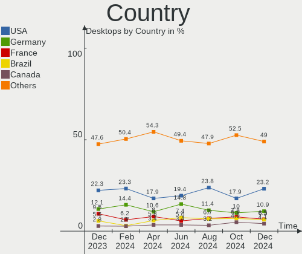
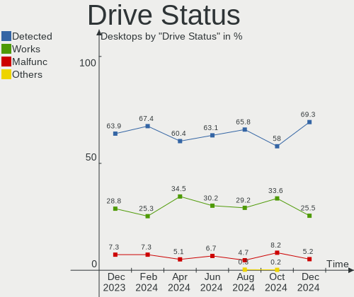
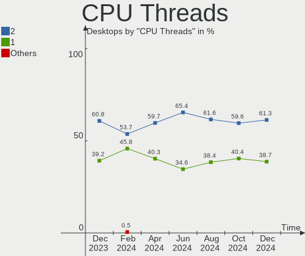

Ubuntu Hardware Trends (Desktop)
--------------------------------

A project to identify most popular hardware characteristics and track their change
over time based on data collected by Ubuntu users at https://Linux-Hardware.org.

Anyone can contribute to the study by uploading probes of their computers by
the [hw-probe](https://github.com/linuxhw/hw-probe) tool:

    sudo -E hw-probe -all -upload

Full-feature report is available here: https://linux-hardware.org/?view=trends&formfactor=desktop

Period: Jan, 2021.

Contents
--------

- [ OS                       ](#os)
- [ OS Family                ](#os-family)
- [ Kernel                   ](#kernel)
- [ Kernel Family            ](#kernel-family)
- [ Kernel Major Ver.        ](#kernel-major-ver)
- [ Arch                     ](#arch)
- [ DE                       ](#de)
- [ Display Server           ](#display-server)
- [ Display Manager          ](#display-manager)
- [ OS Lang                  ](#os-lang)
- [ Boot Mode                ](#boot-mode)
- [ Filesystem               ](#filesystem)
- [ Part. scheme             ](#part-scheme)
- [ Dual Boot with Linux/BSD ](#dual-boot-with-linux/bsd)
- [ Dual Boot (Win)          ](#dual-boot-win)
- [ Country                  ](#country)
- [ City                     ](#city)
- [ Vendor                   ](#vendor)
- [ Model                    ](#model)
- [ Model Family             ](#model-family)
- [ MFG Year                 ](#mfg-year)
- [ Form Factor              ](#form-factor)
- [ Secure Boot              ](#secure-boot)
- [ Coreboot                 ](#coreboot)
- [ RAM Size                 ](#ram-size)
- [ RAM Used                 ](#ram-used)
- [ Has CD-ROM               ](#has-cd-rom)
- [ Total Drives             ](#total-drives)
- [ Has Ethernet             ](#has-ethernet)
- [ Drive Vendor             ](#drive-vendor)
- [ Drive Model              ](#drive-model)
- [ HDD Vendor               ](#hdd-vendor)
- [ SSD Vendor               ](#ssd-vendor)
- [ Drive Kind               ](#drive-kind)
- [ Drive Connector          ](#drive-connector)
- [ Drive Size               ](#drive-size)
- [ Space Total              ](#space-total)
- [ Space Used               ](#space-used)
- [ Malfunc. Drives          ](#malfunc-drives)
- [ Malfunc. Drive Vendor    ](#malfunc-drive-vendor)
- [ Malfunc. HDD Vendor      ](#malfunc-hdd-vendor)
- [ Malfunc. Drive Kind      ](#malfunc-drive-kind)
- [ Failed Drives            ](#failed-drives)
- [ Failed Drive Vendor      ](#failed-drive-vendor)
- [ Drive Status             ](#drive-status)
- [ Storage Vendor           ](#storage-vendor)
- [ Storage Model            ](#storage-model)
- [ Storage Kind             ](#storage-kind)
- [ CPU Vendor               ](#cpu-vendor)
- [ CPU Model                ](#cpu-model)
- [ CPU Model Family         ](#cpu-model-family)
- [ CPU Cores                ](#cpu-cores)
- [ CPU Sockets              ](#cpu-sockets)
- [ CPU Threads              ](#cpu-threads)
- [ CPU Op-Modes             ](#cpu-op-modes)
- [ CPU Microcode            ](#cpu-microcode)
- [ CPU Microarch            ](#cpu-microarch)
- [ GPU Vendor               ](#gpu-vendor)
- [ GPU Model                ](#gpu-model)
- [ GPU Combo                ](#gpu-combo)
- [ GPU Driver               ](#gpu-driver)
- [ GPU Memory               ](#gpu-memory)
- [ Monitor Vendor           ](#monitor-vendor)
- [ Monitor Model            ](#monitor-model)
- [ Monitor Resolution       ](#monitor-resolution)
- [ Monitor Diagonal         ](#monitor-diagonal)
- [ Monitor Width            ](#monitor-width)
- [ Aspect Ratio             ](#aspect-ratio)
- [ Monitor Area             ](#monitor-area)
- [ Pixel Density            ](#pixel-density)
- [ Multiple Monitors        ](#multiple-monitors)
- [ Net Controller Vendor    ](#net-controller-vendor)
- [ Net Controller Model     ](#net-controller-model)
- [ Wireless Vendor          ](#wireless-vendor)
- [ Wireless Model           ](#wireless-model)
- [ Ethernet Vendor          ](#ethernet-vendor)
- [ Ethernet Model           ](#ethernet-model)
- [ Net Controller Kind      ](#net-controller-kind)
- [ Used Controller          ](#used-controller)
- [ NICs                     ](#nics)
- [ Memory Vendor            ](#memory-vendor)
- [ Memory Model             ](#memory-model)
- [ Memory Kind              ](#memory-kind)
- [ Memory Form Factor       ](#memory-form-factor)
- [ Memory Size              ](#memory-size)
- [ Memory Speed             ](#memory-speed)
- [ Sound Vendor             ](#sound-vendor)
- [ Sound Model              ](#sound-model)
- [ Camera Vendor            ](#camera-vendor)
- [ Camera Model             ](#camera-model)
- [ Fingerprint Vendor       ](#fingerprint-vendor)
- [ Fingerprint Model        ](#fingerprint-model)
- [ Chipcard Vendor          ](#chipcard-vendor)
- [ Chipcard Model           ](#chipcard-model)
- [ Printer Vendor           ](#printer-vendor)
- [ Printer Model            ](#printer-model)
- [ Scanner Vendor           ](#scanner-vendor)
- [ Scanner Model            ](#scanner-model)
- [ Bluetooth Vendor         ](#bluetooth-vendor)
- [ Bluetooth Model          ](#bluetooth-model)
- [ Unsupported Devices      ](#unsupported-devices)
- [ Unsupported Device Types ](#unsupported-device-types)

OS
--

Installed operating systems

| Name           | Desktops | Percent |
|----------------|----------|---------|
| Ubuntu 20.04   | 648      | 68.64%  |
| Ubuntu 20.10   | 155      | 16.42%  |
| Ubuntu 18.04   | 105      | 11.12%  |
| Ubuntu 16.04   | 19       | 2.01%   |
| Ubuntu 21.04   | 7        | 0.74%   |
| Ubuntu         | 4        | 0.42%   |
| Ubuntu 19.10   | 2        | 0.21%   |
| Ubuntu 19.04   | 2        | 0.21%   |
| Ubuntu 20.08.3 | 1        | 0.11%   |
| Ubuntu 18.10   | 1        | 0.11%   |

OS Family
---------

OS without a version

| Name   | Desktops | Percent |
|--------|----------|---------|
| Ubuntu | 944      | 100%    |

Kernel
------

Version of the Linux kernel

| Version                    | Desktops | Percent |
|----------------------------|----------|---------|
| 5.8.0-36-generic           | 109      | 11.55%  |
| 5.8.0-38-generic           | 108      | 11.44%  |
| 5.4.0-58-generic           | 101      | 10.7%   |
| 5.8.0-40-generic           | 87       | 9.22%   |
| 5.4.0-59-generic           | 62       | 6.57%   |
| 5.4.0-62-generic           | 52       | 5.51%   |
| 5.8.0-41-generic           | 50       | 5.3%    |
| 5.4.0-60-generic           | 46       | 4.87%   |
| 5.4.0-42-generic           | 37       | 3.92%   |
| 5.8.0-34-generic           | 35       | 3.71%   |
| 5.4.0-64-generic           | 30       | 3.18%   |
| 5.8.0-33-generic           | 28       | 2.97%   |
| 5.4.0-65-generic           | 17       | 1.8%    |
| 4.15.0-128-generic         | 12       | 1.27%   |
| 5.8.0-25-generic           | 8        | 0.85%   |
| 5.4.0-52-generic           | 8        | 0.85%   |
| 4.15.0-132-generic         | 7        | 0.74%   |
| 4.15.0-130-generic         | 6        | 0.64%   |
| 5.4.0-64-lowlatency        | 5        | 0.53%   |
| 5.8.0-38-lowlatency        | 4        | 0.42%   |
| 5.4.0-54-generic           | 4        | 0.42%   |
| 4.15.0-134-generic         | 4        | 0.42%   |
| 5.8.0-39-generic           | 3        | 0.32%   |
| 5.4.0-63-generic           | 3        | 0.32%   |
| 5.4.0-59-lowlatency        | 3        | 0.32%   |
| 5.4.0-58-lowlatency        | 3        | 0.32%   |
| 5.4.0-48-generic           | 3        | 0.32%   |
| 5.4.0-26-generic           | 3        | 0.32%   |
| 5.10.4-051004-generic      | 3        | 0.32%   |
| 5.9.8-050908-generic       | 2        | 0.21%   |
| 5.8.0-36-lowlatency        | 2        | 0.21%   |
| 5.7.1-050701-generic       | 2        | 0.21%   |
| 5.4.0-65-lowlatency        | 2        | 0.21%   |
| 5.4.0-62-lowlatency        | 2        | 0.21%   |
| 5.4.0-60-lowlatency        | 2        | 0.21%   |
| 5.4.0-56-generic           | 2        | 0.21%   |
| 5.4.0-40-generic           | 2        | 0.21%   |
| 5.3.0-28-generic           | 2        | 0.21%   |
| 5.10.0-12-generic          | 2        | 0.21%   |
| 5.10.0-051000-generic      | 2        | 0.21%   |
| 4.4.0-194-generic          | 2        | 0.21%   |
| 4.18.0-15-generic          | 2        | 0.21%   |
| 4.15.0-88-generic          | 2        | 0.21%   |
| 4.15.0-135-generic         | 2        | 0.21%   |
| 4.15.0-129-lowlatency      | 2        | 0.21%   |
| 4.15.0-129-generic         | 2        | 0.21%   |
| 4.15.0-112-generic         | 2        | 0.21%   |
| 5.9.16-xanmod1             | 1        | 0.11%   |
| 5.9.16-050916-generic      | 1        | 0.11%   |
| 5.9.0-050900-generic       | 1        | 0.11%   |
| 5.8.13-mbp                 | 1        | 0.11%   |
| 5.8.0-41-lowlatency        | 1        | 0.11%   |
| 5.8.0-40-lowlatency        | 1        | 0.11%   |
| 5.8.0-37-generic           | 1        | 0.11%   |
| 5.8.0-34-lowlatency        | 1        | 0.11%   |
| 5.8.0-33-lowlatency        | 1        | 0.11%   |
| 5.8.0-32-generic           | 1        | 0.11%   |
| 5.8.0-312012221313-generic | 1        | 0.11%   |
| 5.8.0-29-generic           | 1        | 0.11%   |
| 5.8.0-28-generic           | 1        | 0.11%   |

Kernel Family
-------------

Linux kernel without a distro release

| Version  | Desktops | Percent |
|----------|----------|---------|
| 5.8.0    | 445      | 47.14%  |
| 5.4.0    | 394      | 41.74%  |
| 4.15.0   | 49       | 5.19%   |
| 5.3.0    | 9        | 0.95%   |
| 4.4.0    | 9        | 0.95%   |
| 5.10.0   | 7        | 0.74%   |
| 5.10.4   | 5        | 0.53%   |
| 5.0.0    | 4        | 0.42%   |
| 4.18.0   | 3        | 0.32%   |
| 5.9.8    | 2        | 0.21%   |
| 5.9.16   | 2        | 0.21%   |
| 5.7.1    | 2        | 0.21%   |
| 4.10.0   | 2        | 0.21%   |
| 5.9.0    | 1        | 0.11%   |
| 5.8.13   | 1        | 0.11%   |
| 5.6.0    | 1        | 0.11%   |
| 5.4.92   | 1        | 0.11%   |
| 5.4.53   | 1        | 0.11%   |
| 5.10.6   | 1        | 0.11%   |
| 5.10.5   | 1        | 0.11%   |
| 5.10.3   | 1        | 0.11%   |
| 5.10.10  | 1        | 0.11%   |
| 5.10.1   | 1        | 0.11%   |
| 4.19.128 | 1        | 0.11%   |

Kernel Major Ver.
-----------------

Linux kernel major version

| Version | Desktops | Percent |
|---------|----------|---------|
| 5.8     | 446      | 47.25%  |
| 5.4     | 396      | 41.95%  |
| 4.15    | 49       | 5.19%   |
| 5.10    | 17       | 1.8%    |
| 5.3     | 9        | 0.95%   |
| 4.4     | 9        | 0.95%   |
| 5.9     | 5        | 0.53%   |
| 5.0     | 4        | 0.42%   |
| 4.18    | 3        | 0.32%   |
| 5.7     | 2        | 0.21%   |
| 4.10    | 2        | 0.21%   |
| 5.6     | 1        | 0.11%   |
| 4.19    | 1        | 0.11%   |

Arch
----

OS architecture (x86_64, i586, etc.)

| Name   | Desktops | Percent |
|--------|----------|---------|
| x86_64 | 917      | 97.14%  |
| i686   | 27       | 2.86%   |

DE
--

Desktop Environment

| Name            | Desktops | Percent |
|-----------------|----------|---------|
| GNOME           | 677      | 71.72%  |
| XFCE            | 79       | 8.37%   |
| Unknown         | 68       | 7.2%    |
| KDE             | 29       | 3.07%   |
| MATE            | 21       | 2.22%   |
| KDE5            | 20       | 2.12%   |
| Unity           | 17       | 1.8%    |
| X-Cinnamon      | 12       | 1.27%   |
| LXDE            | 7        | 0.74%   |
| LXQt            | 5        | 0.53%   |
| GNOME Flashback | 3        | 0.32%   |
| Budgie          | 2        | 0.21%   |
| i3              | 1        | 0.11%   |
| GNOME Classic   | 1        | 0.11%   |
| enlightenment   | 1        | 0.11%   |
| Deepin          | 1        | 0.11%   |

Display Server
--------------

X11 or Wayland

| Name    | Desktops | Percent |
|---------|----------|---------|
| X11     | 875      | 92.69%  |
| Unknown | 33       | 3.5%    |
| Wayland | 22       | 2.33%   |
| Tty     | 13       | 1.38%   |
| Web     | 1        | 0.11%   |

Display Manager
---------------

SDDM, LightDM, etc.

| Name    | Desktops | Percent |
|---------|----------|---------|
| Unknown | 766      | 81.14%  |
| GDM     | 105      | 11.12%  |
| TDM     | 51       | 5.4%    |
| SDDM    | 19       | 2.01%   |
| LightDM | 2        | 0.21%   |
| GDM3    | 1        | 0.11%   |

OS Lang
-------

Language

| Lang    | Desktops | Percent |
|---------|----------|---------|
| en_US   | 329      | 34.85%  |
| de_DE   | 113      | 11.97%  |
| fr_FR   | 72       | 7.63%   |
| en_GB   | 51       | 5.4%    |
| it_IT   | 41       | 4.34%   |
| en_CA   | 37       | 3.92%   |
| pt_BR   | 34       | 3.6%    |
| ru_RU   | 30       | 3.18%   |
| es_ES   | 28       | 2.97%   |
| en_AU   | 19       | 2.01%   |
| pl_PL   | 15       | 1.59%   |
| en_IN   | 15       | 1.59%   |
| C       | 15       | 1.59%   |
| nl_NL   | 14       | 1.48%   |
| ja_JP   | 10       | 1.06%   |
| es_AR   | 8        | 0.85%   |
| pt_PT   | 7        | 0.74%   |
| hu_HU   | 6        | 0.64%   |
| en_ZA   | 6        | 0.64%   |
| cs_CZ   | 6        | 0.64%   |
| Unknown | 6        | 0.64%   |
| el_GR   | 5        | 0.53%   |
| de_AT   | 5        | 0.53%   |
| zh_CN   | 4        | 0.42%   |
| sk_SK   | 4        | 0.42%   |
| es_MX   | 4        | 0.42%   |
| de_CH   | 4        | 0.42%   |
| tr_TR   | 3        | 0.32%   |
| sv_SE   | 3        | 0.32%   |
| sl_SI   | 3        | 0.32%   |
| ro_RO   | 3        | 0.32%   |
| he_IL   | 3        | 0.32%   |
| fr_BE   | 3        | 0.32%   |
| en_PH   | 3        | 0.32%   |
| bg_BG   | 3        | 0.32%   |
| ru_UA   | 2        | 0.21%   |
| nl_BE   | 2        | 0.21%   |
| ko_KR   | 2        | 0.21%   |
| fr_CA   | 2        | 0.21%   |
| fi_FI   | 2        | 0.21%   |
| es_CL   | 2        | 0.21%   |
| en_NZ   | 2        | 0.21%   |
| ca_ES   | 2        | 0.21%   |
| uk_UA   | 1        | 0.11%   |
| th_TH   | 1        | 0.11%   |
| sv_FI   | 1        | 0.11%   |
| nb_NO   | 1        | 0.11%   |
| hr_HR   | 1        | 0.11%   |
| fr_CH   | 1        | 0.11%   |
| fa_IR   | 1        | 0.11%   |
| es_VE   | 1        | 0.11%   |
| es_UY   | 1        | 0.11%   |
| es_US   | 1        | 0.11%   |
| es_EC   | 1        | 0.11%   |
| es_CO   | 1        | 0.11%   |
| en_IL   | 1        | 0.11%   |
| en_HK   | 1        | 0.11%   |
| da_DK   | 1        | 0.11%   |
| af_ZA   | 1        | 0.11%   |

Boot Mode
---------

EFI or BIOS

| Mode | Desktops | Percent |
|------|----------|---------|
| BIOS | 630      | 66.74%  |
| EFI  | 314      | 33.26%  |

Filesystem
----------

Type of filesystem

| Type    | Desktops | Percent |
|---------|----------|---------|
| Ext4    | 883      | 93.54%  |
| Overlay | 21       | 2.22%   |
| Zfs     | 15       | 1.59%   |
| Btrfs   | 14       | 1.48%   |
| Xfs     | 5        | 0.53%   |
| Ext2    | 4        | 0.42%   |
| Aufs    | 1        | 0.11%   |
| Unknown | 1        | 0.11%   |

Part. scheme
------------

Scheme of partitioning

| Type    | Desktops | Percent |
|---------|----------|---------|
| Unknown | 757      | 80.19%  |
| GPT     | 124      | 13.14%  |
| MBR     | 63       | 6.67%   |

Dual Boot with Linux/BSD
------------------------

Hosting more than one Linux/BSD

| Dual boot | Desktops | Percent |
|-----------|----------|---------|
| No        | 748      | 79.24%  |
| Yes       | 196      | 20.76%  |

Dual Boot (Win)
---------------

Hosting Linux and Windows

| Dual boot | Desktops | Percent |
|-----------|----------|---------|
| No        | 535      | 56.67%  |
| Yes       | 409      | 43.33%  |

Country
-------

Geographic location (country)

| Country            | Desktops | Percent |
|--------------------|----------|---------|
| USA                | 174      | 18.43%  |
| Germany            | 132      | 13.98%  |
| France             | 72       | 7.63%   |
| UK                 | 50       | 5.3%    |
| Italy              | 49       | 5.19%   |
| Canada             | 45       | 4.77%   |
| Brazil             | 41       | 4.34%   |
| Russia             | 36       | 3.81%   |
| Spain              | 29       | 3.07%   |
| Netherlands        | 20       | 2.12%   |
| Australia          | 18       | 1.91%   |
| India              | 17       | 1.8%    |
| Poland             | 13       | 1.38%   |
| Japan              | 12       | 1.27%   |
| Belgium            | 12       | 1.27%   |
| Argentina          | 12       | 1.27%   |
| Greece             | 11       | 1.17%   |
| Ukraine            | 10       | 1.06%   |
| Sweden             | 10       | 1.06%   |
| Austria            | 10       | 1.06%   |
| Mexico             | 9        | 0.95%   |
| Hungary            | 9        | 0.95%   |
| Switzerland        | 8        | 0.85%   |
| South Africa       | 8        | 0.85%   |
| Portugal           | 8        | 0.85%   |
| Czech Republic     | 8        | 0.85%   |
| Slovakia           | 7        | 0.74%   |
| Romania            | 6        | 0.64%   |
| Israel             | 6        | 0.64%   |
| Finland            | 6        | 0.64%   |
| China              | 6        | 0.64%   |
| Turkey             | 5        | 0.53%   |
| Croatia            | 5        | 0.53%   |
| Taiwan             | 4        | 0.42%   |
| Slovenia           | 4        | 0.42%   |
| Philippines        | 4        | 0.42%   |
| Korea, Republic of | 4        | 0.42%   |
| Bulgaria           | 4        | 0.42%   |
| Vietnam            | 3        | 0.32%   |
| Uruguay            | 3        | 0.32%   |
| Serbia             | 3        | 0.32%   |
| Norway             | 3        | 0.32%   |
| New Zealand        | 3        | 0.32%   |
| Malaysia           | 3        | 0.32%   |
| Denmark            | 3        | 0.32%   |
| Chile              | 3        | 0.32%   |
| Thailand           | 2        | 0.21%   |
| Singapore          | 2        | 0.21%   |
| Latvia             | 2        | 0.21%   |
| Indonesia          | 2        | 0.21%   |
| Iceland            | 2        | 0.21%   |
| Colombia           | 2        | 0.21%   |
| Bangladesh         | 2        | 0.21%   |
| Albania            | 2        | 0.21%   |
| Venezuela          | 1        | 0.11%   |
| UAE                | 1        | 0.11%   |
| Suriname           | 1        | 0.11%   |
| Sri Lanka          | 1        | 0.11%   |
| Reunion            | 1        | 0.11%   |
| Pakistan           | 1        | 0.11%   |

City
----

Geographic location (city)

| City                      | Desktops | Percent |
|---------------------------|----------|---------|
| Berlin                    | 12       | 1.27%   |
| Paris                     | 9        | 0.95%   |
| Moscow                    | 9        | 0.95%   |
| Hamburg                   | 8        | 0.85%   |
| Rome                      | 6        | 0.64%   |
| Montreal                  | 6        | 0.64%   |
| Madrid                    | 6        | 0.64%   |
| Kyiv                      | 6        | 0.64%   |
| Athens                    | 6        | 0.64%   |
| Vienna                    | 5        | 0.53%   |
| Seattle                   | 5        | 0.53%   |
| Toronto                   | 4        | 0.42%   |
| São Paulo                | 4        | 0.42%   |
| Sydney                    | 4        | 0.42%   |
| Stuttgart                 | 4        | 0.42%   |
| Munich                    | 4        | 0.42%   |
| Milan                     | 4        | 0.42%   |
| Johannesburg              | 4        | 0.42%   |
| Helsinki                  | 4        | 0.42%   |
| Chicago                   | 4        | 0.42%   |
| Buenos Aires              | 4        | 0.42%   |
| Zagreb                    | 3        | 0.32%   |
| Wrocław                  | 3        | 0.32%   |
| Vancouver                 | 3        | 0.32%   |
| Thessaloniki              | 3        | 0.32%   |
| Tel Aviv                  | 3        | 0.32%   |
| Taipei                    | 3        | 0.32%   |
| St Petersburg             | 3        | 0.32%   |
| Rio de Janeiro            | 3        | 0.32%   |
| Porto                     | 3        | 0.32%   |
| Mumbai                    | 3        | 0.32%   |
| Montevideo                | 3        | 0.32%   |
| Lyon                      | 3        | 0.32%   |
| Karlsruhe                 | 3        | 0.32%   |
| Istanbul                  | 3        | 0.32%   |
| Hyderabad                 | 3        | 0.32%   |
| Edmonton                  | 3        | 0.32%   |
| Düsseldorf               | 3        | 0.32%   |
| Denver                    | 3        | 0.32%   |
| Cheboksary                | 3        | 0.32%   |
| Calgary                   | 3        | 0.32%   |
| Budapest                  | 3        | 0.32%   |
| Bucharest                 | 3        | 0.32%   |
| Brooklyn                  | 3        | 0.32%   |
| Bratislava                | 3        | 0.32%   |
| Birmingham                | 3        | 0.32%   |
| Belo Horizonte            | 3        | 0.32%   |
| Zaragoza                  | 2        | 0.21%   |
| Ytterby                   | 2        | 0.21%   |
| Warsaw                    | 2        | 0.21%   |
| Voronezh                  | 2        | 0.21%   |
| Tulsa                     | 2        | 0.21%   |
| Tirana                    | 2        | 0.21%   |
| Strasbourg                | 2        | 0.21%   |
| Singapore                 | 2        | 0.21%   |
| Senigallia                | 2        | 0.21%   |
| Seminole                  | 2        | 0.21%   |
| Santo Antonio da Patrulha | 2        | 0.21%   |
| Saarbrücken              | 2        | 0.21%   |
| Richardson                | 2        | 0.21%   |

Vendor
------

Motherboard manufacturer

| Name                   | Desktops | Percent |
|------------------------|----------|---------|
| ASUSTek Computer       | 245      | 25.95%  |
| Gigabyte Technology    | 167      | 17.69%  |
| MSI                    | 110      | 11.65%  |
| Dell                   | 92       | 9.75%   |
| ASRock                 | 83       | 8.79%   |
| Hewlett-Packard        | 61       | 6.46%   |
| Lenovo                 | 32       | 3.39%   |
| Intel                  | 23       | 2.44%   |
| Acer                   | 13       | 1.38%   |
| Fujitsu                | 12       | 1.27%   |
| Biostar                | 12       | 1.27%   |
| Pegatron               | 10       | 1.06%   |
| Medion                 | 10       | 1.06%   |
| Unknown                | 10       | 1.06%   |
| Foxconn                | 9        | 0.95%   |
| ECS                    | 5        | 0.53%   |
| Packard Bell           | 4        | 0.42%   |
| Apple                  | 4        | 0.42%   |
| Positivo               | 3        | 0.32%   |
| IBM                    | 3        | 0.32%   |
| Huanan                 | 3        | 0.32%   |
| Fujitsu Siemens        | 3        | 0.32%   |
| Supermicro             | 2        | 0.21%   |
| Shuttle                | 2        | 0.21%   |
| Inventec               | 2        | 0.21%   |
| Google                 | 2        | 0.21%   |
| eMachines              | 2        | 0.21%   |
| ASL                    | 2        | 0.21%   |
| AMI                    | 2        | 0.21%   |
| Vorke                  | 1        | 0.11%   |
| Varian Medical Systems | 1        | 0.11%   |
| TYAN Computer          | 1        | 0.11%   |
| SeeedStudio            | 1        | 0.11%   |
| PCWare                 | 1        | 0.11%   |
| PCChips                | 1        | 0.11%   |
| NEC Computers          | 1        | 0.11%   |
| NCR                    | 1        | 0.11%   |
| MEGA                   | 1        | 0.11%   |
| Gateway                | 1        | 0.11%   |
| AZW                    | 1        | 0.11%   |
| Avalue                 | 1        | 0.11%   |
| ASRockRack             | 1        | 0.11%   |
| AOpen                  | 1        | 0.11%   |
| Alienware              | 1        | 0.11%   |
| Acidanthera            | 1        | 0.11%   |

Model
-----

Motherboard model

| Name                               | Desktops | Percent |
|------------------------------------|----------|---------|
| ASUS All Series                    | 28       | 2.97%   |
| Unknown                            | 10       | 1.06%   |
| Gigabyte B450M DS3H                | 7        | 0.74%   |
| Dell OptiPlex 7010                 | 7        | 0.74%   |
| MSI MS-7C02                        | 6        | 0.64%   |
| ASUS M5A78L-M/USB3                 | 6        | 0.64%   |
| Dell OptiPlex 790                  | 5        | 0.53%   |
| ASUS PRIME A320M-K                 | 5        | 0.53%   |
| MSI MS-7A38                        | 4        | 0.42%   |
| HP Compaq Elite 8300 SFF           | 4        | 0.42%   |
| Gigabyte GA-78LMT-USB3 6.0         | 4        | 0.42%   |
| Gigabyte 970A-DS3P                 | 4        | 0.42%   |
| Dell OptiPlex 990                  | 4        | 0.42%   |
| Dell OptiPlex 9020                 | 4        | 0.42%   |
| Dell OptiPlex 780                  | 4        | 0.42%   |
| ASUS TUF GAMING X570-PLUS          | 4        | 0.42%   |
| ASUS TUF GAMING B550M-PLUS         | 4        | 0.42%   |
| ASUS ROG STRIX B550-F GAMING       | 4        | 0.42%   |
| MSI MS-7C37                        | 3        | 0.32%   |
| MSI MS-7816                        | 3        | 0.32%   |
| MSI MS-7758                        | 3        | 0.32%   |
| MSI MS-7693                        | 3        | 0.32%   |
| HP ProLiant ML350 G6               | 3        | 0.32%   |
| Gigabyte GA-78LMT-USB3             | 3        | 0.32%   |
| Gigabyte B450M S2H                 | 3        | 0.32%   |
| Gigabyte A320M-S2H                 | 3        | 0.32%   |
| Gigabyte 970A-D3P                  | 3        | 0.32%   |
| ECS H81H3-M4                       | 3        | 0.32%   |
| Dell OptiPlex 9010                 | 3        | 0.32%   |
| Dell OptiPlex 380                  | 3        | 0.32%   |
| Dell OptiPlex 3020                 | 3        | 0.32%   |
| Dell Inspiron 5675                 | 3        | 0.32%   |
| ASUS SABERTOOTH 990FX R2.0         | 3        | 0.32%   |
| ASUS ROG STRIX B450-F GAMING       | 3        | 0.32%   |
| ASUS PRIME X470-PRO                | 3        | 0.32%   |
| ASUS M5A99X EVO R2.0               | 3        | 0.32%   |
| ASUS M5A97 R2.0                    | 3        | 0.32%   |
| ASUS H110M-K                       | 3        | 0.32%   |
| ASRock B450M Pro4                  | 3        | 0.32%   |
| ASRock A300M-STX                   | 3        | 0.32%   |
| Pegatron Elite 7300 Series MT      | 2        | 0.21%   |
| MSI MS-7C95                        | 2        | 0.21%   |
| MSI MS-7C94                        | 2        | 0.21%   |
| MSI MS-7B98                        | 2        | 0.21%   |
| MSI MS-7B93                        | 2        | 0.21%   |
| MSI MS-7B89                        | 2        | 0.21%   |
| MSI MS-7B09                        | 2        | 0.21%   |
| MSI MS-7A72                        | 2        | 0.21%   |
| MSI MS-7A40                        | 2        | 0.21%   |
| MSI MS-7A34                        | 2        | 0.21%   |
| MSI MS-7978                        | 2        | 0.21%   |
| MSI MS-7917                        | 2        | 0.21%   |
| MSI MS-7817                        | 2        | 0.21%   |
| MSI MS-7793                        | 2        | 0.21%   |
| MSI MS-7721                        | 2        | 0.21%   |
| MSI MS-7636                        | 2        | 0.21%   |
| MSI MS-7592                        | 2        | 0.21%   |
| MSI MS-7369                        | 2        | 0.21%   |
| Medion P961x                       | 2        | 0.21%   |
| Lenovo ThinkCentre M800 10FW0004US | 2        | 0.21%   |

Model Family
------------

Motherboard model prefix

| Name                   | Desktops | Percent |
|------------------------|----------|---------|
| Dell OptiPlex          | 47       | 4.98%   |
| ASUS PRIME             | 31       | 3.28%   |
| ASUS All               | 28       | 2.97%   |
| Lenovo ThinkCentre     | 22       | 2.33%   |
| ASUS TUF               | 22       | 2.33%   |
| Dell Inspiron          | 20       | 2.12%   |
| HP Compaq              | 19       | 2.01%   |
| ASUS ROG               | 18       | 1.91%   |
| Dell Precision         | 12       | 1.27%   |
| ASUS M5A78L-M          | 12       | 1.27%   |
| Gigabyte B450M         | 11       | 1.17%   |
| Acer Aspire            | 10       | 1.06%   |
| Unknown                | 10       | 1.06%   |
| HP ProDesk             | 8        | 0.85%   |
| Gigabyte GA-78LMT-USB3 | 8        | 0.85%   |
| Fujitsu ESPRIMO        | 7        | 0.74%   |
| MSI MS-7C02            | 6        | 0.64%   |
| HP ProLiant            | 6        | 0.64%   |
| Gigabyte X570          | 6        | 0.64%   |
| ASUS P8Z77-V           | 6        | 0.64%   |
| HP EliteDesk           | 5        | 0.53%   |
| Gigabyte A320M-S2H     | 5        | 0.53%   |
| ASUS M5A99X            | 5        | 0.53%   |
| MSI MS-7A38            | 4        | 0.42%   |
| Gigabyte B450          | 4        | 0.42%   |
| Gigabyte 970A-DS3P     | 4        | 0.42%   |
| ASUS M5A97             | 4        | 0.42%   |
| ASUS Crosshair         | 4        | 0.42%   |
| ASRock B450M           | 4        | 0.42%   |
| Packard Bell imedia    | 3        | 0.32%   |
| MSI MS-7C37            | 3        | 0.32%   |
| MSI MS-7816            | 3        | 0.32%   |
| MSI MS-7758            | 3        | 0.32%   |
| MSI MS-7693            | 3        | 0.32%   |
| Lenovo ThinkStation    | 3        | 0.32%   |
| HP Pavilion            | 3        | 0.32%   |
| Gigabyte Z390          | 3        | 0.32%   |
| Gigabyte B550M         | 3        | 0.32%   |
| Gigabyte 970A-D3P      | 3        | 0.32%   |
| ECS H81H3-M4           | 3        | 0.32%   |
| Dell XPS               | 3        | 0.32%   |
| Dell Vostro            | 3        | 0.32%   |
| Dell Studio            | 3        | 0.32%   |
| ASUS SABERTOOTH        | 3        | 0.32%   |
| ASUS P8Z68-V           | 3        | 0.32%   |
| ASUS P8B75-M           | 3        | 0.32%   |
| ASUS P5Q               | 3        | 0.32%   |
| ASUS H110M-K           | 3        | 0.32%   |
| ASRock X570            | 3        | 0.32%   |
| ASRock A300M-STX       | 3        | 0.32%   |
| ASRock 970             | 3        | 0.32%   |
| Pegatron Elite         | 2        | 0.21%   |
| MSI MS-7C95            | 2        | 0.21%   |
| MSI MS-7C94            | 2        | 0.21%   |
| MSI MS-7B98            | 2        | 0.21%   |
| MSI MS-7B93            | 2        | 0.21%   |
| MSI MS-7B89            | 2        | 0.21%   |
| MSI MS-7B09            | 2        | 0.21%   |
| MSI MS-7A72            | 2        | 0.21%   |
| MSI MS-7A40            | 2        | 0.21%   |

MFG Year
--------

Motherboard manufacture year

| Year    | Desktops | Percent |
|---------|----------|---------|
| 2020    | 128      | 13.56%  |
| 2018    | 103      | 10.91%  |
| 2019    | 98       | 10.38%  |
| 2014    | 79       | 8.37%   |
| 2013    | 77       | 8.16%   |
| 2012    | 70       | 7.42%   |
| 2010    | 68       | 7.2%    |
| 2011    | 58       | 6.14%   |
| 2015    | 56       | 5.93%   |
| 2009    | 45       | 4.77%   |
| 2016    | 43       | 4.56%   |
| 2017    | 33       | 3.5%    |
| 2008    | 31       | 3.28%   |
| 2007    | 31       | 3.28%   |
| 2006    | 7        | 0.74%   |
| 2005    | 7        | 0.74%   |
| 2021    | 5        | 0.53%   |
| Unknown | 3        | 0.32%   |
| 2004    | 2        | 0.21%   |

Form Factor
-----------

Physical design of the computer

| Name    | Desktops | Percent |
|---------|----------|---------|
| Desktop | 944      | 100%    |

Secure Boot
-----------

Enabled or disabled

| State    | Desktops | Percent |
|----------|----------|---------|
| Disabled | 921      | 97.56%  |
| Enabled  | 23       | 2.44%   |

Coreboot
--------

Have coreboot on board

| Used | Desktops | Percent |
|------|----------|---------|
| No   | 942      | 99.79%  |
| Yes  | 2        | 0.21%   |

RAM Size
--------

Total RAM memory

| Size in GB      | Desktops | Percent |
|-----------------|----------|---------|
| 16.01-24.0      | 212      | 22.46%  |
| 8.01-16.0       | 199      | 21.08%  |
| 3.01-4.0        | 165      | 17.48%  |
| 4.01-8.0        | 156      | 16.53%  |
| 32.01-64.0      | 111      | 11.76%  |
| 64.01-256.0     | 33       | 3.5%    |
| 1.01-2.0        | 24       | 2.54%   |
| 24.01-32.0      | 22       | 2.33%   |
| 2.01-3.0        | 19       | 2.01%   |
| 0.51-1.0        | 2        | 0.21%   |
| More than 256.0 | 1        | 0.11%   |

RAM Used
--------

Used RAM memory

| Used GB    | Desktops | Percent |
|------------|----------|---------|
| 1.01-2.0   | 398      | 42.16%  |
| 2.01-3.0   | 228      | 24.15%  |
| 4.01-8.0   | 134      | 14.19%  |
| 3.01-4.0   | 89       | 9.43%   |
| 0.51-1.0   | 47       | 4.98%   |
| 8.01-16.0  | 34       | 3.6%    |
| 16.01-24.0 | 7        | 0.74%   |
| 0.01-0.5   | 6        | 0.64%   |
| 32.01-64.0 | 1        | 0.11%   |

Has CD-ROM
----------

Has CD-ROM on board

| Presented | Desktops | Percent |
|-----------|----------|---------|
| Yes       | 485      | 51.38%  |
| No        | 459      | 48.62%  |

Total Drives
------------

Number of drives on board

| Drives | Desktops | Percent |
|--------|----------|---------|
| 1      | 335      | 35.49%  |
| 2      | 312      | 33.05%  |
| 3      | 158      | 16.74%  |
| 4      | 69       | 7.31%   |
| 5      | 33       | 3.5%    |
| 6      | 18       | 1.91%   |
| 7      | 8        | 0.85%   |
| 0      | 8        | 0.85%   |
| 12     | 1        | 0.11%   |
| 9      | 1        | 0.11%   |
| 8      | 1        | 0.11%   |

Has Ethernet
------------

Has Ethernet on board

| Presented | Desktops | Percent |
|-----------|----------|---------|
| Yes       | 929      | 98.41%  |
| No        | 15       | 1.59%   |

Drive Vendor
------------

Hard drive vendors

| Vendor                    | Desktops | Drives | Percent |
|---------------------------|----------|--------|---------|
| Seagate                   | 345      | 455    | 21.14%  |
| WDC                       | 337      | 438    | 20.65%  |
| Samsung Electronics       | 217      | 291    | 13.3%   |
| Kingston                  | 98       | 104    | 6%      |
| Toshiba                   | 78       | 88     | 4.78%   |
| Crucial                   | 73       | 81     | 4.47%   |
| Hitachi                   | 72       | 76     | 4.41%   |
| SanDisk                   | 57       | 62     | 3.49%   |
| Unknown                   | 29       | 31     | 1.78%   |
| A-DATA Technology         | 27       | 27     | 1.65%   |
| Intel                     | 26       | 29     | 1.59%   |
| Maxtor                    | 19       | 24     | 1.16%   |
| Phison                    | 15       | 20     | 0.92%   |
| China                     | 13       | 14     | 0.8%    |
| SPCC                      | 12       | 12     | 0.74%   |
| HGST                      | 11       | 13     | 0.67%   |
| Transcend                 | 10       | 11     | 0.61%   |
| Silicon Motion            | 10       | 10     | 0.61%   |
| PNY                       | 10       | 11     | 0.61%   |
| OCZ                       | 10       | 10     | 0.61%   |
| Micron/Crucial Technology | 8        | 9      | 0.49%   |
| Hewlett-Packard           | 8        | 12     | 0.49%   |
| XPG                       | 7        | 7      | 0.43%   |
| Intenso                   | 7        | 8      | 0.43%   |
| Fujitsu                   | 7        | 7      | 0.43%   |
| ASMT                      | 7        | 9      | 0.43%   |
| Micron Technology         | 6        | 6      | 0.37%   |
| Corsair                   | 6        | 6      | 0.37%   |
| Patriot                   | 5        | 5      | 0.31%   |
| Apacer                    | 5        | 5      | 0.31%   |
| Team                      | 4        | 4      | 0.25%   |
| Realtek Semiconductor     | 4        | 4      | 0.25%   |
| PLEXTOR                   | 4        | 4      | 0.25%   |
| Mushkin                   | 4        | 5      | 0.25%   |
| LITEONIT                  | 4        | 4      | 0.25%   |
| GOODRAM                   | 4        | 5      | 0.25%   |
| SK Hynix                  | 3        | 3      | 0.18%   |
| KIOXIA-EXCERIA            | 3        | 3      | 0.18%   |
| Kingmax                   | 3        | 3      | 0.18%   |
| External                  | 3        | 3      | 0.18%   |
| WD MediaMax               | 2        | 2      | 0.12%   |
| TCSUNBOW                  | 2        | 2      | 0.12%   |
| SABRENT                   | 2        | 2      | 0.12%   |
| LITEON                    | 2        | 2      | 0.12%   |
| Lexar                     | 2        | 2      | 0.12%   |
| KingSpec                  | 2        | 2      | 0.12%   |
| KingFast                  | 2        | 2      | 0.12%   |
| JMicron                   | 2        | 3      | 0.12%   |
| INNOVATION IT             | 2        | 2      | 0.12%   |
| HGST HTS                  | 2        | 2      | 0.12%   |
| Gigabyte Technology       | 2        | 2      | 0.12%   |
| WDC WDS                   | 1        | 1      | 0.06%   |
| VBOX                      | 1        | 1      | 0.06%   |
| V7                        | 1        | 1      | 0.06%   |
| USB                       | 1        | 1      | 0.06%   |
| SUNEAST                   | 1        | 1      | 0.06%   |
| SBe                       | 1        | 1      | 0.06%   |
| Philips                   | 1        | 1      | 0.06%   |
| OWC                       | 1        | 1      | 0.06%   |
| OCZ-VERTEX2               | 1        | 1      | 0.06%   |

Drive Model
-----------

Hard drive models

| Model                            | Desktops | Percent |
|----------------------------------|----------|---------|
| Seagate ST500DM002-1BD142 500GB  | 32       | 1.7%    |
| Seagate ST1000DM010-2EP102 1TB   | 28       | 1.49%   |
| Kingston SA400S37120G 120GB SSD  | 22       | 1.17%   |
| WDC WD10EZEX-08WN4A0 1TB         | 21       | 1.12%   |
| Samsung SSD 850 EVO 250GB        | 19       | 1.01%   |
| Seagate ST4000DM004-2CV104 4TB   | 15       | 0.8%    |
| Seagate ST3500418AS 500GB        | 15       | 0.8%    |
| Seagate ST1000DM003-1CH162 1TB   | 15       | 0.8%    |
| Samsung NVMe SSD Drive 500GB     | 14       | 0.74%   |
| Kingston SA400S37240G 240GB SSD  | 14       | 0.74%   |
| Toshiba HDWD110 1TB              | 13       | 0.69%   |
| Toshiba DT01ACA100 1TB           | 13       | 0.69%   |
| Seagate ST2000DM008-2FR102 2TB   | 13       | 0.69%   |
| Samsung SSD 860 EVO 1TB          | 13       | 0.69%   |
| Samsung SSD 860 EVO 500GB        | 12       | 0.64%   |
| Crucial CT500MX500SSD1 500GB     | 12       | 0.64%   |
| WDC WDS500G2B0A-00SM50 500GB SSD | 11       | 0.58%   |
| Seagate ST2000DM006-2DM164 2TB   | 11       | 0.58%   |
| Seagate ST2000DM001-1ER164 2TB   | 11       | 0.58%   |
| Seagate ST1000DM003-1ER162 1TB   | 11       | 0.58%   |
| Kingston SA400S37480G 480GB SSD  | 11       | 0.58%   |
| Seagate ST2000DM001-1CH164 2TB   | 10       | 0.53%   |
| Samsung SSD 840 EVO 120GB        | 10       | 0.53%   |
| WDC WD5000AADS-00S9B0 500GB      | 9        | 0.48%   |
| Seagate Expansion Desk 8TB       | 9        | 0.48%   |
| Samsung SSD 860 EVO 250GB        | 9        | 0.48%   |
| Samsung NVMe SSD Drive 1TB       | 9        | 0.48%   |
| WDC WD10EZEX-00BN5A0 1TB         | 8        | 0.42%   |
| Unknown SD/MMC/MS PRO 32GB       | 8        | 0.42%   |
| Seagate ST3500413AS 500GB        | 8        | 0.42%   |
| Seagate Expansion 1TB            | 8        | 0.42%   |
| Kingston SV300S37A120G 120GB SSD | 8        | 0.42%   |
| Crucial CT480BX500SSD1 480GB     | 8        | 0.42%   |
| WDC WD20EARX-00PASB0 2TB         | 7        | 0.37%   |
| Toshiba DT01ACA200 2TB           | 7        | 0.37%   |
| Toshiba DT01ACA050 500GB         | 7        | 0.37%   |
| Seagate ST31000524AS 1TB         | 7        | 0.37%   |
| SanDisk SSD PLUS 240GB           | 7        | 0.37%   |
| Samsung SSD 840 EVO 250GB        | 7        | 0.37%   |
| Samsung NVMe SSD Drive 250GB     | 7        | 0.37%   |
| Samsung HD103SI 1TB              | 7        | 0.37%   |
| Crucial CT1000MX500SSD1 1TB      | 7        | 0.37%   |
| WDC WD40EFRX-68N32N0 4TB         | 6        | 0.32%   |
| WDC WD20EZRZ-00Z5HB0 2TB         | 6        | 0.32%   |
| Toshiba DT01ACA300 3TB           | 6        | 0.32%   |
| Seagate ST500DM009-2F110A 500GB  | 6        | 0.32%   |
| Seagate ST2000DL003-9VT166 2TB   | 6        | 0.32%   |
| Samsung SSD 970 EVO Plus 500GB   | 6        | 0.32%   |
| Samsung SSD 850 EVO 500GB        | 6        | 0.32%   |
| Samsung HD103SJ 1TB              | 6        | 0.32%   |
| Crucial CT240BX500SSD1 240GB     | 6        | 0.32%   |
| WDC WD5000AVDS-63U7B1 500GB      | 5        | 0.27%   |
| WDC WD40EZRZ-00GXCB0 4TB         | 5        | 0.27%   |
| WDC WD30EFRX-68EUZN0 3TB         | 5        | 0.27%   |
| WDC WD20EARS-00MVWB0 2TB         | 5        | 0.27%   |
| WDC WD2002FAEX-007BA0 2TB        | 5        | 0.27%   |
| WDC WD10EZEX-00RKKA0 1TB         | 5        | 0.27%   |
| WDC WD10EARS-00Y5B1 1TB          | 5        | 0.27%   |
| Toshiba HDWD130 3TB              | 5        | 0.27%   |
| Seagate ST31000528AS 1TB         | 5        | 0.27%   |

HDD Vendor
----------

Hard disk drive vendors

| Vendor              | Desktops | Drives | Percent |
|---------------------|----------|--------|---------|
| Seagate             | 339      | 447    | 37.38%  |
| WDC                 | 309      | 397    | 34.07%  |
| Toshiba             | 73       | 82     | 8.05%   |
| Hitachi             | 72       | 76     | 7.94%   |
| Samsung Electronics | 58       | 74     | 6.39%   |
| MAXTOR              | 17       | 22     | 1.87%   |
| HGST                | 11       | 13     | 1.21%   |
| Fujitsu             | 7        | 7      | 0.77%   |
| ASMT                | 6        | 7      | 0.66%   |
| Hewlett-Packard     | 5        | 8      | 0.55%   |
| WD MediaMax         | 2        | 2      | 0.22%   |
| VBOX                | 1        | 1      | 0.11%   |
| Unknown             | 1        | 1      | 0.11%   |
| Msft                | 1        | 1      | 0.11%   |
| Maxone              | 1        | 1      | 0.11%   |
| HGST HTS            | 1        | 1      | 0.11%   |
| ASMT109x            | 1        | 1      | 0.11%   |
| Asmedia             | 1        | 1      | 0.11%   |
| Apple               | 1        | 1      | 0.11%   |

SSD Vendor
----------

Solid state drive vendors

| Vendor              | Desktops | Drives | Percent |
|---------------------|----------|--------|---------|
| Samsung Electronics | 121      | 148    | 21.92%  |
| Kingston            | 84       | 89     | 15.22%  |
| Crucial             | 68       | 76     | 12.32%  |
| SanDisk             | 48       | 50     | 8.7%    |
| WDC                 | 38       | 39     | 6.88%   |
| A-DATA Technology   | 27       | 27     | 4.89%   |
| Intel               | 14       | 16     | 2.54%   |
| China               | 13       | 14     | 2.36%   |
| SPCC                | 10       | 10     | 1.81%   |
| PNY                 | 10       | 11     | 1.81%   |
| OCZ                 | 10       | 10     | 1.81%   |
| Transcend           | 9        | 10     | 1.63%   |
| Toshiba             | 5        | 5      | 0.91%   |
| Patriot             | 5        | 5      | 0.91%   |
| Intenso             | 5        | 6      | 0.91%   |
| Apacer              | 5        | 5      | 0.91%   |
| Team                | 4        | 4      | 0.72%   |
| Seagate             | 4        | 4      | 0.72%   |
| PLEXTOR             | 4        | 4      | 0.72%   |
| Mushkin             | 4        | 5      | 0.72%   |
| LITEONIT            | 4        | 4      | 0.72%   |
| GOODRAM             | 4        | 5      | 0.72%   |
| Unknown             | 3        | 3      | 0.54%   |
| Micron Technology   | 3        | 3      | 0.54%   |
| Kingmax             | 3        | 3      | 0.54%   |
| Hewlett-Packard     | 3        | 4      | 0.54%   |
| Corsair             | 3        | 3      | 0.54%   |
| SK Hynix            | 2        | 2      | 0.36%   |
| SABRENT             | 2        | 2      | 0.36%   |
| Maxtor              | 2        | 2      | 0.36%   |
| LITEON              | 2        | 2      | 0.36%   |
| Lexar               | 2        | 2      | 0.36%   |
| KIOXIA-EXCERIA      | 2        | 2      | 0.36%   |
| KingSpec            | 2        | 2      | 0.36%   |
| INNOVATION IT       | 2        | 2      | 0.36%   |
| Gigabyte Technology | 2        | 2      | 0.36%   |
| WDC WDS             | 1        | 1      | 0.18%   |
| V7                  | 1        | 1      | 0.18%   |
| TCSUNBOW            | 1        | 1      | 0.18%   |
| SUNEAST             | 1        | 1      | 0.18%   |
| SBe                 | 1        | 1      | 0.18%   |
| OWC                 | 1        | 1      | 0.18%   |
| OCZ-VERTEX2         | 1        | 1      | 0.18%   |
| Netac               | 1        | 1      | 0.18%   |
| MyDigitalSSD        | 1        | 1      | 0.18%   |
| KLEVV               | 1        | 1      | 0.18%   |
| JMicron             | 1        | 1      | 0.18%   |
| InnoDisk            | 1        | 1      | 0.18%   |
| INDMEM              | 1        | 1      | 0.18%   |
| Green House         | 1        | 1      | 0.18%   |
| GeIL                | 1        | 1      | 0.18%   |
| FORESEE             | 1        | 1      | 0.18%   |
| External            | 1        | 1      | 0.18%   |
| DREVO               | 1        | 1      | 0.18%   |
| Dogfish             | 1        | 1      | 0.18%   |
| Axiom               | 1        | 1      | 0.18%   |
| AMD                 | 1        | 1      | 0.18%   |
| AEGO                | 1        | 1      | 0.18%   |
| ADATA SP            | 1        | 1      | 0.18%   |

Drive Kind
----------

HDD or SSD

| Kind    | Desktops | Drives | Percent |
|---------|----------|--------|---------|
| HDD     | 693      | 1143   | 51.22%  |
| SSD     | 462      | 604    | 34.15%  |
| NVMe    | 149      | 181    | 11.01%  |
| Unknown | 42       | 49     | 3.1%    |
| MMC     | 7        | 7      | 0.52%   |

Drive Connector
---------------

SATA, SAS, NVMe, etc.

| Type | Desktops | Drives | Percent |
|------|----------|--------|---------|
| SATA | 883      | 1706   | 79.26%  |
| NVMe | 149      | 181    | 13.38%  |
| SAS  | 75       | 90     | 6.73%   |
| MMC  | 7        | 7      | 0.63%   |

Drive Size
----------

Size of hard drive

| Size in TB | Desktops | Drives | Percent |
|------------|----------|--------|---------|
| 0.01-0.5   | 659      | 975    | 51.44%  |
| 0.51-1.0   | 357      | 441    | 27.87%  |
| 1.01-2.0   | 140      | 168    | 10.93%  |
| 3.01-4.0   | 55       | 68     | 4.29%   |
| 2.01-3.0   | 39       | 54     | 3.04%   |
| 4.01-10.0  | 30       | 40     | 2.34%   |
| 0          | 1        | 1      | 0.08%   |

Space Total
-----------

Amount of disk space available on the file system

| Size in GB     | Desktops | Percent |
|----------------|----------|---------|
| 101-250        | 247      | 26.17%  |
| 251-500        | 174      | 18.43%  |
| 501-1000       | 158      | 16.74%  |
| 1001-2000      | 104      | 11.02%  |
| More than 3000 | 84       | 8.9%    |
| 2001-3000      | 55       | 5.83%   |
| 51-100         | 53       | 5.61%   |
| 1-20           | 36       | 3.81%   |
| 21-50          | 21       | 2.22%   |
| Unknown        | 12       | 1.27%   |

Space Used
----------

Amount of used disk space

| Used GB        | Desktops | Percent |
|----------------|----------|---------|
| 1-20           | 328      | 34.75%  |
| 21-50          | 136      | 14.41%  |
| 51-100         | 110      | 11.65%  |
| 101-250        | 101      | 10.7%   |
| 501-1000       | 90       | 9.53%   |
| 251-500        | 79       | 8.37%   |
| 1001-2000      | 48       | 5.08%   |
| More than 3000 | 21       | 2.22%   |
| 2001-3000      | 19       | 2.01%   |
| Unknown        | 12       | 1.27%   |

Malfunc. Drives
---------------

Drive models with a malfunction

| Model                               | Desktops | Drives | Percent |
|-------------------------------------|----------|--------|---------|
| Seagate ST500DM002-1BD142 500GB     | 3        | 4      | 4.55%   |
| WDC WD20EARS-00MVWB0 2TB            | 2        | 2      | 3.03%   |
| MAXTOR STM3250310AS 250GB           | 2        | 2      | 3.03%   |
| Intel SSDPEKKW256G7 256GB           | 2        | 2      | 3.03%   |
| WDC WDS240G2G0A-00JH30 240GB SSD    | 1        | 1      | 1.52%   |
| WDC WD800AAJS-00PSA0 80GB           | 1        | 1      | 1.52%   |
| WDC WD6400AAKS-22A7B2 640GB         | 1        | 1      | 1.52%   |
| WDC WD6400AAKS-22A7B0 640GB         | 1        | 1      | 1.52%   |
| WDC WD60EFRX-68L0BN1 6TB            | 1        | 1      | 1.52%   |
| WDC WD5002ABYS-01B1B0 500GB         | 1        | 1      | 1.52%   |
| WDC WD5000AAKX-08U6AA0 500GB        | 1        | 1      | 1.52%   |
| WDC WD5000AAKS-00V1A0 500GB         | 1        | 1      | 1.52%   |
| WDC WD5000AADS-00S9B0 500GB         | 1        | 1      | 1.52%   |
| WDC WD40EFRX-68N32N0 4TB            | 1        | 1      | 1.52%   |
| WDC WD4003FZEX-00Z4SA0 4TB          | 1        | 1      | 1.52%   |
| WDC WD3200AAKX-001CA0 320GB         | 1        | 1      | 1.52%   |
| WDC WD30EFRX-68EUZN0 3TB            | 1        | 1      | 1.52%   |
| WDC WD2500AAKX-753CA1 250GB         | 1        | 1      | 1.52%   |
| WDC WD20EZRX-00D8PB0 2TB            | 1        | 1      | 1.52%   |
| WDC WD20EURX-63T0FY0 2TB            | 1        | 1      | 1.52%   |
| WDC WD1600AAJS-08L7A0 160GB         | 1        | 1      | 1.52%   |
| WDC WD1600AAJS-00L7A0 160GB         | 1        | 1      | 1.52%   |
| WDC WD15EADS-00P8B0 1TB             | 1        | 1      | 1.52%   |
| WDC WD10EZRX-00A8LB0 1TB            | 1        | 1      | 1.52%   |
| WDC WD10EZEX-00RKKA0 1TB            | 1        | 1      | 1.52%   |
| WDC WD10EFRX-68PJCN0 1TB            | 1        | 1      | 1.52%   |
| WDC WD10EADS-67M2B0 1TB             | 1        | 1      | 1.52%   |
| Transcend TS256GSSD230S 256GB       | 1        | 1      | 1.52%   |
| Seagate ST9500325AS 500GB           | 1        | 1      | 1.52%   |
| Seagate ST750LM022 HN-M750MBB 752GB | 1        | 1      | 1.52%   |
| Seagate ST5000DM000-1FK178 5TB      | 1        | 1      | 1.52%   |
| Seagate ST3500514NS 500GB           | 1        | 1      | 1.52%   |
| Seagate ST3500418AS 500GB           | 1        | 1      | 1.52%   |
| Seagate ST3500412AS 500GB           | 1        | 1      | 1.52%   |
| Seagate ST3320813AS 320GB           | 1        | 1      | 1.52%   |
| Seagate ST3320418AS 320GB           | 1        | 1      | 1.52%   |
| Seagate ST3250824AS 250GB           | 1        | 1      | 1.52%   |
| Seagate ST3160815AS 160GB           | 1        | 1      | 1.52%   |
| Seagate ST3000DM001-9YN166 3TB      | 1        | 1      | 1.52%   |
| Seagate ST2000VN000-1H3164 2TB      | 1        | 2      | 1.52%   |
| Seagate ST1000DX001-1NS162 1TB      | 1        | 1      | 1.52%   |
| Seagate ST1000DM003-1CH162 1TB      | 1        | 1      | 1.52%   |
| Samsung Electronics HD753LJ 752GB   | 1        | 1      | 1.52%   |
| Samsung Electronics HD502HI 500GB   | 1        | 1      | 1.52%   |
| Samsung Electronics HD103SI 1TB     | 1        | 1      | 1.52%   |
| Samsung Electronics HD081GJ 80GB    | 1        | 1      | 1.52%   |
| OCZ VERTEX450 128GB SSD             | 1        | 1      | 1.52%   |
| Mushkin MKNSSDCR60GB-7 64GB         | 1        | 1      | 1.52%   |
| MAXTOR STM3500320AS 500GB           | 1        | 1      | 1.52%   |
| Maxtor 6L160M0 160GB                | 1        | 2      | 1.52%   |
| Kingston SV300S37A120G 120GB SSD    | 1        | 1      | 1.52%   |
| Kingston SHPM2280P2H 240G SSD       | 1        | 1      | 1.52%   |
| Kingston SH103S3120G 120GB SSD      | 1        | 1      | 1.52%   |
| Kingston SA400S37240G 240GB SSD     | 1        | 1      | 1.52%   |
| KingSpec V-32 32GB SSD              | 1        | 1      | 1.52%   |
| Intel SSDSC2CW120A3 120GB           | 1        | 1      | 1.52%   |
| Hitachi HDS721010CLA632 1TB         | 1        | 1      | 1.52%   |
| Crucial CT250MX500SSD1 250GB        | 1        | 1      | 1.52%   |
| ASMT USB 3.0 Destop H 250GB         | 1        | 2      | 1.52%   |
| A-DATA Technology SX900 112GB SSD   | 1        | 1      | 1.52%   |

Malfunc. Drive Vendor
---------------------

Vendors of faulty drives

| Vendor              | Desktops | Drives | Percent |
|---------------------|----------|--------|---------|
| WDC                 | 22       | 25     | 36.07%  |
| Seagate             | 16       | 19     | 26.23%  |
| MAXTOR              | 4        | 5      | 6.56%   |
| Kingston            | 4        | 4      | 6.56%   |
| Samsung Electronics | 3        | 4      | 4.92%   |
| Intel               | 3        | 3      | 4.92%   |
| A-DATA Technology   | 2        | 2      | 3.28%   |
| Transcend           | 1        | 1      | 1.64%   |
| OCZ                 | 1        | 1      | 1.64%   |
| Mushkin             | 1        | 1      | 1.64%   |
| KingSpec            | 1        | 1      | 1.64%   |
| Hitachi             | 1        | 1      | 1.64%   |
| Crucial             | 1        | 1      | 1.64%   |
| ASMT                | 1        | 2      | 1.64%   |

Malfunc. HDD Vendor
-------------------

Vendors of faulty HDD drives

| Vendor              | Desktops | Drives | Percent |
|---------------------|----------|--------|---------|
| WDC                 | 21       | 24     | 45.65%  |
| Seagate             | 16       | 19     | 34.78%  |
| MAXTOR              | 4        | 5      | 8.7%    |
| Samsung Electronics | 3        | 4      | 6.52%   |
| Hitachi             | 1        | 1      | 2.17%   |
| ASMT                | 1        | 2      | 2.17%   |

Malfunc. Drive Kind
-------------------

Kinds of faulty drives

| Kind | Desktops | Drives | Percent |
|------|----------|--------|---------|
| HDD  | 39       | 55     | 73.58%  |
| SSD  | 12       | 13     | 22.64%  |
| NVMe | 2        | 2      | 3.77%   |

Failed Drives
-------------

Failed drive models

Zero info for selected period =(

Failed Drive Vendor
-------------------

Failed drive vendors

Zero info for selected period =(

Drive Status
------------

Number of failed and malfunc. drives

| Status   | Desktops | Drives | Percent |
|----------|----------|--------|---------|
| Detected | 754      | 1547   | 76.32%  |
| Works    | 187      | 367    | 18.93%  |
| Malfunc  | 47       | 70     | 4.76%   |

Storage Vendor
--------------

Storage controller vendors

| Vendor                           | Desktops | Percent |
|----------------------------------|----------|---------|
| Intel                            | 601      | 48.86%  |
| AMD                              | 301      | 24.47%  |
| Samsung Electronics              | 58       | 4.72%   |
| ASMedia Technology               | 44       | 3.58%   |
| Nvidia                           | 38       | 3.09%   |
| JMicron Technology               | 38       | 3.09%   |
| Marvell Technology Group         | 25       | 2.03%   |
| Phison Electronics               | 19       | 1.54%   |
| Kingston Technology Company      | 16       | 1.3%    |
| Micron/Crucial Technology        | 13       | 1.06%   |
| Silicon Motion                   | 11       | 0.89%   |
| Sandisk                          | 11       | 0.89%   |
| VIA Technologies                 | 10       | 0.81%   |
| ADATA Technology                 | 8        | 0.65%   |
| LSI Logic / Symbios Logic        | 6        | 0.49%   |
| Broadcom / LSI                   | 5        | 0.41%   |
| Silicon Image                    | 4        | 0.33%   |
| Realtek Semiconductor            | 4        | 0.33%   |
| Micron Technology                | 3        | 0.24%   |
| Hewlett-Packard                  | 3        | 0.24%   |
| Silicon Integrated Systems [SiS] | 2        | 0.16%   |
| Adaptec                          | 2        | 0.16%   |
| ULi Electronics                  | 1        | 0.08%   |
| Toshiba America Info Systems     | 1        | 0.08%   |
| Solid State Storage Technology   | 1        | 0.08%   |
| SK Hynix                         | 1        | 0.08%   |
| KIOXIA                           | 1        | 0.08%   |
| HighPoint Technologies           | 1        | 0.08%   |
| Beijing Starblaze Technology     | 1        | 0.08%   |
| Advanced System Products         | 1        | 0.08%   |

Storage Model
-------------

Storage controller models

| Model                                                                                   | Desktops | Percent |
|-----------------------------------------------------------------------------------------|----------|---------|
| AMD FCH SATA Controller [AHCI mode]                                                     | 161      | 9.78%   |
| Intel 8 Series/C220 Series Chipset Family 6-port SATA Controller 1 [AHCI mode]          | 78       | 4.74%   |
| AMD SB7x0/SB8x0/SB9x0 IDE Controller                                                    | 69       | 4.19%   |
| AMD 400 Series Chipset SATA Controller                                                  | 59       | 3.58%   |
| Intel NM10/ICH7 Family SATA Controller [IDE mode]                                       | 52       | 3.16%   |
| AMD SB7x0/SB8x0/SB9x0 SATA Controller [AHCI mode]                                       | 50       | 3.04%   |
| Intel 6 Series/C200 Series Chipset Family 6 port Desktop SATA AHCI Controller           | 48       | 2.92%   |
| Intel 7 Series/C210 Series Chipset Family 6-port SATA Controller [AHCI mode]            | 47       | 2.86%   |
| Intel Q170/Q150/B150/H170/H110/Z170/CM236 Chipset SATA Controller [AHCI Mode]           | 45       | 2.73%   |
| Intel 200 Series PCH SATA controller [AHCI mode]                                        | 45       | 2.73%   |
| AMD SB7x0/SB8x0/SB9x0 SATA Controller [IDE mode]                                        | 44       | 2.67%   |
| ASMedia ASM1062 Serial ATA Controller                                                   | 42       | 2.55%   |
| Intel 82801G (ICH7 Family) IDE Controller                                               | 39       | 2.37%   |
| Samsung NVMe SSD Controller SM981/PM981/PM983                                           | 37       | 2.25%   |
| Intel SATA Controller [RAID mode]                                                       | 29       | 1.76%   |
| Intel Cannon Lake PCH SATA AHCI Controller                                              | 26       | 1.58%   |
| Intel 6 Series/C200 Series Chipset Family Desktop SATA Controller (IDE mode, ports 4-5) | 23       | 1.4%    |
| JMicron JMB363 SATA/IDE Controller                                                      | 22       | 1.34%   |
| Intel 6 Series/C200 Series Chipset Family Desktop SATA Controller (IDE mode, ports 0-3) | 22       | 1.34%   |
| AMD SATA controller                                                                     | 22       | 1.34%   |
| Intel 400 Series Chipset Family SATA AHCI Controller                                    | 19       | 1.15%   |
| Nvidia MCP61 SATA Controller                                                            | 17       | 1.03%   |
| Nvidia MCP61 IDE                                                                        | 17       | 1.03%   |
| Samsung NVMe SSD Controller SM961/PM961/SM963                                           | 15       | 0.91%   |
| Intel 9 Series Chipset Family SATA Controller [AHCI Mode]                               | 15       | 0.91%   |
| AMD FCH SATA Controller D                                                               | 15       | 0.91%   |
| Intel 82801IR/IO/IH (ICH9R/DO/DH) 4 port SATA Controller [IDE mode]                     | 14       | 0.85%   |
| Intel 82801I (ICH9 Family) 2 port SATA Controller [IDE mode]                            | 14       | 0.85%   |
| Intel 5 Series/3400 Series Chipset 4 port SATA IDE Controller                           | 14       | 0.85%   |
| Intel 82801JI (ICH10 Family) SATA AHCI Controller                                       | 13       | 0.79%   |
| AMD FCH IDE Controller                                                                  | 13       | 0.79%   |
| AMD 300 Series Chipset SATA Controller                                                  | 13       | 0.79%   |
| Kingston Company A2000 NVMe SSD                                                         | 12       | 0.73%   |
| Intel 82801JI (ICH10 Family) 2 port SATA IDE Controller #2                              | 12       | 0.73%   |
| Intel 5 Series/3400 Series Chipset 2 port SATA IDE Controller                           | 12       | 0.73%   |
| Intel 4 Series Chipset PT IDER Controller                                               | 12       | 0.73%   |
| Phison E12 NVMe Controller                                                              | 11       | 0.67%   |
| Intel 5 Series/3400 Series Chipset 6 port SATA AHCI Controller                          | 11       | 0.67%   |
| Intel 82801JI (ICH10 Family) 4 port SATA IDE Controller #1                              | 10       | 0.61%   |
| Intel 82801JD/DO (ICH10 Family) SATA AHCI Controller                                    | 10       | 0.61%   |
| Micron/Crucial P1 NVMe PCIe SSD                                                         | 9        | 0.55%   |
| Intel 82801IR/IO/IH (ICH9R/DO/DH) 6 port SATA Controller [AHCI mode]                    | 9        | 0.55%   |
| Marvell Group 88SE9172 SATA 6Gb/s Controller                                            | 8        | 0.49%   |
| JMicron JMB368 IDE controller                                                           | 8        | 0.49%   |
| Intel C600/X79 series chipset SATA RAID Controller                                      | 8        | 0.49%   |
| Intel 7 Series/C210 Series Chipset Family 4-port SATA Controller [IDE mode]             | 8        | 0.49%   |
| Intel 7 Series/C210 Series Chipset Family 2-port SATA Controller [IDE mode]             | 8        | 0.49%   |
| Silicon Motion SM2263EN/SM2263XT SSD Controller                                         | 7        | 0.43%   |
| Intel C610/X99 series chipset sSATA Controller [AHCI mode]                              | 7        | 0.43%   |
| Intel C600/X79 series chipset 6-Port SATA AHCI Controller                               | 7        | 0.43%   |
| Intel Atom Processor E3800 Series SATA AHCI Controller                                  | 7        | 0.43%   |
| AMD FCH SATA Controller [IDE mode]                                                      | 7        | 0.43%   |
| ADATA XPG SX8200 Pro PCIe Gen3x4 M.2 2280 Solid State Drive                             | 7        | 0.43%   |
| Samsung Electronics Non-Volatile memory controller                                      | 6        | 0.36%   |
| Phison E16 PCIe4 NVMe Controller                                                        | 6        | 0.36%   |
| Nvidia MCP55 SATA Controller                                                            | 6        | 0.36%   |
| Nvidia MCP55 IDE                                                                        | 6        | 0.36%   |
| Intel 82Q35 Express PT IDER Controller                                                  | 6        | 0.36%   |
| AMD X370 Series Chipset SATA Controller                                                 | 6        | 0.36%   |
| AMD SB600 Non-Raid-5 SATA                                                               | 6        | 0.36%   |

Storage Kind
------------

Kind of storage controller (IDE, SATA, NVMe, SAS, ...)

| Kind | Desktops | Percent |
|------|----------|---------|
| SATA | 724      | 57.14%  |
| IDE  | 317      | 25.02%  |
| NVMe | 149      | 11.76%  |
| RAID | 63       | 4.97%   |
| SAS  | 8        | 0.63%   |
| SCSI | 6        | 0.47%   |

CPU Vendor
----------

Processor vendors

| Vendor | Desktops | Percent |
|--------|----------|---------|
| Intel  | 609      | 64.51%  |
| AMD    | 335      | 35.49%  |

CPU Model
---------

Processor models

| Model                                       | Desktops | Percent |
|---------------------------------------------|----------|---------|
| AMD Ryzen 7 3700X 8-Core Processor          | 14       | 1.48%   |
| Intel Core 2 Duo CPU E8400 @ 3.00GHz        | 13       | 1.38%   |
| Intel Core i5-4570 CPU @ 3.20GHz            | 12       | 1.27%   |
| Intel Core i5-4460 CPU @ 3.20GHz            | 12       | 1.27%   |
| AMD Ryzen 5 2600 Six-Core Processor         | 12       | 1.27%   |
| Intel Core i7-3770 CPU @ 3.40GHz            | 11       | 1.17%   |
| AMD FX-8350 Eight-Core Processor            | 11       | 1.17%   |
| AMD FX-6300 Six-Core Processor              | 11       | 1.17%   |
| Intel Core i7-2600 CPU @ 3.40GHz            | 10       | 1.06%   |
| Intel Core i5-3470 CPU @ 3.20GHz            | 10       | 1.06%   |
| Intel Core i5-2400 CPU @ 3.10GHz            | 10       | 1.06%   |
| AMD Ryzen 7 2700X Eight-Core Processor      | 10       | 1.06%   |
| Intel Core i3-2100 CPU @ 3.10GHz            | 9        | 0.95%   |
| AMD Ryzen 9 3900X 12-Core Processor         | 9        | 0.95%   |
| AMD Ryzen 5 3400G with Radeon Vega Graphics | 9        | 0.95%   |
| Intel Core i7-6700 CPU @ 3.40GHz            | 8        | 0.85%   |
| Intel Core i7-4790 CPU @ 3.60GHz            | 8        | 0.85%   |
| Intel Core i3-2120 CPU @ 3.30GHz            | 8        | 0.85%   |
| AMD Ryzen 5 3600 6-Core Processor           | 8        | 0.85%   |
| Intel Pentium Dual-Core CPU E5200 @ 2.50GHz | 7        | 0.74%   |
| Intel Pentium 4 CPU 3.00GHz                 | 7        | 0.74%   |
| Intel Core i7-8700K CPU @ 3.70GHz           | 7        | 0.74%   |
| Intel Core i7-8700 CPU @ 3.20GHz            | 7        | 0.74%   |
| Intel Core i7-7700 CPU @ 3.60GHz            | 7        | 0.74%   |
| Intel Core i7-6700K CPU @ 4.00GHz           | 7        | 0.74%   |
| Intel Core i5-4440 CPU @ 3.10GHz            | 7        | 0.74%   |
| Intel Core i5-3570 CPU @ 3.40GHz            | 7        | 0.74%   |
| AMD Ryzen 5 2600X Six-Core Processor        | 7        | 0.74%   |
| AMD Ryzen 5 2400G with Radeon Vega Graphics | 7        | 0.74%   |
| AMD FX-8320 Eight-Core Processor            | 7        | 0.74%   |
| Intel Core i5-6500 CPU @ 3.20GHz            | 6        | 0.64%   |
| Intel Core i5-4590 CPU @ 3.30GHz            | 6        | 0.64%   |
| Intel Core i3-4130 CPU @ 3.40GHz            | 6        | 0.64%   |
| Intel Core i3-3220 CPU @ 3.30GHz            | 6        | 0.64%   |
| Intel Pentium Dual-Core CPU E5400 @ 2.70GHz | 5        | 0.53%   |
| Intel Pentium Dual-Core CPU E5300 @ 2.60GHz | 5        | 0.53%   |
| Intel Core i7-9700K CPU @ 3.60GHz           | 5        | 0.53%   |
| Intel Core i5-6600K CPU @ 3.50GHz           | 5        | 0.53%   |
| Intel Core i5-3330 CPU @ 3.00GHz            | 5        | 0.53%   |
| Intel Core 2 Duo CPU E8500 @ 3.16GHz        | 5        | 0.53%   |
| Intel Core 2 Duo CPU E7500 @ 2.93GHz        | 5        | 0.53%   |
| AMD Ryzen 7 2700 Eight-Core Processor       | 5        | 0.53%   |
| AMD Phenom II X4 965 Processor              | 5        | 0.53%   |
| AMD A10-5800K APU with Radeon HD Graphics   | 5        | 0.53%   |
| Intel Core i7-4770K CPU @ 3.50GHz           | 4        | 0.42%   |
| Intel Core i7-4770 CPU @ 3.40GHz            | 4        | 0.42%   |
| Intel Core i7 CPU 860 @ 2.80GHz             | 4        | 0.42%   |
| Intel Core i5-9400F CPU @ 2.90GHz           | 4        | 0.42%   |
| Intel Core i5-9400 CPU @ 2.90GHz            | 4        | 0.42%   |
| Intel Core i5-8400 CPU @ 2.80GHz            | 4        | 0.42%   |
| Intel Core i5-6400 CPU @ 2.70GHz            | 4        | 0.42%   |
| Intel Core i5-3570K CPU @ 3.40GHz           | 4        | 0.42%   |
| Intel Core i5-2500 CPU @ 3.30GHz            | 4        | 0.42%   |
| Intel Core i5-10400 CPU @ 2.90GHz           | 4        | 0.42%   |
| Intel Core i5 CPU 750 @ 2.67GHz             | 4        | 0.42%   |
| Intel Core i5 CPU 650 @ 3.20GHz             | 4        | 0.42%   |
| Intel Core i3-9100F CPU @ 3.60GHz           | 4        | 0.42%   |
| Intel Core i3-6100 CPU @ 3.70GHz            | 4        | 0.42%   |
| Intel Core i3 CPU 540 @ 3.07GHz             | 4        | 0.42%   |
| Intel Core 2 Quad CPU Q9400 @ 2.66GHz       | 4        | 0.42%   |

CPU Model Family
----------------

Processor model prefix

| Model                   | Desktops | Percent |
|-------------------------|----------|---------|
| Intel Core i5           | 174      | 18.43%  |
| Intel Core i7           | 124      | 13.14%  |
| Intel Core i3           | 76       | 8.05%   |
| AMD Ryzen 5             | 58       | 6.14%   |
| AMD FX                  | 52       | 5.51%   |
| Intel Xeon              | 48       | 5.08%   |
| AMD Ryzen 7             | 41       | 4.34%   |
| Intel Core 2 Duo        | 33       | 3.5%    |
| Intel Pentium Dual-Core | 29       | 3.07%   |
| Intel Celeron           | 26       | 2.75%   |
| Intel Pentium           | 25       | 2.65%   |
| AMD Athlon 64 X2        | 23       | 2.44%   |
| Intel Core 2 Quad       | 21       | 2.22%   |
| AMD Ryzen 9             | 20       | 2.12%   |
| AMD Phenom II X4        | 18       | 1.91%   |
| Intel Core 2            | 15       | 1.59%   |
| AMD Ryzen 3             | 14       | 1.48%   |
| AMD Athlon II X2        | 14       | 1.48%   |
| AMD A8                  | 13       | 1.38%   |
| AMD A10                 | 12       | 1.27%   |
| Intel Pentium 4         | 11       | 1.17%   |
| Intel Core i9           | 11       | 1.17%   |
| AMD Phenom II X6        | 7        | 0.74%   |
| Intel Atom              | 6        | 0.64%   |
| AMD A4                  | 6        | 0.64%   |
| AMD Ryzen Threadripper  | 5        | 0.53%   |
| AMD Athlon II X4        | 5        | 0.53%   |
| AMD Athlon              | 5        | 0.53%   |
| AMD A6                  | 5        | 0.53%   |
| Intel Pentium Dual      | 4        | 0.42%   |
| AMD Ryzen 5 PRO         | 4        | 0.42%   |
| AMD Phenom              | 4        | 0.42%   |
| AMD Athlon X4           | 4        | 0.42%   |
| Intel Pentium D         | 3        | 0.32%   |
| Intel Pentium Silver    | 2        | 0.21%   |
| AMD Sempron             | 2        | 0.21%   |
| AMD Ryzen 7 PRO         | 2        | 0.21%   |
| AMD Phenom II X2        | 2        | 0.21%   |
| AMD G                   | 2        | 0.21%   |
| AMD E                   | 2        | 0.21%   |
| AMD Athlon II X3        | 2        | 0.21%   |
| AMD Athlon 64           | 2        | 0.21%   |
| Intel Pentium Gold      | 1        | 0.11%   |
| AMD Turion II Neo       | 1        | 0.11%   |
| AMD Six-Core Opteron    | 1        | 0.11%   |
| AMD Ryzen 3 PRO         | 1        | 0.11%   |
| AMD Quad-Core Opteron   | 1        | 0.11%   |
| AMD PRO A10             | 1        | 0.11%   |
| AMD GX                  | 1        | 0.11%   |
| AMD E2                  | 1        | 0.11%   |
| AMD E1                  | 1        | 0.11%   |
| AMD Athlon XP           | 1        | 0.11%   |
| AMD Athlon II Neo       | 1        | 0.11%   |
| AMD A12                 | 1        | 0.11%   |

CPU Cores
---------

Number of processor cores

| Number | Desktops | Percent |
|--------|----------|---------|
| 4      | 400      | 42.37%  |
| 2      | 295      | 31.25%  |
| 6      | 96       | 10.17%  |
| 8      | 71       | 7.52%   |
| 1      | 27       | 2.86%   |
| 12     | 20       | 2.12%   |
| 3      | 15       | 1.59%   |
| 16     | 8        | 0.85%   |
| 10     | 7        | 0.74%   |
| 24     | 2        | 0.21%   |
| 20     | 1        | 0.11%   |
| 14     | 1        | 0.11%   |
| 5      | 1        | 0.11%   |

CPU Sockets
-----------

Number of sockets

| Number | Desktops | Percent |
|--------|----------|---------|
| 1      | 931      | 98.62%  |
| 2      | 13       | 1.38%   |

CPU Threads
-----------

Threads per core (Hyper-Threading)

| Number | Desktops | Percent |
|--------|----------|---------|
| 2      | 472      | 50%     |
| 1      | 472      | 50%     |

CPU Op-Modes
------------

CPU Operation Modes (32-bit, 64-bit)

| Op mode        | Desktops | Percent |
|----------------|----------|---------|
| 32-bit, 64-bit | 939      | 99.47%  |
| 32-bit         | 5        | 0.53%   |

CPU Microcode
-------------

Microcode number

| Number     | Desktops | Percent |
|------------|----------|---------|
| Unknown    | 212      | 22.46%  |
| 0x306c3    | 77       | 8.16%   |
| 0x206a7    | 57       | 6.04%   |
| 0x306a9    | 53       | 5.61%   |
| 0x1067a    | 53       | 5.61%   |
| 0x506e3    | 35       | 3.71%   |
| 0x06000852 | 29       | 3.07%   |
| 0x906ea    | 25       | 2.65%   |
| 0x08701021 | 25       | 2.65%   |
| 0x0800820d | 25       | 2.65%   |
| 0x010000c8 | 23       | 2.44%   |
| 0x906e9    | 18       | 1.91%   |
| 0x06001119 | 17       | 1.8%    |
| 0x906ed    | 12       | 1.27%   |
| 0x106e5    | 12       | 1.27%   |
| 0x10676    | 12       | 1.27%   |
| 0x08108109 | 12       | 1.27%   |
| 0x6f6      | 10       | 1.06%   |
| 0x6fb      | 9        | 0.95%   |
| 0xa0655    | 8        | 0.85%   |
| 0x20655    | 8        | 0.85%   |
| 0x106a5    | 8        | 0.85%   |
| 0x08701013 | 8        | 0.85%   |
| 0x08001138 | 8        | 0.85%   |
| 0x0600063e | 8        | 0.85%   |
| 0xa0653    | 7        | 0.74%   |
| 0x0800820b | 7        | 0.74%   |
| 0x0700010f | 7        | 0.74%   |
| 0x010000dc | 7        | 0.74%   |
| 0x306f2    | 6        | 0.64%   |
| 0x0a201009 | 6        | 0.64%   |
| 0xf41      | 5        | 0.53%   |
| 0x50654    | 5        | 0.53%   |
| 0x206d7    | 5        | 0.53%   |
| 0x08101016 | 5        | 0.53%   |
| 0x0600611a | 5        | 0.53%   |
| 0x06003106 | 5        | 0.53%   |
| 0x010000db | 5        | 0.53%   |
| 0x906eb    | 4        | 0.42%   |
| 0x306e4    | 4        | 0.42%   |
| 0x30678    | 4        | 0.42%   |
| 0x206c2    | 4        | 0.42%   |
| 0x10677    | 4        | 0.42%   |
| 0x0810100b | 4        | 0.42%   |
| 0xf43      | 3        | 0.32%   |
| 0x6fd      | 3        | 0.32%   |
| 0x6f2      | 3        | 0.32%   |
| 0x506c9    | 3        | 0.32%   |
| 0x20652    | 3        | 0.32%   |
| 0x0a201005 | 3        | 0.32%   |
| 0x08001126 | 3        | 0.32%   |
| 0x010000c7 | 3        | 0.32%   |
| 0x01000083 | 3        | 0.32%   |
| 0xf65      | 2        | 0.21%   |
| 0x706a8    | 2        | 0.21%   |
| 0x706a1    | 2        | 0.21%   |
| 0x406f1    | 2        | 0.21%   |
| 0x40651    | 2        | 0.21%   |
| 0x306d4    | 2        | 0.21%   |
| 0x30673    | 2        | 0.21%   |

CPU Microarch
-------------

Microarchitecture

| Name          | Desktops | Percent |
|---------------|----------|---------|
| Haswell       | 112      | 11.86%  |
| Penryn        | 81       | 8.58%   |
| KabyLake      | 79       | 8.37%   |
| SandyBridge   | 73       | 7.73%   |
| IvyBridge     | 70       | 7.42%   |
| Piledriver    | 63       | 6.67%   |
| K10           | 58       | 6.14%   |
| Zen 2         | 54       | 5.72%   |
| Zen+          | 53       | 5.61%   |
| Skylake       | 53       | 5.61%   |
| Core          | 33       | 3.5%    |
| Zen           | 31       | 3.28%   |
| K8 Hammer     | 25       | 2.65%   |
| Nehalem       | 22       | 2.33%   |
| CometLake     | 22       | 2.33%   |
| Westmere      | 20       | 2.12%   |
| NetBurst      | 15       | 1.59%   |
| Silvermont    | 11       | 1.17%   |
| Bulldozer     | 11       | 1.17%   |
| Excavator     | 9        | 0.95%   |
| Unknown       | 9        | 0.95%   |
| Steamroller   | 8        | 0.85%   |
| Jaguar        | 7        | 0.74%   |
| Broadwell     | 6        | 0.64%   |
| Goldmont plus | 5        | 0.53%   |
| Goldmont      | 4        | 0.42%   |
| Bobcat        | 4        | 0.42%   |
| Bonnell       | 3        | 0.32%   |
| Puma          | 1        | 0.11%   |
| K6            | 1        | 0.11%   |
| K10 Llano     | 1        | 0.11%   |

GPU Vendor
----------

Vendors of graphics cards

| Vendor                           | Desktops | Percent |
|----------------------------------|----------|---------|
| Nvidia                           | 389      | 39.25%  |
| Intel                            | 297      | 29.97%  |
| AMD                              | 293      | 29.57%  |
| Matrox Electronics Systems       | 3        | 0.3%    |
| ASPEED Technology                | 3        | 0.3%    |
| Silicon Integrated Systems [SiS] | 2        | 0.2%    |
| VMware                           | 1        | 0.1%    |
| VIA Technologies                 | 1        | 0.1%    |
| Red Hat                          | 1        | 0.1%    |
| ATI Technologies                 | 1        | 0.1%    |

GPU Model
---------

Graphics card models

| Model                                                                       | Desktops | Percent |
|-----------------------------------------------------------------------------|----------|---------|
| Intel Xeon E3-1200 v3/4th Gen Core Processor Integrated Graphics Controller | 49       | 4.83%   |
| Intel Xeon E3-1200 v2/3rd Gen Core processor Graphics Controller            | 34       | 3.35%   |
| Intel 2nd Generation Core Processor Family Integrated Graphics Controller   | 30       | 2.96%   |
| AMD Ellesmere [Radeon RX 470/480/570/570X/580/580X/590]                     | 28       | 2.76%   |
| Intel 4 Series Chipset Integrated Graphics Controller                       | 27       | 2.66%   |
| Nvidia GK208B [GeForce GT 710]                                              | 26       | 2.56%   |
| Nvidia GP107 [GeForce GTX 1050 Ti]                                          | 25       | 2.46%   |
| Intel HD Graphics 530                                                       | 23       | 2.27%   |
| Nvidia GP108 [GeForce GT 1030]                                              | 16       | 1.58%   |
| Nvidia GP106 [GeForce GTX 1060 6GB]                                         | 16       | 1.58%   |
| AMD Cedar [Radeon HD 5000/6000/7350/8350 Series]                            | 16       | 1.58%   |
| Intel CometLake-S GT2 [UHD Graphics 630]                                    | 15       | 1.48%   |
| Nvidia GT218 [GeForce 210]                                                  | 14       | 1.38%   |
| Intel UHD Graphics 630 (Desktop)                                            | 12       | 1.18%   |
| Intel HD Graphics 630                                                       | 12       | 1.18%   |
| AMD Raven Ridge [Radeon Vega Series / Radeon Vega Mobile Series]            | 12       | 1.18%   |
| AMD Picasso                                                                 | 12       | 1.18%   |
| Nvidia GM107 [GeForce GTX 750 Ti]                                           | 11       | 1.08%   |
| Intel Core Processor Integrated Graphics Controller                         | 10       | 0.99%   |
| Intel 4th Generation Core Processor Family Integrated Graphics Controller   | 10       | 0.99%   |
| Nvidia GP104 [GeForce GTX 1070]                                             | 9        | 0.89%   |
| Nvidia GM206 [GeForce GTX 960]                                              | 9        | 0.89%   |
| Intel UHD Graphics 630 (Desktop 9 Series)                                   | 9        | 0.89%   |
| AMD RS780L [Radeon 3000]                                                    | 9        | 0.89%   |
| AMD Navi 10 [Radeon RX 5600 OEM/5600 XT / 5700/5700 XT]                     | 9        | 0.89%   |
| AMD Caicos [Radeon HD 6450/7450/8450 / R5 230 OEM]                          | 9        | 0.89%   |
| Nvidia GK208B [GeForce GT 730]                                              | 8        | 0.79%   |
| Nvidia GF119 [GeForce GT 610]                                               | 8        | 0.79%   |
| Intel 82G33/G31 Express Integrated Graphics Controller                      | 8        | 0.79%   |
| AMD RV710 [Radeon HD 4350/4550]                                             | 8        | 0.79%   |
| Nvidia GT218 [GeForce 8400 GS Rev. 3]                                       | 7        | 0.69%   |
| Nvidia GP106 [GeForce GTX 1060 3GB]                                         | 7        | 0.69%   |
| Nvidia GP102 [GeForce GTX 1080 Ti]                                          | 7        | 0.69%   |
| Intel Atom Processor Z36xxx/Z37xxx Series Graphics & Display                | 7        | 0.69%   |
| AMD Cape Verde XT [Radeon HD 7770/8760 / R7 250X]                           | 7        | 0.69%   |
| Nvidia TU117 [GeForce GTX 1650]                                             | 6        | 0.59%   |
| Nvidia TU104 [GeForce RTX 2070 SUPER]                                       | 6        | 0.59%   |
| Nvidia GF108 [GeForce GT 430]                                               | 6        | 0.59%   |
| Nvidia G98 [GeForce 8400 GS Rev. 2]                                         | 6        | 0.59%   |
| AMD Oland PRO [Radeon R7 240/340]                                           | 6        | 0.59%   |
| AMD Navi 14 [Radeon RX 5500/5500M / Pro 5500M]                              | 6        | 0.59%   |
| AMD Lexa PRO [Radeon 540/540X/550/550X / RX 540X/550/550X]                  | 6        | 0.59%   |
| AMD Baffin [Radeon RX 460/560D / Pro 450/455/460/555/555X/560/560X]         | 6        | 0.59%   |
| Nvidia TU116 [GeForce GTX 1660 SUPER]                                       | 5        | 0.49%   |
| Nvidia GP104 [GeForce GTX 1080]                                             | 5        | 0.49%   |
| Nvidia GF119 [GeForce GT 520]                                               | 5        | 0.49%   |
| Nvidia GF116 [GeForce GTX 550 Ti]                                           | 5        | 0.49%   |
| Nvidia GF108 [GeForce GT 440]                                               | 5        | 0.49%   |
| Nvidia GA102 [GeForce RTX 3080]                                             | 5        | 0.49%   |
| Nvidia G96C [GeForce 9500 GT]                                               | 5        | 0.49%   |
| Intel UHD Graphics 605                                                      | 5        | 0.49%   |
| AMD Wani [Radeon R5/R6/R7 Graphics]                                         | 5        | 0.49%   |
| AMD Turks XT [Radeon HD 6670/7670]                                          | 5        | 0.49%   |
| AMD Turks PRO [Radeon HD 6570/7570/8550]                                    | 5        | 0.49%   |
| AMD Tahiti PRO [Radeon HD 7950/8950 OEM / R9 280]                           | 5        | 0.49%   |
| AMD Renoir                                                                  | 5        | 0.49%   |
| AMD Oland [Radeon HD 8570 / R5 430 OEM / R7 240/340 / Radeon 520 OEM]       | 5        | 0.49%   |
| AMD Juniper XT [Radeon HD 5770]                                             | 5        | 0.49%   |
| AMD Curacao PRO [Radeon R7 370 / R9 270/370 OEM]                            | 5        | 0.49%   |
| AMD Baffin [Radeon RX 550 640SP / RX 560/560X]                              | 5        | 0.49%   |

GPU Combo
---------

Combinations of graphics cards

| Name                     | Desktops | Percent |
|--------------------------|----------|---------|
| 1 x Nvidia               | 362      | 38.35%  |
| 1 x AMD                  | 262      | 27.75%  |
| 1 x Intel                | 260      | 27.54%  |
| 2 x AMD                  | 15       | 1.59%   |
| Intel + Nvidia           | 11       | 1.17%   |
| Intel + AMD              | 7        | 0.74%   |
| AMD + Nvidia             | 6        | 0.64%   |
| 2 x Nvidia               | 5        | 0.53%   |
| 1 x Matrox               | 3        | 0.32%   |
| 1 x ASPEED               | 3        | 0.32%   |
| 1 x SiS                  | 2        | 0.21%   |
| Other                    | 1        | 0.11%   |
| 3 x Nvidia               | 1        | 0.11%   |
| 1 x VMware               | 1        | 0.11%   |
| 1 x VIA                  | 1        | 0.11%   |
| 1 x Red Hat              | 1        | 0.11%   |
| Intel + 2 x Nvidia       | 1        | 0.11%   |
| Intel + 2 x AMD          | 1        | 0.11%   |
| Intel + AMD + 1 x Nvidia | 1        | 0.11%   |

GPU Driver
----------

Free vs proprietary

| Driver      | Desktops | Percent |
|-------------|----------|---------|
| Free        | 669      | 70.87%  |
| Proprietary | 235      | 24.89%  |
| Unknown     | 40       | 4.24%   |

GPU Memory
----------

Total video memory

| Size in GB | Desktops | Percent |
|------------|----------|---------|
| Unknown    | 435      | 46.08%  |
| 0.51-1.0   | 135      | 14.3%   |
| 1.01-2.0   | 113      | 11.97%  |
| 0.01-0.5   | 110      | 11.65%  |
| 3.01-4.0   | 57       | 6.04%   |
| 7.01-8.0   | 37       | 3.92%   |
| 5.01-6.0   | 32       | 3.39%   |
| 2.01-3.0   | 12       | 1.27%   |
| 8.01-16.0  | 11       | 1.17%   |
| 4.01-5.0   | 1        | 0.11%   |
| 16.01-24.0 | 1        | 0.11%   |

Monitor Vendor
--------------

Monitor vendors

| Vendor                  | Desktops | Percent |
|-------------------------|----------|---------|
| Samsung Electronics     | 172      | 18.03%  |
| Goldstar                | 100      | 10.48%  |
| Dell                    | 97       | 10.17%  |
| Acer                    | 79       | 8.28%   |
| Hewlett-Packard         | 66       | 6.92%   |
| Philips                 | 48       | 5.03%   |
| Ancor Communications    | 43       | 4.51%   |
| AOC                     | 41       | 4.3%    |
| BenQ                    | 38       | 3.98%   |
| Iiyama                  | 23       | 2.41%   |
| Unknown                 | 21       | 2.2%    |
| ViewSonic               | 20       | 2.1%    |
| LG Electronics          | 20       | 2.1%    |
| Sony                    | 19       | 1.99%   |
| Lenovo                  | 13       | 1.36%   |
| Fujitsu Siemens         | 10       | 1.05%   |
| Eizo                    | 10       | 1.05%   |
| NEC Computers           | 9        | 0.94%   |
| HannStar                | 8        | 0.84%   |
| ASUSTek Computer        | 7        | 0.73%   |
| Vizio                   | 6        | 0.63%   |
| Medion                  | 6        | 0.63%   |
| Panasonic               | 5        | 0.52%   |
| Sceptre Tech            | 4        | 0.42%   |
| Packard Bell            | 4        | 0.42%   |
| Gateway                 | 4        | 0.42%   |
| Microstep               | 3        | 0.31%   |
| Idek Iiyama             | 3        | 0.31%   |
| Hitachi                 | 3        | 0.31%   |
| Chi Mei Optoelectronics | 3        | 0.31%   |
| Belinea                 | 3        | 0.31%   |
| Viotek                  | 2        | 0.21%   |
| Vestel Elektronik       | 2        | 0.21%   |
| Toshiba                 | 2        | 0.21%   |
| Targa                   | 2        | 0.21%   |
| ITE                     | 2        | 0.21%   |
| Insignia                | 2        | 0.21%   |
| Hyundai ImageQuest      | 2        | 0.21%   |
| DENON                   | 2        | 0.21%   |
| Compaq Computer         | 2        | 0.21%   |
| CHR                     | 2        | 0.21%   |
| Arnos Instruments       | 2        | 0.21%   |
| UPD                     | 1        | 0.1%    |
| STD                     | 1        | 0.1%    |
| SNC                     | 1        | 0.1%    |
| SII                     | 1        | 0.1%    |
| Seiki                   | 1        | 0.1%    |
| Sceptre                 | 1        | 0.1%    |
| Sanyo                   | 1        | 0.1%    |
| RTK                     | 1        | 0.1%    |
| RHT                     | 1        | 0.1%    |
| QBell                   | 1        | 0.1%    |
| Positivo                | 1        | 0.1%    |
| PnP                     | 1        | 0.1%    |
| OTC                     | 1        | 0.1%    |
| OPT                     | 1        | 0.1%    |
| OEM                     | 1        | 0.1%    |
| ODH                     | 1        | 0.1%    |
| NVI                     | 1        | 0.1%    |
| NUL                     | 1        | 0.1%    |

Monitor Model
-------------

Monitor models

| Model                                                                  | Desktops | Percent |
|------------------------------------------------------------------------|----------|---------|
| Philips PHL 243V5 PHLC0D1 1920x1080 521x293mm 23.5-inch                | 6        | 0.59%   |
| Goldstar FULL HD GSM5B55 1920x1080 480x270mm 21.7-inch                 | 6        | 0.59%   |
| Iiyama PLE2483H IVM6113 1920x1080 531x299mm 24.0-inch                  | 5        | 0.49%   |
| Samsung Electronics U28E590 SAM0C4D 3840x2160 607x345mm 27.5-inch      | 4        | 0.4%    |
| Samsung Electronics C32F391 SAM0D34 1920x1080 698x393mm 31.5-inch      | 4        | 0.4%    |
| Goldstar LG ULTRAWIDE GSM59F1 1920x1080 580x240mm 24.7-inch            | 4        | 0.4%    |
| Goldstar IPS FULLHD GSM5AB8 1920x1080 480x270mm 21.7-inch              | 4        | 0.4%    |
| Dell U2412M DELA07B 1920x1200 518x324mm 24.1-inch                      | 4        | 0.4%    |
| Dell E2414H DEL4091 1920x1080 530x300mm 24.0-inch                      | 4        | 0.4%    |
| Ancor Communications ASUS VS247 ACI249A 1920x1080 521x293mm 23.5-inch  | 4        | 0.4%    |
| Unknown LCD Monitor SAMSUNG                                            | 3        | 0.3%    |
| Samsung Electronics SyncMaster SAM0522 1600x900 443x249mm 20.0-inch    | 3        | 0.3%    |
| Samsung Electronics C27F390 SAM0D32 1920x1080 600x340mm 27.2-inch      | 3        | 0.3%    |
| Samsung Electronics C24F390 SAM0D2C 1920x1080 520x290mm 23.4-inch      | 3        | 0.3%    |
| Goldstar W1943 GSM4BAD 1024x768 410x230mm 18.5-inch                    | 3        | 0.3%    |
| Goldstar Ultra HD GSM5B09 3840x2160 600x340mm 27.2-inch                | 3        | 0.3%    |
| Goldstar L227W GSM566F 1680x1050 474x296mm 22.0-inch                   | 3        | 0.3%    |
| Dell U2515H DELD06F 2560x1440 553x311mm 25.0-inch                      | 3        | 0.3%    |
| Dell U2412M DELA07A 1920x1200 518x324mm 24.1-inch                      | 3        | 0.3%    |
| Dell U2412M DELA079 1920x1200 518x324mm 24.1-inch                      | 3        | 0.3%    |
| BenQ G2420HD BNQ7840 1920x1080 530x300mm 24.0-inch                     | 3        | 0.3%    |
| AOC 2460 AOC2460 1920x1080 531x299mm 24.0-inch                         | 3        | 0.3%    |
| Ancor Communications VE247 ACI2493 1920x1080 531x299mm 24.0-inch       | 3        | 0.3%    |
| Vizio VO370M VIZ0050 1920x1080 820x460mm 37.0-inch                     | 2        | 0.2%    |
| ViewSonic VX2770 SERIES VSC3A2C 1920x1080 597x336mm 27.0-inch          | 2        | 0.2%    |
| ViewSonic VA2855 SERIES VSCD62F 1920x1080 621x341mm 27.9-inch          | 2        | 0.2%    |
| Vestel Elektronik 50UHD_LCD_TV VES3700 3840x2160 1872x1053mm 84.6-inch | 2        | 0.2%    |
| Unknown LCD Monitor SAMSUNG 1920x1080                                  | 2        | 0.2%    |
| Sony TV SNYC901 1920x1080 1600x900mm 72.3-inch                         | 2        | 0.2%    |
| Sceptre Tech E22 SPT08D5 1920x1080 521x293mm 23.5-inch                 | 2        | 0.2%    |
| Samsung Electronics U28H75x SAM0E00 3840x2160 607x345mm 27.5-inch      | 2        | 0.2%    |
| Samsung Electronics SyncMaster SAM027F 1680x1050 474x296mm 22.0-inch   | 2        | 0.2%    |
| Samsung Electronics SyncMaster SAM01E1 1280x1024 376x301mm 19.0-inch   | 2        | 0.2%    |
| Samsung Electronics SyncMaster SAM011F 1280x1024 376x301mm 19.0-inch   | 2        | 0.2%    |
| Samsung Electronics S24E650 SAM0CBE 1920x1200 520x320mm 24.0-inch      | 2        | 0.2%    |
| Samsung Electronics S22F350 SAM0D1A 1920x1080 480x270mm 21.7-inch      | 2        | 0.2%    |
| Samsung Electronics LCD Monitor SyncMaster 1920x1080                   | 2        | 0.2%    |
| Samsung Electronics LCD Monitor SyncMaster 1280x1024                   | 2        | 0.2%    |
| Samsung Electronics LCD Monitor SAM0B5C 1920x1080 1212x682mm 54.8-inch | 2        | 0.2%    |
| Philips PHL BDM4065 PHL08E1 1920x1080 880x490mm 39.7-inch              | 2        | 0.2%    |
| Philips LCD Monitor PHLC081 1920x1080 480x270mm 21.7-inch              | 2        | 0.2%    |
| Philips 234EL PHLC069 1920x1080 509x286mm 23.0-inch                    | 2        | 0.2%    |
| Medion LCD Monitor MEDB603 1920x1080 480x270mm 21.7-inch               | 2        | 0.2%    |
| LG Electronics LCD Monitor LG Ultra HD 3840x2160                       | 2        | 0.2%    |
| LG Electronics LCD Monitor LG TV 1920x1080                             | 2        | 0.2%    |
| LG Electronics LCD Monitor LG TV 1360x768                              | 2        | 0.2%    |
| Lenovo LEN L28u-30 LEN65FA 3840x2160 620x340mm 27.8-inch               | 2        | 0.2%    |
| ITE DP2VGA V205 ITE6512 1920x1080 600x340mm 27.2-inch                  | 2        | 0.2%    |
| Iiyama PL2773H IVM660A 1920x1080 598x336mm 27.0-inch                   | 2        | 0.2%    |
| Hewlett-Packard w2207 HWP26A9 1680x1050 473x296mm 22.0-inch            | 2        | 0.2%    |
| Hewlett-Packard w2007 HWP26A7 1680x1050 433x271mm 20.1-inch            | 2        | 0.2%    |
| Hewlett-Packard w1907 HWP26A2 1440x900 408x255mm 18.9-inch             | 2        | 0.2%    |
| Hewlett-Packard L1706 HWP265C 1280x1024 340x270mm 17.1-inch            | 2        | 0.2%    |
| Hewlett-Packard 2311 HWP293B 1920x1080 509x286mm 23.0-inch             | 2        | 0.2%    |
| Hewlett-Packard 2309 HWP2821 1920x1080 510x287mm 23.0-inch             | 2        | 0.2%    |
| HannStar HF257 HSD1A41 1920x1080 543x305mm 24.5-inch                   | 2        | 0.2%    |
| Goldstar Ultra HD GSM5B08 3840x2160 600x340mm 27.2-inch                | 2        | 0.2%    |
| Goldstar IPS FULLHD GSM5AB6 1920x1080 480x270mm 21.7-inch              | 2        | 0.2%    |
| Goldstar HD PLUS GSM5AC5 1600x900 440x250mm 19.9-inch                  | 2        | 0.2%    |
| Goldstar HD GSM5ACB 1366x768 410x230mm 18.5-inch                       | 2        | 0.2%    |

Monitor Resolution
------------------

Monitor screen resolution

| Resolution         | Desktops | Percent |
|--------------------|----------|---------|
| 1920x1080 (FHD)    | 425      | 45.12%  |
| 1280x1024 (SXGA)   | 99       | 10.51%  |
| 1680x1050 (WSXGA+) | 76       | 8.07%   |
| 3840x2160 (4K)     | 56       | 5.94%   |
| 2560x1440 (QHD)    | 36       | 3.82%   |
| 1366x768 (WXGA)    | 35       | 3.72%   |
| Unknown            | 35       | 3.72%   |
| 1600x900 (HD+)     | 29       | 3.08%   |
| 1440x900 (WXGA+)   | 25       | 2.65%   |
| 1920x1200 (WUXGA)  | 24       | 2.55%   |
| 1360x768           | 23       | 2.44%   |
| 3840x1080          | 13       | 1.38%   |
| 2560x1080          | 11       | 1.17%   |
| 1024x768 (XGA)     | 8        | 0.85%   |
| 3440x1440          | 7        | 0.74%   |
| 1600x1200          | 7        | 0.74%   |
| 1920x540           | 5        | 0.53%   |
| 5760x1080          | 3        | 0.32%   |
| 3200x1080          | 3        | 0.32%   |
| 2048x1152          | 3        | 0.32%   |
| 1280x720 (HD)      | 3        | 0.32%   |
| 4480x1440          | 2        | 0.21%   |
| 3600x1080          | 2        | 0.21%   |
| 8320x2160          | 1        | 0.11%   |
| 7680x2160          | 1        | 0.11%   |
| 6400x2160          | 1        | 0.11%   |
| 5760x2160          | 1        | 0.11%   |
| 5520x1080          | 1        | 0.11%   |
| 5120x1440          | 1        | 0.11%   |
| 4880x1848          | 1        | 0.11%   |
| 4096x1152          | 1        | 0.11%   |
| 3840x1200          | 1        | 0.11%   |
| 3640x1920          | 1        | 0.11%   |
| 2640x1024          | 1        | 0.11%   |
| 1280x960           | 1        | 0.11%   |

Monitor Diagonal
----------------

Diagonal size in inches

| Inches  | Desktops | Percent |
|---------|----------|---------|
| 23      | 125      | 13.3%   |
| Unknown | 125      | 13.3%   |
| 27      | 101      | 10.74%  |
| 21      | 101      | 10.74%  |
| 24      | 100      | 10.64%  |
| 19      | 69       | 7.34%   |
| 22      | 51       | 5.43%   |
| 18      | 46       | 4.89%   |
| 20      | 39       | 4.15%   |
| 17      | 39       | 4.15%   |
| 31      | 27       | 2.87%   |
| 15      | 16       | 1.7%    |
| 32      | 14       | 1.49%   |
| 72      | 13       | 1.38%   |
| 34      | 13       | 1.38%   |
| 84      | 12       | 1.28%   |
| 25      | 8        | 0.85%   |
| 54      | 5        | 0.53%   |
| 33      | 4        | 0.43%   |
| 42      | 3        | 0.32%   |
| 41      | 3        | 0.32%   |
| 28      | 3        | 0.32%   |
| 26      | 3        | 0.32%   |
| 48      | 2        | 0.21%   |
| 46      | 2        | 0.21%   |
| 40      | 2        | 0.21%   |
| 39      | 2        | 0.21%   |
| 16      | 2        | 0.21%   |
| 14      | 2        | 0.21%   |
| 65      | 1        | 0.11%   |
| 52      | 1        | 0.11%   |
| 49      | 1        | 0.11%   |
| 47      | 1        | 0.11%   |
| 44      | 1        | 0.11%   |
| 38      | 1        | 0.11%   |
| 36      | 1        | 0.11%   |
| 29      | 1        | 0.11%   |

Monitor Width
-------------

Physical width

| Width in mm | Desktops | Percent |
|-------------|----------|---------|
| 501-600     | 304      | 33.19%  |
| 401-500     | 252      | 27.51%  |
| Unknown     | 125      | 13.65%  |
| 301-350     | 54       | 5.9%    |
| 351-400     | 53       | 5.79%   |
| 601-700     | 45       | 4.91%   |
| 701-800     | 32       | 3.49%   |
| 1501-2000   | 25       | 2.73%   |
| 1001-1500   | 12       | 1.31%   |
| 901-1000    | 7        | 0.76%   |
| 801-900     | 5        | 0.55%   |
| 201-300     | 2        | 0.22%   |

Aspect Ratio
------------

Proportional relationship between the width and the height

| Ratio   | Desktops | Percent |
|---------|----------|---------|
| 16/9    | 524      | 58.74%  |
| 16/10   | 121      | 13.57%  |
| Unknown | 111      | 12.44%  |
| 5/4     | 84       | 9.42%   |
| 4/3     | 21       | 2.35%   |
| 21/9    | 16       | 1.79%   |
| 3/2     | 6        | 0.67%   |
| 32/9    | 4        | 0.45%   |
| 6/5     | 3        | 0.34%   |
| 2.00    | 1        | 0.11%   |
| 1.96    | 1        | 0.11%   |

Monitor Area
------------

Area in inch²

| Area in inch² | Desktops | Percent |
|----------------|----------|---------|
| 201-250        | 297      | 31.9%   |
| 151-200        | 155      | 16.65%  |
| Unknown        | 125      | 13.43%  |
| 301-350        | 104      | 11.17%  |
| 141-150        | 72       | 7.73%   |
| 351-500        | 57       | 6.12%   |
| 251-300        | 47       | 5.05%   |
| More than 1000 | 32       | 3.44%   |
| 501-1000       | 19       | 2.04%   |
| 101-110        | 12       | 1.29%   |
| 111-120        | 6        | 0.64%   |
| 131-140        | 5        | 0.54%   |

Pixel Density
-------------

Pixels per inch

| Density | Desktops | Percent |
|---------|----------|---------|
| 51-100  | 552      | 62.3%   |
| 101-120 | 137      | 15.46%  |
| Unknown | 125      | 14.11%  |
| 1-50    | 36       | 4.06%   |
| 121-160 | 27       | 3.05%   |
| 161-240 | 9        | 1.02%   |

Multiple Monitors
-----------------

Total monitors connected

| Total | Desktops | Percent |
|-------|----------|---------|
| 1     | 750      | 79.45%  |
| 2     | 130      | 13.77%  |
| 0     | 46       | 4.87%   |
| 3     | 16       | 1.69%   |
| 4     | 2        | 0.21%   |

Net Controller Vendor
---------------------

Controller vendors

| Vendor                            | Desktops | Percent |
|-----------------------------------|----------|---------|
| Realtek Semiconductor             | 579      | 44.33%  |
| Intel                             | 352      | 26.95%  |
| Qualcomm Atheros                  | 82       | 6.28%   |
| Broadcom Inc. and subsidiaries    | 42       | 3.22%   |
| Ralink Technology                 | 40       | 3.06%   |
| Nvidia                            | 29       | 2.22%   |
| TP-Link                           | 28       | 2.14%   |
| Ralink                            | 15       | 1.15%   |
| Marvell Technology Group          | 10       | 0.77%   |
| D-Link                            | 9        | 0.69%   |
| D-Link System                     | 8        | 0.61%   |
| NetGear                           | 7        | 0.54%   |
| Broadcom Limited                  | 7        | 0.54%   |
| Samsung Electronics               | 5        | 0.38%   |
| Qualcomm Atheros Communications   | 5        | 0.38%   |
| Linksys                           | 5        | 0.38%   |
| Huawei Technologies               | 5        | 0.38%   |
| Xiaomi                            | 4        | 0.31%   |
| Microsoft                         | 4        | 0.31%   |
| MediaTek                          | 4        | 0.31%   |
| IMC Networks                      | 4        | 0.31%   |
| ASUSTek Computer                  | 4        | 0.31%   |
| Aquantia                          | 4        | 0.31%   |
| ZyDAS                             | 3        | 0.23%   |
| VIA Technologies                  | 3        | 0.23%   |
| Edimax Technology                 | 3        | 0.23%   |
| ASIX Electronics                  | 3        | 0.23%   |
| Apple                             | 3        | 0.23%   |
| Texas Instruments                 | 2        | 0.15%   |
| Silicon Integrated Systems [SiS]  | 2        | 0.15%   |
| Mellanox Technologies             | 2        | 0.15%   |
| LG Electronics                    | 2        | 0.15%   |
| Gemtek                            | 2        | 0.15%   |
| Arduino SA                        | 2        | 0.15%   |
| ULi Electronics                   | 1        | 0.08%   |
| Thales Norway A/S                 | 1        | 0.08%   |
| Sundance Technology Inc / IC Plus | 1        | 0.08%   |
| STMicroelectronics                | 1        | 0.08%   |
| Sitecom Europe                    | 1        | 0.08%   |
| Sigma Designs                     | 1        | 0.08%   |
| Seeed Technology                  | 1        | 0.08%   |
| Sangoma Technologies              | 1        | 0.08%   |
| Realtek                           | 1        | 0.08%   |
| Philips (or NXP)                  | 1        | 0.08%   |
| Oculus VR                         | 1        | 0.08%   |
| NEC Computers                     | 1        | 0.08%   |
| Micro Star International          | 1        | 0.08%   |
| Manta                             | 1        | 0.08%   |
| Lenovo                            | 1        | 0.08%   |
| HMD Global                        | 1        | 0.08%   |
| Foxconn / Hon Hai                 | 1        | 0.08%   |
| Encore Electronics                | 1        | 0.08%   |
| Emulex                            | 1        | 0.08%   |
| Elecom                            | 1        | 0.08%   |
| dog hunter                        | 1        | 0.08%   |
| DisplayLink                       | 1        | 0.08%   |
| Belkin Components                 | 1        | 0.08%   |
| AVM                               | 1        | 0.08%   |
| American Megatrends               | 1        | 0.08%   |
| ADMtek                            | 1        | 0.08%   |

Net Controller Model
--------------------

Controller models

| Model                                                                    | Desktops | Percent |
|--------------------------------------------------------------------------|----------|---------|
| Realtek RTL8111/8168/8411 PCI Express Gigabit Ethernet Controller        | 486      | 33.63%  |
| Intel I211 Gigabit Network Connection                                    | 43       | 2.98%   |
| Intel 82579LM Gigabit Network Connection (Lewisville)                    | 43       | 2.98%   |
| Intel Ethernet Connection (2) I219-V                                     | 41       | 2.84%   |
| Intel Wi-Fi 6 AX200                                                      | 36       | 2.49%   |
| Ralink MT7601U Wireless Adapter                                          | 19       | 1.31%   |
| Intel Ethernet Connection I217-LM                                        | 19       | 1.31%   |
| Intel Dual Band Wireless-AC 3168NGW [Stone Peak]                         | 19       | 1.31%   |
| Intel Ethernet Connection (7) I219-V                                     | 18       | 1.25%   |
| Realtek RTL8125 2.5GbE Controller                                        | 17       | 1.18%   |
| Intel 82579V Gigabit Network Connection                                  | 16       | 1.11%   |
| Intel 82567LM-3 Gigabit Network Connection                               | 16       | 1.11%   |
| Nvidia MCP61 Ethernet                                                    | 13       | 0.9%    |
| Intel Ethernet Connection (2) I218-V                                     | 13       | 0.9%    |
| Realtek RTL810xE PCI Express Fast Ethernet controller                    | 12       | 0.83%   |
| Broadcom Inc. and subsidiaries BCM4360 802.11ac Wireless Network Adapter | 12       | 0.83%   |
| Realtek RTL8188EUS 802.11n Wireless Network Adapter                      | 11       | 0.76%   |
| Realtek RTL-8100/8101L/8139 PCI Fast Ethernet Adapter                    | 11       | 0.76%   |
| Intel Ethernet Connection (2) I219-LM                                    | 11       | 0.76%   |
| Realtek RTL88x2bu [AC1200 Techkey]                                       | 9        | 0.62%   |
| Qualcomm Atheros Killer E220x Gigabit Ethernet Controller                | 9        | 0.62%   |
| Intel 82574L Gigabit Network Connection                                  | 9        | 0.62%   |
| Realtek 802.11ac NIC                                                     | 8        | 0.55%   |
| Intel Ethernet Connection I217-V                                         | 8        | 0.55%   |
| Intel 82566DM-2 Gigabit Network Connection                               | 8        | 0.55%   |
| Realtek RTL8192CU 802.11n WLAN Adapter                                   | 7        | 0.48%   |
| Realtek RTL8169 PCI Gigabit Ethernet Controller                          | 7        | 0.48%   |
| Ralink RT2870/RT3070 Wireless Adapter                                    | 7        | 0.48%   |
| Qualcomm Atheros QCA6174 802.11ac Wireless Network Adapter               | 7        | 0.48%   |
| Qualcomm Atheros AR9287 Wireless Network Adapter (PCI-Express)           | 7        | 0.48%   |
| Intel Wireless 7260                                                      | 7        | 0.48%   |
| Intel I210 Gigabit Network Connection                                    | 7        | 0.48%   |
| TP-Link TL-WN821N Version 5 RTL8192EU                                    | 6        | 0.42%   |
| Realtek RTL8821AE 802.11ac PCIe Wireless Network Adapter                 | 6        | 0.42%   |
| Realtek RTL8192EU 802.11b/g/n WLAN Adapter                               | 6        | 0.42%   |
| Realtek RTL8192EE PCIe Wireless Network Adapter                          | 6        | 0.42%   |
| Realtek RTL8188CUS 802.11n WLAN Adapter                                  | 6        | 0.42%   |
| Ralink RT5370 Wireless Adapter                                           | 6        | 0.42%   |
| Qualcomm Atheros QCA9565 / AR9565 Wireless Network Adapter               | 6        | 0.42%   |
| Nvidia MCP55 Ethernet                                                    | 6        | 0.42%   |
| Intel Wireless 3165                                                      | 6        | 0.42%   |
| Intel Ethernet Controller I225-V                                         | 6        | 0.42%   |
| Intel 82578DM Gigabit Network Connection                                 | 6        | 0.42%   |
| TP-Link Archer T2U PLUS [RTL8821AU]                                      | 5        | 0.35%   |
| Realtek RTL8812AE 802.11ac PCIe Wireless Network Adapter                 | 5        | 0.35%   |
| Realtek RTL8187 Wireless Adapter                                         | 5        | 0.35%   |
| Realtek RTL8153 Gigabit Ethernet Adapter                                 | 5        | 0.35%   |
| Qualcomm Atheros Killer E2400 Gigabit Ethernet Controller                | 5        | 0.35%   |
| Qualcomm Atheros AR9271 802.11n                                          | 5        | 0.35%   |
| Qualcomm Atheros AR9485 Wireless Network Adapter                         | 5        | 0.35%   |
| Qualcomm Atheros AR9462 Wireless Network Adapter                         | 5        | 0.35%   |
| Qualcomm Atheros AR8161 Gigabit Ethernet                                 | 5        | 0.35%   |
| Qualcomm Atheros AR8151 v2.0 Gigabit Ethernet                            | 5        | 0.35%   |
| Marvell Group 88E8056 PCI-E Gigabit Ethernet Controller                  | 5        | 0.35%   |
| Intel Comet Lake PCH CNVi WiFi                                           | 5        | 0.35%   |
| Broadcom Inc. and subsidiaries NetLink BCM57780 Gigabit Ethernet PCIe    | 5        | 0.35%   |
| TP-Link TL-WN722N v2                                                     | 4        | 0.28%   |
| Realtek RTL8821CE 802.11ac PCIe Wireless Network Adapter                 | 4        | 0.28%   |
| Realtek RTL8188EE Wireless Network Adapter                               | 4        | 0.28%   |
| Realtek RTL-8110SC/8169SC Gigabit Ethernet                               | 4        | 0.28%   |

Wireless Vendor
---------------

Wireless vendors

| Vendor                                | Desktops | Percent |
|---------------------------------------|----------|---------|
| Realtek Semiconductor                 | 109      | 26.46%  |
| Intel                                 | 89       | 21.6%   |
| Qualcomm Atheros                      | 46       | 11.17%  |
| Ralink Technology                     | 40       | 9.71%   |
| TP-Link                               | 28       | 6.8%    |
| Broadcom Inc. and subsidiaries        | 21       | 5.1%    |
| Ralink                                | 15       | 3.64%   |
| D-Link                                | 9        | 2.18%   |
| NetGear                               | 7        | 1.7%    |
| Qualcomm Atheros Communications       | 5        | 1.21%   |
| Linksys                               | 4        | 0.97%   |
| IMC Networks                          | 4        | 0.97%   |
| ASUSTek Computer                      | 4        | 0.97%   |
| ZyDAS                                 | 3        | 0.73%   |
| Microsoft                             | 3        | 0.73%   |
| Edimax Technology                     | 3        | 0.73%   |
| D-Link System                         | 3        | 0.73%   |
| Marvell Technology Group              | 2        | 0.49%   |
| Gemtek                                | 2        | 0.49%   |
| Broadcom Limited                      | 2        | 0.49%   |
| Xiaomi                                | 1        | 0.24%   |
| Thales Norway A/S                     | 1        | 0.24%   |
| Texas Instruments                     | 1        | 0.24%   |
| Sitecom Europe                        | 1        | 0.24%   |
| Realtek                               | 1        | 0.24%   |
| Philips (or NXP)                      | 1        | 0.24%   |
| NEC Computers                         | 1        | 0.24%   |
| Micro Star International              | 1        | 0.24%   |
| MediaTek                              | 1        | 0.24%   |
| Encore Electronics                    | 1        | 0.24%   |
| Belkin Components                     | 1        | 0.24%   |
| AVM                                   | 1        | 0.24%   |
| 802.11g Adapter [Linksys WUSB54GC v3] | 1        | 0.24%   |

Wireless Model
--------------

Wireless models

| Model                                                                    | Desktops | Percent |
|--------------------------------------------------------------------------|----------|---------|
| Intel Wi-Fi 6 AX200                                                      | 36       | 8.7%    |
| Ralink MT7601U Wireless Adapter                                          | 19       | 4.59%   |
| Intel Dual Band Wireless-AC 3168NGW [Stone Peak]                         | 19       | 4.59%   |
| Broadcom Inc. and subsidiaries BCM4360 802.11ac Wireless Network Adapter | 12       | 2.9%    |
| Realtek RTL8188EUS 802.11n Wireless Network Adapter                      | 11       | 2.66%   |
| Realtek RTL88x2bu [AC1200 Techkey]                                       | 9        | 2.17%   |
| Realtek 802.11ac NIC                                                     | 8        | 1.93%   |
| Realtek RTL8192CU 802.11n WLAN Adapter                                   | 7        | 1.69%   |
| Ralink RT2870/RT3070 Wireless Adapter                                    | 7        | 1.69%   |
| Qualcomm Atheros QCA6174 802.11ac Wireless Network Adapter               | 7        | 1.69%   |
| Qualcomm Atheros AR9287 Wireless Network Adapter (PCI-Express)           | 7        | 1.69%   |
| Intel Wireless 7260                                                      | 7        | 1.69%   |
| TP-Link TL-WN821N Version 5 RTL8192EU                                    | 6        | 1.45%   |
| Realtek RTL8821AE 802.11ac PCIe Wireless Network Adapter                 | 6        | 1.45%   |
| Realtek RTL8192EU 802.11b/g/n WLAN Adapter                               | 6        | 1.45%   |
| Realtek RTL8192EE PCIe Wireless Network Adapter                          | 6        | 1.45%   |
| Realtek RTL8188CUS 802.11n WLAN Adapter                                  | 6        | 1.45%   |
| Ralink RT5370 Wireless Adapter                                           | 6        | 1.45%   |
| Qualcomm Atheros QCA9565 / AR9565 Wireless Network Adapter               | 6        | 1.45%   |
| Intel Wireless 3165                                                      | 6        | 1.45%   |
| TP-Link Archer T2U PLUS [RTL8821AU]                                      | 5        | 1.21%   |
| Realtek RTL8812AE 802.11ac PCIe Wireless Network Adapter                 | 5        | 1.21%   |
| Realtek RTL8187 Wireless Adapter                                         | 5        | 1.21%   |
| Qualcomm Atheros AR9271 802.11n                                          | 5        | 1.21%   |
| Qualcomm Atheros AR9485 Wireless Network Adapter                         | 5        | 1.21%   |
| Qualcomm Atheros AR9462 Wireless Network Adapter                         | 5        | 1.21%   |
| Intel Comet Lake PCH CNVi WiFi                                           | 5        | 1.21%   |
| TP-Link TL-WN722N v2                                                     | 4        | 0.97%   |
| Realtek RTL8821CE 802.11ac PCIe Wireless Network Adapter                 | 4        | 0.97%   |
| Realtek RTL8188EE Wireless Network Adapter                               | 4        | 0.97%   |
| Realtek 802.11n                                                          | 4        | 0.97%   |
| Qualcomm Atheros AR9227 Wireless Network Adapter                         | 4        | 0.97%   |
| Intel Wireless-AC 9560 [Jefferson Peak]                                  | 4        | 0.97%   |
| Intel Wireless-AC 9260                                                   | 4        | 0.97%   |
| ZyDAS ZD1211B 802.11g                                                    | 3        | 0.72%   |
| TP-Link TL WN823N RTL8192EU                                              | 3        | 0.72%   |
| TP-Link AC600 wireless Realtek RTL8811AU [Archer T2U Nano]               | 3        | 0.72%   |
| Realtek RTL8723BE PCIe Wireless Network Adapter                          | 3        | 0.72%   |
| Realtek RTL8192CE PCIe Wireless Network Adapter                          | 3        | 0.72%   |
| Realtek RTL8191SEvB Wireless LAN Controller                              | 3        | 0.72%   |
| Realtek RTL-8185 IEEE 802.11a/b/g Wireless LAN Controller                | 3        | 0.72%   |
| Ralink RT5390 Wireless 802.11n 1T/1R PCIe                                | 3        | 0.72%   |
| Ralink RT3090 Wireless 802.11n 1T/1R PCIe                                | 3        | 0.72%   |
| Qualcomm Atheros AR928X Wireless Network Adapter (PCI-Express)           | 3        | 0.72%   |
| NetGear A6210                                                            | 3        | 0.72%   |
| TP-Link Archer T4U ver.3                                                 | 2        | 0.48%   |
| TP-Link Archer T3U [Realtek RTL8812BU]                                   | 2        | 0.48%   |
| TP-Link 802.11n NIC                                                      | 2        | 0.48%   |
| Realtek RTL8812AU 802.11a/b/g/n/ac 2T2R DB WLAN Adapter                  | 2        | 0.48%   |
| Realtek RTL8811AU 802.11a/b/g/n/ac WLAN Adapter                          | 2        | 0.48%   |
| Realtek RTL8191SU 802.11n WLAN Adapter                                   | 2        | 0.48%   |
| Realtek RTL8188CE 802.11b/g/n WiFi Adapter                               | 2        | 0.48%   |
| Realtek 802.11n WLAN Adapter                                             | 2        | 0.48%   |
| Ralink RT5572 Wireless Adapter                                           | 2        | 0.48%   |
| Ralink RT5372 Wireless Adapter                                           | 2        | 0.48%   |
| Ralink RT2501/RT2573 Wireless Adapter                                    | 2        | 0.48%   |
| Ralink RT2790 Wireless 802.11n 1T/2R PCIe                                | 2        | 0.48%   |
| Qualcomm Atheros AR93xx Wireless Network Adapter                         | 2        | 0.48%   |
| Linksys AE3000 802.11abgn (3x3) Wireless Adapter [Ralink RT3573]         | 2        | 0.48%   |
| Intel Wireless 8260                                                      | 2        | 0.48%   |

Ethernet Vendor
---------------

Ethernet vendors

| Vendor                            | Desktops | Percent |
|-----------------------------------|----------|---------|
| Realtek Semiconductor             | 535      | 53.77%  |
| Intel                             | 307      | 30.85%  |
| Qualcomm Atheros                  | 39       | 3.92%   |
| Nvidia                            | 29       | 2.91%   |
| Broadcom Inc. and subsidiaries    | 21       | 2.11%   |
| Marvell Technology Group          | 8        | 0.8%    |
| Samsung Electronics               | 5        | 0.5%    |
| Huawei Technologies               | 5        | 0.5%    |
| D-Link System                     | 5        | 0.5%    |
| Broadcom Limited                  | 5        | 0.5%    |
| Aquantia                          | 4        | 0.4%    |
| Xiaomi                            | 3        | 0.3%    |
| VIA Technologies                  | 3        | 0.3%    |
| MediaTek                          | 3        | 0.3%    |
| ASIX Electronics                  | 3        | 0.3%    |
| Apple                             | 3        | 0.3%    |
| Silicon Integrated Systems [SiS]  | 2        | 0.2%    |
| Mellanox Technologies             | 2        | 0.2%    |
| LG Electronics                    | 2        | 0.2%    |
| ULi Electronics                   | 1        | 0.1%    |
| Sundance Technology Inc / IC Plus | 1        | 0.1%    |
| Microsoft                         | 1        | 0.1%    |
| Linksys                           | 1        | 0.1%    |
| Lenovo                            | 1        | 0.1%    |
| HMD Global                        | 1        | 0.1%    |
| Emulex                            | 1        | 0.1%    |
| Elecom                            | 1        | 0.1%    |
| DisplayLink                       | 1        | 0.1%    |
| American Megatrends               | 1        | 0.1%    |
| ADMtek                            | 1        | 0.1%    |

Ethernet Model
--------------

Ethernet models

| Model                                                                          | Desktops | Percent |
|--------------------------------------------------------------------------------|----------|---------|
| Realtek RTL8111/8168/8411 PCI Express Gigabit Ethernet Controller              | 486      | 47.69%  |
| Intel I211 Gigabit Network Connection                                          | 43       | 4.22%   |
| Intel 82579LM Gigabit Network Connection (Lewisville)                          | 43       | 4.22%   |
| Intel Ethernet Connection (2) I219-V                                           | 41       | 4.02%   |
| Intel Ethernet Connection I217-LM                                              | 19       | 1.86%   |
| Intel Ethernet Connection (7) I219-V                                           | 18       | 1.77%   |
| Realtek RTL8125 2.5GbE Controller                                              | 16       | 1.57%   |
| Intel 82579V Gigabit Network Connection                                        | 16       | 1.57%   |
| Intel 82567LM-3 Gigabit Network Connection                                     | 16       | 1.57%   |
| Nvidia MCP61 Ethernet                                                          | 13       | 1.28%   |
| Intel Ethernet Connection (2) I218-V                                           | 13       | 1.28%   |
| Realtek RTL810xE PCI Express Fast Ethernet controller                          | 12       | 1.18%   |
| Realtek RTL-8100/8101L/8139 PCI Fast Ethernet Adapter                          | 11       | 1.08%   |
| Intel Ethernet Connection (2) I219-LM                                          | 11       | 1.08%   |
| Qualcomm Atheros Killer E220x Gigabit Ethernet Controller                      | 9        | 0.88%   |
| Intel 82574L Gigabit Network Connection                                        | 9        | 0.88%   |
| Intel Ethernet Connection I217-V                                               | 8        | 0.79%   |
| Intel 82566DM-2 Gigabit Network Connection                                     | 8        | 0.79%   |
| Realtek RTL8169 PCI Gigabit Ethernet Controller                                | 7        | 0.69%   |
| Intel I210 Gigabit Network Connection                                          | 7        | 0.69%   |
| Nvidia MCP55 Ethernet                                                          | 6        | 0.59%   |
| Intel Ethernet Controller I225-V                                               | 6        | 0.59%   |
| Intel 82578DM Gigabit Network Connection                                       | 6        | 0.59%   |
| Realtek RTL8153 Gigabit Ethernet Adapter                                       | 5        | 0.49%   |
| Qualcomm Atheros Killer E2400 Gigabit Ethernet Controller                      | 5        | 0.49%   |
| Qualcomm Atheros AR8161 Gigabit Ethernet                                       | 5        | 0.49%   |
| Qualcomm Atheros AR8151 v2.0 Gigabit Ethernet                                  | 5        | 0.49%   |
| Marvell Group 88E8056 PCI-E Gigabit Ethernet Controller                        | 5        | 0.49%   |
| Broadcom Inc. and subsidiaries NetLink BCM57780 Gigabit Ethernet PCIe          | 5        | 0.49%   |
| Realtek RTL-8110SC/8169SC Gigabit Ethernet                                     | 4        | 0.39%   |
| Qualcomm Atheros AR8121/AR8113/AR8114 Gigabit or Fast Ethernet                 | 4        | 0.39%   |
| Intel NM10/ICH7 Family LAN Controller                                          | 4        | 0.39%   |
| Intel 82566DC-2 Gigabit Network Connection                                     | 4        | 0.39%   |
| Huawei SNE-LX1                                                                 | 4        | 0.39%   |
| D-Link System DGE-528T Gigabit Ethernet Adapter                                | 4        | 0.39%   |
| VIA VT6102/VT6103 [Rhine-II]                                                   | 3        | 0.29%   |
| Samsung GT-I9070 (network tethering, USB debugging enabled)                    | 3        | 0.29%   |
| Qualcomm Atheros QCA8171 Gigabit Ethernet                                      | 3        | 0.29%   |
| Nvidia MCP77 Ethernet                                                          | 3        | 0.29%   |
| Nvidia MCP51 Ethernet Controller                                               | 3        | 0.29%   |
| MediaTek MEIZU_M5                                                              | 3        | 0.29%   |
| Intel Ethernet Connection (7) I219-LM                                          | 3        | 0.29%   |
| Intel Ethernet Connection (11) I219-V                                          | 3        | 0.29%   |
| Intel 82573E Gigabit Ethernet Controller (Copper)                              | 3        | 0.29%   |
| Intel 82562V-2 10/100 Network Connection                                       | 3        | 0.29%   |
| Broadcom Inc. and subsidiaries NetXtreme BCM5715 Gigabit Ethernet              | 3        | 0.29%   |
| ASIX AX88179 Gigabit Ethernet                                                  | 3        | 0.29%   |
| Aquantia AQC107 NBase-T/IEEE 802.3bz Ethernet Controller [AQtion]              | 3        | 0.29%   |
| Xiaomi Mi/Redmi series (RNDIS)                                                 | 2        | 0.2%    |
| Samsung Galaxy series, misc. (tethering mode)                                  | 2        | 0.2%    |
| Qualcomm Atheros AR8131 Gigabit Ethernet                                       | 2        | 0.2%    |
| Nvidia MCP73 Ethernet                                                          | 2        | 0.2%    |
| Marvell Group Yukon Optima 88E8059 [PCIe Gigabit Ethernet Controller with AVB] | 2        | 0.2%    |
| LG LM-X420xxx/G2 Android Phone (USB tethering mode)                            | 2        | 0.2%    |
| Intel Ethernet Connection I219-V                                               | 2        | 0.2%    |
| Intel Ethernet Connection (2) I218-LM                                          | 2        | 0.2%    |
| Intel Ethernet Connection (12) I219-V                                          | 2        | 0.2%    |
| Intel Ethernet Connection (11) I219-LM                                         | 2        | 0.2%    |
| Intel 82599ES 10-Gigabit SFI/SFP+ Network Connection                           | 2        | 0.2%    |
| Intel 82583V Gigabit Network Connection                                        | 2        | 0.2%    |

Net Controller Kind
-------------------

Ethernet, WiFi or modem

| Kind     | Desktops | Percent |
|----------|----------|---------|
| Ethernet | 928      | 69.72%  |
| WiFi     | 392      | 29.45%  |
| Modem    | 7        | 0.53%   |
| Unknown  | 4        | 0.3%    |

Used Controller
---------------

Currently used network controller

| Kind     | Desktops | Percent |
|----------|----------|---------|
| Ethernet | 743      | 73.78%  |
| WiFi     | 263      | 26.12%  |
| Unknown  | 1        | 0.1%    |

NICs
----

Total network controllers on board

| Total | Desktops | Percent |
|-------|----------|---------|
| 1     | 649      | 68.75%  |
| 2     | 249      | 26.38%  |
| 3     | 24       | 2.54%   |
| 0     | 13       | 1.38%   |
| 4     | 5        | 0.53%   |
| 5     | 3        | 0.32%   |
| 8     | 1        | 0.11%   |

Memory Vendor
-------------

Memory module vendors

| Vendor              | Desktops | Percent |
|---------------------|----------|---------|
| Unknown             | 62       | 17.32%  |
| Kingston            | 57       | 15.92%  |
| Corsair             | 53       | 14.8%   |
| Samsung Electronics | 37       | 10.34%  |
| Crucial             | 36       | 10.06%  |
| G.Skill             | 29       | 8.1%    |
| SK Hynix            | 25       | 6.98%   |
| Micron Technology   | 11       | 3.07%   |
| Transcend           | 7        | 1.96%   |
| Patriot             | 6        | 1.68%   |
| A-DATA Technology   | 6        | 1.68%   |
| Team                | 4        | 1.12%   |
| Nanya Technology    | 4        | 1.12%   |
| Silicon Power       | 2        | 0.56%   |
| Unknown (ABCD)      | 1        | 0.28%   |
| Unknown (00C2)      | 1        | 0.28%   |
| Unifosa             | 1        | 0.28%   |
| Smart               | 1        | 0.28%   |
| Ramaxel Technology  | 1        | 0.28%   |
| Qimonda             | 1        | 0.28%   |
| PNY                 | 1        | 0.28%   |
| Hewlett-Packard     | 1        | 0.28%   |
| Gloway              | 1        | 0.28%   |
| GeIL                | 1        | 0.28%   |
| Exceleram           | 1        | 0.28%   |
| Elpida              | 1        | 0.28%   |
| CSX                 | 1        | 0.28%   |
| atermiter           | 1        | 0.28%   |
| Apacer              | 1        | 0.28%   |
| AMD                 | 1        | 0.28%   |
| Aeneon              | 1        | 0.28%   |
| A Force             | 1        | 0.28%   |
| 0194000080CE        | 1        | 0.28%   |

Memory Model
------------

Memory module models

| Model                                                      | Desktops | Percent |
|------------------------------------------------------------|----------|---------|
| Unknown RAM Module 4GB DIMM 1333MT/s                       | 5        | 1.27%   |
| Unknown RAM Module 4096MB DIMM 1333MT/s                    | 4        | 1.01%   |
| Unknown RAM Module 2GB DIMM 800MT/s                        | 4        | 1.01%   |
| Kingston RAM KHX2666C16/8G 8192MB DIMM DDR4 2800MT/s       | 4        | 1.01%   |
| Crucial RAM BLS8G3D1609DS1S00. 8GB DIMM DDR3 1600MT/s      | 4        | 1.01%   |
| Corsair RAM CMW32GX4M2C3200C16 16GB DIMM DDR4 3200MT/s     | 4        | 1.01%   |
| Unknown RAM Module 2048MB DIMM 800MT/s                     | 3        | 0.76%   |
| Unknown RAM Module 1024MB DIMM 667MT/s                     | 3        | 0.76%   |
| Transcend RAM JM1333KLN-4G 4096MB DIMM DDR3 1333MT/s       | 3        | 0.76%   |
| Kingston RAM KHX3200C16D4/8GX 8192MB DIMM DDR4 3533MT/s    | 3        | 0.76%   |
| G.Skill RAM F4-3000C16-8GISB 8GB DIMM DDR4 3200MT/s        | 3        | 0.76%   |
| Corsair RAM CMK32GX4M2B3200C16 16GB DIMM DDR4 3400MT/s     | 3        | 0.76%   |
| Corsair RAM CMK32GX4M2A2666C16 16GB DIMM DDR4 3100MT/s     | 3        | 0.76%   |
| Corsair RAM CMK16GX4M2B3200C16 8GB DIMM DDR4 3266MT/s      | 3        | 0.76%   |
| Corsair RAM CMK16GX4M2B3000C15 8192MB DIMM DDR4 3466MT/s   | 3        | 0.76%   |
| Unknown RAM Module 2GB DIMM 1333MT/s                       | 2        | 0.51%   |
| Unknown RAM Module 2048MB DIMM 667MT/s                     | 2        | 0.51%   |
| Transcend RAM JM1333KLH-4G 4GB DIMM DDR3 1333MT/s          | 2        | 0.51%   |
| SK Hynix RAM HYMP125U64CP8-S6 2048MB DIMM DDR2 49926MT/s   | 2        | 0.51%   |
| SK Hynix RAM HMT41GU6MFR8C-PB 8192MB DIMM DDR3 1600MT/s    | 2        | 0.51%   |
| SK Hynix RAM HMT351U6CFR8C-PB 4096MB DIMM DDR3 1800MT/s    | 2        | 0.51%   |
| Samsung RAM M393B2G70DB0 16384MB DIMM DDR3 1866MT/s        | 2        | 0.51%   |
| Samsung RAM M378B5273DH0-CH9 4096MB DIMM DDR3 2133MT/s     | 2        | 0.51%   |
| Samsung RAM M378A4G43MB1-CTD 32GB DIMM DDR4 2667MT/s       | 2        | 0.51%   |
| Kingston RAM KHX3200C16D4/16GX 16GB DIMM DDR4 3400MT/s     | 2        | 0.51%   |
| Kingston RAM KHX2666C16/16G 16384MB DIMM DDR4 3200MT/s     | 2        | 0.51%   |
| Kingston RAM KHX2400C15/8G 8192MB DIMM DDR4 2933MT/s       | 2        | 0.51%   |
| Kingston RAM KHX2133C14/8G 8192MB DIMM DDR4 2133MT/s       | 2        | 0.51%   |
| Kingston RAM KHX1866C10D3/8G 8GB DIMM DDR3 1904MT/s        | 2        | 0.51%   |
| Kingston RAM KHX1600C9D3/4GX 4GB DIMM DDR3 2400MT/s        | 2        | 0.51%   |
| Kingston RAM KHX1600C10D3/4G 4096MB DIMM DDR3 1866MT/s     | 2        | 0.51%   |
| G.Skill RAM F4-3600C16-16GTZNC 16GB DIMM DDR4 3600MT/s     | 2        | 0.51%   |
| G.Skill RAM F4-3200C16-8GVKB 8GB DIMM DDR4 3200MT/s        | 2        | 0.51%   |
| G.Skill RAM F4-3200C16-8GTZR 8192MB DIMM DDR4 3200MT/s     | 2        | 0.51%   |
| G.Skill RAM F4-3200C16-16GVK 16384MB DIMM DDR4 3600MT/s    | 2        | 0.51%   |
| Crucial RAM CT8G4DFS8266.M8FD 8GB DIMM DDR4 2667MT/s       | 2        | 0.51%   |
| Crucial RAM CT8G4DFD824A.C16FHP 8GB DIMM DDR4 2400MT/s     | 2        | 0.51%   |
| Crucial RAM CT8G4DFD8213.M16FA 8GB DIMM DDR4 2133MT/s      | 2        | 0.51%   |
| Corsair RAM CMZ4GX3M1A1600C9 4096MB DIMM DDR3 1600MT/s     | 2        | 0.51%   |
| Corsair RAM CMK8GX4M1A2400C16 8192MB DIMM DDR4 2800MT/s    | 2        | 0.51%   |
| Corsair RAM CMK64GX4M4B3200C16 16384MB DIMM DDR4 3200MT/s  | 2        | 0.51%   |
| Corsair RAM CMK16GX4M2A2400C16 8192MB DIMM DDR4 2933MT/s   | 2        | 0.51%   |
| Unknown RAM V02D4LF8GB5285282400 8192MB DIMM DDR4 2400MT/s | 1        | 0.25%   |
| Unknown RAM TIMETEC-ED3-1600 8192MB DIMM DDR3 1600MT/s     | 1        | 0.25%   |
| Unknown RAM Module 8GB DIMM 1333MT/s                       | 1        | 0.25%   |
| Unknown RAM Module 8192MB SODIMM DDR3 1600MT/s             | 1        | 0.25%   |
| Unknown RAM Module 8192MB DIMM DDR4 2666MT/s               | 1        | 0.25%   |
| Unknown RAM Module 8192MB DIMM DDR4 2400MT/s               | 1        | 0.25%   |
| Unknown RAM Module 8192MB DIMM DDR4 2133MT/s               | 1        | 0.25%   |
| Unknown RAM Module 8192MB DIMM DDR3 800MT/s                | 1        | 0.25%   |
| Unknown RAM Module 8192MB DIMM 1600MT/s                    | 1        | 0.25%   |
| Unknown RAM Module 512MB DIMM DDR 266MT/s                  | 1        | 0.25%   |
| Unknown RAM Module 512MB DIMM DDR                          | 1        | 0.25%   |
| Unknown RAM Module 4GB DIMM DDR4 2133MT/s                  | 1        | 0.25%   |
| Unknown RAM Module 4GB DIMM 800MT/s                        | 1        | 0.25%   |
| Unknown RAM Module 4GB DIMM 1600MT/s                       | 1        | 0.25%   |
| Unknown RAM Module 4096MB DIMM SDRAM 800MT/s               | 1        | 0.25%   |
| Unknown RAM Module 4096MB DIMM DDR3 1600MT/s               | 1        | 0.25%   |
| Unknown RAM Module 4096MB DIMM DDR3 1333MT/s               | 1        | 0.25%   |
| Unknown RAM Module 4096MB DIMM DDR2 800MT/s                | 1        | 0.25%   |

Memory Kind
-----------

Memory module kinds

| Kind    | Desktops | Percent |
|---------|----------|---------|
| DDR4    | 150      | 47.17%  |
| DDR3    | 104      | 32.7%   |
| Unknown | 28       | 8.81%   |
| DDR2    | 20       | 6.29%   |
| DDR     | 8        | 2.52%   |
| SDRAM   | 7        | 2.2%    |
| LPDDR4  | 1        | 0.31%   |

Memory Form Factor
------------------

Physical design of the memory module

| Name    | Desktops | Percent |
|---------|----------|---------|
| DIMM    | 294      | 93.04%  |
| SODIMM  | 19       | 6.01%   |
| FB-DIMM | 2        | 0.63%   |
| RIMM    | 1        | 0.32%   |

Memory Size
-----------

Memory module size

| Size  | Desktops | Percent |
|-------|----------|---------|
| 8192  | 131      | 37.22%  |
| 4096  | 84       | 23.86%  |
| 2048  | 52       | 14.77%  |
| 16384 | 50       | 14.2%   |
| 1024  | 18       | 5.11%   |
| 32768 | 8        | 2.27%   |
| 512   | 7        | 1.99%   |
| 256   | 2        | 0.57%   |

Memory Speed
------------

Memory module speed

| Speed   | Desktops | Percent |
|---------|----------|---------|
| 1600    | 55       | 16.13%  |
| 1333    | 43       | 12.61%  |
| 2400    | 32       | 9.38%   |
| 3200    | 29       | 8.5%    |
| 2133    | 25       | 7.33%   |
| 800     | 22       | 6.45%   |
| 2667    | 16       | 4.69%   |
| 667     | 14       | 4.11%   |
| 3600    | 12       | 3.52%   |
| 2666    | 12       | 3.52%   |
| 1866    | 9        | 2.64%   |
| 2800    | 6        | 1.76%   |
| Unknown | 6        | 1.76%   |
| 3400    | 5        | 1.47%   |
| 2933    | 5        | 1.47%   |
| 400     | 5        | 1.47%   |
| 1800    | 4        | 1.17%   |
| 1066    | 4        | 1.17%   |
| 3533    | 3        | 0.88%   |
| 3466    | 3        | 0.88%   |
| 3266    | 3        | 0.88%   |
| 3100    | 3        | 0.88%   |
| 3000    | 3        | 0.88%   |
| 1067    | 3        | 0.88%   |
| 49926   | 2        | 0.59%   |
| 4333    | 1        | 0.29%   |
| 4000    | 1        | 0.29%   |
| 3866    | 1        | 0.29%   |
| 3800    | 1        | 0.29%   |
| 3500    | 1        | 0.29%   |
| 3333    | 1        | 0.29%   |
| 3066    | 1        | 0.29%   |
| 2733    | 1        | 0.29%   |
| 2465    | 1        | 0.29%   |
| 2134    | 1        | 0.29%   |
| 2048    | 1        | 0.29%   |
| 1867    | 1        | 0.29%   |
| 1400    | 1        | 0.29%   |
| 1334    | 1        | 0.29%   |
| 533     | 1        | 0.29%   |
| 333     | 1        | 0.29%   |
| 266     | 1        | 0.29%   |

Sound Vendor
------------

Sound card vendors

| Vendor                           | Desktops | Percent |
|----------------------------------|----------|---------|
| Intel                            | 571      | 38.27%  |
| AMD                              | 401      | 26.88%  |
| Nvidia                           | 351      | 23.53%  |
| C-Media Electronics              | 32       | 2.14%   |
| Creative Labs                    | 18       | 1.21%   |
| Texas Instruments                | 9        | 0.6%    |
| Logitech                         | 8        | 0.54%   |
| Focusrite-Novation               | 6        | 0.4%    |
| VIA Technologies                 | 5        | 0.34%   |
| Sennheiser Communications        | 5        | 0.34%   |
| Creative Technology              | 5        | 0.34%   |
| Plantronics                      | 4        | 0.27%   |
| BEHRINGER International          | 4        | 0.27%   |
| Samson Technologies              | 3        | 0.2%    |
| Razer USA                        | 3        | 0.2%    |
| JMTek                            | 3        | 0.2%    |
| GYROCOM C&C                      | 3        | 0.2%    |
| GN Netcom                        | 3        | 0.2%    |
| Generalplus Technology           | 3        | 0.2%    |
| Cambridge Silicon Radio          | 3        | 0.2%    |
| ASUSTek Computer                 | 3        | 0.2%    |
| AKAI Professional M.I.           | 3        | 0.2%    |
| Unknown                          | 2        | 0.13%   |
| Tenx Technology                  | 2        | 0.13%   |
| SteelSeries ApS                  | 2        | 0.13%   |
| Silicon Integrated Systems [SiS] | 2        | 0.13%   |
| Roland                           | 2        | 0.13%   |
| Realtek Semiconductor            | 2        | 0.13%   |
| Microsoft                        | 2        | 0.13%   |
| Kingston Technology              | 2        | 0.13%   |
| Dell                             | 2        | 0.13%   |
| Corsair                          | 2        | 0.13%   |
| Yamaha                           | 1        | 0.07%   |
| ULi Electronics                  | 1        | 0.07%   |
| TEAC                             | 1        | 0.07%   |
| Sony                             | 1        | 0.07%   |
| Shure                            | 1        | 0.07%   |
| Shenzhen Riitek Technology       | 1        | 0.07%   |
| ROCCAT                           | 1        | 0.07%   |
| QinHeng Electronics              | 1        | 0.07%   |
| Onkyo                            | 1        | 0.07%   |
| Native Instruments               | 1        | 0.07%   |
| Micro Star International         | 1        | 0.07%   |
| Magic Control Technology         | 1        | 0.07%   |
| M-Audio                          | 1        | 0.07%   |
| iCreate Technologies             | 1        | 0.07%   |
| iConnectivity                    | 1        | 0.07%   |
| Harman                           | 1        | 0.07%   |
| Griffin Technology               | 1        | 0.07%   |
| Giga-Byte Technology             | 1        | 0.07%   |
| ESI Audiotechnik                 | 1        | 0.07%   |
| Ensoniq                          | 1        | 0.07%   |
| Costar Electronics               | 1        | 0.07%   |
| Blue Microphones                 | 1        | 0.07%   |
| ATI Technologies                 | 1        | 0.07%   |
| Asahi Kasei Microsystems         | 1        | 0.07%   |
| Altec Lansing Technologies       | 1        | 0.07%   |
| Alesis                           | 1        | 0.07%   |

Sound Model
-----------

Sound card models

| Model                                                                             | Desktops | Percent |
|-----------------------------------------------------------------------------------|----------|---------|
| AMD SBx00 Azalia (Intel HDA)                                                      | 97       | 5.58%   |
| Intel 8 Series/C220 Series Chipset High Definition Audio Controller               | 84       | 4.83%   |
| Intel 6 Series/C200 Series Chipset Family High Definition Audio Controller        | 69       | 3.97%   |
| Intel 7 Series/C216 Chipset Family High Definition Audio Controller               | 58       | 3.34%   |
| AMD Starship/Matisse HD Audio Controller                                          | 56       | 3.22%   |
| AMD Family 17h (Models 00h-0fh) HD Audio Controller                               | 56       | 3.22%   |
| Intel Xeon E3-1200 v3/4th Gen Core Processor HD Audio Controller                  | 55       | 3.16%   |
| Intel NM10/ICH7 Family High Definition Audio Controller                           | 54       | 3.11%   |
| Intel 200 Series PCH HD Audio                                                     | 47       | 2.7%    |
| Intel 100 Series/C230 Series Chipset Family HD Audio Controller                   | 47       | 2.7%    |
| Nvidia GK208 HDMI/DP Audio Controller                                             | 39       | 2.24%   |
| AMD FCH Azalia Controller                                                         | 39       | 2.24%   |
| AMD Oland/Hainan/Cape Verde/Pitcairn HDMI Audio [Radeon HD 7000 Series]           | 33       | 1.9%    |
| AMD Family 17h (Models 10h-1fh) HD Audio Controller                               | 31       | 1.78%   |
| Nvidia GP107GL High Definition Audio Controller                                   | 30       | 1.73%   |
| Intel 5 Series/3400 Series Chipset High Definition Audio                          | 28       | 1.61%   |
| AMD Ellesmere HDMI Audio [Radeon RX 470/480 / 570/580/590]                        | 28       | 1.61%   |
| Intel 82801I (ICH9 Family) HD Audio Controller                                    | 25       | 1.44%   |
| Nvidia High Definition Audio Controller                                           | 24       | 1.38%   |
| Intel Cannon Lake PCH cAVS                                                        | 24       | 1.38%   |
| AMD Raven/Raven2/Fenghuang HDMI/DP Audio Controller                               | 24       | 1.38%   |
| Nvidia GP106 High Definition Audio Controller                                     | 23       | 1.32%   |
| Intel 82801JI (ICH10 Family) HD Audio Controller                                  | 23       | 1.32%   |
| Nvidia GF108 High Definition Audio Controller                                     | 20       | 1.15%   |
| Nvidia GM107 High Definition Audio Controller [GeForce 940MX]                     | 19       | 1.09%   |
| AMD Baffin HDMI/DP Audio [Radeon RX 550 640SP / RX 560/560X]                      | 19       | 1.09%   |
| Nvidia GP104 High Definition Audio Controller                                     | 18       | 1.04%   |
| AMD Caicos HDMI Audio [Radeon HD 6450 / 7450/8450/8490 OEM / R5 230/235/235X OEM] | 18       | 1.04%   |
| Nvidia MCP61 High Definition Audio                                                | 17       | 0.98%   |
| Nvidia GF119 HDMI Audio Controller                                                | 17       | 0.98%   |
| Intel 9 Series Chipset Family HD Audio Controller                                 | 17       | 0.98%   |
| AMD Cedar HDMI Audio [Radeon HD 5400/6300/7300 Series]                            | 17       | 0.98%   |
| Nvidia GP108 High Definition Audio Controller                                     | 16       | 0.92%   |
| Intel 82801JD/DO (ICH10 Family) HD Audio Controller                               | 16       | 0.92%   |
| AMD Trinity HDMI Audio Controller                                                 | 15       | 0.86%   |
| AMD Navi 10 HDMI Audio                                                            | 15       | 0.86%   |
| Nvidia TU116 High Definition Audio Controller                                     | 14       | 0.81%   |
| AMD RV710/730 HDMI Audio [Radeon HD 4000 series]                                  | 14       | 0.81%   |
| AMD Turks HDMI Audio [Radeon HD 6500/6600 / 6700M Series]                         | 13       | 0.75%   |
| Nvidia GM206 High Definition Audio Controller                                     | 12       | 0.69%   |
| Nvidia GK107 HDMI Audio Controller                                                | 12       | 0.69%   |
| Intel Audio device                                                                | 12       | 0.69%   |
| Intel C610/X99 series chipset HD Audio Controller                                 | 10       | 0.58%   |
| Nvidia TU104 HD Audio Controller                                                  | 9        | 0.52%   |
| Intel C600/X79 series chipset High Definition Audio Controller                    | 9        | 0.52%   |
| C-Media Electronics CMI8788 [Oxygen HD Audio]                                     | 9        | 0.52%   |
| AMD Kabini HDMI/DP Audio                                                          | 9        | 0.52%   |
| Nvidia GM204 High Definition Audio Controller                                     | 8        | 0.46%   |
| Nvidia GK106 HDMI Audio Controller                                                | 8        | 0.46%   |
| Nvidia GF106 High Definition Audio Controller                                     | 8        | 0.46%   |
| Intel Comet Lake PCH cAVS                                                         | 8        | 0.46%   |
| Nvidia TU106 High Definition Audio Controller                                     | 7        | 0.4%    |
| Nvidia GP102 HDMI Audio Controller                                                | 7        | 0.4%    |
| Nvidia GF116 High Definition Audio Controller                                     | 7        | 0.4%    |
| Intel Atom Processor Z36xxx/Z37xxx Series High Definition Audio Controller        | 7        | 0.4%    |
| AMD Tahiti HDMI Audio [Radeon HD 7870 XT / 7950/7970]                             | 7        | 0.4%    |
| AMD RS880 HDMI Audio [Radeon HD 4200 Series]                                      | 7        | 0.4%    |
| AMD RS780 HDMI Audio [Radeon 3000/3100 / HD 3200/3300]                            | 7        | 0.4%    |
| AMD Family 15h (Models 60h-6fh) Audio Controller                                  | 7        | 0.4%    |
| Nvidia TU107 GeForce GTX 1650 High Definition Audio Controller                    | 6        | 0.35%   |

Camera Vendor
-------------

Camera device vendors

| Vendor                        | Desktops | Percent |
|-------------------------------|----------|---------|
| Logitech                      | 62       | 36.47%  |
| Microdia                      | 14       | 8.24%   |
| Microsoft                     | 12       | 7.06%   |
| Sunplus Innovation Technology | 8        | 4.71%   |
| Realtek Semiconductor         | 8        | 4.71%   |
| Samsung Electronics           | 7        | 4.12%   |
| Chicony Electronics           | 6        | 3.53%   |
| Z-Star Microelectronics       | 4        | 2.35%   |
| Generalplus Technology        | 4        | 2.35%   |
| MACROSILICON                  | 3        | 1.76%   |
| KYE Systems (Mouse Systems)   | 3        | 1.76%   |
| GEMBIRD                       | 3        | 1.76%   |
| ARC International             | 3        | 1.76%   |
| Apple                         | 3        | 1.76%   |
| Alcor Micro                   | 3        | 1.76%   |
| Jieli Technology              | 2        | 1.18%   |
| Cubeternet                    | 2        | 1.18%   |
| Creative Technology           | 2        | 1.18%   |
| Aveo Technology               | 2        | 1.18%   |
| Arkmicro Technologies         | 2        | 1.18%   |
| USB3.0 HD Audio Capture       | 1        | 0.59%   |
| Unknown                       | 1        | 0.59%   |
| Trust                         | 1        | 0.59%   |
| Sonix Technology              | 1        | 0.59%   |
| Linux Foundation              | 1        | 0.59%   |
| lihappe8                      | 1        | 0.59%   |
| LG Electronics                | 1        | 0.59%   |
| Jeilin Technology             | 1        | 0.59%   |
| Intel                         | 1        | 0.59%   |
| Huawei Technologies           | 1        | 0.59%   |
| HTC (High Tech Computer)      | 1        | 0.59%   |
| HD 2MP WEBCAM                 | 1        | 0.59%   |
| GenesysLogic Technology       | 1        | 0.59%   |
| eMPIA Technology              | 1        | 0.59%   |
| AVerMedia Technologies        | 1        | 0.59%   |
| Asuscom Network               | 1        | 0.59%   |
| A4Tech                        | 1        | 0.59%   |

Camera Model
------------

Camera device models

| Model                                           | Desktops | Percent |
|-------------------------------------------------|----------|---------|
| Logitech Webcam C270                            | 14       | 8.14%   |
| Samsung Galaxy series, misc. (MTP mode)         | 7        | 4.07%   |
| Realtek FULL HD 1080P Webcam                    | 6        | 3.49%   |
| Logitech HD Pro Webcam C920                     | 6        | 3.49%   |
| Microdia Webcam Vitade AF                       | 5        | 2.91%   |
| Logitech Webcam C310                            | 5        | 2.91%   |
| Logitech QuickCam Pro 9000                      | 4        | 2.33%   |
| Logitech HD Webcam C615                         | 4        | 2.33%   |
| Generalplus 808 Camera #9 (web-cam mode)        | 4        | 2.33%   |
| Microsoft LifeCam HD-3000                       | 3        | 1.74%   |
| Microsoft LifeCam Cinema                        | 3        | 1.74%   |
| Microdia Camera                                 | 3        | 1.74%   |
| MACROSILICON USB Video                          | 3        | 1.74%   |
| Logitech Webcam C300                            | 3        | 1.74%   |
| Logitech Webcam C200                            | 3        | 1.74%   |
| Logitech Webcam C170                            | 3        | 1.74%   |
| Logitech QuickCam E 3500                        | 3        | 1.74%   |
| ARC International Camera                        | 3        | 1.74%   |
| Apple iPhone 5/5C/5S/6/SE                       | 3        | 1.74%   |
| Sunplus Full HD webcam                          | 2        | 1.16%   |
| Sunplus FHD Camera Microphone                   | 2        | 1.16%   |
| Microsoft LifeCam VX-800                        | 2        | 1.16%   |
| Microdia Sonix USB 2.0 Camera                   | 2        | 1.16%   |
| Logitech Webcam C930e                           | 2        | 1.16%   |
| Logitech QuickCam Orbit/Sphere AF               | 2        | 1.16%   |
| Logitech C922 Pro Stream Webcam                 | 2        | 1.16%   |
| Jieli USB PHY 2.0                               | 2        | 1.16%   |
| GEMBIRD USB2.0 PC CAMERA                        | 2        | 1.16%   |
| Creative VF0610 Live! Cam Socialize HD          | 2        | 1.16%   |
| Arkmicro USB2.0 PC CAMERA                       | 2        | 1.16%   |
| Alcor Micro USB 2.0 PC Camera                   | 2        | 1.16%   |
| Z-Star Vimicro USB Camera (Altair)              | 1        | 0.58%   |
| Z-Star Venus USB2.0 Camera                      | 1        | 0.58%   |
| Z-Star Traveler TV 6500 SF Dia-scanner          | 1        | 0.58%   |
| Z-Star Full HD 1080P PC Camera                  | 1        | 0.58%   |
| USB3.0 HD Audio Capture USB3.0 HD Video Capture | 1        | 0.58%   |
| Trust USB Camera                                | 1        | 0.58%   |
| Sunplus MiraBox Video Capture                   | 1        | 0.58%   |
| Sunplus Lihappe8 Webcam L0485A2SP               | 1        | 0.58%   |
| Sunplus AUSDOM FHD Camera                       | 1        | 0.58%   |
| Sunplus Aukey-PC-LM1E Camera                    | 1        | 0.58%   |
| Sonix USB 2.0 Camera                            | 1        | 0.58%   |
| Realtek Web Camera                              | 1        | 0.58%   |
| Realtek Back Camera                             | 1        | 0.58%   |
| Microsoft LifeCam VX-5000                       | 1        | 0.58%   |
| Microsoft LifeCam VX-2000                       | 1        | 0.58%   |
| Microsoft LifeCam Studio                        | 1        | 0.58%   |
| Microsoft LifeCam HD-5000                       | 1        | 0.58%   |
| Microdia USB 2.0 Camera                         | 1        | 0.58%   |
| Microdia PC Camera (SN9C325)                    | 1        | 0.58%   |
| Microdia NEXIGO HD Webcam                       | 1        | 0.58%   |
| Microdia Laptop_Integrated_Webcam_FHD           | 1        | 0.58%   |
| Logitech Webcam Pro 9000                        | 1        | 0.58%   |
| Logitech Webcam C925e                           | 1        | 0.58%   |
| Logitech Webcam C260                            | 1        | 0.58%   |
| Logitech Webcam C110                            | 1        | 0.58%   |
| Logitech QuickCam Vision Pro                    | 1        | 0.58%   |
| Logitech QuickCam Pro for Notebooks             | 1        | 0.58%   |
| Logitech QuickCam Communicate MP/S5500          | 1        | 0.58%   |
| Logitech QuickCam Communicate Deluxe            | 1        | 0.58%   |

Fingerprint Vendor
------------------

Fingerprint sensor vendors

Zero info for selected period =(

Fingerprint Model
-----------------

Fingerprint sensor models

Zero info for selected period =(

Chipcard Vendor
---------------

Chipcard module vendors

| Vendor                    | Desktops | Percent |
|---------------------------|----------|---------|
| Fujitsu Siemens Computers | 2        | 22.22%  |
| Advanced Card Systems     | 2        | 22.22%  |
| SCM Microsystems          | 1        | 11.11%  |
| Lenovo                    | 1        | 11.11%  |
| Gemalto (was Gemplus)     | 1        | 11.11%  |
| BIT4ID                    | 1        | 11.11%  |
| Alcor Micro               | 1        | 11.11%  |

Chipcard Model
--------------

Chipcard module models

| Model                                           | Desktops | Percent |
|-------------------------------------------------|----------|---------|
| Advanced Card Systems ACR38 SmartCard Reader    | 2        | 22.22%  |
| SCM Microsystems SCR331 SmartCard Reader        | 1        | 11.11%  |
| Lenovo Smartcard Keyboard                       | 1        | 11.11%  |
| Gemalto (was Gemplus) GemPC433-Swap             | 1        | 11.11%  |
| Fujitsu Siemens Computers Smartcard Reader D323 | 1        | 11.11%  |
| Fujitsu Siemens Computers Keyboard KB SCR       | 1        | 11.11%  |
| BIT4ID miniLector EVO                           | 1        | 11.11%  |
| Alcor Micro AU9540 Smartcard Reader             | 1        | 11.11%  |

Printer Vendor
--------------

Printer device vendors

| Vendor              | Desktops | Percent |
|---------------------|----------|---------|
| Hewlett-Packard     | 31       | 41.89%  |
| Canon               | 16       | 21.62%  |
| Brother Industries  | 11       | 14.86%  |
| Samsung Electronics | 6        | 8.11%   |
| Seiko Epson         | 5        | 6.76%   |
| Dymo-CoStar         | 2        | 2.7%    |
| Xerox               | 1        | 1.35%   |
| QinHeng Electronics | 1        | 1.35%   |
| Kyocera             | 1        | 1.35%   |

Printer Model
-------------

Printer device models

| Model                                                                 | Desktops | Percent |
|-----------------------------------------------------------------------|----------|---------|
| HP Officejet 6600                                                     | 2        | 2.7%    |
| HP LaserJet 1320                                                      | 2        | 2.7%    |
| HP ENVY 5540 series                                                   | 2        | 2.7%    |
| HP DeskJet 3700 series                                                | 2        | 2.7%    |
| HP DeskJet 2620 All-in-One Printer                                    | 2        | 2.7%    |
| Canon PIXMA MG2500 Series                                             | 2        | 2.7%    |
| Canon MG5700 series                                                   | 2        | 2.7%    |
| Canon iP7200 series                                                   | 2        | 2.7%    |
| Xerox Phaser 8400N                                                    | 1        | 1.35%   |
| Seiko Epson WF-2510 Series                                            | 1        | 1.35%   |
| Seiko Epson ME OFFICE 620F Series/Stylus Office BX305F/BX305FW/TX320F | 1        | 1.35%   |
| Seiko Epson LQ-310                                                    | 1        | 1.35%   |
| Seiko Epson ET-3750 Series                                            | 1        | 1.35%   |
| Seiko Epson ET-2720 Series                                            | 1        | 1.35%   |
| Samsung SCX-4200 series                                               | 1        | 1.35%   |
| Samsung SCX-3200 Series                                               | 1        | 1.35%   |
| Samsung ML-216x Series Laser Printer                                  | 1        | 1.35%   |
| Samsung ML-1660 Series                                                | 1        | 1.35%   |
| Samsung M2020 Series                                                  | 1        | 1.35%   |
| Samsung C48x Series Color Laser Multifunction Printer                 | 1        | 1.35%   |
| QinHeng CH340S                                                        | 1        | 1.35%   |
| Kyocera FS-1100                                                       | 1        | 1.35%   |
| HP PSC 1500 series                                                    | 1        | 1.35%   |
| HP OfficeJet 9010 series                                              | 1        | 1.35%   |
| HP OfficeJet 6950                                                     | 1        | 1.35%   |
| HP Officejet 4630 series                                              | 1        | 1.35%   |
| HP Officejet 4500 G510g-m                                             | 1        | 1.35%   |
| HP OfficeJet 3830 series                                              | 1        | 1.35%   |
| HP LaserJet Professional P1566                                        | 1        | 1.35%   |
| HP LaserJet P1102                                                     | 1        | 1.35%   |
| HP LaserJet 200 colorMFP M276n                                        | 1        | 1.35%   |
| HP LaserJet 1020                                                      | 1        | 1.35%   |
| HP LaserJet 1012                                                      | 1        | 1.35%   |
| HP ENVY Photo 7100 series                                             | 1        | 1.35%   |
| HP ENVY 4520 series                                                   | 1        | 1.35%   |
| HP Deskjet F4400 series                                               | 1        | 1.35%   |
| HP Deskjet D1500 series                                               | 1        | 1.35%   |
| HP DeskJet 5940                                                       | 1        | 1.35%   |
| HP DeskJet 4670 series                                                | 1        | 1.35%   |
| HP DeskJet 3940                                                       | 1        | 1.35%   |
| HP Deskjet 2540 series                                                | 1        | 1.35%   |
| HP DeskJet 2130 series                                                | 1        | 1.35%   |
| HP Deskjet 1510                                                       | 1        | 1.35%   |
| Dymo-CoStar LabelWriter 330                                           | 1        | 1.35%   |
| Dymo-CoStar DYMO LabelWriter 320                                      | 1        | 1.35%   |
| Canon TS700 series                                                    | 1        | 1.35%   |
| Canon TS5300 series                                                   | 1        | 1.35%   |
| Canon TS3300 series                                                   | 1        | 1.35%   |
| Canon TR4500 series                                                   | 1        | 1.35%   |
| Canon PIXMA MX920 Series                                              | 1        | 1.35%   |
| Canon PIXMA MX530 Series                                              | 1        | 1.35%   |
| Canon PIXMA MX490 Series                                              | 1        | 1.35%   |
| Canon PIXMA iP5300 Printer                                            | 1        | 1.35%   |
| Canon MB2000 series                                                   | 1        | 1.35%   |
| Canon iP8700 series                                                   | 1        | 1.35%   |
| Brother Printer                                                       | 1        | 1.35%   |
| Brother MFC-J430W                                                     | 1        | 1.35%   |
| Brother MFC-1810                                                      | 1        | 1.35%   |
| Brother HL-L3230CDW series                                            | 1        | 1.35%   |
| Brother HL-5370DW series                                              | 1        | 1.35%   |

Scanner Vendor
--------------

Scanner device vendors

| Vendor          | Desktops | Percent |
|-----------------|----------|---------|
| Canon           | 10       | 83.33%  |
| Hewlett-Packard | 2        | 16.67%  |

Scanner Model
-------------

Scanner device models

| Model                         | Desktops | Percent |
|-------------------------------|----------|---------|
| Canon CanoScan N1240U/LiDE 30 | 2        | 16.67%  |
| Canon CanoScan LiDE 220       | 2        | 16.67%  |
| Canon CanoScan LiDE 110       | 2        | 16.67%  |
| HP ScanJet 4570c              | 1        | 8.33%   |
| HP ScanJet 4370               | 1        | 8.33%   |
| Canon CanoScan N650U/N656U    | 1        | 8.33%   |
| Canon CanoScan LIDE 25        | 1        | 8.33%   |
| Canon CanoScan LiDE 210       | 1        | 8.33%   |
| Canon CanoScan 4200F          | 1        | 8.33%   |

Bluetooth Vendor
----------------

Controller vendors

| Vendor                          | Desktops | Percent |
|---------------------------------|----------|---------|
| Intel                           | 83       | 34.58%  |
| Cambridge Silicon Radio         | 60       | 25%     |
| Broadcom                        | 26       | 10.83%  |
| Qualcomm Atheros Communications | 19       | 7.92%   |
| Realtek Semiconductor           | 17       | 7.08%   |
| IMC Networks                    | 8        | 3.33%   |
| ASUSTek Computer                | 8        | 3.33%   |
| Apple                           | 6        | 2.5%    |
| Logitech                        | 2        | 0.83%   |
| Belkin Components               | 2        | 0.83%   |
| Ralink                          | 1        | 0.42%   |
| Micro Star International        | 1        | 0.42%   |
| Marvell Semiconductor           | 1        | 0.42%   |
| Lite-On Technology              | 1        | 0.42%   |
| Integrated System Solution      | 1        | 0.42%   |
| Dynex                           | 1        | 0.42%   |
| D-Link System                   | 1        | 0.42%   |
| Creative Technology             | 1        | 0.42%   |
| Corsair                         | 1        | 0.42%   |

Bluetooth Model
---------------

Controller models

| Model                                                    | Desktops | Percent |
|----------------------------------------------------------|----------|---------|
| Cambridge Silicon Radio Bluetooth Dongle (HCI mode)      | 60       | 25%     |
| Intel AX200 Bluetooth                                    | 32       | 13.33%  |
| Intel Wireless-AC 3168 Bluetooth                         | 19       | 7.92%   |
| Broadcom BCM20702A0 Bluetooth 4.0                        | 18       | 7.5%    |
| Intel Bluetooth wireless interface                       | 16       | 6.67%   |
| Realtek Bluetooth Radio                                  | 12       | 5%      |
| Qualcomm Atheros  Bluetooth Device                       | 9        | 3.75%   |
| Intel Bluetooth Device                                   | 6        | 2.5%    |
| Intel Bluetooth 9460/9560 Jefferson Peak (JfP)           | 6        | 2.5%    |
| IMC Networks Bluetooth Radio                             | 5        | 2.08%   |
| Realtek  Bluetooth 4.2 Adapter                           | 4        | 1.67%   |
| Qualcomm Atheros AR9462 Bluetooth                        | 4        | 1.67%   |
| Qualcomm Atheros AR3011 Bluetooth                        | 4        | 1.67%   |
| Intel Wireless-AC 9260 Bluetooth Adapter                 | 4        | 1.67%   |
| Logitech BT Mini-Receiver (HCI mode)                     | 2        | 0.83%   |
| IMC Networks Bluetooth Module                            | 2        | 0.83%   |
| Broadcom Bluetooth 3.0 Device                            | 2        | 0.83%   |
| Broadcom BCM2045 Bluetooth                               | 2        | 0.83%   |
| Belkin Components F8T065BF Mini Bluetooth 4.0 Adapter    | 2        | 0.83%   |
| ASUS Qualcomm Bluetooth 4.1                              | 2        | 0.83%   |
| ASUS Bluetooth Radio                                     | 2        | 0.83%   |
| ASUS BCM20702A0                                          | 2        | 0.83%   |
| Apple Built-in Bluetooth 2.0+EDR HCI                     | 2        | 0.83%   |
| Apple Bluetooth USB Host Controller                      | 2        | 0.83%   |
| Realtek RTL8723B Bluetooth                               | 1        | 0.42%   |
| Ralink RT3290 Bluetooth                                  | 1        | 0.42%   |
| Qualcomm Atheros QCA61x4 Bluetooth 4.0                   | 1        | 0.42%   |
| Qualcomm Atheros Bluetooth USB Host Controller           | 1        | 0.42%   |
| Micro Star International Bluetooth EDR Device            | 1        | 0.42%   |
| Marvell Bluetooth and Wireless LAN Composite Device      | 1        | 0.42%   |
| Lite-On Bluetooth Device                                 | 1        | 0.42%   |
| Integrated System Solution KY-BT100 Bluetooth Adapter    | 1        | 0.42%   |
| IMC Networks Bluetooth Device                            | 1        | 0.42%   |
| Dynex Bluetooth 4.0 Adapter [Broadcom, 1.12, BCM20702A0] | 1        | 0.42%   |
| D-Link System DBT-122 Bluetooth                          | 1        | 0.42%   |
| Creative Bluetooth Audio W2                              | 1        | 0.42%   |
| Corsair HS70 BLUETOOTH Gaming Headset                    | 1        | 0.42%   |
| Broadcom BCM92046DG-CL1ROM Bluetooth 2.1 UHE Dongle      | 1        | 0.42%   |
| Broadcom BCM92046DG-CL1ROM Bluetooth 2.1 Adapter         | 1        | 0.42%   |
| Broadcom BCM92045B3 ROM                                  | 1        | 0.42%   |
| Broadcom BCM43142A0 Bluetooth 4.0                        | 1        | 0.42%   |
| ASUS Bluetooth Device                                    | 1        | 0.42%   |
| ASUS 2045 Bluetooth 2.0 Device with trace filter         | 1        | 0.42%   |
| Apple Bluetooth Host Controller                          | 1        | 0.42%   |
| Apple Bluetooth HCI                                      | 1        | 0.42%   |

Unsupported Devices
-------------------

Total unsupported devices on board

| Total | Desktops | Percent |
|-------|----------|---------|
| 0     | 799      | 84.64%  |
| 1     | 117      | 12.39%  |
| 2     | 16       | 1.69%   |
| 6     | 5        | 0.53%   |
| 4     | 4        | 0.42%   |
| 3     | 3        | 0.32%   |

Unsupported Device Types
------------------------

Types of unsupported devices

| Type                     | Desktops | Percent |
|--------------------------|----------|---------|
| Graphics card            | 48       | 26.37%  |
| Net/wireless             | 47       | 25.82%  |
| Sound                    | 18       | 9.89%   |
| Communication controller | 16       | 8.79%   |
| Unassigned class         | 13       | 7.14%   |
| Multimedia controller    | 9        | 4.95%   |
| Camera                   | 7        | 3.85%   |
| Chipcard                 | 6        | 3.3%    |
| Bluetooth                | 6        | 3.3%    |
| Storage/raid             | 3        | 1.65%   |
| Network                  | 3        | 1.65%   |
| Net/ethernet             | 3        | 1.65%   |
| Storage/ide              | 2        | 1.1%    |
| Tv card                  | 1        | 0.55%   |

