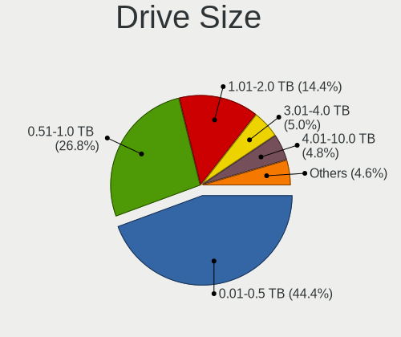
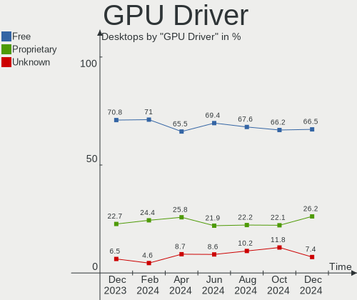
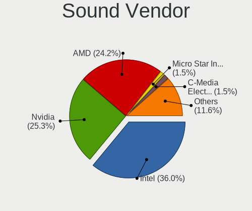
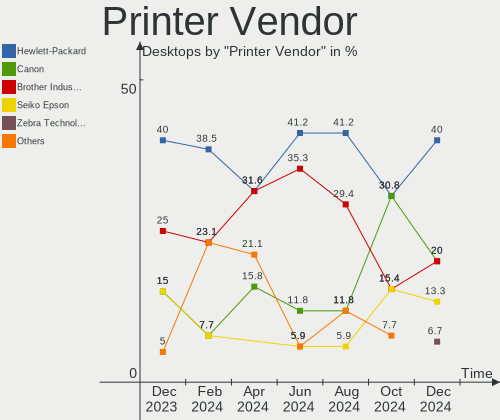

Ubuntu Hardware Trends (Desktop)
--------------------------------

A project to identify most popular hardware characteristics and track their change
over time based on data collected by Ubuntu users at https://Linux-Hardware.org.

Anyone can contribute to the study by uploading probes of their computers by
the [hw-probe](https://github.com/linuxhw/hw-probe) tool:

    sudo -E hw-probe -all -upload

Full-feature report is available here: https://linux-hardware.org/?view=trends&formfactor=desktop

Period: Feb, 2021.

Contents
--------

- [ OS                       ](#os)
- [ OS Family                ](#os-family)
- [ Kernel                   ](#kernel)
- [ Kernel Family            ](#kernel-family)
- [ Kernel Major Ver.        ](#kernel-major-ver)
- [ Arch                     ](#arch)
- [ DE                       ](#de)
- [ Display Server           ](#display-server)
- [ Display Manager          ](#display-manager)
- [ OS Lang                  ](#os-lang)
- [ Boot Mode                ](#boot-mode)
- [ Filesystem               ](#filesystem)
- [ Part. scheme             ](#part-scheme)
- [ Dual Boot with Linux/BSD ](#dual-boot-with-linux/bsd)
- [ Dual Boot (Win)          ](#dual-boot-win)
- [ Country                  ](#country)
- [ City                     ](#city)
- [ Vendor                   ](#vendor)
- [ Model                    ](#model)
- [ Model Family             ](#model-family)
- [ MFG Year                 ](#mfg-year)
- [ Form Factor              ](#form-factor)
- [ Secure Boot              ](#secure-boot)
- [ Coreboot                 ](#coreboot)
- [ RAM Size                 ](#ram-size)
- [ RAM Used                 ](#ram-used)
- [ Has CD-ROM               ](#has-cd-rom)
- [ Total Drives             ](#total-drives)
- [ Has Ethernet             ](#has-ethernet)
- [ Drive Vendor             ](#drive-vendor)
- [ Drive Model              ](#drive-model)
- [ HDD Vendor               ](#hdd-vendor)
- [ SSD Vendor               ](#ssd-vendor)
- [ Drive Kind               ](#drive-kind)
- [ Drive Connector          ](#drive-connector)
- [ Drive Size               ](#drive-size)
- [ Space Total              ](#space-total)
- [ Space Used               ](#space-used)
- [ Malfunc. Drives          ](#malfunc-drives)
- [ Malfunc. Drive Vendor    ](#malfunc-drive-vendor)
- [ Malfunc. HDD Vendor      ](#malfunc-hdd-vendor)
- [ Malfunc. Drive Kind      ](#malfunc-drive-kind)
- [ Failed Drives            ](#failed-drives)
- [ Failed Drive Vendor      ](#failed-drive-vendor)
- [ Drive Status             ](#drive-status)
- [ Storage Vendor           ](#storage-vendor)
- [ Storage Model            ](#storage-model)
- [ Storage Kind             ](#storage-kind)
- [ CPU Vendor               ](#cpu-vendor)
- [ CPU Model                ](#cpu-model)
- [ CPU Model Family         ](#cpu-model-family)
- [ CPU Cores                ](#cpu-cores)
- [ CPU Sockets              ](#cpu-sockets)
- [ CPU Threads              ](#cpu-threads)
- [ CPU Op-Modes             ](#cpu-op-modes)
- [ CPU Microcode            ](#cpu-microcode)
- [ CPU Microarch            ](#cpu-microarch)
- [ GPU Vendor               ](#gpu-vendor)
- [ GPU Model                ](#gpu-model)
- [ GPU Combo                ](#gpu-combo)
- [ GPU Driver               ](#gpu-driver)
- [ GPU Memory               ](#gpu-memory)
- [ Monitor Vendor           ](#monitor-vendor)
- [ Monitor Model            ](#monitor-model)
- [ Monitor Resolution       ](#monitor-resolution)
- [ Monitor Diagonal         ](#monitor-diagonal)
- [ Monitor Width            ](#monitor-width)
- [ Aspect Ratio             ](#aspect-ratio)
- [ Monitor Area             ](#monitor-area)
- [ Pixel Density            ](#pixel-density)
- [ Multiple Monitors        ](#multiple-monitors)
- [ Net Controller Vendor    ](#net-controller-vendor)
- [ Net Controller Model     ](#net-controller-model)
- [ Wireless Vendor          ](#wireless-vendor)
- [ Wireless Model           ](#wireless-model)
- [ Ethernet Vendor          ](#ethernet-vendor)
- [ Ethernet Model           ](#ethernet-model)
- [ Net Controller Kind      ](#net-controller-kind)
- [ Used Controller          ](#used-controller)
- [ NICs                     ](#nics)
- [ Memory Vendor            ](#memory-vendor)
- [ Memory Model             ](#memory-model)
- [ Memory Kind              ](#memory-kind)
- [ Memory Form Factor       ](#memory-form-factor)
- [ Memory Size              ](#memory-size)
- [ Memory Speed             ](#memory-speed)
- [ Sound Vendor             ](#sound-vendor)
- [ Sound Model              ](#sound-model)
- [ Camera Vendor            ](#camera-vendor)
- [ Camera Model             ](#camera-model)
- [ Fingerprint Vendor       ](#fingerprint-vendor)
- [ Fingerprint Model        ](#fingerprint-model)
- [ Chipcard Vendor          ](#chipcard-vendor)
- [ Chipcard Model           ](#chipcard-model)
- [ Printer Vendor           ](#printer-vendor)
- [ Printer Model            ](#printer-model)
- [ Scanner Vendor           ](#scanner-vendor)
- [ Scanner Model            ](#scanner-model)
- [ Bluetooth Vendor         ](#bluetooth-vendor)
- [ Bluetooth Model          ](#bluetooth-model)
- [ Unsupported Devices      ](#unsupported-devices)
- [ Unsupported Device Types ](#unsupported-device-types)

OS
--

Installed operating systems

| Name         | Desktops | Percent |
|--------------|----------|---------|
| Ubuntu 20.04 | 510      | 67.91%  |
| Ubuntu 20.10 | 138      | 18.38%  |
| Ubuntu 18.04 | 80       | 10.65%  |
| Ubuntu 16.04 | 8        | 1.07%   |
| Ubuntu       | 5        | 0.67%   |
| Ubuntu 21.04 | 4        | 0.53%   |
| Ubuntu 19.04 | 2        | 0.27%   |
| Ubuntu 19.10 | 1        | 0.13%   |
| Ubuntu 18.10 | 1        | 0.13%   |
| Ubuntu 17.10 | 1        | 0.13%   |
| Ubuntu 14.04 | 1        | 0.13%   |

OS Family
---------

OS without a version

| Name   | Desktops | Percent |
|--------|----------|---------|
| Ubuntu | 751      | 100%    |

Kernel
------

Version of the Linux kernel

| Version                    | Desktops | Percent |
|----------------------------|----------|---------|
| 5.8.0-43-generic           | 211      | 28.1%   |
| 5.8.0-41-generic           | 149      | 19.84%  |
| 5.4.0-65-generic           | 135      | 17.98%  |
| 5.8.0-44-generic           | 62       | 8.26%   |
| 5.4.0-66-generic           | 31       | 4.13%   |
| 4.15.0-135-generic         | 20       | 2.66%   |
| 5.4.0-42-generic           | 19       | 2.53%   |
| 5.4.0-65-lowlatency        | 8        | 1.07%   |
| 5.4.0-58-generic           | 8        | 1.07%   |
| 4.15.0-136-generic         | 7        | 0.93%   |
| 5.8.0-40-generic           | 5        | 0.67%   |
| 5.4.0-62-generic           | 5        | 0.67%   |
| 5.11.0-051100-generic      | 5        | 0.67%   |
| 5.8.0-25-generic           | 4        | 0.53%   |
| 5.8.0-43-lowlatency        | 3        | 0.4%    |
| 5.8.0-38-generic           | 3        | 0.4%    |
| 5.8.0-36-generic           | 3        | 0.4%    |
| 5.4.0-64-generic           | 3        | 0.4%    |
| 5.10.0-051000-generic      | 3        | 0.4%    |
| 4.15.0-134-generic         | 3        | 0.4%    |
| 4.15.0-133-generic         | 3        | 0.4%    |
| 5.8.0-45-generic           | 2        | 0.27%   |
| 5.8.0-44-lowlatency        | 2        | 0.27%   |
| 5.8.0-42-generic           | 2        | 0.27%   |
| 5.8.0-34-generic           | 2        | 0.27%   |
| 5.4.0-60-generic           | 2        | 0.27%   |
| 5.4.0-45-generic           | 2        | 0.27%   |
| 5.4.0-26-generic           | 2        | 0.27%   |
| 5.10.13-051013-generic     | 2        | 0.27%   |
| 5.10.0-14-generic          | 2        | 0.27%   |
| 4.15.0-132-generic         | 2        | 0.27%   |
| 5.9.8-050908-generic       | 1        | 0.13%   |
| 5.9.0-050900-generic       | 1        | 0.13%   |
| 5.8.0-7630-generic         | 1        | 0.13%   |
| 5.8.0-41-lowlatency        | 1        | 0.13%   |
| 5.8.0-39-generic           | 1        | 0.13%   |
| 5.8.0-33-generic           | 1        | 0.13%   |
| 5.8.0-29-generic           | 1        | 0.13%   |
| 5.7.15-050715-generic      | 1        | 0.13%   |
| 5.7.1-050701-generic       | 1        | 0.13%   |
| 5.4.97-050497-generic      | 1        | 0.13%   |
| 5.4.80-hiveos              | 1        | 0.13%   |
| 5.4.0-67-generic           | 1        | 0.13%   |
| 5.4.0-66-lowlatency        | 1        | 0.13%   |
| 5.4.0-61-lowlatency        | 1        | 0.13%   |
| 5.4.0-59-generic           | 1        | 0.13%   |
| 5.4.0-58-lowlatency        | 1        | 0.13%   |
| 5.4.0-56-generic           | 1        | 0.13%   |
| 5.4.0-54-generic           | 1        | 0.13%   |
| 5.4.0-42-lowlatency        | 1        | 0.13%   |
| 5.3.0-51-generic           | 1        | 0.13%   |
| 5.3.0-18-generic           | 1        | 0.13%   |
| 5.11.0-1.1-liquorix-amd64  | 1        | 0.13%   |
| 5.10.7-051007-generic      | 1        | 0.13%   |
| 5.10.15-051015-generic     | 1        | 0.13%   |
| 5.10.12                    | 1        | 0.13%   |
| 5.10.10-051010-generic     | 1        | 0.13%   |
| 5.10.0-12.1-liquorix-amd64 | 1        | 0.13%   |
| 5.0.0-33-generic           | 1        | 0.13%   |
| 5.0.0-13-generic           | 1        | 0.13%   |

Kernel Family
-------------

Linux kernel without a distro release

| Version | Desktops | Percent |
|---------|----------|---------|
| 5.8.0   | 453      | 60.32%  |
| 5.4.0   | 223      | 29.69%  |
| 4.15.0  | 40       | 5.33%   |
| 5.11.0  | 6        | 0.8%    |
| 5.10.0  | 6        | 0.8%    |
| 4.4.0   | 3        | 0.4%    |
| 5.3.0   | 2        | 0.27%   |
| 5.10.13 | 2        | 0.27%   |
| 5.0.0   | 2        | 0.27%   |
| 4.13.0  | 2        | 0.27%   |
| 5.9.8   | 1        | 0.13%   |
| 5.9.0   | 1        | 0.13%   |
| 5.7.15  | 1        | 0.13%   |
| 5.7.1   | 1        | 0.13%   |
| 5.4.97  | 1        | 0.13%   |
| 5.4.80  | 1        | 0.13%   |
| 5.10.7  | 1        | 0.13%   |
| 5.10.15 | 1        | 0.13%   |
| 5.10.12 | 1        | 0.13%   |
| 5.10.10 | 1        | 0.13%   |
| 4.8.0   | 1        | 0.13%   |
| 4.18.0  | 1        | 0.13%   |

Kernel Major Ver.
-----------------

Linux kernel major version

| Version | Desktops | Percent |
|---------|----------|---------|
| 5.8     | 453      | 60.32%  |
| 5.4     | 225      | 29.96%  |
| 4.15    | 40       | 5.33%   |
| 5.10    | 12       | 1.6%    |
| 5.11    | 6        | 0.8%    |
| 4.4     | 3        | 0.4%    |
| 5.9     | 2        | 0.27%   |
| 5.7     | 2        | 0.27%   |
| 5.3     | 2        | 0.27%   |
| 5.0     | 2        | 0.27%   |
| 4.13    | 2        | 0.27%   |
| 4.8     | 1        | 0.13%   |
| 4.18    | 1        | 0.13%   |

Arch
----

OS architecture (x86_64, i586, etc.)

| Name   | Desktops | Percent |
|--------|----------|---------|
| x86_64 | 731      | 97.34%  |
| i686   | 20       | 2.66%   |

DE
--

Desktop Environment

| Name            | Desktops | Percent |
|-----------------|----------|---------|
| GNOME           | 520      | 69.24%  |
| Unknown         | 65       | 8.66%   |
| XFCE            | 47       | 6.26%   |
| KDE             | 29       | 3.86%   |
| KDE5            | 20       | 2.66%   |
| Unity           | 17       | 2.26%   |
| MATE            | 14       | 1.86%   |
| X-Cinnamon      | 12       | 1.6%    |
| Budgie          | 8        | 1.07%   |
| GNOME Flashback | 7        | 0.93%   |
| LXQt            | 6        | 0.8%    |
| LXDE            | 2        | 0.27%   |
| Cinnamon        | 2        | 0.27%   |
| i3              | 1        | 0.13%   |
| Deepin          | 1        | 0.13%   |

Display Server
--------------

X11 or Wayland

| Name    | Desktops | Percent |
|---------|----------|---------|
| X11     | 694      | 92.41%  |
| Unknown | 21       | 2.8%    |
| Wayland | 19       | 2.53%   |
| Tty     | 17       | 2.26%   |

Display Manager
---------------

SDDM, LightDM, etc.

| Name    | Desktops | Percent |
|---------|----------|---------|
| Unknown | 589      | 78.43%  |
| GDM     | 105      | 13.98%  |
| TDM     | 31       | 4.13%   |
| SDDM    | 21       | 2.8%    |
| LightDM | 4        | 0.53%   |
| SLiM    | 1        | 0.13%   |

OS Lang
-------

Language

| Lang    | Desktops | Percent |
|---------|----------|---------|
| en_US   | 250      | 33.29%  |
| de_DE   | 91       | 12.12%  |
| fr_FR   | 69       | 9.19%   |
| en_GB   | 38       | 5.06%   |
| pt_BR   | 31       | 4.13%   |
| it_IT   | 31       | 4.13%   |
| ru_RU   | 26       | 3.46%   |
| en_CA   | 21       | 2.8%    |
| es_ES   | 20       | 2.66%   |
| pl_PL   | 15       | 2%      |
| en_AU   | 15       | 2%      |
| C       | 12       | 1.6%    |
| nl_NL   | 10       | 1.33%   |
| hu_HU   | 8        | 1.07%   |
| ru_UA   | 7        | 0.93%   |
| pt_PT   | 7        | 0.93%   |
| en_IN   | 7        | 0.93%   |
| de_AT   | 7        | 0.93%   |
| el_GR   | 6        | 0.8%    |
| ja_JP   | 5        | 0.67%   |
| tr_TR   | 4        | 0.53%   |
| sl_SI   | 4        | 0.53%   |
| fr_BE   | 4        | 0.53%   |
| es_MX   | 4        | 0.53%   |
| es_AR   | 4        | 0.53%   |
| cs_CZ   | 4        | 0.53%   |
| sk_SK   | 3        | 0.4%    |
| fi_FI   | 3        | 0.4%    |
| en_ZA   | 3        | 0.4%    |
| en_NZ   | 3        | 0.4%    |
| en_IL   | 3        | 0.4%    |
| de_CH   | 3        | 0.4%    |
| Unknown | 3        | 0.4%    |
| ro_RO   | 2        | 0.27%   |
| ko_KR   | 2        | 0.27%   |
| fr_CA   | 2        | 0.27%   |
| es_CO   | 2        | 0.27%   |
| en_IE   | 2        | 0.27%   |
| ca_ES   | 2        | 0.27%   |
| zh_TW   | 1        | 0.13%   |
| uk_UA   | 1        | 0.13%   |
| sv_SE   | 1        | 0.13%   |
| sv_FI   | 1        | 0.13%   |
| nb_NO   | 1        | 0.13%   |
| lv_LV   | 1        | 0.13%   |
| id_ID   | 1        | 0.13%   |
| fr_CH   | 1        | 0.13%   |
| fa_IR   | 1        | 0.13%   |
| es_VE   | 1        | 0.13%   |
| es_UY   | 1        | 0.13%   |
| es_PE   | 1        | 0.13%   |
| es_HN   | 1        | 0.13%   |
| es_EC   | 1        | 0.13%   |
| es_CR   | 1        | 0.13%   |
| es_CL   | 1        | 0.13%   |
| es_BO   | 1        | 0.13%   |
| bg_BG   | 1        | 0.13%   |

Boot Mode
---------

EFI or BIOS

| Mode | Desktops | Percent |
|------|----------|---------|
| BIOS | 506      | 67.38%  |
| EFI  | 245      | 32.62%  |

Filesystem
----------

Type of filesystem

| Type    | Desktops | Percent |
|---------|----------|---------|
| Ext4    | 710      | 94.54%  |
| Overlay | 19       | 2.53%   |
| Zfs     | 8        | 1.07%   |
| Ext3    | 4        | 0.53%   |
| Btrfs   | 4        | 0.53%   |
| Xfs     | 3        | 0.4%    |
| Ext2    | 3        | 0.4%    |

Part. scheme
------------

Scheme of partitioning

| Type    | Desktops | Percent |
|---------|----------|---------|
| Unknown | 590      | 78.56%  |
| GPT     | 103      | 13.72%  |
| MBR     | 58       | 7.72%   |

Dual Boot with Linux/BSD
------------------------

Hosting more than one Linux/BSD

| Dual boot | Desktops | Percent |
|-----------|----------|---------|
| No        | 608      | 80.96%  |
| Yes       | 143      | 19.04%  |

Dual Boot (Win)
---------------

Hosting Linux and Windows

| Dual boot | Desktops | Percent |
|-----------|----------|---------|
| No        | 442      | 58.85%  |
| Yes       | 309      | 41.15%  |

Country
-------

Geographic location (country)

| Country            | Desktops | Percent |
|--------------------|----------|---------|
| USA                | 155      | 20.64%  |
| Germany            | 105      | 13.98%  |
| France             | 69       | 9.19%   |
| Brazil             | 39       | 5.19%   |
| Italy              | 34       | 4.53%   |
| UK                 | 31       | 4.13%   |
| Russia             | 31       | 4.13%   |
| Canada             | 26       | 3.46%   |
| Poland             | 21       | 2.8%    |
| Spain              | 17       | 2.26%   |
| Australia          | 14       | 1.86%   |
| Ukraine            | 13       | 1.73%   |
| Netherlands        | 12       | 1.6%    |
| Belgium            | 12       | 1.6%    |
| Austria            | 10       | 1.33%   |
| Hungary            | 9        | 1.2%    |
| Finland            | 9        | 1.2%    |
| Switzerland        | 8        | 1.07%   |
| Portugal           | 8        | 1.07%   |
| India              | 7        | 0.93%   |
| Greece             | 7        | 0.93%   |
| Argentina          | 7        | 0.93%   |
| Japan              | 6        | 0.8%    |
| Turkey             | 5        | 0.67%   |
| Slovakia           | 5        | 0.67%   |
| New Zealand        | 5        | 0.67%   |
| Israel             | 5        | 0.67%   |
| Denmark            | 5        | 0.67%   |
| Czech Republic     | 5        | 0.67%   |
| Slovenia           | 4        | 0.53%   |
| Mexico             | 4        | 0.53%   |
| Ireland            | 4        | 0.53%   |
| China              | 4        | 0.53%   |
| South Africa       | 3        | 0.4%    |
| Romania            | 3        | 0.4%    |
| Norway             | 3        | 0.4%    |
| Malaysia           | 3        | 0.4%    |
| Colombia           | 3        | 0.4%    |
| Bulgaria           | 3        | 0.4%    |
| Vietnam            | 2        | 0.27%   |
| Thailand           | 2        | 0.27%   |
| Sweden             | 2        | 0.27%   |
| Serbia             | 2        | 0.27%   |
| Saudi Arabia       | 2        | 0.27%   |
| Korea, Republic of | 2        | 0.27%   |
| Czechia            | 2        | 0.27%   |
| Chile              | 2        | 0.27%   |
| Venezuela          | 1        | 0.13%   |
| Uruguay            | 1        | 0.13%   |
| Taiwan             | 1        | 0.13%   |
| Reunion            | 1        | 0.13%   |
| Peru               | 1        | 0.13%   |
| Panama             | 1        | 0.13%   |
| Pakistan           | 1        | 0.13%   |
| Macedonia          | 1        | 0.13%   |
| Luxembourg         | 1        | 0.13%   |
| Lithuania          | 1        | 0.13%   |
| Latvia             | 1        | 0.13%   |
| Iran               | 1        | 0.13%   |
| Indonesia          | 1        | 0.13%   |

City
----

Geographic location (city)

| City              | Desktops | Percent |
|-------------------|----------|---------|
| Moscow            | 9        | 1.2%    |
| Hamburg           | 9        | 1.2%    |
| Warsaw            | 7        | 0.93%   |
| Berlin            | 7        | 0.93%   |
| St Petersburg     | 6        | 0.8%    |
| Rome              | 6        | 0.8%    |
| Kyiv              | 6        | 0.8%    |
| Athens            | 6        | 0.8%    |
| São Paulo        | 5        | 0.67%   |
| Prague            | 5        | 0.67%   |
| Paris             | 5        | 0.67%   |
| Helsinki          | 5        | 0.67%   |
| Poznan            | 4        | 0.53%   |
| Milan             | 4        | 0.53%   |
| Frankfurt am Main | 4        | 0.53%   |
| Chicago           | 4        | 0.53%   |
| Vienna            | 3        | 0.4%    |
| Turin             | 3        | 0.4%    |
| Sydney            | 3        | 0.4%    |
| Spokane           | 3        | 0.4%    |
| Porto             | 3        | 0.4%    |
| Portland          | 3        | 0.4%    |
| New York          | 3        | 0.4%    |
| Mumbai            | 3        | 0.4%    |
| Istanbul          | 3        | 0.4%    |
| Düsseldorf       | 3        | 0.4%    |
| Dublin            | 3        | 0.4%    |
| Copenhagen        | 3        | 0.4%    |
| Brussels          | 3        | 0.4%    |
| Brooklyn          | 3        | 0.4%    |
| Barcelona         | 3        | 0.4%    |
| Tuggerah          | 2        | 0.27%   |
| Trenton           | 2        | 0.27%   |
| Toronto           | 2        | 0.27%   |
| The Bronx         | 2        | 0.27%   |
| Sofia             | 2        | 0.27%   |
| Seattle           | 2        | 0.27%   |
| San Jose          | 2        | 0.27%   |
| San Diego         | 2        | 0.27%   |
| Saint-Lô         | 2        | 0.27%   |
| Reutlingen        | 2        | 0.27%   |
| Regensburg        | 2        | 0.27%   |
| Ramat Gan         | 2        | 0.27%   |
| Phoenix           | 2        | 0.27%   |
| Perth             | 2        | 0.27%   |
| Paderborn         | 2        | 0.27%   |
| Ottawa            | 2        | 0.27%   |
| Nottingham        | 2        | 0.27%   |
| Munich            | 2        | 0.27%   |
| Montreal          | 2        | 0.27%   |
| Melito di Napoli  | 2        | 0.27%   |
| Melbourne         | 2        | 0.27%   |
| Madrid            | 2        | 0.27%   |
| Lisbon            | 2        | 0.27%   |
| Leipzig           | 2        | 0.27%   |
| Lahti             | 2        | 0.27%   |
| Klagenfurt        | 2        | 0.27%   |
| Geneva            | 2        | 0.27%   |
| Fortaleza         | 2        | 0.27%   |
| Florence          | 2        | 0.27%   |

Vendor
------

Motherboard manufacturer

| Name                            | Desktops | Percent |
|---------------------------------|----------|---------|
| ASUSTek Computer                | 170      | 22.64%  |
| Gigabyte Technology             | 127      | 16.91%  |
| MSI                             | 105      | 13.98%  |
| Dell                            | 86       | 11.45%  |
| ASRock                          | 56       | 7.46%   |
| Hewlett-Packard                 | 43       | 5.73%   |
| Lenovo                          | 25       | 3.33%   |
| Intel                           | 24       | 3.2%    |
| Pegatron                        | 12       | 1.6%    |
| Acer                            | 12       | 1.6%    |
| Unknown                         | 12       | 1.6%    |
| Foxconn                         | 10       | 1.33%   |
| Biostar                         | 10       | 1.33%   |
| Fujitsu                         | 8        | 1.07%   |
| Medion                          | 6        | 0.8%    |
| ECS                             | 5        | 0.67%   |
| Apple                           | 4        | 0.53%   |
| Supermicro                      | 3        | 0.4%    |
| Shuttle                         | 3        | 0.4%    |
| Gateway                         | 3        | 0.4%    |
| Fujitsu Siemens                 | 3        | 0.4%    |
| PCWare                          | 2        | 0.27%   |
| Packard Bell                    | 2        | 0.27%   |
| JINGSHA                         | 2        | 0.27%   |
| eMachines                       | 2        | 0.27%   |
| ASRockRack                      | 2        | 0.27%   |
| Universal Scientific Industrial | 1        | 0.13%   |
| System76                        | 1        | 0.13%   |
| Semp Toshiba                    | 1        | 0.13%   |
| Seco                            | 1        | 0.13%   |
| Protectli                       | 1        | 0.13%   |
| Positivo                        | 1        | 0.13%   |
| NEC Computers                   | 1        | 0.13%   |
| LORD ELECTRONICS                | 1        | 0.13%   |
| Complet                         | 1        | 0.13%   |
| Chuwi                           | 1        | 0.13%   |
| BCM                             | 1        | 0.13%   |
| AZW                             | 1        | 0.13%   |
| AMI                             | 1        | 0.13%   |
| ABIT                            | 1        | 0.13%   |

Model
-----

Motherboard model

| Name                             | Desktops | Percent |
|----------------------------------|----------|---------|
| ASUS All Series                  | 14       | 1.86%   |
| Unknown                          | 12       | 1.6%    |
| MSI MS-7C02                      | 7        | 0.93%   |
| MSI MS-7B79                      | 5        | 0.67%   |
| MSI MS-7A38                      | 5        | 0.67%   |
| Dell OptiPlex 990                | 5        | 0.67%   |
| ASUS TUF GAMING X570-PLUS        | 5        | 0.67%   |
| ASUS M5A78L-M/USB3               | 5        | 0.67%   |
| MSI MS-7C37                      | 4        | 0.53%   |
| Gigabyte B450M DS3H              | 4        | 0.53%   |
| Gigabyte 970A-DS3P               | 4        | 0.53%   |
| MSI MS-7C75                      | 3        | 0.4%    |
| MSI MS-7B86                      | 3        | 0.4%    |
| MSI MS-7817                      | 3        | 0.4%    |
| MSI MS-7721                      | 3        | 0.4%    |
| HP ProLiant MicroServer          | 3        | 0.4%    |
| Gigabyte H81M-DS2                | 3        | 0.4%    |
| Gigabyte G31M-ES2L               | 3        | 0.4%    |
| Dell Precision Tower 5810        | 3        | 0.4%    |
| Dell OptiPlex 790                | 3        | 0.4%    |
| Dell OptiPlex 780                | 3        | 0.4%    |
| Dell OptiPlex 7010               | 3        | 0.4%    |
| Dell Inspiron 530                | 3        | 0.4%    |
| ASUS P8Z77-V LX                  | 3        | 0.4%    |
| MSI MS-7C52                      | 2        | 0.27%   |
| MSI MS-7B98                      | 2        | 0.27%   |
| MSI MS-7B93                      | 2        | 0.27%   |
| MSI MS-7B89                      | 2        | 0.27%   |
| MSI MS-7B38                      | 2        | 0.27%   |
| MSI MS-7A70                      | 2        | 0.27%   |
| MSI MS-7A34                      | 2        | 0.27%   |
| MSI MS-7996                      | 2        | 0.27%   |
| MSI MS-7982                      | 2        | 0.27%   |
| MSI MS-7821                      | 2        | 0.27%   |
| MSI MS-7693                      | 2        | 0.27%   |
| MSI MS-7680                      | 2        | 0.27%   |
| MSI MS-7529                      | 2        | 0.27%   |
| JINGSHA Board                    | 2        | 0.27%   |
| Intel X99 V102A                  | 2        | 0.27%   |
| HP Compaq Elite 8300 SFF         | 2        | 0.27%   |
| Gigabyte Z390 GAMING X           | 2        | 0.27%   |
| Gigabyte X58A-UD3R               | 2        | 0.27%   |
| Gigabyte X570 AORUS MASTER       | 2        | 0.27%   |
| Gigabyte H81M-S1                 | 2        | 0.27%   |
| Gigabyte H61MS                   | 2        | 0.27%   |
| Gigabyte H310M S2H 2.0           | 2        | 0.27%   |
| Gigabyte GA-78LMT-USB3           | 2        | 0.27%   |
| Fujitsu Siemens ESPRIMO P5730    | 2        | 0.27%   |
| Foxconn Pro 3400 Series MT       | 2        | 0.27%   |
| Dell Precision WorkStation T7500 | 2        | 0.27%   |
| Dell Precision Tower 7810        | 2        | 0.27%   |
| Dell Precision T7610             | 2        | 0.27%   |
| Dell OptiPlex GX620              | 2        | 0.27%   |
| Dell OptiPlex 9020               | 2        | 0.27%   |
| Dell OptiPlex 745                | 2        | 0.27%   |
| Dell OptiPlex 7070               | 2        | 0.27%   |
| Dell OptiPlex 7040               | 2        | 0.27%   |
| Dell OptiPlex 7020               | 2        | 0.27%   |
| Dell OptiPlex 380                | 2        | 0.27%   |
| Dell OptiPlex 3070               | 2        | 0.27%   |

Model Family
------------

Motherboard model prefix

| Name                    | Desktops | Percent |
|-------------------------|----------|---------|
| Dell OptiPlex           | 42       | 5.59%   |
| ASUS PRIME              | 28       | 3.73%   |
| Lenovo ThinkCentre      | 19       | 2.53%   |
| Dell Precision          | 16       | 2.13%   |
| Dell Inspiron           | 16       | 2.13%   |
| ASUS All                | 14       | 1.86%   |
| HP Compaq               | 13       | 1.73%   |
| ASUS TUF                | 13       | 1.73%   |
| Unknown                 | 12       | 1.6%    |
| ASUS ROG                | 9        | 1.2%    |
| ASUS M5A78L-M           | 8        | 1.07%   |
| Acer Aspire             | 8        | 1.07%   |
| MSI MS-7C02             | 7        | 0.93%   |
| Gigabyte B450M          | 7        | 0.93%   |
| Gigabyte Z390           | 6        | 0.8%    |
| MSI MS-7B79             | 5        | 0.67%   |
| MSI MS-7A38             | 5        | 0.67%   |
| HP ProLiant             | 5        | 0.67%   |
| Gigabyte X570           | 5        | 0.67%   |
| Fujitsu ESPRIMO         | 5        | 0.67%   |
| ASRock A320M-HDV        | 5        | 0.67%   |
| MSI MS-7C37             | 4        | 0.53%   |
| Gigabyte GA-78LMT-USB3  | 4        | 0.53%   |
| Gigabyte 970A-DS3P      | 4        | 0.53%   |
| ASUS P8H61-M            | 4        | 0.53%   |
| ASUS P5KPL-AM           | 4        | 0.53%   |
| MSI MS-7C75             | 3        | 0.4%    |
| MSI MS-7B86             | 3        | 0.4%    |
| MSI MS-7817             | 3        | 0.4%    |
| MSI MS-7721             | 3        | 0.4%    |
| Lenovo IdeaCentre       | 3        | 0.4%    |
| Intel X99               | 3        | 0.4%    |
| Gigabyte H81M-DS2       | 3        | 0.4%    |
| Gigabyte H310M          | 3        | 0.4%    |
| Gigabyte G31M-ES2L      | 3        | 0.4%    |
| Fujitsu Siemens ESPRIMO | 3        | 0.4%    |
| Dell XPS                | 3        | 0.4%    |
| Dell Vostro             | 3        | 0.4%    |
| ASUS SABERTOOTH         | 3        | 0.4%    |
| ASUS P9X79              | 3        | 0.4%    |
| ASUS P8Z77-V            | 3        | 0.4%    |
| ASUS P7H55-M            | 3        | 0.4%    |
| ASUS P5GC-MX            | 3        | 0.4%    |
| ASUS P5G41T-M           | 3        | 0.4%    |
| ASUS M5A97              | 3        | 0.4%    |
| ASRock X570             | 3        | 0.4%    |
| Pegatron Compaq         | 2        | 0.27%   |
| MSI MS-7C52             | 2        | 0.27%   |
| MSI MS-7B98             | 2        | 0.27%   |
| MSI MS-7B93             | 2        | 0.27%   |
| MSI MS-7B89             | 2        | 0.27%   |
| MSI MS-7B38             | 2        | 0.27%   |
| MSI MS-7A70             | 2        | 0.27%   |
| MSI MS-7A34             | 2        | 0.27%   |
| MSI MS-7996             | 2        | 0.27%   |
| MSI MS-7982             | 2        | 0.27%   |
| MSI MS-7821             | 2        | 0.27%   |
| MSI MS-7693             | 2        | 0.27%   |
| MSI MS-7680             | 2        | 0.27%   |
| MSI MS-7529             | 2        | 0.27%   |

MFG Year
--------

Motherboard manufacture year

| Year | Desktops | Percent |
|------|----------|---------|
| 2020 | 114      | 15.18%  |
| 2018 | 70       | 9.32%   |
| 2019 | 69       | 9.19%   |
| 2010 | 65       | 8.66%   |
| 2013 | 58       | 7.72%   |
| 2011 | 57       | 7.59%   |
| 2014 | 53       | 7.06%   |
| 2012 | 53       | 7.06%   |
| 2009 | 46       | 6.13%   |
| 2015 | 31       | 4.13%   |
| 2016 | 30       | 3.99%   |
| 2008 | 30       | 3.99%   |
| 2017 | 27       | 3.6%    |
| 2007 | 21       | 2.8%    |
| 2021 | 13       | 1.73%   |
| 2005 | 7        | 0.93%   |
| 2006 | 6        | 0.8%    |
| 2004 | 1        | 0.13%   |

Form Factor
-----------

Physical design of the computer

| Name    | Desktops | Percent |
|---------|----------|---------|
| Desktop | 751      | 100%    |

Secure Boot
-----------

Enabled or disabled

| State    | Desktops | Percent |
|----------|----------|---------|
| Disabled | 733      | 97.6%   |
| Enabled  | 18       | 2.4%    |

Coreboot
--------

Have coreboot on board

| Used | Desktops | Percent |
|------|----------|---------|
| No   | 751      | 100%    |

RAM Size
--------

Total RAM memory

| Size in GB      | Desktops | Percent |
|-----------------|----------|---------|
| 8.01-16.0       | 168      | 22.37%  |
| 16.01-24.0      | 151      | 20.11%  |
| 3.01-4.0        | 132      | 17.58%  |
| 4.01-8.0        | 116      | 15.45%  |
| 32.01-64.0      | 98       | 13.05%  |
| 1.01-2.0        | 26       | 3.46%   |
| 64.01-256.0     | 24       | 3.2%    |
| 24.01-32.0      | 18       | 2.4%    |
| 2.01-3.0        | 14       | 1.86%   |
| 0.51-1.0        | 3        | 0.4%    |
| More than 256.0 | 1        | 0.13%   |

RAM Used
--------

Used RAM memory

| Used GB    | Desktops | Percent |
|------------|----------|---------|
| 1.01-2.0   | 322      | 42.88%  |
| 2.01-3.0   | 186      | 24.77%  |
| 4.01-8.0   | 93       | 12.38%  |
| 3.01-4.0   | 79       | 10.52%  |
| 0.51-1.0   | 38       | 5.06%   |
| 8.01-16.0  | 22       | 2.93%   |
| 16.01-24.0 | 6        | 0.8%    |
| 0.01-0.5   | 3        | 0.4%    |
| 24.01-32.0 | 2        | 0.27%   |

Has CD-ROM
----------

Has CD-ROM on board

| Presented | Desktops | Percent |
|-----------|----------|---------|
| Yes       | 380      | 50.6%   |
| No        | 371      | 49.4%   |

Total Drives
------------

Number of drives on board

| Drives | Desktops | Percent |
|--------|----------|---------|
| 1      | 306      | 40.75%  |
| 2      | 224      | 29.83%  |
| 3      | 107      | 14.25%  |
| 4      | 56       | 7.46%   |
| 5      | 23       | 3.06%   |
| 6      | 11       | 1.46%   |
| 0      | 10       | 1.33%   |
| 7      | 9        | 1.2%    |
| 8      | 2        | 0.27%   |
| 16     | 1        | 0.13%   |
| 11     | 1        | 0.13%   |
| 10     | 1        | 0.13%   |

Has Ethernet
------------

Has Ethernet on board

| Presented | Desktops | Percent |
|-----------|----------|---------|
| Yes       | 743      | 98.93%  |
| No        | 8        | 1.07%   |

Drive Vendor
------------

Hard drive vendors

| Vendor                    | Desktops | Drives | Percent |
|---------------------------|----------|--------|---------|
| WDC                       | 271      | 379    | 21.53%  |
| Seagate                   | 250      | 330    | 19.86%  |
| Samsung Electronics       | 166      | 206    | 13.19%  |
| Kingston                  | 65       | 72     | 5.16%   |
| Toshiba                   | 64       | 73     | 5.08%   |
| SanDisk                   | 57       | 63     | 4.53%   |
| Crucial                   | 56       | 61     | 4.45%   |
| Hitachi                   | 50       | 57     | 3.97%   |
| MAXTOR                    | 21       | 26     | 1.67%   |
| Unknown                   | 18       | 23     | 1.43%   |
| Intel                     | 15       | 15     | 1.19%   |
| HGST                      | 15       | 17     | 1.19%   |
| A-DATA Technology         | 15       | 16     | 1.19%   |
| PNY                       | 14       | 15     | 1.11%   |
| China                     | 13       | 13     | 1.03%   |
| Phison                    | 11       | 12     | 0.87%   |
| Silicon Motion            | 10       | 10     | 0.79%   |
| SPCC                      | 9        | 9      | 0.71%   |
| Patriot                   | 9        | 9      | 0.71%   |
| SK Hynix                  | 8        | 11     | 0.64%   |
| Intenso                   | 8        | 11     | 0.64%   |
| OCZ                       | 7        | 7      | 0.56%   |
| Corsair                   | 7        | 7      | 0.56%   |
| GOODRAM                   | 5        | 5      | 0.4%    |
| Team                      | 4        | 4      | 0.32%   |
| Realtek Semiconductor     | 4        | 4      | 0.32%   |
| LITEON                    | 4        | 4      | 0.32%   |
| KingSpec                  | 4        | 4      | 0.32%   |
| Hewlett-Packard           | 4        | 4      | 0.32%   |
| Transcend                 | 3        | 3      | 0.24%   |
| SABRENT                   | 3        | 3      | 0.24%   |
| PLEXTOR                   | 3        | 3      | 0.24%   |
| Mushkin                   | 3        | 3      | 0.24%   |
| Micron/Crucial Technology | 3        | 3      | 0.24%   |
| Micron Technology         | 3        | 4      | 0.24%   |
| Lexar                     | 3        | 3      | 0.24%   |
| Gigabyte Technology       | 3        | 3      | 0.24%   |
| TO Exter                  | 2        | 2      | 0.16%   |
| T-FORCE                   | 2        | 2      | 0.16%   |
| LDLC                      | 2        | 2      | 0.16%   |
| Integral                  | 2        | 2      | 0.16%   |
| ASMT109x                  | 2        | 3      | 0.16%   |
| asmedia                   | 2        | 2      | 0.16%   |
| Apple                     | 2        | 2      | 0.16%   |
| Apacer                    | 2        | 3      | 0.16%   |
| ZOTAC                     | 1        | 1      | 0.08%   |
| XrayDisk                  | 1        | 1      | 0.08%   |
| XPG                       | 1        | 1      | 0.08%   |
| WD MediaMax               | 1        | 1      | 0.08%   |
| Verbatim                  | 1        | 1      | 0.08%   |
| USB                       | 1        | 1      | 0.08%   |
| TCSUNBOW                  | 1        | 1      | 0.08%   |
| PNY USB                   | 1        | 1      | 0.08%   |
| PC401 NV                  | 1        | 1      | 0.08%   |
| OCZ-VERTEX2               | 1        | 1      | 0.08%   |
| NVMe                      | 1        | 1      | 0.08%   |
| Magnetic Data             | 1        | 1      | 0.08%   |
| Leven                     | 1        | 1      | 0.08%   |
| LaCie                     | 1        | 1      | 0.08%   |
| KIOXIA-EXCERIA            | 1        | 1      | 0.08%   |

Drive Model
-----------

Hard drive models

| Model                            | Desktops | Percent |
|----------------------------------|----------|---------|
| Seagate ST500DM002-1BD142 500GB  | 24       | 1.65%   |
| Seagate ST1000DM010-2EP102 1TB   | 17       | 1.17%   |
| Seagate ST31000528AS 1TB         | 14       | 0.96%   |
| Seagate ST1000DM003-1CH162 1TB   | 12       | 0.82%   |
| WDC WD10EZEX-08WN4A0 1TB         | 11       | 0.76%   |
| SanDisk SSD PLUS 240GB           | 11       | 0.76%   |
| Kingston SA400S37240G 240GB SSD  | 11       | 0.76%   |
| WDC WD10EZEX-00BN5A0 1TB         | 10       | 0.69%   |
| Toshiba DT01ACA100 1TB           | 10       | 0.69%   |
| Seagate ST2000DM008-2FR102 2TB   | 10       | 0.69%   |
| Samsung SSD 860 EVO 500GB        | 10       | 0.69%   |
| Kingston SA400S37120G 120GB SSD  | 10       | 0.69%   |
| Toshiba HDWD110 1TB              | 9        | 0.62%   |
| Samsung SSD 840 EVO 250GB        | 9        | 0.62%   |
| Samsung NVMe SSD Drive 500GB     | 9        | 0.62%   |
| Toshiba DT01ACA050 500GB         | 8        | 0.55%   |
| Seagate ST1000DM003-1SB102 1TB   | 8        | 0.55%   |
| Samsung NVMe SSD Drive 250GB     | 8        | 0.55%   |
| Crucial CT500MX500SSD1 500GB     | 8        | 0.55%   |
| WDC WDS500G2B0A-00SM50 500GB SSD | 7        | 0.48%   |
| WDC WDS240G2G0A-00JH30 240GB SSD | 7        | 0.48%   |
| Toshiba DT01ACA300 3TB           | 7        | 0.48%   |
| Seagate ST4000DM004-2CV104 4TB   | 7        | 0.48%   |
| Seagate ST31000524AS 1TB         | 7        | 0.48%   |
| Seagate ST2000DM006-2DM164 2TB   | 7        | 0.48%   |
| Kingston SV300S37A120G 120GB SSD | 7        | 0.48%   |
| Kingston SA400S37480G 480GB SSD  | 7        | 0.48%   |
| Crucial CT1000MX500SSD1 1TB      | 7        | 0.48%   |
| Unknown SD/MMC/MS PRO 64GB       | 6        | 0.41%   |
| Toshiba DT01ACA200 2TB           | 6        | 0.41%   |
| Seagate ST2000DM001-1CH164 2TB   | 6        | 0.41%   |
| Seagate ST1000DM003-1ER162 1TB   | 6        | 0.41%   |
| Samsung SSD 860 EVO 250GB        | 6        | 0.41%   |
| Samsung SSD 850 EVO 500GB        | 6        | 0.41%   |
| Samsung HD501LJ 500GB            | 6        | 0.41%   |
| Samsung HD103SJ 1TB              | 6        | 0.41%   |
| Crucial CT240BX500SSD1 240GB     | 6        | 0.41%   |
| WDC WD5000AAKX-60U6AA0 500GB     | 5        | 0.34%   |
| WDC WD5000AAKX-001CA0 500GB      | 5        | 0.34%   |
| WDC WD5000AADS-00S9B0 500GB      | 5        | 0.34%   |
| WDC WD40EFRX-68N32N0 4TB         | 5        | 0.34%   |
| WDC WD10EZEX-60WN4A0 1TB         | 5        | 0.34%   |
| WDC WD1003FZEX-00MK2A0 1TB       | 5        | 0.34%   |
| Seagate ST2000DM001-1ER164 2TB   | 5        | 0.34%   |
| SanDisk SDSSDA240G 240GB         | 5        | 0.34%   |
| Samsung SSD 970 EVO Plus 1TB     | 5        | 0.34%   |
| Samsung SSD 860 EVO 2TB          | 5        | 0.34%   |
| Samsung SSD 860 EVO 1TB          | 5        | 0.34%   |
| Samsung SSD 850 EVO 250GB        | 5        | 0.34%   |
| Samsung NVMe SSD Drive 1TB       | 5        | 0.34%   |
| Samsung HD103UJ 1TB              | 5        | 0.34%   |
| PNY CS900 120GB SSD              | 5        | 0.34%   |
| Hitachi HDS721010CLA332 1TB      | 5        | 0.34%   |
| Crucial CT120BX500SSD1 120GB     | 5        | 0.34%   |
| WDC WDS240G2G0B-00EPW0 240GB SSD | 4        | 0.27%   |
| WDC WD2500KS-00MJB0 250GB        | 4        | 0.27%   |
| WDC WD20EZRX-00D8PB0 2TB         | 4        | 0.27%   |
| WDC WD10EZEX-22MFCA0 1TB         | 4        | 0.27%   |
| WDC WD10EZEX-00WN4A0 1TB         | 4        | 0.27%   |
| WDC WD1002FAEX-00Z3A0 1TB        | 4        | 0.27%   |

HDD Vendor
----------

Hard disk drive vendors

| Vendor              | Desktops | Drives | Percent |
|---------------------|----------|--------|---------|
| WDC                 | 252      | 338    | 35.29%  |
| Seagate             | 246      | 324    | 34.45%  |
| Toshiba             | 62       | 71     | 8.68%   |
| Samsung Electronics | 50       | 62     | 7%      |
| Hitachi             | 50       | 57     | 7%      |
| MAXTOR              | 20       | 25     | 2.8%    |
| HGST                | 15       | 17     | 2.1%    |
| Intenso             | 4        | 4      | 0.56%   |
| TO Exter            | 2        | 2      | 0.28%   |
| Hewlett-Packard     | 2        | 2      | 0.28%   |
| ASMT109x            | 2        | 3      | 0.28%   |
| asmedia             | 2        | 2      | 0.28%   |
| WD MediaMax         | 1        | 1      | 0.14%   |
| USB                 | 1        | 1      | 0.14%   |
| Inateck             | 1        | 1      | 0.14%   |
| IBM/Hitachi         | 1        | 1      | 0.14%   |
| Fujitsu             | 1        | 1      | 0.14%   |
| ExcelStor           | 1        | 1      | 0.14%   |
| Apple               | 1        | 1      | 0.14%   |

SSD Vendor
----------

Solid state drive vendors

| Vendor              | Desktops | Drives | Percent |
|---------------------|----------|--------|---------|
| Samsung Electronics | 81       | 94     | 19.42%  |
| Kingston            | 59       | 65     | 14.15%  |
| SanDisk             | 48       | 53     | 11.51%  |
| Crucial             | 48       | 53     | 11.51%  |
| WDC                 | 26       | 27     | 6.24%   |
| A-DATA Technology   | 14       | 15     | 3.36%   |
| PNY                 | 13       | 14     | 3.12%   |
| China               | 13       | 13     | 3.12%   |
| Intel               | 10       | 10     | 2.4%    |
| SPCC                | 9        | 9      | 2.16%   |
| Patriot             | 9        | 9      | 2.16%   |
| Corsair             | 7        | 7      | 1.68%   |
| OCZ                 | 6        | 6      | 1.44%   |
| GOODRAM             | 5        | 5      | 1.2%    |
| SK Hynix            | 4        | 7      | 0.96%   |
| LITEON              | 4        | 4      | 0.96%   |
| KingSpec            | 4        | 4      | 0.96%   |
| Intenso             | 4        | 4      | 0.96%   |
| Transcend           | 3        | 3      | 0.72%   |
| Team                | 3        | 3      | 0.72%   |
| Seagate             | 3        | 3      | 0.72%   |
| SABRENT             | 3        | 3      | 0.72%   |
| PLEXTOR             | 3        | 3      | 0.72%   |
| Mushkin             | 3        | 3      | 0.72%   |
| Lexar               | 3        | 3      | 0.72%   |
| Unknown             | 2        | 2      | 0.48%   |
| Micron Technology   | 2        | 3      | 0.48%   |
| Integral            | 2        | 2      | 0.48%   |
| Hewlett-Packard     | 2        | 2      | 0.48%   |
| Gigabyte Technology | 2        | 2      | 0.48%   |
| Apacer              | 2        | 3      | 0.48%   |
| Verbatim            | 1        | 1      | 0.24%   |
| Toshiba             | 1        | 1      | 0.24%   |
| TCSUNBOW            | 1        | 1      | 0.24%   |
| T-FORCE             | 1        | 1      | 0.24%   |
| PNY USB             | 1        | 1      | 0.24%   |
| OCZ-VERTEX2         | 1        | 1      | 0.24%   |
| Maxtor              | 1        | 1      | 0.24%   |
| Leven               | 1        | 1      | 0.24%   |
| LDLC                | 1        | 1      | 0.24%   |
| KIOXIA-EXCERIA      | 1        | 1      | 0.24%   |
| KINGSHARE           | 1        | 1      | 0.24%   |
| KingDian            | 1        | 1      | 0.24%   |
| INDMEM              | 1        | 1      | 0.24%   |
| DREVO               | 1        | 1      | 0.24%   |
| DOGFISH             | 1        | 1      | 0.24%   |
| Biostar             | 1        | 1      | 0.24%   |
| Apple               | 1        | 1      | 0.24%   |
| AMD-RAID            | 1        | 3      | 0.24%   |
| AMD                 | 1        | 3      | 0.24%   |
| 1.0TB               | 1        | 1      | 0.24%   |

Drive Kind
----------

HDD or SSD

| Kind    | Desktops | Drives | Percent |
|---------|----------|--------|---------|
| HDD     | 569      | 914    | 52.44%  |
| SSD     | 365      | 458    | 33.64%  |
| NVMe    | 118      | 138    | 10.88%  |
| Unknown | 28       | 34     | 2.58%   |
| MMC     | 5        | 5      | 0.46%   |

Drive Connector
---------------

SATA, SAS, NVMe, etc.

| Type | Desktops | Drives | Percent |
|------|----------|--------|---------|
| SATA | 705      | 1321   | 80.11%  |
| NVMe | 118      | 138    | 13.41%  |
| SAS  | 52       | 85     | 5.91%   |
| MMC  | 5        | 5      | 0.57%   |

Drive Size
----------

Size of hard drive

| Size in TB | Desktops | Drives | Percent |
|------------|----------|--------|---------|
| 0.01-0.5   | 521      | 732    | 51.13%  |
| 0.51-1.0   | 287      | 355    | 28.16%  |
| 1.01-2.0   | 105      | 126    | 10.3%   |
| 3.01-4.0   | 57       | 84     | 5.59%   |
| 2.01-3.0   | 30       | 42     | 2.94%   |
| 4.01-10.0  | 18       | 32     | 1.77%   |
| 10.01-20.0 | 1        | 1      | 0.1%    |

Space Total
-----------

Amount of disk space available on the file system

| Size in GB     | Desktops | Percent |
|----------------|----------|---------|
| 101-250        | 207      | 27.56%  |
| 251-500        | 155      | 20.64%  |
| 501-1000       | 129      | 17.18%  |
| 1001-2000      | 80       | 10.65%  |
| More than 3000 | 64       | 8.52%   |
| 51-100         | 33       | 4.39%   |
| 2001-3000      | 29       | 3.86%   |
| 1-20           | 24       | 3.2%    |
| 21-50          | 23       | 3.06%   |
| Unknown        | 7        | 0.93%   |

Space Used
----------

Amount of used disk space

| Used GB        | Desktops | Percent |
|----------------|----------|---------|
| 1-20           | 278      | 37.02%  |
| 21-50          | 130      | 17.31%  |
| 101-250        | 84       | 11.19%  |
| 51-100         | 66       | 8.79%   |
| 501-1000       | 61       | 8.12%   |
| 251-500        | 57       | 7.59%   |
| 1001-2000      | 30       | 3.99%   |
| More than 3000 | 27       | 3.6%    |
| 2001-3000      | 11       | 1.46%   |
| Unknown        | 7        | 0.93%   |

Malfunc. Drives
---------------

Drive models with a malfunction

| Model                               | Desktops | Drives | Percent |
|-------------------------------------|----------|--------|---------|
| Seagate ST500DM002-1BD142 500GB     | 2        | 2      | 5.13%   |
| WDC WD5003ABYX-01WERA0 500GB        | 1        | 2      | 2.56%   |
| WDC WD5002ABYS-01B1B0 500GB         | 1        | 1      | 2.56%   |
| WDC WD5000AAKX-001CA0 500GB         | 1        | 1      | 2.56%   |
| WDC WD5000AADS-00S9B0 500GB         | 1        | 1      | 2.56%   |
| WDC WD40EFRX-68WT0N0 4TB            | 1        | 1      | 2.56%   |
| WDC WD3200AAKS-75L9A0 320GB         | 1        | 1      | 2.56%   |
| WDC WD10EZEX-60WN4A0 1TB            | 1        | 1      | 2.56%   |
| WDC WD10EFRX-68FYTN0 1TB            | 1        | 1      | 2.56%   |
| WDC WD10EARS-00Y5B1 1TB             | 1        | 2      | 2.56%   |
| WDC WD10EADS-22M2B0 1TB             | 1        | 1      | 2.56%   |
| WDC WD10EADS-00M2B0 1TB             | 1        | 1      | 2.56%   |
| Toshiba MK1652GSX 160GB             | 1        | 1      | 2.56%   |
| Toshiba MK1237GSX 120GB             | 1        | 1      | 2.56%   |
| Toshiba MG03ACA100 1TB              | 1        | 1      | 2.56%   |
| Toshiba HDWD110 1TB                 | 1        | 1      | 2.56%   |
| SPCC Solid State Disk 512GB         | 1        | 1      | 2.56%   |
| SK Hynix SH920 2.5 7MM 512GB SSD    | 1        | 4      | 2.56%   |
| Seagate ST980310AS 80GB             | 1        | 1      | 2.56%   |
| Seagate ST4000NM0245-1Z2107 4TB     | 1        | 2      | 2.56%   |
| Seagate ST3320813AS 320GB           | 1        | 1      | 2.56%   |
| Seagate ST3320413AS 320GB           | 1        | 1      | 2.56%   |
| Seagate ST31000524AS 1TB            | 1        | 1      | 2.56%   |
| Seagate ST2000DM001-1ER164 2TB      | 1        | 1      | 2.56%   |
| Seagate ST1000DM003-1SB102 1TB      | 1        | 1      | 2.56%   |
| Seagate ST1000DL002-9TT153 1TB      | 1        | 1      | 2.56%   |
| Samsung Electronics SSD 860 QVO 1TB | 1        | 1      | 2.56%   |
| Samsung Electronics SP2504C 250GB   | 1        | 1      | 2.56%   |
| Samsung Electronics HD204UI 2TB     | 1        | 1      | 2.56%   |
| Samsung Electronics HD103UJ 1TB     | 1        | 1      | 2.56%   |
| OCZ-VERTEX2 3.5 120GB SSD           | 1        | 1      | 2.56%   |
| OCZ VERTEX450 128GB SSD             | 1        | 1      | 2.56%   |
| Maxtor 6L160M0 160GB                | 1        | 2      | 2.56%   |
| Hitachi HDS5C1010CLA382 1TB         | 1        | 1      | 2.56%   |
| Crucial CT525MX300SSD1 528GB        | 1        | 1      | 2.56%   |
| Crucial CT480M500SSD1 480GB         | 1        | 1      | 2.56%   |
| Corsair Neutron GTX SSD 120GB       | 1        | 1      | 2.56%   |
| Apple HDD HTS545050A7E362 500GB     | 1        | 1      | 2.56%   |

Malfunc. Drive Vendor
---------------------

Vendors of faulty drives

| Vendor              | Desktops | Drives | Percent |
|---------------------|----------|--------|---------|
| WDC                 | 11       | 13     | 28.21%  |
| Seagate             | 10       | 11     | 25.64%  |
| Toshiba             | 4        | 4      | 10.26%  |
| Samsung Electronics | 4        | 4      | 10.26%  |
| Crucial             | 2        | 2      | 5.13%   |
| SPCC                | 1        | 1      | 2.56%   |
| SK Hynix            | 1        | 4      | 2.56%   |
| OCZ-VERTEX2         | 1        | 1      | 2.56%   |
| OCZ                 | 1        | 1      | 2.56%   |
| Maxtor              | 1        | 2      | 2.56%   |
| Hitachi             | 1        | 1      | 2.56%   |
| Corsair             | 1        | 1      | 2.56%   |
| Apple               | 1        | 1      | 2.56%   |

Malfunc. HDD Vendor
-------------------

Vendors of faulty HDD drives

| Vendor              | Desktops | Drives | Percent |
|---------------------|----------|--------|---------|
| WDC                 | 11       | 13     | 35.48%  |
| Seagate             | 10       | 11     | 32.26%  |
| Toshiba             | 4        | 4      | 12.9%   |
| Samsung Electronics | 3        | 3      | 9.68%   |
| Maxtor              | 1        | 2      | 3.23%   |
| Hitachi             | 1        | 1      | 3.23%   |
| Apple               | 1        | 1      | 3.23%   |

Malfunc. Drive Kind
-------------------

Kinds of faulty drives

| Kind | Desktops | Drives | Percent |
|------|----------|--------|---------|
| HDD  | 27       | 35     | 77.14%  |
| SSD  | 8        | 11     | 22.86%  |

Failed Drives
-------------

Failed drive models

Zero info for selected period =(

Failed Drive Vendor
-------------------

Failed drive vendors

Zero info for selected period =(

Drive Status
------------

Number of failed and malfunc. drives

| Status   | Desktops | Drives | Percent |
|----------|----------|--------|---------|
| Detected | 581      | 1166   | 74.11%  |
| Works    | 170      | 337    | 21.68%  |
| Malfunc  | 33       | 46     | 4.21%   |

Storage Vendor
--------------

Storage controller vendors

| Vendor                        | Desktops | Percent |
|-------------------------------|----------|---------|
| Intel                         | 485      | 49.74%  |
| AMD                           | 235      | 24.1%   |
| Samsung Electronics           | 46       | 4.72%   |
| JMicron Technology            | 33       | 3.38%   |
| ASMedia Technology            | 29       | 2.97%   |
| Nvidia                        | 25       | 2.56%   |
| Marvell Technology Group      | 24       | 2.46%   |
| Sandisk                       | 17       | 1.74%   |
| Phison Electronics            | 15       | 1.54%   |
| Micron/Crucial Technology     | 11       | 1.13%   |
| Silicon Motion                | 9        | 0.92%   |
| VIA Technologies              | 8        | 0.82%   |
| Kingston Technology Company   | 6        | 0.62%   |
| Realtek Semiconductor         | 5        | 0.51%   |
| LSI Logic / Symbios Logic     | 5        | 0.51%   |
| SK Hynix                      | 4        | 0.41%   |
| Broadcom / LSI                | 4        | 0.41%   |
| Silicon Image                 | 2        | 0.21%   |
| Adaptec                       | 2        | 0.21%   |
| ULi Electronics               | 1        | 0.1%    |
| Toshiba America Info Systems  | 1        | 0.1%    |
| Seagate Technology            | 1        | 0.1%    |
| OCZ Technology Group          | 1        | 0.1%    |
| Micron Technology             | 1        | 0.1%    |
| KIOXIA                        | 1        | 0.1%    |
| Integrated Technology Express | 1        | 0.1%    |
| Advanced System Products      | 1        | 0.1%    |
| ADATA Technology              | 1        | 0.1%    |
| 3ware                         | 1        | 0.1%    |

Storage Model
-------------

Storage controller models

| Model                                                                                   | Desktops | Percent |
|-----------------------------------------------------------------------------------------|----------|---------|
| AMD FCH SATA Controller [AHCI mode]                                                     | 135      | 10.31%  |
| Intel 8 Series/C220 Series Chipset Family 6-port SATA Controller 1 [AHCI mode]          | 52       | 3.97%   |
| AMD SB7x0/SB8x0/SB9x0 IDE Controller                                                    | 52       | 3.97%   |
| Intel NM10/ICH7 Family SATA Controller [IDE mode]                                       | 50       | 3.82%   |
| Intel 6 Series/C200 Series Chipset Family 6 port Desktop SATA AHCI Controller           | 47       | 3.59%   |
| AMD 400 Series Chipset SATA Controller                                                  | 42       | 3.21%   |
| Intel SATA Controller [RAID mode]                                                       | 37       | 2.83%   |
| Intel 82801G (ICH7 Family) IDE Controller                                               | 37       | 2.83%   |
| AMD SB7x0/SB8x0/SB9x0 SATA Controller [IDE mode]                                        | 35       | 2.67%   |
| AMD SB7x0/SB8x0/SB9x0 SATA Controller [AHCI mode]                                       | 31       | 2.37%   |
| Intel Q170/Q150/B150/H170/H110/Z170/CM236 Chipset SATA Controller [AHCI Mode]           | 30       | 2.29%   |
| Samsung NVMe SSD Controller SM981/PM981/PM983                                           | 29       | 2.22%   |
| Intel Cannon Lake PCH SATA AHCI Controller                                              | 28       | 2.14%   |
| ASMedia ASM1062 Serial ATA Controller                                                   | 27       | 2.06%   |
| Intel 7 Series/C210 Series Chipset Family 6-port SATA Controller [AHCI mode]            | 23       | 1.76%   |
| Intel 6 Series/C200 Series Chipset Family Desktop SATA Controller (IDE mode, ports 4-5) | 23       | 1.76%   |
| Intel 6 Series/C200 Series Chipset Family Desktop SATA Controller (IDE mode, ports 0-3) | 23       | 1.76%   |
| Intel 200 Series PCH SATA controller [AHCI mode]                                        | 23       | 1.76%   |
| JMicron JMB363 SATA/IDE Controller                                                      | 20       | 1.53%   |
| AMD FCH SATA Controller D                                                               | 19       | 1.45%   |
| Intel 5 Series/3400 Series Chipset 4 port SATA IDE Controller                           | 17       | 1.3%    |
| AMD SATA controller                                                                     | 17       | 1.3%    |
| Intel 400 Series Chipset Family SATA AHCI Controller                                    | 15       | 1.15%   |
| AMD 300 Series Chipset SATA Controller                                                  | 15       | 1.15%   |
| Intel 5 Series/3400 Series Chipset 2 port SATA IDE Controller                           | 14       | 1.07%   |
| Intel 82801JI (ICH10 Family) 4 port SATA IDE Controller #1                              | 13       | 0.99%   |
| Intel 82801JI (ICH10 Family) 2 port SATA IDE Controller #2                              | 12       | 0.92%   |
| Intel 82801I (ICH9 Family) 2 port SATA Controller [IDE mode]                            | 12       | 0.92%   |
| Nvidia MCP61 SATA Controller                                                            | 11       | 0.84%   |
| Intel 82801JI (ICH10 Family) SATA AHCI Controller                                       | 11       | 0.84%   |
| Samsung NVMe SSD Controller SM961/PM961/SM963                                           | 10       | 0.76%   |
| Intel C600/X79 series chipset 6-Port SATA AHCI Controller                               | 10       | 0.76%   |
| Marvell Group 88SE9172 SATA 6Gb/s Controller                                            | 9        | 0.69%   |
| JMicron JMB368 IDE controller                                                           | 9        | 0.69%   |
| Intel C610/X99 series chipset sSATA Controller [AHCI mode]                              | 9        | 0.69%   |
| Intel 82801IR/IO/IH (ICH9R/DO/DH) 4 port SATA Controller [IDE mode]                     | 9        | 0.69%   |
| Intel 5 Series/3400 Series Chipset 6 port SATA AHCI Controller                          | 9        | 0.69%   |
| AMD FCH IDE Controller                                                                  | 9        | 0.69%   |
| Nvidia MCP61 IDE                                                                        | 8        | 0.61%   |
| Micron/Crucial P1 NVMe PCIe SSD                                                         | 8        | 0.61%   |
| Intel C610/X99 series chipset 6-Port SATA Controller [AHCI mode]                        | 8        | 0.61%   |
| Intel 9 Series Chipset Family SATA Controller [AHCI Mode]                               | 8        | 0.61%   |
| Intel 4 Series Chipset PT IDER Controller                                               | 8        | 0.61%   |
| Silicon Motion SM2263EN/SM2263XT SSD Controller                                         | 7        | 0.53%   |
| Sandisk WD Black 2018/SN750 / PC SN720 NVMe SSD                                         | 7        | 0.53%   |
| Phison E12 NVMe Controller                                                              | 7        | 0.53%   |
| Intel C600/X79 series chipset SATA RAID Controller                                      | 7        | 0.53%   |
| Intel 7 Series/C210 Series Chipset Family 4-port SATA Controller [IDE mode]             | 7        | 0.53%   |
| Intel 7 Series/C210 Series Chipset Family 2-port SATA Controller [IDE mode]             | 7        | 0.53%   |
| Samsung NVMe SSD Controller PM9A1/980PRO                                                | 6        | 0.46%   |
| AMD FCH SATA Controller [IDE mode]                                                      | 6        | 0.46%   |
| Sandisk WD Blue SN550 NVMe SSD                                                          | 5        | 0.38%   |
| Sandisk WD Black SN750 / PC SN730 NVMe SSD                                              | 5        | 0.38%   |
| Nvidia MCP78S [GeForce 8200] IDE                                                        | 5        | 0.38%   |
| JMicron JMB362 SATA Controller                                                          | 5        | 0.38%   |
| AMD SB600 Non-Raid-5 SATA                                                               | 5        | 0.38%   |
| AMD SB600 IDE                                                                           | 5        | 0.38%   |
| VIA VT6415 PATA IDE Host Controller                                                     | 4        | 0.31%   |
| Realtek RTS5763DL NVMe SSD Controller                                                   | 4        | 0.31%   |
| Phison PS5013 E13 NVMe Controller                                                       | 4        | 0.31%   |

Storage Kind
------------

Kind of storage controller (IDE, SATA, NVMe, SAS, ...)

| Kind | Desktops | Percent |
|------|----------|---------|
| SATA | 542      | 54.86%  |
| IDE  | 253      | 25.61%  |
| NVMe | 117      | 11.84%  |
| RAID | 66       | 6.68%   |
| SAS  | 6        | 0.61%   |
| SCSI | 4        | 0.4%    |

CPU Vendor
----------

Processor vendors

| Vendor | Desktops | Percent |
|--------|----------|---------|
| Intel  | 493      | 65.65%  |
| AMD    | 258      | 34.35%  |

CPU Model
---------

Processor models

| Model                                       | Desktops | Percent |
|---------------------------------------------|----------|---------|
| AMD Ryzen 7 3700X 8-Core Processor          | 14       | 1.86%   |
| Intel Core i5-2400 CPU @ 3.10GHz            | 10       | 1.33%   |
| AMD FX-8350 Eight-Core Processor            | 10       | 1.33%   |
| Intel Core i5-4440 CPU @ 3.10GHz            | 9        | 1.2%    |
| Intel Core i5 CPU 650 @ 3.20GHz             | 9        | 1.2%    |
| AMD Ryzen 9 3900X 12-Core Processor         | 9        | 1.2%    |
| AMD Ryzen 5 3600 6-Core Processor           | 9        | 1.2%    |
| Intel Core i7-4790 CPU @ 3.60GHz            | 8        | 1.07%   |
| Intel Core i7-3770 CPU @ 3.40GHz            | 8        | 1.07%   |
| Intel Core i7-2600 CPU @ 3.40GHz            | 8        | 1.07%   |
| Intel Core i5-6500 CPU @ 3.20GHz            | 8        | 1.07%   |
| Intel Core i3-2120 CPU @ 3.30GHz            | 8        | 1.07%   |
| Intel Core 2 Duo CPU E7500 @ 2.93GHz        | 8        | 1.07%   |
| AMD Ryzen 7 2700X Eight-Core Processor      | 8        | 1.07%   |
| AMD Ryzen 5 3400G with Radeon Vega Graphics | 8        | 1.07%   |
| AMD Ryzen 5 2600 Six-Core Processor         | 8        | 1.07%   |
| Intel Core i5-2500 CPU @ 3.30GHz            | 7        | 0.93%   |
| AMD FX-6300 Six-Core Processor              | 7        | 0.93%   |
| Intel Core i5-4590 CPU @ 3.30GHz            | 6        | 0.8%    |
| Intel Core i5-3470 CPU @ 3.20GHz            | 6        | 0.8%    |
| Intel Core i3-3220 CPU @ 3.30GHz            | 6        | 0.8%    |
| Intel Core 2 Duo CPU E8400 @ 3.00GHz        | 6        | 0.8%    |
| AMD Ryzen 5 5600X 6-Core Processor          | 6        | 0.8%    |
| AMD Ryzen 5 1600 Six-Core Processor         | 6        | 0.8%    |
| Intel Core i7-8700 CPU @ 3.20GHz            | 5        | 0.67%   |
| Intel Core i7-6700K CPU @ 4.00GHz           | 5        | 0.67%   |
| Intel Core i3-3240 CPU @ 3.40GHz            | 5        | 0.67%   |
| Intel Core i3 CPU 550 @ 3.20GHz             | 5        | 0.67%   |
| Intel Core 2 Quad CPU Q6600 @ 2.40GHz       | 5        | 0.67%   |
| AMD Ryzen 5 2400G with Radeon Vega Graphics | 5        | 0.67%   |
| AMD Phenom II X4 945 Processor              | 5        | 0.67%   |
| Intel Core i7-7700 CPU @ 3.60GHz            | 4        | 0.53%   |
| Intel Core i7-4770K CPU @ 3.50GHz           | 4        | 0.53%   |
| Intel Core i7 CPU 920 @ 2.67GHz             | 4        | 0.53%   |
| Intel Core i5-9600K CPU @ 3.70GHz           | 4        | 0.53%   |
| Intel Core i5-9400 CPU @ 2.90GHz            | 4        | 0.53%   |
| Intel Core i5-8400 CPU @ 2.80GHz            | 4        | 0.53%   |
| Intel Core i5-2500K CPU @ 3.30GHz           | 4        | 0.53%   |
| Intel Core i5-10400 CPU @ 2.90GHz           | 4        | 0.53%   |
| Intel Core i5 CPU 750 @ 2.67GHz             | 4        | 0.53%   |
| Intel Core i3-2100 CPU @ 3.10GHz            | 4        | 0.53%   |
| Intel Core 2 Quad CPU Q8400 @ 2.66GHz       | 4        | 0.53%   |
| Intel Core 2 Quad CPU Q8300 @ 2.50GHz       | 4        | 0.53%   |
| AMD Ryzen 9 5950X 16-Core Processor         | 4        | 0.53%   |
| AMD Ryzen 5 2600X Six-Core Processor        | 4        | 0.53%   |
| AMD Phenom II X6 1090T Processor            | 4        | 0.53%   |
| AMD Phenom II X4 955 Processor              | 4        | 0.53%   |
| Intel Xeon CPU E5620 @ 2.40GHz              | 3        | 0.4%    |
| Intel Pentium Dual-Core CPU E5700 @ 3.00GHz | 3        | 0.4%    |
| Intel Pentium Dual-Core CPU E5500 @ 2.80GHz | 3        | 0.4%    |
| Intel Pentium Dual-Core CPU E5400 @ 2.70GHz | 3        | 0.4%    |
| Intel Pentium Dual-Core CPU E5300 @ 2.60GHz | 3        | 0.4%    |
| Intel Pentium D CPU 3.00GHz                 | 3        | 0.4%    |
| Intel Pentium CPU G630 @ 2.70GHz            | 3        | 0.4%    |
| Intel Pentium 4 CPU 3.20GHz                 | 3        | 0.4%    |
| Intel Core i7-9700K CPU @ 3.60GHz           | 3        | 0.4%    |
| Intel Core i7-9700 CPU @ 3.00GHz            | 3        | 0.4%    |
| Intel Core i7-8700K CPU @ 3.70GHz           | 3        | 0.4%    |
| Intel Core i7-6700 CPU @ 3.40GHz            | 3        | 0.4%    |
| Intel Core i7-5820K CPU @ 3.30GHz           | 3        | 0.4%    |

CPU Model Family
----------------

Processor model prefix

| Model                   | Desktops | Percent |
|-------------------------|----------|---------|
| Intel Core i5           | 137      | 18.24%  |
| Intel Core i7           | 91       | 12.12%  |
| AMD Ryzen 5             | 57       | 7.59%   |
| Intel Core i3           | 51       | 6.79%   |
| Intel Xeon              | 50       | 6.66%   |
| AMD Ryzen 7             | 31       | 4.13%   |
| Intel Core 2 Duo        | 29       | 3.86%   |
| AMD FX                  | 29       | 3.86%   |
| Intel Celeron           | 27       | 3.6%    |
| Intel Pentium           | 25       | 3.33%   |
| Intel Core 2 Quad       | 22       | 2.93%   |
| Intel Pentium Dual-Core | 18       | 2.4%    |
| AMD Ryzen 9             | 18       | 2.4%    |
| AMD Phenom II X4        | 17       | 2.26%   |
| AMD Athlon 64 X2        | 14       | 1.86%   |
| AMD A8                  | 12       | 1.6%    |
| Intel Pentium 4         | 9        | 1.2%    |
| AMD Ryzen 3             | 8        | 1.07%   |
| Intel Core 2            | 7        | 0.93%   |
| AMD Phenom II X6        | 7        | 0.93%   |
| AMD Athlon II X4        | 7        | 0.93%   |
| AMD A10                 | 7        | 0.93%   |
| Intel Pentium Dual      | 6        | 0.8%    |
| Intel Pentium D         | 5        | 0.67%   |
| Intel Core i9           | 5        | 0.67%   |
| Intel Atom              | 5        | 0.67%   |
| AMD Athlon II X2        | 5        | 0.67%   |
| AMD A4                  | 5        | 0.67%   |
| Intel Pentium Gold      | 3        | 0.4%    |
| AMD Turion II Neo       | 3        | 0.4%    |
| AMD Ryzen Threadripper  | 3        | 0.4%    |
| AMD Phenom II X2        | 3        | 0.4%    |
| AMD Phenom              | 3        | 0.4%    |
| AMD Athlon X4           | 3        | 0.4%    |
| AMD Athlon              | 3        | 0.4%    |
| AMD Ryzen 5 PRO         | 2        | 0.27%   |
| AMD Ryzen 3 PRO         | 2        | 0.27%   |
| AMD Opteron             | 2        | 0.27%   |
| AMD Athlon Dual Core    | 2        | 0.27%   |
| AMD Athlon 64           | 2        | 0.27%   |
| AMD A6                  | 2        | 0.27%   |
| Intel Xeon Bronze       | 1        | 0.13%   |
| Intel Core 2 Extreme    | 1        | 0.13%   |
| Intel Celeron D         | 1        | 0.13%   |
| AMD Sempron             | 1        | 0.13%   |
| AMD Ryzen Embedded      | 1        | 0.13%   |
| AMD Ryzen 7 PRO         | 1        | 0.13%   |
| AMD Phenom II X3        | 1        | 0.13%   |
| AMD Phenom II           | 1        | 0.13%   |
| AMD EPYC                | 1        | 0.13%   |
| AMD E2                  | 1        | 0.13%   |
| AMD E1                  | 1        | 0.13%   |
| AMD Athlon X2           | 1        | 0.13%   |
| AMD Athlon II           | 1        | 0.13%   |
| AMD A12                 | 1        | 0.13%   |

CPU Cores
---------

Number of processor cores

| Number | Desktops | Percent |
|--------|----------|---------|
| 4      | 288      | 38.35%  |
| 2      | 232      | 30.89%  |
| 6      | 98       | 13.05%  |
| 8      | 58       | 7.72%   |
| 1      | 24       | 3.2%    |
| 12     | 15       | 2%      |
| 3      | 14       | 1.86%   |
| 16     | 9        | 1.2%    |
| 10     | 5        | 0.67%   |
| 24     | 4        | 0.53%   |
| 32     | 2        | 0.27%   |
| 20     | 1        | 0.13%   |
| 14     | 1        | 0.13%   |

CPU Sockets
-----------

Number of sockets

| Number | Desktops | Percent |
|--------|----------|---------|
| 1      | 733      | 97.6%   |
| 2      | 18       | 2.4%    |

CPU Threads
-----------

Threads per core (Hyper-Threading)

| Number | Desktops | Percent |
|--------|----------|---------|
| 2      | 380      | 50.6%   |
| 1      | 371      | 49.4%   |

CPU Op-Modes
------------

CPU Operation Modes (32-bit, 64-bit)

| Op mode        | Desktops | Percent |
|----------------|----------|---------|
| 32-bit, 64-bit | 749      | 99.73%  |
| 32-bit         | 2        | 0.27%   |

CPU Microcode
-------------

Microcode number

| Number     | Desktops | Percent |
|------------|----------|---------|
| Unknown    | 161      | 21.44%  |
| 0x206a7    | 53       | 7.06%   |
| 0x306c3    | 51       | 6.79%   |
| 0x1067a    | 43       | 5.73%   |
| 0x306a9    | 35       | 4.66%   |
| 0x506e3    | 23       | 3.06%   |
| 0x08701021 | 23       | 3.06%   |
| 0x0800820d | 20       | 2.66%   |
| 0x906ea    | 19       | 2.53%   |
| 0x06000852 | 19       | 2.53%   |
| 0x010000c8 | 18       | 2.4%    |
| 0x906e9    | 16       | 2.13%   |
| 0x20655    | 13       | 1.73%   |
| 0x06001119 | 13       | 1.73%   |
| 0x306f2    | 12       | 1.6%    |
| 0x6fb      | 11       | 1.46%   |
| 0x906ed    | 10       | 1.33%   |
| 0x010000db | 10       | 1.33%   |
| 0x206d7    | 9        | 1.2%    |
| 0x0a201009 | 9        | 1.2%    |
| 0x08108109 | 9        | 1.2%    |
| 0x08701013 | 8        | 1.07%   |
| 0x010000dc | 8        | 1.07%   |
| 0xa0655    | 7        | 0.93%   |
| 0xa0653    | 7        | 0.93%   |
| 0x10676    | 7        | 0.93%   |
| 0x6fd      | 6        | 0.8%    |
| 0x106e5    | 6        | 0.8%    |
| 0x106a5    | 6        | 0.8%    |
| 0xf43      | 5        | 0.67%   |
| 0x6f6      | 5        | 0.67%   |
| 0x08001138 | 5        | 0.67%   |
| 0x0600063e | 5        | 0.67%   |
| 0x406c4    | 4        | 0.53%   |
| 0x306e4    | 4        | 0.53%   |
| 0x206c2    | 4        | 0.53%   |
| 0x20652    | 4        | 0.53%   |
| 0x10677    | 4        | 0.53%   |
| 0x08101016 | 4        | 0.53%   |
| 0x08001137 | 4        | 0.53%   |
| 0xf64      | 3        | 0.4%    |
| 0xf41      | 3        | 0.4%    |
| 0x906ec    | 3        | 0.4%    |
| 0x30678    | 3        | 0.4%    |
| 0x08600106 | 3        | 0.4%    |
| 0x0810100b | 3        | 0.4%    |
| 0x06003106 | 3        | 0.4%    |
| 0xf65      | 2        | 0.27%   |
| 0x906eb    | 2        | 0.27%   |
| 0x706a8    | 2        | 0.27%   |
| 0x6f2      | 2        | 0.27%   |
| 0x50654    | 2        | 0.27%   |
| 0x406c3    | 2        | 0.27%   |
| 0x0800820b | 2        | 0.27%   |
| 0x08001136 | 2        | 0.27%   |
| 0x08001129 | 2        | 0.27%   |
| 0x0600611a | 2        | 0.27%   |
| 0x03000027 | 2        | 0.27%   |
| 0xf62      | 1        | 0.13%   |
| 0x806e9    | 1        | 0.13%   |

CPU Microarch
-------------

Microarchitecture

| Name          | Desktops | Percent |
|---------------|----------|---------|
| Haswell       | 76       | 10.12%  |
| SandyBridge   | 73       | 9.72%   |
| KabyLake      | 68       | 9.05%   |
| Penryn        | 65       | 8.66%   |
| IvyBridge     | 50       | 6.66%   |
| K10           | 48       | 6.39%   |
| Zen 2         | 47       | 6.26%   |
| Piledriver    | 39       | 5.19%   |
| Zen+          | 38       | 5.06%   |
| Skylake       | 32       | 4.26%   |
| Zen           | 29       | 3.86%   |
| Core          | 28       | 3.73%   |
| Westmere      | 26       | 3.46%   |
| K8 Hammer     | 20       | 2.66%   |
| NetBurst      | 17       | 2.26%   |
| Nehalem       | 17       | 2.26%   |
| CometLake     | 17       | 2.26%   |
| Unknown       | 13       | 1.73%   |
| Silvermont    | 10       | 1.33%   |
| Steamroller   | 7        | 0.93%   |
| Bulldozer     | 6        | 0.8%    |
| K10 Llano     | 4        | 0.53%   |
| Goldmont plus | 4        | 0.53%   |
| Excavator     | 4        | 0.53%   |
| Broadwell     | 4        | 0.53%   |
| Goldmont      | 3        | 0.4%    |
| Bonnell       | 3        | 0.4%    |
| Jaguar        | 2        | 0.27%   |
| Bobcat        | 1        | 0.13%   |

GPU Vendor
----------

Vendors of graphics cards

| Vendor                     | Desktops | Percent |
|----------------------------|----------|---------|
| Nvidia                     | 319      | 40.74%  |
| AMD                        | 243      | 31.03%  |
| Intel                      | 209      | 26.69%  |
| ASPEED Technology          | 8        | 1.02%   |
| Matrox Electronics Systems | 2        | 0.26%   |
| VIA Technologies           | 1        | 0.13%   |
| ATI Technologies           | 1        | 0.13%   |

GPU Model
---------

Graphics card models

| Model                                                                                    | Desktops | Percent |
|------------------------------------------------------------------------------------------|----------|---------|
| Intel 2nd Generation Core Processor Family Integrated Graphics Controller                | 35       | 4.38%   |
| Intel Xeon E3-1200 v3/4th Gen Core Processor Integrated Graphics Controller              | 25       | 3.13%   |
| Intel CometLake-S GT2 [UHD Graphics 630]                                                 | 24       | 3%      |
| AMD Ellesmere [Radeon RX 470/480/570/570X/580/580X/590]                                  | 24       | 3%      |
| Intel Xeon E3-1200 v2/3rd Gen Core processor Graphics Controller                         | 23       | 2.88%   |
| Nvidia GP107 [GeForce GTX 1050 Ti]                                                       | 17       | 2.13%   |
| Nvidia GK208B [GeForce GT 710]                                                           | 16       | 2%      |
| Nvidia GT218 [GeForce 210]                                                               | 14       | 1.75%   |
| AMD Cedar [Radeon HD 5000/6000/7350/8350 Series]                                         | 13       | 1.63%   |
| Intel 4 Series Chipset Integrated Graphics Controller                                    | 12       | 1.5%    |
| Intel HD Graphics 630                                                                    | 10       | 1.25%   |
| Intel HD Graphics 530                                                                    | 10       | 1.25%   |
| Intel 82G33/G31 Express Integrated Graphics Controller                                   | 10       | 1.25%   |
| AMD Raven Ridge [Radeon Vega Series / Radeon Vega Mobile Series]                         | 10       | 1.25%   |
| AMD Picasso                                                                              | 10       | 1.25%   |
| Nvidia TU117 [GeForce GTX 1650]                                                          | 9        | 1.13%   |
| Nvidia GM107 [GeForce GTX 750 Ti]                                                        | 9        | 1.13%   |
| Nvidia GF119 [GeForce GT 610]                                                            | 9        | 1.13%   |
| Intel Core Processor Integrated Graphics Controller                                      | 9        | 1.13%   |
| AMD RS780L [Radeon 3000]                                                                 | 9        | 1.13%   |
| AMD Navi 10 [Radeon RX 5600 OEM/5600 XT / 5700/5700 XT]                                  | 9        | 1.13%   |
| Nvidia GM206 [GeForce GTX 960]                                                           | 8        | 1%      |
| Nvidia GK208B [GeForce GT 730]                                                           | 8        | 1%      |
| ASPEED Technology ASPEED Graphics Family                                                 | 8        | 1%      |
| AMD Caicos [Radeon HD 6450/7450/8450 / R5 230 OEM]                                       | 8        | 1%      |
| AMD Baffin [Radeon RX 550 640SP / RX 560/560X]                                           | 8        | 1%      |
| Nvidia GP106 [GeForce GTX 1060 6GB]                                                      | 7        | 0.88%   |
| Nvidia GP104 [GeForce GTX 1070]                                                          | 7        | 0.88%   |
| Nvidia TU116 [GeForce GTX 1660]                                                          | 6        | 0.75%   |
| Nvidia TU116 [GeForce GTX 1650 SUPER]                                                    | 6        | 0.75%   |
| Nvidia GP108 [GeForce GT 1030]                                                           | 6        | 0.75%   |
| Nvidia GF116 [GeForce GTX 550 Ti]                                                        | 6        | 0.75%   |
| Nvidia GF108 [GeForce GT 730]                                                            | 6        | 0.75%   |
| Nvidia G96C [GeForce 9500 GT]                                                            | 6        | 0.75%   |
| Intel Atom/Celeron/Pentium Processor x5-E8000/J3xxx/N3xxx Integrated Graphics Controller | 6        | 0.75%   |
| Intel 4th Generation Core Processor Family Integrated Graphics Controller                | 6        | 0.75%   |
| AMD Kaveri [Radeon R7 Graphics]                                                          | 6        | 0.75%   |
| Nvidia GP104 [GeForce GTX 1080]                                                          | 5        | 0.63%   |
| Nvidia GK104 [GeForce GTX 770]                                                           | 5        | 0.63%   |
| Intel CoffeeLake-S GT2 [UHD Graphics 630]                                                | 5        | 0.63%   |
| AMD RV710 [Radeon HD 4350/4550]                                                          | 5        | 0.63%   |
| AMD RS880 [Radeon HD 4200]                                                               | 5        | 0.63%   |
| AMD Renoir                                                                               | 5        | 0.63%   |
| AMD Oland XT [Radeon HD 8670 / R7 250/350]                                               | 5        | 0.63%   |
| AMD Juniper XT [Radeon HD 5770]                                                          | 5        | 0.63%   |
| AMD Hawaii PRO [Radeon R9 290/390]                                                       | 5        | 0.63%   |
| Nvidia TU116 [GeForce GTX 1660 SUPER]                                                    | 4        | 0.5%    |
| Nvidia GP107 [GeForce GTX 1050]                                                          | 4        | 0.5%    |
| Nvidia GM204 [GeForce GTX 970]                                                           | 4        | 0.5%    |
| Nvidia GM107 [GeForce GTX 750]                                                           | 4        | 0.5%    |
| Nvidia GK107 [GeForce GT 640]                                                            | 4        | 0.5%    |
| Nvidia GK104 [GeForce GTX 670]                                                           | 4        | 0.5%    |
| Nvidia GF108 [GeForce GT 430]                                                            | 4        | 0.5%    |
| Nvidia GA104 [GeForce RTX 3060 Ti]                                                       | 4        | 0.5%    |
| Intel GeminiLake [UHD Graphics 600]                                                      | 4        | 0.5%    |
| Intel 82Q35 Express Integrated Graphics Controller                                       | 4        | 0.5%    |
| Intel 82945G/GZ Integrated Graphics Controller                                           | 4        | 0.5%    |
| AMD Turks XT [Radeon HD 6670/7670]                                                       | 4        | 0.5%    |
| AMD Trinity [Radeon HD 7560D]                                                            | 4        | 0.5%    |
| AMD RS780 [Radeon HD 3200]                                                               | 4        | 0.5%    |

GPU Combo
---------

Combinations of graphics cards

| Name                     | Desktops | Percent |
|--------------------------|----------|---------|
| 1 x Nvidia               | 296      | 39.41%  |
| 1 x AMD                  | 223      | 29.69%  |
| 1 x Intel                | 186      | 24.77%  |
| 2 x AMD                  | 12       | 1.6%    |
| Intel + Nvidia           | 9        | 1.2%    |
| 1 x ASPEED               | 6        | 0.8%    |
| 2 x Nvidia               | 5        | 0.67%   |
| Intel + AMD              | 5        | 0.67%   |
| AMD + Nvidia             | 3        | 0.4%    |
| Nvidia + ASPEED          | 2        | 0.27%   |
| 1 x Matrox               | 2        | 0.27%   |
| 1 x VIA                  | 1        | 0.13%   |
| Intel + AMD + 1 x Nvidia | 1        | 0.13%   |

GPU Driver
----------

Free vs proprietary

| Driver      | Desktops | Percent |
|-------------|----------|---------|
| Free        | 529      | 70.44%  |
| Proprietary | 192      | 25.57%  |
| Unknown     | 30       | 3.99%   |

GPU Memory
----------

Total video memory

| Size in GB | Desktops | Percent |
|------------|----------|---------|
| Unknown    | 318      | 42.34%  |
| 1.01-2.0   | 108      | 14.38%  |
| 0.51-1.0   | 98       | 13.05%  |
| 0.01-0.5   | 83       | 11.05%  |
| 3.01-4.0   | 71       | 9.45%   |
| 7.01-8.0   | 41       | 5.46%   |
| 5.01-6.0   | 16       | 2.13%   |
| 2.01-3.0   | 9        | 1.2%    |
| 8.01-16.0  | 7        | 0.93%   |

Monitor Vendor
--------------

Monitor vendors

| Vendor                  | Desktops | Percent |
|-------------------------|----------|---------|
| Samsung Electronics     | 124      | 16.49%  |
| Dell                    | 88       | 11.7%   |
| Goldstar                | 82       | 10.9%   |
| Acer                    | 59       | 7.85%   |
| Hewlett-Packard         | 56       | 7.45%   |
| AOC                     | 39       | 5.19%   |
| Philips                 | 30       | 3.99%   |
| Ancor Communications    | 29       | 3.86%   |
| BenQ                    | 24       | 3.19%   |
| Unknown                 | 23       | 3.06%   |
| Iiyama                  | 19       | 2.53%   |
| ViewSonic               | 13       | 1.73%   |
| Sony                    | 13       | 1.73%   |
| LG Electronics          | 12       | 1.6%    |
| NEC Computers           | 10       | 1.33%   |
| ASUSTek Computer        | 10       | 1.33%   |
| Sceptre Tech            | 7        | 0.93%   |
| Lenovo                  | 6        | 0.8%    |
| Fujitsu Siemens         | 6        | 0.8%    |
| Eizo                    | 6        | 0.8%    |
| Medion                  | 5        | 0.66%   |
| Toshiba                 | 4        | 0.53%   |
| Panasonic               | 4        | 0.53%   |
| Chi Mei Optoelectronics | 4        | 0.53%   |
| MStar                   | 3        | 0.4%    |
| HPN                     | 3        | 0.4%    |
| Hitachi                 | 3        | 0.4%    |
| AUS                     | 3        | 0.4%    |
| Apple                   | 3        | 0.4%    |
| Vizio                   | 2        | 0.27%   |
| VIZ                     | 2        | 0.27%   |
| Targa Visionary         | 2        | 0.27%   |
| RTK                     | 2        | 0.27%   |
| Packard Bell            | 2        | 0.27%   |
| MSI                     | 2        | 0.27%   |
| Microstep               | 2        | 0.27%   |
| HKC                     | 2        | 0.27%   |
| CVT                     | 2        | 0.27%   |
| Compal                  | 2        | 0.27%   |
| Belinea                 | 2        | 0.27%   |
| ___                     | 1        | 0.13%   |
| YTH                     | 1        | 0.13%   |
| Westinghouse            | 1        | 0.13%   |
| VHT                     | 1        | 0.13%   |
| Vestel                  | 1        | 0.13%   |
| TXD                     | 1        | 0.13%   |
| SNC                     | 1        | 0.13%   |
| SKY                     | 1        | 0.13%   |
| SII                     | 1        | 0.13%   |
| Sharp                   | 1        | 0.13%   |
| SFX                     | 1        | 0.13%   |
| Sceptre                 | 1        | 0.13%   |
| Sanyo                   | 1        | 0.13%   |
| SAC                     | 1        | 0.13%   |
| Plain Tree Systems      | 1        | 0.13%   |
| Pioneer Electronic      | 1        | 0.13%   |
| Philco                  | 1        | 0.13%   |
| ONN                     | 1        | 0.13%   |
| Onkyo                   | 1        | 0.13%   |
| OEM                     | 1        | 0.13%   |

Monitor Model
-------------

Monitor models

| Model                                                                  | Desktops | Percent |
|------------------------------------------------------------------------|----------|---------|
| Goldstar LG ULTRAWIDE GSM59F1 1920x1080 580x240mm 24.7-inch            | 5        | 0.63%   |
| Philips PHL 243V5 PHLC0D1 1920x1080 521x293mm 23.5-inch                | 4        | 0.51%   |
| Unknown LCD Monitor SAMSUNG                                            | 3        | 0.38%   |
| Sony TV SNYC901 1920x1080 1600x900mm 72.3-inch                         | 3        | 0.38%   |
| Goldstar W1946 GSM4BCD 1360x768 406x229mm 18.4-inch                    | 3        | 0.38%   |
| Goldstar IPS FULLHD GSM5AB6 1920x1080 480x270mm 21.7-inch              | 3        | 0.38%   |
| Dell 1708FP DEL4024 1280x1024 338x270mm 17.0-inch                      | 3        | 0.38%   |
| Ancor Communications VE247 ACI2493 1920x1080 531x299mm 24.0-inch       | 3        | 0.38%   |
| Sceptre Tech E205W-1600 SPT080D 1600x900 477x268mm 21.5-inch           | 2        | 0.25%   |
| Samsung Electronics U28E570 SAM0D6F 3840x2160 607x345mm 27.5-inch      | 2        | 0.25%   |
| Samsung Electronics SyncMaster SAM05EB 1920x1080 597x336mm 27.0-inch   | 2        | 0.25%   |
| Samsung Electronics SyncMaster SAM05CD 1920x1080                       | 2        | 0.25%   |
| Samsung Electronics SyncMaster SAM011F 1280x1024 376x301mm 19.0-inch   | 2        | 0.25%   |
| Samsung Electronics SMB1930N SAM0632 1366x768 410x230mm 18.5-inch      | 2        | 0.25%   |
| Samsung Electronics S20B300 SAM08A8 1600x900 443x249mm 20.0-inch       | 2        | 0.25%   |
| Samsung Electronics LCD Monitor SyncMaster 1280x1024                   | 2        | 0.25%   |
| Samsung Electronics LCD Monitor SAM0C39 1920x1080 1050x590mm 47.4-inch | 2        | 0.25%   |
| Samsung Electronics LCD Monitor SAM08FE 1920x1080                      | 2        | 0.25%   |
| Samsung Electronics LCD Monitor SAM029D 1360x768                       | 2        | 0.25%   |
| Samsung Electronics LCD Monitor C27F390                                | 2        | 0.25%   |
| Samsung Electronics C27F390 SAM0D32 1920x1080 600x340mm 27.2-inch      | 2        | 0.25%   |
| Philips 196VL PHLC07F 1366x768 409x230mm 18.5-inch                     | 2        | 0.25%   |
| LG Electronics LCD Monitor LG TV 1920x1080                             | 2        | 0.25%   |
| LG Electronics LCD Monitor LG IPS FULLHD                               | 2        | 0.25%   |
| Lenovo H61 LEN520B 1600x900 410x230mm 18.5-inch                        | 2        | 0.25%   |
| Iiyama PLE2607WS IVM5608 1920x1200 550x344mm 25.5-inch                 | 2        | 0.25%   |
| Iiyama PL2488H IVM611A 1920x1080 530x300mm 24.0-inch                   | 2        | 0.25%   |
| Hewlett-Packard Z24n HWP320E 1920x1080 518x324mm 24.1-inch             | 2        | 0.25%   |
| Hewlett-Packard w1907 HWP26A2 1440x900 408x255mm 18.9-inch             | 2        | 0.25%   |
| Hewlett-Packard LCD Monitor HWP4211 1920x1080 510x290mm 23.1-inch      | 2        | 0.25%   |
| Goldstar W2242 GSM5677 1680x1050 474x296mm 22.0-inch                   | 2        | 0.25%   |
| Goldstar W1934 GSM4B7A 1440x900 410x260mm 19.1-inch                    | 2        | 0.25%   |
| Goldstar Ultra HD GSM5B09 3840x2160 600x340mm 27.2-inch                | 2        | 0.25%   |
| Goldstar L1953T GSM4B45 1280x1024 338x270mm 17.0-inch                  | 2        | 0.25%   |
| Goldstar IPS FULLHD GSM5AB8 1920x1080 480x270mm 21.7-inch              | 2        | 0.25%   |
| Goldstar HDR 4K GSM7707 3840x2160 600x340mm 27.2-inch                  | 2        | 0.25%   |
| Goldstar HDR 4K GSM7706 3840x2160 600x340mm 27.2-inch                  | 2        | 0.25%   |
| Goldstar HD GSM5ACD 1366x768 410x230mm 18.5-inch                       | 2        | 0.25%   |
| Goldstar FULL HD GSM5B55 1920x1080 480x270mm 21.7-inch                 | 2        | 0.25%   |
| Goldstar E2360 GSM57E2 1920x1080 510x290mm 23.1-inch                   | 2        | 0.25%   |
| Goldstar 2D HD LG TV GSM59CA 1920x1080 510x290mm 23.1-inch             | 2        | 0.25%   |
| Fujitsu Siemens B24T-7 LED PG FUS082C 1920x1080 531x299mm 24.0-inch    | 2        | 0.25%   |
| Dell U2718Q DELA0EC 3840x2160 609x349mm 27.6-inch                      | 2        | 0.25%   |
| Dell U2412M DELA07B 1920x1200 518x324mm 24.1-inch                      | 2        | 0.25%   |
| Dell U2412M DELA07A 1920x1200 518x324mm 24.1-inch                      | 2        | 0.25%   |
| Dell U2312HM DEL4073 1920x1080 510x287mm 23.0-inch                     | 2        | 0.25%   |
| Dell P1917S DELD092 1280x1024 375x300mm 18.9-inch                      | 2        | 0.25%   |
| Dell E228WFP DELD014 1680x1050 473x296mm 22.0-inch                     | 2        | 0.25%   |
| Dell 2407WFP DELA017 1680x1050 520x330mm 24.2-inch                     | 2        | 0.25%   |
| Dell 1908FP DEL4026 1280x1024 376x301mm 19.0-inch                      | 2        | 0.25%   |
| Dell 1907FP DEL4015 1280x1024 376x301mm 19.0-inch                      | 2        | 0.25%   |
| Dell 1704FPV DEL3015 1280x1024 338x270mm 17.0-inch                     | 2        | 0.25%   |
| CVT LCD TV CVT0001 1920x1080 880x490mm 39.7-inch                       | 2        | 0.25%   |
| BenQ SW2700 BNQ7F47 2560x1440 596x335mm 26.9-inch                      | 2        | 0.25%   |
| BenQ GW2270 BNQ78DB 1920x1080 476x268mm 21.5-inch                      | 2        | 0.25%   |
| ASUSTek Computer VG245 AUS24A1 1920x1080 531x299mm 24.0-inch           | 2        | 0.25%   |
| ASUSTek Computer PA278QV AUS2701 2560x1440 597x336mm 27.0-inch         | 2        | 0.25%   |
| Apple Cinema HD APP9221 2560x1600 641x401mm 29.8-inch                  | 2        | 0.25%   |
| AOC e2752Vq AOC2752 1920x1080 598x336mm 27.0-inch                      | 2        | 0.25%   |
| AOC 27G2G4 AOC2702 1920x1080 600x340mm 27.2-inch                       | 2        | 0.25%   |

Monitor Resolution
------------------

Monitor screen resolution

| Resolution         | Desktops | Percent |
|--------------------|----------|---------|
| 1920x1080 (FHD)    | 334      | 44.89%  |
| 1280x1024 (SXGA)   | 75       | 10.08%  |
| 1680x1050 (WSXGA+) | 51       | 6.85%   |
| 3840x2160 (4K)     | 44       | 5.91%   |
| 1440x900 (WXGA+)   | 33       | 4.44%   |
| 1366x768 (WXGA)    | 31       | 4.17%   |
| 1920x1200 (WUXGA)  | 27       | 3.63%   |
| 2560x1440 (QHD)    | 24       | 3.23%   |
| 1360x768           | 21       | 2.82%   |
| Unknown            | 21       | 2.82%   |
| 1600x900 (HD+)     | 18       | 2.42%   |
| 2560x1080          | 14       | 1.88%   |
| 3840x1080          | 10       | 1.34%   |
| 3440x1440          | 6        | 0.81%   |
| 1024x768 (XGA)     | 6        | 0.81%   |
| 5760x1080          | 3        | 0.4%    |
| 1920x540           | 3        | 0.4%    |
| 2560x1600          | 2        | 0.27%   |
| 1600x1200          | 2        | 0.27%   |
| 7680x2160          | 1        | 0.13%   |
| 640x480            | 1        | 0.13%   |
| 6400x2160          | 1        | 0.13%   |
| 5760x2160          | 1        | 0.13%   |
| 4050x2688          | 1        | 0.13%   |
| 3600x1080          | 1        | 0.13%   |
| 3360x1080          | 1        | 0.13%   |
| 3200x1800 (QHD+)   | 1        | 0.13%   |
| 3200x1080          | 1        | 0.13%   |
| 3120x1050          | 1        | 0.13%   |
| 2720x768           | 1        | 0.13%   |
| 2646x768           | 1        | 0.13%   |
| 2288x1287          | 1        | 0.13%   |
| 2048x1152          | 1        | 0.13%   |
| 1920x1440          | 1        | 0.13%   |
| 1400x1050          | 1        | 0.13%   |
| 1280x960           | 1        | 0.13%   |
| 1280x800 (WXGA)    | 1        | 0.13%   |
| 1280x720 (HD)      | 1        | 0.13%   |

Monitor Diagonal
----------------

Diagonal size in inches

| Inches  | Desktops | Percent |
|---------|----------|---------|
| Unknown | 118      | 15.88%  |
| 23      | 93       | 12.52%  |
| 24      | 81       | 10.9%   |
| 27      | 80       | 10.77%  |
| 21      | 71       | 9.56%   |
| 19      | 67       | 9.02%   |
| 22      | 35       | 4.71%   |
| 17      | 35       | 4.71%   |
| 18      | 31       | 4.17%   |
| 20      | 20       | 2.69%   |
| 31      | 18       | 2.42%   |
| 34      | 16       | 2.15%   |
| 72      | 13       | 1.75%   |
| 15      | 13       | 1.75%   |
| 84      | 6        | 0.81%   |
| 40      | 6        | 0.81%   |
| 32      | 6        | 0.81%   |
| 25      | 6        | 0.81%   |
| 29      | 4        | 0.54%   |
| 39      | 3        | 0.4%    |
| 28      | 3        | 0.4%    |
| 65      | 2        | 0.27%   |
| 52      | 2        | 0.27%   |
| 47      | 2        | 0.27%   |
| 26      | 2        | 0.27%   |
| 142     | 1        | 0.13%   |
| 57      | 1        | 0.13%   |
| 55      | 1        | 0.13%   |
| 54      | 1        | 0.13%   |
| 49      | 1        | 0.13%   |
| 46      | 1        | 0.13%   |
| 35      | 1        | 0.13%   |
| 33      | 1        | 0.13%   |
| 14      | 1        | 0.13%   |
| 12      | 1        | 0.13%   |

Monitor Width
-------------

Physical width

| Width in mm    | Desktops | Percent |
|----------------|----------|---------|
| 501-600        | 233      | 31.87%  |
| 401-500        | 191      | 26.13%  |
| Unknown        | 118      | 16.14%  |
| 301-350        | 43       | 5.88%   |
| 351-400        | 42       | 5.75%   |
| 601-700        | 37       | 5.06%   |
| 701-800        | 23       | 3.15%   |
| 1501-2000      | 19       | 2.6%    |
| 1001-1500      | 11       | 1.5%    |
| 801-900        | 10       | 1.37%   |
| 201-300        | 3        | 0.41%   |
| More than 2000 | 1        | 0.14%   |

Aspect Ratio
------------

Proportional relationship between the width and the height

| Ratio   | Desktops | Percent |
|---------|----------|---------|
| 16/9    | 398      | 55.9%   |
| 16/10   | 102      | 14.33%  |
| Unknown | 99       | 13.9%   |
| 5/4     | 70       | 9.83%   |
| 21/9    | 20       | 2.81%   |
| 4/3     | 14       | 1.97%   |
| 3/2     | 5        | 0.7%    |
| 32/9    | 2        | 0.28%   |
| 6/5     | 1        | 0.14%   |
| 1.00    | 1        | 0.14%   |

Monitor Area
------------

Area in inch²

| Area in inch² | Desktops | Percent |
|----------------|----------|---------|
| 201-250        | 231      | 31.26%  |
| Unknown        | 118      | 15.97%  |
| 151-200        | 112      | 15.16%  |
| 301-350        | 83       | 11.23%  |
| 141-150        | 59       | 7.98%   |
| 351-500        | 46       | 6.22%   |
| 251-300        | 32       | 4.33%   |
| More than 1000 | 27       | 3.65%   |
| 501-1000       | 13       | 1.76%   |
| 101-110        | 8        | 1.08%   |
| 111-120        | 4        | 0.54%   |
| 131-140        | 3        | 0.41%   |
| 71-80          | 1        | 0.14%   |
| 121-130        | 1        | 0.14%   |
| 91-100         | 1        | 0.14%   |

Pixel Density
-------------

Pixels per inch

| Density | Desktops | Percent |
|---------|----------|---------|
| 51-100  | 438      | 61.09%  |
| Unknown | 118      | 16.46%  |
| 101-120 | 103      | 14.37%  |
| 1-50    | 27       | 3.77%   |
| 121-160 | 19       | 2.65%   |
| 161-240 | 12       | 1.67%   |

Multiple Monitors
-----------------

Total monitors connected

| Total | Desktops | Percent |
|-------|----------|---------|
| 1     | 613      | 81.62%  |
| 2     | 97       | 12.92%  |
| 0     | 32       | 4.26%   |
| 3     | 6        | 0.8%    |
| 4     | 3        | 0.4%    |

Net Controller Vendor
---------------------

Controller vendors

| Vendor                          | Desktops | Percent |
|---------------------------------|----------|---------|
| Realtek Semiconductor           | 469      | 44.84%  |
| Intel                           | 270      | 25.81%  |
| Qualcomm Atheros                | 69       | 6.6%    |
| Broadcom Inc. and subsidiaries  | 48       | 4.59%   |
| Ralink                          | 23       | 2.2%    |
| Nvidia                          | 22       | 2.1%    |
| Ralink Technology               | 20       | 1.91%   |
| TP-Link                         | 16       | 1.53%   |
| Qualcomm Atheros Communications | 10       | 0.96%   |
| NetGear                         | 9        | 0.86%   |
| Samsung Electronics             | 8        | 0.76%   |
| Xiaomi                          | 7        | 0.67%   |
| Marvell Technology Group        | 6        | 0.57%   |
| D-Link                          | 6        | 0.57%   |
| ASUSTek Computer                | 6        | 0.57%   |
| VIA Technologies                | 4        | 0.38%   |
| Huawei Technologies             | 4        | 0.38%   |
| D-Link System                   | 4        | 0.38%   |
| Broadcom Limited                | 4        | 0.38%   |
| Belkin Components               | 4        | 0.38%   |
| Aquantia                        | 4        | 0.38%   |
| IMC Networks                    | 3        | 0.29%   |
| Broadcom                        | 3        | 0.29%   |
| Qualcomm                        | 2        | 0.19%   |
| OnePlus                         | 2        | 0.19%   |
| Linksys                         | 2        | 0.19%   |
| Edimax Technology               | 2        | 0.19%   |
| ASIX Electronics                | 2        | 0.19%   |
| Apple                           | 2        | 0.19%   |
| Wilocity                        | 1        | 0.1%    |
| Sigma Designs                   | 1        | 0.1%    |
| Motorola PCS                    | 1        | 0.1%    |
| Mellanox Technologies           | 1        | 0.1%    |
| MediaTek                        | 1        | 0.1%    |
| Lite-On Communications          | 1        | 0.1%    |
| JMicron Technology              | 1        | 0.1%    |
| InterBiometrics                 | 1        | 0.1%    |
| Dresden Elektronik              | 1        | 0.1%    |
| DisplayLink                     | 1        | 0.1%    |
| Compal Electronics              | 1        | 0.1%    |
| BUFFALO                         | 1        | 0.1%    |
| AVM                             | 1        | 0.1%    |
| Arduino SA                      | 1        | 0.1%    |
| American Megatrends             | 1        | 0.1%    |

Net Controller Model
--------------------

Controller models

| Model                                                                    | Desktops | Percent |
|--------------------------------------------------------------------------|----------|---------|
| Realtek RTL8111/8168/8411 PCI Express Gigabit Ethernet Controller        | 380      | 32.84%  |
| Intel 82579LM Gigabit Network Connection (Lewisville)                    | 37       | 3.2%    |
| Intel I211 Gigabit Network Connection                                    | 27       | 2.33%   |
| Intel Ethernet Connection (2) I219-V                                     | 24       | 2.07%   |
| Realtek RTL810xE PCI Express Fast Ethernet controller                    | 23       | 1.99%   |
| Intel Wi-Fi 6 AX200                                                      | 22       | 1.9%    |
| Realtek RTL8125 2.5GbE Controller                                        | 20       | 1.73%   |
| Intel 82579V Gigabit Network Connection                                  | 17       | 1.47%   |
| Realtek RTL8188EUS 802.11n Wireless Network Adapter                      | 15       | 1.3%    |
| Intel Ethernet Connection I217-LM                                        | 14       | 1.21%   |
| Intel Ethernet Connection (7) I219-V                                     | 14       | 1.21%   |
| Realtek RTL88x2bu [AC1200 Techkey]                                       | 12       | 1.04%   |
| Intel Dual Band Wireless-AC 3168NGW [Stone Peak]                         | 12       | 1.04%   |
| Qualcomm Atheros Killer E220x Gigabit Ethernet Controller                | 11       | 0.95%   |
| Qualcomm Atheros AR8161 Gigabit Ethernet                                 | 10       | 0.86%   |
| Nvidia MCP61 Ethernet                                                    | 10       | 0.86%   |
| Intel Wireless-AC 9260                                                   | 9        | 0.78%   |
| Realtek RTL8188CUS 802.11n WLAN Adapter                                  | 8        | 0.69%   |
| Realtek RTL8153 Gigabit Ethernet Adapter                                 | 8        | 0.69%   |
| Qualcomm Atheros AR9271 802.11n                                          | 8        | 0.69%   |
| Intel Ethernet Connection I217-V                                         | 8        | 0.69%   |
| Intel 82567LM-3 Gigabit Network Connection                               | 8        | 0.69%   |
| Broadcom Inc. and subsidiaries BCM4360 802.11ac Wireless Network Adapter | 8        | 0.69%   |
| Realtek RTL-8100/8101L/8139 PCI Fast Ethernet Adapter                    | 7        | 0.61%   |
| Intel Ethernet Connection (2) I219-LM                                    | 7        | 0.61%   |
| Realtek RTL8192EU 802.11b/g/n WLAN Adapter                               | 6        | 0.52%   |
| Realtek RTL8188FTV 802.11b/g/n 1T1R 2.4G WLAN Adapter                    | 6        | 0.52%   |
| Ralink RT2870/RT3070 Wireless Adapter                                    | 6        | 0.52%   |
| Ralink MT7601U Wireless Adapter                                          | 6        | 0.52%   |
| Qualcomm Atheros AR8131 Gigabit Ethernet                                 | 6        | 0.52%   |
| Qualcomm Atheros AR8121/AR8113/AR8114 Gigabit or Fast Ethernet           | 6        | 0.52%   |
| Nvidia MCP77 Ethernet                                                    | 6        | 0.52%   |
| Intel I210 Gigabit Network Connection                                    | 6        | 0.52%   |
| Intel Ethernet Connection (2) I218-V                                     | 6        | 0.52%   |
| Intel 82578DM Gigabit Network Connection                                 | 6        | 0.52%   |
| TP-Link TL-WN823N v2/v3 [Realtek RTL8192EU]                              | 5        | 0.43%   |
| Samsung Galaxy series, misc. (tethering mode)                            | 5        | 0.43%   |
| Realtek RTL8192EE PCIe Wireless Network Adapter                          | 5        | 0.43%   |
| Realtek RTL8192CU 802.11n WLAN Adapter                                   | 5        | 0.43%   |
| Ralink RT2561/RT61 802.11g PCI                                           | 5        | 0.43%   |
| Qualcomm Atheros AR9485 Wireless Network Adapter                         | 5        | 0.43%   |
| Qualcomm Atheros AR93xx Wireless Network Adapter                         | 5        | 0.43%   |
| Intel Wireless-AC 9560 [Jefferson Peak]                                  | 5        | 0.43%   |
| Intel Wireless 8265 / 8275                                               | 5        | 0.43%   |
| Intel Wireless 3165                                                      | 5        | 0.43%   |
| Xiaomi Mi/Redmi series (RNDIS)                                           | 4        | 0.35%   |
| TP-Link TL-WN722N v2/v3 [Realtek RTL8188EUS]                             | 4        | 0.35%   |
| Realtek RTL8821AE 802.11ac PCIe Wireless Network Adapter                 | 4        | 0.35%   |
| Realtek RTL8192CE PCIe Wireless Network Adapter                          | 4        | 0.35%   |
| Ralink RT3090 Wireless 802.11n 1T/1R PCIe                                | 4        | 0.35%   |
| Qualcomm Atheros AR8151 v2.0 Gigabit Ethernet                            | 4        | 0.35%   |
| Intel Wireless 7260                                                      | 4        | 0.35%   |
| Intel 82578DC Gigabit Network Connection                                 | 4        | 0.35%   |
| Intel 82574L Gigabit Network Connection                                  | 4        | 0.35%   |
| Intel 82566DM-2 Gigabit Network Connection                               | 4        | 0.35%   |
| Intel 82562V-2 10/100 Network Connection                                 | 4        | 0.35%   |
| Broadcom Inc. and subsidiaries NetXtreme BCM5761 Gigabit Ethernet PCIe   | 4        | 0.35%   |
| Broadcom Inc. and subsidiaries BCM4352 802.11ac Wireless Network Adapter | 4        | 0.35%   |
| VIA VT6102/VT6103 [Rhine-II]                                             | 3        | 0.26%   |
| Realtek RTL8821CE 802.11ac PCIe Wireless Network Adapter                 | 3        | 0.26%   |

Wireless Vendor
---------------

Wireless vendors

| Vendor                          | Desktops | Percent |
|---------------------------------|----------|---------|
| Realtek Semiconductor           | 87       | 26.93%  |
| Intel                           | 79       | 24.46%  |
| Qualcomm Atheros                | 26       | 8.05%   |
| Ralink                          | 23       | 7.12%   |
| Broadcom Inc. and subsidiaries  | 22       | 6.81%   |
| Ralink Technology               | 20       | 6.19%   |
| TP-Link                         | 16       | 4.95%   |
| Qualcomm Atheros Communications | 10       | 3.1%    |
| NetGear                         | 9        | 2.79%   |
| D-Link                          | 6        | 1.86%   |
| ASUSTek Computer                | 6        | 1.86%   |
| Belkin Components               | 4        | 1.24%   |
| IMC Networks                    | 3        | 0.93%   |
| Linksys                         | 2        | 0.62%   |
| Edimax Technology               | 2        | 0.62%   |
| D-Link System                   | 2        | 0.62%   |
| Xiaomi                          | 1        | 0.31%   |
| Wilocity                        | 1        | 0.31%   |
| Samsung Electronics             | 1        | 0.31%   |
| MediaTek                        | 1        | 0.31%   |
| BUFFALO                         | 1        | 0.31%   |
| AVM                             | 1        | 0.31%   |

Wireless Model
--------------

Wireless models

| Model                                                                                     | Desktops | Percent |
|-------------------------------------------------------------------------------------------|----------|---------|
| Intel Wi-Fi 6 AX200                                                                       | 22       | 6.73%   |
| Realtek RTL8188EUS 802.11n Wireless Network Adapter                                       | 15       | 4.59%   |
| Realtek RTL88x2bu [AC1200 Techkey]                                                        | 12       | 3.67%   |
| Intel Dual Band Wireless-AC 3168NGW [Stone Peak]                                          | 12       | 3.67%   |
| Intel Wireless-AC 9260                                                                    | 9        | 2.75%   |
| Realtek RTL8188CUS 802.11n WLAN Adapter                                                   | 8        | 2.45%   |
| Qualcomm Atheros AR9271 802.11n                                                           | 8        | 2.45%   |
| Broadcom Inc. and subsidiaries BCM4360 802.11ac Wireless Network Adapter                  | 8        | 2.45%   |
| Realtek RTL8192EU 802.11b/g/n WLAN Adapter                                                | 6        | 1.83%   |
| Realtek RTL8188FTV 802.11b/g/n 1T1R 2.4G WLAN Adapter                                     | 6        | 1.83%   |
| Ralink RT2870/RT3070 Wireless Adapter                                                     | 6        | 1.83%   |
| Ralink MT7601U Wireless Adapter                                                           | 6        | 1.83%   |
| TP-Link TL-WN823N v2/v3 [Realtek RTL8192EU]                                               | 5        | 1.53%   |
| Realtek RTL8192EE PCIe Wireless Network Adapter                                           | 5        | 1.53%   |
| Realtek RTL8192CU 802.11n WLAN Adapter                                                    | 5        | 1.53%   |
| Ralink RT2561/RT61 802.11g PCI                                                            | 5        | 1.53%   |
| Qualcomm Atheros AR9485 Wireless Network Adapter                                          | 5        | 1.53%   |
| Qualcomm Atheros AR93xx Wireless Network Adapter                                          | 5        | 1.53%   |
| Intel Wireless-AC 9560 [Jefferson Peak]                                                   | 5        | 1.53%   |
| Intel Wireless 8265 / 8275                                                                | 5        | 1.53%   |
| Intel Wireless 3165                                                                       | 5        | 1.53%   |
| TP-Link TL-WN722N v2/v3 [Realtek RTL8188EUS]                                              | 4        | 1.22%   |
| Realtek RTL8821AE 802.11ac PCIe Wireless Network Adapter                                  | 4        | 1.22%   |
| Realtek RTL8192CE PCIe Wireless Network Adapter                                           | 4        | 1.22%   |
| Ralink RT3090 Wireless 802.11n 1T/1R PCIe                                                 | 4        | 1.22%   |
| Intel Wireless 7260                                                                       | 4        | 1.22%   |
| Broadcom Inc. and subsidiaries BCM4352 802.11ac Wireless Network Adapter                  | 4        | 1.22%   |
| Realtek RTL8821CE 802.11ac PCIe Wireless Network Adapter                                  | 3        | 0.92%   |
| Realtek RTL8812AE 802.11ac PCIe Wireless Network Adapter                                  | 3        | 0.92%   |
| Ralink MT7610U ("Archer T2U" 2.4G+5G WLAN Adapter                                         | 3        | 0.92%   |
| Qualcomm Atheros QCA6174 802.11ac Wireless Network Adapter                                | 3        | 0.92%   |
| NetGear A6210                                                                             | 3        | 0.92%   |
| Intel Wireless 8260                                                                       | 3        | 0.92%   |
| Broadcom Inc. and subsidiaries BCM43225 802.11b/g/n                                       | 3        | 0.92%   |
| TP-Link TL-WN822N Version 4 RTL8192EU                                                     | 2        | 0.61%   |
| TP-Link Archer T3U [Realtek RTL8812BU]                                                    | 2        | 0.61%   |
| Realtek RTL8814AU 802.11a/b/g/n/ac Wireless Adapter                                       | 2        | 0.61%   |
| Realtek RTL8191SU 802.11n WLAN Adapter                                                    | 2        | 0.61%   |
| Realtek RTL8188CE 802.11b/g/n WiFi Adapter                                                | 2        | 0.61%   |
| Ralink RT5392 PCIe Wireless Network Adapter                                               | 2        | 0.61%   |
| Ralink RT5390R 802.11bgn PCIe Wireless Network Adapter                                    | 2        | 0.61%   |
| Ralink RT5390 Wireless 802.11n 1T/1R PCIe                                                 | 2        | 0.61%   |
| Ralink RT2800 802.11n PCI                                                                 | 2        | 0.61%   |
| Ralink RT2790 Wireless 802.11n 1T/2R PCIe                                                 | 2        | 0.61%   |
| Qualcomm Atheros AR9462 Wireless Network Adapter                                          | 2        | 0.61%   |
| Qualcomm Atheros AR928X Wireless Network Adapter (PCI-Express)                            | 2        | 0.61%   |
| Qualcomm Atheros AR9287 Wireless Network Adapter (PCI-Express)                            | 2        | 0.61%   |
| Qualcomm Atheros AR9285 Wireless Network Adapter (PCI-Express)                            | 2        | 0.61%   |
| Intel Wireless 3160                                                                       | 2        | 0.61%   |
| Intel Dual Band Wireless-AC 3165 Plus Bluetooth                                           | 2        | 0.61%   |
| Intel Comet Lake PCH CNVi WiFi                                                            | 2        | 0.61%   |
| Intel Centrino Wireless-N 2230                                                            | 2        | 0.61%   |
| IMC Networks AW-NU222 802.11bgn Wireless Module [Ralink RT2770+RT2720]                    | 2        | 0.61%   |
| Edimax EW-7811Un 802.11n Wireless Adapter [Realtek RTL8188CUS]                            | 2        | 0.61%   |
| Broadcom Inc. and subsidiaries BCM4322 802.11a/b/g/n Wireless LAN Controller              | 2        | 0.61%   |
| Belkin Components F7D2101 802.11n Surf & Share Wireless Adapter v1000 [Realtek RTL8192SU] | 2        | 0.61%   |
| ASUS USB-N14 802.11b/g/n (2x2) Wireless Adapter [Ralink RT5372]                           | 2        | 0.61%   |
| Xiaomi MediaTek MT7601U [MI WiFi]                                                         | 1        | 0.31%   |
| Wilocity Wil6200 802.11ad Wireless Network Adapter                                        | 1        | 0.31%   |
| TP-Link Archer T2U PLUS [RTL8821AU]                                                       | 1        | 0.31%   |

Ethernet Vendor
---------------

Ethernet vendors

| Vendor                         | Desktops | Percent |
|--------------------------------|----------|---------|
| Realtek Semiconductor          | 429      | 53.49%  |
| Intel                          | 223      | 27.81%  |
| Qualcomm Atheros               | 48       | 5.99%   |
| Broadcom Inc. and subsidiaries | 27       | 3.37%   |
| Nvidia                         | 22       | 2.74%   |
| Samsung Electronics            | 7        | 0.87%   |
| Xiaomi                         | 6        | 0.75%   |
| Marvell Technology Group       | 6        | 0.75%   |
| VIA Technologies               | 4        | 0.5%    |
| Huawei Technologies            | 4        | 0.5%    |
| Broadcom Limited               | 4        | 0.5%    |
| Aquantia                       | 4        | 0.5%    |
| Broadcom                       | 3        | 0.37%   |
| Qualcomm                       | 2        | 0.25%   |
| OnePlus                        | 2        | 0.25%   |
| D-Link System                  | 2        | 0.25%   |
| ASIX Electronics               | 2        | 0.25%   |
| Apple                          | 2        | 0.25%   |
| Mellanox Technologies          | 1        | 0.12%   |
| Lite-On Communications         | 1        | 0.12%   |
| JMicron Technology             | 1        | 0.12%   |
| DisplayLink                    | 1        | 0.12%   |
| American Megatrends            | 1        | 0.12%   |

Ethernet Model
--------------

Ethernet models

| Model                                                                         | Desktops | Percent |
|-------------------------------------------------------------------------------|----------|---------|
| Realtek RTL8111/8168/8411 PCI Express Gigabit Ethernet Controller             | 380      | 46.12%  |
| Intel 82579LM Gigabit Network Connection (Lewisville)                         | 37       | 4.49%   |
| Intel I211 Gigabit Network Connection                                         | 27       | 3.28%   |
| Intel Ethernet Connection (2) I219-V                                          | 24       | 2.91%   |
| Realtek RTL810xE PCI Express Fast Ethernet controller                         | 23       | 2.79%   |
| Realtek RTL8125 2.5GbE Controller                                             | 20       | 2.43%   |
| Intel 82579V Gigabit Network Connection                                       | 17       | 2.06%   |
| Intel Ethernet Connection I217-LM                                             | 14       | 1.7%    |
| Intel Ethernet Connection (7) I219-V                                          | 14       | 1.7%    |
| Qualcomm Atheros Killer E220x Gigabit Ethernet Controller                     | 11       | 1.33%   |
| Qualcomm Atheros AR8161 Gigabit Ethernet                                      | 10       | 1.21%   |
| Nvidia MCP61 Ethernet                                                         | 10       | 1.21%   |
| Realtek RTL8153 Gigabit Ethernet Adapter                                      | 8        | 0.97%   |
| Intel Ethernet Connection I217-V                                              | 8        | 0.97%   |
| Intel 82567LM-3 Gigabit Network Connection                                    | 8        | 0.97%   |
| Realtek RTL-8100/8101L/8139 PCI Fast Ethernet Adapter                         | 7        | 0.85%   |
| Intel Ethernet Connection (2) I219-LM                                         | 7        | 0.85%   |
| Qualcomm Atheros AR8131 Gigabit Ethernet                                      | 6        | 0.73%   |
| Qualcomm Atheros AR8121/AR8113/AR8114 Gigabit or Fast Ethernet                | 6        | 0.73%   |
| Nvidia MCP77 Ethernet                                                         | 6        | 0.73%   |
| Intel I210 Gigabit Network Connection                                         | 6        | 0.73%   |
| Intel Ethernet Connection (2) I218-V                                          | 6        | 0.73%   |
| Intel 82578DM Gigabit Network Connection                                      | 6        | 0.73%   |
| Samsung Galaxy series, misc. (tethering mode)                                 | 5        | 0.61%   |
| Xiaomi Mi/Redmi series (RNDIS)                                                | 4        | 0.49%   |
| Qualcomm Atheros AR8151 v2.0 Gigabit Ethernet                                 | 4        | 0.49%   |
| Intel 82578DC Gigabit Network Connection                                      | 4        | 0.49%   |
| Intel 82574L Gigabit Network Connection                                       | 4        | 0.49%   |
| Intel 82566DM-2 Gigabit Network Connection                                    | 4        | 0.49%   |
| Intel 82562V-2 10/100 Network Connection                                      | 4        | 0.49%   |
| Broadcom Inc. and subsidiaries NetXtreme BCM5761 Gigabit Ethernet PCIe        | 4        | 0.49%   |
| VIA VT6102/VT6103 [Rhine-II]                                                  | 3        | 0.36%   |
| Qualcomm Atheros Attansic L2 Fast Ethernet                                    | 3        | 0.36%   |
| Qualcomm Atheros Attansic L1 Gigabit Ethernet                                 | 3        | 0.36%   |
| Nvidia MCP73 Ethernet                                                         | 3        | 0.36%   |
| Intel Ethernet Controller I225-V                                              | 3        | 0.36%   |
| Intel Ethernet Connection (7) I219-LM                                         | 3        | 0.36%   |
| Intel Ethernet Connection (12) I219-V                                         | 3        | 0.36%   |
| Intel Ethernet Connection (11) I219-V                                         | 3        | 0.36%   |
| Huawei JNY-LX1                                                                | 3        | 0.36%   |
| Broadcom Inc. and subsidiaries NetXtreme BCM5754 Gigabit Ethernet PCI Express | 3        | 0.36%   |
| Broadcom Inc. and subsidiaries NetXtreme BCM5723 Gigabit Ethernet PCIe        | 3        | 0.36%   |
| Broadcom Inc. and subsidiaries NetLink BCM57788 Gigabit Ethernet PCIe         | 3        | 0.36%   |
| Xiaomi Mi/Redmi series (RNDIS + ADB)                                          | 2        | 0.24%   |
| Samsung GT-I9070 (network tethering, USB debugging enabled)                   | 2        | 0.24%   |
| Realtek RTL8169 PCI Gigabit Ethernet Controller                               | 2        | 0.24%   |
| Qualcomm Atheros Killer E2500 Gigabit Ethernet Controller                     | 2        | 0.24%   |
| Qualcomm Android                                                              | 2        | 0.24%   |
| OnePlus AC2001                                                                | 2        | 0.24%   |
| Nvidia CK804 Ethernet Controller                                              | 2        | 0.24%   |
| Marvell Group 88E8056 PCI-E Gigabit Ethernet Controller                       | 2        | 0.24%   |
| Intel NM10/ICH7 Family LAN Controller                                         | 2        | 0.24%   |
| Intel I350 Gigabit Network Connection                                         | 2        | 0.24%   |
| Intel 82583V Gigabit Network Connection                                       | 2        | 0.24%   |
| Intel 82567LF-3 Gigabit Network Connection                                    | 2        | 0.24%   |
| Intel 82566DM Gigabit Network Connection                                      | 2        | 0.24%   |
| Intel 82541PI Gigabit Ethernet Controller                                     | 2        | 0.24%   |
| Intel 80003ES2LAN Gigabit Ethernet Controller (Copper)                        | 2        | 0.24%   |
| Broadcom Limited NetXtreme BCM5755 Gigabit Ethernet PCI Express               | 2        | 0.24%   |
| Broadcom Inc. and subsidiaries NetXtreme BCM5764M Gigabit Ethernet PCIe       | 2        | 0.24%   |

Net Controller Kind
-------------------

Ethernet, WiFi or modem

| Kind     | Desktops | Percent |
|----------|----------|---------|
| Ethernet | 743      | 70.16%  |
| WiFi     | 310      | 29.27%  |
| Modem    | 4        | 0.38%   |
| Unknown  | 2        | 0.19%   |

Used Controller
---------------

Currently used network controller

| Kind     | Desktops | Percent |
|----------|----------|---------|
| Ethernet | 598      | 74.38%  |
| WiFi     | 205      | 25.5%   |
| Unknown  | 1        | 0.12%   |

NICs
----

Total network controllers on board

| Total | Desktops | Percent |
|-------|----------|---------|
| 1     | 524      | 69.77%  |
| 2     | 195      | 25.97%  |
| 3     | 21       | 2.8%    |
| 0     | 5        | 0.67%   |
| 4     | 4        | 0.53%   |
| 6     | 2        | 0.27%   |

Memory Vendor
-------------

Memory module vendors

| Vendor                       | Desktops | Percent |
|------------------------------|----------|---------|
| Kingston                     | 71       | 21.58%  |
| Unknown                      | 53       | 16.11%  |
| Corsair                      | 39       | 11.85%  |
| Samsung Electronics          | 36       | 10.94%  |
| Crucial                      | 33       | 10.03%  |
| SK Hynix                     | 28       | 8.51%   |
| G.Skill                      | 22       | 6.69%   |
| Micron Technology            | 17       | 5.17%   |
| Patriot                      | 8        | 2.43%   |
| Team                         | 4        | 1.22%   |
| Elpida                       | 2        | 0.61%   |
| atermiter                    | 2        | 0.61%   |
| A-DATA Technology            | 2        | 0.61%   |
| Walton Chaintech             | 1        | 0.3%    |
| Unknown (ABCD)               | 1        | 0.3%    |
| Unknown (0x7F7F7F8A00000000) | 1        | 0.3%    |
| Unknown (000000000000FE02)   | 1        | 0.3%    |
| Transcend                    | 1        | 0.3%    |
| Qimonda                      | 1        | 0.3%    |
| PNY                          | 1        | 0.3%    |
| OCZ                          | 1        | 0.3%    |
| Nanya Technology             | 1        | 0.3%    |
| Kingmax                      | 1        | 0.3%    |
| Hewlett-Packard              | 1        | 0.3%    |
| AMD                          | 1        | 0.3%    |

Memory Model
------------

Memory module models

| Model                                                          | Desktops | Percent |
|----------------------------------------------------------------|----------|---------|
| Unknown RAM Module 4096MB DIMM 1333MT/s                        | 7        | 1.96%   |
| Corsair RAM CMK16GX4M2B3200C16 8GB DIMM DDR4 3266MT/s          | 5        | 1.4%    |
| Kingston RAM KHX1600C10D3/8G 8GB DIMM DDR3 1867MT/s            | 4        | 1.12%   |
| Unknown RAM Module 2048MB DIMM 1333MT/s                        | 3        | 0.84%   |
| Samsung RAM M3 78T2863QZS-CF7 1024MB DIMM DDR2 800MT/s         | 3        | 0.84%   |
| Kingston RAM KHX3200C16D4/16GX 16GB DIMM DDR4 3600MT/s         | 3        | 0.84%   |
| Corsair RAM CMK16GX4M2B3000C15 8GB DIMM DDR4 3466MT/s          | 3        | 0.84%   |
| Unknown RAM Module 8GB DIMM 1600MT/s                           | 2        | 0.56%   |
| Unknown RAM Module 8192MB DIMM 667MT/s                         | 2        | 0.56%   |
| Unknown RAM Module 4GB DIMM DDR3 1333MT/s                      | 2        | 0.56%   |
| Unknown RAM Module 4096MB DIMM DDR 1333MT/s                    | 2        | 0.56%   |
| Unknown RAM Module 2GB DIMM SDRAM                              | 2        | 0.56%   |
| Unknown RAM Module 2GB DIMM DDR 1333MT/s                       | 2        | 0.56%   |
| Unknown RAM Module 2GB DIMM 800MT/s                            | 2        | 0.56%   |
| Unknown RAM Module 2048MB DIMM DDR3 1333MT/s                   | 2        | 0.56%   |
| SK Hynix RAM HMA41GS6AFR8N-TF 8GB SODIMM DDR4 2133MT/s         | 2        | 0.56%   |
| Samsung RAM M378B5673FH0-CH9 2048MB DIMM DDR3 1600MT/s         | 2        | 0.56%   |
| Samsung RAM M378B5673EH1-CH9 2GB DIMM DDR3 1333MT/s            | 2        | 0.56%   |
| Samsung RAM M378B5173EB0-YK0 4GB DIMM DDR3 1600MT/s            | 2        | 0.56%   |
| Samsung RAM M378B1G73QH0-CK0 8192MB DIMM DDR3 1600MT/s         | 2        | 0.56%   |
| Samsung RAM M3 78T2863EHS-CF7 1024MB DIMM DDR2 800MT/s         | 2        | 0.56%   |
| Patriot RAM PSD38G16002 8GB DIMM DDR3 1600MT/s                 | 2        | 0.56%   |
| Patriot RAM 3200 C16 Series 8192MB DIMM DDR4 3200MT/s          | 2        | 0.56%   |
| Kingston RAM KHX3600C18D4/16GX 16GB DIMM DDR4 3600MT/s         | 2        | 0.56%   |
| Kingston RAM KHX3466C16D4/16GX 16384MB DIMM DDR4 3466MT/s      | 2        | 0.56%   |
| Kingston RAM KHX2666C16D4/4G 4096MB DIMM DDR4 2667MT/s         | 2        | 0.56%   |
| Kingston RAM KHX2666C13/16GX 16GB DIMM DDR4 3200MT/s           | 2        | 0.56%   |
| Kingston RAM KHX1600C9D3/4GX 4GB DIMM DDR3 2400MT/s            | 2        | 0.56%   |
| G.Skill RAM F4-3200C16-8GVKB 8GB DIMM DDR4 3200MT/s            | 2        | 0.56%   |
| G.Skill RAM F4-3200C16-16GVK 16GB DIMM DDR4 3600MT/s           | 2        | 0.56%   |
| G.Skill RAM F4-3000C16-8GISB 8GB DIMM DDR4 3200MT/s            | 2        | 0.56%   |
| Crucial RAM BLS8G4D240FSB.16FBD 8GB DIMM DDR4 2933MT/s         | 2        | 0.56%   |
| Crucial RAM BL8G32C16U4B.M8FE1 8GB DIMM DDR4 3200MT/s          | 2        | 0.56%   |
| Corsair RAM CMZ16GX3M2A1600C10 8GB DIMM DDR3 1600MT/s          | 2        | 0.56%   |
| Corsair RAM CML8GX3M2A1600C9 4GB DIMM DDR3 1867MT/s            | 2        | 0.56%   |
| Corsair RAM CMK32GX4M2B3200C16 16384MB DIMM DDR4 3400MT/s      | 2        | 0.56%   |
| Corsair RAM CMK16GX4M2A2666C16 8GB DIMM DDR4 3200MT/s          | 2        | 0.56%   |
| Corsair RAM CMK16GX4M2A2400C16 8GB DIMM DDR4 2933MT/s          | 2        | 0.56%   |
| Walton Chaintech RAM AU4G833-13GH902 4096MB DIMM DDR3 1333MT/s | 1        | 0.28%   |
| Unknown RAM Module 8GB DIMM DDR4 2133MT/s                      | 1        | 0.28%   |
| Unknown RAM Module 8192MB DIMM DDR4 2133MT/s                   | 1        | 0.28%   |
| Unknown RAM Module 8192MB DIMM DDR3 1333MT/s                   | 1        | 0.28%   |
| Unknown RAM Module 512MB DIMM DDR2 533MT/s                     | 1        | 0.28%   |
| Unknown RAM Module 512MB DIMM 66MT/s                           | 1        | 0.28%   |
| Unknown RAM Module 4GB DIMM DDR4 2400MT/s                      | 1        | 0.28%   |
| Unknown RAM Module 4GB DIMM 667MT/s                            | 1        | 0.28%   |
| Unknown RAM Module 4GB DIMM 1600MT/s                           | 1        | 0.28%   |
| Unknown RAM Module 4GB DIMM 1333MT/s                           | 1        | 0.28%   |
| Unknown RAM Module 4096MB SODIMM DDR2 800MT/s                  | 1        | 0.28%   |
| Unknown RAM Module 4096MB DIMM SDRAM                           | 1        | 0.28%   |
| Unknown RAM Module 4096MB DIMM DDR4 2133MT/s                   | 1        | 0.28%   |
| Unknown RAM Module 4096MB DIMM DDR3 1333MT/s                   | 1        | 0.28%   |
| Unknown RAM Module 4096MB DIMM 667MT/s                         | 1        | 0.28%   |
| Unknown RAM Module 4096MB DIMM 1600MT/s                        | 1        | 0.28%   |
| Unknown RAM Module 4096MB DIMM                                 | 1        | 0.28%   |
| Unknown RAM Module 2GB DIMM DDR3 1333MT/s                      | 1        | 0.28%   |
| Unknown RAM Module 2GB DIMM DDR2 800MT/s                       | 1        | 0.28%   |
| Unknown RAM Module 2GB DIMM DDR2 667MT/s                       | 1        | 0.28%   |
| Unknown RAM Module 2GB DIMM DDR2 400MT/s                       | 1        | 0.28%   |
| Unknown RAM Module 2GB DIMM 1333MT/s                           | 1        | 0.28%   |

Memory Kind
-----------

Memory module kinds

| Kind    | Desktops | Percent |
|---------|----------|---------|
| DDR4    | 135      | 46.23%  |
| DDR3    | 100      | 34.25%  |
| Unknown | 25       | 8.56%   |
| DDR2    | 18       | 6.16%   |
| SDRAM   | 6        | 2.05%   |
| DDR     | 6        | 2.05%   |
| LPDDR4  | 2        | 0.68%   |

Memory Form Factor
------------------

Physical design of the memory module

| Name    | Desktops | Percent |
|---------|----------|---------|
| DIMM    | 266      | 92.36%  |
| SODIMM  | 18       | 6.25%   |
| RIMM    | 3        | 1.04%   |
| FB-DIMM | 1        | 0.35%   |

Memory Size
-----------

Memory module size

| Size  | Desktops | Percent |
|-------|----------|---------|
| 8192  | 111      | 34.47%  |
| 4096  | 83       | 25.78%  |
| 16384 | 53       | 16.46%  |
| 2048  | 48       | 14.91%  |
| 1024  | 19       | 5.9%    |
| 32768 | 5        | 1.55%   |
| 512   | 3        | 0.93%   |

Memory Speed
------------

Memory module speed

| Speed   | Desktops | Percent |
|---------|----------|---------|
| 1600    | 55       | 17.92%  |
| 1333    | 52       | 16.94%  |
| 3200    | 29       | 9.45%   |
| 2400    | 22       | 7.17%   |
| 2667    | 20       | 6.51%   |
| 2133    | 18       | 5.86%   |
| 3600    | 15       | 4.89%   |
| 800     | 14       | 4.56%   |
| 2933    | 8        | 2.61%   |
| 2666    | 7        | 2.28%   |
| 667     | 7        | 2.28%   |
| 1867    | 6        | 1.95%   |
| 3466    | 5        | 1.63%   |
| 3266    | 5        | 1.63%   |
| Unknown | 5        | 1.63%   |
| 3000    | 4        | 1.3%    |
| 1866    | 4        | 1.3%    |
| 1067    | 4        | 1.3%    |
| 1066    | 4        | 1.3%    |
| 3400    | 2        | 0.65%   |
| 2048    | 2        | 0.65%   |
| 533     | 2        | 0.65%   |
| 400     | 2        | 0.65%   |
| 4133    | 1        | 0.33%   |
| 3800    | 1        | 0.33%   |
| 3733    | 1        | 0.33%   |
| 3533    | 1        | 0.33%   |
| 3334    | 1        | 0.33%   |
| 2934    | 1        | 0.33%   |
| 2800    | 1        | 0.33%   |
| 2134    | 1        | 0.33%   |
| 2000    | 1        | 0.33%   |
| 1800    | 1        | 0.33%   |
| 1334    | 1        | 0.33%   |
| 1077    | 1        | 0.33%   |
| 333     | 1        | 0.33%   |
| 200     | 1        | 0.33%   |
| 66      | 1        | 0.33%   |

Sound Vendor
------------

Sound card vendors

| Vendor                     | Desktops | Percent |
|----------------------------|----------|---------|
| Intel                      | 465      | 39.08%  |
| AMD                        | 319      | 26.81%  |
| Nvidia                     | 290      | 24.37%  |
| C-Media Electronics        | 19       | 1.6%    |
| Creative Labs              | 11       | 0.92%   |
| Logitech                   | 7        | 0.59%   |
| JMTek                      | 6        | 0.5%    |
| Corsair                    | 6        | 0.5%    |
| Texas Instruments          | 4        | 0.34%   |
| Generalplus Technology     | 4        | 0.34%   |
| Creative Technology        | 4        | 0.34%   |
| VIA Technologies           | 3        | 0.25%   |
| Razer USA                  | 3        | 0.25%   |
| Kingston Technology        | 3        | 0.25%   |
| Trust                      | 2        | 0.17%   |
| Tenx Technology            | 2        | 0.17%   |
| Sennheiser Communications  | 2        | 0.17%   |
| Realtek Semiconductor      | 2        | 0.17%   |
| Plantronics                | 2        | 0.17%   |
| M-Audio                    | 2        | 0.17%   |
| Hewlett-Packard            | 2        | 0.17%   |
| GN Netcom                  | 2        | 0.17%   |
| BEHRINGER International    | 2        | 0.17%   |
| Asahi Kasei Microsystems   | 2        | 0.17%   |
| XMOS                       | 1        | 0.08%   |
| ULi Electronics            | 1        | 0.08%   |
| Syntek                     | 1        | 0.08%   |
| SteelSeries ApS            | 1        | 0.08%   |
| Sound Devices              | 1        | 0.08%   |
| Sony                       | 1        | 0.08%   |
| SGM                        | 1        | 0.08%   |
| SAVITECH                   | 1        | 0.08%   |
| Samson Technologies        | 1        | 0.08%   |
| Panasonic (Matsushita)     | 1        | 0.08%   |
| Microsoft                  | 1        | 0.08%   |
| Magic Control Technology   | 1        | 0.08%   |
| Lenovo                     | 1        | 0.08%   |
| Holtek Semiconductor       | 1        | 0.08%   |
| GYROCOM C&C                | 1        | 0.08%   |
| Griffin Technology         | 1        | 0.08%   |
| Giga-Byte Technology       | 1        | 0.08%   |
| Ensoniq                    | 1        | 0.08%   |
| Cambridge Silicon Radio    | 1        | 0.08%   |
| Blue Microphones           | 1        | 0.08%   |
| AudioQuest                 | 1        | 0.08%   |
| ATI Technologies           | 1        | 0.08%   |
| ASUSTek Computer           | 1        | 0.08%   |
| ASTRO Gaming               | 1        | 0.08%   |
| Altec Lansing Technologies | 1        | 0.08%   |
| Alesis                     | 1        | 0.08%   |

Sound Model
-----------

Sound card models

| Model                                                                                             | Desktops | Percent |
|---------------------------------------------------------------------------------------------------|----------|---------|
| Intel 6 Series/C200 Series Chipset Family High Definition Audio Controller                        | 74       | 5.42%   |
| AMD SBx00 Azalia (Intel HDA)                                                                      | 72       | 5.27%   |
| AMD Starship/Matisse HD Audio Controller                                                          | 55       | 4.03%   |
| Intel 8 Series/C220 Series Chipset High Definition Audio Controller                               | 53       | 3.88%   |
| Intel NM10/ICH7 Family High Definition Audio Controller                                           | 47       | 3.44%   |
| AMD Family 17h (Models 00h-0fh) HD Audio Controller                                               | 43       | 3.15%   |
| Intel 7 Series/C216 Chipset Family High Definition Audio Controller                               | 33       | 2.42%   |
| Intel Xeon E3-1200 v3/4th Gen Core Processor HD Audio Controller                                  | 31       | 2.27%   |
| Intel 100 Series/C230 Series Chipset Family HD Audio Controller                                   | 31       | 2.27%   |
| AMD FCH Azalia Controller                                                                         | 31       | 2.27%   |
| Intel Cannon Lake PCH cAVS                                                                        | 30       | 2.2%    |
| Intel 5 Series/3400 Series Chipset High Definition Audio                                          | 28       | 2.05%   |
| AMD Family 17h (Models 10h-1fh) HD Audio Controller                                               | 28       | 2.05%   |
| Nvidia GK208 HDMI/DP Audio Controller                                                             | 27       | 1.98%   |
| Intel 82801JI (ICH10 Family) HD Audio Controller                                                  | 27       | 1.98%   |
| Intel 200 Series PCH HD Audio                                                                     | 27       | 1.98%   |
| AMD Oland/Hainan/Cape Verde/Pitcairn HDMI Audio [Radeon HD 7000 Series]                           | 25       | 1.83%   |
| AMD Ellesmere HDMI Audio [Radeon RX 470/480 / 570/580/590]                                        | 24       | 1.76%   |
| Nvidia High Definition Audio Controller                                                           | 23       | 1.68%   |
| Nvidia GP107GL High Definition Audio Controller                                                   | 23       | 1.68%   |
| Nvidia GF108 High Definition Audio Controller                                                     | 20       | 1.47%   |
| AMD Raven/Raven2/Fenghuang HDMI/DP Audio Controller                                               | 20       | 1.47%   |
| Nvidia TU116 High Definition Audio Controller                                                     | 18       | 1.32%   |
| Nvidia GM107 High Definition Audio Controller [GeForce 940MX]                                     | 18       | 1.32%   |
| Intel 82801I (ICH9 Family) HD Audio Controller                                                    | 18       | 1.32%   |
| AMD Caicos HDMI Audio [Radeon HD 6450 / 7450/8450/8490 OEM / R5 230/235/235X OEM]                 | 17       | 1.25%   |
| AMD Baffin HDMI/DP Audio [Radeon RX 550 640SP / RX 560/560X]                                      | 16       | 1.17%   |
| Intel C610/X99 series chipset HD Audio Controller                                                 | 15       | 1.1%    |
| Nvidia GP104 High Definition Audio Controller                                                     | 14       | 1.03%   |
| Nvidia GK104 HDMI Audio Controller                                                                | 14       | 1.03%   |
| AMD Navi 10 HDMI Audio                                                                            | 13       | 0.95%   |
| AMD Cedar HDMI Audio [Radeon HD 5400/6300/7300 Series]                                            | 13       | 0.95%   |
| Nvidia GM206 High Definition Audio Controller                                                     | 12       | 0.88%   |
| Nvidia GK107 HDMI Audio Controller                                                                | 12       | 0.88%   |
| Nvidia GF119 HDMI Audio Controller                                                                | 12       | 0.88%   |
| Intel C600/X79 series chipset High Definition Audio Controller                                    | 12       | 0.88%   |
| AMD RV710/730 HDMI Audio [Radeon HD 4000 series]                                                  | 11       | 0.81%   |
| Nvidia MCP61 High Definition Audio                                                                | 10       | 0.73%   |
| Nvidia GP106 High Definition Audio Controller                                                     | 10       | 0.73%   |
| Intel Comet Lake PCH cAVS                                                                         | 10       | 0.73%   |
| Intel 82801JD/DO (ICH10 Family) HD Audio Controller                                               | 10       | 0.73%   |
| Nvidia TU107 GeForce GTX 1650 High Definition Audio Controller                                    | 9        | 0.66%   |
| Intel 9 Series Chipset Family HD Audio Controller                                                 | 8        | 0.59%   |
| AMD Trinity HDMI Audio Controller                                                                 | 8        | 0.59%   |
| AMD RS780 HDMI Audio [Radeon 3000/3100 / HD 3200/3300]                                            | 8        | 0.59%   |
| Nvidia GF116 High Definition Audio Controller                                                     | 7        | 0.51%   |
| Intel Audio device                                                                                | 7        | 0.51%   |
| AMD Turks HDMI Audio [Radeon HD 6500/6600 / 6700M Series]                                         | 7        | 0.51%   |
| Nvidia TU106 High Definition Audio Controller                                                     | 6        | 0.44%   |
| Nvidia MCP72XE/MCP72P/MCP78U/MCP78S High Definition Audio                                         | 6        | 0.44%   |
| Nvidia GP108 High Definition Audio Controller                                                     | 6        | 0.44%   |
| Nvidia GM204 High Definition Audio Controller                                                     | 6        | 0.44%   |
| Intel 82801H (ICH8 Family) HD Audio Controller                                                    | 6        | 0.44%   |
| AMD Kaveri HDMI/DP Audio Controller                                                               | 6        | 0.44%   |
| Nvidia TU104 HD Audio Controller                                                                  | 5        | 0.37%   |
| Nvidia GT216 HDMI Audio Controller                                                                | 5        | 0.37%   |
| Nvidia GF114 HDMI Audio Controller                                                                | 5        | 0.37%   |
| Intel Atom/Celeron/Pentium Processor x5-E8000/J3xxx/N3xxx Series High Definition Audio Controller | 5        | 0.37%   |
| AMD Renoir Radeon High Definition Audio Controller                                                | 5        | 0.37%   |
| AMD Redwood HDMI Audio [Radeon HD 5000 Series]                                                    | 5        | 0.37%   |

Camera Vendor
-------------

Camera device vendors

| Vendor                        | Desktops | Percent |
|-------------------------------|----------|---------|
| Logitech                      | 45       | 34.09%  |
| Microdia                      | 20       | 15.15%  |
| Microsoft                     | 9        | 6.82%   |
| Z-Star Microelectronics       | 4        | 3.03%   |
| Sunplus Innovation Technology | 4        | 3.03%   |
| Jieli Technology              | 4        | 3.03%   |
| Generalplus Technology        | 4        | 3.03%   |
| Creative Technology           | 4        | 3.03%   |
| Samsung Electronics           | 3        | 2.27%   |
| Cubeternet                    | 3        | 2.27%   |
| Chicony Electronics           | 3        | 2.27%   |
| ARC International             | 3        | 2.27%   |
| SHENZHEN Fullhan              | 2        | 1.52%   |
| Realtek Semiconductor         | 2        | 1.52%   |
| Lenovo                        | 2        | 1.52%   |
| KYE Systems (Mouse Systems)   | 2        | 1.52%   |
| Hewlett-Packard               | 2        | 1.52%   |
| Apple                         | 2        | 1.52%   |
| Alcor Micro                   | 2        | 1.52%   |
| Suyin                         | 1        | 0.76%   |
| SN0002                        | 1        | 0.76%   |
| Ruision                       | 1        | 0.76%   |
| MacroSilicon                  | 1        | 0.76%   |
| LG Electronics                | 1        | 0.76%   |
| Huawei Technologies           | 1        | 0.76%   |
| HD WEBCAM                     | 1        | 0.76%   |
| Guillemot                     | 1        | 0.76%   |
| GEMBIRD                       | 1        | 0.76%   |
| AVerMedia Technologies        | 1        | 0.76%   |
| Arkmicro Technologies         | 1        | 0.76%   |
| A4Tech                        | 1        | 0.76%   |

Camera Model
------------

Camera device models

| Model                                                 | Desktops | Percent |
|-------------------------------------------------------|----------|---------|
| Logitech Webcam C270                                  | 12       | 9.09%   |
| Logitech HD Pro Webcam C920                           | 6        | 4.55%   |
| Microdia Webcam Vitade AF                             | 4        | 3.03%   |
| Microdia Sonix USB 2.0 Camera                         | 4        | 3.03%   |
| Jieli USB PHY 2.0                                     | 4        | 3.03%   |
| Samsung Galaxy A5 (MTP)                               | 3        | 2.27%   |
| Microsoft LifeCam Cinema                              | 3        | 2.27%   |
| Microdia USB 2.0 Camera                               | 3        | 2.27%   |
| Microdia Integrated Camera                            | 3        | 2.27%   |
| Logitech QuickCam Pro 9000                            | 3        | 2.27%   |
| Logitech HD Webcam C910                               | 3        | 2.27%   |
| Logitech C922 Pro Stream Webcam                       | 3        | 2.27%   |
| Generalplus GENERAL WEBCAM                            | 3        | 2.27%   |
| Creative Live! Cam Sync HD [VF0770]                   | 3        | 2.27%   |
| ARC International Camera                              | 3        | 2.27%   |
| Z-Star Integrated Camera                              | 2        | 1.52%   |
| Sunplus Aukey-PC-LM1E Camera                          | 2        | 1.52%   |
| SHENZHEN Fullhan webcam                               | 2        | 1.52%   |
| Microsoft LifeCam VX-5000                             | 2        | 1.52%   |
| Microsoft LifeCam HD-3000                             | 2        | 1.52%   |
| Microdia Camera                                       | 2        | 1.52%   |
| Logitech Webcam Pro 9000                              | 2        | 1.52%   |
| Logitech Webcam C310                                  | 2        | 1.52%   |
| Logitech Webcam C200                                  | 2        | 1.52%   |
| Logitech HD Webcam C525                               | 2        | 1.52%   |
| Lenovo FHD Webcam                                     | 2        | 1.52%   |
| Cubeternet USB2.0 Camera                              | 2        | 1.52%   |
| Alcor Micro USB 2.0 PC Camera                         | 2        | 1.52%   |
| Z-Star Vimicro USB2.0 Camera                          | 1        | 0.76%   |
| Z-Star Full HD 1080P PC Camera                        | 1        | 0.76%   |
| Suyin USB 1.3M WebCam                                 | 1        | 0.76%   |
| Sunplus Full HD webcam                                | 1        | 0.76%   |
| Sunplus FHD Camera Microphone                         | 1        | 0.76%   |
| SN0002 HIK 1080P USB CAMERA                           | 1        | 0.76%   |
| Ruision UVC Camera                                    | 1        | 0.76%   |
| Realtek HP 1.0MP High Definition Webcam               | 1        | 0.76%   |
| Realtek Full HD webcam                                | 1        | 0.76%   |
| Microsoft LifeCam NX-3000 (UVC-compliant)             | 1        | 0.76%   |
| Microsoft LifeCam HD-5000                             | 1        | 0.76%   |
| Microdia USB Camera                                   | 1        | 0.76%   |
| Microdia Laptop_Integrated_Webcam_E4HD                | 1        | 0.76%   |
| Microdia HP Integrated Webcam                         | 1        | 0.76%   |
| Microdia AUKEY-W1                                     | 1        | 0.76%   |
| MacroSilicon MiraBox Capture                          | 1        | 0.76%   |
| Logitech Webcam C260                                  | 1        | 0.76%   |
| Logitech Webcam C250                                  | 1        | 0.76%   |
| Logitech Webcam C210                                  | 1        | 0.76%   |
| Logitech Webcam C170                                  | 1        | 0.76%   |
| Logitech Webcam B500                                  | 1        | 0.76%   |
| Logitech QuickCam Pro for Notebooks                   | 1        | 0.76%   |
| Logitech QuickCam Pro 5000                            | 1        | 0.76%   |
| Logitech QuickCam E 3500                              | 1        | 0.76%   |
| Logitech Mic (Notebooks Pro)                          | 1        | 0.76%   |
| Logitech BRIO                                         | 1        | 0.76%   |
| LG LM-X420xxx/G2/G3 Android Phone (MTP/download mode) | 1        | 0.76%   |
| KYE Systems (Mouse Systems) eFace 2025                | 1        | 0.76%   |
| KYE Systems (Mouse Systems) Cam Mouse                 | 1        | 0.76%   |
| Huawei HiCamera                                       | 1        | 0.76%   |
| HP Webcam HD 4310                                     | 1        | 0.76%   |
| HP Webcam 3100                                        | 1        | 0.76%   |

Fingerprint Vendor
------------------

Fingerprint sensor vendors

Zero info for selected period =(

Fingerprint Model
-----------------

Fingerprint sensor models

Zero info for selected period =(

Chipcard Vendor
---------------

Chipcard module vendors

| Vendor                   | Desktops | Percent |
|--------------------------|----------|---------|
| Alcor Micro              | 5        | 50%     |
| BIT4ID                   | 2        | 20%     |
| Reiner SCT Kartensysteme | 1        | 10%     |
| OmniKey                  | 1        | 10%     |
| Kobil Systems            | 1        | 10%     |

Chipcard Model
--------------

Chipcard module models

| Model                                | Desktops | Percent |
|--------------------------------------|----------|---------|
| Alcor Micro AU9540 Smartcard Reader  | 5        | 50%     |
| BIT4ID miniLector EVO                | 2        | 20%     |
| Reiner SCT Kartensysteme tanJack USB | 1        | 10%     |
| OmniKey CardMan 3121                 | 1        | 10%     |
| Kobil Systems Smart Token            | 1        | 10%     |

Printer Vendor
--------------

Printer device vendors

| Vendor                | Desktops | Percent |
|-----------------------|----------|---------|
| Hewlett-Packard       | 20       | 41.67%  |
| Canon                 | 11       | 22.92%  |
| Brother Industries    | 7        | 14.58%  |
| Samsung Electronics   | 5        | 10.42%  |
| Zebra                 | 1        | 2.08%   |
| Xerox                 | 1        | 2.08%   |
| Seiko Epson           | 1        | 2.08%   |
| Prolific Technology   | 1        | 2.08%   |
| Lexmark International | 1        | 2.08%   |

Printer Model
-------------

Printer device models

| Model                                           | Desktops | Percent |
|-------------------------------------------------|----------|---------|
| Canon PIXMA MX490 Series                        | 2        | 4.17%   |
| Canon MG5700 series                             | 2        | 4.17%   |
| Zebra ZTC GX430t                                | 1        | 2.08%   |
| Xerox ColorQube 8580DN                          | 1        | 2.08%   |
| Seiko Epson Printer                             | 1        | 2.08%   |
| Samsung SCX-472x Series                         | 1        | 2.08%   |
| Samsung SCX-3400 Series                         | 1        | 2.08%   |
| Samsung ML-216x Series Laser Printer            | 1        | 2.08%   |
| Samsung M262x/M282x Xpress Series Laser Printer | 1        | 2.08%   |
| Samsung CLX-3180 Series                         | 1        | 2.08%   |
| Prolific PL2305 Parallel Port                   | 1        | 2.08%   |
| Lexmark International InkJet Color Printer      | 1        | 2.08%   |
| HP OfficeJet 6960                               | 1        | 2.08%   |
| HP Officejet 6600                               | 1        | 2.08%   |
| HP Officejet 4500 G510g-m                       | 1        | 2.08%   |
| HP LaserJet P2055 series                        | 1        | 2.08%   |
| HP LaserJet M14-M17                             | 1        | 2.08%   |
| HP LaserJet 3050                                | 1        | 2.08%   |
| HP LaserJet 1320                                | 1        | 2.08%   |
| HP ENVY Photo 7100 series                       | 1        | 2.08%   |
| HP ENVY 5540 series                             | 1        | 2.08%   |
| HP ENVY 5000 series                             | 1        | 2.08%   |
| HP ENVY 4520 series                             | 1        | 2.08%   |
| HP ENVY 4500 series                             | 1        | 2.08%   |
| HP DeskJet Plus 4100 series                     | 1        | 2.08%   |
| HP DeskJet F4200 series                         | 1        | 2.08%   |
| HP DeskJet F2100 Printer series                 | 1        | 2.08%   |
| HP DeskJet 880c/970c                            | 1        | 2.08%   |
| HP DeskJet 6980 series                          | 1        | 2.08%   |
| HP DeskJet 2620 All-in-One Printer              | 1        | 2.08%   |
| HP Deskjet 2540 series                          | 1        | 2.08%   |
| HP DeckJet 450                                  | 1        | 2.08%   |
| Canon TS5300 series                             | 1        | 2.08%   |
| Canon TS3300 series                             | 1        | 2.08%   |
| Canon PIXMA MX450 Series                        | 1        | 2.08%   |
| Canon PIXMA MP495                               | 1        | 2.08%   |
| Canon PIXMA MP280                               | 1        | 2.08%   |
| Canon PIXMA MG3200 Series                       | 1        | 2.08%   |
| Canon E4200 series                              | 1        | 2.08%   |
| Brother MFC-J475DW                              | 1        | 2.08%   |
| Brother MFC-9330CDW                             | 1        | 2.08%   |
| Brother HL-5150D series                         | 1        | 2.08%   |
| Brother HL-2270DW Laser Printer                 | 1        | 2.08%   |
| Brother HL-2140 series                          | 1        | 2.08%   |
| Brother HL-1430 Laser Printer                   | 1        | 2.08%   |
| Brother DCP-7055W                               | 1        | 2.08%   |

Scanner Vendor
--------------

Scanner device vendors

| Vendor | Desktops | Percent |
|--------|----------|---------|
| Canon  | 10       | 100%    |

Scanner Model
-------------

Scanner device models

| Model                                  | Desktops | Percent |
|----------------------------------------|----------|---------|
| Canon CanoScan LIDE 25                 | 2        | 20%     |
| Canon CanoScan N670U/N676U/LiDE 20     | 1        | 10%     |
| Canon CanoScan N650U/N656U             | 1        | 10%     |
| Canon CanoScan N1240U/LiDE 30          | 1        | 10%     |
| Canon CanoScan LiDE 50/LiDE 35/LiDE 40 | 1        | 10%     |
| Canon CanoScan LiDE 220                | 1        | 10%     |
| Canon CanoScan LiDE 210                | 1        | 10%     |
| Canon CanoScan LiDE 110                | 1        | 10%     |
| Canon CanoScan 4400F                   | 1        | 10%     |

Bluetooth Vendor
----------------

Controller vendors

| Vendor                          | Desktops | Percent |
|---------------------------------|----------|---------|
| Intel                           | 72       | 41.14%  |
| Cambridge Silicon Radio         | 47       | 26.86%  |
| Broadcom                        | 17       | 9.71%   |
| Realtek Semiconductor           | 8        | 4.57%   |
| Qualcomm Atheros Communications | 7        | 4%      |
| IMC Networks                    | 7        | 4%      |
| ASUSTek Computer                | 7        | 4%      |
| Apple                           | 4        | 2.29%   |
| Realtek                         | 1        | 0.57%   |
| Lite-On Technology              | 1        | 0.57%   |
| Edimax Technology               | 1        | 0.57%   |
| Dynex                           | 1        | 0.57%   |
| Creative Technology             | 1        | 0.57%   |
| Conwise Technology              | 1        | 0.57%   |

Bluetooth Model
---------------

Controller models

| Model                                                    | Desktops | Percent |
|----------------------------------------------------------|----------|---------|
| Cambridge Silicon Radio Bluetooth Dongle (HCI mode)      | 47       | 26.86%  |
| Intel Bluetooth wireless interface                       | 20       | 11.43%  |
| Intel AX200 Bluetooth                                    | 20       | 11.43%  |
| Intel Wireless-AC 3168 Bluetooth                         | 12       | 6.86%   |
| Broadcom BCM20702A0 Bluetooth 4.0                        | 11       | 6.29%   |
| Intel Wireless-AC 9260 Bluetooth Adapter                 | 8        | 4.57%   |
| Intel Bluetooth 9460/9560 Jefferson Peak (JfP)           | 6        | 3.43%   |
| Realtek Bluetooth Radio                                  | 5        | 2.86%   |
| Qualcomm Atheros  Bluetooth Device                       | 3        | 1.71%   |
| Intel Centrino Bluetooth Wireless Transceiver            | 3        | 1.71%   |
| Intel Bluetooth Device                                   | 3        | 1.71%   |
| Realtek  Bluetooth 4.2 Adapter                           | 2        | 1.14%   |
| Qualcomm Atheros Bluetooth USB Host Controller           | 2        | 1.14%   |
| IMC Networks Bluetooth Radio                             | 2        | 1.14%   |
| IMC Networks Bluetooth Module                            | 2        | 1.14%   |
| IMC Networks BCM20702A0                                  | 2        | 1.14%   |
| Broadcom HP Bluethunder                                  | 2        | 1.14%   |
| ASUS Broadcom BCM20702A0 Bluetooth                       | 2        | 1.14%   |
| Apple Bluetooth HCI                                      | 2        | 1.14%   |
| Realtek RTL8723B Bluetooth                               | 1        | 0.57%   |
| Realtek Bluetooth Radio                                  | 1        | 0.57%   |
| Qualcomm Atheros AR9462 Bluetooth                        | 1        | 0.57%   |
| Qualcomm Atheros AR3011 Bluetooth                        | 1        | 0.57%   |
| Lite-On Bluetooth Device                                 | 1        | 0.57%   |
| IMC Networks Bluetooth Device                            | 1        | 0.57%   |
| Edimax Bluetooth Adapter                                 | 1        | 0.57%   |
| Dynex Bluetooth 4.0 Adapter [Broadcom, 1.12, BCM20702A0] | 1        | 0.57%   |
| Creative Bluetooth Audio W2                              | 1        | 0.57%   |
| Conwise CW6622                                           | 1        | 0.57%   |
| Broadcom Bluetooth Controller                            | 1        | 0.57%   |
| Broadcom Bluetooth 3.0 Device                            | 1        | 0.57%   |
| Broadcom Bluetooth 2.1 Device                            | 1        | 0.57%   |
| Broadcom BCM92046DG-CL1ROM                               | 1        | 0.57%   |
| ASUS Broadcom BCM20702 Single-Chip Bluetooth 4.0 + LE    | 1        | 0.57%   |
| ASUS Bluetooth Radio                                     | 1        | 0.57%   |
| ASUS Bluetooth Device                                    | 1        | 0.57%   |
| ASUS BCM20702A0                                          | 1        | 0.57%   |
| ASUS ASUS USB-BT500                                      | 1        | 0.57%   |
| Apple Built-in Bluetooth 2.0+EDR HCI                     | 1        | 0.57%   |
| Apple Bluetooth USB Host Controller                      | 1        | 0.57%   |

Unsupported Devices
-------------------

Total unsupported devices on board

| Total | Desktops | Percent |
|-------|----------|---------|
| 0     | 635      | 84.55%  |
| 1     | 95       | 12.65%  |
| 2     | 12       | 1.6%    |
| 4     | 5        | 0.67%   |
| 3     | 2        | 0.27%   |
| 6     | 1        | 0.13%   |
| 5     | 1        | 0.13%   |

Unsupported Device Types
------------------------

Types of unsupported devices

| Type                     | Desktops | Percent |
|--------------------------|----------|---------|
| Graphics card            | 39       | 28.68%  |
| Net/wireless             | 30       | 22.06%  |
| Unassigned class         | 18       | 13.24%  |
| Communication controller | 10       | 7.35%   |
| Multimedia controller    | 9        | 6.62%   |
| Sound                    | 8        | 5.88%   |
| Chipcard                 | 8        | 5.88%   |
| Bluetooth                | 5        | 3.68%   |
| Camera                   | 4        | 2.94%   |
| Unclassified device      | 1        | 0.74%   |
| Storage/ide              | 1        | 0.74%   |
| Storage                  | 1        | 0.74%   |
| Firewire controller      | 1        | 0.74%   |
| Card reader              | 1        | 0.74%   |

