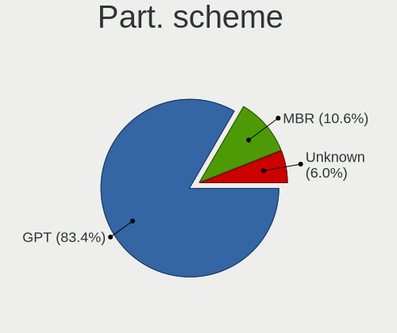
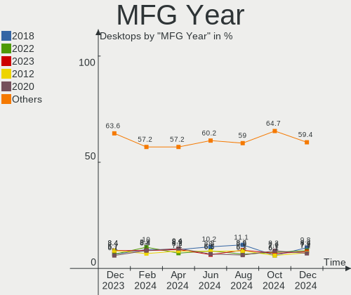
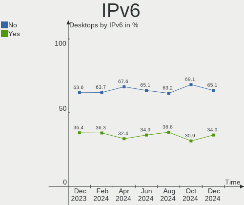

Ubuntu - Hardware Trends (Desktops)
-----------------------------------

A project to identify most popular hardware characteristics and track their change
over time based on data collected by Linux users at https://Linux-Hardware.org.

Anyone can contribute to this report by the [hw-probe](https://github.com/linuxhw/hw-probe) tool:

    sudo -E hw-probe -all -upload

This report is for one last month. Overall report since the beginning of time: [TestCoverage](https://github.com/linuxhw/TestCoverage)

Period: Jul, 2022.

Contents
--------

* [ System ](#system)
  - [ OS                       ](#os)
  - [ OS Family                ](#os-family)
  - [ Kernel                   ](#kernel)
  - [ Kernel Family            ](#kernel-family)
  - [ Kernel Major Ver.        ](#kernel-major-ver)
  - [ Arch                     ](#arch)
  - [ DE                       ](#de)
  - [ Display Server           ](#display-server)
  - [ Display Manager          ](#display-manager)
  - [ OS Lang                  ](#os-lang)
  - [ Boot Mode                ](#boot-mode)
  - [ Filesystem               ](#filesystem)
  - [ Part. scheme             ](#part-scheme)
  - [ Dual Boot with Linux/BSD ](#dual-boot-with-linuxbsd)
  - [ Dual Boot (Win)          ](#dual-boot-win)

* [ Board ](#board)
  - [ Vendor                   ](#vendor)
  - [ Model                    ](#model)
  - [ Model Family             ](#model-family)
  - [ MFG Year                 ](#mfg-year)
  - [ Form Factor              ](#form-factor)
  - [ Secure Boot              ](#secure-boot)
  - [ Coreboot                 ](#coreboot)
  - [ RAM Size                 ](#ram-size)
  - [ RAM Used                 ](#ram-used)
  - [ Total Drives             ](#total-drives)
  - [ Has CD-ROM               ](#has-cd-rom)
  - [ Has Ethernet             ](#has-ethernet)
  - [ Has WiFi                 ](#has-wifi)
  - [ Has Bluetooth            ](#has-bluetooth)

* [ Location ](#location)
  - [ Country                  ](#country)
  - [ City                     ](#city)

* [ Drives ](#drives)
  - [ Drive Vendor             ](#drive-vendor)
  - [ Drive Model              ](#drive-model)
  - [ HDD Vendor               ](#hdd-vendor)
  - [ SSD Vendor               ](#ssd-vendor)
  - [ Drive Kind               ](#drive-kind)
  - [ Drive Connector          ](#drive-connector)
  - [ Drive Size               ](#drive-size)
  - [ Space Total              ](#space-total)
  - [ Space Used               ](#space-used)
  - [ Malfunc. Drives          ](#malfunc-drives)
  - [ Malfunc. Drive Vendor    ](#malfunc-drive-vendor)
  - [ Malfunc. HDD Vendor      ](#malfunc-hdd-vendor)
  - [ Malfunc. Drive Kind      ](#malfunc-drive-kind)
  - [ Failed Drives            ](#failed-drives)
  - [ Failed Drive Vendor      ](#failed-drive-vendor)
  - [ Drive Status             ](#drive-status)

* [ Storage controller ](#storage-controller)
  - [ Storage Vendor           ](#storage-vendor)
  - [ Storage Model            ](#storage-model)
  - [ Storage Kind             ](#storage-kind)

* [ Processor ](#processor)
  - [ CPU Vendor               ](#cpu-vendor)
  - [ CPU Model                ](#cpu-model)
  - [ CPU Model Family         ](#cpu-model-family)
  - [ CPU Cores                ](#cpu-cores)
  - [ CPU Sockets              ](#cpu-sockets)
  - [ CPU Threads              ](#cpu-threads)
  - [ CPU Op-Modes             ](#cpu-op-modes)
  - [ CPU Microcode            ](#cpu-microcode)
  - [ CPU Microarch            ](#cpu-microarch)

* [ Graphics ](#graphics)
  - [ GPU Vendor               ](#gpu-vendor)
  - [ GPU Model                ](#gpu-model)
  - [ GPU Combo                ](#gpu-combo)
  - [ GPU Driver               ](#gpu-driver)
  - [ GPU Memory               ](#gpu-memory)

* [ Monitor ](#monitor)
  - [ Monitor Vendor           ](#monitor-vendor)
  - [ Monitor Model            ](#monitor-model)
  - [ Monitor Resolution       ](#monitor-resolution)
  - [ Monitor Diagonal         ](#monitor-diagonal)
  - [ Monitor Width            ](#monitor-width)
  - [ Aspect Ratio             ](#aspect-ratio)
  - [ Monitor Area             ](#monitor-area)
  - [ Pixel Density            ](#pixel-density)
  - [ Multiple Monitors        ](#multiple-monitors)

* [ Network ](#network)
  - [ Net Controller Vendor    ](#net-controller-vendor)
  - [ Net Controller Model     ](#net-controller-model)
  - [ Wireless Vendor          ](#wireless-vendor)
  - [ Wireless Model           ](#wireless-model)
  - [ Ethernet Vendor          ](#ethernet-vendor)
  - [ Ethernet Model           ](#ethernet-model)
  - [ Net Controller Kind      ](#net-controller-kind)
  - [ Used Controller          ](#used-controller)
  - [ NICs                     ](#nics)
  - [ IPv6                     ](#ipv6)

* [ Bluetooth ](#bluetooth)
  - [ Bluetooth Vendor         ](#bluetooth-vendor)
  - [ Bluetooth Model          ](#bluetooth-model)

* [ Sound ](#sound)
  - [ Sound Vendor             ](#sound-vendor)
  - [ Sound Model              ](#sound-model)

* [ Memory ](#memory)
  - [ Memory Vendor            ](#memory-vendor)
  - [ Memory Model             ](#memory-model)
  - [ Memory Kind              ](#memory-kind)
  - [ Memory Form Factor       ](#memory-form-factor)
  - [ Memory Size              ](#memory-size)
  - [ Memory Speed             ](#memory-speed)

* [ Printers & scanners ](#printers--scanners)
  - [ Printer Vendor           ](#printer-vendor)
  - [ Printer Model            ](#printer-model)
  - [ Scanner Vendor           ](#scanner-vendor)
  - [ Scanner Model            ](#scanner-model)

* [ Camera ](#camera)
  - [ Camera Vendor            ](#camera-vendor)
  - [ Camera Model             ](#camera-model)

* [ Security ](#security)
  - [ Fingerprint Vendor       ](#fingerprint-vendor)
  - [ Fingerprint Model        ](#fingerprint-model)
  - [ Chipcard Vendor          ](#chipcard-vendor)
  - [ Chipcard Model           ](#chipcard-model)

* [ Unsupported ](#unsupported)
  - [ Unsupported Devices      ](#unsupported-devices)
  - [ Unsupported Device Types ](#unsupported-device-types)

System
------

OS
--

Installed operating systems

| Name         | Desktops | Percent |
|--------------|----------|---------|
| Ubuntu 22.04 | 188      | 54.81%  |
| Ubuntu 20.04 | 127      | 37.03%  |
| Ubuntu 21.10 | 12       | 3.5%    |
| Ubuntu 18.04 | 11       | 3.21%   |
| Ubuntu 22.10 | 2        | 0.58%   |
| Ubuntu 21.04 | 1        | 0.29%   |
| Ubuntu 20.10 | 1        | 0.29%   |
| Ubuntu 16.04 | 1        | 0.29%   |

OS Family
---------

OS without a version

| Name   | Desktops | Percent |
|--------|----------|---------|
| Ubuntu | 343      | 100%    |

Kernel
------

Version of the Linux kernel

| Version                    | Desktops | Percent |
|----------------------------|----------|---------|
| 5.15.0-41-generic          | 126      | 36.73%  |
| 5.15.0-40-generic          | 61       | 17.78%  |
| 5.13.0-52-generic          | 36       | 10.5%   |
| 5.15.0-43-generic          | 18       | 5.25%   |
| 5.4.0-122-generic          | 13       | 3.79%   |
| 5.15.0-25-generic          | 13       | 3.79%   |
| 5.4.0-121-generic          | 12       | 3.5%    |
| 5.13.0-51-generic          | 7        | 2.04%   |
| 5.15.0-39-generic          | 6        | 1.75%   |
| 5.13.0-44-generic          | 3        | 0.87%   |
| 4.15.0-188-generic         | 3        | 0.87%   |
| 5.4.0-90-generic           | 2        | 0.58%   |
| 5.17.0-1013-oem            | 2        | 0.58%   |
| 5.15.0-35-generic          | 2        | 0.58%   |
| 5.13.0-39-generic          | 2        | 0.58%   |
| 5.13.0-28-generic          | 2        | 0.58%   |
| 5.11.0-49-generic          | 2        | 0.58%   |
| 5.11.0-27-generic          | 2        | 0.58%   |
| 5.8.0-53-generic           | 1        | 0.29%   |
| 5.8.0-43-generic           | 1        | 0.29%   |
| 5.8.0-25-generic           | 1        | 0.29%   |
| 5.7.0-050700-generic       | 1        | 0.29%   |
| 5.4.0-72-generic           | 1        | 0.29%   |
| 5.4.0-58-generic           | 1        | 0.29%   |
| 5.4.0-42-generic           | 1        | 0.29%   |
| 5.4.0-26-generic           | 1        | 0.29%   |
| 5.4.0-120-generic          | 1        | 0.29%   |
| 5.4.0-104-generic          | 1        | 0.29%   |
| 5.18.8-051808-generic      | 1        | 0.29%   |
| 5.18.13-051813-generic     | 1        | 0.29%   |
| 5.18.10-051810-generic     | 1        | 0.29%   |
| 5.18.0-14.2-liquorix-amd64 | 1        | 0.29%   |
| 5.17.7-051707-generic      | 1        | 0.29%   |
| 5.15.0-42-lowlatency       | 1        | 0.29%   |
| 5.15.0-40-lowlatency       | 1        | 0.29%   |
| 5.15.0-37-generic          | 1        | 0.29%   |
| 5.15.0-32-generic          | 1        | 0.29%   |
| 5.14.0-1045-oem            | 1        | 0.29%   |
| 5.13.0-48-generic          | 1        | 0.29%   |
| 5.13.0-41-generic          | 1        | 0.29%   |
| 5.13.0-40-generic          | 1        | 0.29%   |
| 5.13.0-35-generic          | 1        | 0.29%   |
| 5.13.0-30-generic          | 1        | 0.29%   |
| 5.13.0-27-generic          | 1        | 0.29%   |
| 5.13.0-1017-intel          | 1        | 0.29%   |
| 5.11.0-43-generic          | 1        | 0.29%   |
| 4.15.0-189-generic         | 1        | 0.29%   |
| 4.15.0-188-lowlatency      | 1        | 0.29%   |
| 4.15.0-142-generic         | 1        | 0.29%   |

Kernel Family
-------------

Linux kernel without a distro release

| Version | Desktops | Percent |
|---------|----------|---------|
| 5.15.0  | 230      | 67.06%  |
| 5.13.0  | 57       | 16.62%  |
| 5.4.0   | 33       | 9.62%   |
| 4.15.0  | 6        | 1.75%   |
| 5.11.0  | 5        | 1.46%   |
| 5.8.0   | 3        | 0.87%   |
| 5.17.0  | 2        | 0.58%   |
| 5.7.0   | 1        | 0.29%   |
| 5.18.8  | 1        | 0.29%   |
| 5.18.13 | 1        | 0.29%   |
| 5.18.10 | 1        | 0.29%   |
| 5.18.0  | 1        | 0.29%   |
| 5.17.7  | 1        | 0.29%   |
| 5.14.0  | 1        | 0.29%   |

Kernel Major Ver.
-----------------

Linux kernel major version

| Version | Desktops | Percent |
|---------|----------|---------|
| 5.15    | 230      | 67.06%  |
| 5.13    | 57       | 16.62%  |
| 5.4     | 33       | 9.62%   |
| 4.15    | 6        | 1.75%   |
| 5.11    | 5        | 1.46%   |
| 5.18    | 4        | 1.17%   |
| 5.8     | 3        | 0.87%   |
| 5.17    | 3        | 0.87%   |
| 5.7     | 1        | 0.29%   |
| 5.14    | 1        | 0.29%   |

Arch
----

OS architecture (x86_64, i586, etc.)

| Name   | Desktops | Percent |
|--------|----------|---------|
| x86_64 | 342      | 99.71%  |
| i686   | 1        | 0.29%   |

DE
--

Desktop Environment

| Name            | Desktops | Percent |
|-----------------|----------|---------|
| GNOME           | 310      | 90.38%  |
| Unknown         | 19       | 5.54%   |
| X-Cinnamon      | 5        | 1.46%   |
| Unity           | 5        | 1.46%   |
| GNOME Classic   | 2        | 0.58%   |
| i3              | 1        | 0.29%   |
| GNOME Flashback | 1        | 0.29%   |

Display Server
--------------

X11 or Wayland

| Name    | Desktops | Percent |
|---------|----------|---------|
| X11     | 211      | 61.52%  |
| Wayland | 115      | 33.53%  |
| Tty     | 11       | 3.21%   |
| Unknown | 6        | 1.75%   |

Display Manager
---------------

SDDM, LightDM, etc.

| Name    | Desktops | Percent |
|---------|----------|---------|
| GDM3    | 266      | 77.55%  |
| GDM     | 35       | 10.2%   |
| Unknown | 27       | 7.87%   |
| LightDM | 14       | 4.08%   |
| SLiM    | 1        | 0.29%   |

OS Lang
-------

Language

| Lang    | Desktops | Percent |
|---------|----------|---------|
| en_US   | 148      | 43.15%  |
| de_DE   | 39       | 11.37%  |
| fr_FR   | 19       | 5.54%   |
| en_CA   | 16       | 4.66%   |
| en_GB   | 15       | 4.37%   |
| it_IT   | 12       | 3.5%    |
| ru_RU   | 11       | 3.21%   |
| pt_BR   | 9        | 2.62%   |
| pl_PL   | 9        | 2.62%   |
| es_AR   | 8        | 2.33%   |
| C       | 7        | 2.04%   |
| es_ES   | 6        | 1.75%   |
| nl_NL   | 4        | 1.17%   |
| cs_CZ   | 4        | 1.17%   |
| pt_PT   | 3        | 0.87%   |
| nl_BE   | 3        | 0.87%   |
| ko_KR   | 3        | 0.87%   |
| en_AU   | 3        | 0.87%   |
| zh_CN   | 2        | 0.58%   |
| ja_JP   | 2        | 0.58%   |
| es_MX   | 2        | 0.58%   |
| en_PH   | 2        | 0.58%   |
| en_NZ   | 2        | 0.58%   |
| de_AT   | 2        | 0.58%   |
| zh_TW   | 1        | 0.29%   |
| sv_SE   | 1        | 0.29%   |
| nb_NO   | 1        | 0.29%   |
| hr_HR   | 1        | 0.29%   |
| fr_CA   | 1        | 0.29%   |
| fr_BE   | 1        | 0.29%   |
| es_CU   | 1        | 0.29%   |
| en_ZA   | 1        | 0.29%   |
| en_SG   | 1        | 0.29%   |
| en_IN   | 1        | 0.29%   |
| de_CH   | 1        | 0.29%   |
| Unknown | 1        | 0.29%   |

Boot Mode
---------

EFI or BIOS

| Mode | Desktops | Percent |
|------|----------|---------|
| BIOS | 234      | 68.22%  |
| EFI  | 109      | 31.78%  |

Filesystem
----------

Type of filesystem

| Type    | Desktops | Percent |
|---------|----------|---------|
| Ext4    | 315      | 91.84%  |
| Zfs     | 10       | 2.92%   |
| Overlay | 8        | 2.33%   |
| Btrfs   | 6        | 1.75%   |
| Xfs     | 1        | 0.29%   |
| Jfs     | 1        | 0.29%   |
| Ext2    | 1        | 0.29%   |
| Unknown | 1        | 0.29%   |

Part. scheme
------------

Scheme of partitioning

| Type    | Desktops | Percent |
|---------|----------|---------|
| Unknown | 239      | 69.68%  |
| GPT     | 85       | 24.78%  |
| MBR     | 19       | 5.54%   |

Dual Boot with Linux/BSD
------------------------

Hosting more than one Linux/BSD

| Dual boot | Desktops | Percent |
|-----------|----------|---------|
| No        | 278      | 81.05%  |
| Yes       | 65       | 18.95%  |

Dual Boot (Win)
---------------

Hosting Linux and Windows

| Dual boot | Desktops | Percent |
|-----------|----------|---------|
| No        | 212      | 61.81%  |
| Yes       | 131      | 38.19%  |

Board
-----

Vendor
------

Motherboard manufacturer

| Name                | Desktops | Percent |
|---------------------|----------|---------|
| ASUSTek Computer    | 75       | 21.87%  |
| Gigabyte Technology | 54       | 15.74%  |
| MSI                 | 45       | 13.12%  |
| Dell                | 35       | 10.2%   |
| Hewlett-Packard     | 27       | 7.87%   |
| ASRock              | 23       | 6.71%   |
| Lenovo              | 15       | 4.37%   |
| Acer                | 10       | 2.92%   |
| Intel               | 8        | 2.33%   |
| Apple               | 5        | 1.46%   |
| Pegatron            | 4        | 1.17%   |
| Medion              | 4        | 1.17%   |
| Biostar             | 4        | 1.17%   |
| Huanan              | 3        | 0.87%   |
| Fujitsu             | 3        | 0.87%   |
| ECS                 | 3        | 0.87%   |
| Alienware           | 3        | 0.87%   |
| Shuttle             | 2        | 0.58%   |
| Foxconn             | 2        | 0.58%   |
| Unknown             | 2        | 0.58%   |
| YANYU               | 1        | 0.29%   |
| XDO.AI              | 1        | 0.29%   |
| X79-1356            | 1        | 0.29%   |
| WinFast             | 1        | 0.29%   |
| Supermicro          | 1        | 0.29%   |
| Seeed Studio        | 1        | 0.29%   |
| PCWare              | 1        | 0.29%   |
| PCPartner           | 1        | 0.29%   |
| Packard Bell        | 1        | 0.29%   |
| Olidata             | 1        | 0.29%   |
| Gateway             | 1        | 0.29%   |
| GALAX               | 1        | 0.29%   |
| Fujitsu Siemens     | 1        | 0.29%   |
| ASRockRack          | 1        | 0.29%   |
| AMI                 | 1        | 0.29%   |
| ABIT                | 1        | 0.29%   |

Model
-----

Motherboard model

| Name                          | Desktops | Percent |
|-------------------------------|----------|---------|
| ASUS All Series               | 9        | 2.62%   |
| Apple MacPro5,1               | 5        | 1.46%   |
| Unknown                       | 5        | 1.46%   |
| MSI MS-7C02                   | 3        | 0.87%   |
| MSI MS-7817                   | 3        | 0.87%   |
| Gigabyte 970A-DS3P            | 3        | 0.87%   |
| Dell OptiPlex 755             | 3        | 0.87%   |
| Dell OptiPlex 7010            | 3        | 0.87%   |
| ASUS TUF Gaming X570-PLUS     | 3        | 0.87%   |
| MSI MS-7D54                   | 2        | 0.58%   |
| MSI MS-7C96                   | 2        | 0.58%   |
| MSI MS-7C35                   | 2        | 0.58%   |
| MSI MS-7B79                   | 2        | 0.58%   |
| MSI MS-7B17                   | 2        | 0.58%   |
| MSI MS-7721                   | 2        | 0.58%   |
| HP Z440 Workstation           | 2        | 0.58%   |
| HP ProDesk 600 G1 SFF         | 2        | 0.58%   |
| HP Compaq Elite 8300 SFF      | 2        | 0.58%   |
| Gigabyte Z97X-Gaming 3        | 2        | 0.58%   |
| Dell OptiPlex 390             | 2        | 0.58%   |
| Dell OptiPlex 3010            | 2        | 0.58%   |
| Dell Inspiron 3668            | 2        | 0.58%   |
| ASUS ROG STRIX B550-F GAMING  | 2        | 0.58%   |
| ASUS ROG STRIX B450-F GAMING  | 2        | 0.58%   |
| ASUS PRIME B450M-A            | 2        | 0.58%   |
| ASUS M5A78L-M/USB3            | 2        | 0.58%   |
| ASRock H310CM-HDV             | 2        | 0.58%   |
| YANYU EPIC-C19                | 1        | 0.29%   |
| XDO.AI Pantera Pico PC        | 1        | 0.29%   |
| WinFast N570SM2AA             | 1        | 0.29%   |
| Supermicro SSG-6028R-E1CR12T  | 1        | 0.29%   |
| Shuttle SH67H                 | 1        | 0.29%   |
| Shuttle DS61                  | 1        | 0.29%   |
| Seeed Studio ODYSSEY-X86J4125 | 1        | 0.29%   |
| Pegatron NY550AA-ABA p6240f   | 1        | 0.29%   |
| Pegatron NQ840AA-ABD p6029de  | 1        | 0.29%   |
| Pegatron 520-1060la           | 1        | 0.29%   |
| Pegatron 220-1125             | 1        | 0.29%   |
| PCWare IPMH61R1               | 1        | 0.29%   |
| PCPartner DREAMSYS            | 1        | 0.29%   |
| Packard Bell IMEDIA S3800     | 1        | 0.29%   |
| MSI s5650br                   | 1        | 0.29%   |
| MSI p6530br                   | 1        | 0.29%   |
| MSI NQ890AA-ABZ CQ5011IT      | 1        | 0.29%   |
| MSI MS-9A95                   | 1        | 0.29%   |
| MSI MS-7D43                   | 1        | 0.29%   |
| MSI MS-7D30                   | 1        | 0.29%   |
| MSI MS-7D23                   | 1        | 0.29%   |
| MSI MS-7D19                   | 1        | 0.29%   |
| MSI MS-7D15                   | 1        | 0.29%   |
| MSI MS-7D09                   | 1        | 0.29%   |
| MSI MS-7C92                   | 1        | 0.29%   |
| MSI MS-7C91                   | 1        | 0.29%   |
| MSI MS-7C75                   | 1        | 0.29%   |
| MSI MS-7B07                   | 1        | 0.29%   |
| MSI MS-7A72                   | 1        | 0.29%   |
| MSI MS-7A70                   | 1        | 0.29%   |
| MSI MS-7A38                   | 1        | 0.29%   |
| MSI MS-7994                   | 1        | 0.29%   |
| MSI MS-7984                   | 1        | 0.29%   |

Model Family
------------

Motherboard model prefix

| Name                          | Desktops | Percent |
|-------------------------------|----------|---------|
| Dell OptiPlex                 | 23       | 6.71%   |
| ASUS PRIME                    | 12       | 3.5%    |
| HP Compaq                     | 10       | 2.92%   |
| ASUS ROG                      | 10       | 2.92%   |
| Lenovo ThinkCentre            | 9        | 2.62%   |
| ASUS All                      | 9        | 2.62%   |
| ASUS TUF                      | 8        | 2.33%   |
| Acer Aspire                   | 8        | 2.33%   |
| HP ProDesk                    | 5        | 1.46%   |
| Apple MacPro5                 | 5        | 1.46%   |
| Unknown                       | 5        | 1.46%   |
| Gigabyte X570                 | 4        | 1.17%   |
| Dell Inspiron                 | 4        | 1.17%   |
| MSI MS-7C02                   | 3        | 0.87%   |
| MSI MS-7817                   | 3        | 0.87%   |
| Lenovo IdeaCentre             | 3        | 0.87%   |
| Gigabyte 970A-DS3P            | 3        | 0.87%   |
| Dell Precision                | 3        | 0.87%   |
| ASUS P8H61-M                  | 3        | 0.87%   |
| MSI MS-7D54                   | 2        | 0.58%   |
| MSI MS-7C96                   | 2        | 0.58%   |
| MSI MS-7C35                   | 2        | 0.58%   |
| MSI MS-7B79                   | 2        | 0.58%   |
| MSI MS-7B17                   | 2        | 0.58%   |
| MSI MS-7721                   | 2        | 0.58%   |
| HP Z440                       | 2        | 0.58%   |
| HP Pavilion                   | 2        | 0.58%   |
| HP EliteDesk                  | 2        | 0.58%   |
| Gigabyte Z97X-Gaming          | 2        | 0.58%   |
| Gigabyte Z390                 | 2        | 0.58%   |
| Gigabyte X570S                | 2        | 0.58%   |
| Gigabyte GA-78LMT-USB3        | 2        | 0.58%   |
| Fujitsu ESPRIMO               | 2        | 0.58%   |
| Dell XPS                      | 2        | 0.58%   |
| ASUS STRIX                    | 2        | 0.58%   |
| ASUS Pro                      | 2        | 0.58%   |
| ASUS P7H55-M                  | 2        | 0.58%   |
| ASUS M5A78L-M                 | 2        | 0.58%   |
| ASRock H310CM-HDV             | 2        | 0.58%   |
| Alienware Aurora              | 2        | 0.58%   |
| YANYU EPIC-C19                | 1        | 0.29%   |
| XDO.AI Pantera                | 1        | 0.29%   |
| WinFast N570SM2AA             | 1        | 0.29%   |
| Supermicro SSG-6028R-E1CR12T  | 1        | 0.29%   |
| Shuttle SH67H                 | 1        | 0.29%   |
| Shuttle DS61                  | 1        | 0.29%   |
| Seeed Studio ODYSSEY-X86J4125 | 1        | 0.29%   |
| Pegatron NY550AA-ABA          | 1        | 0.29%   |
| Pegatron NQ840AA-ABD          | 1        | 0.29%   |
| Pegatron 520-1060la           | 1        | 0.29%   |
| Pegatron 220-1125             | 1        | 0.29%   |
| PCWare IPMH61R1               | 1        | 0.29%   |
| PCPartner DREAMSYS            | 1        | 0.29%   |
| Packard Bell IMEDIA           | 1        | 0.29%   |
| MSI s5650br                   | 1        | 0.29%   |
| MSI p6530br                   | 1        | 0.29%   |
| MSI NQ890AA-ABZ               | 1        | 0.29%   |
| MSI MS-9A95                   | 1        | 0.29%   |
| MSI MS-7D43                   | 1        | 0.29%   |
| MSI MS-7D30                   | 1        | 0.29%   |

MFG Year
--------

Motherboard manufacture year

| Year    | Desktops | Percent |
|---------|----------|---------|
| 2021    | 35       | 10.2%   |
| 2013    | 33       | 9.62%   |
| 2014    | 31       | 9.04%   |
| 2018    | 29       | 8.45%   |
| 2020    | 24       | 7%      |
| 2019    | 24       | 7%      |
| 2012    | 23       | 6.71%   |
| 2011    | 23       | 6.71%   |
| 2010    | 22       | 6.41%   |
| 2015    | 17       | 4.96%   |
| 2008    | 16       | 4.66%   |
| 2017    | 15       | 4.37%   |
| 2009    | 15       | 4.37%   |
| 2016    | 11       | 3.21%   |
| 2007    | 11       | 3.21%   |
| 2022    | 8        | 2.33%   |
| 2006    | 3        | 0.87%   |
| 2005    | 2        | 0.58%   |
| Unknown | 1        | 0.29%   |

Form Factor
-----------

Physical design of the computer

| Name    | Desktops | Percent |
|---------|----------|---------|
| Desktop | 343      | 100%    |

Secure Boot
-----------

Enabled or disabled

| State    | Desktops | Percent |
|----------|----------|---------|
| Disabled | 332      | 96.79%  |
| Enabled  | 11       | 3.21%   |

Coreboot
--------

Have coreboot on board

| Used | Desktops | Percent |
|------|----------|---------|
| No   | 343      | 100%    |

RAM Size
--------

Total RAM memory

| Size in GB      | Desktops | Percent |
|-----------------|----------|---------|
| 16.01-24.0      | 98       | 28.57%  |
| 4.01-8.0        | 61       | 17.78%  |
| 32.01-64.0      | 52       | 15.16%  |
| 8.01-16.0       | 50       | 14.58%  |
| 3.01-4.0        | 49       | 14.29%  |
| 64.01-256.0     | 17       | 4.96%   |
| 24.01-32.0      | 6        | 1.75%   |
| 1.01-2.0        | 6        | 1.75%   |
| 2.01-3.0        | 2        | 0.58%   |
| More than 256.0 | 1        | 0.29%   |
| 0.51-1.0        | 1        | 0.29%   |

RAM Used
--------

Used RAM memory

| Used GB    | Desktops | Percent |
|------------|----------|---------|
| 1.01-2.0   | 138      | 40.23%  |
| 2.01-3.0   | 93       | 27.11%  |
| 3.01-4.0   | 45       | 13.12%  |
| 4.01-8.0   | 38       | 11.08%  |
| 8.01-16.0  | 16       | 4.66%   |
| 0.51-1.0   | 10       | 2.92%   |
| 16.01-24.0 | 2        | 0.58%   |
| 24.01-32.0 | 1        | 0.29%   |

Total Drives
------------

Number of drives on board

| Drives | Desktops | Percent |
|--------|----------|---------|
| 1      | 151      | 44.02%  |
| 2      | 92       | 26.82%  |
| 3      | 49       | 14.29%  |
| 4      | 23       | 6.71%   |
| 5      | 14       | 4.08%   |
| 6      | 5        | 1.46%   |
| 0      | 3        | 0.87%   |
| 11     | 2        | 0.58%   |
| 12     | 1        | 0.29%   |
| 9      | 1        | 0.29%   |
| 8      | 1        | 0.29%   |
| 7      | 1        | 0.29%   |

Has CD-ROM
----------

Has CD-ROM on board

| Presented | Desktops | Percent |
|-----------|----------|---------|
| No        | 185      | 53.94%  |
| Yes       | 158      | 46.06%  |

Has Ethernet
------------

Has Ethernet on board

| Presented | Desktops | Percent |
|-----------|----------|---------|
| Yes       | 338      | 98.54%  |
| No        | 5        | 1.46%   |

Has WiFi
--------

Has WiFi module

| Presented | Desktops | Percent |
|-----------|----------|---------|
| No        | 175      | 51.02%  |
| Yes       | 168      | 48.98%  |

Has Bluetooth
-------------

Has Bluetooth module

| Presented | Desktops | Percent |
|-----------|----------|---------|
| No        | 247      | 72.01%  |
| Yes       | 96       | 27.99%  |

Location
--------

Country
-------

Geographic location (country)

| Country      | Desktops | Percent |
|--------------|----------|---------|
| USA          | 92       | 26.82%  |
| Germany      | 44       | 12.83%  |
| Canada       | 19       | 5.54%   |
| France       | 17       | 4.96%   |
| Brazil       | 17       | 4.96%   |
| UK           | 16       | 4.66%   |
| Italy        | 13       | 3.79%   |
| Poland       | 10       | 2.92%   |
| Russia       | 9        | 2.62%   |
| Belgium      | 9        | 2.62%   |
| Argentina    | 8        | 2.33%   |
| Spain        | 6        | 1.75%   |
| Sweden       | 5        | 1.46%   |
| Portugal     | 5        | 1.46%   |
| Switzerland  | 4        | 1.17%   |
| South Korea  | 4        | 1.17%   |
| Netherlands  | 4        | 1.17%   |
| Czechia      | 4        | 1.17%   |
| Mexico       | 3        | 0.87%   |
| Japan        | 3        | 0.87%   |
| Hungary      | 3        | 0.87%   |
| Austria      | 3        | 0.87%   |
| Australia    | 3        | 0.87%   |
| Taiwan       | 2        | 0.58%   |
| Romania      | 2        | 0.58%   |
| Philippines  | 2        | 0.58%   |
| Norway       | 2        | 0.58%   |
| New Zealand  | 2        | 0.58%   |
| Luxembourg   | 2        | 0.58%   |
| Kazakhstan   | 2        | 0.58%   |
| Greece       | 2        | 0.58%   |
| China        | 2        | 0.58%   |
| Bulgaria     | 2        | 0.58%   |
| Venezuela    | 1        | 0.29%   |
| Turkey       | 1        | 0.29%   |
| South Africa | 1        | 0.29%   |
| Slovenia     | 1        | 0.29%   |
| Singapore    | 1        | 0.29%   |
| Réunion     | 1        | 0.29%   |
| Pakistan     | 1        | 0.29%   |
| Myanmar      | 1        | 0.29%   |
| Morocco      | 1        | 0.29%   |
| Moldova      | 1        | 0.29%   |
| Ivory Coast  | 1        | 0.29%   |
| Iran         | 1        | 0.29%   |
| India        | 1        | 0.29%   |
| Finland      | 1        | 0.29%   |
| Estonia      | 1        | 0.29%   |
| Denmark      | 1        | 0.29%   |
| Cuba         | 1        | 0.29%   |
| Croatia      | 1        | 0.29%   |
| Chile        | 1        | 0.29%   |
| Bolivia      | 1        | 0.29%   |
| Belarus      | 1        | 0.29%   |
| Albania      | 1        | 0.29%   |

City
----

Geographic location (city)

| City            | Desktops | Percent |
|-----------------|----------|---------|
| Sao Paulo       | 5        | 1.46%   |
| Munich          | 4        | 1.17%   |
| Västerås      | 3        | 0.87%   |
| San Jose        | 3        | 0.87%   |
| Phoenix         | 3        | 0.87%   |
| Moscow          | 3        | 0.87%   |
| Milan           | 3        | 0.87%   |
| Hamburg         | 3        | 0.87%   |
| Chicago         | 3        | 0.87%   |
| Berlin          | 3        | 0.87%   |
| Vienna          | 2        | 0.58%   |
| Vancouver       | 2        | 0.58%   |
| Toronto         | 2        | 0.58%   |
| Taipei          | 2        | 0.58%   |
| Santa Clara     | 2        | 0.58%   |
| Roubaix         | 2        | 0.58%   |
| Raleigh         | 2        | 0.58%   |
| Prague          | 2        | 0.58%   |
| Plauen          | 2        | 0.58%   |
| Peoria          | 2        | 0.58%   |
| Owen Sound      | 2        | 0.58%   |
| Milwaukee       | 2        | 0.58%   |
| Milton Keynes   | 2        | 0.58%   |
| Miami           | 2        | 0.58%   |
| Los Angeles     | 2        | 0.58%   |
| Jacksonville    | 2        | 0.58%   |
| Grenoble        | 2        | 0.58%   |
| Chorley         | 2        | 0.58%   |
| Budapest        | 2        | 0.58%   |
| Bredene         | 2        | 0.58%   |
| Barcelona       | 2        | 0.58%   |
| Arciechow       | 2        | 0.58%   |
| Amsterdam       | 2        | 0.58%   |
| Zurich          | 1        | 0.29%   |
| Zephyrhills     | 1        | 0.29%   |
| Zagreb          | 1        | 0.29%   |
| Ypsilanti       | 1        | 0.29%   |
| Yokohama        | 1        | 0.29%   |
| Wroclaw         | 1        | 0.29%   |
| Witten          | 1        | 0.29%   |
| Wheeling        | 1        | 0.29%   |
| Westminster     | 1        | 0.29%   |
| Wenzenbach      | 1        | 0.29%   |
| Weaverville     | 1        | 0.29%   |
| Waterford       | 1        | 0.29%   |
| Warsaw          | 1        | 0.29%   |
| Volta Redonda   | 1        | 0.29%   |
| Villa Ballester | 1        | 0.29%   |
| Versailles      | 1        | 0.29%   |
| Venetia         | 1        | 0.29%   |
| Vawkavysk       | 1        | 0.29%   |
| Valencia        | 1        | 0.29%   |
| Turnhout        | 1        | 0.29%   |
| Tula            | 1        | 0.29%   |
| Tucson          | 1        | 0.29%   |
| Troisdorf       | 1        | 0.29%   |
| Toritama        | 1        | 0.29%   |
| Tirana          | 1        | 0.29%   |
| Thessaloniki    | 1        | 0.29%   |
| The Hague       | 1        | 0.29%   |

Drives
------

Drive Vendor
------------

Hard drive vendors

| Vendor                       | Desktops | Drives | Percent |
|------------------------------|----------|--------|---------|
| WDC                          | 116      | 160    | 20.21%  |
| Seagate                      | 115      | 169    | 20.03%  |
| Samsung Electronics          | 76       | 108    | 13.24%  |
| Kingston                     | 39       | 46     | 6.79%   |
| SanDisk                      | 32       | 45     | 5.57%   |
| Toshiba                      | 27       | 29     | 4.7%    |
| Crucial                      | 23       | 24     | 4.01%   |
| Hitachi                      | 14       | 14     | 2.44%   |
| A-DATA Technology            | 11       | 11     | 1.92%   |
| SK hynix                     | 8        | 8      | 1.39%   |
| PNY                          | 7        | 7      | 1.22%   |
| OCZ                          | 6        | 7      | 1.05%   |
| HGST                         | 6        | 8      | 1.05%   |
| Unknown                      | 5        | 5      | 0.87%   |
| Intel                        | 5        | 5      | 0.87%   |
| China                        | 5        | 6      | 0.87%   |
| Team                         | 4        | 4      | 0.7%    |
| Phison                       | 4        | 9      | 0.7%    |
| KIOXIA                       | 4        | 4      | 0.7%    |
| SPCC                         | 3        | 3      | 0.52%   |
| Silicon Motion               | 3        | 3      | 0.52%   |
| Micron Technology            | 3        | 3      | 0.52%   |
| Intenso                      | 3        | 3      | 0.52%   |
| WD MediaMax                  | 2        | 2      | 0.35%   |
| SABRENT                      | 2        | 3      | 0.35%   |
| Realtek Semiconductor        | 2        | 2      | 0.35%   |
| Plextor                      | 2        | 2      | 0.35%   |
| Patriot                      | 2        | 4      | 0.35%   |
| Maxtor                       | 2        | 2      | 0.35%   |
| Lexar                        | 2        | 2      | 0.35%   |
| GOODRAM                      | 2        | 2      | 0.35%   |
| Corsair                      | 2        | 2      | 0.35%   |
| ASMT                         | 2        | 2      | 0.35%   |
| Apple                        | 2        | 2      | 0.35%   |
| Unknown                      | 2        | 2      | 0.35%   |
| Zheino                       | 1        | 1      | 0.17%   |
| XPG                          | 1        | 1      | 0.17%   |
| WALRAM                       | 1        | 1      | 0.17%   |
| UMIS                         | 1        | 1      | 0.17%   |
| Transcend                    | 1        | 1      | 0.17%   |
| TEXTORM                      | 1        | 1      | 0.17%   |
| Soyo                         | 1        | 1      | 0.17%   |
| Smartbuy                     | 1        | 1      | 0.17%   |
| Shenzhen Longsys Electronics | 1        | 1      | 0.17%   |
| SATADOM-ML                   | 1        | 1      | 0.17%   |
| RZX                          | 1        | 1      | 0.17%   |
| PNY USB                      | 1        | 1      | 0.17%   |
| OWC                          | 1        | 1      | 0.17%   |
| OCZ-VERTEX3                  | 1        | 1      | 0.17%   |
| Netac                        | 1        | 1      | 0.17%   |
| Mushkin                      | 1        | 1      | 0.17%   |
| Micron/Crucial Technology    | 1        | 1      | 0.17%   |
| LITEON                       | 1        | 1      | 0.17%   |
| Lite-On                      | 1        | 1      | 0.17%   |
| Leven                        | 1        | 1      | 0.17%   |
| KingDian                     | 1        | 1      | 0.17%   |
| JMicron Technology           | 1        | 1      | 0.17%   |
| Inateck                      | 1        | 1      | 0.17%   |
| HPE                          | 1        | 1      | 0.17%   |
| HGST HTS                     | 1        | 1      | 0.17%   |

Drive Model
-----------

Hard drive models

| Model                            | Desktops | Percent |
|----------------------------------|----------|---------|
| Seagate ST2000DM008-2FR102 2TB   | 10       | 1.48%   |
| Seagate ST1000DM010-2EP102 1TB   | 9        | 1.33%   |
| Kingston SA400S37240G 240GB SSD  | 9        | 1.33%   |
| Samsung SSD 980 PRO 1TB          | 8        | 1.18%   |
| Toshiba DT01ACA100 1TB           | 7        | 1.03%   |
| Seagate ST500DM002-1BD142 500GB  | 7        | 1.03%   |
| SanDisk NVMe SSD Drive 1TB       | 7        | 1.03%   |
| Samsung NVMe SSD Drive 1TB       | 7        | 1.03%   |
| Seagate ST1000DM003-1CH162 1TB   | 6        | 0.89%   |
| Samsung SSD 850 EVO 500GB        | 5        | 0.74%   |
| Kingston SA400S37120G 120GB SSD  | 5        | 0.74%   |
| WDC WD10EARS-22Y5B1 1TB          | 4        | 0.59%   |
| Seagate ST4000DM004-2CV104 4TB   | 4        | 0.59%   |
| Seagate ST2000DM006-2DM164 2TB   | 4        | 0.59%   |
| Seagate ST1000DM003-1ER162 1TB   | 4        | 0.59%   |
| SanDisk NVMe SSD Drive 500GB     | 4        | 0.59%   |
| Kingston SV300S37A120G 120GB SSD | 4        | 0.59%   |
| Kingston SA400S37480G 480GB SSD  | 4        | 0.59%   |
| Crucial CT500MX500SSD1 500GB     | 4        | 0.59%   |
| WDC WD5000AAKX-60U6AA0 500GB     | 3        | 0.44%   |
| WDC WD10EZEX-08WN4A0 1TB         | 3        | 0.44%   |
| WDC WD10EZEX-00WN4A0 1TB         | 3        | 0.44%   |
| Unknown SD/MMC/MS PRO 64GB       | 3        | 0.44%   |
| Toshiba HDWD110 1TB              | 3        | 0.44%   |
| Seagate ST3250410AS 250GB        | 3        | 0.44%   |
| Seagate ST31000524AS 1TB         | 3        | 0.44%   |
| Samsung SSD 860 EVO 500GB        | 3        | 0.44%   |
| Samsung SSD 850 EVO 250GB        | 3        | 0.44%   |
| Samsung HD103SI 1TB              | 3        | 0.44%   |
| OCZ VERTEX3 120GB SSD            | 3        | 0.44%   |
| Crucial CT1000MX500SSD1 1TB      | 3        | 0.44%   |
| WDC WDS500G2B0A-00SM50 500GB SSD | 2        | 0.3%    |
| WDC WDS480G2G0A-00JH30 480GB SSD | 2        | 0.3%    |
| WDC WDS100T2G0A-00JH30 1TB SSD   | 2        | 0.3%    |
| WDC WD5000AAKX-75U6AA0 500GB     | 2        | 0.3%    |
| WDC WD5000AADS-00S9B0 500GB      | 2        | 0.3%    |
| WDC WD40EZRZ-00GXCB0 4TB         | 2        | 0.3%    |
| WDC WD4003FZEX-00Z4SA0 4TB       | 2        | 0.3%    |
| WDC WD3200AAKS-75L9A0 320GB      | 2        | 0.3%    |
| WDC WD30EFRX-68EUZN0 3TB         | 2        | 0.3%    |
| WDC WD2500AAJS-75B4A0 250GB      | 2        | 0.3%    |
| WDC WD20EZRZ-00Z5HB0 2TB         | 2        | 0.3%    |
| WDC WD20EARS-00MVWB0 2TB         | 2        | 0.3%    |
| WDC WD10EZEX-60WN4A0 1TB         | 2        | 0.3%    |
| WDC WD10EZEX-08M2NA0 1TB         | 2        | 0.3%    |
| WDC WD10EZEX-00BN5A0 1TB         | 2        | 0.3%    |
| WDC WD10EARX-00N0YB0 1TB         | 2        | 0.3%    |
| WDC WD1003FZEX-00MK2A0 1TB       | 2        | 0.3%    |
| WDC WD1001FALS-00J7B0 1TB        | 2        | 0.3%    |
| Toshiba DT01ACA200 2TB           | 2        | 0.3%    |
| Toshiba DT01ACA050 500GB         | 2        | 0.3%    |
| Team T253X6001T 1024GB SSD       | 2        | 0.3%    |
| Seagate ST8000DM004-2CX188 8TB   | 2        | 0.3%    |
| Seagate ST4000VN008-2DR166 4TB   | 2        | 0.3%    |
| Seagate ST3500418AS 500GB        | 2        | 0.3%    |
| Seagate ST3320620AS 320GB        | 2        | 0.3%    |
| Seagate ST3250318AS 250GB        | 2        | 0.3%    |
| Seagate ST3250310AS 250GB        | 2        | 0.3%    |
| Seagate ST31500341AS 1TB         | 2        | 0.3%    |
| Seagate ST31000528AS 1TB         | 2        | 0.3%    |

HDD Vendor
----------

Hard disk drive vendors

| Vendor              | Desktops | Drives | Percent |
|---------------------|----------|--------|---------|
| Seagate             | 112      | 163    | 38.23%  |
| WDC                 | 100      | 138    | 34.13%  |
| Toshiba             | 24       | 25     | 8.19%   |
| Samsung Electronics | 23       | 27     | 7.85%   |
| Hitachi             | 14       | 14     | 4.78%   |
| HGST                | 6        | 8      | 2.05%   |
| Unknown             | 3        | 3      | 1.02%   |
| WD MediaMax         | 2        | 2      | 0.68%   |
| SABRENT             | 2        | 3      | 0.68%   |
| Maxtor              | 2        | 2      | 0.68%   |
| Intenso             | 2        | 2      | 0.68%   |
| HPE                 | 1        | 1      | 0.34%   |
| ASMT                | 1        | 1      | 0.34%   |
| Apple               | 1        | 1      | 0.34%   |

SSD Vendor
----------

Solid state drive vendors

| Vendor              | Desktops | Drives | Percent |
|---------------------|----------|--------|---------|
| Samsung Electronics | 33       | 38     | 17.37%  |
| Kingston            | 31       | 38     | 16.32%  |
| SanDisk             | 21       | 31     | 11.05%  |
| Crucial             | 20       | 21     | 10.53%  |
| WDC                 | 13       | 14     | 6.84%   |
| A-DATA Technology   | 10       | 10     | 5.26%   |
| PNY                 | 6        | 6      | 3.16%   |
| OCZ                 | 5        | 5      | 2.63%   |
| China               | 5        | 6      | 2.63%   |
| Team                | 4        | 4      | 2.11%   |
| Toshiba             | 2        | 3      | 1.05%   |
| SPCC                | 2        | 2      | 1.05%   |
| Patriot             | 2        | 4      | 1.05%   |
| Micron Technology   | 2        | 2      | 1.05%   |
| Lexar               | 2        | 2      | 1.05%   |
| Intel               | 2        | 2      | 1.05%   |
| GOODRAM             | 2        | 2      | 1.05%   |
| Unknown             | 2        | 2      | 1.05%   |
| WALRAM              | 1        | 1      | 0.53%   |
| Unknown             | 1        | 1      | 0.53%   |
| Transcend           | 1        | 1      | 0.53%   |
| TEXTORM             | 1        | 1      | 0.53%   |
| Soyo                | 1        | 1      | 0.53%   |
| Smartbuy            | 1        | 1      | 0.53%   |
| SK hynix            | 1        | 1      | 0.53%   |
| Seagate             | 1        | 2      | 0.53%   |
| RZX                 | 1        | 1      | 0.53%   |
| PNY USB             | 1        | 1      | 0.53%   |
| Plextor             | 1        | 1      | 0.53%   |
| OWC                 | 1        | 1      | 0.53%   |
| OCZ-VERTEX3         | 1        | 1      | 0.53%   |
| Netac               | 1        | 1      | 0.53%   |
| Mushkin             | 1        | 1      | 0.53%   |
| LITEON              | 1        | 1      | 0.53%   |
| Leven               | 1        | 1      | 0.53%   |
| KingDian            | 1        | 1      | 0.53%   |
| Intenso             | 1        | 1      | 0.53%   |
| Inateck             | 1        | 1      | 0.53%   |
| Gigabyte Technology | 1        | 1      | 0.53%   |
| FORESEE             | 1        | 1      | 0.53%   |
| DERLER              | 1        | 1      | 0.53%   |
| Corsair             | 1        | 1      | 0.53%   |
| Apple               | 1        | 1      | 0.53%   |
| Apacer              | 1        | 1      | 0.53%   |

Drive Kind
----------

HDD or SSD

| Kind    | Desktops | Drives | Percent |
|---------|----------|--------|---------|
| HDD     | 230      | 390    | 47.42%  |
| SSD     | 158      | 219    | 32.58%  |
| NVMe    | 86       | 119    | 17.73%  |
| Unknown | 9        | 9      | 1.86%   |
| MMC     | 2        | 2      | 0.41%   |

Drive Connector
---------------

SATA, SAS, NVMe, etc.

| Type | Desktops | Drives | Percent |
|------|----------|--------|---------|
| SATA | 308      | 587    | 72.64%  |
| NVMe | 86       | 119    | 20.28%  |
| SAS  | 28       | 31     | 6.6%    |
| MMC  | 2        | 2      | 0.47%   |

Drive Size
----------

Size of hard drive

| Size in TB | Desktops | Drives | Percent |
|------------|----------|--------|---------|
| 0.01-0.5   | 209      | 292    | 48.72%  |
| 0.51-1.0   | 124      | 176    | 28.9%   |
| 1.01-2.0   | 52       | 68     | 12.12%  |
| 3.01-4.0   | 21       | 29     | 4.9%    |
| 2.01-3.0   | 9        | 14     | 2.1%    |
| 4.01-10.0  | 9        | 11     | 2.1%    |
| 10.01-20.0 | 5        | 19     | 1.17%   |

Space Total
-----------

Amount of disk space available on the file system

| Size in GB     | Desktops | Percent |
|----------------|----------|---------|
| 101-250        | 99       | 28.86%  |
| 251-500        | 65       | 18.95%  |
| 501-1000       | 64       | 18.66%  |
| 1001-2000      | 33       | 9.62%   |
| More than 3000 | 28       | 8.16%   |
| 2001-3000      | 19       | 5.54%   |
| 1-20           | 13       | 3.79%   |
| 51-100         | 12       | 3.5%    |
| 21-50          | 7        | 2.04%   |
| Unknown        | 3        | 0.87%   |

Space Used
----------

Amount of used disk space

| Used GB        | Desktops | Percent |
|----------------|----------|---------|
| 1-20           | 114      | 33.24%  |
| 21-50          | 67       | 19.53%  |
| 101-250        | 44       | 12.83%  |
| 51-100         | 44       | 12.83%  |
| 501-1000       | 22       | 6.41%   |
| 251-500        | 16       | 4.66%   |
| 1001-2000      | 15       | 4.37%   |
| More than 3000 | 12       | 3.5%    |
| 2001-3000      | 6        | 1.75%   |
| Unknown        | 3        | 0.87%   |

Malfunc. Drives
---------------

Drive models with a malfunction

| Model                                          | Desktops | Drives | Percent |
|------------------------------------------------|----------|--------|---------|
| Samsung Electronics HD322GJ 320GB              | 2        | 2      | 5.56%   |
| WDC WD75 00BPVT-16HXZ 752GB                    | 1        | 1      | 2.78%   |
| WDC WD740GD-00FLA1 74GB                        | 1        | 1      | 2.78%   |
| WDC WD40PURZ-85TTDY0 4TB                       | 1        | 1      | 2.78%   |
| WDC WD4003FZEX-00Z4SA0 4TB                     | 1        | 2      | 2.78%   |
| WDC WD3200AAKS-75L9A0 320GB                    | 1        | 1      | 2.78%   |
| WDC WD20SPZX-60UA7T0 2TB                       | 1        | 1      | 2.78%   |
| WDC WD20EARS-00MVWB0 2TB                       | 1        | 1      | 2.78%   |
| WDC WD10JPVX-22JC3T0 1TB                       | 1        | 1      | 2.78%   |
| WDC WD10EARX-00N0YB0 1TB                       | 1        | 1      | 2.78%   |
| WDC WD10EARS-22Y5B1 1TB                        | 1        | 1      | 2.78%   |
| WDC WD10EADS-11M2B2 1TB                        | 1        | 1      | 2.78%   |
| WDC WD1003FZEX-00MK2A0 1TB                     | 1        | 1      | 2.78%   |
| WDC WD1001FALS-00J7B0 1TB                      | 1        | 1      | 2.78%   |
| Seagate ST500DM002-1BC142 500GB                | 1        | 1      | 2.78%   |
| Seagate ST4000VX007-2DT166 4TB                 | 1        | 1      | 2.78%   |
| Seagate ST3250823AS 250GB                      | 1        | 1      | 2.78%   |
| Seagate ST3250410AS 250GB                      | 1        | 1      | 2.78%   |
| Seagate ST31500341AS 1TB                       | 1        | 1      | 2.78%   |
| Seagate ST1000DX001-1CM162 1TB                 | 1        | 1      | 2.78%   |
| Seagate ST1000DM010-2EP102 1TB                 | 1        | 1      | 2.78%   |
| Seagate ST1000DM003-1CH162 1TB                 | 1        | 1      | 2.78%   |
| SanDisk SSD PLUS 480GB                         | 1        | 1      | 2.78%   |
| SanDisk SDSSDXPS240G 240GB                     | 1        | 1      | 2.78%   |
| Samsung Electronics SSD PM800 Series 2.5 256GB | 1        | 1      | 2.78%   |
| Samsung Electronics SSD 980 PRO 1TB            | 1        | 1      | 2.78%   |
| Samsung Electronics SSD 870 EVO 1TB            | 1        | 2      | 2.78%   |
| Samsung Electronics SP1614C 160GB              | 1        | 1      | 2.78%   |
| Samsung Electronics HD642JJ 640GB              | 1        | 1      | 2.78%   |
| Samsung Electronics HD103SI 1TB                | 1        | 1      | 2.78%   |
| PNY CS3030 500GB SSD                           | 1        | 1      | 2.78%   |
| Intel SSDSA2CW120G3 120GB                      | 1        | 1      | 2.78%   |
| Hitachi HUA722020ALA331 2TB                    | 1        | 1      | 2.78%   |
| Hitachi HDS722020ALA330 2TB                    | 1        | 1      | 2.78%   |
| Hitachi HDS721616PLA380 160GB                  | 1        | 1      | 2.78%   |

Malfunc. Drive Vendor
---------------------

Vendors of faulty drives

| Vendor              | Desktops | Drives | Percent |
|---------------------|----------|--------|---------|
| WDC                 | 13       | 14     | 36.11%  |
| Seagate             | 8        | 8      | 22.22%  |
| Samsung Electronics | 8        | 9      | 22.22%  |
| Hitachi             | 3        | 3      | 8.33%   |
| SanDisk             | 2        | 2      | 5.56%   |
| PNY                 | 1        | 1      | 2.78%   |
| Intel               | 1        | 1      | 2.78%   |

Malfunc. HDD Vendor
-------------------

Vendors of faulty HDD drives

| Vendor              | Desktops | Drives | Percent |
|---------------------|----------|--------|---------|
| WDC                 | 13       | 14     | 44.83%  |
| Seagate             | 8        | 8      | 27.59%  |
| Samsung Electronics | 5        | 5      | 17.24%  |
| Hitachi             | 3        | 3      | 10.34%  |

Malfunc. Drive Kind
-------------------

Kinds of faulty drives

| Kind | Desktops | Drives | Percent |
|------|----------|--------|---------|
| HDD  | 26       | 30     | 78.79%  |
| SSD  | 5        | 6      | 15.15%  |
| NVMe | 2        | 2      | 6.06%   |

Failed Drives
-------------

Failed drive models

Zero info for selected period =(

Failed Drive Vendor
-------------------

Failed drive vendors

Zero info for selected period =(

Drive Status
------------

Number of failed and malfunc. drives

| Status   | Desktops | Drives | Percent |
|----------|----------|--------|---------|
| Detected | 240      | 496    | 64.17%  |
| Works    | 104      | 205    | 27.81%  |
| Malfunc  | 30       | 38     | 8.02%   |

Storage controller
------------------

Storage Vendor
--------------

Storage controller vendors

| Vendor                       | Desktops | Percent |
|------------------------------|----------|---------|
| Intel                        | 245      | 53.03%  |
| AMD                          | 86       | 18.61%  |
| Samsung Electronics          | 29       | 6.28%   |
| SanDisk                      | 17       | 3.68%   |
| ASMedia Technology           | 16       | 3.46%   |
| Kingston Technology Company  | 8        | 1.73%   |
| SK hynix                     | 7        | 1.52%   |
| Phison Electronics           | 7        | 1.52%   |
| Nvidia                       | 6        | 1.3%    |
| JMicron Technology           | 6        | 1.3%    |
| Marvell Technology Group     | 5        | 1.08%   |
| Realtek Semiconductor        | 4        | 0.87%   |
| Micron/Crucial Technology    | 4        | 0.87%   |
| LSI Logic / Symbios Logic    | 4        | 0.87%   |
| KIOXIA                       | 4        | 0.87%   |
| VIA Technologies             | 3        | 0.65%   |
| Silicon Motion               | 3        | 0.65%   |
| Union Memory (Shenzhen)      | 1        | 0.22%   |
| Toshiba America Info Systems | 1        | 0.22%   |
| Shenzhen Longsys Electronics | 1        | 0.22%   |
| Seagate Technology           | 1        | 0.22%   |
| OCZ Technology Group         | 1        | 0.22%   |
| Micron Technology            | 1        | 0.22%   |
| Lite-On Technology           | 1        | 0.22%   |
| Adaptec                      | 1        | 0.22%   |

Storage Model
-------------

Storage controller models

| Model                                                                                   | Desktops | Percent |
|-----------------------------------------------------------------------------------------|----------|---------|
| AMD FCH SATA Controller [AHCI mode]                                                     | 46       | 8.08%   |
| Intel 8 Series/C220 Series Chipset Family 6-port SATA Controller 1 [AHCI mode]          | 26       | 4.57%   |
| Intel 6 Series/C200 Series Chipset Family 6 port Desktop SATA AHCI Controller           | 18       | 3.16%   |
| Intel Q170/Q150/B150/H170/H110/Z170/CM236 Chipset SATA Controller [AHCI Mode]           | 17       | 2.99%   |
| Intel 500 Series Chipset Family SATA AHCI Controller                                    | 17       | 2.99%   |
| AMD 400 Series Chipset SATA Controller                                                  | 17       | 2.99%   |
| Intel SATA Controller [RAID mode]                                                       | 16       | 2.81%   |
| Intel NM10/ICH7 Family SATA Controller [IDE mode]                                       | 15       | 2.64%   |
| Intel 7 Series/C210 Series Chipset Family 6-port SATA Controller [AHCI mode]            | 15       | 2.64%   |
| Samsung NVMe SSD Controller SM981/PM981/PM983                                           | 14       | 2.46%   |
| Intel 200 Series PCH SATA controller [AHCI mode]                                        | 14       | 2.46%   |
| ASMedia ASM1062 Serial ATA Controller                                                   | 14       | 2.46%   |
| AMD SB7x0/SB8x0/SB9x0 IDE Controller                                                    | 14       | 2.46%   |
| AMD 500 Series Chipset SATA Controller                                                  | 14       | 2.46%   |
| Intel 82801G (ICH7 Family) IDE Controller                                               | 12       | 2.11%   |
| AMD SB7x0/SB8x0/SB9x0 SATA Controller [AHCI mode]                                       | 12       | 2.11%   |
| Samsung NVMe SSD Controller PM9A1/PM9A3/980PRO                                          | 10       | 1.76%   |
| Intel 9 Series Chipset Family SATA Controller [AHCI Mode]                               | 10       | 1.76%   |
| Intel Cannon Lake PCH SATA AHCI Controller                                              | 8        | 1.41%   |
| Intel Alder Lake-S PCH SATA Controller [AHCI Mode]                                      | 8        | 1.41%   |
| Intel 82801JD/DO (ICH10 Family) SATA AHCI Controller                                    | 8        | 1.41%   |
| Intel 6 Series/C200 Series Chipset Family Desktop SATA Controller (IDE mode, ports 4-5) | 8        | 1.41%   |
| Intel 6 Series/C200 Series Chipset Family Desktop SATA Controller (IDE mode, ports 0-3) | 8        | 1.41%   |
| Intel 5 Series/3400 Series Chipset 6 port SATA AHCI Controller                          | 8        | 1.41%   |
| SanDisk WD Blue SN550 NVMe SSD                                                          | 7        | 1.23%   |
| Intel 4 Series Chipset PT IDER Controller                                               | 7        | 1.23%   |
| Intel 82801JI (ICH10 Family) SATA AHCI Controller                                       | 6        | 1.05%   |
| AMD SB7x0/SB8x0/SB9x0 SATA Controller [IDE mode]                                        | 6        | 1.05%   |
| SanDisk WD PC SN810 / Black SN850 NVMe SSD                                              | 5        | 0.88%   |
| Intel Comet Lake SATA AHCI Controller                                                   | 5        | 0.88%   |
| Intel C610/X99 series chipset sSATA Controller [AHCI mode]                              | 5        | 0.88%   |
| Intel C600/X79 series chipset 6-Port SATA AHCI Controller                               | 5        | 0.88%   |
| Intel 82801JI (ICH10 Family) 4 port SATA IDE Controller #1                              | 5        | 0.88%   |
| Realtek Realtek Non-Volatile memory controller                                          | 4        | 0.7%    |
| Phison E12 NVMe Controller                                                              | 4        | 0.7%    |
| Nvidia MCP61 SATA Controller                                                            | 4        | 0.7%    |
| Nvidia MCP61 IDE                                                                        | 4        | 0.7%    |
| KIOXIA NVMe SSD Controller BG4                                                          | 4        | 0.7%    |
| Kingston Company Company Non-Volatile memory controller                                 | 4        | 0.7%    |
| Intel Volume Management Device NVMe RAID Controller                                     | 4        | 0.7%    |
| Intel Celeron/Pentium Silver Processor SATA Controller                                  | 4        | 0.7%    |
| Intel C610/X99 series chipset 6-Port SATA Controller [AHCI mode]                        | 4        | 0.7%    |
| Intel 82801JI (ICH10 Family) 2 port SATA IDE Controller #2                              | 4        | 0.7%    |
| Intel 82801IR/IO/IH (ICH9R/DO/DH) 6 port SATA Controller [AHCI mode]                    | 4        | 0.7%    |
| AMD 300 Series Chipset SATA Controller                                                  | 4        | 0.7%    |
| SK hynix Gold P31 SSD                                                                   | 3        | 0.53%   |
| SK hynix BC511                                                                          | 3        | 0.53%   |
| Silicon Motion SM2263EN/SM2263XT SSD Controller                                         | 3        | 0.53%   |
| SanDisk WD Black SN750 / PC SN730 NVMe SSD                                              | 3        | 0.53%   |
| SanDisk Non-Volatile memory controller                                                  | 3        | 0.53%   |
| Samsung NVMe SSD Controller SM961/PM961/SM963                                           | 3        | 0.53%   |
| Samsung NVMe SSD Controller 980                                                         | 3        | 0.53%   |
| JMicron JMB368 IDE controller                                                           | 3        | 0.53%   |
| JMicron JMB363 SATA/IDE Controller                                                      | 3        | 0.53%   |
| Intel 82Q35 Express PT IDER Controller                                                  | 3        | 0.53%   |
| Intel 82801IB (ICH9) 2 port SATA Controller [IDE mode]                                  | 3        | 0.53%   |
| Intel 82801I (ICH9 Family) 2 port SATA Controller [IDE mode]                            | 3        | 0.53%   |
| Intel 5 Series/3400 Series Chipset 4 port SATA IDE Controller                           | 3        | 0.53%   |
| Intel 5 Series/3400 Series Chipset 2 port SATA IDE Controller                           | 3        | 0.53%   |
| AMD FCH SATA Controller [IDE mode]                                                      | 3        | 0.53%   |

Storage Kind
------------

Kind of storage controller (IDE, SATA, NVMe, SAS, ...)

| Kind | Desktops | Percent |
|------|----------|---------|
| SATA | 275      | 58.89%  |
| NVMe | 86       | 18.42%  |
| IDE  | 75       | 16.06%  |
| RAID | 26       | 5.57%   |
| SAS  | 3        | 0.64%   |
| SCSI | 2        | 0.43%   |

Processor
---------

CPU Vendor
----------

Processor vendors

| Vendor | Desktops | Percent |
|--------|----------|---------|
| Intel  | 249      | 72.59%  |
| AMD    | 94       | 27.41%  |

CPU Model
---------

Processor models

| Model                                  | Desktops | Percent |
|----------------------------------------|----------|---------|
| Intel Core i5-3470 CPU @ 3.20GHz       | 9        | 2.62%   |
| Intel Core 2 Duo CPU E8400 @ 3.00GHz   | 8        | 2.33%   |
| AMD Ryzen 9 5900X 12-Core Processor    | 7        | 2.04%   |
| AMD Ryzen 7 3700X 8-Core Processor     | 6        | 1.75%   |
| AMD Ryzen 5 5600X 6-Core Processor     | 6        | 1.75%   |
| AMD Ryzen 5 3600 6-Core Processor      | 6        | 1.75%   |
| Intel Core i7-4790K CPU @ 4.00GHz      | 5        | 1.46%   |
| Intel Core i7-2600 CPU @ 3.40GHz       | 5        | 1.46%   |
| Intel 11th Gen Core i5-11400 @ 2.60GHz | 5        | 1.46%   |
| AMD Ryzen 5 2600 Six-Core Processor    | 5        | 1.46%   |
| Intel Core i9-9900K CPU @ 3.60GHz      | 4        | 1.17%   |
| Intel Core i7-6700K CPU @ 4.00GHz      | 4        | 1.17%   |
| Intel Core i5-7400 CPU @ 3.00GHz       | 4        | 1.17%   |
| Intel Core i5-4690 CPU @ 3.50GHz       | 4        | 1.17%   |
| Intel Core i3 CPU 550 @ 3.20GHz        | 4        | 1.17%   |
| Intel Core i3 CPU 540 @ 3.07GHz        | 4        | 1.17%   |
| AMD FX-8350 Eight-Core Processor       | 4        | 1.17%   |
| Intel Core i7-8700 CPU @ 3.20GHz       | 3        | 0.87%   |
| Intel Core i7-4790 CPU @ 3.60GHz       | 3        | 0.87%   |
| Intel Core i7-4770 CPU @ 3.40GHz       | 3        | 0.87%   |
| Intel Core i7-3820 CPU @ 3.60GHz       | 3        | 0.87%   |
| Intel Core i5-4460 CPU @ 3.20GHz       | 3        | 0.87%   |
| Intel Core i5-2400 CPU @ 3.10GHz       | 3        | 0.87%   |
| Intel Core i5-2320 CPU @ 3.00GHz       | 3        | 0.87%   |
| Intel Core i3-4160 CPU @ 3.60GHz       | 3        | 0.87%   |
| Intel Core i3-3220 CPU @ 3.30GHz       | 3        | 0.87%   |
| Intel Core i3-2100 CPU @ 3.10GHz       | 3        | 0.87%   |
| Intel Core 2 Duo CPU E8500 @ 3.16GHz   | 3        | 0.87%   |
| Intel Celeron J4125 CPU @ 2.00GHz      | 3        | 0.87%   |
| AMD Ryzen 9 3900X 12-Core Processor    | 3        | 0.87%   |
| AMD Phenom II X4 955 Processor         | 3        | 0.87%   |
| AMD FX-8320 Eight-Core Processor       | 3        | 0.87%   |
| AMD FX-4300 Quad-Core Processor        | 3        | 0.87%   |
| Intel Xeon CPU X5680 @ 3.33GHz         | 2        | 0.58%   |
| Intel Xeon CPU E5620 @ 2.40GHz         | 2        | 0.58%   |
| Intel Xeon CPU E5-2690 0 @ 2.90GHz     | 2        | 0.58%   |
| Intel Pentium Dual CPU E2200 @ 2.20GHz | 2        | 0.58%   |
| Intel Pentium CPU G3220T @ 2.60GHz     | 2        | 0.58%   |
| Intel Pentium CPU G3220 @ 3.00GHz      | 2        | 0.58%   |
| Intel Core i7-9700 CPU @ 3.00GHz       | 2        | 0.58%   |
| Intel Core i7-7700K CPU @ 4.20GHz      | 2        | 0.58%   |
| Intel Core i7-7700 CPU @ 3.60GHz       | 2        | 0.58%   |
| Intel Core i7-6700 CPU @ 3.40GHz       | 2        | 0.58%   |
| Intel Core i7-5820K CPU @ 3.30GHz      | 2        | 0.58%   |
| Intel Core i7-4770K CPU @ 3.50GHz      | 2        | 0.58%   |
| Intel Core i7-2600K CPU @ 3.40GHz      | 2        | 0.58%   |
| Intel Core i7-10700 CPU @ 2.90GHz      | 2        | 0.58%   |
| Intel Core i7 CPU 950 @ 3.07GHz        | 2        | 0.58%   |
| Intel Core i5-6600K CPU @ 3.50GHz      | 2        | 0.58%   |
| Intel Core i5-6500 CPU @ 3.20GHz       | 2        | 0.58%   |
| Intel Core i5-4440 CPU @ 3.10GHz       | 2        | 0.58%   |
| Intel Core i5-10400 CPU @ 2.90GHz      | 2        | 0.58%   |
| Intel Core i5 CPU 650 @ 3.20GHz        | 2        | 0.58%   |
| Intel Core i3-7100 CPU @ 3.90GHz       | 2        | 0.58%   |
| Intel Core i3-6100 CPU @ 3.70GHz       | 2        | 0.58%   |
| Intel Core i3-4150 CPU @ 3.50GHz       | 2        | 0.58%   |
| Intel Core i3-2120 CPU @ 3.30GHz       | 2        | 0.58%   |
| Intel Core i3-10105 CPU @ 3.70GHz      | 2        | 0.58%   |
| Intel Core 2 Quad CPU Q9400 @ 2.66GHz  | 2        | 0.58%   |
| Intel Core 2 Quad CPU Q8300 @ 2.50GHz  | 2        | 0.58%   |

CPU Model Family
----------------

Processor model prefix

| Model                   | Desktops | Percent |
|-------------------------|----------|---------|
| Intel Core i5           | 59       | 17.2%   |
| Intel Core i7           | 48       | 13.99%  |
| Intel Core i3           | 35       | 10.2%   |
| AMD Ryzen 5             | 24       | 7%      |
| Other                   | 20       | 5.83%   |
| Intel Xeon              | 20       | 5.83%   |
| Intel Core 2 Duo        | 19       | 5.54%   |
| AMD FX                  | 15       | 4.37%   |
| AMD Ryzen 9             | 14       | 4.08%   |
| Intel Celeron           | 11       | 3.21%   |
| AMD Ryzen 7             | 11       | 3.21%   |
| Intel Core 2 Quad       | 9        | 2.62%   |
| Intel Core i9           | 8        | 2.33%   |
| Intel Pentium           | 7        | 2.04%   |
| AMD A10                 | 5        | 1.46%   |
| AMD Phenom II X4        | 4        | 1.17%   |
| AMD Ryzen 3             | 3        | 0.87%   |
| AMD Athlon 64 X2        | 3        | 0.87%   |
| AMD Athlon              | 3        | 0.87%   |
| Intel Pentium Gold      | 2        | 0.58%   |
| Intel Pentium Dual-Core | 2        | 0.58%   |
| Intel Pentium Dual      | 2        | 0.58%   |
| Intel Core 2            | 2        | 0.58%   |
| Intel Atom              | 2        | 0.58%   |
| AMD Athlon II X2        | 2        | 0.58%   |
| AMD Athlon 64           | 2        | 0.58%   |
| AMD A8                  | 2        | 0.58%   |
| AMD A4                  | 2        | 0.58%   |
| Intel Pentium Silver    | 1        | 0.29%   |
| Intel Pentium D         | 1        | 0.29%   |
| Intel Pentium 4         | 1        | 0.29%   |
| AMD Ryzen Threadripper  | 1        | 0.29%   |
| AMD Phenom II X6        | 1        | 0.29%   |
| AMD EPYC                | 1        | 0.29%   |
| AMD Athlon II X4        | 1        | 0.29%   |

CPU Cores
---------

Number of processor cores

| Number | Desktops | Percent |
|--------|----------|---------|
| 4      | 131      | 38.19%  |
| 2      | 96       | 27.99%  |
| 6      | 49       | 14.29%  |
| 8      | 31       | 9.04%   |
| 12     | 19       | 5.54%   |
| 16     | 6        | 1.75%   |
| 1      | 4        | 1.17%   |
| 10     | 3        | 0.87%   |
| 3      | 3        | 0.87%   |
| 32     | 1        | 0.29%   |

CPU Sockets
-----------

Number of sockets

| Number | Desktops | Percent |
|--------|----------|---------|
| 1      | 337      | 98.25%  |
| 2      | 6        | 1.75%   |

CPU Threads
-----------

Threads per core (Hyper-Threading)

| Number | Desktops | Percent |
|--------|----------|---------|
| 2      | 205      | 59.77%  |
| 1      | 138      | 40.23%  |

CPU Op-Modes
------------

CPU Operation Modes (32-bit, 64-bit)

| Op mode        | Desktops | Percent |
|----------------|----------|---------|
| 32-bit, 64-bit | 342      | 99.71%  |
| Unknown        | 1        | 0.29%   |

CPU Microcode
-------------

Microcode number

| Number     | Desktops | Percent |
|------------|----------|---------|
| Unknown    | 149      | 43.44%  |
| 0x306c3    | 17       | 4.96%   |
| 0x206a7    | 17       | 4.96%   |
| 0x1067a    | 12       | 3.5%    |
| 0x306a9    | 11       | 3.21%   |
| 0x08701021 | 10       | 2.92%   |
| 0x506e3    | 9        | 2.62%   |
| 0x906e9    | 8        | 2.33%   |
| 0x906ea    | 6        | 1.75%   |
| 0x0a201016 | 6        | 1.75%   |
| 0x06000852 | 6        | 1.75%   |
| 0xa0671    | 5        | 1.46%   |
| 0xa0653    | 5        | 1.46%   |
| 0x90672    | 5        | 1.46%   |
| 0x6fd      | 4        | 1.17%   |
| 0x206d7    | 4        | 1.17%   |
| 0x206c2    | 4        | 1.17%   |
| 0x20655    | 4        | 1.17%   |
| 0x20652    | 4        | 1.17%   |
| 0x0800820d | 4        | 1.17%   |
| 0x906ed    | 3        | 0.87%   |
| 0x10676    | 3        | 0.87%   |
| 0x06001119 | 3        | 0.87%   |
| 0xa0655    | 2        | 0.58%   |
| 0x706a8    | 2        | 0.58%   |
| 0x6f6      | 2        | 0.58%   |
| 0x306f2    | 2        | 0.58%   |
| 0x0a201205 | 2        | 0.58%   |
| 0x0a201009 | 2        | 0.58%   |
| 0x0810100b | 2        | 0.58%   |
| 0x08001138 | 2        | 0.58%   |
| 0x010000db | 2        | 0.58%   |
| 0x00000000 | 2        | 0.58%   |
| 0xf47      | 1        | 0.29%   |
| 0x906ec    | 1        | 0.29%   |
| 0x906eb    | 1        | 0.29%   |
| 0x806e9    | 1        | 0.29%   |
| 0x6fb      | 1        | 0.29%   |
| 0x50654    | 1        | 0.29%   |
| 0x406f1    | 1        | 0.29%   |
| 0x406c4    | 1        | 0.29%   |
| 0x30679    | 1        | 0.29%   |
| 0x30678    | 1        | 0.29%   |
| 0x106a5    | 1        | 0.29%   |
| 0x10677    | 1        | 0.29%   |
| 0x0a50000c | 1        | 0.29%   |
| 0x0a201204 | 1        | 0.29%   |
| 0x08701013 | 1        | 0.29%   |
| 0x08301034 | 1        | 0.29%   |
| 0x08108109 | 1        | 0.29%   |
| 0x08101013 | 1        | 0.29%   |
| 0x08001126 | 1        | 0.29%   |
| 0x0700010f | 1        | 0.29%   |
| 0x0600611a | 1        | 0.29%   |
| 0x010000dc | 1        | 0.29%   |
| 0x010000c8 | 1        | 0.29%   |
| 0x010000c7 | 1        | 0.29%   |

CPU Microarch
-------------

Microarchitecture

| Name             | Desktops | Percent |
|------------------|----------|---------|
| Haswell          | 45       | 13.12%  |
| SandyBridge      | 29       | 8.45%   |
| Penryn           | 28       | 8.16%   |
| KabyLake         | 28       | 8.16%   |
| IvyBridge        | 24       | 7%      |
| Zen 2            | 21       | 6.12%   |
| Westmere         | 21       | 6.12%   |
| Skylake          | 19       | 5.54%   |
| Zen 3            | 17       | 4.96%   |
| Piledriver       | 17       | 4.96%   |
| Unknown          | 13       | 3.79%   |
| CometLake        | 11       | 3.21%   |
| Zen+             | 9        | 2.62%   |
| Zen              | 9        | 2.62%   |
| Core             | 9        | 2.62%   |
| K10              | 8        | 2.33%   |
| K8 Hammer        | 5        | 1.46%   |
| Steamroller      | 4        | 1.17%   |
| Silvermont       | 4        | 1.17%   |
| Icelake          | 4        | 1.17%   |
| Goldmont plus    | 4        | 1.17%   |
| Alderlake Hybrid | 4        | 1.17%   |
| NetBurst         | 2        | 0.58%   |
| Nehalem          | 2        | 0.58%   |
| Broadwell        | 2        | 0.58%   |
| K10 Llano        | 1        | 0.29%   |
| Jaguar           | 1        | 0.29%   |
| Excavator        | 1        | 0.29%   |
| Bulldozer        | 1        | 0.29%   |

Graphics
--------

GPU Vendor
----------

Vendors of graphics cards

| Vendor            | Desktops | Percent |
|-------------------|----------|---------|
| Nvidia            | 138      | 38.33%  |
| Intel             | 120      | 33.33%  |
| AMD               | 100      | 27.78%  |
| VIA Technologies  | 1        | 0.28%   |
| ASPEED Technology | 1        | 0.28%   |

GPU Model
---------

Graphics card models

| Model                                                                                    | Desktops | Percent |
|------------------------------------------------------------------------------------------|----------|---------|
| Intel Xeon E3-1200 v3/4th Gen Core Processor Integrated Graphics Controller              | 20       | 5.49%   |
| AMD Ellesmere [Radeon RX 470/480/570/570X/580/580X/590]                                  | 14       | 3.85%   |
| Intel 2nd Generation Core Processor Family Integrated Graphics Controller                | 13       | 3.57%   |
| Intel Xeon E3-1200 v2/3rd Gen Core processor Graphics Controller                         | 12       | 3.3%    |
| Intel 4 Series Chipset Integrated Graphics Controller                                    | 12       | 3.3%    |
| Intel HD Graphics 530                                                                    | 11       | 3.02%   |
| Nvidia GK208B [GeForce GT 730]                                                           | 10       | 2.75%   |
| Nvidia GP107 [GeForce GTX 1050 Ti]                                                       | 9        | 2.47%   |
| Intel CoffeeLake-S GT2 [UHD Graphics 630]                                                | 8        | 2.2%    |
| Intel HD Graphics 630                                                                    | 6        | 1.65%   |
| Intel CometLake-S GT2 [UHD Graphics 630]                                                 | 6        | 1.65%   |
| Nvidia GT218 [GeForce 210]                                                               | 5        | 1.37%   |
| Nvidia GP108 [GeForce GT 1030]                                                           | 5        | 1.37%   |
| Nvidia GF119 [GeForce GT 610]                                                            | 5        | 1.37%   |
| Nvidia GA106 [GeForce RTX 3060 Lite Hash Rate]                                           | 5        | 1.37%   |
| AMD Caicos XT [Radeon HD 7470/8470 / R5 235/310 OEM]                                     | 5        | 1.37%   |
| Nvidia GM206 [GeForce GTX 960]                                                           | 4        | 1.1%    |
| Nvidia GA102 [GeForce RTX 3090]                                                          | 4        | 1.1%    |
| Nvidia GA102 [GeForce RTX 3080 Lite Hash Rate]                                           | 4        | 1.1%    |
| AMD RV730 PRO [Radeon HD 4650]                                                           | 4        | 1.1%    |
| AMD Raven Ridge [Radeon Vega Series / Radeon Vega Mobile Series]                         | 4        | 1.1%    |
| AMD Navi 21 [Radeon RX 6800/6800 XT / 6900 XT]                                           | 4        | 1.1%    |
| AMD Kaveri [Radeon R7 Graphics]                                                          | 4        | 1.1%    |
| AMD Cedar [Radeon HD 5000/6000/7350/8350 Series]                                         | 4        | 1.1%    |
| Nvidia GP106 [GeForce GTX 1060 6GB]                                                      | 3        | 0.82%   |
| Nvidia GK208B [GeForce GT 710]                                                           | 3        | 0.82%   |
| Nvidia GK107 [GeForce GTX 650]                                                           | 3        | 0.82%   |
| Nvidia GA104 [GeForce RTX 3070]                                                          | 3        | 0.82%   |
| Intel RocketLake-S GT1 [UHD Graphics 730]                                                | 3        | 0.82%   |
| Intel GeminiLake [UHD Graphics 600]                                                      | 3        | 0.82%   |
| Intel Core Processor Integrated Graphics Controller                                      | 3        | 0.82%   |
| Intel 4th Generation Core Processor Family Integrated Graphics Controller                | 3        | 0.82%   |
| AMD RV710 [Radeon HD 4350/4550]                                                          | 3        | 0.82%   |
| AMD RS880 [Radeon HD 4200]                                                               | 3        | 0.82%   |
| AMD Navi 14 [Radeon RX 5500/5500M / Pro 5500M]                                           | 3        | 0.82%   |
| AMD Juniper XT [Radeon HD 5770]                                                          | 3        | 0.82%   |
| AMD Caicos [Radeon HD 6450/7450/8450 / R5 230 OEM]                                       | 3        | 0.82%   |
| Nvidia TU117 [GeForce GTX 1650]                                                          | 2        | 0.55%   |
| Nvidia TU116 [GeForce GTX 1650 SUPER]                                                    | 2        | 0.55%   |
| Nvidia TU106 [GeForce RTX 2070]                                                          | 2        | 0.55%   |
| Nvidia TU104 [GeForce RTX 2070 SUPER]                                                    | 2        | 0.55%   |
| Nvidia GT218 [GeForce 8400 GS Rev. 3]                                                    | 2        | 0.55%   |
| Nvidia GP107 [GeForce GTX 1050]                                                          | 2        | 0.55%   |
| Nvidia GP104 [GeForce GTX 1080]                                                          | 2        | 0.55%   |
| Nvidia GP104 [GeForce GTX 1070]                                                          | 2        | 0.55%   |
| Nvidia GM204 [GeForce GTX 980]                                                           | 2        | 0.55%   |
| Nvidia GM107 [GeForce GTX 750 Ti]                                                        | 2        | 0.55%   |
| Nvidia GK110 [GeForce GTX 780]                                                           | 2        | 0.55%   |
| Nvidia GK106 [GeForce GTX 650 Ti]                                                        | 2        | 0.55%   |
| Nvidia GF108 [GeForce GT 630]                                                            | 2        | 0.55%   |
| Nvidia GF108 [GeForce GT 420]                                                            | 2        | 0.55%   |
| Nvidia G72 [GeForce 7200 GS / 7300 SE]                                                   | 2        | 0.55%   |
| Intel RocketLake-S GT1 [UHD Graphics 750]                                                | 2        | 0.55%   |
| Intel Haswell-ULT Integrated Graphics Controller                                         | 2        | 0.55%   |
| Intel Atom/Celeron/Pentium Processor x5-E8000/J3xxx/N3xxx Integrated Graphics Controller | 2        | 0.55%   |
| Intel Atom Processor Z36xxx/Z37xxx Series Graphics & Display                             | 2        | 0.55%   |
| Intel AlderLake-S GT1                                                                    | 2        | 0.55%   |
| AMD Pitcairn PRO [Radeon HD 7850 / R7 265 / R9 270 1024SP]                               | 2        | 0.55%   |
| AMD Navi 10 [Radeon RX 5600 OEM/5600 XT / 5700/5700 XT]                                  | 2        | 0.55%   |
| AMD Curacao PRO [Radeon R7 370 / R9 270/370 OEM]                                         | 2        | 0.55%   |

GPU Combo
---------

Combinations of graphics cards

| Name           | Desktops | Percent |
|----------------|----------|---------|
| 1 x Nvidia     | 128      | 37.32%  |
| 1 x Intel      | 102      | 29.74%  |
| 1 x AMD        | 94       | 27.41%  |
| Intel + Nvidia | 7        | 2.04%   |
| 2 x AMD        | 3        | 0.87%   |
| Other          | 2        | 0.58%   |
| 2 x Nvidia     | 2        | 0.58%   |
| Intel + AMD    | 2        | 0.58%   |
| 1 x VIA        | 1        | 0.29%   |
| 1 x ASPEED     | 1        | 0.29%   |
| AMD + Nvidia   | 1        | 0.29%   |

GPU Driver
----------

Free vs proprietary

| Driver      | Desktops | Percent |
|-------------|----------|---------|
| Free        | 242      | 70.55%  |
| Proprietary | 84       | 24.49%  |
| Unknown     | 17       | 4.96%   |

GPU Memory
----------

Total video memory

| Size in GB | Desktops | Percent |
|------------|----------|---------|
| Unknown    | 221      | 64.43%  |
| 1.01-2.0   | 31       | 9.04%   |
| 0.51-1.0   | 27       | 7.87%   |
| 0.01-0.5   | 21       | 6.12%   |
| 7.01-8.0   | 17       | 4.96%   |
| 3.01-4.0   | 15       | 4.37%   |
| 8.01-16.0  | 6        | 1.75%   |
| 2.01-3.0   | 5        | 1.46%   |

Monitor
-------

Monitor Vendor
--------------

Monitor vendors

| Vendor               | Desktops | Percent |
|----------------------|----------|---------|
| Samsung Electronics  | 48       | 14.46%  |
| Dell                 | 42       | 12.65%  |
| Goldstar             | 34       | 10.24%  |
| Hewlett-Packard      | 27       | 8.13%   |
| Acer                 | 18       | 5.42%   |
| Ancor Communications | 13       | 3.92%   |
| BenQ                 | 12       | 3.61%   |
| Philips              | 11       | 3.31%   |
| AOC                  | 9        | 2.71%   |
| ViewSonic            | 8        | 2.41%   |
| Fujitsu Siemens      | 8        | 2.41%   |
| ASUSTek Computer     | 8        | 2.41%   |
| Sony                 | 7        | 2.11%   |
| Lenovo               | 6        | 1.81%   |
| Unknown              | 5        | 1.51%   |
| LG Electronics       | 5        | 1.51%   |
| Iiyama               | 5        | 1.51%   |
| Toshiba              | 4        | 1.2%    |
| NEC Computers        | 4        | 1.2%    |
| MStar                | 3        | 0.9%    |
| IEI                  | 3        | 0.9%    |
| Sharp                | 2        | 0.6%    |
| Sceptre Tech         | 2        | 0.6%    |
| Panasonic            | 2        | 0.6%    |
| MSI                  | 2        | 0.6%    |
| Medion               | 2        | 0.6%    |
| Idek Iiyama          | 2        | 0.6%    |
| HannStar             | 2        | 0.6%    |
| Eizo                 | 2        | 0.6%    |
| ZZZ                  | 1        | 0.3%    |
| Zoran                | 1        | 0.3%    |
| ZLS                  | 1        | 0.3%    |
| YCT                  | 1        | 0.3%    |
| Wacom                | 1        | 0.3%    |
| Vizio                | 1        | 0.3%    |
| VIZ                  | 1        | 0.3%    |
| Vestel Elektronik    | 1        | 0.3%    |
| Unknown (XXX)        | 1        | 0.3%    |
| Sun                  | 1        | 0.3%    |
| SKY                  | 1        | 0.3%    |
| Seiki                | 1        | 0.3%    |
| SAC                  | 1        | 0.3%    |
| Planar               | 1        | 0.3%    |
| Plain Tree Systems   | 1        | 0.3%    |
| OEM                  | 1        | 0.3%    |
| NCS                  | 1        | 0.3%    |
| Mitsubishi           | 1        | 0.3%    |
| MiTAC                | 1        | 0.3%    |
| Mi                   | 1        | 0.3%    |
| KTC                  | 1        | 0.3%    |
| KIG                  | 1        | 0.3%    |
| Insignia             | 1        | 0.3%    |
| HUAWEI               | 1        | 0.3%    |
| HPN                  | 1        | 0.3%    |
| HKC                  | 1        | 0.3%    |
| HIB                  | 1        | 0.3%    |
| Grundig              | 1        | 0.3%    |
| Gigabyte Technology  | 1        | 0.3%    |
| Envision Peripherals | 1        | 0.3%    |
| EIA                  | 1        | 0.3%    |

Monitor Model
-------------

Monitor models

| Model                                                                   | Desktops | Percent |
|-------------------------------------------------------------------------|----------|---------|
| Samsung Electronics C24F390 SAM0D2C 1920x1080 521x293mm 23.5-inch       | 4        | 1.14%   |
| MStar TV MST0030 1920x1080 708x398mm 32.0-inch                          | 3        | 0.85%   |
| IEI 150 IEI2044 1152x870 304x228mm 15.0-inch                            | 3        | 0.85%   |
| Samsung Electronics Q80A SAM713C 3840x2160 1872x1053mm 84.6-inch        | 2        | 0.57%   |
| Samsung Electronics LU28R55 SAM1018 3840x2160 632x360mm 28.6-inch       | 2        | 0.57%   |
| Samsung Electronics LCD Monitor SAM0FB9 3840x2160 1872x1053mm 84.6-inch | 2        | 0.57%   |
| Samsung Electronics C27F390 SAM0D32 1920x1080 598x336mm 27.0-inch       | 2        | 0.57%   |
| MSI Optix MAG27CQ MSI1462 2560x1440 597x336mm 27.0-inch                 | 2        | 0.57%   |
| Hewlett-Packard L1925 HWP259A 1280x1024 376x301mm 19.0-inch             | 2        | 0.57%   |
| Goldstar Ultra HD GSM5B09 3840x2160 600x340mm 27.2-inch                 | 2        | 0.57%   |
| Goldstar IPS FULLHD GSM5AB8 1920x1080 480x270mm 21.7-inch               | 2        | 0.57%   |
| Goldstar HDR 4K GSM7706 3840x2160 600x340mm 27.2-inch                   | 2        | 0.57%   |
| Goldstar FULL HD GSM5AB9 1920x1080 480x270mm 21.7-inch                  | 2        | 0.57%   |
| Dell S2721DGF DEL41D9 2560x1440 597x336mm 27.0-inch                     | 2        | 0.57%   |
| Dell 2208WFP DEL403C 1680x1050 473x296mm 22.0-inch                      | 2        | 0.57%   |
| ASUSTek Computer VG245 AUS24A1 1920x1080 531x299mm 24.0-inch            | 2        | 0.57%   |
| AOC G2490W1G4 AOC2490 1920x1080 527x296mm 23.8-inch                     | 2        | 0.57%   |
| AOC 24G2W1G4 AOC2402 1920x1080 527x296mm 23.8-inch                      | 2        | 0.57%   |
| Ancor Communications VS278 ACI27A1 1920x1080 598x336mm 27.0-inch        | 2        | 0.57%   |
| Acer XB273U ACR074A 2560x1440 597x336mm 27.0-inch                       | 2        | 0.57%   |
| ZZZ PG_HDMI ZZZFFF6 1440x900 408x255mm 18.9-inch                        | 1        | 0.28%   |
| Zoran ZORAN ZRN02E9 1280x720 440x250mm 19.9-inch                        | 1        | 0.28%   |
| ZLS E2819TVM ZLS08F2 1920x1080 410x230mm 18.5-inch                      | 1        | 0.28%   |
| YCT 156LR YCT1567 1920x1080 345x194mm 15.6-inch                         | 1        | 0.28%   |
| Wacom Cintiq 12WX WAC1019 1280x800 261x163mm 12.1-inch                  | 1        | 0.28%   |
| Vizio VO320E VIZ0035 1280x720 700x390mm 31.5-inch                       | 1        | 0.28%   |
| VIZ LCD Monitor D39hn-E0 1366x768                                       | 1        | 0.28%   |
| ViewSonic VX3211 SERIES VSCF534 1920x1080 698x392mm 31.5-inch           | 1        | 0.28%   |
| ViewSonic VX1937 SERIES VSC2D24 1440x900 408x255mm 18.9-inch            | 1        | 0.28%   |
| ViewSonic VP2468 Series VSCB032 1920x1080 527x296mm 23.8-inch           | 1        | 0.28%   |
| ViewSonic VG2021m VSCE11D 1400x1050 408x306mm 20.1-inch                 | 1        | 0.28%   |
| ViewSonic VE902m VSC491B 1280x1024 376x301mm 19.0-inch                  | 1        | 0.28%   |
| ViewSonic VE155b VSC260A 1024x768 304x228mm 15.0-inch                   | 1        | 0.28%   |
| ViewSonic VA2231 Series VSC5C26 1920x1080 477x268mm 21.5-inch           | 1        | 0.28%   |
| ViewSonic LCD Monitor VA2261 Series 1920x1080                           | 1        | 0.28%   |
| Vestel Elektronik 39FHD_LCD_TV VES3700 1920x1080 1280x720mm 57.8-inch   | 1        | 0.28%   |
| Unknown LCD Monitor XXX Union TV 1920x1080                              | 1        | 0.28%   |
| Unknown LCD Monitor WOR TERRA 2750W 1920x1080                           | 1        | 0.28%   |
| Unknown LCD Monitor SAMSUNG 1920x1080                                   | 1        | 0.28%   |
| Unknown LCD Monitor Kingston Technology 43 TV 1920x1080                 | 1        | 0.28%   |
| Unknown LCD Monitor FFFF 2288x1287 2550x2550mm 142.0-inch               | 1        | 0.28%   |
| Unknown (XXX) Union TV XXX2841 1920x1080 1209x680mm 54.6-inch           | 1        | 0.28%   |
| Toshiba TV TSB0206 1920x1080 1600x1000mm 74.3-inch                      | 1        | 0.28%   |
| Toshiba TV TSB0108 1920x1080 1594x900mm 72.1-inch                       | 1        | 0.28%   |
| Toshiba LCD-MONITOR LCD1885 1366x768 410x230mm 18.5-inch                | 1        | 0.28%   |
| Toshiba 32W_LCD_TV TSB3700 1920x1080 710x400mm 32.1-inch                | 1        | 0.28%   |
| Sun SUNPLUS SUN0038 1440x900 410x257mm 19.1-inch                        | 1        | 0.28%   |
| Sony TV SNYEE01 1920x1080                                               | 1        | 0.28%   |
| Sony TV SNYA301 1920x1080                                               | 1        | 0.28%   |
| Sony TV SNY2C02 1920x1080 708x398mm 32.0-inch                           | 1        | 0.28%   |
| Sony TV SNY01F8 1920x540                                                | 1        | 0.28%   |
| Sony TV *00 SNY9D03 1920x1080 952x535mm 43.0-inch                       | 1        | 0.28%   |
| Sony TV *00 SNY3F05 3840x2160 1218x685mm 55.0-inch                      | 1        | 0.28%   |
| Sony SDM-HS94P SNY1C90 1280x1024 376x301mm 19.0-inch                    | 1        | 0.28%   |
| SKY TV-monitor SKY0001 1360x768 890x500mm 40.2-inch                     | 1        | 0.28%   |
| Sharp LC50LBU591C SHP4353 3840x2160 800x450mm 36.1-inch                 | 1        | 0.28%   |
| Sharp HDMI SHP1022 1920x1080 820x460mm 37.0-inch                        | 1        | 0.28%   |
| Seiki SE29HY34 SEK9333 1366x768 700x390mm 31.5-inch                     | 1        | 0.28%   |
| Sceptre Tech E32 SPT0CB8 1366x768 575x323mm 26.0-inch                   | 1        | 0.28%   |
| Sceptre Tech C32 SPT0CB3 1920x1080 598x336mm 27.0-inch                  | 1        | 0.28%   |

Monitor Resolution
------------------

Monitor screen resolution

| Resolution         | Desktops | Percent |
|--------------------|----------|---------|
| 1920x1080 (FHD)    | 154      | 47.68%  |
| 3840x2160 (4K)     | 32       | 9.91%   |
| 1280x1024 (SXGA)   | 29       | 8.98%   |
| 2560x1440 (QHD)    | 16       | 4.95%   |
| 1680x1050 (WSXGA+) | 12       | 3.72%   |
| 1440x900 (WXGA+)   | 12       | 3.72%   |
| 1366x768 (WXGA)    | 11       | 3.41%   |
| 1920x1200 (WUXGA)  | 9        | 2.79%   |
| 3440x1440          | 7        | 2.17%   |
| 1600x900 (HD+)     | 6        | 1.86%   |
| 1024x768 (XGA)     | 6        | 1.86%   |
| Unknown            | 5        | 1.55%   |
| 1920x540           | 4        | 1.24%   |
| 3840x1080          | 3        | 0.93%   |
| 2560x1080          | 3        | 0.93%   |
| 1600x1200          | 2        | 0.62%   |
| 1360x768           | 2        | 0.62%   |
| 1280x720 (HD)      | 2        | 0.62%   |
| 4080x2058          | 1        | 0.31%   |
| 3840x2560          | 1        | 0.31%   |
| 3360x1080          | 1        | 0.31%   |
| 2560x1600          | 1        | 0.31%   |
| 2288x1287          | 1        | 0.31%   |
| 2048x1152          | 1        | 0.31%   |
| 1400x1050          | 1        | 0.31%   |
| 1280x800 (WXGA)    | 1        | 0.31%   |

Monitor Diagonal
----------------

Diagonal size in inches

| Inches  | Desktops | Percent |
|---------|----------|---------|
| 23      | 51       | 15.32%  |
| 27      | 45       | 13.51%  |
| 21      | 33       | 9.91%   |
| 24      | 31       | 9.31%   |
| Unknown | 24       | 7.21%   |
| 19      | 23       | 6.91%   |
| 17      | 16       | 4.8%    |
| 31      | 13       | 3.9%    |
| 18      | 13       | 3.9%    |
| 22      | 11       | 3.3%    |
| 20      | 9        | 2.7%    |
| 15      | 9        | 2.7%    |
| 34      | 8        | 2.4%    |
| 84      | 7        | 2.1%    |
| 72      | 4        | 1.2%    |
| 54      | 4        | 1.2%    |
| 52      | 3        | 0.9%    |
| 48      | 3        | 0.9%    |
| 28      | 3        | 0.9%    |
| 55      | 2        | 0.6%    |
| 46      | 2        | 0.6%    |
| 32      | 2        | 0.6%    |
| 29      | 2        | 0.6%    |
| 25      | 2        | 0.6%    |
| 12      | 2        | 0.6%    |
| 142     | 1        | 0.3%    |
| 74      | 1        | 0.3%    |
| 65      | 1        | 0.3%    |
| 57      | 1        | 0.3%    |
| 43      | 1        | 0.3%    |
| 40      | 1        | 0.3%    |
| 39      | 1        | 0.3%    |
| 37      | 1        | 0.3%    |
| 36      | 1        | 0.3%    |
| 16      | 1        | 0.3%    |
| 13      | 1        | 0.3%    |

Monitor Width
-------------

Physical width

| Width in mm    | Desktops | Percent |
|----------------|----------|---------|
| 501-600        | 120      | 36.59%  |
| 401-500        | 74       | 22.56%  |
| 301-350        | 25       | 7.62%   |
| Unknown        | 24       | 7.32%   |
| 601-700        | 21       | 6.4%    |
| 351-400        | 18       | 5.49%   |
| 1001-1500      | 16       | 4.88%   |
| 1501-2000      | 12       | 3.66%   |
| 701-800        | 11       | 3.35%   |
| 801-900        | 3        | 0.91%   |
| 201-300        | 2        | 0.61%   |
| More than 2000 | 1        | 0.3%    |
| 901-1000       | 1        | 0.3%    |

Aspect Ratio
------------

Proportional relationship between the width and the height

| Ratio   | Desktops | Percent |
|---------|----------|---------|
| 16/9    | 203      | 64.24%  |
| 16/10   | 35       | 11.08%  |
| 5/4     | 29       | 9.18%   |
| Unknown | 22       | 6.96%   |
| 4/3     | 11       | 3.48%   |
| 21/9    | 9        | 2.85%   |
| 3/2     | 3        | 0.95%   |
| 32/9    | 2        | 0.63%   |
| 6/5     | 1        | 0.32%   |
| 1.00    | 1        | 0.32%   |

Monitor Area
------------

Area in inch²

| Area in inch² | Desktops | Percent |
|----------------|----------|---------|
| 201-250        | 102      | 30.82%  |
| 151-200        | 48       | 14.5%   |
| 301-350        | 46       | 13.9%   |
| 351-500        | 27       | 8.16%   |
| More than 1000 | 25       | 7.55%   |
| Unknown        | 24       | 7.25%   |
| 141-150        | 21       | 6.34%   |
| 251-300        | 14       | 4.23%   |
| 501-1000       | 9        | 2.72%   |
| 101-110        | 8        | 2.42%   |
| 131-140        | 3        | 0.91%   |
| 71-80          | 2        | 0.6%    |
| 81-90          | 1        | 0.3%    |
| 111-120        | 1        | 0.3%    |

Pixel Density
-------------

Pixels per inch

| Density | Desktops | Percent |
|---------|----------|---------|
| 51-100  | 194      | 61.39%  |
| 101-120 | 58       | 18.35%  |
| Unknown | 24       | 7.59%   |
| 1-50    | 21       | 6.65%   |
| 121-160 | 12       | 3.8%    |
| 161-240 | 7        | 2.22%   |

Multiple Monitors
-----------------

Total monitors connected

| Total | Desktops | Percent |
|-------|----------|---------|
| 1     | 269      | 78.43%  |
| 2     | 44       | 12.83%  |
| 0     | 27       | 7.87%   |
| 3     | 2        | 0.58%   |
| 4     | 1        | 0.29%   |

Network
-------

Net Controller Vendor
---------------------

Controller vendors

| Vendor                          | Desktops | Percent |
|---------------------------------|----------|---------|
| Realtek Semiconductor           | 202      | 41.39%  |
| Intel                           | 152      | 31.15%  |
| Qualcomm Atheros                | 34       | 6.97%   |
| Broadcom                        | 22       | 4.51%   |
| Ralink Technology               | 12       | 2.46%   |
| TP-Link                         | 8        | 1.64%   |
| Ralink                          | 5        | 1.02%   |
| Nvidia                          | 4        | 0.82%   |
| Marvell Technology Group        | 4        | 0.82%   |
| ASUSTek Computer                | 4        | 0.82%   |
| Aquantia                        | 4        | 0.82%   |
| MediaTek                        | 3        | 0.61%   |
| Broadcom Limited                | 3        | 0.61%   |
| VIA Technologies                | 2        | 0.41%   |
| Samsung Electronics             | 2        | 0.41%   |
| Qualcomm Atheros Communications | 2        | 0.41%   |
| NetGear                         | 2        | 0.41%   |
| Microsoft                       | 2        | 0.41%   |
| Linksys                         | 2        | 0.41%   |
| D-Link System                   | 2        | 0.41%   |
| D-Link                          | 2        | 0.41%   |
| ZyXEL Communications            | 1        | 0.2%    |
| ZTE WCDMA Technologies MSM      | 1        | 0.2%    |
| Xiaomi                          | 1        | 0.2%    |
| Systec                          | 1        | 0.2%    |
| Sitecom Europe                  | 1        | 0.2%    |
| Sigma Designs                   | 1        | 0.2%    |
| Seeed Technology                | 1        | 0.2%    |
| Realtek                         | 1        | 0.2%    |
| Philips (or NXP)                | 1        | 0.2%    |
| LG Electronics                  | 1        | 0.2%    |
| IMC Networks                    | 1        | 0.2%    |
| Gemtek                          | 1        | 0.2%    |
| Compal Electronics              | 1        | 0.2%    |
| Belkin Components               | 1        | 0.2%    |
| Apple                           | 1        | 0.2%    |

Net Controller Model
--------------------

Controller models

| Model                                                             | Desktops | Percent |
|-------------------------------------------------------------------|----------|---------|
| Realtek RTL8111/8168/8411 PCI Express Gigabit Ethernet Controller | 160      | 28.67%  |
| Realtek RTL8125 2.5GbE Controller                                 | 21       | 3.76%   |
| Intel Wi-Fi 6 AX200                                               | 16       | 2.87%   |
| Intel I211 Gigabit Network Connection                             | 15       | 2.69%   |
| Intel 82579LM Gigabit Network Connection (Lewisville)             | 15       | 2.69%   |
| Intel Ethernet Connection (2) I219-V                              | 11       | 1.97%   |
| Intel Ethernet Controller I225-V                                  | 9        | 1.61%   |
| Intel 82567LM-3 Gigabit Network Connection                        | 9        | 1.61%   |
| Intel Wi-Fi 6 AX210/AX211/AX411 160MHz                            | 7        | 1.25%   |
| Intel Ethernet Connection (14) I219-V                             | 7        | 1.25%   |
| Intel 82574L Gigabit Network Connection                           | 7        | 1.25%   |
| Realtek RTL88x2bu [AC1200 Techkey]                                | 6        | 1.08%   |
| Realtek RTL810xE PCI Express Fast Ethernet controller             | 6        | 1.08%   |
| Intel Ethernet Connection (7) I219-V                              | 6        | 1.08%   |
| Intel Ethernet Connection (2) I218-V                              | 6        | 1.08%   |
| Realtek RTL8188EUS 802.11n Wireless Network Adapter               | 5        | 0.9%    |
| Realtek RTL8188CUS 802.11n WLAN Adapter                           | 5        | 0.9%    |
| Realtek 802.11ac NIC                                              | 5        | 0.9%    |
| Intel Wireless-AC 9260                                            | 5        | 0.9%    |
| Intel I210 Gigabit Network Connection                             | 5        | 0.9%    |
| Intel Ethernet Connection (2) I219-LM                             | 5        | 0.9%    |
| Intel 82579V Gigabit Network Connection                           | 5        | 0.9%    |
| Broadcom BCM4360 802.11ac Wireless Network Adapter                | 5        | 0.9%    |
| Realtek RTL8153 Gigabit Ethernet Adapter                          | 4        | 0.72%   |
| Ralink MT7601U Wireless Adapter                                   | 4        | 0.72%   |
| Qualcomm Atheros Killer E220x Gigabit Ethernet Controller         | 4        | 0.72%   |
| Qualcomm Atheros AR9485 Wireless Network Adapter                  | 4        | 0.72%   |
| Intel Wireless 7265                                               | 4        | 0.72%   |
| Intel Ethernet Connection I217-V                                  | 4        | 0.72%   |
| Intel Ethernet Connection I217-LM                                 | 4        | 0.72%   |
| Intel Alder Lake-S PCH CNVi WiFi                                  | 4        | 0.72%   |
| Intel 82566DM-2 Gigabit Network Connection                        | 4        | 0.72%   |
| Broadcom BCM4322 802.11a/b/g/n Wireless LAN Controller            | 4        | 0.72%   |
| TP-Link TL-WN722N v2/v3 [Realtek RTL8188EUS]                      | 3        | 0.54%   |
| Realtek RTL8821CE 802.11ac PCIe Wireless Network Adapter          | 3        | 0.54%   |
| Realtek RTL8192CU 802.11n WLAN Adapter                            | 3        | 0.54%   |
| Realtek RTL8188FTV 802.11b/g/n 1T1R 2.4G WLAN Adapter             | 3        | 0.54%   |
| Ralink MT7610U ("Archer T2U" 2.4G+5G WLAN Adapter                 | 3        | 0.54%   |
| Qualcomm Atheros QCA9565 / AR9565 Wireless Network Adapter        | 3        | 0.54%   |
| Qualcomm Atheros AR93xx Wireless Network Adapter                  | 3        | 0.54%   |
| Qualcomm Atheros AR9227 Wireless Network Adapter                  | 3        | 0.54%   |
| Nvidia MCP61 Ethernet                                             | 3        | 0.54%   |
| Marvell Group 88E8056 PCI-E Gigabit Ethernet Controller           | 3        | 0.54%   |
| Intel Wireless 8265 / 8275                                        | 3        | 0.54%   |
| Intel Dual Band Wireless-AC 3168NGW [Stone Peak]                  | 3        | 0.54%   |
| Intel Cannon Lake PCH CNVi WiFi                                   | 3        | 0.54%   |
| Aquantia AQC107 NBase-T/IEEE 802.3bz Ethernet Controller [AQtion] | 3        | 0.54%   |
| VIA VT6102/VT6103 [Rhine-II]                                      | 2        | 0.36%   |
| TP-Link TL-WN823N v2/v3 [Realtek RTL8192EU]                       | 2        | 0.36%   |
| TP-Link AC600 wireless Realtek RTL8811AU [Archer T2U Nano]        | 2        | 0.36%   |
| Samsung Galaxy series, misc. (tethering mode)                     | 2        | 0.36%   |
| Realtek RTL8192EU 802.11b/g/n WLAN Adapter                        | 2        | 0.36%   |
| Realtek RTL8192CE PCIe Wireless Network Adapter                   | 2        | 0.36%   |
| Ralink RT5372 Wireless Adapter                                    | 2        | 0.36%   |
| Ralink RT3090 Wireless 802.11n 1T/1R PCIe                         | 2        | 0.36%   |
| Qualcomm Atheros Killer E2400 Gigabit Ethernet Controller         | 2        | 0.36%   |
| Qualcomm Atheros AR9271 802.11n                                   | 2        | 0.36%   |
| Qualcomm Atheros AR928X Wireless Network Adapter (PCI-Express)    | 2        | 0.36%   |
| Qualcomm Atheros AR8151 v2.0 Gigabit Ethernet                     | 2        | 0.36%   |
| MediaTek MT7921 802.11ax PCI Express Wireless Network Adapter     | 2        | 0.36%   |

Wireless Vendor
---------------

Wireless vendors

| Vendor                          | Desktops | Percent |
|---------------------------------|----------|---------|
| Intel                           | 55       | 30.39%  |
| Realtek Semiconductor           | 38       | 20.99%  |
| Qualcomm Atheros                | 21       | 11.6%   |
| Broadcom                        | 14       | 7.73%   |
| Ralink Technology               | 12       | 6.63%   |
| TP-Link                         | 8        | 4.42%   |
| Ralink                          | 5        | 2.76%   |
| ASUSTek Computer                | 4        | 2.21%   |
| MediaTek                        | 3        | 1.66%   |
| Qualcomm Atheros Communications | 2        | 1.1%    |
| NetGear                         | 2        | 1.1%    |
| Microsoft                       | 2        | 1.1%    |
| Linksys                         | 2        | 1.1%    |
| D-Link System                   | 2        | 1.1%    |
| D-Link                          | 2        | 1.1%    |
| Broadcom Limited                | 2        | 1.1%    |
| ZyXEL Communications            | 1        | 0.55%   |
| Sitecom Europe                  | 1        | 0.55%   |
| Realtek                         | 1        | 0.55%   |
| Philips (or NXP)                | 1        | 0.55%   |
| IMC Networks                    | 1        | 0.55%   |
| Gemtek                          | 1        | 0.55%   |
| Belkin Components               | 1        | 0.55%   |

Wireless Model
--------------

Wireless models

| Model                                                                                 | Desktops | Percent |
|---------------------------------------------------------------------------------------|----------|---------|
| Intel Wi-Fi 6 AX200                                                                   | 16       | 8.79%   |
| Intel Wi-Fi 6 AX210/AX211/AX411 160MHz                                                | 7        | 3.85%   |
| Realtek RTL88x2bu [AC1200 Techkey]                                                    | 6        | 3.3%    |
| Realtek RTL8188EUS 802.11n Wireless Network Adapter                                   | 5        | 2.75%   |
| Realtek RTL8188CUS 802.11n WLAN Adapter                                               | 5        | 2.75%   |
| Realtek 802.11ac NIC                                                                  | 5        | 2.75%   |
| Intel Wireless-AC 9260                                                                | 5        | 2.75%   |
| Broadcom BCM4360 802.11ac Wireless Network Adapter                                    | 5        | 2.75%   |
| Ralink MT7601U Wireless Adapter                                                       | 4        | 2.2%    |
| Qualcomm Atheros AR9485 Wireless Network Adapter                                      | 4        | 2.2%    |
| Intel Wireless 7265                                                                   | 4        | 2.2%    |
| Intel Alder Lake-S PCH CNVi WiFi                                                      | 4        | 2.2%    |
| Broadcom BCM4322 802.11a/b/g/n Wireless LAN Controller                                | 4        | 2.2%    |
| TP-Link TL-WN722N v2/v3 [Realtek RTL8188EUS]                                          | 3        | 1.65%   |
| Realtek RTL8821CE 802.11ac PCIe Wireless Network Adapter                              | 3        | 1.65%   |
| Realtek RTL8192CU 802.11n WLAN Adapter                                                | 3        | 1.65%   |
| Realtek RTL8188FTV 802.11b/g/n 1T1R 2.4G WLAN Adapter                                 | 3        | 1.65%   |
| Ralink MT7610U ("Archer T2U" 2.4G+5G WLAN Adapter                                     | 3        | 1.65%   |
| Qualcomm Atheros QCA9565 / AR9565 Wireless Network Adapter                            | 3        | 1.65%   |
| Qualcomm Atheros AR93xx Wireless Network Adapter                                      | 3        | 1.65%   |
| Qualcomm Atheros AR9227 Wireless Network Adapter                                      | 3        | 1.65%   |
| Intel Wireless 8265 / 8275                                                            | 3        | 1.65%   |
| Intel Dual Band Wireless-AC 3168NGW [Stone Peak]                                      | 3        | 1.65%   |
| Intel Cannon Lake PCH CNVi WiFi                                                       | 3        | 1.65%   |
| TP-Link TL-WN823N v2/v3 [Realtek RTL8192EU]                                           | 2        | 1.1%    |
| TP-Link AC600 wireless Realtek RTL8811AU [Archer T2U Nano]                            | 2        | 1.1%    |
| Realtek RTL8192EU 802.11b/g/n WLAN Adapter                                            | 2        | 1.1%    |
| Realtek RTL8192CE PCIe Wireless Network Adapter                                       | 2        | 1.1%    |
| Ralink RT5372 Wireless Adapter                                                        | 2        | 1.1%    |
| Ralink RT3090 Wireless 802.11n 1T/1R PCIe                                             | 2        | 1.1%    |
| Qualcomm Atheros AR9271 802.11n                                                       | 2        | 1.1%    |
| Qualcomm Atheros AR928X Wireless Network Adapter (PCI-Express)                        | 2        | 1.1%    |
| MediaTek MT7921 802.11ax PCI Express Wireless Network Adapter                         | 2        | 1.1%    |
| Linksys AE6000 802.11a/b/g/n/ac Wireless Adapter [MediaTek MT7610U]                   | 2        | 1.1%    |
| Intel Wireless 7260                                                                   | 2        | 1.1%    |
| Intel Wireless 3165                                                                   | 2        | 1.1%    |
| Intel Tiger Lake PCH CNVi WiFi                                                        | 2        | 1.1%    |
| Intel Gemini Lake PCH CNVi WiFi                                                       | 2        | 1.1%    |
| Intel Comet Lake PCH CNVi WiFi                                                        | 2        | 1.1%    |
| Broadcom BCM43225 802.11b/g/n                                                         | 2        | 1.1%    |
| ASUS 802.11ac NIC                                                                     | 2        | 1.1%    |
| ZyXEL ZyAIR G-220 802.11bg                                                            | 1        | 0.55%   |
| TP-Link Archer T2U PLUS [RTL8821AU]                                                   | 1        | 0.55%   |
| Sitecom Europe WL-345 Wireless USB adapter 300N X3                                    | 1        | 0.55%   |
| Realtek RTL8723BU 802.11b/g/n WLAN Adapter                                            | 1        | 0.55%   |
| Realtek RTL8191SU 802.11n WLAN Adapter                                                | 1        | 0.55%   |
| Realtek RTL8188SU 802.11n WLAN Adapter                                                | 1        | 0.55%   |
| Realtek RTL8188EE Wireless Network Adapter                                            | 1        | 0.55%   |
| Realtek RTL8188CE 802.11b/g/n WiFi Adapter                                            | 1        | 0.55%   |
| Realtek 802.11n NIC                                                                   | 1        | 0.55%   |
| Ralink RT3573 Wireless Adapter                                                        | 1        | 0.55%   |
| Ralink RT3572 Wireless Adapter                                                        | 1        | 0.55%   |
| Ralink RT3072 Wireless Adapter                                                        | 1        | 0.55%   |
| Ralink RT5360 Wireless 802.11n 1T/1R                                                  | 1        | 0.55%   |
| Ralink RT2790 Wireless 802.11n 1T/2R PCIe                                             | 1        | 0.55%   |
| Ralink RT2561/RT61 rev B 802.11g                                                      | 1        | 0.55%   |
| Qualcomm Atheros QCA9377 802.11ac Wireless Network Adapter                            | 1        | 0.55%   |
| Qualcomm Atheros QCA6174 802.11ac Wireless Network Adapter                            | 1        | 0.55%   |
| Qualcomm Atheros AR9287 Wireless Network Adapter (PCI-Express)                        | 1        | 0.55%   |
| Qualcomm Atheros AR5418 Wireless Network Adapter [AR5008E 802.11(a)bgn] (PCI-Express) | 1        | 0.55%   |

Ethernet Vendor
---------------

Ethernet vendors

| Vendor                   | Desktops | Percent |
|--------------------------|----------|---------|
| Realtek Semiconductor    | 190      | 53.22%  |
| Intel                    | 126      | 35.29%  |
| Qualcomm Atheros         | 13       | 3.64%   |
| Broadcom                 | 8        | 2.24%   |
| Nvidia                   | 4        | 1.12%   |
| Marvell Technology Group | 4        | 1.12%   |
| Aquantia                 | 4        | 1.12%   |
| VIA Technologies         | 2        | 0.56%   |
| Samsung Electronics      | 2        | 0.56%   |
| Xiaomi                   | 1        | 0.28%   |
| LG Electronics           | 1        | 0.28%   |
| Broadcom Limited         | 1        | 0.28%   |
| Apple                    | 1        | 0.28%   |

Ethernet Model
--------------

Ethernet models

| Model                                                             | Desktops | Percent |
|-------------------------------------------------------------------|----------|---------|
| Realtek RTL8111/8168/8411 PCI Express Gigabit Ethernet Controller | 160      | 43.13%  |
| Realtek RTL8125 2.5GbE Controller                                 | 21       | 5.66%   |
| Intel I211 Gigabit Network Connection                             | 15       | 4.04%   |
| Intel 82579LM Gigabit Network Connection (Lewisville)             | 15       | 4.04%   |
| Intel Ethernet Connection (2) I219-V                              | 11       | 2.96%   |
| Intel Ethernet Controller I225-V                                  | 9        | 2.43%   |
| Intel 82567LM-3 Gigabit Network Connection                        | 9        | 2.43%   |
| Intel Ethernet Connection (14) I219-V                             | 7        | 1.89%   |
| Intel 82574L Gigabit Network Connection                           | 7        | 1.89%   |
| Realtek RTL810xE PCI Express Fast Ethernet controller             | 6        | 1.62%   |
| Intel Ethernet Connection (7) I219-V                              | 6        | 1.62%   |
| Intel Ethernet Connection (2) I218-V                              | 6        | 1.62%   |
| Intel I210 Gigabit Network Connection                             | 5        | 1.35%   |
| Intel Ethernet Connection (2) I219-LM                             | 5        | 1.35%   |
| Intel 82579V Gigabit Network Connection                           | 5        | 1.35%   |
| Realtek RTL8153 Gigabit Ethernet Adapter                          | 4        | 1.08%   |
| Qualcomm Atheros Killer E220x Gigabit Ethernet Controller         | 4        | 1.08%   |
| Intel Ethernet Connection I217-V                                  | 4        | 1.08%   |
| Intel Ethernet Connection I217-LM                                 | 4        | 1.08%   |
| Intel 82566DM-2 Gigabit Network Connection                        | 4        | 1.08%   |
| Nvidia MCP61 Ethernet                                             | 3        | 0.81%   |
| Marvell Group 88E8056 PCI-E Gigabit Ethernet Controller           | 3        | 0.81%   |
| Aquantia AQC107 NBase-T/IEEE 802.3bz Ethernet Controller [AQtion] | 3        | 0.81%   |
| VIA VT6102/VT6103 [Rhine-II]                                      | 2        | 0.54%   |
| Samsung Galaxy series, misc. (tethering mode)                     | 2        | 0.54%   |
| Qualcomm Atheros Killer E2400 Gigabit Ethernet Controller         | 2        | 0.54%   |
| Qualcomm Atheros AR8151 v2.0 Gigabit Ethernet                     | 2        | 0.54%   |
| Intel Ethernet Connection I218-V                                  | 2        | 0.54%   |
| Intel Ethernet Connection (7) I219-LM                             | 2        | 0.54%   |
| Intel Ethernet Connection (2) I218-LM                             | 2        | 0.54%   |
| Intel 82566DC Gigabit Network Connection                          | 2        | 0.54%   |
| Broadcom NetXtreme BCM5754 Gigabit Ethernet PCI Express           | 2        | 0.54%   |
| Xiaomi Mi/Redmi series (RNDIS)                                    | 1        | 0.27%   |
| Realtek RTL8169 PCI Gigabit Ethernet Controller                   | 1        | 0.27%   |
| Realtek RTL-8100/8101L/8139 PCI Fast Ethernet Adapter             | 1        | 0.27%   |
| Realtek Killer E3000 2.5GbE Controller                            | 1        | 0.27%   |
| Realtek Killer E2600 Gigabit Ethernet Controller                  | 1        | 0.27%   |
| Qualcomm Atheros QCA8171 Gigabit Ethernet                         | 1        | 0.27%   |
| Qualcomm Atheros Attansic L2 Fast Ethernet                        | 1        | 0.27%   |
| Qualcomm Atheros AR8161 Gigabit Ethernet                          | 1        | 0.27%   |
| Qualcomm Atheros AR8152 v2.0 Fast Ethernet                        | 1        | 0.27%   |
| Qualcomm Atheros AR8121/AR8113/AR8114 Gigabit or Fast Ethernet    | 1        | 0.27%   |
| Nvidia MCP55 Ethernet                                             | 1        | 0.27%   |
| Marvell Group 88E8053 PCI-E Gigabit Ethernet Controller           | 1        | 0.27%   |
| LG LM-X420xxx/G2 Android Phone (USB tethering mode)               | 1        | 0.27%   |
| Intel Ethernet Controller X550                                    | 1        | 0.27%   |
| Intel Ethernet Controller 10-Gigabit X540-AT2                     | 1        | 0.27%   |
| Intel Ethernet controller                                         | 1        | 0.27%   |
| Intel Ethernet Connection I219-LM                                 | 1        | 0.27%   |
| Intel Ethernet Connection (5) I219-V                              | 1        | 0.27%   |
| Intel Ethernet Connection (14) I219-LM                            | 1        | 0.27%   |
| Intel Ethernet Connection (11) I219-LM                            | 1        | 0.27%   |
| Intel Ethernet Connection (10) I219-V                             | 1        | 0.27%   |
| Intel 82578DC Gigabit Network Connection                          | 1        | 0.27%   |
| Intel 82575EB Gigabit Network Connection                          | 1        | 0.27%   |
| Intel 82572EI Gigabit Ethernet Controller (Copper)                | 1        | 0.27%   |
| Intel 82567LM-2 Gigabit Network Connection                        | 1        | 0.27%   |
| Intel 82566DC-2 Gigabit Network Connection                        | 1        | 0.27%   |
| Intel 82557/8/9/0/1 Ethernet Pro 100                              | 1        | 0.27%   |
| Intel 82543GC Gigabit Ethernet Controller (Copper)                | 1        | 0.27%   |

Net Controller Kind
-------------------

Ethernet, WiFi or modem

| Kind     | Desktops | Percent |
|----------|----------|---------|
| Ethernet | 338      | 66.02%  |
| WiFi     | 169      | 33.01%  |
| Unknown  | 3        | 0.59%   |
| Modem    | 2        | 0.39%   |

Used Controller
---------------

Currently used network controller

| Kind     | Desktops | Percent |
|----------|----------|---------|
| Ethernet | 253      | 71.27%  |
| WiFi     | 101      | 28.45%  |
| Unknown  | 1        | 0.28%   |

NICs
----

Total network controllers on board

| Total | Desktops | Percent |
|-------|----------|---------|
| 1     | 215      | 62.68%  |
| 2     | 98       | 28.57%  |
| 3     | 22       | 6.41%   |
| 4     | 4        | 1.17%   |
| 0     | 4        | 1.17%   |

IPv6
----

IPv6 vs IPv4

| Used | Desktops | Percent |
|------|----------|---------|
| No   | 227      | 66.18%  |
| Yes  | 116      | 33.82%  |

Bluetooth
---------

Bluetooth Vendor
----------------

Controller vendors

| Vendor                          | Desktops | Percent |
|---------------------------------|----------|---------|
| Intel                           | 46       | 47.42%  |
| Cambridge Silicon Radio         | 15       | 15.46%  |
| Broadcom                        | 7        | 7.22%   |
| Realtek Semiconductor           | 6        | 6.19%   |
| Apple                           | 6        | 6.19%   |
| ASUSTek Computer                | 5        | 5.15%   |
| Qualcomm Atheros Communications | 4        | 4.12%   |
| Logitech                        | 1        | 1.03%   |
| Lite-On Technology              | 1        | 1.03%   |
| Integrated System Solution      | 1        | 1.03%   |
| IMC Networks                    | 1        | 1.03%   |
| Foxconn / Hon Hai               | 1        | 1.03%   |
| Edimax Technology               | 1        | 1.03%   |
| Dynex                           | 1        | 1.03%   |
| Dell                            | 1        | 1.03%   |

Bluetooth Model
---------------

Controller models

| Model                                                    | Desktops | Percent |
|----------------------------------------------------------|----------|---------|
| Cambridge Silicon Radio Bluetooth Dongle (HCI mode)      | 15       | 15.46%  |
| Intel AX200 Bluetooth                                    | 12       | 12.37%  |
| Intel Bluetooth wireless interface                       | 10       | 10.31%  |
| Intel Bluetooth Device                                   | 6        | 6.19%   |
| Intel AX210 Bluetooth                                    | 6        | 6.19%   |
| Realtek Bluetooth Radio                                  | 5        | 5.15%   |
| Intel Bluetooth 9460/9560 Jefferson Peak (JfP)           | 5        | 5.15%   |
| Intel AX201 Bluetooth                                    | 5        | 5.15%   |
| Apple Built-in Bluetooth 2.0+EDR HCI                     | 5        | 5.15%   |
| Qualcomm Atheros  Bluetooth Device                       | 3        | 3.09%   |
| Broadcom BCM20702A0 Bluetooth 4.0                        | 3        | 3.09%   |
| Intel Wireless-AC 3168 Bluetooth                         | 2        | 2.06%   |
| ASUS Broadcom BCM20702A0 Bluetooth                       | 2        | 2.06%   |
| ASUS ASUS USB-BT500                                      | 2        | 2.06%   |
| Realtek  Bluetooth 4.2 Adapter                           | 1        | 1.03%   |
| Qualcomm Atheros AR9462 Bluetooth                        | 1        | 1.03%   |
| Logitech BT Mini-Receiver (HCI mode)                     | 1        | 1.03%   |
| Lite-On Qualcomm Atheros QCA9377 Bluetooth               | 1        | 1.03%   |
| Integrated System Solution Bluetooth Device              | 1        | 1.03%   |
| IMC Networks Wireless_Device                             | 1        | 1.03%   |
| Foxconn / Hon Hai Wireless_Device                        | 1        | 1.03%   |
| Edimax Bluetooth Adapter                                 | 1        | 1.03%   |
| Dynex Bluetooth 4.0 Adapter [Broadcom, 1.12, BCM20702A0] | 1        | 1.03%   |
| Dell Broadcom BCM20702A0 Bluetooth                       | 1        | 1.03%   |
| Broadcom HP Portable Valentine                           | 1        | 1.03%   |
| Broadcom HP Bluethunder                                  | 1        | 1.03%   |
| Broadcom Bluetooth 2.0+eDR dongle                        | 1        | 1.03%   |
| Broadcom BCM43142A0 Bluetooth Device                     | 1        | 1.03%   |
| ASUS Bluetooth Radio                                     | 1        | 1.03%   |
| Apple Bluetooth USB Host Controller                      | 1        | 1.03%   |

Sound
-----

Sound Vendor
------------

Sound card vendors

| Vendor                             | Desktops | Percent |
|------------------------------------|----------|---------|
| Intel                              | 242      | 42.83%  |
| AMD                                | 135      | 23.89%  |
| Nvidia                             | 132      | 23.36%  |
| C-Media Electronics                | 14       | 2.48%   |
| Creative Labs                      | 4        | 0.71%   |
| SteelSeries ApS                    | 3        | 0.53%   |
| Micro Star International           | 3        | 0.53%   |
| Logitech                           | 3        | 0.53%   |
| VIA Technologies                   | 2        | 0.35%   |
| Sennheiser Communications          | 2        | 0.35%   |
| Razer USA                          | 2        | 0.35%   |
| JMTek                              | 2        | 0.35%   |
| Dell                               | 2        | 0.35%   |
| Corsair                            | 2        | 0.35%   |
| Astro Gaming                       | 2        | 0.35%   |
| Texas Instruments                  | 1        | 0.18%   |
| Tenx Technology                    | 1        | 0.18%   |
| Plantronics                        | 1        | 0.18%   |
| Orbbec 3D Technology International | 1        | 0.18%   |
| Native Instruments                 | 1        | 0.18%   |
| Medeli Electronics                 | 1        | 0.18%   |
| KORG                               | 1        | 0.18%   |
| Kingston Technology                | 1        | 0.18%   |
| Giga-Byte Technology               | 1        | 0.18%   |
| Fry's Electronics                  | 1        | 0.18%   |
| Elite Silicon                      | 1        | 0.18%   |
| Creative Technology                | 1        | 0.18%   |
| ASUSTek Computer                   | 1        | 0.18%   |
| AOKEO                              | 1        | 0.18%   |
| Unknown                            | 1        | 0.18%   |

Sound Model
-----------

Sound card models

| Model                                                                             | Desktops | Percent |
|-----------------------------------------------------------------------------------|----------|---------|
| AMD Starship/Matisse HD Audio Controller                                          | 35       | 5.52%   |
| Intel 8 Series/C220 Series Chipset High Definition Audio Controller               | 28       | 4.42%   |
| Intel 6 Series/C200 Series Chipset Family High Definition Audio Controller        | 27       | 4.26%   |
| Intel 7 Series/C216 Chipset Family High Definition Audio Controller               | 20       | 3.15%   |
| Intel Xeon E3-1200 v3/4th Gen Core Processor HD Audio Controller                  | 19       | 3%      |
| Intel 100 Series/C230 Series Chipset Family HD Audio Controller                   | 19       | 3%      |
| AMD SBx00 Azalia (Intel HDA)                                                      | 19       | 3%      |
| Intel 200 Series PCH HD Audio                                                     | 16       | 2.52%   |
| Intel NM10/ICH7 Family High Definition Audio Controller                           | 15       | 2.37%   |
| AMD Ellesmere HDMI Audio [Radeon RX 470/480 / 570/580/590]                        | 14       | 2.21%   |
| Nvidia GK208 HDMI/DP Audio Controller                                             | 13       | 2.05%   |
| Intel Tiger Lake-H HD Audio Controller                                            | 13       | 2.05%   |
| Nvidia GP107GL High Definition Audio Controller                                   | 12       | 1.89%   |
| Intel 5 Series/3400 Series Chipset High Definition Audio                          | 12       | 1.89%   |
| Nvidia GA102 High Definition Audio Controller                                     | 11       | 1.74%   |
| Intel Cannon Lake PCH cAVS                                                        | 11       | 1.74%   |
| Intel 82801JI (ICH10 Family) HD Audio Controller                                  | 11       | 1.74%   |
| AMD Family 17h (Models 00h-0fh) HD Audio Controller                               | 11       | 1.74%   |
| Intel 9 Series Chipset Family HD Audio Controller                                 | 10       | 1.58%   |
| AMD FCH Azalia Controller                                                         | 10       | 1.58%   |
| AMD Caicos HDMI Audio [Radeon HD 6450 / 7450/8450/8490 OEM / R5 230/235/235X OEM] | 10       | 1.58%   |
| Nvidia High Definition Audio Controller                                           | 9        | 1.42%   |
| Intel 82801JD/DO (ICH10 Family) HD Audio Controller                               | 9        | 1.42%   |
| Intel Alder Lake-S HD Audio Controller                                            | 8        | 1.26%   |
| Intel 82801I (ICH9 Family) HD Audio Controller                                    | 8        | 1.26%   |
| AMD Oland/Hainan/Cape Verde/Pitcairn HDMI Audio [Radeon HD 7000 Series]           | 8        | 1.26%   |
| Nvidia GF119 HDMI Audio Controller                                                | 7        | 1.1%    |
| AMD RV710/730 HDMI Audio [Radeon HD 4000 series]                                  | 7        | 1.1%    |
| AMD Family 17h/19h HD Audio Controller                                            | 7        | 1.1%    |
| Nvidia GM206 High Definition Audio Controller                                     | 6        | 0.95%   |
| Nvidia GF108 High Definition Audio Controller                                     | 6        | 0.95%   |
| Nvidia GA106 High Definition Audio Controller                                     | 6        | 0.95%   |
| Intel C610/X99 series chipset HD Audio Controller                                 | 6        | 0.95%   |
| Intel C600/X79 series chipset High Definition Audio Controller                    | 6        | 0.95%   |
| AMD Navi 21/23 HDMI/DP Audio Controller                                           | 6        | 0.95%   |
| AMD Baffin HDMI/DP Audio [Radeon RX 550 640SP / RX 560/560X]                      | 6        | 0.95%   |
| Nvidia GP108 High Definition Audio Controller                                     | 5        | 0.79%   |
| Nvidia GP104 High Definition Audio Controller                                     | 5        | 0.79%   |
| Nvidia GK107 HDMI Audio Controller                                                | 5        | 0.79%   |
| Nvidia GA104 High Definition Audio Controller                                     | 5        | 0.79%   |
| Intel Comet Lake PCH cAVS                                                         | 5        | 0.79%   |
| AMD Raven/Raven2/Fenghuang HDMI/DP Audio Controller                               | 5        | 0.79%   |
| AMD Navi 10 HDMI Audio                                                            | 5        | 0.79%   |
| AMD Cedar HDMI Audio [Radeon HD 5400/6300/7300 Series]                            | 5        | 0.79%   |
| Nvidia TU116 High Definition Audio Controller                                     | 4        | 0.63%   |
| Nvidia TU106 High Definition Audio Controller                                     | 4        | 0.63%   |
| Nvidia TU104 HD Audio Controller                                                  | 4        | 0.63%   |
| Nvidia MCP61 High Definition Audio                                                | 4        | 0.63%   |
| Nvidia GK106 HDMI Audio Controller                                                | 4        | 0.63%   |
| Intel Celeron/Pentium Silver Processor High Definition Audio                      | 4        | 0.63%   |
| Intel Audio device                                                                | 4        | 0.63%   |
| C-Media Electronics CM108 Audio Controller                                        | 4        | 0.63%   |
| AMD Turks HDMI Audio [Radeon HD 6500/6600 / 6700M Series]                         | 4        | 0.63%   |
| AMD Trinity HDMI Audio Controller                                                 | 4        | 0.63%   |
| AMD Kaveri HDMI/DP Audio Controller                                               | 4        | 0.63%   |
| Nvidia GP106 High Definition Audio Controller                                     | 3        | 0.47%   |
| Nvidia GM204 High Definition Audio Controller                                     | 3        | 0.47%   |
| Nvidia GK110 High Definition Audio Controller                                     | 3        | 0.47%   |
| Nvidia GK104 HDMI Audio Controller                                                | 3        | 0.47%   |
| Micro Star International USB Audio                                                | 3        | 0.47%   |

Memory
------

Memory Vendor
-------------

Memory module vendors

| Vendor              | Desktops | Percent |
|---------------------|----------|---------|
| Samsung Electronics | 30       | 18.18%  |
| Corsair             | 29       | 17.58%  |
| Kingston            | 23       | 13.94%  |
| Crucial             | 15       | 9.09%   |
| Unknown             | 14       | 8.48%   |
| G.Skill             | 11       | 6.67%   |
| SK hynix            | 8        | 4.85%   |
| Micron Technology   | 8        | 4.85%   |
| A-DATA Technology   | 6        | 3.64%   |
| Team                | 3        | 1.82%   |
| Patriot             | 3        | 1.82%   |
| Unknown             | 3        | 1.82%   |
| Unknown (ABCD)      | 2        | 1.21%   |
| ZION                | 1        | 0.61%   |
| Unknown (0x0C97)    | 1        | 0.61%   |
| Ramaxel Technology  | 1        | 0.61%   |
| Qimonda             | 1        | 0.61%   |
| PNY                 | 1        | 0.61%   |
| Nanya Technology    | 1        | 0.61%   |
| GOODRAM             | 1        | 0.61%   |
| GeIL                | 1        | 0.61%   |
| Exceleram           | 1        | 0.61%   |
| Elpida              | 1        | 0.61%   |

Memory Model
------------

Memory module models

| Model                                                          | Desktops | Percent |
|----------------------------------------------------------------|----------|---------|
| Corsair RAM CMK16GX4M2B3200C16 8GB DIMM DDR4 3600MT/s          | 4        | 2.29%   |
| G.Skill RAM F4-3000C16-8GISB 8GB DIMM DDR4 3200MT/s            | 3        | 1.71%   |
| Unknown                                                        | 3        | 1.71%   |
| Unknown RAM Module 4GB DIMM 1333MT/s                           | 2        | 1.14%   |
| Unknown (ABCD) RAM 123456789012345678 4GB DIMM LPDDR4 2400MT/s | 2        | 1.14%   |
| Samsung RAM M471B5273DH0-CH9 4GB DIMM DDR3 1333MT/s            | 2        | 1.14%   |
| Samsung RAM M378B5773DH0-CH9 2GB DIMM DDR3 1333MT/s            | 2        | 1.14%   |
| Samsung RAM M378A1K43BB1-CPB 8192MB DIMM DDR4 2733MT/s         | 2        | 1.14%   |
| Samsung RAM M3 78T2863QZS-CF7 1GB DIMM DDR2 800MT/s            | 2        | 1.14%   |
| G.Skill RAM F4-3200C16-8GVKB 8GB DIMM DDR4 3200MT/s            | 2        | 1.14%   |
| Crucial RAM BLS4G4D240FSB.8FBD 4GB DIMM DDR4 2400MT/s          | 2        | 1.14%   |
| Corsair RAM CMX8GX3M2A1600C9 4GB DIMM DDR3 1800MT/s            | 2        | 1.14%   |
| Corsair RAM CMW32GX4M2D3600C18 16384MB DIMM DDR4 3600MT/s      | 2        | 1.14%   |
| Corsair RAM CMK32GX4M2E3200C16 16GB DIMM DDR4 3200MT/s         | 2        | 1.14%   |
| Corsair RAM CMK16GX4M2A2400C16 8GB DIMM DDR4 2933MT/s          | 2        | 1.14%   |
| ZION RAM ZION4GBDDR3PC1600 4GB DIMM DDR3 1400MT/s              | 1        | 0.57%   |
| Unknown RAM Module 8GB DIMM DDR3 1600MT/s                      | 1        | 0.57%   |
| Unknown RAM Module 8GB DIMM DDR3 1333MT/s                      | 1        | 0.57%   |
| Unknown RAM Module 4GB DIMM SDRAM                              | 1        | 0.57%   |
| Unknown RAM Module 4GB DIMM 667MT/s                            | 1        | 0.57%   |
| Unknown RAM Module 4GB DIMM 1600MT/s                           | 1        | 0.57%   |
| Unknown RAM Module 2GB DIMM DDR3 1333MT/s                      | 1        | 0.57%   |
| Unknown RAM Module 2GB DIMM DDR2 1067MT/s                      | 1        | 0.57%   |
| Unknown RAM Module 2GB DIMM DDR 1333MT/s                       | 1        | 0.57%   |
| Unknown RAM Module 2GB DIMM 800MT/s                            | 1        | 0.57%   |
| Unknown RAM Module 1GB DIMM SDRAM                              | 1        | 0.57%   |
| Unknown RAM Module 1GB DIMM 800MT/s                            | 1        | 0.57%   |
| Unknown RAM B8P94-0060-LOGIN. 2048MB DIMM DDR3 1333MT/s        | 1        | 0.57%   |
| Unknown RAM 3000 C16 Series 8192MB DIMM DDR4 2133MT/s          | 1        | 0.57%   |
| Unknown (0x0C97) RAM TXU8G1M3200C16X 8192MB DIMM DDR4 2133MT/s | 1        | 0.57%   |
| Team RAM TEAMGROUP-UD4-3600 8GB DIMM DDR4 3600MT/s             | 1        | 0.57%   |
| Team RAM TEAMGROUP-UD4-3200 8GB DIMM DDR4 3733MT/s             | 1        | 0.57%   |
| Team RAM TEAMGROUP-UD4-2666 8GB DIMM DDR4 2667MT/s             | 1        | 0.57%   |
| SK hynix RAM HYMP125U64CP8-S6 2GB DIMM DDR2 49926MT/s          | 1        | 0.57%   |
| SK hynix RAM HMT351U6EFR8C-PB 4GB DIMM DDR3 1800MT/s           | 1        | 0.57%   |
| SK hynix RAM HMT325S6CFR8C-PB 2048MB SODIMM DDR3 1600MT/s      | 1        | 0.57%   |
| SK hynix RAM HMT325S6BFR8C-H9 2GB DIMM DDR3 1067MT/s           | 1        | 0.57%   |
| SK hynix RAM HMAA2GU6CJR8N-XN 16GB DIMM DDR4 3200MT/s          | 1        | 0.57%   |
| SK hynix RAM HMAA2GU6AJR8N-XN 16384MB DIMM DDR4 3200MT/s       | 1        | 0.57%   |
| SK hynix RAM HMA851U6DJR6N-WM 4GB DIMM DDR4 2933MT/s           | 1        | 0.57%   |
| SK hynix RAM HMA82GR7MFR4N-UH 16384MB DIMM DDR4 2400MT/s       | 1        | 0.57%   |
| SK hynix RAM HMA81GU6AFR8N-UH 8GB DIMM DDR4 2400MT/s           | 1        | 0.57%   |
| Samsung RAM Module 8GB DIMM DDR3 1333MT/s                      | 1        | 0.57%   |
| Samsung RAM Module 8192MB DIMM DDR4 3200MT/s                   | 1        | 0.57%   |
| Samsung RAM Module 4GB DIMM DDR4 2133MT/s                      | 1        | 0.57%   |
| Samsung RAM Module 2GB DIMM DDR3 1333MT/s                      | 1        | 0.57%   |
| Samsung RAM Module 2048MB DIMM DDR3 1333MT/s                   | 1        | 0.57%   |
| Samsung RAM Module 16GB DIMM DDR4 3200MT/s                     | 1        | 0.57%   |
| Samsung RAM M471A5244CB0-CTD 4096MB SODIMM DDR4 3266MT/s       | 1        | 0.57%   |
| Samsung RAM M471A5244CB0-CRC 4GB SODIMM DDR4 2667MT/s          | 1        | 0.57%   |
| Samsung RAM M393A8G40AB2-CWE 64GB DIMM DDR4 3200MT/s           | 1        | 0.57%   |
| Samsung RAM M378B5673EH1-CH9 2GB DIMM 1333MT/s                 | 1        | 0.57%   |
| Samsung RAM M378B5273DH0-CH9 4096MB DIMM DDR3 2133MT/s         | 1        | 0.57%   |
| Samsung RAM M378B5273CH0-CH9 4GB DIMM DDR3 1867MT/s            | 1        | 0.57%   |
| Samsung RAM M378B5173DB0-CK0 4GB DIMM DDR3 1600MT/s            | 1        | 0.57%   |
| Samsung RAM M378B5173BH0-CK0 4GB DIMM DDR3 1600MT/s            | 1        | 0.57%   |
| Samsung RAM M378A2K43CB1-CTD 16384MB DIMM DDR4 2667MT/s        | 1        | 0.57%   |
| Samsung RAM M378A2K43BB1-CPB 16384MB DIMM DDR4 2400MT/s        | 1        | 0.57%   |
| Samsung RAM M378A1K43DB2-CTD 8GB DIMM DDR4 4333MT/s            | 1        | 0.57%   |
| Samsung RAM M378A1K43CB2-CTD 8GB DIMM DDR4 3200MT/s            | 1        | 0.57%   |

Memory Kind
-----------

Memory module kinds

| Kind    | Desktops | Percent |
|---------|----------|---------|
| DDR4    | 74       | 52.11%  |
| DDR3    | 40       | 28.17%  |
| SDRAM   | 10       | 7.04%   |
| DDR2    | 8        | 5.63%   |
| Unknown | 7        | 4.93%   |
| LPDDR4  | 2        | 1.41%   |
| DDR     | 1        | 0.7%    |

Memory Form Factor
------------------

Physical design of the memory module

| Name   | Desktops | Percent |
|--------|----------|---------|
| DIMM   | 132      | 97.06%  |
| SODIMM | 4        | 2.94%   |

Memory Size
-----------

Memory module size

| Size  | Desktops | Percent |
|-------|----------|---------|
| 8192  | 52       | 33.33%  |
| 4096  | 37       | 23.72%  |
| 16384 | 30       | 19.23%  |
| 2048  | 19       | 12.18%  |
| 32768 | 10       | 6.41%   |
| 1024  | 7        | 4.49%   |
| 65536 | 1        | 0.64%   |

Memory Speed
------------

Memory module speed

| Speed   | Desktops | Percent |
|---------|----------|---------|
| 1600    | 21       | 13.29%  |
| 3200    | 19       | 12.03%  |
| 1333    | 19       | 12.03%  |
| 2400    | 16       | 10.13%  |
| 3600    | 14       | 8.86%   |
| 800     | 11       | 6.96%   |
| 2667    | 10       | 6.33%   |
| 2133    | 7        | 4.43%   |
| 3466    | 4        | 2.53%   |
| 3400    | 3        | 1.9%    |
| 2933    | 3        | 1.9%    |
| 2666    | 3        | 1.9%    |
| 1800    | 3        | 1.9%    |
| 1067    | 3        | 1.9%    |
| 667     | 3        | 1.9%    |
| 2733    | 2        | 1.27%   |
| 1867    | 2        | 1.27%   |
| 1400    | 2        | 1.27%   |
| Unknown | 2        | 1.27%   |
| 49926   | 1        | 0.63%   |
| 5200    | 1        | 0.63%   |
| 4800    | 1        | 0.63%   |
| 4333    | 1        | 0.63%   |
| 3733    | 1        | 0.63%   |
| 3500    | 1        | 0.63%   |
| 3467    | 1        | 0.63%   |
| 3266    | 1        | 0.63%   |
| 3066    | 1        | 0.63%   |
| 3000    | 1        | 0.63%   |
| 1866    | 1        | 0.63%   |

Printers & scanners
-------------------

Printer Vendor
--------------

Printer device vendors

| Vendor                | Desktops | Percent |
|-----------------------|----------|---------|
| Hewlett-Packard       | 8        | 32%     |
| Canon                 | 5        | 20%     |
| Brother Industries    | 5        | 20%     |
| Samsung Electronics   | 4        | 16%     |
| Seiko Epson           | 1        | 4%      |
| Prolific Technology   | 1        | 4%      |
| Lexmark International | 1        | 4%      |

Printer Model
-------------

Printer device models

| Model                           | Desktops | Percent |
|---------------------------------|----------|---------|
| Samsung M267x 287x Series       | 2        | 8%      |
| Seiko Epson L220 Series         | 1        | 4%      |
| Samsung M2070 Series            | 1        | 4%      |
| Samsung Composite Device        | 1        | 4%      |
| Prolific PL2305 Parallel Port   | 1        | 4%      |
| Lexmark International E120(n)   | 1        | 4%      |
| HP Officejet Pro 8100           | 1        | 4%      |
| HP OfficeJet 5200 series        | 1        | 4%      |
| HP Officejet 4630 series        | 1        | 4%      |
| HP LaserJet Professional P1102w | 1        | 4%      |
| HP LaserJet M14-M17             | 1        | 4%      |
| HP LaserJet 1320                | 1        | 4%      |
| HP LaserJet 1012                | 1        | 4%      |
| HP DeskJet 3630 series          | 1        | 4%      |
| Canon TS700 series              | 1        | 4%      |
| Canon PIXMA MX920 Series        | 1        | 4%      |
| Canon PIXMA MG2500 Series       | 1        | 4%      |
| Canon PIXMA iP3000x Printer     | 1        | 4%      |
| Canon MF4410                    | 1        | 4%      |
| Brother HL-52x0 series          | 1        | 4%      |
| Brother HL-2220 series          | 1        | 4%      |
| Brother HL-2150N series         | 1        | 4%      |
| Brother HL-2030 Laser Printer   | 1        | 4%      |
| Brother HL-1440 Laser Printer   | 1        | 4%      |

Scanner Vendor
--------------

Scanner device vendors

| Vendor      | Desktops | Percent |
|-------------|----------|---------|
| Seiko Epson | 1        | 100%    |

Scanner Model
-------------

Scanner device models

| Model                                 | Desktops | Percent |
|---------------------------------------|----------|---------|
| Seiko Epson GT-X770 [Perfection V500] | 1        | 100%    |

Camera
------

Camera Vendor
-------------

Camera device vendors

| Vendor                                 | Desktops | Percent |
|----------------------------------------|----------|---------|
| Logitech                               | 11       | 22.92%  |
| Microdia                               | 6        | 12.5%   |
| Sunplus Innovation Technology          | 4        | 8.33%   |
| Microsoft                              | 4        | 8.33%   |
| Creative Technology                    | 3        | 6.25%   |
| Razer USA                              | 2        | 4.17%   |
| Generalplus Technology                 | 2        | 4.17%   |
| YGTek                                  | 1        | 2.08%   |
| WaveRider Communications               | 1        | 2.08%   |
| Samsung Electronics                    | 1        | 2.08%   |
| Realtek Semiconductor                  | 1        | 2.08%   |
| Novatel Wireless                       | 1        | 2.08%   |
| MacroSilicon                           | 1        | 2.08%   |
| IMC Networks                           | 1        | 2.08%   |
| Hewlett-Packard                        | 1        | 2.08%   |
| Genesys Logic                          | 1        | 2.08%   |
| Cubeternet                             | 1        | 2.08%   |
| Chicony Electronics                    | 1        | 2.08%   |
| Cheng Uei Precision Industry (Foxlink) | 1        | 2.08%   |
| ARC International                      | 1        | 2.08%   |
| Apple                                  | 1        | 2.08%   |
| Alcor Micro                            | 1        | 2.08%   |
| 2M UVC CAMERA                          | 1        | 2.08%   |

Camera Model
------------

Camera device models

| Model                                                                | Desktops | Percent |
|----------------------------------------------------------------------|----------|---------|
| Logitech C922 Pro Stream Webcam                                      | 4        | 8.33%   |
| Microdia HDP Webcam USB                                              | 3        | 6.25%   |
| Logitech Webcam C270                                                 | 3        | 6.25%   |
| Sunplus Integrated_Webcam_HD                                         | 2        | 4.17%   |
| Razer USA Gaming Webcam [Kiyo]                                       | 2        | 4.17%   |
| Microdia USB 2.0 Camera                                              | 2        | 4.17%   |
| Generalplus WEB CAM                                                  | 2        | 4.17%   |
| YGTek Webcam                                                         | 1        | 2.08%   |
| WaveRider USB 2.0 Camera                                             | 1        | 2.08%   |
| Sunplus USB2.0 Camera                                                | 1        | 2.08%   |
| Sunplus Full HD webcam                                               | 1        | 2.08%   |
| Samsung Galaxy A5 (MTP)                                              | 1        | 2.08%   |
| Realtek Integrated_Webcam_FHD                                        | 1        | 2.08%   |
| Novatel Wireless Merlin U740 (non-Vodafone)                          | 1        | 2.08%   |
| Microsoft Microsoft LifeCam VX-5500                                | 1        | 2.08%   |
| Microsoft LifeCam VX-500 [1357]                                      | 1        | 2.08%   |
| Microsoft LifeCam NX-3000 (UVC-compliant)                            | 1        | 2.08%   |
| Microsoft LifeCam HD-3000                                            | 1        | 2.08%   |
| Microdia Amcrest AWC2198 USB Webcam                                  | 1        | 2.08%   |
| MacroSilicon USB3.0 HD VIDEO                                         | 1        | 2.08%   |
| Logitech Webcam C170                                                 | 1        | 2.08%   |
| Logitech HD Webcam C525                                              | 1        | 2.08%   |
| Logitech HD Pro Webcam C920                                          | 1        | 2.08%   |
| Logitech Cisco VTCamera3                                             | 1        | 2.08%   |
| IMC Networks USB2.0 UVC HD Webcam                                    | 1        | 2.08%   |
| HP Webcam HD 2300                                                    | 1        | 2.08%   |
| Genesys Logic USB2.0 UVC PC Camera                                   | 1        | 2.08%   |
| Cubeternet USB2.0 Camera                                             | 1        | 2.08%   |
| Creative Live! Cam Sync 1080p                                        | 1        | 2.08%   |
| Creative Live! Cam inPerson HD VF0720                                | 1        | 2.08%   |
| Creative Live! Cam Chat HD [VF0700]                                  | 1        | 2.08%   |
| Chicony HP High Definition 1MP Webcam                                | 1        | 2.08%   |
| Cheng Uei Precision Industry (Foxlink) HP High Definition 1MP Webcam | 1        | 2.08%   |
| ARC International Camera                                             | 1        | 2.08%   |
| Apple iPhone 5/5C/5S/6/SE                                            | 1        | 2.08%   |
| Alcor Micro USB 2.0 PC Camera                                        | 1        | 2.08%   |
| 2M UVC CAMERA NexiGo N660 FHD Webcam                                 | 1        | 2.08%   |

Security
--------

Fingerprint Vendor
------------------

Fingerprint sensor vendors

Zero info for selected period =(

Fingerprint Model
-----------------

Fingerprint sensor models

Zero info for selected period =(

Chipcard Vendor
---------------

Chipcard module vendors

| Vendor                | Desktops | Percent |
|-----------------------|----------|---------|
| SCM Microsystems      | 1        | 50%     |
| Gemalto (was Gemplus) | 1        | 50%     |

Chipcard Model
--------------

Chipcard module models

| Model                                             | Desktops | Percent |
|---------------------------------------------------|----------|---------|
| SCM Microsystems SCR35xx Smart Card Reader        | 1        | 50%     |
| Gemalto (was Gemplus) GemPC Twin SmartCard Reader | 1        | 50%     |

Unsupported
-----------

Unsupported Devices
-------------------

Total unsupported devices on board

| Total | Desktops | Percent |
|-------|----------|---------|
| 0     | 287      | 83.67%  |
| 1     | 47       | 13.7%   |
| 2     | 5        | 1.46%   |
| 3     | 4        | 1.17%   |

Unsupported Device Types
------------------------

Types of unsupported devices

| Type                     | Desktops | Percent |
|--------------------------|----------|---------|
| Graphics card            | 24       | 34.78%  |
| Net/wireless             | 15       | 21.74%  |
| Communication controller | 8        | 11.59%  |
| Unassigned class         | 7        | 10.14%  |
| Net/ethernet             | 3        | 4.35%   |
| Multimedia controller    | 3        | 4.35%   |
| Sound                    | 2        | 2.9%    |
| Chipcard                 | 2        | 2.9%    |
| Camera                   | 2        | 2.9%    |
| Network                  | 1        | 1.45%   |
| Card reader              | 1        | 1.45%   |
| Bluetooth                | 1        | 1.45%   |

