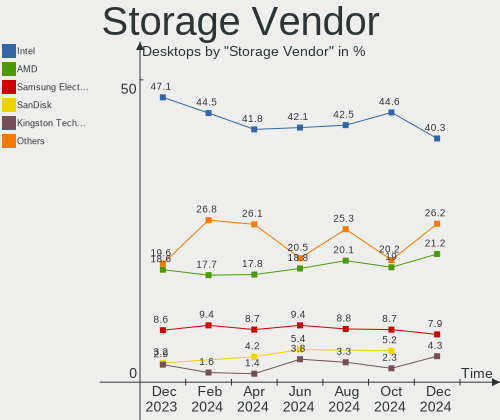
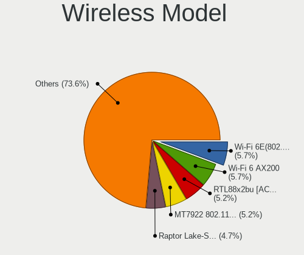
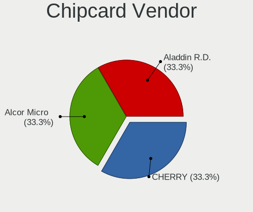
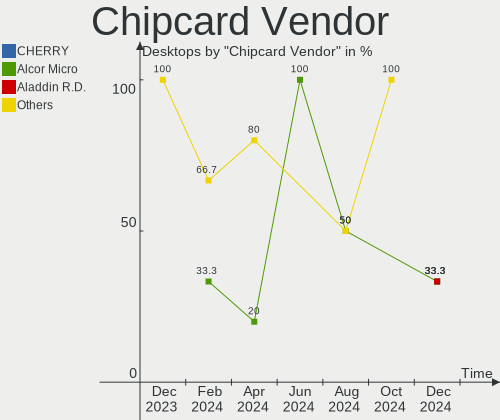

Ubuntu - Hardware Trends (Desktops)
-----------------------------------

A project to identify most popular hardware characteristics and track their change
over time based on data collected by Linux users at https://Linux-Hardware.org.

Anyone can contribute to this report by the [hw-probe](https://github.com/linuxhw/hw-probe) tool:

    sudo -E hw-probe -all -upload

This report is for one last month. Overall report since the beginning of time: [TestDays](https://github.com/linuxhw/TestDays)

Period: Apr, 2023.

Contents
--------

* [ System ](#system)
  - [ OS                       ](#os)
  - [ OS Family                ](#os-family)
  - [ Kernel                   ](#kernel)
  - [ Kernel Family            ](#kernel-family)
  - [ Kernel Major Ver.        ](#kernel-major-ver)
  - [ Arch                     ](#arch)
  - [ DE                       ](#de)
  - [ Display Server           ](#display-server)
  - [ Display Manager          ](#display-manager)
  - [ OS Lang                  ](#os-lang)
  - [ Boot Mode                ](#boot-mode)
  - [ Filesystem               ](#filesystem)
  - [ Part. scheme             ](#part-scheme)
  - [ Dual Boot with Linux/BSD ](#dual-boot-with-linuxbsd)
  - [ Dual Boot (Win)          ](#dual-boot-win)

* [ Board ](#board)
  - [ Vendor                   ](#vendor)
  - [ Model                    ](#model)
  - [ Model Family             ](#model-family)
  - [ MFG Year                 ](#mfg-year)
  - [ Form Factor              ](#form-factor)
  - [ Secure Boot              ](#secure-boot)
  - [ Coreboot                 ](#coreboot)
  - [ RAM Size                 ](#ram-size)
  - [ RAM Used                 ](#ram-used)
  - [ Total Drives             ](#total-drives)
  - [ Has CD-ROM               ](#has-cd-rom)
  - [ Has Ethernet             ](#has-ethernet)
  - [ Has WiFi                 ](#has-wifi)
  - [ Has Bluetooth            ](#has-bluetooth)

* [ Location ](#location)
  - [ Country                  ](#country)
  - [ City                     ](#city)

* [ Drives ](#drives)
  - [ Drive Vendor             ](#drive-vendor)
  - [ Drive Model              ](#drive-model)
  - [ HDD Vendor               ](#hdd-vendor)
  - [ SSD Vendor               ](#ssd-vendor)
  - [ Drive Kind               ](#drive-kind)
  - [ Drive Connector          ](#drive-connector)
  - [ Drive Size               ](#drive-size)
  - [ Space Total              ](#space-total)
  - [ Space Used               ](#space-used)
  - [ Malfunc. Drives          ](#malfunc-drives)
  - [ Malfunc. Drive Vendor    ](#malfunc-drive-vendor)
  - [ Malfunc. HDD Vendor      ](#malfunc-hdd-vendor)
  - [ Malfunc. Drive Kind      ](#malfunc-drive-kind)
  - [ Failed Drives            ](#failed-drives)
  - [ Failed Drive Vendor      ](#failed-drive-vendor)
  - [ Drive Status             ](#drive-status)

* [ Storage controller ](#storage-controller)
  - [ Storage Vendor           ](#storage-vendor)
  - [ Storage Model            ](#storage-model)
  - [ Storage Kind             ](#storage-kind)

* [ Processor ](#processor)
  - [ CPU Vendor               ](#cpu-vendor)
  - [ CPU Model                ](#cpu-model)
  - [ CPU Model Family         ](#cpu-model-family)
  - [ CPU Cores                ](#cpu-cores)
  - [ CPU Sockets              ](#cpu-sockets)
  - [ CPU Threads              ](#cpu-threads)
  - [ CPU Op-Modes             ](#cpu-op-modes)
  - [ CPU Microcode            ](#cpu-microcode)
  - [ CPU Microarch            ](#cpu-microarch)

* [ Graphics ](#graphics)
  - [ GPU Vendor               ](#gpu-vendor)
  - [ GPU Model                ](#gpu-model)
  - [ GPU Combo                ](#gpu-combo)
  - [ GPU Driver               ](#gpu-driver)
  - [ GPU Memory               ](#gpu-memory)

* [ Monitor ](#monitor)
  - [ Monitor Vendor           ](#monitor-vendor)
  - [ Monitor Model            ](#monitor-model)
  - [ Monitor Resolution       ](#monitor-resolution)
  - [ Monitor Diagonal         ](#monitor-diagonal)
  - [ Monitor Width            ](#monitor-width)
  - [ Aspect Ratio             ](#aspect-ratio)
  - [ Monitor Area             ](#monitor-area)
  - [ Pixel Density            ](#pixel-density)
  - [ Multiple Monitors        ](#multiple-monitors)

* [ Network ](#network)
  - [ Net Controller Vendor    ](#net-controller-vendor)
  - [ Net Controller Model     ](#net-controller-model)
  - [ Wireless Vendor          ](#wireless-vendor)
  - [ Wireless Model           ](#wireless-model)
  - [ Ethernet Vendor          ](#ethernet-vendor)
  - [ Ethernet Model           ](#ethernet-model)
  - [ Net Controller Kind      ](#net-controller-kind)
  - [ Used Controller          ](#used-controller)
  - [ NICs                     ](#nics)
  - [ IPv6                     ](#ipv6)

* [ Bluetooth ](#bluetooth)
  - [ Bluetooth Vendor         ](#bluetooth-vendor)
  - [ Bluetooth Model          ](#bluetooth-model)

* [ Sound ](#sound)
  - [ Sound Vendor             ](#sound-vendor)
  - [ Sound Model              ](#sound-model)

* [ Memory ](#memory)
  - [ Memory Vendor            ](#memory-vendor)
  - [ Memory Model             ](#memory-model)
  - [ Memory Kind              ](#memory-kind)
  - [ Memory Form Factor       ](#memory-form-factor)
  - [ Memory Size              ](#memory-size)
  - [ Memory Speed             ](#memory-speed)

* [ Printers & scanners ](#printers--scanners)
  - [ Printer Vendor           ](#printer-vendor)
  - [ Printer Model            ](#printer-model)
  - [ Scanner Vendor           ](#scanner-vendor)
  - [ Scanner Model            ](#scanner-model)

* [ Camera ](#camera)
  - [ Camera Vendor            ](#camera-vendor)
  - [ Camera Model             ](#camera-model)

* [ Security ](#security)
  - [ Fingerprint Vendor       ](#fingerprint-vendor)
  - [ Fingerprint Model        ](#fingerprint-model)
  - [ Chipcard Vendor          ](#chipcard-vendor)
  - [ Chipcard Model           ](#chipcard-model)

* [ Unsupported ](#unsupported)
  - [ Unsupported Devices      ](#unsupported-devices)
  - [ Unsupported Device Types ](#unsupported-device-types)

System
------

OS
--

Installed operating systems

| Name           | Desktops | Percent |
|----------------|----------|---------|
| Ubuntu 22.04   | 345      | 69.98%  |
| Ubuntu 22.10   | 51       | 10.34%  |
| Ubuntu 20.04   | 46       | 9.33%   |
| Ubuntu 23.04   | 41       | 8.32%   |
| Ubuntu 18.04   | 8        | 1.62%   |
| Ubuntu Core 18 | 1        | 0.2%    |
| Ubuntu 21.04   | 1        | 0.2%    |

OS Family
---------

OS without a version

| Name   | Desktops | Percent |
|--------|----------|---------|
| Ubuntu | 493      | 100%    |

Kernel
------

Version of the Linux kernel

| Version                     | Desktops | Percent |
|-----------------------------|----------|---------|
| 5.19.0-38-generic           | 141      | 28.6%   |
| 5.19.0-40-generic           | 77       | 15.62%  |
| 5.15.0-69-generic           | 50       | 10.14%  |
| 6.2.0-20-generic            | 38       | 7.71%   |
| 5.15.0-67-generic           | 36       | 7.3%    |
| 5.19.0-41-generic           | 29       | 5.88%   |
| 5.15.0-58-generic           | 20       | 4.06%   |
| 5.19.0-32-generic           | 11       | 2.23%   |
| 5.15.0-70-generic           | 10       | 2.03%   |
| 5.4.0-146-generic           | 8        | 1.62%   |
| 5.15.0-71-generic           | 8        | 1.62%   |
| 5.15.0-46-generic           | 8        | 1.62%   |
| 5.15.0-43-generic           | 8        | 1.62%   |
| 5.19.0-35-generic           | 5        | 1.01%   |
| 5.4.0-147-generic           | 3        | 0.61%   |
| 5.4.0-144-generic           | 3        | 0.61%   |
| 5.15.0-56-generic           | 3        | 0.61%   |
| 6.2.11-060211-generic       | 2        | 0.41%   |
| 6.1.0-1007-oem              | 2        | 0.41%   |
| 5.4.0-84-generic            | 2        | 0.41%   |
| 5.19.0-42-generic           | 2        | 0.41%   |
| 5.15.0-60-generic           | 2        | 0.41%   |
| 6.2.9-060209-generic        | 1        | 0.2%    |
| 6.2.0-rc1                   | 1        | 0.2%    |
| 6.2.0-19-generic            | 1        | 0.2%    |
| 6.2.0-18-generic            | 1        | 0.2%    |
| 6.1.0-1008-oem              | 1        | 0.2%    |
| 5.4.0-90-generic            | 1        | 0.2%    |
| 5.4.0-47-generic            | 1        | 0.2%    |
| 5.4.0-149-generic           | 1        | 0.2%    |
| 5.4.0-148-generic           | 1        | 0.2%    |
| 5.4.0-1472304060810-generic | 1        | 0.2%    |
| 5.4.0-135-generic           | 1        | 0.2%    |
| 5.4.0-132-generic           | 1        | 0.2%    |
| 5.3.0-46-generic            | 1        | 0.2%    |
| 5.3.0-28-generic            | 1        | 0.2%    |
| 5.19.0-21-generic           | 1        | 0.2%    |
| 5.18.19-051819-generic      | 1        | 0.2%    |
| 5.18.0-051800-generic       | 1        | 0.2%    |
| 5.15.0-69-lowlatency        | 1        | 0.2%    |

Kernel Family
-------------

Linux kernel without a distro release

| Version | Desktops | Percent |
|---------|----------|---------|
| 5.19.0  | 266      | 53.96%  |
| 5.15.0  | 150      | 30.43%  |
| 6.2.0   | 41       | 8.32%   |
| 5.4.0   | 23       | 4.67%   |
| 6.1.0   | 3        | 0.61%   |
| 6.2.11  | 2        | 0.41%   |
| 5.3.0   | 2        | 0.41%   |
| 6.2.9   | 1        | 0.2%    |
| 5.18.19 | 1        | 0.2%    |
| 5.18.0  | 1        | 0.2%    |
| 5.14.0  | 1        | 0.2%    |
| 5.13.0  | 1        | 0.2%    |
| 5.11.0  | 1        | 0.2%    |

Kernel Major Ver.
-----------------

Linux kernel major version

| Version | Desktops | Percent |
|---------|----------|---------|
| 5.19    | 266      | 53.96%  |
| 5.15    | 150      | 30.43%  |
| 6.2     | 44       | 8.92%   |
| 5.4     | 23       | 4.67%   |
| 6.1     | 3        | 0.61%   |
| 5.3     | 2        | 0.41%   |
| 5.18    | 2        | 0.41%   |
| 5.14    | 1        | 0.2%    |
| 5.13    | 1        | 0.2%    |
| 5.11    | 1        | 0.2%    |

Arch
----

OS architecture (x86_64, i586, etc.)

| Name   | Desktops | Percent |
|--------|----------|---------|
| x86_64 | 493      | 100%    |

DE
--

Desktop Environment

| Name            | Desktops | Percent |
|-----------------|----------|---------|
| GNOME           | 398      | 80.73%  |
| GNUstep         | 66       | 13.39%  |
| Unknown         | 17       | 3.45%   |
| X-Cinnamon      | 5        | 1.01%   |
| GNOME Flashback | 3        | 0.61%   |
| Enlightenment   | 3        | 0.61%   |
| i3              | 1        | 0.2%    |

Display Server
--------------

X11 or Wayland

| Name    | Desktops | Percent |
|---------|----------|---------|
| Wayland | 202      | 40.97%  |
| X11     | 200      | 40.57%  |
| Tty     | 80       | 16.23%  |
| Unknown | 11       | 2.23%   |

Display Manager
---------------

SDDM, LightDM, etc.

| Name    | Desktops | Percent |
|---------|----------|---------|
| GDM3    | 352      | 71.4%   |
| LightDM | 72       | 14.6%   |
| Unknown | 50       | 10.14%  |
| GDM     | 18       | 3.65%   |
| LXDM    | 1        | 0.2%    |

OS Lang
-------

Language

| Lang    | Desktops | Percent |
|---------|----------|---------|
| en_US   | 241      | 48.88%  |
| de_DE   | 52       | 10.55%  |
| fr_FR   | 28       | 5.68%   |
| pt_BR   | 16       | 3.25%   |
| en_GB   | 15       | 3.04%   |
| it_IT   | 13       | 2.64%   |
| C       | 11       | 2.23%   |
| en_CA   | 10       | 2.03%   |
| nl_NL   | 9        | 1.83%   |
| ru_RU   | 7        | 1.42%   |
| de_AT   | 7        | 1.42%   |
| zh_CN   | 6        | 1.22%   |
| es_ES   | 6        | 1.22%   |
| en_AU   | 6        | 1.22%   |
| Unknown | 6        | 1.22%   |
| pl_PL   | 4        | 0.81%   |
| ja_JP   | 4        | 0.81%   |
| es_AR   | 4        | 0.81%   |
| en_IN   | 4        | 0.81%   |
| cs_CZ   | 4        | 0.81%   |
| pt_PT   | 3        | 0.61%   |
| nl_BE   | 3        | 0.61%   |
| fi_FI   | 3        | 0.61%   |
| zh_TW   | 2        | 0.41%   |
| tr_TR   | 2        | 0.41%   |
| ko_KR   | 2        | 0.41%   |
| hu_HU   | 2        | 0.41%   |
| en_ZA   | 2        | 0.41%   |
| en_PH   | 2        | 0.41%   |
| en_IE   | 2        | 0.41%   |
| el_GR   | 2        | 0.41%   |
| th_TH   | 1        | 0.2%    |
| sv_SE   | 1        | 0.2%    |
| sk_SK   | 1        | 0.2%    |
| nb_NO   | 1        | 0.2%    |
| lt_LT   | 1        | 0.2%    |
| he_IL   | 1        | 0.2%    |
| fr_CH   | 1        | 0.2%    |
| fr_CA   | 1        | 0.2%    |
| es_US   | 1        | 0.2%    |

Boot Mode
---------

EFI or BIOS

| Mode | Desktops | Percent |
|------|----------|---------|
| BIOS | 304      | 61.66%  |
| EFI  | 189      | 38.34%  |

Filesystem
----------

Type of filesystem

| Type    | Desktops | Percent |
|---------|----------|---------|
| Ext4    | 369      | 74.85%  |
| Tmpfs   | 94       | 19.07%  |
| Btrfs   | 11       | 2.23%   |
| Zfs     | 10       | 2.03%   |
| Overlay | 9        | 1.83%   |

Part. scheme
------------

Scheme of partitioning

| Type    | Desktops | Percent |
|---------|----------|---------|
| GPT     | 395      | 80.12%  |
| MBR     | 66       | 13.39%  |
| Unknown | 32       | 6.49%   |

Dual Boot with Linux/BSD
------------------------

Hosting more than one Linux/BSD

| Dual boot | Desktops | Percent |
|-----------|----------|---------|
| No        | 426      | 86.41%  |
| Yes       | 67       | 13.59%  |

Dual Boot (Win)
---------------

Hosting Linux and Windows

| Dual boot | Desktops | Percent |
|-----------|----------|---------|
| No        | 320      | 64.91%  |
| Yes       | 173      | 35.09%  |

Board
-----

Vendor
------

Motherboard manufacturer

| Name                | Desktops | Percent |
|---------------------|----------|---------|
| ASUSTek Computer    | 155      | 31.44%  |
| Gigabyte Technology | 57       | 11.56%  |
| MSI                 | 51       | 10.34%  |
| Dell                | 42       | 8.52%   |
| ASRock              | 39       | 7.91%   |
| Hewlett-Packard     | 34       | 6.9%    |
| Lenovo              | 28       | 5.68%   |
| Fujitsu             | 22       | 4.46%   |
| Intel               | 17       | 3.45%   |
| Acer                | 10       | 2.03%   |
| Apple               | 5        | 1.01%   |
| ECS                 | 4        | 0.81%   |
| Biostar             | 4        | 0.81%   |
| Medion              | 3        | 0.61%   |
| Unknown             | 3        | 0.61%   |
| Pegatron            | 2        | 0.41%   |
| AAEON               | 2        | 0.41%   |
| YANYU               | 1        | 0.2%    |
| WZA300S2R120        | 1        | 0.2%    |
| Wistron             | 1        | 0.2%    |
| Win element         | 1        | 0.2%    |
| System76            | 1        | 0.2%    |
| Shuttle             | 1        | 0.2%    |
| Packard Bell        | 1        | 0.2%    |
| OEM                 | 1        | 0.2%    |
| MiTAC               | 1        | 0.2%    |
| IBM                 | 1        | 0.2%    |
| Foxconn             | 1        | 0.2%    |
| eMachines           | 1        | 0.2%    |
| Colorful Technology | 1        | 0.2%    |
| BESSTAR Tech        | 1        | 0.2%    |
| ASRockRack          | 1        | 0.2%    |

Model
-----

Motherboard model

| Name                                | Desktops | Percent |
|-------------------------------------|----------|---------|
| ASUS PRIME Z590-P                   | 16       | 3.25%   |
| ASUS All Series                     | 15       | 3.04%   |
| ASUS PRIME X570-PRO                 | 11       | 2.23%   |
| ASUS PRIME B550M-A                  | 10       | 2.03%   |
| Fujitsu CELSIUS_W550                | 5        | 1.01%   |
| ASUS TUF Gaming X570-PLUS           | 5        | 1.01%   |
| ASUS PRIME Z370-A II                | 5        | 1.01%   |
| Dell OptiPlex 7010                  | 4        | 0.81%   |
| HP Z230 Tower Workstation           | 3        | 0.61%   |
| HP Compaq Pro 6300 MT               | 3        | 0.61%   |
| Gigabyte GA-78LMT-S2P               | 3        | 0.61%   |
| ASUS STRIX Z270F GAMING             | 3        | 0.61%   |
| Unknown                             | 3        | 0.61%   |
| MSI MS-7D25                         | 2        | 0.41%   |
| MSI MS-7C94                         | 2        | 0.41%   |
| MSI MS-7C91                         | 2        | 0.41%   |
| MSI MS-7B79                         | 2        | 0.41%   |
| Lenovo ThinkStation P520 30BFSG3Y00 | 2        | 0.41%   |
| Intel DP67BA AAG10219-303           | 2        | 0.41%   |
| HP Z1 Entry Tower G6                | 2        | 0.41%   |
| HP EliteDesk 800 G2 DM 35W          | 2        | 0.41%   |
| HP EliteDesk 800 G1 DM              | 2        | 0.41%   |
| Gigabyte Z97P-D3                    | 2        | 0.41%   |
| Gigabyte Z690 UD DDR4               | 2        | 0.41%   |
| Gigabyte H97-HD3                    | 2        | 0.41%   |
| Gigabyte GA-770TA-UD3               | 2        | 0.41%   |
| Fujitsu CELSIUS W570                | 2        | 0.41%   |
| Fujitsu CELSIUS W530                | 2        | 0.41%   |
| Fujitsu CELSIUS M740                | 2        | 0.41%   |
| ECS G41T-R3                         | 2        | 0.41%   |
| Dell Precision WorkStation T3500    | 2        | 0.41%   |
| Dell Precision Tower 5810           | 2        | 0.41%   |
| Dell OptiPlex 9020                  | 2        | 0.41%   |
| Dell OptiPlex 7050                  | 2        | 0.41%   |
| Dell OptiPlex 390                   | 2        | 0.41%   |
| Dell OptiPlex 3060                  | 2        | 0.41%   |
| Dell OptiPlex 3050                  | 2        | 0.41%   |
| Dell OptiPlex 3020                  | 2        | 0.41%   |
| Dell OptiPlex 3010                  | 2        | 0.41%   |
| Dell Inspiron 5675                  | 2        | 0.41%   |

Model Family
------------

Motherboard model prefix

| Name                  | Desktops | Percent |
|-----------------------|----------|---------|
| ASUS PRIME            | 66       | 13.39%  |
| Dell OptiPlex         | 23       | 4.67%   |
| ASUS ROG              | 19       | 3.85%   |
| Fujitsu CELSIUS       | 15       | 3.04%   |
| ASUS TUF              | 15       | 3.04%   |
| ASUS All              | 15       | 3.04%   |
| Lenovo ThinkCentre    | 13       | 2.64%   |
| HP Compaq             | 10       | 2.03%   |
| Dell Precision        | 9        | 1.83%   |
| Dell Inspiron         | 8        | 1.62%   |
| HP EliteDesk          | 7        | 1.42%   |
| Lenovo ThinkStation   | 6        | 1.22%   |
| Fujitsu ESPRIMO       | 6        | 1.22%   |
| Lenovo IdeaCentre     | 5        | 1.01%   |
| Acer Aspire           | 5        | 1.01%   |
| ASUS STRIX            | 4        | 0.81%   |
| HP Z230               | 3        | 0.61%   |
| HP ProLiant           | 3        | 0.61%   |
| HP ProDesk            | 3        | 0.61%   |
| Gigabyte GA-78LMT-S2P | 3        | 0.61%   |
| ASRock B450M          | 3        | 0.61%   |
| ASRock A320M-HDV      | 3        | 0.61%   |
| Acer Predator         | 3        | 0.61%   |
| Unknown               | 3        | 0.61%   |
| MSI Pro               | 2        | 0.41%   |
| MSI MS-7D25           | 2        | 0.41%   |
| MSI MS-7C94           | 2        | 0.41%   |
| MSI MS-7C91           | 2        | 0.41%   |
| MSI MS-7B79           | 2        | 0.41%   |
| Intel DP67BA          | 2        | 0.41%   |
| HP Z1                 | 2        | 0.41%   |
| Gigabyte Z97P-D3      | 2        | 0.41%   |
| Gigabyte Z690         | 2        | 0.41%   |
| Gigabyte Z370         | 2        | 0.41%   |
| Gigabyte X570         | 2        | 0.41%   |
| Gigabyte H97-HD3      | 2        | 0.41%   |
| Gigabyte GA-770TA-UD3 | 2        | 0.41%   |
| Gigabyte B560M        | 2        | 0.41%   |
| Gigabyte B450M        | 2        | 0.41%   |
| ECS G41T-R3           | 2        | 0.41%   |

MFG Year
--------

Motherboard manufacture year

| Year | Desktops | Percent |
|------|----------|---------|
| 2020 | 52       | 10.55%  |
| 2021 | 49       | 9.94%   |
| 2018 | 47       | 9.53%   |
| 2013 | 44       | 8.92%   |
| 2019 | 36       | 7.3%    |
| 2014 | 34       | 6.9%    |
| 2011 | 34       | 6.9%    |
| 2012 | 33       | 6.69%   |
| 2015 | 32       | 6.49%   |
| 2022 | 31       | 6.29%   |
| 2017 | 28       | 5.68%   |
| 2010 | 20       | 4.06%   |
| 2009 | 19       | 3.85%   |
| 2008 | 14       | 2.84%   |
| 2016 | 13       | 2.64%   |
| 2023 | 4        | 0.81%   |
| 2007 | 3        | 0.61%   |

Form Factor
-----------

Physical design of the computer

| Name    | Desktops | Percent |
|---------|----------|---------|
| Desktop | 493      | 100%    |

Secure Boot
-----------

Enabled or disabled

| State    | Desktops | Percent |
|----------|----------|---------|
| Disabled | 476      | 96.55%  |
| Enabled  | 17       | 3.45%   |

Coreboot
--------

Have coreboot on board

| Used | Desktops | Percent |
|------|----------|---------|
| No   | 493      | 100%    |

RAM Size
--------

Total RAM memory

| Size in GB      | Desktops | Percent |
|-----------------|----------|---------|
| 16.01-24.0      | 121      | 24.54%  |
| 32.01-64.0      | 101      | 20.49%  |
| 8.01-16.0       | 75       | 15.21%  |
| 4.01-8.0        | 66       | 13.39%  |
| 64.01-256.0     | 60       | 12.17%  |
| 3.01-4.0        | 40       | 8.11%   |
| 24.01-32.0      | 18       | 3.65%   |
| 2.01-3.0        | 5        | 1.01%   |
| 1.01-2.0        | 5        | 1.01%   |
| More than 256.0 | 2        | 0.41%   |

RAM Used
--------

Used RAM memory

| Used GB     | Desktops | Percent |
|-------------|----------|---------|
| 2.01-3.0    | 141      | 28.6%   |
| 1.01-2.0    | 136      | 27.59%  |
| 4.01-8.0    | 87       | 17.65%  |
| 3.01-4.0    | 68       | 13.79%  |
| 8.01-16.0   | 38       | 7.71%   |
| 0.51-1.0    | 9        | 1.83%   |
| 16.01-24.0  | 5        | 1.01%   |
| 32.01-64.0  | 3        | 0.61%   |
| 24.01-32.0  | 3        | 0.61%   |
| 0.01-0.5    | 2        | 0.41%   |
| 64.01-256.0 | 1        | 0.2%    |

Total Drives
------------

Number of drives on board

| Drives | Desktops | Percent |
|--------|----------|---------|
| 1      | 197      | 39.96%  |
| 2      | 156      | 31.64%  |
| 3      | 81       | 16.43%  |
| 4      | 28       | 5.68%   |
| 5      | 16       | 3.25%   |
| 6      | 7        | 1.42%   |
| 7      | 3        | 0.61%   |
| 9      | 2        | 0.41%   |
| 0      | 2        | 0.41%   |
| 8      | 1        | 0.2%    |

Has CD-ROM
----------

Has CD-ROM on board

| Presented | Desktops | Percent |
|-----------|----------|---------|
| No        | 290      | 58.82%  |
| Yes       | 203      | 41.18%  |

Has Ethernet
------------

Has Ethernet on board

| Presented | Desktops | Percent |
|-----------|----------|---------|
| Yes       | 487      | 98.78%  |
| No        | 6        | 1.22%   |

Has WiFi
--------

Has WiFi module

| Presented | Desktops | Percent |
|-----------|----------|---------|
| No        | 309      | 62.68%  |
| Yes       | 184      | 37.32%  |

Has Bluetooth
-------------

Has Bluetooth module

| Presented | Desktops | Percent |
|-----------|----------|---------|
| No        | 351      | 71.2%   |
| Yes       | 142      | 28.8%   |

Location
--------

Country
-------

Geographic location (country)

| Country      | Desktops | Percent |
|--------------|----------|---------|
| Switzerland  | 89       | 18.05%  |
| USA          | 87       | 17.65%  |
| Germany      | 63       | 12.78%  |
| France       | 33       | 6.69%   |
| Brazil       | 24       | 4.87%   |
| Italy        | 15       | 3.04%   |
| Netherlands  | 14       | 2.84%   |
| Canada       | 14       | 2.84%   |
| UK           | 13       | 2.64%   |
| Russia       | 10       | 2.03%   |
| Austria      | 8        | 1.62%   |
| Australia    | 8        | 1.62%   |
| Spain        | 7        | 1.42%   |
| India        | 7        | 1.42%   |
| Belgium      | 7        | 1.42%   |
| Czechia      | 6        | 1.22%   |
| Argentina    | 6        | 1.22%   |
| Poland       | 5        | 1.01%   |
| Mexico       | 5        | 1.01%   |
| Japan        | 5        | 1.01%   |
| Greece       | 5        | 1.01%   |
| China        | 5        | 1.01%   |
| Portugal     | 4        | 0.81%   |
| Finland      | 4        | 0.81%   |
| Turkey       | 3        | 0.61%   |
| Sweden       | 3        | 0.61%   |
| South Korea  | 3        | 0.61%   |
| South Africa | 3        | 0.61%   |
| Hungary      | 3        | 0.61%   |
| Denmark      | 3        | 0.61%   |
| Vietnam      | 2        | 0.41%   |
| Taiwan       | 2        | 0.41%   |
| Slovakia     | 2        | 0.41%   |
| Singapore    | 2        | 0.41%   |
| Philippines  | 2        | 0.41%   |
| Israel       | 2        | 0.41%   |
| Ireland      | 2        | 0.41%   |
| Algeria      | 2        | 0.41%   |
| Thailand     | 1        | 0.2%    |
| Romania      | 1        | 0.2%    |

City
----

Geographic location (city)

| City              | Desktops | Percent |
|-------------------|----------|---------|
| Zurich            | 87       | 17.65%  |
| Vienna            | 7        | 1.42%   |
| Prague            | 5        | 1.01%   |
| Los Angeles       | 5        | 1.01%   |
| St Petersburg     | 4        | 0.81%   |
| Sao Paulo         | 4        | 0.81%   |
| Frankfurt am Main | 4        | 0.81%   |
| Berlin            | 4        | 0.81%   |
| Warsaw            | 3        | 0.61%   |
| Toronto           | 3        | 0.61%   |
| Sydney            | 3        | 0.61%   |
| Paris             | 3        | 0.61%   |
| New York          | 3        | 0.61%   |
| Brussels          | 3        | 0.61%   |
| Athens            | 3        | 0.61%   |
| Valencia          | 2        | 0.41%   |
| The Hague         | 2        | 0.41%   |
| Tampa             | 2        | 0.41%   |
| Stockholm         | 2        | 0.41%   |
| Perth             | 2        | 0.41%   |
| Oberursel         | 2        | 0.41%   |
| Obernai           | 2        | 0.41%   |
| Nuremberg         | 2        | 0.41%   |
| Münster          | 2        | 0.41%   |
| Munich            | 2        | 0.41%   |
| Moscow            | 2        | 0.41%   |
| Mönchengladbach  | 2        | 0.41%   |
| Milano            | 2        | 0.41%   |
| Milan             | 2        | 0.41%   |
| Mexico City       | 2        | 0.41%   |
| Kansas City       | 2        | 0.41%   |
| Johannesburg      | 2        | 0.41%   |
| Houston           | 2        | 0.41%   |
| Helsinki          | 2        | 0.41%   |
| Florianópolis    | 2        | 0.41%   |
| Farroupilha       | 2        | 0.41%   |
| Erlangen          | 2        | 0.41%   |
| Dublin            | 2        | 0.41%   |
| Denver            | 2        | 0.41%   |
| Cuxhaven          | 2        | 0.41%   |

Drives
------

Drive Vendor
------------

Hard drive vendors

| Vendor                      | Desktops | Drives | Percent |
|-----------------------------|----------|--------|---------|
| Seagate                     | 181      | 223    | 21.29%  |
| Samsung Electronics         | 155      | 212    | 18.24%  |
| WDC                         | 131      | 176    | 15.41%  |
| SanDisk                     | 45       | 54     | 5.29%   |
| Kingston                    | 42       | 45     | 4.94%   |
| Toshiba                     | 33       | 35     | 3.88%   |
| Hitachi                     | 31       | 31     | 3.65%   |
| Crucial                     | 30       | 39     | 3.53%   |
| Intel                       | 21       | 21     | 2.47%   |
| SK hynix                    | 12       | 12     | 1.41%   |
| A-DATA Technology           | 11       | 13     | 1.29%   |
| Micron/Crucial Technology   | 10       | 12     | 1.18%   |
| Kingston Technology Company | 9        | 10     | 1.06%   |
| Unknown                     | 8        | 10     | 0.94%   |
| Phison Electronics          | 8        | 8      | 0.94%   |
| HGST                        | 8        | 9      | 0.94%   |
| Intenso                     | 7        | 7      | 0.82%   |
| Silicon Motion              | 6        | 7      | 0.71%   |
| China                       | 6        | 6      | 0.71%   |
| Micron Technology           | 5        | 7      | 0.59%   |
| Gigabyte Technology         | 5        | 6      | 0.59%   |
| ASMT                        | 5        | 5      | 0.59%   |
| Patriot                     | 4        | 4      | 0.47%   |
| Maxtor                      | 4        | 4      | 0.47%   |
| Apacer                      | 4        | 4      | 0.47%   |
| ADATA Technology            | 4        | 5      | 0.47%   |
| MAXIO Technology (Hangzhou) | 3        | 3      | 0.35%   |
| LDLC                        | 3        | 3      | 0.35%   |
| XrayDisk                    | 2        | 3      | 0.24%   |
| XPG                         | 2        | 2      | 0.24%   |
| T-FORCE                     | 2        | 2      | 0.24%   |
| SAGE                        | 2        | 2      | 0.24%   |
| SABRENT                     | 2        | 4      | 0.24%   |
| Realtek Semiconductor       | 2        | 2      | 0.24%   |
| PNY                         | 2        | 2      | 0.24%   |
| Lexar                       | 2        | 2      | 0.24%   |
| KingSpec                    | 2        | 2      | 0.24%   |
| Inateck                     | 2        | 2      | 0.24%   |
| Apple                       | 2        | 2      | 0.24%   |
| Yangtze Memory Technologies | 1        | 1      | 0.12%   |

Drive Model
-----------

Hard drive models

| Model                                                  | Desktops | Percent |
|--------------------------------------------------------|----------|---------|
| Seagate ST2000DM008-2FR102 2TB                         | 23       | 2.4%    |
| Samsung SSD 980 PRO 1TB                                | 21       | 2.19%   |
| Seagate ST1000DM010-2EP102 1TB                         | 15       | 1.57%   |
| Seagate ST500DM002-1BD142 500GB                        | 14       | 1.46%   |
| Samsung NVMe SSD Controller SM981/PM981/PM983 1TB      | 14       | 1.46%   |
| Seagate ST1000DM003-1ER162 1TB                         | 12       | 1.25%   |
| Samsung NVMe SSD Drive 1TB                             | 12       | 1.25%   |
| Samsung SSD 850 EVO 250GB                              | 11       | 1.15%   |
| Seagate ST2000DM006-2DM164 2TB                         | 10       | 1.04%   |
| Samsung SSD 860 EVO 500GB                              | 9        | 0.94%   |
| Micron/Crucial P2 NVMe PCIe SSD 1TB                    | 8        | 0.84%   |
| Kingston SA400S37240G 240GB SSD                        | 8        | 0.84%   |
| SanDisk NVMe SSD Drive 1TB                             | 7        | 0.73%   |
| WDC WD10EZEX-08WN4A0 1TB                               | 6        | 0.63%   |
| Samsung SSD 970 EVO Plus 1TB                           | 6        | 0.63%   |
| Samsung SSD 860 EVO 250GB                              | 6        | 0.63%   |
| Kingston SA400S37480G 480GB SSD                        | 6        | 0.63%   |
| Intel SSDSC2KB240G8 240GB                              | 6        | 0.63%   |
| Crucial CT480BX500SSD1 480GB                           | 6        | 0.63%   |
| WDC WD10EZEX-22MFCA0 1TB                               | 5        | 0.52%   |
| Toshiba DT01ACA050 500GB                               | 5        | 0.52%   |
| Silicon Motion SM2263EN/SM2263XT SSD Controller 1024GB | 5        | 0.52%   |
| Seagate ST4000DM004-2CV104 4TB                         | 5        | 0.52%   |
| Seagate ST3500418AS 500GB                              | 5        | 0.52%   |
| Seagate ST2000DM001-1ER164 2TB                         | 5        | 0.52%   |
| Crucial CT500MX500SSD1 500GB                           | 5        | 0.52%   |
| Crucial CT1000BX500SSD1 1TB                            | 5        | 0.52%   |
| Toshiba DT01ACA100 1TB                                 | 4        | 0.42%   |
| Seagate ST1000DM003-9YN162 1TB                         | 4        | 0.42%   |
| Seagate ST1000DM003-1CH162 1TB                         | 4        | 0.42%   |
| Samsung SSD 980 PRO 2TB                                | 4        | 0.42%   |
| Samsung SSD 980 1TB                                    | 4        | 0.42%   |
| Samsung SSD 870 EVO 500GB                              | 4        | 0.42%   |
| Samsung SSD 850 EVO 500GB                              | 4        | 0.42%   |
| Samsung NVMe SSD Controller SM961/PM961/SM963 500GB    | 4        | 0.42%   |
| Kingston Company SNV2S1000G 1TB                        | 4        | 0.42%   |
| Kingston SA400S37120G 120GB SSD                        | 4        | 0.42%   |
| Crucial CT240BX500SSD1 240GB                           | 4        | 0.42%   |
| Crucial CT2000MX500SSD1 2TB                            | 4        | 0.42%   |
| Crucial CT1000MX500SSD1 1TB                            | 4        | 0.42%   |

HDD Vendor
----------

Hard disk drive vendors

| Vendor              | Desktops | Drives | Percent |
|---------------------|----------|--------|---------|
| Seagate             | 175      | 213    | 44.76%  |
| WDC                 | 118      | 157    | 30.18%  |
| Hitachi             | 31       | 31     | 7.93%   |
| Toshiba             | 29       | 31     | 7.42%   |
| Samsung Electronics | 14       | 15     | 3.58%   |
| HGST                | 8        | 9      | 2.05%   |
| Maxtor              | 3        | 3      | 0.77%   |
| Unknown             | 2        | 2      | 0.51%   |
| SAGE                | 2        | 2      | 0.51%   |
| Intenso             | 2        | 2      | 0.51%   |
| Inateck             | 2        | 2      | 0.51%   |
| USB3.0              | 1        | 1      | 0.26%   |
| Hewlett-Packard     | 1        | 1      | 0.26%   |
| ASMedia             | 1        | 1      | 0.26%   |
| Apple               | 1        | 1      | 0.26%   |
| Adaptec             | 1        | 1      | 0.26%   |

SSD Vendor
----------

Solid state drive vendors

| Vendor              | Desktops | Drives | Percent |
|---------------------|----------|--------|---------|
| Samsung Electronics | 69       | 83     | 26.74%  |
| Kingston            | 31       | 32     | 12.02%  |
| Crucial             | 29       | 36     | 11.24%  |
| SanDisk             | 23       | 25     | 8.91%   |
| Intel               | 18       | 18     | 6.98%   |
| WDC                 | 16       | 16     | 6.2%    |
| A-DATA Technology   | 7        | 8      | 2.71%   |
| China               | 6        | 6      | 2.33%   |
| Intenso             | 5        | 5      | 1.94%   |
| ASMT                | 5        | 5      | 1.94%   |
| Apacer              | 4        | 4      | 1.55%   |
| Toshiba             | 3        | 3      | 1.16%   |
| Seagate             | 3        | 3      | 1.16%   |
| Patriot             | 3        | 3      | 1.16%   |
| Micron Technology   | 3        | 5      | 1.16%   |
| LDLC                | 3        | 3      | 1.16%   |
| SK hynix            | 2        | 2      | 0.78%   |
| PNY                 | 2        | 2      | 0.78%   |
| Lexar               | 2        | 2      | 0.78%   |
| KingSpec            | 2        | 2      | 0.78%   |
| Gigabyte Technology | 2        | 3      | 0.78%   |
| XSTAR               | 1        | 1      | 0.39%   |
| Transcend           | 1        | 1      | 0.39%   |
| Team                | 1        | 1      | 0.39%   |
| SPCC                | 1        | 2      | 0.39%   |
| Smartbuy            | 1        | 1      | 0.39%   |
| OYUNKEY             | 1        | 1      | 0.39%   |
| OWC                 | 1        | 2      | 0.39%   |
| Origin              | 1        | 1      | 0.39%   |
| OCZ                 | 1        | 1      | 0.39%   |
| Neo                 | 1        | 1      | 0.39%   |
| Maxtor              | 1        | 1      | 0.39%   |
| LITEONIT            | 1        | 1      | 0.39%   |
| LITEON              | 1        | 1      | 0.39%   |
| Leven               | 1        | 1      | 0.39%   |
| INNOVATION IT       | 1        | 1      | 0.39%   |
| GOODRAM             | 1        | 1      | 0.39%   |
| Fanxiang            | 1        | 1      | 0.39%   |
| Emtec               | 1        | 1      | 0.39%   |
| Dogfish             | 1        | 1      | 0.39%   |

Drive Kind
----------

HDD or SSD

| Kind    | Desktops | Drives | Percent |
|---------|----------|--------|---------|
| HDD     | 322      | 472    | 43.22%  |
| SSD     | 223      | 288    | 29.93%  |
| NVMe    | 181      | 252    | 24.3%   |
| Unknown | 16       | 20     | 2.15%   |
| MMC     | 3        | 3      | 0.4%    |

Drive Connector
---------------

SATA, SAS, NVMe, etc.

| Type | Desktops | Drives | Percent |
|------|----------|--------|---------|
| SATA | 412      | 737    | 64.88%  |
| NVMe | 179      | 248    | 28.19%  |
| SAS  | 41       | 47     | 6.46%   |
| MMC  | 3        | 3      | 0.47%   |

Drive Size
----------

Size of hard drive

| Size in TB | Desktops | Drives | Percent |
|------------|----------|--------|---------|
| 0.01-0.5   | 254      | 368    | 44.72%  |
| 0.51-1.0   | 149      | 188    | 26.23%  |
| 1.01-2.0   | 94       | 107    | 16.55%  |
| 3.01-4.0   | 29       | 44     | 5.11%   |
| 4.01-10.0  | 18       | 26     | 3.17%   |
| 2.01-3.0   | 14       | 17     | 2.46%   |
| 10.01-20.0 | 10       | 10     | 1.76%   |

Space Total
-----------

Amount of disk space available on the file system

| Size in GB     | Desktops | Percent |
|----------------|----------|---------|
| 101-250        | 120      | 24.34%  |
| 251-500        | 92       | 18.66%  |
| 501-1000       | 86       | 17.44%  |
| 1001-2000      | 62       | 12.58%  |
| More than 3000 | 45       | 9.13%   |
| 2001-3000      | 28       | 5.68%   |
| Unknown        | 25       | 5.07%   |
| 1-20           | 16       | 3.25%   |
| 51-100         | 14       | 2.84%   |
| 21-50          | 5        | 1.01%   |

Space Used
----------

Amount of used disk space

| Used GB        | Desktops | Percent |
|----------------|----------|---------|
| 1-20           | 102      | 20.69%  |
| 21-50          | 88       | 17.85%  |
| 101-250        | 79       | 16.02%  |
| 51-100         | 73       | 14.81%  |
| 251-500        | 45       | 9.13%   |
| 501-1000       | 36       | 7.3%    |
| Unknown        | 25       | 5.07%   |
| 1001-2000      | 22       | 4.46%   |
| More than 3000 | 19       | 3.85%   |
| 2001-3000      | 4        | 0.81%   |

Malfunc. Drives
---------------

Drive models with a malfunction

| Model                                    | Desktops | Drives | Percent |
|------------------------------------------|----------|--------|---------|
| WDC WD10EZEX-22MFCA0 1TB                 | 2        | 2      | 4.44%   |
| Seagate ST500DM002-1BD142 500GB          | 2        | 2      | 4.44%   |
| Seagate ST2000DM008-2FR102 2TB           | 2        | 2      | 4.44%   |
| XPG GAMMIX S41 512GB                     | 1        | 1      | 2.22%   |
| WDC WD6400AAKS-22A7B2 640GB              | 1        | 1      | 2.22%   |
| WDC WD40EFRX-68WT0N0 4TB                 | 1        | 1      | 2.22%   |
| WDC WD3200BEKT-66PVMT0 320GB             | 1        | 1      | 2.22%   |
| WDC WD20EZRX-00D8PB0 2TB                 | 1        | 1      | 2.22%   |
| WDC WD20EARX-008FB0 2TB                  | 1        | 2      | 2.22%   |
| WDC WD1600BEVT-22ZCT0 160GB              | 1        | 1      | 2.22%   |
| WDC WD15EZRX-00DC0B0 1TB                 | 1        | 1      | 2.22%   |
| WDC WD10EZEX-08M2NA0 1TB                 | 1        | 1      | 2.22%   |
| WDC WD10EARX-00N0YB0 1TB                 | 1        | 1      | 2.22%   |
| Toshiba THNSFC256GBSJ SSD                | 1        | 1      | 2.22%   |
| Toshiba DT01ACA050 500GB                 | 1        | 1      | 2.22%   |
| Silicon Motion APS-SE20 1TB              | 1        | 1      | 2.22%   |
| Seagate ST500DM002-9YN14C 500GB          | 1        | 1      | 2.22%   |
| Seagate ST500DM002-1BC142 500GB          | 1        | 1      | 2.22%   |
| Seagate ST3500641AS 500GB                | 1        | 1      | 2.22%   |
| Seagate ST3500413AS 500GB                | 1        | 1      | 2.22%   |
| Seagate ST31000520AS 1TB                 | 1        | 1      | 2.22%   |
| Seagate ST31000340NS 1TB                 | 1        | 1      | 2.22%   |
| Seagate ST14000NM0018-2H4101 14TB        | 1        | 1      | 2.22%   |
| Seagate ST1000VM002-1ET162 1TB           | 1        | 1      | 2.22%   |
| Seagate ST1000LM024 HN-M101MBB 1TB       | 1        | 1      | 2.22%   |
| Seagate ST1000DM003-1CH162 1TB           | 1        | 1      | 2.22%   |
| SanDisk SSD PLUS 240GB                   | 1        | 1      | 2.22%   |
| Samsung Electronics SSD 840 Series 120GB | 1        | 1      | 2.22%   |
| Samsung Electronics HD502HI 500GB        | 1        | 1      | 2.22%   |
| Samsung Electronics HD161HJ 160GB        | 1        | 1      | 2.22%   |
| Samsung Electronics HD103SJ 1TB          | 1        | 1      | 2.22%   |
| Neo Forza NFS121SA312-6007000 120GB SSD  | 1        | 1      | 2.22%   |
| LDLC SSD 240GB                           | 1        | 1      | 2.22%   |
| LDLC SSD 120GB                           | 1        | 1      | 2.22%   |
| Hitachi HDS721050DLE630 500GB            | 1        | 1      | 2.22%   |
| Hitachi HDS721025CLA382 250GB            | 1        | 1      | 2.22%   |
| Hitachi HDS721010CLA332 1TB              | 1        | 1      | 2.22%   |
| Gigabyte Technology GP-GM30512G-G 512GB  | 1        | 1      | 2.22%   |
| Gigabyte Technology GP-GM301TB-G         | 1        | 1      | 2.22%   |
| ASMedia ASM1153E 2TB                     | 1        | 1      | 2.22%   |

Malfunc. Drive Vendor
---------------------

Vendors of faulty drives

| Vendor              | Desktops | Drives | Percent |
|---------------------|----------|--------|---------|
| Seagate             | 14       | 14     | 31.11%  |
| WDC                 | 11       | 12     | 24.44%  |
| Samsung Electronics | 4        | 4      | 8.89%   |
| Hitachi             | 3        | 3      | 6.67%   |
| Toshiba             | 2        | 2      | 4.44%   |
| LDLC                | 2        | 2      | 4.44%   |
| Gigabyte Technology | 2        | 2      | 4.44%   |
| A-DATA Technology   | 2        | 2      | 4.44%   |
| XPG                 | 1        | 1      | 2.22%   |
| Silicon Motion      | 1        | 1      | 2.22%   |
| SanDisk             | 1        | 1      | 2.22%   |
| Neo                 | 1        | 1      | 2.22%   |
| ASMedia             | 1        | 1      | 2.22%   |

Malfunc. HDD Vendor
-------------------

Vendors of faulty HDD drives

| Vendor              | Desktops | Drives | Percent |
|---------------------|----------|--------|---------|
| Seagate             | 14       | 14     | 42.42%  |
| WDC                 | 11       | 12     | 33.33%  |
| Samsung Electronics | 3        | 3      | 9.09%   |
| Hitachi             | 3        | 3      | 9.09%   |
| Toshiba             | 1        | 1      | 3.03%   |
| ASMedia             | 1        | 1      | 3.03%   |

Malfunc. Drive Kind
-------------------

Kinds of faulty drives

| Kind | Desktops | Drives | Percent |
|------|----------|--------|---------|
| HDD  | 33       | 34     | 75%     |
| SSD  | 7        | 8      | 15.91%  |
| NVMe | 4        | 4      | 9.09%   |

Failed Drives
-------------

Failed drive models

| Model                             | Desktops | Drives | Percent |
|-----------------------------------|----------|--------|---------|
| Samsung Electronics HD161GJ 160GB | 1        | 1      | 100%    |

Failed Drive Vendor
-------------------

Failed drive vendors

| Vendor              | Desktops | Drives | Percent |
|---------------------|----------|--------|---------|
| Samsung Electronics | 1        | 1      | 100%    |

Drive Status
------------

Number of failed and malfunc. drives

| Status   | Desktops | Drives | Percent |
|----------|----------|--------|---------|
| Detected | 344      | 694    | 64.06%  |
| Works    | 152      | 294    | 28.31%  |
| Malfunc  | 40       | 46     | 7.45%   |
| Failed   | 1        | 1      | 0.19%   |

Storage controller
------------------

Storage Vendor
--------------

Storage controller vendors

| Vendor                         | Desktops | Percent |
|--------------------------------|----------|---------|
| Intel                          | 333      | 44.76%  |
| AMD                            | 147      | 19.76%  |
| Samsung Electronics            | 82       | 11.02%  |
| ASMedia Technology             | 27       | 3.63%   |
| SanDisk                        | 26       | 3.49%   |
| Kingston Technology Company    | 21       | 2.82%   |
| Marvell Technology Group       | 14       | 1.88%   |
| Phison Electronics             | 11       | 1.48%   |
| Micron/Crucial Technology      | 11       | 1.48%   |
| JMicron Technology             | 11       | 1.48%   |
| SK hynix                       | 10       | 1.34%   |
| ADATA Technology               | 8        | 1.08%   |
| Silicon Motion                 | 7        | 0.94%   |
| Nvidia                         | 7        | 0.94%   |
| Realtek Semiconductor          | 6        | 0.81%   |
| MAXIO Technology (Hangzhou)    | 3        | 0.4%    |
| INNOGRIT                       | 3        | 0.4%    |
| VIA Technologies               | 2        | 0.27%   |
| Toshiba America Info Systems   | 2        | 0.27%   |
| Micron Technology              | 2        | 0.27%   |
| Broadcom / LSI                 | 2        | 0.27%   |
| Yangtze Memory Technologies    | 1        | 0.13%   |
| Union Memory (Shenzhen)        | 1        | 0.13%   |
| Solidigm                       | 1        | 0.13%   |
| Solid State Storage Technology | 1        | 0.13%   |
| Seagate Technology             | 1        | 0.13%   |
| Hewlett-Packard                | 1        | 0.13%   |
| Chelsio Communications         | 1        | 0.13%   |
| Apple                          | 1        | 0.13%   |
| Adaptec                        | 1        | 0.13%   |

Storage Model
-------------

Storage controller models

| Model                                                                                   | Desktops | Percent |
|-----------------------------------------------------------------------------------------|----------|---------|
| AMD FCH SATA Controller [AHCI mode]                                                     | 75       | 8.63%   |
| Intel 8 Series/C220 Series Chipset Family 6-port SATA Controller 1 [AHCI mode]          | 39       | 4.49%   |
| Samsung NVMe SSD Controller SM981/PM981/PM983                                           | 33       | 3.8%    |
| Samsung NVMe SSD Controller PM9A1/PM9A3/980PRO                                          | 33       | 3.8%    |
| AMD 500 Series Chipset SATA Controller                                                  | 32       | 3.68%   |
| Intel Q170/Q150/B150/H170/H110/Z170/CM236 Chipset SATA Controller [AHCI Mode]           | 31       | 3.57%   |
| Intel 200 Series PCH SATA controller [AHCI mode]                                        | 31       | 3.57%   |
| Intel 500 Series Chipset Family SATA AHCI Controller                                    | 26       | 2.99%   |
| Intel SATA Controller [RAID mode]                                                       | 23       | 2.65%   |
| Intel 6 Series/C200 Series Chipset Family 6 port Desktop SATA AHCI Controller           | 23       | 2.65%   |
| ASMedia ASM1062 Serial ATA Controller                                                   | 22       | 2.53%   |
| AMD 400 Series Chipset SATA Controller                                                  | 22       | 2.53%   |
| Intel 7 Series/C210 Series Chipset Family 6-port SATA Controller [AHCI mode]            | 21       | 2.42%   |
| AMD SB7x0/SB8x0/SB9x0 IDE Controller                                                    | 18       | 2.07%   |
| AMD SB7x0/SB8x0/SB9x0 SATA Controller [AHCI mode]                                       | 16       | 1.84%   |
| Kingston Company Company Non-Volatile memory controller                                 | 15       | 1.73%   |
| Intel 9 Series Chipset Family SATA Controller [AHCI Mode]                               | 15       | 1.73%   |
| Intel Alder Lake-S PCH SATA Controller [AHCI Mode]                                      | 14       | 1.61%   |
| Intel NM10/ICH7 Family SATA Controller [IDE mode]                                       | 13       | 1.5%    |
| Intel Cannon Lake PCH SATA AHCI Controller                                              | 12       | 1.38%   |
| AMD SB7x0/SB8x0/SB9x0 SATA Controller [IDE mode]                                        | 11       | 1.27%   |
| Samsung NVMe SSD Controller SM961/PM961/SM963                                           | 10       | 1.15%   |
| Intel Comet Lake SATA AHCI Controller                                                   | 10       | 1.15%   |
| Intel 6 Series/C200 Series Chipset Family Desktop SATA Controller (IDE mode, ports 4-5) | 9        | 1.04%   |
| Intel 6 Series/C200 Series Chipset Family Desktop SATA Controller (IDE mode, ports 0-3) | 9        | 1.04%   |
| Samsung NVMe SSD Controller 980                                                         | 8        | 0.92%   |
| Micron/Crucial P2 NVMe PCIe SSD                                                         | 8        | 0.92%   |
| Intel C610/X99 series chipset sSATA Controller [AHCI mode]                              | 8        | 0.92%   |
| Intel C610/X99 series chipset 6-Port SATA Controller [AHCI mode]                        | 8        | 0.92%   |
| Intel 82801G (ICH7 Family) IDE Controller                                               | 8        | 0.92%   |
| SK hynix Gold P31/PC711 NVMe Solid State Drive                                          | 7        | 0.81%   |
| AMD FCH SATA Controller D                                                               | 7        | 0.81%   |
| Silicon Motion SM2263EN/SM2263XT SSD Controller                                         | 6        | 0.69%   |
| SanDisk WD PC SN810 / Black SN850 NVMe SSD                                              | 6        | 0.69%   |
| Intel 82801JI (ICH10 Family) SATA AHCI Controller                                       | 6        | 0.69%   |
| Intel 700 Series Chipset Family SATA AHCI Controller                                    | 6        | 0.69%   |
| AMD X370 Series Chipset SATA Controller                                                 | 6        | 0.69%   |
| Realtek RTS5763DL NVMe SSD Controller                                                   | 5        | 0.58%   |
| JMicron JMB363 SATA/IDE Controller                                                      | 5        | 0.58%   |
| Intel 400 Series Chipset Family SATA AHCI Controller                                    | 5        | 0.58%   |

Storage Kind
------------

Kind of storage controller (IDE, SATA, NVMe, SAS, ...)

| Kind | Desktops | Percent |
|------|----------|---------|
| SATA | 422      | 58.61%  |
| NVMe | 179      | 24.86%  |
| IDE  | 78       | 10.83%  |
| RAID | 37       | 5.14%   |
| SAS  | 3        | 0.42%   |
| SCSI | 1        | 0.14%   |

Processor
---------

CPU Vendor
----------

Processor vendors

| Vendor | Desktops | Percent |
|--------|----------|---------|
| Intel  | 339      | 68.76%  |
| AMD    | 154      | 31.24%  |

CPU Model
---------

Processor models

| Model                                   | Desktops | Percent |
|-----------------------------------------|----------|---------|
| Intel 11th Gen Core i9-11900F @ 2.50GHz | 17       | 3.45%   |
| AMD Ryzen 7 5800X 8-Core Processor      | 16       | 3.25%   |
| Intel Core i7-3770 CPU @ 3.40GHz        | 11       | 2.23%   |
| Intel Core i7-6700 CPU @ 3.40GHz        | 9        | 1.83%   |
| Intel Core i5-2400 CPU @ 3.10GHz        | 8        | 1.62%   |
| AMD Ryzen 5 5600X 6-Core Processor      | 8        | 1.62%   |
| Intel Core i7-4770 CPU @ 3.40GHz        | 7        | 1.42%   |
| Intel Core i5-3470 CPU @ 3.20GHz        | 7        | 1.42%   |
| Intel Core i7-4790 CPU @ 3.60GHz        | 6        | 1.22%   |
| Intel Core i7-9700K CPU @ 3.60GHz       | 5        | 1.01%   |
| Intel Core i7-8700K CPU @ 3.70GHz       | 5        | 1.01%   |
| Intel Core i7-7700K CPU @ 4.20GHz       | 5        | 1.01%   |
| AMD Ryzen 9 7950X 16-Core Processor     | 5        | 1.01%   |
| AMD Ryzen 5 5600G with Radeon Graphics  | 5        | 1.01%   |
| AMD Ryzen 5 3600 6-Core Processor       | 5        | 1.01%   |
| Intel Xeon CPU E5-1650 v3 @ 3.50GHz     | 4        | 0.81%   |
| Intel Core i5-6500 CPU @ 3.20GHz        | 4        | 0.81%   |
| Intel Core i5-4590 CPU @ 3.30GHz        | 4        | 0.81%   |
| Intel Core i5-4570 CPU @ 3.20GHz        | 4        | 0.81%   |
| Intel Core i5-4460 CPU @ 3.20GHz        | 4        | 0.81%   |
| Intel Core i3-6100 CPU @ 3.70GHz        | 4        | 0.81%   |
| Intel Core i3-3220 CPU @ 3.30GHz        | 4        | 0.81%   |
| Intel Core i3-2100 CPU @ 3.10GHz        | 4        | 0.81%   |
| Intel Core i3-10100 CPU @ 3.60GHz       | 4        | 0.81%   |
| AMD Ryzen 9 5950X 16-Core Processor     | 4        | 0.81%   |
| AMD Ryzen 9 5900X 12-Core Processor     | 4        | 0.81%   |
| AMD Ryzen 9 3900X 12-Core Processor     | 4        | 0.81%   |
| AMD Ryzen 7 5700G with Radeon Graphics  | 4        | 0.81%   |
| AMD Ryzen 7 2700X Eight-Core Processor  | 4        | 0.81%   |
| AMD Ryzen 5 5500                        | 4        | 0.81%   |
| AMD FX-6300 Six-Core Processor          | 4        | 0.81%   |
| Intel Pentium CPU G4560 @ 3.50GHz       | 3        | 0.61%   |
| Intel Core i9-10900 CPU @ 2.80GHz       | 3        | 0.61%   |
| Intel Core i7-4770K CPU @ 3.50GHz       | 3        | 0.61%   |
| Intel Core i7-2600K CPU @ 3.40GHz       | 3        | 0.61%   |
| Intel Core i7-2600 CPU @ 3.40GHz        | 3        | 0.61%   |
| Intel Core i5-9400 CPU @ 2.90GHz        | 3        | 0.61%   |
| Intel Core i5-8400 CPU @ 2.80GHz        | 3        | 0.61%   |
| Intel Core i5-6600 CPU @ 3.30GHz        | 3        | 0.61%   |
| Intel Core i5-6500T CPU @ 2.50GHz       | 3        | 0.61%   |

CPU Model Family
----------------

Processor model prefix

| Model                   | Desktops | Percent |
|-------------------------|----------|---------|
| Intel Core i5           | 90       | 18.26%  |
| Intel Core i7           | 82       | 16.63%  |
| Other                   | 46       | 9.33%   |
| AMD Ryzen 5             | 40       | 8.11%   |
| Intel Xeon              | 36       | 7.3%    |
| Intel Core i3           | 36       | 7.3%    |
| AMD Ryzen 7             | 35       | 7.1%    |
| AMD Ryzen 9             | 24       | 4.87%   |
| Intel Core 2 Quad       | 11       | 2.23%   |
| AMD FX                  | 11       | 2.23%   |
| Intel Pentium           | 10       | 2.03%   |
| Intel Celeron           | 10       | 2.03%   |
| Intel Core 2 Duo        | 9        | 1.83%   |
| Intel Pentium Dual-Core | 5        | 1.01%   |
| AMD Ryzen Threadripper  | 5        | 1.01%   |
| Intel Core i9           | 4        | 0.81%   |
| AMD Ryzen 3             | 4        | 0.81%   |
| AMD Phenom II X2        | 4        | 0.81%   |
| AMD Phenom II X4        | 3        | 0.61%   |
| AMD Athlon II X4        | 3        | 0.61%   |
| AMD Athlon II X2        | 3        | 0.61%   |
| AMD A6                  | 3        | 0.61%   |
| AMD Phenom II X6        | 2        | 0.41%   |
| AMD Athlon II X3        | 2        | 0.41%   |
| AMD A8                  | 2        | 0.41%   |
| AMD A10                 | 2        | 0.41%   |
| Intel Pentium 4         | 1        | 0.2%    |
| Intel Core 2            | 1        | 0.2%    |
| Intel Atom              | 1        | 0.2%    |
| AMD Turion II Neo       | 1        | 0.2%    |
| AMD Ryzen 7 PRO         | 1        | 0.2%    |
| AMD Ryzen 5 PRO         | 1        | 0.2%    |
| AMD Athlon X4           | 1        | 0.2%    |
| AMD Athlon Dual Core    | 1        | 0.2%    |
| AMD Athlon 64 X2        | 1        | 0.2%    |
| AMD A4                  | 1        | 0.2%    |
| AMD A12                 | 1        | 0.2%    |

CPU Cores
---------

Number of processor cores

| Number | Desktops | Percent |
|--------|----------|---------|
| 4      | 188      | 38.13%  |
| 2      | 84       | 17.04%  |
| 6      | 83       | 16.84%  |
| 8      | 75       | 15.21%  |
| 12     | 18       | 3.65%   |
| 16     | 14       | 2.84%   |
| 3      | 7        | 1.42%   |
| 10     | 6        | 1.22%   |
| 1      | 6        | 1.22%   |
| 24     | 5        | 1.01%   |
| 14     | 3        | 0.61%   |
| 32     | 2        | 0.41%   |
| 18     | 2        | 0.41%   |

CPU Sockets
-----------

Number of sockets

| Number | Desktops | Percent |
|--------|----------|---------|
| 1      | 491      | 99.59%  |
| 2      | 2        | 0.41%   |

CPU Threads
-----------

Threads per core (Hyper-Threading)

| Number | Desktops | Percent |
|--------|----------|---------|
| 2      | 317      | 64.3%   |
| 1      | 176      | 35.7%   |

CPU Op-Modes
------------

CPU Operation Modes (32-bit, 64-bit)

| Op mode        | Desktops | Percent |
|----------------|----------|---------|
| 32-bit, 64-bit | 493      | 100%    |

CPU Microcode
-------------

Microcode number

| Number     | Desktops | Percent |
|------------|----------|---------|
| Unknown    | 248      | 50.3%   |
| 0x306c3    | 25       | 5.07%   |
| 0x506e3    | 18       | 3.65%   |
| 0xa0671    | 16       | 3.25%   |
| 0x306a9    | 15       | 3.04%   |
| 0x906ea    | 12       | 2.43%   |
| 0x906e9    | 12       | 2.43%   |
| 0x206a7    | 11       | 2.23%   |
| 0x08701021 | 8        | 1.62%   |
| 0x010000c8 | 8        | 1.62%   |
| 0xb0671    | 7        | 1.42%   |
| 0xa0655    | 7        | 1.42%   |
| 0x0a601203 | 7        | 1.42%   |
| 0x0a20120a | 7        | 1.42%   |
| 0x0a201205 | 6        | 1.22%   |
| 0x306f2    | 5        | 1.01%   |
| 0x1067a    | 5        | 1.01%   |
| 0x0a201016 | 5        | 1.01%   |
| 0x0800820d | 5        | 1.01%   |
| 0x06000852 | 5        | 1.01%   |
| 0x906ed    | 4        | 0.81%   |
| 0xa0653    | 3        | 0.61%   |
| 0x90672    | 3        | 0.61%   |
| 0x0a50000d | 3        | 0.61%   |
| 0x0a201204 | 3        | 0.61%   |
| 0x08701013 | 3        | 0.61%   |
| 0x906ec    | 2        | 0.41%   |
| 0x50657    | 2        | 0.41%   |
| 0x406f1    | 2        | 0.41%   |
| 0x306e4    | 2        | 0.41%   |
| 0x106e5    | 2        | 0.41%   |
| 0x106a5    | 2        | 0.41%   |
| 0x0a50000c | 2        | 0.41%   |
| 0x08108109 | 2        | 0.41%   |
| 0x010000dc | 2        | 0.41%   |
| 0xf64      | 1        | 0.2%    |
| 0x906eb    | 1        | 0.2%    |
| 0x90675    | 1        | 0.2%    |
| 0x90661    | 1        | 0.2%    |
| 0x50654    | 1        | 0.2%    |

CPU Microarch
-------------

Microarchitecture

| Name             | Desktops | Percent |
|------------------|----------|---------|
| Haswell          | 68       | 13.79%  |
| KabyLake         | 49       | 9.94%   |
| Zen 3            | 47       | 9.53%   |
| IvyBridge        | 39       | 7.91%   |
| Skylake          | 37       | 7.51%   |
| Unknown          | 34       | 6.9%    |
| SandyBridge      | 29       | 5.88%   |
| Penryn           | 27       | 5.48%   |
| Zen 2            | 26       | 5.27%   |
| CometLake        | 20       | 4.06%   |
| K10              | 19       | 3.85%   |
| Zen+             | 16       | 3.25%   |
| Icelake          | 16       | 3.25%   |
| Piledriver       | 13       | 2.64%   |
| Alderlake Hybrid | 10       | 2.03%   |
| Westmere         | 8        | 1.62%   |
| Zen              | 6        | 1.22%   |
| Nehalem          | 6        | 1.22%   |
| Steamroller      | 3        | 0.61%   |
| K8 Hammer        | 3        | 0.61%   |
| Core             | 3        | 0.61%   |
| Bulldozer        | 3        | 0.61%   |
| Broadwell        | 3        | 0.61%   |
| Silvermont       | 2        | 0.41%   |
| Tremont          | 1        | 0.2%    |
| Puma             | 1        | 0.2%    |
| NetBurst         | 1        | 0.2%    |
| K10 Llano        | 1        | 0.2%    |
| Goldmont plus    | 1        | 0.2%    |
| Excavator        | 1        | 0.2%    |

Graphics
--------

GPU Vendor
----------

Vendors of graphics cards

| Vendor                     | Desktops | Percent |
|----------------------------|----------|---------|
| Nvidia                     | 245      | 45.88%  |
| Intel                      | 154      | 28.84%  |
| AMD                        | 130      | 24.34%  |
| Matrox Electronics Systems | 3        | 0.56%   |
| VIA Technologies           | 1        | 0.19%   |
| ASPEED Technology          | 1        | 0.19%   |

GPU Model
---------

Graphics card models

| Model                                                                       | Desktops | Percent |
|-----------------------------------------------------------------------------|----------|---------|
| Intel Xeon E3-1200 v3/4th Gen Core Processor Integrated Graphics Controller | 26       | 4.8%    |
| Intel HD Graphics 530                                                       | 20       | 3.69%   |
| Nvidia GA104 [GeForce RTX 3070 Lite Hash Rate]                              | 17       | 3.14%   |
| Nvidia GP107GL [Quadro P400]                                                | 15       | 2.77%   |
| Intel Xeon E3-1200 v2/3rd Gen Core processor Graphics Controller            | 15       | 2.77%   |
| Intel 2nd Generation Core Processor Family Integrated Graphics Controller   | 15       | 2.77%   |
| Intel CoffeeLake-S GT2 [UHD Graphics 630]                                   | 13       | 2.4%    |
| AMD Ellesmere [Radeon RX 470/480/570/570X/580/580X/590]                     | 12       | 2.21%   |
| AMD Raphael                                                                 | 11       | 2.03%   |
| Nvidia TU117 [GeForce GTX 1650]                                             | 9        | 1.66%   |
| Nvidia GP102 [GeForce GTX 1080 Ti]                                          | 9        | 1.66%   |
| Intel IvyBridge GT2 [HD Graphics 4000]                                      | 9        | 1.66%   |
| Intel CometLake-S GT2 [UHD Graphics 630]                                    | 9        | 1.66%   |
| Nvidia GK208B [GeForce GT 710]                                              | 8        | 1.48%   |
| Nvidia GK107GL [Quadro K420]                                                | 8        | 1.48%   |
| Nvidia GA102 [GeForce RTX 3090]                                             | 8        | 1.48%   |
| Nvidia GA102 [GeForce RTX 3090 Ti]                                          | 8        | 1.48%   |
| Nvidia GT218 [GeForce 210]                                                  | 7        | 1.29%   |
| AMD Lexa PRO [Radeon 540/540X/550/550X / RX 540X/550/550X]                  | 7        | 1.29%   |
| AMD Cezanne [Radeon Vega Series / Radeon Vega Mobile Series]                | 7        | 1.29%   |
| Nvidia GP107 [GeForce GTX 1050 Ti]                                          | 6        | 1.11%   |
| Nvidia GK208B [GeForce GT 730]                                              | 6        | 1.11%   |
| Intel HD Graphics 630                                                       | 6        | 1.11%   |
| Intel 4 Series Chipset Integrated Graphics Controller                       | 6        | 1.11%   |
| AMD Navi 23 [Radeon RX 6600/6600 XT/6600M]                                  | 6        | 1.11%   |
| AMD Cedar [Radeon HD 5000/6000/7350/8350 Series]                            | 6        | 1.11%   |
| Nvidia TU116 [GeForce GTX 1660 SUPER]                                       | 5        | 0.92%   |
| Nvidia GM107 [GeForce GTX 750 Ti]                                           | 5        | 0.92%   |
| Nvidia AD102 [GeForce RTX 4090]                                             | 5        | 0.92%   |
| Intel AlderLake-S GT1                                                       | 5        | 0.92%   |
| AMD RS780L [Radeon 3000]                                                    | 5        | 0.92%   |
| AMD Navi 21 [Radeon RX 6800/6800 XT / 6900 XT]                              | 5        | 0.92%   |
| AMD Caicos [Radeon HD 6450/7450/8450 / R5 230 OEM]                          | 5        | 0.92%   |
| Nvidia TU116 [GeForce GTX 1650 SUPER]                                       | 4        | 0.74%   |
| Nvidia GP108 [GeForce GT 1030]                                              | 4        | 0.74%   |
| Nvidia GP107 [GeForce GTX 1050]                                             | 4        | 0.74%   |
| Nvidia GP102 [TITAN Xp]                                                     | 4        | 0.74%   |
| Nvidia GM204 [GeForce GTX 970]                                              | 4        | 0.74%   |
| Intel 4th Generation Core Processor Family Integrated Graphics Controller   | 4        | 0.74%   |
| AMD Picasso/Raven 2 [Radeon Vega Series / Radeon Vega Mobile Series]        | 4        | 0.74%   |

GPU Combo
---------

Combinations of graphics cards

| Name           | Desktops | Percent |
|----------------|----------|---------|
| 1 x Nvidia     | 221      | 44.83%  |
| 1 x Intel      | 123      | 24.95%  |
| 1 x AMD        | 111      | 22.52%  |
| Intel + Nvidia | 14       | 2.84%   |
| AMD + Nvidia   | 9        | 1.83%   |
| 2 x AMD        | 7        | 1.42%   |
| 1 x Matrox     | 3        | 0.61%   |
| Intel + AMD    | 2        | 0.41%   |
| 2 x Nvidia     | 1        | 0.2%    |
| 1 x VIA        | 1        | 0.2%    |
| 1 x ASPEED     | 1        | 0.2%    |

GPU Driver
----------

Free vs proprietary

| Driver      | Desktops | Percent |
|-------------|----------|---------|
| Free        | 305      | 61.87%  |
| Proprietary | 175      | 35.5%   |
| Unknown     | 13       | 2.64%   |

GPU Memory
----------

Total video memory

| Size in GB | Desktops | Percent |
|------------|----------|---------|
| Unknown    | 292      | 59.23%  |
| 1.01-2.0   | 49       | 9.94%   |
| 7.01-8.0   | 31       | 6.29%   |
| 0.51-1.0   | 28       | 5.68%   |
| 3.01-4.0   | 27       | 5.48%   |
| 8.01-16.0  | 26       | 5.27%   |
| 0.01-0.5   | 16       | 3.25%   |
| 16.01-24.0 | 15       | 3.04%   |
| 5.01-6.0   | 4        | 0.81%   |
| 2.01-3.0   | 3        | 0.61%   |
| 4.01-5.0   | 2        | 0.41%   |

Monitor
-------

Monitor Vendor
--------------

Monitor vendors

| Vendor               | Desktops | Percent |
|----------------------|----------|---------|
| Samsung Electronics  | 100      | 20.88%  |
| Dell                 | 60       | 12.53%  |
| Goldstar             | 40       | 8.35%   |
| Acer                 | 31       | 6.47%   |
| Philips              | 29       | 6.05%   |
| Hewlett-Packard      | 24       | 5.01%   |
| AOC                  | 24       | 5.01%   |
| BenQ                 | 19       | 3.97%   |
| Ancor Communications | 19       | 3.97%   |
| Lenovo               | 14       | 2.92%   |
| Iiyama               | 10       | 2.09%   |
| Unknown              | 8        | 1.67%   |
| ViewSonic            | 6        | 1.25%   |
| NEC Computers        | 6        | 1.25%   |
| Sony                 | 5        | 1.04%   |
| Sceptre Tech         | 5        | 1.04%   |
| Fujitsu Siemens      | 5        | 1.04%   |
| Vizio                | 4        | 0.84%   |
| Eizo                 | 4        | 0.84%   |
| ASUSTek Computer     | 4        | 0.84%   |
| Unknown              | 4        | 0.84%   |
| Gigabyte Technology  | 3        | 0.63%   |
| Unknown (XXX)        | 2        | 0.42%   |
| Panasonic            | 2        | 0.42%   |
| MSI                  | 2        | 0.42%   |
| Medion               | 2        | 0.42%   |
| LG Electronics       | 2        | 0.42%   |
| JVC                  | 2        | 0.42%   |
| IPS                  | 2        | 0.42%   |
| Gericom              | 2        | 0.42%   |
| Westinghouse         | 1        | 0.21%   |
| Viotek               | 1        | 0.21%   |
| VIE                  | 1        | 0.21%   |
| Vestel Elektronik    | 1        | 0.21%   |
| SKY                  | 1        | 0.21%   |
| Sharp                | 1        | 0.21%   |
| Seiki                | 1        | 0.21%   |
| SANYO                | 1        | 0.21%   |
| RTK                  | 1        | 0.21%   |
| RS                   | 1        | 0.21%   |

Monitor Model
-------------

Monitor models

| Model                                                                | Desktops | Percent |
|----------------------------------------------------------------------|----------|---------|
| Samsung Electronics LCD Monitor LF24T450F 1920x1080                  | 15       | 2.97%   |
| Samsung Electronics LCD Monitor SyncMaster 1920x1200                 | 6        | 1.19%   |
| Unknown                                                              | 4        | 0.79%   |
| Samsung Electronics U28E590 SAM0C4D 3840x2160 607x345mm 27.5-inch    | 3        | 0.59%   |
| Samsung Electronics S24F350 SAM0D20 1920x1080 521x293mm 23.5-inch    | 3        | 0.59%   |
| Philips PHL 243V7 PHLC155 1920x1080 527x296mm 23.8-inch              | 3        | 0.59%   |
| Philips LCD Monitor PHL 272S4L 2560x1440                             | 3        | 0.59%   |
| Philips LCD Monitor PHL 272S4L                                       | 3        | 0.59%   |
| Goldstar HDR 4K GSM7706 3840x2160 600x340mm 27.2-inch                | 3        | 0.59%   |
| Goldstar FULL HD GSM5B55 1920x1080 480x270mm 21.7-inch               | 3        | 0.59%   |
| Dell LCD Monitor P2719H 3840x1080                                    | 3        | 0.59%   |
| Dell LCD Monitor P2719H                                              | 3        | 0.59%   |
| BenQ LCD Monitor EW3270U 3840x2160                                   | 3        | 0.59%   |
| AOC 24P2W1DG5 AOC2402 1920x1080 527x296mm 23.8-inch                  | 3        | 0.59%   |
| Vizio VA26LHDTV10T VIZ0035 1360x768 576x324mm 26.0-inch              | 2        | 0.4%    |
| Unknown LCD Monitor XMD Mi TV 1920x1080                              | 2        | 0.4%    |
| Unknown (XXX) Union TV XXX2841 1920x1080 1209x680mm 54.6-inch        | 2        | 0.4%    |
| Sony TV SNY3102 1920x1080 708x398mm 32.0-inch                        | 2        | 0.4%    |
| Sceptre Tech Sceptre T24 SPT09AB 1920x1080 520x320mm 24.0-inch       | 2        | 0.4%    |
| Sceptre Tech Sceptre F27 SPT0AD7 1920x1080 600x330mm 27.0-inch       | 2        | 0.4%    |
| Samsung Electronics T22D390 SAM0B6B 1920x1080 477x268mm 21.5-inch    | 2        | 0.4%    |
| Samsung Electronics SyncMaster SAM05CD 1920x1080                     | 2        | 0.4%    |
| Samsung Electronics SyncMaster SAM0587 1920x1200 518x324mm 24.1-inch | 2        | 0.4%    |
| Samsung Electronics S24D332 SAM0F5E 1920x1080 531x299mm 24.0-inch    | 2        | 0.4%    |
| Samsung Electronics LCD Monitor S24C650 3840x1200                    | 2        | 0.4%    |
| Samsung Electronics LCD Monitor S24C650                              | 2        | 0.4%    |
| Samsung Electronics C32F391 SAM0D34 1920x1080 698x393mm 31.5-inch    | 2        | 0.4%    |
| Philips FTV PHL01EA 1920x1080 1440x810mm 65.0-inch                   | 2        | 0.4%    |
| Lenovo T24s-28 LEN62C7 1920x1080 527x296mm 23.8-inch                 | 2        | 0.4%    |
| Lenovo LT1952p Wide LEN0990 1440x900 408x255mm 18.9-inch             | 2        | 0.4%    |
| Lenovo L27q-35 LEN66D5 2560x1440 597x336mm 27.0-inch                 | 2        | 0.4%    |
| IPS R220 IPS2150 1920x1080 480x260mm 21.5-inch                       | 2        | 0.4%    |
| Iiyama PLE2483H IVM6113 1920x1080 531x299mm 24.0-inch                | 2        | 0.4%    |
| Hewlett-Packard LA2306 HWP294A 1920x1080 509x286mm 23.0-inch         | 2        | 0.4%    |
| Goldstar ULTRAWIDE GSM59F1 2560x1080 673x284mm 28.8-inch             | 2        | 0.4%    |
| Goldstar ULTRAFINE GSM5BC1 3840x2160 697x392mm 31.5-inch             | 2        | 0.4%    |
| Goldstar HDR WQHD GSM7755 3440x1440 820x346mm 35.0-inch              | 2        | 0.4%    |
| Goldstar HDR 4K GSM7750 3840x2160 697x392mm 31.5-inch                | 2        | 0.4%    |
| Goldstar HDR 4K GSM7707 3840x2160 600x340mm 27.2-inch                | 2        | 0.4%    |
| Gericom Q26 QMX2426 1920x1080 550x344mm 25.5-inch                    | 2        | 0.4%    |

Monitor Resolution
------------------

Monitor screen resolution

| Resolution         | Desktops | Percent |
|--------------------|----------|---------|
| 1920x1080 (FHD)    | 210      | 43.66%  |
| 3840x2160 (4K)     | 60       | 12.47%  |
| 2560x1440 (QHD)    | 37       | 7.69%   |
| 1680x1050 (WSXGA+) | 23       | 4.78%   |
| 1920x1200 (WUXGA)  | 22       | 4.57%   |
| 1366x768 (WXGA)    | 20       | 4.16%   |
| 1280x1024 (SXGA)   | 17       | 3.53%   |
| Unknown            | 15       | 3.12%   |
| 1600x900 (HD+)     | 14       | 2.91%   |
| 1440x900 (WXGA+)   | 10       | 2.08%   |
| 3440x1440          | 9        | 1.87%   |
| 3840x1080          | 8        | 1.66%   |
| 1360x768           | 7        | 1.46%   |
| 2560x1080          | 6        | 1.25%   |
| 1920x540           | 5        | 1.04%   |
| 3840x1200          | 4        | 0.83%   |
| 1600x1200          | 3        | 0.62%   |
| 4480x1440          | 2        | 0.42%   |
| 2560x1600          | 2        | 0.42%   |
| 1024x768 (XGA)     | 2        | 0.42%   |
| 6400x2160          | 1        | 0.21%   |
| 5120x1440          | 1        | 0.21%   |
| 3840x1600          | 1        | 0.21%   |
| 3520x1200          | 1        | 0.21%   |
| 2560x2880          | 1        | 0.21%   |

Monitor Diagonal
----------------

Diagonal size in inches

| Inches  | Desktops | Percent |
|---------|----------|---------|
| Unknown | 82       | 17.19%  |
| 27      | 68       | 14.26%  |
| 24      | 62       | 13%     |
| 21      | 46       | 9.64%   |
| 23      | 43       | 9.01%   |
| 31      | 23       | 4.82%   |
| 18      | 18       | 3.77%   |
| 22      | 17       | 3.56%   |
| 20      | 15       | 3.14%   |
| 19      | 14       | 2.94%   |
| 17      | 10       | 2.1%    |
| 34      | 9        | 1.89%   |
| 32      | 9        | 1.89%   |
| 84      | 8        | 1.68%   |
| 72      | 7        | 1.47%   |
| 40      | 4        | 0.84%   |
| 26      | 4        | 0.84%   |
| 54      | 3        | 0.63%   |
| 42      | 3        | 0.63%   |
| 35      | 3        | 0.63%   |
| 28      | 3        | 0.63%   |
| 15      | 3        | 0.63%   |
| 65      | 2        | 0.42%   |
| 46      | 2        | 0.42%   |
| 36      | 2        | 0.42%   |
| 25      | 2        | 0.42%   |
| 16      | 2        | 0.42%   |
| 10      | 2        | 0.42%   |
| 63      | 1        | 0.21%   |
| 60      | 1        | 0.21%   |
| 52      | 1        | 0.21%   |
| 49      | 1        | 0.21%   |
| 48      | 1        | 0.21%   |
| 43      | 1        | 0.21%   |
| 39      | 1        | 0.21%   |
| 37      | 1        | 0.21%   |
| 33      | 1        | 0.21%   |
| 30      | 1        | 0.21%   |
| 12      | 1        | 0.21%   |

Monitor Width
-------------

Physical width

| Width in mm | Desktops | Percent |
|-------------|----------|---------|
| 501-600     | 156      | 33.55%  |
| 401-500     | 103      | 22.15%  |
| Unknown     | 82       | 17.63%  |
| 601-700     | 39       | 8.39%   |
| 701-800     | 21       | 4.52%   |
| 1501-2000   | 15       | 3.23%   |
| 301-350     | 14       | 3.01%   |
| 1001-1500   | 13       | 2.8%    |
| 801-900     | 9        | 1.94%   |
| 351-400     | 7        | 1.51%   |
| 201-300     | 3        | 0.65%   |
| 901-1000    | 3        | 0.65%   |

Aspect Ratio
------------

Proportional relationship between the width and the height

| Ratio   | Desktops | Percent |
|---------|----------|---------|
| 16/9    | 281      | 62.03%  |
| Unknown | 78       | 17.22%  |
| 16/10   | 49       | 10.82%  |
| 5/4     | 15       | 3.31%   |
| 21/9    | 14       | 3.09%   |
| 4/3     | 7        | 1.55%   |
| 3/2     | 3        | 0.66%   |
| 32/9    | 2        | 0.44%   |
| 6/5     | 1        | 0.22%   |
| 3.20    | 1        | 0.22%   |
| 1.96    | 1        | 0.22%   |
| 0.89    | 1        | 0.22%   |

Monitor Area
------------

Area in inch²

| Area in inch² | Desktops | Percent |
|----------------|----------|---------|
| 201-250        | 120      | 25.59%  |
| Unknown        | 82       | 17.48%  |
| 301-350        | 70       | 14.93%  |
| 151-200        | 50       | 10.66%  |
| 351-500        | 48       | 10.23%  |
| 251-300        | 27       | 5.76%   |
| 141-150        | 24       | 5.12%   |
| More than 1000 | 23       | 4.9%    |
| 501-1000       | 16       | 3.41%   |
| 131-140        | 3        | 0.64%   |
| 101-110        | 3        | 0.64%   |
| 71-80          | 1        | 0.21%   |
| 51-60          | 1        | 0.21%   |
| 41-50          | 1        | 0.21%   |

Pixel Density
-------------

Pixels per inch

| Density | Desktops | Percent |
|---------|----------|---------|
| 51-100  | 243      | 54.24%  |
| Unknown | 82       | 18.3%   |
| 101-120 | 68       | 15.18%  |
| 121-160 | 24       | 5.36%   |
| 1-50    | 20       | 4.46%   |
| 161-240 | 11       | 2.46%   |

Multiple Monitors
-----------------

Total monitors connected

| Total | Desktops | Percent |
|-------|----------|---------|
| 1     | 385      | 78.09%  |
| 2     | 70       | 14.2%   |
| 0     | 35       | 7.1%    |
| 3     | 3        | 0.61%   |

Network
-------

Net Controller Vendor
---------------------

Controller vendors

| Vendor                          | Desktops | Percent |
|---------------------------------|----------|---------|
| Realtek Semiconductor           | 262      | 39.34%  |
| Intel                           | 242      | 36.34%  |
| Qualcomm Atheros                | 36       | 5.41%   |
| Broadcom                        | 23       | 3.45%   |
| MediaTek                        | 12       | 1.8%    |
| Ralink Technology               | 10       | 1.5%    |
| TP-Link                         | 8        | 1.2%    |
| Ralink                          | 6        | 0.9%    |
| Samsung Electronics             | 4        | 0.6%    |
| Nvidia                          | 4        | 0.6%    |
| NetGear                         | 4        | 0.6%    |
| Marvell Technology Group        | 4        | 0.6%    |
| Edimax Technology               | 4        | 0.6%    |
| D-Link                          | 4        | 0.6%    |
| Aquantia                        | 4        | 0.6%    |
| Broadcom Limited                | 3        | 0.45%   |
| STMicroelectronics              | 2        | 0.3%    |
| JMicron Technology              | 2        | 0.3%    |
| DisplayLink                     | 2        | 0.3%    |
| D-Link System                   | 2        | 0.3%    |
| Chelsio Communications          | 2        | 0.3%    |
| AVM                             | 2        | 0.3%    |
| ASUSTek Computer                | 2        | 0.3%    |
| ASIX Electronics                | 2        | 0.3%    |
| ZTE WCDMA Technologies MSM      | 1        | 0.15%   |
| Xiaomi                          | 1        | 0.15%   |
| Wilocity                        | 1        | 0.15%   |
| Wacom                           | 1        | 0.15%   |
| Sitecom Europe                  | 1        | 0.15%   |
| Qualcomm Atheros Communications | 1        | 0.15%   |
| Microsoft                       | 1        | 0.15%   |
| Micro Star International        | 1        | 0.15%   |
| Mellanox Technologies           | 1        | 0.15%   |
| Linksys                         | 1        | 0.15%   |
| Intersil                        | 1        | 0.15%   |
| InterBiometrics                 | 1        | 0.15%   |
| IMC Networks                    | 1        | 0.15%   |
| Dresden Elektronik              | 1        | 0.15%   |
| Dell                            | 1        | 0.15%   |
| Compal Electronics              | 1        | 0.15%   |

Net Controller Model
--------------------

Controller models

| Model                                                             | Desktops | Percent |
|-------------------------------------------------------------------|----------|---------|
| Realtek RTL8111/8168/8411 PCI Express Gigabit Ethernet Controller | 183      | 24.56%  |
| Realtek RTL8125 2.5GbE Controller                                 | 49       | 6.58%   |
| Intel I211 Gigabit Network Connection                             | 31       | 4.16%   |
| Intel Ethernet Connection (2) I219-V                              | 30       | 4.03%   |
| Intel Ethernet Controller I225-V                                  | 22       | 2.95%   |
| Intel Ethernet Connection I217-LM                                 | 21       | 2.82%   |
| Intel 82579LM Gigabit Network Connection (Lewisville)             | 21       | 2.82%   |
| Intel Wi-Fi 6 AX200                                               | 15       | 2.01%   |
| Intel 82579V Gigabit Network Connection                           | 14       | 1.88%   |
| Intel Ethernet Connection (2) I219-LM                             | 13       | 1.74%   |
| Realtek RTL810xE PCI Express Fast Ethernet controller             | 9        | 1.21%   |
| Intel Ethernet Connection I217-V                                  | 9        | 1.21%   |
| Intel Ethernet Connection (2) I218-V                              | 9        | 1.21%   |
| Intel Wireless-AC 9260                                            | 8        | 1.07%   |
| Intel Wi-Fi 6 AX210/AX211/AX411 160MHz                            | 8        | 1.07%   |
| Realtek 802.11ac NIC                                              | 6        | 0.81%   |
| Intel Alder Lake-S PCH CNVi WiFi                                  | 6        | 0.81%   |
| Intel 82574L Gigabit Network Connection                           | 6        | 0.81%   |
| Realtek RTL8188EUS 802.11n Wireless Network Adapter               | 5        | 0.67%   |
| Qualcomm Atheros AR8151 v2.0 Gigabit Ethernet                     | 5        | 0.67%   |
| MediaTek MT7922 802.11ax PCI Express Wireless Network Adapter     | 5        | 0.67%   |
| Intel Ethernet Connection (7) I219-V                              | 5        | 0.67%   |
| Intel Dual Band Wireless-AC 3168NGW [Stone Peak]                  | 5        | 0.67%   |
| Broadcom NetXtreme BCM5761 Gigabit Ethernet PCIe                  | 5        | 0.67%   |
| Realtek RTL88x2bu [AC1200 Techkey]                                | 4        | 0.54%   |
| Realtek RTL8192CU 802.11n WLAN Adapter                            | 4        | 0.54%   |
| Ralink MT7601U Wireless Adapter                                   | 4        | 0.54%   |
| Qualcomm Atheros QCA6174 802.11ac Wireless Network Adapter        | 4        | 0.54%   |
| MediaTek MT7921K (RZ608) Wi-Fi 6E 80MHz                           | 4        | 0.54%   |
| Intel Ethernet Connection (11) I219-V                             | 4        | 0.54%   |
| Intel Ethernet Connection (11) I219-LM                            | 4        | 0.54%   |
| Intel 700 Series Chipset Family Wi-Fi                             | 4        | 0.54%   |
| TP-Link TL-WN823N v2/v3 [Realtek RTL8192EU]                       | 3        | 0.4%    |
| Samsung Galaxy series, misc. (tethering mode)                     | 3        | 0.4%    |
| Realtek RTL8812AU 802.11a/b/g/n/ac 2T2R DB WLAN Adapter           | 3        | 0.4%    |
| Realtek RTL8192EE PCIe Wireless Network Adapter                   | 3        | 0.4%    |
| Realtek RTL8192CE PCIe Wireless Network Adapter                   | 3        | 0.4%    |
| Realtek RTL8188CUS 802.11n WLAN Adapter                           | 3        | 0.4%    |
| Realtek RTL8153 Gigabit Ethernet Adapter                          | 3        | 0.4%    |
| Qualcomm Atheros Killer E220x Gigabit Ethernet Controller         | 3        | 0.4%    |

Wireless Vendor
---------------

Wireless vendors

| Vendor                                | Desktops | Percent |
|---------------------------------------|----------|---------|
| Intel                                 | 67       | 34.54%  |
| Realtek Semiconductor                 | 39       | 20.1%   |
| Qualcomm Atheros                      | 19       | 9.79%   |
| MediaTek                              | 12       | 6.19%   |
| Ralink Technology                     | 10       | 5.15%   |
| TP-Link                               | 8        | 4.12%   |
| Ralink                                | 6        | 3.09%   |
| Broadcom                              | 6        | 3.09%   |
| NetGear                               | 4        | 2.06%   |
| Edimax Technology                     | 4        | 2.06%   |
| D-Link                                | 4        | 2.06%   |
| AVM                                   | 2        | 1.03%   |
| Wilocity                              | 1        | 0.52%   |
| Wacom                                 | 1        | 0.52%   |
| Sitecom Europe                        | 1        | 0.52%   |
| Qualcomm Atheros Communications       | 1        | 0.52%   |
| Microsoft                             | 1        | 0.52%   |
| Micro Star International              | 1        | 0.52%   |
| Intersil                              | 1        | 0.52%   |
| IMC Networks                          | 1        | 0.52%   |
| Dell                                  | 1        | 0.52%   |
| Broadcom Limited                      | 1        | 0.52%   |
| Belkin Components                     | 1        | 0.52%   |
| ASUSTek Computer                      | 1        | 0.52%   |
| 802.11g Adapter [Linksys WUSB54GC v3] | 1        | 0.52%   |

Wireless Model
--------------

Wireless models

| Model                                                          | Desktops | Percent |
|----------------------------------------------------------------|----------|---------|
| Intel Wi-Fi 6 AX200                                            | 15       | 7.58%   |
| Intel Wireless-AC 9260                                         | 8        | 4.04%   |
| Intel Wi-Fi 6 AX210/AX211/AX411 160MHz                         | 8        | 4.04%   |
| Realtek 802.11ac NIC                                           | 6        | 3.03%   |
| Intel Alder Lake-S PCH CNVi WiFi                               | 6        | 3.03%   |
| Realtek RTL8188EUS 802.11n Wireless Network Adapter            | 5        | 2.53%   |
| MediaTek MT7922 802.11ax PCI Express Wireless Network Adapter  | 5        | 2.53%   |
| Intel Dual Band Wireless-AC 3168NGW [Stone Peak]               | 5        | 2.53%   |
| Realtek RTL88x2bu [AC1200 Techkey]                             | 4        | 2.02%   |
| Realtek RTL8192CU 802.11n WLAN Adapter                         | 4        | 2.02%   |
| Ralink MT7601U Wireless Adapter                                | 4        | 2.02%   |
| Qualcomm Atheros QCA6174 802.11ac Wireless Network Adapter     | 4        | 2.02%   |
| MediaTek MT7921K (RZ608) Wi-Fi 6E 80MHz                        | 4        | 2.02%   |
| Intel 700 Series Chipset Family Wi-Fi                          | 4        | 2.02%   |
| TP-Link TL-WN823N v2/v3 [Realtek RTL8192EU]                    | 3        | 1.52%   |
| Realtek RTL8812AU 802.11a/b/g/n/ac 2T2R DB WLAN Adapter        | 3        | 1.52%   |
| Realtek RTL8192EE PCIe Wireless Network Adapter                | 3        | 1.52%   |
| Realtek RTL8192CE PCIe Wireless Network Adapter                | 3        | 1.52%   |
| Realtek RTL8188CUS 802.11n WLAN Adapter                        | 3        | 1.52%   |
| Qualcomm Atheros AR9485 Wireless Network Adapter               | 3        | 1.52%   |
| Qualcomm Atheros AR9287 Wireless Network Adapter (PCI-Express) | 3        | 1.52%   |
| Intel Wireless 7265                                            | 3        | 1.52%   |
| Intel Wireless 7260                                            | 3        | 1.52%   |
| Intel Comet Lake PCH CNVi WiFi                                 | 3        | 1.52%   |
| Edimax EW-7811Un 802.11n Wireless Adapter [Realtek RTL8188CUS] | 3        | 1.52%   |
| Realtek RTL8821CE 802.11ac PCIe Wireless Network Adapter       | 2        | 1.01%   |
| Realtek RTL8187 Wireless Adapter                               | 2        | 1.01%   |
| Realtek RTL-8185 IEEE 802.11a/b/g Wireless LAN Controller      | 2        | 1.01%   |
| Ralink RT5370 Wireless Adapter                                 | 2        | 1.01%   |
| Ralink RT2800 802.11n PCI                                      | 2        | 1.01%   |
| Qualcomm Atheros AR93xx Wireless Network Adapter               | 2        | 1.01%   |
| Qualcomm Atheros AR9285 Wireless Network Adapter (PCI-Express) | 2        | 1.01%   |
| Qualcomm Atheros AR5212/5213/2414 Wireless Network Adapter     | 2        | 1.01%   |
| MediaTek MT7921 802.11ax PCI Express Wireless Network Adapter  | 2        | 1.01%   |
| Intel Wireless 8265 / 8275                                     | 2        | 1.01%   |
| Intel Wireless 8260                                            | 2        | 1.01%   |
| Intel Wireless 3165                                            | 2        | 1.01%   |
| Intel Wireless 3160                                            | 2        | 1.01%   |
| Intel Tiger Lake PCH CNVi WiFi                                 | 2        | 1.01%   |
| D-Link DWA-140 RangeBooster N Adapter(rev.B3) [Ralink RT5372]  | 2        | 1.01%   |

Ethernet Vendor
---------------

Ethernet vendors

| Vendor                     | Desktops | Percent |
|----------------------------|----------|---------|
| Realtek Semiconductor      | 244      | 46.48%  |
| Intel                      | 211      | 40.19%  |
| Qualcomm Atheros           | 18       | 3.43%   |
| Broadcom                   | 18       | 3.43%   |
| Nvidia                     | 4        | 0.76%   |
| Marvell Technology Group   | 4        | 0.76%   |
| Aquantia                   | 4        | 0.76%   |
| Samsung Electronics        | 3        | 0.57%   |
| JMicron Technology         | 2        | 0.38%   |
| DisplayLink                | 2        | 0.38%   |
| D-Link System              | 2        | 0.38%   |
| Chelsio Communications     | 2        | 0.38%   |
| Broadcom Limited           | 2        | 0.38%   |
| ASIX Electronics           | 2        | 0.38%   |
| ZTE WCDMA Technologies MSM | 1        | 0.19%   |
| Xiaomi                     | 1        | 0.19%   |
| Mellanox Technologies      | 1        | 0.19%   |
| Linksys                    | 1        | 0.19%   |
| Compal Electronics         | 1        | 0.19%   |
| ASUSTek Computer           | 1        | 0.19%   |
| American Megatrends        | 1        | 0.19%   |

Ethernet Model
--------------

Ethernet models

| Model                                                             | Desktops | Percent |
|-------------------------------------------------------------------|----------|---------|
| Realtek RTL8111/8168/8411 PCI Express Gigabit Ethernet Controller | 183      | 33.83%  |
| Realtek RTL8125 2.5GbE Controller                                 | 49       | 9.06%   |
| Intel I211 Gigabit Network Connection                             | 31       | 5.73%   |
| Intel Ethernet Connection (2) I219-V                              | 30       | 5.55%   |
| Intel Ethernet Controller I225-V                                  | 22       | 4.07%   |
| Intel Ethernet Connection I217-LM                                 | 21       | 3.88%   |
| Intel 82579LM Gigabit Network Connection (Lewisville)             | 21       | 3.88%   |
| Intel 82579V Gigabit Network Connection                           | 14       | 2.59%   |
| Intel Ethernet Connection (2) I219-LM                             | 13       | 2.4%    |
| Realtek RTL810xE PCI Express Fast Ethernet controller             | 9        | 1.66%   |
| Intel Ethernet Connection I217-V                                  | 9        | 1.66%   |
| Intel Ethernet Connection (2) I218-V                              | 9        | 1.66%   |
| Intel 82574L Gigabit Network Connection                           | 6        | 1.11%   |
| Qualcomm Atheros AR8151 v2.0 Gigabit Ethernet                     | 5        | 0.92%   |
| Intel Ethernet Connection (7) I219-V                              | 5        | 0.92%   |
| Broadcom NetXtreme BCM5761 Gigabit Ethernet PCIe                  | 5        | 0.92%   |
| Intel Ethernet Connection (11) I219-V                             | 4        | 0.74%   |
| Intel Ethernet Connection (11) I219-LM                            | 4        | 0.74%   |
| Samsung Galaxy series, misc. (tethering mode)                     | 3        | 0.55%   |
| Realtek RTL8153 Gigabit Ethernet Adapter                          | 3        | 0.55%   |
| Qualcomm Atheros Killer E220x Gigabit Ethernet Controller         | 3        | 0.55%   |
| Marvell Group 88E8056 PCI-E Gigabit Ethernet Controller           | 3        | 0.55%   |
| Intel Ethernet Controller X550                                    | 3        | 0.55%   |
| Intel Ethernet Connection (7) I219-LM                             | 3        | 0.55%   |
| Intel 82578DC Gigabit Network Connection                          | 3        | 0.55%   |
| Broadcom NetXtreme BCM5754 Gigabit Ethernet PCI Express           | 3        | 0.55%   |
| Aquantia AQC107 NBase-T/IEEE 802.3bz Ethernet Controller [AQtion] | 3        | 0.55%   |
| Qualcomm Atheros Killer E2400 Gigabit Ethernet Controller         | 2        | 0.37%   |
| Qualcomm Atheros AR8161 Gigabit Ethernet                          | 2        | 0.37%   |
| Qualcomm Atheros AR8131 Gigabit Ethernet                          | 2        | 0.37%   |
| Nvidia MCP61 Ethernet                                             | 2        | 0.37%   |
| JMicron JMC260 PCI Express Fast Ethernet Controller               | 2        | 0.37%   |
| Intel Ethernet Connection (5) I219-LM                             | 2        | 0.37%   |
| Intel 82599 10 Gigabit Network Connection                         | 2        | 0.37%   |
| Intel 82583V Gigabit Network Connection                           | 2        | 0.37%   |
| Intel 82567LM-3 Gigabit Network Connection                        | 2        | 0.37%   |
| Broadcom NetXtreme BCM5723 Gigabit Ethernet PCIe                  | 2        | 0.37%   |
| Broadcom NetXtreme BCM5720 Gigabit Ethernet PCIe                  | 2        | 0.37%   |
| ZTE WCDMA MSM DEMO Mobile Boardband                               | 1        | 0.18%   |
| Xiaomi Mi/Redmi series (RNDIS + ADB)                              | 1        | 0.18%   |

Net Controller Kind
-------------------

Ethernet, WiFi or modem

| Kind     | Desktops | Percent |
|----------|----------|---------|
| Ethernet | 487      | 72.04%  |
| WiFi     | 183      | 27.07%  |
| Modem    | 6        | 0.89%   |

Used Controller
---------------

Currently used network controller

| Kind     | Desktops | Percent |
|----------|----------|---------|
| Ethernet | 411      | 80.75%  |
| WiFi     | 98       | 19.25%  |

NICs
----

Total network controllers on board

| Total | Desktops | Percent |
|-------|----------|---------|
| 1     | 339      | 68.76%  |
| 2     | 127      | 25.76%  |
| 3     | 17       | 3.45%   |
| 4     | 3        | 0.61%   |
| 7     | 2        | 0.41%   |
| 0     | 2        | 0.41%   |
| 8     | 1        | 0.2%    |
| 6     | 1        | 0.2%    |
| 5     | 1        | 0.2%    |

IPv6
----

IPv6 vs IPv4

| Used | Desktops | Percent |
|------|----------|---------|
| No   | 336      | 68.15%  |
| Yes  | 157      | 31.85%  |

Bluetooth
---------

Bluetooth Vendor
----------------

Controller vendors

| Vendor                          | Desktops | Percent |
|---------------------------------|----------|---------|
| Intel                           | 65       | 44.22%  |
| Cambridge Silicon Radio         | 33       | 22.45%  |
| ASUSTek Computer                | 10       | 6.8%    |
| Realtek Semiconductor           | 8        | 5.44%   |
| MediaTek                        | 8        | 5.44%   |
| TP-Link                         | 5        | 3.4%    |
| IMC Networks                    | 5        | 3.4%    |
| Apple                           | 4        | 2.72%   |
| Qualcomm Atheros Communications | 3        | 2.04%   |
| Broadcom                        | 2        | 1.36%   |
| Realtek                         | 1        | 0.68%   |
| Micro Star International        | 1        | 0.68%   |
| Lite-On Technology              | 1        | 0.68%   |
| Foxconn / Hon Hai               | 1        | 0.68%   |

Bluetooth Model
---------------

Controller models

| Model                                               | Desktops | Percent |
|-----------------------------------------------------|----------|---------|
| Cambridge Silicon Radio Bluetooth Dongle (HCI mode) | 33       | 22.45%  |
| Intel Bluetooth wireless interface                  | 16       | 10.88%  |
| Intel AX200 Bluetooth                               | 13       | 8.84%   |
| MediaTek Wireless_Device                            | 8        | 5.44%   |
| Intel Wireless-AC 9260 Bluetooth Adapter            | 8        | 5.44%   |
| Intel AX210 Bluetooth                               | 8        | 5.44%   |
| Intel AX201 Bluetooth                               | 8        | 5.44%   |
| Realtek Bluetooth Radio                             | 7        | 4.76%   |
| Intel Bluetooth Device                              | 7        | 4.76%   |
| TP-Link UB500 Adapter                               | 5        | 3.4%    |
| Intel Wireless-AC 3168 Bluetooth                    | 5        | 3.4%    |
| ASUS ASUS USB-BT500                                 | 5        | 3.4%    |
| Qualcomm Atheros  Bluetooth Device                  | 3        | 2.04%   |
| IMC Networks Wireless_Device                        | 2        | 1.36%   |
| IMC Networks Bluetooth Radio                        | 2        | 1.36%   |
| Broadcom BCM20702A0 Bluetooth 4.0                   | 2        | 1.36%   |
| ASUS Broadcom BCM20702A0 Bluetooth                  | 2        | 1.36%   |
| Apple Bluetooth Host Controller                     | 2        | 1.36%   |
| Realtek  Bluetooth 4.2 Adapter                      | 1        | 0.68%   |
| Realtek Bluetooth Radio                             | 1        | 0.68%   |
| Micro Star International Bluetooth Device           | 1        | 0.68%   |
| Lite-On Bluetooth Device                            | 1        | 0.68%   |
| IMC Networks BCM20702A0                             | 1        | 0.68%   |
| Foxconn / Hon Hai Wireless_Device                   | 1        | 0.68%   |
| ASUS Qualcomm Bluetooth 4.1                         | 1        | 0.68%   |
| ASUS Bluetooth Device                               | 1        | 0.68%   |
| ASUS BCM20702A0                                     | 1        | 0.68%   |
| Apple Built-in Bluetooth 2.0+EDR HCI                | 1        | 0.68%   |
| Apple Bluetooth HCI                                 | 1        | 0.68%   |

Sound
-----

Sound Vendor
------------

Sound card vendors

| Vendor                   | Desktops | Percent |
|--------------------------|----------|---------|
| Intel                    | 325      | 37.79%  |
| Nvidia                   | 238      | 27.67%  |
| AMD                      | 196      | 22.79%  |
| C-Media Electronics      | 12       | 1.4%    |
| ASUSTek Computer         | 11       | 1.28%   |
| Texas Instruments        | 9        | 1.05%   |
| Logitech                 | 8        | 0.93%   |
| GN Netcom                | 7        | 0.81%   |
| Creative Labs            | 7        | 0.81%   |
| Micro Star International | 5        | 0.58%   |
| JMTek                    | 4        | 0.47%   |
| Kingston Technology      | 3        | 0.35%   |
| Generalplus Technology   | 3        | 0.35%   |
| Creative Technology      | 3        | 0.35%   |
| VIA Technologies         | 2        | 0.23%   |
| Samson Technologies      | 2        | 0.23%   |
| FIFINE Microphones       | 2        | 0.23%   |
| Tenx Technology          | 1        | 0.12%   |
| SteelSeries ApS          | 1        | 0.12%   |
| Realtek Semiconductor    | 1        | 0.12%   |
| Razer USA                | 1        | 0.12%   |
| Plantronics              | 1        | 0.12%   |
| MV                       | 1        | 0.12%   |
| MediaTek                 | 1        | 0.12%   |
| M-Audio                  | 1        | 0.12%   |
| Lautsprecher Teufel      | 1        | 0.12%   |
| JBL                      | 1        | 0.12%   |
| Hewlett-Packard          | 1        | 0.12%   |
| Giga-Byte Technology     | 1        | 0.12%   |
| Focusrite-Novation       | 1        | 0.12%   |
| Fnatic Gear              | 1        | 0.12%   |
| FDUCE PRO AUDIO MADE     | 1        | 0.12%   |
| Dell                     | 1        | 0.12%   |
| DCMT Technology          | 1        | 0.12%   |
| Corsair                  | 1        | 0.12%   |
| BR25                     | 1        | 0.12%   |
| Best Buy                 | 1        | 0.12%   |
| Apple                    | 1        | 0.12%   |
| Alesis                   | 1        | 0.12%   |
| Aisa Expert              | 1        | 0.12%   |

Sound Model
-----------

Sound card models

| Model                                                                      | Desktops | Percent |
|----------------------------------------------------------------------------|----------|---------|
| AMD Starship/Matisse HD Audio Controller                                   | 59       | 6.05%   |
| Intel 8 Series/C220 Series Chipset High Definition Audio Controller        | 42       | 4.3%    |
| Intel 200 Series PCH HD Audio                                              | 37       | 3.79%   |
| Intel 100 Series/C230 Series Chipset Family HD Audio Controller            | 33       | 3.38%   |
| Intel 6 Series/C200 Series Chipset Family High Definition Audio Controller | 32       | 3.28%   |
| AMD Family 17h/19h HD Audio Controller                                     | 31       | 3.18%   |
| Intel Xeon E3-1200 v3/4th Gen Core Processor HD Audio Controller           | 30       | 3.07%   |
| Intel 7 Series/C216 Chipset Family High Definition Audio Controller        | 27       | 2.77%   |
| AMD SBx00 Azalia (Intel HDA)                                               | 27       | 2.77%   |
| Nvidia GP107GL High Definition Audio Controller                            | 26       | 2.66%   |
| Nvidia GA104 High Definition Audio Controller                              | 22       | 2.25%   |
| Nvidia GA102 High Definition Audio Controller                              | 22       | 2.25%   |
| Intel Tiger Lake-H HD Audio Controller                                     | 22       | 2.25%   |
| AMD Navi 21/23 HDMI/DP Audio Controller                                    | 19       | 1.95%   |
| Nvidia GK208 HDMI/DP Audio Controller                                      | 15       | 1.54%   |
| Intel 9 Series Chipset Family HD Audio Controller                          | 15       | 1.54%   |
| AMD Family 17h (Models 00h-0fh) HD Audio Controller                        | 15       | 1.54%   |
| Nvidia TU116 High Definition Audio Controller                              | 14       | 1.43%   |
| Nvidia GP102 HDMI Audio Controller                                         | 14       | 1.43%   |
| Intel Alder Lake-S HD Audio Controller                                     | 14       | 1.43%   |
| AMD Renoir Radeon High Definition Audio Controller                         | 14       | 1.43%   |
| Intel NM10/ICH7 Family High Definition Audio Controller                    | 13       | 1.33%   |
| Intel 82801JI (ICH10 Family) HD Audio Controller                           | 13       | 1.33%   |
| AMD Oland/Hainan/Cape Verde/Pitcairn HDMI Audio [Radeon HD 7000 Series]    | 13       | 1.33%   |
| AMD Ellesmere HDMI Audio [Radeon RX 470/480 / 570/580/590]                 | 13       | 1.33%   |
| Nvidia TU107 GeForce GTX 1650 High Definition Audio Controller             | 12       | 1.23%   |
| Nvidia GK107 HDMI Audio Controller                                         | 12       | 1.23%   |
| Intel Cannon Lake PCH cAVS                                                 | 12       | 1.23%   |
| Intel C610/X99 series chipset HD Audio Controller                          | 12       | 1.23%   |
| AMD Rembrandt Radeon High Definition Audio Controller                      | 12       | 1.23%   |
| Nvidia GM107 High Definition Audio Controller [GeForce 940MX]              | 10       | 1.02%   |
| ASUSTek Computer USB Audio                                                 | 10       | 1.02%   |
| AMD FCH Azalia Controller                                                  | 10       | 1.02%   |
| AMD Baffin HDMI/DP Audio [Radeon RX 550 640SP / RX 560/560X]               | 10       | 1.02%   |
| Nvidia High Definition Audio Controller                                    | 9        | 0.92%   |
| Intel Comet Lake PCH cAVS                                                  | 9        | 0.92%   |
| Nvidia GP106 High Definition Audio Controller                              | 8        | 0.82%   |
| Nvidia GF119 HDMI Audio Controller                                         | 7        | 0.72%   |
| AMD Cedar HDMI Audio [Radeon HD 5400/6300/7300 Series]                     | 7        | 0.72%   |
| Nvidia GM204 High Definition Audio Controller                              | 6        | 0.61%   |

Memory
------

Memory Vendor
-------------

Memory module vendors

| Vendor              | Desktops | Percent |
|---------------------|----------|---------|
| Kingston            | 88       | 30.03%  |
| Corsair             | 39       | 13.31%  |
| Samsung Electronics | 37       | 12.63%  |
| G.Skill             | 26       | 8.87%   |
| Crucial             | 23       | 7.85%   |
| SK hynix            | 22       | 7.51%   |
| Unknown             | 12       | 4.1%    |
| Micron Technology   | 10       | 3.41%   |
| A-DATA Technology   | 7        | 2.39%   |
| Ramaxel Technology  | 3        | 1.02%   |
| PNY                 | 3        | 1.02%   |
| Unknown             | 3        | 1.02%   |
| Patriot             | 2        | 0.68%   |
| AMD                 | 2        | 0.68%   |
| Unknown (ABCD)      | 1        | 0.34%   |
| Transcend           | 1        | 0.34%   |
| Timetec             | 1        | 0.34%   |
| Teikon              | 1        | 0.34%   |
| Smart               | 1        | 0.34%   |
| Silicon Power       | 1        | 0.34%   |
| PUSKILL             | 1        | 0.34%   |
| Patriot Memory      | 1        | 0.34%   |
| KLEVV               | 1        | 0.34%   |
| Kingmax             | 1        | 0.34%   |
| Juhor               | 1        | 0.34%   |
| Hewlett-Packard     | 1        | 0.34%   |
| GOODRAM             | 1        | 0.34%   |
| Elpida              | 1        | 0.34%   |
| Avant               | 1        | 0.34%   |
| Apacer              | 1        | 0.34%   |

Memory Model
------------

Memory module models

| Model                                                     | Desktops | Percent |
|-----------------------------------------------------------|----------|---------|
| Kingston RAM 9905734-415.A00G 16GB DIMM DDR4 3200MT/s     | 12       | 3.74%   |
| Kingston RAM 9905734-016.A00G 16GB DIMM DDR4 3200MT/s     | 9        | 2.8%    |
| Corsair RAM CM4X16GC3000C16K4D 16GB DIMM DDR4 3000MT/s    | 8        | 2.49%   |
| SK hynix RAM HMT451U6AFR8C-PB 4096MB DIMM DDR3 1600MT/s   | 3        | 0.93%   |
| Kingston RAM KHX1600C10D3/8G 8GB DIMM DDR3 1600MT/s       | 3        | 0.93%   |
| Kingston RAM KF556C40-32 32GB DIMM DDR5 5808MT/s          | 3        | 0.93%   |
| Kingston RAM 99U5471-037.A00LF 8GB DIMM DDR3 1600MT/s     | 3        | 0.93%   |
| Kingston RAM 9905734-120.A00G 16GB DIMM DDR4 3200MT/s     | 3        | 0.93%   |
| Kingston RAM 9905734-020.A00G 16GB DIMM DDR4 3200MT/s     | 3        | 0.93%   |
| Corsair RAM CMK32GX4M2B3000C15 16384MB DIMM DDR4 3000MT/s | 3        | 0.93%   |
| Corsair RAM CM4X16GC3000C16K8 16GB DIMM DDR4 3000MT/s     | 3        | 0.93%   |
| Unknown                                                   | 3        | 0.93%   |
| Unknown RAM Module 4GB DIMM 1333MT/s                      | 2        | 0.62%   |
| SK hynix RAM Module 4GB DIMM DDR3 1600MT/s                | 2        | 0.62%   |
| SK hynix RAM HMA81GU6CJR8N-VK 8GB DIMM DDR4 2667MT/s      | 2        | 0.62%   |
| SK hynix RAM HMA81GU6AFR8N-UH 8GB DIMM DDR4 2400MT/s      | 2        | 0.62%   |
| Samsung RAM M378B5273CH0-CK0 4GB DIMM DDR3 2000MT/s       | 2        | 0.62%   |
| Samsung RAM M378B5273CH0-CH9 4GB DIMM DDR3 1867MT/s       | 2        | 0.62%   |
| Samsung RAM M378B5173QH0-YK0 4GB DIMM DDR3 1600MT/s       | 2        | 0.62%   |
| Samsung RAM M378B5173EB0-YK0 4GB DIMM DDR3 1600MT/s       | 2        | 0.62%   |
| Samsung RAM M378B1G73EB0-CK0 8GB DIMM DDR3 1600MT/s       | 2        | 0.62%   |
| Samsung RAM M378A1K43CB2-CTD 8GB DIMM DDR4 3266MT/s       | 2        | 0.62%   |
| Samsung RAM M378A1K43CB2-CRC 8GB DIMM DDR4 3500MT/s       | 2        | 0.62%   |
| Samsung RAM M378A1G43EB1-CPB 8GB DIMM DDR4 2667MT/s       | 2        | 0.62%   |
| Kingston RAM Module 4GB DIMM DDR3 1333MT/s                | 2        | 0.62%   |
| Kingston RAM KHX2133C14D4/8G 8GB DIMM DDR4 2667MT/s       | 2        | 0.62%   |
| Kingston RAM KHX1866C10D3/8G 8GB DIMM DDR3 2133MT/s       | 2        | 0.62%   |
| Kingston RAM KF3200C16D4/32GX 32GB DIMM DDR4 3933MT/s     | 2        | 0.62%   |
| Kingston RAM 99U5471-020.A00LF 4GB DIMM DDR3 1600MT/s     | 2        | 0.62%   |
| Kingston RAM 9905734-403.A00G 32GB DIMM DDR4 3200MT/s     | 2        | 0.62%   |
| Kingston RAM 9905734-082.A00G 16GB DIMM DDR4 3200MT/s     | 2        | 0.62%   |
| Kingston RAM 9905734-062.A00G 32GB DIMM DDR4 2933MT/s     | 2        | 0.62%   |
| Kingston RAM 9905701-143.A00G 16GB DIMM DDR4 2666MT/s     | 2        | 0.62%   |
| Kingston RAM 9905701-132.A00G 16GB DIMM DDR4 2667MT/s     | 2        | 0.62%   |
| G.Skill RAM F5-6000J3040G32G 32GB DIMM DDR5 6000MT/s      | 2        | 0.62%   |
| G.Skill RAM F4-3200C16-16GVK 16GB DIMM DDR4 3600MT/s      | 2        | 0.62%   |
| Crucial RAM BLS4G3D169DS3.16FE 4GB DIMM DDR3 1600MT/s     | 2        | 0.62%   |
| Corsair RAM CMK64GX4M2E3200C16 32GB DIMM DDR4 3200MT/s    | 2        | 0.62%   |
| Corsair RAM CMK32GX4M2D3600C18 16GB DIMM DDR4 3800MT/s    | 2        | 0.62%   |
| Corsair RAM CMK16GX4M2B3200C16 8GB DIMM DDR4 3600MT/s     | 2        | 0.62%   |

Memory Kind
-----------

Memory module kinds

| Kind    | Desktops | Percent |
|---------|----------|---------|
| DDR4    | 160      | 59.48%  |
| DDR3    | 75       | 27.88%  |
| DDR5    | 18       | 6.69%   |
| Unknown | 8        | 2.97%   |
| DDR2    | 4        | 1.49%   |
| SDRAM   | 2        | 0.74%   |
| LPDDR4  | 2        | 0.74%   |

Memory Form Factor
------------------

Physical design of the memory module

| Name         | Desktops | Percent |
|--------------|----------|---------|
| DIMM         | 252      | 94.38%  |
| SODIMM       | 11       | 4.12%   |
| RIMM         | 3        | 1.12%   |
| Row Of Chips | 1        | 0.37%   |

Memory Size
-----------

Memory module size

| Size  | Desktops | Percent |
|-------|----------|---------|
| 8192  | 92       | 32.97%  |
| 16384 | 88       | 31.54%  |
| 4096  | 50       | 17.92%  |
| 32768 | 31       | 11.11%  |
| 2048  | 18       | 6.45%   |

Memory Speed
------------

Memory module speed

| Speed   | Desktops | Percent |
|---------|----------|---------|
| 3200    | 59       | 20.34%  |
| 1600    | 51       | 17.59%  |
| 2667    | 29       | 10%     |
| 2400    | 18       | 6.21%   |
| 1333    | 18       | 6.21%   |
| 2133    | 13       | 4.48%   |
| 3600    | 12       | 4.14%   |
| 3000    | 12       | 4.14%   |
| 2933    | 7        | 2.41%   |
| 2666    | 7        | 2.41%   |
| 1867    | 7        | 2.41%   |
| 6000    | 4        | 1.38%   |
| 1866    | 4        | 1.38%   |
| 1066    | 4        | 1.38%   |
| 5808    | 3        | 1.03%   |
| 4800    | 3        | 1.03%   |
| 3266    | 3        | 1.03%   |
| 6400    | 2        | 0.69%   |
| 5600    | 2        | 0.69%   |
| 5200    | 2        | 0.69%   |
| 3933    | 2        | 0.69%   |
| 3800    | 2        | 0.69%   |
| 3500    | 2        | 0.69%   |
| 3334    | 2        | 0.69%   |
| 2000    | 2        | 0.69%   |
| 1800    | 2        | 0.69%   |
| 800     | 2        | 0.69%   |
| Unknown | 2        | 0.69%   |
| 5800    | 1        | 0.34%   |
| 4802    | 1        | 0.34%   |
| 4267    | 1        | 0.34%   |
| 3866    | 1        | 0.34%   |
| 3733    | 1        | 0.34%   |
| 3534    | 1        | 0.34%   |
| 3400    | 1        | 0.34%   |
| 3066    | 1        | 0.34%   |
| 2800    | 1        | 0.34%   |
| 2465    | 1        | 0.34%   |
| 2448    | 1        | 0.34%   |
| 2200    | 1        | 0.34%   |

Printers & scanners
-------------------

Printer Vendor
--------------

Printer device vendors

| Vendor                | Desktops | Percent |
|-----------------------|----------|---------|
| Brother Industries    | 6        | 27.27%  |
| Hewlett-Packard       | 5        | 22.73%  |
| Canon                 | 4        | 18.18%  |
| STMicroelectronics    | 2        | 9.09%   |
| Seiko Epson           | 2        | 9.09%   |
| Samsung Electronics   | 1        | 4.55%   |
| Lexmark International | 1        | 4.55%   |
| Dymo-CoStar           | 1        | 4.55%   |

Printer Model
-------------

Printer device models

| Model                                                     | Desktops | Percent |
|-----------------------------------------------------------|----------|---------|
| STMicroelectronics LED badge -- mini LED display -- 11x44 | 2        | 8.7%    |
| Seiko Epson L4260 Series                                  | 1        | 4.35%   |
| Seiko Epson ET-8550 Series                                | 1        | 4.35%   |
| Samsung CLP-680 Series                                    | 1        | 4.35%   |
| Lexmark International InkJet Color Printer                | 1        | 4.35%   |
| HP DeskJet 960c                                           | 1        | 4.35%   |
| HP Deskjet 3050A                                          | 1        | 4.35%   |
| HP DeskJet 2620 All-in-One Printer                        | 1        | 4.35%   |
| HP Deskjet 1050 J410                                      | 1        | 4.35%   |
| HP ColorLaserJet M253-M254                                | 1        | 4.35%   |
| Dymo-CoStar LabelWriter 400                               | 1        | 4.35%   |
| Dymo-CoStar DYMO LabelWriter 450 Turbo                    | 1        | 4.35%   |
| Canon TS9100 series                                       | 1        | 4.35%   |
| Canon PIXMA MX320 series                                  | 1        | 4.35%   |
| Canon MF230 Series UFRII LT                               | 1        | 4.35%   |
| Canon G2020 series                                        | 1        | 4.35%   |
| Brother Printer                                           | 1        | 4.35%   |
| Brother MFC-J6930DW                                       | 1        | 4.35%   |
| Brother MFC-J497DW                                        | 1        | 4.35%   |
| Brother MFC-7340                                          | 1        | 4.35%   |
| Brother HL-L2375DW series                                 | 1        | 4.35%   |
| Brother DCP-7055 scanner/printer                          | 1        | 4.35%   |

Scanner Vendor
--------------

Scanner device vendors

| Vendor | Desktops | Percent |
|--------|----------|---------|
| Canon  | 2        | 100%    |

Scanner Model
-------------

Scanner device models

| Model                   | Desktops | Percent |
|-------------------------|----------|---------|
| Canon CanoScan LiDE 100 | 1        | 50%     |
| Canon CanoScan 4200F    | 1        | 50%     |

Camera
------

Camera Vendor
-------------

Camera device vendors

| Vendor                        | Desktops | Percent |
|-------------------------------|----------|---------|
| Logitech                      | 39       | 44.32%  |
| Microsoft                     | 8        | 9.09%   |
| Sunplus Innovation Technology | 5        | 5.68%   |
| Microdia                      | 4        | 4.55%   |
| ARC International             | 3        | 3.41%   |
| Z-Star Microelectronics       | 2        | 2.27%   |
| Samsung Electronics           | 2        | 2.27%   |
| Realtek Semiconductor         | 2        | 2.27%   |
| Cubeternet                    | 2        | 2.27%   |
| Creative Technology           | 2        | 2.27%   |
| AVerMedia Technologies        | 2        | 2.27%   |
| ValueHD                       | 1        | 1.14%   |
| TASCORP                       | 1        | 1.14%   |
| Sunplus Technology            | 1        | 1.14%   |
| Sunplus IT                    | 1        | 1.14%   |
| Sonix Technology              | 1        | 1.14%   |
| Razer USA                     | 1        | 1.14%   |
| MacroSilicon                  | 1        | 1.14%   |
| Jieli Technology              | 1        | 1.14%   |
| IMC Networks                  | 1        | 1.14%   |
| Genesys Logic                 | 1        | 1.14%   |
| GEMBIRD                       | 1        | 1.14%   |
| eMeet-200611                  | 1        | 1.14%   |
| Elecom                        | 1        | 1.14%   |
| bx ic                         | 1        | 1.14%   |
| BUFFALO                       | 1        | 1.14%   |
| Apple                         | 1        | 1.14%   |
| 2M UVC CAMERA                 | 1        | 1.14%   |

Camera Model
------------

Camera device models

| Model                                         | Desktops | Percent |
|-----------------------------------------------|----------|---------|
| Logitech Webcam C270                          | 15       | 17.05%  |
| Logitech HD Pro Webcam C920                   | 5        | 5.68%   |
| Sunplus FHD Camera Microphone                 | 4        | 4.55%   |
| ARC International Camera                      | 3        | 3.41%   |
| Samsung Galaxy series, misc. (MTP mode)       | 2        | 2.27%   |
| Microsoft LifeCam HD-5000                     | 2        | 2.27%   |
| Microsoft LifeCam Cinema                      | 2        | 2.27%   |
| Microdia Webcam Vitade AF                     | 2        | 2.27%   |
| Microdia USB 2.0 Camera                       | 2        | 2.27%   |
| Logitech StreamCam                            | 2        | 2.27%   |
| Logitech QuickCam Vision Pro                  | 2        | 2.27%   |
| Logitech C920 PRO HD Webcam                   | 2        | 2.27%   |
| Logitech BRIO Ultra HD Webcam                 | 2        | 2.27%   |
| Cubeternet USB2.0 Camera                      | 2        | 2.27%   |
| Creative Live! Cam Chat HD [VF0700/VF0790]    | 2        | 2.27%   |
| Z-Star Vimicro USB2.0 Camera                  | 1        | 1.14%   |
| Z-Star HBV HD CAMERA                          | 1        | 1.14%   |
| ValueHD Avaya HC020                           | 1        | 1.14%   |
| TASCORP USB2.0 WebCam                         | 1        | 1.14%   |
| Sunplus USB Web-CAM                           | 1        | 1.14%   |
| Sunplus IT AUKEY PC-LM1 USB Camera            | 1        | 1.14%   |
| Sunplus ProXtend                              | 1        | 1.14%   |
| Sonix GENERAL WEBCAM                          | 1        | 1.14%   |
| Realtek USB Camera                            | 1        | 1.14%   |
| Realtek FULL HD WEB CAM                       | 1        | 1.14%   |
| Razer USA Gaming Webcam [Kiyo]                | 1        | 1.14%   |
| Microsoft Microsoft LifeCam Cinema          | 1        | 1.14%   |
| Microsoft LifeCam VX-700                      | 1        | 1.14%   |
| Microsoft LifeCam NX-6000                     | 1        | 1.14%   |
| Microsoft LifeCam HD-3000                     | 1        | 1.14%   |
| MacroSilicon MS210x Video Grabber [EasierCAP] | 1        | 1.14%   |
| Logitech Webcam Pro 9000                      | 1        | 1.14%   |
| Logitech Webcam C930e                         | 1        | 1.14%   |
| Logitech Webcam C925e                         | 1        | 1.14%   |
| Logitech Webcam C310                          | 1        | 1.14%   |
| Logitech Webcam C260                          | 1        | 1.14%   |
| Logitech Webcam C250                          | 1        | 1.14%   |
| Logitech QuickCam Pro 9000                    | 1        | 1.14%   |
| Logitech QuickCam Orbit/Sphere AF             | 1        | 1.14%   |
| Logitech QuickCam Communicate MP/S5500        | 1        | 1.14%   |

Security
--------

Fingerprint Vendor
------------------

Fingerprint sensor vendors

| Vendor | Desktops | Percent |
|--------|----------|---------|
| Dell   | 1        | 100%    |

Fingerprint Model
-----------------

Fingerprint sensor models

| Model                                          | Desktops | Percent |
|------------------------------------------------|----------|---------|
| Dell MS819 Wired Mouse With Fingerprint Reader | 1        | 100%    |

Chipcard Vendor
---------------

Chipcard module vendors

| Vendor                | Desktops | Percent |
|-----------------------|----------|---------|
| Realtek Semiconductor | 1        | 25%     |
| Gemalto (was Gemplus) | 1        | 25%     |
| Chicony Electronics   | 1        | 25%     |
| Advanced Card Systems | 1        | 25%     |

Chipcard Model
--------------

Chipcard module models

| Model                                                | Desktops | Percent |
|------------------------------------------------------|----------|---------|
| Realtek Semiconductor Smart Card Reader Interface    | 1        | 25%     |
| Gemalto (was Gemplus) GemPC Twin SmartCard Reader    | 1        | 25%     |
| Chicony Electronics HP Skylab USB Smartcard Keyboard | 1        | 25%     |
| Advanced Card Systems ACR38 SmartCard Reader         | 1        | 25%     |

Unsupported
-----------

Unsupported Devices
-------------------

Total unsupported devices on board

| Total | Desktops | Percent |
|-------|----------|---------|
| 0     | 434      | 88.03%  |
| 1     | 52       | 10.55%  |
| 3     | 3        | 0.61%   |
| 2     | 3        | 0.61%   |
| 5     | 1        | 0.2%    |

Unsupported Device Types
------------------------

Types of unsupported devices

| Type                     | Desktops | Percent |
|--------------------------|----------|---------|
| Graphics card            | 18       | 26.87%  |
| Net/wireless             | 17       | 25.37%  |
| Unassigned class         | 13       | 19.4%   |
| Communication controller | 5        | 7.46%   |
| Sound                    | 3        | 4.48%   |
| Storage/raid             | 2        | 2.99%   |
| Chipcard                 | 2        | 2.99%   |
| Network                  | 1        | 1.49%   |
| Net/ethernet             | 1        | 1.49%   |
| Multimedia controller    | 1        | 1.49%   |
| Modem                    | 1        | 1.49%   |
| Firewire controller      | 1        | 1.49%   |
| Camera                   | 1        | 1.49%   |
| Bluetooth                | 1        | 1.49%   |

