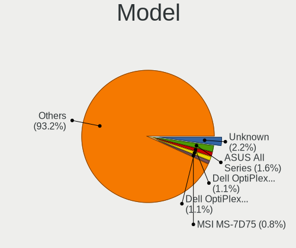
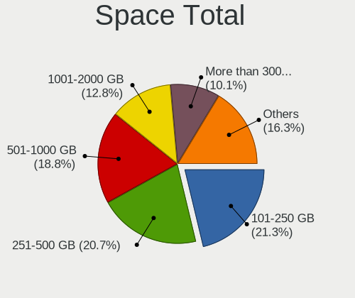
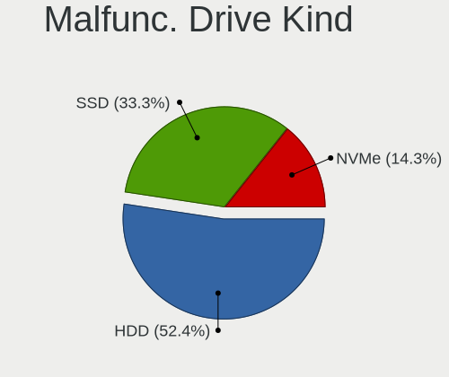
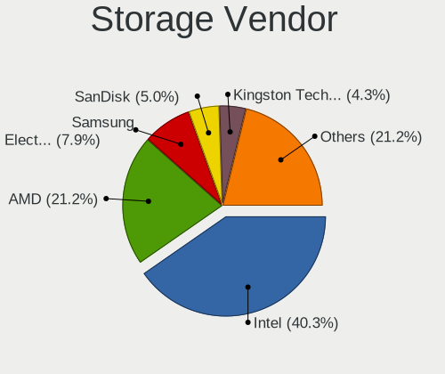
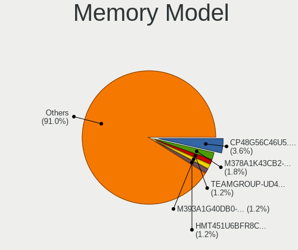
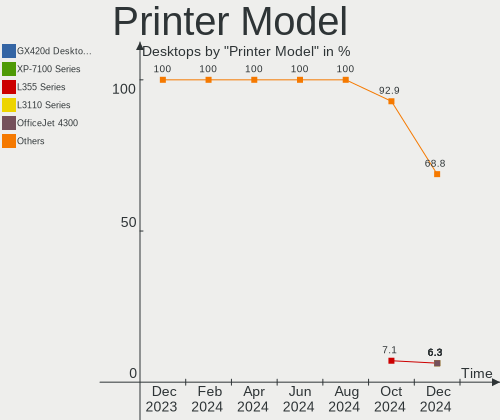

Ubuntu - Hardware Trends (Desktops)
-----------------------------------

A project to identify most popular hardware characteristics and track their change
over time based on data collected by Linux users at https://Linux-Hardware.org.

Anyone can contribute to this report by the [hw-probe](https://github.com/linuxhw/hw-probe) tool:

    sudo -E hw-probe -all -upload

This report is for one last month. Overall report since the beginning of time: [TestCoverage](https://github.com/linuxhw/TestCoverage)

Period: Nov, 2022.

Contents
--------

* [ System ](#system)
  - [ OS                       ](#os)
  - [ OS Family                ](#os-family)
  - [ Kernel                   ](#kernel)
  - [ Kernel Family            ](#kernel-family)
  - [ Kernel Major Ver.        ](#kernel-major-ver)
  - [ Arch                     ](#arch)
  - [ DE                       ](#de)
  - [ Display Server           ](#display-server)
  - [ Display Manager          ](#display-manager)
  - [ OS Lang                  ](#os-lang)
  - [ Boot Mode                ](#boot-mode)
  - [ Filesystem               ](#filesystem)
  - [ Part. scheme             ](#part-scheme)
  - [ Dual Boot with Linux/BSD ](#dual-boot-with-linuxbsd)
  - [ Dual Boot (Win)          ](#dual-boot-win)

* [ Board ](#board)
  - [ Vendor                   ](#vendor)
  - [ Model                    ](#model)
  - [ Model Family             ](#model-family)
  - [ MFG Year                 ](#mfg-year)
  - [ Form Factor              ](#form-factor)
  - [ Secure Boot              ](#secure-boot)
  - [ Coreboot                 ](#coreboot)
  - [ RAM Size                 ](#ram-size)
  - [ RAM Used                 ](#ram-used)
  - [ Total Drives             ](#total-drives)
  - [ Has CD-ROM               ](#has-cd-rom)
  - [ Has Ethernet             ](#has-ethernet)
  - [ Has WiFi                 ](#has-wifi)
  - [ Has Bluetooth            ](#has-bluetooth)

* [ Location ](#location)
  - [ Country                  ](#country)
  - [ City                     ](#city)

* [ Drives ](#drives)
  - [ Drive Vendor             ](#drive-vendor)
  - [ Drive Model              ](#drive-model)
  - [ HDD Vendor               ](#hdd-vendor)
  - [ SSD Vendor               ](#ssd-vendor)
  - [ Drive Kind               ](#drive-kind)
  - [ Drive Connector          ](#drive-connector)
  - [ Drive Size               ](#drive-size)
  - [ Space Total              ](#space-total)
  - [ Space Used               ](#space-used)
  - [ Malfunc. Drives          ](#malfunc-drives)
  - [ Malfunc. Drive Vendor    ](#malfunc-drive-vendor)
  - [ Malfunc. HDD Vendor      ](#malfunc-hdd-vendor)
  - [ Malfunc. Drive Kind      ](#malfunc-drive-kind)
  - [ Failed Drives            ](#failed-drives)
  - [ Failed Drive Vendor      ](#failed-drive-vendor)
  - [ Drive Status             ](#drive-status)

* [ Storage controller ](#storage-controller)
  - [ Storage Vendor           ](#storage-vendor)
  - [ Storage Model            ](#storage-model)
  - [ Storage Kind             ](#storage-kind)

* [ Processor ](#processor)
  - [ CPU Vendor               ](#cpu-vendor)
  - [ CPU Model                ](#cpu-model)
  - [ CPU Model Family         ](#cpu-model-family)
  - [ CPU Cores                ](#cpu-cores)
  - [ CPU Sockets              ](#cpu-sockets)
  - [ CPU Threads              ](#cpu-threads)
  - [ CPU Op-Modes             ](#cpu-op-modes)
  - [ CPU Microcode            ](#cpu-microcode)
  - [ CPU Microarch            ](#cpu-microarch)

* [ Graphics ](#graphics)
  - [ GPU Vendor               ](#gpu-vendor)
  - [ GPU Model                ](#gpu-model)
  - [ GPU Combo                ](#gpu-combo)
  - [ GPU Driver               ](#gpu-driver)
  - [ GPU Memory               ](#gpu-memory)

* [ Monitor ](#monitor)
  - [ Monitor Vendor           ](#monitor-vendor)
  - [ Monitor Model            ](#monitor-model)
  - [ Monitor Resolution       ](#monitor-resolution)
  - [ Monitor Diagonal         ](#monitor-diagonal)
  - [ Monitor Width            ](#monitor-width)
  - [ Aspect Ratio             ](#aspect-ratio)
  - [ Monitor Area             ](#monitor-area)
  - [ Pixel Density            ](#pixel-density)
  - [ Multiple Monitors        ](#multiple-monitors)

* [ Network ](#network)
  - [ Net Controller Vendor    ](#net-controller-vendor)
  - [ Net Controller Model     ](#net-controller-model)
  - [ Wireless Vendor          ](#wireless-vendor)
  - [ Wireless Model           ](#wireless-model)
  - [ Ethernet Vendor          ](#ethernet-vendor)
  - [ Ethernet Model           ](#ethernet-model)
  - [ Net Controller Kind      ](#net-controller-kind)
  - [ Used Controller          ](#used-controller)
  - [ NICs                     ](#nics)
  - [ IPv6                     ](#ipv6)

* [ Bluetooth ](#bluetooth)
  - [ Bluetooth Vendor         ](#bluetooth-vendor)
  - [ Bluetooth Model          ](#bluetooth-model)

* [ Sound ](#sound)
  - [ Sound Vendor             ](#sound-vendor)
  - [ Sound Model              ](#sound-model)

* [ Memory ](#memory)
  - [ Memory Vendor            ](#memory-vendor)
  - [ Memory Model             ](#memory-model)
  - [ Memory Kind              ](#memory-kind)
  - [ Memory Form Factor       ](#memory-form-factor)
  - [ Memory Size              ](#memory-size)
  - [ Memory Speed             ](#memory-speed)

* [ Printers & scanners ](#printers--scanners)
  - [ Printer Vendor           ](#printer-vendor)
  - [ Printer Model            ](#printer-model)
  - [ Scanner Vendor           ](#scanner-vendor)
  - [ Scanner Model            ](#scanner-model)

* [ Camera ](#camera)
  - [ Camera Vendor            ](#camera-vendor)
  - [ Camera Model             ](#camera-model)

* [ Security ](#security)
  - [ Fingerprint Vendor       ](#fingerprint-vendor)
  - [ Fingerprint Model        ](#fingerprint-model)
  - [ Chipcard Vendor          ](#chipcard-vendor)
  - [ Chipcard Model           ](#chipcard-model)

* [ Unsupported ](#unsupported)
  - [ Unsupported Devices      ](#unsupported-devices)
  - [ Unsupported Device Types ](#unsupported-device-types)

System
------

OS
--

Installed operating systems

| Name           | Desktops | Percent |
|----------------|----------|---------|
| Ubuntu 22.04   | 284      | 54.51%  |
| Ubuntu 20.04   | 72       | 13.82%  |
| Ubuntu 22.10   | 71       | 13.63%  |
| Ubuntu 16.04   | 48       | 9.21%   |
| Ubuntu 18.04   | 40       | 7.68%   |
| Ubuntu 21.10   | 5        | 0.96%   |
| Ubuntu Core 18 | 1        | 0.19%   |

OS Family
---------

OS without a version

| Name   | Desktops | Percent |
|--------|----------|---------|
| Ubuntu | 521      | 100%    |

Kernel
------

Version of the Linux kernel

| Version                  | Desktops | Percent |
|--------------------------|----------|---------|
| 5.15.0-52-generic        | 153      | 29.37%  |
| 5.15.0-53-generic        | 143      | 27.45%  |
| 5.19.0-23-generic        | 62       | 11.9%   |
| 4.15.0-142-generic       | 45       | 8.64%   |
| 5.4.0-131-generic        | 11       | 2.11%   |
| 5.4.0-132-generic        | 8        | 1.54%   |
| 4.15.0-175-generic       | 7        | 1.34%   |
| 5.4.0-107-generic        | 6        | 1.15%   |
| 5.19.0-21-generic        | 6        | 1.15%   |
| 5.15.0-46-generic        | 6        | 1.15%   |
| 5.15.0-43-generic        | 6        | 1.15%   |
| 5.4.0-126-generic        | 5        | 0.96%   |
| 5.15.0-48-generic        | 4        | 0.77%   |
| 5.4.0-87-generic         | 3        | 0.58%   |
| 5.4.0-84-generic         | 3        | 0.58%   |
| 5.15.0-54-generic        | 3        | 0.58%   |
| 5.15.0-50-generic        | 3        | 0.58%   |
| 4.15.0-197-generic       | 3        | 0.58%   |
| 5.4.0-128-generic        | 2        | 0.38%   |
| 5.15.0-25-generic        | 2        | 0.38%   |
| 5.13.0-52-generic        | 2        | 0.38%   |
| 5.13.0-39-generic        | 2        | 0.38%   |
| 5.13.0-19-generic        | 2        | 0.38%   |
| 5.10.60-qnap             | 2        | 0.38%   |
| 6.0.8-060008-generic     | 1        | 0.19%   |
| 6.0.0-8.1-liquorix-amd64 | 1        | 0.19%   |
| 5.9.1-rt20               | 1        | 0.19%   |
| 5.8.0-55-generic         | 1        | 0.19%   |
| 5.8.0-38-generic         | 1        | 0.19%   |
| 5.7.1-050701-generic     | 1        | 0.19%   |
| 5.4.0-88-generic         | 1        | 0.19%   |
| 5.4.0-73-generic         | 1        | 0.19%   |
| 5.4.0-66-generic         | 1        | 0.19%   |
| 5.4.0-42-generic         | 1        | 0.19%   |
| 5.4.0-29-generic         | 1        | 0.19%   |
| 5.4.0-26-generic         | 1        | 0.19%   |
| 5.4.0-133-generic        | 1        | 0.19%   |
| 5.4.0-100-generic        | 1        | 0.19%   |
| 5.19.0-24-generic        | 1        | 0.19%   |
| 5.19.0-1009-lowlatency   | 1        | 0.19%   |

Kernel Family
-------------

Linux kernel without a distro release

| Version | Desktops | Percent |
|---------|----------|---------|
| 5.15.0  | 323      | 62%     |
| 5.19.0  | 70       | 13.44%  |
| 4.15.0  | 58       | 11.13%  |
| 5.4.0   | 46       | 8.83%   |
| 5.13.0  | 8        | 1.54%   |
| 5.8.0   | 2        | 0.38%   |
| 5.17.0  | 2        | 0.38%   |
| 5.10.60 | 2        | 0.38%   |
| 4.15.18 | 2        | 0.38%   |
| 6.0.8   | 1        | 0.19%   |
| 6.0.0   | 1        | 0.19%   |
| 5.9.1   | 1        | 0.19%   |
| 5.7.1   | 1        | 0.19%   |
| 5.18.8  | 1        | 0.19%   |
| 5.11.0  | 1        | 0.19%   |
| 4.4.0   | 1        | 0.19%   |
| 4.13.0  | 1        | 0.19%   |

Kernel Major Ver.
-----------------

Linux kernel major version

| Version | Desktops | Percent |
|---------|----------|---------|
| 5.15    | 323      | 62%     |
| 5.19    | 70       | 13.44%  |
| 4.15    | 60       | 11.52%  |
| 5.4     | 46       | 8.83%   |
| 5.13    | 8        | 1.54%   |
| 6.0     | 2        | 0.38%   |
| 5.8     | 2        | 0.38%   |
| 5.17    | 2        | 0.38%   |
| 5.10    | 2        | 0.38%   |
| 5.9     | 1        | 0.19%   |
| 5.7     | 1        | 0.19%   |
| 5.18    | 1        | 0.19%   |
| 5.11    | 1        | 0.19%   |
| 4.4     | 1        | 0.19%   |
| 4.13    | 1        | 0.19%   |

Arch
----

OS architecture (x86_64, i586, etc.)

| Name   | Desktops | Percent |
|--------|----------|---------|
| x86_64 | 519      | 99.62%  |
| i686   | 2        | 0.38%   |

DE
--

Desktop Environment

| Name              | Desktops | Percent |
|-------------------|----------|---------|
| GNOME             | 406      | 77.93%  |
| Unknown           | 99       | 19%     |
| X-Cinnamon        | 6        | 1.15%   |
| GNOME Flashback   | 4        | 0.77%   |
| Yaru:ubuntu:GNOME | 1        | 0.19%   |
| ubuntu=GNOME      | 1        | 0.19%   |
| ubuntu            | 1        | 0.19%   |
| i3-with-shmlog    | 1        | 0.19%   |
| i3                | 1        | 0.19%   |
| Cinnamon          | 1        | 0.19%   |

Display Server
--------------

X11 or Wayland

| Name    | Desktops | Percent |
|---------|----------|---------|
| X11     | 268      | 51.44%  |
| Wayland | 201      | 38.58%  |
| Unknown | 31       | 5.95%   |
| Tty     | 20       | 3.84%   |
| Web     | 1        | 0.19%   |

Display Manager
---------------

SDDM, LightDM, etc.

| Name    | Desktops | Percent |
|---------|----------|---------|
| GDM3    | 365      | 70.06%  |
| Unknown | 122      | 23.42%  |
| GDM     | 23       | 4.41%   |
| LightDM | 10       | 1.92%   |
| SDDM    | 1        | 0.19%   |

OS Lang
-------

Language

| Lang    | Desktops | Percent |
|---------|----------|---------|
| en_US   | 189      | 36.28%  |
| Unknown | 75       | 14.4%   |
| de_DE   | 49       | 9.4%    |
| fr_FR   | 32       | 6.14%   |
| en_GB   | 21       | 4.03%   |
| it_IT   | 20       | 3.84%   |
| pt_BR   | 13       | 2.5%    |
| en_CA   | 11       | 2.11%   |
| nl_NL   | 9        | 1.73%   |
| en_IN   | 9        | 1.73%   |
| pl_PL   | 8        | 1.54%   |
| ru_RU   | 7        | 1.34%   |
| es_ES   | 7        | 1.34%   |
| C       | 7        | 1.34%   |
| cs_CZ   | 6        | 1.15%   |
| sv_SE   | 5        | 0.96%   |
| ja_JP   | 4        | 0.77%   |
| fr_CA   | 4        | 0.77%   |
| en_AU   | 4        | 0.77%   |
| zh_CN   | 3        | 0.58%   |
| es_VE   | 3        | 0.58%   |
| ko_KR   | 2        | 0.38%   |
| fi_FI   | 2        | 0.38%   |
| es_MX   | 2        | 0.38%   |
| es_CO   | 2        | 0.38%   |
| es_AR   | 2        | 0.38%   |
| en_NZ   | 2        | 0.38%   |
| el_GR   | 2        | 0.38%   |
| de_CH   | 2        | 0.38%   |
| ar_EG   | 2        | 0.38%   |
| pt_PT   | 1        | 0.19%   |
| nl_BE   | 1        | 0.19%   |
| nb_NO   | 1        | 0.19%   |
| lv_LV   | 1        | 0.19%   |
| hu_HU   | 1        | 0.19%   |
| fr_CH   | 1        | 0.19%   |
| fr_BE   | 1        | 0.19%   |
| es_UY   | 1        | 0.19%   |
| es_NI   | 1        | 0.19%   |
| es_GT   | 1        | 0.19%   |

Boot Mode
---------

EFI or BIOS

| Mode | Desktops | Percent |
|------|----------|---------|
| BIOS | 330      | 63.34%  |
| EFI  | 191      | 36.66%  |

Filesystem
----------

Type of filesystem

| Type          | Desktops | Percent |
|---------------|----------|---------|
| Ext4          | 489      | 93.86%  |
| Overlay       | 13       | 2.5%    |
| Zfs           | 11       | 2.11%   |
| Btrfs         | 3        | 0.58%   |
| Xfs           | 1        | 0.19%   |
| Jfs           | 1        | 0.19%   |
| Fuse.snapfuse | 1        | 0.19%   |
| Ext3          | 1        | 0.19%   |
| Ext2          | 1        | 0.19%   |

Part. scheme
------------

Scheme of partitioning

| Type    | Desktops | Percent |
|---------|----------|---------|
| GPT     | 396      | 76.01%  |
| MBR     | 91       | 17.47%  |
| Unknown | 34       | 6.53%   |

Dual Boot with Linux/BSD
------------------------

Hosting more than one Linux/BSD

| Dual boot | Desktops | Percent |
|-----------|----------|---------|
| No        | 364      | 69.87%  |
| Yes       | 157      | 30.13%  |

Dual Boot (Win)
---------------

Hosting Linux and Windows

| Dual boot | Desktops | Percent |
|-----------|----------|---------|
| No        | 328      | 62.96%  |
| Yes       | 193      | 37.04%  |

Board
-----

Vendor
------

Motherboard manufacturer

| Name                | Desktops | Percent |
|---------------------|----------|---------|
| ASUSTek Computer    | 163      | 31.29%  |
| Gigabyte Technology | 78       | 14.97%  |
| Dell                | 57       | 10.94%  |
| MSI                 | 47       | 9.02%   |
| Hewlett-Packard     | 42       | 8.06%   |
| ASRock              | 32       | 6.14%   |
| Lenovo              | 22       | 4.22%   |
| Intel               | 11       | 2.11%   |
| Fujitsu             | 11       | 2.11%   |
| Acer                | 9        | 1.73%   |
| Biostar             | 5        | 0.96%   |
| Unknown             | 5        | 0.96%   |
| Pegatron            | 4        | 0.77%   |
| Medion              | 4        | 0.77%   |
| Foxconn             | 3        | 0.58%   |
| Shuttle             | 2        | 0.38%   |
| PCWare              | 2        | 0.38%   |
| Huanan              | 2        | 0.38%   |
| Gateway             | 2        | 0.38%   |
| BESSTAR Tech        | 2        | 0.38%   |
| AZW                 | 2        | 0.38%   |
| XDO.AI              | 1        | 0.19%   |
| T-bao               | 1        | 0.19%   |
| Supermicro          | 1        | 0.19%   |
| Silicom             | 1        | 0.19%   |
| Samsung Electronics | 1        | 0.19%   |
| Positivo            | 1        | 0.19%   |
| OEM                 | 1        | 0.19%   |
| Minix               | 1        | 0.19%   |
| Login Informatica   | 1        | 0.19%   |
| LattePanda          | 1        | 0.19%   |
| Koloe               | 1        | 0.19%   |
| Colorful Technology | 1        | 0.19%   |
| Apple               | 1        | 0.19%   |
| AMD                 | 1        | 0.19%   |
| Alienware           | 1        | 0.19%   |
| AAEON               | 1        | 0.19%   |

Model
-----

Motherboard model

| Name                          | Desktops | Percent |
|-------------------------------|----------|---------|
| ASUS ROG STRIX X299-E GAMING  | 38       | 7.29%   |
| ASUS All Series               | 16       | 3.07%   |
| ASUS PRIME TRX40-PRO          | 9        | 1.73%   |
| ASUS TUF X299 MARK 2          | 7        | 1.34%   |
| Dell OptiPlex 990             | 6        | 1.15%   |
| ASUS PRIME A320M-K            | 6        | 1.15%   |
| Unknown                       | 6        | 1.15%   |
| Gigabyte X299 UD4 Pro         | 5        | 0.96%   |
| Dell OptiPlex 7010            | 5        | 0.96%   |
| MSI MS-7C37                   | 4        | 0.77%   |
| HP Z440 Workstation           | 4        | 0.77%   |
| Gigabyte B450M DS3H           | 4        | 0.77%   |
| Dell OptiPlex 3020            | 4        | 0.77%   |
| ASUS TUF Gaming X570-PLUS     | 4        | 0.77%   |
| MSI MS-7978                   | 3        | 0.58%   |
| Intel H61                     | 3        | 0.58%   |
| HP Compaq 8200 Elite SFF PC   | 3        | 0.58%   |
| Gigabyte X299 AORUS Gaming 7  | 3        | 0.58%   |
| Gigabyte X299 AORUS Gaming 3  | 3        | 0.58%   |
| MSI MS-7C91                   | 2        | 0.38%   |
| MSI MS-7A34                   | 2        | 0.38%   |
| MSI MS-7885                   | 2        | 0.38%   |
| MSI MS-7721                   | 2        | 0.38%   |
| MSI MS-7693                   | 2        | 0.38%   |
| HP EliteDesk 800 G1 USDT      | 2        | 0.38%   |
| HP EliteDesk 800 G1 DM        | 2        | 0.38%   |
| HP Compaq Pro 6305 SFF        | 2        | 0.38%   |
| HP Compaq Pro 6300 SFF        | 2        | 0.38%   |
| HP Compaq Elite 8300 SFF      | 2        | 0.38%   |
| Gigabyte TRX40 AORUS PRO WIFI | 2        | 0.38%   |
| Gigabyte B550M AORUS ELITE    | 2        | 0.38%   |
| Gigabyte B550 AORUS ELITE V2  | 2        | 0.38%   |
| Dell Precision T1650          | 2        | 0.38%   |
| Dell Precision 3650 Tower     | 2        | 0.38%   |
| Dell OptiPlex 980             | 2        | 0.38%   |
| Dell OptiPlex 755             | 2        | 0.38%   |
| Dell OptiPlex 3050            | 2        | 0.38%   |
| Dell OptiPlex 3010            | 2        | 0.38%   |
| Dell Inspiron 530             | 2        | 0.38%   |
| Biostar A320MH                | 2        | 0.38%   |

Model Family
------------

Motherboard model prefix

| Name                | Desktops | Percent |
|---------------------|----------|---------|
| ASUS ROG            | 48       | 9.21%   |
| ASUS PRIME          | 34       | 6.53%   |
| Dell OptiPlex       | 33       | 6.33%   |
| ASUS TUF            | 16       | 3.07%   |
| ASUS All            | 16       | 3.07%   |
| HP Compaq           | 15       | 2.88%   |
| Lenovo ThinkCentre  | 13       | 2.5%    |
| Gigabyte X299       | 12       | 2.3%    |
| Dell Precision      | 12       | 2.3%    |
| HP EliteDesk        | 6        | 1.15%   |
| Dell Inspiron       | 6        | 1.15%   |
| Acer Aspire         | 6        | 1.15%   |
| Unknown             | 6        | 1.15%   |
| Gigabyte B450M      | 5        | 0.96%   |
| Fujitsu ESPRIMO     | 5        | 0.96%   |
| ASUS M5A78L-M       | 5        | 0.96%   |
| MSI MS-7C37         | 4        | 0.77%   |
| Lenovo IdeaCentre   | 4        | 0.77%   |
| HP Z440             | 4        | 0.77%   |
| HP ProDesk          | 4        | 0.77%   |
| ASRock B450M        | 4        | 0.77%   |
| MSI MS-7978         | 3        | 0.58%   |
| Lenovo ThinkStation | 3        | 0.58%   |
| Intel H61           | 3        | 0.58%   |
| HP Pavilion         | 3        | 0.58%   |
| Gigabyte B550M      | 3        | 0.58%   |
| Gigabyte B450       | 3        | 0.58%   |
| ASRock X570         | 3        | 0.58%   |
| ASRock B450         | 3        | 0.58%   |
| MSI MS-7C91         | 2        | 0.38%   |
| MSI MS-7A34         | 2        | 0.38%   |
| MSI MS-7885         | 2        | 0.38%   |
| MSI MS-7721         | 2        | 0.38%   |
| MSI MS-7693         | 2        | 0.38%   |
| Gigabyte Z690       | 2        | 0.38%   |
| Gigabyte X570       | 2        | 0.38%   |
| Gigabyte TRX40      | 2        | 0.38%   |
| Gigabyte H110M-S2H  | 2        | 0.38%   |
| Gigabyte B550       | 2        | 0.38%   |
| Gigabyte 970A-DS3P  | 2        | 0.38%   |

MFG Year
--------

Motherboard manufacture year

| Year    | Desktops | Percent |
|---------|----------|---------|
| 2017    | 92       | 17.66%  |
| 2019    | 46       | 8.83%   |
| 2018    | 41       | 7.87%   |
| 2014    | 41       | 7.87%   |
| 2013    | 40       | 7.68%   |
| 2020    | 34       | 6.53%   |
| 2012    | 34       | 6.53%   |
| 2021    | 32       | 6.14%   |
| 2011    | 31       | 5.95%   |
| 2015    | 27       | 5.18%   |
| 2009    | 20       | 3.84%   |
| 2016    | 18       | 3.45%   |
| 2010    | 18       | 3.45%   |
| 2022    | 16       | 3.07%   |
| 2008    | 14       | 2.69%   |
| 2007    | 13       | 2.5%    |
| 2005    | 2        | 0.38%   |
| 2006    | 1        | 0.19%   |
| Unknown | 1        | 0.19%   |

Form Factor
-----------

Physical design of the computer

| Name    | Desktops | Percent |
|---------|----------|---------|
| Desktop | 521      | 100%    |

Secure Boot
-----------

Enabled or disabled

| State    | Desktops | Percent |
|----------|----------|---------|
| Disabled | 502      | 96.35%  |
| Enabled  | 19       | 3.65%   |

Coreboot
--------

Have coreboot on board

| Used | Desktops | Percent |
|------|----------|---------|
| No   | 521      | 100%    |

RAM Size
--------

Total RAM memory

| Size in GB      | Desktops | Percent |
|-----------------|----------|---------|
| 16.01-24.0      | 135      | 25.91%  |
| 32.01-64.0      | 82       | 15.74%  |
| 64.01-256.0     | 76       | 14.59%  |
| 4.01-8.0        | 74       | 14.2%   |
| 8.01-16.0       | 63       | 12.09%  |
| 3.01-4.0        | 61       | 11.71%  |
| 24.01-32.0      | 12       | 2.3%    |
| More than 256.0 | 11       | 2.11%   |
| 1.01-2.0        | 6        | 1.15%   |
| 2.01-3.0        | 1        | 0.19%   |

RAM Used
--------

Used RAM memory

| Used GB     | Desktops | Percent |
|-------------|----------|---------|
| 1.01-2.0    | 146      | 28.02%  |
| 2.01-3.0    | 126      | 24.18%  |
| 4.01-8.0    | 78       | 14.97%  |
| 3.01-4.0    | 77       | 14.78%  |
| 32.01-64.0  | 34       | 6.53%   |
| 8.01-16.0   | 29       | 5.57%   |
| 64.01-256.0 | 9        | 1.73%   |
| 16.01-24.0  | 7        | 1.34%   |
| 0.51-1.0    | 7        | 1.34%   |
| 0.01-0.5    | 6        | 1.15%   |
| 24.01-32.0  | 2        | 0.38%   |

Total Drives
------------

Number of drives on board

| Drives | Desktops | Percent |
|--------|----------|---------|
| 1      | 190      | 36.47%  |
| 2      | 155      | 29.75%  |
| 3      | 99       | 19%     |
| 4      | 40       | 7.68%   |
| 5      | 18       | 3.45%   |
| 6      | 7        | 1.34%   |
| 0      | 5        | 0.96%   |
| 7      | 4        | 0.77%   |
| 12     | 1        | 0.19%   |
| 10     | 1        | 0.19%   |
| 8      | 1        | 0.19%   |

Has CD-ROM
----------

Has CD-ROM on board

| Presented | Desktops | Percent |
|-----------|----------|---------|
| No        | 296      | 56.81%  |
| Yes       | 225      | 43.19%  |

Has Ethernet
------------

Has Ethernet on board

| Presented | Desktops | Percent |
|-----------|----------|---------|
| Yes       | 516      | 99.04%  |
| No        | 5        | 0.96%   |

Has WiFi
--------

Has WiFi module

| Presented | Desktops | Percent |
|-----------|----------|---------|
| No        | 298      | 57.2%   |
| Yes       | 223      | 42.8%   |

Has Bluetooth
-------------

Has Bluetooth module

| Presented | Desktops | Percent |
|-----------|----------|---------|
| No        | 380      | 72.94%  |
| Yes       | 141      | 27.06%  |

Location
--------

Country
-------

Geographic location (country)

| Country            | Desktops | Percent |
|--------------------|----------|---------|
| USA                | 95       | 18.23%  |
| Unknown            | 66       | 12.67%  |
| Germany            | 59       | 11.32%  |
| France             | 32       | 6.14%   |
| Italy              | 25       | 4.8%    |
| Brazil             | 21       | 4.03%   |
| UK                 | 19       | 3.65%   |
| Canada             | 19       | 3.65%   |
| Russia             | 11       | 2.11%   |
| Netherlands        | 11       | 2.11%   |
| Sweden             | 9        | 1.73%   |
| Poland             | 9        | 1.73%   |
| India              | 9        | 1.73%   |
| Czechia            | 9        | 1.73%   |
| China              | 8        | 1.54%   |
| Australia          | 7        | 1.34%   |
| Switzerland        | 6        | 1.15%   |
| Spain              | 6        | 1.15%   |
| Japan              | 6        | 1.15%   |
| Greece             | 6        | 1.15%   |
| Bulgaria           | 5        | 0.96%   |
| Austria            | 5        | 0.96%   |
| UAE                | 4        | 0.77%   |
| Finland            | 4        | 0.77%   |
| Belgium            | 4        | 0.77%   |
| Venezuela          | 3        | 0.58%   |
| Tunisia            | 3        | 0.58%   |
| Taiwan             | 3        | 0.58%   |
| South Korea        | 3        | 0.58%   |
| South Africa       | 3        | 0.58%   |
| Mexico             | 3        | 0.58%   |
| Israel             | 3        | 0.58%   |
| Colombia           | 3        | 0.58%   |
| Serbia             | 2        | 0.38%   |
| Peru               | 2        | 0.38%   |
| Pakistan           | 2        | 0.38%   |
| New Zealand        | 2        | 0.38%   |
| Luxembourg         | 2        | 0.38%   |
| Hungary            | 2        | 0.38%   |
| Dominican Republic | 2        | 0.38%   |

City
----

Geographic location (city)

| City              | Desktops | Percent |
|-------------------|----------|---------|
| Unknown           | 66       | 12.67%  |
| Rome              | 5        | 0.96%   |
| Rio de Janeiro    | 5        | 0.96%   |
| Stockholm         | 4        | 0.77%   |
| Vienna            | 3        | 0.58%   |
| Sofia             | 3        | 0.58%   |
| San José         | 3        | 0.58%   |
| Prague            | 3        | 0.58%   |
| Paris             | 3        | 0.58%   |
| London            | 3        | 0.58%   |
| Frankfurt am Main | 3        | 0.58%   |
| Champs-sur-Marne  | 3        | 0.58%   |
| Athens            | 3        | 0.58%   |
| Amsterdam         | 3        | 0.58%   |
| Wyandotte         | 2        | 0.38%   |
| Wigan             | 2        | 0.38%   |
| Toronto           | 2        | 0.38%   |
| Tarnów           | 2        | 0.38%   |
| Taipei            | 2        | 0.38%   |
| Sydney            | 2        | 0.38%   |
| St Petersburg     | 2        | 0.38%   |
| Shushary          | 2        | 0.38%   |
| Seattle           | 2        | 0.38%   |
| Santa Clara       | 2        | 0.38%   |
| San Diego         | 2        | 0.38%   |
| Phoenix           | 2        | 0.38%   |
| Philadelphia      | 2        | 0.38%   |
| Ottawa            | 2        | 0.38%   |
| Mumbai            | 2        | 0.38%   |
| Moscow            | 2        | 0.38%   |
| Montreal          | 2        | 0.38%   |
| Milan             | 2        | 0.38%   |
| Maple Ridge       | 2        | 0.38%   |
| Lima              | 2        | 0.38%   |
| Hurricane         | 2        | 0.38%   |
| Helsinki          | 2        | 0.38%   |
| Hanover           | 2        | 0.38%   |
| Hangzhou          | 2        | 0.38%   |
| Hamburg           | 2        | 0.38%   |
| Graz              | 2        | 0.38%   |

Drives
------

Drive Vendor
------------

Hard drive vendors

| Vendor                      | Desktops | Drives | Percent |
|-----------------------------|----------|--------|---------|
| Seagate                     | 212      | 304    | 22.32%  |
| Samsung Electronics         | 168      | 196    | 17.68%  |
| WDC                         | 164      | 210    | 17.26%  |
| Kingston                    | 76       | 81     | 8%      |
| Toshiba                     | 44       | 49     | 4.63%   |
| SanDisk                     | 39       | 43     | 4.11%   |
| Crucial                     | 31       | 34     | 3.26%   |
| Hitachi                     | 28       | 30     | 2.95%   |
| Silicon Motion              | 18       | 18     | 1.89%   |
| China                       | 11       | 11     | 1.16%   |
| A-DATA Technology           | 10       | 12     | 1.05%   |
| Unknown                     | 9        | 10     | 0.95%   |
| Phison Electronics          | 9        | 11     | 0.95%   |
| SPCC                        | 6        | 7      | 0.63%   |
| Maxtor                      | 6        | 7      | 0.63%   |
| Intenso                     | 6        | 6      | 0.63%   |
| Intel                       | 6        | 7      | 0.63%   |
| Phison                      | 5        | 6      | 0.53%   |
| Patriot                     | 5        | 5      | 0.53%   |
| Micron Technology           | 5        | 6      | 0.53%   |
| KIOXIA                      | 5        | 6      | 0.53%   |
| HGST                        | 5        | 6      | 0.53%   |
| PNY                         | 4        | 4      | 0.42%   |
| Micron/Crucial Technology   | 4        | 4      | 0.42%   |
| Kingston Technology Company | 4        | 4      | 0.42%   |
| ADATA Technology            | 4        | 4      | 0.42%   |
| Team                        | 3        | 3      | 0.32%   |
| SK hynix                    | 3        | 3      | 0.32%   |
| OCZ                         | 3        | 3      | 0.32%   |
| Lexar                       | 3        | 3      | 0.32%   |
| KingSpec                    | 3        | 3      | 0.32%   |
| Hewlett-Packard             | 3        | 3      | 0.32%   |
| Gigabyte Technology         | 3        | 3      | 0.32%   |
| XPG                         | 2        | 2      | 0.21%   |
| Transcend                   | 2        | 2      | 0.21%   |
| SABRENT                     | 2        | 2      | 0.21%   |
| GOODRAM                     | 2        | 2      | 0.21%   |
| Corsair                     | 2        | 2      | 0.21%   |
| XrayDisk                    | 1        | 1      | 0.11%   |
| W800SH                      | 1        | 1      | 0.11%   |

Drive Model
-----------

Hard drive models

| Model                                                | Desktops | Percent |
|------------------------------------------------------|----------|---------|
| Seagate ST6000NM0115-1YZ110 6TB                      | 54       | 4.94%   |
| Samsung SSD 860 EVO 500GB                            | 44       | 4.03%   |
| Kingston SA400S37480G 480GB SSD                      | 25       | 2.29%   |
| Kingston SA400S37240G 240GB SSD                      | 20       | 1.83%   |
| WDC WD10EZEX-08WN4A0 1TB                             | 17       | 1.56%   |
| Toshiba DT01ACA100 1TB                               | 12       | 1.1%    |
| Silicon Motion Asgard AN3 2TNVMe-M.2-80 2TB          | 12       | 1.1%    |
| Seagate ST12000NM0007-2A1101 12TB                    | 12       | 1.1%    |
| Seagate ST1000DM010-2EP102 1TB                       | 12       | 1.1%    |
| Seagate ST500DM002-1BD142 500GB                      | 11       | 1.01%   |
| Seagate ST2000DM008-2FR102 2TB                       | 11       | 1.01%   |
| Seagate ST16000NM001G-2KK103 16TB                    | 10       | 0.91%   |
| Samsung NVMe SSD Controller SM981/PM981/PM983 1TB    | 10       | 0.91%   |
| Samsung NVMe SSD Controller PM9A1/PM9A3/980PRO 250GB | 10       | 0.91%   |
| Toshiba HDWD110 1TB                                  | 8        | 0.73%   |
| Seagate ST10000NM0016-1TT101 10TB                    | 8        | 0.73%   |
| Seagate ST2000DM006-2DM164 2TB                       | 7        | 0.64%   |
| Seagate ST1000DM003-1ER162 1TB                       | 7        | 0.64%   |
| Samsung SSD 870 QVO 1TB                              | 7        | 0.64%   |
| WDC WD5000AAKX-60U6AA0 500GB                         | 6        | 0.55%   |
| Seagate ST4000DM004-2CV104 4TB                       | 6        | 0.55%   |
| Seagate ST12000NM0008-2H3101 12TB                    | 6        | 0.55%   |
| Seagate ST1000DM003-1CH162 1TB                       | 6        | 0.55%   |
| Samsung SSD 870 EVO 500GB                            | 6        | 0.55%   |
| Samsung SSD 850 EVO 500GB                            | 6        | 0.55%   |
| Samsung SSD 850 EVO 250GB                            | 6        | 0.55%   |
| Toshiba DT01ACA050 500GB                             | 5        | 0.46%   |
| Seagate ST3500413AS 500GB                            | 5        | 0.46%   |
| Seagate ST2000DM001-1ER164 2TB                       | 5        | 0.46%   |
| Phison E16 PCIe4 NVMe Controller 1TB                 | 5        | 0.46%   |
| WDC WD20EZRZ-00Z5HB0 2TB                             | 4        | 0.37%   |
| WDC WD10EZEX-00WN4A0 1TB                             | 4        | 0.37%   |
| Seagate ST3320620AS 320GB                            | 4        | 0.37%   |
| Seagate ST2000DL003-9VT166 2TB                       | 4        | 0.37%   |
| Samsung SSD 970 EVO Plus 500GB                       | 4        | 0.37%   |
| Samsung SSD 860 EVO 1TB                              | 4        | 0.37%   |
| Samsung NVMe SSD Controller SM961/PM961/SM963 250GB  | 4        | 0.37%   |
| Phison E12 NVMe Controller 2TB                       | 4        | 0.37%   |
| Kingston SV300S37A240G 240GB SSD                     | 4        | 0.37%   |
| Kingston SA400S37120G 120GB SSD                      | 4        | 0.37%   |

HDD Vendor
----------

Hard disk drive vendors

| Vendor              | Desktops | Drives | Percent |
|---------------------|----------|--------|---------|
| Seagate             | 207      | 298    | 45%     |
| WDC                 | 145      | 186    | 31.52%  |
| Toshiba             | 41       | 43     | 8.91%   |
| Hitachi             | 28       | 30     | 6.09%   |
| Samsung Electronics | 27       | 30     | 5.87%   |
| HGST                | 5        | 6      | 1.09%   |
| Maxtor              | 3        | 4      | 0.65%   |
| Unknown             | 2        | 2      | 0.43%   |
| Hewlett-Packard     | 1        | 1      | 0.22%   |
| External            | 1        | 1      | 0.22%   |

SSD Vendor
----------

Solid state drive vendors

| Vendor              | Desktops | Drives | Percent |
|---------------------|----------|--------|---------|
| Samsung Electronics | 108      | 119    | 31.49%  |
| Kingston            | 69       | 72     | 20.12%  |
| Crucial             | 27       | 29     | 7.87%   |
| SanDisk             | 23       | 27     | 6.71%   |
| WDC                 | 16       | 16     | 4.66%   |
| China               | 11       | 11     | 3.21%   |
| A-DATA Technology   | 10       | 12     | 2.92%   |
| SPCC                | 6        | 7      | 1.75%   |
| Patriot             | 5        | 5      | 1.46%   |
| Intel               | 5        | 6      | 1.46%   |
| PNY                 | 4        | 4      | 1.17%   |
| Intenso             | 4        | 4      | 1.17%   |
| Toshiba             | 3        | 4      | 0.87%   |
| Team                | 3        | 3      | 0.87%   |
| SK hynix            | 3        | 3      | 0.87%   |
| OCZ                 | 3        | 3      | 0.87%   |
| Maxtor              | 3        | 3      | 0.87%   |
| KingSpec            | 3        | 3      | 0.87%   |
| Gigabyte Technology | 3        | 3      | 0.87%   |
| Transcend           | 2        | 2      | 0.58%   |
| Micron Technology   | 2        | 3      | 0.58%   |
| Lexar               | 2        | 2      | 0.58%   |
| Hewlett-Packard     | 2        | 2      | 0.58%   |
| GOODRAM             | 2        | 2      | 0.58%   |
| W800SH              | 1        | 1      | 0.29%   |
| UNIC2               | 1        | 1      | 0.29%   |
| SCCTS-603-128G      | 1        | 1      | 0.29%   |
| Ramsta              | 1        | 1      | 0.29%   |
| Phison              | 1        | 1      | 0.29%   |
| Mushkin             | 1        | 1      | 0.29%   |
| MidasForce          | 1        | 1      | 0.29%   |
| LITEONIT            | 1        | 1      | 0.29%   |
| LITEON              | 1        | 1      | 0.29%   |
| Kingmax             | 1        | 1      | 0.29%   |
| KingFast            | 1        | 1      | 0.29%   |
| JMicron Technology  | 1        | 1      | 0.29%   |
| Inland S            | 1        | 1      | 0.29%   |
| HS-SSD-E100         | 1        | 1      | 0.29%   |
| HS-SSD-C100         | 1        | 1      | 0.29%   |
| Emtec               | 1        | 1      | 0.29%   |

Drive Kind
----------

HDD or SSD

| Kind    | Desktops | Drives | Percent |
|---------|----------|--------|---------|
| HDD     | 370      | 601    | 44.96%  |
| SSD     | 303      | 369    | 36.82%  |
| NVMe    | 130      | 156    | 15.8%   |
| Unknown | 13       | 13     | 1.58%   |
| MMC     | 7        | 8      | 0.85%   |

Drive Connector
---------------

SATA, SAS, NVMe, etc.

| Type | Desktops | Drives | Percent |
|------|----------|--------|---------|
| SATA | 469      | 941    | 73.4%   |
| NVMe | 129      | 152    | 20.19%  |
| SAS  | 34       | 46     | 5.32%   |
| MMC  | 7        | 8      | 1.1%    |

Drive Size
----------

Size of hard drive

| Size in TB | Desktops | Drives | Percent |
|------------|----------|--------|---------|
| 0.01-0.5   | 346      | 452    | 46.13%  |
| 0.51-1.0   | 183      | 228    | 24.4%   |
| 4.01-10.0  | 74       | 104    | 9.87%   |
| 1.01-2.0   | 69       | 88     | 9.2%    |
| 10.01-20.0 | 31       | 34     | 4.13%   |
| 3.01-4.0   | 27       | 38     | 3.6%    |
| 2.01-3.0   | 20       | 26     | 2.67%   |

Space Total
-----------

Amount of disk space available on the file system

| Size in GB     | Desktops | Percent |
|----------------|----------|---------|
| 101-250        | 106      | 20.35%  |
| 501-1000       | 79       | 15.16%  |
| 251-500        | 78       | 14.97%  |
| Unknown        | 77       | 14.78%  |
| More than 3000 | 50       | 9.6%    |
| 1001-2000      | 50       | 9.6%    |
| 2001-3000      | 29       | 5.57%   |
| 51-100         | 27       | 5.18%   |
| 1-20           | 16       | 3.07%   |
| 21-50          | 9        | 1.73%   |

Space Used
----------

Amount of used disk space

| Used GB        | Desktops | Percent |
|----------------|----------|---------|
| 1-20           | 134      | 25.72%  |
| 21-50          | 82       | 15.74%  |
| Unknown        | 77       | 14.78%  |
| 51-100         | 58       | 11.13%  |
| 101-250        | 54       | 10.36%  |
| 251-500        | 33       | 6.33%   |
| 501-1000       | 27       | 5.18%   |
| 1001-2000      | 25       | 4.8%    |
| More than 3000 | 23       | 4.41%   |
| 2001-3000      | 8        | 1.54%   |

Malfunc. Drives
---------------

Drive models with a malfunction

| Model                                    | Desktops | Drives | Percent |
|------------------------------------------|----------|--------|---------|
| Seagate ST2000DM006-2DM164 2TB           | 3        | 3      | 7.89%   |
| Kingston SA400S37480G 480GB SSD          | 3        | 3      | 7.89%   |
| WDC WD6400AAKS-65A7B0 640GB              | 2        | 2      | 5.26%   |
| WDC WD40EZRZ-00GXCB0 4TB                 | 1        | 1      | 2.63%   |
| WDC WD40EFRX-68WT0N0 4TB                 | 1        | 1      | 2.63%   |
| WDC WD3200AAJS-08L7A0 320GB              | 1        | 1      | 2.63%   |
| WDC WD30 EFRX-68EUZN0 3TB                | 1        | 1      | 2.63%   |
| WDC WD2500AAKX-603CA0 250GB              | 1        | 1      | 2.63%   |
| WDC WD20EFRX-68AX9N0 2TB                 | 1        | 2      | 2.63%   |
| WDC WD2000FYYZ-01UL1B0 2TB               | 1        | 1      | 2.63%   |
| WDC WD10JPVX-60JC3T0 1TB                 | 1        | 1      | 2.63%   |
| WDC WD10EZEX-60WN4A1 1TB                 | 1        | 1      | 2.63%   |
| WDC WD10EZEX-00WN4A0 1TB                 | 1        | 1      | 2.63%   |
| Toshiba MQ01ABD075 752GB                 | 1        | 1      | 2.63%   |
| SPCC Solid State Disk 1TB                | 1        | 1      | 2.63%   |
| Seagate ST3750528AS 752GB                | 1        | 1      | 2.63%   |
| Seagate ST3500418AS 500GB                | 1        | 1      | 2.63%   |
| Seagate ST3360320AS 360GB                | 1        | 1      | 2.63%   |
| Seagate ST2000DM001-1CH164 2TB           | 1        | 1      | 2.63%   |
| Seagate ST2000DL003-9VT166 2TB           | 1        | 1      | 2.63%   |
| Seagate ST12000NM0008-2H3101 12TB        | 1        | 1      | 2.63%   |
| Samsung Electronics SSD 970 EVO Plus 1TB | 1        | 1      | 2.63%   |
| Samsung Electronics SSD 870 EVO 1TB      | 1        | 1      | 2.63%   |
| Samsung Electronics HD501LJ 500GB        | 1        | 1      | 2.63%   |
| LITEONIT LCT-128M3S 128GB SSD            | 1        | 1      | 2.63%   |
| Kingston SA400S37240G 240GB SSD          | 1        | 1      | 2.63%   |
| Intenso SSD Sata III 128GB               | 1        | 1      | 2.63%   |
| Intel SSDSC2CW120A3 120GB                | 1        | 1      | 2.63%   |
| Hitachi HTS547575A9E384 752GB            | 1        | 1      | 2.63%   |
| Hitachi HTS545050A7E380 500GB            | 1        | 1      | 2.63%   |
| Hitachi HDP725025GLA380 250GB            | 1        | 1      | 2.63%   |
| EGON S10 120GB SSD                       | 1        | 1      | 2.63%   |
| China SSD 120GB                          | 1        | 1      | 2.63%   |

Malfunc. Drive Vendor
---------------------

Vendors of faulty drives

| Vendor              | Desktops | Drives | Percent |
|---------------------|----------|--------|---------|
| WDC                 | 11       | 13     | 29.73%  |
| Seagate             | 9        | 9      | 24.32%  |
| Kingston            | 4        | 4      | 10.81%  |
| Samsung Electronics | 3        | 3      | 8.11%   |
| Hitachi             | 3        | 3      | 8.11%   |
| Toshiba             | 1        | 1      | 2.7%    |
| SPCC                | 1        | 1      | 2.7%    |
| LITEONIT            | 1        | 1      | 2.7%    |
| Intenso             | 1        | 1      | 2.7%    |
| Intel               | 1        | 1      | 2.7%    |
| EGON                | 1        | 1      | 2.7%    |
| China               | 1        | 1      | 2.7%    |

Malfunc. HDD Vendor
-------------------

Vendors of faulty HDD drives

| Vendor              | Desktops | Drives | Percent |
|---------------------|----------|--------|---------|
| WDC                 | 11       | 13     | 44%     |
| Seagate             | 9        | 9      | 36%     |
| Hitachi             | 3        | 3      | 12%     |
| Toshiba             | 1        | 1      | 4%      |
| Samsung Electronics | 1        | 1      | 4%      |

Malfunc. Drive Kind
-------------------

Kinds of faulty drives

| Kind | Desktops | Drives | Percent |
|------|----------|--------|---------|
| HDD  | 25       | 27     | 67.57%  |
| SSD  | 11       | 11     | 29.73%  |
| NVMe | 1        | 1      | 2.7%    |

Failed Drives
-------------

Failed drive models

Zero info for selected period =(

Failed Drive Vendor
-------------------

Failed drive vendors

Zero info for selected period =(

Drive Status
------------

Number of failed and malfunc. drives

| Status   | Desktops | Drives | Percent |
|----------|----------|--------|---------|
| Detected | 314      | 646    | 56.47%  |
| Works    | 207      | 462    | 37.23%  |
| Malfunc  | 35       | 39     | 6.29%   |

Storage controller
------------------

Storage Vendor
--------------

Storage controller vendors

| Vendor                       | Desktops | Percent |
|------------------------------|----------|---------|
| Intel                        | 364      | 50.98%  |
| AMD                          | 143      | 20.03%  |
| Samsung Electronics          | 43       | 6.02%   |
| ASMedia Technology           | 28       | 3.92%   |
| SanDisk                      | 22       | 3.08%   |
| Silicon Motion               | 18       | 2.52%   |
| Phison Electronics           | 15       | 2.1%    |
| Marvell Technology Group     | 12       | 1.68%   |
| Kingston Technology Company  | 12       | 1.68%   |
| Micron/Crucial Technology    | 9        | 1.26%   |
| JMicron Technology           | 8        | 1.12%   |
| ADATA Technology             | 7        | 0.98%   |
| Nvidia                       | 6        | 0.84%   |
| KIOXIA                       | 5        | 0.7%    |
| VIA Technologies             | 3        | 0.42%   |
| Micron Technology            | 3        | 0.42%   |
| LSI Logic / Symbios Logic    | 3        | 0.42%   |
| Toshiba America Info Systems | 2        | 0.28%   |
| Silicon Image                | 2        | 0.28%   |
| Seagate Technology           | 2        | 0.28%   |
| MAXIO Technology (Hangzhou)  | 2        | 0.28%   |
| Broadcom / LSI               | 2        | 0.28%   |
| Realtek Semiconductor        | 1        | 0.14%   |
| HighPoint Technologies       | 1        | 0.14%   |
| Apple                        | 1        | 0.14%   |

Storage Model
-------------

Storage controller models

| Model                                                                                   | Desktops | Percent |
|-----------------------------------------------------------------------------------------|----------|---------|
| AMD FCH SATA Controller [AHCI mode]                                                     | 84       | 9.84%   |
| Intel 200 Series PCH SATA controller [AHCI mode]                                        | 71       | 8.31%   |
| Intel 8 Series/C220 Series Chipset Family 6-port SATA Controller 1 [AHCI mode]          | 41       | 4.8%    |
| Intel Q170/Q150/B150/H170/H110/Z170/CM236 Chipset SATA Controller [AHCI Mode]           | 28       | 3.28%   |
| Intel SATA Controller [RAID mode]                                                       | 26       | 3.04%   |
| ASMedia ASM1062 Serial ATA Controller                                                   | 26       | 3.04%   |
| AMD 400 Series Chipset SATA Controller                                                  | 25       | 2.93%   |
| Samsung NVMe SSD Controller SM981/PM981/PM983                                           | 22       | 2.58%   |
| Intel 6 Series/C200 Series Chipset Family 6 port Desktop SATA AHCI Controller           | 20       | 2.34%   |
| Intel 7 Series/C210 Series Chipset Family 6-port SATA Controller [AHCI mode]            | 19       | 2.22%   |
| AMD SB7x0/SB8x0/SB9x0 IDE Controller                                                    | 18       | 2.11%   |
| AMD 500 Series Chipset SATA Controller                                                  | 17       | 1.99%   |
| Intel Cannon Lake PCH SATA AHCI Controller                                              | 15       | 1.76%   |
| AMD SB7x0/SB8x0/SB9x0 SATA Controller [AHCI mode]                                       | 15       | 1.76%   |
| Silicon Motion SM2262/SM2262EN SSD Controller                                           | 14       | 1.64%   |
| Intel 500 Series Chipset Family SATA AHCI Controller                                    | 14       | 1.64%   |
| AMD SB7x0/SB8x0/SB9x0 SATA Controller [IDE mode]                                        | 13       | 1.52%   |
| Samsung NVMe SSD Controller PM9A1/PM9A3/980PRO                                          | 12       | 1.41%   |
| AMD FCH SATA Controller D                                                               | 12       | 1.41%   |
| Intel NM10/ICH7 Family SATA Controller [IDE mode]                                       | 10       | 1.17%   |
| Intel C610/X99 series chipset 6-Port SATA Controller [AHCI mode]                        | 10       | 1.17%   |
| Intel Alder Lake-S PCH SATA Controller [AHCI Mode]                                      | 10       | 1.17%   |
| Intel 6 Series/C200 Series Chipset Family Desktop SATA Controller (IDE mode, ports 4-5) | 9        | 1.05%   |
| Intel 6 Series/C200 Series Chipset Family Desktop SATA Controller (IDE mode, ports 0-3) | 9        | 1.05%   |
| Intel 5 Series/3400 Series Chipset 6 port SATA AHCI Controller                          | 8        | 0.94%   |
| Intel C600/X79 series chipset SATA RAID Controller                                      | 7        | 0.82%   |
| Phison E12 NVMe Controller                                                              | 6        | 0.7%    |
| Kingston Company Company Non-Volatile memory controller                                 | 6        | 0.7%    |
| Intel Atom Processor E3800 Series SATA AHCI Controller                                  | 6        | 0.7%    |
| Intel 9 Series Chipset Family SATA Controller [AHCI Mode]                               | 6        | 0.7%    |
| Intel 82801IR/IO/IH (ICH9R/DO/DH) 4 port SATA Controller [IDE mode]                     | 6        | 0.7%    |
| Intel 82801I (ICH9 Family) 2 port SATA Controller [IDE mode]                            | 6        | 0.7%    |
| Intel 82801G (ICH7 Family) IDE Controller                                               | 6        | 0.7%    |
| Intel 7 Series/C210 Series Chipset Family 4-port SATA Controller [IDE mode]             | 6        | 0.7%    |
| Intel 7 Series/C210 Series Chipset Family 2-port SATA Controller [IDE mode]             | 6        | 0.7%    |
| Intel 5 Series/3400 Series Chipset 4 port SATA IDE Controller                           | 6        | 0.7%    |
| Intel 5 Series/3400 Series Chipset 2 port SATA IDE Controller                           | 6        | 0.7%    |
| SanDisk WD Blue SN550 NVMe SSD                                                          | 5        | 0.59%   |
| Samsung NVMe SSD Controller SM961/PM961/SM963                                           | 5        | 0.59%   |
| Samsung NVMe SSD Controller 980                                                         | 5        | 0.59%   |

Storage Kind
------------

Kind of storage controller (IDE, SATA, NVMe, SAS, ...)

| Kind | Desktops | Percent |
|------|----------|---------|
| SATA | 432      | 61.45%  |
| NVMe | 129      | 18.35%  |
| IDE  | 90       | 12.8%   |
| RAID | 46       | 6.54%   |
| SAS  | 4        | 0.57%   |
| SCSI | 2        | 0.28%   |

Processor
---------

CPU Vendor
----------

Processor vendors

| Vendor | Desktops | Percent |
|--------|----------|---------|
| Intel  | 373      | 71.59%  |
| AMD    | 148      | 28.41%  |

CPU Model
---------

Processor models

| Model                                          | Desktops | Percent |
|------------------------------------------------|----------|---------|
| Intel Core i7-7800X CPU @ 3.50GHz              | 48       | 9.21%   |
| AMD Ryzen Threadripper 3960X 24-Core Processor | 11       | 2.11%   |
| Intel Core i7-7820X CPU @ 3.60GHz              | 9        | 1.73%   |
| AMD Ryzen 7 3700X 8-Core Processor             | 9        | 1.73%   |
| Intel Core i5-3470 CPU @ 3.20GHz               | 8        | 1.54%   |
| Intel Core i7-5820K CPU @ 3.30GHz              | 6        | 1.15%   |
| Intel Core i7-2600 CPU @ 3.40GHz               | 6        | 1.15%   |
| Intel Core i5-6500 CPU @ 3.20GHz               | 6        | 1.15%   |
| Intel Core i5 CPU 650 @ 3.20GHz                | 6        | 1.15%   |
| AMD Ryzen 5 5600X 6-Core Processor             | 6        | 1.15%   |
| AMD Ryzen 5 3600 6-Core Processor              | 6        | 1.15%   |
| AMD Ryzen 5 2600 Six-Core Processor            | 6        | 1.15%   |
| Intel Core i7-4770 CPU @ 3.40GHz               | 5        | 0.96%   |
| Intel Core i5-4590 CPU @ 3.30GHz               | 5        | 0.96%   |
| Intel Core i5-4570 CPU @ 3.20GHz               | 5        | 0.96%   |
| Intel Core i5-2400 CPU @ 3.10GHz               | 5        | 0.96%   |
| Intel Core i7-9700 CPU @ 3.00GHz               | 4        | 0.77%   |
| Intel Core i7-6700K CPU @ 4.00GHz              | 4        | 0.77%   |
| Intel Core i7-6700 CPU @ 3.40GHz               | 4        | 0.77%   |
| Intel Core i7-4790K CPU @ 4.00GHz              | 4        | 0.77%   |
| Intel Core i5-9400F CPU @ 2.90GHz              | 4        | 0.77%   |
| Intel Core i5-7400 CPU @ 3.00GHz               | 4        | 0.77%   |
| Intel Core i5-3570K CPU @ 3.40GHz              | 4        | 0.77%   |
| Intel Core i5-3570 CPU @ 3.40GHz               | 4        | 0.77%   |
| Intel Core i5-2500 CPU @ 3.30GHz               | 4        | 0.77%   |
| Intel Core i5-10400 CPU @ 2.90GHz              | 4        | 0.77%   |
| Intel Core i3-6100 CPU @ 3.70GHz               | 4        | 0.77%   |
| Intel Core 2 Duo CPU E8400 @ 3.00GHz           | 4        | 0.77%   |
| Intel Celeron CPU J1900 @ 1.99GHz              | 4        | 0.77%   |
| Intel Atom x5-Z8350 CPU @ 1.44GHz              | 4        | 0.77%   |
| Intel 11th Gen Core i7-11700K @ 3.60GHz        | 4        | 0.77%   |
| AMD Ryzen 5 5600G with Radeon Graphics         | 4        | 0.77%   |
| AMD Ryzen 5 3600X 6-Core Processor             | 4        | 0.77%   |
| AMD Ryzen 3 3200G with Radeon Vega Graphics    | 4        | 0.77%   |
| AMD FX-8350 Eight-Core Processor               | 4        | 0.77%   |
| AMD FX-6300 Six-Core Processor                 | 4        | 0.77%   |
| Intel Core i7-8700 CPU @ 3.20GHz               | 3        | 0.58%   |
| Intel Core i7-4790 CPU @ 3.60GHz               | 3        | 0.58%   |
| Intel Core i7-3770K CPU @ 3.50GHz              | 3        | 0.58%   |
| Intel Core i7-2600K CPU @ 3.40GHz              | 3        | 0.58%   |

CPU Model Family
----------------

Processor model prefix

| Model                   | Desktops | Percent |
|-------------------------|----------|---------|
| Intel Core i7           | 118      | 22.65%  |
| Intel Core i5           | 103      | 19.77%  |
| AMD Ryzen 5             | 35       | 6.72%   |
| Intel Xeon              | 34       | 6.53%   |
| Intel Core i3           | 28       | 5.37%   |
| AMD Ryzen 7             | 23       | 4.41%   |
| Other                   | 22       | 4.22%   |
| AMD FX                  | 17       | 3.26%   |
| Intel Core 2 Duo        | 16       | 3.07%   |
| Intel Celeron           | 16       | 3.07%   |
| AMD Ryzen Threadripper  | 12       | 2.3%    |
| AMD Ryzen 9             | 12       | 2.3%    |
| Intel Pentium           | 11       | 2.11%   |
| Intel Core 2 Quad       | 9        | 1.73%   |
| AMD Ryzen 3             | 9        | 1.73%   |
| AMD A6                  | 7        | 1.34%   |
| AMD A8                  | 6        | 1.15%   |
| AMD A10                 | 6        | 1.15%   |
| Intel Atom              | 5        | 0.96%   |
| Intel Core i9           | 4        | 0.77%   |
| AMD Athlon II X2        | 4        | 0.77%   |
| AMD Athlon              | 3        | 0.58%   |
| Intel Pentium Dual-Core | 2        | 0.38%   |
| Intel Pentium D         | 2        | 0.38%   |
| AMD Phenom II X4        | 2        | 0.38%   |
| Intel Pentium Gold      | 1        | 0.19%   |
| Intel Pentium Dual      | 1        | 0.19%   |
| Intel Pentium 4         | 1        | 0.19%   |
| Intel Core 2            | 1        | 0.19%   |
| AMD Turion 64 X2 Mobile | 1        | 0.19%   |
| AMD Phenom II X2        | 1        | 0.19%   |
| AMD Phenom              | 1        | 0.19%   |
| AMD Opteron             | 1        | 0.19%   |
| AMD GX                  | 1        | 0.19%   |
| AMD E2                  | 1        | 0.19%   |
| AMD Athlon II X3        | 1        | 0.19%   |
| AMD Athlon Dual Core    | 1        | 0.19%   |
| AMD Athlon 64 X2        | 1        | 0.19%   |
| AMD A4                  | 1        | 0.19%   |
| AMD A12                 | 1        | 0.19%   |

CPU Cores
---------

Number of processor cores

| Number | Desktops | Percent |
|--------|----------|---------|
| 4      | 194      | 37.24%  |
| 6      | 115      | 22.07%  |
| 2      | 98       | 18.81%  |
| 8      | 51       | 9.79%   |
| 12     | 14       | 2.69%   |
| 24     | 12       | 2.3%    |
| 16     | 12       | 2.3%    |
| 1      | 10       | 1.92%   |
| 3      | 7        | 1.34%   |
| 10     | 6        | 1.15%   |
| 32     | 1        | 0.19%   |
| 20     | 1        | 0.19%   |

CPU Sockets
-----------

Number of sockets

| Number | Desktops | Percent |
|--------|----------|---------|
| 1      | 510      | 97.89%  |
| 2      | 11       | 2.11%   |

CPU Threads
-----------

Threads per core (Hyper-Threading)

| Number | Desktops | Percent |
|--------|----------|---------|
| 2      | 316      | 60.65%  |
| 1      | 205      | 39.35%  |

CPU Op-Modes
------------

CPU Operation Modes (32-bit, 64-bit)

| Op mode        | Desktops | Percent |
|----------------|----------|---------|
| 32-bit, 64-bit | 520      | 99.81%  |
| 32-bit         | 1        | 0.19%   |

CPU Microcode
-------------

Microcode number

| Number     | Desktops | Percent |
|------------|----------|---------|
| Unknown    | 255      | 48.94%  |
| 0x50654    | 50       | 9.6%    |
| 0x306c3    | 24       | 4.61%   |
| 0x506e3    | 18       | 3.45%   |
| 0x206a7    | 14       | 2.69%   |
| 0x306f2    | 11       | 2.11%   |
| 0x306a9    | 11       | 2.11%   |
| 0x08301025 | 10       | 1.92%   |
| 0x08701021 | 8        | 1.54%   |
| 0x906ea    | 6        | 1.15%   |
| 0xa0671    | 5        | 0.96%   |
| 0x0a201016 | 5        | 0.96%   |
| 0x906ed    | 4        | 0.77%   |
| 0x90672    | 4        | 0.77%   |
| 0x6fb      | 4        | 0.77%   |
| 0x206c2    | 4        | 0.77%   |
| 0x20655    | 4        | 0.77%   |
| 0x1067a    | 4        | 0.77%   |
| 0x0800820d | 4        | 0.77%   |
| 0xa0653    | 3        | 0.58%   |
| 0x406c4    | 3        | 0.58%   |
| 0x0a601203 | 3        | 0.58%   |
| 0x08108109 | 3        | 0.58%   |
| 0x0810100b | 3        | 0.58%   |
| 0x0600611a | 3        | 0.58%   |
| 0x06001119 | 3        | 0.58%   |
| 0x06000852 | 3        | 0.58%   |
| 0xa0655    | 2        | 0.38%   |
| 0x906e9    | 2        | 0.38%   |
| 0x706a8    | 2        | 0.38%   |
| 0x6fd      | 2        | 0.38%   |
| 0x506c9    | 2        | 0.38%   |
| 0x206d7    | 2        | 0.38%   |
| 0x20652    | 2        | 0.38%   |
| 0x106e5    | 2        | 0.38%   |
| 0x106a5    | 2        | 0.38%   |
| 0x0a201204 | 2        | 0.38%   |
| 0x010000c8 | 2        | 0.38%   |
| 0xf41      | 1        | 0.19%   |
| 0x906c0    | 1        | 0.19%   |

CPU Microarch
-------------

Microarchitecture

| Name             | Desktops | Percent |
|------------------|----------|---------|
| Skylake          | 88       | 16.89%  |
| Haswell          | 63       | 12.09%  |
| Zen 2            | 36       | 6.91%   |
| IvyBridge        | 36       | 6.91%   |
| KabyLake         | 35       | 6.72%   |
| SandyBridge      | 31       | 5.95%   |
| Zen 3            | 24       | 4.61%   |
| Piledriver       | 23       | 4.41%   |
| Westmere         | 19       | 3.65%   |
| Penryn           | 18       | 3.45%   |
| Unknown          | 18       | 3.45%   |
| Zen+             | 15       | 2.88%   |
| CometLake        | 14       | 2.69%   |
| Zen              | 13       | 2.5%    |
| Core             | 13       | 2.5%    |
| Silvermont       | 12       | 2.3%    |
| K10              | 12       | 2.3%    |
| Nehalem          | 8        | 1.54%   |
| Excavator        | 7        | 1.34%   |
| Steamroller      | 5        | 0.96%   |
| K8 Hammer        | 4        | 0.77%   |
| Goldmont plus    | 4        | 0.77%   |
| Broadwell        | 4        | 0.77%   |
| NetBurst         | 3        | 0.58%   |
| Icelake          | 3        | 0.58%   |
| Goldmont         | 3        | 0.58%   |
| Alderlake Hybrid | 3        | 0.58%   |
| K10 Llano        | 2        | 0.38%   |
| Bulldozer        | 2        | 0.38%   |
| Tremont          | 1        | 0.19%   |
| TigerLake        | 1        | 0.19%   |
| Jaguar           | 1        | 0.19%   |

Graphics
--------

GPU Vendor
----------

Vendors of graphics cards

| Vendor                     | Desktops | Percent |
|----------------------------|----------|---------|
| Nvidia                     | 236      | 42.45%  |
| Intel                      | 170      | 30.58%  |
| AMD                        | 146      | 26.26%  |
| ASPEED Technology          | 2        | 0.36%   |
| VIA Technologies           | 1        | 0.18%   |
| Matrox Electronics Systems | 1        | 0.18%   |

GPU Model
---------

Graphics card models

| Model                                                                                    | Desktops | Percent |
|------------------------------------------------------------------------------------------|----------|---------|
| Nvidia GK208B [GeForce GT 710]                                                           | 59       | 10.41%  |
| Intel Xeon E3-1200 v3/4th Gen Core Processor Integrated Graphics Controller              | 29       | 5.11%   |
| AMD Caicos [Radeon HD 6450/7450/8450 / R5 230 OEM]                                       | 28       | 4.94%   |
| AMD Ellesmere [Radeon RX 470/480/570/570X/580/580X/590]                                  | 21       | 3.7%    |
| Intel 2nd Generation Core Processor Family Integrated Graphics Controller                | 20       | 3.53%   |
| Intel Xeon E3-1200 v2/3rd Gen Core processor Graphics Controller                         | 18       | 3.17%   |
| Nvidia GT218 [GeForce 210]                                                               | 14       | 2.47%   |
| Intel HD Graphics 530                                                                    | 14       | 2.47%   |
| Nvidia GP108 [GeForce GT 1030]                                                           | 10       | 1.76%   |
| Intel CoffeeLake-S GT2 [UHD Graphics 630]                                                | 10       | 1.76%   |
| Nvidia GP107 [GeForce GTX 1050 Ti]                                                       | 9        | 1.59%   |
| Nvidia GF119 [GeForce GT 610]                                                            | 8        | 1.41%   |
| AMD Raven Ridge [Radeon Vega Series / Radeon Vega Mobile Series]                         | 8        | 1.41%   |
| Intel HD Graphics 630                                                                    | 7        | 1.23%   |
| Nvidia TU116 [GeForce GTX 1650 SUPER]                                                    | 6        | 1.06%   |
| Intel Atom/Celeron/Pentium Processor x5-E8000/J3xxx/N3xxx Integrated Graphics Controller | 6        | 1.06%   |
| Intel Atom Processor Z36xxx/Z37xxx Series Graphics & Display                             | 6        | 1.06%   |
| Intel 4th Generation Core Processor Family Integrated Graphics Controller                | 6        | 1.06%   |
| AMD Cezanne [Radeon Vega Series / Radeon Vega Mobile Series]                             | 6        | 1.06%   |
| Nvidia TU106 [GeForce RTX 2060 Rev. A]                                                   | 5        | 0.88%   |
| Intel IvyBridge GT2 [HD Graphics 4000]                                                   | 5        | 0.88%   |
| Intel Core Processor Integrated Graphics Controller                                      | 5        | 0.88%   |
| Intel AlderLake-S GT1                                                                    | 5        | 0.88%   |
| Intel 4 Series Chipset Integrated Graphics Controller                                    | 5        | 0.88%   |
| AMD Cedar [Radeon HD 5000/6000/7350/8350 Series]                                         | 5        | 0.88%   |
| Nvidia TU117 [GeForce GTX 1650]                                                          | 4        | 0.71%   |
| Nvidia GP106 [GeForce GTX 1060 6GB]                                                      | 4        | 0.71%   |
| Nvidia GP106 [GeForce GTX 1060 3GB]                                                      | 4        | 0.71%   |
| Nvidia GK208B [GeForce GT 730]                                                           | 4        | 0.71%   |
| Nvidia GA102 [GeForce RTX 3080 Lite Hash Rate]                                           | 4        | 0.71%   |
| Intel RocketLake-S GT1 [UHD Graphics 750]                                                | 4        | 0.71%   |
| Intel GeminiLake [UHD Graphics 600]                                                      | 4        | 0.71%   |
| Intel CometLake-S GT2 [UHD Graphics 630]                                                 | 4        | 0.71%   |
| AMD RS780L [Radeon 3000]                                                                 | 4        | 0.71%   |
| AMD Picasso/Raven 2 [Radeon Vega Series / Radeon Vega Mobile Series]                     | 4        | 0.71%   |
| AMD Navi 10 [Radeon RX 5600 OEM/5600 XT / 5700/5700 XT]                                  | 4        | 0.71%   |
| Nvidia TU116 [GeForce GTX 1660 SUPER]                                                    | 3        | 0.53%   |
| Nvidia GP107GL [Quadro P400]                                                             | 3        | 0.53%   |
| Nvidia GP107 [GeForce GTX 1050]                                                          | 3        | 0.53%   |
| Nvidia GM204 [GeForce GTX 970]                                                           | 3        | 0.53%   |

GPU Combo
---------

Combinations of graphics cards

| Name               | Desktops | Percent |
|--------------------|----------|---------|
| 1 x Nvidia         | 215      | 41.27%  |
| 1 x Intel          | 143      | 27.45%  |
| 1 x AMD            | 132      | 25.34%  |
| Intel + Nvidia     | 7        | 1.34%   |
| 2 x AMD            | 6        | 1.15%   |
| AMD + Nvidia       | 5        | 0.96%   |
| 2 x Nvidia         | 4        | 0.77%   |
| Intel + AMD        | 2        | 0.38%   |
| 3 x AMD            | 1        | 0.19%   |
| 2 x Intel          | 1        | 0.19%   |
| 1 x VIA            | 1        | 0.19%   |
| Nvidia + ASPEED    | 1        | 0.19%   |
| 1 x Matrox         | 1        | 0.19%   |
| Intel + 2 x Nvidia | 1        | 0.19%   |
| 1 x ASPEED         | 1        | 0.19%   |

GPU Driver
----------

Free vs proprietary

| Driver      | Desktops | Percent |
|-------------|----------|---------|
| Free        | 362      | 69.48%  |
| Proprietary | 119      | 22.84%  |
| Unknown     | 40       | 7.68%   |

GPU Memory
----------

Total video memory

| Size in GB | Desktops | Percent |
|------------|----------|---------|
| Unknown    | 317      | 60.84%  |
| 0.51-1.0   | 79       | 15.16%  |
| 1.01-2.0   | 39       | 7.49%   |
| 0.01-0.5   | 22       | 4.22%   |
| 7.01-8.0   | 20       | 3.84%   |
| 3.01-4.0   | 20       | 3.84%   |
| 8.01-16.0  | 9        | 1.73%   |
| 5.01-6.0   | 8        | 1.54%   |
| 2.01-3.0   | 4        | 0.77%   |
| 16.01-24.0 | 3        | 0.58%   |

Monitor
-------

Monitor Vendor
--------------

Monitor vendors

| Vendor               | Desktops | Percent |
|----------------------|----------|---------|
| Samsung Electronics  | 55       | 11.88%  |
| Dell                 | 52       | 11.23%  |
| Goldstar             | 47       | 10.15%  |
| Acer                 | 41       | 8.86%   |
| Hewlett-Packard      | 36       | 7.78%   |
| AOC                  | 26       | 5.62%   |
| Ancor Communications | 22       | 4.75%   |
| Philips              | 21       | 4.54%   |
| BenQ                 | 20       | 4.32%   |
| ViewSonic            | 12       | 2.59%   |
| Iiyama               | 11       | 2.38%   |
| ASUSTek Computer     | 9        | 1.94%   |
| Sony                 | 8        | 1.73%   |
| Lenovo               | 7        | 1.51%   |
| Medion               | 6        | 1.3%    |
| Fujitsu Siemens      | 6        | 1.3%    |
| Toshiba              | 4        | 0.86%   |
| Plain Tree Systems   | 4        | 0.86%   |
| MSI                  | 4        | 0.86%   |
| LG Electronics       | 4        | 0.86%   |
| HannStar             | 4        | 0.86%   |
| Gateway              | 4        | 0.86%   |
| Vizio                | 3        | 0.65%   |
| Unknown              | 3        | 0.65%   |
| Sceptre Tech         | 3        | 0.65%   |
| Panasonic            | 3        | 0.65%   |
| NEC Computers        | 3        | 0.65%   |
| HKC                  | 3        | 0.65%   |
| Xiaomi               | 2        | 0.43%   |
| Mi                   | 2        | 0.43%   |
| Envision             | 2        | 0.43%   |
| Eizo                 | 2        | 0.43%   |
| Unknown              | 2        | 0.43%   |
| ___                  | 1        | 0.22%   |
| Vestel Elektronik    | 1        | 0.22%   |
| Valve                | 1        | 0.22%   |
| UTV                  | 1        | 0.22%   |
| Sharp                | 1        | 0.22%   |
| Positivo             | 1        | 0.22%   |
| Philco               | 1        | 0.22%   |

Monitor Model
-------------

Monitor models

| Model                                                                 | Desktops | Percent |
|-----------------------------------------------------------------------|----------|---------|
| AOC 24V2W1G5 AOC2402 1920x1080 527x296mm 23.8-inch                    | 5        | 1.04%   |
| Samsung Electronics C24F390 SAM0D2C 1920x1080 520x290mm 23.4-inch     | 4        | 0.83%   |
| Goldstar FULL HD GSM5B55 1920x1080 480x270mm 21.7-inch                | 4        | 0.83%   |
| AOC 24B2W1 AOC2402 1920x1080 530x300mm 24.0-inch                      | 4        | 0.83%   |
| Dell U2412M DELA07A 1920x1200 518x324mm 24.1-inch                     | 3        | 0.62%   |
| BenQ GL2460 BNQ78CE 1920x1080 531x299mm 24.0-inch                     | 3        | 0.62%   |
| ASUSTek Computer VG245 AUS24A1 1920x1080 530x300mm 24.0-inch          | 3        | 0.62%   |
| ViewSonic VG2755-2K VSC4E37 2560x1440 597x336mm 27.0-inch             | 2        | 0.41%   |
| Toshiba TSB-TV TSB0205 1920x1080 531x398mm 26.1-inch                  | 2        | 0.41%   |
| Sony TV SNYA401 1920x1080                                             | 2        | 0.41%   |
| Samsung Electronics S24F350 SAM0D21 1920x1080 521x293mm 23.5-inch     | 2        | 0.41%   |
| Samsung Electronics S24F350 SAM0D20 1920x1080 521x293mm 23.5-inch     | 2        | 0.41%   |
| Samsung Electronics S22B300 SAM08AC 1920x1080 477x268mm 21.5-inch     | 2        | 0.41%   |
| Philips PHL 276E8V PHLC18F 3840x2160 597x336mm 27.0-inch              | 2        | 0.41%   |
| Philips PHL 273V7 PHLC156 1920x1080 598x336mm 27.0-inch               | 2        | 0.41%   |
| Mi Monitor XMI23C3 1920x1080 527x293mm 23.7-inch                      | 2        | 0.41%   |
| Iiyama PL2409HD IVM560C 1920x1080 520x290mm 23.4-inch                 | 2        | 0.41%   |
| Hewlett-Packard w19b/w19e HWP26A0 1440x900 410x256mm 19.0-inch        | 2        | 0.41%   |
| Hewlett-Packard w1907 HWP26A2 1440x900 408x255mm 18.9-inch            | 2        | 0.41%   |
| HannStar HA224DPB HSD4B6F 1680x1050 473x296mm 22.0-inch               | 2        | 0.41%   |
| Goldstar ULTRAGEAR GSM5B80 2560x1440 597x336mm 27.0-inch              | 2        | 0.41%   |
| Goldstar HDR WFHD GSM7714 2560x1080 798x334mm 34.1-inch               | 2        | 0.41%   |
| Goldstar 2D FHD TV GSM59C6 1920x1080 509x286mm 23.0-inch              | 2        | 0.41%   |
| Dell P2419HC DELA11D 1920x1080 527x296mm 23.8-inch                    | 2        | 0.41%   |
| Dell P2417H DELA0DC 1920x1080 527x296mm 23.8-inch                     | 2        | 0.41%   |
| Dell E176FP DELA014 1280x1024 338x270mm 17.0-inch                     | 2        | 0.41%   |
| Dell 2208WFP DEL403C 1680x1050 473x296mm 22.0-inch                    | 2        | 0.41%   |
| Dell 20 DELF112 1600x900 440x250mm 19.9-inch                          | 2        | 0.41%   |
| AOC Q32G1WG4 AOC3201 2560x1440 697x393mm 31.5-inch                    | 2        | 0.41%   |
| AOC LCD Monitor 24B2W1 1920x1080                                      | 2        | 0.41%   |
| AOC 24P1X AOC2401 1920x1200 518x324mm 24.1-inch                       | 2        | 0.41%   |
| Ancor Communications ASUS VS228 ACI22FD 1920x1080 476x268mm 21.5-inch | 2        | 0.41%   |
| Acer V193 ACR00F7 1280x1024 380x310mm 19.3-inch                       | 2        | 0.41%   |
| Acer S240HL ACR0289 1920x1080 531x299mm 24.0-inch                     | 2        | 0.41%   |
| Acer S220HQL ACR0281 1920x1080 477x268mm 21.5-inch                    | 2        | 0.41%   |
| Acer KG241Q P ACR06A7 1920x1080 521x293mm 23.5-inch                   | 2        | 0.41%   |
| Acer EB321HQU C ACR0507 2560x1440 699x393mm 31.6-inch                 | 2        | 0.41%   |
| Unknown                                                               | 2        | 0.41%   |
| ___ LCDTV16 ___0101 1360x768                                          | 1        | 0.21%   |
| Xiaomi Mi TV XMD00E2 3840x2160 800x450mm 36.1-inch                    | 1        | 0.21%   |

Monitor Resolution
------------------

Monitor screen resolution

| Resolution         | Desktops | Percent |
|--------------------|----------|---------|
| 1920x1080 (FHD)    | 213      | 47.44%  |
| 1280x1024 (SXGA)   | 36       | 8.02%   |
| 3840x2160 (4K)     | 35       | 7.8%    |
| 2560x1440 (QHD)    | 31       | 6.9%    |
| 1680x1050 (WSXGA+) | 30       | 6.68%   |
| 1440x900 (WXGA+)   | 19       | 4.23%   |
| 1920x1200 (WUXGA)  | 14       | 3.12%   |
| 1366x768 (WXGA)    | 14       | 3.12%   |
| 1600x900 (HD+)     | 13       | 2.9%    |
| 2560x1080          | 8        | 1.78%   |
| 3440x1440          | 7        | 1.56%   |
| 1920x540           | 6        | 1.34%   |
| Unknown            | 5        | 1.11%   |
| 1360x768           | 4        | 0.89%   |
| 1280x720 (HD)      | 3        | 0.67%   |
| 1024x768 (XGA)     | 3        | 0.67%   |
| 2048x1152          | 2        | 0.45%   |
| 4480x1440          | 1        | 0.22%   |
| 3840x1080          | 1        | 0.22%   |
| 3600x1080          | 1        | 0.22%   |
| 2288x1287          | 1        | 0.22%   |
| 1600x1200          | 1        | 0.22%   |
| 1360x765           | 1        | 0.22%   |

Monitor Diagonal
----------------

Diagonal size in inches

| Inches  | Desktops | Percent |
|---------|----------|---------|
| 23      | 68       | 14.72%  |
| 24      | 65       | 14.07%  |
| 27      | 56       | 12.12%  |
| 21      | 51       | 11.04%  |
| 19      | 36       | 7.79%   |
| Unknown | 32       | 6.93%   |
| 31      | 23       | 4.98%   |
| 22      | 21       | 4.55%   |
| 18      | 16       | 3.46%   |
| 17      | 16       | 3.46%   |
| 34      | 12       | 2.6%    |
| 20      | 12       | 2.6%    |
| 84      | 8        | 1.73%   |
| 72      | 8        | 1.73%   |
| 32      | 8        | 1.73%   |
| 15      | 7        | 1.52%   |
| 25      | 4        | 0.87%   |
| 43      | 2        | 0.43%   |
| 40      | 2        | 0.43%   |
| 36      | 2        | 0.43%   |
| 28      | 2        | 0.43%   |
| 142     | 1        | 0.22%   |
| 65      | 1        | 0.22%   |
| 60      | 1        | 0.22%   |
| 54      | 1        | 0.22%   |
| 52      | 1        | 0.22%   |
| 50      | 1        | 0.22%   |
| 49      | 1        | 0.22%   |
| 41      | 1        | 0.22%   |
| 39      | 1        | 0.22%   |
| 30      | 1        | 0.22%   |
| 26      | 1        | 0.22%   |

Monitor Width
-------------

Physical width

| Width in mm    | Desktops | Percent |
|----------------|----------|---------|
| 501-600        | 179      | 39.78%  |
| 401-500        | 116      | 25.78%  |
| Unknown        | 32       | 7.11%   |
| 601-700        | 31       | 6.89%   |
| 301-350        | 23       | 5.11%   |
| 701-800        | 22       | 4.89%   |
| 351-400        | 18       | 4%      |
| 1501-2000      | 16       | 3.56%   |
| 1001-1500      | 6        | 1.33%   |
| 801-900        | 3        | 0.67%   |
| 901-1000       | 3        | 0.67%   |
| More than 2000 | 1        | 0.22%   |

Aspect Ratio
------------

Proportional relationship between the width and the height

| Ratio   | Desktops | Percent |
|---------|----------|---------|
| 16/9    | 279      | 65.8%   |
| 16/10   | 62       | 14.62%  |
| 5/4     | 31       | 7.31%   |
| Unknown | 27       | 6.37%   |
| 21/9    | 14       | 3.3%    |
| 4/3     | 4        | 0.94%   |
| 6/5     | 2        | 0.47%   |
| 32/9    | 2        | 0.47%   |
| 3/2     | 2        | 0.47%   |
| 1.00    | 1        | 0.24%   |

Monitor Area
------------

Area in inch²

| Area in inch² | Desktops | Percent |
|----------------|----------|---------|
| 201-250        | 168      | 37%     |
| 151-200        | 62       | 13.66%  |
| 301-350        | 56       | 12.33%  |
| 351-500        | 44       | 9.69%   |
| Unknown        | 32       | 7.05%   |
| 141-150        | 28       | 6.17%   |
| 251-300        | 26       | 5.73%   |
| More than 1000 | 22       | 4.85%   |
| 501-1000       | 9        | 1.98%   |
| 101-110        | 6        | 1.32%   |
| 111-120        | 1        | 0.22%   |

Pixel Density
-------------

Pixels per inch

| Density | Desktops | Percent |
|---------|----------|---------|
| 51-100  | 287      | 67.06%  |
| 101-120 | 72       | 16.82%  |
| Unknown | 32       | 7.48%   |
| 1-50    | 19       | 4.44%   |
| 121-160 | 11       | 2.57%   |
| 161-240 | 7        | 1.64%   |

Multiple Monitors
-----------------

Total monitors connected

| Total | Desktops | Percent |
|-------|----------|---------|
| 1     | 343      | 65.83%  |
| 0     | 100      | 19.19%  |
| 2     | 74       | 14.2%   |
| 3     | 3        | 0.58%   |
| 4     | 1        | 0.19%   |

Network
-------

Net Controller Vendor
---------------------

Controller vendors

| Vendor                            | Desktops | Percent |
|-----------------------------------|----------|---------|
| Realtek Semiconductor             | 298      | 40.43%  |
| Intel                             | 277      | 37.58%  |
| Qualcomm Atheros                  | 38       | 5.16%   |
| TP-Link                           | 18       | 2.44%   |
| Broadcom                          | 18       | 2.44%   |
| Ralink Technology                 | 14       | 1.9%    |
| Broadcom Limited                  | 7        | 0.95%   |
| Aquantia                          | 6        | 0.81%   |
| NetGear                           | 5        | 0.68%   |
| D-Link System                     | 5        | 0.68%   |
| Nvidia                            | 4        | 0.54%   |
| Qualcomm Atheros Communications   | 3        | 0.41%   |
| Microsoft                         | 3        | 0.41%   |
| MediaTek                          | 3        | 0.41%   |
| Marvell Technology Group          | 3        | 0.41%   |
| D-Link                            | 3        | 0.41%   |
| ASIX Electronics                  | 3        | 0.41%   |
| Samsung Electronics               | 2        | 0.27%   |
| Ralink                            | 2        | 0.27%   |
| Edimax Technology                 | 2        | 0.27%   |
| ZyDAS                             | 1        | 0.14%   |
| Xiaomi                            | 1        | 0.14%   |
| Wilocity                          | 1        | 0.14%   |
| VIA Technologies                  | 1        | 0.14%   |
| T & A Mobile Phones               | 1        | 0.14%   |
| Sundance Technology Inc / IC Plus | 1        | 0.14%   |
| Sitecom Europe                    | 1        | 0.14%   |
| Qualcomm                          | 1        | 0.14%   |
| Prusa                             | 1        | 0.14%   |
| PLANEX                            | 1        | 0.14%   |
| OnePlus Technology (Shenzhen)     | 1        | 0.14%   |
| Microchip Technology              | 1        | 0.14%   |
| Linksys                           | 1        | 0.14%   |
| IMC Networks                      | 1        | 0.14%   |
| Huawei Technologies               | 1        | 0.14%   |
| DisplayLink                       | 1        | 0.14%   |
| Databook                          | 1        | 0.14%   |
| Compal Electronics                | 1        | 0.14%   |
| Belkin Components                 | 1        | 0.14%   |
| Atmel                             | 1        | 0.14%   |

Net Controller Model
--------------------

Controller models

| Model                                                             | Desktops | Percent |
|-------------------------------------------------------------------|----------|---------|
| Realtek RTL8111/8168/8411 PCI Express Gigabit Ethernet Controller | 212      | 25.89%  |
| Intel Ethernet Connection (2) I219-V                              | 69       | 8.42%   |
| Realtek RTL8822BE 802.11a/b/g/n/ac WiFi adapter                   | 40       | 4.88%   |
| Intel I211 Gigabit Network Connection                             | 35       | 4.27%   |
| Realtek RTL8125 2.5GbE Controller                                 | 28       | 3.42%   |
| Intel 82579LM Gigabit Network Connection (Lewisville)             | 25       | 3.05%   |
| Intel Wi-Fi 6 AX200                                               | 21       | 2.56%   |
| Intel Ethernet Connection I217-LM                                 | 18       | 2.2%    |
| Intel Ethernet Controller I225-V                                  | 11       | 1.34%   |
| Ralink MT7601U Wireless Adapter                                   | 10       | 1.22%   |
| Realtek 802.11ac NIC                                              | 9        | 1.1%    |
| Intel Ethernet Connection (2) I218-V                              | 9        | 1.1%    |
| Intel Dual Band Wireless-AC 3168NGW [Stone Peak]                  | 9        | 1.1%    |
| TP-Link TL-WN823N v2/v3 [Realtek RTL8192EU]                       | 7        | 0.85%   |
| Realtek RTL810xE PCI Express Fast Ethernet controller             | 7        | 0.85%   |
| Intel Ethernet Connection (7) I219-V                              | 7        | 0.85%   |
| Intel Ethernet Connection (2) I219-LM                             | 7        | 0.85%   |
| Intel 82579V Gigabit Network Connection                           | 7        | 0.85%   |
| Intel I210 Gigabit Network Connection                             | 6        | 0.73%   |
| Intel Ethernet Connection I217-V                                  | 6        | 0.73%   |
| Intel 82566DM-2 Gigabit Network Connection                        | 6        | 0.73%   |
| Intel Wireless-AC 9260                                            | 5        | 0.61%   |
| Intel Wi-Fi 6 AX210/AX211/AX411 160MHz                            | 5        | 0.61%   |
| Intel Ethernet Connection (2) I218-LM                             | 5        | 0.61%   |
| Intel Ethernet Connection (14) I219-V                             | 5        | 0.61%   |
| Intel Alder Lake-S PCH CNVi WiFi                                  | 5        | 0.61%   |
| Intel 82578DM Gigabit Network Connection                          | 5        | 0.61%   |
| Aquantia AQC107 NBase-T/IEEE 802.3bz Ethernet Controller [AQtion] | 5        | 0.61%   |
| Realtek RTL8821CE 802.11ac PCIe Wireless Network Adapter          | 4        | 0.49%   |
| Realtek RTL8188EUS 802.11n Wireless Network Adapter               | 4        | 0.49%   |
| Qualcomm Atheros QCA9565 / AR9565 Wireless Network Adapter        | 4        | 0.49%   |
| Qualcomm Atheros QCA6174 802.11ac Wireless Network Adapter        | 4        | 0.49%   |
| Intel Ethernet Connection (7) I219-LM                             | 4        | 0.49%   |
| Intel 82574L Gigabit Network Connection                           | 4        | 0.49%   |
| Intel 82567LM-3 Gigabit Network Connection                        | 4        | 0.49%   |
| TP-Link TL-WN722N v2/v3 [Realtek RTL8188EUS]                      | 3        | 0.37%   |
| TP-Link Archer T3U [Realtek RTL8812BU]                            | 3        | 0.37%   |
| Realtek RTL88x2bu [AC1200 Techkey]                                | 3        | 0.37%   |
| Realtek RTL8821AE 802.11ac PCIe Wireless Network Adapter          | 3        | 0.37%   |
| Realtek RTL8169 PCI Gigabit Ethernet Controller                   | 3        | 0.37%   |

Wireless Vendor
---------------

Wireless vendors

| Vendor                          | Desktops | Percent |
|---------------------------------|----------|---------|
| Realtek Semiconductor           | 76       | 32.9%   |
| Intel                           | 63       | 27.27%  |
| Qualcomm Atheros                | 21       | 9.09%   |
| TP-Link                         | 17       | 7.36%   |
| Ralink Technology               | 14       | 6.06%   |
| Broadcom                        | 8        | 3.46%   |
| NetGear                         | 5        | 2.16%   |
| D-Link System                   | 4        | 1.73%   |
| Qualcomm Atheros Communications | 3        | 1.3%    |
| Microsoft                       | 3        | 1.3%    |
| D-Link                          | 3        | 1.3%    |
| Ralink                          | 2        | 0.87%   |
| MediaTek                        | 2        | 0.87%   |
| Edimax Technology               | 2        | 0.87%   |
| ZyDAS                           | 1        | 0.43%   |
| Wilocity                        | 1        | 0.43%   |
| Sitecom Europe                  | 1        | 0.43%   |
| PLANEX                          | 1        | 0.43%   |
| Linksys                         | 1        | 0.43%   |
| IMC Networks                    | 1        | 0.43%   |
| Broadcom Limited                | 1        | 0.43%   |
| Belkin Components               | 1        | 0.43%   |

Wireless Model
--------------

Wireless models

| Model                                                                     | Desktops | Percent |
|---------------------------------------------------------------------------|----------|---------|
| Realtek RTL8822BE 802.11a/b/g/n/ac WiFi adapter                           | 40       | 17.24%  |
| Intel Wi-Fi 6 AX200                                                       | 21       | 9.05%   |
| Ralink MT7601U Wireless Adapter                                           | 10       | 4.31%   |
| Realtek 802.11ac NIC                                                      | 9        | 3.88%   |
| Intel Dual Band Wireless-AC 3168NGW [Stone Peak]                          | 9        | 3.88%   |
| TP-Link TL-WN823N v2/v3 [Realtek RTL8192EU]                               | 7        | 3.02%   |
| Intel Wireless-AC 9260                                                    | 5        | 2.16%   |
| Intel Wi-Fi 6 AX210/AX211/AX411 160MHz                                    | 5        | 2.16%   |
| Intel Alder Lake-S PCH CNVi WiFi                                          | 5        | 2.16%   |
| Realtek RTL8821CE 802.11ac PCIe Wireless Network Adapter                  | 4        | 1.72%   |
| Realtek RTL8188EUS 802.11n Wireless Network Adapter                       | 4        | 1.72%   |
| Qualcomm Atheros QCA9565 / AR9565 Wireless Network Adapter                | 4        | 1.72%   |
| Qualcomm Atheros QCA6174 802.11ac Wireless Network Adapter                | 4        | 1.72%   |
| TP-Link TL-WN722N v2/v3 [Realtek RTL8188EUS]                              | 3        | 1.29%   |
| TP-Link Archer T3U [Realtek RTL8812BU]                                    | 3        | 1.29%   |
| Realtek RTL88x2bu [AC1200 Techkey]                                        | 3        | 1.29%   |
| Realtek RTL8821AE 802.11ac PCIe Wireless Network Adapter                  | 3        | 1.29%   |
| Qualcomm Atheros AR9271 802.11n                                           | 3        | 1.29%   |
| Qualcomm Atheros AR9227 Wireless Network Adapter                          | 3        | 1.29%   |
| Intel Wireless 3165                                                       | 3        | 1.29%   |
| Intel Comet Lake PCH CNVi WiFi                                            | 3        | 1.29%   |
| Broadcom BCM4360 802.11ac Wireless Network Adapter                        | 3        | 1.29%   |
| TP-Link TL-WN822N Version 4 RTL8192EU                                     | 2        | 0.86%   |
| Realtek RTL8812AE 802.11ac PCIe Wireless Network Adapter                  | 2        | 0.86%   |
| Realtek RTL8188GU 802.11n WLAN Adapter (After Modeswitch)                 | 2        | 0.86%   |
| Ralink RT5370 Wireless Adapter                                            | 2        | 0.86%   |
| Qualcomm Atheros AR9485 Wireless Network Adapter                          | 2        | 0.86%   |
| Qualcomm Atheros AR93xx Wireless Network Adapter                          | 2        | 0.86%   |
| Qualcomm Atheros AR928X Wireless Network Adapter (PCI-Express)            | 2        | 0.86%   |
| Qualcomm Atheros AR922X Wireless Network Adapter                          | 2        | 0.86%   |
| NetGear Nighthawk A7000 802.11ac Wireless Adapter AC1900 [Realtek 8814AU] | 2        | 0.86%   |
| Microsoft Xbox 360 Wireless Adapter                                       | 2        | 0.86%   |
| MediaTek MT7921K (RZ608) Wi-Fi 6E 80MHz                                   | 2        | 0.86%   |
| Intel Tiger Lake PCH CNVi WiFi                                            | 2        | 0.86%   |
| D-Link System DWA-110 Wireless G Adapter(rev.A1) [Ralink RT2571W]         | 2        | 0.86%   |
| D-Link DWA-131 Wireless N Nano Adapter (Rev. E1) [Realtek RTL8192EU]      | 2        | 0.86%   |
| ZyDAS 802.11bg                                                            | 1        | 0.43%   |
| Wilocity Wil6200 802.11ad Wireless Network Adapter                        | 1        | 0.43%   |
| TP-Link Archer T4U ver.3                                                  | 1        | 0.43%   |
| TP-Link Archer T2U PLUS [RTL8821AU]                                       | 1        | 0.43%   |

Ethernet Vendor
---------------

Ethernet vendors

| Vendor                            | Desktops | Percent |
|-----------------------------------|----------|---------|
| Realtek Semiconductor             | 249      | 44.7%   |
| Intel                             | 245      | 43.99%  |
| Qualcomm Atheros                  | 19       | 3.41%   |
| Broadcom                          | 10       | 1.8%    |
| Broadcom Limited                  | 6        | 1.08%   |
| Aquantia                          | 6        | 1.08%   |
| Nvidia                            | 4        | 0.72%   |
| Marvell Technology Group          | 3        | 0.54%   |
| ASIX Electronics                  | 3        | 0.54%   |
| Samsung Electronics               | 2        | 0.36%   |
| Xiaomi                            | 1        | 0.18%   |
| VIA Technologies                  | 1        | 0.18%   |
| TP-Link                           | 1        | 0.18%   |
| Sundance Technology Inc / IC Plus | 1        | 0.18%   |
| Qualcomm                          | 1        | 0.18%   |
| OnePlus Technology (Shenzhen)     | 1        | 0.18%   |
| MediaTek                          | 1        | 0.18%   |
| DisplayLink                       | 1        | 0.18%   |
| Databook                          | 1        | 0.18%   |
| D-Link System                     | 1        | 0.18%   |

Ethernet Model
--------------

Ethernet models

| Model                                                             | Desktops | Percent |
|-------------------------------------------------------------------|----------|---------|
| Realtek RTL8111/8168/8411 PCI Express Gigabit Ethernet Controller | 212      | 36.68%  |
| Intel Ethernet Connection (2) I219-V                              | 69       | 11.94%  |
| Intel I211 Gigabit Network Connection                             | 35       | 6.06%   |
| Realtek RTL8125 2.5GbE Controller                                 | 28       | 4.84%   |
| Intel 82579LM Gigabit Network Connection (Lewisville)             | 25       | 4.33%   |
| Intel Ethernet Connection I217-LM                                 | 18       | 3.11%   |
| Intel Ethernet Controller I225-V                                  | 11       | 1.9%    |
| Intel Ethernet Connection (2) I218-V                              | 9        | 1.56%   |
| Realtek RTL810xE PCI Express Fast Ethernet controller             | 7        | 1.21%   |
| Intel Ethernet Connection (7) I219-V                              | 7        | 1.21%   |
| Intel Ethernet Connection (2) I219-LM                             | 7        | 1.21%   |
| Intel 82579V Gigabit Network Connection                           | 7        | 1.21%   |
| Intel I210 Gigabit Network Connection                             | 6        | 1.04%   |
| Intel Ethernet Connection I217-V                                  | 6        | 1.04%   |
| Intel 82566DM-2 Gigabit Network Connection                        | 6        | 1.04%   |
| Intel Ethernet Connection (2) I218-LM                             | 5        | 0.87%   |
| Intel Ethernet Connection (14) I219-V                             | 5        | 0.87%   |
| Intel 82578DM Gigabit Network Connection                          | 5        | 0.87%   |
| Aquantia AQC107 NBase-T/IEEE 802.3bz Ethernet Controller [AQtion] | 5        | 0.87%   |
| Intel Ethernet Connection (7) I219-LM                             | 4        | 0.69%   |
| Intel 82574L Gigabit Network Connection                           | 4        | 0.69%   |
| Intel 82567LM-3 Gigabit Network Connection                        | 4        | 0.69%   |
| Realtek RTL8169 PCI Gigabit Ethernet Controller                   | 3        | 0.52%   |
| Qualcomm Atheros QCA8171 Gigabit Ethernet                         | 3        | 0.52%   |
| Qualcomm Atheros Killer E2500 Gigabit Ethernet Controller         | 3        | 0.52%   |
| Qualcomm Atheros Killer E2400 Gigabit Ethernet Controller         | 3        | 0.52%   |
| Qualcomm Atheros Killer E220x Gigabit Ethernet Controller         | 3        | 0.52%   |
| Qualcomm Atheros AR8151 v2.0 Gigabit Ethernet                     | 3        | 0.52%   |
| Broadcom NetXtreme BCM5764M Gigabit Ethernet PCIe                 | 3        | 0.52%   |
| Broadcom NetXtreme BCM5761 Gigabit Ethernet PCIe                  | 3        | 0.52%   |
| Broadcom Limited NetXtreme BCM5761 Gigabit Ethernet PCIe          | 3        | 0.52%   |
| ASIX AX88179 Gigabit Ethernet                                     | 3        | 0.52%   |
| Samsung Galaxy series, misc. (tethering mode)                     | 2        | 0.35%   |
| Realtek RTL8153 Gigabit Ethernet Adapter                          | 2        | 0.35%   |
| Qualcomm Atheros AR8161 Gigabit Ethernet                          | 2        | 0.35%   |
| Nvidia MCP73 Ethernet                                             | 2        | 0.35%   |
| Marvell Group 88E8001 Gigabit Ethernet Controller                 | 2        | 0.35%   |
| Intel Ethernet Connection (14) I219-LM                            | 2        | 0.35%   |
| Intel 82578DC Gigabit Network Connection                          | 2        | 0.35%   |
| Intel 82571EB/82571GB Gigabit Ethernet Controller (Copper)        | 2        | 0.35%   |

Net Controller Kind
-------------------

Ethernet, WiFi or modem

| Kind     | Desktops | Percent |
|----------|----------|---------|
| Ethernet | 516      | 68.98%  |
| WiFi     | 224      | 29.95%  |
| Modem    | 6        | 0.8%    |
| Unknown  | 2        | 0.27%   |

Used Controller
---------------

Currently used network controller

| Kind     | Desktops | Percent |
|----------|----------|---------|
| Ethernet | 445      | 81.95%  |
| WiFi     | 97       | 17.86%  |
| Unknown  | 1        | 0.18%   |

NICs
----

Total network controllers on board

| Total | Desktops | Percent |
|-------|----------|---------|
| 1     | 325      | 62.38%  |
| 2     | 169      | 32.44%  |
| 3     | 18       | 3.45%   |
| 0     | 4        | 0.77%   |
| 4     | 3        | 0.58%   |
| 5     | 2        | 0.38%   |

IPv6
----

IPv6 vs IPv4

| Used | Desktops | Percent |
|------|----------|---------|
| No   | 372      | 71.4%   |
| Yes  | 149      | 28.6%   |

Bluetooth
---------

Bluetooth Vendor
----------------

Controller vendors

| Vendor                          | Desktops | Percent |
|---------------------------------|----------|---------|
| Intel                           | 57       | 39.86%  |
| Cambridge Silicon Radio         | 25       | 17.48%  |
| ASUSTek Computer                | 18       | 12.59%  |
| Realtek Semiconductor           | 14       | 9.79%   |
| Qualcomm Atheros Communications | 12       | 8.39%   |
| Broadcom                        | 6        | 4.2%    |
| Realtek                         | 3        | 2.1%    |
| MediaTek                        | 2        | 1.4%    |
| IMC Networks                    | 2        | 1.4%    |
| TP-Link                         | 1        | 0.7%    |
| Hewlett-Packard                 | 1        | 0.7%    |
| Edimax Technology               | 1        | 0.7%    |
| Conwise Technology              | 1        | 0.7%    |

Bluetooth Model
---------------

Controller models

| Model                                                 | Desktops | Percent |
|-------------------------------------------------------|----------|---------|
| Cambridge Silicon Radio Bluetooth Dongle (HCI mode)   | 25       | 17.48%  |
| Intel AX200 Bluetooth                                 | 16       | 11.19%  |
| Realtek Bluetooth Radio                               | 10       | 6.99%   |
| Intel Wireless-AC 3168 Bluetooth                      | 9        | 6.29%   |
| Intel AX201 Bluetooth                                 | 9        | 6.29%   |
| Intel Bluetooth wireless interface                    | 8        | 5.59%   |
| ASUS Bluetooth Radio                                  | 8        | 5.59%   |
| Intel Wireless-AC 9260 Bluetooth Adapter              | 5        | 3.5%    |
| Intel AX210 Bluetooth                                 | 5        | 3.5%    |
| Intel Bluetooth 9460/9560 Jefferson Peak (JfP)        | 4        | 2.8%    |
| ASUS ASUS USB-BT500                                   | 4        | 2.8%    |
| Realtek Bluetooth Radio                               | 3        | 2.1%    |
| Qualcomm Atheros  Bluetooth Device                    | 3        | 2.1%    |
| Qualcomm Atheros QCA61x4 Bluetooth 4.0                | 3        | 2.1%    |
| Qualcomm Atheros AR3011 Bluetooth                     | 3        | 2.1%    |
| Realtek RTL8821A Bluetooth                            | 2        | 1.4%    |
| Realtek  Bluetooth 4.2 Adapter                        | 2        | 1.4%    |
| Qualcomm Atheros AR9462 Bluetooth                     | 2        | 1.4%    |
| MediaTek Wireless_Device                              | 2        | 1.4%    |
| IMC Networks Bluetooth Radio                          | 2        | 1.4%    |
| Broadcom BCM20702A0 Bluetooth 4.0                     | 2        | 1.4%    |
| ASUS Broadcom BCM20702 Single-Chip Bluetooth 4.0 + LE | 2        | 1.4%    |
| ASUS Bluetooth Device                                 | 2        | 1.4%    |
| TP-Link UB500 Adapter                                 | 1        | 0.7%    |
| Qualcomm Atheros Bluetooth USB Host Controller        | 1        | 0.7%    |
| Intel Centrino Bluetooth Wireless Transceiver         | 1        | 0.7%    |
| HP Bluetooth 2.0 Interface [Broadcom BCM2045]         | 1        | 0.7%    |
| Edimax Bluetooth Adapter                              | 1        | 0.7%    |
| Conwise CW6622                                        | 1        | 0.7%    |
| Broadcom HP Portable Bumble Bee                       | 1        | 0.7%    |
| Broadcom Bluetooth Controller                         | 1        | 0.7%    |
| Broadcom Bluetooth 3.0 Device                         | 1        | 0.7%    |
| Broadcom BCM20702A0                                   | 1        | 0.7%    |
| ASUS Bluetooth Adapter                                | 1        | 0.7%    |
| ASUS BCM20702A0                                       | 1        | 0.7%    |

Sound
-----

Sound Vendor
------------

Sound card vendors

| Vendor                               | Desktops | Percent |
|--------------------------------------|----------|---------|
| Intel                                | 355      | 41.23%  |
| Nvidia                               | 225      | 26.13%  |
| AMD                                  | 202      | 23.46%  |
| ASUSTek Computer                     | 11       | 1.28%   |
| Creative Labs                        | 9        | 1.05%   |
| C-Media Electronics                  | 9        | 1.05%   |
| Logitech                             | 6        | 0.7%    |
| Micro Star International             | 4        | 0.46%   |
| Focusrite-Novation                   | 4        | 0.46%   |
| JMTek                                | 3        | 0.35%   |
| Giga-Byte Technology                 | 3        | 0.35%   |
| VIA Technologies                     | 2        | 0.23%   |
| Sennheiser Communications            | 2        | 0.23%   |
| Kingston Technology                  | 2        | 0.23%   |
| Creative Technology                  | 2        | 0.23%   |
| Corsair                              | 2        | 0.23%   |
| XMOS                                 | 1        | 0.12%   |
| Xiamen VBeT Electronics              | 1        | 0.12%   |
| Valve Software                       | 1        | 0.12%   |
| Thesycon Systemsoftware & Consulting | 1        | 0.12%   |
| Tenx Technology                      | 1        | 0.12%   |
| Shenzhen Rapoo Technology            | 1        | 0.12%   |
| Meridian                             | 1        | 0.12%   |
| Megawin Technology                   | 1        | 0.12%   |
| Huawei Technologies                  | 1        | 0.12%   |
| GN Netcom                            | 1        | 0.12%   |
| Generalplus Technology               | 1        | 0.12%   |
| Ensoniq                              | 1        | 0.12%   |
| DSEA A/S                             | 1        | 0.12%   |
| DCMT Technology                      | 1        | 0.12%   |
| Blue Microphones                     | 1        | 0.12%   |
| Best Buy                             | 1        | 0.12%   |
| BEHRINGER International              | 1        | 0.12%   |
| Apple                                | 1        | 0.12%   |
| Alesis                               | 1        | 0.12%   |
| A-DATA Technology                    | 1        | 0.12%   |

Sound Model
-----------

Sound card models

| Model                                                                             | Desktops | Percent |
|-----------------------------------------------------------------------------------|----------|---------|
| Intel 200 Series PCH HD Audio                                                     | 74       | 7.61%   |
| Nvidia GK208 HDMI/DP Audio Controller                                             | 66       | 6.79%   |
| AMD Starship/Matisse HD Audio Controller                                          | 50       | 5.14%   |
| Intel 8 Series/C220 Series Chipset High Definition Audio Controller               | 44       | 4.53%   |
| Intel 6 Series/C200 Series Chipset Family High Definition Audio Controller        | 34       | 3.5%    |
| Intel Xeon E3-1200 v3/4th Gen Core Processor HD Audio Controller                  | 32       | 3.29%   |
| AMD Caicos HDMI Audio [Radeon HD 6450 / 7450/8450/8490 OEM / R5 230/235/235X OEM] | 30       | 3.09%   |
| AMD SBx00 Azalia (Intel HDA)                                                      | 28       | 2.88%   |
| Intel 7 Series/C216 Chipset Family High Definition Audio Controller               | 27       | 2.78%   |
| Intel 100 Series/C230 Series Chipset Family HD Audio Controller                   | 27       | 2.78%   |
| AMD Family 17h/19h HD Audio Controller                                            | 25       | 2.57%   |
| AMD Ellesmere HDMI Audio [Radeon RX 470/480 / 570/580/590]                        | 21       | 2.16%   |
| Intel 5 Series/3400 Series Chipset High Definition Audio                          | 17       | 1.75%   |
| Nvidia High Definition Audio Controller                                           | 16       | 1.65%   |
| Intel Cannon Lake PCH cAVS                                                        | 16       | 1.65%   |
| AMD FCH Azalia Controller                                                         | 16       | 1.65%   |
| Nvidia GP107GL High Definition Audio Controller                                   | 15       | 1.54%   |
| Intel C610/X99 series chipset HD Audio Controller                                 | 15       | 1.54%   |
| Intel 82801JI (ICH10 Family) HD Audio Controller                                  | 13       | 1.34%   |
| AMD Family 17h (Models 00h-0fh) HD Audio Controller                               | 13       | 1.34%   |
| Nvidia TU116 High Definition Audio Controller                                     | 12       | 1.23%   |
| Nvidia GF119 HDMI Audio Controller                                                | 12       | 1.23%   |
| AMD Raven/Raven2/Fenghuang HDMI/DP Audio Controller                               | 12       | 1.23%   |
| Intel 82801I (ICH9 Family) HD Audio Controller                                    | 11       | 1.13%   |
| Nvidia TU106 High Definition Audio Controller                                     | 10       | 1.03%   |
| Nvidia GP108 High Definition Audio Controller                                     | 10       | 1.03%   |
| Intel NM10/ICH7 Family High Definition Audio Controller                           | 10       | 1.03%   |
| Intel Alder Lake-S HD Audio Controller                                            | 10       | 1.03%   |
| ASUSTek Computer USB Audio                                                        | 10       | 1.03%   |
| AMD Oland/Hainan/Cape Verde/Pitcairn HDMI Audio [Radeon HD 7000 Series]           | 10       | 1.03%   |
| Nvidia GA102 High Definition Audio Controller                                     | 9        | 0.93%   |
| Intel Tiger Lake-H HD Audio Controller                                            | 9        | 0.93%   |
| AMD Renoir Radeon High Definition Audio Controller                                | 9        | 0.93%   |
| Nvidia GP106 High Definition Audio Controller                                     | 8        | 0.82%   |
| Nvidia GK104 HDMI Audio Controller                                                | 8        | 0.82%   |
| AMD Navi 21/23 HDMI/DP Audio Controller                                           | 7        | 0.72%   |
| AMD Navi 10 HDMI Audio                                                            | 7        | 0.72%   |
| Nvidia GM107 High Definition Audio Controller [GeForce 940MX]                     | 6        | 0.62%   |
| Nvidia GA104 High Definition Audio Controller                                     | 6        | 0.62%   |
| Intel Audio device                                                                | 6        | 0.62%   |

Memory
------

Memory Vendor
-------------

Memory module vendors

| Vendor                       | Desktops | Percent |
|------------------------------|----------|---------|
| Corsair                      | 61       | 21.33%  |
| Kingston                     | 52       | 18.18%  |
| SK hynix                     | 30       | 10.49%  |
| Samsung Electronics          | 30       | 10.49%  |
| Unknown                      | 28       | 9.79%   |
| G.Skill                      | 15       | 5.24%   |
| Micron Technology            | 14       | 4.9%    |
| Crucial                      | 14       | 4.9%    |
| Unknown                      | 8        | 2.8%    |
| A-DATA Technology            | 5        | 1.75%   |
| Team                         | 4        | 1.4%    |
| Unknown (ABCD)               | 3        | 1.05%   |
| Transcend                    | 2        | 0.7%    |
| Smart                        | 2        | 0.7%    |
| Nanya Technology             | 2        | 0.7%    |
| Atermiter                    | 2        | 0.7%    |
| Unknown (0x7F7FB5FFFFFFFFFF) | 1        | 0.35%   |
| Strontium                    | 1        | 0.35%   |
| Silicon Power                | 1        | 0.35%   |
| Ramsta                       | 1        | 0.35%   |
| Ramaxel Technology           | 1        | 0.35%   |
| Qimonda                      | 1        | 0.35%   |
| Princeton                    | 1        | 0.35%   |
| Patriot                      | 1        | 0.35%   |
| OLOY                         | 1        | 0.35%   |
| Melco                        | 1        | 0.35%   |
| Lexar                        | 1        | 0.35%   |
| GLOWAY                       | 1        | 0.35%   |
| Elpida                       | 1        | 0.35%   |
| Dane-Elec                    | 1        | 0.35%   |

Memory Model
------------

Memory module models

| Model                                                         | Desktops | Percent |
|---------------------------------------------------------------|----------|---------|
| Corsair RAM Module 16GB DIMM DDR4 2133MT/s                    | 39       | 12.87%  |
| Unknown RAM Module 16GB DIMM DDR4 2133MT/s                    | 14       | 4.62%   |
| Kingston RAM KHX3200C16D4/32GX 32GB DIMM DDR4 3200MT/s        | 11       | 3.63%   |
| Unknown                                                       | 8        | 2.64%   |
| SK hynix RAM HMT451U6AFR8C-PB 4GB DIMM DDR3 1600MT/s          | 4        | 1.32%   |
| Kingston RAM Module 16GB DIMM DDR4 2400MT/s                   | 4        | 1.32%   |
| Unknown (ABCD) RAM 123456789012345678 4GB DIMM DDR4 2400MT/s  | 3        | 0.99%   |
| Kingston RAM KHX1600C10D3/8G 8192MB DIMM DDR3 1600MT/s        | 3        | 0.99%   |
| Unknown RAM Module 8192MB DIMM DDR3 1600MT/s                  | 2        | 0.66%   |
| Team RAM TEAMGROUP-UD4-2400 8GB DIMM DDR4 2400MT/s            | 2        | 0.66%   |
| SK hynix RAM HMT325U6CFR8C-PB 2GB DIMM DDR3 1600MT/s          | 2        | 0.66%   |
| Samsung RAM M378B5773DH0-CH9 2GB DIMM DDR3 1333MT/s           | 2        | 0.66%   |
| Samsung RAM M378B5773CH0-CH9 2GB DIMM DDR3 1867MT/s           | 2        | 0.66%   |
| Samsung RAM M378B5673EH1-CH9 2GB DIMM DDR3 1333MT/s           | 2        | 0.66%   |
| Samsung RAM M378B5173DB0-CK0 4GB DIMM DDR3 1600MT/s           | 2        | 0.66%   |
| Micron RAM 18ASF1G72PZ-2G1A2 8GB DIMM DDR4 2400MT/s           | 2        | 0.66%   |
| Kingston RAM KHX2666C16/8G 8GB DIMM DDR4 3466MT/s             | 2        | 0.66%   |
| Kingston RAM KHX2133C14/8G 8GB DIMM DDR4 2400MT/s             | 2        | 0.66%   |
| Kingston RAM KF3200C16D4/8GX 8GB DIMM DDR4 3600MT/s           | 2        | 0.66%   |
| Kingston RAM 99U5474-010.A00LF 2GB DIMM DDR3 1333MT/s         | 2        | 0.66%   |
| Kingston RAM 9905474-052.A00LF 2GB DIMM DDR3 1333MT/s         | 2        | 0.66%   |
| Kingston RAM 9905474-012.A00LF 2GB DIMM DDR3 1333MT/s         | 2        | 0.66%   |
| Kingston RAM 9905402-193.A00LF 2GB DIMM DDR3 1333MT/s         | 2        | 0.66%   |
| Crucial RAM CT8G4DFD8213.C16FAR 8GB DIMM 2133MT/s             | 2        | 0.66%   |
| Corsair RAM CML8GX3M2A1600C9 4GB DIMM DDR3 1867MT/s           | 2        | 0.66%   |
| Corsair RAM CMK32GX4M2E3200C16 16GB DIMM DDR4 3200MT/s        | 2        | 0.66%   |
| A-DATA RAM Module 8GB DIMM DDR4 2666MT/s                      | 2        | 0.66%   |
| Unknown RAM Module 8GB DIMM DDR4 3200MT/s                     | 1        | 0.33%   |
| Unknown RAM Module 8GB DIMM DDR3 1333MT/s                     | 1        | 0.33%   |
| Unknown RAM Module 4GB DIMM DDR3 1066MT/s                     | 1        | 0.33%   |
| Unknown RAM Module 4GB DIMM 667MT/s                           | 1        | 0.33%   |
| Unknown RAM Module 2GB DIMM DDR3 1333MT/s                     | 1        | 0.33%   |
| Unknown RAM Module 2GB DIMM DDR3 1066MT/s                     | 1        | 0.33%   |
| Unknown RAM Module 2GB DIMM DDR2 800MT/s                      | 1        | 0.33%   |
| Unknown RAM Module 2GB DIMM DDR2 333MT/s                      | 1        | 0.33%   |
| Unknown RAM Module 2GB DIMM DDR 667MT/s                       | 1        | 0.33%   |
| Unknown RAM Module 2GB DIMM 667MT/s                           | 1        | 0.33%   |
| Unknown RAM Module 2GB DIMM 1333MT/s                          | 1        | 0.33%   |
| Unknown RAM 3000 C16 Series 8192MB DIMM DDR4 2133MT/s         | 1        | 0.33%   |
| Unknown (0x7F7FB5FFFFFFFFFF) RAM Module 1GB DIMM DDR2 667MT/s | 1        | 0.33%   |

Memory Kind
-----------

Memory module kinds

| Kind    | Desktops | Percent |
|---------|----------|---------|
| DDR4    | 160      | 63.49%  |
| DDR3    | 57       | 22.62%  |
| DDR2    | 9        | 3.57%   |
| SDRAM   | 8        | 3.17%   |
| Unknown | 8        | 3.17%   |
| LPDDR4  | 6        | 2.38%   |
| DDR5    | 3        | 1.19%   |
| DDR     | 1        | 0.4%    |

Memory Form Factor
------------------

Physical design of the memory module

| Name         | Desktops | Percent |
|--------------|----------|---------|
| DIMM         | 232      | 94.31%  |
| SODIMM       | 10       | 4.07%   |
| Row Of Chips | 2        | 0.81%   |
| RIMM         | 2        | 0.81%   |

Memory Size
-----------

Memory module size

| Size  | Desktops | Percent |
|-------|----------|---------|
| 16384 | 99       | 37.36%  |
| 8192  | 78       | 29.43%  |
| 4096  | 37       | 13.96%  |
| 2048  | 30       | 11.32%  |
| 32768 | 16       | 6.04%   |
| 1024  | 4        | 1.51%   |
| 65536 | 1        | 0.38%   |

Memory Speed
------------

Memory module speed

| Speed | Desktops | Percent |
|-------|----------|---------|
| 2133  | 70       | 26.02%  |
| 3200  | 31       | 11.52%  |
| 1600  | 28       | 10.41%  |
| 2400  | 23       | 8.55%   |
| 1333  | 22       | 8.18%   |
| 3600  | 11       | 4.09%   |
| 2667  | 9        | 3.35%   |
| 2666  | 8        | 2.97%   |
| 1867  | 8        | 2.97%   |
| 667   | 8        | 2.97%   |
| 800   | 6        | 2.23%   |
| 3733  | 4        | 1.49%   |
| 3000  | 4        | 1.49%   |
| 1066  | 4        | 1.49%   |
| 4800  | 3        | 1.12%   |
| 3466  | 2        | 0.74%   |
| 2933  | 2        | 0.74%   |
| 1866  | 2        | 0.74%   |
| 1800  | 2        | 0.74%   |
| 52217 | 1        | 0.37%   |
| 49926 | 1        | 0.37%   |
| 6000  | 1        | 0.37%   |
| 4333  | 1        | 0.37%   |
| 4266  | 1        | 0.37%   |
| 4000  | 1        | 0.37%   |
| 3866  | 1        | 0.37%   |
| 3666  | 1        | 0.37%   |
| 3500  | 1        | 0.37%   |
| 3400  | 1        | 0.37%   |
| 3334  | 1        | 0.37%   |
| 3333  | 1        | 0.37%   |
| 3151  | 1        | 0.37%   |
| 2733  | 1        | 0.37%   |
| 2465  | 1        | 0.37%   |
| 2200  | 1        | 0.37%   |
| 2187  | 1        | 0.37%   |
| 2176  | 1        | 0.37%   |
| 2048  | 1        | 0.37%   |
| 1648  | 1        | 0.37%   |
| 1200  | 1        | 0.37%   |

Printers & scanners
-------------------

Printer Vendor
--------------

Printer device vendors

| Vendor                | Desktops | Percent |
|-----------------------|----------|---------|
| Hewlett-Packard       | 10       | 37.04%  |
| Brother Industries    | 7        | 25.93%  |
| Seiko Epson           | 3        | 11.11%  |
| Samsung Electronics   | 3        | 11.11%  |
| Pantum                | 1        | 3.7%    |
| Lexmark International | 1        | 3.7%    |
| Canon                 | 1        | 3.7%    |
| Apple                 | 1        | 3.7%    |

Printer Model
-------------

Printer device models

| Model                              | Desktops | Percent |
|------------------------------------|----------|---------|
| Samsung M2070 Series               | 2        | 7.41%   |
| HP OfficeJet 3830 series           | 2        | 7.41%   |
| Seiko Epson WF-2840 Series         | 1        | 3.7%    |
| Seiko Epson WF-2510 Series         | 1        | 3.7%    |
| Seiko Epson ET-2600 Series         | 1        | 3.7%    |
| Samsung C1860 Series               | 1        | 3.7%    |
| Pantum P2000                       | 1        | 3.7%    |
| Lexmark International C3224dw      | 1        | 3.7%    |
| HP Photosmart B010 series          | 1        | 3.7%    |
| HP OfficeJet 4650 series           | 1        | 3.7%    |
| HP LaserJet P1006                  | 1        | 3.7%    |
| HP LaserJet M14-M17                | 1        | 3.7%    |
| HP LaserJet 1320                   | 1        | 3.7%    |
| HP ENVY 5000 series                | 1        | 3.7%    |
| HP DeskJet F2100 Printer series    | 1        | 3.7%    |
| HP DeskJet 2620 All-in-One Printer | 1        | 3.7%    |
| Canon MF4800 Series                | 1        | 3.7%    |
| Brother Printer                    | 1        | 3.7%    |
| Brother MFC-J6930DW                | 1        | 3.7%    |
| Brother MFC-J245                   | 1        | 3.7%    |
| Brother HL-L2390DW                 | 1        | 3.7%    |
| Brother HL-L2350DW series          | 1        | 3.7%    |
| Brother HL-2270DW Laser Printer    | 1        | 3.7%    |
| Brother DCP-7055 scanner/printer   | 1        | 3.7%    |
| Apple Gamesir-G3s 2.15             | 1        | 3.7%    |

Scanner Vendor
--------------

Scanner device vendors

| Vendor      | Desktops | Percent |
|-------------|----------|---------|
| Seiko Epson | 2        | 100%    |

Scanner Model
-------------

Scanner device models

| Model                                   | Desktops | Percent |
|-----------------------------------------|----------|---------|
| Seiko Epson GT-7700U [Perfection 1240U] | 2        | 100%    |

Camera
------

Camera Vendor
-------------

Camera device vendors

| Vendor                        | Desktops | Percent |
|-------------------------------|----------|---------|
| Logitech                      | 20       | 28.99%  |
| Microdia                      | 13       | 18.84%  |
| Microsoft                     | 6        | 8.7%    |
| Z-Star Microelectronics       | 5        | 7.25%   |
| Apple                         | 4        | 5.8%    |
| Sunplus Innovation Technology | 3        | 4.35%   |
| GEMBIRD                       | 2        | 2.9%    |
| Chicony Electronics           | 2        | 2.9%    |
| ViewSonic                     | 1        | 1.45%   |
| Valve Software                | 1        | 1.45%   |
| Trust                         | 1        | 1.45%   |
| Smartronix                    | 1        | 1.45%   |
| Realtek Semiconductor         | 1        | 1.45%   |
| Linux Foundation              | 1        | 1.45%   |
| Hewlett-Packard               | 1        | 1.45%   |
| Generalplus Technology        | 1        | 1.45%   |
| Cubeternet                    | 1        | 1.45%   |
| Creative Technology           | 1        | 1.45%   |
| Asuscom Network               | 1        | 1.45%   |
| ARC International             | 1        | 1.45%   |
| ANYKA                         | 1        | 1.45%   |
| 2M UVC CAMERA                 | 1        | 1.45%   |

Camera Model
------------

Camera device models

| Model                                 | Desktops | Percent |
|---------------------------------------|----------|---------|
| Logitech Webcam C270                  | 4        | 5.8%    |
| Apple iPhone 5/5C/5S/6/SE             | 4        | 5.8%    |
| Microsoft LifeCam HD-3000             | 3        | 4.35%   |
| Microdia Webcam Vitade AF             | 3        | 4.35%   |
| Microdia Camera                       | 3        | 4.35%   |
| Z-Star Vega USB 2.0 Camera.           | 2        | 2.9%    |
| Microdia USB 2.0 Camera               | 2        | 2.9%    |
| Microdia Sonix USB 2.0 Camera         | 2        | 2.9%    |
| Microdia Hy-HD-Camera                 | 2        | 2.9%    |
| Logitech Webcam C250                  | 2        | 2.9%    |
| Logitech QuickCam Pro 5000            | 2        | 2.9%    |
| Logitech HD Pro Webcam C920           | 2        | 2.9%    |
| Z-Star Venus USB2.0 Camera            | 1        | 1.45%   |
| Z-Star Lenovo USB 2.0 UVC Camera      | 1        | 1.45%   |
| Z-Star A4 TECH HD PC Camera           | 1        | 1.45%   |
| ViewSonic PC Camera                   | 1        | 1.45%   |
| Valve Software 3D Camera              | 1        | 1.45%   |
| Trust 17676 Webcam                    | 1        | 1.45%   |
| Sunplus ZCF-171115                    | 1        | 1.45%   |
| Sunplus HD WebCam                     | 1        | 1.45%   |
| Sunplus 2K FHD camera                 | 1        | 1.45%   |
| Smartronix webcam                     | 1        | 1.45%   |
| Realtek WEB CAMERA M9 Pro             | 1        | 1.45%   |
| Microsoft Microsoft LifeCam HD-5001 | 1        | 1.45%   |
| Microsoft LifeCam VX-800              | 1        | 1.45%   |
| Microsoft LifeCam HD-5000             | 1        | 1.45%   |
| Microdia UHD4K Webcam                 | 1        | 1.45%   |
| Logitech Webcam Pro 9000              | 1        | 1.45%   |
| Logitech Webcam C925e                 | 1        | 1.45%   |
| Logitech Webcam C170                  | 1        | 1.45%   |
| Logitech Webcam C110                  | 1        | 1.45%   |
| Logitech HD Webcam C910               | 1        | 1.45%   |
| Logitech HD Webcam C615               | 1        | 1.45%   |
| Logitech HD Webcam C525               | 1        | 1.45%   |
| Logitech CrystalCam                   | 1        | 1.45%   |
| Logitech C922 Pro Stream Webcam       | 1        | 1.45%   |
| Logitech C920 PRO HD Webcam           | 1        | 1.45%   |
| Linux Foundation EEM Gadget           | 1        | 1.45%   |
| HP Webcam HD 4310                     | 1        | 1.45%   |
| Generalplus GENERAL WEBCAM            | 1        | 1.45%   |

Security
--------

Fingerprint Vendor
------------------

Fingerprint sensor vendors

Zero info for selected period =(

Fingerprint Model
-----------------

Fingerprint sensor models

Zero info for selected period =(

Chipcard Vendor
---------------

Chipcard module vendors

Zero info for selected period =(

Chipcard Model
--------------

Chipcard module models

Zero info for selected period =(

Unsupported
-----------

Unsupported Devices
-------------------

Total unsupported devices on board

| Total | Desktops | Percent |
|-------|----------|---------|
| 0     | 424      | 81.38%  |
| 1     | 81       | 15.55%  |
| 2     | 9        | 1.73%   |
| 3     | 3        | 0.58%   |
| 5     | 2        | 0.38%   |
| 8     | 1        | 0.19%   |
| 4     | 1        | 0.19%   |

Unsupported Device Types
------------------------

Types of unsupported devices

| Type                     | Desktops | Percent |
|--------------------------|----------|---------|
| Graphics card            | 59       | 48.76%  |
| Net/wireless             | 17       | 14.05%  |
| Unassigned class         | 16       | 13.22%  |
| Communication controller | 13       | 10.74%  |
| Sound                    | 5        | 4.13%   |
| Net/ethernet             | 5        | 4.13%   |
| Bluetooth                | 4        | 3.31%   |
| Storage/raid             | 1        | 0.83%   |
| Multimedia controller    | 1        | 0.83%   |

