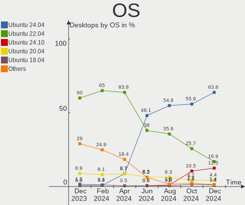
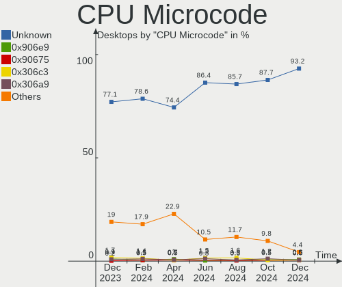
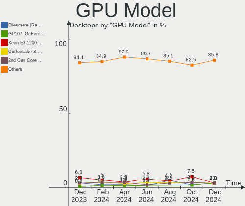

Ubuntu Hardware Trends (Desktops)
---------------------------------

A project to identify most popular hardware characteristics and track their change
over time based on data collected by Ubuntu users at https://Linux-Hardware.org.

Anyone can contribute to this report by the [hw-probe](https://github.com/linuxhw/hw-probe) tool:

    sudo -E hw-probe -all -upload

Full-feature report is available here: https://linux-hardware.org/?view=trends&formfactor=desktop

Period: Oct, 2021.

Contents
--------

* [ System ](#system)
  - [ OS                       ](#os)
  - [ OS Family                ](#os-family)
  - [ Kernel                   ](#kernel)
  - [ Kernel Family            ](#kernel-family)
  - [ Kernel Major Ver.        ](#kernel-major-ver)
  - [ Arch                     ](#arch)
  - [ DE                       ](#de)
  - [ Display Server           ](#display-server)
  - [ Display Manager          ](#display-manager)
  - [ OS Lang                  ](#os-lang)
  - [ Boot Mode                ](#boot-mode)
  - [ Filesystem               ](#filesystem)
  - [ Part. scheme             ](#part-scheme)
  - [ Dual Boot with Linux/BSD ](#dual-boot-with-linuxbsd)
  - [ Dual Boot (Win)          ](#dual-boot-win)

* [ Board ](#board)
  - [ Vendor                   ](#vendor)
  - [ Model                    ](#model)
  - [ Model Family             ](#model-family)
  - [ MFG Year                 ](#mfg-year)
  - [ Form Factor              ](#form-factor)
  - [ Secure Boot              ](#secure-boot)
  - [ Coreboot                 ](#coreboot)
  - [ RAM Size                 ](#ram-size)
  - [ RAM Used                 ](#ram-used)
  - [ Total Drives             ](#total-drives)
  - [ Has CD-ROM               ](#has-cd-rom)
  - [ Has Ethernet             ](#has-ethernet)
  - [ Has WiFi                 ](#has-wifi)
  - [ Has Bluetooth            ](#has-bluetooth)

* [ Location ](#location)
  - [ Country                  ](#country)
  - [ City                     ](#city)

* [ Drives ](#drives)
  - [ Drive Vendor             ](#drive-vendor)
  - [ Drive Model              ](#drive-model)
  - [ HDD Vendor               ](#hdd-vendor)
  - [ SSD Vendor               ](#ssd-vendor)
  - [ Drive Kind               ](#drive-kind)
  - [ Drive Connector          ](#drive-connector)
  - [ Drive Size               ](#drive-size)
  - [ Space Total              ](#space-total)
  - [ Space Used               ](#space-used)
  - [ Malfunc. Drives          ](#malfunc-drives)
  - [ Malfunc. Drive Vendor    ](#malfunc-drive-vendor)
  - [ Malfunc. HDD Vendor      ](#malfunc-hdd-vendor)
  - [ Malfunc. Drive Kind      ](#malfunc-drive-kind)
  - [ Failed Drives            ](#failed-drives)
  - [ Failed Drive Vendor      ](#failed-drive-vendor)
  - [ Drive Status             ](#drive-status)

* [ Storage controller ](#storage-controller)
  - [ Storage Vendor           ](#storage-vendor)
  - [ Storage Model            ](#storage-model)
  - [ Storage Kind             ](#storage-kind)

* [ Processor ](#processor)
  - [ CPU Vendor               ](#cpu-vendor)
  - [ CPU Model                ](#cpu-model)
  - [ CPU Model Family         ](#cpu-model-family)
  - [ CPU Cores                ](#cpu-cores)
  - [ CPU Sockets              ](#cpu-sockets)
  - [ CPU Threads              ](#cpu-threads)
  - [ CPU Op-Modes             ](#cpu-op-modes)
  - [ CPU Microcode            ](#cpu-microcode)
  - [ CPU Microarch            ](#cpu-microarch)

* [ Graphics ](#graphics)
  - [ GPU Vendor               ](#gpu-vendor)
  - [ GPU Model                ](#gpu-model)
  - [ GPU Combo                ](#gpu-combo)
  - [ GPU Driver               ](#gpu-driver)
  - [ GPU Memory               ](#gpu-memory)

* [ Monitor ](#monitor)
  - [ Monitor Vendor           ](#monitor-vendor)
  - [ Monitor Model            ](#monitor-model)
  - [ Monitor Resolution       ](#monitor-resolution)
  - [ Monitor Diagonal         ](#monitor-diagonal)
  - [ Monitor Width            ](#monitor-width)
  - [ Aspect Ratio             ](#aspect-ratio)
  - [ Monitor Area             ](#monitor-area)
  - [ Pixel Density            ](#pixel-density)
  - [ Multiple Monitors        ](#multiple-monitors)

* [ Network ](#network)
  - [ Net Controller Vendor    ](#net-controller-vendor)
  - [ Net Controller Model     ](#net-controller-model)
  - [ Wireless Vendor          ](#wireless-vendor)
  - [ Wireless Model           ](#wireless-model)
  - [ Ethernet Vendor          ](#ethernet-vendor)
  - [ Ethernet Model           ](#ethernet-model)
  - [ Net Controller Kind      ](#net-controller-kind)
  - [ Used Controller          ](#used-controller)
  - [ NICs                     ](#nics)
  - [ IPv6                     ](#ipv6)

* [ Bluetooth ](#bluetooth)
  - [ Bluetooth Vendor         ](#bluetooth-vendor)
  - [ Bluetooth Model          ](#bluetooth-model)

* [ Sound ](#sound)
  - [ Sound Vendor             ](#sound-vendor)
  - [ Sound Model              ](#sound-model)

* [ Memory ](#memory)
  - [ Memory Vendor            ](#memory-vendor)
  - [ Memory Model             ](#memory-model)
  - [ Memory Kind              ](#memory-kind)
  - [ Memory Form Factor       ](#memory-form-factor)
  - [ Memory Size              ](#memory-size)
  - [ Memory Speed             ](#memory-speed)

* [ Printers & scanners ](#printers--scanners)
  - [ Printer Vendor           ](#printer-vendor)
  - [ Printer Model            ](#printer-model)
  - [ Scanner Vendor           ](#scanner-vendor)
  - [ Scanner Model            ](#scanner-model)

* [ Camera ](#camera)
  - [ Camera Vendor            ](#camera-vendor)
  - [ Camera Model             ](#camera-model)

* [ Security ](#security)
  - [ Fingerprint Vendor       ](#fingerprint-vendor)
  - [ Fingerprint Model        ](#fingerprint-model)
  - [ Chipcard Vendor          ](#chipcard-vendor)
  - [ Chipcard Model           ](#chipcard-model)

* [ Unsupported ](#unsupported)
  - [ Unsupported Devices      ](#unsupported-devices)
  - [ Unsupported Device Types ](#unsupported-device-types)

System
------

OS
--

Installed operating systems

| Name         | Desktops | Percent |
|--------------|----------|---------|
| Ubuntu 20.04 | 380      | 64.96%  |
| Ubuntu 21.10 | 97       | 16.58%  |
| Ubuntu 21.04 | 70       | 11.97%  |
| Ubuntu 18.04 | 25       | 4.27%   |
| Ubuntu 16.04 | 5        | 0.85%   |
| Ubuntu       | 5        | 0.85%   |
| Ubuntu 22.04 | 1        | 0.17%   |
| Ubuntu 20.10 | 1        | 0.17%   |
| Ubuntu 18.10 | 1        | 0.17%   |

OS Family
---------

OS without a version

| Name   | Desktops | Percent |
|--------|----------|---------|
| Ubuntu | 585      | 100%    |

Kernel
------

Version of the Linux kernel

| Version                        | Desktops | Percent |
|--------------------------------|----------|---------|
| 5.11.0-37-generic              | 202      | 34.53%  |
| 5.11.0-38-generic              | 107      | 18.29%  |
| 5.13.0-20-generic              | 46       | 7.86%   |
| 5.4.0-88-generic               | 41       | 7.01%   |
| 5.13.0-19-generic              | 39       | 6.67%   |
| 5.4.0-89-generic               | 22       | 3.76%   |
| 5.11.0-27-generic              | 22       | 3.76%   |
| 5.4.0-87-generic               | 9        | 1.54%   |
| 5.11.0-36-generic              | 8        | 1.37%   |
| 4.15.0-159-generic             | 8        | 1.37%   |
| 5.13.0-21-generic              | 5        | 0.85%   |
| 5.11.0-34-generic              | 5        | 0.85%   |
| 4.15.0-142-generic             | 5        | 0.85%   |
| 5.13.0-16-generic              | 4        | 0.68%   |
| 5.11.0-16-generic              | 4        | 0.68%   |
| 5.8.0-48-generic               | 3        | 0.51%   |
| 5.4.0-58-generic               | 3        | 0.51%   |
| 5.4.0-42-generic               | 3        | 0.51%   |
| 5.11.0-40-generic              | 3        | 0.51%   |
| 5.8.0-63-generic               | 2        | 0.34%   |
| 5.8.0-59-generic               | 2        | 0.34%   |
| 5.8.0-50-generic               | 2        | 0.34%   |
| 5.8.0-43-generic               | 2        | 0.34%   |
| 5.4.0-86-generic               | 2        | 0.34%   |
| 5.11.0-25-generic              | 2        | 0.34%   |
| 4.15.0-156-generic             | 2        | 0.34%   |
| 5.8.0-55-generic               | 1        | 0.17%   |
| 5.8.0-53-generic               | 1        | 0.17%   |
| 5.8.0-49-generic               | 1        | 0.17%   |
| 5.4.0-90-generic               | 1        | 0.17%   |
| 5.4.0-88-lowlatency            | 1        | 0.17%   |
| 5.4.0-73-generic               | 1        | 0.17%   |
| 5.4.0-72-generic               | 1        | 0.17%   |
| 5.4.0-70-generic               | 1        | 0.17%   |
| 5.4.0-56-generic               | 1        | 0.17%   |
| 5.4.0-54-generic               | 1        | 0.17%   |
| 5.4.0-52-generic               | 1        | 0.17%   |
| 5.4.0-47-generic               | 1        | 0.17%   |
| 5.4.0-37-generic               | 1        | 0.17%   |
| 5.4.0-26-generic               | 1        | 0.17%   |
| 5.15.0-rc4void12-nomac-znver3+ | 1        | 0.17%   |
| 5.14.9-xanmod2                 | 1        | 0.17%   |
| 5.14.15                        | 1        | 0.17%   |
| 5.14.14-xanmod2                | 1        | 0.17%   |
| 5.14.14-mainline               | 1        | 0.17%   |
| 5.14.11-051411-generic         | 1        | 0.17%   |
| 5.14.0-12.1-liquorix-amd64     | 1        | 0.17%   |
| 5.13.9-051309-lowlatency       | 1        | 0.17%   |
| 5.13.0-17-generic              | 1        | 0.17%   |
| 5.11.0-36-lowlatency           | 1        | 0.17%   |
| 5.11.0-342109090909-generic    | 1        | 0.17%   |
| 5.11.0-31-generic              | 1        | 0.17%   |
| 5.11.0-1019-oracle             | 1        | 0.17%   |
| 5.11.0-051100-generic          | 1        | 0.17%   |
| 4.9.0-6-686                    | 1        | 0.17%   |
| 4.18.0-10-generic              | 1        | 0.17%   |
| 4.15.0-91-generic              | 1        | 0.17%   |
| 4.15.0-72-generic              | 1        | 0.17%   |

Kernel Family
-------------

Linux kernel without a distro release

| Version | Desktops | Percent |
|---------|----------|---------|
| 5.11.0  | 358      | 61.2%   |
| 5.13.0  | 95       | 16.24%  |
| 5.4.0   | 91       | 15.56%  |
| 4.15.0  | 17       | 2.91%   |
| 5.8.0   | 14       | 2.39%   |
| 5.14.14 | 2        | 0.34%   |
| 5.15.0  | 1        | 0.17%   |
| 5.14.9  | 1        | 0.17%   |
| 5.14.15 | 1        | 0.17%   |
| 5.14.11 | 1        | 0.17%   |
| 5.14.0  | 1        | 0.17%   |
| 5.13.9  | 1        | 0.17%   |
| 4.9.0   | 1        | 0.17%   |
| 4.18.0  | 1        | 0.17%   |

Kernel Major Ver.
-----------------

Linux kernel major version

| Version | Desktops | Percent |
|---------|----------|---------|
| 5.11    | 358      | 61.2%   |
| 5.13    | 96       | 16.41%  |
| 5.4     | 91       | 15.56%  |
| 4.15    | 17       | 2.91%   |
| 5.8     | 14       | 2.39%   |
| 5.14    | 6        | 1.03%   |
| 5.15    | 1        | 0.17%   |
| 4.9     | 1        | 0.17%   |
| 4.18    | 1        | 0.17%   |

Arch
----

OS architecture (x86_64, i586, etc.)

| Name   | Desktops | Percent |
|--------|----------|---------|
| x86_64 | 576      | 98.46%  |
| i686   | 9        | 1.54%   |

DE
--

Desktop Environment

| Name            | Desktops | Percent |
|-----------------|----------|---------|
| GNOME           | 513      | 87.69%  |
| Unknown         | 48       | 8.21%   |
| X-Cinnamon      | 7        | 1.2%    |
| Unity           | 7        | 1.2%    |
| GNOME Flashback | 5        | 0.85%   |
| i3              | 2        | 0.34%   |
| openbox         | 1        | 0.17%   |
| enlightenment   | 1        | 0.17%   |
| Cinnamon        | 1        | 0.17%   |

Display Server
--------------

X11 or Wayland

| Name    | Desktops | Percent |
|---------|----------|---------|
| X11     | 455      | 77.78%  |
| Wayland | 101      | 17.26%  |
| Unknown | 21       | 3.59%   |
| Tty     | 8        | 1.37%   |

Display Manager
---------------

SDDM, LightDM, etc.

| Name    | Desktops | Percent |
|---------|----------|---------|
| GDM3    | 408      | 69.74%  |
| GDM     | 102      | 17.44%  |
| Unknown | 44       | 7.52%   |
| LightDM | 29       | 4.96%   |
| SDDM    | 2        | 0.34%   |

OS Lang
-------

Language

| Lang    | Desktops | Percent |
|---------|----------|---------|
| en_US   | 209      | 35.73%  |
| de_DE   | 76       | 12.99%  |
| fr_FR   | 58       | 9.91%   |
| en_AU   | 22       | 3.76%   |
| pt_BR   | 21       | 3.59%   |
| it_IT   | 20       | 3.42%   |
| en_GB   | 18       | 3.08%   |
| ru_RU   | 17       | 2.91%   |
| es_ES   | 17       | 2.91%   |
| pl_PL   | 14       | 2.39%   |
| en_CA   | 14       | 2.39%   |
| C       | 9        | 1.54%   |
| hu_HU   | 7        | 1.2%    |
| nl_NL   | 6        | 1.03%   |
| ja_JP   | 6        | 1.03%   |
| en_IN   | 6        | 1.03%   |
| cs_CZ   | 5        | 0.85%   |
| Unknown | 5        | 0.85%   |
| de_AT   | 4        | 0.68%   |
| zh_CN   | 3        | 0.51%   |
| ro_RO   | 3        | 0.51%   |
| en_NZ   | 3        | 0.51%   |
| en_IL   | 3        | 0.51%   |
| el_GR   | 3        | 0.51%   |
| zh_TW   | 2        | 0.34%   |
| sv_SE   | 2        | 0.34%   |
| sk_SK   | 2        | 0.34%   |
| ru_UA   | 2        | 0.34%   |
| hr_HR   | 2        | 0.34%   |
| fr_BE   | 2        | 0.34%   |
| fi_FI   | 2        | 0.34%   |
| de_CH   | 2        | 0.34%   |
| vi_VN   | 1        | 0.17%   |
| uk_UA   | 1        | 0.17%   |
| sr_RS   | 1        | 0.17%   |
| sl_SI   | 1        | 0.17%   |
| nl_BE   | 1        | 0.17%   |
| nb_NO   | 1        | 0.17%   |
| lv_LV   | 1        | 0.17%   |
| ko_KR   | 1        | 0.17%   |
| fr_CH   | 1        | 0.17%   |
| fr_CA   | 1        | 0.17%   |
| eu_ES   | 1        | 0.17%   |
| es_PE   | 1        | 0.17%   |
| es_MX   | 1        | 0.17%   |
| es_EC   | 1        | 0.17%   |
| es_AR   | 1        | 0.17%   |
| en_ZA   | 1        | 0.17%   |
| en_IE   | 1        | 0.17%   |
| ar_MA   | 1        | 0.17%   |
| ar_EG   | 1        | 0.17%   |
| ar_DZ   | 1        | 0.17%   |

Boot Mode
---------

EFI or BIOS

| Mode | Desktops | Percent |
|------|----------|---------|
| BIOS | 388      | 66.32%  |
| EFI  | 197      | 33.68%  |

Filesystem
----------

Type of filesystem

| Type    | Desktops | Percent |
|---------|----------|---------|
| Ext4    | 554      | 94.7%   |
| Overlay | 13       | 2.22%   |
| Zfs     | 6        | 1.03%   |
| Btrfs   | 5        | 0.85%   |
| Ext2    | 3        | 0.51%   |
| Xfs     | 2        | 0.34%   |
| Jfs     | 1        | 0.17%   |
| Ext3    | 1        | 0.17%   |

Part. scheme
------------

Scheme of partitioning

| Type    | Desktops | Percent |
|---------|----------|---------|
| Unknown | 462      | 78.97%  |
| GPT     | 90       | 15.38%  |
| MBR     | 33       | 5.64%   |

Dual Boot with Linux/BSD
------------------------

Hosting more than one Linux/BSD

| Dual boot | Desktops | Percent |
|-----------|----------|---------|
| No        | 476      | 81.37%  |
| Yes       | 109      | 18.63%  |

Dual Boot (Win)
---------------

Hosting Linux and Windows

| Dual boot | Desktops | Percent |
|-----------|----------|---------|
| No        | 306      | 52.31%  |
| Yes       | 279      | 47.69%  |

Board
-----

Vendor
------

Motherboard manufacturer

| Name                | Desktops | Percent |
|---------------------|----------|---------|
| ASUSTek Computer    | 167      | 28.55%  |
| Gigabyte Technology | 82       | 14.02%  |
| MSI                 | 73       | 12.48%  |
| Dell                | 67       | 11.45%  |
| ASRock              | 45       | 7.69%   |
| Hewlett-Packard     | 40       | 6.84%   |
| Lenovo              | 22       | 3.76%   |
| Fujitsu             | 13       | 2.22%   |
| Acer                | 11       | 1.88%   |
| Intel               | 10       | 1.71%   |
| Pegatron            | 7        | 1.2%    |
| Unknown             | 6        | 1.03%   |
| Supermicro          | 5        | 0.85%   |
| Medion              | 5        | 0.85%   |
| Foxconn             | 5        | 0.85%   |
| Packard Bell        | 3        | 0.51%   |
| IBM                 | 3        | 0.51%   |
| Nvidia              | 2        | 0.34%   |
| Huanan              | 2        | 0.34%   |
| Apple               | 2        | 0.34%   |
| Alienware           | 2        | 0.34%   |
| Wistron             | 1        | 0.17%   |
| Shuttle             | 1        | 0.17%   |
| Positivo            | 1        | 0.17%   |
| OEM                 | 1        | 0.17%   |
| ICP / iEi           | 1        | 0.17%   |
| Google              | 1        | 0.17%   |
| Gateway             | 1        | 0.17%   |
| Fujitsu Siemens     | 1        | 0.17%   |
| EPSON DIRECT        | 1        | 0.17%   |
| ECS                 | 1        | 0.17%   |
| Biostar             | 1        | 0.17%   |
| AMI                 | 1        | 0.17%   |
| AMD                 | 1        | 0.17%   |

Model
-----

Motherboard model

| Name                              | Desktops | Percent |
|-----------------------------------|----------|---------|
| ASUS All Series                   | 11       | 1.88%   |
| Dell OptiPlex 790                 | 6        | 1.03%   |
| Unknown                           | 6        | 1.03%   |
| Dell OptiPlex 9010                | 5        | 0.85%   |
| Dell OptiPlex 7010                | 5        | 0.85%   |
| Dell OptiPlex 3020                | 4        | 0.68%   |
| Dell OptiPlex 3010                | 4        | 0.68%   |
| ASUS TUF GAMING X570-PLUS         | 4        | 0.68%   |
| ASUS M5A97 R2.0                   | 4        | 0.68%   |
| MSI MS-7C37                       | 3        | 0.51%   |
| MSI MS-7B86                       | 3        | 0.51%   |
| MSI MS-7592                       | 3        | 0.51%   |
| HP Compaq Pro 6305 SFF            | 3        | 0.51%   |
| Gigabyte Z77X-UD5H                | 3        | 0.51%   |
| Dell OptiPlex 3050                | 3        | 0.51%   |
| ASUS ROG STRIX B450-F GAMING      | 3        | 0.51%   |
| ASUS PRIME A320M-K                | 3        | 0.51%   |
| ASUS M5A97 LE R2.0                | 3        | 0.51%   |
| ASUS M5A97 EVO R2.0               | 3        | 0.51%   |
| ASUS M5A78L-M LX V2               | 3        | 0.51%   |
| Supermicro PIO-618U-TR4T+-ST031   | 2        | 0.34%   |
| MSI MS-7C35                       | 2        | 0.34%   |
| MSI MS-7B89                       | 2        | 0.34%   |
| MSI MS-7B79                       | 2        | 0.34%   |
| MSI MS-7850                       | 2        | 0.34%   |
| MSI MS-7821                       | 2        | 0.34%   |
| MSI MS-7752                       | 2        | 0.34%   |
| MSI MS-7721                       | 2        | 0.34%   |
| MSI MS-7693                       | 2        | 0.34%   |
| MSI MS-7551                       | 2        | 0.34%   |
| Medion H81H3-EM2                  | 2        | 0.34%   |
| HP Z800 Workstation               | 2        | 0.34%   |
| HP ProLiant ML350 G6              | 2        | 0.34%   |
| HP EliteDesk 800 G1 SFF           | 2        | 0.34%   |
| Gigabyte M61PME-S2P               | 2        | 0.34%   |
| Gigabyte H61M-S1                  | 2        | 0.34%   |
| Gigabyte GA-970A-UD3              | 2        | 0.34%   |
| Gigabyte B550M AORUS ELITE        | 2        | 0.34%   |
| Gigabyte B550I AORUS PRO AX       | 2        | 0.34%   |
| Gigabyte A320M-S2H                | 2        | 0.34%   |
| Fujitsu ESPRIMO P910              | 2        | 0.34%   |
| Dell XPS 8700                     | 2        | 0.34%   |
| Dell Precision Tower 5810         | 2        | 0.34%   |
| Dell Precision T1650              | 2        | 0.34%   |
| Dell OptiPlex 990                 | 2        | 0.34%   |
| Dell OptiPlex 9020                | 2        | 0.34%   |
| Dell OptiPlex 780                 | 2        | 0.34%   |
| Dell OptiPlex 760                 | 2        | 0.34%   |
| Dell OptiPlex 390                 | 2        | 0.34%   |
| Dell Inspiron 545                 | 2        | 0.34%   |
| Dell Inspiron 3847                | 2        | 0.34%   |
| ASUS Z170-K                       | 2        | 0.34%   |
| ASUS TUF GAMING B550-PLUS         | 2        | 0.34%   |
| ASUS TUF B450-PLUS GAMING         | 2        | 0.34%   |
| ASUS SABERTOOTH 990FX R2.0        | 2        | 0.34%   |
| ASUS RS720Q-E8-RS12               | 2        | 0.34%   |
| ASUS ROG STRIX Z390-F GAMING      | 2        | 0.34%   |
| ASUS ROG CROSSHAIR VIII DARK HERO | 2        | 0.34%   |
| ASUS PRIME H410M-E                | 2        | 0.34%   |
| ASUS PRIME B450M-A                | 2        | 0.34%   |

Model Family
------------

Motherboard model prefix

| Name                            | Desktops | Percent |
|---------------------------------|----------|---------|
| Dell OptiPlex                   | 42       | 7.18%   |
| ASUS PRIME                      | 29       | 4.96%   |
| ASUS ROG                        | 17       | 2.91%   |
| Lenovo ThinkCentre              | 14       | 2.39%   |
| HP Compaq                       | 14       | 2.39%   |
| ASUS TUF                        | 14       | 2.39%   |
| ASUS M5A97                      | 11       | 1.88%   |
| ASUS All                        | 11       | 1.88%   |
| Dell Precision                  | 10       | 1.71%   |
| Fujitsu ESPRIMO                 | 9        | 1.54%   |
| Acer Aspire                     | 8        | 1.37%   |
| Dell Inspiron                   | 7        | 1.2%    |
| HP EliteDesk                    | 6        | 1.03%   |
| Gigabyte X570                   | 6        | 1.03%   |
| Unknown                         | 6        | 1.03%   |
| ASUS P8Z77-V                    | 5        | 0.85%   |
| ASUS M5A78L-M                   | 5        | 0.85%   |
| HP ProLiant                     | 4        | 0.68%   |
| ASUS P8Z68-V                    | 4        | 0.68%   |
| ASUS P8H61-M                    | 4        | 0.68%   |
| MSI MS-7C37                     | 3        | 0.51%   |
| MSI MS-7B86                     | 3        | 0.51%   |
| MSI MS-7592                     | 3        | 0.51%   |
| Intel DG31PR                    | 3        | 0.51%   |
| Gigabyte Z77X-UD5H              | 3        | 0.51%   |
| Gigabyte B550M                  | 3        | 0.51%   |
| Gigabyte B450M                  | 3        | 0.51%   |
| Gigabyte B450                   | 3        | 0.51%   |
| Dell XPS                        | 3        | 0.51%   |
| Dell Vostro                     | 3        | 0.51%   |
| ASUS SABERTOOTH                 | 3        | 0.51%   |
| ASRock AB350                    | 3        | 0.51%   |
| ASRock 970                      | 3        | 0.51%   |
| Acer Veriton                    | 3        | 0.51%   |
| Supermicro PIO-618U-TR4T+-ST031 | 2        | 0.34%   |
| Packard Bell imedia             | 2        | 0.34%   |
| MSI MS-7C35                     | 2        | 0.34%   |
| MSI MS-7B89                     | 2        | 0.34%   |
| MSI MS-7B79                     | 2        | 0.34%   |
| MSI MS-7850                     | 2        | 0.34%   |
| MSI MS-7821                     | 2        | 0.34%   |
| MSI MS-7752                     | 2        | 0.34%   |
| MSI MS-7721                     | 2        | 0.34%   |
| MSI MS-7693                     | 2        | 0.34%   |
| MSI MS-7551                     | 2        | 0.34%   |
| Medion H81H3-EM2                | 2        | 0.34%   |
| Medion Akoya                    | 2        | 0.34%   |
| Lenovo ThinkStation             | 2        | 0.34%   |
| Lenovo IdeaCentre               | 2        | 0.34%   |
| Lenovo H50-50                   | 2        | 0.34%   |
| HP Z800                         | 2        | 0.34%   |
| HP Pavilion                     | 2        | 0.34%   |
| Gigabyte Z370                   | 2        | 0.34%   |
| Gigabyte M61PME-S2P             | 2        | 0.34%   |
| Gigabyte H61M-S1                | 2        | 0.34%   |
| Gigabyte H61M-DS2               | 2        | 0.34%   |
| Gigabyte H310M                  | 2        | 0.34%   |
| Gigabyte GA-970A-UD3            | 2        | 0.34%   |
| Gigabyte B550I                  | 2        | 0.34%   |
| Gigabyte A320M-S2H              | 2        | 0.34%   |

MFG Year
--------

Motherboard manufacture year

| Year | Desktops | Percent |
|------|----------|---------|
| 2021 | 64       | 10.94%  |
| 2020 | 64       | 10.94%  |
| 2013 | 63       | 10.77%  |
| 2019 | 48       | 8.21%   |
| 2018 | 45       | 7.69%   |
| 2012 | 45       | 7.69%   |
| 2011 | 38       | 6.5%    |
| 2015 | 35       | 5.98%   |
| 2014 | 33       | 5.64%   |
| 2010 | 32       | 5.47%   |
| 2016 | 31       | 5.3%    |
| 2009 | 28       | 4.79%   |
| 2017 | 19       | 3.25%   |
| 2008 | 18       | 3.08%   |
| 2007 | 16       | 2.74%   |
| 2006 | 3        | 0.51%   |
| 2005 | 2        | 0.34%   |
| 2004 | 1        | 0.17%   |

Form Factor
-----------

Physical design of the computer

| Name    | Desktops | Percent |
|---------|----------|---------|
| Desktop | 585      | 100%    |

Secure Boot
-----------

Enabled or disabled

| State    | Desktops | Percent |
|----------|----------|---------|
| Disabled | 565      | 96.58%  |
| Enabled  | 20       | 3.42%   |

Coreboot
--------

Have coreboot on board

| Used | Desktops | Percent |
|------|----------|---------|
| No   | 584      | 99.83%  |
| Yes  | 1        | 0.17%   |

RAM Size
--------

Total RAM memory

| Size in GB      | Desktops | Percent |
|-----------------|----------|---------|
| 16.01-24.0      | 153      | 26.15%  |
| 8.01-16.0       | 109      | 18.63%  |
| 3.01-4.0        | 92       | 15.73%  |
| 4.01-8.0        | 88       | 15.04%  |
| 32.01-64.0      | 72       | 12.31%  |
| 64.01-256.0     | 33       | 5.64%   |
| 24.01-32.0      | 18       | 3.08%   |
| 1.01-2.0        | 13       | 2.22%   |
| More than 256.0 | 3        | 0.51%   |
| 2.01-3.0        | 3        | 0.51%   |
| 0.51-1.0        | 1        | 0.17%   |

RAM Used
--------

Used RAM memory

| Used GB    | Desktops | Percent |
|------------|----------|---------|
| 1.01-2.0   | 258      | 44.1%   |
| 2.01-3.0   | 137      | 23.42%  |
| 4.01-8.0   | 78       | 13.33%  |
| 3.01-4.0   | 74       | 12.65%  |
| 8.01-16.0  | 21       | 3.59%   |
| 0.51-1.0   | 12       | 2.05%   |
| 0.01-0.5   | 4        | 0.68%   |
| 16.01-24.0 | 1        | 0.17%   |

Total Drives
------------

Number of drives on board

| Drives | Desktops | Percent |
|--------|----------|---------|
| 1      | 219      | 37.44%  |
| 2      | 181      | 30.94%  |
| 3      | 82       | 14.02%  |
| 4      | 46       | 7.86%   |
| 5      | 36       | 6.15%   |
| 0      | 7        | 1.2%    |
| 6      | 6        | 1.03%   |
| 7      | 3        | 0.51%   |
| 8      | 2        | 0.34%   |
| 16     | 1        | 0.17%   |
| 11     | 1        | 0.17%   |
| 9      | 1        | 0.17%   |

Has CD-ROM
----------

Has CD-ROM on board

| Presented | Desktops | Percent |
|-----------|----------|---------|
| Yes       | 311      | 53.16%  |
| No        | 274      | 46.84%  |

Has Ethernet
------------

Has Ethernet on board

| Presented | Desktops | Percent |
|-----------|----------|---------|
| Yes       | 578      | 98.8%   |
| No        | 7        | 1.2%    |

Has WiFi
--------

Has WiFi module

| Presented | Desktops | Percent |
|-----------|----------|---------|
| No        | 352      | 60.17%  |
| Yes       | 233      | 39.83%  |

Has Bluetooth
-------------

Has Bluetooth module

| Presented | Desktops | Percent |
|-----------|----------|---------|
| No        | 427      | 72.99%  |
| Yes       | 158      | 27.01%  |

Location
--------

Country
-------

Geographic location (country)

| Country      | Desktops | Percent |
|--------------|----------|---------|
| USA          | 98       | 16.75%  |
| Germany      | 88       | 15.04%  |
| France       | 61       | 10.43%  |
| Brazil       | 28       | 4.79%   |
| Spain        | 21       | 3.59%   |
| Russia       | 21       | 3.59%   |
| UK           | 20       | 3.42%   |
| Italy        | 20       | 3.42%   |
| Australia    | 20       | 3.42%   |
| Canada       | 18       | 3.08%   |
| Poland       | 16       | 2.74%   |
| Netherlands  | 14       | 2.39%   |
| Sweden       | 11       | 1.88%   |
| Mexico       | 8        | 1.37%   |
| Belgium      | 8        | 1.37%   |
| Switzerland  | 7        | 1.2%    |
| India        | 7        | 1.2%    |
| Romania      | 6        | 1.03%   |
| Japan        | 6        | 1.03%   |
| Hungary      | 6        | 1.03%   |
| Czechia      | 6        | 1.03%   |
| Ukraine      | 5        | 0.85%   |
| Israel       | 5        | 0.85%   |
| Greece       | 5        | 0.85%   |
| Finland      | 5        | 0.85%   |
| Egypt        | 5        | 0.85%   |
| Austria      | 5        | 0.85%   |
| Vietnam      | 4        | 0.68%   |
| Serbia       | 4        | 0.68%   |
| New Zealand  | 4        | 0.68%   |
| South Africa | 3        | 0.51%   |
| Norway       | 3        | 0.51%   |
| Croatia      | 3        | 0.51%   |
| China        | 3        | 0.51%   |
| Taiwan       | 2        | 0.34%   |
| Morocco      | 2        | 0.34%   |
| Madagascar   | 2        | 0.34%   |
| Lithuania    | 2        | 0.34%   |
| Ireland      | 2        | 0.34%   |
| Indonesia    | 2        | 0.34%   |
| Denmark      | 2        | 0.34%   |
| Bangladesh   | 2        | 0.34%   |
| Argentina    | 2        | 0.34%   |
| Algeria      | 2        | 0.34%   |
| Uruguay      | 1        | 0.17%   |
| Turkmenistan | 1        | 0.17%   |
| Thailand     | 1        | 0.17%   |
| South Korea  | 1        | 0.17%   |
| Slovenia     | 1        | 0.17%   |
| Slovakia     | 1        | 0.17%   |
| Saudi Arabia | 1        | 0.17%   |
| Puerto Rico  | 1        | 0.17%   |
| Portugal     | 1        | 0.17%   |
| Peru         | 1        | 0.17%   |
| Pakistan     | 1        | 0.17%   |
| Macedonia    | 1        | 0.17%   |
| Latvia       | 1        | 0.17%   |
| Jordan       | 1        | 0.17%   |
| Ivory Coast  | 1        | 0.17%   |
| Iran         | 1        | 0.17%   |

City
----

Geographic location (city)

| City                 | Desktops | Percent |
|----------------------|----------|---------|
| Berlin               | 12       | 2.05%   |
| Paris                | 9        | 1.54%   |
| Moscow               | 8        | 1.37%   |
| Madrid               | 7        | 1.2%    |
| Perth                | 6        | 1.03%   |
| Taby                 | 4        | 0.68%   |
| Milan                | 4        | 0.68%   |
| Cairo                | 4        | 0.68%   |
| Amsterdam            | 4        | 0.68%   |
| Zagreb               | 3        | 0.51%   |
| Wroclaw              | 3        | 0.51%   |
| Toulouse             | 3        | 0.51%   |
| Toronto              | 3        | 0.51%   |
| Tijuana              | 3        | 0.51%   |
| Sydney               | 3        | 0.51%   |
| S??o Paulo           | 3        | 0.51%   |
| Rome                 | 3        | 0.51%   |
| Prince George        | 3        | 0.51%   |
| Portland             | 3        | 0.51%   |
| Phoenix              | 3        | 0.51%   |
| Montpellier          | 3        | 0.51%   |
| London               | 3        | 0.51%   |
| Kyiv                 | 3        | 0.51%   |
| Cologne              | 3        | 0.51%   |
| Brussels             | 3        | 0.51%   |
| Bremen               | 3        | 0.51%   |
| Athens               | 3        | 0.51%   |
| Warsaw               | 2        | 0.34%   |
| Vilnius              | 2        | 0.34%   |
| Vienna               | 2        | 0.34%   |
| Valencia             | 2        | 0.34%   |
| Uhersk?© Hradi??t?›  | 2        | 0.34%   |
| Svenstrup            | 2        | 0.34%   |
| Stuttgart            | 2        | 0.34%   |
| St Petersburg        | 2        | 0.34%   |
| Sheffield            | 2        | 0.34%   |
| San Antonio          | 2        | 0.34%   |
| Rutherford           | 2        | 0.34%   |
| Rio de Janeiro       | 2        | 0.34%   |
| Poznan               | 2        | 0.34%   |
| Oakland              | 2        | 0.34%   |
| Nizhniy Novgorod     | 2        | 0.34%   |
| New York             | 2        | 0.34%   |
| Montreal             | 2        | 0.34%   |
| Miami                | 2        | 0.34%   |
| Melbourne            | 2        | 0.34%   |
| M??laga              | 2        | 0.34%   |
| Los Angeles          | 2        | 0.34%   |
| Lodz                 | 2        | 0.34%   |
| Krakow               | 2        | 0.34%   |
| Hyderabad            | 2        | 0.34%   |
| Hamburg              | 2        | 0.34%   |
| D??sseldorf          | 2        | 0.34%   |
| City of Saint Peters | 2        | 0.34%   |
| Cape Town            | 2        | 0.34%   |
| Bucharest            | 2        | 0.34%   |
| Brisbane             | 2        | 0.34%   |
| Bonn                 | 2        | 0.34%   |
| Birmingham           | 2        | 0.34%   |
| Bielefeld            | 2        | 0.34%   |

Drives
------

Drive Vendor
------------

Hard drive vendors

| Vendor                    | Desktops | Drives | Percent |
|---------------------------|----------|--------|---------|
| WDC                       | 210      | 298    | 21.13%  |
| Seagate                   | 206      | 280    | 20.72%  |
| Samsung Electronics       | 160      | 213    | 16.1%   |
| Kingston                  | 60       | 64     | 6.04%   |
| Crucial                   | 47       | 53     | 4.73%   |
| Toshiba                   | 44       | 59     | 4.43%   |
| Hitachi                   | 42       | 46     | 4.23%   |
| SanDisk                   | 40       | 43     | 4.02%   |
| MAXTOR                    | 14       | 15     | 1.41%   |
| Intel                     | 14       | 17     | 1.41%   |
| A-DATA Technology         | 11       | 12     | 1.11%   |
| Phison                    | 10       | 11     | 1.01%   |
| HGST                      | 10       | 16     | 1.01%   |
| Unknown                   | 8        | 11     | 0.8%    |
| PNY                       | 8        | 8      | 0.8%    |
| Transcend                 | 7        | 7      | 0.7%    |
| OCZ                       | 7        | 8      | 0.7%    |
| Intenso                   | 6        | 6      | 0.6%    |
| Realtek Semiconductor     | 5        | 5      | 0.5%    |
| China                     | 5        | 5      | 0.5%    |
| Team                      | 4        | 4      | 0.4%    |
| Silicon Motion            | 4        | 4      | 0.4%    |
| SABRENT                   | 4        | 8      | 0.4%    |
| Micron/Crucial Technology | 4        | 4      | 0.4%    |
| JMicron                   | 4        | 4      | 0.4%    |
| Mushkin                   | 3        | 3      | 0.3%    |
| Hewlett-Packard           | 3        | 4      | 0.3%    |
| GOODRAM                   | 3        | 3      | 0.3%    |
| StoreJet                  | 2        | 2      | 0.2%    |
| SPCC                      | 2        | 2      | 0.2%    |
| LITEON                    | 2        | 2      | 0.2%    |
| KingSpec                  | 2        | 2      | 0.2%    |
| KingDian                  | 2        | 2      | 0.2%    |
| Fujitsu                   | 2        | 2      | 0.2%    |
| Corsair                   | 2        | 2      | 0.2%    |
| asmedia                   | 2        | 2      | 0.2%    |
| Unknown                   | 2        | 2      | 0.2%    |
| XPG                       | 1        | 1      | 0.1%    |
| XINTOR                    | 1        | 1      | 0.1%    |
| WD MediaMax               | 1        | 1      | 0.1%    |
| Smartbuy                  | 1        | 1      | 0.1%    |
| SK Hynix                  | 1        | 1      | 0.1%    |
| ShanDianZhe               | 1        | 1      | 0.1%    |
| SBe                       | 1        | 1      | 0.1%    |
| PNY CS90                  | 1        | 1      | 0.1%    |
| PLEXTOR                   | 1        | 1      | 0.1%    |
| Patriot                   | 1        | 1      | 0.1%    |
| OEM                       | 1        | 1      | 0.1%    |
| Micron Technology         | 1        | 1      | 0.1%    |
| MARVELL                   | 1        | 1      | 0.1%    |
| LITEONIT                  | 1        | 1      | 0.1%    |
| Lite-On                   | 1        | 1      | 0.1%    |
| Lexar                     | 1        | 1      | 0.1%    |
| LDLC                      | 1        | 1      | 0.1%    |
| Kston                     | 1        | 1      | 0.1%    |
| KIOXIA-EXCERIA            | 1        | 1      | 0.1%    |
| KIOXIA                    | 1        | 1      | 0.1%    |
| KingFast                  | 1        | 1      | 0.1%    |
| KINGBANK                  | 1        | 1      | 0.1%    |
| Integral                  | 1        | 1      | 0.1%    |

Drive Model
-----------

Hard drive models

| Model                                  | Desktops | Percent |
|----------------------------------------|----------|---------|
| Seagate ST1000DM010-2EP102 1TB         | 15       | 1.29%   |
| Kingston SA400S37240G 240GB SSD        | 15       | 1.29%   |
| Seagate ST500DM002-1BD142 500GB        | 14       | 1.2%    |
| Seagate ST1000DM003-1ER162 1TB         | 14       | 1.2%    |
| Seagate ST2000DM008-2FR102 2TB         | 13       | 1.11%   |
| Samsung SSD 850 EVO 250GB              | 12       | 1.03%   |
| Seagate ST1000DM003-1CH162 1TB         | 11       | 0.94%   |
| Samsung SSD 860 EVO 500GB              | 11       | 0.94%   |
| Kingston SA400S37120G 120GB SSD        | 11       | 0.94%   |
| Toshiba DT01ACA100 1TB                 | 10       | 0.86%   |
| Samsung NVMe SSD Drive 1TB             | 9        | 0.77%   |
| WDC WD10EZEX-08WN4A0 1TB               | 8        | 0.69%   |
| Toshiba DT01ACA050 500GB               | 8        | 0.69%   |
| Seagate ST2000DM001-1CH164 2TB         | 8        | 0.69%   |
| Samsung SSD 850 EVO 500GB              | 8        | 0.69%   |
| Crucial CT240BX500SSD1 240GB           | 8        | 0.69%   |
| Seagate ST3500418AS 500GB              | 7        | 0.6%    |
| Seagate ST2000DM006-2DM164 2TB         | 7        | 0.6%    |
| Kingston SA400S37480G 480GB SSD        | 7        | 0.6%    |
| Crucial CT500MX500SSD1 500GB           | 7        | 0.6%    |
| WDC WD20EZRX-00D8PB0 2TB               | 6        | 0.51%   |
| Seagate ST3320620AS 320GB              | 6        | 0.51%   |
| Seagate ST2000DM001-1ER164 2TB         | 6        | 0.51%   |
| Samsung SSD 860 QVO 1TB                | 6        | 0.51%   |
| Samsung SSD 860 EVO 250GB              | 6        | 0.51%   |
| Samsung SSD 860 EVO 1TB                | 6        | 0.51%   |
| Samsung SM963 2.5" NVMe PCIe SSD 250GB | 6        | 0.51%   |
| Samsung NVMe SSD Drive 500GB           | 6        | 0.51%   |
| WDC WDS240G2G0A-00JH30 240GB SSD       | 5        | 0.43%   |
| Samsung SSD 970 EVO Plus 1TB           | 5        | 0.43%   |
| Samsung HD501LJ 500GB                  | 5        | 0.43%   |
| MAXTOR STM3250310AS 250GB              | 5        | 0.43%   |
| Crucial CT1000MX500SSD1 1TB            | 5        | 0.43%   |
| WDC WDS500G2B0A-00SM50 500GB SSD       | 4        | 0.34%   |
| WDC WD20EZAZ-00L9GB0 2TB               | 4        | 0.34%   |
| WDC WD10EZEX-21WN4A0 1TB               | 4        | 0.34%   |
| WDC WD10EZEX-08M2NA0 1TB               | 4        | 0.34%   |
| WDC WD1002FAEX-00Z3A0 1TB              | 4        | 0.34%   |
| Seagate ST3250312AS 250GB              | 4        | 0.34%   |
| Seagate ST31000528AS 1TB               | 4        | 0.34%   |
| Seagate ST2000DX002-2DV164 2TB         | 4        | 0.34%   |
| Seagate ST1000DM003-1SB102 1TB         | 4        | 0.34%   |
| Sandisk NVMe SSD Drive 1TB             | 4        | 0.34%   |
| Samsung SSD 870 QVO 1TB                | 4        | 0.34%   |
| Samsung SSD 840 EVO 250GB              | 4        | 0.34%   |
| Samsung PM963 2.5" NVMe PCIe SSD 512GB | 4        | 0.34%   |
| Samsung NVMe SSD Drive 256GB           | 4        | 0.34%   |
| Samsung HD502HJ 500GB                  | 4        | 0.34%   |
| Samsung HD103SI 1TB                    | 4        | 0.34%   |
| PNY CS900 240GB SSD                    | 4        | 0.34%   |
| Kingston SV300S37A240G 240GB SSD       | 4        | 0.34%   |
| Hitachi HDS721010CLA332 1TB            | 4        | 0.34%   |
| HGST HTS721010A9E630 1TB               | 4        | 0.34%   |
| Crucial CT480BX500SSD1 480GB           | 4        | 0.34%   |
| WDC WDS100T2B0A-00SM50 1TB SSD         | 3        | 0.26%   |
| WDC WDBNCE5000PNC 500GB SSD            | 3        | 0.26%   |
| WDC WD5000AAKX-60U6AA0 500GB           | 3        | 0.26%   |
| WDC WD5000AAKX-083CA1 500GB            | 3        | 0.26%   |
| WDC WD5000AADS-00S9B0 500GB            | 3        | 0.26%   |
| WDC WD40EZRZ-00GXCB0 4TB               | 3        | 0.26%   |

HDD Vendor
----------

Hard disk drive vendors

| Vendor              | Desktops | Drives | Percent |
|---------------------|----------|--------|---------|
| Seagate             | 202      | 269    | 37.13%  |
| WDC                 | 185      | 260    | 34.01%  |
| Hitachi             | 42       | 46     | 7.72%   |
| Samsung Electronics | 39       | 45     | 7.17%   |
| Toshiba             | 36       | 48     | 6.62%   |
| MAXTOR              | 14       | 15     | 2.57%   |
| HGST                | 10       | 16     | 1.84%   |
| Sabrent             | 4        | 8      | 0.74%   |
| Unknown             | 3        | 3      | 0.55%   |
| Fujitsu             | 2        | 2      | 0.37%   |
| asmedia             | 2        | 2      | 0.37%   |
| MARVELL             | 1        | 1      | 0.18%   |
| JMicron             | 1        | 1      | 0.18%   |
| IBM                 | 1        | 3      | 0.18%   |
| Hewlett-Packard     | 1        | 2      | 0.18%   |
| Unknown             | 1        | 1      | 0.18%   |

SSD Vendor
----------

Solid state drive vendors

| Vendor              | Desktops | Drives | Percent |
|---------------------|----------|--------|---------|
| Samsung Electronics | 95       | 107    | 26.69%  |
| Kingston            | 53       | 56     | 14.89%  |
| Crucial             | 44       | 48     | 12.36%  |
| SanDisk             | 31       | 32     | 8.71%   |
| WDC                 | 29       | 32     | 8.15%   |
| A-DATA Technology   | 10       | 11     | 2.81%   |
| Intel               | 9        | 10     | 2.53%   |
| PNY                 | 8        | 8      | 2.25%   |
| Transcend           | 7        | 7      | 1.97%   |
| Toshiba             | 7        | 8      | 1.97%   |
| OCZ                 | 6        | 6      | 1.69%   |
| Intenso             | 5        | 5      | 1.4%    |
| China               | 5        | 5      | 1.4%    |
| Team                | 4        | 4      | 1.12%   |
| Mushkin             | 3        | 3      | 0.84%   |
| GOODRAM             | 3        | 3      | 0.84%   |
| LITEON              | 2        | 2      | 0.56%   |
| KingSpec            | 2        | 2      | 0.56%   |
| KingDian            | 2        | 2      | 0.56%   |
| Hewlett-Packard     | 2        | 2      | 0.56%   |
| Corsair             | 2        | 2      | 0.56%   |
| XINTOR              | 1        | 1      | 0.28%   |
| StoreJet            | 1        | 1      | 0.28%   |
| SPCC                | 1        | 1      | 0.28%   |
| Smartbuy            | 1        | 1      | 0.28%   |
| ShanDianZhe         | 1        | 1      | 0.28%   |
| SBe                 | 1        | 1      | 0.28%   |
| PNY CS90            | 1        | 1      | 0.28%   |
| PLEXTOR             | 1        | 1      | 0.28%   |
| PHISON              | 1        | 1      | 0.28%   |
| Patriot             | 1        | 1      | 0.28%   |
| Micron Technology   | 1        | 1      | 0.28%   |
| LITEONIT            | 1        | 1      | 0.28%   |
| Lite-On             | 1        | 1      | 0.28%   |
| Lexar               | 1        | 1      | 0.28%   |
| LDLC                | 1        | 1      | 0.28%   |
| Kston               | 1        | 1      | 0.28%   |
| KIOXIA-EXCERIA      | 1        | 1      | 0.28%   |
| KINGBANK            | 1        | 1      | 0.28%   |
| JMicron             | 1        | 1      | 0.28%   |
| Integral            | 1        | 1      | 0.28%   |
| GALAX               | 1        | 1      | 0.28%   |
| Apple               | 1        | 1      | 0.28%   |
| Apacer              | 1        | 1      | 0.28%   |
| Anobit              | 1        | 1      | 0.28%   |
| AMD-RAID            | 1        | 1      | 0.28%   |
| AMD                 | 1        | 1      | 0.28%   |
| Advantech           | 1        | 1      | 0.28%   |

Drive Kind
----------

HDD or SSD

| Kind    | Desktops | Drives | Percent |
|---------|----------|--------|---------|
| HDD     | 425      | 722    | 50.24%  |
| SSD     | 300      | 382    | 35.46%  |
| NVMe    | 101      | 135    | 11.94%  |
| Unknown | 18       | 23     | 2.13%   |
| MMC     | 2        | 2      | 0.24%   |

Drive Connector
---------------

SATA, SAS, NVMe, etc.

| Type | Desktops | Drives | Percent |
|------|----------|--------|---------|
| SATA | 538      | 1062   | 78.77%  |
| NVMe | 101      | 135    | 14.79%  |
| SAS  | 42       | 65     | 6.15%   |
| MMC  | 2        | 2      | 0.29%   |

Drive Size
----------

Size of hard drive

| Size in TB | Desktops | Drives | Percent |
|------------|----------|--------|---------|
| 0.01-0.5   | 406      | 582    | 50.88%  |
| 0.51-1.0   | 230      | 287    | 28.82%  |
| 1.01-2.0   | 94       | 125    | 11.78%  |
| 3.01-4.0   | 25       | 35     | 3.13%   |
| 2.01-3.0   | 22       | 39     | 2.76%   |
| 4.01-10.0  | 17       | 30     | 2.13%   |
| 10.01-20.0 | 3        | 5      | 0.38%   |
| 0          | 1        | 1      | 0.13%   |

Space Total
-----------

Amount of disk space available on the file system

| Size in GB     | Desktops | Percent |
|----------------|----------|---------|
| 101-250        | 162      | 27.69%  |
| 501-1000       | 112      | 19.15%  |
| 251-500        | 98       | 16.75%  |
| 1001-2000      | 66       | 11.28%  |
| More than 3000 | 40       | 6.84%   |
| 2001-3000      | 33       | 5.64%   |
| 51-100         | 28       | 4.79%   |
| 1-20           | 25       | 4.27%   |
| 21-50          | 15       | 2.56%   |
| Unknown        | 6        | 1.03%   |

Space Used
----------

Amount of used disk space

| Used GB        | Desktops | Percent |
|----------------|----------|---------|
| 1-20           | 208      | 35.56%  |
| 21-50          | 93       | 15.9%   |
| 51-100         | 69       | 11.79%  |
| 101-250        | 60       | 10.26%  |
| 251-500        | 53       | 9.06%   |
| 501-1000       | 39       | 6.67%   |
| 1001-2000      | 28       | 4.79%   |
| More than 3000 | 18       | 3.08%   |
| 2001-3000      | 11       | 1.88%   |
| Unknown        | 6        | 1.03%   |

Malfunc. Drives
---------------

Drive models with a malfunction

| Model                                 | Desktops | Drives | Percent |
|---------------------------------------|----------|--------|---------|
| Toshiba DT01ACA050 500GB              | 2        | 2      | 4.26%   |
| Seagate ST2000DM001-1CH164 2TB        | 2        | 2      | 4.26%   |
| Seagate ST1000LM024 HN-M101MBB 1TB    | 2        | 2      | 4.26%   |
| MAXTOR STM3250310AS 250GB             | 2        | 2      | 4.26%   |
| WDC WD6400AAKS-65Z7B0 640GB           | 1        | 1      | 2.13%   |
| WDC WD5000BEKT-60KA9T0 500GB          | 1        | 1      | 2.13%   |
| WDC WD5000AVVS-63M8B0 500GB           | 1        | 1      | 2.13%   |
| WDC WD5000AVDS-63U7B1 500GB           | 1        | 1      | 2.13%   |
| WDC WD5000AAKX-083CA1 500GB           | 1        | 1      | 2.13%   |
| WDC WD40PURZ-85TTDY0 4TB              | 1        | 1      | 2.13%   |
| WDC WD40PURZ-85AKKY0 4TB              | 1        | 1      | 2.13%   |
| WDC WD3200AAJS-60M0A0 320GB           | 1        | 1      | 2.13%   |
| WDC WD3200AAJS-00L7A0 320GB           | 1        | 1      | 2.13%   |
| WDC WD20EZRX-00DC0B0 2TB              | 1        | 1      | 2.13%   |
| WDC WD15EARS-00S8B1 1TB               | 1        | 1      | 2.13%   |
| WDC WD10EZEX-60ZF5A0 1TB              | 1        | 1      | 2.13%   |
| Seagate ST9320325AS 320GB             | 1        | 1      | 2.13%   |
| Seagate ST500LM021-1KJ152 500GB       | 1        | 1      | 2.13%   |
| Seagate ST3500630AS 500GB             | 1        | 1      | 2.13%   |
| Seagate ST3500620AS 500GB             | 1        | 1      | 2.13%   |
| Seagate ST3320620AS 320GB             | 1        | 1      | 2.13%   |
| Seagate ST3000NM0005-1V410N 3TB       | 1        | 3      | 2.13%   |
| Seagate ST2000DX002-2DV164 2TB        | 1        | 1      | 2.13%   |
| Seagate ST2000DL003-9VT166 2TB        | 1        | 1      | 2.13%   |
| Seagate ST1000DM003-1CH162 1TB        | 1        | 1      | 2.13%   |
| Seagate ST1000DL002-9TT153 1TB        | 1        | 1      | 2.13%   |
| SanDisk SDSSDXPS240G 240GB            | 1        | 1      | 2.13%   |
| Samsung Electronics SSD 970 EVO 250GB | 1        | 1      | 2.13%   |
| Samsung Electronics SP1604N 160GB     | 1        | 1      | 2.13%   |
| Samsung Electronics HD322HJ 320GB     | 1        | 1      | 2.13%   |
| LITEONIT LCT-128M3S 128GB SSD         | 1        | 1      | 2.13%   |
| Kingston SUV500480G 480GB SSD         | 1        | 1      | 2.13%   |
| Intel SSDSC2CW120A3 120GB             | 1        | 1      | 2.13%   |
| Hitachi HTS545050B9SA00 500GB         | 1        | 1      | 2.13%   |
| Hitachi HDT721032SLA360 320GB         | 1        | 1      | 2.13%   |
| Hitachi HDS721050CLA362 500GB         | 1        | 1      | 2.13%   |
| Hitachi HDS721032CLA362 320GB         | 1        | 1      | 2.13%   |
| Hitachi HDS721010CLA332 1TB           | 1        | 1      | 2.13%   |
| Hitachi HCS721010CLA332 1TB           | 1        | 1      | 2.13%   |
| HGST HDN726060ALE614 6TB              | 1        | 1      | 2.13%   |
| Fujitsu MHW2160BH PL 160GB            | 1        | 1      | 2.13%   |
| Crucial CT256M550SSD3 256GB           | 1        | 1      | 2.13%   |
| Anobit Gen2A400 118032738 400GB SSD   | 1        | 1      | 2.13%   |

Malfunc. Drive Vendor
---------------------

Vendors of faulty drives

| Vendor              | Desktops | Drives | Percent |
|---------------------|----------|--------|---------|
| Seagate             | 13       | 16     | 28.89%  |
| WDC                 | 11       | 12     | 24.44%  |
| Hitachi             | 6        | 6      | 13.33%  |
| Samsung Electronics | 3        | 3      | 6.67%   |
| Toshiba             | 2        | 2      | 4.44%   |
| MAXTOR              | 2        | 2      | 4.44%   |
| SanDisk             | 1        | 1      | 2.22%   |
| LITEONIT            | 1        | 1      | 2.22%   |
| Kingston            | 1        | 1      | 2.22%   |
| Intel               | 1        | 1      | 2.22%   |
| HGST                | 1        | 1      | 2.22%   |
| Fujitsu             | 1        | 1      | 2.22%   |
| Crucial             | 1        | 1      | 2.22%   |
| Anobit              | 1        | 1      | 2.22%   |

Malfunc. HDD Vendor
-------------------

Vendors of faulty HDD drives

| Vendor              | Desktops | Drives | Percent |
|---------------------|----------|--------|---------|
| Seagate             | 13       | 16     | 34.21%  |
| WDC                 | 11       | 12     | 28.95%  |
| Hitachi             | 6        | 6      | 15.79%  |
| Toshiba             | 2        | 2      | 5.26%   |
| Samsung Electronics | 2        | 2      | 5.26%   |
| MAXTOR              | 2        | 2      | 5.26%   |
| HGST                | 1        | 1      | 2.63%   |
| Fujitsu             | 1        | 1      | 2.63%   |

Malfunc. Drive Kind
-------------------

Kinds of faulty drives

| Kind | Desktops | Drives | Percent |
|------|----------|--------|---------|
| HDD  | 32       | 42     | 82.05%  |
| SSD  | 6        | 6      | 15.38%  |
| NVMe | 1        | 1      | 2.56%   |

Failed Drives
-------------

Failed drive models

Zero info for selected period =(

Failed Drive Vendor
-------------------

Failed drive vendors

Zero info for selected period =(

Drive Status
------------

Number of failed and malfunc. drives

| Status   | Desktops | Drives | Percent |
|----------|----------|--------|---------|
| Detected | 440      | 931    | 72.13%  |
| Works    | 131      | 284    | 21.48%  |
| Malfunc  | 39       | 49     | 6.39%   |

Storage controller
------------------

Storage Vendor
--------------

Storage controller vendors

| Vendor                       | Desktops | Percent |
|------------------------------|----------|---------|
| Intel                        | 381      | 48.66%  |
| AMD                          | 187      | 23.88%  |
| Samsung Electronics          | 49       | 6.26%   |
| ASMedia Technology           | 29       | 3.7%    |
| Marvell Technology Group     | 22       | 2.81%   |
| JMicron Technology           | 17       | 2.17%   |
| Sandisk                      | 15       | 1.92%   |
| Nvidia                       | 13       | 1.66%   |
| Phison Electronics           | 9        | 1.15%   |
| Micron/Crucial Technology    | 8        | 1.02%   |
| Kingston Technology Company  | 7        | 0.89%   |
| VIA Technologies             | 5        | 0.64%   |
| Realtek Semiconductor        | 5        | 0.64%   |
| LSI Logic / Symbios Logic    | 5        | 0.64%   |
| Silicon Motion               | 4        | 0.51%   |
| Silicon Image                | 4        | 0.51%   |
| Adaptec                      | 4        | 0.51%   |
| Seagate Technology           | 3        | 0.38%   |
| Broadcom / LSI               | 3        | 0.38%   |
| Hewlett-Packard              | 2        | 0.26%   |
| ADATA Technology             | 2        | 0.26%   |
| Unknown                      | 1        | 0.13%   |
| Toshiba America Info Systems | 1        | 0.13%   |
| SK Hynix                     | 1        | 0.13%   |
| Shenzhen Longsys Electronics | 1        | 0.13%   |
| Promise Technology           | 1        | 0.13%   |
| OCZ Technology Group         | 1        | 0.13%   |
| KIOXIA                       | 1        | 0.13%   |
| Advanced System Products     | 1        | 0.13%   |
| 3ware                        | 1        | 0.13%   |

Storage Model
-------------

Storage controller models

| Model                                                                                   | Desktops | Percent |
|-----------------------------------------------------------------------------------------|----------|---------|
| AMD FCH SATA Controller [AHCI mode]                                                     | 99       | 9.84%   |
| Intel 8 Series/C220 Series Chipset Family 6-port SATA Controller 1 [AHCI mode]          | 45       | 4.47%   |
| Intel 6 Series/C200 Series Chipset Family 6 port Desktop SATA AHCI Controller           | 40       | 3.98%   |
| AMD SB7x0/SB8x0/SB9x0 SATA Controller [AHCI mode]                                       | 37       | 3.68%   |
| Intel NM10/ICH7 Family SATA Controller [IDE mode]                                       | 34       | 3.38%   |
| AMD 400 Series Chipset SATA Controller                                                  | 34       | 3.38%   |
| AMD SB7x0/SB8x0/SB9x0 IDE Controller                                                    | 33       | 3.28%   |
| Intel 7 Series/C210 Series Chipset Family 6-port SATA Controller [AHCI mode]            | 31       | 3.08%   |
| Intel SATA Controller [RAID mode]                                                       | 29       | 2.88%   |
| Intel Q170/Q150/B150/H170/H110/Z170/CM236 Chipset SATA Controller [AHCI Mode]           | 28       | 2.78%   |
| Samsung NVMe SSD Controller SM981/PM981/PM983                                           | 26       | 2.58%   |
| ASMedia ASM1062 Serial ATA Controller                                                   | 26       | 2.58%   |
| Intel 82801G (ICH7 Family) IDE Controller                                               | 25       | 2.49%   |
| Intel 200 Series PCH SATA controller [AHCI mode]                                        | 25       | 2.49%   |
| Intel 6 Series/C200 Series Chipset Family Desktop SATA Controller (IDE mode, ports 4-5) | 22       | 2.19%   |
| Intel 6 Series/C200 Series Chipset Family Desktop SATA Controller (IDE mode, ports 0-3) | 22       | 2.19%   |
| AMD SB7x0/SB8x0/SB9x0 SATA Controller [IDE mode]                                        | 22       | 2.19%   |
| AMD Starship/Matisse Chipset SATA Controller [AHCI mode]                                | 15       | 1.49%   |
| Intel Cannon Lake PCH SATA AHCI Controller                                              | 13       | 1.29%   |
| Samsung NVMe SSD Controller PM9A1/PM9A3/980PRO                                          | 11       | 1.09%   |
| JMicron JMB363 SATA/IDE Controller                                                      | 10       | 0.99%   |
| Intel C610/X99 series chipset 6-Port SATA Controller [AHCI mode]                        | 10       | 0.99%   |
| Intel Comet Lake SATA AHCI Controller                                                   | 9        | 0.89%   |
| Intel 9 Series Chipset Family SATA Controller [AHCI Mode]                               | 9        | 0.89%   |
| AMD 300 Series Chipset SATA Controller                                                  | 9        | 0.89%   |
| Samsung NVMe SSD Controller SM961/PM961/SM963                                           | 8        | 0.8%    |
| Marvell Group 88SE9172 SATA 6Gb/s Controller                                            | 8        | 0.8%    |
| Intel C610/X99 series chipset sSATA Controller [AHCI mode]                              | 8        | 0.8%    |
| Intel 82801JI (ICH10 Family) 2 port SATA IDE Controller #2                              | 8        | 0.8%    |
| Intel 5 Series/3400 Series Chipset 4 port SATA IDE Controller                           | 8        | 0.8%    |
| Intel 5 Series/3400 Series Chipset 2 port SATA IDE Controller                           | 8        | 0.8%    |
| Intel 4 Series Chipset PT IDER Controller                                               | 8        | 0.8%    |
| AMD FCH SATA Controller D                                                               | 8        | 0.8%    |
| Intel 82801JI (ICH10 Family) 4 port SATA IDE Controller #1                              | 7        | 0.7%    |
| Intel 82801IR/IO/IH (ICH9R/DO/DH) 4 port SATA Controller [IDE mode]                     | 7        | 0.7%    |
| Intel 82801I (ICH9 Family) 2 port SATA Controller [IDE mode]                            | 7        | 0.7%    |
| Samsung NVMe SSD Controller 980                                                         | 6        | 0.6%    |
| Nvidia MCP61 SATA Controller                                                            | 6        | 0.6%    |
| Kingston Company A2000 NVMe SSD                                                         | 6        | 0.6%    |
| Intel 82801JI (ICH10 Family) SATA AHCI Controller                                       | 6        | 0.6%    |
| Intel 82801JD/DO (ICH10 Family) SATA AHCI Controller                                    | 6        | 0.6%    |
| Intel 400 Series Chipset Family SATA AHCI Controller                                    | 6        | 0.6%    |
| Sandisk WD Blue SN550 NVMe SSD                                                          | 5        | 0.5%    |
| Intel 500 Series Chipset Family SATA AHCI Controller                                    | 5        | 0.5%    |
| AMD FCH IDE Controller                                                                  | 5        | 0.5%    |
| VIA VT6415 PATA IDE Host Controller                                                     | 4        | 0.4%    |
| Silicon Motion SM2263EN/SM2263XT SSD Controller                                         | 4        | 0.4%    |
| Sandisk WD Black 2018/SN750 / PC SN720 NVMe SSD                                         | 4        | 0.4%    |
| Realtek RTS5763DL NVMe SSD Controller                                                   | 4        | 0.4%    |
| Phison E12 NVMe Controller                                                              | 4        | 0.4%    |
| Nvidia MCP61 IDE                                                                        | 4        | 0.4%    |
| Micron/Crucial P2 NVMe PCIe SSD                                                         | 4        | 0.4%    |
| JMicron JMB362 SATA Controller                                                          | 4        | 0.4%    |
| Intel Celeron/Pentium Silver Processor SATA Controller                                  | 4        | 0.4%    |
| Intel C600/X79 series chipset SATA RAID Controller                                      | 4        | 0.4%    |
| AMD FCH SATA Controller [IDE mode]                                                      | 4        | 0.4%    |
| Sandisk WD Black SN750 / PC SN730 NVMe SSD                                              | 3        | 0.3%    |
| Nvidia MCP55 SATA Controller                                                            | 3        | 0.3%    |
| Nvidia MCP55 IDE                                                                        | 3        | 0.3%    |
| Marvell Group 88SE9230 PCIe 2.0 x2 4-port SATA 6 Gb/s RAID Controller                   | 3        | 0.3%    |

Storage Kind
------------

Kind of storage controller (IDE, SATA, NVMe, SAS, ...)

| Kind | Desktops | Percent |
|------|----------|---------|
| SATA | 442      | 57.11%  |
| IDE  | 166      | 21.45%  |
| NVMe | 102      | 13.18%  |
| RAID | 54       | 6.98%   |
| SCSI | 6        | 0.78%   |
| SAS  | 4        | 0.52%   |

Processor
---------

CPU Vendor
----------

Processor vendors

| Vendor | Desktops | Percent |
|--------|----------|---------|
| Intel  | 386      | 65.98%  |
| AMD    | 199      | 34.02%  |

CPU Model
---------

Processor models

| Model                                       | Desktops | Percent |
|---------------------------------------------|----------|---------|
| Intel Core i7-3770 CPU @ 3.40GHz            | 14       | 2.39%   |
| Intel Core i5-3470 CPU @ 3.20GHz            | 12       | 2.05%   |
| AMD Ryzen 5 3600 6-Core Processor           | 11       | 1.88%   |
| Intel Core i5-2400 CPU @ 3.10GHz            | 10       | 1.71%   |
| AMD FX-8350 Eight-Core Processor            | 10       | 1.71%   |
| Intel Core 2 Duo CPU E8400 @ 3.00GHz        | 8        | 1.37%   |
| AMD Ryzen 9 3900X 12-Core Processor         | 7        | 1.2%    |
| AMD Ryzen 7 3700X 8-Core Processor          | 7        | 1.2%    |
| AMD Ryzen 5 5600X 6-Core Processor          | 7        | 1.2%    |
| AMD Ryzen 5 1600 Six-Core Processor         | 7        | 1.2%    |
| Intel Core i5-4460 CPU @ 3.20GHz            | 6        | 1.03%   |
| Intel Core i3-2120 CPU @ 3.30GHz            | 6        | 1.03%   |
| AMD Ryzen 7 2700X Eight-Core Processor      | 6        | 1.03%   |
| AMD FX-6300 Six-Core Processor              | 6        | 1.03%   |
| Intel Pentium Dual-Core CPU E5400 @ 2.70GHz | 5        | 0.85%   |
| Intel Pentium Dual-Core CPU E5300 @ 2.60GHz | 5        | 0.85%   |
| Intel Core i7-4790 CPU @ 3.60GHz            | 5        | 0.85%   |
| Intel Core i5-8400 CPU @ 2.80GHz            | 5        | 0.85%   |
| Intel Core i5-4570 CPU @ 3.20GHz            | 5        | 0.85%   |
| Intel Core i5-3570K CPU @ 3.40GHz           | 5        | 0.85%   |
| Intel Core i3-3240 CPU @ 3.40GHz            | 5        | 0.85%   |
| Intel Core 2 Quad CPU Q6600 @ 2.40GHz       | 5        | 0.85%   |
| Intel Core 2 Duo CPU E7500 @ 2.93GHz        | 5        | 0.85%   |
| AMD Ryzen 5 2600 Six-Core Processor         | 5        | 0.85%   |
| AMD Ryzen 3 2200G with Radeon Vega Graphics | 5        | 0.85%   |
| AMD FX-4300 Quad-Core Processor             | 5        | 0.85%   |
| Intel Pentium 4 CPU 3.00GHz                 | 4        | 0.68%   |
| Intel Core i9-9900K CPU @ 3.60GHz           | 4        | 0.68%   |
| Intel Core i7-8700 CPU @ 3.20GHz            | 4        | 0.68%   |
| Intel Core i7-7700K CPU @ 4.20GHz           | 4        | 0.68%   |
| Intel Core i7-7700 CPU @ 3.60GHz            | 4        | 0.68%   |
| Intel Core i7-6700K CPU @ 4.00GHz           | 4        | 0.68%   |
| Intel Core i7-4770 CPU @ 3.40GHz            | 4        | 0.68%   |
| Intel Core i7-3770K CPU @ 3.50GHz           | 4        | 0.68%   |
| Intel Core i7-2700K CPU @ 3.50GHz           | 4        | 0.68%   |
| Intel Core i7-2600 CPU @ 3.40GHz            | 4        | 0.68%   |
| Intel Core i5-3570 CPU @ 3.40GHz            | 4        | 0.68%   |
| Intel Core i5-2500K CPU @ 3.30GHz           | 4        | 0.68%   |
| Intel Core i5 CPU 760 @ 2.80GHz             | 4        | 0.68%   |
| Intel Core i3-4130 CPU @ 3.40GHz            | 4        | 0.68%   |
| Intel Core 2 Quad CPU Q9550 @ 2.83GHz       | 4        | 0.68%   |
| Intel Core 2 Duo CPU E7400 @ 2.80GHz        | 4        | 0.68%   |
| AMD Ryzen 7 5700G with Radeon Graphics      | 4        | 0.68%   |
| AMD Ryzen 5 2600X Six-Core Processor        | 4        | 0.68%   |
| AMD FX-8320 Eight-Core Processor            | 4        | 0.68%   |
| AMD Athlon II X2 250 Processor              | 4        | 0.68%   |
| Intel Xeon CPU E5-2630L v3 @ 1.80GHz        | 3        | 0.51%   |
| Intel Xeon CPU E5-2630 v4 @ 2.20GHz         | 3        | 0.51%   |
| Intel Core i9-10900K CPU @ 3.70GHz          | 3        | 0.51%   |
| Intel Core i7-2600K CPU @ 3.40GHz           | 3        | 0.51%   |
| Intel Core i5-7400 CPU @ 3.00GHz            | 3        | 0.51%   |
| Intel Core i5-6500 CPU @ 3.20GHz            | 3        | 0.51%   |
| Intel Core i5-4690 CPU @ 3.50GHz            | 3        | 0.51%   |
| Intel Core i5-10400F CPU @ 2.90GHz          | 3        | 0.51%   |
| Intel Core i3-6100 CPU @ 3.70GHz            | 3        | 0.51%   |
| Intel Core i3-4160 CPU @ 3.60GHz            | 3        | 0.51%   |
| Intel Core 2 Duo CPU E6550 @ 2.33GHz        | 3        | 0.51%   |
| AMD Ryzen 9 5950X 16-Core Processor         | 3        | 0.51%   |
| AMD Ryzen 9 5900X 12-Core Processor         | 3        | 0.51%   |
| AMD Ryzen 5 3400G with Radeon Vega Graphics | 3        | 0.51%   |

CPU Model Family
----------------

Processor model prefix

| Model                   | Desktops | Percent |
|-------------------------|----------|---------|
| Intel Core i5           | 109      | 18.63%  |
| Intel Core i7           | 83       | 14.19%  |
| AMD Ryzen 5             | 48       | 8.21%   |
| Intel Core i3           | 43       | 7.35%   |
| Intel Xeon              | 35       | 5.98%   |
| AMD FX                  | 33       | 5.64%   |
| AMD Ryzen 7             | 25       | 4.27%   |
| Intel Core 2 Duo        | 24       | 4.1%    |
| Intel Pentium           | 17       | 2.91%   |
| Intel Pentium Dual-Core | 14       | 2.39%   |
| AMD Ryzen 9             | 13       | 2.22%   |
| Intel Core 2 Quad       | 12       | 2.05%   |
| Intel Core i9           | 11       | 1.88%   |
| Intel Celeron           | 11       | 1.88%   |
| AMD Ryzen 3             | 10       | 1.71%   |
| AMD Athlon II X2        | 9        | 1.54%   |
| Other                   | 7        | 1.2%    |
| Intel Core 2            | 7        | 1.2%    |
| AMD Athlon 64 X2        | 7        | 1.2%    |
| AMD A10                 | 7        | 1.2%    |
| AMD Phenom II X4        | 6        | 1.03%   |
| Intel Pentium 4         | 5        | 0.85%   |
| AMD Ryzen Threadripper  | 5        | 0.85%   |
| AMD Athlon II X4        | 5        | 0.85%   |
| AMD A8                  | 5        | 0.85%   |
| AMD A6                  | 5        | 0.85%   |
| AMD Phenom II X6        | 4        | 0.68%   |
| Intel Pentium Dual      | 3        | 0.51%   |
| AMD A4                  | 3        | 0.51%   |
| Intel Pentium Gold      | 2        | 0.34%   |
| Intel Pentium D         | 2        | 0.34%   |
| Intel Atom              | 2        | 0.34%   |
| AMD G                   | 2        | 0.34%   |
| AMD Athlon X4           | 2        | 0.34%   |
| AMD Athlon              | 2        | 0.34%   |
| AMD Turion II Neo       | 1        | 0.17%   |
| AMD Ryzen 5 PRO         | 1        | 0.17%   |
| AMD Phenom II X2        | 1        | 0.17%   |
| AMD E1                  | 1        | 0.17%   |
| AMD Athlon II X3        | 1        | 0.17%   |
| AMD Athlon Dual Core    | 1        | 0.17%   |
| AMD Athlon 64           | 1        | 0.17%   |

CPU Cores
---------

Number of processor cores

| Number | Desktops | Percent |
|--------|----------|---------|
| 4      | 238      | 40.68%  |
| 2      | 160      | 27.35%  |
| 6      | 76       | 12.99%  |
| 8      | 48       | 8.21%   |
| 12     | 15       | 2.56%   |
| 1      | 14       | 2.39%   |
| 3      | 12       | 2.05%   |
| 10     | 9        | 1.54%   |
| 16     | 7        | 1.2%    |
| 24     | 2        | 0.34%   |
| 64     | 1        | 0.17%   |
| 36     | 1        | 0.17%   |
| 20     | 1        | 0.17%   |
| 18     | 1        | 0.17%   |

CPU Sockets
-----------

Number of sockets

| Number | Desktops | Percent |
|--------|----------|---------|
| 1      | 572      | 97.78%  |
| 2      | 13       | 2.22%   |

CPU Threads
-----------

Threads per core (Hyper-Threading)

| Number | Desktops | Percent |
|--------|----------|---------|
| 2      | 320      | 54.7%   |
| 1      | 265      | 45.3%   |

CPU Op-Modes
------------

CPU Operation Modes (32-bit, 64-bit)

| Op mode        | Desktops | Percent |
|----------------|----------|---------|
| 32-bit, 64-bit | 582      | 99.49%  |
| 32-bit         | 2        | 0.34%   |
| Unknown        | 1        | 0.17%   |

CPU Microcode
-------------

Microcode number

| Number     | Desktops | Percent |
|------------|----------|---------|
| Unknown    | 161      | 27.52%  |
| 0x306c3    | 46       | 7.86%   |
| 0x306a9    | 45       | 7.69%   |
| 0x206a7    | 36       | 6.15%   |
| 0x1067a    | 25       | 4.27%   |
| 0x06000852 | 19       | 3.25%   |
| 0x08701021 | 18       | 3.08%   |
| 0x506e3    | 17       | 2.91%   |
| 0x0800820d | 15       | 2.56%   |
| 0x906e9    | 13       | 2.22%   |
| 0x06001119 | 12       | 2.05%   |
| 0x010000c8 | 11       | 1.88%   |
| 0x906ea    | 9        | 1.54%   |
| 0x0a201009 | 8        | 1.37%   |
| 0x08701013 | 8        | 1.37%   |
| 0x906ed    | 7        | 1.2%    |
| 0x6fb      | 7        | 1.2%    |
| 0xa0671    | 6        | 1.03%   |
| 0xa0655    | 6        | 1.03%   |
| 0xa0653    | 6        | 1.03%   |
| 0x010000db | 6        | 1.03%   |
| 0x106e5    | 5        | 0.85%   |
| 0x0a50000c | 5        | 0.85%   |
| 0x0600063e | 5        | 0.85%   |
| 0x306f2    | 4        | 0.68%   |
| 0x206c2    | 4        | 0.68%   |
| 0x0a201016 | 4        | 0.68%   |
| 0x08108109 | 4        | 0.68%   |
| 0x6fd      | 3        | 0.51%   |
| 0x50657    | 3        | 0.51%   |
| 0x306e4    | 3        | 0.51%   |
| 0x106a5    | 3        | 0.51%   |
| 0x0810100b | 3        | 0.51%   |
| 0x08001138 | 3        | 0.51%   |
| 0x08001137 | 3        | 0.51%   |
| 0x010000dc | 3        | 0.51%   |
| 0x906eb    | 2        | 0.34%   |
| 0x706a1    | 2        | 0.34%   |
| 0x6f6      | 2        | 0.34%   |
| 0x6f2      | 2        | 0.34%   |
| 0x406f1    | 2        | 0.34%   |
| 0x306d4    | 2        | 0.34%   |
| 0x206d7    | 2        | 0.34%   |
| 0x10676    | 2        | 0.34%   |
| 0x0700010f | 2        | 0.34%   |
| 0x05000119 | 2        | 0.34%   |
| 0x03000027 | 2        | 0.34%   |
| 0xf65      | 1        | 0.17%   |
| 0xf64      | 1        | 0.17%   |
| 0xf62      | 1        | 0.17%   |
| 0xf43      | 1        | 0.17%   |
| 0xf41      | 1        | 0.17%   |
| 0x906ec    | 1        | 0.17%   |
| 0x706a8    | 1        | 0.17%   |
| 0x50654    | 1        | 0.17%   |
| 0x406c4    | 1        | 0.17%   |
| 0x406c3    | 1        | 0.17%   |
| 0x40651    | 1        | 0.17%   |
| 0x20652    | 1        | 0.17%   |
| 0x106ca    | 1        | 0.17%   |

CPU Microarch
-------------

Microarchitecture

| Name          | Desktops | Percent |
|---------------|----------|---------|
| Haswell       | 64       | 10.94%  |
| IvyBridge     | 63       | 10.77%  |
| KabyLake      | 50       | 8.55%   |
| SandyBridge   | 48       | 8.21%   |
| Penryn        | 45       | 7.69%   |
| Piledriver    | 42       | 7.18%   |
| Zen 2         | 37       | 6.32%   |
| K10           | 28       | 4.79%   |
| Zen+          | 27       | 4.62%   |
| Skylake       | 26       | 4.44%   |
| Core          | 22       | 3.76%   |
| Zen 3         | 21       | 3.59%   |
| Zen           | 18       | 3.08%   |
| Nehalem       | 15       | 2.56%   |
| CometLake     | 15       | 2.56%   |
| K8 Hammer     | 10       | 1.71%   |
| Westmere      | 8        | 1.37%   |
| NetBurst      | 8        | 1.37%   |
| Broadwell     | 7        | 1.2%    |
| Bulldozer     | 6        | 1.03%   |
| Icelake       | 5        | 0.85%   |
| Goldmont plus | 4        | 0.68%   |
| Silvermont    | 3        | 0.51%   |
| K10 Llano     | 3        | 0.51%   |
| Jaguar        | 2        | 0.34%   |
| Excavator     | 2        | 0.34%   |
| Bobcat        | 2        | 0.34%   |
| Steamroller   | 1        | 0.17%   |
| Goldmont      | 1        | 0.17%   |
| Bonnell       | 1        | 0.17%   |
| Unknown       | 1        | 0.17%   |

Graphics
--------

GPU Vendor
----------

Vendors of graphics cards

| Vendor                     | Desktops | Percent |
|----------------------------|----------|---------|
| Nvidia                     | 248      | 40.72%  |
| Intel                      | 176      | 28.9%   |
| AMD                        | 174      | 28.57%  |
| ASPEED Technology          | 7        | 1.15%   |
| Matrox Electronics Systems | 4        | 0.66%   |

GPU Model
---------

Graphics card models

| Model                                                                                    | Desktops | Percent |
|------------------------------------------------------------------------------------------|----------|---------|
| Intel Xeon E3-1200 v2/3rd Gen Core processor Graphics Controller                         | 31       | 5.01%   |
| Intel Xeon E3-1200 v3/4th Gen Core Processor Integrated Graphics Controller              | 23       | 3.72%   |
| Nvidia GK208B [GeForce GT 710]                                                           | 22       | 3.55%   |
| Intel 2nd Generation Core Processor Family Integrated Graphics Controller                | 21       | 3.39%   |
| Intel 4 Series Chipset Integrated Graphics Controller                                    | 14       | 2.26%   |
| AMD Ellesmere [Radeon RX 470/480/570/570X/580/580X/590]                                  | 14       | 2.26%   |
| Intel HD Graphics 630                                                                    | 12       | 1.94%   |
| Intel CometLake-S GT2 [UHD Graphics 630]                                                 | 12       | 1.94%   |
| Nvidia GM107 [GeForce GTX 750 Ti]                                                        | 11       | 1.78%   |
| Nvidia GP107 [GeForce GTX 1050 Ti]                                                       | 9        | 1.45%   |
| Intel HD Graphics 530                                                                    | 9        | 1.45%   |
| Intel CoffeeLake-S GT2 [UHD Graphics 630]                                                | 9        | 1.45%   |
| Nvidia GT218 [GeForce 210]                                                               | 8        | 1.29%   |
| Nvidia GP108 [GeForce GT 1030]                                                           | 8        | 1.29%   |
| AMD Cedar [Radeon HD 5000/6000/7350/8350 Series]                                         | 8        | 1.29%   |
| AMD Caicos [Radeon HD 6450/7450/8450 / R5 230 OEM]                                       | 8        | 1.29%   |
| Nvidia GP106 [GeForce GTX 1060 6GB]                                                      | 7        | 1.13%   |
| Nvidia GP106 [GeForce GTX 1060 3GB]                                                      | 7        | 1.13%   |
| Intel 82945G/GZ Integrated Graphics Controller                                           | 7        | 1.13%   |
| ASPEED Technology ASPEED Graphics Family                                                 | 7        | 1.13%   |
| AMD Picasso                                                                              | 7        | 1.13%   |
| Nvidia GM206 [GeForce GTX 960]                                                           | 6        | 0.97%   |
| Intel 4th Generation Core Processor Family Integrated Graphics Controller                | 6        | 0.97%   |
| AMD Raven Ridge [Radeon Vega Series / Radeon Vega Mobile Series]                         | 6        | 0.97%   |
| AMD Lexa PRO [Radeon 540/540X/550/550X / RX 540X/550/550X]                               | 6        | 0.97%   |
| AMD Cezanne                                                                              | 6        | 0.97%   |
| Nvidia GA106 [GeForce RTX 3060 Lite Hash Rate]                                           | 5        | 0.81%   |
| Intel 82G33/G31 Express Integrated Graphics Controller                                   | 5        | 0.81%   |
| AMD Caicos XT [Radeon HD 7470/8470 / R5 235/310 OEM]                                     | 5        | 0.81%   |
| Nvidia TU116 [GeForce GTX 1660 SUPER]                                                    | 4        | 0.65%   |
| Nvidia TU104 [GeForce RTX 2070 SUPER]                                                    | 4        | 0.65%   |
| Nvidia GM204 [GeForce GTX 970]                                                           | 4        | 0.65%   |
| Nvidia GM107 [GeForce GTX 745]                                                           | 4        | 0.65%   |
| Nvidia GK107 [GeForce GTX 650]                                                           | 4        | 0.65%   |
| Nvidia GK107 [GeForce GT 640]                                                            | 4        | 0.65%   |
| Nvidia GA102 [GeForce RTX 3080]                                                          | 4        | 0.65%   |
| Nvidia G98 [GeForce 8400 GS Rev. 2]                                                      | 4        | 0.65%   |
| Intel GeminiLake [UHD Graphics 600]                                                      | 4        | 0.65%   |
| AMD RS780L [Radeon 3000]                                                                 | 4        | 0.65%   |
| AMD Navi 14 [Radeon RX 5500/5500M / Pro 5500M]                                           | 4        | 0.65%   |
| AMD Navi 10 [Radeon RX 5600 OEM/5600 XT / 5700/5700 XT]                                  | 4        | 0.65%   |
| AMD Cape Verde XT [Radeon HD 7770/8760 / R7 250X]                                        | 4        | 0.65%   |
| AMD Baffin [Radeon RX 550 640SP / RX 560/560X]                                           | 4        | 0.65%   |
| Nvidia TU102 [GeForce RTX 2080 Ti Rev. A]                                                | 3        | 0.48%   |
| Nvidia GT218 [GeForce 8400 GS Rev. 3]                                                    | 3        | 0.48%   |
| Nvidia GP102 [GeForce GTX 1080 Ti]                                                       | 3        | 0.48%   |
| Nvidia GK208B [GeForce GT 730]                                                           | 3        | 0.48%   |
| Nvidia GK106 [GeForce GTX 660]                                                           | 3        | 0.48%   |
| Nvidia GF119 [GeForce GT 610]                                                            | 3        | 0.48%   |
| Nvidia GF119 [GeForce GT 520]                                                            | 3        | 0.48%   |
| Nvidia GF108GL [Quadro 600]                                                              | 3        | 0.48%   |
| Nvidia GF108 [GeForce GT 730]                                                            | 3        | 0.48%   |
| Nvidia GF108 [GeForce GT 630]                                                            | 3        | 0.48%   |
| Nvidia GA104 [GeForce RTX 3070]                                                          | 3        | 0.48%   |
| Intel RocketLake-S GT1 [UHD Graphics 750]                                                | 3        | 0.48%   |
| Intel Atom/Celeron/Pentium Processor x5-E8000/J3xxx/N3xxx Integrated Graphics Controller | 3        | 0.48%   |
| AMD Turks PRO [Radeon HD 6570/7570/8550 / R5 230]                                        | 3        | 0.48%   |
| AMD Oland PRO [Radeon R7 240/340]                                                        | 3        | 0.48%   |
| AMD Curacao XT / Trinidad XT [Radeon R7 370 / R9 270X/370X]                              | 3        | 0.48%   |
| AMD Bonaire XTX [Radeon R7 260X/360]                                                     | 3        | 0.48%   |

GPU Combo
---------

Combinations of graphics cards

| Name            | Desktops | Percent |
|-----------------|----------|---------|
| 1 x Nvidia      | 230      | 39.32%  |
| 1 x AMD         | 166      | 28.38%  |
| 1 x Intel       | 158      | 27.01%  |
| 2 x Nvidia      | 6        | 1.03%   |
| Intel + Nvidia  | 6        | 1.03%   |
| 1 x ASPEED      | 5        | 0.85%   |
| 2 x AMD         | 4        | 0.68%   |
| 1 x Matrox      | 3        | 0.51%   |
| Nvidia + ASPEED | 2        | 0.34%   |
| Intel + AMD     | 2        | 0.34%   |
| AMD + Nvidia    | 2        | 0.34%   |
| Other           | 1        | 0.17%   |

GPU Driver
----------

Free vs proprietary

| Driver      | Desktops | Percent |
|-------------|----------|---------|
| Free        | 433      | 74.02%  |
| Proprietary | 134      | 22.91%  |
| Unknown     | 18       | 3.08%   |

GPU Memory
----------

Total video memory

| Size in GB | Desktops | Percent |
|------------|----------|---------|
| Unknown    | 280      | 47.86%  |
| 1.01-2.0   | 82       | 14.02%  |
| 0.51-1.0   | 69       | 11.79%  |
| 0.01-0.5   | 47       | 8.03%   |
| 3.01-4.0   | 32       | 5.47%   |
| 7.01-8.0   | 29       | 4.96%   |
| 8.01-16.0  | 16       | 2.74%   |
| 2.01-3.0   | 15       | 2.56%   |
| 5.01-6.0   | 12       | 2.05%   |
| 16.01-24.0 | 2        | 0.34%   |
| 4.01-5.0   | 1        | 0.17%   |

Monitor
-------

Monitor Vendor
--------------

Monitor vendors

| Vendor               | Desktops | Percent |
|----------------------|----------|---------|
| Samsung Electronics  | 115      | 19.04%  |
| Dell                 | 76       | 12.58%  |
| Goldstar             | 59       | 9.77%   |
| Hewlett-Packard      | 45       | 7.45%   |
| Acer                 | 45       | 7.45%   |
| Philips              | 33       | 5.46%   |
| Ancor Communications | 32       | 5.3%    |
| BenQ                 | 23       | 3.81%   |
| ViewSonic            | 20       | 3.31%   |
| AOC                  | 16       | 2.65%   |
| Iiyama               | 13       | 2.15%   |
| LG Electronics       | 9        | 1.49%   |
| Sony                 | 8        | 1.32%   |
| Lenovo               | 8        | 1.32%   |
| NEC Computers        | 6        | 0.99%   |
| Fujitsu Siemens      | 6        | 0.99%   |
| ASUSTek Computer     | 6        | 0.99%   |
| Unknown              | 5        | 0.83%   |
| Vizio                | 4        | 0.66%   |
| Medion               | 4        | 0.66%   |
| HannStar             | 4        | 0.66%   |
| Unknown              | 4        | 0.66%   |
| MSI                  | 3        | 0.5%    |
| Compaq Computer      | 3        | 0.5%    |
| Sun                  | 2        | 0.33%   |
| SHARP                | 2        | 0.33%   |
| Packard Bell         | 2        | 0.33%   |
| LED                  | 2        | 0.33%   |
| Idek Iiyama          | 2        | 0.33%   |
| HPN                  | 2        | 0.33%   |
| Gateway              | 2        | 0.33%   |
| Eizo                 | 2        | 0.33%   |
| Compal               | 2        | 0.33%   |
| Belinea              | 2        | 0.33%   |
| Xiaomi               | 1        | 0.17%   |
| VIZ                  | 1        | 0.17%   |
| Vestel Elektronik    | 1        | 0.17%   |
| Unknown (ACA)        | 1        | 0.17%   |
| TXD                  | 1        | 0.17%   |
| Toshiba              | 1        | 0.17%   |
| STD                  | 1        | 0.17%   |
| SNC                  | 1        | 0.17%   |
| RTK                  | 1        | 0.17%   |
| Pioneer Electronic   | 1        | 0.17%   |
| Optoma               | 1        | 0.17%   |
| Onkyo                | 1        | 0.17%   |
| OEM                  | 1        | 0.17%   |
| NUL                  | 1        | 0.17%   |
| NUG                  | 1        | 0.17%   |
| MiTAC                | 1        | 0.17%   |
| Lite-On              | 1        | 0.17%   |
| KTC                  | 1        | 0.17%   |
| KON                  | 1        | 0.17%   |
| IOD                  | 1        | 0.17%   |
| Insignia             | 1        | 0.17%   |
| IEX                  | 1        | 0.17%   |
| Hyundai ImageQuest   | 1        | 0.17%   |
| HJW                  | 1        | 0.17%   |
| GKK                  | 1        | 0.17%   |
| Gigabyte Technology  | 1        | 0.17%   |

Monitor Model
-------------

Monitor models

| Model                                                                  | Desktops | Percent |
|------------------------------------------------------------------------|----------|---------|
| Samsung Electronics C24F390 SAM0D2C 1920x1080 520x290mm 23.4-inch      | 5        | 0.79%   |
| Philips PHL 243V5 PHLC0D1 1920x1080 521x293mm 23.5-inch                | 5        | 0.79%   |
| Goldstar 2D FHD LG TV GSM59C6 1920x1080 509x286mm 23.0-inch            | 4        | 0.63%   |
| Dell U2412M DELA07A 1920x1200 518x324mm 24.1-inch                      | 4        | 0.63%   |
| Unknown                                                                | 4        | 0.63%   |
| Samsung Electronics S24F350 SAM0D21 1680x1050 520x290mm 23.4-inch      | 3        | 0.48%   |
| Samsung Electronics S24F350 SAM0D20 1920x1080 521x293mm 23.5-inch      | 3        | 0.48%   |
| Philips PHL 223V5 PHLC0CF 1920x1080 480x270mm 21.7-inch                | 3        | 0.48%   |
| Goldstar HDR WFHD GSM7714 2560x1080 798x334mm 34.1-inch                | 3        | 0.48%   |
| Sun SCEI MONITOR SCE0301 1920x1080 522x294mm 23.6-inch                 | 2        | 0.32%   |
| Samsung Electronics U28E590 SAM0C4D 3840x2160 607x345mm 27.5-inch      | 2        | 0.32%   |
| Samsung Electronics SyncMaster SAM03E5 1680x1050 470x300mm 22.0-inch   | 2        | 0.32%   |
| Samsung Electronics SMBX2450 SAM0722 1920x1080 531x299mm 24.0-inch     | 2        | 0.32%   |
| Samsung Electronics LCD Monitor U28E590 3840x2160                      | 2        | 0.32%   |
| Samsung Electronics LCD Monitor SMBX2331 1920x1080                     | 2        | 0.32%   |
| Samsung Electronics LCD Monitor SAM0C39 1920x1080 1050x590mm 47.4-inch | 2        | 0.32%   |
| Samsung Electronics LCD Monitor SAM0A7A 1920x1080 1060x626mm 48.5-inch | 2        | 0.32%   |
| Samsung Electronics C27F390 SAM0D33 1920x1080 598x336mm 27.0-inch      | 2        | 0.32%   |
| Philips PHL 274E5 PHLC0C8 1920x1080 600x340mm 27.2-inch                | 2        | 0.32%   |
| Philips PHL 243S5L PHL091F 1920x1080 521x293mm 23.5-inch               | 2        | 0.32%   |
| Packard Bell Viseo243D PKB0386 1920x1080 531x299mm 24.0-inch           | 2        | 0.32%   |
| MSI Optix MAG27CQ MSI1462 2560x1440 597x336mm 27.0-inch                | 2        | 0.32%   |
| Iiyama PL2409HD IVM560C 1920x1080 521x293mm 23.5-inch                  | 2        | 0.32%   |
| Hewlett-Packard x2301 HWP2973 1920x1080 509x286mm 23.0-inch            | 2        | 0.32%   |
| Hewlett-Packard w1907 HWP26A2 1440x900 408x255mm 18.9-inch             | 2        | 0.32%   |
| Hewlett-Packard LA2205 HWP2847 1680x1050 473x296mm 22.0-inch           | 2        | 0.32%   |
| Hewlett-Packard L1740 HWP2649 1280x1024 330x270mm 16.8-inch            | 2        | 0.32%   |
| Goldstar W2242 GSM5678 1680x1050 474x296mm 22.0-inch                   | 2        | 0.32%   |
| Goldstar W1941 GSM4B91 1360x768 406x229mm 18.4-inch                    | 2        | 0.32%   |
| Goldstar Ultra HD GSM5B08 3840x2160 600x340mm 27.2-inch                | 2        | 0.32%   |
| Goldstar LG ULTRAWIDE GSM59F1 1920x1080 580x240mm 24.7-inch            | 2        | 0.32%   |
| Goldstar IPS FULLHD GSM5AB8 1920x1080 480x270mm 21.7-inch              | 2        | 0.32%   |
| Goldstar IPS FULLHD GSM5AB7 1920x1080 480x270mm 21.7-inch              | 2        | 0.32%   |
| Goldstar 24GL600F GSM5B72 1920x1080 531x298mm 24.0-inch                | 2        | 0.32%   |
| Dell U2414H DELA0A4 1920x1080 530x300mm 24.0-inch                      | 2        | 0.32%   |
| Dell U2412M DELA07B 1920x1200 518x324mm 24.1-inch                      | 2        | 0.32%   |
| Dell P2719H DEL4185 1920x1080 598x336mm 27.0-inch                      | 2        | 0.32%   |
| Dell P2214H DELA097 1920x1080 480x270mm 21.7-inch                      | 2        | 0.32%   |
| Dell E1916He DELF067 1366x768 410x230mm 18.5-inch                      | 2        | 0.32%   |
| Dell 1907FP DEL4015 1280x1024 376x301mm 19.0-inch                      | 2        | 0.32%   |
| Dell 1704FPV DEL3015 1280x1024 338x270mm 17.0-inch                     | 2        | 0.32%   |
| Compaq Computer Compaq Q1859 CPQ2826 1366x768 410x230mm 18.5-inch      | 2        | 0.32%   |
| BenQ LCD Monitor GL2450H 1920x1080                                     | 2        | 0.32%   |
| ASUSTek Computer VP28U AUS28B1 3840x2160 621x341mm 27.9-inch           | 2        | 0.32%   |
| AOC Q32G1WG4 AOC3201 2560x1440 697x393mm 31.5-inch                     | 2        | 0.32%   |
| AOC 24V2W1G5 AOC2402 1920x1080 527x296mm 23.8-inch                     | 2        | 0.32%   |
| Ancor Communications VE228 ACI22FA 1920x1080 477x268mm 21.5-inch       | 2        | 0.32%   |
| Ancor Communications ASUS VP228 ACI22C3 1920x1080 480x270mm 21.7-inch  | 2        | 0.32%   |
| Ancor Communications ASUS VN247 ACI24C3 1920x1080 520x290mm 23.4-inch  | 2        | 0.32%   |
| Ancor Communications ASUS VH222 ACI22AB 1920x1080 477x268mm 21.5-inch  | 2        | 0.32%   |
| Ancor Communications ASUS VE278 ACI27F6 1920x1080 598x336mm 27.0-inch  | 2        | 0.32%   |
| Acer SB220Q ACR06AB 1920x1080 476x268mm 21.5-inch                      | 2        | 0.32%   |
| Xiaomi Mi TV XMD004A 1440x900 708x398mm 32.0-inch                      | 1        | 0.16%   |
| Vizio M550VSE VIZ0079 1920x1080 1210x680mm 54.6-inch                   | 1        | 0.16%   |
| Vizio E241i-A1 VIZ1005 1920x1080 521x293mm 23.5-inch                   | 1        | 0.16%   |
| Vizio E190VA VIZ0067 1360x768 410x230mm 18.5-inch                      | 1        | 0.16%   |
| Vizio D55-D2 VIZ1004 1920x1080 477x268mm 21.5-inch                     | 1        | 0.16%   |
| VIZ LCD Monitor V405-H9 3840x2160                                      | 1        | 0.16%   |
| ViewSonic VX2758-Series VSCA738 2560x1440 598x336mm 27.0-inch          | 1        | 0.16%   |
| ViewSonic VX2453 Series VSC0C28 1920x1080 520x290mm 23.4-inch          | 1        | 0.16%   |

Monitor Resolution
------------------

Monitor screen resolution

| Resolution         | Desktops | Percent |
|--------------------|----------|---------|
| 1920x1080 (FHD)    | 275      | 46.93%  |
| 1280x1024 (SXGA)   | 51       | 8.7%    |
| 3840x2160 (4K)     | 45       | 7.68%   |
| 1680x1050 (WSXGA+) | 43       | 7.34%   |
| 2560x1440 (QHD)    | 20       | 3.41%   |
| 1920x1200 (WUXGA)  | 20       | 3.41%   |
| Unknown            | 20       | 3.41%   |
| 1440x900 (WXGA+)   | 16       | 2.73%   |
| 1366x768 (WXGA)    | 16       | 2.73%   |
| 1600x900 (HD+)     | 15       | 2.56%   |
| 3440x1440          | 11       | 1.88%   |
| 1360x768           | 9        | 1.54%   |
| 2560x1080          | 7        | 1.19%   |
| 3840x1080          | 6        | 1.02%   |
| 1024x768 (XGA)     | 5        | 0.85%   |
| 1920x540           | 3        | 0.51%   |
| 1600x1200          | 3        | 0.51%   |
| 4480x1440          | 2        | 0.34%   |
| 1400x1050          | 2        | 0.34%   |
| 7680x2160          | 1        | 0.17%   |
| 7040x1440          | 1        | 0.17%   |
| 5760x1080          | 1        | 0.17%   |
| 5520x2160          | 1        | 0.17%   |
| 5040x1080          | 1        | 0.17%   |
| 4480x1200          | 1        | 0.17%   |
| 4480x1080          | 1        | 0.17%   |
| 4096x1152          | 1        | 0.17%   |
| 3840x1600          | 1        | 0.17%   |
| 3200x900           | 1        | 0.17%   |
| 3200x2160          | 1        | 0.17%   |
| 3200x1080          | 1        | 0.17%   |
| 2624x900           | 1        | 0.17%   |
| 2560x1600          | 1        | 0.17%   |
| 2048x1152          | 1        | 0.17%   |
| 1360x765           | 1        | 0.17%   |
| 1280x768           | 1        | 0.17%   |

Monitor Diagonal
----------------

Diagonal size in inches

| Inches  | Desktops | Percent |
|---------|----------|---------|
| 23      | 80       | 13.68%  |
| 27      | 74       | 12.65%  |
| 24      | 71       | 12.14%  |
| Unknown | 71       | 12.14%  |
| 21      | 58       | 9.91%   |
| 19      | 37       | 6.32%   |
| 22      | 35       | 5.98%   |
| 17      | 29       | 4.96%   |
| 20      | 21       | 3.59%   |
| 18      | 21       | 3.59%   |
| 34      | 18       | 3.08%   |
| 31      | 12       | 2.05%   |
| 15      | 7        | 1.2%    |
| 84      | 5        | 0.85%   |
| 47      | 4        | 0.68%   |
| 40      | 4        | 0.68%   |
| 32      | 4        | 0.68%   |
| 72      | 3        | 0.51%   |
| 54      | 3        | 0.51%   |
| 48      | 3        | 0.51%   |
| 26      | 3        | 0.51%   |
| 25      | 3        | 0.51%   |
| 57      | 2        | 0.34%   |
| 52      | 2        | 0.34%   |
| 46      | 2        | 0.34%   |
| 43      | 2        | 0.34%   |
| 14      | 2        | 0.34%   |
| 65      | 1        | 0.17%   |
| 59      | 1        | 0.17%   |
| 55      | 1        | 0.17%   |
| 49      | 1        | 0.17%   |
| 42      | 1        | 0.17%   |
| 39      | 1        | 0.17%   |
| 37      | 1        | 0.17%   |
| 35      | 1        | 0.17%   |
| 30      | 1        | 0.17%   |

Monitor Width
-------------

Physical width

| Width in mm | Desktops | Percent |
|-------------|----------|---------|
| 501-600     | 211      | 36.76%  |
| 401-500     | 148      | 25.78%  |
| Unknown     | 71       | 12.37%  |
| 301-350     | 34       | 5.92%   |
| 351-400     | 27       | 4.7%    |
| 701-800     | 22       | 3.83%   |
| 601-700     | 21       | 3.66%   |
| 1001-1500   | 20       | 3.48%   |
| 1501-2000   | 8        | 1.39%   |
| 801-900     | 7        | 1.22%   |
| 901-1000    | 3        | 0.52%   |
| 201-300     | 2        | 0.35%   |

Aspect Ratio
------------

Proportional relationship between the width and the height

| Ratio   | Desktops | Percent |
|---------|----------|---------|
| 16/9    | 323      | 57.58%  |
| 16/10   | 83       | 14.8%   |
| Unknown | 65       | 11.59%  |
| 5/4     | 50       | 8.91%   |
| 21/9    | 18       | 3.21%   |
| 4/3     | 13       | 2.32%   |
| 6/5     | 4        | 0.71%   |
| 3/2     | 3        | 0.53%   |
| 32/9    | 2        | 0.36%   |

Monitor Area
------------

Area in inch²

| Area in inch² | Desktops | Percent |
|----------------|----------|---------|
| 201-250        | 196      | 34.33%  |
| 151-200        | 77       | 13.49%  |
| 301-350        | 74       | 12.96%  |
| Unknown        | 71       | 12.43%  |
| 141-150        | 41       | 7.18%   |
| 351-500        | 35       | 6.13%   |
| 251-300        | 29       | 5.08%   |
| More than 1000 | 21       | 3.68%   |
| 501-1000       | 16       | 2.8%    |
| 101-110        | 7        | 1.23%   |
| 131-140        | 2        | 0.35%   |
| 111-120        | 1        | 0.18%   |
| 91-100         | 1        | 0.18%   |

Pixel Density
-------------

Pixels per inch

| Density | Desktops | Percent |
|---------|----------|---------|
| 51-100  | 341      | 61.78%  |
| 101-120 | 90       | 16.3%   |
| Unknown | 71       | 12.86%  |
| 1-50    | 23       | 4.17%   |
| 121-160 | 15       | 2.72%   |
| 161-240 | 12       | 2.17%   |

Multiple Monitors
-----------------

Total monitors connected

| Total | Desktops | Percent |
|-------|----------|---------|
| 1     | 463      | 79.15%  |
| 2     | 88       | 15.04%  |
| 0     | 25       | 4.27%   |
| 3     | 8        | 1.37%   |
| 4     | 1        | 0.17%   |

Network
-------

Net Controller Vendor
---------------------

Controller vendors

| Vendor                          | Desktops | Percent |
|---------------------------------|----------|---------|
| Realtek Semiconductor           | 370      | 44.85%  |
| Intel                           | 219      | 26.55%  |
| Qualcomm Atheros                | 57       | 6.91%   |
| Broadcom                        | 37       | 4.48%   |
| Ralink Technology               | 19       | 2.3%    |
| Ralink                          | 15       | 1.82%   |
| Broadcom Limited                | 12       | 1.45%   |
| Nvidia                          | 10       | 1.21%   |
| Samsung Electronics             | 7        | 0.85%   |
| Realtek                         | 7        | 0.85%   |
| Qualcomm Atheros Communications | 6        | 0.73%   |
| Marvell Technology Group        | 5        | 0.61%   |
| Linksys                         | 5        | 0.61%   |
| Microsoft                       | 3        | 0.36%   |
| DisplayLink                     | 3        | 0.36%   |
| ASUSTek Computer                | 3        | 0.36%   |
| Aquantia                        | 3        | 0.36%   |
| TP-Link                         | 2        | 0.24%   |
| Qualcomm                        | 2        | 0.24%   |
| NetGear                         | 2        | 0.24%   |
| Microchip Technology            | 2        | 0.24%   |
| MediaTek                        | 2        | 0.24%   |
| Huawei Technologies             | 2        | 0.24%   |
| D-Link                          | 2        | 0.24%   |
| ASIX Electronics                | 2        | 0.24%   |
| ZyXEL Communications            | 1        | 0.12%   |
| Xiaomi                          | 1        | 0.12%   |
| Wilocity                        | 1        | 0.12%   |
| U.S. Robotics                   | 1        | 0.12%   |
| Texas Instruments               | 1        | 0.12%   |
| Tenda                           | 1        | 0.12%   |
| STMicroelectronics              | 1        | 0.12%   |
| Solarflare Communications       | 1        | 0.12%   |
| SILICON Laboratories            | 1        | 0.12%   |
| Pulse-Eight                     | 1        | 0.12%   |
| Netchip Technology              | 1        | 0.12%   |
| Mercucys                        | 1        | 0.12%   |
| Mellanox Technologies           | 1        | 0.12%   |
| JMicron Technology              | 1        | 0.12%   |
| IBM                             | 1        | 0.12%   |
| HMD Global                      | 1        | 0.12%   |
| Guillemot                       | 1        | 0.12%   |
| GoPro                           | 1        | 0.12%   |
| Gemtek                          | 1        | 0.12%   |
| GDMicroelectronics              | 1        | 0.12%   |
| Edimax Technology               | 1        | 0.12%   |
| Dresden Elektronik              | 1        | 0.12%   |
| D-Link System                   | 1        | 0.12%   |
| Compal Electronics              | 1        | 0.12%   |
| Belkin Components               | 1        | 0.12%   |
| AVM                             | 1        | 0.12%   |
| Accton Technology               | 1        | 0.12%   |
| Unknown                         | 1        | 0.12%   |

Net Controller Model
--------------------

Controller models

| Model                                                                         | Desktops | Percent |
|-------------------------------------------------------------------------------|----------|---------|
| Realtek RTL8111/8168/8411 PCI Express Gigabit Ethernet Controller             | 299      | 32.39%  |
| Intel Wi-Fi 6 AX200                                                           | 30       | 3.25%   |
| Intel 82579LM Gigabit Network Connection (Lewisville)                         | 30       | 3.25%   |
| Intel I211 Gigabit Network Connection                                         | 27       | 2.93%   |
| Realtek RTL810xE PCI Express Fast Ethernet controller                         | 21       | 2.28%   |
| Intel Ethernet Connection (2) I219-V                                          | 20       | 2.17%   |
| Realtek RTL8125 2.5GbE Controller                                             | 17       | 1.84%   |
| Intel Ethernet Connection I217-LM                                             | 16       | 1.73%   |
| Intel 82579V Gigabit Network Connection                                       | 14       | 1.52%   |
| Realtek RTL88x2bu [AC1200 Techkey]                                            | 11       | 1.19%   |
| Intel Ethernet Connection (7) I219-V                                          | 10       | 1.08%   |
| Intel 82567LM-3 Gigabit Network Connection                                    | 9        | 0.98%   |
| Realtek 802.11ac NIC                                                          | 8        | 0.87%   |
| Intel Comet Lake PCH CNVi WiFi                                                | 8        | 0.87%   |
| Realtek 802.11n NIC                                                           | 7        | 0.76%   |
| Qualcomm Atheros AR9485 Wireless Network Adapter                              | 7        | 0.76%   |
| Intel I210 Gigabit Network Connection                                         | 7        | 0.76%   |
| Intel Ethernet Controller I225-V                                              | 7        | 0.76%   |
| Intel Ethernet Connection I217-V                                              | 7        | 0.76%   |
| Realtek RTL8188EUS 802.11n Wireless Network Adapter                           | 6        | 0.65%   |
| Realtek RTL8169 PCI Gigabit Ethernet Controller                               | 6        | 0.65%   |
| Ralink RT5370 Wireless Adapter                                                | 6        | 0.65%   |
| Qualcomm Atheros AR8151 v2.0 Gigabit Ethernet                                 | 6        | 0.65%   |
| Intel Dual Band Wireless-AC 3168NGW [Stone Peak]                              | 6        | 0.65%   |
| Broadcom BCM4360 802.11ac Wireless Network Adapter                            | 6        | 0.65%   |
| Samsung Galaxy series, misc. (tethering mode)                                 | 5        | 0.54%   |
| Ralink MT7601U Wireless Adapter                                               | 5        | 0.54%   |
| Qualcomm Atheros AR9227 Wireless Network Adapter                              | 5        | 0.54%   |
| Qualcomm Atheros AR8161 Gigabit Ethernet                                      | 5        | 0.54%   |
| Nvidia MCP61 Ethernet                                                         | 5        | 0.54%   |
| Intel Ethernet Connection (2) I219-LM                                         | 5        | 0.54%   |
| Broadcom NetXtreme BCM5761 Gigabit Ethernet PCIe                              | 5        | 0.54%   |
| Realtek RTL8188FTV 802.11b/g/n 1T1R 2.4G WLAN Adapter                         | 4        | 0.43%   |
| Ralink RT3090 Wireless 802.11n 1T/1R PCIe                                     | 4        | 0.43%   |
| Qualcomm Atheros QCA9565 / AR9565 Wireless Network Adapter                    | 4        | 0.43%   |
| Qualcomm Atheros QCA6174 802.11ac Wireless Network Adapter                    | 4        | 0.43%   |
| Qualcomm Atheros Killer E220x Gigabit Ethernet Controller                     | 4        | 0.43%   |
| Qualcomm Atheros AR9271 802.11n                                               | 4        | 0.43%   |
| Qualcomm Atheros AR93xx Wireless Network Adapter                              | 4        | 0.43%   |
| Intel Wireless-AC 9260                                                        | 4        | 0.43%   |
| Intel Wireless 7265                                                           | 4        | 0.43%   |
| Intel Wireless 3165                                                           | 4        | 0.43%   |
| Intel NM10/ICH7 Family LAN Controller                                         | 4        | 0.43%   |
| Intel Cannon Lake PCH CNVi WiFi                                               | 4        | 0.43%   |
| Realtek RTL8812AU 802.11a/b/g/n/ac 2T2R DB WLAN Adapter                       | 3        | 0.33%   |
| Realtek RTL8812AE 802.11ac PCIe Wireless Network Adapter                      | 3        | 0.33%   |
| Realtek RTL8192EU 802.11b/g/n WLAN Adapter                                    | 3        | 0.33%   |
| Ralink MT7610U ("Archer T2U" 2.4G+5G WLAN Adapter                             | 3        | 0.33%   |
| Ralink RT2561/RT61 rev B 802.11g                                              | 3        | 0.33%   |
| Qualcomm Atheros AR9287 Wireless Network Adapter (PCI-Express)                | 3        | 0.33%   |
| Qualcomm Atheros AR2413/AR2414 Wireless Network Adapter [AR5005G(S) 802.11bg] | 3        | 0.33%   |
| Intel Wireless 7260                                                           | 3        | 0.33%   |
| Intel Wi-Fi 6 AX210/AX211/AX411 160MHz                                        | 3        | 0.33%   |
| Intel Ethernet Controller 10-Gigabit X540-AT2                                 | 3        | 0.33%   |
| Intel 82599 10 Gigabit Network Connection                                     | 3        | 0.33%   |
| Intel 82578DM Gigabit Network Connection                                      | 3        | 0.33%   |
| Intel 82574L Gigabit Network Connection                                       | 3        | 0.33%   |
| Intel 82566DM-2 Gigabit Network Connection                                    | 3        | 0.33%   |
| Broadcom NetXtreme BCM5764M Gigabit Ethernet PCIe                             | 3        | 0.33%   |
| Broadcom NetXtreme BCM5755 Gigabit Ethernet PCI Express                       | 3        | 0.33%   |

Wireless Vendor
---------------

Wireless vendors

| Vendor                          | Desktops | Percent |
|---------------------------------|----------|---------|
| Intel                           | 72       | 28.8%   |
| Realtek Semiconductor           | 54       | 21.6%   |
| Qualcomm Atheros                | 35       | 14%     |
| Ralink Technology               | 19       | 7.6%    |
| Ralink                          | 14       | 5.6%    |
| Broadcom                        | 13       | 5.2%    |
| Realtek                         | 7        | 2.8%    |
| Qualcomm Atheros Communications | 6        | 2.4%    |
| Linksys                         | 5        | 2%      |
| Microsoft                       | 3        | 1.2%    |
| Broadcom Limited                | 3        | 1.2%    |
| ASUSTek Computer                | 3        | 1.2%    |
| TP-Link                         | 2        | 0.8%    |
| NetGear                         | 2        | 0.8%    |
| D-Link                          | 2        | 0.8%    |
| ZyXEL Communications            | 1        | 0.4%    |
| Wilocity                        | 1        | 0.4%    |
| Tenda                           | 1        | 0.4%    |
| Samsung Electronics             | 1        | 0.4%    |
| Mercucys                        | 1        | 0.4%    |
| Guillemot                       | 1        | 0.4%    |
| Gemtek                          | 1        | 0.4%    |
| Edimax Technology               | 1        | 0.4%    |
| Belkin Components               | 1        | 0.4%    |
| AVM                             | 1        | 0.4%    |

Wireless Model
--------------

Wireless models

| Model                                                                                         | Desktops | Percent |
|-----------------------------------------------------------------------------------------------|----------|---------|
| Intel Wi-Fi 6 AX200                                                                           | 30       | 11.95%  |
| Realtek RTL88x2bu [AC1200 Techkey]                                                            | 11       | 4.38%   |
| Realtek 802.11ac NIC                                                                          | 8        | 3.19%   |
| Intel Comet Lake PCH CNVi WiFi                                                                | 8        | 3.19%   |
| Realtek 802.11n NIC                                                                           | 7        | 2.79%   |
| Qualcomm Atheros AR9485 Wireless Network Adapter                                              | 7        | 2.79%   |
| Realtek RTL8188EUS 802.11n Wireless Network Adapter                                           | 6        | 2.39%   |
| Ralink RT5370 Wireless Adapter                                                                | 6        | 2.39%   |
| Intel Dual Band Wireless-AC 3168NGW [Stone Peak]                                              | 6        | 2.39%   |
| Broadcom BCM4360 802.11ac Wireless Network Adapter                                            | 6        | 2.39%   |
| Ralink MT7601U Wireless Adapter                                                               | 5        | 1.99%   |
| Qualcomm Atheros AR9227 Wireless Network Adapter                                              | 5        | 1.99%   |
| Realtek RTL8188FTV 802.11b/g/n 1T1R 2.4G WLAN Adapter                                         | 4        | 1.59%   |
| Ralink RT3090 Wireless 802.11n 1T/1R PCIe                                                     | 4        | 1.59%   |
| Qualcomm Atheros QCA9565 / AR9565 Wireless Network Adapter                                    | 4        | 1.59%   |
| Qualcomm Atheros QCA6174 802.11ac Wireless Network Adapter                                    | 4        | 1.59%   |
| Qualcomm Atheros AR9271 802.11n                                                               | 4        | 1.59%   |
| Qualcomm Atheros AR93xx Wireless Network Adapter                                              | 4        | 1.59%   |
| Intel Wireless-AC 9260                                                                        | 4        | 1.59%   |
| Intel Wireless 7265                                                                           | 4        | 1.59%   |
| Intel Wireless 3165                                                                           | 4        | 1.59%   |
| Intel Cannon Lake PCH CNVi WiFi                                                               | 4        | 1.59%   |
| Realtek RTL8812AU 802.11a/b/g/n/ac 2T2R DB WLAN Adapter                                       | 3        | 1.2%    |
| Realtek RTL8812AE 802.11ac PCIe Wireless Network Adapter                                      | 3        | 1.2%    |
| Realtek RTL8192EU 802.11b/g/n WLAN Adapter                                                    | 3        | 1.2%    |
| Ralink MT7610U ("Archer T2U" 2.4G+5G WLAN Adapter                                             | 3        | 1.2%    |
| Ralink RT2561/RT61 rev B 802.11g                                                              | 3        | 1.2%    |
| Qualcomm Atheros AR9287 Wireless Network Adapter (PCI-Express)                                | 3        | 1.2%    |
| Qualcomm Atheros AR2413/AR2414 Wireless Network Adapter [AR5005G(S) 802.11bg]                 | 3        | 1.2%    |
| Intel Wireless 7260                                                                           | 3        | 1.2%    |
| Intel Wi-Fi 6 AX210/AX211/AX411 160MHz                                                        | 3        | 1.2%    |
| TP-Link 802.11ac WLAN Adapter                                                                 | 2        | 0.8%    |
| Realtek RTL8822BE 802.11a/b/g/n/ac WiFi adapter                                               | 2        | 0.8%    |
| Realtek RTL8814AU 802.11a/b/g/n/ac Wireless Adapter                                           | 2        | 0.8%    |
| Realtek RTL8723BE PCIe Wireless Network Adapter                                               | 2        | 0.8%    |
| Ralink RT2870/RT3070 Wireless Adapter                                                         | 2        | 0.8%    |
| Qualcomm Atheros TP-Link TL-WN821N v3 / TL-WN822N v2 802.11n [Atheros AR7010+AR9287]          | 2        | 0.8%    |
| Qualcomm Atheros AR9462 Wireless Network Adapter                                              | 2        | 0.8%    |
| Linksys WUSB54GC v1 802.11g Adapter [Ralink RT73]                                             | 2        | 0.8%    |
| Intel Wireless 8265 / 8275                                                                    | 2        | 0.8%    |
| Broadcom BCM4352 802.11ac Wireless Network Adapter                                            | 2        | 0.8%    |
| Broadcom BCM43142 802.11b/g/n                                                                 | 2        | 0.8%    |
| ZyXEL NWD2205 802.11n Wireless N Adapter [Realtek RTL8192CU]                                  | 1        | 0.4%    |
| Wilocity Wil6200 802.11ad Wireless Network Adapter                                            | 1        | 0.4%    |
| Tenda U12                                                                                     | 1        | 0.4%    |
| Samsung WIS09ABGN LinkStick Wireless LAN Adapter                                              | 1        | 0.4%    |
| Realtek RTL8822CE 802.11ac PCIe Wireless Network Adapter                                      | 1        | 0.4%    |
| Realtek RTL8821CE 802.11ac PCIe Wireless Network Adapter                                      | 1        | 0.4%    |
| Realtek RTL8821AE 802.11ac PCIe Wireless Network Adapter                                      | 1        | 0.4%    |
| Realtek RTL8811AU 802.11a/b/g/n/ac WLAN Adapter                                               | 1        | 0.4%    |
| Realtek RTL8192CU 802.11n WLAN Adapter                                                        | 1        | 0.4%    |
| Realtek RTL8192CE PCIe Wireless Network Adapter                                               | 1        | 0.4%    |
| Realtek RTL8188ETV Wireless LAN 802.11n Network Adapter                                       | 1        | 0.4%    |
| Realtek RTL8188EE Wireless Network Adapter                                                    | 1        | 0.4%    |
| Realtek RTL8187 Wireless Adapter                                                              | 1        | 0.4%    |
| Realtek Realtek 8812AU/8821AU 802.11ac WLAN Adapter [USB Wireless Dual-Band Adapter 2.4/5Ghz] | 1        | 0.4%    |
| Realtek B1610311068                                                                           | 1        | 0.4%    |
| Ralink RT5372 Wireless Adapter                                                                | 1        | 0.4%    |
| Ralink RT3072 Wireless Adapter                                                                | 1        | 0.4%    |
| Ralink RT2501/RT2573 Wireless Adapter                                                         | 1        | 0.4%    |

Ethernet Vendor
---------------

Ethernet vendors

| Vendor                    | Desktops | Percent |
|---------------------------|----------|---------|
| Realtek Semiconductor     | 346      | 54.23%  |
| Intel                     | 189      | 29.62%  |
| Broadcom                  | 25       | 3.92%   |
| Qualcomm Atheros          | 23       | 3.61%   |
| Nvidia                    | 10       | 1.57%   |
| Broadcom Limited          | 9        | 1.41%   |
| Samsung Electronics       | 6        | 0.94%   |
| Marvell Technology Group  | 5        | 0.78%   |
| DisplayLink               | 3        | 0.47%   |
| Aquantia                  | 3        | 0.47%   |
| Qualcomm                  | 2        | 0.31%   |
| MediaTek                  | 2        | 0.31%   |
| ASIX Electronics          | 2        | 0.31%   |
| Xiaomi                    | 1        | 0.16%   |
| U.S. Robotics             | 1        | 0.16%   |
| Solarflare Communications | 1        | 0.16%   |
| Netchip Technology        | 1        | 0.16%   |
| Microchip Technology      | 1        | 0.16%   |
| Mellanox Technologies     | 1        | 0.16%   |
| JMicron Technology        | 1        | 0.16%   |
| IBM                       | 1        | 0.16%   |
| Huawei Technologies       | 1        | 0.16%   |
| HMD Global                | 1        | 0.16%   |
| GoPro                     | 1        | 0.16%   |
| D-Link System             | 1        | 0.16%   |
| Accton Technology         | 1        | 0.16%   |

Ethernet Model
--------------

Ethernet models

| Model                                                             | Desktops | Percent |
|-------------------------------------------------------------------|----------|---------|
| Realtek RTL8111/8168/8411 PCI Express Gigabit Ethernet Controller | 299      | 45.23%  |
| Intel 82579LM Gigabit Network Connection (Lewisville)             | 30       | 4.54%   |
| Intel I211 Gigabit Network Connection                             | 27       | 4.08%   |
| Realtek RTL810xE PCI Express Fast Ethernet controller             | 21       | 3.18%   |
| Intel Ethernet Connection (2) I219-V                              | 20       | 3.03%   |
| Realtek RTL8125 2.5GbE Controller                                 | 17       | 2.57%   |
| Intel Ethernet Connection I217-LM                                 | 16       | 2.42%   |
| Intel 82579V Gigabit Network Connection                           | 14       | 2.12%   |
| Intel Ethernet Connection (7) I219-V                              | 10       | 1.51%   |
| Intel 82567LM-3 Gigabit Network Connection                        | 9        | 1.36%   |
| Intel I210 Gigabit Network Connection                             | 7        | 1.06%   |
| Intel Ethernet Controller I225-V                                  | 7        | 1.06%   |
| Intel Ethernet Connection I217-V                                  | 7        | 1.06%   |
| Realtek RTL8169 PCI Gigabit Ethernet Controller                   | 6        | 0.91%   |
| Qualcomm Atheros AR8151 v2.0 Gigabit Ethernet                     | 6        | 0.91%   |
| Samsung Galaxy series, misc. (tethering mode)                     | 5        | 0.76%   |
| Qualcomm Atheros AR8161 Gigabit Ethernet                          | 5        | 0.76%   |
| Nvidia MCP61 Ethernet                                             | 5        | 0.76%   |
| Intel Ethernet Connection (2) I219-LM                             | 5        | 0.76%   |
| Broadcom NetXtreme BCM5761 Gigabit Ethernet PCIe                  | 5        | 0.76%   |
| Qualcomm Atheros Killer E220x Gigabit Ethernet Controller         | 4        | 0.61%   |
| Intel NM10/ICH7 Family LAN Controller                             | 4        | 0.61%   |
| Intel Ethernet Controller 10-Gigabit X540-AT2                     | 3        | 0.45%   |
| Intel 82599 10 Gigabit Network Connection                         | 3        | 0.45%   |
| Intel 82578DM Gigabit Network Connection                          | 3        | 0.45%   |
| Intel 82574L Gigabit Network Connection                           | 3        | 0.45%   |
| Intel 82566DM-2 Gigabit Network Connection                        | 3        | 0.45%   |
| Broadcom NetXtreme BCM5764M Gigabit Ethernet PCIe                 | 3        | 0.45%   |
| Broadcom NetXtreme BCM5755 Gigabit Ethernet PCI Express           | 3        | 0.45%   |
| Broadcom Limited NetXtreme BCM5761 Gigabit Ethernet PCIe          | 3        | 0.45%   |
| Broadcom Limited NetXtreme BCM5722 Gigabit Ethernet PCI Express   | 3        | 0.45%   |
| Realtek RTL8153 Gigabit Ethernet Adapter                          | 2        | 0.3%    |
| Realtek RTL-8100/8101L/8139 PCI Fast Ethernet Adapter             | 2        | 0.3%    |
| Realtek Killer E3000 2.5GbE Controller                            | 2        | 0.3%    |
| Qualcomm Atheros AR8131 Gigabit Ethernet                          | 2        | 0.3%    |
| Qualcomm Atheros AR8121/AR8113/AR8114 Gigabit or Fast Ethernet    | 2        | 0.3%    |
| Nvidia MCP55 Ethernet                                             | 2        | 0.3%    |
| Intel Ethernet Connection (2) I218-V                              | 2        | 0.3%    |
| Intel Ethernet Connection (14) I219-V                             | 2        | 0.3%    |
| Intel Ethernet Connection (12) I219-V                             | 2        | 0.3%    |
| Intel Ethernet Connection (11) I219-V                             | 2        | 0.3%    |
| Intel 80003ES2LAN Gigabit Ethernet Controller (Copper)            | 2        | 0.3%    |
| Broadcom NetXtreme BCM5715 Gigabit Ethernet                       | 2        | 0.3%    |
| Broadcom NetLink BCM57781 Gigabit Ethernet PCIe                   | 2        | 0.3%    |
| Broadcom Limited NetXtreme BCM5755 Gigabit Ethernet PCI Express   | 2        | 0.3%    |
| Broadcom BCM57840 NetXtreme II 10 Gigabit Ethernet                | 2        | 0.3%    |
| ASIX AX88179 Gigabit Ethernet                                     | 2        | 0.3%    |
| Aquantia AQC111 NBase-T/IEEE 802.3bz Ethernet Controller [AQtion] | 2        | 0.3%    |
| Xiaomi Mi/Redmi series (RNDIS + ADB)                              | 1        | 0.15%   |
| U.S. Robotics USR997902 10/100/1000 Mbps PCI Network Card         | 1        | 0.15%   |
| Solarflare SFC9020 10G Ethernet Controller                        | 1        | 0.15%   |
| Samsung GT-I9070 (network tethering, USB debugging enabled)       | 1        | 0.15%   |
| Realtek USB 10/100/1G/2.5G LAN                                    | 1        | 0.15%   |
| Realtek RTL8152 Fast Ethernet Adapter                             | 1        | 0.15%   |
| Realtek RTL-8110SC/8169SC Gigabit Ethernet                        | 1        | 0.15%   |
| Qualcomm SDM660-MTP _SN:8F667B4D                                  | 1        | 0.15%   |
| Qualcomm Mobile Router                                            | 1        | 0.15%   |
| Qualcomm Atheros Killer E2500 Gigabit Ethernet Controller         | 1        | 0.15%   |
| Qualcomm Atheros Attansic L1 Gigabit Ethernet                     | 1        | 0.15%   |
| Qualcomm Atheros AR8152 v2.0 Fast Ethernet                        | 1        | 0.15%   |

Net Controller Kind
-------------------

Ethernet, WiFi or modem

| Kind     | Desktops | Percent |
|----------|----------|---------|
| Ethernet | 578      | 70.4%   |
| WiFi     | 233      | 28.38%  |
| Modem    | 8        | 0.97%   |
| Unknown  | 2        | 0.24%   |

Used Controller
---------------

Currently used network controller

| Kind     | Desktops | Percent |
|----------|----------|---------|
| Ethernet | 481      | 76.47%  |
| WiFi     | 148      | 23.53%  |

NICs
----

Total network controllers on board

| Total | Desktops | Percent |
|-------|----------|---------|
| 1     | 378      | 64.62%  |
| 2     | 166      | 28.38%  |
| 3     | 26       | 4.44%   |
| 5     | 5        | 0.85%   |
| 4     | 4        | 0.68%   |
| 0     | 4        | 0.68%   |
| 8     | 1        | 0.17%   |
| 6     | 1        | 0.17%   |

IPv6
----

IPv6 vs IPv4

| Used | Desktops | Percent |
|------|----------|---------|
| No   | 412      | 70.43%  |
| Yes  | 173      | 29.57%  |

Bluetooth
---------

Bluetooth Vendor
----------------

Controller vendors

| Vendor                          | Desktops | Percent |
|---------------------------------|----------|---------|
| Intel                           | 64       | 40.25%  |
| Cambridge Silicon Radio         | 43       | 27.04%  |
| ASUSTek Computer                | 11       | 6.92%   |
| Qualcomm Atheros Communications | 10       | 6.29%   |
| Broadcom                        | 10       | 6.29%   |
| Realtek Semiconductor           | 8        | 5.03%   |
| IMC Networks                    | 2        | 1.26%   |
| Dynex                           | 2        | 1.26%   |
| Apple                           | 2        | 1.26%   |
| Ralink                          | 1        | 0.63%   |
| Logitech                        | 1        | 0.63%   |
| HTC (High Tech Computer)        | 1        | 0.63%   |
| Edimax Technology               | 1        | 0.63%   |
| Dell                            | 1        | 0.63%   |
| Conwise Technology              | 1        | 0.63%   |
| Belkin Components               | 1        | 0.63%   |

Bluetooth Model
---------------

Controller models

| Model                                                                | Desktops | Percent |
|----------------------------------------------------------------------|----------|---------|
| Cambridge Silicon Radio Bluetooth Dongle (HCI mode)                  | 43       | 27.04%  |
| Intel AX200 Bluetooth                                                | 29       | 18.24%  |
| Intel Bluetooth wireless interface                                   | 9        | 5.66%   |
| Intel AX201 Bluetooth                                                | 9        | 5.66%   |
| Realtek Bluetooth Radio                                              | 6        | 3.77%   |
| Intel Wireless-AC 3168 Bluetooth                                     | 5        | 3.14%   |
| ASUS Broadcom BCM20702A0 Bluetooth                                   | 5        | 3.14%   |
| Intel Bluetooth 9460/9560 Jefferson Peak (JfP)                       | 4        | 2.52%   |
| Broadcom BCM20702A0 Bluetooth 4.0                                    | 4        | 2.52%   |
| Qualcomm Atheros AR3011 Bluetooth                                    | 3        | 1.89%   |
| Intel Wireless-AC 9260 Bluetooth Adapter                             | 3        | 1.89%   |
| Intel Bluetooth Device                                               | 3        | 1.89%   |
| ASUS Bluetooth Device                                                | 3        | 1.89%   |
| Qualcomm Atheros  Bluetooth Device                                   | 2        | 1.26%   |
| Qualcomm Atheros QCA61x4 Bluetooth 4.0                               | 2        | 1.26%   |
| Qualcomm Atheros AR9462 Bluetooth                                    | 2        | 1.26%   |
| Intel AX210 Bluetooth                                                | 2        | 1.26%   |
| Dynex Bluetooth 4.0 Adapter [Broadcom, 1.12, BCM20702A0]             | 2        | 1.26%   |
| Realtek RTL8822BE Bluetooth 4.2 Adapter                              | 1        | 0.63%   |
| Realtek RTL8723B Bluetooth                                           | 1        | 0.63%   |
| Ralink RT3290 Bluetooth                                              | 1        | 0.63%   |
| Qualcomm Atheros Bluetooth USB Host Controller                       | 1        | 0.63%   |
| Logitech Bluetooth wireless hub                                      | 1        | 0.63%   |
| IMC Networks Bluetooth Radio                                         | 1        | 0.63%   |
| IMC Networks Atheros AR3012 Bluetooth 4.0 Adapter                    | 1        | 0.63%   |
| HTC (High Tech Computer) Vive Hub Bluetooth 4.1 (Broadcom BCM920703) | 1        | 0.63%   |
| Edimax EW-7611ULB 802.11b/g/n and Bluetooth 4.0 Adapter              | 1        | 0.63%   |
| Dell BT Mini-Receiver                                                | 1        | 0.63%   |
| Conwise CW6622                                                       | 1        | 0.63%   |
| Broadcom Bluetooth dongle                                            | 1        | 0.63%   |
| Broadcom Bluetooth Device                                            | 1        | 0.63%   |
| Broadcom Bluetooth 3.0 Device                                        | 1        | 0.63%   |
| Broadcom BCM43142A0 Bluetooth 4.0                                    | 1        | 0.63%   |
| Broadcom BCM43142 Bluetooth 4.0                                      | 1        | 0.63%   |
| Broadcom BCM2045 Bluetooth                                           | 1        | 0.63%   |
| Belkin Components F8T065BF Mini Bluetooth 4.0 Adapter                | 1        | 0.63%   |
| ASUS Qualcomm Bluetooth 4.1                                          | 1        | 0.63%   |
| ASUS Bluetooth Radio                                                 | 1        | 0.63%   |
| ASUS ASUS USB-BT500                                                  | 1        | 0.63%   |
| Apple Bluetooth USB Host Controller                                  | 1        | 0.63%   |
| Apple Bluetooth HCI                                                  | 1        | 0.63%   |

Sound
-----

Sound Vendor
------------

Sound card vendors

| Vendor                                          | Desktops | Percent |
|-------------------------------------------------|----------|---------|
| Intel                                           | 359      | 38.27%  |
| AMD                                             | 243      | 25.91%  |
| Nvidia                                          | 235      | 25.05%  |
| Creative Labs                                   | 15       | 1.6%    |
| C-Media Electronics                             | 13       | 1.39%   |
| Logitech                                        | 7        | 0.75%   |
| Texas Instruments                               | 6        | 0.64%   |
| GN Netcom                                       | 5        | 0.53%   |
| JMTek                                           | 4        | 0.43%   |
| ASUSTek Computer                                | 4        | 0.43%   |
| RODE Microphones                                | 3        | 0.32%   |
| Kingston Technology                             | 3        | 0.32%   |
| Corsair                                         | 3        | 0.32%   |
| Yealink Network Technology                      | 2        | 0.21%   |
| VIA Technologies                                | 2        | 0.21%   |
| PreSonus Audio Electronics                      | 2        | 0.21%   |
| Plantronics                                     | 2        | 0.21%   |
| Generalplus Technology                          | 2        | 0.21%   |
| Focusrite-Novation                              | 2        | 0.21%   |
| Creative Technology                             | 2        | 0.21%   |
| Cambridge Silicon Radio                         | 2        | 0.21%   |
| Zoran Co. Personal Media Division (Nogatech)    | 1        | 0.11%   |
| Yamaha                                          | 1        | 0.11%   |
| Unknown                                         | 1        | 0.11%   |
| Sony                                            | 1        | 0.11%   |
| Sennheiser Communications                       | 1        | 0.11%   |
| Samson Technologies                             | 1        | 0.11%   |
| Realtek Semiconductor                           | 1        | 0.11%   |
| Panasonic (Matsushita)                          | 1        | 0.11%   |
| Native Instruments                              | 1        | 0.11%   |
| Microsoft                                       | 1        | 0.11%   |
| Micro Star International                        | 1        | 0.11%   |
| MAG Technology                                  | 1        | 0.11%   |
| Licensed by Sony Computer Entertainment America | 1        | 0.11%   |
| IK Multimedia                                   | 1        | 0.11%   |
| iConnectivity                                   | 1        | 0.11%   |
| Hewlett-Packard                                 | 1        | 0.11%   |
| FIFINE Microphones                              | 1        | 0.11%   |
| Elgato Systems                                  | 1        | 0.11%   |
| Bose                                            | 1        | 0.11%   |
| BlackWeb                                        | 1        | 0.11%   |
| Audio-Technica                                  | 1        | 0.11%   |
| Astro Gaming                                    | 1        | 0.11%   |

Sound Model
-----------

Sound card models

| Model                                                                             | Desktops | Percent |
|-----------------------------------------------------------------------------------|----------|---------|
| Intel 6 Series/C200 Series Chipset Family High Definition Audio Controller        | 64       | 6%      |
| AMD SBx00 Azalia (Intel HDA)                                                      | 58       | 5.44%   |
| AMD Starship/Matisse HD Audio Controller                                          | 49       | 4.59%   |
| Intel 8 Series/C220 Series Chipset High Definition Audio Controller               | 48       | 4.5%    |
| Intel 7 Series/C216 Chipset Family High Definition Audio Controller               | 39       | 3.66%   |
| Intel NM10/ICH7 Family High Definition Audio Controller                           | 33       | 3.09%   |
| Nvidia GK208 HDMI/DP Audio Controller                                             | 28       | 2.62%   |
| Intel 200 Series PCH HD Audio                                                     | 28       | 2.62%   |
| Intel 100 Series/C230 Series Chipset Family HD Audio Controller                   | 28       | 2.62%   |
| AMD Family 17h (Models 00h-0fh) HD Audio Controller                               | 28       | 2.62%   |
| Intel Xeon E3-1200 v3/4th Gen Core Processor HD Audio Controller                  | 27       | 2.53%   |
| AMD FCH Azalia Controller                                                         | 21       | 1.97%   |
| AMD Family 17h (Models 10h-1fh) HD Audio Controller                               | 21       | 1.97%   |
| Nvidia GM107 High Definition Audio Controller [GeForce 940MX]                     | 19       | 1.78%   |
| AMD Oland/Hainan/Cape Verde/Pitcairn HDMI Audio [Radeon HD 7000 Series]           | 18       | 1.69%   |
| Intel Cannon Lake PCH cAVS                                                        | 16       | 1.5%    |
| Nvidia High Definition Audio Controller                                           | 15       | 1.41%   |
| Nvidia GP106 High Definition Audio Controller                                     | 15       | 1.41%   |
| Intel 82801JI (ICH10 Family) HD Audio Controller                                  | 15       | 1.41%   |
| AMD Ellesmere HDMI Audio [Radeon RX 470/480 / 570/580/590]                        | 14       | 1.31%   |
| AMD Caicos HDMI Audio [Radeon HD 6450 / 7450/8450/8490 OEM / R5 230/235/235X OEM] | 14       | 1.31%   |
| Nvidia GP107GL High Definition Audio Controller                                   | 13       | 1.22%   |
| Nvidia GK107 HDMI Audio Controller                                                | 13       | 1.22%   |
| Nvidia GF108 High Definition Audio Controller                                     | 13       | 1.22%   |
| AMD Raven/Raven2/Fenghuang HDMI/DP Audio Controller                               | 13       | 1.22%   |
| AMD Baffin HDMI/DP Audio [Radeon RX 550 640SP / RX 560/560X]                      | 13       | 1.22%   |
| Intel 5 Series/3400 Series Chipset High Definition Audio                          | 12       | 1.12%   |
| Nvidia GF119 HDMI Audio Controller                                                | 10       | 0.94%   |
| Nvidia GA102 High Definition Audio Controller                                     | 9        | 0.84%   |
| Intel 9 Series Chipset Family HD Audio Controller                                 | 9        | 0.84%   |
| Nvidia TU106 High Definition Audio Controller                                     | 8        | 0.75%   |
| Nvidia GP108 High Definition Audio Controller                                     | 8        | 0.75%   |
| Nvidia GK106 HDMI Audio Controller                                                | 8        | 0.75%   |
| Intel 82801JD/DO (ICH10 Family) HD Audio Controller                               | 8        | 0.75%   |
| AMD Trinity HDMI Audio Controller                                                 | 8        | 0.75%   |
| AMD Renoir Radeon High Definition Audio Controller                                | 8        | 0.75%   |
| AMD Navi 10 HDMI Audio                                                            | 8        | 0.75%   |
| Nvidia TU116 High Definition Audio Controller                                     | 7        | 0.66%   |
| Nvidia GM206 High Definition Audio Controller                                     | 7        | 0.66%   |
| Nvidia Audio device                                                               | 7        | 0.66%   |
| Intel 82801I (ICH9 Family) HD Audio Controller                                    | 7        | 0.66%   |
| AMD Turks HDMI Audio [Radeon HD 6500/6600 / 6700M Series]                         | 7        | 0.66%   |
| AMD Cedar HDMI Audio [Radeon HD 5400/6300/7300 Series]                            | 7        | 0.66%   |
| Nvidia TU104 HD Audio Controller                                                  | 6        | 0.56%   |
| Nvidia MCP61 High Definition Audio                                                | 6        | 0.56%   |
| Nvidia GF106 High Definition Audio Controller                                     | 6        | 0.56%   |
| Intel Comet Lake PCH-V Smart Sound Technology Audio Controller                    | 6        | 0.56%   |
| Intel Comet Lake PCH cAVS                                                         | 6        | 0.56%   |
| Intel C610/X99 series chipset HD Audio Controller                                 | 6        | 0.56%   |
| Creative Labs Sound Core3D [Sound Blaster Recon3D / Z-Series]                     | 6        | 0.56%   |
| Nvidia GK104 HDMI Audio Controller                                                | 5        | 0.47%   |
| Nvidia GF114 HDMI Audio Controller                                                | 5        | 0.47%   |
| Nvidia GA104 High Definition Audio Controller                                     | 5        | 0.47%   |
| Intel C600/X79 series chipset High Definition Audio Controller                    | 5        | 0.47%   |
| AMD Tobago HDMI Audio [Radeon R7 360 / R9 360 OEM]                                | 5        | 0.47%   |
| AMD Tahiti HDMI Audio [Radeon HD 7870 XT / 7950/7970]                             | 5        | 0.47%   |
| Nvidia TU102 High Definition Audio Controller                                     | 4        | 0.37%   |
| Nvidia GP104 High Definition Audio Controller                                     | 4        | 0.37%   |
| Nvidia GM204 High Definition Audio Controller                                     | 4        | 0.37%   |
| Intel Tiger Lake-H HD Audio Controller                                            | 4        | 0.37%   |

Memory
------

Memory Vendor
-------------

Memory module vendors

| Vendor              | Desktops | Percent |
|---------------------|----------|---------|
| Kingston            | 41       | 16.21%  |
| Unknown             | 37       | 14.62%  |
| Corsair             | 35       | 13.83%  |
| Samsung Electronics | 32       | 12.65%  |
| Crucial             | 28       | 11.07%  |
| SK Hynix            | 18       | 7.11%   |
| G.Skill             | 15       | 5.93%   |
| Micron Technology   | 10       | 3.95%   |
| Nanya Technology    | 6        | 2.37%   |
| A-DATA Technology   | 6        | 2.37%   |
| Team                | 4        | 1.58%   |
| Patriot             | 3        | 1.19%   |
| Transcend           | 2        | 0.79%   |
| Elpida              | 2        | 0.79%   |
| Vaseky              | 1        | 0.4%    |
| Unifosa             | 1        | 0.4%    |
| UMAX                | 1        | 0.4%    |
| Ramos Technology    | 1        | 0.4%    |
| Ramaxel Technology  | 1        | 0.4%    |
| Neo Forza           | 1        | 0.4%    |
| J&A Information     | 1        | 0.4%    |
| GOODRAM             | 1        | 0.4%    |
| GEIL 3              | 1        | 0.4%    |
| GEIL 1              | 1        | 0.4%    |
| Centon              | 1        | 0.4%    |
| Avant               | 1        | 0.4%    |
| ASint Technology    | 1        | 0.4%    |
| Unknown             | 1        | 0.4%    |

Memory Model
------------

Memory module models

| Model                                                       | Desktops | Percent |
|-------------------------------------------------------------|----------|---------|
| Kingston RAM KHX1600C9D3/4GX 4096MB DIMM DDR3 2400MT/s      | 5        | 1.83%   |
| Samsung RAM M393A4K40BB1-CRC 32GB DIMM DDR4 2400MT/s        | 4        | 1.47%   |
| Unknown RAM Module 4GB DIMM 1333MT/s                        | 3        | 1.1%    |
| Unknown RAM Module 2GB DIMM 800MT/s                         | 3        | 1.1%    |
| Samsung RAM M378B5273DH0-CH9 4096MB DIMM DDR3 2133MT/s      | 3        | 1.1%    |
| Micron RAM 8JTF25664AZ-1G6M1 2GB DIMM DDR3 1600MT/s         | 3        | 1.1%    |
| Kingston RAM KHX3200C16D4/16GX 16GB DIMM DDR4 3600MT/s      | 3        | 1.1%    |
| Crucial RAM BLS4G3D1609DS1S00. 4GB DIMM DDR3 1600MT/s       | 3        | 1.1%    |
| Corsair RAM CMK16GX4M2A2400C16 8GB DIMM DDR4 2933MT/s       | 3        | 1.1%    |
| Unknown RAM Module 4GB DIMM DDR3 1333MT/s                   | 2        | 0.73%   |
| Unknown RAM Module 32GB DIMM DDR4 2666MT/s                  | 2        | 0.73%   |
| Unknown RAM Module 2048MB DIMM 1333MT/s                     | 2        | 0.73%   |
| SK Hynix RAM HMT451U6BFR8A-PB 4GB DIMM DDR3 1600MT/s        | 2        | 0.73%   |
| Samsung RAM M378B5773CH0-CH9 2GB DIMM DDR3 1867MT/s         | 2        | 0.73%   |
| Samsung RAM M378B1G73DB0-CK0 8GB DIMM DDR3 2133MT/s         | 2        | 0.73%   |
| Samsung RAM M3 78T2953EZ3-CE6 1GB DIMM DDR2 667MT/s         | 2        | 0.73%   |
| Micron RAM 16JTF51264AZ-1G4M1 4GB DIMM DDR3 1333MT/s        | 2        | 0.73%   |
| Kingston RAM XK2M26-MIE 16384MB DIMM DDR4 3467MT/s          | 2        | 0.73%   |
| Kingston RAM KHX1600C10D3/8G 8192MB DIMM 1867MT/s           | 2        | 0.73%   |
| G.Skill RAM F4-3200C16-32GVK 32GB DIMM DDR4 3200MT/s        | 2        | 0.73%   |
| G.Skill RAM F4-3200C16-16GIS 16GB DIMM DDR4 3600MT/s        | 2        | 0.73%   |
| Corsair RAM CMK16GX4M2B3200C16 8GB DIMM DDR4 3600MT/s       | 2        | 0.73%   |
| Corsair RAM CMK16GX4M2B3000C15 8GB DIMM DDR4 3466MT/s       | 2        | 0.73%   |
| A-DATA RAM DDR4 3200 8GB DIMM DDR4 3200MT/s                 | 2        | 0.73%   |
| Vaseky RAM CT4G4DFS824A.C8FBD2 4GB DIMM DDR4 2400MT/s       | 1        | 0.37%   |
| Unknown RAM V2D4LF16GB1G81G82400 16384MB DIMM DDR4 2400MT/s | 1        | 0.37%   |
| Unknown RAM V02D4L84GB5285282400 4096MB DIMM DDR4 2400MT/s  | 1        | 0.37%   |
| Unknown RAM V02D2LF2GB1881880 2048MB DIMM DDR2 800MT/s      | 1        | 0.37%   |
| Unknown RAM Module 8GB DIMM DDR3 1600MT/s                   | 1        | 0.37%   |
| Unknown RAM Module 8GB DIMM DDR3 1333MT/s                   | 1        | 0.37%   |
| Unknown RAM Module 8GB DIMM DDR3 1066MT/s                   | 1        | 0.37%   |
| Unknown RAM Module 8192MB DIMM DDR3 667MT/s                 | 1        | 0.37%   |
| Unknown RAM Module 8192MB DIMM DDR3 1333MT/s                | 1        | 0.37%   |
| Unknown RAM Module 8192MB DIMM 1333MT/s                     | 1        | 0.37%   |
| Unknown RAM Module 512MB DIMM SDRAM 533MT/s                 | 1        | 0.37%   |
| Unknown RAM Module 4GB DIMM SDRAM 1066MT/s                  | 1        | 0.37%   |
| Unknown RAM Module 4GB DIMM 1600MT/s                        | 1        | 0.37%   |
| Unknown RAM Module 4GB DDR3 1600MT/s                        | 1        | 0.37%   |
| Unknown RAM Module 4096MB DIMM DRAM 1333MT/s                | 1        | 0.37%   |
| Unknown RAM Module 4096MB DIMM DDR3 667MT/s                 | 1        | 0.37%   |
| Unknown RAM Module 4096MB DIMM DDR3 1333MT/s                | 1        | 0.37%   |
| Unknown RAM Module 4096MB DIMM DDR2 800MT/s                 | 1        | 0.37%   |
| Unknown RAM Module 4096MB DIMM DDR 1333MT/s                 | 1        | 0.37%   |
| Unknown RAM Module 4096MB DIMM 1600MT/s                     | 1        | 0.37%   |
| Unknown RAM Module 2GB DIMM SDRAM 1066MT/s                  | 1        | 0.37%   |
| Unknown RAM Module 2GB DIMM DDR3 1333MT/s                   | 1        | 0.37%   |
| Unknown RAM Module 2GB DIMM DDR2 880MT/s                    | 1        | 0.37%   |
| Unknown RAM Module 2GB DIMM DDR2 800MT/s                    | 1        | 0.37%   |
| Unknown RAM Module 2048MB Proprietary Card DDR2 742MT/s     | 1        | 0.37%   |
| Unknown RAM Module 2048MB DIMM SDRAM 1166MT/s               | 1        | 0.37%   |
| Unknown RAM Module 2048MB DIMM DDR 1333MT/s                 | 1        | 0.37%   |
| Unknown RAM Module 1GB DIMM 800MT/s                         | 1        | 0.37%   |
| Unknown RAM GSA8G4SCL156P-21 8192MB SODIMM DDR4 2133MT/s    | 1        | 0.37%   |
| Unknown RAM 3200 C18 Series 16384MB DIMM DDR4 2400MT/s      | 1        | 0.37%   |
| Unknown RAM 3000 C16 Series 8192MB DIMM DDR4 2133MT/s       | 1        | 0.37%   |
| Unifosa RAM Module 4GB DIMM DDR3 1333MT/s                   | 1        | 0.37%   |
| Unifosa RAM Module 2GB DIMM DDR3 1333MT/s                   | 1        | 0.37%   |
| UMAX RAM D4-3200-16G-2048X8-L 16384MB DIMM DDR4 3200MT/s    | 1        | 0.37%   |
| Transcend RAM JM1333KLN-4G 4096MB DIMM DDR3 1333MT/s        | 1        | 0.37%   |
| Transcend RAM AQD-SD3L2GN16-SQ 2048MB DIMM DDR3 800MT/s     | 1        | 0.37%   |

Memory Kind
-----------

Memory module kinds

| Kind    | Desktops | Percent |
|---------|----------|---------|
| DDR4    | 100      | 46.51%  |
| DDR3    | 80       | 37.21%  |
| DDR2    | 12       | 5.58%   |
| Unknown | 11       | 5.12%   |
| SDRAM   | 8        | 3.72%   |
| DDR     | 3        | 1.4%    |
| DRAM    | 1        | 0.47%   |

Memory Form Factor
------------------

Physical design of the memory module

| Name            | Desktops | Percent |
|-----------------|----------|---------|
| DIMM            | 201      | 95.26%  |
| SODIMM          | 7        | 3.32%   |
| RIMM            | 1        | 0.47%   |
| Proprietary Car | 1        | 0.47%   |
| Unknown         | 1        | 0.47%   |

Memory Size
-----------

Memory module size

| Size  | Desktops | Percent |
|-------|----------|---------|
| 8192  | 81       | 34.47%  |
| 4096  | 64       | 27.23%  |
| 2048  | 32       | 13.62%  |
| 16384 | 29       | 12.34%  |
| 32768 | 19       | 8.09%   |
| 1024  | 7        | 2.98%   |
| 512   | 3        | 1.28%   |

Memory Speed
------------

Memory module speed

| Speed   | Desktops | Percent |
|---------|----------|---------|
| 1600    | 40       | 16.53%  |
| 1333    | 34       | 14.05%  |
| 3200    | 31       | 12.81%  |
| 2400    | 26       | 10.74%  |
| 3600    | 14       | 5.79%   |
| 2133    | 13       | 5.37%   |
| 800     | 9        | 3.72%   |
| 2666    | 7        | 2.89%   |
| 3000    | 6        | 2.48%   |
| 2667    | 6        | 2.48%   |
| 1867    | 6        | 2.48%   |
| 667     | 6        | 2.48%   |
| 2933    | 5        | 2.07%   |
| 533     | 4        | 1.65%   |
| 3466    | 3        | 1.24%   |
| 2800    | 3        | 1.24%   |
| 1066    | 3        | 1.24%   |
| 3467    | 2        | 0.83%   |
| 2048    | 2        | 0.83%   |
| 1800    | 2        | 0.83%   |
| 400     | 2        | 0.83%   |
| 49926   | 1        | 0.41%   |
| 4333    | 1        | 0.41%   |
| 4266    | 1        | 0.41%   |
| 4000    | 1        | 0.41%   |
| 3533    | 1        | 0.41%   |
| 3500    | 1        | 0.41%   |
| 3400    | 1        | 0.41%   |
| 3266    | 1        | 0.41%   |
| 2465    | 1        | 0.41%   |
| 2134    | 1        | 0.41%   |
| 2000    | 1        | 0.41%   |
| 1866    | 1        | 0.41%   |
| 1639    | 1        | 0.41%   |
| 1166    | 1        | 0.41%   |
| 1067    | 1        | 0.41%   |
| 880     | 1        | 0.41%   |
| 742     | 1        | 0.41%   |
| Unknown | 1        | 0.41%   |

Printers & scanners
-------------------

Printer Vendor
--------------

Printer device vendors

| Vendor                | Desktops | Percent |
|-----------------------|----------|---------|
| Hewlett-Packard       | 10       | 28.57%  |
| Canon                 | 8        | 22.86%  |
| Brother Industries    | 6        | 17.14%  |
| Seiko Epson           | 4        | 11.43%  |
| Samsung Electronics   | 4        | 11.43%  |
| MIIIW                 | 1        | 2.86%   |
| Lexmark International | 1        | 2.86%   |
| Dymo-CoStar           | 1        | 2.86%   |

Printer Model
-------------

Printer device models

| Model                                                      | Desktops | Percent |
|------------------------------------------------------------|----------|---------|
| Seiko Epson WF-2510 Series                                 | 2        | 5.71%   |
| Seiko Epson XP-255 257 Series                              | 1        | 2.86%   |
| Seiko Epson ET-4750 [WorkForce ET-4750 EcoTank All-in-One] | 1        | 2.86%   |
| Samsung SCX-3200 Series                                    | 1        | 2.86%   |
| Samsung M2070 Series                                       | 1        | 2.86%   |
| Samsung C48x Series Color Laser Multifunction Printer      | 1        | 2.86%   |
| Samsung C43x Series                                        | 1        | 2.86%   |
| MIIIW MW Keyboard Air Mini                                 | 1        | 2.86%   |
| Lexmark International InkJet Color Printer                 | 1        | 2.86%   |
| HP Smart Tank Plus 550 series                              | 1        | 2.86%   |
| HP PSC 1100 series                                         | 1        | 2.86%   |
| HP LaserJet M14-M17                                        | 1        | 2.86%   |
| HP ENVY 4520 series                                        | 1        | 2.86%   |
| HP DeskJet F4100 Printer series                            | 1        | 2.86%   |
| HP DeskJet 990c                                            | 1        | 2.86%   |
| HP DeskJet 840c                                            | 1        | 2.86%   |
| HP DeskJet 5550                                            | 1        | 2.86%   |
| HP DeskJet 3700 series                                     | 1        | 2.86%   |
| HP Deskjet 2540 series                                     | 1        | 2.86%   |
| Dymo-CoStar DYMO LabelWriter 450 Turbo                     | 1        | 2.86%   |
| Canon TR8600 series                                        | 1        | 2.86%   |
| Canon TR4500 series                                        | 1        | 2.86%   |
| Canon PIXMA MP280                                          | 1        | 2.86%   |
| Canon PIXMA MG3600 Series                                  | 1        | 2.86%   |
| Canon PIXMA MG3000 series                                  | 1        | 2.86%   |
| Canon PIXMA MG2900 Series                                  | 1        | 2.86%   |
| Canon MF4700 Series                                        | 1        | 2.86%   |
| Canon iP7200 series                                        | 1        | 2.86%   |
| Brother Printer                                            | 1        | 2.86%   |
| Brother MFC-J480DW                                         | 1        | 2.86%   |
| Brother HL-L3270CDW series                                 | 1        | 2.86%   |
| Brother HL-L3210CW series                                  | 1        | 2.86%   |
| Brother HL-2030 Laser Printer                              | 1        | 2.86%   |
| Brother HL-1430 Laser Printer                              | 1        | 2.86%   |

Scanner Vendor
--------------

Scanner device vendors

| Vendor      | Desktops | Percent |
|-------------|----------|---------|
| Canon       | 5        | 83.33%  |
| Seiko Epson | 1        | 16.67%  |

Scanner Model
-------------

Scanner device models

| Model                                   | Desktops | Percent |
|-----------------------------------------|----------|---------|
| Canon CanoScan N1240U/LiDE 30           | 2        | 33.33%  |
| Seiko Epson GT-9400UF [Perfection 3170] | 1        | 16.67%  |
| Canon CanoScan N670U/N676U/LiDE 20      | 1        | 16.67%  |
| Canon CanoScan LiDE 50/LiDE 35/LiDE 40  | 1        | 16.67%  |
| Canon CanoScan LiDE 210                 | 1        | 16.67%  |

Camera
------

Camera Vendor
-------------

Camera device vendors

| Vendor                        | Desktops | Percent |
|-------------------------------|----------|---------|
| Logitech                      | 45       | 38.46%  |
| Microdia                      | 8        | 6.84%   |
| Microsoft                     | 6        | 5.13%   |
| Apple                         | 6        | 5.13%   |
| Sunplus Innovation Technology | 5        | 4.27%   |
| Z-Star Microelectronics       | 4        | 3.42%   |
| ARC International             | 4        | 3.42%   |
| Samsung Electronics           | 3        | 2.56%   |
| Generalplus Technology        | 3        | 2.56%   |
| GEMBIRD                       | 3        | 2.56%   |
| Creative Technology           | 3        | 2.56%   |
| webcam vendor                 | 2        | 1.71%   |
| Sunplus IT                    | 2        | 1.71%   |
| Jieli Technology              | 2        | 1.71%   |
| Hewlett-Packard               | 2        | 1.71%   |
| Chicony Electronics           | 2        | 1.71%   |
| ANYKA                         | 2        | 1.71%   |
| YGTek                         | 1        | 0.85%   |
| WCM_USB                       | 1        | 0.85%   |
| Unknown                       | 1        | 0.85%   |
| Trust                         | 1        | 0.85%   |
| Sonix Technology              | 1        | 0.85%   |
| Razer USA                     | 1        | 0.85%   |
| Philips (or NXP)              | 1        | 0.85%   |
| MacroSilicon                  | 1        | 0.85%   |
| IPEVO                         | 1        | 0.85%   |
| Huawei Technologies           | 1        | 0.85%   |
| HTC (High Tech Computer)      | 1        | 0.85%   |
| Guillemot                     | 1        | 0.85%   |
| Cubeternet                    | 1        | 0.85%   |
| Aveo Technology               | 1        | 0.85%   |
| Arkmicro Technologies         | 1        | 0.85%   |

Camera Model
------------

Camera device models

| Model                                             | Desktops | Percent |
|---------------------------------------------------|----------|---------|
| Logitech Webcam C270                              | 10       | 8.55%   |
| Logitech HD Pro Webcam C920                       | 8        | 6.84%   |
| Logitech HD Webcam C525                           | 7        | 5.98%   |
| Logitech C922 Pro Stream Webcam                   | 4        | 3.42%   |
| ARC International Camera                          | 4        | 3.42%   |
| Apple iPhone 5/5C/5S/6/SE                         | 4        | 3.42%   |
| Samsung Galaxy A5 (MTP)                           | 3        | 2.56%   |
| Microsoft LifeCam HD-3000                         | 3        | 2.56%   |
| Microdia Webcam Vitade AF                         | 3        | 2.56%   |
| Microdia Camera                                   | 3        | 2.56%   |
| Generalplus 808 Camera                            | 3        | 2.56%   |
| webcam vendor webcam product                      | 2        | 1.71%   |
| Sunplus IT HD 1080P WebCam                        | 2        | 1.71%   |
| Sunplus Full HD webcam                            | 2        | 1.71%   |
| Logitech Webcam C310                              | 2        | 1.71%   |
| Logitech Webcam C250                              | 2        | 1.71%   |
| Logitech HD Webcam C910                           | 2        | 1.71%   |
| Jieli USB PHY 2.0                                 | 2        | 1.71%   |
| GEMBIRD USB2.0 PC CAMERA                          | 2        | 1.71%   |
| Apple iPhone 4                                    | 2        | 1.71%   |
| Z-Star Vimicro USB2.0 UVC PC Camera               | 1        | 0.85%   |
| Z-Star Venus USB2.0 Camera                        | 1        | 0.85%   |
| Z-Star Lenovo USB 2.0 UVC Camera                  | 1        | 0.85%   |
| Z-Star A4 TECH USB2.0 PC Camera J                 | 1        | 0.85%   |
| YGTek Webcam                                      | 1        | 0.85%   |
| WCM_USB WEB CAM                                   | 1        | 0.85%   |
| Unknown HD camera                                 | 1        | 0.85%   |
| Trust Full HD Webcam                              | 1        | 0.85%   |
| Sunplus USB camera                                | 1        | 0.85%   |
| Sunplus Laptop_Integrated_Webcam_FHD              | 1        | 0.85%   |
| Sunplus Integrated_Webcam_HD                      | 1        | 0.85%   |
| Sonix Lenovo EasyCamera                           | 1        | 0.85%   |
| Razer USA Gaming Webcam [Kiyo]                    | 1        | 0.85%   |
| Philips (or NXP) SPC 520/525NC PC Camera          | 1        | 0.85%   |
| Microsoft LifeCam VX-800                          | 1        | 0.85%   |
| Microsoft LifeCam Studio                          | 1        | 0.85%   |
| Microsoft LifeCam HD-5000                         | 1        | 0.85%   |
| Microdia USB 2.0 Camera                           | 1        | 0.85%   |
| Microdia Sonix USB 2.0 Camera                     | 1        | 0.85%   |
| MacroSilicon USB Video                            | 1        | 0.85%   |
| Logitech Webcam C930e                             | 1        | 0.85%   |
| Logitech Webcam C300                              | 1        | 0.85%   |
| Logitech Webcam C210                              | 1        | 0.85%   |
| Logitech Webcam C120                              | 1        | 0.85%   |
| Logitech QuickCam Pro for Notebooks               | 1        | 0.85%   |
| Logitech QuickCam Pro 9000                        | 1        | 0.85%   |
| Logitech Logitech Webcam C100                     | 1        | 0.85%   |
| Logitech HD Webcam C615                           | 1        | 0.85%   |
| Logitech HD Webcam C510                           | 1        | 0.85%   |
| Logitech BRIO                                     | 1        | 0.85%   |
| IPEVO V4K                                         | 1        | 0.85%   |
| Huawei UVC Camera                                 | 1        | 0.85%   |
| HTC (High Tech Computer) Android Phone            | 1        | 0.85%   |
| HP Webcam                                         | 1        | 0.85%   |
| HP Display Camera                                 | 1        | 0.85%   |
| Guillemot Hercules HD Exchange                    | 1        | 0.85%   |
| GEMBIRD Generic UVC 1.00 camera [AppoTech AX2311] | 1        | 0.85%   |
| Cubeternet GL-UPC822 UVC WebCam                   | 1        | 0.85%   |
| Creative Live! Cam Sync HD [VF0770]               | 1        | 0.85%   |
| Creative Live! Cam Sync 1080p                     | 1        | 0.85%   |

Security
--------

Fingerprint Vendor
------------------

Fingerprint sensor vendors

| Vendor                | Desktops | Percent |
|-----------------------|----------|---------|
| Suprema               | 1        | 50%     |
| Elan Microelectronics | 1        | 50%     |

Fingerprint Model
-----------------

Fingerprint sensor models

| Model                                            | Desktops | Percent |
|--------------------------------------------------|----------|---------|
| Suprema SUP-SFR400(A) BioMini Fingerprint Reader | 1        | 50%     |
| Elan ELAN:Fingerprint                            | 1        | 50%     |

Chipcard Vendor
---------------

Chipcard module vendors

| Vendor                    | Desktops | Percent |
|---------------------------|----------|---------|
| SCM Microsystems          | 1        | 33.33%  |
| Fujitsu Siemens Computers | 1        | 33.33%  |
| C3PO                      | 1        | 33.33%  |

Chipcard Model
--------------

Chipcard module models

| Model                                         | Desktops | Percent |
|-----------------------------------------------|----------|---------|
| SCM Microsystems SCR335 SmartCard Reader      | 1        | 33.33%  |
| Fujitsu Siemens Computers SmartCard Reader 2A | 1        | 33.33%  |
| C3PO LTC31v2                                  | 1        | 33.33%  |

Unsupported
-----------

Unsupported Devices
-------------------

Total unsupported devices on board

| Total | Desktops | Percent |
|-------|----------|---------|
| 0     | 504      | 86.15%  |
| 1     | 64       | 10.94%  |
| 2     | 12       | 2.05%   |
| 3     | 3        | 0.51%   |
| 8     | 2        | 0.34%   |

Unsupported Device Types
------------------------

Types of unsupported devices

| Type                     | Desktops | Percent |
|--------------------------|----------|---------|
| Graphics card            | 28       | 25.93%  |
| Net/wireless             | 26       | 24.07%  |
| Unassigned class         | 12       | 11.11%  |
| Communication controller | 12       | 11.11%  |
| Multimedia controller    | 5        | 4.63%   |
| Net/ethernet             | 3        | 2.78%   |
| Chipcard                 | 3        | 2.78%   |
| Camera                   | 3        | 2.78%   |
| Bluetooth                | 3        | 2.78%   |
| Sound                    | 2        | 1.85%   |
| Network                  | 2        | 1.85%   |
| Fingerprint reader       | 2        | 1.85%   |
| Video                    | 1        | 0.93%   |
| Storage/raid             | 1        | 0.93%   |
| Storage/nvme             | 1        | 0.93%   |
| Storage/ata              | 1        | 0.93%   |
| Modem                    | 1        | 0.93%   |
| Dvb card                 | 1        | 0.93%   |
| Card reader              | 1        | 0.93%   |

