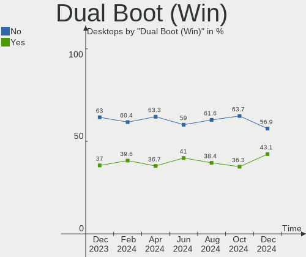
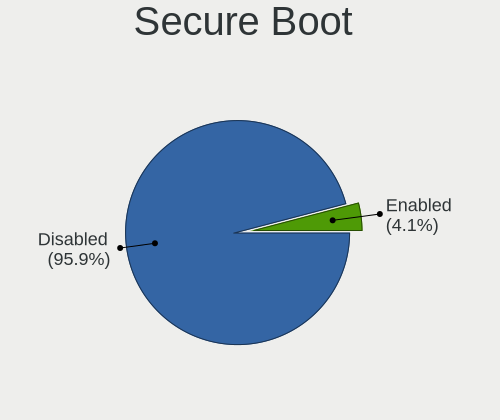
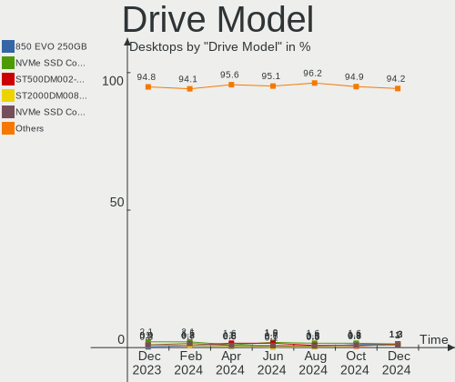
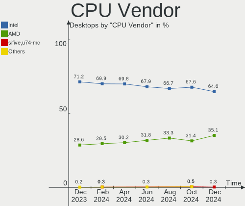
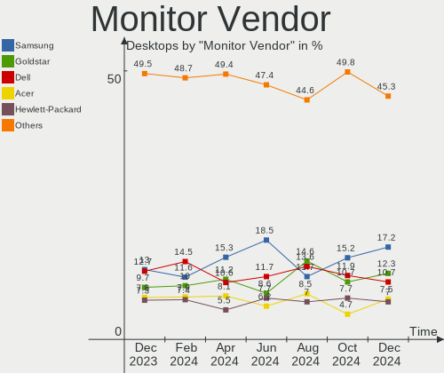
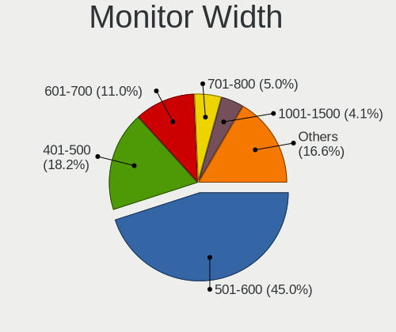
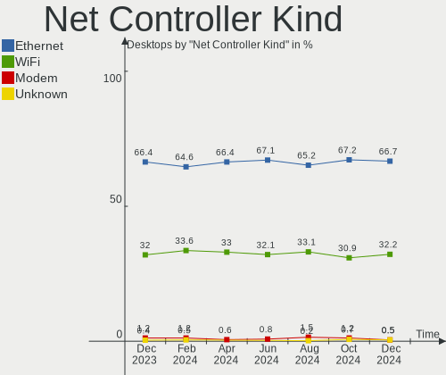

Ubuntu Hardware Trends (Desktop)
--------------------------------

A project to identify most popular hardware characteristics and track their change
over time based on data collected by Ubuntu users at https://Linux-Hardware.org.

Anyone can contribute to the study by uploading probes of their computers by
the [hw-probe](https://github.com/linuxhw/hw-probe) tool:

    sudo hw-probe -all -upload

Full-feature report is available here: https://linux-hardware.org/?view=trends&formfactor=desktop

Period: Jan, 2020.

Contents
--------

- [ OS                       ](#os)
- [ OS Family                ](#os-family)
- [ Kernel                   ](#kernel)
- [ Kernel Family            ](#kernel-family)
- [ Kernel Major Ver.        ](#kernel-major-ver)
- [ Arch                     ](#arch)
- [ DE                       ](#de)
- [ Display Server           ](#display-server)
- [ OS Lang                  ](#os-lang)
- [ Boot Mode                ](#boot-mode)
- [ Filesystem               ](#filesystem)
- [ Dual Boot with Linux     ](#dual-boot-with-linux)
- [ Dual Boot (Win)          ](#dual-boot-win)
- [ Country                  ](#country)
- [ City                     ](#city)
- [ Vendor                   ](#vendor)
- [ Model                    ](#model)
- [ Model Family             ](#model-family)
- [ MFG Year                 ](#mfg-year)
- [ Form Factor              ](#form-factor)
- [ Secure Boot              ](#secure-boot)
- [ Coreboot                 ](#coreboot)
- [ RAM Size                 ](#ram-size)
- [ RAM Used                 ](#ram-used)
- [ Drive Vendor             ](#drive-vendor)
- [ Drive Model              ](#drive-model)
- [ Drive Kind               ](#drive-kind)
- [ Drive Connector          ](#drive-connector)
- [ Drive Size               ](#drive-size)
- [ Space Total              ](#space-total)
- [ Space Used               ](#space-used)
- [ Malfunc. Drives          ](#malfunc-drives)
- [ Malfunc. Drive Vendor    ](#malfunc-drive-vendor)
- [ Malfunc. Drive Kind      ](#malfunc-drive-kind)
- [ Failed Drives            ](#failed-drives)
- [ Failed Drive Vendor      ](#failed-drive-vendor)
- [ Drive Status             ](#drive-status)
- [ CPU Vendor               ](#cpu-vendor)
- [ CPU Model                ](#cpu-model)
- [ CPU Model Family         ](#cpu-model-family)
- [ CPU Cores                ](#cpu-cores)
- [ CPU Sockets              ](#cpu-sockets)
- [ CPU Threads              ](#cpu-threads)
- [ CPU Op-Modes             ](#cpu-op-modes)
- [ CPU Microarch            ](#cpu-microarch)
- [ CPU Microcode            ](#cpu-microcode)
- [ GPU Vendor               ](#gpu-vendor)
- [ GPU Model                ](#gpu-model)
- [ GPU Combo                ](#gpu-combo)
- [ GPU Driver               ](#gpu-driver)
- [ GPU Memory               ](#gpu-memory)
- [ Monitor Vendor           ](#monitor-vendor)
- [ Monitor Model            ](#monitor-model)
- [ Monitor Resolution       ](#monitor-resolution)
- [ Monitor Diagonal         ](#monitor-diagonal)
- [ Monitor Width            ](#monitor-width)
- [ Aspect Ratio             ](#aspect-ratio)
- [ Monitor Area             ](#monitor-area)
- [ Pixel Density            ](#pixel-density)
- [ Multiple Monitors        ](#multiple-monitors)
- [ Net Controller Vendor    ](#net-controller-vendor)
- [ Net Controller Model     ](#net-controller-model)
- [ Net Controller Kind      ](#net-controller-kind)
- [ Used Controller          ](#used-controller)
- [ NICs                     ](#nics)
- [ Unsupported Devices      ](#unsupported-devices)
- [ Unsupported Device Types ](#unsupported-device-types)

OS
--

Installed operating systems

| Name         | Computers | Percent |
|--------------|-----------|---------|
| Ubuntu 18.04 | 299       | 62.29%  |
| Ubuntu 19.10 | 135       | 28.13%  |
| Ubuntu 19.04 | 16        | 3.33%   |
| Ubuntu 16.04 | 16        | 3.33%   |
| Ubuntu 20.04 | 10        | 2.08%   |
| Ubuntu 18.10 | 3         | 0.63%   |
| Ubuntu 17.10 | 1         | 0.21%   |

OS Family
---------

OS without a version

| Name   | Computers | Percent |
|--------|-----------|---------|
| Ubuntu | 480       | 100%    |

Kernel
------

Version of the Linux kernel

| Version                       | Computers | Percent |
|-------------------------------|-----------|---------|
| 5.3.0-26-generic              | 122       | 25.42%  |
| 5.0.0-37-generic              | 88        | 18.33%  |
| 4.15.0-74-generic             | 59        | 12.29%  |
| 4.15.0-72-generic             | 36        | 7.5%    |
| 5.3.0-24-generic              | 25        | 5.21%   |
| 5.3.0-29-generic              | 18        | 3.75%   |
| 5.0.0-23-generic              | 17        | 3.54%   |
| 5.3.0-28-generic              | 12        | 2.5%    |
| 5.3.0-18-generic              | 11        | 2.29%   |
| 4.15.0-76-generic             | 7         | 1.46%   |
| 5.0.0-38-generic              | 6         | 1.25%   |
| 4.15.0-74-lowlatency          | 6         | 1.25%   |
| 4.15.0-66-generic             | 6         | 1.25%   |
| 4.4.0-171-generic             | 4         | 0.83%   |
| 5.4.0-9-generic               | 3         | 0.63%   |
| 5.3.0-7625-generic            | 3         | 0.63%   |
| 5.3.0-27-generic              | 3         | 0.63%   |
| 5.3.0-26-lowlatency           | 3         | 0.63%   |
| 4.15.0-70-generic             | 3         | 0.63%   |
| 5.4.0-12-generic              | 2         | 0.42%   |
| 5.0.0-37-lowlatency           | 2         | 0.42%   |
| 5.0.0-32-generic              | 2         | 0.42%   |
| 4.18.0-25-generic             | 2         | 0.42%   |
| 4.15.0-76-lowlatency          | 2         | 0.42%   |
| 4.15.0-60-generic             | 2         | 0.42%   |
| 4.15.0-54-generic             | 2         | 0.42%   |
| 5.5.0-050500rc4-generic       | 1         | 0.21%   |
| 5.5.0-050500-generic          | 1         | 0.21%   |
| 5.4.7-050407-generic          | 1         | 0.21%   |
| 5.4.6-050406-generic          | 1         | 0.21%   |
| 5.4.15-20.01.26.amdgpu.ubuntu | 1         | 0.21%   |
| 5.4.12-xanmod7                | 1         | 0.21%   |
| 5.4.0-9-lowlatency            | 1         | 0.21%   |
| 5.4.0-11-generic              | 1         | 0.21%   |
| 5.4.0-050400-generic          | 1         | 0.21%   |
| 5.3.14-050314-generic         | 1         | 0.21%   |
| 5.3.11-050311-generic         | 1         | 0.21%   |
| 5.3.0-27-lowlatency           | 1         | 0.21%   |
| 5.3.0-24-lowlatency           | 1         | 0.21%   |
| 5.3.0-19-lowlatency           | 1         | 0.21%   |
| 5.3.0-18-lowlatency           | 1         | 0.21%   |
| 5.3.0-050300-generic          | 1         | 0.21%   |
| 5.0.0-39-generic              | 1         | 0.21%   |
| 5.0.0-25-generic              | 1         | 0.21%   |
| 5.0.0-13-generic              | 1         | 0.21%   |
| 4.4.0-31-generic              | 1         | 0.21%   |
| 4.4.0-173-generic             | 1         | 0.21%   |
| 4.4.0-169-generic             | 1         | 0.21%   |
| 4.18.20-dli                   | 1         | 0.21%   |
| 4.18.0-10-generic             | 1         | 0.21%   |
| 4.16.0-041600-generic         | 1         | 0.21%   |
| 4.15.0-70-lowlatency          | 1         | 0.21%   |
| 4.15.0-58-generic             | 1         | 0.21%   |
| 4.15.0-45-generic             | 1         | 0.21%   |
| 4.15.0-42-generic             | 1         | 0.21%   |
| 4.15.0-33-generic             | 1         | 0.21%   |
| 4.15.0-29-generic             | 1         | 0.21%   |
| 4.15.0-1065-oem               | 1         | 0.21%   |
| 4.13.0-46-generic             | 1         | 0.21%   |
| 4.10.0-28-lowlatency          | 1         | 0.21%   |

Kernel Family
-------------

Linux kernel without a distro release

| Version | Computers | Percent |
|---------|-----------|---------|
| 5.3.0   | 202       | 42.08%  |
| 4.15.0  | 130       | 27.08%  |
| 5.0.0   | 118       | 24.58%  |
| 5.4.0   | 8         | 1.67%   |
| 4.4.0   | 7         | 1.46%   |
| 4.18.0  | 3         | 0.63%   |
| 5.5.0   | 2         | 0.42%   |
| 5.4.7   | 1         | 0.21%   |
| 5.4.6   | 1         | 0.21%   |
| 5.4.15  | 1         | 0.21%   |
| 5.4.12  | 1         | 0.21%   |
| 5.3.14  | 1         | 0.21%   |
| 5.3.11  | 1         | 0.21%   |
| 4.18.20 | 1         | 0.21%   |
| 4.16.0  | 1         | 0.21%   |
| 4.13.0  | 1         | 0.21%   |
| 4.10.0  | 1         | 0.21%   |

Kernel Major Ver.
-----------------

Linux kernel major version

| Version | Computers | Percent |
|---------|-----------|---------|
| 5.3     | 204       | 42.5%   |
| 4.15    | 130       | 27.08%  |
| 5.0     | 118       | 24.58%  |
| 5.4     | 12        | 2.5%    |
| 4.4     | 7         | 1.46%   |
| 4.18    | 4         | 0.83%   |
| 5.5     | 2         | 0.42%   |
| 4.16    | 1         | 0.21%   |
| 4.13    | 1         | 0.21%   |
| 4.10    | 1         | 0.21%   |

Arch
----

OS architecture (x86_64, i586, etc.)

| Name   | Computers | Percent |
|--------|-----------|---------|
| x86_64 | 455       | 94.79%  |
| i686   | 25        | 5.21%   |

DE
--

Desktop Environment

| Name                      | Computers | Percent |
|---------------------------|-----------|---------|
| GNOME                     | 300       | 62.5%   |
| Unknown                   | 84        | 17.5%   |
| XFCE                      | 42        | 8.75%   |
| Unity                     | 17        | 3.54%   |
| KDE                       | 13        | 2.71%   |
| X-Cinnamon                | 5         | 1.04%   |
| MATE                      | 4         | 0.83%   |
| LXDE                      | 4         | 0.83%   |
| Budgie                    | 4         | 0.83%   |
| GNOME Flashback           | 3         | 0.63%   |
| LXQt                      | 2         | 0.42%   |
| Enlightenment             | 1         | 0.21%   |
| communitheme:ubuntu:GNOME | 1         | 0.21%   |

Display Server
--------------

X11 or Wayland

| Name    | Computers | Percent |
|---------|-----------|---------|
| X11     | 362       | 75.42%  |
| Unknown | 106       | 22.08%  |
| Wayland | 8         | 1.67%   |
| Tty     | 4         | 0.83%   |

OS Lang
-------

Language

| Lang    | Computers | Percent |
|---------|-----------|---------|
| en_US   | 167       | 34.79%  |
| de_DE   | 38        | 7.92%   |
| en_GB   | 31        | 6.46%   |
| Unknown | 24        | 5%      |
| it_IT   | 21        | 4.38%   |
| fr_FR   | 18        | 3.75%   |
| pt_BR   | 17        | 3.54%   |
| es_ES   | 17        | 3.54%   |
| gl_ES   | 16        | 3.33%   |
| ru_RU   | 14        | 2.92%   |
| C       | 14        | 2.92%   |
| nl_NL   | 10        | 2.08%   |
| hu_HU   | 8         | 1.67%   |
| en_CA   | 8         | 1.67%   |
| pl_PL   | 7         | 1.46%   |
| en_IN   | 7         | 1.46%   |
| en_AU   | 7         | 1.46%   |
| ja_JP   | 5         | 1.04%   |
| fr_CA   | 3         | 0.63%   |
| es_MX   | 3         | 0.63%   |
| en_ZA   | 3         | 0.63%   |
| el_GR   | 3         | 0.63%   |
| zh_HK   | 2         | 0.42%   |
| zh_CN   | 2         | 0.42%   |
| tr_TR   | 2         | 0.42%   |
| sv_SE   | 2         | 0.42%   |
| sk_SK   | 2         | 0.42%   |
| ru_UA   | 2         | 0.42%   |
| pt_PT   | 2         | 0.42%   |
| es_GT   | 2         | 0.42%   |
| en_SG   | 2         | 0.42%   |
| en_IL   | 2         | 0.42%   |
| de_AT   | 2         | 0.42%   |
| cs_CZ   | 2         | 0.42%   |
| zh_TW   | 1         | 0.21%   |
| uk_UA   | 1         | 0.21%   |
| sl_SI   | 1         | 0.21%   |
| nl_BE   | 1         | 0.21%   |
| nb_NO   | 1         | 0.21%   |
| hr_HR   | 1         | 0.21%   |
| es_VE   | 1         | 0.21%   |
| es_PE   | 1         | 0.21%   |
| es_CO   | 1         | 0.21%   |
| es_AR   | 1         | 0.21%   |
| en_NZ   | 1         | 0.21%   |
| en_HK   | 1         | 0.21%   |
| en_CA   | 1         | 0.21%   |
| da_DK   | 1         | 0.21%   |
| ar_EG   | 1         | 0.21%   |

Boot Mode
---------

EFI or BIOS

| Mode | Computers | Percent |
|------|-----------|---------|
| BIOS | 335       | 69.79%  |
| EFI  | 145       | 30.21%  |

Filesystem
----------

Type of filesystem

| Type    | Computers | Percent |
|---------|-----------|---------|
| Ext4    | 427       | 88.96%  |
| Ext3    | 25        | 5.21%   |
| Overlay | 15        | 3.13%   |
| Btrfs   | 5         | 1.04%   |
| Xfs     | 4         | 0.83%   |
| Zfs     | 2         | 0.42%   |
| Jfs     | 1         | 0.21%   |
| Unknown | 1         | 0.21%   |

Dual Boot with Linux
--------------------

Hosting more than one Linux

| Dual boot | Computers | Percent |
|-----------|-----------|---------|
| No        | 397       | 82.71%  |
| Yes       | 83        | 17.29%  |

Dual Boot (Win)
---------------

Hosting Linux and Windows

| Dual boot | Computers | Percent |
|-----------|-----------|---------|
| No        | 255       | 53.13%  |
| Yes       | 225       | 46.88%  |

Country
-------

Geographic location (country)

| Country        | Computers | Percent |
|----------------|-----------|---------|
| USA            | 94        | 19.58%  |
| Germany        | 54        | 11.25%  |
| Spain          | 36        | 7.5%    |
| UK             | 29        | 6.04%   |
| Italy          | 26        | 5.42%   |
| Netherlands    | 20        | 4.17%   |
| France         | 17        | 3.54%   |
| Canada         | 17        | 3.54%   |
| Brazil         | 17        | 3.54%   |
| Russia         | 15        | 3.13%   |
| Hungary        | 12        | 2.5%    |
| Poland         | 9         | 1.88%   |
| India          | 8         | 1.67%   |
| Ukraine        | 7         | 1.46%   |
| Australia      | 7         | 1.46%   |
| Turkey         | 6         | 1.25%   |
| Taiwan         | 6         | 1.25%   |
| Japan          | 6         | 1.25%   |
| Sweden         | 5         | 1.04%   |
| Greece         | 5         | 1.04%   |
| Austria        | 5         | 1.04%   |
| Switzerland    | 4         | 0.83%   |
| Slovakia       | 4         | 0.83%   |
| Czech Republic | 4         | 0.83%   |
| South Africa   | 3         | 0.63%   |
| Romania        | 3         | 0.63%   |
| Portugal       | 3         | 0.63%   |
| Lithuania      | 3         | 0.63%   |
| Israel         | 3         | 0.63%   |
| Denmark        | 3         | 0.63%   |
| China          | 3         | 0.63%   |
| Slovenia       | 2         | 0.42%   |
| Singapore      | 2         | 0.42%   |
| Peru           | 2         | 0.42%   |
| New Zealand    | 2         | 0.42%   |
| Mexico         | 2         | 0.42%   |
| Indonesia      | 2         | 0.42%   |
| Hong Kong      | 2         | 0.42%   |
| Guatemala      | 2         | 0.42%   |
| Finland        | 2         | 0.42%   |
| Cyprus         | 2         | 0.42%   |
| Croatia        | 2         | 0.42%   |
| Colombia       | 2         | 0.42%   |
| Bulgaria       | 2         | 0.42%   |
| Algeria        | 2         | 0.42%   |
| Venezuela      | 1         | 0.21%   |
| Thailand       | 1         | 0.21%   |
| Sri Lanka      | 1         | 0.21%   |
| Serbia         | 1         | 0.21%   |
| Saudi Arabia   | 1         | 0.21%   |
| Reunion        | 1         | 0.21%   |
| Norway         | 1         | 0.21%   |
| New Caledonia  | 1         | 0.21%   |
| Malta          | 1         | 0.21%   |
| Malaysia       | 1         | 0.21%   |
| Luxembourg     | 1         | 0.21%   |
| Latvia         | 1         | 0.21%   |
| Kazakhstan     | 1         | 0.21%   |
| Iran           | 1         | 0.21%   |
| Egypt          | 1         | 0.21%   |

City
----

Geographic location (city)

| City              | Computers | Percent |
|-------------------|-----------|---------|
| Ourense           | 22        | 4.58%   |
| Munich            | 5         | 1.04%   |
| Leipzig           | 4         | 0.83%   |
| Budapest          | 4         | 0.83%   |
| Athens            | 4         | 0.83%   |
| Vilnius           | 3         | 0.63%   |
| Taipei            | 3         | 0.63%   |
| Szeged            | 3         | 0.63%   |
| Milan             | 3         | 0.63%   |
| Glasgow           | 3         | 0.63%   |
| Cologne           | 3         | 0.63%   |
| Berlin            | 3         | 0.63%   |
| Ankara            | 3         | 0.63%   |
| Voronezh          | 2         | 0.42%   |
| Vienna            | 2         | 0.42%   |
| Velbert           | 2         | 0.42%   |
| Turin             | 2         | 0.42%   |
| Toronto           | 2         | 0.42%   |
| Tel Aviv          | 2         | 0.42%   |
| São Paulo        | 2         | 0.42%   |
| St Petersburg     | 2         | 0.42%   |
| Singapore         | 2         | 0.42%   |
| Sidi Akkacha      | 2         | 0.42%   |
| Seattle           | 2         | 0.42%   |
| Prague            | 2         | 0.42%   |
| Pisa              | 2         | 0.42%   |
| Oryol             | 2         | 0.42%   |
| Mumbai            | 2         | 0.42%   |
| Moscow            | 2         | 0.42%   |
| Montreal          | 2         | 0.42%   |
| Miami             | 2         | 0.42%   |
| Lima              | 2         | 0.42%   |
| Kyiv              | 2         | 0.42%   |
| Karlsruhe         | 2         | 0.42%   |
| Kansas City       | 2         | 0.42%   |
| Istanbul          | 2         | 0.42%   |
| Hamburg           | 2         | 0.42%   |
| Guatemala City    | 2         | 0.42%   |
| Fremont           | 2         | 0.42%   |
| Frankfurt am Main | 2         | 0.42%   |
| Fenjihu           | 2         | 0.42%   |
| Denver            | 2         | 0.42%   |
| Curitiba          | 2         | 0.42%   |
| Clichy-sous-Bois  | 2         | 0.42%   |
| Chicago           | 2         | 0.42%   |
| Bratislava        | 2         | 0.42%   |
| Bon Aqua          | 2         | 0.42%   |
| Bielsko-Biala     | 2         | 0.42%   |
| 's-Hertogenbosch  | 2         | 0.42%   |
| Čačak           | 1         | 0.21%   |
| Zwolle            | 1         | 0.21%   |
| Zurich            | 1         | 0.21%   |
| Zoetermeer        | 1         | 0.21%   |
| Zirl              | 1         | 0.21%   |
| Ziebice           | 1         | 0.21%   |
| Zeithain          | 1         | 0.21%   |
| Zagreb            | 1         | 0.21%   |
| Yuen Long         | 1         | 0.21%   |
| York              | 1         | 0.21%   |
| Yokkaichi         | 1         | 0.21%   |

Vendor
------

Motherboard manufacturer

| Name                | Computers | Percent |
|---------------------|-----------|---------|
| ASUSTek Computer    | 117       | 24.38%  |
| Gigabyte Technology | 85        | 17.71%  |
| Dell                | 49        | 10.21%  |
| MSI                 | 44        | 9.17%   |
| Lenovo              | 36        | 7.5%    |
| ASRock              | 36        | 7.5%    |
| Hewlett-Packard     | 34        | 7.08%   |
| Intel               | 15        | 3.13%   |
| Foxconn             | 6         | 1.25%   |
| Pegatron            | 5         | 1.04%   |
| Medion              | 5         | 1.04%   |
| Biostar             | 5         | 1.04%   |
| Supermicro          | 4         | 0.83%   |
| Fujitsu             | 4         | 0.83%   |
| Acer                | 4         | 0.83%   |
| Packard Bell        | 3         | 0.63%   |
| eMachines           | 3         | 0.63%   |
| Unknown             | 3         | 0.63%   |
| ECS                 | 2         | 0.42%   |
| AAEON               | 2         | 0.42%   |
| ZOTAC               | 1         | 0.21%   |
| XFX                 | 1         | 0.21%   |
| Wistron             | 1         | 0.21%   |
| WinFast             | 1         | 0.21%   |
| Seco                | 1         | 0.21%   |
| Sapphire Tech       | 1         | 0.21%   |
| Sapphire            | 1         | 0.21%   |
| Positivo            | 1         | 0.21%   |
| Onda Technology     | 1         | 0.21%   |
| mp                  | 1         | 0.21%   |
| Maxtang             | 1         | 0.21%   |
| IBM                 | 1         | 0.21%   |
| Hewleet-Packard     | 1         | 0.21%   |
| Google              | 1         | 0.21%   |
| Gateway             | 1         | 0.21%   |
| AOpen               | 1         | 0.21%   |
| AMI                 | 1         | 0.21%   |
| AMD                 | 1         | 0.21%   |

Model
-----

Motherboard model

| Name                            | Computers | Percent |
|---------------------------------|-----------|---------|
| ThinkCentre E73 10DR0033SP      | 22        | 4.58%   |
| All Series                      | 15        | 3.13%   |
| OptiPlex 7010                   | 5         | 1.04%   |
| XPS 8500                        | 3         | 0.63%   |
| PRIME H310M-R R2.0              | 3         | 0.63%   |
| Precision WorkStation 490       | 3         | 0.63%   |
| OptiPlex 780                    | 3         | 0.63%   |
| MS-7C02                         | 3         | 0.63%   |
| MS-7A38                         | 3         | 0.63%   |
| MS-7693                         | 3         | 0.63%   |
| Unknown                         | 3         | 0.63%   |
| Z77-DS3H                        | 2         | 0.42%   |
| Z170-A                          | 2         | 0.42%   |
| Z170 PRO GAMING                 | 2         | 0.42%   |
| XPS 8930                        | 2         | 0.42%   |
| X79-UD3                         | 2         | 0.42%   |
| PRIME Z270-A                    | 2         | 0.42%   |
| PRIME B450M-GAMING/BR           | 2         | 0.42%   |
| PRIME B350-PLUS                 | 2         | 0.42%   |
| Precision T1700                 | 2         | 0.42%   |
| P8Z68-V                         | 2         | 0.42%   |
| P7P55D                          | 2         | 0.42%   |
| P5QPL-AM                        | 2         | 0.42%   |
| OptiPlex 760                    | 2         | 0.42%   |
| OptiPlex 390                    | 2         | 0.42%   |
| OptiPlex 380                    | 2         | 0.42%   |
| N68C-GS FX                      | 2         | 0.42%   |
| MS-7B79                         | 2         | 0.42%   |
| MS-7B49                         | 2         | 0.42%   |
| MS-7816                         | 2         | 0.42%   |
| MS-7786                         | 2         | 0.42%   |
| MS-7636                         | 2         | 0.42%   |
| MF-001                          | 2         | 0.42%   |
| Maximus Extreme                 | 2         | 0.42%   |
| M5A97 EVO R2.0                  | 2         | 0.42%   |
| M5A78L-M/USB3                   | 2         | 0.42%   |
| Inspiron 5675                   | 2         | 0.42%   |
| Inspiron 530                    | 2         | 0.42%   |
| H61H2-LM3                       | 2         | 0.42%   |
| H110M-S2V                       | 2         | 0.42%   |
| H110M-S2                        | 2         | 0.42%   |
| H110M-E/M.2                     | 2         | 0.42%   |
| GA-MA785GMT-UD2H                | 2         | 0.42%   |
| G31M-ES2L                       | 2         | 0.42%   |
| EliteDesk 800 G1 SFF            | 2         | 0.42%   |
| Compaq Elite 8300 CMT           | 2         | 0.42%   |
| Compaq dc7800 Small Form Factor | 2         | 0.42%   |
| AC OFFICEPRO                    | 2         | 0.42%   |
| 970M Pro3                       | 2         | 0.42%   |
| 970 Pro3 R2.0                   | 2         | 0.42%   |
| 970 PRO GAMING/AURA             | 2         | 0.42%   |
| Z97P-D3                         | 1         | 0.21%   |
| Z97 Extreme4                    | 1         | 0.21%   |
| Z87X-UD5H                       | 1         | 0.21%   |
| Z83 II                          | 1         | 0.21%   |
| Z820 Workstation                | 1         | 0.21%   |
| Z77X-UD5H                       | 1         | 0.21%   |
| Z77-HD4                         | 1         | 0.21%   |
| Z77-HD3                         | 1         | 0.21%   |
| Z77-D3H                         | 1         | 0.21%   |

Model Family
------------

Motherboard model prefix

| Name                      | Computers | Percent |
|---------------------------|-----------|---------|
| Lenovo ThinkCentre        | 33        | 6.88%   |
| Dell OptiPlex             | 21        | 4.38%   |
| ASUS PRIME                | 16        | 3.33%   |
| ASUS All                  | 15        | 3.13%   |
| HP Compaq                 | 14        | 2.92%   |
| Dell Precision            | 9         | 1.88%   |
| Dell Inspiron             | 8         | 1.67%   |
| Dell XPS                  | 5         | 1.04%   |
| ASUS M5A97                | 5         | 1.04%   |
| ASUS M5A78L-M             | 5         | 1.04%   |
| ASUS ROG                  | 4         | 0.83%   |
| MSI MS-7C02               | 3         | 0.63%   |
| MSI MS-7A38               | 3         | 0.63%   |
| MSI MS-7693               | 3         | 0.63%   |
| HP ProDesk                | 3         | 0.63%   |
| Gigabyte Z390             | 3         | 0.63%   |
| Gigabyte GA-78LMT-USB3    | 3         | 0.63%   |
| Gigabyte B450             | 3         | 0.63%   |
| Dell Vostro               | 3         | 0.63%   |
| ASUS TUF                  | 3         | 0.63%   |
| ASUS P8Z68-V              | 3         | 0.63%   |
| ASUS Maximus              | 3         | 0.63%   |
| ASRock 970                | 3         | 0.63%   |
| Unknown                   | 3         | 0.63%   |
| Packard Bell IMEDIA       | 2         | 0.42%   |
| MSI MS-7B79               | 2         | 0.42%   |
| MSI MS-7B49               | 2         | 0.42%   |
| MSI MS-7816               | 2         | 0.42%   |
| MSI MS-7786               | 2         | 0.42%   |
| MSI MS-7636               | 2         | 0.42%   |
| Medion H61H2-LM3          | 2         | 0.42%   |
| Intel DG31PR              | 2         | 0.42%   |
| HP ProLiant               | 2         | 0.42%   |
| HP Pavilion               | 2         | 0.42%   |
| HP OMEN                   | 2         | 0.42%   |
| HP EliteDesk              | 2         | 0.42%   |
| Gigabyte Z77-DS3H         | 2         | 0.42%   |
| Gigabyte X79-UD3          | 2         | 0.42%   |
| Gigabyte H110M-S2V        | 2         | 0.42%   |
| Gigabyte H110M-S2         | 2         | 0.42%   |
| Gigabyte GA-MA785GMT-UD2H | 2         | 0.42%   |
| Gigabyte G31M-ES2L        | 2         | 0.42%   |
| Gigabyte AB350M-DS3H      | 2         | 0.42%   |
| ASUS Z170-A               | 2         | 0.42%   |
| ASUS Z170                 | 2         | 0.42%   |
| ASUS P7P55D               | 2         | 0.42%   |
| ASUS P5QPL-AM             | 2         | 0.42%   |
| ASUS P5KPL-AM             | 2         | 0.42%   |
| ASUS H110M-E              | 2         | 0.42%   |
| ASUS 970                  | 2         | 0.42%   |
| ASRock N68C-GS            | 2         | 0.42%   |
| ASRock B450M              | 2         | 0.42%   |
| ASRock 970M               | 2         | 0.42%   |
| Acer Aspire               | 2         | 0.42%   |
| AAEON MF-001              | 2         | 0.42%   |
| ZOTAC NM10                | 1         | 0.21%   |
| XFX Nforce                | 1         | 0.21%   |
| Wistron ProLiant          | 1         | 0.21%   |
| WinFast 760GXK8MC         | 1         | 0.21%   |
| Supermicro X9SCL          | 1         | 0.21%   |

MFG Year
--------

Motherboard manufacture year

| Year | Computers | Percent |
|------|-----------|---------|
| 2019 | 74        | 15.42%  |
| 2014 | 55        | 11.46%  |
| 2012 | 42        | 8.75%   |
| 2009 | 41        | 8.54%   |
| 2018 | 38        | 7.92%   |
| 2013 | 37        | 7.71%   |
| 2011 | 35        | 7.29%   |
| 2010 | 35        | 7.29%   |
| 2015 | 28        | 5.83%   |
| 2016 | 26        | 5.42%   |
| 2017 | 22        | 4.58%   |
| 2008 | 19        | 3.96%   |
| 2007 | 12        | 2.5%    |
| 2006 | 10        | 2.08%   |
| 2005 | 5         | 1.04%   |
| 2001 | 1         | 0.21%   |

Form Factor
-----------

Physical design of the computer

| Name    | Computers | Percent |
|---------|-----------|---------|
| Desktop | 480       | 100%    |

Secure Boot
-----------

Enabled or disabled

| State    | Computers | Percent |
|----------|-----------|---------|
| Disabled | 313       | 65.21%  |
| Unknown  | 155       | 32.29%  |
| Enabled  | 12        | 2.5%    |

Coreboot
--------

Have coreboot on board

| Used | Computers | Percent |
|------|-----------|---------|
| No   | 479       | 99.79%  |
| Yes  | 1         | 0.21%   |

RAM Size
--------

Total RAM memory

| Size in GB  | Computers | Percent |
|-------------|-----------|---------|
| 16.01-24.0  | 117       | 24.38%  |
| 8.01-16.0   | 99        | 20.63%  |
| 3.01-4.0    | 94        | 19.58%  |
| 4.01-8.0    | 62        | 12.92%  |
| 32.01-64.0  | 40        | 8.33%   |
| 1.01-2.0    | 27        | 5.63%   |
| 64.01-256.0 | 16        | 3.33%   |
| 24.01-32.0  | 10        | 2.08%   |
| 2.01-3.0    | 10        | 2.08%   |
| 0.01-1.0    | 4         | 0.83%   |
| Unknown     | 1         | 0.21%   |

RAM Used
--------

Used RAM memory

| Used GB    | Computers | Percent |
|------------|-----------|---------|
| 1.01-2.0   | 228       | 47.5%   |
| 2.01-3.0   | 112       | 23.33%  |
| 4.01-8.0   | 45        | 9.38%   |
| 3.01-4.0   | 44        | 9.17%   |
| 0.01-1.0   | 34        | 7.08%   |
| 8.01-16.0  | 12        | 2.5%    |
| 24.01-32.0 | 2         | 0.42%   |
| 16.01-24.0 | 2         | 0.42%   |
| Unknown    | 1         | 0.21%   |

Drive Vendor
------------

Hard drive vendors

| Vendor              | Computers | Drives | Percent |
|---------------------|-----------|--------|---------|
| Seagate             | 183       | 213    | 23.89%  |
| WDC                 | 172       | 214    | 22.45%  |
| Samsung Electronics | 103       | 123    | 13.45%  |
| Toshiba             | 45        | 51     | 5.87%   |
| Kingston            | 45        | 48     | 5.87%   |
| Hitachi             | 31        | 33     | 4.05%   |
| Crucial             | 30        | 31     | 3.92%   |
| SanDisk             | 20        | 20     | 2.61%   |
| Intel               | 18        | 19     | 2.35%   |
| MAXTOR              | 17        | 19     | 2.22%   |
| Transcend           | 6         | 6      | 0.78%   |
| Patriot             | 6         | 7      | 0.78%   |
| OCZ                 | 6         | 6      | 0.78%   |
| A-DATA Technology   | 6         | 6      | 0.78%   |
| Intenso             | 5         | 5      | 0.65%   |
| HGST                | 5         | 5      | 0.65%   |
| Unknown             | 4         | 6      | 0.52%   |
| PNY                 | 4         | 4      | 0.52%   |
| PLEXTOR             | 4         | 4      | 0.52%   |
| KingDian            | 4         | 4      | 0.52%   |
| China               | 4         | 4      | 0.52%   |
| SK Hynix            | 3         | 3      | 0.39%   |
| KingSpec            | 3         | 3      | 0.39%   |
| Gigabyte Technology | 3         | 3      | 0.39%   |
| Fujitsu             | 3         | 3      | 0.39%   |
| Corsair             | 3         | 3      | 0.39%   |
| Hewlett-Packard     | 2         | 2      | 0.26%   |
| GOODRAM             | 2         | 2      | 0.26%   |
| Generic             | 2         | 2      | 0.26%   |
| DREVO               | 2         | 2      | 0.26%   |
| Apple               | 2         | 2      | 0.26%   |
| WDC WD25            | 1         | 1      | 0.13%   |
| USB3.0              | 1         | 1      | 0.13%   |
| USB                 | 1         | 1      | 0.13%   |
| Team                | 1         | 1      | 0.13%   |
| StoreJet            | 1         | 1      | 0.13%   |
| SPCC                | 1         | 1      | 0.13%   |
| OWC                 | 1         | 1      | 0.13%   |
| OCZ-VERTEX2         | 1         | 1      | 0.13%   |
| MemoCom             | 1         | 1      | 0.13%   |
| MARVELL             | 1         | 1      | 0.13%   |
| LITEONIT            | 1         | 1      | 0.13%   |
| Lexar               | 1         | 1      | 0.13%   |
| Kston               | 1         | 1      | 0.13%   |
| HUAWEI              | 1         | 1      | 0.13%   |
| HS-SSD-C100         | 1         | 1      | 0.13%   |
| HL-DT-ST            | 1         | 1      | 0.13%   |
| HKVSN               | 1         | 1      | 0.13%   |
| HGST HTS            | 1         | 1      | 0.13%   |
| DOGFISH             | 1         | 1      | 0.13%   |
| CLOVER              | 1         | 1      | 0.13%   |
| ASMT109x            | 1         | 1      | 0.13%   |
| ASMT                | 1         | 1      | 0.13%   |
| AMD                 | 1         | 1      | 0.13%   |

Drive Model
-----------

Hard drive models

| Model                    | Computers | Percent |
|--------------------------|-----------|---------|
| ST500DM002-1BD142 500GB  | 39        | 4.45%   |
| WD5000AAKX-08U6AA0 500GB | 19        | 2.17%   |
| WD10EZEX-08WN4A0 1TB     | 11        | 1.26%   |
| ST3500418AS 500GB        | 9         | 1.03%   |
| ST1000DM010-2EP102 1TB   | 9         | 1.03%   |
| SSD 860 EVO 500GB        | 9         | 1.03%   |
| SSD 860 EVO 250GB        | 9         | 1.03%   |
| SSD 850 EVO 500GB        | 9         | 1.03%   |
| SSD 850 EVO 250GB        | 9         | 1.03%   |
| SA400S37240G 240GB SSD   | 9         | 1.03%   |
| DT01ACA100 1TB           | 9         | 1.03%   |
| SV300S37A120G 120GB SSD  | 8         | 0.91%   |
| SSD 860 EVO 1TB          | 7         | 0.8%    |
| SA400S37120G 120GB SSD   | 7         | 0.8%    |
| DT01ACA200 2TB           | 7         | 0.8%    |
| WD10EZEX-00BN5A0 1TB     | 6         | 0.68%   |
| ST2000DM001-1CH164 2TB   | 6         | 0.68%   |
| ST1000DM003-1ER162 1TB   | 6         | 0.68%   |
| ST1000DM003-1CH162 1TB   | 6         | 0.68%   |
| SSD 840 Series 250GB     | 6         | 0.68%   |
| WD10EARS-00Y5B1 1TB      | 5         | 0.57%   |
| ST31000524AS 1TB         | 5         | 0.57%   |
| ST1000DM003-9YN162 1TB   | 5         | 0.57%   |
| HDWD130 3TB              | 5         | 0.57%   |
| HD322HJ 320GB            | 5         | 0.57%   |
| HD204UI 2TB              | 5         | 0.57%   |
| HD103SJ 1TB              | 5         | 0.57%   |
| WD5000AADS-00S9B0 500GB  | 4         | 0.46%   |
| SV300S37A240G 240GB SSD  | 4         | 0.46%   |
| ST4000DM004-2CV104 4TB   | 4         | 0.46%   |
| ST3500413AS 500GB        | 4         | 0.46%   |
| ST3320620AS 320GB        | 4         | 0.46%   |
| ST3160815AS 160GB        | 4         | 0.46%   |
| ST3000DM008-2DM166 3TB   | 4         | 0.46%   |
| SSDSC2BW120A4 120GB      | 4         | 0.46%   |
| SSD 850 PRO 256GB        | 4         | 0.46%   |
| SDSSDA120G 120GB         | 4         | 0.46%   |
| SA400S37480G 480GB SSD   | 4         | 0.46%   |
| DT01ACA050 500GB         | 4         | 0.46%   |
| CT500MX500SSD1 500GB     | 4         | 0.46%   |
| CT1000MX500SSD1 1TB      | 4         | 0.46%   |
| WD30EZRX-00SPEB0 3TB     | 3         | 0.34%   |
| WD30EFRX-68EUZN0 3TB     | 3         | 0.34%   |
| WD20EARX-00PASB0 2TB     | 3         | 0.34%   |
| TR200 240GB SSD          | 3         | 0.34%   |
| SV300S37A60G 64GB SSD    | 3         | 0.34%   |
| ST3500312CS 500GB        | 3         | 0.34%   |
| ST3250820AS 250GB        | 3         | 0.34%   |
| ST3000DM001-9YN166 3TB   | 3         | 0.34%   |
| ST250DM000-1BD141 250GB  | 3         | 0.34%   |
| ST2000DM006-2DM164 2TB   | 3         | 0.34%   |
| ST2000DM001-1ER164 2TB   | 3         | 0.34%   |
| SSD PLUS 120GB           | 3         | 0.34%   |
| SSD 860 QVO 1TB          | 3         | 0.34%   |
| SSD 850 PRO 512GB        | 3         | 0.34%   |
| SSD 840 PRO Series 256GB | 3         | 0.34%   |
| SP2504C 250GB            | 3         | 0.34%   |
| HDT722525DLA380 250GB    | 3         | 0.34%   |
| CT256MX100SSD1 256GB     | 3         | 0.34%   |
| CT250MX500SSD1 250GB     | 3         | 0.34%   |

Drive Kind
----------

HDD or SSD

| Kind    | Computers | Drives | Percent |
|---------|-----------|--------|---------|
| HDD     | 365       | 562    | 58.03%  |
| SSD     | 232       | 279    | 36.88%  |
| Unknown | 19        | 19     | 3.02%   |
| NVMe    | 9         | 10     | 1.43%   |
| MMC     | 4         | 6      | 0.64%   |

Drive Connector
---------------

SATA, SAS, NVMe, etc.

| Type | Computers | Drives | Percent |
|------|-----------|--------|---------|
| SATA | 459       | 838    | 92.91%  |
| SAS  | 22        | 22     | 4.45%   |
| NVMe | 9         | 10     | 1.82%   |
| MMC  | 4         | 6      | 0.81%   |

Drive Size
----------

Size of hard drive

| Size in TB | Computers | Drives | Percent |
|------------|-----------|--------|---------|
| 0.01-0.5   | 373       | 529    | 56.26%  |
| 0.51-1.0   | 177       | 218    | 26.7%   |
| 1.01-2.0   | 63        | 71     | 9.5%    |
| 2.01-3.0   | 27        | 33     | 4.07%   |
| 3.01-4.0   | 16        | 17     | 2.41%   |
| 4.01-10.0  | 6         | 7      | 0.9%    |
| Unknown    | 1         | 1      | 0.15%   |

Space Total
-----------

Amount of disk space available on the file system

| Size in GB     | Computers | Percent |
|----------------|-----------|---------|
| 101-250        | 140       | 29.17%  |
| 251-500        | 89        | 18.54%  |
| 501-1000       | 60        | 12.5%   |
| 1001-2000      | 42        | 8.75%   |
| More than 3000 | 38        | 7.92%   |
| 51-100         | 33        | 6.88%   |
| 2001-3000      | 31        | 6.46%   |
| 21-50          | 21        | 4.38%   |
| 1-20           | 19        | 3.96%   |
| Unknown        | 7         | 1.46%   |

Space Used
----------

Amount of used disk space

| Used GB        | Computers | Percent |
|----------------|-----------|---------|
| 1-20           | 190       | 39.58%  |
| 21-50          | 72        | 15%     |
| 101-250        | 51        | 10.63%  |
| 51-100         | 42        | 8.75%   |
| 251-500        | 34        | 7.08%   |
| 501-1000       | 32        | 6.67%   |
| 1001-2000      | 27        | 5.63%   |
| More than 3000 | 19        | 3.96%   |
| Unknown        | 7         | 1.46%   |
| 2001-3000      | 6         | 1.25%   |

Malfunc. Drives
---------------

Drive models with a malfunction

| Model                   | Computers | Drives | Percent |
|-------------------------|-----------|--------|---------|
| ST1000DM003-9YN162 1TB  | 2         | 2      | 12.5%   |
| WD5000AVVS-63M8B0 500GB | 1         | 1      | 6.25%   |
| WD5000AAKS-7 500GB      | 1         | 1      | 6.25%   |
| WD15EARS-00Z5B1 1TB     | 1         | 1      | 6.25%   |
| WD10EZEX-60ZF5A0 1TB    | 1         | 1      | 6.25%   |
| WD10EZEX-00RKKA0 1TB    | 1         | 1      | 6.25%   |
| WD10EACS-00D 1TB        | 1         | 1      | 6.25%   |
| STM3500418AS 500GB      | 1         | 1      | 6.25%   |
| ST9250320AS 250GB       | 1         | 1      | 6.25%   |
| ST4000DM000-1F2168 4TB  | 1         | 1      | 6.25%   |
| ST3250310AS 250GB       | 1         | 1      | 6.25%   |
| ST2000DM001-1ER164 2TB  | 1         | 1      | 6.25%   |
| ST1000DM003-1CH162 1TB  | 1         | 1      | 6.25%   |
| HDT722525DLA380 250GB   | 1         | 1      | 6.25%   |
| HD501LJ 500GB           | 1         | 1      | 6.25%   |

Malfunc. Drive Vendor
---------------------

Vendors of faulty drives

| Vendor              | Computers | Drives | Percent |
|---------------------|-----------|--------|---------|
| Seagate             | 7         | 8      | 46.67%  |
| WDC                 | 6         | 6      | 40%     |
| Samsung Electronics | 1         | 1      | 6.67%   |
| Hitachi             | 1         | 1      | 6.67%   |

Malfunc. Drive Kind
-------------------

Kinds of faulty drives

| Kind | Computers | Drives | Percent |
|------|-----------|--------|---------|
| HDD  | 13        | 16     | 100%    |

Failed Drives
-------------

Failed drive models

Zero info for selected period =(

Failed Drive Vendor
-------------------

Failed drive vendors

Zero info for selected period =(

Drive Status
------------

Number of failed and malfunc. drives

| Status   | Computers | Drives | Percent |
|----------|-----------|--------|---------|
| Detected | 419       | 765    | 87.84%  |
| Works    | 45        | 95     | 9.43%   |
| Malfunc  | 13        | 16     | 2.73%   |

CPU Vendor
----------

Processor vendors

| Vendor       | Computers | Percent |
|--------------|-----------|---------|
| Intel        | 341       | 71.04%  |
| AMD          | 138       | 28.75%  |
| CentaurHauls | 1         | 0.21%   |

CPU Model
---------

Processor models

| Model                                       | Computers | Percent |
|---------------------------------------------|-----------|---------|
| Intel Core i3-4150 CPU @ 3.50GHz            | 22        | 4.58%   |
| Intel Core 2 Duo CPU E8400 @ 3.00GHz        | 11        | 2.29%   |
| Intel Core i7-3770 CPU @ 3.40GHz            | 8         | 1.67%   |
| Intel Core i5-3470 CPU @ 3.20GHz            | 6         | 1.25%   |
| AMD Ryzen 7 3700X 8-Core Processor          | 6         | 1.25%   |
| AMD Ryzen 5 2600 Six-Core Processor         | 6         | 1.25%   |
| AMD FX-8350 Eight-Core Processor            | 6         | 1.25%   |
| Intel Core i7-4770K CPU @ 3.50GHz           | 5         | 1.04%   |
| Intel Core i7-2600 CPU @ 3.40GHz            | 5         | 1.04%   |
| Intel Core i5-2500 CPU @ 3.30GHz            | 5         | 1.04%   |
| Intel Core i5-2320 CPU @ 3.00GHz            | 5         | 1.04%   |
| Intel Core i5 CPU 750 @ 2.67GHz             | 5         | 1.04%   |
| Intel Core i3 CPU 540 @ 3.07GHz             | 5         | 1.04%   |
| AMD Ryzen 5 2400G with Radeon Vega Graphics | 5         | 1.04%   |
| Intel Pentium Dual-Core CPU E5400 @ 2.70GHz | 4         | 0.83%   |
| Intel Pentium CPU G4560 @ 3.50GHz           | 4         | 0.83%   |
| Intel Core i7-6700K CPU @ 4.00GHz           | 4         | 0.83%   |
| Intel Core i5-4670K CPU @ 3.40GHz           | 4         | 0.83%   |
| Intel Core i5-2400 CPU @ 3.10GHz            | 4         | 0.83%   |
| Intel Core i5 CPU 650 @ 3.20GHz             | 4         | 0.83%   |
| Intel Core 2 Quad CPU Q6600 @ 2.40GHz       | 4         | 0.83%   |
| AMD Ryzen 5 3400G with Radeon Vega Graphics | 4         | 0.83%   |
| AMD FX-6300 Six-Core Processor              | 4         | 0.83%   |
| AMD FX-4300 Quad-Core Processor             | 4         | 0.83%   |
| AMD FX-4100 Quad-Core Processor             | 4         | 0.83%   |
| Intel Core i7-9700K CPU @ 3.60GHz           | 3         | 0.63%   |
| Intel Core i7-8700 CPU @ 3.20GHz            | 3         | 0.63%   |
| Intel Core i7-6700 CPU @ 3.40GHz            | 3         | 0.63%   |
| Intel Core i7-4790K CPU @ 4.00GHz           | 3         | 0.63%   |
| Intel Core i7-4770 CPU @ 3.40GHz            | 3         | 0.63%   |
| Intel Core i7-3770K CPU @ 3.50GHz           | 3         | 0.63%   |
| Intel Core i5-9400F CPU @ 2.90GHz           | 3         | 0.63%   |
| Intel Core i5-7500 CPU @ 3.40GHz            | 3         | 0.63%   |
| Intel Core i5-2500K CPU @ 3.30GHz           | 3         | 0.63%   |
| Intel Core i3-8100 CPU @ 3.60GHz            | 3         | 0.63%   |
| Intel Core i3-6100 CPU @ 3.70GHz            | 3         | 0.63%   |
| Intel Core i3-3220 CPU @ 3.30GHz            | 3         | 0.63%   |
| Intel Core i3-2120 CPU @ 3.30GHz            | 3         | 0.63%   |
| Intel Core 2 Duo CPU E7300 @ 2.66GHz        | 3         | 0.63%   |
| Intel Core 2 Duo CPU E4600 @ 2.40GHz        | 3         | 0.63%   |
| Intel Atom x5-Z8350 CPU @ 1.44GHz           | 3         | 0.63%   |
| AMD Ryzen 5 3600X 6-Core Processor          | 3         | 0.63%   |
| AMD Ryzen 5 3600 6-Core Processor           | 3         | 0.63%   |
| AMD Phenom II X4 955 Processor              | 3         | 0.63%   |
| AMD FX-8320 Eight-Core Processor            | 3         | 0.63%   |
| Intel Xeon CPU X3430 @ 2.40GHz              | 2         | 0.42%   |
| Intel Xeon CPU E5-1620 0 @ 3.60GHz          | 2         | 0.42%   |
| Intel Xeon CPU E3-1241 v3 @ 3.50GHz         | 2         | 0.42%   |
| Intel Pentium Dual-Core CPU E6700 @ 3.20GHz | 2         | 0.42%   |
| Intel Pentium Dual-Core CPU E5200 @ 2.50GHz | 2         | 0.42%   |
| Intel Pentium Dual CPU E2200 @ 2.20GHz      | 2         | 0.42%   |
| Intel Pentium Dual CPU E2180 @ 2.00GHz      | 2         | 0.42%   |
| Intel Pentium D CPU 2.80GHz                 | 2         | 0.42%   |
| Intel Pentium CPU G640 @ 2.80GHz            | 2         | 0.42%   |
| Intel Pentium CPU G630T @ 2.30GHz           | 2         | 0.42%   |
| Intel Pentium CPU G620 @ 2.60GHz            | 2         | 0.42%   |
| Intel Pentium CPU G4400 @ 3.30GHz           | 2         | 0.42%   |
| Intel Pentium CPU G3250 @ 3.20GHz           | 2         | 0.42%   |
| Intel Core i7-8700K CPU @ 3.70GHz           | 2         | 0.42%   |
| Intel Core i7-4820K CPU @ 3.70GHz           | 2         | 0.42%   |

CPU Model Family
----------------

Processor model prefix

| Model                   | Computers | Percent |
|-------------------------|-----------|---------|
| Intel Core i5           | 80        | 16.67%  |
| Intel Core i7           | 61        | 12.71%  |
| Intel Core i3           | 59        | 12.29%  |
| Intel Core 2 Duo        | 28        | 5.83%   |
| AMD Ryzen 5             | 28        | 5.83%   |
| AMD FX                  | 27        | 5.63%   |
| Intel Xeon              | 24        | 5%      |
| Intel Pentium           | 22        | 4.58%   |
| Intel Core 2 Quad       | 15        | 3.13%   |
| Intel Pentium Dual-Core | 12        | 2.5%    |
| AMD Ryzen 7             | 12        | 2.5%    |
| Intel Celeron           | 11        | 2.29%   |
| Intel Atom              | 8         | 1.67%   |
| AMD A8                  | 8         | 1.67%   |
| AMD Phenom II X4        | 7         | 1.46%   |
| AMD Athlon 64 X2        | 6         | 1.25%   |
| Intel Core 2            | 5         | 1.04%   |
| AMD Phenom              | 5         | 1.04%   |
| Intel Pentium Dual      | 4         | 0.83%   |
| Intel Pentium 4         | 4         | 0.83%   |
| Intel Core i9           | 4         | 0.83%   |
| AMD Ryzen Threadripper  | 4         | 0.83%   |
| AMD Ryzen 3             | 4         | 0.83%   |
| AMD Athlon II X2        | 4         | 0.83%   |
| Intel Pentium D         | 3         | 0.63%   |
| AMD Sempron             | 3         | 0.63%   |
| AMD Phenom II X2        | 3         | 0.63%   |
| AMD Athlon 64           | 3         | 0.63%   |
| AMD A6                  | 3         | 0.63%   |
| AMD A4                  | 3         | 0.63%   |
| AMD A10                 | 3         | 0.63%   |
| AMD Ryzen Embedded      | 2         | 0.42%   |
| AMD Phenom II X6        | 2         | 0.42%   |
| AMD E1                  | 2         | 0.42%   |
| AMD E                   | 2         | 0.42%   |
| AMD Athlon II X4        | 2         | 0.42%   |
| AMD Athlon II X3        | 2         | 0.42%   |
| Other                   | 1         | 0.21%   |
| Intel Genuine           | 1         | 0.21%   |
| CentaurHauls VIA C7     | 1         | 0.21%   |
| AMD Ryzen 9             | 1         | 0.21%   |
| AMD Athlon Dual Core    | 1         | 0.21%   |

CPU Cores
---------

Number of processor cores

| Number  | Computers | Percent |
|---------|-----------|---------|
| 4       | 204       | 42.5%   |
| 2       | 179       | 37.29%  |
| 6       | 36        | 7.5%    |
| 8       | 23        | 4.79%   |
| 1       | 19        | 3.96%   |
| 3       | 10        | 2.08%   |
| 16      | 3         | 0.63%   |
| 12      | 3         | 0.63%   |
| 32      | 1         | 0.21%   |
| 10      | 1         | 0.21%   |
| Unknown | 1         | 0.21%   |

CPU Sockets
-----------

Number of sockets

| Number  | Computers | Percent |
|---------|-----------|---------|
| 1       | 474       | 98.75%  |
| 2       | 5         | 1.04%   |
| Unknown | 1         | 0.21%   |

CPU Threads
-----------

Threads per core (Hyper-Threading)

| Number  | Computers | Percent |
|---------|-----------|---------|
| 1       | 251       | 52.29%  |
| 2       | 228       | 47.5%   |
| Unknown | 1         | 0.21%   |

CPU Op-Modes
------------

CPU Operation Modes (32-bit, 64-bit)

| Op mode        | Computers | Percent |
|----------------|-----------|---------|
| 32-bit, 64-bit | 475       | 98.96%  |
| 32-bit         | 3         | 0.63%   |
| Unknown        | 2         | 0.42%   |

CPU Microarch
-------------

Microarchitecture

| Name        | Computers | Percent |
|-------------|-----------|---------|
| Haswell     | 70        | 14.58%  |
| Core        | 68        | 14.17%  |
| Skylake     | 56        | 11.67%  |
| SandyBridge | 49        | 10.21%  |
| IvyBridge   | 34        | 7.08%   |
| Piledriver  | 30        | 6.25%   |
| K10         | 25        | 5.21%   |
| Zen         | 21        | 4.38%   |
| Zen+        | 16        | 3.33%   |
| Zen 2       | 14        | 2.92%   |
| Westmere    | 14        | 2.92%   |
| Nehalem     | 14        | 2.92%   |
| K8 Hammer   | 13        | 2.71%   |
| NetBurst    | 9         | 1.88%   |
| Silvermont  | 8         | 1.67%   |
| Penryn      | 7         | 1.46%   |
| KabyLake    | 7         | 1.46%   |
| Bulldozer   | 7         | 1.46%   |
| Steamroller | 4         | 0.83%   |
| Bonnell     | 4         | 0.83%   |
| Bobcat      | 4         | 0.83%   |
| K10 Llano   | 3         | 0.63%   |
| Goldmont    | 1         | 0.21%   |
| Excavator   | 1         | 0.21%   |
| Unknown     | 1         | 0.21%   |

CPU Microcode
-------------

Microcode number

| Number     | Computers | Percent |
|------------|-----------|---------|
| 0x306c3    | 63        | 13.13%  |
| Unknown    | 51        | 10.63%  |
| 0x206a7    | 42        | 8.75%   |
| 0x1067a    | 35        | 7.29%   |
| 0x306a9    | 30        | 6.25%   |
| 0x06000852 | 19        | 3.96%   |
| 0x506e3    | 17        | 3.54%   |
| 0x906ea    | 12        | 2.5%    |
| 0x906e9    | 12        | 2.5%    |
| 0x08701013 | 12        | 2.5%    |
| 0x106e5    | 11        | 2.29%   |
| 0x6fb      | 10        | 2.08%   |
| 0x06001119 | 10        | 2.08%   |
| 0x010000c8 | 10        | 2.08%   |
| 0x20655    | 9         | 1.88%   |
| 0x6fd      | 6         | 1.25%   |
| 0x206d7    | 6         | 1.25%   |
| 0x10676    | 6         | 1.25%   |
| 0x0600063e | 6         | 1.25%   |
| 0x906ed    | 5         | 1.04%   |
| 0x906eb    | 5         | 1.04%   |
| 0x0800820d | 5         | 1.04%   |
| 0x0800820b | 5         | 1.04%   |
| 0x08001137 | 5         | 1.04%   |
| 0x6f2      | 4         | 0.83%   |
| 0x406c4    | 4         | 0.83%   |
| 0x08001129 | 4         | 0.83%   |
| 0x6f6      | 3         | 0.63%   |
| 0x306e4    | 3         | 0.63%   |
| 0x30678    | 3         | 0.63%   |
| 0x20652    | 3         | 0.63%   |
| 0x106ca    | 3         | 0.63%   |
| 0x08108109 | 3         | 0.63%   |
| 0x0810100b | 3         | 0.63%   |
| 0x06003106 | 3         | 0.63%   |
| 0x03000027 | 3         | 0.63%   |
| 0x010000dc | 3         | 0.63%   |
| 0x010000db | 3         | 0.63%   |
| 0x01000083 | 3         | 0.63%   |
| 0xf49      | 2         | 0.42%   |
| 0xf41      | 2         | 0.42%   |
| 0x306f2    | 2         | 0.42%   |
| 0x106a5    | 2         | 0.42%   |
| 0x08701011 | 2         | 0.42%   |
| 0x08101013 | 2         | 0.42%   |
| 0x08001138 | 2         | 0.42%   |
| 0x05000119 | 2         | 0.42%   |
| 0x01000095 | 2         | 0.42%   |
| 0xf65      | 1         | 0.21%   |
| 0xf62      | 1         | 0.21%   |
| 0xf47      | 1         | 0.21%   |
| 0xf43      | 1         | 0.21%   |
| 0xf29      | 1         | 0.21%   |
| 0x906ec    | 1         | 0.21%   |
| 0x806e9    | 1         | 0.21%   |
| 0x6f7      | 1         | 0.21%   |
| 0x50654    | 1         | 0.21%   |
| 0x406d8    | 1         | 0.21%   |
| 0x40651    | 1         | 0.21%   |
| 0x206d6    | 1         | 0.21%   |

GPU Vendor
----------

Vendors of graphics cards

| Vendor                           | Computers | Percent |
|----------------------------------|-----------|---------|
| Intel                            | 170       | 33.73%  |
| AMD                              | 166       | 32.94%  |
| Nvidia                           | 158       | 31.35%  |
| Matrox Electronics Systems       | 6         | 1.19%   |
| Silicon Integrated Systems [SiS] | 2         | 0.4%    |
| VIA Technologies                 | 1         | 0.2%    |
| ASPEED Technology                | 1         | 0.2%    |

GPU Model
---------

Graphics card models

| Model                                                                              | Computers | Percent |
|------------------------------------------------------------------------------------|-----------|---------|
| 4th Generation Core Processor Family Integrated Graphics Controller                | 25        | 4.82%   |
| Xeon E3-1200 v3/4th Gen Core Processor Integrated Graphics Controller              | 21        | 4.05%   |
| Ellesmere [Radeon RX 470/480/570/570X/580/580X/590]                                | 21        | 4.05%   |
| 2nd Generation Core Processor Family Integrated Graphics Controller                | 21        | 4.05%   |
| Xeon E3-1200 v2/3rd Gen Core processor Graphics Controller                         | 16        | 3.08%   |
| 4 Series Chipset Integrated Graphics Controller                                    | 14        | 2.7%    |
| GP107 [GeForce GTX 1050 Ti]                                                        | 10        | 1.93%   |
| Caicos [Radeon HD 6450/7450/8450 / R5 230 OEM]                                     | 10        | 1.93%   |
| Raven Ridge [Radeon Vega Series / Radeon Vega Mobile Series]                       | 8         | 1.54%   |
| HD Graphics 530                                                                    | 8         | 1.54%   |
| GP107 [GeForce GTX 1050]                                                           | 8         | 1.54%   |
| GK208B [GeForce GT 710]                                                            | 8         | 1.54%   |
| UHD Graphics 630 (Desktop)                                                         | 7         | 1.35%   |
| Cedar [Radeon HD 5000/6000/7350/8350 Series]                                       | 7         | 1.35%   |
| 82G33/G31 Express Integrated Graphics Controller                                   | 7         | 1.35%   |
| Core Processor Integrated Graphics Controller                                      | 6         | 1.16%   |
| Baffin [Radeon RX 460/560D / Pro 450/455/460/555/555X/560/560X]                    | 6         | 1.16%   |
| RS780L [Radeon 3000]                                                               | 5         | 0.96%   |
| HD Graphics 630                                                                    | 5         | 0.96%   |
| GT218 [GeForce 210]                                                                | 5         | 0.96%   |
| GP108 [GeForce GT 1030]                                                            | 5         | 0.96%   |
| UHD Graphics 630 (Desktop 9 Series)                                                | 4         | 0.77%   |
| HD Graphics 610                                                                    | 4         | 0.77%   |
| GM204 [GeForce GTX 970]                                                            | 4         | 0.77%   |
| GK106 [GeForce GTX 660]                                                            | 4         | 0.77%   |
| GF119 [GeForce GT 520]                                                             | 4         | 0.77%   |
| Cape Verde PRO [Radeon HD 7750/8740 / R7 250E]                                     | 4         | 0.77%   |
| Atom/Celeron/Pentium Processor x5-E8000/J3xxx/N3xxx Integrated Graphics Controller | 4         | 0.77%   |
| Vega 10 XL/XT [Radeon RX Vega 56/64]                                               | 3         | 0.58%   |
| TU116 [GeForce GTX 1660]                                                           | 3         | 0.58%   |
| TU106 [GeForce RTX 2070]                                                           | 3         | 0.58%   |
| Tonga PRO [Radeon R9 285/380]                                                      | 3         | 0.58%   |
| RV770 [Radeon HD 4850]                                                             | 3         | 0.58%   |
| RS880 [Radeon HD 4200]                                                             | 3         | 0.58%   |
| Picasso                                                                            | 3         | 0.58%   |
| Park [Mobility Radeon HD 5430]                                                     | 3         | 0.58%   |
| Oland PRO [Radeon R7 240/340]                                                      | 3         | 0.58%   |
| Navi 10 [Radeon RX 5600 OEM/5600 XT / 5700/5700 XT]                                | 3         | 0.58%   |
| MGA G200eW WPCM450                                                                 | 3         | 0.58%   |
| Kaveri [Radeon R7 Graphics]                                                        | 3         | 0.58%   |
| Juniper XT [Radeon HD 5770]                                                        | 3         | 0.58%   |
| GP106 [GeForce GTX 1060 6GB]                                                       | 3         | 0.58%   |
| GP106 [GeForce GTX 1060 3GB]                                                       | 3         | 0.58%   |
| GM206 [GeForce GTX 960]                                                            | 3         | 0.58%   |
| GM107 [GeForce GTX 750 Ti]                                                         | 3         | 0.58%   |
| GF119 [GeForce GT 610]                                                             | 3         | 0.58%   |
| GF108 [GeForce GT 430]                                                             | 3         | 0.58%   |
| G96C [GeForce 9500 GT]                                                             | 3         | 0.58%   |
| C61 [GeForce 6150SE nForce 430]                                                    | 3         | 0.58%   |
| Baffin [Radeon RX 550 640SP / RX 560/560X]                                         | 3         | 0.58%   |
| Atom Processor Z36xxx/Z37xxx Series Graphics & Display                             | 3         | 0.58%   |
| Atom Processor D4xx/D5xx/N4xx/N5xx Integrated Graphics Controller                  | 3         | 0.58%   |
| 8th Gen Core Processor Gaussian Mixture Model                                      | 3         | 0.58%   |
| 82Q963/Q965 Integrated Graphics Controller                                         | 3         | 0.58%   |
| 82Q35 Express Integrated Graphics Controller                                       | 3         | 0.58%   |
| 82945G/GZ Integrated Graphics Controller                                           | 3         | 0.58%   |
| Wrestler [Radeon HD 7310]                                                          | 2         | 0.39%   |
| Wrestler [Radeon HD 6310]                                                          | 2         | 0.39%   |
| Turks PRO [Radeon HD 6570/7570/8550]                                               | 2         | 0.39%   |
| TU116 [GeForce GTX 1660 Ti]                                                        | 2         | 0.39%   |

GPU Combo
---------

Combinations of graphics cards

| Name                   | Computers | Percent |
|------------------------|-----------|---------|
| 1 x Intel              | 152       | 31.67%  |
| 1 x AMD                | 147       | 30.63%  |
| 1 x Nvidia             | 145       | 30.21%  |
| 2 x AMD                | 9         | 1.88%   |
| 1 x Matrox             | 6         | 1.25%   |
| Intel + Nvidia         | 5         | 1.04%   |
| Intel + AMD            | 5         | 1.04%   |
| AMD + Nvidia           | 4         | 0.83%   |
| 2 x Nvidia             | 2         | 0.42%   |
| 1 x SiS                | 2         | 0.42%   |
| 1 x VIA                | 1         | 0.21%   |
| 1 x Intel + 3 x Nvidia | 1         | 0.21%   |
| 1 x ASPEED             | 1         | 0.21%   |

GPU Driver
----------

Free vs proprietary

| Driver      | Computers | Percent |
|-------------|-----------|---------|
| Free        | 364       | 75.83%  |
| Proprietary | 88        | 18.33%  |
| Unknown     | 28        | 5.83%   |

GPU Memory
----------

Total video memory

| Size in GB | Computers | Percent |
|------------|-----------|---------|
| Unknown    | 149       | 31.04%  |
| 1.01-2.0   | 106       | 22.08%  |
| 0.01-0.5   | 69        | 14.38%  |
| 0.51-1.0   | 68        | 14.17%  |
| 3.01-4.0   | 38        | 7.92%   |
| 7.01-8.0   | 28        | 5.83%   |
| 2.01-3.0   | 10        | 2.08%   |
| 5.01-6.0   | 6         | 1.25%   |
| 8.01-16.0  | 6         | 1.25%   |

Monitor Vendor
--------------

Monitor vendors

| Vendor               | Computers | Percent |
|----------------------|-----------|---------|
| Samsung Electronics  | 87        | 18.63%  |
| Dell                 | 59        | 12.63%  |
| Goldstar             | 43        | 9.21%   |
| Hewlett-Packard      | 35        | 7.49%   |
| Acer                 | 33        | 7.07%   |
| BenQ                 | 22        | 4.71%   |
| Ancor Communications | 22        | 4.71%   |
| AOC                  | 18        | 3.85%   |
| ViewSonic            | 14        | 3%      |
| Unknown              | 14        | 3%      |
| Philips              | 12        | 2.57%   |
| LG Electronics       | 11        | 2.36%   |
| Vizio                | 6         | 1.28%   |
| Medion               | 6         | 1.28%   |
| Lenovo               | 6         | 1.28%   |
| Iiyama               | 6         | 1.28%   |
| Eizo                 | 5         | 1.07%   |
| Panasonic            | 4         | 0.86%   |
| Fujitsu Siemens      | 4         | 0.86%   |
| Sony                 | 3         | 0.64%   |
| RTK                  | 2         | 0.43%   |
| Plain Tree Systems   | 2         | 0.43%   |
| MStar                | 2         | 0.43%   |
| Insignia             | 2         | 0.43%   |
| Idek Iiyama          | 2         | 0.43%   |
| Envision Peripherals | 2         | 0.43%   |
| ASUSTek Computer     | 2         | 0.43%   |
| Arnos Instruments    | 2         | 0.43%   |
| ZTY                  | 1         | 0.21%   |
| Yuraku               | 1         | 0.21%   |
| Yakumo               | 1         | 0.21%   |
| VIZ                  | 1         | 0.21%   |
| Vestel               | 1         | 0.21%   |
| Toshiba              | 1         | 0.21%   |
| SMP                  | 1         | 0.21%   |
| SKY                  | 1         | 0.21%   |
| Sharp                | 1         | 0.21%   |
| Sanyo                | 1         | 0.21%   |
| RS                   | 1         | 0.21%   |
| PRI                  | 1         | 0.21%   |
| Planar               | 1         | 0.21%   |
| Pioneer              | 1         | 0.21%   |
| Packard Bell         | 1         | 0.21%   |
| NEC Computers        | 1         | 0.21%   |
| MSI                  | 1         | 0.21%   |
| MON                  | 1         | 0.21%   |
| Mitsubishi           | 1         | 0.21%   |
| LYT                  | 1         | 0.21%   |
| LHC                  | 1         | 0.21%   |
| Lenovo Group Limited | 1         | 0.21%   |
| KTC                  | 1         | 0.21%   |
| Konka                | 1         | 0.21%   |
| IOD                  | 1         | 0.21%   |
| HIC                  | 1         | 0.21%   |
| HAT                  | 1         | 0.21%   |
| HannStar             | 1         | 0.21%   |
| Hannspree            | 1         | 0.21%   |
| GEN                  | 1         | 0.21%   |
| GDH                  | 1         | 0.21%   |
| FUS                  | 1         | 0.21%   |

Monitor Model
-------------

Monitor models

| Model                                               | Computers | Percent |
|-----------------------------------------------------|-----------|---------|
| 2270W AOC2270 1920x1080 477x268mm 21.5-inch         | 10        | 2.05%   |
| SyncMaster SAM03D0 1440x900 410x257mm 19.1-inch     | 5         | 1.03%   |
| LCD Monitor SAMSUNG 1920x1080                       | 5         | 1.03%   |
| V223HQ ACR0070 1920x1080 477x268mm 21.5-inch        | 3         | 0.62%   |
| U2515H DELD070 2560x1440 553x311mm 25.0-inch        | 3         | 0.62%   |
| S22D300 SAM0B3E 1920x1080 477x268mm 21.5-inch       | 3         | 0.62%   |
| IPS FULLHD GSM5AB8 1920x1080 480x270mm 21.7-inch    | 3         | 0.62%   |
| X222W ACRAD98 1680x1050 474x296mm 22.0-inch         | 2         | 0.41%   |
| w2207 HWP26A8 1680x1050 473x296mm 22.0-inch         | 2         | 0.41%   |
| W2071d HWP299E 1600x900 443x249mm 20.0-inch         | 2         | 0.41%   |
| W1934 GSM4B7A 1440x900 410x260mm 19.1-inch          | 2         | 0.41%   |
| V206HQL ACR0334 1280x1024 430x240mm 19.4-inch       | 2         | 0.41%   |
| U2713HM DEL407E 2560x1440 597x336mm 27.0-inch       | 2         | 0.41%   |
| U2515H DELD06F 2560x1440 553x311mm 25.0-inch        | 2         | 0.41%   |
| U2417H DEL40E8 1920x1080 527x296mm 23.8-inch        | 2         | 0.41%   |
| U2415 DELA0BA 1920x1080 518x324mm 24.1-inch         | 2         | 0.41%   |
| TV_MONITOR MST0030 1440x900 1150x650mm 52.0-inch    | 2         | 0.41%   |
| SyncMaster SAM0226 1440x900 410x257mm 19.1-inch     | 2         | 0.41%   |
| SyncMaster SAM0119 1280x1024 352x264mm 17.3-inch    | 2         | 0.41%   |
| S24F350 SAM0D20 1920x1080 521x293mm 23.5-inch       | 2         | 0.41%   |
| S201HL ACR01A5 1600x900 443x249mm 20.0-inch         | 2         | 0.41%   |
| LG ULTRAWIDE GSM59F1 1920x1080 580x240mm 24.7-inch  | 2         | 0.41%   |
| LEN E2223swA LEN60AF 1920x1080 477x268mm 21.5-inch  | 2         | 0.41%   |
| LE1851w HWP2840 1366x768 413x234mm 18.7-inch        | 2         | 0.41%   |
| LCD Monitor SAMSUNG                                 | 2         | 0.41%   |
| LCD Monitor SAM0E4A 1366x768 522x293mm 23.6-inch    | 2         | 0.41%   |
| LCD Monitor LG ULTRAWIDE 2560x1080                  | 2         | 0.41%   |
| GL2450H BNQ78A7 1920x1080 530x300mm 24.0-inch       | 2         | 0.41%   |
| FULL HD GSM5B55 1920x1080 480x270mm 21.7-inch       | 2         | 0.41%   |
| E190VA VIZ0067 1360x768 410x230mm 18.5-inch         | 2         | 0.41%   |
| ASUS VS208 ACI20D9 1600x900 443x249mm 20.0-inch     | 2         | 0.41%   |
| ASUS PB278 ACI27A3 2560x1440 597x336mm 27.0-inch    | 2         | 0.41%   |
| 2D FHD LG TV GSM59C4 1680x1050 510x290mm 23.1-inch  | 2         | 0.41%   |
| 2208WFP DEL403C 1680x1050 473x296mm 22.0-inch       | 2         | 0.41%   |
| 2200W AOC2200 1920x1080 476x268mm 21.5-inch         | 2         | 0.41%   |
| ZOWIE XL LCD BNQ7F3F 1920x1080 530x300mm 24.0-inch  | 1         | 0.21%   |
| Z27n HWP3219 2560x1440 597x336mm 27.0-inch          | 1         | 0.21%   |
| YV216WB2 FAC4DC6 1680x1050 480x270mm 21.7-inch      | 1         | 0.21%   |
| XG35V AUS3551 3440x1440 819x346mm 35.0-inch         | 1         | 0.21%   |
| X223W ACR0050 1680x1050 474x296mm 22.0-inch         | 1         | 0.21%   |
| X203H ACR0097 1600x900 443x249mm 20.0-inch          | 1         | 0.21%   |
| X193W ACR0036 1440x900 410x265mm 19.2-inch          | 1         | 0.21%   |
| W2343 GSM5701 1920x1080 510x290mm 23.1-inch         | 1         | 0.21%   |
| W2253 GSM56DB 1920x1080 477x268mm 21.5-inch         | 1         | 0.21%   |
| W2072a HWP299F 1600x900 443x249mm 20.0-inch         | 1         | 0.21%   |
| W1943 GSM4BAD 1024x768 410x230mm 18.5-inch          | 1         | 0.21%   |
| W1941 GSM4B91 1360x768 406x229mm 18.4-inch          | 1         | 0.21%   |
| w1858 HWP2835 1366x768 413x234mm 18.7-inch          | 1         | 0.21%   |
| W1752 GSM4490 1440x900 370x232mm 17.2-inch          | 1         | 0.21%   |
| VX924 VSC0F1C 1280x1024 376x301mm 19.0-inch         | 1         | 0.21%   |
| VX2453 Series VSC0C28 1920x1080 520x290mm 23.4-inch | 1         | 0.21%   |
| VX2260WM VSCFC21 1920x1080 477x268mm 21.5-inch      | 1         | 0.21%   |
| VS278 ACI27A1 1920x1080 598x336mm 27.0-inch         | 1         | 0.21%   |
| VP2770 SERIES VSC832B 2560x1440 597x336mm 27.0-inch | 1         | 0.21%   |
| VP247 AUS24CA 1920x1080 521x293mm 23.5-inch         | 1         | 0.21%   |
| VP191b VSC0E11 1280x1024 376x301mm 19.0-inch        | 1         | 0.21%   |
| Viseo203DX PKB03B1 1600x900 432x240mm 19.5-inch     | 1         | 0.21%   |
| VG910s VSCDA18 1280x1024 376x301mm 19.0-inch        | 1         | 0.21%   |
| VG270U ACR0695 2560x1440 597x336mm 27.0-inch        | 1         | 0.21%   |
| VE247 ACI2493 1920x1080 531x299mm 24.0-inch         | 1         | 0.21%   |

Monitor Resolution
------------------

Monitor screen resolution

| Resolution         | Computers | Percent |
|--------------------|-----------|---------|
| 1920x1080 (FHD)    | 199       | 43.07%  |
| 1280x1024 (SXGA)   | 47        | 10.17%  |
| 1680x1050 (WSXGA+) | 35        | 7.58%   |
| 1600x900 (HD+)     | 25        | 5.41%   |
| 1440x900 (WXGA+)   | 22        | 4.76%   |
| 1366x768 (WXGA)    | 19        | 4.11%   |
| 2560x1440 (QHD)    | 18        | 3.9%    |
| Unknown            | 18        | 3.9%    |
| 3840x2160 (4K)     | 13        | 2.81%   |
| 1360x768           | 12        | 2.6%    |
| 1920x1200 (WUXGA)  | 10        | 2.16%   |
| 1024x768 (XGA)     | 8         | 1.73%   |
| 3840x1080          | 5         | 1.08%   |
| 1920x540           | 5         | 1.08%   |
| 1280x720 (HD)      | 5         | 1.08%   |
| 2560x1080          | 4         | 0.87%   |
| 2048x1152          | 3         | 0.65%   |
| 5120x1440          | 2         | 0.43%   |
| 3440x1440          | 2         | 0.43%   |
| 1600x1200          | 2         | 0.43%   |
| 5888x1600          | 1         | 0.22%   |
| 5760x1080          | 1         | 0.22%   |
| 4006x1080          | 1         | 0.22%   |
| 3840x1200          | 1         | 0.22%   |
| 3600x1200          | 1         | 0.22%   |
| 3286x1080          | 1         | 0.22%   |
| 3200x1800 (QHD+)   | 1         | 0.22%   |
| 2800x900           | 1         | 0.22%   |

Monitor Diagonal
----------------

Diagonal size in inches

| Inches  | Computers | Percent |
|---------|-----------|---------|
| Unknown | 81        | 17.65%  |
| 21      | 70        | 15.25%  |
| 23      | 47        | 10.24%  |
| 27      | 37        | 8.06%   |
| 19      | 35        | 7.63%   |
| 17      | 29        | 6.32%   |
| 24      | 27        | 5.88%   |
| 20      | 25        | 5.45%   |
| 18      | 23        | 5.01%   |
| 22      | 20        | 4.36%   |
| 31      | 11        | 2.4%    |
| 32      | 10        | 2.18%   |
| 15      | 7         | 1.53%   |
| 46      | 5         | 1.09%   |
| 40      | 4         | 0.87%   |
| 25      | 4         | 0.87%   |
| 72      | 2         | 0.44%   |
| 54      | 2         | 0.44%   |
| 42      | 2         | 0.44%   |
| 33      | 2         | 0.44%   |
| 28      | 2         | 0.44%   |
| 13      | 2         | 0.44%   |
| 12      | 2         | 0.44%   |
| 65      | 1         | 0.22%   |
| 49      | 1         | 0.22%   |
| 43      | 1         | 0.22%   |
| 39      | 1         | 0.22%   |
| 37      | 1         | 0.22%   |
| 35      | 1         | 0.22%   |
| 34      | 1         | 0.22%   |
| 26      | 1         | 0.22%   |
| 16      | 1         | 0.22%   |
| 14      | 1         | 0.22%   |

Monitor Width
-------------

Physical width

| Width in mm | Computers | Percent |
|-------------|-----------|---------|
| 401-500     | 153       | 33.7%   |
| 501-600     | 109       | 24.01%  |
| Unknown     | 81        | 17.84%  |
| 301-350     | 34        | 7.49%   |
| 351-400     | 20        | 4.41%   |
| 601-700     | 18        | 3.96%   |
| 701-800     | 13        | 2.86%   |
| 1001-1500   | 9         | 1.98%   |
| 801-900     | 7         | 1.54%   |
| 201-300     | 5         | 1.1%    |
| 901-1000    | 3         | 0.66%   |
| 1501-2000   | 2         | 0.44%   |

Aspect Ratio
------------

Proportional relationship between the width and the height

| Ratio   | Computers | Percent |
|---------|-----------|---------|
| 16/9    | 246       | 55.53%  |
| Unknown | 72        | 16.25%  |
| 16/10   | 59        | 13.32%  |
| 5/4     | 42        | 9.48%   |
| 4/3     | 12        | 2.71%   |
| 21/9    | 4         | 0.9%    |
| 32/9    | 3         | 0.68%   |
| 3/2     | 3         | 0.68%   |
| 6/5     | 2         | 0.45%   |

Monitor Area
------------

Area in inch²

| Area in inch² | Computers | Percent |
|----------------|-----------|---------|
| 151-200        | 113       | 24.94%  |
| 201-250        | 101       | 22.3%   |
| Unknown        | 81        | 17.88%  |
| 141-150        | 46        | 10.15%  |
| 301-350        | 37        | 8.17%   |
| 351-500        | 25        | 5.52%   |
| 251-300        | 17        | 3.75%   |
| 501-1000       | 15        | 3.31%   |
| 101-110        | 7         | 1.55%   |
| More than 1000 | 5         | 1.1%    |
| 71-80          | 3         | 0.66%   |
| 131-140        | 2         | 0.44%   |
| 61-70          | 1         | 0.22%   |

Pixel Density
-------------

Pixels per inch

| Density       | Computers | Percent |
|---------------|-----------|---------|
| 51-100        | 249       | 56.46%  |
| 101-120       | 82        | 18.59%  |
| Unknown       | 81        | 18.37%  |
| 1-50          | 15        | 3.4%    |
| 161-240       | 8         | 1.81%   |
| 121-160       | 5         | 1.13%   |
| More than 240 | 1         | 0.23%   |

Multiple Monitors
-----------------

Total monitors connected

| Total | Computers | Percent |
|-------|-----------|---------|
| 1     | 385       | 80.21%  |
| 2     | 57        | 11.88%  |
| 0     | 29        | 6.04%   |
| 3     | 9         | 1.88%   |

Net Controller Vendor
---------------------

Controller vendors

| Vendor                                 | Computers | Percent |
|----------------------------------------|-----------|---------|
| Intel                                  | 94        | 74.02%  |
| Nvidia                                 | 13        | 10.24%  |
| Samsung Electronics                    | 3         | 2.36%   |
| Realtek Semiconductor                  | 2         | 1.57%   |
| Huawei Technologies                    | 2         | 1.57%   |
| D-Link                                 | 2         | 1.57%   |
| ZTE WCDMA Technologies MSM             | 1         | 0.79%   |
| VIA Technologies                       | 1         | 0.79%   |
| Sony Ericsson Mobile Communications AB | 1         | 0.79%   |
| Sigma Designs                          | 1         | 0.79%   |
| Linksys                                | 1         | 0.79%   |
| LG Electronics                         | 1         | 0.79%   |
| Google                                 | 1         | 0.79%   |
| Emulex                                 | 1         | 0.79%   |
| Edimax Technology                      | 1         | 0.79%   |
| Broadcom Limited                       | 1         | 0.79%   |
| Arduino SA                             | 1         | 0.79%   |

Net Controller Model
--------------------

Controller models

| Model                                                              | Computers | Percent |
|--------------------------------------------------------------------|-----------|---------|
| 82579LM Gigabit Network Connection (Lewisville)                    | 22        | 16.67%  |
| I211 Gigabit Network Connection                                    | 20        | 15.15%  |
| 82579V Gigabit Network Connection                                  | 13        | 9.85%   |
| MCP61 Ethernet                                                     | 9         | 6.82%   |
| 82567LM-3 Gigabit Network Connection                               | 9         | 6.82%   |
| 82574L Gigabit Network Connection                                  | 7         | 5.3%    |
| 82566DM-2 Gigabit Network Connection                               | 5         | 3.79%   |
| Wi-Fi 6 AX200                                                      | 4         | 3.03%   |
| GT-I9500 [Galaxy S4] / GT-I9250 [Galaxy Nexus] (network tethering) | 3         | 2.27%   |
| 82578DC Gigabit Network Connection                                 | 3         | 2.27%   |
| Wireless 8265 / 8275                                               | 2         | 1.52%   |
| NM10/ICH7 Family LAN Controller                                    | 2         | 1.52%   |
| I350 Gigabit Network Connection                                    | 2         | 1.52%   |
| CK804 Ethernet Controller                                          | 2         | 1.52%   |
| 82578DM Gigabit Network Connection                                 | 2         | 1.52%   |
| 82566DM Gigabit Network Connection                                 | 2         | 1.52%   |
| 82562V-2 10/100 Network Connection                                 | 2         | 1.52%   |
| Wi-Fi                                                              | 1         | 0.76%   |
| VT6105/VT6106S [Rhine-III]                                         | 1         | 0.76%   |
| Uno (CDC ACM)                                                      | 1         | 0.76%   |
| RTL8187 Wireless LAN Adapter                                       | 1         | 0.76%   |
| RTL8125 2.5GbE Controller                                          | 1         | 0.76%   |
| OneConnect OCe10100/OCe10102 Series 10 GbE                         | 1         | 0.76%   |
| Nexus 4/5/7/10 (tether)                                            | 1         | 0.76%   |
| MCP55 Ethernet                                                     | 1         | 0.76%   |
| MCP51 Ethernet Controller                                          | 1         | 0.76%   |
| I210 Gigabit Network Connection                                    | 1         | 0.76%   |
| Gigabit Ethernet Adapter                                           | 1         | 0.76%   |
| G2 Android Phone [tethering mode]                                  | 1         | 0.76%   |
| F3311                                                              | 1         | 0.76%   |
| E180v                                                              | 1         | 0.76%   |
| DUB-1312                                                           | 1         | 0.76%   |
| DLI-TL20                                                           | 1         | 0.76%   |
| Centrino Advanced-N 6205 [Taylor Peak]                             | 1         | 0.76%   |
| BCM4401 100Base-T                                                  | 1         | 0.76%   |
| Android                                                            | 1         | 0.76%   |
| Aeotec Z-Stick Gen5 (ZW090) - UZB                                  | 1         | 0.76%   |
| 82576 Gigabit Network Connection                                   | 1         | 0.76%   |
| 82566DC-2 Gigabit Network Connection                               | 1         | 0.76%   |
| 11ac adapter                                                       | 1         | 0.76%   |

Net Controller Kind
-------------------

Ethernet, WiFi or modem

| Kind     | Computers | Percent |
|----------|-----------|---------|
| Ethernet | 111       | 88.8%   |
| WiFi     | 10        | 8%      |
| Modem    | 3         | 2.4%    |
| Unknown  | 1         | 0.8%    |

Used Controller
---------------

Currently used network controller

| Kind     | Computers | Percent |
|----------|-----------|---------|
| Ethernet | 84        | 94.38%  |
| WiFi     | 5         | 5.62%   |

NICs
----

Total network controllers on board

| Total | Computers | Percent |
|-------|-----------|---------|
| 1     | 363       | 75.63%  |
| 2     | 94        | 19.58%  |
| 3     | 14        | 2.92%   |
| 0     | 5         | 1.04%   |
| 4     | 2         | 0.42%   |
| 6     | 1         | 0.21%   |
| 5     | 1         | 0.21%   |

Unsupported Devices
-------------------

Total unsupported devices on board

| Total | Computers | Percent |
|-------|-----------|---------|
| 0     | 409       | 85.21%  |
| 1     | 64        | 13.33%  |
| 2     | 7         | 1.46%   |

Unsupported Device Types
------------------------

Types of unsupported devices

| Type                     | Computers | Percent |
|--------------------------|-----------|---------|
| Graphics card            | 39        | 51.32%  |
| Net/wireless             | 14        | 18.42%  |
| Communication controller | 7         | 9.21%   |
| Network                  | 3         | 3.95%   |
| Chipcard                 | 3         | 3.95%   |
| Unassigned class         | 2         | 2.63%   |
| Sound                    | 2         | 2.63%   |
| Bluetooth                | 2         | 2.63%   |
| Video                    | 1         | 1.32%   |
| Multimedia controller    | 1         | 1.32%   |
| Card reader              | 1         | 1.32%   |
| Camera                   | 1         | 1.32%   |

