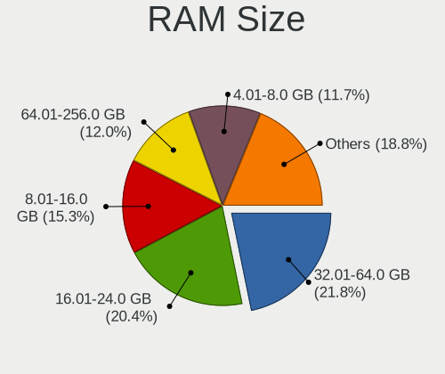
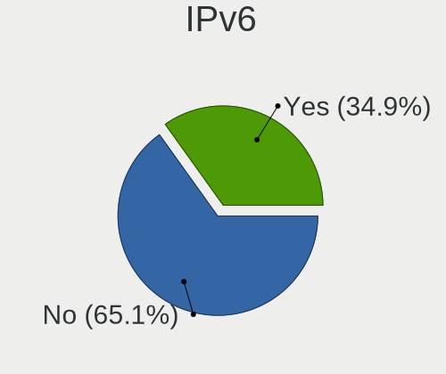
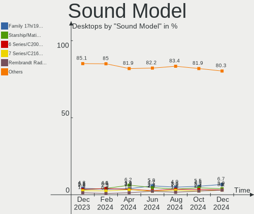
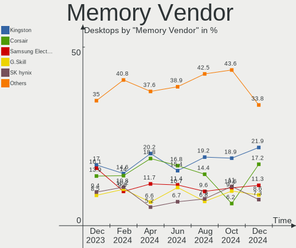

Ubuntu - Hardware Trends (Desktops)
-----------------------------------

A project to identify most popular hardware characteristics and track their change
over time based on data collected by Linux users at https://Linux-Hardware.org.

Anyone can contribute to this report by the [hw-probe](https://github.com/linuxhw/hw-probe) tool:

    sudo -E hw-probe -all -upload

This report is for one last month. Overall report since the beginning of time: [TestCoverage](https://github.com/linuxhw/TestCoverage)

Period: Jun, 2022.

Contents
--------

* [ System ](#system)
  - [ OS                       ](#os)
  - [ OS Family                ](#os-family)
  - [ Kernel                   ](#kernel)
  - [ Kernel Family            ](#kernel-family)
  - [ Kernel Major Ver.        ](#kernel-major-ver)
  - [ Arch                     ](#arch)
  - [ DE                       ](#de)
  - [ Display Server           ](#display-server)
  - [ Display Manager          ](#display-manager)
  - [ OS Lang                  ](#os-lang)
  - [ Boot Mode                ](#boot-mode)
  - [ Filesystem               ](#filesystem)
  - [ Part. scheme             ](#part-scheme)
  - [ Dual Boot with Linux/BSD ](#dual-boot-with-linuxbsd)
  - [ Dual Boot (Win)          ](#dual-boot-win)

* [ Board ](#board)
  - [ Vendor                   ](#vendor)
  - [ Model                    ](#model)
  - [ Model Family             ](#model-family)
  - [ MFG Year                 ](#mfg-year)
  - [ Form Factor              ](#form-factor)
  - [ Secure Boot              ](#secure-boot)
  - [ Coreboot                 ](#coreboot)
  - [ RAM Size                 ](#ram-size)
  - [ RAM Used                 ](#ram-used)
  - [ Total Drives             ](#total-drives)
  - [ Has CD-ROM               ](#has-cd-rom)
  - [ Has Ethernet             ](#has-ethernet)
  - [ Has WiFi                 ](#has-wifi)
  - [ Has Bluetooth            ](#has-bluetooth)

* [ Location ](#location)
  - [ Country                  ](#country)
  - [ City                     ](#city)

* [ Drives ](#drives)
  - [ Drive Vendor             ](#drive-vendor)
  - [ Drive Model              ](#drive-model)
  - [ HDD Vendor               ](#hdd-vendor)
  - [ SSD Vendor               ](#ssd-vendor)
  - [ Drive Kind               ](#drive-kind)
  - [ Drive Connector          ](#drive-connector)
  - [ Drive Size               ](#drive-size)
  - [ Space Total              ](#space-total)
  - [ Space Used               ](#space-used)
  - [ Malfunc. Drives          ](#malfunc-drives)
  - [ Malfunc. Drive Vendor    ](#malfunc-drive-vendor)
  - [ Malfunc. HDD Vendor      ](#malfunc-hdd-vendor)
  - [ Malfunc. Drive Kind      ](#malfunc-drive-kind)
  - [ Failed Drives            ](#failed-drives)
  - [ Failed Drive Vendor      ](#failed-drive-vendor)
  - [ Drive Status             ](#drive-status)

* [ Storage controller ](#storage-controller)
  - [ Storage Vendor           ](#storage-vendor)
  - [ Storage Model            ](#storage-model)
  - [ Storage Kind             ](#storage-kind)

* [ Processor ](#processor)
  - [ CPU Vendor               ](#cpu-vendor)
  - [ CPU Model                ](#cpu-model)
  - [ CPU Model Family         ](#cpu-model-family)
  - [ CPU Cores                ](#cpu-cores)
  - [ CPU Sockets              ](#cpu-sockets)
  - [ CPU Threads              ](#cpu-threads)
  - [ CPU Op-Modes             ](#cpu-op-modes)
  - [ CPU Microcode            ](#cpu-microcode)
  - [ CPU Microarch            ](#cpu-microarch)

* [ Graphics ](#graphics)
  - [ GPU Vendor               ](#gpu-vendor)
  - [ GPU Model                ](#gpu-model)
  - [ GPU Combo                ](#gpu-combo)
  - [ GPU Driver               ](#gpu-driver)
  - [ GPU Memory               ](#gpu-memory)

* [ Monitor ](#monitor)
  - [ Monitor Vendor           ](#monitor-vendor)
  - [ Monitor Model            ](#monitor-model)
  - [ Monitor Resolution       ](#monitor-resolution)
  - [ Monitor Diagonal         ](#monitor-diagonal)
  - [ Monitor Width            ](#monitor-width)
  - [ Aspect Ratio             ](#aspect-ratio)
  - [ Monitor Area             ](#monitor-area)
  - [ Pixel Density            ](#pixel-density)
  - [ Multiple Monitors        ](#multiple-monitors)

* [ Network ](#network)
  - [ Net Controller Vendor    ](#net-controller-vendor)
  - [ Net Controller Model     ](#net-controller-model)
  - [ Wireless Vendor          ](#wireless-vendor)
  - [ Wireless Model           ](#wireless-model)
  - [ Ethernet Vendor          ](#ethernet-vendor)
  - [ Ethernet Model           ](#ethernet-model)
  - [ Net Controller Kind      ](#net-controller-kind)
  - [ Used Controller          ](#used-controller)
  - [ NICs                     ](#nics)
  - [ IPv6                     ](#ipv6)

* [ Bluetooth ](#bluetooth)
  - [ Bluetooth Vendor         ](#bluetooth-vendor)
  - [ Bluetooth Model          ](#bluetooth-model)

* [ Sound ](#sound)
  - [ Sound Vendor             ](#sound-vendor)
  - [ Sound Model              ](#sound-model)

* [ Memory ](#memory)
  - [ Memory Vendor            ](#memory-vendor)
  - [ Memory Model             ](#memory-model)
  - [ Memory Kind              ](#memory-kind)
  - [ Memory Form Factor       ](#memory-form-factor)
  - [ Memory Size              ](#memory-size)
  - [ Memory Speed             ](#memory-speed)

* [ Printers & scanners ](#printers--scanners)
  - [ Printer Vendor           ](#printer-vendor)
  - [ Printer Model            ](#printer-model)
  - [ Scanner Vendor           ](#scanner-vendor)
  - [ Scanner Model            ](#scanner-model)

* [ Camera ](#camera)
  - [ Camera Vendor            ](#camera-vendor)
  - [ Camera Model             ](#camera-model)

* [ Security ](#security)
  - [ Fingerprint Vendor       ](#fingerprint-vendor)
  - [ Fingerprint Model        ](#fingerprint-model)
  - [ Chipcard Vendor          ](#chipcard-vendor)
  - [ Chipcard Model           ](#chipcard-model)

* [ Unsupported ](#unsupported)
  - [ Unsupported Devices      ](#unsupported-devices)
  - [ Unsupported Device Types ](#unsupported-device-types)

System
------

OS
--

Installed operating systems

| Name         | Desktops | Percent |
|--------------|----------|---------|
| Ubuntu 22.04 | 204      | 54.99%  |
| Ubuntu 20.04 | 139      | 37.47%  |
| Ubuntu 18.04 | 16       | 4.31%   |
| Ubuntu 21.10 | 8        | 2.16%   |
| Ubuntu 22.10 | 1        | 0.27%   |
| Ubuntu 21.12 | 1        | 0.27%   |
| Ubuntu 21.04 | 1        | 0.27%   |
| Ubuntu 16.04 | 1        | 0.27%   |

OS Family
---------

OS without a version

| Name   | Desktops | Percent |
|--------|----------|---------|
| Ubuntu | 371      | 100%    |

Kernel
------

Version of the Linux kernel

| Version                     | Desktops | Percent |
|-----------------------------|----------|---------|
| 5.15.0-35-generic           | 42       | 11.32%  |
| 5.15.0-37-generic           | 41       | 11.05%  |
| 5.15.0-39-generic           | 39       | 10.51%  |
| 5.13.0-44-generic           | 32       | 8.63%   |
| 5.13.0-51-generic           | 28       | 7.55%   |
| 5.15.0-40-generic           | 27       | 7.28%   |
| 5.15.0-33-generic           | 27       | 7.28%   |
| 5.13.0-48-generic           | 19       | 5.12%   |
| 5.15.0-25-generic           | 15       | 4.04%   |
| 5.4.0-117-generic           | 14       | 3.77%   |
| 5.4.0-121-generic           | 8        | 2.16%   |
| 5.4.0-120-generic           | 7        | 1.89%   |
| 5.4.0-113-generic           | 6        | 1.62%   |
| 5.15.0-27-generic           | 3        | 0.81%   |
| 5.13.0-40-generic           | 3        | 0.81%   |
| 5.13.0-30-generic           | 3        | 0.81%   |
| 5.11.0-43-generic           | 3        | 0.81%   |
| 4.15.0-188-generic          | 3        | 0.81%   |
| 5.18.3-051803-generic       | 2        | 0.54%   |
| 5.15.0-30-generic           | 2        | 0.54%   |
| 5.13.0-52-generic           | 2        | 0.54%   |
| 5.11.0-38-generic           | 2        | 0.54%   |
| 5.8.0-55-generic            | 1        | 0.27%   |
| 5.8.0-43-generic            | 1        | 0.27%   |
| 5.4.0-94-generic            | 1        | 0.27%   |
| 5.4.0-54-generic            | 1        | 0.27%   |
| 5.4.0-42-generic            | 1        | 0.27%   |
| 5.4.0-113-lowlatency        | 1        | 0.27%   |
| 5.4.0-110-generic           | 1        | 0.27%   |
| 5.18.6-051806-generic       | 1        | 0.27%   |
| 5.18.1-tkg-pds              | 1        | 0.27%   |
| 5.17.9-051709-generic       | 1        | 0.27%   |
| 5.17.7-051707-generic       | 1        | 0.27%   |
| 5.17.5-76051705-generic     | 1        | 0.27%   |
| 5.17.14-void31-nomac-znver3 | 1        | 0.27%   |
| 5.17.0-14.1-liquorix-amd64  | 1        | 0.27%   |
| 5.17.0-1006-oem             | 1        | 0.27%   |
| 5.15.13-051513-generic      | 1        | 0.27%   |
| 5.15.0-37-lowlatency        | 1        | 0.27%   |
| 5.15.0-32-generic           | 1        | 0.27%   |
| 5.15.0-23-generic           | 1        | 0.27%   |
| 5.15.0-10037-tuxedo         | 1        | 0.27%   |
| 5.14.0-1042-oem             | 1        | 0.27%   |
| 5.13.0-46-generic           | 1        | 0.27%   |
| 5.13.0-41-generic           | 1        | 0.27%   |
| 5.13.0-39-generic           | 1        | 0.27%   |
| 5.13.0-35-generic           | 1        | 0.27%   |
| 5.13.0-28-generic           | 1        | 0.27%   |
| 5.13.0-21-generic           | 1        | 0.27%   |
| 5.13.0-19-generic           | 1        | 0.27%   |
| 5.11.0-49-generic           | 1        | 0.27%   |
| 5.11.0-44-generic           | 1        | 0.27%   |
| 5.11.0-37-generic           | 1        | 0.27%   |
| 5.11.0-36-generic           | 1        | 0.27%   |
| 5.11.0-31-generic           | 1        | 0.27%   |
| 5.11.0-25-generic           | 1        | 0.27%   |
| 5.11.0-051100rc4-generic    | 1        | 0.27%   |
| 4.15.0-29-generic           | 1        | 0.27%   |
| 4.15.0-187-generic          | 1        | 0.27%   |
| 4.15.0-184-generic          | 1        | 0.27%   |

Kernel Family
-------------

Linux kernel without a distro release

| Version | Desktops | Percent |
|---------|----------|---------|
| 5.15.0  | 200      | 53.91%  |
| 5.13.0  | 94       | 25.34%  |
| 5.4.0   | 40       | 10.78%  |
| 5.11.0  | 12       | 3.23%   |
| 4.15.0  | 11       | 2.96%   |
| 5.8.0   | 2        | 0.54%   |
| 5.18.3  | 2        | 0.54%   |
| 5.17.0  | 2        | 0.54%   |
| 5.18.6  | 1        | 0.27%   |
| 5.18.1  | 1        | 0.27%   |
| 5.17.9  | 1        | 0.27%   |
| 5.17.7  | 1        | 0.27%   |
| 5.17.5  | 1        | 0.27%   |
| 5.17.14 | 1        | 0.27%   |
| 5.15.13 | 1        | 0.27%   |
| 5.14.0  | 1        | 0.27%   |

Kernel Major Ver.
-----------------

Linux kernel major version

| Version | Desktops | Percent |
|---------|----------|---------|
| 5.15    | 201      | 54.18%  |
| 5.13    | 94       | 25.34%  |
| 5.4     | 40       | 10.78%  |
| 5.11    | 12       | 3.23%   |
| 4.15    | 11       | 2.96%   |
| 5.17    | 6        | 1.62%   |
| 5.18    | 4        | 1.08%   |
| 5.8     | 2        | 0.54%   |
| 5.14    | 1        | 0.27%   |

Arch
----

OS architecture (x86_64, i586, etc.)

| Name   | Desktops | Percent |
|--------|----------|---------|
| x86_64 | 367      | 98.92%  |
| i686   | 4        | 1.08%   |

DE
--

Desktop Environment

| Name            | Desktops | Percent |
|-----------------|----------|---------|
| GNOME           | 336      | 90.57%  |
| Unknown         | 24       | 6.47%   |
| Unity           | 4        | 1.08%   |
| GNOME Classic   | 4        | 1.08%   |
| X-Cinnamon      | 2        | 0.54%   |
| GNOME Flashback | 1        | 0.27%   |

Display Server
--------------

X11 or Wayland

| Name    | Desktops | Percent |
|---------|----------|---------|
| X11     | 222      | 59.84%  |
| Wayland | 125      | 33.69%  |
| Tty     | 12       | 3.23%   |
| Unknown | 12       | 3.23%   |

Display Manager
---------------

SDDM, LightDM, etc.

| Name    | Desktops | Percent |
|---------|----------|---------|
| GDM3    | 288      | 77.63%  |
| GDM     | 38       | 10.24%  |
| Unknown | 36       | 9.7%    |
| LightDM | 7        | 1.89%   |
| SLiM    | 1        | 0.27%   |
| SDDM    | 1        | 0.27%   |

OS Lang
-------

Language

| Lang        | Desktops | Percent |
|-------------|----------|---------|
| en_US       | 159      | 42.86%  |
| de_DE       | 39       | 10.51%  |
| fr_FR       | 37       | 9.97%   |
| ru_RU       | 18       | 4.85%   |
| pt_BR       | 11       | 2.96%   |
| en_GB       | 11       | 2.96%   |
| es_ES       | 9        | 2.43%   |
| nl_NL       | 8        | 2.16%   |
| it_IT       | 7        | 1.89%   |
| en_AU       | 7        | 1.89%   |
| C           | 7        | 1.89%   |
| pl_PL       | 6        | 1.62%   |
| en_IN       | 5        | 1.35%   |
| sv_SE       | 4        | 1.08%   |
| ja_JP       | 4        | 1.08%   |
| es_MX       | 4        | 1.08%   |
| zh_CN       | 3        | 0.81%   |
| hu_HU       | 3        | 0.81%   |
| en_ZA       | 3        | 0.81%   |
| en_CA       | 3        | 0.81%   |
| pt_PT       | 2        | 0.54%   |
| fr_BE       | 2        | 0.54%   |
| en_NZ       | 2        | 0.54%   |
| cs_CZ       | 2        | 0.54%   |
| tr_TR       | 1        | 0.27%   |
| fr_CH       | 1        | 0.27%   |
| es_VE       | 1        | 0.27%   |
| es_UY       | 1        | 0.27%   |
| es_NI       | 1        | 0.27%   |
| es_EC       | 1        | 0.27%   |
| es_CL       | 1        | 0.27%   |
| es_AR       | 1        | 0.27%   |
| en_US.UTF.8 | 1        | 0.27%   |
| en_PH       | 1        | 0.27%   |
| el_GR       | 1        | 0.27%   |
| de_CH       | 1        | 0.27%   |
| de_AT       | 1        | 0.27%   |
| da_DK       | 1        | 0.27%   |
| Unknown     | 1        | 0.27%   |

Boot Mode
---------

EFI or BIOS

| Mode | Desktops | Percent |
|------|----------|---------|
| BIOS | 229      | 61.73%  |
| EFI  | 142      | 38.27%  |

Filesystem
----------

Type of filesystem

| Type    | Desktops | Percent |
|---------|----------|---------|
| Ext4    | 350      | 94.34%  |
| Overlay | 7        | 1.89%   |
| Btrfs   | 7        | 1.89%   |
| Zfs     | 5        | 1.35%   |
| Xfs     | 1        | 0.27%   |
| Ext2    | 1        | 0.27%   |

Part. scheme
------------

Scheme of partitioning

| Type    | Desktops | Percent |
|---------|----------|---------|
| Unknown | 238      | 64.15%  |
| GPT     | 121      | 32.61%  |
| MBR     | 12       | 3.23%   |

Dual Boot with Linux/BSD
------------------------

Hosting more than one Linux/BSD

| Dual boot | Desktops | Percent |
|-----------|----------|---------|
| No        | 300      | 80.86%  |
| Yes       | 71       | 19.14%  |

Dual Boot (Win)
---------------

Hosting Linux and Windows

| Dual boot | Desktops | Percent |
|-----------|----------|---------|
| No        | 214      | 57.68%  |
| Yes       | 157      | 42.32%  |

Board
-----

Vendor
------

Motherboard manufacturer

| Name                | Desktops | Percent |
|---------------------|----------|---------|
| ASUSTek Computer    | 88       | 23.72%  |
| MSI                 | 60       | 16.17%  |
| Gigabyte Technology | 53       | 14.29%  |
| Dell                | 44       | 11.86%  |
| Hewlett-Packard     | 30       | 8.09%   |
| Lenovo              | 16       | 4.31%   |
| ASRock              | 14       | 3.77%   |
| Intel               | 11       | 2.96%   |
| Unknown             | 10       | 2.7%    |
| Acer                | 9        | 2.43%   |
| Biostar             | 6        | 1.62%   |
| Foxconn             | 5        | 1.35%   |
| Alienware           | 5        | 1.35%   |
| Medion              | 4        | 1.08%   |
| Supermicro          | 2        | 0.54%   |
| Shuttle             | 2        | 0.54%   |
| Fujitsu             | 2        | 0.54%   |
| Wearnes             | 1        | 0.27%   |
| Protectli           | 1        | 0.27%   |
| Pegatron            | 1        | 0.27%   |
| PCWare              | 1        | 0.27%   |
| Nvidia              | 1        | 0.27%   |
| ITI LIMITED         | 1        | 0.27%   |
| EVGA                | 1        | 0.27%   |
| Apple               | 1        | 0.27%   |
| AFOX                | 1        | 0.27%   |
| Acidanthera         | 1        | 0.27%   |

Model
-----

Motherboard model

| Name                                   | Desktops | Percent |
|----------------------------------------|----------|---------|
| ASUS All Series                        | 13       | 3.5%    |
| MSI MS-7721                            | 10       | 2.7%    |
| Unknown                                | 10       | 2.7%    |
| MSI MS-7817                            | 4        | 1.08%   |
| Dell OptiPlex 7010                     | 4        | 1.08%   |
| ASUS PRIME A320M-K                     | 4        | 1.08%   |
| Dell Precision Tower 5810              | 3        | 0.81%   |
| Dell OptiPlex 9020                     | 3        | 0.81%   |
| Dell OptiPlex 7040                     | 3        | 0.81%   |
| ASUS M5A97 R2.0                        | 3        | 0.81%   |
| MSI MS-7D16                            | 2        | 0.54%   |
| MSI MS-7C52                            | 2        | 0.54%   |
| MSI MS-7C51                            | 2        | 0.54%   |
| MSI MS-7B84                            | 2        | 0.54%   |
| MSI MS-7788                            | 2        | 0.54%   |
| MSI MS-7740                            | 2        | 0.54%   |
| Lenovo ThinkCentre M73 10AXS1UY00      | 2        | 0.54%   |
| HP Z400 Workstation                    | 2        | 0.54%   |
| HP EliteDesk 800 G1 SFF                | 2        | 0.54%   |
| HP Compaq dc7900 Convertible Minitower | 2        | 0.54%   |
| Gigabyte Z87X-UD3H                     | 2        | 0.54%   |
| Gigabyte GA-MA790FXT-UD5P              | 2        | 0.54%   |
| Gigabyte F2A55M-HD2                    | 2        | 0.54%   |
| Gigabyte 970A-DS3P                     | 2        | 0.54%   |
| Dell OptiPlex 9010                     | 2        | 0.54%   |
| Dell OptiPlex 790                      | 2        | 0.54%   |
| Dell OptiPlex 745                      | 2        | 0.54%   |
| Dell OptiPlex 7050                     | 2        | 0.54%   |
| Dell OptiPlex 3010                     | 2        | 0.54%   |
| ASUS ROG STRIX X570-E GAMING           | 2        | 0.54%   |
| ASUS PRIME X570-P                      | 2        | 0.54%   |
| ASUS P8Z68-V LX                        | 2        | 0.54%   |
| ASUS P8H67-M LE                        | 2        | 0.54%   |
| ASUS P8B75-M LE                        | 2        | 0.54%   |
| ASUS CROSSHAIR VI HERO                 | 2        | 0.54%   |
| ASUS CROSSHAIR V FORMULA-Z             | 2        | 0.54%   |
| Wearnes POS T-1550                     | 1        | 0.27%   |
| Supermicro X10SBA-L                    | 1        | 0.27%   |
| Supermicro SSG-2027B-DE2R24L           | 1        | 0.27%   |
| Shuttle DS61                           | 1        | 0.27%   |
| Shuttle DS10U                          | 1        | 0.27%   |
| Protectli FW6                          | 1        | 0.27%   |
| Pegatron 520-1030uk                    | 1        | 0.27%   |
| PCWare IPMH61R1                        | 1        | 0.27%   |
| Nvidia MCP73                           | 1        | 0.27%   |
| MSI Z390 Prestige P100 (MS-B929)       | 1        | 0.27%   |
| MSI p6730br                            | 1        | 0.27%   |
| MSI NQ890AA-ABZ CQ5011IT               | 1        | 0.27%   |
| MSI MS-7D53                            | 1        | 0.27%   |
| MSI MS-7D28                            | 1        | 0.27%   |
| MSI MS-7D25                            | 1        | 0.27%   |
| MSI MS-7D15                            | 1        | 0.27%   |
| MSI MS-7D09                            | 1        | 0.27%   |
| MSI MS-7C95                            | 1        | 0.27%   |
| MSI MS-7C94                            | 1        | 0.27%   |
| MSI MS-7C92                            | 1        | 0.27%   |
| MSI MS-7C88                            | 1        | 0.27%   |
| MSI MS-7C71                            | 1        | 0.27%   |
| MSI MS-7C09                            | 1        | 0.27%   |
| MSI MS-7C02                            | 1        | 0.27%   |

Model Family
------------

Motherboard model prefix

| Name                         | Desktops | Percent |
|------------------------------|----------|---------|
| Dell OptiPlex                | 26       | 7.01%   |
| ASUS PRIME                   | 14       | 3.77%   |
| ASUS All                     | 13       | 3.5%    |
| Lenovo ThinkCentre           | 11       | 2.96%   |
| MSI MS-7721                  | 10       | 2.7%    |
| Unknown                      | 10       | 2.7%    |
| HP Compaq                    | 8        | 2.16%   |
| Dell Precision               | 8        | 2.16%   |
| ASUS ROG                     | 8        | 2.16%   |
| ASUS TUF                     | 6        | 1.62%   |
| Acer Aspire                  | 5        | 1.35%   |
| MSI MS-7817                  | 4        | 1.08%   |
| HP EliteDesk                 | 4        | 1.08%   |
| Dell Inspiron                | 4        | 1.08%   |
| ASUS M5A97                   | 4        | 1.08%   |
| ASUS CROSSHAIR               | 4        | 1.08%   |
| Alienware Aurora             | 4        | 1.08%   |
| HP Pavilion                  | 3        | 0.81%   |
| Gigabyte Z690                | 3        | 0.81%   |
| Gigabyte B450M               | 3        | 0.81%   |
| Gigabyte 970A-DS3P           | 3        | 0.81%   |
| Dell Vostro                  | 3        | 0.81%   |
| ASUS Pro                     | 3        | 0.81%   |
| ASUS P8Z68-V                 | 3        | 0.81%   |
| Acer Veriton                 | 3        | 0.81%   |
| MSI MS-7D16                  | 2        | 0.54%   |
| MSI MS-7C52                  | 2        | 0.54%   |
| MSI MS-7C51                  | 2        | 0.54%   |
| MSI MS-7B84                  | 2        | 0.54%   |
| MSI MS-7788                  | 2        | 0.54%   |
| MSI MS-7740                  | 2        | 0.54%   |
| Lenovo ThinkStation          | 2        | 0.54%   |
| Intel X79                    | 2        | 0.54%   |
| HP Z400                      | 2        | 0.54%   |
| Gigabyte Z87X-UD3H           | 2        | 0.54%   |
| Gigabyte Z390                | 2        | 0.54%   |
| Gigabyte X570                | 2        | 0.54%   |
| Gigabyte GA-MA790FXT-UD5P    | 2        | 0.54%   |
| Gigabyte F2A55M-HD2          | 2        | 0.54%   |
| Fujitsu ESPRIMO              | 2        | 0.54%   |
| Dell XPS                     | 2        | 0.54%   |
| ASUS P8H67-M                 | 2        | 0.54%   |
| ASUS P8B75-M                 | 2        | 0.54%   |
| ASUS P6T                     | 2        | 0.54%   |
| ASUS M5A99X                  | 2        | 0.54%   |
| Wearnes POS                  | 1        | 0.27%   |
| Supermicro X10SBA-L          | 1        | 0.27%   |
| Supermicro SSG-2027B-DE2R24L | 1        | 0.27%   |
| Shuttle DS61                 | 1        | 0.27%   |
| Shuttle DS10U                | 1        | 0.27%   |
| Protectli FW6                | 1        | 0.27%   |
| Pegatron 520-1030uk          | 1        | 0.27%   |
| PCWare IPMH61R1              | 1        | 0.27%   |
| Nvidia MCP73                 | 1        | 0.27%   |
| MSI Z390                     | 1        | 0.27%   |
| MSI p6730br                  | 1        | 0.27%   |
| MSI NQ890AA-ABZ              | 1        | 0.27%   |
| MSI MS-7D53                  | 1        | 0.27%   |
| MSI MS-7D28                  | 1        | 0.27%   |
| MSI MS-7D25                  | 1        | 0.27%   |

MFG Year
--------

Motherboard manufacture year

| Year | Desktops | Percent |
|------|----------|---------|
| 2013 | 40       | 10.78%  |
| 2012 | 37       | 9.97%   |
| 2021 | 36       | 9.7%    |
| 2014 | 30       | 8.09%   |
| 2011 | 30       | 8.09%   |
| 2020 | 26       | 7.01%   |
| 2018 | 25       | 6.74%   |
| 2019 | 24       | 6.47%   |
| 2017 | 20       | 5.39%   |
| 2016 | 20       | 5.39%   |
| 2015 | 19       | 5.12%   |
| 2008 | 19       | 5.12%   |
| 2010 | 14       | 3.77%   |
| 2009 | 12       | 3.23%   |
| 2022 | 9        | 2.43%   |
| 2007 | 6        | 1.62%   |
| 2006 | 3        | 0.81%   |
| 2005 | 1        | 0.27%   |

Form Factor
-----------

Physical design of the computer

| Name    | Desktops | Percent |
|---------|----------|---------|
| Desktop | 371      | 100%    |

Secure Boot
-----------

Enabled or disabled

| State    | Desktops | Percent |
|----------|----------|---------|
| Disabled | 348      | 93.8%   |
| Enabled  | 23       | 6.2%    |

Coreboot
--------

Have coreboot on board

| Used | Desktops | Percent |
|------|----------|---------|
| No   | 371      | 100%    |

RAM Size
--------

Total RAM memory

| Size in GB      | Desktops | Percent |
|-----------------|----------|---------|
| 16.01-24.0      | 97       | 26.15%  |
| 4.01-8.0        | 72       | 19.41%  |
| 8.01-16.0       | 56       | 15.09%  |
| 32.01-64.0      | 53       | 14.29%  |
| 3.01-4.0        | 49       | 13.21%  |
| 64.01-256.0     | 19       | 5.12%   |
| 24.01-32.0      | 11       | 2.96%   |
| 1.01-2.0        | 7        | 1.89%   |
| 2.01-3.0        | 5        | 1.35%   |
| More than 256.0 | 2        | 0.54%   |

RAM Used
--------

Used RAM memory

| Used GB    | Desktops | Percent |
|------------|----------|---------|
| 1.01-2.0   | 142      | 38.27%  |
| 2.01-3.0   | 107      | 28.84%  |
| 4.01-8.0   | 48       | 12.94%  |
| 3.01-4.0   | 47       | 12.67%  |
| 8.01-16.0  | 16       | 4.31%   |
| 0.51-1.0   | 8        | 2.16%   |
| 0.01-0.5   | 2        | 0.54%   |
| 16.01-24.0 | 1        | 0.27%   |

Total Drives
------------

Number of drives on board

| Drives | Desktops | Percent |
|--------|----------|---------|
| 1      | 135      | 36.39%  |
| 2      | 118      | 31.81%  |
| 3      | 57       | 15.36%  |
| 4      | 28       | 7.55%   |
| 5      | 12       | 3.23%   |
| 6      | 5        | 1.35%   |
| 0      | 5        | 1.35%   |
| 8      | 4        | 1.08%   |
| 7      | 4        | 1.08%   |
| 9      | 2        | 0.54%   |
| 10     | 1        | 0.27%   |

Has CD-ROM
----------

Has CD-ROM on board

| Presented | Desktops | Percent |
|-----------|----------|---------|
| No        | 203      | 54.72%  |
| Yes       | 168      | 45.28%  |

Has Ethernet
------------

Has Ethernet on board

| Presented | Desktops | Percent |
|-----------|----------|---------|
| Yes       | 368      | 99.19%  |
| No        | 3        | 0.81%   |

Has WiFi
--------

Has WiFi module

| Presented | Desktops | Percent |
|-----------|----------|---------|
| No        | 210      | 56.6%   |
| Yes       | 161      | 43.4%   |

Has Bluetooth
-------------

Has Bluetooth module

| Presented | Desktops | Percent |
|-----------|----------|---------|
| No        | 245      | 66.04%  |
| Yes       | 126      | 33.96%  |

Location
--------

Country
-------

Geographic location (country)

| Country             | Desktops | Percent |
|---------------------|----------|---------|
| USA                 | 82       | 22.1%   |
| Russia              | 46       | 12.4%   |
| Germany             | 40       | 10.78%  |
| France              | 36       | 9.7%    |
| Brazil              | 19       | 5.12%   |
| Netherlands         | 11       | 2.96%   |
| UK                  | 10       | 2.7%    |
| Australia           | 9        | 2.43%   |
| Spain               | 7        | 1.89%   |
| Poland              | 7        | 1.89%   |
| Italy               | 7        | 1.89%   |
| Japan               | 6        | 1.62%   |
| Belgium             | 6        | 1.62%   |
| Switzerland         | 5        | 1.35%   |
| Mexico              | 5        | 1.35%   |
| India               | 5        | 1.35%   |
| Sweden              | 4        | 1.08%   |
| South Africa        | 4        | 1.08%   |
| Canada              | 4        | 1.08%   |
| Argentina           | 4        | 1.08%   |
| Thailand            | 3        | 0.81%   |
| Portugal            | 3        | 0.81%   |
| New Zealand         | 3        | 0.81%   |
| Hungary             | 3        | 0.81%   |
| Czechia             | 3        | 0.81%   |
| Taiwan              | 2        | 0.54%   |
| Pakistan            | 2        | 0.54%   |
| Malaysia            | 2        | 0.54%   |
| Kenya               | 2        | 0.54%   |
| Greece              | 2        | 0.54%   |
| Finland             | 2        | 0.54%   |
| Austria             | 2        | 0.54%   |
| Venezuela           | 1        | 0.27%   |
| UAE                 | 1        | 0.27%   |
| Turkey              | 1        | 0.27%   |
| Trinidad and Tobago | 1        | 0.27%   |
| South Korea         | 1        | 0.27%   |
| Slovenia            | 1        | 0.27%   |
| Serbia              | 1        | 0.27%   |
| Saudi Arabia        | 1        | 0.27%   |
| Philippines         | 1        | 0.27%   |
| Nicaragua           | 1        | 0.27%   |
| Latvia              | 1        | 0.27%   |
| Kazakhstan          | 1        | 0.27%   |
| Jordan              | 1        | 0.27%   |
| Indonesia           | 1        | 0.27%   |
| Haiti               | 1        | 0.27%   |
| Estonia             | 1        | 0.27%   |
| Ecuador             | 1        | 0.27%   |
| Denmark             | 1        | 0.27%   |
| Curaçao            | 1        | 0.27%   |
| China               | 1        | 0.27%   |
| Chile               | 1        | 0.27%   |
| Cameroon            | 1        | 0.27%   |
| Bulgaria            | 1        | 0.27%   |
| Bangladesh          | 1        | 0.27%   |
| Algeria             | 1        | 0.27%   |

City
----

Geographic location (city)

| City               | Desktops | Percent |
|--------------------|----------|---------|
| Cheboksary         | 23       | 6.2%    |
| Sydney             | 5        | 1.35%   |
| Moscow             | 4        | 1.08%   |
| Stuttgart          | 3        | 0.81%   |
| St Petersburg      | 3        | 0.81%   |
| Paris              | 3        | 0.81%   |
| Novosibirsk        | 3        | 0.81%   |
| Manchester         | 3        | 0.81%   |
| Jacksonville       | 3        | 0.81%   |
| Gul'kevichi        | 3        | 0.81%   |
| Brussels           | 3        | 0.81%   |
| Warsaw             | 2        | 0.54%   |
| Vitória           | 2        | 0.54%   |
| Vienna             | 2        | 0.54%   |
| Vannes             | 2        | 0.54%   |
| San Jose           | 2        | 0.54%   |
| Redwood City       | 2        | 0.54%   |
| Prague             | 2        | 0.54%   |
| Porto Velho        | 2        | 0.54%   |
| Osaka              | 2        | 0.54%   |
| Orlando            | 2        | 0.54%   |
| Oaxaca City        | 2        | 0.54%   |
| Nantes             | 2        | 0.54%   |
| Nairobi            | 2        | 0.54%   |
| Miami              | 2        | 0.54%   |
| Lille              | 2        | 0.54%   |
| Krasnoyarsk        | 2        | 0.54%   |
| Houston            | 2        | 0.54%   |
| Helsinki           | 2        | 0.54%   |
| Hamburg            | 2        | 0.54%   |
| Guarulhos          | 2        | 0.54%   |
| Duluth             | 2        | 0.54%   |
| Duisburg           | 2        | 0.54%   |
| Dallas             | 2        | 0.54%   |
| Chicago            | 2        | 0.54%   |
| Chennai            | 2        | 0.54%   |
| Cape Town          | 2        | 0.54%   |
| Buenos Aires       | 2        | 0.54%   |
| Budapest           | 2        | 0.54%   |
| Buda               | 2        | 0.54%   |
| Brisbane           | 2        | 0.54%   |
| Bangkok            | 2        | 0.54%   |
| Auckland           | 2        | 0.54%   |
| Amsterdam          | 2        | 0.54%   |
| Zurich             | 1        | 0.27%   |
| Ypres              | 1        | 0.27%   |
| Yokohama           | 1        | 0.27%   |
| Yaroslavl          | 1        | 0.27%   |
| Yaoundé           | 1        | 0.27%   |
| Würzburg          | 1        | 0.27%   |
| Wuhan              | 1        | 0.27%   |
| Wroclaw            | 1        | 0.27%   |
| Windsor            | 1        | 0.27%   |
| Willemstad         | 1        | 0.27%   |
| Wijk bij Duurstede | 1        | 0.27%   |
| Wiesbaden          | 1        | 0.27%   |
| Wetherby           | 1        | 0.27%   |
| Waverly            | 1        | 0.27%   |
| Walker             | 1        | 0.27%   |
| Waldkraiburg       | 1        | 0.27%   |

Drives
------

Drive Vendor
------------

Hard drive vendors

| Vendor                       | Desktops | Drives | Percent |
|------------------------------|----------|--------|---------|
| Seagate                      | 125      | 162    | 19.08%  |
| WDC                          | 123      | 180    | 18.78%  |
| Samsung Electronics          | 89       | 120    | 13.59%  |
| Toshiba                      | 60       | 81     | 9.16%   |
| Kingston                     | 37       | 42     | 5.65%   |
| Hitachi                      | 27       | 29     | 4.12%   |
| SanDisk                      | 24       | 27     | 3.66%   |
| Crucial                      | 20       | 24     | 3.05%   |
| A-DATA Technology            | 12       | 12     | 1.83%   |
| Intel                        | 10       | 16     | 1.53%   |
| Unknown                      | 8        | 8      | 1.22%   |
| PNY                          | 7        | 7      | 1.07%   |
| Phison                       | 7        | 7      | 1.07%   |
| OCZ                          | 6        | 6      | 0.92%   |
| SK hynix                     | 5        | 5      | 0.76%   |
| Maxtor                       | 5        | 5      | 0.76%   |
| Goodram                      | 5        | 6      | 0.76%   |
| China                        | 5        | 6      | 0.76%   |
| Unknown                      | 5        | 5      | 0.76%   |
| SPCC                         | 4        | 4      | 0.61%   |
| Silicon Motion               | 4        | 5      | 0.61%   |
| Intenso                      | 4        | 4      | 0.61%   |
| Transcend                    | 3        | 3      | 0.46%   |
| Team                         | 3        | 6      | 0.46%   |
| Realtek Semiconductor        | 3        | 3      | 0.46%   |
| Plextor                      | 3        | 3      | 0.46%   |
| KIOXIA                       | 3        | 3      | 0.46%   |
| XPG                          | 2        | 2      | 0.31%   |
| Patriot                      | 2        | 2      | 0.31%   |
| Micron/Crucial Technology    | 2        | 3      | 0.31%   |
| Lexar                        | 2        | 2      | 0.31%   |
| KingSpec                     | 2        | 2      | 0.31%   |
| KingDian                     | 2        | 2      | 0.31%   |
| JMicron Technology           | 2        | 2      | 0.31%   |
| Fujitsu                      | 2        | 2      | 0.31%   |
| Corsair                      | 2        | 2      | 0.31%   |
| WDC WDS1                     | 1        | 1      | 0.15%   |
| TO Exter                     | 1        | 1      | 0.15%   |
| StoreJet                     | 1        | 1      | 0.15%   |
| SMI                          | 1        | 1      | 0.15%   |
| Shenzhen Longsys Electronics | 1        | 1      | 0.15%   |
| Sagemcom                     | 1        | 1      | 0.15%   |
| Protectli                    | 1        | 1      | 0.15%   |
| NV-2242A                     | 1        | 1      | 0.15%   |
| NGFF                         | 1        | 1      | 0.15%   |
| Micron Technology            | 1        | 1      | 0.15%   |
| LITEONIT                     | 1        | 1      | 0.15%   |
| LITEON                       | 1        | 1      | 0.15%   |
| Leven                        | 1        | 1      | 0.15%   |
| LDLC                         | 1        | 1      | 0.15%   |
| LaCie                        | 1        | 1      | 0.15%   |
| KLEVV                        | 1        | 1      | 0.15%   |
| HS-SSD-E100                  | 1        | 1      | 0.15%   |
| HPT                          | 1        | 3      | 0.15%   |
| HGST                         | 1        | 1      | 0.15%   |
| Hewlett-Packard              | 1        | 1      | 0.15%   |
| Green House                  | 1        | 1      | 0.15%   |
| Gigabyte Technology          | 1        | 1      | 0.15%   |
| EYOTA                        | 1        | 1      | 0.15%   |
| Dogfish                      | 1        | 1      | 0.15%   |

Drive Model
-----------

Hard drive models

| Model                                  | Desktops | Percent |
|----------------------------------------|----------|---------|
| Toshiba VT180 240GB SSD                | 23       | 2.95%   |
| Toshiba DT01ACA050 500GB               | 13       | 1.67%   |
| Toshiba DT01ACA100 1TB                 | 10       | 1.28%   |
| Seagate ST500DM002-1BD142 500GB        | 9        | 1.15%   |
| Samsung SSD 850 EVO 250GB              | 8        | 1.03%   |
| Unknown SD/MMC/MS PRO 128GB            | 7        | 0.9%    |
| Seagate ST2000DM008-2FR102 2TB         | 7        | 0.9%    |
| Seagate ST2000DM001-1ER164 2TB         | 7        | 0.9%    |
| WDC WD10EZEX-08WN4A0 1TB               | 6        | 0.77%   |
| Toshiba DT01ACA200 2TB                 | 6        | 0.77%   |
| Seagate ST3500418AS 500GB              | 6        | 0.77%   |
| SanDisk NVMe SSD Drive 1TB             | 6        | 0.77%   |
| Samsung SSD 850 EVO 500GB              | 6        | 0.77%   |
| Kingston SA400S37240G 240GB SSD        | 6        | 0.77%   |
| Toshiba HDWD110 1TB                    | 5        | 0.64%   |
| Seagate ST1000DM003-1SB102 1TB         | 5        | 0.64%   |
| Seagate Expansion 1TB                  | 5        | 0.64%   |
| Samsung NVMe SSD Drive 1TB             | 5        | 0.64%   |
| Kingston SV300S37A120G 120GB SSD       | 5        | 0.64%   |
| Unknown                                | 5        | 0.64%   |
| WDC WD10EARS-00Y5B1 1TB                | 4        | 0.51%   |
| Seagate ST4000DM004-2CV104 4TB         | 4        | 0.51%   |
| Seagate ST1000DM010-2EP102 1TB         | 4        | 0.51%   |
| Samsung SSD 980 PRO 1TB                | 4        | 0.51%   |
| Samsung SSD 860 EVO 250GB              | 4        | 0.51%   |
| Samsung HD501LJ 500GB                  | 4        | 0.51%   |
| Kingston SV300S37A240G 240GB SSD       | 4        | 0.51%   |
| Kingston SA400S37120G 120GB SSD        | 4        | 0.51%   |
| WDC WDS500G2B0A-00SM50 500GB SSD       | 3        | 0.38%   |
| WDC WDS240G2G0A-00JH30 240GB SSD       | 3        | 0.38%   |
| WDC WDS100T2B0A-00SM50 1TB SSD         | 3        | 0.38%   |
| WDC WD20EZAZ-00GGJB0 2TB               | 3        | 0.38%   |
| WDC WD20EARS-00MVWB0 2TB               | 3        | 0.38%   |
| Toshiba MQ01ABD100 1TB                 | 3        | 0.38%   |
| Seagate ST2000DM001-1CH164 2TB         | 3        | 0.38%   |
| Seagate ST1000LM049-2GH172 1TB         | 3        | 0.38%   |
| Seagate ST1000LM024 HN-M101MBB 1TB     | 3        | 0.38%   |
| Seagate ST1000DM003-1CH162 1TB         | 3        | 0.38%   |
| Seagate Expansion+ Desk 4TB            | 3        | 0.38%   |
| Samsung SSD 980 1TB                    | 3        | 0.38%   |
| Samsung SSD 970 EVO Plus 500GB         | 3        | 0.38%   |
| Samsung SSD 970 EVO Plus 1TB           | 3        | 0.38%   |
| Samsung SSD 870 QVO 1TB                | 3        | 0.38%   |
| Samsung SSD 860 EVO 500GB              | 3        | 0.38%   |
| Samsung SSD 840 EVO 120GB              | 3        | 0.38%   |
| Samsung SM963 2.5" NVMe PCIe SSD 500GB | 3        | 0.38%   |
| Samsung NVMe SSD Drive 512GB           | 3        | 0.38%   |
| PNY CS900 240GB SSD                    | 3        | 0.38%   |
| Kingston SA400S37480G 480GB SSD        | 3        | 0.38%   |
| Goodram SSDPR-CX400-512-G2 512GB       | 3        | 0.38%   |
| Crucial CT500MX500SSD1 500GB           | 3        | 0.38%   |
| A-DATA SU630 240GB SSD                 | 3        | 0.38%   |
| XPG GAMMIX S11 Pro 1TB                 | 2        | 0.26%   |
| WDC WD82PURZ-85TEUY0 8TB               | 2        | 0.26%   |
| WDC WD5000AZRX-00A8LB0 500GB           | 2        | 0.26%   |
| WDC WD5000AAKX-083CA1 500GB            | 2        | 0.26%   |
| WDC WD5000AAKX-001CA0 500GB            | 2        | 0.26%   |
| WDC WD5000AAKS-00UU3A0 500GB           | 2        | 0.26%   |
| WDC WD40EZRX-00SPEB0 4TB               | 2        | 0.26%   |
| WDC WD30EZRX-00DC0B0 3TB               | 2        | 0.26%   |

HDD Vendor
----------

Hard disk drive vendors

| Vendor              | Desktops | Drives | Percent |
|---------------------|----------|--------|---------|
| Seagate             | 124      | 160    | 35.84%  |
| WDC                 | 110      | 158    | 31.79%  |
| Toshiba             | 46       | 53     | 13.29%  |
| Hitachi             | 27       | 29     | 7.8%    |
| Samsung Electronics | 16       | 19     | 4.62%   |
| Unknown             | 8        | 8      | 2.31%   |
| Maxtor              | 5        | 5      | 1.45%   |
| JMicron Technology  | 2        | 2      | 0.58%   |
| Intenso             | 2        | 2      | 0.58%   |
| Fujitsu             | 2        | 2      | 0.58%   |
| HGST                | 1        | 1      | 0.29%   |
| Hewlett-Packard     | 1        | 1      | 0.29%   |
| DAS                 | 1        | 3      | 0.29%   |
| ASMT                | 1        | 2      | 0.29%   |

SSD Vendor
----------

Solid state drive vendors

| Vendor              | Desktops | Drives | Percent |
|---------------------|----------|--------|---------|
| Samsung Electronics | 46       | 58     | 19.33%  |
| Kingston            | 34       | 36     | 14.29%  |
| Toshiba             | 27       | 27     | 11.34%  |
| Crucial             | 20       | 24     | 8.4%    |
| SanDisk             | 17       | 18     | 7.14%   |
| WDC                 | 15       | 15     | 6.3%    |
| A-DATA Technology   | 11       | 11     | 4.62%   |
| PNY                 | 6        | 6      | 2.52%   |
| OCZ                 | 6        | 6      | 2.52%   |
| Goodram             | 5        | 6      | 2.1%    |
| China               | 5        | 6      | 2.1%    |
| SPCC                | 4        | 4      | 1.68%   |
| Intel               | 4        | 4      | 1.68%   |
| Transcend           | 3        | 3      | 1.26%   |
| Team                | 3        | 6      | 1.26%   |
| Plextor             | 3        | 3      | 1.26%   |
| Unknown             | 3        | 3      | 1.26%   |
| Patriot             | 2        | 2      | 0.84%   |
| Lexar               | 2        | 2      | 0.84%   |
| KingSpec            | 2        | 2      | 0.84%   |
| KingDian            | 2        | 2      | 0.84%   |
| WDC WDS1            | 1        | 1      | 0.42%   |
| TO Exter            | 1        | 1      | 0.42%   |
| StoreJet            | 1        | 1      | 0.42%   |
| SK hynix            | 1        | 1      | 0.42%   |
| Protectli           | 1        | 1      | 0.42%   |
| NGFF                | 1        | 1      | 0.42%   |
| Micron Technology   | 1        | 1      | 0.42%   |
| LITEONIT            | 1        | 1      | 0.42%   |
| LITEON              | 1        | 1      | 0.42%   |
| Leven               | 1        | 1      | 0.42%   |
| LDLC                | 1        | 1      | 0.42%   |
| KLEVV               | 1        | 1      | 0.42%   |
| Intenso             | 1        | 1      | 0.42%   |
| Green House         | 1        | 1      | 0.42%   |
| Gigabyte Technology | 1        | 1      | 0.42%   |
| Dogfish             | 1        | 1      | 0.42%   |
| Corsair             | 1        | 1      | 0.42%   |
| Apacer              | 1        | 1      | 0.42%   |

Drive Kind
----------

HDD or SSD

| Kind    | Desktops | Drives | Percent |
|---------|----------|--------|---------|
| HDD     | 258      | 445    | 46.99%  |
| SSD     | 195      | 262    | 35.52%  |
| NVMe    | 85       | 112    | 15.48%  |
| Unknown | 10       | 13     | 1.82%   |
| MMC     | 1        | 1      | 0.18%   |

Drive Connector
---------------

SATA, SAS, NVMe, etc.

| Type | Desktops | Drives | Percent |
|------|----------|--------|---------|
| SATA | 336      | 673    | 73.68%  |
| NVMe | 85       | 111    | 18.64%  |
| SAS  | 34       | 48     | 7.46%   |
| MMC  | 1        | 1      | 0.22%   |

Drive Size
----------

Size of hard drive

| Size in TB | Desktops | Drives | Percent |
|------------|----------|--------|---------|
| 0.01-0.5   | 250      | 367    | 50.1%   |
| 0.51-1.0   | 136      | 183    | 27.25%  |
| 1.01-2.0   | 71       | 96     | 14.23%  |
| 3.01-4.0   | 16       | 21     | 3.21%   |
| 4.01-10.0  | 15       | 26     | 3.01%   |
| 2.01-3.0   | 10       | 12     | 2%      |
| 10.01-20.0 | 1        | 2      | 0.2%    |

Space Total
-----------

Amount of disk space available on the file system

| Size in GB     | Desktops | Percent |
|----------------|----------|---------|
| 101-250        | 97       | 26.15%  |
| 251-500        | 75       | 20.22%  |
| 501-1000       | 63       | 16.98%  |
| More than 3000 | 41       | 11.05%  |
| 1001-2000      | 36       | 9.7%    |
| 2001-3000      | 20       | 5.39%   |
| 51-100         | 16       | 4.31%   |
| 1-20           | 13       | 3.5%    |
| 21-50          | 9        | 2.43%   |
| Unknown        | 1        | 0.27%   |

Space Used
----------

Amount of used disk space

| Used GB        | Desktops | Percent |
|----------------|----------|---------|
| 1-20           | 124      | 33.42%  |
| 21-50          | 53       | 14.29%  |
| 101-250        | 49       | 13.21%  |
| 51-100         | 44       | 11.86%  |
| 501-1000       | 28       | 7.55%   |
| 251-500        | 27       | 7.28%   |
| 1001-2000      | 19       | 5.12%   |
| 2001-3000      | 15       | 4.04%   |
| More than 3000 | 10       | 2.7%    |
| 0              | 1        | 0.27%   |
| Unknown        | 1        | 0.27%   |

Malfunc. Drives
---------------

Drive models with a malfunction

| Model                                            | Desktops | Drives | Percent |
|--------------------------------------------------|----------|--------|---------|
| WDC WD6002FZWX-00GBGB0 6TB                       | 1        | 1      | 2.78%   |
| WDC WD5000AAKB-00H8A0 500GB                      | 1        | 1      | 2.78%   |
| WDC WD40EFRX-68WT0N0 4TB                         | 1        | 2      | 2.78%   |
| WDC WD20EARS-00MVWB0 2TB                         | 1        | 1      | 2.78%   |
| WDC WD1600AAJS-75B4A0 160GB                      | 1        | 1      | 2.78%   |
| WDC WD10PURX-64D85Y0 1TB                         | 1        | 1      | 2.78%   |
| WDC WD10EZEX-00WN4A0 1TB                         | 1        | 1      | 2.78%   |
| WDC WD10EARS-00Y5B1 1TB                          | 1        | 1      | 2.78%   |
| Toshiba MK6465GSX 640GB                          | 1        | 1      | 2.78%   |
| Toshiba DT01ACA300 3TB                           | 1        | 1      | 2.78%   |
| Toshiba DT01ACA100 1TB                           | 1        | 1      | 2.78%   |
| Seagate ST8000DM004-2CX188 8TB                   | 1        | 2      | 2.78%   |
| Seagate ST500DM002-1BD142 500GB                  | 1        | 1      | 2.78%   |
| Seagate ST3250410AS 250GB                        | 1        | 1      | 2.78%   |
| Seagate ST3250310AS 250GB                        | 1        | 1      | 2.78%   |
| Seagate ST3160815AS 160GB                        | 1        | 1      | 2.78%   |
| Seagate ST2000DM001-9YN164 2TB                   | 1        | 1      | 2.78%   |
| SanDisk SD9SB8W-128G-1006 128GB SSD              | 1        | 1      | 2.78%   |
| Samsung Electronics SSD 980 PRO 2TB              | 1        | 2      | 2.78%   |
| Samsung Electronics SSD 840 EVO 120GB            | 1        | 1      | 2.78%   |
| Samsung Electronics SP1614C 160GB                | 1        | 1      | 2.78%   |
| Samsung Electronics MZ7TE128HMGR-000H1 128GB SSD | 1        | 1      | 2.78%   |
| OCZ VERTEX4 256GB SSD                            | 1        | 1      | 2.78%   |
| Maxtor STM3160211AS 160GB                        | 1        | 1      | 2.78%   |
| LITEONIT LCT-128M3S 128GB SSD                    | 1        | 1      | 2.78%   |
| LDLC SSD 120GB                                   | 1        | 1      | 2.78%   |
| Kingston SV300S37A120G 120GB SSD                 | 1        | 1      | 2.78%   |
| Kingston SH103S3240G 240GB SSD                   | 1        | 1      | 2.78%   |
| Intel SSDPEKKW256G7 256GB                        | 1        | 1      | 2.78%   |
| Hitachi HTS727575A9E364 752GB                    | 1        | 1      | 2.78%   |
| Hitachi HDT725032VLA360 320GB                    | 1        | 1      | 2.78%   |
| Hitachi HDT721032SLA380 320GB                    | 1        | 1      | 2.78%   |
| Hitachi HDS725050KLA360 500GB                    | 1        | 1      | 2.78%   |
| Hitachi HDS721010CLA332 1TB                      | 1        | 1      | 2.78%   |
| Crucial CT480M500SSD1 480GB                      | 1        | 1      | 2.78%   |
| Crucial CT275MX300SSD1 275GB                     | 1        | 1      | 2.78%   |

Malfunc. Drive Vendor
---------------------

Vendors of faulty drives

| Vendor              | Desktops | Drives | Percent |
|---------------------|----------|--------|---------|
| WDC                 | 8        | 9      | 22.22%  |
| Seagate             | 6        | 7      | 16.67%  |
| Hitachi             | 5        | 5      | 13.89%  |
| Samsung Electronics | 4        | 5      | 11.11%  |
| Toshiba             | 3        | 3      | 8.33%   |
| Kingston            | 2        | 2      | 5.56%   |
| Crucial             | 2        | 2      | 5.56%   |
| SanDisk             | 1        | 1      | 2.78%   |
| OCZ                 | 1        | 1      | 2.78%   |
| Maxtor              | 1        | 1      | 2.78%   |
| LITEONIT            | 1        | 1      | 2.78%   |
| LDLC                | 1        | 1      | 2.78%   |
| Intel               | 1        | 1      | 2.78%   |

Malfunc. HDD Vendor
-------------------

Vendors of faulty HDD drives

| Vendor              | Desktops | Drives | Percent |
|---------------------|----------|--------|---------|
| WDC                 | 8        | 9      | 33.33%  |
| Seagate             | 6        | 7      | 25%     |
| Hitachi             | 5        | 5      | 20.83%  |
| Toshiba             | 3        | 3      | 12.5%   |
| Samsung Electronics | 1        | 1      | 4.17%   |
| Maxtor              | 1        | 1      | 4.17%   |

Malfunc. Drive Kind
-------------------

Kinds of faulty drives

| Kind | Desktops | Drives | Percent |
|------|----------|--------|---------|
| HDD  | 22       | 26     | 64.71%  |
| SSD  | 10       | 10     | 29.41%  |
| NVMe | 2        | 3      | 5.88%   |

Failed Drives
-------------

Failed drive models

Zero info for selected period =(

Failed Drive Vendor
-------------------

Failed drive vendors

Zero info for selected period =(

Drive Status
------------

Number of failed and malfunc. drives

| Status   | Desktops | Drives | Percent |
|----------|----------|--------|---------|
| Detected | 240      | 544    | 59.7%   |
| Works    | 132      | 250    | 32.84%  |
| Malfunc  | 30       | 39     | 7.46%   |

Storage controller
------------------

Storage Vendor
--------------

Storage controller vendors

| Vendor                        | Desktops | Percent |
|-------------------------------|----------|---------|
| Intel                         | 266      | 52.67%  |
| AMD                           | 99       | 19.6%   |
| Samsung Electronics           | 36       | 7.13%   |
| Marvell Technology Group      | 16       | 3.17%   |
| SanDisk                       | 14       | 2.77%   |
| ASMedia Technology            | 12       | 2.38%   |
| JMicron Technology            | 9        | 1.78%   |
| Phison Electronics            | 8        | 1.58%   |
| SK hynix                      | 5        | 0.99%   |
| Nvidia                        | 5        | 0.99%   |
| Kingston Technology Company   | 5        | 0.99%   |
| Silicon Motion                | 4        | 0.79%   |
| Realtek Semiconductor         | 3        | 0.59%   |
| ADATA Technology              | 3        | 0.59%   |
| VIA Technologies              | 2        | 0.4%    |
| Toshiba America Info Systems  | 2        | 0.4%    |
| Seagate Technology            | 2        | 0.4%    |
| Micron/Crucial Technology     | 2        | 0.4%    |
| KIOXIA                        | 2        | 0.4%    |
| Broadcom / LSI                | 2        | 0.4%    |
| Tekram Technology             | 1        | 0.2%    |
| Shenzhen Longsys Electronics  | 1        | 0.2%    |
| LSI Logic / Symbios Logic     | 1        | 0.2%    |
| Lite-On IT Corp. / Plextor    | 1        | 0.2%    |
| Integrated Technology Express | 1        | 0.2%    |
| HighPoint Technologies        | 1        | 0.2%    |
| Hewlett-Packard               | 1        | 0.2%    |
| Biwin Storage Technology      | 1        | 0.2%    |

Storage Model
-------------

Storage controller models

| Model                                                                                   | Desktops | Percent |
|-----------------------------------------------------------------------------------------|----------|---------|
| AMD FCH SATA Controller [AHCI mode]                                                     | 60       | 9.74%   |
| Intel 8 Series/C220 Series Chipset Family 6-port SATA Controller 1 [AHCI mode]          | 36       | 5.84%   |
| Intel 6 Series/C200 Series Chipset Family 6 port Desktop SATA AHCI Controller           | 26       | 4.22%   |
| Intel Q170/Q150/B150/H170/H110/Z170/CM236 Chipset SATA Controller [AHCI Mode]           | 22       | 3.57%   |
| Samsung NVMe SSD Controller SM981/PM981/PM983                                           | 20       | 3.25%   |
| AMD SB7x0/SB8x0/SB9x0 SATA Controller [AHCI mode]                                       | 20       | 3.25%   |
| Intel 7 Series/C210 Series Chipset Family 6-port SATA Controller [AHCI mode]            | 19       | 3.08%   |
| AMD 400 Series Chipset SATA Controller                                                  | 16       | 2.6%    |
| Intel SATA Controller [RAID mode]                                                       | 15       | 2.44%   |
| Intel NM10/ICH7 Family SATA Controller [IDE mode]                                       | 14       | 2.27%   |
| Intel 200 Series PCH SATA controller [AHCI mode]                                        | 13       | 2.11%   |
| Intel 6 Series/C200 Series Chipset Family Desktop SATA Controller (IDE mode, ports 4-5) | 12       | 1.95%   |
| AMD SB7x0/SB8x0/SB9x0 IDE Controller                                                    | 12       | 1.95%   |
| Samsung NVMe SSD Controller PM9A1/PM9A3/980PRO                                          | 11       | 1.79%   |
| Intel 6 Series/C200 Series Chipset Family Desktop SATA Controller (IDE mode, ports 0-3) | 11       | 1.79%   |
| Intel 500 Series Chipset Family SATA AHCI Controller                                    | 11       | 1.79%   |
| Intel Cannon Lake PCH SATA AHCI Controller                                              | 10       | 1.62%   |
| Intel 82801G (ICH7 Family) IDE Controller                                               | 10       | 1.62%   |
| ASMedia ASM1062 Serial ATA Controller                                                   | 10       | 1.62%   |
| Intel Alder Lake-S PCH SATA Controller [AHCI Mode]                                      | 9        | 1.46%   |
| Intel C610/X99 series chipset 6-Port SATA Controller [AHCI mode]                        | 8        | 1.3%    |
| AMD SB7x0/SB8x0/SB9x0 SATA Controller [IDE mode]                                        | 8        | 1.3%    |
| AMD FCH SATA Controller D                                                               | 8        | 1.3%    |
| AMD 500 Series Chipset SATA Controller                                                  | 7        | 1.14%   |
| Samsung NVMe SSD Controller 980                                                         | 6        | 0.97%   |
| Intel Comet Lake SATA AHCI Controller                                                   | 6        | 0.97%   |
| Intel C610/X99 series chipset sSATA Controller [AHCI mode]                              | 6        | 0.97%   |
| Intel 4 Series Chipset PT IDER Controller                                               | 6        | 0.97%   |
| SanDisk WD PC SN810 / Black SN850 NVMe SSD                                              | 5        | 0.81%   |
| Marvell Group 88SE9172 SATA 6Gb/s Controller                                            | 5        | 0.81%   |
| Intel 9 Series Chipset Family SATA Controller [AHCI Mode]                               | 5        | 0.81%   |
| Intel 82801JI (ICH10 Family) SATA AHCI Controller                                       | 5        | 0.81%   |
| Intel 82801JD/DO (ICH10 Family) SATA AHCI Controller                                    | 5        | 0.81%   |
| Intel 82801HR/HO/HH (ICH8R/DO/DH) 2 port SATA Controller [IDE mode]                     | 5        | 0.81%   |
| Intel 82801H (ICH8 Family) 4 port SATA Controller [IDE mode]                            | 5        | 0.81%   |
| Intel 400 Series Chipset Family SATA AHCI Controller                                    | 5        | 0.81%   |
| SanDisk Non-Volatile memory controller                                                  | 4        | 0.65%   |
| Kingston Company A2000 NVMe SSD                                                         | 4        | 0.65%   |
| JMicron JMB363 SATA/IDE Controller                                                      | 4        | 0.65%   |
| Intel C600/X79 series chipset 6-Port SATA AHCI Controller                               | 4        | 0.65%   |
| Intel 82801JI (ICH10 Family) 2 port SATA IDE Controller #2                              | 4        | 0.65%   |
| AMD FCH IDE Controller                                                                  | 4        | 0.65%   |
| AMD 300 Series Chipset SATA Controller                                                  | 4        | 0.65%   |
| Silicon Motion SM2263EN/SM2263XT SSD Controller                                         | 3        | 0.49%   |
| SanDisk WD Black SN750 / PC SN730 NVMe SSD                                              | 3        | 0.49%   |
| Phison E12 NVMe Controller                                                              | 3        | 0.49%   |
| Marvell Group 88SE6111/6121 SATA II / PATA Controller                                   | 3        | 0.49%   |
| JMicron JMB368 IDE controller                                                           | 3        | 0.49%   |
| Intel Volume Management Device NVMe RAID Controller                                     | 3        | 0.49%   |
| Intel C600/X79 series chipset SATA RAID Controller                                      | 3        | 0.49%   |
| Intel 82801JI (ICH10 Family) 4 port SATA IDE Controller #1                              | 3        | 0.49%   |
| Intel 7 Series Chipset Family 6-port SATA Controller [AHCI mode]                        | 3        | 0.49%   |
| AMD FCH SATA Controller [IDE mode]                                                      | 3        | 0.49%   |
| ADATA XPG SX8200 Pro PCIe Gen3x4 M.2 2280 Solid State Drive                             | 3        | 0.49%   |
| VIA VT6421 IDE/SATA Controller                                                          | 2        | 0.32%   |
| Realtek Realtek Non-Volatile memory controller                                          | 2        | 0.32%   |
| Phison PS5013 E13 NVMe Controller                                                       | 2        | 0.32%   |
| Phison E16 PCIe4 NVMe Controller                                                        | 2        | 0.32%   |
| Nvidia MCP73 IDE Controller                                                             | 2        | 0.32%   |
| Nvidia MCP61 SATA Controller                                                            | 2        | 0.32%   |

Storage Kind
------------

Kind of storage controller (IDE, SATA, NVMe, SAS, ...)

| Kind | Desktops | Percent |
|------|----------|---------|
| SATA | 306      | 61.69%  |
| NVMe | 86       | 17.34%  |
| IDE  | 74       | 14.92%  |
| RAID | 26       | 5.24%   |
| SAS  | 2        | 0.4%    |
| SCSI | 2        | 0.4%    |

Processor
---------

CPU Vendor
----------

Processor vendors

| Vendor | Desktops | Percent |
|--------|----------|---------|
| Intel  | 268      | 72.24%  |
| AMD    | 103      | 27.76%  |

CPU Model
---------

Processor models

| Model                                           | Desktops | Percent |
|-------------------------------------------------|----------|---------|
| Intel Core i5-4460 CPU @ 3.20GHz                | 8        | 2.16%   |
| Intel Core i3-2120 CPU @ 3.30GHz                | 8        | 2.16%   |
| Intel Core i5-3470 CPU @ 3.20GHz                | 6        | 1.62%   |
| Intel Core i7-6700 CPU @ 3.40GHz                | 5        | 1.35%   |
| Intel Core i7-2600 CPU @ 3.40GHz                | 5        | 1.35%   |
| Intel Core 2 Duo CPU E7500 @ 2.93GHz            | 5        | 1.35%   |
| AMD A10-7700K Radeon R7, 10 Compute Cores 4C+6G | 5        | 1.35%   |
| Intel Pentium CPU G3220 @ 3.00GHz               | 4        | 1.08%   |
| Intel Core i7-3770 CPU @ 3.40GHz                | 4        | 1.08%   |
| Intel Core i5-4570 CPU @ 3.20GHz                | 4        | 1.08%   |
| Intel Core i3-3220 CPU @ 3.30GHz                | 4        | 1.08%   |
| Intel Core 2 Quad CPU Q6600 @ 2.40GHz           | 4        | 1.08%   |
| Intel Core 2 Duo CPU E8400 @ 3.00GHz            | 4        | 1.08%   |
| AMD Ryzen 5 3600 6-Core Processor               | 4        | 1.08%   |
| Intel Core i7-5820K CPU @ 3.30GHz               | 3        | 0.81%   |
| Intel Core i7-4790 CPU @ 3.60GHz                | 3        | 0.81%   |
| Intel Core i7-3770K CPU @ 3.50GHz               | 3        | 0.81%   |
| Intel Core i5-9400F CPU @ 2.90GHz               | 3        | 0.81%   |
| Intel Core i5-7400 CPU @ 3.00GHz                | 3        | 0.81%   |
| Intel Core i5-6500 CPU @ 3.20GHz                | 3        | 0.81%   |
| Intel Core i5-3330 CPU @ 3.00GHz                | 3        | 0.81%   |
| Intel Core i5-2500 CPU @ 3.30GHz                | 3        | 0.81%   |
| Intel Core i5-10400 CPU @ 2.90GHz               | 3        | 0.81%   |
| Intel Core i3-6100 CPU @ 3.70GHz                | 3        | 0.81%   |
| AMD Ryzen 9 5950X 16-Core Processor             | 3        | 0.81%   |
| AMD Ryzen 7 5700G with Radeon Graphics          | 3        | 0.81%   |
| AMD Ryzen 5 3600X 6-Core Processor              | 3        | 0.81%   |
| AMD Ryzen 5 2600 Six-Core Processor             | 3        | 0.81%   |
| AMD Ryzen 3 2200G with Radeon Vega Graphics     | 3        | 0.81%   |
| AMD FX-8350 Eight-Core Processor                | 3        | 0.81%   |
| AMD FX-6300 Six-Core Processor                  | 3        | 0.81%   |
| AMD A4-5300 APU with Radeon HD Graphics         | 3        | 0.81%   |
| Intel Pentium Dual-Core CPU E5700 @ 3.00GHz     | 2        | 0.54%   |
| Intel Pentium CPU G3240 @ 3.10GHz               | 2        | 0.54%   |
| Intel Core i7-8700K CPU @ 3.70GHz               | 2        | 0.54%   |
| Intel Core i7-8700 CPU @ 3.20GHz                | 2        | 0.54%   |
| Intel Core i7-7700 CPU @ 3.60GHz                | 2        | 0.54%   |
| Intel Core i7-6700K CPU @ 4.00GHz               | 2        | 0.54%   |
| Intel Core i7-5930K CPU @ 3.50GHz               | 2        | 0.54%   |
| Intel Core i7-4790K CPU @ 4.00GHz               | 2        | 0.54%   |
| Intel Core i7-4770 CPU @ 3.40GHz                | 2        | 0.54%   |
| Intel Core i7-2700K CPU @ 3.50GHz               | 2        | 0.54%   |
| Intel Core i7 CPU 920 @ 2.67GHz                 | 2        | 0.54%   |
| Intel Core i5-9600KF CPU @ 3.70GHz              | 2        | 0.54%   |
| Intel Core i5-9500 CPU @ 3.00GHz                | 2        | 0.54%   |
| Intel Core i5-7500 CPU @ 3.40GHz                | 2        | 0.54%   |
| Intel Core i5-6600K CPU @ 3.50GHz               | 2        | 0.54%   |
| Intel Core i5-6400 CPU @ 2.70GHz                | 2        | 0.54%   |
| Intel Core i5-4590 CPU @ 3.30GHz                | 2        | 0.54%   |
| Intel Core i5-4570T CPU @ 2.90GHz               | 2        | 0.54%   |
| Intel Core i5-3570 CPU @ 3.40GHz                | 2        | 0.54%   |
| Intel Core i5-3470S CPU @ 2.90GHz               | 2        | 0.54%   |
| Intel Core i5-10400F CPU @ 2.90GHz              | 2        | 0.54%   |
| Intel Core i3-8100 CPU @ 3.60GHz                | 2        | 0.54%   |
| Intel Core i3-4130 CPU @ 3.40GHz                | 2        | 0.54%   |
| Intel Core i3-2100 CPU @ 3.10GHz                | 2        | 0.54%   |
| Intel Core i3-10100 CPU @ 3.60GHz               | 2        | 0.54%   |
| Intel Core i3 CPU 540 @ 3.07GHz                 | 2        | 0.54%   |
| Intel Core 2 Quad CPU Q9650 @ 3.00GHz           | 2        | 0.54%   |
| Intel Core 2 CPU 6600 @ 2.40GHz                 | 2        | 0.54%   |

CPU Model Family
----------------

Processor model prefix

| Model                   | Desktops | Percent |
|-------------------------|----------|---------|
| Intel Core i5           | 73       | 19.68%  |
| Intel Core i7           | 50       | 13.48%  |
| Intel Core i3           | 37       | 9.97%   |
| Other                   | 20       | 5.39%   |
| Intel Xeon              | 20       | 5.39%   |
| AMD Ryzen 5             | 19       | 5.12%   |
| AMD FX                  | 19       | 5.12%   |
| AMD Ryzen 7             | 16       | 4.31%   |
| Intel Pentium           | 14       | 3.77%   |
| Intel Celeron           | 14       | 3.77%   |
| Intel Core 2 Duo        | 13       | 3.5%    |
| Intel Core 2 Quad       | 8        | 2.16%   |
| AMD A10                 | 8        | 2.16%   |
| Intel Pentium Dual-Core | 7        | 1.89%   |
| AMD Ryzen 9             | 7        | 1.89%   |
| AMD A8                  | 5        | 1.35%   |
| Intel Core 2            | 4        | 1.08%   |
| AMD A6                  | 4        | 1.08%   |
| AMD A4                  | 4        | 1.08%   |
| Intel Core i9           | 3        | 0.81%   |
| AMD Ryzen 3             | 3        | 0.81%   |
| AMD Athlon II X2        | 3        | 0.81%   |
| Intel Pentium 4         | 2        | 0.54%   |
| AMD Ryzen Threadripper  | 2        | 0.54%   |
| AMD Ryzen 7 PRO         | 2        | 0.54%   |
| Intel Pentium Silver    | 1        | 0.27%   |
| Intel Pentium Gold      | 1        | 0.27%   |
| Intel Pentium Dual      | 1        | 0.27%   |
| Intel Atom              | 1        | 0.27%   |
| AMD Ryzen 5 PRO         | 1        | 0.27%   |
| AMD Phenom II X6        | 1        | 0.27%   |
| AMD Phenom II X4        | 1        | 0.27%   |
| AMD Phenom II X2        | 1        | 0.27%   |
| AMD Athlon X4           | 1        | 0.27%   |
| AMD Athlon II X4        | 1        | 0.27%   |
| AMD Athlon II X3        | 1        | 0.27%   |
| AMD Athlon Dual Core    | 1        | 0.27%   |
| AMD Athlon 64 X2        | 1        | 0.27%   |
| AMD Athlon              | 1        | 0.27%   |

CPU Cores
---------

Number of processor cores

| Number | Desktops | Percent |
|--------|----------|---------|
| 4      | 141      | 38.01%  |
| 2      | 111      | 29.92%  |
| 6      | 51       | 13.75%  |
| 8      | 29       | 7.82%   |
| 1      | 11       | 2.96%   |
| 16     | 9        | 2.43%   |
| 12     | 9        | 2.43%   |
| 3      | 4        | 1.08%   |
| 10     | 3        | 0.81%   |
| 32     | 1        | 0.27%   |
| 20     | 1        | 0.27%   |
| 14     | 1        | 0.27%   |

CPU Sockets
-----------

Number of sockets

| Number | Desktops | Percent |
|--------|----------|---------|
| 1      | 367      | 98.92%  |
| 2      | 4        | 1.08%   |

CPU Threads
-----------

Threads per core (Hyper-Threading)

| Number | Desktops | Percent |
|--------|----------|---------|
| 2      | 213      | 57.41%  |
| 1      | 158      | 42.59%  |

CPU Op-Modes
------------

CPU Operation Modes (32-bit, 64-bit)

| Op mode        | Desktops | Percent |
|----------------|----------|---------|
| 32-bit, 64-bit | 371      | 100%    |

CPU Microcode
-------------

Microcode number

| Number     | Desktops | Percent |
|------------|----------|---------|
| Unknown    | 139      | 37.47%  |
| 0x306c3    | 29       | 7.82%   |
| 0x306a9    | 22       | 5.93%   |
| 0x206a7    | 22       | 5.93%   |
| 0x1067a    | 19       | 5.12%   |
| 0x506e3    | 12       | 3.23%   |
| 0x906e9    | 10       | 2.7%    |
| 0x906ea    | 9        | 2.43%   |
| 0x06003106 | 9        | 2.43%   |
| 0x06000852 | 9        | 2.43%   |
| 0x306f2    | 7        | 1.89%   |
| 0x08701021 | 7        | 1.89%   |
| 0xa0653    | 6        | 1.62%   |
| 0x0800820d | 5        | 1.35%   |
| 0x90672    | 4        | 1.08%   |
| 0xa0671    | 3        | 0.81%   |
| 0x6fd      | 3        | 0.81%   |
| 0x0a50000c | 3        | 0.81%   |
| 0x0a201016 | 3        | 0.81%   |
| 0x08701013 | 3        | 0.81%   |
| 0x6fb      | 2        | 0.54%   |
| 0x206d7    | 2        | 0.54%   |
| 0x106a5    | 2        | 0.54%   |
| 0x0830104d | 2        | 0.54%   |
| 0x07030105 | 2        | 0.54%   |
| 0x06001119 | 2        | 0.54%   |
| 0x0600063e | 2        | 0.54%   |
| 0xf43      | 1        | 0.27%   |
| 0xa0655    | 1        | 0.27%   |
| 0x906ed    | 1        | 0.27%   |
| 0x906eb    | 1        | 0.27%   |
| 0x906c0    | 1        | 0.27%   |
| 0x806ec    | 1        | 0.27%   |
| 0x806ea    | 1        | 0.27%   |
| 0x806c1    | 1        | 0.27%   |
| 0x706a8    | 1        | 0.27%   |
| 0x6f6      | 1        | 0.27%   |
| 0x50654    | 1        | 0.27%   |
| 0x406f1    | 1        | 0.27%   |
| 0x406e3    | 1        | 0.27%   |
| 0x406c4    | 1        | 0.27%   |
| 0x306e4    | 1        | 0.27%   |
| 0x306d4    | 1        | 0.27%   |
| 0x20655    | 1        | 0.27%   |
| 0x106ca    | 1        | 0.27%   |
| 0x106a4    | 1        | 0.27%   |
| 0x10677    | 1        | 0.27%   |
| 0x10676    | 1        | 0.27%   |
| 0x0a20120a | 1        | 0.27%   |
| 0x0a201204 | 1        | 0.27%   |
| 0x08600106 | 1        | 0.27%   |
| 0x08600103 | 1        | 0.27%   |
| 0x08108109 | 1        | 0.27%   |
| 0x08101016 | 1        | 0.27%   |
| 0x08001126 | 1        | 0.27%   |
| 0x06006118 | 1        | 0.27%   |
| 0x06003104 | 1        | 0.27%   |
| 0x010000db | 1        | 0.27%   |
| 0x010000c8 | 1        | 0.27%   |
| 0x010000c7 | 1        | 0.27%   |

CPU Microarch
-------------

Microarchitecture

| Name             | Desktops | Percent |
|------------------|----------|---------|
| Haswell          | 53       | 14.29%  |
| IvyBridge        | 36       | 9.7%    |
| SandyBridge      | 33       | 8.89%   |
| KabyLake         | 31       | 8.36%   |
| Penryn           | 26       | 7.01%   |
| Skylake          | 24       | 6.47%   |
| Piledriver       | 22       | 5.93%   |
| Zen 2            | 20       | 5.39%   |
| Zen 3            | 14       | 3.77%   |
| CometLake        | 14       | 3.77%   |
| Unknown          | 13       | 3.5%    |
| Core             | 11       | 2.96%   |
| Zen+             | 10       | 2.7%    |
| Steamroller      | 10       | 2.7%    |
| K10              | 9        | 2.43%   |
| Zen              | 7        | 1.89%   |
| Nehalem          | 6        | 1.62%   |
| Westmere         | 5        | 1.35%   |
| Excavator        | 4        | 1.08%   |
| Icelake          | 3        | 0.81%   |
| Bulldozer        | 3        | 0.81%   |
| Silvermont       | 2        | 0.54%   |
| Puma             | 2        | 0.54%   |
| NetBurst         | 2        | 0.54%   |
| K8 Hammer        | 2        | 0.54%   |
| Broadwell        | 2        | 0.54%   |
| Alderlake Hybrid | 2        | 0.54%   |
| Tremont          | 1        | 0.27%   |
| TigerLake        | 1        | 0.27%   |
| Goldmont plus    | 1        | 0.27%   |
| Goldmont         | 1        | 0.27%   |
| Bonnell          | 1        | 0.27%   |

Graphics
--------

GPU Vendor
----------

Vendors of graphics cards

| Vendor                     | Desktops | Percent |
|----------------------------|----------|---------|
| Nvidia                     | 158      | 39.9%   |
| Intel                      | 141      | 35.61%  |
| AMD                        | 95       | 23.99%  |
| Matrox Electronics Systems | 1        | 0.25%   |
| ATI Technologies           | 1        | 0.25%   |

GPU Model
---------

Graphics card models

| Model                                                                       | Desktops | Percent |
|-----------------------------------------------------------------------------|----------|---------|
| Intel Xeon E3-1200 v3/4th Gen Core Processor Integrated Graphics Controller | 29       | 7.2%    |
| Intel 2nd Generation Core Processor Family Integrated Graphics Controller   | 18       | 4.47%   |
| Intel Xeon E3-1200 v2/3rd Gen Core processor Graphics Controller            | 16       | 3.97%   |
| Intel HD Graphics 530                                                       | 14       | 3.47%   |
| Intel 4 Series Chipset Integrated Graphics Controller                       | 13       | 3.23%   |
| Nvidia GK208B [GeForce GT 710]                                              | 10       | 2.48%   |
| AMD Kaveri [Radeon R7 Graphics]                                             | 8        | 1.99%   |
| AMD Ellesmere [Radeon RX 470/480/570/570X/580/580X/590]                     | 8        | 1.99%   |
| Nvidia GK208B [GeForce GT 730]                                              | 7        | 1.74%   |
| Intel CometLake-S GT2 [UHD Graphics 630]                                    | 7        | 1.74%   |
| Nvidia GP108 [GeForce GT 1030]                                              | 6        | 1.49%   |
| Nvidia GM206 [GeForce GTX 960]                                              | 6        | 1.49%   |
| Intel CoffeeLake-S GT2 [UHD Graphics 630]                                   | 6        | 1.49%   |
| Nvidia GT218 [GeForce 210]                                                  | 5        | 1.24%   |
| Intel HD Graphics 630                                                       | 5        | 1.24%   |
| AMD Cezanne                                                                 | 5        | 1.24%   |
| Nvidia TU117 [GeForce GTX 1650]                                             | 4        | 0.99%   |
| Nvidia GP104 [GeForce GTX 1070]                                             | 4        | 0.99%   |
| Nvidia GM107 [GeForce GTX 750 Ti]                                           | 4        | 0.99%   |
| Intel AlderLake-S GT1                                                       | 4        | 0.99%   |
| AMD Cedar [Radeon HD 5000/6000/7350/8350 Series]                            | 4        | 0.99%   |
| Nvidia GP106 [GeForce GTX 1060 6GB]                                         | 3        | 0.74%   |
| Nvidia GP102 [GeForce GTX 1080 Ti]                                          | 3        | 0.74%   |
| Nvidia GM206 [GeForce GTX 950]                                              | 3        | 0.74%   |
| Nvidia GK106 [GeForce GTX 660]                                              | 3        | 0.74%   |
| Nvidia GF116 [GeForce GTX 550 Ti]                                           | 3        | 0.74%   |
| Nvidia GA106 [GeForce RTX 3060 Lite Hash Rate]                              | 3        | 0.74%   |
| Nvidia GA104 [GeForce RTX 3060 Ti Lite Hash Rate]                           | 3        | 0.74%   |
| Nvidia GA102 [GeForce RTX 3080 Lite Hash Rate]                              | 3        | 0.74%   |
| Intel RocketLake-S GT1 [UHD Graphics 750]                                   | 3        | 0.74%   |
| Intel 4th Generation Core Processor Family Integrated Graphics Controller   | 3        | 0.74%   |
| AMD Trinity 2 [Radeon HD 7480D]                                             | 3        | 0.74%   |
| AMD Renoir                                                                  | 3        | 0.74%   |
| AMD Raven Ridge [Radeon Vega Series / Radeon Vega Mobile Series]            | 3        | 0.74%   |
| AMD Oland XT [Radeon HD 8670 / R5 340X OEM / R7 250/350/350X OEM]           | 3        | 0.74%   |
| AMD Navi 21 [Radeon RX 6800/6800 XT / 6900 XT]                              | 3        | 0.74%   |
| AMD Navi 10 [Radeon RX 5600 OEM/5600 XT / 5700/5700 XT]                     | 3        | 0.74%   |
| AMD Lexa PRO [Radeon 540/540X/550/550X / RX 540X/550/550X]                  | 3        | 0.74%   |
| AMD Baffin [Radeon RX 460/560D / Pro 450/455/460/555/555X/560/560X]         | 3        | 0.74%   |
| Nvidia TU116 [GeForce GTX 1660 SUPER]                                       | 2        | 0.5%    |
| Nvidia TU116 [GeForce GTX 1650]                                             | 2        | 0.5%    |
| Nvidia TU104 [GeForce RTX 2080 SUPER]                                       | 2        | 0.5%    |
| Nvidia TU104 [GeForce RTX 2070 SUPER]                                       | 2        | 0.5%    |
| Nvidia GT218 [NVS 300]                                                      | 2        | 0.5%    |
| Nvidia GP107 [GeForce GTX 1050 Ti]                                          | 2        | 0.5%    |
| Nvidia GP106GL [Quadro P2000]                                               | 2        | 0.5%    |
| Nvidia GP106 [GeForce GTX 1060 3GB]                                         | 2        | 0.5%    |
| Nvidia GP104 [GeForce GTX 1080]                                             | 2        | 0.5%    |
| Nvidia GM206GL [Quadro M2000]                                               | 2        | 0.5%    |
| Nvidia GM204 [GeForce GTX 970]                                              | 2        | 0.5%    |
| Nvidia GK104 [GeForce GTX 770]                                              | 2        | 0.5%    |
| Nvidia GF119 [GeForce GT 520]                                               | 2        | 0.5%    |
| Nvidia GF108 [GeForce GT 430]                                               | 2        | 0.5%    |
| Nvidia GF106GL [Quadro 2000]                                                | 2        | 0.5%    |
| Nvidia GA102 [GeForce RTX 3080 Ti]                                          | 2        | 0.5%    |
| Nvidia G96C [GeForce 9500 GT]                                               | 2        | 0.5%    |
| Nvidia G92 [GeForce GTS 250]                                                | 2        | 0.5%    |
| Intel Core Processor Integrated Graphics Controller                         | 2        | 0.5%    |
| Intel CometLake-S GT1 [UHD Graphics 610]                                    | 2        | 0.5%    |
| Intel 3rd Gen Core processor Graphics Controller                            | 2        | 0.5%    |

GPU Combo
---------

Combinations of graphics cards

| Name            | Desktops | Percent |
|-----------------|----------|---------|
| 1 x Nvidia      | 144      | 38.81%  |
| 1 x Intel       | 121      | 32.61%  |
| 1 x AMD         | 83       | 22.37%  |
| Intel + Nvidia  | 7        | 1.89%   |
| 2 x AMD         | 4        | 1.08%   |
| Intel + AMD     | 4        | 1.08%   |
| AMD + Nvidia    | 4        | 1.08%   |
| 2 x Nvidia      | 2        | 0.54%   |
| 1 x Matrox      | 1        | 0.27%   |
| Intel + 2 x AMD | 1        | 0.27%   |

GPU Driver
----------

Free vs proprietary

| Driver      | Desktops | Percent |
|-------------|----------|---------|
| Free        | 263      | 70.89%  |
| Proprietary | 81       | 21.83%  |
| Unknown     | 27       | 7.28%   |

GPU Memory
----------

Total video memory

| Size in GB | Desktops | Percent |
|------------|----------|---------|
| Unknown    | 240      | 64.69%  |
| 1.01-2.0   | 33       | 8.89%   |
| 0.01-0.5   | 26       | 7.01%   |
| 0.51-1.0   | 23       | 6.2%    |
| 7.01-8.0   | 14       | 3.77%   |
| 3.01-4.0   | 14       | 3.77%   |
| 5.01-6.0   | 11       | 2.96%   |
| 8.01-16.0  | 5        | 1.35%   |
| 4.01-5.0   | 4        | 1.08%   |
| 2.01-3.0   | 1        | 0.27%   |

Monitor
-------

Monitor Vendor
--------------

Monitor vendors

| Vendor               | Desktops | Percent |
|----------------------|----------|---------|
| Samsung Electronics  | 59       | 16.43%  |
| Dell                 | 41       | 11.42%  |
| BenQ                 | 31       | 8.64%   |
| Goldstar             | 24       | 6.69%   |
| Philips              | 22       | 6.13%   |
| Acer                 | 19       | 5.29%   |
| Iiyama               | 13       | 3.62%   |
| Ancor Communications | 13       | 3.62%   |
| Hewlett-Packard      | 12       | 3.34%   |
| ViewSonic            | 11       | 3.06%   |
| AOC                  | 11       | 3.06%   |
| Lenovo               | 10       | 2.79%   |
| ASUSTek Computer     | 8        | 2.23%   |
| Sony                 | 6        | 1.67%   |
| Unknown              | 5        | 1.39%   |
| LG Electronics       | 5        | 1.39%   |
| Sceptre Tech         | 4        | 1.11%   |
| Gigabyte Technology  | 4        | 1.11%   |
| Medion               | 3        | 0.84%   |
| Idek Iiyama          | 3        | 0.84%   |
| Eizo                 | 3        | 0.84%   |
| ___                  | 2        | 0.56%   |
| Vizio                | 2        | 0.56%   |
| STA                  | 2        | 0.56%   |
| Seiki                | 2        | 0.56%   |
| Panasonic            | 2        | 0.56%   |
| MiTAC                | 2        | 0.56%   |
| HannStar             | 2        | 0.56%   |
| Fujitsu Siemens      | 2        | 0.56%   |
| Envision Peripherals | 2        | 0.56%   |
| Element              | 2        | 0.56%   |
| Belinea              | 2        | 0.56%   |
| Unknown              | 2        | 0.56%   |
| Xiaomi               | 1        | 0.28%   |
| Westinghouse         | 1        | 0.28%   |
| Viotek               | 1        | 0.28%   |
| Unknown (AAA)        | 1        | 0.28%   |
| SHC                  | 1        | 0.28%   |
| Sharp                | 1        | 0.28%   |
| SANYO                | 1        | 0.28%   |
| SAC                  | 1        | 0.28%   |
| Plain Tree Systems   | 1        | 0.28%   |
| ONN                  | 1        | 0.28%   |
| MSI                  | 1        | 0.28%   |
| Mitsubishi           | 1        | 0.28%   |
| JVC                  | 1        | 0.28%   |
| IOD                  | 1        | 0.28%   |
| Insignia             | 1        | 0.28%   |
| INS                  | 1        | 0.28%   |
| HKC                  | 1        | 0.28%   |
| Hitachi              | 1        | 0.28%   |
| HID                  | 1        | 0.28%   |
| GDH                  | 1        | 0.28%   |
| FHD                  | 1        | 0.28%   |
| ELD                  | 1        | 0.28%   |
| Daewoo               | 1        | 0.28%   |
| CTX                  | 1        | 0.28%   |
| CTL                  | 1        | 0.28%   |
| Compal               | 1        | 0.28%   |
| CHD                  | 1        | 0.28%   |

Monitor Model
-------------

Monitor models

| Model                                                                  | Desktops | Percent |
|------------------------------------------------------------------------|----------|---------|
| BenQ GL2460 BNQ78CE 1920x1080 531x299mm 24.0-inch                      | 16       | 4.24%   |
| Philips 247EL PHLC084 1920x1080 521x293mm 23.5-inch                    | 8        | 2.12%   |
| Philips PHL 243V7 PHLC155 1920x1080 527x296mm 23.8-inch                | 3        | 0.8%    |
| Philips PHL 223V5 PHLC0CF 1920x1080 477x268mm 21.5-inch                | 3        | 0.8%    |
| BenQ GL2760 BNQ78D5 1920x1080 598x336mm 27.0-inch                      | 3        | 0.8%    |
| STA SEMP LEDTV STA0030 1920x540 708x398mm 32.0-inch                    | 2        | 0.53%   |
| Sceptre Tech Sceptre C27 SPT0AD7 1920x1080 598x336mm 27.0-inch         | 2        | 0.53%   |
| Samsung Electronics LCD Monitor SAM0C28 1920x1080 1209x680mm 54.6-inch | 2        | 0.53%   |
| Iiyama PL2888H IVM7106 1920x1080 621x341mm 27.9-inch                   | 2        | 0.53%   |
| Iiyama PL2283H IVM562E 1920x1080 496x292mm 22.7-inch                   | 2        | 0.53%   |
| Goldstar ULTRAWIDE GSM59F1 2560x1080 673x284mm 28.8-inch               | 2        | 0.53%   |
| Gigabyte Technology AORUS FV43U GBT4300 3840x2160 697x392mm 31.5-inch  | 2        | 0.53%   |
| Eizo EV2455 ENC2534 1920x1200 519x324mm 24.1-inch                      | 2        | 0.53%   |
| Dell U2412M DELA07A 1920x1200 518x324mm 24.1-inch                      | 2        | 0.53%   |
| Dell P2219H DELA114 1920x1080 476x267mm 21.5-inch                      | 2        | 0.53%   |
| Dell P2217H DELA0D9 1920x1080 476x267mm 21.5-inch                      | 2        | 0.53%   |
| Dell P2012H DEL4079 1600x900 443x249mm 20.0-inch                       | 2        | 0.53%   |
| Dell E2720H DELA15B 1920x1080 600x340mm 27.2-inch                      | 2        | 0.53%   |
| Dell 2407WFP DELA017 1920x1200 520x330mm 24.2-inch                     | 2        | 0.53%   |
| BenQ G2420HDB BNQ7842 1920x1080 477x268mm 21.5-inch                    | 2        | 0.53%   |
| AOC 22B1W AOC2201 1920x1080 476x268mm 21.5-inch                        | 2        | 0.53%   |
| AOC 1970W AOC1970 1366x768 410x230mm 18.5-inch                         | 2        | 0.53%   |
| Ancor Communications ASUS VP228 ACI22C3 1920x1080 476x268mm 21.5-inch  | 2        | 0.53%   |
| Acer SB220Q ACR06AB 1920x1080 476x268mm 21.5-inch                      | 2        | 0.53%   |
| Unknown                                                                | 2        | 0.53%   |
| ___ LCDTV16 ___9000 1360x768                                           | 1        | 0.27%   |
| ___ LCDTV16 ___3393 1366x768                                           | 1        | 0.27%   |
| Xiaomi Mi TV XMD00E1 3840x2160 708x398mm 32.0-inch                     | 1        | 0.27%   |
| Westinghouse WD43UB4530 WET6488 1920x1080 940x530mm 42.5-inch          | 1        | 0.27%   |
| Vizio E220VA VIZ0070 1920x1080 476x268mm 21.5-inch                     | 1        | 0.27%   |
| Vizio D50u-D1 VIZ1011 3840x2160 941x529mm 42.5-inch                    | 1        | 0.27%   |
| Viotek VIOTEKNB24CB VTK0024 1920x1080 530x300mm 24.0-inch              | 1        | 0.27%   |
| Viotek GNV29CB VTK2900 2560x1080 680x288mm 29.1-inch                   | 1        | 0.27%   |
| ViewSonic VX3276-QHD VSCE635 2560x1440 698x393mm 31.5-inch             | 1        | 0.27%   |
| ViewSonic VX2757 VSCF931 1920x1080 598x336mm 27.0-inch                 | 1        | 0.27%   |
| ViewSonic VX2457 VSCB931 1920x1080 521x293mm 23.5-inch                 | 1        | 0.27%   |
| ViewSonic VX2263 Series VSC692F 1920x1080 476x268mm 21.5-inch          | 1        | 0.27%   |
| ViewSonic VX2235wm-EU VSC591E 1680x1050 474x296mm 22.0-inch            | 1        | 0.27%   |
| ViewSonic VP171b VSC0C11 1280x1024 338x270mm 17.0-inch                 | 1        | 0.27%   |
| ViewSonic VA2452 Series VSC7931 1920x1080 521x293mm 23.5-inch          | 1        | 0.27%   |
| ViewSonic LCD Monitor VX2452 Series 1920x1080                          | 1        | 0.27%   |
| ViewSonic LCD Monitor VSC7731 1920x1080 480x270mm 21.7-inch            | 1        | 0.27%   |
| ViewSonic LCD Monitor VG2228 SERIES                                    | 1        | 0.27%   |
| ViewSonic LCD Monitor VA2226w-11 1680x1050                             | 1        | 0.27%   |
| Unknown LCDTV16 9000 1360x768 1600x900mm 72.3-inch                     | 1        | 0.27%   |
| Unknown LCDTV16 3393 1920x1080 1600x900mm 72.3-inch                    | 1        | 0.27%   |
| Unknown LCD Monitor STD HDMI TV 1920x1080                              | 1        | 0.27%   |
| Unknown LCD Monitor KON TV_MONITOR 1920x1080                           | 1        | 0.27%   |
| Unknown LCD Monitor FFFF 2288x1287 2550x2550mm 142.0-inch              | 1        | 0.27%   |
| Unknown (AAA) Digital TV AAA0030 1920x1080 708x398mm 32.0-inch         | 1        | 0.27%   |
| Sony TV SNYDC01 1360x768                                               | 1        | 0.27%   |
| Sony TV SNY2D02 1920x1080 708x398mm 32.0-inch                          | 1        | 0.27%   |
| Sony TV SNY01F8 1920x540                                               | 1        | 0.27%   |
| Sony TV *30 SNYF205 3840x2160 1218x685mm 55.0-inch                     | 1        | 0.27%   |
| Sony TV *30 SNYB905 3840x2160 1882x1058mm 85.0-inch                    | 1        | 0.27%   |
| Sony PJ SNYDE03 1920x1080 2210x1250mm 100.0-inch                       | 1        | 0.27%   |
| SHC SHARP SHC0030 3840x2160 708x398mm 32.0-inch                        | 1        | 0.27%   |
| Sharp LCD Monitor SHP14AD 3840x2160 290x170mm 13.2-inch                | 1        | 0.27%   |
| Seiki SE42UM SEK1086 3840x2160 708x398mm 32.0-inch                     | 1        | 0.27%   |
| Seiki SE32HY SEK0CA8 1360x768 700x400mm 31.7-inch                      | 1        | 0.27%   |

Monitor Resolution
------------------

Monitor screen resolution

| Resolution         | Desktops | Percent |
|--------------------|----------|---------|
| 1920x1080 (FHD)    | 186      | 52.84%  |
| 3840x2160 (4K)     | 29       | 8.24%   |
| 1280x1024 (SXGA)   | 23       | 6.53%   |
| 2560x1440 (QHD)    | 17       | 4.83%   |
| 1680x1050 (WSXGA+) | 17       | 4.83%   |
| 1920x1200 (WUXGA)  | 13       | 3.69%   |
| 1600x900 (HD+)     | 10       | 2.84%   |
| 1440x900 (WXGA+)   | 9        | 2.56%   |
| 1366x768 (WXGA)    | 9        | 2.56%   |
| 1360x768           | 7        | 1.99%   |
| Unknown            | 6        | 1.7%    |
| 2560x1080          | 5        | 1.42%   |
| 3440x1440          | 4        | 1.14%   |
| 1920x540           | 4        | 1.14%   |
| 3840x1080          | 3        | 0.85%   |
| 720x480            | 1        | 0.28%   |
| 5760x2160          | 1        | 0.28%   |
| 4608x1440          | 1        | 0.28%   |
| 4480x1440          | 1        | 0.28%   |
| 2624x900           | 1        | 0.28%   |
| 2288x1287          | 1        | 0.28%   |
| 2048x1152          | 1        | 0.28%   |
| 1600x1200          | 1        | 0.28%   |
| 1280x720 (HD)      | 1        | 0.28%   |
| 1024x768 (XGA)     | 1        | 0.28%   |

Monitor Diagonal
----------------

Diagonal size in inches

| Inches  | Desktops | Percent |
|---------|----------|---------|
| 24      | 54       | 15%     |
| 23      | 54       | 15%     |
| 27      | 49       | 13.61%  |
| 21      | 34       | 9.44%   |
| Unknown | 25       | 6.94%   |
| 19      | 18       | 5%      |
| 22      | 15       | 4.17%   |
| 31      | 14       | 3.89%   |
| 18      | 13       | 3.61%   |
| 17      | 11       | 3.06%   |
| 20      | 9        | 2.5%    |
| 32      | 8        | 2.22%   |
| 40      | 7        | 1.94%   |
| 84      | 6        | 1.67%   |
| 34      | 6        | 1.67%   |
| 42      | 5        | 1.39%   |
| 54      | 4        | 1.11%   |
| 72      | 3        | 0.83%   |
| 37      | 3        | 0.83%   |
| 52      | 2        | 0.56%   |
| 43      | 2        | 0.56%   |
| 39      | 2        | 0.56%   |
| 29      | 2        | 0.56%   |
| 25      | 2        | 0.56%   |
| 142     | 1        | 0.28%   |
| 100     | 1        | 0.28%   |
| 85      | 1        | 0.28%   |
| 64      | 1        | 0.28%   |
| 61      | 1        | 0.28%   |
| 60      | 1        | 0.28%   |
| 55      | 1        | 0.28%   |
| 49      | 1        | 0.28%   |
| 48      | 1        | 0.28%   |
| 28      | 1        | 0.28%   |
| 15      | 1        | 0.28%   |
| 13      | 1        | 0.28%   |

Monitor Width
-------------

Physical width

| Width in mm    | Desktops | Percent |
|----------------|----------|---------|
| 501-600        | 149      | 42.33%  |
| 401-500        | 77       | 21.88%  |
| Unknown        | 25       | 7.1%    |
| 601-700        | 21       | 5.97%   |
| 701-800        | 13       | 3.69%   |
| 801-900        | 12       | 3.41%   |
| 351-400        | 12       | 3.41%   |
| 1001-1500      | 12       | 3.41%   |
| 301-350        | 11       | 3.13%   |
| 1501-2000      | 10       | 2.84%   |
| 901-1000       | 7        | 1.99%   |
| More than 2000 | 2        | 0.57%   |
| 201-300        | 1        | 0.28%   |

Aspect Ratio
------------

Proportional relationship between the width and the height

| Ratio   | Desktops | Percent |
|---------|----------|---------|
| 16/9    | 240      | 72.07%  |
| 16/10   | 36       | 10.81%  |
| Unknown | 22       | 6.61%   |
| 5/4     | 21       | 6.31%   |
| 21/9    | 8        | 2.4%    |
| 4/3     | 2        | 0.6%    |
| 32/9    | 2        | 0.6%    |
| 3/2     | 1        | 0.3%    |
| 1.00    | 1        | 0.3%    |

Monitor Area
------------

Area in inch²

| Area in inch² | Desktops | Percent |
|----------------|----------|---------|
| 201-250        | 133      | 37.68%  |
| 301-350        | 51       | 14.45%  |
| 151-200        | 36       | 10.2%   |
| 351-500        | 28       | 7.93%   |
| Unknown        | 25       | 7.08%   |
| More than 1000 | 23       | 6.52%   |
| 141-150        | 20       | 5.67%   |
| 501-1000       | 20       | 5.67%   |
| 251-300        | 14       | 3.97%   |
| 71-80          | 1        | 0.28%   |
| 131-140        | 1        | 0.28%   |
| 101-110        | 1        | 0.28%   |

Pixel Density
-------------

Pixels per inch

| Density       | Desktops | Percent |
|---------------|----------|---------|
| 51-100        | 227      | 67.16%  |
| 101-120       | 49       | 14.5%   |
| Unknown       | 25       | 7.4%    |
| 1-50          | 18       | 5.33%   |
| 121-160       | 14       | 4.14%   |
| 161-240       | 4        | 1.18%   |
| More than 240 | 1        | 0.3%    |

Multiple Monitors
-----------------

Total monitors connected

| Total | Desktops | Percent |
|-------|----------|---------|
| 1     | 285      | 76.82%  |
| 2     | 46       | 12.4%   |
| 0     | 35       | 9.43%   |
| 3     | 4        | 1.08%   |
| 4     | 1        | 0.27%   |

Network
-------

Net Controller Vendor
---------------------

Controller vendors

| Vendor                          | Desktops | Percent |
|---------------------------------|----------|---------|
| Realtek Semiconductor           | 252      | 49.03%  |
| Intel                           | 157      | 30.54%  |
| Qualcomm Atheros                | 22       | 4.28%   |
| Broadcom                        | 14       | 2.72%   |
| Ralink Technology               | 10       | 1.95%   |
| Ralink                          | 9        | 1.75%   |
| TP-Link                         | 6        | 1.17%   |
| Marvell Technology Group        | 6        | 1.17%   |
| Nvidia                          | 4        | 0.78%   |
| D-Link                          | 4        | 0.78%   |
| Xiaomi                          | 2        | 0.39%   |
| Samsung Electronics             | 2        | 0.39%   |
| Huawei Technologies             | 2        | 0.39%   |
| Encore Electronics              | 2        | 0.39%   |
| Broadcom Limited                | 2        | 0.39%   |
| Aquantia                        | 2        | 0.39%   |
| Apple                           | 2        | 0.39%   |
| VIA Technologies                | 1        | 0.19%   |
| Sagem                           | 1        | 0.19%   |
| Realtek                         | 1        | 0.19%   |
| Qualcomm Atheros Communications | 1        | 0.19%   |
| OnePlus Technology (Shenzhen)   | 1        | 0.19%   |
| NetGear                         | 1        | 0.19%   |
| Motorola PCS                    | 1        | 0.19%   |
| Microsoft                       | 1        | 0.19%   |
| Microchip Technology            | 1        | 0.19%   |
| MediaTek                        | 1        | 0.19%   |
| DisplayLink                     | 1        | 0.19%   |
| Compal Electronics              | 1        | 0.19%   |
| Cisco Systems                   | 1        | 0.19%   |
| AVM                             | 1        | 0.19%   |
| ASUSTek Computer                | 1        | 0.19%   |
| Arduino SA                      | 1        | 0.19%   |

Net Controller Model
--------------------

Controller models

| Model                                                             | Desktops | Percent |
|-------------------------------------------------------------------|----------|---------|
| Realtek RTL8111/8168/8411 PCI Express Gigabit Ethernet Controller | 188      | 31.92%  |
| Realtek RTL8125 2.5GbE Controller                                 | 19       | 3.23%   |
| Intel 82579LM Gigabit Network Connection (Lewisville)             | 18       | 3.06%   |
| Intel I211 Gigabit Network Connection                             | 15       | 2.55%   |
| Realtek RTL810xE PCI Express Fast Ethernet controller             | 13       | 2.21%   |
| Intel Wi-Fi 6 AX200                                               | 13       | 2.21%   |
| Intel Ethernet Connection I217-LM                                 | 13       | 2.21%   |
| Intel Ethernet Connection (2) I219-V                              | 10       | 1.7%    |
| Intel Ethernet Controller I225-V                                  | 9        | 1.53%   |
| Intel 82579V Gigabit Network Connection                           | 9        | 1.53%   |
| Realtek 802.11ac NIC                                              | 7        | 1.19%   |
| Intel Wi-Fi 6 AX210/AX211/AX411 160MHz                            | 7        | 1.19%   |
| Realtek RTL8153 Gigabit Ethernet Adapter                          | 6        | 1.02%   |
| Intel Ethernet Connection I217-V                                  | 6        | 1.02%   |
| Intel 82567LM-3 Gigabit Network Connection                        | 6        | 1.02%   |
| Realtek RTL8188EUS 802.11n Wireless Network Adapter               | 5        | 0.85%   |
| Ralink RT5390 Wireless 802.11n 1T/1R PCIe                         | 5        | 0.85%   |
| Marvell Group 88E8056 PCI-E Gigabit Ethernet Controller           | 5        | 0.85%   |
| Intel Wireless-AC 9260                                            | 5        | 0.85%   |
| Intel Ethernet Connection (7) I219-V                              | 5        | 0.85%   |
| Intel Ethernet Connection (2) I218-V                              | 5        | 0.85%   |
| Broadcom BCM4360 802.11ac Wireless Network Adapter                | 5        | 0.85%   |
| Realtek RTL8821CE 802.11ac PCIe Wireless Network Adapter          | 4        | 0.68%   |
| Realtek RTL8192EU 802.11b/g/n WLAN Adapter                        | 4        | 0.68%   |
| Realtek Killer E3000 2.5GbE Controller                            | 4        | 0.68%   |
| Ralink MT7601U Wireless Adapter                                   | 4        | 0.68%   |
| Intel I210 Gigabit Network Connection                             | 4        | 0.68%   |
| Intel Ethernet Connection (2) I219-LM                             | 4        | 0.68%   |
| Intel Comet Lake PCH CNVi WiFi                                    | 4        | 0.68%   |
| Realtek RTL88x2bu [AC1200 Techkey]                                | 3        | 0.51%   |
| Realtek RTL8822CE 802.11ac PCIe Wireless Network Adapter          | 3        | 0.51%   |
| Realtek RTL8822BE 802.11a/b/g/n/ac WiFi adapter                   | 3        | 0.51%   |
| Realtek RTL8192EE PCIe Wireless Network Adapter                   | 3        | 0.51%   |
| Realtek RTL8188EE Wireless Network Adapter                        | 3        | 0.51%   |
| Realtek RTL8188CUS 802.11n WLAN Adapter                           | 3        | 0.51%   |
| Ralink RT5572 Wireless Adapter                                    | 3        | 0.51%   |
| Intel Tiger Lake PCH CNVi WiFi                                    | 3        | 0.51%   |
| Intel Ethernet Connection (5) I219-LM                             | 3        | 0.51%   |
| Intel Ethernet Connection (14) I219-V                             | 3        | 0.51%   |
| Intel Alder Lake-S PCH CNVi WiFi                                  | 3        | 0.51%   |
| Intel 82574L Gigabit Network Connection                           | 3        | 0.51%   |
| TP-Link TL-WN722N v2/v3 [Realtek RTL8188EUS]                      | 2        | 0.34%   |
| Samsung Galaxy series, misc. (tethering mode)                     | 2        | 0.34%   |
| Realtek RTL8821AE 802.11ac PCIe Wireless Network Adapter          | 2        | 0.34%   |
| Realtek RTL8814AU 802.11a/b/g/n/ac Wireless Adapter               | 2        | 0.34%   |
| Realtek RTL8812AE 802.11ac PCIe Wireless Network Adapter          | 2        | 0.34%   |
| Realtek RTL8723BE PCIe Wireless Network Adapter                   | 2        | 0.34%   |
| Realtek RTL8191SU 802.11n WLAN Adapter                            | 2        | 0.34%   |
| Realtek RTL8188FTV 802.11b/g/n 1T1R 2.4G WLAN Adapter             | 2        | 0.34%   |
| Realtek RTL-8100/8101L/8139 PCI Fast Ethernet Adapter             | 2        | 0.34%   |
| Realtek 802.11n WLAN Adapter                                      | 2        | 0.34%   |
| Ralink RT2561/RT61 rev B 802.11g                                  | 2        | 0.34%   |
| Qualcomm Atheros QCA9377 802.11ac Wireless Network Adapter        | 2        | 0.34%   |
| Qualcomm Atheros QCA6174 802.11ac Wireless Network Adapter        | 2        | 0.34%   |
| Qualcomm Atheros Killer E220x Gigabit Ethernet Controller         | 2        | 0.34%   |
| Qualcomm Atheros AR93xx Wireless Network Adapter                  | 2        | 0.34%   |
| Qualcomm Atheros AR9285 Wireless Network Adapter (PCI-Express)    | 2        | 0.34%   |
| Qualcomm Atheros AR8151 v2.0 Gigabit Ethernet                     | 2        | 0.34%   |
| Qualcomm Atheros AR8121/AR8113/AR8114 Gigabit or Fast Ethernet    | 2        | 0.34%   |
| Nvidia MCP61 Ethernet                                             | 2        | 0.34%   |

Wireless Vendor
---------------

Wireless vendors

| Vendor                          | Desktops | Percent |
|---------------------------------|----------|---------|
| Realtek Semiconductor           | 58       | 34.32%  |
| Intel                           | 51       | 30.18%  |
| Qualcomm Atheros                | 15       | 8.88%   |
| Ralink Technology               | 10       | 5.92%   |
| Ralink                          | 9        | 5.33%   |
| TP-Link                         | 6        | 3.55%   |
| Broadcom                        | 6        | 3.55%   |
| D-Link                          | 4        | 2.37%   |
| Encore Electronics              | 2        | 1.18%   |
| Sagem                           | 1        | 0.59%   |
| Realtek                         | 1        | 0.59%   |
| Qualcomm Atheros Communications | 1        | 0.59%   |
| NetGear                         | 1        | 0.59%   |
| Microsoft                       | 1        | 0.59%   |
| MediaTek                        | 1        | 0.59%   |
| AVM                             | 1        | 0.59%   |
| ASUSTek Computer                | 1        | 0.59%   |

Wireless Model
--------------

Wireless models

| Model                                                                                         | Desktops | Percent |
|-----------------------------------------------------------------------------------------------|----------|---------|
| Intel Wi-Fi 6 AX200                                                                           | 13       | 7.56%   |
| Realtek 802.11ac NIC                                                                          | 7        | 4.07%   |
| Intel Wi-Fi 6 AX210/AX211/AX411 160MHz                                                        | 7        | 4.07%   |
| Realtek RTL8188EUS 802.11n Wireless Network Adapter                                           | 5        | 2.91%   |
| Ralink RT5390 Wireless 802.11n 1T/1R PCIe                                                     | 5        | 2.91%   |
| Intel Wireless-AC 9260                                                                        | 5        | 2.91%   |
| Broadcom BCM4360 802.11ac Wireless Network Adapter                                            | 5        | 2.91%   |
| Realtek RTL8821CE 802.11ac PCIe Wireless Network Adapter                                      | 4        | 2.33%   |
| Realtek RTL8192EU 802.11b/g/n WLAN Adapter                                                    | 4        | 2.33%   |
| Ralink MT7601U Wireless Adapter                                                               | 4        | 2.33%   |
| Intel Comet Lake PCH CNVi WiFi                                                                | 4        | 2.33%   |
| Realtek RTL88x2bu [AC1200 Techkey]                                                            | 3        | 1.74%   |
| Realtek RTL8822CE 802.11ac PCIe Wireless Network Adapter                                      | 3        | 1.74%   |
| Realtek RTL8822BE 802.11a/b/g/n/ac WiFi adapter                                               | 3        | 1.74%   |
| Realtek RTL8192EE PCIe Wireless Network Adapter                                               | 3        | 1.74%   |
| Realtek RTL8188EE Wireless Network Adapter                                                    | 3        | 1.74%   |
| Realtek RTL8188CUS 802.11n WLAN Adapter                                                       | 3        | 1.74%   |
| Ralink RT5572 Wireless Adapter                                                                | 3        | 1.74%   |
| Intel Tiger Lake PCH CNVi WiFi                                                                | 3        | 1.74%   |
| Intel Alder Lake-S PCH CNVi WiFi                                                              | 3        | 1.74%   |
| TP-Link TL-WN722N v2/v3 [Realtek RTL8188EUS]                                                  | 2        | 1.16%   |
| Realtek RTL8821AE 802.11ac PCIe Wireless Network Adapter                                      | 2        | 1.16%   |
| Realtek RTL8814AU 802.11a/b/g/n/ac Wireless Adapter                                           | 2        | 1.16%   |
| Realtek RTL8812AE 802.11ac PCIe Wireless Network Adapter                                      | 2        | 1.16%   |
| Realtek RTL8723BE PCIe Wireless Network Adapter                                               | 2        | 1.16%   |
| Realtek RTL8191SU 802.11n WLAN Adapter                                                        | 2        | 1.16%   |
| Realtek RTL8188FTV 802.11b/g/n 1T1R 2.4G WLAN Adapter                                         | 2        | 1.16%   |
| Realtek 802.11n WLAN Adapter                                                                  | 2        | 1.16%   |
| Ralink RT2561/RT61 rev B 802.11g                                                              | 2        | 1.16%   |
| Qualcomm Atheros QCA9377 802.11ac Wireless Network Adapter                                    | 2        | 1.16%   |
| Qualcomm Atheros QCA6174 802.11ac Wireless Network Adapter                                    | 2        | 1.16%   |
| Qualcomm Atheros AR93xx Wireless Network Adapter                                              | 2        | 1.16%   |
| Qualcomm Atheros AR9285 Wireless Network Adapter (PCI-Express)                                | 2        | 1.16%   |
| Intel Wireless 8265 / 8275                                                                    | 2        | 1.16%   |
| Intel Wireless 8260                                                                           | 2        | 1.16%   |
| Intel Wireless 7265                                                                           | 2        | 1.16%   |
| Intel Wireless 3165                                                                           | 2        | 1.16%   |
| Intel Dual Band Wireless-AC 3168NGW [Stone Peak]                                              | 2        | 1.16%   |
| D-Link 802.11n WLAN Adapter                                                                   | 2        | 1.16%   |
| TP-Link Archer T3U [Realtek RTL8812BU]                                                        | 1        | 0.58%   |
| TP-Link AC600 wireless Realtek RTL8811AU [Archer T2U Nano]                                    | 1        | 0.58%   |
| TP-Link 802.11ac WLAN Adapter                                                                 | 1        | 0.58%   |
| TP-Link 802.11ac NIC                                                                          | 1        | 0.58%   |
| Sagem XG-76NA 802.11bg                                                                        | 1        | 0.58%   |
| Realtek RTL8812AU 802.11a/b/g/n/ac 2T2R DB WLAN Adapter                                       | 1        | 0.58%   |
| Realtek RTL8192CU 802.11n WLAN Adapter                                                        | 1        | 0.58%   |
| Realtek RTL8192CE PCIe Wireless Network Adapter                                               | 1        | 0.58%   |
| Realtek RTL8191SEvB Wireless LAN Controller                                                   | 1        | 0.58%   |
| Realtek RTL8188GU 802.11n WLAN Adapter (After Modeswitch)                                     | 1        | 0.58%   |
| Realtek RTL8188CE 802.11b/g/n WiFi Adapter                                                    | 1        | 0.58%   |
| Realtek RTL8187B Wireless 802.11g 54Mbps Network Adapter                                      | 1        | 0.58%   |
| Realtek Realtek 8812AU/8821AU 802.11ac WLAN Adapter [USB Wireless Dual-Band Adapter 2.4/5Ghz] | 1        | 0.58%   |
| Realtek 802.11n NIC                                                                           | 1        | 0.58%   |
| Ralink RT5370 Wireless Adapter                                                                | 1        | 0.58%   |
| Ralink RT2870/RT3070 Wireless Adapter                                                         | 1        | 0.58%   |
| Ralink MT7610U ("Archer T2U" 2.4G+5G WLAN Adapter                                             | 1        | 0.58%   |
| Ralink RT5392 PCIe Wireless Network Adapter                                                   | 1        | 0.58%   |
| Ralink RT5360 Wireless 802.11n 1T/1R                                                          | 1        | 0.58%   |
| Qualcomm Atheros QCA9565 / AR9565 Wireless Network Adapter                                    | 1        | 0.58%   |
| Qualcomm Atheros AR9271 802.11n                                                               | 1        | 0.58%   |

Ethernet Vendor
---------------

Ethernet vendors

| Vendor                        | Desktops | Percent |
|-------------------------------|----------|---------|
| Realtek Semiconductor         | 229      | 57.68%  |
| Intel                         | 125      | 31.49%  |
| Qualcomm Atheros              | 9        | 2.27%   |
| Broadcom                      | 8        | 2.02%   |
| Marvell Technology Group      | 6        | 1.51%   |
| Nvidia                        | 4        | 1.01%   |
| Xiaomi                        | 2        | 0.5%    |
| Samsung Electronics           | 2        | 0.5%    |
| Huawei Technologies           | 2        | 0.5%    |
| Broadcom Limited              | 2        | 0.5%    |
| Aquantia                      | 2        | 0.5%    |
| Apple                         | 2        | 0.5%    |
| VIA Technologies              | 1        | 0.25%   |
| OnePlus Technology (Shenzhen) | 1        | 0.25%   |
| Motorola PCS                  | 1        | 0.25%   |
| DisplayLink                   | 1        | 0.25%   |

Ethernet Model
--------------

Ethernet models

| Model                                                             | Desktops | Percent |
|-------------------------------------------------------------------|----------|---------|
| Realtek RTL8111/8168/8411 PCI Express Gigabit Ethernet Controller | 188      | 45.52%  |
| Realtek RTL8125 2.5GbE Controller                                 | 19       | 4.6%    |
| Intel 82579LM Gigabit Network Connection (Lewisville)             | 18       | 4.36%   |
| Intel I211 Gigabit Network Connection                             | 15       | 3.63%   |
| Realtek RTL810xE PCI Express Fast Ethernet controller             | 13       | 3.15%   |
| Intel Ethernet Connection I217-LM                                 | 13       | 3.15%   |
| Intel Ethernet Connection (2) I219-V                              | 10       | 2.42%   |
| Intel Ethernet Controller I225-V                                  | 9        | 2.18%   |
| Intel 82579V Gigabit Network Connection                           | 9        | 2.18%   |
| Realtek RTL8153 Gigabit Ethernet Adapter                          | 6        | 1.45%   |
| Intel Ethernet Connection I217-V                                  | 6        | 1.45%   |
| Intel 82567LM-3 Gigabit Network Connection                        | 6        | 1.45%   |
| Marvell Group 88E8056 PCI-E Gigabit Ethernet Controller           | 5        | 1.21%   |
| Intel Ethernet Connection (7) I219-V                              | 5        | 1.21%   |
| Intel Ethernet Connection (2) I218-V                              | 5        | 1.21%   |
| Realtek Killer E3000 2.5GbE Controller                            | 4        | 0.97%   |
| Intel I210 Gigabit Network Connection                             | 4        | 0.97%   |
| Intel Ethernet Connection (2) I219-LM                             | 4        | 0.97%   |
| Intel Ethernet Connection (5) I219-LM                             | 3        | 0.73%   |
| Intel Ethernet Connection (14) I219-V                             | 3        | 0.73%   |
| Intel 82574L Gigabit Network Connection                           | 3        | 0.73%   |
| Samsung Galaxy series, misc. (tethering mode)                     | 2        | 0.48%   |
| Realtek RTL-8100/8101L/8139 PCI Fast Ethernet Adapter             | 2        | 0.48%   |
| Qualcomm Atheros Killer E220x Gigabit Ethernet Controller         | 2        | 0.48%   |
| Qualcomm Atheros AR8151 v2.0 Gigabit Ethernet                     | 2        | 0.48%   |
| Qualcomm Atheros AR8121/AR8113/AR8114 Gigabit or Fast Ethernet    | 2        | 0.48%   |
| Nvidia MCP61 Ethernet                                             | 2        | 0.48%   |
| Marvell Group 88E8001 Gigabit Ethernet Controller                 | 2        | 0.48%   |
| Intel Ethernet Connection (7) I219-LM                             | 2        | 0.48%   |
| Intel Ethernet Connection (2) I218-LM                             | 2        | 0.48%   |
| Intel Ethernet Connection (12) I219-V                             | 2        | 0.48%   |
| Intel 82583V Gigabit Network Connection                           | 2        | 0.48%   |
| Broadcom NetXtreme BCM5764M Gigabit Ethernet PCIe                 | 2        | 0.48%   |
| Broadcom NetXtreme BCM5754 Gigabit Ethernet PCI Express           | 2        | 0.48%   |
| Aquantia AQC107 NBase-T/IEEE 802.3bz Ethernet Controller [AQtion] | 2        | 0.48%   |
| Xiaomi Mi/Redmi series (RNDIS)                                    | 1        | 0.24%   |
| Xiaomi Mi/Redmi series (RNDIS + ADB)                              | 1        | 0.24%   |
| VIA VT6105/VT6106S [Rhine-III]                                    | 1        | 0.24%   |
| Realtek RTL8169 PCI Gigabit Ethernet Controller                   | 1        | 0.24%   |
| Realtek RTL-8110SC/8169SC Gigabit Ethernet                        | 1        | 0.24%   |
| Realtek Killer E2600 Gigabit Ethernet Controller                  | 1        | 0.24%   |
| Qualcomm Atheros Killer E2400 Gigabit Ethernet Controller         | 1        | 0.24%   |
| Qualcomm Atheros Attansic L2 Fast Ethernet                        | 1        | 0.24%   |
| Qualcomm Atheros AR8152 v2.0 Fast Ethernet                        | 1        | 0.24%   |
| OnePlus (Shenzhen) SM8150-MTP _SN:63F1CF71                        | 1        | 0.24%   |
| Nvidia MCP79 Ethernet                                             | 1        | 0.24%   |
| Nvidia MCP73 Ethernet                                             | 1        | 0.24%   |
| Motorola PCS moto g stylus                                        | 1        | 0.24%   |
| Marvell Group 88E8053 PCI-E Gigabit Ethernet Controller           | 1        | 0.24%   |
| Intel I350 Gigabit Network Connection                             | 1        | 0.24%   |
| Intel Ethernet Controller X710 for 10GbE SFP+                     | 1        | 0.24%   |
| Intel Ethernet Controller X550                                    | 1        | 0.24%   |
| Intel Ethernet Connection (6) I219-LM                             | 1        | 0.24%   |
| Intel Ethernet Connection (13) I219-V                             | 1        | 0.24%   |
| Intel Ethernet Connection (10) I219-V                             | 1        | 0.24%   |
| Intel 82566DM-2 Gigabit Network Connection                        | 1        | 0.24%   |
| Intel 82566DM Gigabit Network Connection                          | 1        | 0.24%   |
| Intel 82566DC-2 Gigabit Network Connection                        | 1        | 0.24%   |
| Intel 82557/8/9/0/1 Ethernet Pro 100                              | 1        | 0.24%   |
| Intel 82541PI Gigabit Ethernet Controller                         | 1        | 0.24%   |

Net Controller Kind
-------------------

Ethernet, WiFi or modem

| Kind     | Desktops | Percent |
|----------|----------|---------|
| Ethernet | 368      | 69.04%  |
| WiFi     | 161      | 30.21%  |
| Modem    | 3        | 0.56%   |
| Unknown  | 1        | 0.19%   |

Used Controller
---------------

Currently used network controller

| Kind     | Desktops | Percent |
|----------|----------|---------|
| Ethernet | 296      | 76.29%  |
| WiFi     | 91       | 23.45%  |
| Unknown  | 1        | 0.26%   |

NICs
----

Total network controllers on board

| Total | Desktops | Percent |
|-------|----------|---------|
| 1     | 227      | 61.19%  |
| 2     | 124      | 33.42%  |
| 3     | 14       | 3.77%   |
| 0     | 3        | 0.81%   |
| 7     | 1        | 0.27%   |
| 5     | 1        | 0.27%   |
| 4     | 1        | 0.27%   |

IPv6
----

IPv6 vs IPv4

| Used | Desktops | Percent |
|------|----------|---------|
| No   | 258      | 69.54%  |
| Yes  | 113      | 30.46%  |

Bluetooth
---------

Bluetooth Vendor
----------------

Controller vendors

| Vendor                          | Desktops | Percent |
|---------------------------------|----------|---------|
| Intel                           | 49       | 38.89%  |
| Cambridge Silicon Radio         | 27       | 21.43%  |
| Realtek Semiconductor           | 15       | 11.9%   |
| IMC Networks                    | 7        | 5.56%   |
| Qualcomm Atheros Communications | 6        | 4.76%   |
| Broadcom                        | 6        | 4.76%   |
| ASUSTek Computer                | 6        | 4.76%   |
| TP-Link                         | 2        | 1.59%   |
| Edimax Technology               | 2        | 1.59%   |
| Dynex                           | 2        | 1.59%   |
| Mobile Action Technology        | 1        | 0.79%   |
| MediaTek                        | 1        | 0.79%   |
| Logitech                        | 1        | 0.79%   |
| Foxconn / Hon Hai               | 1        | 0.79%   |

Bluetooth Model
---------------

Controller models

| Model                                                 | Desktops | Percent |
|-------------------------------------------------------|----------|---------|
| Cambridge Silicon Radio Bluetooth Dongle (HCI mode)   | 27       | 21.43%  |
| Realtek Bluetooth Radio                               | 13       | 10.32%  |
| Intel Bluetooth wireless interface                    | 12       | 9.52%   |
| Intel AX200 Bluetooth                                 | 12       | 9.52%   |
| Intel Bluetooth Device                                | 11       | 8.73%   |
| Intel AX210 Bluetooth                                 | 6        | 4.76%   |
| IMC Networks Bluetooth Radio                          | 5        | 3.97%   |
| Intel Wireless-AC 9260 Bluetooth Adapter              | 4        | 3.17%   |
| Qualcomm Atheros  Bluetooth Device                    | 3        | 2.38%   |
| Broadcom BCM20702A0 Bluetooth 4.0                     | 3        | 2.38%   |
| ASUS Broadcom BCM20702A0 Bluetooth                    | 3        | 2.38%   |
| TP-Link UB500 Adapter                                 | 2        | 1.59%   |
| Realtek  Bluetooth 4.2 Adapter                        | 2        | 1.59%   |
| Qualcomm Atheros AR3011 Bluetooth                     | 2        | 1.59%   |
| Intel Wireless-AC 3168 Bluetooth                      | 2        | 1.59%   |
| Intel Centrino Bluetooth Wireless Transceiver         | 2        | 1.59%   |
| Edimax Bluetooth Device                               | 2        | 1.59%   |
| Dynex BCM20702A0                                      | 2        | 1.59%   |
| Broadcom Bluetooth dongle                             | 2        | 1.59%   |
| Qualcomm Atheros AR3012 Bluetooth 4.0                 | 1        | 0.79%   |
| Mobile Action MA-700 Bluetooth Adapter                | 1        | 0.79%   |
| MediaTek Wireless_Device                              | 1        | 0.79%   |
| Logitech BT Mini-Receiver (HCI mode)                  | 1        | 0.79%   |
| IMC Networks Bluetooth Module                         | 1        | 0.79%   |
| IMC Networks Bluetooth Device                         | 1        | 0.79%   |
| Foxconn / Hon Hai Bluetooth Device                    | 1        | 0.79%   |
| Broadcom Bluetooth 2.0+EDR dongle                     | 1        | 0.79%   |
| ASUS Broadcom BCM20702 Single-Chip Bluetooth 4.0 + LE | 1        | 0.79%   |
| ASUS Bluetooth Radio                                  | 1        | 0.79%   |
| ASUS ASUS USB-BT500                                   | 1        | 0.79%   |

Sound
-----

Sound Vendor
------------

Sound card vendors

| Vendor                                       | Desktops | Percent |
|----------------------------------------------|----------|---------|
| Intel                                        | 257      | 42.55%  |
| Nvidia                                       | 142      | 23.51%  |
| AMD                                          | 133      | 22.02%  |
| C-Media Electronics                          | 17       | 2.81%   |
| Logitech                                     | 7        | 1.16%   |
| Creative Labs                                | 6        | 0.99%   |
| GN Netcom                                    | 5        | 0.83%   |
| Texas Instruments                            | 4        | 0.66%   |
| Creative Technology                          | 3        | 0.5%    |
| Zoran Co. Personal Media Division (Nogatech) | 2        | 0.33%   |
| TerraTec Electronic                          | 2        | 0.33%   |
| SteelSeries ApS                              | 2        | 0.33%   |
| Plantronics                                  | 2        | 0.33%   |
| Micro Star International                     | 2        | 0.33%   |
| Dell                                         | 2        | 0.33%   |
| ASUSTek Computer                             | 2        | 0.33%   |
| Xilinx                                       | 1        | 0.17%   |
| Unknown                                      | 1        | 0.17%   |
| Samson Technologies                          | 1        | 0.17%   |
| PreSonus Audio Electronics                   | 1        | 0.17%   |
| Medeli Electronics                           | 1        | 0.17%   |
| Kingston Technology                          | 1        | 0.17%   |
| Huawei Technologies                          | 1        | 0.17%   |
| Giga-Byte Technology                         | 1        | 0.17%   |
| Generalplus Technology                       | 1        | 0.17%   |
| Focusrite-Novation                           | 1        | 0.17%   |
| Cooler Master                                | 1        | 0.17%   |
| Bose                                         | 1        | 0.17%   |
| Blue Microphones                             | 1        | 0.17%   |
| AVer Information                             | 1        | 0.17%   |
| Audio-Technica                               | 1        | 0.17%   |
| ATI Technologies                             | 1        | 0.17%   |

Sound Model
-----------

Sound card models

| Model                                                                      | Desktops | Percent |
|----------------------------------------------------------------------------|----------|---------|
| Intel 8 Series/C220 Series Chipset High Definition Audio Controller        | 38       | 5.52%   |
| Intel 6 Series/C200 Series Chipset Family High Definition Audio Controller | 37       | 5.38%   |
| Intel 7 Series/C216 Chipset Family High Definition Audio Controller        | 27       | 3.92%   |
| AMD SBx00 Azalia (Intel HDA)                                               | 27       | 3.92%   |
| Intel Xeon E3-1200 v3/4th Gen Core Processor HD Audio Controller           | 26       | 3.78%   |
| Intel 100 Series/C230 Series Chipset Family HD Audio Controller            | 23       | 3.34%   |
| AMD Starship/Matisse HD Audio Controller                                   | 23       | 3.34%   |
| AMD FCH Azalia Controller                                                  | 18       | 2.62%   |
| Nvidia GK208 HDMI/DP Audio Controller                                      | 17       | 2.47%   |
| Intel 200 Series PCH HD Audio                                              | 17       | 2.47%   |
| Intel NM10/ICH7 Family High Definition Audio Controller                    | 14       | 2.03%   |
| AMD Family 17h/19h HD Audio Controller                                     | 13       | 1.89%   |
| AMD Oland/Hainan/Cape Verde/Pitcairn HDMI Audio [Radeon HD 7000 Series]    | 12       | 1.74%   |
| AMD Family 17h (Models 00h-0fh) HD Audio Controller                        | 12       | 1.74%   |
| Nvidia GM206 High Definition Audio Controller                              | 11       | 1.6%    |
| Intel Cannon Lake PCH cAVS                                                 | 11       | 1.6%    |
| Intel C610/X99 series chipset HD Audio Controller                          | 10       | 1.45%   |
| AMD Kaveri HDMI/DP Audio Controller                                        | 10       | 1.45%   |
| Nvidia High Definition Audio Controller                                    | 9        | 1.31%   |
| Intel Alder Lake-S HD Audio Controller                                     | 9        | 1.31%   |
| AMD Renoir Radeon High Definition Audio Controller                         | 9        | 1.31%   |
| Intel 82801JI (ICH10 Family) HD Audio Controller                           | 8        | 1.16%   |
| AMD Ellesmere HDMI Audio [Radeon RX 470/480 / 570/580/590]                 | 8        | 1.16%   |
| Nvidia TU116 High Definition Audio Controller                              | 7        | 1.02%   |
| Nvidia GP106 High Definition Audio Controller                              | 7        | 1.02%   |
| Nvidia GP104 High Definition Audio Controller                              | 7        | 1.02%   |
| Intel Tiger Lake-H HD Audio Controller                                     | 7        | 1.02%   |
| Intel Comet Lake PCH-V cAVS                                                | 7        | 1.02%   |
| Nvidia TU104 HD Audio Controller                                           | 6        | 0.87%   |
| Nvidia GP108 High Definition Audio Controller                              | 6        | 0.87%   |
| Intel Audio device                                                         | 6        | 0.87%   |
| Intel 82801JD/DO (ICH10 Family) HD Audio Controller                        | 6        | 0.87%   |
| AMD Baffin HDMI/DP Audio [Radeon RX 550 640SP / RX 560/560X]               | 6        | 0.87%   |
| Nvidia TU107 GeForce GTX 1650 High Definition Audio Controller             | 5        | 0.73%   |
| Nvidia GP107GL High Definition Audio Controller                            | 5        | 0.73%   |
| Nvidia GK106 HDMI Audio Controller                                         | 5        | 0.73%   |
| Nvidia GF119 HDMI Audio Controller                                         | 5        | 0.73%   |
| Nvidia GF108 High Definition Audio Controller                              | 5        | 0.73%   |
| Nvidia GA104 High Definition Audio Controller                              | 5        | 0.73%   |
| Nvidia GA102 High Definition Audio Controller                              | 5        | 0.73%   |
| Intel 9 Series Chipset Family HD Audio Controller                          | 5        | 0.73%   |
| Intel 82801H (ICH8 Family) HD Audio Controller                             | 5        | 0.73%   |
| Intel 5 Series/3400 Series Chipset High Definition Audio                   | 5        | 0.73%   |
| C-Media Electronics CMI8788 [Oxygen HD Audio]                              | 5        | 0.73%   |
| AMD Navi 21/23 HDMI/DP Audio Controller                                    | 5        | 0.73%   |
| Nvidia GM204 High Definition Audio Controller                              | 4        | 0.58%   |
| Nvidia GM107 High Definition Audio Controller [GeForce 940MX]              | 4        | 0.58%   |
| Nvidia GK104 HDMI Audio Controller                                         | 4        | 0.58%   |
| Nvidia GF116 High Definition Audio Controller                              | 4        | 0.58%   |
| Nvidia Audio device                                                        | 4        | 0.58%   |
| Intel C600/X79 series chipset High Definition Audio Controller             | 4        | 0.58%   |
| Creative Labs CA0106/CA0111 [SB Live!/Audigy/X-Fi Series]                  | 4        | 0.58%   |
| AMD Raven/Raven2/Fenghuang HDMI/DP Audio Controller                        | 4        | 0.58%   |
| AMD Navi 10 HDMI Audio                                                     | 4        | 0.58%   |
| AMD Kabini HDMI/DP Audio                                                   | 4        | 0.58%   |
| AMD Family 15h (Models 60h-6fh) Audio Controller                           | 4        | 0.58%   |
| AMD Barts HDMI Audio [Radeon HD 6790/6850/6870 / 7720 OEM]                 | 4        | 0.58%   |
| Nvidia GP102 HDMI Audio Controller                                         | 3        | 0.44%   |
| Nvidia GK107 HDMI Audio Controller                                         | 3        | 0.44%   |
| Intel Comet Lake PCH cAVS                                                  | 3        | 0.44%   |

Memory
------

Memory Vendor
-------------

Memory module vendors

| Vendor                | Desktops | Percent |
|-----------------------|----------|---------|
| Kingston              | 40       | 19.51%  |
| Corsair               | 31       | 15.12%  |
| Unknown               | 24       | 11.71%  |
| SK hynix              | 23       | 11.22%  |
| Samsung Electronics   | 16       | 7.8%    |
| Crucial               | 14       | 6.83%   |
| G.Skill               | 11       | 5.37%   |
| Micron Technology     | 9        | 4.39%   |
| A-DATA Technology     | 7        | 3.41%   |
| KETECH                | 4        | 1.95%   |
| Unknown               | 4        | 1.95%   |
| PNY                   | 3        | 1.46%   |
| Unifosa               | 2        | 0.98%   |
| Transcend             | 2        | 0.98%   |
| Team                  | 2        | 0.98%   |
| Goodram               | 2        | 0.98%   |
| Ramaxel Technology    | 1        | 0.49%   |
| Qumo                  | 1        | 0.49%   |
| Patriot               | 1        | 0.49%   |
| Nanya Technology      | 1        | 0.49%   |
| KingSpec              | 1        | 0.49%   |
| Kingmax Semiconductor | 1        | 0.49%   |
| Kingmax               | 1        | 0.49%   |
| EVGA                  | 1        | 0.49%   |
| Elpida                | 1        | 0.49%   |
| CUSO                  | 1        | 0.49%   |
| Axiom                 | 1        | 0.49%   |

Memory Model
------------

Memory module models

| Model                                                    | Desktops | Percent |
|----------------------------------------------------------|----------|---------|
| Unknown                                                  | 4        | 1.83%   |
| Micron RAM 8JTF51264AZ-1G6E1 4GB DIMM DDR3 1600MT/s      | 3        | 1.37%   |
| Kingston RAM 99U5584-005.A00LF 4GB DIMM DDR3 1600MT/s    | 3        | 1.37%   |
| Kingston RAM 99U5471-031.A00LF 8192MB DIMM DDR3 1333MT/s | 3        | 1.37%   |
| KETECH RAM Module 8GB DIMM DDR3 1600MT/s                 | 3        | 1.37%   |
| Corsair RAM CMK16GX4M2B3200C16 8GB DIMM DDR4 3600MT/s    | 3        | 1.37%   |
| Unknown RAM Module 8GB DIMM DDR3 1600MT/s                | 2        | 0.91%   |
| Unknown RAM Module 8192MB DIMM DDR3 1333MT/s             | 2        | 0.91%   |
| Unknown RAM Module 4GB DIMM 1333MT/s                     | 2        | 0.91%   |
| Unknown RAM Module 2GB DIMM DDR3 1333MT/s                | 2        | 0.91%   |
| Unknown RAM Module 2GB DIMM DDR2 800MT/s                 | 2        | 0.91%   |
| Unknown RAM 1600 CL9 Series 8192MB DIMM DDR3 1066MT/s    | 2        | 0.91%   |
| SK hynix RAM HMT451U6BFR8A-PB 4GB DIMM DDR3 1600MT/s     | 2        | 0.91%   |
| SK hynix RAM HMT351U6BFR8C-H9 4GB DIMM DDR3 1333MT/s     | 2        | 0.91%   |
| SK hynix RAM HMA82GR7DJR8N-XN 16GB DIMM DDR4 3200MT/s    | 2        | 0.91%   |
| SK hynix RAM DMT451E6AFR8C-PB 4GB DIMM DDR3 1600MT/s     | 2        | 0.91%   |
| Samsung RAM M471B1G73QH0-YK0 8GB SODIMM DDR3 1600MT/s    | 2        | 0.91%   |
| Samsung RAM M378B5273CH0-CK0 4GB DIMM DDR3 2000MT/s      | 2        | 0.91%   |
| Samsung RAM M378B5173DB0-CK0 4GB DIMM DDR3 1600MT/s      | 2        | 0.91%   |
| Micron RAM 16ATF1G64AZ-2G1A1 8GB DIMM 2133MT/s           | 2        | 0.91%   |
| Kingston RAM KHX3200C16D4/8GX 8192MB DIMM DDR4 3533MT/s  | 2        | 0.91%   |
| Kingston RAM KF3200C16D4/8GX 8GB DIMM DDR4 3600MT/s      | 2        | 0.91%   |
| Kingston RAM KF3200C16D4/16GX 16384MB DIMM DDR4 3200MT/s | 2        | 0.91%   |
| Kingston RAM 99U5474-028.A00LF 4GB DIMM DDR3 1600MT/s    | 2        | 0.91%   |
| KETECH RAM Module 2GB DIMM DDR3 1600MT/s                 | 2        | 0.91%   |
| Goodram RAM GR1333D364L9/4G 4GB DIMM DDR3 1600MT/s       | 2        | 0.91%   |
| G.Skill RAM F3-1600C9-8GXM 8192MB DIMM DDR3 1600MT/s     | 2        | 0.91%   |
| Corsair RAM CMZ8GX3M2A1600C9 4GB DIMM DDR3 1600MT/s      | 2        | 0.91%   |
| Corsair RAM CMK32GX4M2E3200C16 16GB DIMM DDR4 3200MT/s   | 2        | 0.91%   |
| Corsair RAM CMK16GX4M2B3000C15 8192MB DIMM DDR4 3000MT/s | 2        | 0.91%   |
| Corsair RAM CMK16GX4M2A2400C16 8GB DIMM DDR4 2933MT/s    | 2        | 0.91%   |
| Corsair RAM CMK16GX4M2A2133C13 8GB DIMM 3000MT/s         | 2        | 0.91%   |
| Unknown RAM Module 8GB DIMM DDR3 800MT/s                 | 1        | 0.46%   |
| Unknown RAM Module 8192MB DIMM DDR3 800MT/s              | 1        | 0.46%   |
| Unknown RAM Module 512MB DIMM DDR2 266MT/s               | 1        | 0.46%   |
| Unknown RAM Module 4GB DIMM DDR3 1600MT/s                | 1        | 0.46%   |
| Unknown RAM Module 4GB DIMM DDR2 667MT/s                 | 1        | 0.46%   |
| Unknown RAM Module 4096MB DIMM DDR3 1333MT/s             | 1        | 0.46%   |
| Unknown RAM Module 2GB DIMM SDRAM                        | 1        | 0.46%   |
| Unknown RAM Module 2GB DIMM DDR2 1067MT/s                | 1        | 0.46%   |
| Unknown RAM Module 2GB DIMM 667MT/s                      | 1        | 0.46%   |
| Unknown RAM Module 2GB DIMM 1333MT/s                     | 1        | 0.46%   |
| Unknown RAM Module 2048MB DIMM DDR2 800MT/s              | 1        | 0.46%   |
| Unknown RAM Module 2048MB DIMM 1258MT/s                  | 1        | 0.46%   |
| Unknown RAM Module 1GB DIMM DDR2 266MT/s                 | 1        | 0.46%   |
| Unknown RAM Module 16GB DIMM DDR4 3200MT/s               | 1        | 0.46%   |
| Unifosa RAM HU564404EP0200 4096MB DIMM DDR3 1600MT/s     | 1        | 0.46%   |
| Unifosa RAM GU342G0ALEPR692C6F 2GB DIMM DDR2 800MT/s     | 1        | 0.46%   |
| Transcend RAM TS512MLK64V3H 4GB DIMM DDR3 1333MT/s       | 1        | 0.46%   |
| Transcend RAM JM800QLU-1G 1GB DIMM DDR2 800MT/s          | 1        | 0.46%   |
| Transcend RAM JM1333KLH-4G 4GB DIMM DDR3 1333MT/s        | 1        | 0.46%   |
| Team RAM TEAMGROUP-UD4-3200 32GB DIMM DDR4 3200MT/s      | 1        | 0.46%   |
| Team RAM TEAMGROUP-UD3-1333 8GB DIMM DDR3 1333MT/s       | 1        | 0.46%   |
| SK hynix RAM HMT425U6CFR6A-PB 2048MB DIMM DDR3 1600MT/s  | 1        | 0.46%   |
| SK hynix RAM HMT41GU6BFR8C-PB 8GB DIMM DDR3 1600MT/s     | 1        | 0.46%   |
| SK hynix RAM HMT351U7BFR8C-H9 4GB DIMM DDR3 1333MT/s     | 1        | 0.46%   |
| SK hynix RAM HMT351U7BFR8A-H9 4GB DIMM DDR3 1333MT/s     | 1        | 0.46%   |
| SK hynix RAM HMT351U6CFR8C-PBA 4GB DIMM DDR3 1600MT/s    | 1        | 0.46%   |
| SK hynix RAM HMT351U6CFR8C-PB 4GB DIMM DDR3 1800MT/s     | 1        | 0.46%   |
| SK hynix RAM HMT351S6CFR8C-PB 4GB SODIMM DDR3 1600MT/s   | 1        | 0.46%   |

Memory Kind
-----------

Memory module kinds

| Kind    | Desktops | Percent |
|---------|----------|---------|
| DDR4    | 77       | 43.5%   |
| DDR3    | 77       | 43.5%   |
| DDR2    | 10       | 5.65%   |
| Unknown | 9        | 5.08%   |
| SDRAM   | 2        | 1.13%   |
| DRAM    | 1        | 0.56%   |
| DDR     | 1        | 0.56%   |

Memory Form Factor
------------------

Physical design of the memory module

| Name   | Desktops | Percent |
|--------|----------|---------|
| DIMM   | 161      | 92%     |
| SODIMM | 13       | 7.43%   |
| RIMM   | 1        | 0.57%   |

Memory Size
-----------

Memory module size

| Size  | Desktops | Percent |
|-------|----------|---------|
| 8192  | 74       | 39.36%  |
| 4096  | 51       | 27.13%  |
| 16384 | 32       | 17.02%  |
| 2048  | 21       | 11.17%  |
| 1024  | 5        | 2.66%   |
| 32768 | 4        | 2.13%   |
| 512   | 1        | 0.53%   |

Memory Speed
------------

Memory module speed

| Speed   | Desktops | Percent |
|---------|----------|---------|
| 1600    | 49       | 25.39%  |
| 1333    | 23       | 11.92%  |
| 3200    | 18       | 9.33%   |
| 3600    | 13       | 6.74%   |
| 2400    | 12       | 6.22%   |
| 2667    | 11       | 5.7%    |
| 2133    | 9        | 4.66%   |
| 800     | 8        | 4.15%   |
| 1867    | 5        | 2.59%   |
| 3466    | 4        | 2.07%   |
| 2666    | 4        | 2.07%   |
| 667     | 4        | 2.07%   |
| 3000    | 3        | 1.55%   |
| 2933    | 3        | 1.55%   |
| 1067    | 3        | 1.55%   |
| 4800    | 2        | 1.04%   |
| 3533    | 2        | 1.04%   |
| 2800    | 2        | 1.04%   |
| 2000    | 2        | 1.04%   |
| 1800    | 2        | 1.04%   |
| 5600    | 1        | 0.52%   |
| 3733    | 1        | 0.52%   |
| 3500    | 1        | 0.52%   |
| 3400    | 1        | 0.52%   |
| 2733    | 1        | 0.52%   |
| 2465    | 1        | 0.52%   |
| 2134    | 1        | 0.52%   |
| 2048    | 1        | 0.52%   |
| 1866    | 1        | 0.52%   |
| 1334    | 1        | 0.52%   |
| 1258    | 1        | 0.52%   |
| 333     | 1        | 0.52%   |
| 266     | 1        | 0.52%   |
| Unknown | 1        | 0.52%   |

Printers & scanners
-------------------

Printer Vendor
--------------

Printer device vendors

| Vendor              | Desktops | Percent |
|---------------------|----------|---------|
| Hewlett-Packard     | 9        | 52.94%  |
| Brother Industries  | 5        | 29.41%  |
| Seiko Epson         | 2        | 11.76%  |
| Samsung Electronics | 1        | 5.88%   |

Printer Model
-------------

Printer device models

| Model                           | Desktops | Percent |
|---------------------------------|----------|---------|
| HP ENVY 4520 series             | 2        | 11.76%  |
| Seiko Epson L3150 Series        | 1        | 5.88%   |
| Seiko Epson ET-2720 Series      | 1        | 5.88%   |
| Samsung Composite Device        | 1        | 5.88%   |
| HP OfficeJet 5500 series        | 1        | 5.88%   |
| HP LaserJet M14-M17             | 1        | 5.88%   |
| HP LaserJet 1012                | 1        | 5.88%   |
| HP DeskJet F4100 Printer series | 1        | 5.88%   |
| HP DeskJet 3700 series          | 1        | 5.88%   |
| HP Deskjet 2050 J510            | 1        | 5.88%   |
| HP DeskJet 1110 series          | 1        | 5.88%   |
| Brother Printer                 | 1        | 5.88%   |
| Brother MFC-L2700DW             | 1        | 5.88%   |
| Brother MFC-7360N               | 1        | 5.88%   |
| Brother HL-5340 series          | 1        | 5.88%   |
| Brother HL-1440 Laser Printer   | 1        | 5.88%   |

Scanner Vendor
--------------

Scanner device vendors

| Vendor             | Desktops | Percent |
|--------------------|----------|---------|
| Canon              | 4        | 66.67%  |
| Ultima Electronics | 1        | 16.67%  |
| Seiko Epson        | 1        | 16.67%  |

Scanner Model
-------------

Scanner device models

| Model                                                                                 | Desktops | Percent |
|---------------------------------------------------------------------------------------|----------|---------|
| Ultima Artec Ultima 2000 (GT6801 based)/Lifetec LT9385/ScanMagic 1200 UB Plus Scanner | 1        | 16.67%  |
| Seiko Epson GT-7700U [Perfection 1240U]                                               | 1        | 16.67%  |
| Canon CanoScan LiDE 220                                                               | 1        | 16.67%  |
| Canon CanoScan LiDE 200                                                               | 1        | 16.67%  |
| Canon CanoScan LiDE 110                                                               | 1        | 16.67%  |
| Canon CanoScan LiDE 100                                                               | 1        | 16.67%  |

Camera
------

Camera Vendor
-------------

Camera device vendors

| Vendor                        | Desktops | Percent |
|-------------------------------|----------|---------|
| Logitech                      | 28       | 39.44%  |
| Z-Star Microelectronics       | 4        | 5.63%   |
| Microdia                      | 4        | 5.63%   |
| Apple                         | 4        | 5.63%   |
| Microsoft                     | 3        | 4.23%   |
| Creative Technology           | 3        | 4.23%   |
| ARC International             | 3        | 4.23%   |
| Sunplus Innovation Technology | 2        | 2.82%   |
| Samsung Electronics           | 2        | 2.82%   |
| MacroSilicon                  | 2        | 2.82%   |
| Generalplus Technology        | 2        | 2.82%   |
| eMeet                         | 2        | 2.82%   |
| Cubeternet                    | 2        | 2.82%   |
| Arkmicro Technologies         | 2        | 2.82%   |
| Tobii Technology AB           | 1        | 1.41%   |
| Pixart Imaging                | 1        | 1.41%   |
| KYE Systems (Mouse Systems)   | 1        | 1.41%   |
| Jieli Technology              | 1        | 1.41%   |
| Huawei Technologies           | 1        | 1.41%   |
| Hewlett-Packard               | 1        | 1.41%   |
| AVer Information              | 1        | 1.41%   |
| Alcor Micro                   | 1        | 1.41%   |

Camera Model
------------

Camera device models

| Model                                                               | Desktops | Percent |
|---------------------------------------------------------------------|----------|---------|
| Logitech Webcam C270                                                | 6        | 8.45%   |
| Logitech HD Pro Webcam C920                                         | 6        | 8.45%   |
| Apple iPhone 5/5C/5S/6/SE                                           | 4        | 5.63%   |
| ARC International Camera                                            | 3        | 4.23%   |
| Samsung Galaxy series, misc. (MTP mode)                             | 2        | 2.82%   |
| Microdia Webcam Vitade AF                                           | 2        | 2.82%   |
| Microdia USB 2.0 Camera                                             | 2        | 2.82%   |
| MacroSilicon MiraBox Capture                                        | 2        | 2.82%   |
| Logitech Webcam C170                                                | 2        | 2.82%   |
| Logitech HD Webcam C525                                             | 2        | 2.82%   |
| Logitech C922 Pro Stream Webcam                                     | 2        | 2.82%   |
| Logitech C920 PRO HD Webcam                                         | 2        | 2.82%   |
| eMeet HD Webcam C960                                                | 2        | 2.82%   |
| Z-Star Venus USB2.0 Camera                                          | 1        | 1.41%   |
| Z-Star Integrated Camera                                            | 1        | 1.41%   |
| Z-Star A4 TECH USB2.0 PC Camera J                                   | 1        | 1.41%   |
| Z-Star A4 tech USB2.0 Camera                                        | 1        | 1.41%   |
| Tobii AB EyeChip                                                    | 1        | 1.41%   |
| Sunplus FHD Camera Microphone                                       | 1        | 1.41%   |
| Sunplus aoni 4K webcam C98                                          | 1        | 1.41%   |
| Pixart Imaging GE 1.3 MP MiniCam Pro                                | 1        | 1.41%   |
| Microsoft LifeCam VX-800                                            | 1        | 1.41%   |
| Microsoft LifeCam HD-3000                                           | 1        | 1.41%   |
| Microsoft LifeCam Cinema                                            | 1        | 1.41%   |
| Logitech Webcam C930e                                               | 1        | 1.41%   |
| Logitech Webcam C600                                                | 1        | 1.41%   |
| Logitech Webcam C250                                                | 1        | 1.41%   |
| Logitech QuickCam Express                                           | 1        | 1.41%   |
| Logitech QuickCam E 3500                                            | 1        | 1.41%   |
| Logitech HD Webcam C910                                             | 1        | 1.41%   |
| Logitech HD Webcam C615                                             | 1        | 1.41%   |
| Logitech BRIO Ultra HD Webcam                                       | 1        | 1.41%   |
| KYE Systems (Mouse Systems) FaceCam 1000X                           | 1        | 1.41%   |
| Jieli USB PHY 2.0                                                   | 1        | 1.41%   |
| Huawei UVC Camera                                                   | 1        | 1.41%   |
| HP Webcam HD-2200                                                   | 1        | 1.41%   |
| Generalplus GENERAL WEBCAM                                          | 1        | 1.41%   |
| Generalplus 2K HD Camera                                            | 1        | 1.41%   |
| Cubeternet WebCam                                                   | 1        | 1.41%   |
| Cubeternet EtronTech CMOS based eSP570 WebCam [Onyx Titanium TC101] | 1        | 1.41%   |
| Creative Live! Cam Sync 1080p V2                                    | 1        | 1.41%   |
| Creative Live! Cam inPerson HD VF0720                               | 1        | 1.41%   |
| Creative Live! Cam Chat HD [VF0700]                                 | 1        | 1.41%   |
| AVer Information CAM340                                             | 1        | 1.41%   |
| Arkmicro Webcam Carrefour                                           | 1        | 1.41%   |
| Arkmicro USB2.0 PC CAMERA                                           | 1        | 1.41%   |
| Alcor Micro USB 2.0 PC Camera                                       | 1        | 1.41%   |

Security
--------

Fingerprint Vendor
------------------

Fingerprint sensor vendors

Zero info for selected period =(

Fingerprint Model
-----------------

Fingerprint sensor models

Zero info for selected period =(

Chipcard Vendor
---------------

Chipcard module vendors

| Vendor       | Desktops | Percent |
|--------------|----------|---------|
| Clay Logic   | 1        | 50%     |
| Aladdin R.D. | 1        | 50%     |

Chipcard Model
--------------

Chipcard module models

| Model                   | Desktops | Percent |
|-------------------------|----------|---------|
| Clay Logic Nitrokey Pro | 1        | 50%     |
| Aladdin R.D. JaCarta    | 1        | 50%     |

Unsupported
-----------

Unsupported Devices
-------------------

Total unsupported devices on board

| Total | Desktops | Percent |
|-------|----------|---------|
| 0     | 299      | 80.59%  |
| 1     | 54       | 14.56%  |
| 2     | 10       | 2.7%    |
| 3     | 6        | 1.62%   |
| 5     | 1        | 0.27%   |
| 4     | 1        | 0.27%   |

Unsupported Device Types
------------------------

Types of unsupported devices

| Type                     | Desktops | Percent |
|--------------------------|----------|---------|
| Graphics card            | 37       | 40.22%  |
| Net/wireless             | 17       | 18.48%  |
| Unassigned class         | 12       | 13.04%  |
| Communication controller | 8        | 8.7%    |
| Sound                    | 7        | 7.61%   |
| Multimedia controller    | 4        | 4.35%   |
| Net/ethernet             | 2        | 2.17%   |
| Bluetooth                | 2        | 2.17%   |
| Network                  | 1        | 1.09%   |
| Modem                    | 1        | 1.09%   |
| Chipcard                 | 1        | 1.09%   |

