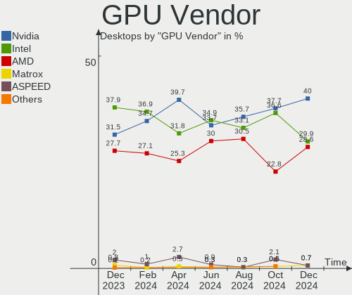

Ubuntu Hardware Trends (Desktop)
--------------------------------

A project to identify most popular hardware characteristics and track their change
over time based on data collected by Ubuntu users at https://Linux-Hardware.org.

Anyone can contribute to the study by uploading probes of their computers by
the [hw-probe](https://github.com/linuxhw/hw-probe) tool:

    sudo hw-probe -all -upload

Full-feature report is available here: https://linux-hardware.org/?view=trends&formfactor=desktop

Period: Feb, 2020.

Contents
--------

- [ OS                       ](#os)
- [ OS Family                ](#os-family)
- [ Kernel                   ](#kernel)
- [ Kernel Family            ](#kernel-family)
- [ Kernel Major Ver.        ](#kernel-major-ver)
- [ Arch                     ](#arch)
- [ DE                       ](#de)
- [ Display Server           ](#display-server)
- [ OS Lang                  ](#os-lang)
- [ Boot Mode                ](#boot-mode)
- [ Filesystem               ](#filesystem)
- [ Dual Boot with Linux     ](#dual-boot-with-linux)
- [ Dual Boot (Win)          ](#dual-boot-win)
- [ Country                  ](#country)
- [ City                     ](#city)
- [ Vendor                   ](#vendor)
- [ Model                    ](#model)
- [ Model Family             ](#model-family)
- [ MFG Year                 ](#mfg-year)
- [ Form Factor              ](#form-factor)
- [ Secure Boot              ](#secure-boot)
- [ Coreboot                 ](#coreboot)
- [ RAM Size                 ](#ram-size)
- [ RAM Used                 ](#ram-used)
- [ Drive Vendor             ](#drive-vendor)
- [ Drive Model              ](#drive-model)
- [ Drive Kind               ](#drive-kind)
- [ Drive Connector          ](#drive-connector)
- [ Drive Size               ](#drive-size)
- [ Space Total              ](#space-total)
- [ Space Used               ](#space-used)
- [ Malfunc. Drives          ](#malfunc-drives)
- [ Malfunc. Drive Vendor    ](#malfunc-drive-vendor)
- [ Malfunc. Drive Kind      ](#malfunc-drive-kind)
- [ Failed Drives            ](#failed-drives)
- [ Failed Drive Vendor      ](#failed-drive-vendor)
- [ Drive Status             ](#drive-status)
- [ Storage Vendor           ](#storage-vendor)
- [ Storage Model            ](#storage-model)
- [ Storage Kind             ](#storage-kind)
- [ CPU Vendor               ](#cpu-vendor)
- [ CPU Model                ](#cpu-model)
- [ CPU Model Family         ](#cpu-model-family)
- [ CPU Cores                ](#cpu-cores)
- [ CPU Sockets              ](#cpu-sockets)
- [ CPU Threads              ](#cpu-threads)
- [ CPU Op-Modes             ](#cpu-op-modes)
- [ CPU Microarch            ](#cpu-microarch)
- [ CPU Microcode            ](#cpu-microcode)
- [ GPU Vendor               ](#gpu-vendor)
- [ GPU Model                ](#gpu-model)
- [ GPU Combo                ](#gpu-combo)
- [ GPU Driver               ](#gpu-driver)
- [ GPU Memory               ](#gpu-memory)
- [ Monitor Vendor           ](#monitor-vendor)
- [ Monitor Model            ](#monitor-model)
- [ Monitor Resolution       ](#monitor-resolution)
- [ Monitor Diagonal         ](#monitor-diagonal)
- [ Monitor Width            ](#monitor-width)
- [ Aspect Ratio             ](#aspect-ratio)
- [ Monitor Area             ](#monitor-area)
- [ Pixel Density            ](#pixel-density)
- [ Multiple Monitors        ](#multiple-monitors)
- [ Net Controller Vendor    ](#net-controller-vendor)
- [ Net Controller Model     ](#net-controller-model)
- [ Net Controller Kind      ](#net-controller-kind)
- [ Used Controller          ](#used-controller)
- [ NICs                     ](#nics)
- [ Unsupported Devices      ](#unsupported-devices)
- [ Unsupported Device Types ](#unsupported-device-types)

OS
--

Installed operating systems

| Name           | Computers | Percent |
|----------------|-----------|---------|
| Ubuntu 18.04   | 280       | 60.74%  |
| Ubuntu 19.10   | 134       | 29.07%  |
| Ubuntu 16.04   | 14        | 3.04%   |
| Ubuntu 19.04   | 12        | 2.6%    |
| Ubuntu 20.04   | 11        | 2.39%   |
| Ubuntu 18.10   | 4         | 0.87%   |
| Ubuntu Core 16 | 2         | 0.43%   |
| Ubuntu         | 2         | 0.43%   |
| Ubuntu 17.10   | 1         | 0.22%   |
| Ubuntu 15.04   | 1         | 0.22%   |

OS Family
---------

OS without a version

| Name   | Computers | Percent |
|--------|-----------|---------|
| Ubuntu | 461       | 100%    |

Kernel
------

Version of the Linux kernel

| Version                 | Computers | Percent |
|-------------------------|-----------|---------|
| 5.3.0-40-generic        | 118       | 25.6%   |
| 5.3.0-28-generic        | 87        | 18.87%  |
| 5.3.0-29-generic        | 55        | 11.93%  |
| 4.15.0-76-generic       | 43        | 9.33%   |
| 4.15.0-88-generic       | 34        | 7.38%   |
| 5.3.0-26-generic        | 12        | 2.6%    |
| 5.3.0-18-generic        | 12        | 2.6%    |
| 5.0.0-38-generic        | 10        | 2.17%   |
| 5.0.0-23-generic        | 10        | 2.17%   |
| 5.0.0-37-generic        | 6         | 1.3%    |
| 5.4.0-14-generic        | 5         | 1.08%   |
| 5.3.0-40-lowlatency     | 5         | 1.08%   |
| 5.3.0-41-generic        | 4         | 0.87%   |
| 5.3.0-29-lowlatency     | 3         | 0.65%   |
| 5.0.0-36-generic        | 3         | 0.65%   |
| 4.18.0-25-generic       | 3         | 0.65%   |
| 4.15.0-76-lowlatency    | 3         | 0.65%   |
| 4.15.0-74-generic       | 3         | 0.65%   |
| 5.6.0-050600rc2-generic | 2         | 0.43%   |
| 5.5.0-050500-generic    | 2         | 0.43%   |
| 5.4.0-12-generic        | 2         | 0.43%   |
| 5.3.0-24-generic        | 2         | 0.43%   |
| 4.15.0-89-generic       | 2         | 0.43%   |
| 4.15.0-88-lowlatency    | 2         | 0.43%   |
| 4.15.0-45-generic       | 2         | 0.43%   |
| 4.15.0-29-generic       | 2         | 0.43%   |
| 5.5.5-050505-generic    | 1         | 0.22%   |
| 5.4.0-16-generic        | 1         | 0.22%   |
| 5.3.0-7629-generic      | 1         | 0.22%   |
| 5.3.0-41-lowlatency     | 1         | 0.22%   |
| 5.3.0-26-lowlatency     | 1         | 0.22%   |
| 5.3.0-25-generic        | 1         | 0.22%   |
| 5.3.0-19-lowlatency     | 1         | 0.22%   |
| 5.0.0-29-generic        | 1         | 0.22%   |
| 5.0.0-25-generic        | 1         | 0.22%   |
| 5.0.0-13-generic        | 1         | 0.22%   |
| 4.4.0-173-generic       | 1         | 0.22%   |
| 4.4.0-171-generic       | 1         | 0.22%   |
| 4.4.0-170-generic       | 1         | 0.22%   |
| 4.19.5-041905-generic   | 1         | 0.22%   |
| 4.18.0-25-lowlatency    | 1         | 0.22%   |
| 4.18.0-20-generic       | 1         | 0.22%   |
| 4.18.0-15-generic       | 1         | 0.22%   |
| 4.18.0-10-generic       | 1         | 0.22%   |
| 4.15.0-74-lowlatency    | 1         | 0.22%   |
| 4.15.0-72-generic       | 1         | 0.22%   |
| 4.15.0-64-generic       | 1         | 0.22%   |
| 4.15.0-62-lowlatency    | 1         | 0.22%   |
| 4.15.0-55-generic       | 1         | 0.22%   |
| 4.15.0-52-generic       | 1         | 0.22%   |
| 4.15.0-39-generic       | 1         | 0.22%   |
| 4.15.0-33-generic       | 1         | 0.22%   |
| 4.13.0-21-generic       | 1         | 0.22%   |
| 4.10.0-28-lowlatency    | 1         | 0.22%   |
| 3.19.0-93-generic       | 1         | 0.22%   |

Kernel Family
-------------

Linux kernel without a distro release

| Version | Computers | Percent |
|---------|-----------|---------|
| 5.3.0   | 303       | 65.73%  |
| 4.15.0  | 99        | 21.48%  |
| 5.0.0   | 32        | 6.94%   |
| 5.4.0   | 8         | 1.74%   |
| 4.18.0  | 7         | 1.52%   |
| 4.4.0   | 3         | 0.65%   |
| 5.6.0   | 2         | 0.43%   |
| 5.5.0   | 2         | 0.43%   |
| 5.5.5   | 1         | 0.22%   |
| 4.19.5  | 1         | 0.22%   |
| 4.13.0  | 1         | 0.22%   |
| 4.10.0  | 1         | 0.22%   |
| 3.19.0  | 1         | 0.22%   |

Kernel Major Ver.
-----------------

Linux kernel major version

| Version | Computers | Percent |
|---------|-----------|---------|
| 5.3     | 303       | 65.73%  |
| 4.15    | 99        | 21.48%  |
| 5.0     | 32        | 6.94%   |
| 5.4     | 8         | 1.74%   |
| 4.18    | 7         | 1.52%   |
| 5.5     | 3         | 0.65%   |
| 4.4     | 3         | 0.65%   |
| 5.6     | 2         | 0.43%   |
| 4.19    | 1         | 0.22%   |
| 4.13    | 1         | 0.22%   |
| 4.10    | 1         | 0.22%   |
| 3.19    | 1         | 0.22%   |

Arch
----

OS architecture (x86_64, i586, etc.)

| Name   | Computers | Percent |
|--------|-----------|---------|
| x86_64 | 436       | 94.58%  |
| i686   | 25        | 5.42%   |

DE
--

Desktop Environment

| Name            | Computers | Percent |
|-----------------|-----------|---------|
| GNOME           | 287       | 62.26%  |
| Unknown         | 71        | 15.4%   |
| XFCE            | 36        | 7.81%   |
| Unity           | 15        | 3.25%   |
| MATE            | 14        | 3.04%   |
| KDE             | 10        | 2.17%   |
| KDE5            | 7         | 1.52%   |
| Budgie          | 6         | 1.3%    |
| X-Cinnamon      | 4         | 0.87%   |
| GNOME Flashback | 3         | 0.65%   |
| LXQt            | 2         | 0.43%   |
| LXDE            | 2         | 0.43%   |
| xubuntu         | 1         | 0.22%   |
| Enlightenment   | 1         | 0.22%   |
| Deepin          | 1         | 0.22%   |
| Cinnamon        | 1         | 0.22%   |

Display Server
--------------

X11 or Wayland

| Name    | Computers | Percent |
|---------|-----------|---------|
| X11     | 419       | 90.89%  |
| Unknown | 34        | 7.38%   |
| Wayland | 8         | 1.74%   |

OS Lang
-------

Language

| Lang    | Computers | Percent |
|---------|-----------|---------|
| en_US   | 169       | 36.66%  |
| de_DE   | 40        | 8.68%   |
| en_GB   | 33        | 7.16%   |
| pt_BR   | 26        | 5.64%   |
| it_IT   | 21        | 4.56%   |
| Unknown | 17        | 3.69%   |
| ru_RU   | 15        | 3.25%   |
| fr_FR   | 14        | 3.04%   |
| en_AU   | 13        | 2.82%   |
| nl_NL   | 12        | 2.6%    |
| en_CA   | 11        | 2.39%   |
| C       | 11        | 2.39%   |
| es_ES   | 10        | 2.17%   |
| pl_PL   | 6         | 1.3%    |
| cs_CZ   | 6         | 1.3%    |
| en_IN   | 5         | 1.08%   |
| ru_UA   | 4         | 0.87%   |
| hu_HU   | 4         | 0.87%   |
| es_AR   | 4         | 0.87%   |
| uk_UA   | 3         | 0.65%   |
| sk_SK   | 3         | 0.65%   |
| nl_BE   | 3         | 0.65%   |
| bg_BG   | 3         | 0.65%   |
| pt_PT   | 2         | 0.43%   |
| nb_NO   | 2         | 0.43%   |
| es_PE   | 2         | 0.43%   |
| en_ZW   | 2         | 0.43%   |
| el_GR   | 2         | 0.43%   |
| de_AT   | 2         | 0.43%   |
| zh_TW   | 1         | 0.22%   |
| zh_CN   | 1         | 0.22%   |
| ro_RO   | 1         | 0.22%   |
| ko_KR   | 1         | 0.22%   |
| ja_JP   | 1         | 0.22%   |
| fr_CH   | 1         | 0.22%   |
| fr_CA   | 1         | 0.22%   |
| et_EE   | 1         | 0.22%   |
| es_VE   | 1         | 0.22%   |
| es_DO   | 1         | 0.22%   |
| es_BO   | 1         | 0.22%   |
| en_PH   | 1         | 0.22%   |
| en_NZ   | 1         | 0.22%   |
| en_IE   | 1         | 0.22%   |
| ca_ES   | 1         | 0.22%   |
| C       | 1         | 0.22%   |

Boot Mode
---------

EFI or BIOS

| Mode | Computers | Percent |
|------|-----------|---------|
| BIOS | 319       | 69.2%   |
| EFI  | 142       | 30.8%   |

Filesystem
----------

Type of filesystem

| Type    | Computers | Percent |
|---------|-----------|---------|
| Ext4    | 431       | 93.49%  |
| Overlay | 17        | 3.69%   |
| Zfs     | 4         | 0.87%   |
| Btrfs   | 3         | 0.65%   |
| Xfs     | 2         | 0.43%   |
| Jfs     | 2         | 0.43%   |
| Ext3    | 1         | 0.22%   |
| Ext2    | 1         | 0.22%   |

Dual Boot with Linux
--------------------

Hosting more than one Linux

| Dual boot | Computers | Percent |
|-----------|-----------|---------|
| No        | 390       | 84.6%   |
| Yes       | 71        | 15.4%   |

Dual Boot (Win)
---------------

Hosting Linux and Windows

| Dual boot | Computers | Percent |
|-----------|-----------|---------|
| No        | 298       | 64.64%  |
| Yes       | 163       | 35.36%  |

Country
-------

Geographic location (country)

| Country            | Computers | Percent |
|--------------------|-----------|---------|
| USA                | 100       | 21.69%  |
| Germany            | 47        | 10.2%   |
| Brazil             | 36        | 7.81%   |
| UK                 | 28        | 6.07%   |
| Italy              | 26        | 5.64%   |
| Spain              | 15        | 3.25%   |
| Russia             | 15        | 3.25%   |
| France             | 15        | 3.25%   |
| Australia          | 15        | 3.25%   |
| Netherlands        | 14        | 3.04%   |
| Canada             | 14        | 3.04%   |
| Ukraine            | 12        | 2.6%    |
| Poland             | 11        | 2.39%   |
| Czech Republic     | 8         | 1.74%   |
| India              | 6         | 1.3%    |
| Hungary            | 6         | 1.3%    |
| Greece             | 6         | 1.3%    |
| Norway             | 5         | 1.08%   |
| Bulgaria           | 5         | 1.08%   |
| Argentina          | 5         | 1.08%   |
| Switzerland        | 4         | 0.87%   |
| Slovakia           | 4         | 0.87%   |
| Hong Kong          | 4         | 0.87%   |
| Belgium            | 4         | 0.87%   |
| Peru               | 3         | 0.65%   |
| Iran               | 3         | 0.65%   |
| Indonesia          | 3         | 0.65%   |
| Finland            | 3         | 0.65%   |
| Venezuela          | 2         | 0.43%   |
| Romania            | 2         | 0.43%   |
| Puerto Rico        | 2         | 0.43%   |
| Portugal           | 2         | 0.43%   |
| Malaysia           | 2         | 0.43%   |
| Lithuania          | 2         | 0.43%   |
| Austria            | 2         | 0.43%   |
| Zimbabwe           | 1         | 0.22%   |
| Tunisia            | 1         | 0.22%   |
| Thailand           | 1         | 0.22%   |
| Taiwan             | 1         | 0.22%   |
| South Korea        | 1         | 0.22%   |
| South Africa       | 1         | 0.22%   |
| Slovenia           | 1         | 0.22%   |
| Serbia             | 1         | 0.22%   |
| Saudi Arabia       | 1         | 0.22%   |
| Philippines        | 1         | 0.22%   |
| Oman               | 1         | 0.22%   |
| New Zealand        | 1         | 0.22%   |
| Mexico             | 1         | 0.22%   |
| Kuwait             | 1         | 0.22%   |
| Korea, Republic of | 1         | 0.22%   |
| Jordan             | 1         | 0.22%   |
| Japan              | 1         | 0.22%   |
| Isle of Man        | 1         | 0.22%   |
| Ireland            | 1         | 0.22%   |
| Iceland            | 1         | 0.22%   |
| Estonia            | 1         | 0.22%   |
| Dominican Republic | 1         | 0.22%   |
| Denmark            | 1         | 0.22%   |
| Cyprus             | 1         | 0.22%   |
| Croatia            | 1         | 0.22%   |

City
----

Geographic location (city)

| City              | Computers | Percent |
|-------------------|-----------|---------|
| Berlin            | 6         | 1.3%    |
| São Paulo        | 5         | 1.08%   |
| Toronto           | 4         | 0.87%   |
| Athens            | 4         | 0.87%   |
| Warsaw            | 3         | 0.65%   |
| Tucson            | 3         | 0.65%   |
| Rome              | 3         | 0.65%   |
| Rio de Janeiro    | 3         | 0.65%   |
| Padova            | 3         | 0.65%   |
| Nuremberg         | 3         | 0.65%   |
| Lima              | 3         | 0.65%   |
| Kyiv              | 3         | 0.65%   |
| Hamburg           | 3         | 0.65%   |
| Frankfurt am Main | 3         | 0.65%   |
| Barcelona         | 3         | 0.65%   |
| Arlington         | 3         | 0.65%   |
| Vilnius           | 2         | 0.43%   |
| Udine             | 2         | 0.43%   |
| Teresina          | 2         | 0.43%   |
| Tehran            | 2         | 0.43%   |
| Tatabánya        | 2         | 0.43%   |
| Sofia             | 2         | 0.43%   |
| Simi Valley       | 2         | 0.43%   |
| Seville           | 2         | 0.43%   |
| Saskatoon         | 2         | 0.43%   |
| Rotterdam         | 2         | 0.43%   |
| Roanoke           | 2         | 0.43%   |
| Murfreesboro      | 2         | 0.43%   |
| Munich            | 2         | 0.43%   |
| Moscow            | 2         | 0.43%   |
| Montreal          | 2         | 0.43%   |
| Minneapolis       | 2         | 0.43%   |
| Madrid            | 2         | 0.43%   |
| Lincoln           | 2         | 0.43%   |
| Leeds             | 2         | 0.43%   |
| Huntington Beach  | 2         | 0.43%   |
| Homestead         | 2         | 0.43%   |
| Fortaleza         | 2         | 0.43%   |
| Essen             | 2         | 0.43%   |
| Central           | 2         | 0.43%   |
| Cary              | 2         | 0.43%   |
| Budapest          | 2         | 0.43%   |
| Brasília         | 2         | 0.43%   |
| Bern              | 2         | 0.43%   |
| Belo Horizonte    | 2         | 0.43%   |
| Amsterdam         | 2         | 0.43%   |
| Łęczyca         | 1         | 0.22%   |
| Érd              | 1         | 0.22%   |
| Zwijndrecht       | 1         | 0.22%   |
| Zurich            | 1         | 0.22%   |
| Zelenograd        | 1         | 0.22%   |
| Zanica            | 1         | 0.22%   |
| Zadar             | 1         | 0.22%   |
| Yuen Long         | 1         | 0.22%   |
| Yorktown Heights  | 1         | 0.22%   |
| Wuppertal         | 1         | 0.22%   |
| Worthing          | 1         | 0.22%   |
| Winnipeg          | 1         | 0.22%   |
| Wilhelmshaven     | 1         | 0.22%   |
| Wigan             | 1         | 0.22%   |

Vendor
------

Motherboard manufacturer

| Name                     | Computers | Percent |
|--------------------------|-----------|---------|
| ASUSTek Computer         | 110       | 23.86%  |
| Gigabyte Technology      | 98        | 21.26%  |
| Dell                     | 46        | 9.98%   |
| ASRock                   | 38        | 8.24%   |
| MSI                      | 32        | 6.94%   |
| Hewlett-Packard          | 29        | 6.29%   |
| Intel                    | 19        | 4.12%   |
| Lenovo                   | 15        | 3.25%   |
| Acer                     | 10        | 2.17%   |
| ECS                      | 7         | 1.52%   |
| Unknown                  | 7         | 1.52%   |
| Fujitsu                  | 6         | 1.3%    |
| Pegatron                 | 5         | 1.08%   |
| Supermicro               | 4         | 0.87%   |
| PCWare                   | 4         | 0.87%   |
| Medion                   | 3         | 0.65%   |
| Shuttle                  | 2         | 0.43%   |
| Positivo                 | 2         | 0.43%   |
| Foxconn                  | 2         | 0.43%   |
| eMachines                | 2         | 0.43%   |
| Apple                    | 2         | 0.43%   |
| WinFast                  | 1         | 0.22%   |
| System76                 | 1         | 0.22%   |
| PCChips                  | 1         | 0.22%   |
| O.E.M.                   | 1         | 0.22%   |
| MINIX TECHNOLOGY LIMITED | 1         | 0.22%   |
| Megaware                 | 1         | 0.22%   |
| LattePanda               | 1         | 0.22%   |
| iEi                      | 1         | 0.22%   |
| IBM                      | 1         | 0.22%   |
| Huanan                   | 1         | 0.22%   |
| Google                   | 1         | 0.22%   |
| Gateway                  | 1         | 0.22%   |
| Fujitsu Siemens          | 1         | 0.22%   |
| FLEX Industries          | 1         | 0.22%   |
| DFI                      | 1         | 0.22%   |
| Biostar                  | 1         | 0.22%   |
| AMI                      | 1         | 0.22%   |
| AMD                      | 1         | 0.22%   |

Model
-----

Motherboard model

| Name                                   | Computers | Percent |
|----------------------------------------|-----------|---------|
| ASUS All Series                        | 11        | 2.39%   |
| Unknown                                | 7         | 1.52%   |
| Dell OptiPlex 7010                     | 5         | 1.08%   |
| MSI MS-7C02                            | 4         | 0.87%   |
| Dell OptiPlex 755                      | 4         | 0.87%   |
| ASUS PRIME A320M-K                     | 4         | 0.87%   |
| Gigabyte GA-78LMT-USB3                 | 3         | 0.65%   |
| Gigabyte B450M DS3H                    | 3         | 0.65%   |
| Gigabyte B450 AORUS ELITE              | 3         | 0.65%   |
| ASRock N68C-S UCC                      | 3         | 0.65%   |
| MSI MS-7B79                            | 2         | 0.43%   |
| MSI MS-7817                            | 2         | 0.43%   |
| HP ProLiant ML350 G6                   | 2         | 0.43%   |
| HP Compaq 8200 Elite SFF PC            | 2         | 0.43%   |
| HP Compaq 6000 Pro SFF PC              | 2         | 0.43%   |
| Gigabyte Z97P-D3                       | 2         | 0.43%   |
| Gigabyte X58A-UD3R                     | 2         | 0.43%   |
| Gigabyte X570 I AORUS PRO WIFI         | 2         | 0.43%   |
| Gigabyte X570 GAMING X                 | 2         | 0.43%   |
| Gigabyte X399 AORUS Gaming 7           | 2         | 0.43%   |
| Gigabyte H97-HD3                       | 2         | 0.43%   |
| Gigabyte GA-970A-UD3                   | 2         | 0.43%   |
| Gigabyte B75M-D3H                      | 2         | 0.43%   |
| Gigabyte B360 HD3P-LM                  | 2         | 0.43%   |
| Gigabyte A320M-S2H                     | 2         | 0.43%   |
| Dell XPS 8500                          | 2         | 0.43%   |
| Dell Precision T3600                   | 2         | 0.43%   |
| Dell OptiPlex 9020                     | 2         | 0.43%   |
| Dell OptiPlex 7020                     | 2         | 0.43%   |
| Dell OptiPlex 360                      | 2         | 0.43%   |
| Dell OptiPlex 3020                     | 2         | 0.43%   |
| ASUS PRIME X470-PRO                    | 2         | 0.43%   |
| ASUS PRIME B360M-A                     | 2         | 0.43%   |
| ASUS P6T SE                            | 2         | 0.43%   |
| ASUS P5KPL-AM EPU                      | 2         | 0.43%   |
| ASUS P5KPL-AM                          | 2         | 0.43%   |
| ASUS M5A78L-M PLUS/USB3                | 2         | 0.43%   |
| ASUS M4A78LT-M                         | 2         | 0.43%   |
| ASUS M4A785TD-V EVO                    | 2         | 0.43%   |
| ASRock Z77 Extreme4                    | 2         | 0.43%   |
| ASRock B450M Pro4                      | 2         | 0.43%   |
| ASRock A320M-HDV R4.0                  | 2         | 0.43%   |
| WinFast 760GXK8MC                      | 1         | 0.22%   |
| System76 Thelio                        | 1         | 0.22%   |
| Supermicro X9SCI/X9SCA                 | 1         | 0.22%   |
| Supermicro X9DRD-7LN4F(-JBOD)/X9DRD-EF | 1         | 0.22%   |
| Supermicro X9DAi                       | 1         | 0.22%   |
| Supermicro SYS-5019S-L                 | 1         | 0.22%   |
| Shuttle XS35V4                         | 1         | 0.22%   |
| Shuttle DS57U                          | 1         | 0.22%   |
| Positivo POS-PIQ57BQ                   | 1         | 0.22%   |
| Positivo POS-MIH61CF                   | 1         | 0.22%   |
| Pegatron VS342AA-AB6 m9801af           | 1         | 0.22%   |
| Pegatron IPMIP-GS                      | 1         | 0.22%   |
| Pegatron G5130fr                       | 1         | 0.22%   |
| Pegatron AW015AV-ABA s5250t            | 1         | 0.22%   |
| Pegatron 20-b005la                     | 1         | 0.22%   |
| PCWare IPX1800E2                       | 1         | 0.22%   |
| PCWare IPX1800E1                       | 1         | 0.22%   |
| PCWare IPMH81G1                        | 1         | 0.22%   |

Model Family
------------

Motherboard model prefix

| Name                          | Computers | Percent |
|-------------------------------|-----------|---------|
| Dell OptiPlex                 | 25        | 5.42%   |
| ASUS PRIME                    | 18        | 3.9%    |
| HP Compaq                     | 12        | 2.6%    |
| ASUS All                      | 11        | 2.39%   |
| Lenovo ThinkCentre            | 8         | 1.74%   |
| Dell Precision                | 7         | 1.52%   |
| Dell Inspiron                 | 7         | 1.52%   |
| Unknown                       | 7         | 1.52%   |
| HP EliteDesk                  | 6         | 1.3%    |
| Gigabyte X570                 | 6         | 1.3%    |
| Gigabyte B450                 | 6         | 1.3%    |
| ASUS ROG                      | 5         | 1.08%   |
| MSI MS-7C02                   | 4         | 0.87%   |
| Lenovo IdeaCentre             | 4         | 0.87%   |
| Gigabyte GA-78LMT-USB3        | 4         | 0.87%   |
| Gigabyte B450M                | 4         | 0.87%   |
| Fujitsu ESPRIMO               | 4         | 0.87%   |
| ASUS P5KPL-AM                 | 4         | 0.87%   |
| ASUS M5A78L-M                 | 4         | 0.87%   |
| Acer Veriton                  | 4         | 0.87%   |
| Acer Aspire                   | 4         | 0.87%   |
| HP ProLiant                   | 3         | 0.65%   |
| Gigabyte B360                 | 3         | 0.65%   |
| Dell XPS                      | 3         | 0.65%   |
| ASUS TUF                      | 3         | 0.65%   |
| ASUS P6T                      | 3         | 0.65%   |
| ASRock Z77                    | 3         | 0.65%   |
| ASRock X399                   | 3         | 0.65%   |
| ASRock N68C-S                 | 3         | 0.65%   |
| MSI MS-7B79                   | 2         | 0.43%   |
| MSI MS-7817                   | 2         | 0.43%   |
| Intel DH67BL                  | 2         | 0.43%   |
| HP ProDesk                    | 2         | 0.43%   |
| HP Pavilion                   | 2         | 0.43%   |
| Gigabyte Z97P-D3              | 2         | 0.43%   |
| Gigabyte Z390                 | 2         | 0.43%   |
| Gigabyte X58A-UD3R            | 2         | 0.43%   |
| Gigabyte X470                 | 2         | 0.43%   |
| Gigabyte X399                 | 2         | 0.43%   |
| Gigabyte H97-HD3              | 2         | 0.43%   |
| Gigabyte GA-970A-UD3          | 2         | 0.43%   |
| Gigabyte B75M-D3H             | 2         | 0.43%   |
| Gigabyte A320M-S2H            | 2         | 0.43%   |
| ASUS P8H61-M                  | 2         | 0.43%   |
| ASUS P7P55D-E                 | 2         | 0.43%   |
| ASUS M5A97                    | 2         | 0.43%   |
| ASUS M4A78LT-M                | 2         | 0.43%   |
| ASUS M4A785TD-V               | 2         | 0.43%   |
| ASRock B450M                  | 2         | 0.43%   |
| ASRock A320M-HDV              | 2         | 0.43%   |
| WinFast 760GXK8MC             | 1         | 0.22%   |
| System76 Thelio               | 1         | 0.22%   |
| Supermicro X9SCI              | 1         | 0.22%   |
| Supermicro X9DRD-7LN4F(-JBOD) | 1         | 0.22%   |
| Supermicro X9DAi              | 1         | 0.22%   |
| Supermicro SYS-5019S-L        | 1         | 0.22%   |
| Shuttle XS35V4                | 1         | 0.22%   |
| Shuttle DS57U                 | 1         | 0.22%   |
| Positivo POS-PIQ57BQ          | 1         | 0.22%   |
| Positivo POS-MIH61CF          | 1         | 0.22%   |

MFG Year
--------

Motherboard manufacture year

| Year | Computers | Percent |
|------|-----------|---------|
| 2019 | 79        | 17.14%  |
| 2012 | 44        | 9.54%   |
| 2011 | 39        | 8.46%   |
| 2010 | 39        | 8.46%   |
| 2013 | 38        | 8.24%   |
| 2018 | 37        | 8.03%   |
| 2014 | 35        | 7.59%   |
| 2015 | 26        | 5.64%   |
| 2009 | 25        | 5.42%   |
| 2008 | 24        | 5.21%   |
| 2017 | 20        | 4.34%   |
| 2016 | 20        | 4.34%   |
| 2007 | 14        | 3.04%   |
| 2006 | 12        | 2.6%    |
| 2005 | 4         | 0.87%   |
| 2020 | 2         | 0.43%   |
| 2004 | 1         | 0.22%   |
| 2001 | 1         | 0.22%   |
| 2000 | 1         | 0.22%   |

Form Factor
-----------

Physical design of the computer

| Name    | Computers | Percent |
|---------|-----------|---------|
| Desktop | 461       | 100%    |

Secure Boot
-----------

Enabled or disabled

| State    | Computers | Percent |
|----------|-----------|---------|
| Disabled | 451       | 97.83%  |
| Enabled  | 10        | 2.17%   |

Coreboot
--------

Have coreboot on board

| Used | Computers | Percent |
|------|-----------|---------|
| No   | 460       | 99.78%  |
| Yes  | 1         | 0.22%   |

RAM Size
--------

Total RAM memory

| Size in GB  | Computers | Percent |
|-------------|-----------|---------|
| 8.01-16.0   | 98        | 21.26%  |
| 3.01-4.0    | 95        | 20.61%  |
| 16.01-24.0  | 90        | 19.52%  |
| 4.01-8.0    | 73        | 15.84%  |
| 32.01-64.0  | 47        | 10.2%   |
| 1.01-2.0    | 23        | 4.99%   |
| 64.01-256.0 | 14        | 3.04%   |
| 2.01-3.0    | 10        | 2.17%   |
| 0.01-1.0    | 7         | 1.52%   |
| 24.01-32.0  | 4         | 0.87%   |

RAM Used
--------

Used RAM memory

| Used GB    | Computers | Percent |
|------------|-----------|---------|
| 1.01-2.0   | 208       | 45.12%  |
| 2.01-3.0   | 116       | 25.16%  |
| 4.01-8.0   | 44        | 9.54%   |
| 3.01-4.0   | 44        | 9.54%   |
| 0.01-1.0   | 36        | 7.81%   |
| 8.01-16.0  | 9         | 1.95%   |
| 16.01-24.0 | 3         | 0.65%   |
| 24.01-32.0 | 1         | 0.22%   |

Drive Vendor
------------

Hard drive vendors

| Vendor              | Computers | Drives | Percent |
|---------------------|-----------|--------|---------|
| Seagate             | 159       | 199    | 23.91%  |
| WDC                 | 150       | 210    | 22.56%  |
| Samsung Electronics | 87        | 103    | 13.08%  |
| Kingston            | 39        | 41     | 5.86%   |
| Toshiba             | 36        | 42     | 5.41%   |
| Hitachi             | 36        | 38     | 5.41%   |
| Crucial             | 28        | 30     | 4.21%   |
| SanDisk             | 19        | 19     | 2.86%   |
| Intel               | 10        | 11     | 1.5%    |
| MAXTOR              | 8         | 8      | 1.2%    |
| OCZ                 | 7         | 7      | 1.05%   |
| A-DATA Technology   | 6         | 6      | 0.9%    |
| Unknown             | 5         | 5      | 0.75%   |
| China               | 5         | 5      | 0.75%   |
| Team                | 4         | 4      | 0.6%    |
| SPCC                | 4         | 4      | 0.6%    |
| HGST                | 4         | 6      | 0.6%    |
| Apacer              | 4         | 4      | 0.6%    |
| PNY                 | 3         | 3      | 0.45%   |
| Patriot             | 3         | 3      | 0.45%   |
| Micron Technology   | 3         | 3      | 0.45%   |
| JMicron             | 3         | 3      | 0.45%   |
| Intenso             | 3         | 3      | 0.45%   |
| Transcend           | 2         | 2      | 0.3%    |
| Hewlett-Packard     | 2         | 2      | 0.3%    |
| Generic             | 2         | 2      | 0.3%    |
| Corsair             | 2         | 2      | 0.3%    |
| AMD                 | 2         | 3      | 0.3%    |
| XPG                 | 1         | 2      | 0.15%   |
| WDC WD20            | 1         | 1      | 0.15%   |
| WD MediaMax         | 1         | 1      | 0.15%   |
| TSA                 | 1         | 1      | 0.15%   |
| TO Exter            | 1         | 1      | 0.15%   |
| TAMMUZ              | 1         | 1      | 0.15%   |
| Smartbuy            | 1         | 1      | 0.15%   |
| SK Hynix            | 1         | 1      | 0.15%   |
| SINTECHI            | 1         | 1      | 0.15%   |
| PLEXTOR             | 1         | 1      | 0.15%   |
| OWC                 | 1         | 1      | 0.15%   |
| OCZ-VERTEX2         | 1         | 1      | 0.15%   |
| Netac               | 1         | 1      | 0.15%   |
| MDT                 | 1         | 1      | 0.15%   |
| MARVELL             | 1         | 2      | 0.15%   |
| LITEONIT            | 1         | 1      | 0.15%   |
| LITEON              | 1         | 1      | 0.15%   |
| KingFast            | 1         | 1      | 0.15%   |
| Innodisk            | 1         | 1      | 0.15%   |
| IBM                 | 1         | 1      | 0.15%   |
| HUAWEI              | 1         | 1      | 0.15%   |
| GOODRAM             | 1         | 1      | 0.15%   |
| Gigabyte Technology | 1         | 1      | 0.15%   |
| GAMER               | 1         | 1      | 0.15%   |
| Fujitsu             | 1         | 1      | 0.15%   |
| DREVO               | 1         | 1      | 0.15%   |
| COMPAQPC            | 1         | 1      | 0.15%   |
| Compaq              | 1         | 1      | 0.15%   |
| CFast               | 1         | 1      | 0.15%   |

Drive Model
-----------

Hard drive models

| Model                        | Computers | Percent |
|------------------------------|-----------|---------|
| ST500DM002-1BD142 500GB      | 13        | 1.73%   |
| SSD 850 EVO 250GB            | 11        | 1.47%   |
| DT01ACA100 1TB               | 11        | 1.47%   |
| SV300S37A120G 120GB SSD      | 10        | 1.33%   |
| SA400S37120G 120GB SSD       | 9         | 1.2%    |
| ST1000DM010-2EP102 1TB       | 8         | 1.07%   |
| ST1000DM003-1ER162 1TB       | 8         | 1.07%   |
| WD10EZEX-08WN4A0 1TB         | 7         | 0.93%   |
| ST3160815AS 160GB            | 7         | 0.93%   |
| CT500MX500SSD1 500GB         | 7         | 0.93%   |
| WD1003FZEX-00MK2A0 1TB       | 6         | 0.8%    |
| ST31000528AS 1TB             | 6         | 0.8%    |
| ST2000DM006-2DM164 2TB       | 6         | 0.8%    |
| ST1000DM003-9YN162 1TB       | 6         | 0.8%    |
| SSD 860 EVO 500GB            | 6         | 0.8%    |
| SSD 850 EVO 500GB            | 6         | 0.8%    |
| SA400S37240G 240GB SSD       | 6         | 0.8%    |
| WD30EFRX-68EUZN0 3TB         | 5         | 0.67%   |
| WD20EZRX-00D8PB0 2TB         | 5         | 0.67%   |
| WD10EZEX-00BN5A0 1TB         | 5         | 0.67%   |
| ST3500418AS 500GB            | 5         | 0.67%   |
| ST2000DX002-2DV164 2TB       | 5         | 0.67%   |
| ST2000DM008-2FR102 2TB       | 5         | 0.67%   |
| SSD 860 EVO 1TB              | 5         | 0.67%   |
| SSD 840 EVO 120GB            | 5         | 0.67%   |
| DT01ACA050 500GB             | 5         | 0.67%   |
| WD5000AAKX-001CA0 500GB      | 4         | 0.53%   |
| ST3500312CS 500GB            | 4         | 0.53%   |
| ST1000DM003-1SB102 1TB       | 4         | 0.53%   |
| SSD 860 EVO 250GB            | 4         | 0.53%   |
| SDSSDA240G 240GB             | 4         | 0.53%   |
| HDWD110 1TB                  | 4         | 0.53%   |
| HDS721050CLA362 500GB        | 4         | 0.53%   |
| HD502HJ 500GB                | 4         | 0.53%   |
| CT240BX500SSD1 240GB         | 4         | 0.53%   |
| WD5000AAKX-603CA0 500GB      | 3         | 0.4%    |
| WD2500AAKX-753CA1 250GB      | 3         | 0.4%    |
| WD2500AAJS-75M0A0 250GB      | 3         | 0.4%    |
| WD20EZRZ-00Z5HB0 2TB         | 3         | 0.4%    |
| WD10EURX-63FH1Y0 1TB         | 3         | 0.4%    |
| WD10EARX-00N0YB0 1TB         | 3         | 0.4%    |
| ST5000DM000-1FK178 5TB       | 3         | 0.4%    |
| ST3250318AS 250GB            | 3         | 0.4%    |
| ST31000524AS 1TB             | 3         | 0.4%    |
| ST2000DM001-1ER164 2TB       | 3         | 0.4%    |
| ST2000DM001-1CH164 2TB       | 3         | 0.4%    |
| ST1000DM003-1CH162 1TB       | 3         | 0.4%    |
| SSD 860 PRO 256GB            | 3         | 0.4%    |
| SP0842N 80GB                 | 3         | 0.4%    |
| SDSSDA120G 120GB             | 3         | 0.4%    |
| SATA SSD 120GB               | 3         | 0.4%    |
| HDWD130 3TB                  | 3         | 0.4%    |
| HDT725050VLA360 500GB        | 3         | 0.4%    |
| HD204UI 2TB                  | 3         | 0.4%    |
| CT120BX500SSD1 120GB         | 3         | 0.4%    |
| WDS240G2G0A-00JH30 240GB SSD | 2         | 0.27%   |
| WD80EFAX-68LHPN0 8TB         | 2         | 0.27%   |
| WD5000AZRX-00A8LB0 500GB     | 2         | 0.27%   |
| WD5000AAKX-60U6AA0 500GB     | 2         | 0.27%   |
| WD5000AAKX-00ERMA0 500GB     | 2         | 0.27%   |

Drive Kind
----------

HDD or SSD

| Kind    | Computers | Drives | Percent |
|---------|-----------|--------|---------|
| HDD     | 338       | 524    | 59.72%  |
| SSD     | 201       | 240    | 35.51%  |
| Unknown | 21        | 26     | 3.71%   |
| NVMe    | 5         | 8      | 0.88%   |
| MMC     | 1         | 1      | 0.18%   |

Drive Connector
---------------

SATA, SAS, NVMe, etc.

| Type | Computers | Drives | Percent |
|------|-----------|--------|---------|
| SATA | 439       | 767    | 94.82%  |
| SAS  | 18        | 23     | 3.89%   |
| NVMe | 5         | 8      | 1.08%   |
| MMC  | 1         | 1      | 0.22%   |

Drive Size
----------

Size of hard drive

| Size in TB | Computers | Drives | Percent |
|------------|-----------|--------|---------|
| 0.01-0.5   | 328       | 443    | 55.5%   |
| 0.51-1.0   | 160       | 197    | 27.07%  |
| 1.01-2.0   | 58        | 75     | 9.81%   |
| 2.01-3.0   | 15        | 20     | 2.54%   |
| 3.01-4.0   | 14        | 18     | 2.37%   |
| 4.01-10.0  | 14        | 44     | 2.37%   |
| 10.01-20.0 | 2         | 2      | 0.34%   |

Space Total
-----------

Amount of disk space available on the file system

| Size in GB     | Computers | Percent |
|----------------|-----------|---------|
| 101-250        | 130       | 28.2%   |
| 251-500        | 84        | 18.22%  |
| 501-1000       | 78        | 16.92%  |
| 1001-2000      | 39        | 8.46%   |
| More than 3000 | 34        | 7.38%   |
| 51-100         | 32        | 6.94%   |
| 2001-3000      | 21        | 4.56%   |
| 21-50          | 19        | 4.12%   |
| 1-20           | 17        | 3.69%   |
| Unknown        | 7         | 1.52%   |

Space Used
----------

Amount of used disk space

| Used GB        | Computers | Percent |
|----------------|-----------|---------|
| 1-20           | 210       | 45.55%  |
| 21-50          | 63        | 13.67%  |
| 51-100         | 48        | 10.41%  |
| 101-250        | 42        | 9.11%   |
| 251-500        | 27        | 5.86%   |
| 501-1000       | 23        | 4.99%   |
| 1001-2000      | 20        | 4.34%   |
| More than 3000 | 11        | 2.39%   |
| 2001-3000      | 10        | 2.17%   |
| Unknown        | 7         | 1.52%   |

Malfunc. Drives
---------------

Drive models with a malfunction

| Model                       | Computers | Drives | Percent |
|-----------------------------|-----------|--------|---------|
| ST31000528AS 1TB            | 2         | 2      | 15.38%  |
| WL2000GSA6454G 2TB          | 1         | 1      | 7.69%   |
| WD5000AAKX-003CA0 500GB     | 1         | 1      | 7.69%   |
| ST3500418AS 500GB           | 1         | 1      | 7.69%   |
| ST31000322CS 1TB            | 1         | 1      | 7.69%   |
| ST2000VM003-1CT164 2TB      | 1         | 1      | 7.69%   |
| ST1000DM010-2EP102 1TB      | 1         | 1      | 7.69%   |
| SD7TB3Q-128G-1006 128GB SSD | 1         | 1      | 7.69%   |
| IMSS332-960GB SSD           | 1         | 1      | 7.69%   |
| HDP725050GLA360 500GB       | 1         | 1      | 7.69%   |
| HD502HJ 500GB               | 1         | 1      | 7.69%   |
| HD103UJ 1TB                 | 1         | 1      | 7.69%   |

Malfunc. Drive Vendor
---------------------

Vendors of faulty drives

| Vendor              | Computers | Drives | Percent |
|---------------------|-----------|--------|---------|
| Seagate             | 5         | 6      | 41.67%  |
| Samsung Electronics | 2         | 2      | 16.67%  |
| WDC                 | 1         | 1      | 8.33%   |
| WD MediaMax         | 1         | 1      | 8.33%   |
| SanDisk             | 1         | 1      | 8.33%   |
| Hitachi             | 1         | 1      | 8.33%   |
| A-DATA Technology   | 1         | 1      | 8.33%   |

Malfunc. Drive Kind
-------------------

Kinds of faulty drives

| Kind | Computers | Drives | Percent |
|------|-----------|--------|---------|
| HDD  | 7         | 11     | 77.78%  |
| SSD  | 2         | 2      | 22.22%  |

Failed Drives
-------------

Failed drive models

Zero info for selected period =(

Failed Drive Vendor
-------------------

Failed drive vendors

Zero info for selected period =(

Drive Status
------------

Number of failed and malfunc. drives

| Status   | Computers | Drives | Percent |
|----------|-----------|--------|---------|
| Detected | 398       | 714    | 88.84%  |
| Works    | 41        | 72     | 9.15%   |
| Malfunc  | 9         | 13     | 2.01%   |

Storage Vendor
--------------

Storage controller vendors

| Vendor                           | Computers | Percent |
|----------------------------------|-----------|---------|
| Intel                            | 299       | 51.37%  |
| AMD                              | 132       | 22.68%  |
| Samsung Electronics              | 28        | 4.81%   |
| JMicron Technology               | 24        | 4.12%   |
| Nvidia                           | 23        | 3.95%   |
| Marvell Technology Group         | 16        | 2.75%   |
| ASMedia Technology               | 16        | 2.75%   |
| VIA Technologies                 | 7         | 1.2%    |
| Phison Electronics               | 6         | 1.03%   |
| Sandisk                          | 4         | 0.69%   |
| Silicon Integrated Systems [SiS] | 3         | 0.52%   |
| Broadcom / LSI                   | 3         | 0.52%   |
| Toshiba America Info Systems     | 2         | 0.34%   |
| Silicon Motion                   | 2         | 0.34%   |
| Silicon Image                    | 2         | 0.34%   |
| Lite-On Technology               | 2         | 0.34%   |
| Kingston Technology Company      | 2         | 0.34%   |
| Hewlett-Packard                  | 2         | 0.34%   |
| Adaptec                          | 2         | 0.34%   |
| SK Hynix                         | 1         | 0.17%   |
| Seagate Technology               | 1         | 0.17%   |
| Realtek Semiconductor            | 1         | 0.17%   |
| Micron/Crucial Technology        | 1         | 0.17%   |
| Micron Technology                | 1         | 0.17%   |
| LSI Logic / Symbios Logic        | 1         | 0.17%   |
| ADATA Technology                 | 1         | 0.17%   |

Storage Model
-------------

Storage controller models

| Model                                                                             | Computers | Percent |
|-----------------------------------------------------------------------------------|-----------|---------|
| FCH SATA Controller [AHCI mode]                                                   | 70        | 8.57%   |
| SB7x0/SB8x0/SB9x0 IDE Controller                                                  | 34        | 4.16%   |
| NM10/ICH7 Family SATA Controller [IDE mode]                                       | 33        | 4.04%   |
| 400 Series Chipset SATA Controller                                                | 33        | 4.04%   |
| 8 Series/C220 Series Chipset Family 6-port SATA Controller 1 [AHCI mode]          | 29        | 3.55%   |
| 82801G (ICH7 Family) IDE Controller                                               | 28        | 3.43%   |
| SB7x0/SB8x0/SB9x0 SATA Controller [AHCI mode]                                     | 26        | 3.18%   |
| 7 Series/C210 Series Chipset Family 6-port SATA Controller [AHCI mode]            | 24        | 2.94%   |
| NVMe SSD Controller SM981/PM981/PM983                                             | 23        | 2.82%   |
| 6 Series/C200 Series Chipset Family 6 port Desktop SATA AHCI Controller           | 23        | 2.82%   |
| SB7x0/SB8x0/SB9x0 SATA Controller [IDE mode]                                      | 21        | 2.57%   |
| Q170/Q150/B150/H170/H110/Z170/CM236 Chipset SATA Controller [AHCI Mode]           | 18        | 2.2%    |
| Cannon Lake PCH SATA AHCI Controller                                              | 18        | 2.2%    |
| MCP61 SATA Controller                                                             | 17        | 2.08%   |
| JMB363 SATA/IDE Controller                                                        | 16        | 1.96%   |
| MCP61 IDE                                                                         | 14        | 1.71%   |
| ASM1062 Serial ATA Controller                                                     | 14        | 1.71%   |
| 6 Series/C200 Series Chipset Family Desktop SATA Controller (IDE mode, ports 4-5) | 14        | 1.71%   |
| 6 Series/C200 Series Chipset Family Desktop SATA Controller (IDE mode, ports 0-3) | 14        | 1.71%   |
| SATA Controller [RAID mode]                                                       | 13        | 1.59%   |
| 9 Series Chipset Family SATA Controller [AHCI Mode]                               | 13        | 1.59%   |
| 200 Series PCH SATA controller [AHCI mode]                                        | 13        | 1.59%   |
| 82801I (ICH9 Family) 2 port SATA Controller [IDE mode]                            | 10        | 1.22%   |
| FCH SATA Controller D                                                             | 9         | 1.1%    |
| 82801JI (ICH10 Family) SATA AHCI Controller                                       | 9         | 1.1%    |
| 82801JI (ICH10 Family) 4 port SATA IDE Controller #1                              | 9         | 1.1%    |
| 82801IR/IO/IH (ICH9R/DO/DH) 4 port SATA Controller [IDE mode]                     | 9         | 1.1%    |
| 5 Series/3400 Series Chipset 4 port SATA IDE Controller                           | 8         | 0.98%   |
| 82Q35 Express PT IDER Controller                                                  | 7         | 0.86%   |
| 82801JI (ICH10 Family) 2 port SATA IDE Controller #2                              | 7         | 0.86%   |
| 5 Series/3400 Series Chipset 2 port SATA IDE Controller                           | 7         | 0.86%   |
| 4 Series Chipset PT IDER Controller                                               | 7         | 0.86%   |
| Non-Volatile memory controller                                                    | 6         | 0.73%   |
| JMB368 IDE controller                                                             | 6         | 0.73%   |
| X399 Series Chipset SATA Controller                                               | 5         | 0.61%   |
| VT82C586A/B/VT82C686/A/B/VT823x/A/C PIPC Bus Master IDE                           | 5         | 0.61%   |
| NVMe SSD Controller SM961/PM961                                                   | 5         | 0.61%   |
| FCH SATA Controller [IDE mode]                                                    | 5         | 0.61%   |
| FCH IDE Controller                                                                | 5         | 0.61%   |
| C600/X79 series chipset 6-Port SATA AHCI Controller                               | 5         | 0.61%   |
| 82801JD/DO (ICH10 Family) SATA AHCI Controller                                    | 5         | 0.61%   |
| 82801IR/IO/IH (ICH9R/DO/DH) 6 port SATA Controller [AHCI mode]                    | 5         | 0.61%   |
| 82801H (ICH8 Family) 4 port SATA Controller [IDE mode]                            | 5         | 0.61%   |
| 7 Series/C210 Series Chipset Family 4-port SATA Controller [IDE mode]             | 5         | 0.61%   |
| 7 Series/C210 Series Chipset Family 2-port SATA Controller [IDE mode]             | 5         | 0.61%   |
| 300 Series Chipset SATA Controller                                                | 5         | 0.61%   |
| SSD 660P Series                                                                   | 4         | 0.49%   |
| SB600 Non-Raid-5 SATA                                                             | 4         | 0.49%   |
| SB600 IDE                                                                         | 4         | 0.49%   |
| E12 NVMe Controller                                                               | 4         | 0.49%   |
| C602 chipset 4-Port SATA Storage Control Unit                                     | 4         | 0.49%   |
| 82801HR/HO/HH (ICH8R/DO/DH) 2 port SATA Controller [IDE mode]                     | 4         | 0.49%   |
| 8 Series/C220 Series Chipset Family 4-port SATA Controller 1 [IDE mode]           | 4         | 0.49%   |
| 5 Series/3400 Series Chipset PT IDER Controller                                   | 4         | 0.49%   |
| 5 Series/3400 Series Chipset 6 port SATA AHCI Controller                          | 4         | 0.49%   |
| WD Black 2018/PC SN720 NVMe SSD                                                   | 3         | 0.37%   |
| RAID bus controller 180 SATA/PATA  [SiS]                                          | 3         | 0.37%   |
| NM10/ICH7 Family SATA Controller [AHCI mode]                                      | 3         | 0.37%   |
| C610/X99 series chipset 6-Port SATA Controller [AHCI mode]                        | 3         | 0.37%   |
| Atom Processor E3800 Series SATA AHCI Controller                                  | 3         | 0.37%   |

Storage Kind
------------

Kind of storage controller (IDE, SATA, NVMe, SAS, ...)

| Kind | Computers | Percent |
|------|-----------|---------|
| SATA | 319       | 53.08%  |
| IDE  | 194       | 32.28%  |
| NVMe | 55        | 9.15%   |
| RAID | 24        | 3.99%   |
| SAS  | 6         | 1%      |
| SCSI | 3         | 0.5%    |

CPU Vendor
----------

Processor vendors

| Vendor | Computers | Percent |
|--------|-----------|---------|
| Intel  | 306       | 66.38%  |
| AMD    | 155       | 33.62%  |

CPU Model
---------

Processor models

| Model                                          | Computers | Percent |
|------------------------------------------------|-----------|---------|
| Intel Core i7-4790 CPU @ 3.60GHz               | 7         | 1.52%   |
| Intel Core i5-4460 CPU @ 3.20GHz               | 7         | 1.52%   |
| Intel Core 2 Duo CPU E8400 @ 3.00GHz           | 7         | 1.52%   |
| AMD Ryzen 7 3700X 8-Core Processor             | 7         | 1.52%   |
| Intel Core i5-3570K CPU @ 3.40GHz              | 6         | 1.3%    |
| Intel Core i5-3570 CPU @ 3.40GHz               | 6         | 1.3%    |
| Intel Core i3-2100 CPU @ 3.10GHz               | 6         | 1.3%    |
| Intel Core 2 Quad CPU Q6600 @ 2.40GHz          | 6         | 1.3%    |
| AMD Ryzen 7 2700X Eight-Core Processor         | 6         | 1.3%    |
| AMD FX-6300 Six-Core Processor                 | 6         | 1.3%    |
| Intel Pentium D CPU 2.80GHz                    | 5         | 1.08%   |
| Intel Core i7-8700 CPU @ 3.20GHz               | 5         | 1.08%   |
| Intel Core i7-3770 CPU @ 3.40GHz               | 5         | 1.08%   |
| Intel Core i5-3470 CPU @ 3.20GHz               | 5         | 1.08%   |
| Intel Core i5-2400 CPU @ 3.10GHz               | 5         | 1.08%   |
| Intel Core 2 Duo CPU E6750 @ 2.66GHz           | 5         | 1.08%   |
| AMD Ryzen 5 2600 Six-Core Processor            | 5         | 1.08%   |
| Intel Core i7-2600 CPU @ 3.40GHz               | 4         | 0.87%   |
| Intel Core i5-7400 CPU @ 3.00GHz               | 4         | 0.87%   |
| Intel Core i5-6400 CPU @ 2.70GHz               | 4         | 0.87%   |
| Intel Core i5 CPU 650 @ 3.20GHz                | 4         | 0.87%   |
| Intel Core 2 Duo CPU E7500 @ 2.93GHz           | 4         | 0.87%   |
| AMD Ryzen Threadripper 1950X 16-Core Processor | 4         | 0.87%   |
| AMD Ryzen 5 3600 6-Core Processor              | 4         | 0.87%   |
| AMD Ryzen 3 3200G with Radeon Vega Graphics    | 4         | 0.87%   |
| AMD Ryzen 3 2200G with Radeon Vega Graphics    | 4         | 0.87%   |
| AMD Ryzen 3 1200 Quad-Core Processor           | 4         | 0.87%   |
| AMD Athlon II X2 245 Processor                 | 4         | 0.87%   |
| Intel Core i7-9700K CPU @ 3.60GHz              | 3         | 0.65%   |
| Intel Core i7-7700 CPU @ 3.60GHz               | 3         | 0.65%   |
| Intel Core i7 CPU 860 @ 2.80GHz                | 3         | 0.65%   |
| Intel Core i5-9400F CPU @ 2.90GHz              | 3         | 0.65%   |
| Intel Core i5-8400 CPU @ 2.80GHz               | 3         | 0.65%   |
| Intel Core i5-6500 CPU @ 3.20GHz               | 3         | 0.65%   |
| Intel Core i5-4690K CPU @ 3.50GHz              | 3         | 0.65%   |
| Intel Core i5-4670K CPU @ 3.40GHz              | 3         | 0.65%   |
| Intel Core i3-4150 CPU @ 3.50GHz               | 3         | 0.65%   |
| Intel Core i3-2120 CPU @ 3.30GHz               | 3         | 0.65%   |
| Intel Core i3 CPU 550 @ 3.20GHz                | 3         | 0.65%   |
| Intel Core 2 Duo CPU E4500 @ 2.20GHz           | 3         | 0.65%   |
| AMD Ryzen 7 2700 Eight-Core Processor          | 3         | 0.65%   |
| AMD Ryzen 5 3600X 6-Core Processor             | 3         | 0.65%   |
| AMD Ryzen 5 3400G with Radeon Vega Graphics    | 3         | 0.65%   |
| AMD Phenom II X4 955 Processor                 | 3         | 0.65%   |
| AMD FX-8350 Eight-Core Processor               | 3         | 0.65%   |
| AMD FX-6100 Six-Core Processor                 | 3         | 0.65%   |
| AMD Athlon II X2 220 Processor                 | 3         | 0.65%   |
| AMD Athlon II X2 215 Processor                 | 3         | 0.65%   |
| AMD Athlon 64 X2 Dual Core Processor 5000+     | 3         | 0.65%   |
| AMD A8-6600K APU with Radeon HD Graphics       | 3         | 0.65%   |
| Intel Pentium Dual-Core CPU E5700 @ 3.00GHz    | 2         | 0.43%   |
| Intel Pentium Dual-Core CPU E5300 @ 2.60GHz    | 2         | 0.43%   |
| Intel Pentium Dual-Core CPU E5200 @ 2.50GHz    | 2         | 0.43%   |
| Intel Pentium D CPU 3.40GHz                    | 2         | 0.43%   |
| Intel Pentium D CPU 3.00GHz                    | 2         | 0.43%   |
| Intel Pentium CPU G630 @ 2.70GHz               | 2         | 0.43%   |
| Intel Pentium CPU G3250 @ 3.20GHz              | 2         | 0.43%   |
| Intel Pentium 4 CPU 3.06GHz                    | 2         | 0.43%   |
| Intel Pentium 4 CPU 3.00GHz                    | 2         | 0.43%   |
| Intel Core i7-6700K CPU @ 4.00GHz              | 2         | 0.43%   |

CPU Model Family
----------------

Processor model prefix

| Model                   | Computers | Percent |
|-------------------------|-----------|---------|
| Intel Core i5           | 94        | 20.39%  |
| Intel Core i7           | 52        | 11.28%  |
| Intel Core i3           | 33        | 7.16%   |
| Intel Core 2 Duo        | 26        | 5.64%   |
| AMD FX                  | 24        | 5.21%   |
| AMD Ryzen 5             | 23        | 4.99%   |
| Intel Xeon              | 20        | 4.34%   |
| AMD Ryzen 7             | 19        | 4.12%   |
| Intel Core 2 Quad       | 17        | 3.69%   |
| AMD Ryzen 3             | 12        | 2.6%    |
| AMD Athlon II X2        | 12        | 2.6%    |
| Intel Pentium           | 11        | 2.39%   |
| Intel Celeron           | 11        | 2.39%   |
| Intel Pentium Dual-Core | 10        | 2.17%   |
| Intel Pentium D         | 10        | 2.17%   |
| AMD Phenom II X4        | 10        | 2.17%   |
| AMD Athlon 64 X2        | 8         | 1.74%   |
| Intel Pentium 4         | 7         | 1.52%   |
| AMD A8                  | 6         | 1.3%    |
| Intel Atom              | 5         | 1.08%   |
| AMD Sempron             | 5         | 1.08%   |
| AMD Ryzen Threadripper  | 5         | 1.08%   |
| AMD Phenom II X6        | 4         | 0.87%   |
| AMD A4                  | 4         | 0.87%   |
| AMD A10                 | 4         | 0.87%   |
| AMD Ryzen 9             | 3         | 0.65%   |
| Intel Pentium Dual      | 2         | 0.43%   |
| Intel Core 2            | 2         | 0.43%   |
| AMD Phenom              | 2         | 0.43%   |
| AMD E                   | 2         | 0.43%   |
| AMD Athlon II X3        | 2         | 0.43%   |
| AMD Athlon 64           | 2         | 0.43%   |
| Intel Pentium Silver    | 1         | 0.22%   |
| Intel Pentium III       | 1         | 0.22%   |
| Intel Pentium Gold      | 1         | 0.22%   |
| Intel Genuine           | 1         | 0.22%   |
| Intel Core m3           | 1         | 0.22%   |
| Intel Core i9           | 1         | 0.22%   |
| AMD Turion II Neo       | 1         | 0.22%   |
| AMD PRO A10             | 1         | 0.22%   |
| AMD Phenom II X2        | 1         | 0.22%   |
| AMD GX                  | 1         | 0.22%   |
| AMD E1                  | 1         | 0.22%   |
| AMD Athlon X2           | 1         | 0.22%   |
| AMD Athlon II X4        | 1         | 0.22%   |
| AMD Athlon              | 1         | 0.22%   |

CPU Cores
---------

Number of processor cores

| Number | Computers | Percent |
|--------|-----------|---------|
| 4      | 188       | 40.78%  |
| 2      | 155       | 33.62%  |
| 6      | 43        | 9.33%   |
| 8      | 30        | 6.51%   |
| 1      | 22        | 4.77%   |
| 3      | 11        | 2.39%   |
| 16     | 7         | 1.52%   |
| 12     | 5         | 1.08%   |

CPU Sockets
-----------

Number of sockets

| Number | Computers | Percent |
|--------|-----------|---------|
| 1      | 452       | 98.05%  |
| 2      | 9         | 1.95%   |

CPU Threads
-----------

Threads per core (Hyper-Threading)

| Number | Computers | Percent |
|--------|-----------|---------|
| 1      | 268       | 58.13%  |
| 2      | 193       | 41.87%  |

CPU Op-Modes
------------

CPU Operation Modes (32-bit, 64-bit)

| Op mode        | Computers | Percent |
|----------------|-----------|---------|
| 32-bit, 64-bit | 459       | 99.57%  |
| 32-bit         | 2         | 0.43%   |

CPU Microarch
-------------

Microarchitecture

| Name          | Computers | Percent |
|---------------|-----------|---------|
| Core          | 59        | 12.8%   |
| Haswell       | 54        | 11.71%  |
| Skylake       | 53        | 11.5%   |
| SandyBridge   | 38        | 8.24%   |
| IvyBridge     | 38        | 8.24%   |
| K10           | 34        | 7.38%   |
| Zen+          | 25        | 5.42%   |
| Piledriver    | 24        | 5.21%   |
| Zen           | 20        | 4.34%   |
| NetBurst      | 19        | 4.12%   |
| Zen 2         | 17        | 3.69%   |
| Westmere      | 16        | 3.47%   |
| K8 Hammer     | 16        | 3.47%   |
| Nehalem       | 11        | 2.39%   |
| Bulldozer     | 8         | 1.74%   |
| Silvermont    | 5         | 1.08%   |
| Bonnell       | 4         | 0.87%   |
| Bobcat        | 3         | 0.65%   |
| Steamroller   | 2         | 0.43%   |
| Penryn        | 2         | 0.43%   |
| KabyLake      | 2         | 0.43%   |
| K10 Llano     | 2         | 0.43%   |
| Excavator     | 2         | 0.43%   |
| Broadwell     | 2         | 0.43%   |
| Puma          | 1         | 0.22%   |
| P6            | 1         | 0.22%   |
| Jaguar        | 1         | 0.22%   |
| Goldmont plus | 1         | 0.22%   |
| Goldmont      | 1         | 0.22%   |

CPU Microcode
-------------

Microcode number

| Number     | Computers | Percent |
|------------|-----------|---------|
| 0x306c3    | 45        | 9.76%   |
| Unknown    | 40        | 8.68%   |
| 0x306a9    | 35        | 7.59%   |
| 0x1067a    | 30        | 6.51%   |
| 0x206a7    | 28        | 6.07%   |
| 0x08701013 | 16        | 3.47%   |
| 0x010000c8 | 15        | 3.25%   |
| 0x906ea    | 14        | 3.04%   |
| 0x06000852 | 14        | 3.04%   |
| 0x6fb      | 13        | 2.82%   |
| 0x906e9    | 12        | 2.6%    |
| 0x506e3    | 12        | 2.6%    |
| 0x0800820d | 9         | 1.95%   |
| 0x06001119 | 9         | 1.95%   |
| 0x20655    | 7         | 1.52%   |
| 0x0600063e | 7         | 1.52%   |
| 0x906ed    | 6         | 1.3%    |
| 0x6fd      | 6         | 1.3%    |
| 0x08108109 | 6         | 1.3%    |
| 0x0800820b | 6         | 1.3%    |
| 0x08001137 | 6         | 1.3%    |
| 0x206d7    | 5         | 1.08%   |
| 0x206c2    | 5         | 1.08%   |
| 0x106e5    | 5         | 1.08%   |
| 0x106a5    | 5         | 1.08%   |
| 0x010000db | 5         | 1.08%   |
| 0x20652    | 4         | 0.87%   |
| 0x10676    | 4         | 0.87%   |
| 0x08001138 | 4         | 0.87%   |
| 0x010000dc | 4         | 0.87%   |
| 0xf65      | 3         | 0.65%   |
| 0xf64      | 3         | 0.65%   |
| 0xf62      | 3         | 0.65%   |
| 0xf49      | 3         | 0.65%   |
| 0x906eb    | 3         | 0.65%   |
| 0x40651    | 3         | 0.65%   |
| 0x0800820c | 3         | 0.65%   |
| 0x08001129 | 3         | 0.65%   |
| 0xf41      | 2         | 0.43%   |
| 0x6f6      | 2         | 0.43%   |
| 0x6f2      | 2         | 0.43%   |
| 0x50654    | 2         | 0.43%   |
| 0x306f2    | 2         | 0.43%   |
| 0x306e4    | 2         | 0.43%   |
| 0x30678    | 2         | 0.43%   |
| 0x30661    | 2         | 0.43%   |
| 0x10677    | 2         | 0.43%   |
| 0x08101013 | 2         | 0.43%   |
| 0x05000029 | 2         | 0.43%   |
| 0x03000027 | 2         | 0.43%   |
| 0x010000c7 | 2         | 0.43%   |
| 0x01000083 | 2         | 0.43%   |
| 0xf4a      | 1         | 0.22%   |
| 0xf47      | 1         | 0.22%   |
| 0xf44      | 1         | 0.22%   |
| 0xf43      | 1         | 0.22%   |
| 0xf34      | 1         | 0.22%   |
| 0x906ec    | 1         | 0.22%   |
| 0x806ec    | 1         | 0.22%   |
| 0x806e9    | 1         | 0.22%   |

GPU Vendor
----------

Vendors of graphics cards

| Vendor                           | Computers | Percent |
|----------------------------------|-----------|---------|
| Nvidia                           | 198       | 40.16%  |
| Intel                            | 156       | 31.64%  |
| AMD                              | 132       | 26.77%  |
| Matrox Electronics Systems       | 3         | 0.61%   |
| Silicon Integrated Systems [SiS] | 2         | 0.41%   |
| ASPEED Technology                | 2         | 0.41%   |

GPU Model
---------

Graphics card models

| Model                                                                 | Computers | Percent |
|-----------------------------------------------------------------------|-----------|---------|
| Xeon E3-1200 v3/4th Gen Core Processor Integrated Graphics Controller | 26        | 5.13%   |
| 2nd Generation Core Processor Family Integrated Graphics Controller   | 20        | 3.94%   |
| Xeon E3-1200 v2/3rd Gen Core processor Graphics Controller            | 19        | 3.75%   |
| Ellesmere [Radeon RX 470/480/570/570X/580/580X/590]                   | 16        | 3.16%   |
| 4 Series Chipset Integrated Graphics Controller                       | 14        | 2.76%   |
| GK208B [GeForce GT 710]                                               | 13        | 2.56%   |
| GM107 [GeForce GTX 750 Ti]                                            | 10        | 1.97%   |
| UHD Graphics 630 (Desktop)                                            | 9         | 1.78%   |
| RS780L [Radeon 3000]                                                  | 9         | 1.78%   |
| HD Graphics 630                                                       | 7         | 1.38%   |
| HD Graphics 530                                                       | 7         | 1.38%   |
| GT218 [GeForce 210]                                                   | 7         | 1.38%   |
| GP107 [GeForce GTX 1050 Ti]                                           | 7         | 1.38%   |
| 82G33/G31 Express Integrated Graphics Controller                      | 7         | 1.38%   |
| Caicos [Radeon HD 6450/7450/8450 / R5 230 OEM]                        | 6         | 1.18%   |
| UHD Graphics 630 (Desktop 9 Series)                                   | 5         | 0.99%   |
| Picasso                                                               | 5         | 0.99%   |
| GP106 [GeForce GTX 1060 6GB]                                          | 5         | 0.99%   |
| GP104 [GeForce GTX 1070]                                              | 5         | 0.99%   |
| GF119 [GeForce GT 610]                                                | 5         | 0.99%   |
| Core Processor Integrated Graphics Controller                         | 5         | 0.99%   |
| Cedar [Radeon HD 5000/6000/7350/8350 Series]                          | 5         | 0.99%   |
| 4th Generation Core Processor Family Integrated Graphics Controller   | 5         | 0.99%   |
| Vega 10 XL/XT [Radeon RX Vega 56/64]                                  | 4         | 0.79%   |
| TU116 [GeForce GTX 1660]                                              | 4         | 0.79%   |
| TU102 [GeForce RTX 2080 Ti Rev. A]                                    | 4         | 0.79%   |
| Raven Ridge [Radeon Vega Series / Radeon Vega Mobile Series]          | 4         | 0.79%   |
| GP108 [GeForce GT 1030]                                               | 4         | 0.79%   |
| GM204 [GeForce GTX 970]                                               | 4         | 0.79%   |
| GK208B [GeForce GT 730]                                               | 4         | 0.79%   |
| GF119 [GeForce GT 520]                                                | 4         | 0.79%   |
| G96C [GeForce 9500 GT]                                                | 4         | 0.79%   |
| C61 [GeForce 7025 / nForce 630a]                                      | 4         | 0.79%   |
| C61 [GeForce 6150SE nForce 430]                                       | 4         | 0.79%   |
| Baffin [Radeon RX 460/560D / Pro 450/455/460/555/555X/560/560X]       | 4         | 0.79%   |
| Atom Processor Z36xxx/Z37xxx Series Graphics & Display                | 4         | 0.79%   |
| 82Q35 Express Integrated Graphics Controller                          | 4         | 0.79%   |
| 82945G/GZ Integrated Graphics Controller                              | 4         | 0.79%   |
| TU117 [GeForce GTX 1650]                                              | 3         | 0.59%   |
| RV370 [Radeon X300]                                                   | 3         | 0.59%   |
| RV370 [Radeon X300 SE]                                                | 3         | 0.59%   |
| RS880 [Radeon HD 4200]                                                | 3         | 0.59%   |
| Richland [Radeon HD 8570D]                                            | 3         | 0.59%   |
| Pitcairn PRO [Radeon HD 7850 / R7 265 / R9 270 1024SP]                | 3         | 0.59%   |
| Oland PRO [Radeon R7 240/340]                                         | 3         | 0.59%   |
| Haswell-ULT Integrated Graphics Controller                            | 3         | 0.59%   |
| GT218 [GeForce 8400 GS Rev. 3]                                        | 3         | 0.59%   |
| GP106 [GeForce GTX 1060 3GB]                                          | 3         | 0.59%   |
| GP102 [GeForce GTX 1080 Ti]                                           | 3         | 0.59%   |
| GM107 [GeForce GTX 750]                                               | 3         | 0.59%   |
| GF114 [GeForce GTX 560]                                               | 3         | 0.59%   |
| GF108GL [Quadro 600]                                                  | 3         | 0.59%   |
| G96C [GeForce 9400 GT]                                                | 3         | 0.59%   |
| G84 [GeForce 8600 GT]                                                 | 3         | 0.59%   |
| Caicos XT [Radeon HD 7470/8470 / R5 235/310 OEM]                      | 3         | 0.59%   |
| Baffin [Radeon RX 550 640SP / RX 560/560X]                            | 3         | 0.59%   |
| Wrestler [Radeon HD 6310]                                             | 2         | 0.39%   |
| Vega 20 [Radeon VII]                                                  | 2         | 0.39%   |
| Turks XT [Radeon HD 6670/7670]                                        | 2         | 0.39%   |
| Turks PRO [Radeon HD 7570]                                            | 2         | 0.39%   |

GPU Combo
---------

Combinations of graphics cards

| Name            | Computers | Percent |
|-----------------|-----------|---------|
| 1 x Nvidia      | 183       | 39.7%   |
| 1 x Intel       | 132       | 28.63%  |
| 1 x AMD         | 112       | 24.3%   |
| 2 x AMD         | 9         | 1.95%   |
| Intel + Nvidia  | 9         | 1.95%   |
| AMD + Nvidia    | 4         | 0.87%   |
| 1 x Matrox      | 3         | 0.65%   |
| Intel + AMD     | 3         | 0.65%   |
| 1 x SiS         | 2         | 0.43%   |
| 2 x Nvidia      | 1         | 0.22%   |
| Intel + 2 x AMD | 1         | 0.22%   |
| 1 x ASPEED      | 1         | 0.22%   |
| AMD + ASPEED    | 1         | 0.22%   |

GPU Driver
----------

Free vs proprietary

| Driver      | Computers | Percent |
|-------------|-----------|---------|
| Free        | 342       | 74.19%  |
| Proprietary | 97        | 21.04%  |
| Unknown     | 22        | 4.77%   |

GPU Memory
----------

Total video memory

| Size in GB | Computers | Percent |
|------------|-----------|---------|
| Unknown    | 143       | 31.02%  |
| 1.01-2.0   | 93        | 20.17%  |
| 0.01-0.5   | 83        | 18%     |
| 0.51-1.0   | 62        | 13.45%  |
| 3.01-4.0   | 39        | 8.46%   |
| 7.01-8.0   | 20        | 4.34%   |
| 5.01-6.0   | 9         | 1.95%   |
| 8.01-16.0  | 9         | 1.95%   |
| 2.01-3.0   | 3         | 0.65%   |

Monitor Vendor
--------------

Monitor vendors

| Vendor               | Computers | Percent |
|----------------------|-----------|---------|
| Samsung Electronics  | 70        | 15.7%   |
| Dell                 | 54        | 12.11%  |
| Goldstar             | 42        | 9.42%   |
| Hewlett-Packard      | 38        | 8.52%   |
| Acer                 | 35        | 7.85%   |
| AOC                  | 25        | 5.61%   |
| Ancor Communications | 22        | 4.93%   |
| Philips              | 19        | 4.26%   |
| Unknown              | 17        | 3.81%   |
| ViewSonic            | 13        | 2.91%   |
| BenQ                 | 13        | 2.91%   |
| LG Electronics       | 9         | 2.02%   |
| Sony                 | 8         | 1.79%   |
| Fujitsu Siemens      | 6         | 1.35%   |
| ___                  | 4         | 0.9%    |
| Iiyama               | 4         | 0.9%    |
| Idek Iiyama          | 4         | 0.9%    |
| NEC Computers        | 3         | 0.67%   |
| Westinghouse         | 2         | 0.45%   |
| VIZ                  | 2         | 0.45%   |
| Vestel               | 2         | 0.45%   |
| Plain Tree Systems   | 2         | 0.45%   |
| Lenovo               | 2         | 0.45%   |
| GRUNDIG              | 2         | 0.45%   |
| Gateway              | 2         | 0.45%   |
| DENON                | 2         | 0.45%   |
| ASUSTek Computer     | 2         | 0.45%   |
| Apple                | 2         | 0.45%   |
| Yuraku               | 1         | 0.22%   |
| Xiaomi               | 1         | 0.22%   |
| Vizio                | 1         | 0.22%   |
| Viotek               | 1         | 0.22%   |
| Vestel Elektronik    | 1         | 0.22%   |
| Toshiba              | 1         | 0.22%   |
| TMN                  | 1         | 0.22%   |
| Tech Concepts        | 1         | 0.22%   |
| STI                  | 1         | 0.22%   |
| STA                  | 1         | 0.22%   |
| Sceptre              | 1         | 0.22%   |
| RTK                  | 1         | 0.22%   |
| PTC                  | 1         | 0.22%   |
| Planar               | 1         | 0.22%   |
| PDI                  | 1         | 0.22%   |
| OTS                  | 1         | 0.22%   |
| MSI                  | 1         | 0.22%   |
| Mitsubishi           | 1         | 0.22%   |
| Microstep            | 1         | 0.22%   |
| Medion               | 1         | 0.22%   |
| KTC                  | 1         | 0.22%   |
| JRY                  | 1         | 0.22%   |
| ITE                  | 1         | 0.22%   |
| Insignia             | 1         | 0.22%   |
| IBM                  | 1         | 0.22%   |
| HPN                  | 1         | 0.22%   |
| HannStar             | 1         | 0.22%   |
| GEN                  | 1         | 0.22%   |
| Element              | 1         | 0.22%   |
| Eizo                 | 1         | 0.22%   |
| DTB                  | 1         | 0.22%   |
| Daewoo               | 1         | 0.22%   |

Monitor Model
-------------

Monitor models

| Model                                               | Computers | Percent |
|-----------------------------------------------------|-----------|---------|
| IPS FULLHD GSM5AB8 1920x1080 480x270mm 21.7-inch    | 5         | 1.06%   |
| LCDTV16 ___0101 1600x1200 1600x900mm 72.3-inch      | 3         | 0.64%   |
| LCD Monitor SAMSUNG 1920x1080                       | 3         | 0.64%   |
| 24B1W AOC2401 1920x1080 521x293mm 23.5-inch         | 3         | 0.64%   |
| W2252 GSM567E 1680x1050 474x296mm 22.0-inch         | 2         | 0.42%   |
| W2072a HWP3000 1600x900 443x249mm 20.0-inch         | 2         | 0.42%   |
| VA2246 SERIES VSC6F2E 1920x1080 477x268mm 21.5-inch | 2         | 0.42%   |
| U2515H DELD070 2560x1440 553x311mm 25.0-inch        | 2         | 0.42%   |
| U2412M DELA07B 1920x1200 518x324mm 24.1-inch        | 2         | 0.42%   |
| U2412M DELA07A 1920x1200 518x324mm 24.1-inch        | 2         | 0.42%   |
| U2312HM DEL4072 1920x1080 510x290mm 23.1-inch       | 2         | 0.42%   |
| SyncMaster SAM03EF 1680x1050 433x271mm 20.1-inch    | 2         | 0.42%   |
| SyncMaster SAM036F 1440x900 428x255mm 19.6-inch     | 2         | 0.42%   |
| SDM-S74 SNY2C70 1280x1024 338x270mm 17.0-inch       | 2         | 0.42%   |
| S27F350 SAM0D22 1920x1080 598x336mm 27.0-inch       | 2         | 0.42%   |
| S22F350 SAM0D1B 1920x1080 477x268mm 21.5-inch       | 2         | 0.42%   |
| Monitor PTS0899 1680x1050 474x296mm 22.0-inch       | 2         | 0.42%   |
| LCD Monitor SyncMaster                              | 2         | 0.42%   |
| LCD Monitor G246HL 3840x1080                        | 2         | 0.42%   |
| LCD Monitor 32W_LCD_TV 1920x1080                    | 2         | 0.42%   |
| GL2450H BNQ78A7 1920x1080 530x300mm 24.0-inch       | 2         | 0.42%   |
| 2070W AOC2070 1600x900 434x236mm 19.4-inch          | 2         | 0.42%   |
| 1908FP DEL4026 1280x1024 376x301mm 19.0-inch        | 2         | 0.42%   |
| 1708FP DEL4024 1280x1024 338x270mm 17.0-inch        | 2         | 0.42%   |
| YM19LPA FAC02C6 1440x900 410x257mm 19.1-inch        | 1         | 0.21%   |
| XG35V AUS3551 3440x1440 819x346mm 35.0-inch         | 1         | 0.21%   |
| x20LED HWP2910 1600x900 443x249mm 20.0-inch         | 1         | 0.21%   |
| X17W-1 FUS078C 1440x900 367x230mm 17.1-inch         | 1         | 0.21%   |
| WD39HB2108 WET6308 1366x768 1365x768mm 61.7-inch    | 1         | 0.21%   |
| w2408 HWP26CF 1920x1200 518x324mm 24.1-inch         | 1         | 0.21%   |
| W2343 GSM5701 1920x1080 510x290mm 23.1-inch         | 1         | 0.21%   |
| W2261 GSM56CE 1920x1080 477x268mm 21.5-inch         | 1         | 0.21%   |
| W2253 GSM56DC 1920x1080 477x268mm 21.5-inch         | 1         | 0.21%   |
| W2253 GSM56DB 1920x1080 477x268mm 21.5-inch         | 1         | 0.21%   |
| W2240 GSM57A0 1920x1080 477x268mm 21.5-inch         | 1         | 0.21%   |
| W2071d HWP299E 1600x900 443x249mm 20.0-inch         | 1         | 0.21%   |
| W2052 GSM4E89 1680x1050 474x296mm 22.0-inch         | 1         | 0.21%   |
| w19b/w19e HWP26A1 1440x900 410x256mm 19.0-inch      | 1         | 0.21%   |
| W1952 GSM4B78 1440x900 408x255mm 18.9-inch          | 1         | 0.21%   |
| W1934 GSM4B7A 1440x900 410x260mm 19.1-inch          | 1         | 0.21%   |
| w1907 HWP26A3 1440x900 410x260mm 19.1-inch          | 1         | 0.21%   |
| W1752 GSM4491 1440x900 370x232mm 17.2-inch          | 1         | 0.21%   |
| W1752 GSM4490 1440x900 370x232mm 17.2-inch          | 1         | 0.21%   |
| VX3276-UHD VSC5138 3840x2160 697x392mm 31.5-inch    | 1         | 0.21%   |
| VX3211-4K VSCC336 3840x2160 698x393mm 31.5-inch     | 1         | 0.21%   |
| VX2739 Series VSC3F24 1920x1080 598x336mm 27.0-inch | 1         | 0.21%   |
| VX2457 VSCB931 1920x1080 520x290mm 23.4-inch        | 1         | 0.21%   |
| VX2260WM VSCFC21 1920x1080 477x268mm 21.5-inch      | 1         | 0.21%   |
| VS248 ACI2498 1920x1080 531x299mm 24.0-inch         | 1         | 0.21%   |
| VP249 AUS24AA 1920x1080 530x300mm 24.0-inch         | 1         | 0.21%   |
| VGA DISPLAY CHIBD1B 1920x1080 880x500mm 39.8-inch   | 1         | 0.21%   |
| VG240Y ACR06F0 1920x1080 527x296mm 23.8-inch        | 1         | 0.21%   |
| VE248 ACI2494 1920x1080 531x299mm 24.0-inch         | 1         | 0.21%   |
| VA902b VSC211C 1280x1024 376x301mm 19.0-inch        | 1         | 0.21%   |
| VA2710-FHD VSCA736 1920x1080 598x336mm 27.0-inch    | 1         | 0.21%   |
| VA2465 SERIES VSCB730 1920x1080 521x293mm 23.5-inch | 1         | 0.21%   |
| VA2448 SERIES VSC3828 1920x1080 521x293mm 23.5-inch | 1         | 0.21%   |
| V246HL ACR032E 1920x1080 531x299mm 24.0-inch        | 1         | 0.21%   |
| V212a HWP328F 1920x1080 458x258mm 20.7-inch         | 1         | 0.21%   |
| V196HQL ACR033D 1366x768 410x230mm 18.5-inch        | 1         | 0.21%   |

Monitor Resolution
------------------

Monitor screen resolution

| Resolution         | Computers | Percent |
|--------------------|-----------|---------|
| 1920x1080 (FHD)    | 186       | 41.7%   |
| 1280x1024 (SXGA)   | 42        | 9.42%   |
| 1680x1050 (WSXGA+) | 28        | 6.28%   |
| Unknown            | 25        | 5.61%   |
| 1366x768 (WXGA)    | 24        | 5.38%   |
| 1600x900 (HD+)     | 23        | 5.16%   |
| 3840x2160 (4K)     | 19        | 4.26%   |
| 1440x900 (WXGA+)   | 18        | 4.04%   |
| 2560x1440 (QHD)    | 16        | 3.59%   |
| 1920x1200 (WUXGA)  | 15        | 3.36%   |
| 1360x768           | 13        | 2.91%   |
| 3840x1080          | 7         | 1.57%   |
| 2560x1080          | 4         | 0.9%    |
| 1024x768 (XGA)     | 4         | 0.9%    |
| 3440x1440          | 2         | 0.45%   |
| 3200x1080          | 2         | 0.45%   |
| 1600x1200          | 2         | 0.45%   |
| 1280x960           | 2         | 0.45%   |
| 5840x1440          | 1         | 0.22%   |
| 5760x2160          | 1         | 0.22%   |
| 5760x1080          | 1         | 0.22%   |
| 5280x2160          | 1         | 0.22%   |
| 5120x1440          | 1         | 0.22%   |
| 3840x1200          | 1         | 0.22%   |
| 3520x1080          | 1         | 0.22%   |
| 3280x1080          | 1         | 0.22%   |
| 2944x1080          | 1         | 0.22%   |
| 2800x900           | 1         | 0.22%   |
| 2560x1600          | 1         | 0.22%   |
| 2304x1024          | 1         | 0.22%   |
| 2048x1152          | 1         | 0.22%   |
| 1360x765           | 1         | 0.22%   |

Monitor Diagonal
----------------

Diagonal size in inches

| Inches  | Computers | Percent |
|---------|-----------|---------|
| Unknown | 86        | 19.72%  |
| 21      | 53        | 12.16%  |
| 23      | 52        | 11.93%  |
| 27      | 32        | 7.34%   |
| 24      | 30        | 6.88%   |
| 18      | 29        | 6.65%   |
| 19      | 28        | 6.42%   |
| 20      | 23        | 5.28%   |
| 17      | 20        | 4.59%   |
| 22      | 17        | 3.9%    |
| 31      | 9         | 2.06%   |
| 15      | 9         | 2.06%   |
| 40      | 7         | 1.61%   |
| 32      | 6         | 1.38%   |
| 72      | 5         | 1.15%   |
| 54      | 3         | 0.69%   |
| 25      | 3         | 0.69%   |
| 84      | 2         | 0.46%   |
| 42      | 2         | 0.46%   |
| 34      | 2         | 0.46%   |
| 33      | 2         | 0.46%   |
| 29      | 2         | 0.46%   |
| 28      | 2         | 0.46%   |
| 26      | 2         | 0.46%   |
| 16      | 2         | 0.46%   |
| 61      | 1         | 0.23%   |
| 55      | 1         | 0.23%   |
| 47      | 1         | 0.23%   |
| 39      | 1         | 0.23%   |
| 37      | 1         | 0.23%   |
| 35      | 1         | 0.23%   |
| 14      | 1         | 0.23%   |
| 12      | 1         | 0.23%   |

Monitor Width
-------------

Physical width

| Width in mm | Computers | Percent |
|-------------|-----------|---------|
| 401-500     | 127       | 29.33%  |
| 501-600     | 112       | 25.87%  |
| Unknown     | 86        | 19.86%  |
| 301-350     | 28        | 6.47%   |
| 351-400     | 26        | 6%      |
| 601-700     | 17        | 3.93%   |
| 801-900     | 10        | 2.31%   |
| 701-800     | 10        | 2.31%   |
| 1501-2000   | 7         | 1.62%   |
| 1001-1500   | 6         | 1.39%   |
| 201-300     | 2         | 0.46%   |
| 901-1000    | 2         | 0.46%   |

Aspect Ratio
------------

Proportional relationship between the width and the height

| Ratio   | Computers | Percent |
|---------|-----------|---------|
| 16/9    | 228       | 54.16%  |
| Unknown | 83        | 19.71%  |
| 16/10   | 55        | 13.06%  |
| 5/4     | 37        | 8.79%   |
| 4/3     | 9         | 2.14%   |
| 21/9    | 5         | 1.19%   |
| 6/5     | 3         | 0.71%   |
| 3/2     | 1         | 0.24%   |

Monitor Area
------------

Area in inch²

| Area in inch² | Computers | Percent |
|----------------|-----------|---------|
| 201-250        | 99        | 22.97%  |
| 151-200        | 97        | 22.51%  |
| Unknown        | 86        | 19.95%  |
| 141-150        | 35        | 8.12%   |
| 301-350        | 34        | 7.89%   |
| 351-500        | 22        | 5.1%    |
| 251-300        | 19        | 4.41%   |
| More than 1000 | 12        | 2.78%   |
| 501-1000       | 12        | 2.78%   |
| 101-110        | 7         | 1.62%   |
| 131-140        | 5         | 1.16%   |
| 71-80          | 1         | 0.23%   |
| 111-120        | 1         | 0.23%   |
| 91-100         | 1         | 0.23%   |

Pixel Density
-------------

Pixels per inch

| Density | Computers | Percent |
|---------|-----------|---------|
| 51-100  | 241       | 56.97%  |
| Unknown | 86        | 20.33%  |
| 101-120 | 72        | 17.02%  |
| 1-50    | 14        | 3.31%   |
| 121-160 | 7         | 1.65%   |
| 161-240 | 3         | 0.71%   |

Multiple Monitors
-----------------

Total monitors connected

| Total | Computers | Percent |
|-------|-----------|---------|
| 1     | 370       | 80.26%  |
| 2     | 56        | 12.15%  |
| 0     | 28        | 6.07%   |
| 3     | 7         | 1.52%   |

Net Controller Vendor
---------------------

Controller vendors

| Vendor                                 | Computers | Percent |
|----------------------------------------|-----------|---------|
| Intel                                  | 104       | 69.33%  |
| Nvidia                                 | 16        | 10.67%  |
| Realtek Semiconductor                  | 6         | 4%      |
| VIA Technologies                       | 3         | 2%      |
| MediaTek                               | 3         | 2%      |
| Huawei Technologies                    | 3         | 2%      |
| NetGear                                | 2         | 1.33%   |
| Van Ooijen Technische Informatica      | 1         | 0.67%   |
| Sony Ericsson Mobile Communications AB | 1         | 0.67%   |
| Motorola                               | 1         | 0.67%   |
| Meizu                                  | 1         | 0.67%   |
| Linksys                                | 1         | 0.67%   |
| InterBiometrics                        | 1         | 0.67%   |
| HTC (High Tech Computer)               | 1         | 0.67%   |
| Exar                                   | 1         | 0.67%   |
| Edimax Technology                      | 1         | 0.67%   |
| DisplayLink                            | 1         | 0.67%   |
| ASIX Electronics                       | 1         | 0.67%   |
| Android                                | 1         | 0.67%   |
| 3Com                                   | 1         | 0.67%   |

Net Controller Model
--------------------

Controller models

| Model                                              | Computers | Percent |
|----------------------------------------------------|-----------|---------|
| I211 Gigabit Network Connection                    | 27        | 17.42%  |
| 82579LM Gigabit Network Connection (Lewisville)    | 19        | 12.26%  |
| MCP61 Ethernet                                     | 16        | 10.32%  |
| 82579V Gigabit Network Connection                  | 8         | 5.16%   |
| 82566DM-2 Gigabit Network Connection               | 7         | 4.52%   |
| 82578DM Gigabit Network Connection                 | 6         | 3.87%   |
| 82567LM-3 Gigabit Network Connection               | 6         | 3.87%   |
| 82574L Gigabit Network Connection                  | 5         | 3.23%   |
| Wireless 8265 / 8275                               | 4         | 2.58%   |
| Wi-Fi 6 AX200                                      | 4         | 2.58%   |
| NM10/ICH7 Family LAN Controller                    | 4         | 2.58%   |
| VT6102/VT6103 [Rhine-II]                           | 3         | 1.94%   |
| Power Ice Evo                                      | 3         | 1.94%   |
| I210 Gigabit Network Connection                    | 3         | 1.94%   |
| 82578DC Gigabit Network Connection                 | 3         | 1.94%   |
| RTL8187 Wireless LAN Adapter                       | 2         | 1.29%   |
| RTL8153 Gigabit Ethernet Adapter                   | 2         | 1.29%   |
| RTL8125 2.5GbE Controller                          | 2         | 1.29%   |
| I350 Gigabit Network Connection                    | 2         | 1.29%   |
| DLI-TL20                                           | 2         | 1.29%   |
| 82583V Gigabit Network Connection                  | 2         | 1.29%   |
| 82567LF-3 Gigabit Network Connection               | 2         | 1.29%   |
| 82566DM Gigabit Network Connection                 | 2         | 1.29%   |
| XR21V1410 USB-UART IC                              | 1         | 0.65%   |
| Wi-Fi                                              | 1         | 0.65%   |
| ThinkPad USB 3.0 Dock                              | 1         | 0.65%   |
| Teensyduino Serial                                 | 1         | 0.65%   |
| SM56 Data Fax Modem                                | 1         | 0.65%   |
| SDM636-MTP _SN:5F93851E                            | 1         | 0.65%   |
| MX5                                                | 1         | 0.65%   |
| Io                                                 | 1         | 0.65%   |
| I4312                                              | 1         | 0.65%   |
| Gigabit Network Adapter                            | 1         | 0.65%   |
| E173 3G Modem (modem-mode)                         | 1         | 0.65%   |
| Desire HD (modem mode)                             | 1         | 0.65%   |
| AX88772                                            | 1         | 0.65%   |
| AirCard 810S                                       | 1         | 0.65%   |
| A6210                                              | 1         | 0.65%   |
| 82598EB 10-Gigabit AF Dual Port Network Connection | 1         | 0.65%   |
| 82567V-2 Gigabit Network Connection                | 1         | 0.65%   |
| 82566DC-2 Gigabit Network Connection               | 1         | 0.65%   |
| 82566DC Gigabit Network Connection                 | 1         | 0.65%   |
| 82562V-2 10/100 Network Connection                 | 1         | 0.65%   |
| 3c905C-TX/TX-M [Tornado]                           | 1         | 0.65%   |

Net Controller Kind
-------------------

Ethernet, WiFi or modem

| Kind     | Computers | Percent |
|----------|-----------|---------|
| Ethernet | 127       | 86.39%  |
| WiFi     | 13        | 8.84%   |
| Modem    | 5         | 3.4%    |
| Unknown  | 2         | 1.36%   |

Used Controller
---------------

Currently used network controller

| Kind     | Computers | Percent |
|----------|-----------|---------|
| Ethernet | 92        | 92.93%  |
| WiFi     | 7         | 7.07%   |

NICs
----

Total network controllers on board

| Total | Computers | Percent |
|-------|-----------|---------|
| 1     | 324       | 70.28%  |
| 2     | 112       | 24.3%   |
| 3     | 16        | 3.47%   |
| 4     | 5         | 1.08%   |
| 0     | 4         | 0.87%   |

Unsupported Devices
-------------------

Total unsupported devices on board

| Total | Computers | Percent |
|-------|-----------|---------|
| 0     | 398       | 86.33%  |
| 1     | 55        | 11.93%  |
| 2     | 8         | 1.74%   |

Unsupported Device Types
------------------------

Types of unsupported devices

| Type                     | Computers | Percent |
|--------------------------|-----------|---------|
| Graphics card            | 26        | 37.68%  |
| Net/wireless             | 18        | 26.09%  |
| Communication controller | 11        | 15.94%  |
| Unassigned class         | 6         | 8.7%    |
| Multimedia controller    | 3         | 4.35%   |
| Network                  | 2         | 2.9%    |
| Modem                    | 1         | 1.45%   |
| Chipcard                 | 1         | 1.45%   |
| Camera                   | 1         | 1.45%   |

