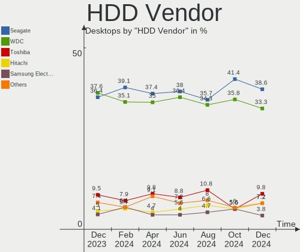
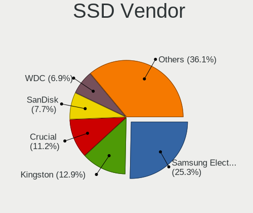
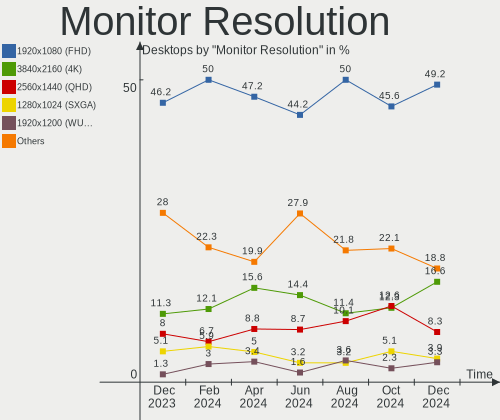
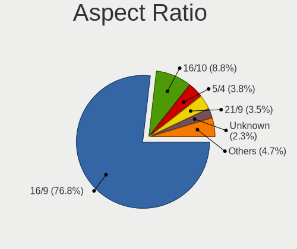
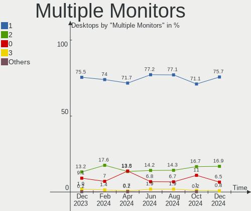

Ubuntu - Hardware Trends (Desktops)
-----------------------------------

A project to identify most popular hardware characteristics and track their change
over time based on data collected by Linux users at https://Linux-Hardware.org.

Anyone can contribute to this report by the [hw-probe](https://github.com/linuxhw/hw-probe) tool:

    sudo -E hw-probe -all -upload

This report is for one last month. Overall report since the beginning of time: [TestDays](https://github.com/linuxhw/TestDays)

Period: Jun, 2023.

Contents
--------

* [ System ](#system)
  - [ OS                       ](#os)
  - [ OS Family                ](#os-family)
  - [ Kernel                   ](#kernel)
  - [ Kernel Family            ](#kernel-family)
  - [ Kernel Major Ver.        ](#kernel-major-ver)
  - [ Arch                     ](#arch)
  - [ DE                       ](#de)
  - [ Display Server           ](#display-server)
  - [ Display Manager          ](#display-manager)
  - [ OS Lang                  ](#os-lang)
  - [ Boot Mode                ](#boot-mode)
  - [ Filesystem               ](#filesystem)
  - [ Part. scheme             ](#part-scheme)
  - [ Dual Boot with Linux/BSD ](#dual-boot-with-linuxbsd)
  - [ Dual Boot (Win)          ](#dual-boot-win)

* [ Board ](#board)
  - [ Vendor                   ](#vendor)
  - [ Model                    ](#model)
  - [ Model Family             ](#model-family)
  - [ MFG Year                 ](#mfg-year)
  - [ Form Factor              ](#form-factor)
  - [ Secure Boot              ](#secure-boot)
  - [ Coreboot                 ](#coreboot)
  - [ RAM Size                 ](#ram-size)
  - [ RAM Used                 ](#ram-used)
  - [ Total Drives             ](#total-drives)
  - [ Has CD-ROM               ](#has-cd-rom)
  - [ Has Ethernet             ](#has-ethernet)
  - [ Has WiFi                 ](#has-wifi)
  - [ Has Bluetooth            ](#has-bluetooth)

* [ Location ](#location)
  - [ Country                  ](#country)
  - [ City                     ](#city)

* [ Drives ](#drives)
  - [ Drive Vendor             ](#drive-vendor)
  - [ Drive Model              ](#drive-model)
  - [ HDD Vendor               ](#hdd-vendor)
  - [ SSD Vendor               ](#ssd-vendor)
  - [ Drive Kind               ](#drive-kind)
  - [ Drive Connector          ](#drive-connector)
  - [ Drive Size               ](#drive-size)
  - [ Space Total              ](#space-total)
  - [ Space Used               ](#space-used)
  - [ Malfunc. Drives          ](#malfunc-drives)
  - [ Malfunc. Drive Vendor    ](#malfunc-drive-vendor)
  - [ Malfunc. HDD Vendor      ](#malfunc-hdd-vendor)
  - [ Malfunc. Drive Kind      ](#malfunc-drive-kind)
  - [ Failed Drives            ](#failed-drives)
  - [ Failed Drive Vendor      ](#failed-drive-vendor)
  - [ Drive Status             ](#drive-status)

* [ Storage controller ](#storage-controller)
  - [ Storage Vendor           ](#storage-vendor)
  - [ Storage Model            ](#storage-model)
  - [ Storage Kind             ](#storage-kind)

* [ Processor ](#processor)
  - [ CPU Vendor               ](#cpu-vendor)
  - [ CPU Model                ](#cpu-model)
  - [ CPU Model Family         ](#cpu-model-family)
  - [ CPU Cores                ](#cpu-cores)
  - [ CPU Sockets              ](#cpu-sockets)
  - [ CPU Threads              ](#cpu-threads)
  - [ CPU Op-Modes             ](#cpu-op-modes)
  - [ CPU Microcode            ](#cpu-microcode)
  - [ CPU Microarch            ](#cpu-microarch)

* [ Graphics ](#graphics)
  - [ GPU Vendor               ](#gpu-vendor)
  - [ GPU Model                ](#gpu-model)
  - [ GPU Combo                ](#gpu-combo)
  - [ GPU Driver               ](#gpu-driver)
  - [ GPU Memory               ](#gpu-memory)

* [ Monitor ](#monitor)
  - [ Monitor Vendor           ](#monitor-vendor)
  - [ Monitor Model            ](#monitor-model)
  - [ Monitor Resolution       ](#monitor-resolution)
  - [ Monitor Diagonal         ](#monitor-diagonal)
  - [ Monitor Width            ](#monitor-width)
  - [ Aspect Ratio             ](#aspect-ratio)
  - [ Monitor Area             ](#monitor-area)
  - [ Pixel Density            ](#pixel-density)
  - [ Multiple Monitors        ](#multiple-monitors)

* [ Network ](#network)
  - [ Net Controller Vendor    ](#net-controller-vendor)
  - [ Net Controller Model     ](#net-controller-model)
  - [ Wireless Vendor          ](#wireless-vendor)
  - [ Wireless Model           ](#wireless-model)
  - [ Ethernet Vendor          ](#ethernet-vendor)
  - [ Ethernet Model           ](#ethernet-model)
  - [ Net Controller Kind      ](#net-controller-kind)
  - [ Used Controller          ](#used-controller)
  - [ NICs                     ](#nics)
  - [ IPv6                     ](#ipv6)

* [ Bluetooth ](#bluetooth)
  - [ Bluetooth Vendor         ](#bluetooth-vendor)
  - [ Bluetooth Model          ](#bluetooth-model)

* [ Sound ](#sound)
  - [ Sound Vendor             ](#sound-vendor)
  - [ Sound Model              ](#sound-model)

* [ Memory ](#memory)
  - [ Memory Vendor            ](#memory-vendor)
  - [ Memory Model             ](#memory-model)
  - [ Memory Kind              ](#memory-kind)
  - [ Memory Form Factor       ](#memory-form-factor)
  - [ Memory Size              ](#memory-size)
  - [ Memory Speed             ](#memory-speed)

* [ Printers & scanners ](#printers--scanners)
  - [ Printer Vendor           ](#printer-vendor)
  - [ Printer Model            ](#printer-model)
  - [ Scanner Vendor           ](#scanner-vendor)
  - [ Scanner Model            ](#scanner-model)

* [ Camera ](#camera)
  - [ Camera Vendor            ](#camera-vendor)
  - [ Camera Model             ](#camera-model)

* [ Security ](#security)
  - [ Fingerprint Vendor       ](#fingerprint-vendor)
  - [ Fingerprint Model        ](#fingerprint-model)
  - [ Chipcard Vendor          ](#chipcard-vendor)
  - [ Chipcard Model           ](#chipcard-model)

* [ Unsupported ](#unsupported)
  - [ Unsupported Devices      ](#unsupported-devices)
  - [ Unsupported Device Types ](#unsupported-device-types)

System
------

OS
--

Installed operating systems

| Name           | Desktops | Percent |
|----------------|----------|---------|
| Ubuntu 22.04   | 247      | 60.99%  |
| Ubuntu 23.04   | 83       | 20.49%  |
| Ubuntu 20.04   | 39       | 9.63%   |
| Ubuntu 22.10   | 21       | 5.19%   |
| Ubuntu 18.04   | 12       | 2.96%   |
| Ubuntu Core 22 | 1        | 0.25%   |
| Ubuntu 21.10   | 1        | 0.25%   |
| Ubuntu 16.04   | 1        | 0.25%   |

OS Family
---------

OS without a version

| Name   | Desktops | Percent |
|--------|----------|---------|
| Ubuntu | 405      | 100%    |

Kernel
------

Version of the Linux kernel

| Version                     | Desktops | Percent |
|-----------------------------|----------|---------|
| 5.19.0-43-generic           | 114      | 28.15%  |
| 5.19.0-45-generic           | 70       | 17.28%  |
| 6.2.0-20-generic            | 47       | 11.6%   |
| 5.15.0-73-generic           | 27       | 6.67%   |
| 6.2.0-23-generic            | 26       | 6.42%   |
| 5.15.0-75-generic           | 19       | 4.69%   |
| 5.19.0-46-generic           | 12       | 2.96%   |
| 5.19.0-32-generic           | 12       | 2.96%   |
| 5.4.0-150-generic           | 6        | 1.48%   |
| 5.15.0-72-generic           | 5        | 1.23%   |
| 6.2.0-24-generic            | 4        | 0.99%   |
| 5.19.0-42-generic           | 4        | 0.99%   |
| 5.19.0-38-generic           | 3        | 0.74%   |
| 5.15.0-69-generic           | 3        | 0.74%   |
| 5.15.0-43-generic           | 3        | 0.74%   |
| 6.3.6-060306-generic        | 2        | 0.49%   |
| 6.3.4-060304-generic        | 2        | 0.49%   |
| 5.4.0-42-generic            | 2        | 0.49%   |
| 5.19.0-44-generic           | 2        | 0.49%   |
| 5.19.0-40-generic           | 2        | 0.49%   |
| 5.15.0-76-generic           | 2        | 0.49%   |
| 5.15.0-25-generic           | 2        | 0.49%   |
| 5.10.60-qnap                | 2        | 0.49%   |
| 6.3.7-51601-gaa0a1382849d   | 1        | 0.25%   |
| 6.2.0-1007-gcp              | 1        | 0.25%   |
| 6.1.32-060132-generic       | 1        | 0.25%   |
| 5.8.0-43-generic            | 1        | 0.25%   |
| 5.4.0-traditional-1+        | 1        | 0.25%   |
| 5.4.0-87-generic            | 1        | 0.25%   |
| 5.4.0-54-generic            | 1        | 0.25%   |
| 5.4.0-154-generic           | 1        | 0.25%   |
| 5.4.0-152-generic           | 1        | 0.25%   |
| 5.4.0-149-generic           | 1        | 0.25%   |
| 5.4.0-148-generic           | 1        | 0.25%   |
| 5.4.0-147-generic           | 1        | 0.25%   |
| 5.19.0-41-generic           | 1        | 0.25%   |
| 5.19.0-402304060810-generic | 1        | 0.25%   |
| 5.17.0-1020-oem             | 1        | 0.25%   |
| 5.15.0-74-generic           | 1        | 0.25%   |
| 5.15.0-71-generic           | 1        | 0.25%   |

Kernel Family
-------------

Linux kernel without a distro release

| Version | Desktops | Percent |
|---------|----------|---------|
| 5.19.0  | 221      | 54.57%  |
| 6.2.0   | 78       | 19.26%  |
| 5.15.0  | 69       | 17.04%  |
| 5.4.0   | 16       | 3.95%   |
| 4.15.0  | 5        | 1.23%   |
| 5.13.0  | 3        | 0.74%   |
| 6.3.6   | 2        | 0.49%   |
| 6.3.4   | 2        | 0.49%   |
| 5.10.60 | 2        | 0.49%   |
| 6.3.7   | 1        | 0.25%   |
| 6.1.32  | 1        | 0.25%   |
| 5.8.0   | 1        | 0.25%   |
| 5.17.0  | 1        | 0.25%   |
| 5.14.0  | 1        | 0.25%   |
| 5.11.0  | 1        | 0.25%   |
| 4.4.0   | 1        | 0.25%   |

Kernel Major Ver.
-----------------

Linux kernel major version

| Version | Desktops | Percent |
|---------|----------|---------|
| 5.19    | 221      | 54.57%  |
| 6.2     | 78       | 19.26%  |
| 5.15    | 69       | 17.04%  |
| 5.4     | 16       | 3.95%   |
| 6.3     | 5        | 1.23%   |
| 4.15    | 5        | 1.23%   |
| 5.13    | 3        | 0.74%   |
| 5.10    | 2        | 0.49%   |
| 6.1     | 1        | 0.25%   |
| 5.8     | 1        | 0.25%   |
| 5.17    | 1        | 0.25%   |
| 5.14    | 1        | 0.25%   |
| 5.11    | 1        | 0.25%   |
| 4.4     | 1        | 0.25%   |

Arch
----

OS architecture (x86_64, i586, etc.)

| Name   | Desktops | Percent |
|--------|----------|---------|
| x86_64 | 402      | 99.26%  |
| i686   | 3        | 0.74%   |

DE
--

Desktop Environment

| Name            | Desktops | Percent |
|-----------------|----------|---------|
| GNOME           | 377      | 93.09%  |
| Unknown         | 16       | 3.95%   |
| X-Cinnamon      | 5        | 1.23%   |
| GNOME Classic   | 3        | 0.74%   |
| i3              | 1        | 0.25%   |
| GNOME Flashback | 1        | 0.25%   |
| Enlightenment   | 1        | 0.25%   |
| Cinnamon        | 1        | 0.25%   |

Display Server
--------------

X11 or Wayland

| Name    | Desktops | Percent |
|---------|----------|---------|
| Wayland | 205      | 50.62%  |
| X11     | 174      | 42.96%  |
| Tty     | 16       | 3.95%   |
| Unknown | 10       | 2.47%   |

Display Manager
---------------

SDDM, LightDM, etc.

| Name    | Desktops | Percent |
|---------|----------|---------|
| GDM3    | 329      | 81.23%  |
| Unknown | 48       | 11.85%  |
| GDM     | 21       | 5.19%   |
| LightDM | 6        | 1.48%   |
| SDDM    | 1        | 0.25%   |

OS Lang
-------

Language

| Lang             | Desktops | Percent |
|------------------|----------|---------|
| en_US            | 194      | 47.9%   |
| de_DE            | 33       | 8.15%   |
| fr_FR            | 32       | 7.9%    |
| en_GB            | 17       | 4.2%    |
| it_IT            | 16       | 3.95%   |
| pt_BR            | 14       | 3.46%   |
| en_AU            | 14       | 3.46%   |
| es_ES            | 9        | 2.22%   |
| en_CA            | 9        | 2.22%   |
| nl_NL            | 8        | 1.98%   |
| C                | 8        | 1.98%   |
| ru_RU            | 6        | 1.48%   |
| pl_PL            | 5        | 1.23%   |
| en_IN            | 4        | 0.99%   |
| sk_SK            | 3        | 0.74%   |
| fi_FI            | 3        | 0.74%   |
| Unknown          | 3        | 0.74%   |
| zh_TW            | 2        | 0.49%   |
| zh_CN            | 2        | 0.49%   |
| ja_JP            | 2        | 0.49%   |
| es_EC            | 2        | 0.49%   |
| es_CO            | 2        | 0.49%   |
| de_AT            | 2        | 0.49%   |
| cs_CZ            | 2        | 0.49%   |
| sv_SE            | 1        | 0.25%   |
| ro_RO            | 1        | 0.25%   |
| pt_PT            | 1        | 0.25%   |
| nb_NO            | 1        | 0.25%   |
| fr_BE            | 1        | 0.25%   |
| es_MX            | 1        | 0.25%   |
| es_CR            | 1        | 0.25%   |
| es_AR            | 1        | 0.25%   |
| en_US.ISO-8859-1 | 1        | 0.25%   |
| en_SG            | 1        | 0.25%   |
| en_NZ            | 1        | 0.25%   |
| en_HK            | 1        | 0.25%   |
| el_GR            | 1        | 0.25%   |

Boot Mode
---------

EFI or BIOS

| Mode | Desktops | Percent |
|------|----------|---------|
| BIOS | 297      | 73.33%  |
| EFI  | 108      | 26.67%  |

Filesystem
----------

Type of filesystem

| Type    | Desktops | Percent |
|---------|----------|---------|
| Tmpfs   | 211      | 52.1%   |
| Ext4    | 164      | 40.49%  |
| Btrfs   | 18       | 4.44%   |
| Overlay | 8        | 1.98%   |
| Zfs     | 3        | 0.74%   |
| Ext2    | 1        | 0.25%   |

Part. scheme
------------

Scheme of partitioning

| Type    | Desktops | Percent |
|---------|----------|---------|
| GPT     | 306      | 75.56%  |
| MBR     | 59       | 14.57%  |
| Unknown | 40       | 9.88%   |

Dual Boot with Linux/BSD
------------------------

Hosting more than one Linux/BSD

| Dual boot | Desktops | Percent |
|-----------|----------|---------|
| No        | 323      | 79.75%  |
| Yes       | 82       | 20.25%  |

Dual Boot (Win)
---------------

Hosting Linux and Windows

| Dual boot | Desktops | Percent |
|-----------|----------|---------|
| No        | 241      | 59.51%  |
| Yes       | 164      | 40.49%  |

Board
-----

Vendor
------

Motherboard manufacturer

| Name                                 | Desktops | Percent |
|--------------------------------------|----------|---------|
| ASUSTek Computer                     | 93       | 22.96%  |
| Gigabyte Technology                  | 58       | 14.32%  |
| Dell                                 | 47       | 11.6%   |
| MSI                                  | 41       | 10.12%  |
| ASRock                               | 34       | 8.4%    |
| Hewlett-Packard                      | 32       | 7.9%    |
| Lenovo                               | 19       | 4.69%   |
| Intel                                | 12       | 2.96%   |
| Unknown                              | 12       | 2.96%   |
| Pegatron                             | 6        | 1.48%   |
| AZW                                  | 5        | 1.23%   |
| Acer                                 | 5        | 1.23%   |
| Fujitsu                              | 4        | 0.99%   |
| Foxconn                              | 4        | 0.99%   |
| Biostar                              | 4        | 0.99%   |
| Apple                                | 3        | 0.74%   |
| Supermicro                           | 2        | 0.49%   |
| Shenzhen Meigao Electronic Equipment | 2        | 0.49%   |
| Medion                               | 2        | 0.49%   |
| Huanan                               | 2        | 0.49%   |
| ECS                                  | 2        | 0.49%   |
| Chuwi                                | 2        | 0.49%   |
| ZR                                   | 1        | 0.25%   |
| SZMZ                                 | 1        | 0.25%   |
| System76                             | 1        | 0.25%   |
| Shuttle                              | 1        | 0.25%   |
| Seeed Studio                         | 1        | 0.25%   |
| Seco                                 | 1        | 0.25%   |
| PCWare                               | 1        | 0.25%   |
| OEM                                  | 1        | 0.25%   |
| HJS                                  | 1        | 0.25%   |
| Gateway                              | 1        | 0.25%   |
| Entroware                            | 1        | 0.25%   |
| ASRockRack                           | 1        | 0.25%   |
| AMI                                  | 1        | 0.25%   |
| Alienware                            | 1        | 0.25%   |

Model
-----

Motherboard model

| Name                                       | Desktops | Percent |
|--------------------------------------------|----------|---------|
| Unknown                                    | 13       | 3.21%   |
| Dell OptiPlex 7010                         | 4        | 0.99%   |
| Dell OptiPlex 9020                         | 3        | 0.74%   |
| Dell OptiPlex 755                          | 3        | 0.74%   |
| ASUS ROG STRIX B650E-I GAMING WIFI         | 3        | 0.74%   |
| ASUS All Series                            | 3        | 0.74%   |
| Shenzhen Meigao Electronic Equipment UM690 | 2        | 0.49%   |
| MSI MS-7C95                                | 2        | 0.49%   |
| MSI MS-7C91                                | 2        | 0.49%   |
| MSI MS-7C56                                | 2        | 0.49%   |
| MSI MS-7A71                                | 2        | 0.49%   |
| MSI MS-7596                                | 2        | 0.49%   |
| HP ProDesk 600 G1 SFF                      | 2        | 0.49%   |
| HP EliteDesk 800 G4 DM 35W                 | 2        | 0.49%   |
| HP Compaq Pro 6300 MT                      | 2        | 0.49%   |
| HP Compaq Elite 8300 SFF                   | 2        | 0.49%   |
| Gigabyte Z390 AORUS PRO WIFI               | 2        | 0.49%   |
| Gigabyte X79-UD3                           | 2        | 0.49%   |
| Gigabyte H310M M.2 2.0                     | 2        | 0.49%   |
| Gigabyte B550M AORUS PRO-P                 | 2        | 0.49%   |
| Gigabyte B450M DS3H                        | 2        | 0.49%   |
| Fujitsu ESPRIMO E700                       | 2        | 0.49%   |
| Dell XPS 8930                              | 2        | 0.49%   |
| Dell Precision WorkStation T5500           | 2        | 0.49%   |
| Dell OptiPlex 3020                         | 2        | 0.49%   |
| Chuwi RZBOX                                | 2        | 0.49%   |
| AZW SEi                                    | 2        | 0.49%   |
| ASUS TUF Gaming Z590-PLUS WIFI             | 2        | 0.49%   |
| ASUS ROG STRIX B450-F GAMING               | 2        | 0.49%   |
| ASUS PRIME Z790-A WIFI                     | 2        | 0.49%   |
| ASUS PRIME X670-P WIFI                     | 2        | 0.49%   |
| ASUS H170-PRO                              | 2        | 0.49%   |
| ASUS F2A55-M LK                            | 2        | 0.49%   |
| ASRock B365 Pro4                           | 2        | 0.49%   |
| ZR A320M-F                                 | 1        | 0.25%   |
| SZMZ X99M-H2                               | 1        | 0.25%   |
| System76 Leopard Extreme                   | 1        | 0.25%   |
| Supermicro X9DRW                           | 1        | 0.25%   |
| Supermicro SYS-6018R-TDW                   | 1        | 0.25%   |
| Shuttle SA76                               | 1        | 0.25%   |

Model Family
------------

Motherboard model prefix

| Name                                       | Desktops | Percent |
|--------------------------------------------|----------|---------|
| Dell OptiPlex                              | 27       | 6.67%   |
| ASUS PRIME                                 | 21       | 5.19%   |
| ASUS ROG                                   | 17       | 4.2%    |
| HP Compaq                                  | 14       | 3.46%   |
| Unknown                                    | 13       | 3.21%   |
| Lenovo ThinkCentre                         | 10       | 2.47%   |
| ASUS TUF                                   | 9        | 2.22%   |
| Dell Inspiron                              | 7        | 1.73%   |
| Dell Precision                             | 6        | 1.48%   |
| HP EliteDesk                               | 5        | 1.23%   |
| Gigabyte B450M                             | 5        | 1.23%   |
| ASRock X570                                | 5        | 1.23%   |
| HP ProDesk                                 | 4        | 0.99%   |
| Gigabyte B550M                             | 4        | 0.99%   |
| Fujitsu ESPRIMO                            | 4        | 0.99%   |
| Dell XPS                                   | 4        | 0.99%   |
| Gigabyte Z590                              | 3        | 0.74%   |
| ASUS All                                   | 3        | 0.74%   |
| Acer Aspire                                | 3        | 0.74%   |
| Shenzhen Meigao Electronic Equipment UM690 | 2        | 0.49%   |
| MSI MS-7C95                                | 2        | 0.49%   |
| MSI MS-7C91                                | 2        | 0.49%   |
| MSI MS-7C56                                | 2        | 0.49%   |
| MSI MS-7A71                                | 2        | 0.49%   |
| MSI MS-7596                                | 2        | 0.49%   |
| Lenovo IdeaCentre                          | 2        | 0.49%   |
| Intel X99                                  | 2        | 0.49%   |
| Intel DH55TC                               | 2        | 0.49%   |
| Gigabyte Z790                              | 2        | 0.49%   |
| Gigabyte Z390                              | 2        | 0.49%   |
| Gigabyte X79-UD3                           | 2        | 0.49%   |
| Gigabyte H310M                             | 2        | 0.49%   |
| Gigabyte B760M                             | 2        | 0.49%   |
| Gigabyte B650M                             | 2        | 0.49%   |
| Gigabyte B450                              | 2        | 0.49%   |
| Gigabyte A320M-S2H                         | 2        | 0.49%   |
| Dell Vostro                                | 2        | 0.49%   |
| Chuwi RZBOX                                | 2        | 0.49%   |
| AZW SEi                                    | 2        | 0.49%   |
| ASUS P8P67                                 | 2        | 0.49%   |

MFG Year
--------

Motherboard manufacture year

| Year    | Desktops | Percent |
|---------|----------|---------|
| 2022    | 47       | 11.6%   |
| 2012    | 37       | 9.14%   |
| 2018    | 35       | 8.64%   |
| 2011    | 35       | 8.64%   |
| 2013    | 33       | 8.15%   |
| 2021    | 31       | 7.65%   |
| 2020    | 26       | 6.42%   |
| 2019    | 26       | 6.42%   |
| 2010    | 22       | 5.43%   |
| 2017    | 20       | 4.94%   |
| 2015    | 20       | 4.94%   |
| 2014    | 19       | 4.69%   |
| 2009    | 15       | 3.7%    |
| 2016    | 11       | 2.72%   |
| 2008    | 9        | 2.22%   |
| 2023    | 8        | 1.98%   |
| 2007    | 7        | 1.73%   |
| Unknown | 2        | 0.49%   |
| 2006    | 1        | 0.25%   |
| 2005    | 1        | 0.25%   |

Form Factor
-----------

Physical design of the computer

| Name    | Desktops | Percent |
|---------|----------|---------|
| Desktop | 405      | 100%    |

Secure Boot
-----------

Enabled or disabled

| State    | Desktops | Percent |
|----------|----------|---------|
| Disabled | 393      | 97.04%  |
| Enabled  | 12       | 2.96%   |

Coreboot
--------

Have coreboot on board

| Used | Desktops | Percent |
|------|----------|---------|
| No   | 405      | 100%    |

RAM Size
--------

Total RAM memory

| Size in GB      | Desktops | Percent |
|-----------------|----------|---------|
| 16.01-24.0      | 88       | 21.73%  |
| 32.01-64.0      | 77       | 19.01%  |
| 4.01-8.0        | 74       | 18.27%  |
| 8.01-16.0       | 56       | 13.83%  |
| 3.01-4.0        | 46       | 11.36%  |
| 64.01-256.0     | 39       | 9.63%   |
| 24.01-32.0      | 15       | 3.7%    |
| 2.01-3.0        | 5        | 1.23%   |
| 1.01-2.0        | 3        | 0.74%   |
| More than 256.0 | 2        | 0.49%   |

RAM Used
--------

Used RAM memory

| Used GB    | Desktops | Percent |
|------------|----------|---------|
| 2.01-3.0   | 125      | 30.86%  |
| 1.01-2.0   | 115      | 28.4%   |
| 4.01-8.0   | 74       | 18.27%  |
| 3.01-4.0   | 53       | 13.09%  |
| 8.01-16.0  | 24       | 5.93%   |
| 0.51-1.0   | 8        | 1.98%   |
| 16.01-24.0 | 3        | 0.74%   |
| 32.01-64.0 | 2        | 0.49%   |
| 24.01-32.0 | 1        | 0.25%   |

Total Drives
------------

Number of drives on board

| Drives | Desktops | Percent |
|--------|----------|---------|
| 1      | 164      | 40.49%  |
| 2      | 115      | 28.4%   |
| 3      | 65       | 16.05%  |
| 4      | 31       | 7.65%   |
| 6      | 12       | 2.96%   |
| 5      | 11       | 2.72%   |
| 7      | 3        | 0.74%   |
| 0      | 3        | 0.74%   |
| 10     | 1        | 0.25%   |

Has CD-ROM
----------

Has CD-ROM on board

| Presented | Desktops | Percent |
|-----------|----------|---------|
| No        | 245      | 60.49%  |
| Yes       | 160      | 39.51%  |

Has Ethernet
------------

Has Ethernet on board

| Presented | Desktops | Percent |
|-----------|----------|---------|
| Yes       | 399      | 98.52%  |
| No        | 6        | 1.48%   |

Has WiFi
--------

Has WiFi module

| Presented | Desktops | Percent |
|-----------|----------|---------|
| Yes       | 216      | 53.33%  |
| No        | 189      | 46.67%  |

Has Bluetooth
-------------

Has Bluetooth module

| Presented | Desktops | Percent |
|-----------|----------|---------|
| No        | 248      | 61.23%  |
| Yes       | 157      | 38.77%  |

Location
--------

Country
-------

Geographic location (country)

| Country     | Desktops | Percent |
|-------------|----------|---------|
| USA         | 94       | 23.21%  |
| Germany     | 43       | 10.62%  |
| France      | 38       | 9.38%   |
| Brazil      | 23       | 5.68%   |
| Italy       | 19       | 4.69%   |
| Australia   | 16       | 3.95%   |
| UK          | 15       | 3.7%    |
| Canada      | 13       | 3.21%   |
| Russia      | 12       | 2.96%   |
| Spain       | 9        | 2.22%   |
| Netherlands | 9        | 2.22%   |
| Sweden      | 6        | 1.48%   |
| Poland      | 6        | 1.48%   |
| India       | 5        | 1.23%   |
| Finland     | 5        | 1.23%   |
| Switzerland | 4        | 0.99%   |
| Slovakia    | 4        | 0.99%   |
| New Zealand | 4        | 0.99%   |
| Hong Kong   | 4        | 0.99%   |
| China       | 4        | 0.99%   |
| Ukraine     | 3        | 0.74%   |
| Taiwan      | 3        | 0.74%   |
| Romania     | 3        | 0.74%   |
| Portugal    | 3        | 0.74%   |
| Indonesia   | 3        | 0.74%   |
| Greece      | 3        | 0.74%   |
| Bulgaria    | 3        | 0.74%   |
| Turkey      | 2        | 0.49%   |
| Singapore   | 2        | 0.49%   |
| Philippines | 2        | 0.49%   |
| Mexico      | 2        | 0.49%   |
| Japan       | 2        | 0.49%   |
| Israel      | 2        | 0.49%   |
| Iran        | 2        | 0.49%   |
| Hungary     | 2        | 0.49%   |
| Egypt       | 2        | 0.49%   |
| Ecuador     | 2        | 0.49%   |
| Czechia     | 2        | 0.49%   |
| Colombia    | 2        | 0.49%   |
| Belgium     | 2        | 0.49%   |

City
----

Geographic location (city)

| City            | Desktops | Percent |
|-----------------|----------|---------|
| Melbourne       | 6        | 1.48%   |
| New York        | 5        | 1.23%   |
| Helsinki        | 5        | 1.23%   |
| Berlin          | 5        | 1.23%   |
| Sao Paulo       | 4        | 0.99%   |
| Paris           | 4        | 0.99%   |
| Munich          | 4        | 0.99%   |
| Milano          | 4        | 0.99%   |
| Sydney          | 3        | 0.74%   |
| St Petersburg   | 3        | 0.74%   |
| Moscow          | 3        | 0.74%   |
| Milan           | 3        | 0.74%   |
| Manchester      | 3        | 0.74%   |
| Madrid          | 3        | 0.74%   |
| Cologne         | 3        | 0.74%   |
| Zurich          | 2        | 0.49%   |
| Vancouver       | 2        | 0.49%   |
| Tourcoing       | 2        | 0.49%   |
| Tehran          | 2        | 0.49%   |
| Surrey          | 2        | 0.49%   |
| Singapore       | 2        | 0.49%   |
| Rotterdam       | 2        | 0.49%   |
| Rosny-sous-Bois | 2        | 0.49%   |
| Rome            | 2        | 0.49%   |
| Rio de Janeiro  | 2        | 0.49%   |
| Redmond         | 2        | 0.49%   |
| Perth           | 2        | 0.49%   |
| North Hollywood | 2        | 0.49%   |
| Lyon            | 2        | 0.49%   |
| Ludwigsburg     | 2        | 0.49%   |
| London          | 2        | 0.49%   |
| Karlsruhe       | 2        | 0.49%   |
| Kaohsiung City  | 2        | 0.49%   |
| Istanbul        | 2        | 0.49%   |
| Hanover         | 2        | 0.49%   |
| Greenville      | 2        | 0.49%   |
| Gothenburg      | 2        | 0.49%   |
| Gdansk          | 2        | 0.49%   |
| Central         | 2        | 0.49%   |
| Calgary         | 2        | 0.49%   |

Drives
------

Drive Vendor
------------

Hard drive vendors

| Vendor                      | Desktops | Drives | Percent |
|-----------------------------|----------|--------|---------|
| Seagate                     | 119      | 147    | 16.48%  |
| WDC                         | 118      | 158    | 16.34%  |
| Samsung Electronics         | 105      | 137    | 14.54%  |
| Kingston                    | 47       | 50     | 6.51%   |
| Crucial                     | 40       | 47     | 5.54%   |
| Sandisk                     | 35       | 38     | 4.85%   |
| Toshiba                     | 25       | 28     | 3.46%   |
| Hitachi                     | 23       | 30     | 3.19%   |
| SK hynix                    | 13       | 17     | 1.8%    |
| China                       | 13       | 14     | 1.8%    |
| Kingston Technology Company | 11       | 11     | 1.52%   |
| A-DATA Technology           | 11       | 13     | 1.52%   |
| Micron/Crucial Technology   | 10       | 12     | 1.39%   |
| Unknown                     | 8        | 9      | 1.11%   |
| Phison Electronics          | 8        | 8      | 1.11%   |
| SPCC                        | 7        | 8      | 0.97%   |
| Silicon Motion              | 6        | 6      | 0.83%   |
| OCZ                         | 6        | 6      | 0.83%   |
| KIOXIA                      | 6        | 7      | 0.83%   |
| Intenso                     | 6        | 6      | 0.83%   |
| Intel                       | 5        | 5      | 0.69%   |
| HGST                        | 5        | 11     | 0.69%   |
| SABRENT                     | 4        | 4      | 0.55%   |
| PNY                         | 4        | 5      | 0.55%   |
| Patriot                     | 4        | 4      | 0.55%   |
| Maxtor                      | 4        | 4      | 0.55%   |
| Transcend                   | 3        | 3      | 0.42%   |
| Team                        | 3        | 3      | 0.42%   |
| Phison                      | 3        | 4      | 0.42%   |
| Netac                       | 3        | 3      | 0.42%   |
| Micron Technology           | 3        | 5      | 0.42%   |
| MAXIO Technology (Hangzhou) | 3        | 3      | 0.42%   |
| JMicron Technology          | 3        | 3      | 0.42%   |
| Gigabyte Technology         | 3        | 3      | 0.42%   |
| Apple                       | 3        | 3      | 0.42%   |
| T-FORCE                     | 2        | 2      | 0.28%   |
| Realtek Semiconductor       | 2        | 2      | 0.28%   |
| Realtek                     | 2        | 2      | 0.28%   |
| LITEON                      | 2        | 2      | 0.28%   |
| GOODRAM                     | 2        | 2      | 0.28%   |

Drive Model
-----------

Hard drive models

| Model                                                 | Desktops | Percent |
|-------------------------------------------------------|----------|---------|
| Samsung NVMe SSD Controller SM981/PM981/PM983 250GB   | 14       | 1.72%   |
| Samsung NVMe SSD Controller PM9A1/PM9A3/980PRO 2TB    | 11       | 1.35%   |
| Seagate ST1000DM010-2EP102 1TB                        | 10       | 1.23%   |
| Micron/Crucial P2 NVMe PCIe SSD 4TB                   | 10       | 1.23%   |
| WDC WD10EZEX-08WN4A0 1TB                              | 9        | 1.1%    |
| Seagate ST2000DM008-2FR102 2TB                        | 9        | 1.1%    |
| Kingston SA400S37240G 240GB SSD                       | 9        | 1.1%    |
| Seagate ST4000DM004-2CV104 4TB                        | 7        | 0.86%   |
| Seagate ST1000DM003-1ER162 1TB                        | 7        | 0.86%   |
| Samsung SSD 860 EVO 500GB                             | 7        | 0.86%   |
| Kingston SA400S37480G 480GB SSD                       | 7        | 0.86%   |
| Crucial CT500MX500SSD1 500GB                          | 7        | 0.86%   |
| Crucial CT240BX500SSD1 240GB                          | 7        | 0.86%   |
| Seagate ST500DM002-1BD142 500GB                       | 6        | 0.74%   |
| Seagate ST2000DM001-1ER164 2TB                        | 6        | 0.74%   |
| Seagate ST1000DM003-1CH162 1TB                        | 6        | 0.74%   |
| Samsung SSD 870 EVO 500GB                             | 6        | 0.74%   |
| Samsung SSD 850 EVO 250GB                             | 6        | 0.74%   |
| Toshiba DT01ACA200 2TB                                | 5        | 0.61%   |
| Samsung SSD 980 1TB                                   | 5        | 0.61%   |
| Samsung SSD 850 EVO 500GB                             | 5        | 0.61%   |
| Kingston Company SNV2S1000G 1TB                       | 5        | 0.61%   |
| Kingston SA400S37120G 120GB SSD                       | 5        | 0.61%   |
| Crucial CT1000BX500SSD1 1TB                           | 5        | 0.61%   |
| WDC WD5000AAKX-00ERMA0 500GB                          | 4        | 0.49%   |
| WDC WD20EZRX-00D8PB0 2TB                              | 4        | 0.49%   |
| Toshiba HDWD110 1TB                                   | 4        | 0.49%   |
| Silicon Motion SM2263EN/SM2263XT SSD Controller 256GB | 4        | 0.49%   |
| Seagate ST3500418AS 500GB                             | 4        | 0.49%   |
| Seagate ST1000DM003-1SB102 1TB                        | 4        | 0.49%   |
| Sandisk WD Black SN750 / PC SN730 NVMe SSD 500GB      | 4        | 0.49%   |
| SanDisk NVMe SSD Drive 1TB                            | 4        | 0.49%   |
| Samsung SSD 990 PRO 2TB                               | 4        | 0.49%   |
| Samsung SSD 980 PRO 1TB                               | 4        | 0.49%   |
| Samsung NVMe SSD Controller SM961/PM961/SM963 256GB   | 4        | 0.49%   |
| SABRENT Disk 1TB                                      | 4        | 0.49%   |
| Phison E16 PCIe4 NVMe Controller 1TB                  | 4        | 0.49%   |
| Kingston SNV2S500G 500GB                              | 4        | 0.49%   |
| Crucial CT480BX500SSD1 480GB                          | 4        | 0.49%   |
| Crucial CT1000MX500SSD1 1TB                           | 4        | 0.49%   |

HDD Vendor
----------

Hard disk drive vendors

| Vendor              | Desktops | Drives | Percent |
|---------------------|----------|--------|---------|
| Seagate             | 116      | 144    | 39.19%  |
| WDC                 | 106      | 140    | 35.81%  |
| Hitachi             | 23       | 30     | 7.77%   |
| Toshiba             | 22       | 25     | 7.43%   |
| Samsung Electronics | 13       | 13     | 4.39%   |
| HGST                | 5        | 11     | 1.69%   |
| Maxtor              | 4        | 4      | 1.35%   |
| Unknown             | 3        | 3      | 1.01%   |
| ASMT                | 2        | 4      | 0.68%   |
| Intenso             | 1        | 1      | 0.34%   |
| Apple               | 1        | 1      | 0.34%   |

SSD Vendor
----------

Solid state drive vendors

| Vendor              | Desktops | Drives | Percent |
|---------------------|----------|--------|---------|
| Samsung Electronics | 50       | 57     | 20.24%  |
| Kingston            | 36       | 39     | 14.57%  |
| Crucial             | 36       | 42     | 14.57%  |
| SanDisk             | 17       | 17     | 6.88%   |
| China               | 13       | 14     | 5.26%   |
| WDC                 | 11       | 12     | 4.45%   |
| A-DATA Technology   | 10       | 12     | 4.05%   |
| SPCC                | 7        | 8      | 2.83%   |
| OCZ                 | 6        | 6      | 2.43%   |
| Intenso             | 4        | 4      | 1.62%   |
| Patriot             | 3        | 3      | 1.21%   |
| Intel               | 3        | 3      | 1.21%   |
| Transcend           | 2        | 2      | 0.81%   |
| Team                | 2        | 2      | 0.81%   |
| SK hynix            | 2        | 3      | 0.81%   |
| PNY                 | 2        | 2      | 0.81%   |
| Netac               | 2        | 2      | 0.81%   |
| Micron Technology   | 2        | 3      | 0.81%   |
| LITEON              | 2        | 2      | 0.81%   |
| GOODRAM             | 2        | 2      | 0.81%   |
| Gigastone           | 2        | 2      | 0.81%   |
| Gigabyte Technology | 2        | 2      | 0.81%   |
| FORESEE             | 2        | 2      | 0.81%   |
| Zebronics           | 1        | 1      | 0.4%    |
| Vaseky              | 1        | 1      | 0.4%    |
| Toshiba             | 1        | 1      | 0.4%    |
| TO Exter            | 1        | 1      | 0.4%    |
| TEXTORM             | 1        | 1      | 0.4%    |
| T-FORCE             | 1        | 1      | 0.4%    |
| SCCTS-602-256G      | 1        | 1      | 0.4%    |
| SATAFIRM            | 1        | 1      | 0.4%    |
| Rogueware           | 1        | 1      | 0.4%    |
| Ramsta              | 1        | 1      | 0.4%    |
| Plextor             | 1        | 1      | 0.4%    |
| OWC                 | 1        | 2      | 0.4%    |
| Origin              | 1        | 1      | 0.4%    |
| NGFF                | 1        | 1      | 0.4%    |
| MidasForce          | 1        | 1      | 0.4%    |
| LITEONIT            | 1        | 1      | 0.4%    |
| Leven               | 1        | 1      | 0.4%    |

Drive Kind
----------

HDD or SSD

| Kind    | Desktops | Drives | Percent |
|---------|----------|--------|---------|
| HDD     | 235      | 376    | 38.59%  |
| SSD     | 212      | 272    | 34.81%  |
| NVMe    | 146      | 205    | 23.97%  |
| Unknown | 14       | 18     | 2.3%    |
| MMC     | 2        | 3      | 0.33%   |

Drive Connector
---------------

SATA, SAS, NVMe, etc.

| Type | Desktops | Drives | Percent |
|------|----------|--------|---------|
| SATA | 337      | 621    | 64.68%  |
| NVMe | 144      | 198    | 27.64%  |
| SAS  | 38       | 52     | 7.29%   |
| MMC  | 2        | 3      | 0.38%   |

Drive Size
----------

Size of hard drive

| Size in TB | Desktops | Drives | Percent |
|------------|----------|--------|---------|
| 0.01-0.5   | 239      | 326    | 49.28%  |
| 0.51-1.0   | 141      | 187    | 29.07%  |
| 1.01-2.0   | 68       | 80     | 14.02%  |
| 3.01-4.0   | 18       | 24     | 3.71%   |
| 4.01-10.0  | 10       | 22     | 2.06%   |
| 2.01-3.0   | 8        | 8      | 1.65%   |
| 10.01-20.0 | 1        | 1      | 0.21%   |

Space Total
-----------

Amount of disk space available on the file system

| Size in GB     | Desktops | Percent |
|----------------|----------|---------|
| 101-250        | 96       | 23.7%   |
| 251-500        | 72       | 17.78%  |
| 501-1000       | 70       | 17.28%  |
| 1001-2000      | 54       | 13.33%  |
| More than 3000 | 47       | 11.6%   |
| 2001-3000      | 21       | 5.19%   |
| 1-20           | 16       | 3.95%   |
| 51-100         | 16       | 3.95%   |
| Unknown        | 7        | 1.73%   |
| 21-50          | 6        | 1.48%   |

Space Used
----------

Amount of used disk space

| Used GB        | Desktops | Percent |
|----------------|----------|---------|
| 1-20           | 113      | 27.9%   |
| 21-50          | 80       | 19.75%  |
| 101-250        | 51       | 12.59%  |
| 51-100         | 47       | 11.6%   |
| 251-500        | 33       | 8.15%   |
| 501-1000       | 29       | 7.16%   |
| 1001-2000      | 25       | 6.17%   |
| More than 3000 | 15       | 3.7%    |
| Unknown        | 7        | 1.73%   |
| 2001-3000      | 5        | 1.23%   |

Malfunc. Drives
---------------

Drive models with a malfunction

| Model                                 | Desktops | Drives | Percent |
|---------------------------------------|----------|--------|---------|
| Kingston SV300S37A120G 120GB SSD      | 2        | 2      | 6.06%   |
| WDC WDS120G2G0A-00JH30 128GB SSD      | 1        | 1      | 3.03%   |
| WDC WD5000AZLX-22JKKA0 500GB          | 1        | 1      | 3.03%   |
| WDC WD5000AAKX-08ERMA0 500GB          | 1        | 1      | 3.03%   |
| WDC WD5000AAKX-001CA0 500GB           | 1        | 1      | 3.03%   |
| WDC WD5000AAKS-75A7B2 500GB           | 1        | 1      | 3.03%   |
| WDC WD5000AAKS-00UU3A0 500GB          | 1        | 1      | 3.03%   |
| WDC WD2500KS-00MJB0 250GB             | 1        | 1      | 3.03%   |
| WDC WD15EARS-00MVWB0 1TB              | 1        | 1      | 3.03%   |
| WDC WD10EZEX-60WN4A0 1TB              | 1        | 1      | 3.03%   |
| WDC WD10EZEX-00WN4A0 1TB              | 1        | 1      | 3.03%   |
| WDC WD10EADS-00M2B0 1TB               | 1        | 1      | 3.03%   |
| Toshiba DT01ACA200 2TB                | 1        | 1      | 3.03%   |
| SK hynix HFS256G39TND-N210A 256GB SSD | 1        | 1      | 3.03%   |
| Seagate ST8000DM004-2CX188 8TB        | 1        | 2      | 3.03%   |
| Seagate ST500LM021-1KJ152 500GB       | 1        | 1      | 3.03%   |
| Seagate ST2000LX001-1RG174 2TB        | 1        | 1      | 3.03%   |
| Seagate ST1000LX015-1U7172 1TB        | 1        | 1      | 3.03%   |
| Seagate ST1000LM 024 HN-M101MBB 1TB   | 1        | 1      | 3.03%   |
| Samsung Electronics SSD 870 EVO 500GB | 1        | 1      | 3.03%   |
| Samsung Electronics SSD 870 EVO 1TB   | 1        | 1      | 3.03%   |
| Samsung Electronics SSD 850 EVO 1TB   | 1        | 1      | 3.03%   |
| Samsung Electronics HD502HJ 500GB     | 1        | 1      | 3.03%   |
| Samsung Electronics HD161GJ 160GB     | 1        | 1      | 3.03%   |
| Samsung Electronics HD103UJ 1TB       | 1        | 1      | 3.03%   |
| Ramsta SSD S300 240GB                 | 1        | 1      | 3.03%   |
| Kingston SUV400S37240G 240GB SSD      | 1        | 1      | 3.03%   |
| HGST HTS545050A7E380 500GB            | 1        | 1      | 3.03%   |
| Crucial CT512MX100SSD1 512GB          | 1        | 1      | 3.03%   |
| Crucial CT275MX300SSD1 275GB          | 1        | 1      | 3.03%   |
| Crucial CT256M550SSD1 256GB           | 1        | 1      | 3.03%   |
| ASMT ASM1156-PM 256GB                 | 1        | 1      | 3.03%   |

Malfunc. Drive Vendor
---------------------

Vendors of faulty drives

| Vendor              | Desktops | Drives | Percent |
|---------------------|----------|--------|---------|
| WDC                 | 11       | 11     | 34.38%  |
| Samsung Electronics | 6        | 6      | 18.75%  |
| Seagate             | 5        | 6      | 15.63%  |
| Kingston            | 3        | 3      | 9.38%   |
| Crucial             | 2        | 3      | 6.25%   |
| Toshiba             | 1        | 1      | 3.13%   |
| SK hynix            | 1        | 1      | 3.13%   |
| Ramsta              | 1        | 1      | 3.13%   |
| HGST                | 1        | 1      | 3.13%   |
| ASMT                | 1        | 1      | 3.13%   |

Malfunc. HDD Vendor
-------------------

Vendors of faulty HDD drives

| Vendor              | Desktops | Drives | Percent |
|---------------------|----------|--------|---------|
| WDC                 | 10       | 10     | 47.62%  |
| Seagate             | 5        | 6      | 23.81%  |
| Samsung Electronics | 3        | 3      | 14.29%  |
| Toshiba             | 1        | 1      | 4.76%   |
| HGST                | 1        | 1      | 4.76%   |
| ASMT                | 1        | 1      | 4.76%   |

Malfunc. Drive Kind
-------------------

Kinds of faulty drives

| Kind | Desktops | Drives | Percent |
|------|----------|--------|---------|
| HDD  | 19       | 22     | 63.33%  |
| SSD  | 11       | 12     | 36.67%  |

Failed Drives
-------------

Failed drive models

| Model                   | Desktops | Drives | Percent |
|-------------------------|----------|--------|---------|
| WDC WD800BB-00FJA0 80GB | 1        | 1      | 100%    |

Failed Drive Vendor
-------------------

Failed drive vendors

| Vendor | Desktops | Drives | Percent |
|--------|----------|--------|---------|
| WDC    | 1        | 1      | 100%    |

Drive Status
------------

Number of failed and malfunc. drives

| Status   | Desktops | Drives | Percent |
|----------|----------|--------|---------|
| Detected | 296      | 605    | 67.12%  |
| Works    | 117      | 234    | 26.53%  |
| Malfunc  | 27       | 34     | 6.12%   |
| Failed   | 1        | 1      | 0.23%   |

Storage controller
------------------

Storage Vendor
--------------

Storage controller vendors

| Vendor                       | Desktops | Percent |
|------------------------------|----------|---------|
| Intel                        | 273      | 44.61%  |
| AMD                          | 123      | 20.1%   |
| Samsung Electronics          | 51       | 8.33%   |
| SanDisk                      | 24       | 3.92%   |
| Kingston Technology Company  | 21       | 3.43%   |
| ASMedia Technology           | 20       | 3.27%   |
| Phison Electronics           | 16       | 2.61%   |
| Micron/Crucial Technology    | 13       | 2.12%   |
| SK hynix                     | 11       | 1.8%    |
| Marvell Technology Group     | 11       | 1.8%    |
| JMicron Technology           | 8        | 1.31%   |
| Silicon Motion               | 7        | 1.14%   |
| KIOXIA                       | 7        | 1.14%   |
| MAXIO Technology (Hangzhou)  | 6        | 0.98%   |
| Nvidia                       | 5        | 0.82%   |
| Realtek Semiconductor        | 2        | 0.33%   |
| Broadcom / LSI               | 2        | 0.33%   |
| Adaptec                      | 2        | 0.33%   |
| VIA Technologies             | 1        | 0.16%   |
| Transcend                    | 1        | 0.16%   |
| Toshiba America Info Systems | 1        | 0.16%   |
| Solidigm                     | 1        | 0.16%   |
| Netac Technology             | 1        | 0.16%   |
| Micron Technology            | 1        | 0.16%   |
| LSI Logic / Symbios Logic    | 1        | 0.16%   |
| INNOGRIT                     | 1        | 0.16%   |
| Apple                        | 1        | 0.16%   |
| ADATA Technology             | 1        | 0.16%   |

Storage Model
-------------

Storage controller models

| Model                                                                                   | Desktops | Percent |
|-----------------------------------------------------------------------------------------|----------|---------|
| AMD FCH SATA Controller [AHCI mode]                                                     | 67       | 9.12%   |
| Intel 8 Series/C220 Series Chipset Family 6-port SATA Controller 1 [AHCI mode]          | 29       | 3.95%   |
| AMD 500 Series Chipset SATA Controller                                                  | 22       | 2.99%   |
| Samsung NVMe SSD Controller SM981/PM981/PM983                                           | 21       | 2.86%   |
| Intel 6 Series/C200 Series Chipset Family 6 port Desktop SATA AHCI Controller           | 21       | 2.86%   |
| Intel 200 Series PCH SATA controller [AHCI mode]                                        | 21       | 2.86%   |
| Intel Q170/Q150/B150/H170/H110/Z170/CM236 Chipset SATA Controller [AHCI Mode]           | 19       | 2.59%   |
| Intel 7 Series/C210 Series Chipset Family 6-port SATA Controller [AHCI mode]            | 18       | 2.45%   |
| AMD 400 Series Chipset SATA Controller                                                  | 18       | 2.45%   |
| Samsung NVMe SSD Controller PM9A1/PM9A3/980PRO                                          | 17       | 2.31%   |
| Intel SATA Controller [RAID mode]                                                       | 17       | 2.31%   |
| ASMedia ASM1062 Serial ATA Controller                                                   | 17       | 2.31%   |
| AMD SB7x0/SB8x0/SB9x0 IDE Controller                                                    | 16       | 2.18%   |
| Intel Cannon Lake PCH SATA AHCI Controller                                              | 14       | 1.9%    |
| Intel 500 Series Chipset Family SATA AHCI Controller                                    | 13       | 1.77%   |
| AMD SB7x0/SB8x0/SB9x0 SATA Controller [AHCI mode]                                       | 13       | 1.77%   |
| Micron/Crucial P2 NVMe PCIe SSD                                                         | 12       | 1.63%   |
| Kingston Company Company Non-Volatile memory controller                                 | 12       | 1.63%   |
| Intel 6 Series/C200 Series Chipset Family Desktop SATA Controller (IDE mode, ports 4-5) | 12       | 1.63%   |
| Intel 6 Series/C200 Series Chipset Family Desktop SATA Controller (IDE mode, ports 0-3) | 12       | 1.63%   |
| Intel NM10/ICH7 Family SATA Controller [IDE mode]                                       | 11       | 1.5%    |
| Intel Alder Lake-S PCH SATA Controller [AHCI Mode]                                      | 11       | 1.5%    |
| AMD SB7x0/SB8x0/SB9x0 SATA Controller [IDE mode]                                        | 10       | 1.36%   |
| Samsung NVMe SSD Controller 980                                                         | 9        | 1.22%   |
| Intel 700 Series Chipset Family SATA AHCI Controller                                    | 9        | 1.22%   |
| Intel Volume Management Device NVMe RAID Controller Intel Corporation                   | 8        | 1.09%   |
| Intel 82801G (ICH7 Family) IDE Controller                                               | 8        | 1.09%   |
| Phison E16 PCIe4 NVMe Controller                                                        | 6        | 0.82%   |
| Intel C600/X79 series chipset 6-Port SATA AHCI Controller                               | 6        | 0.82%   |
| Intel 9 Series Chipset Family SATA Controller [AHCI Mode]                               | 6        | 0.82%   |
| Intel 5 Series/3400 Series Chipset 6 port SATA AHCI Controller                          | 6        | 0.82%   |
| AMD FCH SATA Controller [IDE mode]                                                      | 6        | 0.82%   |
| SK hynix Gold P31/BC711/PC711 NVMe Solid State Drive                                    | 5        | 0.68%   |
| Silicon Motion SM2263EN/SM2263XT SSD Controller                                         | 5        | 0.68%   |
| SanDisk Non-Volatile memory controller                                                  | 5        | 0.68%   |
| Samsung Electronics Non-Volatile memory controller                                      | 5        | 0.68%   |
| Intel 5 Series/3400 Series Chipset PT IDER Controller                                   | 5        | 0.68%   |
| Intel 5 Series/3400 Series Chipset 4 port SATA IDE Controller                           | 5        | 0.68%   |
| Intel 5 Series/3400 Series Chipset 2 port SATA IDE Controller                           | 5        | 0.68%   |
| AMD FCH IDE Controller                                                                  | 5        | 0.68%   |

Storage Kind
------------

Kind of storage controller (IDE, SATA, NVMe, SAS, ...)

| Kind | Desktops | Percent |
|------|----------|---------|
| SATA | 330      | 55.74%  |
| NVMe | 143      | 24.16%  |
| IDE  | 80       | 13.51%  |
| RAID | 35       | 5.91%   |
| SAS  | 3        | 0.51%   |
| SCSI | 1        | 0.17%   |

Processor
---------

CPU Vendor
----------

Processor vendors

| Vendor | Desktops | Percent |
|--------|----------|---------|
| Intel  | 276      | 68.15%  |
| AMD    | 129      | 31.85%  |

CPU Model
---------

Processor models

| Model                                   | Desktops | Percent |
|-----------------------------------------|----------|---------|
| Intel Core i7-3770 CPU @ 3.40GHz        | 8        | 1.98%   |
| Intel Core i7-4790 CPU @ 3.60GHz        | 6        | 1.48%   |
| Intel Core i5-2400 CPU @ 3.10GHz        | 6        | 1.48%   |
| Intel Core i3-2120 CPU @ 3.30GHz        | 6        | 1.48%   |
| AMD Ryzen 9 5900X 12-Core Processor     | 6        | 1.48%   |
| Intel Core i5-9400F CPU @ 2.90GHz       | 5        | 1.23%   |
| Intel Core i5-4590 CPU @ 3.30GHz        | 5        | 1.23%   |
| Intel 13th Gen Core i9-13900K           | 5        | 1.23%   |
| AMD Ryzen 7 5800X 8-Core Processor      | 5        | 1.23%   |
| AMD Ryzen 5 3600 6-Core Processor       | 5        | 1.23%   |
| Intel Core i7-8700 CPU @ 3.20GHz        | 4        | 0.99%   |
| Intel Core i7-6700 CPU @ 3.40GHz        | 4        | 0.99%   |
| Intel Core i5-4570 CPU @ 3.20GHz        | 4        | 0.99%   |
| Intel Core i5 CPU 650 @ 3.20GHz         | 4        | 0.99%   |
| AMD Ryzen 9 7900X 12-Core Processor     | 4        | 0.99%   |
| AMD Ryzen 5 5600 6-Core Processor       | 4        | 0.99%   |
| Intel Xeon CPU E5-2670 v3 @ 2.30GHz     | 3        | 0.74%   |
| Intel Core i7-8700T CPU @ 2.40GHz       | 3        | 0.74%   |
| Intel Core i7-7700 CPU @ 3.60GHz        | 3        | 0.74%   |
| Intel Core i7-6700K CPU @ 4.00GHz       | 3        | 0.74%   |
| Intel Core i7-2600 CPU @ 3.40GHz        | 3        | 0.74%   |
| Intel Core i7 CPU 860 @ 2.80GHz         | 3        | 0.74%   |
| Intel Core i5-9600K CPU @ 3.70GHz       | 3        | 0.74%   |
| Intel Core i5-7500 CPU @ 3.40GHz        | 3        | 0.74%   |
| Intel Core i5-4460 CPU @ 3.20GHz        | 3        | 0.74%   |
| Intel Core i5-3470S CPU @ 2.90GHz       | 3        | 0.74%   |
| Intel Core i5-3470 CPU @ 3.20GHz        | 3        | 0.74%   |
| Intel Core 2 Duo CPU E7500 @ 2.93GHz    | 3        | 0.74%   |
| Intel 13th Gen Core i7-13700KF          | 3        | 0.74%   |
| Intel 11th Gen Core i9-11900K @ 3.50GHz | 3        | 0.74%   |
| AMD Ryzen 9 5950X 16-Core Processor     | 3        | 0.74%   |
| AMD Ryzen 5 5600X 6-Core Processor      | 3        | 0.74%   |
| AMD Ryzen 5 5600G with Radeon Graphics  | 3        | 0.74%   |
| AMD Ryzen 5 2600 Six-Core Processor     | 3        | 0.74%   |
| AMD FX-8350 Eight-Core Processor        | 3        | 0.74%   |
| Intel Xeon CPU X5660 @ 2.80GHz          | 2        | 0.49%   |
| Intel Pentium CPU G630 @ 2.70GHz        | 2        | 0.49%   |
| Intel Core i7-9700K CPU @ 3.60GHz       | 2        | 0.49%   |
| Intel Core i7-7800X CPU @ 3.50GHz       | 2        | 0.49%   |
| Intel Core i7-6700T CPU @ 2.80GHz       | 2        | 0.49%   |

CPU Model Family
----------------

Processor model prefix

| Model                   | Desktops | Percent |
|-------------------------|----------|---------|
| Intel Core i5           | 77       | 19.01%  |
| Intel Core i7           | 62       | 15.31%  |
| Other                   | 35       | 8.64%   |
| Intel Core i3           | 29       | 7.16%   |
| AMD Ryzen 5             | 28       | 6.91%   |
| Intel Xeon              | 23       | 5.68%   |
| AMD Ryzen 9             | 22       | 5.43%   |
| AMD Ryzen 7             | 20       | 4.94%   |
| AMD FX                  | 13       | 3.21%   |
| Intel Core 2 Duo        | 12       | 2.96%   |
| Intel Celeron           | 11       | 2.72%   |
| Intel Pentium           | 9        | 2.22%   |
| Intel Core 2 Quad       | 7        | 1.73%   |
| AMD A10                 | 7        | 1.73%   |
| AMD Ryzen 3             | 6        | 1.48%   |
| Intel Pentium Dual-Core | 4        | 0.99%   |
| AMD Ryzen Threadripper  | 4        | 0.99%   |
| AMD Phenom              | 3        | 0.74%   |
| AMD A8                  | 3        | 0.74%   |
| AMD A6                  | 3        | 0.74%   |
| Intel Core i9           | 2        | 0.49%   |
| AMD Phenom II X6        | 2        | 0.49%   |
| AMD Phenom II X4        | 2        | 0.49%   |
| AMD E1                  | 2        | 0.49%   |
| AMD Athlon II X4        | 2        | 0.49%   |
| AMD Athlon II X3        | 2        | 0.49%   |
| AMD Athlon II X2        | 2        | 0.49%   |
| Intel Pentium Silver    | 1        | 0.25%   |
| Intel Pentium Gold      | 1        | 0.25%   |
| Intel Pentium 4         | 1        | 0.25%   |
| Intel Genuine           | 1        | 0.25%   |
| Intel Core 2            | 1        | 0.25%   |
| Intel Atom              | 1        | 0.25%   |
| AMD Ryzen Embedded      | 1        | 0.25%   |
| AMD Ryzen 7 PRO         | 1        | 0.25%   |
| AMD Ryzen 3 PRO         | 1        | 0.25%   |
| AMD Phenom II X3        | 1        | 0.25%   |
| AMD Phenom II X2        | 1        | 0.25%   |
| AMD Athlon              | 1        | 0.25%   |
| AMD A12                 | 1        | 0.25%   |

CPU Cores
---------

Number of processor cores

| Number | Desktops | Percent |
|--------|----------|---------|
| 4      | 153      | 37.78%  |
| 2      | 82       | 20.25%  |
| 6      | 67       | 16.54%  |
| 8      | 38       | 9.38%   |
| 12     | 22       | 5.43%   |
| 16     | 15       | 3.7%    |
| 3      | 10       | 2.47%   |
| 24     | 8        | 1.98%   |
| 10     | 3        | 0.74%   |
| 1      | 3        | 0.74%   |
| 14     | 2        | 0.49%   |
| 32     | 1        | 0.25%   |
| 7      | 1        | 0.25%   |

CPU Sockets
-----------

Number of sockets

| Number | Desktops | Percent |
|--------|----------|---------|
| 1      | 400      | 98.77%  |
| 2      | 5        | 1.23%   |

CPU Threads
-----------

Threads per core (Hyper-Threading)

| Number | Desktops | Percent |
|--------|----------|---------|
| 2      | 234      | 57.78%  |
| 1      | 171      | 42.22%  |

CPU Op-Modes
------------

CPU Operation Modes (32-bit, 64-bit)

| Op mode        | Desktops | Percent |
|----------------|----------|---------|
| 32-bit, 64-bit | 405      | 100%    |

CPU Microcode
-------------

Microcode number

| Number     | Desktops | Percent |
|------------|----------|---------|
| Unknown    | 258      | 63.7%   |
| 0x206a7    | 11       | 2.72%   |
| 0x306c3    | 10       | 2.47%   |
| 0x906ea    | 9        | 2.22%   |
| 0x506e3    | 8        | 1.98%   |
| 0x0a601203 | 8        | 1.98%   |
| 0xb0671    | 7        | 1.73%   |
| 0x0a20120a | 7        | 1.73%   |
| 0x306a9    | 6        | 1.48%   |
| 0x906e9    | 4        | 0.99%   |
| 0x1067a    | 4        | 0.99%   |
| 0xa0655    | 3        | 0.74%   |
| 0x20655    | 3        | 0.74%   |
| 0x0a201016 | 3        | 0.74%   |
| 0x0800820d | 3        | 0.74%   |
| 0x06000852 | 3        | 0.74%   |
| 0x010000db | 3        | 0.74%   |
| 0xa0671    | 2        | 0.49%   |
| 0xa0653    | 2        | 0.49%   |
| 0x90672    | 2        | 0.49%   |
| 0x706a8    | 2        | 0.49%   |
| 0x706a1    | 2        | 0.49%   |
| 0x6fb      | 2        | 0.49%   |
| 0x306e4    | 2        | 0.49%   |
| 0x20652    | 2        | 0.49%   |
| 0x0a50000d | 2        | 0.49%   |
| 0x0a201205 | 2        | 0.49%   |
| 0x08701021 | 2        | 0.49%   |
| 0x08600106 | 2        | 0.49%   |
| 0x08108109 | 2        | 0.49%   |
| 0x010000c8 | 2        | 0.49%   |
| 0x906ed    | 1        | 0.25%   |
| 0x906ec    | 1        | 0.25%   |
| 0x906eb    | 1        | 0.25%   |
| 0x906c0    | 1        | 0.25%   |
| 0x906a4    | 1        | 0.25%   |
| 0x90675    | 1        | 0.25%   |
| 0x806ea    | 1        | 0.25%   |
| 0x6f2      | 1        | 0.25%   |
| 0x50654    | 1        | 0.25%   |

CPU Microarch
-------------

Microarchitecture

| Name             | Desktops | Percent |
|------------------|----------|---------|
| Haswell          | 46       | 11.36%  |
| Unknown          | 43       | 10.62%  |
| KabyLake         | 40       | 9.88%   |
| SandyBridge      | 32       | 7.9%    |
| IvyBridge        | 32       | 7.9%    |
| Zen 3            | 29       | 7.16%   |
| Skylake          | 24       | 5.93%   |
| Penryn           | 18       | 4.44%   |
| Zen 2            | 16       | 3.95%   |
| Piledriver       | 16       | 3.95%   |
| K10              | 15       | 3.7%    |
| Zen+             | 12       | 2.96%   |
| Westmere         | 12       | 2.96%   |
| Core             | 10       | 2.47%   |
| Zen              | 9        | 2.22%   |
| CometLake        | 9        | 2.22%   |
| Alderlake Hybrid | 8        | 1.98%   |
| Nehalem          | 7        | 1.73%   |
| Steamroller      | 4        | 0.99%   |
| Goldmont plus    | 4        | 0.99%   |
| Bulldozer        | 4        | 0.99%   |
| Silvermont       | 3        | 0.74%   |
| K10 Llano        | 2        | 0.49%   |
| Jaguar           | 2        | 0.49%   |
| Icelake          | 2        | 0.49%   |
| Excavator        | 2        | 0.49%   |
| Tremont          | 1        | 0.25%   |
| NetBurst         | 1        | 0.25%   |
| Gracemont        | 1        | 0.25%   |
| Bobcat           | 1        | 0.25%   |

Graphics
--------

GPU Vendor
----------

Vendors of graphics cards

| Vendor                     | Desktops | Percent |
|----------------------------|----------|---------|
| Nvidia                     | 166      | 37.39%  |
| Intel                      | 149      | 33.56%  |
| AMD                        | 126      | 28.38%  |
| ASPEED Technology          | 2        | 0.45%   |
| Matrox Electronics Systems | 1        | 0.23%   |

GPU Model
---------

Graphics card models

| Model                                                                       | Desktops | Percent |
|-----------------------------------------------------------------------------|----------|---------|
| Intel Xeon E3-1200 v3/4th Gen Core Processor Integrated Graphics Controller | 21       | 4.59%   |
| Intel 2nd Generation Core Processor Family Integrated Graphics Controller   | 19       | 4.15%   |
| Intel CoffeeLake-S GT2 [UHD Graphics 630]                                   | 16       | 3.49%   |
| AMD Raphael                                                                 | 13       | 2.84%   |
| Nvidia GK208B [GeForce GT 710]                                              | 12       | 2.62%   |
| Intel Xeon E3-1200 v2/3rd Gen Core processor Graphics Controller            | 12       | 2.62%   |
| AMD Ellesmere [Radeon RX 470/480/570/570X/580/580X/590]                     | 11       | 2.4%    |
| Intel HD Graphics 530                                                       | 9        | 1.97%   |
| Nvidia GT218 [GeForce 210]                                                  | 8        | 1.75%   |
| Nvidia GP107 [GeForce GTX 1050 Ti]                                          | 8        | 1.75%   |
| Nvidia AD102 [GeForce RTX 4090]                                             | 8        | 1.75%   |
| Intel IvyBridge GT2 [HD Graphics 4000]                                      | 8        | 1.75%   |
| Intel Raptor Lake-S GT1 [UHD Graphics 770]                                  | 7        | 1.53%   |
| Intel 4 Series Chipset Integrated Graphics Controller                       | 7        | 1.53%   |
| AMD Cedar [Radeon HD 5000/6000/7350/8350 Series]                            | 7        | 1.53%   |
| Nvidia GP108 [GeForce GT 1030]                                              | 6        | 1.31%   |
| Intel HD Graphics 630                                                       | 6        | 1.31%   |
| AMD Navi 23 [Radeon RX 6600/6600 XT/6600M]                                  | 6        | 1.31%   |
| Nvidia TU106 [GeForce RTX 2060 Rev. A]                                      | 5        | 1.09%   |
| Nvidia GM204 [GeForce GTX 970]                                              | 5        | 1.09%   |
| Nvidia GK107 [GeForce GTX 650]                                              | 5        | 1.09%   |
| Nvidia GA106 [GeForce RTX 3060 Lite Hash Rate]                              | 5        | 1.09%   |
| Nvidia GM107 [GeForce GTX 750 Ti]                                           | 4        | 0.87%   |
| Nvidia GK208B [GeForce GT 730]                                              | 4        | 0.87%   |
| Nvidia GF119 [GeForce GT 610]                                               | 4        | 0.87%   |
| Intel GeminiLake [UHD Graphics 600]                                         | 4        | 0.87%   |
| Intel CometLake-S GT2 [UHD Graphics 630]                                    | 4        | 0.87%   |
| AMD Renoir                                                                  | 4        | 0.87%   |
| AMD Picasso/Raven 2 [Radeon Vega Series / Radeon Vega Mobile Series]        | 4        | 0.87%   |
| AMD Cezanne [Radeon Vega Series / Radeon Vega Mobile Series]                | 4        | 0.87%   |
| Nvidia TU117 [GeForce GTX 1650]                                             | 3        | 0.66%   |
| Nvidia TU106 [GeForce RTX 2060 SUPER]                                       | 3        | 0.66%   |
| Nvidia GT218 [GeForce 310]                                                  | 3        | 0.66%   |
| Nvidia GP107 [GeForce GTX 1050]                                             | 3        | 0.66%   |
| Nvidia GP106 [GeForce GTX 1060 6GB]                                         | 3        | 0.66%   |
| Nvidia GP106 [GeForce GTX 1060 3GB]                                         | 3        | 0.66%   |
| Nvidia GP104 [GeForce GTX 1070]                                             | 3        | 0.66%   |
| Nvidia GP104 [GeForce GTX 1070 Ti]                                          | 3        | 0.66%   |
| Nvidia GF106 [GeForce GTS 450]                                              | 3        | 0.66%   |
| Nvidia GA106 [Geforce RTX 3050]                                             | 3        | 0.66%   |

GPU Combo
---------

Combinations of graphics cards

| Name                     | Desktops | Percent |
|--------------------------|----------|---------|
| 1 x Nvidia               | 144      | 35.56%  |
| 1 x Intel                | 119      | 29.38%  |
| 1 x AMD                  | 106      | 26.17%  |
| Intel + Nvidia           | 9        | 2.22%   |
| AMD + Nvidia             | 9        | 2.22%   |
| 2 x AMD                  | 8        | 1.98%   |
| 1 x ASPEED               | 2        | 0.49%   |
| 2 x Nvidia               | 1        | 0.25%   |
| 2 x Intel + 1 x AMD      | 1        | 0.25%   |
| 2 x Intel                | 1        | 0.25%   |
| 1 x Matrox               | 1        | 0.25%   |
| 1 x Intel + 3 x Nvidia   | 1        | 0.25%   |
| Intel + 2 x Nvidia       | 1        | 0.25%   |
| Intel + AMD + 1 x Nvidia | 1        | 0.25%   |
| Intel + AMD              | 1        | 0.25%   |

GPU Driver
----------

Free vs proprietary

| Driver      | Desktops | Percent |
|-------------|----------|---------|
| Free        | 283      | 69.88%  |
| Proprietary | 102      | 25.19%  |
| Unknown     | 20       | 4.94%   |

GPU Memory
----------

Total video memory

| Size in GB | Desktops | Percent |
|------------|----------|---------|
| Unknown    | 307      | 75.8%   |
| 7.01-8.0   | 17       | 4.2%    |
| 3.01-4.0   | 17       | 4.2%    |
| 1.01-2.0   | 16       | 3.95%   |
| 0.01-0.5   | 16       | 3.95%   |
| 0.51-1.0   | 13       | 3.21%   |
| 8.01-16.0  | 12       | 2.96%   |
| 16.01-24.0 | 4        | 0.99%   |
| 5.01-6.0   | 2        | 0.49%   |
| 2.01-3.0   | 1        | 0.25%   |

Monitor
-------

Monitor Vendor
--------------

Monitor vendors

| Vendor               | Desktops | Percent |
|----------------------|----------|---------|
| Samsung Electronics  | 64       | 15.5%   |
| Dell                 | 47       | 11.38%  |
| Goldstar             | 43       | 10.41%  |
| AOC                  | 32       | 7.75%   |
| Acer                 | 31       | 7.51%   |
| Hewlett-Packard      | 27       | 6.54%   |
| Ancor Communications | 22       | 5.33%   |
| BenQ                 | 18       | 4.36%   |
| Iiyama               | 12       | 2.91%   |
| Philips              | 11       | 2.66%   |
| ASUSTek Computer     | 10       | 2.42%   |
| Eizo                 | 7        | 1.69%   |
| ViewSonic            | 6        | 1.45%   |
| Lenovo               | 6        | 1.45%   |
| Panasonic            | 4        | 0.97%   |
| MSI                  | 4        | 0.97%   |
| Sony                 | 3        | 0.73%   |
| Sceptre Tech         | 3        | 0.73%   |
| Hitachi              | 3        | 0.73%   |
| HannStar             | 3        | 0.73%   |
| ___                  | 2        | 0.48%   |
| Wacom                | 2        | 0.48%   |
| Unknown              | 2        | 0.48%   |
| Sharp                | 2        | 0.48%   |
| NEC Computers        | 2        | 0.48%   |
| Mi                   | 2        | 0.48%   |
| Medion               | 2        | 0.48%   |
| ITE                  | 2        | 0.48%   |
| Fujitsu Siemens      | 2        | 0.48%   |
| Belinea              | 2        | 0.48%   |
| Westinghouse         | 1        | 0.24%   |
| Vizio                | 1        | 0.24%   |
| Vestel Elektronik    | 1        | 0.24%   |
| UpStar               | 1        | 0.24%   |
| Unknown (XXX)        | 1        | 0.24%   |
| Unknown (ADA)        | 1        | 0.24%   |
| Toshiba              | 1        | 0.24%   |
| TGC                  | 1        | 0.24%   |
| TCL                  | 1        | 0.24%   |
| Targa Visionary      | 1        | 0.24%   |

Monitor Model
-------------

Monitor models

| Model                                                                 | Desktops | Percent |
|-----------------------------------------------------------------------|----------|---------|
| AOC 24P1W1 AOC2401 1920x1080 527x296mm 23.8-inch                      | 5        | 1.14%   |
| Samsung Electronics S24F350 SAM0D20 1920x1080 521x293mm 23.5-inch     | 3        | 0.68%   |
| Dell SE198WFP DELF003 1440x900 408x255mm 18.9-inch                    | 3        | 0.68%   |
| AOC 2790 AOC2790 1920x1080 598x336mm 27.0-inch                        | 3        | 0.68%   |
| ___ LCDTV16 ___0101 1920x1080                                         | 2        | 0.45%   |
| Wacom Cintiq 13HD WAC1040 1920x1080 293x165mm 13.2-inch               | 2        | 0.45%   |
| Unknown LCDTV16 0101 1920x1080 1600x900mm 72.3-inch                   | 2        | 0.45%   |
| Samsung Electronics SyncMaster SAM010B 1280x1024 338x270mm 17.0-inch  | 2        | 0.45%   |
| Samsung Electronics SA300/SA350 SAM078B 1600x900 443x249mm 20.0-inch  | 2        | 0.45%   |
| Samsung Electronics LF24T35 SAM707D 1920x1080 530x300mm 24.0-inch     | 2        | 0.45%   |
| Samsung Electronics LCD Monitor SAM0659 1920x1080                     | 2        | 0.45%   |
| Samsung Electronics C24F390 SAM0D2C 1920x1080 521x293mm 23.5-inch     | 2        | 0.45%   |
| Philips PHL 243V7 PHLC155 1920x1080 527x296mm 23.8-inch               | 2        | 0.45%   |
| MSI G24C4 MSI3BA0 1920x1080 521x293mm 23.5-inch                       | 2        | 0.45%   |
| ITE DP2VGA V235 ITE6516 1920x1080 600x340mm 27.2-inch                 | 2        | 0.45%   |
| Iiyama PL2730H IVM663A 1920x1080 598x336mm 27.0-inch                  | 2        | 0.45%   |
| Hitachi HISENSE HEC0030 3840x2160 1095x616mm 49.5-inch                | 2        | 0.45%   |
| Hewlett-Packard vs19 HWP264C 1280x1024 340x270mm 17.1-inch            | 2        | 0.45%   |
| Goldstar ULTRAGEAR GSM5B7F 2560x1440 597x336mm 27.0-inch              | 2        | 0.45%   |
| Goldstar Ultra HD GSM5B09 3840x2160 600x340mm 27.2-inch               | 2        | 0.45%   |
| Goldstar IPS FULLHD GSM5AB6 1920x1080 480x270mm 21.7-inch             | 2        | 0.45%   |
| Goldstar HDR 4K GSM7706 3840x2160 600x340mm 27.2-inch                 | 2        | 0.45%   |
| Goldstar HD GSM5ACB 1366x768 410x230mm 18.5-inch                      | 2        | 0.45%   |
| Goldstar FULL HD GSM5B55 1920x1080 480x270mm 21.7-inch                | 2        | 0.45%   |
| Goldstar FULL HD GSM5B54 1920x1080 480x270mm 21.7-inch                | 2        | 0.45%   |
| Goldstar FULL HD GSM5ABB 1920x1080 480x270mm 21.7-inch                | 2        | 0.45%   |
| Goldstar 2D FHD TV GSM59C6 1920x1080 509x286mm 23.0-inch              | 2        | 0.45%   |
| Eizo EV2460 ENC3132 1920x1080 528x297mm 23.9-inch                     | 2        | 0.45%   |
| Dell LCD Monitor P2317H                                               | 2        | 0.45%   |
| BenQ GW2470 BNQ78D9 1920x1080 527x296mm 23.8-inch                     | 2        | 0.45%   |
| AOC Q3279WG5B AOC3279 2560x1440 725x428mm 33.1-inch                   | 2        | 0.45%   |
| AOC 24B2W1G5 AOC2402 1920x1080 527x296mm 23.8-inch                    | 2        | 0.45%   |
| AOC 2070W AOC2070 1600x900 434x236mm 19.4-inch                        | 2        | 0.45%   |
| Ancor Communications VS248 ACI2498 1920x1080 531x299mm 24.0-inch      | 2        | 0.45%   |
| Ancor Communications VN279 ACI27A4 1920x1080 597x336mm 27.0-inch      | 2        | 0.45%   |
| Ancor Communications VG248 ACI24A4 1920x1080 531x299mm 24.0-inch      | 2        | 0.45%   |
| Ancor Communications ASUS VS228 ACI22FD 1920x1080 476x268mm 21.5-inch | 2        | 0.45%   |
| Ancor Communications ASUS VS197 ACI19F2 1366x768 410x230mm 18.5-inch  | 2        | 0.45%   |
| Ancor Communications ASUS PB278 ACI27A3 2560x1440 597x336mm 27.0-inch | 2        | 0.45%   |
| Acer KA220HQ ACR0467 1920x1080 477x268mm 21.5-inch                    | 2        | 0.45%   |

Monitor Resolution
------------------

Monitor screen resolution

| Resolution         | Desktops | Percent |
|--------------------|----------|---------|
| 1920x1080 (FHD)    | 198      | 49.13%  |
| 3840x2160 (4K)     | 41       | 10.17%  |
| 2560x1440 (QHD)    | 32       | 7.94%   |
| 1280x1024 (SXGA)   | 24       | 5.96%   |
| 1366x768 (WXGA)    | 17       | 4.22%   |
| 1680x1050 (WSXGA+) | 15       | 3.72%   |
| 1440x900 (WXGA+)   | 15       | 3.72%   |
| 1600x900 (HD+)     | 13       | 3.23%   |
| 3440x1440          | 10       | 2.48%   |
| 2560x1080          | 7        | 1.74%   |
| 1920x1200 (WUXGA)  | 5        | 1.24%   |
| 1360x768           | 5        | 1.24%   |
| Unknown            | 5        | 1.24%   |
| 1600x1200          | 3        | 0.74%   |
| 1024x768 (XGA)     | 3        | 0.74%   |
| 2560x1600          | 2        | 0.5%    |
| 1280x720 (HD)      | 2        | 0.5%    |
| 5760x2160          | 1        | 0.25%   |
| 5760x1080          | 1        | 0.25%   |
| 3840x1600          | 1        | 0.25%   |
| 3840x1080          | 1        | 0.25%   |
| 1920x540           | 1        | 0.25%   |
| 1280x960           | 1        | 0.25%   |

Monitor Diagonal
----------------

Diagonal size in inches

| Inches  | Desktops | Percent |
|---------|----------|---------|
| 27      | 66       | 15.94%  |
| 24      | 59       | 14.25%  |
| 23      | 58       | 14.01%  |
| 21      | 45       | 10.87%  |
| 19      | 35       | 8.45%   |
| 31      | 17       | 4.11%   |
| Unknown | 16       | 3.86%   |
| 34      | 15       | 3.62%   |
| 18      | 15       | 3.62%   |
| 20      | 13       | 3.14%   |
| 17      | 13       | 3.14%   |
| 22      | 12       | 2.9%    |
| 84      | 6        | 1.45%   |
| 32      | 5        | 1.21%   |
| 15      | 5        | 1.21%   |
| 72      | 3        | 0.72%   |
| 40      | 3        | 0.72%   |
| 25      | 3        | 0.72%   |
| 46      | 2        | 0.48%   |
| 42      | 2        | 0.48%   |
| 35      | 2        | 0.48%   |
| 33      | 2        | 0.48%   |
| 28      | 2        | 0.48%   |
| 13      | 2        | 0.48%   |
| 61      | 1        | 0.24%   |
| 60      | 1        | 0.24%   |
| 57      | 1        | 0.24%   |
| 54      | 1        | 0.24%   |
| 52      | 1        | 0.24%   |
| 47      | 1        | 0.24%   |
| 43      | 1        | 0.24%   |
| 38      | 1        | 0.24%   |
| 36      | 1        | 0.24%   |
| 29      | 1        | 0.24%   |
| 26      | 1        | 0.24%   |
| 16      | 1        | 0.24%   |
| 14      | 1        | 0.24%   |

Monitor Width
-------------

Physical width

| Width in mm | Desktops | Percent |
|-------------|----------|---------|
| 501-600     | 170      | 42.39%  |
| 401-500     | 103      | 25.69%  |
| 601-700     | 26       | 6.48%   |
| 701-800     | 24       | 5.99%   |
| 351-400     | 18       | 4.49%   |
| 301-350     | 16       | 3.99%   |
| Unknown     | 16       | 3.99%   |
| 1501-2000   | 9        | 2.24%   |
| 1001-1500   | 7        | 1.75%   |
| 801-900     | 5        | 1.25%   |
| 901-1000    | 4        | 1%      |
| 201-300     | 3        | 0.75%   |

Aspect Ratio
------------

Proportional relationship between the width and the height

| Ratio   | Desktops | Percent |
|---------|----------|---------|
| 16/9    | 274      | 70.98%  |
| 16/10   | 47       | 12.18%  |
| 5/4     | 28       | 7.25%   |
| 21/9    | 17       | 4.4%    |
| Unknown | 10       | 2.59%   |
| 4/3     | 8        | 2.07%   |
| 32/9    | 1        | 0.26%   |
| 0.56    | 1        | 0.26%   |

Monitor Area
------------

Area in inch

| Area in inch | Desktops | Percent |
|----------------|----------|---------|
| 201-250        | 143      | 35.05%  |
| 301-350        | 66       | 16.18%  |
| 151-200        | 58       | 14.22%  |
| 351-500        | 45       | 11.03%  |
| 141-150        | 26       | 6.37%   |
| 251-300        | 21       | 5.15%   |
| Unknown        | 16       | 3.92%   |
| More than 1000 | 14       | 3.43%   |
| 501-1000       | 10       | 2.45%   |
| 101-110        | 7        | 1.72%   |
| 71-80          | 2        | 0.49%   |

Pixel Density
-------------

Pixels per inch

| Density | Desktops | Percent |
|---------|----------|---------|
| 51-100  | 257      | 65.73%  |
| 101-120 | 79       | 20.2%   |
| Unknown | 16       | 4.09%   |
| 121-160 | 15       | 3.84%   |
| 1-50    | 13       | 3.32%   |
| 161-240 | 11       | 2.81%   |

Multiple Monitors
-----------------

Total monitors connected

| Total | Desktops | Percent |
|-------|----------|---------|
| 1     | 308      | 76.05%  |
| 2     | 61       | 15.06%  |
| 0     | 27       | 6.67%   |
| 3     | 7        | 1.73%   |
| 4     | 2        | 0.49%   |

Network
-------

Net Controller Vendor
---------------------

Controller vendors

| Vendor                          | Desktops | Percent |
|---------------------------------|----------|---------|
| Realtek Semiconductor           | 236      | 40.2%   |
| Intel                           | 195      | 33.22%  |
| Qualcomm Atheros                | 31       | 5.28%   |
| Broadcom                        | 21       | 3.58%   |
| TP-Link                         | 17       | 2.9%    |
| MediaTek                        | 15       | 2.56%   |
| Ralink Technology               | 11       | 1.87%   |
| NetGear                         | 6        | 1.02%   |
| Microsoft                       | 6        | 1.02%   |
| Nvidia                          | 4        | 0.68%   |
| Aquantia                        | 4        | 0.68%   |
| Ralink                          | 3        | 0.51%   |
| OPPO Electronics                | 3        | 0.51%   |
| Huawei Technologies             | 3        | 0.51%   |
| D-Link System                   | 3        | 0.51%   |
| Samsung Electronics             | 2        | 0.34%   |
| Qualcomm Atheros Communications | 2        | 0.34%   |
| Marvell Technology Group        | 2        | 0.34%   |
| Edimax Technology               | 2        | 0.34%   |
| D-Link                          | 2        | 0.34%   |
| ASUSTek Computer                | 2        | 0.34%   |
| ASIX Electronics                | 2        | 0.34%   |
| ZyDAS                           | 1        | 0.17%   |
| Xiaomi                          | 1        | 0.17%   |
| Wilocity                        | 1        | 0.17%   |
| Wacom                           | 1        | 0.17%   |
| Seeed Technology                | 1        | 0.17%   |
| Mellanox Technologies           | 1        | 0.17%   |
| Kinesis                         | 1        | 0.17%   |
| ICS Advent                      | 1        | 0.17%   |
| Google                          | 1        | 0.17%   |
| Davicom Semiconductor           | 1        | 0.17%   |
| Compal Electronics              | 1        | 0.17%   |
| Broadcom Limited                | 1        | 0.17%   |
| AVM                             | 1        | 0.17%   |
| Arduino SA                      | 1        | 0.17%   |
| Apple                           | 1        | 0.17%   |

Net Controller Model
--------------------

Controller models

| Model                                                             | Desktops | Percent |
|-------------------------------------------------------------------|----------|---------|
| Realtek RTL8111/8168/8411 PCI Express Gigabit Ethernet Controller | 176      | 26.23%  |
| Realtek RTL8125 2.5GbE Controller                                 | 32       | 4.77%   |
| Intel Wi-Fi 6 AX210/AX211/AX411 160MHz                            | 21       | 3.13%   |
| Intel 82579LM Gigabit Network Connection (Lewisville)             | 21       | 3.13%   |
| Intel Ethernet Controller I225-V                                  | 18       | 2.68%   |
| Intel I211 Gigabit Network Connection                             | 16       | 2.38%   |
| Intel Wi-Fi 6 AX200                                               | 14       | 2.09%   |
| Intel Ethernet Connection I217-LM                                 | 14       | 2.09%   |
| Intel Ethernet Connection (2) I219-V                              | 12       | 1.79%   |
| Intel 82579V Gigabit Network Connection                           | 8        | 1.19%   |
| Realtek RTL810xE PCI Express Fast Ethernet controller             | 7        | 1.04%   |
| MediaTek MT7922 802.11ax PCI Express Wireless Network Adapter     | 7        | 1.04%   |
| Intel Ethernet Connection (7) I219-V                              | 7        | 1.04%   |
| TP-Link TL-WN823N v2/v3 [Realtek RTL8192EU]                       | 6        | 0.89%   |
| Realtek 802.11ac NIC                                              | 6        | 0.89%   |
| Qualcomm Atheros AR8151 v2.0 Gigabit Ethernet                     | 6        | 0.89%   |
| Intel 700 Series Chipset Family Wi-Fi                             | 6        | 0.89%   |
| TP-Link 802.11ac NIC                                              | 5        | 0.75%   |
| Realtek RTL8153 Gigabit Ethernet Adapter                          | 5        | 0.75%   |
| Intel Wireless 3165                                               | 5        | 0.75%   |
| Intel Tiger Lake PCH CNVi WiFi                                    | 5        | 0.75%   |
| Intel I210 Gigabit Network Connection                             | 5        | 0.75%   |
| Intel Cannon Lake PCH CNVi WiFi                                   | 5        | 0.75%   |
| Intel Alder Lake-S PCH CNVi WiFi                                  | 5        | 0.75%   |
| Intel 82578DC Gigabit Network Connection                          | 5        | 0.75%   |
| Intel 82566DM-2 Gigabit Network Connection                        | 5        | 0.75%   |
| Broadcom NetXtreme BCM5761 Gigabit Ethernet PCIe                  | 5        | 0.75%   |
| Broadcom BCM4360 802.11ac Wireless Network Adapter                | 5        | 0.75%   |
| Realtek RTL8852BE PCIe 802.11ax Wireless Network Controller       | 4        | 0.6%    |
| Realtek RTL8821CE 802.11ac PCIe Wireless Network Adapter          | 4        | 0.6%    |
| Realtek RTL8192CE PCIe Wireless Network Adapter                   | 4        | 0.6%    |
| Realtek RTL8188EUS 802.11n Wireless Network Adapter               | 4        | 0.6%    |
| Ralink MT7601U Wireless Adapter                                   | 4        | 0.6%    |
| Qualcomm Atheros QCA9377 802.11ac Wireless Network Adapter        | 4        | 0.6%    |
| Qualcomm Atheros Killer E220x Gigabit Ethernet Controller         | 4        | 0.6%    |
| Intel Ethernet Controller I226-V                                  | 4        | 0.6%    |
| Intel Ethernet Connection (7) I219-LM                             | 4        | 0.6%    |
| Realtek RTL8821AE 802.11ac PCIe Wireless Network Adapter          | 3        | 0.45%   |
| Realtek RTL8192EU 802.11b/g/n WLAN Adapter                        | 3        | 0.45%   |
| Realtek RTL8192EE PCIe Wireless Network Adapter                   | 3        | 0.45%   |

Wireless Vendor
---------------

Wireless vendors

| Vendor                          | Desktops | Percent |
|---------------------------------|----------|---------|
| Intel                           | 84       | 36.52%  |
| Realtek Semiconductor           | 47       | 20.43%  |
| Qualcomm Atheros                | 18       | 7.83%   |
| TP-Link                         | 17       | 7.39%   |
| MediaTek                        | 15       | 6.52%   |
| Ralink Technology               | 11       | 4.78%   |
| Broadcom                        | 9        | 3.91%   |
| NetGear                         | 6        | 2.61%   |
| Microsoft                       | 6        | 2.61%   |
| Ralink                          | 3        | 1.3%    |
| Qualcomm Atheros Communications | 2        | 0.87%   |
| Edimax Technology               | 2        | 0.87%   |
| D-Link                          | 2        | 0.87%   |
| ASUSTek Computer                | 2        | 0.87%   |
| ZyDAS                           | 1        | 0.43%   |
| Wilocity                        | 1        | 0.43%   |
| Wacom                           | 1        | 0.43%   |
| D-Link System                   | 1        | 0.43%   |
| Broadcom Limited                | 1        | 0.43%   |
| AVM                             | 1        | 0.43%   |

Wireless Model
--------------

Wireless models

| Model                                                         | Desktops | Percent |
|---------------------------------------------------------------|----------|---------|
| Intel Wi-Fi 6 AX210/AX211/AX411 160MHz                        | 21       | 9.05%   |
| Intel Wi-Fi 6 AX200                                           | 14       | 6.03%   |
| MediaTek MT7922 802.11ax PCI Express Wireless Network Adapter | 7        | 3.02%   |
| TP-Link TL-WN823N v2/v3 [Realtek RTL8192EU]                   | 6        | 2.59%   |
| Realtek 802.11ac NIC                                          | 6        | 2.59%   |
| Intel 700 Series Chipset Family Wi-Fi                         | 6        | 2.59%   |
| TP-Link 802.11ac NIC                                          | 5        | 2.16%   |
| Intel Wireless 3165                                           | 5        | 2.16%   |
| Intel Tiger Lake PCH CNVi WiFi                                | 5        | 2.16%   |
| Intel Cannon Lake PCH CNVi WiFi                               | 5        | 2.16%   |
| Intel Alder Lake-S PCH CNVi WiFi                              | 5        | 2.16%   |
| Broadcom BCM4360 802.11ac Wireless Network Adapter            | 5        | 2.16%   |
| Realtek RTL8852BE PCIe 802.11ax Wireless Network Controller   | 4        | 1.72%   |
| Realtek RTL8821CE 802.11ac PCIe Wireless Network Adapter      | 4        | 1.72%   |
| Realtek RTL8192CE PCIe Wireless Network Adapter               | 4        | 1.72%   |
| Realtek RTL8188EUS 802.11n Wireless Network Adapter           | 4        | 1.72%   |
| Ralink MT7601U Wireless Adapter                               | 4        | 1.72%   |
| Qualcomm Atheros QCA9377 802.11ac Wireless Network Adapter    | 4        | 1.72%   |
| Realtek RTL8821AE 802.11ac PCIe Wireless Network Adapter      | 3        | 1.29%   |
| Realtek RTL8192EU 802.11b/g/n WLAN Adapter                    | 3        | 1.29%   |
| Realtek RTL8192EE PCIe Wireless Network Adapter               | 3        | 1.29%   |
| Realtek RTL8188FTV 802.11b/g/n 1T1R 2.4G WLAN Adapter         | 3        | 1.29%   |
| Ralink RT2870/RT3070 Wireless Adapter                         | 3        | 1.29%   |
| Qualcomm Atheros QCA6174 802.11ac Wireless Network Adapter    | 3        | 1.29%   |
| Qualcomm Atheros AR93xx Wireless Network Adapter              | 3        | 1.29%   |
| Microsoft Xbox Wireless Adapter for Windows                   | 3        | 1.29%   |
| MediaTek MT7921K (RZ608) Wi-Fi 6E 80MHz                       | 3        | 1.29%   |
| MediaTek MT7921 802.11ax PCI Express Wireless Network Adapter | 3        | 1.29%   |
| Intel Wireless-AC 9260                                        | 3        | 1.29%   |
| Intel Dual Band Wireless-AC 3168NGW [Stone Peak]              | 3        | 1.29%   |
| TP-Link Archer T3U [Realtek RTL8812BU]                        | 2        | 0.86%   |
| Realtek RTL88x2bu [AC1200 Techkey]                            | 2        | 0.86%   |
| Realtek RTL8822BE 802.11a/b/g/n/ac WiFi adapter               | 2        | 0.86%   |
| Realtek RTL8191SU 802.11n WLAN Adapter                        | 2        | 0.86%   |
| Realtek 8821CE PCIe 802.11ac Wireless Network Controller      | 2        | 0.86%   |
| Ralink RT5370 Wireless Adapter                                | 2        | 0.86%   |
| Ralink MT7610U ("Archer T2U" 2.4G+5G WLAN Adapter             | 2        | 0.86%   |
| Qualcomm Atheros AR9271 802.11n                               | 2        | 0.86%   |
| NetGear A6210                                                 | 2        | 0.86%   |
| Microsoft Xbox 360 Wireless Adapter                           | 2        | 0.86%   |

Ethernet Vendor
---------------

Ethernet vendors

| Vendor                   | Desktops | Percent |
|--------------------------|----------|---------|
| Realtek Semiconductor    | 220      | 51.64%  |
| Intel                    | 149      | 34.98%  |
| Qualcomm Atheros         | 17       | 3.99%   |
| Broadcom                 | 13       | 3.05%   |
| Nvidia                   | 4        | 0.94%   |
| Aquantia                 | 4        | 0.94%   |
| OPPO Electronics         | 3        | 0.7%    |
| Samsung Electronics      | 2        | 0.47%   |
| Marvell Technology Group | 2        | 0.47%   |
| Huawei Technologies      | 2        | 0.47%   |
| D-Link System            | 2        | 0.47%   |
| ASIX Electronics         | 2        | 0.47%   |
| Xiaomi                   | 1        | 0.23%   |
| Mellanox Technologies    | 1        | 0.23%   |
| ICS Advent               | 1        | 0.23%   |
| Google                   | 1        | 0.23%   |
| Davicom Semiconductor    | 1        | 0.23%   |
| Compal Electronics       | 1        | 0.23%   |

Ethernet Model
--------------

Ethernet models

| Model                                                             | Desktops | Percent |
|-------------------------------------------------------------------|----------|---------|
| Realtek RTL8111/8168/8411 PCI Express Gigabit Ethernet Controller | 176      | 40.55%  |
| Realtek RTL8125 2.5GbE Controller                                 | 32       | 7.37%   |
| Intel 82579LM Gigabit Network Connection (Lewisville)             | 21       | 4.84%   |
| Intel Ethernet Controller I225-V                                  | 18       | 4.15%   |
| Intel I211 Gigabit Network Connection                             | 16       | 3.69%   |
| Intel Ethernet Connection I217-LM                                 | 14       | 3.23%   |
| Intel Ethernet Connection (2) I219-V                              | 12       | 2.76%   |
| Intel 82579V Gigabit Network Connection                           | 8        | 1.84%   |
| Realtek RTL810xE PCI Express Fast Ethernet controller             | 7        | 1.61%   |
| Intel Ethernet Connection (7) I219-V                              | 7        | 1.61%   |
| Qualcomm Atheros AR8151 v2.0 Gigabit Ethernet                     | 6        | 1.38%   |
| Realtek RTL8153 Gigabit Ethernet Adapter                          | 5        | 1.15%   |
| Intel I210 Gigabit Network Connection                             | 5        | 1.15%   |
| Intel 82578DC Gigabit Network Connection                          | 5        | 1.15%   |
| Intel 82566DM-2 Gigabit Network Connection                        | 5        | 1.15%   |
| Broadcom NetXtreme BCM5761 Gigabit Ethernet PCIe                  | 5        | 1.15%   |
| Qualcomm Atheros Killer E220x Gigabit Ethernet Controller         | 4        | 0.92%   |
| Intel Ethernet Controller I226-V                                  | 4        | 0.92%   |
| Intel Ethernet Connection (7) I219-LM                             | 4        | 0.92%   |
| OPPO CPH2411                                                      | 3        | 0.69%   |
| Nvidia MCP61 Ethernet                                             | 3        | 0.69%   |
| Intel Ethernet Connection (2) I219-LM                             | 3        | 0.69%   |
| Aquantia AQC107 NBase-T/IEEE 802.3bz Ethernet Controller [AQtion] | 3        | 0.69%   |
| Samsung Galaxy series, misc. (tethering mode)                     | 2        | 0.46%   |
| Realtek RTL8169 PCI Gigabit Ethernet Controller                   | 2        | 0.46%   |
| Realtek Killer E3000 2.5GbE Controller                            | 2        | 0.46%   |
| Qualcomm Atheros QCA8171 Gigabit Ethernet                         | 2        | 0.46%   |
| Qualcomm Atheros Killer E2500 Gigabit Ethernet Controller         | 2        | 0.46%   |
| Qualcomm Atheros Killer E2400 Gigabit Ethernet Controller         | 2        | 0.46%   |
| Intel I350 Gigabit Network Connection                             | 2        | 0.46%   |
| Intel Ethernet Connection (2) I218-V                              | 2        | 0.46%   |
| Intel Ethernet Connection (17) I219-V                             | 2        | 0.46%   |
| Intel Ethernet Connection (17) I219-LM                            | 2        | 0.46%   |
| Intel Ethernet Connection (14) I219-V                             | 2        | 0.46%   |
| Intel Ethernet Connection (14) I219-LM                            | 2        | 0.46%   |
| Intel 82578DM Gigabit Network Connection                          | 2        | 0.46%   |
| Intel 82574L Gigabit Network Connection                           | 2        | 0.46%   |
| Intel 82567LM-3 Gigabit Network Connection                        | 2        | 0.46%   |
| D-Link System RTL8139 Ethernet                                    | 2        | 0.46%   |
| Broadcom NetLink BCM57780 Gigabit Ethernet PCIe                   | 2        | 0.46%   |

Net Controller Kind
-------------------

Ethernet, WiFi or modem

| Kind     | Desktops | Percent |
|----------|----------|---------|
| Ethernet | 398      | 64.3%   |
| WiFi     | 216      | 34.89%  |
| Modem    | 5        | 0.81%   |

Used Controller
---------------

Currently used network controller

| Kind     | Desktops | Percent |
|----------|----------|---------|
| Ethernet | 313      | 73.82%  |
| WiFi     | 111      | 26.18%  |

NICs
----

Total network controllers on board

| Total | Desktops | Percent |
|-------|----------|---------|
| 1     | 233      | 57.53%  |
| 2     | 148      | 36.54%  |
| 3     | 18       | 4.44%   |
| 0     | 4        | 0.99%   |
| 4     | 2        | 0.49%   |

IPv6
----

IPv6 vs IPv4

| Used | Desktops | Percent |
|------|----------|---------|
| No   | 258      | 63.7%   |
| Yes  | 147      | 36.3%   |

Bluetooth
---------

Bluetooth Vendor
----------------

Controller vendors

| Vendor                          | Desktops | Percent |
|---------------------------------|----------|---------|
| Intel                           | 79       | 49.38%  |
| Cambridge Silicon Radio         | 24       | 15%     |
| Realtek Semiconductor           | 15       | 9.38%   |
| IMC Networks                    | 8        | 5%      |
| Qualcomm Atheros Communications | 7        | 4.38%   |
| ASUSTek Computer                | 7        | 4.38%   |
| MediaTek                        | 6        | 3.75%   |
| Foxconn / Hon Hai               | 5        | 3.13%   |
| Broadcom                        | 3        | 1.88%   |
| Apple                           | 2        | 1.25%   |
| TP-Link                         | 1        | 0.63%   |
| Lite-On Technology              | 1        | 0.63%   |
| Belkin Components               | 1        | 0.63%   |
| Actions                         | 1        | 0.63%   |

Bluetooth Model
---------------

Controller models

| Model                                               | Desktops | Percent |
|-----------------------------------------------------|----------|---------|
| Cambridge Silicon Radio Bluetooth Dongle (HCI mode) | 24       | 15%     |
| Intel AX210 Bluetooth                               | 20       | 12.5%   |
| Intel Bluetooth wireless interface                  | 14       | 8.75%   |
| Realtek Bluetooth Radio                             | 12       | 7.5%    |
| Intel AX200 Bluetooth                               | 12       | 7.5%    |
| Intel AX201 Bluetooth                               | 11       | 6.88%   |
| Intel Bluetooth Device                              | 8        | 5%      |
| Intel Bluetooth 9460/9560 Jefferson Peak (JfP)      | 7        | 4.38%   |
| MediaTek Wireless_Device                            | 6        | 3.75%   |
| IMC Networks Bluetooth Radio                        | 5        | 3.13%   |
| Qualcomm Atheros  Bluetooth Device                  | 3        | 1.88%   |
| Intel Wireless-AC 9260 Bluetooth Adapter            | 3        | 1.88%   |
| Intel Wireless-AC 3168 Bluetooth                    | 3        | 1.88%   |
| IMC Networks Wireless_Device                        | 3        | 1.88%   |
| Foxconn / Hon Hai Wireless_Device                   | 3        | 1.88%   |
| ASUS ASUS USB-BT500                                 | 3        | 1.88%   |
| Realtek  Bluetooth 4.2 Adapter                      | 2        | 1.25%   |
| Qualcomm Atheros AR3011 Bluetooth                   | 2        | 1.25%   |
| ASUS Bluetooth Radio                                | 2        | 1.25%   |
| Apple Bluetooth USB Host Controller                 | 2        | 1.25%   |
| TP-Link UB500 Adapter                               | 1        | 0.63%   |
| Realtek RTL8821A Bluetooth                          | 1        | 0.63%   |
| Qualcomm Atheros QCA61x4 Bluetooth 4.0              | 1        | 0.63%   |
| Qualcomm Atheros AR9462 Bluetooth                   | 1        | 0.63%   |
| Lite-On Qualcomm Atheros QCA9377 Bluetooth          | 1        | 0.63%   |
| Intel Centrino Bluetooth Wireless Transceiver       | 1        | 0.63%   |
| Foxconn / Hon Hai MediaTek MT7921 Bluetooth         | 1        | 0.63%   |
| Foxconn / Hon Hai Bluetooth Device                  | 1        | 0.63%   |
| Broadcom BCM43142 Bluetooth 4.0                     | 1        | 0.63%   |
| Broadcom BCM20702A0 Bluetooth 4.0                   | 1        | 0.63%   |
| Broadcom BCM20702A0                                 | 1        | 0.63%   |
| Belkin Components F8T012 Bluetooth Adapter          | 1        | 0.63%   |
| ASUS Qualcomm Bluetooth 4.1                         | 1        | 0.63%   |
| ASUS Bluetooth Device                               | 1        | 0.63%   |
| Actions general adapter                             | 1        | 0.63%   |

Sound
-----

Sound Vendor
------------

Sound card vendors

| Vendor                      | Desktops | Percent |
|-----------------------------|----------|---------|
| Intel                       | 269      | 38.32%  |
| AMD                         | 163      | 23.22%  |
| Nvidia                      | 162      | 23.08%  |
| C-Media Electronics         | 20       | 2.85%   |
| ASUSTek Computer            | 10       | 1.42%   |
| Logitech                    | 9        | 1.28%   |
| GN Netcom                   | 7        | 1%      |
| Razer USA                   | 4        | 0.57%   |
| Generalplus Technology      | 4        | 0.57%   |
| Creative Labs               | 4        | 0.57%   |
| Micro Star International    | 3        | 0.43%   |
| KTMicro                     | 3        | 0.43%   |
| JMTek                       | 3        | 0.43%   |
| Creative Technology         | 3        | 0.43%   |
| VIA Technologies            | 2        | 0.28%   |
| Tenx Technology             | 2        | 0.28%   |
| SteelSeries ApS             | 2        | 0.28%   |
| M-Audio                     | 2        | 0.28%   |
| KORG                        | 2        | 0.28%   |
| Jieli Technology            | 2        | 0.28%   |
| Giga-Byte Technology        | 2        | 0.28%   |
| XMOS                        | 1        | 0.14%   |
| Weltrend Semiconductor      | 1        | 0.14%   |
| Trust                       | 1        | 0.14%   |
| Textech International       | 1        | 0.14%   |
| Texas Instruments           | 1        | 0.14%   |
| Silicon Labs                | 1        | 0.14%   |
| Sennheiser Communications   | 1        | 0.14%   |
| Samson Technologies         | 1        | 0.14%   |
| Native Instruments          | 1        | 0.14%   |
| Logic3                      | 1        | 0.14%   |
| Kingston Technology         | 1        | 0.14%   |
| Huawei Technologies         | 1        | 0.14%   |
| GYROCOM C&C                 | 1        | 0.14%   |
| FiiO Electronics Technology | 1        | 0.14%   |
| Corsair                     | 1        | 0.14%   |
| Conexant Systems            | 1        | 0.14%   |
| Blue Microphones            | 1        | 0.14%   |
| Audio-Technica              | 1        | 0.14%   |
| ASRock                      | 1        | 0.14%   |

Sound Model
-----------

Sound card models

| Model                                                                      | Desktops | Percent |
|----------------------------------------------------------------------------|----------|---------|
| AMD Starship/Matisse HD Audio Controller                                   | 36       | 4.4%    |
| Intel 6 Series/C200 Series Chipset Family High Definition Audio Controller | 35       | 4.27%   |
| Intel 8 Series/C220 Series Chipset High Definition Audio Controller        | 34       | 4.15%   |
| AMD Family 17h/19h HD Audio Controller                                     | 29       | 3.54%   |
| Intel Xeon E3-1200 v3/4th Gen Core Processor HD Audio Controller           | 25       | 3.05%   |
| Intel 200 Series PCH HD Audio                                              | 24       | 2.93%   |
| AMD SBx00 Azalia (Intel HDA)                                               | 23       | 2.81%   |
| Intel 7 Series/C216 Chipset Family High Definition Audio Controller        | 22       | 2.69%   |
| Intel 100 Series/C230 Series Chipset Family HD Audio Controller            | 20       | 2.44%   |
| Nvidia GK208 HDMI/DP Audio Controller                                      | 17       | 2.08%   |
| Intel Cannon Lake PCH cAVS                                                 | 15       | 1.83%   |
| AMD Rembrandt Radeon High Definition Audio Controller                      | 15       | 1.83%   |
| AMD FCH Azalia Controller                                                  | 15       | 1.83%   |
| Nvidia High Definition Audio Controller                                    | 14       | 1.71%   |
| AMD Oland/Hainan/Cape Verde/Pitcairn HDMI Audio [Radeon HD 7000 Series]    | 14       | 1.71%   |
| AMD Family 17h (Models 00h-0fh) HD Audio Controller                        | 14       | 1.71%   |
| Intel 5 Series/3400 Series Chipset High Definition Audio                   | 13       | 1.59%   |
| Nvidia TU106 High Definition Audio Controller                              | 12       | 1.47%   |
| Nvidia GP107GL High Definition Audio Controller                            | 12       | 1.47%   |
| Intel Alder Lake-S HD Audio Controller                                     | 12       | 1.47%   |
| AMD Navi 21/23 HDMI/DP Audio Controller                                    | 12       | 1.47%   |
| AMD Ellesmere HDMI Audio [Radeon RX 470/480 / 570/580/590]                 | 12       | 1.47%   |
| Intel NM10/ICH7 Family High Definition Audio Controller                    | 11       | 1.34%   |
| Intel Tiger Lake-H HD Audio Controller                                     | 10       | 1.22%   |
| Intel 82801JI (ICH10 Family) HD Audio Controller                           | 10       | 1.22%   |
| Intel 700 Series Chipset Family Precise Touch and Stylus Port #1           | 10       | 1.22%   |
| ASUSTek Computer USB Audio                                                 | 10       | 1.22%   |
| Nvidia GA102 High Definition Audio Controller                              | 9        | 1.1%    |
| AMD Renoir Radeon High Definition Audio Controller                         | 9        | 1.1%    |
| Nvidia GM107 High Definition Audio Controller [GeForce 940MX]              | 8        | 0.98%   |
| Nvidia GK107 HDMI Audio Controller                                         | 8        | 0.98%   |
| Nvidia GA106 High Definition Audio Controller                              | 8        | 0.98%   |
| Nvidia AD102 High Definition Audio Controller                              | 8        | 0.98%   |
| Intel 82801I (ICH9 Family) HD Audio Controller                             | 8        | 0.98%   |
| AMD Baffin HDMI/DP Audio [Radeon RX 550 640SP / RX 560/560X]               | 8        | 0.98%   |
| Nvidia GP104 High Definition Audio Controller                              | 7        | 0.85%   |
| Logitech H390 headset with microphone                                      | 7        | 0.85%   |
| AMD Cedar HDMI Audio [Radeon HD 5400/6300/7300 Series]                     | 7        | 0.85%   |
| Nvidia GP108 High Definition Audio Controller                              | 6        | 0.73%   |
| Nvidia GP106 High Definition Audio Controller                              | 6        | 0.73%   |

Memory
------

Memory Vendor
-------------

Memory module vendors

| Vendor                               | Desktops | Percent |
|--------------------------------------|----------|---------|
| Kingston                             | 36       | 19.57%  |
| Corsair                              | 27       | 14.67%  |
| G.Skill                              | 18       | 9.78%   |
| Samsung Electronics                  | 17       | 9.24%   |
| Unknown                              | 15       | 8.15%   |
| SK hynix                             | 14       | 7.61%   |
| Micron Technology                    | 13       | 7.07%   |
| Crucial                              | 8        | 4.35%   |
| Unknown (ABCD)                       | 4        | 2.17%   |
| Team                                 | 4        | 2.17%   |
| Nanya Technology                     | 3        | 1.63%   |
| Unknown                              | 3        | 1.63%   |
| Transcend                            | 2        | 1.09%   |
| Elpida                               | 2        | 1.09%   |
| Apacer                               | 2        | 1.09%   |
| A-DATA Technology                    | 2        | 1.09%   |
| Wilk                                 | 1        | 0.54%   |
| Ramsta                               | 1        | 0.54%   |
| Ramaxel Technology                   | 1        | 0.54%   |
| Patriot Memory                       | 1        | 0.54%   |
| Patriot                              | 1        | 0.54%   |
| Netac                                | 1        | 0.54%   |
| Juhor                                | 1        | 0.54%   |
| GOODRAM                              | 1        | 0.54%   |
| EVGA                                 | 1        | 0.54%   |
| CSX                                  | 1        | 0.54%   |
| Chun Well Technology Holding Limited | 1        | 0.54%   |
| Avant                                | 1        | 0.54%   |
| Atermiter                            | 1        | 0.54%   |
| AMD                                  | 1        | 0.54%   |

Memory Model
------------

Memory module models

| Model                                                          | Desktops | Percent |
|----------------------------------------------------------------|----------|---------|
| Unknown (ABCD) RAM 123456789012345678 2GB DIMM LPDDR4 2400MT/s | 4        | 2.06%   |
| Corsair RAM CMK32GX4M2D3600C18 16GB DIMM DDR4 3800MT/s         | 3        | 1.55%   |
| Unknown                                                        | 3        | 1.55%   |
| Unknown RAM Module 8GB DIMM 1333MT/s                           | 2        | 1.03%   |
| Unknown RAM Module 2GB DIMM SDRAM                              | 2        | 1.03%   |
| Unknown RAM Module 1GB DIMM DDR2 800MT/s                       | 2        | 1.03%   |
| Team RAM TEAMGROUP-UD4-3200 8GB DIMM DDR4 3800MT/s             | 2        | 1.03%   |
| SK hynix RAM HMT125U6TFR8C-H9 2GB DIMM DDR3 1333MT/s           | 2        | 1.03%   |
| Samsung RAM M378B5673FH0-CH9 2GB DIMM DDR3 1600MT/s            | 2        | 1.03%   |
| Samsung RAM M378A1K43CB2-CTD 8GB DIMM DDR4 3266MT/s            | 2        | 1.03%   |
| Nanya RAM NT2GT64U8HD0BY-AD 2GB DIMM DDR2 2048MT/s             | 2        | 1.03%   |
| Micron RAM 8JTF51264AZ-1G6E1 4GB DIMM DDR3 1600MT/s            | 2        | 1.03%   |
| Micron RAM 8ATF1G64AZ-2G6E1 8GB DIMM DDR4 2667MT/s             | 2        | 1.03%   |
| Kingston RAM KF548C38-32 32GB DIMM DDR5 4800MT/s               | 2        | 1.03%   |
| Kingston RAM KF3200C16D4/32GX 32GB DIMM DDR4 3933MT/s          | 2        | 1.03%   |
| G.Skill RAM F3-12800CL9-4GBXL 4GB DIMM DDR3 1867MT/s           | 2        | 1.03%   |
| Corsair RAM CMW16GX4M2C3200C16 8GB DIMM DDR4 3733MT/s          | 2        | 1.03%   |
| Corsair RAM CMK64GX5M2B5200C40 32GB DIMM DDR5 5200MT/s         | 2        | 1.03%   |
| Wilk RAM IRX3200D464L16A/16G 16384MB DIMM DDR4 3200MT/s        | 1        | 0.52%   |
| Unknown RAM Module 8GB DIMM 667MT/s                            | 1        | 0.52%   |
| Unknown RAM Module 8192MB DIMM SDRAM                           | 1        | 0.52%   |
| Unknown RAM Module 4GB DIMM DDR3 1333MT/s                      | 1        | 0.52%   |
| Unknown RAM Module 4GB DIMM 400MT/s                            | 1        | 0.52%   |
| Unknown RAM Module 4GB DIMM 1333MT/s                           | 1        | 0.52%   |
| Unknown RAM Module 2GB DIMM DDR2                               | 1        | 0.52%   |
| Unknown RAM Module 2GB DIMM 400MT/s                            | 1        | 0.52%   |
| Unknown RAM Module 2048MB DIMM DDR2 52028MT/s                  | 1        | 0.52%   |
| Unknown RAM DDR4 NB 8G 2400 8192MB SODIMM DDR4 2667MT/s        | 1        | 0.52%   |
| Unknown RAM 3600 C18 Series 16GB DIMM DDR4 2933MT/s            | 1        | 0.52%   |
| Transcend RAM TS1GLK64V6H 8GB DIMM DDR3 1600MT/s               | 1        | 0.52%   |
| Transcend RAM JM1333KLN-4G 4GB DIMM DDR3 1600MT/s              | 1        | 0.52%   |
| Team RAM TEAMGROUP-UD4-3600 8GB DIMM DDR4 3733MT/s             | 1        | 0.52%   |
| Team RAM TEAMGROUP-UD4-2666 16384MB DIMM DDR4 2933MT/s         | 1        | 0.52%   |
| SK hynix RAM Module 4096MB DIMM DDR3 1066MT/s                  | 1        | 0.52%   |
| SK hynix RAM Module 16384MB SODIMM DDR4 2133MT/s               | 1        | 0.52%   |
| SK hynix RAM HYMP112U64CP8-S6 1GB DIMM DDR2 800MT/s            | 1        | 0.52%   |
| SK hynix RAM HMT451U6BFR8C-PB 4GB DIMM DDR3 1600MT/s           | 1        | 0.52%   |
| SK hynix RAM HMT451S6BFR8C-PB 4GB SODIMM DDR3 1600MT/s         | 1        | 0.52%   |
| SK hynix RAM HMT451S6BFR8A-PB 4GB SODIMM DDR3 1600MT/s         | 1        | 0.52%   |
| SK hynix RAM HMT41GU6MFR8C-PB 8GB DIMM DDR3 1600MT/s           | 1        | 0.52%   |

Memory Kind
-----------

Memory module kinds

| Kind    | Desktops | Percent |
|---------|----------|---------|
| DDR4    | 82       | 48.52%  |
| DDR3    | 40       | 23.67%  |
| DDR5    | 18       | 10.65%  |
| SDRAM   | 13       | 7.69%   |
| Unknown | 6        | 3.55%   |
| LPDDR4  | 5        | 2.96%   |
| DDR2    | 5        | 2.96%   |

Memory Form Factor
------------------

Physical design of the memory module

| Name         | Desktops | Percent |
|--------------|----------|---------|
| DIMM         | 147      | 89.63%  |
| SODIMM       | 16       | 9.76%   |
| Row Of Chips | 1        | 0.61%   |

Memory Size
-----------

Memory module size

| Size  | Desktops | Percent |
|-------|----------|---------|
| 8192  | 59       | 33.71%  |
| 16384 | 44       | 25.14%  |
| 4096  | 28       | 16%     |
| 32768 | 22       | 12.57%  |
| 2048  | 18       | 10.29%  |
| 1024  | 4        | 2.29%   |

Memory Speed
------------

Memory module speed

| Speed   | Desktops | Percent |
|---------|----------|---------|
| 3200    | 24       | 13.41%  |
| 1600    | 23       | 12.85%  |
| 1333    | 17       | 9.5%    |
| 2400    | 13       | 7.26%   |
| 2667    | 12       | 6.7%    |
| 3600    | 10       | 5.59%   |
| 2133    | 8        | 4.47%   |
| 4800    | 6        | 3.35%   |
| 3733    | 6        | 3.35%   |
| 5200    | 5        | 2.79%   |
| 3800    | 5        | 2.79%   |
| 5600    | 4        | 2.23%   |
| Unknown | 4        | 2.23%   |
| 1867    | 3        | 1.68%   |
| 800     | 3        | 1.68%   |
| 6000    | 2        | 1.12%   |
| 3933    | 2        | 1.12%   |
| 3866    | 2        | 1.12%   |
| 3400    | 2        | 1.12%   |
| 3266    | 2        | 1.12%   |
| 2933    | 2        | 1.12%   |
| 2666    | 2        | 1.12%   |
| 2048    | 2        | 1.12%   |
| 667     | 2        | 1.12%   |
| 400     | 2        | 1.12%   |
| 52028   | 1        | 0.56%   |
| 8400    | 1        | 0.56%   |
| 5808    | 1        | 0.56%   |
| 3534    | 1        | 0.56%   |
| 3533    | 1        | 0.56%   |
| 3500    | 1        | 0.56%   |
| 3466    | 1        | 0.56%   |
| 3333    | 1        | 0.56%   |
| 3151    | 1        | 0.56%   |
| 3000    | 1        | 0.56%   |
| 2800    | 1        | 0.56%   |
| 2176    | 1        | 0.56%   |
| 2134    | 1        | 0.56%   |
| 1334    | 1        | 0.56%   |
| 1067    | 1        | 0.56%   |

Printers & scanners
-------------------

Printer Vendor
--------------

Printer device vendors

| Vendor              | Desktops | Percent |
|---------------------|----------|---------|
| Hewlett-Packard     | 9        | 39.13%  |
| Brother Industries  | 9        | 39.13%  |
| Canon               | 2        | 8.7%    |
| Seiko Epson         | 1        | 4.35%   |
| Samsung Electronics | 1        | 4.35%   |
| Kyocera             | 1        | 4.35%   |

Printer Model
-------------

Printer device models

| Model                                        | Desktops | Percent |
|----------------------------------------------|----------|---------|
| HP DeskJet 3700 series                       | 2        | 8.7%    |
| Seiko Epson ME 320/330 Series [Stylus SX125] | 1        | 4.35%   |
| Samsung SCX-4623 Series                      | 1        | 4.35%   |
| Kyocera PA2001                               | 1        | 4.35%   |
| HP OfficeJet 5600 (USBHUB)                   | 1        | 4.35%   |
| HP Officejet 4500 G510n-z                    | 1        | 4.35%   |
| HP LaserJet Pro M12w                         | 1        | 4.35%   |
| HP LaserJet P2055 series                     | 1        | 4.35%   |
| HP LaserJet 1320                             | 1        | 4.35%   |
| HP ENVY 5000 series                          | 1        | 4.35%   |
| HP DeskJet F4200 series                      | 1        | 4.35%   |
| Canon TR4500 series                          | 1        | 4.35%   |
| Canon G4010 series                           | 1        | 4.35%   |
| Brother MFC-9330CDW                          | 1        | 4.35%   |
| Brother MFC-7340                             | 1        | 4.35%   |
| Brother HL-L2380DW                           | 1        | 4.35%   |
| Brother HL-L2375DW series                    | 1        | 4.35%   |
| Brother HL-2030 Laser Printer                | 1        | 4.35%   |
| Brother HL-1210W series                      | 1        | 4.35%   |
| Brother DCP-L3550CDW                         | 1        | 4.35%   |
| Brother DCP-L2520DW                          | 1        | 4.35%   |
| Brother DCP-1610W                            | 1        | 4.35%   |

Scanner Vendor
--------------

Scanner device vendors

| Vendor      | Desktops | Percent |
|-------------|----------|---------|
| Seiko Epson | 1        | 50%     |
| Canon       | 1        | 50%     |

Scanner Model
-------------

Scanner device models

| Model                                               | Desktops | Percent |
|-----------------------------------------------------|----------|---------|
| Seiko Epson GT-F520/GT-F570 [Perfection 3590 PHOTO] | 1        | 50%     |
| Canon CanoScan LiDE 120                             | 1        | 50%     |

Camera
------

Camera Vendor
-------------

Camera device vendors

| Vendor                                 | Desktops | Percent |
|----------------------------------------|----------|---------|
| Logitech                               | 32       | 37.65%  |
| Microdia                               | 9        | 10.59%  |
| Sunplus Innovation Technology          | 4        | 4.71%   |
| ARC International                      | 4        | 4.71%   |
| Apple                                  | 4        | 4.71%   |
| Trust                                  | 3        | 3.53%   |
| Samsung Electronics                    | 3        | 3.53%   |
| Realtek Semiconductor                  | 3        | 3.53%   |
| Microsoft                              | 3        | 3.53%   |
| Jieli Technology                       | 3        | 3.53%   |
| Generalplus Technology                 | 3        | 3.53%   |
| KYE Systems (Mouse Systems)            | 2        | 2.35%   |
| Z-Star Microelectronics                | 1        | 1.18%   |
| Sony Ericsson Mobile Communications AB | 1        | 1.18%   |
| Silicon Motion                         | 1        | 1.18%   |
| OmniVision Technologies                | 1        | 1.18%   |
| Oculus VR                              | 1        | 1.18%   |
| Magic Control Technology               | 1        | 1.18%   |
| Lite-On Technology                     | 1        | 1.18%   |
| Linux Foundation                       | 1        | 1.18%   |
| eMeet                                  | 1        | 1.18%   |
| Aveo Technology                        | 1        | 1.18%   |
| Anchor Chips                           | 1        | 1.18%   |
| 48M USB Camera                         | 1        | 1.18%   |

Camera Model
------------

Camera device models

| Model                                | Desktops | Percent |
|--------------------------------------|----------|---------|
| Logitech Webcam C270                 | 9        | 10.59%  |
| Apple iPhone 5/5C/5S/6/SE/7/8/X      | 4        | 4.71%   |
| Logitech HD Pro Webcam C920          | 3        | 3.53%   |
| Jieli USB PHY 2.0                    | 3        | 3.53%   |
| ARC International Camera             | 3        | 3.53%   |
| Sunplus FHD Camera Microphone        | 2        | 2.35%   |
| Samsung Galaxy A5 (MTP)              | 2        | 2.35%   |
| Microsoft LifeCam Studio             | 2        | 2.35%   |
| Microdia Webcam Vitade AF            | 2        | 2.35%   |
| Microdia Sonix USB 2.0 Camera        | 2        | 2.35%   |
| Microdia REDRAGON Live Camera Audio  | 2        | 2.35%   |
| Logitech Webcam C310                 | 2        | 2.35%   |
| Logitech Webcam C250                 | 2        | 2.35%   |
| Logitech C922 Pro Stream Webcam      | 2        | 2.35%   |
| Generalplus GENERAL WEBCAM           | 2        | 2.35%   |
| Z-Star Integrated Camera             | 1        | 1.18%   |
| Trust USB Camera                     | 1        | 1.18%   |
| Trust QHD Webcam                     | 1        | 1.18%   |
| Trust 17676 Webcam                   | 1        | 1.18%   |
| Sunplus HD 720P webcam               | 1        | 1.18%   |
| Sunplus Full HD webcam               | 1        | 1.18%   |
| Sony Ericsson Mobile AB XQ-CC54      | 1        | 1.18%   |
| Silicon Motion Endoscope camera      | 1        | 1.18%   |
| Samsung Galaxy (PTP mode)            | 1        | 1.18%   |
| Realtek NexiGo N660P FHD Webcam      | 1        | 1.18%   |
| Realtek Dell_Monitor_IR_Webcam       | 1        | 1.18%   |
| Realtek Camera                       | 1        | 1.18%   |
| OmniVision Monitor Webcam            | 1        | 1.18%   |
| Oculus VR Quest 2                    | 1        | 1.18%   |
| Microsoft LifeCam HD-5000            | 1        | 1.18%   |
| Microdia USB DEVICE                  | 1        | 1.18%   |
| Microdia Laptop_Integrated_Webcam_HD | 1        | 1.18%   |
| Microdia Camera                      | 1        | 1.18%   |
| Magic Control j5 WebCame JVCU90      | 1        | 1.18%   |
| Logitech Webcam Pro 9000             | 1        | 1.18%   |
| Logitech Webcam C925e                | 1        | 1.18%   |
| Logitech Webcam C210                 | 1        | 1.18%   |
| Logitech Webcam C200                 | 1        | 1.18%   |
| Logitech Webcam C170                 | 1        | 1.18%   |
| Logitech StreamCam                   | 1        | 1.18%   |

Security
--------

Fingerprint Vendor
------------------

Fingerprint sensor vendors

Zero info for selected period =(

Fingerprint Model
-----------------

Fingerprint sensor models

Zero info for selected period =(

Chipcard Vendor
---------------

Chipcard module vendors

Zero info for selected period =(

Chipcard Model
--------------

Chipcard module models

Zero info for selected period =(

Unsupported
-----------

Unsupported Devices
-------------------

Total unsupported devices on board

| Total | Desktops | Percent |
|-------|----------|---------|
| 0     | 340      | 83.95%  |
| 1     | 52       | 12.84%  |
| 2     | 6        | 1.48%   |
| 4     | 4        | 0.99%   |
| 3     | 2        | 0.49%   |
| 6     | 1        | 0.25%   |

Unsupported Device Types
------------------------

Types of unsupported devices

| Type                     | Desktops | Percent |
|--------------------------|----------|---------|
| Graphics card            | 28       | 33.73%  |
| Net/wireless             | 17       | 20.48%  |
| Communication controller | 11       | 13.25%  |
| Unassigned class         | 8        | 9.64%   |
| Camera                   | 5        | 6.02%   |
| Sound                    | 4        | 4.82%   |
| Storage/raid             | 2        | 2.41%   |
| Net/ethernet             | 2        | 2.41%   |
| Multimedia controller    | 2        | 2.41%   |
| Card reader              | 2        | 2.41%   |
| Dvb card                 | 1        | 1.2%    |
| Bluetooth                | 1        | 1.2%    |

