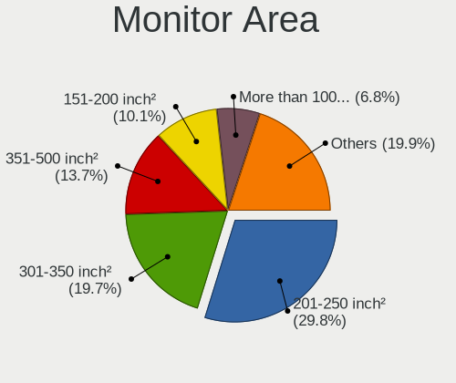
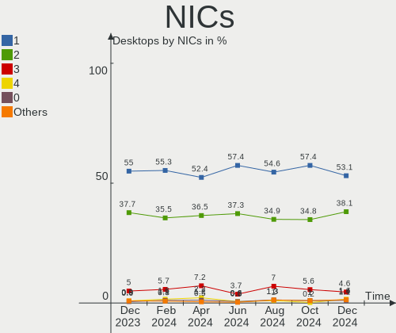

Ubuntu - Hardware Trends (Desktops)
-----------------------------------

A project to identify most popular hardware characteristics and track their change
over time based on data collected by Linux users at https://Linux-Hardware.org.

Anyone can contribute to this report by the [hw-probe](https://github.com/linuxhw/hw-probe) tool:

    sudo -E hw-probe -all -upload

This report is for one last month. Overall report since the beginning of time: [TestCoverage](https://github.com/linuxhw/TestCoverage)

Period: Aug, 2022.

Contents
--------

* [ System ](#system)
  - [ OS                       ](#os)
  - [ OS Family                ](#os-family)
  - [ Kernel                   ](#kernel)
  - [ Kernel Family            ](#kernel-family)
  - [ Kernel Major Ver.        ](#kernel-major-ver)
  - [ Arch                     ](#arch)
  - [ DE                       ](#de)
  - [ Display Server           ](#display-server)
  - [ Display Manager          ](#display-manager)
  - [ OS Lang                  ](#os-lang)
  - [ Boot Mode                ](#boot-mode)
  - [ Filesystem               ](#filesystem)
  - [ Part. scheme             ](#part-scheme)
  - [ Dual Boot with Linux/BSD ](#dual-boot-with-linuxbsd)
  - [ Dual Boot (Win)          ](#dual-boot-win)

* [ Board ](#board)
  - [ Vendor                   ](#vendor)
  - [ Model                    ](#model)
  - [ Model Family             ](#model-family)
  - [ MFG Year                 ](#mfg-year)
  - [ Form Factor              ](#form-factor)
  - [ Secure Boot              ](#secure-boot)
  - [ Coreboot                 ](#coreboot)
  - [ RAM Size                 ](#ram-size)
  - [ RAM Used                 ](#ram-used)
  - [ Total Drives             ](#total-drives)
  - [ Has CD-ROM               ](#has-cd-rom)
  - [ Has Ethernet             ](#has-ethernet)
  - [ Has WiFi                 ](#has-wifi)
  - [ Has Bluetooth            ](#has-bluetooth)

* [ Location ](#location)
  - [ Country                  ](#country)
  - [ City                     ](#city)

* [ Drives ](#drives)
  - [ Drive Vendor             ](#drive-vendor)
  - [ Drive Model              ](#drive-model)
  - [ HDD Vendor               ](#hdd-vendor)
  - [ SSD Vendor               ](#ssd-vendor)
  - [ Drive Kind               ](#drive-kind)
  - [ Drive Connector          ](#drive-connector)
  - [ Drive Size               ](#drive-size)
  - [ Space Total              ](#space-total)
  - [ Space Used               ](#space-used)
  - [ Malfunc. Drives          ](#malfunc-drives)
  - [ Malfunc. Drive Vendor    ](#malfunc-drive-vendor)
  - [ Malfunc. HDD Vendor      ](#malfunc-hdd-vendor)
  - [ Malfunc. Drive Kind      ](#malfunc-drive-kind)
  - [ Failed Drives            ](#failed-drives)
  - [ Failed Drive Vendor      ](#failed-drive-vendor)
  - [ Drive Status             ](#drive-status)

* [ Storage controller ](#storage-controller)
  - [ Storage Vendor           ](#storage-vendor)
  - [ Storage Model            ](#storage-model)
  - [ Storage Kind             ](#storage-kind)

* [ Processor ](#processor)
  - [ CPU Vendor               ](#cpu-vendor)
  - [ CPU Model                ](#cpu-model)
  - [ CPU Model Family         ](#cpu-model-family)
  - [ CPU Cores                ](#cpu-cores)
  - [ CPU Sockets              ](#cpu-sockets)
  - [ CPU Threads              ](#cpu-threads)
  - [ CPU Op-Modes             ](#cpu-op-modes)
  - [ CPU Microcode            ](#cpu-microcode)
  - [ CPU Microarch            ](#cpu-microarch)

* [ Graphics ](#graphics)
  - [ GPU Vendor               ](#gpu-vendor)
  - [ GPU Model                ](#gpu-model)
  - [ GPU Combo                ](#gpu-combo)
  - [ GPU Driver               ](#gpu-driver)
  - [ GPU Memory               ](#gpu-memory)

* [ Monitor ](#monitor)
  - [ Monitor Vendor           ](#monitor-vendor)
  - [ Monitor Model            ](#monitor-model)
  - [ Monitor Resolution       ](#monitor-resolution)
  - [ Monitor Diagonal         ](#monitor-diagonal)
  - [ Monitor Width            ](#monitor-width)
  - [ Aspect Ratio             ](#aspect-ratio)
  - [ Monitor Area             ](#monitor-area)
  - [ Pixel Density            ](#pixel-density)
  - [ Multiple Monitors        ](#multiple-monitors)

* [ Network ](#network)
  - [ Net Controller Vendor    ](#net-controller-vendor)
  - [ Net Controller Model     ](#net-controller-model)
  - [ Wireless Vendor          ](#wireless-vendor)
  - [ Wireless Model           ](#wireless-model)
  - [ Ethernet Vendor          ](#ethernet-vendor)
  - [ Ethernet Model           ](#ethernet-model)
  - [ Net Controller Kind      ](#net-controller-kind)
  - [ Used Controller          ](#used-controller)
  - [ NICs                     ](#nics)
  - [ IPv6                     ](#ipv6)

* [ Bluetooth ](#bluetooth)
  - [ Bluetooth Vendor         ](#bluetooth-vendor)
  - [ Bluetooth Model          ](#bluetooth-model)

* [ Sound ](#sound)
  - [ Sound Vendor             ](#sound-vendor)
  - [ Sound Model              ](#sound-model)

* [ Memory ](#memory)
  - [ Memory Vendor            ](#memory-vendor)
  - [ Memory Model             ](#memory-model)
  - [ Memory Kind              ](#memory-kind)
  - [ Memory Form Factor       ](#memory-form-factor)
  - [ Memory Size              ](#memory-size)
  - [ Memory Speed             ](#memory-speed)

* [ Printers & scanners ](#printers--scanners)
  - [ Printer Vendor           ](#printer-vendor)
  - [ Printer Model            ](#printer-model)
  - [ Scanner Vendor           ](#scanner-vendor)
  - [ Scanner Model            ](#scanner-model)

* [ Camera ](#camera)
  - [ Camera Vendor            ](#camera-vendor)
  - [ Camera Model             ](#camera-model)

* [ Security ](#security)
  - [ Fingerprint Vendor       ](#fingerprint-vendor)
  - [ Fingerprint Model        ](#fingerprint-model)
  - [ Chipcard Vendor          ](#chipcard-vendor)
  - [ Chipcard Model           ](#chipcard-model)

* [ Unsupported ](#unsupported)
  - [ Unsupported Devices      ](#unsupported-devices)
  - [ Unsupported Device Types ](#unsupported-device-types)

System
------

OS
--

Installed operating systems

| Name         | Desktops | Percent |
|--------------|----------|---------|
| Ubuntu 22.04 | 234      | 64.46%  |
| Ubuntu 20.04 | 106      | 29.2%   |
| Ubuntu 18.04 | 11       | 3.03%   |
| Ubuntu 21.10 | 3        | 0.83%   |
| Ubuntu 20.10 | 3        | 0.83%   |
| Ubuntu 22.10 | 2        | 0.55%   |
| Ubuntu 21.04 | 2        | 0.55%   |
| Ubuntu 16.04 | 2        | 0.55%   |

OS Family
---------

OS without a version

| Name   | Desktops | Percent |
|--------|----------|---------|
| Ubuntu | 363      | 100%    |

Kernel
------

Version of the Linux kernel

| Version                    | Desktops | Percent |
|----------------------------|----------|---------|
| 5.15.0-46-generic          | 156      | 42.98%  |
| 5.15.0-43-generic          | 87       | 23.97%  |
| 5.15.0-47-generic          | 17       | 4.68%   |
| 5.4.0-122-generic          | 13       | 3.58%   |
| 5.15.0-41-generic          | 13       | 3.58%   |
| 5.4.0-124-generic          | 11       | 3.03%   |
| 5.15.0-25-generic          | 10       | 2.75%   |
| 5.15.0-45-generic          | 4        | 1.1%    |
| 5.13.0-52-generic          | 4        | 1.1%    |
| 4.15.0-191-generic         | 3        | 0.83%   |
| 5.8.0-25-generic           | 2        | 0.55%   |
| 5.4.0-42-generic           | 2        | 0.55%   |
| 5.15.0-48-generic          | 2        | 0.55%   |
| 5.15.0-40-generic          | 2        | 0.55%   |
| 5.13.0-30-generic          | 2        | 0.55%   |
| 5.13.0-19-generic          | 2        | 0.55%   |
| 5.11.0-27-generic          | 2        | 0.55%   |
| 5.8.0-53-generic           | 1        | 0.28%   |
| 5.8.0-34-generic           | 1        | 0.28%   |
| 5.4.0-87-generic           | 1        | 0.28%   |
| 5.4.0-47-generic           | 1        | 0.28%   |
| 5.4.0-125-generic          | 1        | 0.28%   |
| 5.4.0-109-generic          | 1        | 0.28%   |
| 5.4.0-104-generic          | 1        | 0.28%   |
| 5.3.0-46-generic           | 1        | 0.28%   |
| 5.19.3-051903-generic      | 1        | 0.28%   |
| 5.19.0-15-generic          | 1        | 0.28%   |
| 5.19.0-051900-generic      | 1        | 0.28%   |
| 5.18.8-051808-generic      | 1        | 0.28%   |
| 5.18.0-13.1-liquorix-amd64 | 1        | 0.28%   |
| 5.17.15-051715-generic     | 1        | 0.28%   |
| 5.17.0-1014-oem            | 1        | 0.28%   |
| 5.17.0-1006-oem            | 1        | 0.28%   |
| 5.15.0-47-lowlatency       | 1        | 0.28%   |
| 5.15.0-39-generic          | 1        | 0.28%   |
| 5.15.0-37-generic          | 1        | 0.28%   |
| 5.15.0-30-generic          | 1        | 0.28%   |
| 5.15.0-27-generic          | 1        | 0.28%   |
| 5.14.0-1024-oem            | 1        | 0.28%   |
| 5.13.0-48-generic          | 1        | 0.28%   |
| 5.11.0-49-generic          | 1        | 0.28%   |
| 5.11.0-46-generic          | 1        | 0.28%   |
| 5.11.0-43-generic          | 1        | 0.28%   |
| 5.11.0-40-generic          | 1        | 0.28%   |
| 5.10.0-hiveos              | 1        | 0.28%   |
| 4.4.0-230-generic          | 1        | 0.28%   |
| 4.4.0-210-generic          | 1        | 0.28%   |
| 4.15.0-153-generic         | 1        | 0.28%   |

Kernel Family
-------------

Linux kernel without a distro release

| Version | Desktops | Percent |
|---------|----------|---------|
| 5.15.0  | 296      | 81.54%  |
| 5.4.0   | 31       | 8.54%   |
| 5.13.0  | 9        | 2.48%   |
| 5.11.0  | 6        | 1.65%   |
| 5.8.0   | 4        | 1.1%    |
| 4.15.0  | 4        | 1.1%    |
| 5.19.0  | 2        | 0.55%   |
| 5.17.0  | 2        | 0.55%   |
| 4.4.0   | 2        | 0.55%   |
| 5.3.0   | 1        | 0.28%   |
| 5.19.3  | 1        | 0.28%   |
| 5.18.8  | 1        | 0.28%   |
| 5.18.0  | 1        | 0.28%   |
| 5.17.15 | 1        | 0.28%   |
| 5.14.0  | 1        | 0.28%   |
| 5.10.0  | 1        | 0.28%   |

Kernel Major Ver.
-----------------

Linux kernel major version

| Version | Desktops | Percent |
|---------|----------|---------|
| 5.15    | 296      | 81.54%  |
| 5.4     | 31       | 8.54%   |
| 5.13    | 9        | 2.48%   |
| 5.11    | 6        | 1.65%   |
| 5.8     | 4        | 1.1%    |
| 4.15    | 4        | 1.1%    |
| 5.19    | 3        | 0.83%   |
| 5.17    | 3        | 0.83%   |
| 5.18    | 2        | 0.55%   |
| 4.4     | 2        | 0.55%   |
| 5.3     | 1        | 0.28%   |
| 5.14    | 1        | 0.28%   |
| 5.10    | 1        | 0.28%   |

Arch
----

OS architecture (x86_64, i586, etc.)

| Name   | Desktops | Percent |
|--------|----------|---------|
| x86_64 | 362      | 99.72%  |
| i686   | 1        | 0.28%   |

DE
--

Desktop Environment

| Name            | Desktops | Percent |
|-----------------|----------|---------|
| GNOME           | 331      | 91.18%  |
| Unknown         | 22       | 6.06%   |
| X-Cinnamon      | 3        | 0.83%   |
| Unity           | 2        | 0.55%   |
| i3              | 2        | 0.55%   |
| Pantheon        | 1        | 0.28%   |
| GNOME Flashback | 1        | 0.28%   |
| Cinnamon        | 1        | 0.28%   |

Display Server
--------------

X11 or Wayland

| Name    | Desktops | Percent |
|---------|----------|---------|
| X11     | 205      | 56.47%  |
| Wayland | 134      | 36.91%  |
| Tty     | 18       | 4.96%   |
| Unknown | 6        | 1.65%   |

Display Manager
---------------

SDDM, LightDM, etc.

| Name    | Desktops | Percent |
|---------|----------|---------|
| GDM3    | 282      | 77.69%  |
| GDM     | 39       | 10.74%  |
| Unknown | 32       | 8.82%   |
| LightDM | 9        | 2.48%   |
| SDDM    | 1        | 0.28%   |

OS Lang
-------

Language

| Lang    | Desktops | Percent |
|---------|----------|---------|
| en_US   | 148      | 40.77%  |
| de_DE   | 36       | 9.92%   |
| fr_FR   | 33       | 9.09%   |
| en_GB   | 19       | 5.23%   |
| pt_BR   | 15       | 4.13%   |
| it_IT   | 13       | 3.58%   |
| ru_RU   | 9        | 2.48%   |
| en_AU   | 8        | 2.2%    |
| es_ES   | 6        | 1.65%   |
| nl_NL   | 5        | 1.38%   |
| ja_JP   | 5        | 1.38%   |
| en_IN   | 5        | 1.38%   |
| en_CA   | 5        | 1.38%   |
| sv_SE   | 4        | 1.1%    |
| de_AT   | 4        | 1.1%    |
| zh_CN   | 3        | 0.83%   |
| pl_PL   | 3        | 0.83%   |
| en_ZA   | 3        | 0.83%   |
| de_CH   | 3        | 0.83%   |
| cs_CZ   | 3        | 0.83%   |
| C       | 3        | 0.83%   |
| fr_BE   | 2        | 0.55%   |
| fi_FI   | 2        | 0.55%   |
| es_MX   | 2        | 0.55%   |
| es_AR   | 2        | 0.55%   |
| en_PH   | 2        | 0.55%   |
| Unknown | 2        | 0.55%   |
| uk_UA   | 1        | 0.28%   |
| tr_TR   | 1        | 0.28%   |
| sk_SK   | 1        | 0.28%   |
| ro_RO   | 1        | 0.28%   |
| pt_PT   | 1        | 0.28%   |
| nl_BE   | 1        | 0.28%   |
| ko_KR   | 1        | 0.28%   |
| hu_HU   | 1        | 0.28%   |
| fr_CA   | 1        | 0.28%   |
| es_VE   | 1        | 0.28%   |
| es_US   | 1        | 0.28%   |
| es_PE   | 1        | 0.28%   |
| es_CL   | 1        | 0.28%   |
| en_SG   | 1        | 0.28%   |
| en_NZ   | 1        | 0.28%   |
| en_HK   | 1        | 0.28%   |
| el_GR   | 1        | 0.28%   |
| bg_BG   | 1        | 0.28%   |

Boot Mode
---------

EFI or BIOS

| Mode | Desktops | Percent |
|------|----------|---------|
| BIOS | 258      | 71.07%  |
| EFI  | 105      | 28.93%  |

Filesystem
----------

Type of filesystem

| Type    | Desktops | Percent |
|---------|----------|---------|
| Ext4    | 337      | 92.84%  |
| Overlay | 12       | 3.31%   |
| Zfs     | 7        | 1.93%   |
| Btrfs   | 4        | 1.1%    |
| Ext2    | 2        | 0.55%   |
| Ext3    | 1        | 0.28%   |

Part. scheme
------------

Scheme of partitioning

| Type    | Desktops | Percent |
|---------|----------|---------|
| Unknown | 254      | 69.97%  |
| GPT     | 86       | 23.69%  |
| MBR     | 23       | 6.34%   |

Dual Boot with Linux/BSD
------------------------

Hosting more than one Linux/BSD

| Dual boot | Desktops | Percent |
|-----------|----------|---------|
| No        | 287      | 79.06%  |
| Yes       | 76       | 20.94%  |

Dual Boot (Win)
---------------

Hosting Linux and Windows

| Dual boot | Desktops | Percent |
|-----------|----------|---------|
| No        | 216      | 59.5%   |
| Yes       | 147      | 40.5%   |

Board
-----

Vendor
------

Motherboard manufacturer

| Name                | Desktops | Percent |
|---------------------|----------|---------|
| ASUSTek Computer    | 84       | 23.14%  |
| Dell                | 47       | 12.95%  |
| MSI                 | 41       | 11.29%  |
| Gigabyte Technology | 40       | 11.02%  |
| Hewlett-Packard     | 34       | 9.37%   |
| ASRock              | 21       | 5.79%   |
| Lenovo              | 19       | 5.23%   |
| Intel               | 12       | 3.31%   |
| Foxconn             | 11       | 3.03%   |
| Acer                | 9        | 2.48%   |
| Pegatron            | 7        | 1.93%   |
| Supermicro          | 4        | 1.1%    |
| Fujitsu             | 4        | 1.1%    |
| Biostar             | 4        | 1.1%    |
| Protectli           | 3        | 0.83%   |
| Alienware           | 3        | 0.83%   |
| Unknown             | 3        | 0.83%   |
| OEM                 | 2        | 0.55%   |
| LattePanda          | 2        | 0.55%   |
| ECS                 | 2        | 0.55%   |
| Shuttle             | 1        | 0.28%   |
| SHARKBAY            | 1        | 0.28%   |
| QIYIDA              | 1        | 0.28%   |
| PCWare              | 1        | 0.28%   |
| Packard Bell        | 1        | 0.28%   |
| Nvidia              | 1        | 0.28%   |
| MACHINIST           | 1        | 0.28%   |
| Fujitsu Siemens     | 1        | 0.28%   |
| BESSTAR Tech        | 1        | 0.28%   |
| ASRockRack          | 1        | 0.28%   |
| AMI                 | 1        | 0.28%   |

Model
-----

Motherboard model

| Name                              | Desktops | Percent |
|-----------------------------------|----------|---------|
| Dell OptiPlex 7010                | 7        | 1.93%   |
| ASUS All Series                   | 6        | 1.65%   |
| Unknown                           | 5        | 1.38%   |
| Dell OptiPlex 790                 | 4        | 1.1%    |
| MSI MS-7C52                       | 3        | 0.83%   |
| MSI MS-7C37                       | 3        | 0.83%   |
| HP Z400 Workstation               | 3        | 0.83%   |
| ASUS PRIME A320M-K                | 3        | 0.83%   |
| ASRock B450M Pro4                 | 3        | 0.83%   |
| Protectli FW4B                    | 2        | 0.55%   |
| MSI MS-7D42                       | 2        | 0.55%   |
| MSI MS-7C91                       | 2        | 0.55%   |
| MSI MS-7721                       | 2        | 0.55%   |
| Lenovo ThinkCentre M73 10AXS1UY00 | 2        | 0.55%   |
| HP Compaq 8100 Elite SFF PC       | 2        | 0.55%   |
| HP Compaq 6005 Pro SFF PC         | 2        | 0.55%   |
| Gigabyte B550 AORUS ELITE AX V2   | 2        | 0.55%   |
| Gigabyte A320M-S2H                | 2        | 0.55%   |
| Dell OptiPlex 9020                | 2        | 0.55%   |
| Dell OptiPlex 780                 | 2        | 0.55%   |
| Dell OptiPlex 3020                | 2        | 0.55%   |
| Dell Inspiron 3847                | 2        | 0.55%   |
| Biostar G31-M7 TE                 | 2        | 0.55%   |
| ASUS Z170 PRO GAMING              | 2        | 0.55%   |
| ASUS TUF Gaming X570-PLUS         | 2        | 0.55%   |
| ASUS ProArt Z690-CREATOR WIFI     | 2        | 0.55%   |
| ASUS Pro WS WRX80E-SAGE SE WIFI   | 2        | 0.55%   |
| ASUS PRIME B450-PLUS              | 2        | 0.55%   |
| ASRock G41M-VS3                   | 2        | 0.55%   |
| ASRock A320M-HDV R4.0             | 2        | 0.55%   |
| Supermicro X7SBi-LN4              | 1        | 0.28%   |
| Supermicro X7DCL                  | 1        | 0.28%   |
| Supermicro SYS-5018D-MF           | 1        | 0.28%   |
| Supermicro SYS-2028TP-HC1TR       | 1        | 0.28%   |
| Shuttle DS81D                     | 1        | 0.28%   |
| QIYIDA X99-H9 V2.0                | 1        | 0.28%   |
| Protectli VP2410                  | 1        | 0.28%   |
| Pegatron Pro 3120 Microtower PC   | 1        | 0.28%   |
| Pegatron NQ840AA-ABD p6029de      | 1        | 0.28%   |
| Pegatron IPMSB-GS                 | 1        | 0.28%   |
| Pegatron HPE-521it                | 1        | 0.28%   |
| Pegatron h8-1090t                 | 1        | 0.28%   |
| Pegatron AY690AA-ABM 600-1120la   | 1        | 0.28%   |
| Pegatron 23-1015                  | 1        | 0.28%   |
| PCWare IPMH61R1                   | 1        | 0.28%   |
| Packard Bell IMEDIA S3210         | 1        | 0.28%   |
| OEM Intel H81                     | 1        | 0.28%   |
| OEM G41 775 ICH7 8712             | 1        | 0.28%   |
| Nvidia SN68PT                     | 1        | 0.28%   |
| MSI p6745nl                       | 1        | 0.28%   |
| MSI p6651at                       | 1        | 0.28%   |
| MSI NQ890AA-ABZ CQ5011IT          | 1        | 0.28%   |
| MSI MS-7D54                       | 1        | 0.28%   |
| MSI MS-7D30                       | 1        | 0.28%   |
| MSI MS-7D15                       | 1        | 0.28%   |
| MSI MS-7C92                       | 1        | 0.28%   |
| MSI MS-7C84                       | 1        | 0.28%   |
| MSI MS-7C83                       | 1        | 0.28%   |
| MSI MS-7C75                       | 1        | 0.28%   |
| MSI MS-7C39                       | 1        | 0.28%   |

Model Family
------------

Motherboard model prefix

| Name                        | Desktops | Percent |
|-----------------------------|----------|---------|
| Dell OptiPlex               | 28       | 7.71%   |
| ASUS PRIME                  | 18       | 4.96%   |
| HP Compaq                   | 13       | 3.58%   |
| Lenovo ThinkCentre          | 12       | 3.31%   |
| ASUS TUF                    | 10       | 2.75%   |
| Dell Inspiron               | 6        | 1.65%   |
| ASUS ROG                    | 6        | 1.65%   |
| ASUS All                    | 6        | 1.65%   |
| Dell Precision              | 5        | 1.38%   |
| Acer Aspire                 | 5        | 1.38%   |
| Unknown                     | 5        | 1.38%   |
| HP EliteDesk                | 4        | 1.1%    |
| Gigabyte B550               | 4        | 1.1%    |
| MSI MS-7C52                 | 3        | 0.83%   |
| MSI MS-7C37                 | 3        | 0.83%   |
| Lenovo ThinkStation         | 3        | 0.83%   |
| Lenovo IdeaCentre           | 3        | 0.83%   |
| HP Z400                     | 3        | 0.83%   |
| HP ProDesk                  | 3        | 0.83%   |
| Gigabyte A320M-S2H          | 3        | 0.83%   |
| Fujitsu ESPRIMO             | 3        | 0.83%   |
| Dell XPS                    | 3        | 0.83%   |
| ASUS Pro                    | 3        | 0.83%   |
| ASRock B450M                | 3        | 0.83%   |
| Protectli FW4B              | 2        | 0.55%   |
| MSI MS-7D42                 | 2        | 0.55%   |
| MSI MS-7C91                 | 2        | 0.55%   |
| MSI MS-7721                 | 2        | 0.55%   |
| HP Z230                     | 2        | 0.55%   |
| Gigabyte Z390               | 2        | 0.55%   |
| Gigabyte Z370               | 2        | 0.55%   |
| Dell Vostro                 | 2        | 0.55%   |
| Dell Studio                 | 2        | 0.55%   |
| Biostar G31-M7              | 2        | 0.55%   |
| ASUS Z170                   | 2        | 0.55%   |
| ASUS ProArt                 | 2        | 0.55%   |
| ASUS P7P55D-E               | 2        | 0.55%   |
| ASUS M5A97                  | 2        | 0.55%   |
| ASRock G41M-VS3             | 2        | 0.55%   |
| ASRock A320M-HDV            | 2        | 0.55%   |
| Alienware Aurora            | 2        | 0.55%   |
| Acer Veriton                | 2        | 0.55%   |
| Acer Predator               | 2        | 0.55%   |
| Supermicro X7SBi-LN4        | 1        | 0.28%   |
| Supermicro X7DCL            | 1        | 0.28%   |
| Supermicro SYS-5018D-MF     | 1        | 0.28%   |
| Supermicro SYS-2028TP-HC1TR | 1        | 0.28%   |
| Shuttle DS81D               | 1        | 0.28%   |
| QIYIDA X99-H9               | 1        | 0.28%   |
| Protectli VP2410            | 1        | 0.28%   |
| Pegatron Pro                | 1        | 0.28%   |
| Pegatron NQ840AA-ABD        | 1        | 0.28%   |
| Pegatron IPMSB-GS           | 1        | 0.28%   |
| Pegatron HPE-521it          | 1        | 0.28%   |
| Pegatron h8-1090t           | 1        | 0.28%   |
| Pegatron AY690AA-ABM        | 1        | 0.28%   |
| Pegatron 23-1015            | 1        | 0.28%   |
| PCWare IPMH61R1             | 1        | 0.28%   |
| Packard Bell IMEDIA         | 1        | 0.28%   |
| OEM Intel                   | 1        | 0.28%   |

MFG Year
--------

Motherboard manufacture year

| Year | Desktops | Percent |
|------|----------|---------|
| 2019 | 37       | 10.19%  |
| 2012 | 33       | 9.09%   |
| 2013 | 32       | 8.82%   |
| 2018 | 31       | 8.54%   |
| 2021 | 27       | 7.44%   |
| 2020 | 27       | 7.44%   |
| 2011 | 27       | 7.44%   |
| 2010 | 25       | 6.89%   |
| 2014 | 22       | 6.06%   |
| 2009 | 20       | 5.51%   |
| 2017 | 19       | 5.23%   |
| 2015 | 19       | 5.23%   |
| 2008 | 17       | 4.68%   |
| 2007 | 10       | 2.75%   |
| 2022 | 9        | 2.48%   |
| 2016 | 8        | 2.2%    |

Form Factor
-----------

Physical design of the computer

| Name    | Desktops | Percent |
|---------|----------|---------|
| Desktop | 363      | 100%    |

Secure Boot
-----------

Enabled or disabled

| State    | Desktops | Percent |
|----------|----------|---------|
| Disabled | 349      | 96.14%  |
| Enabled  | 14       | 3.86%   |

Coreboot
--------

Have coreboot on board

| Used | Desktops | Percent |
|------|----------|---------|
| No   | 362      | 99.72%  |
| Yes  | 1        | 0.28%   |

RAM Size
--------

Total RAM memory

| Size in GB      | Desktops | Percent |
|-----------------|----------|---------|
| 16.01-24.0      | 100      | 27.55%  |
| 8.01-16.0       | 83       | 22.87%  |
| 4.01-8.0        | 55       | 15.15%  |
| 3.01-4.0        | 52       | 14.33%  |
| 32.01-64.0      | 40       | 11.02%  |
| 64.01-256.0     | 17       | 4.68%   |
| 24.01-32.0      | 7        | 1.93%   |
| 1.01-2.0        | 4        | 1.1%    |
| 2.01-3.0        | 3        | 0.83%   |
| More than 256.0 | 2        | 0.55%   |

RAM Used
--------

Used RAM memory

| Used GB    | Desktops | Percent |
|------------|----------|---------|
| 1.01-2.0   | 128      | 35.26%  |
| 2.01-3.0   | 104      | 28.65%  |
| 4.01-8.0   | 51       | 14.05%  |
| 3.01-4.0   | 49       | 13.5%   |
| 8.01-16.0  | 14       | 3.86%   |
| 0.51-1.0   | 7        | 1.93%   |
| 0.01-0.5   | 4        | 1.1%    |
| 24.01-32.0 | 3        | 0.83%   |
| 16.01-24.0 | 2        | 0.55%   |
| 32.01-64.0 | 1        | 0.28%   |

Total Drives
------------

Number of drives on board

| Drives | Desktops | Percent |
|--------|----------|---------|
| 1      | 160      | 44.08%  |
| 2      | 101      | 27.82%  |
| 3      | 52       | 14.33%  |
| 4      | 22       | 6.06%   |
| 5      | 11       | 3.03%   |
| 6      | 7        | 1.93%   |
| 0      | 5        | 1.38%   |
| 9      | 3        | 0.83%   |
| 7      | 2        | 0.55%   |

Has CD-ROM
----------

Has CD-ROM on board

| Presented | Desktops | Percent |
|-----------|----------|---------|
| Yes       | 196      | 53.99%  |
| No        | 167      | 46.01%  |

Has Ethernet
------------

Has Ethernet on board

| Presented | Desktops | Percent |
|-----------|----------|---------|
| Yes       | 363      | 100%    |

Has WiFi
--------

Has WiFi module

| Presented | Desktops | Percent |
|-----------|----------|---------|
| No        | 202      | 55.65%  |
| Yes       | 161      | 44.35%  |

Has Bluetooth
-------------

Has Bluetooth module

| Presented | Desktops | Percent |
|-----------|----------|---------|
| No        | 250      | 68.87%  |
| Yes       | 113      | 31.13%  |

Location
--------

Country
-------

Geographic location (country)

| Country          | Desktops | Percent |
|------------------|----------|---------|
| USA              | 86       | 23.69%  |
| Germany          | 43       | 11.85%  |
| France           | 33       | 9.09%   |
| Brazil           | 18       | 4.96%   |
| UK               | 16       | 4.41%   |
| Italy            | 15       | 4.13%   |
| Russia           | 11       | 3.03%   |
| Australia        | 8        | 2.2%    |
| Spain            | 7        | 1.93%   |
| Canada           | 7        | 1.93%   |
| Austria          | 7        | 1.93%   |
| Switzerland      | 6        | 1.65%   |
| Sweden           | 6        | 1.65%   |
| Poland           | 6        | 1.65%   |
| Netherlands      | 6        | 1.65%   |
| India            | 6        | 1.65%   |
| Japan            | 5        | 1.38%   |
| Belgium          | 5        | 1.38%   |
| Thailand         | 4        | 1.1%    |
| South Africa     | 4        | 1.1%    |
| Hungary          | 4        | 1.1%    |
| Finland          | 4        | 1.1%    |
| Czechia          | 4        | 1.1%    |
| Bulgaria         | 4        | 1.1%    |
| Turkey           | 3        | 0.83%   |
| Mexico           | 3        | 0.83%   |
| Hong Kong        | 3        | 0.83%   |
| Colombia         | 3        | 0.83%   |
| Argentina        | 3        | 0.83%   |
| Taiwan           | 2        | 0.55%   |
| Slovenia         | 2        | 0.55%   |
| Romania          | 2        | 0.55%   |
| Philippines      | 2        | 0.55%   |
| Greece           | 2        | 0.55%   |
| Venezuela        | 1        | 0.28%   |
| Tunisia          | 1        | 0.28%   |
| Sri Lanka        | 1        | 0.28%   |
| South Korea      | 1        | 0.28%   |
| Slovakia         | 1        | 0.28%   |
| Singapore        | 1        | 0.28%   |
| Serbia           | 1        | 0.28%   |
| Saudi Arabia     | 1        | 0.28%   |
| Portugal         | 1        | 0.28%   |
| Peru             | 1        | 0.28%   |
| Nicaragua        | 1        | 0.28%   |
| New Zealand      | 1        | 0.28%   |
| Morocco          | 1        | 0.28%   |
| Malaysia         | 1        | 0.28%   |
| Ireland          | 1        | 0.28%   |
| Iran             | 1        | 0.28%   |
| French Polynesia | 1        | 0.28%   |
| French Guiana    | 1        | 0.28%   |
| Croatia          | 1        | 0.28%   |
| China            | 1        | 0.28%   |
| Chile            | 1        | 0.28%   |
| Armenia          | 1        | 0.28%   |
| Algeria          | 1        | 0.28%   |

City
----

Geographic location (city)

| City                   | Desktops | Percent |
|------------------------|----------|---------|
| Berlin                 | 10       | 2.75%   |
| Sofia                  | 4        | 1.1%    |
| Vienna                 | 3        | 0.83%   |
| Sydney                 | 3        | 0.83%   |
| San Diego              | 3        | 0.83%   |
| Paris                  | 3        | 0.83%   |
| Munich                 | 3        | 0.83%   |
| Moscow                 | 3        | 0.83%   |
| Istanbul               | 3        | 0.83%   |
| Helsinki               | 3        | 0.83%   |
| Dallas                 | 3        | 0.83%   |
| Budapest               | 3        | 0.83%   |
| Bogotá                | 3        | 0.83%   |
| Zurich                 | 2        | 0.55%   |
| St Petersburg          | 2        | 0.55%   |
| San Jose               | 2        | 0.55%   |
| San Antonio            | 2        | 0.55%   |
| Rhyl                   | 2        | 0.55%   |
| Redwood City           | 2        | 0.55%   |
| Portland               | 2        | 0.55%   |
| New Taipei             | 2        | 0.55%   |
| Nantes                 | 2        | 0.55%   |
| Madrid                 | 2        | 0.55%   |
| Ljubljana              | 2        | 0.55%   |
| Johannesburg           | 2        | 0.55%   |
| Geelong                | 2        | 0.55%   |
| Fortaleza              | 2        | 0.55%   |
| Figeac                 | 2        | 0.55%   |
| Farroupilha            | 2        | 0.55%   |
| Düsseldorf            | 2        | 0.55%   |
| Cypress                | 2        | 0.55%   |
| Chicago                | 2        | 0.55%   |
| Charlestown            | 2        | 0.55%   |
| Brisbane               | 2        | 0.55%   |
| Bothell                | 2        | 0.55%   |
| Athens                 | 2        | 0.55%   |
| Zeuthen                | 1        | 0.28%   |
| Zagreb                 | 1        | 0.28%   |
| Yerevan                | 1        | 0.28%   |
| Wyandotte              | 1        | 0.28%   |
| Wroclaw                | 1        | 0.28%   |
| Workington             | 1        | 0.28%   |
| Wolfhagen              | 1        | 0.28%   |
| Winston-Salem          | 1        | 0.28%   |
| Winchester             | 1        | 0.28%   |
| Wil                    | 1        | 0.28%   |
| Weslaco                | 1        | 0.28%   |
| Wenzenbach             | 1        | 0.28%   |
| Wentzville             | 1        | 0.28%   |
| Watertown              | 1        | 0.28%   |
| Warsaw                 | 1        | 0.28%   |
| Wannweil               | 1        | 0.28%   |
| Walsall                | 1        | 0.28%   |
| Walled Lake            | 1        | 0.28%   |
| Voorburg               | 1        | 0.28%   |
| Villingen-Schwenningen | 1        | 0.28%   |
| Västerås             | 1        | 0.28%   |
| Valle Hermoso          | 1        | 0.28%   |
| Valencia               | 1        | 0.28%   |
| Ufa                    | 1        | 0.28%   |

Drives
------

Drive Vendor
------------

Hard drive vendors

| Vendor                | Desktops | Drives | Percent |
|-----------------------|----------|--------|---------|
| WDC                   | 122      | 168    | 20.44%  |
| Seagate               | 108      | 139    | 18.09%  |
| Samsung Electronics   | 88       | 115    | 14.74%  |
| Toshiba               | 39       | 40     | 6.53%   |
| Crucial               | 29       | 33     | 4.86%   |
| SanDisk               | 22       | 29     | 3.69%   |
| Kingston              | 22       | 23     | 3.69%   |
| Hitachi               | 22       | 22     | 3.69%   |
| A-DATA Technology     | 13       | 13     | 2.18%   |
| Intel                 | 12       | 13     | 2.01%   |
| Unknown               | 9        | 14     | 1.51%   |
| Phison                | 9        | 12     | 1.51%   |
| China                 | 8        | 9      | 1.34%   |
| SPCC                  | 7        | 8      | 1.17%   |
| SK hynix              | 7        | 8      | 1.17%   |
| Intenso               | 7        | 8      | 1.17%   |
| HGST                  | 7        | 11     | 1.17%   |
| JMicron Technology    | 5        | 5      | 0.84%   |
| Maxtor                | 4        | 4      | 0.67%   |
| Unknown               | 4        | 4      | 0.67%   |
| Team                  | 3        | 4      | 0.5%    |
| PNY                   | 3        | 3      | 0.5%    |
| OCZ                   | 3        | 4      | 0.5%    |
| Micron Technology     | 3        | 3      | 0.5%    |
| Silicon Motion        | 2        | 2      | 0.34%   |
| Protectli             | 2        | 2      | 0.34%   |
| Mushkin               | 2        | 2      | 0.34%   |
| LDLC                  | 2        | 2      | 0.34%   |
| KIOXIA-EXCERIA        | 2        | 2      | 0.34%   |
| KIOXIA                | 2        | 2      | 0.34%   |
| Emtec                 | 2        | 2      | 0.34%   |
| Corsair               | 2        | 2      | 0.34%   |
| Zheino                | 1        | 1      | 0.17%   |
| XrayDisk              | 1        | 1      | 0.17%   |
| XPG                   | 1        | 1      | 0.17%   |
| WDC WDBN              | 1        | 1      | 0.17%   |
| USB3.0                | 1        | 1      | 0.17%   |
| UMIS                  | 1        | 1      | 0.17%   |
| ShiJi                 | 1        | 1      | 0.17%   |
| Realtek Semiconductor | 1        | 1      | 0.17%   |
| POWER                 | 1        | 1      | 0.17%   |
| Patriot               | 1        | 1      | 0.17%   |
| OCZ-VERTEX3           | 1        | 1      | 0.17%   |
| Netac                 | 1        | 1      | 0.17%   |
| Logitec               | 1        | 1      | 0.17%   |
| LITEONIT              | 1        | 1      | 0.17%   |
| LITEON                | 1        | 1      | 0.17%   |
| KingSpec              | 1        | 1      | 0.17%   |
| KingFast              | 1        | 1      | 0.17%   |
| HS-SSD-C100           | 1        | 1      | 0.17%   |
| HPE                   | 1        | 1      | 0.17%   |
| Hoodisk               | 1        | 1      | 0.17%   |
| GOODRAM               | 1        | 1      | 0.17%   |
| Gigabyte Technology   | 1        | 1      | 0.17%   |
| ExcelStor             | 1        | 1      | 0.17%   |
| BR                    | 1        | 1      | 0.17%   |
| 1TBE                  | 1        | 1      | 0.17%   |

Drive Model
-----------

Hard drive models

| Model                              | Desktops | Percent |
|------------------------------------|----------|---------|
| Seagate ST1000DM010-2EP102 1TB     | 11       | 1.59%   |
| Samsung SSD 860 EVO 500GB          | 9        | 1.3%    |
| Toshiba DT01ACA050 500GB           | 7        | 1.01%   |
| Samsung SSD 860 EVO 1TB            | 6        | 0.87%   |
| Samsung SSD 850 EVO 500GB          | 6        | 0.87%   |
| Crucial CT500MX500SSD1 500GB       | 6        | 0.87%   |
| Seagate ST500DM002-1BD142 500GB    | 5        | 0.72%   |
| Seagate ST2000DM001-1ER164 2TB     | 5        | 0.72%   |
| Seagate ST1000DM003-1ER162 1TB     | 5        | 0.72%   |
| Seagate ST1000DM003-1CH162 1TB     | 5        | 0.72%   |
| Samsung SSD 850 EVO 250GB          | 5        | 0.72%   |
| Samsung NVMe SSD Drive 1TB         | 5        | 0.72%   |
| Kingston SA400S37240G 240GB SSD    | 5        | 0.72%   |
| Toshiba DT01ACA200 2TB             | 4        | 0.58%   |
| Seagate ST4000VN008-2DR166 4TB     | 4        | 0.58%   |
| Seagate ST2000DM008-2FR102 2TB     | 4        | 0.58%   |
| SanDisk NVMe SSD Drive 1TB         | 4        | 0.58%   |
| Samsung SSD 970 EVO 500GB          | 4        | 0.58%   |
| Samsung SSD 750 EVO 250GB          | 4        | 0.58%   |
| Kingston SA400S37480G 480GB SSD    | 4        | 0.58%   |
| JMicron Tech 250GB                 | 4        | 0.58%   |
| Crucial CT480BX500SSD1 480GB       | 4        | 0.58%   |
| Crucial CT1000P2SSD8 1TB           | 4        | 0.58%   |
| Crucial CT1000MX500SSD1 1TB        | 4        | 0.58%   |
| Unknown                            | 4        | 0.58%   |
| WDC WDS500G2B0A-00SM50 500GB SSD   | 3        | 0.43%   |
| WDC WD5000AAKX-08ERMA0 500GB       | 3        | 0.43%   |
| WDC WD4005FZBX-00K5WB0 4TB         | 3        | 0.43%   |
| WDC WD10EZEX-08WN4A0 1TB           | 3        | 0.43%   |
| Toshiba MQ01ABF050 500GB           | 3        | 0.43%   |
| Toshiba HDWD110 1TB                | 3        | 0.43%   |
| SPCC Solid State Disk 256GB        | 3        | 0.43%   |
| Seagate ST31000524AS 1TB           | 3        | 0.43%   |
| Seagate ST250DM000-1BD141 250GB    | 3        | 0.43%   |
| Seagate ST2000DM001-1CH164 2TB     | 3        | 0.43%   |
| Seagate ST1000LM024 HN-M101MBB 1TB | 3        | 0.43%   |
| SanDisk SSD PLUS 240GB             | 3        | 0.43%   |
| SanDisk NVMe SSD Drive 256GB       | 3        | 0.43%   |
| Samsung SSD 980 500GB              | 3        | 0.43%   |
| Samsung SSD 860 QVO 1TB            | 3        | 0.43%   |
| Samsung SSD 850 EVO 1TB            | 3        | 0.43%   |
| Samsung SSD 840 EVO 250GB          | 3        | 0.43%   |
| Samsung NVMe SSD Drive 500GB       | 3        | 0.43%   |
| Phison NVMe SSD Drive 2TB          | 3        | 0.43%   |
| Kingston SA400S37120G 120GB SSD    | 3        | 0.43%   |
| Crucial CT240BX500SSD1 240GB       | 3        | 0.43%   |
| WDC WDS100T2B0A-00SM50 1TB SSD     | 2        | 0.29%   |
| WDC WD5000AAKX-60U6AA0 500GB       | 2        | 0.29%   |
| WDC WD5000AAKX-08U6AA0 500GB       | 2        | 0.29%   |
| WDC WD5000AAKX-00ERMA0 500GB       | 2        | 0.29%   |
| WDC WD40EFRX-68N32N0 4TB           | 2        | 0.29%   |
| WDC WD30EFRX-68EUZN0 3TB           | 2        | 0.29%   |
| WDC WD20EZRZ-00Z5HB0 2TB           | 2        | 0.29%   |
| WDC WD20EZBX-00AYRA0 2TB           | 2        | 0.29%   |
| WDC WD20EARX-00PASB0 2TB           | 2        | 0.29%   |
| WDC WD20EARS-00MVWB0 2TB           | 2        | 0.29%   |
| WDC WD10EZRX-00A8LB0 1TB           | 2        | 0.29%   |
| WDC WD10EZEX-60WN4A0 1TB           | 2        | 0.29%   |
| WDC WD10EZEX-22MFCA0 1TB           | 2        | 0.29%   |
| WDC WD10EZEX-00BN5A0 1TB           | 2        | 0.29%   |

HDD Vendor
----------

Hard disk drive vendors

| Vendor              | Desktops | Drives | Percent |
|---------------------|----------|--------|---------|
| WDC                 | 110      | 154    | 36.18%  |
| Seagate             | 108      | 137    | 35.53%  |
| Toshiba             | 30       | 31     | 9.87%   |
| Hitachi             | 22       | 22     | 7.24%   |
| Samsung Electronics | 17       | 19     | 5.59%   |
| HGST                | 7        | 11     | 2.3%    |
| Unknown             | 3        | 6      | 0.99%   |
| Maxtor              | 3        | 3      | 0.99%   |
| Intenso             | 2        | 2      | 0.66%   |
| USB3.0              | 1        | 1      | 0.33%   |
| ExcelStor           | 1        | 1      | 0.33%   |

SSD Vendor
----------

Solid state drive vendors

| Vendor              | Desktops | Drives | Percent |
|---------------------|----------|--------|---------|
| Samsung Electronics | 56       | 63     | 28.57%  |
| Crucial             | 26       | 29     | 13.27%  |
| Kingston            | 18       | 19     | 9.18%   |
| SanDisk             | 12       | 19     | 6.12%   |
| WDC                 | 10       | 10     | 5.1%    |
| China               | 8        | 9      | 4.08%   |
| A-DATA Technology   | 8        | 8      | 4.08%   |
| Toshiba             | 7        | 7      | 3.57%   |
| SPCC                | 7        | 8      | 3.57%   |
| Intenso             | 5        | 5      | 2.55%   |
| Intel               | 5        | 5      | 2.55%   |
| Team                | 3        | 4      | 1.53%   |
| PNY                 | 3        | 3      | 1.53%   |
| SK hynix            | 2        | 2      | 1.02%   |
| OCZ                 | 2        | 2      | 1.02%   |
| Mushkin             | 2        | 2      | 1.02%   |
| KIOXIA-EXCERIA      | 2        | 2      | 1.02%   |
| Emtec               | 2        | 2      | 1.02%   |
| Unknown             | 2        | 2      | 1.02%   |
| XrayDisk            | 1        | 1      | 0.51%   |
| WDC WDBN            | 1        | 1      | 0.51%   |
| Seagate             | 1        | 1      | 0.51%   |
| Patriot             | 1        | 1      | 0.51%   |
| OCZ-VERTEX3         | 1        | 1      | 0.51%   |
| Netac               | 1        | 1      | 0.51%   |
| Micron Technology   | 1        | 1      | 0.51%   |
| Maxtor              | 1        | 1      | 0.51%   |
| LITEONIT            | 1        | 1      | 0.51%   |
| LITEON              | 1        | 1      | 0.51%   |
| KingSpec            | 1        | 1      | 0.51%   |
| KingFast            | 1        | 1      | 0.51%   |
| JMicron Technology  | 1        | 1      | 0.51%   |
| Hoodisk             | 1        | 1      | 0.51%   |
| GOODRAM             | 1        | 1      | 0.51%   |
| Gigabyte Technology | 1        | 1      | 0.51%   |

Drive Kind
----------

HDD or SSD

| Kind    | Desktops | Drives | Percent |
|---------|----------|--------|---------|
| HDD     | 238      | 387    | 46.3%   |
| SSD     | 171      | 217    | 33.27%  |
| NVMe    | 84       | 104    | 16.34%  |
| Unknown | 17       | 21     | 3.31%   |
| MMC     | 4        | 4      | 0.78%   |

Drive Connector
---------------

SATA, SAS, NVMe, etc.

| Type | Desktops | Drives | Percent |
|------|----------|--------|---------|
| SATA | 319      | 595    | 73.84%  |
| NVMe | 84       | 104    | 19.44%  |
| SAS  | 25       | 30     | 5.79%   |
| MMC  | 4        | 4      | 0.93%   |

Drive Size
----------

Size of hard drive

| Size in TB | Desktops | Drives | Percent |
|------------|----------|--------|---------|
| 0.01-0.5   | 223      | 302    | 49.56%  |
| 0.51-1.0   | 134      | 168    | 29.78%  |
| 1.01-2.0   | 48       | 61     | 10.67%  |
| 3.01-4.0   | 18       | 26     | 4%      |
| 2.01-3.0   | 13       | 17     | 2.89%   |
| 4.01-10.0  | 10       | 19     | 2.22%   |
| 10.01-20.0 | 4        | 11     | 0.89%   |

Space Total
-----------

Amount of disk space available on the file system

| Size in GB     | Desktops | Percent |
|----------------|----------|---------|
| 251-500        | 77       | 21.21%  |
| 501-1000       | 76       | 20.94%  |
| 101-250        | 74       | 20.39%  |
| 1001-2000      | 41       | 11.29%  |
| More than 3000 | 30       | 8.26%   |
| 51-100         | 23       | 6.34%   |
| 2001-3000      | 16       | 4.41%   |
| 1-20           | 14       | 3.86%   |
| 21-50          | 9        | 2.48%   |
| Unknown        | 3        | 0.83%   |

Space Used
----------

Amount of used disk space

| Used GB        | Desktops | Percent |
|----------------|----------|---------|
| 1-20           | 116      | 31.96%  |
| 21-50          | 68       | 18.73%  |
| 101-250        | 48       | 13.22%  |
| 51-100         | 39       | 10.74%  |
| 501-1000       | 27       | 7.44%   |
| 251-500        | 25       | 6.89%   |
| More than 3000 | 14       | 3.86%   |
| 1001-2000      | 14       | 3.86%   |
| 2001-3000      | 9        | 2.48%   |
| Unknown        | 3        | 0.83%   |

Malfunc. Drives
---------------

Drive models with a malfunction

| Model                             | Desktops | Drives | Percent |
|-----------------------------------|----------|--------|---------|
| Seagate ST1000DM003-1CH162 1TB    | 2        | 2      | 7.69%   |
| WDC WD6400BEVT-60A0RT0 640GB      | 1        | 1      | 3.85%   |
| WDC WD5000AAKX-08ERMA0 500GB      | 1        | 1      | 3.85%   |
| WDC WD40EFRX-68WT0N0 4TB          | 1        | 1      | 3.85%   |
| WDC WD20EFRX-68AX9N0 2TB          | 1        | 1      | 3.85%   |
| WDC WD10EZEX-22MFCA0 1TB          | 1        | 1      | 3.85%   |
| WDC WD10EARS-22Y5B1 1TB           | 1        | 1      | 3.85%   |
| Toshiba MQ01ABF050 500GB          | 1        | 1      | 3.85%   |
| Toshiba DT01ABA200V 2TB           | 1        | 1      | 3.85%   |
| Seagate ST9500325AS 500GB         | 1        | 1      | 3.85%   |
| Seagate ST500LT012-9WS142 500GB   | 1        | 1      | 3.85%   |
| Seagate ST500LM021-1KJ152 500GB   | 1        | 1      | 3.85%   |
| Seagate ST3750528AS 752GB         | 1        | 1      | 3.85%   |
| Seagate ST3160811AS 160GB         | 1        | 1      | 3.85%   |
| Seagate ST31000528AS 1TB          | 1        | 1      | 3.85%   |
| Seagate ST2000DM001-1ER164 2TB    | 1        | 1      | 3.85%   |
| Seagate ST1000DM003-9YN162 1TB    | 1        | 1      | 3.85%   |
| Samsung Electronics HD321KJ 320GB | 1        | 1      | 3.85%   |
| Maxtor 7Y250M0 250GB              | 1        | 1      | 3.85%   |
| LITEONIT LCS-128M6S 128GB SSD     | 1        | 1      | 3.85%   |
| Intel SSDSC2BW240H6 240GB         | 1        | 1      | 3.85%   |
| Intel SSDPEKKW256G7 256GB         | 1        | 1      | 3.85%   |
| Hitachi HUA722010CLA330 1TB       | 1        | 1      | 3.85%   |
| Crucial CT275MX300SSD1 275GB      | 1        | 1      | 3.85%   |
| A-DATA Technology SX8100NP 512GB  | 1        | 1      | 3.85%   |

Malfunc. Drive Vendor
---------------------

Vendors of faulty drives

| Vendor              | Desktops | Drives | Percent |
|---------------------|----------|--------|---------|
| Seagate             | 10       | 10     | 40%     |
| WDC                 | 5        | 6      | 20%     |
| Toshiba             | 2        | 2      | 8%      |
| Intel               | 2        | 2      | 8%      |
| Samsung Electronics | 1        | 1      | 4%      |
| Maxtor              | 1        | 1      | 4%      |
| LITEONIT            | 1        | 1      | 4%      |
| Hitachi             | 1        | 1      | 4%      |
| Crucial             | 1        | 1      | 4%      |
| A-DATA Technology   | 1        | 1      | 4%      |

Malfunc. HDD Vendor
-------------------

Vendors of faulty HDD drives

| Vendor              | Desktops | Drives | Percent |
|---------------------|----------|--------|---------|
| Seagate             | 10       | 10     | 50%     |
| WDC                 | 5        | 6      | 25%     |
| Toshiba             | 2        | 2      | 10%     |
| Samsung Electronics | 1        | 1      | 5%      |
| Maxtor              | 1        | 1      | 5%      |
| Hitachi             | 1        | 1      | 5%      |

Malfunc. Drive Kind
-------------------

Kinds of faulty drives

| Kind | Desktops | Drives | Percent |
|------|----------|--------|---------|
| HDD  | 20       | 21     | 80%     |
| SSD  | 3        | 3      | 12%     |
| NVMe | 2        | 2      | 8%      |

Failed Drives
-------------

Failed drive models

Zero info for selected period =(

Failed Drive Vendor
-------------------

Failed drive vendors

Zero info for selected period =(

Drive Status
------------

Number of failed and malfunc. drives

| Status   | Desktops | Drives | Percent |
|----------|----------|--------|---------|
| Detected | 249      | 492    | 65.53%  |
| Works    | 106      | 215    | 27.89%  |
| Malfunc  | 25       | 26     | 6.58%   |

Storage controller
------------------

Storage Vendor
--------------

Storage controller vendors

| Vendor                        | Desktops | Percent |
|-------------------------------|----------|---------|
| Intel                         | 254      | 50.2%   |
| AMD                           | 102      | 20.16%  |
| Samsung Electronics           | 28       | 5.53%   |
| ASMedia Technology            | 17       | 3.36%   |
| SanDisk                       | 13       | 2.57%   |
| JMicron Technology            | 13       | 2.57%   |
| Marvell Technology Group      | 12       | 2.37%   |
| Phison Electronics            | 11       | 2.17%   |
| Nvidia                        | 8        | 1.58%   |
| SK hynix                      | 5        | 0.99%   |
| Silicon Motion                | 5        | 0.99%   |
| Silicon Image                 | 4        | 0.79%   |
| Micron/Crucial Technology     | 4        | 0.79%   |
| Kingston Technology Company   | 4        | 0.79%   |
| Realtek Semiconductor         | 3        | 0.59%   |
| LSI Logic / Symbios Logic     | 3        | 0.59%   |
| ADATA Technology              | 3        | 0.59%   |
| VIA Technologies              | 2        | 0.4%    |
| Toshiba America Info Systems  | 2        | 0.4%    |
| Micron Technology             | 2        | 0.4%    |
| KIOXIA                        | 2        | 0.4%    |
| Integrated Technology Express | 2        | 0.4%    |
| Union Memory (Shenzhen)       | 1        | 0.2%    |
| Seagate Technology            | 1        | 0.2%    |
| OCZ Technology Group          | 1        | 0.2%    |
| HighPoint Technologies        | 1        | 0.2%    |
| Broadcom / LSI                | 1        | 0.2%    |
| Areca Technology              | 1        | 0.2%    |
| Adaptec                       | 1        | 0.2%    |

Storage Model
-------------

Storage controller models

| Model                                                                                   | Desktops | Percent |
|-----------------------------------------------------------------------------------------|----------|---------|
| AMD FCH SATA Controller [AHCI mode]                                                     | 55       | 8.86%   |
| Intel 8 Series/C220 Series Chipset Family 6-port SATA Controller 1 [AHCI mode]          | 36       | 5.8%    |
| Intel SATA Controller [RAID mode]                                                       | 24       | 3.86%   |
| Intel 6 Series/C200 Series Chipset Family 6 port Desktop SATA AHCI Controller           | 24       | 3.86%   |
| AMD 400 Series Chipset SATA Controller                                                  | 23       | 3.7%    |
| Intel 7 Series/C210 Series Chipset Family 6-port SATA Controller [AHCI mode]            | 19       | 3.06%   |
| Samsung NVMe SSD Controller SM981/PM981/PM983                                           | 16       | 2.58%   |
| Intel 200 Series PCH SATA controller [AHCI mode]                                        | 16       | 2.58%   |
| ASMedia ASM1062 Serial ATA Controller                                                   | 16       | 2.58%   |
| Intel Q170/Q150/B150/H170/H110/Z170/CM236 Chipset SATA Controller [AHCI Mode]           | 15       | 2.42%   |
| AMD SB7x0/SB8x0/SB9x0 SATA Controller [AHCI mode]                                       | 13       | 2.09%   |
| Intel NM10/ICH7 Family SATA Controller [IDE mode]                                       | 12       | 1.93%   |
| AMD FCH SATA Controller D                                                               | 11       | 1.77%   |
| AMD 500 Series Chipset SATA Controller                                                  | 11       | 1.77%   |
| Intel 82801G (ICH7 Family) IDE Controller                                               | 10       | 1.61%   |
| JMicron JMB363 SATA/IDE Controller                                                      | 9        | 1.45%   |
| Intel Cannon Lake PCH SATA AHCI Controller                                              | 9        | 1.45%   |
| AMD SB7x0/SB8x0/SB9x0 IDE Controller                                                    | 9        | 1.45%   |
| Intel Alder Lake-S PCH SATA Controller [AHCI Mode]                                      | 8        | 1.29%   |
| Intel 6 Series/C200 Series Chipset Family Desktop SATA Controller (IDE mode, ports 4-5) | 8        | 1.29%   |
| Intel 6 Series/C200 Series Chipset Family Desktop SATA Controller (IDE mode, ports 0-3) | 8        | 1.29%   |
| Intel 5 Series/3400 Series Chipset 4 port SATA IDE Controller                           | 7        | 1.13%   |
| Intel 5 Series/3400 Series Chipset 2 port SATA IDE Controller                           | 7        | 1.13%   |
| AMD SB7x0/SB8x0/SB9x0 SATA Controller [IDE mode]                                        | 7        | 1.13%   |
| Intel 82801JD/DO (ICH10 Family) SATA AHCI Controller                                    | 6        | 0.97%   |
| Intel 500 Series Chipset Family SATA AHCI Controller                                    | 6        | 0.97%   |
| Intel 5 Series/3400 Series Chipset 6 port SATA AHCI Controller                          | 6        | 0.97%   |
| SanDisk WD Blue SN550 NVMe SSD                                                          | 5        | 0.81%   |
| Samsung NVMe SSD Controller PM9A1/PM9A3/980PRO                                          | 5        | 0.81%   |
| Samsung NVMe SSD Controller 980                                                         | 5        | 0.81%   |
| Phison E16 PCIe4 NVMe Controller                                                        | 5        | 0.81%   |
| SK hynix Gold P31 SSD                                                                   | 4        | 0.64%   |
| Silicon Motion SM2263EN/SM2263XT SSD Controller                                         | 4        | 0.64%   |
| Phison E12 NVMe Controller                                                              | 4        | 0.64%   |
| Micron/Crucial P2 NVMe PCIe SSD                                                         | 4        | 0.64%   |
| Intel Volume Management Device NVMe RAID Controller                                     | 4        | 0.64%   |
| Intel C610/X99 series chipset sSATA Controller [AHCI mode]                              | 4        | 0.64%   |
| Intel 82801JI (ICH10 Family) 4 port SATA IDE Controller #1                              | 4        | 0.64%   |
| Intel 400 Series Chipset Family SATA AHCI Controller                                    | 4        | 0.64%   |
| Intel 4 Series Chipset PT IDER Controller                                               | 4        | 0.64%   |
| SanDisk WD PC SN810 / Black SN850 NVMe SSD                                              | 3        | 0.48%   |
| Samsung NVMe SSD Controller SM961/PM961/SM963                                           | 3        | 0.48%   |
| Marvell Group 88SE6111/6121 SATA II / PATA Controller                                   | 3        | 0.48%   |
| Kingston Company A2000 NVMe SSD                                                         | 3        | 0.48%   |
| Intel Comet Lake SATA AHCI Controller                                                   | 3        | 0.48%   |
| Intel C610/X99 series chipset 6-Port SATA Controller [AHCI mode]                        | 3        | 0.48%   |
| Intel C600/X79 series chipset SATA RAID Controller                                      | 3        | 0.48%   |
| Intel 9 Series Chipset Family SATA Controller [AHCI Mode]                               | 3        | 0.48%   |
| Intel 82801JI (ICH10 Family) 2 port SATA IDE Controller #2                              | 3        | 0.48%   |
| Intel 82801IR/IO/IH (ICH9R/DO/DH) 4 port SATA Controller [IDE mode]                     | 3        | 0.48%   |
| Intel 82801I (ICH9 Family) 2 port SATA Controller [IDE mode]                            | 3        | 0.48%   |
| Intel 82801HR/HO/HH (ICH8R/DO/DH) 2 port SATA Controller [IDE mode]                     | 3        | 0.48%   |
| Intel 82801H (ICH8 Family) 4 port SATA Controller [IDE mode]                            | 3        | 0.48%   |
| Intel 7 Series/C210 Series Chipset Family 4-port SATA Controller [IDE mode]             | 3        | 0.48%   |
| Intel 7 Series/C210 Series Chipset Family 2-port SATA Controller [IDE mode]             | 3        | 0.48%   |
| ADATA XPG SX8200 Pro PCIe Gen3x4 M.2 2280 Solid State Drive                             | 3        | 0.48%   |
| VIA VT6415 PATA IDE Host Controller                                                     | 2        | 0.32%   |
| Silicon Image SiI 3114 [SATALink/SATARaid] Serial ATA Controller                        | 2        | 0.32%   |
| SanDisk Non-Volatile memory controller                                                  | 2        | 0.32%   |
| Realtek RTS5763DL NVMe SSD Controller                                                   | 2        | 0.32%   |

Storage Kind
------------

Kind of storage controller (IDE, SATA, NVMe, SAS, ...)

| Kind | Desktops | Percent |
|------|----------|---------|
| SATA | 282      | 57.79%  |
| NVMe | 84       | 17.21%  |
| IDE  | 79       | 16.19%  |
| RAID | 40       | 8.2%    |
| SAS  | 2        | 0.41%   |
| SCSI | 1        | 0.2%    |

Processor
---------

CPU Vendor
----------

Processor vendors

| Vendor | Desktops | Percent |
|--------|----------|---------|
| Intel  | 257      | 70.8%   |
| AMD    | 106      | 29.2%   |

CPU Model
---------

Processor models

| Model                                       | Desktops | Percent |
|---------------------------------------------|----------|---------|
| Intel Core i7-4770 CPU @ 3.40GHz            | 8        | 2.2%    |
| Intel Core i7-2600 CPU @ 3.40GHz            | 7        | 1.93%   |
| Intel Core i5-3470 CPU @ 3.20GHz            | 7        | 1.93%   |
| Intel Core i7-3770 CPU @ 3.40GHz            | 6        | 1.65%   |
| Intel Core i5 CPU 650 @ 3.20GHz             | 5        | 1.38%   |
| AMD Ryzen 9 3900X 12-Core Processor         | 5        | 1.38%   |
| AMD Ryzen 5 2600 Six-Core Processor         | 5        | 1.38%   |
| AMD Ryzen 3 2200G with Radeon Vega Graphics | 5        | 1.38%   |
| Intel Core i7-9700K CPU @ 3.60GHz           | 4        | 1.1%    |
| Intel Core i7-6700K CPU @ 4.00GHz           | 4        | 1.1%    |
| Intel Core i5-4460 CPU @ 3.20GHz            | 4        | 1.1%    |
| Intel Core i5-2400 CPU @ 3.10GHz            | 4        | 1.1%    |
| Intel Core i3-4130 CPU @ 3.40GHz            | 4        | 1.1%    |
| Intel Core 2 Duo CPU E8400 @ 3.00GHz        | 4        | 1.1%    |
| AMD Ryzen 5 5600G with Radeon Graphics      | 4        | 1.1%    |
| AMD Ryzen 5 3600 6-Core Processor           | 4        | 1.1%    |
| AMD Ryzen 3 3200G with Radeon Vega Graphics | 4        | 1.1%    |
| Intel Pentium Dual-Core CPU E5400 @ 2.70GHz | 3        | 0.83%   |
| Intel Core i7-9700 CPU @ 3.00GHz            | 3        | 0.83%   |
| Intel Core i7-4790 CPU @ 3.60GHz            | 3        | 0.83%   |
| Intel Core i7 CPU 860 @ 2.80GHz             | 3        | 0.83%   |
| Intel Core i5-9400F CPU @ 2.90GHz           | 3        | 0.83%   |
| Intel Core i5-10400F CPU @ 2.90GHz          | 3        | 0.83%   |
| Intel Core i3-2100 CPU @ 3.10GHz            | 3        | 0.83%   |
| Intel Core i3 CPU 540 @ 3.07GHz             | 3        | 0.83%   |
| Intel Core 2 Duo CPU E7500 @ 2.93GHz        | 3        | 0.83%   |
| AMD Ryzen 7 2700 Eight-Core Processor       | 3        | 0.83%   |
| AMD Ryzen 5 5600X 6-Core Processor          | 3        | 0.83%   |
| AMD Ryzen 5 3400G with Radeon Vega Graphics | 3        | 0.83%   |
| AMD FX-8350 Eight-Core Processor            | 3        | 0.83%   |
| Intel Xeon CPU E5-2620 v3 @ 2.40GHz         | 2        | 0.55%   |
| Intel Pentium Dual-Core CPU E5200 @ 2.50GHz | 2        | 0.55%   |
| Intel Pentium CPU G3240 @ 3.10GHz           | 2        | 0.55%   |
| Intel Core i7-8700 CPU @ 3.20GHz            | 2        | 0.55%   |
| Intel Core i7-7820X CPU @ 3.60GHz           | 2        | 0.55%   |
| Intel Core i7-7700 CPU @ 3.60GHz            | 2        | 0.55%   |
| Intel Core i7-5820K CPU @ 3.30GHz           | 2        | 0.55%   |
| Intel Core i7-4790K CPU @ 4.00GHz           | 2        | 0.55%   |
| Intel Core i7-3930K CPU @ 3.20GHz           | 2        | 0.55%   |
| Intel Core i7-2600K CPU @ 3.40GHz           | 2        | 0.55%   |
| Intel Core i7 CPU K 875 @ 2.93GHz           | 2        | 0.55%   |
| Intel Core i7 CPU 920 @ 2.67GHz             | 2        | 0.55%   |
| Intel Core i5-7500 CPU @ 3.40GHz            | 2        | 0.55%   |
| Intel Core i5-7400 CPU @ 3.00GHz            | 2        | 0.55%   |
| Intel Core i5-6500 CPU @ 3.20GHz            | 2        | 0.55%   |
| Intel Core i5-4570T CPU @ 2.90GHz           | 2        | 0.55%   |
| Intel Core i5-4570 CPU @ 3.20GHz            | 2        | 0.55%   |
| Intel Core i5-3570K CPU @ 3.40GHz           | 2        | 0.55%   |
| Intel Core i5-2320 CPU @ 3.00GHz            | 2        | 0.55%   |
| Intel Core i5-10400 CPU @ 2.90GHz           | 2        | 0.55%   |
| Intel Core i3-8100 CPU @ 3.60GHz            | 2        | 0.55%   |
| Intel Core i3-3220 CPU @ 3.30GHz            | 2        | 0.55%   |
| Intel Celeron CPU J3160 @ 1.60GHz           | 2        | 0.55%   |
| Intel 12th Gen Core i9-12900KS              | 2        | 0.55%   |
| Intel 12th Gen Core i9-12900K               | 2        | 0.55%   |
| Intel 12th Gen Core i5-12600                | 2        | 0.55%   |
| Intel 11th Gen Core i7-11700 @ 2.50GHz      | 2        | 0.55%   |
| AMD Ryzen 9 5950X 16-Core Processor         | 2        | 0.55%   |
| AMD Ryzen 9 5900X 12-Core Processor         | 2        | 0.55%   |
| AMD Ryzen 7 3700X 8-Core Processor          | 2        | 0.55%   |

CPU Model Family
----------------

Processor model prefix

| Model                   | Desktops | Percent |
|-------------------------|----------|---------|
| Intel Core i5           | 71       | 19.56%  |
| Intel Core i7           | 66       | 18.18%  |
| Intel Core i3           | 28       | 7.71%   |
| AMD Ryzen 5             | 21       | 5.79%   |
| Intel Xeon              | 20       | 5.51%   |
| Intel Core 2 Duo        | 14       | 3.86%   |
| AMD Ryzen 3             | 14       | 3.86%   |
| Other                   | 13       | 3.58%   |
| AMD Ryzen 7             | 13       | 3.58%   |
| AMD FX                  | 11       | 3.03%   |
| AMD Ryzen 9             | 10       | 2.75%   |
| Intel Pentium Dual-Core | 9        | 2.48%   |
| Intel Celeron           | 9        | 2.48%   |
| Intel Pentium           | 8        | 2.2%    |
| Intel Core 2 Quad       | 7        | 1.93%   |
| AMD A10                 | 6        | 1.65%   |
| AMD Phenom II X4        | 5        | 1.38%   |
| AMD A8                  | 4        | 1.1%    |
| Intel Core i9           | 3        | 0.83%   |
| AMD Ryzen Threadripper  | 3        | 0.83%   |
| AMD Ryzen 5 PRO         | 3        | 0.83%   |
| AMD Athlon 64 X2        | 3        | 0.83%   |
| Intel Atom              | 2        | 0.55%   |
| AMD Phenom II X2        | 2        | 0.55%   |
| AMD Phenom              | 2        | 0.55%   |
| AMD Athlon II X2        | 2        | 0.55%   |
| AMD A4                  | 2        | 0.55%   |
| Intel Pentium Dual      | 1        | 0.28%   |
| Intel Pentium 4         | 1        | 0.28%   |
| Intel Genuine           | 1        | 0.28%   |
| Intel Core m3           | 1        | 0.28%   |
| Intel Core 2 Extreme    | 1        | 0.28%   |
| Intel Core 2            | 1        | 0.28%   |
| Intel Celeron D         | 1        | 0.28%   |
| AMD Ryzen 3 PRO         | 1        | 0.28%   |
| AMD Phenom II X6        | 1        | 0.28%   |
| AMD EPYC                | 1        | 0.28%   |
| AMD E                   | 1        | 0.28%   |
| AMD Athlon              | 1        | 0.28%   |

CPU Cores
---------

Number of processor cores

| Number | Desktops | Percent |
|--------|----------|---------|
| 4      | 160      | 44.08%  |
| 2      | 93       | 25.62%  |
| 6      | 49       | 13.5%   |
| 8      | 34       | 9.37%   |
| 16     | 9        | 2.48%   |
| 12     | 8        | 2.2%    |
| 1      | 5        | 1.38%   |
| 32     | 2        | 0.55%   |
| 3      | 2        | 0.55%   |
| 24     | 1        | 0.28%   |

CPU Sockets
-----------

Number of sockets

| Number | Desktops | Percent |
|--------|----------|---------|
| 1      | 360      | 99.17%  |
| 2      | 3        | 0.83%   |

CPU Threads
-----------

Threads per core (Hyper-Threading)

| Number | Desktops | Percent |
|--------|----------|---------|
| 2      | 203      | 55.92%  |
| 1      | 160      | 44.08%  |

CPU Op-Modes
------------

CPU Operation Modes (32-bit, 64-bit)

| Op mode        | Desktops | Percent |
|----------------|----------|---------|
| 32-bit, 64-bit | 363      | 100%    |

CPU Microcode
-------------

Microcode number

| Number     | Desktops | Percent |
|------------|----------|---------|
| Unknown    | 185      | 50.96%  |
| 0x306c3    | 16       | 4.41%   |
| 0x306a9    | 13       | 3.58%   |
| 0x206a7    | 11       | 3.03%   |
| 0x906e9    | 9        | 2.48%   |
| 0x1067a    | 7        | 1.93%   |
| 0x0800820d | 7        | 1.93%   |
| 0x906ed    | 6        | 1.65%   |
| 0x506e3    | 6        | 1.65%   |
| 0x106e5    | 5        | 1.38%   |
| 0x106a5    | 5        | 1.38%   |
| 0x06001119 | 5        | 1.38%   |
| 0xa0653    | 4        | 1.1%    |
| 0x906ea    | 4        | 1.1%    |
| 0x0a50000c | 4        | 1.1%    |
| 0x08701021 | 4        | 1.1%    |
| 0x50654    | 3        | 0.83%   |
| 0x20652    | 3        | 0.83%   |
| 0x10676    | 3        | 0.83%   |
| 0x08108109 | 3        | 0.83%   |
| 0x08101016 | 3        | 0.83%   |
| 0x010000c8 | 3        | 0.83%   |
| 0xa0671    | 2        | 0.55%   |
| 0xa0655    | 2        | 0.55%   |
| 0x906ec    | 2        | 0.55%   |
| 0x906eb    | 2        | 0.55%   |
| 0x90672    | 2        | 0.55%   |
| 0x406c4    | 2        | 0.55%   |
| 0x306f2    | 2        | 0.55%   |
| 0x206c2    | 2        | 0.55%   |
| 0x08701013 | 2        | 0.55%   |
| 0x08600106 | 2        | 0.55%   |
| 0x0830104d | 2        | 0.55%   |
| 0x06000852 | 2        | 0.55%   |
| 0x010000db | 2        | 0.55%   |
| 0x01000095 | 2        | 0.55%   |
| 0x906c0    | 1        | 0.28%   |
| 0x90675    | 1        | 0.28%   |
| 0x806e9    | 1        | 0.28%   |
| 0x806c2    | 1        | 0.28%   |
| 0x706a8    | 1        | 0.28%   |
| 0x6fd      | 1        | 0.28%   |
| 0x6fb      | 1        | 0.28%   |
| 0x6f7      | 1        | 0.28%   |
| 0x6f6      | 1        | 0.28%   |
| 0x506c9    | 1        | 0.28%   |
| 0x406e3    | 1        | 0.28%   |
| 0x406c3    | 1        | 0.28%   |
| 0x30661    | 1        | 0.28%   |
| 0x206d7    | 1        | 0.28%   |
| 0x106a4    | 1        | 0.28%   |
| 0x0a20120a | 1        | 0.28%   |
| 0x0a201205 | 1        | 0.28%   |
| 0x0a201204 | 1        | 0.28%   |
| 0x0a201016 | 1        | 0.28%   |
| 0x0a201009 | 1        | 0.28%   |
| 0x0a008203 | 1        | 0.28%   |
| 0x08108102 | 1        | 0.28%   |
| 0x08001136 | 1        | 0.28%   |
| 0x06003106 | 1        | 0.28%   |

CPU Microarch
-------------

Microarchitecture

| Name             | Desktops | Percent |
|------------------|----------|---------|
| Haswell          | 49       | 13.5%   |
| KabyLake         | 33       | 9.09%   |
| IvyBridge        | 31       | 8.54%   |
| SandyBridge      | 28       | 7.71%   |
| Penryn           | 26       | 7.16%   |
| Zen+             | 21       | 5.79%   |
| Zen 2            | 21       | 5.79%   |
| Skylake          | 19       | 5.23%   |
| Piledriver       | 17       | 4.68%   |
| Zen 3            | 14       | 3.86%   |
| Westmere         | 13       | 3.58%   |
| Nehalem          | 13       | 3.58%   |
| K10              | 13       | 3.58%   |
| Core             | 11       | 3.03%   |
| CometLake        | 10       | 2.75%   |
| Zen              | 9        | 2.48%   |
| Unknown          | 9        | 2.48%   |
| Silvermont       | 3        | 0.83%   |
| K8 Hammer        | 3        | 0.83%   |
| Bulldozer        | 3        | 0.83%   |
| Steamroller      | 2        | 0.55%   |
| NetBurst         | 2        | 0.55%   |
| Icelake          | 2        | 0.55%   |
| Goldmont plus    | 2        | 0.55%   |
| Alderlake Hybrid | 2        | 0.55%   |
| Tremont          | 1        | 0.28%   |
| TigerLake        | 1        | 0.28%   |
| Goldmont         | 1        | 0.28%   |
| Excavator        | 1        | 0.28%   |
| Broadwell        | 1        | 0.28%   |
| Bonnell          | 1        | 0.28%   |
| Bobcat           | 1        | 0.28%   |

Graphics
--------

GPU Vendor
----------

Vendors of graphics cards

| Vendor                                       | Desktops | Percent |
|----------------------------------------------|----------|---------|
| Nvidia                                       | 146      | 38.22%  |
| Intel                                        | 127      | 33.25%  |
| AMD                                          | 103      | 26.96%  |
| ASPEED Technology                            | 3        | 0.79%   |
| XGI Technology (eXtreme Graphics Innovation) | 1        | 0.26%   |
| S3 Graphics                                  | 1        | 0.26%   |
| Matrox Electronics Systems                   | 1        | 0.26%   |

GPU Model
---------

Graphics card models

| Model                                                                                    | Desktops | Percent |
|------------------------------------------------------------------------------------------|----------|---------|
| Intel Xeon E3-1200 v3/4th Gen Core Processor Integrated Graphics Controller              | 21       | 5.37%   |
| Intel Xeon E3-1200 v2/3rd Gen Core processor Graphics Controller                         | 13       | 3.32%   |
| AMD Ellesmere [Radeon RX 470/480/570/570X/580/580X/590]                                  | 13       | 3.32%   |
| Intel CoffeeLake-S GT2 [UHD Graphics 630]                                                | 10       | 2.56%   |
| Intel 4 Series Chipset Integrated Graphics Controller                                    | 10       | 2.56%   |
| Intel 2nd Generation Core Processor Family Integrated Graphics Controller                | 8        | 2.05%   |
| Intel HD Graphics 630                                                                    | 7        | 1.79%   |
| Intel HD Graphics 530                                                                    | 7        | 1.79%   |
| Intel 4th Generation Core Processor Family Integrated Graphics Controller                | 7        | 1.79%   |
| AMD Picasso/Raven 2 [Radeon Vega Series / Radeon Vega Mobile Series]                     | 7        | 1.79%   |
| Nvidia GP107 [GeForce GTX 1050 Ti]                                                       | 6        | 1.53%   |
| Nvidia GP108 [GeForce GT 1030]                                                           | 5        | 1.28%   |
| Nvidia GF108 [GeForce GT 420]                                                            | 5        | 1.28%   |
| Intel Core Processor Integrated Graphics Controller                                      | 5        | 1.28%   |
| Intel AlderLake-S GT1                                                                    | 5        | 1.28%   |
| Nvidia TU117 [GeForce GTX 1650]                                                          | 4        | 1.02%   |
| Nvidia GM107 [GeForce GTX 750 Ti]                                                        | 4        | 1.02%   |
| Nvidia GK208B [GeForce GT 730]                                                           | 4        | 1.02%   |
| Nvidia GA106 [GeForce RTX 3060 Lite Hash Rate]                                           | 4        | 1.02%   |
| Intel IvyBridge GT2 [HD Graphics 4000]                                                   | 4        | 1.02%   |
| Intel CometLake-S GT2 [UHD Graphics 630]                                                 | 4        | 1.02%   |
| AMD Raven Ridge [Radeon Vega Series / Radeon Vega Mobile Series]                         | 4        | 1.02%   |
| AMD Pitcairn PRO [Radeon HD 7850 / R7 265 / R9 270 1024SP]                               | 4        | 1.02%   |
| AMD Lexa PRO [Radeon 540/540X/550/550X / RX 540X/550/550X]                               | 4        | 1.02%   |
| AMD Cezanne                                                                              | 4        | 1.02%   |
| AMD Cedar [Radeon HD 5000/6000/7350/8350 Series]                                         | 4        | 1.02%   |
| AMD Baffin [Radeon RX 550 640SP / RX 560/560X]                                           | 4        | 1.02%   |
| Nvidia TU106 [GeForce RTX 2060 Rev. A]                                                   | 3        | 0.77%   |
| Nvidia TU104 [GeForce RTX 2060]                                                          | 3        | 0.77%   |
| Nvidia GT218 [GeForce 210]                                                               | 3        | 0.77%   |
| Nvidia GP106 [GeForce GTX 1060 6GB]                                                      | 3        | 0.77%   |
| Nvidia GK208B [GeForce GT 710]                                                           | 3        | 0.77%   |
| Nvidia GK106 [GeForce GTX 660]                                                           | 3        | 0.77%   |
| Nvidia GF119 [GeForce GT 610]                                                            | 3        | 0.77%   |
| Intel Atom/Celeron/Pentium Processor x5-E8000/J3xxx/N3xxx Integrated Graphics Controller | 3        | 0.77%   |
| Intel 82G33/G31 Express Integrated Graphics Controller                                   | 3        | 0.77%   |
| ASPEED Technology ASPEED Graphics Family                                                 | 3        | 0.77%   |
| AMD Renoir                                                                               | 3        | 0.77%   |
| AMD Juniper XT [Radeon HD 5770]                                                          | 3        | 0.77%   |
| AMD Caicos [Radeon HD 6450/7450/8450 / R5 230 OEM]                                       | 3        | 0.77%   |
| Nvidia TU116 [GeForce GTX 1650]                                                          | 2        | 0.51%   |
| Nvidia TU116 [GeForce GTX 1650 SUPER]                                                    | 2        | 0.51%   |
| Nvidia GP107 [GeForce GTX 1050]                                                          | 2        | 0.51%   |
| Nvidia GP106 [GeForce GTX 1060 3GB]                                                      | 2        | 0.51%   |
| Nvidia GP104 [GeForce GTX 1080]                                                          | 2        | 0.51%   |
| Nvidia GP104 [GeForce GTX 1070]                                                          | 2        | 0.51%   |
| Nvidia GM206GL [Quadro M2000]                                                            | 2        | 0.51%   |
| Nvidia GM204 [GeForce GTX 980]                                                           | 2        | 0.51%   |
| Nvidia GK107 [GeForce GT 640]                                                            | 2        | 0.51%   |
| Nvidia GK104 [GeForce GTX 760]                                                           | 2        | 0.51%   |
| Nvidia GF119 [GeForce GT 520]                                                            | 2        | 0.51%   |
| Nvidia GF116 [GeForce GTX 550 Ti]                                                        | 2        | 0.51%   |
| Nvidia GF108 [GeForce GT 730]                                                            | 2        | 0.51%   |
| Nvidia GF106GL [Quadro 2000]                                                             | 2        | 0.51%   |
| Nvidia GF106 [GeForce GTS 450]                                                           | 2        | 0.51%   |
| Nvidia GA104 [GeForce RTX 3070]                                                          | 2        | 0.51%   |
| Nvidia GA104 [GeForce RTX 3060 Ti Lite Hash Rate]                                        | 2        | 0.51%   |
| Nvidia GA102 [GeForce RTX 3090]                                                          | 2        | 0.51%   |
| Nvidia G96C [GeForce 9500 GT]                                                            | 2        | 0.51%   |
| Intel Xeon E3-1200 v3 Processor Integrated Graphics Controller                           | 2        | 0.51%   |

GPU Combo
---------

Combinations of graphics cards

| Name                     | Desktops | Percent |
|--------------------------|----------|---------|
| 1 x Nvidia               | 132      | 36.36%  |
| 1 x Intel                | 111      | 30.58%  |
| 1 x AMD                  | 94       | 25.9%   |
| Intel + Nvidia           | 8        | 2.2%    |
| 2 x AMD                  | 4        | 1.1%    |
| 2 x Nvidia               | 2        | 0.55%   |
| Intel + AMD              | 2        | 0.55%   |
| 1 x ASPEED               | 2        | 0.55%   |
| Other                    | 1        | 0.28%   |
| 2 x AMD + 3 x Nvidia     | 1        | 0.28%   |
| 1 x XGI                  | 1        | 0.28%   |
| 1 x S3 Graphics          | 1        | 0.28%   |
| Nvidia + ASPEED          | 1        | 0.28%   |
| 1 x Matrox               | 1        | 0.28%   |
| Intel + AMD + 1 x Nvidia | 1        | 0.28%   |
| AMD + Nvidia             | 1        | 0.28%   |

GPU Driver
----------

Free vs proprietary

| Driver      | Desktops | Percent |
|-------------|----------|---------|
| Free        | 254      | 69.97%  |
| Proprietary | 89       | 24.52%  |
| Unknown     | 20       | 5.51%   |

GPU Memory
----------

Total video memory

| Size in GB | Desktops | Percent |
|------------|----------|---------|
| Unknown    | 240      | 66.12%  |
| 1.01-2.0   | 32       | 8.82%   |
| 0.51-1.0   | 28       | 7.71%   |
| 3.01-4.0   | 19       | 5.23%   |
| 0.01-0.5   | 18       | 4.96%   |
| 7.01-8.0   | 10       | 2.75%   |
| 5.01-6.0   | 9        | 2.48%   |
| 8.01-16.0  | 3        | 0.83%   |
| 2.01-3.0   | 2        | 0.55%   |
| 32.01-64.0 | 1        | 0.28%   |
| 16.01-24.0 | 1        | 0.28%   |

Monitor
-------

Monitor Vendor
--------------

Monitor vendors

| Vendor               | Desktops | Percent |
|----------------------|----------|---------|
| Samsung Electronics  | 59       | 14.97%  |
| Dell                 | 52       | 13.2%   |
| Goldstar             | 37       | 9.39%   |
| Hewlett-Packard      | 32       | 8.12%   |
| Acer                 | 25       | 6.35%   |
| Philips              | 20       | 5.08%   |
| AOC                  | 18       | 4.57%   |
| BenQ                 | 16       | 4.06%   |
| Ancor Communications | 15       | 3.81%   |
| ViewSonic            | 9        | 2.28%   |
| Lenovo               | 9        | 2.28%   |
| ASUSTek Computer     | 6        | 1.52%   |
| Unknown              | 5        | 1.27%   |
| Sceptre Tech         | 5        | 1.27%   |
| Iiyama               | 5        | 1.27%   |
| Sony                 | 4        | 1.02%   |
| RTK                  | 4        | 1.02%   |
| Vizio                | 3        | 0.76%   |
| Vestel Elektronik    | 3        | 0.76%   |
| Panasonic            | 3        | 0.76%   |
| LG Electronics       | 3        | 0.76%   |
| HannStar             | 3        | 0.76%   |
| Elgato               | 3        | 0.76%   |
| Eizo                 | 3        | 0.76%   |
| Unknown (XXX)        | 2        | 0.51%   |
| MSI                  | 2        | 0.51%   |
| Fujitsu Siemens      | 2        | 0.51%   |
| FL_                  | 2        | 0.51%   |
| Denver               | 2        | 0.51%   |
| Belinea              | 2        | 0.51%   |
| AU Optronics         | 2        | 0.51%   |
| ___                  | 1        | 0.25%   |
| YUK                  | 1        | 0.25%   |
| Xiaomi               | 1        | 0.25%   |
| TVW                  | 1        | 0.25%   |
| Toshiba              | 1        | 0.25%   |
| Targa Visionary      | 1        | 0.25%   |
| SKY                  | 1        | 0.25%   |
| Sharp                | 1        | 0.25%   |
| Quanta Display       | 1        | 0.25%   |
| PRI                  | 1        | 0.25%   |
| Positivo             | 1        | 0.25%   |
| Packard Bell         | 1        | 0.25%   |
| Onkyo                | 1        | 0.25%   |
| OLD                  | 1        | 0.25%   |
| NXG                  | 1        | 0.25%   |
| NEC Computers        | 1        | 0.25%   |
| NCS                  | 1        | 0.25%   |
| Mitsubishi           | 1        | 0.25%   |
| MiTAC                | 1        | 0.25%   |
| LTM                  | 1        | 0.25%   |
| Idek Iiyama          | 1        | 0.25%   |
| Hyundai ImageQuest   | 1        | 0.25%   |
| Huion                | 1        | 0.25%   |
| HKC                  | 1        | 0.25%   |
| Gigabyte Technology  | 1        | 0.25%   |
| Gateway              | 1        | 0.25%   |
| EQD                  | 1        | 0.25%   |
| Envision             | 1        | 0.25%   |
| eMachines            | 1        | 0.25%   |

Monitor Model
-------------

Monitor models

| Model                                                                  | Desktops | Percent |
|------------------------------------------------------------------------|----------|---------|
| Vestel Elektronik 50UHD_LCD_TV VES3700 3840x2160 1872x1053mm 84.6-inch | 3        | 0.72%   |
| Samsung Electronics S24F350 SAM0D20 1920x1080 521x293mm 23.5-inch      | 3        | 0.72%   |
| Samsung Electronics C27F390 SAM0D32 1920x1080 600x340mm 27.2-inch      | 3        | 0.72%   |
| Samsung Electronics C24F390 SAM0D2C 1920x1080 520x290mm 23.4-inch      | 3        | 0.72%   |
| Goldstar FULL HD GSM5B55 1920x1080 480x270mm 21.7-inch                 | 3        | 0.72%   |
| Elgato HD60 S+ EGA006A 1920x1080 708x398mm 32.0-inch                   | 3        | 0.72%   |
| BenQ GW2480 BNQ78E7 1920x1080 527x296mm 23.8-inch                      | 3        | 0.72%   |
| AOC 24B1W1 AOC2401 1920x1080 527x296mm 23.8-inch                       | 3        | 0.72%   |
| Samsung Electronics SyncMaster SAM0473 2048x1152 510x287mm 23.0-inch   | 2        | 0.48%   |
| Samsung Electronics SyncMaster SAM044C 1680x1050 474x296mm 22.0-inch   | 2        | 0.48%   |
| Samsung Electronics LCD Monitor SAM090B 1920x1080 1020x570mm 46.0-inch | 2        | 0.48%   |
| RTK LCD Monitor RTK1D1A 1920x1080 1020x570mm 46.0-inch                 | 2        | 0.48%   |
| Philips PHL 273V7 PHLC156 1920x1080 598x336mm 27.0-inch                | 2        | 0.48%   |
| Philips PHL 243V5 PHLC0D1 1920x1080 521x293mm 23.5-inch                | 2        | 0.48%   |
| Philips PHL 223V5 PHLC0CF 1920x1080 477x268mm 21.5-inch                | 2        | 0.48%   |
| Philips FTV PHL01EA 1920x1080 1440x810mm 65.0-inch                     | 2        | 0.48%   |
| Hewlett-Packard LA2306 HWP2949 1920x1080 509x286mm 23.0-inch           | 2        | 0.48%   |
| Hewlett-Packard 24f HPN3545 1920x1080 527x296mm 23.8-inch              | 2        | 0.48%   |
| Goldstar W2242 GSM5677 1680x1050 474x296mm 22.0-inch                   | 2        | 0.48%   |
| Goldstar TV GSM75A2 1360x768 700x392mm 31.6-inch                       | 2        | 0.48%   |
| Goldstar IPS FULLHD GSM5AB7 1920x1080 480x270mm 21.7-inch              | 2        | 0.48%   |
| FL_ HDMI4K FL_2801 2560x1600 480x270mm 21.7-inch                       | 2        | 0.48%   |
| Dell U2415 DELA0B9 1920x1200 518x324mm 24.1-inch                       | 2        | 0.48%   |
| Dell U2312HM DEL4073 1920x1080 510x287mm 23.0-inch                     | 2        | 0.48%   |
| Dell E177FP DELA023 1280x1024 338x270mm 17.0-inch                      | 2        | 0.48%   |
| BenQ GL2460 BNQ78CE 1920x1080 531x299mm 24.0-inch                      | 2        | 0.48%   |
| AOC G2790G4 AOC2790 1920x1080 598x336mm 27.0-inch                      | 2        | 0.48%   |
| Ancor Communications VX229 ACI22E5 1920x1080 476x268mm 21.5-inch       | 2        | 0.48%   |
| ___ LCDTV16 ___0101 1920x1080                                          | 1        | 0.24%   |
| YUK Flipbook YUK40F3 1920x1080 290x170mm 13.2-inch                     | 1        | 0.24%   |
| Xiaomi Mi TV XMD004A 1440x900 708x398mm 32.0-inch                      | 1        | 0.24%   |
| Vizio VW32L HDTV20A VIZ0027 1280x720 700x390mm 31.5-inch               | 1        | 0.24%   |
| Vizio E60-E3 VIZ1018 3840x2160 1330x748mm 60.1-inch                    | 1        | 0.24%   |
| Vizio E40-D0 VIZ2001 1920x1080 885x498mm 40.0-inch                     | 1        | 0.24%   |
| ViewSonic XG270QC VSCC438 2560x1440 597x336mm 27.0-inch                | 1        | 0.24%   |
| ViewSonic VX3211 SERIES VSCF534 1920x1080 698x392mm 31.5-inch          | 1        | 0.24%   |
| ViewSonic VX2363 Series VSC6B2F 1920x1080 509x286mm 23.0-inch          | 1        | 0.24%   |
| ViewSonic VG2433Smh VSC132F 1920x1080 521x293mm 23.5-inch              | 1        | 0.24%   |
| ViewSonic VA2446 SERIES VSC732E 1920x1080 521x293mm 23.5-inch          | 1        | 0.24%   |
| ViewSonic VA2248 SERIES VSC0E28 1920x1080 477x268mm 21.5-inch          | 1        | 0.24%   |
| ViewSonic VA2246 SERIES VSC6F2E 1920x1080 477x268mm 21.5-inch          | 1        | 0.24%   |
| ViewSonic TD2220 VSC052C 1920x1080 480x270mm 21.7-inch                 | 1        | 0.24%   |
| ViewSonic LCD Monitor VSCC132 1920x1080 600x340mm 27.2-inch            | 1        | 0.24%   |
| Unknown LCDTV16 0101 1920x1080 1600x900mm 72.3-inch                    | 1        | 0.24%   |
| Unknown LCD Monitor SAMSUNG 3840x2160                                  | 1        | 0.24%   |
| Unknown LCD Monitor SAMSUNG 1920x1080                                  | 1        | 0.24%   |
| Unknown LCD Monitor GBT G32QC A 2560x1440                              | 1        | 0.24%   |
| Unknown LCD Monitor FFFF 2288x1287 2550x2550mm 142.0-inch              | 1        | 0.24%   |
| Unknown (XXX) Union TV XXX2841 1920x1080 1210x680mm 54.6-inch          | 1        | 0.24%   |
| Unknown (XXX) L9WA4 XXX076E 1440x900 410x260mm 19.1-inch               | 1        | 0.24%   |
| TVW LCD MONITOR TVW0190 1440x1440 410x260mm 19.1-inch                  | 1        | 0.24%   |
| Toshiba 32FHD_LCD_TV TSB3700 1920x1080 700x400mm 31.7-inch             | 1        | 0.24%   |
| Targa Visionary LCD19-4 TARA194 1280x1024 376x301mm 19.0-inch          | 1        | 0.24%   |
| Sony TV SNYD301 1360x768                                               | 1        | 0.24%   |
| Sony TV SNYC901 1920x1080                                              | 1        | 0.24%   |
| Sony TV SNY4B03 1920x1080 1063x598mm 48.0-inch                         | 1        | 0.24%   |
| Sony SDM-S95D/F/N SNY4000 1280x1024 376x301mm 19.0-inch                | 1        | 0.24%   |
| SKY SKYWORTH SKY0001 1920x1080 885x498mm 40.0-inch                     | 1        | 0.24%   |
| Sharp HDMI SHP1046 1920x1080 820x460mm 37.0-inch                       | 1        | 0.24%   |
| Sceptre Tech Sceptre M25 SPT0A05 1920x1080 560x300mm 25.0-inch         | 1        | 0.24%   |

Monitor Resolution
------------------

Monitor screen resolution

| Resolution         | Desktops | Percent |
|--------------------|----------|---------|
| 1920x1080 (FHD)    | 171      | 45%     |
| 3840x2160 (4K)     | 34       | 8.95%   |
| 1280x1024 (SXGA)   | 31       | 8.16%   |
| 2560x1440 (QHD)    | 25       | 6.58%   |
| 1680x1050 (WSXGA+) | 21       | 5.53%   |
| 1366x768 (WXGA)    | 15       | 3.95%   |
| 1600x900 (HD+)     | 12       | 3.16%   |
| 1360x768           | 11       | 2.89%   |
| 1440x900 (WXGA+)   | 9        | 2.37%   |
| 1920x1200 (WUXGA)  | 7        | 1.84%   |
| 3440x1440          | 6        | 1.58%   |
| 2560x1080          | 6        | 1.58%   |
| 2048x1152          | 4        | 1.05%   |
| Unknown            | 4        | 1.05%   |
| 3840x1080          | 2        | 0.53%   |
| 2560x1600          | 2        | 0.53%   |
| 1920x540           | 2        | 0.53%   |
| 1280x720 (HD)      | 2        | 0.53%   |
| 1024x768 (XGA)     | 2        | 0.53%   |
| 7120x1080          | 1        | 0.26%   |
| 5760x2160          | 1        | 0.26%   |
| 4480x1440          | 1        | 0.26%   |
| 3840x1600          | 1        | 0.26%   |
| 3840x1200          | 1        | 0.26%   |
| 2880x1620          | 1        | 0.26%   |
| 2288x1287          | 1        | 0.26%   |
| 1920x800           | 1        | 0.26%   |
| 1920x2160          | 1        | 0.26%   |
| 1600x1200          | 1        | 0.26%   |
| 1440x1440          | 1        | 0.26%   |
| 1400x1050          | 1        | 0.26%   |
| 1280x960           | 1        | 0.26%   |
| 1280x800 (WXGA)    | 1        | 0.26%   |

Monitor Diagonal
----------------

Diagonal size in inches

| Inches  | Desktops | Percent |
|---------|----------|---------|
| 23      | 60       | 15.46%  |
| 24      | 46       | 11.86%  |
| 27      | 42       | 10.82%  |
| 21      | 39       | 10.05%  |
| 19      | 29       | 7.47%   |
| Unknown | 27       | 6.96%   |
| 31      | 18       | 4.64%   |
| 18      | 16       | 4.12%   |
| 20      | 14       | 3.61%   |
| 17      | 14       | 3.61%   |
| 22      | 11       | 2.84%   |
| 32      | 10       | 2.58%   |
| 34      | 7        | 1.8%    |
| 84      | 6        | 1.55%   |
| 15      | 6        | 1.55%   |
| 72      | 4        | 1.03%   |
| 54      | 4        | 1.03%   |
| 40      | 4        | 1.03%   |
| 25      | 4        | 1.03%   |
| 65      | 3        | 0.77%   |
| 26      | 3        | 0.77%   |
| 14      | 3        | 0.77%   |
| 50      | 2        | 0.52%   |
| 46      | 2        | 0.52%   |
| 37      | 2        | 0.52%   |
| 29      | 2        | 0.52%   |
| 142     | 1        | 0.26%   |
| 74      | 1        | 0.26%   |
| 52      | 1        | 0.26%   |
| 49      | 1        | 0.26%   |
| 43      | 1        | 0.26%   |
| 30      | 1        | 0.26%   |
| 28      | 1        | 0.26%   |
| 16      | 1        | 0.26%   |
| 13      | 1        | 0.26%   |
| 12      | 1        | 0.26%   |

Monitor Width
-------------

Physical width

| Width in mm    | Desktops | Percent |
|----------------|----------|---------|
| 501-600        | 138      | 36.8%   |
| 401-500        | 90       | 24%     |
| Unknown        | 27       | 7.2%    |
| 601-700        | 26       | 6.93%   |
| 301-350        | 24       | 6.4%    |
| 351-400        | 19       | 5.07%   |
| 701-800        | 17       | 4.53%   |
| 1001-1500      | 13       | 3.47%   |
| 1501-2000      | 11       | 2.93%   |
| 801-900        | 6        | 1.6%    |
| 201-300        | 2        | 0.53%   |
| More than 2000 | 1        | 0.27%   |
| 901-1000       | 1        | 0.27%   |

Aspect Ratio
------------

Proportional relationship between the width and the height

| Ratio   | Desktops | Percent |
|---------|----------|---------|
| 16/9    | 239      | 66.76%  |
| 16/10   | 43       | 12.01%  |
| 5/4     | 31       | 8.66%   |
| Unknown | 20       | 5.59%   |
| 21/9    | 11       | 3.07%   |
| 4/3     | 6        | 1.68%   |
| 3/2     | 3        | 0.84%   |
| 6/5     | 2        | 0.56%   |
| 32/9    | 2        | 0.56%   |
| 1.00    | 1        | 0.28%   |

Monitor Area
------------

Area in inch²

| Area in inch² | Desktops | Percent |
|----------------|----------|---------|
| 201-250        | 126      | 33.25%  |
| 151-200        | 56       | 14.78%  |
| 301-350        | 45       | 11.87%  |
| 351-500        | 36       | 9.5%    |
| Unknown        | 27       | 7.12%   |
| 141-150        | 25       | 6.6%    |
| More than 1000 | 22       | 5.8%    |
| 251-300        | 20       | 5.28%   |
| 501-1000       | 10       | 2.64%   |
| 101-110        | 5        | 1.32%   |
| 81-90          | 3        | 0.79%   |
| 71-80          | 2        | 0.53%   |
| 131-140        | 1        | 0.26%   |
| 91-100         | 1        | 0.26%   |

Pixel Density
-------------

Pixels per inch

| Density | Desktops | Percent |
|---------|----------|---------|
| 51-100  | 225      | 62.33%  |
| 101-120 | 62       | 17.17%  |
| Unknown | 27       | 7.48%   |
| 1-50    | 24       | 6.65%   |
| 121-160 | 14       | 3.88%   |
| 161-240 | 9        | 2.49%   |

Multiple Monitors
-----------------

Total monitors connected

| Total | Desktops | Percent |
|-------|----------|---------|
| 1     | 261      | 71.9%   |
| 2     | 69       | 19.01%  |
| 0     | 23       | 6.34%   |
| 3     | 9        | 2.48%   |
| 4     | 1        | 0.28%   |

Network
-------

Net Controller Vendor
---------------------

Controller vendors

| Vendor                                 | Desktops | Percent |
|----------------------------------------|----------|---------|
| Realtek Semiconductor                  | 226      | 43.55%  |
| Intel                                  | 163      | 31.41%  |
| Qualcomm Atheros                       | 26       | 5.01%   |
| Broadcom                               | 16       | 3.08%   |
| Ralink Technology                      | 12       | 2.31%   |
| Ralink                                 | 9        | 1.73%   |
| Nvidia                                 | 7        | 1.35%   |
| TP-Link                                | 5        | 0.96%   |
| Broadcom Limited                       | 5        | 0.96%   |
| NetGear                                | 4        | 0.77%   |
| Microsoft                              | 4        | 0.77%   |
| MediaTek                               | 4        | 0.77%   |
| Aquantia                               | 4        | 0.77%   |
| IMC Networks                           | 3        | 0.58%   |
| Sony Ericsson Mobile Communications AB | 2        | 0.39%   |
| Samsung Electronics                    | 2        | 0.39%   |
| Marvell Technology Group               | 2        | 0.39%   |
| Exar                                   | 2        | 0.39%   |
| D-Link System                          | 2        | 0.39%   |
| D-Link                                 | 2        | 0.39%   |
| ASUSTek Computer                       | 2        | 0.39%   |
| ASIX Electronics                       | 2        | 0.39%   |
| Xiaomi                                 | 1        | 0.19%   |
| Wilocity                               | 1        | 0.19%   |
| U-Blox                                 | 1        | 0.19%   |
| Sundance Technology Inc / IC Plus      | 1        | 0.19%   |
| Qualcomm Atheros Communications        | 1        | 0.19%   |
| Qualcomm                               | 1        | 0.19%   |
| Provo Craft & Novelty                  | 1        | 0.19%   |
| NetXen Incorporated                    | 1        | 0.19%   |
| ICS Advent                             | 1        | 0.19%   |
| Huawei Technologies                    | 1        | 0.19%   |
| Edimax Technology                      | 1        | 0.19%   |
| Dresden Elektronik                     | 1        | 0.19%   |
| Cypress Semiconductor                  | 1        | 0.19%   |
| Belkin Components                      | 1        | 0.19%   |
| Unknown                                | 1        | 0.19%   |

Net Controller Model
--------------------

Controller models

| Model                                                             | Desktops | Percent |
|-------------------------------------------------------------------|----------|---------|
| Realtek RTL8111/8168/8411 PCI Express Gigabit Ethernet Controller | 176      | 30.14%  |
| Intel 82579LM Gigabit Network Connection (Lewisville)             | 22       | 3.77%   |
| Realtek RTL8125 2.5GbE Controller                                 | 17       | 2.91%   |
| Intel Wi-Fi 6 AX200                                               | 17       | 2.91%   |
| Realtek RTL810xE PCI Express Fast Ethernet controller             | 12       | 2.05%   |
| Intel I211 Gigabit Network Connection                             | 11       | 1.88%   |
| Intel Ethernet Connection I217-LM                                 | 11       | 1.88%   |
| Realtek RTL88x2bu [AC1200 Techkey]                                | 10       | 1.71%   |
| Intel Ethernet Connection (2) I219-V                              | 10       | 1.71%   |
| Intel Ethernet Controller I225-V                                  | 9        | 1.54%   |
| Intel Wireless-AC 9260                                            | 8        | 1.37%   |
| Realtek RTL8188EUS 802.11n Wireless Network Adapter               | 7        | 1.2%    |
| Intel Ethernet Connection (7) I219-V                              | 7        | 1.2%    |
| Intel Wi-Fi 6 AX210/AX211/AX411 160MHz                            | 6        | 1.03%   |
| Intel I210 Gigabit Network Connection                             | 6        | 1.03%   |
| Intel Ethernet Connection I217-V                                  | 6        | 1.03%   |
| Intel 82567LM-3 Gigabit Network Connection                        | 6        | 1.03%   |
| Realtek RTL-8100/8101L/8139 PCI Fast Ethernet Adapter             | 5        | 0.86%   |
| Realtek 802.11ac NIC                                              | 5        | 0.86%   |
| Intel Dual Band Wireless-AC 3168NGW [Stone Peak]                  | 5        | 0.86%   |
| Intel Cannon Lake PCH CNVi WiFi                                   | 5        | 0.86%   |
| Microsoft XBOX ACC                                                | 4        | 0.68%   |
| Intel 82579V Gigabit Network Connection                           | 4        | 0.68%   |
| Realtek RTL8821AE 802.11ac PCIe Wireless Network Adapter          | 3        | 0.51%   |
| Realtek RTL8169 PCI Gigabit Ethernet Controller                   | 3        | 0.51%   |
| Realtek Killer E2600 Gigabit Ethernet Controller                  | 3        | 0.51%   |
| Ralink RT5370 Wireless Adapter                                    | 3        | 0.51%   |
| Qualcomm Atheros QCA9565 / AR9565 Wireless Network Adapter        | 3        | 0.51%   |
| Qualcomm Atheros QCA6174 802.11ac Wireless Network Adapter        | 3        | 0.51%   |
| Qualcomm Atheros AR8152 v2.0 Fast Ethernet                        | 3        | 0.51%   |
| MediaTek MT7921K (RZ608) Wi-Fi 6E 80MHz                           | 3        | 0.51%   |
| Intel Tiger Lake PCH CNVi WiFi                                    | 3        | 0.51%   |
| Intel Ethernet Controller X550                                    | 3        | 0.51%   |
| Intel Ethernet Connection (5) I219-LM                             | 3        | 0.51%   |
| Intel Ethernet Connection (2) I219-LM                             | 3        | 0.51%   |
| Intel Ethernet Connection (2) I218-V                              | 3        | 0.51%   |
| Intel Alder Lake-S PCH CNVi WiFi                                  | 3        | 0.51%   |
| Intel 82578DM Gigabit Network Connection                          | 3        | 0.51%   |
| Broadcom NetXtreme BCM5764M Gigabit Ethernet PCIe                 | 3        | 0.51%   |
| Broadcom BCM4360 802.11ac Wireless Network Adapter                | 3        | 0.51%   |
| Sony Ericsson Mobile AB G3311                                     | 2        | 0.34%   |
| Realtek RTL8821CE 802.11ac PCIe Wireless Network Adapter          | 2        | 0.34%   |
| Realtek RTL8192EE PCIe Wireless Network Adapter                   | 2        | 0.34%   |
| Realtek RTL8188FTV 802.11b/g/n 1T1R 2.4G WLAN Adapter             | 2        | 0.34%   |
| Ralink RT2870 Wireless Adapter                                    | 2        | 0.34%   |
| Ralink MT7601U Wireless Adapter                                   | 2        | 0.34%   |
| Ralink RT5390 Wireless 802.11n 1T/1R PCIe                         | 2        | 0.34%   |
| Ralink RT3092 Wireless 802.11n 2T/2R PCIe                         | 2        | 0.34%   |
| Qualcomm Atheros QCA9377 802.11ac Wireless Network Adapter        | 2        | 0.34%   |
| Qualcomm Atheros AR928X Wireless Network Adapter (PCI-Express)    | 2        | 0.34%   |
| Qualcomm Atheros AR9287 Wireless Network Adapter (PCI-Express)    | 2        | 0.34%   |
| Qualcomm Atheros AR922X Wireless Network Adapter                  | 2        | 0.34%   |
| Qualcomm Atheros AR8161 Gigabit Ethernet                          | 2        | 0.34%   |
| Qualcomm Atheros AR8121/AR8113/AR8114 Gigabit or Fast Ethernet    | 2        | 0.34%   |
| Nvidia MCP61 Ethernet                                             | 2        | 0.34%   |
| NetGear WG111T                                                    | 2        | 0.34%   |
| Intel Wireless 7265                                               | 2        | 0.34%   |
| Intel Wireless 3165                                               | 2        | 0.34%   |
| Intel Ethernet Controller 10-Gigabit X540-AT2                     | 2        | 0.34%   |
| Intel Ethernet Connection (7) I219-LM                             | 2        | 0.34%   |

Wireless Vendor
---------------

Wireless vendors

| Vendor                          | Desktops | Percent |
|---------------------------------|----------|---------|
| Intel                           | 60       | 34.29%  |
| Realtek Semiconductor           | 39       | 22.29%  |
| Qualcomm Atheros                | 18       | 10.29%  |
| Ralink Technology               | 12       | 6.86%   |
| Ralink                          | 9        | 5.14%   |
| TP-Link                         | 5        | 2.86%   |
| Broadcom                        | 5        | 2.86%   |
| NetGear                         | 4        | 2.29%   |
| Microsoft                       | 4        | 2.29%   |
| MediaTek                        | 3        | 1.71%   |
| IMC Networks                    | 3        | 1.71%   |
| Broadcom Limited                | 3        | 1.71%   |
| D-Link System                   | 2        | 1.14%   |
| D-Link                          | 2        | 1.14%   |
| ASUSTek Computer                | 2        | 1.14%   |
| Wilocity                        | 1        | 0.57%   |
| Qualcomm Atheros Communications | 1        | 0.57%   |
| Edimax Technology               | 1        | 0.57%   |
| Belkin Components               | 1        | 0.57%   |

Wireless Model
--------------

Wireless models

| Model                                                                                         | Desktops | Percent |
|-----------------------------------------------------------------------------------------------|----------|---------|
| Intel Wi-Fi 6 AX200                                                                           | 17       | 9.5%    |
| Realtek RTL88x2bu [AC1200 Techkey]                                                            | 10       | 5.59%   |
| Intel Wireless-AC 9260                                                                        | 8        | 4.47%   |
| Realtek RTL8188EUS 802.11n Wireless Network Adapter                                           | 7        | 3.91%   |
| Intel Wi-Fi 6 AX210/AX211/AX411 160MHz                                                        | 6        | 3.35%   |
| Realtek 802.11ac NIC                                                                          | 5        | 2.79%   |
| Intel Dual Band Wireless-AC 3168NGW [Stone Peak]                                              | 5        | 2.79%   |
| Intel Cannon Lake PCH CNVi WiFi                                                               | 5        | 2.79%   |
| Microsoft XBOX ACC                                                                            | 4        | 2.23%   |
| Realtek RTL8821AE 802.11ac PCIe Wireless Network Adapter                                      | 3        | 1.68%   |
| Ralink RT5370 Wireless Adapter                                                                | 3        | 1.68%   |
| Qualcomm Atheros QCA9565 / AR9565 Wireless Network Adapter                                    | 3        | 1.68%   |
| Qualcomm Atheros QCA6174 802.11ac Wireless Network Adapter                                    | 3        | 1.68%   |
| MediaTek MT7921K (RZ608) Wi-Fi 6E 80MHz                                                       | 3        | 1.68%   |
| Intel Tiger Lake PCH CNVi WiFi                                                                | 3        | 1.68%   |
| Intel Alder Lake-S PCH CNVi WiFi                                                              | 3        | 1.68%   |
| Broadcom BCM4360 802.11ac Wireless Network Adapter                                            | 3        | 1.68%   |
| Realtek RTL8821CE 802.11ac PCIe Wireless Network Adapter                                      | 2        | 1.12%   |
| Realtek RTL8192EE PCIe Wireless Network Adapter                                               | 2        | 1.12%   |
| Realtek RTL8188FTV 802.11b/g/n 1T1R 2.4G WLAN Adapter                                         | 2        | 1.12%   |
| Ralink RT2870 Wireless Adapter                                                                | 2        | 1.12%   |
| Ralink MT7601U Wireless Adapter                                                               | 2        | 1.12%   |
| Ralink RT5390 Wireless 802.11n 1T/1R PCIe                                                     | 2        | 1.12%   |
| Ralink RT3092 Wireless 802.11n 2T/2R PCIe                                                     | 2        | 1.12%   |
| Qualcomm Atheros QCA9377 802.11ac Wireless Network Adapter                                    | 2        | 1.12%   |
| Qualcomm Atheros AR928X Wireless Network Adapter (PCI-Express)                                | 2        | 1.12%   |
| Qualcomm Atheros AR9287 Wireless Network Adapter (PCI-Express)                                | 2        | 1.12%   |
| Qualcomm Atheros AR922X Wireless Network Adapter                                              | 2        | 1.12%   |
| NetGear WG111T                                                                                | 2        | 1.12%   |
| Intel Wireless 7265                                                                           | 2        | 1.12%   |
| Intel Wireless 3165                                                                           | 2        | 1.12%   |
| Intel Dual Band Wireless-AC 3165 Plus Bluetooth                                               | 2        | 1.12%   |
| Intel Comet Lake PCH CNVi WiFi                                                                | 2        | 1.12%   |
| IMC Networks 802.11 n/g/b Wireless LAN USB Mini-Card                                          | 2        | 1.12%   |
| Wilocity Wil6200 802.11ad Wireless Network Adapter                                            | 1        | 0.56%   |
| TP-Link TL-WN823N v2/v3 [Realtek RTL8192EU]                                                   | 1        | 0.56%   |
| TP-Link TL-WN722N v2                                                                          | 1        | 0.56%   |
| TP-Link Archer T2U PLUS [RTL8821AU]                                                           | 1        | 0.56%   |
| TP-Link AC600 wireless Realtek RTL8811AU [Archer T2U Nano]                                    | 1        | 0.56%   |
| TP-Link 802.11ac WLAN Adapter                                                                 | 1        | 0.56%   |
| Realtek RTL8814AU 802.11a/b/g/n/ac Wireless Adapter                                           | 1        | 0.56%   |
| Realtek RTL8812AE 802.11ac PCIe Wireless Network Adapter                                      | 1        | 0.56%   |
| Realtek RTL8192EU 802.11b/g/n WLAN Adapter                                                    | 1        | 0.56%   |
| Realtek RTL8192CE PCIe Wireless Network Adapter                                               | 1        | 0.56%   |
| Realtek RTL8188SU 802.11n WLAN Adapter                                                        | 1        | 0.56%   |
| Realtek RTL8188ETV Wireless LAN 802.11n Network Adapter                                       | 1        | 0.56%   |
| Realtek RTL8188EE Wireless Network Adapter                                                    | 1        | 0.56%   |
| Realtek RTL8188CUS 802.11n WLAN Adapter                                                       | 1        | 0.56%   |
| Realtek RTL8187 Wireless Adapter                                                              | 1        | 0.56%   |
| Realtek Realtek 8812AU/8821AU 802.11ac WLAN Adapter [USB Wireless Dual-Band Adapter 2.4/5Ghz] | 1        | 0.56%   |
| Ralink RT5572 Wireless Adapter                                                                | 1        | 0.56%   |
| Ralink RT5372 Wireless Adapter                                                                | 1        | 0.56%   |
| Ralink RT3573 Wireless Adapter                                                                | 1        | 0.56%   |
| Ralink RT2770 Wireless Adapter                                                                | 1        | 0.56%   |
| Ralink MT7610U ("Archer T2U" 2.4G+5G WLAN Adapter                                             | 1        | 0.56%   |
| Ralink RT5390R 802.11bgn PCIe Wireless Network Adapter                                        | 1        | 0.56%   |
| Ralink RT3090 Wireless 802.11n 1T/1R PCIe                                                     | 1        | 0.56%   |
| Ralink RT2760 Wireless 802.11n 1T/2R                                                          | 1        | 0.56%   |
| Ralink RT2561/RT61 rev B 802.11g                                                              | 1        | 0.56%   |
| Ralink RT2561/RT61 802.11g PCI                                                                | 1        | 0.56%   |

Ethernet Vendor
---------------

Ethernet vendors

| Vendor                                 | Desktops | Percent |
|----------------------------------------|----------|---------|
| Realtek Semiconductor                  | 213      | 54.76%  |
| Intel                                  | 127      | 32.65%  |
| Broadcom                               | 11       | 2.83%   |
| Qualcomm Atheros                       | 10       | 2.57%   |
| Nvidia                                 | 7        | 1.8%    |
| Aquantia                               | 4        | 1.03%   |
| Sony Ericsson Mobile Communications AB | 2        | 0.51%   |
| Samsung Electronics                    | 2        | 0.51%   |
| Marvell Technology Group               | 2        | 0.51%   |
| Broadcom Limited                       | 2        | 0.51%   |
| ASIX Electronics                       | 2        | 0.51%   |
| Xiaomi                                 | 1        | 0.26%   |
| Sundance Technology Inc / IC Plus      | 1        | 0.26%   |
| Qualcomm                               | 1        | 0.26%   |
| NetXen Incorporated                    | 1        | 0.26%   |
| MediaTek                               | 1        | 0.26%   |
| ICS Advent                             | 1        | 0.26%   |
| Huawei Technologies                    | 1        | 0.26%   |

Ethernet Model
--------------

Ethernet models

| Model                                                                      | Desktops | Percent |
|----------------------------------------------------------------------------|----------|---------|
| Realtek RTL8111/8168/8411 PCI Express Gigabit Ethernet Controller          | 176      | 44.22%  |
| Intel 82579LM Gigabit Network Connection (Lewisville)                      | 22       | 5.53%   |
| Realtek RTL8125 2.5GbE Controller                                          | 17       | 4.27%   |
| Realtek RTL810xE PCI Express Fast Ethernet controller                      | 12       | 3.02%   |
| Intel I211 Gigabit Network Connection                                      | 11       | 2.76%   |
| Intel Ethernet Connection I217-LM                                          | 11       | 2.76%   |
| Intel Ethernet Connection (2) I219-V                                       | 10       | 2.51%   |
| Intel Ethernet Controller I225-V                                           | 9        | 2.26%   |
| Intel Ethernet Connection (7) I219-V                                       | 7        | 1.76%   |
| Intel I210 Gigabit Network Connection                                      | 6        | 1.51%   |
| Intel Ethernet Connection I217-V                                           | 6        | 1.51%   |
| Intel 82567LM-3 Gigabit Network Connection                                 | 6        | 1.51%   |
| Realtek RTL-8100/8101L/8139 PCI Fast Ethernet Adapter                      | 5        | 1.26%   |
| Intel 82579V Gigabit Network Connection                                    | 4        | 1.01%   |
| Realtek RTL8169 PCI Gigabit Ethernet Controller                            | 3        | 0.75%   |
| Realtek Killer E2600 Gigabit Ethernet Controller                           | 3        | 0.75%   |
| Qualcomm Atheros AR8152 v2.0 Fast Ethernet                                 | 3        | 0.75%   |
| Intel Ethernet Controller X550                                             | 3        | 0.75%   |
| Intel Ethernet Connection (5) I219-LM                                      | 3        | 0.75%   |
| Intel Ethernet Connection (2) I219-LM                                      | 3        | 0.75%   |
| Intel Ethernet Connection (2) I218-V                                       | 3        | 0.75%   |
| Intel 82578DM Gigabit Network Connection                                   | 3        | 0.75%   |
| Broadcom NetXtreme BCM5764M Gigabit Ethernet PCIe                          | 3        | 0.75%   |
| Sony Ericsson Mobile AB G3311                                              | 2        | 0.5%    |
| Qualcomm Atheros AR8161 Gigabit Ethernet                                   | 2        | 0.5%    |
| Qualcomm Atheros AR8121/AR8113/AR8114 Gigabit or Fast Ethernet             | 2        | 0.5%    |
| Nvidia MCP61 Ethernet                                                      | 2        | 0.5%    |
| Intel Ethernet Controller 10-Gigabit X540-AT2                              | 2        | 0.5%    |
| Intel Ethernet Connection (7) I219-LM                                      | 2        | 0.5%    |
| Intel Ethernet Connection (14) I219-V                                      | 2        | 0.5%    |
| Intel 82578DC Gigabit Network Connection                                   | 2        | 0.5%    |
| Intel 82574L Gigabit Network Connection                                    | 2        | 0.5%    |
| Intel 82573L Gigabit Ethernet Controller                                   | 2        | 0.5%    |
| Intel 82573E Gigabit Ethernet Controller (Copper)                          | 2        | 0.5%    |
| Broadcom NetXtreme BCM5761 Gigabit Ethernet PCIe                           | 2        | 0.5%    |
| Broadcom NetXtreme BCM5754 Gigabit Ethernet PCI Express                    | 2        | 0.5%    |
| Broadcom NetLink BCM57780 Gigabit Ethernet PCIe                            | 2        | 0.5%    |
| Aquantia AQC113CS NBase-T/IEEE 802.3bz Ethernet Controller [AQtion]        | 2        | 0.5%    |
| Aquantia AQC107 NBase-T/IEEE 802.3bz Ethernet Controller [AQtion]          | 2        | 0.5%    |
| Xiaomi Mi/Redmi series (RNDIS)                                             | 1        | 0.25%   |
| Sundance Inc / IC Plus IC Plus IP100A Integrated 10/100 Ethernet MAC + PHY | 1        | 0.25%   |
| Samsung GT-I9070 (network tethering, USB debugging enabled)                | 1        | 0.25%   |
| Samsung Galaxy series, misc. (tethering mode)                              | 1        | 0.25%   |
| Qualcomm Nokia X100                                                        | 1        | 0.25%   |
| Qualcomm Atheros Killer E2500 Gigabit Ethernet Controller                  | 1        | 0.25%   |
| Qualcomm Atheros Attansic L1 Gigabit Ethernet                              | 1        | 0.25%   |
| Qualcomm Atheros AR8151 v2.0 Gigabit Ethernet                              | 1        | 0.25%   |
| Nvidia MCP79 Ethernet                                                      | 1        | 0.25%   |
| Nvidia MCP77 Ethernet                                                      | 1        | 0.25%   |
| Nvidia MCP73 Ethernet                                                      | 1        | 0.25%   |
| Nvidia MCP67 Ethernet                                                      | 1        | 0.25%   |
| Nvidia MCP55 Ethernet                                                      | 1        | 0.25%   |
| NetXen Incorporated NX3031 Multifunction 1/10-Gigabit Server Adapter       | 1        | 0.25%   |
| MediaTek moto e6s                                                          | 1        | 0.25%   |
| Marvell Group 88E8057 PCI-E Gigabit Ethernet Controller                    | 1        | 0.25%   |
| Marvell Group 88E8056 PCI-E Gigabit Ethernet Controller                    | 1        | 0.25%   |
| Intel Ethernet Connection I218-V                                           | 1        | 0.25%   |
| Intel Ethernet Connection (5) I219-V                                       | 1        | 0.25%   |
| Intel Ethernet Connection (17) I219-V                                      | 1        | 0.25%   |
| Intel Ethernet Connection (14) I219-LM                                     | 1        | 0.25%   |

Net Controller Kind
-------------------

Ethernet, WiFi or modem

| Kind     | Desktops | Percent |
|----------|----------|---------|
| Ethernet | 363      | 68.62%  |
| WiFi     | 161      | 30.43%  |
| Modem    | 5        | 0.95%   |

Used Controller
---------------

Currently used network controller

| Kind     | Desktops | Percent |
|----------|----------|---------|
| Ethernet | 277      | 74.26%  |
| WiFi     | 96       | 25.74%  |

NICs
----

Total network controllers on board

| Total | Desktops | Percent |
|-------|----------|---------|
| 1     | 234      | 64.46%  |
| 2     | 108      | 29.75%  |
| 3     | 12       | 3.31%   |
| 4     | 7        | 1.93%   |
| 5     | 2        | 0.55%   |

IPv6
----

IPv6 vs IPv4

| Used | Desktops | Percent |
|------|----------|---------|
| No   | 237      | 65.29%  |
| Yes  | 126      | 34.71%  |

Bluetooth
---------

Bluetooth Vendor
----------------

Controller vendors

| Vendor                          | Desktops | Percent |
|---------------------------------|----------|---------|
| Intel                           | 55       | 47.41%  |
| Cambridge Silicon Radio         | 24       | 20.69%  |
| Broadcom                        | 10       | 8.62%   |
| Qualcomm Atheros Communications | 7        | 6.03%   |
| Realtek Semiconductor           | 5        | 4.31%   |
| ASUSTek Computer                | 5        | 4.31%   |
| MediaTek                        | 3        | 2.59%   |
| IMC Networks                    | 2        | 1.72%   |
| Dell                            | 2        | 1.72%   |
| Belkin Components               | 2        | 1.72%   |
| Lite-On Technology              | 1        | 0.86%   |

Bluetooth Model
---------------

Controller models

| Model                                                 | Desktops | Percent |
|-------------------------------------------------------|----------|---------|
| Cambridge Silicon Radio Bluetooth Dongle (HCI mode)   | 24       | 20.51%  |
| Intel AX200 Bluetooth                                 | 15       | 12.82%  |
| Intel Wireless-AC 9260 Bluetooth Adapter              | 8        | 6.84%   |
| Intel AX201 Bluetooth                                 | 7        | 5.98%   |
| Intel Wireless-AC 3168 Bluetooth                      | 6        | 5.13%   |
| Intel Bluetooth wireless interface                    | 6        | 5.13%   |
| Intel Bluetooth 9460/9560 Jefferson Peak (JfP)        | 6        | 5.13%   |
| Broadcom BCM20702A0 Bluetooth 4.0                     | 6        | 5.13%   |
| Intel AX210 Bluetooth                                 | 5        | 4.27%   |
| Realtek Bluetooth Radio                               | 4        | 3.42%   |
| Qualcomm Atheros  Bluetooth Device                    | 3        | 2.56%   |
| MediaTek Wireless_Device                              | 3        | 2.56%   |
| Qualcomm Atheros AR9462 Bluetooth                     | 2        | 1.71%   |
| Intel Centrino Bluetooth Wireless Transceiver         | 2        | 1.71%   |
| IMC Networks Bluetooth Radio                          | 2        | 1.71%   |
| Broadcom HP Bluetooth Module                          | 2        | 1.71%   |
| ASUS Broadcom BCM20702A0 Bluetooth                    | 2        | 1.71%   |
| Realtek RTL8821A Bluetooth                            | 1        | 0.85%   |
| Qualcomm Atheros AR3012 Bluetooth 4.0                 | 1        | 0.85%   |
| Qualcomm Atheros AR3011 Bluetooth                     | 1        | 0.85%   |
| Lite-On Atheros AR3012 Bluetooth                      | 1        | 0.85%   |
| Intel Bluetooth Device                                | 1        | 0.85%   |
| Dell BT Mini-Receiver                                 | 1        | 0.85%   |
| Dell Broadcom BCM20702A0 Bluetooth                    | 1        | 0.85%   |
| Broadcom BCM43142A0 Bluetooth 4.0                     | 1        | 0.85%   |
| Broadcom BCM2210 Bluetooth                            | 1        | 0.85%   |
| Belkin Components F8T012 Bluetooth Adapter            | 1        | 0.85%   |
| Belkin Components F8T001v2 Bluetooth                  | 1        | 0.85%   |
| ASUS Broadcom BCM20702 Single-Chip Bluetooth 4.0 + LE | 1        | 0.85%   |
| ASUS Bluetooth Radio                                  | 1        | 0.85%   |
| ASUS Bluetooth Device                                 | 1        | 0.85%   |

Sound
-----

Sound Vendor
------------

Sound card vendors

| Vendor                                       | Desktops | Percent |
|----------------------------------------------|----------|---------|
| Intel                                        | 240      | 43.01%  |
| AMD                                          | 137      | 24.55%  |
| Nvidia                                       | 134      | 24.01%  |
| C-Media Electronics                          | 8        | 1.43%   |
| Creative Labs                                | 6        | 1.08%   |
| Texas Instruments                            | 3        | 0.54%   |
| SteelSeries ApS                              | 2        | 0.36%   |
| Micro Star International                     | 2        | 0.36%   |
| M-Audio                                      | 2        | 0.36%   |
| Logitech                                     | 2        | 0.36%   |
| Kingston Technology                          | 2        | 0.36%   |
| Focusrite-Novation                           | 2        | 0.36%   |
| Zoran Co. Personal Media Division (Nogatech) | 1        | 0.18%   |
| Unknown                                      | 1        | 0.18%   |
| Turtle Beach                                 | 1        | 0.18%   |
| Syntek                                       | 1        | 0.18%   |
| Sennheiser Communications                    | 1        | 0.18%   |
| RODE Microphones                             | 1        | 0.18%   |
| Plantronics                                  | 1        | 0.18%   |
| Microsoft                                    | 1        | 0.18%   |
| Medeli Electronics                           | 1        | 0.18%   |
| JMTek                                        | 1        | 0.18%   |
| Hewlett-Packard                              | 1        | 0.18%   |
| GN Netcom                                    | 1        | 0.18%   |
| Generalplus Technology                       | 1        | 0.18%   |
| Elite Silicon                                | 1        | 0.18%   |
| Cirrus Logic                                 | 1        | 0.18%   |
| Cambridge Silicon Radio                      | 1        | 0.18%   |
| ASUSTek Computer                             | 1        | 0.18%   |
| AOKEO                                        | 1        | 0.18%   |

Sound Model
-----------

Sound card models

| Model                                                                             | Desktops | Percent |
|-----------------------------------------------------------------------------------|----------|---------|
| Intel 8 Series/C220 Series Chipset High Definition Audio Controller               | 39       | 5.98%   |
| Intel 6 Series/C200 Series Chipset Family High Definition Audio Controller        | 32       | 4.91%   |
| Intel Xeon E3-1200 v3/4th Gen Core Processor HD Audio Controller                  | 28       | 4.29%   |
| AMD Starship/Matisse HD Audio Controller                                          | 26       | 3.99%   |
| Intel 7 Series/C216 Chipset Family High Definition Audio Controller               | 23       | 3.53%   |
| Intel 200 Series PCH HD Audio                                                     | 22       | 3.37%   |
| AMD Family 17h/19h HD Audio Controller                                            | 22       | 3.37%   |
| AMD SBx00 Azalia (Intel HDA)                                                      | 21       | 3.22%   |
| Intel 5 Series/3400 Series Chipset High Definition Audio                          | 17       | 2.61%   |
| AMD Family 17h (Models 00h-0fh) HD Audio Controller                               | 16       | 2.45%   |
| Intel 100 Series/C230 Series Chipset Family HD Audio Controller                   | 15       | 2.3%    |
| Intel NM10/ICH7 Family High Definition Audio Controller                           | 13       | 1.99%   |
| AMD Ellesmere HDMI Audio [Radeon RX 470/480 / 570/580/590]                        | 13       | 1.99%   |
| Intel Cannon Lake PCH cAVS                                                        | 11       | 1.69%   |
| Intel 82801JI (ICH10 Family) HD Audio Controller                                  | 11       | 1.69%   |
| AMD Raven/Raven2/Fenghuang HDMI/DP Audio Controller                               | 11       | 1.69%   |
| AMD Oland/Hainan/Cape Verde/Pitcairn HDMI Audio [Radeon HD 7000 Series]           | 11       | 1.69%   |
| AMD FCH Azalia Controller                                                         | 11       | 1.69%   |
| Nvidia GP107GL High Definition Audio Controller                                   | 10       | 1.53%   |
| AMD Baffin HDMI/DP Audio [Radeon RX 550 640SP / RX 560/560X]                      | 10       | 1.53%   |
| Intel Alder Lake-S HD Audio Controller                                            | 8        | 1.23%   |
| Intel 82801JD/DO (ICH10 Family) HD Audio Controller                               | 8        | 1.23%   |
| AMD Renoir Radeon High Definition Audio Controller                                | 8        | 1.23%   |
| Nvidia TU116 High Definition Audio Controller                                     | 7        | 1.07%   |
| Nvidia GK208 HDMI/DP Audio Controller                                             | 7        | 1.07%   |
| Nvidia GF119 HDMI Audio Controller                                                | 7        | 1.07%   |
| Nvidia GF108 High Definition Audio Controller                                     | 7        | 1.07%   |
| Nvidia TU106 High Definition Audio Controller                                     | 6        | 0.92%   |
| Nvidia High Definition Audio Controller                                           | 6        | 0.92%   |
| Nvidia GM107 High Definition Audio Controller [GeForce 940MX]                     | 6        | 0.92%   |
| Nvidia GA104 High Definition Audio Controller                                     | 6        | 0.92%   |
| Nvidia GA102 High Definition Audio Controller                                     | 6        | 0.92%   |
| Nvidia GP108 High Definition Audio Controller                                     | 5        | 0.77%   |
| Nvidia GP106 High Definition Audio Controller                                     | 5        | 0.77%   |
| Nvidia GP104 High Definition Audio Controller                                     | 5        | 0.77%   |
| Nvidia GK107 HDMI Audio Controller                                                | 5        | 0.77%   |
| Nvidia GK104 HDMI Audio Controller                                                | 5        | 0.77%   |
| Nvidia GF106 High Definition Audio Controller                                     | 5        | 0.77%   |
| Intel Comet Lake PCH-V cAVS                                                       | 5        | 0.77%   |
| AMD Caicos HDMI Audio [Radeon HD 6450 / 7450/8450/8490 OEM / R5 230/235/235X OEM] | 5        | 0.77%   |
| Nvidia TU107 GeForce GTX 1650 High Definition Audio Controller                    | 4        | 0.61%   |
| Nvidia TU104 HD Audio Controller                                                  | 4        | 0.61%   |
| Nvidia GK106 HDMI Audio Controller                                                | 4        | 0.61%   |
| Nvidia GA106 High Definition Audio Controller                                     | 4        | 0.61%   |
| Intel Audio device                                                                | 4        | 0.61%   |
| Intel 82801I (ICH9 Family) HD Audio Controller                                    | 4        | 0.61%   |
| Intel 82801H (ICH8 Family) HD Audio Controller                                    | 4        | 0.61%   |
| AMD Trinity HDMI Audio Controller                                                 | 4        | 0.61%   |
| AMD RV710/730 HDMI Audio [Radeon HD 4000 series]                                  | 4        | 0.61%   |
| AMD Navi 21/23 HDMI/DP Audio Controller                                           | 4        | 0.61%   |
| AMD Juniper HDMI Audio [Radeon HD 5700 Series]                                    | 4        | 0.61%   |
| AMD Cedar HDMI Audio [Radeon HD 5400/6300/7300 Series]                            | 4        | 0.61%   |
| Nvidia TU102 High Definition Audio Controller                                     | 3        | 0.46%   |
| Nvidia GM206 High Definition Audio Controller                                     | 3        | 0.46%   |
| Nvidia GM204 High Definition Audio Controller                                     | 3        | 0.46%   |
| Nvidia GF116 High Definition Audio Controller                                     | 3        | 0.46%   |
| Intel Tiger Lake-H HD Audio Controller                                            | 3        | 0.46%   |
| Intel C610/X99 series chipset HD Audio Controller                                 | 3        | 0.46%   |
| Intel 9 Series Chipset Family HD Audio Controller                                 | 3        | 0.46%   |
| Creative Labs Sound Core3D [Sound Blaster Recon3D / Z-Series]                     | 3        | 0.46%   |

Memory
------

Memory Vendor
-------------

Memory module vendors

| Vendor              | Desktops | Percent |
|---------------------|----------|---------|
| Samsung Electronics | 26       | 14.53%  |
| Kingston            | 25       | 13.97%  |
| SK hynix            | 19       | 10.61%  |
| Unknown             | 18       | 10.06%  |
| Corsair             | 18       | 10.06%  |
| Micron Technology   | 16       | 8.94%   |
| G.Skill             | 13       | 7.26%   |
| Crucial             | 10       | 5.59%   |
| A-DATA Technology   | 7        | 3.91%   |
| Team                | 5        | 2.79%   |
| Ramaxel Technology  | 3        | 1.68%   |
| Transcend           | 2        | 1.12%   |
| Patriot             | 2        | 1.12%   |
| Elpida              | 2        | 1.12%   |
| Apacer              | 2        | 1.12%   |
| Timetec             | 1        | 0.56%   |
| Smart               | 1        | 0.56%   |
| Ramos Technology    | 1        | 0.56%   |
| Qimonda             | 1        | 0.56%   |
| PNY                 | 1        | 0.56%   |
| Nanya Technology    | 1        | 0.56%   |
| Hewlett-Packard     | 1        | 0.56%   |
| Essencore Limited   | 1        | 0.56%   |
| CUSO                | 1        | 0.56%   |
| Avant               | 1        | 0.56%   |
| Unknown             | 1        | 0.56%   |

Memory Model
------------

Memory module models

| Model                                                                      | Desktops | Percent |
|----------------------------------------------------------------------------|----------|---------|
| Samsung RAM M471B1G73QH0-YK0 8GB SODIMM DDR3 1600MT/s                      | 3        | 1.59%   |
| Samsung RAM M378B5273DH0-CK0 4GB DIMM DDR3 2200MT/s                        | 3        | 1.59%   |
| Kingston RAM KHX2666C16/8G 8GB DIMM DDR4 3466MT/s                          | 3        | 1.59%   |
| G.Skill RAM F4-3200C16-16GVK 16GB DIMM DDR4 3600MT/s                       | 3        | 1.59%   |
| Unknown RAM Module 8GB DIMM DDR3 1600MT/s                                  | 2        | 1.06%   |
| Unknown RAM Module 2GB DIMM DDR2 800MT/s                                   | 2        | 1.06%   |
| Unknown RAM Module 2048MB DIMM DDR 1333MT/s                                | 2        | 1.06%   |
| Team RAM TEAMGROUP-UD3-1600 8GB DIMM DDR3 1600MT/s                         | 2        | 1.06%   |
| Samsung RAM Module 8GB DIMM DDR4 2400MT/s                                  | 2        | 1.06%   |
| Samsung RAM M378B5273CH0-CK0 4096MB DIMM DDR3 2000MT/s                     | 2        | 1.06%   |
| Ramaxel RAM RMR1870EC58E9F1333 4GB DIMM DDR3 1333MT/s                      | 2        | 1.06%   |
| Micron RAM 4ATF1G64AZ-3G2E1 8GB DIMM DDR4 3200MT/s                         | 2        | 1.06%   |
| Kingston RAM KHX3200C16D4/8GX 8GB DIMM DDR4 3600MT/s                       | 2        | 1.06%   |
| Kingston RAM KHX1600C10D3/8G 8GB DIMM DDR3 1600MT/s                        | 2        | 1.06%   |
| Kingston RAM KF556C40-32 32GB DIMM 4000MT/s                                | 2        | 1.06%   |
| G.Skill RAM F4-3000C16-8GISB 8GB DIMM DDR4 3200MT/s                        | 2        | 1.06%   |
| Corsair RAM CMK16GX4M2D3600C18 8GB DIMM DDR4 3600MT/s                      | 2        | 1.06%   |
| Corsair RAM CMK16GX4M2A2400C16 8GB DIMM DDR4 2933MT/s                      | 2        | 1.06%   |
| A-DATA RAM DDR4 3000 8GB DIMM DDR4 3600MT/s                                | 2        | 1.06%   |
| Unknown RAM Module 8GB DIMM DDR3 667MT/s                                   | 1        | 0.53%   |
| Unknown RAM Module 4GB DIMM SDRAM                                          | 1        | 0.53%   |
| Unknown RAM Module 4GB DIMM DDR3 1333MT/s                                  | 1        | 0.53%   |
| Unknown RAM Module 4GB DIMM 1600MT/s                                       | 1        | 0.53%   |
| Unknown RAM Module 4096MB DIMM DDR3 1333MT/s                               | 1        | 0.53%   |
| Unknown RAM Module 2GB DIMM DDR3 1066MT/s                                  | 1        | 0.53%   |
| Unknown RAM Module 2GB DIMM DDR 1333MT/s                                   | 1        | 0.53%   |
| Unknown RAM Module 2GB DIMM 400MT/s                                        | 1        | 0.53%   |
| Unknown RAM Module 2048MB DIMM 1066MT/s                                    | 1        | 0.53%   |
| Unknown RAM Module 1GB DIMM                                                | 1        | 0.53%   |
| Unknown RAM DDR3 1600 8G 8192MB DIMM DDR3 1600MT/s                         | 1        | 0.53%   |
| Unknown RAM 3000 C16 Series 8192MB DIMM DDR4 2133MT/s                      | 1        | 0.53%   |
| Transcend RAM JM2666HLD-4G 4GB DIMM DDR4 2400MT/s                          | 1        | 0.53%   |
| Transcend RAM JM1333KLN-4G 4GB DIMM DDR3 1333MT/s                          | 1        | 0.53%   |
| Timetec RAM UD3-1600 8192MB DIMM DDR3 1600MT/s                             | 1        | 0.53%   |
| Team RAM TEAMGROUP-UD4-4000 16GB DIMM DDR4 4040MT/s                        | 1        | 0.53%   |
| Team RAM TEAMGROUP-UD4-3600 16GB DIMM DDR4 3600MT/s                        | 1        | 0.53%   |
| Team RAM TEAMGROUP-UD4-3200 16GB DIMM DDR4 3733MT/s                        | 1        | 0.53%   |
| Smart RAM SH564568FH8N0TNSDG 2048MB DIMM DDR3 1333MT/s                     | 1        | 0.53%   |
| SK hynix RAM Module 8GB DIMM DDR4 2400MT/s                                 | 1        | 0.53%   |
| SK hynix RAM Module 8GB DIMM DDR3 1600MT/s                                 | 1        | 0.53%   |
| SK hynix RAM Module 8GB DIMM DDR2 667MT/s                                  | 1        | 0.53%   |
| SK hynix RAM Module 8192MB Row Of Chips LPDDR3 1600MT/s                    | 1        | 0.53%   |
| SK hynix RAM Module 4GB DIMM DDR3 1600MT/s                                 | 1        | 0.53%   |
| SK hynix RAM Module 4GB DIMM DDR3 1333MT/s                                 | 1        | 0.53%   |
| SK hynix RAM Module 2GB DIMM DDR3 1333MT/s                                 | 1        | 0.53%   |
| SK hynix RAM Module 16GB Row Of Chips LPDDR4 2933MT/s                      | 1        | 0.53%   |
| SK hynix RAM HMT41GU6AFR8A-PB 8192MB DIMM DDR3 1600MT/s                    | 1        | 0.53%   |
| SK hynix RAM HMT41GS6MFR8C-PB 8GB SODIMM DDR3 1600MT/s                     | 1        | 0.53%   |
| SK hynix RAM HMT351U6CFR8C-H9 4096MB DIMM DDR3 1600MT/s                    | 1        | 0.53%   |
| SK hynix RAM HMT325U6CFR8C-PB 2GB DIMM DDR3 1600MT/s                       | 1        | 0.53%   |
| SK hynix RAM HMAA2GS6AJR8N-XN 16GB SODIMM DDR4 3200MT/s                    | 1        | 0.53%   |
| SK hynix RAM HMA851U6DJR6N-WM 4GB DIMM DDR4 2933MT/s                       | 1        | 0.53%   |
| SK hynix RAM HMA851U6AFR6N-UH 4GB DIMM DDR4 2400MT/s                       | 1        | 0.53%   |
| SK hynix RAM HMA81GU6AFR8N-UH 8GB DIMM DDR4 2400MT/s                       | 1        | 0.53%   |
| SK hynix RAM HMA42GR7MFR4N-TF 16GB DIMM DDR4 2133MT/s                      | 1        | 0.53%   |
| SK hynix RAM HKNNNFBMAVAR-NEH 2GB Row Of Chips LPDDR4 3200MT/s             | 1        | 0.53%   |
| SK hynix RAM 48594D503131325536344350382D53362020 1024MB DIMM DDR2 800MT/s | 1        | 0.53%   |
| Samsung RAM Module 512MB DIMM DDR2 667MT/s                                 | 1        | 0.53%   |
| Samsung RAM Module 4GB DIMM DDR3 1333MT/s                                  | 1        | 0.53%   |
| Samsung RAM Module 16384MB DIMM DDR4 2667MT/s                              | 1        | 0.53%   |

Memory Kind
-----------

Memory module kinds

| Kind    | Desktops | Percent |
|---------|----------|---------|
| DDR4    | 69       | 45.39%  |
| DDR3    | 53       | 34.87%  |
| Unknown | 9        | 5.92%   |
| SDRAM   | 7        | 4.61%   |
| DDR2    | 6        | 3.95%   |
| DDR     | 4        | 2.63%   |
| LPDDR4  | 2        | 1.32%   |
| LPDDR3  | 1        | 0.66%   |
| DRAM    | 1        | 0.66%   |

Memory Form Factor
------------------

Physical design of the memory module

| Name         | Desktops | Percent |
|--------------|----------|---------|
| DIMM         | 133      | 91.72%  |
| SODIMM       | 9        | 6.21%   |
| Row Of Chips | 3        | 2.07%   |

Memory Size
-----------

Memory module size

| Size  | Desktops | Percent |
|-------|----------|---------|
| 8192  | 62       | 38.04%  |
| 4096  | 37       | 22.7%   |
| 16384 | 27       | 16.56%  |
| 2048  | 21       | 12.88%  |
| 32768 | 9        | 5.52%   |
| 1024  | 5        | 3.07%   |
| 65536 | 1        | 0.61%   |
| 512   | 1        | 0.61%   |

Memory Speed
------------

Memory module speed

| Speed   | Desktops | Percent |
|---------|----------|---------|
| 1600    | 28       | 16.37%  |
| 1333    | 24       | 14.04%  |
| 3200    | 19       | 11.11%  |
| 3600    | 14       | 8.19%   |
| 2400    | 11       | 6.43%   |
| 2667    | 9        | 5.26%   |
| 2666    | 6        | 3.51%   |
| 3466    | 5        | 2.92%   |
| 2933    | 5        | 2.92%   |
| 2133    | 5        | 2.92%   |
| 1867    | 5        | 2.92%   |
| 800     | 4        | 2.34%   |
| 2800    | 3        | 1.75%   |
| 2200    | 3        | 1.75%   |
| 1800    | 3        | 1.75%   |
| 1066    | 3        | 1.75%   |
| 667     | 3        | 1.75%   |
| Unknown | 3        | 1.75%   |
| 4800    | 2        | 1.17%   |
| 4000    | 2        | 1.17%   |
| 2000    | 2        | 1.17%   |
| 1866    | 2        | 1.17%   |
| 1334    | 2        | 1.17%   |
| 4040    | 1        | 0.58%   |
| 3733    | 1        | 0.58%   |
| 3400    | 1        | 0.58%   |
| 3000    | 1        | 0.58%   |
| 2934    | 1        | 0.58%   |
| 2048    | 1        | 0.58%   |
| 533     | 1        | 0.58%   |
| 400     | 1        | 0.58%   |

Printers & scanners
-------------------

Printer Vendor
--------------

Printer device vendors

| Vendor              | Desktops | Percent |
|---------------------|----------|---------|
| Hewlett-Packard     | 13       | 46.43%  |
| Canon               | 4        | 14.29%  |
| Brother Industries  | 3        | 10.71%  |
| Samsung Electronics | 2        | 7.14%   |
| Prolific Technology | 2        | 7.14%   |
| Seiko Epson         | 1        | 3.57%   |
| QinHeng Electronics | 1        | 3.57%   |
| Dymo-CoStar         | 1        | 3.57%   |
| Datamax-O'Neil      | 1        | 3.57%   |

Printer Model
-------------

Printer device models

| Model                         | Desktops | Percent |
|-------------------------------|----------|---------|
| Prolific PL2305 Parallel Port | 2        | 7.14%   |
| Seiko Epson L120 Series       | 1        | 3.57%   |
| Samsung SCX-3400 Series       | 1        | 3.57%   |
| Samsung Composite Device      | 1        | 3.57%   |
| QinHeng CH340S                | 1        | 3.57%   |
| HP Smart Tank 7000 series     | 1        | 3.57%   |
| HP PhotoSmart 7350            | 1        | 3.57%   |
| HP Officejet Pro 8630         | 1        | 3.57%   |
| HP OfficeJet Pro 69           | 1        | 3.57%   |
| HP OfficeJet 5600 (USBHUB)    | 1        | 3.57%   |
| HP Officejet 4500 G510n-z     | 1        | 3.57%   |
| HP LaserJet P1005             | 1        | 3.57%   |
| HP LaserJet M14-M17           | 1        | 3.57%   |
| HP LaserJet 1320              | 1        | 3.57%   |
| HP LaserJet 1020              | 1        | 3.57%   |
| HP ENVY 4500 series           | 1        | 3.57%   |
| HP DeskJet 2130 series        | 1        | 3.57%   |
| HP DeskJet 1110 series        | 1        | 3.57%   |
| Dymo-CoStar LabelWriter 450   | 1        | 3.57%   |
| Datamax-O'Neil Datamax E-4304 | 1        | 3.57%   |
| Canon TS3100 series           | 1        | 3.57%   |
| Canon PIXMA iX6850 Printer    | 1        | 3.57%   |
| Canon PIXMA iP3000x Printer   | 1        | 3.57%   |
| Canon G3000 series            | 1        | 3.57%   |
| Brother MFC-L2700DW           | 1        | 3.57%   |
| Brother MFC-J6930DW           | 1        | 3.57%   |
| Brother HL-2240 series        | 1        | 3.57%   |

Scanner Vendor
--------------

Scanner device vendors

| Vendor      | Desktops | Percent |
|-------------|----------|---------|
| Seiko Epson | 1        | 50%     |
| Canon       | 1        | 50%     |

Scanner Model
-------------

Scanner device models

| Model                                              | Desktops | Percent |
|----------------------------------------------------|----------|---------|
| Seiko Epson GT-8400UF [Perfection 1670/1670 PHOTO] | 1        | 50%     |
| Canon CanoScan LiDE 220                            | 1        | 50%     |

Camera
------

Camera Vendor
-------------

Camera device vendors

| Vendor                                 | Desktops | Percent |
|----------------------------------------|----------|---------|
| Logitech                               | 19       | 28.36%  |
| Microsoft                              | 10       | 14.93%  |
| Microdia                               | 7        | 10.45%  |
| Z-Star Microelectronics                | 4        | 5.97%   |
| ARC International                      | 4        | 5.97%   |
| Sunplus Innovation Technology          | 2        | 2.99%   |
| MacroSilicon                           | 2        | 2.99%   |
| Huawei Technologies                    | 2        | 2.99%   |
| Chicony Electronics                    | 2        | 2.99%   |
| YGTek                                  | 1        | 1.49%   |
| webcam                                 | 1        | 1.49%   |
| Trust                                  | 1        | 1.49%   |
| Sony Ericsson Mobile Communications AB | 1        | 1.49%   |
| Sonix Technology                       | 1        | 1.49%   |
| Samsung Electronics                    | 1        | 1.49%   |
| Panasonic (Matsushita)                 | 1        | 1.49%   |
| Magic Control Technology               | 1        | 1.49%   |
| KYE Systems (Mouse Systems)            | 1        | 1.49%   |
| Generalplus Technology                 | 1        | 1.49%   |
| Dynex                                  | 1        | 1.49%   |
| Cubeternet                             | 1        | 1.49%   |
| Apple                                  | 1        | 1.49%   |
| Alcor Micro                            | 1        | 1.49%   |
| A4Tech                                 | 1        | 1.49%   |

Camera Model
------------

Camera device models

| Model                                                               | Desktops | Percent |
|---------------------------------------------------------------------|----------|---------|
| Logitech HD Webcam C615                                             | 5        | 7.46%   |
| ARC International Camera                                            | 4        | 5.97%   |
| Microsoft LifeCam HD-3000                                           | 3        | 4.48%   |
| Microdia Webcam Vitade AF                                           | 3        | 4.48%   |
| Logitech Webcam C270                                                | 3        | 4.48%   |
| Logitech HD Pro Webcam C920                                         | 3        | 4.48%   |
| Microdia Camera                                                     | 2        | 2.99%   |
| MacroSilicon USB Video                                              | 2        | 2.99%   |
| Huawei UVC Camera                                                   | 2        | 2.99%   |
| Z-Star Venus USB2.0 Camera                                          | 1        | 1.49%   |
| Z-Star Vega USB 2.0 Camera.                                         | 1        | 1.49%   |
| Z-Star Lenovo USB 2.0 UVC Camera                                    | 1        | 1.49%   |
| Z-Star Altair USB2.0 Camera                                         | 1        | 1.49%   |
| YGTek Webcam                                                        | 1        | 1.49%   |
| webcam webcam                                                       | 1        | 1.49%   |
| Trust Full HD Webcam                                                | 1        | 1.49%   |
| Sunplus Webcam                                                      | 1        | 1.49%   |
| Sunplus USB 2.0 Camera                                              | 1        | 1.49%   |
| Sony Ericsson Mobile AB XQ-BT52                                     | 1        | 1.49%   |
| Sonix HDF Webcam USB                                                | 1        | 1.49%   |
| Samsung Galaxy series, misc. (MTP mode)                             | 1        | 1.49%   |
| Panasonic (Matsushita) NV-GS11/230/250 (DV mode)                    | 1        | 1.49%   |
| Microsoft Xbox NUI Camera                                           | 1        | 1.49%   |
| Microsoft Microsoft LifeCam HD-6000 for Notebooks                 | 1        | 1.49%   |
| Microsoft Microsoft LifeCam HD-5001                               | 1        | 1.49%   |
| Microsoft LifeCam VX-5000                                           | 1        | 1.49%   |
| Microsoft LifeCam VX-500 [1357]                                     | 1        | 1.49%   |
| Microsoft LifeCam Studio                                            | 1        | 1.49%   |
| Microsoft LifeCam Cinema                                            | 1        | 1.49%   |
| Microdia USB 2.0 Camera                                             | 1        | 1.49%   |
| Microdia Integrated Camera                                          | 1        | 1.49%   |
| Magic Control j5 WebCam JVCU100                                     | 1        | 1.49%   |
| Logitech Webcam C925e                                               | 1        | 1.49%   |
| Logitech Webcam C170                                                | 1        | 1.49%   |
| Logitech QuickCam Pro 9000                                          | 1        | 1.49%   |
| Logitech QuickCam E 3500                                            | 1        | 1.49%   |
| Logitech CrystalCam                                                 | 1        | 1.49%   |
| Logitech ConferenceCam CC3000e Camera                               | 1        | 1.49%   |
| Logitech C922 Pro Stream Webcam                                     | 1        | 1.49%   |
| Logitech C920 PRO HD Webcam                                         | 1        | 1.49%   |
| KYE Systems (Mouse Systems) FaceCam 1000X                           | 1        | 1.49%   |
| Generalplus GENERAL WEBCAM                                          | 1        | 1.49%   |
| Dynex Rocketfish HD Webcam Pro                                      | 1        | 1.49%   |
| Cubeternet EtronTech CMOS based eSP570 WebCam [Onyx Titanium TC101] | 1        | 1.49%   |
| Chicony HP High Definition 1MP Webcam                               | 1        | 1.49%   |
| Chicony CNF8050 Webcam                                              | 1        | 1.49%   |
| Apple iPhone 5/5C/5S/6/SE                                           | 1        | 1.49%   |
| Alcor Micro USB 2.0 PC Camera                                       | 1        | 1.49%   |
| A4Tech FHD 1080P PC Camera                                          | 1        | 1.49%   |

Security
--------

Fingerprint Vendor
------------------

Fingerprint sensor vendors

Zero info for selected period =(

Fingerprint Model
-----------------

Fingerprint sensor models

Zero info for selected period =(

Chipcard Vendor
---------------

Chipcard module vendors

| Vendor                | Desktops | Percent |
|-----------------------|----------|---------|
| Advanced Card Systems | 1        | 100%    |

Chipcard Model
--------------

Chipcard module models

| Model                                        | Desktops | Percent |
|----------------------------------------------|----------|---------|
| Advanced Card Systems ACR38 SmartCard Reader | 1        | 100%    |

Unsupported
-----------

Unsupported Devices
-------------------

Total unsupported devices on board

| Total | Desktops | Percent |
|-------|----------|---------|
| 0     | 307      | 84.57%  |
| 1     | 44       | 12.12%  |
| 2     | 6        | 1.65%   |
| 4     | 3        | 0.83%   |
| 3     | 2        | 0.55%   |
| 6     | 1        | 0.28%   |

Unsupported Device Types
------------------------

Types of unsupported devices

| Type                     | Desktops | Percent |
|--------------------------|----------|---------|
| Graphics card            | 25       | 35.21%  |
| Net/wireless             | 14       | 19.72%  |
| Communication controller | 9        | 12.68%  |
| Unassigned class         | 5        | 7.04%   |
| Sound                    | 4        | 5.63%   |
| Storage/raid             | 3        | 4.23%   |
| Multimedia controller    | 3        | 4.23%   |
| Bluetooth                | 3        | 4.23%   |
| Net/ethernet             | 2        | 2.82%   |
| Camera                   | 2        | 2.82%   |
| Dvb card                 | 1        | 1.41%   |

