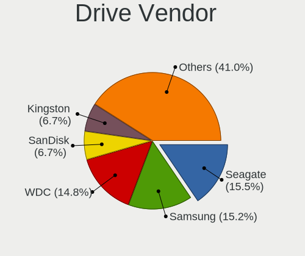
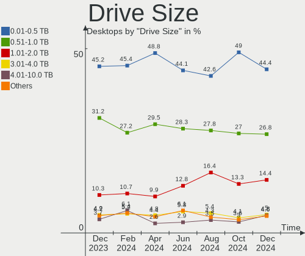
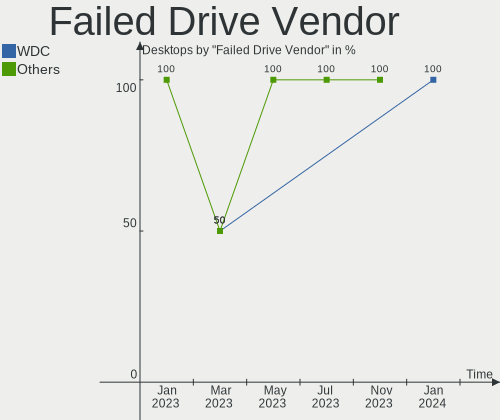
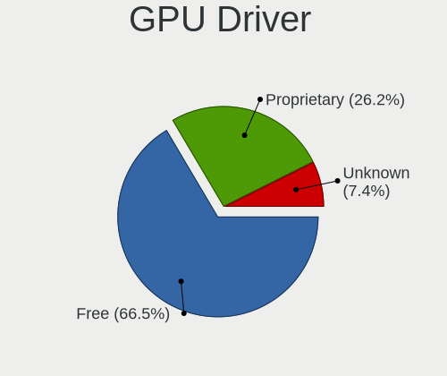
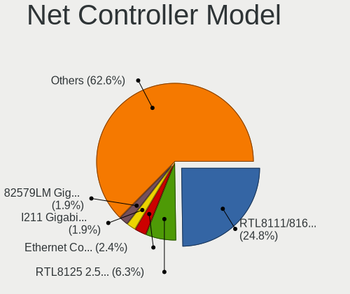
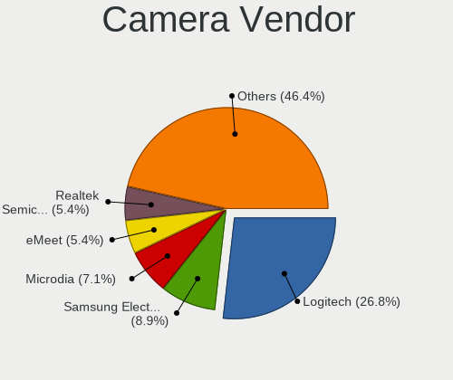

Ubuntu - Hardware Trends (Desktops)
-----------------------------------

A project to identify most popular hardware characteristics and track their change
over time based on data collected by Linux users at https://Linux-Hardware.org.

Anyone can contribute to this report by the [hw-probe](https://github.com/linuxhw/hw-probe) tool:

    sudo -E hw-probe -all -upload

This report is for one last month. Overall report since the beginning of time: [TestDays](https://github.com/linuxhw/TestDays)

Period: Jul, 2023.

Contents
--------

* [ System ](#system)
  - [ OS                       ](#os)
  - [ OS Family                ](#os-family)
  - [ Kernel                   ](#kernel)
  - [ Kernel Family            ](#kernel-family)
  - [ Kernel Major Ver.        ](#kernel-major-ver)
  - [ Arch                     ](#arch)
  - [ DE                       ](#de)
  - [ Display Server           ](#display-server)
  - [ Display Manager          ](#display-manager)
  - [ OS Lang                  ](#os-lang)
  - [ Boot Mode                ](#boot-mode)
  - [ Filesystem               ](#filesystem)
  - [ Part. scheme             ](#part-scheme)
  - [ Dual Boot with Linux/BSD ](#dual-boot-with-linuxbsd)
  - [ Dual Boot (Win)          ](#dual-boot-win)

* [ Board ](#board)
  - [ Vendor                   ](#vendor)
  - [ Model                    ](#model)
  - [ Model Family             ](#model-family)
  - [ MFG Year                 ](#mfg-year)
  - [ Form Factor              ](#form-factor)
  - [ Secure Boot              ](#secure-boot)
  - [ Coreboot                 ](#coreboot)
  - [ RAM Size                 ](#ram-size)
  - [ RAM Used                 ](#ram-used)
  - [ Total Drives             ](#total-drives)
  - [ Has CD-ROM               ](#has-cd-rom)
  - [ Has Ethernet             ](#has-ethernet)
  - [ Has WiFi                 ](#has-wifi)
  - [ Has Bluetooth            ](#has-bluetooth)

* [ Location ](#location)
  - [ Country                  ](#country)
  - [ City                     ](#city)

* [ Drives ](#drives)
  - [ Drive Vendor             ](#drive-vendor)
  - [ Drive Model              ](#drive-model)
  - [ HDD Vendor               ](#hdd-vendor)
  - [ SSD Vendor               ](#ssd-vendor)
  - [ Drive Kind               ](#drive-kind)
  - [ Drive Connector          ](#drive-connector)
  - [ Drive Size               ](#drive-size)
  - [ Space Total              ](#space-total)
  - [ Space Used               ](#space-used)
  - [ Malfunc. Drives          ](#malfunc-drives)
  - [ Malfunc. Drive Vendor    ](#malfunc-drive-vendor)
  - [ Malfunc. HDD Vendor      ](#malfunc-hdd-vendor)
  - [ Malfunc. Drive Kind      ](#malfunc-drive-kind)
  - [ Failed Drives            ](#failed-drives)
  - [ Failed Drive Vendor      ](#failed-drive-vendor)
  - [ Drive Status             ](#drive-status)

* [ Storage controller ](#storage-controller)
  - [ Storage Vendor           ](#storage-vendor)
  - [ Storage Model            ](#storage-model)
  - [ Storage Kind             ](#storage-kind)

* [ Processor ](#processor)
  - [ CPU Vendor               ](#cpu-vendor)
  - [ CPU Model                ](#cpu-model)
  - [ CPU Model Family         ](#cpu-model-family)
  - [ CPU Cores                ](#cpu-cores)
  - [ CPU Sockets              ](#cpu-sockets)
  - [ CPU Threads              ](#cpu-threads)
  - [ CPU Op-Modes             ](#cpu-op-modes)
  - [ CPU Microcode            ](#cpu-microcode)
  - [ CPU Microarch            ](#cpu-microarch)

* [ Graphics ](#graphics)
  - [ GPU Vendor               ](#gpu-vendor)
  - [ GPU Model                ](#gpu-model)
  - [ GPU Combo                ](#gpu-combo)
  - [ GPU Driver               ](#gpu-driver)
  - [ GPU Memory               ](#gpu-memory)

* [ Monitor ](#monitor)
  - [ Monitor Vendor           ](#monitor-vendor)
  - [ Monitor Model            ](#monitor-model)
  - [ Monitor Resolution       ](#monitor-resolution)
  - [ Monitor Diagonal         ](#monitor-diagonal)
  - [ Monitor Width            ](#monitor-width)
  - [ Aspect Ratio             ](#aspect-ratio)
  - [ Monitor Area             ](#monitor-area)
  - [ Pixel Density            ](#pixel-density)
  - [ Multiple Monitors        ](#multiple-monitors)

* [ Network ](#network)
  - [ Net Controller Vendor    ](#net-controller-vendor)
  - [ Net Controller Model     ](#net-controller-model)
  - [ Wireless Vendor          ](#wireless-vendor)
  - [ Wireless Model           ](#wireless-model)
  - [ Ethernet Vendor          ](#ethernet-vendor)
  - [ Ethernet Model           ](#ethernet-model)
  - [ Net Controller Kind      ](#net-controller-kind)
  - [ Used Controller          ](#used-controller)
  - [ NICs                     ](#nics)
  - [ IPv6                     ](#ipv6)

* [ Bluetooth ](#bluetooth)
  - [ Bluetooth Vendor         ](#bluetooth-vendor)
  - [ Bluetooth Model          ](#bluetooth-model)

* [ Sound ](#sound)
  - [ Sound Vendor             ](#sound-vendor)
  - [ Sound Model              ](#sound-model)

* [ Memory ](#memory)
  - [ Memory Vendor            ](#memory-vendor)
  - [ Memory Model             ](#memory-model)
  - [ Memory Kind              ](#memory-kind)
  - [ Memory Form Factor       ](#memory-form-factor)
  - [ Memory Size              ](#memory-size)
  - [ Memory Speed             ](#memory-speed)

* [ Printers & scanners ](#printers--scanners)
  - [ Printer Vendor           ](#printer-vendor)
  - [ Printer Model            ](#printer-model)
  - [ Scanner Vendor           ](#scanner-vendor)
  - [ Scanner Model            ](#scanner-model)

* [ Camera ](#camera)
  - [ Camera Vendor            ](#camera-vendor)
  - [ Camera Model             ](#camera-model)

* [ Security ](#security)
  - [ Fingerprint Vendor       ](#fingerprint-vendor)
  - [ Fingerprint Model        ](#fingerprint-model)
  - [ Chipcard Vendor          ](#chipcard-vendor)
  - [ Chipcard Model           ](#chipcard-model)

* [ Unsupported ](#unsupported)
  - [ Unsupported Devices      ](#unsupported-devices)
  - [ Unsupported Device Types ](#unsupported-device-types)

System
------

OS
--

Installed operating systems

| Name           | Desktops | Percent |
|----------------|----------|---------|
| Ubuntu 22.04   | 254      | 62.87%  |
| Ubuntu 23.04   | 74       | 18.32%  |
| Ubuntu 20.04   | 43       | 10.64%  |
| Ubuntu 22.10   | 16       | 3.96%   |
| Ubuntu 18.04   | 12       | 2.97%   |
| Ubuntu Core 22 | 2        | 0.5%    |
| Ubuntu 21.04   | 2        | 0.5%    |
| Ubuntu 20.10   | 1        | 0.25%   |

OS Family
---------

OS without a version

| Name   | Desktops | Percent |
|--------|----------|---------|
| Ubuntu | 404      | 100%    |

Kernel
------

Version of the Linux kernel

| Version                     | Desktops | Percent |
|-----------------------------|----------|---------|
| 5.19.0-46-generic           | 157      | 38.86%  |
| 5.15.0-76-generic           | 48       | 11.88%  |
| 6.2.0-25-generic            | 29       | 7.18%   |
| 6.2.0-24-generic            | 27       | 6.68%   |
| 5.19.0-50-generic           | 27       | 6.68%   |
| 5.19.0-32-generic           | 12       | 2.97%   |
| 5.15.0-78-generic           | 12       | 2.97%   |
| 6.2.0-26-generic            | 9        | 2.23%   |
| 5.4.0-153-generic           | 6        | 1.49%   |
| 5.19.0-45-generic           | 6        | 1.49%   |
| 5.4.0-150-generic           | 5        | 1.24%   |
| 6.2.0-20-generic            | 4        | 0.99%   |
| 6.4.0-060400-generic        | 3        | 0.74%   |
| 5.19.0-43-generic           | 3        | 0.74%   |
| 5.15.0-73-generic           | 3        | 0.74%   |
| 6.2.16-060216-generic       | 2        | 0.5%    |
| 6.1.0-1015-oem              | 2        | 0.5%    |
| 5.19.0-42-generic           | 2        | 0.5%    |
| 5.19.0-41-generic           | 2        | 0.5%    |
| 5.15.0-76-lowlatency        | 2        | 0.5%    |
| 5.15.0-67-generic           | 2        | 0.5%    |
| 5.15.0-58-generic           | 2        | 0.5%    |
| 5.15.0-43-generic           | 2        | 0.5%    |
| 5.11.0-49-generic           | 2        | 0.5%    |
| 4.15.0-213-generic          | 2        | 0.5%    |
| 6.4.6-060406-generic        | 1        | 0.25%   |
| 6.4.3-x64v3-xanmod1         | 1        | 0.25%   |
| 6.2.11-060211-generic       | 1        | 0.25%   |
| 6.2.10-060210-generic       | 1        | 0.25%   |
| 6.2.0-23-generic            | 1        | 0.25%   |
| 6.2.0-1010-gcp              | 1        | 0.25%   |
| 6.1.0-1008-oem              | 1        | 0.25%   |
| 6.0.1-060001-generic        | 1        | 0.25%   |
| 5.8.0-44-generic            | 1        | 0.25%   |
| 5.8.0-40-generic            | 1        | 0.25%   |
| 5.4.0-87-generic            | 1        | 0.25%   |
| 5.4.0-72-generic            | 1        | 0.25%   |
| 5.4.0-42-generic            | 1        | 0.25%   |
| 5.4.0-152-generic           | 1        | 0.25%   |
| 5.4.0-1472304060810-generic | 1        | 0.25%   |

Kernel Family
-------------

Linux kernel without a distro release

| Version | Desktops | Percent |
|---------|----------|---------|
| 5.19.0  | 212      | 52.48%  |
| 5.15.0  | 79       | 19.55%  |
| 6.2.0   | 71       | 17.57%  |
| 5.4.0   | 17       | 4.21%   |
| 4.15.0  | 4        | 0.99%   |
| 6.4.0   | 3        | 0.74%   |
| 6.1.0   | 3        | 0.74%   |
| 5.11.0  | 3        | 0.74%   |
| 6.2.16  | 2        | 0.5%    |
| 5.8.0   | 2        | 0.5%    |
| 6.4.6   | 1        | 0.25%   |
| 6.4.3   | 1        | 0.25%   |
| 6.2.11  | 1        | 0.25%   |
| 6.2.10  | 1        | 0.25%   |
| 6.0.1   | 1        | 0.25%   |
| 5.19.5  | 1        | 0.25%   |
| 5.13.0  | 1        | 0.25%   |
| 4.4.0   | 1        | 0.25%   |

Kernel Major Ver.
-----------------

Linux kernel major version

| Version | Desktops | Percent |
|---------|----------|---------|
| 5.19    | 213      | 52.72%  |
| 5.15    | 79       | 19.55%  |
| 6.2     | 75       | 18.56%  |
| 5.4     | 17       | 4.21%   |
| 6.4     | 5        | 1.24%   |
| 4.15    | 4        | 0.99%   |
| 6.1     | 3        | 0.74%   |
| 5.11    | 3        | 0.74%   |
| 5.8     | 2        | 0.5%    |
| 6.0     | 1        | 0.25%   |
| 5.13    | 1        | 0.25%   |
| 4.4     | 1        | 0.25%   |

Arch
----

OS architecture (x86_64, i586, etc.)

| Name   | Desktops | Percent |
|--------|----------|---------|
| x86_64 | 401      | 99.26%  |
| i686   | 3        | 0.74%   |

DE
--

Desktop Environment

| Name            | Desktops | Percent |
|-----------------|----------|---------|
| GNOME           | 366      | 90.59%  |
| Unknown         | 26       | 6.44%   |
| X-Cinnamon      | 5        | 1.24%   |
| GNOME Flashback | 4        | 0.99%   |
| GNOME Classic   | 2        | 0.5%    |
| i3              | 1        | 0.25%   |

Display Server
--------------

X11 or Wayland

| Name    | Desktops | Percent |
|---------|----------|---------|
| Wayland | 194      | 48.02%  |
| X11     | 176      | 43.56%  |
| Unknown | 18       | 4.46%   |
| Tty     | 16       | 3.96%   |

Display Manager
---------------

SDDM, LightDM, etc.

| Name    | Desktops | Percent |
|---------|----------|---------|
| GDM3    | 321      | 79.46%  |
| Unknown | 52       | 12.87%  |
| GDM     | 19       | 4.7%    |
| LightDM | 11       | 2.72%   |
| SDDM    | 1        | 0.25%   |

OS Lang
-------

Language

| Lang    | Desktops | Percent |
|---------|----------|---------|
| en_US   | 182      | 45.05%  |
| de_DE   | 47       | 11.63%  |
| fr_FR   | 26       | 6.44%   |
| pt_BR   | 18       | 4.46%   |
| en_GB   | 16       | 3.96%   |
| C       | 12       | 2.97%   |
| it_IT   | 11       | 2.72%   |
| es_ES   | 9        | 2.23%   |
| en_CA   | 9        | 2.23%   |
| pl_PL   | 7        | 1.73%   |
| Unknown | 6        | 1.49%   |
| nl_NL   | 5        | 1.24%   |
| en_IN   | 5        | 1.24%   |
| en_AU   | 5        | 1.24%   |
| zh_CN   | 4        | 0.99%   |
| ru_RU   | 3        | 0.74%   |
| hu_HU   | 3        | 0.74%   |
| es_MX   | 3        | 0.74%   |
| es_AR   | 3        | 0.74%   |
| en_ZA   | 3        | 0.74%   |
| el_GR   | 3        | 0.74%   |
| de_AT   | 3        | 0.74%   |
| cs_CZ   | 3        | 0.74%   |
| pt_PT   | 2        | 0.5%    |
| nl_BE   | 2        | 0.5%    |
| fr_CH   | 2        | 0.5%    |
| es_VE   | 2        | 0.5%    |
| es_BO   | 2        | 0.5%    |
| en_NZ   | 2        | 0.5%    |
| tr_TR   | 1        | 0.25%   |
| nb_NO   | 1        | 0.25%   |
| es_UY   | 1        | 0.25%   |
| es_CL   | 1        | 0.25%   |
| en_HK   | 1        | 0.25%   |
| bg_BG   | 1        | 0.25%   |

Boot Mode
---------

EFI or BIOS

| Mode | Desktops | Percent |
|------|----------|---------|
| BIOS | 279      | 69.06%  |
| EFI  | 125      | 30.94%  |

Filesystem
----------

Type of filesystem

| Type    | Desktops | Percent |
|---------|----------|---------|
| Tmpfs   | 212      | 52.48%  |
| Ext4    | 166      | 41.09%  |
| Btrfs   | 14       | 3.47%   |
| Overlay | 8        | 1.98%   |
| Zfs     | 4        | 0.99%   |

Part. scheme
------------

Scheme of partitioning

| Type    | Desktops | Percent |
|---------|----------|---------|
| GPT     | 307      | 75.99%  |
| MBR     | 59       | 14.6%   |
| Unknown | 38       | 9.41%   |

Dual Boot with Linux/BSD
------------------------

Hosting more than one Linux/BSD

| Dual boot | Desktops | Percent |
|-----------|----------|---------|
| No        | 335      | 82.92%  |
| Yes       | 69       | 17.08%  |

Dual Boot (Win)
---------------

Hosting Linux and Windows

| Dual boot | Desktops | Percent |
|-----------|----------|---------|
| No        | 258      | 63.86%  |
| Yes       | 146      | 36.14%  |

Board
-----

Vendor
------

Motherboard manufacturer

| Name                                 | Desktops | Percent |
|--------------------------------------|----------|---------|
| ASUSTek Computer                     | 92       | 22.77%  |
| Gigabyte Technology                  | 61       | 15.1%   |
| MSI                                  | 49       | 12.13%  |
| Hewlett-Packard                      | 36       | 8.91%   |
| Dell                                 | 36       | 8.91%   |
| ASRock                               | 29       | 7.18%   |
| Lenovo                               | 20       | 4.95%   |
| Intel                                | 14       | 3.47%   |
| Unknown                              | 11       | 2.72%   |
| Fujitsu                              | 6        | 1.49%   |
| Pegatron                             | 4        | 0.99%   |
| Medion                               | 4        | 0.99%   |
| Apple                                | 4        | 0.99%   |
| Shenzhen Meigao Electronic Equipment | 3        | 0.74%   |
| Positivo                             | 3        | 0.74%   |
| Biostar                              | 3        | 0.74%   |
| Acer                                 | 3        | 0.74%   |
| Gateway                              | 2        | 0.5%    |
| ECS                                  | 2        | 0.5%    |
| Alienware                            | 2        | 0.5%    |
| WeiBu                                | 1        | 0.25%   |
| PCWare                               | 1        | 0.25%   |
| Packard Bell                         | 1        | 0.25%   |
| MW                                   | 1        | 0.25%   |
| Megaware                             | 1        | 0.25%   |
| MACHINIST                            | 1        | 0.25%   |
| Itautec                              | 1        | 0.25%   |
| Huanan                               | 1        | 0.25%   |
| Google                               | 1        | 0.25%   |
| DFI                                  | 1        | 0.25%   |
| CWWK                                 | 1        | 0.25%   |
| Cincoze                              | 1        | 0.25%   |
| BESSTAR Tech                         | 1        | 0.25%   |
| AZW                                  | 1        | 0.25%   |
| Avalue                               | 1        | 0.25%   |
| ASRock Industrial                    | 1        | 0.25%   |
| AMI                                  | 1        | 0.25%   |
| Altos                                | 1        | 0.25%   |
| ADLINK Technology                    | 1        | 0.25%   |
| Acidanthera                          | 1        | 0.25%   |

Model
-----

Motherboard model

| Name                                       | Desktops | Percent |
|--------------------------------------------|----------|---------|
| Unknown                                    | 12       | 2.97%   |
| ASUS All Series                            | 6        | 1.49%   |
| Dell OptiPlex 9020                         | 5        | 1.24%   |
| Shenzhen Meigao Electronic Equipment UM690 | 3        | 0.74%   |
| Dell OptiPlex 380                          | 3        | 0.74%   |
| Dell OptiPlex 3050                         | 3        | 0.74%   |
| ASUS ROG STRIX B650E-E GAMING WIFI         | 3        | 0.74%   |
| ASUS PRIME B450M-A                         | 3        | 0.74%   |
| ASUS PRIME A320M-K                         | 3        | 0.74%   |
| MSI MS-7D75                                | 2        | 0.5%    |
| MSI MS-7D67                                | 2        | 0.5%    |
| MSI MS-7D32                                | 2        | 0.5%    |
| MSI MS-7C56                                | 2        | 0.5%    |
| MSI MS-7C37                                | 2        | 0.5%    |
| MSI MS-7A38                                | 2        | 0.5%    |
| MSI MS-7817                                | 2        | 0.5%    |
| MSI MS-7592                                | 2        | 0.5%    |
| Lenovo H530s 10132                         | 2        | 0.5%    |
| Intel DH67BL AAG10189-211                  | 2        | 0.5%    |
| HP Z840 Workstation                        | 2        | 0.5%    |
| HP Z640 Workstation                        | 2        | 0.5%    |
| HP ProDesk 600 G1 SFF                      | 2        | 0.5%    |
| HP Compaq Elite 8300 USDT                  | 2        | 0.5%    |
| HP Compaq 8200 Elite SFF PC                | 2        | 0.5%    |
| HP Compaq 8100 Elite SFF PC                | 2        | 0.5%    |
| HP Compaq 6000 Pro SFF PC                  | 2        | 0.5%    |
| Gigabyte Z77-DS3H                          | 2        | 0.5%    |
| Gigabyte H61M-DS2                          | 2        | 0.5%    |
| Gigabyte GA-78LMT-USB3 6.0                 | 2        | 0.5%    |
| Gigabyte B650 AORUS ELITE AX               | 2        | 0.5%    |
| Gigabyte B450M DS3H V2                     | 2        | 0.5%    |
| Gigabyte B450 AORUS M                      | 2        | 0.5%    |
| Gigabyte A320M-S2H                         | 2        | 0.5%    |
| Fujitsu D3401-H2 S26361-D3401-H2           | 2        | 0.5%    |
| Dell OptiPlex 745                          | 2        | 0.5%    |
| Dell OptiPlex 7010                         | 2        | 0.5%    |
| ASUS ROG STRIX B450-E GAMING               | 2        | 0.5%    |
| ASUS PRIME X570-P                          | 2        | 0.5%    |
| ASUS PRIME X370-PRO                        | 2        | 0.5%    |
| ASRock B560M Pro4                          | 2        | 0.5%    |

Model Family
------------

Motherboard model prefix

| Name                                       | Desktops | Percent |
|--------------------------------------------|----------|---------|
| ASUS PRIME                                 | 28       | 6.93%   |
| Dell OptiPlex                              | 23       | 5.69%   |
| ASUS ROG                                   | 16       | 3.96%   |
| HP Compaq                                  | 15       | 3.71%   |
| Lenovo ThinkCentre                         | 12       | 2.97%   |
| Unknown                                    | 12       | 2.97%   |
| Dell Precision                             | 6        | 1.49%   |
| Dell Inspiron                              | 6        | 1.49%   |
| ASUS All                                   | 6        | 1.49%   |
| HP ProDesk                                 | 5        | 1.24%   |
| ASUS TUF                                   | 5        | 1.24%   |
| Shenzhen Meigao Electronic Equipment UM690 | 3        | 0.74%   |
| Lenovo IdeaCentre                          | 3        | 0.74%   |
| Gigabyte H61M-DS2                          | 3        | 0.74%   |
| Gigabyte B450M                             | 3        | 0.74%   |
| Fujitsu ESPRIMO                            | 3        | 0.74%   |
| MSI MS-7D75                                | 2        | 0.5%    |
| MSI MS-7D67                                | 2        | 0.5%    |
| MSI MS-7D32                                | 2        | 0.5%    |
| MSI MS-7C56                                | 2        | 0.5%    |
| MSI MS-7C37                                | 2        | 0.5%    |
| MSI MS-7A38                                | 2        | 0.5%    |
| MSI MS-7817                                | 2        | 0.5%    |
| MSI MS-7592                                | 2        | 0.5%    |
| Lenovo H530s                               | 2        | 0.5%    |
| Intel DH67BL                               | 2        | 0.5%    |
| HP Z840                                    | 2        | 0.5%    |
| HP Z640                                    | 2        | 0.5%    |
| HP EliteDesk                               | 2        | 0.5%    |
| Gigabyte Z77-DS3H                          | 2        | 0.5%    |
| Gigabyte GA-78LMT-USB3                     | 2        | 0.5%    |
| Gigabyte B650                              | 2        | 0.5%    |
| Gigabyte B550M                             | 2        | 0.5%    |
| Gigabyte B450                              | 2        | 0.5%    |
| Gigabyte A320M-S2H                         | 2        | 0.5%    |
| Fujitsu D3401-H2                           | 2        | 0.5%    |
| ASUS SABERTOOTH                            | 2        | 0.5%    |
| ASUS Pro                                   | 2        | 0.5%    |
| ASUS P8Z77-V                               | 2        | 0.5%    |
| ASUS P8Z68-V                               | 2        | 0.5%    |

MFG Year
--------

Motherboard manufacture year

| Year | Desktops | Percent |
|------|----------|---------|
| 2020 | 38       | 9.41%   |
| 2022 | 36       | 8.91%   |
| 2012 | 36       | 8.91%   |
| 2018 | 35       | 8.66%   |
| 2014 | 29       | 7.18%   |
| 2013 | 29       | 7.18%   |
| 2011 | 28       | 6.93%   |
| 2017 | 25       | 6.19%   |
| 2021 | 24       | 5.94%   |
| 2009 | 21       | 5.2%    |
| 2019 | 18       | 4.46%   |
| 2016 | 18       | 4.46%   |
| 2015 | 18       | 4.46%   |
| 2023 | 16       | 3.96%   |
| 2010 | 16       | 3.96%   |
| 2007 | 10       | 2.48%   |
| 2008 | 4        | 0.99%   |
| 2005 | 2        | 0.5%    |
| 2006 | 1        | 0.25%   |

Form Factor
-----------

Physical design of the computer

| Name    | Desktops | Percent |
|---------|----------|---------|
| Desktop | 404      | 100%    |

Secure Boot
-----------

Enabled or disabled

| State    | Desktops | Percent |
|----------|----------|---------|
| Disabled | 396      | 98.02%  |
| Enabled  | 8        | 1.98%   |

Coreboot
--------

Have coreboot on board

| Used | Desktops | Percent |
|------|----------|---------|
| No   | 403      | 99.75%  |
| Yes  | 1        | 0.25%   |

RAM Size
--------

Total RAM memory

| Size in GB      | Desktops | Percent |
|-----------------|----------|---------|
| 16.01-24.0      | 99       | 24.5%   |
| 4.01-8.0        | 66       | 16.34%  |
| 32.01-64.0      | 66       | 16.34%  |
| 8.01-16.0       | 54       | 13.37%  |
| 3.01-4.0        | 48       | 11.88%  |
| 64.01-256.0     | 39       | 9.65%   |
| 24.01-32.0      | 20       | 4.95%   |
| 2.01-3.0        | 7        | 1.73%   |
| More than 256.0 | 3        | 0.74%   |
| 1.01-2.0        | 2        | 0.5%    |

RAM Used
--------

Used RAM memory

| Used GB    | Desktops | Percent |
|------------|----------|---------|
| 1.01-2.0   | 127      | 31.44%  |
| 2.01-3.0   | 119      | 29.46%  |
| 4.01-8.0   | 66       | 16.34%  |
| 3.01-4.0   | 59       | 14.6%   |
| 8.01-16.0  | 17       | 4.21%   |
| 0.51-1.0   | 7        | 1.73%   |
| 16.01-24.0 | 3        | 0.74%   |
| 32.01-64.0 | 2        | 0.5%    |
| 24.01-32.0 | 2        | 0.5%    |
| 0.01-0.5   | 2        | 0.5%    |

Total Drives
------------

Number of drives on board

| Drives | Desktops | Percent |
|--------|----------|---------|
| 1      | 183      | 45.3%   |
| 2      | 108      | 26.73%  |
| 3      | 49       | 12.13%  |
| 4      | 33       | 8.17%   |
| 5      | 15       | 3.71%   |
| 6      | 8        | 1.98%   |
| 7      | 3        | 0.74%   |
| 0      | 3        | 0.74%   |
| 10     | 1        | 0.25%   |
| 9      | 1        | 0.25%   |

Has CD-ROM
----------

Has CD-ROM on board

| Presented | Desktops | Percent |
|-----------|----------|---------|
| No        | 244      | 60.4%   |
| Yes       | 160      | 39.6%   |

Has Ethernet
------------

Has Ethernet on board

| Presented | Desktops | Percent |
|-----------|----------|---------|
| Yes       | 402      | 99.5%   |
| No        | 2        | 0.5%    |

Has WiFi
--------

Has WiFi module

| Presented | Desktops | Percent |
|-----------|----------|---------|
| No        | 227      | 56.19%  |
| Yes       | 177      | 43.81%  |

Has Bluetooth
-------------

Has Bluetooth module

| Presented | Desktops | Percent |
|-----------|----------|---------|
| No        | 260      | 64.36%  |
| Yes       | 144      | 35.64%  |

Location
--------

Country
-------

Geographic location (country)

| Country      | Desktops | Percent |
|--------------|----------|---------|
| USA          | 85       | 21.04%  |
| Germany      | 61       | 15.1%   |
| France       | 31       | 7.67%   |
| Brazil       | 27       | 6.68%   |
| UK           | 18       | 4.46%   |
| Canada       | 17       | 4.21%   |
| Italy        | 15       | 3.71%   |
| Poland       | 10       | 2.48%   |
| India        | 9        | 2.23%   |
| Austria      | 9        | 2.23%   |
| Australia    | 9        | 2.23%   |
| Netherlands  | 7        | 1.73%   |
| Spain        | 6        | 1.49%   |
| Russia       | 6        | 1.49%   |
| Argentina    | 6        | 1.49%   |
| New Zealand  | 5        | 1.24%   |
| Switzerland  | 4        | 0.99%   |
| South Africa | 4        | 0.99%   |
| Saudi Arabia | 4        | 0.99%   |
| Mexico       | 4        | 0.99%   |
| Hungary      | 4        | 0.99%   |
| Greece       | 4        | 0.99%   |
| Czechia      | 4        | 0.99%   |
| China        | 4        | 0.99%   |
| Taiwan       | 3        | 0.74%   |
| Portugal     | 3        | 0.74%   |
| Chile        | 3        | 0.74%   |
| Belgium      | 3        | 0.74%   |
| Venezuela    | 2        | 0.5%    |
| Uruguay      | 2        | 0.5%    |
| UAE          | 2        | 0.5%    |
| Turkey       | 2        | 0.5%    |
| South Korea  | 2        | 0.5%    |
| Romania      | 2        | 0.5%    |
| Malaysia     | 2        | 0.5%    |
| Japan        | 2        | 0.5%    |
| Iran         | 2        | 0.5%    |
| Finland      | 2        | 0.5%    |
| Bolivia      | 2        | 0.5%    |
| Thailand     | 1        | 0.25%   |

City
----

Geographic location (city)

| City            | Desktops | Percent |
|-----------------|----------|---------|
| Berlin          | 6        | 1.49%   |
| Vienna          | 4        | 0.99%   |
| Paris           | 4        | 0.99%   |
| Auckland        | 4        | 0.99%   |
| Warsaw          | 3        | 0.74%   |
| Sydney          | 3        | 0.74%   |
| Surat           | 3        | 0.74%   |
| St Petersburg   | 3        | 0.74%   |
| Seattle         | 3        | 0.74%   |
| New York        | 3        | 0.74%   |
| Madrid          | 3        | 0.74%   |
| Karlsruhe       | 3        | 0.74%   |
| Hamburg         | 3        | 0.74%   |
| Buenos Aires    | 3        | 0.74%   |
| Brasília       | 3        | 0.74%   |
| Beverly Hills   | 3        | 0.74%   |
| York            | 2        | 0.5%    |
| Wroclaw         | 2        | 0.5%    |
| Wegberg         | 2        | 0.5%    |
| Vancouver       | 2        | 0.5%    |
| Tehran          | 2        | 0.5%    |
| Southend-on-Sea | 2        | 0.5%    |
| Sao Vicente     | 2        | 0.5%    |
| Sao Paulo       | 2        | 0.5%    |
| Santo André    | 2        | 0.5%    |
| San José       | 2        | 0.5%    |
| Riyadh          | 2        | 0.5%    |
| Pretoria        | 2        | 0.5%    |
| Prague          | 2        | 0.5%    |
| Porto Alegre    | 2        | 0.5%    |
| Pompano Beach   | 2        | 0.5%    |
| Perth           | 2        | 0.5%    |
| North Hollywood | 2        | 0.5%    |
| Niterói        | 2        | 0.5%    |
| Munich          | 2        | 0.5%    |
| Mülheim        | 2        | 0.5%    |
| Moscow          | 2        | 0.5%    |
| Montevideo      | 2        | 0.5%    |
| Milano          | 2        | 0.5%    |
| Melbourne       | 2        | 0.5%    |

Drives
------

Drive Vendor
------------

Hard drive vendors

| Vendor                      | Desktops | Drives | Percent |
|-----------------------------|----------|--------|---------|
| Samsung Electronics         | 121      | 177    | 17.79%  |
| Seagate                     | 117      | 150    | 17.21%  |
| WDC                         | 97       | 133    | 14.26%  |
| Kingston                    | 40       | 46     | 5.88%   |
| SanDisk                     | 36       | 41     | 5.29%   |
| Crucial                     | 33       | 39     | 4.85%   |
| Toshiba                     | 24       | 27     | 3.53%   |
| Hitachi                     | 20       | 20     | 2.94%   |
| Micron/Crucial Technology   | 12       | 13     | 1.76%   |
| China                       | 11       | 11     | 1.62%   |
| Intel                       | 10       | 10     | 1.47%   |
| PNY                         | 9        | 9      | 1.32%   |
| Maxtor                      | 9        | 10     | 1.32%   |
| A-DATA Technology           | 9        | 11     | 1.32%   |
| Phison Electronics          | 7        | 7      | 1.03%   |
| Kingston Technology Company | 7        | 8      | 1.03%   |
| Silicon Motion              | 6        | 6      | 0.88%   |
| OCZ                         | 6        | 6      | 0.88%   |
| Intenso                     | 6        | 7      | 0.88%   |
| Unknown                     | 4        | 4      | 0.59%   |
| Team                        | 4        | 4      | 0.59%   |
| SPCC                        | 4        | 5      | 0.59%   |
| HGST                        | 4        | 4      | 0.59%   |
| Fanxiang                    | 4        | 4      | 0.59%   |
| Corsair                     | 4        | 4      | 0.59%   |
| Unknown                     | 4        | 4      | 0.59%   |
| Seagate Technology          | 3        | 3      | 0.44%   |
| Phison                      | 3        | 3      | 0.44%   |
| MAXIO Technology (Hangzhou) | 3        | 3      | 0.44%   |
| GOODRAM                     | 3        | 3      | 0.44%   |
| Gigabyte Technology         | 3        | 4      | 0.44%   |
| Apple                       | 3        | 3      | 0.44%   |
| Transcend                   | 2        | 2      | 0.29%   |
| SK hynix                    | 2        | 2      | 0.29%   |
| SABRENT                     | 2        | 2      | 0.29%   |
| Mushkin                     | 2        | 2      | 0.29%   |
| Micron Technology           | 2        | 2      | 0.29%   |
| LaCie                       | 2        | 2      | 0.29%   |
| Kingchuxing                 | 2        | 2      | 0.29%   |
| JMicron Technology          | 2        | 2      | 0.29%   |

Drive Model
-----------

Hard drive models

| Model                                                 | Desktops | Percent |
|-------------------------------------------------------|----------|---------|
| Samsung NVMe SSD Controller SM981/PM981/PM983 500GB   | 17       | 2.18%   |
| Micron/Crucial P2 NVMe PCIe SSD 1TB                   | 11       | 1.41%   |
| Seagate ST1000DM010-2EP102 1TB                        | 9        | 1.15%   |
| Kingston SA400S37480G 480GB SSD                       | 9        | 1.15%   |
| Kingston SA400S37240G 240GB SSD                       | 9        | 1.15%   |
| Seagate ST500DM002-1BD142 500GB                       | 8        | 1.02%   |
| Samsung SSD 850 EVO 500GB                             | 7        | 0.9%    |
| Crucial CT1000MX500SSD1 1TB                           | 7        | 0.9%    |
| Samsung SSD 990 PRO 2TB                               | 6        | 0.77%   |
| Samsung SSD 850 EVO 250GB                             | 6        | 0.77%   |
| Samsung NVMe SSD Controller PM9A1/PM9A3/980PRO 1TB    | 6        | 0.77%   |
| WDC WD10EZEX-08WN4A0 1TB                              | 5        | 0.64%   |
| Seagate Expansion Desk 8TB                            | 5        | 0.64%   |
| Samsung SSD 970 EVO Plus 1TB                          | 5        | 0.64%   |
| Samsung SSD 870 QVO 1TB                               | 5        | 0.64%   |
| Samsung NVMe SSD Controller SM961/PM961/SM963 256GB   | 5        | 0.64%   |
| Silicon Motion SM2263EN/SM2263XT SSD Controller 500GB | 4        | 0.51%   |
| Seagate ST3250410AS 250GB                             | 4        | 0.51%   |
| Seagate ST2000DM008-2FR102 2TB                        | 4        | 0.51%   |
| Samsung SSD 980 1TB                                   | 4        | 0.51%   |
| Samsung SSD 870 EVO 2TB                               | 4        | 0.51%   |
| Samsung HD204UI 2TB                                   | 4        | 0.51%   |
| Unknown                                               | 4        | 0.51%   |
| WDC WDS240G2G0A-00JH30 240GB SSD                      | 3        | 0.38%   |
| WDC WD5000AAKX-00ERMA0 500GB                          | 3        | 0.38%   |
| WDC WD10EZEX-08RKKA0 1TB                              | 3        | 0.38%   |
| WDC WD10EZEX-00WN4A0 1TB                              | 3        | 0.38%   |
| WDC WD10EZEX-00BBHA0 1TB                              | 3        | 0.38%   |
| WDC WD1003FZEX-00MK2A0 1TB                            | 3        | 0.38%   |
| Unknown SD/MMC/MS PRO 128GB                           | 3        | 0.38%   |
| Seagate ST8000DM004-2CX188 8TB                        | 3        | 0.38%   |
| Seagate ST3320418AS 320GB                             | 3        | 0.38%   |
| Seagate ST31000528AS 1TB                              | 3        | 0.38%   |
| Seagate ST2000DM001-1CH164 2TB                        | 3        | 0.38%   |
| Seagate ST1000DM003-1ER162 1TB                        | 3        | 0.38%   |
| Seagate Expansion 1TB                                 | 3        | 0.38%   |
| SanDisk SSD PLUS 240GB                                | 3        | 0.38%   |
| SanDisk NVMe SSD Drive 1TB                            | 3        | 0.38%   |
| Samsung SSD 970 EVO 500GB                             | 3        | 0.38%   |
| Samsung SSD 870 QVO 2TB                               | 3        | 0.38%   |

HDD Vendor
----------

Hard disk drive vendors

| Vendor              | Desktops | Drives | Percent |
|---------------------|----------|--------|---------|
| Seagate             | 116      | 147    | 39.19%  |
| WDC                 | 88       | 120    | 29.73%  |
| Samsung Electronics | 23       | 27     | 7.77%   |
| Toshiba             | 20       | 20     | 6.76%   |
| Hitachi             | 20       | 20     | 6.76%   |
| Maxtor              | 9        | 10     | 3.04%   |
| HGST                | 4        | 4      | 1.35%   |
| Unknown             | 3        | 3      | 1.01%   |
| LaCie               | 2        | 2      | 0.68%   |
| JMicron Technology  | 2        | 2      | 0.68%   |
| Intenso             | 2        | 2      | 0.68%   |
| ASMT                | 2        | 2      | 0.68%   |
| Apple               | 2        | 2      | 0.68%   |
| SABRENT             | 1        | 1      | 0.34%   |
| QUANTUM             | 1        | 1      | 0.34%   |
| Fujitsu             | 1        | 1      | 0.34%   |

SSD Vendor
----------

Solid state drive vendors

| Vendor              | Desktops | Drives | Percent |
|---------------------|----------|--------|---------|
| Samsung Electronics | 63       | 75     | 26.03%  |
| Kingston            | 28       | 32     | 11.57%  |
| Crucial             | 28       | 32     | 11.57%  |
| SanDisk             | 20       | 24     | 8.26%   |
| China               | 11       | 11     | 4.55%   |
| WDC                 | 10       | 10     | 4.13%   |
| PNY                 | 9        | 9      | 3.72%   |
| A-DATA Technology   | 8        | 10     | 3.31%   |
| OCZ                 | 6        | 6      | 2.48%   |
| Intel               | 6        | 6      | 2.48%   |
| Team                | 4        | 4      | 1.65%   |
| Intenso             | 4        | 5      | 1.65%   |
| GOODRAM             | 3        | 3      | 1.24%   |
| Unknown             | 3        | 3      | 1.24%   |
| Transcend           | 2        | 2      | 0.83%   |
| Toshiba             | 2        | 2      | 0.83%   |
| SPCC                | 2        | 3      | 0.83%   |
| Mushkin             | 2        | 2      | 0.83%   |
| Kingchuxing         | 2        | 2      | 0.83%   |
| Gigabyte Technology | 2        | 3      | 0.83%   |
| Fanxiang            | 2        | 2      | 0.83%   |
| WALRAM              | 1        | 1      | 0.41%   |
| Verbatim            | 1        | 2      | 0.41%   |
| SK hynix            | 1        | 1      | 0.41%   |
| Plextor             | 1        | 1      | 0.41%   |
| Patriot             | 1        | 1      | 0.41%   |
| OWC                 | 1        | 2      | 0.41%   |
| NN                  | 1        | 1      | 0.41%   |
| minisforum          | 1        | 1      | 0.41%   |
| Micron Technology   | 1        | 1      | 0.41%   |
| LuminouTek          | 1        | 1      | 0.41%   |
| LITEONIT            | 1        | 1      | 0.41%   |
| LITEON              | 1        | 1      | 0.41%   |
| Lexar               | 1        | 1      | 0.41%   |
| Leven               | 1        | 1      | 0.41%   |
| Lenovo              | 1        | 1      | 0.41%   |
| KingSpec            | 1        | 1      | 0.41%   |
| KingFast            | 1        | 1      | 0.41%   |
| Kimtigo             | 1        | 1      | 0.41%   |
| Hewlett-Packard     | 1        | 1      | 0.41%   |

Drive Kind
----------

HDD or SSD

| Kind    | Desktops | Drives | Percent |
|---------|----------|--------|---------|
| HDD     | 227      | 364    | 38.54%  |
| SSD     | 212      | 273    | 35.99%  |
| NVMe    | 137      | 185    | 23.26%  |
| Unknown | 12       | 12     | 2.04%   |
| MMC     | 1        | 1      | 0.17%   |

Drive Connector
---------------

SATA, SAS, NVMe, etc.

| Type | Desktops | Drives | Percent |
|------|----------|--------|---------|
| SATA | 346      | 613    | 67.45%  |
| NVMe | 136      | 184    | 26.51%  |
| SAS  | 30       | 37     | 5.85%   |
| MMC  | 1        | 1      | 0.19%   |

Drive Size
----------

Size of hard drive

| Size in TB | Desktops | Drives | Percent |
|------------|----------|--------|---------|
| 0.01-0.5   | 228      | 318    | 47.01%  |
| 0.51-1.0   | 138      | 168    | 28.45%  |
| 1.01-2.0   | 67       | 80     | 13.81%  |
| 3.01-4.0   | 19       | 25     | 3.92%   |
| 4.01-10.0  | 18       | 29     | 3.71%   |
| 2.01-3.0   | 9        | 10     | 1.86%   |
| 10.01-20.0 | 5        | 6      | 1.03%   |
| 0          | 1        | 1      | 0.21%   |

Space Total
-----------

Amount of disk space available on the file system

| Size in GB     | Desktops | Percent |
|----------------|----------|---------|
| 101-250        | 94       | 23.27%  |
| 501-1000       | 83       | 20.54%  |
| 251-500        | 76       | 18.81%  |
| 1001-2000      | 64       | 15.84%  |
| More than 3000 | 34       | 8.42%   |
| 1-20           | 13       | 3.22%   |
| 2001-3000      | 12       | 2.97%   |
| 21-50          | 11       | 2.72%   |
| 51-100         | 11       | 2.72%   |
| Unknown        | 6        | 1.49%   |

Space Used
----------

Amount of used disk space

| Used GB        | Desktops | Percent |
|----------------|----------|---------|
| 1-20           | 106      | 26.24%  |
| 21-50          | 91       | 22.52%  |
| 101-250        | 54       | 13.37%  |
| 51-100         | 48       | 11.88%  |
| 251-500        | 33       | 8.17%   |
| 501-1000       | 32       | 7.92%   |
| 1001-2000      | 16       | 3.96%   |
| More than 3000 | 13       | 3.22%   |
| Unknown        | 6        | 1.49%   |
| 2001-3000      | 5        | 1.24%   |

Malfunc. Drives
---------------

Drive models with a malfunction

| Model                                 | Desktops | Drives | Percent |
|---------------------------------------|----------|--------|---------|
| WDC WD80EFBX-68AZZN0 8TB              | 1        | 2      | 2.86%   |
| WDC WD5000BEVT-60ZAT1 500GB           | 1        | 1      | 2.86%   |
| WDC WD5000AAKX-753CA1 500GB           | 1        | 1      | 2.86%   |
| WDC WD5000AAKX-60U6AA0 500GB          | 1        | 1      | 2.86%   |
| WDC WD5000AAKX-00ERMA0 500GB          | 1        | 2      | 2.86%   |
| WDC WD4500HLHX-01JJPV0 450GB          | 1        | 1      | 2.86%   |
| WDC WD40EFRX-68WT0N0 4TB              | 1        | 2      | 2.86%   |
| WDC WD2500AAKX-753CA1 250GB           | 1        | 1      | 2.86%   |
| WDC WD10EZEX-21WN4A0 1TB              | 1        | 1      | 2.86%   |
| WDC WD10EADS-65L5B1 1TB               | 1        | 1      | 2.86%   |
| Toshiba MK3261GSYN 320GB              | 1        | 1      | 2.86%   |
| Toshiba MK2555GSXF 250GB              | 1        | 1      | 2.86%   |
| Toshiba MG08ACA16TE 16TB              | 1        | 1      | 2.86%   |
| Seagate ST8000DM004-2CX188 8TB        | 1        | 2      | 2.86%   |
| Seagate ST500LM000-1EJ162-SSHD-8GB    | 1        | 1      | 2.86%   |
| Seagate ST3500418AS 500GB             | 1        | 1      | 2.86%   |
| Seagate ST320LT007-9ZV142 320GB       | 1        | 1      | 2.86%   |
| Seagate ST2000LM007-1R8174 2TB        | 1        | 1      | 2.86%   |
| Seagate ST14000NM0018-2H4101 14TB     | 1        | 1      | 2.86%   |
| SanDisk SSD PLUS 240GB                | 1        | 1      | 2.86%   |
| SanDisk SSD PLUS 120GB                | 1        | 1      | 2.86%   |
| SanDisk SDSSDHII120G 120GB            | 1        | 1      | 2.86%   |
| Samsung Electronics SSD 970 EVO 500GB | 1        | 1      | 2.86%   |
| Samsung Electronics SSD 850 EVO 1TB   | 1        | 1      | 2.86%   |
| Samsung Electronics HD753LJ 752GB     | 1        | 1      | 2.86%   |
| Samsung Electronics HD501LJ 500GB     | 1        | 2      | 2.86%   |
| OCZ VERTEX3 90GB SSD                  | 1        | 1      | 2.86%   |
| Maxtor 90680D4 7GB                    | 1        | 1      | 2.86%   |
| Kingston SV300S37A120G 120GB SSD      | 1        | 1      | 2.86%   |
| Kingston SNV2S500G 500GB              | 1        | 1      | 2.86%   |
| Intel SSDSC2KW240H6 240GB             | 1        | 1      | 2.86%   |
| Intel SSDSC2BF180A5L 180GB            | 1        | 1      | 2.86%   |
| Intel SSDPED1D960GAY 960GB            | 1        | 1      | 2.86%   |
| Hitachi HDT721010SLA360 1TB           | 1        | 1      | 2.86%   |
| Crucial CT240M500SSD1 240GB           | 1        | 1      | 2.86%   |

Malfunc. Drive Vendor
---------------------

Vendors of faulty drives

| Vendor              | Desktops | Drives | Percent |
|---------------------|----------|--------|---------|
| WDC                 | 9        | 13     | 26.47%  |
| Seagate             | 6        | 7      | 17.65%  |
| Samsung Electronics | 4        | 5      | 11.76%  |
| Toshiba             | 3        | 3      | 8.82%   |
| SanDisk             | 3        | 3      | 8.82%   |
| Intel               | 3        | 3      | 8.82%   |
| Kingston            | 2        | 2      | 5.88%   |
| OCZ                 | 1        | 1      | 2.94%   |
| Maxtor              | 1        | 1      | 2.94%   |
| Hitachi             | 1        | 1      | 2.94%   |
| Crucial             | 1        | 1      | 2.94%   |

Malfunc. HDD Vendor
-------------------

Vendors of faulty HDD drives

| Vendor              | Desktops | Drives | Percent |
|---------------------|----------|--------|---------|
| WDC                 | 9        | 13     | 40.91%  |
| Seagate             | 6        | 7      | 27.27%  |
| Toshiba             | 3        | 3      | 13.64%  |
| Samsung Electronics | 2        | 3      | 9.09%   |
| Maxtor              | 1        | 1      | 4.55%   |
| Hitachi             | 1        | 1      | 4.55%   |

Malfunc. Drive Kind
-------------------

Kinds of faulty drives

| Kind | Desktops | Drives | Percent |
|------|----------|--------|---------|
| HDD  | 21       | 28     | 63.64%  |
| SSD  | 9        | 9      | 27.27%  |
| NVMe | 3        | 3      | 9.09%   |

Failed Drives
-------------

Failed drive models

| Model                         | Desktops | Drives | Percent |
|-------------------------------|----------|--------|---------|
| Apple HDD HTS541010A9E662 1TB | 1        | 1      | 100%    |

Failed Drive Vendor
-------------------

Failed drive vendors

| Vendor | Desktops | Drives | Percent |
|--------|----------|--------|---------|
| Apple  | 1        | 1      | 100%    |

Drive Status
------------

Number of failed and malfunc. drives

| Status   | Desktops | Drives | Percent |
|----------|----------|--------|---------|
| Detected | 270      | 548    | 61.64%  |
| Works    | 136      | 246    | 31.05%  |
| Malfunc  | 31       | 40     | 7.08%   |
| Failed   | 1        | 1      | 0.23%   |

Storage controller
------------------

Storage Vendor
--------------

Storage controller vendors

| Vendor                       | Desktops | Percent |
|------------------------------|----------|---------|
| Intel                        | 283      | 45.79%  |
| AMD                          | 110      | 17.8%   |
| Samsung Electronics          | 57       | 9.22%   |
| ASMedia Technology           | 26       | 4.21%   |
| Kingston Technology Company  | 21       | 3.4%    |
| SanDisk                      | 19       | 3.07%   |
| Micron/Crucial Technology    | 18       | 2.91%   |
| Phison Electronics           | 15       | 2.43%   |
| JMicron Technology           | 14       | 2.27%   |
| Marvell Technology Group     | 11       | 1.78%   |
| Silicon Motion               | 7        | 1.13%   |
| Broadcom / LSI               | 6        | 0.97%   |
| Nvidia                       | 4        | 0.65%   |
| VIA Technologies             | 3        | 0.49%   |
| Toshiba America Info Systems | 3        | 0.49%   |
| Silicon Image                | 3        | 0.49%   |
| Seagate Technology           | 3        | 0.49%   |
| MAXIO Technology (Hangzhou)  | 3        | 0.49%   |
| Realtek Semiconductor        | 2        | 0.32%   |
| ADATA Technology             | 2        | 0.32%   |
| Toshiba                      | 1        | 0.16%   |
| SK hynix                     | 1        | 0.16%   |
| Micron Technology            | 1        | 0.16%   |
| LSI Logic / Symbios Logic    | 1        | 0.16%   |
| INNOGRIT                     | 1        | 0.16%   |
| Enmotus                      | 1        | 0.16%   |
| Chelsio Communications       | 1        | 0.16%   |
| Advanced System Products     | 1        | 0.16%   |

Storage Model
-------------

Storage controller models

| Model                                                                                   | Desktops | Percent |
|-----------------------------------------------------------------------------------------|----------|---------|
| AMD FCH SATA Controller [AHCI mode]                                                     | 58       | 7.96%   |
| Intel 8 Series/C220 Series Chipset Family 6-port SATA Controller 1 [AHCI mode]          | 36       | 4.94%   |
| Samsung NVMe SSD Controller SM981/PM981/PM983                                           | 28       | 3.84%   |
| ASMedia ASM1062 Serial ATA Controller                                                   | 23       | 3.16%   |
| Intel 6 Series/C200 Series Chipset Family 6 port Desktop SATA AHCI Controller           | 21       | 2.88%   |
| AMD 400 Series Chipset SATA Controller                                                  | 21       | 2.88%   |
| Intel 7 Series/C210 Series Chipset Family 6-port SATA Controller [AHCI mode]            | 19       | 2.61%   |
| Intel 200 Series PCH SATA controller [AHCI mode]                                        | 19       | 2.61%   |
| Intel Q170/Q150/B150/H170/H110/Z170/CM236 Chipset SATA Controller [AHCI Mode]           | 18       | 2.47%   |
| AMD 500 Series Chipset SATA Controller                                                  | 18       | 2.47%   |
| Micron/Crucial P2 [Nick P2] / P3 / P3 Plus NVMe PCIe SSD (DRAM-less)                    | 16       | 2.19%   |
| Intel SATA Controller [RAID mode]                                                       | 14       | 1.92%   |
| AMD SB7x0/SB8x0/SB9x0 IDE Controller                                                    | 14       | 1.92%   |
| Samsung NVMe SSD Controller PM9A1/PM9A3/980PRO                                          | 12       | 1.65%   |
| Intel NM10/ICH7 Family SATA Controller [IDE mode]                                       | 12       | 1.65%   |
| Intel Cannon Lake PCH SATA AHCI Controller                                              | 12       | 1.65%   |
| Intel 6 Series/C200 Series Chipset Family Desktop SATA Controller (IDE mode, ports 4-5) | 12       | 1.65%   |
| Intel 6 Series/C200 Series Chipset Family Desktop SATA Controller (IDE mode, ports 0-3) | 12       | 1.65%   |
| AMD SB7x0/SB8x0/SB9x0 SATA Controller [IDE mode]                                        | 11       | 1.51%   |
| Intel Comet Lake SATA AHCI Controller                                                   | 9        | 1.23%   |
| Intel 9 Series Chipset Family SATA Controller [AHCI Mode]                               | 9        | 1.23%   |
| Intel 500 Series Chipset Family SATA AHCI Controller                                    | 9        | 1.23%   |
| Intel 82801G (ICH7 Family) IDE Controller                                               | 8        | 1.1%    |
| Samsung NVMe SSD Controller SM961/PM961/SM963                                           | 7        | 0.96%   |
| Samsung NVMe SSD Controller S4LV008[Pascal]                                             | 7        | 0.96%   |
| Samsung NVMe SSD Controller 980                                                         | 7        | 0.96%   |
| JMicron JMB363 SATA/IDE Controller                                                      | 7        | 0.96%   |
| Intel Alder Lake-S PCH SATA Controller [AHCI Mode]                                      | 7        | 0.96%   |
| AMD FCH SATA Controller D                                                               | 7        | 0.96%   |
| Silicon Motion SM2263EN/SM2263XT (DRAM-less) NVMe SSD Controllers                       | 6        | 0.82%   |
| Kingston Company Company Non-Volatile memory controller                                 | 6        | 0.82%   |
| Intel 82801JI (ICH10 Family) 4 port SATA IDE Controller #1                              | 6        | 0.82%   |
| Intel 82801JI (ICH10 Family) 2 port SATA IDE Controller #2                              | 6        | 0.82%   |
| Intel 700 Series Chipset Family SATA AHCI Controller                                    | 6        | 0.82%   |
| Intel 5 Series/3400 Series Chipset 6 port SATA AHCI Controller                          | 6        | 0.82%   |
| AMD SB7x0/SB8x0/SB9x0 SATA Controller [AHCI mode]                                       | 6        | 0.82%   |
| SanDisk WD Black SN770 / PC SN740 256GB / PC SN560 (DRAM-less) NVMe SSD                 | 5        | 0.69%   |
| Phison E16 PCIe4 NVMe Controller                                                        | 5        | 0.69%   |
| Phison E12 NVMe Controller                                                              | 5        | 0.69%   |
| Intel 82801I (ICH9 Family) 2 port SATA Controller [IDE mode]                            | 5        | 0.69%   |

Storage Kind
------------

Kind of storage controller (IDE, SATA, NVMe, SAS, ...)

| Kind | Desktops | Percent |
|------|----------|---------|
| SATA | 327      | 56.19%  |
| NVMe | 136      | 23.37%  |
| IDE  | 80       | 13.75%  |
| RAID | 32       | 5.5%    |
| SAS  | 4        | 0.69%   |
| SCSI | 3        | 0.52%   |

Processor
---------

CPU Vendor
----------

Processor vendors

| Vendor | Desktops | Percent |
|--------|----------|---------|
| Intel  | 287      | 71.04%  |
| AMD    | 117      | 28.96%  |

CPU Model
---------

Processor models

| Model                                       | Desktops | Percent |
|---------------------------------------------|----------|---------|
| AMD Ryzen 9 3900X 12-Core Processor         | 8        | 1.98%   |
| Intel Core i7-3770 CPU @ 3.40GHz            | 7        | 1.73%   |
| Intel Core i5-3470 CPU @ 3.20GHz            | 7        | 1.73%   |
| Intel Core i7-4790 CPU @ 3.60GHz            | 6        | 1.49%   |
| Intel Core i7-4770 CPU @ 3.40GHz            | 6        | 1.49%   |
| Intel Core i5-4460 CPU @ 3.20GHz            | 6        | 1.49%   |
| AMD Ryzen 9 5900X 12-Core Processor         | 6        | 1.49%   |
| AMD Ryzen 5 5600G with Radeon Graphics      | 6        | 1.49%   |
| Intel Core i7-2600 CPU @ 3.40GHz            | 5        | 1.24%   |
| Intel Core 2 Duo CPU E7500 @ 2.93GHz        | 5        | 1.24%   |
| Intel Core i7-9700K CPU @ 3.60GHz           | 4        | 0.99%   |
| Intel Core i5-6500 CPU @ 3.20GHz            | 4        | 0.99%   |
| Intel Core i3-3220 CPU @ 3.30GHz            | 4        | 0.99%   |
| Intel Core i3-2100 CPU @ 3.10GHz            | 4        | 0.99%   |
| AMD Ryzen 5 3600 6-Core Processor           | 4        | 0.99%   |
| Intel N100                                  | 3        | 0.74%   |
| Intel Core i7-7700K CPU @ 4.20GHz           | 3        | 0.74%   |
| Intel Core i7-7700 CPU @ 3.60GHz            | 3        | 0.74%   |
| Intel Core i5-7600K CPU @ 3.80GHz           | 3        | 0.74%   |
| Intel Core i5-6600 CPU @ 3.30GHz            | 3        | 0.74%   |
| Intel Core i5-6500T CPU @ 2.50GHz           | 3        | 0.74%   |
| Intel Core i5-4590 CPU @ 3.30GHz            | 3        | 0.74%   |
| Intel Core i5-4570T CPU @ 2.90GHz           | 3        | 0.74%   |
| Intel Core i5-2500 CPU @ 3.30GHz            | 3        | 0.74%   |
| Intel Core i5 CPU 760 @ 2.80GHz             | 3        | 0.74%   |
| Intel Core 2 Quad CPU Q6600 @ 2.40GHz       | 3        | 0.74%   |
| Intel Celeron N5105 @ 2.00GHz               | 3        | 0.74%   |
| Intel 13th Gen Core i9-13900K               | 3        | 0.74%   |
| Intel 11th Gen Core i7-11700 @ 2.50GHz      | 3        | 0.74%   |
| AMD Ryzen 9 7900X 12-Core Processor         | 3        | 0.74%   |
| AMD Ryzen 9 6900HX with Radeon Graphics     | 3        | 0.74%   |
| AMD Ryzen 7 7800X3D 8-Core Processor        | 3        | 0.74%   |
| AMD Ryzen 7 7700X 8-Core Processor          | 3        | 0.74%   |
| AMD Ryzen 7 5700G with Radeon Graphics      | 3        | 0.74%   |
| AMD Ryzen 7 2700X Eight-Core Processor      | 3        | 0.74%   |
| AMD Ryzen 5 2400G with Radeon Vega Graphics | 3        | 0.74%   |
| AMD Ryzen 3 2200G with Radeon Vega Graphics | 3        | 0.74%   |
| Intel Xeon CPU E5462 @ 2.80GHz              | 2        | 0.5%    |
| Intel Xeon CPU E5-2690 v4 @ 2.60GHz         | 2        | 0.5%    |
| Intel Pentium Dual-Core CPU E5400 @ 2.70GHz | 2        | 0.5%    |

CPU Model Family
----------------

Processor model prefix

| Model                   | Desktops | Percent |
|-------------------------|----------|---------|
| Intel Core i5           | 82       | 20.3%   |
| Intel Core i7           | 61       | 15.1%   |
| Intel Core i3           | 33       | 8.17%   |
| Other                   | 27       | 6.68%   |
| Intel Xeon              | 26       | 6.44%   |
| AMD Ryzen 9             | 26       | 6.44%   |
| AMD Ryzen 5             | 26       | 6.44%   |
| AMD Ryzen 7             | 22       | 5.45%   |
| Intel Celeron           | 19       | 4.7%    |
| Intel Core 2 Duo        | 12       | 2.97%   |
| AMD FX                  | 9        | 2.23%   |
| Intel Core i9           | 6        | 1.49%   |
| AMD Ryzen 3             | 6        | 1.49%   |
| Intel Pentium           | 5        | 1.24%   |
| Intel Core 2 Quad       | 5        | 1.24%   |
| Intel Pentium Dual-Core | 4        | 0.99%   |
| AMD Athlon II X2        | 4        | 0.99%   |
| AMD A6                  | 4        | 0.99%   |
| AMD A10                 | 4        | 0.99%   |
| Intel Atom              | 3        | 0.74%   |
| AMD Ryzen 5 PRO         | 3        | 0.74%   |
| Intel Core 2            | 2        | 0.5%    |
| AMD Phenom II X4        | 2        | 0.5%    |
| AMD Phenom II X2        | 2        | 0.5%    |
| AMD Athlon 64           | 2        | 0.5%    |
| AMD Athlon              | 2        | 0.5%    |
| Intel Pentium Gold      | 1        | 0.25%   |
| Intel Pentium D         | 1        | 0.25%   |
| Intel Pentium 4         | 1        | 0.25%   |
| AMD Ryzen Threadripper  | 1        | 0.25%   |
| AMD E1                  | 1        | 0.25%   |
| AMD Athlon 64 X2        | 1        | 0.25%   |
| AMD A8                  | 1        | 0.25%   |

CPU Cores
---------

Number of processor cores

| Number | Desktops | Percent |
|--------|----------|---------|
| 4      | 153      | 37.87%  |
| 2      | 92       | 22.77%  |
| 6      | 59       | 14.6%   |
| 8      | 42       | 10.4%   |
| 12     | 21       | 5.2%    |
| 16     | 8        | 1.98%   |
| 10     | 8        | 1.98%   |
| 1      | 6        | 1.49%   |
| 14     | 4        | 0.99%   |
| 24     | 3        | 0.74%   |
| 28     | 2        | 0.5%    |
| 18     | 2        | 0.5%    |
| 3      | 2        | 0.5%    |
| 32     | 1        | 0.25%   |
| 20     | 1        | 0.25%   |

CPU Sockets
-----------

Number of sockets

| Number | Desktops | Percent |
|--------|----------|---------|
| 1      | 397      | 98.27%  |
| 2      | 7        | 1.73%   |

CPU Threads
-----------

Threads per core (Hyper-Threading)

| Number | Desktops | Percent |
|--------|----------|---------|
| 2      | 242      | 59.9%   |
| 1      | 162      | 40.1%   |

CPU Op-Modes
------------

CPU Operation Modes (32-bit, 64-bit)

| Op mode        | Desktops | Percent |
|----------------|----------|---------|
| 32-bit, 64-bit | 404      | 100%    |

CPU Microcode
-------------

Microcode number

| Number     | Desktops | Percent |
|------------|----------|---------|
| Unknown    | 234      | 57.92%  |
| 0x306c3    | 16       | 3.96%   |
| 0x206a7    | 12       | 2.97%   |
| 0x306a9    | 10       | 2.48%   |
| 0x0a601203 | 10       | 2.48%   |
| 0x08701021 | 7        | 1.73%   |
| 0xb0671    | 6        | 1.49%   |
| 0x906ea    | 6        | 1.49%   |
| 0x906e9    | 6        | 1.49%   |
| 0x506e3    | 5        | 1.24%   |
| 0x1067a    | 5        | 1.24%   |
| 0xa0653    | 4        | 0.99%   |
| 0x106e5    | 4        | 0.99%   |
| 0x0a50000d | 4        | 0.99%   |
| 0x0a20120a | 4        | 0.99%   |
| 0xa0655    | 3        | 0.74%   |
| 0x906ed    | 3        | 0.74%   |
| 0x906c0    | 3        | 0.74%   |
| 0x306f2    | 3        | 0.74%   |
| 0x10676    | 3        | 0.74%   |
| 0x0a404102 | 3        | 0.74%   |
| 0x08701030 | 3        | 0.74%   |
| 0x06001119 | 3        | 0.74%   |
| 0xa0671    | 2        | 0.5%    |
| 0x906ec    | 2        | 0.5%    |
| 0x806ec    | 2        | 0.5%    |
| 0x6fb      | 2        | 0.5%    |
| 0x6f2      | 2        | 0.5%    |
| 0x0a50000c | 2        | 0.5%    |
| 0x0800820d | 2        | 0.5%    |
| 0x0700010f | 2        | 0.5%    |
| 0x0600063e | 2        | 0.5%    |
| 0x010000c8 | 2        | 0.5%    |
| 0xf43      | 1        | 0.25%   |
| 0xb06f2    | 1        | 0.25%   |
| 0xb06e0    | 1        | 0.25%   |
| 0x906a4    | 1        | 0.25%   |
| 0x90672    | 1        | 0.25%   |
| 0x706a1    | 1        | 0.25%   |
| 0x6fd      | 1        | 0.25%   |

CPU Microarch
-------------

Microarchitecture

| Name             | Desktops | Percent |
|------------------|----------|---------|
| Haswell          | 51       | 12.62%  |
| KabyLake         | 39       | 9.65%   |
| IvyBridge        | 38       | 9.41%   |
| Unknown          | 36       | 8.91%   |
| Zen 3            | 24       | 5.94%   |
| SandyBridge      | 24       | 5.94%   |
| Zen 2            | 23       | 5.69%   |
| Skylake          | 19       | 4.7%    |
| Penryn           | 19       | 4.7%    |
| CometLake        | 15       | 3.71%   |
| Nehalem          | 12       | 2.97%   |
| Zen              | 10       | 2.48%   |
| Westmere         | 10       | 2.48%   |
| Piledriver       | 10       | 2.48%   |
| Core             | 10       | 2.48%   |
| K10              | 9        | 2.23%   |
| Zen+             | 8        | 1.98%   |
| Silvermont       | 5        | 1.24%   |
| Broadwell        | 5        | 1.24%   |
| Alderlake Hybrid | 5        | 1.24%   |
| Icelake          | 4        | 0.99%   |
| Tremont          | 3        | 0.74%   |
| Steamroller      | 3        | 0.74%   |
| K8 Hammer        | 3        | 0.74%   |
| Goldmont         | 3        | 0.74%   |
| Bulldozer        | 3        | 0.74%   |
| NetBurst         | 2        | 0.5%    |
| Jaguar           | 2        | 0.5%    |
| Gracemont        | 2        | 0.5%    |
| Goldmont plus    | 2        | 0.5%    |
| Bonnell          | 2        | 0.5%    |
| TigerLake        | 1        | 0.25%   |
| Excavator        | 1        | 0.25%   |
| Bobcat           | 1        | 0.25%   |

Graphics
--------

GPU Vendor
----------

Vendors of graphics cards

| Vendor                     | Desktops | Percent |
|----------------------------|----------|---------|
| Nvidia                     | 163      | 36.47%  |
| Intel                      | 161      | 36.02%  |
| AMD                        | 121      | 27.07%  |
| Matrox Electronics Systems | 1        | 0.22%   |
| ASPEED Technology          | 1        | 0.22%   |

GPU Model
---------

Graphics card models

| Model                                                                       | Desktops | Percent |
|-----------------------------------------------------------------------------|----------|---------|
| Intel Xeon E3-1200 v3/4th Gen Core Processor Integrated Graphics Controller | 21       | 4.58%   |
| Intel Xeon E3-1200 v2/3rd Gen Core processor Graphics Controller            | 16       | 3.49%   |
| AMD Raphael                                                                 | 16       | 3.49%   |
| Intel 2nd Generation Core Processor Family Integrated Graphics Controller   | 15       | 3.27%   |
| Intel HD Graphics 630                                                       | 13       | 2.83%   |
| Intel HD Graphics 530                                                       | 13       | 2.83%   |
| Intel CoffeeLake-S GT2 [UHD Graphics 630]                                   | 9        | 1.96%   |
| Intel 4 Series Chipset Integrated Graphics Controller                       | 9        | 1.96%   |
| AMD Cezanne [Radeon Vega Series / Radeon Vega Mobile Series]                | 9        | 1.96%   |
| Intel 4th Generation Core Processor Family Integrated Graphics Controller   | 7        | 1.53%   |
| AMD Raven Ridge [Radeon Vega Series / Radeon Vega Mobile Series]            | 7        | 1.53%   |
| AMD Ellesmere [Radeon RX 470/480/570/570X/580/580X/590]                     | 7        | 1.53%   |
| Nvidia GP107 [GeForce GTX 1050]                                             | 6        | 1.31%   |
| Nvidia GP104 [GeForce GTX 1070]                                             | 6        | 1.31%   |
| Nvidia GA106 [GeForce RTX 3060 Lite Hash Rate]                              | 6        | 1.31%   |
| Nvidia AD102 [GeForce RTX 4090]                                             | 6        | 1.31%   |
| Intel IvyBridge GT2 [HD Graphics 4000]                                      | 6        | 1.31%   |
| Intel CometLake-S GT2 [UHD Graphics 630]                                    | 6        | 1.31%   |
| Nvidia GP108 [GeForce GT 1030]                                              | 5        | 1.09%   |
| Nvidia GP107 [GeForce GTX 1050 Ti]                                          | 5        | 1.09%   |
| Nvidia GK208B [GeForce GT 710]                                              | 5        | 1.09%   |
| Nvidia AD104 [GeForce RTX 4070]                                             | 5        | 1.09%   |
| Intel Raptor Lake-S GT1 [UHD Graphics 770]                                  | 5        | 1.09%   |
| AMD Cedar [Radeon HD 5000/6000/7350/8350 Series]                            | 5        | 1.09%   |
| Nvidia GT218 [GeForce 8400 GS Rev. 3]                                       | 4        | 0.87%   |
| Nvidia GM204 [GeForce GTX 970]                                              | 4        | 0.87%   |
| Nvidia GM107 [GeForce GTX 750 Ti]                                           | 4        | 0.87%   |
| Nvidia GK208B [GeForce GT 730]                                              | 4        | 0.87%   |
| Nvidia GA104 [GeForce RTX 3060 Ti Lite Hash Rate]                           | 4        | 0.87%   |
| Intel JasperLake [UHD Graphics]                                             | 4        | 0.87%   |
| Intel Alder Lake-N [UHD Graphics]                                           | 4        | 0.87%   |
| Intel 82Q963/Q965 Integrated Graphics Controller                            | 4        | 0.87%   |
| Nvidia TU117 [GeForce GTX 1650]                                             | 3        | 0.65%   |
| Nvidia TU116 [GeForce GTX 1660 SUPER]                                       | 3        | 0.65%   |
| Nvidia TU106 [GeForce RTX 2060 Rev. A]                                      | 3        | 0.65%   |
| Nvidia GK107 [GeForce GT 740]                                               | 3        | 0.65%   |
| Nvidia GK104 [GeForce GTX 760]                                              | 3        | 0.65%   |
| Nvidia GA102 [GeForce RTX 3090]                                             | 3        | 0.65%   |
| Nvidia G98 [GeForce 8400 GS Rev. 2]                                         | 3        | 0.65%   |
| Nvidia G92 [GeForce GTS 250]                                                | 3        | 0.65%   |

GPU Combo
---------

Combinations of graphics cards

| Name                     | Desktops | Percent |
|--------------------------|----------|---------|
| 1 x Intel                | 137      | 33.91%  |
| 1 x Nvidia               | 135      | 33.42%  |
| 1 x AMD                  | 90       | 22.28%  |
| AMD + Nvidia             | 16       | 3.96%   |
| 2 x AMD                  | 8        | 1.98%   |
| Intel + Nvidia           | 7        | 1.73%   |
| Intel + AMD              | 4        | 0.99%   |
| 2 x Nvidia               | 3        | 0.74%   |
| 1 x Matrox               | 1        | 0.25%   |
| Intel + 2 x AMD          | 1        | 0.25%   |
| Intel + AMD + 3 x Nvidia | 1        | 0.25%   |
| 1 x ASPEED               | 1        | 0.25%   |

GPU Driver
----------

Free vs proprietary

| Driver      | Desktops | Percent |
|-------------|----------|---------|
| Free        | 287      | 71.04%  |
| Proprietary | 97       | 24.01%  |
| Unknown     | 20       | 4.95%   |

GPU Memory
----------

Total video memory

| Size in GB | Desktops | Percent |
|------------|----------|---------|
| Unknown    | 302      | 74.75%  |
| 0.01-0.5   | 26       | 6.44%   |
| 7.01-8.0   | 18       | 4.46%   |
| 1.01-2.0   | 15       | 3.71%   |
| 0.51-1.0   | 14       | 3.47%   |
| 5.01-6.0   | 9        | 2.23%   |
| 3.01-4.0   | 9        | 2.23%   |
| 8.01-16.0  | 7        | 1.73%   |
| 2.01-3.0   | 3        | 0.74%   |
| 16.01-24.0 | 1        | 0.25%   |

Monitor
-------

Monitor Vendor
--------------

Monitor vendors

| Vendor               | Desktops | Percent |
|----------------------|----------|---------|
| Samsung Electronics  | 73       | 18.81%  |
| Dell                 | 45       | 11.6%   |
| Goldstar             | 39       | 10.05%  |
| Hewlett-Packard      | 33       | 8.51%   |
| Acer                 | 22       | 5.67%   |
| BenQ                 | 18       | 4.64%   |
| Philips              | 17       | 4.38%   |
| AOC                  | 16       | 4.12%   |
| Ancor Communications | 16       | 4.12%   |
| Iiyama               | 15       | 3.87%   |
| Sony                 | 8        | 2.06%   |
| ViewSonic            | 7        | 1.8%    |
| Lenovo               | 7        | 1.8%    |
| ASUSTek Computer     | 5        | 1.29%   |
| Fujitsu Siemens      | 4        | 1.03%   |
| Eizo                 | 4        | 1.03%   |
| MSI                  | 3        | 0.77%   |
| HannStar             | 3        | 0.77%   |
| Vizio                | 2        | 0.52%   |
| Vestel Elektronik    | 2        | 0.52%   |
| Unknown              | 2        | 0.52%   |
| RTK                  | 2        | 0.52%   |
| Planar               | 2        | 0.52%   |
| Plain Tree Systems   | 2        | 0.52%   |
| Panasonic            | 2        | 0.52%   |
| LG Electronics       | 2        | 0.52%   |
| KON                  | 2        | 0.52%   |
| Gericom              | 2        | 0.52%   |
| AOpen                | 2        | 0.52%   |
| ___                  | 1        | 0.26%   |
| XTH                  | 1        | 0.26%   |
| Xiaomi               | 1        | 0.26%   |
| VMO                  | 1        | 0.26%   |
| Unknown (AAA)        | 1        | 0.26%   |
| STD                  | 1        | 0.26%   |
| Sharp                | 1        | 0.26%   |
| SGT                  | 1        | 0.26%   |
| Sceptre Tech         | 1        | 0.26%   |
| SANYO                | 1        | 0.26%   |
| Princeton            | 1        | 0.26%   |

Monitor Model
-------------

Monitor models

| Model                                                                 | Desktops | Percent |
|-----------------------------------------------------------------------|----------|---------|
| Samsung Electronics C27F390 SAM0D32 1920x1080 598x336mm 27.0-inch     | 4        | 0.99%   |
| Dell U2412M DELA07A 1920x1200 518x324mm 24.1-inch                     | 4        | 0.99%   |
| Sony TV SNY3102 1920x1080 708x398mm 32.0-inch                         | 3        | 0.74%   |
| Samsung Electronics S24F350 SAM0D20 1920x1080 521x293mm 23.5-inch     | 3        | 0.74%   |
| Goldstar ULTRAWIDE GSM76F9 2560x1080 531x298mm 24.0-inch              | 3        | 0.74%   |
| Goldstar HDR 4K GSM7707 3840x2160 600x340mm 27.2-inch                 | 3        | 0.74%   |
| Dell U2412M DELA07B 1920x1200 518x324mm 24.1-inch                     | 3        | 0.74%   |
| BenQ GL2450H BNQ78A7 1920x1080 531x298mm 24.0-inch                    | 3        | 0.74%   |
| AOC Q27G2SG4 AOC2702 2560x1440 597x336mm 27.0-inch                    | 3        | 0.74%   |
| Vestel Elektronik 42 FHD_LCD-TV VES3700 1920x540                      | 2        | 0.49%   |
| Samsung Electronics LCD Monitor SAM0659 1920x1080                     | 2        | 0.49%   |
| Samsung Electronics LCD Monitor SAM0658 1920x1080 886x498mm 40.0-inch | 2        | 0.49%   |
| Samsung Electronics C27R50x SAM0F9D 1920x1080 600x340mm 27.2-inch     | 2        | 0.49%   |
| Samsung Electronics C24F390 SAM0D2C 1920x1080 521x293mm 23.5-inch     | 2        | 0.49%   |
| Philips PHL 223V5 PHLC0CF 1920x1080 477x268mm 21.5-inch               | 2        | 0.49%   |
| Philips FTV PHL04C3 3840x2160 1440x810mm 65.0-inch                    | 2        | 0.49%   |
| Philips 247E4 PHLC0C0 1920x1080 521x293mm 23.5-inch                   | 2        | 0.49%   |
| Hewlett-Packard LE1901w HWP2842 1440x900 410x256mm 19.0-inch          | 2        | 0.49%   |
| Goldstar Ultra HD GSM5B09 3840x2160 600x340mm 27.2-inch               | 2        | 0.49%   |
| Goldstar IPS FULLHD GSM5AB6 1920x1080 480x270mm 21.7-inch             | 2        | 0.49%   |
| Goldstar HDR 4K GSM7706 3840x2160 600x340mm 27.2-inch                 | 2        | 0.49%   |
| Goldstar FULL HD GSM5B55 1920x1080 480x270mm 21.7-inch                | 2        | 0.49%   |
| Goldstar FULL HD GSM5B54 1920x1080 480x270mm 21.7-inch                | 2        | 0.49%   |
| Goldstar FULL HD GSM5ABB 1920x1080 480x270mm 21.7-inch                | 2        | 0.49%   |
| Fujitsu Siemens B24W-5 ECO FUS07D4 1920x1200 518x324mm 24.1-inch      | 2        | 0.49%   |
| BenQ LCD BNQ8024 2560x1440 597x336mm 27.0-inch                        | 2        | 0.49%   |
| AOC 24B2W1 AOC2402 1920x1080 527x296mm 23.8-inch                      | 2        | 0.49%   |
| Ancor Communications MW221 ACI22B1 1680x1050 473x296mm 22.0-inch      | 2        | 0.49%   |
| Ancor Communications ASUS PB278 ACI27A3 2560x1440 597x336mm 27.0-inch | 2        | 0.49%   |
| Ancor Communications ASUS PB238 ACI23A2 1920x1080 509x286mm 23.0-inch | 2        | 0.49%   |
| Acer KA272 ACR0744 1920x1080 598x336mm 27.0-inch                      | 2        | 0.49%   |
| ___ LCDTV16 ___0101 1920x1080                                         | 1        | 0.25%   |
| XTH XtendTouch XTH1920 1920x1080 344x195mm 15.6-inch                  | 1        | 0.25%   |
| Xiaomi Mi TV XMD00E1 3840x2160 708x398mm 32.0-inch                    | 1        | 0.25%   |
| VMO 494KHDMI60 VMO2A3B 3840x2160 708x399mm 32.0-inch                  | 1        | 0.25%   |
| Vizio V436-G1 VIZ1033 3840x2160 941x529mm 42.5-inch                   | 1        | 0.25%   |
| Vizio E320i-B2 VIZ1002 1360x768 700x400mm 31.7-inch                   | 1        | 0.25%   |
| ViewSonic XG350R-C VSC4F37 3440x1440 819x346mm 35.0-inch              | 1        | 0.25%   |
| ViewSonic VX2758-SERIES VSCA738 2560x1440 598x336mm 27.0-inch         | 1        | 0.25%   |
| ViewSonic VA2746 SERIES VSC752E 1920x1080 598x336mm 27.0-inch         | 1        | 0.25%   |

Monitor Resolution
------------------

Monitor screen resolution

| Resolution         | Desktops | Percent |
|--------------------|----------|---------|
| 1920x1080 (FHD)    | 185      | 49.33%  |
| 3840x2160 (4K)     | 53       | 14.13%  |
| 2560x1440 (QHD)    | 25       | 6.67%   |
| 1280x1024 (SXGA)   | 20       | 5.33%   |
| 1680x1050 (WSXGA+) | 15       | 4%      |
| 1440x900 (WXGA+)   | 14       | 3.73%   |
| 1920x1200 (WUXGA)  | 13       | 3.47%   |
| 1366x768 (WXGA)    | 12       | 3.2%    |
| 1600x900 (HD+)     | 9        | 2.4%    |
| 3440x1440          | 5        | 1.33%   |
| 2560x1080          | 5        | 1.33%   |
| 1920x540           | 4        | 1.07%   |
| 1024x768 (XGA)     | 3        | 0.8%    |
| 3840x1600          | 2        | 0.53%   |
| Unknown            | 2        | 0.53%   |
| 7680x2160          | 1        | 0.27%   |
| 3840x1200          | 1        | 0.27%   |
| 3600x1080          | 1        | 0.27%   |
| 2560x1600          | 1        | 0.27%   |
| 1600x1200          | 1        | 0.27%   |
| 1360x768           | 1        | 0.27%   |
| 1280x960           | 1        | 0.27%   |
| 1280x720 (HD)      | 1        | 0.27%   |

Monitor Diagonal
----------------

Diagonal size in inches

| Inches  | Desktops | Percent |
|---------|----------|---------|
| 27      | 65       | 16.84%  |
| 24      | 62       | 16.06%  |
| 23      | 43       | 11.14%  |
| 21      | 41       | 10.62%  |
| 19      | 28       | 7.25%   |
| 31      | 20       | 5.18%   |
| Unknown | 20       | 5.18%   |
| 22      | 12       | 3.11%   |
| 18      | 11       | 2.85%   |
| 84      | 10       | 2.59%   |
| 34      | 9        | 2.33%   |
| 20      | 9        | 2.33%   |
| 40      | 8        | 2.07%   |
| 17      | 8        | 2.07%   |
| 15      | 6        | 1.55%   |
| 46      | 4        | 1.04%   |
| 72      | 3        | 0.78%   |
| 65      | 3        | 0.78%   |
| 32      | 3        | 0.78%   |
| 25      | 3        | 0.78%   |
| 47      | 2        | 0.52%   |
| 43      | 2        | 0.52%   |
| 42      | 2        | 0.52%   |
| 37      | 2        | 0.52%   |
| 29      | 2        | 0.52%   |
| 85      | 1        | 0.26%   |
| 69      | 1        | 0.26%   |
| 52      | 1        | 0.26%   |
| 38      | 1        | 0.26%   |
| 35      | 1        | 0.26%   |
| 28      | 1        | 0.26%   |
| 13      | 1        | 0.26%   |
| 12      | 1        | 0.26%   |

Monitor Width
-------------

Physical width

| Width in mm | Desktops | Percent |
|-------------|----------|---------|
| 501-600     | 160      | 42.11%  |
| 401-500     | 88       | 23.16%  |
| 601-700     | 28       | 7.37%   |
| Unknown     | 20       | 5.26%   |
| 351-400     | 15       | 3.95%   |
| 1501-2000   | 15       | 3.95%   |
| 301-350     | 14       | 3.68%   |
| 801-900     | 12       | 3.16%   |
| 701-800     | 12       | 3.16%   |
| 1001-1500   | 11       | 2.89%   |
| 901-1000    | 3        | 0.79%   |
| 201-300     | 2        | 0.53%   |

Aspect Ratio
------------

Proportional relationship between the width and the height

| Ratio   | Desktops | Percent |
|---------|----------|---------|
| 16/9    | 261      | 71.51%  |
| 16/10   | 47       | 12.88%  |
| 5/4     | 22       | 6.03%   |
| 21/9    | 13       | 3.56%   |
| Unknown | 11       | 3.01%   |
| 4/3     | 5        | 1.37%   |
| 32/9    | 3        | 0.82%   |
| 6/5     | 1        | 0.27%   |
| 3/2     | 1        | 0.27%   |
| 3.20    | 1        | 0.27%   |

Monitor Area
------------

Area in inch²

| Area in inch² | Desktops | Percent |
|----------------|----------|---------|
| 201-250        | 126      | 32.98%  |
| 301-350        | 66       | 17.28%  |
| 151-200        | 46       | 12.04%  |
| 351-500        | 36       | 9.42%   |
| 251-300        | 25       | 6.54%   |
| 501-1000       | 20       | 5.24%   |
| Unknown        | 20       | 5.24%   |
| More than 1000 | 19       | 4.97%   |
| 141-150        | 16       | 4.19%   |
| 101-110        | 6        | 1.57%   |
| 71-80          | 2        | 0.52%   |

Pixel Density
-------------

Pixels per inch

| Density | Desktops | Percent |
|---------|----------|---------|
| 51-100  | 240      | 64.86%  |
| 101-120 | 68       | 18.38%  |
| Unknown | 20       | 5.41%   |
| 121-160 | 16       | 4.32%   |
| 1-50    | 13       | 3.51%   |
| 161-240 | 13       | 3.51%   |

Multiple Monitors
-----------------

Total monitors connected

| Total | Desktops | Percent |
|-------|----------|---------|
| 1     | 307      | 75.99%  |
| 2     | 54       | 13.37%  |
| 0     | 40       | 9.9%    |
| 3     | 3        | 0.74%   |

Network
-------

Net Controller Vendor
---------------------

Controller vendors

| Vendor                          | Desktops | Percent |
|---------------------------------|----------|---------|
| Realtek Semiconductor           | 241      | 40.99%  |
| Intel                           | 186      | 31.63%  |
| Qualcomm Atheros                | 30       | 5.1%    |
| MediaTek                        | 20       | 3.4%    |
| Broadcom                        | 20       | 3.4%    |
| TP-Link                         | 11       | 1.87%   |
| Ralink Technology               | 11       | 1.87%   |
| NetGear                         | 7        | 1.19%   |
| Aquantia                        | 6        | 1.02%   |
| ASIX Electronics                | 5        | 0.85%   |
| Ralink                          | 4        | 0.68%   |
| Microsoft                       | 4        | 0.68%   |
| Marvell Technology Group        | 4        | 0.68%   |
| D-Link System                   | 4        | 0.68%   |
| Xiaomi                          | 3        | 0.51%   |
| Sigma Designs                   | 3        | 0.51%   |
| AVM                             | 3        | 0.51%   |
| Samsung Electronics             | 2        | 0.34%   |
| Qualcomm Atheros Communications | 2        | 0.34%   |
| Nvidia                          | 2        | 0.34%   |
| Linksys                         | 2        | 0.34%   |
| D-Link                          | 2        | 0.34%   |
| 3Com                            | 2        | 0.34%   |
| VIA Technologies                | 1        | 0.17%   |
| UltiMachine (ultimachine.com)   | 1        | 0.17%   |
| TRENDnet                        | 1        | 0.17%   |
| Texas Instruments               | 1        | 0.17%   |
| Sierra Wireless                 | 1        | 0.17%   |
| Qualcomm                        | 1        | 0.17%   |
| Philips (or NXP)                | 1        | 0.17%   |
| OPPO Electronics                | 1        | 0.17%   |
| Micro Star International        | 1        | 0.17%   |
| Mellanox Technologies           | 1        | 0.17%   |
| IMC Networks                    | 1        | 0.17%   |
| Compal Electronics              | 1        | 0.17%   |
| Chelsio Communications          | 1        | 0.17%   |
| ASUSTek Computer                | 1        | 0.17%   |

Net Controller Model
--------------------

Controller models

| Model                                                                         | Desktops | Percent |
|-------------------------------------------------------------------------------|----------|---------|
| Realtek RTL8111/8168/8411 PCI Express Gigabit Ethernet Controller             | 185      | 27.78%  |
| Realtek RTL8125 2.5GbE Controller                                             | 30       | 4.5%    |
| Intel Ethernet Controller I225-V                                              | 18       | 2.7%    |
| Intel 82579LM Gigabit Network Connection (Lewisville)                         | 17       | 2.55%   |
| Intel I211 Gigabit Network Connection                                         | 16       | 2.4%    |
| Intel Wi-Fi 6 AX200                                                           | 15       | 2.25%   |
| MediaTek MT7922 802.11ax PCI Express Wireless Network Adapter                 | 13       | 1.95%   |
| Intel Ethernet Connection I217-LM                                             | 11       | 1.65%   |
| Intel Ethernet Connection (2) I219-V                                          | 11       | 1.65%   |
| Intel 82579V Gigabit Network Connection                                       | 11       | 1.65%   |
| Realtek RTL810xE PCI Express Fast Ethernet controller                         | 8        | 1.2%    |
| Intel Ethernet Connection (2) I219-LM                                         | 8        | 1.2%    |
| Realtek RTL88x2bu [AC1200 Techkey]                                            | 7        | 1.05%   |
| MediaTek MT7921K (RZ608) Wi-Fi 6E 80MHz                                       | 7        | 1.05%   |
| Intel I210 Gigabit Network Connection                                         | 7        | 1.05%   |
| Intel Ethernet Connection (7) I219-V                                          | 7        | 1.05%   |
| Realtek 802.11ac NIC                                                          | 6        | 0.9%    |
| Intel Dual Band Wireless-AC 3168NGW [Stone Peak]                              | 6        | 0.9%    |
| Aquantia AQC107 NBase-T/IEEE 802.3bz Ethernet Controller [AQtion]             | 6        | 0.9%    |
| Realtek RTL8153 Gigabit Ethernet Adapter                                      | 5        | 0.75%   |
| Ralink MT7601U Wireless Adapter                                               | 5        | 0.75%   |
| Qualcomm Atheros Killer E220x Gigabit Ethernet Controller                     | 5        | 0.75%   |
| Intel Wi-Fi 6 AX210/AX211/AX411 160MHz                                        | 5        | 0.75%   |
| Intel Ethernet Controller I226-V                                              | 5        | 0.75%   |
| Intel 700 Series Chipset Family Wi-Fi                                         | 5        | 0.75%   |
| Qualcomm Atheros AR8151 v2.0 Gigabit Ethernet                                 | 4        | 0.6%    |
| Intel Wireless-AC 9260                                                        | 4        | 0.6%    |
| Intel Ethernet Connection (7) I219-LM                                         | 4        | 0.6%    |
| Intel Ethernet Connection (2) I218-LM                                         | 4        | 0.6%    |
| Intel Comet Lake PCH CNVi WiFi                                                | 4        | 0.6%    |
| Intel 82578DM Gigabit Network Connection                                      | 4        | 0.6%    |
| Intel 82571EB/82571GB Gigabit Ethernet Controller D0/D1 (copper applications) | 4        | 0.6%    |
| Intel 82567LM-3 Gigabit Network Connection                                    | 4        | 0.6%    |
| Broadcom NetLink BCM57780 Gigabit Ethernet PCIe                               | 4        | 0.6%    |
| TP-Link TL-WN722N v2/v3 [Realtek RTL8188EUS]                                  | 3        | 0.45%   |
| Sigma Designs Aeotec Z-Stick Gen5 (ZW090) - UZB                               | 3        | 0.45%   |
| Realtek RTL8192EU 802.11b/g/n WLAN Adapter                                    | 3        | 0.45%   |
| Realtek RTL8188FTV 802.11b/g/n 1T1R 2.4G WLAN Adapter                         | 3        | 0.45%   |
| Realtek RTL8169 PCI Gigabit Ethernet Controller                               | 3        | 0.45%   |
| Realtek RTL-8100/8101L/8139 PCI Fast Ethernet Adapter                         | 3        | 0.45%   |

Wireless Vendor
---------------

Wireless vendors

| Vendor                          | Desktops | Percent |
|---------------------------------|----------|---------|
| Intel                           | 60       | 31.58%  |
| Realtek Semiconductor           | 39       | 20.53%  |
| MediaTek                        | 20       | 10.53%  |
| Qualcomm Atheros                | 13       | 6.84%   |
| TP-Link                         | 11       | 5.79%   |
| Ralink Technology               | 11       | 5.79%   |
| NetGear                         | 7        | 3.68%   |
| Broadcom                        | 5        | 2.63%   |
| Ralink                          | 4        | 2.11%   |
| Microsoft                       | 4        | 2.11%   |
| AVM                             | 3        | 1.58%   |
| Qualcomm Atheros Communications | 2        | 1.05%   |
| Linksys                         | 2        | 1.05%   |
| D-Link                          | 2        | 1.05%   |
| TRENDnet                        | 1        | 0.53%   |
| Sierra Wireless                 | 1        | 0.53%   |
| Philips (or NXP)                | 1        | 0.53%   |
| Micro Star International        | 1        | 0.53%   |
| IMC Networks                    | 1        | 0.53%   |
| D-Link System                   | 1        | 0.53%   |
| ASUSTek Computer                | 1        | 0.53%   |

Wireless Model
--------------

Wireless models

| Model                                                                             | Desktops | Percent |
|-----------------------------------------------------------------------------------|----------|---------|
| Intel Wi-Fi 6 AX200                                                               | 15       | 7.89%   |
| MediaTek MT7922 802.11ax PCI Express Wireless Network Adapter                     | 13       | 6.84%   |
| Realtek RTL88x2bu [AC1200 Techkey]                                                | 7        | 3.68%   |
| MediaTek MT7921K (RZ608) Wi-Fi 6E 80MHz                                           | 7        | 3.68%   |
| Realtek 802.11ac NIC                                                              | 6        | 3.16%   |
| Intel Dual Band Wireless-AC 3168NGW [Stone Peak]                                  | 6        | 3.16%   |
| Ralink MT7601U Wireless Adapter                                                   | 5        | 2.63%   |
| Intel Wi-Fi 6 AX210/AX211/AX411 160MHz                                            | 5        | 2.63%   |
| Intel 700 Series Chipset Family Wi-Fi                                             | 5        | 2.63%   |
| Intel Wireless-AC 9260                                                            | 4        | 2.11%   |
| Intel Comet Lake PCH CNVi WiFi                                                    | 4        | 2.11%   |
| TP-Link TL-WN722N v2/v3 [Realtek RTL8188EUS]                                      | 3        | 1.58%   |
| Realtek RTL8192EU 802.11b/g/n WLAN Adapter                                        | 3        | 1.58%   |
| Realtek RTL8188FTV 802.11b/g/n 1T1R 2.4G WLAN Adapter                             | 3        | 1.58%   |
| Ralink RT5370 Wireless Adapter                                                    | 3        | 1.58%   |
| Qualcomm Atheros AR9462 Wireless Network Adapter                                  | 3        | 1.58%   |
| Intel Wireless 7265                                                               | 3        | 1.58%   |
| Intel Wireless 7260                                                               | 3        | 1.58%   |
| Broadcom BCM4360 802.11ac Wireless Network Adapter                                | 3        | 1.58%   |
| AVM FRITZ WLAN N v2 [RT5572/rt2870.bin]                                           | 3        | 1.58%   |
| TP-Link TL-WN823N v2/v3 [Realtek RTL8192EU]                                       | 2        | 1.05%   |
| Realtek RTL8852BE PCIe 802.11ax Wireless Network Controller                       | 2        | 1.05%   |
| Realtek RTL8821CE 802.11ac PCIe Wireless Network Adapter                          | 2        | 1.05%   |
| Realtek RTL8192CU 802.11n WLAN Adapter                                            | 2        | 1.05%   |
| Realtek RTL8188EUS 802.11n Wireless Network Adapter                               | 2        | 1.05%   |
| Realtek RTL8188CUS 802.11n WLAN Adapter                                           | 2        | 1.05%   |
| Ralink RT3090 Wireless 802.11n 1T/1R PCIe                                         | 2        | 1.05%   |
| Qualcomm Atheros QCA9565 / AR9565 Wireless Network Adapter                        | 2        | 1.05%   |
| Qualcomm Atheros AR9271 802.11n                                                   | 2        | 1.05%   |
| Qualcomm Atheros AR9485 Wireless Network Adapter                                  | 2        | 1.05%   |
| Qualcomm Atheros AR5212/5213/2414 Wireless Network Adapter                        | 2        | 1.05%   |
| NetGear A6100 AC600 DB Wireless Adapter [Realtek RTL8811AU]                       | 2        | 1.05%   |
| Microsoft Xbox Wireless Adapter for Windows                                       | 2        | 1.05%   |
| Microsoft Xbox 360 Wireless Adapter                                               | 2        | 1.05%   |
| Intel Wireless 8260                                                               | 2        | 1.05%   |
| Intel Wireless 3165                                                               | 2        | 1.05%   |
| Intel Dual Band Wireless-AC 3165 Plus Bluetooth                                   | 2        | 1.05%   |
| Intel Cannon Lake PCH CNVi WiFi                                                   | 2        | 1.05%   |
| D-Link 802.11ac NIC                                                               | 2        | 1.05%   |
| TRENDnet TEW-648UBM 802.11n 150Mbps Micro Wireless N Adapter [Realtek RTL8188CUS] | 1        | 0.53%   |

Ethernet Vendor
---------------

Ethernet vendors

| Vendor                   | Desktops | Percent |
|--------------------------|----------|---------|
| Realtek Semiconductor    | 228      | 50.78%  |
| Intel                    | 154      | 34.3%   |
| Qualcomm Atheros         | 20       | 4.45%   |
| Broadcom                 | 16       | 3.56%   |
| Aquantia                 | 6        | 1.34%   |
| ASIX Electronics         | 5        | 1.11%   |
| Marvell Technology Group | 4        | 0.89%   |
| Xiaomi                   | 3        | 0.67%   |
| D-Link System            | 3        | 0.67%   |
| Nvidia                   | 2        | 0.45%   |
| 3Com                     | 2        | 0.45%   |
| Samsung Electronics      | 1        | 0.22%   |
| Qualcomm                 | 1        | 0.22%   |
| OPPO Electronics         | 1        | 0.22%   |
| Mellanox Technologies    | 1        | 0.22%   |
| Compal Electronics       | 1        | 0.22%   |
| Chelsio Communications   | 1        | 0.22%   |

Ethernet Model
--------------

Ethernet models

| Model                                                                         | Desktops | Percent |
|-------------------------------------------------------------------------------|----------|---------|
| Realtek RTL8111/8168/8411 PCI Express Gigabit Ethernet Controller             | 185      | 39.45%  |
| Realtek RTL8125 2.5GbE Controller                                             | 30       | 6.4%    |
| Intel Ethernet Controller I225-V                                              | 18       | 3.84%   |
| Intel 82579LM Gigabit Network Connection (Lewisville)                         | 17       | 3.62%   |
| Intel I211 Gigabit Network Connection                                         | 16       | 3.41%   |
| Intel Ethernet Connection I217-LM                                             | 11       | 2.35%   |
| Intel Ethernet Connection (2) I219-V                                          | 11       | 2.35%   |
| Intel 82579V Gigabit Network Connection                                       | 11       | 2.35%   |
| Realtek RTL810xE PCI Express Fast Ethernet controller                         | 8        | 1.71%   |
| Intel Ethernet Connection (2) I219-LM                                         | 8        | 1.71%   |
| Intel I210 Gigabit Network Connection                                         | 7        | 1.49%   |
| Intel Ethernet Connection (7) I219-V                                          | 7        | 1.49%   |
| Aquantia AQC107 NBase-T/IEEE 802.3bz Ethernet Controller [AQtion]             | 6        | 1.28%   |
| Realtek RTL8153 Gigabit Ethernet Adapter                                      | 5        | 1.07%   |
| Qualcomm Atheros Killer E220x Gigabit Ethernet Controller                     | 5        | 1.07%   |
| Intel Ethernet Controller I226-V                                              | 5        | 1.07%   |
| Qualcomm Atheros AR8151 v2.0 Gigabit Ethernet                                 | 4        | 0.85%   |
| Intel Ethernet Connection (7) I219-LM                                         | 4        | 0.85%   |
| Intel Ethernet Connection (2) I218-LM                                         | 4        | 0.85%   |
| Intel 82578DM Gigabit Network Connection                                      | 4        | 0.85%   |
| Intel 82571EB/82571GB Gigabit Ethernet Controller D0/D1 (copper applications) | 4        | 0.85%   |
| Intel 82567LM-3 Gigabit Network Connection                                    | 4        | 0.85%   |
| Broadcom NetLink BCM57780 Gigabit Ethernet PCIe                               | 4        | 0.85%   |
| Realtek RTL8169 PCI Gigabit Ethernet Controller                               | 3        | 0.64%   |
| Realtek RTL-8100/8101L/8139 PCI Fast Ethernet Adapter                         | 3        | 0.64%   |
| Qualcomm Atheros Killer E2500 Gigabit Ethernet Controller                     | 3        | 0.64%   |
| Intel Ethernet Connection (11) I219-V                                         | 3        | 0.64%   |
| Intel 80003ES2LAN Gigabit Ethernet Controller (Copper)                        | 3        | 0.64%   |
| Broadcom NetXtreme BCM5761 Gigabit Ethernet PCIe                              | 3        | 0.64%   |
| Broadcom NetXtreme BCM5754 Gigabit Ethernet PCI Express                       | 3        | 0.64%   |
| ASIX AX88179 Gigabit Ethernet                                                 | 3        | 0.64%   |
| Xiaomi Mi/Redmi series (RNDIS + ADB)                                          | 2        | 0.43%   |
| Realtek RTL-8110SC/8169SC Gigabit Ethernet                                    | 2        | 0.43%   |
| Qualcomm Atheros QCA8171 Gigabit Ethernet                                     | 2        | 0.43%   |
| Qualcomm Atheros Attansic L1 Gigabit Ethernet                                 | 2        | 0.43%   |
| Marvell Group 88E8001 Gigabit Ethernet Controller                             | 2        | 0.43%   |
| Intel Ethernet Controller I225-LM                                             | 2        | 0.43%   |
| Intel Ethernet Connection I217-V                                              | 2        | 0.43%   |
| Intel Ethernet Connection (6) I219-V                                          | 2        | 0.43%   |
| Intel Ethernet Connection (2) I218-V                                          | 2        | 0.43%   |

Net Controller Kind
-------------------

Ethernet, WiFi or modem

| Kind     | Desktops | Percent |
|----------|----------|---------|
| Ethernet | 402      | 68.84%  |
| WiFi     | 176      | 30.14%  |
| Modem    | 6        | 1.03%   |

Used Controller
---------------

Currently used network controller

| Kind     | Desktops | Percent |
|----------|----------|---------|
| Ethernet | 332      | 77.93%  |
| WiFi     | 94       | 22.07%  |

NICs
----

Total network controllers on board

| Total | Desktops | Percent |
|-------|----------|---------|
| 1     | 242      | 59.9%   |
| 2     | 127      | 31.44%  |
| 3     | 25       | 6.19%   |
| 5     | 3        | 0.74%   |
| 4     | 3        | 0.74%   |
| 0     | 2        | 0.5%    |
| 9     | 1        | 0.25%   |
| 8     | 1        | 0.25%   |

IPv6
----

IPv6 vs IPv4

| Used | Desktops | Percent |
|------|----------|---------|
| No   | 266      | 65.84%  |
| Yes  | 138      | 34.16%  |

Bluetooth
---------

Bluetooth Vendor
----------------

Controller vendors

| Vendor                          | Desktops | Percent |
|---------------------------------|----------|---------|
| Intel                           | 59       | 39.6%   |
| Cambridge Silicon Radio         | 26       | 17.45%  |
| MediaTek                        | 12       | 8.05%   |
| Realtek Semiconductor           | 10       | 6.71%   |
| Broadcom                        | 9        | 6.04%   |
| TP-Link                         | 6        | 4.03%   |
| Qualcomm Atheros Communications | 6        | 4.03%   |
| Apple                           | 5        | 3.36%   |
| Foxconn / Hon Hai               | 4        | 2.68%   |
| ASUSTek Computer                | 3        | 2.01%   |
| Lite-On Technology              | 2        | 1.34%   |
| Primax Electronics              | 1        | 0.67%   |
| Micro Star International        | 1        | 0.67%   |
| Integrated System Solution      | 1        | 0.67%   |
| Fujitsu                         | 1        | 0.67%   |
| Dynex                           | 1        | 0.67%   |
| Belkin Components               | 1        | 0.67%   |
| Unknown                         | 1        | 0.67%   |

Bluetooth Model
---------------

Controller models

| Model                                                    | Desktops | Percent |
|----------------------------------------------------------|----------|---------|
| Cambridge Silicon Radio Bluetooth Dongle (HCI mode)      | 26       | 17.45%  |
| Intel AX200 Bluetooth                                    | 14       | 9.4%    |
| MediaTek Wireless_Device                                 | 12       | 8.05%   |
| Intel Bluetooth wireless interface                       | 11       | 7.38%   |
| Realtek Bluetooth Radio                                  | 9        | 6.04%   |
| Intel Wireless-AC 3168 Bluetooth                         | 7        | 4.7%    |
| Intel Bluetooth Device                                   | 7        | 4.7%    |
| TP-Link UB500 Adapter                                    | 6        | 4.03%   |
| Intel Wireless-AC 9260 Bluetooth Adapter                 | 5        | 3.36%   |
| Intel AX210 Bluetooth                                    | 5        | 3.36%   |
| Intel AX201 Bluetooth                                    | 5        | 3.36%   |
| Broadcom BCM20702A0 Bluetooth 4.0                        | 5        | 3.36%   |
| Foxconn / Hon Hai Wireless_Device                        | 4        | 2.68%   |
| Intel Bluetooth 9460/9560 Jefferson Peak (JfP)           | 3        | 2.01%   |
| Apple Bluetooth USB Host Controller                      | 3        | 2.01%   |
| Qualcomm Atheros  Bluetooth Device                       | 2        | 1.34%   |
| Qualcomm Atheros AR9462 Bluetooth                        | 2        | 1.34%   |
| Lite-On Bluetooth Device                                 | 2        | 1.34%   |
| Intel Centrino Bluetooth Wireless Transceiver            | 2        | 1.34%   |
| ASUS ASUS USB-BT500                                      | 2        | 1.34%   |
| Apple Bluetooth HCI                                      | 2        | 1.34%   |
| Realtek Bluetooth 5.1 Radio                              | 1        | 0.67%   |
| Qualcomm Atheros AR3012 Bluetooth 4.0                    | 1        | 0.67%   |
| Qualcomm Atheros AR3011 Bluetooth                        | 1        | 0.67%   |
| Primax Rocketfish RF-FLBTAD Bluetooth Adapter            | 1        | 0.67%   |
| Micro Star International Bluetooth Device                | 1        | 0.67%   |
| Integrated System Solution KY-BT100 Bluetooth Adapter    | 1        | 0.67%   |
| Fujitsu Bluetooth Device                                 | 1        | 0.67%   |
| Dynex Bluetooth 4.0 Adapter [Broadcom, 1.12, BCM20702A0] | 1        | 0.67%   |
| Broadcom HP Portable Bumble Bee                          | 1        | 0.67%   |
| Broadcom BCM92046DG-CL1ROM Bluetooth 2.1 Adapter         | 1        | 0.67%   |
| Broadcom BCM2045 Bluetooth                               | 1        | 0.67%   |
| Broadcom BCM2035 Bluetooth dongle                        | 1        | 0.67%   |
| Belkin Components F8T012 Bluetooth Adapter               | 1        | 0.67%   |
| ASUS Broadcom BCM20702A0 Bluetooth                       | 1        | 0.67%   |
| Unknown                                                  | 1        | 0.67%   |

Sound
-----

Sound Vendor
------------

Sound card vendors

| Vendor                                       | Desktops | Percent |
|----------------------------------------------|----------|---------|
| Intel                                        | 280      | 42.62%  |
| Nvidia                                       | 154      | 23.44%  |
| AMD                                          | 146      | 22.22%  |
| C-Media Electronics                          | 10       | 1.52%   |
| ASUSTek Computer                             | 8        | 1.22%   |
| Logitech                                     | 7        | 1.07%   |
| Micro Star International                     | 6        | 0.91%   |
| Creative Labs                                | 5        | 0.76%   |
| Texas Instruments                            | 3        | 0.46%   |
| JMTek                                        | 3        | 0.46%   |
| Creative Technology                          | 3        | 0.46%   |
| Zoran Co. Personal Media Division (Nogatech) | 2        | 0.3%    |
| SteelSeries ApS                              | 2        | 0.3%    |
| SAVITECH                                     | 2        | 0.3%    |
| Kingston Technology                          | 2        | 0.3%    |
| Jieli Technology                             | 2        | 0.3%    |
| Zeroplus                                     | 1        | 0.15%   |
| Yamaha                                       | 1        | 0.15%   |
| Xilinx                                       | 1        | 0.15%   |
| VIA Technologies                             | 1        | 0.15%   |
| USB Audio                                    | 1        | 0.15%   |
| Sony                                         | 1        | 0.15%   |
| Solid State Logic                            | 1        | 0.15%   |
| Mark of the Unicorn                          | 1        | 0.15%   |
| KTMicro                                      | 1        | 0.15%   |
| GYROCOM C&C                                  | 1        | 0.15%   |
| Giga-Byte Technology                         | 1        | 0.15%   |
| Generalplus Technology                       | 1        | 0.15%   |
| Ensoniq                                      | 1        | 0.15%   |
| DSEA A/S                                     | 1        | 0.15%   |
| Corsair                                      | 1        | 0.15%   |
| CMTECK                                       | 1        | 0.15%   |
| Cirrus Logic                                 | 1        | 0.15%   |
| Blue Microphones                             | 1        | 0.15%   |
| Audio-Technica                               | 1        | 0.15%   |
| Audient                                      | 1        | 0.15%   |
| Anlya.cn                                     | 1        | 0.15%   |
| Unknown                                      | 1        | 0.15%   |

Sound Model
-----------

Sound card models

| Model                                                                      | Desktops | Percent |
|----------------------------------------------------------------------------|----------|---------|
| AMD Family 17h/19h HD Audio Controller                                     | 39       | 5.06%   |
| Intel 8 Series/C220 Series Chipset High Definition Audio Controller        | 38       | 4.93%   |
| Intel 6 Series/C200 Series Chipset Family High Definition Audio Controller | 33       | 4.28%   |
| AMD Starship/Matisse HD Audio Controller                                   | 33       | 4.28%   |
| Intel Xeon E3-1200 v3/4th Gen Core Processor HD Audio Controller           | 27       | 3.5%    |
| Intel 200 Series PCH HD Audio                                              | 23       | 2.98%   |
| Intel 7 Series/C216 Chipset Family High Definition Audio Controller        | 22       | 2.85%   |
| AMD Rembrandt Radeon High Definition Audio Controller                      | 19       | 2.46%   |
| AMD SBx00 Azalia (Intel HDA)                                               | 17       | 2.2%    |
| Intel 100 Series/C230 Series Chipset Family HD Audio Controller            | 16       | 2.08%   |
| AMD Renoir Radeon High Definition Audio Controller                         | 15       | 1.95%   |
| Intel Cannon Lake PCH cAVS                                                 | 13       | 1.69%   |
| Intel 5 Series/3400 Series Chipset High Definition Audio                   | 13       | 1.69%   |
| Nvidia GP107GL High Definition Audio Controller                            | 12       | 1.56%   |
| Intel NM10/ICH7 Family High Definition Audio Controller                    | 12       | 1.56%   |
| AMD Oland/Hainan/Cape Verde/Pitcairn HDMI Audio [Radeon HD 7000 Series]    | 11       | 1.43%   |
| Nvidia Audio device                                                        | 10       | 1.3%    |
| Intel 82801JI (ICH10 Family) HD Audio Controller                           | 10       | 1.3%    |
| AMD Raven/Raven2/Fenghuang HDMI/DP Audio Controller                        | 10       | 1.3%    |
| AMD FCH Azalia Controller                                                  | 10       | 1.3%    |
| AMD Ellesmere HDMI Audio [Radeon RX 470/480 / 570/580/590]                 | 10       | 1.3%    |
| Nvidia GK208 HDMI/DP Audio Controller                                      | 9        | 1.17%   |
| Intel 9 Series Chipset Family HD Audio Controller                          | 9        | 1.17%   |
| Nvidia High Definition Audio Controller                                    | 8        | 1.04%   |
| Nvidia GP104 High Definition Audio Controller                              | 8        | 1.04%   |
| Nvidia GM107 High Definition Audio Controller [GeForce 940MX]              | 8        | 1.04%   |
| Nvidia GA104 High Definition Audio Controller                              | 8        | 1.04%   |
| Intel C610/X99 series chipset HD Audio Controller                          | 8        | 1.04%   |
| ASUSTek Computer USB Audio                                                 | 8        | 1.04%   |
| AMD Family 17h (Models 00h-0fh) HD Audio Controller                        | 8        | 1.04%   |
| Nvidia GK107 HDMI Audio Controller                                         | 7        | 0.91%   |
| Nvidia GA106 High Definition Audio Controller                              | 7        | 0.91%   |
| Nvidia AD102 High Definition Audio Controller                              | 7        | 0.91%   |
| Intel Alder Lake-S HD Audio Controller                                     | 7        | 0.91%   |
| Nvidia TU106 High Definition Audio Controller                              | 6        | 0.78%   |
| Nvidia TU104 HD Audio Controller                                           | 6        | 0.78%   |
| Nvidia GK104 HDMI Audio Controller                                         | 6        | 0.78%   |
| Micro Star International USB Audio                                         | 6        | 0.78%   |
| Intel Comet Lake PCH cAVS                                                  | 6        | 0.78%   |
| Intel 82801I (ICH9 Family) HD Audio Controller                             | 6        | 0.78%   |

Memory
------

Memory Vendor
-------------

Memory module vendors

| Vendor                       | Desktops | Percent |
|------------------------------|----------|---------|
| Corsair                      | 34       | 16.5%   |
| Samsung Electronics          | 27       | 13.11%  |
| Kingston                     | 24       | 11.65%  |
| Crucial                      | 21       | 10.19%  |
| SK hynix                     | 18       | 8.74%   |
| Micron Technology            | 16       | 7.77%   |
| G.Skill                      | 16       | 7.77%   |
| Unknown                      | 14       | 6.8%    |
| A-DATA Technology            | 6        | 2.91%   |
| Patriot                      | 3        | 1.46%   |
| Elpida                       | 3        | 1.46%   |
| Team                         | 2        | 0.97%   |
| Nanya Technology             | 2        | 0.97%   |
| Innodisk                     | 2        | 0.97%   |
| Apacer                       | 2        | 0.97%   |
| Unknown                      | 2        | 0.97%   |
| Unknown (ABCD)               | 1        | 0.49%   |
| Unknown (0x7FFF)             | 1        | 0.49%   |
| Unknown (0x0C97)             | 1        | 0.49%   |
| Unknown (0x0B92)             | 1        | 0.49%   |
| Unknown (0B85)               | 1        | 0.49%   |
| Smart                        | 1        | 0.49%   |
| PNY                          | 1        | 0.49%   |
| Patriot Memory (PDP Systems) | 1        | 0.49%   |
| INNOVATION PC                | 1        | 0.49%   |
| Hewlett-Packard              | 1        | 0.49%   |
| GOODRAM                      | 1        | 0.49%   |
| Goldkey                      | 1        | 0.49%   |
| EVGA                         | 1        | 0.49%   |
| Avant                        | 1        | 0.49%   |

Memory Model
------------

Memory module models

| Model                                                             | Desktops | Percent |
|-------------------------------------------------------------------|----------|---------|
| Corsair RAM CMK32GX4M2E3200C16 16GB DIMM DDR4 3534MT/s            | 3        | 1.35%   |
| Corsair RAM CMK16GX4M2B3000C15 8GB DIMM DDR4 3533MT/s             | 3        | 1.35%   |
| Unknown RAM Module 2GB DIMM SDRAM 800MT/s                         | 2        | 0.9%    |
| SK hynix RAM HMT41GU6MFR8C-PB 8GB DIMM DDR3 1600MT/s              | 2        | 0.9%    |
| Samsung RAM M3 78T5663QZ3-CF7 2048MB DIMM DDR2 800MT/s            | 2        | 0.9%    |
| Micron RAM 8JTF51264AZ-1G6E1 4GB DIMM DDR3 1600MT/s               | 2        | 0.9%    |
| G.Skill RAM F5-6000J3636F16G 16GB DIMM DDR5 6400MT/s              | 2        | 0.9%    |
| G.Skill RAM F5-6000J3040G32G 32GB DIMM DDR5 6000MT/s              | 2        | 0.9%    |
| Elpida RAM EBJ20UF8BDU0-GN-F 2GB SODIMM DDR3 1600MT/s             | 2        | 0.9%    |
| Crucial RAM CB16GU2666.C8ET 16GB DIMM DDR4 2667MT/s               | 2        | 0.9%    |
| Corsair RAM CMZ8GX3M2A1600C9 4GB DIMM DDR3 1800MT/s               | 2        | 0.9%    |
| Corsair RAM CMK16GX4M2E3200C16 8GB DIMM DDR4 3200MT/s             | 2        | 0.9%    |
| A-DATA RAM Module 16GB DIMM DDR4 3200MT/s                         | 2        | 0.9%    |
| Unknown                                                           | 2        | 0.9%    |
| Unknown RAM Module 8GB DIMM SDRAM                                 | 1        | 0.45%   |
| Unknown RAM Module 4GB DIMM DDR3 1600MT/s                         | 1        | 0.45%   |
| Unknown RAM Module 4GB DIMM DDR3 1333MT/s                         | 1        | 0.45%   |
| Unknown RAM Module 4GB DIMM 1600MT/s                              | 1        | 0.45%   |
| Unknown RAM Module 4096MB DIMM 1600MT/s                           | 1        | 0.45%   |
| Unknown RAM Module 2GB DIMM SDRAM 667MT/s                         | 1        | 0.45%   |
| Unknown RAM Module 2GB DIMM SDRAM                                 | 1        | 0.45%   |
| Unknown RAM Module 2GB DIMM 400MT/s                               | 1        | 0.45%   |
| Unknown RAM Module 2GB DIMM 1066MT/s                              | 1        | 0.45%   |
| Unknown RAM Module 2048MB DIMM DDR 1333MT/s                       | 1        | 0.45%   |
| Unknown RAM Module 2048MB DIMM 667MT/s                            | 1        | 0.45%   |
| Unknown RAM Module 1GB DIMM SDRAM 800MT/s                         | 1        | 0.45%   |
| Unknown RAM Module 1024MB DIMM 667MT/s                            | 1        | 0.45%   |
| Unknown RAM Module 1024MB DIMM 333MT/s                            | 1        | 0.45%   |
| Unknown (ABCD) RAM 123456789012345678 1536MB DIMM LPDDR4 2400MT/s | 1        | 0.45%   |
| Unknown (0x7FFF) RAM Module 16GB DIMM DDR4 2667MT/s               | 1        | 0.45%   |
| Unknown (0x0C97) RAM TXU16G2M3200C16X 16GB DIMM DDR4 3200MT/s     | 1        | 0.45%   |
| Unknown (0x0B92) RAM Module 16GB DIMM DDR5 4000MT/s               | 1        | 0.45%   |
| Unknown (0B85) RAM Module 8GB DIMM DDR3                           | 1        | 0.45%   |
| Team RAM TEAMGROUP-UD4-3200 16GB DIMM DDR4 3733MT/s               | 1        | 0.45%   |
| Team RAM TEAMGROUP-UD4-2666 16GB DIMM DDR4 2933MT/s               | 1        | 0.45%   |
| Smart RAM SH564568FH8NZPHSCR 2GB SODIMM DDR3 1333MT/s             | 1        | 0.45%   |
| SK hynix RAM Module 4GB FB-DIMM DDR2 667MT/s                      | 1        | 0.45%   |
| SK hynix RAM HMT451S6MFR8C-PB 4GB DIMM DDR3 1600MT/s              | 1        | 0.45%   |
| SK hynix RAM HMT41GS6BFR8A-PB 8GB SODIMM DDR3 1600MT/s            | 1        | 0.45%   |
| SK hynix RAM HMT41GS6AFR8A-PB 8192MB SODIMM DDR3 1600MT/s         | 1        | 0.45%   |

Memory Kind
-----------

Memory module kinds

| Kind    | Desktops | Percent |
|---------|----------|---------|
| DDR4    | 84       | 45.41%  |
| DDR3    | 54       | 29.19%  |
| DDR5    | 19       | 10.27%  |
| SDRAM   | 10       | 5.41%   |
| Unknown | 7        | 3.78%   |
| DDR2    | 5        | 2.7%    |
| LPDDR4  | 3        | 1.62%   |
| LPDDR5  | 2        | 1.08%   |
| DDR     | 1        | 0.54%   |

Memory Form Factor
------------------

Physical design of the memory module

| Name         | Desktops | Percent |
|--------------|----------|---------|
| DIMM         | 150      | 82.42%  |
| SODIMM       | 26       | 14.29%  |
| Row Of Chips | 4        | 2.2%    |
| FB-DIMM      | 2        | 1.1%    |

Memory Size
-----------

Memory module size

| Size  | Desktops | Percent |
|-------|----------|---------|
| 8192  | 69       | 35.38%  |
| 16384 | 46       | 23.59%  |
| 4096  | 31       | 15.9%   |
| 2048  | 28       | 14.36%  |
| 32768 | 17       | 8.72%   |
| 1024  | 3        | 1.54%   |
| 65536 | 1        | 0.51%   |

Memory Speed
------------

Memory module speed

| Speed   | Desktops | Percent |
|---------|----------|---------|
| 1600    | 33       | 16.18%  |
| 3200    | 26       | 12.75%  |
| 2400    | 17       | 8.33%   |
| 1333    | 14       | 6.86%   |
| 2667    | 12       | 5.88%   |
| 4800    | 9        | 4.41%   |
| 3600    | 9        | 4.41%   |
| 2133    | 8        | 3.92%   |
| 800     | 6        | 2.94%   |
| 2933    | 5        | 2.45%   |
| 1867    | 5        | 2.45%   |
| 6400    | 4        | 1.96%   |
| 3533    | 4        | 1.96%   |
| 667     | 4        | 1.96%   |
| 5200    | 3        | 1.47%   |
| 3733    | 3        | 1.47%   |
| 3534    | 3        | 1.47%   |
| 2800    | 3        | 1.47%   |
| 2666    | 3        | 1.47%   |
| Unknown | 3        | 1.47%   |
| 6000    | 2        | 0.98%   |
| 3266    | 2        | 0.98%   |
| 1866    | 2        | 0.98%   |
| 1800    | 2        | 0.98%   |
| 1639    | 2        | 0.98%   |
| 1067    | 2        | 0.98%   |
| 5808    | 1        | 0.49%   |
| 5600    | 1        | 0.49%   |
| 4000    | 1        | 0.49%   |
| 3866    | 1        | 0.49%   |
| 3800    | 1        | 0.49%   |
| 3500    | 1        | 0.49%   |
| 3466    | 1        | 0.49%   |
| 3400    | 1        | 0.49%   |
| 3000    | 1        | 0.49%   |
| 2473    | 1        | 0.49%   |
| 2465    | 1        | 0.49%   |
| 2134    | 1        | 0.49%   |
| 2048    | 1        | 0.49%   |
| 1450    | 1        | 0.49%   |

Printers & scanners
-------------------

Printer Vendor
--------------

Printer device vendors

| Vendor                | Desktops | Percent |
|-----------------------|----------|---------|
| Hewlett-Packard       | 8        | 42.11%  |
| Canon                 | 4        | 21.05%  |
| Seiko Epson           | 2        | 10.53%  |
| Samsung Electronics   | 2        | 10.53%  |
| Brother Industries    | 2        | 10.53%  |
| Lexmark International | 1        | 5.26%   |

Printer Model
-------------

Printer device models

| Model                                | Desktops | Percent |
|--------------------------------------|----------|---------|
| HP LaserJet M203-M206                | 2        | 10.53%  |
| HP DeskJet 3700 series               | 2        | 10.53%  |
| HP DeskJet 2130 series               | 2        | 10.53%  |
| Seiko Epson L365 Series              | 1        | 5.26%   |
| Seiko Epson ET-8550 Series           | 1        | 5.26%   |
| Samsung M2020 Series                 | 1        | 5.26%   |
| Samsung C460 Series                  | 1        | 5.26%   |
| Lexmark International MC3326adwe     | 1        | 5.26%   |
| HP Officejet 4500 G510n-z            | 1        | 5.26%   |
| HP ENVY 5540 series                  | 1        | 5.26%   |
| Canon TS3400 series                  | 1        | 5.26%   |
| Canon PIXMA MP270 All-In-One Printer | 1        | 5.26%   |
| Canon PIXMA iP3000x Printer          | 1        | 5.26%   |
| Canon iP7200 series                  | 1        | 5.26%   |
| Brother HL-L2320D series             | 1        | 5.26%   |
| Brother DCP-J1140DW                  | 1        | 5.26%   |

Scanner Vendor
--------------

Scanner device vendors

| Vendor      | Desktops | Percent |
|-------------|----------|---------|
| Canon       | 4        | 66.67%  |
| Seiko Epson | 1        | 16.67%  |
| Plustek     | 1        | 16.67%  |

Scanner Model
-------------

Scanner device models

| Model                                                    | Desktops | Percent |
|----------------------------------------------------------|----------|---------|
| Canon CanoScan LiDE 50/LiDE 35/LiDE 40                   | 2        | 33.33%  |
| Seiko Epson GT-F500/GT-F550 [Perfection 2480/2580 PHOTO] | 1        | 16.67%  |
| Plustek 600dpi USB Scanner                               | 1        | 16.67%  |
| Canon CanoScan LiDE 100                                  | 1        | 16.67%  |
| Canon CanoScan 3000/3000F/3000ex                         | 1        | 16.67%  |

Camera
------

Camera Vendor
-------------

Camera device vendors

| Vendor                                 | Desktops | Percent |
|----------------------------------------|----------|---------|
| Logitech                               | 17       | 32.08%  |
| Microdia                               | 6        | 11.32%  |
| Microsoft                              | 4        | 7.55%   |
| Generalplus Technology                 | 3        | 5.66%   |
| Z-Star Microelectronics                | 2        | 3.77%   |
| Samsung Electronics                    | 2        | 3.77%   |
| Chicony Electronics                    | 2        | 3.77%   |
| Apple                                  | 2        | 3.77%   |
| WCM_USB                                | 1        | 1.89%   |
| WaveRider Communications               | 1        | 1.89%   |
| Suyin                                  | 1        | 1.89%   |
| Sunplus Innovation Technology          | 1        | 1.89%   |
| Philips (or NXP)                       | 1        | 1.89%   |
| Novatek Microelectronics               | 1        | 1.89%   |
| MacroSilicon                           | 1        | 1.89%   |
| Linux Foundation                       | 1        | 1.89%   |
| LG Electronics                         | 1        | 1.89%   |
| KYE Systems (Mouse Systems)            | 1        | 1.89%   |
| Jieli Technology                       | 1        | 1.89%   |
| Creative Technology                    | 1        | 1.89%   |
| Cheng Uei Precision Industry (Foxlink) | 1        | 1.89%   |
| Arkmicro Technologies                  | 1        | 1.89%   |
| ARC International                      | 1        | 1.89%   |

Camera Model
------------

Camera device models

| Model                                                                | Desktops | Percent |
|----------------------------------------------------------------------|----------|---------|
| Logitech Webcam C270                                                 | 8        | 15.09%  |
| Samsung Galaxy series, misc. (MTP mode)                              | 2        | 3.77%   |
| Microdia USB 2.0 Camera                                              | 2        | 3.77%   |
| Logitech BRIO Ultra HD Webcam                                        | 2        | 3.77%   |
| Generalplus GENERAL WEBCAM                                           | 2        | 3.77%   |
| Apple iPhone 5/5C/5S/6/SE/7/8/X                                      | 2        | 3.77%   |
| Z-Star Vimicro USB2.0 Camera                                         | 1        | 1.89%   |
| Z-Star Vimicro USB Camera (Altair)                                   | 1        | 1.89%   |
| WCM_USB WEB CAM                                                      | 1        | 1.89%   |
| WaveRider USB 2.0 Camera                                             | 1        | 1.89%   |
| Suyin HP High Definition 1MP Webcam                                  | 1        | 1.89%   |
| Sunplus 1080P Webcam                                                 | 1        | 1.89%   |
| Philips (or NXP) SPC 520/525NC PC Camera                             | 1        | 1.89%   |
| Novatek HP High Definition 2MP Webcam                                | 1        | 1.89%   |
| Microsoft Microsoft LifeCam Studio                                 | 1        | 1.89%   |
| Microsoft LifeCam VX-5000                                            | 1        | 1.89%   |
| Microsoft LifeCam HD-3000                                            | 1        | 1.89%   |
| Microsoft LifeCam Cinema                                             | 1        | 1.89%   |
| Microdia Webcam Vitade AF                                            | 1        | 1.89%   |
| Microdia Integrated Camera                                           | 1        | 1.89%   |
| Microdia HP Integrated Webcam                                        | 1        | 1.89%   |
| Microdia Camera                                                      | 1        | 1.89%   |
| MacroSilicon USB Video                                               | 1        | 1.89%   |
| Logitech Webcam C925e                                                | 1        | 1.89%   |
| Logitech Webcam C250                                                 | 1        | 1.89%   |
| Logitech StreamCam                                                   | 1        | 1.89%   |
| Logitech HD Webcam C910                                              | 1        | 1.89%   |
| Logitech HD Webcam C525                                              | 1        | 1.89%   |
| Logitech HD Pro Webcam C920                                          | 1        | 1.89%   |
| Logitech C920 PRO HD Webcam                                          | 1        | 1.89%   |
| Linux Foundation EEM Gadget                                          | 1        | 1.89%   |
| LG LM-X420xxx/G2/G3 Android Phone (MTP/download mode)                | 1        | 1.89%   |
| KYE Systems (Mouse Systems) PC-LM1E Camera                           | 1        | 1.89%   |
| Jieli USB PHY 2.0                                                    | 1        | 1.89%   |
| Generalplus 808 Camera #9 (web-cam mode)                             | 1        | 1.89%   |
| Creative Live! Cam Chat HD [VF0700/VF0790]                           | 1        | 1.89%   |
| Chicony Gateway Webcam                                               | 1        | 1.89%   |
| Chicony CUBE                                                         | 1        | 1.89%   |
| Cheng Uei Precision Industry (Foxlink) HP High Definition 1MP Webcam | 1        | 1.89%   |
| Arkmicro USB2.0 PC CAMERA                                            | 1        | 1.89%   |

Security
--------

Fingerprint Vendor
------------------

Fingerprint sensor vendors

Zero info for selected period =(

Fingerprint Model
-----------------

Fingerprint sensor models

Zero info for selected period =(

Chipcard Vendor
---------------

Chipcard module vendors

| Vendor                | Desktops | Percent |
|-----------------------|----------|---------|
| Realtek Semiconductor | 2        | 100%    |

Chipcard Model
--------------

Chipcard module models

| Model                                             | Desktops | Percent |
|---------------------------------------------------|----------|---------|
| Realtek Semiconductor Smart Card Reader Interface | 2        | 100%    |

Unsupported
-----------

Unsupported Devices
-------------------

Total unsupported devices on board

| Total | Desktops | Percent |
|-------|----------|---------|
| 0     | 343      | 84.9%   |
| 1     | 42       | 10.4%   |
| 2     | 15       | 3.71%   |
| 4     | 2        | 0.5%    |
| 5     | 1        | 0.25%   |
| 3     | 1        | 0.25%   |

Unsupported Device Types
------------------------

Types of unsupported devices

| Type                     | Desktops | Percent |
|--------------------------|----------|---------|
| Graphics card            | 32       | 41.03%  |
| Net/wireless             | 13       | 16.67%  |
| Communication controller | 11       | 14.1%   |
| Unassigned class         | 9        | 11.54%  |
| Sound                    | 4        | 5.13%   |
| Net/ethernet             | 3        | 3.85%   |
| Storage/raid             | 2        | 2.56%   |
| Chipcard                 | 2        | 2.56%   |
| Multimedia controller    | 1        | 1.28%   |
| Camera                   | 1        | 1.28%   |

