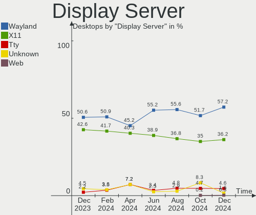
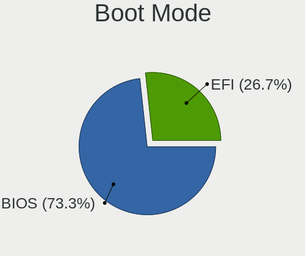
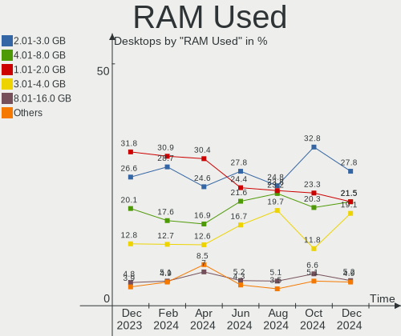
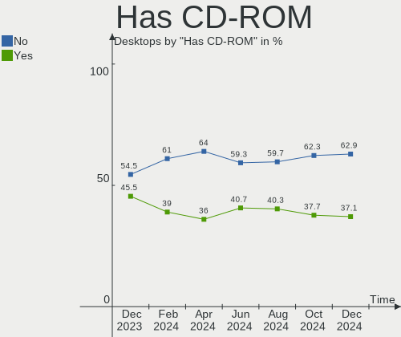
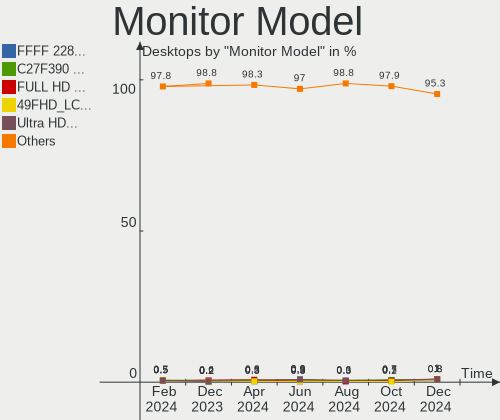
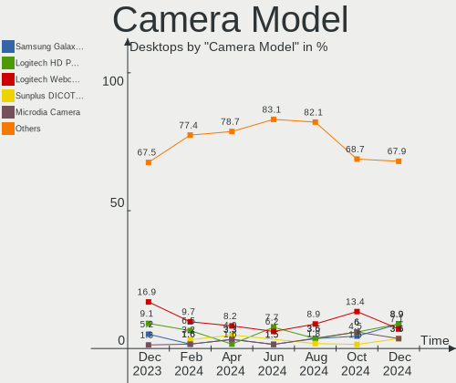

Ubuntu - Hardware Trends (Desktops)
-----------------------------------

A project to identify most popular hardware characteristics and track their change
over time based on data collected by Linux users at https://Linux-Hardware.org.

Anyone can contribute to this report by the [hw-probe](https://github.com/linuxhw/hw-probe) tool:

    sudo -E hw-probe -all -upload

This report is for one last month. Overall report since the beginning of time: [TestDays](https://github.com/linuxhw/TestDays)

Period: Feb, 2023.

Contents
--------

* [ System ](#system)
  - [ OS                       ](#os)
  - [ OS Family                ](#os-family)
  - [ Kernel                   ](#kernel)
  - [ Kernel Family            ](#kernel-family)
  - [ Kernel Major Ver.        ](#kernel-major-ver)
  - [ Arch                     ](#arch)
  - [ DE                       ](#de)
  - [ Display Server           ](#display-server)
  - [ Display Manager          ](#display-manager)
  - [ OS Lang                  ](#os-lang)
  - [ Boot Mode                ](#boot-mode)
  - [ Filesystem               ](#filesystem)
  - [ Part. scheme             ](#part-scheme)
  - [ Dual Boot with Linux/BSD ](#dual-boot-with-linuxbsd)
  - [ Dual Boot (Win)          ](#dual-boot-win)

* [ Board ](#board)
  - [ Vendor                   ](#vendor)
  - [ Model                    ](#model)
  - [ Model Family             ](#model-family)
  - [ MFG Year                 ](#mfg-year)
  - [ Form Factor              ](#form-factor)
  - [ Secure Boot              ](#secure-boot)
  - [ Coreboot                 ](#coreboot)
  - [ RAM Size                 ](#ram-size)
  - [ RAM Used                 ](#ram-used)
  - [ Total Drives             ](#total-drives)
  - [ Has CD-ROM               ](#has-cd-rom)
  - [ Has Ethernet             ](#has-ethernet)
  - [ Has WiFi                 ](#has-wifi)
  - [ Has Bluetooth            ](#has-bluetooth)

* [ Location ](#location)
  - [ Country                  ](#country)
  - [ City                     ](#city)

* [ Drives ](#drives)
  - [ Drive Vendor             ](#drive-vendor)
  - [ Drive Model              ](#drive-model)
  - [ HDD Vendor               ](#hdd-vendor)
  - [ SSD Vendor               ](#ssd-vendor)
  - [ Drive Kind               ](#drive-kind)
  - [ Drive Connector          ](#drive-connector)
  - [ Drive Size               ](#drive-size)
  - [ Space Total              ](#space-total)
  - [ Space Used               ](#space-used)
  - [ Malfunc. Drives          ](#malfunc-drives)
  - [ Malfunc. Drive Vendor    ](#malfunc-drive-vendor)
  - [ Malfunc. HDD Vendor      ](#malfunc-hdd-vendor)
  - [ Malfunc. Drive Kind      ](#malfunc-drive-kind)
  - [ Failed Drives            ](#failed-drives)
  - [ Failed Drive Vendor      ](#failed-drive-vendor)
  - [ Drive Status             ](#drive-status)

* [ Storage controller ](#storage-controller)
  - [ Storage Vendor           ](#storage-vendor)
  - [ Storage Model            ](#storage-model)
  - [ Storage Kind             ](#storage-kind)

* [ Processor ](#processor)
  - [ CPU Vendor               ](#cpu-vendor)
  - [ CPU Model                ](#cpu-model)
  - [ CPU Model Family         ](#cpu-model-family)
  - [ CPU Cores                ](#cpu-cores)
  - [ CPU Sockets              ](#cpu-sockets)
  - [ CPU Threads              ](#cpu-threads)
  - [ CPU Op-Modes             ](#cpu-op-modes)
  - [ CPU Microcode            ](#cpu-microcode)
  - [ CPU Microarch            ](#cpu-microarch)

* [ Graphics ](#graphics)
  - [ GPU Vendor               ](#gpu-vendor)
  - [ GPU Model                ](#gpu-model)
  - [ GPU Combo                ](#gpu-combo)
  - [ GPU Driver               ](#gpu-driver)
  - [ GPU Memory               ](#gpu-memory)

* [ Monitor ](#monitor)
  - [ Monitor Vendor           ](#monitor-vendor)
  - [ Monitor Model            ](#monitor-model)
  - [ Monitor Resolution       ](#monitor-resolution)
  - [ Monitor Diagonal         ](#monitor-diagonal)
  - [ Monitor Width            ](#monitor-width)
  - [ Aspect Ratio             ](#aspect-ratio)
  - [ Monitor Area             ](#monitor-area)
  - [ Pixel Density            ](#pixel-density)
  - [ Multiple Monitors        ](#multiple-monitors)

* [ Network ](#network)
  - [ Net Controller Vendor    ](#net-controller-vendor)
  - [ Net Controller Model     ](#net-controller-model)
  - [ Wireless Vendor          ](#wireless-vendor)
  - [ Wireless Model           ](#wireless-model)
  - [ Ethernet Vendor          ](#ethernet-vendor)
  - [ Ethernet Model           ](#ethernet-model)
  - [ Net Controller Kind      ](#net-controller-kind)
  - [ Used Controller          ](#used-controller)
  - [ NICs                     ](#nics)
  - [ IPv6                     ](#ipv6)

* [ Bluetooth ](#bluetooth)
  - [ Bluetooth Vendor         ](#bluetooth-vendor)
  - [ Bluetooth Model          ](#bluetooth-model)

* [ Sound ](#sound)
  - [ Sound Vendor             ](#sound-vendor)
  - [ Sound Model              ](#sound-model)

* [ Memory ](#memory)
  - [ Memory Vendor            ](#memory-vendor)
  - [ Memory Model             ](#memory-model)
  - [ Memory Kind              ](#memory-kind)
  - [ Memory Form Factor       ](#memory-form-factor)
  - [ Memory Size              ](#memory-size)
  - [ Memory Speed             ](#memory-speed)

* [ Printers & scanners ](#printers--scanners)
  - [ Printer Vendor           ](#printer-vendor)
  - [ Printer Model            ](#printer-model)
  - [ Scanner Vendor           ](#scanner-vendor)
  - [ Scanner Model            ](#scanner-model)

* [ Camera ](#camera)
  - [ Camera Vendor            ](#camera-vendor)
  - [ Camera Model             ](#camera-model)

* [ Security ](#security)
  - [ Fingerprint Vendor       ](#fingerprint-vendor)
  - [ Fingerprint Model        ](#fingerprint-model)
  - [ Chipcard Vendor          ](#chipcard-vendor)
  - [ Chipcard Model           ](#chipcard-model)

* [ Unsupported ](#unsupported)
  - [ Unsupported Devices      ](#unsupported-devices)
  - [ Unsupported Device Types ](#unsupported-device-types)

System
------

OS
--

Installed operating systems

| Name           | Desktops | Percent |
|----------------|----------|---------|
| Ubuntu 22.04   | 310      | 56.78%  |
| Ubuntu 22.10   | 83       | 15.2%   |
| Ubuntu 20.04   | 65       | 11.9%   |
| Ubuntu 16.04   | 53       | 9.71%   |
| Ubuntu 18.04   | 28       | 5.13%   |
| Ubuntu 23.04   | 3        | 0.55%   |
| Ubuntu 21.10   | 2        | 0.37%   |
| Ubuntu Core 18 | 1        | 0.18%   |
| Ubuntu 21.04   | 1        | 0.18%   |

OS Family
---------

OS without a version

| Name   | Desktops | Percent |
|--------|----------|---------|
| Ubuntu | 546      | 100%    |

Kernel
------

Version of the Linux kernel

| Version                | Desktops | Percent |
|------------------------|----------|---------|
| 5.15.0-60-generic      | 108      | 19.78%  |
| 5.19.0-32-generic      | 100      | 18.32%  |
| 5.15.0-58-generic      | 100      | 18.32%  |
| 4.15.0-142-generic     | 49       | 8.97%   |
| 5.19.0-31-generic      | 48       | 8.79%   |
| 5.19.0-29-generic      | 21       | 3.85%   |
| 5.15.0-43-generic      | 18       | 3.3%    |
| 5.19.0-21-generic      | 7        | 1.28%   |
| 5.4.0-137-generic      | 6        | 1.1%    |
| 5.4.0-136-generic      | 6        | 1.1%    |
| 5.4.0-107-generic      | 6        | 1.1%    |
| 4.15.0-175-generic     | 6        | 1.1%    |
| 5.4.0-139-generic      | 5        | 0.92%   |
| 5.19.0-35-generic      | 5        | 0.92%   |
| 5.4.0-87-generic       | 3        | 0.55%   |
| 5.17.0-1020-oem        | 3        | 0.55%   |
| 5.15.0-66-generic      | 3        | 0.55%   |
| 5.15.0-57-generic      | 3        | 0.55%   |
| 5.15.0-56-generic      | 3        | 0.55%   |
| 5.15.0-25-generic      | 3        | 0.55%   |
| 5.13.0-52-generic      | 3        | 0.55%   |
| 6.2.0-060200-generic   | 2        | 0.37%   |
| 5.4.0-135-generic      | 2        | 0.37%   |
| 5.15.0-46-generic      | 2        | 0.37%   |
| 4.15.0-201-generic     | 2        | 0.37%   |
| 6.2.1-060201-generic   | 1        | 0.18%   |
| 6.1.7-060107-generic   | 1        | 0.18%   |
| 6.1.10-060110-generic  | 1        | 0.18%   |
| 6.0.0-1011-oem         | 1        | 0.18%   |
| 6.0.0-060000-generic   | 1        | 0.18%   |
| 5.8.0-43-generic       | 1        | 0.18%   |
| 5.4.0-86-generic       | 1        | 0.18%   |
| 5.4.0-81-generic       | 1        | 0.18%   |
| 5.4.0-72-generic       | 1        | 0.18%   |
| 5.4.0-42-generic       | 1        | 0.18%   |
| 5.4.0-139-lowlatency   | 1        | 0.18%   |
| 5.4.0-132-generic      | 1        | 0.18%   |
| 5.19.5-051905-generic  | 1        | 0.18%   |
| 5.19.17-051917-generic | 1        | 0.18%   |
| 5.19.0-28-generic      | 1        | 0.18%   |

Kernel Family
-------------

Linux kernel without a distro release

| Version | Desktops | Percent |
|---------|----------|---------|
| 5.15.0  | 245      | 44.87%  |
| 5.19.0  | 182      | 33.33%  |
| 4.15.0  | 61       | 11.17%  |
| 5.4.0   | 34       | 6.23%   |
| 5.13.0  | 6        | 1.1%    |
| 5.17.0  | 3        | 0.55%   |
| 6.2.0   | 2        | 0.37%   |
| 6.0.0   | 2        | 0.37%   |
| 5.11.0  | 2        | 0.37%   |
| 6.2.1   | 1        | 0.18%   |
| 6.1.7   | 1        | 0.18%   |
| 6.1.10  | 1        | 0.18%   |
| 5.8.0   | 1        | 0.18%   |
| 5.19.5  | 1        | 0.18%   |
| 5.19.17 | 1        | 0.18%   |
| 5.14.0  | 1        | 0.18%   |
| 4.4.0   | 1        | 0.18%   |
| 4.15.18 | 1        | 0.18%   |

Kernel Major Ver.
-----------------

Linux kernel major version

| Version | Desktops | Percent |
|---------|----------|---------|
| 5.15    | 245      | 44.87%  |
| 5.19    | 184      | 33.7%   |
| 4.15    | 62       | 11.36%  |
| 5.4     | 34       | 6.23%   |
| 5.13    | 6        | 1.1%    |
| 6.2     | 3        | 0.55%   |
| 5.17    | 3        | 0.55%   |
| 6.1     | 2        | 0.37%   |
| 6.0     | 2        | 0.37%   |
| 5.11    | 2        | 0.37%   |
| 5.8     | 1        | 0.18%   |
| 5.14    | 1        | 0.18%   |
| 4.4     | 1        | 0.18%   |

Arch
----

OS architecture (x86_64, i586, etc.)

| Name   | Desktops | Percent |
|--------|----------|---------|
| x86_64 | 544      | 99.63%  |
| i686   | 2        | 0.37%   |

DE
--

Desktop Environment

| Name          | Desktops | Percent |
|---------------|----------|---------|
| GNOME         | 444      | 81.32%  |
| Unknown       | 95       | 17.4%   |
| X-Cinnamon    | 6        | 1.1%    |
| Enlightenment | 1        | 0.18%   |

Display Server
--------------

X11 or Wayland

| Name    | Desktops | Percent |
|---------|----------|---------|
| X11     | 283      | 51.83%  |
| Wayland | 213      | 39.01%  |
| Unknown | 34       | 6.23%   |
| Tty     | 16       | 2.93%   |

Display Manager
---------------

SDDM, LightDM, etc.

| Name    | Desktops | Percent |
|---------|----------|---------|
| GDM3    | 391      | 71.61%  |
| Unknown | 116      | 21.25%  |
| GDM     | 27       | 4.95%   |
| LightDM | 10       | 1.83%   |
| SLiM    | 1        | 0.18%   |
| SDDM    | 1        | 0.18%   |

OS Lang
-------

Language

| Lang    | Desktops | Percent |
|---------|----------|---------|
| en_US   | 224      | 41.03%  |
| Unknown | 78       | 14.29%  |
| de_DE   | 54       | 9.89%   |
| fr_FR   | 24       | 4.4%    |
| pt_BR   | 18       | 3.3%    |
| en_CA   | 17       | 3.11%   |
| en_GB   | 16       | 2.93%   |
| es_ES   | 14       | 2.56%   |
| it_IT   | 12       | 2.2%    |
| ru_RU   | 10       | 1.83%   |
| pl_PL   | 9        | 1.65%   |
| C       | 7        | 1.28%   |
| nl_NL   | 6        | 1.1%    |
| en_IN   | 6        | 1.1%    |
| en_AU   | 6        | 1.1%    |
| sv_SE   | 4        | 0.73%   |
| hu_HU   | 4        | 0.73%   |
| de_AT   | 4        | 0.73%   |
| ja_JP   | 3        | 0.55%   |
| fr_CA   | 3        | 0.55%   |
| fi_FI   | 3        | 0.55%   |
| zh_CN   | 2        | 0.37%   |
| fr_BE   | 2        | 0.37%   |
| es_MX   | 2        | 0.37%   |
| es_AR   | 2        | 0.37%   |
| en_NZ   | 2        | 0.37%   |
| cs_CZ   | 2        | 0.37%   |
| hr_HR   | 1        | 0.18%   |
| fr_CH   | 1        | 0.18%   |
| et_EE   | 1        | 0.18%   |
| es_SV   | 1        | 0.18%   |
| es_GT   | 1        | 0.18%   |
| es_DO   | 1        | 0.18%   |
| en_ZA   | 1        | 0.18%   |
| en_PH   | 1        | 0.18%   |
| en_IE   | 1        | 0.18%   |
| el_GR   | 1        | 0.18%   |
| de_CH   | 1        | 0.18%   |
| da_DK   | 1        | 0.18%   |

Boot Mode
---------

EFI or BIOS

| Mode | Desktops | Percent |
|------|----------|---------|
| BIOS | 355      | 65.02%  |
| EFI  | 191      | 34.98%  |

Filesystem
----------

Type of filesystem

| Type    | Desktops | Percent |
|---------|----------|---------|
| Ext4    | 504      | 92.31%  |
| Overlay | 12       | 2.2%    |
| Zfs     | 9        | 1.65%   |
| Xfs     | 9        | 1.65%   |
| Btrfs   | 8        | 1.47%   |
| Ext3    | 2        | 0.37%   |
| Tmpfs   | 1        | 0.18%   |
| Jfs     | 1        | 0.18%   |

Part. scheme
------------

Scheme of partitioning

| Type    | Desktops | Percent |
|---------|----------|---------|
| GPT     | 440      | 80.59%  |
| MBR     | 78       | 14.29%  |
| Unknown | 28       | 5.13%   |

Dual Boot with Linux/BSD
------------------------

Hosting more than one Linux/BSD

| Dual boot | Desktops | Percent |
|-----------|----------|---------|
| No        | 390      | 71.43%  |
| Yes       | 156      | 28.57%  |

Dual Boot (Win)
---------------

Hosting Linux and Windows

| Dual boot | Desktops | Percent |
|-----------|----------|---------|
| No        | 344      | 63%     |
| Yes       | 202      | 37%     |

Board
-----

Vendor
------

Motherboard manufacturer

| Name                | Desktops | Percent |
|---------------------|----------|---------|
| ASUSTek Computer    | 167      | 30.59%  |
| Gigabyte Technology | 82       | 15.02%  |
| MSI                 | 57       | 10.44%  |
| Dell                | 53       | 9.71%   |
| ASRock              | 48       | 8.79%   |
| Hewlett-Packard     | 35       | 6.41%   |
| Lenovo              | 27       | 4.95%   |
| Acer                | 11       | 2.01%   |
| Fujitsu             | 9        | 1.65%   |
| Intel               | 5        | 0.92%   |
| Biostar             | 5        | 0.92%   |
| Supermicro          | 4        | 0.73%   |
| Foxconn             | 4        | 0.73%   |
| Pegatron            | 3        | 0.55%   |
| Unknown             | 3        | 0.55%   |
| Quanta              | 2        | 0.37%   |
| Medion              | 2        | 0.37%   |
| Cisco Systems       | 2        | 0.37%   |
| AZW                 | 2        | 0.37%   |
| Alienware           | 2        | 0.37%   |
| Wistron             | 1        | 0.18%   |
| Win element         | 1        | 0.18%   |
| T-bao               | 1        | 0.18%   |
| SiS Technology      | 1        | 0.18%   |
| Protectli           | 1        | 0.18%   |
| Partner             | 1        | 0.18%   |
| OEM                 | 1        | 0.18%   |
| Novatte             | 1        | 0.18%   |
| Login Informatica   | 1        | 0.18%   |
| IP3 Tech            | 1        | 0.18%   |
| Huanan              | 1        | 0.18%   |
| HPE                 | 1        | 0.18%   |
| Gateway             | 1        | 0.18%   |
| eMachines           | 1        | 0.18%   |
| ECS                 | 1        | 0.18%   |
| DIEBOLD             | 1        | 0.18%   |
| CWWK                | 1        | 0.18%   |
| Casper              | 1        | 0.18%   |
| BESSTAR Tech        | 1        | 0.18%   |
| AWOW                | 1        | 0.18%   |

Model
-----

Motherboard model

| Name                          | Desktops | Percent |
|-------------------------------|----------|---------|
| ASUS ROG STRIX X299-E GAMING  | 40       | 7.33%   |
| ASUS All Series               | 12       | 2.2%    |
| ASUS PRIME TRX40-PRO          | 9        | 1.65%   |
| Dell OptiPlex 3020            | 7        | 1.28%   |
| ASUS TUF X299 MARK 2          | 7        | 1.28%   |
| Gigabyte X299 UD4 Pro         | 6        | 1.1%    |
| Gigabyte X299 AORUS Gaming 7  | 6        | 1.1%    |
| Dell OptiPlex 7050            | 4        | 0.73%   |
| Unknown                       | 4        | 0.73%   |
| MSI MS-7C56                   | 3        | 0.55%   |
| MSI MS-7C37                   | 3        | 0.55%   |
| Gigabyte X299 AORUS Gaming 3  | 3        | 0.55%   |
| Fujitsu ESPRIMO Q920          | 3        | 0.55%   |
| Dell OptiPlex 780             | 3        | 0.55%   |
| Dell OptiPlex 7040            | 3        | 0.55%   |
| ASUS TUF Gaming X570-PLUS     | 3        | 0.55%   |
| ASUS M5A97 LE R2.0            | 3        | 0.55%   |
| ASRock X570 Phantom Gaming 4  | 3        | 0.55%   |
| MSI MS-7D31                   | 2        | 0.37%   |
| MSI MS-7C09                   | 2        | 0.37%   |
| MSI MS-7C02                   | 2        | 0.37%   |
| MSI MS-7B17                   | 2        | 0.37%   |
| MSI MS-7977                   | 2        | 0.37%   |
| MSI MS-7917                   | 2        | 0.37%   |
| MSI MS-7885                   | 2        | 0.37%   |
| MSI MS-7758                   | 2        | 0.37%   |
| MSI MS-7693                   | 2        | 0.37%   |
| HP Z440 Workstation           | 2        | 0.37%   |
| HP ProDesk 600 G1 SFF         | 2        | 0.37%   |
| HP Pavilion Desktop 590-p0xxx | 2        | 0.37%   |
| HP Compaq Pro 6300 SFF        | 2        | 0.37%   |
| Gigabyte H81M-S2H             | 2        | 0.37%   |
| Gigabyte H310M S2 2.0         | 2        | 0.37%   |
| Gigabyte B560M DS3H V2        | 2        | 0.37%   |
| Gigabyte B550M DS3H AC        | 2        | 0.37%   |
| Gigabyte B550M DS3H           | 2        | 0.37%   |
| Gigabyte B365M DS3H           | 2        | 0.37%   |
| Dell Precision 5820 Tower     | 2        | 0.37%   |
| Dell OptiPlex 9020            | 2        | 0.37%   |
| Dell OptiPlex 790             | 2        | 0.37%   |

Model Family
------------

Motherboard model prefix

| Name                | Desktops | Percent |
|---------------------|----------|---------|
| ASUS ROG            | 54       | 9.89%   |
| Dell OptiPlex       | 37       | 6.78%   |
| ASUS PRIME          | 34       | 6.23%   |
| ASUS TUF            | 18       | 3.3%    |
| Lenovo ThinkCentre  | 16       | 2.93%   |
| Gigabyte X299       | 16       | 2.93%   |
| ASUS All            | 12       | 2.2%    |
| HP Compaq           | 11       | 2.01%   |
| Fujitsu ESPRIMO     | 9        | 1.65%   |
| Acer Aspire         | 9        | 1.65%   |
| Dell Precision      | 7        | 1.28%   |
| Lenovo IdeaCentre   | 6        | 1.1%    |
| HP EliteDesk        | 6        | 1.1%    |
| Gigabyte B550M      | 4        | 0.73%   |
| ASRock X570         | 4        | 0.73%   |
| Unknown             | 4        | 0.73%   |
| MSI MS-7C56         | 3        | 0.55%   |
| MSI MS-7C37         | 3        | 0.55%   |
| HP ProDesk          | 3        | 0.55%   |
| HP Pavilion         | 3        | 0.55%   |
| Dell XPS            | 3        | 0.55%   |
| ASUS P8Z68-V        | 3        | 0.55%   |
| ASUS M5A97          | 3        | 0.55%   |
| ASUS M5A78L-M       | 3        | 0.55%   |
| ASRock Z77          | 3        | 0.55%   |
| MSI MS-7D31         | 2        | 0.37%   |
| MSI MS-7C09         | 2        | 0.37%   |
| MSI MS-7C02         | 2        | 0.37%   |
| MSI MS-7B17         | 2        | 0.37%   |
| MSI MS-7977         | 2        | 0.37%   |
| MSI MS-7917         | 2        | 0.37%   |
| MSI MS-7885         | 2        | 0.37%   |
| MSI MS-7758         | 2        | 0.37%   |
| MSI MS-7693         | 2        | 0.37%   |
| Lenovo ThinkStation | 2        | 0.37%   |
| HP Z440             | 2        | 0.37%   |
| HP Z240             | 2        | 0.37%   |
| Gigabyte Z390       | 2        | 0.37%   |
| Gigabyte Z370       | 2        | 0.37%   |
| Gigabyte H81M-S2H   | 2        | 0.37%   |

MFG Year
--------

Motherboard manufacture year

| Year | Desktops | Percent |
|------|----------|---------|
| 2017 | 94       | 17.22%  |
| 2018 | 52       | 9.52%   |
| 2019 | 44       | 8.06%   |
| 2014 | 44       | 8.06%   |
| 2012 | 42       | 7.69%   |
| 2013 | 37       | 6.78%   |
| 2021 | 35       | 6.41%   |
| 2011 | 32       | 5.86%   |
| 2020 | 28       | 5.13%   |
| 2022 | 24       | 4.4%    |
| 2010 | 24       | 4.4%    |
| 2016 | 22       | 4.03%   |
| 2015 | 21       | 3.85%   |
| 2009 | 19       | 3.48%   |
| 2008 | 11       | 2.01%   |
| 2007 | 10       | 1.83%   |
| 2023 | 2        | 0.37%   |
| 2006 | 2        | 0.37%   |
| 2005 | 2        | 0.37%   |
| 2004 | 1        | 0.18%   |

Form Factor
-----------

Physical design of the computer

| Name    | Desktops | Percent |
|---------|----------|---------|
| Desktop | 546      | 100%    |

Secure Boot
-----------

Enabled or disabled

| State    | Desktops | Percent |
|----------|----------|---------|
| Disabled | 530      | 97.07%  |
| Enabled  | 16       | 2.93%   |

Coreboot
--------

Have coreboot on board

| Used | Desktops | Percent |
|------|----------|---------|
| No   | 546      | 100%    |

RAM Size
--------

Total RAM memory

| Size in GB      | Desktops | Percent |
|-----------------|----------|---------|
| 16.01-24.0      | 133      | 24.36%  |
| 64.01-256.0     | 97       | 17.77%  |
| 4.01-8.0        | 85       | 15.57%  |
| 8.01-16.0       | 79       | 14.47%  |
| 32.01-64.0      | 72       | 13.19%  |
| 3.01-4.0        | 42       | 7.69%   |
| 24.01-32.0      | 14       | 2.56%   |
| More than 256.0 | 10       | 1.83%   |
| 1.01-2.0        | 10       | 1.83%   |
| 2.01-3.0        | 4        | 0.73%   |

RAM Used
--------

Used RAM memory

| Used GB     | Desktops | Percent |
|-------------|----------|---------|
| 1.01-2.0    | 153      | 28.02%  |
| 2.01-3.0    | 147      | 26.92%  |
| 4.01-8.0    | 97       | 17.77%  |
| 3.01-4.0    | 72       | 13.19%  |
| 8.01-16.0   | 22       | 4.03%   |
| 32.01-64.0  | 20       | 3.66%   |
| 0.51-1.0    | 15       | 2.75%   |
| 16.01-24.0  | 9        | 1.65%   |
| 64.01-256.0 | 8        | 1.47%   |
| 24.01-32.0  | 3        | 0.55%   |

Total Drives
------------

Number of drives on board

| Drives | Desktops | Percent |
|--------|----------|---------|
| 1      | 209      | 38.28%  |
| 2      | 138      | 25.27%  |
| 3      | 109      | 19.96%  |
| 4      | 52       | 9.52%   |
| 5      | 22       | 4.03%   |
| 7      | 4        | 0.73%   |
| 0      | 4        | 0.73%   |
| 6      | 3        | 0.55%   |
| 8      | 2        | 0.37%   |
| 38     | 1        | 0.18%   |
| 11     | 1        | 0.18%   |
| 9      | 1        | 0.18%   |

Has CD-ROM
----------

Has CD-ROM on board

| Presented | Desktops | Percent |
|-----------|----------|---------|
| No        | 324      | 59.34%  |
| Yes       | 222      | 40.66%  |

Has Ethernet
------------

Has Ethernet on board

| Presented | Desktops | Percent |
|-----------|----------|---------|
| Yes       | 544      | 99.63%  |
| No        | 2        | 0.37%   |

Has WiFi
--------

Has WiFi module

| Presented | Desktops | Percent |
|-----------|----------|---------|
| No        | 281      | 51.47%  |
| Yes       | 265      | 48.53%  |

Has Bluetooth
-------------

Has Bluetooth module

| Presented | Desktops | Percent |
|-----------|----------|---------|
| No        | 355      | 65.02%  |
| Yes       | 191      | 34.98%  |

Location
--------

Country
-------

Geographic location (country)

| Country      | Desktops | Percent |
|--------------|----------|---------|
| USA          | 139      | 25.46%  |
| Unknown      | 66       | 12.09%  |
| Germany      | 63       | 11.54%  |
| France       | 29       | 5.31%   |
| Canada       | 26       | 4.76%   |
| Brazil       | 22       | 4.03%   |
| Italy        | 16       | 2.93%   |
| Russia       | 12       | 2.2%    |
| UK           | 11       | 2.01%   |
| Spain        | 11       | 2.01%   |
| Netherlands  | 11       | 2.01%   |
| Mexico       | 11       | 2.01%   |
| China        | 11       | 2.01%   |
| Poland       | 10       | 1.83%   |
| India        | 6        | 1.1%    |
| Belgium      | 6        | 1.1%    |
| Australia    | 6        | 1.1%    |
| Sweden       | 5        | 0.92%   |
| Hungary      | 5        | 0.92%   |
| Austria      | 5        | 0.92%   |
| Japan        | 4        | 0.73%   |
| Switzerland  | 3        | 0.55%   |
| South Africa | 3        | 0.55%   |
| Slovakia     | 3        | 0.55%   |
| Singapore    | 3        | 0.55%   |
| Finland      | 3        | 0.55%   |
| Denmark      | 3        | 0.55%   |
| Chile        | 3        | 0.55%   |
| Argentina    | 3        | 0.55%   |
| Turkey       | 2        | 0.37%   |
| Taiwan       | 2        | 0.37%   |
| Romania      | 2        | 0.37%   |
| New Zealand  | 2        | 0.37%   |
| Kenya        | 2        | 0.37%   |
| Jamaica      | 2        | 0.37%   |
| Greece       | 2        | 0.37%   |
| Czechia      | 2        | 0.37%   |
| Bulgaria     | 2        | 0.37%   |
| Ukraine      | 1        | 0.18%   |
| Thailand     | 1        | 0.18%   |

City
----

Geographic location (city)

| City           | Desktops | Percent |
|----------------|----------|---------|
| Unknown        | 66       | 12.09%  |
| Hangzhou       | 9        | 1.65%   |
| Berlin         | 8        | 1.47%   |
| Toronto        | 5        | 0.92%   |
| Moscow         | 4        | 0.73%   |
| Denver         | 4        | 0.73%   |
| Amsterdam      | 4        | 0.73%   |
| Vienna         | 3        | 0.55%   |
| Singapore      | 3        | 0.55%   |
| Sao Paulo      | 3        | 0.55%   |
| San Jose       | 3        | 0.55%   |
| Rio de Janeiro | 3        | 0.55%   |
| Munich         | 3        | 0.55%   |
| Milan          | 3        | 0.55%   |
| Madrid         | 3        | 0.55%   |
| Hamburg        | 3        | 0.55%   |
| Ghent          | 3        | 0.55%   |
| Bratislava     | 3        | 0.55%   |
| Washington     | 2        | 0.37%   |
| Warsaw         | 2        | 0.37%   |
| Verona         | 2        | 0.37%   |
| Springview     | 2        | 0.37%   |
| Springfield    | 2        | 0.37%   |
| Smolensk       | 2        | 0.37%   |
| Seattle        | 2        | 0.37%   |
| Santo André   | 2        | 0.37%   |
| Richmond       | 2        | 0.37%   |
| Portland       | 2        | 0.37%   |
| Pittsburgh     | 2        | 0.37%   |
| Paris          | 2        | 0.37%   |
| Nanaimo        | 2        | 0.37%   |
| Nairobi        | 2        | 0.37%   |
| Miami          | 2        | 0.37%   |
| Mexico City    | 2        | 0.37%   |
| Mering         | 2        | 0.37%   |
| Madison        | 2        | 0.37%   |
| Los Angeles    | 2        | 0.37%   |
| Longmont       | 2        | 0.37%   |
| London         | 2        | 0.37%   |
| Lansing        | 2        | 0.37%   |

Drives
------

Drive Vendor
------------

Hard drive vendors

| Vendor                      | Desktops | Drives | Percent |
|-----------------------------|----------|--------|---------|
| Seagate                     | 218      | 335    | 22.13%  |
| WDC                         | 175      | 247    | 17.77%  |
| Samsung Electronics         | 169      | 205    | 17.16%  |
| Kingston                    | 72       | 74     | 7.31%   |
| SanDisk                     | 43       | 50     | 4.37%   |
| Crucial                     | 35       | 42     | 3.55%   |
| Toshiba                     | 30       | 31     | 3.05%   |
| Hitachi                     | 20       | 22     | 2.03%   |
| Silicon Motion              | 15       | 15     | 1.52%   |
| Intel                       | 15       | 17     | 1.52%   |
| China                       | 14       | 14     | 1.42%   |
| SPCC                        | 12       | 14     | 1.22%   |
| A-DATA Technology           | 12       | 12     | 1.22%   |
| SK hynix                    | 10       | 13     | 1.02%   |
| Phison Electronics          | 9        | 10     | 0.91%   |
| Unknown                     | 8        | 10     | 0.81%   |
| HGST                        | 8        | 12     | 0.81%   |
| Intenso                     | 7        | 7      | 0.71%   |
| Corsair                     | 7        | 7      | 0.71%   |
| PNY                         | 5        | 5      | 0.51%   |
| Kingston Technology Company | 5        | 5      | 0.51%   |
| ASMT                        | 5        | 8      | 0.51%   |
| Patriot                     | 4        | 4      | 0.41%   |
| Micron/Crucial Technology   | 4        | 4      | 0.41%   |
| Micron Technology           | 4        | 4      | 0.41%   |
| Team                        | 3        | 4      | 0.3%    |
| Mushkin                     | 3        | 3      | 0.3%    |
| Maxtor                      | 3        | 3      | 0.3%    |
| Lexar                       | 3        | 3      | 0.3%    |
| Hewlett-Packard             | 3        | 3      | 0.3%    |
| GOODRAM                     | 3        | 4      | 0.3%    |
| Dogfish                     | 3        | 3      | 0.3%    |
| ADATA Technology            | 3        | 4      | 0.3%    |
| XPG                         | 2        | 2      | 0.2%    |
| Transcend                   | 2        | 2      | 0.2%    |
| KingFast                    | 2        | 2      | 0.2%    |
| JMicron Technology          | 2        | 2      | 0.2%    |
| Gigabyte Technology         | 2        | 2      | 0.2%    |
| Fujitsu                     | 2        | 3      | 0.2%    |
| ZOTAC                       | 1        | 1      | 0.1%    |

Drive Model
-----------

Hard drive models

| Model                                               | Desktops | Percent |
|-----------------------------------------------------|----------|---------|
| Seagate ST6000NM0115-1YZ110 6TB                     | 56       | 4.83%   |
| Samsung SSD 860 EVO 500GB                           | 47       | 4.05%   |
| Kingston SA400S37480G 480GB SSD                     | 23       | 1.98%   |
| Kingston SA400S37240G 240GB SSD                     | 18       | 1.55%   |
| Samsung NVMe SSD Controller SM981/PM981/PM983 250GB | 16       | 1.38%   |
| WDC WD10EZEX-08WN4A0 1TB                            | 14       | 1.21%   |
| Samsung SSD 850 EVO 500GB                           | 14       | 1.21%   |
| Silicon Motion Asgard AN3 2TNVMe-M.2-80 2TB         | 12       | 1.03%   |
| Seagate ST12000NM0007-2A1101 12TB                   | 12       | 1.03%   |
| Seagate ST16000NM001G-2KK103 16TB                   | 10       | 0.86%   |
| Seagate ST4000DM004-2CV104 4TB                      | 9        | 0.78%   |
| Samsung SSD 980 1TB                                 | 9        | 0.78%   |
| Seagate ST500DM002-1BD142 500GB                     | 8        | 0.69%   |
| Seagate ST10000NM0016-1TT101 10TB                   | 8        | 0.69%   |
| Samsung SSD 870 EVO 500GB                           | 8        | 0.69%   |
| Samsung SSD 850 EVO 250GB                           | 8        | 0.69%   |
| Seagate ST1000DM010-2EP102 1TB                      | 7        | 0.6%    |
| WDC WD20EZRZ-00Z5HB0 2TB                            | 6        | 0.52%   |
| WDC WD20EZRX-00D8PB0 2TB                            | 6        | 0.52%   |
| Toshiba DT01ACA050 500GB                            | 6        | 0.52%   |
| SPCC Solid State Disk 256GB                         | 6        | 0.52%   |
| Seagate ST12000NM0008-2H3101 12TB                   | 6        | 0.52%   |
| Seagate ST1000DM003-1SB102 1TB                      | 6        | 0.52%   |
| Crucial CT240BX500SSD1 240GB                        | 6        | 0.52%   |
| Seagate Expansion Desk 5TB                          | 5        | 0.43%   |
| Sandisk WD Blue SN550 NVMe SSD 1TB                  | 5        | 0.43%   |
| Samsung NVMe SSD Controller SM961/PM961/SM963 512GB | 5        | 0.43%   |
| Kingston SNVS500G 500GB                             | 5        | 0.43%   |
| WDC WD10EZRX-00A8LB0 1TB                            | 4        | 0.34%   |
| WDC WD10EZEX-22MFCA0 1TB                            | 4        | 0.34%   |
| WDC WD10EAVS-00D7B1 1TB                             | 4        | 0.34%   |
| Toshiba DT01ACA100 1TB                              | 4        | 0.34%   |
| Seagate ST3500418AS 500GB                           | 4        | 0.34%   |
| Seagate ST3250318AS 250GB                           | 4        | 0.34%   |
| Seagate ST31000524AS 1TB                            | 4        | 0.34%   |
| Seagate ST2000DM008-2FR102 2TB                      | 4        | 0.34%   |
| Seagate ST2000DM006-2DM164 2TB                      | 4        | 0.34%   |
| Seagate ST1000DM003-1CH162 1TB                      | 4        | 0.34%   |
| Sandisk WD_BLACK SN770 1TB                          | 4        | 0.34%   |
| Samsung SSD 980 PRO 1TB                             | 4        | 0.34%   |

HDD Vendor
----------

Hard disk drive vendors

| Vendor              | Desktops | Drives | Percent |
|---------------------|----------|--------|---------|
| Seagate             | 215      | 330    | 46.04%  |
| WDC                 | 157      | 220    | 33.62%  |
| Toshiba             | 28       | 29     | 6%      |
| Samsung Electronics | 21       | 23     | 4.5%    |
| Hitachi             | 20       | 22     | 4.28%   |
| HGST                | 8        | 12     | 1.71%   |
| Maxtor              | 3        | 3      | 0.64%   |
| ASMT                | 3        | 6      | 0.64%   |
| Unknown             | 2        | 2      | 0.43%   |
| Intenso             | 2        | 2      | 0.43%   |
| Fujitsu             | 2        | 3      | 0.43%   |
| WD MediaMax         | 1        | 1      | 0.21%   |
| SABRENT             | 1        | 1      | 0.21%   |
| PHD 3.0             | 1        | 1      | 0.21%   |
| MARVELL             | 1        | 1      | 0.21%   |
| JMicron Technology  | 1        | 1      | 0.21%   |
| Hewlett-Packard     | 1        | 1      | 0.21%   |

SSD Vendor
----------

Solid state drive vendors

| Vendor              | Desktops | Drives | Percent |
|---------------------|----------|--------|---------|
| Samsung Electronics | 114      | 122    | 31.58%  |
| Kingston            | 60       | 61     | 16.62%  |
| Crucial             | 31       | 37     | 8.59%   |
| SanDisk             | 24       | 27     | 6.65%   |
| WDC                 | 19       | 20     | 5.26%   |
| China               | 14       | 14     | 3.88%   |
| SPCC                | 11       | 13     | 3.05%   |
| A-DATA Technology   | 11       | 11     | 3.05%   |
| Intel               | 9        | 11     | 2.49%   |
| PNY                 | 5        | 5      | 1.39%   |
| SK hynix            | 4        | 5      | 1.11%   |
| Patriot             | 4        | 4      | 1.11%   |
| Corsair             | 4        | 4      | 1.11%   |
| Team                | 3        | 4      | 0.83%   |
| Micron Technology   | 3        | 3      | 0.83%   |
| Intenso             | 3        | 3      | 0.83%   |
| GOODRAM             | 3        | 4      | 0.83%   |
| Dogfish             | 3        | 3      | 0.83%   |
| Transcend           | 2        | 2      | 0.55%   |
| Seagate             | 2        | 2      | 0.55%   |
| KingFast            | 2        | 2      | 0.55%   |
| Hewlett-Packard     | 2        | 2      | 0.55%   |
| Gigabyte Technology | 2        | 2      | 0.55%   |
| ZOTAC               | 1        | 1      | 0.28%   |
| XPG                 | 1        | 1      | 0.28%   |
| Verbatim            | 1        | 1      | 0.28%   |
| T-FORCE             | 1        | 1      | 0.28%   |
| Plextor             | 1        | 1      | 0.28%   |
| Origin              | 1        | 1      | 0.28%   |
| Mushkin             | 1        | 1      | 0.28%   |
| MicroFrom           | 1        | 1      | 0.28%   |
| LITEONIT            | 1        | 1      | 0.28%   |
| LITEON              | 1        | 1      | 0.28%   |
| Lexar               | 1        | 1      | 0.28%   |
| Leven               | 1        | 1      | 0.28%   |
| Lenovo              | 1        | 1      | 0.28%   |
| LDLC                | 1        | 1      | 0.28%   |
| KingSpec            | 1        | 1      | 0.28%   |
| KingDian            | 1        | 1      | 0.28%   |
| HS-SSD-E100         | 1        | 1      | 0.28%   |

Drive Kind
----------

HDD or SSD

| Kind    | Desktops | Drives | Percent |
|---------|----------|--------|---------|
| HDD     | 373      | 658    | 43.47%  |
| SSD     | 318      | 387    | 37.06%  |
| NVMe    | 145      | 182    | 16.9%   |
| Unknown | 18       | 21     | 2.1%    |
| MMC     | 4        | 4      | 0.47%   |

Drive Connector
---------------

SATA, SAS, NVMe, etc.

| Type | Desktops | Drives | Percent |
|------|----------|--------|---------|
| SATA | 484      | 1019   | 72.13%  |
| NVMe | 145      | 182    | 21.61%  |
| SAS  | 38       | 47     | 5.66%   |
| MMC  | 4        | 4      | 0.6%    |

Drive Size
----------

Size of hard drive

| Size in TB      | Desktops | Drives | Percent |
|-----------------|----------|--------|---------|
| 0.01-0.5        | 354      | 456    | 44.92%  |
| 0.51-1.0        | 177      | 220    | 22.46%  |
| 4.01-10.0       | 92       | 150    | 11.68%  |
| 1.01-2.0        | 77       | 98     | 9.77%   |
| 10.01-20.0      | 36       | 60     | 4.57%   |
| 3.01-4.0        | 28       | 34     | 3.55%   |
| 2.01-3.0        | 23       | 26     | 2.92%   |
| More than 100.0 | 1        | 1      | 0.13%   |

Space Total
-----------

Amount of disk space available on the file system

| Size in GB     | Desktops | Percent |
|----------------|----------|---------|
| 101-250        | 111      | 20.33%  |
| 501-1000       | 88       | 16.12%  |
| 251-500        | 84       | 15.38%  |
| Unknown        | 81       | 14.84%  |
| More than 3000 | 65       | 11.9%   |
| 1001-2000      | 42       | 7.69%   |
| 2001-3000      | 22       | 4.03%   |
| 51-100         | 22       | 4.03%   |
| 21-50          | 16       | 2.93%   |
| 1-20           | 15       | 2.75%   |

Space Used
----------

Amount of used disk space

| Used GB        | Desktops | Percent |
|----------------|----------|---------|
| 1-20           | 136      | 24.91%  |
| 21-50          | 94       | 17.22%  |
| Unknown        | 81       | 14.84%  |
| 51-100         | 55       | 10.07%  |
| 101-250        | 46       | 8.42%   |
| 251-500        | 42       | 7.69%   |
| 501-1000       | 32       | 5.86%   |
| More than 3000 | 25       | 4.58%   |
| 1001-2000      | 22       | 4.03%   |
| 2001-3000      | 13       | 2.38%   |

Malfunc. Drives
---------------

Drive models with a malfunction

| Model                                 | Desktops | Drives | Percent |
|---------------------------------------|----------|--------|---------|
| Kingston SA400S37240G 240GB SSD       | 3        | 3      | 5.77%   |
| Kingston SA400S37480G 480GB SSD       | 2        | 2      | 3.85%   |
| WDC WDS240G2G0A-00JH30 240GB SSD      | 1        | 1      | 1.92%   |
| WDC WD5001FZWX-00ZHUA0 5TB            | 1        | 1      | 1.92%   |
| WDC WD5000AAKX-08ANVA0 500GB          | 1        | 1      | 1.92%   |
| WDC WD5000AAKS-00UU3A0 500GB          | 1        | 1      | 1.92%   |
| WDC WD5000AADS-00S9B0 500GB           | 1        | 1      | 1.92%   |
| WDC WD5000AADS-00M2B0 500GB           | 1        | 1      | 1.92%   |
| WDC WD3200BEKT-60PVMT0 320GB          | 1        | 1      | 1.92%   |
| WDC WD30EZRX-00MMMB0 3TB              | 1        | 2      | 1.92%   |
| WDC WD2003FYYS-02W0B1 2TB             | 1        | 1      | 1.92%   |
| WDC WD15EARS-00MVWB0 1TB              | 1        | 1      | 1.92%   |
| WDC WD10EZRZ-00HTKB0 1TB              | 1        | 2      | 1.92%   |
| WDC WD10EZEX-60ZF5A0 1TB              | 1        | 1      | 1.92%   |
| WDC WD10EZEX-08M2NA0 1TB              | 1        | 1      | 1.92%   |
| WDC WD10EURX-61UY4Y0 1TB              | 1        | 1      | 1.92%   |
| WDC WD10EAVS-00D7B1 1TB               | 1        | 1      | 1.92%   |
| WDC WD10EARS-00Y5B1 1TB               | 1        | 1      | 1.92%   |
| WDC WD10EALX-009BA0 1TB               | 1        | 1      | 1.92%   |
| WDC WD10EACS-00D6B0 1TB               | 1        | 1      | 1.92%   |
| WDC WD1002FAEX-00Z3A0 1TB             | 1        | 1      | 1.92%   |
| Toshiba MQ01ABC150 1TB                | 1        | 1      | 1.92%   |
| Toshiba MK7559GSXP 752GB              | 1        | 1      | 1.92%   |
| Toshiba DT01ACA100 1TB                | 1        | 1      | 1.92%   |
| SK hynix SC210 2.5 7MM 256GB SSD      | 1        | 1      | 1.92%   |
| Seagate ST9320423AS 320GB             | 1        | 1      | 1.92%   |
| Seagate ST500DM005 HD502HJ 500GB      | 1        | 1      | 1.92%   |
| Seagate ST500DM002-1BC142 500GB       | 1        | 1      | 1.92%   |
| Seagate ST5000VN0001-1SF17X 5TB       | 1        | 1      | 1.92%   |
| Seagate ST5000NM0024-1HT170 5TB       | 1        | 1      | 1.92%   |
| Seagate ST2000DX001-1NS164 2TB        | 1        | 1      | 1.92%   |
| Seagate ST2000DM006-2DM164 2TB        | 1        | 1      | 1.92%   |
| Seagate ST14000NM0018-2H4101 14TB     | 1        | 1      | 1.92%   |
| Seagate ST12000NM0008-2H3101 12TB     | 1        | 1      | 1.92%   |
| Seagate ST1000DL002-9TT153 1TB        | 1        | 1      | 1.92%   |
| Samsung Electronics SSD 980 PRO 1TB   | 1        | 2      | 1.92%   |
| Samsung Electronics SSD 970 EVO 500GB | 1        | 1      | 1.92%   |
| Samsung Electronics SSD 870 EVO 500GB | 1        | 1      | 1.92%   |
| Samsung Electronics HM500LI 500GB     | 1        | 1      | 1.92%   |
| Samsung Electronics HD753LJ 752GB     | 1        | 1      | 1.92%   |

Malfunc. Drive Vendor
---------------------

Vendors of faulty drives

| Vendor              | Desktops | Drives | Percent |
|---------------------|----------|--------|---------|
| WDC                 | 18       | 21     | 36%     |
| Seagate             | 9        | 10     | 18%     |
| Kingston            | 7        | 7      | 14%     |
| Samsung Electronics | 5        | 6      | 10%     |
| Toshiba             | 3        | 3      | 6%      |
| Intel               | 2        | 2      | 4%      |
| SK hynix            | 1        | 1      | 2%      |
| Maxtor              | 1        | 1      | 2%      |
| Hitachi             | 1        | 1      | 2%      |
| Crucial             | 1        | 1      | 2%      |
| China               | 1        | 1      | 2%      |
| A-DATA Technology   | 1        | 1      | 2%      |

Malfunc. HDD Vendor
-------------------

Vendors of faulty HDD drives

| Vendor              | Desktops | Drives | Percent |
|---------------------|----------|--------|---------|
| WDC                 | 17       | 20     | 51.52%  |
| Seagate             | 9        | 10     | 27.27%  |
| Toshiba             | 3        | 3      | 9.09%   |
| Samsung Electronics | 2        | 2      | 6.06%   |
| Maxtor              | 1        | 1      | 3.03%   |
| Hitachi             | 1        | 1      | 3.03%   |

Malfunc. Drive Kind
-------------------

Kinds of faulty drives

| Kind | Desktops | Drives | Percent |
|------|----------|--------|---------|
| HDD  | 33       | 37     | 66%     |
| SSD  | 15       | 15     | 30%     |
| NVMe | 2        | 3      | 4%      |

Failed Drives
-------------

Failed drive models

Zero info for selected period =(

Failed Drive Vendor
-------------------

Failed drive vendors

Zero info for selected period =(

Drive Status
------------

Number of failed and malfunc. drives

| Status   | Desktops | Drives | Percent |
|----------|----------|--------|---------|
| Detected | 335      | 699    | 56.68%  |
| Works    | 208      | 498    | 35.19%  |
| Malfunc  | 48       | 55     | 8.12%   |

Storage controller
------------------

Storage Vendor
--------------

Storage controller vendors

| Vendor                           | Desktops | Percent |
|----------------------------------|----------|---------|
| Intel                            | 390      | 50.58%  |
| AMD                              | 140      | 18.16%  |
| Samsung Electronics              | 49       | 6.36%   |
| Sandisk                          | 26       | 3.37%   |
| ASMedia Technology               | 26       | 3.37%   |
| Silicon Motion                   | 18       | 2.33%   |
| Kingston Technology Company      | 17       | 2.2%    |
| Marvell Technology Group         | 16       | 2.08%   |
| JMicron Technology               | 15       | 1.95%   |
| Phison Electronics               | 14       | 1.82%   |
| Nvidia                           | 11       | 1.43%   |
| Micron/Crucial Technology        | 9        | 1.17%   |
| SK hynix                         | 7        | 0.91%   |
| Broadcom / LSI                   | 6        | 0.78%   |
| ADATA Technology                 | 5        | 0.65%   |
| Silicon Image                    | 3        | 0.39%   |
| Toshiba America Info Systems     | 2        | 0.26%   |
| Shenzhen Longsys Electronics     | 2        | 0.26%   |
| MAXIO Technology (Hangzhou)      | 2        | 0.26%   |
| LSI Logic / Symbios Logic        | 2        | 0.26%   |
| Integrated Technology Express    | 2        | 0.26%   |
| Western Digital                  | 1        | 0.13%   |
| VIA Technologies                 | 1        | 0.13%   |
| Silicon Integrated Systems [SiS] | 1        | 0.13%   |
| Realtek Semiconductor            | 1        | 0.13%   |
| Micron Technology                | 1        | 0.13%   |
| KIOXIA                           | 1        | 0.13%   |
| INNOGRIT                         | 1        | 0.13%   |
| Areca Technology                 | 1        | 0.13%   |
| Adaptec                          | 1        | 0.13%   |

Storage Model
-------------

Storage controller models

| Model                                                                                   | Desktops | Percent |
|-----------------------------------------------------------------------------------------|----------|---------|
| Intel 200 Series PCH SATA controller [AHCI mode]                                        | 91       | 10.14%  |
| AMD FCH SATA Controller [AHCI mode]                                                     | 79       | 8.81%   |
| Intel 8 Series/C220 Series Chipset Family 6-port SATA Controller 1 [AHCI mode]          | 45       | 5.02%   |
| Intel Q170/Q150/B150/H170/H110/Z170/CM236 Chipset SATA Controller [AHCI Mode]           | 27       | 3.01%   |
| Intel 6 Series/C200 Series Chipset Family 6 port Desktop SATA AHCI Controller           | 27       | 3.01%   |
| Intel SATA Controller [RAID mode]                                                       | 26       | 2.9%    |
| ASMedia ASM1062 Serial ATA Controller                                                   | 25       | 2.79%   |
| Samsung NVMe SSD Controller SM981/PM981/PM983                                           | 24       | 2.68%   |
| AMD 500 Series Chipset SATA Controller                                                  | 21       | 2.34%   |
| AMD 400 Series Chipset SATA Controller                                                  | 20       | 2.23%   |
| Intel Cannon Lake PCH SATA AHCI Controller                                              | 19       | 2.12%   |
| AMD SB7x0/SB8x0/SB9x0 IDE Controller                                                    | 18       | 2.01%   |
| Intel 7 Series/C210 Series Chipset Family 6-port SATA Controller [AHCI mode]            | 17       | 1.9%    |
| AMD SB7x0/SB8x0/SB9x0 SATA Controller [AHCI mode]                                       | 16       | 1.78%   |
| Silicon Motion SM2262/SM2262EN SSD Controller                                           | 14       | 1.56%   |
| AMD SB7x0/SB8x0/SB9x0 SATA Controller [IDE mode]                                        | 14       | 1.56%   |
| SanDisk Non-Volatile memory controller                                                  | 12       | 1.34%   |
| Samsung NVMe SSD Controller PM9A1/PM9A3/980PRO                                          | 12       | 1.34%   |
| Kingston Company Company Non-Volatile memory controller                                 | 11       | 1.23%   |
| Intel NM10/ICH7 Family SATA Controller [IDE mode]                                       | 11       | 1.23%   |
| Intel Alder Lake-S PCH SATA Controller [AHCI Mode]                                      | 11       | 1.23%   |
| Samsung NVMe SSD Controller 980                                                         | 10       | 1.11%   |
| JMicron JMB363 SATA/IDE Controller                                                      | 9        | 1%      |
| Intel 9 Series Chipset Family SATA Controller [AHCI Mode]                               | 9        | 1%      |
| Phison E12 NVMe Controller                                                              | 8        | 0.89%   |
| Intel Volume Management Device NVMe RAID Controller                                     | 8        | 0.89%   |
| Intel 500 Series Chipset Family SATA AHCI Controller                                    | 8        | 0.89%   |
| Intel C600/X79 series chipset SATA RAID Controller                                      | 7        | 0.78%   |
| Intel 82801G (ICH7 Family) IDE Controller                                               | 7        | 0.78%   |
| Intel 7 Series/C210 Series Chipset Family 4-port SATA Controller [IDE mode]             | 7        | 0.78%   |
| Intel 7 Series/C210 Series Chipset Family 2-port SATA Controller [IDE mode]             | 7        | 0.78%   |
| SanDisk WD Blue SN550 NVMe SSD                                                          | 6        | 0.67%   |
| Intel SATA controller                                                                   | 6        | 0.67%   |
| Intel Comet Lake SATA AHCI Controller                                                   | 6        | 0.67%   |
| Intel 82801JI (ICH10 Family) SATA AHCI Controller                                       | 6        | 0.67%   |
| Intel 6 Series/C200 Series Chipset Family Desktop SATA Controller (IDE mode, ports 4-5) | 6        | 0.67%   |
| Intel 6 Series/C200 Series Chipset Family Desktop SATA Controller (IDE mode, ports 0-3) | 6        | 0.67%   |
| AMD FCH SATA Controller D                                                               | 6        | 0.67%   |
| SanDisk WD Black SN750 / PC SN730 NVMe SSD                                              | 5        | 0.56%   |
| Samsung NVMe SSD Controller SM961/PM961/SM963                                           | 5        | 0.56%   |

Storage Kind
------------

Kind of storage controller (IDE, SATA, NVMe, SAS, ...)

| Kind | Desktops | Percent |
|------|----------|---------|
| SATA | 452      | 60.75%  |
| NVMe | 145      | 19.49%  |
| IDE  | 86       | 11.56%  |
| RAID | 53       | 7.12%   |
| SAS  | 7        | 0.94%   |
| SCSI | 1        | 0.13%   |

Processor
---------

CPU Vendor
----------

Processor vendors

| Vendor | Desktops | Percent |
|--------|----------|---------|
| Intel  | 396      | 72.53%  |
| AMD    | 150      | 27.47%  |

CPU Model
---------

Processor models

| Model                                          | Desktops | Percent |
|------------------------------------------------|----------|---------|
| Intel Core i7-7800X CPU @ 3.50GHz              | 55       | 10.07%  |
| AMD Ryzen Threadripper 3960X 24-Core Processor | 10       | 1.83%   |
| Intel Core i7-7820X CPU @ 3.60GHz              | 9        | 1.65%   |
| Intel Core i7-4770 CPU @ 3.40GHz               | 8        | 1.47%   |
| Intel Core i7-6700 CPU @ 3.40GHz               | 7        | 1.28%   |
| Intel Core i5-4590 CPU @ 3.30GHz               | 7        | 1.28%   |
| Intel Core i5-3470 CPU @ 3.20GHz               | 7        | 1.28%   |
| AMD Ryzen 7 3700X 8-Core Processor             | 7        | 1.28%   |
| AMD Ryzen 5 3600 6-Core Processor              | 7        | 1.28%   |
| Intel Core i5-6500 CPU @ 3.20GHz               | 6        | 1.1%    |
| Intel Core i5-2400 CPU @ 3.10GHz               | 6        | 1.1%    |
| AMD Ryzen 9 5950X 16-Core Processor            | 6        | 1.1%    |
| AMD Ryzen 5 5600G with Radeon Graphics         | 6        | 1.1%    |
| Intel Core i7-8700K CPU @ 3.70GHz              | 5        | 0.92%   |
| Intel Core i7-8700 CPU @ 3.20GHz               | 5        | 0.92%   |
| Intel Core i7-3770 CPU @ 3.40GHz               | 5        | 0.92%   |
| Intel Core i5-4590T CPU @ 2.00GHz              | 5        | 0.92%   |
| Intel Core i3-4130 CPU @ 3.40GHz               | 5        | 0.92%   |
| AMD Ryzen 9 3900X 12-Core Processor            | 5        | 0.92%   |
| AMD Ryzen 5 2600 Six-Core Processor            | 5        | 0.92%   |
| Intel Core i7-6700K CPU @ 4.00GHz              | 4        | 0.73%   |
| Intel Core i7-4790K CPU @ 4.00GHz              | 4        | 0.73%   |
| Intel Core i7-2600K CPU @ 3.40GHz              | 4        | 0.73%   |
| Intel Core i7-2600 CPU @ 3.40GHz               | 4        | 0.73%   |
| Intel Core i3-8100 CPU @ 3.60GHz               | 4        | 0.73%   |
| Intel Core i3-6100 CPU @ 3.70GHz               | 4        | 0.73%   |
| Intel Core i3-3220 CPU @ 3.30GHz               | 4        | 0.73%   |
| Intel Celeron CPU J1900 @ 1.99GHz              | 4        | 0.73%   |
| AMD Ryzen 5 5600X 6-Core Processor             | 4        | 0.73%   |
| Intel Pentium CPU G4560 @ 3.50GHz              | 3        | 0.55%   |
| Intel Core i7-5820K CPU @ 3.30GHz              | 3        | 0.55%   |
| Intel Core i7-10700 CPU @ 2.90GHz              | 3        | 0.55%   |
| Intel Core i7 CPU 920 @ 2.67GHz                | 3        | 0.55%   |
| Intel Core i5-9400F CPU @ 2.90GHz              | 3        | 0.55%   |
| Intel Core i5-8400 CPU @ 2.80GHz               | 3        | 0.55%   |
| Intel Core i5-4570 CPU @ 3.20GHz               | 3        | 0.55%   |
| Intel Core i5-4460 CPU @ 3.20GHz               | 3        | 0.55%   |
| Intel Core i3-4160 CPU @ 3.60GHz               | 3        | 0.55%   |
| Intel Core i3 CPU 540 @ 3.07GHz                | 3        | 0.55%   |
| Intel Core 2 Quad CPU Q9650 @ 3.00GHz          | 3        | 0.55%   |

CPU Model Family
----------------

Processor model prefix

| Model                   | Desktops | Percent |
|-------------------------|----------|---------|
| Intel Core i7           | 144      | 26.37%  |
| Intel Core i5           | 89       | 16.3%   |
| Intel Core i3           | 44       | 8.06%   |
| AMD Ryzen 5             | 35       | 6.41%   |
| Other                   | 27       | 4.95%   |
| Intel Xeon              | 26       | 4.76%   |
| AMD Ryzen 7             | 21       | 3.85%   |
| Intel Celeron           | 18       | 3.3%    |
| AMD Ryzen 9             | 17       | 3.11%   |
| AMD FX                  | 15       | 2.75%   |
| AMD Ryzen Threadripper  | 14       | 2.56%   |
| Intel Pentium           | 10       | 1.83%   |
| Intel Core 2 Quad       | 8        | 1.47%   |
| Intel Core 2 Duo        | 8        | 1.47%   |
| Intel Pentium Dual-Core | 6        | 1.1%    |
| Intel Core 2            | 6        | 1.1%    |
| AMD Athlon II X2        | 6        | 1.1%    |
| Intel Core i9           | 5        | 0.92%   |
| AMD Ryzen 3             | 5        | 0.92%   |
| AMD Phenom II X6        | 5        | 0.92%   |
| Intel Atom              | 4        | 0.73%   |
| AMD A4                  | 4        | 0.73%   |
| Intel Pentium Dual      | 3        | 0.55%   |
| AMD Phenom II X4        | 3        | 0.55%   |
| AMD Sempron             | 2        | 0.37%   |
| AMD Athlon X4           | 2        | 0.37%   |
| AMD Athlon II X4        | 2        | 0.37%   |
| AMD Athlon 64 X2        | 2        | 0.37%   |
| AMD A6                  | 2        | 0.37%   |
| Intel Pentium 4         | 1        | 0.18%   |
| Intel Core 2 Extreme    | 1        | 0.18%   |
| AMD Ryzen 5 PRO         | 1        | 0.18%   |
| AMD Ryzen 3 PRO         | 1        | 0.18%   |
| AMD Phenom II X3        | 1        | 0.18%   |
| AMD Opteron             | 1        | 0.18%   |
| AMD E1                  | 1        | 0.18%   |
| AMD E                   | 1        | 0.18%   |
| AMD Athlon XP           | 1        | 0.18%   |
| AMD Athlon 64           | 1        | 0.18%   |
| AMD Athlon              | 1        | 0.18%   |

CPU Cores
---------

Number of processor cores

| Number | Desktops | Percent |
|--------|----------|---------|
| 4      | 204      | 37.36%  |
| 6      | 125      | 22.89%  |
| 2      | 95       | 17.4%   |
| 8      | 49       | 8.97%   |
| 24     | 16       | 2.93%   |
| 16     | 14       | 2.56%   |
| 12     | 13       | 2.38%   |
| 1      | 13       | 2.38%   |
| 3      | 8        | 1.47%   |
| 10     | 5        | 0.92%   |
| 14     | 2        | 0.37%   |
| 32     | 1        | 0.18%   |
| 28     | 1        | 0.18%   |

CPU Sockets
-----------

Number of sockets

| Number | Desktops | Percent |
|--------|----------|---------|
| 1      | 537      | 98.35%  |
| 2      | 9        | 1.65%   |

CPU Threads
-----------

Threads per core (Hyper-Threading)

| Number | Desktops | Percent |
|--------|----------|---------|
| 2      | 336      | 61.54%  |
| 1      | 210      | 38.46%  |

CPU Op-Modes
------------

CPU Operation Modes (32-bit, 64-bit)

| Op mode        | Desktops | Percent |
|----------------|----------|---------|
| 32-bit, 64-bit | 545      | 99.82%  |
| 32-bit         | 1        | 0.18%   |

CPU Microcode
-------------

Microcode number

| Number     | Desktops | Percent |
|------------|----------|---------|
| Unknown    | 289      | 52.93%  |
| 0x50654    | 55       | 10.07%  |
| 0x306c3    | 25       | 4.58%   |
| 0x506e3    | 16       | 2.93%   |
| 0x206a7    | 15       | 2.75%   |
| 0x306a9    | 13       | 2.38%   |
| 0x08301025 | 10       | 1.83%   |
| 0x906ea    | 9        | 1.65%   |
| 0x1067a    | 9        | 1.65%   |
| 0x906e9    | 6        | 1.1%    |
| 0x0a201016 | 6        | 1.1%    |
| 0x08701021 | 6        | 1.1%    |
| 0x306f2    | 5        | 0.92%   |
| 0xa0655    | 4        | 0.73%   |
| 0x08108109 | 4        | 0.73%   |
| 0x0800820d | 4        | 0.73%   |
| 0xb0671    | 3        | 0.55%   |
| 0xa0653    | 3        | 0.55%   |
| 0x906eb    | 3        | 0.55%   |
| 0x306e4    | 3        | 0.55%   |
| 0x0a50000d | 3        | 0.55%   |
| 0x0a20120a | 3        | 0.55%   |
| 0x08701013 | 3        | 0.55%   |
| 0x06000852 | 3        | 0.55%   |
| 0x906ed    | 2        | 0.37%   |
| 0x90672    | 2        | 0.37%   |
| 0x6fb      | 2        | 0.37%   |
| 0x30678    | 2        | 0.37%   |
| 0x106a4    | 2        | 0.37%   |
| 0x0a50000c | 2        | 0.37%   |
| 0x08101016 | 2        | 0.37%   |
| 0x08001138 | 2        | 0.37%   |
| 0x06006705 | 2        | 0.37%   |
| 0x0600063e | 2        | 0.37%   |
| 0x010000c8 | 2        | 0.37%   |
| 0xf49      | 1        | 0.18%   |
| 0xa0671    | 1        | 0.18%   |
| 0x906ec    | 1        | 0.18%   |
| 0x90675    | 1        | 0.18%   |
| 0x806c1    | 1        | 0.18%   |

CPU Microarch
-------------

Microarchitecture

| Name             | Desktops | Percent |
|------------------|----------|---------|
| Skylake          | 101      | 18.5%   |
| Haswell          | 67       | 12.27%  |
| KabyLake         | 52       | 9.52%   |
| IvyBridge        | 37       | 6.78%   |
| Zen 2            | 34       | 6.23%   |
| SandyBridge      | 34       | 6.23%   |
| Zen 3            | 29       | 5.31%   |
| Unknown          | 22       | 4.03%   |
| Penryn           | 21       | 3.85%   |
| K10              | 19       | 3.48%   |
| Zen+             | 18       | 3.3%    |
| Piledriver       | 18       | 3.3%    |
| Core             | 15       | 2.75%   |
| CometLake        | 13       | 2.38%   |
| Zen              | 12       | 2.2%    |
| Nehalem          | 9        | 1.65%   |
| Silvermont       | 7        | 1.28%   |
| Westmere         | 5        | 0.92%   |
| Excavator        | 5        | 0.92%   |
| K8 Hammer        | 4        | 0.73%   |
| Bulldozer        | 4        | 0.73%   |
| Alderlake Hybrid | 4        | 0.73%   |
| Goldmont         | 3        | 0.55%   |
| Goldmont plus    | 2        | 0.37%   |
| Bonnell          | 2        | 0.37%   |
| Bobcat           | 2        | 0.37%   |
| TigerLake        | 1        | 0.18%   |
| Steamroller      | 1        | 0.18%   |
| NetBurst         | 1        | 0.18%   |
| K6               | 1        | 0.18%   |
| Jaguar           | 1        | 0.18%   |
| Icelake          | 1        | 0.18%   |
| Broadwell        | 1        | 0.18%   |

Graphics
--------

GPU Vendor
----------

Vendors of graphics cards

| Vendor                                       | Desktops | Percent |
|----------------------------------------------|----------|---------|
| Nvidia                                       | 256      | 44.21%  |
| Intel                                        | 174      | 30.05%  |
| AMD                                          | 139      | 24.01%  |
| Matrox Electronics Systems                   | 4        | 0.69%   |
| ASPEED Technology                            | 3        | 0.52%   |
| XGI Technology (eXtreme Graphics Innovation) | 1        | 0.17%   |
| Silicon Integrated Systems [SiS]             | 1        | 0.17%   |
| ATI Technologies                             | 1        | 0.17%   |

GPU Model
---------

Graphics card models

| Model                                                                       | Desktops | Percent |
|-----------------------------------------------------------------------------|----------|---------|
| Nvidia GK208B [GeForce GT 710]                                              | 53       | 9.01%   |
| AMD Caicos [Radeon HD 6450/7450/8450 / R5 230 OEM]                          | 29       | 4.93%   |
| Intel Xeon E3-1200 v3/4th Gen Core Processor Integrated Graphics Controller | 26       | 4.42%   |
| Intel HD Graphics 530                                                       | 23       | 3.91%   |
| Intel 2nd Generation Core Processor Family Integrated Graphics Controller   | 15       | 2.55%   |
| Intel Xeon E3-1200 v2/3rd Gen Core processor Graphics Controller            | 14       | 2.38%   |
| AMD Ellesmere [Radeon RX 470/480/570/570X/580/580X/590]                     | 13       | 2.21%   |
| Nvidia GP107 [GeForce GTX 1050 Ti]                                          | 11       | 1.87%   |
| Intel CoffeeLake-S GT2 [UHD Graphics 630]                                   | 11       | 1.87%   |
| Nvidia GM206 [GeForce GTX 960]                                              | 9        | 1.53%   |
| Intel 4th Generation Core Processor Family Integrated Graphics Controller   | 9        | 1.53%   |
| Nvidia GP107 [GeForce GTX 1050]                                             | 8        | 1.36%   |
| Nvidia GT218 [GeForce 210]                                                  | 7        | 1.19%   |
| Intel IvyBridge GT2 [HD Graphics 4000]                                      | 7        | 1.19%   |
| Intel HD Graphics 630                                                       | 7        | 1.19%   |
| Intel 4 Series Chipset Integrated Graphics Controller                       | 7        | 1.19%   |
| AMD Cezanne [Radeon Vega Series / Radeon Vega Mobile Series]                | 7        | 1.19%   |
| Nvidia GP108 [GeForce GT 1030]                                              | 6        | 1.02%   |
| Nvidia GP106 [GeForce GTX 1060 6GB]                                         | 6        | 1.02%   |
| Nvidia GP104 [GeForce GTX 1070]                                             | 6        | 1.02%   |
| Nvidia GK208B [GeForce GT 730]                                              | 6        | 1.02%   |
| Intel CometLake-S GT2 [UHD Graphics 630]                                    | 6        | 1.02%   |
| AMD Picasso/Raven 2 [Radeon Vega Series / Radeon Vega Mobile Series]        | 6        | 1.02%   |
| AMD Navi 10 [Radeon RX 5600 OEM/5600 XT / 5700/5700 XT]                     | 6        | 1.02%   |
| Nvidia GM107 [GeForce GTX 750 Ti]                                           | 5        | 0.85%   |
| Intel Atom Processor Z36xxx/Z37xxx Series Graphics & Display                | 5        | 0.85%   |
| Nvidia TU116 [GeForce GTX 1660]                                             | 4        | 0.68%   |
| Intel Raptor Lake-S GT1 [UHD Graphics 770]                                  | 4        | 0.68%   |
| Intel HD Graphics 610                                                       | 4        | 0.68%   |
| AMD Cedar [Radeon HD 5000/6000/7350/8350 Series]                            | 4        | 0.68%   |
| Nvidia TU117 [GeForce GTX 1650]                                             | 3        | 0.51%   |
| Nvidia TU104 [GeForce RTX 2070 SUPER]                                       | 3        | 0.51%   |
| Nvidia GP104 [GeForce GTX 1080]                                             | 3        | 0.51%   |
| Nvidia GP104 [GeForce GTX 1070 Ti]                                          | 3        | 0.51%   |
| Nvidia GM206 [GeForce GTX 950]                                              | 3        | 0.51%   |
| Nvidia GM107 [GeForce GTX 750]                                              | 3        | 0.51%   |
| Nvidia GK106 [GeForce GTX 660]                                              | 3        | 0.51%   |
| Nvidia GA106 [GeForce RTX 3060 Lite Hash Rate]                              | 3        | 0.51%   |
| Nvidia GA104 [GeForce RTX 3070 Ti]                                          | 3        | 0.51%   |
| Nvidia GA104 [GeForce RTX 3060 Ti Lite Hash Rate]                           | 3        | 0.51%   |

GPU Combo
---------

Combinations of graphics cards

| Name            | Desktops | Percent |
|-----------------|----------|---------|
| 1 x Nvidia      | 237      | 43.41%  |
| 1 x Intel       | 147      | 26.92%  |
| 1 x AMD         | 133      | 24.36%  |
| Intel + Nvidia  | 10       | 1.83%   |
| 2 x Nvidia      | 5        | 0.92%   |
| 2 x AMD         | 3        | 0.55%   |
| 1 x ASPEED      | 3        | 0.55%   |
| 1 x Matrox      | 2        | 0.37%   |
| AMD + Nvidia    | 2        | 0.37%   |
| 1 x XGI         | 1        | 0.18%   |
| 1 x SiS         | 1        | 0.18%   |
| Nvidia + Matrox | 1        | 0.18%   |
| AMD + Matrox    | 1        | 0.18%   |

GPU Driver
----------

Free vs proprietary

| Driver      | Desktops | Percent |
|-------------|----------|---------|
| Free        | 371      | 67.95%  |
| Proprietary | 136      | 24.91%  |
| Unknown     | 39       | 7.14%   |

GPU Memory
----------

Total video memory

| Size in GB | Desktops | Percent |
|------------|----------|---------|
| Unknown    | 368      | 67.4%   |
| 0.51-1.0   | 76       | 13.92%  |
| 1.01-2.0   | 35       | 6.41%   |
| 3.01-4.0   | 22       | 4.03%   |
| 0.01-0.5   | 12       | 2.2%    |
| 7.01-8.0   | 11       | 2.01%   |
| 8.01-16.0  | 11       | 2.01%   |
| 5.01-6.0   | 8        | 1.47%   |
| 2.01-3.0   | 3        | 0.55%   |

Monitor
-------

Monitor Vendor
--------------

Monitor vendors

| Vendor               | Desktops | Percent |
|----------------------|----------|---------|
| Samsung Electronics  | 74       | 17.05%  |
| Dell                 | 52       | 11.98%  |
| Hewlett-Packard      | 43       | 9.91%   |
| Acer                 | 32       | 7.37%   |
| Goldstar             | 31       | 7.14%   |
| AOC                  | 21       | 4.84%   |
| Ancor Communications | 21       | 4.84%   |
| Philips              | 14       | 3.23%   |
| BenQ                 | 12       | 2.76%   |
| Iiyama               | 10       | 2.3%    |
| Lenovo               | 9        | 2.07%   |
| ASUSTek Computer     | 9        | 2.07%   |
| ViewSonic            | 8        | 1.84%   |
| Sony                 | 6        | 1.38%   |
| Vizio                | 5        | 1.15%   |
| Sceptre Tech         | 5        | 1.15%   |
| LG Electronics       | 5        | 1.15%   |
| Eizo                 | 5        | 1.15%   |
| Panasonic            | 4        | 0.92%   |
| Medion               | 4        | 0.92%   |
| HannStar             | 4        | 0.92%   |
| Unknown              | 3        | 0.69%   |
| Toshiba              | 2        | 0.46%   |
| RTK                  | 2        | 0.46%   |
| Idek Iiyama          | 2        | 0.46%   |
| HUAWEI               | 2        | 0.46%   |
| HKC                  | 2        | 0.46%   |
| HJW                  | 2        | 0.46%   |
| Gigabyte Technology  | 2        | 0.46%   |
| Gericom              | 2        | 0.46%   |
| Fujitsu Siemens      | 2        | 0.46%   |
| Element              | 2        | 0.46%   |
| Compaq Computer      | 2        | 0.46%   |
| XEC                  | 1        | 0.23%   |
| WIT                  | 1        | 0.23%   |
| Vestel Elektronik    | 1        | 0.23%   |
| Unknown (BBC)        | 1        | 0.23%   |
| Unknown              | 1        | 0.23%   |
| TCT                  | 1        | 0.23%   |
| Seiki                | 1        | 0.23%   |

Monitor Model
-------------

Monitor models

| Model                                                                 | Desktops | Percent |
|-----------------------------------------------------------------------|----------|---------|
| AOC 24B2W1G5 AOC2402 1920x1080 527x296mm 23.8-inch                    | 4        | 0.87%   |
| Samsung Electronics C27F390 SAM0D32 1920x1080 598x336mm 27.0-inch     | 3        | 0.65%   |
| Goldstar Ultra HD GSM5B09 3840x2160 600x340mm 27.2-inch               | 3        | 0.65%   |
| Unknown                                                               | 3        | 0.65%   |
| Sceptre Tech Sceptre M24 SPT098C 1920x1080 544x303mm 24.5-inch        | 2        | 0.43%   |
| Samsung Electronics SyncMaster SAM027D 1680x1050 433x271mm 20.1-inch  | 2        | 0.43%   |
| Samsung Electronics S24F350 SAM0D21 1920x1080 521x293mm 23.5-inch     | 2        | 0.43%   |
| Samsung Electronics S24B300 SAM08CC 1920x1080 521x293mm 23.5-inch     | 2        | 0.43%   |
| Panasonic TV MEIA296 3840x2160 1872x1053mm 84.6-inch                  | 2        | 0.43%   |
| Hewlett-Packard Omni / Pro HWP4218 1600x900 443x249mm 20.0-inch       | 2        | 0.43%   |
| Hewlett-Packard OMEN 27i IPS HPN3673 2560x1440 597x336mm 27.0-inch    | 2        | 0.43%   |
| Hewlett-Packard LE1711 HWP2856 1280x960 340x270mm 17.1-inch           | 2        | 0.43%   |
| Hewlett-Packard LA2405x HWP301F 1920x1200 518x324mm 24.1-inch         | 2        | 0.43%   |
| Goldstar ULTRAWIDE GSM76F9 2560x1080 531x298mm 24.0-inch              | 2        | 0.43%   |
| Goldstar HDR 4K GSM7750 3840x2160 697x392mm 31.5-inch                 | 2        | 0.43%   |
| Dell S3222DGM DELD111 2560x1440 697x392mm 31.5-inch                   | 2        | 0.43%   |
| Dell P2212H DELA07F 1920x1080 531x299mm 24.0-inch                     | 2        | 0.43%   |
| Dell E178WFP DELD016 1440x900 370x230mm 17.2-inch                     | 2        | 0.43%   |
| BenQ GL2780 BNQ78EC 1920x1080 598x336mm 27.0-inch                     | 2        | 0.43%   |
| BenQ GL2460 BNQ78CE 1920x1080 531x299mm 24.0-inch                     | 2        | 0.43%   |
| AOC 27G2G4 AOC2702 1920x1080 598x336mm 27.0-inch                      | 2        | 0.43%   |
| Ancor Communications ROG PG278Q ACI27B1 2560x1440 598x336mm 27.0-inch | 2        | 0.43%   |
| XEC ES-24F1 XEC2552 1920x1080 527x296mm 23.8-inch                     | 1        | 0.22%   |
| WIT RGB WIT1500 1920x1440                                             | 1        | 0.22%   |
| Vizio VW22LHDTV10T VZO2210 1680x1050 474x296mm 22.0-inch              | 1        | 0.22%   |
| Vizio VA19L HDTV10T VIZ0019 1920x540 640x360mm 28.9-inch              | 1        | 0.22%   |
| Vizio V755-H4 VIZ1033 3840x2160 1096x616mm 49.5-inch                  | 1        | 0.22%   |
| Vizio M470NV VIZ0063 1920x1080 1040x585mm 47.0-inch                   | 1        | 0.22%   |
| Vizio D32h-G9 VIZ1028 1366x768 521x293mm 23.5-inch                    | 1        | 0.22%   |
| ViewSonic VX2703 SERIES VSCF62B 1920x1080 597x336mm 27.0-inch         | 1        | 0.22%   |
| ViewSonic VX2452 Series VSCDE2E 1920x1080 521x293mm 23.5-inch         | 1        | 0.22%   |
| ViewSonic VP2365WB VSC7123 1920x1080 509x286mm 23.0-inch              | 1        | 0.22%   |
| ViewSonic VG2756-4K VSC553A 3840x2160 597x336mm 27.0-inch             | 1        | 0.22%   |
| ViewSonic VA703-3Series VSC631E 1280x1024 338x270mm 17.0-inch         | 1        | 0.22%   |
| ViewSonic VA2246 SERIES VSC6F2E 1920x1080 477x268mm 21.5-inch         | 1        | 0.22%   |
| ViewSonic VA2216w-2 VSC2920 1680x1050 495x291mm 22.6-inch             | 1        | 0.22%   |
| ViewSonic TD2220 VSC052C 1920x1080 480x270mm 21.7-inch                | 1        | 0.22%   |
| Vestel Elektronik 42 FHD_LCD-TV VES3700 1920x540                      | 1        | 0.22%   |
| Unknown LCD Monitor SAMSUNG 1920x1080                                 | 1        | 0.22%   |
| Unknown (BBC) HDP-V104 BBC0104 3840x2160 344x195mm 15.6-inch          | 1        | 0.22%   |

Monitor Resolution
------------------

Monitor screen resolution

| Resolution         | Desktops | Percent |
|--------------------|----------|---------|
| 1920x1080 (FHD)    | 206      | 47.69%  |
| 3840x2160 (4K)     | 49       | 11.34%  |
| 2560x1440 (QHD)    | 34       | 7.87%   |
| 1280x1024 (SXGA)   | 24       | 5.56%   |
| 1680x1050 (WSXGA+) | 17       | 3.94%   |
| 1600x900 (HD+)     | 16       | 3.7%    |
| 1920x1200 (WUXGA)  | 13       | 3.01%   |
| 1440x900 (WXGA+)   | 11       | 2.55%   |
| 1366x768 (WXGA)    | 10       | 2.31%   |
| Unknown            | 10       | 2.31%   |
| 1360x768           | 8        | 1.85%   |
| 3840x1080          | 5        | 1.16%   |
| 3440x1440          | 4        | 0.93%   |
| 1920x540           | 4        | 0.93%   |
| 3840x1600          | 3        | 0.69%   |
| 2560x1080          | 3        | 0.69%   |
| 1024x768 (XGA)     | 3        | 0.69%   |
| 3360x1050          | 2        | 0.46%   |
| 1400x1050          | 2        | 0.46%   |
| 1280x960           | 2        | 0.46%   |
| 4480x1440          | 1        | 0.23%   |
| 3520x1200          | 1        | 0.23%   |
| 3520x1080          | 1        | 0.23%   |
| 3200x900           | 1        | 0.23%   |
| 1600x1200          | 1        | 0.23%   |
| 1280x720 (HD)      | 1        | 0.23%   |

Monitor Diagonal
----------------

Diagonal size in inches

| Inches  | Desktops | Percent |
|---------|----------|---------|
| 27      | 65       | 15.08%  |
| 24      | 55       | 12.76%  |
| 23      | 52       | 12.06%  |
| 21      | 52       | 12.06%  |
| Unknown | 36       | 8.35%   |
| 31      | 26       | 6.03%   |
| 20      | 22       | 5.1%    |
| 17      | 19       | 4.41%   |
| 19      | 18       | 4.18%   |
| 22      | 11       | 2.55%   |
| 34      | 9        | 2.09%   |
| 18      | 9        | 2.09%   |
| 84      | 8        | 1.86%   |
| 32      | 6        | 1.39%   |
| 15      | 6        | 1.39%   |
| 72      | 5        | 1.16%   |
| 40      | 5        | 1.16%   |
| 54      | 4        | 0.93%   |
| 25      | 4        | 0.93%   |
| 37      | 3        | 0.7%    |
| 46      | 2        | 0.46%   |
| 43      | 2        | 0.46%   |
| 74      | 1        | 0.23%   |
| 69      | 1        | 0.23%   |
| 65      | 1        | 0.23%   |
| 58      | 1        | 0.23%   |
| 57      | 1        | 0.23%   |
| 55      | 1        | 0.23%   |
| 48      | 1        | 0.23%   |
| 41      | 1        | 0.23%   |
| 39      | 1        | 0.23%   |
| 36      | 1        | 0.23%   |
| 28      | 1        | 0.23%   |
| 14      | 1        | 0.23%   |

Monitor Width
-------------

Physical width

| Width in mm | Desktops | Percent |
|-------------|----------|---------|
| 501-600     | 161      | 38.15%  |
| 401-500     | 101      | 23.93%  |
| Unknown     | 36       | 8.53%   |
| 601-700     | 35       | 8.29%   |
| 301-350     | 21       | 4.98%   |
| 701-800     | 17       | 4.03%   |
| 1501-2000   | 15       | 3.55%   |
| 351-400     | 14       | 3.32%   |
| 801-900     | 9        | 2.13%   |
| 1001-1500   | 9        | 2.13%   |
| 901-1000    | 3        | 0.71%   |
| 201-300     | 1        | 0.24%   |

Aspect Ratio
------------

Proportional relationship between the width and the height

| Ratio   | Desktops | Percent |
|---------|----------|---------|
| 16/9    | 282      | 68.95%  |
| 16/10   | 51       | 12.47%  |
| Unknown | 30       | 7.33%   |
| 5/4     | 25       | 6.11%   |
| 21/9    | 10       | 2.44%   |
| 4/3     | 7        | 1.71%   |
| 32/9    | 2        | 0.49%   |
| 1.00    | 1        | 0.24%   |
| 0.56    | 1        | 0.24%   |

Monitor Area
------------

Area in inch²

| Area in inch² | Desktops | Percent |
|----------------|----------|---------|
| 201-250        | 127      | 29.53%  |
| 301-350        | 65       | 15.12%  |
| 151-200        | 63       | 14.65%  |
| 351-500        | 41       | 9.53%   |
| Unknown        | 36       | 8.37%   |
| 251-300        | 26       | 6.05%   |
| More than 1000 | 23       | 5.35%   |
| 141-150        | 23       | 5.35%   |
| 501-1000       | 17       | 3.95%   |
| 101-110        | 7        | 1.63%   |
| 131-140        | 2        | 0.47%   |

Pixel Density
-------------

Pixels per inch

| Density       | Desktops | Percent |
|---------------|----------|---------|
| 51-100        | 258      | 61.87%  |
| 101-120       | 73       | 17.51%  |
| Unknown       | 36       | 8.63%   |
| 121-160       | 22       | 5.28%   |
| 1-50          | 20       | 4.8%    |
| 161-240       | 7        | 1.68%   |
| More than 240 | 1        | 0.24%   |

Multiple Monitors
-----------------

Total monitors connected

| Total | Desktops | Percent |
|-------|----------|---------|
| 1     | 378      | 69.23%  |
| 0     | 108      | 19.78%  |
| 2     | 54       | 9.89%   |
| 3     | 6        | 1.1%    |

Network
-------

Net Controller Vendor
---------------------

Controller vendors

| Vendor                           | Desktops | Percent |
|----------------------------------|----------|---------|
| Realtek Semiconductor            | 305      | 39.15%  |
| Intel                            | 300      | 38.51%  |
| Qualcomm Atheros                 | 38       | 4.88%   |
| TP-Link                          | 19       | 2.44%   |
| Ralink Technology                | 17       | 2.18%   |
| Broadcom                         | 12       | 1.54%   |
| Ralink                           | 9        | 1.16%   |
| Nvidia                           | 9        | 1.16%   |
| Samsung Electronics              | 6        | 0.77%   |
| Broadcom Limited                 | 6        | 0.77%   |
| MediaTek                         | 5        | 0.64%   |
| D-Link                           | 5        | 0.64%   |
| Qualcomm Atheros Communications  | 4        | 0.51%   |
| Marvell Technology Group         | 4        | 0.51%   |
| Microsoft                        | 3        | 0.39%   |
| NetGear                          | 2        | 0.26%   |
| Linksys                          | 2        | 0.26%   |
| D-Link System                    | 2        | 0.26%   |
| Belkin Components                | 2        | 0.26%   |
| Aquantia                         | 2        | 0.26%   |
| ZyXEL Communications             | 1        | 0.13%   |
| ZyDAS                            | 1        | 0.13%   |
| Z-Com                            | 1        | 0.13%   |
| Xiaomi                           | 1        | 0.13%   |
| U.S. Robotics                    | 1        | 0.13%   |
| U-Blox                           | 1        | 0.13%   |
| Tehuti Networks                  | 1        | 0.13%   |
| Silicon Integrated Systems [SiS] | 1        | 0.13%   |
| Raspberry Pi                     | 1        | 0.13%   |
| Qualcomm                         | 1        | 0.13%   |
| Prolific Technology              | 1        | 0.13%   |
| OPPO                             | 1        | 0.13%   |
| Motorola PCS                     | 1        | 0.13%   |
| Micro Star International         | 1        | 0.13%   |
| Mercucys                         | 1        | 0.13%   |
| Kinesis                          | 1        | 0.13%   |
| Huawei Technologies              | 1        | 0.13%   |
| Holtek Semiconductor             | 1        | 0.13%   |
| HMD Global                       | 1        | 0.13%   |
| Google                           | 1        | 0.13%   |

Net Controller Model
--------------------

Controller models

| Model                                                             | Desktops | Percent |
|-------------------------------------------------------------------|----------|---------|
| Realtek RTL8111/8168/8411 PCI Express Gigabit Ethernet Controller | 205      | 23.11%  |
| Intel Ethernet Connection (2) I219-V                              | 84       | 9.47%   |
| Realtek RTL8822BE 802.11a/b/g/n/ac WiFi adapter                   | 42       | 4.74%   |
| Intel I211 Gigabit Network Connection                             | 34       | 3.83%   |
| Realtek RTL8125 2.5GbE Controller                                 | 24       | 2.71%   |
| Intel Wi-Fi 6 AX200                                               | 20       | 2.25%   |
| Intel Ethernet Connection I217-LM                                 | 20       | 2.25%   |
| Intel 82579LM Gigabit Network Connection (Lewisville)             | 19       | 2.14%   |
| Intel Ethernet Controller I225-V                                  | 17       | 1.92%   |
| Intel 82579V Gigabit Network Connection                           | 13       | 1.47%   |
| Realtek RTL88x2bu [AC1200 Techkey]                                | 12       | 1.35%   |
| Intel Ethernet Connection (7) I219-V                              | 11       | 1.24%   |
| Intel Ethernet Connection (2) I219-LM                             | 11       | 1.24%   |
| Realtek RTL8188EUS 802.11n Wireless Network Adapter               | 8        | 0.9%    |
| Realtek 802.11ac NIC                                              | 8        | 0.9%    |
| Intel Ethernet Connection (2) I218-V                              | 8        | 0.9%    |
| Realtek RTL810xE PCI Express Fast Ethernet controller             | 7        | 0.79%   |
| Intel Ethernet Connection (5) I219-LM                             | 7        | 0.79%   |
| Intel Dual Band Wireless-AC 3168NGW [Stone Peak]                  | 7        | 0.79%   |
| Qualcomm Atheros QCA6174 802.11ac Wireless Network Adapter        | 6        | 0.68%   |
| Qualcomm Atheros Killer E2500 Gigabit Ethernet Controller         | 6        | 0.68%   |
| Intel Wi-Fi 6 AX210/AX211/AX411 160MHz                            | 6        | 0.68%   |
| Intel Ethernet Controller I226-V                                  | 6        | 0.68%   |
| Intel Cannon Lake PCH CNVi WiFi                                   | 6        | 0.68%   |
| Intel Alder Lake-S PCH CNVi WiFi                                  | 6        | 0.68%   |
| TP-Link Archer T2U PLUS [RTL8821AU]                               | 5        | 0.56%   |
| Realtek RTL8821CE 802.11ac PCIe Wireless Network Adapter          | 5        | 0.56%   |
| Realtek RTL8192EU 802.11b/g/n WLAN Adapter                        | 5        | 0.56%   |
| Intel WLAN controller                                             | 5        | 0.56%   |
| Intel 82574L Gigabit Network Connection                           | 5        | 0.56%   |
| TP-Link 802.11ac NIC                                              | 4        | 0.45%   |
| Realtek RTL8192EE PCIe Wireless Network Adapter                   | 4        | 0.45%   |
| Ralink RT5370 Wireless Adapter                                    | 4        | 0.45%   |
| Ralink RT2870/RT3070 Wireless Adapter                             | 4        | 0.45%   |
| Ralink MT7601U Wireless Adapter                                   | 4        | 0.45%   |
| Qualcomm Atheros Killer E220x Gigabit Ethernet Controller         | 4        | 0.45%   |
| Qualcomm Atheros AR8151 v2.0 Gigabit Ethernet                     | 4        | 0.45%   |
| Nvidia MCP61 Ethernet                                             | 4        | 0.45%   |
| Marvell Group 88E8001 Gigabit Ethernet Controller                 | 4        | 0.45%   |
| Intel Wireless-AC 9260                                            | 4        | 0.45%   |

Wireless Vendor
---------------

Wireless vendors

| Vendor                          | Desktops | Percent |
|---------------------------------|----------|---------|
| Realtek Semiconductor           | 99       | 36.4%   |
| Intel                           | 73       | 26.84%  |
| Qualcomm Atheros                | 22       | 8.09%   |
| TP-Link                         | 19       | 6.99%   |
| Ralink Technology               | 17       | 6.25%   |
| Ralink                          | 9        | 3.31%   |
| MediaTek                        | 5        | 1.84%   |
| D-Link                          | 5        | 1.84%   |
| Qualcomm Atheros Communications | 4        | 1.47%   |
| Microsoft                       | 3        | 1.1%    |
| NetGear                         | 2        | 0.74%   |
| Linksys                         | 2        | 0.74%   |
| Belkin Components               | 2        | 0.74%   |
| ZyXEL Communications            | 1        | 0.37%   |
| ZyDAS                           | 1        | 0.37%   |
| Z-Com                           | 1        | 0.37%   |
| Micro Star International        | 1        | 0.37%   |
| Mercucys                        | 1        | 0.37%   |
| Edimax Technology               | 1        | 0.37%   |
| D-Link System                   | 1        | 0.37%   |
| Broadcom Limited                | 1        | 0.37%   |
| AVM                             | 1        | 0.37%   |
| ASUSTek Computer                | 1        | 0.37%   |

Wireless Model
--------------

Wireless models

| Model                                                          | Desktops | Percent |
|----------------------------------------------------------------|----------|---------|
| Realtek RTL8822BE 802.11a/b/g/n/ac WiFi adapter                | 42       | 15.16%  |
| Intel Wi-Fi 6 AX200                                            | 20       | 7.22%   |
| Realtek RTL88x2bu [AC1200 Techkey]                             | 12       | 4.33%   |
| Realtek RTL8188EUS 802.11n Wireless Network Adapter            | 8        | 2.89%   |
| Realtek 802.11ac NIC                                           | 8        | 2.89%   |
| Intel Dual Band Wireless-AC 3168NGW [Stone Peak]               | 7        | 2.53%   |
| Qualcomm Atheros QCA6174 802.11ac Wireless Network Adapter     | 6        | 2.17%   |
| Intel Wi-Fi 6 AX210/AX211/AX411 160MHz                         | 6        | 2.17%   |
| Intel Cannon Lake PCH CNVi WiFi                                | 6        | 2.17%   |
| Intel Alder Lake-S PCH CNVi WiFi                               | 6        | 2.17%   |
| TP-Link Archer T2U PLUS [RTL8821AU]                            | 5        | 1.81%   |
| Realtek RTL8821CE 802.11ac PCIe Wireless Network Adapter       | 5        | 1.81%   |
| Realtek RTL8192EU 802.11b/g/n WLAN Adapter                     | 5        | 1.81%   |
| Intel WLAN controller                                          | 5        | 1.81%   |
| TP-Link 802.11ac NIC                                           | 4        | 1.44%   |
| Realtek RTL8192EE PCIe Wireless Network Adapter                | 4        | 1.44%   |
| Ralink RT5370 Wireless Adapter                                 | 4        | 1.44%   |
| Ralink RT2870/RT3070 Wireless Adapter                          | 4        | 1.44%   |
| Ralink MT7601U Wireless Adapter                                | 4        | 1.44%   |
| Intel Wireless-AC 9260                                         | 4        | 1.44%   |
| Ralink MT7610U ("Archer T2U" 2.4G+5G WLAN Adapter              | 3        | 1.08%   |
| Qualcomm Atheros AR9271 802.11n                                | 3        | 1.08%   |
| Qualcomm Atheros AR9485 Wireless Network Adapter               | 3        | 1.08%   |
| MediaTek MT7921K (RZ608) Wi-Fi 6E 80MHz                        | 3        | 1.08%   |
| Intel Wireless 7265                                            | 3        | 1.08%   |
| Intel Wireless 3165                                            | 3        | 1.08%   |
| TP-Link TL-WN823N v2/v3 [Realtek RTL8192EU]                    | 2        | 0.72%   |
| TP-Link TL-WN722N v2/v3 [Realtek RTL8188EUS]                   | 2        | 0.72%   |
| TP-Link 802.11n NIC                                            | 2        | 0.72%   |
| TP-Link 802.11ac WLAN Adapter                                  | 2        | 0.72%   |
| Realtek RTL8821AE 802.11ac PCIe Wireless Network Adapter       | 2        | 0.72%   |
| Realtek RTL8192CU 802.11n WLAN Adapter                         | 2        | 0.72%   |
| Realtek RTL8192CE PCIe Wireless Network Adapter                | 2        | 0.72%   |
| Realtek RTL8188FTV 802.11b/g/n 1T1R 2.4G WLAN Adapter          | 2        | 0.72%   |
| Ralink RT5392 PCIe Wireless Network Adapter                    | 2        | 0.72%   |
| Ralink RT3090 Wireless 802.11n 1T/1R PCIe                      | 2        | 0.72%   |
| Qualcomm Atheros QCA9565 / AR9565 Wireless Network Adapter     | 2        | 0.72%   |
| Qualcomm Atheros AR9462 Wireless Network Adapter               | 2        | 0.72%   |
| Qualcomm Atheros AR93xx Wireless Network Adapter               | 2        | 0.72%   |
| Qualcomm Atheros AR9285 Wireless Network Adapter (PCI-Express) | 2        | 0.72%   |

Ethernet Vendor
---------------

Ethernet vendors

| Vendor                           | Desktops | Percent |
|----------------------------------|----------|---------|
| Intel                            | 268      | 45.81%  |
| Realtek Semiconductor            | 244      | 41.71%  |
| Qualcomm Atheros                 | 22       | 3.76%   |
| Broadcom                         | 12       | 2.05%   |
| Nvidia                           | 9        | 1.54%   |
| Samsung Electronics              | 6        | 1.03%   |
| Broadcom Limited                 | 5        | 0.85%   |
| Marvell Technology Group         | 4        | 0.68%   |
| Aquantia                         | 2        | 0.34%   |
| Xiaomi                           | 1        | 0.17%   |
| Tehuti Networks                  | 1        | 0.17%   |
| Silicon Integrated Systems [SiS] | 1        | 0.17%   |
| Qualcomm                         | 1        | 0.17%   |
| Prolific Technology              | 1        | 0.17%   |
| OPPO                             | 1        | 0.17%   |
| Motorola PCS                     | 1        | 0.17%   |
| HMD Global                       | 1        | 0.17%   |
| Google                           | 1        | 0.17%   |
| DisplayLink                      | 1        | 0.17%   |
| D-Link System                    | 1        | 0.17%   |
| Apple                            | 1        | 0.17%   |
| American Megatrends              | 1        | 0.17%   |

Ethernet Model
--------------

Ethernet models

| Model                                                             | Desktops | Percent |
|-------------------------------------------------------------------|----------|---------|
| Realtek RTL8111/8168/8411 PCI Express Gigabit Ethernet Controller | 205      | 34%     |
| Intel Ethernet Connection (2) I219-V                              | 84       | 13.93%  |
| Intel I211 Gigabit Network Connection                             | 34       | 5.64%   |
| Realtek RTL8125 2.5GbE Controller                                 | 24       | 3.98%   |
| Intel Ethernet Connection I217-LM                                 | 20       | 3.32%   |
| Intel 82579LM Gigabit Network Connection (Lewisville)             | 19       | 3.15%   |
| Intel Ethernet Controller I225-V                                  | 17       | 2.82%   |
| Intel 82579V Gigabit Network Connection                           | 13       | 2.16%   |
| Intel Ethernet Connection (7) I219-V                              | 11       | 1.82%   |
| Intel Ethernet Connection (2) I219-LM                             | 11       | 1.82%   |
| Intel Ethernet Connection (2) I218-V                              | 8        | 1.33%   |
| Realtek RTL810xE PCI Express Fast Ethernet controller             | 7        | 1.16%   |
| Intel Ethernet Connection (5) I219-LM                             | 7        | 1.16%   |
| Qualcomm Atheros Killer E2500 Gigabit Ethernet Controller         | 6        | 1%      |
| Intel Ethernet Controller I226-V                                  | 6        | 1%      |
| Intel 82574L Gigabit Network Connection                           | 5        | 0.83%   |
| Qualcomm Atheros Killer E220x Gigabit Ethernet Controller         | 4        | 0.66%   |
| Qualcomm Atheros AR8151 v2.0 Gigabit Ethernet                     | 4        | 0.66%   |
| Nvidia MCP61 Ethernet                                             | 4        | 0.66%   |
| Marvell Group 88E8001 Gigabit Ethernet Controller                 | 4        | 0.66%   |
| Intel I350 Gigabit Network Connection                             | 4        | 0.66%   |
| Intel Ethernet Connection I217-V                                  | 4        | 0.66%   |
| Intel Ethernet Connection (7) I219-LM                             | 4        | 0.66%   |
| Intel 82567LM-3 Gigabit Network Connection                        | 4        | 0.66%   |
| Broadcom NetXtreme BCM5761 Gigabit Ethernet PCIe                  | 4        | 0.66%   |
| Samsung GT-I9070 (network tethering, USB debugging enabled)       | 3        | 0.5%    |
| Samsung Galaxy series, misc. (tethering mode)                     | 3        | 0.5%    |
| Realtek RTL8169 PCI Gigabit Ethernet Controller                   | 3        | 0.5%    |
| Realtek RTL8153 Gigabit Ethernet Adapter                          | 3        | 0.5%    |
| Qualcomm Atheros Killer E2400 Gigabit Ethernet Controller         | 3        | 0.5%    |
| Qualcomm Atheros AR8161 Gigabit Ethernet                          | 3        | 0.5%    |
| Marvell Group 88E8056 PCI-E Gigabit Ethernet Controller           | 3        | 0.5%    |
| Broadcom NetXtreme BCM5754 Gigabit Ethernet PCI Express           | 3        | 0.5%    |
| Realtek RTL-8110SC/8169SC Gigabit Ethernet                        | 2        | 0.33%   |
| Realtek RTL-8100/8101L/8139 PCI Fast Ethernet Adapter             | 2        | 0.33%   |
| Nvidia MCP77 Ethernet                                             | 2        | 0.33%   |
| Intel NM10/ICH7 Family LAN Controller                             | 2        | 0.33%   |
| Intel Ethernet Controller 10-Gigabit X540-AT2                     | 2        | 0.33%   |
| Intel Ethernet Connection (2) I218-LM                             | 2        | 0.33%   |
| Intel Ethernet Connection (14) I219-V                             | 2        | 0.33%   |

Net Controller Kind
-------------------

Ethernet, WiFi or modem

| Kind     | Desktops | Percent |
|----------|----------|---------|
| Ethernet | 544      | 66.91%  |
| WiFi     | 262      | 32.23%  |
| Modem    | 7        | 0.86%   |

Used Controller
---------------

Currently used network controller

| Kind     | Desktops | Percent |
|----------|----------|---------|
| Ethernet | 442      | 77.82%  |
| WiFi     | 126      | 22.18%  |

NICs
----

Total network controllers on board

| Total | Desktops | Percent |
|-------|----------|---------|
| 1     | 333      | 60.99%  |
| 2     | 182      | 33.33%  |
| 3     | 23       | 4.21%   |
| 4     | 3        | 0.55%   |
| 0     | 2        | 0.37%   |
| 7     | 1        | 0.18%   |
| 6     | 1        | 0.18%   |
| 5     | 1        | 0.18%   |

IPv6
----

IPv6 vs IPv4

| Used | Desktops | Percent |
|------|----------|---------|
| No   | 376      | 68.86%  |
| Yes  | 170      | 31.14%  |

Bluetooth
---------

Bluetooth Vendor
----------------

Controller vendors

| Vendor                          | Desktops | Percent |
|---------------------------------|----------|---------|
| Intel                           | 69       | 35.75%  |
| ASUSTek Computer                | 50       | 25.91%  |
| Cambridge Silicon Radio         | 29       | 15.03%  |
| Realtek Semiconductor           | 15       | 7.77%   |
| Qualcomm Atheros Communications | 11       | 5.7%    |
| MediaTek                        | 4        | 2.07%   |
| TP-Link                         | 2        | 1.04%   |
| Lite-On Technology              | 2        | 1.04%   |
| IMC Networks                    | 2        | 1.04%   |
| Broadcom                        | 2        | 1.04%   |
| Micro Star International        | 1        | 0.52%   |
| Logitech                        | 1        | 0.52%   |
| Edimax Technology               | 1        | 0.52%   |
| Dell                            | 1        | 0.52%   |
| Conwise Technology              | 1        | 0.52%   |
| Belkin Components               | 1        | 0.52%   |
| Apple                           | 1        | 0.52%   |

Bluetooth Model
---------------

Controller models

| Model                                                   | Desktops | Percent |
|---------------------------------------------------------|----------|---------|
| ASUS Bluetooth Radio                                    | 40       | 20.62%  |
| Cambridge Silicon Radio Bluetooth Dongle (HCI mode)     | 29       | 14.95%  |
| Intel AX200 Bluetooth                                   | 19       | 9.79%   |
| Intel Bluetooth wireless interface                      | 13       | 6.7%    |
| Realtek Bluetooth Radio                                 | 11       | 5.67%   |
| Intel AX201 Bluetooth                                   | 9        | 4.64%   |
| Intel Wireless-AC 3168 Bluetooth                        | 7        | 3.61%   |
| Intel AX210 Bluetooth                                   | 7        | 3.61%   |
| Intel Bluetooth 9460/9560 Jefferson Peak (JfP)          | 6        | 3.09%   |
| Qualcomm Atheros QCA61x4 Bluetooth 4.0                  | 5        | 2.58%   |
| Intel Bluetooth Device                                  | 5        | 2.58%   |
| ASUS ASUS USB-BT500                                     | 5        | 2.58%   |
| MediaTek Wireless_Device                                | 4        | 2.06%   |
| Intel Wireless-AC 9260 Bluetooth Adapter                | 4        | 2.06%   |
| ASUS Broadcom BCM20702A0 Bluetooth                      | 4        | 2.06%   |
| Realtek  Bluetooth 4.2 Adapter                          | 3        | 1.55%   |
| Qualcomm Atheros AR3011 Bluetooth                       | 3        | 1.55%   |
| TP-Link TPuLink UB500 Adapter                           | 2        | 1.03%   |
| Qualcomm Atheros  Bluetooth Device                      | 2        | 1.03%   |
| Lite-On Bluetooth Device                                | 2        | 1.03%   |
| Realtek RTL8821A Bluetooth                              | 1        | 0.52%   |
| Qualcomm Atheros Bluetooth USB Host Controller          | 1        | 0.52%   |
| Micro Star International Bluetooth Device               | 1        | 0.52%   |
| Logitech BT Mini-Receiver (HCI mode)                    | 1        | 0.52%   |
| IMC Networks Wireless_Device                            | 1        | 0.52%   |
| IMC Networks Bluetooth Module                           | 1        | 0.52%   |
| Edimax EW-7611ULB 802.11b/g/n and Bluetooth 4.0 Adapter | 1        | 0.52%   |
| Dell BT Mini-Receiver                                   | 1        | 0.52%   |
| Conwise CW6622                                          | 1        | 0.52%   |
| Broadcom Bluetooth 2.0+eDR dongle                       | 1        | 0.52%   |
| Broadcom BCM20702A0 Bluetooth 4.0                       | 1        | 0.52%   |
| Belkin Components F8T065BF Mini Bluetooth 4.0 Adapter   | 1        | 0.52%   |
| ASUS Qualcomm Bluetooth 4.1                             | 1        | 0.52%   |
| Apple Bluetooth HCI                                     | 1        | 0.52%   |

Sound
-----

Sound Vendor
------------

Sound card vendors

| Vendor                           | Desktops | Percent |
|----------------------------------|----------|---------|
| Intel                            | 380      | 40.55%  |
| Nvidia                           | 244      | 26.04%  |
| AMD                              | 199      | 21.24%  |
| C-Media Electronics              | 17       | 1.81%   |
| ASUSTek Computer                 | 10       | 1.07%   |
| Logitech                         | 8        | 0.85%   |
| Creative Labs                    | 8        | 0.85%   |
| Texas Instruments                | 5        | 0.53%   |
| Micro Star International         | 5        | 0.53%   |
| Creative Technology              | 5        | 0.53%   |
| SteelSeries ApS                  | 4        | 0.43%   |
| Plantronics                      | 4        | 0.43%   |
| Generalplus Technology           | 4        | 0.43%   |
| Focusrite-Novation               | 4        | 0.43%   |
| Tenx Technology                  | 3        | 0.32%   |
| Corsair                          | 3        | 0.32%   |
| Realtek Semiconductor            | 2        | 0.21%   |
| KTMicro                          | 2        | 0.21%   |
| Kingston Technology              | 2        | 0.21%   |
| GN Netcom                        | 2        | 0.21%   |
| Giga-Byte Technology             | 2        | 0.21%   |
| Audio-Technica                   | 2        | 0.21%   |
| Unknown                          | 1        | 0.11%   |
| Sterling                         | 1        | 0.11%   |
| Sony                             | 1        | 0.11%   |
| Solid State Logic                | 1        | 0.11%   |
| SM900 Microphon                  | 1        | 0.11%   |
| Silicon Integrated Systems [SiS] | 1        | 0.11%   |
| Sennheiser Communications        | 1        | 0.11%   |
| Razer USA                        | 1        | 0.11%   |
| Numark                           | 1        | 0.11%   |
| Microchip Technology             | 1        | 0.11%   |
| M-Audio                          | 1        | 0.11%   |
| Jieli Technology                 | 1        | 0.11%   |
| Hewlett-Packard                  | 1        | 0.11%   |
| Elgato Systems                   | 1        | 0.11%   |
| Edifier Technology               | 1        | 0.11%   |
| DCMT Technology                  | 1        | 0.11%   |
| Cambridge Silicon Radio          | 1        | 0.11%   |
| Bose                             | 1        | 0.11%   |

Sound Model
-----------

Sound card models

| Model                                                                             | Desktops | Percent |
|-----------------------------------------------------------------------------------|----------|---------|
| Intel 200 Series PCH HD Audio                                                     | 98       | 9.28%   |
| Nvidia GK208 HDMI/DP Audio Controller                                             | 61       | 5.78%   |
| AMD Starship/Matisse HD Audio Controller                                          | 51       | 4.83%   |
| Intel 8 Series/C220 Series Chipset High Definition Audio Controller               | 47       | 4.45%   |
| Intel Xeon E3-1200 v3/4th Gen Core Processor HD Audio Controller                  | 35       | 3.31%   |
| Intel 6 Series/C200 Series Chipset Family High Definition Audio Controller        | 33       | 3.13%   |
| Intel 100 Series/C230 Series Chipset Family HD Audio Controller                   | 32       | 3.03%   |
| AMD SBx00 Azalia (Intel HDA)                                                      | 32       | 3.03%   |
| AMD Caicos HDMI Audio [Radeon HD 6450 / 7450/8450/8490 OEM / R5 230/235/235X OEM] | 29       | 2.75%   |
| Intel 7 Series/C216 Chipset Family High Definition Audio Controller               | 28       | 2.65%   |
| AMD Family 17h/19h HD Audio Controller                                            | 24       | 2.27%   |
| Nvidia GP107GL High Definition Audio Controller                                   | 23       | 2.18%   |
| Intel Cannon Lake PCH cAVS                                                        | 20       | 1.89%   |
| AMD Family 17h (Models 00h-0fh) HD Audio Controller                               | 19       | 1.8%    |
| AMD Ellesmere HDMI Audio [Radeon RX 470/480 / 570/580/590]                        | 15       | 1.42%   |
| Nvidia GP104 High Definition Audio Controller                                     | 13       | 1.23%   |
| Intel 82801JI (ICH10 Family) HD Audio Controller                                  | 13       | 1.23%   |
| Nvidia GM206 High Definition Audio Controller                                     | 12       | 1.14%   |
| Intel NM10/ICH7 Family High Definition Audio Controller                           | 12       | 1.14%   |
| AMD Navi 21/23 HDMI/DP Audio Controller                                           | 12       | 1.14%   |
| Nvidia GA104 High Definition Audio Controller                                     | 11       | 1.04%   |
| Intel Audio device                                                                | 11       | 1.04%   |
| Intel Alder Lake-S HD Audio Controller                                            | 11       | 1.04%   |
| AMD Renoir Radeon High Definition Audio Controller                                | 11       | 1.04%   |
| Nvidia High Definition Audio Controller                                           | 10       | 0.95%   |
| Nvidia GP106 High Definition Audio Controller                                     | 10       | 0.95%   |
| Nvidia GM107 High Definition Audio Controller [GeForce 940MX]                     | 10       | 0.95%   |
| Intel 9 Series Chipset Family HD Audio Controller                                 | 10       | 0.95%   |
| ASUSTek Computer USB Audio                                                        | 10       | 0.95%   |
| Nvidia GA102 High Definition Audio Controller                                     | 9        | 0.85%   |
| AMD Raven/Raven2/Fenghuang HDMI/DP Audio Controller                               | 9        | 0.85%   |
| AMD FCH Azalia Controller                                                         | 9        | 0.85%   |
| Nvidia TU116 High Definition Audio Controller                                     | 8        | 0.76%   |
| C-Media Electronics Audio Adapter (Unitek Y-247A)                                 | 8        | 0.76%   |
| AMD Oland/Hainan/Cape Verde/Pitcairn HDMI Audio [Radeon HD 7000 Series]           | 8        | 0.76%   |
| AMD Navi 10 HDMI Audio                                                            | 8        | 0.76%   |
| Intel C610/X99 series chipset HD Audio Controller                                 | 7        | 0.66%   |
| Intel 5 Series/3400 Series Chipset High Definition Audio                          | 7        | 0.66%   |
| Nvidia GP108 High Definition Audio Controller                                     | 6        | 0.57%   |
| Nvidia GK107 HDMI Audio Controller                                                | 6        | 0.57%   |

Memory
------

Memory Vendor
-------------

Memory module vendors

| Vendor              | Desktops | Percent |
|---------------------|----------|---------|
| Corsair             | 70       | 23.57%  |
| Kingston            | 58       | 19.53%  |
| Unknown             | 37       | 12.46%  |
| Samsung Electronics | 29       | 9.76%   |
| SK hynix            | 20       | 6.73%   |
| Crucial             | 20       | 6.73%   |
| Micron Technology   | 16       | 5.39%   |
| G.Skill             | 13       | 4.38%   |
| A-DATA Technology   | 11       | 3.7%    |
| Unknown             | 3        | 1.01%   |
| Team                | 2        | 0.67%   |
| Ramaxel Technology  | 2        | 0.67%   |
| Unknown (0B38)      | 1        | 0.34%   |
| Transcend           | 1        | 0.34%   |
| Strontium           | 1        | 0.34%   |
| Silicon Power       | 1        | 0.34%   |
| PUSKILL             | 1        | 0.34%   |
| PNY                 | 1        | 0.34%   |
| Patriot             | 1        | 0.34%   |
| Neo Forza           | 1        | 0.34%   |
| Nanya Technology    | 1        | 0.34%   |
| MAXSUN              | 1        | 0.34%   |
| GOODRAM             | 1        | 0.34%   |
| GIGA-BYTE           | 1        | 0.34%   |
| GeIL                | 1        | 0.34%   |
| Elpida              | 1        | 0.34%   |
| Atermiter           | 1        | 0.34%   |
| ASint Technology    | 1        | 0.34%   |

Memory Model
------------

Memory module models

| Model                                                    | Desktops | Percent |
|----------------------------------------------------------|----------|---------|
| Corsair RAM Module 16GB DIMM DDR4 2133MT/s               | 42       | 13.5%   |
| Unknown RAM Module 16GB DIMM DDR4 2133MT/s               | 17       | 5.47%   |
| Kingston RAM KHX3200C16D4/32GX 32GB DIMM DDR4 3200MT/s   | 11       | 3.54%   |
| Samsung RAM M378B5173DB0-CK0 4096MB DIMM DDR3 1600MT/s   | 3        | 0.96%   |
| Corsair RAM CMK16GX4M2B3000C15 8GB DIMM DDR4 3200MT/s    | 3        | 0.96%   |
| A-DATA RAM DDR4 3200 8GB DIMM DDR4 3400MT/s              | 3        | 0.96%   |
| Unknown                                                  | 3        | 0.96%   |
| Unknown RAM Module 8GB DIMM 1600MT/s                     | 2        | 0.64%   |
| Unknown RAM Module 4GB DIMM 1333MT/s                     | 2        | 0.64%   |
| SK hynix RAM HMA81GU6CJR8N-VK 8GB DIMM DDR4 2400MT/s     | 2        | 0.64%   |
| Samsung RAM M378B5773DH0-CH9 2GB DIMM DDR3 1333MT/s      | 2        | 0.64%   |
| Kingston RAM Module 16GB DIMM DDR4 2400MT/s              | 2        | 0.64%   |
| Kingston RAM KHX3200C16D4/8GX 8GB DIMM DDR4 3600MT/s     | 2        | 0.64%   |
| Kingston RAM KHX2666C16/8G 8GB DIMM DDR4 3466MT/s        | 2        | 0.64%   |
| Kingston RAM KHX2400C15/16G 16GB DIMM DDR4 2400MT/s      | 2        | 0.64%   |
| Kingston RAM KHX1600C9D3/4GX 4GB DIMM DDR3 1600MT/s      | 2        | 0.64%   |
| Kingston RAM KF3200C16D4/8GX 8GB DIMM DDR4 3600MT/s      | 2        | 0.64%   |
| Kingston RAM KF3200C16D4/16GX 16GB DIMM DDR4 3200MT/s    | 2        | 0.64%   |
| Crucial RAM CT8G4DFD8213.C16FAR 8GB DIMM 2133MT/s        | 2        | 0.64%   |
| Corsair RAM CMX4GX3M2A1600C9 2GB DIMM DDR3 1600MT/s      | 2        | 0.64%   |
| Corsair RAM CMW16GX4M2C3200C16 8GB DIMM DDR4 3733MT/s    | 2        | 0.64%   |
| Corsair RAM CMK16GX4M2Z3200C16 8192MB DIMM DDR4 3200MT/s | 2        | 0.64%   |
| A-DATA RAM DDR4 3000 8GB DIMM DDR4 3600MT/s              | 2        | 0.64%   |
| Unknown RAM Module 8GB SODIMM DDR3 1600MT/s              | 1        | 0.32%   |
| Unknown RAM Module 8GB DIMM SDRAM                        | 1        | 0.32%   |
| Unknown RAM Module 8GB DIMM DDR4 2133MT/s                | 1        | 0.32%   |
| Unknown RAM Module 8GB DIMM 400MT/s                      | 1        | 0.32%   |
| Unknown RAM Module 8GB DIMM 1333MT/s                     | 1        | 0.32%   |
| Unknown RAM Module 4GB DIMM SDRAM                        | 1        | 0.32%   |
| Unknown RAM Module 4GB DIMM DDR3 1600MT/s                | 1        | 0.32%   |
| Unknown RAM Module 4GB DIMM 1600MT/s                     | 1        | 0.32%   |
| Unknown RAM Module 4096MB DIMM 400MT/s                   | 1        | 0.32%   |
| Unknown RAM Module 2GB DIMM DDR2 800MT/s                 | 1        | 0.32%   |
| Unknown RAM Module 2GB DIMM DDR2 667MT/s                 | 1        | 0.32%   |
| Unknown RAM Module 2GB DIMM DDR 667MT/s                  | 1        | 0.32%   |
| Unknown RAM Module 2GB DIMM 800MT/s                      | 1        | 0.32%   |
| Unknown RAM Module 2GB DIMM 1333MT/s                     | 1        | 0.32%   |
| Unknown RAM Module 1GB DIMM DDR2 667MT/s                 | 1        | 0.32%   |
| Unknown RAM Module 1GB DIMM DDR 667MT/s                  | 1        | 0.32%   |
| Unknown RAM Module 1GB DIMM 1333MT/s                     | 1        | 0.32%   |

Memory Kind
-----------

Memory module kinds

| Kind    | Desktops | Percent |
|---------|----------|---------|
| DDR4    | 175      | 66.54%  |
| DDR3    | 58       | 22.05%  |
| Unknown | 14       | 5.32%   |
| SDRAM   | 6        | 2.28%   |
| DDR5    | 5        | 1.9%    |
| DDR2    | 4        | 1.52%   |
| DDR     | 1        | 0.38%   |

Memory Form Factor
------------------

Physical design of the memory module

| Name   | Desktops | Percent |
|--------|----------|---------|
| DIMM   | 242      | 93.08%  |
| SODIMM | 18       | 6.92%   |

Memory Size
-----------

Memory module size

| Size  | Desktops | Percent |
|-------|----------|---------|
| 16384 | 103      | 37.18%  |
| 8192  | 74       | 26.71%  |
| 4096  | 50       | 18.05%  |
| 2048  | 24       | 8.66%   |
| 32768 | 22       | 7.94%   |
| 1024  | 4        | 1.44%   |

Memory Speed
------------

Memory module speed

| Speed   | Desktops | Percent |
|---------|----------|---------|
| 2133    | 70       | 24.82%  |
| 1600    | 38       | 13.48%  |
| 3200    | 32       | 11.35%  |
| 2400    | 30       | 10.64%  |
| 1333    | 23       | 8.16%   |
| 3600    | 13       | 4.61%   |
| 2667    | 13       | 4.61%   |
| 3466    | 5        | 1.77%   |
| 2666    | 5        | 1.77%   |
| 3400    | 4        | 1.42%   |
| 800     | 4        | 1.42%   |
| 3800    | 3        | 1.06%   |
| 3733    | 3        | 1.06%   |
| 1867    | 3        | 1.06%   |
| 667     | 3        | 1.06%   |
| 6400    | 2        | 0.71%   |
| 2800    | 2        | 0.71%   |
| 1800    | 2        | 0.71%   |
| 1067    | 2        | 0.71%   |
| 400     | 2        | 0.71%   |
| Unknown | 2        | 0.71%   |
| 6000    | 1        | 0.35%   |
| 5808    | 1        | 0.35%   |
| 5200    | 1        | 0.35%   |
| 4800    | 1        | 0.35%   |
| 4333    | 1        | 0.35%   |
| 3866    | 1        | 0.35%   |
| 3534    | 1        | 0.35%   |
| 3500    | 1        | 0.35%   |
| 3334    | 1        | 0.35%   |
| 3333    | 1        | 0.35%   |
| 3266    | 1        | 0.35%   |
| 3100    | 1        | 0.35%   |
| 3000    | 1        | 0.35%   |
| 2933    | 1        | 0.35%   |
| 2733    | 1        | 0.35%   |
| 2472    | 1        | 0.35%   |
| 2465    | 1        | 0.35%   |
| 2176    | 1        | 0.35%   |
| 1866    | 1        | 0.35%   |

Printers & scanners
-------------------

Printer Vendor
--------------

Printer device vendors

| Vendor              | Desktops | Percent |
|---------------------|----------|---------|
| Hewlett-Packard     | 10       | 34.48%  |
| Canon               | 5        | 17.24%  |
| Brother Industries  | 5        | 17.24%  |
| Seiko Epson         | 2        | 6.9%    |
| Samsung Electronics | 2        | 6.9%    |
| Prolific Technology | 2        | 6.9%    |
| QinHeng Electronics | 1        | 3.45%   |
| Dymo-CoStar         | 1        | 3.45%   |
| BESTEASY            | 1        | 3.45%   |

Printer Model
-------------

Printer device models

| Model                               | Desktops | Percent |
|-------------------------------------|----------|---------|
| Prolific PL2305 Parallel Port       | 2        | 6.9%    |
| Seiko Epson XP-2100 Series          | 1        | 3.45%   |
| Seiko Epson ET-2720 Series          | 1        | 3.45%   |
| Samsung CLP-310 Color Laser Printer | 1        | 3.45%   |
| Samsung C460 Series                 | 1        | 3.45%   |
| QinHeng CH340S                      | 1        | 3.45%   |
| HP OfficeJet Pro 9020 series        | 1        | 3.45%   |
| HP OfficeJet Pro 8020 series        | 1        | 3.45%   |
| HP OfficeJet Pro 7740 series        | 1        | 3.45%   |
| HP OfficeJet 5200 series            | 1        | 3.45%   |
| HP LaserJet 1012                    | 1        | 3.45%   |
| HP EWS UPD                          | 1        | 3.45%   |
| HP ENVY Inspire 7900 series         | 1        | 3.45%   |
| HP ENVY Inspire 7200 series         | 1        | 3.45%   |
| HP DeskJet 2130 series              | 1        | 3.45%   |
| HP Color LaserJet CP1215            | 1        | 3.45%   |
| Dymo-CoStar LabelWriter 400         | 1        | 3.45%   |
| Canon TS5100 series                 | 1        | 3.45%   |
| Canon TR4500 series                 | 1        | 3.45%   |
| Canon PIXMA MX920 Series            | 1        | 3.45%   |
| Canon PIXMA iP3000x Printer         | 1        | 3.45%   |
| Canon GX6000 series                 | 1        | 3.45%   |
| Brother Printer                     | 1        | 3.45%   |
| Brother MFC-J1010DW                 | 1        | 3.45%   |
| Brother HL-2270DW Laser Printer     | 1        | 3.45%   |
| Brother HL-1440 Laser Printer       | 1        | 3.45%   |
| Brother DCP-L2540DW                 | 1        | 3.45%   |
| BESTEASY BE-G42S                    | 1        | 3.45%   |

Scanner Vendor
--------------

Scanner device vendors

| Vendor          | Desktops | Percent |
|-----------------|----------|---------|
| Canon           | 3        | 60%     |
| Seiko Epson     | 1        | 20%     |
| Hewlett-Packard | 1        | 20%     |

Scanner Model
-------------

Scanner device models

| Model                                         | Desktops | Percent |
|-----------------------------------------------|----------|---------|
| Seiko Epson GT-9300UF [Perfection 2400 PHOTO] | 1        | 20%     |
| HP Scanjet 300                                | 1        | 20%     |
| Canon CanoScan LiDE 200                       | 1        | 20%     |
| Canon CanoScan LiDE 120                       | 1        | 20%     |
| Canon CanoScan LiDE 110                       | 1        | 20%     |

Camera
------

Camera Vendor
-------------

Camera device vendors

| Vendor                                 | Desktops | Percent |
|----------------------------------------|----------|---------|
| Logitech                               | 34       | 41.98%  |
| Microdia                               | 6        | 7.41%   |
| Microsoft                              | 5        | 6.17%   |
| Sunplus Innovation Technology          | 4        | 4.94%   |
| Z-Star Microelectronics                | 3        | 3.7%    |
| Samsung Electronics                    | 3        | 3.7%    |
| KYE Systems (Mouse Systems)            | 2        | 2.47%   |
| Chicony Electronics                    | 2        | 2.47%   |
| ARC International                      | 2        | 2.47%   |
| Apple                                  | 2        | 2.47%   |
| 2M UVC CAMERA                          | 2        | 2.47%   |
| Xiongmai                               | 1        | 1.23%   |
| WaveRider Communications               | 1        | 1.23%   |
| Sony Ericsson Mobile Communications AB | 1        | 1.23%   |
| SMaL Camera Technologies               | 1        | 1.23%   |
| Realtek Semiconductor                  | 1        | 1.23%   |
| Razer USA                              | 1        | 1.23%   |
| OPPO Electronics                       | 1        | 1.23%   |
| LeCroy                                 | 1        | 1.23%   |
| Kensington                             | 1        | 1.23%   |
| IMC Networks                           | 1        | 1.23%   |
| HD WEBCAM                              | 1        | 1.23%   |
| GenesysLogic Technology                | 1        | 1.23%   |
| Aveo Technology                        | 1        | 1.23%   |
| Asuscom Network                        | 1        | 1.23%   |
| Alcorlink                              | 1        | 1.23%   |
| Alcor Micro                            | 1        | 1.23%   |

Camera Model
------------

Camera device models

| Model                                | Desktops | Percent |
|--------------------------------------|----------|---------|
| Logitech Webcam C270                 | 6        | 7.41%   |
| Logitech HD Webcam C615              | 4        | 4.94%   |
| Logitech C920 PRO HD Webcam          | 4        | 4.94%   |
| Samsung Galaxy A5 (MTP)              | 3        | 3.7%    |
| Microdia Webcam Vitade AF            | 3        | 3.7%    |
| Logitech HD Webcam C525              | 3        | 3.7%    |
| Logitech HD Pro Webcam C920          | 3        | 3.7%    |
| Microdia USB 2.0 Camera              | 2        | 2.47%   |
| Logitech C922 Pro Stream Webcam      | 2        | 2.47%   |
| ARC International Camera             | 2        | 2.47%   |
| Apple iPhone 5/5C/5S/6/SE            | 2        | 2.47%   |
| 2M UVC CAMERA NexiGo N660 FHD Webcam | 2        | 2.47%   |
| Z-Star Vimicro USB Camera (Altair)   | 1        | 1.23%   |
| Z-Star Venus USB2.0 Camera           | 1        | 1.23%   |
| Z-Star Vega USB 2.0 Camera.          | 1        | 1.23%   |
| Xiongmai web camera                  | 1        | 1.23%   |
| WaveRider USB 2.0 Camera             | 1        | 1.23%   |
| Sunplus HD 720P webcam               | 1        | 1.23%   |
| Sunplus ezcap U3 capture-04          | 1        | 1.23%   |
| Sunplus Canyon CNS CWC5 Webcam       | 1        | 1.23%   |
| Sunplus Aluratek UHD 4K Camera       | 1        | 1.23%   |
| Sony Ericsson Mobile AB XQ-BC72      | 1        | 1.23%   |
| SMaL Camera Digital Camera           | 1        | 1.23%   |
| Realtek FULL HD 1080P Webcam         | 1        | 1.23%   |
| Razer USA Razer Kiyo                 | 1        | 1.23%   |
| OPPO 8T TMO                          | 1        | 1.23%   |
| Microsoft Microsoft LifeCam Show   | 1        | 1.23%   |
| Microsoft Microsoft LifeCam Cinema | 1        | 1.23%   |
| Microsoft LifeCam VX-5000            | 1        | 1.23%   |
| Microsoft LifeCam HD-5000            | 1        | 1.23%   |
| Microsoft LifeCam Cinema             | 1        | 1.23%   |
| Microdia Sonix USB 2.0 Camera        | 1        | 1.23%   |
| Logitech Webcam C250                 | 1        | 1.23%   |
| Logitech Webcam C200                 | 1        | 1.23%   |
| Logitech Webcam C110                 | 1        | 1.23%   |
| Logitech QuickCam Vision Pro         | 1        | 1.23%   |
| Logitech QuickCam Pro 9000           | 1        | 1.23%   |
| Logitech Logi Webcam C920e           | 1        | 1.23%   |
| Logitech HD Webcam C910              | 1        | 1.23%   |
| Logitech HD Webcam B910              | 1        | 1.23%   |

Security
--------

Fingerprint Vendor
------------------

Fingerprint sensor vendors

| Vendor    | Desktops | Percent |
|-----------|----------|---------|
| Microsoft | 1        | 100%    |

Fingerprint Model
-----------------

Fingerprint sensor models

| Model                        | Desktops | Percent |
|------------------------------|----------|---------|
| Microsoft Fingerprint Reader | 1        | 100%    |

Chipcard Vendor
---------------

Chipcard module vendors

| Vendor                    | Desktops | Percent |
|---------------------------|----------|---------|
| Alcor Micro               | 2        | 25%     |
| Advanced Card Systems     | 2        | 25%     |
| SCM Microsystems          | 1        | 12.5%   |
| Chicony Electronics       | 1        | 12.5%   |
| Cherry                    | 1        | 12.5%   |
| Aladdin Knowledge Systems | 1        | 12.5%   |

Chipcard Model
--------------

Chipcard module models

| Model                                                  | Desktops | Percent |
|--------------------------------------------------------|----------|---------|
| SCM Microsystems SCR331-LC1 / SCR3310 SmartCard Reader | 1        | 12.5%   |
| Chicony Electronics HP Skylab USB Smartcard Keyboard   | 1        | 12.5%   |
| Cherry SmartCard Reader Keyboard KC 1000 SC            | 1        | 12.5%   |
| Alcor Micro Watchdata W 1981                           | 1        | 12.5%   |
| Alcor Micro AU9540 Smartcard Reader                    | 1        | 12.5%   |
| Aladdin Knowledge Systems Token JC                     | 1        | 12.5%   |
| Advanced Card Systems ACR38 SmartCard Reader           | 1        | 12.5%   |
| Advanced Card Systems ACR122U                          | 1        | 12.5%   |

Unsupported
-----------

Unsupported Devices
-------------------

Total unsupported devices on board

| Total | Desktops | Percent |
|-------|----------|---------|
| 0     | 445      | 81.5%   |
| 1     | 82       | 15.02%  |
| 2     | 12       | 2.2%    |
| 3     | 3        | 0.55%   |
| 4     | 2        | 0.37%   |
| 6     | 1        | 0.18%   |
| 5     | 1        | 0.18%   |

Unsupported Device Types
------------------------

Types of unsupported devices

| Type                     | Desktops | Percent |
|--------------------------|----------|---------|
| Graphics card            | 51       | 40.48%  |
| Net/wireless             | 28       | 22.22%  |
| Communication controller | 12       | 9.52%   |
| Unassigned class         | 9        | 7.14%   |
| Sound                    | 6        | 4.76%   |
| Multimedia controller    | 4        | 3.17%   |
| Net/ethernet             | 3        | 2.38%   |
| Chipcard                 | 3        | 2.38%   |
| Camera                   | 3        | 2.38%   |
| Storage/raid             | 2        | 1.59%   |
| Bluetooth                | 2        | 1.59%   |
| Wireless                 | 1        | 0.79%   |
| Storage/nvme             | 1        | 0.79%   |
| Fingerprint reader       | 1        | 0.79%   |

