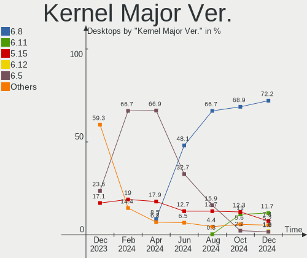
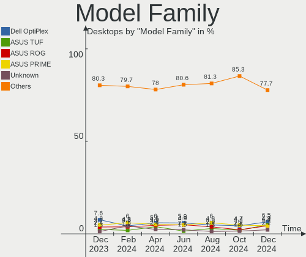
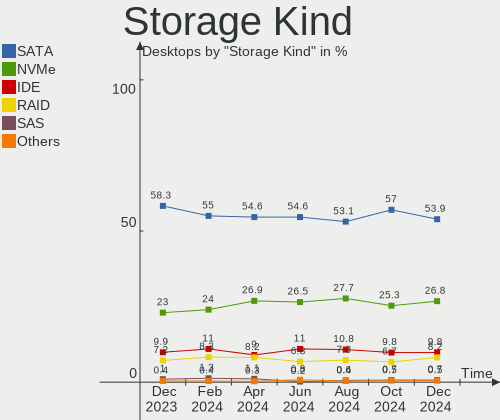
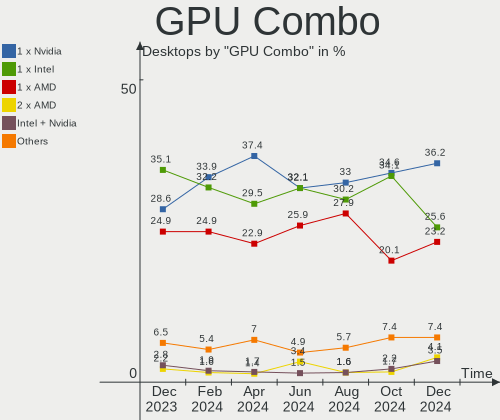

Ubuntu Hardware Trends (Desktop)
--------------------------------

A project to identify most popular hardware characteristics and track their change
over time based on data collected by Ubuntu users at https://Linux-Hardware.org.

Anyone can contribute to the study by uploading probes of their computers by
the [hw-probe](https://github.com/linuxhw/hw-probe) tool:

    sudo hw-probe -all -upload

Full-feature report is available here: https://linux-hardware.org/?view=trends&formfactor=desktop

Period: Apr, 2020.

Contents
--------

- [ OS                       ](#os)
- [ OS Family                ](#os-family)
- [ Kernel                   ](#kernel)
- [ Kernel Family            ](#kernel-family)
- [ Kernel Major Ver.        ](#kernel-major-ver)
- [ Arch                     ](#arch)
- [ DE                       ](#de)
- [ Display Server           ](#display-server)
- [ Display Manager          ](#display-manager)
- [ OS Lang                  ](#os-lang)
- [ Boot Mode                ](#boot-mode)
- [ Filesystem               ](#filesystem)
- [ Dual Boot with Linux/BSD ](#dual-boot-with-linux/bsd)
- [ Dual Boot (Win)          ](#dual-boot-win)
- [ Country                  ](#country)
- [ City                     ](#city)
- [ Vendor                   ](#vendor)
- [ Model                    ](#model)
- [ Model Family             ](#model-family)
- [ MFG Year                 ](#mfg-year)
- [ Form Factor              ](#form-factor)
- [ Secure Boot              ](#secure-boot)
- [ Coreboot                 ](#coreboot)
- [ RAM Size                 ](#ram-size)
- [ RAM Used                 ](#ram-used)
- [ Drive Vendor             ](#drive-vendor)
- [ Drive Model              ](#drive-model)
- [ Drive Kind               ](#drive-kind)
- [ Drive Connector          ](#drive-connector)
- [ Drive Size               ](#drive-size)
- [ Space Total              ](#space-total)
- [ Space Used               ](#space-used)
- [ Malfunc. Drives          ](#malfunc-drives)
- [ Malfunc. Drive Vendor    ](#malfunc-drive-vendor)
- [ Malfunc. Drive Kind      ](#malfunc-drive-kind)
- [ Failed Drives            ](#failed-drives)
- [ Failed Drive Vendor      ](#failed-drive-vendor)
- [ Drive Status             ](#drive-status)
- [ Storage Vendor           ](#storage-vendor)
- [ Storage Model            ](#storage-model)
- [ Storage Kind             ](#storage-kind)
- [ CPU Vendor               ](#cpu-vendor)
- [ CPU Model                ](#cpu-model)
- [ CPU Model Family         ](#cpu-model-family)
- [ CPU Cores                ](#cpu-cores)
- [ CPU Sockets              ](#cpu-sockets)
- [ CPU Threads              ](#cpu-threads)
- [ CPU Op-Modes             ](#cpu-op-modes)
- [ CPU Microarch            ](#cpu-microarch)
- [ CPU Microcode            ](#cpu-microcode)
- [ GPU Vendor               ](#gpu-vendor)
- [ GPU Model                ](#gpu-model)
- [ GPU Combo                ](#gpu-combo)
- [ GPU Driver               ](#gpu-driver)
- [ GPU Memory               ](#gpu-memory)
- [ Monitor Vendor           ](#monitor-vendor)
- [ Monitor Model            ](#monitor-model)
- [ Monitor Resolution       ](#monitor-resolution)
- [ Monitor Diagonal         ](#monitor-diagonal)
- [ Monitor Width            ](#monitor-width)
- [ Aspect Ratio             ](#aspect-ratio)
- [ Monitor Area             ](#monitor-area)
- [ Pixel Density            ](#pixel-density)
- [ Multiple Monitors        ](#multiple-monitors)
- [ Net Controller Vendor    ](#net-controller-vendor)
- [ Net Controller Model     ](#net-controller-model)
- [ Net Controller Kind      ](#net-controller-kind)
- [ Used Controller          ](#used-controller)
- [ NICs                     ](#nics)
- [ Unsupported Devices      ](#unsupported-devices)
- [ Unsupported Device Types ](#unsupported-device-types)

OS
--

Installed operating systems

| Name         | Computers | Percent |
|--------------|-----------|---------|
| Ubuntu 18.04 | 525       | 49.9%   |
| Ubuntu 20.04 | 322       | 30.61%  |
| Ubuntu 19.10 | 171       | 16.25%  |
| Ubuntu 16.04 | 27        | 2.57%   |
| Ubuntu 19.04 | 4         | 0.38%   |
| Ubuntu 18.10 | 3         | 0.29%   |

OS Family
---------

OS without a version

| Name   | Computers | Percent |
|--------|-----------|---------|
| Ubuntu | 1052      | 100%    |

Kernel
------

Version of the Linux kernel

| Version                      | Computers | Percent |
|------------------------------|-----------|---------|
| 5.3.0-46-generic             | 239       | 22.72%  |
| 5.4.0-26-generic             | 173       | 16.44%  |
| 5.3.0-45-generic             | 110       | 10.46%  |
| 4.15.0-96-generic            | 94        | 8.94%   |
| 5.4.0-21-generic             | 54        | 5.13%   |
| 4.15.0-91-generic            | 50        | 4.75%   |
| 5.4.0-28-generic             | 44        | 4.18%   |
| 4.15.0-88-generic            | 44        | 4.18%   |
| 5.3.0-28-generic             | 35        | 3.33%   |
| 5.4.0-24-generic             | 21        | 2%      |
| 5.3.0-42-generic             | 15        | 1.43%   |
| 5.3.0-18-generic             | 11        | 1.05%   |
| 5.4.0-25-generic             | 8         | 0.76%   |
| 5.3.0-48-generic             | 7         | 0.67%   |
| 5.3.0-47-generic             | 7         | 0.67%   |
| 5.3.0-46-lowlatency          | 7         | 0.67%   |
| 4.4.0-177-generic            | 7         | 0.67%   |
| 4.15.0-99-generic            | 7         | 0.67%   |
| 5.3.0-40-generic             | 6         | 0.57%   |
| 4.18.0-25-generic            | 5         | 0.48%   |
| 4.15.0-97-generic            | 5         | 0.48%   |
| 4.15.0-76-generic            | 5         | 0.48%   |
| 4.15.0-72-generic            | 5         | 0.48%   |
| 5.4.0-23-generic             | 4         | 0.38%   |
| 5.3.0-51-generic             | 4         | 0.38%   |
| 5.0.0-23-generic             | 4         | 0.38%   |
| 4.15.0-70-generic            | 4         | 0.38%   |
| 4.15.0-69-generic            | 4         | 0.38%   |
| 4.15.0-20-generic            | 4         | 0.38%   |
| 5.4.0-26-lowlatency          | 3         | 0.29%   |
| 5.4.0-21-lowlatency          | 3         | 0.29%   |
| 5.3.0-7642-generic           | 3         | 0.29%   |
| 5.0.0-38-generic             | 3         | 0.29%   |
| 4.18.0-15-generic            | 3         | 0.29%   |
| 4.15.0-94-generic            | 3         | 0.29%   |
| 4.15.0-91-lowlatency         | 3         | 0.29%   |
| 5.6.2-050602-generic         | 2         | 0.19%   |
| 5.4.0-24-lowlatency          | 2         | 0.19%   |
| 5.3.0-18-lowlatency          | 2         | 0.19%   |
| 5.0.0-37-generic             | 2         | 0.19%   |
| 4.15.0-74-generic            | 2         | 0.19%   |
| 4.15.0-54-generic            | 2         | 0.19%   |
| 4.15.0-29-generic            | 2         | 0.19%   |
| 5.7.0-050700rc2-generic      | 1         | 0.1%    |
| 5.6.6-xanmod1                | 1         | 0.1%    |
| 5.6.4-050604-generic         | 1         | 0.1%    |
| 5.6.3-050603-generic         | 1         | 0.1%    |
| 5.6.0-1007-oem               | 1         | 0.1%    |
| 5.5.6-050506-generic         | 1         | 0.1%    |
| 5.5.3-050503-generic         | 1         | 0.1%    |
| 5.5.13-slack                 | 1         | 0.1%    |
| 5.4.2-1138-amd+              | 1         | 0.1%    |
| 5.4.0-18-generic             | 1         | 0.1%    |
| 5.3.18-050318-lowlatency     | 1         | 0.1%    |
| 5.3.0-48-lowlatency          | 1         | 0.1%    |
| 5.3.0-45-lowlatency          | 1         | 0.1%    |
| 5.3.0-41202002241620-generic | 1         | 0.1%    |
| 5.3.0-24-generic             | 1         | 0.1%    |
| 5.3.0-13-generic             | 1         | 0.1%    |
| 5.3.0-050300-generic         | 1         | 0.1%    |

Kernel Family
-------------

Linux kernel without a distro release

| Version | Computers | Percent |
|---------|-----------|---------|
| 5.3.0   | 452       | 42.97%  |
| 5.4.0   | 313       | 29.75%  |
| 4.15.0  | 242       | 23%     |
| 5.0.0   | 13        | 1.24%   |
| 4.4.0   | 9         | 0.86%   |
| 4.18.0  | 9         | 0.86%   |
| 5.6.2   | 2         | 0.19%   |
| 5.7.0   | 1         | 0.1%    |
| 5.6.6   | 1         | 0.1%    |
| 5.6.4   | 1         | 0.1%    |
| 5.6.3   | 1         | 0.1%    |
| 5.6.0   | 1         | 0.1%    |
| 5.5.6   | 1         | 0.1%    |
| 5.5.3   | 1         | 0.1%    |
| 5.5.13  | 1         | 0.1%    |
| 5.4.2   | 1         | 0.1%    |
| 5.3.18  | 1         | 0.1%    |
| 4.20.0  | 1         | 0.1%    |
| 4.14.0  | 1         | 0.1%    |

Kernel Major Ver.
-----------------

Linux kernel major version

| Version | Computers | Percent |
|---------|-----------|---------|
| 5.3     | 453       | 43.06%  |
| 5.4     | 314       | 29.85%  |
| 4.15    | 242       | 23%     |
| 5.0     | 13        | 1.24%   |
| 4.4     | 9         | 0.86%   |
| 4.18    | 9         | 0.86%   |
| 5.6     | 6         | 0.57%   |
| 5.5     | 3         | 0.29%   |
| 5.7     | 1         | 0.1%    |
| 4.20    | 1         | 0.1%    |
| 4.14    | 1         | 0.1%    |

Arch
----

OS architecture (x86_64, i586, etc.)

| Name   | Computers | Percent |
|--------|-----------|---------|
| x86_64 | 1005      | 95.53%  |
| i686   | 47        | 4.47%   |

DE
--

Desktop Environment

| Name            | Computers | Percent |
|-----------------|-----------|---------|
| GNOME           | 736       | 69.96%  |
| GNUstep         | 88        | 8.37%   |
| XFCE            | 73        | 6.94%   |
| Unknown         | 50        | 4.75%   |
| Unity           | 25        | 2.38%   |
| KDE             | 18        | 1.71%   |
| MATE            | 16        | 1.52%   |
| X-Cinnamon      | 9         | 0.86%   |
| KDE5            | 7         | 0.67%   |
| GNOME Flashback | 7         | 0.67%   |
| Budgie          | 6         | 0.57%   |
| LXDE            | 5         | 0.48%   |
| LXQt            | 4         | 0.38%   |
| Deepin          | 4         | 0.38%   |
| Cinnamon        | 2         | 0.19%   |
| GNOME Classic   | 1         | 0.1%    |
| fluxbox         | 1         | 0.1%    |

Display Server
--------------

X11 or Wayland

| Name    | Computers | Percent |
|---------|-----------|---------|
| X11     | 1003      | 95.34%  |
| Wayland | 21        | 2%      |
| Unknown | 19        | 1.81%   |
| Tty     | 9         | 0.86%   |

Display Manager
---------------

SDDM, LightDM, etc.

| Name    | Computers | Percent |
|---------|-----------|---------|
| Unknown | 893       | 84.89%  |
| LightDM | 106       | 10.08%  |
| GDM     | 34        | 3.23%   |
| GDM3    | 11        | 1.05%   |
| SDDM    | 8         | 0.76%   |

OS Lang
-------

Language

| Lang    | Computers | Percent |
|---------|-----------|---------|
| en_US   | 326       | 30.99%  |
| de_DE   | 93        | 8.84%   |
| Unknown | 88        | 8.37%   |
| en_GB   | 61        | 5.8%    |
| it_IT   | 54        | 5.13%   |
| fr_FR   | 42        | 3.99%   |
| pt_BR   | 41        | 3.9%    |
| en_CA   | 36        | 3.42%   |
| es_ES   | 34        | 3.23%   |
| C       | 31        | 2.95%   |
| ru_RU   | 28        | 2.66%   |
| en_AU   | 27        | 2.57%   |
| pl_PL   | 21        | 2%      |
| es_AR   | 14        | 1.33%   |
| nl_NL   | 11        | 1.05%   |
| hu_HU   | 9         | 0.86%   |
| en_IN   | 9         | 0.86%   |
| el_GR   | 8         | 0.76%   |
| pt_PT   | 7         | 0.67%   |
| en_ZA   | 7         | 0.67%   |
| sv_SE   | 6         | 0.57%   |
| ja_JP   | 6         | 0.57%   |
| cs_CZ   | 6         | 0.57%   |
| en_HK   | 5         | 0.48%   |
| tr_TR   | 4         | 0.38%   |
| ko_KR   | 4         | 0.38%   |
| fr_CA   | 4         | 0.38%   |
| es_MX   | 4         | 0.38%   |
| de_AT   | 4         | 0.38%   |
| zh_TW   | 3         | 0.29%   |
| uk_UA   | 3         | 0.29%   |
| ru_UA   | 3         | 0.29%   |
| fr_BE   | 3         | 0.29%   |
| es_CL   | 3         | 0.29%   |
| en_US   | 3         | 0.29%   |
| en_PH   | 3         | 0.29%   |
| en_NZ   | 3         | 0.29%   |
| de_CH   | 3         | 0.29%   |
| ca_ES   | 3         | 0.29%   |
| sk_SK   | 2         | 0.19%   |
| nl_BE   | 2         | 0.19%   |
| nb_NO   | 2         | 0.19%   |
| hr_HR   | 2         | 0.19%   |
| fi_FI   | 2         | 0.19%   |
| es_PE   | 2         | 0.19%   |
| zh_HK   | 1         | 0.1%    |
| zh_CN   | 1         | 0.1%    |
| sl_SI   | 1         | 0.1%    |
| ro_RO   | 1         | 0.1%    |
| id_ID   | 1         | 0.1%    |
| fr_CH   | 1         | 0.1%    |
| eu_ES   | 1         | 0.1%    |
| et_EE   | 1         | 0.1%    |
| es_VE   | 1         | 0.1%    |
| es_CU   | 1         | 0.1%    |
| es_CO   | 1         | 0.1%    |
| en_ZW   | 1         | 0.1%    |
| en_ZM   | 1         | 0.1%    |
| en_SG   | 1         | 0.1%    |
| en_IN   | 1         | 0.1%    |

Boot Mode
---------

EFI or BIOS

| Mode | Computers | Percent |
|------|-----------|---------|
| BIOS | 770       | 73.19%  |
| EFI  | 282       | 26.81%  |

Filesystem
----------

Type of filesystem

| Type    | Computers | Percent |
|---------|-----------|---------|
| Ext4    | 970       | 92.21%  |
| Overlay | 39        | 3.71%   |
| Zfs     | 20        | 1.9%    |
| Btrfs   | 15        | 1.43%   |
| Xfs     | 3         | 0.29%   |
| Ext2    | 3         | 0.29%   |
| Ext3    | 1         | 0.1%    |
| Aufs    | 1         | 0.1%    |

Dual Boot with Linux/BSD
------------------------

Hosting more than one Linux/BSD

| Dual boot | Computers | Percent |
|-----------|-----------|---------|
| No        | 845       | 80.32%  |
| Yes       | 207       | 19.68%  |

Dual Boot (Win)
---------------

Hosting Linux and Windows

| Dual boot | Computers | Percent |
|-----------|-----------|---------|
| No        | 608       | 57.79%  |
| Yes       | 444       | 42.21%  |

Country
-------

Geographic location (country)

| Country             | Computers | Percent |
|---------------------|-----------|---------|
| USA                 | 178       | 16.92%  |
| Germany             | 104       | 9.89%   |
| Switzerland         | 98        | 9.32%   |
| Italy               | 60        | 5.7%    |
| UK                  | 54        | 5.13%   |
| France              | 51        | 4.85%   |
| Brazil              | 46        | 4.37%   |
| Canada              | 44        | 4.18%   |
| Spain               | 38        | 3.61%   |
| Russia              | 38        | 3.61%   |
| Australia           | 27        | 2.57%   |
| Poland              | 24        | 2.28%   |
| Netherlands         | 22        | 2.09%   |
| Argentina           | 17        | 1.62%   |
| India               | 13        | 1.24%   |
| Greece              | 13        | 1.24%   |
| Sweden              | 11        | 1.05%   |
| Kyrgyzstan          | 11        | 1.05%   |
| Hungary             | 10        | 0.95%   |
| Mexico              | 9         | 0.86%   |
| Austria             | 9         | 0.86%   |
| Ukraine             | 8         | 0.76%   |
| South Africa        | 8         | 0.76%   |
| Portugal            | 8         | 0.76%   |
| Indonesia           | 8         | 0.76%   |
| Belgium             | 8         | 0.76%   |
| Turkey              | 7         | 0.67%   |
| Norway              | 7         | 0.67%   |
| Czech Republic      | 7         | 0.67%   |
| Bulgaria            | 7         | 0.67%   |
| Serbia              | 6         | 0.57%   |
| New Zealand         | 6         | 0.57%   |
| Hong Kong           | 6         | 0.57%   |
| Japan               | 5         | 0.48%   |
| Taiwan              | 4         | 0.38%   |
| Korea, Republic of  | 4         | 0.38%   |
| Ireland             | 4         | 0.38%   |
| Finland             | 4         | 0.38%   |
| Denmark             | 4         | 0.38%   |
| Slovakia            | 3         | 0.29%   |
| Philippines         | 3         | 0.29%   |
| Colombia            | 3         | 0.29%   |
| China               | 3         | 0.29%   |
| Chile               | 3         | 0.29%   |
| Algeria             | 3         | 0.29%   |
| Vietnam             | 2         | 0.19%   |
| Slovenia            | 2         | 0.19%   |
| Romania             | 2         | 0.19%   |
| Peru                | 2         | 0.19%   |
| Iran                | 2         | 0.19%   |
| Honduras            | 2         | 0.19%   |
| Dominican Republic  | 2         | 0.19%   |
| Croatia             | 2         | 0.19%   |
| Zimbabwe            | 1         | 0.1%    |
| Zambia              | 1         | 0.1%    |
| Venezuela           | 1         | 0.1%    |
| Uzbekistan          | 1         | 0.1%    |
| UAE                 | 1         | 0.1%    |
| Trinidad and Tobago | 1         | 0.1%    |
| Thailand            | 1         | 0.1%    |

City
----

Geographic location (city)

| City              | Computers | Percent |
|-------------------|-----------|---------|
| Oberglatt         | 54        | 5.13%   |
| Zurich            | 38        | 3.61%   |
| Moscow            | 17        | 1.62%   |
| Bishkek           | 11        | 1.05%   |
| Berlin            | 10        | 0.95%   |
| Warsaw            | 9         | 0.86%   |
| Melbourne         | 8         | 0.76%   |
| Madrid            | 7         | 0.67%   |
| Hamburg           | 7         | 0.67%   |
| Buenos Aires      | 7         | 0.67%   |
| Sydney            | 6         | 0.57%   |
| Montreal          | 6         | 0.57%   |
| Athens            | 6         | 0.57%   |
| Vienna            | 5         | 0.48%   |
| Paris             | 5         | 0.48%   |
| Leipzig           | 5         | 0.48%   |
| Hyderabad         | 5         | 0.48%   |
| Cologne           | 5         | 0.48%   |
| Central           | 5         | 0.48%   |
| Cape Town         | 5         | 0.48%   |
| São Paulo        | 4         | 0.38%   |
| Rome              | 4         | 0.38%   |
| Milan             | 4         | 0.38%   |
| Miami             | 4         | 0.38%   |
| Istanbul          | 4         | 0.38%   |
| Dublin            | 4         | 0.38%   |
| Budapest          | 4         | 0.38%   |
| Amsterdam         | 4         | 0.38%   |
| Zaragoza          | 3         | 0.29%   |
| Toronto           | 3         | 0.29%   |
| Taipei            | 3         | 0.29%   |
| Sunderland        | 3         | 0.29%   |
| Omsk              | 3         | 0.29%   |
| London            | 3         | 0.29%   |
| Kyiv              | 3         | 0.29%   |
| Jakarta           | 3         | 0.29%   |
| Frankfurt am Main | 3         | 0.29%   |
| Dortmund          | 3         | 0.29%   |
| Denver            | 3         | 0.29%   |
| Dallas            | 3         | 0.29%   |
| Calgary           | 3         | 0.29%   |
| Brisbane          | 3         | 0.29%   |
| Birmingham        | 3         | 0.29%   |
| Ålesund          | 2         | 0.19%   |
| Winnipeg          | 2         | 0.19%   |
| Voronezh          | 2         | 0.19%   |
| Viña del Mar     | 2         | 0.19%   |
| Turin             | 2         | 0.19%   |
| Torrijos          | 2         | 0.19%   |
| Tegucigalpa       | 2         | 0.19%   |
| Tangerang         | 2         | 0.19%   |
| Stuttgart         | 2         | 0.19%   |
| Stockholm         | 2         | 0.19%   |
| St Petersburg     | 2         | 0.19%   |
| Sofia             | 2         | 0.19%   |
| Sapporo           | 2         | 0.19%   |
| Sandorfalva       | 2         | 0.19%   |
| San Jose          | 2         | 0.19%   |
| San Antonio       | 2         | 0.19%   |
| Salt Lake City    | 2         | 0.19%   |

Vendor
------

Motherboard manufacturer

| Name                                   | Computers | Percent |
|----------------------------------------|-----------|---------|
| ASUSTek Computer                       | 289       | 27.47%  |
| Gigabyte Technology                    | 163       | 15.49%  |
| MSI                                    | 100       | 9.51%   |
| Dell                                   | 93        | 8.84%   |
| ASRock                                 | 77        | 7.32%   |
| Hewlett-Packard                        | 61        | 5.8%    |
| Intel                                  | 44        | 4.18%   |
| Fujitsu                                | 33        | 3.14%   |
| Lenovo                                 | 30        | 2.85%   |
| Acer                                   | 26        | 2.47%   |
| Biostar                                | 15        | 1.43%   |
| Pegatron                               | 12        | 1.14%   |
| Medion                                 | 12        | 1.14%   |
| Foxconn                                | 12        | 1.14%   |
| Unknown                                | 10        | 0.95%   |
| ECS                                    | 8         | 0.76%   |
| DALCO AG Switzerland                   | 6         | 0.57%   |
| Fujitsu Siemens                        | 5         | 0.48%   |
| Packard Bell                           | 4         | 0.38%   |
| eMachines                              | 4         | 0.38%   |
| Apple                                  | 4         | 0.38%   |
| PCWare                                 | 3         | 0.29%   |
| EVGA                                   | 3         | 0.29%   |
| ZOTAC                                  | 2         | 0.19%   |
| TYAN Computer                          | 2         | 0.19%   |
| Supermicro                             | 2         | 0.19%   |
| Google                                 | 2         | 0.19%   |
| Gateway                                | 2         | 0.19%   |
| XFX                                    | 1         | 0.1%    |
| Wortmann AG                            | 1         | 0.1%    |
| WeiBu                                  | 1         | 0.1%    |
| VIA Technologies                       | 1         | 0.1%    |
| UNITCOM                                | 1         | 0.1%    |
| System Industrie Electronic            | 1         | 0.1%    |
| Shuttle                                | 1         | 0.1%    |
| Sapphire                               | 1         | 0.1%    |
| PROLINE                                | 1         | 0.1%    |
| Positivo                               | 1         | 0.1%    |
| Point of View                          | 1         | 0.1%    |
| Nvidia                                 | 1         | 0.1%    |
| NCR                                    | 1         | 0.1%    |
| MouseComputer                          | 1         | 0.1%    |
| MINIX                                  | 1         | 0.1%    |
| Megaware                               | 1         | 0.1%    |
| Kontron Technology                     | 1         | 0.1%    |
| Itautec                                | 1         | 0.1%    |
| Inventec                               | 1         | 0.1%    |
| IBM                                    | 1         | 0.1%    |
| First International Computer           | 1         | 0.1%    |
| Desenvolvido para Positivo Informatica | 1         | 0.1%    |
| ASRockRack                             | 1         | 0.1%    |
| American Megatrends                    | 1         | 0.1%    |
| Advent                                 | 1         | 0.1%    |
| Accton                                 | 1         | 0.1%    |
| ABIT                                   | 1         | 0.1%    |
| AAEON                                  | 1         | 0.1%    |

Model
-----

Motherboard model

| Name                                  | Computers | Percent |
|---------------------------------------|-----------|---------|
| ASUS All Series                       | 38        | 3.61%   |
| Fujitsu CELSIUS_W550                  | 12        | 1.14%   |
| Unknown                               | 10        | 0.95%   |
| Dell OptiPlex 780                     | 8         | 0.76%   |
| Gigabyte B450M DS3H                   | 6         | 0.57%   |
| Dell OptiPlex 9020                    | 6         | 0.57%   |
| Dell OptiPlex 3010                    | 6         | 0.57%   |
| DALCO AG Switzerland +41 44 908 38 38 | 6         | 0.57%   |
| ASUS P9X79 WS                         | 6         | 0.57%   |
| MSI MS-7C37                           | 5         | 0.48%   |
| MSI MS-7B79                           | 5         | 0.48%   |
| Intel DP67BA AAG10219-303             | 5         | 0.48%   |
| Dell OptiPlex 990                     | 5         | 0.48%   |
| Dell OptiPlex 745                     | 5         | 0.48%   |
| ASUS PRIME X370-PRO                   | 5         | 0.48%   |
| ASUS PRIME A320M-K                    | 5         | 0.48%   |
| ASUS H110I-PLUS                       | 5         | 0.48%   |
| ASUS B75M-A                           | 5         | 0.48%   |
| MSI MS-7C02                           | 4         | 0.38%   |
| Intel DP55WB AAE64798-207             | 4         | 0.38%   |
| Gigabyte X470 AORUS ULTRA GAMING      | 4         | 0.38%   |
| Gigabyte B75M-D3H                     | 4         | 0.38%   |
| Fujitsu CELSIUS W570                  | 4         | 0.38%   |
| Dell Inspiron 530                     | 4         | 0.38%   |
| ASUS PRIME Z370-A II                  | 4         | 0.38%   |
| ASUS M5A78L-M/USB3                    | 4         | 0.38%   |
| MSI MS-7B86                           | 3         | 0.29%   |
| MSI MS-7B85                           | 3         | 0.29%   |
| MSI MS-7B51                           | 3         | 0.29%   |
| MSI MS-7885                           | 3         | 0.29%   |
| MSI MS-7640                           | 3         | 0.29%   |
| HP Pavilion Desktop 590-p0xxx         | 3         | 0.29%   |
| Gigabyte Z87-HD3                      | 3         | 0.29%   |
| Gigabyte Z370 HD3                     | 3         | 0.29%   |
| Gigabyte H97-HD3                      | 3         | 0.29%   |
| Gigabyte GA-78LMT-USB3 6.0            | 3         | 0.29%   |
| Gigabyte G31M-ES2L                    | 3         | 0.29%   |
| Gigabyte B75M-D3V                     | 3         | 0.29%   |
| Gigabyte 970A-DS3P                    | 3         | 0.29%   |
| Dell OptiPlex GX620                   | 3         | 0.29%   |
| Dell OptiPlex 755                     | 3         | 0.29%   |
| Dell OptiPlex 390                     | 3         | 0.29%   |
| ASUS STRIX Z270F GAMING               | 3         | 0.29%   |
| ASUS P6T DELUXE V2                    | 3         | 0.29%   |
| ASUS P5K                              | 3         | 0.29%   |
| ASUS P5G41T-M LX                      | 3         | 0.29%   |
| ASUS M5A97 LE R2.0                    | 3         | 0.29%   |
| ASUS M5A78L-M PLUS/USB3               | 3         | 0.29%   |
| ASUS M5A78L-M LX3                     | 3         | 0.29%   |
| ASUS M5A78L LE                        | 3         | 0.29%   |
| ASUS M2N-E SLI                        | 3         | 0.29%   |
| ASUS H61M-C                           | 3         | 0.29%   |
| Supermicro X8STi                      | 2         | 0.19%   |
| MSI MS-7C08                           | 2         | 0.19%   |
| MSI MS-7B89                           | 2         | 0.19%   |
| MSI MS-7A38                           | 2         | 0.19%   |
| MSI MS-7A32                           | 2         | 0.19%   |
| MSI MS-7978                           | 2         | 0.19%   |
| MSI MS-7922                           | 2         | 0.19%   |
| MSI MS-7850                           | 2         | 0.19%   |

Model Family
------------

Motherboard model prefix

| Name                     | Computers | Percent |
|--------------------------|-----------|---------|
| Dell OptiPlex            | 54        | 5.13%   |
| ASUS All                 | 38        | 3.61%   |
| ASUS PRIME               | 34        | 3.23%   |
| Fujitsu CELSIUS          | 27        | 2.57%   |
| HP Compaq                | 23        | 2.19%   |
| Acer Aspire              | 19        | 1.81%   |
| Lenovo ThinkCentre       | 15        | 1.43%   |
| ASUS ROG                 | 14        | 1.33%   |
| ASUS M5A78L-M            | 13        | 1.24%   |
| Dell Precision           | 12        | 1.14%   |
| Dell Inspiron            | 10        | 0.95%   |
| Unknown                  | 10        | 0.95%   |
| Gigabyte Z390            | 9         | 0.86%   |
| ASUS M5A97               | 7         | 0.67%   |
| Lenovo IdeaCentre        | 6         | 0.57%   |
| Intel DP55WB             | 6         | 0.57%   |
| Gigabyte B450M           | 6         | 0.57%   |
| Dell XPS                 | 6         | 0.57%   |
| DALCO AG Switzerland +41 | 6         | 0.57%   |
| ASUS TUF                 | 6         | 0.57%   |
| ASUS P9X79               | 6         | 0.57%   |
| MSI MS-7C37              | 5         | 0.48%   |
| MSI MS-7B79              | 5         | 0.48%   |
| Lenovo ThinkStation      | 5         | 0.48%   |
| Intel DP67BA             | 5         | 0.48%   |
| HP ProDesk               | 5         | 0.48%   |
| Gigabyte X470            | 5         | 0.48%   |
| Gigabyte GA-78LMT-USB3   | 5         | 0.48%   |
| Fujitsu ESPRIMO          | 5         | 0.48%   |
| ASUS STRIX               | 5         | 0.48%   |
| ASUS P8P67               | 5         | 0.48%   |
| ASUS P5KPL-AM            | 5         | 0.48%   |
| ASUS H110I-PLUS          | 5         | 0.48%   |
| ASUS B75M-A              | 5         | 0.48%   |
| Acer Veriton             | 5         | 0.48%   |
| Packard Bell imedia      | 4         | 0.38%   |
| MSI MS-7C02              | 4         | 0.38%   |
| HP EliteDesk             | 4         | 0.38%   |
| Gigabyte Z370            | 4         | 0.38%   |
| Gigabyte X570            | 4         | 0.38%   |
| Gigabyte B75M-D3H        | 4         | 0.38%   |
| Gigabyte B450            | 4         | 0.38%   |
| Dell Vostro              | 4         | 0.38%   |
| ASUS SABERTOOTH          | 4         | 0.38%   |
| ASUS P8H61-M             | 4         | 0.38%   |
| ASUS P6T                 | 4         | 0.38%   |
| ASUS P5K                 | 4         | 0.38%   |
| ASUS P5G41T-M            | 4         | 0.38%   |
| MSI MS-7B86              | 3         | 0.29%   |
| MSI MS-7B85              | 3         | 0.29%   |
| MSI MS-7B51              | 3         | 0.29%   |
| MSI MS-7885              | 3         | 0.29%   |
| MSI MS-7640              | 3         | 0.29%   |
| Intel DH87MC             | 3         | 0.29%   |
| HP Pavilion              | 3         | 0.29%   |
| Gigabyte Z87-HD3         | 3         | 0.29%   |
| Gigabyte H97-HD3         | 3         | 0.29%   |
| Gigabyte G31M-ES2L       | 3         | 0.29%   |
| Gigabyte B75M-D3V        | 3         | 0.29%   |
| Gigabyte 970A-DS3P       | 3         | 0.29%   |

MFG Year
--------

Motherboard manufacture year

| Year | Computers | Percent |
|------|-----------|---------|
| 2019 | 168       | 15.97%  |
| 2010 | 90        | 8.56%   |
| 2018 | 88        | 8.37%   |
| 2013 | 83        | 7.89%   |
| 2011 | 82        | 7.79%   |
| 2012 | 81        | 7.7%    |
| 2015 | 73        | 6.94%   |
| 2009 | 73        | 6.94%   |
| 2014 | 68        | 6.46%   |
| 2008 | 63        | 5.99%   |
| 2016 | 54        | 5.13%   |
| 2017 | 47        | 4.47%   |
| 2007 | 39        | 3.71%   |
| 2006 | 22        | 2.09%   |
| 2020 | 9         | 0.86%   |
| 2005 | 8         | 0.76%   |
| 2004 | 2         | 0.19%   |
| 2003 | 1         | 0.1%    |
| 2001 | 1         | 0.1%    |

Form Factor
-----------

Physical design of the computer

| Name    | Computers | Percent |
|---------|-----------|---------|
| Desktop | 1052      | 100%    |

Secure Boot
-----------

Enabled or disabled

| State    | Computers | Percent |
|----------|-----------|---------|
| Disabled | 1037      | 98.57%  |
| Enabled  | 15        | 1.43%   |

Coreboot
--------

Have coreboot on board

| Used | Computers | Percent |
|------|-----------|---------|
| No   | 1049      | 99.71%  |
| Yes  | 3         | 0.29%   |

RAM Size
--------

Total RAM memory

| Size in GB      | Computers | Percent |
|-----------------|-----------|---------|
| 8.01-16.0       | 242       | 23%     |
| 16.01-24.0      | 223       | 21.2%   |
| 3.01-4.0        | 206       | 19.58%  |
| 4.01-8.0        | 152       | 14.45%  |
| 32.01-64.0      | 94        | 8.94%   |
| 1.01-2.0        | 46        | 4.37%   |
| 64.01-256.0     | 41        | 3.9%    |
| 2.01-3.0        | 24        | 2.28%   |
| 24.01-32.0      | 14        | 1.33%   |
| 0.01-1.0        | 9         | 0.86%   |
| More than 256.0 | 1         | 0.1%    |

RAM Used
--------

Used RAM memory

| Used GB     | Computers | Percent |
|-------------|-----------|---------|
| 1.01-2.0    | 483       | 45.91%  |
| 2.01-3.0    | 262       | 24.9%   |
| 0.01-1.0    | 123       | 11.69%  |
| 3.01-4.0    | 80        | 7.6%    |
| 4.01-8.0    | 77        | 7.32%   |
| 8.01-16.0   | 24        | 2.28%   |
| 24.01-32.0  | 1         | 0.1%    |
| 64.01-256.0 | 1         | 0.1%    |
| 16.01-24.0  | 1         | 0.1%    |

Drive Vendor
------------

Hard drive vendors

| Vendor              | Computers | Drives | Percent |
|---------------------|-----------|--------|---------|
| WDC                 | 382       | 455    | 23.83%  |
| Seagate             | 378       | 478    | 23.58%  |
| Samsung Electronics | 223       | 272    | 13.91%  |
| Toshiba             | 102       | 110    | 6.36%   |
| Kingston            | 82        | 90     | 5.12%   |
| Hitachi             | 80        | 85     | 4.99%   |
| Crucial             | 57        | 61     | 3.56%   |
| SanDisk             | 46        | 50     | 2.87%   |
| Intel               | 34        | 36     | 2.12%   |
| A-DATA Technology   | 24        | 24     | 1.5%    |
| Maxtor              | 22        | 25     | 1.37%   |
| Patriot             | 11        | 12     | 0.69%   |
| OCZ                 | 10        | 10     | 0.62%   |
| Generic             | 10        | 10     | 0.62%   |
| Transcend           | 8         | 8      | 0.5%    |
| Micron Technology   | 8         | 8      | 0.5%    |
| Corsair             | 8         | 9      | 0.5%    |
| PNY                 | 7         | 7      | 0.44%   |
| HGST                | 7         | 7      | 0.44%   |
| Hewlett-Packard     | 7         | 7      | 0.44%   |
| China               | 7         | 7      | 0.44%   |
| Unknown             | 6         | 7      | 0.37%   |
| Intenso             | 6         | 7      | 0.37%   |
| SPCC                | 5         | 5      | 0.31%   |
| Fujitsu             | 5         | 5      | 0.31%   |
| JMicron             | 4         | 4      | 0.25%   |
| GOODRAM             | 4         | 4      | 0.25%   |
| SK Hynix            | 3         | 3      | 0.19%   |
| PLEXTOR             | 3         | 3      | 0.19%   |
| PHISON              | 3         | 4      | 0.19%   |
| KingDian            | 3         | 3      | 0.19%   |
| Apple               | 3         | 3      | 0.19%   |
| Vaseky              | 2         | 2      | 0.12%   |
| Team                | 2         | 2      | 0.12%   |
| OCZ-VERTEX2         | 2         | 2      | 0.12%   |
| Mushkin             | 2         | 2      | 0.12%   |
| LITEON              | 2         | 2      | 0.12%   |
| KingSpec            | 2         | 2      | 0.12%   |
| DOGFISH             | 2         | 2      | 0.12%   |
| Biostar             | 2         | 2      | 0.12%   |
| ASMT                | 2         | 2      | 0.12%   |
| Apacer              | 2         | 2      | 0.12%   |
| Zheino              | 1         | 1      | 0.06%   |
| WDC WD50            | 1         | 1      | 0.06%   |
| TSA                 | 1         | 1      | 0.06%   |
| TCSUNBOW            | 1         | 1      | 0.06%   |
| Smartbuy            | 1         | 1      | 0.06%   |
| SABRENT             | 1         | 1      | 0.06%   |
| Radeon              | 1         | 1      | 0.06%   |
| PIONEER             | 1         | 1      | 0.06%   |
| OWC                 | 1         | 1      | 0.06%   |
| MATSHITA            | 1         | 1      | 0.06%   |
| LogiLink            | 1         | 2      | 0.06%   |
| LITEONIT            | 1         | 1      | 0.06%   |
| LDLC                | 1         | 1      | 0.06%   |
| KINGMAX             | 1         | 1      | 0.06%   |
| KingFast            | 1         | 1      | 0.06%   |
| iR2420-2S-S2+       | 1         | 1      | 0.06%   |
| innodisk            | 1         | 1      | 0.06%   |
| HKVSN               | 1         | 1      | 0.06%   |

Drive Model
-----------

Hard drive models

| Model                        | Computers | Percent |
|------------------------------|-----------|---------|
| ST500DM002-1BD142 500GB      | 24        | 1.3%    |
| SSD 850 EVO 250GB            | 20        | 1.08%   |
| ST2000DM006-2DM164 2TB       | 19        | 1.03%   |
| ST1000DM003-1CH162 1TB       | 19        | 1.03%   |
| ST1000DM003-1ER162 1TB       | 18        | 0.97%   |
| DT01ACA100 1TB               | 18        | 0.97%   |
| ST31000528AS 1TB             | 17        | 0.92%   |
| ST3500418AS 500GB            | 16        | 0.86%   |
| SA400S37240G 240GB SSD       | 16        | 0.86%   |
| ST2000DM008-2FR102 2TB       | 15        | 0.81%   |
| ST2000DM001-1ER164 2TB       | 15        | 0.81%   |
| SSD 860 EVO 500GB            | 15        | 0.81%   |
| SA400S37120G 120GB SSD       | 15        | 0.81%   |
| DT01ACA200 2TB               | 15        | 0.81%   |
| SSD 860 EVO 1TB              | 13        | 0.7%    |
| SV300S37A120G 120GB SSD      | 12        | 0.65%   |
| ST1000DM010-2EP102 1TB       | 12        | 0.65%   |
| SSD 860 EVO 250GB            | 11        | 0.59%   |
| WD5000AAKX-001CA0 500GB      | 10        | 0.54%   |
| ST3000DM001-1ER166 3TB       | 10        | 0.54%   |
| ST3000DM001-1CH166 3TB       | 10        | 0.54%   |
| SSD 850 EVO 500GB            | 10        | 0.54%   |
| SD/MMC/MS PRO 64GB           | 10        | 0.54%   |
| SA400S37480G 480GB SSD       | 10        | 0.54%   |
| HD103SJ 1TB                  | 10        | 0.54%   |
| WD10EZEX-00BN5A0 1TB         | 9         | 0.49%   |
| ST1000DM003-9YN162 1TB       | 9         | 0.49%   |
| DT01ACA050 500GB             | 9         | 0.49%   |
| WD10EZEX-08WN4A0 1TB         | 8         | 0.43%   |
| ST3250310AS 250GB            | 8         | 0.43%   |
| ST2000DM001-1CH164 2TB       | 8         | 0.43%   |
| HDWD110 1TB                  | 8         | 0.43%   |
| HD322HJ 320GB                | 8         | 0.43%   |
| WD20EFRX-68EUZN0 2TB         | 7         | 0.38%   |
| WD10EALX-009BA0 1TB          | 7         | 0.38%   |
| SDSSDA240G 240GB             | 7         | 0.38%   |
| HUA722020ALA330 2TB          | 7         | 0.38%   |
| HD161HJ 160GB                | 7         | 0.38%   |
| WD30EZRX-00D8PB0 3TB         | 6         | 0.32%   |
| WD20EARS-00MVWB0 2TB         | 6         | 0.32%   |
| WD10EZEX-22MFCA0 1TB         | 6         | 0.32%   |
| WD10EARS-00Y5B1 1TB          | 6         | 0.32%   |
| ST380815AS 80GB              | 6         | 0.32%   |
| ST3160815AS 160GB            | 6         | 0.32%   |
| ST31000524AS 1TB             | 6         | 0.32%   |
| ST250DM000-1BD141 250GB      | 6         | 0.32%   |
| ST1000DM003-1SB102 1TB       | 6         | 0.32%   |
| SSD PLUS 240GB               | 6         | 0.32%   |
| SSD 860 QVO 1TB              | 6         | 0.32%   |
| SSD 840 PRO Series 256GB     | 6         | 0.32%   |
| HDWD120 2TB                  | 6         | 0.32%   |
| HD204UI 2TB                  | 6         | 0.32%   |
| Expansion Desk 5TB           | 6         | 0.32%   |
| Expansion 1TB                | 6         | 0.32%   |
| CT250MX500SSD1 250GB         | 6         | 0.32%   |
| CT240BX500SSD1 240GB         | 6         | 0.32%   |
| WDS500G2B0A-00SM50 500GB SSD | 5         | 0.27%   |
| WD800JD-75MSA3 80GB          | 5         | 0.27%   |
| WD5000AAKX-60U6AA0 500GB     | 5         | 0.27%   |
| WD5000AAKX-00ERMA0 500GB     | 5         | 0.27%   |

Drive Kind
----------

HDD or SSD

| Kind    | Computers | Drives | Percent |
|---------|-----------|--------|---------|
| HDD     | 827       | 1230   | 61.49%  |
| SSD     | 450       | 564    | 33.46%  |
| Unknown | 38        | 40     | 2.83%   |
| NVMe    | 25        | 26     | 1.86%   |
| MMC     | 5         | 6      | 0.37%   |

Drive Connector
---------------

SATA, SAS, NVMe, etc.

| Type | Computers | Drives | Percent |
|------|-----------|--------|---------|
| SATA | 1000      | 1778   | 92.68%  |
| SAS  | 49        | 56     | 4.54%   |
| NVMe | 25        | 26     | 2.32%   |
| MMC  | 5         | 6      | 0.46%   |

Drive Size
----------

Size of hard drive

| Size in TB | Computers | Drives | Percent |
|------------|-----------|--------|---------|
| 0.01-0.5   | 782       | 1111   | 54.61%  |
| 0.51-1.0   | 368       | 426    | 25.7%   |
| 1.01-2.0   | 166       | 190    | 11.59%  |
| 2.01-3.0   | 55        | 67     | 3.84%   |
| 3.01-4.0   | 33        | 38     | 2.3%    |
| 4.01-10.0  | 23        | 29     | 1.61%   |
| 10.01-20.0 | 3         | 3      | 0.21%   |
| 0          | 1         | 1      | 0.07%   |
| Unknown    | 1         | 1      | 0.07%   |

Space Total
-----------

Amount of disk space available on the file system

| Size in GB     | Computers | Percent |
|----------------|-----------|---------|
| 101-250        | 279       | 26.52%  |
| 251-500        | 186       | 17.68%  |
| 501-1000       | 144       | 13.69%  |
| 1001-2000      | 117       | 11.12%  |
| 51-100         | 82        | 7.79%   |
| More than 3000 | 65        | 6.18%   |
| 2001-3000      | 65        | 6.18%   |
| 21-50          | 50        | 4.75%   |
| 1-20           | 40        | 3.8%    |
| Unknown        | 24        | 2.28%   |

Space Used
----------

Amount of used disk space

| Used GB        | Computers | Percent |
|----------------|-----------|---------|
| 1-20           | 446       | 42.4%   |
| 21-50          | 141       | 13.4%   |
| 51-100         | 113       | 10.74%  |
| 101-250        | 86        | 8.17%   |
| 501-1000       | 76        | 7.22%   |
| 251-500        | 67        | 6.37%   |
| 1001-2000      | 58        | 5.51%   |
| More than 3000 | 26        | 2.47%   |
| Unknown        | 24        | 2.28%   |
| 2001-3000      | 15        | 1.43%   |

Malfunc. Drives
---------------

Drive models with a malfunction

| Model                          | Computers | Drives | Percent |
|--------------------------------|-----------|--------|---------|
| HUA722020ALA330 2TB            | 2         | 2      | 5.71%   |
| WD6400AADS-00M2B0 640GB        | 1         | 1      | 2.86%   |
| WD5000AAKX-001CA0 500GB        | 1         | 1      | 2.86%   |
| WD3200AAJS-00L7A0 320GB        | 1         | 1      | 2.86%   |
| WD2500AAJS-00B4A0 250GB        | 1         | 1      | 2.86%   |
| WD10EZEX-60ZF5A0 1TB           | 1         | 1      | 2.86%   |
| WD10EARX-00N0YB0 1TB           | 1         | 1      | 2.86%   |
| WD10EARS-00Y5B1 1TB            | 1         | 1      | 2.86%   |
| WD10EADS-00L5B1 1TB            | 1         | 1      | 2.86%   |
| THNSNK128GCS8 SATA 128GB SSD   | 1         | 1      | 2.86%   |
| SX8200NP 240GB                 | 1         | 1      | 2.86%   |
| SV300S37A120G 120GB SSD        | 1         | 1      | 2.86%   |
| STM3250310AS 250GB             | 1         | 1      | 2.86%   |
| STM3160215AS 160GB             | 1         | 1      | 2.86%   |
| ST500LT012-9WS142 500GB        | 1         | 1      | 2.86%   |
| ST500LT012-1DG142 500GB        | 1         | 1      | 2.86%   |
| ST500LM000-1EJ162 500GB        | 1         | 1      | 2.86%   |
| ST5000DM000-1FK178 5TB         | 1         | 1      | 2.86%   |
| ST480HM000-1G5162 480GB        | 1         | 1      | 2.86%   |
| ST3500413AS 500GB              | 1         | 1      | 2.86%   |
| ST3500320AS 500GB              | 1         | 1      | 2.86%   |
| ST3320418AS 320GB              | 1         | 1      | 2.86%   |
| ST1000DM003-1CH162 1TB         | 1         | 1      | 2.86%   |
| SSDSC2KG400G7M 118000654 400GB | 1         | 1      | 2.86%   |
| SSDSA2M080G2GC 80GB            | 1         | 1      | 2.86%   |
| SSD 970 EVO 500GB              | 1         | 1      | 2.86%   |
| SP900 128GB SSD                | 1         | 1      | 2.86%   |
| M4-CT512M4SSD2 512GB           | 1         | 1      | 2.86%   |
| HDT721050SLA360 500GB          | 1         | 1      | 2.86%   |
| HDS721050DLE630 500GB          | 1         | 1      | 2.86%   |
| DT01ACA100 1TB                 | 1         | 1      | 2.86%   |
| CT525MX300SSD1 528GB           | 1         | 1      | 2.86%   |
| CT480M500SSD1 480GB            | 1         | 1      | 2.86%   |
| CT1050MX300SSD1 1TB            | 1         | 1      | 2.86%   |

Malfunc. Drive Vendor
---------------------

Vendors of faulty drives

| Vendor              | Computers | Drives | Percent |
|---------------------|-----------|--------|---------|
| Seagate             | 9         | 9      | 27.27%  |
| WDC                 | 7         | 8      | 21.21%  |
| Hitachi             | 4         | 4      | 12.12%  |
| Crucial             | 3         | 4      | 9.09%   |
| Toshiba             | 2         | 2      | 6.06%   |
| MAXTOR              | 2         | 2      | 6.06%   |
| Intel               | 2         | 2      | 6.06%   |
| A-DATA Technology   | 2         | 2      | 6.06%   |
| Samsung Electronics | 1         | 1      | 3.03%   |
| Kingston            | 1         | 1      | 3.03%   |

Malfunc. Drive Kind
-------------------

Kinds of faulty drives

| Kind | Computers | Drives | Percent |
|------|-----------|--------|---------|
| HDD  | 21        | 24     | 67.74%  |
| SSD  | 8         | 9      | 25.81%  |
| NVMe | 2         | 2      | 6.45%   |

Failed Drives
-------------

Failed drive models

Zero info for selected period =(

Failed Drive Vendor
-------------------

Failed drive vendors

Zero info for selected period =(

Drive Status
------------

Number of failed and malfunc. drives

| Status   | Computers | Drives | Percent |
|----------|-----------|--------|---------|
| Detected | 846       | 1571   | 81.27%  |
| Works    | 167       | 260    | 16.04%  |
| Malfunc  | 28        | 35     | 2.69%   |

Storage Vendor
--------------

Storage controller vendors

| Vendor                           | Computers | Percent |
|----------------------------------|-----------|---------|
| Intel                            | 711       | 52.05%  |
| AMD                              | 262       | 19.18%  |
| Nvidia                           | 71        | 5.2%    |
| Samsung Electronics              | 59        | 4.32%   |
| JMicron Technology               | 59        | 4.32%   |
| Marvell Technology Group         | 55        | 4.03%   |
| ASMedia Technology               | 48        | 3.51%   |
| VIA Technologies                 | 14        | 1.02%   |
| Phison Electronics               | 13        | 0.95%   |
| Silicon Motion                   | 9         | 0.66%   |
| Sandisk                          | 8         | 0.59%   |
| Micron/Crucial Technology        | 7         | 0.51%   |
| ADATA Technology                 | 7         | 0.51%   |
| Kingston Technology Company      | 5         | 0.37%   |
| Adaptec                          | 5         | 0.37%   |
| Toshiba America Info Systems     | 4         | 0.29%   |
| Realtek Semiconductor            | 4         | 0.29%   |
| Broadcom / LSI                   | 4         | 0.29%   |
| Silicon Image                    | 3         | 0.22%   |
| Integrated Technology Express    | 3         | 0.22%   |
| SK Hynix                         | 2         | 0.15%   |
| Silicon Integrated Systems [SiS] | 2         | 0.15%   |
| LSI Logic / Symbios Logic        | 2         | 0.15%   |
| Lite-On Technology               | 2         | 0.15%   |
| Areca Technology                 | 2         | 0.15%   |
| Unknown                          | 1         | 0.07%   |
| Tekram Technology                | 1         | 0.07%   |
| Promise Technology               | 1         | 0.07%   |
| HighPoint Technologies           | 1         | 0.07%   |
| Advanced System Products         | 1         | 0.07%   |

Storage Model
-------------

Storage controller models

| Model                                                                             | Computers | Percent |
|-----------------------------------------------------------------------------------|-----------|---------|
| FCH SATA Controller [AHCI mode]                                                   | 140       | 7.52%   |
| NM10/ICH7 Family SATA Controller [IDE mode]                                       | 78        | 4.19%   |
| 8 Series/C220 Series Chipset Family 6-port SATA Controller 1 [AHCI mode]          | 74        | 3.97%   |
| SB7x0/SB8x0/SB9x0 IDE Controller                                                  | 70        | 3.76%   |
| 6 Series/C200 Series Chipset Family 6 port Desktop SATA AHCI Controller           | 60        | 3.22%   |
| Q170/Q150/B150/H170/H110/Z170/CM236 Chipset SATA Controller [AHCI Mode]           | 57        | 3.06%   |
| 82801G (ICH7 Family) IDE Controller                                               | 56        | 3.01%   |
| SB7x0/SB8x0/SB9x0 SATA Controller [AHCI mode]                                     | 53        | 2.85%   |
| 400 Series Chipset SATA Controller                                                | 53        | 2.85%   |
| SB7x0/SB8x0/SB9x0 SATA Controller [IDE mode]                                      | 48        | 2.58%   |
| ASM1062 Serial ATA Controller                                                     | 46        | 2.47%   |
| 7 Series/C210 Series Chipset Family 6-port SATA Controller [AHCI mode]            | 44        | 2.36%   |
| NVMe SSD Controller SM981/PM981/PM983                                             | 41        | 2.2%    |
| 200 Series PCH SATA controller [AHCI mode]                                        | 41        | 2.2%    |
| Cannon Lake PCH SATA AHCI Controller                                              | 36        | 1.93%   |
| SATA Controller [RAID mode]                                                       | 34        | 1.83%   |
| 6 Series/C200 Series Chipset Family Desktop SATA Controller (IDE mode, ports 4-5) | 27        | 1.45%   |
| 6 Series/C200 Series Chipset Family Desktop SATA Controller (IDE mode, ports 0-3) | 27        | 1.45%   |
| C610/X99 series chipset 6-Port SATA Controller [AHCI mode]                        | 25        | 1.34%   |
| 82801I (ICH9 Family) 2 port SATA Controller [IDE mode]                            | 25        | 1.34%   |
| MCP61 SATA Controller                                                             | 23        | 1.24%   |
| JMB363 SATA/IDE Controller                                                        | 23        | 1.24%   |
| 9 Series Chipset Family SATA Controller [AHCI Mode]                               | 23        | 1.24%   |
| JMB368 IDE controller                                                             | 19        | 1.02%   |
| 5 Series/3400 Series Chipset 6 port SATA AHCI Controller                          | 19        | 1.02%   |
| MCP61 IDE                                                                         | 18        | 0.97%   |
| C610/X99 series chipset sSATA Controller [AHCI mode]                              | 18        | 0.97%   |
| 82801JI (ICH10 Family) SATA AHCI Controller                                       | 17        | 0.91%   |
| 82801JI (ICH10 Family) 4 port SATA IDE Controller #1                              | 17        | 0.91%   |
| 82801JI (ICH10 Family) 2 port SATA IDE Controller #2                              | 17        | 0.91%   |
| NVMe SSD Controller SM961/PM961                                                   | 16        | 0.86%   |
| 82801IR/IO/IH (ICH9R/DO/DH) 4 port SATA Controller [IDE mode]                     | 16        | 0.86%   |
| 5 Series/3400 Series Chipset 4 port SATA IDE Controller                           | 16        | 0.86%   |
| 5 Series/3400 Series Chipset 2 port SATA IDE Controller                           | 16        | 0.86%   |
| Non-Volatile memory controller                                                    | 15        | 0.81%   |
| C600/X79 series chipset 6-Port SATA AHCI Controller                               | 14        | 0.75%   |
| 4 Series Chipset PT IDER Controller                                               | 13        | 0.7%    |
| FCH SATA Controller D                                                             | 12        | 0.64%   |
| 82801H (ICH8 Family) 4 port SATA Controller [IDE mode]                            | 12        | 0.64%   |
| 7 Series/C210 Series Chipset Family 4-port SATA Controller [IDE mode]             | 12        | 0.64%   |
| 7 Series/C210 Series Chipset Family 2-port SATA Controller [IDE mode]             | 12        | 0.64%   |
| X370 Series Chipset SATA Controller                                               | 11        | 0.59%   |
| JMB362 SATA Controller                                                            | 11        | 0.59%   |
| 88SE6111/6121 SATA II / PATA Controller                                           | 11        | 0.59%   |
| 82801HR/HO/HH (ICH8R/DO/DH) 2 port SATA Controller [IDE mode]                     | 10        | 0.54%   |
| SSD 660P Series                                                                   | 9         | 0.48%   |
| MCP55 SATA Controller                                                             | 9         | 0.48%   |
| MCP55 IDE                                                                         | 9         | 0.48%   |
| FCH IDE Controller                                                                | 9         | 0.48%   |
| E12 NVMe Controller                                                               | 9         | 0.48%   |
| CK804 Serial ATA Controller                                                       | 9         | 0.48%   |
| CK804 IDE                                                                         | 9         | 0.48%   |
| 88SE9128 PCIe SATA 6 Gb/s RAID controller with HyperDuo                           | 9         | 0.48%   |
| 82801IB (ICH9) 2 port SATA Controller [IDE mode]                                  | 9         | 0.48%   |
| 300 Series Chipset SATA Controller                                                | 9         | 0.48%   |
| VT82C586A/B/VT82C686/A/B/VT823x/A/C PIPC Bus Master IDE                           | 8         | 0.43%   |
| SB600 Non-Raid-5 SATA                                                             | 8         | 0.43%   |
| SB600 IDE                                                                         | 8         | 0.43%   |
| FCH SATA Controller [IDE mode]                                                    | 8         | 0.43%   |
| Atom Processor E3800 Series SATA AHCI Controller                                  | 8         | 0.43%   |

Storage Kind
------------

Kind of storage controller (IDE, SATA, NVMe, SAS, ...)

| Kind | Computers | Percent |
|------|-----------|---------|
| SATA | 749       | 54.63%  |
| IDE  | 419       | 30.56%  |
| NVMe | 127       | 9.26%   |
| RAID | 62        | 4.52%   |
| SCSI | 8         | 0.58%   |
| SAS  | 6         | 0.44%   |

CPU Vendor
----------

Processor vendors

| Vendor | Computers | Percent |
|--------|-----------|---------|
| Intel  | 737       | 70.06%  |
| AMD    | 315       | 29.94%  |

CPU Model
---------

Processor models

| Model                                       | Computers | Percent |
|---------------------------------------------|-----------|---------|
| Intel Core i7-6700 CPU @ 3.40GHz            | 19        | 1.81%   |
| Intel Core i7-3770 CPU @ 3.40GHz            | 19        | 1.81%   |
| Intel Core i7-4790 CPU @ 3.60GHz            | 18        | 1.71%   |
| Intel Core i7-2600 CPU @ 3.40GHz            | 17        | 1.62%   |
| Intel Core 2 Quad CPU Q6600 @ 2.40GHz       | 16        | 1.52%   |
| Intel Core 2 Duo CPU E8400 @ 3.00GHz        | 16        | 1.52%   |
| AMD Ryzen 5 3600 6-Core Processor           | 14        | 1.33%   |
| Intel Core i5-2400 CPU @ 3.10GHz            | 13        | 1.24%   |
| Intel Core i5-3470 CPU @ 3.20GHz            | 12        | 1.14%   |
| Intel Core i5-4590 CPU @ 3.30GHz            | 11        | 1.05%   |
| Intel Core i5-6400 CPU @ 2.70GHz            | 10        | 0.95%   |
| Intel Core 2 Duo CPU E7500 @ 2.93GHz        | 10        | 0.95%   |
| Intel Core i7-9700K CPU @ 3.60GHz           | 9         | 0.86%   |
| Intel Core i5-4460 CPU @ 3.20GHz            | 9         | 0.86%   |
| AMD Ryzen 5 2600 Six-Core Processor         | 9         | 0.86%   |
| AMD FX-6300 Six-Core Processor              | 9         | 0.86%   |
| Intel Pentium 4 CPU 3.00GHz                 | 8         | 0.76%   |
| Intel Core i7-7700K CPU @ 4.20GHz           | 8         | 0.76%   |
| Intel Core i7 CPU 920 @ 2.67GHz             | 8         | 0.76%   |
| AMD Ryzen 9 3900X 12-Core Processor         | 8         | 0.76%   |
| AMD Ryzen 7 2700X Eight-Core Processor      | 8         | 0.76%   |
| AMD Ryzen 3 2200G with Radeon Vega Graphics | 8         | 0.76%   |
| AMD FX-8350 Eight-Core Processor            | 8         | 0.76%   |
| Intel Pentium Dual-Core CPU E5200 @ 2.50GHz | 7         | 0.67%   |
| Intel Core i7-4790K CPU @ 4.00GHz           | 7         | 0.67%   |
| Intel Core i7-2600K CPU @ 3.40GHz           | 7         | 0.67%   |
| Intel Core i5-3330 CPU @ 3.00GHz            | 7         | 0.67%   |
| Intel Core i5-2500 CPU @ 3.30GHz            | 7         | 0.67%   |
| Intel Core i5 CPU 760 @ 2.80GHz             | 7         | 0.67%   |
| Intel Core i3-4130 CPU @ 3.40GHz            | 7         | 0.67%   |
| Intel Core i3-2120 CPU @ 3.30GHz            | 7         | 0.67%   |
| Intel Core i3-2100 CPU @ 3.10GHz            | 7         | 0.67%   |
| Intel Core 2 Quad CPU Q8200 @ 2.33GHz       | 7         | 0.67%   |
| AMD Ryzen 7 1700 Eight-Core Processor       | 7         | 0.67%   |
| AMD Ryzen 5 2400G with Radeon Vega Graphics | 7         | 0.67%   |
| AMD Quad-Core Opteron Processor 2354        | 7         | 0.67%   |
| AMD Phenom II X4 955 Processor              | 7         | 0.67%   |
| Intel Xeon CPU E5-1650 v3 @ 3.50GHz         | 6         | 0.57%   |
| Intel Pentium Dual CPU E2180 @ 2.00GHz      | 6         | 0.57%   |
| Intel Core i9-9900K CPU @ 3.60GHz           | 6         | 0.57%   |
| Intel Core i7-8700 CPU @ 3.20GHz            | 6         | 0.57%   |
| Intel Core i7-6700K CPU @ 4.00GHz           | 6         | 0.57%   |
| Intel Core i7-4770 CPU @ 3.40GHz            | 6         | 0.57%   |
| Intel Core i5-9600K CPU @ 3.70GHz           | 6         | 0.57%   |
| Intel Core i5-8400 CPU @ 2.80GHz            | 6         | 0.57%   |
| Intel Core i5-6500 CPU @ 3.20GHz            | 6         | 0.57%   |
| Intel Core i5-4570 CPU @ 3.20GHz            | 6         | 0.57%   |
| Intel Core i5-2500K CPU @ 3.30GHz           | 6         | 0.57%   |
| Intel Core i5 CPU 650 @ 3.20GHz             | 6         | 0.57%   |
| Intel Core i3 CPU 550 @ 3.20GHz             | 6         | 0.57%   |
| Intel Core 2 Quad CPU Q9550 @ 2.83GHz       | 6         | 0.57%   |
| Intel Core 2 Duo CPU E8500 @ 3.16GHz        | 6         | 0.57%   |
| Intel Core 2 Duo CPU E7400 @ 2.80GHz        | 6         | 0.57%   |
| AMD FX-8320 Eight-Core Processor            | 6         | 0.57%   |
| AMD FX-4100 Quad-Core Processor             | 6         | 0.57%   |
| Intel Pentium Dual-Core CPU E5400 @ 2.70GHz | 5         | 0.48%   |
| Intel Core i7-8700K CPU @ 3.70GHz           | 5         | 0.48%   |
| Intel Core i5 CPU 750 @ 2.67GHz             | 5         | 0.48%   |
| Intel Core 2 Quad CPU Q9400 @ 2.66GHz       | 5         | 0.48%   |
| Intel Core 2 Quad CPU Q8300 @ 2.50GHz       | 5         | 0.48%   |

CPU Model Family
----------------

Processor model prefix

| Model                   | Computers | Percent |
|-------------------------|-----------|---------|
| Intel Core i7           | 183       | 17.4%   |
| Intel Core i5           | 183       | 17.4%   |
| Intel Xeon              | 64        | 6.08%   |
| Intel Core i3           | 56        | 5.32%   |
| Intel Core 2 Duo        | 55        | 5.23%   |
| AMD FX                  | 50        | 4.75%   |
| AMD Ryzen 5             | 49        | 4.66%   |
| Intel Core 2 Quad       | 48        | 4.56%   |
| Intel Celeron           | 34        | 3.23%   |
| AMD Ryzen 7             | 30        | 2.85%   |
| Intel Pentium Dual-Core | 26        | 2.47%   |
| AMD Phenom II X4        | 21        | 2%      |
| AMD Athlon 64 X2        | 18        | 1.71%   |
| Intel Pentium 4         | 14        | 1.33%   |
| Intel Pentium           | 14        | 1.33%   |
| AMD Phenom II X6        | 14        | 1.33%   |
| Intel Pentium Dual      | 13        | 1.24%   |
| Intel Core 2            | 13        | 1.24%   |
| AMD Ryzen 3             | 13        | 1.24%   |
| Intel Atom              | 12        | 1.14%   |
| AMD Athlon II X2        | 12        | 1.14%   |
| AMD A8                  | 12        | 1.14%   |
| AMD A10                 | 12        | 1.14%   |
| Intel Pentium D         | 11        | 1.05%   |
| AMD Athlon II X4        | 10        | 0.95%   |
| AMD Ryzen 9             | 9         | 0.86%   |
| AMD Athlon 64           | 9         | 0.86%   |
| AMD Quad-Core Opteron   | 8         | 0.76%   |
| AMD A4                  | 7         | 0.67%   |
| Intel Core i9           | 6         | 0.57%   |
| AMD Sempron             | 5         | 0.48%   |
| AMD Phenom              | 5         | 0.48%   |
| AMD E                   | 5         | 0.48%   |
| AMD Ryzen Threadripper  | 4         | 0.38%   |
| AMD Phenom II X2        | 4         | 0.38%   |
| Other                   | 3         | 0.29%   |
| AMD Athlon Dual Core    | 3         | 0.29%   |
| AMD Athlon              | 3         | 0.29%   |
| Intel Genuine           | 2         | 0.19%   |
| AMD A6                  | 2         | 0.19%   |
| Intel Pentium Silver    | 1         | 0.1%    |
| Intel Pentium Gold      | 1         | 0.1%    |
| Intel Celeron D         | 1         | 0.1%    |
| AMD PRO A10             | 1         | 0.1%    |
| AMD Phenom II X3        | 1         | 0.1%    |
| AMD GX                  | 1         | 0.1%    |
| AMD E1                  | 1         | 0.1%    |
| AMD Athlon X4           | 1         | 0.1%    |
| AMD Athlon II X3        | 1         | 0.1%    |
| AMD A12                 | 1         | 0.1%    |

CPU Cores
---------

Number of processor cores

| Number | Computers | Percent |
|--------|-----------|---------|
| 4      | 472       | 44.87%  |
| 2      | 307       | 29.18%  |
| 6      | 117       | 11.12%  |
| 8      | 68        | 6.46%   |
| 1      | 45        | 4.28%   |
| 3      | 17        | 1.62%   |
| 12     | 14        | 1.33%   |
| 10     | 6         | 0.57%   |
| 16     | 3         | 0.29%   |
| 24     | 2         | 0.19%   |
| 32     | 1         | 0.1%    |

CPU Sockets
-----------

Number of sockets

| Number | Computers | Percent |
|--------|-----------|---------|
| 1      | 1031      | 98%     |
| 2      | 21        | 2%      |

CPU Threads
-----------

Threads per core (Hyper-Threading)

| Number | Computers | Percent |
|--------|-----------|---------|
| 1      | 575       | 54.66%  |
| 2      | 477       | 45.34%  |

CPU Op-Modes
------------

CPU Operation Modes (32-bit, 64-bit)

| Op mode        | Computers | Percent |
|----------------|-----------|---------|
| 32-bit, 64-bit | 1046      | 99.43%  |
| 32-bit         | 6         | 0.57%   |

CPU Microarch
-------------

Microarchitecture

| Name          | Computers | Percent |
|---------------|-----------|---------|
| Core          | 157       | 14.92%  |
| Skylake       | 137       | 13.02%  |
| Haswell       | 127       | 12.07%  |
| SandyBridge   | 85        | 8.08%   |
| IvyBridge     | 83        | 7.89%   |
| K10           | 77        | 7.32%   |
| Piledriver    | 54        | 5.13%   |
| Zen+          | 40        | 3.8%    |
| K8 Hammer     | 35        | 3.33%   |
| Zen 2         | 34        | 3.23%   |
| Zen           | 34        | 3.23%   |
| Nehalem       | 32        | 3.04%   |
| NetBurst      | 29        | 2.76%   |
| Westmere      | 24        | 2.28%   |
| Penryn        | 15        | 1.43%   |
| Silvermont    | 14        | 1.33%   |
| KabyLake      | 12        | 1.14%   |
| Bulldozer     | 11        | 1.05%   |
| Bonnell       | 10        | 0.95%   |
| Steamroller   | 9         | 0.86%   |
| Excavator     | 8         | 0.76%   |
| Broadwell     | 6         | 0.57%   |
| K10 Llano     | 5         | 0.48%   |
| Goldmont      | 4         | 0.38%   |
| Bobcat        | 4         | 0.38%   |
| Jaguar        | 2         | 0.19%   |
| Goldmont plus | 2         | 0.19%   |
| Puma          | 1         | 0.1%    |
| K6            | 1         | 0.1%    |

CPU Microcode
-------------

Microcode number

| Number     | Computers | Percent |
|------------|-----------|---------|
| Unknown    | 110       | 10.46%  |
| 0x306c3    | 99        | 9.41%   |
| 0x1067a    | 78        | 7.41%   |
| 0x306a9    | 74        | 7.03%   |
| 0x206a7    | 73        | 6.94%   |
| 0x506e3    | 46        | 4.37%   |
| 0x06000852 | 33        | 3.14%   |
| 0x08701013 | 30        | 2.85%   |
| 0x010000c8 | 30        | 2.85%   |
| 0x906ea    | 26        | 2.47%   |
| 0x0800820d | 23        | 2.19%   |
| 0x906e9    | 22        | 2.09%   |
| 0x6fb      | 22        | 2.09%   |
| 0x106e5    | 20        | 1.9%    |
| 0x306f2    | 18        | 1.71%   |
| 0x10676    | 16        | 1.52%   |
| 0x06001119 | 16        | 1.52%   |
| 0x906ed    | 15        | 1.43%   |
| 0x010000dc | 15        | 1.43%   |
| 0x010000db | 15        | 1.43%   |
| 0x6fd      | 14        | 1.33%   |
| 0x906ec    | 11        | 1.05%   |
| 0x20655    | 11        | 1.05%   |
| 0x0600063e | 11        | 1.05%   |
| 0x10677    | 10        | 0.95%   |
| 0x206d7    | 9         | 0.86%   |
| 0x01000083 | 9         | 0.86%   |
| 0x106a5    | 8         | 0.76%   |
| 0x08001138 | 8         | 0.76%   |
| 0x6f2      | 7         | 0.67%   |
| 0x30678    | 7         | 0.67%   |
| 0x206c2    | 7         | 0.67%   |
| 0x0810100b | 7         | 0.67%   |
| 0x0800820b | 7         | 0.67%   |
| 0x906eb    | 6         | 0.57%   |
| 0x06003106 | 6         | 0.57%   |
| 0xf64      | 5         | 0.48%   |
| 0xf43      | 5         | 0.48%   |
| 0x20652    | 5         | 0.48%   |
| 0x03000027 | 5         | 0.48%   |
| 0xf65      | 4         | 0.38%   |
| 0xf49      | 4         | 0.38%   |
| 0x6f6      | 4         | 0.38%   |
| 0x506c9    | 4         | 0.38%   |
| 0x106ca    | 4         | 0.38%   |
| 0x106c2    | 4         | 0.38%   |
| 0x08108109 | 4         | 0.38%   |
| 0x08101016 | 4         | 0.38%   |
| 0xf47      | 3         | 0.29%   |
| 0x806e9    | 3         | 0.29%   |
| 0x50654    | 3         | 0.29%   |
| 0x406f1    | 3         | 0.29%   |
| 0x406c4    | 3         | 0.29%   |
| 0x306e4    | 3         | 0.29%   |
| 0x106a4    | 3         | 0.29%   |
| 0x08001137 | 3         | 0.29%   |
| 0x0600611a | 3         | 0.29%   |
| 0x06006118 | 3         | 0.29%   |
| 0x05000119 | 3         | 0.29%   |
| 0x01000095 | 3         | 0.29%   |

GPU Vendor
----------

Vendors of graphics cards

| Vendor                                       | Computers | Percent |
|----------------------------------------------|-----------|---------|
| Nvidia                                       | 468       | 42.35%  |
| AMD                                          | 312       | 28.24%  |
| Intel                                        | 306       | 27.69%  |
| XGI Technology (eXtreme Graphics Innovation) | 9         | 0.81%   |
| ASPEED Technology                            | 4         | 0.36%   |
| VIA Technologies                             | 2         | 0.18%   |
| Silicon Integrated Systems [SiS]             | 2         | 0.18%   |
| Matrox Electronics Systems                   | 2         | 0.18%   |

GPU Model
---------

Graphics card models

| Model                                                                 | Computers | Percent |
|-----------------------------------------------------------------------|-----------|---------|
| Xeon E3-1200 v2/3rd Gen Core processor Graphics Controller            | 50        | 4.41%   |
| Xeon E3-1200 v3/4th Gen Core Processor Integrated Graphics Controller | 41        | 3.62%   |
| Ellesmere [Radeon RX 470/480/570/570X/580/580X/590]                   | 38        | 3.35%   |
| 2nd Generation Core Processor Family Integrated Graphics Controller   | 37        | 3.26%   |
| 4 Series Chipset Integrated Graphics Controller                       | 26        | 2.29%   |
| GT218 [GeForce 210]                                                   | 23        | 2.03%   |
| HD Graphics 530                                                       | 19        | 1.68%   |
| GK208B [GeForce GT 710]                                               | 18        | 1.59%   |
| GP107 [GeForce GTX 1050 Ti]                                           | 17        | 1.5%    |
| GK107GL [Quadro K420]                                                 | 17        | 1.5%    |
| 82G33/G31 Express Integrated Graphics Controller                      | 17        | 1.5%    |
| GP102 [GeForce GTX 1080 Ti]                                           | 16        | 1.41%   |
| Raven Ridge [Radeon Vega Series / Radeon Vega Mobile Series]          | 15        | 1.32%   |
| Caicos [Radeon HD 6450/7450/8450 / R5 230 OEM]                        | 15        | 1.32%   |
| G96C [GeForce 9500 GT]                                                | 13        | 1.15%   |
| Navi 10 [Radeon RX 5600 OEM/5600 XT / 5700/5700 XT]                   | 12        | 1.06%   |
| GP104 [GeForce GTX 1070]                                              | 12        | 1.06%   |
| Cape Verde XT [Radeon HD 7770/8760 / R7 250X]                         | 12        | 1.06%   |
| GP107 [GeForce GTX 1050]                                              | 11        | 0.97%   |
| GK208B [GeForce GT 730]                                               | 11        | 0.97%   |
| GF119 [GeForce GT 610]                                                | 11        | 0.97%   |
| GF119 [GeForce GT 520]                                                | 11        | 0.97%   |
| 82945G/GZ Integrated Graphics Controller                              | 11        | 0.97%   |
| 4th Generation Core Processor Family Integrated Graphics Controller   | 11        | 0.97%   |
| UHD Graphics 630 (Desktop)                                            | 10        | 0.88%   |
| Cedar [Radeon HD 5000/6000/7350/8350 Series]                          | 10        | 0.88%   |
| Z7/Z9 (XG20 core)                                                     | 9         | 0.79%   |
| GP108 [GeForce GT 1030]                                               | 9         | 0.79%   |
| GP107GL [Quadro P400]                                                 | 9         | 0.79%   |
| UHD Graphics 630 (Desktop 9 Series)                                   | 8         | 0.71%   |
| RS780L [Radeon 3000]                                                  | 8         | 0.71%   |
| HD Graphics 630                                                       | 8         | 0.71%   |
| Core Processor Integrated Graphics Controller                         | 8         | 0.71%   |
| Atom Processor Z36xxx/Z37xxx Series Graphics & Display                | 8         | 0.71%   |
| 82Q963/Q965 Integrated Graphics Controller                            | 8         | 0.71%   |
| Turks XT [Radeon HD 6670/7670]                                        | 7         | 0.62%   |
| Picasso                                                               | 7         | 0.62%   |
| GP104 [GeForce GTX 1080]                                              | 7         | 0.62%   |
| GM204 [GeForce GTX 970]                                               | 7         | 0.62%   |
| GM107 [GeForce GTX 750 Ti]                                            | 7         | 0.62%   |
| GK107 [GeForce GTX 650]                                               | 7         | 0.62%   |
| Tahiti XT [Radeon HD 7970/8970 OEM / R9 280X]                         | 6         | 0.53%   |
| RV710 [Radeon HD 4350/4550]                                           | 6         | 0.53%   |
| RS880 [Radeon HD 4250]                                                | 6         | 0.53%   |
| Oland PRO [Radeon R7 240/340]                                         | 6         | 0.53%   |
| Kaveri [Radeon R7 Graphics]                                           | 6         | 0.53%   |
| Juniper XT [Radeon HD 5770]                                           | 6         | 0.53%   |
| GP106 [GeForce GTX 1060 6GB]                                          | 6         | 0.53%   |
| GF108 [GeForce GT 630]                                                | 6         | 0.53%   |
| G98 [GeForce 8400 GS Rev. 2]                                          | 6         | 0.53%   |
| G86 [GeForce 8500 GT]                                                 | 6         | 0.53%   |
| C61 [GeForce 7025 / nForce 630a]                                      | 6         | 0.53%   |
| C61 [GeForce 6150SE nForce 430]                                       | 6         | 0.53%   |
| Wani [Radeon R5/R6/R7 Graphics]                                       | 5         | 0.44%   |
| Turks PRO [Radeon HD 6570/7570/8550]                                  | 5         | 0.44%   |
| TU106 [GeForce RTX 2060 Rev. A]                                       | 5         | 0.44%   |
| Tonga PRO [Radeon R9 285/380]                                         | 5         | 0.44%   |
| GT218 [GeForce 8400 GS Rev. 3]                                        | 5         | 0.44%   |
| GT216 [GeForce GT 220]                                                | 5         | 0.44%   |
| GP106 [GeForce GTX 1060 3GB]                                          | 5         | 0.44%   |

GPU Combo
---------

Combinations of graphics cards

| Name                                             | Computers | Percent |
|--------------------------------------------------|-----------|---------|
| 1 x Nvidia                                       | 436       | 41.44%  |
| 1 x AMD                                          | 279       | 26.52%  |
| 1 x Intel                                        | 265       | 25.19%  |
| 2 x AMD                                          | 19        | 1.81%   |
| Intel + Nvidia                                   | 11        | 1.05%   |
| 2 x Nvidia                                       | 10        | 0.95%   |
| 1 x XGI Technology (eXtreme Graphics Innovation) | 9         | 0.86%   |
| Intel + AMD                                      | 7         | 0.67%   |
| AMD + Nvidia                                     | 4         | 0.38%   |
| 1 x VIA                                          | 2         | 0.19%   |
| Nvidia + ASPEED                                  | 2         | 0.19%   |
| 1 x Matrox                                       | 2         | 0.19%   |
| 1 x ASPEED                                       | 2         | 0.19%   |
| 1 x SiS                                          | 1         | 0.1%    |
| Intel + 2 x Nvidia                               | 1         | 0.1%    |
| Intel + 2 x AMD                                  | 1         | 0.1%    |
| AMD + SiS                                        | 1         | 0.1%    |

GPU Driver
----------

Free vs proprietary

| Driver      | Computers | Percent |
|-------------|-----------|---------|
| Free        | 721       | 68.54%  |
| Proprietary | 298       | 28.33%  |
| Unknown     | 33        | 3.14%   |

GPU Memory
----------

Total video memory

| Size in GB | Computers | Percent |
|------------|-----------|---------|
| Unknown    | 289       | 27.47%  |
| 0.51-1.0   | 203       | 19.3%   |
| 1.01-2.0   | 188       | 17.87%  |
| 0.01-0.5   | 172       | 16.35%  |
| 3.01-4.0   | 76        | 7.22%   |
| 7.01-8.0   | 67        | 6.37%   |
| 8.01-16.0  | 26        | 2.47%   |
| 5.01-6.0   | 17        | 1.62%   |
| 2.01-3.0   | 11        | 1.05%   |
| 16.01-24.0 | 3         | 0.29%   |

Monitor Vendor
--------------

Monitor vendors

| Vendor                                | Computers | Percent |
|---------------------------------------|-----------|---------|
| Samsung Electronics                   | 208       | 20.02%  |
| Dell                                  | 109       | 10.49%  |
| Goldstar                              | 93        | 8.95%   |
| Hewlett-Packard                       | 70        | 6.74%   |
| Acer                                  | 65        | 6.26%   |
| Philips                               | 63        | 6.06%   |
| Ancor Communications                  | 47        | 4.52%   |
| AOC                                   | 46        | 4.43%   |
| BenQ                                  | 43        | 4.14%   |
| Unknown                               | 33        | 3.18%   |
| LG Electronics                        | 24        | 2.31%   |
| ViewSonic                             | 22        | 2.12%   |
| Sony                                  | 18        | 1.73%   |
| Iiyama                                | 15        | 1.44%   |
| NEC Computers                         | 12        | 1.15%   |
| Lenovo                                | 11        | 1.06%   |
| Eizo                                  | 10        | 0.96%   |
| Medion                                | 9         | 0.87%   |
| Apple                                 | 8         | 0.77%   |
| Sceptre Tech                          | 6         | 0.58%   |
| Panasonic                             | 6         | 0.58%   |
| Vizio                                 | 5         | 0.48%   |
| Idek Iiyama                           | 5         | 0.48%   |
| HannStar                              | 5         | 0.48%   |
| Fujitsu Siemens                       | 5         | 0.48%   |
| Vestel Elektronik                     | 4         | 0.38%   |
| Toshiba                               | 4         | 0.38%   |
| ___                                   | 3         | 0.29%   |
| Packard Bell                          | 3         | 0.29%   |
| Mitac                                 | 3         | 0.29%   |
| HPN                                   | 3         | 0.29%   |
| DENON                                 | 3         | 0.29%   |
| CVT                                   | 3         | 0.29%   |
| Belinea                               | 3         | 0.29%   |
| Tech Concepts                         | 2         | 0.19%   |
| Plain Tree Systems                    | 2         | 0.19%   |
| MStar                                 | 2         | 0.19%   |
| MSI                                   | 2         | 0.19%   |
| Microstep                             | 2         | 0.19%   |
| KTC                                   | 2         | 0.19%   |
| Insignia                              | 2         | 0.19%   |
| GDH                                   | 2         | 0.19%   |
| DSGR                                  | 2         | 0.19%   |
| Chi Mei Optoelectronics               | 2         | 0.19%   |
| AUS                                   | 2         | 0.19%   |
| ASUSTek Computer                      | 2         | 0.19%   |
| Yuraku                                | 1         | 0.1%    |
| Westinghouse                          | 1         | 0.1%    |
| VIE                                   | 1         | 0.1%    |
| Vestel                                | 1         | 0.1%    |
| Toshiba Matsushita Display Technology | 1         | 0.1%    |
| SYL                                   | 1         | 0.1%    |
| SVR                                   | 1         | 0.1%    |
| STD                                   | 1         | 0.1%    |
| SRD                                   | 1         | 0.1%    |
| SNC                                   | 1         | 0.1%    |
| SHI                                   | 1         | 0.1%    |
| Sharp                                 | 1         | 0.1%    |
| SAC                                   | 1         | 0.1%    |
| Quanta Display                        | 1         | 0.1%    |

Monitor Model
-------------

Monitor models

| Model                                                | Computers | Percent |
|------------------------------------------------------|-----------|---------|
| S27D590 SAM0B48 1920x1080 598x336mm 27.0-inch        | 9         | 0.82%   |
| LCD Monitor SyncMaster 1920x1200                     | 8         | 0.73%   |
| LCD Monitor SyncMaster 1920x1080                     | 6         | 0.55%   |
| LCD Monitor PHL 272S4L 2560x1440                     | 6         | 0.55%   |
| U2412M DELA07A 1920x1200 518x324mm 24.1-inch         | 5         | 0.46%   |
| LCD Monitor SyncMaster                               | 5         | 0.46%   |
| LCD Monitor P2719H 3840x1080                         | 4         | 0.37%   |
| LCD Monitor P2719H                                   | 4         | 0.37%   |
| LCD Monitor C27F390 1920x1080                        | 4         | 0.37%   |
| 50UHD_LCD_TV VES3700 3840x2160 1872x1053mm 84.6-inch | 4         | 0.37%   |
| X223W ACR000D 1680x1050 474x296mm 22.0-inch          | 3         | 0.27%   |
| U2412M DELA079 1920x1200 518x324mm 24.1-inch         | 3         | 0.27%   |
| TV MEIA296 1920x1080 1280x720mm 57.8-inch            | 3         | 0.27%   |
| SyncMaster SAM03E5 1680x1050 470x300mm 22.0-inch     | 3         | 0.27%   |
| SyncMaster SAM01AE 1600x1200 408x306mm 20.1-inch     | 3         | 0.27%   |
| PHL 276E8V PHLC18F 3840x2160 597x336mm 27.0-inch     | 3         | 0.27%   |
| LG ULTRAWIDE GSM59F1 1920x1080 580x240mm 24.7-inch   | 3         | 0.27%   |
| LCD Monitor TV                                       | 3         | 0.27%   |
| LCD Monitor SyncMaster 3840x1080                     | 3         | 0.27%   |
| LCD Monitor SyncMaster 1680x1050                     | 3         | 0.27%   |
| LCD Monitor SyncMaster 1600x1200                     | 3         | 0.27%   |
| LCD Monitor SMS24A450 1920x1200                      | 3         | 0.27%   |
| LCD Monitor SMS24A450                                | 3         | 0.27%   |
| LCD Monitor SAM0DF7 3840x2160 1872x1053mm 84.6-inch  | 3         | 0.27%   |
| LCD Monitor PHILIPS FTV 1920x1080                    | 3         | 0.27%   |
| L2251p Wide LEN0A0C 1680x1050 474x296mm 22.0-inch    | 3         | 0.27%   |
| IPS FULLHD GSM5AB8 1920x1080 480x270mm 21.7-inch     | 3         | 0.27%   |
| FULL HD GSM5B55 1920x1080 480x270mm 21.7-inch        | 3         | 0.27%   |
| ET322QR ACR0568 1920x1080 698x393mm 31.5-inch        | 3         | 0.27%   |
| C27F390 SAM0D32 1920x1080 600x340mm 27.2-inch        | 3         | 0.27%   |
| ASUS VS247 ACI249A 1920x1080 521x293mm 23.5-inch     | 3         | 0.27%   |
| 2790 AOC2790 1920x1080 598x336mm 27.0-inch           | 3         | 0.27%   |
| ZR24w HWP286A 1920x1200 546x352mm 25.6-inch          | 2         | 0.18%   |
| X2483_2481 IVM6128 1920x1080 527x296mm 23.8-inch     | 2         | 0.18%   |
| W2243 GSM56FE 1920x1080 477x269mm 21.6-inch          | 2         | 0.18%   |
| w2007 HWP26A7 1680x1050 433x271mm 20.1-inch          | 2         | 0.18%   |
| W1943 GSM4BAD 1024x768 410x230mm 18.5-inch           | 2         | 0.18%   |
| W1934 GSM4B7A 1440x900 410x260mm 19.1-inch           | 2         | 0.18%   |
| vs17 HWP2647 1280x1024 340x270mm 17.1-inch           | 2         | 0.18%   |
| VE228 ACI22FA 1920x1080 477x268mm 21.5-inch          | 2         | 0.18%   |
| VA2719 Series VSCC132 1920x1080 598x336mm 27.0-inch  | 2         | 0.18%   |
| VA2448 SERIES VSC3828 1920x1080 521x293mm 23.5-inch  | 2         | 0.18%   |
| VA2246 SERIES VSC6F2E 1920x1080 477x268mm 21.5-inch  | 2         | 0.18%   |
| Ultra HD GSM5B09 3840x2160 600x340mm 27.2-inch       | 2         | 0.18%   |
| U28E590 SAM0C4E 3840x2160 608x345mm 27.5-inch        | 2         | 0.18%   |
| U2718Q DELA0EC 3840x2160 609x349mm 27.6-inch         | 2         | 0.18%   |
| TV SNY2D02 1920x1080 708x398mm 32.0-inch             | 2         | 0.18%   |
| TV GSMC0A0 3840x2160 1600x900mm 72.3-inch            | 2         | 0.18%   |
| SyncMaster SAM043F 1920x1200 518x324mm 24.1-inch     | 2         | 0.18%   |
| SyncMaster SAM0214 1680x1050 408x306mm 20.1-inch     | 2         | 0.18%   |
| SyncMaster SAM01B7 1280x1024 338x270mm 17.0-inch     | 2         | 0.18%   |
| SyncMaster SAM011E 1280x1024 338x270mm 17.0-inch     | 2         | 0.18%   |
| ST2421L DELA070 1920x1080 531x299mm 24.0-inch        | 2         | 0.18%   |
| Smart TV GDH0030 3840x2160 708x398mm 32.0-inch       | 2         | 0.18%   |
| SE2717H/HX DELD0A1 1920x1080 600x340mm 27.2-inch     | 2         | 0.18%   |
| S22F350 SAM0D1A 1920x1080 480x270mm 21.7-inch        | 2         | 0.18%   |
| RL2450H BNQ7F0E 1920x1080 531x298mm 24.0-inch        | 2         | 0.18%   |
| Q27q-10 LEN65F4 2560x1440 597x336mm 27.0-inch        | 2         | 0.18%   |
| PKB VIS222WS PKB5068 1680x1050 460x290mm 21.4-inch   | 2         | 0.18%   |
| PHL 243V7 PHLC155 1920x1080 530x300mm 24.0-inch      | 2         | 0.18%   |

Monitor Resolution
------------------

Monitor screen resolution

| Resolution         | Computers | Percent |
|--------------------|-----------|---------|
| 1920x1080 (FHD)    | 425       | 41.3%   |
| 1280x1024 (SXGA)   | 85        | 8.26%   |
| 1680x1050 (WSXGA+) | 71        | 6.9%    |
| Unknown            | 56        | 5.44%   |
| 1920x1200 (WUXGA)  | 51        | 4.96%   |
| 3840x2160 (4K)     | 43        | 4.18%   |
| 1440x900 (WXGA+)   | 42        | 4.08%   |
| 2560x1440 (QHD)    | 41        | 3.98%   |
| 1366x768 (WXGA)    | 39        | 3.79%   |
| 1360x768           | 34        | 3.3%    |
| 1600x900 (HD+)     | 25        | 2.43%   |
| 3840x1080          | 20        | 1.94%   |
| 1600x1200          | 17        | 1.65%   |
| 1024x768 (XGA)     | 15        | 1.46%   |
| 2560x1080          | 8         | 0.78%   |
| 1920x540           | 8         | 0.78%   |
| 3840x1200          | 5         | 0.49%   |
| 5120x1440          | 3         | 0.29%   |
| 4480x1440          | 3         | 0.29%   |
| 3520x1200          | 3         | 0.29%   |
| 2048x1152          | 3         | 0.29%   |
| 1280x720 (HD)      | 3         | 0.29%   |
| 3440x1440          | 2         | 0.19%   |
| 3360x1050          | 2         | 0.19%   |
| 3200x1080          | 2         | 0.19%   |
| 1280x800 (WXGA)    | 2         | 0.19%   |
| 6400x2160          | 1         | 0.1%    |
| 6000x1440          | 1         | 0.1%    |
| 5760x2160          | 1         | 0.1%    |
| 5760x1440          | 1         | 0.1%    |
| 5760x1080          | 1         | 0.1%    |
| 5520x1080          | 1         | 0.1%    |
| 5280x1080          | 1         | 0.1%    |
| 3600x1200          | 1         | 0.1%    |
| 3286x1080          | 1         | 0.1%    |
| 3200x1200          | 1         | 0.1%    |
| 3046x1050          | 1         | 0.1%    |
| 2960x1050          | 1         | 0.1%    |
| 2800x900           | 1         | 0.1%    |
| 2646x1024          | 1         | 0.1%    |
| 2560x1600          | 1         | 0.1%    |
| 2160x1200          | 1         | 0.1%    |
| 2048x1536          | 1         | 0.1%    |
| 1418x886           | 1         | 0.1%    |
| 1400x1050          | 1         | 0.1%    |
| 1080x1920          | 1         | 0.1%    |
| 10240x2160         | 1         | 0.1%    |

Monitor Diagonal
----------------

Diagonal size in inches

| Inches  | Computers | Percent |
|---------|-----------|---------|
| Unknown | 263       | 25.99%  |
| 27      | 104       | 10.28%  |
| 23      | 101       | 9.98%   |
| 21      | 95        | 9.39%   |
| 24      | 74        | 7.31%   |
| 19      | 68        | 6.72%   |
| 18      | 58        | 5.73%   |
| 17      | 44        | 4.35%   |
| 22      | 42        | 4.15%   |
| 20      | 30        | 2.96%   |
| 31      | 27        | 2.67%   |
| 15      | 18        | 1.78%   |
| 32      | 16        | 1.58%   |
| 72      | 11        | 1.09%   |
| 25      | 9         | 0.89%   |
| 84      | 6         | 0.59%   |
| 40      | 6         | 0.59%   |
| 28      | 6         | 0.59%   |
| 26      | 6         | 0.59%   |
| 54      | 4         | 0.4%    |
| 29      | 3         | 0.3%    |
| 46      | 2         | 0.2%    |
| 43      | 2         | 0.2%    |
| 42      | 2         | 0.2%    |
| 34      | 2         | 0.2%    |
| 61      | 1         | 0.1%    |
| 59      | 1         | 0.1%    |
| 55      | 1         | 0.1%    |
| 50      | 1         | 0.1%    |
| 48      | 1         | 0.1%    |
| 44      | 1         | 0.1%    |
| 39      | 1         | 0.1%    |
| 37      | 1         | 0.1%    |
| 35      | 1         | 0.1%    |
| 33      | 1         | 0.1%    |
| 14      | 1         | 0.1%    |
| 13      | 1         | 0.1%    |
| 12      | 1         | 0.1%    |

Monitor Width
-------------

Physical width

| Width in mm | Computers | Percent |
|-------------|-----------|---------|
| 501-600     | 273       | 27.41%  |
| Unknown     | 263       | 26.41%  |
| 401-500     | 249       | 25%     |
| 301-350     | 59        | 5.92%   |
| 601-700     | 48        | 4.82%   |
| 351-400     | 41        | 4.12%   |
| 701-800     | 19        | 1.91%   |
| 1501-2000   | 17        | 1.71%   |
| 1001-1500   | 11        | 1.1%    |
| 801-900     | 9         | 0.9%    |
| 901-1000    | 5         | 0.5%    |
| 201-300     | 2         | 0.2%    |

Aspect Ratio
------------

Proportional relationship between the width and the height

| Ratio   | Computers | Percent |
|---------|-----------|---------|
| 16/9    | 473       | 48.46%  |
| Unknown | 246       | 25.2%   |
| 16/10   | 139       | 14.24%  |
| 5/4     | 72        | 7.38%   |
| 4/3     | 30        | 3.07%   |
| 21/9    | 7         | 0.72%   |
| 32/9    | 4         | 0.41%   |
| 6/5     | 2         | 0.2%    |
| 3/2     | 2         | 0.2%    |
| 0.56    | 1         | 0.1%    |

Monitor Area
------------

Area in inch²

| Area in inch² | Computers | Percent |
|----------------|-----------|---------|
| Unknown        | 263       | 26.25%  |
| 201-250        | 206       | 20.56%  |
| 151-200        | 176       | 17.56%  |
| 301-350        | 106       | 10.58%  |
| 141-150        | 83        | 8.28%   |
| 251-300        | 53        | 5.29%   |
| 351-500        | 52        | 5.19%   |
| More than 1000 | 26        | 2.59%   |
| 101-110        | 18        | 1.8%    |
| 501-1000       | 14        | 1.4%    |
| 121-130        | 2         | 0.2%    |
| 81-90          | 1         | 0.1%    |
| 71-80          | 1         | 0.1%    |
| 91-100         | 1         | 0.1%    |

Pixel Density
-------------

Pixels per inch

| Density | Computers | Percent |
|---------|-----------|---------|
| 51-100  | 532       | 54.4%   |
| Unknown | 263       | 26.89%  |
| 101-120 | 122       | 12.47%  |
| 1-50    | 26        | 2.66%   |
| 121-160 | 19        | 1.94%   |
| 161-240 | 16        | 1.64%   |

Multiple Monitors
-----------------

Total monitors connected

| Total | Computers | Percent |
|-------|-----------|---------|
| 1     | 852       | 80.99%  |
| 2     | 133       | 12.64%  |
| 0     | 57        | 5.42%   |
| 3     | 10        | 0.95%   |

Net Controller Vendor
---------------------

Controller vendors

| Vendor                                            | Computers | Percent |
|---------------------------------------------------|-----------|---------|
| Intel                                             | 194       | 63.19%  |
| Nvidia                                            | 42        | 13.68%  |
| Realtek Semiconductor                             | 8         | 2.61%   |
| Samsung Electronics                               | 7         | 2.28%   |
| VIA Technologies                                  | 6         | 1.95%   |
| Motorola PCS                                      | 4         | 1.3%    |
| Huawei Technologies                               | 4         | 1.3%    |
| Edimax Technology                                 | 4         | 1.3%    |
| Arduino SA                                        | 4         | 1.3%    |
| NetGear                                           | 3         | 0.98%   |
| MediaTek                                          | 3         | 0.98%   |
| D-Link System                                     | 3         | 0.98%   |
| Unknown                                           | 2         | 0.65%   |
| TP-Link                                           | 2         | 0.65%   |
| Qualcomm                                          | 2         | 0.65%   |
| T & A Mobile Phones                               | 1         | 0.33%   |
| STMicroelectronics                                | 1         | 0.33%   |
| Spreadtrum Communications                         | 1         | 0.33%   |
| PLANEX                                            | 1         | 0.33%   |
| Microchip Technology                              | 1         | 0.33%   |
| Kontron (Industrial Computer Source / ICS Advent) | 1         | 0.33%   |
| Hewlett-Packard                                   | 1         | 0.33%   |
| Google                                            | 1         | 0.33%   |
| Emulex                                            | 1         | 0.33%   |
| D-Link                                            | 1         | 0.33%   |
| Cypress Semiconductor                             | 1         | 0.33%   |
| Compal Electronics                                | 1         | 0.33%   |
| Broadcom Inc. and subsidiaries                    | 1         | 0.33%   |
| Belkin Components                                 | 1         | 0.33%   |
| Atmel                                             | 1         | 0.33%   |
| ASIX Electronics                                  | 1         | 0.33%   |
| Android                                           | 1         | 0.33%   |
| AMD                                               | 1         | 0.33%   |
| 3Com                                              | 1         | 0.33%   |

Net Controller Model
--------------------

Controller models

| Model                                                              | Computers | Percent |
|--------------------------------------------------------------------|-----------|---------|
| I211 Gigabit Network Connection                                    | 52        | 15.95%  |
| 82579LM Gigabit Network Connection (Lewisville)                    | 34        | 10.43%  |
| 82579V Gigabit Network Connection                                  | 30        | 9.2%    |
| 82574L Gigabit Network Connection                                  | 23        | 7.06%   |
| MCP61 Ethernet                                                     | 21        | 6.44%   |
| 82567LM-3 Gigabit Network Connection                               | 15        | 4.6%    |
| Wi-Fi 6 AX200                                                      | 9         | 2.76%   |
| MCP55 Ethernet                                                     | 8         | 2.45%   |
| 82562V-2 10/100 Network Connection                                 | 8         | 2.45%   |
| 82578DM Gigabit Network Connection                                 | 7         | 2.15%   |
| MCP51 Ethernet Controller                                          | 6         | 1.84%   |
| I210 Gigabit Network Connection                                    | 6         | 1.84%   |
| CK804 Ethernet Controller                                          | 6         | 1.84%   |
| 82566DM-2 Gigabit Network Connection                               | 6         | 1.84%   |
| VT6102/VT6103 [Rhine-II]                                           | 5         | 1.53%   |
| GT-I9500 [Galaxy S4] / GT-I9250 [Galaxy Nexus] (network tethering) | 5         | 1.53%   |
| 82566DC-2 Gigabit Network Connection                               | 5         | 1.53%   |
| RTL8811AU AC600 USB                                                | 4         | 1.23%   |
| RTL8153 Gigabit Ethernet Adapter                                   | 4         | 1.23%   |
| Moto G (4)                                                         | 4         | 1.23%   |
| Uno R3 (CDC ACM)                                                   | 3         | 0.92%   |
| DWA-140 RangeBooster N Adapter(rev.B2) [Ralink RT3072]             | 3         | 0.92%   |
| 82578DC Gigabit Network Connection                                 | 3         | 0.92%   |
| RTL8187 Wireless LAN Adapter                                       | 2         | 0.61%   |
| RTL8153 TP-Link UE300 USB 10/100/1000 LAN                          | 2         | 0.61%   |
| RTL8125 2.5GbE Controller                                          | 2         | 0.61%   |
| Power Ice Evo                                                      | 2         | 0.61%   |
| NM10/ICH7 Family LAN Controller                                    | 2         | 0.61%   |
| Network controller                                                 | 2         | 0.61%   |
| GT-I9070 (network tethering, USB debugging enabled)                | 2         | 0.61%   |
| DEXP Ixion X LTE 4.5"                                              | 2         | 0.61%   |
| Centrino Advanced-N 6205 [Taylor Peak]                             | 2         | 0.61%   |
| A6210                                                              | 2         | 0.61%   |
| 82567V-2 Gigabit Network Connection                                | 2         | 0.61%   |
| 82567LF-2 Gigabit Network Connection                               | 2         | 0.61%   |
| 82566DM Gigabit Network Connection                                 | 2         | 0.61%   |
| Wireless-AC 9462                                                   | 1         | 0.31%   |
| USB-Serial (Dual Channel)                                          | 1         | 0.31%   |
| USB Watchdog                                                       | 1         | 0.31%   |
| The Micro                                                          | 1         | 0.31%   |
| Seeeduino_Cortex_M0+                                               | 1         | 0.31%   |
| SDM636-MTP _SN:5F93851E                                            | 1         | 0.31%   |
| S41                                                                | 1         | 0.31%   |
| PRO/100 VE Network Connection                                      | 1         | 0.31%   |
| OneConnect NIC (Skyhawk)                                           | 1         | 0.31%   |
| Nexus 4/5/7/10 (tether)                                            | 1         | 0.31%   |
| MOBILE                                                             | 1         | 0.31%   |
| lt4120 Snapdragon X5 LTE                                           | 1         | 0.31%   |
| HTC Hub Controller                                                 | 1         | 0.31%   |
| GW-USMicroN                                                        | 1         | 0.31%   |
| Genuino Mega 2560                                                  | 1         | 0.31%   |
| Fly Era Nano 3                                                     | 1         | 0.31%   |
| F5D5050 100Mbps Ethernet                                           | 1         | 0.31%   |
| E353/E3131                                                         | 1         | 0.31%   |
| E161/E169/E620/E800 HSDPA Modem 125.960192MB                       | 1         | 0.31%   |
| DWA-140 RangeBooster N Adapter(rev.B3) [Ralink RT5372]             | 1         | 0.31%   |
| DM9601 Fast Ethernet Adapter                                       | 1         | 0.31%   |
| DLI-TL20                                                           | 1         | 0.31%   |
| CPH1717                                                            | 1         | 0.31%   |
| CK8S Ethernet Controller                                           | 1         | 0.31%   |

Net Controller Kind
-------------------

Ethernet, WiFi or modem

| Kind     | Computers | Percent |
|----------|-----------|---------|
| Ethernet | 261       | 85.86%  |
| WiFi     | 27        | 8.88%   |
| Modem    | 13        | 4.28%   |
| Unknown  | 3         | 0.99%   |

Used Controller
---------------

Currently used network controller

| Kind     | Computers | Percent |
|----------|-----------|---------|
| Ethernet | 184       | 92.93%  |
| WiFi     | 14        | 7.07%   |

NICs
----

Total network controllers on board

| Total | Computers | Percent |
|-------|-----------|---------|
| 1     | 739       | 70.25%  |
| 2     | 264       | 25.1%   |
| 3     | 27        | 2.57%   |
| 0     | 14        | 1.33%   |
| 6     | 3         | 0.29%   |
| 4     | 3         | 0.29%   |
| 5     | 2         | 0.19%   |

Unsupported Devices
-------------------

Total unsupported devices on board

| Total | Computers | Percent |
|-------|-----------|---------|
| 0     | 893       | 84.89%  |
| 1     | 142       | 13.5%   |
| 2     | 13        | 1.24%   |
| 3     | 2         | 0.19%   |
| 5     | 1         | 0.1%    |
| 4     | 1         | 0.1%    |

Unsupported Device Types
------------------------

Types of unsupported devices

| Type                     | Computers | Percent |
|--------------------------|-----------|---------|
| Graphics card            | 50        | 28.25%  |
| Net/wireless             | 40        | 22.6%   |
| Unassigned class         | 28        | 15.82%  |
| Communication controller | 16        | 9.04%   |
| Multimedia controller    | 13        | 7.34%   |
| Sound                    | 7         | 3.95%   |
| Network                  | 7         | 3.95%   |
| Net/ethernet             | 4         | 2.26%   |
| Chipcard                 | 4         | 2.26%   |
| Camera                   | 4         | 2.26%   |
| Storage/raid             | 2         | 1.13%   |
| Fingerprint reader       | 1         | 0.56%   |
| Card reader              | 1         | 0.56%   |

