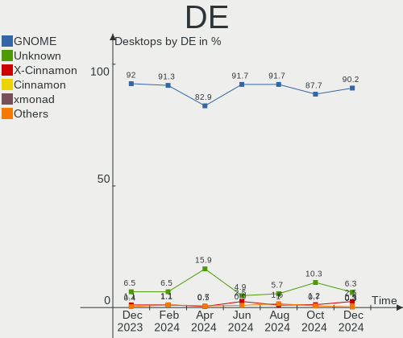
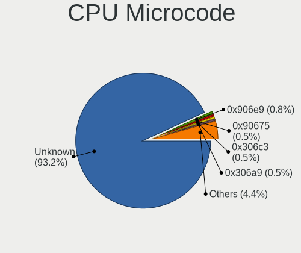

Ubuntu Hardware Trends (Desktop)
--------------------------------

A project to identify most popular hardware characteristics and track their change
over time based on data collected by Ubuntu users at https://Linux-Hardware.org.

Anyone can contribute to the study by uploading probes of their computers by
the [hw-probe](https://github.com/linuxhw/hw-probe) tool:

    sudo -E hw-probe -all -upload

Full-feature report is available here: https://linux-hardware.org/?view=trends&formfactor=desktop

Period: Apr, 2021.

Contents
--------

- [ OS                       ](#os)
- [ OS Family                ](#os-family)
- [ Kernel                   ](#kernel)
- [ Kernel Family            ](#kernel-family)
- [ Kernel Major Ver.        ](#kernel-major-ver)
- [ Arch                     ](#arch)
- [ DE                       ](#de)
- [ Display Server           ](#display-server)
- [ Display Manager          ](#display-manager)
- [ OS Lang                  ](#os-lang)
- [ Boot Mode                ](#boot-mode)
- [ Filesystem               ](#filesystem)
- [ Part. scheme             ](#part-scheme)
- [ Dual Boot with Linux/BSD ](#dual-boot-with-linux/bsd)
- [ Dual Boot (Win)          ](#dual-boot-win)
- [ Country                  ](#country)
- [ City                     ](#city)
- [ Vendor                   ](#vendor)
- [ Model                    ](#model)
- [ Model Family             ](#model-family)
- [ MFG Year                 ](#mfg-year)
- [ Form Factor              ](#form-factor)
- [ Secure Boot              ](#secure-boot)
- [ Coreboot                 ](#coreboot)
- [ RAM Size                 ](#ram-size)
- [ RAM Used                 ](#ram-used)
- [ Has CD-ROM               ](#has-cd-rom)
- [ Total Drives             ](#total-drives)
- [ Has Ethernet             ](#has-ethernet)
- [ Has WiFi                 ](#has-wifi)
- [ Has Bluetooth            ](#has-bluetooth)
- [ Drive Vendor             ](#drive-vendor)
- [ Drive Model              ](#drive-model)
- [ HDD Vendor               ](#hdd-vendor)
- [ SSD Vendor               ](#ssd-vendor)
- [ Drive Kind               ](#drive-kind)
- [ Drive Connector          ](#drive-connector)
- [ Drive Size               ](#drive-size)
- [ Space Total              ](#space-total)
- [ Space Used               ](#space-used)
- [ Malfunc. Drives          ](#malfunc-drives)
- [ Malfunc. Drive Vendor    ](#malfunc-drive-vendor)
- [ Malfunc. HDD Vendor      ](#malfunc-hdd-vendor)
- [ Malfunc. Drive Kind      ](#malfunc-drive-kind)
- [ Failed Drives            ](#failed-drives)
- [ Failed Drive Vendor      ](#failed-drive-vendor)
- [ Drive Status             ](#drive-status)
- [ Storage Vendor           ](#storage-vendor)
- [ Storage Model            ](#storage-model)
- [ Storage Kind             ](#storage-kind)
- [ CPU Vendor               ](#cpu-vendor)
- [ CPU Model                ](#cpu-model)
- [ CPU Model Family         ](#cpu-model-family)
- [ CPU Cores                ](#cpu-cores)
- [ CPU Sockets              ](#cpu-sockets)
- [ CPU Threads              ](#cpu-threads)
- [ CPU Op-Modes             ](#cpu-op-modes)
- [ CPU Microcode            ](#cpu-microcode)
- [ CPU Microarch            ](#cpu-microarch)
- [ GPU Vendor               ](#gpu-vendor)
- [ GPU Model                ](#gpu-model)
- [ GPU Combo                ](#gpu-combo)
- [ GPU Driver               ](#gpu-driver)
- [ GPU Memory               ](#gpu-memory)
- [ Monitor Vendor           ](#monitor-vendor)
- [ Monitor Model            ](#monitor-model)
- [ Monitor Resolution       ](#monitor-resolution)
- [ Monitor Diagonal         ](#monitor-diagonal)
- [ Monitor Width            ](#monitor-width)
- [ Aspect Ratio             ](#aspect-ratio)
- [ Monitor Area             ](#monitor-area)
- [ Pixel Density            ](#pixel-density)
- [ Multiple Monitors        ](#multiple-monitors)
- [ Net Controller Vendor    ](#net-controller-vendor)
- [ Net Controller Model     ](#net-controller-model)
- [ Wireless Vendor          ](#wireless-vendor)
- [ Wireless Model           ](#wireless-model)
- [ Ethernet Vendor          ](#ethernet-vendor)
- [ Ethernet Model           ](#ethernet-model)
- [ Net Controller Kind      ](#net-controller-kind)
- [ Used Controller          ](#used-controller)
- [ NICs                     ](#nics)
- [ IPv6                     ](#ipv6)
- [ Memory Vendor            ](#memory-vendor)
- [ Memory Model             ](#memory-model)
- [ Memory Kind              ](#memory-kind)
- [ Memory Form Factor       ](#memory-form-factor)
- [ Memory Size              ](#memory-size)
- [ Memory Speed             ](#memory-speed)
- [ Sound Vendor             ](#sound-vendor)
- [ Sound Model              ](#sound-model)
- [ Camera Vendor            ](#camera-vendor)
- [ Camera Model             ](#camera-model)
- [ Fingerprint Vendor       ](#fingerprint-vendor)
- [ Fingerprint Model        ](#fingerprint-model)
- [ Chipcard Vendor          ](#chipcard-vendor)
- [ Chipcard Model           ](#chipcard-model)
- [ Printer Vendor           ](#printer-vendor)
- [ Printer Model            ](#printer-model)
- [ Scanner Vendor           ](#scanner-vendor)
- [ Scanner Model            ](#scanner-model)
- [ Bluetooth Vendor         ](#bluetooth-vendor)
- [ Bluetooth Model          ](#bluetooth-model)
- [ Unsupported Devices      ](#unsupported-devices)
- [ Unsupported Device Types ](#unsupported-device-types)

OS
--

Installed operating systems

| Name         | Desktops | Percent |
|--------------|----------|---------|
| Ubuntu 20.04 | 394      | 68.17%  |
| Ubuntu 20.10 | 85       | 14.71%  |
| Ubuntu 18.04 | 60       | 10.38%  |
| Ubuntu 21.04 | 31       | 5.36%   |
| Ubuntu 16.04 | 5        | 0.87%   |
| Ubuntu 2020  | 1        | 0.17%   |
| Ubuntu 19.10 | 1        | 0.17%   |
| Ubuntu 10    | 1        | 0.17%   |

OS Family
---------

OS without a version

| Name   | Desktops | Percent |
|--------|----------|---------|
| Ubuntu | 578      | 100%    |

Kernel
------

Version of the Linux kernel

| Version                    | Desktops | Percent |
|----------------------------|----------|---------|
| 5.8.0-48-generic           | 162      | 28.03%  |
| 5.8.0-50-generic           | 134      | 23.18%  |
| 5.4.0-70-generic           | 53       | 9.17%   |
| 5.8.0-49-generic           | 43       | 7.44%   |
| 5.4.0-72-generic           | 38       | 6.57%   |
| 5.11.0-16-generic          | 21       | 3.63%   |
| 5.8.0-43-generic           | 15       | 2.6%    |
| 5.4.0-71-generic           | 11       | 1.9%    |
| 4.15.0-142-generic         | 7        | 1.21%   |
| 5.8.0-44-generic           | 6        | 1.04%   |
| 5.8.0-25-generic           | 5        | 0.87%   |
| 5.4.0-42-generic           | 5        | 0.87%   |
| 4.15.0-140-generic         | 5        | 0.87%   |
| 5.11.0-14-generic          | 4        | 0.69%   |
| 5.11.0-13-generic          | 4        | 0.69%   |
| 5.8.0-51-generic           | 3        | 0.52%   |
| 5.8.0-45-generic           | 3        | 0.52%   |
| 5.4.0-70-lowlatency        | 3        | 0.52%   |
| 5.4.0-26-generic           | 3        | 0.52%   |
| 5.9.0-050900-generic       | 2        | 0.35%   |
| 5.8.0-48-lowlatency        | 2        | 0.35%   |
| 5.8.0-41-generic           | 2        | 0.35%   |
| 5.4.0-66-generic           | 2        | 0.35%   |
| 5.4.0-65-generic           | 2        | 0.35%   |
| 5.4.0-48-generic           | 2        | 0.35%   |
| 5.11.15-051115-generic     | 2        | 0.35%   |
| 5.11.0-051100-generic      | 2        | 0.35%   |
| 5.10.0-1023-oem            | 2        | 0.35%   |
| 5.8.0-50-lowlatency        | 1        | 0.17%   |
| 5.8.0-1028-gcp             | 1        | 0.17%   |
| 5.7.15-050715-generic      | 1        | 0.17%   |
| 5.4.0-73-generic           | 1        | 0.17%   |
| 5.4.0-67-generic           | 1        | 0.17%   |
| 5.4.0-662102030405-generic | 1        | 0.17%   |
| 5.4.0-62-generic           | 1        | 0.17%   |
| 5.4.0-58-generic           | 1        | 0.17%   |
| 5.4.0-53-generic           | 1        | 0.17%   |
| 5.4.0-52-generic           | 1        | 0.17%   |
| 5.4.0-51-generic           | 1        | 0.17%   |
| 5.4.0-45-generic           | 1        | 0.17%   |
| 5.4.0-40-generic           | 1        | 0.17%   |
| 5.3.0-64-generic           | 1        | 0.17%   |
| 5.2.21-050221-generic      | 1        | 0.17%   |
| 5.12.0-051200rc7-generic   | 1        | 0.17%   |
| 5.11.8-051108-generic      | 1        | 0.17%   |
| 5.11.11-051111-generic     | 1        | 0.17%   |
| 5.11.10-051110-generic     | 1        | 0.17%   |
| 5.11.0-051100rc3-generic   | 1        | 0.17%   |
| 5.10.26-051026-generic     | 1        | 0.17%   |
| 5.10.0-1016-oem            | 1        | 0.17%   |
| 5.0.0-23-generic           | 1        | 0.17%   |
| 4.4.0-1128-aws             | 1        | 0.17%   |
| 4.2.8                      | 1        | 0.17%   |
| 4.18.0-16-generic          | 1        | 0.17%   |
| 4.17.3-041703-generic      | 1        | 0.17%   |
| 4.15.0-92-generic          | 1        | 0.17%   |
| 4.15.0-45-generic          | 1        | 0.17%   |
| 4.15.0-43-generic          | 1        | 0.17%   |
| 4.15.0-42-generic          | 1        | 0.17%   |
| 4.15.0-20-generic          | 1        | 0.17%   |

Kernel Family
-------------

Linux kernel without a distro release

| Version | Desktops | Percent |
|---------|----------|---------|
| 5.8.0   | 377      | 65.22%  |
| 5.4.0   | 129      | 22.32%  |
| 5.11.0  | 32       | 5.54%   |
| 4.15.0  | 20       | 3.46%   |
| 5.10.0  | 3        | 0.52%   |
| 5.9.0   | 2        | 0.35%   |
| 5.11.15 | 2        | 0.35%   |
| 5.7.15  | 1        | 0.17%   |
| 5.3.0   | 1        | 0.17%   |
| 5.2.21  | 1        | 0.17%   |
| 5.12.0  | 1        | 0.17%   |
| 5.11.8  | 1        | 0.17%   |
| 5.11.11 | 1        | 0.17%   |
| 5.11.10 | 1        | 0.17%   |
| 5.10.26 | 1        | 0.17%   |
| 5.0.0   | 1        | 0.17%   |
| 4.4.0   | 1        | 0.17%   |
| 4.2.8   | 1        | 0.17%   |
| 4.18.0  | 1        | 0.17%   |
| 4.17.3  | 1        | 0.17%   |

Kernel Major Ver.
-----------------

Linux kernel major version

| Version | Desktops | Percent |
|---------|----------|---------|
| 5.8     | 377      | 65.22%  |
| 5.4     | 129      | 22.32%  |
| 5.11    | 37       | 6.4%    |
| 4.15    | 20       | 3.46%   |
| 5.10    | 4        | 0.69%   |
| 5.9     | 2        | 0.35%   |
| 5.7     | 1        | 0.17%   |
| 5.3     | 1        | 0.17%   |
| 5.2     | 1        | 0.17%   |
| 5.12    | 1        | 0.17%   |
| 5.0     | 1        | 0.17%   |
| 4.4     | 1        | 0.17%   |
| 4.2     | 1        | 0.17%   |
| 4.18    | 1        | 0.17%   |
| 4.17    | 1        | 0.17%   |

Arch
----

OS architecture (x86_64, i586, etc.)

| Name   | Desktops | Percent |
|--------|----------|---------|
| x86_64 | 570      | 98.62%  |
| i686   | 8        | 1.38%   |

DE
--

Desktop Environment

| Name            | Desktops | Percent |
|-----------------|----------|---------|
| GNOME           | 490      | 84.78%  |
| Unknown         | 67       | 11.59%  |
| Unity           | 9        | 1.56%   |
| X-Cinnamon      | 4        | 0.69%   |
| GNOME Flashback | 3        | 0.52%   |
| xmonad          | 1        | 0.17%   |
| i3              | 1        | 0.17%   |
| GNUstep         | 1        | 0.17%   |
| enlightenment   | 1        | 0.17%   |
| Deepin          | 1        | 0.17%   |

Display Server
--------------

X11 or Wayland

| Name    | Desktops | Percent |
|---------|----------|---------|
| X11     | 496      | 85.81%  |
| Wayland | 35       | 6.06%   |
| Unknown | 33       | 5.71%   |
| Tty     | 14       | 2.42%   |

Display Manager
---------------

SDDM, LightDM, etc.

| Name    | Desktops | Percent |
|---------|----------|---------|
| Unknown | 480      | 83.04%  |
| GDM     | 90       | 15.57%  |
| TDM     | 7        | 1.21%   |
| LightDM | 1        | 0.17%   |

OS Lang
-------

Language

| Lang    | Desktops | Percent |
|---------|----------|---------|
| en_US   | 208      | 35.99%  |
| de_DE   | 53       | 9.17%   |
| fr_FR   | 42       | 7.27%   |
| en_GB   | 36       | 6.23%   |
| pt_BR   | 31       | 5.36%   |
| it_IT   | 19       | 3.29%   |
| pl_PL   | 18       | 3.11%   |
| es_ES   | 18       | 3.11%   |
| ru_RU   | 15       | 2.6%    |
| en_CA   | 15       | 2.6%    |
| en_AU   | 9        | 1.56%   |
| C       | 9        | 1.56%   |
| nl_NL   | 7        | 1.21%   |
| ro_RO   | 6        | 1.04%   |
| ja_JP   | 6        | 1.04%   |
| fr_BE   | 6        | 1.04%   |
| en_IN   | 6        | 1.04%   |
| pt_PT   | 5        | 0.87%   |
| hu_HU   | 5        | 0.87%   |
| ko_KR   | 4        | 0.69%   |
| es_AR   | 4        | 0.69%   |
| de_CH   | 4        | 0.69%   |
| cs_CZ   | 4        | 0.69%   |
| Unknown | 4        | 0.69%   |
| zh_TW   | 3        | 0.52%   |
| sv_SE   | 3        | 0.52%   |
| ru_UA   | 3        | 0.52%   |
| es_MX   | 3        | 0.52%   |
| en_IL   | 3        | 0.52%   |
| el_GR   | 3        | 0.52%   |
| ca_ES   | 3        | 0.52%   |
| tr_TR   | 2        | 0.35%   |
| nl_BE   | 2        | 0.35%   |
| fr_CA   | 2        | 0.35%   |
| en_SG   | 2        | 0.35%   |
| en_NZ   | 2        | 0.35%   |
| de_AT   | 2        | 0.35%   |
| sl_SI   | 1        | 0.17%   |
| sk_SK   | 1        | 0.17%   |
| nn_NO   | 1        | 0.17%   |
| nb_NO   | 1        | 0.17%   |
| hr_HR   | 1        | 0.17%   |
| fi_FI   | 1        | 0.17%   |
| es_UY   | 1        | 0.17%   |
| es_PE   | 1        | 0.17%   |
| es_EC   | 1        | 0.17%   |
| es_CR   | 1        | 0.17%   |
| es_CO   | 1        | 0.17%   |

Boot Mode
---------

EFI or BIOS

| Mode | Desktops | Percent |
|------|----------|---------|
| BIOS | 391      | 67.65%  |
| EFI  | 187      | 32.35%  |

Filesystem
----------

Type of filesystem

| Type    | Desktops | Percent |
|---------|----------|---------|
| Ext4    | 545      | 94.29%  |
| Overlay | 16       | 2.77%   |
| Zfs     | 9        | 1.56%   |
| Btrfs   | 3        | 0.52%   |
| Xfs     | 2        | 0.35%   |
| Ext3    | 2        | 0.35%   |
| Ext2    | 1        | 0.17%   |

Part. scheme
------------

Scheme of partitioning

| Type    | Desktops | Percent |
|---------|----------|---------|
| Unknown | 473      | 81.83%  |
| GPT     | 76       | 13.15%  |
| MBR     | 29       | 5.02%   |

Dual Boot with Linux/BSD
------------------------

Hosting more than one Linux/BSD

| Dual boot | Desktops | Percent |
|-----------|----------|---------|
| No        | 466      | 80.62%  |
| Yes       | 112      | 19.38%  |

Dual Boot (Win)
---------------

Hosting Linux and Windows

| Dual boot | Desktops | Percent |
|-----------|----------|---------|
| No        | 340      | 58.82%  |
| Yes       | 238      | 41.18%  |

Country
-------

Geographic location (country)

| Country     | Desktops | Percent |
|-------------|----------|---------|
| USA         | 106      | 18.34%  |
| Germany     | 64       | 11.07%  |
| France      | 42       | 7.27%   |
| Brazil      | 40       | 6.92%   |
| UK          | 31       | 5.36%   |
| Italy       | 24       | 4.15%   |
| Spain       | 21       | 3.63%   |
| Russia      | 20       | 3.46%   |
| Netherlands | 19       | 3.29%   |
| Canada      | 18       | 3.11%   |
| Poland      | 17       | 2.94%   |
| India       | 10       | 1.73%   |
| Belgium     | 10       | 1.73%   |
| Australia   | 9        | 1.56%   |
| Ukraine     | 8        | 1.38%   |
| Switzerland | 8        | 1.38%   |
| Romania     | 8        | 1.38%   |
| Czechia     | 8        | 1.38%   |
| Israel      | 7        | 1.21%   |
| Portugal    | 6        | 1.04%   |
| Mexico      | 6        | 1.04%   |
| Japan       | 6        | 1.04%   |
| Turkey      | 5        | 0.87%   |
| Sweden      | 5        | 0.87%   |
| Hungary     | 5        | 0.87%   |
| Greece      | 5        | 0.87%   |
| Argentina   | 5        | 0.87%   |
| South Korea | 4        | 0.69%   |
| Norway      | 4        | 0.69%   |
| New Zealand | 4        | 0.69%   |
| Bulgaria    | 4        | 0.69%   |
| Austria     | 4        | 0.69%   |
| Taiwan      | 3        | 0.52%   |
| Singapore   | 3        | 0.52%   |
| Colombia    | 3        | 0.52%   |
| China       | 3        | 0.52%   |
| Slovakia    | 2        | 0.35%   |
| Malaysia    | 2        | 0.35%   |
| Indonesia   | 2        | 0.35%   |
| Finland     | 2        | 0.35%   |
| Ecuador     | 2        | 0.35%   |
| Costa Rica  | 2        | 0.35%   |
| Belarus     | 2        | 0.35%   |
| Algeria     | 2        | 0.35%   |
| Vietnam     | 1        | 0.17%   |
| Uruguay     | 1        | 0.17%   |
| Slovenia    | 1        | 0.17%   |
| Serbia      | 1        | 0.17%   |
| Puerto Rico | 1        | 0.17%   |
| Peru        | 1        | 0.17%   |
| Pakistan    | 1        | 0.17%   |
| Nepal       | 1        | 0.17%   |
| Mauritius   | 1        | 0.17%   |
| Iran        | 1        | 0.17%   |
| Ghana       | 1        | 0.17%   |
| Georgia     | 1        | 0.17%   |
| Denmark     | 1        | 0.17%   |
| Cyprus      | 1        | 0.17%   |
| Croatia     | 1        | 0.17%   |
| Chile       | 1        | 0.17%   |

City
----

Geographic location (city)

| City              | Desktops | Percent |
|-------------------|----------|---------|
| Berlin            | 7        | 1.21%   |
| São Paulo        | 6        | 1.04%   |
| London            | 6        | 1.04%   |
| Hamburg           | 6        | 1.04%   |
| Prague            | 5        | 0.87%   |
| Moscow            | 5        | 0.87%   |
| Montreal          | 5        | 0.87%   |
| Tel Aviv          | 4        | 0.69%   |
| Campinas          | 4        | 0.69%   |
| Athens            | 4        | 0.69%   |
| Vienna            | 3        | 0.52%   |
| Sydney            | 3        | 0.52%   |
| Singapore         | 3        | 0.52%   |
| Rotterdam         | 3        | 0.52%   |
| Rome              | 3        | 0.52%   |
| Rochester         | 3        | 0.52%   |
| Mumbai            | 3        | 0.52%   |
| Madrid            | 3        | 0.52%   |
| Lisbon            | 3        | 0.52%   |
| Brussels          | 3        | 0.52%   |
| Yokohama          | 2        | 0.35%   |
| Washington        | 2        | 0.35%   |
| Turin             | 2        | 0.35%   |
| Toulouse          | 2        | 0.35%   |
| Seongnam-si       | 2        | 0.35%   |
| Santo André      | 2        | 0.35%   |
| Rheinfelden       | 2        | 0.35%   |
| Recife            | 2        | 0.35%   |
| Preston           | 2        | 0.35%   |
| Nice              | 2        | 0.35%   |
| Munich            | 2        | 0.35%   |
| Minneapolis       | 2        | 0.35%   |
| Lyon              | 2        | 0.35%   |
| Košice           | 2        | 0.35%   |
| Istanbul          | 2        | 0.35%   |
| Houston           | 2        | 0.35%   |
| Hagen             | 2        | 0.35%   |
| Groningen         | 2        | 0.35%   |
| Gdansk            | 2        | 0.35%   |
| Fortaleza         | 2        | 0.35%   |
| Fort Worth        | 2        | 0.35%   |
| Düsseldorf       | 2        | 0.35%   |
| Denver            | 2        | 0.35%   |
| Circasia          | 2        | 0.35%   |
| Calgary           | 2        | 0.35%   |
| Budapest          | 2        | 0.35%   |
| Bucharest         | 2        | 0.35%   |
| Bristol           | 2        | 0.35%   |
| Belfort           | 2        | 0.35%   |
| Barcelona         | 2        | 0.35%   |
| Arcueil           | 2        | 0.35%   |
| Ankara            | 2        | 0.35%   |
| Amsterdam         | 2        | 0.35%   |
| Albuquerque       | 2        | 0.35%   |
| Świętochłowice | 1        | 0.17%   |
| Zurich            | 1        | 0.17%   |
| Zittau            | 1        | 0.17%   |
| Zheleznogorsk     | 1        | 0.17%   |
| Zdanice           | 1        | 0.17%   |
| Zaragoza          | 1        | 0.17%   |

Vendor
------

Motherboard manufacturer

| Name                                   | Desktops | Percent |
|----------------------------------------|----------|---------|
| ASUSTek Computer                       | 128      | 22.15%  |
| Gigabyte Technology                    | 102      | 17.65%  |
| Dell                                   | 71       | 12.28%  |
| MSI                                    | 59       | 10.21%  |
| ASRock                                 | 58       | 10.03%  |
| Hewlett-Packard                        | 44       | 7.61%   |
| Lenovo                                 | 27       | 4.67%   |
| Intel                                  | 17       | 2.94%   |
| Acer                                   | 12       | 2.08%   |
| Fujitsu                                | 8        | 1.38%   |
| Unknown                                | 8        | 1.38%   |
| Pegatron                               | 6        | 1.04%   |
| ECS                                    | 6        | 1.04%   |
| Medion                                 | 4        | 0.69%   |
| Biostar                                | 3        | 0.52%   |
| IBM                                    | 2        | 0.35%   |
| Foxconn                                | 2        | 0.35%   |
| Desenvolvido para Positivo Informatica | 2        | 0.35%   |
| Apple                                  | 2        | 0.35%   |
| Wistron                                | 1        | 0.17%   |
| Varian Medical Systems                 | 1        | 0.17%   |
| Shuttle                                | 1        | 0.17%   |
| PCWare                                 | 1        | 0.17%   |
| Packard Bell                           | 1        | 0.17%   |
| OEM_MB                                 | 1        | 0.17%   |
| LattePanda                             | 1        | 0.17%   |
| Huanan                                 | 1        | 0.17%   |
| Gateway                                | 1        | 0.17%   |
| eMachines                              | 1        | 0.17%   |
| ELSKY                                  | 1        | 0.17%   |
| Colorful Technology                    | 1        | 0.17%   |
| Chuwi                                  | 1        | 0.17%   |
| CENTRIUM                               | 1        | 0.17%   |
| ASRockRack                             | 1        | 0.17%   |
| AMI                                    | 1        | 0.17%   |
| Alienware                              | 1        | 0.17%   |

Model
-----

Motherboard model

| Name                                               | Desktops | Percent |
|----------------------------------------------------|----------|---------|
| ASUS All Series                                    | 12       | 2.08%   |
| Unknown                                            | 8        | 1.38%   |
| Dell OptiPlex 790                                  | 6        | 1.04%   |
| Dell OptiPlex 7010                                 | 5        | 0.87%   |
| Gigabyte GA-78LMT-USB3 6.0                         | 4        | 0.69%   |
| MSI MS-7C35                                        | 3        | 0.52%   |
| MSI MS-7C02                                        | 3        | 0.52%   |
| MSI MS-7A34                                        | 3        | 0.52%   |
| HP Z400 Workstation                                | 3        | 0.52%   |
| HP Compaq 8200 Elite CMT PC                        | 3        | 0.52%   |
| Gigabyte X399 AORUS PRO                            | 3        | 0.52%   |
| Gigabyte 990FXA-UD3                                | 3        | 0.52%   |
| Dell OptiPlex 990                                  | 3        | 0.52%   |
| Dell OptiPlex 9010                                 | 3        | 0.52%   |
| Dell OptiPlex 780                                  | 3        | 0.52%   |
| ASUS M4N68T-M-LE-V2                                | 3        | 0.52%   |
| ASRock AB350 Pro4                                  | 3        | 0.52%   |
| ASRock A320M-HDV R4.0                              | 3        | 0.52%   |
| MSI MS-7C37                                        | 2        | 0.35%   |
| MSI MS-7B98                                        | 2        | 0.35%   |
| MSI MS-7B89                                        | 2        | 0.35%   |
| MSI MS-7B86                                        | 2        | 0.35%   |
| MSI MS-7B79                                        | 2        | 0.35%   |
| MSI MS-7851                                        | 2        | 0.35%   |
| MSI MS-7850                                        | 2        | 0.35%   |
| MSI MS-7693                                        | 2        | 0.35%   |
| Intel H61M-DS2                                     | 2        | 0.35%   |
| Intel B75                                          | 2        | 0.35%   |
| HP Z440 Workstation                                | 2        | 0.35%   |
| HP ProLiant ML350 G6                               | 2        | 0.35%   |
| HP Compaq Pro 6300 SFF                             | 2        | 0.35%   |
| HP Compaq 8100 Elite SFF PC                        | 2        | 0.35%   |
| HP Compaq 6200 Pro MT PC                           | 2        | 0.35%   |
| Gigabyte Z97-HD3                                   | 2        | 0.35%   |
| Gigabyte Z77-D3H                                   | 2        | 0.35%   |
| Gigabyte G31M-ES2L                                 | 2        | 0.35%   |
| Gigabyte B75M-D3H                                  | 2        | 0.35%   |
| Gigabyte B450 AORUS M                              | 2        | 0.35%   |
| Gigabyte B360 HD3P-LM                              | 2        | 0.35%   |
| Gigabyte A320M-S2H V2                              | 2        | 0.35%   |
| Gigabyte A320M-S2H                                 | 2        | 0.35%   |
| Fujitsu ESPRIMO P720                               | 2        | 0.35%   |
| Desenvolvido para Positivo Informatica POS-MI945AA | 2        | 0.35%   |
| Dell OptiPlex 9020                                 | 2        | 0.35%   |
| Dell OptiPlex 755                                  | 2        | 0.35%   |
| Dell OptiPlex 7040                                 | 2        | 0.35%   |
| Dell OptiPlex 390                                  | 2        | 0.35%   |
| Dell OptiPlex 3020                                 | 2        | 0.35%   |
| Dell OptiPlex 3010                                 | 2        | 0.35%   |
| Dell Inspiron 660s                                 | 2        | 0.35%   |
| Dell Inspiron 5675                                 | 2        | 0.35%   |
| ASUS TUF Z390-PLUS GAMING                          | 2        | 0.35%   |
| ASUS TUF GAMING X570-PLUS                          | 2        | 0.35%   |
| ASUS ROG STRIX X470-F GAMING                       | 2        | 0.35%   |
| ASUS ROG STRIX B450-F GAMING                       | 2        | 0.35%   |
| ASUS PRIME B350-PLUS                               | 2        | 0.35%   |
| ASUS PRIME A320M-K                                 | 2        | 0.35%   |
| ASUS P5Q DELUXE                                    | 2        | 0.35%   |
| ASUS P5GC-MX/1333                                  | 2        | 0.35%   |
| ASUS M5A99X EVO R2.0                               | 2        | 0.35%   |

Model Family
------------

Motherboard model prefix

| Name                   | Desktops | Percent |
|------------------------|----------|---------|
| Dell OptiPlex          | 42       | 7.27%   |
| ASUS PRIME             | 21       | 3.63%   |
| HP Compaq              | 20       | 3.46%   |
| Lenovo ThinkCentre     | 18       | 3.11%   |
| ASUS All               | 12       | 2.08%   |
| ASUS ROG               | 11       | 1.9%    |
| Dell Precision         | 9        | 1.56%   |
| Dell Inspiron          | 8        | 1.38%   |
| Acer Aspire            | 8        | 1.38%   |
| Unknown                | 8        | 1.38%   |
| ASUS TUF               | 7        | 1.21%   |
| Gigabyte GA-78LMT-USB3 | 6        | 1.04%   |
| Fujitsu ESPRIMO        | 6        | 1.04%   |
| Dell Vostro            | 6        | 1.04%   |
| Gigabyte A320M-S2H     | 4        | 0.69%   |
| Gigabyte 990FXA-UD3    | 4        | 0.69%   |
| ASUS M5A97             | 4        | 0.69%   |
| ASRock B550            | 4        | 0.69%   |
| ASRock AB350           | 4        | 0.69%   |
| MSI MS-7C35            | 3        | 0.52%   |
| MSI MS-7C02            | 3        | 0.52%   |
| MSI MS-7A34            | 3        | 0.52%   |
| HP Z400                | 3        | 0.52%   |
| HP ProLiant            | 3        | 0.52%   |
| HP ProDesk             | 3        | 0.52%   |
| Gigabyte X399          | 3        | 0.52%   |
| Gigabyte B550          | 3        | 0.52%   |
| Gigabyte B450          | 3        | 0.52%   |
| Dell PowerEdge         | 3        | 0.52%   |
| ASUS P8H61-M           | 3        | 0.52%   |
| ASUS M5A78L-M          | 3        | 0.52%   |
| ASUS M4N68T-M-LE-V2    | 3        | 0.52%   |
| ASRock B450M           | 3        | 0.52%   |
| ASRock B450            | 3        | 0.52%   |
| ASRock A320M-HDV       | 3        | 0.52%   |
| Acer Veriton           | 3        | 0.52%   |
| MSI MS-7C37            | 2        | 0.35%   |
| MSI MS-7B98            | 2        | 0.35%   |
| MSI MS-7B89            | 2        | 0.35%   |
| MSI MS-7B86            | 2        | 0.35%   |
| MSI MS-7B79            | 2        | 0.35%   |
| MSI MS-7851            | 2        | 0.35%   |
| MSI MS-7850            | 2        | 0.35%   |
| MSI MS-7693            | 2        | 0.35%   |
| Intel H61M-DS2         | 2        | 0.35%   |
| Intel B75              | 2        | 0.35%   |
| HP Z440                | 2        | 0.35%   |
| HP Pavilion            | 2        | 0.35%   |
| Gigabyte Z97X-Gaming   | 2        | 0.35%   |
| Gigabyte Z97-HD3       | 2        | 0.35%   |
| Gigabyte Z77-D3H       | 2        | 0.35%   |
| Gigabyte Z490          | 2        | 0.35%   |
| Gigabyte Z390          | 2        | 0.35%   |
| Gigabyte X470          | 2        | 0.35%   |
| Gigabyte G31M-ES2L     | 2        | 0.35%   |
| Gigabyte B75M-D3H      | 2        | 0.35%   |
| Gigabyte B560M         | 2        | 0.35%   |
| Gigabyte B550M         | 2        | 0.35%   |
| Gigabyte B450M         | 2        | 0.35%   |
| Gigabyte B360          | 2        | 0.35%   |

MFG Year
--------

Motherboard manufacture year

| Year    | Desktops | Percent |
|---------|----------|---------|
| 2020    | 74       | 12.8%   |
| 2018    | 63       | 10.9%   |
| 2019    | 50       | 8.65%   |
| 2013    | 47       | 8.13%   |
| 2014    | 45       | 7.79%   |
| 2010    | 41       | 7.09%   |
| 2011    | 39       | 6.75%   |
| 2012    | 38       | 6.57%   |
| 2015    | 34       | 5.88%   |
| 2021    | 28       | 4.84%   |
| 2016    | 28       | 4.84%   |
| 2009    | 25       | 4.33%   |
| 2008    | 20       | 3.46%   |
| 2007    | 19       | 3.29%   |
| 2017    | 17       | 2.94%   |
| 2006    | 5        | 0.87%   |
| 2005    | 3        | 0.52%   |
| Unknown | 2        | 0.35%   |

Form Factor
-----------

Physical design of the computer

| Name    | Desktops | Percent |
|---------|----------|---------|
| Desktop | 578      | 100%    |

Secure Boot
-----------

Enabled or disabled

| State    | Desktops | Percent |
|----------|----------|---------|
| Disabled | 561      | 97.06%  |
| Enabled  | 17       | 2.94%   |

Coreboot
--------

Have coreboot on board

| Used | Desktops | Percent |
|------|----------|---------|
| No   | 578      | 100%    |

RAM Size
--------

Total RAM memory

| Size in GB  | Desktops | Percent |
|-------------|----------|---------|
| 16.01-24.0  | 123      | 21.28%  |
| 3.01-4.0    | 119      | 20.59%  |
| 8.01-16.0   | 114      | 19.72%  |
| 4.01-8.0    | 85       | 14.71%  |
| 32.01-64.0  | 66       | 11.42%  |
| 64.01-256.0 | 25       | 4.33%   |
| 1.01-2.0    | 21       | 3.63%   |
| 24.01-32.0  | 14       | 2.42%   |
| 2.01-3.0    | 8        | 1.38%   |
| 0.51-1.0    | 3        | 0.52%   |

RAM Used
--------

Used RAM memory

| Used GB    | Desktops | Percent |
|------------|----------|---------|
| 1.01-2.0   | 238      | 41.18%  |
| 2.01-3.0   | 130      | 22.49%  |
| 3.01-4.0   | 83       | 14.36%  |
| 4.01-8.0   | 72       | 12.46%  |
| 0.51-1.0   | 23       | 3.98%   |
| 8.01-16.0  | 20       | 3.46%   |
| 16.01-24.0 | 5        | 0.87%   |
| 0.01-0.5   | 4        | 0.69%   |
| 32.01-64.0 | 2        | 0.35%   |
| 24.01-32.0 | 1        | 0.17%   |

Has CD-ROM
----------

Has CD-ROM on board

| Presented | Desktops | Percent |
|-----------|----------|---------|
| No        | 290      | 50.17%  |
| Yes       | 288      | 49.83%  |

Total Drives
------------

Number of drives on board

| Drives | Desktops | Percent |
|--------|----------|---------|
| 1      | 234      | 40.48%  |
| 2      | 172      | 29.76%  |
| 3      | 79       | 13.67%  |
| 4      | 47       | 8.13%   |
| 5      | 20       | 3.46%   |
| 6      | 10       | 1.73%   |
| 0      | 9        | 1.56%   |
| 7      | 5        | 0.87%   |
| 16     | 1        | 0.17%   |
| 8      | 1        | 0.17%   |

Has Ethernet
------------

Has Ethernet on board

| Presented | Desktops | Percent |
|-----------|----------|---------|
| Yes       | 574      | 99.31%  |
| No        | 4        | 0.69%   |

Has WiFi
--------

Has WiFi module

| Presented | Desktops | Percent |
|-----------|----------|---------|
| No        | 326      | 56.4%   |
| Yes       | 252      | 43.6%   |

Has Bluetooth
-------------

Has Bluetooth module

| Presented | Desktops | Percent |
|-----------|----------|---------|
| No        | 433      | 74.91%  |
| Yes       | 145      | 25.09%  |

Drive Vendor
------------

Hard drive vendors

| Vendor                    | Desktops | Drives | Percent |
|---------------------------|----------|--------|---------|
| Seagate                   | 202      | 265    | 21.13%  |
| WDC                       | 198      | 262    | 20.71%  |
| Samsung Electronics       | 127      | 167    | 13.28%  |
| Kingston                  | 64       | 72     | 6.69%   |
| Toshiba                   | 54       | 59     | 5.65%   |
| Hitachi                   | 40       | 45     | 4.18%   |
| Crucial                   | 37       | 39     | 3.87%   |
| SanDisk                   | 35       | 41     | 3.66%   |
| Maxtor                    | 17       | 19     | 1.78%   |
| Unknown                   | 14       | 18     | 1.46%   |
| PNY                       | 10       | 12     | 1.05%   |
| Phison                    | 10       | 11     | 1.05%   |
| Intel                     | 9        | 12     | 0.94%   |
| A-DATA Technology         | 9        | 11     | 0.94%   |
| XPG                       | 8        | 8      | 0.84%   |
| Micron Technology         | 8        | 8      | 0.84%   |
| HGST                      | 7        | 7      | 0.73%   |
| China                     | 7        | 7      | 0.73%   |
| Micron/Crucial Technology | 6        | 7      | 0.63%   |
| SK Hynix                  | 5        | 5      | 0.52%   |
| GOODRAM                   | 5        | 5      | 0.52%   |
| Corsair                   | 5        | 5      | 0.52%   |
| Transcend                 | 4        | 4      | 0.42%   |
| Silicon Motion            | 4        | 4      | 0.42%   |
| SPCC                      | 3        | 3      | 0.31%   |
| PLEXTOR                   | 3        | 4      | 0.31%   |
| Mushkin                   | 3        | 3      | 0.31%   |
| LITEON                    | 3        | 3      | 0.31%   |
| ExcelStor                 | 3        | 3      | 0.31%   |
| ASMT                      | 3        | 5      | 0.31%   |
| Team                      | 2        | 3      | 0.21%   |
| Sabrent                   | 2        | 2      | 0.21%   |
| Realtek Semiconductor     | 2        | 2      | 0.21%   |
| PNY USB                   | 2        | 2      | 0.21%   |
| OCZ                       | 2        | 2      | 0.21%   |
| Lexar                     | 2        | 2      | 0.21%   |
| LaCie                     | 2        | 2      | 0.21%   |
| KIOXIA-EXCERIA            | 2        | 2      | 0.21%   |
| Intenso                   | 2        | 2      | 0.21%   |
| Hewlett-Packard           | 2        | 2      | 0.21%   |
| Gigabyte Technology       | 2        | 2      | 0.21%   |
| Asmedia                   | 2        | 2      | 0.21%   |
| Apacer                    | 2        | 2      | 0.21%   |
| Verbatim                  | 1        | 1      | 0.1%    |
| TCSUNBOW                  | 1        | 1      | 0.1%    |
| ROG                       | 1        | 1      | 0.1%    |
| Phison Electronics        | 1        | 1      | 0.1%    |
| Patriot                   | 1        | 1      | 0.1%    |
| OWC                       | 1        | 1      | 0.1%    |
| OCZ-REVODRIVE             | 1        | 4      | 0.1%    |
| Netac                     | 1        | 1      | 0.1%    |
| MyDigitalSSD              | 1        | 1      | 0.1%    |
| MATSHITA                  | 1        | 1      | 0.1%    |
| LITEONIT                  | 1        | 1      | 0.1%    |
| Lite-On                   | 1        | 1      | 0.1%    |
| Lenovo                    | 1        | 1      | 0.1%    |
| KLEVV                     | 1        | 1      | 0.1%    |
| KIOXIA                    | 1        | 1      | 0.1%    |
| KingDian                  | 1        | 1      | 0.1%    |
| KINGBANK                  | 1        | 1      | 0.1%    |

Drive Model
-----------

Hard drive models

| Model                               | Desktops | Percent |
|-------------------------------------|----------|---------|
| Seagate ST1000DM010-2EP102 1TB      | 20       | 1.82%   |
| Seagate ST500DM002-1BD142 500GB     | 17       | 1.55%   |
| Samsung SSD 860 EVO 500GB           | 15       | 1.36%   |
| Kingston SA400S37240G 240GB SSD     | 14       | 1.27%   |
| Toshiba DT01ACA100 1TB              | 13       | 1.18%   |
| Seagate ST2000DM008-2FR102 2TB      | 13       | 1.18%   |
| Kingston SA400S37120G 120GB SSD     | 13       | 1.18%   |
| Samsung SSD 850 EVO 250GB           | 11       | 1%      |
| Toshiba HDWD110 1TB                 | 10       | 0.91%   |
| WDC WD10EZEX-08WN4A0 1TB            | 9        | 0.82%   |
| Seagate ST1000DM003-1CH162 1TB      | 9        | 0.82%   |
| Samsung NVMe SSD Drive 250GB        | 9        | 0.82%   |
| Samsung NVMe SSD Drive 500GB        | 8        | 0.73%   |
| Kingston SV300S37A120G 120GB SSD    | 8        | 0.73%   |
| Seagate ST3500418AS 500GB           | 7        | 0.64%   |
| Seagate ST1000DM003-1ER162 1TB      | 7        | 0.64%   |
| Samsung SSD 860 EVO 250GB           | 7        | 0.64%   |
| Crucial CT240BX500SSD1 240GB        | 7        | 0.64%   |
| Seagate ST250DM000-1BD141 250GB     | 6        | 0.55%   |
| Seagate ST2000DM001-1CH164 2TB      | 6        | 0.55%   |
| Kingston SUV400S37240G 240GB SSD    | 6        | 0.55%   |
| WDC WD10EZEX-00BN5A0 1TB            | 5        | 0.45%   |
| WDC WD10EARS-00Y5B1 1TB             | 5        | 0.45%   |
| Toshiba DT01ACA050 500GB            | 5        | 0.45%   |
| Seagate ST1000DM003-9YN162 1TB      | 5        | 0.45%   |
| Samsung SSD 850 EVO 500GB           | 5        | 0.45%   |
| Samsung NVMe SSD Drive 1TB          | 5        | 0.45%   |
| Samsung HD103SJ 1TB                 | 5        | 0.45%   |
| Kingston SV300S37A240G 240GB SSD    | 5        | 0.45%   |
| Kingston SA400S37480G 480GB SSD     | 5        | 0.45%   |
| Crucial CT480BX500SSD1 480GB        | 5        | 0.45%   |
| WDC WDS240G2G0A-00JH30 240GB SSD    | 4        | 0.36%   |
| WDC WD10EZEX-60ZF5A0 1TB            | 4        | 0.36%   |
| Seagate ST4000DM004-2CV104 4TB      | 4        | 0.36%   |
| Seagate ST3500413AS 500GB           | 4        | 0.36%   |
| Seagate ST1000LM024 HN-M101MBB 1TB  | 4        | 0.36%   |
| Seagate ST1000DM003-1SB10C 1TB      | 4        | 0.36%   |
| Seagate Expansion 4TB               | 4        | 0.36%   |
| Sandisk NVMe SSD Drive 500GB        | 4        | 0.36%   |
| Samsung SSD 970 EVO Plus 1TB        | 4        | 0.36%   |
| Samsung SSD 840 EVO 120GB           | 4        | 0.36%   |
| PNY CS900 500GB SSD                 | 4        | 0.36%   |
| Micron/Crucial NVMe SSD Drive 500GB | 4        | 0.36%   |
| MAXTOR STM3320613AS 320GB           | 4        | 0.36%   |
| XPG NVMe SSD Drive 256GB            | 3        | 0.27%   |
| WDC WDS500G2B0A-00SM50 500GB SSD    | 3        | 0.27%   |
| WDC WDS500G2B0A 500GB SSD           | 3        | 0.27%   |
| WDC WDS100T3X0C-00SJG0 1TB          | 3        | 0.27%   |
| WDC WD5000AAKX-75U6AA0 500GB        | 3        | 0.27%   |
| WDC WD5000AAKX-001CA0 500GB         | 3        | 0.27%   |
| WDC WD40PURZ-85TTDY0 4TB            | 3        | 0.27%   |
| WDC WD20EFRX-68EUZN0 2TB            | 3        | 0.27%   |
| WDC WD20EARS-00MVWB0 2TB            | 3        | 0.27%   |
| WDC WD10EZEX-75ZF5A0 1TB            | 3        | 0.27%   |
| WDC WD10EZEX-00RKKA0 1TB            | 3        | 0.27%   |
| WDC WD10EARS-22Y5B1 1TB             | 3        | 0.27%   |
| Unknown MMC Card  64GB              | 3        | 0.27%   |
| Toshiba MQ01ABF050 500GB            | 3        | 0.27%   |
| Seagate ST9500325AS 500GB           | 3        | 0.27%   |
| Seagate ST3500414CS 500GB           | 3        | 0.27%   |

HDD Vendor
----------

Hard disk drive vendors

| Vendor              | Desktops | Drives | Percent |
|---------------------|----------|--------|---------|
| Seagate             | 201      | 263    | 38.43%  |
| WDC                 | 178      | 230    | 34.03%  |
| Toshiba             | 48       | 52     | 9.18%   |
| Hitachi             | 40       | 45     | 7.65%   |
| Samsung Electronics | 23       | 32     | 4.4%    |
| Maxtor              | 16       | 18     | 3.06%   |
| HGST                | 7        | 7      | 1.34%   |
| ASMT                | 3        | 5      | 0.57%   |
| ExcelStor           | 2        | 2      | 0.38%   |
| Unknown             | 1        | 1      | 0.19%   |
| Sabrent             | 1        | 1      | 0.19%   |
| Fujitsu             | 1        | 1      | 0.19%   |
| Asmedia             | 1        | 1      | 0.19%   |
| Apple               | 1        | 1      | 0.19%   |

SSD Vendor
----------

Solid state drive vendors

| Vendor              | Desktops | Drives | Percent |
|---------------------|----------|--------|---------|
| Samsung Electronics | 78       | 87     | 23.64%  |
| Kingston            | 58       | 65     | 17.58%  |
| Crucial             | 35       | 37     | 10.61%  |
| SanDisk             | 30       | 31     | 9.09%   |
| WDC                 | 25       | 26     | 7.58%   |
| PNY                 | 9        | 11     | 2.73%   |
| Intel               | 8        | 10     | 2.42%   |
| China               | 7        | 7      | 2.12%   |
| A-DATA Technology   | 7        | 8      | 2.12%   |
| Micron Technology   | 6        | 6      | 1.82%   |
| GOODRAM             | 5        | 5      | 1.52%   |
| Transcend           | 4        | 4      | 1.21%   |
| Corsair             | 4        | 4      | 1.21%   |
| Unknown             | 3        | 4      | 0.91%   |
| Toshiba             | 3        | 4      | 0.91%   |
| SPCC                | 3        | 3      | 0.91%   |
| PLEXTOR             | 3        | 4      | 0.91%   |
| Mushkin             | 3        | 3      | 0.91%   |
| LITEON              | 3        | 3      | 0.91%   |
| PNY USB             | 2        | 2      | 0.61%   |
| OCZ                 | 2        | 2      | 0.61%   |
| Lexar               | 2        | 2      | 0.61%   |
| KIOXIA-EXCERIA      | 2        | 2      | 0.61%   |
| Hewlett-Packard     | 2        | 2      | 0.61%   |
| Gigabyte Technology | 2        | 2      | 0.61%   |
| Apacer              | 2        | 2      | 0.61%   |
| Verbatim            | 1        | 1      | 0.3%    |
| Team                | 1        | 2      | 0.3%    |
| SK Hynix            | 1        | 1      | 0.3%    |
| SABRENT             | 1        | 1      | 0.3%    |
| ROG                 | 1        | 1      | 0.3%    |
| Patriot             | 1        | 1      | 0.3%    |
| OWC                 | 1        | 1      | 0.3%    |
| OCZ-REVODRIVE       | 1        | 4      | 0.3%    |
| Netac               | 1        | 1      | 0.3%    |
| MyDigitalSSD        | 1        | 1      | 0.3%    |
| Maxtor              | 1        | 1      | 0.3%    |
| LITEONIT            | 1        | 1      | 0.3%    |
| KLEVV               | 1        | 1      | 0.3%    |
| KingDian            | 1        | 1      | 0.3%    |
| KINGBANK            | 1        | 1      | 0.3%    |
| Intenso             | 1        | 1      | 0.3%    |
| Integral            | 1        | 1      | 0.3%    |
| Hoodisk             | 1        | 1      | 0.3%    |
| EK                  | 1        | 1      | 0.3%    |
| DREVO               | 1        | 1      | 0.3%    |
| BAITITON            | 1        | 1      | 0.3%    |
| ASMedia             | 1        | 1      | 0.3%    |

Drive Kind
----------

HDD or SSD

| Kind    | Desktops | Drives | Percent |
|---------|----------|--------|---------|
| HDD     | 422      | 659    | 51.53%  |
| SSD     | 280      | 362    | 34.19%  |
| NVMe    | 97       | 127    | 11.84%  |
| Unknown | 15       | 18     | 1.83%   |
| MMC     | 5        | 5      | 0.61%   |

Drive Connector
---------------

SATA, SAS, NVMe, etc.

| Type | Desktops | Drives | Percent |
|------|----------|--------|---------|
| SATA | 534      | 991    | 80.18%  |
| NVMe | 97       | 127    | 14.56%  |
| SAS  | 30       | 48     | 4.5%    |
| MMC  | 5        | 5      | 0.75%   |

Drive Size
----------

Size of hard drive

| Size in TB | Desktops | Drives | Percent |
|------------|----------|--------|---------|
| 0.01-0.5   | 410      | 587    | 55.41%  |
| 0.51-1.0   | 204      | 261    | 27.57%  |
| 1.01-2.0   | 66       | 91     | 8.92%   |
| 3.01-4.0   | 25       | 30     | 3.38%   |
| 2.01-3.0   | 20       | 26     | 2.7%    |
| 4.01-10.0  | 15       | 26     | 2.03%   |

Space Total
-----------

Amount of disk space available on the file system

| Size in GB     | Desktops | Percent |
|----------------|----------|---------|
| 101-250        | 164      | 28.37%  |
| 251-500        | 115      | 19.9%   |
| 501-1000       | 93       | 16.09%  |
| 1001-2000      | 54       | 9.34%   |
| More than 3000 | 47       | 8.13%   |
| 51-100         | 34       | 5.88%   |
| 2001-3000      | 28       | 4.84%   |
| 1-20           | 20       | 3.46%   |
| 21-50          | 14       | 2.42%   |
| Unknown        | 9        | 1.56%   |

Space Used
----------

Amount of used disk space

| Used GB        | Desktops | Percent |
|----------------|----------|---------|
| 1-20           | 223      | 38.58%  |
| 21-50          | 85       | 14.71%  |
| 101-250        | 70       | 12.11%  |
| 51-100         | 61       | 10.55%  |
| 251-500        | 43       | 7.44%   |
| 501-1000       | 37       | 6.4%    |
| 1001-2000      | 28       | 4.84%   |
| More than 3000 | 12       | 2.08%   |
| 2001-3000      | 10       | 1.73%   |
| Unknown        | 9        | 1.56%   |

Malfunc. Drives
---------------

Drive models with a malfunction

| Model                                               | Desktops | Drives | Percent |
|-----------------------------------------------------|----------|--------|---------|
| Seagate ST500DM002-1BD142 500GB                     | 2        | 2      | 5.41%   |
| WDC WD800JD-00HKA0 80GB                             | 1        | 1      | 2.7%    |
| WDC WD60EFRX-68L0BN1 6TB                            | 1        | 1      | 2.7%    |
| WDC WD5000AZRZ-00HTKB0 500GB                        | 1        | 1      | 2.7%    |
| WDC WD5000AVCS-632DY1 500GB                         | 1        | 1      | 2.7%    |
| WDC WD5000AAKX-08ANVA0 500GB                        | 1        | 1      | 2.7%    |
| WDC WD2500YS-01SHB1 256GB                           | 1        | 1      | 2.7%    |
| WDC WD1200JD-00HBB0 120GB                           | 1        | 1      | 2.7%    |
| WDC WD10EZEX-60ZF5A0 1TB                            | 1        | 1      | 2.7%    |
| WDC WD10EAVS-00D7B0 1TB                             | 1        | 1      | 2.7%    |
| WDC WD10EARS-00Y5B1 1TB                             | 1        | 1      | 2.7%    |
| WDC WD10EADS-00M2B0 1TB                             | 1        | 1      | 2.7%    |
| Unknown MM0500EBKAE 500GB                           | 1        | 1      | 2.7%    |
| Toshiba MK6465GSXN 640GB                            | 1        | 1      | 2.7%    |
| Seagate ST95005620AS 500GB                          | 1        | 1      | 2.7%    |
| Seagate ST9320423AS 320GB                           | 1        | 1      | 2.7%    |
| Seagate ST9250421AS 250GB                           | 1        | 1      | 2.7%    |
| Seagate ST500NM0011 81Y9787 500GB                   | 1        | 2      | 2.7%    |
| Seagate ST4000LM024-2AN17V 4TB                      | 1        | 1      | 2.7%    |
| Seagate ST3750330NS 752GB                           | 1        | 1      | 2.7%    |
| Seagate ST3500320AS 500GB                           | 1        | 1      | 2.7%    |
| Seagate ST3250824AS 250GB                           | 1        | 1      | 2.7%    |
| Seagate ST3160815AS 160GB                           | 1        | 1      | 2.7%    |
| Seagate ST31500341AS 1TB                            | 1        | 1      | 2.7%    |
| Seagate ST250DM000-1BD141 250GB                     | 1        | 1      | 2.7%    |
| Seagate ST1000LM024 HN-M101MBB 1TB                  | 1        | 1      | 2.7%    |
| SanDisk SSD PLUS 480GB                              | 1        | 1      | 2.7%    |
| Samsung Electronics HD103SJ 1TB                     | 1        | 1      | 2.7%    |
| Micron Technology MTFDDAK256MAY-1AH1ZABHA 256GB SSD | 1        | 1      | 2.7%    |
| MAXTOR STM3320820AS 320GB                           | 1        | 1      | 2.7%    |
| MAXTOR STM3320613AS 320GB                           | 1        | 1      | 2.7%    |
| Kingston SUV400S37240G 240GB SSD                    | 1        | 1      | 2.7%    |
| Kingston SA400S37240G 240GB SSD                     | 1        | 1      | 2.7%    |
| Hitachi HUA723020ALA641 2TB                         | 1        | 1      | 2.7%    |
| HGST HTS721010A9E630 1TB                            | 1        | 1      | 2.7%    |
| Fujitsu MHY2250BH 250GB                             | 1        | 1      | 2.7%    |

Malfunc. Drive Vendor
---------------------

Vendors of faulty drives

| Vendor              | Desktops | Drives | Percent |
|---------------------|----------|--------|---------|
| Seagate             | 14       | 15     | 38.89%  |
| WDC                 | 10       | 11     | 27.78%  |
| MAXTOR              | 2        | 2      | 5.56%   |
| Kingston            | 2        | 2      | 5.56%   |
| Unknown             | 1        | 1      | 2.78%   |
| Toshiba             | 1        | 1      | 2.78%   |
| SanDisk             | 1        | 1      | 2.78%   |
| Samsung Electronics | 1        | 1      | 2.78%   |
| Micron Technology   | 1        | 1      | 2.78%   |
| Hitachi             | 1        | 1      | 2.78%   |
| HGST                | 1        | 1      | 2.78%   |
| Fujitsu             | 1        | 1      | 2.78%   |

Malfunc. HDD Vendor
-------------------

Vendors of faulty HDD drives

| Vendor              | Desktops | Drives | Percent |
|---------------------|----------|--------|---------|
| Seagate             | 14       | 15     | 43.75%  |
| WDC                 | 10       | 11     | 31.25%  |
| MAXTOR              | 2        | 2      | 6.25%   |
| Unknown             | 1        | 1      | 3.13%   |
| Toshiba             | 1        | 1      | 3.13%   |
| Samsung Electronics | 1        | 1      | 3.13%   |
| Hitachi             | 1        | 1      | 3.13%   |
| HGST                | 1        | 1      | 3.13%   |
| Fujitsu             | 1        | 1      | 3.13%   |

Malfunc. Drive Kind
-------------------

Kinds of faulty drives

| Kind | Desktops | Drives | Percent |
|------|----------|--------|---------|
| HDD  | 29       | 34     | 87.88%  |
| SSD  | 4        | 4      | 12.12%  |

Failed Drives
-------------

Failed drive models

Zero info for selected period =(

Failed Drive Vendor
-------------------

Failed drive vendors

Zero info for selected period =(

Drive Status
------------

Number of failed and malfunc. drives

| Status   | Desktops | Drives | Percent |
|----------|----------|--------|---------|
| Detected | 444      | 892    | 74.87%  |
| Works    | 116      | 241    | 19.56%  |
| Malfunc  | 33       | 38     | 5.56%   |

Storage Vendor
--------------

Storage controller vendors

| Vendor                           | Desktops | Percent |
|----------------------------------|----------|---------|
| Intel                            | 376      | 49.6%   |
| AMD                              | 170      | 22.43%  |
| Samsung Electronics              | 38       | 5.01%   |
| Nvidia                           | 23       | 3.03%   |
| Marvell Technology Group         | 23       | 3.03%   |
| ASMedia Technology               | 22       | 2.9%    |
| JMicron Technology               | 17       | 2.24%   |
| Phison Electronics               | 14       | 1.85%   |
| Sandisk                          | 11       | 1.45%   |
| ADATA Technology                 | 9        | 1.19%   |
| Micron/Crucial Technology        | 8        | 1.06%   |
| Kingston Technology Company      | 6        | 0.79%   |
| Broadcom / LSI                   | 5        | 0.66%   |
| VIA Technologies                 | 4        | 0.53%   |
| SK Hynix                         | 4        | 0.53%   |
| Silicon Motion                   | 4        | 0.53%   |
| Toshiba America Info Systems     | 3        | 0.4%    |
| Silicon Integrated Systems [SiS] | 3        | 0.4%    |
| Realtek Semiconductor            | 3        | 0.4%    |
| LSI Logic / Symbios Logic        | 3        | 0.4%    |
| Hewlett-Packard                  | 3        | 0.4%    |
| Silicon Image                    | 2        | 0.26%   |
| Micron Technology                | 2        | 0.26%   |
| Shenzhen Longsys Electronics     | 1        | 0.13%   |
| Seagate Technology               | 1        | 0.13%   |
| Lite-On Technology               | 1        | 0.13%   |
| KIOXIA                           | 1        | 0.13%   |
| Integrated Technology Express    | 1        | 0.13%   |

Storage Model
-------------

Storage controller models

| Model                                                                                   | Desktops | Percent |
|-----------------------------------------------------------------------------------------|----------|---------|
| AMD FCH SATA Controller [AHCI mode]                                                     | 96       | 9.76%   |
| Intel 8 Series/C220 Series Chipset Family 6-port SATA Controller 1 [AHCI mode]          | 41       | 4.17%   |
| Intel 6 Series/C200 Series Chipset Family 6 port Desktop SATA AHCI Controller           | 41       | 4.17%   |
| AMD 400 Series Chipset SATA Controller                                                  | 37       | 3.76%   |
| Intel NM10/ICH7 Family SATA Controller [IDE mode]                                       | 34       | 3.46%   |
| Intel 200 Series PCH SATA controller [AHCI mode]                                        | 30       | 3.05%   |
| Samsung NVMe SSD Controller SM981/PM981/PM983                                           | 29       | 2.95%   |
| Intel SATA Controller [RAID mode]                                                       | 29       | 2.95%   |
| Intel 7 Series/C210 Series Chipset Family 6-port SATA Controller [AHCI mode]            | 28       | 2.85%   |
| AMD SB7x0/SB8x0/SB9x0 IDE Controller                                                    | 27       | 2.74%   |
| AMD SB7x0/SB8x0/SB9x0 SATA Controller [AHCI mode]                                       | 26       | 2.64%   |
| Intel Cannon Lake PCH SATA AHCI Controller                                              | 22       | 2.24%   |
| Intel 82801G (ICH7 Family) IDE Controller                                               | 21       | 2.13%   |
| ASMedia ASM1062 Serial ATA Controller                                                   | 21       | 2.13%   |
| AMD Starship/Matisse Chipset SATA Controller [AHCI mode]                                | 18       | 1.83%   |
| AMD SB7x0/SB8x0/SB9x0 SATA Controller [IDE mode]                                        | 17       | 1.73%   |
| AMD 300 Series Chipset SATA Controller                                                  | 17       | 1.73%   |
| Intel Q170/Q150/B150/H170/H110/Z170/CM236 Chipset SATA Controller [AHCI Mode]           | 15       | 1.52%   |
| Nvidia MCP61 SATA Controller                                                            | 12       | 1.22%   |
| Intel 9 Series Chipset Family SATA Controller [AHCI Mode]                               | 12       | 1.22%   |
| Nvidia MCP61 IDE                                                                        | 11       | 1.12%   |
| Intel 82801JI (ICH10 Family) 2 port SATA IDE Controller #2                              | 11       | 1.12%   |
| Intel 6 Series/C200 Series Chipset Family Desktop SATA Controller (IDE mode, ports 4-5) | 11       | 1.12%   |
| Intel 6 Series/C200 Series Chipset Family Desktop SATA Controller (IDE mode, ports 0-3) | 11       | 1.12%   |
| Intel 82801JI (ICH10 Family) 4 port SATA IDE Controller #1                              | 10       | 1.02%   |
| AMD FCH SATA Controller D                                                               | 10       | 1.02%   |
| JMicron JMB363 SATA/IDE Controller                                                      | 9        | 0.91%   |
| Intel C600/X79 series chipset 6-Port SATA AHCI Controller                               | 9        | 0.91%   |
| Intel 82801I (ICH9 Family) 2 port SATA Controller [IDE mode]                            | 9        | 0.91%   |
| ADATA XPG SX8200 Pro PCIe Gen3x4 M.2 2280 Solid State Drive                             | 9        | 0.91%   |
| Intel 82801JI (ICH10 Family) SATA AHCI Controller                                       | 8        | 0.81%   |
| Intel 7 Series/C210 Series Chipset Family 4-port SATA Controller [IDE mode]             | 8        | 0.81%   |
| Intel 7 Series/C210 Series Chipset Family 2-port SATA Controller [IDE mode]             | 8        | 0.81%   |
| Intel 5 Series/3400 Series Chipset 6 port SATA AHCI Controller                          | 8        | 0.81%   |
| Intel 4 Series Chipset PT IDER Controller                                               | 8        | 0.81%   |
| Marvell Group 88SE9172 SATA 6Gb/s Controller                                            | 7        | 0.71%   |
| Intel Comet Lake SATA AHCI Controller                                                   | 7        | 0.71%   |
| Samsung NVMe SSD Controller SM961/PM961/SM963                                           | 6        | 0.61%   |
| Intel 82801IR/IO/IH (ICH9R/DO/DH) 4 port SATA Controller [IDE mode]                     | 6        | 0.61%   |
| Intel 5 Series/3400 Series Chipset 4 port SATA IDE Controller                           | 6        | 0.61%   |
| Samsung NVMe SSD Controller PM9A1/980PRO                                                | 5        | 0.51%   |
| Phison E16 PCIe4 NVMe Controller                                                        | 5        | 0.51%   |
| Phison E12 NVMe Controller                                                              | 5        | 0.51%   |
| Nvidia MCP78S [GeForce 8200] IDE                                                        | 5        | 0.51%   |
| Marvell Group 88SE6111/6121 SATA II / PATA Controller                                   | 5        | 0.51%   |
| Kingston Company A2000 NVMe SSD                                                         | 5        | 0.51%   |
| Intel 5 Series/3400 Series Chipset 2 port SATA IDE Controller                           | 5        | 0.51%   |
| Intel 400 Series Chipset Family SATA AHCI Controller                                    | 5        | 0.51%   |
| Sandisk WD Black SN750 / PC SN730 NVMe SSD                                              | 4        | 0.41%   |
| Sandisk WD Black 2018/SN750 / PC SN720 NVMe SSD                                         | 4        | 0.41%   |
| Nvidia MCP78S [GeForce 8200] AHCI Controller                                            | 4        | 0.41%   |
| Micron/Crucial P1 NVMe PCIe SSD                                                         | 4        | 0.41%   |
| Marvell Group 88SE91A3 SATA-600 Controller                                              | 4        | 0.41%   |
| JMicron JMB368 IDE controller                                                           | 4        | 0.41%   |
| JMicron JMB362 SATA Controller                                                          | 4        | 0.41%   |
| Intel C602 chipset 4-Port SATA Storage Control Unit                                     | 4        | 0.41%   |
| Intel 82Q35 Express PT IDER Controller                                                  | 4        | 0.41%   |
| Intel 82801IR/IO/IH (ICH9R/DO/DH) 6 port SATA Controller [AHCI mode]                    | 4        | 0.41%   |
| Intel 500 Series Chipset Family SATA AHCI Controller                                    | 4        | 0.41%   |
| AMD X370 Series Chipset SATA Controller                                                 | 4        | 0.41%   |

Storage Kind
------------

Kind of storage controller (IDE, SATA, NVMe, SAS, ...)

| Kind | Desktops | Percent |
|------|----------|---------|
| SATA | 427      | 57.32%  |
| IDE  | 168      | 22.55%  |
| NVMe | 97       | 13.02%  |
| RAID | 44       | 5.91%   |
| SAS  | 7        | 0.94%   |
| SCSI | 2        | 0.27%   |

CPU Vendor
----------

Processor vendors

| Vendor | Desktops | Percent |
|--------|----------|---------|
| Intel  | 387      | 66.96%  |
| AMD    | 191      | 33.04%  |

CPU Model
---------

Processor models

| Model                                       | Desktops | Percent |
|---------------------------------------------|----------|---------|
| AMD Ryzen 5 3600 6-Core Processor           | 17       | 2.94%   |
| Intel Core i7-2600 CPU @ 3.40GHz            | 14       | 2.42%   |
| AMD FX-8350 Eight-Core Processor            | 13       | 2.25%   |
| Intel Core i5-2400 CPU @ 3.10GHz            | 11       | 1.9%    |
| Intel Core 2 Quad CPU Q6600 @ 2.40GHz       | 10       | 1.73%   |
| Intel Core 2 Duo CPU E8400 @ 3.00GHz        | 10       | 1.73%   |
| Intel Core i7-4790 CPU @ 3.60GHz            | 9        | 1.56%   |
| Intel Core i5-3470 CPU @ 3.20GHz            | 8        | 1.38%   |
| Intel Core i7-3770 CPU @ 3.40GHz            | 7        | 1.21%   |
| Intel Core i5-3570 CPU @ 3.40GHz            | 7        | 1.21%   |
| AMD Ryzen 7 3700X 8-Core Processor          | 7        | 1.21%   |
| Intel Core i5-4590 CPU @ 3.30GHz            | 6        | 1.04%   |
| Intel Core i5 CPU 650 @ 3.20GHz             | 6        | 1.04%   |
| AMD Ryzen 9 3900X 12-Core Processor         | 6        | 1.04%   |
| AMD Ryzen 5 2600 Six-Core Processor         | 6        | 1.04%   |
| AMD Ryzen 5 2400G with Radeon Vega Graphics | 6        | 1.04%   |
| Intel Core i5-2500 CPU @ 3.30GHz            | 5        | 0.87%   |
| Intel Core i3-7100 CPU @ 3.90GHz            | 5        | 0.87%   |
| AMD Ryzen 5 3400G with Radeon Vega Graphics | 5        | 0.87%   |
| AMD Ryzen 5 1600 Six-Core Processor         | 5        | 0.87%   |
| AMD FX-6300 Six-Core Processor              | 5        | 0.87%   |
| Intel Core i7-9700K CPU @ 3.60GHz           | 4        | 0.69%   |
| Intel Core i7-8700 CPU @ 3.20GHz            | 4        | 0.69%   |
| Intel Core i7-4790K CPU @ 4.00GHz           | 4        | 0.69%   |
| Intel Core i5-8400 CPU @ 2.80GHz            | 4        | 0.69%   |
| Intel Core i5-7400 CPU @ 3.00GHz            | 4        | 0.69%   |
| Intel Core i5-4570 CPU @ 3.20GHz            | 4        | 0.69%   |
| Intel Core i5-4460 CPU @ 3.20GHz            | 4        | 0.69%   |
| Intel Core i3-3220 CPU @ 3.30GHz            | 4        | 0.69%   |
| Intel Core i3-2100 CPU @ 3.10GHz            | 4        | 0.69%   |
| Intel Core 2 Duo CPU E6550 @ 2.33GHz        | 4        | 0.69%   |
| AMD Ryzen 7 3800X 8-Core Processor          | 4        | 0.69%   |
| AMD Ryzen 7 1700 Eight-Core Processor       | 4        | 0.69%   |
| AMD Ryzen 5 5600X 6-Core Processor          | 4        | 0.69%   |
| AMD FX-4300 Quad-Core Processor             | 4        | 0.69%   |
| AMD A10-6800K APU with Radeon HD Graphics   | 4        | 0.69%   |
| Intel Pentium Dual-Core CPU E5400 @ 2.70GHz | 3        | 0.52%   |
| Intel Pentium 4 CPU 2.80GHz                 | 3        | 0.52%   |
| Intel Core i7-8700K CPU @ 3.70GHz           | 3        | 0.52%   |
| Intel Core i7-7700K CPU @ 4.20GHz           | 3        | 0.52%   |
| Intel Core i7-3820 CPU @ 3.60GHz            | 3        | 0.52%   |
| Intel Core i7 CPU 920 @ 2.67GHz             | 3        | 0.52%   |
| Intel Core i5-9400F CPU @ 2.90GHz           | 3        | 0.52%   |
| Intel Core i5-6600 CPU @ 3.30GHz            | 3        | 0.52%   |
| Intel Core i5-10400 CPU @ 2.90GHz           | 3        | 0.52%   |
| Intel Core i5 CPU 760 @ 2.80GHz             | 3        | 0.52%   |
| Intel Core i3-8100 CPU @ 3.60GHz            | 3        | 0.52%   |
| Intel Core i3-6100 CPU @ 3.70GHz            | 3        | 0.52%   |
| Intel Core i3-4170 CPU @ 3.70GHz            | 3        | 0.52%   |
| Intel Core i3-2120 CPU @ 3.30GHz            | 3        | 0.52%   |
| Intel Core i3 CPU 540 @ 3.07GHz             | 3        | 0.52%   |
| Intel Core 2 Quad CPU Q9550 @ 2.83GHz       | 3        | 0.52%   |
| Intel Core 2 Quad CPU Q9400 @ 2.66GHz       | 3        | 0.52%   |
| Intel Core 2 Quad CPU Q8400 @ 2.66GHz       | 3        | 0.52%   |
| Intel Core 2 Duo CPU E7500 @ 2.93GHz        | 3        | 0.52%   |
| AMD Ryzen 7 5800X 8-Core Processor          | 3        | 0.52%   |
| AMD Ryzen 7 2700X Eight-Core Processor      | 3        | 0.52%   |
| AMD Ryzen 7 1700X Eight-Core Processor      | 3        | 0.52%   |
| AMD Ryzen 5 3600X 6-Core Processor          | 3        | 0.52%   |
| AMD Ryzen 3 1200 Quad-Core Processor        | 3        | 0.52%   |

CPU Model Family
----------------

Processor model prefix

| Model                   | Desktops | Percent |
|-------------------------|----------|---------|
| Intel Core i5           | 112      | 19.38%  |
| Intel Core i7           | 85       | 14.71%  |
| AMD Ryzen 5             | 52       | 9%      |
| Intel Core i3           | 46       | 7.96%   |
| Intel Xeon              | 30       | 5.19%   |
| AMD FX                  | 30       | 5.19%   |
| Intel Core 2 Duo        | 26       | 4.5%    |
| AMD Ryzen 7             | 25       | 4.33%   |
| Intel Core 2 Quad       | 21       | 3.63%   |
| Intel Pentium           | 14       | 2.42%   |
| Intel Celeron           | 14       | 2.42%   |
| AMD Athlon II X2        | 11       | 1.9%    |
| Intel Pentium Dual-Core | 9        | 1.56%   |
| AMD Ryzen 9             | 9        | 1.56%   |
| AMD Athlon 64 X2        | 8        | 1.38%   |
| AMD A10                 | 8        | 1.38%   |
| Intel Pentium 4         | 7        | 1.21%   |
| AMD Ryzen 3             | 7        | 1.21%   |
| Intel Pentium Dual      | 5        | 0.87%   |
| Other                   | 4        | 0.69%   |
| Intel Core 2            | 4        | 0.69%   |
| AMD Ryzen Threadripper  | 4        | 0.69%   |
| AMD Phenom              | 4        | 0.69%   |
| AMD A6                  | 4        | 0.69%   |
| AMD A4                  | 4        | 0.69%   |
| Intel Atom              | 3        | 0.52%   |
| AMD Phenom II X4        | 3        | 0.52%   |
| AMD Athlon II X4        | 3        | 0.52%   |
| AMD Athlon              | 3        | 0.52%   |
| Intel Pentium Gold      | 2        | 0.35%   |
| Intel Pentium D         | 2        | 0.35%   |
| Intel Core i9           | 2        | 0.35%   |
| AMD Ryzen 7 PRO         | 2        | 0.35%   |
| AMD E                   | 2        | 0.35%   |
| AMD Athlon II X3        | 2        | 0.35%   |
| AMD A8                  | 2        | 0.35%   |
| Intel Xeon Bronze       | 1        | 0.17%   |
| Intel Core m3           | 1        | 0.17%   |
| AMD Sempron             | 1        | 0.17%   |
| AMD Ryzen 5 PRO         | 1        | 0.17%   |
| AMD Phenom II X6        | 1        | 0.17%   |
| AMD Embedded            | 1        | 0.17%   |
| AMD E1                  | 1        | 0.17%   |
| AMD Athlon II           | 1        | 0.17%   |
| AMD Athlon 64           | 1        | 0.17%   |

CPU Cores
---------

Number of processor cores

| Number | Desktops | Percent |
|--------|----------|---------|
| 4      | 248      | 42.91%  |
| 2      | 161      | 27.85%  |
| 6      | 80       | 13.84%  |
| 8      | 44       | 7.61%   |
| 1      | 17       | 2.94%   |
| 12     | 13       | 2.25%   |
| 3      | 9        | 1.56%   |
| 10     | 3        | 0.52%   |
| 16     | 2        | 0.35%   |
| 24     | 1        | 0.17%   |

CPU Sockets
-----------

Number of sockets

| Number | Desktops | Percent |
|--------|----------|---------|
| 1      | 573      | 99.13%  |
| 2      | 5        | 0.87%   |

CPU Threads
-----------

Threads per core (Hyper-Threading)

| Number | Desktops | Percent |
|--------|----------|---------|
| 2      | 306      | 52.94%  |
| 1      | 272      | 47.06%  |

CPU Op-Modes
------------

CPU Operation Modes (32-bit, 64-bit)

| Op mode        | Desktops | Percent |
|----------------|----------|---------|
| 32-bit, 64-bit | 577      | 99.83%  |
| 32-bit         | 1        | 0.17%   |

CPU Microcode
-------------

Microcode number

| Number     | Desktops | Percent |
|------------|----------|---------|
| Unknown    | 134      | 23.18%  |
| 0x306c3    | 48       | 8.3%    |
| 0x206a7    | 38       | 6.57%   |
| 0x306a9    | 33       | 5.71%   |
| 0x1067a    | 29       | 5.02%   |
| 0x06000852 | 26       | 4.5%    |
| 0x08701021 | 21       | 3.63%   |
| 0x906ea    | 18       | 3.11%   |
| 0x010000c8 | 15       | 2.6%    |
| 0x506e3    | 14       | 2.42%   |
| 0x06001119 | 14       | 2.42%   |
| 0x906e9    | 13       | 2.25%   |
| 0x6fb      | 13       | 2.25%   |
| 0x106a5    | 9        | 1.56%   |
| 0x0800820d | 9        | 1.56%   |
| 0x906ed    | 8        | 1.38%   |
| 0x08001137 | 8        | 1.38%   |
| 0x6fd      | 7        | 1.21%   |
| 0xa0655    | 6        | 1.04%   |
| 0x206d7    | 6        | 1.04%   |
| 0x20652    | 6        | 1.04%   |
| 0x08108109 | 6        | 1.04%   |
| 0x08001138 | 6        | 1.04%   |
| 0x906eb    | 5        | 0.87%   |
| 0x206c2    | 4        | 0.69%   |
| 0x20655    | 4        | 0.69%   |
| 0x106e5    | 4        | 0.69%   |
| 0x10676    | 4        | 0.69%   |
| 0x0a201009 | 4        | 0.69%   |
| 0x08701013 | 4        | 0.69%   |
| 0xa0653    | 3        | 0.52%   |
| 0x306f2    | 3        | 0.52%   |
| 0x306e4    | 3        | 0.52%   |
| 0x30678    | 3        | 0.52%   |
| 0xa0671    | 2        | 0.35%   |
| 0x906ec    | 2        | 0.35%   |
| 0x6f6      | 2        | 0.35%   |
| 0x50654    | 2        | 0.35%   |
| 0x0a201005 | 2        | 0.35%   |
| 0x0810100b | 2        | 0.35%   |
| 0x08001126 | 2        | 0.35%   |
| 0x05000119 | 2        | 0.35%   |
| 0x010000c7 | 2        | 0.35%   |
| 0x01000083 | 2        | 0.35%   |
| 0xf64      | 1        | 0.17%   |
| 0xf4a      | 1        | 0.17%   |
| 0xf49      | 1        | 0.17%   |
| 0xf41      | 1        | 0.17%   |
| 0xf34      | 1        | 0.17%   |
| 0x806e9    | 1        | 0.17%   |
| 0x706a8    | 1        | 0.17%   |
| 0x706a1    | 1        | 0.17%   |
| 0x6f7      | 1        | 0.17%   |
| 0x6f2      | 1        | 0.17%   |
| 0x506c9    | 1        | 0.17%   |
| 0x406f1    | 1        | 0.17%   |
| 0x406c4    | 1        | 0.17%   |
| 0x406c3    | 1        | 0.17%   |
| 0x306d4    | 1        | 0.17%   |
| 0x106ca    | 1        | 0.17%   |

CPU Microarch
-------------

Microarchitecture

| Name          | Desktops | Percent |
|---------------|----------|---------|
| Haswell       | 62       | 10.73%  |
| SandyBridge   | 59       | 10.21%  |
| KabyLake      | 58       | 10.03%  |
| IvyBridge     | 48       | 8.3%    |
| Zen 2         | 43       | 7.44%   |
| Piledriver    | 43       | 7.44%   |
| Penryn        | 40       | 6.92%   |
| Zen           | 29       | 5.02%   |
| Core          | 29       | 5.02%   |
| K10           | 26       | 4.5%    |
| Zen+          | 22       | 3.81%   |
| Skylake       | 18       | 3.11%   |
| Westmere      | 17       | 2.94%   |
| Nehalem       | 16       | 2.77%   |
| CometLake     | 14       | 2.42%   |
| K8 Hammer     | 10       | 1.73%   |
| Zen 3         | 9        | 1.56%   |
| NetBurst      | 9        | 1.56%   |
| Silvermont    | 5        | 0.87%   |
| Goldmont plus | 3        | 0.52%   |
| Broadwell     | 3        | 0.52%   |
| Bobcat        | 3        | 0.52%   |
| Steamroller   | 2        | 0.35%   |
| Bonnell       | 2        | 0.35%   |
| Unknown       | 2        | 0.35%   |
| Puma          | 1        | 0.17%   |
| K10 Llano     | 1        | 0.17%   |
| Icelake       | 1        | 0.17%   |
| Goldmont      | 1        | 0.17%   |
| Excavator     | 1        | 0.17%   |
| Bulldozer     | 1        | 0.17%   |

GPU Vendor
----------

Vendors of graphics cards

| Vendor                           | Desktops | Percent |
|----------------------------------|----------|---------|
| Nvidia                           | 228      | 37.38%  |
| Intel                            | 206      | 33.77%  |
| AMD                              | 169      | 27.7%   |
| Silicon Integrated Systems [SiS] | 3        | 0.49%   |
| Matrox Electronics Systems       | 3        | 0.49%   |
| ASPEED Technology                | 1        | 0.16%   |

GPU Model
---------

Graphics card models

| Model                                                                       | Desktops | Percent |
|-----------------------------------------------------------------------------|----------|---------|
| Intel Xeon E3-1200 v3/4th Gen Core Processor Integrated Graphics Controller | 34       | 5.48%   |
| Intel 2nd Generation Core Processor Family Integrated Graphics Controller   | 31       | 5%      |
| AMD Ellesmere [Radeon RX 470/480/570/570X/580/580X/590]                     | 27       | 4.35%   |
| Intel Xeon E3-1200 v2/3rd Gen Core processor Graphics Controller            | 26       | 4.19%   |
| Intel CometLake-S GT2 [UHD Graphics 630]                                    | 20       | 3.23%   |
| Nvidia GK208B [GeForce GT 710]                                              | 19       | 3.06%   |
| Nvidia GP107 [GeForce GTX 1050 Ti]                                          | 17       | 2.74%   |
| Intel 4 Series Chipset Integrated Graphics Controller                       | 13       | 2.1%    |
| Nvidia GT218 [GeForce 210]                                                  | 10       | 1.61%   |
| Intel HD Graphics 630                                                       | 10       | 1.61%   |
| Intel CoffeeLake-S GT2 [UHD Graphics 630]                                   | 10       | 1.61%   |
| Nvidia GP108 [GeForce GT 1030]                                              | 9        | 1.45%   |
| AMD Cedar [Radeon HD 5000/6000/7350/8350 Series]                            | 9        | 1.45%   |
| Nvidia GP106 [GeForce GTX 1060 6GB]                                         | 8        | 1.29%   |
| AMD RS780L [Radeon 3000]                                                    | 8        | 1.29%   |
| AMD Raven Ridge [Radeon Vega Series / Radeon Vega Mobile Series]            | 8        | 1.29%   |
| AMD Picasso                                                                 | 8        | 1.29%   |
| Intel Core Processor Integrated Graphics Controller                         | 7        | 1.13%   |
| Intel 82G33/G31 Express Integrated Graphics Controller                      | 7        | 1.13%   |
| Nvidia GF119 [GeForce GT 610]                                               | 6        | 0.97%   |
| Intel HD Graphics 530                                                       | 6        | 0.97%   |
| Intel 4th Generation Core Processor Family Integrated Graphics Controller   | 6        | 0.97%   |
| AMD Caicos [Radeon HD 6450/7450/8450 / R5 230 OEM]                          | 6        | 0.97%   |
| Nvidia GP102 [GeForce GTX 1080 Ti]                                          | 5        | 0.81%   |
| Intel 82945G/GZ Integrated Graphics Controller                              | 5        | 0.81%   |
| Nvidia GP104 [GeForce GTX 1080]                                             | 4        | 0.65%   |
| Nvidia GP104 [GeForce GTX 1070]                                             | 4        | 0.65%   |
| Nvidia GM204 [GeForce GTX 970]                                              | 4        | 0.65%   |
| Nvidia GK208B [GeForce GT 730]                                              | 4        | 0.65%   |
| Nvidia GK107 [GeForce GT 640]                                               | 4        | 0.65%   |
| Nvidia GA104 [GeForce RTX 3060 Ti]                                          | 4        | 0.65%   |
| Nvidia GA102 [GeForce RTX 3080]                                             | 4        | 0.65%   |
| Nvidia G96C [GeForce 9500 GT]                                               | 4        | 0.65%   |
| Intel 82Q35 Express Integrated Graphics Controller                          | 4        | 0.65%   |
| AMD Oland XT [Radeon HD 8670 / R5 340X OEM / R7 250/350/350X OEM]           | 4        | 0.65%   |
| AMD Oland PRO [Radeon R7 240/340]                                           | 4        | 0.65%   |
| AMD Lexa PRO [Radeon 540/540X/550/550X / RX 540X/550/550X]                  | 4        | 0.65%   |
| AMD Baffin [Radeon RX 460/560D / Pro 450/455/460/555/555X/560/560X]         | 4        | 0.65%   |
| Nvidia TU116 [GeForce GTX 1660 SUPER]                                       | 3        | 0.48%   |
| Nvidia TU116 [GeForce GTX 1650]                                             | 3        | 0.48%   |
| Nvidia TU116 [GeForce GTX 1650 SUPER]                                       | 3        | 0.48%   |
| Nvidia TU106 [GeForce RTX 2070]                                             | 3        | 0.48%   |
| Nvidia TU104 [GeForce RTX 2070 SUPER]                                       | 3        | 0.48%   |
| Nvidia GP107 [GeForce GTX 1050]                                             | 3        | 0.48%   |
| Nvidia GP106 [GeForce GTX 1060 3GB]                                         | 3        | 0.48%   |
| Nvidia GM206 [GeForce GTX 960]                                              | 3        | 0.48%   |
| Nvidia GM107 [GeForce GTX 750 Ti]                                           | 3        | 0.48%   |
| Nvidia GK107 [GeForce GTX 650]                                              | 3        | 0.48%   |
| Nvidia GK107 [GeForce GT 740]                                               | 3        | 0.48%   |
| Nvidia GF108GL [Quadro 600]                                                 | 3        | 0.48%   |
| Nvidia GF108 [GeForce GT 630]                                               | 3        | 0.48%   |
| Nvidia GF108 [GeForce GT 440]                                               | 3        | 0.48%   |
| Nvidia G94 [GeForce 9600 GT]                                                | 3        | 0.48%   |
| Intel RocketLake-S GT1 [UHD Graphics 750]                                   | 3        | 0.48%   |
| Intel GeminiLake [UHD Graphics 600]                                         | 3        | 0.48%   |
| Intel Atom Processor Z36xxx/Z37xxx Series Graphics & Display                | 3        | 0.48%   |
| AMD RV730 XT [Radeon HD 4670]                                               | 3        | 0.48%   |
| AMD Curacao XT / Trinidad XT [Radeon R7 370 / R9 270X/370X]                 | 3        | 0.48%   |
| AMD Cayman PRO [Radeon HD 6950]                                             | 3        | 0.48%   |
| AMD Cape Verde XT [Radeon HD 7770/8760 / R7 250X]                           | 3        | 0.48%   |

GPU Combo
---------

Combinations of graphics cards

| Name               | Desktops | Percent |
|--------------------|----------|---------|
| 1 x Nvidia         | 214      | 37.02%  |
| 1 x Intel          | 178      | 30.8%   |
| 1 x AMD            | 152      | 26.3%   |
| Intel + AMD        | 7        | 1.21%   |
| 2 x AMD            | 6        | 1.04%   |
| Intel + Nvidia     | 5        | 0.87%   |
| AMD + Nvidia       | 4        | 0.69%   |
| 1 x SiS            | 3        | 0.52%   |
| 1 x Matrox         | 3        | 0.52%   |
| Other              | 2        | 0.35%   |
| 2 x Nvidia         | 2        | 0.35%   |
| Nvidia + ASPEED    | 1        | 0.17%   |
| Intel + 2 x Nvidia | 1        | 0.17%   |

GPU Driver
----------

Free vs proprietary

| Driver      | Desktops | Percent |
|-------------|----------|---------|
| Free        | 397      | 68.69%  |
| Proprietary | 141      | 24.39%  |
| Unknown     | 40       | 6.92%   |

GPU Memory
----------

Total video memory

| Size in GB | Desktops | Percent |
|------------|----------|---------|
| Unknown    | 294      | 50.87%  |
| 0.51-1.0   | 80       | 13.84%  |
| 1.01-2.0   | 57       | 9.86%   |
| 0.01-0.5   | 53       | 9.17%   |
| 3.01-4.0   | 42       | 7.27%   |
| 7.01-8.0   | 29       | 5.02%   |
| 5.01-6.0   | 10       | 1.73%   |
| 8.01-16.0  | 7        | 1.21%   |
| 2.01-3.0   | 5        | 0.87%   |
| 16.01-24.0 | 1        | 0.17%   |

Monitor Vendor
--------------

Monitor vendors

| Vendor               | Desktops | Percent |
|----------------------|----------|---------|
| Samsung Electronics  | 87       | 15.7%   |
| Goldstar             | 59       | 10.65%  |
| Dell                 | 56       | 10.11%  |
| Hewlett-Packard      | 44       | 7.94%   |
| Acer                 | 41       | 7.4%    |
| AOC                  | 35       | 6.32%   |
| Philips              | 29       | 5.23%   |
| Ancor Communications | 24       | 4.33%   |
| BenQ                 | 16       | 2.89%   |
| LG Electronics       | 15       | 2.71%   |
| Unknown              | 13       | 2.35%   |
| Iiyama               | 13       | 2.35%   |
| ViewSonic            | 8        | 1.44%   |
| ASUSTek Computer     | 8        | 1.44%   |
| Sony                 | 7        | 1.26%   |
| NEC Computers        | 6        | 1.08%   |
| Eizo                 | 6        | 1.08%   |
| MSI                  | 4        | 0.72%   |
| Lenovo               | 4        | 0.72%   |
| Hitachi              | 4        | 0.72%   |
| HannStar             | 4        | 0.72%   |
| Vizio                | 3        | 0.54%   |
| Toshiba              | 3        | 0.54%   |
| Sharp                | 3        | 0.54%   |
| Sceptre Tech         | 3        | 0.54%   |
| Lenovo Group Limited | 3        | 0.54%   |
| Idek Iiyama          | 3        | 0.54%   |
| Panasonic            | 2        | 0.36%   |
| Microstep            | 2        | 0.36%   |
| Medion               | 2        | 0.36%   |
| HPN                  | 2        | 0.36%   |
| Fujitsu Siemens      | 2        | 0.36%   |
| eMachines            | 2        | 0.36%   |
| Belinea              | 2        | 0.36%   |
| ___                  | 1        | 0.18%   |
| Westinghouse         | 1        | 0.18%   |
| Viotek               | 1        | 0.18%   |
| UTV                  | 1        | 0.18%   |
| Unknown (AAA)        | 1        | 0.18%   |
| Targa Visionary      | 1        | 0.18%   |
| SKY                  | 1        | 0.18%   |
| SGT                  | 1        | 0.18%   |
| RTK                  | 1        | 0.18%   |
| QUS                  | 1        | 0.18%   |
| PRI                  | 1        | 0.18%   |
| Plain Tree Systems   | 1        | 0.18%   |
| Pixio                | 1        | 0.18%   |
| Packard Bell         | 1        | 0.18%   |
| OTC                  | 1        | 0.18%   |
| Orion                | 1        | 0.18%   |
| ONN                  | 1        | 0.18%   |
| OEM                  | 1        | 0.18%   |
| NXG                  | 1        | 0.18%   |
| NUL                  | 1        | 0.18%   |
| Mitsubishi           | 1        | 0.18%   |
| Matrox               | 1        | 0.18%   |
| Konka                | 1        | 0.18%   |
| JVC                  | 1        | 0.18%   |
| Insignia             | 1        | 0.18%   |
| Hyundai ImageQuest   | 1        | 0.18%   |

Monitor Model
-------------

Monitor models

| Model                                                                                 | Desktops | Percent |
|---------------------------------------------------------------------------------------|----------|---------|
| Goldstar FULL HD GSM5B55 1920x1080 480x270mm 21.7-inch                                | 4        | 0.68%   |
| Samsung Electronics SyncMaster SAM03E4 1680x1050 474x296mm 22.0-inch                  | 3        | 0.51%   |
| Samsung Electronics S24D330 SAM0D92 1920x1080 531x299mm 24.0-inch                     | 3        | 0.51%   |
| Samsung Electronics LCD Monitor SAM0C39 1920x1080 1050x590mm 47.4-inch                | 3        | 0.51%   |
| Samsung Electronics C27F390 SAM0D32 1920x1080 600x340mm 27.2-inch                     | 3        | 0.51%   |
| Hewlett-Packard w1907 HWP26A2 1440x900 408x255mm 18.9-inch                            | 3        | 0.51%   |
| Hewlett-Packard 27fw HPN354A 1920x1080 598x336mm 27.0-inch                            | 3        | 0.51%   |
| Goldstar Ultra HD GSM5B08 3840x2160 600x340mm 27.2-inch                               | 3        | 0.51%   |
| Goldstar LG ULTRAWIDE GSM59F1 1920x1080 580x240mm 24.7-inch                           | 3        | 0.51%   |
| Goldstar HDR WFHD GSM7714 2560x1080 798x334mm 34.1-inch                               | 3        | 0.51%   |
| Dell 1708FP DEL4023 1280x1024 338x270mm 17.0-inch                                     | 3        | 0.51%   |
| AOC 2460 AOC2460 1920x1080 531x299mm 24.0-inch                                        | 3        | 0.51%   |
| AOC 2369M AOC2369 1920x1080 509x286mm 23.0-inch                                       | 3        | 0.51%   |
| Unknown LCD Monitor SAMSUNG 1920x1080                                                 | 2        | 0.34%   |
| Sharp HDMI SHP101E 1920x1080 820x460mm 37.0-inch                                      | 2        | 0.34%   |
| Samsung Electronics SyncMaster SAM05CD 1920x1080                                      | 2        | 0.34%   |
| Samsung Electronics S24F350 SAM0D20 1920x1080 521x293mm 23.5-inch                     | 2        | 0.34%   |
| Samsung Electronics S22C450 SAM09C7 1680x1050 473x291mm 21.9-inch                     | 2        | 0.34%   |
| Samsung Electronics LCD Monitor C27F390 1920x1080                                     | 2        | 0.34%   |
| Philips PHL 234E5 PHLC0C7 1920x1080 509x286mm 23.0-inch                               | 2        | 0.34%   |
| MSI Optix MAG27CQ MSI1462 2560x1440 597x336mm 27.0-inch                               | 2        | 0.34%   |
| LG Electronics LCD Monitor LG TV 1920x1080                                            | 2        | 0.34%   |
| Hewlett-Packard w1907 HWP26A3 1440x900 410x260mm 19.1-inch                            | 2        | 0.34%   |
| Hewlett-Packard 32 Display HPN351A 1920x1080 698x393mm 31.5-inch                      | 2        | 0.34%   |
| Hewlett-Packard 2009 HWP2827 1600x900 442x249mm 20.0-inch                             | 2        | 0.34%   |
| Goldstar ULTRAGEAR GSM5B73 1920x1080 531x298mm 24.0-inch                              | 2        | 0.34%   |
| Goldstar Ultra HD GSM5B09 3840x2160 600x340mm 27.2-inch                               | 2        | 0.34%   |
| Goldstar LG FULL HD GSM5ABB 1920x1080 480x270mm 21.7-inch                             | 2        | 0.34%   |
| Goldstar L207W GSM4E7B 1680x1050 434x270mm 20.1-inch                                  | 2        | 0.34%   |
| Goldstar E2210 GSM57FB 1680x1050 474x296mm 22.0-inch                                  | 2        | 0.34%   |
| Goldstar E1942 GSM4C09 1366x768 410x230mm 18.5-inch                                   | 2        | 0.34%   |
| Dell U2312HM DEL4072 1920x1080 510x290mm 23.1-inch                                    | 2        | 0.34%   |
| Dell SE2416H DELD082 1920x1080 527x296mm 23.8-inch                                    | 2        | 0.34%   |
| Dell S2421HN DEL41F1 1920x1080 527x296mm 23.8-inch                                    | 2        | 0.34%   |
| Dell 1908FP DEL4025 1280x1024 380x300mm 19.1-inch                                     | 2        | 0.34%   |
| Dell 1905FP DEL400C 1280x1024 376x301mm 19.0-inch                                     | 2        | 0.34%   |
| BenQ PD2500Q BNQ802A 2560x1440 553x311mm 25.0-inch                                    | 2        | 0.34%   |
| BenQ LCD Monitor GL2450H 1920x1080                                                    | 2        | 0.34%   |
| AOC 27G2G4 AOC2702 1920x1080 598x336mm 27.0-inch                                      | 2        | 0.34%   |
| AOC 2476WM AOC2476 1920x1080 521x293mm 23.5-inch                                      | 2        | 0.34%   |
| Ancor Communications VE248 ACI2494 1920x1080 531x299mm 24.0-inch                      | 2        | 0.34%   |
| Ancor Communications LCD Monitor ASUS VS238                                           | 2        | 0.34%   |
| Acer P193WA ACR000C 1440x900 410x256mm 19.0-inch                                      | 2        | 0.34%   |
| Acer K272HUL ACR03DD 2560x1440 600x340mm 27.2-inch                                    | 2        | 0.34%   |
| ___ Monitor ranges (GTF): 48-62Hz V, 14-68kHz H, max dotclock 150MHz ___9000 1440x900 | 1        | 0.17%   |
| Westinghouse L2270NW WDE5540 1680x1050 473x296mm 22.0-inch                            | 1        | 0.17%   |
| Vizio E321VL VIZ0083 1366x768 700x400mm 31.7-inch                                     | 1        | 0.17%   |
| Vizio E241i-A1 VIZ1005 1920x1080 521x293mm 23.5-inch                                  | 1        | 0.17%   |
| Vizio D24hn-G9 VIZ1031 1360x768 521x293mm 23.5-inch                                   | 1        | 0.17%   |
| Viotek VIOTEKNB32C VTK3200 1920x1080 698x393mm 31.5-inch                              | 1        | 0.17%   |
| ViewSonic VX2250 SERIES VSCCB25 1920x1080 477x268mm 21.5-inch                         | 1        | 0.17%   |
| ViewSonic VA916 Series VSC7C20 1280x1024 376x301mm 19.0-inch                          | 1        | 0.17%   |
| ViewSonic VA902b VSC211C 1280x1024 376x301mm 19.0-inch                                | 1        | 0.17%   |
| ViewSonic VA2448 SERIES VSC3828 1920x1080 521x293mm 23.5-inch                         | 1        | 0.17%   |
| ViewSonic VA2231 Series VSCBB25 1920x1080 477x268mm 21.5-inch                         | 1        | 0.17%   |
| ViewSonic VA2055 Series VSC3C31 1920x1080 435x239mm 19.5-inch                         | 1        | 0.17%   |
| ViewSonic LCD Monitor VX2476 Series                                                   | 1        | 0.17%   |
| ViewSonic LCD Monitor VP2458 1920x1080                                                | 1        | 0.17%   |
| UTV MONITOR UTV0030 3840x2160 1872x1053mm 84.6-inch                                   | 1        | 0.17%   |
| Unknown SMART TV 0563 1920x1080 1209x680mm 54.6-inch                                  | 1        | 0.17%   |

Monitor Resolution
------------------

Monitor screen resolution

| Resolution         | Desktops | Percent |
|--------------------|----------|---------|
| 1920x1080 (FHD)    | 242      | 44%     |
| 1280x1024 (SXGA)   | 50       | 9.09%   |
| 3840x2160 (4K)     | 32       | 5.82%   |
| 1680x1050 (WSXGA+) | 32       | 5.82%   |
| 1440x900 (WXGA+)   | 30       | 5.45%   |
| 1366x768 (WXGA)    | 27       | 4.91%   |
| 2560x1440 (QHD)    | 26       | 4.73%   |
| Unknown            | 20       | 3.64%   |
| 1600x900 (HD+)     | 17       | 3.09%   |
| 1920x1200 (WUXGA)  | 15       | 2.73%   |
| 2560x1080          | 8        | 1.45%   |
| 1360x768           | 8        | 1.45%   |
| 1280x720 (HD)      | 6        | 1.09%   |
| 1920x540           | 5        | 0.91%   |
| 3840x1080          | 3        | 0.55%   |
| 3440x1440          | 3        | 0.55%   |
| 1024x768 (XGA)     | 3        | 0.55%   |
| 3520x1080          | 2        | 0.36%   |
| 1600x1200          | 2        | 0.36%   |
| 8246x2160          | 1        | 0.18%   |
| 7920x1440          | 1        | 0.18%   |
| 7680x2160          | 1        | 0.18%   |
| 6400x2160          | 1        | 0.18%   |
| 5760x2160          | 1        | 0.18%   |
| 5760x1200          | 1        | 0.18%   |
| 5760x1080          | 1        | 0.18%   |
| 4480x1440          | 1        | 0.18%   |
| 4240x1440          | 1        | 0.18%   |
| 3920x1440          | 1        | 0.18%   |
| 3840x1600          | 1        | 0.18%   |
| 3840x1024          | 1        | 0.18%   |
| 3600x1080          | 1        | 0.18%   |
| 2646x1024          | 1        | 0.18%   |
| 2288x1287          | 1        | 0.18%   |
| 2048x1080          | 1        | 0.18%   |
| 1820x1023          | 1        | 0.18%   |
| 1400x1050          | 1        | 0.18%   |
| 1280x960           | 1        | 0.18%   |

Monitor Diagonal
----------------

Diagonal size in inches

| Inches  | Desktops | Percent |
|---------|----------|---------|
| Unknown | 86       | 15.72%  |
| 23      | 69       | 12.61%  |
| 21      | 58       | 10.6%   |
| 27      | 57       | 10.42%  |
| 24      | 56       | 10.24%  |
| 19      | 53       | 9.69%   |
| 18      | 25       | 4.57%   |
| 31      | 22       | 4.02%   |
| 17      | 21       | 3.84%   |
| 20      | 20       | 3.66%   |
| 22      | 18       | 3.29%   |
| 34      | 10       | 1.83%   |
| 15      | 6        | 1.1%    |
| 54      | 5        | 0.91%   |
| 72      | 4        | 0.73%   |
| 43      | 4        | 0.73%   |
| 84      | 3        | 0.55%   |
| 47      | 3        | 0.55%   |
| 37      | 3        | 0.55%   |
| 32      | 3        | 0.55%   |
| 26      | 3        | 0.55%   |
| 25      | 3        | 0.55%   |
| 40      | 2        | 0.37%   |
| 33      | 2        | 0.37%   |
| 55      | 1        | 0.18%   |
| 52      | 1        | 0.18%   |
| 50      | 1        | 0.18%   |
| 49      | 1        | 0.18%   |
| 48      | 1        | 0.18%   |
| 44      | 1        | 0.18%   |
| 36      | 1        | 0.18%   |
| 35      | 1        | 0.18%   |
| 28      | 1        | 0.18%   |
| 16      | 1        | 0.18%   |
| 14      | 1        | 0.18%   |

Monitor Width
-------------

Physical width

| Width in mm | Desktops | Percent |
|-------------|----------|---------|
| 501-600     | 170      | 31.78%  |
| 401-500     | 141      | 26.36%  |
| Unknown     | 86       | 16.07%  |
| 601-700     | 33       | 6.17%   |
| 351-400     | 30       | 5.61%   |
| 301-350     | 27       | 5.05%   |
| 701-800     | 16       | 2.99%   |
| 1001-1500   | 14       | 2.62%   |
| 1501-2000   | 7        | 1.31%   |
| 801-900     | 6        | 1.12%   |
| 901-1000    | 4        | 0.75%   |
| 201-300     | 1        | 0.19%   |

Aspect Ratio
------------

Proportional relationship between the width and the height

| Ratio   | Desktops | Percent |
|---------|----------|---------|
| 16/9    | 299      | 57.17%  |
| Unknown | 76       | 14.53%  |
| 16/10   | 73       | 13.96%  |
| 5/4     | 49       | 9.37%   |
| 21/9    | 11       | 2.1%    |
| 4/3     | 8        | 1.53%   |
| 3/2     | 3        | 0.57%   |
| 32/9    | 2        | 0.38%   |
| 3.76    | 1        | 0.19%   |
| 1.96    | 1        | 0.19%   |

Monitor Area
------------

Area in inch²

| Area in inch² | Desktops | Percent |
|----------------|----------|---------|
| 201-250        | 162      | 30%     |
| 151-200        | 92       | 17.04%  |
| Unknown        | 86       | 15.93%  |
| 301-350        | 58       | 10.74%  |
| 351-500        | 40       | 7.41%   |
| 141-150        | 38       | 7.04%   |
| 251-300        | 24       | 4.44%   |
| More than 1000 | 16       | 2.96%   |
| 501-1000       | 15       | 2.78%   |
| 101-110        | 4        | 0.74%   |
| 111-120        | 2        | 0.37%   |
| 131-140        | 1        | 0.19%   |
| 121-130        | 1        | 0.19%   |
| 91-100         | 1        | 0.19%   |

Pixel Density
-------------

Pixels per inch

| Density | Desktops | Percent |
|---------|----------|---------|
| 51-100  | 315      | 60.46%  |
| Unknown | 86       | 16.51%  |
| 101-120 | 75       | 14.4%   |
| 1-50    | 25       | 4.8%    |
| 121-160 | 15       | 2.88%   |
| 161-240 | 5        | 0.96%   |

Multiple Monitors
-----------------

Total monitors connected

| Total | Desktops | Percent |
|-------|----------|---------|
| 1     | 472      | 81.66%  |
| 2     | 59       | 10.21%  |
| 0     | 37       | 6.4%    |
| 3     | 9        | 1.56%   |
| 4     | 1        | 0.17%   |

Net Controller Vendor
---------------------

Controller vendors

| Vendor                            | Desktops | Percent |
|-----------------------------------|----------|---------|
| Realtek Semiconductor             | 346      | 41.89%  |
| Intel                             | 226      | 27.36%  |
| Qualcomm Atheros                  | 70       | 8.47%   |
| Broadcom                          | 29       | 3.51%   |
| Nvidia                            | 22       | 2.66%   |
| Ralink Technology                 | 21       | 2.54%   |
| TP-Link                           | 12       | 1.45%   |
| Ralink                            | 10       | 1.21%   |
| Broadcom Limited                  | 9        | 1.09%   |
| NetGear                           | 7        | 0.85%   |
| D-Link                            | 7        | 0.85%   |
| Marvell Technology Group          | 6        | 0.73%   |
| MediaTek                          | 4        | 0.48%   |
| VIA Technologies                  | 3        | 0.36%   |
| Silicon Integrated Systems [SiS]  | 3        | 0.36%   |
| Qualcomm Atheros Communications   | 3        | 0.36%   |
| Microsoft                         | 3        | 0.36%   |
| Edimax Technology                 | 3        | 0.36%   |
| Xiaomi                            | 2        | 0.24%   |
| Sundance Technology Inc / IC Plus | 2        | 0.24%   |
| Samsung Electronics               | 2        | 0.24%   |
| Linksys                           | 2        | 0.24%   |
| IMC Networks                      | 2        | 0.24%   |
| D-Link System                     | 2        | 0.24%   |
| ASIX Electronics                  | 2        | 0.24%   |
| ZyXEL Communications              | 1        | 0.12%   |
| Texas Instruments                 | 1        | 0.12%   |
| Tehuti Networks                   | 1        | 0.12%   |
| Smart Link                        | 1        | 0.12%   |
| Sitecom Europe                    | 1        | 0.12%   |
| Sigma Designs                     | 1        | 0.12%   |
| SEGGER                            | 1        | 0.12%   |
| Pulse-Eight                       | 1        | 0.12%   |
| PLANEX                            | 1        | 0.12%   |
| OPPO Electronics                  | 1        | 0.12%   |
| NetXen Incorporated               | 1        | 0.12%   |
| Motorola PCS                      | 1        | 0.12%   |
| Motorola                          | 1        | 0.12%   |
| Microchip Technology              | 1        | 0.12%   |
| Micro Star International          | 1        | 0.12%   |
| Mercucys                          | 1        | 0.12%   |
| Huawei Technologies               | 1        | 0.12%   |
| HTC (High Tech Computer)          | 1        | 0.12%   |
| HMD Global                        | 1        | 0.12%   |
| Exar                              | 1        | 0.12%   |
| dog hunter                        | 1        | 0.12%   |
| DisplayLink                       | 1        | 0.12%   |
| Digium                            | 1        | 0.12%   |
| AVM                               | 1        | 0.12%   |
| ASUSTek Computer                  | 1        | 0.12%   |
| Aquantia                          | 1        | 0.12%   |
| American Megatrends               | 1        | 0.12%   |
| Accton Technology                 | 1        | 0.12%   |

Net Controller Model
--------------------

Controller models

| Model                                                             | Desktops | Percent |
|-------------------------------------------------------------------|----------|---------|
| Realtek RTL8111/8168/8411 PCI Express Gigabit Ethernet Controller | 263      | 28.68%  |
| Intel 82579LM Gigabit Network Connection (Lewisville)             | 41       | 4.47%   |
| Intel I211 Gigabit Network Connection                             | 24       | 2.62%   |
| Intel Wi-Fi 6 AX200                                               | 22       | 2.4%    |
| Realtek RTL8125 2.5GbE Controller                                 | 20       | 2.18%   |
| Intel Ethernet Connection (2) I219-V                              | 18       | 1.96%   |
| Intel 82579V Gigabit Network Connection                           | 14       | 1.53%   |
| Intel Ethernet Connection (7) I219-V                              | 12       | 1.31%   |
| Realtek RTL8188EUS 802.11n Wireless Network Adapter               | 11       | 1.2%    |
| Realtek RTL810xE PCI Express Fast Ethernet controller             | 11       | 1.2%    |
| Nvidia MCP61 Ethernet                                             | 11       | 1.2%    |
| Intel Ethernet Connection I217-LM                                 | 11       | 1.2%    |
| Realtek RTL-8100/8101L/8139 PCI Fast Ethernet Adapter             | 10       | 1.09%   |
| Realtek RTL8153 Gigabit Ethernet Adapter                          | 8        | 0.87%   |
| Intel Dual Band Wireless-AC 3168NGW [Stone Peak]                  | 8        | 0.87%   |
| Intel 82567LM-3 Gigabit Network Connection                        | 8        | 0.87%   |
| Qualcomm Atheros QCA6174 802.11ac Wireless Network Adapter        | 7        | 0.76%   |
| Qualcomm Atheros AR9485 Wireless Network Adapter                  | 7        | 0.76%   |
| Intel Ethernet Connection I217-V                                  | 7        | 0.76%   |
| Intel 82566DM-2 Gigabit Network Connection                        | 7        | 0.76%   |
| Realtek RTL88x2bu [AC1200 Techkey]                                | 6        | 0.65%   |
| Realtek RTL8192CU 802.11n WLAN Adapter                            | 6        | 0.65%   |
| Realtek RTL8169 PCI Gigabit Ethernet Controller                   | 6        | 0.65%   |
| Ralink MT7601U Wireless Adapter                                   | 6        | 0.65%   |
| Qualcomm Atheros AR928X Wireless Network Adapter (PCI-Express)    | 6        | 0.65%   |
| Qualcomm Atheros AR9287 Wireless Network Adapter (PCI-Express)    | 6        | 0.65%   |
| Qualcomm Atheros AR8161 Gigabit Ethernet                          | 6        | 0.65%   |
| Nvidia MCP77 Ethernet                                             | 6        | 0.65%   |
| Marvell Group 88E8056 PCI-E Gigabit Ethernet Controller           | 6        | 0.65%   |
| Intel Wireless 7260                                               | 6        | 0.65%   |
| Intel Ethernet Connection (7) I219-LM                             | 6        | 0.65%   |
| Realtek 802.11ac NIC                                              | 5        | 0.55%   |
| Ralink RT2870/RT3070 Wireless Adapter                             | 5        | 0.55%   |
| Qualcomm Atheros QCA9377 802.11ac Wireless Network Adapter        | 5        | 0.55%   |
| Intel Ethernet Controller I225-V                                  | 5        | 0.55%   |
| Intel Ethernet Connection (2) I219-LM                             | 5        | 0.55%   |
| Intel 82574L Gigabit Network Connection                           | 5        | 0.55%   |
| Realtek RTL8192EE PCIe Wireless Network Adapter                   | 4        | 0.44%   |
| Realtek RTL8188FTV 802.11b/g/n 1T1R 2.4G WLAN Adapter             | 4        | 0.44%   |
| Realtek RTL8188CUS 802.11n WLAN Adapter                           | 4        | 0.44%   |
| Realtek RTL-8185 IEEE 802.11a/b/g Wireless LAN Controller         | 4        | 0.44%   |
| Ralink RT5370 Wireless Adapter                                    | 4        | 0.44%   |
| Qualcomm Atheros Killer E220x Gigabit Ethernet Controller         | 4        | 0.44%   |
| Qualcomm Atheros AR9285 Wireless Network Adapter (PCI-Express)    | 4        | 0.44%   |
| Intel Wireless-AC 9560 [Jefferson Peak]                           | 4        | 0.44%   |
| Intel Wireless-AC 9260                                            | 4        | 0.44%   |
| Intel Wireless 3165                                               | 4        | 0.44%   |
| Intel Ethernet Connection (2) I218-V                              | 4        | 0.44%   |
| Intel 82578DM Gigabit Network Connection                          | 4        | 0.44%   |
| Broadcom NetXtreme BCM5764M Gigabit Ethernet PCIe                 | 4        | 0.44%   |
| Broadcom NetXtreme BCM5761 Gigabit Ethernet PCIe                  | 4        | 0.44%   |
| Broadcom BCM4360 802.11ac Wireless Network Adapter                | 4        | 0.44%   |
| Silicon Integrated Systems [SiS] 191 Gigabit Ethernet Adapter     | 3        | 0.33%   |
| Realtek RTL8821CE 802.11ac PCIe Wireless Network Adapter          | 3        | 0.33%   |
| Realtek RTL8192EU 802.11b/g/n WLAN Adapter                        | 3        | 0.33%   |
| Realtek RTL8191SU 802.11n WLAN Adapter                            | 3        | 0.33%   |
| Realtek RTL-8110SC/8169SC Gigabit Ethernet                        | 3        | 0.33%   |
| Ralink RT3090 Wireless 802.11n 1T/1R PCIe                         | 3        | 0.33%   |
| Ralink RT2561/RT61 rev B 802.11g                                  | 3        | 0.33%   |
| Qualcomm Atheros QCA8171 Gigabit Ethernet                         | 3        | 0.33%   |

Wireless Vendor
---------------

Wireless vendors

| Vendor                          | Desktops | Percent |
|---------------------------------|----------|---------|
| Realtek Semiconductor           | 66       | 25%     |
| Intel                           | 58       | 21.97%  |
| Qualcomm Atheros                | 47       | 17.8%   |
| Ralink Technology               | 21       | 7.95%   |
| TP-Link                         | 11       | 4.17%   |
| Ralink                          | 10       | 3.79%   |
| Broadcom                        | 8        | 3.03%   |
| NetGear                         | 7        | 2.65%   |
| D-Link                          | 7        | 2.65%   |
| Broadcom Limited                | 4        | 1.52%   |
| Qualcomm Atheros Communications | 3        | 1.14%   |
| Microsoft                       | 3        | 1.14%   |
| Edimax Technology               | 3        | 1.14%   |
| MediaTek                        | 2        | 0.76%   |
| Linksys                         | 2        | 0.76%   |
| IMC Networks                    | 2        | 0.76%   |
| ZyXEL Communications            | 1        | 0.38%   |
| Texas Instruments               | 1        | 0.38%   |
| Sitecom Europe                  | 1        | 0.38%   |
| PLANEX                          | 1        | 0.38%   |
| Micro Star International        | 1        | 0.38%   |
| Mercucys                        | 1        | 0.38%   |
| D-Link System                   | 1        | 0.38%   |
| AVM                             | 1        | 0.38%   |
| ASUSTek Computer                | 1        | 0.38%   |
| Accton Technology               | 1        | 0.38%   |

Wireless Model
--------------

Wireless models

| Model                                                                  | Desktops | Percent |
|------------------------------------------------------------------------|----------|---------|
| Intel Wi-Fi 6 AX200                                                    | 22       | 8.21%   |
| Realtek RTL8188EUS 802.11n Wireless Network Adapter                    | 11       | 4.1%    |
| Intel Dual Band Wireless-AC 3168NGW [Stone Peak]                       | 8        | 2.99%   |
| Qualcomm Atheros QCA6174 802.11ac Wireless Network Adapter             | 7        | 2.61%   |
| Qualcomm Atheros AR9485 Wireless Network Adapter                       | 7        | 2.61%   |
| Realtek RTL88x2bu [AC1200 Techkey]                                     | 6        | 2.24%   |
| Realtek RTL8192CU 802.11n WLAN Adapter                                 | 6        | 2.24%   |
| Ralink MT7601U Wireless Adapter                                        | 6        | 2.24%   |
| Qualcomm Atheros AR928X Wireless Network Adapter (PCI-Express)         | 6        | 2.24%   |
| Qualcomm Atheros AR9287 Wireless Network Adapter (PCI-Express)         | 6        | 2.24%   |
| Intel Wireless 7260                                                    | 6        | 2.24%   |
| Realtek 802.11ac NIC                                                   | 5        | 1.87%   |
| Ralink RT2870/RT3070 Wireless Adapter                                  | 5        | 1.87%   |
| Qualcomm Atheros QCA9377 802.11ac Wireless Network Adapter             | 5        | 1.87%   |
| Realtek RTL8192EE PCIe Wireless Network Adapter                        | 4        | 1.49%   |
| Realtek RTL8188FTV 802.11b/g/n 1T1R 2.4G WLAN Adapter                  | 4        | 1.49%   |
| Realtek RTL8188CUS 802.11n WLAN Adapter                                | 4        | 1.49%   |
| Realtek RTL-8185 IEEE 802.11a/b/g Wireless LAN Controller              | 4        | 1.49%   |
| Ralink RT5370 Wireless Adapter                                         | 4        | 1.49%   |
| Qualcomm Atheros AR9285 Wireless Network Adapter (PCI-Express)         | 4        | 1.49%   |
| Intel Wireless-AC 9560 [Jefferson Peak]                                | 4        | 1.49%   |
| Intel Wireless-AC 9260                                                 | 4        | 1.49%   |
| Intel Wireless 3165                                                    | 4        | 1.49%   |
| Broadcom BCM4360 802.11ac Wireless Network Adapter                     | 4        | 1.49%   |
| Realtek RTL8821CE 802.11ac PCIe Wireless Network Adapter               | 3        | 1.12%   |
| Realtek RTL8192EU 802.11b/g/n WLAN Adapter                             | 3        | 1.12%   |
| Realtek RTL8191SU 802.11n WLAN Adapter                                 | 3        | 1.12%   |
| Ralink RT3090 Wireless 802.11n 1T/1R PCIe                              | 3        | 1.12%   |
| Ralink RT2561/RT61 rev B 802.11g                                       | 3        | 1.12%   |
| Qualcomm Atheros AR93xx Wireless Network Adapter                       | 3        | 1.12%   |
| Intel Comet Lake PCH CNVi WiFi                                         | 3        | 1.12%   |
| Edimax EW-7811Un 802.11n Wireless Adapter [Realtek RTL8188CUS]         | 3        | 1.12%   |
| TP-Link TL-WN823N v2/v3 [Realtek RTL8192EU]                            | 2        | 0.75%   |
| TP-Link TL-WN822N Version 4 RTL8192EU                                  | 2        | 0.75%   |
| Realtek RTL8822BE 802.11a/b/g/n/ac WiFi adapter                        | 2        | 0.75%   |
| Realtek RTL8812AE 802.11ac PCIe Wireless Network Adapter               | 2        | 0.75%   |
| Realtek RTL8723BE PCIe Wireless Network Adapter                        | 2        | 0.75%   |
| Realtek RTL8188SU 802.11n WLAN Adapter                                 | 2        | 0.75%   |
| Ralink RT2501/RT2573 Wireless Adapter                                  | 2        | 0.75%   |
| Ralink RT2070 Wireless Adapter                                         | 2        | 0.75%   |
| Qualcomm Atheros QCA9565 / AR9565 Wireless Network Adapter             | 2        | 0.75%   |
| Qualcomm Atheros AR9271 802.11n                                        | 2        | 0.75%   |
| Qualcomm Atheros AR9462 Wireless Network Adapter                       | 2        | 0.75%   |
| Qualcomm Atheros AR5416 Wireless Network Adapter [AR5008 802.11(a)bgn] | 2        | 0.75%   |
| Qualcomm Atheros AR5212/5213/2414 Wireless Network Adapter             | 2        | 0.75%   |
| NetGear WNA3100M(v1) Wireless-N 300 [Realtek RTL8192CU]                | 2        | 0.75%   |
| Microsoft Xbox 360 Wireless Adapter                                    | 2        | 0.75%   |
| Intel Wireless 8260                                                    | 2        | 0.75%   |
| IMC Networks AW-NU222 802.11bgn Wireless Module [Ralink RT2770+RT2720] | 2        | 0.75%   |
| D-Link Wireless N Nano USB Adapter                                     | 2        | 0.75%   |
| ZyXEL ZyAIR AG-225H v2 802.11bg                                        | 1        | 0.37%   |
| TP-Link TL-WN821N v5/v6 [RTL8192EU]                                    | 1        | 0.37%   |
| TP-Link TL-WN722N v2                                                   | 1        | 0.37%   |
| TP-Link Archer T3U [Realtek RTL8812BU]                                 | 1        | 0.37%   |
| TP-Link Archer T2U PLUS [RTL8821AU]                                    | 1        | 0.37%   |
| TP-Link Archer T1U 802.11a/n/ac Wireless Adapter [MediaTek MT7610U]    | 1        | 0.37%   |
| TP-Link 802.11n NIC                                                    | 1        | 0.37%   |
| TP-Link 802.11ac WLAN Adapter                                          | 1        | 0.37%   |
| Texas Instruments ACX 111 54Mbps Wireless Interface                    | 1        | 0.37%   |
| Sitecom Europe RTL8188S WLAN Adapter                                   | 1        | 0.37%   |

Ethernet Vendor
---------------

Ethernet vendors

| Vendor                            | Desktops | Percent |
|-----------------------------------|----------|---------|
| Realtek Semiconductor             | 315      | 50.81%  |
| Intel                             | 196      | 31.61%  |
| Qualcomm Atheros                  | 28       | 4.52%   |
| Nvidia                            | 22       | 3.55%   |
| Broadcom                          | 21       | 3.39%   |
| Marvell Technology Group          | 6        | 0.97%   |
| Broadcom Limited                  | 5        | 0.81%   |
| VIA Technologies                  | 3        | 0.48%   |
| Silicon Integrated Systems [SiS]  | 3        | 0.48%   |
| Xiaomi                            | 2        | 0.32%   |
| Sundance Technology Inc / IC Plus | 2        | 0.32%   |
| Samsung Electronics               | 2        | 0.32%   |
| MediaTek                          | 2        | 0.32%   |
| ASIX Electronics                  | 2        | 0.32%   |
| TP-Link                           | 1        | 0.16%   |
| Tehuti Networks                   | 1        | 0.16%   |
| OPPO Electronics                  | 1        | 0.16%   |
| NetXen Incorporated               | 1        | 0.16%   |
| Huawei Technologies               | 1        | 0.16%   |
| HTC (High Tech Computer)          | 1        | 0.16%   |
| HMD Global                        | 1        | 0.16%   |
| DisplayLink                       | 1        | 0.16%   |
| D-Link System                     | 1        | 0.16%   |
| Aquantia                          | 1        | 0.16%   |
| American Megatrends               | 1        | 0.16%   |

Ethernet Model
--------------

Ethernet models

| Model                                                                      | Desktops | Percent |
|----------------------------------------------------------------------------|----------|---------|
| Realtek RTL8111/8168/8411 PCI Express Gigabit Ethernet Controller          | 263      | 41.16%  |
| Intel 82579LM Gigabit Network Connection (Lewisville)                      | 41       | 6.42%   |
| Intel I211 Gigabit Network Connection                                      | 24       | 3.76%   |
| Realtek RTL8125 2.5GbE Controller                                          | 20       | 3.13%   |
| Intel Ethernet Connection (2) I219-V                                       | 18       | 2.82%   |
| Intel 82579V Gigabit Network Connection                                    | 14       | 2.19%   |
| Intel Ethernet Connection (7) I219-V                                       | 12       | 1.88%   |
| Realtek RTL810xE PCI Express Fast Ethernet controller                      | 11       | 1.72%   |
| Nvidia MCP61 Ethernet                                                      | 11       | 1.72%   |
| Intel Ethernet Connection I217-LM                                          | 11       | 1.72%   |
| Realtek RTL-8100/8101L/8139 PCI Fast Ethernet Adapter                      | 10       | 1.56%   |
| Realtek RTL8153 Gigabit Ethernet Adapter                                   | 8        | 1.25%   |
| Intel 82567LM-3 Gigabit Network Connection                                 | 8        | 1.25%   |
| Intel Ethernet Connection I217-V                                           | 7        | 1.1%    |
| Intel 82566DM-2 Gigabit Network Connection                                 | 7        | 1.1%    |
| Realtek RTL8169 PCI Gigabit Ethernet Controller                            | 6        | 0.94%   |
| Qualcomm Atheros AR8161 Gigabit Ethernet                                   | 6        | 0.94%   |
| Nvidia MCP77 Ethernet                                                      | 6        | 0.94%   |
| Marvell Group 88E8056 PCI-E Gigabit Ethernet Controller                    | 6        | 0.94%   |
| Intel Ethernet Connection (7) I219-LM                                      | 6        | 0.94%   |
| Intel Ethernet Controller I225-V                                           | 5        | 0.78%   |
| Intel Ethernet Connection (2) I219-LM                                      | 5        | 0.78%   |
| Intel 82574L Gigabit Network Connection                                    | 5        | 0.78%   |
| Qualcomm Atheros Killer E220x Gigabit Ethernet Controller                  | 4        | 0.63%   |
| Intel Ethernet Connection (2) I218-V                                       | 4        | 0.63%   |
| Intel 82578DM Gigabit Network Connection                                   | 4        | 0.63%   |
| Broadcom NetXtreme BCM5764M Gigabit Ethernet PCIe                          | 4        | 0.63%   |
| Broadcom NetXtreme BCM5761 Gigabit Ethernet PCIe                           | 4        | 0.63%   |
| Silicon Integrated Systems [SiS] 191 Gigabit Ethernet Adapter              | 3        | 0.47%   |
| Realtek RTL-8110SC/8169SC Gigabit Ethernet                                 | 3        | 0.47%   |
| Qualcomm Atheros QCA8171 Gigabit Ethernet                                  | 3        | 0.47%   |
| Qualcomm Atheros AR8121/AR8113/AR8114 Gigabit or Fast Ethernet             | 3        | 0.47%   |
| Intel 82562V-2 10/100 Network Connection                                   | 3        | 0.47%   |
| Xiaomi Mi/Redmi series (RNDIS)                                             | 2        | 0.31%   |
| VIA VT6105/VT6106S [Rhine-III]                                             | 2        | 0.31%   |
| Sundance Inc / IC Plus IC Plus IP100A Integrated 10/100 Ethernet MAC + PHY | 2        | 0.31%   |
| Qualcomm Atheros Killer E2400 Gigabit Ethernet Controller                  | 2        | 0.31%   |
| Qualcomm Atheros Attansic L2 Fast Ethernet                                 | 2        | 0.31%   |
| Qualcomm Atheros AR8152 v2.0 Fast Ethernet                                 | 2        | 0.31%   |
| Qualcomm Atheros AR8151 v2.0 Gigabit Ethernet                              | 2        | 0.31%   |
| Qualcomm Atheros AR8131 Gigabit Ethernet                                   | 2        | 0.31%   |
| Nvidia MCP51 Ethernet Controller                                           | 2        | 0.31%   |
| MediaTek GS100                                                             | 2        | 0.31%   |
| Intel I210 Gigabit Network Connection                                      | 2        | 0.31%   |
| Intel Ethernet Connection (2) I218-LM                                      | 2        | 0.31%   |
| Intel Ethernet Connection (14) I219-V                                      | 2        | 0.31%   |
| Intel Ethernet Connection (12) I219-V                                      | 2        | 0.31%   |
| Intel Ethernet Connection (11) I219-LM                                     | 2        | 0.31%   |
| Intel 82583V Gigabit Network Connection                                    | 2        | 0.31%   |
| Intel 82578DC Gigabit Network Connection                                   | 2        | 0.31%   |
| Intel 82566DC-2 Gigabit Network Connection                                 | 2        | 0.31%   |
| Broadcom NetXtreme BCM5751 Gigabit Ethernet PCI Express                    | 2        | 0.31%   |
| Broadcom NetXtreme BCM5715 Gigabit Ethernet                                | 2        | 0.31%   |
| Broadcom NetLink BCM57788 Gigabit Ethernet PCIe                            | 2        | 0.31%   |
| Broadcom Limited NetXtreme BCM5722 Gigabit Ethernet PCI Express            | 2        | 0.31%   |
| ASIX AX88179 Gigabit Ethernet                                              | 2        | 0.31%   |
| VIA VT6102/VT6103 [Rhine-II]                                               | 1        | 0.16%   |
| TP-Link UE300 10/100/1000 LAN (ethernet mode) [Realtek RTL8153]            | 1        | 0.16%   |
| Tehuti Networks TN9710P 10GBase-T/NBASE-T Ethernet Adapter                 | 1        | 0.16%   |
| Samsung GT-I9070 (network tethering, USB debugging enabled)                | 1        | 0.16%   |

Net Controller Kind
-------------------

Ethernet, WiFi or modem

| Kind     | Desktops | Percent |
|----------|----------|---------|
| Ethernet | 574      | 68.66%  |
| WiFi     | 252      | 30.14%  |
| Modem    | 8        | 0.96%   |
| Unknown  | 2        | 0.24%   |

Used Controller
---------------

Currently used network controller

| Kind     | Desktops | Percent |
|----------|----------|---------|
| Ethernet | 472      | 74.92%  |
| WiFi     | 158      | 25.08%  |

NICs
----

Total network controllers on board

| Total | Desktops | Percent |
|-------|----------|---------|
| 1     | 389      | 67.3%   |
| 2     | 158      | 27.34%  |
| 3     | 19       | 3.29%   |
| 4     | 5        | 0.87%   |
| 0     | 5        | 0.87%   |
| 5     | 2        | 0.35%   |

IPv6
----

IPv6 vs IPv4

| Used | Desktops | Percent |
|------|----------|---------|
| No   | 403      | 69.72%  |
| Yes  | 175      | 30.28%  |

Memory Vendor
-------------

Memory module vendors

| Vendor                | Desktops | Percent |
|-----------------------|----------|---------|
| Kingston              | 41       | 18.98%  |
| Unknown               | 39       | 18.06%  |
| Corsair               | 33       | 15.28%  |
| Samsung Electronics   | 20       | 9.26%   |
| G.Skill               | 18       | 8.33%   |
| Crucial               | 17       | 7.87%   |
| SK Hynix              | 13       | 6.02%   |
| Micron Technology     | 7        | 3.24%   |
| Patriot               | 6        | 2.78%   |
| A-DATA Technology     | 6        | 2.78%   |
| Team                  | 4        | 1.85%   |
| Nanya Technology      | 2        | 0.93%   |
| Unknown (0x8551)      | 1        | 0.46%   |
| Transcend             | 1        | 0.46%   |
| Ramaxel Technology    | 1        | 0.46%   |
| Neo Forza             | 1        | 0.46%   |
| Multilaser            | 1        | 0.46%   |
| Klevv                 | 1        | 0.46%   |
| Kingmax Semiconductor | 1        | 0.46%   |
| Elpida                | 1        | 0.46%   |
| Dynet                 | 1        | 0.46%   |
| Apacer                | 1        | 0.46%   |

Memory Model
------------

Memory module models

| Model                                                      | Desktops | Percent |
|------------------------------------------------------------|----------|---------|
| Unknown RAM Module 4GB DIMM DDR3 1333MT/s                  | 4        | 1.65%   |
| Corsair RAM CMK16GX4M2B3200C16 8GB DIMM DDR4 3266MT/s      | 4        | 1.65%   |
| Unknown RAM Module 2GB DIMM 1333MT/s                       | 3        | 1.24%   |
| Unknown RAM Module 2048MB DIMM DDR2 800MT/s                | 3        | 1.24%   |
| Corsair RAM CMK16GX4M2B3000C15 8192MB DIMM DDR4 3466MT/s   | 3        | 1.24%   |
| Unknown RAM Module 2GB DIMM DDR2 800MT/s                   | 2        | 0.83%   |
| Unknown RAM Module 2GB DIMM 800MT/s                        | 2        | 0.83%   |
| Team RAM TEAMGROUP-UD4-3200 8GB DIMM DDR4 3200MT/s         | 2        | 0.83%   |
| SK Hynix RAM HMA41GU6AFR8N-TF 8GB DIMM DDR4 2465MT/s       | 2        | 0.83%   |
| Samsung RAM M378B5773DH0-CH9 2048MB DIMM DDR3 1333MT/s     | 2        | 0.83%   |
| Patriot RAM 1600 CL9 Series 4096MB DIMM DDR3 1600MT/s      | 2        | 0.83%   |
| Micron RAM 9ASF1G72PZ-2G6D1 8192MB DIMM DDR4 2667MT/s      | 2        | 0.83%   |
| Kingston RAM Module 1024MB DIMM DDR2 667MT/s               | 2        | 0.83%   |
| Kingston RAM KHX2666C16/8G 8GB DIMM DDR4 3200MT/s          | 2        | 0.83%   |
| Kingston RAM KHX1866C10D3/8G 8GB DIMM DDR3 2133MT/s        | 2        | 0.83%   |
| Kingston RAM KHX1600C9D3/4 4096MB DIMM DDR3 1600MT/s       | 2        | 0.83%   |
| Kingston RAM KHX1600C9D3/2 2048MB DIMM DDR3 1600MT/s       | 2        | 0.83%   |
| G.Skill RAM F4-3200C16-8GVKB 8GB DIMM DDR4 3200MT/s        | 2        | 0.83%   |
| Crucial RAM BLS4G3D1609DS1S00. 4GB DIMM 1600MT/s           | 2        | 0.83%   |
| Corsair RAM CML8GX3M2A1600C9 4096MB DIMM DDR3 1867MT/s     | 2        | 0.83%   |
| Corsair RAM CMK32GX4M2D3600C18 16GB DIMM DDR4 3600MT/s     | 2        | 0.83%   |
| Unknown RAM Module 8GB DIMM DDR3 1333MT/s                  | 1        | 0.41%   |
| Unknown RAM Module 8GB DIMM 1600MT/s                       | 1        | 0.41%   |
| Unknown RAM Module 8GB DIMM 1333MT/s                       | 1        | 0.41%   |
| Unknown RAM Module 8192MB DIMM DDR4 2667MT/s               | 1        | 0.41%   |
| Unknown RAM Module 8192MB DIMM DDR3 1333MT/s               | 1        | 0.41%   |
| Unknown RAM Module 4GB DIMM DDR3 1600MT/s                  | 1        | 0.41%   |
| Unknown RAM Module 4096MB DIMM DDR3 1333MT/s               | 1        | 0.41%   |
| Unknown RAM Module 4096MB DIMM 1333MT/s                    | 1        | 0.41%   |
| Unknown RAM Module 4096MB DIMM 1066MT/s                    | 1        | 0.41%   |
| Unknown RAM Module 2GB DIMM SDRAM                          | 1        | 0.41%   |
| Unknown RAM Module 2GB DIMM DDR3 1333MT/s                  | 1        | 0.41%   |
| Unknown RAM Module 2GB DIMM DDR2 200MT/s                   | 1        | 0.41%   |
| Unknown RAM Module 2GB DIMM DDR 800MT/s                    | 1        | 0.41%   |
| Unknown RAM Module 256MB DIMM SDRAM                        | 1        | 0.41%   |
| Unknown RAM Module 2048MB DIMM DDR 1333MT/s                | 1        | 0.41%   |
| Unknown RAM Module 2048MB DIMM 800MT/s                     | 1        | 0.41%   |
| Unknown RAM Module 2048MB DIMM 1066MT/s                    | 1        | 0.41%   |
| Unknown RAM Module 1GB SODIMM DDR3 800MT/s                 | 1        | 0.41%   |
| Unknown RAM Module 1GB DIMM SDRAM                          | 1        | 0.41%   |
| Unknown RAM Module 1GB DIMM DDR2 333MT/s                   | 1        | 0.41%   |
| Unknown RAM Module 16GB DIMM DDR4 2400MT/s                 | 1        | 0.41%   |
| Unknown RAM Module 16384MB DIMM DDR4 2666MT/s              | 1        | 0.41%   |
| Unknown RAM Module 1024MB DIMM DDR2 800MT/s                | 1        | 0.41%   |
| Unknown RAM MB[A/B]4U240FFFF16G 16384MB DIMM DDR4 2400MT/s | 1        | 0.41%   |
| Unknown RAM KingBank 8GB-1600 8192MB DIMM DDR3 1600MT/s    | 1        | 0.41%   |
| Unknown RAM DDR4-2400 CL16 8GB 8GB DIMM DDR4 2133MT/s      | 1        | 0.41%   |
| Unknown RAM D4S16GL32A8TS 16384MB DIMM DDR4 3200MT/s       | 1        | 0.41%   |
| Unknown RAM CL17-17-17 D4-2400 16384MB DIMM DDR4 2400MT/s  | 1        | 0.41%   |
| Unknown RAM B8P94-0060-LOGIN. 2048MB DIMM DDR3 1333MT/s    | 1        | 0.41%   |
| Unknown RAM 1600 CL10 Ser 8GB DIMM DDR3 800MT/s            | 1        | 0.41%   |
| Unknown (0x8551) RAM Module 1GB FB-DIMM DDR2 667MT/s       | 1        | 0.41%   |
| Transcend RAM JM3200HLG-8G 8192MB DIMM DDR4 2933MT/s       | 1        | 0.41%   |
| Team RAM Vulcan-2400 4GB DIMM DDR3 1600MT/s                | 1        | 0.41%   |
| Team RAM Elite-1333 2GB DIMM 1333MT/s                      | 1        | 0.41%   |
| SK Hynix RAM Module 4096MB DIMM DDR3 1333MT/s              | 1        | 0.41%   |
| SK Hynix RAM HMT451U6AFR8C-PB 4GB DIMM DDR3 1600MT/s       | 1        | 0.41%   |
| SK Hynix RAM HMT41GU6MFR8C-PB 8GB DIMM DDR3                | 1        | 0.41%   |
| SK Hynix RAM HMT41GU6MFR8C-PB 8192MB DIMM DDR3 1600MT/s    | 1        | 0.41%   |
| SK Hynix RAM HMT41GU6AFR8A-PB 8192MB DIMM DDR3 1600MT/s    | 1        | 0.41%   |

Memory Kind
-----------

Memory module kinds

| Kind    | Desktops | Percent |
|---------|----------|---------|
| DDR4    | 95       | 47.98%  |
| DDR3    | 75       | 37.88%  |
| DDR2    | 14       | 7.07%   |
| Unknown | 10       | 5.05%   |
| SDRAM   | 2        | 1.01%   |
| DDR     | 2        | 1.01%   |

Memory Form Factor
------------------

Physical design of the memory module

| Name    | Desktops | Percent |
|---------|----------|---------|
| DIMM    | 189      | 95.45%  |
| SODIMM  | 8        | 4.04%   |
| FB-DIMM | 1        | 0.51%   |

Memory Size
-----------

Memory module size

| Size  | Desktops | Percent |
|-------|----------|---------|
| 8192  | 84       | 39.07%  |
| 4096  | 47       | 21.86%  |
| 2048  | 36       | 16.74%  |
| 16384 | 32       | 14.88%  |
| 32768 | 7        | 3.26%   |
| 1024  | 7        | 3.26%   |
| 512   | 1        | 0.47%   |
| 256   | 1        | 0.47%   |

Memory Speed
------------

Memory module speed

| Speed   | Desktops | Percent |
|---------|----------|---------|
| 1600    | 40       | 18.52%  |
| 1333    | 30       | 13.89%  |
| 3200    | 25       | 11.57%  |
| 2400    | 21       | 9.72%   |
| 800     | 14       | 6.48%   |
| 3600    | 12       | 5.56%   |
| 2667    | 10       | 4.63%   |
| 2133    | 10       | 4.63%   |
| 667     | 6        | 2.78%   |
| 2933    | 5        | 2.31%   |
| 1867    | 5        | 2.31%   |
| 3266    | 4        | 1.85%   |
| 2666    | 4        | 1.85%   |
| 3466    | 3        | 1.39%   |
| 1866    | 3        | 1.39%   |
| 3000    | 2        | 0.93%   |
| 2465    | 2        | 0.93%   |
| 1066    | 2        | 0.93%   |
| Unknown | 2        | 0.93%   |
| 3800    | 1        | 0.46%   |
| 3533    | 1        | 0.46%   |
| 3500    | 1        | 0.46%   |
| 3400    | 1        | 0.46%   |
| 3333    | 1        | 0.46%   |
| 3066    | 1        | 0.46%   |
| 2802    | 1        | 0.46%   |
| 2800    | 1        | 0.46%   |
| 2200    | 1        | 0.46%   |
| 2134    | 1        | 0.46%   |
| 2048    | 1        | 0.46%   |
| 2000    | 1        | 0.46%   |
| 1800    | 1        | 0.46%   |
| 1400    | 1        | 0.46%   |
| 333     | 1        | 0.46%   |
| 200     | 1        | 0.46%   |

Sound Vendor
------------

Sound card vendors

| Vendor                           | Desktops | Percent |
|----------------------------------|----------|---------|
| Intel                            | 367      | 41.05%  |
| AMD                              | 231      | 25.84%  |
| Nvidia                           | 210      | 23.49%  |
| C-Media Electronics              | 17       | 1.9%    |
| Creative Labs                    | 15       | 1.68%   |
| Logitech                         | 7        | 0.78%   |
| Texas Instruments                | 5        | 0.56%   |
| Generalplus Technology           | 3        | 0.34%   |
| Dell                             | 3        | 0.34%   |
| Silicon Integrated Systems [SiS] | 2        | 0.22%   |
| Plantronics                      | 2        | 0.22%   |
| Panasonic (Matsushita)           | 2        | 0.22%   |
| ONN                              | 2        | 0.22%   |
| M-Audio                          | 2        | 0.22%   |
| Kingston Technology              | 2        | 0.22%   |
| GN Netcom                        | 2        | 0.22%   |
| Focusrite-Novation               | 2        | 0.22%   |
| Alesis                           | 2        | 0.22%   |
| Yamaha                           | 1        | 0.11%   |
| VIA Technologies                 | 1        | 0.11%   |
| Tenx Technology                  | 1        | 0.11%   |
| Schiit Audio                     | 1        | 0.11%   |
| Samson Technologies              | 1        | 0.11%   |
| Realtek Semiconductor            | 1        | 0.11%   |
| Razer USA                        | 1        | 0.11%   |
| PLEXTOR                          | 1        | 0.11%   |
| Microdia                         | 1        | 0.11%   |
| Holtek Semiconductor             | 1        | 0.11%   |
| Fry's Electronics                | 1        | 0.11%   |
| Costar Electronics               | 1        | 0.11%   |
| Bose                             | 1        | 0.11%   |
| BEHRINGER International          | 1        | 0.11%   |
| Astro Gaming                     | 1        | 0.11%   |
| AST Research                     | 1        | 0.11%   |
| Asahi Kasei Microsystems         | 1        | 0.11%   |
| AKAI Professional M.I.           | 1        | 0.11%   |

Sound Model
-----------

Sound card models

| Model                                                                             | Desktops | Percent |
|-----------------------------------------------------------------------------------|----------|---------|
| Intel 6 Series/C200 Series Chipset Family High Definition Audio Controller        | 54       | 5.21%   |
| AMD Starship/Matisse HD Audio Controller                                          | 49       | 4.73%   |
| Intel 8 Series/C220 Series Chipset High Definition Audio Controller               | 46       | 4.44%   |
| AMD SBx00 Azalia (Intel HDA)                                                      | 45       | 4.34%   |
| Intel 7 Series/C216 Chipset Family High Definition Audio Controller               | 40       | 3.86%   |
| Intel Xeon E3-1200 v3/4th Gen Core Processor HD Audio Controller                  | 39       | 3.76%   |
| Intel NM10/ICH7 Family High Definition Audio Controller                           | 31       | 2.99%   |
| Intel 200 Series PCH HD Audio                                                     | 31       | 2.99%   |
| AMD Family 17h (Models 00h-0fh) HD Audio Controller                               | 31       | 2.99%   |
| AMD Ellesmere HDMI Audio [Radeon RX 470/480 / 570/580/590]                        | 27       | 2.61%   |
| Nvidia GK208 HDMI/DP Audio Controller                                             | 23       | 2.22%   |
| AMD Oland/Hainan/Cape Verde/Pitcairn HDMI Audio [Radeon HD 7000 Series]           | 23       | 2.22%   |
| Intel Cannon Lake PCH cAVS                                                        | 22       | 2.12%   |
| Nvidia GP107GL High Definition Audio Controller                                   | 21       | 2.03%   |
| Intel 82801JI (ICH10 Family) HD Audio Controller                                  | 21       | 2.03%   |
| AMD Family 17h (Models 10h-1fh) HD Audio Controller                               | 19       | 1.83%   |
| Intel 5 Series/3400 Series Chipset High Definition Audio                          | 17       | 1.64%   |
| Intel 100 Series/C230 Series Chipset Family HD Audio Controller                   | 17       | 1.64%   |
| AMD FCH Azalia Controller                                                         | 17       | 1.64%   |
| AMD Raven/Raven2/Fenghuang HDMI/DP Audio Controller                               | 16       | 1.54%   |
| Nvidia High Definition Audio Controller                                           | 15       | 1.45%   |
| Intel 82801I (ICH9 Family) HD Audio Controller                                    | 15       | 1.45%   |
| Nvidia GP106 High Definition Audio Controller                                     | 13       | 1.25%   |
| Nvidia GF108 High Definition Audio Controller                                     | 13       | 1.25%   |
| Nvidia MCP61 High Definition Audio                                                | 12       | 1.16%   |
| Intel 9 Series Chipset Family HD Audio Controller                                 | 12       | 1.16%   |
| AMD Cedar HDMI Audio [Radeon HD 5400/6300/7300 Series]                            | 11       | 1.06%   |
| Nvidia TU116 High Definition Audio Controller                                     | 10       | 0.97%   |
| Nvidia GP104 High Definition Audio Controller                                     | 10       | 0.97%   |
| Nvidia GK107 HDMI Audio Controller                                                | 10       | 0.97%   |
| Nvidia GF119 HDMI Audio Controller                                                | 10       | 0.97%   |
| AMD Caicos HDMI Audio [Radeon HD 6450 / 7450/8450/8490 OEM / R5 230/235/235X OEM] | 10       | 0.97%   |
| AMD Baffin HDMI/DP Audio [Radeon RX 550 640SP / RX 560/560X]                      | 10       | 0.97%   |
| Nvidia GP108 High Definition Audio Controller                                     | 9        | 0.87%   |
| Intel C600/X79 series chipset High Definition Audio Controller                    | 9        | 0.87%   |
| Intel 82801JD/DO (ICH10 Family) HD Audio Controller                               | 8        | 0.77%   |
| Nvidia TU104 HD Audio Controller                                                  | 7        | 0.68%   |
| Intel Comet Lake PCH cAVS                                                         | 7        | 0.68%   |
| AMD Trinity HDMI Audio Controller                                                 | 7        | 0.68%   |
| AMD RV710/730 HDMI Audio [Radeon HD 4000 series]                                  | 7        | 0.68%   |
| Nvidia TU106 High Definition Audio Controller                                     | 6        | 0.58%   |
| Nvidia MCP72XE/MCP72P/MCP78U/MCP78S High Definition Audio                         | 6        | 0.58%   |
| Nvidia GM107 High Definition Audio Controller [GeForce 940MX]                     | 6        | 0.58%   |
| AMD RS780 HDMI Audio [Radeon 3000/3100 / HD 3200/3300]                            | 6        | 0.58%   |
| Nvidia GP102 HDMI Audio Controller                                                | 5        | 0.48%   |
| Nvidia GF116 High Definition Audio Controller                                     | 5        | 0.48%   |
| Nvidia GA102 High Definition Audio Controller                                     | 5        | 0.48%   |
| Intel Comet Lake PCH-V Smart Sound Technology Audio Controller                    | 5        | 0.48%   |
| Intel C610/X99 series chipset HD Audio Controller                                 | 5        | 0.48%   |
| Creative Labs Sound Core3D [Sound Blaster Recon3D / Z-Series]                     | 5        | 0.48%   |
| Texas Instruments PCM2902 Audio Codec                                             | 4        | 0.39%   |
| Nvidia GM206 High Definition Audio Controller                                     | 4        | 0.39%   |
| Nvidia GM204 High Definition Audio Controller                                     | 4        | 0.39%   |
| Nvidia GA104 High Definition Audio Controller                                     | 4        | 0.39%   |
| Intel 82801H (ICH8 Family) HD Audio Controller                                    | 4        | 0.39%   |
| Creative Labs EMU20k1 [Sound Blaster X-Fi Series]                                 | 4        | 0.39%   |
| AMD Tahiti HDMI Audio [Radeon HD 7870 XT / 7950/7970]                             | 4        | 0.39%   |
| AMD Navi 10 HDMI Audio                                                            | 4        | 0.39%   |
| AMD Juniper HDMI Audio [Radeon HD 5700 Series]                                    | 4        | 0.39%   |
| Nvidia GT216 HDMI Audio Controller                                                | 3        | 0.29%   |

Camera Vendor
-------------

Camera device vendors

| Vendor                        | Desktops | Percent |
|-------------------------------|----------|---------|
| Logitech                      | 34       | 38.2%   |
| Microsoft                     | 6        | 6.74%   |
| Microdia                      | 6        | 6.74%   |
| Sonix Technology              | 4        | 4.49%   |
| KYE Systems (Mouse Systems)   | 4        | 4.49%   |
| Generalplus Technology        | 4        | 4.49%   |
| Z-Star Microelectronics       | 3        | 3.37%   |
| Realtek Semiconductor         | 3        | 3.37%   |
| Arkmicro Technologies         | 3        | 3.37%   |
| ARC International             | 3        | 3.37%   |
| Alcor Micro                   | 3        | 3.37%   |
| Trust                         | 2        | 2.25%   |
| Jieli Technology              | 2        | 2.25%   |
| Creative Technology           | 2        | 2.25%   |
| WCM_USB                       | 1        | 1.12%   |
| Unknown                       | 1        | 1.12%   |
| Sunplus Innovation Technology | 1        | 1.12%   |
| Samsung Electronics           | 1        | 1.12%   |
| MacroSilicon                  | 1        | 1.12%   |
| IMC Networks                  | 1        | 1.12%   |
| GEMBIRD                       | 1        | 1.12%   |
| Cubeternet                    | 1        | 1.12%   |
| AVerMedia Technologies        | 1        | 1.12%   |
| Apple                         | 1        | 1.12%   |

Camera Model
------------

Camera device models

| Model                                           | Desktops | Percent |
|-------------------------------------------------|----------|---------|
| Logitech Webcam C310                            | 7        | 7.87%   |
| Logitech Webcam C270                            | 6        | 6.74%   |
| Microdia Webcam Vitade AF                       | 4        | 4.49%   |
| Logitech HD Webcam C525                         | 4        | 4.49%   |
| Generalplus GENERAL WEBCAM                      | 4        | 4.49%   |
| Microsoft LifeCam HD-3000                       | 3        | 3.37%   |
| ARC International Camera                        | 3        | 3.37%   |
| Alcor Micro USB 2.0 PC Camera                   | 3        | 3.37%   |
| Trust Webcam                                    | 2        | 2.25%   |
| Sonix USB 2.0 Camera                            | 2        | 2.25%   |
| Logitech Webcam C170                            | 2        | 2.25%   |
| Logitech HD Webcam C615                         | 2        | 2.25%   |
| Logitech HD Pro Webcam C920                     | 2        | 2.25%   |
| Logitech C922 Pro Stream Webcam                 | 2        | 2.25%   |
| Logitech B525 HD Webcam                         | 2        | 2.25%   |
| Jieli USB PHY 2.0                               | 2        | 2.25%   |
| Arkmicro Webcam Carrefour                       | 2        | 2.25%   |
| Z-Star Venus USB2.0 Camera                      | 1        | 1.12%   |
| Z-Star Integrated Camera                        | 1        | 1.12%   |
| Z-Star Altair USB2.0 Camera                     | 1        | 1.12%   |
| WCM_USB WEB CAM                                 | 1        | 1.12%   |
| Unknown HD camera                               | 1        | 1.12%   |
| Sunplus AUSDOM FHD Camera                       | 1        | 1.12%   |
| Sonix Lihappe8 Webcam L4085A2SN                 | 1        | 1.12%   |
| Sonix Lenovo EasyCamera                         | 1        | 1.12%   |
| Samsung Galaxy A5 (MTP)                         | 1        | 1.12%   |
| Realtek Web Camera                              | 1        | 1.12%   |
| Realtek Thronmax Stream Go Pro Webcam           | 1        | 1.12%   |
| Realtek FULL HD 1080P Webcam                    | 1        | 1.12%   |
| Microsoft LifeCam VX-800                        | 1        | 1.12%   |
| Microsoft LifeCam VX-5000                       | 1        | 1.12%   |
| Microsoft LifeCam Cinema                        | 1        | 1.12%   |
| Microdia USB 2.0 Camera                         | 1        | 1.12%   |
| Microdia Integrated Camera                      | 1        | 1.12%   |
| MacroSilicon MS210x Video Grabber [EasierCAP]   | 1        | 1.12%   |
| Logitech Webcam Pro 9000                        | 1        | 1.12%   |
| Logitech Webcam C930e                           | 1        | 1.12%   |
| Logitech Webcam C920-C                          | 1        | 1.12%   |
| Logitech Webcam C250                            | 1        | 1.12%   |
| Logitech QuickCam Pro 9000                      | 1        | 1.12%   |
| Logitech QuickCam Communicate MP/S5500          | 1        | 1.12%   |
| Logitech CrystalCam                             | 1        | 1.12%   |
| KYE Systems (Mouse Systems) Slim 1322AF         | 1        | 1.12%   |
| KYE Systems (Mouse Systems) Genius Webcam       | 1        | 1.12%   |
| KYE Systems (Mouse Systems) Genius iSlim 1300AF | 1        | 1.12%   |
| KYE Systems (Mouse Systems) FaceCam 1000X       | 1        | 1.12%   |
| IMC Networks XHC Camera                         | 1        | 1.12%   |
| GEMBIRD USB2.0 PC CAMERA                        | 1        | 1.12%   |
| Cubeternet USB2.0 Camera                        | 1        | 1.12%   |
| Creative Webcam Live! Ultra                     | 1        | 1.12%   |
| Creative Live! Cam Chat HD [VF0700]             | 1        | 1.12%   |
| AVerMedia Live Streamer CAM 313                 | 1        | 1.12%   |
| Arkmicro USB2.0 PC CAMERA                       | 1        | 1.12%   |
| Apple iPhone 5/5C/5S/6/SE                       | 1        | 1.12%   |

Fingerprint Vendor
------------------

Fingerprint sensor vendors

| Vendor    | Desktops | Percent |
|-----------|----------|---------|
| Synaptics | 1        | 100%    |

Fingerprint Model
-----------------

Fingerprint sensor models

| Model                                        | Desktops | Percent |
|----------------------------------------------|----------|---------|
| Synaptics  WBDI Fingerprint Reader - USB 052 | 1        | 100%    |

Chipcard Vendor
---------------

Chipcard module vendors

| Vendor                | Desktops | Percent |
|-----------------------|----------|---------|
| Advanced Card Systems | 2        | 66.67%  |
| OmniKey               | 1        | 33.33%  |

Chipcard Model
--------------

Chipcard module models

| Model                                        | Desktops | Percent |
|----------------------------------------------|----------|---------|
| Advanced Card Systems ACR38 SmartCard Reader | 2        | 66.67%  |
| OmniKey CardMan 3021 / 3121                  | 1        | 33.33%  |

Printer Vendor
--------------

Printer device vendors

| Vendor              | Desktops | Percent |
|---------------------|----------|---------|
| Hewlett-Packard     | 13       | 38.24%  |
| Brother Industries  | 8        | 23.53%  |
| Canon               | 6        | 17.65%  |
| Seiko Epson         | 2        | 5.88%   |
| Samsung Electronics | 2        | 5.88%   |
| Ricoh               | 1        | 2.94%   |
| GODEX INTERNATIONAL | 1        | 2.94%   |
| Apple               | 1        | 2.94%   |

Printer Model
-------------

Printer device models

| Model                                | Desktops | Percent |
|--------------------------------------|----------|---------|
| HP LaserJet 1020                     | 2        | 5.88%   |
| Canon PIXMA MG3600 Series            | 2        | 5.88%   |
| Brother Printer                      | 2        | 5.88%   |
| Seiko Epson Printer                  | 1        | 2.94%   |
| Seiko Epson ET-3750 Series           | 1        | 2.94%   |
| Samsung M267x 287x Series            | 1        | 2.94%   |
| Samsung M2020 Series                 | 1        | 2.94%   |
| Ricoh SP 150w                        | 1        | 2.94%   |
| HP OfficeJet 6960                    | 1        | 2.94%   |
| HP OfficeJet 6950                    | 1        | 2.94%   |
| HP OfficeJet 5200 series             | 1        | 2.94%   |
| HP Officejet 4630 series             | 1        | 2.94%   |
| HP LaserJet Professional P1566       | 1        | 2.94%   |
| HP LaserJet M14-M17                  | 1        | 2.94%   |
| HP LaserJet CP 1025                  | 1        | 2.94%   |
| HP LaserJet 1300                     | 1        | 2.94%   |
| HP DeskJet Plus 4100 series          | 1        | 2.94%   |
| HP DeskJet 5550                      | 1        | 2.94%   |
| HP Deskjet 3050 J610 series          | 1        | 2.94%   |
| GODEX INTERNATIONAL EZ520            | 1        | 2.94%   |
| Canon TS3100 series                  | 1        | 2.94%   |
| Canon PIXMA MX490 Series             | 1        | 2.94%   |
| Canon PIXMA MP270 All-In-One Printer | 1        | 2.94%   |
| Canon PIXMA MG5500 Series            | 1        | 2.94%   |
| Brother QL-550 printer               | 1        | 2.94%   |
| Brother MFC-L2710DW series           | 1        | 2.94%   |
| Brother MFC-9142CDN                  | 1        | 2.94%   |
| Brother HL-5250DN Printer            | 1        | 2.94%   |
| Brother HL-2270DW Laser Printer      | 1        | 2.94%   |
| Brother HL-2130 series               | 1        | 2.94%   |
| Apple Gamesir-G3v 1.00               | 1        | 2.94%   |

Scanner Vendor
--------------

Scanner device vendors

| Vendor          | Desktops | Percent |
|-----------------|----------|---------|
| Canon           | 5        | 71.43%  |
| Seiko Epson     | 1        | 14.29%  |
| Hewlett-Packard | 1        | 14.29%  |

Scanner Model
-------------

Scanner device models

| Model                                               | Desktops | Percent |
|-----------------------------------------------------|----------|---------|
| Seiko Epson GT-F520/GT-F570 [Perfection 3590 PHOTO] | 1        | 14.29%  |
| HP ScanJet G4050                                    | 1        | 14.29%  |
| Canon CanoScan N670U/N676U/LiDE 20                  | 1        | 14.29%  |
| Canon CanoScan N1240U/LiDE 30                       | 1        | 14.29%  |
| Canon CanoScan LiDE 700F                            | 1        | 14.29%  |
| Canon CanoScan LiDE 210                             | 1        | 14.29%  |
| Canon CanoScan LiDE 100                             | 1        | 14.29%  |

Bluetooth Vendor
----------------

Controller vendors

| Vendor                          | Desktops | Percent |
|---------------------------------|----------|---------|
| Intel                           | 54       | 36%     |
| Cambridge Silicon Radio         | 42       | 28%     |
| Qualcomm Atheros Communications | 15       | 10%     |
| Realtek Semiconductor           | 11       | 7.33%   |
| ASUSTek Computer                | 7        | 4.67%   |
| IMC Networks                    | 4        | 2.67%   |
| Broadcom                        | 4        | 2.67%   |
| Apple                           | 4        | 2.67%   |
| Micro Star International        | 2        | 1.33%   |
| Belkin Components               | 2        | 1.33%   |
| Lite-On Technology              | 1        | 0.67%   |
| Integrated System Solution      | 1        | 0.67%   |
| HTC (High Tech Computer)        | 1        | 0.67%   |
| Dynex                           | 1        | 0.67%   |
| Dell                            | 1        | 0.67%   |

Bluetooth Model
---------------

Controller models

| Model                                                                | Desktops | Percent |
|----------------------------------------------------------------------|----------|---------|
| Cambridge Silicon Radio Bluetooth Dongle (HCI mode)                  | 42       | 28%     |
| Intel Bluetooth Device                                               | 30       | 20%     |
| Qualcomm Atheros  Bluetooth Device                                   | 9        | 6%      |
| Realtek Bluetooth Radio                                              | 8        | 5.33%   |
| Intel Wireless-AC 3168 Bluetooth                                     | 8        | 5.33%   |
| Intel Bluetooth wireless interface                                   | 6        | 4%      |
| Intel Bluetooth 9460/9560 Jefferson Peak (JfP)                       | 6        | 4%      |
| Qualcomm Atheros AR3011 Bluetooth                                    | 4        | 2.67%   |
| Intel Wireless-AC 9260 Bluetooth Adapter                             | 4        | 2.67%   |
| ASUS Broadcom BCM20702A0 Bluetooth                                   | 4        | 2.67%   |
| Broadcom BCM20702A0 Bluetooth 4.0                                    | 3        | 2%      |
| Realtek  Bluetooth 4.2 Adapter                                       | 2        | 1.33%   |
| Qualcomm Atheros QCA61x4 Bluetooth 4.0                               | 2        | 1.33%   |
| Micro Star International Bluetooth Device                            | 2        | 1.33%   |
| IMC Networks Bluetooth Radio                                         | 2        | 1.33%   |
| Apple Bluetooth USB Host Controller                                  | 2        | 1.33%   |
| Realtek RTL8821A Bluetooth                                           | 1        | 0.67%   |
| Lite-On Bluetooth Device                                             | 1        | 0.67%   |
| Integrated System Solution Bluetooth Device                          | 1        | 0.67%   |
| IMC Networks Bluetooth Module                                        | 1        | 0.67%   |
| IMC Networks Bluetooth Device                                        | 1        | 0.67%   |
| HTC (High Tech Computer) Vive Hub Bluetooth 4.1 (Broadcom BCM920703) | 1        | 0.67%   |
| Dynex Bluetooth 4.0 Adapter [Broadcom, 1.12, BCM20702A0]             | 1        | 0.67%   |
| Dell BT Mini-Receiver                                                | 1        | 0.67%   |
| Broadcom HP Portable Bumble Bee                                      | 1        | 0.67%   |
| Belkin Components Bluetooth Mini Dongle                              | 1        | 0.67%   |
| Belkin Components Bluetooth Device with trace filter                 | 1        | 0.67%   |
| ASUS Qualcomm Bluetooth 4.1                                          | 1        | 0.67%   |
| ASUS Bluetooth Radio                                                 | 1        | 0.67%   |
| ASUS BCM20702A0                                                      | 1        | 0.67%   |
| Apple Built-in Bluetooth 2.0+EDR HCI                                 | 1        | 0.67%   |
| Apple Bluetooth HCI                                                  | 1        | 0.67%   |

Unsupported Devices
-------------------

Total unsupported devices on board

| Total | Desktops | Percent |
|-------|----------|---------|
| 0     | 491      | 84.95%  |
| 1     | 78       | 13.49%  |
| 2     | 7        | 1.21%   |
| 7     | 1        | 0.17%   |
| 3     | 1        | 0.17%   |

Unsupported Device Types
------------------------

Types of unsupported devices

| Type                     | Desktops | Percent |
|--------------------------|----------|---------|
| Graphics card            | 45       | 46.88%  |
| Net/wireless             | 24       | 25%     |
| Unassigned class         | 6        | 6.25%   |
| Communication controller | 6        | 6.25%   |
| Sound                    | 4        | 4.17%   |
| Multimedia controller    | 3        | 3.13%   |
| Net/ethernet             | 2        | 2.08%   |
| Modem                    | 2        | 2.08%   |
| Dvb card                 | 2        | 2.08%   |
| Network                  | 1        | 1.04%   |
| Fingerprint reader       | 1        | 1.04%   |

