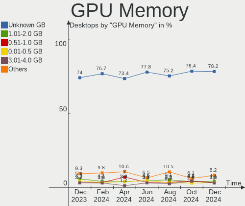
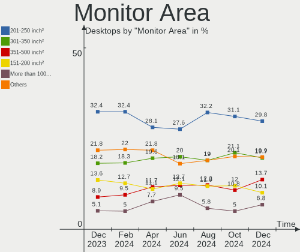
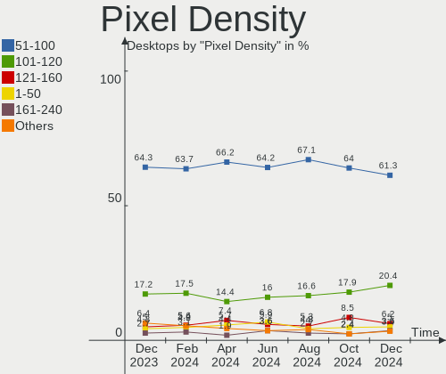
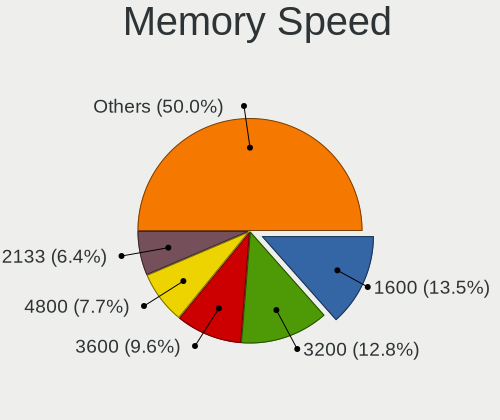

Ubuntu Hardware Trends (Desktop)
--------------------------------

A project to identify most popular hardware characteristics and track their change
over time based on data collected by Ubuntu users at https://Linux-Hardware.org.

Anyone can contribute to the study by uploading probes of their computers by
the [hw-probe](https://github.com/linuxhw/hw-probe) tool:

    sudo -E hw-probe -all -upload

Full-feature report is available here: https://linux-hardware.org/?view=trends&formfactor=desktop

Period: Sep, 2020.

Contents
--------

- [ OS                       ](#os)
- [ OS Family                ](#os-family)
- [ Kernel                   ](#kernel)
- [ Kernel Family            ](#kernel-family)
- [ Kernel Major Ver.        ](#kernel-major-ver)
- [ Arch                     ](#arch)
- [ DE                       ](#de)
- [ Display Server           ](#display-server)
- [ Display Manager          ](#display-manager)
- [ OS Lang                  ](#os-lang)
- [ Boot Mode                ](#boot-mode)
- [ Filesystem               ](#filesystem)
- [ Part. scheme             ](#part-scheme)
- [ Dual Boot with Linux/BSD ](#dual-boot-with-linux/bsd)
- [ Dual Boot (Win)          ](#dual-boot-win)
- [ Country                  ](#country)
- [ City                     ](#city)
- [ Vendor                   ](#vendor)
- [ Model                    ](#model)
- [ Model Family             ](#model-family)
- [ MFG Year                 ](#mfg-year)
- [ Form Factor              ](#form-factor)
- [ Secure Boot              ](#secure-boot)
- [ Coreboot                 ](#coreboot)
- [ RAM Size                 ](#ram-size)
- [ RAM Used                 ](#ram-used)
- [ Has CD-ROM               ](#has-cd-rom)
- [ Total Drives             ](#total-drives)
- [ Has Ethernet             ](#has-ethernet)
- [ Drive Vendor             ](#drive-vendor)
- [ HDD Vendor               ](#hdd-vendor)
- [ SSD Vendor               ](#ssd-vendor)
- [ Drive Model              ](#drive-model)
- [ Drive Kind               ](#drive-kind)
- [ Drive Connector          ](#drive-connector)
- [ Drive Size               ](#drive-size)
- [ Space Total              ](#space-total)
- [ Space Used               ](#space-used)
- [ Malfunc. Drives          ](#malfunc-drives)
- [ Malfunc. Drive Vendor    ](#malfunc-drive-vendor)
- [ Malfunc. HDD Vendor      ](#malfunc-hdd-vendor)
- [ Malfunc. Drive Kind      ](#malfunc-drive-kind)
- [ Failed Drives            ](#failed-drives)
- [ Failed Drive Vendor      ](#failed-drive-vendor)
- [ Drive Status             ](#drive-status)
- [ Storage Vendor           ](#storage-vendor)
- [ Storage Model            ](#storage-model)
- [ Storage Kind             ](#storage-kind)
- [ CPU Vendor               ](#cpu-vendor)
- [ CPU Model                ](#cpu-model)
- [ CPU Model Family         ](#cpu-model-family)
- [ CPU Cores                ](#cpu-cores)
- [ CPU Sockets              ](#cpu-sockets)
- [ CPU Threads              ](#cpu-threads)
- [ CPU Op-Modes             ](#cpu-op-modes)
- [ CPU Microcode            ](#cpu-microcode)
- [ CPU Microarch            ](#cpu-microarch)
- [ GPU Vendor               ](#gpu-vendor)
- [ GPU Model                ](#gpu-model)
- [ GPU Combo                ](#gpu-combo)
- [ GPU Driver               ](#gpu-driver)
- [ GPU Memory               ](#gpu-memory)
- [ Monitor Vendor           ](#monitor-vendor)
- [ Monitor Model            ](#monitor-model)
- [ Monitor Resolution       ](#monitor-resolution)
- [ Monitor Diagonal         ](#monitor-diagonal)
- [ Monitor Width            ](#monitor-width)
- [ Aspect Ratio             ](#aspect-ratio)
- [ Monitor Area             ](#monitor-area)
- [ Pixel Density            ](#pixel-density)
- [ Multiple Monitors        ](#multiple-monitors)
- [ Net Controller Vendor    ](#net-controller-vendor)
- [ Net Controller Model     ](#net-controller-model)
- [ Wireless Vendor          ](#wireless-vendor)
- [ Wireless Model           ](#wireless-model)
- [ Ethernet Vendor          ](#ethernet-vendor)
- [ Ethernet Model           ](#ethernet-model)
- [ Net Controller Kind      ](#net-controller-kind)
- [ Used Controller          ](#used-controller)
- [ NICs                     ](#nics)
- [ Memory Vendor            ](#memory-vendor)
- [ Memory Model             ](#memory-model)
- [ Memory Kind              ](#memory-kind)
- [ Memory Form Factor       ](#memory-form-factor)
- [ Memory Size              ](#memory-size)
- [ Memory Speed             ](#memory-speed)
- [ Sound Vendor             ](#sound-vendor)
- [ Sound Model              ](#sound-model)
- [ Camera Vendor            ](#camera-vendor)
- [ Camera Model             ](#camera-model)
- [ Fingerprint Vendor       ](#fingerprint-vendor)
- [ Fingerprint Model        ](#fingerprint-model)
- [ Chipcard Vendor          ](#chipcard-vendor)
- [ Chipcard Model           ](#chipcard-model)
- [ Printer Vendor           ](#printer-vendor)
- [ Printer Model            ](#printer-model)
- [ Scanner Vendor           ](#scanner-vendor)
- [ Scanner Model            ](#scanner-model)
- [ Bluetooth Vendor         ](#bluetooth-vendor)
- [ Bluetooth Model          ](#bluetooth-model)
- [ Unsupported Devices      ](#unsupported-devices)
- [ Unsupported Device Types ](#unsupported-device-types)

OS
--

Installed operating systems

| Name           | Desktops | Percent |
|----------------|----------|---------|
| Ubuntu 20.04   | 698      | 77.3%   |
| Ubuntu 18.04   | 160      | 17.72%  |
| Ubuntu 16.04   | 24       | 2.66%   |
| Ubuntu 20.10   | 11       | 1.22%   |
| Ubuntu 19.10   | 6        | 0.66%   |
| Ubuntu         | 2        | 0.22%   |
| Ubuntu Core 18 | 1        | 0.11%   |
| Ubuntu 14.04   | 1        | 0.11%   |

OS Family
---------

OS without a version

| Name   | Desktops | Percent |
|--------|----------|---------|
| Ubuntu | 903      | 100%    |

Kernel
------

Version of the Linux kernel

| Version                   | Desktops | Percent |
|---------------------------|----------|---------|
| 5.4.0-47-generic          | 258      | 28.57%  |
| 5.4.0-48-generic          | 170      | 18.83%  |
| 5.4.0-45-generic          | 158      | 17.5%   |
| 5.4.0-42-generic          | 104      | 11.52%  |
| 4.15.0-117-generic        | 27       | 2.99%   |
| 4.15.0-118-generic        | 22       | 2.44%   |
| 4.15.0-115-generic        | 12       | 1.33%   |
| 5.4.0-49-generic          | 10       | 1.11%   |
| 5.4.0-47-lowlatency       | 9        | 1%      |
| 5.4.0-26-generic          | 8        | 0.89%   |
| 5.4.0-48-lowlatency       | 7        | 0.78%   |
| 5.4.0-46-generic          | 7        | 0.78%   |
| 4.4.0-189-generic         | 7        | 0.78%   |
| 5.8.0-18-generic          | 6        | 0.66%   |
| 4.15.0-112-generic        | 6        | 0.66%   |
| 5.4.0-40-generic          | 5        | 0.55%   |
| 5.4.0-45-lowlatency       | 4        | 0.44%   |
| 5.3.0-64-generic          | 4        | 0.44%   |
| 5.8.0-19-generic          | 3        | 0.33%   |
| 5.4.0-44-generic          | 3        | 0.33%   |
| 5.0.0-23-generic          | 3        | 0.33%   |
| 4.15.0-106-generic        | 3        | 0.33%   |
| 5.8.9-050809-generic      | 2        | 0.22%   |
| 5.8.5-050805-lowlatency   | 2        | 0.22%   |
| 5.4.65-050465-generic     | 2        | 0.22%   |
| 5.3.0-59-generic          | 2        | 0.22%   |
| 4.15.0-29-generic         | 2        | 0.22%   |
| 5.9.0-050900rc5-generic   | 1        | 0.11%   |
| 5.8.8-050808-generic      | 1        | 0.11%   |
| 5.8.7-050807-generic      | 1        | 0.11%   |
| 5.8.5-050805-generic      | 1        | 0.11%   |
| 5.8.12-xanmod1            | 1        | 0.11%   |
| 5.8.11-tkg-upds           | 1        | 0.11%   |
| 5.8.10                    | 1        | 0.11%   |
| 5.8.0-20-lowlatency       | 1        | 0.11%   |
| 5.8.0-12.1-liquorix-amd64 | 1        | 0.11%   |
| 5.8.0-050800-generic      | 1        | 0.11%   |
| 5.7.8-windowsfx-generic   | 1        | 0.11%   |
| 5.7.17-050717-generic     | 1        | 0.11%   |
| 5.7.16-050716-generic     | 1        | 0.11%   |
| 5.7.10-xanmod2            | 1        | 0.11%   |
| 5.7.0-050700-lowlatency   | 1        | 0.11%   |
| 5.6.15-050615-generic     | 1        | 0.11%   |
| 5.6.0-1026-oem            | 1        | 0.11%   |
| 5.6.0-050600-generic      | 1        | 0.11%   |
| 5.4.66-xanmod1            | 1        | 0.11%   |
| 5.4.64-050464-generic     | 1        | 0.11%   |
| 5.4.3-acso                | 1        | 0.11%   |
| 5.4.1-050401-lowlatency   | 1        | 0.11%   |
| 5.4.0-7634-generic        | 1        | 0.11%   |
| 5.4.0-42-lowlatency       | 1        | 0.11%   |
| 5.4.0-39-generic          | 1        | 0.11%   |
| 5.4.0-38-generic          | 1        | 0.11%   |
| 5.4.0-31-generic          | 1        | 0.11%   |
| 5.4.0-21-generic          | 1        | 0.11%   |
| 5.3.0-64-lowlatency       | 1        | 0.11%   |
| 5.3.0-61-generic          | 1        | 0.11%   |
| 5.3.0-53-generic          | 1        | 0.11%   |
| 5.3.0-42-generic          | 1        | 0.11%   |
| 5.3.0-40-generic          | 1        | 0.11%   |

Kernel Family
-------------

Linux kernel without a distro release

| Version  | Desktops | Percent |
|----------|----------|---------|
| 5.4.0    | 749      | 82.95%  |
| 4.15.0   | 83       | 9.19%   |
| 5.3.0    | 14       | 1.55%   |
| 5.8.0    | 12       | 1.33%   |
| 4.4.0    | 11       | 1.22%   |
| 5.0.0    | 4        | 0.44%   |
| 5.8.5    | 3        | 0.33%   |
| 5.8.9    | 2        | 0.22%   |
| 5.6.0    | 2        | 0.22%   |
| 5.4.65   | 2        | 0.22%   |
| 5.9.0    | 1        | 0.11%   |
| 5.8.8    | 1        | 0.11%   |
| 5.8.7    | 1        | 0.11%   |
| 5.8.12   | 1        | 0.11%   |
| 5.8.11   | 1        | 0.11%   |
| 5.8.10   | 1        | 0.11%   |
| 5.7.8    | 1        | 0.11%   |
| 5.7.17   | 1        | 0.11%   |
| 5.7.16   | 1        | 0.11%   |
| 5.7.10   | 1        | 0.11%   |
| 5.7.0    | 1        | 0.11%   |
| 5.6.15   | 1        | 0.11%   |
| 5.4.66   | 1        | 0.11%   |
| 5.4.64   | 1        | 0.11%   |
| 5.4.3    | 1        | 0.11%   |
| 5.4.1    | 1        | 0.11%   |
| 5.0.21   | 1        | 0.11%   |
| 4.19.104 | 1        | 0.11%   |
| 4.18.0   | 1        | 0.11%   |
| 4.13.0   | 1        | 0.11%   |
| 3.13.0   | 1        | 0.11%   |

Kernel Major Ver.
-----------------

Linux kernel major version

| Version | Desktops | Percent |
|---------|----------|---------|
| 5.4     | 755      | 83.61%  |
| 4.15    | 83       | 9.19%   |
| 5.8     | 22       | 2.44%   |
| 5.3     | 14       | 1.55%   |
| 4.4     | 11       | 1.22%   |
| 5.7     | 5        | 0.55%   |
| 5.0     | 5        | 0.55%   |
| 5.6     | 3        | 0.33%   |
| 5.9     | 1        | 0.11%   |
| 4.19    | 1        | 0.11%   |
| 4.18    | 1        | 0.11%   |
| 4.13    | 1        | 0.11%   |
| 3.13    | 1        | 0.11%   |

Arch
----

OS architecture (x86_64, i586, etc.)

| Name   | Desktops | Percent |
|--------|----------|---------|
| x86_64 | 878      | 97.23%  |
| i686   | 25       | 2.77%   |

DE
--

Desktop Environment

| Name            | Desktops | Percent |
|-----------------|----------|---------|
| GNOME           | 629      | 69.66%  |
| XFCE            | 76       | 8.42%   |
| Unknown         | 51       | 5.65%   |
| MATE            | 33       | 3.65%   |
| KDE             | 29       | 3.21%   |
| Unity           | 28       | 3.1%    |
| KDE5            | 22       | 2.44%   |
| Budgie          | 11       | 1.22%   |
| GNOME Flashback | 6        | 0.66%   |
| LXQt            | 5        | 0.55%   |
| X-Cinnamon      | 4        | 0.44%   |
| LXDE            | 4        | 0.44%   |
| Cinnamon        | 3        | 0.33%   |
| Deepin          | 2        | 0.22%   |

Display Server
--------------

X11 or Wayland

| Name    | Desktops | Percent |
|---------|----------|---------|
| X11     | 844      | 93.47%  |
| Wayland | 23       | 2.55%   |
| Unknown | 23       | 2.55%   |
| Tty     | 13       | 1.44%   |

Display Manager
---------------

SDDM, LightDM, etc.

| Name    | Desktops | Percent |
|---------|----------|---------|
| Unknown | 735      | 81.4%   |
| GDM     | 83       | 9.19%   |
| TDM     | 62       | 6.87%   |
| SDDM    | 19       | 2.1%    |
| LightDM | 2        | 0.22%   |
| GDM3    | 2        | 0.22%   |

OS Lang
-------

Language

| Lang       | Desktops | Percent |
|------------|----------|---------|
| en_US      | 340      | 37.65%  |
| de_DE      | 104      | 11.52%  |
| pt_BR      | 68       | 7.53%   |
| en_GB      | 51       | 5.65%   |
| fr_FR      | 33       | 3.65%   |
| it_IT      | 32       | 3.54%   |
| en_IN      | 26       | 2.88%   |
| es_ES      | 24       | 2.66%   |
| en_CA      | 24       | 2.66%   |
| en_AU      | 23       | 2.55%   |
| C          | 20       | 2.21%   |
| es_AR      | 18       | 1.99%   |
| pl_PL      | 15       | 1.66%   |
| ru_RU      | 13       | 1.44%   |
| ja_JP      | 8        | 0.89%   |
| nl_NL      | 7        | 0.78%   |
| en_ZA      | 7        | 0.78%   |
| Unknown    | 6        | 0.66%   |
| ru_UA      | 5        | 0.55%   |
| ro_RO      | 5        | 0.55%   |
| hu_HU      | 5        | 0.55%   |
| es_MX      | 5        | 0.55%   |
| de_AT      | 5        | 0.55%   |
| cs_CZ      | 5        | 0.55%   |
| sv_SE      | 4        | 0.44%   |
| nl_BE      | 4        | 0.44%   |
| fi_FI      | 4        | 0.44%   |
| en_IL      | 4        | 0.44%   |
| pt_PT      | 3        | 0.33%   |
| es_CO      | 3        | 0.33%   |
| zh_TW      | 2        | 0.22%   |
| hr_HR      | 2        | 0.22%   |
| fr_BE      | 2        | 0.22%   |
| es_EC      | 2        | 0.22%   |
| en_SG      | 2        | 0.22%   |
| en_NZ      | 2        | 0.22%   |
| en_HK      | 2        | 0.22%   |
| el_GR      | 2        | 0.22%   |
| de_CH      | 2        | 0.22%   |
| ca_ES      | 2        | 0.22%   |
| bg_BG      | 2        | 0.22%   |
| zh_CN      | 1        | 0.11%   |
| uk_UA      | 1        | 0.11%   |
| sk_SK      | 1        | 0.11%   |
| nb_NO      | 1        | 0.11%   |
| lt_LT      | 1        | 0.11%   |
| he_IL      | 1        | 0.11%   |
| fr_CH      | 1        | 0.11%   |
| es_CL      | 1        | 0.11%   |
| en_US.utf8 | 1        | 0.11%   |
| en_PH      | 1        | 0.11%   |

Boot Mode
---------

EFI or BIOS

| Mode | Desktops | Percent |
|------|----------|---------|
| BIOS | 585      | 64.78%  |
| EFI  | 318      | 35.22%  |

Filesystem
----------

Type of filesystem

| Type    | Desktops | Percent |
|---------|----------|---------|
| Ext4    | 826      | 91.47%  |
| Overlay | 25       | 2.77%   |
| Btrfs   | 17       | 1.88%   |
| Zfs     | 15       | 1.66%   |
| Xfs     | 13       | 1.44%   |
| Ext2    | 3        | 0.33%   |
| Ext3    | 2        | 0.22%   |
| Jfs     | 1        | 0.11%   |
| Unknown | 1        | 0.11%   |

Part. scheme
------------

Scheme of partitioning

| Type    | Desktops | Percent |
|---------|----------|---------|
| Unknown | 728      | 80.62%  |
| GPT     | 117      | 12.96%  |
| MBR     | 58       | 6.42%   |

Dual Boot with Linux/BSD
------------------------

Hosting more than one Linux/BSD

| Dual boot | Desktops | Percent |
|-----------|----------|---------|
| No        | 731      | 80.95%  |
| Yes       | 172      | 19.05%  |

Dual Boot (Win)
---------------

Hosting Linux and Windows

| Dual boot | Desktops | Percent |
|-----------|----------|---------|
| No        | 538      | 59.58%  |
| Yes       | 365      | 40.42%  |

Country
-------

Geographic location (country)

| Country                | Desktops | Percent |
|------------------------|----------|---------|
| USA                    | 191      | 21.15%  |
| Germany                | 122      | 13.51%  |
| Brazil                 | 79       | 8.75%   |
| UK                     | 47       | 5.2%    |
| Italy                  | 37       | 4.1%    |
| France                 | 35       | 3.88%   |
| Spain                  | 31       | 3.43%   |
| India                  | 29       | 3.21%   |
| Canada                 | 26       | 2.88%   |
| Argentina              | 23       | 2.55%   |
| Russia                 | 22       | 2.44%   |
| Australia              | 22       | 2.44%   |
| Netherlands            | 21       | 2.33%   |
| Poland                 | 20       | 2.21%   |
| Belgium                | 14       | 1.55%   |
| Finland                | 13       | 1.44%   |
| Mexico                 | 9        | 1%      |
| Japan                  | 9        | 1%      |
| Greece                 | 9        | 1%      |
| Ukraine                | 8        | 0.89%   |
| South Africa           | 8        | 0.89%   |
| Romania                | 8        | 0.89%   |
| Austria                | 8        | 0.89%   |
| Sweden                 | 7        | 0.78%   |
| Norway                 | 7        | 0.78%   |
| Hungary                | 7        | 0.78%   |
| Israel                 | 6        | 0.66%   |
| Czech Republic         | 6        | 0.66%   |
| Switzerland            | 5        | 0.55%   |
| Serbia                 | 4        | 0.44%   |
| Portugal               | 4        | 0.44%   |
| Taiwan                 | 3        | 0.33%   |
| Singapore              | 3        | 0.33%   |
| New Zealand            | 3        | 0.33%   |
| Lithuania              | 3        | 0.33%   |
| Estonia                | 3        | 0.33%   |
| Colombia               | 3        | 0.33%   |
| Bulgaria               | 3        | 0.33%   |
| Vietnam                | 2        | 0.22%   |
| Turkey                 | 2        | 0.22%   |
| Thailand               | 2        | 0.22%   |
| Slovakia               | 2        | 0.22%   |
| Puerto Rico            | 2        | 0.22%   |
| Iran                   | 2        | 0.22%   |
| Indonesia              | 2        | 0.22%   |
| Hong Kong              | 2        | 0.22%   |
| Egypt                  | 2        | 0.22%   |
| Ecuador                | 2        | 0.22%   |
| Croatia                | 2        | 0.22%   |
| China                  | 2        | 0.22%   |
| Chile                  | 2        | 0.22%   |
| Bosnia and Herzegovina | 2        | 0.22%   |
| Algeria                | 2        | 0.22%   |
| UAE                    | 1        | 0.11%   |
| Sri Lanka              | 1        | 0.11%   |
| Reunion                | 1        | 0.11%   |
| Philippines            | 1        | 0.11%   |
| Mauritius              | 1        | 0.11%   |
| Malaysia               | 1        | 0.11%   |
| Macedonia              | 1        | 0.11%   |

City
----

Geographic location (city)

| City                | Desktops | Percent |
|---------------------|----------|---------|
| São Paulo          | 17       | 1.88%   |
| Itatiba             | 9        | 1%      |
| Hamburg             | 8        | 0.89%   |
| Berlin              | 8        | 0.89%   |
| Paris               | 7        | 0.78%   |
| Moscow              | 7        | 0.78%   |
| Madrid              | 7        | 0.78%   |
| Helsinki            | 7        | 0.78%   |
| Frankfurt am Main   | 7        | 0.78%   |
| Dallas              | 6        | 0.66%   |
| Warsaw              | 5        | 0.55%   |
| Tucson              | 5        | 0.55%   |
| Toronto             | 5        | 0.55%   |
| Rome                | 5        | 0.55%   |
| Rio de Janeiro      | 5        | 0.55%   |
| Pretoria            | 5        | 0.55%   |
| Milan               | 5        | 0.55%   |
| Chicago             | 5        | 0.55%   |
| Buenos Aires        | 5        | 0.55%   |
| Brisbane            | 5        | 0.55%   |
| Athens              | 5        | 0.55%   |
| Vienna              | 4        | 0.44%   |
| Sydney              | 4        | 0.44%   |
| Stuttgart           | 4        | 0.44%   |
| St Petersburg       | 4        | 0.44%   |
| Hyderabad           | 4        | 0.44%   |
| Budapest            | 4        | 0.44%   |
| Austin              | 4        | 0.44%   |
| Turin               | 3        | 0.33%   |
| Tel Aviv            | 3        | 0.33%   |
| Singapore           | 3        | 0.33%   |
| San Juan            | 3        | 0.33%   |
| Phoenix             | 3        | 0.33%   |
| Munich              | 3        | 0.33%   |
| Mumbai              | 3        | 0.33%   |
| Karlsruhe           | 3        | 0.33%   |
| Düsseldorf         | 3        | 0.33%   |
| Duque de Caxias     | 3        | 0.33%   |
| Córdoba            | 3        | 0.33%   |
| Bucharest           | 3        | 0.33%   |
| Bjorkelangen        | 3        | 0.33%   |
| Belgrade            | 3        | 0.33%   |
| Barcelona           | 3        | 0.33%   |
| Zoetermeer          | 2        | 0.22%   |
| Wennigsen           | 2        | 0.22%   |
| Victoria            | 2        | 0.22%   |
| Vancouver           | 2        | 0.22%   |
| Valencia            | 2        | 0.22%   |
| Taipei              | 2        | 0.22%   |
| São Luís          | 2        | 0.22%   |
| São Carlos         | 2        | 0.22%   |
| St. Thomas          | 2        | 0.22%   |
| Springfield         | 2        | 0.22%   |
| Sofia               | 2        | 0.22%   |
| Sindelfingen        | 2        | 0.22%   |
| Sarajevo            | 2        | 0.22%   |
| San Jose            | 2        | 0.22%   |
| Saint-Jean-de-Vedas | 2        | 0.22%   |
| Regensburg          | 2        | 0.22%   |
| Quito               | 2        | 0.22%   |

Vendor
------

Motherboard manufacturer

| Name                | Desktops | Percent |
|---------------------|----------|---------|
| ASUSTek Computer    | 213      | 23.59%  |
| Gigabyte Technology | 128      | 14.17%  |
| MSI                 | 105      | 11.63%  |
| Dell                | 92       | 10.19%  |
| ASRock              | 87       | 9.63%   |
| Hewlett-Packard     | 72       | 7.97%   |
| Intel               | 38       | 4.21%   |
| Lenovo              | 29       | 3.21%   |
| Acer                | 23       | 2.55%   |
| Unknown             | 19       | 2.1%    |
| Foxconn             | 12       | 1.33%   |
| Fujitsu             | 10       | 1.11%   |
| ECS                 | 10       | 1.11%   |
| Biostar             | 10       | 1.11%   |
| Pegatron            | 9        | 1%      |
| Medion              | 7        | 0.78%   |
| Fujitsu Siemens     | 6        | 0.66%   |
| Packard Bell        | 4        | 0.44%   |
| eMachines           | 4        | 0.44%   |
| Shuttle             | 3        | 0.33%   |
| Positivo            | 2        | 0.22%   |
| OEM                 | 2        | 0.22%   |
| Lanix               | 2        | 0.22%   |
| Google              | 2        | 0.22%   |
| AOpen               | 2        | 0.22%   |
| WeiBu               | 1        | 0.11%   |
| TYAN Computer       | 1        | 0.11%   |
| TEKNOSERVICE        | 1        | 0.11%   |
| Supermicro          | 1        | 0.11%   |
| Penguin Computing   | 1        | 0.11%   |
| PCWare              | 1        | 0.11%   |
| PCSMART             | 1        | 0.11%   |
| Megaware            | 1        | 0.11%   |
| Koloe               | 1        | 0.11%   |
| Huanan              | 1        | 0.11%   |
| Gateway             | 1        | 0.11%   |
| AMD                 | 1        | 0.11%   |

Model
-----

Motherboard model

| Name                               | Desktops | Percent |
|------------------------------------|----------|---------|
| ASUS All Series                    | 25       | 2.77%   |
| Unknown                            | 19       | 2.1%    |
| MSI MS-7A38                        | 9        | 1%      |
| MSI MS-7C37                        | 8        | 0.89%   |
| ASUS TUF GAMING X570-PLUS          | 7        | 0.78%   |
| Dell OptiPlex 790                  | 6        | 0.66%   |
| Dell OptiPlex 780                  | 6        | 0.66%   |
| Dell OptiPlex 3010                 | 6        | 0.66%   |
| Intel HCL Desktop                  | 5        | 0.55%   |
| Intel H61                          | 5        | 0.55%   |
| HP Compaq Elite 8300 SFF           | 5        | 0.55%   |
| Gigabyte B450M DS3H                | 5        | 0.55%   |
| Dell OptiPlex 7010                 | 5        | 0.55%   |
| ASRock B450M Pro4                  | 5        | 0.55%   |
| MSI MS-7B79                        | 4        | 0.44%   |
| HP EliteDesk 800 G1 SFF            | 4        | 0.44%   |
| Gigabyte X470 AORUS ULTRA GAMING   | 4        | 0.44%   |
| ASUS PRIME B450M-A                 | 4        | 0.44%   |
| ASUS PRIME A320M-K                 | 4        | 0.44%   |
| ASRock N68-S                       | 4        | 0.44%   |
| MSI MS-7A34                        | 3        | 0.33%   |
| MSI MS-7917                        | 3        | 0.33%   |
| MSI MS-7817                        | 3        | 0.33%   |
| MSI MS-7758                        | 3        | 0.33%   |
| MSI MS-7721                        | 3        | 0.33%   |
| HP Z800 Workstation                | 3        | 0.33%   |
| HP ProDesk 600 G1 SFF              | 3        | 0.33%   |
| HP Compaq Pro 6300 SFF             | 3        | 0.33%   |
| HP Compaq dc7800 Small Form Factor | 3        | 0.33%   |
| ECS G31T-M7                        | 3        | 0.33%   |
| Dell XPS 8700                      | 3        | 0.33%   |
| Dell OptiPlex 990                  | 3        | 0.33%   |
| Dell OptiPlex 980                  | 3        | 0.33%   |
| Dell OptiPlex 755                  | 3        | 0.33%   |
| Dell OptiPlex 390                  | 3        | 0.33%   |
| Dell OptiPlex 360                  | 3        | 0.33%   |
| Dell OptiPlex 330                  | 3        | 0.33%   |
| ASUS Z170-A                        | 3        | 0.33%   |
| ASUS ROG STRIX Z390-E GAMING       | 3        | 0.33%   |
| ASUS ROG STRIX X570-E GAMING       | 3        | 0.33%   |
| ASUS PRIME X470-PRO                | 3        | 0.33%   |
| ASUS P5K                           | 3        | 0.33%   |
| ASUS M5A78L-M PLUS/USB3            | 3        | 0.33%   |
| ASRock B450M-HDV                   | 3        | 0.33%   |
| MSI MS-7B93                        | 2        | 0.22%   |
| MSI MS-7B86                        | 2        | 0.22%   |
| MSI MS-7B85                        | 2        | 0.22%   |
| MSI MS-7A90                        | 2        | 0.22%   |
| MSI MS-7A32                        | 2        | 0.22%   |
| MSI MS-7641                        | 2        | 0.22%   |
| MSI MS-7597                        | 2        | 0.22%   |
| MSI MS-7596                        | 2        | 0.22%   |
| Lanix MINI-TORRE                   | 2        | 0.22%   |
| HP Z230 Tower Workstation          | 2        | 0.22%   |
| HP ProDesk 400 G1 SFF              | 2        | 0.22%   |
| HP Compaq Pro 6300 MT              | 2        | 0.22%   |
| HP Compaq dc7900 Small Form Factor | 2        | 0.22%   |
| HP Compaq 8200 Elite SFF PC        | 2        | 0.22%   |
| HP Compaq 8200 Elite MT PC         | 2        | 0.22%   |
| HP Compaq 6200 Pro SFF PC          | 2        | 0.22%   |

Model Family
------------

Motherboard model prefix

| Name                | Desktops | Percent |
|---------------------|----------|---------|
| Dell OptiPlex       | 56       | 6.2%    |
| HP Compaq           | 38       | 4.21%   |
| ASUS PRIME          | 36       | 3.99%   |
| ASUS All            | 25       | 2.77%   |
| Unknown             | 19       | 2.1%    |
| Lenovo ThinkCentre  | 18       | 1.99%   |
| ASUS TUF            | 14       | 1.55%   |
| ASUS ROG            | 12       | 1.33%   |
| Dell Precision      | 10       | 1.11%   |
| Dell Inspiron       | 10       | 1.11%   |
| MSI MS-7A38         | 9        | 1%      |
| Acer Aspire         | 9        | 1%      |
| MSI MS-7C37         | 8        | 0.89%   |
| HP ProDesk          | 8        | 0.89%   |
| HP EliteDesk        | 8        | 0.89%   |
| Acer Veriton        | 8        | 0.89%   |
| Fujitsu ESPRIMO     | 7        | 0.78%   |
| ASUS M5A78L-M       | 7        | 0.78%   |
| ASRock B450M        | 7        | 0.78%   |
| Gigabyte X570       | 6        | 0.66%   |
| Gigabyte B450       | 6        | 0.66%   |
| Dell XPS            | 6        | 0.66%   |
| Intel HCL           | 5        | 0.55%   |
| Intel H61           | 5        | 0.55%   |
| Gigabyte B450M      | 5        | 0.55%   |
| ASUS P8H61-M        | 5        | 0.55%   |
| ASUS Maximus        | 5        | 0.55%   |
| MSI MS-7B79         | 4        | 0.44%   |
| Gigabyte X470       | 4        | 0.44%   |
| ASUS SABERTOOTH     | 4        | 0.44%   |
| ASUS P6T            | 4        | 0.44%   |
| ASUS P5K            | 4        | 0.44%   |
| ASRock N68-S        | 4        | 0.44%   |
| ASRock 970          | 4        | 0.44%   |
| Packard Bell iMedia | 3        | 0.33%   |
| MSI MS-7A34         | 3        | 0.33%   |
| MSI MS-7917         | 3        | 0.33%   |
| MSI MS-7817         | 3        | 0.33%   |
| MSI MS-7758         | 3        | 0.33%   |
| MSI MS-7721         | 3        | 0.33%   |
| HP Z800             | 3        | 0.33%   |
| HP Pavilion         | 3        | 0.33%   |
| Gigabyte Z390       | 3        | 0.33%   |
| Fujitsu CELSIUS     | 3        | 0.33%   |
| ECS G31T-M7         | 3        | 0.33%   |
| Dell Studio         | 3        | 0.33%   |
| ASUS Z170-A         | 3        | 0.33%   |
| ASUS STRIX          | 3        | 0.33%   |
| ASUS M4N68T-M       | 3        | 0.33%   |
| ASRock Z170         | 3        | 0.33%   |
| ASRock B450M-HDV    | 3        | 0.33%   |
| MSI MS-7B93         | 2        | 0.22%   |
| MSI MS-7B86         | 2        | 0.22%   |
| MSI MS-7B85         | 2        | 0.22%   |
| MSI MS-7A90         | 2        | 0.22%   |
| MSI MS-7A32         | 2        | 0.22%   |
| MSI MS-7641         | 2        | 0.22%   |
| MSI MS-7597         | 2        | 0.22%   |
| MSI MS-7596         | 2        | 0.22%   |
| Lenovo ThinkStation | 2        | 0.22%   |

MFG Year
--------

Motherboard manufacture year

| Year    | Desktops | Percent |
|---------|----------|---------|
| 2019    | 122      | 13.51%  |
| 2020    | 91       | 10.08%  |
| 2018    | 88       | 9.75%   |
| 2013    | 75       | 8.31%   |
| 2012    | 71       | 7.86%   |
| 2010    | 67       | 7.42%   |
| 2011    | 66       | 7.31%   |
| 2014    | 61       | 6.76%   |
| 2009    | 59       | 6.53%   |
| 2015    | 46       | 5.09%   |
| 2016    | 44       | 4.87%   |
| 2017    | 35       | 3.88%   |
| 2008    | 35       | 3.88%   |
| 2007    | 29       | 3.21%   |
| 2006    | 6        | 0.66%   |
| 2005    | 5        | 0.55%   |
| Unknown | 2        | 0.22%   |
| 2004    | 1        | 0.11%   |

Form Factor
-----------

Physical design of the computer

| Name    | Desktops | Percent |
|---------|----------|---------|
| Desktop | 903      | 100%    |

Secure Boot
-----------

Enabled or disabled

| State    | Desktops | Percent |
|----------|----------|---------|
| Disabled | 883      | 97.79%  |
| Enabled  | 20       | 2.21%   |

Coreboot
--------

Have coreboot on board

| Used | Desktops | Percent |
|------|----------|---------|
| No   | 901      | 99.78%  |
| Yes  | 2        | 0.22%   |

RAM Size
--------

Total RAM memory

| Size in GB      | Desktops | Percent |
|-----------------|----------|---------|
| 8.01-16.0       | 183      | 20.27%  |
| 3.01-4.0        | 179      | 19.82%  |
| 16.01-24.0      | 177      | 19.6%   |
| 4.01-8.0        | 135      | 14.95%  |
| 32.01-64.0      | 118      | 13.07%  |
| 1.01-2.0        | 42       | 4.65%   |
| 64.01-256.0     | 35       | 3.88%   |
| 24.01-32.0      | 17       | 1.88%   |
| 2.01-3.0        | 12       | 1.33%   |
| 0.01-1.0        | 3        | 0.33%   |
| More than 256.0 | 2        | 0.22%   |

RAM Used
--------

Used RAM memory

| Used GB    | Desktops | Percent |
|------------|----------|---------|
| 1.01-2.0   | 358      | 39.65%  |
| 2.01-3.0   | 223      | 24.7%   |
| 4.01-8.0   | 110      | 12.18%  |
| 3.01-4.0   | 86       | 9.52%   |
| 0.01-1.0   | 73       | 8.08%   |
| 8.01-16.0  | 36       | 3.99%   |
| 16.01-24.0 | 9        | 1%      |
| 32.01-64.0 | 5        | 0.55%   |
| 24.01-32.0 | 2        | 0.22%   |
| Unknown    | 1        | 0.11%   |

Has CD-ROM
----------

Has CD-ROM on board

| Presented | Desktops | Percent |
|-----------|----------|---------|
| Yes       | 484      | 53.6%   |
| No        | 419      | 46.4%   |

Total Drives
------------

Number of drives on board

| Drives | Desktops | Percent |
|--------|----------|---------|
| 1      | 391      | 43.3%   |
| 2      | 252      | 27.91%  |
| 3      | 128      | 14.17%  |
| 4      | 66       | 7.31%   |
| 5      | 29       | 3.21%   |
| 6      | 14       | 1.55%   |
| 7      | 9        | 1%      |
| 0      | 5        | 0.55%   |
| 8      | 4        | 0.44%   |
| 10     | 3        | 0.33%   |
| 25     | 1        | 0.11%   |
| 11     | 1        | 0.11%   |

Has Ethernet
------------

Has Ethernet on board

| Presented | Desktops | Percent |
|-----------|----------|---------|
| Yes       | 890      | 98.56%  |
| No        | 13       | 1.44%   |

Drive Vendor
------------

Hard drive vendors

| Vendor                    | Desktops | Drives | Percent |
|---------------------------|----------|--------|---------|
| Seagate                   | 353      | 465    | 23.49%  |
| WDC                       | 312      | 406    | 20.76%  |
| Samsung Electronics       | 223      | 282    | 14.84%  |
| Toshiba                   | 81       | 95     | 5.39%   |
| Hitachi                   | 78       | 95     | 5.19%   |
| Kingston                  | 64       | 72     | 4.26%   |
| Sandisk                   | 59       | 64     | 3.93%   |
| Crucial                   | 48       | 54     | 3.19%   |
| A-DATA Technology         | 26       | 31     | 1.73%   |
| Unknown                   | 24       | 26     | 1.6%    |
| HGST                      | 21       | 39     | 1.4%    |
| Phison                    | 19       | 22     | 1.26%   |
| Intel                     | 17       | 21     | 1.13%   |
| Maxtor                    | 14       | 15     | 0.93%   |
| OCZ                       | 9        | 9      | 0.6%    |
| SK Hynix                  | 8        | 8      | 0.53%   |
| Silicon Motion            | 8        | 9      | 0.53%   |
| Fujitsu                   | 8        | 8      | 0.53%   |
| Transcend                 | 7        | 7      | 0.47%   |
| Patriot                   | 7        | 7      | 0.47%   |
| Micron Technology         | 7        | 10     | 0.47%   |
| PNY                       | 6        | 7      | 0.4%    |
| Micron/Crucial Technology | 6        | 7      | 0.4%    |
| Intenso                   | 6        | 7      | 0.4%    |
| Corsair                   | 6        | 7      | 0.4%    |
| China                     | 6        | 8      | 0.4%    |
| GOODRAM                   | 5        | 6      | 0.33%   |
| SPCC                      | 4        | 4      | 0.27%   |
| Realtek Semiconductor     | 4        | 4      | 0.27%   |
| Mushkin                   | 4        | 4      | 0.27%   |
| Hewlett-Packard           | 4        | 5      | 0.27%   |
| ASMT                      | 4        | 4      | 0.27%   |
| Apacer                    | 4        | 5      | 0.27%   |
| Lexar                     | 3        | 3      | 0.2%    |
| Gigabyte Technology       | 3        | 3      | 0.2%    |
| SABRENT                   | 2        | 2      | 0.13%   |
| PLEXTOR                   | 2        | 2      | 0.13%   |
| LITEON                    | 2        | 2      | 0.13%   |
| KingSpec                  | 2        | 2      | 0.13%   |
| KingFast                  | 2        | 2      | 0.13%   |
| Apple                     | 2        | 2      | 0.13%   |
| XPG                       | 1        | 1      | 0.07%   |
| WD MediaMax               | 1        | 1      | 0.07%   |
| USB30                     | 1        | 1      | 0.07%   |
| USB                       | 1        | 1      | 0.07%   |
| Team                      | 1        | 1      | 0.07%   |
| Super Talent              | 1        | 1      | 0.07%   |
| StoreJet                  | 1        | 1      | 0.07%   |
| SATA3                     | 1        | 1      | 0.07%   |
| RSH-319                   | 1        | 1      | 0.07%   |
| Pioneer                   | 1        | 1      | 0.07%   |
| Msft                      | 1        | 2      | 0.07%   |
| MG                        | 1        | 1      | 0.07%   |
| MBED.ORG                  | 1        | 1      | 0.07%   |
| MARVELL                   | 1        | 1      | 0.07%   |
| MARSHAL                   | 1        | 1      | 0.07%   |
| Lite-On                   | 1        | 1      | 0.07%   |
| LDLC                      | 1        | 2      | 0.07%   |
| KLEVV                     | 1        | 1      | 0.07%   |
| JMicron                   | 1        | 1      | 0.07%   |

HDD Vendor
----------

Hard disk drive vendors

| Vendor              | Desktops | Drives | Percent |
|---------------------|----------|--------|---------|
| Seagate             | 346      | 451    | 38.53%  |
| WDC                 | 284      | 362    | 31.63%  |
| Hitachi             | 78       | 95     | 8.69%   |
| Toshiba             | 73       | 79     | 8.13%   |
| Samsung Electronics | 64       | 68     | 7.13%   |
| HGST                | 21       | 39     | 2.34%   |
| Maxtor              | 14       | 15     | 1.56%   |
| Fujitsu             | 7        | 7      | 0.78%   |
| Intenso             | 2        | 2      | 0.22%   |
| ASMT                | 2        | 2      | 0.22%   |
| Apple               | 2        | 2      | 0.22%   |
| Msft                | 1        | 2      | 0.11%   |
| MARVELL             | 1        | 1      | 0.11%   |
| Hewlett-Packard     | 1        | 1      | 0.11%   |
| ExcelStor           | 1        | 1      | 0.11%   |
| ASMT109x            | 1        | 1      | 0.11%   |

SSD Vendor
----------

Solid state drive vendors

| Vendor              | Desktops | Drives | Percent |
|---------------------|----------|--------|---------|
| Samsung Electronics | 117      | 142    | 25.71%  |
| Kingston            | 60       | 66     | 13.19%  |
| SanDisk             | 50       | 53     | 10.99%  |
| Crucial             | 48       | 54     | 10.55%  |
| WDC                 | 33       | 36     | 7.25%   |
| A-DATA Technology   | 21       | 22     | 4.62%   |
| Intel               | 13       | 16     | 2.86%   |
| OCZ                 | 9        | 9      | 1.98%   |
| Transcend           | 7        | 7      | 1.54%   |
| Toshiba             | 7        | 15     | 1.54%   |
| Micron Technology   | 7        | 10     | 1.54%   |
| Patriot             | 6        | 6      | 1.32%   |
| China               | 6        | 8      | 1.32%   |
| PNY                 | 5        | 6      | 1.1%    |
| GOODRAM             | 5        | 6      | 1.1%    |
| Corsair             | 5        | 6      | 1.1%    |
| SPCC                | 4        | 4      | 0.88%   |
| SK Hynix            | 4        | 4      | 0.88%   |
| Mushkin             | 4        | 4      | 0.88%   |
| Apacer              | 4        | 5      | 0.88%   |
| Seagate             | 3        | 3      | 0.66%   |
| Lexar               | 3        | 3      | 0.66%   |
| Intenso             | 3        | 4      | 0.66%   |
| Hewlett-Packard     | 3        | 3      | 0.66%   |
| Gigabyte Technology | 3        | 3      | 0.66%   |
| Unknown             | 2        | 3      | 0.44%   |
| SABRENT             | 2        | 2      | 0.44%   |
| PLEXTOR             | 2        | 2      | 0.44%   |
| LITEON              | 2        | 2      | 0.44%   |
| KingSpec            | 2        | 2      | 0.44%   |
| ASMT                | 2        | 2      | 0.44%   |
| USB30               | 1        | 1      | 0.22%   |
| Team                | 1        | 1      | 0.22%   |
| Super Talent        | 1        | 1      | 0.22%   |
| SATA3               | 1        | 1      | 0.22%   |
| Phison              | 1        | 1      | 0.22%   |
| MG                  | 1        | 1      | 0.22%   |
| KLEVV               | 1        | 1      | 0.22%   |
| KingFast            | 1        | 1      | 0.22%   |
| Hoodisk             | 1        | 1      | 0.22%   |
| Fujitsu             | 1        | 1      | 0.22%   |
| faspeed             | 1        | 1      | 0.22%   |
| AMD                 | 1        | 2      | 0.22%   |
| AEGO                | 1        | 1      | 0.22%   |

Drive Model
-----------

Hard drive models

| Model                        | Desktops | Percent |
|------------------------------|----------|---------|
| ST500DM002-1BD142 500GB      | 28       | 1.63%   |
| NVMe SSD Drive 500GB         | 28       | 1.63%   |
| ST1000DM010-2EP102 1TB       | 25       | 1.46%   |
| SSD 850 EVO 250GB            | 19       | 1.11%   |
| SA400S37240G 240GB SSD       | 19       | 1.11%   |
| SSD 860 EVO 500GB            | 17       | 0.99%   |
| NVMe SSD Drive 512GB         | 17       | 0.99%   |
| ST1000DM003-1ER162 1TB       | 16       | 0.93%   |
| ST3500418AS 500GB            | 13       | 0.76%   |
| NVMe SSD Drive 256GB         | 12       | 0.7%    |
| NVMe SSD Drive 1TB           | 12       | 0.7%    |
| HDWD110 1TB                  | 12       | 0.7%    |
| ST1000DM003-1CH162 1TB       | 11       | 0.64%   |
| SA400S37120G 120GB SSD       | 11       | 0.64%   |
| ST2000DM008-2FR102 2TB       | 10       | 0.58%   |
| SSD 860 EVO 250GB            | 10       | 0.58%   |
| SSD 850 EVO 500GB            | 10       | 0.58%   |
| SA400S37480G 480GB SSD       | 10       | 0.58%   |
| NVMe SSD Drive 250GB         | 10       | 0.58%   |
| DT01ACA200 2TB               | 10       | 0.58%   |
| ST2000DM001-1ER164 2TB       | 9        | 0.52%   |
| Expansion Desk 6TB           | 9        | 0.52%   |
| DT01ACA100 1TB               | 9        | 0.52%   |
| ST4000DM004-2CV104 4TB       | 8        | 0.47%   |
| ST2000DM006-2DM164 2TB       | 8        | 0.47%   |
| HD502HJ 500GB                | 8        | 0.47%   |
| CT500MX500SSD1 500GB         | 8        | 0.47%   |
| WDS100T2B0A-00SM50 1TB SSD   | 7        | 0.41%   |
| WD10EZEX-08WN4A0 1TB         | 7        | 0.41%   |
| WD1002FAEX-00Z3A0 1TB        | 7        | 0.41%   |
| ST3500413AS 500GB            | 7        | 0.41%   |
| ST3500312CS 499GB            | 7        | 0.41%   |
| ST2000DM001-1CH164 2TB       | 7        | 0.41%   |
| ST1000DM003-9YN162 1TB       | 7        | 0.41%   |
| SD/MMC/MS PRO 128GB          | 7        | 0.41%   |
| DT01ACA050 500GB             | 7        | 0.41%   |
| WD20EZRX-00D8PB0 2TB         | 6        | 0.35%   |
| WD10EZRX-00A8LB0 1TB         | 6        | 0.35%   |
| WD10EZEX-00WN4A0 1TB         | 6        | 0.35%   |
| WD10EZEX-00BN5A0 1TB         | 6        | 0.35%   |
| ST3160815AS 160GB            | 6        | 0.35%   |
| ST31000524AS 1TB             | 6        | 0.35%   |
| SSD 860 EVO 1TB              | 6        | 0.35%   |
| SDSSDA120G 120GB             | 6        | 0.35%   |
| HDS721010CLA332 1TB          | 6        | 0.35%   |
| HD103SJ 1TB                  | 6        | 0.35%   |
| CT1000MX500SSD1 1TB          | 6        | 0.35%   |
| WDS240G2G0A-00JH30 240GB SSD | 5        | 0.29%   |
| WD5000AAKX-22ERMA0 500GB     | 5        | 0.29%   |
| WD5000AAKX-001CA0 500GB      | 5        | 0.29%   |
| ST3750528AS 752GB            | 5        | 0.29%   |
| ST3500630AS 500GB            | 5        | 0.29%   |
| ST3320620AS 320GB            | 5        | 0.29%   |
| ST3250318AS 250GB            | 5        | 0.29%   |
| ST31000528AS 1TB             | 5        | 0.29%   |
| ST2000DM001-9YN164 2TB       | 5        | 0.29%   |
| ST1000DM003-1SB102 1TB       | 5        | 0.29%   |
| SSD 970 EVO Plus 1TB         | 5        | 0.29%   |
| SSD 850 PRO 256GB            | 5        | 0.29%   |
| SSD 850 EVO 1TB              | 5        | 0.29%   |

Drive Kind
----------

HDD or SSD

| Kind    | Desktops | Drives | Percent |
|---------|----------|--------|---------|
| HDD     | 692      | 1128   | 55.23%  |
| SSD     | 380      | 522    | 30.33%  |
| NVMe    | 130      | 164    | 10.38%  |
| Unknown | 49       | 54     | 3.91%   |
| MMC     | 2        | 3      | 0.16%   |

Drive Connector
---------------

SATA, SAS, NVMe, etc.

| Type | Desktops | Drives | Percent |
|------|----------|--------|---------|
| SATA | 849      | 1609   | 81.4%   |
| NVMe | 130      | 164    | 12.46%  |
| SAS  | 62       | 95     | 5.94%   |
| MMC  | 2        | 3      | 0.19%   |

Drive Size
----------

Size of hard drive

| Size in TB | Desktops | Drives | Percent |
|------------|----------|--------|---------|
| 0.01-0.5   | 679      | 995    | 52.35%  |
| 0.51-1.0   | 377      | 501    | 29.07%  |
| 1.01-2.0   | 129      | 175    | 9.95%   |
| 3.01-4.0   | 39       | 58     | 3.01%   |
| 2.01-3.0   | 36       | 53     | 2.78%   |
| 4.01-10.0  | 36       | 85     | 2.78%   |
| 10.01-20.0 | 1        | 4      | 0.08%   |

Space Total
-----------

Amount of disk space available on the file system

| Size in GB     | Desktops | Percent |
|----------------|----------|---------|
| 101-250        | 218      | 24.14%  |
| 251-500        | 201      | 22.26%  |
| 501-1000       | 153      | 16.94%  |
| 1001-2000      | 92       | 10.19%  |
| More than 3000 | 60       | 6.64%   |
| 51-100         | 53       | 5.87%   |
| 2001-3000      | 44       | 4.87%   |
| 1-20           | 42       | 4.65%   |
| 21-50          | 24       | 2.66%   |
| Unknown        | 16       | 1.77%   |

Space Used
----------

Amount of used disk space

| Used GB        | Desktops | Percent |
|----------------|----------|---------|
| 1-20           | 353      | 39.09%  |
| 21-50          | 130      | 14.4%   |
| 101-250        | 107      | 11.85%  |
| 51-100         | 87       | 9.63%   |
| 251-500        | 73       | 8.08%   |
| 501-1000       | 55       | 6.09%   |
| 1001-2000      | 42       | 4.65%   |
| More than 3000 | 25       | 2.77%   |
| Unknown        | 16       | 1.77%   |
| 2001-3000      | 15       | 1.66%   |

Malfunc. Drives
---------------

Drive models with a malfunction

| Model                        | Desktops | Drives | Percent |
|------------------------------|----------|--------|---------|
| ST500DM002-1BD142 500GB      | 6        | 6      | 9.68%   |
| ST1000DM003-9YN162 1TB       | 2        | 2      | 3.23%   |
| ST1000DM003-1CH162 1TB       | 2        | 3      | 3.23%   |
| SDSSDA120G 120GB             | 2        | 2      | 3.23%   |
| CT525MX300SSD1 528GB         | 2        | 2      | 3.23%   |
| 1100_MTFDDAK512TBN 512GB SSD | 2        | 4      | 3.23%   |
| WD5000AAKX-083CA1 500GB      | 1        | 1      | 1.61%   |
| WD5000AAKX-00ERMA0 500GB     | 1        | 1      | 1.61%   |
| WD5000AAKX-001CA0 500GB      | 1        | 1      | 1.61%   |
| WD5000AAKS-00UU3A0 500GB     | 1        | 1      | 1.61%   |
| WD5000AADS-56S9B1 500GB      | 1        | 1      | 1.61%   |
| WD5000AADS-00S9B0 500GB      | 1        | 1      | 1.61%   |
| WD3200BEVT-22A23T0 320GB     | 1        | 1      | 1.61%   |
| WD3200AAKS-00L9A0 320GB      | 1        | 1      | 1.61%   |
| WD3200AAJS-56M0A0 320GB      | 1        | 1      | 1.61%   |
| WD2500YS-01SHB1 256GB        | 1        | 1      | 1.61%   |
| WD2500AAKX-75U6AA0 250GB     | 1        | 1      | 1.61%   |
| WD2500AAKX-753CA1 250GB      | 1        | 1      | 1.61%   |
| WD2500AAJS-75M0A0 250GB      | 1        | 1      | 1.61%   |
| WD1600JS-00NCB1 160GB        | 1        | 1      | 1.61%   |
| WD10EZEX-60WN4A1 1TB         | 1        | 1      | 1.61%   |
| WD10EARS-00MVWB0 1TB         | 1        | 1      | 1.61%   |
| SU800 512GB SSD              | 1        | 1      | 1.61%   |
| SU800 256GB SSD              | 1        | 1      | 1.61%   |
| ST95005620AS 500GB           | 1        | 1      | 1.61%   |
| ST9250315AS 250GB            | 1        | 1      | 1.61%   |
| ST500LM012 HN-M500MBB 500GB  | 1        | 1      | 1.61%   |
| ST3750525AS 752GB            | 1        | 1      | 1.61%   |
| ST3500830AS 500GB            | 1        | 1      | 1.61%   |
| ST3500630AS 500GB            | 1        | 1      | 1.61%   |
| ST3500418AS 500GB            | 1        | 1      | 1.61%   |
| ST3400620NS 400GB            | 1        | 1      | 1.61%   |
| ST3400620AS 400GB            | 1        | 1      | 1.61%   |
| ST31500341AS 1TB             | 1        | 1      | 1.61%   |
| ST31000524AS 1TB             | 1        | 1      | 1.61%   |
| ST3000DM001-9YN166 3TB       | 1        | 1      | 1.61%   |
| SSDSA2M080G2GC 80GB          | 1        | 1      | 1.61%   |
| SSD PLUS 1000GB              | 1        | 1      | 1.61%   |
| SSD 970 EVO 2TB              | 1        | 1      | 1.61%   |
| SP2504C 250GB                | 1        | 1      | 1.61%   |
| MQ01ABD100 1TB               | 1        | 1      | 1.61%   |
| MQ01ABD050 500GB             | 1        | 1      | 1.61%   |
| MK2552GSX 250GB              | 1        | 1      | 1.61%   |
| HTS722080K9A300 80GB         | 1        | 1      | 1.61%   |
| HTS721010G9SA00 100GB        | 1        | 1      | 1.61%   |
| HE161HJ 160GB                | 1        | 1      | 1.61%   |
| HDS721050CLA362 500GB        | 1        | 1      | 1.61%   |
| HD502HJ 500GB                | 1        | 1      | 1.61%   |
| HD103SJ 1TB                  | 1        | 1      | 1.61%   |
| CT240M500SSD1 240GB          | 1        | 1      | 1.61%   |
| ASM1352R-Fast 4TB            | 1        | 1      | 1.61%   |
| 7Y250M0 250GB                | 1        | 1      | 1.61%   |

Malfunc. Drive Vendor
---------------------

Vendors of faulty drives

| Vendor              | Desktops | Drives | Percent |
|---------------------|----------|--------|---------|
| Seagate             | 21       | 23     | 35%     |
| WDC                 | 16       | 16     | 26.67%  |
| Samsung Electronics | 4        | 5      | 6.67%   |
| Toshiba             | 3        | 3      | 5%      |
| SanDisk             | 3        | 3      | 5%      |
| Hitachi             | 3        | 3      | 5%      |
| Crucial             | 3        | 3      | 5%      |
| Micron Technology   | 2        | 4      | 3.33%   |
| A-DATA Technology   | 2        | 2      | 3.33%   |
| Maxtor              | 1        | 1      | 1.67%   |
| Intel               | 1        | 1      | 1.67%   |
| ASMT                | 1        | 1      | 1.67%   |

Malfunc. HDD Vendor
-------------------

Vendors of faulty HDD drives

| Vendor              | Desktops | Drives | Percent |
|---------------------|----------|--------|---------|
| Seagate             | 21       | 23     | 43.75%  |
| WDC                 | 16       | 16     | 33.33%  |
| Toshiba             | 3        | 3      | 6.25%   |
| Samsung Electronics | 3        | 4      | 6.25%   |
| Hitachi             | 3        | 3      | 6.25%   |
| Maxtor              | 1        | 1      | 2.08%   |
| ASMT                | 1        | 1      | 2.08%   |

Malfunc. Drive Kind
-------------------

Kinds of faulty drives

| Kind | Desktops | Drives | Percent |
|------|----------|--------|---------|
| HDD  | 45       | 51     | 78.95%  |
| SSD  | 11       | 13     | 19.3%   |
| NVMe | 1        | 1      | 1.75%   |

Failed Drives
-------------

Failed drive models

| Model               | Desktops | Drives | Percent |
|---------------------|----------|--------|---------|
| WD10EAVS-00D7B1 1TB | 1        | 1      | 100%    |

Failed Drive Vendor
-------------------

Failed drive vendors

| Vendor | Desktops | Drives | Percent |
|--------|----------|--------|---------|
| WDC    | 1        | 1      | 100%    |

Drive Status
------------

Number of failed and malfunc. drives

| Status   | Desktops | Drives | Percent |
|----------|----------|--------|---------|
| Detected | 723      | 1439   | 76.27%  |
| Works    | 167      | 366    | 17.62%  |
| Malfunc  | 57       | 65     | 6.01%   |
| Failed   | 1        | 1      | 0.11%   |

Storage Vendor
--------------

Storage controller vendors

| Vendor                           | Desktops | Percent |
|----------------------------------|----------|---------|
| Intel                            | 581      | 49.7%   |
| AMD                              | 268      | 22.93%  |
| Samsung Electronics              | 61       | 5.22%   |
| ASMedia Technology               | 55       | 4.7%    |
| Nvidia                           | 47       | 4.02%   |
| JMicron Technology               | 31       | 2.65%   |
| Marvell Technology Group         | 28       | 2.4%    |
| Phison Electronics               | 21       | 1.8%    |
| Sandisk                          | 14       | 1.2%    |
| Silicon Motion                   | 9        | 0.77%   |
| LSI Logic / Symbios Logic        | 9        | 0.77%   |
| ADATA Technology                 | 9        | 0.77%   |
| VIA Technologies                 | 6        | 0.51%   |
| Realtek Semiconductor            | 6        | 0.51%   |
| Micron/Crucial Technology        | 6        | 0.51%   |
| Kingston Technology Company      | 5        | 0.43%   |
| SK Hynix                         | 3        | 0.26%   |
| Silicon Integrated Systems [SiS] | 2        | 0.17%   |
| Adaptec                          | 2        | 0.17%   |
| Toshiba America Info Systems     | 1        | 0.09%   |
| Silicon Image                    | 1        | 0.09%   |
| Promise Technology               | 1        | 0.09%   |
| Lite-On Technology               | 1        | 0.09%   |
| Integrated Technology Express    | 1        | 0.09%   |
| Broadcom / LSI                   | 1        | 0.09%   |

Storage Model
-------------

Storage controller models

| Model                                                                             | Desktops | Percent |
|-----------------------------------------------------------------------------------|----------|---------|
| FCH SATA Controller [AHCI mode]                                                   | 171      | 10.87%  |
| 8 Series/C220 Series Chipset Family 6-port SATA Controller 1 [AHCI mode]          | 69       | 4.39%   |
| 6 Series/C200 Series Chipset Family 6 port Desktop SATA AHCI Controller           | 65       | 4.13%   |
| NM10/ICH7 Family SATA Controller [IDE mode]                                       | 63       | 4.01%   |
| SB7x0/SB8x0/SB9x0 IDE Controller                                                  | 62       | 3.94%   |
| 400 Series Chipset SATA Controller                                                | 58       | 3.69%   |
| 82801G (ICH7 Family) IDE Controller                                               | 52       | 3.31%   |
| ASM1062 Serial ATA Controller                                                     | 51       | 3.24%   |
| NVMe SSD Controller SM981/PM981/PM983                                             | 49       | 3.12%   |
| SB7x0/SB8x0/SB9x0 SATA Controller [IDE mode]                                      | 44       | 2.8%    |
| 7 Series/C210 Series Chipset Family 6-port SATA Controller [AHCI mode]            | 42       | 2.67%   |
| SB7x0/SB8x0/SB9x0 SATA Controller [AHCI mode]                                     | 38       | 2.42%   |
| SATA Controller [RAID mode]                                                       | 38       | 2.42%   |
| 200 Series PCH SATA controller [AHCI mode]                                        | 37       | 2.35%   |
| MCP61 SATA Controller                                                             | 35       | 2.23%   |
| Q170/Q150/B150/H170/H110/Z170/CM236 Chipset SATA Controller [AHCI Mode]           | 31       | 1.97%   |
| MCP61 IDE                                                                         | 30       | 1.91%   |
| Cannon Lake PCH SATA AHCI Controller                                              | 28       | 1.78%   |
| 82801I (ICH9 Family) 2 port SATA Controller [IDE mode]                            | 22       | 1.4%    |
| 9 Series Chipset Family SATA Controller [AHCI Mode]                               | 21       | 1.34%   |
| 6 Series/C200 Series Chipset Family Desktop SATA Controller (IDE mode, ports 0-3) | 21       | 1.34%   |
| 6 Series/C200 Series Chipset Family Desktop SATA Controller (IDE mode, ports 4-5) | 20       | 1.27%   |
| Non-Volatile memory controller                                                    | 19       | 1.21%   |
| JMB363 SATA/IDE Controller                                                        | 18       | 1.14%   |
| FCH SATA Controller D                                                             | 17       | 1.08%   |
| 300 Series Chipset SATA Controller                                                | 17       | 1.08%   |
| SATA controller                                                                   | 15       | 0.95%   |
| 4 Series Chipset PT IDER Controller                                               | 15       | 0.95%   |
| 82801IR/IO/IH (ICH9R/DO/DH) 4 port SATA Controller [IDE mode]                     | 14       | 0.89%   |
| E12 NVMe Controller                                                               | 13       | 0.83%   |
| C610/X99 series chipset 6-Port SATA Controller [AHCI mode]                        | 12       | 0.76%   |
| 5 Series/3400 Series Chipset 6 port SATA AHCI Controller                          | 12       | 0.76%   |
| 82801JI (ICH10 Family) SATA AHCI Controller                                       | 11       | 0.7%    |
| NVMe SSD Controller SM961/PM961                                                   | 10       | 0.64%   |
| JMB368 IDE controller                                                             | 10       | 0.64%   |
| C610/X99 series chipset sSATA Controller [AHCI mode]                              | 10       | 0.64%   |
| C600/X79 series chipset 6-Port SATA AHCI Controller                               | 10       | 0.64%   |
| XPG SX8200 Pro PCIe Gen3x4 M.2 2280 Solid State Drive                             | 9        | 0.57%   |
| 82Q35 Express PT IDER Controller                                                  | 9        | 0.57%   |
| 82801JD/DO (ICH10 Family) SATA AHCI Controller                                    | 9        | 0.57%   |
| 82801JI (ICH10 Family) 4 port SATA IDE Controller #1                              | 8        | 0.51%   |
| 82801JI (ICH10 Family) 2 port SATA IDE Controller #2                              | 8        | 0.51%   |
| 82801IB (ICH9) 2 port SATA Controller [IDE mode]                                  | 8        | 0.51%   |
| 7 Series/C210 Series Chipset Family 4-port SATA Controller [IDE mode]             | 8        | 0.51%   |
| 7 Series/C210 Series Chipset Family 2-port SATA Controller [IDE mode]             | 8        | 0.51%   |
| X370 Series Chipset SATA Controller                                               | 7        | 0.45%   |
| 88SE6111/6121 SATA II / PATA Controller                                           | 7        | 0.45%   |
| Realtek Non-Volatile memory controller                                            | 6        | 0.38%   |
| FCH IDE Controller                                                                | 6        | 0.38%   |
| 82801JD/DO (ICH10 Family) 4-port SATA IDE Controller                              | 6        | 0.38%   |
| 82801JD/DO (ICH10 Family) 2-port SATA IDE Controller                              | 6        | 0.38%   |
| 5 Series/3400 Series Chipset PT IDER Controller                                   | 6        | 0.38%   |
| 5 Series/3400 Series Chipset 4 port SATA IDE Controller                           | 6        | 0.38%   |
| 5 Series/3400 Series Chipset 2 port SATA IDE Controller                           | 6        | 0.38%   |
| 400 Series Chipset Family SATA AHCI Controller                                    | 6        | 0.38%   |
| SAS1068E PCI-Express Fusion-MPT SAS                                               | 5        | 0.32%   |
| P1 NVMe PCIe SSD                                                                  | 5        | 0.32%   |
| NM10/ICH7 Family SATA Controller [AHCI mode]                                      | 5        | 0.32%   |
| FCH SATA Controller [IDE mode]                                                    | 5        | 0.32%   |
| A2000, M.2, 500GB                                                                 | 5        | 0.32%   |

Storage Kind
------------

Kind of storage controller (IDE, SATA, NVMe, SAS, ...)

| Kind | Desktops | Percent |
|------|----------|---------|
| SATA | 670      | 57.26%  |
| IDE  | 310      | 26.5%   |
| NVMe | 130      | 11.11%  |
| RAID | 48       | 4.1%    |
| SCSI | 7        | 0.6%    |
| SAS  | 5        | 0.43%   |

CPU Vendor
----------

Processor vendors

| Vendor | Desktops | Percent |
|--------|----------|---------|
| Intel  | 593      | 65.67%  |
| AMD    | 310      | 34.33%  |

CPU Model
---------

Processor models

| Model                                       | Desktops | Percent |
|---------------------------------------------|----------|---------|
| AMD Ryzen 5 3600 6-Core Processor           | 20       | 2.21%   |
| Intel Core i5-3470 CPU @ 3.20GHz            | 17       | 1.88%   |
| Intel Core i5-2400 CPU @ 3.10GHz            | 17       | 1.88%   |
| AMD Ryzen 7 3700X 8-Core Processor          | 15       | 1.66%   |
| Intel Core 2 Duo CPU E8400 @ 3.00GHz        | 13       | 1.44%   |
| AMD Ryzen 5 2600 Six-Core Processor         | 13       | 1.44%   |
| Intel Core i7-2600 CPU @ 3.40GHz            | 12       | 1.33%   |
| AMD Ryzen 9 3900X 12-Core Processor         | 11       | 1.22%   |
| Intel Core i7-6700K CPU @ 4.00GHz           | 10       | 1.11%   |
| Intel Core i7-4790K CPU @ 4.00GHz           | 10       | 1.11%   |
| Intel Core i5-4570 CPU @ 3.20GHz            | 10       | 1.11%   |
| Intel Core 2 Quad CPU Q6600 @ 2.40GHz       | 10       | 1.11%   |
| AMD Ryzen 5 1600 Six-Core Processor         | 10       | 1.11%   |
| AMD Ryzen 7 2700X Eight-Core Processor      | 9        | 1%      |
| AMD FX-8350 Eight-Core Processor            | 9        | 1%      |
| Intel Core i7-4790 CPU @ 3.60GHz            | 8        | 0.89%   |
| Intel Core i7-3770 CPU @ 3.40GHz            | 8        | 0.89%   |
| Intel Core i3-3220 CPU @ 3.30GHz            | 8        | 0.89%   |
| Intel Core i3-2120 CPU @ 3.30GHz            | 8        | 0.89%   |
| Intel Core i3-2100 CPU @ 3.10GHz            | 8        | 0.89%   |
| Intel Core 2 Duo CPU E7500 @ 2.93GHz        | 8        | 0.89%   |
| AMD FX-6300 Six-Core Processor              | 8        | 0.89%   |
| Intel Core i7-4770 CPU @ 3.40GHz            | 7        | 0.78%   |
| Intel Core i3-4130 CPU @ 3.40GHz            | 7        | 0.78%   |
| AMD Ryzen 5 2600X Six-Core Processor        | 7        | 0.78%   |
| AMD Ryzen 5 2400G with Radeon Vega Graphics | 7        | 0.78%   |
| Intel Pentium Dual-Core CPU E5200 @ 2.50GHz | 6        | 0.66%   |
| Intel Pentium Dual CPU E2180 @ 2.00GHz      | 6        | 0.66%   |
| Intel Core i7-3770K CPU @ 3.50GHz           | 6        | 0.66%   |
| Intel Core i5-3570 CPU @ 3.40GHz            | 6        | 0.66%   |
| Intel Core i5-2500 CPU @ 3.30GHz            | 6        | 0.66%   |
| AMD Phenom II X4 955 Processor              | 6        | 0.66%   |
| Intel Pentium Dual-Core CPU E6700 @ 3.20GHz | 5        | 0.55%   |
| Intel Pentium 4 CPU 3.00GHz                 | 5        | 0.55%   |
| Intel Core i7-8700 CPU @ 3.20GHz            | 5        | 0.55%   |
| Intel Core i7-7700K CPU @ 4.20GHz           | 5        | 0.55%   |
| Intel Core i7-3820 CPU @ 3.60GHz            | 5        | 0.55%   |
| Intel Core i5-2500K CPU @ 3.30GHz           | 5        | 0.55%   |
| Intel Core i5 CPU 750 @ 2.67GHz             | 5        | 0.55%   |
| Intel Core i5 CPU 650 @ 3.20GHz             | 5        | 0.55%   |
| Intel Core i3-3240 CPU @ 3.40GHz            | 5        | 0.55%   |
| Intel Core 2 Quad CPU Q9400 @ 2.66GHz       | 5        | 0.55%   |
| AMD Ryzen 5 3400G with Radeon Vega Graphics | 5        | 0.55%   |
| AMD Ryzen 3 3200G with Radeon Vega Graphics | 5        | 0.55%   |
| AMD Ryzen 3 2200G with Radeon Vega Graphics | 5        | 0.55%   |
| Intel Pentium Dual-Core CPU E5400 @ 2.70GHz | 4        | 0.44%   |
| Intel Core i9-9900K CPU @ 3.60GHz           | 4        | 0.44%   |
| Intel Core i7-8700K CPU @ 3.70GHz           | 4        | 0.44%   |
| Intel Core i7-6700 CPU @ 3.40GHz            | 4        | 0.44%   |
| Intel Core i7-5820K CPU @ 3.30GHz           | 4        | 0.44%   |
| Intel Core i7 CPU 920 @ 2.67GHz             | 4        | 0.44%   |
| Intel Core i5-8400 CPU @ 2.80GHz            | 4        | 0.44%   |
| Intel Core i5-7500 CPU @ 3.40GHz            | 4        | 0.44%   |
| Intel Core i5-7400 CPU @ 3.00GHz            | 4        | 0.44%   |
| Intel Core i5-6400 CPU @ 2.70GHz            | 4        | 0.44%   |
| Intel Core i5-4690K CPU @ 3.50GHz           | 4        | 0.44%   |
| Intel Core i5-4670 CPU @ 3.40GHz            | 4        | 0.44%   |
| Intel Core i3-4170 CPU @ 3.70GHz            | 4        | 0.44%   |
| Intel Core 2 Duo CPU E7400 @ 2.80GHz        | 4        | 0.44%   |
| Intel Core 2 Duo CPU E6550 @ 2.33GHz        | 4        | 0.44%   |

CPU Model Family
----------------

Processor model prefix

| Model                   | Desktops | Percent |
|-------------------------|----------|---------|
| Intel Core i5           | 155      | 17.17%  |
| Intel Core i7           | 133      | 14.73%  |
| AMD Ryzen 5             | 68       | 7.53%   |
| Intel Core i3           | 67       | 7.42%   |
| Intel Core 2 Duo        | 44       | 4.87%   |
| Intel Xeon              | 38       | 4.21%   |
| AMD Ryzen 7             | 38       | 4.21%   |
| AMD FX                  | 38       | 4.21%   |
| Intel Core 2 Quad       | 29       | 3.21%   |
| Intel Pentium Dual-Core | 27       | 2.99%   |
| Intel Pentium           | 25       | 2.77%   |
| Intel Celeron           | 21       | 2.33%   |
| AMD Phenom II X4        | 16       | 1.77%   |
| AMD Athlon II X2        | 16       | 1.77%   |
| AMD Ryzen 9             | 15       | 1.66%   |
| AMD Ryzen 3             | 13       | 1.44%   |
| AMD Athlon II X4        | 13       | 1.44%   |
| AMD A10                 | 13       | 1.44%   |
| AMD Athlon              | 11       | 1.22%   |
| Intel Pentium Dual      | 10       | 1.11%   |
| AMD Athlon 64 X2        | 10       | 1.11%   |
| Intel Pentium 4         | 9        | 1%      |
| Intel Core i9           | 9        | 1%      |
| Intel Pentium D         | 7        | 0.78%   |
| Intel Core 2            | 7        | 0.78%   |
| AMD A8                  | 7        | 0.78%   |
| AMD Ryzen Threadripper  | 6        | 0.66%   |
| Intel Atom              | 5        | 0.55%   |
| AMD A4                  | 5        | 0.55%   |
| AMD Phenom II X6        | 4        | 0.44%   |
| AMD A6                  | 4        | 0.44%   |
| AMD Sempron             | 3        | 0.33%   |
| AMD Ryzen 7 PRO         | 3        | 0.33%   |
| AMD Phenom II X3        | 3        | 0.33%   |
| AMD Athlon X4           | 3        | 0.33%   |
| AMD Athlon II X3        | 3        | 0.33%   |
| Intel Pentium Silver    | 2        | 0.22%   |
| Intel Pentium Gold      | 2        | 0.22%   |
| Intel Core 2 Extreme    | 2        | 0.22%   |
| AMD Ryzen 5 PRO         | 2        | 0.22%   |
| AMD Phenom II X2        | 2        | 0.22%   |
| AMD Opteron             | 2        | 0.22%   |
| AMD E1                  | 2        | 0.22%   |
| AMD E                   | 2        | 0.22%   |
| AMD Athlon Dual Core    | 2        | 0.22%   |
| AMD Athlon 64           | 2        | 0.22%   |
| Other                   | 1        | 0.11%   |
| Intel Celeron M         | 1        | 0.11%   |
| AMD PRO A10             | 1        | 0.11%   |
| AMD EPYC                | 1        | 0.11%   |
| AMD C-60                | 1        | 0.11%   |

CPU Cores
---------

Number of processor cores

| Number | Desktops | Percent |
|--------|----------|---------|
| 4      | 378      | 41.86%  |
| 2      | 282      | 31.23%  |
| 6      | 104      | 11.52%  |
| 8      | 62       | 6.87%   |
| 1      | 27       | 2.99%   |
| 3      | 17       | 1.88%   |
| 12     | 16       | 1.77%   |
| 16     | 7        | 0.78%   |
| 32     | 2        | 0.22%   |
| 24     | 2        | 0.22%   |
| 10     | 2        | 0.22%   |
| 5      | 2        | 0.22%   |
| 28     | 1        | 0.11%   |
| 18     | 1        | 0.11%   |

CPU Sockets
-----------

Number of sockets

| Number | Desktops | Percent |
|--------|----------|---------|
| 1      | 891      | 98.67%  |
| 2      | 12       | 1.33%   |

CPU Threads
-----------

Threads per core (Hyper-Threading)

| Number | Desktops | Percent |
|--------|----------|---------|
| 1      | 452      | 50.06%  |
| 2      | 451      | 49.94%  |

CPU Op-Modes
------------

CPU Operation Modes (32-bit, 64-bit)

| Op mode        | Desktops | Percent |
|----------------|----------|---------|
| 32-bit, 64-bit | 901      | 99.78%  |
| 32-bit         | 2        | 0.22%   |

CPU Microcode
-------------

Microcode number

| Number     | Desktops | Percent |
|------------|----------|---------|
| Unknown    | 115      | 12.74%  |
| 0x306c3    | 86       | 9.52%   |
| 0x206a7    | 72       | 7.97%   |
| 0x1067a    | 61       | 6.76%   |
| 0x306a9    | 59       | 6.53%   |
| 0x08701021 | 31       | 3.43%   |
| 0x0800820d | 29       | 3.21%   |
| 0x506e3    | 28       | 3.1%    |
| 0x010000c8 | 27       | 2.99%   |
| 0x906e9    | 24       | 2.66%   |
| 0x06000852 | 22       | 2.44%   |
| 0x08701013 | 21       | 2.33%   |
| 0x906ea    | 19       | 2.1%    |
| 0x6fd      | 19       | 2.1%    |
| 0x06001119 | 18       | 1.99%   |
| 0x6fb      | 17       | 1.88%   |
| 0x010000db | 12       | 1.33%   |
| 0x08108109 | 11       | 1.22%   |
| 0x206d7    | 9        | 1%      |
| 0x106e5    | 9        | 1%      |
| 0x08001138 | 9        | 1%      |
| 0x906ed    | 8        | 0.89%   |
| 0x306f2    | 8        | 0.89%   |
| 0x106a5    | 8        | 0.89%   |
| 0x20652    | 7        | 0.78%   |
| 0x10676    | 7        | 0.78%   |
| 0x906ec    | 6        | 0.66%   |
| 0x20655    | 6        | 0.66%   |
| 0x06003106 | 6        | 0.66%   |
| 0x0600063e | 6        | 0.66%   |
| 0x906eb    | 5        | 0.55%   |
| 0x6f6      | 5        | 0.55%   |
| 0x206c2    | 5        | 0.55%   |
| 0x08101016 | 5        | 0.55%   |
| 0x0810100b | 5        | 0.55%   |
| 0x010000dc | 5        | 0.55%   |
| 0xa0655    | 4        | 0.44%   |
| 0x706a1    | 4        | 0.44%   |
| 0x406f1    | 4        | 0.44%   |
| 0x30678    | 4        | 0.44%   |
| 0x10677    | 4        | 0.44%   |
| 0x08001137 | 4        | 0.44%   |
| 0x010000c7 | 4        | 0.44%   |
| 0xf47      | 3        | 0.33%   |
| 0xf43      | 3        | 0.33%   |
| 0xf41      | 3        | 0.33%   |
| 0x806ea    | 3        | 0.33%   |
| 0x50654    | 3        | 0.33%   |
| 0x406c3    | 3        | 0.33%   |
| 0x106c2    | 3        | 0.33%   |
| 0x08001129 | 3        | 0.33%   |
| 0x0700010f | 3        | 0.33%   |
| 0x06003104 | 3        | 0.33%   |
| 0x06000817 | 3        | 0.33%   |
| 0x03000027 | 3        | 0.33%   |
| 0x01000095 | 3        | 0.33%   |
| 0xf64      | 2        | 0.22%   |
| 0xf44      | 2        | 0.22%   |
| 0x806e9    | 2        | 0.22%   |
| 0x6f7      | 2        | 0.22%   |

CPU Microarch
-------------

Microarchitecture

| Name          | Desktops | Percent |
|---------------|----------|---------|
| Core          | 121      | 13.4%   |
| Skylake       | 107      | 11.85%  |
| Haswell       | 105      | 11.63%  |
| SandyBridge   | 90       | 9.97%   |
| IvyBridge     | 69       | 7.64%   |
| Zen 2         | 65       | 7.2%    |
| K10           | 64       | 7.09%   |
| Piledriver    | 52       | 5.76%   |
| Zen+          | 48       | 5.32%   |
| Zen           | 35       | 3.88%   |
| Westmere      | 19       | 2.1%    |
| Nehalem       | 19       | 2.1%    |
| K8 Hammer     | 17       | 1.88%   |
| NetBurst      | 16       | 1.77%   |
| Penryn        | 10       | 1.11%   |
| Steamroller   | 9        | 1%      |
| KabyLake      | 9        | 1%      |
| Silvermont    | 7        | 0.78%   |
| Bulldozer     | 7        | 0.78%   |
| Broadwell     | 7        | 0.78%   |
| Bonnell       | 5        | 0.55%   |
| Jaguar        | 4        | 0.44%   |
| Goldmont plus | 4        | 0.44%   |
| K10 Llano     | 3        | 0.33%   |
| Goldmont      | 3        | 0.33%   |
| Excavator     | 3        | 0.33%   |
| Bobcat        | 3        | 0.33%   |
| CometLake     | 2        | 0.22%   |

GPU Vendor
----------

Vendors of graphics cards

| Vendor                                       | Desktops | Percent |
|----------------------------------------------|----------|---------|
| Nvidia                                       | 370      | 39.07%  |
| Intel                                        | 300      | 31.68%  |
| AMD                                          | 261      | 27.56%  |
| ASPEED Technology                            | 6        | 0.63%   |
| XGI Technology (eXtreme Graphics Innovation) | 3        | 0.32%   |
| Silicon Motion                               | 2        | 0.21%   |
| Matrox Electronics Systems                   | 2        | 0.21%   |
| VIA Technologies                             | 1        | 0.11%   |
| Silicon Integrated Systems [SiS]             | 1        | 0.11%   |
| ATI Technologies                             | 1        | 0.11%   |

GPU Model
---------

Graphics card models

| Model                                                                 | Desktops | Percent |
|-----------------------------------------------------------------------|----------|---------|
| 2nd Generation Core Processor Family Integrated Graphics Controller   | 48       | 4.93%   |
| Xeon E3-1200 v3/4th Gen Core Processor Integrated Graphics Controller | 45       | 4.62%   |
| Xeon E3-1200 v2/3rd Gen Core processor Graphics Controller            | 36       | 3.7%    |
| Ellesmere [Radeon RX 470/480/570/570X/580/580X/590]                   | 36       | 3.7%    |
| 4 Series Chipset Integrated Graphics Controller                       | 31       | 3.18%   |
| GK208B [GeForce GT 710]                                               | 23       | 2.36%   |
| GP107 [GeForce GTX 1050 Ti]                                           | 21       | 2.16%   |
| Navi 10 [Radeon RX 5600 OEM/5600 XT / 5700/5700 XT]                   | 20       | 2.05%   |
| 82G33/G31 Express Integrated Graphics Controller                      | 18       | 1.85%   |
| GT218 [GeForce 210]                                                   | 17       | 1.75%   |
| GP106 [GeForce GTX 1060 6GB]                                          | 16       | 1.64%   |
| 82945G/GZ Integrated Graphics Controller                              | 14       | 1.44%   |
| 4th Generation Core Processor Family Integrated Graphics Controller   | 14       | 1.44%   |
| HD Graphics 630                                                       | 13       | 1.33%   |
| GM204 [GeForce GTX 970]                                               | 12       | 1.23%   |
| Cedar [Radeon HD 5000/6000/7350/8350 Series]                          | 12       | 1.23%   |
| Picasso                                                               | 11       | 1.13%   |
| TU104 [GeForce RTX 2070 SUPER]                                        | 10       | 1.03%   |
| HD Graphics 530                                                       | 10       | 1.03%   |
| GP106 [GeForce GTX 1060 3GB]                                          | 10       | 1.03%   |
| GP104 [GeForce GTX 1080]                                              | 10       | 1.03%   |
| Raven Ridge [Radeon Vega Series / Radeon Vega Mobile Series]          | 9        | 0.92%   |
| Core Processor Integrated Graphics Controller                         | 9        | 0.92%   |
| C61 [GeForce 6150SE nForce 430]                                       | 9        | 0.92%   |
| TU116 [GeForce GTX 1660 SUPER]                                        | 8        | 0.82%   |
| RS780L [Radeon 3000]                                                  | 8        | 0.82%   |
| Kaveri [Radeon R7 Graphics]                                           | 8        | 0.82%   |
| GP108 [GeForce GT 1030]                                               | 8        | 0.82%   |
| GP102 [GeForce GTX 1080 Ti]                                           | 8        | 0.82%   |
| UHD Graphics 630 (Desktop)                                            | 7        | 0.72%   |
| Navi 14 [Radeon RX 5500/5500M / Pro 5500M]                            | 7        | 0.72%   |
| G96C [GeForce 9500 GT]                                                | 7        | 0.72%   |
| GP104 [GeForce GTX 1070]                                              | 6        | 0.62%   |
| GM107 [GeForce GTX 750 Ti]                                            | 6        | 0.62%   |
| GF119 [GeForce GT 610]                                                | 6        | 0.62%   |
| GF119 [GeForce GT 520]                                                | 6        | 0.62%   |
| ASPEED Graphics Family                                                | 6        | 0.62%   |
| 82Q35 Express Integrated Graphics Controller                          | 6        | 0.62%   |
| UHD Graphics 630 (Desktop 9 Series)                                   | 5        | 0.51%   |
| UHD Graphics                                                          | 5        | 0.51%   |
| TU117 [GeForce GTX 1650]                                              | 5        | 0.51%   |
| TU116 [GeForce GTX 1660]                                              | 5        | 0.51%   |
| TU106 [GeForce RTX 2060 SUPER]                                        | 5        | 0.51%   |
| RV620 LE [Radeon HD 3450]                                             | 5        | 0.51%   |
| RS880 [Radeon HD 4200]                                                | 5        | 0.51%   |
| Oland [Radeon HD 8570 / R5 430 OEM / R7 240/340 / Radeon 520 OEM]     | 5        | 0.51%   |
| Oland PRO [Radeon R7 240/340]                                         | 5        | 0.51%   |
| GT215 [GeForce GT 240]                                                | 5        | 0.51%   |
| GP107 [GeForce GTX 1050]                                              | 5        | 0.51%   |
| GK107 [GeForce GTX 650]                                               | 5        | 0.51%   |
| GF116 [GeForce GTX 550 Ti]                                            | 5        | 0.51%   |
| G92 [GeForce 9800 GT]                                                 | 5        | 0.51%   |
| Cape Verde PRO [Radeon HD 7750/8740 / R7 250E]                        | 5        | 0.51%   |
| UHD Graphics 605                                                      | 4        | 0.41%   |
| Turks XT [Radeon HD 6670/7670]                                        | 4        | 0.41%   |
| TU106 [GeForce RTX 2070]                                              | 4        | 0.41%   |
| RV730 PRO [Radeon HD 4650]                                            | 4        | 0.41%   |
| Lexa PRO [Radeon 540/540X/550/550X / RX 540X/550/550X]                | 4        | 0.41%   |
| GK106 [GeForce GTX 660]                                               | 4        | 0.41%   |
| Caicos PRO [Radeon HD 7450]                                           | 4        | 0.41%   |

GPU Combo
---------

Combinations of graphics cards

| Name                     | Desktops | Percent |
|--------------------------|----------|---------|
| 1 x Nvidia               | 343      | 37.98%  |
| 1 x Intel                | 269      | 29.79%  |
| 1 x AMD                  | 238      | 26.36%  |
| 2 x AMD                  | 11       | 1.22%   |
| Intel + Nvidia           | 9        | 1%      |
| 2 x Nvidia               | 8        | 0.89%   |
| Intel + AMD              | 5        | 0.55%   |
| 1 x ASPEED               | 5        | 0.55%   |
| 1 x Silicon Motion       | 2        | 0.22%   |
| 1 x Matrox               | 2        | 0.22%   |
| AMD + Nvidia             | 2        | 0.22%   |
| Other                    | 1        | 0.11%   |
| 4 x Nvidia               | 1        | 0.11%   |
| 1 x XGI                  | 1        | 0.11%   |
| 1 x VIA                  | 1        | 0.11%   |
| 1 x SiS                  | 1        | 0.11%   |
| Nvidia + XGI             | 1        | 0.11%   |
| Nvidia + ASPEED          | 1        | 0.11%   |
| Intel + 5 x AMD + Nvidia | 1        | 0.11%   |
| AMD + XGI                | 1        | 0.11%   |

GPU Driver
----------

Free vs proprietary

| Driver      | Desktops | Percent |
|-------------|----------|---------|
| Free        | 616      | 68.22%  |
| Proprietary | 246      | 27.24%  |
| Unknown     | 41       | 4.54%   |

GPU Memory
----------

Total video memory

| Size in GB | Desktops | Percent |
|------------|----------|---------|
| Unknown    | 321      | 35.55%  |
| 0.51-1.0   | 140      | 15.5%   |
| 1.01-2.0   | 121      | 13.4%   |
| 0.01-0.5   | 107      | 11.85%  |
| 7.01-8.0   | 86       | 9.52%   |
| 3.01-4.0   | 72       | 7.97%   |
| 5.01-6.0   | 36       | 3.99%   |
| 8.01-16.0  | 10       | 1.11%   |
| 2.01-3.0   | 9        | 1%      |
| 16.01-24.0 | 1        | 0.11%   |

Monitor Vendor
--------------

Monitor vendors

| Vendor               | Desktops | Percent |
|----------------------|----------|---------|
| Samsung Electronics  | 156      | 16.85%  |
| Dell                 | 130      | 14.04%  |
| Goldstar             | 72       | 7.78%   |
| Acer                 | 67       | 7.24%   |
| Hewlett-Packard      | 65       | 7.02%   |
| Ancor Communications | 54       | 5.83%   |
| AOC                  | 46       | 4.97%   |
| Philips              | 41       | 4.43%   |
| BenQ                 | 33       | 3.56%   |
| LG Electronics       | 32       | 3.46%   |
| Unknown              | 27       | 2.92%   |
| ViewSonic            | 14       | 1.51%   |
| Iiyama               | 14       | 1.51%   |
| ASUSTek Computer     | 10       | 1.08%   |
| Sony                 | 9        | 0.97%   |
| NEC Computers        | 8        | 0.86%   |
| Medion               | 8        | 0.86%   |
| Vizio                | 7        | 0.76%   |
| Fujitsu Siemens      | 7        | 0.76%   |
| Lenovo               | 6        | 0.65%   |
| HannStar             | 6        | 0.65%   |
| Panasonic            | 5        | 0.54%   |
| Idek Iiyama          | 5        | 0.54%   |
| Sceptre Tech         | 4        | 0.43%   |
| Sanyo                | 4        | 0.43%   |
| MStar                | 4        | 0.43%   |
| Eizo                 | 4        | 0.43%   |
| Toshiba              | 3        | 0.32%   |
| MSI                  | 3        | 0.32%   |
| LG Display           | 3        | 0.32%   |
| HPN                  | 3        | 0.32%   |
| FUS                  | 3        | 0.32%   |
| CVT                  | 3        | 0.32%   |
| Belinea              | 3        | 0.32%   |
| ___                  | 2        | 0.22%   |
| VIZ                  | 2        | 0.22%   |
| VIE                  | 2        | 0.22%   |
| Tech Concepts        | 2        | 0.22%   |
| Sceptre              | 2        | 0.22%   |
| Plain Tree Systems   | 2        | 0.22%   |
| Onkyo                | 2        | 0.22%   |
| Lenovo Group Limited | 2        | 0.22%   |
| HKC                  | 2        | 0.22%   |
| HannStar Display     | 2        | 0.22%   |
| Gericom              | 2        | 0.22%   |
| Yakumo               | 1        | 0.11%   |
| Xiaomi               | 1        | 0.11%   |
| Westinghouse         | 1        | 0.11%   |
| Vestel Elektronik    | 1        | 0.11%   |
| Vestel               | 1        | 0.11%   |
| TCL                  | 1        | 0.11%   |
| Targa                | 1        | 0.11%   |
| SKY                  | 1        | 0.11%   |
| Sharp                | 1        | 0.11%   |
| SEK                  | 1        | 0.11%   |
| Quanta Display       | 1        | 0.11%   |
| PZG                  | 1        | 0.11%   |
| PRISM+               | 1        | 0.11%   |
| PRI                  | 1        | 0.11%   |
| Planar               | 1        | 0.11%   |

Monitor Model
-------------

Monitor models

| Model                                               | Desktops | Percent |
|-----------------------------------------------------|----------|---------|
| 1708FP DEL4023 1280x1024 338x270mm 17.0-inch        | 19       | 1.96%   |
| W1943 GSM4BAD 1024x768 410x230mm 18.5-inch          | 4        | 0.41%   |
| TV_MONITOR MST0030 1440x900 1150x650mm 52.0-inch    | 4        | 0.41%   |
| SE198WFP DELF003 1440x900 408x255mm 18.9-inch       | 4        | 0.41%   |
| S22F350 SAM0D1A 1920x1080 480x270mm 21.7-inch       | 4        | 0.41%   |
| LG ULTRAWIDE GSM59F1 1920x1080 580x240mm 24.7-inch  | 4        | 0.41%   |
| ASUS VS228 ACI22FD 1920x1080 476x268mm 21.5-inch    | 4        | 0.41%   |
| 24f HPN3545 1920x1080 527x296mm 23.8-inch           | 4        | 0.41%   |
| 2436 AOC2436 1920x1080 521x293mm 23.5-inch          | 4        | 0.41%   |
| 1970W AOC1970 1366x768 410x230mm 18.5-inch          | 4        | 0.41%   |
| Ultra HD GSM5B09 3840x2160 600x340mm 27.2-inch      | 3        | 0.31%   |
| SyncMaster SAM036F 1440x900 428x255mm 19.6-inch     | 3        | 0.31%   |
| ROG PG279Q ACI27EC 2560x1440 598x336mm 27.0-inch    | 3        | 0.31%   |
| PHL 223V5 PHLC0CF 1920x1080 480x270mm 21.7-inch     | 3        | 0.31%   |
| LCD Monitor U2412M 3840x1200                        | 3        | 0.31%   |
| LCD Monitor U2412M                                  | 3        | 0.31%   |
| LCD Monitor SyncMaster 1680x1050                    | 3        | 0.31%   |
| IPS FULLHD GSM5AB8 1920x1080 480x270mm 21.7-inch    | 3        | 0.31%   |
| E248W-1920 SPT099D 1920x1080 443x249mm 20.0-inch    | 3        | 0.31%   |
| 27G1G4 AOC2701 1920x1080 600x340mm 27.2-inch        | 3        | 0.31%   |
| 1908FP DEL4026 1280x1024 376x301mm 19.0-inch        | 3        | 0.31%   |
| X233H ACR0093 1920x1080 510x287mm 23.0-inch         | 2        | 0.21%   |
| w2338h HWP281C 1920x1080 509x286mm 23.0-inch        | 2        | 0.21%   |
| w1907 HWP26A3 1440x900 410x260mm 19.1-inch          | 2        | 0.21%   |
| VS248 ACI2498 1920x1080 531x299mm 24.0-inch         | 2        | 0.21%   |
| Vision L22FHD QMX2472 1920x1080 478x269mm 21.6-inch | 2        | 0.21%   |
| VE248 ACI2494 1920x1080 531x299mm 24.0-inch         | 2        | 0.21%   |
| V270 HPN3521 1920x1080 598x336mm 27.0-inch          | 2        | 0.21%   |
| V226HQL ACR0335 1920x1080 477x268mm 21.5-inch       | 2        | 0.21%   |
| V196HQL ACR033D 1366x768 410x230mm 18.5-inch        | 2        | 0.21%   |
| v185e HWP2838 1366x768 410x230mm 18.5-inch          | 2        | 0.21%   |
| ULTRAWIDE GSM76F9 2560x1080 531x298mm 24.0-inch     | 2        | 0.21%   |
| SyncMaster SAM041F 2048x1152 510x287mm 23.0-inch    | 2        | 0.21%   |
| SyncMaster SAM021E 1680x1050 433x271mm 20.1-inch    | 2        | 0.21%   |
| SyncMaster SAM011E 1280x1024 338x270mm 17.0-inch    | 2        | 0.21%   |
| SMBX2335 SAM0702 1920x1080 510x287mm 23.0-inch      | 2        | 0.21%   |
| SA230 ACR057E 1920x1080 509x286mm 23.0-inch         | 2        | 0.21%   |
| S2719DGF DELD0E6 2560x1440 597x336mm 27.0-inch      | 2        | 0.21%   |
| S24B300 SAM08CC 1920x1080 521x293mm 23.5-inch       | 2        | 0.21%   |
| S2415H DELA0B5 1920x1080 527x296mm 23.8-inch        | 2        | 0.21%   |
| S22D300 SAM0B3B 1920x1080 477x268mm 21.5-inch       | 2        | 0.21%   |
| S2240L DELD054 1920x1080 476x267mm 21.5-inch        | 2        | 0.21%   |
| S19F350 SAM0D46 1366x768 410x230mm 18.5-inch        | 2        | 0.21%   |
| PLX2783H IVM6611 1920x1080 598x336mm 27.0-inch      | 2        | 0.21%   |
| PHL 275E1 PHLC20C 2560x1440 597x336mm 27.0-inch     | 2        | 0.21%   |
| PHL 246E9Q PHLC17C 1920x1080 527x296mm 23.8-inch    | 2        | 0.21%   |
| PHL 243V5 PHLC0D1 1920x1080 521x293mm 23.5-inch     | 2        | 0.21%   |
| P2317H DEL40F4 1920x1080 509x286mm 23.0-inch        | 2        | 0.21%   |
| P2314H DEL409A 1920x1080 509x286mm 23.0-inch        | 2        | 0.21%   |
| P2210 DEL404C 1680x1050 474x296mm 22.0-inch         | 2        | 0.21%   |
| P1913 DELA087 1440x900 408x255mm 18.9-inch          | 2        | 0.21%   |
| MX279 ACI27C3 1920x1080 600x340mm 27.2-inch         | 2        | 0.21%   |
| LEN T2454pA LEN60C9 1920x1080 527x296mm 23.8-inch   | 2        | 0.21%   |
| LE2201w HWP2843 1680x1050 473x296mm 22.0-inch       | 2        | 0.21%   |
| LCD Monitor SyncMaster 3840x1080                    | 2        | 0.21%   |
| LCD Monitor SyncMaster 1920x1080                    | 2        | 0.21%   |
| LCD Monitor SyncMaster                              | 2        | 0.21%   |
| LCD Monitor SAMSUNG 1366x768                        | 2        | 0.21%   |
| LCD Monitor PHL 223V5 1920x1080                     | 2        | 0.21%   |
| LCD Monitor LGD0396 1600x900 382x215mm 17.3-inch    | 2        | 0.21%   |

Monitor Resolution
------------------

Monitor screen resolution

| Resolution         | Desktops | Percent |
|--------------------|----------|---------|
| 1920x1080 (FHD)    | 376      | 40.91%  |
| 1280x1024 (SXGA)   | 88       | 9.58%   |
| 1680x1050 (WSXGA+) | 57       | 6.2%    |
| 1366x768 (WXGA)    | 52       | 5.66%   |
| Unknown            | 46       | 5.01%   |
| 2560x1440 (QHD)    | 41       | 4.46%   |
| 1440x900 (WXGA+)   | 34       | 3.7%    |
| 3840x2160 (4K)     | 32       | 3.48%   |
| 1600x900 (HD+)     | 31       | 3.37%   |
| 1360x768           | 30       | 3.26%   |
| 1920x1200 (WUXGA)  | 25       | 2.72%   |
| 3840x1080          | 17       | 1.85%   |
| 1024x768 (XGA)     | 12       | 1.31%   |
| 2560x1080          | 10       | 1.09%   |
| 3440x1440          | 9        | 0.98%   |
| 3840x1200          | 5        | 0.54%   |
| 3600x1080          | 5        | 0.54%   |
| 1920x540           | 5        | 0.54%   |
| 1600x1200          | 5        | 0.54%   |
| 1280x720 (HD)      | 4        | 0.44%   |
| 3200x1080          | 3        | 0.33%   |
| 2048x1152          | 3        | 0.33%   |
| 1280x800 (WXGA)    | 3        | 0.33%   |
| 4480x1080          | 2        | 0.22%   |
| 3360x1080          | 2        | 0.22%   |
| 3286x1080          | 2        | 0.22%   |
| 720x576            | 1        | 0.11%   |
| 6400x2160          | 1        | 0.11%   |
| 6400x1080          | 1        | 0.11%   |
| 5760x2160          | 1        | 0.11%   |
| 5280x2160          | 1        | 0.11%   |
| 5280x1080          | 1        | 0.11%   |
| 4480x1440          | 1        | 0.11%   |
| 3840x1600          | 1        | 0.11%   |
| 3600x1200          | 1        | 0.11%   |
| 3200x1200          | 1        | 0.11%   |
| 2880x900           | 1        | 0.11%   |
| 2880x1800          | 1        | 0.11%   |
| 2560x1600          | 1        | 0.11%   |
| 2160x1200          | 1        | 0.11%   |
| 1920x2160          | 1        | 0.11%   |
| 1818x1022          | 1        | 0.11%   |
| 1400x1050          | 1        | 0.11%   |
| 1368x769           | 1        | 0.11%   |
| 1280x768           | 1        | 0.11%   |
| 1152x864           | 1        | 0.11%   |

Monitor Diagonal
----------------

Diagonal size in inches

| Inches  | Desktops | Percent |
|---------|----------|---------|
| Unknown | 197      | 21.94%  |
| 23      | 115      | 12.81%  |
| 21      | 99       | 11.02%  |
| 27      | 83       | 9.24%   |
| 24      | 65       | 7.24%   |
| 19      | 57       | 6.35%   |
| 18      | 57       | 6.35%   |
| 17      | 53       | 5.9%    |
| 22      | 30       | 3.34%   |
| 20      | 30       | 3.34%   |
| 31      | 18       | 2%      |
| 15      | 18       | 2%      |
| 32      | 13       | 1.45%   |
| 72      | 10       | 1.11%   |
| 40      | 6        | 0.67%   |
| 34      | 5        | 0.56%   |
| 26      | 5        | 0.56%   |
| 25      | 5        | 0.56%   |
| 29      | 4        | 0.45%   |
| 46      | 3        | 0.33%   |
| 42      | 3        | 0.33%   |
| 16      | 3        | 0.33%   |
| 65      | 2        | 0.22%   |
| 54      | 2        | 0.22%   |
| 14      | 2        | 0.22%   |
| 13      | 2        | 0.22%   |
| 97      | 1        | 0.11%   |
| 84      | 1        | 0.11%   |
| 55      | 1        | 0.11%   |
| 48      | 1        | 0.11%   |
| 43      | 1        | 0.11%   |
| 39      | 1        | 0.11%   |
| 36      | 1        | 0.11%   |
| 35      | 1        | 0.11%   |
| 33      | 1        | 0.11%   |
| 28      | 1        | 0.11%   |
| 12      | 1        | 0.11%   |

Monitor Width
-------------

Physical width

| Width in mm    | Desktops | Percent |
|----------------|----------|---------|
| 501-600        | 248      | 28.18%  |
| 401-500        | 237      | 26.93%  |
| Unknown        | 197      | 22.39%  |
| 301-350        | 70       | 7.95%   |
| 351-400        | 39       | 4.43%   |
| 601-700        | 32       | 3.64%   |
| 701-800        | 20       | 2.27%   |
| 1501-2000      | 11       | 1.25%   |
| 1001-1500      | 9        | 1.02%   |
| 801-900        | 8        | 0.91%   |
| 201-300        | 4        | 0.45%   |
| 901-1000       | 4        | 0.45%   |
| More than 2000 | 1        | 0.11%   |

Aspect Ratio
------------

Proportional relationship between the width and the height

| Ratio   | Desktops | Percent |
|---------|----------|---------|
| 16/9    | 459      | 53.56%  |
| Unknown | 184      | 21.47%  |
| 16/10   | 96       | 11.2%   |
| 5/4     | 79       | 9.22%   |
| 4/3     | 22       | 2.57%   |
| 21/9    | 11       | 1.28%   |
| 32/9    | 2        | 0.23%   |
| 3/2     | 2        | 0.23%   |
| 6/5     | 1        | 0.12%   |
| 1.96    | 1        | 0.12%   |

Monitor Area
------------

Area in inch²

| Area in inch² | Desktops | Percent |
|----------------|----------|---------|
| 201-250        | 201      | 22.76%  |
| Unknown        | 197      | 22.31%  |
| 151-200        | 177      | 20.05%  |
| 301-350        | 89       | 10.08%  |
| 141-150        | 86       | 9.74%   |
| 351-500        | 38       | 4.3%    |
| 251-300        | 33       | 3.74%   |
| More than 1000 | 18       | 2.04%   |
| 101-110        | 17       | 1.93%   |
| 501-1000       | 15       | 1.7%    |
| 81-90          | 3        | 0.34%   |
| 131-140        | 3        | 0.34%   |
| 111-120        | 3        | 0.34%   |
| 121-130        | 2        | 0.23%   |
| 71-80          | 1        | 0.11%   |

Pixel Density
-------------

Pixels per inch

| Density | Desktops | Percent |
|---------|----------|---------|
| 51-100  | 460      | 53.93%  |
| Unknown | 197      | 23.09%  |
| 101-120 | 141      | 16.53%  |
| 1-50    | 26       | 3.05%   |
| 121-160 | 16       | 1.88%   |
| 161-240 | 13       | 1.52%   |

Multiple Monitors
-----------------

Total monitors connected

| Total | Desktops | Percent |
|-------|----------|---------|
| 1     | 712      | 78.85%  |
| 2     | 135      | 14.95%  |
| 0     | 48       | 5.32%   |
| 3     | 6        | 0.66%   |
| 4     | 2        | 0.22%   |

Net Controller Vendor
---------------------

Controller vendors

| Vendor                           | Desktops | Percent |
|----------------------------------|----------|---------|
| Realtek Semiconductor            | 532      | 41.79%  |
| Intel                            | 353      | 27.73%  |
| Qualcomm Atheros                 | 80       | 6.28%   |
| Nvidia                           | 40       | 3.14%   |
| Broadcom Inc. and subsidiaries   | 40       | 3.14%   |
| Ralink Technology                | 28       | 2.2%    |
| TP-Link                          | 19       | 1.49%   |
| D-Link System                    | 15       | 1.18%   |
| Ralink                           | 14       | 1.1%    |
| Broadcom Limited                 | 13       | 1.02%   |
| Qualcomm Atheros Communications  | 9        | 0.71%   |
| Marvell Technology Group         | 9        | 0.71%   |
| Samsung Electronics              | 8        | 0.63%   |
| NetGear                          | 8        | 0.63%   |
| D-Link                           | 8        | 0.63%   |
| Microsoft                        | 7        | 0.55%   |
| Belkin Components                | 7        | 0.55%   |
| Foxconn / Hon Hai                | 5        | 0.39%   |
| Edimax Technology                | 5        | 0.39%   |
| Aquantia                         | 5        | 0.39%   |
| MediaTek                         | 4        | 0.31%   |
| Linksys                          | 4        | 0.31%   |
| Huawei Technologies              | 4        | 0.31%   |
| Xiaomi                           | 3        | 0.24%   |
| VIA Technologies                 | 3        | 0.24%   |
| IMC Networks                     | 3        | 0.24%   |
| Gemtek                           | 3        | 0.24%   |
| Broadcom                         | 3        | 0.24%   |
| AVM                              | 3        | 0.24%   |
| ASIX Electronics                 | 3        | 0.24%   |
| ZyXEL Communications             | 2        | 0.16%   |
| Wilocity                         | 2        | 0.16%   |
| OPPO                             | 2        | 0.16%   |
| Microchip Technology             | 2        | 0.16%   |
| Mellanox Technologies            | 2        | 0.16%   |
| Guillemot                        | 2        | 0.16%   |
| ASUSTek Computer                 | 2        | 0.16%   |
| ZyDAS                            | 1        | 0.08%   |
| vivo                             | 1        | 0.08%   |
| Unknown                          | 1        | 0.08%   |
| T & A Mobile Phones              | 1        | 0.08%   |
| Sitecom Europe                   | 1        | 0.08%   |
| Silicon Integrated Systems [SiS] | 1        | 0.08%   |
| Pulse-Eight                      | 1        | 0.08%   |
| Philips (or NXP)                 | 1        | 0.08%   |
| OnePlus                          | 1        | 0.08%   |
| Motorola PCS                     | 1        | 0.08%   |
| Motorola                         | 1        | 0.08%   |
| JMicron Technology               | 1        | 0.08%   |
| Intersil                         | 1        | 0.08%   |
| HTC (High Tech Computer)         | 1        | 0.08%   |
| Hangzhou Silan Microelectronics  | 1        | 0.08%   |
| Exar                             | 1        | 0.08%   |
| Davicom Semiconductor            | 1        | 0.08%   |
| Arduino SA                       | 1        | 0.08%   |
| Apple                            | 1        | 0.08%   |
| American Megatrends              | 1        | 0.08%   |
| ADMtek                           | 1        | 0.08%   |

Net Controller Model
--------------------

Controller models

| Model                                                     | Desktops | Percent |
|-----------------------------------------------------------|----------|---------|
| RTL8111/8168/8411 PCI Express Gigabit Ethernet Controller | 423      | 30.11%  |
| 82579LM Gigabit Network Connection (Lewisville)           | 53       | 3.77%   |
| I211 Gigabit Network Connection                           | 51       | 3.63%   |
| Ethernet Connection (2) I219-V                            | 37       | 2.63%   |
| MCP61 Ethernet                                            | 29       | 2.06%   |
| RTL810xE PCI Express Fast Ethernet controller             | 28       | 1.99%   |
| Wi-Fi 6 AX200                                             | 25       | 1.78%   |
| Ethernet Connection I217-LM                               | 19       | 1.35%   |
| Ethernet Connection (2) I218-V                            | 19       | 1.35%   |
| Ethernet Connection (7) I219-V                            | 18       | 1.28%   |
| RTL8188EUS 802.11n Wireless Network Adapter               | 17       | 1.21%   |
| 82567LM-3 Gigabit Network Connection                      | 17       | 1.21%   |
| MT7601U Wireless Adapter                                  | 14       | 1%      |
| 82579V Gigabit Network Connection                         | 14       | 1%      |
| RTL8125 2.5GbE Controller                                 | 13       | 0.93%   |
| Ethernet Connection I217-V                                | 13       | 0.93%   |
| Dual Band Wireless-AC 3168NGW [Stone Peak]                | 13       | 0.93%   |
| Wireless-AC 9260                                          | 12       | 0.85%   |
| RTL-8100/8101L/8139 PCI Fast Ethernet Adapter             | 12       | 0.85%   |
| Wireless-AC 9560 [Jefferson Peak]                         | 11       | 0.78%   |
| USB3.0 802.11ac 1200M Adapter                             | 11       | 0.78%   |
| 802.11n                                                   | 11       | 0.78%   |
| 82566DM-2 Gigabit Network Connection                      | 10       | 0.71%   |
| QCA6174 802.11ac Wireless Network Adapter                 | 9        | 0.64%   |
| AR9271 802.11n                                            | 9        | 0.64%   |
| RTL8188CUS 802.11n WLAN Adapter                           | 8        | 0.57%   |
| I210 Gigabit Network Connection                           | 8        | 0.57%   |
| Ethernet Connection (2) I219-LM                           | 8        | 0.57%   |
| AR8151 v2.0 Gigabit Ethernet                              | 8        | 0.57%   |
| TL WN823N RTL8192EU                                       | 7        | 0.5%    |
| Killer E220x Gigabit Ethernet Controller                  | 7        | 0.5%    |
| AR9485 Wireless Network Adapter                           | 7        | 0.5%    |
| Wireless 7260                                             | 6        | 0.43%   |
| RTL8188EE Wireless Network Adapter                        | 6        | 0.43%   |
| RTL8169 PCI Gigabit Ethernet Controller                   | 6        | 0.43%   |
| RTL8153 Gigabit Ethernet Adapter                          | 6        | 0.43%   |
| Galaxy series, misc. (tethering mode)                     | 6        | 0.43%   |
| BCM4360 802.11ac Wireless Network Adapter                 | 6        | 0.43%   |
| Attansic L1 Gigabit Ethernet                              | 6        | 0.43%   |
| AR9227 Wireless Network Adapter                           | 6        | 0.43%   |
| 82578DM Gigabit Network Connection                        | 6        | 0.43%   |
| 82574L Gigabit Network Connection                         | 6        | 0.43%   |
| Wireless 3165                                             | 5        | 0.36%   |
| RT3090 Wireless 802.11n 1T/1R PCIe                        | 5        | 0.36%   |
| NetXtreme BCM5764M Gigabit Ethernet PCIe                  | 5        | 0.36%   |
| NetXtreme BCM5761 Gigabit Ethernet PCIe                   | 5        | 0.36%   |
| NetXtreme BCM5754 Gigabit Ethernet PCI Express            | 5        | 0.36%   |
| Ethernet Connection (7) I219-LM                           | 5        | 0.36%   |
| BCM4352 802.11ac Wireless Network Adapter                 | 5        | 0.36%   |
| AR9462 Wireless Network Adapter                           | 5        | 0.36%   |
| AR93xx Wireless Network Adapter                           | 5        | 0.36%   |
| AQC107 NBase-T/IEEE 802.3bz Ethernet Controller [AQtion]  | 5        | 0.36%   |
| Android                                                   | 5        | 0.36%   |
| 88E8056 PCI-E Gigabit Ethernet Controller                 | 5        | 0.36%   |
| 802.11ac NIC                                              | 5        | 0.36%   |
| Wireless 8260                                             | 4        | 0.28%   |
| RTL8821CE 802.11ac PCIe Wireless Network Adapter          | 4        | 0.28%   |
| RTL8192CU 802.11n WLAN Adapter                            | 4        | 0.28%   |
| RTL8187 Wireless Adapter                                  | 4        | 0.28%   |
| RTL-8185 IEEE 802.11a/b/g Wireless LAN Controller         | 4        | 0.28%   |

Wireless Vendor
---------------

Wireless vendors

| Vendor                          | Desktops | Percent |
|---------------------------------|----------|---------|
| Realtek Semiconductor           | 97       | 24.94%  |
| Intel                           | 85       | 21.85%  |
| Qualcomm Atheros                | 48       | 12.34%  |
| Ralink Technology               | 28       | 7.2%    |
| TP-Link                         | 18       | 4.63%   |
| Broadcom Inc. and subsidiaries  | 16       | 4.11%   |
| Ralink                          | 14       | 3.6%    |
| D-Link System                   | 10       | 2.57%   |
| Qualcomm Atheros Communications | 9        | 2.31%   |
| NetGear                         | 8        | 2.06%   |
| D-Link                          | 8        | 2.06%   |
| Microsoft                       | 7        | 1.8%    |
| Belkin Components               | 7        | 1.8%    |
| Edimax Technology               | 5        | 1.29%   |
| Linksys                         | 4        | 1.03%   |
| IMC Networks                    | 3        | 0.77%   |
| Gemtek                          | 3        | 0.77%   |
| Broadcom Limited                | 3        | 0.77%   |
| AVM                             | 3        | 0.77%   |
| ZyXEL Communications            | 2        | 0.51%   |
| Wilocity                        | 2        | 0.51%   |
| Guillemot                       | 2        | 0.51%   |
| ASUSTek Computer                | 2        | 0.51%   |
| ZyDAS                           | 1        | 0.26%   |
| Sitecom Europe                  | 1        | 0.26%   |
| Philips (or NXP)                | 1        | 0.26%   |
| MediaTek                        | 1        | 0.26%   |
| Intersil                        | 1        | 0.26%   |

Wireless Model
--------------

Wireless models

| Model                                                                   | Desktops | Percent |
|-------------------------------------------------------------------------|----------|---------|
| Wi-Fi 6 AX200                                                           | 25       | 6.39%   |
| RTL8188EUS 802.11n Wireless Network Adapter                             | 17       | 4.35%   |
| MT7601U Wireless Adapter                                                | 14       | 3.58%   |
| Dual Band Wireless-AC 3168NGW [Stone Peak]                              | 13       | 3.32%   |
| Wireless-AC 9260                                                        | 12       | 3.07%   |
| Wireless-AC 9560 [Jefferson Peak]                                       | 11       | 2.81%   |
| USB3.0 802.11ac 1200M Adapter                                           | 11       | 2.81%   |
| 802.11n                                                                 | 11       | 2.81%   |
| QCA6174 802.11ac Wireless Network Adapter                               | 9        | 2.3%    |
| AR9271 802.11n                                                          | 9        | 2.3%    |
| RTL8188CUS 802.11n WLAN Adapter                                         | 8        | 2.05%   |
| TL WN823N RTL8192EU                                                     | 7        | 1.79%   |
| AR9485 Wireless Network Adapter                                         | 7        | 1.79%   |
| Wireless 7260                                                           | 6        | 1.53%   |
| RTL8188EE Wireless Network Adapter                                      | 6        | 1.53%   |
| BCM4360 802.11ac Wireless Network Adapter                               | 6        | 1.53%   |
| AR9227 Wireless Network Adapter                                         | 6        | 1.53%   |
| Wireless 3165                                                           | 5        | 1.28%   |
| RT3090 Wireless 802.11n 1T/1R PCIe                                      | 5        | 1.28%   |
| BCM4352 802.11ac Wireless Network Adapter                               | 5        | 1.28%   |
| AR9462 Wireless Network Adapter                                         | 5        | 1.28%   |
| AR93xx Wireless Network Adapter                                         | 5        | 1.28%   |
| 802.11ac NIC                                                            | 5        | 1.28%   |
| Wireless 8260                                                           | 4        | 1.02%   |
| RTL8821CE 802.11ac PCIe Wireless Network Adapter                        | 4        | 1.02%   |
| RTL8192CU 802.11n WLAN Adapter                                          | 4        | 1.02%   |
| RTL8187 Wireless Adapter                                                | 4        | 1.02%   |
| RTL-8185 IEEE 802.11a/b/g Wireless LAN Controller                       | 4        | 1.02%   |
| RT5370 Wireless Adapter                                                 | 4        | 1.02%   |
| F7D2101 802.11n Surf & Share Wireless Adapter v1000 [Realtek RTL8192SU] | 4        | 1.02%   |
| AR9287 Wireless Network Adapter (PCI-Express)                           | 4        | 1.02%   |
| Xbox 360 Wireless Adapter                                               | 3        | 0.77%   |
| WUBR-177G [Ralink RT2571W]                                              | 3        | 0.77%   |
| RTL8192EU 802.11b/g/n WLAN Adapter                                      | 3        | 0.77%   |
| RTL8192CE PCIe Wireless Network Adapter                                 | 3        | 0.77%   |
| RT5572 Wireless Adapter                                                 | 3        | 0.77%   |
| RT2870/RT3070 Wireless Adapter                                          | 3        | 0.77%   |
| QCA9565 / AR9565 Wireless Network Adapter                               | 3        | 0.77%   |
| Mediao 802.11n WLAN [Realtek RTL8191SU]                                 | 3        | 0.77%   |
| AR9285 Wireless Network Adapter (PCI-Express)                           | 3        | 0.77%   |
| 802.11n WLAN Adapter                                                    | 3        | 0.77%   |
| 802.11ac WLAN Adapter                                                   | 3        | 0.77%   |
| XBOX ACC                                                                | 2        | 0.51%   |
| WUSB6100M 802.11a/b/g/n/ac Wireless Adapter                             | 2        | 0.51%   |
| Wireless XBox Controller Dongle                                         | 2        | 0.51%   |
| Wireless N Nano USB Adapter                                             | 2        | 0.51%   |
| Wireless 8265 / 8275                                                    | 2        | 0.51%   |
| Wireless 7265                                                           | 2        | 0.51%   |
| Wil6200 802.11ad Wireless Network Adapter                               | 2        | 0.51%   |
| WG111v3 54 Mbps Wireless [realtek RTL8187B]                             | 2        | 0.51%   |
| TL-WN821N Version 5 RTL8192EU                                           | 2        | 0.51%   |
| TL-WN722N v2                                                            | 2        | 0.51%   |
| RTL8822BE 802.11a/b/g/n/ac WiFi adapter                                 | 2        | 0.51%   |
| RTL8812AE 802.11ac PCIe Wireless Network Adapter                        | 2        | 0.51%   |
| RTL8191SU 802.11n WLAN Adapter                                          | 2        | 0.51%   |
| RTL8190 802.11n PCI Wireless Network Adapter                            | 2        | 0.51%   |
| RTL8188CE 802.11b/g/n WiFi Adapter                                      | 2        | 0.51%   |
| RT5592 PCIe Wireless Network Adapter                                    | 2        | 0.51%   |
| RT2790 Wireless 802.11n 1T/2R PCIe                                      | 2        | 0.51%   |
| F7D1101 v1 Basic Wireless Adapter [Realtek RTL8188SU]                   | 2        | 0.51%   |

Ethernet Vendor
---------------

Ethernet vendors

| Vendor                           | Desktops | Percent |
|----------------------------------|----------|---------|
| Realtek Semiconductor            | 484      | 49.74%  |
| Intel                            | 316      | 32.48%  |
| Nvidia                           | 40       | 4.11%   |
| Qualcomm Atheros                 | 37       | 3.8%    |
| Broadcom Inc. and subsidiaries   | 25       | 2.57%   |
| Broadcom Limited                 | 10       | 1.03%   |
| Marvell Technology Group         | 9        | 0.92%   |
| Samsung Electronics              | 8        | 0.82%   |
| D-Link System                    | 5        | 0.51%   |
| Aquantia                         | 5        | 0.51%   |
| Huawei Technologies              | 4        | 0.41%   |
| Xiaomi                           | 3        | 0.31%   |
| VIA Technologies                 | 3        | 0.31%   |
| MediaTek                         | 3        | 0.31%   |
| Broadcom                         | 3        | 0.31%   |
| ASIX Electronics                 | 3        | 0.31%   |
| OPPO                             | 2        | 0.21%   |
| Mellanox Technologies            | 2        | 0.21%   |
| TP-Link                          | 1        | 0.1%    |
| Silicon Integrated Systems [SiS] | 1        | 0.1%    |
| OnePlus                          | 1        | 0.1%    |
| Motorola PCS                     | 1        | 0.1%    |
| JMicron Technology               | 1        | 0.1%    |
| HTC (High Tech Computer)         | 1        | 0.1%    |
| Hangzhou Silan Microelectronics  | 1        | 0.1%    |
| Davicom Semiconductor            | 1        | 0.1%    |
| Apple                            | 1        | 0.1%    |
| American Megatrends              | 1        | 0.1%    |
| ADMtek                           | 1        | 0.1%    |

Ethernet Model
--------------

Ethernet models

| Model                                                     | Desktops | Percent |
|-----------------------------------------------------------|----------|---------|
| RTL8111/8168/8411 PCI Express Gigabit Ethernet Controller | 423      | 42.34%  |
| 82579LM Gigabit Network Connection (Lewisville)           | 53       | 5.31%   |
| I211 Gigabit Network Connection                           | 51       | 5.11%   |
| Ethernet Connection (2) I219-V                            | 37       | 3.7%    |
| MCP61 Ethernet                                            | 29       | 2.9%    |
| RTL810xE PCI Express Fast Ethernet controller             | 28       | 2.8%    |
| Ethernet Connection I217-LM                               | 19       | 1.9%    |
| Ethernet Connection (2) I218-V                            | 19       | 1.9%    |
| Ethernet Connection (7) I219-V                            | 18       | 1.8%    |
| 82567LM-3 Gigabit Network Connection                      | 17       | 1.7%    |
| 82579V Gigabit Network Connection                         | 14       | 1.4%    |
| Ethernet Connection I217-V                                | 13       | 1.3%    |
| RTL8125 2.5GbE Controller                                 | 12       | 1.2%    |
| RTL-8100/8101L/8139 PCI Fast Ethernet Adapter             | 12       | 1.2%    |
| 82566DM-2 Gigabit Network Connection                      | 10       | 1%      |
| I210 Gigabit Network Connection                           | 8        | 0.8%    |
| Ethernet Connection (2) I219-LM                           | 8        | 0.8%    |
| AR8151 v2.0 Gigabit Ethernet                              | 8        | 0.8%    |
| Killer E220x Gigabit Ethernet Controller                  | 7        | 0.7%    |
| RTL8169 PCI Gigabit Ethernet Controller                   | 6        | 0.6%    |
| RTL8153 Gigabit Ethernet Adapter                          | 6        | 0.6%    |
| Galaxy series, misc. (tethering mode)                     | 6        | 0.6%    |
| Attansic L1 Gigabit Ethernet                              | 6        | 0.6%    |
| 82578DM Gigabit Network Connection                        | 6        | 0.6%    |
| 82574L Gigabit Network Connection                         | 6        | 0.6%    |
| NetXtreme BCM5764M Gigabit Ethernet PCIe                  | 5        | 0.5%    |
| NetXtreme BCM5761 Gigabit Ethernet PCIe                   | 5        | 0.5%    |
| NetXtreme BCM5754 Gigabit Ethernet PCI Express            | 5        | 0.5%    |
| Ethernet Connection (7) I219-LM                           | 5        | 0.5%    |
| AQC107 NBase-T/IEEE 802.3bz Ethernet Controller [AQtion]  | 5        | 0.5%    |
| 88E8056 PCI-E Gigabit Ethernet Controller                 | 5        | 0.5%    |
| NetLink BCM57781 Gigabit Ethernet PCIe                    | 4        | 0.4%    |
| Killer E2500 Gigabit Ethernet Controller                  | 4        | 0.4%    |
| FIG-LX1                                                   | 4        | 0.4%    |
| DGE-528T Gigabit Ethernet Adapter                         | 4        | 0.4%    |
| Attansic L2 Fast Ethernet                                 | 4        | 0.4%    |
| 82576 Gigabit Network Connection                          | 4        | 0.4%    |
| 82566DC-2 Gigabit Network Connection                      | 4        | 0.4%    |
| VT6102/VT6103 [Rhine-II]                                  | 3        | 0.3%    |
| NetXtreme BCM5751 Gigabit Ethernet PCI Express            | 3        | 0.3%    |
| NetLink BCM5787 Gigabit Ethernet PCI Express              | 3        | 0.3%    |
| NetLink BCM5784M Gigabit Ethernet PCIe                    | 3        | 0.3%    |
| NetLink BCM57780 Gigabit Ethernet PCIe                    | 3        | 0.3%    |
| MCP77 Ethernet                                            | 3        | 0.3%    |
| MCP73 Ethernet                                            | 3        | 0.3%    |
| AX88179 Gigabit Ethernet                                  | 3        | 0.3%    |
| 82562V-2 10/100 Network Connection                        | 3        | 0.3%    |
| SDM450-MTP _SN:B089C325                                   | 2        | 0.2%    |
| RTL-8110SC/8169SC Gigabit Ethernet                        | 2        | 0.2%    |
| RAINBOW                                                   | 2        | 0.2%    |
| NM10/ICH7 Family LAN Controller                           | 2        | 0.2%    |
| NetXtreme BCM5755 Gigabit Ethernet PCI Express            | 2        | 0.2%    |
| NetXtreme BCM5752 Gigabit Ethernet PCI Express            | 2        | 0.2%    |
| NetLink BCM57788 Gigabit Ethernet PCIe                    | 2        | 0.2%    |
| Mi/Redmi series (RNDIS)                                   | 2        | 0.2%    |
| MCP55 Ethernet                                            | 2        | 0.2%    |
| MCP51 Ethernet Controller                                 | 2        | 0.2%    |
| I350 Gigabit Network Connection                           | 2        | 0.2%    |
| GT-I9070 (network tethering, USB debugging enabled)       | 2        | 0.2%    |
| Ethernet Controller I225-V                                | 2        | 0.2%    |

Net Controller Kind
-------------------

Ethernet, WiFi or modem

| Kind     | Desktops | Percent |
|----------|----------|---------|
| Ethernet | 890      | 70.02%  |
| WiFi     | 366      | 28.8%   |
| Unknown  | 8        | 0.63%   |
| Modem    | 7        | 0.55%   |

Used Controller
---------------

Currently used network controller

| Kind     | Desktops | Percent |
|----------|----------|---------|
| Ethernet | 730      | 75.65%  |
| WiFi     | 231      | 23.94%  |
| Unknown  | 4        | 0.41%   |

NICs
----

Total network controllers on board

| Total | Desktops | Percent |
|-------|----------|---------|
| 1     | 633      | 70.1%   |
| 2     | 214      | 23.7%   |
| 3     | 35       | 3.88%   |
| 0     | 12       | 1.33%   |
| 5     | 4        | 0.44%   |
| 4     | 4        | 0.44%   |
| 6     | 1        | 0.11%   |

Memory Vendor
-------------

Memory module vendors

| Vendor                     | Desktops | Percent |
|----------------------------|----------|---------|
| Kingston                   | 69       | 20.85%  |
| Unknown                    | 55       | 16.62%  |
| Corsair                    | 45       | 13.6%   |
| G.Skill                    | 31       | 9.37%   |
| Samsung Electronics        | 26       | 7.85%   |
| SK Hynix                   | 22       | 6.65%   |
| Crucial                    | 20       | 6.04%   |
| Micron Technology          | 19       | 5.74%   |
| A-DATA Technology          | 8        | 2.42%   |
| Patriot                    | 5        | 1.51%   |
| Nanya Technology           | 4        | 1.21%   |
| Elpida                     | 3        | 0.91%   |
| Apacer                     | 3        | 0.91%   |
| Transcend                  | 2        | 0.6%    |
| Team                       | 2        | 0.6%    |
| Smart                      | 2        | 0.6%    |
| Ramaxel Technology         | 2        | 0.6%    |
| Qimonda                    | 2        | 0.6%    |
| Unknown (8ABA)             | 1        | 0.3%    |
| Unknown (09B0)             | 1        | 0.3%    |
| Unknown (00FFFFFFFFFFFFFF) | 1        | 0.3%    |
| Smart Modular              | 1        | 0.3%    |
| Sesame                     | 1        | 0.3%    |
| Reboto                     | 1        | 0.3%    |
| Mushkin                    | 1        | 0.3%    |
| ISD Technology Limited     | 1        | 0.3%    |
| GOODRAM                    | 1        | 0.3%    |
| G Skill                    | 1        | 0.3%    |
| ASint Technology           | 1        | 0.3%    |

Memory Model
------------

Memory module models

| Model                                             | Desktops | Percent |
|---------------------------------------------------|----------|---------|
| RAM Module 2048MB DIMM DDR2 800MT/s               | 7        | 1.98%   |
| RAM CMK32GX4M2B3200C16 16384MB DIMM DDR4 3400MT/s | 6        | 1.69%   |
| RAM Module 2048MB DIMM DDR2 667MT/s               | 5        | 1.41%   |
| RAM KHX3200C16D4/16GX 16384MB DIMM DDR4 3200MT/s  | 4        | 1.13%   |
| RAM KHX2666C16/8G 8GB DIMM DDR4 2800MT/s          | 4        | 1.13%   |
| RAM Module 4096MB DIMM DDR3 1600MT/s              | 3        | 0.85%   |
| RAM Module 4096MB DIMM 1333MT/s                   | 3        | 0.85%   |
| RAM Module 2048MB DIMM SDRAM                      | 3        | 0.85%   |
| RAM Module 2048MB DIMM DDR3 1333MT/s              | 3        | 0.85%   |
| RAM Module 2048MB DIMM 1333MHz                    | 3        | 0.85%   |
| RAM M378B1G73EB0-YK0 8GB DIMM DDR3 1600MT/s       | 3        | 0.85%   |
| RAM KHX1600C9D3/4GX 4096MB DIMM DDR3 2400MT/s     | 3        | 0.85%   |
| RAM HYMP125U64CP8-S6 2048MB DIMM DDR2 49926MT/s   | 3        | 0.85%   |
| RAM F4-3600C16-16GVKC 16384MB DIMM DDR4 3600MT/s  | 3        | 0.85%   |
| RAM PSD48G266681 8192MB DIMM DDR4 2934MT/s        | 2        | 0.56%   |
| RAM NT2GT64U8HD0BY-AD 2048MB DIMM DDR2 2048MT/s   | 2        | 0.56%   |
| RAM Module 8192MB DIMM DDR4 2666MT/s              | 2        | 0.56%   |
| RAM Module 8192MB DIMM DDR4 2400MT/s              | 2        | 0.56%   |
| RAM Module 8192MB DIMM 1333MT/s                   | 2        | 0.56%   |
| RAM Module 4096MB DIMM DDR3 667MT/s               | 2        | 0.56%   |
| RAM Module 4096MB DIMM DDR3 1333MT/s              | 2        | 0.56%   |
| RAM Module 4096MB DIMM 1066MT/s                   | 2        | 0.56%   |
| RAM Module 1024MB SODIMM DDR2 667MT/s             | 2        | 0.56%   |
| RAM M378B5273DH0-CH9 4096MB DIMM DDR3 2133MT/s    | 2        | 0.56%   |
| RAM M378B1G73QH0-CK0 8192MB DIMM DDR3 1600MT/s    | 2        | 0.56%   |
| RAM KHX2400C15/8G 8192MB DIMM DDR4 2933MT/s       | 2        | 0.56%   |
| RAM KHX1866C10D3/8G 8192MB DIMM DDR3 1904MT/s     | 2        | 0.56%   |
| RAM HMT351U6BFR8C-H9 4096MB DIMM DDR3 1333MT/s    | 2        | 0.56%   |
| RAM F4-3200C16-8GVKB 8192MB DIMM DDR4 3200MT/s    | 2        | 0.56%   |
| RAM F4-3200C16-8GIS 8GB DIMM DDR4 3200MT/s        | 2        | 0.56%   |
| RAM CMW32GX4M2C3200C16 16384MB DIMM DDR4 3200MT/s | 2        | 0.56%   |
| RAM CMW16GX4M2D3600C18 8192MB DIMM DDR4 3600MT/s  | 2        | 0.56%   |
| RAM CMK16GX4M2B3200C16 8192MB DIMM DDR4 3266MT/s  | 2        | 0.56%   |
| RAM CMK16GX4M2B3000C15 8192MB DIMM DDR4 3466MT/s  | 2        | 0.56%   |
| RAM CMK16GX4M2A2666C16 8192MB DIMM DDR4 3200MT/s  | 2        | 0.56%   |
| RAM CMK16GX4M2A2400C16 8192MB DIMM DDR4 2933MT/s  | 2        | 0.56%   |
| RAM 99U5471-066.A00LF 8192MB DIMM DDR3 1600MT/s   | 2        | 0.56%   |
| RAM 9905625-066.A00G 16384MB DIMM DDR4 2667MT/s   | 2        | 0.56%   |
| RAM 36ASF4G72PZ-2G3B1 32GB DIMM DDR4 2400MT/s     | 2        | 0.56%   |
| RAM 18ASF1G72PZ-2G1A2 8192MB RIMM DDR4 2133MT/s   | 2        | 0.56%   |
| RAM TS1GLK64V3H 8192MB DIMM DDR3 1067MT/s         | 1        | 0.28%   |
| RAM TEAMGROUP-UD4-2400 8192MB DIMM DDR4 3007MT/s  | 1        | 0.28%   |
| RAM TEAMGROUP-ED4-2400 8192MB DIMM DDR4 2400MT/s  | 1        | 0.28%   |
| RAM SLA302G08-GGNHC 4096MB DIMM DDR3 1333MT/s     | 1        | 0.28%   |
| RAM SH564568FH8N6PHSFG 2048MB DIMM DDR3 1333MT/s  | 1        | 0.28%   |
| RAM SH564568FH8N0QHSCR 2048MB DIMM DDR2 1066MT/s  | 1        | 0.28%   |
| RAM S939A2UGS-ITR 8192MB DIMM DDR3 1333MT/s       | 1        | 0.28%   |
| RAM S3L4N2417041 4096MB DIMM DDR4 2400MT/s        | 1        | 0.28%   |
| RAM RMR5030ME68F9F1600 4096MB DIMM DDR3 1600MT/s  | 1        | 0.28%   |
| RAM RMR1870ED48E8F1333 2048MB DIMM DDR3 1333MT/s  | 1        | 0.28%   |
| RAM PSD44G213341 4096MB DIMM DDR4 3000MT/s        | 1        | 0.28%   |
| RAM NT4GC64B8HG0NF-DI 4096MB DIMM DDR3 1600MT/s   | 1        | 0.28%   |
| RAM NT32GA72D4NBX3P-IX 32GB DIMM DDR4 2933MT/s    | 1        | 0.28%   |
| RAM NMUD416E82-2666E 16384MB DIMM DDR4 2666MT/s   | 1        | 0.28%   |
| RAM Module 8192MB DIMM DDR3 800MT/s               | 1        | 0.28%   |
| RAM Module 8192MB DIMM DDR3 1600MT/s              | 1        | 0.28%   |
| RAM Module 8192MB DIMM DDR3 1333MT/s              | 1        | 0.28%   |
| RAM Module 8192MB DIMM 1600MT/s                   | 1        | 0.28%   |
| RAM Module 512MB DIMM DDR 533MT/s                 | 1        | 0.28%   |
| RAM Module 4096MB SODIMM DDR2 800MT/s             | 1        | 0.28%   |

Memory Kind
-----------

Memory module kinds

| Kind    | Desktops | Percent |
|---------|----------|---------|
| DDR4    | 133      | 45.39%  |
| DDR3    | 102      | 34.81%  |
| DDR2    | 32       | 10.92%  |
| Unknown | 15       | 5.12%   |
| SDRAM   | 8        | 2.73%   |
| DDR     | 3        | 1.02%   |

Memory Form Factor
------------------

Physical design of the memory module

| Name    | Desktops | Percent |
|---------|----------|---------|
| DIMM    | 270      | 92.78%  |
| SODIMM  | 16       | 5.5%    |
| RIMM    | 2        | 0.69%   |
| FB-DIMM | 2        | 0.69%   |
| Chip    | 1        | 0.34%   |

Memory Size
-----------

Memory module size

| Size  | Desktops | Percent |
|-------|----------|---------|
| 8192  | 102      | 32.28%  |
| 4096  | 67       | 21.2%   |
| 2048  | 58       | 18.35%  |
| 16384 | 49       | 15.51%  |
| 1024  | 16       | 5.06%   |
| 8000  | 10       | 3.16%   |
| 32000 | 6        | 1.9%    |
| 16000 | 4        | 1.27%   |
| 512   | 3        | 0.95%   |
| 2000  | 1        | 0.32%   |

Memory Speed
------------

Memory module speed

| Speed   | Desktops | Percent |
|---------|----------|---------|
| 1333    | 52       | 16.94%  |
| 1600    | 45       | 14.66%  |
| 2133    | 42       | 13.68%  |
| 2400    | 34       | 11.07%  |
| 800     | 24       | 7.82%   |
| 3200    | 21       | 6.84%   |
| 667     | 19       | 6.19%   |
| 2666    | 13       | 4.23%   |
| 2667    | 10       | 3.26%   |
| 1066    | 9        | 2.93%   |
| 3000    | 7        | 2.28%   |
| Unknown | 7        | 2.28%   |
| 3600    | 5        | 1.63%   |
| 1067    | 5        | 1.63%   |
| 533     | 5        | 1.63%   |
| 2933    | 2        | 0.65%   |
| 1867    | 2        | 0.65%   |
| 2800    | 1        | 0.33%   |
| 2134    | 1        | 0.33%   |
| 1800    | 1        | 0.33%   |
| 1331    | 1        | 0.33%   |
| 400     | 1        | 0.33%   |

Sound Vendor
------------

Sound card vendors

| Vendor                           | Desktops | Percent |
|----------------------------------|----------|---------|
| Intel                            | 560      | 39%     |
| AMD                              | 352      | 24.51%  |
| Nvidia                           | 338      | 23.54%  |
| C-Media Electronics              | 37       | 2.58%   |
| Creative Labs                    | 28       | 1.95%   |
| Logitech                         | 24       | 1.67%   |
| Corsair                          | 8        | 0.56%   |
| VIA Technologies                 | 7        | 0.49%   |
| JMTek                            | 5        | 0.35%   |
| GN Netcom                        | 5        | 0.35%   |
| Creative Technology              | 5        | 0.35%   |
| Texas Instruments                | 4        | 0.28%   |
| Focusrite-Novation               | 4        | 0.28%   |
| XMOS                             | 3        | 0.21%   |
| Samson Technologies              | 3        | 0.21%   |
| Unknown                          | 2        | 0.14%   |
| Turtle Beach                     | 2        | 0.14%   |
| Silicon Integrated Systems [SiS] | 2        | 0.14%   |
| Sennheiser Communications        | 2        | 0.14%   |
| Razer USA                        | 2        | 0.14%   |
| Micronas                         | 2        | 0.14%   |
| Micro Star International         | 2        | 0.14%   |
| Generalplus Technology           | 2        | 0.14%   |
| Bose                             | 2        | 0.14%   |
| Blue Microphones                 | 2        | 0.14%   |
| Asahi Kasei Microsystems         | 2        | 0.14%   |
| Tenx Technology                  | 1        | 0.07%   |
| TEAC                             | 1        | 0.07%   |
| SteelSeries ApS                  | 1        | 0.07%   |
| SAVITECH                         | 1        | 0.07%   |
| Realtek Semiconductor            | 1        | 0.07%   |
| Plantronics                      | 1        | 0.07%   |
| Panasonic (Matsushita)           | 1        | 0.07%   |
| Novra/IDC/Wegener                | 1        | 0.07%   |
| Native Instruments               | 1        | 0.07%   |
| Midiplus                         | 1        | 0.07%   |
| M-Audio                          | 1        | 0.07%   |
| Logic3                           | 1        | 0.07%   |
| Kingston Technology              | 1        | 0.07%   |
| Holtek Semiconductor             | 1        | 0.07%   |
| Hewlett-Packard                  | 1        | 0.07%   |
| Harman                           | 1        | 0.07%   |
| GYROCOM C&C                      | 1        | 0.07%   |
| GuangZhou FiiO Electronics       | 1        | 0.07%   |
| Formosa Industrial Computing     | 1        | 0.07%   |
| ESS Technology                   | 1        | 0.07%   |
| ESI Audiotechnik                 | 1        | 0.07%   |
| Dell                             | 1        | 0.07%   |
| Cirrus Logic                     | 1        | 0.07%   |
| BEHRINGER International          | 1        | 0.07%   |
| Audioengine                      | 1        | 0.07%   |
| Audio-Technica                   | 1        | 0.07%   |
| Atmel                            | 1        | 0.07%   |
| ATI Technologies                 | 1        | 0.07%   |
| ASUSTek Computer                 | 1        | 0.07%   |
| ARTURIA                          | 1        | 0.07%   |
| Alesis                           | 1        | 0.07%   |

Sound Model
-----------

Sound card models

| Model                                                                         | Desktops | Percent |
|-------------------------------------------------------------------------------|----------|---------|
| 6 Series/C200 Series Chipset Family High Definition Audio Controller          | 93       | 5.6%    |
| SBx00 Azalia (Intel HDA)                                                      | 78       | 4.7%    |
| 8 Series/C220 Series Chipset High Definition Audio Controller                 | 71       | 4.27%   |
| NM10/ICH7 Family High Definition Audio Controller                             | 66       | 3.97%   |
| Starship/Matisse HD Audio Controller                                          | 61       | 3.67%   |
| Xeon E3-1200 v3/4th Gen Core Processor HD Audio Controller                    | 55       | 3.31%   |
| Family 17h (Models 00h-0fh) HD Audio Controller                               | 54       | 3.25%   |
| 7 Series/C216 Chipset Family High Definition Audio Controller                 | 52       | 3.13%   |
| 200 Series PCH HD Audio                                                       | 39       | 2.35%   |
| Ellesmere HDMI Audio [Radeon RX 470/480 / 570/580/590]                        | 37       | 2.23%   |
| FCH Azalia Controller                                                         | 35       | 2.11%   |
| MCP61 High Definition Audio                                                   | 34       | 2.05%   |
| 100 Series/C230 Series Chipset Family HD Audio Controller                     | 34       | 2.05%   |
| Oland/Hainan/Cape Verde/Pitcairn HDMI Audio [Radeon HD 7000 Series]           | 30       | 1.81%   |
| GK208 HDMI/DP Audio Controller                                                | 28       | 1.69%   |
| Family 17h (Models 10h-1fh) HD Audio Controller                               | 28       | 1.69%   |
| Cannon Lake PCH cAVS                                                          | 28       | 1.69%   |
| 82801I (ICH9 Family) HD Audio Controller                                      | 28       | 1.69%   |
| Navi 10 HDMI Audio                                                            | 27       | 1.63%   |
| GP107GL High Definition Audio Controller                                      | 27       | 1.63%   |
| High Definition Audio Controller                                              | 25       | 1.51%   |
| GP106 High Definition Audio Controller                                        | 23       | 1.38%   |
| 5 Series/3400 Series Chipset High Definition Audio                            | 23       | 1.38%   |
| 9 Series Chipset Family HD Audio Controller                                   | 22       | 1.32%   |
| GP104 High Definition Audio Controller                                        | 21       | 1.26%   |
| 82801JI (ICH10 Family) HD Audio Controller                                    | 21       | 1.26%   |
| Raven/Raven2/Fenghuang HDMI/DP Audio Controller                               | 20       | 1.2%    |
| 82801JD/DO (ICH10 Family) HD Audio Controller                                 | 19       | 1.14%   |
| TU116 High Definition Audio Controller                                        | 18       | 1.08%   |
| TU104 HD Audio Controller                                                     | 17       | 1.02%   |
| GF119 HDMI Audio Controller                                                   | 16       | 0.96%   |
| GM204 High Definition Audio Controller                                        | 15       | 0.9%    |
| Cedar HDMI Audio [Radeon HD 5400/6300/7300 Series]                            | 14       | 0.84%   |
| TU106 High Definition Audio Controller                                        | 13       | 0.78%   |
| GK107 HDMI Audio Controller                                                   | 12       | 0.72%   |
| GF108 High Definition Audio Controller                                        | 12       | 0.72%   |
| C610/X99 series chipset HD Audio Controller                                   | 12       | 0.72%   |
| GM107 High Definition Audio Controller [GeForce 940MX]                        | 11       | 0.66%   |
| GK104 HDMI Audio Controller                                                   | 11       | 0.66%   |
| Baffin HDMI/DP Audio [Radeon RX 550 640SP / RX 560/560X]                      | 11       | 0.66%   |
| C600/X79 series chipset High Definition Audio Controller                      | 10       | 0.6%    |
| USB Audio Device                                                              | 9        | 0.54%   |
| GF116 High Definition Audio Controller                                        | 9        | 0.54%   |
| Caicos HDMI Audio [Radeon HD 6450 / 7450/8450/8490 OEM / R5 230/235/235X OEM] | 9        | 0.54%   |
| Turks HDMI Audio [Radeon HD 6500/6600 / 6700M Series]                         | 8        | 0.48%   |
| Trinity HDMI Audio Controller                                                 | 8        | 0.48%   |
| Sound Core3D [Sound Blaster Recon3D / Z-Series]                               | 8        | 0.48%   |
| RV710/730 HDMI Audio [Radeon HD 4000 series]                                  | 8        | 0.48%   |
| Kaveri HDMI/DP Audio Controller                                               | 8        | 0.48%   |
| GP108 High Definition Audio Controller                                        | 8        | 0.48%   |
| GP102 HDMI Audio Controller                                                   | 8        | 0.48%   |
| GK106 HDMI Audio Controller                                                   | 8        | 0.48%   |
| USB Audio                                                                     | 7        | 0.42%   |
| Tonga HDMI Audio [Radeon R9 285/380]                                          | 6        | 0.36%   |
| RS780 HDMI Audio [Radeon 3000/3100 / HD 3200/3300]                            | 6        | 0.36%   |
| Kabini HDMI/DP Audio                                                          | 6        | 0.36%   |
| Hawaii HDMI Audio [Radeon R9 290/290X / 390/390X]                             | 6        | 0.36%   |
| 82801H (ICH8 Family) HD Audio Controller                                      | 6        | 0.36%   |
| VOID PRO Wireless Gaming Headset                                              | 5        | 0.3%    |
| TU107 GeForce GTX 1650 High Definition Audio Controller                       | 5        | 0.3%    |

Camera Vendor
-------------

Camera device vendors

| Vendor                                           | Desktops | Percent |
|--------------------------------------------------|----------|---------|
| Logitech                                         | 51       | 37.78%  |
| Microsoft                                        | 16       | 11.85%  |
| Microdia                                         | 9        | 6.67%   |
| Samsung Electronics                              | 8        | 5.93%   |
| Apple                                            | 8        | 5.93%   |
| Z-Star Microelectronics                          | 4        | 2.96%   |
| KYE Systems (Mouse Systems)                      | 3        | 2.22%   |
| Hewlett-Packard                                  | 3        | 2.22%   |
| ARC International                                | 3        | 2.22%   |
| Realtek Semiconductor                            | 2        | 1.48%   |
| Jieli Technology                                 | 2        | 1.48%   |
| Huawei Technologies                              | 2        | 1.48%   |
| Generalplus Technology                           | 2        | 1.48%   |
| GEMBIRD                                          | 2        | 1.48%   |
| Cubeternet                                       | 2        | 1.48%   |
| Creative Technology                              | 2        | 1.48%   |
| Chicony Electronics                              | 2        | 1.48%   |
| USB3.0 HD Audio Capture                          | 1        | 0.74%   |
| Trust                                            | 1        | 0.74%   |
| Sunplus IT                                       | 1        | 0.74%   |
| Sunplus Innovation Technology                    | 1        | 0.74%   |
| SHENZHEN Fullhan                                 | 1        | 0.74%   |
| Razer USA                                        | 1        | 0.74%   |
| Quanta                                           | 1        | 0.74%   |
| Pixart Imaging                                   | 1        | 0.74%   |
| OmniVision Technologies, Inc.538-7725-09.10.28.1 | 1        | 0.74%   |
| MACROSIL                                         | 1        | 0.74%   |
| LG Electronics                                   | 1        | 0.74%   |
| Google                                           | 1        | 0.74%   |
| Arkmicro Technologies                            | 1        | 0.74%   |
| Alcor Micro                                      | 1        | 0.74%   |

Camera Model
------------

Camera device models

| Model                                       | Desktops | Percent |
|---------------------------------------------|----------|---------|
| Webcam C270                                 | 13       | 9.56%   |
| HD Pro Webcam C920                          | 9        | 6.62%   |
| Galaxy series, misc. (MTP mode)             | 8        | 5.88%   |
| iPhone5/5C/5S/6                             | 7        | 5.15%   |
| HD Webcam C525                              | 5        | 3.68%   |
| Camera                                      | 5        | 3.68%   |
| Webcam C310                                 | 4        | 2.94%   |
| LifeCam Cinema                              | 4        | 2.94%   |
| Webcam Pro 9000                             | 3        | 2.21%   |
| Webcam C170                                 | 3        | 2.21%   |
| Venus USB2.0 Camera                         | 3        | 2.21%   |
| USB2.0 PC CAMERA                            | 3        | 2.21%   |
| LifeCam HD-3000                             | 3        | 2.21%   |
| Webcam HD 4310                              | 2        | 1.47%   |
| Webcam C930e                                | 2        | 1.47%   |
| UVC Camera                                  | 2        | 1.47%   |
| USB PHY 2.0                                 | 2        | 1.47%   |
| USB Live camera                             | 2        | 1.47%   |
| Sonix USB 2.0 Camera                        | 2        | 1.47%   |
| LifeCam VX-7000 (UVC-compliant)             | 2        | 1.47%   |
| LifeCam Studio                              | 2        | 1.47%   |
| HD Webcam C615                              | 2        | 1.47%   |
| GL-UPC822 UVC WebCam                        | 2        | 1.47%   |
| FULL HD 1080P Webcam                        | 2        | 1.47%   |
| BRIO                                        | 2        | 1.47%   |
| 808 Camera #9 (web-cam mode)                | 2        | 1.47%   |
| Webcam C260                                 | 1        | 0.74%   |
| Webcam C120                                 | 1        | 0.74%   |
| Webcam B500                                 | 1        | 0.74%   |
| Webcam 3100                                 | 1        | 0.74%   |
| webcam                                      | 1        | 0.74%   |
| USB3.0 HD Video Capture                     | 1        | 0.74%   |
| USB Camera                                  | 1        | 0.74%   |
| USB 2.0 PC Camera                           | 1        | 0.74%   |
| USB 2.0 HD1080P PC Camera                   | 1        | 0.74%   |
| USB 2.0 Camera                              | 1        | 0.74%   |
| RGB-IR Camera                               | 1        | 0.74%   |
| Razer Ripsaw HD - Game Capture Card         | 1        | 0.74%   |
| QuickCam Pro 9000                           | 1        | 0.74%   |
| QuickCam E 3500                             | 1        | 0.74%   |
| QuickCam Communicate MP/S5500               | 1        | 0.74%   |
| Nexus 4/5 (PTP + debug)                     | 1        | 0.74%   |
| Multimedia audio controller                 | 1        | 0.74%   |
| Microsoft LifeCam HD-5001                 | 1        | 0.74%   |
| Live! Cam Sync HD [VF0770]                  | 1        | 0.74%   |
| Live! Cam Chat HD [VF0700]                  | 1        | 0.74%   |
| LifeCam VX-800                              | 1        | 0.74%   |
| LifeCam VX-5000                             | 1        | 0.74%   |
| LifeCam VX-2000                             | 1        | 0.74%   |
| LifeCam HD-5000                             | 1        | 0.74%   |
| Laptop_Integrated_Webcam_E4HD               | 1        | 0.74%   |
| iSlim 1320                                  | 1        | 0.74%   |
| iPod Touch 1.Gen                            | 1        | 0.74%   |
| HP 720p HD Monitor Webcam                   | 1        | 0.74%   |
| HD Webcam C910                              | 1        | 0.74%   |
| Genius WideCam F100                         | 1        | 0.74%   |
| G2/G3 Android Phone [MTP/PTP/Download mode] | 1        | 0.74%   |
| Full HD webcam                              | 1        | 0.74%   |
| Defender G-Lens 2577 HD720p Camera          | 1        | 0.74%   |
| CST Vehicle Camera 1                        | 1        | 0.74%   |

Fingerprint Vendor
------------------

Fingerprint sensor vendors

| Vendor           | Desktops | Percent |
|------------------|----------|---------|
| Validity Sensors | 1        | 50%     |
| AuthenTec        | 1        | 50%     |

Fingerprint Model
-----------------

Fingerprint sensor models

| Model                                      | Desktops | Percent |
|--------------------------------------------|----------|---------|
| Synaptics VFS7552 Touch Fingerprint Sensor | 1        | 50%     |
| AES1600                                    | 1        | 50%     |

Chipcard Vendor
---------------

Chipcard module vendors

| Vendor                            | Desktops | Percent |
|-----------------------------------|----------|---------|
| Alcor Micro                       | 3        | 23.08%  |
| Gemalto (was Gemplus)             | 2        | 15.38%  |
| VASCO Data Security International | 1        | 7.69%   |
| SCM Microsystems                  | 1        | 7.69%   |
| Realtek Semiconductor             | 1        | 7.69%   |
| OmniKey                           | 1        | 7.69%   |
| Chicony Electronics               | 1        | 7.69%   |
| bit4id                            | 1        | 7.69%   |
| Aladdin Knowledge Systems         | 1        | 7.69%   |
| Advanced Card Systems             | 1        | 7.69%   |

Chipcard Model
--------------

Chipcard module models

| Model                                 | Desktops | Percent |
|---------------------------------------|----------|---------|
| GemPC Twin SmartCard Reader           | 2        | 15.38%  |
| AU9540 Smartcard Reader               | 2        | 15.38%  |
| Watchdata W 1981                      | 1        | 7.69%   |
| Token JC                              | 1        | 7.69%   |
| Smart Card Reader Interface           | 1        | 7.69%   |
| SCR331-LC1 / SCR3310 SmartCard Reader | 1        | 7.69%   |
| miniLector-EVO                        | 1        | 7.69%   |
| HP Skylab USB Smartcard Keyboard      | 1        | 7.69%   |
| Digipass 905 SmartCard Reader         | 1        | 7.69%   |
| CardMan 3121                          | 1        | 7.69%   |
| ACR122U                               | 1        | 7.69%   |

Printer Vendor
--------------

Printer device vendors

| Vendor              | Desktops | Percent |
|---------------------|----------|---------|
| Hewlett-Packard     | 21       | 35.59%  |
| Brother Industries  | 18       | 30.51%  |
| Canon               | 9        | 15.25%  |
| Seiko Epson         | 4        | 6.78%   |
| Samsung Electronics | 3        | 5.08%   |
| Xerox               | 2        | 3.39%   |
| Prolific Technology | 1        | 1.69%   |
| Oki Data            | 1        | 1.69%   |

Printer Model
-------------

Printer device models

| Model                     | Desktops | Percent |
|---------------------------|----------|---------|
| Printer                   | 4        | 6.78%   |
| PIXMA MG2500 Series       | 2        | 3.39%   |
| DeskJet 3630 series       | 2        | 3.39%   |
| Deskjet 2050 J510         | 2        | 3.39%   |
| DCP-L2540DW               | 2        | 3.39%   |
| XP-205 207 Series         | 1        | 1.69%   |
| USB Device                | 1        | 1.69%   |
| TS5300 series             | 1        | 1.69%   |
| PL2305 Parallel Port      | 1        | 1.69%   |
| PIXMA MX490 Series        | 1        | 1.69%   |
| PIXMA MX340               | 1        | 1.69%   |
| Phaser 3260               | 1        | 1.69%   |
| Phaser 3250               | 1        | 1.69%   |
| OfficeJet Pro 8020 series | 1        | 1.69%   |
| OfficeJet Pro 6960        | 1        | 1.69%   |
| Officejet Pro 6230        | 1        | 1.69%   |
| OfficeJet 5200 series     | 1        | 1.69%   |
| Officejet 2620 series     | 1        | 1.69%   |
| ML-2250 Series            | 1        | 1.69%   |
| MFC-J470DW                | 1        | 1.69%   |
| MFC-J285DW                | 1        | 1.69%   |
| MF4010 series             | 1        | 1.69%   |
| MF240 Series V4           | 1        | 1.69%   |
| M267x 287x Series         | 1        | 1.69%   |
| LBP6230/6240              | 1        | 1.69%   |
| LaserJet P2055 series     | 1        | 1.69%   |
| LaserJet P1006            | 1        | 1.69%   |
| LaserJet M101-M106        | 1        | 1.69%   |
| LaserJet 1020             | 1        | 1.69%   |
| L6160 Series              | 1        | 1.69%   |
| L3060 Series              | 1        | 1.69%   |
| i560                      | 1        | 1.69%   |
| HL-L6202DW                | 1        | 1.69%   |
| HL-L2340D series          | 1        | 1.69%   |
| HL-5470DW series          | 1        | 1.69%   |
| HL-5150D series           | 1        | 1.69%   |
| HL-4150CDN series         | 1        | 1.69%   |
| HL-3040CN series          | 1        | 1.69%   |
| HL-2270DW Laser Printer   | 1        | 1.69%   |
| HL-1200 series            | 1        | 1.69%   |
| Deskjet F4400 series      | 1        | 1.69%   |
| DeskJet F2492 All-in-One  | 1        | 1.69%   |
| DeskJet D2300             | 1        | 1.69%   |
| DeskJet 3700 series       | 1        | 1.69%   |
| Deskjet 3520 series       | 1        | 1.69%   |
| Deskjet 3050 J610 series  | 1        | 1.69%   |
| Deskjet 2540 series       | 1        | 1.69%   |
| DeskJet 1110 series       | 1        | 1.69%   |
| DCP-L3550CDW series       | 1        | 1.69%   |
| DCP-L2520DW               | 1        | 1.69%   |
| DCP-1610W                 | 1        | 1.69%   |
| CLP-300 Series            | 1        | 1.69%   |

Scanner Vendor
--------------

Scanner device vendors

| Vendor          | Desktops | Percent |
|-----------------|----------|---------|
| Canon           | 5        | 50%     |
| Seiko Epson     | 2        | 20%     |
| Hewlett-Packard | 2        | 20%     |
| Syscan          | 1        | 10%     |

Scanner Model
-------------

Scanner device models

| Model                                             | Desktops | Percent |
|---------------------------------------------------|----------|---------|
| TravelScan 460/464                                | 1        | 10%     |
| ScanJet 7650                                      | 1        | 10%     |
| ScanJet 3570c                                     | 1        | 10%     |
| GT-8700/GT-8700F [Perfection 1640SU/1640SU PHOTO] | 1        | 10%     |
| CC-570L [Stylus CX3100/CX3200]                    | 1        | 10%     |
| CanoScan N670U/N676U/LiDE 20                      | 1        | 10%     |
| CanoScan N650U/N656U                              | 1        | 10%     |
| CanoScan LiDE 210                                 | 1        | 10%     |
| CanoScan LiDE 120                                 | 1        | 10%     |
| CanoScan LiDE 100                                 | 1        | 10%     |

Bluetooth Vendor
----------------

Controller vendors

| Vendor                          | Desktops | Percent |
|---------------------------------|----------|---------|
| Intel                           | 78       | 39.59%  |
| Cambridge Silicon Radio         | 53       | 26.9%   |
| ASUSTek Computer                | 20       | 10.15%  |
| Qualcomm Atheros Communications | 15       | 7.61%   |
| Broadcom                        | 12       | 6.09%   |
| Integrated System Solution      | 5        | 2.54%   |
| Realtek Semiconductor           | 4        | 2.03%   |
| HTC (High Tech Computer)        | 2        | 1.02%   |
| Belkin Components               | 2        | 1.02%   |
| Unknown                         | 1        | 0.51%   |
| Logitech                        | 1        | 0.51%   |
| IMC Networks                    | 1        | 0.51%   |
| Hewlett-Packard                 | 1        | 0.51%   |
| Dell                            | 1        | 0.51%   |
| Apple                           | 1        | 0.51%   |

Bluetooth Model
---------------

Controller models

| Model                                            | Desktops | Percent |
|--------------------------------------------------|----------|---------|
| Bluetooth Device                                 | 71       | 36.22%  |
| Bluetooth Dongle (HCI mode)                      | 53       | 27.04%  |
| Wireless-AC 3168 Bluetooth                       | 13       | 6.63%   |
| Qualcomm Atheros Bluetooth Device                | 8        | 4.08%   |
| Broadcom BCM20702A0 Bluetooth                    | 7        | 3.57%   |
| Bluetooth Radio                                  | 6        | 3.06%   |
| BCM20702A0 Bluetooth 4.0                         | 5        | 2.55%   |
| BCM20702A0                                       | 5        | 2.55%   |
| Qualcomm Bluetooth 4.1                           | 4        | 2.04%   |
| AR3011 Bluetooth                                 | 4        | 2.04%   |
| Bluetooth USB Host Controller                    | 3        | 1.53%   |
| F8T065BF Mini Bluetooth 4.0 Adapter              | 2        | 1.02%   |
| Broadcom BCM20702 Single-Chip Bluetooth 4.0 + LE | 2        | 1.02%   |
| BCM920703 Bluetooth 4.1                          | 2        | 1.02%   |
| NB-290                                           | 1        | 0.51%   |
| KY-BT100 Bluetooth Adapter                       | 1        | 0.51%   |
| BT Mini-Receiver (HCI mode)                      | 1        | 0.51%   |
| BT Mini-Receiver                                 | 1        | 0.51%   |
| Bluetooth 3.0 Device                             | 1        | 0.51%   |
| Bluetooth 2.0 Interface [Broadcom BCM2045]       | 1        | 0.51%   |
| BCM92046DG-CL1ROM Bluetooth 2.1 Adapter          | 1        | 0.51%   |
| BCM43142 Bluetooth 4.0                           | 1        | 0.51%   |
| BCM20702A0 Bluetooth                             | 1        | 0.51%   |
| AR3012 Bluetooth 4.0                             | 1        | 0.51%   |
| ANYCOM Blue USB-UHE 200/250                      | 1        | 0.51%   |

Unsupported Devices
-------------------

Total unsupported devices on board

| Total | Desktops | Percent |
|-------|----------|---------|
| 0     | 775      | 85.83%  |
| 1     | 107      | 11.85%  |
| 2     | 17       | 1.88%   |
| 4     | 2        | 0.22%   |
| 5     | 1        | 0.11%   |
| 3     | 1        | 0.11%   |

Unsupported Device Types
------------------------

Types of unsupported devices

| Type                     | Desktops | Percent |
|--------------------------|----------|---------|
| Graphics card            | 56       | 37.84%  |
| Net/wireless             | 37       | 25%     |
| Communication controller | 19       | 12.84%  |
| Unassigned class         | 15       | 10.14%  |
| Chipcard                 | 7        | 4.73%   |
| Multimedia controller    | 4        | 2.7%    |
| Fingerprint reader       | 2        | 1.35%   |
| Dvb card                 | 2        | 1.35%   |
| Camera                   | 2        | 1.35%   |
| Sound                    | 1        | 0.68%   |
| Modem                    | 1        | 0.68%   |
| Card reader              | 1        | 0.68%   |
| Bluetooth                | 1        | 0.68%   |

