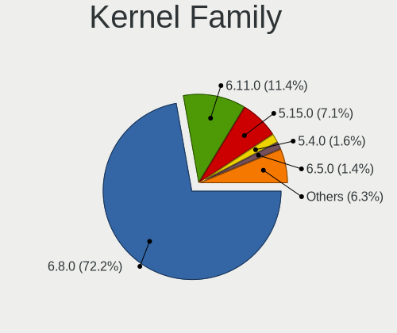
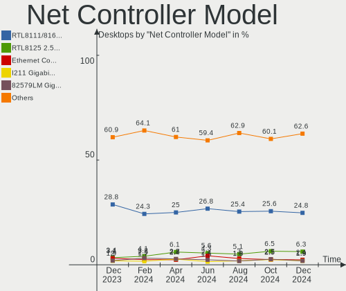
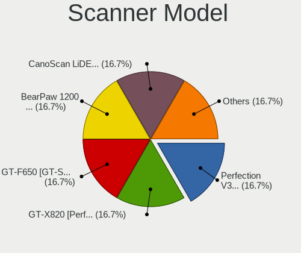
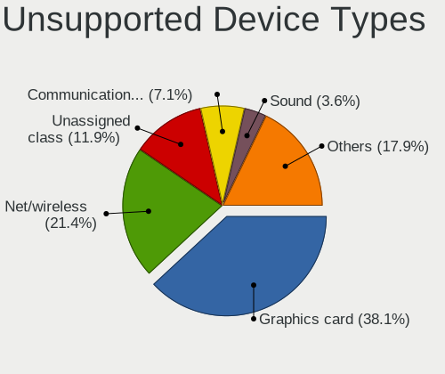

Ubuntu - Hardware Trends (Desktops)
-----------------------------------

A project to identify most popular hardware characteristics and track their change
over time based on data collected by Linux users at https://Linux-Hardware.org.

Anyone can contribute to this report by the [hw-probe](https://github.com/linuxhw/hw-probe) tool:

    sudo -E hw-probe -all -upload

This report is for one last month. Overall report since the beginning of time: [TestCoverage](https://github.com/linuxhw/TestCoverage)

Period: Dec, 2022.

Contents
--------

* [ System ](#system)
  - [ OS                       ](#os)
  - [ OS Family                ](#os-family)
  - [ Kernel                   ](#kernel)
  - [ Kernel Family            ](#kernel-family)
  - [ Kernel Major Ver.        ](#kernel-major-ver)
  - [ Arch                     ](#arch)
  - [ DE                       ](#de)
  - [ Display Server           ](#display-server)
  - [ Display Manager          ](#display-manager)
  - [ OS Lang                  ](#os-lang)
  - [ Boot Mode                ](#boot-mode)
  - [ Filesystem               ](#filesystem)
  - [ Part. scheme             ](#part-scheme)
  - [ Dual Boot with Linux/BSD ](#dual-boot-with-linuxbsd)
  - [ Dual Boot (Win)          ](#dual-boot-win)

* [ Board ](#board)
  - [ Vendor                   ](#vendor)
  - [ Model                    ](#model)
  - [ Model Family             ](#model-family)
  - [ MFG Year                 ](#mfg-year)
  - [ Form Factor              ](#form-factor)
  - [ Secure Boot              ](#secure-boot)
  - [ Coreboot                 ](#coreboot)
  - [ RAM Size                 ](#ram-size)
  - [ RAM Used                 ](#ram-used)
  - [ Total Drives             ](#total-drives)
  - [ Has CD-ROM               ](#has-cd-rom)
  - [ Has Ethernet             ](#has-ethernet)
  - [ Has WiFi                 ](#has-wifi)
  - [ Has Bluetooth            ](#has-bluetooth)

* [ Location ](#location)
  - [ Country                  ](#country)
  - [ City                     ](#city)

* [ Drives ](#drives)
  - [ Drive Vendor             ](#drive-vendor)
  - [ Drive Model              ](#drive-model)
  - [ HDD Vendor               ](#hdd-vendor)
  - [ SSD Vendor               ](#ssd-vendor)
  - [ Drive Kind               ](#drive-kind)
  - [ Drive Connector          ](#drive-connector)
  - [ Drive Size               ](#drive-size)
  - [ Space Total              ](#space-total)
  - [ Space Used               ](#space-used)
  - [ Malfunc. Drives          ](#malfunc-drives)
  - [ Malfunc. Drive Vendor    ](#malfunc-drive-vendor)
  - [ Malfunc. HDD Vendor      ](#malfunc-hdd-vendor)
  - [ Malfunc. Drive Kind      ](#malfunc-drive-kind)
  - [ Failed Drives            ](#failed-drives)
  - [ Failed Drive Vendor      ](#failed-drive-vendor)
  - [ Drive Status             ](#drive-status)

* [ Storage controller ](#storage-controller)
  - [ Storage Vendor           ](#storage-vendor)
  - [ Storage Model            ](#storage-model)
  - [ Storage Kind             ](#storage-kind)

* [ Processor ](#processor)
  - [ CPU Vendor               ](#cpu-vendor)
  - [ CPU Model                ](#cpu-model)
  - [ CPU Model Family         ](#cpu-model-family)
  - [ CPU Cores                ](#cpu-cores)
  - [ CPU Sockets              ](#cpu-sockets)
  - [ CPU Threads              ](#cpu-threads)
  - [ CPU Op-Modes             ](#cpu-op-modes)
  - [ CPU Microcode            ](#cpu-microcode)
  - [ CPU Microarch            ](#cpu-microarch)

* [ Graphics ](#graphics)
  - [ GPU Vendor               ](#gpu-vendor)
  - [ GPU Model                ](#gpu-model)
  - [ GPU Combo                ](#gpu-combo)
  - [ GPU Driver               ](#gpu-driver)
  - [ GPU Memory               ](#gpu-memory)

* [ Monitor ](#monitor)
  - [ Monitor Vendor           ](#monitor-vendor)
  - [ Monitor Model            ](#monitor-model)
  - [ Monitor Resolution       ](#monitor-resolution)
  - [ Monitor Diagonal         ](#monitor-diagonal)
  - [ Monitor Width            ](#monitor-width)
  - [ Aspect Ratio             ](#aspect-ratio)
  - [ Monitor Area             ](#monitor-area)
  - [ Pixel Density            ](#pixel-density)
  - [ Multiple Monitors        ](#multiple-monitors)

* [ Network ](#network)
  - [ Net Controller Vendor    ](#net-controller-vendor)
  - [ Net Controller Model     ](#net-controller-model)
  - [ Wireless Vendor          ](#wireless-vendor)
  - [ Wireless Model           ](#wireless-model)
  - [ Ethernet Vendor          ](#ethernet-vendor)
  - [ Ethernet Model           ](#ethernet-model)
  - [ Net Controller Kind      ](#net-controller-kind)
  - [ Used Controller          ](#used-controller)
  - [ NICs                     ](#nics)
  - [ IPv6                     ](#ipv6)

* [ Bluetooth ](#bluetooth)
  - [ Bluetooth Vendor         ](#bluetooth-vendor)
  - [ Bluetooth Model          ](#bluetooth-model)

* [ Sound ](#sound)
  - [ Sound Vendor             ](#sound-vendor)
  - [ Sound Model              ](#sound-model)

* [ Memory ](#memory)
  - [ Memory Vendor            ](#memory-vendor)
  - [ Memory Model             ](#memory-model)
  - [ Memory Kind              ](#memory-kind)
  - [ Memory Form Factor       ](#memory-form-factor)
  - [ Memory Size              ](#memory-size)
  - [ Memory Speed             ](#memory-speed)

* [ Printers & scanners ](#printers--scanners)
  - [ Printer Vendor           ](#printer-vendor)
  - [ Printer Model            ](#printer-model)
  - [ Scanner Vendor           ](#scanner-vendor)
  - [ Scanner Model            ](#scanner-model)

* [ Camera ](#camera)
  - [ Camera Vendor            ](#camera-vendor)
  - [ Camera Model             ](#camera-model)

* [ Security ](#security)
  - [ Fingerprint Vendor       ](#fingerprint-vendor)
  - [ Fingerprint Model        ](#fingerprint-model)
  - [ Chipcard Vendor          ](#chipcard-vendor)
  - [ Chipcard Model           ](#chipcard-model)

* [ Unsupported ](#unsupported)
  - [ Unsupported Devices      ](#unsupported-devices)
  - [ Unsupported Device Types ](#unsupported-device-types)

System
------

OS
--

Installed operating systems

| Name           | Desktops | Percent |
|----------------|----------|---------|
| Ubuntu 22.04   | 312      | 63.67%  |
| Ubuntu 22.10   | 83       | 16.94%  |
| Ubuntu 20.04   | 68       | 13.88%  |
| Ubuntu 18.04   | 17       | 3.47%   |
| Ubuntu 16.04   | 4        | 0.82%   |
| Ubuntu 23.04   | 3        | 0.61%   |
| Ubuntu Core 18 | 1        | 0.2%    |
| Ubuntu 21.04   | 1        | 0.2%    |
| Ubuntu 20.10   | 1        | 0.2%    |

OS Family
---------

OS without a version

| Name   | Desktops | Percent |
|--------|----------|---------|
| Ubuntu | 490      | 100%    |

Kernel
------

Version of the Linux kernel

| Version                | Desktops | Percent |
|------------------------|----------|---------|
| 5.15.0-56-generic      | 266      | 54.29%  |
| 5.19.0-26-generic      | 58       | 11.84%  |
| 5.15.0-43-generic      | 27       | 5.51%   |
| 5.15.0-53-generic      | 26       | 5.31%   |
| 5.15.0-57-generic      | 16       | 3.27%   |
| 5.4.0-135-generic      | 9        | 1.84%   |
| 5.19.0-23-generic      | 8        | 1.63%   |
| 4.15.0-200-generic     | 8        | 1.63%   |
| 5.19.0-21-generic      | 6        | 1.22%   |
| 5.15.0-52-generic      | 5        | 1.02%   |
| 6.0.9-060009-generic   | 4        | 0.82%   |
| 5.19.0-28-generic      | 4        | 0.82%   |
| 5.19.0-27-generic      | 4        | 0.82%   |
| 4.15.0-142-generic     | 4        | 0.82%   |
| 5.4.0-132-generic      | 2        | 0.41%   |
| 5.15.0-54-generic      | 2        | 0.41%   |
| 5.15.0-48-generic      | 2        | 0.41%   |
| 5.15.0-46-generic      | 2        | 0.41%   |
| 5.15.0-1025-oracle     | 2        | 0.41%   |
| 5.11.0-27-generic      | 2        | 0.41%   |
| 6.0.1-060001-generic   | 1        | 0.2%    |
| 6.0.0-060000-generic   | 1        | 0.2%    |
| 5.8.0-25-generic       | 1        | 0.2%    |
| 5.4.0-86-generic       | 1        | 0.2%    |
| 5.4.0-53-generic       | 1        | 0.2%    |
| 5.4.0-26-generic       | 1        | 0.2%    |
| 5.4.0-136-generic      | 1        | 0.2%    |
| 5.4.0-128-generic      | 1        | 0.2%    |
| 5.4.0-122-generic      | 1        | 0.2%    |
| 5.4.0-107-generic      | 1        | 0.2%    |
| 5.19.17-051917-generic | 1        | 0.2%    |
| 5.19.0-24-generic      | 1        | 0.2%    |
| 5.19.0-1012-lowlatency | 1        | 0.2%    |
| 5.18.10-051810-generic | 1        | 0.2%    |
| 5.17.15-051715-generic | 1        | 0.2%    |
| 5.17.0-1020-oem        | 1        | 0.2%    |
| 5.17.0-1019-oem        | 1        | 0.2%    |
| 5.15.0-56-lowlatency   | 1        | 0.2%    |
| 5.15.0-50-generic      | 1        | 0.2%    |
| 5.15.0-47-generic      | 1        | 0.2%    |

Kernel Family
-------------

Linux kernel without a distro release

| Version | Desktops | Percent |
|---------|----------|---------|
| 5.15.0  | 354      | 72.24%  |
| 5.19.0  | 82       | 16.73%  |
| 5.4.0   | 18       | 3.67%   |
| 4.15.0  | 16       | 3.27%   |
| 6.0.9   | 4        | 0.82%   |
| 5.11.0  | 4        | 0.82%   |
| 5.17.0  | 2        | 0.41%   |
| 5.13.0  | 2        | 0.41%   |
| 6.0.1   | 1        | 0.2%    |
| 6.0.0   | 1        | 0.2%    |
| 5.8.0   | 1        | 0.2%    |
| 5.19.17 | 1        | 0.2%    |
| 5.18.10 | 1        | 0.2%    |
| 5.17.15 | 1        | 0.2%    |
| 5.14.0  | 1        | 0.2%    |
| 4.18.0  | 1        | 0.2%    |

Kernel Major Ver.
-----------------

Linux kernel major version

| Version | Desktops | Percent |
|---------|----------|---------|
| 5.15    | 354      | 72.24%  |
| 5.19    | 83       | 16.94%  |
| 5.4     | 18       | 3.67%   |
| 4.15    | 16       | 3.27%   |
| 6.0     | 6        | 1.22%   |
| 5.11    | 4        | 0.82%   |
| 5.17    | 3        | 0.61%   |
| 5.13    | 2        | 0.41%   |
| 5.8     | 1        | 0.2%    |
| 5.18    | 1        | 0.2%    |
| 5.14    | 1        | 0.2%    |
| 4.18    | 1        | 0.2%    |

Arch
----

OS architecture (x86_64, i586, etc.)

| Name   | Desktops | Percent |
|--------|----------|---------|
| x86_64 | 486      | 99.18%  |
| i686   | 4        | 0.82%   |

DE
--

Desktop Environment

| Name            | Desktops | Percent |
|-----------------|----------|---------|
| GNOME           | 447      | 91.22%  |
| Unknown         | 30       | 6.12%   |
| X-Cinnamon      | 8        | 1.63%   |
| GNOME Flashback | 2        | 0.41%   |
| GNOME Classic   | 1        | 0.2%    |
| Cinnamon        | 1        | 0.2%    |
| awesome         | 1        | 0.2%    |

Display Server
--------------

X11 or Wayland

| Name    | Desktops | Percent |
|---------|----------|---------|
| X11     | 239      | 48.78%  |
| Wayland | 215      | 43.88%  |
| Tty     | 23       | 4.69%   |
| Unknown | 13       | 2.65%   |

Display Manager
---------------

SDDM, LightDM, etc.

| Name    | Desktops | Percent |
|---------|----------|---------|
| GDM3    | 410      | 83.67%  |
| Unknown | 50       | 10.2%   |
| GDM     | 24       | 4.9%    |
| LightDM | 5        | 1.02%   |
| SDDM    | 1        | 0.2%    |

OS Lang
-------

Language

| Lang    | Desktops | Percent |
|---------|----------|---------|
| en_US   | 219      | 44.69%  |
| de_DE   | 46       | 9.39%   |
| fr_FR   | 28       | 5.71%   |
| it_IT   | 22       | 4.49%   |
| ru_RU   | 19       | 3.88%   |
| pt_BR   | 15       | 3.06%   |
| en_GB   | 15       | 3.06%   |
| pl_PL   | 9        | 1.84%   |
| en_CA   | 9        | 1.84%   |
| Unknown | 8        | 1.63%   |
| es_ES   | 7        | 1.43%   |
| en_IN   | 7        | 1.43%   |
| C       | 7        | 1.43%   |
| nl_NL   | 6        | 1.22%   |
| ja_JP   | 5        | 1.02%   |
| en_ZA   | 5        | 1.02%   |
| cs_CZ   | 5        | 1.02%   |
| pt_PT   | 4        | 0.82%   |
| en_AU   | 4        | 0.82%   |
| zh_CN   | 3        | 0.61%   |
| nl_BE   | 3        | 0.61%   |
| fr_BE   | 3        | 0.61%   |
| es_BO   | 3        | 0.61%   |
| es_AR   | 3        | 0.61%   |
| en_SG   | 3        | 0.61%   |
| el_GR   | 3        | 0.61%   |
| tr_TR   | 2        | 0.41%   |
| ko_KR   | 2        | 0.41%   |
| en_NZ   | 2        | 0.41%   |
| de_CH   | 2        | 0.41%   |
| de_AT   | 2        | 0.41%   |
| sv_SE   | 1        | 0.2%    |
| sr_RS   | 1        | 0.2%    |
| sl_SI   | 1        | 0.2%    |
| ro_RO   | 1        | 0.2%    |
| nb_NO   | 1        | 0.2%    |
| hu_HU   | 1        | 0.2%    |
| hr_HR   | 1        | 0.2%    |
| fr_CA   | 1        | 0.2%    |
| fi_FI   | 1        | 0.2%    |

Boot Mode
---------

EFI or BIOS

| Mode | Desktops | Percent |
|------|----------|---------|
| BIOS | 356      | 72.65%  |
| EFI  | 134      | 27.35%  |

Filesystem
----------

Type of filesystem

| Type    | Desktops | Percent |
|---------|----------|---------|
| Ext4    | 452      | 92.24%  |
| Zfs     | 14       | 2.86%   |
| Overlay | 14       | 2.86%   |
| Btrfs   | 7        | 1.43%   |
| Ext3    | 2        | 0.41%   |
| Xfs     | 1        | 0.2%    |

Part. scheme
------------

Scheme of partitioning

| Type    | Desktops | Percent |
|---------|----------|---------|
| GPT     | 384      | 78.37%  |
| MBR     | 83       | 16.94%  |
| Unknown | 23       | 4.69%   |

Dual Boot with Linux/BSD
------------------------

Hosting more than one Linux/BSD

| Dual boot | Desktops | Percent |
|-----------|----------|---------|
| No        | 397      | 81.02%  |
| Yes       | 93       | 18.98%  |

Dual Boot (Win)
---------------

Hosting Linux and Windows

| Dual boot | Desktops | Percent |
|-----------|----------|---------|
| No        | 266      | 54.29%  |
| Yes       | 224      | 45.71%  |

Board
-----

Vendor
------

Motherboard manufacturer

| Name                | Desktops | Percent |
|---------------------|----------|---------|
| ASUSTek Computer    | 128      | 26.12%  |
| Gigabyte Technology | 69       | 14.08%  |
| MSI                 | 66       | 13.47%  |
| Dell                | 59       | 12.04%  |
| ASRock              | 42       | 8.57%   |
| Hewlett-Packard     | 38       | 7.76%   |
| Lenovo              | 19       | 3.88%   |
| Intel               | 12       | 2.45%   |
| Acer                | 9        | 1.84%   |
| Fujitsu             | 7        | 1.43%   |
| Medion              | 5        | 1.02%   |
| Pegatron            | 4        | 0.82%   |
| Foxconn             | 3        | 0.61%   |
| BESSTAR Tech        | 3        | 0.61%   |
| Alienware           | 3        | 0.61%   |
| Unknown             | 3        | 0.61%   |
| NCR                 | 2        | 0.41%   |
| Huanan              | 2        | 0.41%   |
| Gateway             | 2        | 0.41%   |
| Biostar             | 2        | 0.41%   |
| AZW                 | 2        | 0.41%   |
| Supermicro          | 1        | 0.2%    |
| Shuttle             | 1        | 0.2%    |
| POSIFLEX            | 1        | 0.2%    |
| PERTOSA             | 1        | 0.2%    |
| Packard Bell        | 1        | 0.2%    |
| MiTAC               | 1        | 0.2%    |
| Lanix               | 1        | 0.2%    |
| IBM                 | 1        | 0.2%    |
| Fujitsu Siemens     | 1        | 0.2%    |
| eMachines           | 1        | 0.2%    |

Model
-----

Motherboard model

| Name                             | Desktops | Percent |
|----------------------------------|----------|---------|
| ASUS All Series                  | 11       | 2.24%   |
| ASUS TUF Gaming X570-PLUS        | 6        | 1.22%   |
| ASUS PRIME A320M-K               | 5        | 1.02%   |
| MSI MS-7B86                      | 4        | 0.82%   |
| Gigabyte B75M-D3H                | 4        | 0.82%   |
| Dell OptiPlex 7010               | 4        | 0.82%   |
| Gigabyte B450M DS3H              | 3        | 0.61%   |
| Gigabyte 970A-UD3P               | 3        | 0.61%   |
| Dell Precision T3600             | 3        | 0.61%   |
| Dell OptiPlex 990                | 3        | 0.61%   |
| Dell OptiPlex 790                | 3        | 0.61%   |
| Dell OptiPlex 3020               | 3        | 0.61%   |
| ASUS PRIME B450M-GAMING/BR       | 3        | 0.61%   |
| ASUS M5A78L-M/USB3               | 3        | 0.61%   |
| Unknown                          | 3        | 0.61%   |
| MSI MS-7D46                      | 2        | 0.41%   |
| MSI MS-7C80                      | 2        | 0.41%   |
| MSI MS-7C56                      | 2        | 0.41%   |
| MSI MS-7C09                      | 2        | 0.41%   |
| MSI MS-7B49                      | 2        | 0.41%   |
| MSI MS-7B09                      | 2        | 0.41%   |
| MSI MS-7A70                      | 2        | 0.41%   |
| MSI MS-7721                      | 2        | 0.41%   |
| HP ProDesk 600 G1 SFF            | 2        | 0.41%   |
| HP EliteDesk 800 G1 USDT         | 2        | 0.41%   |
| HP Compaq 8200 Elite SFF PC      | 2        | 0.41%   |
| HP Compaq 6005 Pro SFF PC        | 2        | 0.41%   |
| Gigabyte Z690 AORUS PRO          | 2        | 0.41%   |
| Gigabyte X58A-UD3R               | 2        | 0.41%   |
| Gigabyte TRX40 AORUS PRO WIFI    | 2        | 0.41%   |
| Gigabyte B85M-D3H                | 2        | 0.41%   |
| Dell XPS 8950                    | 2        | 0.41%   |
| Dell Precision WorkStation T3500 | 2        | 0.41%   |
| Dell Precision Tower 7810        | 2        | 0.41%   |
| Dell OptiPlex 3050               | 2        | 0.41%   |
| Dell OptiPlex 3040               | 2        | 0.41%   |
| Dell OptiPlex 3010               | 2        | 0.41%   |
| Dell Inspiron 3647               | 2        | 0.41%   |
| AZW U59                          | 2        | 0.41%   |
| ASUS Z170 PRO GAMING             | 2        | 0.41%   |

Model Family
------------

Motherboard model prefix

| Name               | Desktops | Percent |
|--------------------|----------|---------|
| Dell OptiPlex      | 27       | 5.51%   |
| ASUS PRIME         | 27       | 5.51%   |
| ASUS ROG           | 17       | 3.47%   |
| Dell Precision     | 14       | 2.86%   |
| ASUS TUF           | 14       | 2.86%   |
| HP Compaq          | 11       | 2.24%   |
| ASUS All           | 11       | 2.24%   |
| Lenovo ThinkCentre | 9        | 1.84%   |
| Dell Inspiron      | 6        | 1.22%   |
| HP ProLiant        | 5        | 1.02%   |
| Dell XPS           | 5        | 1.02%   |
| ASUS M5A78L-M      | 5        | 1.02%   |
| Acer Aspire        | 5        | 1.02%   |
| MSI MS-7B86        | 4        | 0.82%   |
| Lenovo IdeaCentre  | 4        | 0.82%   |
| HP EliteDesk       | 4        | 0.82%   |
| Gigabyte B75M-D3H  | 4        | 0.82%   |
| Fujitsu ESPRIMO    | 4        | 0.82%   |
| Dell Vostro        | 4        | 0.82%   |
| HP ProDesk         | 3        | 0.61%   |
| Gigabyte Z690      | 3        | 0.61%   |
| Gigabyte B550      | 3        | 0.61%   |
| Gigabyte B450M     | 3        | 0.61%   |
| Gigabyte 970A-UD3P | 3        | 0.61%   |
| ASUS P7H55-M       | 3        | 0.61%   |
| ASUS P5KPL-AM      | 3        | 0.61%   |
| ASRock B450        | 3        | 0.61%   |
| Acer Veriton       | 3        | 0.61%   |
| Unknown            | 3        | 0.61%   |
| MSI MS-7D46        | 2        | 0.41%   |
| MSI MS-7C80        | 2        | 0.41%   |
| MSI MS-7C56        | 2        | 0.41%   |
| MSI MS-7C09        | 2        | 0.41%   |
| MSI MS-7B49        | 2        | 0.41%   |
| MSI MS-7B09        | 2        | 0.41%   |
| MSI MS-7A70        | 2        | 0.41%   |
| MSI MS-7721        | 2        | 0.41%   |
| Gigabyte X58A-UD3R | 2        | 0.41%   |
| Gigabyte TRX40     | 2        | 0.41%   |
| Gigabyte B85M-D3H  | 2        | 0.41%   |

MFG Year
--------

Motherboard manufacture year

| Year | Desktops | Percent |
|------|----------|---------|
| 2013 | 47       | 9.59%   |
| 2019 | 42       | 8.57%   |
| 2017 | 41       | 8.37%   |
| 2012 | 40       | 8.16%   |
| 2021 | 39       | 7.96%   |
| 2011 | 39       | 7.96%   |
| 2018 | 38       | 7.76%   |
| 2014 | 31       | 6.33%   |
| 2020 | 30       | 6.12%   |
| 2009 | 29       | 5.92%   |
| 2015 | 26       | 5.31%   |
| 2022 | 23       | 4.69%   |
| 2010 | 22       | 4.49%   |
| 2016 | 16       | 3.27%   |
| 2008 | 11       | 2.24%   |
| 2007 | 11       | 2.24%   |
| 2006 | 2        | 0.41%   |
| 2005 | 2        | 0.41%   |
| 2002 | 1        | 0.2%    |

Form Factor
-----------

Physical design of the computer

| Name    | Desktops | Percent |
|---------|----------|---------|
| Desktop | 490      | 100%    |

Secure Boot
-----------

Enabled or disabled

| State    | Desktops | Percent |
|----------|----------|---------|
| Disabled | 478      | 97.55%  |
| Enabled  | 12       | 2.45%   |

Coreboot
--------

Have coreboot on board

| Used | Desktops | Percent |
|------|----------|---------|
| No   | 490      | 100%    |

RAM Size
--------

Total RAM memory

| Size in GB      | Desktops | Percent |
|-----------------|----------|---------|
| 16.01-24.0      | 125      | 25.51%  |
| 8.01-16.0       | 85       | 17.35%  |
| 32.01-64.0      | 81       | 16.53%  |
| 4.01-8.0        | 77       | 15.71%  |
| 3.01-4.0        | 59       | 12.04%  |
| 64.01-256.0     | 32       | 6.53%   |
| 24.01-32.0      | 11       | 2.24%   |
| 1.01-2.0        | 10       | 2.04%   |
| 2.01-3.0        | 4        | 0.82%   |
| More than 256.0 | 3        | 0.61%   |
| 0.51-1.0        | 2        | 0.41%   |
| 0.01-0.5        | 1        | 0.2%    |

RAM Used
--------

Used RAM memory

| Used GB     | Desktops | Percent |
|-------------|----------|---------|
| 1.01-2.0    | 154      | 31.43%  |
| 2.01-3.0    | 151      | 30.82%  |
| 4.01-8.0    | 79       | 16.12%  |
| 3.01-4.0    | 57       | 11.63%  |
| 8.01-16.0   | 24       | 4.9%    |
| 0.51-1.0    | 12       | 2.45%   |
| 16.01-24.0  | 7        | 1.43%   |
| 32.01-64.0  | 2        | 0.41%   |
| 0.01-0.5    | 2        | 0.41%   |
| 24.01-32.0  | 1        | 0.2%    |
| 64.01-256.0 | 1        | 0.2%    |

Total Drives
------------

Number of drives on board

| Drives | Desktops | Percent |
|--------|----------|---------|
| 1      | 190      | 38.78%  |
| 2      | 147      | 30%     |
| 3      | 55       | 11.22%  |
| 4      | 46       | 9.39%   |
| 5      | 22       | 4.49%   |
| 6      | 10       | 2.04%   |
| 7      | 8        | 1.63%   |
| 9      | 3        | 0.61%   |
| 0      | 3        | 0.61%   |
| 11     | 2        | 0.41%   |
| 8      | 2        | 0.41%   |
| 12     | 1        | 0.2%    |
| 10     | 1        | 0.2%    |

Has CD-ROM
----------

Has CD-ROM on board

| Presented | Desktops | Percent |
|-----------|----------|---------|
| No        | 259      | 52.86%  |
| Yes       | 231      | 47.14%  |

Has Ethernet
------------

Has Ethernet on board

| Presented | Desktops | Percent |
|-----------|----------|---------|
| Yes       | 485      | 98.98%  |
| No        | 5        | 1.02%   |

Has WiFi
--------

Has WiFi module

| Presented | Desktops | Percent |
|-----------|----------|---------|
| No        | 271      | 55.31%  |
| Yes       | 219      | 44.69%  |

Has Bluetooth
-------------

Has Bluetooth module

| Presented | Desktops | Percent |
|-----------|----------|---------|
| No        | 323      | 65.92%  |
| Yes       | 167      | 34.08%  |

Location
--------

Country
-------

Geographic location (country)

| Country      | Desktops | Percent |
|--------------|----------|---------|
| USA          | 121      | 24.69%  |
| Germany      | 59       | 12.04%  |
| France       | 31       | 6.33%   |
| Russia       | 25       | 5.1%    |
| Italy        | 23       | 4.69%   |
| UK           | 19       | 3.88%   |
| Canada       | 17       | 3.47%   |
| Brazil       | 16       | 3.27%   |
| Poland       | 14       | 2.86%   |
| Spain        | 9        | 1.84%   |
| Netherlands  | 9        | 1.84%   |
| Serbia       | 8        | 1.63%   |
| India        | 8        | 1.63%   |
| Portugal     | 7        | 1.43%   |
| China        | 7        | 1.43%   |
| Belgium      | 7        | 1.43%   |
| South Africa | 6        | 1.22%   |
| Japan        | 6        | 1.22%   |
| Greece       | 6        | 1.22%   |
| Czechia      | 6        | 1.22%   |
| South Korea  | 5        | 1.02%   |
| Austria      | 5        | 1.02%   |
| Switzerland  | 4        | 0.82%   |
| Norway       | 4        | 0.82%   |
| Indonesia    | 4        | 0.82%   |
| Bulgaria     | 4        | 0.82%   |
| Australia    | 4        | 0.82%   |
| Unknown      | 4        | 0.82%   |
| Turkey       | 3        | 0.61%   |
| New Zealand  | 3        | 0.61%   |
| Hungary      | 3        | 0.61%   |
| Denmark      | 3        | 0.61%   |
| Argentina    | 3        | 0.61%   |
| Thailand     | 2        | 0.41%   |
| Sweden       | 2        | 0.41%   |
| Sri Lanka    | 2        | 0.41%   |
| Singapore    | 2        | 0.41%   |
| Saudi Arabia | 2        | 0.41%   |
| Romania      | 2        | 0.41%   |
| Pakistan     | 2        | 0.41%   |

City
----

Geographic location (city)

| City          | Desktops | Percent |
|---------------|----------|---------|
| Moscow        | 8        | 1.63%   |
| Milan         | 6        | 1.22%   |
| Toronto       | 5        | 1.02%   |
| Seattle       | 5        | 1.02%   |
| Novosibirsk   | 5        | 1.02%   |
| Vienna        | 4        | 0.82%   |
| Hamburg       | 4        | 0.82%   |
| Belgrade      | 4        | 0.82%   |
| Unknown       | 4        | 0.82%   |
| Sydney        | 3        | 0.61%   |
| Sao Paulo     | 3        | 0.61%   |
| New York      | 3        | 0.61%   |
| Munich        | 3        | 0.61%   |
| Los Angeles   | 3        | 0.61%   |
| Budapest      | 3        | 0.61%   |
| Amsterdam     | 3        | 0.61%   |
| Uiwang        | 2        | 0.41%   |
| Turin         | 2        | 0.41%   |
| Tampa         | 2        | 0.41%   |
| Syosset       | 2        | 0.41%   |
| Stuttgart     | 2        | 0.41%   |
| St Petersburg | 2        | 0.41%   |
| Saransk       | 2        | 0.41%   |
| San Jose      | 2        | 0.41%   |
| Rome          | 2        | 0.41%   |
| Riyadh        | 2        | 0.41%   |
| Porto         | 2        | 0.41%   |
| Port Perry    | 2        | 0.41%   |
| Phoenix       | 2        | 0.41%   |
| Philadelphia  | 2        | 0.41%   |
| Paris         | 2        | 0.41%   |
| Nuremberg     | 2        | 0.41%   |
| Notodden      | 2        | 0.41%   |
| Milwaukee     | 2        | 0.41%   |
| Mililani Town | 2        | 0.41%   |
| Lyon          | 2        | 0.41%   |
| London        | 2        | 0.41%   |
| Liberec       | 2        | 0.41%   |
| Leeds         | 2        | 0.41%   |
| Johannesburg  | 2        | 0.41%   |

Drives
------

Drive Vendor
------------

Hard drive vendors

| Vendor                      | Desktops | Drives | Percent |
|-----------------------------|----------|--------|---------|
| Seagate                     | 170      | 242    | 18.91%  |
| WDC                         | 165      | 240    | 18.35%  |
| Samsung Electronics         | 140      | 180    | 15.57%  |
| Kingston                    | 49       | 56     | 5.45%   |
| Crucial                     | 41       | 48     | 4.56%   |
| Toshiba                     | 40       | 45     | 4.45%   |
| SanDisk                     | 38       | 46     | 4.23%   |
| Hitachi                     | 30       | 33     | 3.34%   |
| A-DATA Technology           | 22       | 24     | 2.45%   |
| Phison Electronics          | 13       | 16     | 1.45%   |
| Silicon Motion              | 12       | 12     | 1.33%   |
| Intel                       | 12       | 16     | 1.33%   |
| HGST                        | 11       | 13     | 1.22%   |
| China                       | 9        | 12     | 1%      |
| SK hynix                    | 8        | 8      | 0.89%   |
| Unknown                     | 7        | 10     | 0.78%   |
| SPCC                        | 7        | 8      | 0.78%   |
| Kingston Technology Company | 7        | 7      | 0.78%   |
| Hewlett-Packard             | 7        | 7      | 0.78%   |
| Micron/Crucial Technology   | 6        | 6      | 0.67%   |
| Maxtor                      | 6        | 6      | 0.67%   |
| Intenso                     | 6        | 6      | 0.67%   |
| Unknown                     | 6        | 7      | 0.67%   |
| Team                        | 5        | 6      | 0.56%   |
| Phison                      | 5        | 6      | 0.56%   |
| Micron Technology           | 5        | 5      | 0.56%   |
| Patriot                     | 4        | 4      | 0.44%   |
| Corsair                     | 4        | 5      | 0.44%   |
| T-FORCE                     | 3        | 3      | 0.33%   |
| JMicron Technology          | 3        | 3      | 0.33%   |
| GOODRAM                     | 3        | 3      | 0.33%   |
| Apacer                      | 3        | 3      | 0.33%   |
| ADATA Technology            | 3        | 4      | 0.33%   |
| Verbatim                    | 2        | 2      | 0.22%   |
| Transcend                   | 2        | 2      | 0.22%   |
| SABRENT                     | 2        | 2      | 0.22%   |
| PNY                         | 2        | 2      | 0.22%   |
| OSCOO                       | 2        | 2      | 0.22%   |
| OCZ                         | 2        | 2      | 0.22%   |
| Mushkin                     | 2        | 2      | 0.22%   |

Drive Model
-----------

Hard drive models

| Model                                                  | Desktops | Percent |
|--------------------------------------------------------|----------|---------|
| Samsung NVMe SSD Controller SM981/PM981/PM983 500GB    | 23       | 2.22%   |
| Seagate ST500DM002-1BD142 500GB                        | 15       | 1.45%   |
| Kingston SA400S37240G 240GB SSD                        | 15       | 1.45%   |
| Seagate ST1000DM010-2EP102 1TB                         | 12       | 1.16%   |
| Samsung SSD 850 EVO 500GB                              | 11       | 1.06%   |
| Samsung NVMe SSD Controller PM9A1/PM9A3/980PRO 2TB     | 11       | 1.06%   |
| WDC WD10EZEX-08WN4A0 1TB                               | 9        | 0.87%   |
| Silicon Motion SM2263EN/SM2263XT SSD Controller 1024GB | 9        | 0.87%   |
| Samsung SSD 850 EVO 250GB                              | 9        | 0.87%   |
| Crucial CT240BX500SSD1 240GB                           | 9        | 0.87%   |
| Toshiba DT01ACA100 1TB                                 | 7        | 0.68%   |
| Seagate ST4000DM004-2CV104 4TB                         | 7        | 0.68%   |
| Samsung SSD 860 EVO 500GB                              | 7        | 0.68%   |
| Seagate ST1000DM003-1CH162 1TB                         | 6        | 0.58%   |
| Crucial CT1000MX500SSD1 1TB                            | 6        | 0.58%   |
| A-DATA SU650 120GB SSD                                 | 6        | 0.58%   |
| Unknown                                                | 6        | 0.58%   |
| WDC WD10EZEX-60M2NA0 1TB                               | 5        | 0.48%   |
| WDC WD1003FZEX-00K3CA0 1TB                             | 5        | 0.48%   |
| Seagate ST1000LM035-1RK172 1TB                         | 5        | 0.48%   |
| Seagate Expansion Desk 5TB                             | 5        | 0.48%   |
| Samsung SSD 870 EVO 500GB                              | 5        | 0.48%   |
| Samsung NVMe SSD Controller SM961/PM961/SM963 256GB    | 5        | 0.48%   |
| Samsung HD103SJ 1TB                                    | 5        | 0.48%   |
| Phison E16 PCIe4 NVMe Controller 512GB                 | 5        | 0.48%   |
| Phison E12 NVMe Controller 1TB                         | 5        | 0.48%   |
| WDC WD20EZRX-00D8PB0 2TB                               | 4        | 0.39%   |
| WDC WD10EARS-00Y5B1 1TB                                | 4        | 0.39%   |
| Unknown SD/MMC/MS PRO 64GB                             | 4        | 0.39%   |
| Toshiba HDWD110 1TB                                    | 4        | 0.39%   |
| Toshiba DT01ACA050 500GB                               | 4        | 0.39%   |
| Seagate ST2000DM008-2FR102 2TB                         | 4        | 0.39%   |
| Seagate ST2000DM001-1CH164 2TB                         | 4        | 0.39%   |
| Seagate ST1000DM003-1SB102 1TB                         | 4        | 0.39%   |
| Seagate Expansion 4TB                                  | 4        | 0.39%   |
| Samsung SSD 860 EVO 1TB                                | 4        | 0.39%   |
| Samsung SSD 840 EVO 250GB                              | 4        | 0.39%   |
| Kingston Company A2000 NVMe SSD 1TB                    | 4        | 0.39%   |
| Kingston SV300S37A120G 120GB SSD                       | 4        | 0.39%   |
| Kingston SA400S37120G 120GB SSD                        | 4        | 0.39%   |

HDD Vendor
----------

Hard disk drive vendors

| Vendor              | Desktops | Drives | Percent |
|---------------------|----------|--------|---------|
| Seagate             | 166      | 233    | 37.64%  |
| WDC                 | 148      | 213    | 33.56%  |
| Toshiba             | 39       | 42     | 8.84%   |
| Hitachi             | 30       | 33     | 6.8%    |
| Samsung Electronics | 28       | 30     | 6.35%   |
| HGST                | 10       | 11     | 2.27%   |
| Maxtor              | 6        | 6      | 1.36%   |
| Unknown             | 5        | 6      | 1.13%   |
| Hewlett-Packard     | 3        | 3      | 0.68%   |
| Intenso             | 2        | 2      | 0.45%   |
| WD MediaMax         | 1        | 1      | 0.23%   |
| ASMT                | 1        | 1      | 0.23%   |
| ASMedia             | 1        | 1      | 0.23%   |
| Unknown             | 1        | 2      | 0.23%   |

SSD Vendor
----------

Solid state drive vendors

| Vendor              | Desktops | Drives | Percent |
|---------------------|----------|--------|---------|
| Samsung Electronics | 62       | 69     | 19.75%  |
| Kingston            | 43       | 50     | 13.69%  |
| Crucial             | 39       | 45     | 12.42%  |
| SanDisk             | 28       | 32     | 8.92%   |
| A-DATA Technology   | 21       | 23     | 6.69%   |
| WDC                 | 20       | 21     | 6.37%   |
| China               | 9        | 12     | 2.87%   |
| Intel               | 7        | 8      | 2.23%   |
| SPCC                | 6        | 7      | 1.91%   |
| Team                | 5        | 6      | 1.59%   |
| Patriot             | 4        | 4      | 1.27%   |
| Micron Technology   | 4        | 4      | 1.27%   |
| Intenso             | 4        | 4      | 1.27%   |
| Hewlett-Packard     | 4        | 4      | 1.27%   |
| Unknown             | 4        | 4      | 1.27%   |
| SK hynix            | 3        | 3      | 0.96%   |
| JMicron Technology  | 3        | 3      | 0.96%   |
| GOODRAM             | 3        | 3      | 0.96%   |
| Apacer              | 3        | 3      | 0.96%   |
| Verbatim            | 2        | 2      | 0.64%   |
| Transcend           | 2        | 2      | 0.64%   |
| Toshiba             | 2        | 2      | 0.64%   |
| Seagate             | 2        | 2      | 0.64%   |
| PNY                 | 2        | 2      | 0.64%   |
| OSCOO               | 2        | 2      | 0.64%   |
| OCZ                 | 2        | 2      | 0.64%   |
| Mushkin             | 2        | 2      | 0.64%   |
| LITEON              | 2        | 2      | 0.64%   |
| Corsair             | 2        | 2      | 0.64%   |
| TO Exter            | 1        | 1      | 0.32%   |
| tecmiyo             | 1        | 1      | 0.32%   |
| Teclast             | 1        | 1      | 0.32%   |
| T-FORCE             | 1        | 1      | 0.32%   |
| SUNEAST             | 1        | 1      | 0.32%   |
| Solid               | 1        | 1      | 0.32%   |
| POWER               | 1        | 1      | 0.32%   |
| Phison              | 1        | 1      | 0.32%   |
| NTC                 | 1        | 1      | 0.32%   |
| NGFF                | 1        | 1      | 0.32%   |
| Lexar               | 1        | 1      | 0.32%   |

Drive Kind
----------

HDD or SSD

| Kind    | Desktops | Drives | Percent |
|---------|----------|--------|---------|
| HDD     | 333      | 584    | 44.28%  |
| SSD     | 254      | 348    | 33.78%  |
| NVMe    | 151      | 190    | 20.08%  |
| Unknown | 14       | 19     | 1.86%   |

Drive Connector
---------------

SATA, SAS, NVMe, etc.

| Type | Desktops | Drives | Percent |
|------|----------|--------|---------|
| SATA | 442      | 890    | 70.27%  |
| NVMe | 149      | 187    | 23.69%  |
| SAS  | 38       | 64     | 6.04%   |

Drive Size
----------

Size of hard drive

| Size in TB | Desktops | Drives | Percent |
|------------|----------|--------|---------|
| 0.01-0.5   | 320      | 442    | 48.27%  |
| 0.51-1.0   | 175      | 232    | 26.4%   |
| 1.01-2.0   | 74       | 90     | 11.16%  |
| 3.01-4.0   | 49       | 80     | 7.39%   |
| 4.01-10.0  | 19       | 35     | 2.87%   |
| 2.01-3.0   | 16       | 28     | 2.41%   |
| 10.01-20.0 | 10       | 25     | 1.51%   |

Space Total
-----------

Amount of disk space available on the file system

| Size in GB     | Desktops | Percent |
|----------------|----------|---------|
| 101-250        | 117      | 23.88%  |
| 501-1000       | 91       | 18.57%  |
| 251-500        | 87       | 17.76%  |
| More than 3000 | 58       | 11.84%  |
| 1001-2000      | 53       | 10.82%  |
| 51-100         | 26       | 5.31%   |
| 1-20           | 21       | 4.29%   |
| 2001-3000      | 19       | 3.88%   |
| 21-50          | 9        | 1.84%   |
| Unknown        | 9        | 1.84%   |

Space Used
----------

Amount of used disk space

| Used GB        | Desktops | Percent |
|----------------|----------|---------|
| 1-20           | 150      | 30.61%  |
| 21-50          | 82       | 16.73%  |
| 51-100         | 65       | 13.27%  |
| 101-250        | 50       | 10.2%   |
| 251-500        | 42       | 8.57%   |
| 501-1000       | 40       | 8.16%   |
| More than 3000 | 24       | 4.9%    |
| 1001-2000      | 19       | 3.88%   |
| 2001-3000      | 9        | 1.84%   |
| Unknown        | 9        | 1.84%   |

Malfunc. Drives
---------------

Drive models with a malfunction

| Model                               | Desktops | Drives | Percent |
|-------------------------------------|----------|--------|---------|
| WDC WDS480G2G0A-00JH30 480GB SSD    | 1        | 1      | 2.7%    |
| WDC WDS240G2G0B-00EPW0 240GB SSD    | 1        | 1      | 2.7%    |
| WDC WDS240G2G0A-00JH30 240GB SSD    | 1        | 1      | 2.7%    |
| WDC WD5000AAKX-001CA0 500GB         | 1        | 1      | 2.7%    |
| WDC WD40PURX-64GVNY0 4TB            | 1        | 1      | 2.7%    |
| WDC WD40EZRX-00SPEB0 4TB            | 1        | 1      | 2.7%    |
| WDC WD4003FZEX-00Z4SA0 4TB          | 1        | 2      | 2.7%    |
| WDC WD10PURZ-85U8XY0 1TB            | 1        | 1      | 2.7%    |
| WDC WD10EARS-00Y5B1 1TB             | 1        | 2      | 2.7%    |
| WDC WD10EARS-00MVWB0 1TB            | 1        | 1      | 2.7%    |
| WDC WD1002FAEX-00Z3A0 1TB           | 1        | 1      | 2.7%    |
| Seagate ST500DM002-1BD142 500GB     | 1        | 1      | 2.7%    |
| Seagate ST4000NM0053 4TB            | 1        | 2      | 2.7%    |
| Seagate ST3250310AS 250GB           | 1        | 1      | 2.7%    |
| Seagate ST32000644NS 2TB            | 1        | 1      | 2.7%    |
| Seagate ST2000DL001-9VT156 2TB      | 1        | 1      | 2.7%    |
| Seagate ST1000LM014-1EJ164-SSHD 1TB | 1        | 1      | 2.7%    |
| Seagate ST1000DM010-2EP102 1TB      | 1        | 1      | 2.7%    |
| Seagate ST1000DM003-9YN162 1TB      | 1        | 1      | 2.7%    |
| SanDisk SSD PLUS 480GB              | 1        | 1      | 2.7%    |
| Samsung Electronics SSD 970 EVO 2TB | 1        | 1      | 2.7%    |
| Samsung Electronics SP1614C 160GB   | 1        | 1      | 2.7%    |
| Samsung Electronics HD322GJ 320GB   | 1        | 1      | 2.7%    |
| Maxtor 6V160E0 160GB                | 1        | 1      | 2.7%    |
| Kingston SV300S37A240G 240GB SSD    | 1        | 1      | 2.7%    |
| Kingston SA400S37240G 240GB SSD     | 1        | 1      | 2.7%    |
| Intenso SSD Sata III 256GB          | 1        | 1      | 2.7%    |
| Intenso SSD Sata III 128GB          | 1        | 1      | 2.7%    |
| Intel SSDSC2CW120A3 120GB           | 1        | 1      | 2.7%    |
| Intel SSDSC2BA400G3R 400GB          | 1        | 1      | 2.7%    |
| Hitachi HDT725025VLA380 250GB       | 1        | 1      | 2.7%    |
| Hitachi HDT721010SLA360 1TB         | 1        | 1      | 2.7%    |
| Hitachi HDS721616PLA380 160GB       | 1        | 1      | 2.7%    |
| Crucial CT500MX200SSD1 500GB        | 1        | 1      | 2.7%    |
| Crucial CT128MX100SSD1 128GB        | 1        | 1      | 2.7%    |
| A-DATA Technology SU650 240GB SSD   | 1        | 1      | 2.7%    |
| Unknown                             | 1        | 1      | 2.7%    |

Malfunc. Drive Vendor
---------------------

Vendors of faulty drives

| Vendor              | Desktops | Drives | Percent |
|---------------------|----------|--------|---------|
| WDC                 | 11       | 13     | 29.73%  |
| Seagate             | 8        | 9      | 21.62%  |
| Samsung Electronics | 3        | 3      | 8.11%   |
| Hitachi             | 3        | 3      | 8.11%   |
| Kingston            | 2        | 2      | 5.41%   |
| Intenso             | 2        | 2      | 5.41%   |
| Intel               | 2        | 2      | 5.41%   |
| Crucial             | 2        | 2      | 5.41%   |
| SanDisk             | 1        | 1      | 2.7%    |
| Maxtor              | 1        | 1      | 2.7%    |
| A-DATA Technology   | 1        | 1      | 2.7%    |
| Unknown             | 1        | 1      | 2.7%    |

Malfunc. HDD Vendor
-------------------

Vendors of faulty HDD drives

| Vendor              | Desktops | Drives | Percent |
|---------------------|----------|--------|---------|
| WDC                 | 8        | 10     | 36.36%  |
| Seagate             | 8        | 9      | 36.36%  |
| Hitachi             | 3        | 3      | 13.64%  |
| Samsung Electronics | 2        | 2      | 9.09%   |
| Maxtor              | 1        | 1      | 4.55%   |

Malfunc. Drive Kind
-------------------

Kinds of faulty drives

| Kind | Desktops | Drives | Percent |
|------|----------|--------|---------|
| HDD  | 21       | 25     | 58.33%  |
| SSD  | 14       | 14     | 38.89%  |
| NVMe | 1        | 1      | 2.78%   |

Failed Drives
-------------

Failed drive models

Zero info for selected period =(

Failed Drive Vendor
-------------------

Failed drive vendors

Zero info for selected period =(

Drive Status
------------

Number of failed and malfunc. drives

| Status   | Desktops | Drives | Percent |
|----------|----------|--------|---------|
| Detected | 339      | 785    | 64.45%  |
| Works    | 153      | 316    | 29.09%  |
| Malfunc  | 34       | 40     | 6.46%   |

Storage controller
------------------

Storage Vendor
--------------

Storage controller vendors

| Vendor                           | Desktops | Percent |
|----------------------------------|----------|---------|
| Intel                            | 328      | 45.81%  |
| AMD                              | 150      | 20.95%  |
| Samsung Electronics              | 63       | 8.8%    |
| ASMedia Technology               | 26       | 3.63%   |
| JMicron Technology               | 19       | 2.65%   |
| SanDisk                          | 18       | 2.51%   |
| Phison Electronics               | 18       | 2.51%   |
| Marvell Technology Group         | 15       | 2.09%   |
| Kingston Technology Company      | 13       | 1.82%   |
| Silicon Motion                   | 12       | 1.68%   |
| Nvidia                           | 10       | 1.4%    |
| Micron/Crucial Technology        | 9        | 1.26%   |
| SK hynix                         | 5        | 0.7%    |
| VIA Technologies                 | 4        | 0.56%   |
| Broadcom / LSI                   | 4        | 0.56%   |
| Silicon Image                    | 3        | 0.42%   |
| Seagate Technology               | 3        | 0.42%   |
| ADATA Technology                 | 3        | 0.42%   |
| Realtek Semiconductor            | 2        | 0.28%   |
| LSI Logic / Symbios Logic        | 2        | 0.28%   |
| KIOXIA                           | 2        | 0.28%   |
| Adaptec                          | 2        | 0.28%   |
| Toshiba America Info Systems     | 1        | 0.14%   |
| Silicon Integrated Systems [SiS] | 1        | 0.14%   |
| Micron Technology                | 1        | 0.14%   |
| MAXIO Technology (Hangzhou)      | 1        | 0.14%   |
| Hewlett-Packard                  | 1        | 0.14%   |

Storage Model
-------------

Storage controller models

| Model                                                                                   | Desktops | Percent |
|-----------------------------------------------------------------------------------------|----------|---------|
| AMD FCH SATA Controller [AHCI mode]                                                     | 84       | 9.5%    |
| Intel 8 Series/C220 Series Chipset Family 6-port SATA Controller 1 [AHCI mode]          | 37       | 4.19%   |
| Samsung NVMe SSD Controller SM981/PM981/PM983                                           | 33       | 3.73%   |
| Intel Q170/Q150/B150/H170/H110/Z170/CM236 Chipset SATA Controller [AHCI Mode]           | 28       | 3.17%   |
| Intel 200 Series PCH SATA controller [AHCI mode]                                        | 28       | 3.17%   |
| Intel 6 Series/C200 Series Chipset Family 6 port Desktop SATA AHCI Controller           | 25       | 2.83%   |
| AMD 400 Series Chipset SATA Controller                                                  | 25       | 2.83%   |
| Intel SATA Controller [RAID mode]                                                       | 24       | 2.71%   |
| ASMedia ASM1062 Serial ATA Controller                                                   | 24       | 2.71%   |
| AMD SB7x0/SB8x0/SB9x0 IDE Controller                                                    | 23       | 2.6%    |
| Intel 7 Series/C210 Series Chipset Family 6-port SATA Controller [AHCI mode]            | 20       | 2.26%   |
| Intel Alder Lake-S PCH SATA Controller [AHCI Mode]                                      | 18       | 2.04%   |
| AMD SB7x0/SB8x0/SB9x0 SATA Controller [IDE mode]                                        | 18       | 2.04%   |
| Samsung NVMe SSD Controller PM9A1/PM9A3/980PRO                                          | 17       | 1.92%   |
| AMD 500 Series Chipset SATA Controller                                                  | 17       | 1.92%   |
| Intel Cannon Lake PCH SATA AHCI Controller                                              | 16       | 1.81%   |
| AMD SB7x0/SB8x0/SB9x0 SATA Controller [AHCI mode]                                       | 16       | 1.81%   |
| JMicron JMB363 SATA/IDE Controller                                                      | 12       | 1.36%   |
| Intel 6 Series/C200 Series Chipset Family Desktop SATA Controller (IDE mode, ports 4-5) | 12       | 1.36%   |
| Intel 6 Series/C200 Series Chipset Family Desktop SATA Controller (IDE mode, ports 0-3) | 12       | 1.36%   |
| Intel 500 Series Chipset Family SATA AHCI Controller                                    | 12       | 1.36%   |
| AMD FCH SATA Controller D                                                               | 12       | 1.36%   |
| Intel NM10/ICH7 Family SATA Controller [IDE mode]                                       | 11       | 1.24%   |
| Intel 9 Series Chipset Family SATA Controller [AHCI Mode]                               | 10       | 1.13%   |
| Silicon Motion SM2263EN/SM2263XT SSD Controller                                         | 9        | 1.02%   |
| Samsung NVMe SSD Controller 980                                                         | 9        | 1.02%   |
| Samsung NVMe SSD Controller SM961/PM961/SM963                                           | 8        | 0.9%    |
| Phison E16 PCIe4 NVMe Controller                                                        | 8        | 0.9%    |
| Intel Volume Management Device NVMe RAID Controller                                     | 8        | 0.9%    |
| Intel 82801G (ICH7 Family) IDE Controller                                               | 8        | 0.9%    |
| Phison E12 NVMe Controller                                                              | 7        | 0.79%   |
| Intel C600/X79 series chipset 6-Port SATA AHCI Controller                               | 7        | 0.79%   |
| Micron/Crucial P2 NVMe PCIe SSD                                                         | 6        | 0.68%   |
| Intel C610/X99 series chipset 6-Port SATA Controller [AHCI mode]                        | 6        | 0.68%   |
| Intel 82801JI (ICH10 Family) 4 port SATA IDE Controller #1                              | 6        | 0.68%   |
| Intel 82801JI (ICH10 Family) 2 port SATA IDE Controller #2                              | 6        | 0.68%   |
| Intel 82801I (ICH9 Family) 2 port SATA Controller [IDE mode]                            | 6        | 0.68%   |
| Intel 5 Series/3400 Series Chipset 4 port SATA IDE Controller                           | 6        | 0.68%   |
| Intel 5 Series/3400 Series Chipset 2 port SATA IDE Controller                           | 6        | 0.68%   |
| Intel 400 Series Chipset Family SATA AHCI Controller                                    | 6        | 0.68%   |

Storage Kind
------------

Kind of storage controller (IDE, SATA, NVMe, SAS, ...)

| Kind | Desktops | Percent |
|------|----------|---------|
| SATA | 402      | 56.86%  |
| NVMe | 149      | 21.07%  |
| IDE  | 100      | 14.14%  |
| RAID | 47       | 6.65%   |
| SAS  | 7        | 0.99%   |
| SCSI | 2        | 0.28%   |

Processor
---------

CPU Vendor
----------

Processor vendors

| Vendor | Desktops | Percent |
|--------|----------|---------|
| Intel  | 330      | 67.35%  |
| AMD    | 160      | 32.65%  |

CPU Model
---------

Processor models

| Model                                       | Desktops | Percent |
|---------------------------------------------|----------|---------|
| Intel Core i7-6700K CPU @ 4.00GHz           | 8        | 1.63%   |
| Intel Core i5-2400 CPU @ 3.10GHz            | 8        | 1.63%   |
| Intel Core i5-10400 CPU @ 2.90GHz           | 7        | 1.43%   |
| AMD Ryzen 5 5600G with Radeon Graphics      | 7        | 1.43%   |
| Intel Core i5-6500 CPU @ 3.20GHz            | 6        | 1.22%   |
| Intel Core i5-4570 CPU @ 3.20GHz            | 6        | 1.22%   |
| Intel Core i5-3470 CPU @ 3.20GHz            | 6        | 1.22%   |
| Intel Core i3-2120 CPU @ 3.30GHz            | 6        | 1.22%   |
| AMD Ryzen 9 5950X 16-Core Processor         | 6        | 1.22%   |
| Intel Core i3-2100 CPU @ 3.10GHz            | 5        | 1.02%   |
| Intel 12th Gen Core i9-12900K               | 5        | 1.02%   |
| AMD Ryzen 7 3700X 8-Core Processor          | 5        | 1.02%   |
| AMD Ryzen 5 3600 6-Core Processor           | 5        | 1.02%   |
| AMD Ryzen 3 3200G with Radeon Vega Graphics | 5        | 1.02%   |
| Intel Core i7-9700K CPU @ 3.60GHz           | 4        | 0.82%   |
| Intel Core i7-3770 CPU @ 3.40GHz            | 4        | 0.82%   |
| Intel Core i7-2600K CPU @ 3.40GHz           | 4        | 0.82%   |
| Intel Core i7-2600 CPU @ 3.40GHz            | 4        | 0.82%   |
| Intel Core i7 CPU 930 @ 2.80GHz             | 4        | 0.82%   |
| Intel Core i5-9400F CPU @ 2.90GHz           | 4        | 0.82%   |
| Intel Core i5-4590T CPU @ 2.00GHz           | 4        | 0.82%   |
| AMD Ryzen 7 2700 Eight-Core Processor       | 4        | 0.82%   |
| AMD Ryzen 5 5600X 6-Core Processor          | 4        | 0.82%   |
| AMD FX-8350 Eight-Core Processor            | 4        | 0.82%   |
| AMD FX-6300 Six-Core Processor              | 4        | 0.82%   |
| Intel Core i7-9700 CPU @ 3.00GHz            | 3        | 0.61%   |
| Intel Core i7-7800X CPU @ 3.50GHz           | 3        | 0.61%   |
| Intel Core i7-7700K CPU @ 4.20GHz           | 3        | 0.61%   |
| Intel Core i7-7700 CPU @ 3.60GHz            | 3        | 0.61%   |
| Intel Core i7-6700 CPU @ 3.40GHz            | 3        | 0.61%   |
| Intel Core i7-4790 CPU @ 3.60GHz            | 3        | 0.61%   |
| Intel Core i5-9600K CPU @ 3.70GHz           | 3        | 0.61%   |
| Intel Core i5-7500 CPU @ 3.40GHz            | 3        | 0.61%   |
| Intel Core i5-7400 CPU @ 3.00GHz            | 3        | 0.61%   |
| Intel Core i5-6600 CPU @ 3.30GHz            | 3        | 0.61%   |
| Intel Core i5-4570T CPU @ 2.90GHz           | 3        | 0.61%   |
| Intel Core i5-4570S CPU @ 2.90GHz           | 3        | 0.61%   |
| Intel Core i5-2320 CPU @ 3.00GHz            | 3        | 0.61%   |
| Intel Core i3-4170 CPU @ 3.70GHz            | 3        | 0.61%   |
| Intel Core i3 CPU 530 @ 2.93GHz             | 3        | 0.61%   |

CPU Model Family
----------------

Processor model prefix

| Model                   | Desktops | Percent |
|-------------------------|----------|---------|
| Intel Core i5           | 102      | 20.82%  |
| Intel Core i7           | 68       | 13.88%  |
| Intel Core i3           | 40       | 8.16%   |
| AMD Ryzen 5             | 37       | 7.55%   |
| Intel Xeon              | 34       | 6.94%   |
| Other                   | 28       | 5.71%   |
| AMD Ryzen 7             | 23       | 4.69%   |
| AMD FX                  | 18       | 3.67%   |
| AMD Ryzen 9             | 15       | 3.06%   |
| Intel Core 2 Duo        | 12       | 2.45%   |
| Intel Celeron           | 12       | 2.45%   |
| Intel Pentium           | 10       | 2.04%   |
| AMD Ryzen 3             | 10       | 2.04%   |
| AMD Ryzen Threadripper  | 8        | 1.63%   |
| Intel Pentium Dual-Core | 7        | 1.43%   |
| AMD A10                 | 7        | 1.43%   |
| AMD Athlon II X4        | 6        | 1.22%   |
| Intel Core 2 Quad       | 5        | 1.02%   |
| AMD A6                  | 5        | 1.02%   |
| Intel Core i9           | 4        | 0.82%   |
| AMD Phenom II X4        | 4        | 0.82%   |
| AMD Athlon II X2        | 4        | 0.82%   |
| AMD Athlon 64 X2        | 4        | 0.82%   |
| AMD A4                  | 4        | 0.82%   |
| Intel Core 2            | 3        | 0.61%   |
| AMD Phenom              | 3        | 0.61%   |
| AMD A8                  | 3        | 0.61%   |
| Intel Pentium Gold      | 2        | 0.41%   |
| AMD Sempron             | 2        | 0.41%   |
| AMD Phenom II X6        | 2        | 0.41%   |
| Intel Pentium 4         | 1        | 0.2%    |
| Intel Genuine           | 1        | 0.2%    |
| Intel Celeron D         | 1        | 0.2%    |
| AMD Turion II Neo       | 1        | 0.2%    |
| AMD PRO A10             | 1        | 0.2%    |
| AMD E1                  | 1        | 0.2%    |
| AMD Athlon II X3        | 1        | 0.2%    |
| AMD Athlon              | 1        | 0.2%    |

CPU Cores
---------

Number of processor cores

| Number | Desktops | Percent |
|--------|----------|---------|
| 4      | 200      | 40.82%  |
| 2      | 109      | 22.24%  |
| 6      | 64       | 13.06%  |
| 8      | 48       | 9.8%    |
| 12     | 19       | 3.88%   |
| 16     | 15       | 3.06%   |
| 1      | 11       | 2.24%   |
| 3      | 10       | 2.04%   |
| 24     | 7        | 1.43%   |
| 10     | 3        | 0.61%   |
| 32     | 2        | 0.41%   |
| 40     | 1        | 0.2%    |
| 14     | 1        | 0.2%    |

CPU Sockets
-----------

Number of sockets

| Number | Desktops | Percent |
|--------|----------|---------|
| 1      | 481      | 98.16%  |
| 2      | 9        | 1.84%   |

CPU Threads
-----------

Threads per core (Hyper-Threading)

| Number | Desktops | Percent |
|--------|----------|---------|
| 2      | 277      | 56.53%  |
| 1      | 212      | 43.27%  |
| 6      | 1        | 0.2%    |

CPU Op-Modes
------------

CPU Operation Modes (32-bit, 64-bit)

| Op mode        | Desktops | Percent |
|----------------|----------|---------|
| 32-bit, 64-bit | 489      | 99.8%   |
| 32-bit         | 1        | 0.2%    |

CPU Microcode
-------------

Microcode number

| Number     | Desktops | Percent |
|------------|----------|---------|
| Unknown    | 268      | 54.69%  |
| 0x306c3    | 19       | 3.88%   |
| 0x306a9    | 17       | 3.47%   |
| 0x206a7    | 14       | 2.86%   |
| 0x506e3    | 13       | 2.65%   |
| 0x906ea    | 9        | 1.84%   |
| 0x906e9    | 9        | 1.84%   |
| 0x1067a    | 9        | 1.84%   |
| 0x90672    | 8        | 1.63%   |
| 0x106a5    | 6        | 1.22%   |
| 0x0800820d | 6        | 1.22%   |
| 0x06000852 | 6        | 1.22%   |
| 0xa0653    | 4        | 0.82%   |
| 0x906ed    | 4        | 0.82%   |
| 0x50654    | 4        | 0.82%   |
| 0x306f2    | 4        | 0.82%   |
| 0x08701021 | 4        | 0.82%   |
| 0x08301025 | 4        | 0.82%   |
| 0x08108109 | 4        | 0.82%   |
| 0x06001119 | 4        | 0.82%   |
| 0x90675    | 3        | 0.61%   |
| 0x206d7    | 3        | 0.61%   |
| 0x0a50000d | 3        | 0.61%   |
| 0x0a50000c | 3        | 0.61%   |
| 0x0a201016 | 3        | 0.61%   |
| 0x08001138 | 3        | 0.61%   |
| 0x010000c8 | 3        | 0.61%   |
| 0xa0671    | 2        | 0.41%   |
| 0xa0655    | 2        | 0.41%   |
| 0x906c0    | 2        | 0.41%   |
| 0x20655    | 2        | 0.41%   |
| 0x0a20120a | 2        | 0.41%   |
| 0x08701013 | 2        | 0.41%   |
| 0x08600106 | 2        | 0.41%   |
| 0x0810100b | 2        | 0.41%   |
| 0x06003106 | 2        | 0.41%   |
| 0x0600063e | 2        | 0.41%   |
| 0x03000027 | 2        | 0.41%   |
| 0x01000083 | 2        | 0.41%   |
| 0xf64      | 1        | 0.2%    |

CPU Microarch
-------------

Microarchitecture

| Name             | Desktops | Percent |
|------------------|----------|---------|
| Haswell          | 60       | 12.24%  |
| KabyLake         | 51       | 10.41%  |
| SandyBridge      | 44       | 8.98%   |
| Skylake          | 32       | 6.53%   |
| IvyBridge        | 30       | 6.12%   |
| Zen 2            | 27       | 5.51%   |
| Zen 3            | 26       | 5.31%   |
| Piledriver       | 24       | 4.9%    |
| Zen+             | 22       | 4.49%   |
| K10              | 21       | 4.29%   |
| Penryn           | 20       | 4.08%   |
| Unknown          | 20       | 4.08%   |
| Zen              | 16       | 3.27%   |
| CometLake        | 16       | 3.27%   |
| Westmere         | 15       | 3.06%   |
| Nehalem          | 11       | 2.24%   |
| Alderlake Hybrid | 11       | 2.24%   |
| Core             | 10       | 2.04%   |
| Steamroller      | 5        | 1.02%   |
| K8 Hammer        | 5        | 1.02%   |
| NetBurst         | 3        | 0.61%   |
| K10 Llano        | 3        | 0.61%   |
| Bulldozer        | 3        | 0.61%   |
| Tremont          | 2        | 0.41%   |
| Jaguar           | 2        | 0.41%   |
| Icelake          | 2        | 0.41%   |
| Goldmont plus    | 2        | 0.41%   |
| Excavator        | 2        | 0.41%   |
| Broadwell        | 2        | 0.41%   |
| Silvermont       | 1        | 0.2%    |
| Puma             | 1        | 0.2%    |
| Goldmont         | 1        | 0.2%    |

Graphics
--------

GPU Vendor
----------

Vendors of graphics cards

| Vendor                     | Desktops | Percent |
|----------------------------|----------|---------|
| Nvidia                     | 198      | 37.86%  |
| Intel                      | 171      | 32.7%   |
| AMD                        | 150      | 28.68%  |
| Matrox Electronics Systems | 3        | 0.57%   |
| ATI Technologies           | 1        | 0.19%   |

GPU Model
---------

Graphics card models

| Model                                                                       | Desktops | Percent |
|-----------------------------------------------------------------------------|----------|---------|
| Intel Xeon E3-1200 v3/4th Gen Core Processor Integrated Graphics Controller | 34       | 6.37%   |
| Intel 2nd Generation Core Processor Family Integrated Graphics Controller   | 25       | 4.68%   |
| AMD Ellesmere [Radeon RX 470/480/570/570X/580/580X/590]                     | 19       | 3.56%   |
| Intel Xeon E3-1200 v2/3rd Gen Core processor Graphics Controller            | 16       | 3%      |
| AMD Caicos [Radeon HD 6450/7450/8450 / R5 230 OEM]                          | 14       | 2.62%   |
| Intel HD Graphics 630                                                       | 13       | 2.43%   |
| Intel HD Graphics 530                                                       | 13       | 2.43%   |
| Nvidia GK208B [GeForce GT 710]                                              | 12       | 2.25%   |
| Intel CoffeeLake-S GT2 [UHD Graphics 630]                                   | 12       | 2.25%   |
| Nvidia GP107 [GeForce GTX 1050 Ti]                                          | 10       | 1.87%   |
| Intel CometLake-S GT2 [UHD Graphics 630]                                    | 9        | 1.69%   |
| AMD Picasso/Raven 2 [Radeon Vega Series / Radeon Vega Mobile Series]        | 9        | 1.69%   |
| AMD Cedar [Radeon HD 5000/6000/7350/8350 Series]                            | 9        | 1.69%   |
| Nvidia GT218 [GeForce 210]                                                  | 7        | 1.31%   |
| AMD Cezanne [Radeon Vega Series / Radeon Vega Mobile Series]                | 7        | 1.31%   |
| Nvidia GK107 [GeForce GT 640]                                               | 6        | 1.12%   |
| Nvidia GA104 [GeForce RTX 3060 Ti Lite Hash Rate]                           | 6        | 1.12%   |
| Intel Core Processor Integrated Graphics Controller                         | 6        | 1.12%   |
| Intel 82G33/G31 Express Integrated Graphics Controller                      | 6        | 1.12%   |
| Nvidia GP104 [GeForce GTX 1080]                                             | 5        | 0.94%   |
| Nvidia GP104 [GeForce GTX 1070]                                             | 5        | 0.94%   |
| Nvidia GA106 [GeForce RTX 3060 Lite Hash Rate]                              | 5        | 0.94%   |
| Nvidia GA102 [GeForce RTX 3090]                                             | 5        | 0.94%   |
| Intel AlderLake-S GT1                                                       | 5        | 0.94%   |
| AMD Kaveri [Radeon R7 Graphics]                                             | 5        | 0.94%   |
| Nvidia TU104 [GeForce RTX 2070 SUPER]                                       | 4        | 0.75%   |
| Nvidia GP108 [GeForce GT 1030]                                              | 4        | 0.75%   |
| Nvidia GP107 [GeForce GTX 1050]                                             | 4        | 0.75%   |
| Nvidia GM206 [GeForce GTX 960]                                              | 4        | 0.75%   |
| Nvidia GM204 [GeForce GTX 970]                                              | 4        | 0.75%   |
| Nvidia GK208B [GeForce GT 730]                                              | 4        | 0.75%   |
| Nvidia GK106 [GeForce GTX 660]                                              | 4        | 0.75%   |
| Intel 4 Series Chipset Integrated Graphics Controller                       | 4        | 0.75%   |
| AMD Renoir                                                                  | 4        | 0.75%   |
| AMD Raven Ridge [Radeon Vega Series / Radeon Vega Mobile Series]            | 4        | 0.75%   |
| Nvidia TU117 [GeForce GTX 1650]                                             | 3        | 0.56%   |
| Nvidia TU116 [GeForce GTX 1660 Ti]                                          | 3        | 0.56%   |
| Nvidia TU116 [GeForce GTX 1660 SUPER]                                       | 3        | 0.56%   |
| Nvidia TU102 [GeForce RTX 2080 Ti Rev. A]                                   | 3        | 0.56%   |
| Nvidia GP106 [GeForce GTX 1060 6GB]                                         | 3        | 0.56%   |

GPU Combo
---------

Combinations of graphics cards

| Name            | Desktops | Percent |
|-----------------|----------|---------|
| 1 x Nvidia      | 180      | 36.73%  |
| 1 x Intel       | 144      | 29.39%  |
| 1 x AMD         | 131      | 26.73%  |
| Intel + Nvidia  | 9        | 1.84%   |
| 2 x AMD         | 8        | 1.63%   |
| Intel + AMD     | 6        | 1.22%   |
| AMD + Nvidia    | 5        | 1.02%   |
| 2 x Nvidia      | 3        | 0.61%   |
| 1 x Matrox      | 2        | 0.41%   |
| Other           | 1        | 0.2%    |
| Nvidia + Matrox | 1        | 0.2%    |

GPU Driver
----------

Free vs proprietary

| Driver      | Desktops | Percent |
|-------------|----------|---------|
| Free        | 340      | 69.39%  |
| Proprietary | 123      | 25.1%   |
| Unknown     | 27       | 5.51%   |

GPU Memory
----------

Total video memory

| Size in GB | Desktops | Percent |
|------------|----------|---------|
| Unknown    | 327      | 66.73%  |
| 1.01-2.0   | 41       | 8.37%   |
| 0.51-1.0   | 35       | 7.14%   |
| 3.01-4.0   | 29       | 5.92%   |
| 7.01-8.0   | 19       | 3.88%   |
| 0.01-0.5   | 13       | 2.65%   |
| 8.01-16.0  | 12       | 2.45%   |
| 5.01-6.0   | 6        | 1.22%   |
| 16.01-24.0 | 5        | 1.02%   |
| 2.01-3.0   | 3        | 0.61%   |

Monitor
-------

Monitor Vendor
--------------

Monitor vendors

| Vendor               | Desktops | Percent |
|----------------------|----------|---------|
| Samsung Electronics  | 90       | 18.67%  |
| Dell                 | 50       | 10.37%  |
| Hewlett-Packard      | 41       | 8.51%   |
| Acer                 | 41       | 8.51%   |
| Goldstar             | 37       | 7.68%   |
| BenQ                 | 26       | 5.39%   |
| Ancor Communications | 20       | 4.15%   |
| Philips              | 19       | 3.94%   |
| AOC                  | 18       | 3.73%   |
| Sony                 | 12       | 2.49%   |
| Iiyama               | 11       | 2.28%   |
| ViewSonic            | 9        | 1.87%   |
| Lenovo               | 9        | 1.87%   |
| Vizio                | 7        | 1.45%   |
| NEC Computers        | 5        | 1.04%   |
| MSI                  | 5        | 1.04%   |
| ASUSTek Computer     | 5        | 1.04%   |
| Fujitsu Siemens      | 4        | 0.83%   |
| Medion               | 3        | 0.62%   |
| IPS                  | 3        | 0.62%   |
| Vestel Elektronik    | 2        | 0.41%   |
| SKY                  | 2        | 0.41%   |
| Sharp                | 2        | 0.41%   |
| Sceptre Tech         | 2        | 0.41%   |
| Panasonic            | 2        | 0.41%   |
| Novatek              | 2        | 0.41%   |
| KTC                  | 2        | 0.41%   |
| ITE                  | 2        | 0.41%   |
| Gateway              | 2        | 0.41%   |
| Eizo                 | 2        | 0.41%   |
| Unknown              | 2        | 0.41%   |
| ___                  | 1        | 0.21%   |
| Xiangye              | 1        | 0.21%   |
| WIT                  | 1        | 0.21%   |
| Westinghouse         | 1        | 0.21%   |
| Unknown              | 1        | 0.21%   |
| Toshiba              | 1        | 0.21%   |
| Targa Visionary      | 1        | 0.21%   |
| SUNNY                | 1        | 0.21%   |
| Seiki                | 1        | 0.21%   |

Monitor Model
-------------

Monitor models

| Model                                                                 | Desktops | Percent |
|-----------------------------------------------------------------------|----------|---------|
| Vizio E241i-B1 VIZ1005 1920x1080 521x293mm 23.5-inch                  | 3        | 0.59%   |
| Goldstar FULL HD GSM5B55 1920x1080 480x270mm 21.7-inch                | 3        | 0.59%   |
| Ancor Communications VE247 ACI2493 1920x1080 530x300mm 24.0-inch      | 3        | 0.59%   |
| Acer V226HQL ACR0335 1920x1080 477x268mm 21.5-inch                    | 3        | 0.59%   |
| Vestel Elektronik 40UHD_LCD_TV VES3700 3840x2160 890x500mm 40.2-inch  | 2        | 0.39%   |
| Samsung Electronics U32J59x SAM0F52 3840x2160 697x392mm 31.5-inch     | 2        | 0.39%   |
| Samsung Electronics S27F350 SAM0D22 1920x1080 600x340mm 27.2-inch     | 2        | 0.39%   |
| Samsung Electronics S24F350 SAM0D20 1920x1080 520x290mm 23.4-inch     | 2        | 0.39%   |
| Samsung Electronics S24D330 SAM0D92 1920x1080 531x299mm 24.0-inch     | 2        | 0.39%   |
| Samsung Electronics S22F350 SAM0D1A 1920x1080 477x268mm 21.5-inch     | 2        | 0.39%   |
| Samsung Electronics LC32G5xT SAM7088 2560x1440 698x393mm 31.5-inch    | 2        | 0.39%   |
| Samsung Electronics LC27T55 SAM701E 1920x1080 609x349mm 27.6-inch     | 2        | 0.39%   |
| Philips PHL 243S5L PHL091F 1920x1080 521x293mm 23.5-inch              | 2        | 0.39%   |
| ITE DP2VGA V235 ITE6516 1920x1080 600x340mm 27.2-inch                 | 2        | 0.39%   |
| IPS LCD Monitor IPS2700 2560x1440 597x336mm 27.0-inch                 | 2        | 0.39%   |
| Hewlett-Packard w2007 HWP26A6 1680x1050 433x271mm 20.1-inch           | 2        | 0.39%   |
| Hewlett-Packard P221 HWP3057 1920x1080 476x268mm 21.5-inch            | 2        | 0.39%   |
| Hewlett-Packard E190i HWP3119 1280x1024 374x299mm 18.9-inch           | 2        | 0.39%   |
| Goldstar ULTRAWIDE GSM59F1 2560x1080 798x334mm 34.1-inch              | 2        | 0.39%   |
| Goldstar ULTRAGEAR GSM7765 2560x1440 697x392mm 31.5-inch              | 2        | 0.39%   |
| Goldstar Ultra HD GSM5B09 3840x2160 600x340mm 27.2-inch               | 2        | 0.39%   |
| Goldstar TV SSCR2 GSMC0C8 3840x2160                                   | 2        | 0.39%   |
| Goldstar FULL HD GSM5BDF 1920x1080 480x270mm 21.7-inch                | 2        | 0.39%   |
| Fujitsu Siemens P19-2 FUS0552 1280x1024 380x300mm 19.1-inch           | 2        | 0.39%   |
| Dell U2412M DELA07A 1920x1200 518x324mm 24.1-inch                     | 2        | 0.39%   |
| Dell E1916H DELF064 1366x768 410x230mm 18.5-inch                      | 2        | 0.39%   |
| BenQ GW2750H BNQ78C3 1920x1080 598x336mm 27.0-inch                    | 2        | 0.39%   |
| BenQ GW2270 BNQ78DB 1920x1080 480x270mm 21.7-inch                     | 2        | 0.39%   |
| BenQ GL2450H BNQ78A7 1920x1080 531x298mm 24.0-inch                    | 2        | 0.39%   |
| BenQ GL2450 BNQ78A5 1920x1080 531x298mm 24.0-inch                     | 2        | 0.39%   |
| BenQ G2220HD BNQ7820 1920x1080 478x269mm 21.6-inch                    | 2        | 0.39%   |
| AOC F22 AOC2200 1920x1080 476x268mm 21.5-inch                         | 2        | 0.39%   |
| AOC 24G2W1G5 AOC2402 1920x1080 527x296mm 23.8-inch                    | 2        | 0.39%   |
| AOC 22P1W AOC2201 1920x1080 477x268mm 21.5-inch                       | 2        | 0.39%   |
| AOC 1943W AOC1943 1366x768 410x230mm 18.5-inch                        | 2        | 0.39%   |
| Ancor Communications VW222 ACI22A2 1680x1050 473x296mm 22.0-inch      | 2        | 0.39%   |
| Ancor Communications ASUS VW193D ACI19D5 1440x900 408x255mm 18.9-inch | 2        | 0.39%   |
| Acer S242HL ACR0216 1920x1080 531x299mm 24.0-inch                     | 2        | 0.39%   |
| Acer GN246HL ACR02F9 1920x1080 531x299mm 24.0-inch                    | 2        | 0.39%   |
| Unknown                                                               | 2        | 0.39%   |

Monitor Resolution
------------------

Monitor screen resolution

| Resolution         | Desktops | Percent |
|--------------------|----------|---------|
| 1920x1080 (FHD)    | 227      | 48.92%  |
| 3840x2160 (4K)     | 50       | 10.78%  |
| 2560x1440 (QHD)    | 30       | 6.47%   |
| 1280x1024 (SXGA)   | 30       | 6.47%   |
| 1680x1050 (WSXGA+) | 26       | 5.6%    |
| 1440x900 (WXGA+)   | 17       | 3.66%   |
| 1366x768 (WXGA)    | 17       | 3.66%   |
| 1600x900 (HD+)     | 15       | 3.23%   |
| 1920x1200 (WUXGA)  | 12       | 2.59%   |
| 2560x1080          | 6        | 1.29%   |
| Unknown            | 5        | 1.08%   |
| 3440x1440          | 4        | 0.86%   |
| 1920x540           | 4        | 0.86%   |
| 1360x768           | 4        | 0.86%   |
| 1600x1200          | 3        | 0.65%   |
| 3840x1080          | 2        | 0.43%   |
| 1280x720 (HD)      | 2        | 0.43%   |
| 1024x768 (XGA)     | 2        | 0.43%   |
| 5760x1080          | 1        | 0.22%   |
| 5520x1080          | 1        | 0.22%   |
| 3840x1600          | 1        | 0.22%   |
| 3200x1080          | 1        | 0.22%   |
| 2880x1600          | 1        | 0.22%   |
| 2560x1600          | 1        | 0.22%   |
| 2288x1287          | 1        | 0.22%   |
| 2048x1152          | 1        | 0.22%   |

Monitor Diagonal
----------------

Diagonal size in inches

| Inches  | Desktops | Percent |
|---------|----------|---------|
| 27      | 70       | 14.43%  |
| 24      | 69       | 14.23%  |
| 21      | 59       | 12.16%  |
| 23      | 58       | 11.96%  |
| 19      | 33       | 6.8%    |
| 31      | 29       | 5.98%   |
| Unknown | 26       | 5.36%   |
| 20      | 24       | 4.95%   |
| 18      | 18       | 3.71%   |
| 17      | 14       | 2.89%   |
| 22      | 13       | 2.68%   |
| 84      | 8        | 1.65%   |
| 72      | 7        | 1.44%   |
| 34      | 7        | 1.44%   |
| 15      | 7        | 1.44%   |
| 25      | 5        | 1.03%   |
| 40      | 4        | 0.82%   |
| 39      | 4        | 0.82%   |
| 54      | 3        | 0.62%   |
| 28      | 3        | 0.62%   |
| 60      | 2        | 0.41%   |
| 37      | 2        | 0.41%   |
| 36      | 2        | 0.41%   |
| 32      | 2        | 0.41%   |
| 26      | 2        | 0.41%   |
| 75      | 1        | 0.21%   |
| 69      | 1        | 0.21%   |
| 65      | 1        | 0.21%   |
| 64      | 1        | 0.21%   |
| 52      | 1        | 0.21%   |
| 50      | 1        | 0.21%   |
| 47      | 1        | 0.21%   |
| 46      | 1        | 0.21%   |
| 43      | 1        | 0.21%   |
| 33      | 1        | 0.21%   |
| 30      | 1        | 0.21%   |
| 29      | 1        | 0.21%   |
| 16      | 1        | 0.21%   |
| 12      | 1        | 0.21%   |

Monitor Width
-------------

Physical width

| Width in mm | Desktops | Percent |
|-------------|----------|---------|
| 501-600     | 187      | 39.7%   |
| 401-500     | 127      | 26.96%  |
| 601-700     | 40       | 8.49%   |
| Unknown     | 26       | 5.52%   |
| 301-350     | 20       | 4.25%   |
| 351-400     | 19       | 4.03%   |
| 1501-2000   | 17       | 3.61%   |
| 701-800     | 12       | 2.55%   |
| 1001-1500   | 11       | 2.34%   |
| 801-900     | 10       | 2.12%   |
| 201-300     | 1        | 0.21%   |
| 901-1000    | 1        | 0.21%   |

Aspect Ratio
------------

Proportional relationship between the width and the height

| Ratio   | Desktops | Percent |
|---------|----------|---------|
| 16/9    | 313      | 70.18%  |
| 16/10   | 58       | 13%     |
| 5/4     | 30       | 6.73%   |
| Unknown | 19       | 4.26%   |
| 21/9    | 11       | 2.47%   |
| 4/3     | 7        | 1.57%   |
| 6/5     | 3        | 0.67%   |
| 3/2     | 3        | 0.67%   |
| 32/9    | 2        | 0.45%   |

Monitor Area
------------

Area in inch

| Area in inch | Desktops | Percent |
|----------------|----------|---------|
| 201-250        | 156      | 32.91%  |
| 151-200        | 74       | 15.61%  |
| 301-350        | 73       | 15.4%   |
| 351-500        | 40       | 8.44%   |
| 251-300        | 28       | 5.91%   |
| 141-150        | 27       | 5.7%    |
| More than 1000 | 26       | 5.49%   |
| Unknown        | 26       | 5.49%   |
| 501-1000       | 15       | 3.16%   |
| 101-110        | 5        | 1.05%   |
| 111-120        | 2        | 0.42%   |
| 71-80          | 1        | 0.21%   |
| 131-140        | 1        | 0.21%   |

Pixel Density
-------------

Pixels per inch

| Density | Desktops | Percent |
|---------|----------|---------|
| 51-100  | 295      | 64.69%  |
| 101-120 | 79       | 17.32%  |
| Unknown | 26       | 5.7%    |
| 121-160 | 23       | 5.04%   |
| 1-50    | 21       | 4.61%   |
| 161-240 | 12       | 2.63%   |

Multiple Monitors
-----------------

Total monitors connected

| Total | Desktops | Percent |
|-------|----------|---------|
| 1     | 357      | 72.86%  |
| 2     | 66       | 13.47%  |
| 0     | 53       | 10.82%  |
| 3     | 14       | 2.86%   |

Network
-------

Net Controller Vendor
---------------------

Controller vendors

| Vendor                          | Desktops | Percent |
|---------------------------------|----------|---------|
| Realtek Semiconductor           | 283      | 40.43%  |
| Intel                           | 228      | 32.57%  |
| Qualcomm Atheros                | 41       | 5.86%   |
| Broadcom                        | 25       | 3.57%   |
| TP-Link                         | 15       | 2.14%   |
| Ralink                          | 10       | 1.43%   |
| Nvidia                          | 9        | 1.29%   |
| MediaTek                        | 9        | 1.29%   |
| Ralink Technology               | 8        | 1.14%   |
| Samsung Electronics             | 6        | 0.86%   |
| NetGear                         | 6        | 0.86%   |
| Edimax Technology               | 6        | 0.86%   |
| D-Link System                   | 4        | 0.57%   |
| Broadcom Limited                | 4        | 0.57%   |
| Aquantia                        | 4        | 0.57%   |
| Qualcomm Atheros Communications | 3        | 0.43%   |
| Microsoft                       | 3        | 0.43%   |
| Marvell Technology Group        | 3        | 0.43%   |
| Xiaomi                          | 2        | 0.29%   |
| D-Link                          | 2        | 0.29%   |
| ASUSTek Computer                | 2        | 0.29%   |
| ZyXEL Communications            | 1        | 0.14%   |
| VIA Technologies                | 1        | 0.14%   |
| TRENDnet                        | 1        | 0.14%   |
| T & A Mobile Phones             | 1        | 0.14%   |
| Smart Link                      | 1        | 0.14%   |
| Qualcomm                        | 1        | 0.14%   |
| Posiflex Technologies           | 1        | 0.14%   |
| OPPO Electronics                | 1        | 0.14%   |
| OnePlus Technology (Shenzhen)   | 1        | 0.14%   |
| Motorola PCS                    | 1        | 0.14%   |
| MosChip Semiconductor           | 1        | 0.14%   |
| MicroPython                     | 1        | 0.14%   |
| Micro Star International        | 1        | 0.14%   |
| Mercucys                        | 1        | 0.14%   |
| LG Electronics                  | 1        | 0.14%   |
| IMC Networks                    | 1        | 0.14%   |
| ICS Advent                      | 1        | 0.14%   |
| Google                          | 1        | 0.14%   |
| FlexRadio                       | 1        | 0.14%   |

Net Controller Model
--------------------

Controller models

| Model                                                             | Desktops | Percent |
|-------------------------------------------------------------------|----------|---------|
| Realtek RTL8111/8168/8411 PCI Express Gigabit Ethernet Controller | 226      | 28.39%  |
| Intel Ethernet Connection (2) I219-V                              | 26       | 3.27%   |
| Realtek RTL8125 2.5GbE Controller                                 | 25       | 3.14%   |
| Intel Wi-Fi 6 AX200                                               | 25       | 3.14%   |
| Intel I211 Gigabit Network Connection                             | 23       | 2.89%   |
| Intel 82579LM Gigabit Network Connection (Lewisville)             | 23       | 2.89%   |
| Intel Ethernet Controller I225-V                                  | 19       | 2.39%   |
| Intel Ethernet Connection I217-LM                                 | 18       | 2.26%   |
| Intel Ethernet Connection (7) I219-V                              | 11       | 1.38%   |
| Intel Wi-Fi 6 AX210/AX211/AX411 160MHz                            | 10       | 1.26%   |
| Realtek 802.11ac NIC                                              | 8        | 1.01%   |
| Intel 82579V Gigabit Network Connection                           | 8        | 1.01%   |
| Realtek RTL810xE PCI Express Fast Ethernet controller             | 7        | 0.88%   |
| Intel Wireless 3165                                               | 7        | 0.88%   |
| Realtek RTL88x2bu [AC1200 Techkey]                                | 6        | 0.75%   |
| Realtek RTL8188EUS 802.11n Wireless Network Adapter               | 6        | 0.75%   |
| Realtek RTL8153 Gigabit Ethernet Adapter                          | 6        | 0.75%   |
| Realtek RTL-8100/8101L/8139 PCI Fast Ethernet Adapter             | 6        | 0.75%   |
| Ralink MT7601U Wireless Adapter                                   | 6        | 0.75%   |
| Intel Wireless 7260                                               | 6        | 0.75%   |
| Intel Ethernet Connection I217-V                                  | 6        | 0.75%   |
| Intel Ethernet Connection (2) I219-LM                             | 6        | 0.75%   |
| Intel Dual Band Wireless-AC 3168NGW [Stone Peak]                  | 6        | 0.75%   |
| Intel Alder Lake-S PCH CNVi WiFi                                  | 6        | 0.75%   |
| Intel 82574L Gigabit Network Connection                           | 6        | 0.75%   |
| Qualcomm Atheros QCA9377 802.11ac Wireless Network Adapter        | 5        | 0.63%   |
| Intel Wireless-AC 9260                                            | 5        | 0.63%   |
| Intel Ethernet Connection (17) I219-V                             | 5        | 0.63%   |
| TP-Link 802.11ac WLAN Adapter                                     | 4        | 0.5%    |
| Samsung Galaxy series, misc. (tethering mode)                     | 4        | 0.5%    |
| Ralink RT2561/RT61 802.11g PCI                                    | 4        | 0.5%    |
| Qualcomm Atheros Killer E2400 Gigabit Ethernet Controller         | 4        | 0.5%    |
| Qualcomm Atheros Killer E220x Gigabit Ethernet Controller         | 4        | 0.5%    |
| Qualcomm Atheros AR9485 Wireless Network Adapter                  | 4        | 0.5%    |
| Nvidia MCP61 Ethernet                                             | 4        | 0.5%    |
| Intel Ethernet Connection (2) I218-V                              | 4        | 0.5%    |
| Intel 82578DC Gigabit Network Connection                          | 4        | 0.5%    |
| Broadcom NetXtreme BCM5761 Gigabit Ethernet PCIe                  | 4        | 0.5%    |
| Realtek RTL8822CE 802.11ac PCIe Wireless Network Adapter          | 3        | 0.38%   |
| Realtek RTL8821CE 802.11ac PCIe Wireless Network Adapter          | 3        | 0.38%   |

Wireless Vendor
---------------

Wireless vendors

| Vendor                          | Desktops | Percent |
|---------------------------------|----------|---------|
| Intel                           | 80       | 34.63%  |
| Realtek Semiconductor           | 47       | 20.35%  |
| Qualcomm Atheros                | 24       | 10.39%  |
| TP-Link                         | 13       | 5.63%   |
| Ralink                          | 10       | 4.33%   |
| Ralink Technology               | 8        | 3.46%   |
| MediaTek                        | 8        | 3.46%   |
| Broadcom                        | 7        | 3.03%   |
| NetGear                         | 6        | 2.6%    |
| Edimax Technology               | 6        | 2.6%    |
| Qualcomm Atheros Communications | 3        | 1.3%    |
| Microsoft                       | 3        | 1.3%    |
| D-Link System                   | 3        | 1.3%    |
| D-Link                          | 2        | 0.87%   |
| ASUSTek Computer                | 2        | 0.87%   |
| ZyXEL Communications            | 1        | 0.43%   |
| TRENDnet                        | 1        | 0.43%   |
| Micro Star International        | 1        | 0.43%   |
| Mercucys                        | 1        | 0.43%   |
| LG Electronics                  | 1        | 0.43%   |
| IMC Networks                    | 1        | 0.43%   |
| Elecom                          | 1        | 0.43%   |
| Broadcom Limited                | 1        | 0.43%   |
| Belkin Components               | 1        | 0.43%   |

Wireless Model
--------------

Wireless models

| Model                                                               | Desktops | Percent |
|---------------------------------------------------------------------|----------|---------|
| Intel Wi-Fi 6 AX200                                                 | 25       | 10.73%  |
| Intel Wi-Fi 6 AX210/AX211/AX411 160MHz                              | 10       | 4.29%   |
| Realtek 802.11ac NIC                                                | 8        | 3.43%   |
| Intel Wireless 3165                                                 | 7        | 3%      |
| Realtek RTL88x2bu [AC1200 Techkey]                                  | 6        | 2.58%   |
| Realtek RTL8188EUS 802.11n Wireless Network Adapter                 | 6        | 2.58%   |
| Ralink MT7601U Wireless Adapter                                     | 6        | 2.58%   |
| Intel Wireless 7260                                                 | 6        | 2.58%   |
| Intel Dual Band Wireless-AC 3168NGW [Stone Peak]                    | 6        | 2.58%   |
| Intel Alder Lake-S PCH CNVi WiFi                                    | 6        | 2.58%   |
| Qualcomm Atheros QCA9377 802.11ac Wireless Network Adapter          | 5        | 2.15%   |
| Intel Wireless-AC 9260                                              | 5        | 2.15%   |
| TP-Link 802.11ac WLAN Adapter                                       | 4        | 1.72%   |
| Ralink RT2561/RT61 802.11g PCI                                      | 4        | 1.72%   |
| Qualcomm Atheros AR9485 Wireless Network Adapter                    | 4        | 1.72%   |
| Realtek RTL8822CE 802.11ac PCIe Wireless Network Adapter            | 3        | 1.29%   |
| Realtek RTL8821CE 802.11ac PCIe Wireless Network Adapter            | 3        | 1.29%   |
| Realtek RTL8192EE PCIe Wireless Network Adapter                     | 3        | 1.29%   |
| Realtek RTL8192CE PCIe Wireless Network Adapter                     | 3        | 1.29%   |
| Qualcomm Atheros QCA9565 / AR9565 Wireless Network Adapter          | 3        | 1.29%   |
| Qualcomm Atheros QCA6174 802.11ac Wireless Network Adapter          | 3        | 1.29%   |
| Qualcomm Atheros AR9271 802.11n                                     | 3        | 1.29%   |
| Qualcomm Atheros AR9462 Wireless Network Adapter                    | 3        | 1.29%   |
| NetGear A6210                                                       | 3        | 1.29%   |
| MediaTek MT7921K (RZ608) Wi-Fi 6E 80MHz                             | 3        | 1.29%   |
| Intel WLAN controller                                               | 3        | 1.29%   |
| Intel Wireless 7265                                                 | 3        | 1.29%   |
| Edimax EW-7811Un 802.11n Wireless Adapter [Realtek RTL8188CUS]      | 3        | 1.29%   |
| Broadcom BCM4318 [AirForce One 54g] 802.11g Wireless LAN Controller | 3        | 1.29%   |
| TP-Link Archer T2U PLUS [RTL8821AU]                                 | 2        | 0.86%   |
| TP-Link 802.11n NIC                                                 | 2        | 0.86%   |
| Realtek RTL8822BE 802.11a/b/g/n/ac WiFi adapter                     | 2        | 0.86%   |
| Realtek RTL8812AE 802.11ac PCIe Wireless Network Adapter            | 2        | 0.86%   |
| Realtek RTL8723BE PCIe Wireless Network Adapter                     | 2        | 0.86%   |
| Realtek RTL8188EE Wireless Network Adapter                          | 2        | 0.86%   |
| Realtek 802.11ac+Bluetooth 5.0 Adapter                              | 2        | 0.86%   |
| Ralink RT5390 Wireless 802.11n 1T/1R PCIe                           | 2        | 0.86%   |
| Qualcomm Atheros AR9287 Wireless Network Adapter (PCI-Express)      | 2        | 0.86%   |
| Qualcomm Atheros AR9227 Wireless Network Adapter                    | 2        | 0.86%   |
| MediaTek MT7921 802.11ax PCI Express Wireless Network Adapter       | 2        | 0.86%   |

Ethernet Vendor
---------------

Ethernet vendors

| Vendor                        | Desktops | Percent |
|-------------------------------|----------|---------|
| Realtek Semiconductor         | 267      | 49.63%  |
| Intel                         | 189      | 35.13%  |
| Qualcomm Atheros              | 20       | 3.72%   |
| Broadcom                      | 18       | 3.35%   |
| Nvidia                        | 9        | 1.67%   |
| Samsung Electronics           | 6        | 1.12%   |
| Aquantia                      | 4        | 0.74%   |
| Marvell Technology Group      | 3        | 0.56%   |
| Broadcom Limited              | 3        | 0.56%   |
| Xiaomi                        | 2        | 0.37%   |
| TP-Link                       | 2        | 0.37%   |
| VIA Technologies              | 1        | 0.19%   |
| T & A Mobile Phones           | 1        | 0.19%   |
| Qualcomm                      | 1        | 0.19%   |
| OPPO Electronics              | 1        | 0.19%   |
| OnePlus Technology (Shenzhen) | 1        | 0.19%   |
| Motorola PCS                  | 1        | 0.19%   |
| MosChip Semiconductor         | 1        | 0.19%   |
| MediaTek                      | 1        | 0.19%   |
| ICS Advent                    | 1        | 0.19%   |
| Google                        | 1        | 0.19%   |
| DisplayLink                   | 1        | 0.19%   |
| D-Link System                 | 1        | 0.19%   |
| Chelsio Communications        | 1        | 0.19%   |
| Apple                         | 1        | 0.19%   |
| 3Com                          | 1        | 0.19%   |

Ethernet Model
--------------

Ethernet models

| Model                                                             | Desktops | Percent |
|-------------------------------------------------------------------|----------|---------|
| Realtek RTL8111/8168/8411 PCI Express Gigabit Ethernet Controller | 226      | 40.72%  |
| Intel Ethernet Connection (2) I219-V                              | 26       | 4.68%   |
| Realtek RTL8125 2.5GbE Controller                                 | 25       | 4.5%    |
| Intel I211 Gigabit Network Connection                             | 23       | 4.14%   |
| Intel 82579LM Gigabit Network Connection (Lewisville)             | 23       | 4.14%   |
| Intel Ethernet Controller I225-V                                  | 19       | 3.42%   |
| Intel Ethernet Connection I217-LM                                 | 18       | 3.24%   |
| Intel Ethernet Connection (7) I219-V                              | 11       | 1.98%   |
| Intel 82579V Gigabit Network Connection                           | 8        | 1.44%   |
| Realtek RTL810xE PCI Express Fast Ethernet controller             | 7        | 1.26%   |
| Realtek RTL8153 Gigabit Ethernet Adapter                          | 6        | 1.08%   |
| Realtek RTL-8100/8101L/8139 PCI Fast Ethernet Adapter             | 6        | 1.08%   |
| Intel Ethernet Connection I217-V                                  | 6        | 1.08%   |
| Intel Ethernet Connection (2) I219-LM                             | 6        | 1.08%   |
| Intel 82574L Gigabit Network Connection                           | 6        | 1.08%   |
| Intel Ethernet Connection (17) I219-V                             | 5        | 0.9%    |
| Samsung Galaxy series, misc. (tethering mode)                     | 4        | 0.72%   |
| Qualcomm Atheros Killer E2400 Gigabit Ethernet Controller         | 4        | 0.72%   |
| Qualcomm Atheros Killer E220x Gigabit Ethernet Controller         | 4        | 0.72%   |
| Nvidia MCP61 Ethernet                                             | 4        | 0.72%   |
| Intel Ethernet Connection (2) I218-V                              | 4        | 0.72%   |
| Intel 82578DC Gigabit Network Connection                          | 4        | 0.72%   |
| Broadcom NetXtreme BCM5761 Gigabit Ethernet PCIe                  | 4        | 0.72%   |
| Qualcomm Atheros QCA8171 Gigabit Ethernet                         | 3        | 0.54%   |
| Intel Ethernet Connection (7) I219-LM                             | 3        | 0.54%   |
| Intel 82566DC-2 Gigabit Network Connection                        | 3        | 0.54%   |
| Xiaomi Mi/Redmi series (RNDIS)                                    | 2        | 0.36%   |
| TP-Link UE300 10/100/1000 LAN (ethernet mode) [Realtek RTL8153]   | 2        | 0.36%   |
| Samsung GT-I9070 (network tethering, USB debugging enabled)       | 2        | 0.36%   |
| Realtek Killer E3000 2.5GbE Controller                            | 2        | 0.36%   |
| Qualcomm Atheros Killer E2500 Gigabit Ethernet Controller         | 2        | 0.36%   |
| Qualcomm Atheros Attansic L1 Gigabit Ethernet                     | 2        | 0.36%   |
| Qualcomm Atheros AR8151 v2.0 Gigabit Ethernet                     | 2        | 0.36%   |
| Qualcomm Atheros AR8121/AR8113/AR8114 Gigabit or Fast Ethernet    | 2        | 0.36%   |
| Nvidia MCP77 Ethernet                                             | 2        | 0.36%   |
| Intel I210 Gigabit Network Connection                             | 2        | 0.36%   |
| Intel Ethernet Controller I226-V                                  | 2        | 0.36%   |
| Intel Ethernet Connection (2) I218-LM                             | 2        | 0.36%   |
| Intel Ethernet Connection (12) I219-V                             | 2        | 0.36%   |
| Intel Ethernet Connection (11) I219-V                             | 2        | 0.36%   |

Net Controller Kind
-------------------

Ethernet, WiFi or modem

| Kind     | Desktops | Percent |
|----------|----------|---------|
| Ethernet | 485      | 68.41%  |
| WiFi     | 218      | 30.75%  |
| Modem    | 5        | 0.71%   |
| Unknown  | 1        | 0.14%   |

Used Controller
---------------

Currently used network controller

| Kind     | Desktops | Percent |
|----------|----------|---------|
| Ethernet | 392      | 77.93%  |
| WiFi     | 110      | 21.87%  |
| Unknown  | 1        | 0.2%    |

NICs
----

Total network controllers on board

| Total | Desktops | Percent |
|-------|----------|---------|
| 1     | 293      | 59.8%   |
| 2     | 167      | 34.08%  |
| 3     | 20       | 4.08%   |
| 0     | 5        | 1.02%   |
| 4     | 3        | 0.61%   |
| 5     | 2        | 0.41%   |

IPv6
----

IPv6 vs IPv4

| Used | Desktops | Percent |
|------|----------|---------|
| No   | 343      | 70%     |
| Yes  | 147      | 30%     |

Bluetooth
---------

Bluetooth Vendor
----------------

Controller vendors

| Vendor                          | Desktops | Percent |
|---------------------------------|----------|---------|
| Intel                           | 73       | 42.94%  |
| Cambridge Silicon Radio         | 33       | 19.41%  |
| Realtek Semiconductor           | 18       | 10.59%  |
| Qualcomm Atheros Communications | 11       | 6.47%   |
| ASUSTek Computer                | 9        | 5.29%   |
| Broadcom                        | 5        | 2.94%   |
| Lite-On Technology              | 4        | 2.35%   |
| MediaTek                        | 3        | 1.76%   |
| TP-Link                         | 2        | 1.18%   |
| IMC Networks                    | 2        | 1.18%   |
| Foxconn / Hon Hai               | 2        | 1.18%   |
| Toshiba                         | 1        | 0.59%   |
| Micro Star International        | 1        | 0.59%   |
| Logitech                        | 1        | 0.59%   |
| HTC (High Tech Computer)        | 1        | 0.59%   |
| Hewlett-Packard                 | 1        | 0.59%   |
| Edimax Technology               | 1        | 0.59%   |
| Apple                           | 1        | 0.59%   |
| Actions                         | 1        | 0.59%   |

Bluetooth Model
---------------

Controller models

| Model                                                                | Desktops | Percent |
|----------------------------------------------------------------------|----------|---------|
| Cambridge Silicon Radio Bluetooth Dongle (HCI mode)                  | 33       | 19.41%  |
| Intel AX200 Bluetooth                                                | 22       | 12.94%  |
| Realtek Bluetooth Radio                                              | 16       | 9.41%   |
| Intel Bluetooth wireless interface                                   | 16       | 9.41%   |
| Intel AX210 Bluetooth                                                | 10       | 5.88%   |
| Intel Bluetooth Device                                               | 6        | 3.53%   |
| Intel AX201 Bluetooth                                                | 6        | 3.53%   |
| Intel Wireless-AC 9260 Bluetooth Adapter                             | 5        | 2.94%   |
| Intel Wireless-AC 3168 Bluetooth                                     | 5        | 2.94%   |
| Qualcomm Atheros  Bluetooth Device                                   | 4        | 2.35%   |
| Qualcomm Atheros AR9462 Bluetooth                                    | 3        | 1.76%   |
| MediaTek Wireless_Device                                             | 3        | 1.76%   |
| Broadcom BCM20702A0 Bluetooth 4.0                                    | 3        | 1.76%   |
| ASUS Broadcom BCM20702A0 Bluetooth                                   | 3        | 1.76%   |
| ASUS Bluetooth Device                                                | 3        | 1.76%   |
| TP-Link UB500 Adapter                                                | 2        | 1.18%   |
| Qualcomm Atheros QCA61x4 Bluetooth 4.0                               | 2        | 1.18%   |
| Lite-On Qualcomm Atheros QCA9377 Bluetooth                           | 2        | 1.18%   |
| Intel Bluetooth 9460/9560 Jefferson Peak (JfP)                       | 2        | 1.18%   |
| Foxconn / Hon Hai Wireless_Device                                    | 2        | 1.18%   |
| Broadcom BCM2045 Bluetooth                                           | 2        | 1.18%   |
| ASUS Bluetooth Radio                                                 | 2        | 1.18%   |
| Toshiba Atheros AR3012 Bluetooth                                     | 1        | 0.59%   |
| Realtek  Bluetooth 4.2 Adapter                                       | 1        | 0.59%   |
| Realtek Bluetooth 5.1 Radio                                          | 1        | 0.59%   |
| Qualcomm Atheros Bluetooth USB Host Controller                       | 1        | 0.59%   |
| Qualcomm Atheros AR3011 Bluetooth                                    | 1        | 0.59%   |
| Micro Star International Bluetooth Device                            | 1        | 0.59%   |
| Logitech BT Mini-Receiver (HCI mode)                                 | 1        | 0.59%   |
| Lite-On Bluetooth Radio                                              | 1        | 0.59%   |
| Lite-On Bluetooth Device                                             | 1        | 0.59%   |
| Intel Centrino Bluetooth Wireless Transceiver                        | 1        | 0.59%   |
| IMC Networks Wireless_Device                                         | 1        | 0.59%   |
| IMC Networks Bluetooth Module                                        | 1        | 0.59%   |
| HTC (High Tech Computer) Vive Hub Bluetooth 4.1 (Broadcom BCM920703) | 1        | 0.59%   |
| HP Bluetooth 2.0 Interface [Broadcom BCM2045]                        | 1        | 0.59%   |
| Edimax Bluetooth Adapter                                             | 1        | 0.59%   |
| ASUS BCM20702A0                                                      | 1        | 0.59%   |
| Apple Bluetooth USB Host Controller                                  | 1        | 0.59%   |
| Actions general adapter                                              | 1        | 0.59%   |

Sound
-----

Sound Vendor
------------

Sound card vendors

| Vendor                                          | Desktops | Percent |
|-------------------------------------------------|----------|---------|
| Intel                                           | 316      | 38.87%  |
| AMD                                             | 204      | 25.09%  |
| Nvidia                                          | 198      | 24.35%  |
| C-Media Electronics                             | 15       | 1.85%   |
| Creative Labs                                   | 11       | 1.35%   |
| GN Netcom                                       | 6        | 0.74%   |
| Giga-Byte Technology                            | 6        | 0.74%   |
| ASUSTek Computer                                | 6        | 0.74%   |
| Logitech                                        | 5        | 0.62%   |
| Texas Instruments                               | 4        | 0.49%   |
| Kingston Technology                             | 4        | 0.49%   |
| JMTek                                           | 3        | 0.37%   |
| Corsair                                         | 3        | 0.37%   |
| Micro Star International                        | 2        | 0.25%   |
| VIA Technologies                                | 1        | 0.12%   |
| USB MICROPHONE                                  | 1        | 0.12%   |
| Thesycon Systemsoftware & Consulting            | 1        | 0.12%   |
| Tenx Technology                                 | 1        | 0.12%   |
| Sony                                            | 1        | 0.12%   |
| Silicon Integrated Systems [SiS]                | 1        | 0.12%   |
| Samson Technologies                             | 1        | 0.12%   |
| Roland                                          | 1        | 0.12%   |
| ROCCAT                                          | 1        | 0.12%   |
| Razer USA                                       | 1        | 0.12%   |
| Ploytec                                         | 1        | 0.12%   |
| Plantronics                                     | 1        | 0.12%   |
| Pioneer DJ                                      | 1        | 0.12%   |
| ONN                                             | 1        | 0.12%   |
| MVSI                                            | 1        | 0.12%   |
| Microsoft                                       | 1        | 0.12%   |
| Megawin Technology                              | 1        | 0.12%   |
| M-Audio                                         | 1        | 0.12%   |
| Licensed by Sony Computer Entertainment America | 1        | 0.12%   |
| HTC (High Tech Computer)                        | 1        | 0.12%   |
| Holtek Semiconductor                            | 1        | 0.12%   |
| Guillemot                                       | 1        | 0.12%   |
| Griffin Technology                              | 1        | 0.12%   |
| Generalplus Technology                          | 1        | 0.12%   |
| Focusrite-Novation                              | 1        | 0.12%   |
| DigiTech                                        | 1        | 0.12%   |

Sound Model
-----------

Sound card models

| Model                                                                             | Desktops | Percent |
|-----------------------------------------------------------------------------------|----------|---------|
| Intel 8 Series/C220 Series Chipset High Definition Audio Controller               | 41       | 4.41%   |
| Intel 6 Series/C200 Series Chipset Family High Definition Audio Controller        | 41       | 4.41%   |
| AMD Starship/Matisse HD Audio Controller                                          | 39       | 4.19%   |
| Intel Xeon E3-1200 v3/4th Gen Core Processor HD Audio Controller                  | 34       | 3.66%   |
| Intel 200 Series PCH HD Audio                                                     | 33       | 3.55%   |
| AMD SBx00 Azalia (Intel HDA)                                                      | 33       | 3.55%   |
| Intel 100 Series/C230 Series Chipset Family HD Audio Controller                   | 30       | 3.23%   |
| AMD Family 17h/19h HD Audio Controller                                            | 27       | 2.9%    |
| Intel 7 Series/C216 Chipset Family High Definition Audio Controller               | 23       | 2.47%   |
| AMD Family 17h (Models 00h-0fh) HD Audio Controller                               | 23       | 2.47%   |
| AMD Ellesmere HDMI Audio [Radeon RX 470/480 / 570/580/590]                        | 20       | 2.15%   |
| Intel Cannon Lake PCH cAVS                                                        | 18       | 1.94%   |
| AMD FCH Azalia Controller                                                         | 18       | 1.94%   |
| Intel Alder Lake-S HD Audio Controller                                            | 17       | 1.83%   |
| Nvidia GK208 HDMI/DP Audio Controller                                             | 16       | 1.72%   |
| Nvidia GP107GL High Definition Audio Controller                                   | 15       | 1.61%   |
| AMD Caicos HDMI Audio [Radeon HD 6450 / 7450/8450/8490 OEM / R5 230/235/235X OEM] | 14       | 1.51%   |
| Nvidia GP104 High Definition Audio Controller                                     | 13       | 1.4%    |
| Nvidia GA102 High Definition Audio Controller                                     | 13       | 1.4%    |
| AMD Raven/Raven2/Fenghuang HDMI/DP Audio Controller                               | 13       | 1.4%    |
| Nvidia GA104 High Definition Audio Controller                                     | 12       | 1.29%   |
| Intel 82801JI (ICH10 Family) HD Audio Controller                                  | 12       | 1.29%   |
| Intel 82801I (ICH9 Family) HD Audio Controller                                    | 12       | 1.29%   |
| Intel 5 Series/3400 Series Chipset High Definition Audio                          | 12       | 1.29%   |
| AMD Renoir Radeon High Definition Audio Controller                                | 12       | 1.29%   |
| Nvidia High Definition Audio Controller                                           | 11       | 1.18%   |
| Nvidia GK104 HDMI Audio Controller                                                | 11       | 1.18%   |
| Intel NM10/ICH7 Family High Definition Audio Controller                           | 11       | 1.18%   |
| Intel Audio device                                                                | 11       | 1.18%   |
| Nvidia TU116 High Definition Audio Controller                                     | 9        | 0.97%   |
| Nvidia GK107 HDMI Audio Controller                                                | 9        | 0.97%   |
| Nvidia GF108 High Definition Audio Controller                                     | 9        | 0.97%   |
| Intel 9 Series Chipset Family HD Audio Controller                                 | 9        | 0.97%   |
| AMD Navi 21/23 HDMI/DP Audio Controller                                           | 9        | 0.97%   |
| Intel C610/X99 series chipset HD Audio Controller                                 | 8        | 0.86%   |
| AMD Cedar HDMI Audio [Radeon HD 5400/6300/7300 Series]                            | 8        | 0.86%   |
| Intel C600/X79 series chipset High Definition Audio Controller                    | 7        | 0.75%   |
| AMD Turks HDMI Audio [Radeon HD 6500/6600 / 6700M Series]                         | 7        | 0.75%   |
| Nvidia TU104 HD Audio Controller                                                  | 6        | 0.65%   |
| Nvidia GP106 High Definition Audio Controller                                     | 6        | 0.65%   |

Memory
------

Memory Vendor
-------------

Memory module vendors

| Vendor                       | Desktops | Percent |
|------------------------------|----------|---------|
| Kingston                     | 51       | 21.43%  |
| Corsair                      | 33       | 13.87%  |
| Unknown                      | 28       | 11.76%  |
| Samsung Electronics          | 23       | 9.66%   |
| SK hynix                     | 22       | 9.24%   |
| Crucial                      | 15       | 6.3%    |
| Patriot                      | 10       | 4.2%    |
| Micron Technology            | 8        | 3.36%   |
| G.Skill                      | 8        | 3.36%   |
| Unknown                      | 6        | 2.52%   |
| Team                         | 5        | 2.1%    |
| A-DATA Technology            | 5        | 2.1%    |
| Nanya Technology             | 4        | 1.68%   |
| Elpida                       | 3        | 1.26%   |
| Transcend                    | 2        | 0.84%   |
| Ramaxel Technology           | 2        | 0.84%   |
| Unknown (ABCD)               | 1        | 0.42%   |
| Toshiba-0098                 | 1        | 0.42%   |
| Super Talent                 | 1        | 0.42%   |
| PNY                          | 1        | 0.42%   |
| Patriot Memory (PDP Systems) | 1        | 0.42%   |
| Hewlett-Packard              | 1        | 0.42%   |
| GeIL                         | 1        | 0.42%   |
| Foxline                      | 1        | 0.42%   |
| Avant                        | 1        | 0.42%   |
| Atermiter                    | 1        | 0.42%   |
| Asgard                       | 1        | 0.42%   |
| Apacer                       | 1        | 0.42%   |
| AMD                          | 1        | 0.42%   |

Memory Model
------------

Memory module models

| Model                                                  | Desktops | Percent |
|--------------------------------------------------------|----------|---------|
| Unknown                                                | 6        | 2.31%   |
| Kingston RAM KHX2666C16/8G 8GB DIMM DDR4 3466MT/s      | 4        | 1.54%   |
| Unknown RAM Module 8GB DIMM DDR3 1333MT/s              | 3        | 1.15%   |
| Samsung RAM M378A1K43BB2-CRC 8GB DIMM DDR4 3400MT/s    | 3        | 1.15%   |
| Micron RAM 8JTF51264AZ-1G6E1 4GB DIMM DDR3 1600MT/s    | 3        | 1.15%   |
| Kingston RAM KHX3200C16D4/8GX 8GB DIMM DDR4 3600MT/s   | 3        | 1.15%   |
| Kingston RAM KHX2400C15/16G 16GB DIMM DDR4 3334MT/s    | 3        | 1.15%   |
| Corsair RAM CMK16GX4M2B3200C16 8GB DIMM DDR4 3600MT/s  | 3        | 1.15%   |
| Unknown RAM Module 4GB DIMM DDR3 1333MT/s              | 2        | 0.77%   |
| Unknown RAM Module 2048MB DIMM 1333MT/s                | 2        | 0.77%   |
| Team RAM TEAMGROUP-UD4-2400 4GB DIMM DDR4 2400MT/s     | 2        | 0.77%   |
| SK hynix RAM HMT451U6BFR8C-PB 4GB DIMM DDR3 1600MT/s   | 2        | 0.77%   |
| SK hynix RAM HMT41GS6BFR8A-PB 8GB SODIMM DDR3 1600MT/s | 2        | 0.77%   |
| Samsung RAM M378A1K43CB2-CRC 8GB DIMM DDR4 3500MT/s    | 2        | 0.77%   |
| Patriot RAM 3200 C16 Series 16GB DIMM DDR4 3200MT/s    | 2        | 0.77%   |
| Kingston RAM KHX3200C16D4/32GX 32GB DIMM DDR4 3200MT/s | 2        | 0.77%   |
| Kingston RAM KHX1600C10D3/8G 8192MB DIMM DDR3 1600MT/s | 2        | 0.77%   |
| Kingston RAM KF556C36-16 16GB DIMM DDR5 5600MT/s       | 2        | 0.77%   |
| Kingston RAM 99U5584-005.A00LF 4GB DIMM DDR3 1600MT/s  | 2        | 0.77%   |
| Kingston RAM 99U5474-038.A00LF 4GB DIMM DDR3 1333MT/s  | 2        | 0.77%   |
| Elpida RAM EBJ21UE8BDF0-DJ-F 2GB DIMM DDR3 1333MT/s    | 2        | 0.77%   |
| Crucial RAM BLS4G3D1609DS1S00. 4GB DIMM DDR3 1600MT/s  | 2        | 0.77%   |
| Corsair RAM Module 16GB DIMM DDR4 2133MT/s             | 2        | 0.77%   |
| Corsair RAM CMZ8GX3M2A1600C9 4GB DIMM DDR3 1600MT/s    | 2        | 0.77%   |
| Corsair RAM CMK16GX4M2B3000C15 8GB DIMM DDR4 3200MT/s  | 2        | 0.77%   |
| Corsair RAM CMK16GX4M2A2133C13 8GB DIMM DDR4 3000MT/s  | 2        | 0.77%   |
| Unknown RAM Module 8GB DIMM DDR4 3200MT/s              | 1        | 0.38%   |
| Unknown RAM Module 8GB DIMM DDR4 2667MT/s              | 1        | 0.38%   |
| Unknown RAM Module 8GB DIMM DDR4 2133MT/s              | 1        | 0.38%   |
| Unknown RAM Module 8GB DIMM DDR3 1600MT/s              | 1        | 0.38%   |
| Unknown RAM Module 8GB DIMM DDR 1333MT/s               | 1        | 0.38%   |
| Unknown RAM Module 8GB DIMM 1333MT/s                   | 1        | 0.38%   |
| Unknown RAM Module 512MB DIMM DRAM                     | 1        | 0.38%   |
| Unknown RAM Module 4GB DIMM DDR4 2133MT/s              | 1        | 0.38%   |
| Unknown RAM Module 4GB DIMM DDR3 1600MT/s              | 1        | 0.38%   |
| Unknown RAM Module 4GB DIMM DDR2 800MT/s               | 1        | 0.38%   |
| Unknown RAM Module 4GB DIMM 667MT/s                    | 1        | 0.38%   |
| Unknown RAM Module 4GB DIMM 400MT/s                    | 1        | 0.38%   |
| Unknown RAM Module 4GB DIMM 1600MT/s                   | 1        | 0.38%   |
| Unknown RAM Module 4096MB DIMM DDR3 1600MT/s           | 1        | 0.38%   |

Memory Kind
-----------

Memory module kinds

| Kind    | Desktops | Percent |
|---------|----------|---------|
| DDR4    | 108      | 51.43%  |
| DDR3    | 71       | 33.81%  |
| Unknown | 9        | 4.29%   |
| DDR5    | 8        | 3.81%   |
| DDR2    | 6        | 2.86%   |
| DDR     | 3        | 1.43%   |
| SDRAM   | 2        | 0.95%   |
| LPDDR4  | 2        | 0.95%   |
| DRAM    | 1        | 0.48%   |

Memory Form Factor
------------------

Physical design of the memory module

| Name         | Desktops | Percent |
|--------------|----------|---------|
| DIMM         | 193      | 93.24%  |
| SODIMM       | 11       | 5.31%   |
| RIMM         | 2        | 0.97%   |
| Row Of Chips | 1        | 0.48%   |

Memory Size
-----------

Memory module size

| Size  | Desktops | Percent |
|-------|----------|---------|
| 8192  | 89       | 39.56%  |
| 4096  | 50       | 22.22%  |
| 16384 | 43       | 19.11%  |
| 2048  | 22       | 9.78%   |
| 32768 | 16       | 7.11%   |
| 1024  | 3        | 1.33%   |
| 6144  | 1        | 0.44%   |
| 512   | 1        | 0.44%   |

Memory Speed
------------

Memory module speed

| Speed   | Desktops | Percent |
|---------|----------|---------|
| 1600    | 40       | 17.47%  |
| 1333    | 31       | 13.54%  |
| 3200    | 27       | 11.79%  |
| 3600    | 19       | 8.3%    |
| 2667    | 14       | 6.11%   |
| 2400    | 12       | 5.24%   |
| 2133    | 9        | 3.93%   |
| 3400    | 7        | 3.06%   |
| 3466    | 6        | 2.62%   |
| 4800    | 5        | 2.18%   |
| 3000    | 5        | 2.18%   |
| 1867    | 5        | 2.18%   |
| 800     | 5        | 2.18%   |
| 3733    | 4        | 1.75%   |
| 2666    | 4        | 1.75%   |
| 667     | 4        | 1.75%   |
| 3334    | 3        | 1.31%   |
| 400     | 3        | 1.31%   |
| 5600    | 2        | 0.87%   |
| 5200    | 2        | 0.87%   |
| 3800    | 2        | 0.87%   |
| 3500    | 2        | 0.87%   |
| 2933    | 2        | 0.87%   |
| 2000    | 2        | 0.87%   |
| 1866    | 2        | 0.87%   |
| 1800    | 2        | 0.87%   |
| 1067    | 2        | 0.87%   |
| 4200    | 1        | 0.44%   |
| 2934    | 1        | 0.44%   |
| 2472    | 1        | 0.44%   |
| 2048    | 1        | 0.44%   |
| 1400    | 1        | 0.44%   |
| 1334    | 1        | 0.44%   |
| 533     | 1        | 0.44%   |
| Unknown | 1        | 0.44%   |

Printers & scanners
-------------------

Printer Vendor
--------------

Printer device vendors

| Vendor              | Desktops | Percent |
|---------------------|----------|---------|
| Hewlett-Packard     | 8        | 33.33%  |
| Canon               | 6        | 25%     |
| Samsung Electronics | 5        | 20.83%  |
| Brother Industries  | 3        | 12.5%   |
| Seiko Epson         | 2        | 8.33%   |

Printer Model
-------------

Printer device models

| Model                                   | Desktops | Percent |
|-----------------------------------------|----------|---------|
| Seiko Epson L3150 Series                | 1        | 4.17%   |
| Seiko Epson L220 Series                 | 1        | 4.17%   |
| Samsung Xerox Phaser 3117 Laser Printer | 1        | 4.17%   |
| Samsung SCX-3400 Series                 | 1        | 4.17%   |
| Samsung ML-191x/ML-252x Laser Printer   | 1        | 4.17%   |
| Samsung M2070 Series                    | 1        | 4.17%   |
| Samsung C460 Series                     | 1        | 4.17%   |
| HP OfficeJet Pro 8020 series            | 1        | 4.17%   |
| HP OfficeJet 8010 series                | 1        | 4.17%   |
| HP LaserJet P2015 series                | 1        | 4.17%   |
| HP LaserJet 1200                        | 1        | 4.17%   |
| HP ENVY 5000 series                     | 1        | 4.17%   |
| HP Deskjet 3050A                        | 1        | 4.17%   |
| HP Deskjet 2510 series                  | 1        | 4.17%   |
| HP DeskJet 2130 series                  | 1        | 4.17%   |
| Canon TS5100 series                     | 1        | 4.17%   |
| Canon TS3100 series                     | 1        | 4.17%   |
| Canon PIXMA MP280                       | 1        | 4.17%   |
| Canon MF4800 Series                     | 1        | 4.17%   |
| Canon MF230 Series UFRII LT             | 1        | 4.17%   |
| Canon LBP2900                           | 1        | 4.17%   |
| Brother MFC-J475DW                      | 1        | 4.17%   |
| Brother HL-L2375DW series               | 1        | 4.17%   |
| Brother HL-2270DW Laser Printer         | 1        | 4.17%   |

Scanner Vendor
--------------

Scanner device vendors

| Vendor      | Desktops | Percent |
|-------------|----------|---------|
| Seiko Epson | 1        | 50%     |
| Canon       | 1        | 50%     |

Scanner Model
-------------

Scanner device models

| Model                                   | Desktops | Percent |
|-----------------------------------------|----------|---------|
| Seiko Epson GT-7700U [Perfection 1240U] | 1        | 50%     |
| Canon CanoScan 9000F Mark II            | 1        | 50%     |

Camera
------

Camera Vendor
-------------

Camera device vendors

| Vendor                                 | Desktops | Percent |
|----------------------------------------|----------|---------|
| Logitech                               | 28       | 33.73%  |
| Microdia                               | 11       | 13.25%  |
| Realtek Semiconductor                  | 6        | 7.23%   |
| Microsoft                              | 3        | 3.61%   |
| KYE Systems (Mouse Systems)            | 3        | 3.61%   |
| Apple                                  | 3        | 3.61%   |
| Z-Star Microelectronics                | 2        | 2.41%   |
| Sunplus Innovation Technology          | 2        | 2.41%   |
| Samsung Electronics                    | 2        | 2.41%   |
| Hewlett-Packard                        | 2        | 2.41%   |
| Generalplus Technology                 | 2        | 2.41%   |
| Cubeternet                             | 2        | 2.41%   |
| ARC International                      | 2        | 2.41%   |
| Alcor Micro                            | 2        | 2.41%   |
| Xiongmai                               | 1        | 1.2%    |
| Unknown                                | 1        | 1.2%    |
| SunplusIT                              | 1        | 1.2%    |
| Philips (or NXP)                       | 1        | 1.2%    |
| Owon                                   | 1        | 1.2%    |
| MacroSilicon                           | 1        | 1.2%    |
| Lenovo                                 | 1        | 1.2%    |
| Jieli Technology                       | 1        | 1.2%    |
| Huawei Technologies                    | 1        | 1.2%    |
| HTC (High Tech Computer)               | 1        | 1.2%    |
| Hangzhou Riyue Electronic              | 1        | 1.2%    |
| Chicony Electronics                    | 1        | 1.2%    |
| Cheng Uei Precision Industry (Foxlink) | 1        | 1.2%    |

Camera Model
------------

Camera device models

| Model                                    | Desktops | Percent |
|------------------------------------------|----------|---------|
| Logitech Webcam C270                     | 6        | 7.23%   |
| Realtek Full HD webcam                   | 4        | 4.82%   |
| Microdia Webcam Vitade AF                | 4        | 4.82%   |
| Logitech HD Pro Webcam C920              | 4        | 4.82%   |
| Microdia USB 2.0 Camera                  | 3        | 3.61%   |
| Logitech HD Webcam C615                  | 3        | 3.61%   |
| Logitech C922 Pro Stream Webcam          | 3        | 3.61%   |
| Apple iPhone5/5C/5S/6                    | 3        | 3.61%   |
| Samsung Galaxy A5 (MTP)                  | 2        | 2.41%   |
| Microsoft LifeCam HD-3000                | 2        | 2.41%   |
| Logitech Webcam C250                     | 2        | 2.41%   |
| Logitech BRIO Ultra HD Webcam            | 2        | 2.41%   |
| HP Webcam 3100                           | 2        | 2.41%   |
| Generalplus GENERAL WEBCAM               | 2        | 2.41%   |
| ARC International Camera                 | 2        | 2.41%   |
| Z-Star Vimicro USB Camera (Altair)       | 1        | 1.2%    |
| Z-Star Traveler TV 6500 SF Dia-scanner   | 1        | 1.2%    |
| Xiongmai web camera                      | 1        | 1.2%    |
| Unknown HD camera                        | 1        | 1.2%    |
| SunplusIT MTD camera                     | 1        | 1.2%    |
| Sunplus SPCA2281 Web Camera              | 1        | 1.2%    |
| Sunplus HD 720P webcam                   | 1        | 1.2%    |
| Realtek USB Camera                       | 1        | 1.2%    |
| Realtek HP 1.0MP High Definition Webcam  | 1        | 1.2%    |
| Philips (or NXP) SPC 520/525NC PC Camera | 1        | 1.2%    |
| Owon USB CAMERA                          | 1        | 1.2%    |
| Microsoft LifeCam VX-700                 | 1        | 1.2%    |
| Microdia USB Live camera                 | 1        | 1.2%    |
| Microdia Sonix USB 2.0 Camera            | 1        | 1.2%    |
| Microdia NexiGo HD Webcam                | 1        | 1.2%    |
| Microdia Camera                          | 1        | 1.2%    |
| MacroSilicon USB Video                   | 1        | 1.2%    |
| Logitech Webcam C930e                    | 1        | 1.2%    |
| Logitech Webcam C310                     | 1        | 1.2%    |
| Logitech Webcam C170                     | 1        | 1.2%    |
| Logitech QuickCam Deluxe for Notebooks   | 1        | 1.2%    |
| Logitech QuickCam Communicate MP/S5500   | 1        | 1.2%    |
| Logitech HD Webcam C910                  | 1        | 1.2%    |
| Logitech HD Webcam C525                  | 1        | 1.2%    |
| Logitech B525 HD Webcam                  | 1        | 1.2%    |

Security
--------

Fingerprint Vendor
------------------

Fingerprint sensor vendors

Zero info for selected period =(

Fingerprint Model
-----------------

Fingerprint sensor models

Zero info for selected period =(

Chipcard Vendor
---------------

Chipcard module vendors

| Vendor                | Desktops | Percent |
|-----------------------|----------|---------|
| Alcor Micro           | 2        | 33.33%  |
| Realtek Semiconductor | 1        | 16.67%  |
| Gemalto (was Gemplus) | 1        | 16.67%  |
| Chicony Electronics   | 1        | 16.67%  |
| Advanced Card Systems | 1        | 16.67%  |

Chipcard Model
--------------

Chipcard module models

| Model                                                | Desktops | Percent |
|------------------------------------------------------|----------|---------|
| Realtek Semiconductor Smart Card Reader Interface    | 1        | 16.67%  |
| Gemalto (was Gemplus) GemPC Twin SmartCard Reader    | 1        | 16.67%  |
| Chicony Electronics HP Skylab USB Smartcard Keyboard | 1        | 16.67%  |
| Alcor Micro Watchdata W 1981                         | 1        | 16.67%  |
| Alcor Micro AU9540 Smartcard Reader                  | 1        | 16.67%  |
| Advanced Card Systems ACR38 SmartCard Reader         | 1        | 16.67%  |

Unsupported
-----------

Unsupported Devices
-------------------

Total unsupported devices on board

| Total | Desktops | Percent |
|-------|----------|---------|
| 0     | 401      | 81.84%  |
| 1     | 70       | 14.29%  |
| 2     | 12       | 2.45%   |
| 5     | 3        | 0.61%   |
| 3     | 3        | 0.61%   |
| 7     | 1        | 0.2%    |

Unsupported Device Types
------------------------

Types of unsupported devices

| Type                     | Desktops | Percent |
|--------------------------|----------|---------|
| Graphics card            | 41       | 35.65%  |
| Net/wireless             | 25       | 21.74%  |
| Unassigned class         | 10       | 8.7%    |
| Communication controller | 9        | 7.83%   |
| Sound                    | 5        | 4.35%   |
| Multimedia controller    | 4        | 3.48%   |
| Chipcard                 | 4        | 3.48%   |
| Storage/raid             | 3        | 2.61%   |
| Network                  | 3        | 2.61%   |
| Bluetooth                | 3        | 2.61%   |
| Net/ethernet             | 2        | 1.74%   |
| Card reader              | 2        | 1.74%   |
| Tv card                  | 1        | 0.87%   |
| Storage/ata              | 1        | 0.87%   |
| Modem                    | 1        | 0.87%   |
| Camera                   | 1        | 0.87%   |

