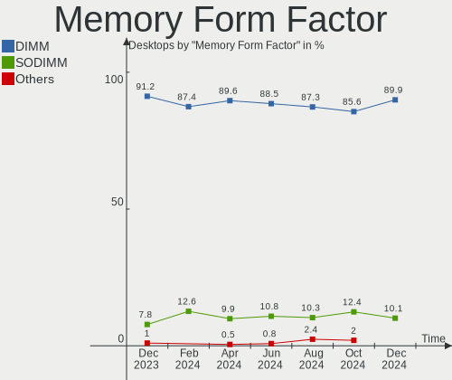
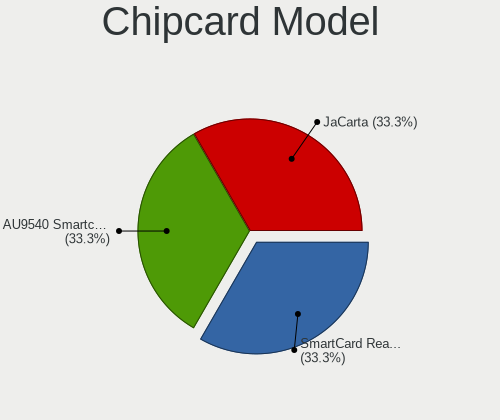

Ubuntu - Hardware Trends (Desktops)
-----------------------------------

A project to identify most popular hardware characteristics and track their change
over time based on data collected by Linux users at https://Linux-Hardware.org.

Anyone can contribute to this report by the [hw-probe](https://github.com/linuxhw/hw-probe) tool:

    sudo -E hw-probe -all -upload

This report is for one last month. Overall report since the beginning of time: [TestDays](https://github.com/linuxhw/TestDays)

Period: Nov, 2023.

Contents
--------

* [ System ](#system)
  - [ OS                       ](#os)
  - [ OS Family                ](#os-family)
  - [ Kernel                   ](#kernel)
  - [ Kernel Family            ](#kernel-family)
  - [ Kernel Major Ver.        ](#kernel-major-ver)
  - [ Arch                     ](#arch)
  - [ DE                       ](#de)
  - [ Display Server           ](#display-server)
  - [ Display Manager          ](#display-manager)
  - [ OS Lang                  ](#os-lang)
  - [ Boot Mode                ](#boot-mode)
  - [ Filesystem               ](#filesystem)
  - [ Part. scheme             ](#part-scheme)
  - [ Dual Boot with Linux/BSD ](#dual-boot-with-linuxbsd)
  - [ Dual Boot (Win)          ](#dual-boot-win)

* [ Board ](#board)
  - [ Vendor                   ](#vendor)
  - [ Model                    ](#model)
  - [ Model Family             ](#model-family)
  - [ MFG Year                 ](#mfg-year)
  - [ Form Factor              ](#form-factor)
  - [ Secure Boot              ](#secure-boot)
  - [ Coreboot                 ](#coreboot)
  - [ RAM Size                 ](#ram-size)
  - [ RAM Used                 ](#ram-used)
  - [ Total Drives             ](#total-drives)
  - [ Has CD-ROM               ](#has-cd-rom)
  - [ Has Ethernet             ](#has-ethernet)
  - [ Has WiFi                 ](#has-wifi)
  - [ Has Bluetooth            ](#has-bluetooth)

* [ Location ](#location)
  - [ Country                  ](#country)
  - [ City                     ](#city)

* [ Drives ](#drives)
  - [ Drive Vendor             ](#drive-vendor)
  - [ Drive Model              ](#drive-model)
  - [ HDD Vendor               ](#hdd-vendor)
  - [ SSD Vendor               ](#ssd-vendor)
  - [ Drive Kind               ](#drive-kind)
  - [ Drive Connector          ](#drive-connector)
  - [ Drive Size               ](#drive-size)
  - [ Space Total              ](#space-total)
  - [ Space Used               ](#space-used)
  - [ Malfunc. Drives          ](#malfunc-drives)
  - [ Malfunc. Drive Vendor    ](#malfunc-drive-vendor)
  - [ Malfunc. HDD Vendor      ](#malfunc-hdd-vendor)
  - [ Malfunc. Drive Kind      ](#malfunc-drive-kind)
  - [ Failed Drives            ](#failed-drives)
  - [ Failed Drive Vendor      ](#failed-drive-vendor)
  - [ Drive Status             ](#drive-status)

* [ Storage controller ](#storage-controller)
  - [ Storage Vendor           ](#storage-vendor)
  - [ Storage Model            ](#storage-model)
  - [ Storage Kind             ](#storage-kind)

* [ Processor ](#processor)
  - [ CPU Vendor               ](#cpu-vendor)
  - [ CPU Model                ](#cpu-model)
  - [ CPU Model Family         ](#cpu-model-family)
  - [ CPU Cores                ](#cpu-cores)
  - [ CPU Sockets              ](#cpu-sockets)
  - [ CPU Threads              ](#cpu-threads)
  - [ CPU Op-Modes             ](#cpu-op-modes)
  - [ CPU Microcode            ](#cpu-microcode)
  - [ CPU Microarch            ](#cpu-microarch)

* [ Graphics ](#graphics)
  - [ GPU Vendor               ](#gpu-vendor)
  - [ GPU Model                ](#gpu-model)
  - [ GPU Combo                ](#gpu-combo)
  - [ GPU Driver               ](#gpu-driver)
  - [ GPU Memory               ](#gpu-memory)

* [ Monitor ](#monitor)
  - [ Monitor Vendor           ](#monitor-vendor)
  - [ Monitor Model            ](#monitor-model)
  - [ Monitor Resolution       ](#monitor-resolution)
  - [ Monitor Diagonal         ](#monitor-diagonal)
  - [ Monitor Width            ](#monitor-width)
  - [ Aspect Ratio             ](#aspect-ratio)
  - [ Monitor Area             ](#monitor-area)
  - [ Pixel Density            ](#pixel-density)
  - [ Multiple Monitors        ](#multiple-monitors)

* [ Network ](#network)
  - [ Net Controller Vendor    ](#net-controller-vendor)
  - [ Net Controller Model     ](#net-controller-model)
  - [ Wireless Vendor          ](#wireless-vendor)
  - [ Wireless Model           ](#wireless-model)
  - [ Ethernet Vendor          ](#ethernet-vendor)
  - [ Ethernet Model           ](#ethernet-model)
  - [ Net Controller Kind      ](#net-controller-kind)
  - [ Used Controller          ](#used-controller)
  - [ NICs                     ](#nics)
  - [ IPv6                     ](#ipv6)

* [ Bluetooth ](#bluetooth)
  - [ Bluetooth Vendor         ](#bluetooth-vendor)
  - [ Bluetooth Model          ](#bluetooth-model)

* [ Sound ](#sound)
  - [ Sound Vendor             ](#sound-vendor)
  - [ Sound Model              ](#sound-model)

* [ Memory ](#memory)
  - [ Memory Vendor            ](#memory-vendor)
  - [ Memory Model             ](#memory-model)
  - [ Memory Kind              ](#memory-kind)
  - [ Memory Form Factor       ](#memory-form-factor)
  - [ Memory Size              ](#memory-size)
  - [ Memory Speed             ](#memory-speed)

* [ Printers & scanners ](#printers--scanners)
  - [ Printer Vendor           ](#printer-vendor)
  - [ Printer Model            ](#printer-model)
  - [ Scanner Vendor           ](#scanner-vendor)
  - [ Scanner Model            ](#scanner-model)

* [ Camera ](#camera)
  - [ Camera Vendor            ](#camera-vendor)
  - [ Camera Model             ](#camera-model)

* [ Security ](#security)
  - [ Fingerprint Vendor       ](#fingerprint-vendor)
  - [ Fingerprint Model        ](#fingerprint-model)
  - [ Chipcard Vendor          ](#chipcard-vendor)
  - [ Chipcard Model           ](#chipcard-model)

* [ Unsupported ](#unsupported)
  - [ Unsupported Devices      ](#unsupported-devices)
  - [ Unsupported Device Types ](#unsupported-device-types)

System
------

OS
--

Installed operating systems

| Name         | Desktops | Percent |
|--------------|----------|---------|
| Ubuntu 22.04 | 286      | 63.27%  |
| Ubuntu 23.10 | 79       | 17.48%  |
| Ubuntu 20.04 | 46       | 10.18%  |
| Ubuntu 23.04 | 22       | 4.87%   |
| Ubuntu 18.04 | 7        | 1.55%   |
| Ubuntu 16.04 | 6        | 1.33%   |
| Ubuntu 24.04 | 2        | 0.44%   |
| Ubuntu 22.10 | 2        | 0.44%   |
| Ubuntu 21.04 | 1        | 0.22%   |
| Ubuntu 20.10 | 1        | 0.22%   |

OS Family
---------

OS without a version

| Name   | Desktops | Percent |
|--------|----------|---------|
| Ubuntu | 452      | 100%    |

Kernel
------

Version of the Linux kernel

| Version                 | Desktops | Percent |
|-------------------------|----------|---------|
| 6.2.0-36-generic        | 168      | 37.17%  |
| 6.5.0-10-generic        | 47       | 10.4%   |
| 6.2.0-37-generic        | 43       | 9.51%   |
| 5.15.0-88-generic       | 33       | 7.3%    |
| 5.15.0-89-generic       | 25       | 5.53%   |
| 6.5.0-13-generic        | 22       | 4.87%   |
| 5.19.0-38-generic       | 15       | 3.32%   |
| 6.2.0-26-generic        | 12       | 2.65%   |
| 6.2.0-35-generic        | 7        | 1.55%   |
| 6.5.0-9-generic         | 6        | 1.33%   |
| 4.15.0-142-generic      | 6        | 1.33%   |
| 5.19.0-32-generic       | 5        | 1.11%   |
| 5.4.0-166-generic       | 4        | 0.88%   |
| 5.15.0-87-generic       | 4        | 0.88%   |
| 6.2.0-39-generic        | 3        | 0.66%   |
| 5.4.0-150-generic       | 3        | 0.66%   |
| 5.15.0-86-generic       | 3        | 0.66%   |
| 6.2.0-34-generic        | 2        | 0.44%   |
| 6.2.0-33-generic        | 2        | 0.44%   |
| 5.8.0-43-generic        | 2        | 0.44%   |
| 5.4.0-167-generic       | 2        | 0.44%   |
| 5.15.0-58-generic       | 2        | 0.44%   |
| 5.15.0-43-generic       | 2        | 0.44%   |
| 6.7.0-060600rc1-generic | 1        | 0.22%   |
| 6.6.2-zabbly+           | 1        | 0.22%   |
| 6.5.7-060507-generic    | 1        | 0.22%   |
| 6.5.10-xeon             | 1        | 0.22%   |
| 6.5.0-1007-oem          | 1        | 0.22%   |
| 6.5.0-10-lowlatency     | 1        | 0.22%   |
| 6.2.0-1017-lowlatency   | 1        | 0.22%   |
| 6.2.0-1011-nvidia       | 1        | 0.22%   |
| 6.2.0-060200-generic    | 1        | 0.22%   |
| 6.1.0-1025-oem          | 1        | 0.22%   |
| 6.0.0-060000-generic    | 1        | 0.22%   |
| 5.8.0-25-generic        | 1        | 0.22%   |
| 5.4.0-84-generic        | 1        | 0.22%   |
| 5.4.0-168-lowlatency    | 1        | 0.22%   |
| 5.4.0-165-generic       | 1        | 0.22%   |
| 5.3.8-050308-generic    | 1        | 0.22%   |
| 5.19.0-50-generic       | 1        | 0.22%   |

Kernel Family
-------------

Linux kernel without a distro release

| Version | Desktops | Percent |
|---------|----------|---------|
| 6.2.0   | 240      | 53.1%   |
| 6.5.0   | 77       | 17.04%  |
| 5.15.0  | 75       | 16.59%  |
| 5.19.0  | 25       | 5.53%   |
| 5.4.0   | 12       | 2.65%   |
| 4.15.0  | 8        | 1.77%   |
| 5.8.0   | 3        | 0.66%   |
| 5.11.0  | 2        | 0.44%   |
| 6.7.0   | 1        | 0.22%   |
| 6.6.2   | 1        | 0.22%   |
| 6.5.7   | 1        | 0.22%   |
| 6.5.10  | 1        | 0.22%   |
| 6.1.0   | 1        | 0.22%   |
| 6.0.0   | 1        | 0.22%   |
| 5.3.8   | 1        | 0.22%   |
| 5.15.88 | 1        | 0.22%   |
| 5.15.75 | 1        | 0.22%   |
| 5.0.0   | 1        | 0.22%   |

Kernel Major Ver.
-----------------

Linux kernel major version

| Version | Desktops | Percent |
|---------|----------|---------|
| 6.2     | 240      | 53.1%   |
| 6.5     | 79       | 17.48%  |
| 5.15    | 77       | 17.04%  |
| 5.19    | 25       | 5.53%   |
| 5.4     | 12       | 2.65%   |
| 4.15    | 8        | 1.77%   |
| 5.8     | 3        | 0.66%   |
| 5.11    | 2        | 0.44%   |
| 6.7     | 1        | 0.22%   |
| 6.6     | 1        | 0.22%   |
| 6.1     | 1        | 0.22%   |
| 6.0     | 1        | 0.22%   |
| 5.3     | 1        | 0.22%   |
| 5.0     | 1        | 0.22%   |

Arch
----

OS architecture (x86_64, i586, etc.)

| Name   | Desktops | Percent |
|--------|----------|---------|
| x86_64 | 451      | 99.78%  |
| i686   | 1        | 0.22%   |

DE
--

Desktop Environment

| Name            | Desktops | Percent |
|-----------------|----------|---------|
| GNOME           | 389      | 86.06%  |
| Unknown         | 51       | 11.28%  |
| X-Cinnamon      | 6        | 1.33%   |
| GNOME Flashback | 3        | 0.66%   |
| i3              | 2        | 0.44%   |
| GNOME Classic   | 1        | 0.22%   |

Display Server
--------------

X11 or Wayland

| Name    | Desktops | Percent |
|---------|----------|---------|
| X11     | 222      | 49.12%  |
| Wayland | 184      | 40.71%  |
| Unknown | 31       | 6.86%   |
| Tty     | 15       | 3.32%   |

Display Manager
---------------

SDDM, LightDM, etc.

| Name    | Desktops | Percent |
|---------|----------|---------|
| GDM3    | 345      | 76.33%  |
| Unknown | 61       | 13.5%   |
| GDM     | 23       | 5.09%   |
| LightDM | 21       | 4.65%   |
| SDDM    | 2        | 0.44%   |

OS Lang
-------

Language

| Lang    | Desktops | Percent |
|---------|----------|---------|
| en_US   | 202      | 44.69%  |
| de_DE   | 45       | 9.96%   |
| fr_FR   | 26       | 5.75%   |
| C       | 22       | 4.87%   |
| en_GB   | 20       | 4.42%   |
| it_IT   | 18       | 3.98%   |
| pt_BR   | 13       | 2.88%   |
| en_CA   | 12       | 2.65%   |
| es_ES   | 11       | 2.43%   |
| pl_PL   | 10       | 2.21%   |
| Unknown | 10       | 2.21%   |
| ru_RU   | 8        | 1.77%   |
| en_AU   | 6        | 1.33%   |
| ja_JP   | 5        | 1.11%   |
| en_HK   | 5        | 1.11%   |
| pt_PT   | 4        | 0.88%   |
| nl_NL   | 4        | 0.88%   |
| en_IN   | 4        | 0.88%   |
| en_ZA   | 3        | 0.66%   |
| de_AT   | 3        | 0.66%   |
| zh_TW   | 2        | 0.44%   |
| sk_SK   | 2        | 0.44%   |
| es_AR   | 2        | 0.44%   |
| tr_TR   | 1        | 0.22%   |
| sv_SE   | 1        | 0.22%   |
| sr_RS   | 1        | 0.22%   |
| sl_SI   | 1        | 0.22%   |
| hu_HU   | 1        | 0.22%   |
| fr_CH   | 1        | 0.22%   |
| fr_CA   | 1        | 0.22%   |
| fi_FI   | 1        | 0.22%   |
| es_VE   | 1        | 0.22%   |
| es_CO   | 1        | 0.22%   |
| en_PH   | 1        | 0.22%   |
| de_CH   | 1        | 0.22%   |
| da_DK   | 1        | 0.22%   |
| cs_CZ   | 1        | 0.22%   |
| ca_ES   | 1        | 0.22%   |

Boot Mode
---------

EFI or BIOS

| Mode | Desktops | Percent |
|------|----------|---------|
| BIOS | 315      | 69.69%  |
| EFI  | 137      | 30.31%  |

Filesystem
----------

Type of filesystem

| Type    | Desktops | Percent |
|---------|----------|---------|
| Tmpfs   | 276      | 61.06%  |
| Ext4    | 150      | 33.19%  |
| Overlay | 21       | 4.65%   |
| Ext2    | 2        | 0.44%   |
| Btrfs   | 2        | 0.44%   |
| Xfs     | 1        | 0.22%   |

Part. scheme
------------

Scheme of partitioning

| Type    | Desktops | Percent |
|---------|----------|---------|
| GPT     | 362      | 80.09%  |
| MBR     | 52       | 11.5%   |
| Unknown | 38       | 8.41%   |

Dual Boot with Linux/BSD
------------------------

Hosting more than one Linux/BSD

| Dual boot | Desktops | Percent |
|-----------|----------|---------|
| No        | 364      | 80.53%  |
| Yes       | 88       | 19.47%  |

Dual Boot (Win)
---------------

Hosting Linux and Windows

| Dual boot | Desktops | Percent |
|-----------|----------|---------|
| No        | 292      | 64.6%   |
| Yes       | 160      | 35.4%   |

Board
-----

Vendor
------

Motherboard manufacturer

| Name                                 | Desktops | Percent |
|--------------------------------------|----------|---------|
| ASUSTek Computer                     | 108      | 23.89%  |
| Gigabyte Technology                  | 63       | 13.94%  |
| Dell                                 | 48       | 10.62%  |
| MSI                                  | 39       | 8.63%   |
| Hewlett-Packard                      | 38       | 8.41%   |
| ASRock                               | 30       | 6.64%   |
| Supermicro                           | 16       | 3.54%   |
| Lenovo                               | 16       | 3.54%   |
| Intel                                | 16       | 3.54%   |
| AZW                                  | 8        | 1.77%   |
| Unknown                              | 6        | 1.33%   |
| Pegatron                             | 5        | 1.11%   |
| Fujitsu                              | 5        | 1.11%   |
| Acer                                 | 5        | 1.11%   |
| Medion                               | 4        | 0.88%   |
| Foxconn                              | 4        | 0.88%   |
| Biostar                              | 4        | 0.88%   |
| Shenzhen Meigao Electronic Equipment | 3        | 0.66%   |
| Shuttle                              | 2        | 0.44%   |
| MACHINIST                            | 2        | 0.44%   |
| Google                               | 2        | 0.44%   |
| BESSTAR Tech                         | 2        | 0.44%   |
| ZX                                   | 1        | 0.22%   |
| TYAN Computer                        | 1        | 0.22%   |
| SZMZ                                 | 1        | 0.22%   |
| Positivo                             | 1        | 0.22%   |
| POSIFLEX                             | 1        | 0.22%   |
| ONDA                                 | 1        | 0.22%   |
| OEM                                  | 1        | 0.22%   |
| NEC Computers                        | 1        | 0.22%   |
| MouseComputer                        | 1        | 0.22%   |
| Kllisre                              | 1        | 0.22%   |
| Inventec                             | 1        | 0.22%   |
| Inspur                               | 1        | 0.22%   |
| IceWhale Technology                  | 1        | 0.22%   |
| Huanan                               | 1        | 0.22%   |
| GMKtec                               | 1        | 0.22%   |
| GEEKOM                               | 1        | 0.22%   |
| Gateway                              | 1        | 0.22%   |
| Fujitsu Siemens                      | 1        | 0.22%   |

Model
-----

Motherboard model

| Name                        | Desktops | Percent |
|-----------------------------|----------|---------|
| ASUS All Series             | 12       | 2.65%   |
| Unknown                     | 6        | 1.33%   |
| Supermicro SYS-6018R-TDW    | 5        | 1.11%   |
| Supermicro SYS-1028R-TDW    | 4        | 0.88%   |
| Intel SKYBAY                | 4        | 0.88%   |
| MSI MS-7D16                 | 3        | 0.66%   |
| MSI MS-7C91                 | 3        | 0.66%   |
| Dell OptiPlex 3020          | 3        | 0.66%   |
| ASUS TUF Gaming X570-PLUS   | 3        | 0.66%   |
| Supermicro X9DRW            | 2        | 0.44%   |
| Supermicro SYS-6018R-MTR    | 2        | 0.44%   |
| MSI MS-7C95                 | 2        | 0.44%   |
| MSI MS-7C56                 | 2        | 0.44%   |
| MSI MS-7C52                 | 2        | 0.44%   |
| MSI MS-7850                 | 2        | 0.44%   |
| MSI MS-7817                 | 2        | 0.44%   |
| MSI MS-7721                 | 2        | 0.44%   |
| Intel X99                   | 2        | 0.44%   |
| Intel HM570                 | 2        | 0.44%   |
| Intel B75                   | 2        | 0.44%   |
| HP Z800 Workstation         | 2        | 0.44%   |
| HP EliteDesk 800 G2 SFF     | 2        | 0.44%   |
| HP EliteDesk 800 G1 SFF     | 2        | 0.44%   |
| HP Compaq Pro 6300 SFF      | 2        | 0.44%   |
| HP Compaq 8200 Elite SFF PC | 2        | 0.44%   |
| Gigabyte Z370N WIFI         | 2        | 0.44%   |
| Gigabyte H61M-D2-B3         | 2        | 0.44%   |
| Gigabyte GB-BRR3H-4300      | 2        | 0.44%   |
| Gigabyte GA-970A-UD3        | 2        | 0.44%   |
| Gigabyte B550M DS3H         | 2        | 0.44%   |
| Gigabyte B450M DS3H         | 2        | 0.44%   |
| Gigabyte 970A-DS3P          | 2        | 0.44%   |
| Fujitsu ESPRIMO P400        | 2        | 0.44%   |
| Dell XPS 8950               | 2        | 0.44%   |
| Dell Precision Tower 5810   | 2        | 0.44%   |
| Dell OptiPlex 990           | 2        | 0.44%   |
| Dell OptiPlex 790           | 2        | 0.44%   |
| Dell OptiPlex 780           | 2        | 0.44%   |
| Dell OptiPlex 755           | 2        | 0.44%   |
| Dell OptiPlex 7070          | 2        | 0.44%   |

Model Family
------------

Motherboard model prefix

| Name                     | Desktops | Percent |
|--------------------------|----------|---------|
| Dell OptiPlex            | 32       | 7.08%   |
| ASUS PRIME               | 19       | 4.2%    |
| ASUS TUF                 | 18       | 3.98%   |
| ASUS ROG                 | 17       | 3.76%   |
| Lenovo ThinkCentre       | 12       | 2.65%   |
| HP EliteDesk             | 12       | 2.65%   |
| ASUS All                 | 12       | 2.65%   |
| HP Compaq                | 9        | 1.99%   |
| Dell Precision           | 7        | 1.55%   |
| Unknown                  | 6        | 1.33%   |
| Supermicro SYS-6018R-TDW | 5        | 1.11%   |
| Dell XPS                 | 5        | 1.11%   |
| Supermicro SYS-1028R-TDW | 4        | 0.88%   |
| Intel SKYBAY             | 4        | 0.88%   |
| Gigabyte X570            | 4        | 0.88%   |
| Gigabyte B550M           | 4        | 0.88%   |
| Fujitsu ESPRIMO          | 4        | 0.88%   |
| ASRock B450M             | 4        | 0.88%   |
| MSI MS-7D16              | 3        | 0.66%   |
| MSI MS-7C91              | 3        | 0.66%   |
| HP ProDesk               | 3        | 0.66%   |
| Gigabyte B450M           | 3        | 0.66%   |
| ASRock X570              | 3        | 0.66%   |
| Supermicro X9DRW         | 2        | 0.44%   |
| Supermicro SYS-6018R-MTR | 2        | 0.44%   |
| MSI MS-7C95              | 2        | 0.44%   |
| MSI MS-7C56              | 2        | 0.44%   |
| MSI MS-7C52              | 2        | 0.44%   |
| MSI MS-7850              | 2        | 0.44%   |
| MSI MS-7817              | 2        | 0.44%   |
| MSI MS-7721              | 2        | 0.44%   |
| Medion Akoya             | 2        | 0.44%   |
| Lenovo IdeaCentre        | 2        | 0.44%   |
| Intel X99                | 2        | 0.44%   |
| Intel HM570              | 2        | 0.44%   |
| Intel B75                | 2        | 0.44%   |
| HP Z800                  | 2        | 0.44%   |
| Gigabyte Z370N           | 2        | 0.44%   |
| Gigabyte H61M-D2-B3      | 2        | 0.44%   |
| Gigabyte GB-BRR3H-4300   | 2        | 0.44%   |

MFG Year
--------

Motherboard manufacture year

| Year | Desktops | Percent |
|------|----------|---------|
| 2018 | 41       | 9.07%   |
| 2020 | 39       | 8.63%   |
| 2019 | 36       | 7.96%   |
| 2012 | 36       | 7.96%   |
| 2022 | 33       | 7.3%    |
| 2013 | 33       | 7.3%    |
| 2017 | 31       | 6.86%   |
| 2023 | 30       | 6.64%   |
| 2014 | 30       | 6.64%   |
| 2021 | 29       | 6.42%   |
| 2015 | 29       | 6.42%   |
| 2011 | 23       | 5.09%   |
| 2010 | 16       | 3.54%   |
| 2016 | 14       | 3.1%    |
| 2009 | 14       | 3.1%    |
| 2008 | 9        | 1.99%   |
| 2007 | 7        | 1.55%   |
| 2006 | 2        | 0.44%   |

Form Factor
-----------

Physical design of the computer

| Name    | Desktops | Percent |
|---------|----------|---------|
| Desktop | 452      | 100%    |

Secure Boot
-----------

Enabled or disabled

| State    | Desktops | Percent |
|----------|----------|---------|
| Disabled | 436      | 96.46%  |
| Enabled  | 16       | 3.54%   |

Coreboot
--------

Have coreboot on board

| Used | Desktops | Percent |
|------|----------|---------|
| No   | 450      | 99.56%  |
| Yes  | 2        | 0.44%   |

RAM Size
--------

Total RAM memory

| Size in GB      | Desktops | Percent |
|-----------------|----------|---------|
| 16.01-24.0      | 104      | 23.01%  |
| 32.01-64.0      | 97       | 21.46%  |
| 4.01-8.0        | 67       | 14.82%  |
| 8.01-16.0       | 64       | 14.16%  |
| 64.01-256.0     | 47       | 10.4%   |
| 3.01-4.0        | 46       | 10.18%  |
| 24.01-32.0      | 15       | 3.32%   |
| More than 256.0 | 6        | 1.33%   |
| 2.01-3.0        | 3        | 0.66%   |
| 1.01-2.0        | 3        | 0.66%   |

RAM Used
--------

Used RAM memory

| Used GB     | Desktops | Percent |
|-------------|----------|---------|
| 2.01-3.0    | 126      | 27.88%  |
| 1.01-2.0    | 111      | 24.56%  |
| 3.01-4.0    | 88       | 19.47%  |
| 4.01-8.0    | 79       | 17.48%  |
| 8.01-16.0   | 27       | 5.97%   |
| 16.01-24.0  | 7        | 1.55%   |
| 0.51-1.0    | 7        | 1.55%   |
| 24.01-32.0  | 3        | 0.66%   |
| 0.01-0.5    | 2        | 0.44%   |
| 32.01-64.0  | 1        | 0.22%   |
| 64.01-256.0 | 1        | 0.22%   |

Total Drives
------------

Number of drives on board

| Drives | Desktops | Percent |
|--------|----------|---------|
| 1      | 203      | 44.91%  |
| 2      | 117      | 25.88%  |
| 3      | 54       | 11.95%  |
| 4      | 31       | 6.86%   |
| 5      | 18       | 3.98%   |
| 6      | 10       | 2.21%   |
| 0      | 7        | 1.55%   |
| 7      | 6        | 1.33%   |
| 9      | 2        | 0.44%   |
| 8      | 2        | 0.44%   |
| 12     | 1        | 0.22%   |
| 11     | 1        | 0.22%   |

Has CD-ROM
----------

Has CD-ROM on board

| Presented | Desktops | Percent |
|-----------|----------|---------|
| No        | 281      | 62.17%  |
| Yes       | 171      | 37.83%  |

Has Ethernet
------------

Has Ethernet on board

| Presented | Desktops | Percent |
|-----------|----------|---------|
| Yes       | 446      | 98.67%  |
| No        | 6        | 1.33%   |

Has WiFi
--------

Has WiFi module

| Presented | Desktops | Percent |
|-----------|----------|---------|
| No        | 240      | 53.1%   |
| Yes       | 212      | 46.9%   |

Has Bluetooth
-------------

Has Bluetooth module

| Presented | Desktops | Percent |
|-----------|----------|---------|
| No        | 276      | 61.06%  |
| Yes       | 176      | 38.94%  |

Location
--------

Country
-------

Geographic location (country)

| Country         | Desktops | Percent |
|-----------------|----------|---------|
| USA             | 97       | 21.46%  |
| Germany         | 51       | 11.28%  |
| France          | 32       | 7.08%   |
| Russia          | 29       | 6.42%   |
| Italy           | 27       | 5.97%   |
| UK              | 25       | 5.53%   |
| Brazil          | 21       | 4.65%   |
| Spain           | 19       | 4.2%    |
| Canada          | 18       | 3.98%   |
| Poland          | 11       | 2.43%   |
| Hong Kong       | 7        | 1.55%   |
| China           | 7        | 1.55%   |
| Australia       | 7        | 1.55%   |
| Netherlands     | 6        | 1.33%   |
| Switzerland     | 5        | 1.11%   |
| South Africa    | 5        | 1.11%   |
| Romania         | 5        | 1.11%   |
| Norway          | 5        | 1.11%   |
| Japan           | 5        | 1.11%   |
| Turkey          | 4        | 0.88%   |
| Portugal        | 4        | 0.88%   |
| India           | 4        | 0.88%   |
| Greece          | 4        | 0.88%   |
| Belgium         | 4        | 0.88%   |
| Austria         | 4        | 0.88%   |
| Sweden          | 3        | 0.66%   |
| Slovakia        | 3        | 0.66%   |
| Pakistan        | 3        | 0.66%   |
| Hungary         | 3        | 0.66%   |
| Finland         | 3        | 0.66%   |
| Argentina       | 3        | 0.66%   |
| Vietnam         | 2        | 0.44%   |
| Thailand        | 2        | 0.44%   |
| Taiwan          | 2        | 0.44%   |
| Serbia          | 2        | 0.44%   |
| Mexico          | 2        | 0.44%   |
| Colombia        | 2        | 0.44%   |
| Venezuela       | 1        | 0.22%   |
| Turkmenistan    | 1        | 0.22%   |
| The Netherlands | 1        | 0.22%   |

City
----

Geographic location (city)

| City             | Desktops | Percent |
|------------------|----------|---------|
| Moscow           | 19       | 4.2%    |
| Paris            | 9        | 1.99%   |
| Central          | 7        | 1.55%   |
| Berlin           | 7        | 1.55%   |
| Beijing          | 5        | 1.11%   |
| Barcelona        | 5        | 1.11%   |
| Warsaw           | 4        | 0.88%   |
| Rome             | 4        | 0.88%   |
| Madrid           | 4        | 0.88%   |
| Toronto          | 3        | 0.66%   |
| Sydney           | 3        | 0.66%   |
| Figeac           | 3        | 0.66%   |
| Bengaluru        | 3        | 0.66%   |
| Turin            | 2        | 0.44%   |
| Tampa            | 2        | 0.44%   |
| St Petersburg    | 2        | 0.44%   |
| Sao Paulo        | 2        | 0.44%   |
| Rio de Janeiro   | 2        | 0.44%   |
| Portland         | 2        | 0.44%   |
| Peterborough     | 2        | 0.44%   |
| New York         | 2        | 0.44%   |
| Nantes           | 2        | 0.44%   |
| Montoggio        | 2        | 0.44%   |
| Milan            | 2        | 0.44%   |
| Melbourne        | 2        | 0.44%   |
| Kazan’         | 2        | 0.44%   |
| Istanbul         | 2        | 0.44%   |
| Ho Chi Minh City | 2        | 0.44%   |
| Harrisonburg     | 2        | 0.44%   |
| Hamburg          | 2        | 0.44%   |
| Farroupilha      | 2        | 0.44%   |
| Düsseldorf      | 2        | 0.44%   |
| Dortmund         | 2        | 0.44%   |
| Calgary          | 2        | 0.44%   |
| Athens           | 2        | 0.44%   |
| Allentown        | 2        | 0.44%   |
| Zalău           | 1        | 0.22%   |
| Wylie            | 1        | 0.22%   |
| Wroclaw          | 1        | 0.22%   |
| Wolfsburg        | 1        | 0.22%   |

Drives
------

Drive Vendor
------------

Hard drive vendors

| Vendor                      | Desktops | Drives | Percent |
|-----------------------------|----------|--------|---------|
| Seagate                     | 129      | 170    | 16.97%  |
| Samsung Electronics         | 129      | 180    | 16.97%  |
| WDC                         | 122      | 160    | 16.05%  |
| Crucial                     | 41       | 55     | 5.39%   |
| Kingston                    | 37       | 40     | 4.87%   |
| Sandisk                     | 33       | 36     | 4.34%   |
| Toshiba                     | 25       | 28     | 3.29%   |
| Phison Electronics          | 18       | 19     | 2.37%   |
| Intel                       | 14       | 31     | 1.84%   |
| Hitachi                     | 14       | 18     | 1.84%   |
| HGST                        | 12       | 17     | 1.58%   |
| Unknown                     | 11       | 16     | 1.45%   |
| SK hynix                    | 10       | 10     | 1.32%   |
| Kingston Technology Company | 9        | 11     | 1.18%   |
| China                       | 9        | 14     | 1.18%   |
| Micron/Crucial Technology   | 8        | 10     | 1.05%   |
| Silicon Motion              | 7        | 7      | 0.92%   |
| A-DATA Technology           | 7        | 8      | 0.92%   |
| Unknown                     | 7        | 7      | 0.92%   |
| MAXIO Technology (Hangzhou) | 6        | 7      | 0.79%   |
| Fujitsu                     | 6        | 6      | 0.79%   |
| Patriot                     | 5        | 5      | 0.66%   |
| Micron Technology           | 5        | 5      | 0.66%   |
| Intenso                     | 5        | 5      | 0.66%   |
| GOODRAM                     | 5        | 5      | 0.66%   |
| ADATA Technology            | 5        | 5      | 0.66%   |
| SPCC                        | 4        | 5      | 0.53%   |
| Realtek Semiconductor       | 4        | 4      | 0.53%   |
| OCZ                         | 4        | 4      | 0.53%   |
| LITEON                      | 4        | 4      | 0.53%   |
| PNY                         | 3        | 3      | 0.39%   |
| Lexar                       | 3        | 3      | 0.39%   |
| Gigabyte Technology         | 3        | 3      | 0.39%   |
| Transcend                   | 2        | 2      | 0.26%   |
| Team                        | 2        | 3      | 0.26%   |
| Netac                       | 2        | 2      | 0.26%   |
| Maxtor                      | 2        | 2      | 0.26%   |
| KIOXIA                      | 2        | 2      | 0.26%   |
| Hikvision                   | 2        | 2      | 0.26%   |
| Fanxiang                    | 2        | 2      | 0.26%   |

Drive Model
-----------

Hard drive models

| Model                                                           | Desktops | Percent |
|-----------------------------------------------------------------|----------|---------|
| Samsung NVMe SSD Controller SM981/PM981/PM983 250GB             | 15       | 1.72%   |
| Samsung SSD 860 EVO 500GB                                       | 13       | 1.49%   |
| Samsung SSD 980 500GB                                           | 10       | 1.15%   |
| Kingston SA400S37480G 480GB SSD                                 | 10       | 1.15%   |
| Kingston SA400S37240G 240GB SSD                                 | 10       | 1.15%   |
| Samsung SSD 870 EVO 500GB                                       | 8        | 0.92%   |
| Samsung SSD 850 EVO 250GB                                       | 8        | 0.92%   |
| Seagate ST2000DM008-2FR102 2TB                                  | 7        | 0.8%    |
| Seagate ST1000DM010-2EP102 1TB                                  | 7        | 0.8%    |
| Samsung SSD 850 EVO 500GB                                       | 7        | 0.8%    |
| Unknown                                                         | 7        | 0.8%    |
| Toshiba DT01ACA100 1TB                                          | 6        | 0.69%   |
| Seagate ST500DM002-1BD142 500GB                                 | 6        | 0.69%   |
| Seagate ST4000DM004-2CV104 4TB                                  | 6        | 0.69%   |
| Seagate ST3500418AS 500GB                                       | 6        | 0.69%   |
| Samsung SSD 870 EVO 1TB                                         | 6        | 0.69%   |
| Phison E16 PCIe4 NVMe Controller 500GB                          | 6        | 0.69%   |
| Crucial CT500MX500SSD1 500GB                                    | 6        | 0.69%   |
| Silicon Motion SM2263EN/SM2263XT SSD Controller 256GB           | 5        | 0.57%   |
| Samsung SSD 980 1TB                                             | 5        | 0.57%   |
| Samsung SSD 860 EVO 1TB                                         | 5        | 0.57%   |
| Samsung NVMe SSD Controller PM9A1/PM9A3/980PRO 2TB              | 5        | 0.57%   |
| Intel SSDSC2BB480G7 480GB                                       | 5        | 0.57%   |
| Crucial CT1000MX500SSD1 1TB                                     | 5        | 0.57%   |
| WDC WD20EARS-00MVWB0 2TB                                        | 4        | 0.46%   |
| WDC WD10JPVX-22JC3T0 1TB                                        | 4        | 0.46%   |
| Toshiba DT01ACA200 2TB                                          | 4        | 0.46%   |
| Seagate ST2000DM006-2DM164 2TB                                  | 4        | 0.46%   |
| Seagate ST2000DM001-1ER164 2TB                                  | 4        | 0.46%   |
| Seagate Expansion Desk 6TB                                      | 4        | 0.46%   |
| Samsung NVMe SSD Controller SM961/PM961/SM963 256GB             | 4        | 0.46%   |
| Micron/Crucial P1 NVMe PCIe SSD 1TB                             | 4        | 0.46%   |
| MAXIO (Hangzhou) NVMe SSD Controller MAP1202 1024GB             | 4        | 0.46%   |
| Intel SSDSC2BB800G7 800GB                                       | 4        | 0.46%   |
| HGST HTE721010A9E630 1TB                                        | 4        | 0.46%   |
| Crucial CT480BX500SSD1 480GB                                    | 4        | 0.46%   |
| Crucial CT240BX500SSD1 240GB                                    | 4        | 0.46%   |
| ADATA XPG SX8200 Pro PCIe Gen3x4 M.2 2280 Solid State Drive 1TB | 4        | 0.46%   |
| WDC WD30EFRX-68EUZN0 3TB                                        | 3        | 0.34%   |
| WDC WD10EZEX-08WN4A0 1TB                                        | 3        | 0.34%   |

HDD Vendor
----------

Hard disk drive vendors

| Vendor              | Desktops | Drives | Percent |
|---------------------|----------|--------|---------|
| Seagate             | 126      | 167    | 40.51%  |
| WDC                 | 108      | 135    | 34.73%  |
| Toshiba             | 23       | 26     | 7.4%    |
| Hitachi             | 14       | 18     | 4.5%    |
| HGST                | 12       | 17     | 3.86%   |
| Samsung Electronics | 10       | 12     | 3.22%   |
| Fujitsu             | 6        | 6      | 1.93%   |
| Unknown             | 2        | 2      | 0.64%   |
| Maxtor              | 2        | 2      | 0.64%   |
| ExcelStor           | 2        | 2      | 0.64%   |
| TO Exter            | 1        | 1      | 0.32%   |
| TDAS                | 1        | 3      | 0.32%   |
| SABRENT             | 1        | 1      | 0.32%   |
| Intenso             | 1        | 1      | 0.32%   |
| HGST HTS            | 1        | 1      | 0.32%   |
| ASMT                | 1        | 1      | 0.32%   |

SSD Vendor
----------

Solid state drive vendors

| Vendor              | Desktops | Drives | Percent |
|---------------------|----------|--------|---------|
| Samsung Electronics | 73       | 95     | 28.52%  |
| Crucial             | 33       | 43     | 12.89%  |
| Kingston            | 28       | 30     | 10.94%  |
| WDC                 | 19       | 19     | 7.42%   |
| SanDisk             | 13       | 13     | 5.08%   |
| Intel               | 10       | 26     | 3.91%   |
| China               | 9        | 14     | 3.52%   |
| A-DATA Technology   | 6        | 7      | 2.34%   |
| Patriot             | 5        | 5      | 1.95%   |
| GOODRAM             | 5        | 5      | 1.95%   |
| SPCC                | 4        | 5      | 1.56%   |
| OCZ                 | 4        | 4      | 1.56%   |
| Micron Technology   | 4        | 4      | 1.56%   |
| LITEON              | 4        | 4      | 1.56%   |
| PNY                 | 3        | 3      | 1.17%   |
| Intenso             | 3        | 3      | 1.17%   |
| Transcend           | 2        | 2      | 0.78%   |
| SK hynix            | 2        | 2      | 0.78%   |
| Gigabyte Technology | 2        | 2      | 0.78%   |
| Fanxiang            | 2        | 2      | 0.78%   |
| Corsair             | 2        | 2      | 0.78%   |
| Apacer              | 2        | 2      | 0.78%   |
| XSTAR               | 1        | 1      | 0.39%   |
| Toshiba             | 1        | 1      | 0.39%   |
| Timetec             | 1        | 1      | 0.39%   |
| Team                | 1        | 2      | 0.39%   |
| SUNEAST             | 1        | 1      | 0.39%   |
| Plextor             | 1        | 1      | 0.39%   |
| OCZ-VERTEX2         | 1        | 1      | 0.39%   |
| Netac               | 1        | 1      | 0.39%   |
| Mushkin             | 1        | 1      | 0.39%   |
| Lexar               | 1        | 1      | 0.39%   |
| Leven               | 1        | 6      | 0.39%   |
| KEEPDATA            | 1        | 1      | 0.39%   |
| Integral            | 1        | 1      | 0.39%   |
| Hikvision           | 1        | 1      | 0.39%   |
| G.Skill             | 1        | 1      | 0.39%   |
| EZCOOL              | 1        | 1      | 0.39%   |
| Dogfish             | 1        | 1      | 0.39%   |
| DeTech              | 1        | 1      | 0.39%   |

Drive Kind
----------

HDD or SSD

| Kind    | Desktops | Drives | Percent |
|---------|----------|--------|---------|
| HDD     | 254      | 395    | 38.25%  |
| SSD     | 212      | 319    | 31.93%  |
| NVMe    | 177      | 225    | 26.66%  |
| Unknown | 18       | 23     | 2.71%   |
| MMC     | 3        | 3      | 0.45%   |

Drive Connector
---------------

SATA, SAS, NVMe, etc.

| Type | Desktops | Drives | Percent |
|------|----------|--------|---------|
| SATA | 359      | 689    | 62.43%  |
| NVMe | 176      | 224    | 30.61%  |
| SAS  | 37       | 49     | 6.43%   |
| MMC  | 3        | 3      | 0.52%   |

Drive Size
----------

Size of hard drive

| Size in TB | Desktops | Drives | Percent |
|------------|----------|--------|---------|
| 0.01-0.5   | 235      | 335    | 45.72%  |
| 0.51-1.0   | 133      | 188    | 25.88%  |
| 1.01-2.0   | 69       | 89     | 13.42%  |
| 3.01-4.0   | 36       | 49     | 7%      |
| 2.01-3.0   | 18       | 25     | 3.5%    |
| 4.01-10.0  | 17       | 19     | 3.31%   |
| 10.01-20.0 | 6        | 9      | 1.17%   |

Space Total
-----------

Amount of disk space available on the file system

| Size in GB     | Desktops | Percent |
|----------------|----------|---------|
| 101-250        | 94       | 20.8%   |
| 251-500        | 93       | 20.58%  |
| 501-1000       | 71       | 15.71%  |
| More than 3000 | 60       | 13.27%  |
| 1001-2000      | 37       | 8.19%   |
| 2001-3000      | 25       | 5.53%   |
| Unknown        | 25       | 5.53%   |
| 1-20           | 20       | 4.42%   |
| 21-50          | 14       | 3.1%    |
| 51-100         | 13       | 2.88%   |

Space Used
----------

Amount of used disk space

| Used GB        | Desktops | Percent |
|----------------|----------|---------|
| 1-20           | 102      | 22.57%  |
| 21-50          | 79       | 17.48%  |
| 101-250        | 69       | 15.27%  |
| 51-100         | 54       | 11.95%  |
| 251-500        | 40       | 8.85%   |
| 501-1000       | 30       | 6.64%   |
| 1001-2000      | 26       | 5.75%   |
| Unknown        | 25       | 5.53%   |
| More than 3000 | 15       | 3.32%   |
| 2001-3000      | 12       | 2.65%   |

Malfunc. Drives
---------------

Drive models with a malfunction

| Model                                | Desktops | Drives | Percent |
|--------------------------------------|----------|--------|---------|
| Intel SSDSC2BB800G7 800GB            | 3        | 3      | 9.09%   |
| WDC WD10JPVX-22JC3T0 1TB             | 2        | 2      | 6.06%   |
| Seagate ST3500418AS 500GB            | 2        | 3      | 6.06%   |
| WDC WD5000AAKX-08U6AA0 500GB         | 1        | 1      | 3.03%   |
| WDC WD5000AADS-00S9B0 500GB          | 1        | 1      | 3.03%   |
| WDC WD40PURZ-85TTDY0 4TB             | 1        | 1      | 3.03%   |
| WDC WD40EZRZ-00WN9B0 4TB             | 1        | 1      | 3.03%   |
| WDC WD15EADS-22P8B0 1TB              | 1        | 1      | 3.03%   |
| Unknown S050 Hard drive 500GB        | 1        | 1      | 3.03%   |
| Toshiba DT01ACA100 1TB               | 1        | 1      | 3.03%   |
| SK hynix BC711 HFM512GD3JX013N 512GB | 1        | 1      | 3.03%   |
| Seagate ST750LM022 HN-M750MBB 752GB  | 1        | 1      | 3.03%   |
| Seagate ST500LM000-SSHD-8GB          | 1        | 1      | 3.03%   |
| Seagate ST500DM009-2F110A 500GB      | 1        | 1      | 3.03%   |
| Seagate ST500DM002-1BC142 500GB      | 1        | 1      | 3.03%   |
| Seagate ST4000VX007-2DT166 4TB       | 1        | 1      | 3.03%   |
| Seagate ST4000NM0035-1V4107 4TB      | 1        | 2      | 3.03%   |
| Seagate ST380215A 80GB               | 1        | 1      | 3.03%   |
| Seagate ST2000DM008-2UB102 2TB       | 1        | 1      | 3.03%   |
| Seagate ST14000NM0018-2H4101 14TB    | 1        | 1      | 3.03%   |
| Seagate ST1000LM024 HN-M101MBB 1TB   | 1        | 1      | 3.03%   |
| Seagate ST1000DM010-2EP102 1TB       | 1        | 1      | 3.03%   |
| SanDisk SDSSDXPS240G 240GB           | 1        | 1      | 3.03%   |
| Samsung Electronics SSD 870 EVO 1TB  | 1        | 1      | 3.03%   |
| Maxtor 6L040J2 40GB                  | 1        | 1      | 3.03%   |
| Kingston SA400S37120G 120GB SSD      | 1        | 1      | 3.03%   |
| Intel SSDSC2BB480G7 480GB            | 1        | 3      | 3.03%   |
| Intel SSDSA2M080G2GN 80GB            | 1        | 1      | 3.03%   |
| Crucial CT275MX300SSD1 275GB         | 1        | 1      | 3.03%   |

Malfunc. Drive Vendor
---------------------

Vendors of faulty drives

| Vendor              | Desktops | Drives | Percent |
|---------------------|----------|--------|---------|
| Seagate             | 13       | 15     | 40.63%  |
| WDC                 | 7        | 7      | 21.88%  |
| Intel               | 4        | 7      | 12.5%   |
| Unknown             | 1        | 1      | 3.13%   |
| Toshiba             | 1        | 1      | 3.13%   |
| SK hynix            | 1        | 1      | 3.13%   |
| SanDisk             | 1        | 1      | 3.13%   |
| Samsung Electronics | 1        | 1      | 3.13%   |
| Maxtor              | 1        | 1      | 3.13%   |
| Kingston            | 1        | 1      | 3.13%   |
| Crucial             | 1        | 1      | 3.13%   |

Malfunc. HDD Vendor
-------------------

Vendors of faulty HDD drives

| Vendor  | Desktops | Drives | Percent |
|---------|----------|--------|---------|
| Seagate | 13       | 15     | 56.52%  |
| WDC     | 7        | 7      | 30.43%  |
| Unknown | 1        | 1      | 4.35%   |
| Toshiba | 1        | 1      | 4.35%   |
| Maxtor  | 1        | 1      | 4.35%   |

Malfunc. Drive Kind
-------------------

Kinds of faulty drives

| Kind | Desktops | Drives | Percent |
|------|----------|--------|---------|
| HDD  | 21       | 25     | 70%     |
| SSD  | 8        | 11     | 26.67%  |
| NVMe | 1        | 1      | 3.33%   |

Failed Drives
-------------

Failed drive models

| Model                       | Desktops | Drives | Percent |
|-----------------------------|----------|--------|---------|
| Hitachi HUS724040ALE640 4TB | 1        | 1      | 100%    |

Failed Drive Vendor
-------------------

Failed drive vendors

| Vendor  | Desktops | Drives | Percent |
|---------|----------|--------|---------|
| Hitachi | 1        | 1      | 100%    |

Drive Status
------------

Number of failed and malfunc. drives

| Status   | Desktops | Drives | Percent |
|----------|----------|--------|---------|
| Detected | 316      | 654    | 66.39%  |
| Works    | 129      | 273    | 27.1%   |
| Malfunc  | 30       | 37     | 6.3%    |
| Failed   | 1        | 1      | 0.21%   |

Storage controller
------------------

Storage Vendor
--------------

Storage controller vendors

| Vendor                         | Desktops | Percent |
|--------------------------------|----------|---------|
| Intel                          | 315      | 45.72%  |
| AMD                            | 120      | 17.42%  |
| Samsung Electronics            | 59       | 8.56%   |
| SanDisk                        | 26       | 3.77%   |
| Phison Electronics             | 22       | 3.19%   |
| ASMedia Technology             | 21       | 3.05%   |
| Kingston Technology Company    | 18       | 2.61%   |
| Micron/Crucial Technology      | 17       | 2.47%   |
| Silicon Motion                 | 9        | 1.31%   |
| MAXIO Technology (Hangzhou)    | 9        | 1.31%   |
| SK hynix                       | 8        | 1.16%   |
| Adaptec                        | 8        | 1.16%   |
| Marvell Technology Group       | 7        | 1.02%   |
| Nvidia                         | 6        | 0.87%   |
| ADATA Technology               | 6        | 0.87%   |
| VIA Technologies               | 5        | 0.73%   |
| Broadcom / LSI                 | 5        | 0.73%   |
| Realtek Semiconductor          | 4        | 0.58%   |
| JMicron Technology             | 4        | 0.58%   |
| KIOXIA                         | 3        | 0.44%   |
| Silicon Image                  | 2        | 0.29%   |
| Shenzhen Longsys Electronics   | 2        | 0.29%   |
| LSI Logic / Symbios Logic      | 2        | 0.29%   |
| Biwin Storage Technology       | 2        | 0.29%   |
| Toshiba America Info Systems   | 1        | 0.15%   |
| Solid State Storage Technology | 1        | 0.15%   |
| ShenZhen TIGO Semiconductor    | 1        | 0.15%   |
| Netac Technology               | 1        | 0.15%   |
| Micron Technology              | 1        | 0.15%   |
| Lite-On Technology             | 1        | 0.15%   |
| Lite-On IT Corp. / Plextor     | 1        | 0.15%   |
| INNOGRIT                       | 1        | 0.15%   |
| Hosin Global Electronics       | 1        | 0.15%   |

Storage Model
-------------

Storage controller models

| Model                                                                                   | Desktops | Percent |
|-----------------------------------------------------------------------------------------|----------|---------|
| AMD FCH SATA Controller [AHCI mode]                                                     | 69       | 8.54%   |
| Intel 8 Series/C220 Series Chipset Family 6-port SATA Controller 1 [AHCI mode]          | 38       | 4.7%    |
| Intel Q170/Q150/B150/H170/H110/Z170/CM236 Chipset SATA Controller [AHCI Mode]           | 31       | 3.84%   |
| Samsung NVMe SSD Controller SM981/PM981/PM983                                           | 27       | 3.34%   |
| AMD 500 Series Chipset SATA Controller                                                  | 27       | 3.34%   |
| Intel 6 Series/C200 Series Chipset Family 6 port Desktop SATA AHCI Controller           | 24       | 2.97%   |
| Intel 200 Series PCH SATA controller [AHCI mode]                                        | 23       | 2.85%   |
| Intel SATA Controller [RAID mode]                                                       | 22       | 2.72%   |
| Intel Cannon Lake PCH SATA AHCI Controller                                              | 19       | 2.35%   |
| ASMedia ASM1062 Serial ATA Controller                                                   | 19       | 2.35%   |
| Samsung NVMe SSD Controller 980 (DRAM-less)                                             | 18       | 2.23%   |
| AMD 400 Series Chipset SATA Controller                                                  | 17       | 2.1%    |
| Intel C610/X99 series chipset 6-Port SATA Controller [AHCI mode]                        | 16       | 1.98%   |
| Intel Alder Lake-S PCH SATA Controller [AHCI Mode]                                      | 16       | 1.98%   |
| Intel 7 Series/C210 Series Chipset Family 6-port SATA Controller [AHCI mode]            | 16       | 1.98%   |
| Intel 500 Series Chipset Family SATA AHCI Controller                                    | 15       | 1.86%   |
| Intel C610/X99 series chipset sSATA Controller [AHCI mode]                              | 12       | 1.49%   |
| AMD SB7x0/SB8x0/SB9x0 SATA Controller [AHCI mode]                                       | 12       | 1.49%   |
| Intel 700 Series Chipset Family SATA AHCI Controller                                    | 11       | 1.36%   |
| Micron/Crucial P2 [Nick P2] / P3 / P3 Plus NVMe PCIe SSD (DRAM-less)                    | 9        | 1.11%   |
| Silicon Motion SM2263EN/SM2263XT (DRAM-less) NVMe SSD Controllers                       | 8        | 0.99%   |
| Samsung NVMe SSD Controller PM9A1/PM9A3/980PRO                                          | 8        | 0.99%   |
| Intel Volume Management Device NVMe RAID Controller Intel Corporation                   | 8        | 0.99%   |
| Intel NM10/ICH7 Family SATA Controller [IDE mode]                                       | 8        | 0.99%   |
| MAXIO (Hangzhou) NVMe SSD Controller MAP1202                                            | 7        | 0.87%   |
| Intel SATA controller                                                                   | 7        | 0.87%   |
| Intel 6 Series/C200 Series Chipset Family Desktop SATA Controller (IDE mode, ports 4-5) | 7        | 0.87%   |
| Intel 6 Series/C200 Series Chipset Family Desktop SATA Controller (IDE mode, ports 0-3) | 7        | 0.87%   |
| AMD SB7x0/SB8x0/SB9x0 IDE Controller                                                    | 7        | 0.87%   |
| Sandisk WD Black SN850X NVMe SSD                                                        | 6        | 0.74%   |
| Phison E16 PCIe4 NVMe Controller                                                        | 6        | 0.74%   |
| Micron/Crucial P1 NVMe PCIe SSD[Frampton]                                               | 6        | 0.74%   |
| Intel Volume Management Device NVMe RAID Controller                                     | 6        | 0.74%   |
| Intel 9 Series Chipset Family SATA Controller [AHCI Mode]                               | 6        | 0.74%   |
| AMD FCH SATA Controller D                                                               | 6        | 0.74%   |
| Adaptec Series 6 - 6G SAS/PCIe 2                                                        | 6        | 0.74%   |
| Samsung NVMe SSD Controller SM961/PM961/SM963                                           | 5        | 0.62%   |
| Phison PS5013-E13 PCIe3 NVMe Controller (DRAM-less)                                     | 5        | 0.62%   |
| Kingston Company A2000 NVMe SSD SM2263EN                                                | 5        | 0.62%   |
| Intel Comet Lake SATA AHCI Controller                                                   | 5        | 0.62%   |

Storage Kind
------------

Kind of storage controller (IDE, SATA, NVMe, SAS, ...)

| Kind | Desktops | Percent |
|------|----------|---------|
| SATA | 377      | 56.02%  |
| NVMe | 176      | 26.15%  |
| IDE  | 60       | 8.92%   |
| RAID | 48       | 7.13%   |
| SAS  | 8        | 1.19%   |
| SCSI | 4        | 0.59%   |

Processor
---------

CPU Vendor
----------

Processor vendors

| Vendor | Desktops | Percent |
|--------|----------|---------|
| Intel  | 324      | 71.68%  |
| AMD    | 128      | 28.32%  |

CPU Model
---------

Processor models

| Model                                       | Desktops | Percent |
|---------------------------------------------|----------|---------|
| AMD Ryzen 5 5600G with Radeon Graphics      | 9        | 1.99%   |
| Intel Core i7-4790 CPU @ 3.60GHz            | 8        | 1.77%   |
| Intel N100                                  | 6        | 1.33%   |
| Intel Core i7-6700 CPU @ 3.40GHz            | 6        | 1.33%   |
| Intel Core i7-3770 CPU @ 3.40GHz            | 6        | 1.33%   |
| Intel Core i7-2600 CPU @ 3.40GHz            | 6        | 1.33%   |
| AMD Ryzen 9 5900X 12-Core Processor         | 6        | 1.33%   |
| Intel Xeon CPU E5-2620 v3 @ 2.40GHz         | 5        | 1.11%   |
| Intel Core i9-10850K CPU @ 3.60GHz          | 5        | 1.11%   |
| Intel Core i7-6700K CPU @ 4.00GHz           | 5        | 1.11%   |
| Intel Core i5-3470 CPU @ 3.20GHz            | 5        | 1.11%   |
| AMD Ryzen 7 3700X 8-Core Processor          | 5        | 1.11%   |
| AMD Ryzen 5 3600 6-Core Processor           | 5        | 1.11%   |
| AMD Ryzen 5 2600 Six-Core Processor         | 5        | 1.11%   |
| AMD Ryzen 3 3200G with Radeon Vega Graphics | 5        | 1.11%   |
| Intel Xeon CPU E5-2650 v4 @ 2.20GHz         | 4        | 0.88%   |
| Intel Pentium CPU G4560 @ 3.50GHz           | 4        | 0.88%   |
| Intel Core i7-9700 CPU @ 3.00GHz            | 4        | 0.88%   |
| Intel Core i7-8700 CPU @ 3.20GHz            | 4        | 0.88%   |
| Intel Core i5-8400 CPU @ 2.80GHz            | 4        | 0.88%   |
| Intel Core i5-6500 CPU @ 3.20GHz            | 4        | 0.88%   |
| Intel Core i5-4590 CPU @ 3.30GHz            | 4        | 0.88%   |
| Intel Core i5-2400 CPU @ 3.10GHz            | 4        | 0.88%   |
| Intel Core i3-2100 CPU @ 3.10GHz            | 4        | 0.88%   |
| Intel Core 2 Duo CPU E8400 @ 3.00GHz        | 4        | 0.88%   |
| Intel 12th Gen Core i9-12900K               | 4        | 0.88%   |
| AMD Ryzen 7 5800X 8-Core Processor          | 4        | 0.88%   |
| AMD Ryzen 7 5700G with Radeon Graphics      | 4        | 0.88%   |
| AMD Ryzen 5 5600X 6-Core Processor          | 4        | 0.88%   |
| Intel Xeon CPU E5-2680 v4 @ 2.40GHz         | 3        | 0.66%   |
| Intel Xeon CPU E5-2620 v4 @ 2.10GHz         | 3        | 0.66%   |
| Intel Core i7-8700K CPU @ 3.70GHz           | 3        | 0.66%   |
| Intel Core i5-7500 CPU @ 3.40GHz            | 3        | 0.66%   |
| Intel Core i5-7400 CPU @ 3.00GHz            | 3        | 0.66%   |
| Intel Core i5-6600 CPU @ 3.30GHz            | 3        | 0.66%   |
| Intel Core i5-6500T CPU @ 2.50GHz           | 3        | 0.66%   |
| Intel Core i5-6400 CPU @ 2.70GHz            | 3        | 0.66%   |
| Intel Core i5-4570 CPU @ 3.20GHz            | 3        | 0.66%   |
| Intel Core i5-2500 CPU @ 3.30GHz            | 3        | 0.66%   |
| Intel Core i5 CPU 650 @ 3.20GHz             | 3        | 0.66%   |

CPU Model Family
----------------

Processor model prefix

| Model                   | Desktops | Percent |
|-------------------------|----------|---------|
| Intel Core i5           | 82       | 18.14%  |
| Intel Core i7           | 71       | 15.71%  |
| Other                   | 42       | 9.29%   |
| Intel Xeon              | 35       | 7.74%   |
| AMD Ryzen 5             | 32       | 7.08%   |
| Intel Core i3           | 28       | 6.19%   |
| AMD Ryzen 7             | 26       | 5.75%   |
| AMD Ryzen 9             | 17       | 3.76%   |
| Intel Pentium           | 14       | 3.1%    |
| Intel Core i9           | 13       | 2.88%   |
| Intel Core 2 Duo        | 11       | 2.43%   |
| Intel Celeron           | 11       | 2.43%   |
| AMD Ryzen 3             | 11       | 2.43%   |
| AMD FX                  | 10       | 2.21%   |
| Intel Core 2 Quad       | 5        | 1.11%   |
| AMD A8                  | 5        | 1.11%   |
| AMD A10                 | 5        | 1.11%   |
| Intel Pentium Dual-Core | 4        | 0.88%   |
| Intel Atom              | 3        | 0.66%   |
| AMD Phenom II X4        | 3        | 0.66%   |
| AMD A6                  | 3        | 0.66%   |
| Intel Core 2            | 2        | 0.44%   |
| AMD Ryzen Threadripper  | 2        | 0.44%   |
| AMD Ryzen 7 PRO         | 2        | 0.44%   |
| AMD Athlon II X2        | 2        | 0.44%   |
| Intel Pentium Dual      | 1        | 0.22%   |
| Intel Genuine           | 1        | 0.22%   |
| Intel Core 2 Extreme    | 1        | 0.22%   |
| AMD Ryzen 5 PRO         | 1        | 0.22%   |
| AMD Phenom II X2        | 1        | 0.22%   |
| AMD Phenom              | 1        | 0.22%   |
| AMD G                   | 1        | 0.22%   |
| AMD EPYC                | 1        | 0.22%   |
| AMD E                   | 1        | 0.22%   |
| AMD Athlon X4           | 1        | 0.22%   |
| AMD Athlon II X4        | 1        | 0.22%   |
| AMD Athlon 64 X2        | 1        | 0.22%   |
| AMD A4                  | 1        | 0.22%   |

CPU Cores
---------

Number of processor cores

| Number | Desktops | Percent |
|--------|----------|---------|
| 4      | 163      | 36.06%  |
| 2      | 91       | 20.13%  |
| 6      | 63       | 13.94%  |
| 8      | 52       | 11.5%   |
| 16     | 19       | 4.2%    |
| 12     | 19       | 4.2%    |
| 10     | 14       | 3.1%    |
| 24     | 11       | 2.43%   |
| 3      | 5        | 1.11%   |
| 20     | 4        | 0.88%   |
| 28     | 3        | 0.66%   |
| 36     | 2        | 0.44%   |
| 14     | 2        | 0.44%   |
| 1      | 2        | 0.44%   |
| 32     | 1        | 0.22%   |
| 18     | 1        | 0.22%   |

CPU Sockets
-----------

Number of sockets

| Number | Desktops | Percent |
|--------|----------|---------|
| 1      | 427      | 94.47%  |
| 2      | 25       | 5.53%   |

CPU Threads
-----------

Threads per core (Hyper-Threading)

| Number | Desktops | Percent |
|--------|----------|---------|
| 2      | 274      | 60.62%  |
| 1      | 178      | 39.38%  |

CPU Op-Modes
------------

CPU Operation Modes (32-bit, 64-bit)

| Op mode        | Desktops | Percent |
|----------------|----------|---------|
| 32-bit, 64-bit | 452      | 100%    |

CPU Microcode
-------------

Microcode number

| Number     | Desktops | Percent |
|------------|----------|---------|
| Unknown    | 327      | 72.35%  |
| 0x906e9    | 9        | 1.99%   |
| 0x406f1    | 9        | 1.99%   |
| 0x506e3    | 8        | 1.77%   |
| 0xa0655    | 7        | 1.55%   |
| 0x306f2    | 5        | 1.11%   |
| 0x306c3    | 5        | 1.11%   |
| 0x306a9    | 5        | 1.11%   |
| 0x0a50000c | 5        | 1.11%   |
| 0x90672    | 4        | 0.88%   |
| 0x1067a    | 4        | 0.88%   |
| 0x08701021 | 4        | 0.88%   |
| 0xb0671    | 3        | 0.66%   |
| 0x206a7    | 3        | 0.66%   |
| 0x08701030 | 3        | 0.66%   |
| 0x08108109 | 3        | 0.66%   |
| 0x06000852 | 3        | 0.66%   |
| 0x906ea    | 2        | 0.44%   |
| 0x306e4    | 2        | 0.44%   |
| 0x0a50000d | 2        | 0.44%   |
| 0x0a201009 | 2        | 0.44%   |
| 0x08600103 | 2        | 0.44%   |
| 0x0830107a | 2        | 0.44%   |
| 0x0800820d | 2        | 0.44%   |
| 0x08001138 | 2        | 0.44%   |
| 0x010000db | 2        | 0.44%   |
| 0xa0671    | 1        | 0.22%   |
| 0x906ed    | 1        | 0.22%   |
| 0x906eb    | 1        | 0.22%   |
| 0x90675    | 1        | 0.22%   |
| 0x806d1    | 1        | 0.22%   |
| 0x6fd      | 1        | 0.22%   |
| 0x6fb      | 1        | 0.22%   |
| 0x506c9    | 1        | 0.22%   |
| 0x50654    | 1        | 0.22%   |
| 0x40651    | 1        | 0.22%   |
| 0x20655    | 1        | 0.22%   |
| 0x20652    | 1        | 0.22%   |
| 0x106ca    | 1        | 0.22%   |
| 0x106a5    | 1        | 0.22%   |

CPU Microarch
-------------

Microarchitecture

| Name             | Desktops | Percent |
|------------------|----------|---------|
| Haswell          | 59       | 13.05%  |
| KabyLake         | 47       | 10.4%   |
| Skylake          | 36       | 7.96%   |
| SandyBridge      | 35       | 7.74%   |
| Zen 3            | 33       | 7.3%    |
| Zen 2            | 29       | 6.42%   |
| Unknown          | 29       | 6.42%   |
| IvyBridge        | 25       | 5.53%   |
| Zen+             | 16       | 3.54%   |
| Penryn           | 15       | 3.32%   |
| CometLake        | 14       | 3.1%    |
| Broadwell        | 14       | 3.1%    |
| Alderlake Hybrid | 14       | 3.1%    |
| Piledriver       | 13       | 2.88%   |
| Core             | 11       | 2.43%   |
| Westmere         | 9        | 1.99%   |
| Zen              | 8        | 1.77%   |
| K10              | 8        | 1.77%   |
| Steamroller      | 5        | 1.11%   |
| Nehalem          | 5        | 1.11%   |
| Icelake          | 4        | 0.88%   |
| TigerLake        | 3        | 0.66%   |
| Gracemont        | 3        | 0.66%   |
| Bonnell          | 3        | 0.66%   |
| Jaguar           | 2        | 0.44%   |
| Goldmont         | 2        | 0.44%   |
| Excavator        | 2        | 0.44%   |
| Bulldozer        | 2        | 0.44%   |
| Bobcat           | 2        | 0.44%   |
| Tremont          | 1        | 0.22%   |
| K8 Hammer        | 1        | 0.22%   |
| K10 Llano        | 1        | 0.22%   |
| Goldmont plus    | 1        | 0.22%   |

Graphics
--------

GPU Vendor
----------

Vendors of graphics cards

| Vendor                     | Desktops | Percent |
|----------------------------|----------|---------|
| Nvidia                     | 183      | 37.65%  |
| Intel                      | 173      | 35.6%   |
| AMD                        | 114      | 23.46%  |
| ASPEED Technology          | 14       | 2.88%   |
| Matrox Electronics Systems | 2        | 0.41%   |

GPU Model
---------

Graphics card models

| Model                                                                       | Desktops | Percent |
|-----------------------------------------------------------------------------|----------|---------|
| Intel Xeon E3-1200 v3/4th Gen Core Processor Integrated Graphics Controller | 27       | 5.47%   |
| Intel 2nd Generation Core Processor Family Integrated Graphics Controller   | 19       | 3.85%   |
| Intel HD Graphics 530                                                       | 18       | 3.64%   |
| Intel CoffeeLake-S GT2 [UHD Graphics 630]                                   | 16       | 3.24%   |
| ASPEED Technology ASPEED Graphics Family                                    | 14       | 2.83%   |
| AMD Cezanne [Radeon Vega Series / Radeon Vega Mobile Series]                | 13       | 2.63%   |
| AMD Ellesmere [Radeon RX 470/480/570/570X/580/580X/590]                     | 11       | 2.23%   |
| Nvidia GP107 [GeForce GTX 1050 Ti]                                          | 9        | 1.82%   |
| Nvidia GA106 [GeForce RTX 3060 Lite Hash Rate]                              | 9        | 1.82%   |
| Intel Xeon E3-1200 v2/3rd Gen Core processor Graphics Controller            | 9        | 1.82%   |
| Intel HD Graphics 630                                                       | 9        | 1.82%   |
| Nvidia GK208B [GeForce GT 710]                                              | 8        | 1.62%   |
| Intel 4 Series Chipset Integrated Graphics Controller                       | 8        | 1.62%   |
| Nvidia AD102 [GeForce RTX 4090]                                             | 7        | 1.42%   |
| Intel AlderLake-S GT1                                                       | 7        | 1.42%   |
| Intel Alder Lake-N [UHD Graphics]                                           | 7        | 1.42%   |
| Nvidia GK208B [GeForce GT 730]                                              | 6        | 1.21%   |
| AMD Renoir [Radeon RX Vega 6 (Ryzen 4000/5000 Mobile Series)]               | 6        | 1.21%   |
| AMD Picasso/Raven 2 [Radeon Vega Series / Radeon Vega Mobile Series]        | 6        | 1.21%   |
| Nvidia GT218 [GeForce 210]                                                  | 5        | 1.01%   |
| Nvidia GM206 [GeForce GTX 960]                                              | 5        | 1.01%   |
| Nvidia GA104 [GeForce RTX 3060]                                             | 5        | 1.01%   |
| Nvidia GA102 [GeForce RTX 3090]                                             | 5        | 1.01%   |
| Nvidia GA102 [GeForce RTX 3080 Ti]                                          | 5        | 1.01%   |
| Intel IvyBridge GT2 [HD Graphics 4000]                                      | 5        | 1.01%   |
| AMD Kaveri [Radeon R7 Graphics]                                             | 5        | 1.01%   |
| Nvidia GP108 [GeForce GT 1030]                                              | 4        | 0.81%   |
| Nvidia GM204 [GeForce GTX 970]                                              | 4        | 0.81%   |
| Nvidia GM107 [GeForce GTX 750 Ti]                                           | 4        | 0.81%   |
| Intel Raptor Lake-S GT1 [UHD Graphics 770]                                  | 4        | 0.81%   |
| Intel HD Graphics 610                                                       | 4        | 0.81%   |
| Intel Alder Lake-S GT1 [UHD Graphics 730]                                   | 4        | 0.81%   |
| Intel 4th Generation Core Processor Family Integrated Graphics Controller   | 4        | 0.81%   |
| Nvidia TU116 [GeForce GTX 1660 Ti]                                          | 3        | 0.61%   |
| Nvidia TU106 [GeForce RTX 2060 Rev. A]                                      | 3        | 0.61%   |
| Nvidia TU104 [GeForce RTX 2070 SUPER]                                       | 3        | 0.61%   |
| Nvidia TU102 [GeForce RTX 2080 Ti Rev. A]                                   | 3        | 0.61%   |
| Nvidia GP107 [GeForce GTX 1050]                                             | 3        | 0.61%   |
| Nvidia GP102 [GeForce GTX 1080 Ti]                                          | 3        | 0.61%   |
| Nvidia GK208B [GeForce GT 720]                                              | 3        | 0.61%   |

GPU Combo
---------

Combinations of graphics cards

| Name            | Desktops | Percent |
|-----------------|----------|---------|
| 1 x Nvidia      | 166      | 36.73%  |
| 1 x Intel       | 145      | 32.08%  |
| 1 x AMD         | 102      | 22.57%  |
| 1 x ASPEED      | 13       | 2.88%   |
| Intel + Nvidia  | 8        | 1.77%   |
| AMD + Nvidia    | 5        | 1.11%   |
| Intel + AMD     | 4        | 0.88%   |
| 2 x Nvidia      | 3        | 0.66%   |
| 2 x AMD         | 3        | 0.66%   |
| 1 x Matrox      | 2        | 0.44%   |
| Nvidia + ASPEED | 1        | 0.22%   |

GPU Driver
----------

Free vs proprietary

| Driver      | Desktops | Percent |
|-------------|----------|---------|
| Free        | 290      | 64.16%  |
| Proprietary | 131      | 28.98%  |
| Unknown     | 31       | 6.86%   |

GPU Memory
----------

Total video memory

| Size in GB | Desktops | Percent |
|------------|----------|---------|
| Unknown    | 334      | 73.89%  |
| 3.01-4.0   | 24       | 5.31%   |
| 1.01-2.0   | 22       | 4.87%   |
| 8.01-16.0  | 18       | 3.98%   |
| 0.01-0.5   | 16       | 3.54%   |
| 7.01-8.0   | 12       | 2.65%   |
| 0.51-1.0   | 10       | 2.21%   |
| 16.01-24.0 | 7        | 1.55%   |
| 5.01-6.0   | 5        | 1.11%   |
| 2.01-3.0   | 2        | 0.44%   |
| 32.01-64.0 | 1        | 0.22%   |
| 4.01-5.0   | 1        | 0.22%   |

Monitor
-------

Monitor Vendor
--------------

Monitor vendors

| Vendor               | Desktops | Percent |
|----------------------|----------|---------|
| Dell                 | 60       | 14.12%  |
| Samsung Electronics  | 59       | 13.88%  |
| Goldstar             | 49       | 11.53%  |
| Hewlett-Packard      | 29       | 6.82%   |
| Acer                 | 20       | 4.71%   |
| Ancor Communications | 19       | 4.47%   |
| Philips              | 16       | 3.76%   |
| AOC                  | 15       | 3.53%   |
| Iiyama               | 14       | 3.29%   |
| Lenovo               | 12       | 2.82%   |
| BenQ                 | 8        | 1.88%   |
| ASUSTek Computer     | 8        | 1.88%   |
| ViewSonic            | 7        | 1.65%   |
| JRY                  | 6        | 1.41%   |
| TCT                  | 5        | 1.18%   |
| Sony                 | 5        | 1.18%   |
| Sceptre Tech         | 5        | 1.18%   |
| Xiaomi               | 4        | 0.94%   |
| MSI                  | 4        | 0.94%   |
| LG Electronics       | 4        | 0.94%   |
| Fujitsu Siemens      | 4        | 0.94%   |
| Unknown              | 4        | 0.94%   |
| Vizio                | 3        | 0.71%   |
| Unknown              | 3        | 0.71%   |
| RTK                  | 2        | 0.47%   |
| Panasonic            | 2        | 0.47%   |
| NEC Computers        | 2        | 0.47%   |
| Medion               | 2        | 0.47%   |
| HannStar             | 2        | 0.47%   |
| Gigabyte Technology  | 2        | 0.47%   |
| FL_                  | 2        | 0.47%   |
| Eizo                 | 2        | 0.47%   |
| CHR                  | 2        | 0.47%   |
| Apple                | 2        | 0.47%   |
| ZZZ                  | 1        | 0.24%   |
| Yashi                | 1        | 0.24%   |
| Westinghouse         | 1        | 0.24%   |
| Wacom                | 1        | 0.24%   |
| VSP                  | 1        | 0.24%   |
| VIE                  | 1        | 0.24%   |

Monitor Model
-------------

Monitor models

| Model                                                                 | Desktops | Percent |
|-----------------------------------------------------------------------|----------|---------|
| JRY HDMI JRY1330 1920x1080 293x165mm 13.2-inch                        | 6        | 1.35%   |
| TCT DP1080P60 TCT0270 2560x1600 520x290mm 23.4-inch                   | 5        | 1.13%   |
| Goldstar FULL HD GSM5B55 1920x1080 480x270mm 21.7-inch                | 5        | 1.13%   |
| Dell P2422H DELA1C4 1920x1080 527x296mm 23.8-inch                     | 4        | 0.9%    |
| Unknown                                                               | 4        | 0.9%    |
| Xiaomi Woieyeks-4K XMD009A 2880x1800 480x270mm 21.7-inch              | 3        | 0.68%   |
| Samsung Electronics U28E590 SAM0C4E 3840x2160 608x345mm 27.5-inch     | 3        | 0.68%   |
| Goldstar LG TV SSCR2 GSMC0C8 3840x2160                                | 3        | 0.68%   |
| Dell UP2716D DEL40DD 2560x1440 597x336mm 27.0-inch                    | 3        | 0.68%   |
| Dell P2719H DEL4185 1920x1080 598x336mm 27.0-inch                     | 3        | 0.68%   |
| Samsung Electronics U28D590 SAM0B81 3840x2160 608x345mm 27.5-inch     | 2        | 0.45%   |
| Samsung Electronics C32F391 SAM0D34 1920x1080 698x393mm 31.5-inch     | 2        | 0.45%   |
| Philips PHL 273V5 PHLC0D2 1920x1080 598x336mm 27.0-inch               | 2        | 0.45%   |
| MSI MAG241C MSI3EA2 1920x1080 521x293mm 23.5-inch                     | 2        | 0.45%   |
| Lenovo L2250p Wide LEN0A0C 1680x1050 474x296mm 22.0-inch              | 2        | 0.45%   |
| Hewlett-Packard w1907 HWP26A2 1440x900 408x255mm 18.9-inch            | 2        | 0.45%   |
| Hewlett-Packard VH240a HPN3499 1920x1080 527x296mm 23.8-inch          | 2        | 0.45%   |
| Hewlett-Packard Pavilion 27q HPN3491 2560x1440 597x336mm 27.0-inch    | 2        | 0.45%   |
| Goldstar ULTRAWIDE GSM59F1 2560x1080 798x334mm 34.1-inch              | 2        | 0.45%   |
| Goldstar Ultra HD GSM5B08 3840x2160 600x340mm 27.2-inch               | 2        | 0.45%   |
| Goldstar LG Ultra HD GSM5B09 3840x2160 600x340mm 27.2-inch            | 2        | 0.45%   |
| Goldstar LG IPS FULLHD GSM5AB8 1920x1080 480x270mm 21.7-inch          | 2        | 0.45%   |
| Goldstar HDR 4K GSM7707 3840x2160 600x340mm 27.2-inch                 | 2        | 0.45%   |
| Goldstar E2242 GSM58BE 1920x1080 477x268mm 21.5-inch                  | 2        | 0.45%   |
| Dell U2415 DELA0BC 1920x1200 518x324mm 24.1-inch                      | 2        | 0.45%   |
| Dell U2412M DELA07B 1920x1200 518x324mm 24.1-inch                     | 2        | 0.45%   |
| Dell P2419H DELD0DA 1920x1080 527x296mm 23.8-inch                     | 2        | 0.45%   |
| CHR CH7511B CHR7511 1920x1080 519x324mm 24.1-inch                     | 2        | 0.45%   |
| AOC e2752Vq AOC2752 1920x1080 600x340mm 27.2-inch                     | 2        | 0.45%   |
| AOC 24G2W1G4 AOC2402 1920x1080 527x296mm 23.8-inch                    | 2        | 0.45%   |
| AOC 2460 AOC2460 1920x1080 531x299mm 24.0-inch                        | 2        | 0.45%   |
| Ancor Communications VG248 ACI24A5 1920x1080 531x299mm 24.0-inch      | 2        | 0.45%   |
| Ancor Communications VG248 ACI24A4 1920x1080 531x299mm 24.0-inch      | 2        | 0.45%   |
| Ancor Communications ASUS VS247 ACI249A 1920x1080 521x293mm 23.5-inch | 2        | 0.45%   |
| Ancor Communications ASUS VS228 ACI22FD 1920x1080 480x270mm 21.7-inch | 2        | 0.45%   |
| Acer V226HQL ACR032D 1920x1080 477x268mm 21.5-inch                    | 2        | 0.45%   |
| Acer S231HL ACR01A6 1920x1080 510x287mm 23.0-inch                     | 2        | 0.45%   |
| ZZZ PG_HDMI ZZZFFF6 1440x900 408x255mm 18.9-inch                      | 1        | 0.23%   |
| Yashi YZ2816 YSI2800 3840x2160 620x350mm 28.0-inch                    | 1        | 0.23%   |
| Xiaomi Mi TV XMD0076 3840x2160 800x450mm 36.1-inch                    | 1        | 0.23%   |

Monitor Resolution
------------------

Monitor screen resolution

| Resolution         | Desktops | Percent |
|--------------------|----------|---------|
| 1920x1080 (FHD)    | 196      | 47.34%  |
| 3840x2160 (4K)     | 55       | 13.29%  |
| 2560x1440 (QHD)    | 36       | 8.7%    |
| 1280x1024 (SXGA)   | 21       | 5.07%   |
| 1680x1050 (WSXGA+) | 18       | 4.35%   |
| 1440x900 (WXGA+)   | 15       | 3.62%   |
| 1920x1200 (WUXGA)  | 12       | 2.9%    |
| 1600x900 (HD+)     | 11       | 2.66%   |
| 1366x768 (WXGA)    | 10       | 2.42%   |
| 3440x1440          | 9        | 2.17%   |
| 2560x1600          | 6        | 1.45%   |
| 1360x768           | 5        | 1.21%   |
| 2560x1080          | 4        | 0.97%   |
| 1024x768 (XGA)     | 3        | 0.72%   |
| Unknown            | 3        | 0.72%   |
| 3840x1080          | 2        | 0.48%   |
| 1280x720 (HD)      | 2        | 0.48%   |
| 5120x1440          | 1        | 0.24%   |
| 3840x1600          | 1        | 0.24%   |
| 3200x1080          | 1        | 0.24%   |
| 2288x1287          | 1        | 0.24%   |
| 2160x1200          | 1        | 0.24%   |
| 2048x1152          | 1        | 0.24%   |

Monitor Diagonal
----------------

Diagonal size in inches

| Inches  | Desktops | Percent |
|---------|----------|---------|
| 27      | 70       | 16.51%  |
| 24      | 68       | 16.04%  |
| 23      | 53       | 12.5%   |
| 21      | 47       | 11.08%  |
| Unknown | 26       | 6.13%   |
| 19      | 24       | 5.66%   |
| 31      | 20       | 4.72%   |
| 22      | 13       | 3.07%   |
| 20      | 12       | 2.83%   |
| 34      | 10       | 2.36%   |
| 17      | 9        | 2.12%   |
| 18      | 8        | 1.89%   |
| 26      | 7        | 1.65%   |
| 13      | 7        | 1.65%   |
| 84      | 6        | 1.42%   |
| 54      | 6        | 1.42%   |
| 72      | 5        | 1.18%   |
| 15      | 5        | 1.18%   |
| 32      | 3        | 0.71%   |
| 25      | 3        | 0.71%   |
| 48      | 2        | 0.47%   |
| 42      | 2        | 0.47%   |
| 40      | 2        | 0.47%   |
| 28      | 2        | 0.47%   |
| 142     | 1        | 0.24%   |
| 85      | 1        | 0.24%   |
| 74      | 1        | 0.24%   |
| 69      | 1        | 0.24%   |
| 65      | 1        | 0.24%   |
| 60      | 1        | 0.24%   |
| 49      | 1        | 0.24%   |
| 46      | 1        | 0.24%   |
| 44      | 1        | 0.24%   |
| 43      | 1        | 0.24%   |
| 41      | 1        | 0.24%   |
| 37      | 1        | 0.24%   |
| 33      | 1        | 0.24%   |
| 12      | 1        | 0.24%   |

Monitor Width
-------------

Physical width

| Width in mm    | Desktops | Percent |
|----------------|----------|---------|
| 501-600        | 182      | 44.07%  |
| 401-500        | 93       | 22.52%  |
| 601-700        | 31       | 7.51%   |
| Unknown        | 26       | 6.3%    |
| 701-800        | 14       | 3.39%   |
| 1501-2000      | 14       | 3.39%   |
| 301-350        | 13       | 3.15%   |
| 1001-1500      | 13       | 3.15%   |
| 351-400        | 11       | 2.66%   |
| 201-300        | 8        | 1.94%   |
| 901-1000       | 4        | 0.97%   |
| 801-900        | 3        | 0.73%   |
| More than 2000 | 1        | 0.24%   |

Aspect Ratio
------------

Proportional relationship between the width and the height

| Ratio   | Desktops | Percent |
|---------|----------|---------|
| 16/9    | 282      | 70.68%  |
| 16/10   | 52       | 13.03%  |
| Unknown | 22       | 5.51%   |
| 5/4     | 19       | 4.76%   |
| 21/9    | 13       | 3.26%   |
| 4/3     | 6        | 1.5%    |
| 32/9    | 3        | 0.75%   |
| 3/2     | 1        | 0.25%   |
| 1.00    | 1        | 0.25%   |

Monitor Area
------------

Area in inch²

| Area in inch² | Desktops | Percent |
|----------------|----------|---------|
| 201-250        | 140      | 33.57%  |
| 301-350        | 75       | 17.99%  |
| 151-200        | 50       | 11.99%  |
| 351-500        | 34       | 8.15%   |
| 251-300        | 30       | 7.19%   |
| Unknown        | 26       | 6.24%   |
| More than 1000 | 23       | 5.52%   |
| 141-150        | 13       | 3.12%   |
| 501-1000       | 12       | 2.88%   |
| 71-80          | 7        | 1.68%   |
| 101-110        | 4        | 0.96%   |
| 81-90          | 1        | 0.24%   |
| 131-140        | 1        | 0.24%   |
| 111-120        | 1        | 0.24%   |

Pixel Density
-------------

Pixels per inch

| Density | Desktops | Percent |
|---------|----------|---------|
| 51-100  | 247      | 60.24%  |
| 101-120 | 78       | 19.02%  |
| 121-160 | 28       | 6.83%   |
| Unknown | 26       | 6.34%   |
| 161-240 | 18       | 4.39%   |
| 1-50    | 13       | 3.17%   |

Multiple Monitors
-----------------

Total monitors connected

| Total | Desktops | Percent |
|-------|----------|---------|
| 1     | 345      | 76.33%  |
| 0     | 52       | 11.5%   |
| 2     | 47       | 10.4%   |
| 3     | 8        | 1.77%   |

Network
-------

Net Controller Vendor
---------------------

Controller vendors

| Vendor                          | Desktops | Percent |
|---------------------------------|----------|---------|
| Realtek Semiconductor           | 282      | 43.12%  |
| Intel                           | 230      | 35.17%  |
| Qualcomm Atheros                | 24       | 3.67%   |
| TP-Link                         | 19       | 2.91%   |
| MediaTek                        | 14       | 2.14%   |
| Ralink Technology               | 10       | 1.53%   |
| Broadcom                        | 10       | 1.53%   |
| Aquantia                        | 5        | 0.76%   |
| Nvidia                          | 4        | 0.61%   |
| Edimax Technology               | 4        | 0.61%   |
| D-Link System                   | 4        | 0.61%   |
| Broadcom Limited                | 4        | 0.61%   |
| NetGear                         | 3        | 0.46%   |
| Microsoft                       | 3        | 0.46%   |
| D-Link                          | 3        | 0.46%   |
| Samsung Electronics             | 2        | 0.31%   |
| Qualcomm Atheros Communications | 2        | 0.31%   |
| Huawei Technologies             | 2        | 0.31%   |
| Holtek Semiconductor            | 2        | 0.31%   |
| ASUSTek Computer                | 2        | 0.31%   |
| ZTE WCDMA Technologies MSM      | 1        | 0.15%   |
| Xiaomi                          | 1        | 0.15%   |
| Texas Instruments               | 1        | 0.15%   |
| Spreadtrum Communications       | 1        | 0.15%   |
| Smart Link                      | 1        | 0.15%   |
| Ralink                          | 1        | 0.15%   |
| QNAP System                     | 1        | 0.15%   |
| QinHeng Electronics             | 1        | 0.15%   |
| Prusa                           | 1        | 0.15%   |
| PEAK-System Technik             | 1        | 0.15%   |
| OPPO Electronics                | 1        | 0.15%   |
| Microchip Technology            | 1        | 0.15%   |
| Marvell Technology Group        | 1        | 0.15%   |
| Logitec                         | 1        | 0.15%   |
| Linksys                         | 1        | 0.15%   |
| Lenovo                          | 1        | 0.15%   |
| J. Westhues                     | 1        | 0.15%   |
| IMC Networks                    | 1        | 0.15%   |
| ICS Advent                      | 1        | 0.15%   |
| Google                          | 1        | 0.15%   |

Net Controller Model
--------------------

Controller models

| Model                                                             | Desktops | Percent |
|-------------------------------------------------------------------|----------|---------|
| Realtek RTL8111/8168/8411 PCI Express Gigabit Ethernet Controller | 216      | 28.95%  |
| Realtek RTL8125 2.5GbE Controller                                 | 37       | 4.96%   |
| Intel I211 Gigabit Network Connection                             | 23       | 3.08%   |
| Intel Ethernet Connection (2) I219-V                              | 20       | 2.68%   |
| Intel Wi-Fi 6 AX200                                               | 19       | 2.55%   |
| Intel Ethernet Controller I225-V                                  | 17       | 2.28%   |
| Intel 82579LM Gigabit Network Connection (Lewisville)             | 16       | 2.14%   |
| Intel I350 Gigabit Network Connection                             | 13       | 1.74%   |
| Intel Ethernet Connection I217-LM                                 | 13       | 1.74%   |
| Intel Wi-Fi 6 AX210/AX211/AX411 160MHz                            | 12       | 1.61%   |
| Intel 700 Series Chipset Family Wi-Fi                             | 10       | 1.34%   |
| Realtek 802.11ac NIC                                              | 9        | 1.21%   |
| Intel I210 Gigabit Network Connection                             | 9        | 1.21%   |
| Intel Ethernet Connection (2) I219-LM                             | 8        | 1.07%   |
| MediaTek MT7921K (RZ608) Wi-Fi 6E 80MHz                           | 7        | 0.94%   |
| Intel Ethernet Controller I226-V                                  | 7        | 0.94%   |
| Intel Ethernet Connection (7) I219-LM                             | 7        | 0.94%   |
| Intel 82579V Gigabit Network Connection                           | 7        | 0.94%   |
| Realtek RTL8852BE PCIe 802.11ax Wireless Network Controller       | 6        | 0.8%    |
| Intel Wireless 7265                                               | 6        | 0.8%    |
| Intel Ethernet Connection (7) I219-V                              | 6        | 0.8%    |
| Realtek RTL88x2bu [AC1200 Techkey]                                | 5        | 0.67%   |
| Realtek RTL810xE PCI Express Fast Ethernet controller             | 5        | 0.67%   |
| Intel Wireless 7260                                               | 5        | 0.67%   |
| Intel Tiger Lake PCH CNVi WiFi                                    | 5        | 0.67%   |
| Intel Ethernet Connection (2) I218-V                              | 5        | 0.67%   |
| Intel Dual Band Wireless-AC 3168NGW [Stone Peak]                  | 5        | 0.67%   |
| Intel CNVi: Wi-Fi                                                 | 5        | 0.67%   |
| Intel Cannon Lake PCH CNVi WiFi                                   | 5        | 0.67%   |
| Intel 82567LM-3 Gigabit Network Connection                        | 5        | 0.67%   |
| TP-Link TL-WN823N v2/v3 [Realtek RTL8192EU]                       | 4        | 0.54%   |
| TP-Link Archer T2U PLUS [RTL8821AU]                               | 4        | 0.54%   |
| Realtek RTL8821CE 802.11ac PCIe Wireless Network Adapter          | 4        | 0.54%   |
| Realtek RTL8153 Gigabit Ethernet Adapter                          | 4        | 0.54%   |
| Ralink MT7601U Wireless Adapter                                   | 4        | 0.54%   |
| Qualcomm Atheros AR9485 Wireless Network Adapter                  | 4        | 0.54%   |
| Intel Ethernet Connection (17) I219-LM                            | 4        | 0.54%   |
| Intel Comet Lake PCH CNVi WiFi                                    | 4        | 0.54%   |
| Realtek RTL8192EU 802.11b/g/n WLAN Adapter                        | 3        | 0.4%    |
| Realtek RTL8188EUS 802.11n Wireless Network Adapter               | 3        | 0.4%    |

Wireless Vendor
---------------

Wireless vendors

| Vendor                                | Desktops | Percent |
|---------------------------------------|----------|---------|
| Intel                                 | 88       | 39.46%  |
| Realtek Semiconductor                 | 45       | 20.18%  |
| TP-Link                               | 19       | 8.52%   |
| Qualcomm Atheros                      | 17       | 7.62%   |
| MediaTek                              | 11       | 4.93%   |
| Ralink Technology                     | 10       | 4.48%   |
| Edimax Technology                     | 4        | 1.79%   |
| Broadcom                              | 4        | 1.79%   |
| NetGear                               | 3        | 1.35%   |
| Microsoft                             | 3        | 1.35%   |
| D-Link System                         | 3        | 1.35%   |
| D-Link                                | 3        | 1.35%   |
| Qualcomm Atheros Communications       | 2        | 0.9%    |
| Xiaomi                                | 1        | 0.45%   |
| Texas Instruments                     | 1        | 0.45%   |
| Ralink                                | 1        | 0.45%   |
| Logitec                               | 1        | 0.45%   |
| Linksys                               | 1        | 0.45%   |
| IMC Networks                          | 1        | 0.45%   |
| BUFFALO                               | 1        | 0.45%   |
| Broadcom Limited                      | 1        | 0.45%   |
| AVM                                   | 1        | 0.45%   |
| ASUSTek Computer                      | 1        | 0.45%   |
| 802.11g Adapter [Linksys WUSB54GC v3] | 1        | 0.45%   |

Wireless Model
--------------

Wireless models

| Model                                                          | Desktops | Percent |
|----------------------------------------------------------------|----------|---------|
| Intel Wi-Fi 6 AX200                                            | 19       | 8.37%   |
| Intel Wi-Fi 6 AX210/AX211/AX411 160MHz                         | 12       | 5.29%   |
| Intel 700 Series Chipset Family Wi-Fi                          | 10       | 4.41%   |
| Realtek 802.11ac NIC                                           | 9        | 3.96%   |
| MediaTek MT7921K (RZ608) Wi-Fi 6E 80MHz                        | 7        | 3.08%   |
| Intel Wireless 7265                                            | 6        | 2.64%   |
| Realtek RTL88x2bu [AC1200 Techkey]                             | 5        | 2.2%    |
| Intel Wireless 7260                                            | 5        | 2.2%    |
| Intel Tiger Lake PCH CNVi WiFi                                 | 5        | 2.2%    |
| Intel Dual Band Wireless-AC 3168NGW [Stone Peak]               | 5        | 2.2%    |
| Intel CNVi: Wi-Fi                                              | 5        | 2.2%    |
| Intel Cannon Lake PCH CNVi WiFi                                | 5        | 2.2%    |
| TP-Link TL-WN823N v2/v3 [Realtek RTL8192EU]                    | 4        | 1.76%   |
| TP-Link Archer T2U PLUS [RTL8821AU]                            | 4        | 1.76%   |
| Realtek RTL8821CE 802.11ac PCIe Wireless Network Adapter       | 4        | 1.76%   |
| Ralink MT7601U Wireless Adapter                                | 4        | 1.76%   |
| Qualcomm Atheros AR9485 Wireless Network Adapter               | 4        | 1.76%   |
| Intel Comet Lake PCH CNVi WiFi                                 | 4        | 1.76%   |
| Realtek RTL8852BE PCIe 802.11ax Wireless Network Controller    | 3        | 1.32%   |
| Realtek RTL8192EU 802.11b/g/n WLAN Adapter                     | 3        | 1.32%   |
| Realtek RTL8188EUS 802.11n Wireless Network Adapter            | 3        | 1.32%   |
| Qualcomm Atheros QCA9565 / AR9565 Wireless Network Adapter     | 3        | 1.32%   |
| Qualcomm Atheros QCA6174 802.11ac Wireless Network Adapter     | 3        | 1.32%   |
| Intel Wireless 8265 / 8275                                     | 3        | 1.32%   |
| Intel Dual Band Wireless-AC 3165 Plus Bluetooth                | 3        | 1.32%   |
| TP-Link Archer T3U [Realtek RTL8812BU]                         | 2        | 0.88%   |
| TP-Link 802.11n NIC                                            | 2        | 0.88%   |
| Realtek RTL8812AE 802.11ac PCIe Wireless Network Adapter       | 2        | 0.88%   |
| Realtek RTL8723BU 802.11b/g/n WLAN Adapter                     | 2        | 0.88%   |
| Realtek RTL8192EE PCIe Wireless Network Adapter                | 2        | 0.88%   |
| Realtek RTL8192CU 802.11n WLAN Adapter                         | 2        | 0.88%   |
| Realtek RTL8192CE PCIe Wireless Network Adapter                | 2        | 0.88%   |
| Realtek RTL8188CUS 802.11n WLAN Adapter                        | 2        | 0.88%   |
| Realtek B1610311068                                            | 2        | 0.88%   |
| Ralink RT5370 Wireless Adapter                                 | 2        | 0.88%   |
| Qualcomm Atheros AR9271 802.11n                                | 2        | 0.88%   |
| Qualcomm Atheros AR9285 Wireless Network Adapter (PCI-Express) | 2        | 0.88%   |
| MediaTek MT7922 802.11ax PCI Express Wireless Network Adapter  | 2        | 0.88%   |
| Intel Alder Lake-S PCH CNVi WiFi                               | 2        | 0.88%   |
| Xiaomi MediaTek MT7601U [MI WiFi]                              | 1        | 0.44%   |

Ethernet Vendor
---------------

Ethernet vendors

| Vendor                     | Desktops | Percent |
|----------------------------|----------|---------|
| Realtek Semiconductor      | 262      | 53.47%  |
| Intel                      | 182      | 37.14%  |
| Qualcomm Atheros           | 8        | 1.63%   |
| Broadcom                   | 6        | 1.22%   |
| Aquantia                   | 5        | 1.02%   |
| Nvidia                     | 4        | 0.82%   |
| MediaTek                   | 3        | 0.61%   |
| Broadcom Limited           | 3        | 0.61%   |
| Samsung Electronics        | 2        | 0.41%   |
| Huawei Technologies        | 2        | 0.41%   |
| ZTE WCDMA Technologies MSM | 1        | 0.2%    |
| Spreadtrum Communications  | 1        | 0.2%    |
| QNAP System                | 1        | 0.2%    |
| QinHeng Electronics        | 1        | 0.2%    |
| OPPO Electronics           | 1        | 0.2%    |
| Microchip Technology       | 1        | 0.2%    |
| Marvell Technology Group   | 1        | 0.2%    |
| Lenovo                     | 1        | 0.2%    |
| ICS Advent                 | 1        | 0.2%    |
| Google                     | 1        | 0.2%    |
| D-Link System              | 1        | 0.2%    |
| ASUSTek Computer           | 1        | 0.2%    |
| ASIX Electronics           | 1        | 0.2%    |

Ethernet Model
--------------

Ethernet models

| Model                                                             | Desktops | Percent |
|-------------------------------------------------------------------|----------|---------|
| Realtek RTL8111/8168/8411 PCI Express Gigabit Ethernet Controller | 216      | 42.19%  |
| Realtek RTL8125 2.5GbE Controller                                 | 37       | 7.23%   |
| Intel I211 Gigabit Network Connection                             | 23       | 4.49%   |
| Intel Ethernet Connection (2) I219-V                              | 20       | 3.91%   |
| Intel Ethernet Controller I225-V                                  | 17       | 3.32%   |
| Intel 82579LM Gigabit Network Connection (Lewisville)             | 16       | 3.13%   |
| Intel I350 Gigabit Network Connection                             | 13       | 2.54%   |
| Intel Ethernet Connection I217-LM                                 | 13       | 2.54%   |
| Intel I210 Gigabit Network Connection                             | 9        | 1.76%   |
| Intel Ethernet Connection (2) I219-LM                             | 8        | 1.56%   |
| Intel Ethernet Controller I226-V                                  | 7        | 1.37%   |
| Intel Ethernet Connection (7) I219-LM                             | 7        | 1.37%   |
| Intel 82579V Gigabit Network Connection                           | 7        | 1.37%   |
| Intel Ethernet Connection (7) I219-V                              | 6        | 1.17%   |
| Realtek RTL810xE PCI Express Fast Ethernet controller             | 5        | 0.98%   |
| Intel Ethernet Connection (2) I218-V                              | 5        | 0.98%   |
| Intel 82567LM-3 Gigabit Network Connection                        | 5        | 0.98%   |
| Realtek RTL8153 Gigabit Ethernet Adapter                          | 4        | 0.78%   |
| Intel Ethernet Connection (17) I219-LM                            | 4        | 0.78%   |
| Realtek RTL8852BE PCIe 802.11ax Wireless Network Controller       | 3        | 0.59%   |
| Realtek Killer E3000 2.5GbE Controller                            | 3        | 0.59%   |
| Nvidia MCP61 Ethernet                                             | 3        | 0.59%   |
| MediaTek X55                                                      | 3        | 0.59%   |
| Intel Ethernet Connection (5) I219-LM                             | 3        | 0.59%   |
| Intel Ethernet Connection (17) I219-V                             | 3        | 0.59%   |
| Aquantia AQC107 NBase-T/IEEE 802.3bz Ethernet Controller [AQtion] | 3        | 0.59%   |
| Samsung Galaxy series, misc. (tethering mode)                     | 2        | 0.39%   |
| Realtek USB 10/100/1G/2.5G LAN                                    | 2        | 0.39%   |
| Qualcomm Atheros Killer E2400 Gigabit Ethernet Controller         | 2        | 0.39%   |
| Qualcomm Atheros AR8161 Gigabit Ethernet                          | 2        | 0.39%   |
| Intel Ethernet Controller 10-Gigabit X540-AT2                     | 2        | 0.39%   |
| Intel Ethernet Connection I217-V                                  | 2        | 0.39%   |
| Intel 82578DC Gigabit Network Connection                          | 2        | 0.39%   |
| Intel 82574L Gigabit Network Connection                           | 2        | 0.39%   |
| Intel 82566DM-2 Gigabit Network Connection                        | 2        | 0.39%   |
| Broadcom NetXtreme BCM5764M Gigabit Ethernet PCIe                 | 2        | 0.39%   |
| Broadcom Limited NetXtreme BCM5755 Gigabit Ethernet PCI Express   | 2        | 0.39%   |
| ZTE WCDMA MSM DEMO Mobile Boardband                               | 1        | 0.2%    |
| Spreadtrum Unisoc Phone                                           | 1        | 0.2%    |
| Realtek RTL8169 PCI Gigabit Ethernet Controller                   | 1        | 0.2%    |

Net Controller Kind
-------------------

Ethernet, WiFi or modem

| Kind     | Desktops | Percent |
|----------|----------|---------|
| Ethernet | 446      | 66.97%  |
| WiFi     | 213      | 31.98%  |
| Modem    | 4        | 0.6%    |
| Unknown  | 3        | 0.45%   |

Used Controller
---------------

Currently used network controller

| Kind     | Desktops | Percent |
|----------|----------|---------|
| Ethernet | 356      | 76.23%  |
| WiFi     | 111      | 23.77%  |

NICs
----

Total network controllers on board

| Total | Desktops | Percent |
|-------|----------|---------|
| 1     | 260      | 57.52%  |
| 2     | 158      | 34.96%  |
| 3     | 19       | 4.2%    |
| 0     | 6        | 1.33%   |
| 5     | 4        | 0.88%   |
| 4     | 3        | 0.66%   |
| 10    | 1        | 0.22%   |
| 7     | 1        | 0.22%   |

IPv6
----

IPv6 vs IPv4

| Used | Desktops | Percent |
|------|----------|---------|
| No   | 312      | 69.03%  |
| Yes  | 140      | 30.97%  |

Bluetooth
---------

Bluetooth Vendor
----------------

Controller vendors

| Vendor                          | Desktops | Percent |
|---------------------------------|----------|---------|
| Intel                           | 85       | 47.75%  |
| Cambridge Silicon Radio         | 20       | 11.24%  |
| Realtek Semiconductor           | 18       | 10.11%  |
| MediaTek                        | 9        | 5.06%   |
| ASUSTek Computer                | 9        | 5.06%   |
| TP-Link                         | 7        | 3.93%   |
| Qualcomm Atheros Communications | 7        | 3.93%   |
| IMC Networks                    | 5        | 2.81%   |
| Broadcom                        | 4        | 2.25%   |
| Integrated System Solution      | 2        | 1.12%   |
| Edimax Technology               | 2        | 1.12%   |
| Dell                            | 2        | 1.12%   |
| Apple                           | 2        | 1.12%   |
| Realtek                         | 1        | 0.56%   |
| Lite-On Technology              | 1        | 0.56%   |
| Kensington                      | 1        | 0.56%   |
| HTC (High Tech Computer)        | 1        | 0.56%   |
| Foxconn / Hon Hai               | 1        | 0.56%   |
| Unknown                         | 1        | 0.56%   |

Bluetooth Model
---------------

Controller models

| Model                                                                | Desktops | Percent |
|----------------------------------------------------------------------|----------|---------|
| Intel AX201 Bluetooth                                                | 21       | 11.8%   |
| Cambridge Silicon Radio Bluetooth Dongle (HCI mode)                  | 20       | 11.24%  |
| Intel AX200 Bluetooth                                                | 18       | 10.11%  |
| Intel Bluetooth wireless interface                                   | 17       | 9.55%   |
| Realtek Bluetooth Radio                                              | 13       | 7.3%    |
| Intel AX210 Bluetooth                                                | 12       | 6.74%   |
| MediaTek Wireless_Device                                             | 9        | 5.06%   |
| TP-Link TP-Cdj+ UB5A Adapter                                         | 7        | 3.93%   |
| Intel Bluetooth Device                                               | 6        | 3.37%   |
| Intel Wireless-AC 3168 Bluetooth                                     | 5        | 2.81%   |
| Intel Bluetooth 9460/9560 Jefferson Peak (JfP)                       | 5        | 2.81%   |
| IMC Networks Bluetooth Radio                                         | 4        | 2.25%   |
| Realtek Bluetooth 5.1 Radio                                          | 3        | 1.69%   |
| Qualcomm Atheros  Bluetooth Device                                   | 3        | 1.69%   |
| ASUS Broadcom BCM20702A0 Bluetooth                                   | 3        | 1.69%   |
| Realtek  Bluetooth 4.2 Adapter                                       | 2        | 1.12%   |
| Qualcomm Atheros AR3011 Bluetooth                                    | 2        | 1.12%   |
| Edimax Bluetooth Adapter                                             | 2        | 1.12%   |
| Dell BT Mini-Receiver                                                | 2        | 1.12%   |
| Broadcom BCM92046DG-CL1ROM Bluetooth 2.1 Adapter                     | 2        | 1.12%   |
| ASUS Qualcomm Bluetooth 4.1                                          | 2        | 1.12%   |
| ASUS ASUS USB-BT500                                                  | 2        | 1.12%   |
| Realtek Bluetooth Radio                                              | 1        | 0.56%   |
| Qualcomm Atheros QCA61x4 Bluetooth 4.0                               | 1        | 0.56%   |
| Qualcomm Atheros Bluetooth USB Host Controller                       | 1        | 0.56%   |
| Lite-On Atheros AR3012 Bluetooth                                     | 1        | 0.56%   |
| Kensington Bluetooth EDR Dongle                                      | 1        | 0.56%   |
| Intel Wireless-AC 9260 Bluetooth Adapter                             | 1        | 0.56%   |
| Integrated System Solution KY-BT100 Bluetooth Adapter                | 1        | 0.56%   |
| Integrated System Solution Bluetooth Device                          | 1        | 0.56%   |
| IMC Networks Wireless_Device                                         | 1        | 0.56%   |
| HTC (High Tech Computer) Vive Hub Bluetooth 4.1 (Broadcom BCM920703) | 1        | 0.56%   |
| Foxconn / Hon Hai Bluetooth Device                                   | 1        | 0.56%   |
| Broadcom BCM20702A0 Bluetooth 4.0                                    | 1        | 0.56%   |
| Broadcom BCM2045 Bluetooth                                           | 1        | 0.56%   |
| ASUS Bluetooth Radio                                                 | 1        | 0.56%   |
| ASUS BCM20702A0                                                      | 1        | 0.56%   |
| Apple Built-in Bluetooth 2.0+EDR HCI                                 | 1        | 0.56%   |
| Apple Bluetooth Host Controller                                      | 1        | 0.56%   |
| Unknown                                                              | 1        | 0.56%   |

Sound
-----

Sound Vendor
------------

Sound card vendors

| Vendor                                          | Desktops | Percent |
|-------------------------------------------------|----------|---------|
| Intel                                           | 297      | 41.89%  |
| Nvidia                                          | 173      | 24.4%   |
| AMD                                             | 158      | 22.28%  |
| C-Media Electronics                             | 9        | 1.27%   |
| Creative Labs                                   | 8        | 1.13%   |
| ASUSTek Computer                                | 5        | 0.71%   |
| Logitech                                        | 4        | 0.56%   |
| Plantronics                                     | 3        | 0.42%   |
| Micro Star International                        | 3        | 0.42%   |
| JMTek                                           | 3        | 0.42%   |
| Generalplus Technology                          | 3        | 0.42%   |
| Creative Technology                             | 3        | 0.42%   |
| Texas Instruments                               | 2        | 0.28%   |
| SteelSeries ApS                                 | 2        | 0.28%   |
| Razer USA                                       | 2        | 0.28%   |
| KTMicro                                         | 2        | 0.28%   |
| Kingston Technology                             | 2        | 0.28%   |
| Focusrite-Novation                              | 2        | 0.28%   |
| Corsair                                         | 2        | 0.28%   |
| Zoran Co. Personal Media Division (Nogatech)    | 1        | 0.14%   |
| ZOOM                                            | 1        | 0.14%   |
| Textech International                           | 1        | 0.14%   |
| TEAC                                            | 1        | 0.14%   |
| Stadium USB microphone                          | 1        | 0.14%   |
| Realtek Semiconductor                           | 1        | 0.14%   |
| PreSonus Audio Electronics                      | 1        | 0.14%   |
| Native Instruments                              | 1        | 0.14%   |
| MediaTek                                        | 1        | 0.14%   |
| Licensed by Sony Computer Entertainment America | 1        | 0.14%   |
| LG Electronics                                  | 1        | 0.14%   |
| iCreate Technologies                            | 1        | 0.14%   |
| Hewlett-Packard                                 | 1        | 0.14%   |
| GN Netcom                                       | 1        | 0.14%   |
| Giga-Byte Technology                            | 1        | 0.14%   |
| Elgato Systems                                  | 1        | 0.14%   |
| DSEA A/S                                        | 1        | 0.14%   |
| Dell                                            | 1        | 0.14%   |
| DCMT Technology                                 | 1        | 0.14%   |
| Cooler Master                                   | 1        | 0.14%   |
| BR25                                            | 1        | 0.14%   |

Sound Model
-----------

Sound card models

| Model                                                                      | Desktops | Percent |
|----------------------------------------------------------------------------|----------|---------|
| Intel 8 Series/C220 Series Chipset High Definition Audio Controller        | 43       | 5.26%   |
| AMD Family 17h/19h HD Audio Controller                                     | 38       | 4.65%   |
| AMD Starship/Matisse HD Audio Controller                                   | 36       | 4.4%    |
| Intel 6 Series/C200 Series Chipset Family High Definition Audio Controller | 33       | 4.03%   |
| Intel 100 Series/C230 Series Chipset Family HD Audio Controller            | 33       | 4.03%   |
| Intel Xeon E3-1200 v3/4th Gen Core Processor HD Audio Controller           | 28       | 3.42%   |
| Intel 200 Series PCH HD Audio                                              | 25       | 3.06%   |
| Intel 7 Series/C216 Chipset Family High Definition Audio Controller        | 22       | 2.69%   |
| AMD Renoir Radeon High Definition Audio Controller                         | 22       | 2.69%   |
| Intel Cannon Lake PCH cAVS                                                 | 19       | 2.32%   |
| Nvidia GK208 HDMI/DP Audio Controller                                      | 17       | 2.08%   |
| Intel Alder Lake-S HD Audio Controller                                     | 17       | 2.08%   |
| AMD SBx00 Azalia (Intel HDA)                                               | 17       | 2.08%   |
| AMD FCH Azalia Controller                                                  | 14       | 1.71%   |
| AMD Ellesmere HDMI Audio [Radeon RX 470/480 / 570/580/590]                 | 14       | 1.71%   |
| AMD Family 17h (Models 00h-0fh) HD Audio Controller                        | 13       | 1.59%   |
| Nvidia GP107GL High Definition Audio Controller                            | 12       | 1.47%   |
| Nvidia GA104 High Definition Audio Controller                              | 12       | 1.47%   |
| Nvidia GA102 High Definition Audio Controller                              | 12       | 1.47%   |
| Nvidia GA106 High Definition Audio Controller                              | 11       | 1.34%   |
| Nvidia GM107 High Definition Audio Controller [GeForce 940MX]              | 10       | 1.22%   |
| Intel Smart Sound Technology (SST) Audio Controller                        | 10       | 1.22%   |
| Intel 700 Series Chipset Family Precise Touch and Stylus Port #1           | 10       | 1.22%   |
| AMD Oland/Hainan/Cape Verde/Pitcairn HDMI Audio [Radeon HD 7000 Series]    | 10       | 1.22%   |
| Intel C610/X99 series chipset HD Audio Controller                          | 9        | 1.1%    |
| AMD Raven/Raven2/Fenghuang HDMI/DP Audio Controller                        | 9        | 1.1%    |
| Nvidia TU116 High Definition Audio Controller                              | 8        | 0.98%   |
| Nvidia TU106 High Definition Audio Controller                              | 8        | 0.98%   |
| Intel NM10/ICH7 Family High Definition Audio Controller                    | 8        | 0.98%   |
| Intel 82801JI (ICH10 Family) HD Audio Controller                           | 8        | 0.98%   |
| Intel 5 Series/3400 Series Chipset High Definition Audio                   | 8        | 0.98%   |
| Nvidia High Definition Audio Controller                                    | 7        | 0.86%   |
| Nvidia GM206 High Definition Audio Controller                              | 7        | 0.86%   |
| Nvidia AD102 High Definition Audio Controller                              | 7        | 0.86%   |
| Intel Alder Lake-N HD Graphics SGPC                                        | 7        | 0.86%   |
| AMD Navi 21/23 HDMI/DP Audio Controller                                    | 7        | 0.86%   |
| Nvidia TU104 HD Audio Controller                                           | 6        | 0.73%   |
| Nvidia GP104 High Definition Audio Controller                              | 6        | 0.73%   |
| Nvidia GF108 High Definition Audio Controller                              | 6        | 0.73%   |
| Intel 9 Series Chipset Family HD Audio Controller                          | 6        | 0.73%   |

Memory
------

Memory Vendor
-------------

Memory module vendors

| Vendor                             | Desktops | Percent |
|------------------------------------|----------|---------|
| Kingston                           | 30       | 14.35%  |
| Corsair                            | 30       | 14.35%  |
| Samsung Electronics                | 28       | 13.4%   |
| Crucial                            | 22       | 10.53%  |
| G.Skill                            | 19       | 9.09%   |
| Micron Technology                  | 16       | 7.66%   |
| Unknown                            | 15       | 7.18%   |
| SK hynix                           | 10       | 4.78%   |
| Team                               | 9        | 4.31%   |
| Unknown                            | 6        | 2.87%   |
| Ramaxel Technology                 | 2        | 0.96%   |
| Nanya Technology                   | 2        | 0.96%   |
| Lexar                              | 2        | 0.96%   |
| A-DATA Technology                  | 2        | 0.96%   |
| Unknown (ABCD)                     | 1        | 0.48%   |
| Unknown (AB)                       | 1        | 0.48%   |
| Unknown (0x0080)                   | 1        | 0.48%   |
| Unifosa                            | 1        | 0.48%   |
| Transcend                          | 1        | 0.48%   |
| Timetec                            | 1        | 0.48%   |
| Tanbassh                           | 1        | 0.48%   |
| Patriot                            | 1        | 0.48%   |
| KLEVV                              | 1        | 0.48%   |
| KingSpec                           | 1        | 0.48%   |
| Kimtigo Semiconductor (HK) Limited | 1        | 0.48%   |
| Kimtigo                            | 1        | 0.48%   |
| Atermiter                          | 1        | 0.48%   |
| ASint Technology                   | 1        | 0.48%   |
| 947F0000000000                     | 1        | 0.48%   |
| 7F850000000000                     | 1        | 0.48%   |

Memory Model
------------

Memory module models

| Model                                                             | Desktops | Percent |
|-------------------------------------------------------------------|----------|---------|
| Unknown                                                           | 6        | 2.69%   |
| Micron RAM 36ASF4G72PZ-2G3B1 32GB DIMM DDR4 2400MT/s              | 4        | 1.79%   |
| Corsair RAM CMK32GX4M2E3200C16 16GB DIMM DDR4 3534MT/s            | 4        | 1.79%   |
| Corsair RAM CMK16GX4M2B3200C16 8GB DIMM DDR4 3600MT/s             | 4        | 1.79%   |
| G.Skill RAM F4-3200C16-16GVK 16GB DIMM DDR4 3600MT/s              | 3        | 1.35%   |
| Unknown RAM Module 2GB DIMM DDR2 800MT/s                          | 2        | 0.9%    |
| Team RAM TEAMGROUP-UD4-3200 16GB DIMM DDR4 3800MT/s               | 2        | 0.9%    |
| Team RAM TEAMGROUP-SD4-3200 16GB SODIMM DDR4 3200MT/s             | 2        | 0.9%    |
| SK hynix RAM HMT351U6CFR8C-PB 4GB DIMM DDR3 1800MT/s              | 2        | 0.9%    |
| Samsung RAM M386A4G40DM0-CPB 32GB DIMM DDR4 2400MT/s              | 2        | 0.9%    |
| Micron RAM 9ASF51272PZ-2G3B1 4GB DIMM DDR4 2400MT/s               | 2        | 0.9%    |
| Kingston RAM KHX3200C16D4/16GX 16GB DIMM DDR4 3600MT/s            | 2        | 0.9%    |
| G.Skill RAM F4-3200C16-8GVRB 8GB DIMM DDR4 3200MT/s               | 2        | 0.9%    |
| G.Skill RAM F3-12800CL10-8GBXL 8GB DIMM DDR3 1600MT/s             | 2        | 0.9%    |
| Crucial RAM CT16G4DFRA32A.C8FF 16GB DIMM DDR4 3200MT/s            | 2        | 0.9%    |
| Corsair RAM CMK16GX4M2B3000C15 8GB DIMM DDR4 3533MT/s             | 2        | 0.9%    |
| Unknown RAM Module 8GB SODIMM DDR3 1600MT/s                       | 1        | 0.45%   |
| Unknown RAM Module 8GB DIMM DDR3 1333MT/s                         | 1        | 0.45%   |
| Unknown RAM Module 8GB DIMM 1333MT/s                              | 1        | 0.45%   |
| Unknown RAM Module 4GB SODIMM DDR4 2400MT/s                       | 1        | 0.45%   |
| Unknown RAM Module 4GB DIMM DDR3 1333MT/s                         | 1        | 0.45%   |
| Unknown RAM Module 4GB DIMM 400MT/s                               | 1        | 0.45%   |
| Unknown RAM Module 4GB DIMM 1600MT/s                              | 1        | 0.45%   |
| Unknown RAM Module 4GB DIMM 1333MT/s                              | 1        | 0.45%   |
| Unknown RAM Module 4GB DIMM 1066MT/s                              | 1        | 0.45%   |
| Unknown RAM Module 4096MB DIMM 1600MT/s                           | 1        | 0.45%   |
| Unknown RAM Module 2GB DIMM DDR2 667MT/s                          | 1        | 0.45%   |
| Unknown RAM Module 2GB DIMM DDR 800MT/s                           | 1        | 0.45%   |
| Unknown RAM Module 1GB DIMM DDR2 667MT/s                          | 1        | 0.45%   |
| Unknown RAM DDR4 NB 16G 2666 16384MB SODIMM DDR4 2667MT/s         | 1        | 0.45%   |
| Unknown (ABCD) RAM 123456789012345678 1536MB DIMM LPDDR4 2400MT/s | 1        | 0.45%   |
| Unknown (AB) RAM Module 2GB DIMM LPDDR4 1600MT/s                  | 1        | 0.45%   |
| Unknown (0x0080) RAM DDR4 16GB 2666MHz 16GB SODIMM DDR4 2667MT/s  | 1        | 0.45%   |
| Unifosa RAM GU512303EP0202 2048MB DIMM DDR3 1333MT/s              | 1        | 0.45%   |
| Transcend RAM JM1600KLN-2G 2GB DIMM DDR3 1333MT/s                 | 1        | 0.45%   |
| Timetec RAM UD3-1600 8GB DIMM DDR3 1600MT/s                       | 1        | 0.45%   |
| Team RAM UD5-5600 16GB DIMM DDR5 12800MT/s                        | 1        | 0.45%   |
| Team RAM TEAMGROUP-UD4-3600 8GB DIMM DDR4 3733MT/s                | 1        | 0.45%   |
| Team RAM TEAMGROUP-UD4-3600 8GB DIMM DDR4 3600MT/s                | 1        | 0.45%   |
| Team RAM TEAMGROUP-UD4-3200 8GB DIMM DDR4 3733MT/s                | 1        | 0.45%   |

Memory Kind
-----------

Memory module kinds

| Kind    | Desktops | Percent |
|---------|----------|---------|
| DDR4    | 107      | 57.53%  |
| DDR3    | 42       | 22.58%  |
| DDR5    | 14       | 7.53%   |
| Unknown | 14       | 7.53%   |
| DDR2    | 4        | 2.15%   |
| LPDDR4  | 2        | 1.08%   |
| SDRAM   | 1        | 0.54%   |
| DRAM    | 1        | 0.54%   |
| DDR     | 1        | 0.54%   |

Memory Form Factor
------------------

Physical design of the memory module

| Name         | Desktops | Percent |
|--------------|----------|---------|
| DIMM         | 155      | 83.78%  |
| SODIMM       | 29       | 15.68%  |
| Row Of Chips | 1        | 0.54%   |

Memory Size
-----------

Memory module size

| Size  | Desktops | Percent |
|-------|----------|---------|
| 16384 | 54       | 27.41%  |
| 8192  | 50       | 25.38%  |
| 4096  | 46       | 23.35%  |
| 32768 | 30       | 15.23%  |
| 2048  | 11       | 5.58%   |
| 1024  | 3        | 1.52%   |
| 49152 | 2        | 1.02%   |
| 65536 | 1        | 0.51%   |

Memory Speed
------------

Memory module speed

| Speed   | Desktops | Percent |
|---------|----------|---------|
| 3200    | 28       | 13.79%  |
| 2400    | 24       | 11.82%  |
| 1600    | 24       | 11.82%  |
| 2667    | 17       | 8.37%   |
| 2133    | 13       | 6.4%    |
| 1333    | 13       | 6.4%    |
| 3600    | 12       | 5.91%   |
| 4800    | 7        | 3.45%   |
| 2666    | 6        | 2.96%   |
| 1867    | 6        | 2.96%   |
| 3800    | 4        | 1.97%   |
| 3534    | 4        | 1.97%   |
| 2933    | 4        | 1.97%   |
| 800     | 4        | 1.97%   |
| 6000    | 3        | 1.48%   |
| 3400    | 3        | 1.48%   |
| 1866    | 3        | 1.48%   |
| 1800    | 3        | 1.48%   |
| 5600    | 2        | 0.99%   |
| 3733    | 2        | 0.99%   |
| 3533    | 2        | 0.99%   |
| 55438   | 1        | 0.49%   |
| 12800   | 1        | 0.49%   |
| 6400    | 1        | 0.49%   |
| 5808    | 1        | 0.49%   |
| 4200    | 1        | 0.49%   |
| 3933    | 1        | 0.49%   |
| 3466    | 1        | 0.49%   |
| 3151    | 1        | 0.49%   |
| 3100    | 1        | 0.49%   |
| 3066    | 1        | 0.49%   |
| 3007    | 1        | 0.49%   |
| 3000    | 1        | 0.49%   |
| 2200    | 1        | 0.49%   |
| 2187    | 1        | 0.49%   |
| 2134    | 1        | 0.49%   |
| 1066    | 1        | 0.49%   |
| 667     | 1        | 0.49%   |
| 400     | 1        | 0.49%   |
| Unknown | 1        | 0.49%   |

Printers & scanners
-------------------

Printer Vendor
--------------

Printer device vendors

| Vendor              | Desktops | Percent |
|---------------------|----------|---------|
| Hewlett-Packard     | 6        | 50%     |
| Brother Industries  | 4        | 33.33%  |
| QinHeng Electronics | 1        | 8.33%   |
| Canon               | 1        | 8.33%   |

Printer Model
-------------

Printer device models

| Model                        | Desktops | Percent |
|------------------------------|----------|---------|
| HP ENVY 5540 series          | 2        | 16.67%  |
| QinHeng CH340S               | 1        | 8.33%   |
| HP OfficeJet 3830 series     | 1        | 8.33%   |
| HP LaserJet P2055 series     | 1        | 8.33%   |
| HP LaserJet M402dn           | 1        | 8.33%   |
| HP LaserJet 1012             | 1        | 8.33%   |
| Canon TS3300 series          | 1        | 8.33%   |
| Brother MFC-L2700DW          | 1        | 8.33%   |
| Brother MFC Composite Device | 1        | 8.33%   |
| Brother HL-52x0 series       | 1        | 8.33%   |
| Brother DCP-1510             | 1        | 8.33%   |

Scanner Vendor
--------------

Scanner device vendors

| Vendor | Desktops | Percent |
|--------|----------|---------|
| Canon  | 2        | 66.67%  |
| UMAX   | 1        | 33.33%  |

Scanner Model
-------------

Scanner device models

| Model                   | Desktops | Percent |
|-------------------------|----------|---------|
| UMAX Astra 2200/2200SU  | 1        | 33.33%  |
| Canon CanoScan LiDE 220 | 1        | 33.33%  |
| Canon CanoScan LiDE 120 | 1        | 33.33%  |

Camera
------

Camera Vendor
-------------

Camera device vendors

| Vendor                                 | Desktops | Percent |
|----------------------------------------|----------|---------|
| Logitech                               | 21       | 33.33%  |
| Microsoft                              | 5        | 7.94%   |
| Microdia                               | 4        | 6.35%   |
| Sunplus Innovation Technology          | 3        | 4.76%   |
| Apple                                  | 3        | 4.76%   |
| Z-Star Microelectronics                | 2        | 3.17%   |
| Samsung Electronics                    | 2        | 3.17%   |
| Realtek Semiconductor                  | 2        | 3.17%   |
| Hewlett-Packard                        | 2        | 3.17%   |
| ARC International                      | 2        | 3.17%   |
| YGTek                                  | 1        | 1.59%   |
| webcamvendor                           | 1        | 1.59%   |
| WaveRider Communications               | 1        | 1.59%   |
| Sony Ericsson Mobile Communications AB | 1        | 1.59%   |
| Shenzhen e-loam Technology             | 1        | 1.59%   |
| Netchip Technology                     | 1        | 1.59%   |
| LG Electronics                         | 1        | 1.59%   |
| KYE Systems (Mouse Systems)            | 1        | 1.59%   |
| HDR webcam                             | 1        | 1.59%   |
| GEMBIRD                                | 1        | 1.59%   |
| Essential Products                     | 1        | 1.59%   |
| eMPIA Technology                       | 1        | 1.59%   |
| Creative Technology                    | 1        | 1.59%   |
| Chicony Electronics                    | 1        | 1.59%   |
| Cheng Uei Precision Industry (Foxlink) | 1        | 1.59%   |
| Bose                                   | 1        | 1.59%   |
| Aveo Technology                        | 1        | 1.59%   |

Camera Model
------------

Camera device models

| Model                                    | Desktops | Percent |
|------------------------------------------|----------|---------|
| Logitech Webcam C270                     | 5        | 7.94%   |
| Logitech HD Pro Webcam C920              | 4        | 6.35%   |
| Microsoft LifeCam HD-3000                | 3        | 4.76%   |
| Apple iPhone 5/5C/5S/6/SE/7/8/X/XR       | 3        | 4.76%   |
| Samsung Galaxy series, misc. (MTP mode)  | 2        | 3.17%   |
| Microdia USB Camera                      | 2        | 3.17%   |
| Logitech QuickCam Pro 9000               | 2        | 3.17%   |
| Logitech HD Webcam C615                  | 2        | 3.17%   |
| ARC International Camera                 | 2        | 3.17%   |
| Z-Star USB 2.0 Web Camera                | 1        | 1.59%   |
| Z-Star LG Webcam 2M Audio                | 1        | 1.59%   |
| YGTek Webcam                             | 1        | 1.59%   |
| webcamvendor NexiGo N60 FHD Webcam Audio | 1        | 1.59%   |
| WaveRider USB 2.0 Camera                 | 1        | 1.59%   |
| Sunplus Webcam                           | 1        | 1.59%   |
| Sunplus HD 720P webcam                   | 1        | 1.59%   |
| Sunplus FHD Camera Microphone            | 1        | 1.59%   |
| Sony Ericsson Mobile AB XQ-AS52          | 1        | 1.59%   |
| Shenzhen e-loam ICT Camera               | 1        | 1.59%   |
| Realtek Integrated_Webcam_HD             | 1        | 1.59%   |
| Realtek Integrated_Webcam_FHD            | 1        | 1.59%   |
| Netchip Nuroum V11                       | 1        | 1.59%   |
| Microsoft LifeCam VX-800                 | 1        | 1.59%   |
| Microsoft LifeCam Cinema                 | 1        | 1.59%   |
| Microdia Sonix USB 2.0 Camera            | 1        | 1.59%   |
| Microdia HP Integrated Webcam            | 1        | 1.59%   |
| Logitech Webcam C930e                    | 1        | 1.59%   |
| Logitech Webcam C300                     | 1        | 1.59%   |
| Logitech Webcam C250                     | 1        | 1.59%   |
| Logitech Webcam C170                     | 1        | 1.59%   |
| Logitech StreamCam                       | 1        | 1.59%   |
| Logitech HD Webcam C910                  | 1        | 1.59%   |
| Logitech C922 Pro Stream Webcam          | 1        | 1.59%   |
| Logitech BRIO Ultra HD Webcam            | 1        | 1.59%   |
| LG LG UltraFine Display Camera           | 1        | 1.59%   |
| KYE Systems (Mouse Systems) FaceCam 1000 | 1        | 1.59%   |
| HP Webcam HD 2300                        | 1        | 1.59%   |
| HP HD-4110 Webcam                        | 1        | 1.59%   |
| HDR webcam HDR webcam                    | 1        | 1.59%   |
| GEMBIRD USB2.0 PC CAMERA                 | 1        | 1.59%   |

Security
--------

Fingerprint Vendor
------------------

Fingerprint sensor vendors

Zero info for selected period =(

Fingerprint Model
-----------------

Fingerprint sensor models

Zero info for selected period =(

Chipcard Vendor
---------------

Chipcard module vendors

| Vendor      | Desktops | Percent |
|-------------|----------|---------|
| Bit4id      | 1        | 50%     |
| Alcor Micro | 1        | 50%     |

Chipcard Model
--------------

Chipcard module models

| Model                               | Desktops | Percent |
|-------------------------------------|----------|---------|
| Bit4id miniLector-s                 | 1        | 50%     |
| Alcor Micro AU9540 Smartcard Reader | 1        | 50%     |

Unsupported
-----------

Unsupported Devices
-------------------

Total unsupported devices on board

| Total | Desktops | Percent |
|-------|----------|---------|
| 0     | 370      | 81.86%  |
| 1     | 54       | 11.95%  |
| 4     | 14       | 3.1%    |
| 2     | 8        | 1.77%   |
| 3     | 3        | 0.66%   |
| 5     | 2        | 0.44%   |
| 6     | 1        | 0.22%   |

Unsupported Device Types
------------------------

Types of unsupported devices

| Type                     | Desktops | Percent |
|--------------------------|----------|---------|
| Graphics card            | 42       | 32.31%  |
| Unassigned class         | 23       | 17.69%  |
| Communication controller | 23       | 17.69%  |
| Net/wireless             | 22       | 16.92%  |
| Storage/raid             | 4        | 3.08%   |
| Multimedia controller    | 4        | 3.08%   |
| Sound                    | 3        | 2.31%   |
| Net/ethernet             | 2        | 1.54%   |
| Chipcard                 | 2        | 1.54%   |
| Bluetooth                | 2        | 1.54%   |
| Network                  | 1        | 0.77%   |
| Modem                    | 1        | 0.77%   |
| Camera                   | 1        | 0.77%   |

