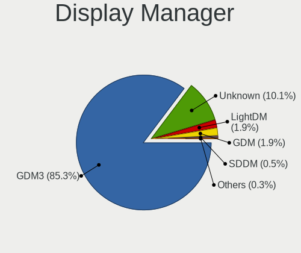
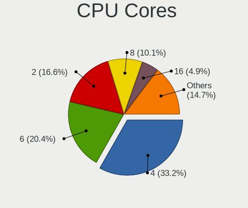

Ubuntu - Hardware Trends (Desktops)
-----------------------------------

A project to identify most popular hardware characteristics and track their change
over time based on data collected by Linux users at https://Linux-Hardware.org.

Anyone can contribute to this report by the [hw-probe](https://github.com/linuxhw/hw-probe) tool:

    sudo -E hw-probe -all -upload

This report is for one last month. Overall report since the beginning of time: [TestDays](https://github.com/linuxhw/TestDays)

Period: May, 2023.

Contents
--------

* [ System ](#system)
  - [ OS                       ](#os)
  - [ OS Family                ](#os-family)
  - [ Kernel                   ](#kernel)
  - [ Kernel Family            ](#kernel-family)
  - [ Kernel Major Ver.        ](#kernel-major-ver)
  - [ Arch                     ](#arch)
  - [ DE                       ](#de)
  - [ Display Server           ](#display-server)
  - [ Display Manager          ](#display-manager)
  - [ OS Lang                  ](#os-lang)
  - [ Boot Mode                ](#boot-mode)
  - [ Filesystem               ](#filesystem)
  - [ Part. scheme             ](#part-scheme)
  - [ Dual Boot with Linux/BSD ](#dual-boot-with-linuxbsd)
  - [ Dual Boot (Win)          ](#dual-boot-win)

* [ Board ](#board)
  - [ Vendor                   ](#vendor)
  - [ Model                    ](#model)
  - [ Model Family             ](#model-family)
  - [ MFG Year                 ](#mfg-year)
  - [ Form Factor              ](#form-factor)
  - [ Secure Boot              ](#secure-boot)
  - [ Coreboot                 ](#coreboot)
  - [ RAM Size                 ](#ram-size)
  - [ RAM Used                 ](#ram-used)
  - [ Total Drives             ](#total-drives)
  - [ Has CD-ROM               ](#has-cd-rom)
  - [ Has Ethernet             ](#has-ethernet)
  - [ Has WiFi                 ](#has-wifi)
  - [ Has Bluetooth            ](#has-bluetooth)

* [ Location ](#location)
  - [ Country                  ](#country)
  - [ City                     ](#city)

* [ Drives ](#drives)
  - [ Drive Vendor             ](#drive-vendor)
  - [ Drive Model              ](#drive-model)
  - [ HDD Vendor               ](#hdd-vendor)
  - [ SSD Vendor               ](#ssd-vendor)
  - [ Drive Kind               ](#drive-kind)
  - [ Drive Connector          ](#drive-connector)
  - [ Drive Size               ](#drive-size)
  - [ Space Total              ](#space-total)
  - [ Space Used               ](#space-used)
  - [ Malfunc. Drives          ](#malfunc-drives)
  - [ Malfunc. Drive Vendor    ](#malfunc-drive-vendor)
  - [ Malfunc. HDD Vendor      ](#malfunc-hdd-vendor)
  - [ Malfunc. Drive Kind      ](#malfunc-drive-kind)
  - [ Failed Drives            ](#failed-drives)
  - [ Failed Drive Vendor      ](#failed-drive-vendor)
  - [ Drive Status             ](#drive-status)

* [ Storage controller ](#storage-controller)
  - [ Storage Vendor           ](#storage-vendor)
  - [ Storage Model            ](#storage-model)
  - [ Storage Kind             ](#storage-kind)

* [ Processor ](#processor)
  - [ CPU Vendor               ](#cpu-vendor)
  - [ CPU Model                ](#cpu-model)
  - [ CPU Model Family         ](#cpu-model-family)
  - [ CPU Cores                ](#cpu-cores)
  - [ CPU Sockets              ](#cpu-sockets)
  - [ CPU Threads              ](#cpu-threads)
  - [ CPU Op-Modes             ](#cpu-op-modes)
  - [ CPU Microcode            ](#cpu-microcode)
  - [ CPU Microarch            ](#cpu-microarch)

* [ Graphics ](#graphics)
  - [ GPU Vendor               ](#gpu-vendor)
  - [ GPU Model                ](#gpu-model)
  - [ GPU Combo                ](#gpu-combo)
  - [ GPU Driver               ](#gpu-driver)
  - [ GPU Memory               ](#gpu-memory)

* [ Monitor ](#monitor)
  - [ Monitor Vendor           ](#monitor-vendor)
  - [ Monitor Model            ](#monitor-model)
  - [ Monitor Resolution       ](#monitor-resolution)
  - [ Monitor Diagonal         ](#monitor-diagonal)
  - [ Monitor Width            ](#monitor-width)
  - [ Aspect Ratio             ](#aspect-ratio)
  - [ Monitor Area             ](#monitor-area)
  - [ Pixel Density            ](#pixel-density)
  - [ Multiple Monitors        ](#multiple-monitors)

* [ Network ](#network)
  - [ Net Controller Vendor    ](#net-controller-vendor)
  - [ Net Controller Model     ](#net-controller-model)
  - [ Wireless Vendor          ](#wireless-vendor)
  - [ Wireless Model           ](#wireless-model)
  - [ Ethernet Vendor          ](#ethernet-vendor)
  - [ Ethernet Model           ](#ethernet-model)
  - [ Net Controller Kind      ](#net-controller-kind)
  - [ Used Controller          ](#used-controller)
  - [ NICs                     ](#nics)
  - [ IPv6                     ](#ipv6)

* [ Bluetooth ](#bluetooth)
  - [ Bluetooth Vendor         ](#bluetooth-vendor)
  - [ Bluetooth Model          ](#bluetooth-model)

* [ Sound ](#sound)
  - [ Sound Vendor             ](#sound-vendor)
  - [ Sound Model              ](#sound-model)

* [ Memory ](#memory)
  - [ Memory Vendor            ](#memory-vendor)
  - [ Memory Model             ](#memory-model)
  - [ Memory Kind              ](#memory-kind)
  - [ Memory Form Factor       ](#memory-form-factor)
  - [ Memory Size              ](#memory-size)
  - [ Memory Speed             ](#memory-speed)

* [ Printers & scanners ](#printers--scanners)
  - [ Printer Vendor           ](#printer-vendor)
  - [ Printer Model            ](#printer-model)
  - [ Scanner Vendor           ](#scanner-vendor)
  - [ Scanner Model            ](#scanner-model)

* [ Camera ](#camera)
  - [ Camera Vendor            ](#camera-vendor)
  - [ Camera Model             ](#camera-model)

* [ Security ](#security)
  - [ Fingerprint Vendor       ](#fingerprint-vendor)
  - [ Fingerprint Model        ](#fingerprint-model)
  - [ Chipcard Vendor          ](#chipcard-vendor)
  - [ Chipcard Model           ](#chipcard-model)

* [ Unsupported ](#unsupported)
  - [ Unsupported Devices      ](#unsupported-devices)
  - [ Unsupported Device Types ](#unsupported-device-types)

System
------

OS
--

Installed operating systems

| Name           | Desktops | Percent |
|----------------|----------|---------|
| Ubuntu 22.04   | 256      | 61.1%   |
| Ubuntu 23.04   | 92       | 21.96%  |
| Ubuntu 20.04   | 43       | 10.26%  |
| Ubuntu 22.10   | 16       | 3.82%   |
| Ubuntu 18.04   | 6        | 1.43%   |
| Ubuntu Core 22 | 2        | 0.48%   |
| Ubuntu Core 18 | 1        | 0.24%   |
| Ubuntu 9.5     | 1        | 0.24%   |
| Ubuntu 23.10   | 1        | 0.24%   |
| Ubuntu 21.04   | 1        | 0.24%   |

OS Family
---------

OS without a version

| Name   | Desktops | Percent |
|--------|----------|---------|
| Ubuntu | 419      | 100%    |

Kernel
------

Version of the Linux kernel

| Version                     | Desktops | Percent |
|-----------------------------|----------|---------|
| 5.19.0-41-generic           | 145      | 34.61%  |
| 6.2.0-20-generic            | 88       | 21%     |
| 5.19.0-42-generic           | 49       | 11.69%  |
| 5.15.0-71-generic           | 33       | 7.88%   |
| 5.15.0-72-generic           | 22       | 5.25%   |
| 5.4.0-148-generic           | 9        | 2.15%   |
| 5.19.0-32-generic           | 7        | 1.67%   |
| 5.19.0-38-generic           | 6        | 1.43%   |
| 5.19.0-35-generic           | 6        | 1.43%   |
| 5.15.0-25-generic           | 5        | 1.19%   |
| 5.19.0-40-generic           | 4        | 0.95%   |
| 5.15.0-67-generic           | 4        | 0.95%   |
| 6.3.2-060302-generic        | 3        | 0.72%   |
| 5.15.0-69-generic           | 3        | 0.72%   |
| 5.4.0-149-generic           | 2        | 0.48%   |
| 5.4.0-147-generic           | 2        | 0.48%   |
| 5.4.0-144-generic           | 2        | 0.48%   |
| 5.15.0-58-generic           | 2        | 0.48%   |
| 5.15.0-43-generic           | 2        | 0.48%   |
| 6.3.4-060304-generic        | 1        | 0.24%   |
| 6.2.6-76060206-generic      | 1        | 0.24%   |
| 6.2.0-21-generic            | 1        | 0.24%   |
| 6.2.0-1003-lowlatency       | 1        | 0.24%   |
| 6.1.0-1009-tuxedo           | 1        | 0.24%   |
| 6.0.3-060003-generic        | 1        | 0.24%   |
| 6.0.1-060001-generic        | 1        | 0.24%   |
| 5.4.0-1472304060810-generic | 1        | 0.24%   |
| 5.19.0-43-generic           | 1        | 0.24%   |
| 5.19.0-29-generic           | 1        | 0.24%   |
| 5.19.0-21-generic           | 1        | 0.24%   |
| 5.19.0-1024-lowlatency      | 1        | 0.24%   |
| 5.19.0-051900rc8-generic    | 1        | 0.24%   |
| 5.15.20-051520-lowlatency   | 1        | 0.24%   |
| 5.15.0-70-generic           | 1        | 0.24%   |
| 5.15.0-59-generic           | 1        | 0.24%   |
| 5.15.0-57-generic           | 1        | 0.24%   |
| 5.15.0-56-generic           | 1        | 0.24%   |
| 5.15.0-50-generic           | 1        | 0.24%   |
| 5.15.0-1023-nvidia          | 1        | 0.24%   |
| 5.15.0-1016-intel-iotg      | 1        | 0.24%   |

Kernel Family
-------------

Linux kernel without a distro release

| Version | Desktops | Percent |
|---------|----------|---------|
| 5.19.0  | 222      | 52.98%  |
| 6.2.0   | 90       | 21.48%  |
| 5.15.0  | 78       | 18.62%  |
| 5.4.0   | 16       | 3.82%   |
| 6.3.2   | 3        | 0.72%   |
| 4.15.0  | 2        | 0.48%   |
| 6.3.4   | 1        | 0.24%   |
| 6.2.6   | 1        | 0.24%   |
| 6.1.0   | 1        | 0.24%   |
| 6.0.3   | 1        | 0.24%   |
| 6.0.1   | 1        | 0.24%   |
| 5.15.20 | 1        | 0.24%   |
| 5.13.0  | 1        | 0.24%   |
| 5.11.0  | 1        | 0.24%   |

Kernel Major Ver.
-----------------

Linux kernel major version

| Version | Desktops | Percent |
|---------|----------|---------|
| 5.19    | 222      | 52.98%  |
| 6.2     | 91       | 21.72%  |
| 5.15    | 79       | 18.85%  |
| 5.4     | 16       | 3.82%   |
| 6.3     | 4        | 0.95%   |
| 6.0     | 2        | 0.48%   |
| 4.15    | 2        | 0.48%   |
| 6.1     | 1        | 0.24%   |
| 5.13    | 1        | 0.24%   |
| 5.11    | 1        | 0.24%   |

Arch
----

OS architecture (x86_64, i586, etc.)

| Name   | Desktops | Percent |
|--------|----------|---------|
| x86_64 | 417      | 99.52%  |
| i686   | 2        | 0.48%   |

DE
--

Desktop Environment

| Name            | Desktops | Percent |
|-----------------|----------|---------|
| GNOME           | 380      | 90.69%  |
| Unknown         | 27       | 6.44%   |
| X-Cinnamon      | 6        | 1.43%   |
| GNOME Flashback | 2        | 0.48%   |
| Enlightenment   | 2        | 0.48%   |
| INPT            | 1        | 0.24%   |
| GNOME Classic   | 1        | 0.24%   |

Display Server
--------------

X11 or Wayland

| Name    | Desktops | Percent |
|---------|----------|---------|
| Wayland | 214      | 51.07%  |
| X11     | 178      | 42.48%  |
| Tty     | 18       | 4.3%    |
| Unknown | 9        | 2.15%   |

Display Manager
---------------

SDDM, LightDM, etc.

| Name    | Desktops | Percent |
|---------|----------|---------|
| GDM3    | 341      | 81.38%  |
| Unknown | 55       | 13.13%  |
| GDM     | 12       | 2.86%   |
| LightDM | 10       | 2.39%   |
| SLiM    | 1        | 0.24%   |

OS Lang
-------

Language

| Lang    | Desktops | Percent |
|---------|----------|---------|
| en_US   | 197      | 47.02%  |
| de_DE   | 47       | 11.22%  |
| fr_FR   | 21       | 5.01%   |
| pt_BR   | 17       | 4.06%   |
| en_CA   | 15       | 3.58%   |
| en_GB   | 13       | 3.1%    |
| C       | 10       | 2.39%   |
| ru_RU   | 9        | 2.15%   |
| en_IN   | 9        | 2.15%   |
| ja_JP   | 7        | 1.67%   |
| es_ES   | 7        | 1.67%   |
| Unknown | 7        | 1.67%   |
| en_AU   | 5        | 1.19%   |
| de_AT   | 5        | 1.19%   |
| it_IT   | 4        | 0.95%   |
| es_AR   | 4        | 0.95%   |
| sv_SE   | 3        | 0.72%   |
| pl_PL   | 3        | 0.72%   |
| es_MX   | 3        | 0.72%   |
| de_CH   | 3        | 0.72%   |
| nl_NL   | 2        | 0.48%   |
| nl_BE   | 2        | 0.48%   |
| hu_HU   | 2        | 0.48%   |
| en_ZA   | 2        | 0.48%   |
| en_NZ   | 2        | 0.48%   |
| cs_CZ   | 2        | 0.48%   |
| zh_TW   | 1        | 0.24%   |
| tr_TR   | 1        | 0.24%   |
| sk_SK   | 1        | 0.24%   |
| pt_PT   | 1        | 0.24%   |
| nn_NO   | 1        | 0.24%   |
| fr_CH   | 1        | 0.24%   |
| fr_CA   | 1        | 0.24%   |
| fr_BE   | 1        | 0.24%   |
| fi_FI   | 1        | 0.24%   |
| es_UY   | 1        | 0.24%   |
| es_PY   | 1        | 0.24%   |
| es_CO   | 1        | 0.24%   |
| es_BO   | 1        | 0.24%   |
| en_IL   | 1        | 0.24%   |

Boot Mode
---------

EFI or BIOS

| Mode | Desktops | Percent |
|------|----------|---------|
| BIOS | 291      | 69.45%  |
| EFI  | 128      | 30.55%  |

Filesystem
----------

Type of filesystem

| Type    | Desktops | Percent |
|---------|----------|---------|
| Tmpfs   | 206      | 49.16%  |
| Ext4    | 189      | 45.11%  |
| Overlay | 11       | 2.63%   |
| Btrfs   | 10       | 2.39%   |
| Ext3    | 2        | 0.48%   |
| Xfs     | 1        | 0.24%   |

Part. scheme
------------

Scheme of partitioning

| Type    | Desktops | Percent |
|---------|----------|---------|
| GPT     | 322      | 76.85%  |
| MBR     | 65       | 15.51%  |
| Unknown | 32       | 7.64%   |

Dual Boot with Linux/BSD
------------------------

Hosting more than one Linux/BSD

| Dual boot | Desktops | Percent |
|-----------|----------|---------|
| No        | 342      | 81.62%  |
| Yes       | 77       | 18.38%  |

Dual Boot (Win)
---------------

Hosting Linux and Windows

| Dual boot | Desktops | Percent |
|-----------|----------|---------|
| No        | 248      | 59.19%  |
| Yes       | 171      | 40.81%  |

Board
-----

Vendor
------

Motherboard manufacturer

| Name                | Desktops | Percent |
|---------------------|----------|---------|
| ASUSTek Computer    | 110      | 26.25%  |
| Gigabyte Technology | 70       | 16.71%  |
| Dell                | 52       | 12.41%  |
| MSI                 | 35       | 8.35%   |
| ASRock              | 28       | 6.68%   |
| Hewlett-Packard     | 25       | 5.97%   |
| Lenovo              | 19       | 4.53%   |
| Intel               | 14       | 3.34%   |
| Acer                | 8        | 1.91%   |
| Pegatron            | 7        | 1.67%   |
| Fujitsu             | 6        | 1.43%   |
| Biostar             | 6        | 1.43%   |
| Unknown             | 6        | 1.43%   |
| Medion              | 5        | 1.19%   |
| Gateway             | 3        | 0.72%   |
| ZOTAC               | 2        | 0.48%   |
| Supermicro          | 2        | 0.48%   |
| PCWare              | 2        | 0.48%   |
| eMachines           | 2        | 0.48%   |
| AZW                 | 2        | 0.48%   |
| Avalue              | 2        | 0.48%   |
| YANYU               | 1        | 0.24%   |
| System76            | 1        | 0.24%   |
| Shuttle             | 1        | 0.24%   |
| SHANGZHAOYUAN       | 1        | 0.24%   |
| Semp Toshiba        | 1        | 0.24%   |
| NEC Computers       | 1        | 0.24%   |
| Google              | 1        | 0.24%   |
| EPSON DIRECT        | 1        | 0.24%   |
| ECS                 | 1        | 0.24%   |
| Datto               | 1        | 0.24%   |
| Daten Tecnologia    | 1        | 0.24%   |
| Apple               | 1        | 0.24%   |
| AAEON               | 1        | 0.24%   |

Model
-----

Motherboard model

| Name                             | Desktops | Percent |
|----------------------------------|----------|---------|
| Unknown                          | 8        | 1.91%   |
| ASUS All Series                  | 7        | 1.67%   |
| Dell OptiPlex 990                | 4        | 0.95%   |
| Dell OptiPlex 9020               | 4        | 0.95%   |
| HP EliteDesk 800 G2 DM 35W       | 3        | 0.72%   |
| Dell OptiPlex 780                | 3        | 0.72%   |
| Dell OptiPlex 3040               | 3        | 0.72%   |
| MSI MS-7721                      | 2        | 0.48%   |
| Intel H61                        | 2        | 0.48%   |
| HP EliteDesk 800 G1 SFF          | 2        | 0.48%   |
| HP Compaq Elite 8300 SFF         | 2        | 0.48%   |
| HP Compaq 6200 Pro MT PC         | 2        | 0.48%   |
| Gigabyte Z390 AORUS PRO WIFI     | 2        | 0.48%   |
| Gigabyte X570 AORUS MASTER       | 2        | 0.48%   |
| Gigabyte F2A78M-HD2              | 2        | 0.48%   |
| Gigabyte B75M-D3H                | 2        | 0.48%   |
| Gigabyte B550M DS3H              | 2        | 0.48%   |
| Gigabyte B550 AORUS ELITE AX V2  | 2        | 0.48%   |
| Dell Precision WorkStation T5500 | 2        | 0.48%   |
| Dell Precision WorkStation T3500 | 2        | 0.48%   |
| Dell OptiPlex 790                | 2        | 0.48%   |
| Dell OptiPlex 7060               | 2        | 0.48%   |
| Dell OptiPlex 7040               | 2        | 0.48%   |
| Dell OptiPlex 7020               | 2        | 0.48%   |
| Dell OptiPlex 7010               | 2        | 0.48%   |
| Avalue NUC-TGU E9697JAO003R      | 2        | 0.48%   |
| ASUS Z77-A                       | 2        | 0.48%   |
| ASUS TUF Gaming X570-PLUS        | 2        | 0.48%   |
| ASUS ROG STRIX Z390-F GAMING     | 2        | 0.48%   |
| ASUS ROG STRIX B550-F GAMING     | 2        | 0.48%   |
| ASUS ROG CROSSHAIR VIII HERO     | 2        | 0.48%   |
| ASUS PRIME Z690-P WIFI           | 2        | 0.48%   |
| ASUS PRIME B550M-A AC            | 2        | 0.48%   |
| ASUS PRIME B450-PLUS             | 2        | 0.48%   |
| ASUS P8H61-M LX3 R2.0            | 2        | 0.48%   |
| ASUS F2A85-V PRO                 | 2        | 0.48%   |
| ASUS A88XM-PLUS                  | 2        | 0.48%   |
| ASRock 970 Pro3 R2.0             | 2        | 0.48%   |
| YANYU EPIC-N56_I522E Ver         | 1        | 0.24%   |
| System76 Thelio Mira             | 1        | 0.24%   |

Model Family
------------

Motherboard model prefix

| Name                | Desktops | Percent |
|---------------------|----------|---------|
| Dell OptiPlex       | 34       | 8.11%   |
| ASUS PRIME          | 27       | 6.44%   |
| ASUS ROG            | 19       | 4.53%   |
| Lenovo ThinkCentre  | 11       | 2.63%   |
| Dell Precision      | 11       | 2.63%   |
| ASUS TUF            | 10       | 2.39%   |
| HP Compaq           | 9        | 2.15%   |
| Unknown             | 8        | 1.91%   |
| ASUS All            | 7        | 1.67%   |
| HP EliteDesk        | 6        | 1.43%   |
| Lenovo IdeaCentre   | 5        | 1.19%   |
| Acer Aspire         | 5        | 1.19%   |
| Gigabyte Z590       | 4        | 0.95%   |
| Gigabyte X570       | 4        | 0.95%   |
| Gigabyte B550       | 4        | 0.95%   |
| Fujitsu ESPRIMO     | 4        | 0.95%   |
| Dell Inspiron       | 4        | 0.95%   |
| ASUS P8H61-M        | 4        | 0.95%   |
| Gigabyte Z390       | 3        | 0.72%   |
| Gigabyte B550M      | 3        | 0.72%   |
| Gigabyte B450M      | 3        | 0.72%   |
| ASUS M5A78L-M       | 3        | 0.72%   |
| ASUS F2A85-V        | 3        | 0.72%   |
| MSI MS-7721         | 2        | 0.48%   |
| Intel H61           | 2        | 0.48%   |
| HP ProDesk          | 2        | 0.48%   |
| Gigabyte Z690       | 2        | 0.48%   |
| Gigabyte F2A78M-HD2 | 2        | 0.48%   |
| Gigabyte B75M-D3H   | 2        | 0.48%   |
| Dell Vostro         | 2        | 0.48%   |
| Avalue NUC-TGU      | 2        | 0.48%   |
| ASUS Z77-A          | 2        | 0.48%   |
| ASUS STRIX          | 2        | 0.48%   |
| ASUS H110M-A        | 2        | 0.48%   |
| ASUS CROSSHAIR      | 2        | 0.48%   |
| ASUS A88XM-PLUS     | 2        | 0.48%   |
| ASRock Z97          | 2        | 0.48%   |
| ASRock B450         | 2        | 0.48%   |
| ASRock 970          | 2        | 0.48%   |
| Acer Veriton        | 2        | 0.48%   |

MFG Year
--------

Motherboard manufacture year

| Year | Desktops | Percent |
|------|----------|---------|
| 2018 | 39       | 9.31%   |
| 2021 | 35       | 8.35%   |
| 2013 | 34       | 8.11%   |
| 2012 | 33       | 7.88%   |
| 2011 | 33       | 7.88%   |
| 2022 | 28       | 6.68%   |
| 2020 | 28       | 6.68%   |
| 2019 | 27       | 6.44%   |
| 2015 | 27       | 6.44%   |
| 2014 | 27       | 6.44%   |
| 2010 | 26       | 6.21%   |
| 2017 | 25       | 5.97%   |
| 2016 | 17       | 4.06%   |
| 2009 | 17       | 4.06%   |
| 2008 | 10       | 2.39%   |
| 2023 | 7        | 1.67%   |
| 2007 | 4        | 0.95%   |
| 2006 | 1        | 0.24%   |
| 2003 | 1        | 0.24%   |

Form Factor
-----------

Physical design of the computer

| Name    | Desktops | Percent |
|---------|----------|---------|
| Desktop | 419      | 100%    |

Secure Boot
-----------

Enabled or disabled

| State    | Desktops | Percent |
|----------|----------|---------|
| Disabled | 402      | 95.94%  |
| Enabled  | 17       | 4.06%   |

Coreboot
--------

Have coreboot on board

| Used | Desktops | Percent |
|------|----------|---------|
| No   | 418      | 99.76%  |
| Yes  | 1        | 0.24%   |

RAM Size
--------

Total RAM memory

| Size in GB      | Desktops | Percent |
|-----------------|----------|---------|
| 16.01-24.0      | 97       | 23.15%  |
| 4.01-8.0        | 87       | 20.76%  |
| 32.01-64.0      | 76       | 18.14%  |
| 8.01-16.0       | 75       | 17.9%   |
| 3.01-4.0        | 35       | 8.35%   |
| 64.01-256.0     | 26       | 6.21%   |
| 24.01-32.0      | 16       | 3.82%   |
| 1.01-2.0        | 3        | 0.72%   |
| More than 256.0 | 2        | 0.48%   |
| 2.01-3.0        | 2        | 0.48%   |

RAM Used
--------

Used RAM memory

| Used GB    | Desktops | Percent |
|------------|----------|---------|
| 2.01-3.0   | 116      | 27.68%  |
| 1.01-2.0   | 112      | 26.73%  |
| 4.01-8.0   | 81       | 19.33%  |
| 3.01-4.0   | 65       | 15.51%  |
| 8.01-16.0  | 24       | 5.73%   |
| 0.51-1.0   | 11       | 2.63%   |
| 16.01-24.0 | 6        | 1.43%   |
| 24.01-32.0 | 3        | 0.72%   |
| 0.01-0.5   | 1        | 0.24%   |

Total Drives
------------

Number of drives on board

| Drives | Desktops | Percent |
|--------|----------|---------|
| 1      | 166      | 39.62%  |
| 2      | 126      | 30.07%  |
| 3      | 63       | 15.04%  |
| 4      | 36       | 8.59%   |
| 5      | 12       | 2.86%   |
| 6      | 7        | 1.67%   |
| 9      | 3        | 0.72%   |
| 12     | 2        | 0.48%   |
| 7      | 2        | 0.48%   |
| 25     | 1        | 0.24%   |
| 0      | 1        | 0.24%   |

Has CD-ROM
----------

Has CD-ROM on board

| Presented | Desktops | Percent |
|-----------|----------|---------|
| No        | 236      | 56.32%  |
| Yes       | 183      | 43.68%  |

Has Ethernet
------------

Has Ethernet on board

| Presented | Desktops | Percent |
|-----------|----------|---------|
| Yes       | 415      | 99.05%  |
| No        | 4        | 0.95%   |

Has WiFi
--------

Has WiFi module

| Presented | Desktops | Percent |
|-----------|----------|---------|
| No        | 227      | 54.18%  |
| Yes       | 192      | 45.82%  |

Has Bluetooth
-------------

Has Bluetooth module

| Presented | Desktops | Percent |
|-----------|----------|---------|
| No        | 261      | 62.29%  |
| Yes       | 158      | 37.71%  |

Location
--------

Country
-------

Geographic location (country)

| Country      | Desktops | Percent |
|--------------|----------|---------|
| USA          | 106      | 25.3%   |
| Germany      | 52       | 12.41%  |
| Brazil       | 27       | 6.44%   |
| France       | 26       | 6.21%   |
| Canada       | 21       | 5.01%   |
| UK           | 17       | 4.06%   |
| Switzerland  | 12       | 2.86%   |
| Sweden       | 11       | 2.63%   |
| India        | 11       | 2.63%   |
| Russia       | 10       | 2.39%   |
| Spain        | 8        | 1.91%   |
| Netherlands  | 8        | 1.91%   |
| Japan        | 7        | 1.67%   |
| Austria      | 7        | 1.67%   |
| Australia    | 7        | 1.67%   |
| Italy        | 6        | 1.43%   |
| Greece       | 5        | 1.19%   |
| Turkey       | 4        | 0.95%   |
| Poland       | 4        | 0.95%   |
| Mexico       | 4        | 0.95%   |
| Belgium      | 4        | 0.95%   |
| Argentina    | 4        | 0.95%   |
| South Africa | 3        | 0.72%   |
| Serbia       | 3        | 0.72%   |
| New Zealand  | 3        | 0.72%   |
| Finland      | 3        | 0.72%   |
| Denmark      | 3        | 0.72%   |
| Czechia      | 3        | 0.72%   |
| Ukraine      | 2        | 0.48%   |
| Thailand     | 2        | 0.48%   |
| Taiwan       | 2        | 0.48%   |
| Philippines  | 2        | 0.48%   |
| Paraguay     | 2        | 0.48%   |
| Norway       | 2        | 0.48%   |
| Israel       | 2        | 0.48%   |
| Hungary      | 2        | 0.48%   |
| Egypt        | 2        | 0.48%   |
| Vietnam      | 1        | 0.24%   |
| Venezuela    | 1        | 0.24%   |
| Uruguay      | 1        | 0.24%   |

City
----

Geographic location (city)

| City           | Desktops | Percent |
|----------------|----------|---------|
| Vienna         | 5        | 1.19%   |
| Berlin         | 4        | 0.95%   |
| Sao Paulo      | 3        | 0.72%   |
| Hamburg        | 3        | 0.72%   |
| Geneseo        | 3        | 0.72%   |
| Barcelona      | 3        | 0.72%   |
| Amsterdam      | 3        | 0.72%   |
| Yekaterinburg  | 2        | 0.48%   |
| Toronto        | 2        | 0.48%   |
| Stockholm      | 2        | 0.48%   |
| San Jose       | 2        | 0.48%   |
| Prague         | 2        | 0.48%   |
| Pittsburg      | 2        | 0.48%   |
| Petah Tikva    | 2        | 0.48%   |
| Oshawa         | 2        | 0.48%   |
| New York       | 2        | 0.48%   |
| Munich         | 2        | 0.48%   |
| Montreal       | 2        | 0.48%   |
| Melbourne      | 2        | 0.48%   |
| Madrid         | 2        | 0.48%   |
| Lucerne        | 2        | 0.48%   |
| Kameido        | 2        | 0.48%   |
| Kalwara        | 2        | 0.48%   |
| Jacksonville   | 2        | 0.48%   |
| Hyderabad      | 2        | 0.48%   |
| Gothenburg     | 2        | 0.48%   |
| Fortaleza      | 2        | 0.48%   |
| Florianópolis | 2        | 0.48%   |
| Farrell        | 2        | 0.48%   |
| Düsseldorf    | 2        | 0.48%   |
| Delhi          | 2        | 0.48%   |
| Columbia       | 2        | 0.48%   |
| Cologne        | 2        | 0.48%   |
| Cleveland      | 2        | 0.48%   |
| Campinas       | 2        | 0.48%   |
| Cambridge      | 2        | 0.48%   |
| Budapest       | 2        | 0.48%   |
| Brussels       | 2        | 0.48%   |
| Brisbane       | 2        | 0.48%   |
| Brasília      | 2        | 0.48%   |

Drives
------

Drive Vendor
------------

Hard drive vendors

| Vendor                      | Desktops | Drives | Percent |
|-----------------------------|----------|--------|---------|
| Seagate                     | 137      | 176    | 18%     |
| WDC                         | 135      | 179    | 17.74%  |
| Samsung Electronics         | 131      | 173    | 17.21%  |
| Kingston                    | 45       | 45     | 5.91%   |
| SanDisk                     | 40       | 44     | 5.26%   |
| Crucial                     | 35       | 55     | 4.6%    |
| Hitachi                     | 28       | 32     | 3.68%   |
| Toshiba                     | 26       | 27     | 3.42%   |
| Intel                       | 15       | 15     | 1.97%   |
| China                       | 11       | 11     | 1.45%   |
| Unknown                     | 9        | 11     | 1.18%   |
| Micron/Crucial Technology   | 9        | 9      | 1.18%   |
| A-DATA Technology           | 9        | 9      | 1.18%   |
| Phison Electronics          | 8        | 8      | 1.05%   |
| Unknown                     | 8        | 8      | 1.05%   |
| Kingston Technology Company | 6        | 6      | 0.79%   |
| SPCC                        | 5        | 10     | 0.66%   |
| SK hynix                    | 5        | 5      | 0.66%   |
| Silicon Motion              | 5        | 5      | 0.66%   |
| SABRENT                     | 5        | 10     | 0.66%   |
| PNY                         | 5        | 8      | 0.66%   |
| Intenso                     | 5        | 5      | 0.66%   |
| HGST                        | 5        | 5      | 0.66%   |
| Transcend                   | 4        | 4      | 0.53%   |
| Patriot                     | 4        | 4      | 0.53%   |
| ASMT                        | 4        | 11     | 0.53%   |
| Realtek Semiconductor       | 3        | 3      | 0.39%   |
| Micron Technology           | 3        | 3      | 0.39%   |
| Gigabyte Technology         | 3        | 3      | 0.39%   |
| Phison                      | 2        | 2      | 0.26%   |
| LITEONIT                    | 2        | 2      | 0.26%   |
| Lexar                       | 2        | 2      | 0.26%   |
| KIOXIA                      | 2        | 2      | 0.26%   |
| Hewlett-Packard             | 2        | 2      | 0.26%   |
| Fanxiang                    | 2        | 2      | 0.26%   |
| Apple                       | 2        | 2      | 0.26%   |
| XSTAR                       | 1        | 1      | 0.13%   |
| XPG                         | 1        | 1      | 0.13%   |
| WDC WDS2                    | 1        | 1      | 0.13%   |
| WD MediaMax                 | 1        | 1      | 0.13%   |

Drive Model
-----------

Hard drive models

| Model                                               | Desktops | Percent |
|-----------------------------------------------------|----------|---------|
| Samsung NVMe SSD Controller SM981/PM981/PM983 256GB | 19       | 2.2%    |
| Seagate ST2000DM008-2FR102 2TB                      | 12       | 1.39%   |
| Seagate ST1000DM010-2EP102 1TB                      | 10       | 1.16%   |
| Samsung NVMe SSD Controller PM9A1/PM9A3/980PRO 1TB  | 9        | 1.04%   |
| Kingston SA400S37240G 240GB SSD                     | 9        | 1.04%   |
| Seagate ST4000DM004-2CV104 4TB                      | 8        | 0.93%   |
| Kingston SA400S37480G 480GB SSD                     | 8        | 0.93%   |
| Unknown                                             | 8        | 0.93%   |
| WDC WD10EZEX-08WN4A0 1TB                            | 7        | 0.81%   |
| Toshiba DT01ACA100 1TB                              | 7        | 0.81%   |
| Seagate ST1000DM003-1CH162 1TB                      | 7        | 0.81%   |
| Samsung SSD 870 EVO 1TB                             | 7        | 0.81%   |
| Samsung SSD 980 1TB                                 | 6        | 0.69%   |
| Samsung SSD 870 EVO 2TB                             | 6        | 0.69%   |
| Samsung SSD 860 EVO 500GB                           | 6        | 0.69%   |
| Hitachi HDS721010CLA332 1TB                         | 6        | 0.69%   |
| Seagate ST500DM002-1BD142 500GB                     | 5        | 0.58%   |
| Seagate ST2000DM001-1CH164 2TB                      | 5        | 0.58%   |
| Samsung NVMe SSD Controller SM961/PM961/SM963 256GB | 5        | 0.58%   |
| SABRENT Disk 14TB                                   | 5        | 0.58%   |
| Micron/Crucial P2 NVMe PCIe SSD 1TB                 | 5        | 0.58%   |
| Crucial CT1000BX500SSD1 1TB                         | 5        | 0.58%   |
| WDC WD20EZRZ-00Z5HB0 2TB                            | 4        | 0.46%   |
| WDC WD10EZEX-75WN4A1 1TB                            | 4        | 0.46%   |
| Toshiba DT01ACA200 2TB                              | 4        | 0.46%   |
| Silicon Motion SM2263EN/SM2263XT SSD Controller 1TB | 4        | 0.46%   |
| Sandisk WD Blue SN550 NVMe SSD 512GB                | 4        | 0.46%   |
| SanDisk SSD PLUS 480GB                              | 4        | 0.46%   |
| SanDisk SSD PLUS 1000GB                             | 4        | 0.46%   |
| Samsung SSD 850 EVO 250GB                           | 4        | 0.46%   |
| Crucial CT500MX500SSD1 500GB                        | 4        | 0.46%   |
| Crucial CT240BX500SSD1 240GB                        | 4        | 0.46%   |
| Crucial CT1000MX500SSD1 1TB                         | 4        | 0.46%   |
| WDC WDS500G2B0A-00SM50 500GB SSD                    | 3        | 0.35%   |
| WDC WDS240G2G0A-00JH30 240GB SSD                    | 3        | 0.35%   |
| WDC WD10EZEX-00WN4A0 1TB                            | 3        | 0.35%   |
| WDC WD10EZEX-00BN5A0 1TB                            | 3        | 0.35%   |
| Toshiba DT01ACA050 500GB                            | 3        | 0.35%   |
| SPCC Solid State Disk 512GB                         | 3        | 0.35%   |
| Seagate ST3500312CS 500GB                           | 3        | 0.35%   |

HDD Vendor
----------

Hard disk drive vendors

| Vendor              | Desktops | Drives | Percent |
|---------------------|----------|--------|---------|
| Seagate             | 133      | 172    | 38.66%  |
| WDC                 | 123      | 162    | 35.76%  |
| Hitachi             | 27       | 31     | 7.85%   |
| Samsung Electronics | 23       | 27     | 6.69%   |
| Toshiba             | 22       | 23     | 6.4%    |
| HGST                | 5        | 5      | 1.45%   |
| Unknown             | 2        | 2      | 0.58%   |
| Apple               | 2        | 2      | 0.58%   |
| WD MediaMax         | 1        | 1      | 0.29%   |
| RSH-339             | 1        | 1      | 0.29%   |
| Intenso             | 1        | 1      | 0.29%   |
| Inateck             | 1        | 1      | 0.29%   |
| Hewlett-Packard     | 1        | 1      | 0.29%   |
| Fujitsu             | 1        | 1      | 0.29%   |
| ASMT                | 1        | 1      | 0.29%   |

SSD Vendor
----------

Solid state drive vendors

| Vendor              | Desktops | Drives | Percent |
|---------------------|----------|--------|---------|
| Samsung Electronics | 60       | 75     | 23.44%  |
| Kingston            | 38       | 38     | 14.84%  |
| Crucial             | 31       | 49     | 12.11%  |
| SanDisk             | 21       | 23     | 8.2%    |
| WDC                 | 12       | 12     | 4.69%   |
| China               | 11       | 11     | 4.3%    |
| Intel               | 7        | 7      | 2.73%   |
| A-DATA Technology   | 7        | 7      | 2.73%   |
| SPCC                | 5        | 10     | 1.95%   |
| SABRENT             | 5        | 10     | 1.95%   |
| PNY                 | 5        | 8      | 1.95%   |
| Toshiba             | 4        | 4      | 1.56%   |
| Patriot             | 4        | 4      | 1.56%   |
| Transcend           | 3        | 3      | 1.17%   |
| Intenso             | 3        | 3      | 1.17%   |
| ASMT                | 3        | 10     | 1.17%   |
| Unknown             | 3        | 3      | 1.17%   |
| LITEONIT            | 2        | 2      | 0.78%   |
| Gigabyte Technology | 2        | 2      | 0.78%   |
| Fanxiang            | 2        | 2      | 0.78%   |
| XSTAR               | 1        | 1      | 0.39%   |
| WDC WDS2            | 1        | 1      | 0.39%   |
| Verbatim            | 1        | 2      | 0.39%   |
| V7                  | 1        | 1      | 0.39%   |
| Team                | 1        | 1      | 0.39%   |
| TCSUNBOW            | 1        | 1      | 0.39%   |
| Super Talent        | 1        | 1      | 0.39%   |
| SK hynix            | 1        | 1      | 0.39%   |
| Self                | 1        | 1      | 0.39%   |
| Quaroni             | 1        | 1      | 0.39%   |
| Phison              | 1        | 1      | 0.39%   |
| Netac               | 1        | 1      | 0.39%   |
| Mushkin             | 1        | 1      | 0.39%   |
| MSI                 | 1        | 1      | 0.39%   |
| Min Yi U            | 1        | 1      | 0.39%   |
| MidasForce          | 1        | 1      | 0.39%   |
| Micron Technology   | 1        | 1      | 0.39%   |
| MicroFrom           | 1        | 1      | 0.39%   |
| LITEON              | 1        | 1      | 0.39%   |
| Lexar               | 1        | 1      | 0.39%   |

Drive Kind
----------

HDD or SSD

| Kind    | Desktops | Drives | Percent |
|---------|----------|--------|---------|
| HDD     | 272      | 431    | 42.11%  |
| SSD     | 217      | 312    | 33.59%  |
| NVMe    | 138      | 174    | 21.36%  |
| Unknown | 14       | 24     | 2.17%   |
| MMC     | 5        | 6      | 0.77%   |

Drive Connector
---------------

SATA, SAS, NVMe, etc.

| Type | Desktops | Drives | Percent |
|------|----------|--------|---------|
| SATA | 368      | 690    | 66.79%  |
| NVMe | 138      | 174    | 25.05%  |
| SAS  | 40       | 77     | 7.26%   |
| MMC  | 5        | 6      | 0.91%   |

Drive Size
----------

Size of hard drive

| Size in TB | Desktops | Drives | Percent |
|------------|----------|--------|---------|
| 0.01-0.5   | 243      | 331    | 44.42%  |
| 0.51-1.0   | 162      | 211    | 29.62%  |
| 1.01-2.0   | 67       | 80     | 12.25%  |
| 3.01-4.0   | 37       | 62     | 6.76%   |
| 4.01-10.0  | 15       | 23     | 2.74%   |
| 10.01-20.0 | 12       | 23     | 2.19%   |
| 2.01-3.0   | 11       | 13     | 2.01%   |

Space Total
-----------

Amount of disk space available on the file system

| Size in GB     | Desktops | Percent |
|----------------|----------|---------|
| 101-250        | 105      | 25.06%  |
| 251-500        | 87       | 20.76%  |
| 501-1000       | 71       | 16.95%  |
| 1001-2000      | 46       | 10.98%  |
| More than 3000 | 45       | 10.74%  |
| 2001-3000      | 18       | 4.3%    |
| 51-100         | 18       | 4.3%    |
| 1-20           | 11       | 2.63%   |
| 21-50          | 10       | 2.39%   |
| Unknown        | 8        | 1.91%   |

Space Used
----------

Amount of used disk space

| Used GB        | Desktops | Percent |
|----------------|----------|---------|
| 1-20           | 113      | 26.97%  |
| 21-50          | 77       | 18.38%  |
| 101-250        | 65       | 15.51%  |
| 51-100         | 48       | 11.46%  |
| 251-500        | 32       | 7.64%   |
| 501-1000       | 23       | 5.49%   |
| More than 3000 | 21       | 5.01%   |
| 1001-2000      | 17       | 4.06%   |
| 2001-3000      | 15       | 3.58%   |
| Unknown        | 8        | 1.91%   |

Malfunc. Drives
---------------

Drive models with a malfunction

| Model                                          | Desktops | Drives | Percent |
|------------------------------------------------|----------|--------|---------|
| WDC WD5000AAKX-22ERMA0 500GB                   | 2        | 2      | 6.25%   |
| Samsung Electronics SSD 960 EVO 250GB          | 2        | 2      | 6.25%   |
| WDC WD5000HHTZ-04N21V0 500GB                   | 1        | 1      | 3.13%   |
| WDC WD40EFRX-68WT0N0 4TB                       | 1        | 1      | 3.13%   |
| WDC WD3200BEKT-60PVMT0 320GB                   | 1        | 1      | 3.13%   |
| WDC WD10EZRZ-00HTKB0 1TB                       | 1        | 1      | 3.13%   |
| WDC WD10EZRX-00A8LB0 1TB                       | 1        | 1      | 3.13%   |
| WDC WD10EZEX-75WN4A0 1TB                       | 1        | 1      | 3.13%   |
| WDC WD10EARS-22Y5B1 1TB                        | 1        | 1      | 3.13%   |
| WDC WD10EALX-759BA1 1TB                        | 1        | 1      | 3.13%   |
| Toshiba MQ01ACF032 320GB                       | 1        | 1      | 3.13%   |
| Toshiba DT01ACA050 500GB                       | 1        | 1      | 3.13%   |
| Seagate ST500LM000-SSHD-8GB                    | 1        | 1      | 3.13%   |
| Seagate ST500DM002-1BD142 500GB                | 1        | 1      | 3.13%   |
| Seagate ST500DM002-1BC142 500GB                | 1        | 1      | 3.13%   |
| Seagate ST3500418AS 500GB                      | 1        | 2      | 3.13%   |
| Seagate ST3300822AS 304GB                      | 1        | 1      | 3.13%   |
| Seagate ST2000DM001-1E6164 2TB                 | 1        | 1      | 3.13%   |
| Seagate ST2000DM001-1CH164 2TB                 | 1        | 1      | 3.13%   |
| Seagate ST14000NM0018-2H4101 14TB              | 1        | 1      | 3.13%   |
| SanDisk SSD PLUS 480GB                         | 1        | 1      | 3.13%   |
| SanDisk SSD PLUS 1000GB                        | 1        | 1      | 3.13%   |
| Samsung Electronics SSD 870 EVO 500GB          | 1        | 1      | 3.13%   |
| Samsung Electronics HM121HI 120GB              | 1        | 1      | 3.13%   |
| Patriot P210 256GB SSD                         | 1        | 1      | 3.13%   |
| Micron Technology MTFDDAK256MAM-1K12 256GB SSD | 1        | 1      | 3.13%   |
| Hitachi HDP725050GLA380 500GB                  | 1        | 1      | 3.13%   |
| HGST HTS725050A7E630 500GB                     | 1        | 1      | 3.13%   |
| China SSD 120GB                                | 1        | 1      | 3.13%   |
| A-DATA Technology SX8100NP 512GB               | 1        | 1      | 3.13%   |

Malfunc. Drive Vendor
---------------------

Vendors of faulty drives

| Vendor              | Desktops | Drives | Percent |
|---------------------|----------|--------|---------|
| WDC                 | 10       | 10     | 32.26%  |
| Seagate             | 8        | 9      | 25.81%  |
| Samsung Electronics | 4        | 4      | 12.9%   |
| Toshiba             | 2        | 2      | 6.45%   |
| SanDisk             | 1        | 2      | 3.23%   |
| Patriot             | 1        | 1      | 3.23%   |
| Micron Technology   | 1        | 1      | 3.23%   |
| Hitachi             | 1        | 1      | 3.23%   |
| HGST                | 1        | 1      | 3.23%   |
| China               | 1        | 1      | 3.23%   |
| A-DATA Technology   | 1        | 1      | 3.23%   |

Malfunc. HDD Vendor
-------------------

Vendors of faulty HDD drives

| Vendor              | Desktops | Drives | Percent |
|---------------------|----------|--------|---------|
| WDC                 | 10       | 10     | 43.48%  |
| Seagate             | 8        | 9      | 34.78%  |
| Toshiba             | 2        | 2      | 8.7%    |
| Samsung Electronics | 1        | 1      | 4.35%   |
| Hitachi             | 1        | 1      | 4.35%   |
| HGST                | 1        | 1      | 4.35%   |

Malfunc. Drive Kind
-------------------

Kinds of faulty drives

| Kind | Desktops | Drives | Percent |
|------|----------|--------|---------|
| HDD  | 21       | 24     | 72.41%  |
| SSD  | 5        | 6      | 17.24%  |
| NVMe | 3        | 3      | 10.34%  |

Failed Drives
-------------

Failed drive models

| Model                             | Desktops | Drives | Percent |
|-----------------------------------|----------|--------|---------|
| Samsung Electronics SSD 980 500GB | 1        | 1      | 100%    |

Failed Drive Vendor
-------------------

Failed drive vendors

| Vendor              | Desktops | Drives | Percent |
|---------------------|----------|--------|---------|
| Samsung Electronics | 1        | 1      | 100%    |

Drive Status
------------

Number of failed and malfunc. drives

| Status   | Desktops | Drives | Percent |
|----------|----------|--------|---------|
| Detected | 309      | 670    | 67.17%  |
| Works    | 123      | 243    | 26.74%  |
| Malfunc  | 27       | 33     | 5.87%   |
| Failed   | 1        | 1      | 0.22%   |

Storage controller
------------------

Storage Vendor
--------------

Storage controller vendors

| Vendor                       | Desktops | Percent |
|------------------------------|----------|---------|
| Intel                        | 288      | 47.29%  |
| AMD                          | 119      | 19.54%  |
| Samsung Electronics          | 61       | 10.02%  |
| SanDisk                      | 24       | 3.94%   |
| ASMedia Technology           | 22       | 3.61%   |
| Micron/Crucial Technology    | 14       | 2.3%    |
| Kingston Technology Company  | 13       | 2.13%   |
| Phison Electronics           | 10       | 1.64%   |
| Marvell Technology Group     | 9        | 1.48%   |
| Silicon Motion               | 7        | 1.15%   |
| JMicron Technology           | 6        | 0.99%   |
| Nvidia                       | 5        | 0.82%   |
| SK hynix                     | 4        | 0.66%   |
| Realtek Semiconductor        | 4        | 0.66%   |
| Broadcom / LSI               | 4        | 0.66%   |
| ADATA Technology             | 3        | 0.49%   |
| Silicon Image                | 2        | 0.33%   |
| Seagate Technology           | 2        | 0.33%   |
| Micron Technology            | 2        | 0.33%   |
| MAXIO Technology (Hangzhou)  | 2        | 0.33%   |
| KIOXIA                       | 2        | 0.33%   |
| Innodisk                     | 2        | 0.33%   |
| VIA Technologies             | 1        | 0.16%   |
| Shenzhen Longsys Electronics | 1        | 0.16%   |
| LSI Logic / Symbios Logic    | 1        | 0.16%   |
| Adaptec                      | 1        | 0.16%   |

Storage Model
-------------

Storage controller models

| Model                                                                                   | Desktops | Percent |
|-----------------------------------------------------------------------------------------|----------|---------|
| AMD FCH SATA Controller [AHCI mode]                                                     | 71       | 9.47%   |
| Intel SATA Controller [RAID mode]                                                       | 35       | 4.67%   |
| Samsung NVMe SSD Controller SM981/PM981/PM983                                           | 33       | 4.4%    |
| Intel 8 Series/C220 Series Chipset Family 6-port SATA Controller 1 [AHCI mode]          | 28       | 3.73%   |
| Intel Q170/Q150/B150/H170/H110/Z170/CM236 Chipset SATA Controller [AHCI Mode]           | 24       | 3.2%    |
| Intel 6 Series/C200 Series Chipset Family 6 port Desktop SATA AHCI Controller           | 23       | 3.07%   |
| AMD 400 Series Chipset SATA Controller                                                  | 22       | 2.93%   |
| ASMedia ASM1062 Serial ATA Controller                                                   | 20       | 2.67%   |
| AMD 500 Series Chipset SATA Controller                                                  | 19       | 2.53%   |
| Intel 7 Series/C210 Series Chipset Family 6-port SATA Controller [AHCI mode]            | 18       | 2.4%    |
| AMD SB7x0/SB8x0/SB9x0 IDE Controller                                                    | 18       | 2.4%    |
| Intel Alder Lake-S PCH SATA Controller [AHCI Mode]                                      | 16       | 2.13%   |
| Intel 200 Series PCH SATA controller [AHCI mode]                                        | 16       | 2.13%   |
| Intel 500 Series Chipset Family SATA AHCI Controller                                    | 15       | 2%      |
| Samsung NVMe SSD Controller PM9A1/PM9A3/980PRO                                          | 12       | 1.6%    |
| Intel Volume Management Device NVMe RAID Controller                                     | 12       | 1.6%    |
| Intel Cannon Lake PCH SATA AHCI Controller                                              | 12       | 1.6%    |
| AMD SB7x0/SB8x0/SB9x0 SATA Controller [IDE mode]                                        | 12       | 1.6%    |
| Intel 6 Series/C200 Series Chipset Family Desktop SATA Controller (IDE mode, ports 4-5) | 11       | 1.47%   |
| Intel 6 Series/C200 Series Chipset Family Desktop SATA Controller (IDE mode, ports 0-3) | 11       | 1.47%   |
| Samsung NVMe SSD Controller 980                                                         | 10       | 1.33%   |
| AMD SB7x0/SB8x0/SB9x0 SATA Controller [AHCI mode]                                       | 10       | 1.33%   |
| Micron/Crucial P2 NVMe PCIe SSD                                                         | 9        | 1.2%    |
| Intel NM10/ICH7 Family SATA Controller [IDE mode]                                       | 8        | 1.07%   |
| Samsung NVMe SSD Controller SM961/PM961/SM963                                           | 7        | 0.93%   |
| Kingston Company Company Non-Volatile memory controller                                 | 7        | 0.93%   |
| Intel 700 Series Chipset Family SATA AHCI Controller                                    | 7        | 0.93%   |
| SanDisk Non-Volatile memory controller                                                  | 6        | 0.8%    |
| Intel 9 Series Chipset Family SATA Controller [AHCI Mode]                               | 6        | 0.8%    |
| Intel 400 Series Chipset Family SATA AHCI Controller                                    | 6        | 0.8%    |
| Silicon Motion SM2263EN/SM2263XT SSD Controller                                         | 5        | 0.67%   |
| SanDisk WD Black SN770 NVMe SSD                                                         | 5        | 0.67%   |
| Intel C610/X99 series chipset 6-Port SATA Controller [AHCI mode]                        | 5        | 0.67%   |
| Intel 82801JI (ICH10 Family) 4 port SATA IDE Controller #1                              | 5        | 0.67%   |
| Intel 82801G (ICH7 Family) IDE Controller                                               | 5        | 0.67%   |
| Intel 4 Series Chipset PT IDER Controller                                               | 5        | 0.67%   |
| SanDisk WD Blue SN550 NVMe SSD                                                          | 4        | 0.53%   |
| Samsung Electronics Non-Volatile memory controller                                      | 4        | 0.53%   |
| Realtek RTS5763DL NVMe SSD Controller                                                   | 4        | 0.53%   |
| Micron/Crucial P5 Plus NVMe PCIe SSD                                                    | 4        | 0.53%   |

Storage Kind
------------

Kind of storage controller (IDE, SATA, NVMe, SAS, ...)

| Kind | Desktops | Percent |
|------|----------|---------|
| SATA | 333      | 54.23%  |
| NVMe | 138      | 22.48%  |
| IDE  | 79       | 12.87%  |
| RAID | 61       | 9.93%   |
| SCSI | 2        | 0.33%   |
| SAS  | 1        | 0.16%   |

Processor
---------

CPU Vendor
----------

Processor vendors

| Vendor | Desktops | Percent |
|--------|----------|---------|
| Intel  | 296      | 70.64%  |
| AMD    | 123      | 29.36%  |

CPU Model
---------

Processor models

| Model                                     | Desktops | Percent |
|-------------------------------------------|----------|---------|
| Intel Core i5-3470 CPU @ 3.20GHz          | 8        | 1.91%   |
| Intel Core i5-4590 CPU @ 3.30GHz          | 7        | 1.67%   |
| Intel Core i5-2400 CPU @ 3.10GHz          | 7        | 1.67%   |
| AMD Ryzen 5 3600 6-Core Processor         | 7        | 1.67%   |
| Intel Core 2 Duo CPU E8400 @ 3.00GHz      | 6        | 1.43%   |
| AMD Ryzen 9 5900X 12-Core Processor       | 6        | 1.43%   |
| Intel Core i5-6500T CPU @ 2.50GHz         | 5        | 1.19%   |
| Intel Core i3-2120 CPU @ 3.30GHz          | 5        | 1.19%   |
| AMD Ryzen 7 5800X 8-Core Processor        | 5        | 1.19%   |
| AMD Ryzen 5 5600G with Radeon Graphics    | 5        | 1.19%   |
| AMD Ryzen 5 2600 Six-Core Processor       | 5        | 1.19%   |
| Intel Pentium CPU G3220 @ 3.00GHz         | 4        | 0.95%   |
| Intel Core i7-9700K CPU @ 3.60GHz         | 4        | 0.95%   |
| Intel Core i7-9700 CPU @ 3.00GHz          | 4        | 0.95%   |
| Intel Core i7-8700 CPU @ 3.20GHz          | 4        | 0.95%   |
| Intel Core i7-3770 CPU @ 3.40GHz          | 4        | 0.95%   |
| Intel Core i5-8400 CPU @ 2.80GHz          | 4        | 0.95%   |
| Intel Core i5-6400 CPU @ 2.70GHz          | 4        | 0.95%   |
| Intel Core i5-2500 CPU @ 3.30GHz          | 4        | 0.95%   |
| Intel 11th Gen Core i7-11700K @ 3.60GHz   | 4        | 0.95%   |
| AMD Ryzen 5 1600 Six-Core Processor       | 4        | 0.95%   |
| Intel Pentium CPU G620 @ 2.60GHz          | 3        | 0.72%   |
| Intel Core i7-5820K CPU @ 3.30GHz         | 3        | 0.72%   |
| Intel Core i7-4790 CPU @ 3.60GHz          | 3        | 0.72%   |
| Intel Core i7-10700 CPU @ 2.90GHz         | 3        | 0.72%   |
| Intel Core i5-4460 CPU @ 3.20GHz          | 3        | 0.72%   |
| Intel Core i5-3570 CPU @ 3.40GHz          | 3        | 0.72%   |
| Intel Core i5 CPU 650 @ 3.20GHz           | 3        | 0.72%   |
| Intel Core i3-6100T CPU @ 3.20GHz         | 3        | 0.72%   |
| Intel Core i3-6100 CPU @ 3.70GHz          | 3        | 0.72%   |
| Intel Core i3-2100 CPU @ 3.10GHz          | 3        | 0.72%   |
| Intel Core 2 Quad CPU Q9400 @ 2.66GHz     | 3        | 0.72%   |
| Intel 12th Gen Core i7-12700              | 3        | 0.72%   |
| AMD Ryzen 9 7900X 12-Core Processor       | 3        | 0.72%   |
| AMD Ryzen 7 3700X 8-Core Processor        | 3        | 0.72%   |
| AMD Ryzen 7 1700 Eight-Core Processor     | 3        | 0.72%   |
| AMD Ryzen 5 5600X 6-Core Processor        | 3        | 0.72%   |
| AMD FX-4300 Quad-Core Processor           | 3        | 0.72%   |
| AMD A10-5800K APU with Radeon HD Graphics | 3        | 0.72%   |
| Intel Xeon CPU X5550 @ 2.67GHz            | 2        | 0.48%   |

CPU Model Family
----------------

Processor model prefix

| Model                   | Desktops | Percent |
|-------------------------|----------|---------|
| Intel Core i5           | 94       | 22.43%  |
| Intel Core i7           | 53       | 12.65%  |
| Other                   | 40       | 9.55%   |
| Intel Core i3           | 35       | 8.35%   |
| AMD Ryzen 5             | 34       | 8.11%   |
| Intel Xeon              | 23       | 5.49%   |
| AMD Ryzen 7             | 17       | 4.06%   |
| Intel Core 2 Duo        | 13       | 3.1%    |
| AMD Ryzen 9             | 13       | 3.1%    |
| Intel Celeron           | 10       | 2.39%   |
| AMD FX                  | 10       | 2.39%   |
| Intel Pentium           | 9        | 2.15%   |
| Intel Core 2 Quad       | 8        | 1.91%   |
| AMD A10                 | 6        | 1.43%   |
| Intel Pentium Dual-Core | 5        | 1.19%   |
| Intel Core i9           | 4        | 0.95%   |
| AMD Athlon II X4        | 4        | 0.95%   |
| AMD A6                  | 4        | 0.95%   |
| Intel Atom              | 3        | 0.72%   |
| AMD Ryzen 3             | 3        | 0.72%   |
| AMD Phenom II X4        | 3        | 0.72%   |
| AMD Athlon X4           | 3        | 0.72%   |
| AMD Athlon              | 3        | 0.72%   |
| AMD A4                  | 3        | 0.72%   |
| AMD Ryzen Threadripper  | 2        | 0.48%   |
| AMD Ryzen 3 PRO         | 2        | 0.48%   |
| AMD Phenom II X2        | 2        | 0.48%   |
| AMD Phenom              | 2        | 0.48%   |
| AMD EPYC                | 2        | 0.48%   |
| AMD Athlon II X3        | 2        | 0.48%   |
| AMD Athlon II X2        | 2        | 0.48%   |
| Intel Core m3           | 1        | 0.24%   |
| AMD Ryzen 5 PRO         | 1        | 0.24%   |
| AMD E                   | 1        | 0.24%   |
| AMD Athlon 64 X2        | 1        | 0.24%   |
| AMD A8                  | 1        | 0.24%   |

CPU Cores
---------

Number of processor cores

| Number | Desktops | Percent |
|--------|----------|---------|
| 4      | 160      | 38.19%  |
| 2      | 97       | 23.15%  |
| 6      | 69       | 16.47%  |
| 8      | 44       | 10.5%   |
| 12     | 18       | 4.3%    |
| 16     | 9        | 2.15%   |
| 3      | 5        | 1.19%   |
| 1      | 5        | 1.19%   |
| 10     | 4        | 0.95%   |
| 128    | 2        | 0.48%   |
| 24     | 2        | 0.48%   |
| 14     | 2        | 0.48%   |
| 28     | 1        | 0.24%   |
| 18     | 1        | 0.24%   |

CPU Sockets
-----------

Number of sockets

| Number | Desktops | Percent |
|--------|----------|---------|
| 1      | 409      | 97.61%  |
| 2      | 10       | 2.39%   |

CPU Threads
-----------

Threads per core (Hyper-Threading)

| Number | Desktops | Percent |
|--------|----------|---------|
| 2      | 233      | 55.61%  |
| 1      | 186      | 44.39%  |

CPU Op-Modes
------------

CPU Operation Modes (32-bit, 64-bit)

| Op mode        | Desktops | Percent |
|----------------|----------|---------|
| 32-bit, 64-bit | 418      | 99.76%  |
| 32-bit         | 1        | 0.24%   |

CPU Microcode
-------------

Microcode number

| Number     | Desktops | Percent |
|------------|----------|---------|
| Unknown    | 274      | 65.39%  |
| 0x306c3    | 11       | 2.63%   |
| 0x306a9    | 11       | 2.63%   |
| 0x906ea    | 8        | 1.91%   |
| 0x906e9    | 6        | 1.43%   |
| 0x506e3    | 6        | 1.43%   |
| 0x1067a    | 6        | 1.43%   |
| 0x08701021 | 6        | 1.43%   |
| 0xa0671    | 5        | 1.19%   |
| 0x0a601203 | 5        | 1.19%   |
| 0xb0671    | 4        | 0.95%   |
| 0x206a7    | 4        | 0.95%   |
| 0x08108109 | 4        | 0.95%   |
| 0x010000c8 | 4        | 0.95%   |
| 0xa0655    | 3        | 0.72%   |
| 0xa0653    | 3        | 0.72%   |
| 0x906ed    | 3        | 0.72%   |
| 0x50654    | 3        | 0.72%   |
| 0x08701013 | 3        | 0.72%   |
| 0x08101016 | 3        | 0.72%   |
| 0x0800820d | 3        | 0.72%   |
| 0x90672    | 2        | 0.48%   |
| 0x806c1    | 2        | 0.48%   |
| 0x0a50000d | 2        | 0.48%   |
| 0x0a20120a | 2        | 0.48%   |
| 0x0a201205 | 2        | 0.48%   |
| 0x08001138 | 2        | 0.48%   |
| 0x06000852 | 2        | 0.48%   |
| 0xb06f2    | 1        | 0.24%   |
| 0xb06e0    | 1        | 0.24%   |
| 0x906eb    | 1        | 0.24%   |
| 0x806ec    | 1        | 0.24%   |
| 0x806ea    | 1        | 0.24%   |
| 0x506ca    | 1        | 0.24%   |
| 0x406f1    | 1        | 0.24%   |
| 0x406e3    | 1        | 0.24%   |
| 0x406c3    | 1        | 0.24%   |
| 0x306e4    | 1        | 0.24%   |
| 0x206c2    | 1        | 0.24%   |
| 0x20655    | 1        | 0.24%   |

CPU Microarch
-------------

Microarchitecture

| Name             | Desktops | Percent |
|------------------|----------|---------|
| Haswell          | 46       | 10.98%  |
| KabyLake         | 41       | 9.79%   |
| SandyBridge      | 34       | 8.11%   |
| IvyBridge        | 31       | 7.4%    |
| Skylake          | 30       | 7.16%   |
| Unknown          | 30       | 7.16%   |
| Penryn           | 27       | 6.44%   |
| Zen 3            | 24       | 5.73%   |
| Zen 2            | 19       | 4.53%   |
| Piledriver       | 18       | 4.3%    |
| Zen+             | 16       | 3.82%   |
| CometLake        | 15       | 3.58%   |
| K10              | 14       | 3.34%   |
| Zen              | 11       | 2.63%   |
| Westmere         | 9        | 2.15%   |
| Nehalem          | 8        | 1.91%   |
| Alderlake Hybrid | 7        | 1.67%   |
| Silvermont       | 6        | 1.43%   |
| Icelake          | 6        | 1.43%   |
| Broadwell        | 5        | 1.19%   |
| K10 Llano        | 3        | 0.72%   |
| Core             | 3        | 0.72%   |
| Bulldozer        | 3        | 0.72%   |
| TigerLake        | 2        | 0.48%   |
| Steamroller      | 2        | 0.48%   |
| Puma             | 2        | 0.48%   |
| Excavator        | 2        | 0.48%   |
| NetBurst         | 1        | 0.24%   |
| K8 Hammer        | 1        | 0.24%   |
| Goldmont         | 1        | 0.24%   |
| Bonnell          | 1        | 0.24%   |
| Bobcat           | 1        | 0.24%   |

Graphics
--------

GPU Vendor
----------

Vendors of graphics cards

| Vendor            | Desktops | Percent |
|-------------------|----------|---------|
| Nvidia            | 166      | 36.73%  |
| Intel             | 162      | 35.84%  |
| AMD               | 122      | 26.99%  |
| ASPEED Technology | 2        | 0.44%   |

GPU Model
---------

Graphics card models

| Model                                                                                    | Desktops | Percent |
|------------------------------------------------------------------------------------------|----------|---------|
| Intel 2nd Generation Core Processor Family Integrated Graphics Controller                | 22       | 4.78%   |
| Intel Xeon E3-1200 v3/4th Gen Core Processor Integrated Graphics Controller              | 21       | 4.57%   |
| Intel HD Graphics 530                                                                    | 19       | 4.13%   |
| Intel Xeon E3-1200 v2/3rd Gen Core processor Graphics Controller                         | 14       | 3.04%   |
| Intel CoffeeLake-S GT2 [UHD Graphics 630]                                                | 12       | 2.61%   |
| AMD Ellesmere [Radeon RX 470/480/570/570X/580/580X/590]                                  | 10       | 2.17%   |
| Nvidia GK208B [GeForce GT 710]                                                           | 9        | 1.96%   |
| Nvidia GK208B [GeForce GT 730]                                                           | 8        | 1.74%   |
| Intel CometLake-S GT2 [UHD Graphics 630]                                                 | 8        | 1.74%   |
| Nvidia GP108 [GeForce GT 1030]                                                           | 7        | 1.52%   |
| Nvidia GP107 [GeForce GTX 1050 Ti]                                                       | 7        | 1.52%   |
| Nvidia GM204 [GeForce GTX 970]                                                           | 7        | 1.52%   |
| Intel 4 Series Chipset Integrated Graphics Controller                                    | 7        | 1.52%   |
| Nvidia GM107 [GeForce GTX 750 Ti]                                                        | 6        | 1.3%    |
| Intel RocketLake-S GT1 [UHD Graphics 750]                                                | 6        | 1.3%    |
| AMD Caicos [Radeon HD 6450/7450/8450 / R5 230 OEM]                                       | 6        | 1.3%    |
| Nvidia GP106 [GeForce GTX 1060 6GB]                                                      | 5        | 1.09%   |
| Nvidia GA106 [GeForce RTX 3060 Lite Hash Rate]                                           | 5        | 1.09%   |
| Intel IvyBridge GT2 [HD Graphics 4000]                                                   | 5        | 1.09%   |
| Intel HD Graphics 630                                                                    | 5        | 1.09%   |
| Intel 4th Generation Core Processor Family Integrated Graphics Controller                | 5        | 1.09%   |
| AMD Raphael                                                                              | 5        | 1.09%   |
| AMD Picasso/Raven 2 [Radeon Vega Series / Radeon Vega Mobile Series]                     | 5        | 1.09%   |
| AMD Cezanne [Radeon Vega Series / Radeon Vega Mobile Series]                             | 5        | 1.09%   |
| Nvidia GA106 [GeForce RTX 3060]                                                          | 4        | 0.87%   |
| Nvidia GA104 [GeForce RTX 3070 Lite Hash Rate]                                           | 4        | 0.87%   |
| Intel Atom/Celeron/Pentium Processor x5-E8000/J3xxx/N3xxx Integrated Graphics Controller | 4        | 0.87%   |
| Intel AlderLake-S GT1                                                                    | 4        | 0.87%   |
| AMD RS880 [Radeon HD 4250]                                                               | 4        | 0.87%   |
| AMD Renoir                                                                               | 4        | 0.87%   |
| AMD Raven Ridge [Radeon Vega Series / Radeon Vega Mobile Series]                         | 4        | 0.87%   |
| AMD Oland XT [Radeon HD 8670 / R5 340X OEM / R7 250/350/350X OEM]                        | 4        | 0.87%   |
| AMD Navi 21 [Radeon RX 6800/6800 XT / 6900 XT]                                           | 4        | 0.87%   |
| AMD Navi 10 [Radeon RX 5600 OEM/5600 XT / 5700/5700 XT]                                  | 4        | 0.87%   |
| AMD Cedar [Radeon HD 5000/6000/7350/8350 Series]                                         | 4        | 0.87%   |
| AMD Cape Verde XT [Radeon HD 7770/8760 / R7 250X]                                        | 4        | 0.87%   |
| Nvidia TU117 [GeForce GTX 1650]                                                          | 3        | 0.65%   |
| Nvidia TU106 [GeForce RTX 2060 Rev. A]                                                   | 3        | 0.65%   |
| Nvidia TU102 [GeForce RTX 2080 Ti Rev. A]                                                | 3        | 0.65%   |
| Nvidia GP104 [GeForce GTX 1070]                                                          | 3        | 0.65%   |

GPU Combo
---------

Combinations of graphics cards

| Name             | Desktops | Percent |
|------------------|----------|---------|
| 1 x Nvidia       | 147      | 35.08%  |
| 1 x Intel        | 137      | 32.7%   |
| 1 x AMD          | 111      | 26.49%  |
| Intel + Nvidia   | 9        | 2.15%   |
| 2 x AMD          | 4        | 0.95%   |
| AMD + Nvidia     | 4        | 0.95%   |
| 2 x Nvidia       | 2        | 0.48%   |
| Intel + AMD      | 2        | 0.48%   |
| Nvidia + ASPEED  | 1        | 0.24%   |
| 1 x ASPEED       | 1        | 0.24%   |
| AMD + 2 x Nvidia | 1        | 0.24%   |

GPU Driver
----------

Free vs proprietary

| Driver      | Desktops | Percent |
|-------------|----------|---------|
| Free        | 293      | 69.93%  |
| Proprietary | 112      | 26.73%  |
| Unknown     | 14       | 3.34%   |

GPU Memory
----------

Total video memory

| Size in GB | Desktops | Percent |
|------------|----------|---------|
| Unknown    | 313      | 74.7%   |
| 1.01-2.0   | 24       | 5.73%   |
| 0.51-1.0   | 22       | 5.25%   |
| 7.01-8.0   | 15       | 3.58%   |
| 3.01-4.0   | 13       | 3.1%    |
| 0.01-0.5   | 12       | 2.86%   |
| 8.01-16.0  | 10       | 2.39%   |
| 5.01-6.0   | 6        | 1.43%   |
| 16.01-24.0 | 3        | 0.72%   |
| 2.01-3.0   | 1        | 0.24%   |

Monitor
-------

Monitor Vendor
--------------

Monitor vendors

| Vendor               | Desktops | Percent |
|----------------------|----------|---------|
| Samsung Electronics  | 63       | 14.25%  |
| Dell                 | 50       | 11.31%  |
| Hewlett-Packard      | 39       | 8.82%   |
| Goldstar             | 34       | 7.69%   |
| Acer                 | 34       | 7.69%   |
| AOC                  | 32       | 7.24%   |
| Ancor Communications | 27       | 6.11%   |
| Philips              | 24       | 5.43%   |
| BenQ                 | 16       | 3.62%   |
| ViewSonic            | 10       | 2.26%   |
| Lenovo               | 9        | 2.04%   |
| Iiyama               | 9        | 2.04%   |
| Fujitsu Siemens      | 7        | 1.58%   |
| ASUSTek Computer     | 6        | 1.36%   |
| Sony                 | 5        | 1.13%   |
| Sceptre Tech         | 5        | 1.13%   |
| MSI                  | 5        | 1.13%   |
| NEC Computers        | 4        | 0.9%    |
| LG Electronics       | 4        | 0.9%    |
| Vizio                | 3        | 0.68%   |
| Unknown              | 3        | 0.68%   |
| Toshiba              | 3        | 0.68%   |
| Unknown              | 3        | 0.68%   |
| ___                  | 2        | 0.45%   |
| Unknown (XXX)        | 2        | 0.45%   |
| Medion               | 2        | 0.45%   |
| HannStar             | 2        | 0.45%   |
| Eizo                 | 2        | 0.45%   |
| AU Optronics         | 2        | 0.45%   |
| Yeyian               | 1        | 0.23%   |
| Xiaomi               | 1        | 0.23%   |
| Westinghouse         | 1        | 0.23%   |
| Wacom                | 1        | 0.23%   |
| VIE                  | 1        | 0.23%   |
| THT                  | 1        | 0.23%   |
| SKY                  | 1        | 0.23%   |
| Sharp                | 1        | 0.23%   |
| SGT                  | 1        | 0.23%   |
| Seiki                | 1        | 0.23%   |
| RTK                  | 1        | 0.23%   |

Monitor Model
-------------

Monitor models

| Model                                                                   | Desktops | Percent |
|-------------------------------------------------------------------------|----------|---------|
| AOC 24B2W1G5 AOC2402 1920x1080 527x296mm 23.8-inch                      | 4        | 0.86%   |
| Samsung Electronics C24F390 SAM0D2C 1920x1080 521x293mm 23.5-inch       | 3        | 0.65%   |
| Philips PHL 223V5 PHLC0CF 1920x1080 477x268mm 21.5-inch                 | 3        | 0.65%   |
| Philips FTV PHL01EA 1920x1080 1440x810mm 65.0-inch                      | 3        | 0.65%   |
| BenQ EW3270U BNQ7950 3840x2160 698x393mm 31.5-inch                      | 3        | 0.65%   |
| AOC 27P2DG5 AOC2702 1920x1080 598x336mm 27.0-inch                       | 3        | 0.65%   |
| AOC 1950W AOC1950 1366x768 410x230mm 18.5-inch                          | 3        | 0.65%   |
| Ancor Communications ASUS VC239HE ACI23C4 1920x1080 509x286mm 23.0-inch | 3        | 0.65%   |
| Unknown                                                                 | 3        | 0.65%   |
| ViewSonic VX2770 SERIES VSC3A2C 1920x1080 597x336mm 27.0-inch           | 2        | 0.43%   |
| Sony TV SNY3102 1920x1080 708x398mm 32.0-inch                           | 2        | 0.43%   |
| Sceptre Tech Sceptre Z27 SPT6B0B 3840x2160 597x336mm 27.0-inch          | 2        | 0.43%   |
| Samsung Electronics S34J55x SAM0F70 3440x1440 797x333mm 34.0-inch       | 2        | 0.43%   |
| Samsung Electronics LC49G95T SAM7053 3840x1080 1193x336mm 48.8-inch     | 2        | 0.43%   |
| MSI G27CQ4 MSI3CB0 2560x1440 597x336mm 27.0-inch                        | 2        | 0.43%   |
| Iiyama PL2730H IVM663A 1920x1080 598x336mm 27.0-inch                    | 2        | 0.43%   |
| Hewlett-Packard LV1911 HWP3005 1366x768 410x230mm 18.5-inch             | 2        | 0.43%   |
| Hewlett-Packard LA2206 HWP2947 1920x1080 477x268mm 21.5-inch            | 2        | 0.43%   |
| Goldstar W2242 GSM5677 1680x1050 474x296mm 22.0-inch                    | 2        | 0.43%   |
| Goldstar HDR 4K GSM7707 3840x2160 600x340mm 27.2-inch                   | 2        | 0.43%   |
| Dell SE198WFP DELF003 1440x900 408x255mm 18.9-inch                      | 2        | 0.43%   |
| Dell E177FP DELA023 1280x1024 338x270mm 17.0-inch                       | 2        | 0.43%   |
| Dell E151FPb DELA005 1024x768 304x228mm 15.0-inch                       | 2        | 0.43%   |
| Dell AW2521HF DELA161 1920x1080 544x303mm 24.5-inch                     | 2        | 0.43%   |
| ASUSTek Computer VG258 AUS25A3 1920x1080 544x303mm 24.5-inch            | 2        | 0.43%   |
| AOC 2270W AOC2270 1920x1080 477x268mm 21.5-inch                         | 2        | 0.43%   |
| Ancor Communications VE247 ACI2493 1920x1080 531x299mm 24.0-inch        | 2        | 0.43%   |
| Ancor Communications ASUS VS247 ACI249A 1920x1080 521x293mm 23.5-inch   | 2        | 0.43%   |
| ___ LCDTV16 ___9000 1360x768                                            | 1        | 0.22%   |
| ___ LCDTV16 ___0101 1920x1080                                           | 1        | 0.22%   |
| Yeyian YMG-4K27-01 YEY2700 3840x2160 600x330mm 27.0-inch                | 1        | 0.22%   |
| Xiaomi Mi TV XMD009A 2880x1800 480x270mm 21.7-inch                      | 1        | 0.22%   |
| Westinghouse L1975NW WDE5150 1440x900 408x255mm 18.9-inch               | 1        | 0.22%   |
| Wacom One 13 WAC1070 1920x1080 294x166mm 13.3-inch                      | 1        | 0.22%   |
| Vizio E422VLE VIZ0092 1920x1080 930x523mm 42.0-inch                     | 1        | 0.22%   |
| Vizio E320VT VIZ0067 1920x1080 698x392mm 31.5-inch                      | 1        | 0.22%   |
| Vizio D40f-G9 VIZ1027 1920x1080 477x268mm 21.5-inch                     | 1        | 0.22%   |
| ViewSonic VX3211-2K VSCF634 2560x1440 698x392mm 31.5-inch               | 1        | 0.22%   |
| ViewSonic VX2703 SERIES VSCF62B 1920x1080 597x336mm 27.0-inch           | 1        | 0.22%   |
| ViewSonic VP2468 Series VSCB032 1920x1080 527x296mm 23.8-inch           | 1        | 0.22%   |

Monitor Resolution
------------------

Monitor screen resolution

| Resolution         | Desktops | Percent |
|--------------------|----------|---------|
| 1920x1080 (FHD)    | 200      | 46.3%   |
| 3840x2160 (4K)     | 38       | 8.8%    |
| 2560x1440 (QHD)    | 38       | 8.8%    |
| 1280x1024 (SXGA)   | 24       | 5.56%   |
| 1440x900 (WXGA+)   | 17       | 3.94%   |
| 1680x1050 (WSXGA+) | 16       | 3.7%    |
| 1600x900 (HD+)     | 16       | 3.7%    |
| 1366x768 (WXGA)    | 16       | 3.7%    |
| 1920x1200 (WUXGA)  | 14       | 3.24%   |
| 1360x768           | 9        | 2.08%   |
| 2560x1080          | 8        | 1.85%   |
| 3440x1440          | 6        | 1.39%   |
| Unknown            | 6        | 1.39%   |
| 3840x1080          | 5        | 1.16%   |
| 1024x768 (XGA)     | 5        | 1.16%   |
| 1600x1200          | 3        | 0.69%   |
| 3840x1600          | 2        | 0.46%   |
| 1920x540           | 2        | 0.46%   |
| 9600x2160          | 1        | 0.23%   |
| 5760x1080          | 1        | 0.23%   |
| 3840x1440          | 1        | 0.23%   |
| 2288x1287          | 1        | 0.23%   |
| 1280x960           | 1        | 0.23%   |
| 1280x768           | 1        | 0.23%   |
| 1280x720 (HD)      | 1        | 0.23%   |

Monitor Diagonal
----------------

Diagonal size in inches

| Inches  | Desktops | Percent |
|---------|----------|---------|
| 27      | 66       | 15.1%   |
| 24      | 58       | 13.27%  |
| 23      | 53       | 12.13%  |
| 21      | 45       | 10.3%   |
| 31      | 29       | 6.64%   |
| Unknown | 28       | 6.41%   |
| 19      | 25       | 5.72%   |
| 18      | 20       | 4.58%   |
| 17      | 16       | 3.66%   |
| 20      | 13       | 2.97%   |
| 34      | 11       | 2.52%   |
| 22      | 11       | 2.52%   |
| 72      | 7        | 1.6%    |
| 26      | 6        | 1.37%   |
| 40      | 5        | 1.14%   |
| 15      | 5        | 1.14%   |
| 84      | 4        | 0.92%   |
| 65      | 4        | 0.92%   |
| 48      | 4        | 0.92%   |
| 25      | 4        | 0.92%   |
| 46      | 3        | 0.69%   |
| 60      | 2        | 0.46%   |
| 54      | 2        | 0.46%   |
| 37      | 2        | 0.46%   |
| 32      | 2        | 0.46%   |
| 52      | 1        | 0.23%   |
| 50      | 1        | 0.23%   |
| 49      | 1        | 0.23%   |
| 47      | 1        | 0.23%   |
| 43      | 1        | 0.23%   |
| 42      | 1        | 0.23%   |
| 33      | 1        | 0.23%   |
| 29      | 1        | 0.23%   |
| 28      | 1        | 0.23%   |
| 16      | 1        | 0.23%   |
| 13      | 1        | 0.23%   |
| 10      | 1        | 0.23%   |

Monitor Width
-------------

Physical width

| Width in mm | Desktops | Percent |
|-------------|----------|---------|
| 501-600     | 170      | 39.72%  |
| 401-500     | 106      | 24.77%  |
| 601-700     | 38       | 8.88%   |
| Unknown     | 28       | 6.54%   |
| 301-350     | 20       | 4.67%   |
| 1001-1500   | 19       | 4.44%   |
| 701-800     | 14       | 3.27%   |
| 351-400     | 12       | 2.8%    |
| 1501-2000   | 11       | 2.57%   |
| 801-900     | 7        | 1.64%   |
| 901-1000    | 2        | 0.47%   |
| 201-300     | 1        | 0.23%   |

Aspect Ratio
------------

Proportional relationship between the width and the height

| Ratio   | Desktops | Percent |
|---------|----------|---------|
| 16/9    | 273      | 68.25%  |
| 16/10   | 48       | 12%     |
| 5/4     | 24       | 6%      |
| Unknown | 22       | 5.5%    |
| 21/9    | 14       | 3.5%    |
| 4/3     | 8        | 2%      |
| 32/9    | 5        | 1.25%   |
| 3/2     | 3        | 0.75%   |
| 2.12    | 2        | 0.5%    |
| 2.00    | 1        | 0.25%   |

Monitor Area
------------

Area in inch²

| Area in inch² | Desktops | Percent |
|----------------|----------|---------|
| 201-250        | 120      | 27.84%  |
| 301-350        | 66       | 15.31%  |
| 151-200        | 60       | 13.92%  |
| 351-500        | 42       | 9.74%   |
| 251-300        | 35       | 8.12%   |
| 141-150        | 31       | 7.19%   |
| Unknown        | 28       | 6.5%    |
| More than 1000 | 22       | 5.1%    |
| 501-1000       | 17       | 3.94%   |
| 131-140        | 3        | 0.7%    |
| 101-110        | 3        | 0.7%    |
| 111-120        | 2        | 0.46%   |
| 71-80          | 1        | 0.23%   |
| 41-50          | 1        | 0.23%   |

Pixel Density
-------------

Pixels per inch

| Density | Desktops | Percent |
|---------|----------|---------|
| 51-100  | 260      | 62.95%  |
| 101-120 | 72       | 17.43%  |
| Unknown | 28       | 6.78%   |
| 1-50    | 24       | 5.81%   |
| 121-160 | 18       | 4.36%   |
| 161-240 | 11       | 2.66%   |

Multiple Monitors
-----------------

Total monitors connected

| Total | Desktops | Percent |
|-------|----------|---------|
| 1     | 309      | 73.75%  |
| 2     | 65       | 15.51%  |
| 0     | 31       | 7.4%    |
| 3     | 12       | 2.86%   |
| 4     | 2        | 0.48%   |

Network
-------

Net Controller Vendor
---------------------

Controller vendors

| Vendor                                | Desktops | Percent |
|---------------------------------------|----------|---------|
| Realtek Semiconductor                 | 251      | 41.69%  |
| Intel                                 | 204      | 33.89%  |
| Qualcomm Atheros                      | 27       | 4.49%   |
| Broadcom                              | 19       | 3.16%   |
| TP-Link                               | 14       | 2.33%   |
| Ralink Technology                     | 8        | 1.33%   |
| ASIX Electronics                      | 6        | 1%      |
| DisplayLink                           | 5        | 0.83%   |
| Aquantia                              | 5        | 0.83%   |
| Xiaomi                                | 4        | 0.66%   |
| Nvidia                                | 4        | 0.66%   |
| D-Link                                | 4        | 0.66%   |
| Broadcom Limited                      | 4        | 0.66%   |
| ASUSTek Computer                      | 4        | 0.66%   |
| Samsung Electronics                   | 3        | 0.5%    |
| Ralink                                | 3        | 0.5%    |
| NetGear                               | 3        | 0.5%    |
| Microsoft                             | 3        | 0.5%    |
| MediaTek                              | 3        | 0.5%    |
| D-Link System                         | 3        | 0.5%    |
| Qualcomm Atheros Communications       | 2        | 0.33%   |
| Mellanox Technologies                 | 2        | 0.33%   |
| Marvell Technology Group              | 2        | 0.33%   |
| Guillemot                             | 2        | 0.33%   |
| Google                                | 2        | 0.33%   |
| Edimax Technology                     | 2        | 0.33%   |
| ZyDAS                                 | 1        | 0.17%   |
| Vimtron Electronics                   | 1        | 0.17%   |
| VIA Technologies                      | 1        | 0.17%   |
| Spreadtrum Communications             | 1        | 0.17%   |
| Sigma Designs                         | 1        | 0.17%   |
| Linksys                               | 1        | 0.17%   |
| Huawei Technologies                   | 1        | 0.17%   |
| Belkin Components                     | 1        | 0.17%   |
| AVM                                   | 1        | 0.17%   |
| Arduino SA                            | 1        | 0.17%   |
| Apple                                 | 1        | 0.17%   |
| American Megatrends                   | 1        | 0.17%   |
| 802.11g Adapter [Linksys WUSB54GC v3] | 1        | 0.17%   |

Net Controller Model
--------------------

Controller models

| Model                                                             | Desktops | Percent |
|-------------------------------------------------------------------|----------|---------|
| Realtek RTL8111/8168/8411 PCI Express Gigabit Ethernet Controller | 189      | 26.92%  |
| Realtek RTL8125 2.5GbE Controller                                 | 34       | 4.84%   |
| Intel I211 Gigabit Network Connection                             | 25       | 3.56%   |
| Intel 82579LM Gigabit Network Connection (Lewisville)             | 19       | 2.71%   |
| Intel Wi-Fi 6 AX200                                               | 17       | 2.42%   |
| Intel Wi-Fi 6 AX210/AX211/AX411 160MHz                            | 15       | 2.14%   |
| Intel Ethernet Connection I217-LM                                 | 15       | 2.14%   |
| Realtek RTL810xE PCI Express Fast Ethernet controller             | 11       | 1.57%   |
| Realtek 802.11ac NIC                                              | 11       | 1.57%   |
| Intel Ethernet Connection (2) I219-V                              | 11       | 1.57%   |
| Intel Ethernet Controller I225-V                                  | 9        | 1.28%   |
| Intel Ethernet Connection (7) I219-V                              | 9        | 1.28%   |
| Intel Cannon Lake PCH CNVi WiFi                                   | 8        | 1.14%   |
| Intel Alder Lake-S PCH CNVi WiFi                                  | 8        | 1.14%   |
| Intel Ethernet Connection (2) I219-LM                             | 7        | 1%      |
| Broadcom NetXtreme BCM5761 Gigabit Ethernet PCIe                  | 7        | 1%      |
| Intel Ethernet Connection I217-V                                  | 6        | 0.85%   |
| Intel Ethernet Connection (2) I218-V                              | 6        | 0.85%   |
| Intel Ethernet Connection (17) I219-V                             | 6        | 0.85%   |
| Intel 82567LM-3 Gigabit Network Connection                        | 6        | 0.85%   |
| Realtek RTL8153 Gigabit Ethernet Adapter                          | 5        | 0.71%   |
| Intel Wireless-AC 9260                                            | 5        | 0.71%   |
| Intel I210 Gigabit Network Connection                             | 5        | 0.71%   |
| Intel Dual Band Wireless-AC 3168NGW [Stone Peak]                  | 5        | 0.71%   |
| Intel 82579V Gigabit Network Connection                           | 5        | 0.71%   |
| Intel 700 Series Chipset Family Wi-Fi                             | 5        | 0.71%   |
| ASIX AX88179 Gigabit Ethernet                                     | 5        | 0.71%   |
| Xiaomi Mi/Redmi series (RNDIS)                                    | 4        | 0.57%   |
| Realtek RTL8821AE 802.11ac PCIe Wireless Network Adapter          | 4        | 0.57%   |
| Realtek RTL8188EUS 802.11n Wireless Network Adapter               | 4        | 0.57%   |
| Qualcomm Atheros Killer E220x Gigabit Ethernet Controller         | 4        | 0.57%   |
| Qualcomm Atheros AR8151 v2.0 Gigabit Ethernet                     | 4        | 0.57%   |
| Broadcom NetXtreme BCM5764M Gigabit Ethernet PCIe                 | 4        | 0.57%   |
| Aquantia AQC107 NBase-T/IEEE 802.3bz Ethernet Controller [AQtion] | 4        | 0.57%   |
| TP-Link TL-WN823N v2/v3 [Realtek RTL8192EU]                       | 3        | 0.43%   |
| TP-Link AC600 wireless Realtek RTL8811AU [Archer T2U Nano]        | 3        | 0.43%   |
| Realtek RTL88x2bu [AC1200 Techkey]                                | 3        | 0.43%   |
| Realtek RTL8852BE PCIe 802.11ax Wireless Network Controller       | 3        | 0.43%   |
| Realtek RTL8821CE 802.11ac PCIe Wireless Network Adapter          | 3        | 0.43%   |
| Realtek RTL8192CU 802.11n WLAN Adapter                            | 3        | 0.43%   |

Wireless Vendor
---------------

Wireless vendors

| Vendor                                | Desktops | Percent |
|---------------------------------------|----------|---------|
| Intel                                 | 84       | 40.58%  |
| Realtek Semiconductor                 | 49       | 23.67%  |
| TP-Link                               | 13       | 6.28%   |
| Qualcomm Atheros                      | 13       | 6.28%   |
| Ralink Technology                     | 8        | 3.86%   |
| Broadcom                              | 5        | 2.42%   |
| D-Link                                | 4        | 1.93%   |
| ASUSTek Computer                      | 4        | 1.93%   |
| Ralink                                | 3        | 1.45%   |
| NetGear                               | 3        | 1.45%   |
| Microsoft                             | 3        | 1.45%   |
| MediaTek                              | 3        | 1.45%   |
| Qualcomm Atheros Communications       | 2        | 0.97%   |
| Guillemot                             | 2        | 0.97%   |
| Edimax Technology                     | 2        | 0.97%   |
| D-Link System                         | 2        | 0.97%   |
| Broadcom Limited                      | 2        | 0.97%   |
| ZyDAS                                 | 1        | 0.48%   |
| Linksys                               | 1        | 0.48%   |
| Belkin Components                     | 1        | 0.48%   |
| AVM                                   | 1        | 0.48%   |
| 802.11g Adapter [Linksys WUSB54GC v3] | 1        | 0.48%   |

Wireless Model
--------------

Wireless models

| Model                                                       | Desktops | Percent |
|-------------------------------------------------------------|----------|---------|
| Intel Wi-Fi 6 AX200                                         | 17       | 8.1%    |
| Intel Wi-Fi 6 AX210/AX211/AX411 160MHz                      | 15       | 7.14%   |
| Realtek 802.11ac NIC                                        | 11       | 5.24%   |
| Intel Cannon Lake PCH CNVi WiFi                             | 8        | 3.81%   |
| Intel Alder Lake-S PCH CNVi WiFi                            | 8        | 3.81%   |
| Intel Wireless-AC 9260                                      | 5        | 2.38%   |
| Intel Dual Band Wireless-AC 3168NGW [Stone Peak]            | 5        | 2.38%   |
| Intel 700 Series Chipset Family Wi-Fi                       | 5        | 2.38%   |
| Realtek RTL8821AE 802.11ac PCIe Wireless Network Adapter    | 4        | 1.9%    |
| Realtek RTL8188EUS 802.11n Wireless Network Adapter         | 4        | 1.9%    |
| TP-Link TL-WN823N v2/v3 [Realtek RTL8192EU]                 | 3        | 1.43%   |
| TP-Link AC600 wireless Realtek RTL8811AU [Archer T2U Nano]  | 3        | 1.43%   |
| Realtek RTL88x2bu [AC1200 Techkey]                          | 3        | 1.43%   |
| Realtek RTL8852BE PCIe 802.11ax Wireless Network Controller | 3        | 1.43%   |
| Realtek RTL8821CE 802.11ac PCIe Wireless Network Adapter    | 3        | 1.43%   |
| Realtek RTL8192CU 802.11n WLAN Adapter                      | 3        | 1.43%   |
| Realtek RTL8188FTV 802.11b/g/n 1T1R 2.4G WLAN Adapter       | 3        | 1.43%   |
| Ralink MT7601U Wireless Adapter                             | 3        | 1.43%   |
| Qualcomm Atheros AR9485 Wireless Network Adapter            | 3        | 1.43%   |
| Intel Wireless 7265                                         | 3        | 1.43%   |
| Intel Centrino Wireless-N 2230                              | 3        | 1.43%   |
| Broadcom BCM4360 802.11ac Wireless Network Adapter          | 3        | 1.43%   |
| ASUS 802.11ac NIC                                           | 3        | 1.43%   |
| TP-Link Archer T4U ver.3                                    | 2        | 0.95%   |
| Realtek RTL8822CE 802.11ac PCIe Wireless Network Adapter    | 2        | 0.95%   |
| Realtek RTL8812AU 802.11a/b/g/n/ac 2T2R DB WLAN Adapter     | 2        | 0.95%   |
| Realtek RTL8192EE PCIe Wireless Network Adapter             | 2        | 0.95%   |
| Realtek RTL8192CE PCIe Wireless Network Adapter             | 2        | 0.95%   |
| Realtek RTL8191SU 802.11n WLAN Adapter                      | 2        | 0.95%   |
| Realtek RTL8187 Wireless Adapter                            | 2        | 0.95%   |
| Ralink RT2870/RT3070 Wireless Adapter                       | 2        | 0.95%   |
| Ralink RT2501/RT2573 Wireless Adapter                       | 2        | 0.95%   |
| Qualcomm Atheros QCA9565 / AR9565 Wireless Network Adapter  | 2        | 0.95%   |
| Qualcomm Atheros AR9462 Wireless Network Adapter            | 2        | 0.95%   |
| Qualcomm Atheros AR93xx Wireless Network Adapter            | 2        | 0.95%   |
| NetGear WNA3100M(v1) Wireless-N 300 [Realtek RTL8192CU]     | 2        | 0.95%   |
| Microsoft Xbox 360 Wireless Adapter                         | 2        | 0.95%   |
| Intel Wireless 8260                                         | 2        | 0.95%   |
| Intel Wireless 7260                                         | 2        | 0.95%   |
| Intel Wireless 3165                                         | 2        | 0.95%   |

Ethernet Vendor
---------------

Ethernet vendors

| Vendor                    | Desktops | Percent |
|---------------------------|----------|---------|
| Realtek Semiconductor     | 236      | 50.64%  |
| Intel                     | 159      | 34.12%  |
| Qualcomm Atheros          | 16       | 3.43%   |
| Broadcom                  | 14       | 3%      |
| ASIX Electronics          | 6        | 1.29%   |
| DisplayLink               | 5        | 1.07%   |
| Aquantia                  | 5        | 1.07%   |
| Xiaomi                    | 4        | 0.86%   |
| Nvidia                    | 4        | 0.86%   |
| Samsung Electronics       | 2        | 0.43%   |
| Mellanox Technologies     | 2        | 0.43%   |
| Marvell Technology Group  | 2        | 0.43%   |
| Google                    | 2        | 0.43%   |
| Broadcom Limited          | 2        | 0.43%   |
| Vimtron Electronics       | 1        | 0.21%   |
| VIA Technologies          | 1        | 0.21%   |
| TP-Link                   | 1        | 0.21%   |
| Spreadtrum Communications | 1        | 0.21%   |
| D-Link System             | 1        | 0.21%   |
| Apple                     | 1        | 0.21%   |
| American Megatrends       | 1        | 0.21%   |

Ethernet Model
--------------

Ethernet models

| Model                                                             | Desktops | Percent |
|-------------------------------------------------------------------|----------|---------|
| Realtek RTL8111/8168/8411 PCI Express Gigabit Ethernet Controller | 189      | 38.81%  |
| Realtek RTL8125 2.5GbE Controller                                 | 34       | 6.98%   |
| Intel I211 Gigabit Network Connection                             | 25       | 5.13%   |
| Intel 82579LM Gigabit Network Connection (Lewisville)             | 19       | 3.9%    |
| Intel Ethernet Connection I217-LM                                 | 15       | 3.08%   |
| Realtek RTL810xE PCI Express Fast Ethernet controller             | 11       | 2.26%   |
| Intel Ethernet Connection (2) I219-V                              | 11       | 2.26%   |
| Intel Ethernet Controller I225-V                                  | 9        | 1.85%   |
| Intel Ethernet Connection (7) I219-V                              | 9        | 1.85%   |
| Intel Ethernet Connection (2) I219-LM                             | 7        | 1.44%   |
| Broadcom NetXtreme BCM5761 Gigabit Ethernet PCIe                  | 7        | 1.44%   |
| Intel Ethernet Connection I217-V                                  | 6        | 1.23%   |
| Intel Ethernet Connection (2) I218-V                              | 6        | 1.23%   |
| Intel Ethernet Connection (17) I219-V                             | 6        | 1.23%   |
| Intel 82567LM-3 Gigabit Network Connection                        | 6        | 1.23%   |
| Realtek RTL8153 Gigabit Ethernet Adapter                          | 5        | 1.03%   |
| Intel I210 Gigabit Network Connection                             | 5        | 1.03%   |
| Intel 82579V Gigabit Network Connection                           | 5        | 1.03%   |
| ASIX AX88179 Gigabit Ethernet                                     | 5        | 1.03%   |
| Xiaomi Mi/Redmi series (RNDIS)                                    | 4        | 0.82%   |
| Qualcomm Atheros Killer E220x Gigabit Ethernet Controller         | 4        | 0.82%   |
| Qualcomm Atheros AR8151 v2.0 Gigabit Ethernet                     | 4        | 0.82%   |
| Broadcom NetXtreme BCM5764M Gigabit Ethernet PCIe                 | 4        | 0.82%   |
| Aquantia AQC107 NBase-T/IEEE 802.3bz Ethernet Controller [AQtion] | 4        | 0.82%   |
| Intel Ethernet Controller I226-V                                  | 3        | 0.62%   |
| Intel Ethernet Connection (5) I219-LM                             | 3        | 0.62%   |
| Intel Ethernet Connection (14) I219-V                             | 3        | 0.62%   |
| Intel Ethernet Connection (11) I219-V                             | 3        | 0.62%   |
| Intel 82578DC Gigabit Network Connection                          | 3        | 0.62%   |
| Samsung Galaxy series, misc. (tethering mode)                     | 2        | 0.41%   |
| Realtek RTL8169 PCI Gigabit Ethernet Controller                   | 2        | 0.41%   |
| Qualcomm Atheros Killer E2400 Gigabit Ethernet Controller         | 2        | 0.41%   |
| Qualcomm Atheros AR8131 Gigabit Ethernet                          | 2        | 0.41%   |
| Nvidia MCP61 Ethernet                                             | 2        | 0.41%   |
| Marvell Group 88E8056 PCI-E Gigabit Ethernet Controller           | 2        | 0.41%   |
| Intel Ethernet Controller I225-LM                                 | 2        | 0.41%   |
| Intel Ethernet Connection (7) I219-LM                             | 2        | 0.41%   |
| Intel Ethernet Connection (13) I219-LM                            | 2        | 0.41%   |
| Intel 82567V-2 Gigabit Network Connection                         | 2        | 0.41%   |
| Intel 82566DM-2 Gigabit Network Connection                        | 2        | 0.41%   |

Net Controller Kind
-------------------

Ethernet, WiFi or modem

| Kind     | Desktops | Percent |
|----------|----------|---------|
| Ethernet | 415      | 67.59%  |
| WiFi     | 194      | 31.6%   |
| Modem    | 4        | 0.65%   |
| Unknown  | 1        | 0.16%   |

Used Controller
---------------

Currently used network controller

| Kind     | Desktops | Percent |
|----------|----------|---------|
| Ethernet | 332      | 75.97%  |
| WiFi     | 105      | 24.03%  |

NICs
----

Total network controllers on board

| Total | Desktops | Percent |
|-------|----------|---------|
| 1     | 258      | 61.58%  |
| 2     | 132      | 31.5%   |
| 3     | 18       | 4.3%    |
| 4     | 4        | 0.95%   |
| 5     | 3        | 0.72%   |
| 0     | 3        | 0.72%   |
| 13    | 1        | 0.24%   |

IPv6
----

IPv6 vs IPv4

| Used | Desktops | Percent |
|------|----------|---------|
| No   | 272      | 64.92%  |
| Yes  | 147      | 35.08%  |

Bluetooth
---------

Bluetooth Vendor
----------------

Controller vendors

| Vendor                          | Desktops | Percent |
|---------------------------------|----------|---------|
| Intel                           | 80       | 49.69%  |
| Cambridge Silicon Radio         | 26       | 16.15%  |
| ASUSTek Computer                | 15       | 9.32%   |
| Realtek Semiconductor           | 12       | 7.45%   |
| IMC Networks                    | 6        | 3.73%   |
| Qualcomm Atheros Communications | 5        | 3.11%   |
| Broadcom                        | 4        | 2.48%   |
| TP-Link                         | 3        | 1.86%   |
| Lite-On Technology              | 2        | 1.24%   |
| Apple                           | 2        | 1.24%   |
| MediaTek                        | 1        | 0.62%   |
| ISSC                            | 1        | 0.62%   |
| Integrated System Solution      | 1        | 0.62%   |
| Dynex                           | 1        | 0.62%   |
| Belkin Components               | 1        | 0.62%   |
| Unknown                         | 1        | 0.62%   |

Bluetooth Model
---------------

Controller models

| Model                                                    | Desktops | Percent |
|----------------------------------------------------------|----------|---------|
| Cambridge Silicon Radio Bluetooth Dongle (HCI mode)      | 26       | 16.15%  |
| Intel AX200 Bluetooth                                    | 16       | 9.94%   |
| Intel AX210 Bluetooth                                    | 14       | 8.7%    |
| Intel Bluetooth wireless interface                       | 13       | 8.07%   |
| Intel AX201 Bluetooth                                    | 10       | 6.21%   |
| Realtek Bluetooth Radio                                  | 9        | 5.59%   |
| Intel Bluetooth 9460/9560 Jefferson Peak (JfP)           | 8        | 4.97%   |
| Intel Bluetooth Device                                   | 6        | 3.73%   |
| Intel Wireless-AC 9260 Bluetooth Adapter                 | 5        | 3.11%   |
| Intel Wireless-AC 3168 Bluetooth                         | 5        | 3.11%   |
| IMC Networks Bluetooth Radio                             | 5        | 3.11%   |
| ASUS Bluetooth Radio                                     | 5        | 3.11%   |
| ASUS ASUS USB-BT500                                      | 4        | 2.48%   |
| TP-Link UB500 Adapter                                    | 3        | 1.86%   |
| Intel Centrino Bluetooth Wireless Transceiver            | 3        | 1.86%   |
| Realtek RTL8821A Bluetooth                               | 2        | 1.24%   |
| Qualcomm Atheros  Bluetooth Device                       | 2        | 1.24%   |
| Qualcomm Atheros AR3012 Bluetooth 4.0                    | 2        | 1.24%   |
| Broadcom BCM20702A0 Bluetooth 4.0                        | 2        | 1.24%   |
| ASUS Broadcom BCM20702A0 Bluetooth                       | 2        | 1.24%   |
| ASUS Broadcom BCM20702 Single-Chip Bluetooth 4.0 + LE    | 2        | 1.24%   |
| Realtek Bluetooth 5.1 Radio                              | 1        | 0.62%   |
| Qualcomm Atheros Bluetooth USB Host Controller           | 1        | 0.62%   |
| MediaTek Wireless_Device                                 | 1        | 0.62%   |
| Lite-On Bluetooth Radio                                  | 1        | 0.62%   |
| Lite-On Bluetooth Device                                 | 1        | 0.62%   |
| ISSC Bluetooth Device                                    | 1        | 0.62%   |
| Integrated System Solution KY-BT100 Bluetooth Adapter    | 1        | 0.62%   |
| IMC Networks Wireless_Device                             | 1        | 0.62%   |
| Dynex Bluetooth 4.0 Adapter [Broadcom, 1.12, BCM20702A0] | 1        | 0.62%   |
| Broadcom BCM92046DG-CL1ROM Bluetooth 2.1 Adapter         | 1        | 0.62%   |
| Broadcom BCM20702A0                                      | 1        | 0.62%   |
| Belkin Components F8T065BF Mini Bluetooth 4.0 Adapter    | 1        | 0.62%   |
| ASUS Qualcomm Bluetooth 4.1                              | 1        | 0.62%   |
| ASUS BCM20702A0                                          | 1        | 0.62%   |
| Apple Bluetooth Host Controller                          | 1        | 0.62%   |
| Apple Bluetooth HCI                                      | 1        | 0.62%   |
| Unknown                                                  | 1        | 0.62%   |

Sound
-----

Sound Vendor
------------

Sound card vendors

| Vendor                                          | Desktops | Percent |
|-------------------------------------------------|----------|---------|
| Intel                                           | 287      | 41.53%  |
| AMD                                             | 160      | 23.15%  |
| Nvidia                                          | 155      | 22.43%  |
| C-Media Electronics                             | 20       | 2.89%   |
| Logitech                                        | 7        | 1.01%   |
| Micro Star International                        | 4        | 0.58%   |
| Creative Labs                                   | 3        | 0.43%   |
| Corsair                                         | 3        | 0.43%   |
| ASUSTek Computer                                | 3        | 0.43%   |
| Razer USA                                       | 2        | 0.29%   |
| Microsoft                                       | 2        | 0.29%   |
| JMTek                                           | 2        | 0.29%   |
| Hewlett-Packard                                 | 2        | 0.29%   |
| GN Netcom                                       | 2        | 0.29%   |
| Giga-Byte Technology                            | 2        | 0.29%   |
| Generalplus Technology                          | 2        | 0.29%   |
| Dell                                            | 2        | 0.29%   |
| BEHRINGER International                         | 2        | 0.29%   |
| Zoran Co. Personal Media Division (Nogatech)    | 1        | 0.14%   |
| Yamaha                                          | 1        | 0.14%   |
| XMOS                                            | 1        | 0.14%   |
| USB Audio                                       | 1        | 0.14%   |
| Texas Instruments                               | 1        | 0.14%   |
| Tenx Technology                                 | 1        | 0.14%   |
| SteelSeries ApS                                 | 1        | 0.14%   |
| Samsung Electronics                             | 1        | 0.14%   |
| Samson Technologies                             | 1        | 0.14%   |
| Realtek Semiconductor                           | 1        | 0.14%   |
| Plantronics                                     | 1        | 0.14%   |
| Nektar                                          | 1        | 0.14%   |
| Native Instruments                              | 1        | 0.14%   |
| M-Audio                                         | 1        | 0.14%   |
| Licensed by Sony Computer Entertainment America | 1        | 0.14%   |
| Lenovo                                          | 1        | 0.14%   |
| KTMicro                                         | 1        | 0.14%   |
| KORG                                            | 1        | 0.14%   |
| Kingston Technology                             | 1        | 0.14%   |
| Insignia (Best Buy)                             | 1        | 0.14%   |
| Focusrite-Novation                              | 1        | 0.14%   |
| ESS Technology                                  | 1        | 0.14%   |

Sound Model
-----------

Sound card models

| Model                                                                             | Desktops | Percent |
|-----------------------------------------------------------------------------------|----------|---------|
| Intel 6 Series/C200 Series Chipset Family High Definition Audio Controller        | 37       | 4.6%    |
| Intel 8 Series/C220 Series Chipset High Definition Audio Controller               | 33       | 4.1%    |
| AMD Starship/Matisse HD Audio Controller                                          | 30       | 3.73%   |
| AMD Family 17h/19h HD Audio Controller                                            | 27       | 3.35%   |
| Intel 100 Series/C230 Series Chipset Family HD Audio Controller                   | 26       | 3.23%   |
| Intel Xeon E3-1200 v3/4th Gen Core Processor HD Audio Controller                  | 24       | 2.98%   |
| Intel 7 Series/C216 Chipset Family High Definition Audio Controller               | 23       | 2.86%   |
| Intel Cannon Lake PCH cAVS                                                        | 21       | 2.61%   |
| AMD SBx00 Azalia (Intel HDA)                                                      | 21       | 2.61%   |
| Intel 200 Series PCH HD Audio                                                     | 19       | 2.36%   |
| AMD Oland/Hainan/Cape Verde/Pitcairn HDMI Audio [Radeon HD 7000 Series]           | 19       | 2.36%   |
| AMD FCH Azalia Controller                                                         | 19       | 2.36%   |
| Nvidia GK208 HDMI/DP Audio Controller                                             | 18       | 2.24%   |
| AMD Family 17h (Models 00h-0fh) HD Audio Controller                               | 18       | 2.24%   |
| Intel Alder Lake-S HD Audio Controller                                            | 16       | 1.99%   |
| Intel 82801JI (ICH10 Family) HD Audio Controller                                  | 14       | 1.74%   |
| AMD Navi 21/23 HDMI/DP Audio Controller                                           | 14       | 1.74%   |
| AMD Renoir Radeon High Definition Audio Controller                                | 12       | 1.49%   |
| AMD Ellesmere HDMI Audio [Radeon RX 470/480 / 570/580/590]                        | 12       | 1.49%   |
| Nvidia GM107 High Definition Audio Controller [GeForce 940MX]                     | 11       | 1.37%   |
| Intel Tiger Lake-H HD Audio Controller                                            | 11       | 1.37%   |
| Nvidia GM204 High Definition Audio Controller                                     | 10       | 1.24%   |
| Nvidia GA106 High Definition Audio Controller                                     | 10       | 1.24%   |
| Intel 5 Series/3400 Series Chipset High Definition Audio                          | 9        | 1.12%   |
| AMD Raven/Raven2/Fenghuang HDMI/DP Audio Controller                               | 9        | 1.12%   |
| AMD Caicos HDMI Audio [Radeon HD 6450 / 7450/8450/8490 OEM / R5 230/235/235X OEM] | 9        | 1.12%   |
| Nvidia GA104 High Definition Audio Controller                                     | 8        | 0.99%   |
| Intel NM10/ICH7 Family High Definition Audio Controller                           | 8        | 0.99%   |
| Intel C610/X99 series chipset HD Audio Controller                                 | 8        | 0.99%   |
| Nvidia GP108 High Definition Audio Controller                                     | 7        | 0.87%   |
| Nvidia GP107GL High Definition Audio Controller                                   | 7        | 0.87%   |
| Nvidia GP106 High Definition Audio Controller                                     | 7        | 0.87%   |
| Nvidia GA102 High Definition Audio Controller                                     | 7        | 0.87%   |
| Intel 82801JD/DO (ICH10 Family) HD Audio Controller                               | 7        | 0.87%   |
| Intel 700 Series Chipset Family Precise Touch and Stylus Port #1                  | 7        | 0.87%   |
| C-Media Electronics Audio Adapter (Unitek Y-247A)                                 | 7        | 0.87%   |
| AMD Trinity HDMI Audio Controller                                                 | 7        | 0.87%   |
| Nvidia TU116 High Definition Audio Controller                                     | 6        | 0.75%   |
| Nvidia Audio device                                                               | 6        | 0.75%   |
| Intel Smart Sound Technology (SST) Audio Controller                               | 6        | 0.75%   |

Memory
------

Memory Vendor
-------------

Memory module vendors

| Vendor              | Desktops | Percent |
|---------------------|----------|---------|
| Kingston            | 35       | 17.59%  |
| Samsung Electronics | 28       | 14.07%  |
| Corsair             | 25       | 12.56%  |
| SK hynix            | 22       | 11.06%  |
| Crucial             | 20       | 10.05%  |
| G.Skill             | 15       | 7.54%   |
| Unknown             | 12       | 6.03%   |
| Micron Technology   | 10       | 5.03%   |
| A-DATA Technology   | 4        | 2.01%   |
| Team                | 3        | 1.51%   |
| Ramaxel Technology  | 3        | 1.51%   |
| GOODRAM             | 3        | 1.51%   |
| Unknown             | 3        | 1.51%   |
| Patriot             | 2        | 1.01%   |
| Elpida              | 2        | 1.01%   |
| ASint Technology    | 2        | 1.01%   |
| Unknown (ABCD)      | 1        | 0.5%    |
| Unknown (AB)        | 1        | 0.5%    |
| Unknown (0x9801)    | 1        | 0.5%    |
| Unifosa             | 1        | 0.5%    |
| Transcend           | 1        | 0.5%    |
| Nanya Technology    | 1        | 0.5%    |
| Lexar               | 1        | 0.5%    |
| KingSpec            | 1        | 0.5%    |
| DATEN               | 1        | 0.5%    |
| AMD                 | 1        | 0.5%    |

Memory Model
------------

Memory module models

| Model                                                          | Desktops | Percent |
|----------------------------------------------------------------|----------|---------|
| Samsung RAM M378A1K43CB2-CRC 8GB DIMM DDR4 3500MT/s            | 4        | 1.83%   |
| Corsair RAM CMK16GX4M2B3200C16 8GB DIMM DDR4 3600MT/s          | 4        | 1.83%   |
| Kingston RAM KF3200C16D4/16GX 16GB DIMM DDR4 3200MT/s          | 3        | 1.38%   |
| A-DATA RAM DDR4 3200 8GB DIMM DDR4 3600MT/s                    | 3        | 1.38%   |
| Unknown                                                        | 3        | 1.38%   |
| Unknown RAM Module 16GB DIMM DDR4 2666MT/s                     | 2        | 0.92%   |
| SK hynix RAM HMT325U6CFR8C-PB 2048MB DIMM DDR3 1600MT/s        | 2        | 0.92%   |
| Samsung RAM M471B5173QH0-YK0 4GB SODIMM DDR3 1600MT/s          | 2        | 0.92%   |
| Samsung RAM M471B1G73QH0-YK0 8GB SODIMM DDR3 1867MT/s          | 2        | 0.92%   |
| Samsung RAM M378B5773DH0-CH9 2GB DIMM DDR3 1333MT/s            | 2        | 0.92%   |
| Samsung RAM M378B5673EH1-CH9 2GB DIMM DDR3 1333MT/s            | 2        | 0.92%   |
| Samsung RAM M378B5273DH0-CH9 4GB DIMM DDR3 2133MT/s            | 2        | 0.92%   |
| Micron RAM 8JTF51264AZ-1G6E1 4GB DIMM DDR3 1600MT/s            | 2        | 0.92%   |
| Kingston RAM KHX1600C10D3/8G 8GB DIMM DDR3 1600MT/s            | 2        | 0.92%   |
| Kingston RAM CBD32D4S2S8MR-8 8192MB SODIMM DDR4 3200MT/s       | 2        | 0.92%   |
| G.Skill RAM F4-3200C16-8GVKB 8GB DIMM DDR4 3866MT/s            | 2        | 0.92%   |
| G.Skill RAM F3-1600C11-8GNT 8GB DIMM DDR3 1600MT/s             | 2        | 0.92%   |
| Crucial RAM BLS8G4D240FSB.16FBD2 8GB DIMM DDR4 2400MT/s        | 2        | 0.92%   |
| Corsair RAM CMW32GX4M2D3600C18 16GB DIMM DDR4 3600MT/s         | 2        | 0.92%   |
| Corsair RAM CMK32GX4M2E3200C16 16GB DIMM DDR4 3534MT/s         | 2        | 0.92%   |
| Corsair RAM CMK32GX4M2B3200C16 16GB DIMM DDR4 3400MT/s         | 2        | 0.92%   |
| Unknown RAM Module 8GB DIMM DDR3 1600MT/s                      | 1        | 0.46%   |
| Unknown RAM Module 8GB DIMM DDR3 1333MT/s                      | 1        | 0.46%   |
| Unknown RAM Module 8GB DIMM DDR 1333MT/s                       | 1        | 0.46%   |
| Unknown RAM Module 8GB DIMM 1333MT/s                           | 1        | 0.46%   |
| Unknown RAM Module 8192MB DIMM 1600MT/s                        | 1        | 0.46%   |
| Unknown RAM Module 4GB DIMM SDRAM                              | 1        | 0.46%   |
| Unknown RAM Module 4GB DIMM DDR3 1067MT/s                      | 1        | 0.46%   |
| Unknown RAM Module 4GB DIMM 1333MT/s                           | 1        | 0.46%   |
| Unknown RAM Module 2GB DIMM DDR2 800MT/s                       | 1        | 0.46%   |
| Unknown RAM Module 2GB DIMM 800MT/s                            | 1        | 0.46%   |
| Unknown RAM Module 1GB DIMM DDR2 800MT/s                       | 1        | 0.46%   |
| Unknown RAM Module 1GB DIMM DDR2 667MT/s                       | 1        | 0.46%   |
| Unknown (ABCD) RAM 123456789012345678 2GB DIMM LPDDR4 2400MT/s | 1        | 0.46%   |
| Unknown (AB) RAM Module 2GB DIMM LPDDR3 1600MT/s               | 1        | 0.46%   |
| Unknown (0x9801) RAM Module 4GB DIMM DDR3 1334MT/s             | 1        | 0.46%   |
| Unifosa RAM HU524303EP0200 2GB DIMM DDR3 1333MT/s              | 1        | 0.46%   |
| Transcend RAM JM1333KLN-4GK 2048MB DIMM DDR3 1333MT/s          | 1        | 0.46%   |
| Team RAM TEAMGROUP-UD4-3600 8GB DIMM DDR4 3600MT/s             | 1        | 0.46%   |
| Team RAM TEAMGROUP-UD4-3600 16GB DIMM DDR4 3733MT/s            | 1        | 0.46%   |

Memory Kind
-----------

Memory module kinds

| Kind    | Desktops | Percent |
|---------|----------|---------|
| DDR4    | 95       | 54.6%   |
| DDR3    | 49       | 28.16%  |
| DDR5    | 13       | 7.47%   |
| SDRAM   | 7        | 4.02%   |
| DDR2    | 3        | 1.72%   |
| Unknown | 3        | 1.72%   |
| LPDDR3  | 2        | 1.15%   |
| LPDDR4  | 1        | 0.57%   |
| DDR     | 1        | 0.57%   |

Memory Form Factor
------------------

Physical design of the memory module

| Name   | Desktops | Percent |
|--------|----------|---------|
| DIMM   | 150      | 89.29%  |
| SODIMM | 18       | 10.71%  |

Memory Size
-----------

Memory module size

| Size  | Desktops | Percent |
|-------|----------|---------|
| 8192  | 67       | 36.41%  |
| 16384 | 46       | 25%     |
| 4096  | 37       | 20.11%  |
| 2048  | 15       | 8.15%   |
| 32768 | 13       | 7.07%   |
| 1024  | 4        | 2.17%   |
| 65536 | 1        | 0.54%   |
| 512   | 1        | 0.54%   |

Memory Speed
------------

Memory module speed

| Speed | Desktops | Percent |
|-------|----------|---------|
| 1600  | 29       | 14.36%  |
| 3200  | 24       | 11.88%  |
| 1333  | 18       | 8.91%   |
| 3600  | 15       | 7.43%   |
| 2400  | 14       | 6.93%   |
| 2667  | 12       | 5.94%   |
| 2133  | 10       | 4.95%   |
| 2666  | 9        | 4.46%   |
| 5600  | 4        | 1.98%   |
| 4800  | 4        | 1.98%   |
| 3500  | 4        | 1.98%   |
| 3000  | 4        | 1.98%   |
| 1867  | 4        | 1.98%   |
| 800   | 4        | 1.98%   |
| 3400  | 3        | 1.49%   |
| 3266  | 3        | 1.49%   |
| 1866  | 3        | 1.49%   |
| 1334  | 3        | 1.49%   |
| 3866  | 2        | 0.99%   |
| 3733  | 2        | 0.99%   |
| 3534  | 2        | 0.99%   |
| 2933  | 2        | 0.99%   |
| 1067  | 2        | 0.99%   |
| 6400  | 1        | 0.5%    |
| 6000  | 1        | 0.5%    |
| 5808  | 1        | 0.5%    |
| 5800  | 1        | 0.5%    |
| 5200  | 1        | 0.5%    |
| 3800  | 1        | 0.5%    |
| 3666  | 1        | 0.5%    |
| 3466  | 1        | 0.5%    |
| 3151  | 1        | 0.5%    |
| 3100  | 1        | 0.5%    |
| 3066  | 1        | 0.5%    |
| 3001  | 1        | 0.5%    |
| 2800  | 1        | 0.5%    |
| 2733  | 1        | 0.5%    |
| 2465  | 1        | 0.5%    |
| 2448  | 1        | 0.5%    |
| 2200  | 1        | 0.5%    |

Printers & scanners
-------------------

Printer Vendor
--------------

Printer device vendors

| Vendor              | Desktops | Percent |
|---------------------|----------|---------|
| Samsung Electronics | 3        | 25%     |
| Hewlett-Packard     | 3        | 25%     |
| Seiko Epson         | 2        | 16.67%  |
| QinHeng Electronics | 1        | 8.33%   |
| Fuji Xerox          | 1        | 8.33%   |
| Canon               | 1        | 8.33%   |
| Brother Industries  | 1        | 8.33%   |

Printer Model
-------------

Printer device models

| Model                                | Desktops | Percent |
|--------------------------------------|----------|---------|
| Seiko Epson L220 Series              | 1        | 8.33%   |
| Seiko Epson ET-2820 Series           | 1        | 8.33%   |
| Samsung SCX-3200 Series              | 1        | 8.33%   |
| Samsung ML-216x Series Laser Printer | 1        | 8.33%   |
| Samsung CLX-3170 Series              | 1        | 8.33%   |
| QinHeng CH340S                       | 1        | 8.33%   |
| HP Officejet 4500 G510n-z            | 1        | 8.33%   |
| HP LaserJet 3015                     | 1        | 8.33%   |
| HP DeskJet 2600 series               | 1        | 8.33%   |
| Fuji Xerox MultiWriter 5600C         | 1        | 8.33%   |
| Canon TR4500 series                  | 1        | 8.33%   |
| Brother MFC-7340                     | 1        | 8.33%   |

Scanner Vendor
--------------

Scanner device vendors

| Vendor          | Desktops | Percent |
|-----------------|----------|---------|
| Canon           | 3        | 50%     |
| Seiko Epson     | 2        | 33.33%  |
| Hewlett-Packard | 1        | 16.67%  |

Scanner Model
-------------

Scanner device models

| Model                                              | Desktops | Percent |
|----------------------------------------------------|----------|---------|
| Seiko Epson GT-F700 [Perfection V350]              | 1        | 16.67%  |
| Seiko Epson GT-8400UF [Perfection 1670/1670 PHOTO] | 1        | 16.67%  |
| HP Scanjet G2710                                   | 1        | 16.67%  |
| Canon CanoScan LiDE 50/LiDE 35/LiDE 40             | 1        | 16.67%  |
| Canon CanoScan LiDE 220                            | 1        | 16.67%  |
| Canon CanoScan LiDE 100                            | 1        | 16.67%  |

Camera
------

Camera Vendor
-------------

Camera device vendors

| Vendor                        | Desktops | Percent |
|-------------------------------|----------|---------|
| Logitech                      | 28       | 37.33%  |
| Microdia                      | 8        | 10.67%  |
| Microsoft                     | 5        | 6.67%   |
| Samsung Electronics           | 4        | 5.33%   |
| ARC International             | 4        | 5.33%   |
| MacroSilicon                  | 3        | 4%      |
| KYE Systems (Mouse Systems)   | 3        | 4%      |
| Chicony Electronics           | 3        | 4%      |
| Apple                         | 3        | 4%      |
| Generalplus Technology        | 2        | 2.67%   |
| Z-Star Microelectronics       | 1        | 1.33%   |
| WN-5693-210726                | 1        | 1.33%   |
| webcamvendor                  | 1        | 1.33%   |
| webcam                        | 1        | 1.33%   |
| Trust                         | 1        | 1.33%   |
| Sunplus Innovation Technology | 1        | 1.33%   |
| Razer USA                     | 1        | 1.33%   |
| Pixart Imaging                | 1        | 1.33%   |
| DC474C00_P050300_SN0002       | 1        | 1.33%   |
| Cubeternet                    | 1        | 1.33%   |
| Creative Technology           | 1        | 1.33%   |
| AVerMedia Technologies        | 1        | 1.33%   |

Camera Model
------------

Camera device models

| Model                                          | Desktops | Percent |
|------------------------------------------------|----------|---------|
| Logitech Webcam C270                           | 12       | 15.79%  |
| Samsung Galaxy series, misc. (MTP mode)        | 4        | 5.26%   |
| ARC International Camera                       | 4        | 5.26%   |
| Microdia Integrated Camera                     | 3        | 3.95%   |
| Logitech HD Pro Webcam C920                    | 3        | 3.95%   |
| Chicony HP High Definition 1MP Webcam          | 3        | 3.95%   |
| Microsoft LifeCam HD-3000                      | 2        | 2.63%   |
| Microdia CameraA                               | 2        | 2.63%   |
| Microdia Camera                                | 2        | 2.63%   |
| MacroSilicon usb video                         | 2        | 2.63%   |
| Logitech BRIO Ultra HD Webcam                  | 2        | 2.63%   |
| Generalplus GENERAL WEBCAM                     | 2        | 2.63%   |
| Apple iPhone 5/5C/5S/6/SE/7/8/X                | 2        | 2.63%   |
| Z-Star Venus USB2.0 Camera                     | 1        | 1.32%   |
| WN-5693-210726 BBA USB CAMERA                  | 1        | 1.32%   |
| webcamvendor NexiGo N60 FHD Webcam Audio       | 1        | 1.32%   |
| webcam webcam                                  | 1        | 1.32%   |
| Trust QHD Webcam                               | 1        | 1.32%   |
| Sunplus Full HD webcam                         | 1        | 1.32%   |
| Razer USA Gaming Webcam [Kiyo]                 | 1        | 1.32%   |
| Pixart Imaging GE 1.3 MP MiniCam Pro           | 1        | 1.32%   |
| Microsoft LifeCam VX-500 [1357]                | 1        | 1.32%   |
| Microsoft LifeCam HD-5000                      | 1        | 1.32%   |
| Microsoft LifeCam Cinema                       | 1        | 1.32%   |
| Microdia Webcam Vitade AF                      | 1        | 1.32%   |
| MacroSilicon MS210x Video Grabber [EasierCAP]  | 1        | 1.32%   |
| Logitech Webcam Pro 9000                       | 1        | 1.32%   |
| Logitech Webcam C250                           | 1        | 1.32%   |
| Logitech Webcam C170                           | 1        | 1.32%   |
| Logitech Webcam B500                           | 1        | 1.32%   |
| Logitech QuickCam Orbit/Sphere AF              | 1        | 1.32%   |
| Logitech QuickCam Communicate MP/S5500         | 1        | 1.32%   |
| Logitech HD Webcam C615                        | 1        | 1.32%   |
| Logitech C922 Pro Stream Webcam                | 1        | 1.32%   |
| Logitech C505e HD Webcam                       | 1        | 1.32%   |
| Logitech C505 HD Webcam                        | 1        | 1.32%   |
| Logitech Brio 500                              | 1        | 1.32%   |
| KYE Systems (Mouse Systems) PC-W3 Camera       | 1        | 1.32%   |
| KYE Systems (Mouse Systems) Genius FaceCam 320 | 1        | 1.32%   |
| KYE Systems (Mouse Systems) FaceCam 1000X      | 1        | 1.32%   |

Security
--------

Fingerprint Vendor
------------------

Fingerprint sensor vendors

| Vendor         | Desktops | Percent |
|----------------|----------|---------|
| DigitalPersona | 1        | 100%    |

Fingerprint Model
-----------------

Fingerprint sensor models

| Model                             | Desktops | Percent |
|-----------------------------------|----------|---------|
| DigitalPersona Fingerprint Reader | 1        | 100%    |

Chipcard Vendor
---------------

Chipcard module vendors

| Vendor                | Desktops | Percent |
|-----------------------|----------|---------|
| Giesecke & Devrient   | 1        | 33.33%  |
| Gemalto (was Gemplus) | 1        | 33.33%  |
| BIT4ID                | 1        | 33.33%  |

Chipcard Model
--------------

Chipcard module models

| Model                                             | Desktops | Percent |
|---------------------------------------------------|----------|---------|
| Giesecke & Devrient StarSign CUT S                | 1        | 33.33%  |
| Gemalto (was Gemplus) GemPC Twin SmartCard Reader | 1        | 33.33%  |
| BIT4ID miniLector EVO                             | 1        | 33.33%  |

Unsupported
-----------

Unsupported Devices
-------------------

Total unsupported devices on board

| Total | Desktops | Percent |
|-------|----------|---------|
| 0     | 349      | 83.29%  |
| 1     | 56       | 13.37%  |
| 2     | 9        | 2.15%   |
| 4     | 3        | 0.72%   |
| 3     | 2        | 0.48%   |

Unsupported Device Types
------------------------

Types of unsupported devices

| Type                     | Desktops | Percent |
|--------------------------|----------|---------|
| Net/wireless             | 27       | 31.4%   |
| Graphics card            | 25       | 29.07%  |
| Unassigned class         | 8        | 9.3%    |
| Sound                    | 5        | 5.81%   |
| Communication controller | 4        | 4.65%   |
| Multimedia controller    | 3        | 3.49%   |
| Bluetooth                | 3        | 3.49%   |
| Storage/raid             | 2        | 2.33%   |
| Network                  | 2        | 2.33%   |
| Net/ethernet             | 2        | 2.33%   |
| Chipcard                 | 2        | 2.33%   |
| Storage                  | 1        | 1.16%   |
| Fingerprint reader       | 1        | 1.16%   |
| Camera                   | 1        | 1.16%   |

