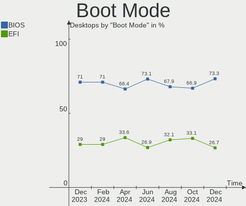
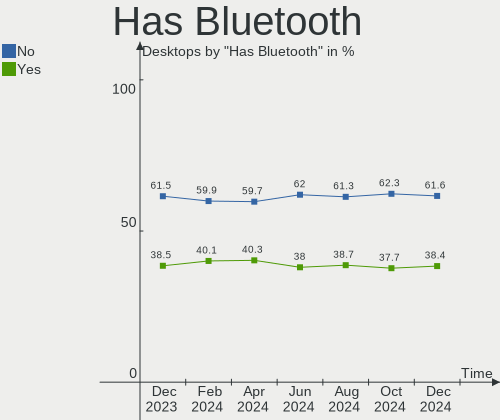
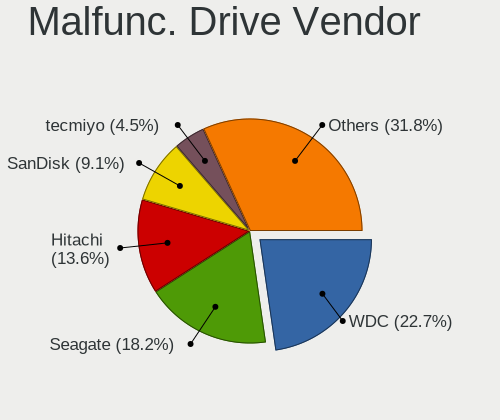
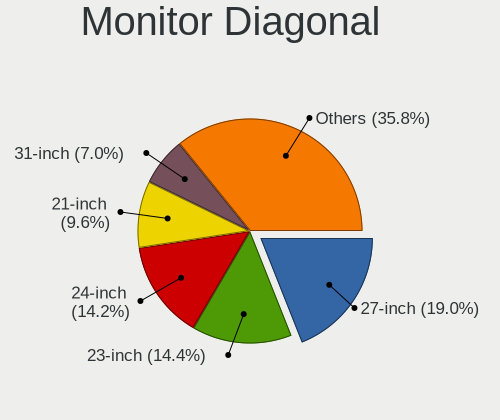
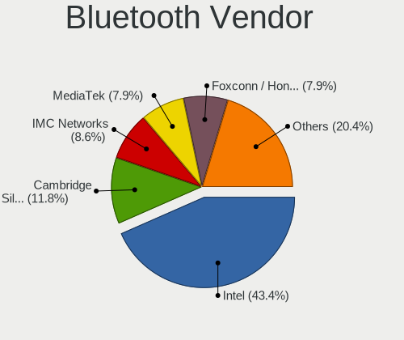
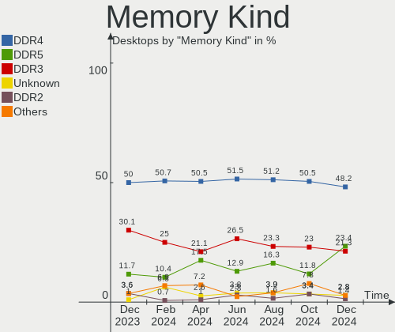

Ubuntu - Hardware Trends (Desktops)
-----------------------------------

A project to identify most popular hardware characteristics and track their change
over time based on data collected by Linux users at https://Linux-Hardware.org.

Anyone can contribute to this report by the [hw-probe](https://github.com/linuxhw/hw-probe) tool:

    sudo -E hw-probe -all -upload

This report is for one last month. Overall report since the beginning of time: [TestDays](https://github.com/linuxhw/TestDays)

Period: Sep, 2023.

Contents
--------

* [ System ](#system)
  - [ OS                       ](#os)
  - [ OS Family                ](#os-family)
  - [ Kernel                   ](#kernel)
  - [ Kernel Family            ](#kernel-family)
  - [ Kernel Major Ver.        ](#kernel-major-ver)
  - [ Arch                     ](#arch)
  - [ DE                       ](#de)
  - [ Display Server           ](#display-server)
  - [ Display Manager          ](#display-manager)
  - [ OS Lang                  ](#os-lang)
  - [ Boot Mode                ](#boot-mode)
  - [ Filesystem               ](#filesystem)
  - [ Part. scheme             ](#part-scheme)
  - [ Dual Boot with Linux/BSD ](#dual-boot-with-linuxbsd)
  - [ Dual Boot (Win)          ](#dual-boot-win)

* [ Board ](#board)
  - [ Vendor                   ](#vendor)
  - [ Model                    ](#model)
  - [ Model Family             ](#model-family)
  - [ MFG Year                 ](#mfg-year)
  - [ Form Factor              ](#form-factor)
  - [ Secure Boot              ](#secure-boot)
  - [ Coreboot                 ](#coreboot)
  - [ RAM Size                 ](#ram-size)
  - [ RAM Used                 ](#ram-used)
  - [ Total Drives             ](#total-drives)
  - [ Has CD-ROM               ](#has-cd-rom)
  - [ Has Ethernet             ](#has-ethernet)
  - [ Has WiFi                 ](#has-wifi)
  - [ Has Bluetooth            ](#has-bluetooth)

* [ Location ](#location)
  - [ Country                  ](#country)
  - [ City                     ](#city)

* [ Drives ](#drives)
  - [ Drive Vendor             ](#drive-vendor)
  - [ Drive Model              ](#drive-model)
  - [ HDD Vendor               ](#hdd-vendor)
  - [ SSD Vendor               ](#ssd-vendor)
  - [ Drive Kind               ](#drive-kind)
  - [ Drive Connector          ](#drive-connector)
  - [ Drive Size               ](#drive-size)
  - [ Space Total              ](#space-total)
  - [ Space Used               ](#space-used)
  - [ Malfunc. Drives          ](#malfunc-drives)
  - [ Malfunc. Drive Vendor    ](#malfunc-drive-vendor)
  - [ Malfunc. HDD Vendor      ](#malfunc-hdd-vendor)
  - [ Malfunc. Drive Kind      ](#malfunc-drive-kind)
  - [ Failed Drives            ](#failed-drives)
  - [ Failed Drive Vendor      ](#failed-drive-vendor)
  - [ Drive Status             ](#drive-status)

* [ Storage controller ](#storage-controller)
  - [ Storage Vendor           ](#storage-vendor)
  - [ Storage Model            ](#storage-model)
  - [ Storage Kind             ](#storage-kind)

* [ Processor ](#processor)
  - [ CPU Vendor               ](#cpu-vendor)
  - [ CPU Model                ](#cpu-model)
  - [ CPU Model Family         ](#cpu-model-family)
  - [ CPU Cores                ](#cpu-cores)
  - [ CPU Sockets              ](#cpu-sockets)
  - [ CPU Threads              ](#cpu-threads)
  - [ CPU Op-Modes             ](#cpu-op-modes)
  - [ CPU Microcode            ](#cpu-microcode)
  - [ CPU Microarch            ](#cpu-microarch)

* [ Graphics ](#graphics)
  - [ GPU Vendor               ](#gpu-vendor)
  - [ GPU Model                ](#gpu-model)
  - [ GPU Combo                ](#gpu-combo)
  - [ GPU Driver               ](#gpu-driver)
  - [ GPU Memory               ](#gpu-memory)

* [ Monitor ](#monitor)
  - [ Monitor Vendor           ](#monitor-vendor)
  - [ Monitor Model            ](#monitor-model)
  - [ Monitor Resolution       ](#monitor-resolution)
  - [ Monitor Diagonal         ](#monitor-diagonal)
  - [ Monitor Width            ](#monitor-width)
  - [ Aspect Ratio             ](#aspect-ratio)
  - [ Monitor Area             ](#monitor-area)
  - [ Pixel Density            ](#pixel-density)
  - [ Multiple Monitors        ](#multiple-monitors)

* [ Network ](#network)
  - [ Net Controller Vendor    ](#net-controller-vendor)
  - [ Net Controller Model     ](#net-controller-model)
  - [ Wireless Vendor          ](#wireless-vendor)
  - [ Wireless Model           ](#wireless-model)
  - [ Ethernet Vendor          ](#ethernet-vendor)
  - [ Ethernet Model           ](#ethernet-model)
  - [ Net Controller Kind      ](#net-controller-kind)
  - [ Used Controller          ](#used-controller)
  - [ NICs                     ](#nics)
  - [ IPv6                     ](#ipv6)

* [ Bluetooth ](#bluetooth)
  - [ Bluetooth Vendor         ](#bluetooth-vendor)
  - [ Bluetooth Model          ](#bluetooth-model)

* [ Sound ](#sound)
  - [ Sound Vendor             ](#sound-vendor)
  - [ Sound Model              ](#sound-model)

* [ Memory ](#memory)
  - [ Memory Vendor            ](#memory-vendor)
  - [ Memory Model             ](#memory-model)
  - [ Memory Kind              ](#memory-kind)
  - [ Memory Form Factor       ](#memory-form-factor)
  - [ Memory Size              ](#memory-size)
  - [ Memory Speed             ](#memory-speed)

* [ Printers & scanners ](#printers--scanners)
  - [ Printer Vendor           ](#printer-vendor)
  - [ Printer Model            ](#printer-model)
  - [ Scanner Vendor           ](#scanner-vendor)
  - [ Scanner Model            ](#scanner-model)

* [ Camera ](#camera)
  - [ Camera Vendor            ](#camera-vendor)
  - [ Camera Model             ](#camera-model)

* [ Security ](#security)
  - [ Fingerprint Vendor       ](#fingerprint-vendor)
  - [ Fingerprint Model        ](#fingerprint-model)
  - [ Chipcard Vendor          ](#chipcard-vendor)
  - [ Chipcard Model           ](#chipcard-model)

* [ Unsupported ](#unsupported)
  - [ Unsupported Devices      ](#unsupported-devices)
  - [ Unsupported Device Types ](#unsupported-device-types)

System
------

OS
--

Installed operating systems

| Name           | Desktops | Percent |
|----------------|----------|---------|
| Ubuntu 22.04   | 246      | 66.31%  |
| Ubuntu 23.04   | 73       | 19.68%  |
| Ubuntu 20.04   | 35       | 9.43%   |
| Ubuntu 22.10   | 7        | 1.89%   |
| Ubuntu 23.10   | 4        | 1.08%   |
| Ubuntu 18.04   | 4        | 1.08%   |
| Ubuntu Core 22 | 1        | 0.27%   |
| Ubuntu 21.04   | 1        | 0.27%   |

OS Family
---------

OS without a version

| Name   | Desktops | Percent |
|--------|----------|---------|
| Ubuntu | 371      | 100%    |

Kernel
------

Version of the Linux kernel

| Version                     | Desktops | Percent |
|-----------------------------|----------|---------|
| 6.2.0-32-generic            | 115      | 31%     |
| 6.2.0-33-generic            | 84       | 22.64%  |
| 5.15.0-83-generic           | 31       | 8.36%   |
| 6.2.0-31-generic            | 29       | 7.82%   |
| 6.2.0-26-generic            | 14       | 3.77%   |
| 5.15.0-82-generic           | 14       | 3.77%   |
| 5.15.0-84-generic           | 9        | 2.43%   |
| 5.19.0-46-generic           | 8        | 2.16%   |
| 6.2.0-20-generic            | 7        | 1.89%   |
| 5.19.0-50-generic           | 4        | 1.08%   |
| 5.15.0-69-generic           | 4        | 1.08%   |
| 5.4.0-159-generic           | 3        | 0.81%   |
| 6.5.1-060501-generic        | 2        | 0.54%   |
| 6.5.0-5-generic             | 2        | 0.54%   |
| 6.2.0-27-generic            | 2        | 0.54%   |
| 6.2.0-060200-generic        | 2        | 0.54%   |
| 5.4.0-163-generic           | 2        | 0.54%   |
| 5.4.0-162-generic           | 2        | 0.54%   |
| 5.19.0-32-generic           | 2        | 0.54%   |
| 5.15.0-79-generic           | 2        | 0.54%   |
| 4.15.0-213-generic          | 2        | 0.54%   |
| 6.5.4-060504-generic        | 1        | 0.27%   |
| 6.5.2-tkg-bore-llvm         | 1        | 0.27%   |
| 6.5.0-060500-generic        | 1        | 0.27%   |
| 6.4.14-1-liquorix-amd64     | 1        | 0.27%   |
| 6.3.0-7-generic             | 1        | 0.27%   |
| 6.2.2-060202-generic        | 1        | 0.27%   |
| 6.2.0-34-generic            | 1        | 0.27%   |
| 6.2.0-25-generic            | 1        | 0.27%   |
| 6.2.0-1012-gcp              | 1        | 0.27%   |
| 6.1.46-060146-generic       | 1        | 0.27%   |
| 6.1.0-1017-oem              | 1        | 0.27%   |
| 6.0.0-1017-oem              | 1        | 0.27%   |
| 5.4.0-150-generic           | 1        | 0.27%   |
| 5.4.0-1472304060810-generic | 1        | 0.27%   |
| 5.19.0-38-generic           | 1        | 0.27%   |
| 5.19.0-21-generic           | 1        | 0.27%   |
| 5.15.0-82-lowlatency        | 1        | 0.27%   |
| 5.15.0-78-generic           | 1        | 0.27%   |
| 5.15.0-76-generic           | 1        | 0.27%   |

Kernel Family
-------------

Linux kernel without a distro release

| Version | Desktops | Percent |
|---------|----------|---------|
| 6.2.0   | 256      | 69%     |
| 5.15.0  | 70       | 18.87%  |
| 5.19.0  | 16       | 4.31%   |
| 5.4.0   | 9        | 2.43%   |
| 4.15.0  | 4        | 1.08%   |
| 6.5.0   | 3        | 0.81%   |
| 5.11.0  | 3        | 0.81%   |
| 6.5.1   | 2        | 0.54%   |
| 6.5.4   | 1        | 0.27%   |
| 6.5.2   | 1        | 0.27%   |
| 6.4.14  | 1        | 0.27%   |
| 6.3.0   | 1        | 0.27%   |
| 6.2.2   | 1        | 0.27%   |
| 6.1.46  | 1        | 0.27%   |
| 6.1.0   | 1        | 0.27%   |
| 6.0.0   | 1        | 0.27%   |

Kernel Major Ver.
-----------------

Linux kernel major version

| Version | Desktops | Percent |
|---------|----------|---------|
| 6.2     | 257      | 69.27%  |
| 5.15    | 70       | 18.87%  |
| 5.19    | 16       | 4.31%   |
| 5.4     | 9        | 2.43%   |
| 6.5     | 7        | 1.89%   |
| 4.15    | 4        | 1.08%   |
| 5.11    | 3        | 0.81%   |
| 6.1     | 2        | 0.54%   |
| 6.4     | 1        | 0.27%   |
| 6.3     | 1        | 0.27%   |
| 6.0     | 1        | 0.27%   |

Arch
----

OS architecture (x86_64, i586, etc.)

| Name   | Desktops | Percent |
|--------|----------|---------|
| x86_64 | 371      | 100%    |

DE
--

Desktop Environment

| Name            | Desktops | Percent |
|-----------------|----------|---------|
| GNOME           | 328      | 88.41%  |
| Unknown         | 27       | 7.28%   |
| X-Cinnamon      | 8        | 2.16%   |
| GNOME Classic   | 3        | 0.81%   |
| Enlightenment   | 3        | 0.81%   |
| GNOME Flashback | 2        | 0.54%   |

Display Server
--------------

X11 or Wayland

| Name    | Desktops | Percent |
|---------|----------|---------|
| Wayland | 179      | 48.25%  |
| X11     | 156      | 42.05%  |
| Unknown | 20       | 5.39%   |
| Tty     | 16       | 4.31%   |

Display Manager
---------------

SDDM, LightDM, etc.

| Name    | Desktops | Percent |
|---------|----------|---------|
| GDM3    | 308      | 83.02%  |
| Unknown | 37       | 9.97%   |
| LightDM | 13       | 3.5%    |
| GDM     | 12       | 3.23%   |
| SDDM    | 1        | 0.27%   |

OS Lang
-------

Language

| Lang    | Desktops | Percent |
|---------|----------|---------|
| en_US   | 161      | 43.4%   |
| de_DE   | 40       | 10.78%  |
| fr_FR   | 25       | 6.74%   |
| pt_BR   | 16       | 4.31%   |
| en_CA   | 14       | 3.77%   |
| it_IT   | 13       | 3.5%    |
| C       | 13       | 3.5%    |
| es_ES   | 8        | 2.16%   |
| en_GB   | 8        | 2.16%   |
| en_AU   | 8        | 2.16%   |
| pl_PL   | 5        | 1.35%   |
| Unknown | 5        | 1.35%   |
| sv_SE   | 4        | 1.08%   |
| ru_RU   | 4        | 1.08%   |
| nl_NL   | 4        | 1.08%   |
| ja_JP   | 3        | 0.81%   |
| hu_HU   | 3        | 0.81%   |
| en_IN   | 3        | 0.81%   |
| zh_TW   | 2        | 0.54%   |
| tr_TR   | 2        | 0.54%   |
| ko_KR   | 2        | 0.54%   |
| es_MX   | 2        | 0.54%   |
| en_ZA   | 2        | 0.54%   |
| en_NZ   | 2        | 0.54%   |
| en_IL   | 2        | 0.54%   |
| cs_CZ   | 2        | 0.54%   |
| zh_HK   | 1        | 0.27%   |
| zh_CN   | 1        | 0.27%   |
| sr_RS   | 1        | 0.27%   |
| sl_SI   | 1        | 0.27%   |
| sk_SK   | 1        | 0.27%   |
| ro_RO   | 1        | 0.27%   |
| pt_PT   | 1        | 0.27%   |
| nl_BE   | 1        | 0.27%   |
| nb_NO   | 1        | 0.27%   |
| fr_CH   | 1        | 0.27%   |
| es_US   | 1        | 0.27%   |
| es_HN   | 1        | 0.27%   |
| es_CL   | 1        | 0.27%   |
| es_AR   | 1        | 0.27%   |

Boot Mode
---------

EFI or BIOS

| Mode | Desktops | Percent |
|------|----------|---------|
| BIOS | 266      | 71.7%   |
| EFI  | 105      | 28.3%   |

Filesystem
----------

Type of filesystem

| Type    | Desktops | Percent |
|---------|----------|---------|
| Tmpfs   | 234      | 63.07%  |
| Ext4    | 117      | 31.54%  |
| Overlay | 11       | 2.96%   |
| Btrfs   | 5        | 1.35%   |
| Zfs     | 4        | 1.08%   |

Part. scheme
------------

Scheme of partitioning

| Type    | Desktops | Percent |
|---------|----------|---------|
| GPT     | 295      | 79.51%  |
| MBR     | 49       | 13.21%  |
| Unknown | 27       | 7.28%   |

Dual Boot with Linux/BSD
------------------------

Hosting more than one Linux/BSD

| Dual boot | Desktops | Percent |
|-----------|----------|---------|
| No        | 296      | 79.78%  |
| Yes       | 75       | 20.22%  |

Dual Boot (Win)
---------------

Hosting Linux and Windows

| Dual boot | Desktops | Percent |
|-----------|----------|---------|
| No        | 201      | 54.18%  |
| Yes       | 170      | 45.82%  |

Board
-----

Vendor
------

Motherboard manufacturer

| Name                                 | Desktops | Percent |
|--------------------------------------|----------|---------|
| ASUSTek Computer                     | 94       | 25.34%  |
| Gigabyte Technology                  | 45       | 12.13%  |
| Dell                                 | 41       | 11.05%  |
| MSI                                  | 40       | 10.78%  |
| ASRock                               | 32       | 8.63%   |
| Hewlett-Packard                      | 20       | 5.39%   |
| Lenovo                               | 14       | 3.77%   |
| Intel                                | 11       | 2.96%   |
| Acer                                 | 11       | 2.96%   |
| Fujitsu                              | 6        | 1.62%   |
| Supermicro                           | 5        | 1.35%   |
| AZW                                  | 4        | 1.08%   |
| Apple                                | 4        | 1.08%   |
| Unknown                              | 4        | 1.08%   |
| Pegatron                             | 3        | 0.81%   |
| Medion                               | 3        | 0.81%   |
| Gateway                              | 3        | 0.81%   |
| Foxconn                              | 3        | 0.81%   |
| Biostar                              | 3        | 0.81%   |
| Shenzhen Meigao Electronic Equipment | 2        | 0.54%   |
| Huanan                               | 2        | 0.54%   |
| HOUTER                               | 2        | 0.54%   |
| HC Technology.                       | 2        | 0.54%   |
| GMKtec                               | 2        | 0.54%   |
| Wistron                              | 1        | 0.27%   |
| Positivo                             | 1        | 0.27%   |
| ONDA                                 | 1        | 0.27%   |
| NZXT                                 | 1        | 0.27%   |
| MiTAC                                | 1        | 0.27%   |
| MACHINIST                            | 1        | 0.27%   |
| Login Informatica                    | 1        | 0.27%   |
| Google                               | 1        | 0.27%   |
| GEEKOM                               | 1        | 0.27%   |
| EVGA                                 | 1        | 0.27%   |
| ECS                                  | 1        | 0.27%   |
| DFI                                  | 1        | 0.27%   |
| Colorful Technology                  | 1        | 0.27%   |
| Centerm                              | 1        | 0.27%   |
| AAEON                                | 1        | 0.27%   |

Model
-----

Motherboard model

| Name                                                | Desktops | Percent |
|-----------------------------------------------------|----------|---------|
| ASUS All Series                                     | 8        | 2.16%   |
| Dell OptiPlex 9020                                  | 5        | 1.35%   |
| Dell OptiPlex 7010                                  | 5        | 1.35%   |
| Unknown                                             | 4        | 1.08%   |
| MSI MS-7C95                                         | 3        | 0.81%   |
| MSI MS-7C91                                         | 3        | 0.81%   |
| Intel H61                                           | 3        | 0.81%   |
| Gigabyte B450M DS3H                                 | 3        | 0.81%   |
| Dell OptiPlex 790                                   | 3        | 0.81%   |
| MSI MS-7C94                                         | 2        | 0.54%   |
| MSI MS-7B89                                         | 2        | 0.54%   |
| MSI MS-7B84                                         | 2        | 0.54%   |
| Lenovo ThinkCentre M83z 10C20003FR                  | 2        | 0.54%   |
| HOUTER IPMH61R1                                     | 2        | 0.54%   |
| HC Technology. HCAR5000-MI                          | 2        | 0.54%   |
| Gigabyte P55-UD4                                    | 2        | 0.54%   |
| Gigabyte 970A-DS3P FX                               | 2        | 0.54%   |
| Dell Precision WorkStation T3500                    | 2        | 0.54%   |
| Dell Precision T1700                                | 2        | 0.54%   |
| Dell OptiPlex 3020                                  | 2        | 0.54%   |
| AZW MINI S                                          | 2        | 0.54%   |
| ASUS TUF Gaming B650-PLUS WIFI                      | 2        | 0.54%   |
| ASUS M5A78L-M PLUS/USB3                             | 2        | 0.54%   |
| ASUS M51AC                                          | 2        | 0.54%   |
| ASUS A88XM-E                                        | 2        | 0.54%   |
| Wistron ProLiant ML110 G6                           | 1        | 0.27%   |
| Supermicro X9DRW                                    | 1        | 0.27%   |
| Supermicro X9DRL-3F/iF                              | 1        | 0.27%   |
| Supermicro SYS-6018R-MTR                            | 1        | 0.27%   |
| Supermicro PIO-628U-TR4T+-ST031                     | 1        | 0.27%   |
| Supermicro PIO-618U-T4T+-ST031                      | 1        | 0.27%   |
| Shenzhen Meigao Electronic Equipment UM560 XT       | 1        | 0.27%   |
| Shenzhen Meigao Electronic Equipment Neptune series | 1        | 0.27%   |
| Positivo POS-EIBTPDC                                | 1        | 0.27%   |
| Pegatron p6730de                                    | 1        | 0.27%   |
| Pegatron HPE-510cs                                  | 1        | 0.27%   |
| Pegatron h9-1215t                                   | 1        | 0.27%   |
| ONDA H61V Ver:4.01                                  | 1        | 0.27%   |
| NZXT N7 B550                                        | 1        | 0.27%   |
| MSI NQ890AA-ABZ CQ5011IT                            | 1        | 0.27%   |

Model Family
------------

Motherboard model prefix

| Name                       | Desktops | Percent |
|----------------------------|----------|---------|
| Dell OptiPlex              | 24       | 6.47%   |
| ASUS ROG                   | 16       | 4.31%   |
| ASUS PRIME                 | 15       | 4.04%   |
| Lenovo ThinkCentre         | 11       | 2.96%   |
| Dell Precision             | 9        | 2.43%   |
| ASUS TUF                   | 8        | 2.16%   |
| ASUS All                   | 8        | 2.16%   |
| HP Compaq                  | 6        | 1.62%   |
| HP EliteDesk               | 4        | 1.08%   |
| Gigabyte X570              | 4        | 1.08%   |
| Gigabyte B450M             | 4        | 1.08%   |
| Fujitsu ESPRIMO            | 4        | 1.08%   |
| Acer Veriton               | 4        | 1.08%   |
| Acer Aspire                | 4        | 1.08%   |
| Unknown                    | 4        | 1.08%   |
| MSI MS-7C95                | 3        | 0.81%   |
| MSI MS-7C91                | 3        | 0.81%   |
| Intel H61                  | 3        | 0.81%   |
| Gigabyte B550M             | 3        | 0.81%   |
| Gigabyte 970A-DS3P         | 3        | 0.81%   |
| Dell Vostro                | 3        | 0.81%   |
| Dell Inspiron              | 3        | 0.81%   |
| ASUS M5A78L-M              | 3        | 0.81%   |
| MSI MS-7C94                | 2        | 0.54%   |
| MSI MS-7B89                | 2        | 0.54%   |
| MSI MS-7B84                | 2        | 0.54%   |
| HOUTER IPMH61R1            | 2        | 0.54%   |
| HC Technology. HCAR5000-MI | 2        | 0.54%   |
| Gigabyte Z390              | 2        | 0.54%   |
| Gigabyte P55-UD4           | 2        | 0.54%   |
| Gigabyte B365M             | 2        | 0.54%   |
| Dell XPS                   | 2        | 0.54%   |
| AZW MINI                   | 2        | 0.54%   |
| ASUS P8H61-M               | 2        | 0.54%   |
| ASUS P8B75-M               | 2        | 0.54%   |
| ASUS M5A97                 | 2        | 0.54%   |
| ASUS M51AC                 | 2        | 0.54%   |
| ASUS A88XM-E               | 2        | 0.54%   |
| ASRock Z77                 | 2        | 0.54%   |
| ASRock B450                | 2        | 0.54%   |

MFG Year
--------

Motherboard manufacture year

| Year | Desktops | Percent |
|------|----------|---------|
| 2018 | 42       | 11.32%  |
| 2022 | 39       | 10.51%  |
| 2020 | 34       | 9.16%   |
| 2014 | 32       | 8.63%   |
| 2013 | 29       | 7.82%   |
| 2012 | 27       | 7.28%   |
| 2011 | 25       | 6.74%   |
| 2017 | 21       | 5.66%   |
| 2021 | 18       | 4.85%   |
| 2019 | 17       | 4.58%   |
| 2015 | 15       | 4.04%   |
| 2010 | 15       | 4.04%   |
| 2016 | 14       | 3.77%   |
| 2009 | 14       | 3.77%   |
| 2023 | 13       | 3.5%    |
| 2008 | 8        | 2.16%   |
| 2007 | 8        | 2.16%   |

Form Factor
-----------

Physical design of the computer

| Name    | Desktops | Percent |
|---------|----------|---------|
| Desktop | 371      | 100%    |

Secure Boot
-----------

Enabled or disabled

| State    | Desktops | Percent |
|----------|----------|---------|
| Disabled | 356      | 95.96%  |
| Enabled  | 15       | 4.04%   |

Coreboot
--------

Have coreboot on board

| Used | Desktops | Percent |
|------|----------|---------|
| No   | 370      | 99.73%  |
| Yes  | 1        | 0.27%   |

RAM Size
--------

Total RAM memory

| Size in GB  | Desktops | Percent |
|-------------|----------|---------|
| 16.01-24.0  | 110      | 29.65%  |
| 4.01-8.0    | 62       | 16.71%  |
| 32.01-64.0  | 54       | 14.56%  |
| 8.01-16.0   | 54       | 14.56%  |
| 64.01-256.0 | 34       | 9.16%   |
| 3.01-4.0    | 30       | 8.09%   |
| 24.01-32.0  | 25       | 6.74%   |
| 2.01-3.0    | 1        | 0.27%   |
| 1.01-2.0    | 1        | 0.27%   |

RAM Used
--------

Used RAM memory

| Used GB    | Desktops | Percent |
|------------|----------|---------|
| 2.01-3.0   | 116      | 31.27%  |
| 1.01-2.0   | 98       | 26.42%  |
| 4.01-8.0   | 63       | 16.98%  |
| 3.01-4.0   | 58       | 15.63%  |
| 8.01-16.0  | 22       | 5.93%   |
| 0.51-1.0   | 5        | 1.35%   |
| 24.01-32.0 | 3        | 0.81%   |
| 16.01-24.0 | 3        | 0.81%   |
| 0.01-0.5   | 2        | 0.54%   |
| 32.01-64.0 | 1        | 0.27%   |

Total Drives
------------

Number of drives on board

| Drives | Desktops | Percent |
|--------|----------|---------|
| 1      | 140      | 37.74%  |
| 2      | 131      | 35.31%  |
| 3      | 57       | 15.36%  |
| 4      | 20       | 5.39%   |
| 5      | 11       | 2.96%   |
| 6      | 5        | 1.35%   |
| 9      | 2        | 0.54%   |
| 0      | 2        | 0.54%   |
| 11     | 1        | 0.27%   |
| 10     | 1        | 0.27%   |
| 7      | 1        | 0.27%   |

Has CD-ROM
----------

Has CD-ROM on board

| Presented | Desktops | Percent |
|-----------|----------|---------|
| No        | 214      | 57.68%  |
| Yes       | 157      | 42.32%  |

Has Ethernet
------------

Has Ethernet on board

| Presented | Desktops | Percent |
|-----------|----------|---------|
| Yes       | 370      | 99.73%  |
| No        | 1        | 0.27%   |

Has WiFi
--------

Has WiFi module

| Presented | Desktops | Percent |
|-----------|----------|---------|
| No        | 200      | 53.91%  |
| Yes       | 171      | 46.09%  |

Has Bluetooth
-------------

Has Bluetooth module

| Presented | Desktops | Percent |
|-----------|----------|---------|
| No        | 245      | 66.04%  |
| Yes       | 126      | 33.96%  |

Location
--------

Country
-------

Geographic location (country)

| Country      | Desktops | Percent |
|--------------|----------|---------|
| USA          | 82       | 22.1%   |
| Germany      | 39       | 10.51%  |
| France       | 23       | 6.2%    |
| Brazil       | 22       | 5.93%   |
| Italy        | 19       | 5.12%   |
| Canada       | 18       | 4.85%   |
| Russia       | 17       | 4.58%   |
| UK           | 9        | 2.43%   |
| Spain        | 9        | 2.43%   |
| Australia    | 9        | 2.43%   |
| Netherlands  | 8        | 2.16%   |
| Poland       | 7        | 1.89%   |
| Thailand     | 6        | 1.62%   |
| India        | 6        | 1.62%   |
| Hungary      | 6        | 1.62%   |
| Japan        | 5        | 1.35%   |
| Austria      | 5        | 1.35%   |
| Turkey       | 4        | 1.08%   |
| Switzerland  | 4        | 1.08%   |
| Sweden       | 4        | 1.08%   |
| Slovakia     | 4        | 1.08%   |
| Israel       | 4        | 1.08%   |
| Czechia      | 4        | 1.08%   |
| Bangladesh   | 4        | 1.08%   |
| Argentina    | 4        | 1.08%   |
| South Korea  | 3        | 0.81%   |
| Portugal     | 3        | 0.81%   |
| Norway       | 3        | 0.81%   |
| New Zealand  | 3        | 0.81%   |
| Mexico       | 3        | 0.81%   |
| Hong Kong    | 3        | 0.81%   |
| Belgium      | 3        | 0.81%   |
| Romania      | 2        | 0.54%   |
| China        | 2        | 0.54%   |
| Bulgaria     | 2        | 0.54%   |
| Ukraine      | 1        | 0.27%   |
| Taiwan       | 1        | 0.27%   |
| South Africa | 1        | 0.27%   |
| Slovenia     | 1        | 0.27%   |
| Singapore    | 1        | 0.27%   |

City
----

Geographic location (city)

| City                 | Desktops | Percent |
|----------------------|----------|---------|
| Moscow               | 7        | 1.89%   |
| Sao Paulo            | 5        | 1.35%   |
| Valenciennes         | 4        | 1.08%   |
| Sydney               | 4        | 1.08%   |
| Prague               | 3        | 0.81%   |
| Hamburg              | 3        | 0.81%   |
| Chicago              | 3        | 0.81%   |
| Central              | 3        | 0.81%   |
| Bratislava           | 3        | 0.81%   |
| Zurich               | 2        | 0.54%   |
| Wroclaw              | 2        | 0.54%   |
| Warsaw               | 2        | 0.54%   |
| Vienna               | 2        | 0.54%   |
| Turin                | 2        | 0.54%   |
| Tucson               | 2        | 0.54%   |
| Tokyo                | 2        | 0.54%   |
| Taganrog             | 2        | 0.54%   |
| Stuttgart            | 2        | 0.54%   |
| Seattle              | 2        | 0.54%   |
| Sao José dos Campos | 2        | 0.54%   |
| Rosh HaAyin          | 2        | 0.54%   |
| Rochester            | 2        | 0.54%   |
| Pforzheim            | 2        | 0.54%   |
| Mumbai               | 2        | 0.54%   |
| Milano               | 2        | 0.54%   |
| Miami                | 2        | 0.54%   |
| Madrid               | 2        | 0.54%   |
| London               | 2        | 0.54%   |
| Houston              | 2        | 0.54%   |
| Gothenburg           | 2        | 0.54%   |
| Edmonton             | 2        | 0.54%   |
| Dhaka                | 2        | 0.54%   |
| Budapest             | 2        | 0.54%   |
| Brussels             | 2        | 0.54%   |
| Brisbane             | 2        | 0.54%   |
| Beverly Hills        | 2        | 0.54%   |
| Berlin               | 2        | 0.54%   |
| Ban Nong Sala        | 2        | 0.54%   |
| Zukowo               | 1        | 0.27%   |
| Zevenhuizen          | 1        | 0.27%   |

Drives
------

Drive Vendor
------------

Hard drive vendors

| Vendor                       | Desktops | Drives | Percent |
|------------------------------|----------|--------|---------|
| WDC                          | 112      | 149    | 17.05%  |
| Seagate                      | 100      | 135    | 15.22%  |
| Samsung Electronics          | 90       | 121    | 13.7%   |
| Sandisk                      | 45       | 49     | 6.85%   |
| Kingston                     | 42       | 47     | 6.39%   |
| Toshiba                      | 30       | 34     | 4.57%   |
| Crucial                      | 23       | 24     | 3.5%    |
| Hitachi                      | 20       | 21     | 3.04%   |
| China                        | 14       | 14     | 2.13%   |
| Micron/Crucial Technology    | 12       | 12     | 1.83%   |
| A-DATA Technology            | 10       | 11     | 1.52%   |
| SK hynix                     | 9        | 9      | 1.37%   |
| Phison Electronics           | 9        | 10     | 1.37%   |
| Intel                        | 9        | 9      | 1.37%   |
| Kingston Technology Company  | 8        | 8      | 1.22%   |
| HGST                         | 8        | 8      | 1.22%   |
| SPCC                         | 5        | 6      | 0.76%   |
| PNY                          | 5        | 5      | 0.76%   |
| OCZ                          | 5        | 5      | 0.76%   |
| Micron Technology            | 5        | 5      | 0.76%   |
| Intenso                      | 5        | 10     | 0.76%   |
| Unknown                      | 4        | 6      | 0.61%   |
| Transcend                    | 4        | 4      | 0.61%   |
| Silicon Motion               | 4        | 4      | 0.61%   |
| Patriot                      | 4        | 4      | 0.61%   |
| Fujitsu                      | 4        | 4      | 0.61%   |
| Unknown                      | 4        | 4      | 0.61%   |
| Team                         | 3        | 3      | 0.46%   |
| Shenzhen Longsys Electronics | 3        | 3      | 0.46%   |
| Phison                       | 3        | 3      | 0.46%   |
| Hewlett-Packard              | 3        | 4      | 0.46%   |
| Gigabyte Technology          | 3        | 3      | 0.46%   |
| SABRENT                      | 2        | 3      | 0.3%    |
| Lexar                        | 2        | 2      | 0.3%    |
| KIOXIA-EXCERIA               | 2        | 5      | 0.3%    |
| KingDian                     | 2        | 2      | 0.3%    |
| GOODRAM                      | 2        | 3      | 0.3%    |
| Fanxiang                     | 2        | 2      | 0.3%    |
| Corsair                      | 2        | 2      | 0.3%    |
| ASMT                         | 2        | 3      | 0.3%    |

Drive Model
-----------

Hard drive models

| Model                                                 | Desktops | Percent |
|-------------------------------------------------------|----------|---------|
| Samsung NVMe SSD Controller SM981/PM981/PM983 256GB   | 13       | 1.74%   |
| Micron/Crucial P2 NVMe PCIe SSD 1TB                   | 9        | 1.2%    |
| Kingston SA400S37240G 240GB SSD                       | 9        | 1.2%    |
| Seagate ST2000DM008-2FR102 2TB                        | 8        | 1.07%   |
| Samsung SSD 860 EVO 500GB                             | 8        | 1.07%   |
| Kingston SA400S37480G 480GB SSD                       | 8        | 1.07%   |
| Toshiba DT01ACA100 1TB                                | 7        | 0.94%   |
| Samsung SSD 850 EVO 250GB                             | 6        | 0.8%    |
| Seagate ST1000DM010-2EP102 1TB                        | 5        | 0.67%   |
| Crucial CT1000MX500SSD1 1TB                           | 5        | 0.67%   |
| WDC WD10EZEX-60WN4A0 1TB                              | 4        | 0.53%   |
| WDC WD10EZEX-21WN4A0 1TB                              | 4        | 0.53%   |
| WDC WD10EZEX-00BN5A0 1TB                              | 4        | 0.53%   |
| Toshiba HDWD110 1TB                                   | 4        | 0.53%   |
| Seagate ST500DM002-1BD142 500GB                       | 4        | 0.53%   |
| Seagate ST3500418AS 500GB                             | 4        | 0.53%   |
| Seagate ST2000DM008-2UB102 2TB                        | 4        | 0.53%   |
| Seagate ST2000DM001-1CH164 2TB                        | 4        | 0.53%   |
| Seagate ST1000DM003-9YN162 1TB                        | 4        | 0.53%   |
| Seagate ST1000DM003-1ER162 1TB                        | 4        | 0.53%   |
| Seagate Expansion Desk 8TB                            | 4        | 0.53%   |
| Sandisk WD Blue SN550 NVMe SSD 512GB                  | 4        | 0.53%   |
| SanDisk NVMe SSD Drive 1TB                            | 4        | 0.53%   |
| Samsung SSD 980 PRO 2TB                               | 4        | 0.53%   |
| Samsung SSD 870 EVO 500GB                             | 4        | 0.53%   |
| Samsung NVMe SSD Controller PM9A1/PM9A3/980PRO 1TB    | 4        | 0.53%   |
| Phison E12 NVMe Controller 2TB                        | 4        | 0.53%   |
| Kingston Company SNV2S1000G 1TB                       | 4        | 0.53%   |
| Kingston SA400S37960G 960GB SSD                       | 4        | 0.53%   |
| Kingston SA400S37120G 120GB SSD                       | 4        | 0.53%   |
| Hitachi HDS721050CLA362 500GB                         | 4        | 0.53%   |
| Unknown                                               | 4        | 0.53%   |
| Toshiba HDWD120 2TB                                   | 3        | 0.4%    |
| Silicon Motion SM2263EN/SM2263XT SSD Controller 512GB | 3        | 0.4%    |
| Seagate ST3500414CS 500GB                             | 3        | 0.4%    |
| Seagate ST2000DM001-9YN164 2TB                        | 3        | 0.4%    |
| Seagate ST1000DM003-1SB102 1TB                        | 3        | 0.4%    |
| Seagate Backup+ Hub BK 8TB                            | 3        | 0.4%    |
| SanDisk SDSSDP128G 128GB                              | 3        | 0.4%    |
| SanDisk SDSSDA120G 120GB                              | 3        | 0.4%    |

HDD Vendor
----------

Hard disk drive vendors

| Vendor              | Desktops | Drives | Percent |
|---------------------|----------|--------|---------|
| WDC                 | 106      | 138    | 37.46%  |
| Seagate             | 98       | 132    | 34.63%  |
| Toshiba             | 27       | 30     | 9.54%   |
| Hitachi             | 20       | 21     | 7.07%   |
| Samsung Electronics | 13       | 14     | 4.59%   |
| HGST                | 8        | 8      | 2.83%   |
| Fujitsu             | 4        | 4      | 1.41%   |
| SABRENT             | 2        | 3      | 0.71%   |
| Hewlett-Packard     | 2        | 3      | 0.71%   |
| Unknown             | 1        | 1      | 0.35%   |
| HPE                 | 1        | 2      | 0.35%   |
| Unknown             | 1        | 1      | 0.35%   |

SSD Vendor
----------

Solid state drive vendors

| Vendor              | Desktops | Drives | Percent |
|---------------------|----------|--------|---------|
| Samsung Electronics | 40       | 51     | 17.54%  |
| Kingston            | 36       | 39     | 15.79%  |
| SanDisk             | 22       | 22     | 9.65%   |
| Crucial             | 18       | 19     | 7.89%   |
| China               | 14       | 14     | 6.14%   |
| WDC                 | 10       | 11     | 4.39%   |
| A-DATA Technology   | 9        | 10     | 3.95%   |
| PNY                 | 5        | 5      | 2.19%   |
| OCZ                 | 5        | 5      | 2.19%   |
| Toshiba             | 4        | 4      | 1.75%   |
| SPCC                | 4        | 5      | 1.75%   |
| SK hynix            | 4        | 4      | 1.75%   |
| Patriot             | 4        | 4      | 1.75%   |
| Intenso             | 4        | 9      | 1.75%   |
| Transcend           | 3        | 3      | 1.32%   |
| Micron Technology   | 3        | 3      | 1.32%   |
| Intel               | 3        | 3      | 1.32%   |
| Gigabyte Technology | 3        | 3      | 1.32%   |
| Team                | 2        | 2      | 0.88%   |
| Lexar               | 2        | 2      | 0.88%   |
| KingDian            | 2        | 2      | 0.88%   |
| GOODRAM             | 2        | 3      | 0.88%   |
| ASMT                | 2        | 3      | 0.88%   |
| Apacer              | 2        | 3      | 0.88%   |
| Zebronics           | 1        | 1      | 0.44%   |
| TO Exter            | 1        | 1      | 0.44%   |
| Super Talent        | 1        | 1      | 0.44%   |
| PNY CS90            | 1        | 1      | 0.44%   |
| Phison              | 1        | 1      | 0.44%   |
| LS                  | 1        | 1      | 0.44%   |
| LITEON              | 1        | 1      | 0.44%   |
| KLEVV               | 1        | 1      | 0.44%   |
| KIOXIA-EXCERIA      | 1        | 4      | 0.44%   |
| KingSpec            | 1        | 1      | 0.44%   |
| JMicron Technology  | 1        | 1      | 0.44%   |
| INNOVATION IT       | 1        | 1      | 0.44%   |
| GLOWAY              | 1        | 1      | 0.44%   |
| FORESEE             | 1        | 1      | 0.44%   |
| Fanxiang            | 1        | 1      | 0.44%   |
| Drevo               | 1        | 1      | 0.44%   |

Drive Kind
----------

HDD or SSD

| Kind    | Desktops | Drives | Percent |
|---------|----------|--------|---------|
| HDD     | 220      | 357    | 39.71%  |
| SSD     | 196      | 257    | 35.38%  |
| NVMe    | 126      | 166    | 22.74%  |
| Unknown | 10       | 12     | 1.81%   |
| MMC     | 2        | 2      | 0.36%   |

Drive Connector
---------------

SATA, SAS, NVMe, etc.

| Type | Desktops | Drives | Percent |
|------|----------|--------|---------|
| SATA | 312      | 588    | 66.81%  |
| NVMe | 126      | 166    | 26.98%  |
| SAS  | 27       | 38     | 5.78%   |
| MMC  | 2        | 2      | 0.43%   |

Drive Size
----------

Size of hard drive

| Size in TB | Desktops | Drives | Percent |
|------------|----------|--------|---------|
| 0.01-0.5   | 213      | 300    | 47.33%  |
| 0.51-1.0   | 131      | 172    | 29.11%  |
| 1.01-2.0   | 57       | 70     | 12.67%  |
| 4.01-10.0  | 20       | 29     | 4.44%   |
| 3.01-4.0   | 16       | 28     | 3.56%   |
| 2.01-3.0   | 10       | 12     | 2.22%   |
| 10.01-20.0 | 3        | 3      | 0.67%   |

Space Total
-----------

Amount of disk space available on the file system

| Size in GB     | Desktops | Percent |
|----------------|----------|---------|
| 101-250        | 82       | 22.1%   |
| 501-1000       | 75       | 20.22%  |
| 251-500        | 70       | 18.87%  |
| 1001-2000      | 42       | 11.32%  |
| More than 3000 | 37       | 9.97%   |
| 2001-3000      | 21       | 5.66%   |
| 51-100         | 17       | 4.58%   |
| 1-20           | 14       | 3.77%   |
| Unknown        | 9        | 2.43%   |
| 21-50          | 4        | 1.08%   |

Space Used
----------

Amount of used disk space

| Used GB        | Desktops | Percent |
|----------------|----------|---------|
| 1-20           | 107      | 28.84%  |
| 21-50          | 61       | 16.44%  |
| 51-100         | 51       | 13.75%  |
| 101-250        | 49       | 13.21%  |
| 251-500        | 30       | 8.09%   |
| 501-1000       | 25       | 6.74%   |
| 1001-2000      | 20       | 5.39%   |
| More than 3000 | 16       | 4.31%   |
| Unknown        | 9        | 2.43%   |
| 2001-3000      | 3        | 0.81%   |

Malfunc. Drives
---------------

Drive models with a malfunction

| Model                                          | Desktops | Drives | Percent |
|------------------------------------------------|----------|--------|---------|
| WDC WDS240G2G0A-00JH30 240GB SSD               | 1        | 1      | 3.33%   |
| WDC WD6400AACS-00G8B1 640GB                    | 1        | 1      | 3.33%   |
| WDC WD5000AAKX-001CA0 500GB                    | 1        | 1      | 3.33%   |
| WDC WD30EFRX-68EUZN0 3TB                       | 1        | 1      | 3.33%   |
| WDC WD2500BEVT-22A23T0 208GB                   | 1        | 1      | 3.33%   |
| WDC WD20EARS-00MVWB0 2TB                       | 1        | 1      | 3.33%   |
| WDC WD10EZEX-21WN4A0 1TB                       | 1        | 1      | 3.33%   |
| WDC WD10EZEX-21M2NA0 1TB                       | 1        | 1      | 3.33%   |
| WDC WD10EZEX-00WN4A0 1TB                       | 1        | 1      | 3.33%   |
| WDC WD1001FALS-00J7B1 1TB                      | 1        | 1      | 3.33%   |
| SPCC M.2 PCIe SSD 512GB                        | 1        | 1      | 3.33%   |
| Seagate ST500LM021-1KJ152 500GB                | 1        | 1      | 3.33%   |
| Seagate ST500DM002-1BD142 500GB                | 1        | 1      | 3.33%   |
| Seagate ST3500414CS 500GB                      | 1        | 1      | 3.33%   |
| Seagate ST31000528AS 1TB                       | 1        | 1      | 3.33%   |
| Seagate ST2000DM008-2FR102 2TB                 | 1        | 1      | 3.33%   |
| Seagate ST2000DM001-9YN164 2TB                 | 1        | 1      | 3.33%   |
| Seagate ST14000NM0018-2H4101 14TB              | 1        | 1      | 3.33%   |
| Seagate ST1000DM003-1CH162 1TB                 | 1        | 2      | 3.33%   |
| SanDisk SSD PLUS 120GB                         | 1        | 1      | 3.33%   |
| Samsung Electronics SSD 870 EVO 500GB          | 1        | 1      | 3.33%   |
| Samsung Electronics SSD 840 EVO 500GB          | 1        | 1      | 3.33%   |
| Samsung Electronics HD502HI 500GB              | 1        | 1      | 3.33%   |
| Samsung Electronics HD321KJ 320GB              | 1        | 1      | 3.33%   |
| Patriot P210 1TB SSD                           | 1        | 1      | 3.33%   |
| OCZ VERTEX3 120GB SSD                          | 1        | 1      | 3.33%   |
| Micron Technology 1100_MTFDDAV512TBN 512GB SSD | 1        | 1      | 3.33%   |
| Hitachi HDS721050CLA662 500GB                  | 1        | 1      | 3.33%   |
| HGST HTS541075A9E680 752GB                     | 1        | 1      | 3.33%   |
| Crucial CT250BX100SSD1 250GB                   | 1        | 1      | 3.33%   |

Malfunc. Drive Vendor
---------------------

Vendors of faulty drives

| Vendor              | Desktops | Drives | Percent |
|---------------------|----------|--------|---------|
| WDC                 | 10       | 10     | 33.33%  |
| Seagate             | 8        | 9      | 26.67%  |
| Samsung Electronics | 4        | 4      | 13.33%  |
| SPCC                | 1        | 1      | 3.33%   |
| SanDisk             | 1        | 1      | 3.33%   |
| Patriot             | 1        | 1      | 3.33%   |
| OCZ                 | 1        | 1      | 3.33%   |
| Micron Technology   | 1        | 1      | 3.33%   |
| Hitachi             | 1        | 1      | 3.33%   |
| HGST                | 1        | 1      | 3.33%   |
| Crucial             | 1        | 1      | 3.33%   |

Malfunc. HDD Vendor
-------------------

Vendors of faulty HDD drives

| Vendor              | Desktops | Drives | Percent |
|---------------------|----------|--------|---------|
| WDC                 | 9        | 9      | 42.86%  |
| Seagate             | 8        | 9      | 38.1%   |
| Samsung Electronics | 2        | 2      | 9.52%   |
| Hitachi             | 1        | 1      | 4.76%   |
| HGST                | 1        | 1      | 4.76%   |

Malfunc. Drive Kind
-------------------

Kinds of faulty drives

| Kind | Desktops | Drives | Percent |
|------|----------|--------|---------|
| HDD  | 20       | 22     | 68.97%  |
| SSD  | 8        | 8      | 27.59%  |
| NVMe | 1        | 1      | 3.45%   |

Failed Drives
-------------

Failed drive models

Zero info for selected period =(

Failed Drive Vendor
-------------------

Failed drive vendors

Zero info for selected period =(

Drive Status
------------

Number of failed and malfunc. drives

| Status   | Desktops | Drives | Percent |
|----------|----------|--------|---------|
| Detected | 268      | 568    | 66.5%   |
| Works    | 108      | 195    | 26.8%   |
| Malfunc  | 27       | 31     | 6.7%    |

Storage controller
------------------

Storage Vendor
--------------

Storage controller vendors

| Vendor                         | Desktops | Percent |
|--------------------------------|----------|---------|
| Intel                          | 243      | 43.86%  |
| AMD                            | 116      | 20.94%  |
| Samsung Electronics            | 46       | 8.3%    |
| SanDisk                        | 24       | 4.33%   |
| ASMedia Technology             | 21       | 3.79%   |
| Micron/Crucial Technology      | 16       | 2.89%   |
| Kingston Technology Company    | 15       | 2.71%   |
| Phison Electronics             | 13       | 2.35%   |
| JMicron Technology             | 10       | 1.81%   |
| Nvidia                         | 8        | 1.44%   |
| SK hynix                       | 5        | 0.9%    |
| Silicon Motion                 | 5        | 0.9%    |
| Marvell Technology Group       | 5        | 0.9%    |
| MAXIO Technology (Hangzhou)    | 4        | 0.72%   |
| Shenzhen Longsys Electronics   | 3        | 0.54%   |
| Broadcom / LSI                 | 3        | 0.54%   |
| Seagate Technology             | 2        | 0.36%   |
| Realtek Semiconductor          | 2        | 0.36%   |
| Micron Technology              | 2        | 0.36%   |
| VIA Technologies               | 1        | 0.18%   |
| Transcend                      | 1        | 0.18%   |
| Toshiba America Info Systems   | 1        | 0.18%   |
| Solid State Storage Technology | 1        | 0.18%   |
| Silicon Image                  | 1        | 0.18%   |
| Netac Technology               | 1        | 0.18%   |
| LSI Logic / Symbios Logic      | 1        | 0.18%   |
| KIOXIA                         | 1        | 0.18%   |
| Apple                          | 1        | 0.18%   |
| ADATA Technology               | 1        | 0.18%   |
| Adaptec                        | 1        | 0.18%   |

Storage Model
-------------

Storage controller models

| Model                                                                                   | Desktops | Percent |
|-----------------------------------------------------------------------------------------|----------|---------|
| AMD FCH SATA Controller [AHCI mode]                                                     | 63       | 9.57%   |
| Intel 8 Series/C220 Series Chipset Family 6-port SATA Controller 1 [AHCI mode]          | 33       | 5.02%   |
| AMD 500 Series Chipset SATA Controller                                                  | 26       | 3.95%   |
| Intel 6 Series/C200 Series Chipset Family 6 port Desktop SATA AHCI Controller           | 25       | 3.8%    |
| ASMedia ASM1062 Serial ATA Controller                                                   | 21       | 3.19%   |
| AMD 400 Series Chipset SATA Controller                                                  | 18       | 2.74%   |
| Samsung NVMe SSD Controller SM981/PM981/PM983                                           | 17       | 2.58%   |
| Intel Q170/Q150/B150/H170/H110/Z170/CM236 Chipset SATA Controller [AHCI Mode]           | 17       | 2.58%   |
| Intel 200 Series PCH SATA controller [AHCI mode]                                        | 17       | 2.58%   |
| Intel SATA Controller [RAID mode]                                                       | 16       | 2.43%   |
| Intel 7 Series/C210 Series Chipset Family 6-port SATA Controller [AHCI mode]            | 16       | 2.43%   |
| Samsung NVMe SSD Controller PM9A1/PM9A3/980PRO                                          | 13       | 1.98%   |
| AMD SB7x0/SB8x0/SB9x0 SATA Controller [AHCI mode]                                       | 13       | 1.98%   |
| Intel Cannon Lake PCH SATA AHCI Controller                                              | 12       | 1.82%   |
| Micron/Crucial P2 [Nick P2] / P3 / P3 Plus NVMe PCIe SSD (DRAM-less)                    | 10       | 1.52%   |
| Intel Alder Lake-S PCH SATA Controller [AHCI Mode]                                      | 10       | 1.52%   |
| Intel 6 Series/C200 Series Chipset Family Desktop SATA Controller (IDE mode, ports 4-5) | 8        | 1.22%   |
| Intel 6 Series/C200 Series Chipset Family Desktop SATA Controller (IDE mode, ports 0-3) | 8        | 1.22%   |
| AMD SB7x0/SB8x0/SB9x0 IDE Controller                                                    | 8        | 1.22%   |
| Kingston Company Company Non-Volatile memory controller                                 | 7        | 1.06%   |
| JMicron JMB363 SATA/IDE Controller                                                      | 7        | 1.06%   |
| Intel 5 Series/3400 Series Chipset 6 port SATA AHCI Controller                          | 7        | 1.06%   |
| Samsung NVMe SSD Controller S4LV008[Pascal]                                             | 6        | 0.91%   |
| Samsung NVMe SSD Controller 980                                                         | 6        | 0.91%   |
| Intel C610/X99 series chipset sSATA Controller [AHCI mode]                              | 6        | 0.91%   |
| Intel C610/X99 series chipset 6-Port SATA Controller [AHCI mode]                        | 6        | 0.91%   |
| Phison E12 NVMe Controller                                                              | 5        | 0.76%   |
| Nvidia MCP61 SATA Controller                                                            | 5        | 0.76%   |
| Nvidia MCP61 IDE                                                                        | 5        | 0.76%   |
| Intel Volume Management Device NVMe RAID Controller                                     | 5        | 0.76%   |
| Intel 82801JI (ICH10 Family) SATA AHCI Controller                                       | 5        | 0.76%   |
| Intel 82801I (ICH9 Family) 2 port SATA Controller [IDE mode]                            | 5        | 0.76%   |
| Intel 700 Series Chipset Family SATA AHCI Controller                                    | 5        | 0.76%   |
| Sandisk Western Digital WD Black SN850X NVMe SSD                                        | 4        | 0.61%   |
| SanDisk WD Blue SN570 NVMe SSD 1TB                                                      | 4        | 0.61%   |
| SanDisk WD Blue SN550 NVMe SSD                                                          | 4        | 0.61%   |
| Samsung NVMe SSD Controller SM961/PM961/SM963                                           | 4        | 0.61%   |
| Kingston Company A2000 NVMe SSD                                                         | 4        | 0.61%   |
| Intel SSD 660P Series                                                                   | 4        | 0.61%   |
| Intel NM10/ICH7 Family SATA Controller [IDE mode]                                       | 4        | 0.61%   |

Storage Kind
------------

Kind of storage controller (IDE, SATA, NVMe, SAS, ...)

| Kind | Desktops | Percent |
|------|----------|---------|
| SATA | 308      | 57.68%  |
| NVMe | 127      | 23.78%  |
| IDE  | 60       | 11.24%  |
| RAID | 31       | 5.81%   |
| SAS  | 7        | 1.31%   |
| SCSI | 1        | 0.19%   |

Processor
---------

CPU Vendor
----------

Processor vendors

| Vendor | Desktops | Percent |
|--------|----------|---------|
| Intel  | 247      | 66.58%  |
| AMD    | 124      | 33.42%  |

CPU Model
---------

Processor models

| Model                                  | Desktops | Percent |
|----------------------------------------|----------|---------|
| AMD Ryzen 5 3600 6-Core Processor      | 8        | 2.16%   |
| Intel Core i7-3770 CPU @ 3.40GHz       | 7        | 1.89%   |
| Intel Core i5-4590 CPU @ 3.30GHz       | 7        | 1.89%   |
| AMD Ryzen 5 5600G with Radeon Graphics | 7        | 1.89%   |
| Intel Core i7-2600 CPU @ 3.40GHz       | 6        | 1.62%   |
| AMD Ryzen 5 5600X 6-Core Processor     | 6        | 1.62%   |
| Intel Core i5-3470 CPU @ 3.20GHz       | 5        | 1.35%   |
| AMD Ryzen 7 5800X 8-Core Processor     | 5        | 1.35%   |
| AMD Ryzen 7 5700G with Radeon Graphics | 5        | 1.35%   |
| AMD Ryzen 5 2600 Six-Core Processor    | 5        | 1.35%   |
| Intel Core i7-4790 CPU @ 3.60GHz       | 4        | 1.08%   |
| Intel Core i7-4770 CPU @ 3.40GHz       | 4        | 1.08%   |
| Intel Core i5-9400F CPU @ 2.90GHz      | 4        | 1.08%   |
| Intel Core i5-7400 CPU @ 3.00GHz       | 4        | 1.08%   |
| Intel Core i5-6500 CPU @ 3.20GHz       | 4        | 1.08%   |
| Intel Core i5-2400 CPU @ 3.10GHz       | 4        | 1.08%   |
| Intel 13th Gen Core i9-13900K          | 4        | 1.08%   |
| AMD Ryzen 9 5900X 12-Core Processor    | 4        | 1.08%   |
| AMD FX-8350 Eight-Core Processor       | 4        | 1.08%   |
| Intel Xeon CPU E5-2680 v4 @ 2.40GHz    | 3        | 0.81%   |
| Intel Core i7-9700K CPU @ 3.60GHz      | 3        | 0.81%   |
| Intel Core i7-8700 CPU @ 3.20GHz       | 3        | 0.81%   |
| Intel Core i7-6700 CPU @ 3.40GHz       | 3        | 0.81%   |
| Intel Core i7-10700 CPU @ 2.90GHz      | 3        | 0.81%   |
| Intel Core i5-8400 CPU @ 2.80GHz       | 3        | 0.81%   |
| Intel Core i5-2500 CPU @ 3.30GHz       | 3        | 0.81%   |
| Intel Core i5-10400 CPU @ 2.90GHz      | 3        | 0.81%   |
| Intel Core i3-4150 CPU @ 3.50GHz       | 3        | 0.81%   |
| Intel Core i3-2100 CPU @ 3.10GHz       | 3        | 0.81%   |
| Intel Core i3-10100 CPU @ 3.60GHz      | 3        | 0.81%   |
| Intel 13th Gen Core i7-13700K          | 3        | 0.81%   |
| AMD Ryzen 9 3900X 12-Core Processor    | 3        | 0.81%   |
| AMD Ryzen 5 7600 6-Core Processor      | 3        | 0.81%   |
| AMD FX-6300 Six-Core Processor         | 3        | 0.81%   |
| Intel Xeon CPU W3530 @ 2.80GHz         | 2        | 0.54%   |
| Intel Xeon CPU E5-1620 0 @ 3.60GHz     | 2        | 0.54%   |
| Intel Core i9-9900K CPU @ 3.60GHz      | 2        | 0.54%   |
| Intel Core i7-9700 CPU @ 3.00GHz       | 2        | 0.54%   |
| Intel Core i7-7700 CPU @ 3.60GHz       | 2        | 0.54%   |
| Intel Core i7-4790K CPU @ 4.00GHz      | 2        | 0.54%   |

CPU Model Family
----------------

Processor model prefix

| Model                   | Desktops | Percent |
|-------------------------|----------|---------|
| Intel Core i5           | 70       | 18.87%  |
| Intel Core i7           | 58       | 15.63%  |
| AMD Ryzen 5             | 42       | 11.32%  |
| Intel Xeon              | 31       | 8.36%   |
| Intel Core i3           | 31       | 8.36%   |
| AMD Ryzen 7             | 23       | 6.2%    |
| Other                   | 21       | 5.66%   |
| AMD Ryzen 9             | 16       | 4.31%   |
| Intel Celeron           | 14       | 3.77%   |
| AMD FX                  | 11       | 2.96%   |
| Intel Core 2 Duo        | 7        | 1.89%   |
| AMD A10                 | 5        | 1.35%   |
| Intel Core 2 Quad       | 4        | 1.08%   |
| Intel Pentium Dual-Core | 3        | 0.81%   |
| Intel Pentium           | 3        | 0.81%   |
| AMD Ryzen Threadripper  | 3        | 0.81%   |
| AMD Athlon 64 X2        | 3        | 0.81%   |
| AMD A8                  | 3        | 0.81%   |
| Intel Core i9           | 2        | 0.54%   |
| AMD Ryzen 3             | 2        | 0.54%   |
| AMD Phenom II X6        | 2        | 0.54%   |
| AMD Phenom II X4        | 2        | 0.54%   |
| AMD Athlon X4           | 2        | 0.54%   |
| AMD Athlon II X2        | 2        | 0.54%   |
| AMD Athlon              | 2        | 0.54%   |
| AMD A6                  | 2        | 0.54%   |
| Intel Pentium Silver    | 1        | 0.27%   |
| Intel Genuine           | 1        | 0.27%   |
| Intel Core 2 Extreme    | 1        | 0.27%   |
| AMD Turion II Neo       | 1        | 0.27%   |
| AMD E1                  | 1        | 0.27%   |
| AMD Athlon II X4        | 1        | 0.27%   |
| AMD Athlon II Neo       | 1        | 0.27%   |

CPU Cores
---------

Number of processor cores

| Number | Desktops | Percent |
|--------|----------|---------|
| 4      | 145      | 39.08%  |
| 2      | 69       | 18.6%   |
| 6      | 68       | 18.33%  |
| 8      | 38       | 10.24%  |
| 12     | 16       | 4.31%   |
| 16     | 12       | 3.23%   |
| 24     | 5        | 1.35%   |
| 10     | 5        | 1.35%   |
| 14     | 3        | 0.81%   |
| 3      | 3        | 0.81%   |
| 28     | 2        | 0.54%   |
| 1      | 2        | 0.54%   |
| 36     | 1        | 0.27%   |
| 32     | 1        | 0.27%   |
| 20     | 1        | 0.27%   |

CPU Sockets
-----------

Number of sockets

| Number | Desktops | Percent |
|--------|----------|---------|
| 1      | 360      | 97.04%  |
| 2      | 11       | 2.96%   |

CPU Threads
-----------

Threads per core (Hyper-Threading)

| Number | Desktops | Percent |
|--------|----------|---------|
| 2      | 233      | 62.8%   |
| 1      | 138      | 37.2%   |

CPU Op-Modes
------------

CPU Operation Modes (32-bit, 64-bit)

| Op mode        | Desktops | Percent |
|----------------|----------|---------|
| 32-bit, 64-bit | 371      | 100%    |

CPU Microcode
-------------

Microcode number

| Number     | Desktops | Percent |
|------------|----------|---------|
| Unknown    | 272      | 73.32%  |
| 0x0a601203 | 10       | 2.7%    |
| 0x206a7    | 8        | 2.16%   |
| 0x306c3    | 6        | 1.62%   |
| 0x306a9    | 6        | 1.62%   |
| 0x0a50000d | 6        | 1.62%   |
| 0x0a20120a | 5        | 1.35%   |
| 0x08701021 | 5        | 1.35%   |
| 0x406f1    | 4        | 1.08%   |
| 0x0800820d | 4        | 1.08%   |
| 0xa0653    | 2        | 0.54%   |
| 0x906e9    | 2        | 0.54%   |
| 0x90675    | 2        | 0.54%   |
| 0x40651    | 2        | 0.54%   |
| 0x306e4    | 2        | 0.54%   |
| 0x206c2    | 2        | 0.54%   |
| 0x106e5    | 2        | 0.54%   |
| 0x10676    | 2        | 0.54%   |
| 0x0a50000c | 2        | 0.54%   |
| 0x0a201016 | 2        | 0.54%   |
| 0x0a201009 | 2        | 0.54%   |
| 0x06003106 | 2        | 0.54%   |
| 0x06000852 | 2        | 0.54%   |
| 0x03000027 | 2        | 0.54%   |
| 0xb0671    | 1        | 0.27%   |
| 0x906ed    | 1        | 0.27%   |
| 0x906eb    | 1        | 0.27%   |
| 0x906ea    | 1        | 0.27%   |
| 0x906c0    | 1        | 0.27%   |
| 0x506e8    | 1        | 0.27%   |
| 0x306f2    | 1        | 0.27%   |
| 0x0a601201 | 1        | 0.27%   |
| 0x0a201205 | 1        | 0.27%   |
| 0x08701013 | 1        | 0.27%   |
| 0x08108109 | 1        | 0.27%   |
| 0x08001138 | 1        | 0.27%   |
| 0x08001137 | 1        | 0.27%   |
| 0x07030106 | 1        | 0.27%   |
| 0x0700010f | 1        | 0.27%   |
| 0x0600063e | 1        | 0.27%   |

CPU Microarch
-------------

Microarchitecture

| Name             | Desktops | Percent |
|------------------|----------|---------|
| Haswell          | 48       | 12.94%  |
| KabyLake         | 36       | 9.7%    |
| Zen 3            | 33       | 8.89%   |
| SandyBridge      | 31       | 8.36%   |
| IvyBridge        | 31       | 8.36%   |
| Unknown          | 29       | 7.82%   |
| Skylake          | 20       | 5.39%   |
| Zen 2            | 18       | 4.85%   |
| Piledriver       | 13       | 3.5%    |
| Zen+             | 12       | 3.23%   |
| Penryn           | 12       | 3.23%   |
| CometLake        | 11       | 2.96%   |
| K10              | 10       | 2.7%    |
| Nehalem          | 9        | 2.43%   |
| Alderlake Hybrid | 9        | 2.43%   |
| Westmere         | 8        | 2.16%   |
| Zen              | 7        | 1.89%   |
| Steamroller      | 6        | 1.62%   |
| Broadwell        | 6        | 1.62%   |
| Core             | 5        | 1.35%   |
| Silvermont       | 3        | 0.81%   |
| K8 Hammer        | 3        | 0.81%   |
| K10 Llano        | 2        | 0.54%   |
| Goldmont plus    | 2        | 0.54%   |
| Tremont          | 1        | 0.27%   |
| TigerLake        | 1        | 0.27%   |
| Puma             | 1        | 0.27%   |
| Jaguar           | 1        | 0.27%   |
| Goldmont         | 1        | 0.27%   |
| Excavator        | 1        | 0.27%   |
| Bulldozer        | 1        | 0.27%   |

Graphics
--------

GPU Vendor
----------

Vendors of graphics cards

| Vendor                     | Desktops | Percent |
|----------------------------|----------|---------|
| Nvidia                     | 141      | 34.47%  |
| Intel                      | 133      | 32.52%  |
| AMD                        | 129      | 31.54%  |
| Matrox Electronics Systems | 3        | 0.73%   |
| ASPEED Technology          | 3        | 0.73%   |

GPU Model
---------

Graphics card models

| Model                                                                       | Desktops | Percent |
|-----------------------------------------------------------------------------|----------|---------|
| Intel Xeon E3-1200 v3/4th Gen Core Processor Integrated Graphics Controller | 20       | 4.77%   |
| Intel Xeon E3-1200 v2/3rd Gen Core processor Graphics Controller            | 16       | 3.82%   |
| AMD Ellesmere [Radeon RX 470/480/570/570X/580/580X/590]                     | 16       | 3.82%   |
| Intel 2nd Generation Core Processor Family Integrated Graphics Controller   | 15       | 3.58%   |
| AMD Raphael                                                                 | 14       | 3.34%   |
| Intel HD Graphics 530                                                       | 13       | 3.1%    |
| AMD Cezanne [Radeon Vega Series / Radeon Vega Mobile Series]                | 13       | 3.1%    |
| Intel CoffeeLake-S GT2 [UHD Graphics 630]                                   | 10       | 2.39%   |
| Intel 4th Generation Core Processor Family Integrated Graphics Controller   | 8        | 1.91%   |
| Nvidia GK208B [GeForce GT 730]                                              | 7        | 1.67%   |
| Nvidia GK208B [GeForce GT 710]                                              | 7        | 1.67%   |
| Intel CometLake-S GT2 [UHD Graphics 630]                                    | 7        | 1.67%   |
| Nvidia GA102 [GeForce RTX 3090]                                             | 6        | 1.43%   |
| AMD Navi 22 [Radeon RX 6700/6700 XT/6750 XT / 6800M/6850M XT]               | 6        | 1.43%   |
| Nvidia GT218 [GeForce 210]                                                  | 5        | 1.19%   |
| Nvidia GP104 [GeForce GTX 1070]                                             | 5        | 1.19%   |
| Nvidia GA106 [GeForce RTX 3060 Lite Hash Rate]                              | 5        | 1.19%   |
| Nvidia AD104 [GeForce RTX 4070]                                             | 5        | 1.19%   |
| Intel Raptor Lake-S GT1 [UHD Graphics 770]                                  | 5        | 1.19%   |
| AMD Caicos [Radeon HD 6450/7450/8450 / R5 230 OEM]                          | 5        | 1.19%   |
| Nvidia TU116 [GeForce GTX 1660 SUPER]                                       | 4        | 0.95%   |
| Nvidia GP108 [GeForce GT 1030]                                              | 4        | 0.95%   |
| Nvidia GP107 [GeForce GTX 1050 Ti]                                          | 4        | 0.95%   |
| Nvidia GP106 [GeForce GTX 1060 6GB]                                         | 4        | 0.95%   |
| Nvidia GP106 [GeForce GTX 1060 3GB]                                         | 4        | 0.95%   |
| Intel HD Graphics 630                                                       | 4        | 0.95%   |
| AMD Navi 23 [Radeon RX 6600/6600 XT/6600M]                                  | 4        | 0.95%   |
| AMD Lexa PRO [Radeon 540/540X/550/550X / RX 540X/550/550X]                  | 4        | 0.95%   |
| AMD Cedar [Radeon HD 5000/6000/7350/8350 Series]                            | 4        | 0.95%   |
| AMD Baffin [Radeon RX 550 640SP / RX 560/560X]                              | 4        | 0.95%   |
| Nvidia TU117 [GeForce GTX 1650]                                             | 3        | 0.72%   |
| Nvidia GP104 [GeForce GTX 1080]                                             | 3        | 0.72%   |
| Nvidia GM107GL [Quadro K620]                                                | 3        | 0.72%   |
| Nvidia GF119 [GeForce GT 610]                                               | 3        | 0.72%   |
| Nvidia GA106 [Geforce RTX 3050]                                             | 3        | 0.72%   |
| Nvidia GA104 [GeForce RTX 3060 Ti Lite Hash Rate]                           | 3        | 0.72%   |
| Intel Core Processor Integrated Graphics Controller                         | 3        | 0.72%   |
| Intel Atom Processor Z36xxx/Z37xxx Series Graphics & Display                | 3        | 0.72%   |
| Intel 82G33/G31 Express Integrated Graphics Controller                      | 3        | 0.72%   |
| ASPEED Technology ASPEED Graphics Family                                    | 3        | 0.72%   |

GPU Combo
---------

Combinations of graphics cards

| Name               | Desktops | Percent |
|--------------------|----------|---------|
| 1 x Nvidia         | 113      | 30.46%  |
| 1 x Intel          | 111      | 29.92%  |
| 1 x AMD            | 111      | 29.92%  |
| AMD + Nvidia       | 12       | 3.23%   |
| Intel + Nvidia     | 11       | 2.96%   |
| 2 x AMD            | 4        | 1.08%   |
| 1 x ASPEED         | 3        | 0.81%   |
| 2 x Nvidia         | 2        | 0.54%   |
| 1 x Matrox         | 2        | 0.54%   |
| Nvidia + Matrox    | 1        | 0.27%   |
| Intel + 2 x Nvidia | 1        | 0.27%   |

GPU Driver
----------

Free vs proprietary

| Driver      | Desktops | Percent |
|-------------|----------|---------|
| Free        | 272      | 73.32%  |
| Proprietary | 79       | 21.29%  |
| Unknown     | 20       | 5.39%   |

GPU Memory
----------

Total video memory

| Size in GB | Desktops | Percent |
|------------|----------|---------|
| Unknown    | 271      | 73.05%  |
| 1.01-2.0   | 25       | 6.74%   |
| 0.51-1.0   | 20       | 5.39%   |
| 0.01-0.5   | 16       | 4.31%   |
| 7.01-8.0   | 15       | 4.04%   |
| 3.01-4.0   | 9        | 2.43%   |
| 8.01-16.0  | 7        | 1.89%   |
| 16.01-24.0 | 4        | 1.08%   |
| 5.01-6.0   | 2        | 0.54%   |
| 2.01-3.0   | 2        | 0.54%   |

Monitor
-------

Monitor Vendor
--------------

Monitor vendors

| Vendor               | Desktops | Percent |
|----------------------|----------|---------|
| Samsung Electronics  | 57       | 14.81%  |
| Goldstar             | 52       | 13.51%  |
| Dell                 | 35       | 9.09%   |
| Hewlett-Packard      | 32       | 8.31%   |
| Acer                 | 28       | 7.27%   |
| BenQ                 | 18       | 4.68%   |
| Ancor Communications | 18       | 4.68%   |
| AOC                  | 14       | 3.64%   |
| Philips              | 11       | 2.86%   |
| Iiyama               | 11       | 2.86%   |
| Sony                 | 9        | 2.34%   |
| ASUSTek Computer     | 9        | 2.34%   |
| ViewSonic            | 8        | 2.08%   |
| Lenovo               | 8        | 2.08%   |
| Fujitsu Siemens      | 5        | 1.3%    |
| Vizio                | 3        | 0.78%   |
| Sceptre Tech         | 3        | 0.78%   |
| MSI                  | 3        | 0.78%   |
| HUAWEI               | 3        | 0.78%   |
| Apple                | 3        | 0.78%   |
| VIE                  | 2        | 0.52%   |
| Vestel Elektronik    | 2        | 0.52%   |
| Unknown (XXX)        | 2        | 0.52%   |
| SGT                  | 2        | 0.52%   |
| Panasonic            | 2        | 0.52%   |
| Medion               | 2        | 0.52%   |
| LG Electronics       | 2        | 0.52%   |
| HannStar             | 2        | 0.52%   |
| Eizo                 | 2        | 0.52%   |
| Denver               | 2        | 0.52%   |
| Unknown              | 2        | 0.52%   |
| Westinghouse         | 1        | 0.26%   |
| Unknown              | 1        | 0.26%   |
| TCL                  | 1        | 0.26%   |
| STD                  | 1        | 0.26%   |
| SLN                  | 1        | 0.26%   |
| Seiko/Epson          | 1        | 0.26%   |
| RTK                  | 1        | 0.26%   |
| RTD                  | 1        | 0.26%   |
| Positivo             | 1        | 0.26%   |

Monitor Model
-------------

Monitor models

| Model                                                                  | Desktops | Percent |
|------------------------------------------------------------------------|----------|---------|
| Goldstar FULL HD GSM5B55 1920x1080 480x270mm 21.7-inch                 | 4        | 0.98%   |
| Samsung Electronics U28E590 SAM0C4D 3840x2160 610x350mm 27.7-inch      | 3        | 0.74%   |
| Samsung Electronics S24F350 SAM0D20 1920x1080 521x293mm 23.5-inch      | 3        | 0.74%   |
| Samsung Electronics C24F390 SAM0D2C 1920x1080 521x293mm 23.5-inch      | 3        | 0.74%   |
| Goldstar HDR 4K GSM7707 3840x2160 600x340mm 27.2-inch                  | 3        | 0.74%   |
| AOC 24V2W1G5 AOC2402 1920x1080 527x296mm 23.8-inch                     | 3        | 0.74%   |
| Vestel Elektronik 32W_LCD_TV VES3700 1920x1080 710x400mm 32.1-inch     | 2        | 0.49%   |
| Sony TV SNY3102 1920x1080 708x398mm 32.0-inch                          | 2        | 0.49%   |
| Samsung Electronics S24D300 SAM0B43 1920x1080 531x299mm 24.0-inch      | 2        | 0.49%   |
| Samsung Electronics LF27T35 SAM707F 1920x1080 598x337mm 27.0-inch      | 2        | 0.49%   |
| Samsung Electronics LCD Monitor SAM7016 3840x2160 950x540mm 43.0-inch  | 2        | 0.49%   |
| Samsung Electronics C49HG9x SAM0E5E 3840x1080 1196x336mm 48.9-inch     | 2        | 0.49%   |
| Lenovo LEN-M82-C LEN00A2 1920x1080 476x268mm 21.5-inch                 | 2        | 0.49%   |
| Goldstar ULTRAWIDE GSM59F1 2560x1080 673x284mm 28.8-inch               | 2        | 0.49%   |
| Goldstar Ultra HD GSM5B08 3840x2160 600x340mm 27.2-inch                | 2        | 0.49%   |
| Goldstar L1715S GSM436F 1280x1024 338x270mm 17.0-inch                  | 2        | 0.49%   |
| Goldstar IPS FULLHD GSM5AB8 1920x1080 480x270mm 21.7-inch              | 2        | 0.49%   |
| Goldstar HDR 4K GSM7706 3840x2160 600x340mm 27.2-inch                  | 2        | 0.49%   |
| Dell U2412M DELA07B 1920x1200 518x324mm 24.1-inch                      | 2        | 0.49%   |
| Dell P2210 DEL404E 1680x1050 470x300mm 22.0-inch                       | 2        | 0.49%   |
| BenQ GL2460 BNQ78CE 1920x1080 531x299mm 24.0-inch                      | 2        | 0.49%   |
| BenQ E2200HD BNQ790C 1920x1080 477x268mm 21.5-inch                     | 2        | 0.49%   |
| Ancor Communications VS248 ACI2498 1920x1080 531x299mm 24.0-inch       | 2        | 0.49%   |
| Ancor Communications ASUS PB287Q ACI28A3 3840x2160 621x341mm 27.9-inch | 2        | 0.49%   |
| Unknown                                                                | 2        | 0.49%   |
| Westinghouse UW32S3PW WDT1B4E 1366x768 430x250mm 19.6-inch             | 1        | 0.25%   |
| Vizio E422VLE VIZ0092 1920x1080 930x520mm 41.9-inch                    | 1        | 0.25%   |
| Vizio E320i-A0 VIZ0091 1366x768 698x392mm 31.5-inch                    | 1        | 0.25%   |
| Vizio D43f-J04 VIZ1044 1920x1080 527x296mm 23.8-inch                   | 1        | 0.25%   |
| ViewSonic VX2452 Series VSCDE2E 1920x1080 521x293mm 23.5-inch          | 1        | 0.25%   |
| ViewSonic VX2276-FHD VSCEE38 1920x1080 476x268mm 21.5-inch             | 1        | 0.25%   |
| ViewSonic VX2262wm VSC7821 1680x1050 474x296mm 22.0-inch               | 1        | 0.25%   |
| ViewSonic VG2239 Series VSCC42B 1920x1080 477x268mm 21.5-inch          | 1        | 0.25%   |
| ViewSonic VA2406-FHD VSC663B 1920x1080 527x296mm 23.8-inch             | 1        | 0.25%   |
| ViewSonic VA2012wSERIES VSC6A1C 1680x1050 433x271mm 20.1-inch          | 1        | 0.25%   |
| ViewSonic PJ VSC793A 1920x1080                                         | 1        | 0.25%   |
| ViewSonic LCD Monitor VA2245 Series 1920x1080                          | 1        | 0.25%   |
| VIE NXM27REG02 VIE0023 1920x1080 600x330mm 27.0-inch                   | 1        | 0.25%   |
| VIE A/G2056 VIE2000 1600x900 443x249mm 20.0-inch                       | 1        | 0.25%   |
| Unknown LCD Monitor SAMSUNG 1366x768                                   | 1        | 0.25%   |

Monitor Resolution
------------------

Monitor screen resolution

| Resolution         | Desktops | Percent |
|--------------------|----------|---------|
| 1920x1080 (FHD)    | 175      | 46.67%  |
| 3840x2160 (4K)     | 40       | 10.67%  |
| 2560x1440 (QHD)    | 31       | 8.27%   |
| 1680x1050 (WSXGA+) | 21       | 5.6%    |
| 1280x1024 (SXGA)   | 20       | 5.33%   |
| 1440x900 (WXGA+)   | 14       | 3.73%   |
| 1920x1200 (WUXGA)  | 12       | 3.2%    |
| 1366x768 (WXGA)    | 11       | 2.93%   |
| 1600x900 (HD+)     | 9        | 2.4%    |
| 3840x1080          | 8        | 2.13%   |
| 2560x1080          | 6        | 1.6%    |
| 1360x768           | 5        | 1.33%   |
| 3440x1440          | 4        | 1.07%   |
| Unknown            | 4        | 1.07%   |
| 3840x1600          | 2        | 0.53%   |
| 2560x1600          | 2        | 0.53%   |
| 1920x540           | 2        | 0.53%   |
| 1024x768 (XGA)     | 2        | 0.53%   |
| 4240x1440          | 1        | 0.27%   |
| 3600x1080          | 1        | 0.27%   |
| 2048x1152          | 1        | 0.27%   |
| 1600x1200          | 1        | 0.27%   |
| 1400x1050          | 1        | 0.27%   |
| 1280x960           | 1        | 0.27%   |
| 1280x720 (HD)      | 1        | 0.27%   |

Monitor Diagonal
----------------

Diagonal size in inches

| Inches  | Desktops | Percent |
|---------|----------|---------|
| 27      | 66       | 17.01%  |
| 24      | 53       | 13.66%  |
| 23      | 53       | 13.66%  |
| 21      | 45       | 11.6%   |
| 19      | 24       | 6.19%   |
| 31      | 22       | 5.67%   |
| Unknown | 19       | 4.9%    |
| 22      | 14       | 3.61%   |
| 20      | 13       | 3.35%   |
| 18      | 10       | 2.58%   |
| 17      | 10       | 2.58%   |
| 34      | 9        | 2.32%   |
| 84      | 5        | 1.29%   |
| 72      | 5        | 1.29%   |
| 54      | 4        | 1.03%   |
| 15      | 4        | 1.03%   |
| 49      | 3        | 0.77%   |
| 48      | 3        | 0.77%   |
| 46      | 3        | 0.77%   |
| 32      | 3        | 0.77%   |
| 26      | 3        | 0.77%   |
| 25      | 3        | 0.77%   |
| 60      | 2        | 0.52%   |
| 52      | 2        | 0.52%   |
| 28      | 2        | 0.52%   |
| 65      | 1        | 0.26%   |
| 55      | 1        | 0.26%   |
| 42      | 1        | 0.26%   |
| 37      | 1        | 0.26%   |
| 35      | 1        | 0.26%   |
| 29      | 1        | 0.26%   |
| 16      | 1        | 0.26%   |
| 13      | 1        | 0.26%   |

Monitor Width
-------------

Physical width

| Width in mm | Desktops | Percent |
|-------------|----------|---------|
| 501-600     | 156      | 41.49%  |
| 401-500     | 95       | 25.27%  |
| 601-700     | 36       | 9.57%   |
| 1001-1500   | 19       | 5.05%   |
| Unknown     | 19       | 5.05%   |
| 301-350     | 15       | 3.99%   |
| 701-800     | 12       | 3.19%   |
| 351-400     | 10       | 2.66%   |
| 1501-2000   | 10       | 2.66%   |
| 801-900     | 2        | 0.53%   |
| 201-300     | 1        | 0.27%   |
| 901-1000    | 1        | 0.27%   |

Aspect Ratio
------------

Proportional relationship between the width and the height

| Ratio   | Desktops | Percent |
|---------|----------|---------|
| 16/9    | 244      | 68.54%  |
| 16/10   | 54       | 15.17%  |
| 5/4     | 19       | 5.34%   |
| Unknown | 14       | 3.93%   |
| 21/9    | 12       | 3.37%   |
| 32/9    | 6        | 1.69%   |
| 4/3     | 4        | 1.12%   |
| 6/5     | 1        | 0.28%   |
| 3/2     | 1        | 0.28%   |
| 2.00    | 1        | 0.28%   |

Monitor Area
------------

Area in inch²

| Area in inch² | Desktops | Percent |
|----------------|----------|---------|
| 201-250        | 124      | 32.98%  |
| 301-350        | 66       | 17.55%  |
| 151-200        | 52       | 13.83%  |
| 351-500        | 38       | 10.11%  |
| 251-300        | 24       | 6.38%   |
| More than 1000 | 20       | 5.32%   |
| Unknown        | 19       | 5.05%   |
| 141-150        | 17       | 4.52%   |
| 501-1000       | 10       | 2.66%   |
| 101-110        | 3        | 0.8%    |
| 111-120        | 2        | 0.53%   |
| 71-80          | 1        | 0.27%   |

Pixel Density
-------------

Pixels per inch

| Density | Desktops | Percent |
|---------|----------|---------|
| 51-100  | 232      | 63.22%  |
| 101-120 | 67       | 18.26%  |
| 121-160 | 19       | 5.18%   |
| Unknown | 19       | 5.18%   |
| 1-50    | 18       | 4.9%    |
| 161-240 | 12       | 3.27%   |

Multiple Monitors
-----------------

Total monitors connected

| Total | Desktops | Percent |
|-------|----------|---------|
| 1     | 275      | 74.12%  |
| 2     | 61       | 16.44%  |
| 0     | 29       | 7.82%   |
| 3     | 4        | 1.08%   |
| 4     | 2        | 0.54%   |

Network
-------

Net Controller Vendor
---------------------

Controller vendors

| Vendor                          | Desktops | Percent |
|---------------------------------|----------|---------|
| Realtek Semiconductor           | 233      | 43.96%  |
| Intel                           | 164      | 30.94%  |
| Qualcomm Atheros                | 19       | 3.58%   |
| MediaTek                        | 18       | 3.4%    |
| Broadcom                        | 18       | 3.4%    |
| TP-Link                         | 10       | 1.89%   |
| Ralink Technology               | 9        | 1.7%    |
| Nvidia                          | 7        | 1.32%   |
| Aquantia                        | 6        | 1.13%   |
| Qualcomm Atheros Communications | 5        | 0.94%   |
| Xiaomi                          | 4        | 0.75%   |
| Ralink                          | 4        | 0.75%   |
| ZyXEL Communications            | 2        | 0.38%   |
| QinHeng Electronics             | 2        | 0.38%   |
| Marvell Technology Group        | 2        | 0.38%   |
| D-Link System                   | 2        | 0.38%   |
| D-Link                          | 2        | 0.38%   |
| Broadcom Limited                | 2        | 0.38%   |
| AVM                             | 2        | 0.38%   |
| ASUSTek Computer                | 2        | 0.38%   |
| ASIX Electronics                | 2        | 0.38%   |
| VIA Technologies                | 1        | 0.19%   |
| U-Blox                          | 1        | 0.19%   |
| Sitecom Europe                  | 1        | 0.19%   |
| Samsung Electronics             | 1        | 0.19%   |
| PEAK-System Technik             | 1        | 0.19%   |
| MUCSE                           | 1        | 0.19%   |
| Motorola PCS                    | 1        | 0.19%   |
| Lenovo                          | 1        | 0.19%   |
| Huawei Technologies             | 1        | 0.19%   |
| Google                          | 1        | 0.19%   |
| Gemtek                          | 1        | 0.19%   |
| Dresden Elektronik              | 1        | 0.19%   |
| CUAV                            | 1        | 0.19%   |
| Compal Electronics              | 1        | 0.19%   |
| BUFFALO                         | 1        | 0.19%   |

Net Controller Model
--------------------

Controller models

| Model                                                             | Desktops | Percent |
|-------------------------------------------------------------------|----------|---------|
| Realtek RTL8111/8168/8411 PCI Express Gigabit Ethernet Controller | 175      | 29.07%  |
| Realtek RTL8125 2.5GbE Controller                                 | 29       | 4.82%   |
| Intel I211 Gigabit Network Connection                             | 19       | 3.16%   |
| Intel 82579LM Gigabit Network Connection (Lewisville)             | 17       | 2.82%   |
| Intel Ethernet Connection I217-LM                                 | 16       | 2.66%   |
| Intel Ethernet Controller I225-V                                  | 14       | 2.33%   |
| Intel Dual Band Wireless-AC 3168NGW [Stone Peak]                  | 11       | 1.83%   |
| Realtek RTL810xE PCI Express Fast Ethernet controller             | 10       | 1.66%   |
| Intel Wi-Fi 6 AX210/AX211/AX411 160MHz                            | 9        | 1.5%    |
| Intel Wi-Fi 6 AX200                                               | 9        | 1.5%    |
| Intel Ethernet Connection (2) I219-V                              | 9        | 1.5%    |
| MediaTek MT7922 802.11ax PCI Express Wireless Network Adapter     | 8        | 1.33%   |
| MediaTek MT7921K (RZ608) Wi-Fi 6E 80MHz                           | 8        | 1.33%   |
| Realtek RTL8821CE 802.11ac PCIe Wireless Network Adapter          | 6        | 1%      |
| Intel Ethernet Connection (7) I219-V                              | 6        | 1%      |
| Intel 82579V Gigabit Network Connection                           | 6        | 1%      |
| Realtek RTL88x2bu [AC1200 Techkey]                                | 5        | 0.83%   |
| Realtek RTL8188FTV 802.11b/g/n 1T1R 2.4G WLAN Adapter             | 5        | 0.83%   |
| Qualcomm Atheros AR9271 802.11n                                   | 5        | 0.83%   |
| Nvidia MCP61 Ethernet                                             | 5        | 0.83%   |
| Intel Wireless 7265                                               | 5        | 0.83%   |
| Intel Ethernet Controller I226-V                                  | 5        | 0.83%   |
| Intel Ethernet Connection I217-V                                  | 5        | 0.83%   |
| Xiaomi Mi/Redmi series (RNDIS)                                    | 4        | 0.66%   |
| Realtek RTL8812AE 802.11ac PCIe Wireless Network Adapter          | 4        | 0.66%   |
| Intel Wireless 7260                                               | 4        | 0.66%   |
| Intel Ethernet Connection (2) I219-LM                             | 4        | 0.66%   |
| Intel Cannon Lake PCH CNVi WiFi                                   | 4        | 0.66%   |
| Intel 82574L Gigabit Network Connection                           | 4        | 0.66%   |
| Broadcom BCM4360 802.11ac Wireless Network Adapter                | 4        | 0.66%   |
| Aquantia AQC107 NBase-T/IEEE 802.3bz Ethernet Controller [AQtion] | 4        | 0.66%   |
| TP-Link TL-WN823N v2/v3 [Realtek RTL8192EU]                       | 3        | 0.5%    |
| Realtek RTL8852BE PCIe 802.11ax Wireless Network Controller       | 3        | 0.5%    |
| Realtek RTL8821AE 802.11ac PCIe Wireless Network Adapter          | 3        | 0.5%    |
| Realtek RTL8188EUS 802.11n Wireless Network Adapter               | 3        | 0.5%    |
| Realtek RTL8153 Gigabit Ethernet Adapter                          | 3        | 0.5%    |
| Ralink MT7610U ("Archer T2U" 2.4G+5G WLAN Adapter                 | 3        | 0.5%    |
| Qualcomm Atheros AR9485 Wireless Network Adapter                  | 3        | 0.5%    |
| Qualcomm Atheros AR8151 v2.0 Gigabit Ethernet                     | 3        | 0.5%    |
| Intel Wireless 3165                                               | 3        | 0.5%    |

Wireless Vendor
---------------

Wireless vendors

| Vendor                          | Desktops | Percent |
|---------------------------------|----------|---------|
| Intel                           | 56       | 31.82%  |
| Realtek Semiconductor           | 44       | 25%     |
| MediaTek                        | 18       | 10.23%  |
| Qualcomm Atheros                | 10       | 5.68%   |
| TP-Link                         | 9        | 5.11%   |
| Ralink Technology               | 9        | 5.11%   |
| Broadcom                        | 6        | 3.41%   |
| Qualcomm Atheros Communications | 5        | 2.84%   |
| Ralink                          | 4        | 2.27%   |
| ZyXEL Communications            | 2        | 1.14%   |
| D-Link System                   | 2        | 1.14%   |
| D-Link                          | 2        | 1.14%   |
| Broadcom Limited                | 2        | 1.14%   |
| AVM                             | 2        | 1.14%   |
| ASUSTek Computer                | 2        | 1.14%   |
| Sitecom Europe                  | 1        | 0.57%   |
| Gemtek                          | 1        | 0.57%   |
| BUFFALO                         | 1        | 0.57%   |

Wireless Model
--------------

Wireless models

| Model                                                          | Desktops | Percent |
|----------------------------------------------------------------|----------|---------|
| Intel Dual Band Wireless-AC 3168NGW [Stone Peak]               | 11       | 6.18%   |
| Intel Wi-Fi 6 AX210/AX211/AX411 160MHz                         | 9        | 5.06%   |
| Intel Wi-Fi 6 AX200                                            | 9        | 5.06%   |
| MediaTek MT7922 802.11ax PCI Express Wireless Network Adapter  | 8        | 4.49%   |
| MediaTek MT7921K (RZ608) Wi-Fi 6E 80MHz                        | 8        | 4.49%   |
| Realtek RTL8821CE 802.11ac PCIe Wireless Network Adapter       | 6        | 3.37%   |
| Realtek RTL88x2bu [AC1200 Techkey]                             | 5        | 2.81%   |
| Realtek RTL8188FTV 802.11b/g/n 1T1R 2.4G WLAN Adapter          | 5        | 2.81%   |
| Qualcomm Atheros AR9271 802.11n                                | 5        | 2.81%   |
| Intel Wireless 7265                                            | 5        | 2.81%   |
| Realtek RTL8812AE 802.11ac PCIe Wireless Network Adapter       | 4        | 2.25%   |
| Intel Wireless 7260                                            | 4        | 2.25%   |
| Intel Cannon Lake PCH CNVi WiFi                                | 4        | 2.25%   |
| Broadcom BCM4360 802.11ac Wireless Network Adapter             | 4        | 2.25%   |
| TP-Link TL-WN823N v2/v3 [Realtek RTL8192EU]                    | 3        | 1.69%   |
| Realtek RTL8852BE PCIe 802.11ax Wireless Network Controller    | 3        | 1.69%   |
| Realtek RTL8821AE 802.11ac PCIe Wireless Network Adapter       | 3        | 1.69%   |
| Realtek RTL8188EUS 802.11n Wireless Network Adapter            | 3        | 1.69%   |
| Ralink MT7610U ("Archer T2U" 2.4G+5G WLAN Adapter              | 3        | 1.69%   |
| Qualcomm Atheros AR9485 Wireless Network Adapter               | 3        | 1.69%   |
| Intel Wireless 3165                                            | 3        | 1.69%   |
| Intel 700 Series Chipset Family Wi-Fi                          | 3        | 1.69%   |
| TP-Link Archer T2U PLUS [RTL8821AU]                            | 2        | 1.12%   |
| TP-Link 802.11ac NIC                                           | 2        | 1.12%   |
| Realtek RTL8822BE 802.11a/b/g/n/ac WiFi adapter                | 2        | 1.12%   |
| Realtek RTL8192EE PCIe Wireless Network Adapter                | 2        | 1.12%   |
| Realtek RTL8188CUS 802.11n WLAN Adapter                        | 2        | 1.12%   |
| Ralink RT5370 Wireless Adapter                                 | 2        | 1.12%   |
| Qualcomm Atheros AR9287 Wireless Network Adapter (PCI-Express) | 2        | 1.12%   |
| Qualcomm Atheros AR5212/5213/2414 Wireless Network Adapter     | 2        | 1.12%   |
| Intel Wireless-AC 9260                                         | 2        | 1.12%   |
| Intel Comet Lake PCH CNVi WiFi                                 | 2        | 1.12%   |
| Broadcom Limited BCM4360 802.11ac Wireless Network Adapter     | 2        | 1.12%   |
| ZyXEL NWD271N 802.11n Wireless Adapter [Atheros AR9001U-(2)NG] | 1        | 0.56%   |
| ZyXEL N220 802.11bgn Wireless Adapter                          | 1        | 0.56%   |
| TP-Link TL-WN822N Version 4 RTL8192EU                          | 1        | 0.56%   |
| TP-Link Archer T3U [Realtek RTL8812BU]                         | 1        | 0.56%   |
| Sitecom Europe WL-343 Wireless USB Adapter 150N X1             | 1        | 0.56%   |
| Realtek RTL8822CE 802.11ac PCIe Wireless Network Adapter       | 1        | 0.56%   |
| Realtek RTL8812AU 802.11a/b/g/n/ac 2T2R DB WLAN Adapter        | 1        | 0.56%   |

Ethernet Vendor
---------------

Ethernet vendors

| Vendor                   | Desktops | Percent |
|--------------------------|----------|---------|
| Realtek Semiconductor    | 218      | 53.96%  |
| Intel                    | 132      | 32.67%  |
| Broadcom                 | 13       | 3.22%   |
| Qualcomm Atheros         | 12       | 2.97%   |
| Nvidia                   | 7        | 1.73%   |
| Aquantia                 | 6        | 1.49%   |
| Xiaomi                   | 4        | 0.99%   |
| Marvell Technology Group | 2        | 0.5%    |
| ASIX Electronics         | 2        | 0.5%    |
| VIA Technologies         | 1        | 0.25%   |
| TP-Link                  | 1        | 0.25%   |
| Samsung Electronics      | 1        | 0.25%   |
| MUCSE                    | 1        | 0.25%   |
| Motorola PCS             | 1        | 0.25%   |
| Lenovo                   | 1        | 0.25%   |
| Google                   | 1        | 0.25%   |
| Compal Electronics       | 1        | 0.25%   |

Ethernet Model
--------------

Ethernet models

| Model                                                               | Desktops | Percent |
|---------------------------------------------------------------------|----------|---------|
| Realtek RTL8111/8168/8411 PCI Express Gigabit Ethernet Controller   | 175      | 41.97%  |
| Realtek RTL8125 2.5GbE Controller                                   | 29       | 6.95%   |
| Intel I211 Gigabit Network Connection                               | 19       | 4.56%   |
| Intel 82579LM Gigabit Network Connection (Lewisville)               | 17       | 4.08%   |
| Intel Ethernet Connection I217-LM                                   | 16       | 3.84%   |
| Intel Ethernet Controller I225-V                                    | 14       | 3.36%   |
| Realtek RTL810xE PCI Express Fast Ethernet controller               | 10       | 2.4%    |
| Intel Ethernet Connection (2) I219-V                                | 9        | 2.16%   |
| Intel Ethernet Connection (7) I219-V                                | 6        | 1.44%   |
| Intel 82579V Gigabit Network Connection                             | 6        | 1.44%   |
| Nvidia MCP61 Ethernet                                               | 5        | 1.2%    |
| Intel Ethernet Controller I226-V                                    | 5        | 1.2%    |
| Intel Ethernet Connection I217-V                                    | 5        | 1.2%    |
| Xiaomi Mi/Redmi series (RNDIS)                                      | 4        | 0.96%   |
| Intel Ethernet Connection (2) I219-LM                               | 4        | 0.96%   |
| Intel 82574L Gigabit Network Connection                             | 4        | 0.96%   |
| Aquantia AQC107 NBase-T/IEEE 802.3bz Ethernet Controller [AQtion]   | 4        | 0.96%   |
| Realtek RTL8153 Gigabit Ethernet Adapter                            | 3        | 0.72%   |
| Qualcomm Atheros AR8151 v2.0 Gigabit Ethernet                       | 3        | 0.72%   |
| Intel I210 Gigabit Network Connection                               | 3        | 0.72%   |
| Intel Ethernet Connection (7) I219-LM                               | 3        | 0.72%   |
| Intel Ethernet Connection (2) I218-V                                | 3        | 0.72%   |
| Intel Ethernet Connection (17) I219-V                               | 3        | 0.72%   |
| Intel 82566DM-2 Gigabit Network Connection                          | 3        | 0.72%   |
| Broadcom NetXtreme BCM5761 Gigabit Ethernet PCIe                    | 3        | 0.72%   |
| Realtek Killer E3000 2.5GbE Controller                              | 2        | 0.48%   |
| Qualcomm Atheros AR8161 Gigabit Ethernet                            | 2        | 0.48%   |
| Qualcomm Atheros AR8152 v2.0 Fast Ethernet                          | 2        | 0.48%   |
| Intel Ethernet Controller 10-Gigabit X540-AT2                       | 2        | 0.48%   |
| Intel Ethernet Connection (5) I219-LM                               | 2        | 0.48%   |
| Intel 82599ES 10-Gigabit SFI/SFP+ Network Connection                | 2        | 0.48%   |
| Intel 82578DC Gigabit Network Connection                            | 2        | 0.48%   |
| Broadcom NetXtreme BCM5764M Gigabit Ethernet PCIe                   | 2        | 0.48%   |
| Broadcom NetXtreme BCM5723 Gigabit Ethernet PCIe                    | 2        | 0.48%   |
| ASIX AX88179 Gigabit Ethernet                                       | 2        | 0.48%   |
| Aquantia AQC113CS NBase-T/IEEE 802.3bz Ethernet Controller [AQtion] | 2        | 0.48%   |
| VIA VT6105/VT6106S [Rhine-III]                                      | 1        | 0.24%   |
| TP-Link UE300 10/100/1000 LAN (ethernet mode) [Realtek RTL8153]     | 1        | 0.24%   |
| Samsung Galaxy series, misc. (tethering mode)                       | 1        | 0.24%   |
| Realtek RTL-8110SC/8169SC Gigabit Ethernet                          | 1        | 0.24%   |

Net Controller Kind
-------------------

Ethernet, WiFi or modem

| Kind     | Desktops | Percent |
|----------|----------|---------|
| Ethernet | 370      | 67.64%  |
| WiFi     | 170      | 31.08%  |
| Modem    | 6        | 1.1%    |
| Unknown  | 1        | 0.18%   |

Used Controller
---------------

Currently used network controller

| Kind     | Desktops | Percent |
|----------|----------|---------|
| Ethernet | 298      | 77%     |
| WiFi     | 89       | 23%     |

NICs
----

Total network controllers on board

| Total | Desktops | Percent |
|-------|----------|---------|
| 1     | 219      | 59.03%  |
| 2     | 127      | 34.23%  |
| 3     | 17       | 4.58%   |
| 4     | 4        | 1.08%   |
| 0     | 2        | 0.54%   |
| 6     | 1        | 0.27%   |
| 5     | 1        | 0.27%   |

IPv6
----

IPv6 vs IPv4

| Used | Desktops | Percent |
|------|----------|---------|
| No   | 254      | 68.46%  |
| Yes  | 117      | 31.54%  |

Bluetooth
---------

Bluetooth Vendor
----------------

Controller vendors

| Vendor                  | Desktops | Percent |
|-------------------------|----------|---------|
| Intel                   | 50       | 37.88%  |
| Cambridge Silicon Radio | 19       | 14.39%  |
| Realtek Semiconductor   | 13       | 9.85%   |
| MediaTek                | 9        | 6.82%   |
| ASUSTek Computer        | 9        | 6.82%   |
| TP-Link                 | 4        | 3.03%   |
| IMC Networks            | 4        | 3.03%   |
| Apple                   | 4        | 3.03%   |
| Lite-On Technology      | 3        | 2.27%   |
| Foxconn / Hon Hai       | 3        | 2.27%   |
| Broadcom                | 3        | 2.27%   |
| Realtek                 | 2        | 1.52%   |
| Edimax Technology       | 2        | 1.52%   |
| Belkin Components       | 2        | 1.52%   |
| Unknown                 | 2        | 1.52%   |
| Dynex                   | 1        | 0.76%   |
| Dell                    | 1        | 0.76%   |
| D-Link                  | 1        | 0.76%   |

Bluetooth Model
---------------

Controller models

| Model                                                    | Desktops | Percent |
|----------------------------------------------------------|----------|---------|
| Cambridge Silicon Radio Bluetooth Dongle (HCI mode)      | 19       | 14.29%  |
| Realtek Bluetooth Radio                                  | 11       | 8.27%   |
| Intel Wireless-AC 3168 Bluetooth                         | 11       | 8.27%   |
| MediaTek Wireless_Device                                 | 9        | 6.77%   |
| Intel Bluetooth wireless interface                       | 9        | 6.77%   |
| Intel AX210 Bluetooth                                    | 9        | 6.77%   |
| Intel AX200 Bluetooth                                    | 8        | 6.02%   |
| Intel Bluetooth 9460/9560 Jefferson Peak (JfP)           | 5        | 3.76%   |
| ASUS Bluetooth Radio                                     | 5        | 3.76%   |
| TP-Link UB5A Adapter                                     | 4        | 3.01%   |
| Intel AX201 Bluetooth                                    | 4        | 3.01%   |
| Intel Bluetooth Device                                   | 3        | 2.26%   |
| IMC Networks Bluetooth Radio                             | 3        | 2.26%   |
| Foxconn / Hon Hai Wireless_Device                        | 3        | 2.26%   |
| Realtek  Bluetooth 4.2 Adapter                           | 2        | 1.5%    |
| Realtek Bluetooth Radio                                  | 2        | 1.5%    |
| ASUS Broadcom BCM20702A0 Bluetooth                       | 2        | 1.5%    |
| Unknown                                                  | 2        | 1.5%    |
| Lite-On Qualcomm Atheros QCA9377 Bluetooth               | 1        | 0.75%   |
| Lite-On Bluetooth Radio                                  | 1        | 0.75%   |
| Lite-On Bluetooth Device                                 | 1        | 0.75%   |
| Intel Wireless-AC 9260 Bluetooth Adapter                 | 1        | 0.75%   |
| Intel Centrino Bluetooth Wireless Transceiver            | 1        | 0.75%   |
| IMC Networks Wireless_Device                             | 1        | 0.75%   |
| Edimax EW-7611ULB 802.11b/g/n and Bluetooth 4.0 Adapter  | 1        | 0.75%   |
| Edimax Bluetooth Adapter                                 | 1        | 0.75%   |
| Dynex Bluetooth 4.0 Adapter [Broadcom, 1.12, BCM20702A0] | 1        | 0.75%   |
| Dell BT Mini-Receiver                                    | 1        | 0.75%   |
| D-Link DBT-122 Bluetooth adapter                         | 1        | 0.75%   |
| Broadcom Bluetooth 2.0+eDR dongle                        | 1        | 0.75%   |
| Broadcom BCM20702A0 Bluetooth 4.0                        | 1        | 0.75%   |
| Broadcom BCM2045 Bluetooth                               | 1        | 0.75%   |
| Belkin Components Bluetooth Mini Dongle                  | 1        | 0.75%   |
| Belkin Components Bluetooth Device with trace filter     | 1        | 0.75%   |
| ASUS Broadcom BCM20702 Single-Chip Bluetooth 4.0 + LE    | 1        | 0.75%   |
| ASUS Bluetooth Adapter                                   | 1        | 0.75%   |
| Apple Built-in Bluetooth 2.0+EDR HCI                     | 1        | 0.75%   |
| Apple Bluetooth USB Host Controller                      | 1        | 0.75%   |
| Apple Bluetooth Host Controller                          | 1        | 0.75%   |
| Apple Bluetooth HCI                                      | 1        | 0.75%   |

Sound
-----

Sound Vendor
------------

Sound card vendors

| Vendor                                       | Desktops | Percent |
|----------------------------------------------|----------|---------|
| Intel                                        | 237      | 38.6%   |
| AMD                                          | 160      | 26.06%  |
| Nvidia                                       | 137      | 22.31%  |
| C-Media Electronics                          | 8        | 1.3%    |
| ASUSTek Computer                             | 7        | 1.14%   |
| Logitech                                     | 6        | 0.98%   |
| Zoran Co. Personal Media Division (Nogatech) | 4        | 0.65%   |
| Sony                                         | 4        | 0.65%   |
| Plantronics                                  | 4        | 0.65%   |
| Focusrite-Novation                           | 4        | 0.65%   |
| Creative Labs                                | 4        | 0.65%   |
| Razer USA                                    | 3        | 0.49%   |
| Micro Star International                     | 3        | 0.49%   |
| Kingston Technology                          | 3        | 0.49%   |
| Generalplus Technology                       | 3        | 0.49%   |
| VIA Technologies                             | 2        | 0.33%   |
| Texas Instruments                            | 2        | 0.33%   |
| SteelSeries ApS                              | 2        | 0.33%   |
| ROCCAT                                       | 2        | 0.33%   |
| KTMicro                                      | 2        | 0.33%   |
| Turtle Beach                                 | 1        | 0.16%   |
| Thesycon Systemsoftware & Consulting         | 1        | 0.16%   |
| Syntek                                       | 1        | 0.16%   |
| Schiit Audio                                 | 1        | 0.16%   |
| SAVITECH                                     | 1        | 0.16%   |
| Samson Technologies                          | 1        | 0.16%   |
| PreSonus Audio Electronics                   | 1        | 0.16%   |
| Microdia                                     | 1        | 0.16%   |
| Lenovo                                       | 1        | 0.16%   |
| JMTek                                        | 1        | 0.16%   |
| JBL                                          | 1        | 0.16%   |
| Hewlett-Packard                              | 1        | 0.16%   |
| Creative Technology                          | 1        | 0.16%   |
| BEHRINGER International                      | 1        | 0.16%   |
| ASRock                                       | 1        | 0.16%   |
| Apple                                        | 1        | 0.16%   |
| AlfaPlus Semiconductor                       | 1        | 0.16%   |

Sound Model
-----------

Sound card models

| Model                                                                             | Desktops | Percent |
|-----------------------------------------------------------------------------------|----------|---------|
| Intel 8 Series/C220 Series Chipset High Definition Audio Controller               | 37       | 5.1%    |
| Intel 6 Series/C200 Series Chipset Family High Definition Audio Controller        | 35       | 4.82%   |
| AMD Family 17h/19h HD Audio Controller                                            | 33       | 4.55%   |
| AMD Starship/Matisse HD Audio Controller                                          | 32       | 4.41%   |
| Intel Xeon E3-1200 v3/4th Gen Core Processor HD Audio Controller                  | 25       | 3.44%   |
| Intel 7 Series/C216 Chipset Family High Definition Audio Controller               | 20       | 2.75%   |
| Intel 200 Series PCH HD Audio                                                     | 18       | 2.48%   |
| Intel 100 Series/C230 Series Chipset Family HD Audio Controller                   | 18       | 2.48%   |
| AMD Renoir Radeon High Definition Audio Controller                                | 17       | 2.34%   |
| AMD Ellesmere HDMI Audio [Radeon RX 470/480 / 570/580/590]                        | 17       | 2.34%   |
| Intel Cannon Lake PCH cAVS                                                        | 16       | 2.2%    |
| AMD Navi 21/23 HDMI/DP Audio Controller                                           | 16       | 2.2%    |
| Nvidia GK208 HDMI/DP Audio Controller                                             | 15       | 2.07%   |
| AMD Rembrandt Radeon High Definition Audio Controller                             | 15       | 2.07%   |
| AMD SBx00 Azalia (Intel HDA)                                                      | 14       | 1.93%   |
| AMD Family 17h (Models 00h-0fh) HD Audio Controller                               | 14       | 1.93%   |
| AMD Oland/Hainan/Cape Verde/Pitcairn HDMI Audio [Radeon HD 7000 Series]           | 13       | 1.79%   |
| AMD FCH Azalia Controller                                                         | 13       | 1.79%   |
| Intel Alder Lake-S HD Audio Controller                                            | 11       | 1.52%   |
| Intel 82801JI (ICH10 Family) HD Audio Controller                                  | 10       | 1.38%   |
| AMD Baffin HDMI/DP Audio [Radeon RX 550 640SP / RX 560/560X]                      | 10       | 1.38%   |
| Nvidia TU116 High Definition Audio Controller                                     | 9        | 1.24%   |
| Nvidia GP104 High Definition Audio Controller                                     | 9        | 1.24%   |
| Nvidia High Definition Audio Controller                                           | 8        | 1.1%    |
| Nvidia GP106 High Definition Audio Controller                                     | 8        | 1.1%    |
| Nvidia GK107 HDMI Audio Controller                                                | 8        | 1.1%    |
| Nvidia GA106 High Definition Audio Controller                                     | 8        | 1.1%    |
| Nvidia GA102 High Definition Audio Controller                                     | 8        | 1.1%    |
| Intel 5 Series/3400 Series Chipset High Definition Audio                          | 8        | 1.1%    |
| Nvidia GP107GL High Definition Audio Controller                                   | 7        | 0.96%   |
| Nvidia GA104 High Definition Audio Controller                                     | 7        | 0.96%   |
| Nvidia Audio device                                                               | 7        | 0.96%   |
| ASUSTek Computer USB Audio                                                        | 7        | 0.96%   |
| Intel C610/X99 series chipset HD Audio Controller                                 | 6        | 0.83%   |
| Intel 82801I (ICH9 Family) HD Audio Controller                                    | 6        | 0.83%   |
| AMD Caicos HDMI Audio [Radeon HD 6450 / 7450/8450/8490 OEM / R5 230/235/235X OEM] | 6        | 0.83%   |
| Nvidia MCP61 High Definition Audio                                                | 5        | 0.69%   |
| Nvidia GF108 High Definition Audio Controller                                     | 5        | 0.69%   |
| Intel C600/X79 series chipset High Definition Audio Controller                    | 5        | 0.69%   |
| Intel 700 Series Chipset Family Precise Touch and Stylus Port #1                  | 5        | 0.69%   |

Memory
------

Memory Vendor
-------------

Memory module vendors

| Vendor              | Desktops | Percent |
|---------------------|----------|---------|
| Kingston            | 21       | 13.04%  |
| G.Skill             | 21       | 13.04%  |
| Corsair             | 21       | 13.04%  |
| Samsung Electronics | 17       | 10.56%  |
| Crucial             | 16       | 9.94%   |
| Micron Technology   | 13       | 8.07%   |
| SK hynix            | 11       | 6.83%   |
| Unknown             | 10       | 6.21%   |
| A-DATA Technology   | 8        | 4.97%   |
| Ramaxel Technology  | 3        | 1.86%   |
| Nanya Technology    | 3        | 1.86%   |
| Patriot             | 2        | 1.24%   |
| ASint Technology    | 2        | 1.24%   |
| Unknown             | 2        | 1.24%   |
| Wodposit            | 1        | 0.62%   |
| Unknown (0x1636)    | 1        | 0.62%   |
| Unknown (0x0E9D)    | 1        | 0.62%   |
| Unknown (0x0DD5)    | 1        | 0.62%   |
| Silicon Power       | 1        | 0.62%   |
| Patriot Memory      | 1        | 0.62%   |
| Lexar               | 1        | 0.62%   |
| KingFast            | 1        | 0.62%   |
| Innodisk            | 1        | 0.62%   |
| Hikvision           | 1        | 0.62%   |
| Goldkey             | 1        | 0.62%   |

Memory Model
------------

Memory module models

| Model                                                              | Desktops | Percent |
|--------------------------------------------------------------------|----------|---------|
| G.Skill RAM F4-3200C16-16GVK 16GB DIMM DDR4 3600MT/s               | 3        | 1.78%   |
| Samsung RAM M471B5173DB0-YK0 4GB SODIMM DDR3 1600MT/s              | 2        | 1.18%   |
| Samsung RAM M386A4G40DM1-CRC 32GB DIMM DDR4 2400MT/s               | 2        | 1.18%   |
| G.Skill RAM F4-3200C16-8GIS 8GB DIMM DDR4 3200MT/s                 | 2        | 1.18%   |
| Corsair RAM CMZ8GX3M2A1600C9 4GB DIMM DDR3 1800MT/s                | 2        | 1.18%   |
| Corsair RAM CMK8GX4M1D3000C16 8GB DIMM DDR4 3200MT/s               | 2        | 1.18%   |
| Unknown                                                            | 2        | 1.18%   |
| Wodposit RAM WPBH26D416SXA-8G 8GB SODIMM DDR4 2667MT/s             | 1        | 0.59%   |
| Unknown RAM V02D2LF2GB1881880 2048MB DIMM DDR2 800MT/s             | 1        | 0.59%   |
| Unknown RAM Module 8GB DIMM DDR4 2667MT/s                          | 1        | 0.59%   |
| Unknown RAM Module 8GB DIMM DDR3 1600MT/s                          | 1        | 0.59%   |
| Unknown RAM Module 8GB DIMM DDR3 1333MT/s                          | 1        | 0.59%   |
| Unknown RAM Module 8GB DIMM                                        | 1        | 0.59%   |
| Unknown RAM Module 4GB DIMM 1600MT/s                               | 1        | 0.59%   |
| Unknown RAM Module 4096MB DIMM DDR3 1333MT/s                       | 1        | 0.59%   |
| Unknown RAM Module 4096MB DIMM 1333MT/s                            | 1        | 0.59%   |
| Unknown RAM Module 2GB DIMM DDR3 1332MT/s                          | 1        | 0.59%   |
| Unknown RAM Module 1GB DIMM DDR2 800MT/s                           | 1        | 0.59%   |
| Unknown (0x1636) RAM 6.6.6 16GB DIMM DDR4 2667MT/s                 | 1        | 0.59%   |
| Unknown (0x0E9D) RAM KINSOTIN16GB2666MHZ 16GB SODIMM DDR4 2667MT/s | 1        | 0.59%   |
| Unknown (0x0DD5) RAM AZ8G4SW266-8G 8GB SODIMM DDR4 2667MT/s        | 1        | 0.59%   |
| SK hynix RAM Module 8GB DIMM DDR3 1333MT/s                         | 1        | 0.59%   |
| SK hynix RAM Module 4096MB DIMM DDR3 1333MT/s                      | 1        | 0.59%   |
| SK hynix RAM HYMP125U64CP8-S6 2GB DIMM DDR2 49926MT/s              | 1        | 0.59%   |
| SK hynix RAM HMT451U6BFR8A-PB 4GB DIMM DDR3 1600MT/s               | 1        | 0.59%   |
| SK hynix RAM HMT41GU6MFR8C-PB 8GB DIMM DDR3 1600MT/s               | 1        | 0.59%   |
| SK hynix RAM HMT351U6CFR8C-PB 4GB DIMM DDR3 1800MT/s               | 1        | 0.59%   |
| SK hynix RAM HMT351S6CFR8C-PB 4GB DIMM DDR3 1600MT/s               | 1        | 0.59%   |
| SK hynix RAM HMT112U7BFR8C-H9 1GB DIMM DDR3 1333MT/s               | 1        | 0.59%   |
| SK hynix RAM HMA82GR7AFR8N-UH 16384MB RIMM DDR4 2400MT/s           | 1        | 0.59%   |
| SK hynix RAM HMA81GU6CJR8N-VK 8GB DIMM DDR4 2667MT/s               | 1        | 0.59%   |
| SK hynix RAM HMA451U6AFR8N-TF 4GB DIMM DDR4 2133MT/s               | 1        | 0.59%   |
| Silicon Power RAM SP016GXLZU320BSA 16384MB DIMM DDR4 2666MT/s      | 1        | 0.59%   |
| Samsung RAM Module 8GB DIMM DDR4 2133MT/s                          | 1        | 0.59%   |
| Samsung RAM M471B1G73QHO-YK0 8GB SODIMM DDR3 1600MT/s              | 1        | 0.59%   |
| Samsung RAM M471A2K43EB1-CWE 16GB SODIMM DDR4 3200MT/s             | 1        | 0.59%   |
| Samsung RAM M391B5773CH0-YH9 2GB DIMM DDR3 1333MT/s                | 1        | 0.59%   |
| Samsung RAM M378B5273DH0-CK0 4GB DIMM DDR3 2200MT/s                | 1        | 0.59%   |
| Samsung RAM M378B5273DH0-CH9 4GB DIMM DDR3 2133MT/s                | 1        | 0.59%   |
| Samsung RAM M378B5173QH0-CK0 4GB DIMM DDR3 1600MT/s                | 1        | 0.59%   |

Memory Kind
-----------

Memory module kinds

| Kind    | Desktops | Percent |
|---------|----------|---------|
| DDR4    | 73       | 49.32%  |
| DDR3    | 52       | 35.14%  |
| DDR5    | 15       | 10.14%  |
| Unknown | 4        | 2.7%    |
| DDR2    | 3        | 2.03%   |
| SDRAM   | 1        | 0.68%   |

Memory Form Factor
------------------

Physical design of the memory module

| Name   | Desktops | Percent |
|--------|----------|---------|
| DIMM   | 127      | 85.81%  |
| SODIMM | 20       | 13.51%  |
| RIMM   | 1        | 0.68%   |

Memory Size
-----------

Memory module size

| Size  | Desktops | Percent |
|-------|----------|---------|
| 8192  | 59       | 38.31%  |
| 4096  | 36       | 23.38%  |
| 16384 | 33       | 21.43%  |
| 32768 | 16       | 10.39%  |
| 2048  | 6        | 3.9%    |
| 1024  | 3        | 1.95%   |
| 49152 | 1        | 0.65%   |

Memory Speed
------------

Memory module speed

| Speed   | Desktops | Percent |
|---------|----------|---------|
| 1600    | 29       | 17.9%   |
| 3200    | 21       | 12.96%  |
| 1333    | 15       | 9.26%   |
| 2667    | 13       | 8.02%   |
| 3600    | 12       | 7.41%   |
| 2400    | 9        | 5.56%   |
| 4800    | 7        | 4.32%   |
| 2133    | 5        | 3.09%   |
| 1800    | 5        | 3.09%   |
| 6400    | 3        | 1.85%   |
| 2666    | 3        | 1.85%   |
| 800     | 3        | 1.85%   |
| 6000    | 2        | 1.23%   |
| 5200    | 2        | 1.23%   |
| 3800    | 2        | 1.23%   |
| 3666    | 2        | 1.23%   |
| 3266    | 2        | 1.23%   |
| 2933    | 2        | 1.23%   |
| 2134    | 2        | 1.23%   |
| 1867    | 2        | 1.23%   |
| 1866    | 2        | 1.23%   |
| 667     | 2        | 1.23%   |
| 49926   | 1        | 0.62%   |
| 7000    | 1        | 0.62%   |
| 5800    | 1        | 0.62%   |
| 3933    | 1        | 0.62%   |
| 3866    | 1        | 0.62%   |
| 3533    | 1        | 0.62%   |
| 3400    | 1        | 0.62%   |
| 3151    | 1        | 0.62%   |
| 3007    | 1        | 0.62%   |
| 3000    | 1        | 0.62%   |
| 2200    | 1        | 0.62%   |
| 1777    | 1        | 0.62%   |
| 1648    | 1        | 0.62%   |
| 1334    | 1        | 0.62%   |
| 1332    | 1        | 0.62%   |
| 880     | 1        | 0.62%   |
| Unknown | 1        | 0.62%   |

Printers & scanners
-------------------

Printer Vendor
--------------

Printer device vendors

| Vendor              | Desktops | Percent |
|---------------------|----------|---------|
| Hewlett-Packard     | 8        | 36.36%  |
| Brother Industries  | 5        | 22.73%  |
| Seiko Epson         | 2        | 9.09%   |
| Canon               | 2        | 9.09%   |
| Xerox               | 1        | 4.55%   |
| Samsung Electronics | 1        | 4.55%   |
| Pantum              | 1        | 4.55%   |
| Kyocera             | 1        | 4.55%   |
| Dymo-CoStar         | 1        | 4.55%   |

Printer Model
-------------

Printer device models

| Model                           | Desktops | Percent |
|---------------------------------|----------|---------|
| Xerox WorkCentre 3325           | 1        | 4.55%   |
| Seiko Epson XP-2200 Series      | 1        | 4.55%   |
| Seiko Epson ET-8550 Series      | 1        | 4.55%   |
| Samsung ML-2250 Series          | 1        | 4.55%   |
| Pantum P2200 series             | 1        | 4.55%   |
| Kyocera ECOSYS P2040dn          | 1        | 4.55%   |
| HP Smart Tank 510 series        | 1        | 4.55%   |
| HP OfficeJet Pro 9010 series    | 1        | 4.55%   |
| HP OfficeJet 5200 series        | 1        | 4.55%   |
| HP LaserJet Pro M12a            | 1        | 4.55%   |
| HP ENVY Inspire 7200 series     | 1        | 4.55%   |
| HP ENVY 4520 series             | 1        | 4.55%   |
| HP DeskJet F300 series          | 1        | 4.55%   |
| HP DeskJet 5440                 | 1        | 4.55%   |
| Dymo-CoStar LabelWriter 400     | 1        | 4.55%   |
| Canon TS5300 series             | 1        | 4.55%   |
| Canon PIXMA MG2500 Series       | 1        | 4.55%   |
| Brother MFC-J6530DW             | 1        | 4.55%   |
| Brother HL-L5000D series        | 1        | 4.55%   |
| Brother HL-L2350DW series       | 1        | 4.55%   |
| Brother HL-52x0 series          | 1        | 4.55%   |
| Brother HL-2270DW Laser Printer | 1        | 4.55%   |

Scanner Vendor
--------------

Scanner device vendors

| Vendor      | Desktops | Percent |
|-------------|----------|---------|
| Canon       | 4        | 80%     |
| Seiko Epson | 1        | 20%     |

Scanner Model
-------------

Scanner device models

| Model                                   | Desktops | Percent |
|-----------------------------------------|----------|---------|
| Canon CanoScan N670U/N676U/LiDE 20      | 2        | 40%     |
| Seiko Epson GT-7700U [Perfection 1240U] | 1        | 20%     |
| Canon CanoScan LIDE 25                  | 1        | 20%     |
| Canon CanoScan LiDE 100                 | 1        | 20%     |

Camera
------

Camera Vendor
-------------

Camera device vendors

| Vendor                        | Desktops | Percent |
|-------------------------------|----------|---------|
| Logitech                      | 26       | 39.39%  |
| Microdia                      | 8        | 12.12%  |
| Z-Star Microelectronics       | 4        | 6.06%   |
| Sunplus Innovation Technology | 4        | 6.06%   |
| Generalplus Technology        | 3        | 4.55%   |
| Samsung Electronics           | 2        | 3.03%   |
| Cubeternet                    | 2        | 3.03%   |
| Apple                         | 2        | 3.03%   |
| webcamvendor                  | 1        | 1.52%   |
| WaveRider Communications      | 1        | 1.52%   |
| Trust                         | 1        | 1.52%   |
| SHENZHEN EMEET TECHNOLOGY     | 1        | 1.52%   |
| Realtek Semiconductor         | 1        | 1.52%   |
| Razer USA                     | 1        | 1.52%   |
| Microsoft                     | 1        | 1.52%   |
| MacroSilicon                  | 1        | 1.52%   |
| Huawei Technologies           | 1        | 1.52%   |
| Genesys Logic                 | 1        | 1.52%   |
| Creative Technology           | 1        | 1.52%   |
| Chicony Electronics           | 1        | 1.52%   |
| AVerMedia Technologies        | 1        | 1.52%   |
| Arkmicro Technologies         | 1        | 1.52%   |
| ARC International             | 1        | 1.52%   |

Camera Model
------------

Camera device models

| Model                                   | Desktops | Percent |
|-----------------------------------------|----------|---------|
| Logitech HD Pro Webcam C920             | 8        | 12.12%  |
| Logitech Webcam C270                    | 6        | 9.09%   |
| Microdia USB 2.0 Camera                 | 3        | 4.55%   |
| Microdia Sonix USB 2.0 Camera           | 3        | 4.55%   |
| Samsung Galaxy series, misc. (MTP mode) | 2        | 3.03%   |
| Logitech QuickCam Pro 5000              | 2        | 3.03%   |
| Logitech C922 Pro Stream Webcam         | 2        | 3.03%   |
| Generalplus CAMERA - UVC                | 2        | 3.03%   |
| Z-Star Vimicro USB2.0 Camera            | 1        | 1.52%   |
| Z-Star USB 2.0 Web Camera               | 1        | 1.52%   |
| Z-Star Lenovo USB 2.0 UVC Camera        | 1        | 1.52%   |
| Z-Star Full HD 1080P PC Camera          | 1        | 1.52%   |
| webcamvendor webcamproduct              | 1        | 1.52%   |
| WaveRider USB Live camera               | 1        | 1.52%   |
| Trust Full HD Webcam                    | 1        | 1.52%   |
| Sunplus NexiGo N930AF FHD Webcam        | 1        | 1.52%   |
| Sunplus Integrated_Webcam_HD            | 1        | 1.52%   |
| Sunplus AUKEY PC-LM1E Camera            | 1        | 1.52%   |
| Sunplus 2K FHD camera                   | 1        | 1.52%   |
| SHENZHEN EMEET TECHNOLOGY eMeet Nova    | 1        | 1.52%   |
| Realtek WEB CAM 2K                      | 1        | 1.52%   |
| Razer USA Razer Kiyo Pro                | 1        | 1.52%   |
| Microsoft Microsoft LifeCam Studio    | 1        | 1.52%   |
| Microdia Webcam Vitade AF               | 1        | 1.52%   |
| Microdia USB camera                     | 1        | 1.52%   |
| MacroSilicon USB3. 0 capture            | 1        | 1.52%   |
| Logitech Webcam C300                    | 1        | 1.52%   |
| Logitech Webcam C250                    | 1        | 1.52%   |
| Logitech Webcam C170                    | 1        | 1.52%   |
| Logitech QuickCam Vision Pro            | 1        | 1.52%   |
| Logitech HD Webcam C525                 | 1        | 1.52%   |
| Logitech ConferenceCam CC3000e Camera   | 1        | 1.52%   |
| Logitech BRIO 4K Stream Edition         | 1        | 1.52%   |
| Logitech BCC950 ConferenceCam           | 1        | 1.52%   |
| Huawei HiCamera                         | 1        | 1.52%   |
| Genesys Logic U2 EE Cam                 | 1        | 1.52%   |
| Generalplus 808 Camera                  | 1        | 1.52%   |
| Cubeternet USB2.0 Camera                | 1        | 1.52%   |
| Cubeternet GL-UPC822 UVC WebCam         | 1        | 1.52%   |
| Creative Live! Cam Sync 1080p V2        | 1        | 1.52%   |

Security
--------

Fingerprint Vendor
------------------

Fingerprint sensor vendors

| Vendor                | Desktops | Percent |
|-----------------------|----------|---------|
| LighTuning Technology | 1        | 100%    |

Fingerprint Model
-----------------

Fingerprint sensor models

| Model                         | Desktops | Percent |
|-------------------------------|----------|---------|
| LighTuning Fingerprint Sensor | 1        | 100%    |

Chipcard Vendor
---------------

Chipcard module vendors

| Vendor                | Desktops | Percent |
|-----------------------|----------|---------|
| Realtek Semiconductor | 1        | 33.33%  |
| OmniKey               | 1        | 33.33%  |
| Advanced Card Systems | 1        | 33.33%  |

Chipcard Model
--------------

Chipcard module models

| Model                                             | Desktops | Percent |
|---------------------------------------------------|----------|---------|
| Realtek Semiconductor Smart Card Reader Interface | 1        | 33.33%  |
| OmniKey CardMan 3121 (HID Technologies)           | 1        | 33.33%  |
| Advanced Card Systems ACR38 SmartCard Reader      | 1        | 33.33%  |

Unsupported
-----------

Unsupported Devices
-------------------

Total unsupported devices on board

| Total | Desktops | Percent |
|-------|----------|---------|
| 0     | 309      | 83.29%  |
| 1     | 48       | 12.94%  |
| 2     | 8        | 2.16%   |
| 4     | 3        | 0.81%   |
| 3     | 2        | 0.54%   |
| 6     | 1        | 0.27%   |

Unsupported Device Types
------------------------

Types of unsupported devices

| Type                     | Desktops | Percent |
|--------------------------|----------|---------|
| Graphics card            | 29       | 37.18%  |
| Net/wireless             | 12       | 15.38%  |
| Unassigned class         | 9        | 11.54%  |
| Communication controller | 8        | 10.26%  |
| Sound                    | 4        | 5.13%   |
| Storage/raid             | 3        | 3.85%   |
| Net/ethernet             | 3        | 3.85%   |
| Multimedia controller    | 2        | 2.56%   |
| Chipcard                 | 2        | 2.56%   |
| Bluetooth                | 2        | 2.56%   |
| Network                  | 1        | 1.28%   |
| Fingerprint reader       | 1        | 1.28%   |
| Dvb card                 | 1        | 1.28%   |
| Camera                   | 1        | 1.28%   |

