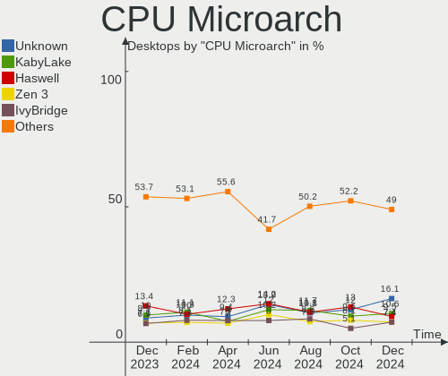
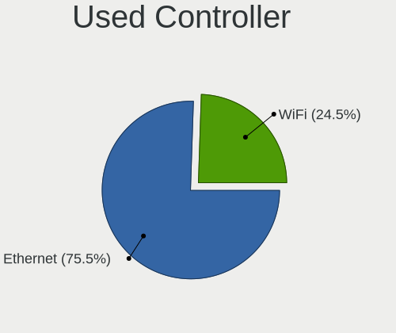
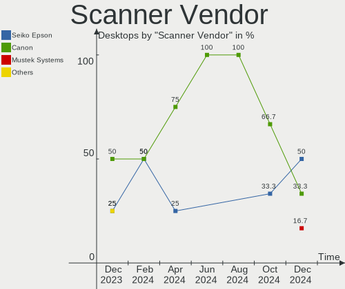

Ubuntu - Hardware Trends (Desktops)
-----------------------------------

A project to identify most popular hardware characteristics and track their change
over time based on data collected by Linux users at https://Linux-Hardware.org.

Anyone can contribute to this report by the [hw-probe](https://github.com/linuxhw/hw-probe) tool:

    sudo -E hw-probe -all -upload

This report is for one last month. Overall report since the beginning of time: [TestDays](https://github.com/linuxhw/TestDays)

Period: Dec, 2024.

Contents
--------

* [ System ](#system)
  - [ OS                       ](#os)
  - [ OS Family                ](#os-family)
  - [ Kernel                   ](#kernel)
  - [ Kernel Family            ](#kernel-family)
  - [ Kernel Major Ver.        ](#kernel-major-ver)
  - [ Arch                     ](#arch)
  - [ DE                       ](#de)
  - [ Display Server           ](#display-server)
  - [ Display Manager          ](#display-manager)
  - [ OS Lang                  ](#os-lang)
  - [ Boot Mode                ](#boot-mode)
  - [ Filesystem               ](#filesystem)
  - [ Part. scheme             ](#part-scheme)
  - [ Dual Boot with Linux/BSD ](#dual-boot-with-linuxbsd)
  - [ Dual Boot (Win)          ](#dual-boot-win)

* [ Board ](#board)
  - [ Vendor                   ](#vendor)
  - [ Model                    ](#model)
  - [ Model Family             ](#model-family)
  - [ MFG Year                 ](#mfg-year)
  - [ Form Factor              ](#form-factor)
  - [ Secure Boot              ](#secure-boot)
  - [ Coreboot                 ](#coreboot)
  - [ RAM Size                 ](#ram-size)
  - [ RAM Used                 ](#ram-used)
  - [ Total Drives             ](#total-drives)
  - [ Has CD-ROM               ](#has-cd-rom)
  - [ Has Ethernet             ](#has-ethernet)
  - [ Has WiFi                 ](#has-wifi)
  - [ Has Bluetooth            ](#has-bluetooth)

* [ Location ](#location)
  - [ Country                  ](#country)
  - [ City                     ](#city)

* [ Drives ](#drives)
  - [ Drive Vendor             ](#drive-vendor)
  - [ Drive Model              ](#drive-model)
  - [ HDD Vendor               ](#hdd-vendor)
  - [ SSD Vendor               ](#ssd-vendor)
  - [ Drive Kind               ](#drive-kind)
  - [ Drive Connector          ](#drive-connector)
  - [ Drive Size               ](#drive-size)
  - [ Space Total              ](#space-total)
  - [ Space Used               ](#space-used)
  - [ Malfunc. Drives          ](#malfunc-drives)
  - [ Malfunc. Drive Vendor    ](#malfunc-drive-vendor)
  - [ Malfunc. HDD Vendor      ](#malfunc-hdd-vendor)
  - [ Malfunc. Drive Kind      ](#malfunc-drive-kind)
  - [ Failed Drives            ](#failed-drives)
  - [ Failed Drive Vendor      ](#failed-drive-vendor)
  - [ Drive Status             ](#drive-status)

* [ Storage controller ](#storage-controller)
  - [ Storage Vendor           ](#storage-vendor)
  - [ Storage Model            ](#storage-model)
  - [ Storage Kind             ](#storage-kind)

* [ Processor ](#processor)
  - [ CPU Vendor               ](#cpu-vendor)
  - [ CPU Model                ](#cpu-model)
  - [ CPU Model Family         ](#cpu-model-family)
  - [ CPU Cores                ](#cpu-cores)
  - [ CPU Sockets              ](#cpu-sockets)
  - [ CPU Threads              ](#cpu-threads)
  - [ CPU Op-Modes             ](#cpu-op-modes)
  - [ CPU Microcode            ](#cpu-microcode)
  - [ CPU Microarch            ](#cpu-microarch)

* [ Graphics ](#graphics)
  - [ GPU Vendor               ](#gpu-vendor)
  - [ GPU Model                ](#gpu-model)
  - [ GPU Combo                ](#gpu-combo)
  - [ GPU Driver               ](#gpu-driver)
  - [ GPU Memory               ](#gpu-memory)

* [ Monitor ](#monitor)
  - [ Monitor Vendor           ](#monitor-vendor)
  - [ Monitor Model            ](#monitor-model)
  - [ Monitor Resolution       ](#monitor-resolution)
  - [ Monitor Diagonal         ](#monitor-diagonal)
  - [ Monitor Width            ](#monitor-width)
  - [ Aspect Ratio             ](#aspect-ratio)
  - [ Monitor Area             ](#monitor-area)
  - [ Pixel Density            ](#pixel-density)
  - [ Multiple Monitors        ](#multiple-monitors)

* [ Network ](#network)
  - [ Net Controller Vendor    ](#net-controller-vendor)
  - [ Net Controller Model     ](#net-controller-model)
  - [ Wireless Vendor          ](#wireless-vendor)
  - [ Wireless Model           ](#wireless-model)
  - [ Ethernet Vendor          ](#ethernet-vendor)
  - [ Ethernet Model           ](#ethernet-model)
  - [ Net Controller Kind      ](#net-controller-kind)
  - [ Used Controller          ](#used-controller)
  - [ NICs                     ](#nics)
  - [ IPv6                     ](#ipv6)

* [ Bluetooth ](#bluetooth)
  - [ Bluetooth Vendor         ](#bluetooth-vendor)
  - [ Bluetooth Model          ](#bluetooth-model)

* [ Sound ](#sound)
  - [ Sound Vendor             ](#sound-vendor)
  - [ Sound Model              ](#sound-model)

* [ Memory ](#memory)
  - [ Memory Vendor            ](#memory-vendor)
  - [ Memory Model             ](#memory-model)
  - [ Memory Kind              ](#memory-kind)
  - [ Memory Form Factor       ](#memory-form-factor)
  - [ Memory Size              ](#memory-size)
  - [ Memory Speed             ](#memory-speed)

* [ Printers & scanners ](#printers--scanners)
  - [ Printer Vendor           ](#printer-vendor)
  - [ Printer Model            ](#printer-model)
  - [ Scanner Vendor           ](#scanner-vendor)
  - [ Scanner Model            ](#scanner-model)

* [ Camera ](#camera)
  - [ Camera Vendor            ](#camera-vendor)
  - [ Camera Model             ](#camera-model)

* [ Security ](#security)
  - [ Fingerprint Vendor       ](#fingerprint-vendor)
  - [ Fingerprint Model        ](#fingerprint-model)
  - [ Chipcard Vendor          ](#chipcard-vendor)
  - [ Chipcard Model           ](#chipcard-model)

* [ Unsupported ](#unsupported)
  - [ Unsupported Devices      ](#unsupported-devices)
  - [ Unsupported Device Types ](#unsupported-device-types)

System
------

OS
--

Installed operating systems

| Name           | Desktops | Percent |
|----------------|----------|---------|
| Ubuntu 24.04   | 234      | 63.76%  |
| Ubuntu 22.04   | 62       | 16.89%  |
| Ubuntu 24.10   | 46       | 12.53%  |
| Ubuntu 20.04   | 16       | 4.36%   |
| Ubuntu 18.04   | 4        | 1.09%   |
| Ubuntu 23.04   | 2        | 0.54%   |
| Ubuntu Core 22 | 1        | 0.27%   |
| Ubuntu 24.0    | 1        | 0.27%   |
| Ubuntu 21.04   | 1        | 0.27%   |

OS Family
---------

OS without a version

| Name   | Desktops | Percent |
|--------|----------|---------|
| Ubuntu | 367      | 100%    |

Kernel
------

Version of the Linux kernel

| Version                        | Desktops | Percent |
|--------------------------------|----------|---------|
| 6.8.0-49-generic               | 108      | 29.43%  |
| 6.8.0-51-generic               | 81       | 22.07%  |
| 6.8.0-50-generic               | 41       | 11.17%  |
| 6.8.0-41-generic               | 19       | 5.18%   |
| 6.11.0-9-generic               | 17       | 4.63%   |
| 6.11.0-13-generic              | 16       | 4.36%   |
| 5.15.0-126-generic             | 10       | 2.72%   |
| 6.8.0-48-generic               | 7        | 1.91%   |
| 6.11.0-8-generic               | 6        | 1.63%   |
| 6.8.0-45-generic               | 4        | 1.09%   |
| 5.15.0-125-generic             | 4        | 1.09%   |
| 6.12.3-061203-generic          | 3        | 0.82%   |
| 6.11.0-12-generic              | 3        | 0.82%   |
| 5.4.0-204-generic              | 3        | 0.82%   |
| 5.19.0-32-generic              | 3        | 0.82%   |
| 6.8.0-47-generic               | 2        | 0.54%   |
| 6.5.0-35-generic               | 2        | 0.54%   |
| 5.15.0-43-generic              | 2        | 0.54%   |
| 4.15.0-213-generic             | 2        | 0.54%   |
| 6.9.3-76060903-generic         | 1        | 0.27%   |
| 6.8.0-50-lowlatency            | 1        | 0.27%   |
| 6.8.0-40-generic               | 1        | 0.27%   |
| 6.8.0-31-generic               | 1        | 0.27%   |
| 6.5.11-060511-generic          | 1        | 0.27%   |
| 6.5.0-9-generic                | 1        | 0.27%   |
| 6.5.0-44-generic               | 1        | 0.27%   |
| 6.5.0-28-generic               | 1        | 0.27%   |
| 6.2.0-39-generic               | 1        | 0.27%   |
| 6.2.0-20-generic               | 1        | 0.27%   |
| 6.13.0-061300rc1-generic       | 1        | 0.27%   |
| 6.12.5-tkg-bore-llvm           | 1        | 0.27%   |
| 6.12.5-1-liquorix-amd64        | 1        | 0.27%   |
| 6.12.2-3-liquorix-amd64        | 1        | 0.27%   |
| 6.12.0-061200-generic          | 1        | 0.27%   |
| 6.11.8-305.bazzite.fc41.x86_64 | 1        | 0.27%   |
| 5.8.0-63-generic               | 1        | 0.27%   |
| 5.4.0-200-generic              | 1        | 0.27%   |
| 5.4.0-150-generic              | 1        | 0.27%   |
| 5.4.0-125-generic              | 1        | 0.27%   |
| 5.19.0-38-generic              | 1        | 0.27%   |

Kernel Family
-------------

Linux kernel without a distro release

| Version  | Desktops | Percent |
|----------|----------|---------|
| 6.8.0    | 265      | 72.21%  |
| 6.11.0   | 42       | 11.44%  |
| 5.15.0   | 26       | 7.08%   |
| 5.4.0    | 6        | 1.63%   |
| 6.5.0    | 5        | 1.36%   |
| 5.19.0   | 4        | 1.09%   |
| 6.12.3   | 3        | 0.82%   |
| 4.15.0   | 3        | 0.82%   |
| 6.2.0    | 2        | 0.54%   |
| 6.12.5   | 2        | 0.54%   |
| 6.9.3    | 1        | 0.27%   |
| 6.5.11   | 1        | 0.27%   |
| 6.13.0   | 1        | 0.27%   |
| 6.12.2   | 1        | 0.27%   |
| 6.12.0   | 1        | 0.27%   |
| 6.11.8   | 1        | 0.27%   |
| 5.8.0    | 1        | 0.27%   |
| 5.15.113 | 1        | 0.27%   |
| 5.11.0   | 1        | 0.27%   |

Kernel Major Ver.
-----------------

Linux kernel major version

| Version | Desktops | Percent |
|---------|----------|---------|
| 6.8     | 265      | 72.21%  |
| 6.11    | 43       | 11.72%  |
| 5.15    | 27       | 7.36%   |
| 6.12    | 7        | 1.91%   |
| 6.5     | 6        | 1.63%   |
| 5.4     | 6        | 1.63%   |
| 5.19    | 4        | 1.09%   |
| 4.15    | 3        | 0.82%   |
| 6.2     | 2        | 0.54%   |
| 6.9     | 1        | 0.27%   |
| 6.13    | 1        | 0.27%   |
| 5.8     | 1        | 0.27%   |
| 5.11    | 1        | 0.27%   |

Arch
----

OS architecture (x86_64, i586, etc.)

| Name    | Desktops | Percent |
|---------|----------|---------|
| x86_64  | 365      | 99.46%  |
| riscv64 | 1        | 0.27%   |
| i686    | 1        | 0.27%   |

DE
--

Desktop Environment

| Name          | Desktops | Percent |
|---------------|----------|---------|
| GNOME         | 331      | 90.19%  |
| Unknown       | 23       | 6.27%   |
| X-Cinnamon    | 9        | 2.45%   |
| Cinnamon      | 2        | 0.54%   |
| xmonad        | 1        | 0.27%   |
| GNOME Classic | 1        | 0.27%   |

Display Server
--------------

X11 or Wayland

| Name    | Desktops | Percent |
|---------|----------|---------|
| Wayland | 210      | 57.22%  |
| X11     | 133      | 36.24%  |
| Tty     | 17       | 4.63%   |
| Unknown | 6        | 1.63%   |
| Web     | 1        | 0.27%   |

Display Manager
---------------

SDDM, LightDM, etc.

| Name    | Desktops | Percent |
|---------|----------|---------|
| GDM3    | 313      | 85.29%  |
| Unknown | 37       | 10.08%  |
| LightDM | 7        | 1.91%   |
| GDM     | 7        | 1.91%   |
| SDDM    | 2        | 0.54%   |
| SLiM    | 1        | 0.27%   |

OS Lang
-------

Language

| Lang    | Desktops | Percent |
|---------|----------|---------|
| en_US   | 188      | 51.23%  |
| de_DE   | 36       | 9.81%   |
| fr_FR   | 22       | 5.99%   |
| pt_BR   | 17       | 4.63%   |
| C       | 17       | 4.63%   |
| ru_RU   | 12       | 3.27%   |
| es_ES   | 12       | 3.27%   |
| en_GB   | 10       | 2.72%   |
| it_IT   | 8        | 2.18%   |
| en_CA   | 6        | 1.63%   |
| pl_PL   | 5        | 1.36%   |
| hu_HU   | 4        | 1.09%   |
| en_AU   | 3        | 0.82%   |
| de_AT   | 3        | 0.82%   |
| sk_SK   | 2        | 0.54%   |
| nl_NL   | 2        | 0.54%   |
| fi_FI   | 2        | 0.54%   |
| en_IN   | 2        | 0.54%   |
| Unknown | 2        | 0.54%   |
| zh_TW   | 1        | 0.27%   |
| tr_TR   | 1        | 0.27%   |
| ru_UA   | 1        | 0.27%   |
| ko_KR   | 1        | 0.27%   |
| ja_JP   | 1        | 0.27%   |
| fr_CA   | 1        | 0.27%   |
| fr_BE   | 1        | 0.27%   |
| es_US   | 1        | 0.27%   |
| es_MX   | 1        | 0.27%   |
| es_AR   | 1        | 0.27%   |
| en_ZA   | 1        | 0.27%   |
| el_GR   | 1        | 0.27%   |
| da_DK   | 1        | 0.27%   |
| ca_ES   | 1        | 0.27%   |

Boot Mode
---------

EFI or BIOS

| Mode | Desktops | Percent |
|------|----------|---------|
| BIOS | 269      | 73.3%   |
| EFI  | 98       | 26.7%   |

Filesystem
----------

Type of filesystem

| Type    | Desktops | Percent |
|---------|----------|---------|
| Tmpfs   | 244      | 66.49%  |
| Ext4    | 112      | 30.52%  |
| Overlay | 7        | 1.91%   |
| Btrfs   | 2        | 0.54%   |
| Xfs     | 1        | 0.27%   |
| Ext3    | 1        | 0.27%   |

Part. scheme
------------

Scheme of partitioning

| Type    | Desktops | Percent |
|---------|----------|---------|
| GPT     | 306      | 83.38%  |
| MBR     | 39       | 10.63%  |
| Unknown | 22       | 5.99%   |

Dual Boot with Linux/BSD
------------------------

Hosting more than one Linux/BSD

| Dual boot | Desktops | Percent |
|-----------|----------|---------|
| No        | 283      | 77.11%  |
| Yes       | 84       | 22.89%  |

Dual Boot (Win)
---------------

Hosting Linux and Windows

| Dual boot | Desktops | Percent |
|-----------|----------|---------|
| No        | 209      | 56.95%  |
| Yes       | 158      | 43.05%  |

Board
-----

Vendor
------

Motherboard manufacturer

| Name                                 | Desktops | Percent |
|--------------------------------------|----------|---------|
| ASUSTek Computer                     | 97       | 26.43%  |
| MSI                                  | 51       | 13.9%   |
| Gigabyte Technology                  | 48       | 13.08%  |
| Dell                                 | 41       | 11.17%  |
| ASRock                               | 29       | 7.9%    |
| Hewlett-Packard                      | 26       | 7.08%   |
| Intel                                | 13       | 3.54%   |
| Lenovo                               | 10       | 2.72%   |
| Unknown                              | 7        | 1.91%   |
| Acer                                 | 6        | 1.63%   |
| Medion                               | 4        | 1.09%   |
| Biostar                              | 4        | 1.09%   |
| Supermicro                           | 3        | 0.82%   |
| Fujitsu                              | 3        | 0.82%   |
| AZW                                  | 3        | 0.82%   |
| MACHINIST                            | 2        | 0.54%   |
| Foxconn                              | 2        | 0.54%   |
| T-bao                                | 1        | 0.27%   |
| Shuttle                              | 1        | 0.27%   |
| Shenzhen Meigao Electronic Equipment | 1        | 0.27%   |
| Seeed Studio                         | 1        | 0.27%   |
| PN-3322                              | 1        | 0.27%   |
| Pegatron                             | 1        | 0.27%   |
| MUCAI                                | 1        | 0.27%   |
| MITSUBISHI                           | 1        | 0.27%   |
| MiTAC                                | 1        | 0.27%   |
| MAXSUN                               | 1        | 0.27%   |
| JGINYUE                              | 1        | 0.27%   |
| Huanan                               | 1        | 0.27%   |
| HPE                                  | 1        | 0.27%   |
| H3C                                  | 1        | 0.27%   |
| Google                               | 1        | 0.27%   |
| eMachines                            | 1        | 0.27%   |
| DUEX                                 | 1        | 0.27%   |
| ASRockRack                           | 1        | 0.27%   |

Model
-----

Motherboard model

| Name                                            | Desktops | Percent |
|-------------------------------------------------|----------|---------|
| Unknown                                         | 8        | 2.18%   |
| ASUS All Series                                 | 6        | 1.63%   |
| Dell OptiPlex 990                               | 4        | 1.09%   |
| Dell OptiPlex 3050                              | 4        | 1.09%   |
| MSI MS-7D75                                     | 3        | 0.82%   |
| Gigabyte B450M DS3H                             | 3        | 0.82%   |
| MSI MS-7E51                                     | 2        | 0.54%   |
| MSI MS-7D46                                     | 2        | 0.54%   |
| MSI MS-7693                                     | 2        | 0.54%   |
| MSI MS-7673                                     | 2        | 0.54%   |
| HP t520 Flexible Series TC                      | 2        | 0.54%   |
| Gigabyte A320M-H                                | 2        | 0.54%   |
| Dell Precision WorkStation T3500                | 2        | 0.54%   |
| Dell Precision Tower 3620                       | 2        | 0.54%   |
| Dell Precision 3660                             | 2        | 0.54%   |
| Dell OptiPlex 9020                              | 2        | 0.54%   |
| Dell OptiPlex 7040                              | 2        | 0.54%   |
| Dell OptiPlex 7010                              | 2        | 0.54%   |
| AZW MINI S                                      | 2        | 0.54%   |
| ASUS TUF Z390-PLUS GAMING                       | 2        | 0.54%   |
| ASUS TUF Gaming X570-PRO                        | 2        | 0.54%   |
| ASUS TUF Gaming X570-PLUS                       | 2        | 0.54%   |
| ASUS TUF Gaming B760M-PLUS WIFI D4              | 2        | 0.54%   |
| ASUS PRIME X470-PRO                             | 2        | 0.54%   |
| ASUS PRIME B450M-A                              | 2        | 0.54%   |
| ASUS PRIME B350-PLUS                            | 2        | 0.54%   |
| ASUS P6T                                        | 2        | 0.54%   |
| ASUS M5A78L-M LX V2                             | 2        | 0.54%   |
| ASUS CM6630_CM6730_CM6830                       | 2        | 0.54%   |
| ASRock A520M-ITX/ac                             | 2        | 0.54%   |
| T-bao MINI PC                                   | 1        | 0.27%   |
| Supermicro X9DRL-3F/iF                          | 1        | 0.27%   |
| Supermicro X10DAi                               | 1        | 0.27%   |
| Supermicro PIO-648R-E1CR36L+-ST031              | 1        | 0.27%   |
| Shuttle DS10U                                   | 1        | 0.27%   |
| Shenzhen Meigao Electronic Equipment UM773 Lite | 1        | 0.27%   |
| Seeed Studio ODYSSEY-X86J4125                   | 1        | 0.27%   |
| PN-3322 PN-Media-01                             | 1        | 0.27%   |
| Pegatron h8-1417c                               | 1        | 0.27%   |
| MUCAI H61 V1.5                                  | 1        | 0.27%   |

Model Family
------------

Motherboard model prefix

| Name                  | Desktops | Percent |
|-----------------------|----------|---------|
| Dell OptiPlex         | 24       | 6.54%   |
| ASUS TUF              | 18       | 4.9%    |
| ASUS ROG              | 16       | 4.36%   |
| ASUS PRIME            | 16       | 4.36%   |
| Unknown               | 8        | 2.18%   |
| HP Compaq             | 7        | 1.91%   |
| Dell Precision        | 7        | 1.91%   |
| ASUS All              | 6        | 1.63%   |
| Lenovo ThinkCentre    | 5        | 1.36%   |
| HP ProDesk            | 4        | 1.09%   |
| Gigabyte B450M        | 4        | 1.09%   |
| MSI MS-7D75           | 3        | 0.82%   |
| HP EliteDesk          | 3        | 0.82%   |
| Gigabyte X570         | 3        | 0.82%   |
| Dell XPS              | 3        | 0.82%   |
| ASUS ProArt           | 3        | 0.82%   |
| ASUS M5A78L-M         | 3        | 0.82%   |
| ASRock B450M          | 3        | 0.82%   |
| MSI MS-7E51           | 2        | 0.54%   |
| MSI MS-7D46           | 2        | 0.54%   |
| MSI MS-7693           | 2        | 0.54%   |
| MSI MS-7673           | 2        | 0.54%   |
| Lenovo ThinkStation   | 2        | 0.54%   |
| Lenovo IdeaCentre     | 2        | 0.54%   |
| HP t520               | 2        | 0.54%   |
| HP ProLiant           | 2        | 0.54%   |
| Gigabyte Z790         | 2        | 0.54%   |
| Gigabyte B650         | 2        | 0.54%   |
| Gigabyte B560         | 2        | 0.54%   |
| Gigabyte B550M        | 2        | 0.54%   |
| Gigabyte AX370-Gaming | 2        | 0.54%   |
| Gigabyte A320M-H      | 2        | 0.54%   |
| Fujitsu ESPRIMO       | 2        | 0.54%   |
| Dell Vostro           | 2        | 0.54%   |
| Dell Inspiron         | 2        | 0.54%   |
| AZW MINI              | 2        | 0.54%   |
| ASUS P8Z77-V          | 2        | 0.54%   |
| ASUS P6T              | 2        | 0.54%   |
| ASUS M5A97            | 2        | 0.54%   |
| ASUS CM6630           | 2        | 0.54%   |

MFG Year
--------

Motherboard manufacture year

| Year | Desktops | Percent |
|------|----------|---------|
| 2018 | 36       | 9.81%   |
| 2022 | 31       | 8.45%   |
| 2023 | 29       | 7.9%    |
| 2012 | 27       | 7.36%   |
| 2020 | 26       | 7.08%   |
| 2014 | 25       | 6.81%   |
| 2021 | 24       | 6.54%   |
| 2017 | 24       | 6.54%   |
| 2019 | 20       | 5.45%   |
| 2013 | 20       | 5.45%   |
| 2024 | 19       | 5.18%   |
| 2011 | 19       | 5.18%   |
| 2010 | 15       | 4.09%   |
| 2016 | 11       | 3%      |
| 2008 | 11       | 3%      |
| 2015 | 10       | 2.72%   |
| 2009 | 10       | 2.72%   |
| 2007 | 6        | 1.63%   |
| 2006 | 4        | 1.09%   |

Form Factor
-----------

Physical design of the computer

| Name    | Desktops | Percent |
|---------|----------|---------|
| Desktop | 367      | 100%    |

Secure Boot
-----------

Enabled or disabled

| State    | Desktops | Percent |
|----------|----------|---------|
| Disabled | 352      | 95.91%  |
| Enabled  | 15       | 4.09%   |

Coreboot
--------

Have coreboot on board

| Used | Desktops | Percent |
|------|----------|---------|
| No   | 366      | 99.73%  |
| Yes  | 1        | 0.27%   |

RAM Size
--------

Total RAM memory

| Size in GB      | Desktops | Percent |
|-----------------|----------|---------|
| 32.01-64.0      | 80       | 21.8%   |
| 16.01-24.0      | 75       | 20.44%  |
| 8.01-16.0       | 56       | 15.26%  |
| 64.01-256.0     | 44       | 11.99%  |
| 4.01-8.0        | 43       | 11.72%  |
| 24.01-32.0      | 32       | 8.72%   |
| 3.01-4.0        | 29       | 7.9%    |
| 1.01-2.0        | 4        | 1.09%   |
| More than 256.0 | 2        | 0.54%   |
| 2.01-3.0        | 2        | 0.54%   |

RAM Used
--------

Used RAM memory

| Used GB     | Desktops | Percent |
|-------------|----------|---------|
| 2.01-3.0    | 102      | 27.79%  |
| 4.01-8.0    | 79       | 21.53%  |
| 1.01-2.0    | 79       | 21.53%  |
| 3.01-4.0    | 70       | 19.07%  |
| 8.01-16.0   | 19       | 5.18%   |
| 0.51-1.0    | 5        | 1.36%   |
| 24.01-32.0  | 4        | 1.09%   |
| 16.01-24.0  | 4        | 1.09%   |
| 32.01-64.0  | 3        | 0.82%   |
| 64.01-256.0 | 2        | 0.54%   |

Total Drives
------------

Number of drives on board

| Drives | Desktops | Percent |
|--------|----------|---------|
| 1      | 135      | 36.78%  |
| 2      | 105      | 28.61%  |
| 3      | 51       | 13.9%   |
| 4      | 43       | 11.72%  |
| 5      | 12       | 3.27%   |
| 6      | 10       | 2.72%   |
| 0      | 6        | 1.63%   |
| 8      | 2        | 0.54%   |
| 14     | 1        | 0.27%   |
| 10     | 1        | 0.27%   |
| 9      | 1        | 0.27%   |

Has CD-ROM
----------

Has CD-ROM on board

| Presented | Desktops | Percent |
|-----------|----------|---------|
| No        | 231      | 62.94%  |
| Yes       | 136      | 37.06%  |

Has Ethernet
------------

Has Ethernet on board

| Presented | Desktops | Percent |
|-----------|----------|---------|
| Yes       | 365      | 99.46%  |
| No        | 2        | 0.54%   |

Has WiFi
--------

Has WiFi module

| Presented | Desktops | Percent |
|-----------|----------|---------|
| No        | 190      | 51.77%  |
| Yes       | 177      | 48.23%  |

Has Bluetooth
-------------

Has Bluetooth module

| Presented | Desktops | Percent |
|-----------|----------|---------|
| No        | 226      | 61.58%  |
| Yes       | 141      | 38.42%  |

Location
--------

Country
-------

Geographic location (country)

| Country         | Desktops | Percent |
|-----------------|----------|---------|
| USA             | 85       | 23.16%  |
| Germany         | 40       | 10.9%   |
| France          | 24       | 6.54%   |
| Brazil          | 23       | 6.27%   |
| Canada          | 15       | 4.09%   |
| Russia          | 14       | 3.81%   |
| UK              | 13       | 3.54%   |
| Italy           | 10       | 2.72%   |
| Poland          | 9        | 2.45%   |
| Austria         | 9        | 2.45%   |
| Spain           | 8        | 2.18%   |
| India           | 8        | 2.18%   |
| Hungary         | 6        | 1.63%   |
| Belgium         | 6        | 1.63%   |
| Australia       | 6        | 1.63%   |
| Thailand        | 4        | 1.09%   |
| Serbia          | 4        | 1.09%   |
| Netherlands     | 4        | 1.09%   |
| Mexico          | 4        | 1.09%   |
| Finland         | 4        | 1.09%   |
| UAE             | 3        | 0.82%   |
| Turkey          | 3        | 0.82%   |
| Switzerland     | 3        | 0.82%   |
| Sweden          | 3        | 0.82%   |
| Slovakia        | 3        | 0.82%   |
| Norway          | 3        | 0.82%   |
| Colombia        | 3        | 0.82%   |
| Argentina       | 3        | 0.82%   |
| Vietnam         | 2        | 0.54%   |
| Venezuela       | 2        | 0.54%   |
| The Netherlands | 2        | 0.54%   |
| Taiwan          | 2        | 0.54%   |
| Ireland         | 2        | 0.54%   |
| Indonesia       | 2        | 0.54%   |
| Greece          | 2        | 0.54%   |
| Estonia         | 2        | 0.54%   |
| Denmark         | 2        | 0.54%   |
| Czechia         | 2        | 0.54%   |
| Croatia         | 2        | 0.54%   |
| China           | 2        | 0.54%   |

City
----

Geographic location (city)

| City          | Desktops | Percent |
|---------------|----------|---------|
| Vienna        | 5        | 1.36%   |
| Moscow        | 5        | 1.36%   |
| Toronto       | 4        | 1.09%   |
| Zurich        | 3        | 0.82%   |
| Sydney        | 3        | 0.82%   |
| Pune          | 3        | 0.82%   |
| Los Angeles   | 3        | 0.82%   |
| Budapest      | 3        | 0.82%   |
| Berlin        | 3        | 0.82%   |
| Vernon        | 2        | 0.54%   |
| Vancouver     | 2        | 0.54%   |
| Turin         | 2        | 0.54%   |
| Tucson        | 2        | 0.54%   |
| Spokane       | 2        | 0.54%   |
| Sao Paulo     | 2        | 0.54%   |
| Rostov-on-Don | 2        | 0.54%   |
| Prague        | 2        | 0.54%   |
| Pontoise      | 2        | 0.54%   |
| Paris         | 2        | 0.54%   |
| Novi Sad      | 2        | 0.54%   |
| Naples        | 2        | 0.54%   |
| Montreal      | 2        | 0.54%   |
| Minneapolis   | 2        | 0.54%   |
| Milwaukee     | 2        | 0.54%   |
| Milan         | 2        | 0.54%   |
| Livorno       | 2        | 0.54%   |
| Lincoln       | 2        | 0.54%   |
| Iron River    | 2        | 0.54%   |
| Houston       | 2        | 0.54%   |
| Helsinki      | 2        | 0.54%   |
| Hanover       | 2        | 0.54%   |
| Düsseldorf   | 2        | 0.54%   |
| Dublin        | 2        | 0.54%   |
| Dresden       | 2        | 0.54%   |
| Carapicuiba   | 2        | 0.54%   |
| Brussels      | 2        | 0.54%   |
| Brisbane      | 2        | 0.54%   |
| Bratislava    | 2        | 0.54%   |
| Belgrade      | 2        | 0.54%   |
| Bangkok       | 2        | 0.54%   |

Drives
------

Drive Vendor
------------

Hard drive vendors

| Vendor                       | Desktops | Drives | Percent |
|------------------------------|----------|--------|---------|
| Seagate                      | 106      | 143    | 15.52%  |
| Samsung Electronics          | 104      | 146    | 15.23%  |
| WDC                          | 101      | 132    | 14.79%  |
| SanDisk                      | 46       | 51     | 6.73%   |
| Kingston                     | 46       | 57     | 6.73%   |
| Toshiba                      | 29       | 32     | 4.25%   |
| Crucial                      | 29       | 30     | 4.25%   |
| Hitachi                      | 19       | 22     | 2.78%   |
| Unknown                      | 13       | 20     | 1.9%    |
| A-DATA Technology            | 12       | 12     | 1.76%   |
| Phison Electronics           | 11       | 12     | 1.61%   |
| Intel                        | 10       | 14     | 1.46%   |
| Kingston Technology Company  | 9        | 9      | 1.32%   |
| China                        | 9        | 9      | 1.32%   |
| Silicon Motion               | 8        | 8      | 1.17%   |
| Micron/Crucial Technology    | 8        | 8      | 1.17%   |
| MAXIO Technology (Hangzhou)  | 6        | 7      | 0.88%   |
| Team                         | 5        | 7      | 0.73%   |
| SPCC                         | 5        | 5      | 0.73%   |
| PNY                          | 5        | 5      | 0.73%   |
| SK hynix                     | 4        | 4      | 0.59%   |
| Phison                       | 4        | 5      | 0.59%   |
| Patriot                      | 4        | 4      | 0.59%   |
| Netac                        | 4        | 4      | 0.59%   |
| Micron Technology            | 4        | 4      | 0.59%   |
| Lexar                        | 4        | 4      | 0.59%   |
| JMicron Technology           | 4        | 5      | 0.59%   |
| Intenso                      | 4        | 4      | 0.59%   |
| Realtek Semiconductor        | 3        | 3      | 0.44%   |
| HGST                         | 3        | 6      | 0.44%   |
| GOODRAM                      | 3        | 3      | 0.44%   |
| Transcend                    | 2        | 2      | 0.29%   |
| Shenzhen Longsys Electronics | 2        | 2      | 0.29%   |
| SABRENT                      | 2        | 2      | 0.29%   |
| OCZ                          | 2        | 2      | 0.29%   |
| MSI                          | 2        | 2      | 0.29%   |
| Maxtor                       | 2        | 2      | 0.29%   |
| KingSpec                     | 2        | 2      | 0.29%   |
| HPE                          | 2        | 2      | 0.29%   |
| Hewlett-Packard              | 2        | 5      | 0.29%   |

Drive Model
-----------

Hard drive models

| Model                                                 | Desktops | Percent |
|-------------------------------------------------------|----------|---------|
| Samsung SSD 850 EVO 250GB                             | 10       | 1.29%   |
| Samsung NVMe SSD Controller SM981/PM981/PM983 512GB   | 10       | 1.29%   |
| Seagate ST500DM002-1BD142 500GB                       | 9        | 1.16%   |
| Seagate ST2000DM008-2FR102 2TB                        | 8        | 1.03%   |
| Samsung NVMe SSD Controller PM9A1/PM9A3/980PRO 512GB  | 8        | 1.03%   |
| Silicon Motion SM2263EN/SM2263XT SSD Controller 256GB | 7        | 0.9%    |
| Samsung SSD 980 1TB                                   | 7        | 0.9%    |
| Samsung SSD 850 EVO 500GB                             | 7        | 0.9%    |
| Kingston SA400S37960G 960GB SSD                       | 6        | 0.77%   |
| Kingston SA400S37240G 240GB SSD                       | 6        | 0.77%   |
| Crucial CT500MX500SSD1 500GB                          | 6        | 0.77%   |
| Seagate ST1000DM003-1CH162 1TB                        | 5        | 0.64%   |
| Samsung SSD 860 EVO 500GB                             | 5        | 0.64%   |
| Kingston SNV2S500G 500GB                              | 5        | 0.64%   |
| Kingston SA400S37480G 480GB SSD                       | 5        | 0.64%   |
| Toshiba DT01ACA100 1TB                                | 4        | 0.51%   |
| Seagate ST1000DM003-1ER162 1TB                        | 4        | 0.51%   |
| Sandisk WD_BLACK SN770 1TB                            | 4        | 0.51%   |
| Samsung SSD 860 EVO 1TB                               | 4        | 0.51%   |
| Kingston Company SNV2S1000G 1TB                       | 4        | 0.51%   |
| WDC WDS240G2G0A-00JH30 240GB SSD                      | 3        | 0.39%   |
| WDC WD40EZRX-00SPEB0 4TB                              | 3        | 0.39%   |
| WDC WD20EFRX-68EUZN0 2TB                              | 3        | 0.39%   |
| WDC WD10EZEX-08WN4A0 1TB                              | 3        | 0.39%   |
| WDC WD10EARS-00Y5B1 1TB                               | 3        | 0.39%   |
| Unknown SD/MMC/MS PRO 128GB                           | 3        | 0.39%   |
| Unknown SD/MMC 1073GB                                 | 3        | 0.39%   |
| Unknown M.S./M.S.Pro/HG 16GB                          | 3        | 0.39%   |
| Unknown Compact Flash 977MB                           | 3        | 0.39%   |
| Seagate ST8000DM004-2U9188 8TB                        | 3        | 0.39%   |
| Seagate ST4000DM004-2CV104 4TB                        | 3        | 0.39%   |
| Seagate ST2000DM001-1CH164 2TB                        | 3        | 0.39%   |
| Seagate ST1000DM010-2EP102 1TB                        | 3        | 0.39%   |
| Seagate ST1000DM003-1SB102 1TB                        | 3        | 0.39%   |
| Sandisk WD Blue SN550 NVMe SSD 256GB                  | 3        | 0.39%   |
| SanDisk SSD PLUS 240GB                                | 3        | 0.39%   |
| SanDisk NVMe SSD Drive 1TB                            | 3        | 0.39%   |
| Samsung SSD 980 PRO 1TB                               | 3        | 0.39%   |
| Samsung SSD 870 QVO 1TB                               | 3        | 0.39%   |
| Samsung SSD 860 PRO 256GB                             | 3        | 0.39%   |

HDD Vendor
----------

Hard disk drive vendors

| Vendor              | Desktops | Drives  | Percent |
|---------------------|----------|---------|---------|
| Seagate             | 102      | 136     | 38.64%  |
| WDC                 | 88       | 114     | 33.33%  |
| Toshiba             | 26       | 29      | 9.85%   |
| Hitachi             | 19       | 22      | 7.2%    |
| Samsung Electronics | 10       | 11      | 3.79%   |
| Unknown             | 4        | 5       | 1.52%   |
| JMicron Technology  | 3        | 4       | 1.14%   |
| HGST                | 3        | 6       | 1.14%   |
| SABRENT             | 2        | 2       | 0.76%   |
| Maxtor              | 2        | 2       | 0.76%   |
| SAGE                | 1        | Unknown | 0.38%   |
| QUANTUM             | 1        | 1       | 0.38%   |
| Hewlett-Packard     | 1        | 4       | 0.38%   |
| Fujitsu             | 1        | 1       | 0.38%   |
| Apple               | 1        | 1       | 0.38%   |

SSD Vendor
----------

Solid state drive vendors

| Vendor              | Desktops | Drives | Percent |
|---------------------|----------|--------|---------|
| Samsung Electronics | 59       | 73     | 25.32%  |
| Kingston            | 30       | 39     | 12.88%  |
| Crucial             | 26       | 26     | 11.16%  |
| SanDisk             | 18       | 19     | 7.73%   |
| WDC                 | 16       | 17     | 6.87%   |
| A-DATA Technology   | 10       | 10     | 4.29%   |
| China               | 9        | 9      | 3.86%   |
| PNY                 | 5        | 5      | 2.15%   |
| SPCC                | 4        | 4      | 1.72%   |
| Patriot             | 4        | 4      | 1.72%   |
| Intenso             | 4        | 4      | 1.72%   |
| Intel               | 4        | 5      | 1.72%   |
| Team                | 3        | 3      | 1.29%   |
| GOODRAM             | 3        | 3      | 1.29%   |
| Toshiba             | 2        | 2      | 0.86%   |
| OCZ                 | 2        | 2      | 0.86%   |
| Netac               | 2        | 2      | 0.86%   |
| KingSpec            | 2        | 2      | 0.86%   |
| CT240BX5            | 2        | 2      | 0.86%   |
| XFD10S-060GD        | 1        | 1      | 0.43%   |
| Unknown             | 1        | 1      | 0.43%   |
| Transcend           | 1        | 1      | 0.43%   |
| tecmiyo             | 1        | 1      | 0.43%   |
| SK hynix            | 1        | 1      | 0.43%   |
| Simm                | 1        | 1      | 0.43%   |
| Seagate             | 1        | 1      | 0.43%   |
| Plextor             | 1        | 1      | 0.43%   |
| NT-128              | 1        | 1      | 0.43%   |
| MSI                 | 1        | 1      | 0.43%   |
| Micron Technology   | 1        | 1      | 0.43%   |
| MAX                 | 1        | 1      | 0.43%   |
| LITEON              | 1        | 1      | 0.43%   |
| KIOXIA-EXCERIA      | 1        | 1      | 0.43%   |
| KingDian            | 1        | 1      | 0.43%   |
| HUSKY               | 1        | 1      | 0.43%   |
| HPE                 | 1        | 1      | 0.43%   |
| Hewlett-Packard     | 1        | 1      | 0.43%   |
| Gigastone           | 1        | 1      | 0.43%   |
| Gigabyte Technology | 1        | 1      | 0.43%   |
| Fanxiang            | 1        | 1      | 0.43%   |

Drive Kind
----------

HDD or SSD

| Kind    | Desktops | Drives | Percent |
|---------|----------|--------|---------|
| HDD     | 203      | 338    | 35.3%   |
| SSD     | 195      | 259    | 33.91%  |
| NVMe    | 155      | 214    | 26.96%  |
| Unknown | 20       | 26     | 3.48%   |
| MMC     | 2        | 2      | 0.35%   |

Drive Connector
---------------

SATA, SAS, NVMe, etc.

| Type | Desktops | Drives | Percent |
|------|----------|--------|---------|
| SATA | 302      | 574    | 60.89%  |
| NVMe | 154      | 213    | 31.05%  |
| SAS  | 38       | 50     | 7.66%   |
| MMC  | 2        | 2      | 0.4%    |

Drive Size
----------

Size of hard drive

| Size in TB | Desktops | Drives | Percent |
|------------|----------|--------|---------|
| 0.01-0.5   | 194      | 281    | 44.39%  |
| 0.51-1.0   | 117      | 148    | 26.77%  |
| 1.01-2.0   | 63       | 75     | 14.42%  |
| 3.01-4.0   | 22       | 27     | 5.03%   |
| 4.01-10.0  | 21       | 31     | 4.81%   |
| 10.01-20.0 | 11       | 26     | 2.52%   |
| 2.01-3.0   | 9        | 9      | 2.06%   |

Space Total
-----------

Amount of disk space available on the file system

| Size in GB     | Desktops | Percent |
|----------------|----------|---------|
| 101-250        | 78       | 21.25%  |
| 251-500        | 76       | 20.71%  |
| 501-1000       | 69       | 18.8%   |
| 1001-2000      | 47       | 12.81%  |
| More than 3000 | 37       | 10.08%  |
| 2001-3000      | 25       | 6.81%   |
| 1-20           | 17       | 4.63%   |
| 51-100         | 11       | 3%      |
| 21-50          | 5        | 1.36%   |
| Unknown        | 2        | 0.54%   |

Space Used
----------

Amount of used disk space

| Used GB        | Desktops | Percent |
|----------------|----------|---------|
| 1-20           | 101      | 27.52%  |
| 21-50          | 64       | 17.44%  |
| 101-250        | 53       | 14.44%  |
| 251-500        | 48       | 13.08%  |
| 51-100         | 34       | 9.26%   |
| 501-1000       | 23       | 6.27%   |
| 1001-2000      | 21       | 5.72%   |
| More than 3000 | 16       | 4.36%   |
| 2001-3000      | 5        | 1.36%   |
| Unknown        | 2        | 0.54%   |

Malfunc. Drives
---------------

Drive models with a malfunction

| Model                               | Desktops | Drives | Percent |
|-------------------------------------|----------|--------|---------|
| Hitachi HDT722516DLA380 165GB       | 2        | 2      | 9.09%   |
| XPG SPECTRIX S40G 1TB               | 1        | 1      | 4.55%   |
| WDC WDS240G2G0A-00JH30 240GB SSD    | 1        | 1      | 4.55%   |
| WDC WD5000AAKX-60U6AA0 500GB        | 1        | 1      | 4.55%   |
| WDC WD4001FAEX-00MJRA0 4TB          | 1        | 1      | 4.55%   |
| WDC WD20EFRX-68AX9N0 2TB            | 1        | 1      | 4.55%   |
| WDC WD10EARS-00Y5B1 1TB             | 1        | 1      | 4.55%   |
| tecmiyo SATA SSD 120GB              | 1        | 1      | 4.55%   |
| Seagate ST500DM009-2F110A 500GB     | 1        | 1      | 4.55%   |
| Seagate ST500DM002-1BD142 500GB     | 1        | 1      | 4.55%   |
| Seagate ST500DM002-1BC142 500GB     | 1        | 1      | 4.55%   |
| Seagate ST1000DM003-1CH162 1TB      | 1        | 1      | 4.55%   |
| SanDisk SD9SN8W512G1002 512GB SSD   | 1        | 1      | 4.55%   |
| SanDisk SD8TB8U-512G-1006 512GB SSD | 1        | 1      | 4.55%   |
| Kingston SNV2S500G 500GB            | 1        | 1      | 4.55%   |
| Intel SSDSC2KB960G8 960GB           | 1        | 2      | 4.55%   |
| Hitachi HDP725050GLA360 500GB       | 1        | 1      | 4.55%   |
| HGST HTS721010A9E630 1TB            | 1        | 1      | 4.55%   |
| FORESEE XP1000F512G 512GB           | 1        | 1      | 4.55%   |
| Dogfish SSD 128GB                   | 1        | 1      | 4.55%   |
| 2.5" SATA SSD 3TEB 120GB            | 1        | 1      | 4.55%   |

Malfunc. Drive Vendor
---------------------

Vendors of faulty drives

| Vendor   | Desktops | Drives | Percent |
|----------|----------|--------|---------|
| WDC      | 5        | 5      | 22.73%  |
| Seagate  | 4        | 4      | 18.18%  |
| Hitachi  | 3        | 3      | 13.64%  |
| SanDisk  | 2        | 2      | 9.09%   |
| XPG      | 1        | 1      | 4.55%   |
| tecmiyo  | 1        | 1      | 4.55%   |
| Kingston | 1        | 1      | 4.55%   |
| Intel    | 1        | 2      | 4.55%   |
| HGST     | 1        | 1      | 4.55%   |
| FORESEE  | 1        | 1      | 4.55%   |
| Dogfish  | 1        | 1      | 4.55%   |
| 2.5"     | 1        | 1      | 4.55%   |

Malfunc. HDD Vendor
-------------------

Vendors of faulty HDD drives

| Vendor  | Desktops | Drives | Percent |
|---------|----------|--------|---------|
| WDC     | 4        | 4      | 33.33%  |
| Seagate | 4        | 4      | 33.33%  |
| Hitachi | 3        | 3      | 25%     |
| HGST    | 1        | 1      | 8.33%   |

Malfunc. Drive Kind
-------------------

Kinds of faulty drives

| Kind | Desktops | Drives | Percent |
|------|----------|--------|---------|
| HDD  | 11       | 12     | 52.38%  |
| SSD  | 7        | 8      | 33.33%  |
| NVMe | 3        | 3      | 14.29%  |

Failed Drives
-------------

Failed drive models

Zero info for selected period =(

Failed Drive Vendor
-------------------

Failed drive vendors

Zero info for selected period =(

Drive Status
------------

Number of failed and malfunc. drives

| Status   | Desktops | Drives | Percent |
|----------|----------|--------|---------|
| Detected | 269      | 588    | 69.33%  |
| Works    | 99       | 228    | 25.52%  |
| Malfunc  | 20       | 23     | 5.15%   |

Storage controller
------------------

Storage Vendor
--------------

Storage controller vendors

| Vendor                         | Desktops | Percent |
|--------------------------------|----------|---------|
| Intel                          | 234      | 40.34%  |
| AMD                            | 123      | 21.21%  |
| Samsung Electronics            | 46       | 7.93%   |
| SanDisk                        | 29       | 5%      |
| Kingston Technology Company    | 25       | 4.31%   |
| ASMedia Technology             | 23       | 3.97%   |
| Phison Electronics             | 17       | 2.93%   |
| Micron/Crucial Technology      | 10       | 1.72%   |
| Silicon Motion                 | 8        | 1.38%   |
| Nvidia                         | 8        | 1.38%   |
| Shenzhen Longsys Electronics   | 7        | 1.21%   |
| MAXIO Technology (Hangzhou)    | 7        | 1.21%   |
| Marvell Technology Group       | 6        | 1.03%   |
| JMicron Technology             | 6        | 1.03%   |
| Realtek Semiconductor          | 5        | 0.86%   |
| SK hynix                       | 3        | 0.52%   |
| Micron Technology              | 3        | 0.52%   |
| Broadcom / LSI                 | 3        | 0.52%   |
| ADATA Technology               | 3        | 0.52%   |
| Netac Technology               | 2        | 0.34%   |
| Transcend                      | 1        | 0.17%   |
| Toshiba America Info Systems   | 1        | 0.17%   |
| Solidigm                       | 1        | 0.17%   |
| Solid State Storage Technology | 1        | 0.17%   |
| Silicon Image                  | 1        | 0.17%   |
| Seagate Technology             | 1        | 0.17%   |
| KIOXIA                         | 1        | 0.17%   |
| INNOGRIT                       | 1        | 0.17%   |
| Hosin Global Electronics       | 1        | 0.17%   |
| Hewlett-Packard                | 1        | 0.17%   |
| Artop Electronic               | 1        | 0.17%   |
| Adaptec                        | 1        | 0.17%   |

Storage Model
-------------

Storage controller models

| Model                                                                                   | Desktops | Percent |
|-----------------------------------------------------------------------------------------|----------|---------|
| AMD FCH SATA Controller [AHCI mode]                                                     | 52       | 7.38%   |
| AMD 600 Series Chipset SATA Controller                                                  | 26       | 3.69%   |
| Intel SATA Controller [RAID mode]                                                       | 24       | 3.4%    |
| AMD 400 Series Chipset SATA Controller                                                  | 22       | 3.12%   |
| Intel Raptor Lake SATA AHCI Controller                                                  | 20       | 2.84%   |
| Intel 7 Series/C210 Series Chipset Family 6-port SATA Controller [AHCI mode]            | 19       | 2.7%    |
| AMD 500 Series Chipset SATA Controller                                                  | 19       | 2.7%    |
| Intel 8 Series/C220 Series Chipset Family 6-port SATA Controller 1 [AHCI mode]          | 18       | 2.55%   |
| ASMedia ASM1061/ASM1062 Serial ATA Controller                                           | 18       | 2.55%   |
| Intel Alder Lake-S PCH SATA Controller [AHCI Mode]                                      | 17       | 2.41%   |
| Intel 200 Series PCH SATA controller [AHCI mode]                                        | 17       | 2.41%   |
| Samsung NVMe SSD Controller SM981/PM981/PM983                                           | 14       | 1.99%   |
| Samsung NVMe SSD Controller PM9A1/PM9A3/980PRO                                          | 14       | 1.99%   |
| Intel Cannon Lake PCH SATA AHCI Controller                                              | 14       | 1.99%   |
| Intel 6 Series/C200 Series Chipset Family 6 port Desktop SATA AHCI Controller           | 14       | 1.99%   |
| AMD SB7x0/SB8x0/SB9x0 IDE Controller                                                    | 13       | 1.84%   |
| Sandisk WD Black SN850X NVMe SSD                                                        | 10       | 1.42%   |
| AMD SB7x0/SB8x0/SB9x0 SATA Controller [AHCI mode]                                       | 10       | 1.42%   |
| Samsung NVMe SSD Controller 980 (DRAM-less)                                             | 9        | 1.28%   |
| Intel Volume Management Device NVMe RAID Controller Intel Corporation                   | 9        | 1.28%   |
| Intel Volume Management Device NVMe RAID Controller                                     | 9        | 1.28%   |
| AMD SB7x0/SB8x0/SB9x0 SATA Controller [IDE mode]                                        | 9        | 1.28%   |
| Silicon Motion SM2263EN/SM2263XT (DRAM-less) NVMe SSD Controllers                       | 8        | 1.13%   |
| Intel Q170/Q150/B150/H170/H110/Z170/CM236 Chipset SATA Controller [AHCI Mode]           | 8        | 1.13%   |
| Intel 9 Series Chipset Family SATA Controller [AHCI Mode]                               | 8        | 1.13%   |
| Intel 6 Series/C200 Series Chipset Family Desktop SATA Controller (IDE mode, ports 4-5) | 8        | 1.13%   |
| Intel 6 Series/C200 Series Chipset Family Desktop SATA Controller (IDE mode, ports 0-3) | 8        | 1.13%   |
| SanDisk WD Black SN770 / PC SN740 256GB / PC SN560 (DRAM-less) NVMe SSD                 | 7        | 0.99%   |
| Intel NM10/ICH7 Family SATA Controller [IDE mode]                                       | 7        | 0.99%   |
| Intel 82801G (ICH7 Family) IDE Controller                                               | 7        | 0.99%   |
| Kingston Company NV2 NVMe SSD [SM2267XT] (DRAM-less)                                    | 6        | 0.85%   |
| Kingston Company NV2 NVMe SSD [E21T] (DRAM-less)                                        | 6        | 0.85%   |
| Kingston Company KC3000/FURY Renegade NVMe SSD [E18]                                    | 6        | 0.85%   |
| Intel C610/X99 series chipset sSATA Controller [AHCI mode]                              | 6        | 0.85%   |
| Intel C610/X99 series chipset 6-Port SATA Controller [AHCI mode]                        | 6        | 0.85%   |
| Intel 500 Series Chipset Family SATA AHCI Controller                                    | 6        | 0.85%   |
| AMD 300 Series Chipset SATA Controller                                                  | 6        | 0.85%   |
| Samsung NVMe SSD Controller S4LV008[Pascal]                                             | 5        | 0.71%   |
| MAXIO (Hangzhou) NVMe SSD Controller MAP1602 (DRAM-less)                                | 5        | 0.71%   |
| Shenzhen Longsys Lexar NM790 NVME SSD (DRAM-less)                                       | 4        | 0.57%   |

Storage Kind
------------

Kind of storage controller (IDE, SATA, NVMe, SAS, ...)

| Kind | Desktops | Percent |
|------|----------|---------|
| SATA | 308      | 53.94%  |
| NVMe | 153      | 26.8%   |
| IDE  | 56       | 9.81%   |
| RAID | 47       | 8.23%   |
| SAS  | 4        | 0.7%    |
| SCSI | 3        | 0.53%   |

Processor
---------

CPU Vendor
----------

Processor vendors

| Vendor        | Desktops | Percent |
|---------------|----------|---------|
| Intel         | 237      | 64.58%  |
| AMD           | 129      | 35.15%  |
| sifive,u74-mc | 1        | 0.27%   |

CPU Model
---------

Processor models

| Model                                       | Desktops | Percent |
|---------------------------------------------|----------|---------|
| Intel Core i7-2600 CPU @ 3.40GHz            | 7        | 1.91%   |
| Intel Core i5-3470 CPU @ 3.20GHz            | 6        | 1.63%   |
| Intel 12th Gen Core i5-12400                | 5        | 1.36%   |
| AMD Ryzen 9 5900X 12-Core Processor         | 5        | 1.36%   |
| AMD Ryzen 7 5700G with Radeon Graphics      | 5        | 1.36%   |
| AMD Ryzen 5 5600G with Radeon Graphics      | 5        | 1.36%   |
| Intel Core i7-4790 CPU @ 3.60GHz            | 4        | 1.09%   |
| Intel Core i5-8500 CPU @ 3.00GHz            | 4        | 1.09%   |
| Intel 12th Gen Core i5-12400F               | 4        | 1.09%   |
| AMD Ryzen 9 9950X 16-Core Processor         | 4        | 1.09%   |
| AMD Ryzen 7 3700X 8-Core Processor          | 4        | 1.09%   |
| AMD Ryzen 5 3600 6-Core Processor           | 4        | 1.09%   |
| AMD Ryzen 5 2600 Six-Core Processor         | 4        | 1.09%   |
| Intel Xeon CPU E5-2680 v4 @ 2.40GHz         | 3        | 0.82%   |
| Intel Core i9-14900K                        | 3        | 0.82%   |
| Intel Core i7-8700K CPU @ 3.70GHz           | 3        | 0.82%   |
| Intel Core i7-8700 CPU @ 3.20GHz            | 3        | 0.82%   |
| Intel Core i7-6700K CPU @ 4.00GHz           | 3        | 0.82%   |
| Intel Core i7-4790K CPU @ 4.00GHz           | 3        | 0.82%   |
| Intel Core i5-9400F CPU @ 2.90GHz           | 3        | 0.82%   |
| Intel Core i5-4460 CPU @ 3.20GHz            | 3        | 0.82%   |
| Intel Core i5-3330 CPU @ 3.00GHz            | 3        | 0.82%   |
| Intel Core i5-2500K CPU @ 3.30GHz           | 3        | 0.82%   |
| Intel Core i5 CPU 650 @ 3.20GHz             | 3        | 0.82%   |
| Intel Core i3-7100 CPU @ 3.90GHz            | 3        | 0.82%   |
| Intel Core i3-2100 CPU @ 3.10GHz            | 3        | 0.82%   |
| Intel 13th Gen Core i9-13900K               | 3        | 0.82%   |
| AMD Ryzen 9 7900 12-Core Processor          | 3        | 0.82%   |
| AMD Ryzen 7 9700X 8-Core Processor          | 3        | 0.82%   |
| AMD Ryzen 7 5800X 8-Core Processor          | 3        | 0.82%   |
| AMD Ryzen 7 2700X Eight-Core Processor      | 3        | 0.82%   |
| AMD Ryzen 5 7600X 6-Core Processor          | 3        | 0.82%   |
| AMD Ryzen 5 3400G with Radeon Vega Graphics | 3        | 0.82%   |
| AMD FX-6300 Six-Core Processor              | 3        | 0.82%   |
| Intel Pentium D CPU 2.80GHz                 | 2        | 0.54%   |
| Intel N100                                  | 2        | 0.54%   |
| Intel Core i9-9900KF CPU @ 3.60GHz          | 2        | 0.54%   |
| Intel Core i9-14900KF                       | 2        | 0.54%   |
| Intel Core i9-10900K CPU @ 3.70GHz          | 2        | 0.54%   |
| Intel Core i7-9700K CPU @ 3.60GHz           | 2        | 0.54%   |

CPU Model Family
----------------

Processor model prefix

| Model                   | Desktops | Percent |
|-------------------------|----------|---------|
| Intel Core i5           | 61       | 16.62%  |
| Intel Core i7           | 53       | 14.44%  |
| AMD Ryzen 5             | 39       | 10.63%  |
| Other                   | 38       | 10.35%  |
| AMD Ryzen 7             | 26       | 7.08%   |
| Intel Xeon              | 22       | 5.99%   |
| AMD Ryzen 9             | 21       | 5.72%   |
| Intel Core i3           | 19       | 5.18%   |
| Intel Core i9           | 11       | 3%      |
| AMD FX                  | 10       | 2.72%   |
| Intel Celeron           | 9        | 2.45%   |
| Intel Core 2 Duo        | 7        | 1.91%   |
| Intel Pentium           | 6        | 1.63%   |
| Intel Core 2 Quad       | 4        | 1.09%   |
| AMD Phenom II X4        | 4        | 1.09%   |
| AMD Athlon 64 X2        | 4        | 1.09%   |
| AMD Ryzen 5 PRO         | 3        | 0.82%   |
| AMD Ryzen 3             | 3        | 0.82%   |
| AMD A10                 | 3        | 0.82%   |
| Intel Pentium D         | 2        | 0.54%   |
| Intel Atom              | 2        | 0.54%   |
| AMD Ryzen Threadripper  | 2        | 0.54%   |
| AMD GX                  | 2        | 0.54%   |
| AMD Athlon II X4        | 2        | 0.54%   |
| AMD Athlon II X2        | 2        | 0.54%   |
| AMD A4                  | 2        | 0.54%   |
| Intel Pentium Gold      | 1        | 0.27%   |
| Intel Pentium Dual-Core | 1        | 0.27%   |
| Intel Pentium Dual      | 1        | 0.27%   |
| Intel Core 2 Extreme    | 1        | 0.27%   |
| Intel Core 2            | 1        | 0.27%   |
| AMD Ryzen 7 PRO         | 1        | 0.27%   |
| AMD Phenom II X6        | 1        | 0.27%   |
| AMD Phenom II X2        | 1        | 0.27%   |
| AMD Phenom              | 1        | 0.27%   |
| AMD Athlon              | 1        | 0.27%   |

CPU Cores
---------

Number of processor cores

| Number | Desktops | Percent |
|--------|----------|---------|
| 4      | 122      | 33.24%  |
| 6      | 75       | 20.44%  |
| 2      | 61       | 16.62%  |
| 8      | 37       | 10.08%  |
| 16     | 18       | 4.9%    |
| 12     | 17       | 4.63%   |
| 24     | 9        | 2.45%   |
| 10     | 7        | 1.91%   |
| 14     | 4        | 1.09%   |
| 3      | 4        | 1.09%   |
| 1      | 4        | 1.09%   |
| 20     | 3        | 0.82%   |
| 36     | 2        | 0.54%   |
| 18     | 2        | 0.54%   |
| 128    | 1        | 0.27%   |
| 32     | 1        | 0.27%   |

CPU Sockets
-----------

Number of sockets

| Number | Desktops | Percent |
|--------|----------|---------|
| 1      | 362      | 98.64%  |
| 2      | 5        | 1.36%   |

CPU Threads
-----------

Threads per core (Hyper-Threading)

| Number | Desktops | Percent |
|--------|----------|---------|
| 2      | 225      | 61.31%  |
| 1      | 142      | 38.69%  |

CPU Op-Modes
------------

CPU Operation Modes (32-bit, 64-bit)

| Op mode        | Desktops | Percent |
|----------------|----------|---------|
| 32-bit, 64-bit | 366      | 99.73%  |
| Unknown        | 1        | 0.27%   |

CPU Microcode
-------------

Microcode number

| Number     | Desktops | Percent |
|------------|----------|---------|
| Unknown    | 342      | 93.19%  |
| 0x906e9    | 3        | 0.82%   |
| 0x90675    | 2        | 0.54%   |
| 0x306c3    | 2        | 0.54%   |
| 0x306a9    | 2        | 0.54%   |
| 0x206a7    | 2        | 0.54%   |
| 0xf47      | 1        | 0.27%   |
| 0xb06e0    | 1        | 0.27%   |
| 0xb0671    | 1        | 0.27%   |
| 0xa0653    | 1        | 0.27%   |
| 0x906ea    | 1        | 0.27%   |
| 0x506ca    | 1        | 0.27%   |
| 0x406f1    | 1        | 0.27%   |
| 0x306f2    | 1        | 0.27%   |
| 0x1067a    | 1        | 0.27%   |
| 0x10677    | 1        | 0.27%   |
| 0x0a601206 | 1        | 0.27%   |
| 0x08600106 | 1        | 0.27%   |
| 0x06003106 | 1        | 0.27%   |
| 0x06001119 | 1        | 0.27%   |

CPU Microarch
-------------

Microarchitecture

| Name             | Desktops | Percent |
|------------------|----------|---------|
| Unknown          | 59       | 16.08%  |
| KabyLake         | 39       | 10.63%  |
| Haswell          | 35       | 9.54%   |
| Zen 3            | 27       | 7.36%   |
| IvyBridge        | 27       | 7.36%   |
| SandyBridge      | 22       | 5.99%   |
| Zen 2            | 19       | 5.18%   |
| Alderlake Hybrid | 16       | 4.36%   |
| Skylake          | 14       | 3.81%   |
| Zen+             | 13       | 3.54%   |
| K10              | 11       | 3%      |
| Zen              | 10       | 2.72%   |
| Piledriver       | 10       | 2.72%   |
| Penryn           | 10       | 2.72%   |
| Core             | 9        | 2.45%   |
| Nehalem          | 8        | 2.18%   |
| CometLake        | 6        | 1.63%   |
| Westmere         | 5        | 1.36%   |
| Broadwell        | 5        | 1.36%   |
| K8 Hammer        | 4        | 1.09%   |
| Steamroller      | 3        | 0.82%   |
| Tremont          | 2        | 0.54%   |
| Silvermont       | 2        | 0.54%   |
| Puma             | 2        | 0.54%   |
| NetBurst         | 2        | 0.54%   |
| Goldmont         | 2        | 0.54%   |
| Bulldozer        | 2        | 0.54%   |
| Icelake          | 1        | 0.27%   |
| Goldmont plus    | 1        | 0.27%   |
| Crestmont        | 1        | 0.27%   |

Graphics
--------

GPU Vendor
----------

Vendors of graphics cards

| Vendor                     | Desktops | Percent |
|----------------------------|----------|---------|
| Nvidia                     | 165      | 40.05%  |
| Intel                      | 123      | 29.85%  |
| AMD                        | 118      | 28.64%  |
| Matrox Electronics Systems | 3        | 0.73%   |
| ASPEED Technology          | 3        | 0.73%   |

GPU Model
---------

Graphics card models

| Model                                                                       | Desktops | Percent |
|-----------------------------------------------------------------------------|----------|---------|
| AMD Ellesmere [Radeon RX 470/480/570/570X/580/580X/590]                     | 13       | 3.02%   |
| Nvidia GP107 [GeForce GTX 1050 Ti]                                          | 12       | 2.78%   |
| Intel Xeon E3-1200 v3/4th Gen Core Processor Integrated Graphics Controller | 12       | 2.78%   |
| Intel CoffeeLake-S GT2 [UHD Graphics 630]                                   | 12       | 2.78%   |
| Intel 2nd Generation Core Processor Family Integrated Graphics Controller   | 12       | 2.78%   |
| AMD Raphael                                                                 | 11       | 2.55%   |
| AMD Cezanne [Radeon Vega Series / Radeon Vega Mobile Series]                | 11       | 2.55%   |
| Intel Xeon E3-1200 v2/3rd Gen Core processor Graphics Controller            | 10       | 2.32%   |
| Intel Raptor Lake-S GT1 [UHD Graphics 770]                                  | 10       | 2.32%   |
| Intel HD Graphics 630                                                       | 9        | 2.09%   |
| AMD Granite Ridge [Radeon Graphics]                                         | 9        | 2.09%   |
| Intel HD Graphics 530                                                       | 8        | 1.86%   |
| AMD Navi 31 [Radeon RX 7900 XT/7900 XTX/7900 GRE/7900M]                     | 8        | 1.86%   |
| Intel Alder Lake-S GT1 [UHD Graphics 730]                                   | 7        | 1.62%   |
| Nvidia GP108 [GeForce GT 1030]                                              | 6        | 1.39%   |
| Nvidia GK208B [GeForce GT 710]                                              | 6        | 1.39%   |
| Nvidia GP106 [GeForce GTX 1060 6GB]                                         | 5        | 1.16%   |
| Nvidia GA106 [GeForce RTX 3060 Lite Hash Rate]                              | 5        | 1.16%   |
| Nvidia AD104 [GeForce RTX 4070 SUPER]                                       | 5        | 1.16%   |
| AMD Lexa PRO [Radeon 540/540X/550/550X / RX 540X/550/550X]                  | 5        | 1.16%   |
| Nvidia GP107 [GeForce GTX 1050]                                             | 4        | 0.93%   |
| Nvidia AD106 [GeForce RTX 4060 Ti]                                          | 4        | 0.93%   |
| Intel Core Processor Integrated Graphics Controller                         | 4        | 0.93%   |
| Intel AlderLake-S GT1                                                       | 4        | 0.93%   |
| AMD Navi 22 [Radeon RX 6700/6700 XT/6750 XT / 6800M/6850M XT]               | 4        | 0.93%   |
| AMD Cedar [Radeon HD 5000/6000/7350/8350 Series]                            | 4        | 0.93%   |
| Nvidia TU116 [GeForce GTX 1660 SUPER]                                       | 3        | 0.7%    |
| Nvidia GT218 [GeForce 8400 GS Rev. 3]                                       | 3        | 0.7%    |
| Nvidia GP104 [GeForce GTX 1070]                                             | 3        | 0.7%    |
| Nvidia GP102 [GeForce GTX 1080 Ti]                                          | 3        | 0.7%    |
| Nvidia GM107 [GeForce GTX 750]                                              | 3        | 0.7%    |
| Nvidia GF108 [GeForce GT 730]                                               | 3        | 0.7%    |
| Nvidia GA102 [GeForce RTX 3090]                                             | 3        | 0.7%    |
| Nvidia GA102 [GeForce RTX 3080 Ti]                                          | 3        | 0.7%    |
| Nvidia AD107 [GeForce RTX 4060]                                             | 3        | 0.7%    |
| Nvidia AD104 [GeForce RTX 4070]                                             | 3        | 0.7%    |
| Nvidia AD103 [GeForce RTX 4080 SUPER]                                       | 3        | 0.7%    |
| Intel JasperLake [UHD Graphics]                                             | 3        | 0.7%    |
| Intel 4th Generation Core Processor Family Integrated Graphics Controller   | 3        | 0.7%    |
| ASPEED Technology ASPEED Graphics Family                                    | 3        | 0.7%    |

GPU Combo
---------

Combinations of graphics cards

| Name            | Desktops | Percent |
|-----------------|----------|---------|
| 1 x Nvidia      | 133      | 36.24%  |
| 1 x Intel       | 94       | 25.61%  |
| 1 x AMD         | 85       | 23.16%  |
| 2 x AMD         | 15       | 4.09%   |
| Intel + Nvidia  | 13       | 3.54%   |
| AMD + Nvidia    | 13       | 3.54%   |
| 2 x Nvidia      | 4        | 1.09%   |
| Intel + AMD     | 3        | 0.82%   |
| 1 x Matrox      | 2        | 0.54%   |
| Other           | 1        | 0.27%   |
| Nvidia + Matrox | 1        | 0.27%   |
| Nvidia + ASPEED | 1        | 0.27%   |
| 1 x ASPEED      | 1        | 0.27%   |
| AMD + ASPEED    | 1        | 0.27%   |

GPU Driver
----------

Free vs proprietary

| Driver      | Desktops | Percent |
|-------------|----------|---------|
| Free        | 244      | 66.49%  |
| Proprietary | 96       | 26.16%  |
| Unknown     | 27       | 7.36%   |

GPU Memory
----------

Total video memory

| Size in GB | Desktops | Percent |
|------------|----------|---------|
| Unknown    | 287      | 78.2%   |
| 1.01-2.0   | 15       | 4.09%   |
| 0.51-1.0   | 12       | 3.27%   |
| 0.01-0.5   | 12       | 3.27%   |
| 3.01-4.0   | 11       | 3%      |
| 8.01-16.0  | 11       | 3%      |
| 7.01-8.0   | 8        | 2.18%   |
| 5.01-6.0   | 5        | 1.36%   |
| 16.01-24.0 | 5        | 1.36%   |
| 2.01-3.0   | 1        | 0.27%   |

Monitor
-------

Monitor Vendor
--------------

Monitor vendors

| Vendor               | Desktops | Percent |
|----------------------|----------|---------|
| Samsung Electronics  | 64       | 17.16%  |
| Goldstar             | 46       | 12.33%  |
| Dell                 | 40       | 10.72%  |
| Acer                 | 28       | 7.51%   |
| Hewlett-Packard      | 26       | 6.97%   |
| Ancor Communications | 21       | 5.63%   |
| AOC                  | 16       | 4.29%   |
| BenQ                 | 15       | 4.02%   |
| Philips              | 11       | 2.95%   |
| Iiyama               | 10       | 2.68%   |
| ASUSTek Computer     | 10       | 2.68%   |
| MSI                  | 9        | 2.41%   |
| ViewSonic            | 8        | 2.14%   |
| Unknown              | 5        | 1.34%   |
| Lenovo               | 5        | 1.34%   |
| Vestel Elektronik    | 3        | 0.8%    |
| NEC Computers        | 3        | 0.8%    |
| Medion               | 3        | 0.8%    |
| Fujitsu Siemens      | 3        | 0.8%    |
| Denver               | 3        | 0.8%    |
| Vizio                | 2        | 0.54%   |
| SKG                  | 2        | 0.54%   |
| MiTAC                | 2        | 0.54%   |
| Insignia             | 2        | 0.54%   |
| Gigabyte Technology  | 2        | 0.54%   |
| Eizo                 | 2        | 0.54%   |
| Unknown              | 2        | 0.54%   |
| Yamaha               | 1        | 0.27%   |
| XKX                  | 1        | 0.27%   |
| Westinghouse         | 1        | 0.27%   |
| WES                  | 1        | 0.27%   |
| Unknown (XXX)        | 1        | 0.27%   |
| TVS                  | 1        | 0.27%   |
| Toshiba              | 1        | 0.27%   |
| TES                  | 1        | 0.27%   |
| Sony                 | 1        | 0.27%   |
| RTK                  | 1        | 0.27%   |
| PVT                  | 1        | 0.27%   |
| PAT                  | 1        | 0.27%   |
| Orion                | 1        | 0.27%   |

Monitor Model
-------------

Monitor models

| Model                                                                   | Desktops | Percent |
|-------------------------------------------------------------------------|----------|---------|
| Unknown LCD Monitor FFFF 2288x1287 2550x2550mm 142.0-inch               | 4        | 1.03%   |
| Samsung Electronics C27F390 SAM0D32 1920x1080 600x340mm 27.2-inch       | 4        | 1.03%   |
| Goldstar FULL HD GSM5B55 1920x1080 480x270mm 21.7-inch                  | 4        | 1.03%   |
| Vestel Elektronik 49FHD_LCD_TV VES3700 1920x1080 1280x720mm 57.8-inch   | 3        | 0.78%   |
| Goldstar Ultra HD GSM5B08 3840x2160 600x340mm 27.2-inch                 | 3        | 0.78%   |
| Goldstar HDR 4K GSM7707 3840x2160 600x340mm 27.2-inch                   | 3        | 0.78%   |
| Denver PrimetekH3CQC LHCFFFF 3840x1080 1197x337mm 49.0-inch             | 3        | 0.78%   |
| Dell P2719H DEL4185 1920x1080 598x336mm 27.0-inch                       | 3        | 0.78%   |
| ViewSonic VX2452 Series VSCDE2E 1920x1080 521x293mm 23.5-inch           | 2        | 0.52%   |
| Samsung Electronics S24F350 SAM0D20 1920x1080 521x293mm 23.5-inch       | 2        | 0.52%   |
| Samsung Electronics LU28R55 SAM1017 3840x2160 632x360mm 28.6-inch       | 2        | 0.52%   |
| Samsung Electronics LU28R55 SAM1016 3840x2160 632x360mm 28.6-inch       | 2        | 0.52%   |
| Samsung Electronics LCD Monitor SAM0FEE 3840x2160 1872x1053mm 84.6-inch | 2        | 0.52%   |
| Samsung Electronics LCD Monitor SAM0E4C 1366x768 522x293mm 23.6-inch    | 2        | 0.52%   |
| Samsung Electronics C24F390 SAM0D2C 1920x1080 521x293mm 23.5-inch       | 2        | 0.52%   |
| Philips FTV PHL01EA 1920x1080 1440x810mm 65.0-inch                      | 2        | 0.52%   |
| Philips 170S PHL082B 1280x1024 338x270mm 17.0-inch                      | 2        | 0.52%   |
| MiTAC MTC26T42 MTC0B01 1280x720 708x398mm 32.0-inch                     | 2        | 0.52%   |
| Hewlett-Packard U28 4K HDR HPN36D7 3840x2160 621x341mm 27.9-inch        | 2        | 0.52%   |
| Hewlett-Packard E233 HPN3460 1920x1080 509x286mm 23.0-inch              | 2        | 0.52%   |
| Goldstar W1943 GSM4BAD 1360x768 406x229mm 18.4-inch                     | 2        | 0.52%   |
| Gigabyte Technology G27Q GBT2709 2560x1440 598x336mm 27.0-inch          | 2        | 0.52%   |
| Dell U2412M DELA07B 1920x1200 518x324mm 24.1-inch                       | 2        | 0.52%   |
| Dell S2421HN DEL41F1 1920x1080 527x296mm 23.8-inch                      | 2        | 0.52%   |
| Dell P3222QE DEL4246 3840x2160 697x392mm 31.5-inch                      | 2        | 0.52%   |
| AOC 24G2W1G5 AOC2402 1920x1080 527x296mm 23.8-inch                      | 2        | 0.52%   |
| AOC 2270W AOC2270 1920x1080 477x268mm 21.5-inch                         | 2        | 0.52%   |
| Ancor Communications VG248 ACI24A4 1920x1080 531x299mm 24.0-inch        | 2        | 0.52%   |
| Ancor Communications ASUS PB287Q ACI28A3 3840x2160 621x341mm 27.9-inch  | 2        | 0.52%   |
| Acer XB273U ACR074A 2560x1440 597x336mm 27.0-inch                       | 2        | 0.52%   |
| Acer S242HL ACR0216 1920x1080 531x299mm 24.0-inch                       | 2        | 0.52%   |
| Unknown                                                                 | 2        | 0.52%   |
| Yamaha RX-V471 YMH3160 708x398mm 32.0-inch                              | 1        | 0.26%   |
| XKX LED-2002 XKX1951 1600x900 368x207mm 16.6-inch                       | 1        | 0.26%   |
| Westinghouse WD27UI08 WDT2708 3840x2160 597x336mm 27.0-inch             | 1        | 0.26%   |
| WES WD50UC4300 WES0030 3840x2160 708x398mm 32.0-inch                    | 1        | 0.26%   |
| Vizio E470VL VIZ0057 1920x1080 1040x580mm 46.9-inch                     | 1        | 0.26%   |
| Vizio D32f-E1 VIZ1027 1920x1080 698x392mm 31.5-inch                     | 1        | 0.26%   |
| ViewSonic VX2476 Series VSCD332 1920x1080 527x296mm 23.8-inch           | 1        | 0.26%   |
| ViewSonic VX2456 SERIES VSC4F2F 1920x1080 521x293mm 23.5-inch           | 1        | 0.26%   |

Monitor Resolution
------------------

Monitor screen resolution

| Resolution         | Desktops | Percent |
|--------------------|----------|---------|
| 1920x1080 (FHD)    | 178      | 49.17%  |
| 3840x2160 (4K)     | 60       | 16.57%  |
| 2560x1440 (QHD)    | 30       | 8.29%   |
| 1280x1024 (SXGA)   | 14       | 3.87%   |
| 1920x1200 (WUXGA)  | 12       | 3.31%   |
| 1366x768 (WXGA)    | 10       | 2.76%   |
| 1680x1050 (WSXGA+) | 8        | 2.21%   |
| 1440x900 (WXGA+)   | 8        | 2.21%   |
| 3440x1440          | 7        | 1.93%   |
| 1600x900 (HD+)     | 7        | 1.93%   |
| 2288x1287          | 4        | 1.1%    |
| 1920x540           | 4        | 1.1%    |
| 1360x768           | 4        | 1.1%    |
| 2560x1080          | 3        | 0.83%   |
| 3840x1600          | 2        | 0.55%   |
| 2560x1600          | 2        | 0.55%   |
| 1600x1200          | 2        | 0.55%   |
| 1024x768 (XGA)     | 2        | 0.55%   |
| 3840x1080          | 1        | 0.28%   |
| 1920x720           | 1        | 0.28%   |
| 1280x720 (HD)      | 1        | 0.28%   |
| 1152x864           | 1        | 0.28%   |
| Unknown            | 1        | 0.28%   |

Monitor Diagonal
----------------

Diagonal size in inches

| Inches  | Desktops | Percent |
|---------|----------|---------|
| 27      | 71       | 18.98%  |
| 23      | 54       | 14.44%  |
| 24      | 53       | 14.17%  |
| 21      | 36       | 9.63%   |
| 31      | 26       | 6.95%   |
| 19      | 16       | 4.28%   |
| Unknown | 11       | 2.94%   |
| 32      | 9        | 2.41%   |
| 20      | 9        | 2.41%   |
| 18      | 9        | 2.41%   |
| 84      | 8        | 2.14%   |
| 34      | 7        | 1.87%   |
| 17      | 7        | 1.87%   |
| 54      | 6        | 1.6%    |
| 40      | 6        | 1.6%    |
| 49      | 5        | 1.34%   |
| 28      | 5        | 1.34%   |
| 22      | 5        | 1.34%   |
| 15      | 5        | 1.34%   |
| 142     | 4        | 1.07%   |
| 42      | 4        | 1.07%   |
| 72      | 2        | 0.53%   |
| 65      | 2        | 0.53%   |
| 37      | 2        | 0.53%   |
| 33      | 2        | 0.53%   |
| 26      | 2        | 0.53%   |
| 25      | 2        | 0.53%   |
| 52      | 1        | 0.27%   |
| 47      | 1        | 0.27%   |
| 35      | 1        | 0.27%   |
| 29      | 1        | 0.27%   |
| 16      | 1        | 0.27%   |
| 13      | 1        | 0.27%   |

Monitor Width
-------------

Physical width

| Width in mm    | Desktops | Percent |
|----------------|----------|---------|
| 501-600        | 163      | 45.03%  |
| 401-500        | 66       | 18.23%  |
| 601-700        | 40       | 11.05%  |
| 701-800        | 18       | 4.97%   |
| 1001-1500      | 15       | 4.14%   |
| 301-350        | 13       | 3.59%   |
| Unknown        | 11       | 3.04%   |
| 1501-2000      | 10       | 2.76%   |
| 801-900        | 9        | 2.49%   |
| 351-400        | 9        | 2.49%   |
| More than 2000 | 4        | 1.1%    |
| 901-1000       | 4        | 1.1%    |

Aspect Ratio
------------

Proportional relationship between the width and the height

| Ratio   | Desktops | Percent |
|---------|----------|---------|
| 16/9    | 262      | 76.83%  |
| 16/10   | 30       | 8.8%    |
| 5/4     | 13       | 3.81%   |
| 21/9    | 12       | 3.52%   |
| Unknown | 8        | 2.35%   |
| 4/3     | 6        | 1.76%   |
| 1.00    | 4        | 1.17%   |
| 32/9    | 3        | 0.88%   |
| 6/5     | 1        | 0.29%   |
| 3/2     | 1        | 0.29%   |
| 2.69    | 1        | 0.29%   |

Monitor Area
------------

Area in inch²

| Area in inch² | Desktops | Percent |
|----------------|----------|---------|
| 201-250        | 109      | 29.78%  |
| 301-350        | 72       | 19.67%  |
| 351-500        | 50       | 13.66%  |
| 151-200        | 37       | 10.11%  |
| More than 1000 | 25       | 6.83%   |
| 251-300        | 25       | 6.83%   |
| 501-1000       | 16       | 4.37%   |
| 141-150        | 14       | 3.83%   |
| Unknown        | 11       | 3.01%   |
| 111-120        | 5        | 1.37%   |
| 51-60          | 1        | 0.27%   |
| 101-110        | 1        | 0.27%   |

Pixel Density
-------------

Pixels per inch

| Density | Desktops | Percent |
|---------|----------|---------|
| 51-100  | 219      | 61.34%  |
| 101-120 | 73       | 20.45%  |
| 121-160 | 22       | 6.16%   |
| 1-50    | 18       | 5.04%   |
| 161-240 | 13       | 3.64%   |
| Unknown | 12       | 3.36%   |

Multiple Monitors
-----------------

Total monitors connected

| Total | Desktops | Percent |
|-------|----------|---------|
| 1     | 278      | 75.75%  |
| 2     | 62       | 16.89%  |
| 0     | 24       | 6.54%   |
| 3     | 3        | 0.82%   |

Network
-------

Net Controller Vendor
---------------------

Controller vendors

| Vendor                          | Desktops | Percent |
|---------------------------------|----------|---------|
| Realtek Semiconductor           | 222      | 41.89%  |
| Intel                           | 174      | 32.83%  |
| MediaTek                        | 22       | 4.15%   |
| Qualcomm Atheros                | 17       | 3.21%   |
| Broadcom                        | 14       | 2.64%   |
| Ralink Technology               | 13       | 2.45%   |
| TP-Link                         | 12       | 2.26%   |
| Samsung Electronics             | 6        | 1.13%   |
| Qualcomm Technologies           | 5        | 0.94%   |
| Nvidia                          | 5        | 0.94%   |
| Marvell Technology Group        | 4        | 0.75%   |
| IMC Networks                    | 3        | 0.57%   |
| D-Link                          | 3        | 0.57%   |
| Broadcom Limited                | 3        | 0.57%   |
| ASIX Electronics                | 3        | 0.57%   |
| Aquantia                        | 3        | 0.57%   |
| Xiaomi                          | 2        | 0.38%   |
| Ralink                          | 2        | 0.38%   |
| D-Link System                   | 2        | 0.38%   |
| American Megatrends             | 2        | 0.38%   |
| Wacom                           | 1        | 0.19%   |
| VIA Technologies                | 1        | 0.19%   |
| U-Blox                          | 1        | 0.19%   |
| Solarflare Communications       | 1        | 0.19%   |
| Qualcomm Atheros Communications | 1        | 0.19%   |
| NetGear                         | 1        | 0.19%   |
| Netchip Technology              | 1        | 0.19%   |
| Micro Star International        | 1        | 0.19%   |
| Huawei Technologies             | 1        | 0.19%   |
| Hewlett-Packard                 | 1        | 0.19%   |
| Google                          | 1        | 0.19%   |
| DisplayLink                     | 1        | 0.19%   |
| Arduino                         | 1        | 0.19%   |

Net Controller Model
--------------------

Controller models

| Model                                                                  | Desktops | Percent |
|------------------------------------------------------------------------|----------|---------|
| Realtek RTL8111/8168/8211/8411 PCI Express Gigabit Ethernet Controller | 153      | 24.76%  |
| Realtek RTL8125 2.5GbE Controller                                      | 39       | 6.31%   |
| Intel Ethernet Controller I225-V                                       | 15       | 2.43%   |
| Intel I211 Gigabit Network Connection                                  | 12       | 1.94%   |
| Intel 82579LM Gigabit Network Connection (Lewisville)                  | 12       | 1.94%   |
| MediaTek MT7922 802.11ax PCI Express Wireless Network Adapter          | 11       | 1.78%   |
| Intel Wi-Fi 6E(802.11ax) AX210/AX1675* 2x2 [Typhoon Peak]              | 11       | 1.78%   |
| Intel Wi-Fi 6 AX200                                                    | 11       | 1.78%   |
| Intel Ethernet Controller I226-V                                       | 11       | 1.78%   |
| Realtek RTL88x2bu [AC1200 Techkey]                                     | 10       | 1.62%   |
| Intel Ethernet Connection (2) I219-V                                   | 10       | 1.62%   |
| Intel Raptor Lake-S PCH CNVi WiFi                                      | 9        | 1.46%   |
| Intel Ethernet Connection (7) I219-V                                   | 9        | 1.46%   |
| Intel Dual Band Wireless-AC 3168NGW [Stone Peak]                       | 9        | 1.46%   |
| Realtek RTL810xE PCI Express Fast Ethernet controller                  | 8        | 1.29%   |
| Intel Ethernet Connection I217-LM                                      | 8        | 1.29%   |
| Realtek 802.11ac NIC                                                   | 7        | 1.13%   |
| Intel Ethernet Connection (2) I219-LM                                  | 7        | 1.13%   |
| Realtek RTL8821CE 802.11ac PCIe Wireless Network Adapter               | 6        | 0.97%   |
| Ralink MT7601U Wireless Adapter                                        | 6        | 0.97%   |
| Intel I210 Gigabit Network Connection                                  | 6        | 0.97%   |
| Intel Ethernet Connection (7) I219-LM                                  | 6        | 0.97%   |
| Samsung Galaxy series, misc. (tethering mode)                          | 5        | 0.81%   |
| Realtek RT8126 PCIe Ethernet Controller                                | 5        | 0.81%   |
| Qualcomm WCN785x Wi-Fi 7(802.11be) 320MHz 2x2 [FastConnect 7800]       | 5        | 0.81%   |
| Intel Cannon Lake PCH CNVi WiFi                                        | 5        | 0.81%   |
| Intel Alder Lake-S PCH CNVi WiFi                                       | 5        | 0.81%   |
| TP-Link Archer T2U PLUS [RTL8821AU]                                    | 4        | 0.65%   |
| Realtek RTL8188CUS 802.11n WLAN Adapter                                | 4        | 0.65%   |
| Intel Wireless 7265                                                    | 4        | 0.65%   |
| Intel Ethernet Controller 10-Gigabit X540-AT2                          | 4        | 0.65%   |
| Intel Ethernet Connection I217-V                                       | 4        | 0.65%   |
| Intel Ethernet Connection (2) I218-V                                   | 4        | 0.65%   |
| Intel Ethernet Connection (17) I219-LM                                 | 4        | 0.65%   |
| Intel 82579V Gigabit Network Connection                                | 4        | 0.65%   |
| Ralink RT2870/RT3070 Wireless Adapter                                  | 3        | 0.49%   |
| Qualcomm Atheros Killer E220x Gigabit Ethernet Controller              | 3        | 0.49%   |
| Nvidia MCP61 Ethernet                                                  | 3        | 0.49%   |
| MediaTek Network controller                                            | 3        | 0.49%   |
| MediaTek MT7921K (RZ608) Wi-Fi 6E 80MHz                                | 3        | 0.49%   |

Wireless Vendor
---------------

Wireless vendors

| Vendor                          | Desktops | Percent |
|---------------------------------|----------|---------|
| Intel                           | 67       | 35.45%  |
| Realtek Semiconductor           | 47       | 24.87%  |
| MediaTek                        | 16       | 8.47%   |
| Ralink Technology               | 13       | 6.88%   |
| TP-Link                         | 12       | 6.35%   |
| Qualcomm Atheros                | 9        | 4.76%   |
| Broadcom                        | 6        | 3.17%   |
| Qualcomm Technologies           | 5        | 2.65%   |
| IMC Networks                    | 3        | 1.59%   |
| D-Link                          | 3        | 1.59%   |
| Ralink                          | 2        | 1.06%   |
| Wacom                           | 1        | 0.53%   |
| Qualcomm Atheros Communications | 1        | 0.53%   |
| NetGear                         | 1        | 0.53%   |
| Micro Star International        | 1        | 0.53%   |
| D-Link System                   | 1        | 0.53%   |
| Broadcom Limited                | 1        | 0.53%   |

Wireless Model
--------------

Wireless models

| Model                                                            | Desktops | Percent |
|------------------------------------------------------------------|----------|---------|
| Intel Wi-Fi 6E(802.11ax) AX210/AX1675* 2x2 [Typhoon Peak]        | 11       | 5.7%    |
| Intel Wi-Fi 6 AX200                                              | 11       | 5.7%    |
| Realtek RTL88x2bu [AC1200 Techkey]                               | 10       | 5.18%   |
| MediaTek MT7922 802.11ax PCI Express Wireless Network Adapter    | 10       | 5.18%   |
| Intel Raptor Lake-S PCH CNVi WiFi                                | 9        | 4.66%   |
| Intel Dual Band Wireless-AC 3168NGW [Stone Peak]                 | 9        | 4.66%   |
| Realtek 802.11ac NIC                                             | 7        | 3.63%   |
| Realtek RTL8821CE 802.11ac PCIe Wireless Network Adapter         | 6        | 3.11%   |
| Ralink MT7601U Wireless Adapter                                  | 6        | 3.11%   |
| Qualcomm WCN785x Wi-Fi 7(802.11be) 320MHz 2x2 [FastConnect 7800] | 5        | 2.59%   |
| Intel Cannon Lake PCH CNVi WiFi                                  | 5        | 2.59%   |
| Intel Alder Lake-S PCH CNVi WiFi                                 | 5        | 2.59%   |
| TP-Link Archer T2U PLUS [RTL8821AU]                              | 4        | 2.07%   |
| Realtek RTL8188CUS 802.11n WLAN Adapter                          | 4        | 2.07%   |
| Intel Wireless 7265                                              | 4        | 2.07%   |
| Ralink RT2870/RT3070 Wireless Adapter                            | 3        | 1.55%   |
| MediaTek MT7921K (RZ608) Wi-Fi 6E 80MHz                          | 3        | 1.55%   |
| Intel Wireless 3165                                              | 3        | 1.55%   |
| TP-Link Archer T3U [Realtek RTL8812BU]                           | 2        | 1.04%   |
| TP-Link 802.11ac WLAN Adapter                                    | 2        | 1.04%   |
| Realtek RTL8852CE PCIe 802.11ax Wireless Network Controller      | 2        | 1.04%   |
| Realtek RTL8814AU 802.11a/b/g/n/ac Wireless Adapter              | 2        | 1.04%   |
| Realtek RTL8812AE 802.11ac PCIe Wireless Network Adapter         | 2        | 1.04%   |
| Realtek RTL8187 Wireless Adapter                                 | 2        | 1.04%   |
| Ralink MT7610U ("Archer T2U" 2.4G+5G WLAN Adapter                | 2        | 1.04%   |
| Qualcomm Atheros QCA6174 802.11ac Wireless Network Adapter       | 2        | 1.04%   |
| Qualcomm Atheros AR9485 Wireless Network Adapter                 | 2        | 1.04%   |
| Intel Wireless 7260                                              | 2        | 1.04%   |
| Intel Comet Lake PCH CNVi WiFi                                   | 2        | 1.04%   |
| IMC Networks Mediao 802.11n WLAN [Realtek RTL8191SU]             | 2        | 1.04%   |
| Broadcom BCM4360 802.11ac Dual Band Wireless Network Adapter     | 2        | 1.04%   |
| Broadcom BCM4352 802.11ac Dual Band Wireless Network Adapter     | 2        | 1.04%   |
| Wacom ACK-40401 [Wireless Accessory Kit]                         | 1        | 0.52%   |
| TP-Link TL-WN823N v2/v3 [Realtek RTL8192EU]                      | 1        | 0.52%   |
| TP-Link TL-WN722N v2/v3 [Realtek RTL8188EUS]                     | 1        | 0.52%   |
| TP-Link AC600 wireless Realtek RTL8811AU [Archer T2U Nano]       | 1        | 0.52%   |
| TP-Link 802.11ac NIC                                             | 1        | 0.52%   |
| Realtek RTL8852BE PCIe 802.11ax Wireless Network Controller      | 1        | 0.52%   |
| Realtek RTL8852AE 802.11ax PCIe Wireless Network Adapter         | 1        | 0.52%   |
| Realtek RTL8822CE 802.11ac PCIe Wireless Network Adapter         | 1        | 0.52%   |

Ethernet Vendor
---------------

Ethernet vendors

| Vendor                    | Desktops | Percent |
|---------------------------|----------|---------|
| Realtek Semiconductor     | 206      | 51.89%  |
| Intel                     | 136      | 34.26%  |
| Qualcomm Atheros          | 9        | 2.27%   |
| Broadcom                  | 9        | 2.27%   |
| Samsung Electronics       | 5        | 1.26%   |
| Nvidia                    | 5        | 1.26%   |
| Marvell Technology Group  | 4        | 1.01%   |
| MediaTek                  | 3        | 0.76%   |
| ASIX Electronics          | 3        | 0.76%   |
| Aquantia                  | 3        | 0.76%   |
| Xiaomi                    | 2        | 0.5%    |
| Broadcom Limited          | 2        | 0.5%    |
| American Megatrends       | 2        | 0.5%    |
| VIA Technologies          | 1        | 0.25%   |
| Solarflare Communications | 1        | 0.25%   |
| Netchip Technology        | 1        | 0.25%   |
| Huawei Technologies       | 1        | 0.25%   |
| Hewlett-Packard           | 1        | 0.25%   |
| Google                    | 1        | 0.25%   |
| DisplayLink               | 1        | 0.25%   |
| D-Link System             | 1        | 0.25%   |

Ethernet Model
--------------

Ethernet models

| Model                                                                  | Desktops | Percent |
|------------------------------------------------------------------------|----------|---------|
| Realtek RTL8111/8168/8211/8411 PCI Express Gigabit Ethernet Controller | 153      | 36.52%  |
| Realtek RTL8125 2.5GbE Controller                                      | 39       | 9.31%   |
| Intel Ethernet Controller I225-V                                       | 15       | 3.58%   |
| Intel I211 Gigabit Network Connection                                  | 12       | 2.86%   |
| Intel 82579LM Gigabit Network Connection (Lewisville)                  | 12       | 2.86%   |
| Intel Ethernet Controller I226-V                                       | 11       | 2.63%   |
| Intel Ethernet Connection (2) I219-V                                   | 10       | 2.39%   |
| Intel Ethernet Connection (7) I219-V                                   | 9        | 2.15%   |
| Realtek RTL810xE PCI Express Fast Ethernet controller                  | 8        | 1.91%   |
| Intel Ethernet Connection I217-LM                                      | 8        | 1.91%   |
| Intel Ethernet Connection (2) I219-LM                                  | 7        | 1.67%   |
| Intel I210 Gigabit Network Connection                                  | 6        | 1.43%   |
| Intel Ethernet Connection (7) I219-LM                                  | 6        | 1.43%   |
| Samsung Galaxy series, misc. (tethering mode)                          | 5        | 1.19%   |
| Realtek RT8126 PCIe Ethernet Controller                                | 5        | 1.19%   |
| Intel Ethernet Controller 10-Gigabit X540-AT2                          | 4        | 0.95%   |
| Intel Ethernet Connection I217-V                                       | 4        | 0.95%   |
| Intel Ethernet Connection (2) I218-V                                   | 4        | 0.95%   |
| Intel Ethernet Connection (17) I219-LM                                 | 4        | 0.95%   |
| Intel 82579V Gigabit Network Connection                                | 4        | 0.95%   |
| Qualcomm Atheros Killer E220x Gigabit Ethernet Controller              | 3        | 0.72%   |
| Nvidia MCP61 Ethernet                                                  | 3        | 0.72%   |
| Marvell Group 88E8056 PCI-E Gigabit Ethernet Controller                | 3        | 0.72%   |
| Intel 82574L Gigabit Network Connection                                | 3        | 0.72%   |
| Broadcom NetXtreme BCM5761 Gigabit Ethernet PCIe                       | 3        | 0.72%   |
| ASIX AX88179 Gigabit Ethernet                                          | 3        | 0.72%   |
| Xiaomi Mi/Redmi series (RNDIS)                                         | 2        | 0.48%   |
| Realtek RTL8111/8168/8411 PCI Express Gigabit Ethernet Controller      | 2        | 0.48%   |
| Qualcomm Atheros AR8151 v2.0 Gigabit Ethernet                          | 2        | 0.48%   |
| MediaTek WLAN controller                                               | 2        | 0.48%   |
| Marvell Group 88E8001 Gigabit Ethernet Controller                      | 2        | 0.48%   |
| Intel I350 Gigabit Network Connection                                  | 2        | 0.48%   |
| Intel Ethernet Controller X550                                         | 2        | 0.48%   |
| Intel Ethernet Connection (2) I218-LM                                  | 2        | 0.48%   |
| Intel Ethernet Connection (17) I219-V                                  | 2        | 0.48%   |
| Intel Ethernet Connection (14) I219-V                                  | 2        | 0.48%   |
| Intel 82578DC Gigabit Network Connection                               | 2        | 0.48%   |
| Intel 82562V-2 10/100 Network Connection                               | 2        | 0.48%   |
| American Megatrends Virtual Ethernet.                                  | 2        | 0.48%   |
| VIA VT6105/VT6106S [Rhine-III]                                         | 1        | 0.24%   |

Net Controller Kind
-------------------

Ethernet, WiFi or modem

| Kind     | Desktops | Percent |
|----------|----------|---------|
| Ethernet | 365      | 66.73%  |
| WiFi     | 176      | 32.18%  |
| Modem    | 3        | 0.55%   |
| Unknown  | 3        | 0.55%   |

Used Controller
---------------

Currently used network controller

| Kind     | Desktops | Percent |
|----------|----------|---------|
| Ethernet | 287      | 75.53%  |
| WiFi     | 93       | 24.47%  |

NICs
----

Total network controllers on board

| Total | Desktops | Percent |
|-------|----------|---------|
| 1     | 195      | 53.13%  |
| 2     | 140      | 38.15%  |
| 3     | 17       | 4.63%   |
| 4     | 6        | 1.63%   |
| 0     | 4        | 1.09%   |
| 5     | 3        | 0.82%   |
| 11    | 1        | 0.27%   |
| 9     | 1        | 0.27%   |

IPv6
----

IPv6 vs IPv4

| Used | Desktops | Percent |
|------|----------|---------|
| No   | 239      | 65.12%  |
| Yes  | 128      | 34.88%  |

Bluetooth
---------

Bluetooth Vendor
----------------

Controller vendors

| Vendor                          | Desktops | Percent |
|---------------------------------|----------|---------|
| Intel                           | 66       | 43.42%  |
| Cambridge Silicon Radio         | 18       | 11.84%  |
| IMC Networks                    | 13       | 8.55%   |
| MediaTek                        | 12       | 7.89%   |
| Foxconn / Hon Hai               | 12       | 7.89%   |
| Realtek Semiconductor           | 9        | 5.92%   |
| ASUSTek Computer                | 7        | 4.61%   |
| Broadcom                        | 3        | 1.97%   |
| TP-Link                         | 2        | 1.32%   |
| Realtek                         | 2        | 1.32%   |
| Qualcomm Atheros Communications | 2        | 1.32%   |
| Unknown                         | 2        | 1.32%   |
| Ralink                          | 1        | 0.66%   |
| Foxconn International           | 1        | 0.66%   |
| Dynex                           | 1        | 0.66%   |
| Dell                            | 1        | 0.66%   |

Bluetooth Model
---------------

Controller models

| Model                                                    | Desktops | Percent |
|----------------------------------------------------------|----------|---------|
| Cambridge Silicon Radio Bluetooth Dongle (HCI mode)      | 18       | 11.76%  |
| MediaTek Wireless_Device                                 | 12       | 7.84%   |
| Intel AX201 Bluetooth                                    | 11       | 7.19%   |
| Intel AX200 Bluetooth                                    | 11       | 7.19%   |
| Intel AX210 Bluetooth                                    | 10       | 6.54%   |
| Intel Wireless-AC 3168 Bluetooth                         | 9        | 5.88%   |
| Intel Bluetooth wireless interface                       | 9        | 5.88%   |
| IMC Networks Bluetooth Radio                             | 9        | 5.88%   |
| Foxconn / Hon Hai Bluetooth Device                       | 8        | 5.23%   |
| Intel AX211 Bluetooth                                    | 7        | 4.58%   |
| Intel Bluetooth 9460/9560 Jefferson Peak (JfP)           | 6        | 3.92%   |
| Realtek Bluetooth Radio                                  | 5        | 3.27%   |
| Foxconn / Hon Hai Wireless_Device                        | 5        | 3.27%   |
| ASUS ASUS USB-BT500                                      | 4        | 2.61%   |
| Broadcom BCM20702A0 Bluetooth 4.0                        | 3        | 1.96%   |
| TP-Link TP-Link Bluetooth USB Adapter                    | 2        | 1.31%   |
| Realtek Bluetooth Radio                                  | 2        | 1.31%   |
| IMC Networks Wireless_Device                             | 2        | 1.31%   |
| Unknown                                                  | 2        | 1.31%   |
| Realtek RTL8821A Bluetooth                               | 1        | 0.65%   |
| Realtek  Bluetooth 4.2 Adapter                           | 1        | 0.65%   |
| Realtek Bluetooth 5.4 Radio                              | 1        | 0.65%   |
| Realtek Bluetooth 5.3 Radio                              | 1        | 0.65%   |
| Ralink RT3290 Bluetooth                                  | 1        | 0.65%   |
| Qualcomm Atheros  Bluetooth Device                       | 1        | 0.65%   |
| Qualcomm Atheros Bluetooth USB Host Controller           | 1        | 0.65%   |
| Intel Wireless-AC 9260 Bluetooth Adapter                 | 1        | 0.65%   |
| Intel Centrino Bluetooth Wireless Transceiver            | 1        | 0.65%   |
| Intel Bluetooth Device                                   | 1        | 0.65%   |
| IMC Networks Bluetooth Device                            | 1        | 0.65%   |
| IMC Networks BCM20702A0                                  | 1        | 0.65%   |
| Foxconn International BCM43142A0 Bluetooth module        | 1        | 0.65%   |
| Dynex Bluetooth 4.0 Adapter [Broadcom, 1.12, BCM20702A0] | 1        | 0.65%   |
| Dell BT Mini-Receiver                                    | 1        | 0.65%   |
| ASUS Broadcom BCM20702 Single-Chip Bluetooth 4.0 + LE    | 1        | 0.65%   |
| ASUS Bluetooth Radio                                     | 1        | 0.65%   |
| ASUS Bluetooth Device                                    | 1        | 0.65%   |

Sound
-----

Sound Vendor
------------

Sound card vendors

| Vendor                               | Desktops | Percent |
|--------------------------------------|----------|---------|
| Intel                                | 223      | 35.97%  |
| Nvidia                               | 157      | 25.32%  |
| AMD                                  | 150      | 24.19%  |
| Micro Star International             | 9        | 1.45%   |
| C-Media Electronics                  | 9        | 1.45%   |
| Creative Labs                        | 6        | 0.97%   |
| ASUSTek Computer                     | 6        | 0.97%   |
| Logitech                             | 5        | 0.81%   |
| Razer USA                            | 4        | 0.65%   |
| Texas Instruments                    | 3        | 0.48%   |
| KTMicro                              | 3        | 0.48%   |
| Creative Technology                  | 3        | 0.48%   |
| Tenx Technology                      | 2        | 0.32%   |
| Realtek Semiconductor                | 2        | 0.32%   |
| Kingston Technology                  | 2        | 0.32%   |
| JMTek                                | 2        | 0.32%   |
| Jieli Technology                     | 2        | 0.32%   |
| GN Netcom                            | 2        | 0.32%   |
| Corsair                              | 2        | 0.32%   |
| Yamaha                               | 1        | 0.16%   |
| XMOS                                 | 1        | 0.16%   |
| Wyred 4 Sound                        | 1        | 0.16%   |
| Weltrend Semiconductor               | 1        | 0.16%   |
| Walmart                              | 1        | 0.16%   |
| Thesycon Systemsoftware & Consulting | 1        | 0.16%   |
| Textech International                | 1        | 0.16%   |
| TerraTec Electronic                  | 1        | 0.16%   |
| SteelSeries ApS                      | 1        | 0.16%   |
| Sony                                 | 1        | 0.16%   |
| Sennheiser electronic                | 1        | 0.16%   |
| Samson Technologies                  | 1        | 0.16%   |
| Nordic Semiconductor ASA             | 1        | 0.16%   |
| Neat Microphones                     | 1        | 0.16%   |
| Mackie Designs                       | 1        | 0.16%   |
| M-Audio                              | 1        | 0.16%   |
| Hewlett-Packard                      | 1        | 0.16%   |
| GYROCOM C&C                          | 1        | 0.16%   |
| Giga-Byte Technology                 | 1        | 0.16%   |
| Elite Silicon                        | 1        | 0.16%   |
| DSEA A/S                             | 1        | 0.16%   |

Sound Model
-----------

Sound card models

| Model                                                                      | Desktops | Percent |
|----------------------------------------------------------------------------|----------|---------|
| AMD Family 17h/19h/1ah HD Audio Controller                                 | 49       | 6.67%   |
| AMD Starship/Matisse HD Audio Controller                                   | 29       | 3.95%   |
| Intel 6 Series/C200 Series Chipset Family High Definition Audio Controller | 23       | 3.13%   |
| Intel 7 Series/C216 Chipset Family High Definition Audio Controller        | 22       | 2.99%   |
| AMD Rembrandt Radeon High Definition Audio Controller                      | 22       | 2.99%   |
| Intel 8 Series/C220 Series Chipset High Definition Audio Controller        | 21       | 2.86%   |
| Intel 200 Series PCH HD Audio                                              | 21       | 2.86%   |
| AMD SBx00 Azalia (Intel HDA)                                               | 20       | 2.72%   |
| Intel Raptor Lake High Definition Audio Controller                         | 19       | 2.59%   |
| Nvidia GP107GL High Definition Audio Controller                            | 18       | 2.45%   |
| Intel Cannon Lake PCH cAVS                                                 | 17       | 2.31%   |
| Intel Alder Lake-S HD Audio Controller                                     | 17       | 2.31%   |
| AMD Renoir Radeon High Definition Audio Controller                         | 16       | 2.18%   |
| Intel Xeon E3-1200 v3/4th Gen Core Processor HD Audio Controller           | 14       | 1.9%    |
| AMD Family 17h (Models 00h-0fh) HD Audio Controller                        | 14       | 1.9%    |
| AMD Ellesmere HDMI Audio [Radeon RX 470/480 / 570/580/590]                 | 14       | 1.9%    |
| AMD Navi 31 HDMI/DP Audio                                                  | 11       | 1.5%    |
| Nvidia GK208 HDMI/DP Audio Controller                                      | 10       | 1.36%   |
| Nvidia GA102 High Definition Audio Controller                              | 10       | 1.36%   |
| Nvidia AD104 High Definition Audio Controller                              | 10       | 1.36%   |
| Intel 100 Series/C230 Series Chipset Family HD Audio Controller            | 10       | 1.36%   |
| Micro Star International USB Audio                                         | 9        | 1.22%   |
| AMD Navi 21/23 HDMI/DP Audio Controller                                    | 9        | 1.22%   |
| Intel C610/X99 series chipset HD Audio Controller                          | 8        | 1.09%   |
| Intel 9 Series Chipset Family HD Audio Controller                          | 8        | 1.09%   |
| Intel 5 Series/3400 Series Chipset High Definition Audio                   | 8        | 1.09%   |
| AMD FCH Azalia Controller                                                  | 8        | 1.09%   |
| AMD Baffin HDMI/DP Audio [Radeon RX 550 640SP / RX 560/560X]               | 8        | 1.09%   |
| Nvidia TU116 High Definition Audio Controller                              | 7        | 0.95%   |
| Nvidia GP106 High Definition Audio Controller                              | 7        | 0.95%   |
| Nvidia GA106 High Definition Audio Controller                              | 7        | 0.95%   |
| AMD Oland/Hainan/Cape Verde/Pitcairn HDMI Audio [Radeon HD 7000 Series]    | 7        | 0.95%   |
| Nvidia GP108 High Definition Audio Controller                              | 6        | 0.82%   |
| Nvidia GM107 High Definition Audio Controller [GeForce 940MX]              | 6        | 0.82%   |
| Nvidia GF108 High Definition Audio Controller                              | 6        | 0.82%   |
| Nvidia GA104 High Definition Audio Controller                              | 6        | 0.82%   |
| Intel 82801JI (ICH10 Family) HD Audio Controller                           | 6        | 0.82%   |
| ASUSTek Computer USB Audio                                                 | 6        | 0.82%   |
| AMD Raven/Raven2/Fenghuang HDMI/DP Audio Controller                        | 6        | 0.82%   |
| Nvidia AD106M High Definition Audio Controller                             | 5        | 0.68%   |

Memory
------

Memory Vendor
-------------

Memory module vendors

| Vendor              | Desktops | Percent |
|---------------------|----------|---------|
| Kingston            | 33       | 21.85%  |
| Corsair             | 26       | 17.22%  |
| Samsung Electronics | 17       | 11.26%  |
| G.Skill             | 13       | 8.61%   |
| SK hynix            | 11       | 7.28%   |
| Unknown             | 10       | 6.62%   |
| Crucial             | 7        | 4.64%   |
| A-DATA Technology   | 7        | 4.64%   |
| Unknown             | 6        | 3.97%   |
| Team                | 3        | 1.99%   |
| GOODRAM             | 3        | 1.99%   |
| Micron Technology   | 2        | 1.32%   |
| Unknown (ABCD)      | 1        | 0.66%   |
| Unknown (0x0D0B)    | 1        | 0.66%   |
| Ramaxel Technology  | 1        | 0.66%   |
| Patriot Memory      | 1        | 0.66%   |
| Neo Forza           | 1        | 0.66%   |
| Nanya Technology    | 1        | 0.66%   |
| Mushkin             | 1        | 0.66%   |
| KingSpec            | 1        | 0.66%   |
| Inte                | 1        | 0.66%   |
| HPE                 | 1        | 0.66%   |
| Hewlett-Packard     | 1        | 0.66%   |
| H                   | 1        | 0.66%   |
| Avant               | 1        | 0.66%   |

Memory Model
------------

Memory module models

| Model                                                              | Desktops | Percent |
|--------------------------------------------------------------------|----------|---------|
| Unknown                                                            | 6        | 3.59%   |
| Samsung RAM M378A1K43CB2-CTD 8GB DIMM DDR4 3266MT/s                | 3        | 1.8%    |
| Team RAM TEAMGROUP-UD4-3200 8GB DIMM DDR4 3800MT/s                 | 2        | 1.2%    |
| SK hynix RAM HMT451U6BFR8C-PB 4GB DIMM DDR3 1600MT/s               | 2        | 1.2%    |
| SK hynix RAM HMT351U6EFR8C-PB 4GB DIMM DDR3 1600MT/s               | 2        | 1.2%    |
| Samsung RAM M393A1G40DB0-CPB 8GB DIMM DDR4 2133MT/s                | 2        | 1.2%    |
| Kingston RAM KF556C40-32 32GB DIMM DDR5 5808MT/s                   | 2        | 1.2%    |
| Kingston RAM KF3200C16D4/16GX 16GB DIMM DDR4 3200MT/s              | 2        | 1.2%    |
| G.Skill RAM F5-6000J3040G32G 32GB DIMM DDR5 6000MT/s               | 2        | 1.2%    |
| Corsair RAM CMK64GX4M2E3200C16 32GB DIMM DDR4 3600MT/s             | 2        | 1.2%    |
| Corsair RAM CMK32GX5M2B6400Z32 16GB DIMM DDR5 4800MT/s             | 2        | 1.2%    |
| Corsair RAM CMK32GX4M4D3600C18 8GB DIMM DDR4 3600MT/s              | 2        | 1.2%    |
| Corsair RAM CMK16GX4M2D3600C18 8GB DIMM DDR4 3600MT/s              | 2        | 1.2%    |
| Corsair RAM CMK16GX4M2B3200C16 8GB DIMM DDR4 3600MT/s              | 2        | 1.2%    |
| A-DATA RAM DDR4 3200 8GB DIMM DDR4 3600MT/s                        | 2        | 1.2%    |
| Unknown RAM Module 8GB DIMM DDR3 800MT/s                           | 1        | 0.6%    |
| Unknown RAM Module 4GB DIMM DDR3 1333MT/s                          | 1        | 0.6%    |
| Unknown RAM Module 4GB DIMM 1600MT/s                               | 1        | 0.6%    |
| Unknown RAM Module 2GB DIMM DDR2 800MT/s                           | 1        | 0.6%    |
| Unknown RAM Module 2GB DIMM DDR2 333MT/s                           | 1        | 0.6%    |
| Unknown RAM Module 2GB DIMM 1066MT/s                               | 1        | 0.6%    |
| Unknown RAM Module 2048MB DIMM                                     | 1        | 0.6%    |
| Unknown RAM Module 1GB DIMM DDR2 333MT/s                           | 1        | 0.6%    |
| Unknown RAM Module 1GB DIMM DDR 400MT/s                            | 1        | 0.6%    |
| Unknown RAM Module 16GB DIMM DDR4 3200MT/s                         | 1        | 0.6%    |
| Unknown RAM DDR4 NB 8G 2666 8GB SODIMM DDR4 2667MT/s               | 1        | 0.6%    |
| Unknown (ABCD) RAM 123456789012345678 2GB DIMM DDR3 2400MT/s       | 1        | 0.6%    |
| Unknown (0x0D0B) RAM Quanji DDR4 3200 8GB 8GB SODIMM DDR4 3200MT/s | 1        | 0.6%    |
| Team RAM TEAMGROUP-UD4-2666 4GB DIMM DDR4                          | 1        | 0.6%    |
| SK hynix RAM HMT451U6AFR8C-PB 4096MB DIMM DDR3 1333MT/s            | 1        | 0.6%    |
| SK hynix RAM HMT451S6AFR8A-PB 4GB SODIMM DDR3 1600MT/s             | 1        | 0.6%    |
| SK hynix RAM HMT42GR7AFR4C 16GB DIMM DDR3 1866MT/s                 | 1        | 0.6%    |
| SK hynix RAM HMT41GU6MFR8C-PB 8GB DIMM DDR3 1600MT/s               | 1        | 0.6%    |
| SK hynix RAM HMT351U6EFR8C-PB 4096MB DIMM DDR3 1600MT/s            | 1        | 0.6%    |
| SK hynix RAM HMT351U6CFR8C-PB 4GB DIMM DDR3 1800MT/s               | 1        | 0.6%    |
| SK hynix RAM HMT351U6CFR8C-PB 4GB DIMM DDR3 1600MT/s               | 1        | 0.6%    |
| SK hynix RAM HMT351U6CFR8C-H9 4GB SODIMM DDR3 1333MT/s             | 1        | 0.6%    |
| SK hynix RAM HMA42GR7MFR4N-TF 16GB DIMM DDR4 3200MT/s              | 1        | 0.6%    |
| SK hynix RAM HMA41GR7MFR4N-TF 8GB DIMM DDR4 2133MT/s               | 1        | 0.6%    |
| Samsung RAM Module 8GB DIMM DDR4 2133MT/s                          | 1        | 0.6%    |

Memory Kind
-----------

Memory module kinds

| Kind    | Desktops | Percent |
|---------|----------|---------|
| DDR4    | 68       | 48.23%  |
| DDR5    | 33       | 23.4%   |
| DDR3    | 30       | 21.28%  |
| Unknown | 4        | 2.84%   |
| DDR2    | 2        | 1.42%   |
| SDRAM   | 1        | 0.71%   |
| LPDDR4  | 1        | 0.71%   |
| DRAM    | 1        | 0.71%   |
| DDR     | 1        | 0.71%   |

Memory Form Factor
------------------

Physical design of the memory module

| Name   | Desktops | Percent |
|--------|----------|---------|
| DIMM   | 125      | 89.93%  |
| SODIMM | 14       | 10.07%  |

Memory Size
-----------

Memory module size

| Size  | Desktops | Percent |
|-------|----------|---------|
| 16384 | 49       | 32.67%  |
| 8192  | 39       | 26%     |
| 32768 | 28       | 18.67%  |
| 4096  | 23       | 15.33%  |
| 2048  | 7        | 4.67%   |
| 1024  | 2        | 1.33%   |
| 65536 | 1        | 0.67%   |
| 49152 | 1        | 0.67%   |

Memory Speed
------------

Memory module speed

| Speed   | Desktops | Percent |
|---------|----------|---------|
| 1600    | 21       | 13.46%  |
| 3200    | 20       | 12.82%  |
| 3600    | 15       | 9.62%   |
| 4800    | 12       | 7.69%   |
| 2133    | 10       | 6.41%   |
| 2400    | 9        | 5.77%   |
| 6000    | 7        | 4.49%   |
| 5600    | 7        | 4.49%   |
| 2667    | 7        | 4.49%   |
| 1333    | 7        | 4.49%   |
| 2666    | 4        | 2.56%   |
| 5200    | 3        | 1.92%   |
| 3800    | 3        | 1.92%   |
| 3266    | 3        | 1.92%   |
| 1867    | 3        | 1.92%   |
| 1866    | 3        | 1.92%   |
| 5808    | 2        | 1.28%   |
| 3666    | 2        | 1.28%   |
| 3466    | 2        | 1.28%   |
| 1800    | 2        | 1.28%   |
| 800     | 2        | 1.28%   |
| 12800   | 1        | 0.64%   |
| 5800    | 1        | 0.64%   |
| 3933    | 1        | 0.64%   |
| 3500    | 1        | 0.64%   |
| 3400    | 1        | 0.64%   |
| 2933    | 1        | 0.64%   |
| 2800    | 1        | 0.64%   |
| 1067    | 1        | 0.64%   |
| 1066    | 1        | 0.64%   |
| 400     | 1        | 0.64%   |
| 333     | 1        | 0.64%   |
| Unknown | 1        | 0.64%   |

Printers & scanners
-------------------

Printer Vendor
--------------

Printer device vendors

| Vendor             | Desktops | Percent |
|--------------------|----------|---------|
| Hewlett-Packard    | 6        | 40%     |
| Canon              | 3        | 20%     |
| Brother Industries | 3        | 20%     |
| Seiko Epson        | 2        | 13.33%  |
| Zebra Technologies | 1        | 6.67%   |

Printer Model
-------------

Printer device models

| Model                              | Desktops | Percent |
|------------------------------------|----------|---------|
| Zebra GX420d Desktop Label Printer | 1        | 6.25%   |
| Seiko Epson XP-7100 Series         | 1        | 6.25%   |
| Seiko Epson L355 Series            | 1        | 6.25%   |
| Seiko Epson L3110 Series           | 1        | 6.25%   |
| HP OfficeJet 4300                  | 1        | 6.25%   |
| HP LaserJet P1505n                 | 1        | 6.25%   |
| HP DeskJet 4530 series             | 1        | 6.25%   |
| HP Deskjet 3050A                   | 1        | 6.25%   |
| HP DeskJet 2800 series             | 1        | 6.25%   |
| HP DeskJet 2620 All-in-One Printer | 1        | 6.25%   |
| Canon MF4410                       | 1        | 6.25%   |
| Canon LiDE 400                     | 1        | 6.25%   |
| Canon iX6500 series                | 1        | 6.25%   |
| Brother HL-L2340D series           | 1        | 6.25%   |
| Brother DCP-J1050DW                | 1        | 6.25%   |
| Brother DCP-1610W                  | 1        | 6.25%   |

Scanner Vendor
--------------

Scanner device vendors

| Vendor         | Desktops | Percent |
|----------------|----------|---------|
| Seiko Epson    | 3        | 50%     |
| Canon          | 2        | 33.33%  |
| Mustek Systems | 1        | 16.67%  |

Scanner Model
-------------

Scanner device models

| Model                                             | Desktops | Percent |
|---------------------------------------------------|----------|---------|
| Seiko Epson Perfection V37/V370                   | 1        | 16.67%  |
| Seiko Epson GT-X820 [Perfection V600 Photo]       | 1        | 16.67%  |
| Seiko Epson GT-F650 [GT-S600/Perfection V10/V100] | 1        | 16.67%  |
| Mustek Systems BearPaw 1200 CU Plus               | 1        | 16.67%  |
| Canon CanoScan LiDE 210                           | 1        | 16.67%  |
| Canon CanoScan LiDE 200                           | 1        | 16.67%  |

Camera
------

Camera Vendor
-------------

Camera device vendors

| Vendor                        | Desktops | Percent |
|-------------------------------|----------|---------|
| Logitech                      | 15       | 26.79%  |
| Samsung Electronics           | 5        | 8.93%   |
| Microdia                      | 4        | 7.14%   |
| Realtek Semiconductor         | 3        | 5.36%   |
| Microsoft                     | 3        | 5.36%   |
| Generalplus Technology        | 3        | 5.36%   |
| eMeet                         | 3        | 5.36%   |
| Sunplus Innovation Technology | 2        | 3.57%   |
| Anker PowerConf C200          | 2        | 3.57%   |
| vivo                          | 1        | 1.79%   |
| Trust                         | 1        | 1.79%   |
| Sunplus Technology            | 1        | 1.79%   |
| Sonix Technology              | 1        | 1.79%   |
| SHENZHEN EMEET TECHNOLOGY     | 1        | 1.79%   |
| Razer USA                     | 1        | 1.79%   |
| Philips (or NXP)              | 1        | 1.79%   |
| KYE Systems (Mouse Systems)   | 1        | 1.79%   |
| Jieli Technology              | 1        | 1.79%   |
| IMC Networks                  | 1        | 1.79%   |
| Huawei Technologies           | 1        | 1.79%   |
| Cubeternet                    | 1        | 1.79%   |
| Creative Technology           | 1        | 1.79%   |
| ARC International             | 1        | 1.79%   |
| 2M UVC CAMERA                 | 1        | 1.79%   |
| Unknown                       | 1        | 1.79%   |

Camera Model
------------

Camera device models

| Model                                     | Desktops | Percent |
|-------------------------------------------|----------|---------|
| Samsung Galaxy series, misc. (MTP mode)   | 5        | 8.93%   |
| Logitech HD Pro Webcam C920               | 5        | 8.93%   |
| Logitech Webcam C270                      | 4        | 7.14%   |
| Sunplus DICOTA 4K                         | 2        | 3.57%   |
| Microdia Camera                           | 2        | 3.57%   |
| Anker PowerConf C200 Anker PowerConf C200 | 2        | 3.57%   |
| vivo 1906                                 | 1        | 1.79%   |
| Trust 17676 Webcam                        | 1        | 1.79%   |
| Sunplus USB2.0 2M WebCam                  | 1        | 1.79%   |
| Sonix ZZ3                                 | 1        | 1.79%   |
| SHENZHEN EMEET TECHNOLOGY eMeet Nova      | 1        | 1.79%   |
| Realtek NexiGo N660P FHD Webcam           | 1        | 1.79%   |
| Realtek Integrated Camera                 | 1        | 1.79%   |
| Realtek FULL HD 1080P Webcam              | 1        | 1.79%   |
| Razer USA Gaming Webcam [Kiyo]            | 1        | 1.79%   |
| Philips (or NXP) SPC 520/525NC PC Camera  | 1        | 1.79%   |
| Microsoft Microsoft LifeCam Cinema      | 1        | 1.79%   |
| Microsoft LifeCam VX-5000                 | 1        | 1.79%   |
| Microsoft LifeCam VX-2000                 | 1        | 1.79%   |
| Microdia Webcam Vitade AF                 | 1        | 1.79%   |
| Microdia Integrated Camera                | 1        | 1.79%   |
| Logitech Webcam C310                      | 1        | 1.79%   |
| Logitech Webcam C250                      | 1        | 1.79%   |
| Logitech HD Webcam C615                   | 1        | 1.79%   |
| Logitech HD Webcam C525                   | 1        | 1.79%   |
| Logitech HD Webcam C510                   | 1        | 1.79%   |
| Logitech ConferenceCam CC3000e Camera     | 1        | 1.79%   |
| KYE Systems (Mouse Systems) FaceCam 1000X | 1        | 1.79%   |
| Jieli USB PHY 2.0                         | 1        | 1.79%   |
| IMC Networks HD Camera                    | 1        | 1.79%   |
| Huawei HiCamera                           | 1        | 1.79%   |
| Generalplus WEB CAM                       | 1        | 1.79%   |
| Generalplus GENERAL WEBCAM                | 1        | 1.79%   |
| Generalplus 808 Camera #9 (web-cam mode)  | 1        | 1.79%   |
| eMeet SmartCam C980 Pro 4K                | 1        | 1.79%   |
| eMeet HD Webcam eMeet C980 Pro            | 1        | 1.79%   |
| eMeet HD Webcam eMeet C970                | 1        | 1.79%   |
| Cubeternet USB2.0 Camera                  | 1        | 1.79%   |
| Creative Live! Cam Sync 1080p V2          | 1        | 1.79%   |
| ARC International Camera                  | 1        | 1.79%   |

Security
--------

Fingerprint Vendor
------------------

Fingerprint sensor vendors

Zero info for selected period =(

Fingerprint Model
-----------------

Fingerprint sensor models

Zero info for selected period =(

Chipcard Vendor
---------------

Chipcard module vendors

| Vendor       | Desktops | Percent |
|--------------|----------|---------|
| CHERRY       | 1        | 33.33%  |
| Alcor Micro  | 1        | 33.33%  |
| Aladdin R.D. | 1        | 33.33%  |

Chipcard Model
--------------

Chipcard module models

| Model                                       | Desktops | Percent |
|---------------------------------------------|----------|---------|
| CHERRY SmartCard Reader Keyboard KC 1000 SC | 1        | 33.33%  |
| Alcor Micro AU9540 Smartcard Reader         | 1        | 33.33%  |
| Aladdin R.D. JaCarta                        | 1        | 33.33%  |

Unsupported
-----------

Unsupported Devices
-------------------

Total unsupported devices on board

| Total | Desktops | Percent |
|-------|----------|---------|
| 0     | 299      | 81.47%  |
| 1     | 54       | 14.71%  |
| 2     | 11       | 3%      |
| 6     | 1        | 0.27%   |
| 4     | 1        | 0.27%   |
| 3     | 1        | 0.27%   |

Unsupported Device Types
------------------------

Types of unsupported devices

| Type                     | Desktops | Percent |
|--------------------------|----------|---------|
| Graphics card            | 32       | 38.1%   |
| Net/wireless             | 18       | 21.43%  |
| Unassigned class         | 10       | 11.9%   |
| Communication controller | 6        | 7.14%   |
| Sound                    | 3        | 3.57%   |
| Network                  | 3        | 3.57%   |
| Net/ethernet             | 3        | 3.57%   |
| Camera                   | 3        | 3.57%   |
| Bluetooth                | 3        | 3.57%   |
| Multimedia controller    | 2        | 2.38%   |
| Storage/raid             | 1        | 1.19%   |

