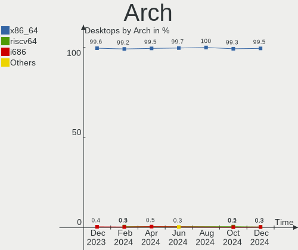
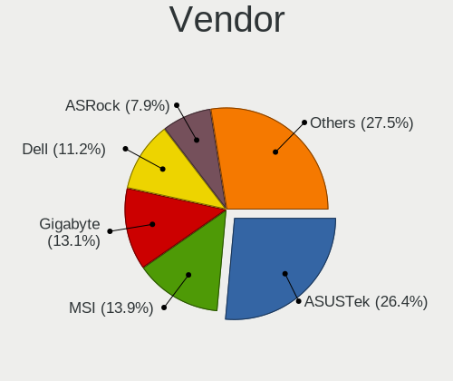
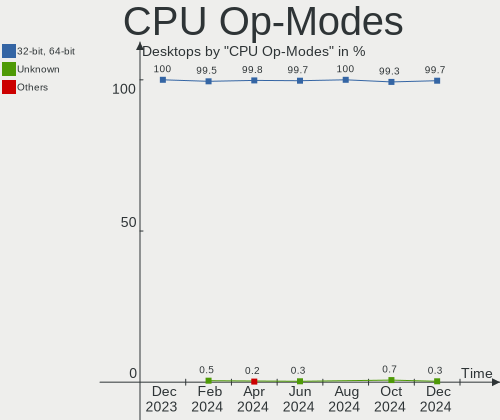
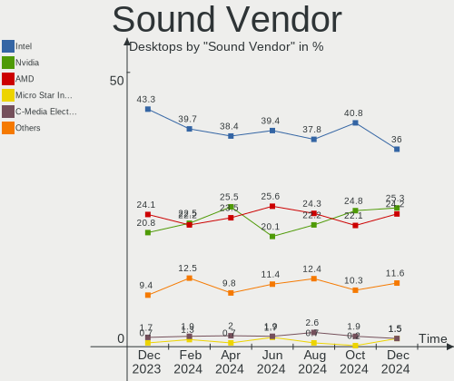
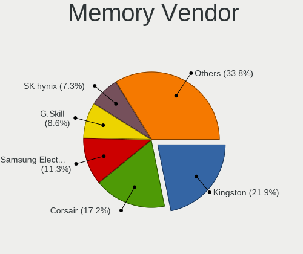
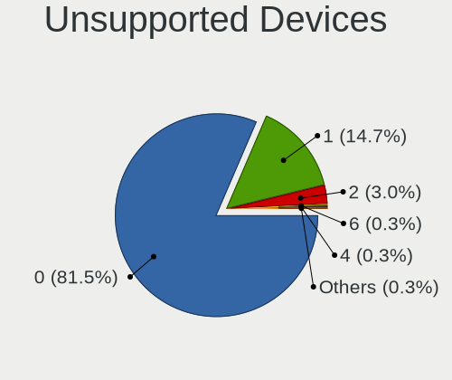

Ubuntu Hardware Trends (Desktops)
---------------------------------

A project to identify most popular hardware characteristics and track their change
over time based on data collected by Ubuntu users at https://Linux-Hardware.org.

Anyone can contribute to this report by the [hw-probe](https://github.com/linuxhw/hw-probe) tool:

    sudo -E hw-probe -all -upload

Full-feature report is available here: https://linux-hardware.org/?view=trends

Period: Feb, 2022.

Contents
--------

* [ System ](#system)
  - [ OS                       ](#os)
  - [ OS Family                ](#os-family)
  - [ Kernel                   ](#kernel)
  - [ Kernel Family            ](#kernel-family)
  - [ Kernel Major Ver.        ](#kernel-major-ver)
  - [ Arch                     ](#arch)
  - [ DE                       ](#de)
  - [ Display Server           ](#display-server)
  - [ Display Manager          ](#display-manager)
  - [ OS Lang                  ](#os-lang)
  - [ Boot Mode                ](#boot-mode)
  - [ Filesystem               ](#filesystem)
  - [ Part. scheme             ](#part-scheme)
  - [ Dual Boot with Linux/BSD ](#dual-boot-with-linuxbsd)
  - [ Dual Boot (Win)          ](#dual-boot-win)

* [ Board ](#board)
  - [ Vendor                   ](#vendor)
  - [ Model                    ](#model)
  - [ Model Family             ](#model-family)
  - [ MFG Year                 ](#mfg-year)
  - [ Form Factor              ](#form-factor)
  - [ Secure Boot              ](#secure-boot)
  - [ Coreboot                 ](#coreboot)
  - [ RAM Size                 ](#ram-size)
  - [ RAM Used                 ](#ram-used)
  - [ Total Drives             ](#total-drives)
  - [ Has CD-ROM               ](#has-cd-rom)
  - [ Has Ethernet             ](#has-ethernet)
  - [ Has WiFi                 ](#has-wifi)
  - [ Has Bluetooth            ](#has-bluetooth)

* [ Location ](#location)
  - [ Country                  ](#country)
  - [ City                     ](#city)

* [ Drives ](#drives)
  - [ Drive Vendor             ](#drive-vendor)
  - [ Drive Model              ](#drive-model)
  - [ HDD Vendor               ](#hdd-vendor)
  - [ SSD Vendor               ](#ssd-vendor)
  - [ Drive Kind               ](#drive-kind)
  - [ Drive Connector          ](#drive-connector)
  - [ Drive Size               ](#drive-size)
  - [ Space Total              ](#space-total)
  - [ Space Used               ](#space-used)
  - [ Malfunc. Drives          ](#malfunc-drives)
  - [ Malfunc. Drive Vendor    ](#malfunc-drive-vendor)
  - [ Malfunc. HDD Vendor      ](#malfunc-hdd-vendor)
  - [ Malfunc. Drive Kind      ](#malfunc-drive-kind)
  - [ Failed Drives            ](#failed-drives)
  - [ Failed Drive Vendor      ](#failed-drive-vendor)
  - [ Drive Status             ](#drive-status)

* [ Storage controller ](#storage-controller)
  - [ Storage Vendor           ](#storage-vendor)
  - [ Storage Model            ](#storage-model)
  - [ Storage Kind             ](#storage-kind)

* [ Processor ](#processor)
  - [ CPU Vendor               ](#cpu-vendor)
  - [ CPU Model                ](#cpu-model)
  - [ CPU Model Family         ](#cpu-model-family)
  - [ CPU Cores                ](#cpu-cores)
  - [ CPU Sockets              ](#cpu-sockets)
  - [ CPU Threads              ](#cpu-threads)
  - [ CPU Op-Modes             ](#cpu-op-modes)
  - [ CPU Microcode            ](#cpu-microcode)
  - [ CPU Microarch            ](#cpu-microarch)

* [ Graphics ](#graphics)
  - [ GPU Vendor               ](#gpu-vendor)
  - [ GPU Model                ](#gpu-model)
  - [ GPU Combo                ](#gpu-combo)
  - [ GPU Driver               ](#gpu-driver)
  - [ GPU Memory               ](#gpu-memory)

* [ Monitor ](#monitor)
  - [ Monitor Vendor           ](#monitor-vendor)
  - [ Monitor Model            ](#monitor-model)
  - [ Monitor Resolution       ](#monitor-resolution)
  - [ Monitor Diagonal         ](#monitor-diagonal)
  - [ Monitor Width            ](#monitor-width)
  - [ Aspect Ratio             ](#aspect-ratio)
  - [ Monitor Area             ](#monitor-area)
  - [ Pixel Density            ](#pixel-density)
  - [ Multiple Monitors        ](#multiple-monitors)

* [ Network ](#network)
  - [ Net Controller Vendor    ](#net-controller-vendor)
  - [ Net Controller Model     ](#net-controller-model)
  - [ Wireless Vendor          ](#wireless-vendor)
  - [ Wireless Model           ](#wireless-model)
  - [ Ethernet Vendor          ](#ethernet-vendor)
  - [ Ethernet Model           ](#ethernet-model)
  - [ Net Controller Kind      ](#net-controller-kind)
  - [ Used Controller          ](#used-controller)
  - [ NICs                     ](#nics)
  - [ IPv6                     ](#ipv6)

* [ Bluetooth ](#bluetooth)
  - [ Bluetooth Vendor         ](#bluetooth-vendor)
  - [ Bluetooth Model          ](#bluetooth-model)

* [ Sound ](#sound)
  - [ Sound Vendor             ](#sound-vendor)
  - [ Sound Model              ](#sound-model)

* [ Memory ](#memory)
  - [ Memory Vendor            ](#memory-vendor)
  - [ Memory Model             ](#memory-model)
  - [ Memory Kind              ](#memory-kind)
  - [ Memory Form Factor       ](#memory-form-factor)
  - [ Memory Size              ](#memory-size)
  - [ Memory Speed             ](#memory-speed)

* [ Printers & scanners ](#printers--scanners)
  - [ Printer Vendor           ](#printer-vendor)
  - [ Printer Model            ](#printer-model)
  - [ Scanner Vendor           ](#scanner-vendor)
  - [ Scanner Model            ](#scanner-model)

* [ Camera ](#camera)
  - [ Camera Vendor            ](#camera-vendor)
  - [ Camera Model             ](#camera-model)

* [ Security ](#security)
  - [ Fingerprint Vendor       ](#fingerprint-vendor)
  - [ Fingerprint Model        ](#fingerprint-model)
  - [ Chipcard Vendor          ](#chipcard-vendor)
  - [ Chipcard Model           ](#chipcard-model)

* [ Unsupported ](#unsupported)
  - [ Unsupported Devices      ](#unsupported-devices)
  - [ Unsupported Device Types ](#unsupported-device-types)

System
------

OS
--

Installed operating systems

| Name           | Desktops | Percent |
|----------------|----------|---------|
| Ubuntu 20.04   | 239      | 63.4%   |
| Ubuntu 21.10   | 84       | 22.28%  |
| Ubuntu 18.04   | 27       | 7.16%   |
| Ubuntu 21.04   | 10       | 2.65%   |
| Ubuntu 22.04   | 8        | 2.12%   |
| Ubuntu 16.04   | 4        | 1.06%   |
| Ubuntu 20.10   | 3        | 0.8%    |
| Ubuntu Core 18 | 1        | 0.27%   |
| Ubuntu 6.1     | 1        | 0.27%   |

OS Family
---------

OS without a version

| Name   | Desktops | Percent |
|--------|----------|---------|
| Ubuntu | 377      | 100%    |

Kernel
------

Version of the Linux kernel

| Version                     | Desktops | Percent |
|-----------------------------|----------|---------|
| 5.13.0-28-generic           | 138      | 36.6%   |
| 5.13.0-30-generic           | 86       | 22.81%  |
| 5.13.0-27-generic           | 20       | 5.31%   |
| 5.4.0-99-generic            | 18       | 4.77%   |
| 5.4.0-97-generic            | 14       | 3.71%   |
| 5.4.0-100-generic           | 12       | 3.18%   |
| 5.13.0-19-generic           | 9        | 2.39%   |
| 5.15.0-18-generic           | 8        | 2.12%   |
| 5.11.0-27-generic           | 8        | 2.12%   |
| 5.4.0-96-generic            | 7        | 1.86%   |
| 5.11.0-49-generic           | 7        | 1.86%   |
| 5.13.0-29-generic           | 4        | 1.06%   |
| 4.4.0-210-generic           | 4        | 1.06%   |
| 4.15.0-169-generic          | 4        | 1.06%   |
| 4.15.0-167-generic          | 4        | 1.06%   |
| 5.8.0-63-generic            | 2        | 0.53%   |
| 5.13.0-21-generic           | 2        | 0.53%   |
| 5.11.0-46-generic           | 2        | 0.53%   |
| 4.15.0-168-generic          | 2        | 0.53%   |
| 4.15.0-166-generic          | 2        | 0.53%   |
| 5.8.0-53-generic            | 1        | 0.27%   |
| 5.8.0-25-generic            | 1        | 0.27%   |
| 5.4.0-92-generic            | 1        | 0.27%   |
| 5.4.0-91-generic            | 1        | 0.27%   |
| 5.4.0-90-generic            | 1        | 0.27%   |
| 5.4.0-84-generic            | 1        | 0.27%   |
| 5.4.0-58-generic            | 1        | 0.27%   |
| 5.16.9-051609-generic       | 1        | 0.27%   |
| 5.16.5-tkg-pds              | 1        | 0.27%   |
| 5.16.3-051603-generic       | 1        | 0.27%   |
| 5.16.10-void24-nomac-znver3 | 1        | 0.27%   |
| 5.16.1-051601-generic       | 1        | 0.27%   |
| 5.16.0-10.1-liquorix-amd64  | 1        | 0.27%   |
| 5.15.15-76051515-generic    | 1        | 0.27%   |
| 5.14.0-1024-oem             | 1        | 0.27%   |
| 5.13.19-2-pve               | 1        | 0.27%   |
| 5.13.0-4072-amd+            | 1        | 0.27%   |
| 5.13.0-272201191901-generic | 1        | 0.27%   |
| 5.11.0-41-generic           | 1        | 0.27%   |
| 5.11.0-40-generic           | 1        | 0.27%   |
| 5.11.0-37-generic           | 1        | 0.27%   |
| 5.11.0-16-generic           | 1        | 0.27%   |
| 5.0.0-37-generic            | 1        | 0.27%   |
| 5.0.0-32-generic            | 1        | 0.27%   |

Kernel Family
-------------

Linux kernel without a distro release

| Version | Desktops | Percent |
|---------|----------|---------|
| 5.13.0  | 261      | 69.23%  |
| 5.4.0   | 56       | 14.85%  |
| 5.11.0  | 21       | 5.57%   |
| 4.15.0  | 12       | 3.18%   |
| 5.15.0  | 8        | 2.12%   |
| 5.8.0   | 4        | 1.06%   |
| 4.4.0   | 4        | 1.06%   |
| 5.0.0   | 2        | 0.53%   |
| 5.16.9  | 1        | 0.27%   |
| 5.16.5  | 1        | 0.27%   |
| 5.16.3  | 1        | 0.27%   |
| 5.16.10 | 1        | 0.27%   |
| 5.16.1  | 1        | 0.27%   |
| 5.16.0  | 1        | 0.27%   |
| 5.15.15 | 1        | 0.27%   |
| 5.14.0  | 1        | 0.27%   |
| 5.13.19 | 1        | 0.27%   |

Kernel Major Ver.
-----------------

Linux kernel major version

| Version | Desktops | Percent |
|---------|----------|---------|
| 5.13    | 262      | 69.5%   |
| 5.4     | 56       | 14.85%  |
| 5.11    | 21       | 5.57%   |
| 4.15    | 12       | 3.18%   |
| 5.15    | 9        | 2.39%   |
| 5.16    | 6        | 1.59%   |
| 5.8     | 4        | 1.06%   |
| 4.4     | 4        | 1.06%   |
| 5.0     | 2        | 0.53%   |
| 5.14    | 1        | 0.27%   |

Arch
----

OS architecture (x86_64, i586, etc.)

| Name   | Desktops | Percent |
|--------|----------|---------|
| x86_64 | 370      | 98.14%  |
| i686   | 7        | 1.86%   |

DE
--

Desktop Environment

| Name            | Desktops | Percent |
|-----------------|----------|---------|
| GNOME           | 336      | 89.12%  |
| Unknown         | 26       | 6.9%    |
| Unity           | 9        | 2.39%   |
| X-Cinnamon      | 2        | 0.53%   |
| Pantheon        | 1        | 0.27%   |
| GNOME Flashback | 1        | 0.27%   |
| GNOME Classic   | 1        | 0.27%   |
| Cinnamon        | 1        | 0.27%   |

Display Server
--------------

X11 or Wayland

| Name    | Desktops | Percent |
|---------|----------|---------|
| X11     | 299      | 79.31%  |
| Wayland | 53       | 14.06%  |
| Tty     | 18       | 4.77%   |
| Unknown | 7        | 1.86%   |

Display Manager
---------------

SDDM, LightDM, etc.

| Name    | Desktops | Percent |
|---------|----------|---------|
| GDM3    | 246      | 65.25%  |
| GDM     | 85       | 22.55%  |
| Unknown | 26       | 6.9%    |
| LightDM | 19       | 5.04%   |
| SDDM    | 1        | 0.27%   |

OS Lang
-------

Language

| Lang    | Desktops | Percent |
|---------|----------|---------|
| en_US   | 135      | 35.81%  |
| de_DE   | 57       | 15.12%  |
| en_GB   | 23       | 6.1%    |
| fr_FR   | 21       | 5.57%   |
| en_CA   | 14       | 3.71%   |
| ru_RU   | 13       | 3.45%   |
| it_IT   | 12       | 3.18%   |
| pt_BR   | 11       | 2.92%   |
| en_IN   | 11       | 2.92%   |
| C       | 10       | 2.65%   |
| es_ES   | 9        | 2.39%   |
| es_AR   | 6        | 1.59%   |
| de_AT   | 6        | 1.59%   |
| en_AU   | 5        | 1.33%   |
| nl_NL   | 4        | 1.06%   |
| sk_SK   | 3        | 0.8%    |
| ja_JP   | 3        | 0.8%    |
| cs_CZ   | 3        | 0.8%    |
| sv_SE   | 2        | 0.53%   |
| ro_RO   | 2        | 0.53%   |
| pl_PL   | 2        | 0.53%   |
| hu_HU   | 2        | 0.53%   |
| fr_CA   | 2        | 0.53%   |
| en_ZA   | 2        | 0.53%   |
| en_IL   | 2        | 0.53%   |
| el_GR   | 2        | 0.53%   |
| da_DK   | 2        | 0.53%   |
| Unknown | 2        | 0.53%   |
| zh_TW   | 1        | 0.27%   |
| sl_SI   | 1        | 0.27%   |
| ru_UA   | 1        | 0.27%   |
| pt_PT   | 1        | 0.27%   |
| nl_BE   | 1        | 0.27%   |
| es_US   | 1        | 0.27%   |
| es_CR   | 1        | 0.27%   |
| en_PH   | 1        | 0.27%   |
| en_NZ   | 1        | 0.27%   |
| de_CH   | 1        | 0.27%   |
| ar_EG   | 1        | 0.27%   |

Boot Mode
---------

EFI or BIOS

| Mode | Desktops | Percent |
|------|----------|---------|
| BIOS | 224      | 59.42%  |
| EFI  | 153      | 40.58%  |

Filesystem
----------

Type of filesystem

| Type    | Desktops | Percent |
|---------|----------|---------|
| Ext4    | 350      | 92.84%  |
| Overlay | 10       | 2.65%   |
| Zfs     | 5        | 1.33%   |
| Xfs     | 4        | 1.06%   |
| Btrfs   | 4        | 1.06%   |
| Ext3    | 2        | 0.53%   |
| Jfs     | 1        | 0.27%   |
| Ext2    | 1        | 0.27%   |

Part. scheme
------------

Scheme of partitioning

| Type    | Desktops | Percent |
|---------|----------|---------|
| Unknown | 271      | 71.88%  |
| GPT     | 86       | 22.81%  |
| MBR     | 20       | 5.31%   |

Dual Boot with Linux/BSD
------------------------

Hosting more than one Linux/BSD

| Dual boot | Desktops | Percent |
|-----------|----------|---------|
| No        | 312      | 82.76%  |
| Yes       | 65       | 17.24%  |

Dual Boot (Win)
---------------

Hosting Linux and Windows

| Dual boot | Desktops | Percent |
|-----------|----------|---------|
| No        | 208      | 55.17%  |
| Yes       | 169      | 44.83%  |

Board
-----

Vendor
------

Motherboard manufacturer

| Name                | Desktops | Percent |
|---------------------|----------|---------|
| ASUSTek Computer    | 99       | 26.26%  |
| Gigabyte Technology | 52       | 13.79%  |
| ASRock              | 44       | 11.67%  |
| Dell                | 36       | 9.55%   |
| Hewlett-Packard     | 33       | 8.75%   |
| MSI                 | 32       | 8.49%   |
| Lenovo              | 15       | 3.98%   |
| Acer                | 9        | 2.39%   |
| Fujitsu             | 6        | 1.59%   |
| Unknown             | 5        | 1.33%   |
| Medion              | 4        | 1.06%   |
| Alienware           | 4        | 1.06%   |
| Packard Bell        | 3        | 0.8%    |
| Intel               | 3        | 0.8%    |
| Foxconn             | 3        | 0.8%    |
| Supermicro          | 2        | 0.53%   |
| EVGA                | 2        | 0.53%   |
| BESSTAR Tech        | 2        | 0.53%   |
| Apple               | 2        | 0.53%   |
| TYAN Computer       | 1        | 0.27%   |
| SeeedStudio         | 1        | 0.27%   |
| Seco                | 1        | 0.27%   |
| Positivo            | 1        | 0.27%   |
| Pegatron            | 1        | 0.27%   |
| PCChips             | 1        | 0.27%   |
| PC Engines          | 1        | 0.27%   |
| Minix               | 1        | 0.27%   |
| Huanan              | 1        | 0.27%   |
| Google              | 1        | 0.27%   |
| Gateway             | 1        | 0.27%   |
| eMachines           | 1        | 0.27%   |
| Elo Touch Solutions | 1        | 0.27%   |
| ECS                 | 1        | 0.27%   |
| DFI                 | 1        | 0.27%   |
| congatec            | 1        | 0.27%   |
| Biostar             | 1        | 0.27%   |
| ASRockRack          | 1        | 0.27%   |
| AMD                 | 1        | 0.27%   |
| Advantec            | 1        | 0.27%   |
| ABIT                | 1        | 0.27%   |

Model
-----

Motherboard model

| Name                         | Desktops | Percent |
|------------------------------|----------|---------|
| ASUS All Series              | 15       | 3.98%   |
| Dell OptiPlex 7010           | 6        | 1.59%   |
| Unknown                      | 5        | 1.33%   |
| ASUS PRIME X570-PRO          | 4        | 1.06%   |
| MSI MS-7B86                  | 3        | 0.8%    |
| HP ProDesk 600 G1 SFF        | 3        | 0.8%    |
| Dell OptiPlex 790            | 3        | 0.8%    |
| ASRock B450M Steel Legend    | 3        | 0.8%    |
| MSI MS-7C92                  | 2        | 0.53%   |
| MSI MS-7B61                  | 2        | 0.53%   |
| MSI MS-7996                  | 2        | 0.53%   |
| MSI MS-7817                  | 2        | 0.53%   |
| HP Z600 Workstation          | 2        | 0.53%   |
| HP Z440 Workstation          | 2        | 0.53%   |
| HP Compaq Elite 8300 SFF     | 2        | 0.53%   |
| Gigabyte Z68MX-UD2H-B3       | 2        | 0.53%   |
| Gigabyte X58A-UD3R           | 2        | 0.53%   |
| Gigabyte B450M DS3H          | 2        | 0.53%   |
| Gigabyte A320M-S2H           | 2        | 0.53%   |
| Dell XPS 8500                | 2        | 0.53%   |
| Dell OptiPlex GX520          | 2        | 0.53%   |
| Dell OptiPlex 7050           | 2        | 0.53%   |
| ASUS TUF GAMING B550-PLUS    | 2        | 0.53%   |
| ASUS ROG STRIX Z370-E GAMING | 2        | 0.53%   |
| ASUS ROG STRIX B550-F GAMING | 2        | 0.53%   |
| ASUS PRIME X570-P            | 2        | 0.53%   |
| ASUS PRIME A320M-K           | 2        | 0.53%   |
| ASUS M5A78L-M LX3            | 2        | 0.53%   |
| ASUS H170M-E D3              | 2        | 0.53%   |
| ASUS H110M-D                 | 2        | 0.53%   |
| ASUS B75M-PLUS               | 2        | 0.53%   |
| ASRock Z370 Pro4             | 2        | 0.53%   |
| Apple MacPro5,1              | 2        | 0.53%   |
| Alienware Aurora R12         | 2        | 0.53%   |
| TYAN S5207                   | 1        | 0.27%   |
| Supermicro X7SPA-HF          | 1        | 0.27%   |
| Supermicro X7SBL             | 1        | 0.27%   |
| SeeedStudio ODYSSEY-X86J4105 | 1        | 0.27%   |
| Seco C40                     | 1        | 0.27%   |
| Positivo POS-AG31AP          | 1        | 0.27%   |
| Pegatron BQ470AA-ABL CQ5521F | 1        | 0.27%   |
| PCChips A51G                 | 1        | 0.27%   |
| PC Engines APU2              | 1        | 0.27%   |
| Packard Bell iXmM7720        | 1        | 0.27%   |
| Packard Bell ISTART 4016     | 1        | 0.27%   |
| Packard Bell IMEDIA S2985    | 1        | 0.27%   |
| MSI NQ890AA-ABZ CQ5011IT     | 1        | 0.27%   |
| MSI MS-AAA711                | 1        | 0.27%   |
| MSI MS-7D25                  | 1        | 0.27%   |
| MSI MS-7C95                  | 1        | 0.27%   |
| MSI MS-7C52                  | 1        | 0.27%   |
| MSI MS-7C37                  | 1        | 0.27%   |
| MSI MS-7B98                  | 1        | 0.27%   |
| MSI MS-7B93                  | 1        | 0.27%   |
| MSI MS-7A32                  | 1        | 0.27%   |
| MSI MS-7A15                  | 1        | 0.27%   |
| MSI MS-7995                  | 1        | 0.27%   |
| MSI MS-7850                  | 1        | 0.27%   |
| MSI MS-7816                  | 1        | 0.27%   |
| MSI MS-7641                  | 1        | 0.27%   |

Model Family
------------

Motherboard model prefix

| Name                         | Desktops | Percent |
|------------------------------|----------|---------|
| Dell OptiPlex                | 20       | 5.31%   |
| ASUS PRIME                   | 19       | 5.04%   |
| ASUS All                     | 15       | 3.98%   |
| ASUS ROG                     | 12       | 3.18%   |
| Lenovo ThinkCentre           | 9        | 2.39%   |
| HP Compaq                    | 8        | 2.12%   |
| Dell Inspiron                | 6        | 1.59%   |
| ASUS P8H61-M                 | 6        | 1.59%   |
| ASUS M5A78L-M                | 6        | 1.59%   |
| Acer Aspire                  | 6        | 1.59%   |
| HP ProDesk                   | 5        | 1.33%   |
| ASUS TUF                     | 5        | 1.33%   |
| ASRock B450M                 | 5        | 1.33%   |
| Unknown                      | 5        | 1.33%   |
| HP Pavilion                  | 4        | 1.06%   |
| MSI MS-7B86                  | 3        | 0.8%    |
| Gigabyte H310M               | 3        | 0.8%    |
| Gigabyte B450M               | 3        | 0.8%    |
| Fujitsu ESPRIMO              | 3        | 0.8%    |
| Fujitsu CELSIUS              | 3        | 0.8%    |
| Dell XPS                     | 3        | 0.8%    |
| Dell Precision               | 3        | 0.8%    |
| ASRock Z370                  | 3        | 0.8%    |
| MSI MS-7C92                  | 2        | 0.53%   |
| MSI MS-7B61                  | 2        | 0.53%   |
| MSI MS-7996                  | 2        | 0.53%   |
| MSI MS-7817                  | 2        | 0.53%   |
| Medion Akoya                 | 2        | 0.53%   |
| Lenovo IdeaCentre            | 2        | 0.53%   |
| HP Z600                      | 2        | 0.53%   |
| HP Z440                      | 2        | 0.53%   |
| HP EliteDesk                 | 2        | 0.53%   |
| Gigabyte Z690                | 2        | 0.53%   |
| Gigabyte Z68MX-UD2H-B3       | 2        | 0.53%   |
| Gigabyte X58A-UD3R           | 2        | 0.53%   |
| Gigabyte G1.Sniper           | 2        | 0.53%   |
| Gigabyte A320M-S2H           | 2        | 0.53%   |
| ASUS P5Q                     | 2        | 0.53%   |
| ASUS M4A87TD                 | 2        | 0.53%   |
| ASUS H170M-E                 | 2        | 0.53%   |
| ASUS H110M-D                 | 2        | 0.53%   |
| ASUS B75M-PLUS               | 2        | 0.53%   |
| ASRock X570                  | 2        | 0.53%   |
| ASRock 970                   | 2        | 0.53%   |
| Apple MacPro5                | 2        | 0.53%   |
| Alienware X51                | 2        | 0.53%   |
| Alienware Aurora             | 2        | 0.53%   |
| Acer Veriton                 | 2        | 0.53%   |
| TYAN S5207                   | 1        | 0.27%   |
| Supermicro X7SPA-HF          | 1        | 0.27%   |
| Supermicro X7SBL             | 1        | 0.27%   |
| SeeedStudio ODYSSEY-X86J4105 | 1        | 0.27%   |
| Seco C40                     | 1        | 0.27%   |
| Positivo POS-AG31AP          | 1        | 0.27%   |
| Pegatron BQ470AA-ABL         | 1        | 0.27%   |
| PCChips A51G                 | 1        | 0.27%   |
| PC Engines APU2              | 1        | 0.27%   |
| Packard Bell iXmM7720        | 1        | 0.27%   |
| Packard Bell ISTART          | 1        | 0.27%   |
| Packard Bell IMEDIA          | 1        | 0.27%   |

MFG Year
--------

Motherboard manufacture year

| Year | Desktops | Percent |
|------|----------|---------|
| 2012 | 38       | 10.08%  |
| 2019 | 34       | 9.02%   |
| 2020 | 32       | 8.49%   |
| 2018 | 30       | 7.96%   |
| 2013 | 30       | 7.96%   |
| 2014 | 27       | 7.16%   |
| 2021 | 25       | 6.63%   |
| 2015 | 25       | 6.63%   |
| 2011 | 25       | 6.63%   |
| 2017 | 23       | 6.1%    |
| 2009 | 22       | 5.84%   |
| 2010 | 20       | 5.31%   |
| 2016 | 14       | 3.71%   |
| 2008 | 13       | 3.45%   |
| 2007 | 8        | 2.12%   |
| 2006 | 6        | 1.59%   |
| 2005 | 3        | 0.8%    |
| 2022 | 2        | 0.53%   |

Form Factor
-----------

Physical design of the computer

| Name    | Desktops | Percent |
|---------|----------|---------|
| Desktop | 377      | 100%    |

Secure Boot
-----------

Enabled or disabled

| State    | Desktops | Percent |
|----------|----------|---------|
| Disabled | 354      | 93.9%   |
| Enabled  | 23       | 6.1%    |

Coreboot
--------

Have coreboot on board

| Used | Desktops | Percent |
|------|----------|---------|
| No   | 375      | 99.47%  |
| Yes  | 2        | 0.53%   |

RAM Size
--------

Total RAM memory

| Size in GB  | Desktops | Percent |
|-------------|----------|---------|
| 16.01-24.0  | 77       | 20.42%  |
| 4.01-8.0    | 71       | 18.83%  |
| 8.01-16.0   | 65       | 17.24%  |
| 32.01-64.0  | 61       | 16.18%  |
| 3.01-4.0    | 55       | 14.59%  |
| 64.01-256.0 | 25       | 6.63%   |
| 1.01-2.0    | 9        | 2.39%   |
| 24.01-32.0  | 8        | 2.12%   |
| 2.01-3.0    | 5        | 1.33%   |
| 0.51-1.0    | 1        | 0.27%   |

RAM Used
--------

Used RAM memory

| Used GB    | Desktops | Percent |
|------------|----------|---------|
| 1.01-2.0   | 151      | 40.05%  |
| 2.01-3.0   | 101      | 26.79%  |
| 3.01-4.0   | 51       | 13.53%  |
| 4.01-8.0   | 41       | 10.88%  |
| 8.01-16.0  | 14       | 3.71%   |
| 0.51-1.0   | 10       | 2.65%   |
| 0.01-0.5   | 5        | 1.33%   |
| 32.01-64.0 | 2        | 0.53%   |
| 16.01-24.0 | 2        | 0.53%   |

Total Drives
------------

Number of drives on board

| Drives | Desktops | Percent |
|--------|----------|---------|
| 1      | 142      | 37.67%  |
| 2      | 123      | 32.63%  |
| 3      | 65       | 17.24%  |
| 4      | 24       | 6.37%   |
| 5      | 12       | 3.18%   |
| 0      | 4        | 1.06%   |
| 6      | 3        | 0.8%    |
| 9      | 2        | 0.53%   |
| 8      | 1        | 0.27%   |
| 7      | 1        | 0.27%   |

Has CD-ROM
----------

Has CD-ROM on board

| Presented | Desktops | Percent |
|-----------|----------|---------|
| Yes       | 193      | 51.19%  |
| No        | 184      | 48.81%  |

Has Ethernet
------------

Has Ethernet on board

| Presented | Desktops | Percent |
|-----------|----------|---------|
| Yes       | 374      | 99.2%   |
| No        | 3        | 0.8%    |

Has WiFi
--------

Has WiFi module

| Presented | Desktops | Percent |
|-----------|----------|---------|
| No        | 203      | 53.85%  |
| Yes       | 174      | 46.15%  |

Has Bluetooth
-------------

Has Bluetooth module

| Presented | Desktops | Percent |
|-----------|----------|---------|
| No        | 266      | 70.56%  |
| Yes       | 111      | 29.44%  |

Location
--------

Country
-------

Geographic location (country)

| Country         | Desktops | Percent |
|-----------------|----------|---------|
| USA             | 68       | 18.04%  |
| Germany         | 67       | 17.77%  |
| France          | 26       | 6.9%    |
| UK              | 21       | 5.57%   |
| Canada          | 17       | 4.51%   |
| Russia          | 13       | 3.45%   |
| Italy           | 13       | 3.45%   |
| Brazil          | 13       | 3.45%   |
| Netherlands     | 12       | 3.18%   |
| India           | 11       | 2.92%   |
| Spain           | 10       | 2.65%   |
| Sweden          | 8        | 2.12%   |
| Austria         | 7        | 1.86%   |
| Argentina       | 7        | 1.86%   |
| Poland          | 6        | 1.59%   |
| Hungary         | 6        | 1.59%   |
| Czechia         | 6        | 1.59%   |
| Australia       | 5        | 1.33%   |
| Slovakia        | 4        | 1.06%   |
| Ukraine         | 3        | 0.8%    |
| Turkey          | 3        | 0.8%    |
| South Africa    | 3        | 0.8%    |
| Japan           | 3        | 0.8%    |
| Israel          | 3        | 0.8%    |
| Denmark         | 3        | 0.8%    |
| Belgium         | 3        | 0.8%    |
| Switzerland     | 2        | 0.53%   |
| Slovenia        | 2        | 0.53%   |
| Romania         | 2        | 0.53%   |
| Portugal        | 2        | 0.53%   |
| Latvia          | 2        | 0.53%   |
| Greece          | 2        | 0.53%   |
| Finland         | 2        | 0.53%   |
| Thailand        | 1        | 0.27%   |
| Taiwan          | 1        | 0.27%   |
| South Korea     | 1        | 0.27%   |
| Serbia          | 1        | 0.27%   |
| Philippines     | 1        | 0.27%   |
| Peru            | 1        | 0.27%   |
| Norway          | 1        | 0.27%   |
| North Macedonia | 1        | 0.27%   |
| New Zealand     | 1        | 0.27%   |
| Malaysia        | 1        | 0.27%   |
| Jersey          | 1        | 0.27%   |
| Indonesia       | 1        | 0.27%   |
| Guatemala       | 1        | 0.27%   |
| Gabon           | 1        | 0.27%   |
| Egypt           | 1        | 0.27%   |
| Ecuador         | 1        | 0.27%   |
| Cyprus          | 1        | 0.27%   |
| Costa Rica      | 1        | 0.27%   |
| Colombia        | 1        | 0.27%   |
| Chile           | 1        | 0.27%   |
| Belarus         | 1        | 0.27%   |
| Bangladesh      | 1        | 0.27%   |

City
----

Geographic location (city)

| City               | Desktops | Percent |
|--------------------|----------|---------|
| Sheffield          | 7        | 1.86%   |
| Moscow             | 6        | 1.59%   |
| Berlin             | 6        | 1.59%   |
| Madrid             | 4        | 1.06%   |
| Cleveland          | 4        | 1.06%   |
| Vienna             | 3        | 0.8%    |
| Stockholm          | 3        | 0.8%    |
| São Paulo       | 3        | 0.8%    |
| Prague             | 3        | 0.8%    |
| Paris              | 3        | 0.8%    |
| Manchester         | 3        | 0.8%    |
| Frankfurt am Main  | 3        | 0.8%    |
| Zirndorf           | 2        | 0.53%   |
| St Petersburg      | 2        | 0.53%   |
| Sherbrooke         | 2        | 0.53%   |
| Rome               | 2        | 0.53%   |
| Riga               | 2        | 0.53%   |
| New York           | 2        | 0.53%   |
| Mumbai             | 2        | 0.53%   |
| Montreal           | 2        | 0.53%   |
| Milan              | 2        | 0.53%   |
| Marseille          | 2        | 0.53%   |
| Mainz              | 2        | 0.53%   |
| Lyon               | 2        | 0.53%   |
| London             | 2        | 0.53%   |
| Ljubljana          | 2        | 0.53%   |
| Lüneburg        | 2        | 0.53%   |
| Krakow             | 2        | 0.53%   |
| Kecskemét       | 2        | 0.53%   |
| Houston            | 2        | 0.53%   |
| Haarlem            | 2        | 0.53%   |
| Falkenstein        | 2        | 0.53%   |
| Córdoba         | 2        | 0.53%   |
| Budapest           | 2        | 0.53%   |
| Baltimore          | 2        | 0.53%   |
| Almendralejo       | 2        | 0.53%   |
| Zvolen             | 1        | 0.27%   |
| Zrenjanin          | 1        | 0.27%   |
| Zeulenroda-Triebes | 1        | 0.27%   |
| Zdanice            | 1        | 0.27%   |
| Zaporizhzhya       | 1        | 0.27%   |
| Wroclaw            | 1        | 0.27%   |
| Worpswede          | 1        | 0.27%   |
| Worms              | 1        | 0.27%   |
| Witten             | 1        | 0.27%   |
| Windsor            | 1        | 0.27%   |
| Willisau           | 1        | 0.27%   |
| Wijchen            | 1        | 0.27%   |
| Weslaco            | 1        | 0.27%   |
| Würzburg        | 1        | 0.27%   |
| Washington         | 1        | 0.27%   |
| Warsaw             | 1        | 0.27%   |
| Walnut Creek       | 1        | 0.27%   |
| Vrable             | 1        | 0.27%   |
| Vohringen          | 1        | 0.27%   |
| Vladivostok        | 1        | 0.27%   |
| Vila Velha         | 1        | 0.27%   |
| Vijayawada         | 1        | 0.27%   |
| Videle             | 1        | 0.27%   |
| Varanasi           | 1        | 0.27%   |

Drives
------

Drive Vendor
------------

Hard drive vendors

| Vendor                    | Desktops | Drives | Percent |
|---------------------------|----------|--------|---------|
| Seagate                   | 125      | 161    | 19.72%  |
| WDC                       | 122      | 163    | 19.24%  |
| Samsung Electronics       | 98       | 127    | 15.46%  |
| Kingston                  | 45       | 45     | 7.1%    |
| Crucial                   | 33       | 38     | 5.21%   |
| SanDisk                   | 27       | 32     | 4.26%   |
| Toshiba                   | 25       | 29     | 3.94%   |
| Intel                     | 13       | 14     | 2.05%   |
| Hitachi                   | 11       | 12     | 1.74%   |
| PHISON                    | 10       | 13     | 1.58%   |
| Micron Technology         | 9        | 11     | 1.42%   |
| A-DATA Technology         | 9        | 10     | 1.42%   |
| Unknown                   | 7        | 9      | 1.1%    |
| Intenso                   | 7        | 7      | 1.1%    |
| Silicon Motion            | 6        | 6      | 0.95%   |
| OCZ                       | 6        | 7      | 0.95%   |
| Corsair                   | 6        | 7      | 0.95%   |
| SK Hynix                  | 5        | 5      | 0.79%   |
| MAXTOR                    | 5        | 5      | 0.79%   |
| HGST                      | 5        | 6      | 0.79%   |
| PNY                       | 4        | 4      | 0.63%   |
| Patriot                   | 3        | 3      | 0.47%   |
| Micron/Crucial Technology | 3        | 3      | 0.47%   |
| KIOXIA                    | 3        | 4      | 0.47%   |
| Gigabyte Technology       | 3        | 3      | 0.47%   |
| Apple                     | 3        | 3      | 0.47%   |
| Unknown                   | 3        | 4      | 0.47%   |
| SPCC                      | 2        | 2      | 0.32%   |
| KingSpec                  | 2        | 2      | 0.32%   |
| EMTEC                     | 2        | 2      | 0.32%   |
| China                     | 2        | 2      | 0.32%   |
| Vaseky                    | 1        | 1      | 0.16%   |
| USB 3.0                   | 1        | 1      | 0.16%   |
| Transcend                 | 1        | 1      | 0.16%   |
| TO Exter                  | 1        | 1      | 0.16%   |
| Team                      | 1        | 2      | 0.16%   |
| Smartbuy                  | 1        | 2      | 0.16%   |
| SABRENT                   | 1        | 1      | 0.16%   |
| Realtek Semiconductor     | 1        | 1      | 0.16%   |
| OEM                       | 1        | 1      | 0.16%   |
| Netac                     | 1        | 1      | 0.16%   |
| Mushkin                   | 1        | 1      | 0.16%   |
| Memory                    | 1        | 1      | 0.16%   |
| LITEON                    | 1        | 1      | 0.16%   |
| Lite-On                   | 1        | 1      | 0.16%   |
| Linux                     | 1        | 1      | 0.16%   |
| Leven                     | 1        | 1      | 0.16%   |
| KingFast                  | 1        | 1      | 0.16%   |
| KingDian                  | 1        | 1      | 0.16%   |
| kimtigo                   | 1        | 1      | 0.16%   |
| JMicron                   | 1        | 1      | 0.16%   |
| INNOVATION IT             | 1        | 1      | 0.16%   |
| HPE                       | 1        | 1      | 0.16%   |
| GOODRAM                   | 1        | 1      | 0.16%   |
| Fujitsu                   | 1        | 1      | 0.16%   |
| FC-1307                   | 1        | 1      | 0.16%   |
| EDGE                      | 1        | 1      | 0.16%   |
| Brainsap                  | 1        | 1      | 0.16%   |
| ASMT                      | 1        | 1      | 0.16%   |
| Advantech                 | 1        | 1      | 0.16%   |

Drive Model
-----------

Hard drive models

| Model                            | Desktops | Percent |
|----------------------------------|----------|---------|
| Seagate ST1000DM010-2EP102 1TB   | 11       | 1.52%   |
| Kingston SA400S37120G 120GB SSD  | 10       | 1.38%   |
| WDC WD10EZEX-08WN4A0 1TB         | 8        | 1.1%    |
| Seagate ST500DM002-1BD142 500GB  | 8        | 1.1%    |
| Samsung NVMe SSD Drive 1TB       | 8        | 1.1%    |
| Kingston SA400S37240G 240GB SSD  | 8        | 1.1%    |
| Seagate ST2000DM008-2FR102 2TB   | 7        | 0.97%   |
| Samsung SSD 850 EVO 250GB        | 7        | 0.97%   |
| Seagate ST3500418AS 500GB        | 6        | 0.83%   |
| Seagate ST3500413AS 500GB        | 6        | 0.83%   |
| Seagate ST1000DM003-1CH162 1TB   | 6        | 0.83%   |
| Sandisk NVMe SSD Drive 500GB     | 6        | 0.83%   |
| Samsung NVMe SSD Drive 500GB     | 6        | 0.83%   |
| Crucial CT500MX500SSD1 500GB     | 6        | 0.83%   |
| Toshiba DT01ACA100 1TB           | 5        | 0.69%   |
| Seagate ST2000DM001-1CH164 2TB   | 5        | 0.69%   |
| Seagate ST1000DM003-1SB102 1TB   | 5        | 0.69%   |
| Seagate ST1000DM003-1ER162 1TB   | 5        | 0.69%   |
| Samsung SSD 860 EVO 500GB        | 5        | 0.69%   |
| Samsung SSD 860 EVO 250GB        | 5        | 0.69%   |
| Kingston SA400S37480G 480GB SSD  | 5        | 0.69%   |
| WDC WDS500G2B0A-00SM50 500GB SSD | 4        | 0.55%   |
| WDC WD20EARX-00PASB0 2TB         | 4        | 0.55%   |
| WDC WD10EZEX-00WN4A0 1TB         | 4        | 0.55%   |
| Toshiba HDWD130 3TB              | 4        | 0.55%   |
| Seagate ST2000DM006-2DM164 2TB   | 4        | 0.55%   |
| Samsung SSD 980 PRO 1TB          | 4        | 0.55%   |
| Samsung SSD 970 EVO 500GB        | 4        | 0.55%   |
| Samsung SSD 870 EVO 500GB        | 4        | 0.55%   |
| Samsung SSD 850 PRO 256GB        | 4        | 0.55%   |
| Samsung SSD 840 EVO 120GB        | 4        | 0.55%   |
| Phison NVMe SSD Drive 1TB        | 4        | 0.55%   |
| Kingston NVMe SSD Drive 500GB    | 4        | 0.55%   |
| WDC WD5000AAKX-08U6AA0 500GB     | 3        | 0.41%   |
| WDC WD5000AADS-00S9B0 500GB      | 3        | 0.41%   |
| WDC WD1001FALS-00J7B0 1TB        | 3        | 0.41%   |
| Toshiba HDWD110 1TB              | 3        | 0.41%   |
| Toshiba DT01ACA050 500GB         | 3        | 0.41%   |
| Seagate ST4000DM004-2CV104 4TB   | 3        | 0.41%   |
| Seagate ST3250310AS 250GB        | 3        | 0.41%   |
| Seagate ST31000524AS 1TB         | 3        | 0.41%   |
| Seagate Expansion+ 2TB           | 3        | 0.41%   |
| Samsung SSD 970 EVO Plus 1TB     | 3        | 0.41%   |
| Samsung SSD 840 EVO 250GB        | 3        | 0.41%   |
| Samsung HD103SJ 1TB              | 3        | 0.41%   |
| Crucial CT1000MX500SSD1 1TB      | 3        | 0.41%   |
| Unknown                          | 3        | 0.41%   |
| WDC WD5000AAKX-00ERMA0 500GB     | 2        | 0.28%   |
| WDC WD5000AAKS-00E4A0 500GB      | 2        | 0.28%   |
| WDC WD40EZRZ-22GXCB0 4TB         | 2        | 0.28%   |
| WDC WD30EZRZ-00Z5HB0 3TB         | 2        | 0.28%   |
| WDC WD30EZRX-00DC0B0 3TB         | 2        | 0.28%   |
| WDC WD20EZRX-00DC0B0 2TB         | 2        | 0.28%   |
| WDC WD20EFRX-68EUZN0 2TB         | 2        | 0.28%   |
| WDC WD10EZEX-60WN4A0 1TB         | 2        | 0.28%   |
| WDC WD10EZEX-08M2NA0 1TB         | 2        | 0.28%   |
| WDC WD10EAVS-00D7B1 1TB          | 2        | 0.28%   |
| WDC WD1003FZEX-00MK2A0 1TB       | 2        | 0.28%   |
| Unknown SD/MMC/MS PRO 64GB       | 2        | 0.28%   |
| Unknown MMC Card  64GB           | 2        | 0.28%   |

HDD Vendor
----------

Hard disk drive vendors

| Vendor              | Desktops | Drives | Percent |
|---------------------|----------|--------|---------|
| Seagate             | 122      | 157    | 40.8%   |
| WDC                 | 106      | 140    | 35.45%  |
| Toshiba             | 22       | 25     | 7.36%   |
| Samsung Electronics | 18       | 20     | 6.02%   |
| Hitachi             | 11       | 12     | 3.68%   |
| HGST                | 5        | 6      | 1.67%   |
| MAXTOR              | 4        | 4      | 1.34%   |
| Apple               | 3        | 3      | 1%      |
| Unknown             | 2        | 2      | 0.67%   |
| Intenso             | 2        | 2      | 0.67%   |
| USB 3.0             | 1        | 1      | 0.33%   |
| SABRENT             | 1        | 1      | 0.33%   |
| Fujitsu             | 1        | 1      | 0.33%   |
| ASMT                | 1        | 1      | 0.33%   |

SSD Vendor
----------

Solid state drive vendors

| Vendor              | Desktops | Drives | Percent |
|---------------------|----------|--------|---------|
| Samsung Electronics | 52       | 60     | 22.22%  |
| Kingston            | 37       | 37     | 15.81%  |
| Crucial             | 31       | 36     | 13.25%  |
| SanDisk             | 17       | 21     | 7.26%   |
| WDC                 | 16       | 16     | 6.84%   |
| Intel               | 10       | 10     | 4.27%   |
| Micron Technology   | 8        | 9      | 3.42%   |
| A-DATA Technology   | 8        | 9      | 3.42%   |
| OCZ                 | 5        | 5      | 2.14%   |
| Intenso             | 5        | 5      | 2.14%   |
| Corsair             | 4        | 4      | 1.71%   |
| PNY                 | 3        | 3      | 1.28%   |
| Patriot             | 3        | 3      | 1.28%   |
| Gigabyte Technology | 3        | 3      | 1.28%   |
| SPCC                | 2        | 2      | 0.85%   |
| SK Hynix            | 2        | 2      | 0.85%   |
| PHISON              | 2        | 2      | 0.85%   |
| KingSpec            | 2        | 2      | 0.85%   |
| EMTEC               | 2        | 2      | 0.85%   |
| China               | 2        | 2      | 0.85%   |
| Vaseky              | 1        | 1      | 0.43%   |
| Transcend           | 1        | 1      | 0.43%   |
| Toshiba             | 1        | 1      | 0.43%   |
| TO Exter            | 1        | 1      | 0.43%   |
| Team                | 1        | 2      | 0.43%   |
| Smartbuy            | 1        | 2      | 0.43%   |
| Netac               | 1        | 1      | 0.43%   |
| Mushkin             | 1        | 1      | 0.43%   |
| Memory              | 1        | 1      | 0.43%   |
| MAXTOR              | 1        | 1      | 0.43%   |
| LITEON              | 1        | 1      | 0.43%   |
| Lite-On             | 1        | 1      | 0.43%   |
| KingDian            | 1        | 1      | 0.43%   |
| kimtigo             | 1        | 1      | 0.43%   |
| INNOVATION IT       | 1        | 1      | 0.43%   |
| GOODRAM             | 1        | 1      | 0.43%   |
| EDGE                | 1        | 1      | 0.43%   |
| Advantech           | 1        | 1      | 0.43%   |
| addlink             | 1        | 1      | 0.43%   |
| Unknown             | 1        | 1      | 0.43%   |

Drive Kind
----------

HDD or SSD

| Kind    | Desktops | Drives | Percent |
|---------|----------|--------|---------|
| HDD     | 246      | 375    | 44.09%  |
| SSD     | 199      | 255    | 35.66%  |
| NVMe    | 96       | 121    | 17.2%   |
| Unknown | 10       | 11     | 1.79%   |
| MMC     | 7        | 9      | 1.25%   |

Drive Connector
---------------

SATA, SAS, NVMe, etc.

| Type | Desktops | Drives | Percent |
|------|----------|--------|---------|
| SATA | 332      | 607    | 72.49%  |
| NVMe | 95       | 120    | 20.74%  |
| SAS  | 24       | 35     | 5.24%   |
| MMC  | 7        | 9      | 1.53%   |

Drive Size
----------

Size of hard drive

| Size in TB | Desktops | Drives | Percent |
|------------|----------|--------|---------|
| 0.01-0.5   | 240      | 340    | 50.96%  |
| 0.51-1.0   | 136      | 165    | 28.87%  |
| 1.01-2.0   | 50       | 65     | 10.62%  |
| 3.01-4.0   | 17       | 26     | 3.61%   |
| 2.01-3.0   | 17       | 21     | 3.61%   |
| 4.01-10.0  | 11       | 13     | 2.34%   |

Space Total
-----------

Amount of disk space available on the file system

| Size in GB     | Desktops | Percent |
|----------------|----------|---------|
| 101-250        | 103      | 27.32%  |
| 251-500        | 79       | 20.95%  |
| 501-1000       | 66       | 17.51%  |
| 1001-2000      | 46       | 12.2%   |
| More than 3000 | 31       | 8.22%   |
| 1-20           | 18       | 4.77%   |
| 2001-3000      | 11       | 2.92%   |
| 21-50          | 10       | 2.65%   |
| 51-100         | 8        | 2.12%   |
| Unknown        | 5        | 1.33%   |

Space Used
----------

Amount of used disk space

| Used GB        | Desktops | Percent |
|----------------|----------|---------|
| 1-20           | 139      | 36.87%  |
| 21-50          | 62       | 16.45%  |
| 101-250        | 41       | 10.88%  |
| 51-100         | 39       | 10.34%  |
| 251-500        | 32       | 8.49%   |
| 501-1000       | 25       | 6.63%   |
| 1001-2000      | 14       | 3.71%   |
| More than 3000 | 12       | 3.18%   |
| 2001-3000      | 8        | 2.12%   |
| Unknown        | 5        | 1.33%   |

Malfunc. Drives
---------------

Drive models with a malfunction

| Model                                      | Desktops | Drives | Percent |
|--------------------------------------------|----------|--------|---------|
| Samsung Electronics SSD 870 EVO 500GB      | 2        | 2      | 6.67%   |
| WDC WD800JD-60LSA0 80GB                    | 1        | 1      | 3.33%   |
| WDC WD5001AALS-00E3A0 500GB                | 1        | 1      | 3.33%   |
| WDC WD3200BPVT-22ZEST0 320GB               | 1        | 1      | 3.33%   |
| WDC WD30EFRX-68EUZN0 3TB                   | 1        | 1      | 3.33%   |
| WDC WD20EZRX-00DC0B0 2TB                   | 1        | 1      | 3.33%   |
| Transcend TS16GCF170 16GB SSD              | 1        | 1      | 3.33%   |
| Seagate ST9500325AS 500GB                  | 1        | 1      | 3.33%   |
| Seagate ST31000528AS 1TB                   | 1        | 1      | 3.33%   |
| Seagate ST3000DM008-2DM166 3TB             | 1        | 1      | 3.33%   |
| Seagate ST3000DM001-9YN166 3TB             | 1        | 1      | 3.33%   |
| Seagate ST2000DX001-1CM164 2TB             | 1        | 1      | 3.33%   |
| Seagate ST1000DX001-1NS162 1TB             | 1        | 1      | 3.33%   |
| Seagate ST1000DM003-1SB102 1TB             | 1        | 1      | 3.33%   |
| Samsung Electronics MZVLB1T0HALR-00000 1TB | 1        | 2      | 3.33%   |
| Samsung Electronics HD502HJ 500GB          | 1        | 1      | 3.33%   |
| Patriot Pyro m3 240GB SSD                  | 1        | 1      | 3.33%   |
| MAXTOR 6B200P0 208GB                       | 1        | 1      | 3.33%   |
| Kingston SV300S37A60G 64GB SSD             | 1        | 1      | 3.33%   |
| Kingston SUV400S37240G 240GB SSD           | 1        | 1      | 3.33%   |
| Intenso SSD 120GB                          | 1        | 1      | 3.33%   |
| Intel SSDSC2KW480H6 480GB                  | 1        | 1      | 3.33%   |
| Hitachi HUA722010CLA330 1TB                | 1        | 1      | 3.33%   |
| Hitachi HTS543225L9A300 250GB              | 1        | 1      | 3.33%   |
| Hitachi HTS542512K9SA00 120GB              | 1        | 1      | 3.33%   |
| Crucial CT240M500SSD1 240GB                | 1        | 1      | 3.33%   |
| Crucial C300-CTFDDAC064MAG 64GB SSD        | 1        | 1      | 3.33%   |
| Apple HDD HTS541010A9E632 1TB              | 1        | 1      | 3.33%   |
| A-DATA Technology SU800 128GB SSD          | 1        | 1      | 3.33%   |

Malfunc. Drive Vendor
---------------------

Vendors of faulty drives

| Vendor              | Desktops | Drives | Percent |
|---------------------|----------|--------|---------|
| Seagate             | 7        | 7      | 23.33%  |
| WDC                 | 5        | 5      | 16.67%  |
| Samsung Electronics | 4        | 5      | 13.33%  |
| Hitachi             | 3        | 3      | 10%     |
| Kingston            | 2        | 2      | 6.67%   |
| Crucial             | 2        | 2      | 6.67%   |
| Transcend           | 1        | 1      | 3.33%   |
| Patriot             | 1        | 1      | 3.33%   |
| MAXTOR              | 1        | 1      | 3.33%   |
| Intenso             | 1        | 1      | 3.33%   |
| Intel               | 1        | 1      | 3.33%   |
| Apple               | 1        | 1      | 3.33%   |
| A-DATA Technology   | 1        | 1      | 3.33%   |

Malfunc. HDD Vendor
-------------------

Vendors of faulty HDD drives

| Vendor              | Desktops | Drives | Percent |
|---------------------|----------|--------|---------|
| Seagate             | 7        | 7      | 38.89%  |
| WDC                 | 5        | 5      | 27.78%  |
| Hitachi             | 3        | 3      | 16.67%  |
| Samsung Electronics | 1        | 1      | 5.56%   |
| MAXTOR              | 1        | 1      | 5.56%   |
| Apple               | 1        | 1      | 5.56%   |

Malfunc. Drive Kind
-------------------

Kinds of faulty drives

| Kind | Desktops | Drives | Percent |
|------|----------|--------|---------|
| HDD  | 15       | 18     | 55.56%  |
| SSD  | 11       | 11     | 40.74%  |
| NVMe | 1        | 2      | 3.7%    |

Failed Drives
-------------

Failed drive models

Zero info for selected period =(

Failed Drive Vendor
-------------------

Failed drive vendors

Zero info for selected period =(

Drive Status
------------

Number of failed and malfunc. drives

| Status   | Desktops | Drives | Percent |
|----------|----------|--------|---------|
| Detected | 280      | 553    | 68.8%   |
| Works    | 102      | 187    | 25.06%  |
| Malfunc  | 25       | 31     | 6.14%   |

Storage controller
------------------

Storage Vendor
--------------

Storage controller vendors

| Vendor                       | Desktops | Percent |
|------------------------------|----------|---------|
| Intel                        | 259      | 49.33%  |
| AMD                          | 109      | 20.76%  |
| Samsung Electronics          | 40       | 7.62%   |
| ASMedia Technology           | 17       | 3.24%   |
| Sandisk                      | 16       | 3.05%   |
| JMicron Technology           | 14       | 2.67%   |
| Phison Electronics           | 12       | 2.29%   |
| Marvell Technology Group     | 12       | 2.29%   |
| Kingston Technology Company  | 8        | 1.52%   |
| Nvidia                       | 7        | 1.33%   |
| Silicon Motion               | 6        | 1.14%   |
| Micron/Crucial Technology    | 5        | 0.95%   |
| SK Hynix                     | 3        | 0.57%   |
| KIOXIA                       | 3        | 0.57%   |
| VIA Technologies             | 2        | 0.38%   |
| Toshiba America Info Systems | 2        | 0.38%   |
| Silicon Image                | 1        | 0.19%   |
| Shenzhen Longsys Electronics | 1        | 0.19%   |
| Seagate Technology           | 1        | 0.19%   |
| Realtek Semiconductor        | 1        | 0.19%   |
| OCZ Technology Group         | 1        | 0.19%   |
| Micron Technology            | 1        | 0.19%   |
| LSI Logic / Symbios Logic    | 1        | 0.19%   |
| Broadcom / LSI               | 1        | 0.19%   |
| ADATA Technology             | 1        | 0.19%   |
| Adaptec                      | 1        | 0.19%   |

Storage Model
-------------

Storage controller models

| Model                                                                                   | Desktops | Percent |
|-----------------------------------------------------------------------------------------|----------|---------|
| AMD FCH SATA Controller [AHCI mode]                                                     | 56       | 8.71%   |
| Intel 8 Series/C220 Series Chipset Family 6-port SATA Controller 1 [AHCI mode]          | 29       | 4.51%   |
| AMD SB7x0/SB8x0/SB9x0 IDE Controller                                                    | 26       | 4.04%   |
| Intel Q170/Q150/B150/H170/H110/Z170/CM236 Chipset SATA Controller [AHCI Mode]           | 23       | 3.58%   |
| Intel 6 Series/C200 Series Chipset Family 6 port Desktop SATA AHCI Controller           | 23       | 3.58%   |
| Samsung NVMe SSD Controller SM981/PM981/PM983                                           | 22       | 3.42%   |
| Intel NM10/ICH7 Family SATA Controller [IDE mode]                                       | 21       | 3.27%   |
| AMD 400 Series Chipset SATA Controller                                                  | 21       | 3.27%   |
| Intel 7 Series/C210 Series Chipset Family 6-port SATA Controller [AHCI mode]            | 19       | 2.95%   |
| Intel 200 Series PCH SATA controller [AHCI mode]                                        | 19       | 2.95%   |
| AMD SB7x0/SB8x0/SB9x0 SATA Controller [IDE mode]                                        | 19       | 2.95%   |
| Intel 82801G (ICH7 Family) IDE Controller                                               | 16       | 2.49%   |
| Intel Cannon Lake PCH SATA AHCI Controller                                              | 15       | 2.33%   |
| ASMedia ASM1062 Serial ATA Controller                                                   | 15       | 2.33%   |
| AMD Starship/Matisse Chipset SATA Controller [AHCI mode]                                | 14       | 2.18%   |
| Intel SATA Controller [RAID mode]                                                       | 13       | 2.02%   |
| AMD SB7x0/SB8x0/SB9x0 SATA Controller [AHCI mode]                                       | 11       | 1.71%   |
| Intel 9 Series Chipset Family SATA Controller [AHCI Mode]                               | 10       | 1.56%   |
| Sandisk WD Black SN750 / PC SN730 NVMe SSD                                              | 8        | 1.24%   |
| Samsung NVMe SSD Controller PM9A1/PM9A3/980PRO                                          | 8        | 1.24%   |
| JMicron JMB363 SATA/IDE Controller                                                      | 8        | 1.24%   |
| Nvidia MCP61 SATA Controller                                                            | 7        | 1.09%   |
| Intel Comet Lake SATA AHCI Controller                                                   | 7        | 1.09%   |
| Intel 82801JI (ICH10 Family) SATA AHCI Controller                                       | 7        | 1.09%   |
| Silicon Motion SM2263EN/SM2263XT SSD Controller                                         | 6        | 0.93%   |
| Phison E16 PCIe4 NVMe Controller                                                        | 6        | 0.93%   |
| Phison E12 NVMe Controller                                                              | 6        | 0.93%   |
| Nvidia MCP61 IDE                                                                        | 6        | 0.93%   |
| JMicron JMB368 IDE controller                                                           | 6        | 0.93%   |
| Intel Alder Lake-S PCH SATA Controller [AHCI Mode]                                      | 6        | 0.93%   |
| Intel 6 Series/C200 Series Chipset Family Desktop SATA Controller (IDE mode, ports 4-5) | 6        | 0.93%   |
| Intel 6 Series/C200 Series Chipset Family Desktop SATA Controller (IDE mode, ports 0-3) | 6        | 0.93%   |
| Intel 500 Series Chipset Family SATA AHCI Controller                                    | 6        | 0.93%   |
| AMD FCH SATA Controller D                                                               | 6        | 0.93%   |
| Samsung NVMe SSD Controller SM961/PM961/SM963                                           | 5        | 0.78%   |
| Samsung NVMe SSD Controller 980                                                         | 5        | 0.78%   |
| Intel Celeron/Pentium Silver Processor SATA Controller                                  | 5        | 0.78%   |
| Intel C600/X79 series chipset 6-Port SATA AHCI Controller                               | 5        | 0.78%   |
| Intel 82801JI (ICH10 Family) 4 port SATA IDE Controller #1                              | 5        | 0.78%   |
| Intel 82801JI (ICH10 Family) 2 port SATA IDE Controller #2                              | 5        | 0.78%   |
| Intel 7 Series/C210 Series Chipset Family 4-port SATA Controller [IDE mode]             | 5        | 0.78%   |
| Intel 7 Series/C210 Series Chipset Family 2-port SATA Controller [IDE mode]             | 5        | 0.78%   |
| Marvell Group 88SE9172 SATA 6Gb/s Controller                                            | 4        | 0.62%   |
| Intel C610/X99 series chipset 6-Port SATA Controller [AHCI mode]                        | 4        | 0.62%   |
| Intel 82801IR/IO/IH (ICH9R/DO/DH) 6 port SATA Controller [AHCI mode]                    | 4        | 0.62%   |
| Sandisk WD Black 2018/SN750 / PC SN720 NVMe SSD                                         | 3        | 0.47%   |
| Kingston Company A2000 NVMe SSD                                                         | 3        | 0.47%   |
| Intel C600/X79 series chipset SATA RAID Controller                                      | 3        | 0.47%   |
| Intel 400 Series Chipset Family SATA AHCI Controller                                    | 3        | 0.47%   |
| AMD FCH IDE Controller                                                                  | 3        | 0.47%   |
| AMD 300 Series Chipset SATA Controller                                                  | 3        | 0.47%   |
| VIA VT6415 PATA IDE Host Controller                                                     | 2        | 0.31%   |
| SK Hynix Gold P31 SSD                                                                   | 2        | 0.31%   |
| Sandisk WD PC SN810 / Black SN850 NVMe SSD                                              | 2        | 0.31%   |
| Sandisk Non-Volatile memory controller                                                  | 2        | 0.31%   |
| Micron/Crucial P2 NVMe PCIe SSD                                                         | 2        | 0.31%   |
| Marvell Group 88SE6111/6121 SATA II / PATA Controller                                   | 2        | 0.31%   |
| KIOXIA Non-Volatile memory controller                                                   | 2        | 0.31%   |
| Kingston Company SNVS2000G [NV1 NVMe PCIe SSD 2TB]                                      | 2        | 0.31%   |
| Kingston Company KC2000 NVMe SSD                                                        | 2        | 0.31%   |

Storage Kind
------------

Kind of storage controller (IDE, SATA, NVMe, SAS, ...)

| Kind | Desktops | Percent |
|------|----------|---------|
| SATA | 304      | 57.9%   |
| IDE  | 99       | 18.86%  |
| NVMe | 96       | 18.29%  |
| RAID | 24       | 4.57%   |
| SAS  | 2        | 0.38%   |

Processor
---------

CPU Vendor
----------

Processor vendors

| Vendor | Desktops | Percent |
|--------|----------|---------|
| Intel  | 261      | 69.23%  |
| AMD    | 116      | 30.77%  |

CPU Model
---------

Processor models

| Model                                       | Desktops | Percent |
|---------------------------------------------|----------|---------|
| Intel Core i7-3770 CPU @ 3.40GHz            | 7        | 1.86%   |
| Intel Core i5-3470 CPU @ 3.20GHz            | 7        | 1.86%   |
| AMD Ryzen 9 3900X 12-Core Processor         | 7        | 1.86%   |
| AMD Ryzen 7 3700X 8-Core Processor          | 7        | 1.86%   |
| Intel Core i7-8700 CPU @ 3.20GHz            | 5        | 1.33%   |
| Intel Core i7-4790 CPU @ 3.60GHz            | 5        | 1.33%   |
| Intel Core i5-4460 CPU @ 3.20GHz            | 5        | 1.33%   |
| Intel Core i5-2400 CPU @ 3.10GHz            | 5        | 1.33%   |
| AMD Ryzen 7 5700G with Radeon Graphics      | 5        | 1.33%   |
| AMD Ryzen 5 3600 6-Core Processor           | 5        | 1.33%   |
| Intel Core i7-8700K CPU @ 3.70GHz           | 4        | 1.06%   |
| Intel Core i7-6700 CPU @ 3.40GHz            | 4        | 1.06%   |
| Intel Core i7-4790K CPU @ 4.00GHz           | 4        | 1.06%   |
| Intel Core i7-4770 CPU @ 3.40GHz            | 4        | 1.06%   |
| Intel Core i7 CPU 920 @ 2.67GHz             | 4        | 1.06%   |
| Intel Core i5-6500 CPU @ 3.20GHz            | 4        | 1.06%   |
| Intel Core 2 Quad CPU Q6600 @ 2.40GHz       | 4        | 1.06%   |
| AMD Ryzen 5 5600X 6-Core Processor          | 4        | 1.06%   |
| AMD Ryzen 5 3400G with Radeon Vega Graphics | 4        | 1.06%   |
| AMD FX-4300 Quad-Core Processor             | 4        | 1.06%   |
| Intel Pentium D CPU 2.80GHz                 | 3        | 0.8%    |
| Intel Core i9-9900K CPU @ 3.60GHz           | 3        | 0.8%    |
| Intel Core i7-7700 CPU @ 3.60GHz            | 3        | 0.8%    |
| Intel Core i5-9400F CPU @ 2.90GHz           | 3        | 0.8%    |
| Intel Core i5-7400 CPU @ 3.00GHz            | 3        | 0.8%    |
| Intel Core i5-6500T CPU @ 2.50GHz           | 3        | 0.8%    |
| Intel Core i5-6400 CPU @ 2.70GHz            | 3        | 0.8%    |
| Intel Core i5-4690 CPU @ 3.50GHz            | 3        | 0.8%    |
| Intel Core i5-4590 CPU @ 3.30GHz            | 3        | 0.8%    |
| Intel Core i3-9100 CPU @ 3.60GHz            | 3        | 0.8%    |
| Intel Core i3-2120 CPU @ 3.30GHz            | 3        | 0.8%    |
| Intel Core i3-2100 CPU @ 3.10GHz            | 3        | 0.8%    |
| Intel Core i3-10100 CPU @ 3.60GHz           | 3        | 0.8%    |
| Intel Core 2 Duo CPU E7500 @ 2.93GHz        | 3        | 0.8%    |
| Intel 12th Gen Core i7-12700K               | 3        | 0.8%    |
| AMD Ryzen 9 5950X 16-Core Processor         | 3        | 0.8%    |
| AMD Ryzen 3 3200G with Radeon Vega Graphics | 3        | 0.8%    |
| AMD Phenom II X4 955 Processor              | 3        | 0.8%    |
| AMD Athlon II X2 250 Processor              | 3        | 0.8%    |
| AMD A8-6500 APU with Radeon HD Graphics     | 3        | 0.8%    |
| AMD A10-5800K APU with Radeon HD Graphics   | 3        | 0.8%    |
| Intel Xeon CPU X5675 @ 3.07GHz              | 2        | 0.53%   |
| Intel Xeon CPU E5440 @ 2.83GHz              | 2        | 0.53%   |
| Intel Xeon CPU E5-2670 0 @ 2.60GHz          | 2        | 0.53%   |
| Intel Xeon CPU E5-2620 v3 @ 2.40GHz         | 2        | 0.53%   |
| Intel Pentium Dual-Core CPU E5700 @ 3.00GHz | 2        | 0.53%   |
| Intel Pentium Dual-Core CPU E5200 @ 2.50GHz | 2        | 0.53%   |
| Intel Pentium CPU G2020T @ 2.50GHz          | 2        | 0.53%   |
| Intel Core i7-6700K CPU @ 4.00GHz           | 2        | 0.53%   |
| Intel Core i7-3930K CPU @ 3.20GHz           | 2        | 0.53%   |
| Intel Core i7-2600K CPU @ 3.40GHz           | 2        | 0.53%   |
| Intel Core i7-2600 CPU @ 3.40GHz            | 2        | 0.53%   |
| Intel Core i5-8600K CPU @ 3.60GHz           | 2        | 0.53%   |
| Intel Core i5-4670K CPU @ 3.40GHz           | 2        | 0.53%   |
| Intel Core i5-4570S CPU @ 2.90GHz           | 2        | 0.53%   |
| Intel Core i5-4570 CPU @ 3.20GHz            | 2        | 0.53%   |
| Intel Core i5-3570 CPU @ 3.40GHz            | 2        | 0.53%   |
| Intel Core i5-3470T CPU @ 2.90GHz           | 2        | 0.53%   |
| Intel Core i5-3450 CPU @ 3.10GHz            | 2        | 0.53%   |
| Intel Core i3-6100 CPU @ 3.70GHz            | 2        | 0.53%   |

CPU Model Family
----------------

Processor model prefix

| Model                   | Desktops | Percent |
|-------------------------|----------|---------|
| Intel Core i5           | 74       | 19.63%  |
| Intel Core i7           | 59       | 15.65%  |
| Intel Core i3           | 31       | 8.22%   |
| Intel Xeon              | 26       | 6.9%    |
| AMD Ryzen 7             | 22       | 5.84%   |
| AMD Ryzen 5             | 19       | 5.04%   |
| Other                   | 14       | 3.71%   |
| AMD Ryzen 9             | 13       | 3.45%   |
| Intel Celeron           | 11       | 2.92%   |
| Intel Core 2 Duo        | 10       | 2.65%   |
| AMD Phenom II X4        | 8        | 2.12%   |
| AMD FX                  | 8        | 2.12%   |
| Intel Core 2 Quad       | 7        | 1.86%   |
| AMD Ryzen 3             | 7        | 1.86%   |
| AMD Athlon II X2        | 7        | 1.86%   |
| Intel Pentium Dual-Core | 6        | 1.59%   |
| AMD A8                  | 6        | 1.59%   |
| AMD A10                 | 6        | 1.59%   |
| Intel Pentium           | 5        | 1.33%   |
| Intel Core i9           | 5        | 1.33%   |
| Intel Pentium 4         | 4        | 1.06%   |
| Intel Atom              | 4        | 1.06%   |
| Intel Pentium D         | 3        | 0.8%    |
| AMD Athlon 64 X2        | 3        | 0.8%    |
| Intel Core 2            | 2        | 0.53%   |
| AMD Phenom II X6        | 2        | 0.53%   |
| AMD Athlon II X4        | 2        | 0.53%   |
| AMD Athlon              | 2        | 0.53%   |
| AMD Ryzen Embedded      | 1        | 0.27%   |
| AMD Ryzen 7 PRO         | 1        | 0.27%   |
| AMD Ryzen 5 PRO         | 1        | 0.27%   |
| AMD Phenom II X2        | 1        | 0.27%   |
| AMD Phenom              | 1        | 0.27%   |
| AMD GX                  | 1        | 0.27%   |
| AMD G                   | 1        | 0.27%   |
| AMD E                   | 1        | 0.27%   |
| AMD Athlon II X3        | 1        | 0.27%   |
| AMD Athlon Dual Core    | 1        | 0.27%   |
| AMD A4                  | 1        | 0.27%   |

CPU Cores
---------

Number of processor cores

| Number | Desktops | Percent |
|--------|----------|---------|
| 4      | 169      | 44.83%  |
| 2      | 89       | 23.61%  |
| 6      | 45       | 11.94%  |
| 8      | 38       | 10.08%  |
| 12     | 15       | 3.98%   |
| 1      | 6        | 1.59%   |
| 16     | 5        | 1.33%   |
| 10     | 4        | 1.06%   |
| 3      | 4        | 1.06%   |
| 18     | 1        | 0.27%   |
| 14     | 1        | 0.27%   |

CPU Sockets
-----------

Number of sockets

| Number | Desktops | Percent |
|--------|----------|---------|
| 1      | 372      | 98.67%  |
| 2      | 5        | 1.33%   |

CPU Threads
-----------

Threads per core (Hyper-Threading)

| Number | Desktops | Percent |
|--------|----------|---------|
| 2      | 202      | 53.58%  |
| 1      | 175      | 46.42%  |

CPU Op-Modes
------------

CPU Operation Modes (32-bit, 64-bit)

| Op mode        | Desktops | Percent |
|----------------|----------|---------|
| 32-bit, 64-bit | 377      | 100%    |

CPU Microcode
-------------

Microcode number

| Number     | Desktops | Percent |
|------------|----------|---------|
| Unknown    | 87       | 23.08%  |
| 0x306c3    | 28       | 7.43%   |
| 0x306a9    | 23       | 6.1%    |
| 0x206a7    | 17       | 4.51%   |
| 0x506e3    | 16       | 4.24%   |
| 0x1067a    | 14       | 3.71%   |
| 0x08701021 | 14       | 3.71%   |
| 0x906ea    | 12       | 3.18%   |
| 0x906e9    | 9        | 2.39%   |
| 0xa0671    | 8        | 2.12%   |
| 0x06001119 | 8        | 2.12%   |
| 0x10676    | 6        | 1.59%   |
| 0x906ed    | 5        | 1.33%   |
| 0x906eb    | 5        | 1.33%   |
| 0x90672    | 5        | 1.33%   |
| 0x6fb      | 5        | 1.33%   |
| 0x206d7    | 5        | 1.33%   |
| 0x106a5    | 5        | 1.33%   |
| 0x0a50000c | 5        | 1.33%   |
| 0x08108109 | 5        | 1.33%   |
| 0x0800820d | 5        | 1.33%   |
| 0x010000db | 5        | 1.33%   |
| 0x010000c8 | 5        | 1.33%   |
| 0xa0655    | 4        | 1.06%   |
| 0xa0653    | 4        | 1.06%   |
| 0x306f2    | 4        | 1.06%   |
| 0x206c2    | 4        | 1.06%   |
| 0x0a201016 | 4        | 1.06%   |
| 0x06000852 | 4        | 1.06%   |
| 0xf47      | 3        | 0.8%    |
| 0x0a201009 | 3        | 0.8%    |
| 0x08701013 | 3        | 0.8%    |
| 0x010000dc | 3        | 0.8%    |
| 0xf49      | 2        | 0.53%   |
| 0xf43      | 2        | 0.53%   |
| 0x706a8    | 2        | 0.53%   |
| 0x706a1    | 2        | 0.53%   |
| 0x30678    | 2        | 0.53%   |
| 0x08108102 | 2        | 0.53%   |
| 0x0810100b | 2        | 0.53%   |
| 0x07030105 | 2        | 0.53%   |
| 0x906ec    | 1        | 0.27%   |
| 0x806ec    | 1        | 0.27%   |
| 0x6f6      | 1        | 0.27%   |
| 0x6f2      | 1        | 0.27%   |
| 0x506ca    | 1        | 0.27%   |
| 0x50657    | 1        | 0.27%   |
| 0x50654    | 1        | 0.27%   |
| 0x306e4    | 1        | 0.27%   |
| 0x306d4    | 1        | 0.27%   |
| 0x206d6    | 1        | 0.27%   |
| 0x20655    | 1        | 0.27%   |
| 0x20652    | 1        | 0.27%   |
| 0x106e5    | 1        | 0.27%   |
| 0x106ca    | 1        | 0.27%   |
| 0x10677    | 1        | 0.27%   |
| 0x10661    | 1        | 0.27%   |
| 0x0a201205 | 1        | 0.27%   |
| 0x0a201204 | 1        | 0.27%   |
| 0x08701011 | 1        | 0.27%   |

CPU Microarch
-------------

Microarchitecture

| Name             | Desktops | Percent |
|------------------|----------|---------|
| Haswell          | 45       | 11.94%  |
| KabyLake         | 40       | 10.61%  |
| IvyBridge        | 32       | 8.49%   |
| SandyBridge      | 28       | 7.43%   |
| Zen 2            | 26       | 6.9%    |
| Skylake          | 24       | 6.37%   |
| Penryn           | 22       | 5.84%   |
| K10              | 22       | 5.84%   |
| Zen 3            | 18       | 4.77%   |
| Piledriver       | 18       | 4.77%   |
| Zen+             | 16       | 4.24%   |
| Nehalem          | 9        | 2.39%   |
| Core             | 9        | 2.39%   |
| Westmere         | 8        | 2.12%   |
| NetBurst         | 8        | 2.12%   |
| CometLake        | 8        | 2.12%   |
| Zen              | 5        | 1.33%   |
| K8 Hammer        | 5        | 1.33%   |
| Icelake          | 5        | 1.33%   |
| Goldmont plus    | 5        | 1.33%   |
| Unknown          | 5        | 1.33%   |
| Silvermont       | 4        | 1.06%   |
| Alderlake Hybrid | 4        | 1.06%   |
| Puma             | 3        | 0.8%    |
| Broadwell        | 3        | 0.8%    |
| Bobcat           | 2        | 0.53%   |
| Goldmont         | 1        | 0.27%   |
| Bulldozer        | 1        | 0.27%   |
| Bonnell          | 1        | 0.27%   |

Graphics
--------

GPU Vendor
----------

Vendors of graphics cards

| Vendor                                       | Desktops | Percent |
|----------------------------------------------|----------|---------|
| Nvidia                                       | 152      | 38.1%   |
| Intel                                        | 132      | 33.08%  |
| AMD                                          | 110      | 27.57%  |
| Matrox Electronics Systems                   | 2        | 0.5%    |
| ASPEED Technology                            | 2        | 0.5%    |
| XGI Technology (eXtreme Graphics Innovation) | 1        | 0.25%   |

GPU Model
---------

Graphics card models

| Model                                                                       | Desktops | Percent |
|-----------------------------------------------------------------------------|----------|---------|
| Intel Xeon E3-1200 v3/4th Gen Core Processor Integrated Graphics Controller | 19       | 4.73%   |
| Intel Xeon E3-1200 v2/3rd Gen Core processor Graphics Controller            | 15       | 3.73%   |
| Intel HD Graphics 530                                                       | 14       | 3.48%   |
| Intel CoffeeLake-S GT2 [UHD Graphics 630]                                   | 12       | 2.99%   |
| Intel 2nd Generation Core Processor Family Integrated Graphics Controller   | 11       | 2.74%   |
| AMD Cedar [Radeon HD 5000/6000/7350/8350 Series]                            | 11       | 2.74%   |
| Nvidia GP108 [GeForce GT 1030]                                              | 9        | 2.24%   |
| AMD Picasso/Raven 2 [Radeon Vega Series / Radeon Vega Mobile Series]        | 9        | 2.24%   |
| Nvidia GP107 [GeForce GTX 1050 Ti]                                          | 7        | 1.74%   |
| Nvidia GK208B [GeForce GT 730]                                              | 7        | 1.74%   |
| Intel 4 Series Chipset Integrated Graphics Controller                       | 7        | 1.74%   |
| AMD Cezanne                                                                 | 7        | 1.74%   |
| Nvidia GK208B [GeForce GT 710]                                              | 6        | 1.49%   |
| Intel HD Graphics 630                                                       | 6        | 1.49%   |
| AMD Ellesmere [Radeon RX 470/480/570/570X/580/580X/590]                     | 6        | 1.49%   |
| Nvidia GF119 [GeForce GT 610]                                               | 5        | 1.24%   |
| Intel GeminiLake [UHD Graphics 600]                                         | 5        | 1.24%   |
| Intel CometLake-S GT2 [UHD Graphics 630]                                    | 5        | 1.24%   |
| Nvidia TU106 [GeForce RTX 2060 Rev. A]                                      | 4        | 1%      |
| Nvidia TU102 [GeForce RTX 2080 Ti Rev. A]                                   | 4        | 1%      |
| Nvidia GP106 [GeForce GTX 1060 6GB]                                         | 4        | 1%      |
| Nvidia GP104 [GeForce GTX 1080]                                             | 4        | 1%      |
| Nvidia GP102 [GeForce GTX 1080 Ti]                                          | 4        | 1%      |
| Nvidia G96C [GeForce 9500 GT]                                               | 4        | 1%      |
| Intel IvyBridge GT2 [HD Graphics 4000]                                      | 4        | 1%      |
| Intel AlderLake-S GT1                                                       | 4        | 1%      |
| Intel 82G33/G31 Express Integrated Graphics Controller                      | 4        | 1%      |
| AMD RS780L [Radeon 3000]                                                    | 4        | 1%      |
| AMD Richland [Radeon HD 8570D]                                              | 4        | 1%      |
| AMD Navi 10 [Radeon RX 5600 OEM/5600 XT / 5700/5700 XT]                     | 4        | 1%      |
| Nvidia TU116 [GeForce GTX 1660]                                             | 3        | 0.75%   |
| Nvidia GT218 [GeForce 210]                                                  | 3        | 0.75%   |
| Nvidia GT216 [GeForce GT 220]                                               | 3        | 0.75%   |
| Nvidia GP107 [GeForce GTX 1050]                                             | 3        | 0.75%   |
| Nvidia GP104 [GeForce GTX 1070]                                             | 3        | 0.75%   |
| Nvidia GM107 [GeForce GTX 750 Ti]                                           | 3        | 0.75%   |
| Nvidia GF116 [GeForce GTX 550 Ti]                                           | 3        | 0.75%   |
| Nvidia GA102 [GeForce RTX 3090]                                             | 3        | 0.75%   |
| Intel RocketLake-S GT1 [UHD Graphics 750]                                   | 3        | 0.75%   |
| Intel Core Processor Integrated Graphics Controller                         | 3        | 0.75%   |
| Intel 82945G/GZ Integrated Graphics Controller                              | 3        | 0.75%   |
| AMD Pitcairn XT [Radeon HD 7870 GHz Edition]                                | 3        | 0.75%   |
| AMD Park [Mobility Radeon HD 5430]                                          | 3        | 0.75%   |
| AMD Oland [Radeon HD 8570 / R5 430 OEM / R7 240/340 / Radeon 520 OEM]       | 3        | 0.75%   |
| AMD Navi 22 [Radeon RX 6700/6700 XT / 6800M]                                | 3        | 0.75%   |
| AMD Navi 14 [Radeon RX 5500/5500M / Pro 5500M]                              | 3        | 0.75%   |
| AMD Lexa PRO [Radeon 540/540X/550/550X / RX 540X/550/550X]                  | 3        | 0.75%   |
| AMD Caicos [Radeon HD 6450/7450/8450 / R5 230 OEM]                          | 3        | 0.75%   |
| AMD Caicos XT [Radeon HD 7470/8470 / R5 235/310 OEM]                        | 3        | 0.75%   |
| Nvidia TU116 [GeForce GTX 1660 SUPER]                                       | 2        | 0.5%    |
| Nvidia TU116 [GeForce GTX 1650 SUPER]                                       | 2        | 0.5%    |
| Nvidia GP106 [GeForce GTX 1060 3GB]                                         | 2        | 0.5%    |
| Nvidia GK107GL [Quadro K2000]                                               | 2        | 0.5%    |
| Nvidia GK107 [GeForce GTX 650]                                              | 2        | 0.5%    |
| Nvidia GK107 [GeForce GT 640 OEM]                                           | 2        | 0.5%    |
| Nvidia GK104 [GeForce GTX 760]                                              | 2        | 0.5%    |
| Nvidia GF119 [GeForce GT 520]                                               | 2        | 0.5%    |
| Nvidia GF108 [GeForce GT 730]                                               | 2        | 0.5%    |
| Nvidia GF108 [GeForce GT 430]                                               | 2        | 0.5%    |
| Nvidia GA104 [GeForce RTX 3060 Ti Lite Hash Rate]                           | 2        | 0.5%    |

GPU Combo
---------

Combinations of graphics cards

| Name           | Desktops | Percent |
|----------------|----------|---------|
| 1 x Nvidia     | 139      | 36.87%  |
| 1 x Intel      | 113      | 29.97%  |
| 1 x AMD        | 102      | 27.06%  |
| Intel + Nvidia | 7        | 1.86%   |
| AMD + Nvidia   | 4        | 1.06%   |
| 2 x Nvidia     | 2        | 0.53%   |
| 2 x AMD        | 2        | 0.53%   |
| 1 x Matrox     | 2        | 0.53%   |
| Intel + AMD    | 2        | 0.53%   |
| 1 x ASPEED     | 2        | 0.53%   |
| Other          | 1        | 0.27%   |
| 1 x XGI        | 1        | 0.27%   |

GPU Driver
----------

Free vs proprietary

| Driver      | Desktops | Percent |
|-------------|----------|---------|
| Free        | 255      | 67.64%  |
| Proprietary | 97       | 25.73%  |
| Unknown     | 25       | 6.63%   |

GPU Memory
----------

Total video memory

| Size in GB | Desktops | Percent |
|------------|----------|---------|
| Unknown    | 190      | 50.4%   |
| 1.01-2.0   | 56       | 14.85%  |
| 0.51-1.0   | 40       | 10.61%  |
| 0.01-0.5   | 30       | 7.96%   |
| 7.01-8.0   | 21       | 5.57%   |
| 3.01-4.0   | 19       | 5.04%   |
| 5.01-6.0   | 10       | 2.65%   |
| 8.01-16.0  | 8        | 2.12%   |
| 16.01-24.0 | 2        | 0.53%   |
| 2.01-3.0   | 1        | 0.27%   |

Monitor
-------

Monitor Vendor
--------------

Monitor vendors

| Vendor                  | Desktops | Percent |
|-------------------------|----------|---------|
| Samsung Electronics     | 61       | 16.8%   |
| Dell                    | 40       | 11.02%  |
| Goldstar                | 29       | 7.99%   |
| Acer                    | 28       | 7.71%   |
| Hewlett-Packard         | 21       | 5.79%   |
| Philips                 | 19       | 5.23%   |
| AOC                     | 17       | 4.68%   |
| Ancor Communications    | 16       | 4.41%   |
| BenQ                    | 14       | 3.86%   |
| ViewSonic               | 13       | 3.58%   |
| Iiyama                  | 10       | 2.75%   |
| LG Electronics          | 9        | 2.48%   |
| Sony                    | 6        | 1.65%   |
| GNR                     | 6        | 1.65%   |
| Lenovo                  | 5        | 1.38%   |
| Eizo                    | 5        | 1.38%   |
| ASUSTek Computer        | 5        | 1.38%   |
| Vizio                   | 4        | 1.1%    |
| Panasonic               | 4        | 1.1%    |
| LG Display              | 3        | 0.83%   |
| Unknown                 | 2        | 0.55%   |
| SKY                     | 2        | 0.55%   |
| Sceptre Tech            | 2        | 0.55%   |
| Lenovo Group Limited    | 2        | 0.55%   |
| HPN                     | 2        | 0.55%   |
| HannStar                | 2        | 0.55%   |
| Compal                  | 2        | 0.55%   |
| UGD                     | 1        | 0.28%   |
| Toshiba                 | 1        | 0.28%   |
| SIM                     | 1        | 0.28%   |
| Sharp                   | 1        | 0.28%   |
| PLN                     | 1        | 0.28%   |
| Packard Bell            | 1        | 0.28%   |
| ONN                     | 1        | 0.28%   |
| Onkyo                   | 1        | 0.28%   |
| OEM                     | 1        | 0.28%   |
| NOV                     | 1        | 0.28%   |
| NEC Computers           | 1        | 0.28%   |
| MSI                     | 1        | 0.28%   |
| Medion Akoya            | 1        | 0.28%   |
| Medion                  | 1        | 0.28%   |
| Marantz                 | 1        | 0.28%   |
| KON                     | 1        | 0.28%   |
| KAT                     | 1        | 0.28%   |
| Hyundai ImageQuest      | 1        | 0.28%   |
| HYO                     | 1        | 0.28%   |
| HUAWEI                  | 1        | 0.28%   |
| HKC                     | 1        | 0.28%   |
| HJW                     | 1        | 0.28%   |
| Gigabyte Technology     | 1        | 0.28%   |
| Gateway                 | 1        | 0.28%   |
| DZX                     | 1        | 0.28%   |
| CTV                     | 1        | 0.28%   |
| CHR                     | 1        | 0.28%   |
| Chi Mei Optoelectronics | 1        | 0.28%   |
| BOE                     | 1        | 0.28%   |
| AUS                     | 1        | 0.28%   |
| Arnos Instruments       | 1        | 0.28%   |
| AGO                     | 1        | 0.28%   |
| ADV                     | 1        | 0.28%   |

Monitor Model
-------------

Monitor models

| Model                                                                | Desktops | Percent |
|----------------------------------------------------------------------|----------|---------|
| GNR TG700H PGE1704 1280x1024 338x270mm 17.0-inch                     | 6        | 1.58%   |
| ViewSonic VA2246 SERIES VSC6F2E 1920x1080 477x268mm 21.5-inch        | 3        | 0.79%   |
| Goldstar LG FULL HD GSM5B55 1920x1080 480x270mm 21.7-inch            | 3        | 0.79%   |
| Acer K242HL ACR03E3 1920x1080 531x299mm 24.0-inch                    | 3        | 0.79%   |
| ViewSonic PF790-2 VSC4500 1600x1200 353x265mm 17.4-inch              | 2        | 0.53%   |
| Samsung Electronics U28E590 SAM0C4C 3840x2160 608x345mm 27.5-inch    | 2        | 0.53%   |
| Samsung Electronics S24F350 SAM0D20 1920x1080 521x293mm 23.5-inch    | 2        | 0.53%   |
| Lenovo L192 Wide LEN6920 1440x900 408x255mm 18.9-inch                | 2        | 0.53%   |
| Goldstar M2380D GSM57BC 1920x1080 598x336mm 27.0-inch                | 2        | 0.53%   |
| Goldstar LG ULTRAWIDE GSM76F9 2560x1080 800x340mm 34.2-inch          | 2        | 0.53%   |
| Goldstar 32inch FHD GSM76F3 1920x1080 698x392mm 31.5-inch            | 2        | 0.53%   |
| Goldstar 27GL850 GSM5B7F 2560x1440 600x340mm 27.2-inch               | 2        | 0.53%   |
| Goldstar 24MB35 GSM5A4A 1920x1080 600x340mm 27.2-inch                | 2        | 0.53%   |
| Dell E2011H DEL406B 1600x900 443x249mm 20.0-inch                     | 2        | 0.53%   |
| Dell 2209WA DELF011 1680x1050 474x296mm 22.0-inch                    | 2        | 0.53%   |
| Dell 1909W DELA03C 1440x900 408x255mm 18.9-inch                      | 2        | 0.53%   |
| BenQ GW2283 BNQ78E9 1920x1080 476x268mm 21.5-inch                    | 2        | 0.53%   |
| BenQ GL2460 BNQ78CE 1920x1080 531x299mm 24.0-inch                    | 2        | 0.53%   |
| AOC U3277WB AOC3277 3840x2160 698x393mm 31.5-inch                    | 2        | 0.53%   |
| AOC Q3279WG5B AOC3279 2560x1440 730x430mm 33.4-inch                  | 2        | 0.53%   |
| AOC Q27P1B AOC2701 2560x1440 597x336mm 27.0-inch                     | 2        | 0.53%   |
| AOC 27G2G4 AOC2702 1920x1080 600x340mm 27.2-inch                     | 2        | 0.53%   |
| Acer KA270H ACR0522 1920x1080 598x336mm 27.0-inch                    | 2        | 0.53%   |
| Vizio VO420E VIZ0050 1920x1080 930x520mm 41.9-inch                   | 1        | 0.26%   |
| Vizio E500i-A0 VIZ0092 1920x1080 1096x616mm 49.5-inch                | 1        | 0.26%   |
| Vizio E260MV VIZ0062 1920x1080 509x286mm 23.0-inch                   | 1        | 0.26%   |
| Vizio D28h-C1 VIZ0095 1360x768 607x345mm 27.5-inch                   | 1        | 0.26%   |
| ViewSonic VX2370 SERIES VSC342C 1920x1080 509x286mm 23.0-inch        | 1        | 0.26%   |
| ViewSonic VX2270 SERIES VSCE02C 1920x1080 476x267mm 21.5-inch        | 1        | 0.26%   |
| ViewSonic VX1935wm-3 VSCB81E 1440x900 410x256mm 19.0-inch            | 1        | 0.26%   |
| ViewSonic VP171b VSC0C11 1280x1024 338x270mm 17.0-inch               | 1        | 0.26%   |
| ViewSonic VG2448 VSC3B35 1920x1080 530x300mm 24.0-inch               | 1        | 0.26%   |
| ViewSonic VG2401 SERIES VSC4D30 1920x1080 531x299mm 24.0-inch        | 1        | 0.26%   |
| ViewSonic VA503 SERIES VSCEF1D 1024x768 304x228mm 15.0-inch          | 1        | 0.26%   |
| ViewSonic VA1931 Series VSCAC25 1366x768 410x230mm 18.5-inch         | 1        | 0.26%   |
| Unknown LCD Monitor XXX Union TV 1920x1080                           | 1        | 0.26%   |
| Unknown L7AK2A 1742 1280x1024 338x271mm 17.1-inch                    | 1        | 0.26%   |
| UGD Artisr15.6Pro UGD1503 1920x1080 344x193mm 15.5-inch              | 1        | 0.26%   |
| Toshiba TV TSB0108 1920x1080 700x390mm 31.5-inch                     | 1        | 0.26%   |
| Sony TV SNYEE01 1920x1080                                            | 1        | 0.26%   |
| Sony TV SNYAB03 1920x1080                                            | 1        | 0.26%   |
| Sony TV SNY2A01 1360x768                                             | 1        | 0.26%   |
| Sony TV  *00 SNY9D03 1920x1080 950x540mm 43.0-inch                   | 1        | 0.26%   |
| Sony SDM-HS94P SNY1C90 1280x1024 376x301mm 19.0-inch                 | 1        | 0.26%   |
| Sony AVAMP SNY9301 1280x720 708x398mm 32.0-inch                      | 1        | 0.26%   |
| SKY TV-monitor SKY1901 3840x2160 1210x680mm 54.6-inch                | 1        | 0.26%   |
| SKY TV-monitor SKY0102 1920x1080 885x498mm 40.0-inch                 | 1        | 0.26%   |
| SIM SAMSUNG SIM0C45 3840x2160 1872x1053mm 84.6-inch                  | 1        | 0.26%   |
| Sharp LC-32LB481U SHP3263 1920x1080 698x392mm 31.5-inch              | 1        | 0.26%   |
| Sceptre Tech X405BV-FMQR SPT0FD8 1920x1080                           | 1        | 0.26%   |
| Sceptre Tech U27 SPT0ABF 1920x1080 575x323mm 26.0-inch               | 1        | 0.26%   |
| Samsung Electronics U32R59x SAM0F94 3840x2160 700x390mm 31.5-inch    | 1        | 0.26%   |
| Samsung Electronics U32J59x SAM0F35 3840x2160 700x390mm 31.5-inch    | 1        | 0.26%   |
| Samsung Electronics U28E590 SAM0C4D 3840x2160 607x345mm 27.5-inch    | 1        | 0.26%   |
| Samsung Electronics U28E570 SAM0D6F 3840x2160 610x350mm 27.7-inch    | 1        | 0.26%   |
| Samsung Electronics T24C550 SAM0AA1 1920x1080 521x293mm 23.5-inch    | 1        | 0.26%   |
| Samsung Electronics SyncMaster SAM059A 1920x1080 477x268mm 21.5-inch | 1        | 0.26%   |
| Samsung Electronics SyncMaster SAM0592 1920x1080 510x290mm 23.1-inch | 1        | 0.26%   |
| Samsung Electronics SyncMaster SAM0588 1920x1080 521x293mm 23.5-inch | 1        | 0.26%   |
| Samsung Electronics SyncMaster SAM052A 1920x1080 510x287mm 23.0-inch | 1        | 0.26%   |

Monitor Resolution
------------------

Monitor screen resolution

| Resolution         | Desktops | Percent |
|--------------------|----------|---------|
| 1920x1080 (FHD)    | 166      | 45.86%  |
| 1280x1024 (SXGA)   | 27       | 7.46%   |
| 3840x2160 (4K)     | 25       | 6.91%   |
| 2560x1440 (QHD)    | 25       | 6.91%   |
| 1680x1050 (WSXGA+) | 18       | 4.97%   |
| 1366x768 (WXGA)    | 17       | 4.7%    |
| 1440x900 (WXGA+)   | 15       | 4.14%   |
| 1600x900 (HD+)     | 14       | 3.87%   |
| 3440x1440          | 9        | 2.49%   |
| Unknown            | 9        | 2.49%   |
| 2560x1080          | 6        | 1.66%   |
| 1920x1200 (WUXGA)  | 5        | 1.38%   |
| 3840x1080          | 4        | 1.1%    |
| 1920x540           | 4        | 1.1%    |
| 1360x768           | 3        | 0.83%   |
| 4480x1440          | 2        | 0.55%   |
| 1280x720 (HD)      | 2        | 0.55%   |
| 1024x768 (XGA)     | 2        | 0.55%   |
| 5200x2160          | 1        | 0.28%   |
| 3840x2560          | 1        | 0.28%   |
| 3360x1200          | 1        | 0.28%   |
| 3200x900           | 1        | 0.28%   |
| 3120x1050          | 1        | 0.28%   |
| 2560x1600          | 1        | 0.28%   |
| 1800x1012          | 1        | 0.28%   |
| 1400x1050          | 1        | 0.28%   |
| 1280x960           | 1        | 0.28%   |

Monitor Diagonal
----------------

Diagonal size in inches

| Inches  | Desktops | Percent |
|---------|----------|---------|
| 27      | 50       | 13.85%  |
| 23      | 43       | 11.91%  |
| 24      | 42       | 11.63%  |
| Unknown | 38       | 10.53%  |
| 21      | 37       | 10.25%  |
| 19      | 22       | 6.09%   |
| 17      | 20       | 5.54%   |
| 18      | 17       | 4.71%   |
| 22      | 14       | 3.88%   |
| 34      | 11       | 3.05%   |
| 31      | 11       | 3.05%   |
| 20      | 10       | 2.77%   |
| 15      | 8        | 2.22%   |
| 32      | 7        | 1.94%   |
| 84      | 4        | 1.11%   |
| 72      | 4        | 1.11%   |
| 33      | 3        | 0.83%   |
| 60      | 2        | 0.55%   |
| 54      | 2        | 0.55%   |
| 40      | 2        | 0.55%   |
| 36      | 2        | 0.55%   |
| 28      | 2        | 0.55%   |
| 26      | 2        | 0.55%   |
| 25      | 2        | 0.55%   |
| 55      | 1        | 0.28%   |
| 49      | 1        | 0.28%   |
| 41      | 1        | 0.28%   |
| 29      | 1        | 0.28%   |
| 16      | 1        | 0.28%   |
| 12      | 1        | 0.28%   |

Monitor Width
-------------

Physical width

| Width in mm | Desktops | Percent |
|-------------|----------|---------|
| 501-600     | 124      | 35.84%  |
| 401-500     | 90       | 26.01%  |
| Unknown     | 38       | 10.98%  |
| 301-350     | 26       | 7.51%   |
| 701-800     | 22       | 6.36%   |
| 601-700     | 19       | 5.49%   |
| 351-400     | 10       | 2.89%   |
| 1501-2000   | 7        | 2.02%   |
| 1001-1500   | 6        | 1.73%   |
| 801-900     | 2        | 0.58%   |
| 201-300     | 1        | 0.29%   |
| 901-1000    | 1        | 0.29%   |

Aspect Ratio
------------

Proportional relationship between the width and the height

| Ratio   | Desktops | Percent |
|---------|----------|---------|
| 16/9    | 227      | 65.99%  |
| 16/10   | 37       | 10.76%  |
| Unknown | 33       | 9.59%   |
| 5/4     | 25       | 7.27%   |
| 21/9    | 12       | 3.49%   |
| 4/3     | 6        | 1.74%   |
| 32/9    | 2        | 0.58%   |
| 3/2     | 2        | 0.58%   |

Monitor Area
------------

Area in inch²

| Area in inch² | Desktops | Percent |
|----------------|----------|---------|
| 201-250        | 116      | 32.31%  |
| 301-350        | 51       | 14.21%  |
| 151-200        | 46       | 12.81%  |
| Unknown        | 38       | 10.58%  |
| 351-500        | 34       | 9.47%   |
| 141-150        | 33       | 9.19%   |
| 251-300        | 13       | 3.62%   |
| More than 1000 | 12       | 3.34%   |
| 101-110        | 6        | 1.67%   |
| 501-1000       | 6        | 1.67%   |
| 91-100         | 2        | 0.56%   |
| 71-80          | 1        | 0.28%   |
| 131-140        | 1        | 0.28%   |

Pixel Density
-------------

Pixels per inch

| Density | Desktops | Percent |
|---------|----------|---------|
| 51-100  | 218      | 63.37%  |
| 101-120 | 58       | 16.86%  |
| Unknown | 38       | 11.05%  |
| 121-160 | 14       | 4.07%   |
| 1-50    | 12       | 3.49%   |
| 161-240 | 4        | 1.16%   |

Multiple Monitors
-----------------

Total monitors connected

| Total | Desktops | Percent |
|-------|----------|---------|
| 1     | 289      | 76.66%  |
| 2     | 54       | 14.32%  |
| 0     | 33       | 8.75%   |
| 3     | 1        | 0.27%   |

Network
-------

Net Controller Vendor
---------------------

Controller vendors

| Vendor                          | Desktops | Percent |
|---------------------------------|----------|---------|
| Realtek Semiconductor           | 229      | 42.57%  |
| Intel                           | 165      | 30.67%  |
| Qualcomm Atheros                | 37       | 6.88%   |
| Broadcom                        | 17       | 3.16%   |
| TP-Link                         | 14       | 2.6%    |
| Ralink                          | 8        | 1.49%   |
| Marvell Technology Group        | 7        | 1.3%    |
| Ralink Technology               | 6        | 1.12%   |
| Nvidia                          | 6        | 1.12%   |
| D-Link                          | 6        | 1.12%   |
| ASUSTek Computer                | 4        | 0.74%   |
| Microsoft                       | 3        | 0.56%   |
| Edimax Technology               | 3        | 0.56%   |
| D-Link System                   | 3        | 0.56%   |
| ASIX Electronics                | 3        | 0.56%   |
| Arduino SA                      | 3        | 0.56%   |
| Samsung Electronics             | 2        | 0.37%   |
| Qualcomm Atheros Communications | 2        | 0.37%   |
| NetGear                         | 2        | 0.37%   |
| Motorola PCS                    | 2        | 0.37%   |
| DisplayLink                     | 2        | 0.37%   |
| Seeed Technology                | 1        | 0.19%   |
| Qualcomm                        | 1        | 0.19%   |
| OPPO Electronics                | 1        | 0.19%   |
| OnePlus                         | 1        | 0.19%   |
| Montage                         | 1        | 0.19%   |
| Mellanox Technologies           | 1        | 0.19%   |
| Linksys                         | 1        | 0.19%   |
| IMC Networks                    | 1        | 0.19%   |
| Compal Electronics              | 1        | 0.19%   |
| Broadcom Limited                | 1        | 0.19%   |
| AVM                             | 1        | 0.19%   |
| American Megatrends             | 1        | 0.19%   |
| ADMtek                          | 1        | 0.19%   |
| 3Com                            | 1        | 0.19%   |

Net Controller Model
--------------------

Controller models

| Model                                                             | Desktops | Percent |
|-------------------------------------------------------------------|----------|---------|
| Realtek RTL8111/8168/8411 PCI Express Gigabit Ethernet Controller | 185      | 30.43%  |
| Intel 82579LM Gigabit Network Connection (Lewisville)             | 24       | 3.95%   |
| Intel Wi-Fi 6 AX200                                               | 21       | 3.45%   |
| Intel I211 Gigabit Network Connection                             | 20       | 3.29%   |
| Intel Ethernet Connection (2) I219-V                              | 12       | 1.97%   |
| Realtek RTL8125 2.5GbE Controller                                 | 11       | 1.81%   |
| Realtek RTL810xE PCI Express Fast Ethernet controller             | 10       | 1.64%   |
| Intel Ethernet Controller I225-V                                  | 10       | 1.64%   |
| Intel Ethernet Connection I217-LM                                 | 8        | 1.32%   |
| Intel Ethernet Connection (2) I218-V                              | 8        | 1.32%   |
| Qualcomm Atheros AR9485 Wireless Network Adapter                  | 7        | 1.15%   |
| Qualcomm Atheros AR8161 Gigabit Ethernet                          | 7        | 1.15%   |
| Intel Ethernet Connection (7) I219-V                              | 7        | 1.15%   |
| Intel 82574L Gigabit Network Connection                           | 7        | 1.15%   |
| Realtek RTL8188EUS 802.11n Wireless Network Adapter               | 6        | 0.99%   |
| Realtek 802.11ac NIC                                              | 6        | 0.99%   |
| Intel Ethernet Connection (2) I219-LM                             | 6        | 0.99%   |
| Nvidia MCP61 Ethernet                                             | 5        | 0.82%   |
| Intel Dual Band Wireless-AC 3168NGW [Stone Peak]                  | 5        | 0.82%   |
| Realtek RTL88x2bu [AC1200 Techkey]                                | 4        | 0.66%   |
| Realtek RTL8153 Gigabit Ethernet Adapter                          | 4        | 0.66%   |
| Marvell Group 88E8056 PCI-E Gigabit Ethernet Controller           | 4        | 0.66%   |
| Intel Wireless-AC 9260                                            | 4        | 0.66%   |
| Intel 82579V Gigabit Network Connection                           | 4        | 0.66%   |
| TP-Link Archer T4U v2 [Realtek RTL8812AU]                         | 3        | 0.49%   |
| Realtek RTL8821CE 802.11ac PCIe Wireless Network Adapter          | 3        | 0.49%   |
| Realtek RTL8192CU 802.11n WLAN Adapter                            | 3        | 0.49%   |
| Realtek RTL8188FTV 802.11b/g/n 1T1R 2.4G WLAN Adapter             | 3        | 0.49%   |
| Realtek RTL-8100/8101L/8139 PCI Fast Ethernet Adapter             | 3        | 0.49%   |
| Qualcomm Atheros QCA9565 / AR9565 Wireless Network Adapter        | 3        | 0.49%   |
| Qualcomm Atheros AR9287 Wireless Network Adapter (PCI-Express)    | 3        | 0.49%   |
| Intel Wireless 8260                                               | 3        | 0.49%   |
| Intel Wi-Fi 6 AX210/AX211/AX411 160MHz                            | 3        | 0.49%   |
| Intel I210 Gigabit Network Connection                             | 3        | 0.49%   |
| Intel Gemini Lake PCH CNVi WiFi                                   | 3        | 0.49%   |
| Intel Ethernet Connection I217-V                                  | 3        | 0.49%   |
| Intel 82566DC-2 Gigabit Network Connection                        | 3        | 0.49%   |
| Edimax EW-7811Un 802.11n Wireless Adapter [Realtek RTL8188CUS]    | 3        | 0.49%   |
| Broadcom NetXtreme BCM5751 Gigabit Ethernet PCI Express           | 3        | 0.49%   |
| Arduino SA Uno R3 (CDC ACM)                                       | 3        | 0.49%   |
| TP-Link TL WN823N RTL8192EU                                       | 2        | 0.33%   |
| TP-Link AC600 wireless Realtek RTL8811AU [Archer T2U Nano]        | 2        | 0.33%   |
| TP-Link 802.11ac WLAN Adapter                                     | 2        | 0.33%   |
| TP-Link 802.11ac NIC                                              | 2        | 0.33%   |
| Samsung Galaxy series, misc. (tethering mode)                     | 2        | 0.33%   |
| Realtek RTL8822CE 802.11ac PCIe Wireless Network Adapter          | 2        | 0.33%   |
| Realtek RTL8822BE 802.11a/b/g/n/ac WiFi adapter                   | 2        | 0.33%   |
| Realtek RTL8192EE PCIe Wireless Network Adapter                   | 2        | 0.33%   |
| Realtek RTL8192CE PCIe Wireless Network Adapter                   | 2        | 0.33%   |
| Realtek RTL8188CUS 802.11n WLAN Adapter                           | 2        | 0.33%   |
| Realtek Killer E3000 2.5GbE Controller                            | 2        | 0.33%   |
| Realtek 802.11n WLAN Adapter                                      | 2        | 0.33%   |
| Ralink RT2561/RT61 802.11g PCI                                    | 2        | 0.33%   |
| Qualcomm Atheros QCA9377 802.11ac Wireless Network Adapter        | 2        | 0.33%   |
| Qualcomm Atheros QCA8171 Gigabit Ethernet                         | 2        | 0.33%   |
| Qualcomm Atheros QCA6174 802.11ac Wireless Network Adapter        | 2        | 0.33%   |
| Qualcomm Atheros AR93xx Wireless Network Adapter                  | 2        | 0.33%   |
| Qualcomm Atheros AR8121/AR8113/AR8114 Gigabit or Fast Ethernet    | 2        | 0.33%   |
| NetGear A6210                                                     | 2        | 0.33%   |
| Intel Wireless 8265 / 8275                                        | 2        | 0.33%   |

Wireless Vendor
---------------

Wireless vendors

| Vendor                          | Desktops | Percent |
|---------------------------------|----------|---------|
| Intel                           | 54       | 29.67%  |
| Realtek Semiconductor           | 43       | 23.63%  |
| Qualcomm Atheros                | 24       | 13.19%  |
| TP-Link                         | 14       | 7.69%   |
| Ralink                          | 8        | 4.4%    |
| Ralink Technology               | 6        | 3.3%    |
| D-Link                          | 6        | 3.3%    |
| Broadcom                        | 6        | 3.3%    |
| ASUSTek Computer                | 4        | 2.2%    |
| Microsoft                       | 3        | 1.65%   |
| Edimax Technology               | 3        | 1.65%   |
| D-Link System                   | 3        | 1.65%   |
| Qualcomm Atheros Communications | 2        | 1.1%    |
| NetGear                         | 2        | 1.1%    |
| Marvell Technology Group        | 1        | 0.55%   |
| Linksys                         | 1        | 0.55%   |
| IMC Networks                    | 1        | 0.55%   |
| AVM                             | 1        | 0.55%   |

Wireless Model
--------------

Wireless models

| Model                                                                  | Desktops | Percent |
|------------------------------------------------------------------------|----------|---------|
| Intel Wi-Fi 6 AX200                                                    | 21       | 11.35%  |
| Qualcomm Atheros AR9485 Wireless Network Adapter                       | 7        | 3.78%   |
| Realtek RTL8188EUS 802.11n Wireless Network Adapter                    | 6        | 3.24%   |
| Realtek 802.11ac NIC                                                   | 6        | 3.24%   |
| Intel Dual Band Wireless-AC 3168NGW [Stone Peak]                       | 5        | 2.7%    |
| Realtek RTL88x2bu [AC1200 Techkey]                                     | 4        | 2.16%   |
| Intel Wireless-AC 9260                                                 | 4        | 2.16%   |
| TP-Link Archer T4U v2 [Realtek RTL8812AU]                              | 3        | 1.62%   |
| Realtek RTL8821CE 802.11ac PCIe Wireless Network Adapter               | 3        | 1.62%   |
| Realtek RTL8192CU 802.11n WLAN Adapter                                 | 3        | 1.62%   |
| Realtek RTL8188FTV 802.11b/g/n 1T1R 2.4G WLAN Adapter                  | 3        | 1.62%   |
| Qualcomm Atheros QCA9565 / AR9565 Wireless Network Adapter             | 3        | 1.62%   |
| Qualcomm Atheros AR9287 Wireless Network Adapter (PCI-Express)         | 3        | 1.62%   |
| Intel Wireless 8260                                                    | 3        | 1.62%   |
| Intel Wi-Fi 6 AX210/AX211/AX411 160MHz                                 | 3        | 1.62%   |
| Intel Gemini Lake PCH CNVi WiFi                                        | 3        | 1.62%   |
| Edimax EW-7811Un 802.11n Wireless Adapter [Realtek RTL8188CUS]         | 3        | 1.62%   |
| TP-Link TL WN823N RTL8192EU                                            | 2        | 1.08%   |
| TP-Link AC600 wireless Realtek RTL8811AU [Archer T2U Nano]             | 2        | 1.08%   |
| TP-Link 802.11ac WLAN Adapter                                          | 2        | 1.08%   |
| TP-Link 802.11ac NIC                                                   | 2        | 1.08%   |
| Realtek RTL8822CE 802.11ac PCIe Wireless Network Adapter               | 2        | 1.08%   |
| Realtek RTL8822BE 802.11a/b/g/n/ac WiFi adapter                        | 2        | 1.08%   |
| Realtek RTL8192EE PCIe Wireless Network Adapter                        | 2        | 1.08%   |
| Realtek RTL8192CE PCIe Wireless Network Adapter                        | 2        | 1.08%   |
| Realtek RTL8188CUS 802.11n WLAN Adapter                                | 2        | 1.08%   |
| Realtek 802.11n WLAN Adapter                                           | 2        | 1.08%   |
| Ralink RT2561/RT61 802.11g PCI                                         | 2        | 1.08%   |
| Qualcomm Atheros QCA9377 802.11ac Wireless Network Adapter             | 2        | 1.08%   |
| Qualcomm Atheros QCA6174 802.11ac Wireless Network Adapter             | 2        | 1.08%   |
| Qualcomm Atheros AR93xx Wireless Network Adapter                       | 2        | 1.08%   |
| NetGear A6210                                                          | 2        | 1.08%   |
| Intel Wireless 8265 / 8275                                             | 2        | 1.08%   |
| Intel Centrino Advanced-N 6205 [Taylor Peak]                           | 2        | 1.08%   |
| Intel Cannon Lake PCH CNVi WiFi                                        | 2        | 1.08%   |
| Intel Alder Lake-S PCH CNVi WiFi                                       | 2        | 1.08%   |
| D-Link DWA-182 Wireless AC Dualband Adapter(rev.C) [Realtek RTL8812AU] | 2        | 1.08%   |
| Broadcom BCM4360 802.11ac Wireless Network Adapter                     | 2        | 1.08%   |
| Broadcom BCM4352 802.11ac Wireless Network Adapter                     | 2        | 1.08%   |
| TP-Link TL-WN722N v2/v3 [Realtek RTL8188EUS]                           | 1        | 0.54%   |
| TP-Link Archer T4U ver.3                                               | 1        | 0.54%   |
| TP-Link Archer T2U PLUS [RTL8821AU]                                    | 1        | 0.54%   |
| Realtek RTL8821AE 802.11ac PCIe Wireless Network Adapter               | 1        | 0.54%   |
| Realtek RTL8812AU 802.11a/b/g/n/ac 2T2R DB WLAN Adapter                | 1        | 0.54%   |
| Realtek RTL8812AE 802.11ac PCIe Wireless Network Adapter               | 1        | 0.54%   |
| Realtek RTL8723BE PCIe Wireless Network Adapter                        | 1        | 0.54%   |
| Realtek RTL8723AE PCIe Wireless Network Adapter                        | 1        | 0.54%   |
| Realtek RTL8192EU 802.11b/g/n WLAN Adapter                             | 1        | 0.54%   |
| Realtek RTL8190 802.11n PCI Wireless Network Adapter                   | 1        | 0.54%   |
| Realtek RTL8188EE Wireless Network Adapter                             | 1        | 0.54%   |
| Ralink RT5572 Wireless Adapter                                         | 1        | 0.54%   |
| Ralink RT5372 Wireless Adapter                                         | 1        | 0.54%   |
| Ralink RT5370 Wireless Adapter                                         | 1        | 0.54%   |
| Ralink RT3072 Wireless Adapter                                         | 1        | 0.54%   |
| Ralink RT2870/RT3070 Wireless Adapter                                  | 1        | 0.54%   |
| Ralink MT7610U ("Archer T2U" 2.4G+5G WLAN Adapter                      | 1        | 0.54%   |
| Ralink MT7601U Wireless Adapter                                        | 1        | 0.54%   |
| Ralink RT5390R 802.11bgn PCIe Wireless Network Adapter                 | 1        | 0.54%   |
| Ralink RT5390 Wireless 802.11n 1T/1R PCIe                              | 1        | 0.54%   |
| Ralink RT3060 Wireless 802.11n 1T/1R                                   | 1        | 0.54%   |

Ethernet Vendor
---------------

Ethernet vendors

| Vendor                   | Desktops | Percent |
|--------------------------|----------|---------|
| Realtek Semiconductor    | 215      | 53.48%  |
| Intel                    | 133      | 33.08%  |
| Qualcomm Atheros         | 15       | 3.73%   |
| Broadcom                 | 11       | 2.74%   |
| Nvidia                   | 6        | 1.49%   |
| Marvell Technology Group | 6        | 1.49%   |
| ASIX Electronics         | 3        | 0.75%   |
| Samsung Electronics      | 2        | 0.5%    |
| DisplayLink              | 2        | 0.5%    |
| Qualcomm                 | 1        | 0.25%   |
| OPPO Electronics         | 1        | 0.25%   |
| OnePlus                  | 1        | 0.25%   |
| Motorola PCS             | 1        | 0.25%   |
| Mellanox Technologies    | 1        | 0.25%   |
| Broadcom Limited         | 1        | 0.25%   |
| American Megatrends      | 1        | 0.25%   |
| ADMtek                   | 1        | 0.25%   |
| 3Com                     | 1        | 0.25%   |

Ethernet Model
--------------

Ethernet models

| Model                                                             | Desktops | Percent |
|-------------------------------------------------------------------|----------|---------|
| Realtek RTL8111/8168/8411 PCI Express Gigabit Ethernet Controller | 185      | 44.69%  |
| Intel 82579LM Gigabit Network Connection (Lewisville)             | 24       | 5.8%    |
| Intel I211 Gigabit Network Connection                             | 20       | 4.83%   |
| Intel Ethernet Connection (2) I219-V                              | 12       | 2.9%    |
| Realtek RTL8125 2.5GbE Controller                                 | 11       | 2.66%   |
| Realtek RTL810xE PCI Express Fast Ethernet controller             | 10       | 2.42%   |
| Intel Ethernet Controller I225-V                                  | 10       | 2.42%   |
| Intel Ethernet Connection I217-LM                                 | 8        | 1.93%   |
| Intel Ethernet Connection (2) I218-V                              | 8        | 1.93%   |
| Qualcomm Atheros AR8161 Gigabit Ethernet                          | 7        | 1.69%   |
| Intel Ethernet Connection (7) I219-V                              | 7        | 1.69%   |
| Intel 82574L Gigabit Network Connection                           | 7        | 1.69%   |
| Intel Ethernet Connection (2) I219-LM                             | 6        | 1.45%   |
| Nvidia MCP61 Ethernet                                             | 5        | 1.21%   |
| Realtek RTL8153 Gigabit Ethernet Adapter                          | 4        | 0.97%   |
| Marvell Group 88E8056 PCI-E Gigabit Ethernet Controller           | 4        | 0.97%   |
| Intel 82579V Gigabit Network Connection                           | 4        | 0.97%   |
| Realtek RTL-8100/8101L/8139 PCI Fast Ethernet Adapter             | 3        | 0.72%   |
| Intel I210 Gigabit Network Connection                             | 3        | 0.72%   |
| Intel Ethernet Connection I217-V                                  | 3        | 0.72%   |
| Intel 82566DC-2 Gigabit Network Connection                        | 3        | 0.72%   |
| Broadcom NetXtreme BCM5751 Gigabit Ethernet PCI Express           | 3        | 0.72%   |
| Samsung Galaxy series, misc. (tethering mode)                     | 2        | 0.48%   |
| Realtek Killer E3000 2.5GbE Controller                            | 2        | 0.48%   |
| Qualcomm Atheros QCA8171 Gigabit Ethernet                         | 2        | 0.48%   |
| Qualcomm Atheros AR8121/AR8113/AR8114 Gigabit or Fast Ethernet    | 2        | 0.48%   |
| Intel Ethernet Connection (5) I219-LM                             | 2        | 0.48%   |
| Intel Ethernet Connection (2) I218-LM                             | 2        | 0.48%   |
| Intel Ethernet Connection (14) I219-V                             | 2        | 0.48%   |
| Intel 82573E Gigabit Ethernet Controller (Copper)                 | 2        | 0.48%   |
| Intel 82567LF-2 Gigabit Network Connection                        | 2        | 0.48%   |
| Broadcom NetXtreme BCM5764M Gigabit Ethernet PCIe                 | 2        | 0.48%   |
| Broadcom NetXtreme BCM5754 Gigabit Ethernet PCI Express           | 2        | 0.48%   |
| ASIX AX88179 Gigabit Ethernet                                     | 2        | 0.48%   |
| Realtek RTL8169 PCI Gigabit Ethernet Controller                   | 1        | 0.24%   |
| Realtek RTL-8110SC/8169SC Gigabit Ethernet                        | 1        | 0.24%   |
| Realtek Killer E2600 Gigabit Ethernet Controller                  | 1        | 0.24%   |
| Qualcomm Atheros Killer E2400 Gigabit Ethernet Controller         | 1        | 0.24%   |
| Qualcomm Atheros Killer E220x Gigabit Ethernet Controller         | 1        | 0.24%   |
| Qualcomm Atheros Attansic L1 Gigabit Ethernet                     | 1        | 0.24%   |
| Qualcomm Atheros AR8151 v2.0 Gigabit Ethernet                     | 1        | 0.24%   |
| Qualcomm 8920FT CD-ROM                                            | 1        | 0.24%   |
| OPPO SM6115-QRD _SN:D6BC0450                                      | 1        | 0.24%   |
| OnePlus OnePlus                                                   | 1        | 0.24%   |
| Nvidia L4T (Linux for Tegra) running on Tegra                     | 1        | 0.24%   |
| Motorola PCS motorola edge                                        | 1        | 0.24%   |
| Mellanox MT26448 [ConnectX EN 10GigE, PCIe 2.0 5GT/s]             | 1        | 0.24%   |
| Marvell Group 88E8053 PCI-E Gigabit Ethernet Controller           | 1        | 0.24%   |
| Marvell Group 88E8052 PCI-E ASF Gigabit Ethernet Controller       | 1        | 0.24%   |
| Marvell Group 88E8039 PCI-E Fast Ethernet Controller              | 1        | 0.24%   |
| Marvell Group 88E8001 Gigabit Ethernet Controller                 | 1        | 0.24%   |
| Intel Ethernet Controller 10G X550T                               | 1        | 0.24%   |
| Intel Ethernet Connection (7) I219-LM                             | 1        | 0.24%   |
| Intel Ethernet Connection (6) I219-V                              | 1        | 0.24%   |
| Intel Ethernet Connection (6) I219-LM                             | 1        | 0.24%   |
| Intel Ethernet Connection (12) I219-V                             | 1        | 0.24%   |
| Intel Ethernet Connection (11) I219-V                             | 1        | 0.24%   |
| Intel Ethernet Connection (11) I219-LM                            | 1        | 0.24%   |
| Intel 82599 10 Gigabit TN Network Connection                      | 1        | 0.24%   |
| Intel 82578DM Gigabit Network Connection                          | 1        | 0.24%   |

Net Controller Kind
-------------------

Ethernet, WiFi or modem

| Kind     | Desktops | Percent |
|----------|----------|---------|
| Ethernet | 374      | 67.63%  |
| WiFi     | 172      | 31.1%   |
| Modem    | 4        | 0.72%   |
| Unknown  | 3        | 0.54%   |

Used Controller
---------------

Currently used network controller

| Kind     | Desktops | Percent |
|----------|----------|---------|
| Ethernet | 361      | 71.91%  |
| WiFi     | 140      | 27.89%  |
| Unknown  | 1        | 0.2%    |

NICs
----

Total network controllers on board

| Total | Desktops | Percent |
|-------|----------|---------|
| 1     | 244      | 64.72%  |
| 2     | 117      | 31.03%  |
| 3     | 11       | 2.92%   |
| 4     | 3        | 0.8%    |
| 5     | 1        | 0.27%   |
| 0     | 1        | 0.27%   |

IPv6
----

IPv6 vs IPv4

| Used | Desktops | Percent |
|------|----------|---------|
| No   | 253      | 67.11%  |
| Yes  | 124      | 32.89%  |

Bluetooth
---------

Bluetooth Vendor
----------------

Controller vendors

| Vendor                          | Desktops | Percent |
|---------------------------------|----------|---------|
| Intel                           | 46       | 40%     |
| Cambridge Silicon Radio         | 28       | 24.35%  |
| Realtek Semiconductor           | 14       | 12.17%  |
| Qualcomm Atheros Communications | 8        | 6.96%   |
| ASUSTek Computer                | 6        | 5.22%   |
| IMC Networks                    | 2        | 1.74%   |
| Edimax Technology               | 2        | 1.74%   |
| Broadcom                        | 2        | 1.74%   |
| Apple                           | 2        | 1.74%   |
| TP-Link                         | 1        | 0.87%   |
| Realtek                         | 1        | 0.87%   |
| Integrated System Solution      | 1        | 0.87%   |
| HTC (High Tech Computer)        | 1        | 0.87%   |
| Dell                            | 1        | 0.87%   |

Bluetooth Model
---------------

Controller models

| Model                                               | Desktops | Percent |
|-----------------------------------------------------|----------|---------|
| Cambridge Silicon Radio Bluetooth Dongle (HCI mode) | 28       | 24.35%  |
| Intel AX200 Bluetooth                               | 19       | 16.52%  |
| Intel Bluetooth Device                              | 12       | 10.43%  |
| Realtek Bluetooth Radio                             | 10       | 8.7%    |
| Qualcomm Atheros  Bluetooth Device                  | 4        | 3.48%   |
| Intel Wireless-AC 9260 Bluetooth Adapter            | 4        | 3.48%   |
| Intel Wireless-AC 3168 Bluetooth                    | 4        | 3.48%   |
| Intel Bluetooth wireless interface                  | 4        | 3.48%   |
| Realtek  Bluetooth 4.2 Adapter                      | 3        | 2.61%   |
| Intel AX201 Bluetooth                               | 3        | 2.61%   |
| ASUS Broadcom BCM20702A0 Bluetooth                  | 3        | 2.61%   |
| Qualcomm Atheros Bluetooth USB Host Controller      | 2        | 1.74%   |
| Qualcomm Atheros AR9462 Bluetooth                   | 2        | 1.74%   |
| Edimax Bluetooth Adapter                            | 2        | 1.74%   |
| ASUS Bluetooth Radio                                | 2        | 1.74%   |
| Apple Built-in Bluetooth 2.0+EDR HCI                | 2        | 1.74%   |
| TP-Link UB500 Adapter                               | 1        | 0.87%   |
| Realtek RTL8821A Bluetooth                          | 1        | 0.87%   |
| Realtek Bluetooth Radio                             | 1        | 0.87%   |
| Integrated System Solution Bluetooth Device         | 1        | 0.87%   |
| IMC Networks Bluetooth                              | 1        | 0.87%   |
| IMC Networks BCM20702A0                             | 1        | 0.87%   |
| HTC (High Tech Computer) BCM920703 Bluetooth 4.1    | 1        | 0.87%   |
| Dell BT Mini-Receiver                               | 1        | 0.87%   |
| Broadcom HP Portable Bumble Bee                     | 1        | 0.87%   |
| Broadcom Bluetooth 2.0+EDR dongle                   | 1        | 0.87%   |
| ASUS ASUS USB-BT500                                 | 1        | 0.87%   |

Sound
-----

Sound Vendor
------------

Sound card vendors

| Vendor                                          | Desktops | Percent |
|-------------------------------------------------|----------|---------|
| Intel                                           | 238      | 39.6%   |
| Nvidia                                          | 145      | 24.13%  |
| AMD                                             | 143      | 23.79%  |
| C-Media Electronics                             | 17       | 2.83%   |
| Creative Labs                                   | 10       | 1.66%   |
| Logitech                                        | 6        | 1%      |
| VIA Technologies                                | 3        | 0.5%    |
| Texas Instruments                               | 2        | 0.33%   |
| SteelSeries ApS                                 | 2        | 0.33%   |
| Plantronics                                     | 2        | 0.33%   |
| Kingston Technology                             | 2        | 0.33%   |
| Focusrite-Novation                              | 2        | 0.33%   |
| Dell                                            | 2        | 0.33%   |
| Creative Technology                             | 2        | 0.33%   |
| Audio-Technica                                  | 2        | 0.33%   |
| ASUSTek Computer                                | 2        | 0.33%   |
| XMOS                                            | 1        | 0.17%   |
| Trust                                           | 1        | 0.17%   |
| TerraTec Electronic                             | 1        | 0.17%   |
| Tenx Technology                                 | 1        | 0.17%   |
| Realtek Semiconductor                           | 1        | 0.17%   |
| Razer USA                                       | 1        | 0.17%   |
| Philips (or NXP)                                | 1        | 0.17%   |
| Licensed by Sony Computer Entertainment America | 1        | 0.17%   |
| KYE Systems (Mouse Systems)                     | 1        | 0.17%   |
| Huawei Technologies                             | 1        | 0.17%   |
| Hewlett-Packard                                 | 1        | 0.17%   |
| Guillemot                                       | 1        | 0.17%   |
| Giga-Byte Technology                            | 1        | 0.17%   |
| Ensoniq                                         | 1        | 0.17%   |
| EGO SYStems                                     | 1        | 0.17%   |
| Corsair                                         | 1        | 0.17%   |
| Bose                                            | 1        | 0.17%   |
| Blue Microphones                                | 1        | 0.17%   |
| BEHRINGER International                         | 1        | 0.17%   |
| Altec Lansing Technologies                      | 1        | 0.17%   |
| Alesis                                          | 1        | 0.17%   |

Sound Model
-----------

Sound card models

| Model                                                                             | Desktops | Percent |
|-----------------------------------------------------------------------------------|----------|---------|
| AMD Starship/Matisse HD Audio Controller                                          | 33       | 4.79%   |
| Intel 8 Series/C220 Series Chipset High Definition Audio Controller               | 30       | 4.35%   |
| AMD SBx00 Azalia (Intel HDA)                                                      | 29       | 4.21%   |
| Intel 6 Series/C200 Series Chipset Family High Definition Audio Controller        | 27       | 3.92%   |
| Intel 7 Series/C216 Chipset Family High Definition Audio Controller               | 25       | 3.63%   |
| Intel 100 Series/C230 Series Chipset Family HD Audio Controller                   | 22       | 3.19%   |
| Intel Xeon E3-1200 v3/4th Gen Core Processor HD Audio Controller                  | 21       | 3.05%   |
| AMD Family 17h/19h HD Audio Controller                                            | 21       | 3.05%   |
| Intel NM10/ICH7 Family High Definition Audio Controller                           | 18       | 2.61%   |
| Intel 200 Series PCH HD Audio                                                     | 16       | 2.32%   |
| Intel Cannon Lake PCH cAVS                                                        | 14       | 2.03%   |
| AMD Cedar HDMI Audio [Radeon HD 5400/6300/7300 Series]                            | 14       | 2.03%   |
| AMD Oland/Hainan/Cape Verde/Pitcairn HDMI Audio [Radeon HD 7000 Series]           | 13       | 1.89%   |
| AMD FCH Azalia Controller                                                         | 13       | 1.89%   |
| Nvidia GK208 HDMI/DP Audio Controller                                             | 12       | 1.74%   |
| Intel 82801JI (ICH10 Family) HD Audio Controller                                  | 12       | 1.74%   |
| Nvidia GP107GL High Definition Audio Controller                                   | 11       | 1.6%    |
| Intel 9 Series Chipset Family HD Audio Controller                                 | 11       | 1.6%    |
| AMD Raven/Raven2/Fenghuang HDMI/DP Audio Controller                               | 11       | 1.6%    |
| Nvidia TU116 High Definition Audio Controller                                     | 9        | 1.31%   |
| Nvidia GP108 High Definition Audio Controller                                     | 9        | 1.31%   |
| Nvidia GK107 HDMI Audio Controller                                                | 9        | 1.31%   |
| AMD Renoir Radeon High Definition Audio Controller                                | 9        | 1.31%   |
| Nvidia GP104 High Definition Audio Controller                                     | 8        | 1.16%   |
| AMD Family 17h (Models 00h-0fh) HD Audio Controller                               | 8        | 1.16%   |
| Nvidia MCP61 High Definition Audio                                                | 7        | 1.02%   |
| Nvidia GM107 High Definition Audio Controller [GeForce 940MX]                     | 7        | 1.02%   |
| Nvidia GF119 HDMI Audio Controller                                                | 7        | 1.02%   |
| Intel 82801I (ICH9 Family) HD Audio Controller                                    | 7        | 1.02%   |
| AMD Navi 10 HDMI Audio                                                            | 7        | 1.02%   |
| Nvidia TU106 High Definition Audio Controller                                     | 6        | 0.87%   |
| Nvidia GP106 High Definition Audio Controller                                     | 6        | 0.87%   |
| Nvidia GF108 High Definition Audio Controller                                     | 6        | 0.87%   |
| Intel C610/X99 series chipset HD Audio Controller                                 | 6        | 0.87%   |
| Intel C600/X79 series chipset High Definition Audio Controller                    | 6        | 0.87%   |
| Intel Alder Lake-S HD Audio Controller                                            | 6        | 0.87%   |
| AMD Ellesmere HDMI Audio [Radeon RX 470/480 / 570/580/590]                        | 6        | 0.87%   |
| AMD Caicos HDMI Audio [Radeon HD 6450 / 7450/8450/8490 OEM / R5 230/235/235X OEM] | 6        | 0.87%   |
| Nvidia High Definition Audio Controller                                           | 5        | 0.73%   |
| Nvidia GK104 HDMI Audio Controller                                                | 5        | 0.73%   |
| Nvidia GA102 High Definition Audio Controller                                     | 5        | 0.73%   |
| Intel Celeron/Pentium Silver Processor High Definition Audio                      | 5        | 0.73%   |
| Intel 5 Series/3400 Series Chipset High Definition Audio                          | 5        | 0.73%   |
| AMD Baffin HDMI/DP Audio [Radeon RX 550 640SP / RX 560/560X]                      | 5        | 0.73%   |
| Nvidia TU102 High Definition Audio Controller                                     | 4        | 0.58%   |
| Nvidia GT216 HDMI Audio Controller                                                | 4        | 0.58%   |
| Nvidia GP102 HDMI Audio Controller                                                | 4        | 0.58%   |
| Nvidia GA104 High Definition Audio Controller                                     | 4        | 0.58%   |
| Intel Tiger Lake-H HD Audio Controller                                            | 4        | 0.58%   |
| Intel Comet Lake PCH cAVS                                                         | 4        | 0.58%   |
| Intel Audio device                                                                | 4        | 0.58%   |
| C-Media Electronics CMI8788 [Oxygen HD Audio]                                     | 4        | 0.58%   |
| AMD Trinity HDMI Audio Controller                                                 | 4        | 0.58%   |
| AMD Navi 21 HDMI Audio [Radeon RX 6800/6800 XT / 6900 XT]                         | 4        | 0.58%   |
| Nvidia GM206 High Definition Audio Controller                                     | 3        | 0.44%   |
| Nvidia GM204 High Definition Audio Controller                                     | 3        | 0.44%   |
| Nvidia GF116 High Definition Audio Controller                                     | 3        | 0.44%   |
| Nvidia GF110 High Definition Audio Controller                                     | 3        | 0.44%   |
| Intel Comet Lake PCH-V cAVS                                                       | 3        | 0.44%   |
| Intel 82801G (ICH7 Family) AC'97 Audio Controller                                 | 3        | 0.44%   |

Memory
------

Memory Vendor
-------------

Memory module vendors

| Vendor              | Desktops | Percent |
|---------------------|----------|---------|
| Kingston            | 39       | 23.08%  |
| Unknown             | 22       | 13.02%  |
| Corsair             | 20       | 11.83%  |
| SK Hynix            | 17       | 10.06%  |
| Crucial             | 17       | 10.06%  |
| G.Skill             | 13       | 7.69%   |
| Samsung Electronics | 12       | 7.1%    |
| Micron Technology   | 6        | 3.55%   |
| Unknown             | 4        | 2.37%   |
| Transcend           | 3        | 1.78%   |
| Nanya Technology    | 3        | 1.78%   |
| A-DATA Technology   | 3        | 1.78%   |
| Unknown (ABCD)      | 2        | 1.18%   |
| Team                | 2        | 1.18%   |
| Silicon Power       | 1        | 0.59%   |
| Patriot             | 1        | 0.59%   |
| Kllisre             | 1        | 0.59%   |
| GeIL                | 1        | 0.59%   |
| Elpida              | 1        | 0.59%   |
| Apacer              | 1        | 0.59%   |

Memory Model
------------

Memory module models

| Model                                                        | Desktops | Percent |
|--------------------------------------------------------------|----------|---------|
| Unknown                                                      | 4        | 2.19%   |
| Unknown RAM Module 2GB DIMM DDR2 800MT/s                     | 3        | 1.64%   |
| Crucial RAM BLS8G3D1609DS1S00. 8192MB DIMM DDR3 1600MT/s     | 3        | 1.64%   |
| Corsair RAM CMK16GX4M2B3200C16 8192MB DIMM DDR4 3600MT/s     | 3        | 1.64%   |
| Unknown RAM Module 4GB DIMM 1333MT/s                         | 2        | 1.09%   |
| Unknown RAM Module 2GB DIMM 400MT/s                          | 2        | 1.09%   |
| Unknown RAM Module 2048MB DIMM DDR2 667MT/s                  | 2        | 1.09%   |
| Unknown (ABCD) RAM 123456789012345678 4GB DIMM DDR4 2400MT/s | 2        | 1.09%   |
| Team RAM TEAMGROUP-UD4-3200 16GB DIMM DDR4 3200MT/s          | 2        | 1.09%   |
| Kingston RAM KHX3200C16D4/16GX 16GB DIMM DDR4 3600MT/s       | 2        | 1.09%   |
| Kingston RAM KHX2666C16/8G 8GB DIMM DDR4 3200MT/s            | 2        | 1.09%   |
| Kingston RAM KF3200C16D4/32GX 32GB DIMM DDR4 3200MT/s        | 2        | 1.09%   |
| Kingston RAM 99U5474-028.A00LF 4GB DIMM DDR3 1600MT/s        | 2        | 1.09%   |
| Kingston RAM 99U5471-012.A00LF 4GB DIMM DDR3 1600MT/s        | 2        | 1.09%   |
| G.Skill RAM F4-3600C16-16GTZNC 16GB DIMM DDR4 3600MT/s       | 2        | 1.09%   |
| G.Skill RAM F4-3200C16-16GVK 16GB DIMM DDR4 3600MT/s         | 2        | 1.09%   |
| Corsair RAM CMK8GX4M1E3200C16 8GB DIMM DDR4 3200MT/s         | 2        | 1.09%   |
| Corsair RAM CMK32GX4M2E3200C16 16GB DIMM DDR4 3200MT/s       | 2        | 1.09%   |
| Corsair RAM CMK32GX4M2D3600C18 16GB DIMM DDR4 3600MT/s       | 2        | 1.09%   |
| Unknown RAM Module 8GB DIMM DDR3 1333MT/s                    | 1        | 0.55%   |
| Unknown RAM Module 8GB DIMM 400MT/s                          | 1        | 0.55%   |
| Unknown RAM Module 4GB DIMM DDR3 667MT/s                     | 1        | 0.55%   |
| Unknown RAM Module 4GB DIMM 1600MT/s                         | 1        | 0.55%   |
| Unknown RAM Module 4096MB DIMM DDR3 1066MT/s                 | 1        | 0.55%   |
| Unknown RAM Module 4096MB DIMM 1333MT/s                      | 1        | 0.55%   |
| Unknown RAM Module 2GB DIMM SDRAM                            | 1        | 0.55%   |
| Unknown RAM Module 2GB DIMM DDR2 1067MT/s                    | 1        | 0.55%   |
| Unknown RAM Module 2GB DIMM 800MT/s                          | 1        | 0.55%   |
| Unknown RAM Module 2GB DIMM 1600MT/s                         | 1        | 0.55%   |
| Unknown RAM Module 2048MB SODIMM DDR3 1333MT/s               | 1        | 0.55%   |
| Unknown RAM Module 2048MB DIMM DDR2 800MT/s                  | 1        | 0.55%   |
| Unknown RAM Module 2048MB DIMM DDR                           | 1        | 0.55%   |
| Unknown RAM Module 2048MB DIMM 1066MT/s                      | 1        | 0.55%   |
| Unknown RAM Module 1024MB SODIMM DDR3 800MT/s                | 1        | 0.55%   |
| Transcend RAM JM2666HLH-4G 4096MB DIMM DDR4 2666MT/s         | 1        | 0.55%   |
| Transcend RAM JM1333KSN-4G 4GB SODIMM DDR3 1334MT/s          | 1        | 0.55%   |
| Transcend RAM AQD-SD3L2GN16-SQ 2048MB DIMM DDR3 800MT/s      | 1        | 0.55%   |
| SK Hynix RAM Module 8192MB DIMM DDR4 2667MT/s                | 1        | 0.55%   |
| SK Hynix RAM HMT451U6BFR8C-PB 4GB DIMM DDR3 1600MT/s         | 1        | 0.55%   |
| SK Hynix RAM HMT425S6CFR6A-PB 2048MB DDR3 1600MT/s           | 1        | 0.55%   |
| SK Hynix RAM HMT41GU6DFR8A-PB 8192MB DIMM DDR3 1600MT/s      | 1        | 0.55%   |
| SK Hynix RAM HMT351U6CFR8C-PB 4GB DIMM DDR3 1800MT/s         | 1        | 0.55%   |
| SK Hynix RAM HMT325U6EFR8C-PB 2048MB DIMM DDR3 1600MT/s      | 1        | 0.55%   |
| SK Hynix RAM HMT125U6BFR8C-H9 2GB DIMM DDR3 1333MT/s         | 1        | 0.55%   |
| SK Hynix RAM HMAA4GU6AJR8N-XN 32GB DIMM DDR4 3200MT/s        | 1        | 0.55%   |
| SK Hynix RAM HMA82GU6DJR8N-VK 16GB DIMM DDR4 2666MT/s        | 1        | 0.55%   |
| SK Hynix RAM HMA81GU6DJR8N-XN 8GB DIMM DDR4 3200MT/s         | 1        | 0.55%   |
| SK Hynix RAM HMA81GU6CJR8N-XN 8192MB DIMM DDR4 3200MT/s      | 1        | 0.55%   |
| SK Hynix RAM HMA81GU6AFR8N-UH 8GB DIMM DDR4 2400MT/s         | 1        | 0.55%   |
| SK Hynix RAM HMA81GU6AFR8N-UH 8192MB DIMM DDR4 2400MT/s      | 1        | 0.55%   |
| SK Hynix RAM HMA81GS6JJR8N-VK 8192MB SODIMM DDR4 2667MT/s    | 1        | 0.55%   |
| SK Hynix RAM HMA81GS6AFR8N-UH 8192MB SODIMM DDR4 2667MT/s    | 1        | 0.55%   |
| SK Hynix RAM HMA41GU6AFR8N-TF 8GB DIMM DDR4 2465MT/s         | 1        | 0.55%   |
| SK Hynix RAM HMA41GS6AFR8N-TF 8GB SODIMM DDR4 2667MT/s       | 1        | 0.55%   |
| SK Hynix RAM AARVEX TECHNOLOGY 8GB DIMM DDR4 2400MT/s        | 1        | 0.55%   |
| Silicon Power RAM SP008GXLYU16A 8GB DIMM DDR3 800MT/s        | 1        | 0.55%   |
| Samsung RAM Module 8192MB DIMM DDR4 2400MT/s                 | 1        | 0.55%   |
| Samsung RAM Module 32GB DIMM DDR4 2933MT/s                   | 1        | 0.55%   |
| Samsung RAM M471A5244CB0-CTD 4096MB SODIMM DDR4 3266MT/s     | 1        | 0.55%   |
| Samsung RAM M393B2G70QH0-YK0 16GB DIMM DDR3 1600MT/s         | 1        | 0.55%   |

Memory Kind
-----------

Memory module kinds

| Kind    | Desktops | Percent |
|---------|----------|---------|
| DDR4    | 80       | 51.61%  |
| DDR3    | 48       | 30.97%  |
| Unknown | 11       | 7.1%    |
| DDR2    | 10       | 6.45%   |
| LPDDR4  | 3        | 1.94%   |
| DDR     | 2        | 1.29%   |
| SDRAM   | 1        | 0.65%   |

Memory Form Factor
------------------

Physical design of the memory module

| Name    | Desktops | Percent |
|---------|----------|---------|
| DIMM    | 143      | 92.86%  |
| SODIMM  | 10       | 6.49%   |
| Unknown | 1        | 0.65%   |

Memory Size
-----------

Memory module size

| Size  | Desktops | Percent |
|-------|----------|---------|
| 8192  | 58       | 35.58%  |
| 16384 | 35       | 21.47%  |
| 4096  | 32       | 19.63%  |
| 2048  | 26       | 15.95%  |
| 32768 | 11       | 6.75%   |
| 1024  | 1        | 0.61%   |

Memory Speed
------------

Memory module speed

| Speed   | Desktops | Percent |
|---------|----------|---------|
| 1600    | 30       | 17.96%  |
| 3200    | 25       | 14.97%  |
| 3600    | 16       | 9.58%   |
| 1333    | 14       | 8.38%   |
| 2400    | 13       | 7.78%   |
| 2667    | 11       | 6.59%   |
| 800     | 9        | 5.39%   |
| 2133    | 5        | 2.99%   |
| 2666    | 4        | 2.4%    |
| 667     | 4        | 2.4%    |
| 2933    | 3        | 1.8%    |
| 1866    | 3        | 1.8%    |
| 1066    | 3        | 1.8%    |
| 4800    | 2        | 1.2%    |
| 3733    | 2        | 1.2%    |
| 3466    | 2        | 1.2%    |
| 3000    | 2        | 1.2%    |
| 1867    | 2        | 1.2%    |
| 400     | 2        | 1.2%    |
| Unknown | 2        | 1.2%    |
| 8192    | 1        | 0.6%    |
| 4333    | 1        | 0.6%    |
| 3666    | 1        | 0.6%    |
| 3400    | 1        | 0.6%    |
| 3334    | 1        | 0.6%    |
| 3333    | 1        | 0.6%    |
| 3266    | 1        | 0.6%    |
| 2733    | 1        | 0.6%    |
| 2465    | 1        | 0.6%    |
| 2200    | 1        | 0.6%    |
| 1800    | 1        | 0.6%    |
| 1334    | 1        | 0.6%    |
| 1067    | 1        | 0.6%    |

Printers & scanners
-------------------

Printer Vendor
--------------

Printer device vendors

| Vendor                   | Desktops | Percent |
|--------------------------|----------|---------|
| Hewlett-Packard          | 6        | 28.57%  |
| Brother Industries       | 4        | 19.05%  |
| Samsung Electronics      | 3        | 14.29%  |
| Seiko Epson              | 2        | 9.52%   |
| Canon                    | 2        | 9.52%   |
| Zhuhai Poskey Technology | 1        | 4.76%   |
| QinHeng Electronics      | 1        | 4.76%   |
| Prolific Technology      | 1        | 4.76%   |
| Coopaty                  | 1        | 4.76%   |

Printer Model
-------------

Printer device models

| Model                                | Desktops | Percent |
|--------------------------------------|----------|---------|
| Zhuhai Poskey Printer                | 1        | 4.76%   |
| Seiko Epson TM-T20II                 | 1        | 4.76%   |
| Seiko Epson ET-2720 Series           | 1        | 4.76%   |
| Samsung ML-1640 Series Laser Printer | 1        | 4.76%   |
| Samsung M267x 287x Series            | 1        | 4.76%   |
| Samsung CLX-3180 Series              | 1        | 4.76%   |
| QinHeng CH340S                       | 1        | 4.76%   |
| Prolific PL2305 Parallel Port        | 1        | 4.76%   |
| HP OfficeJet 6950                    | 1        | 4.76%   |
| HP OfficeJet 4650 series             | 1        | 4.76%   |
| HP LaserJet M14-M17                  | 1        | 4.76%   |
| HP DeskJet 5940                      | 1        | 4.76%   |
| HP DeskJet 2620 All-in-One Printer   | 1        | 4.76%   |
| HP designjet 30/130 series           | 1        | 4.76%   |
| Coopaty C30S                         | 1        | 4.76%   |
| Canon PIXMA MG3600 Series            | 1        | 4.76%   |
| Canon G2060 series                   | 1        | 4.76%   |
| Brother HL-L2380DW                   | 1        | 4.76%   |
| Brother HL-3040CN series             | 1        | 4.76%   |
| Brother HL-2130 series               | 1        | 4.76%   |
| Brother HL-2030 Laser Printer        | 1        | 4.76%   |

Scanner Vendor
--------------

Scanner device vendors

| Vendor          | Desktops | Percent |
|-----------------|----------|---------|
| Canon           | 4        | 36.36%  |
| Seiko Epson     | 3        | 27.27%  |
| Hewlett-Packard | 2        | 18.18%  |
| Mustek Systems  | 1        | 9.09%   |
| Minolta         | 1        | 9.09%   |

Scanner Model
-------------

Scanner device models

| Model                                               | Desktops | Percent |
|-----------------------------------------------------|----------|---------|
| Canon CanoScan LiDE 220                             | 2        | 18.18%  |
| Seiko Epson GT-X820 [Perfection V600 Photo]         | 1        | 9.09%   |
| Seiko Epson GT-F520/GT-F570 [Perfection 3590 PHOTO] | 1        | 9.09%   |
| Seiko Epson GT-8400UF [Perfection 1670/1670 PHOTO]  | 1        | 9.09%   |
| Mustek Systems SNAPSCAN e22                         | 1        | 9.09%   |
| Minolta Dimage Scan Dual III AF-2840 (2889)         | 1        | 9.09%   |
| HP ScanJet 3970c                                    | 1        | 9.09%   |
| HP ScanJet 3300c                                    | 1        | 9.09%   |
| Canon CanoScan LiDE 50/LiDE 35/LiDE 40              | 1        | 9.09%   |
| Canon CanoScan LiDE 100                             | 1        | 9.09%   |

Camera
------

Camera Vendor
-------------

Camera device vendors

| Vendor                        | Desktops | Percent |
|-------------------------------|----------|---------|
| Logitech                      | 25       | 35.71%  |
| Microdia                      | 6        | 8.57%   |
| Generalplus Technology        | 4        | 5.71%   |
| Sunplus Innovation Technology | 3        | 4.29%   |
| Samsung Electronics           | 3        | 4.29%   |
| Microsoft                     | 3        | 4.29%   |
| Apple                         | 3        | 4.29%   |
| Razer USA                     | 2        | 2.86%   |
| KYE Systems (Mouse Systems)   | 2        | 2.86%   |
| GEMBIRD                       | 2        | 2.86%   |
| Creative Technology           | 2        | 2.86%   |
| A4Tech                        | 2        | 2.86%   |
| Z-Star Microelectronics       | 1        | 1.43%   |
| Suyin                         | 1        | 1.43%   |
| Hewlett-Packard               | 1        | 1.43%   |
| HD 2MP WEBCAM                 | 1        | 1.43%   |
| Guillemot                     | 1        | 1.43%   |
| Genesys Logic                 | 1        | 1.43%   |
| Cubeternet                    | 1        | 1.43%   |
| Chicony Electronics           | 1        | 1.43%   |
| Asuscom Network               | 1        | 1.43%   |
| Arkmicro Technologies         | 1        | 1.43%   |
| ARC International             | 1        | 1.43%   |
| Acer                          | 1        | 1.43%   |
| Unknown                       | 1        | 1.43%   |

Camera Model
------------

Camera device models

| Model                                             | Desktops | Percent |
|---------------------------------------------------|----------|---------|
| Logitech HD Pro Webcam C920                       | 4        | 5.71%   |
| Samsung Galaxy A5 (MTP)                           | 3        | 4.29%   |
| Microdia Webcam Vitade AF                         | 3        | 4.29%   |
| Logitech Webcam C270                              | 3        | 4.29%   |
| Generalplus GENERAL WEBCAM                        | 3        | 4.29%   |
| Razer USA Gaming Webcam [Kiyo]                    | 2        | 2.86%   |
| Logitech Webcam C310                              | 2        | 2.86%   |
| Logitech Webcam C170                              | 2        | 2.86%   |
| Logitech StreamCam                                | 2        | 2.86%   |
| Logitech QuickCam Pro 9000                        | 2        | 2.86%   |
| Logitech HD Webcam C525                           | 2        | 2.86%   |
| Logitech B525 HD Webcam                           | 2        | 2.86%   |
| Creative Live! Cam Sync HD [VF0770]               | 2        | 2.86%   |
| Apple iPod Touch 5.Gen [A1421]                    | 2        | 2.86%   |
| Z-Star Venus USB2.0 Camera                        | 1        | 1.43%   |
| Suyin HD WebCam                                   | 1        | 1.43%   |
| Sunplus WebCamera                                 | 1        | 1.43%   |
| Sunplus Full HD webcam                            | 1        | 1.43%   |
| Sunplus AUKEY PC-LM1E Camera                      | 1        | 1.43%   |
| Microsoft LifeCam Studio                          | 1        | 1.43%   |
| Microsoft LifeCam HD-3000                         | 1        | 1.43%   |
| Microsoft LifeCam Cinema                          | 1        | 1.43%   |
| Microdia Sonix USB 2.0 Camera                     | 1        | 1.43%   |
| Microdia Defender G-Lens 2577 HD720p Camera       | 1        | 1.43%   |
| Microdia ACR010 USB Webcam                        | 1        | 1.43%   |
| Logitech Webcam C250                              | 1        | 1.43%   |
| Logitech Webcam C210                              | 1        | 1.43%   |
| Logitech QuickCam Communicate Deluxe/S7500        | 1        | 1.43%   |
| Logitech HD Webcam C615                           | 1        | 1.43%   |
| Logitech C505 HD Webcam                           | 1        | 1.43%   |
| Logitech BRIO Ultra HD Webcam                     | 1        | 1.43%   |
| KYE Systems (Mouse Systems) PC-LM1E Camera        | 1        | 1.43%   |
| KYE Systems (Mouse Systems) FaceCam 1000X         | 1        | 1.43%   |
| HP Display Camera                                 | 1        | 1.43%   |
| HD 2MP WEBCAM HD 2MP WEBCAM                       | 1        | 1.43%   |
| Guillemot USB 2.0 Camera                          | 1        | 1.43%   |
| Genesys Logic U2 EE Cam                           | 1        | 1.43%   |
| Generalplus 808 Camera #9 (web-cam mode)          | 1        | 1.43%   |
| GEMBIRD USB2.0 PC CAMERA                          | 1        | 1.43%   |
| GEMBIRD Generic UVC 1.00 camera [AppoTech AX2311] | 1        | 1.43%   |
| Cubeternet WebCam                                 | 1        | 1.43%   |
| Chicony USB2.0 HD UVC WebCam                      | 1        | 1.43%   |
| Asuscom Network Depstech webcam                   | 1        | 1.43%   |
| Arkmicro USB2.0 PC CAMERA                         | 1        | 1.43%   |
| ARC International Camera                          | 1        | 1.43%   |
| Apple iPhone 5/5C/5S/6/SE                         | 1        | 1.43%   |
| Acer BisonCam, NB Pro                             | 1        | 1.43%   |
| A4Tech HD 720P PC Camera                          | 1        | 1.43%   |
| A4Tech FHD 1080P PC Camera                        | 1        | 1.43%   |
| Unknown                                           | 1        | 1.43%   |

Security
--------

Fingerprint Vendor
------------------

Fingerprint sensor vendors

| Vendor                     | Desktops | Percent |
|----------------------------|----------|---------|
| Shenzhen Goodix Technology | 1        | 50%     |
| Elan Microelectronics      | 1        | 50%     |

Fingerprint Model
-----------------

Fingerprint sensor models

| Model                                       | Desktops | Percent |
|---------------------------------------------|----------|---------|
| Shenzhen Goodix  Fingerprint Device         | 1        | 50%     |
| Elan fingerprint sensor [FeinTech FPS00200] | 1        | 50%     |

Chipcard Vendor
---------------

Chipcard module vendors

| Vendor                | Desktops | Percent |
|-----------------------|----------|---------|
| Advanced Card Systems | 1        | 100%    |

Chipcard Model
--------------

Chipcard module models

| Model                                        | Desktops | Percent |
|----------------------------------------------|----------|---------|
| Advanced Card Systems ACR38 SmartCard Reader | 1        | 100%    |

Unsupported
-----------

Unsupported Devices
-------------------

Total unsupported devices on board

| Total | Desktops | Percent |
|-------|----------|---------|
| 0     | 306      | 81.17%  |
| 1     | 57       | 15.12%  |
| 2     | 12       | 3.18%   |
| 5     | 1        | 0.27%   |
| 4     | 1        | 0.27%   |

Unsupported Device Types
------------------------

Types of unsupported devices

| Type                     | Desktops | Percent |
|--------------------------|----------|---------|
| Graphics card            | 32       | 38.55%  |
| Net/wireless             | 22       | 26.51%  |
| Communication controller | 9        | 10.84%  |
| Unassigned class         | 8        | 9.64%   |
| Sound                    | 2        | 2.41%   |
| Net/ethernet             | 2        | 2.41%   |
| Multimedia controller    | 2        | 2.41%   |
| Storage/ide              | 1        | 1.2%    |
| Storage                  | 1        | 1.2%    |
| Firewire controller      | 1        | 1.2%    |
| Fingerprint reader       | 1        | 1.2%    |
| Dvb card                 | 1        | 1.2%    |
| Card reader              | 1        | 1.2%    |

