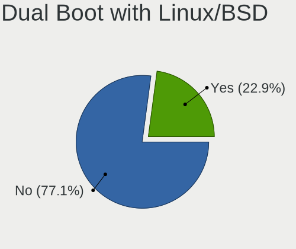
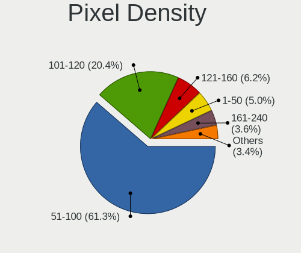
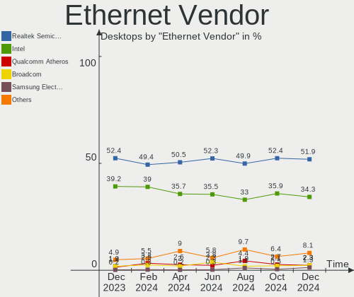
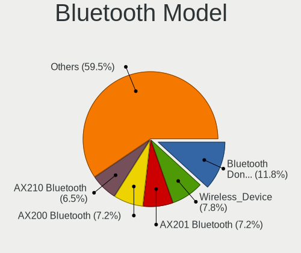

Ubuntu Hardware Trends (Desktop)
--------------------------------

A project to identify most popular hardware characteristics and track their change
over time based on data collected by Ubuntu users at https://Linux-Hardware.org.

Anyone can contribute to the study by uploading probes of their computers by
the [hw-probe](https://github.com/linuxhw/hw-probe) tool:

    sudo -E hw-probe -all -upload

Full-feature report is available here: https://linux-hardware.org/?view=trends&formfactor=desktop

Period: Dec, 2020.

Contents
--------

- [ OS                       ](#os)
- [ OS Family                ](#os-family)
- [ Kernel                   ](#kernel)
- [ Kernel Family            ](#kernel-family)
- [ Kernel Major Ver.        ](#kernel-major-ver)
- [ Arch                     ](#arch)
- [ DE                       ](#de)
- [ Display Server           ](#display-server)
- [ Display Manager          ](#display-manager)
- [ OS Lang                  ](#os-lang)
- [ Boot Mode                ](#boot-mode)
- [ Filesystem               ](#filesystem)
- [ Part. scheme             ](#part-scheme)
- [ Dual Boot with Linux/BSD ](#dual-boot-with-linux/bsd)
- [ Dual Boot (Win)          ](#dual-boot-win)
- [ Country                  ](#country)
- [ City                     ](#city)
- [ Vendor                   ](#vendor)
- [ Model                    ](#model)
- [ Model Family             ](#model-family)
- [ MFG Year                 ](#mfg-year)
- [ Form Factor              ](#form-factor)
- [ Secure Boot              ](#secure-boot)
- [ Coreboot                 ](#coreboot)
- [ RAM Size                 ](#ram-size)
- [ RAM Used                 ](#ram-used)
- [ Has CD-ROM               ](#has-cd-rom)
- [ Total Drives             ](#total-drives)
- [ Has Ethernet             ](#has-ethernet)
- [ Drive Vendor             ](#drive-vendor)
- [ Drive Model              ](#drive-model)
- [ HDD Vendor               ](#hdd-vendor)
- [ SSD Vendor               ](#ssd-vendor)
- [ Drive Kind               ](#drive-kind)
- [ Drive Connector          ](#drive-connector)
- [ Drive Size               ](#drive-size)
- [ Space Total              ](#space-total)
- [ Space Used               ](#space-used)
- [ Malfunc. Drives          ](#malfunc-drives)
- [ Malfunc. Drive Vendor    ](#malfunc-drive-vendor)
- [ Malfunc. HDD Vendor      ](#malfunc-hdd-vendor)
- [ Malfunc. Drive Kind      ](#malfunc-drive-kind)
- [ Failed Drives            ](#failed-drives)
- [ Failed Drive Vendor      ](#failed-drive-vendor)
- [ Drive Status             ](#drive-status)
- [ Storage Vendor           ](#storage-vendor)
- [ Storage Model            ](#storage-model)
- [ Storage Kind             ](#storage-kind)
- [ CPU Vendor               ](#cpu-vendor)
- [ CPU Model                ](#cpu-model)
- [ CPU Model Family         ](#cpu-model-family)
- [ CPU Cores                ](#cpu-cores)
- [ CPU Sockets              ](#cpu-sockets)
- [ CPU Threads              ](#cpu-threads)
- [ CPU Op-Modes             ](#cpu-op-modes)
- [ CPU Microcode            ](#cpu-microcode)
- [ CPU Microarch            ](#cpu-microarch)
- [ GPU Vendor               ](#gpu-vendor)
- [ GPU Model                ](#gpu-model)
- [ GPU Combo                ](#gpu-combo)
- [ GPU Driver               ](#gpu-driver)
- [ GPU Memory               ](#gpu-memory)
- [ Monitor Vendor           ](#monitor-vendor)
- [ Monitor Model            ](#monitor-model)
- [ Monitor Resolution       ](#monitor-resolution)
- [ Monitor Diagonal         ](#monitor-diagonal)
- [ Monitor Width            ](#monitor-width)
- [ Aspect Ratio             ](#aspect-ratio)
- [ Monitor Area             ](#monitor-area)
- [ Pixel Density            ](#pixel-density)
- [ Multiple Monitors        ](#multiple-monitors)
- [ Net Controller Vendor    ](#net-controller-vendor)
- [ Net Controller Model     ](#net-controller-model)
- [ Wireless Vendor          ](#wireless-vendor)
- [ Wireless Model           ](#wireless-model)
- [ Ethernet Vendor          ](#ethernet-vendor)
- [ Ethernet Model           ](#ethernet-model)
- [ Net Controller Kind      ](#net-controller-kind)
- [ Used Controller          ](#used-controller)
- [ NICs                     ](#nics)
- [ Memory Vendor            ](#memory-vendor)
- [ Memory Model             ](#memory-model)
- [ Memory Kind              ](#memory-kind)
- [ Memory Form Factor       ](#memory-form-factor)
- [ Memory Size              ](#memory-size)
- [ Memory Speed             ](#memory-speed)
- [ Sound Vendor             ](#sound-vendor)
- [ Sound Model              ](#sound-model)
- [ Camera Vendor            ](#camera-vendor)
- [ Camera Model             ](#camera-model)
- [ Fingerprint Vendor       ](#fingerprint-vendor)
- [ Fingerprint Model        ](#fingerprint-model)
- [ Chipcard Vendor          ](#chipcard-vendor)
- [ Chipcard Model           ](#chipcard-model)
- [ Printer Vendor           ](#printer-vendor)
- [ Printer Model            ](#printer-model)
- [ Scanner Vendor           ](#scanner-vendor)
- [ Scanner Model            ](#scanner-model)
- [ Bluetooth Vendor         ](#bluetooth-vendor)
- [ Bluetooth Model          ](#bluetooth-model)
- [ Unsupported Devices      ](#unsupported-devices)
- [ Unsupported Device Types ](#unsupported-device-types)

OS
--

Installed operating systems

| Name           | Desktops | Percent |
|----------------|----------|---------|
| Ubuntu 20.04   | 615      | 66.92%  |
| Ubuntu 20.10   | 161      | 17.52%  |
| Ubuntu 18.04   | 107      | 11.64%  |
| Ubuntu 16.04   | 14       | 1.52%   |
| Ubuntu 19.10   | 10       | 1.09%   |
| Ubuntu 21.04   | 4        | 0.44%   |
| Ubuntu         | 2        | 0.22%   |
| Ubuntu Core 16 | 1        | 0.11%   |
| Ubuntu 2020    | 1        | 0.11%   |
| Ubuntu 19.04   | 1        | 0.11%   |
| Ubuntu 18.10   | 1        | 0.11%   |
| Ubuntu 17.04   | 1        | 0.11%   |
| Ubuntu 16.10   | 1        | 0.11%   |

OS Family
---------

OS without a version

| Name   | Desktops | Percent |
|--------|----------|---------|
| Ubuntu | 919      | 100%    |

Kernel
------

Version of the Linux kernel

| Version                    | Desktops | Percent |
|----------------------------|----------|---------|
| 5.4.0-58-generic           | 303      | 32.97%  |
| 5.4.0-56-generic           | 175      | 19.04%  |
| 5.8.0-33-generic           | 71       | 7.73%   |
| 5.4.0-54-generic           | 54       | 5.88%   |
| 5.8.0-31-generic           | 39       | 4.24%   |
| 5.4.0-42-generic           | 38       | 4.13%   |
| 4.15.0-128-generic         | 24       | 2.61%   |
| 5.8.0-29-generic           | 19       | 2.07%   |
| 5.8.0-32-generic           | 14       | 1.52%   |
| 5.4.0-52-generic           | 12       | 1.31%   |
| 5.4.0-58-lowlatency        | 11       | 1.2%    |
| 5.8.0-25-generic           | 10       | 1.09%   |
| 5.4.0-53-generic           | 10       | 1.09%   |
| 4.15.0-126-generic         | 9        | 0.98%   |
| 5.4.0-59-generic           | 8        | 0.87%   |
| 5.3.0-64-generic           | 8        | 0.87%   |
| 5.8.0-34-generic           | 7        | 0.76%   |
| 5.4.0-56-lowlatency        | 7        | 0.76%   |
| 4.15.0-124-generic         | 4        | 0.44%   |
| 4.15.0-123-generic         | 4        | 0.44%   |
| 5.8.0-31-lowlatency        | 3        | 0.33%   |
| 5.4.0-55-generic           | 3        | 0.33%   |
| 5.4.0-26-generic           | 3        | 0.33%   |
| 5.10.1-051001-generic      | 3        | 0.33%   |
| 5.9.12-050912-generic      | 2        | 0.22%   |
| 5.9.10-050910-generic      | 2        | 0.22%   |
| 5.8.0-33-lowlatency        | 2        | 0.22%   |
| 5.8.0-28-generic           | 2        | 0.22%   |
| 5.4.0-57-generic           | 2        | 0.22%   |
| 5.4.0-47-generic           | 2        | 0.22%   |
| 5.4.0-45-generic           | 2        | 0.22%   |
| 5.4.0-29-generic           | 2        | 0.22%   |
| 5.10.2-051002-generic      | 2        | 0.22%   |
| 4.18.0-25-generic          | 2        | 0.22%   |
| 4.15.0-88-generic          | 2        | 0.22%   |
| 4.15.0-112-generic         | 2        | 0.22%   |
| 5.9.16-xanmod1             | 1        | 0.11%   |
| 5.9.16                     | 1        | 0.11%   |
| 5.9.15-050915-generic      | 1        | 0.11%   |
| 5.9.14-rockchip            | 1        | 0.11%   |
| 5.9.1-050901-generic       | 1        | 0.11%   |
| 5.9.0                      | 1        | 0.11%   |
| 5.8.18-050818-generic      | 1        | 0.11%   |
| 5.8.0-34-lowlatency        | 1        | 0.11%   |
| 5.8.0-32-lowlatency        | 1        | 0.11%   |
| 5.8.0-30-generic           | 1        | 0.11%   |
| 5.8.0-29-lowlatency        | 1        | 0.11%   |
| 5.6.0-1035-oem             | 1        | 0.11%   |
| 5.6.0-1034-oem             | 1        | 0.11%   |
| 5.6.0-050600-lowlatency    | 1        | 0.11%   |
| 5.5.8-050508-lowlatency    | 1        | 0.11%   |
| 5.4.0-59-lowlatency        | 1        | 0.11%   |
| 5.4.0-54-lowlatency        | 1        | 0.11%   |
| 5.4.0-52-lowlatency        | 1        | 0.11%   |
| 5.4.0-512010201020-generic | 1        | 0.11%   |
| 5.4.0-51-generic           | 1        | 0.11%   |
| 5.4.0-49-generic           | 1        | 0.11%   |
| 5.4.0-48-generic           | 1        | 0.11%   |
| 5.4.0-47-lowlatency        | 1        | 0.11%   |
| 5.4.0-40-generic           | 1        | 0.11%   |

Kernel Family
-------------

Linux kernel without a distro release

| Version | Desktops | Percent |
|---------|----------|---------|
| 5.4.0   | 645      | 70.18%  |
| 5.8.0   | 171      | 18.61%  |
| 4.15.0  | 57       | 6.2%    |
| 5.3.0   | 13       | 1.41%   |
| 5.10.1  | 4        | 0.44%   |
| 4.4.0   | 4        | 0.44%   |
| 5.6.0   | 3        | 0.33%   |
| 5.10.2  | 3        | 0.33%   |
| 4.18.0  | 3        | 0.33%   |
| 5.9.16  | 2        | 0.22%   |
| 5.9.12  | 2        | 0.22%   |
| 5.9.10  | 2        | 0.22%   |
| 5.9.15  | 1        | 0.11%   |
| 5.9.14  | 1        | 0.11%   |
| 5.9.1   | 1        | 0.11%   |
| 5.9.0   | 1        | 0.11%   |
| 5.8.18  | 1        | 0.11%   |
| 5.5.8   | 1        | 0.11%   |
| 5.10.3  | 1        | 0.11%   |
| 5.0.0   | 1        | 0.11%   |
| 4.8.0   | 1        | 0.11%   |
| 4.10.0  | 1        | 0.11%   |

Kernel Major Ver.
-----------------

Linux kernel major version

| Version | Desktops | Percent |
|---------|----------|---------|
| 5.4     | 645      | 70.18%  |
| 5.8     | 172      | 18.72%  |
| 4.15    | 57       | 6.2%    |
| 5.3     | 13       | 1.41%   |
| 5.9     | 10       | 1.09%   |
| 5.10    | 8        | 0.87%   |
| 4.4     | 4        | 0.44%   |
| 5.6     | 3        | 0.33%   |
| 4.18    | 3        | 0.33%   |
| 5.5     | 1        | 0.11%   |
| 5.0     | 1        | 0.11%   |
| 4.8     | 1        | 0.11%   |
| 4.10    | 1        | 0.11%   |

Arch
----

OS architecture (x86_64, i586, etc.)

| Name   | Desktops | Percent |
|--------|----------|---------|
| x86_64 | 897      | 97.61%  |
| i686   | 21       | 2.29%   |
| armv7l | 1        | 0.11%   |

DE
--

Desktop Environment

| Name            | Desktops | Percent |
|-----------------|----------|---------|
| GNOME           | 671      | 73.01%  |
| XFCE            | 73       | 7.94%   |
| Unknown         | 53       | 5.77%   |
| KDE             | 37       | 4.03%   |
| KDE5            | 19       | 2.07%   |
| Unity           | 17       | 1.85%   |
| MATE            | 13       | 1.41%   |
| X-Cinnamon      | 7        | 0.76%   |
| Budgie          | 6        | 0.65%   |
| LXQt            | 5        | 0.54%   |
| GNOME Flashback | 5        | 0.54%   |
| LXDE            | 4        | 0.44%   |
| GNOME Classic   | 4        | 0.44%   |
| Cinnamon        | 2        | 0.22%   |
| i3              | 1        | 0.11%   |
| fvwm            | 1        | 0.11%   |
| enlightenment   | 1        | 0.11%   |

Display Server
--------------

X11 or Wayland

| Name    | Desktops | Percent |
|---------|----------|---------|
| X11     | 870      | 94.67%  |
| Wayland | 19       | 2.07%   |
| Unknown | 18       | 1.96%   |
| Tty     | 11       | 1.2%    |
| Web     | 1        | 0.11%   |

Display Manager
---------------

SDDM, LightDM, etc.

| Name    | Desktops | Percent |
|---------|----------|---------|
| Unknown | 765      | 83.24%  |
| GDM     | 94       | 10.23%  |
| TDM     | 37       | 4.03%   |
| SDDM    | 19       | 2.07%   |
| GDM3    | 3        | 0.33%   |
| XDM     | 1        | 0.11%   |

OS Lang
-------

Language

| Lang       | Desktops | Percent |
|------------|----------|---------|
| en_US      | 326      | 35.47%  |
| de_DE      | 113      | 12.3%   |
| it_IT      | 51       | 5.55%   |
| fr_FR      | 46       | 5.01%   |
| en_GB      | 37       | 4.03%   |
| en_CA      | 36       | 3.92%   |
| pt_BR      | 34       | 3.7%    |
| es_ES      | 25       | 2.72%   |
| ru_RU      | 21       | 2.29%   |
| pl_PL      | 20       | 2.18%   |
| C          | 18       | 1.96%   |
| nl_NL      | 15       | 1.63%   |
| en_IN      | 15       | 1.63%   |
| en_AU      | 14       | 1.52%   |
| hu_HU      | 10       | 1.09%   |
| cs_CZ      | 9        | 0.98%   |
| Unknown    | 9        | 0.98%   |
| tr_TR      | 8        | 0.87%   |
| fi_FI      | 8        | 0.87%   |
| en_ZA      | 8        | 0.87%   |
| sv_SE      | 7        | 0.76%   |
| ja_JP      | 7        | 0.76%   |
| de_CH      | 6        | 0.65%   |
| de_AT      | 6        | 0.65%   |
| ru_UA      | 5        | 0.54%   |
| uk_UA      | 4        | 0.44%   |
| ro_RO      | 4        | 0.44%   |
| fr_BE      | 4        | 0.44%   |
| es_MX      | 4        | 0.44%   |
| es_CO      | 4        | 0.44%   |
| es_AR      | 4        | 0.44%   |
| zh_TW      | 3        | 0.33%   |
| pt_PT      | 3        | 0.33%   |
| ko_KR      | 3        | 0.33%   |
| hr_HR      | 3        | 0.33%   |
| en_NZ      | 3        | 0.33%   |
| zh_CN      | 2        | 0.22%   |
| sk_SK      | 2        | 0.22%   |
| fr_CA      | 2        | 0.22%   |
| en_HK      | 2        | 0.22%   |
| el_GR      | 2        | 0.22%   |
| da_DK      | 2        | 0.22%   |
| bg_BG      | 2        | 0.22%   |
| nl_BE      | 1        | 0.11%   |
| lt_LT      | 1        | 0.11%   |
| id_ID      | 1        | 0.11%   |
| fr_FR.utf8 | 1        | 0.11%   |
| et_EE      | 1        | 0.11%   |
| es_PE      | 1        | 0.11%   |
| es_EC      | 1        | 0.11%   |
| es_CU      | 1        | 0.11%   |
| en_PH      | 1        | 0.11%   |
| en_IE      | 1        | 0.11%   |
| de_BE      | 1        | 0.11%   |
| ca_ES      | 1        | 0.11%   |

Boot Mode
---------

EFI or BIOS

| Mode | Desktops | Percent |
|------|----------|---------|
| BIOS | 634      | 68.99%  |
| EFI  | 285      | 31.01%  |

Filesystem
----------

Type of filesystem

| Type     | Desktops | Percent |
|----------|----------|---------|
| Ext4     | 865      | 94.12%  |
| Overlay  | 25       | 2.72%   |
| Zfs      | 10       | 1.09%   |
| Btrfs    | 7        | 0.76%   |
| Xfs      | 5        | 0.54%   |
| Ext2     | 3        | 0.33%   |
| Reiserfs | 2        | 0.22%   |
| Ext3     | 1        | 0.11%   |
| Unknown  | 1        | 0.11%   |

Part. scheme
------------

Scheme of partitioning

| Type    | Desktops | Percent |
|---------|----------|---------|
| Unknown | 752      | 81.83%  |
| GPT     | 119      | 12.95%  |
| MBR     | 48       | 5.22%   |

Dual Boot with Linux/BSD
------------------------

Hosting more than one Linux/BSD

| Dual boot | Desktops | Percent |
|-----------|----------|---------|
| No        | 731      | 79.54%  |
| Yes       | 188      | 20.46%  |

Dual Boot (Win)
---------------

Hosting Linux and Windows

| Dual boot | Desktops | Percent |
|-----------|----------|---------|
| No        | 505      | 54.95%  |
| Yes       | 414      | 45.05%  |

Country
-------

Geographic location (country)

| Country            | Desktops | Percent |
|--------------------|----------|---------|
| USA                | 191      | 20.78%  |
| Germany            | 123      | 13.38%  |
| Italy              | 60       | 6.53%   |
| Canada             | 45       | 4.9%    |
| Brazil             | 45       | 4.9%    |
| France             | 44       | 4.79%   |
| UK                 | 35       | 3.81%   |
| Spain              | 29       | 3.16%   |
| Poland             | 24       | 2.61%   |
| Netherlands        | 23       | 2.5%    |
| Russia             | 21       | 2.29%   |
| Switzerland        | 18       | 1.96%   |
| India              | 17       | 1.85%   |
| Australia          | 14       | 1.52%   |
| Ukraine            | 12       | 1.31%   |
| Hungary            | 12       | 1.31%   |
| Belgium            | 12       | 1.31%   |
| Turkey             | 10       | 1.09%   |
| Japan              | 10       | 1.09%   |
| Czech Republic     | 10       | 1.09%   |
| Sweden             | 9        | 0.98%   |
| Finland            | 9        | 0.98%   |
| South Africa       | 8        | 0.87%   |
| Bulgaria           | 8        | 0.87%   |
| Argentina          | 8        | 0.87%   |
| Denmark            | 7        | 0.76%   |
| Austria            | 7        | 0.76%   |
| Romania            | 6        | 0.65%   |
| Portugal           | 6        | 0.65%   |
| Greece             | 6        | 0.65%   |
| Taiwan             | 5        | 0.54%   |
| Mexico             | 5        | 0.54%   |
| Korea, Republic of | 5        | 0.54%   |
| Iran               | 5        | 0.54%   |
| Indonesia          | 5        | 0.54%   |
| Serbia             | 4        | 0.44%   |
| New Zealand        | 4        | 0.44%   |
| Malaysia           | 4        | 0.44%   |
| Croatia            | 4        | 0.44%   |
| Colombia           | 4        | 0.44%   |
| China              | 4        | 0.44%   |
| Slovakia           | 3        | 0.33%   |
| Estonia            | 3        | 0.33%   |
| Thailand           | 2        | 0.22%   |
| Puerto Rico        | 2        | 0.22%   |
| Philippines        | 2        | 0.22%   |
| Norway             | 2        | 0.22%   |
| Morocco            | 2        | 0.22%   |
| Ireland            | 2        | 0.22%   |
| Cyprus             | 2        | 0.22%   |
| Costa Rica         | 2        | 0.22%   |
| Algeria            | 2        | 0.22%   |
| Vietnam            | 1        | 0.11%   |
| Slovenia           | 1        | 0.11%   |
| Peru               | 1        | 0.11%   |
| Malta              | 1        | 0.11%   |
| Luxembourg         | 1        | 0.11%   |
| Lithuania          | 1        | 0.11%   |
| Latvia             | 1        | 0.11%   |
| Jamaica            | 1        | 0.11%   |

City
----

Geographic location (city)

| City           | Desktops | Percent |
|----------------|----------|---------|
| Berlin         | 12       | 1.31%   |
| Rome           | 7        | 0.76%   |
| Madrid         | 7        | 0.76%   |
| Hamburg        | 7        | 0.76%   |
| Prague         | 6        | 0.65%   |
| Mumbai         | 6        | 0.65%   |
| Milan          | 6        | 0.65%   |
| Istanbul       | 6        | 0.65%   |
| Warsaw         | 5        | 0.54%   |
| Thonex         | 5        | 0.54%   |
| Helsinki       | 5        | 0.54%   |
| Budapest       | 5        | 0.54%   |
| Toronto        | 4        | 0.44%   |
| Tehran         | 4        | 0.44%   |
| São Paulo     | 4        | 0.44%   |
| Montreal       | 4        | 0.44%   |
| Hyderabad      | 4        | 0.44%   |
| Düsseldorf    | 4        | 0.44%   |
| Burlington     | 4        | 0.44%   |
| Bucharest      | 4        | 0.44%   |
| Bielefeld      | 4        | 0.44%   |
| Athens         | 4        | 0.44%   |
| Zagreb         | 3        | 0.33%   |
| Wuppertal      | 3        | 0.33%   |
| Voronezh       | 3        | 0.33%   |
| Vienna         | 3        | 0.33%   |
| Taranto        | 3        | 0.33%   |
| Sydney         | 3        | 0.33%   |
| Stockholm      | 3        | 0.33%   |
| Moscow         | 3        | 0.33%   |
| Kyiv           | 3        | 0.33%   |
| Genoa          | 3        | 0.33%   |
| Gdańsk        | 3        | 0.33%   |
| Florence       | 3        | 0.33%   |
| Boksburg       | 3        | 0.33%   |
| Bengaluru      | 3        | 0.33%   |
| Belo Horizonte | 3        | 0.33%   |
| Alexandria     | 3        | 0.33%   |
| Wrocław       | 2        | 0.22%   |
| Wateringen     | 2        | 0.22%   |
| Vlaardingen    | 2        | 0.22%   |
| Varna          | 2        | 0.22%   |
| Union City     | 2        | 0.22%   |
| Tucson         | 2        | 0.22%   |
| Trenton        | 2        | 0.22%   |
| Tampere        | 2        | 0.22%   |
| Taipei         | 2        | 0.22%   |
| Stuttgart      | 2        | 0.22%   |
| Strasbourg     | 2        | 0.22%   |
| Stahlhofen     | 2        | 0.22%   |
| St Petersburg  | 2        | 0.22%   |
| South Pasadena | 2        | 0.22%   |
| Sofia          | 2        | 0.22%   |
| Simpang Empat  | 2        | 0.22%   |
| Sharpsburg     | 2        | 0.22%   |
| Santo André   | 2        | 0.22%   |
| San José      | 2        | 0.22%   |
| Rio de Janeiro | 2        | 0.22%   |
| Reno           | 2        | 0.22%   |
| Recife         | 2        | 0.22%   |

Vendor
------

Motherboard manufacturer

| Name                | Desktops | Percent |
|---------------------|----------|---------|
| ASUSTek Computer    | 250      | 27.2%   |
| Gigabyte Technology | 163      | 17.74%  |
| Dell                | 97       | 10.55%  |
| MSI                 | 91       | 9.9%    |
| ASRock              | 76       | 8.27%   |
| Hewlett-Packard     | 62       | 6.75%   |
| Intel               | 31       | 3.37%   |
| Lenovo              | 27       | 2.94%   |
| Acer                | 22       | 2.39%   |
| Fujitsu             | 11       | 1.2%    |
| Pegatron            | 9        | 0.98%   |
| Foxconn             | 9        | 0.98%   |
| Medion              | 8        | 0.87%   |
| Unknown             | 8        | 0.87%   |
| ECS                 | 7        | 0.76%   |
| Biostar             | 6        | 0.65%   |
| PC Engines          | 5        | 0.54%   |
| Packard Bell        | 4        | 0.44%   |
| Huanan              | 3        | 0.33%   |
| Gateway             | 3        | 0.33%   |
| Fujitsu Siemens     | 3        | 0.33%   |
| Positivo            | 2        | 0.22%   |
| eMachines           | 2        | 0.22%   |
| Wistron             | 1        | 0.11%   |
| Supermicro          | 1        | 0.11%   |
| Shuttle             | 1        | 0.11%   |
| PHITRONIC           | 1        | 0.11%   |
| NEC Computers       | 1        | 0.11%   |
| Minix               | 1        | 0.11%   |
| Inventec            | 1        | 0.11%   |
| INTELBRAS           | 1        | 0.11%   |
| iEi                 | 1        | 0.11%   |
| FIC                 | 1        | 0.11%   |
| EVGA                | 1        | 0.11%   |
| Colorful Technology | 1        | 0.11%   |
| Clevo               | 1        | 0.11%   |
| Chuwi               | 1        | 0.11%   |
| AWOW Techonology    | 1        | 0.11%   |
| ASRockRack          | 1        | 0.11%   |
| Apple               | 1        | 0.11%   |
| Alienware           | 1        | 0.11%   |
| ABIT                | 1        | 0.11%   |
| AAEON               | 1        | 0.11%   |

Model
-----

Motherboard model

| Name                             | Desktops | Percent |
|----------------------------------|----------|---------|
| ASUS All Series                  | 21       | 2.29%   |
| ASUS ROG STRIX B450-F GAMING     | 8        | 0.87%   |
| Unknown                          | 8        | 0.87%   |
| MSI MS-7C37                      | 5        | 0.54%   |
| Dell OptiPlex 7010               | 5        | 0.54%   |
| Dell OptiPlex 3010               | 5        | 0.54%   |
| Dell Inspiron 3847               | 5        | 0.54%   |
| PC Engines apu2                  | 4        | 0.44%   |
| MSI MS-7C51                      | 4        | 0.44%   |
| MSI MS-7A38                      | 4        | 0.44%   |
| Gigabyte B550I AORUS PRO AX      | 4        | 0.44%   |
| Dell OptiPlex 9020               | 4        | 0.44%   |
| Dell OptiPlex 780                | 4        | 0.44%   |
| Dell OptiPlex 745                | 4        | 0.44%   |
| Dell Inspiron 530                | 4        | 0.44%   |
| ASUS PRIME B450M-A               | 4        | 0.44%   |
| ASUS PRIME A320M-K               | 4        | 0.44%   |
| MSI MS-7B89                      | 3        | 0.33%   |
| MSI MS-7816                      | 3        | 0.33%   |
| Intel HCL Desktop                | 3        | 0.33%   |
| HP Z620 Workstation              | 3        | 0.33%   |
| HP ProDesk 400 G1 SFF            | 3        | 0.33%   |
| HP Compaq Pro 6300 MT            | 3        | 0.33%   |
| HP Compaq Elite 8300 USDT        | 3        | 0.33%   |
| HP Compaq Elite 8300 SFF         | 3        | 0.33%   |
| Gigabyte X570 AORUS ELITE        | 3        | 0.33%   |
| Gigabyte H77M-D3H                | 3        | 0.33%   |
| Gigabyte GA-78LMT-USB3           | 3        | 0.33%   |
| Gigabyte F2A88XM-D3HP            | 3        | 0.33%   |
| Gigabyte B450M DS3H              | 3        | 0.33%   |
| Dell Precision WorkStation T3500 | 3        | 0.33%   |
| Dell OptiPlex 990                | 3        | 0.33%   |
| Dell OptiPlex 790                | 3        | 0.33%   |
| ASUS Z170 PRO GAMING             | 3        | 0.33%   |
| ASUS ROG STRIX B550-F GAMING     | 3        | 0.33%   |
| ASUS PRIME X570-P                | 3        | 0.33%   |
| ASUS PRIME B450-PLUS             | 3        | 0.33%   |
| ASUS PRIME A320M-K/BR            | 3        | 0.33%   |
| ASUS M5A97 R2.0                  | 3        | 0.33%   |
| ASUS M5A78L-M LX3                | 3        | 0.33%   |
| ASRock N68C-S UCC                | 3        | 0.33%   |
| ASRock B450M Pro4                | 3        | 0.33%   |
| MSI MS-7C92                      | 2        | 0.22%   |
| MSI MS-7B98                      | 2        | 0.22%   |
| MSI MS-7B86                      | 2        | 0.22%   |
| MSI MS-7B24                      | 2        | 0.22%   |
| MSI MS-7A94                      | 2        | 0.22%   |
| MSI MS-7A72                      | 2        | 0.22%   |
| MSI MS-7A34                      | 2        | 0.22%   |
| MSI MS-7996                      | 2        | 0.22%   |
| MSI MS-7982                      | 2        | 0.22%   |
| MSI MS-7924                      | 2        | 0.22%   |
| MSI MS-7865                      | 2        | 0.22%   |
| MSI MS-7721                      | 2        | 0.22%   |
| MSI MS-7641                      | 2        | 0.22%   |
| Medion MS-7728                   | 2        | 0.22%   |
| Lenovo H520S 2561                | 2        | 0.22%   |
| Intel H61                        | 2        | 0.22%   |
| Intel DH61WW AAG23116-300        | 2        | 0.22%   |
| Intel DG33BU AAD79951-407        | 2        | 0.22%   |

Model Family
------------

Motherboard model prefix

| Name                   | Desktops | Percent |
|------------------------|----------|---------|
| Dell OptiPlex          | 46       | 5.01%   |
| ASUS PRIME             | 40       | 4.35%   |
| ASUS ROG               | 29       | 3.16%   |
| HP Compaq              | 26       | 2.83%   |
| Dell Inspiron          | 23       | 2.5%    |
| ASUS All               | 21       | 2.29%   |
| Lenovo ThinkCentre     | 16       | 1.74%   |
| Dell Precision         | 14       | 1.52%   |
| Acer Aspire            | 14       | 1.52%   |
| ASUS TUF               | 10       | 1.09%   |
| HP ProDesk             | 9        | 0.98%   |
| Fujitsu ESPRIMO        | 9        | 0.98%   |
| ASUS M5A78L-M          | 8        | 0.87%   |
| Unknown                | 8        | 0.87%   |
| Gigabyte X570          | 7        | 0.76%   |
| Gigabyte B450M         | 6        | 0.65%   |
| Dell Vostro            | 6        | 0.65%   |
| MSI MS-7C37            | 5        | 0.54%   |
| Lenovo IdeaCentre      | 5        | 0.54%   |
| Gigabyte Z390          | 5        | 0.54%   |
| Gigabyte GA-78LMT-USB3 | 5        | 0.54%   |
| Gigabyte B550          | 5        | 0.54%   |
| ASUS M5A97             | 5        | 0.54%   |
| ASRock B450M           | 5        | 0.54%   |
| PC Engines apu2        | 4        | 0.44%   |
| MSI MS-7C51            | 4        | 0.44%   |
| MSI MS-7A38            | 4        | 0.44%   |
| Gigabyte B550I         | 4        | 0.44%   |
| ASUS SABERTOOTH        | 4        | 0.44%   |
| ASUS P8Z68-V           | 4        | 0.44%   |
| ASUS P8H61-M           | 4        | 0.44%   |
| ASUS P8B75-M           | 4        | 0.44%   |
| ASUS Maximus           | 4        | 0.44%   |
| Acer Veriton           | 4        | 0.44%   |
| MSI MS-7B89            | 3        | 0.33%   |
| MSI MS-7816            | 3        | 0.33%   |
| Intel HCL              | 3        | 0.33%   |
| Intel D54250WYK        | 3        | 0.33%   |
| HP Z620                | 3        | 0.33%   |
| Gigabyte X470          | 3        | 0.33%   |
| Gigabyte H77M-D3H      | 3        | 0.33%   |
| Gigabyte F2A88XM-D3HP  | 3        | 0.33%   |
| ASUS Z170              | 3        | 0.33%   |
| ASUS Rampage           | 3        | 0.33%   |
| ASUS P8Z77-V           | 3        | 0.33%   |
| ASUS P6T               | 3        | 0.33%   |
| ASUS P5Q               | 3        | 0.33%   |
| ASUS P5G41T-M          | 3        | 0.33%   |
| ASUS Crosshair         | 3        | 0.33%   |
| ASRock N68C-S          | 3        | 0.33%   |
| ASRock B450            | 3        | 0.33%   |
| Packard Bell ixtreme   | 2        | 0.22%   |
| Packard Bell iMedia    | 2        | 0.22%   |
| MSI MS-7C92            | 2        | 0.22%   |
| MSI MS-7B98            | 2        | 0.22%   |
| MSI MS-7B86            | 2        | 0.22%   |
| MSI MS-7B24            | 2        | 0.22%   |
| MSI MS-7A94            | 2        | 0.22%   |
| MSI MS-7A72            | 2        | 0.22%   |
| MSI MS-7A34            | 2        | 0.22%   |

MFG Year
--------

Motherboard manufacture year

| Year    | Desktops | Percent |
|---------|----------|---------|
| 2020    | 133      | 14.47%  |
| 2019    | 90       | 9.79%   |
| 2013    | 78       | 8.49%   |
| 2012    | 78       | 8.49%   |
| 2011    | 76       | 8.27%   |
| 2018    | 75       | 8.16%   |
| 2010    | 75       | 8.16%   |
| 2014    | 60       | 6.53%   |
| 2009    | 52       | 5.66%   |
| 2015    | 51       | 5.55%   |
| 2017    | 41       | 4.46%   |
| 2016    | 38       | 4.13%   |
| 2008    | 36       | 3.92%   |
| 2007    | 22       | 2.39%   |
| 2006    | 6        | 0.65%   |
| 2005    | 5        | 0.54%   |
| 2004    | 2        | 0.22%   |
| Unknown | 1        | 0.11%   |

Form Factor
-----------

Physical design of the computer

| Name    | Desktops | Percent |
|---------|----------|---------|
| Desktop | 919      | 100%    |

Secure Boot
-----------

Enabled or disabled

| State    | Desktops | Percent |
|----------|----------|---------|
| Disabled | 887      | 96.52%  |
| Enabled  | 32       | 3.48%   |

Coreboot
--------

Have coreboot on board

| Used | Desktops | Percent |
|------|----------|---------|
| No   | 914      | 99.46%  |
| Yes  | 5        | 0.54%   |

RAM Size
--------

Total RAM memory

| Size in GB  | Desktops | Percent |
|-------------|----------|---------|
| 8.01-16.0   | 212      | 23.07%  |
| 16.01-24.0  | 195      | 21.22%  |
| 3.01-4.0    | 172      | 18.72%  |
| 4.01-8.0    | 134      | 14.58%  |
| 32.01-64.0  | 107      | 11.64%  |
| 64.01-256.0 | 34       | 3.7%    |
| 1.01-2.0    | 27       | 2.94%   |
| 24.01-32.0  | 17       | 1.85%   |
| 2.01-3.0    | 14       | 1.52%   |
| 0.51-1.0    | 7        | 0.76%   |

RAM Used
--------

Used RAM memory

| Used GB    | Desktops | Percent |
|------------|----------|---------|
| 1.01-2.0   | 404      | 43.96%  |
| 2.01-3.0   | 224      | 24.37%  |
| 4.01-8.0   | 108      | 11.75%  |
| 3.01-4.0   | 89       | 9.68%   |
| 0.51-1.0   | 40       | 4.35%   |
| 8.01-16.0  | 37       | 4.03%   |
| 16.01-24.0 | 6        | 0.65%   |
| 0.01-0.5   | 6        | 0.65%   |
| 32.01-64.0 | 3        | 0.33%   |
| 24.01-32.0 | 2        | 0.22%   |

Has CD-ROM
----------

Has CD-ROM on board

| Presented | Desktops | Percent |
|-----------|----------|---------|
| Yes       | 500      | 54.41%  |
| No        | 419      | 45.59%  |

Total Drives
------------

Number of drives on board

| Drives | Desktops | Percent |
|--------|----------|---------|
| 1      | 343      | 37.32%  |
| 2      | 302      | 32.86%  |
| 3      | 139      | 15.13%  |
| 4      | 72       | 7.83%   |
| 5      | 24       | 2.61%   |
| 6      | 16       | 1.74%   |
| 7      | 9        | 0.98%   |
| 9      | 5        | 0.54%   |
| 0      | 5        | 0.54%   |
| 8      | 2        | 0.22%   |
| 13     | 1        | 0.11%   |
| 11     | 1        | 0.11%   |

Has Ethernet
------------

Has Ethernet on board

| Presented | Desktops | Percent |
|-----------|----------|---------|
| Yes       | 910      | 99.02%  |
| No        | 9        | 0.98%   |

Drive Vendor
------------

Hard drive vendors

| Vendor                    | Desktops | Drives | Percent |
|---------------------------|----------|--------|---------|
| WDC                       | 341      | 436    | 21.42%  |
| Seagate                   | 338      | 439    | 21.23%  |
| Samsung Electronics       | 229      | 303    | 14.38%  |
| Kingston                  | 94       | 97     | 5.9%    |
| Toshiba                   | 81       | 88     | 5.09%   |
| Hitachi                   | 69       | 79     | 4.33%   |
| SanDisk                   | 55       | 57     | 3.45%   |
| Crucial                   | 51       | 56     | 3.2%    |
| Unknown                   | 27       | 31     | 1.7%    |
| Intel                     | 25       | 25     | 1.57%   |
| Phison                    | 22       | 23     | 1.38%   |
| A-DATA Technology         | 22       | 25     | 1.38%   |
| HGST                      | 17       | 19     | 1.07%   |
| Maxtor                    | 15       | 15     | 0.94%   |
| China                     | 15       | 16     | 0.94%   |
| Patriot                   | 14       | 14     | 0.88%   |
| SPCC                      | 12       | 12     | 0.75%   |
| Intenso                   | 11       | 13     | 0.69%   |
| Micron Technology         | 10       | 11     | 0.63%   |
| Gigabyte Technology       | 10       | 10     | 0.63%   |
| Silicon Motion            | 8        | 8      | 0.5%    |
| PNY                       | 8        | 8      | 0.5%    |
| Hewlett-Packard           | 6        | 6      | 0.38%   |
| Corsair                   | 6        | 6      | 0.38%   |
| Transcend                 | 5        | 5      | 0.31%   |
| OCZ                       | 5        | 5      | 0.31%   |
| Micron/Crucial Technology | 5        | 5      | 0.31%   |
| KingFast                  | 5        | 6      | 0.31%   |
| JMicron                   | 5        | 5      | 0.31%   |
| GOODRAM                   | 5        | 5      | 0.31%   |
| Apacer                    | 5        | 5      | 0.31%   |
| SK Hynix                  | 4        | 4      | 0.25%   |
| Realtek Semiconductor     | 4        | 4      | 0.25%   |
| Fujitsu                   | 4        | 4      | 0.25%   |
| XPG                       | 3        | 3      | 0.19%   |
| TCSUNBOW                  | 2        | 2      | 0.13%   |
| SABRENT                   | 2        | 2      | 0.13%   |
| PLEXTOR                   | 2        | 2      | 0.13%   |
| Mushkin                   | 2        | 2      | 0.13%   |
| KIOXIA-EXCERIA            | 2        | 2      | 0.13%   |
| KingDian                  | 2        | 2      | 0.13%   |
| INNOVATION IT             | 2        | 2      | 0.13%   |
| Indilinx                  | 2        | 2      | 0.13%   |
| HPE                       | 2        | 2      | 0.13%   |
| ZOTAC                     | 1        | 1      | 0.06%   |
| WDC WDS1                  | 1        | 1      | 0.06%   |
| WD MediaMax               | 1        | 1      | 0.06%   |
| Verbatim                  | 1        | 1      | 0.06%   |
| USB 3.0                   | 1        | 2      | 0.06%   |
| USB                       | 1        | 1      | 0.06%   |
| TO Exter                  | 1        | 1      | 0.06%   |
| Team                      | 1        | 1      | 0.06%   |
| T-FORCE                   | 1        | 1      | 0.06%   |
| S3+                       | 1        | 1      | 0.06%   |
| Reeinno                   | 1        | 1      | 0.06%   |
| Radeon                    | 1        | 1      | 0.06%   |
| OWC                       | 1        | 1      | 0.06%   |
| NVMe                      | 1        | 2      | 0.06%   |
| Mercury                   | 1        | 1      | 0.06%   |
| Maxmemory                 | 1        | 1      | 0.06%   |

Drive Model
-----------

Hard drive models

| Model                            | Desktops | Percent |
|----------------------------------|----------|---------|
| Seagate ST500DM002-1BD142 500GB  | 27       | 1.48%   |
| Seagate ST1000DM010-2EP102 1TB   | 22       | 1.2%    |
| Kingston SA400S37240G 240GB SSD  | 20       | 1.1%    |
| Samsung SSD 860 EVO 500GB        | 19       | 1.04%   |
| Toshiba DT01ACA100 1TB           | 17       | 0.93%   |
| Samsung NVMe SSD Drive 500GB     | 17       | 0.93%   |
| Toshiba HDWD110 1TB              | 16       | 0.88%   |
| Seagate ST2000DM008-2FR102 2TB   | 16       | 0.88%   |
| Kingston SA400S37120G 120GB SSD  | 16       | 0.88%   |
| Seagate ST3500418AS 500GB        | 14       | 0.77%   |
| Samsung SSD 850 EVO 250GB        | 14       | 0.77%   |
| WDC WD10EZEX-08WN4A0 1TB         | 13       | 0.71%   |
| Seagate ST3500413AS 500GB        | 13       | 0.71%   |
| Seagate ST1000DM003-1CH162 1TB   | 13       | 0.71%   |
| Kingston SV300S37A120G 120GB SSD | 11       | 0.6%    |
| Seagate ST2000DM006-2DM164 2TB   | 10       | 0.55%   |
| Samsung SSD 850 EVO 500GB        | 10       | 0.55%   |
| Samsung NVMe SSD Drive 1TB       | 10       | 0.55%   |
| Samsung HD103SJ 1TB              | 10       | 0.55%   |
| Unknown SD/MMC/MS PRO 128GB      | 9        | 0.49%   |
| Seagate ST31000524AS 1TB         | 9        | 0.49%   |
| Seagate ST1000DM003-1ER162 1TB   | 9        | 0.49%   |
| Samsung SSD 840 EVO 250GB        | 9        | 0.49%   |
| Samsung NVMe SSD Drive 250GB     | 9        | 0.49%   |
| Patriot Burst 120GB SSD          | 9        | 0.49%   |
| Crucial CT500MX500SSD1 500GB     | 9        | 0.49%   |
| WDC WD10EZEX-08M2NA0 1TB         | 8        | 0.44%   |
| WDC WD10EZEX-00BN5A0 1TB         | 8        | 0.44%   |
| Seagate ST4000DM004-2CV104 4TB   | 8        | 0.44%   |
| Seagate ST3160815AS 160GB        | 8        | 0.44%   |
| Samsung SSD 970 EVO Plus 1TB     | 8        | 0.44%   |
| Samsung SSD 860 EVO 250GB        | 8        | 0.44%   |
| Phison NVMe SSD Drive 1TB        | 8        | 0.44%   |
| Kingston SA400S37480G 480GB SSD  | 8        | 0.44%   |
| Crucial CT240BX500SSD1 240GB     | 8        | 0.44%   |
| Seagate ST2000DM001-1CH164 2TB   | 7        | 0.38%   |
| Seagate ST2000DL003-9VT166 2TB   | 7        | 0.38%   |
| Seagate Expansion+ 4TB           | 7        | 0.38%   |
| Samsung SSD 860 EVO 1TB          | 7        | 0.38%   |
| WDC WDS240G2G0A-00JH30 240GB SSD | 6        | 0.33%   |
| WDC WD20EZRX-00D8PB0 2TB         | 6        | 0.33%   |
| WDC WD10EARS-00Y5B1 1TB          | 6        | 0.33%   |
| Unknown SD/MMC 8GB               | 6        | 0.33%   |
| Toshiba MQ01ABF050 500GB         | 6        | 0.33%   |
| Toshiba HDWD120 2TB              | 6        | 0.33%   |
| Toshiba DT01ACA200 2TB           | 6        | 0.33%   |
| Seagate ST8000DM004-2CX188 8TB   | 6        | 0.33%   |
| Seagate ST31000528AS 1TB         | 6        | 0.33%   |
| Seagate ST2000DM001-1ER164 2TB   | 6        | 0.33%   |
| Seagate Expansion Desk 2TB       | 6        | 0.33%   |
| SanDisk SDSSDA240G 240GB         | 6        | 0.33%   |
| Samsung SSD 860 QVO 1TB          | 6        | 0.33%   |
| Samsung HD502HJ 500GB            | 6        | 0.33%   |
| Samsung HD501LJ 500GB            | 6        | 0.33%   |
| WDC WDS500G2B0A-00SM50 500GB SSD | 5        | 0.27%   |
| WDC WD5000AAKX-60U6AA0 500GB     | 5        | 0.27%   |
| WDC WD10EZEX-00WN4A0 1TB         | 5        | 0.27%   |
| WDC WD10EARS-22Y5B1 1TB          | 5        | 0.27%   |
| Toshiba DT01ACA050 500GB         | 5        | 0.27%   |
| Seagate ST4000VN008-2DR166 4TB   | 5        | 0.27%   |

HDD Vendor
----------

Hard disk drive vendors

| Vendor              | Desktops | Drives | Percent |
|---------------------|----------|--------|---------|
| Seagate             | 331      | 424    | 36.82%  |
| WDC                 | 309      | 390    | 34.37%  |
| Toshiba             | 76       | 82     | 8.45%   |
| Samsung Electronics | 72       | 88     | 8.01%   |
| Hitachi             | 69       | 79     | 7.68%   |
| HGST                | 17       | 19     | 1.89%   |
| MAXTOR              | 14       | 14     | 1.56%   |
| Fujitsu             | 4        | 4      | 0.44%   |
| Intenso             | 2        | 2      | 0.22%   |
| Hewlett-Packard     | 2        | 2      | 0.22%   |
| TO Exter            | 1        | 1      | 0.11%   |
| ExcelStor           | 1        | 1      | 0.11%   |
| ASMT109x            | 1        | 1      | 0.11%   |

SSD Vendor
----------

Solid state drive vendors

| Vendor              | Desktops | Drives | Percent |
|---------------------|----------|--------|---------|
| Samsung Electronics | 115      | 134    | 23.23%  |
| Kingston            | 82       | 84     | 16.57%  |
| Crucial             | 48       | 52     | 9.7%    |
| SanDisk             | 45       | 47     | 9.09%   |
| WDC                 | 30       | 34     | 6.06%   |
| A-DATA Technology   | 20       | 22     | 4.04%   |
| China               | 15       | 16     | 3.03%   |
| Patriot             | 14       | 14     | 2.83%   |
| Intel               | 14       | 14     | 2.83%   |
| SPCC                | 11       | 11     | 2.22%   |
| Micron Technology   | 9        | 10     | 1.82%   |
| PNY                 | 7        | 7      | 1.41%   |
| Intenso             | 7        | 9      | 1.41%   |
| Gigabyte Technology | 6        | 6      | 1.21%   |
| OCZ                 | 5        | 5      | 1.01%   |
| GOODRAM             | 5        | 5      | 1.01%   |
| Apacer              | 5        | 5      | 1.01%   |
| Unknown             | 4        | 4      | 0.81%   |
| Transcend           | 4        | 4      | 0.81%   |
| Toshiba             | 4        | 5      | 0.81%   |
| JMicron             | 4        | 4      | 0.81%   |
| Hewlett-Packard     | 4        | 4      | 0.81%   |
| Corsair             | 4        | 4      | 0.81%   |
| SABRENT             | 2        | 2      | 0.4%    |
| PLEXTOR             | 2        | 2      | 0.4%    |
| Mushkin             | 2        | 2      | 0.4%    |
| KingDian            | 2        | 2      | 0.4%    |
| INNOVATION IT       | 2        | 2      | 0.4%    |
| ZOTAC               | 1        | 1      | 0.2%    |
| WDC WDS1            | 1        | 1      | 0.2%    |
| Verbatim            | 1        | 1      | 0.2%    |
| Team                | 1        | 1      | 0.2%    |
| TCSUNBOW            | 1        | 1      | 0.2%    |
| SK Hynix            | 1        | 1      | 0.2%    |
| S3+                 | 1        | 1      | 0.2%    |
| Radeon              | 1        | 1      | 0.2%    |
| OWC                 | 1        | 1      | 0.2%    |
| NVMe                | 1        | 2      | 0.2%    |
| Mercury             | 1        | 1      | 0.2%    |
| Maxtor              | 1        | 1      | 0.2%    |
| LITEON              | 1        | 1      | 0.2%    |
| Lexar               | 1        | 1      | 0.2%    |
| Leven               | 1        | 1      | 0.2%    |
| KIOXIA-EXCERIA      | 1        | 1      | 0.2%    |
| KingSpec            | 1        | 1      | 0.2%    |
| Integral            | 1        | 1      | 0.2%    |
| INDMEM              | 1        | 1      | 0.2%    |
| HS-SSD-E100N        | 1        | 1      | 0.2%    |
| External            | 1        | 1      | 0.2%    |
| Drevo               | 1        | 1      | 0.2%    |
| BIWIN               | 1        | 1      | 0.2%    |

Drive Kind
----------

HDD or SSD

| Kind    | Desktops | Drives | Percent |
|---------|----------|--------|---------|
| HDD     | 690      | 1107   | 51.61%  |
| SSD     | 425      | 534    | 31.79%  |
| NVMe    | 163      | 196    | 12.19%  |
| Unknown | 54       | 64     | 4.04%   |
| MMC     | 5        | 6      | 0.37%   |

Drive Connector
---------------

SATA, SAS, NVMe, etc.

| Type | Desktops | Drives | Percent |
|------|----------|--------|---------|
| SATA | 857      | 1612   | 78.34%  |
| NVMe | 163      | 196    | 14.9%   |
| SAS  | 69       | 93     | 6.31%   |
| MMC  | 5        | 6      | 0.46%   |

Drive Size
----------

Size of hard drive

| Size in TB | Desktops | Drives | Percent |
|------------|----------|--------|---------|
| 0.01-0.5   | 644      | 900    | 52.23%  |
| 0.51-1.0   | 334      | 407    | 27.09%  |
| 1.01-2.0   | 136      | 167    | 11.03%  |
| 3.01-4.0   | 54       | 76     | 4.38%   |
| 2.01-3.0   | 37       | 48     | 3%      |
| 4.01-10.0  | 25       | 40     | 2.03%   |
| 10.01-20.0 | 3        | 3      | 0.24%   |

Space Total
-----------

Amount of disk space available on the file system

| Size in GB     | Desktops | Percent |
|----------------|----------|---------|
| 101-250        | 252      | 27.42%  |
| 251-500        | 184      | 20.02%  |
| 501-1000       | 142      | 15.45%  |
| 1001-2000      | 99       | 10.77%  |
| More than 3000 | 76       | 8.27%   |
| 51-100         | 56       | 6.09%   |
| 2001-3000      | 40       | 4.35%   |
| 21-50          | 31       | 3.37%   |
| 1-20           | 27       | 2.94%   |
| Unknown        | 12       | 1.31%   |

Space Used
----------

Amount of used disk space

| Used GB        | Desktops | Percent |
|----------------|----------|---------|
| 1-20           | 326      | 35.47%  |
| 21-50          | 144      | 15.67%  |
| 51-100         | 113      | 12.3%   |
| 101-250        | 99       | 10.77%  |
| 251-500        | 76       | 8.27%   |
| 501-1000       | 67       | 7.29%   |
| 1001-2000      | 35       | 3.81%   |
| More than 3000 | 31       | 3.37%   |
| 2001-3000      | 16       | 1.74%   |
| Unknown        | 12       | 1.31%   |

Malfunc. Drives
---------------

Drive models with a malfunction

| Model                               | Desktops | Drives | Percent |
|-------------------------------------|----------|--------|---------|
| WDC WD10EADS-00M2B0 1TB             | 2        | 2      | 3.28%   |
| Toshiba DT01ACA050 500GB            | 2        | 2      | 3.28%   |
| Seagate ST500DM002-1BD142 500GB     | 2        | 2      | 3.28%   |
| Seagate ST3500418AS 500GB           | 2        | 2      | 3.28%   |
| WDC WD800BD-22MRA1 80GB             | 1        | 1      | 1.64%   |
| WDC WD7501AAES-60Z2A0 752GB         | 1        | 1      | 1.64%   |
| WDC WD5000AAKX-00ERMA0 500GB        | 1        | 1      | 1.64%   |
| WDC WD5000AAKX-001CA0 500GB         | 1        | 2      | 1.64%   |
| WDC WD5000AAKS-00V1A0 500GB         | 1        | 1      | 1.64%   |
| WDC WD40EFRX-68WT0N0 4TB            | 1        | 1      | 1.64%   |
| WDC WD30EZRX-00MMMB0 3TB            | 1        | 1      | 1.64%   |
| WDC WD20EZRX-00D8PB0 2TB            | 1        | 1      | 1.64%   |
| WDC WD20EARS-22MVWB0 2TB            | 1        | 1      | 1.64%   |
| WDC WD2003FZEX-00Z4SA0 2TB          | 1        | 1      | 1.64%   |
| WDC WD2000FYYZ-01UL1B1 2TB          | 1        | 2      | 1.64%   |
| WDC WD10EZEX-60WN4A0 1TB            | 1        | 1      | 1.64%   |
| WDC WD10EFRX-68FYTN0 1TB            | 1        | 1      | 1.64%   |
| WDC WD10EADS-67M2B0 1TB             | 1        | 1      | 1.64%   |
| WDC WD1001FALS-00U9B0 1TB           | 1        | 1      | 1.64%   |
| Seagate ST9500420AS 500GB           | 1        | 1      | 1.64%   |
| Seagate ST9250315AS 250GB           | 1        | 1      | 1.64%   |
| Seagate ST9160310AS 160GB           | 1        | 1      | 1.64%   |
| Seagate ST4000LM024-2AN17V 4TB      | 1        | 1      | 1.64%   |
| Seagate ST4000DM004-2CV104 4TB      | 1        | 1      | 1.64%   |
| Seagate ST3500830AS 500GB           | 1        | 1      | 1.64%   |
| Seagate ST3500630AS 500GB           | 1        | 1      | 1.64%   |
| Seagate ST3500620AS 500GB           | 1        | 1      | 1.64%   |
| Seagate ST3500312CS 500GB           | 1        | 1      | 1.64%   |
| Seagate ST3320813AS 320GB           | 1        | 1      | 1.64%   |
| Seagate ST3250824AS 250GB           | 1        | 1      | 1.64%   |
| Seagate ST3250820AS 250GB           | 1        | 1      | 1.64%   |
| Seagate ST2000VN000-1H3164 2TB      | 1        | 1      | 1.64%   |
| Seagate ST2000DM001-9YN164 2TB      | 1        | 1      | 1.64%   |
| Seagate ST1000VM002-9ZL162 1TB      | 1        | 1      | 1.64%   |
| Seagate ST1000DM003-9YN162 1TB      | 1        | 1      | 1.64%   |
| Seagate ST1000DM003-1CH162 1TB      | 1        | 1      | 1.64%   |
| SanDisk SDSSDP064G 64GB             | 1        | 1      | 1.64%   |
| Samsung Electronics SSD 970 EVO 2TB | 1        | 1      | 1.64%   |
| Samsung Electronics HD753LJ 752GB   | 1        | 1      | 1.64%   |
| Samsung Electronics HD642JJ 640GB   | 1        | 1      | 1.64%   |
| Samsung Electronics HD501LJ 500GB   | 1        | 2      | 1.64%   |
| Samsung Electronics HD160JJ 160GB   | 1        | 1      | 1.64%   |
| Samsung Electronics HD103SJ 1TB     | 1        | 1      | 1.64%   |
| Samsung Electronics HD103SI 1TB     | 1        | 1      | 1.64%   |
| Kingston SV300S37A120G 120GB SSD    | 1        | 1      | 1.64%   |
| Kingston SUV500240G 240GB SSD       | 1        | 1      | 1.64%   |
| Kingston SA400S37480G 480GB SSD     | 1        | 1      | 1.64%   |
| Intel SSDSC2KW240H6 240GB           | 1        | 1      | 1.64%   |
| Hitachi HDT722525DLA380 250GB       | 1        | 1      | 1.64%   |
| Hitachi HDS721010DLE630 1TB         | 1        | 1      | 1.64%   |
| Hitachi HDS721010CLA332 1TB         | 1        | 2      | 1.64%   |
| Hitachi HDP725040GLA380 400GB       | 1        | 1      | 1.64%   |
| Drevo X1 120GB SSD                  | 1        | 1      | 1.64%   |
| Crucial CT480M500SSD1 480GB         | 1        | 1      | 1.64%   |
| Corsair Force LS SSD 120GB          | 1        | 1      | 1.64%   |
| Apacer AS340 240GB SSD              | 1        | 1      | 1.64%   |
| A-DATA Technology SX900 128GB SSD   | 1        | 1      | 1.64%   |

Malfunc. Drive Vendor
---------------------

Vendors of faulty drives

| Vendor              | Desktops | Drives | Percent |
|---------------------|----------|--------|---------|
| Seagate             | 20       | 21     | 33.9%   |
| WDC                 | 17       | 19     | 28.81%  |
| Samsung Electronics | 6        | 8      | 10.17%  |
| Hitachi             | 4        | 5      | 6.78%   |
| Kingston            | 3        | 3      | 5.08%   |
| Toshiba             | 2        | 2      | 3.39%   |
| SanDisk             | 1        | 1      | 1.69%   |
| Intel               | 1        | 1      | 1.69%   |
| Drevo               | 1        | 1      | 1.69%   |
| Crucial             | 1        | 1      | 1.69%   |
| Corsair             | 1        | 1      | 1.69%   |
| Apacer              | 1        | 1      | 1.69%   |
| A-DATA Technology   | 1        | 1      | 1.69%   |

Malfunc. HDD Vendor
-------------------

Vendors of faulty HDD drives

| Vendor              | Desktops | Drives | Percent |
|---------------------|----------|--------|---------|
| Seagate             | 20       | 21     | 41.67%  |
| WDC                 | 17       | 19     | 35.42%  |
| Samsung Electronics | 5        | 7      | 10.42%  |
| Hitachi             | 4        | 5      | 8.33%   |
| Toshiba             | 2        | 2      | 4.17%   |

Malfunc. Drive Kind
-------------------

Kinds of faulty drives

| Kind | Desktops | Drives | Percent |
|------|----------|--------|---------|
| HDD  | 43       | 54     | 81.13%  |
| SSD  | 9        | 10     | 16.98%  |
| NVMe | 1        | 1      | 1.89%   |

Failed Drives
-------------

Failed drive models

Zero info for selected period =(

Failed Drive Vendor
-------------------

Failed drive vendors

Zero info for selected period =(

Drive Status
------------

Number of failed and malfunc. drives

| Status   | Desktops | Drives | Percent |
|----------|----------|--------|---------|
| Detected | 739      | 1471   | 75.95%  |
| Works    | 182      | 371    | 18.71%  |
| Malfunc  | 52       | 65     | 5.34%   |

Storage Vendor
--------------

Storage controller vendors

| Vendor                        | Desktops | Percent |
|-------------------------------|----------|---------|
| Intel                         | 577      | 46.16%  |
| AMD                           | 303      | 24.24%  |
| Samsung Electronics           | 68       | 5.44%   |
| JMicron Technology            | 46       | 3.68%   |
| Marvell Technology Group      | 45       | 3.6%    |
| ASMedia Technology            | 41       | 3.28%   |
| Nvidia                        | 37       | 2.96%   |
| Phison Electronics            | 30       | 2.4%    |
| Sandisk                       | 19       | 1.52%   |
| Kingston Technology Company   | 13       | 1.04%   |
| VIA Technologies              | 9        | 0.72%   |
| Silicon Motion                | 9        | 0.72%   |
| Micron/Crucial Technology     | 8        | 0.64%   |
| Broadcom / LSI                | 8        | 0.64%   |
| LSI Logic / Symbios Logic     | 6        | 0.48%   |
| ADATA Technology              | 6        | 0.48%   |
| Silicon Image                 | 4        | 0.32%   |
| Realtek Semiconductor         | 4        | 0.32%   |
| Integrated Technology Express | 4        | 0.32%   |
| SK Hynix                      | 3        | 0.24%   |
| Seagate Technology            | 2        | 0.16%   |
| Adaptec                       | 2        | 0.16%   |
| Toshiba America Info Systems  | 1        | 0.08%   |
| Shenzhen Longsys Electronics  | 1        | 0.08%   |
| Micron Technology             | 1        | 0.08%   |
| KIOXIA                        | 1        | 0.08%   |
| Hewlett-Packard               | 1        | 0.08%   |
| Advanced System Products      | 1        | 0.08%   |

Storage Model
-------------

Storage controller models

| Model                                                                                   | Desktops | Percent |
|-----------------------------------------------------------------------------------------|----------|---------|
| AMD FCH SATA Controller [AHCI mode]                                                     | 161      | 9.74%   |
| AMD SB7x0/SB8x0/SB9x0 IDE Controller                                                    | 77       | 4.66%   |
| Intel 8 Series/C220 Series Chipset Family 6-port SATA Controller 1 [AHCI mode]          | 73       | 4.42%   |
| AMD SB7x0/SB8x0/SB9x0 SATA Controller [IDE mode]                                        | 55       | 3.33%   |
| Samsung NVMe SSD Controller SM981/PM981/PM983                                           | 54       | 3.27%   |
| Intel 6 Series/C200 Series Chipset Family 6 port Desktop SATA AHCI Controller           | 53       | 3.21%   |
| AMD 400 Series Chipset SATA Controller                                                  | 53       | 3.21%   |
| Intel SATA Controller [RAID mode]                                                       | 51       | 3.09%   |
| Intel NM10/ICH7 Family SATA Controller [IDE mode]                                       | 47       | 2.84%   |
| Intel 7 Series/C210 Series Chipset Family 6-port SATA Controller [AHCI mode]            | 45       | 2.72%   |
| AMD SB7x0/SB8x0/SB9x0 SATA Controller [AHCI mode]                                       | 43       | 2.6%    |
| Intel Q170/Q150/B150/H170/H110/Z170/CM236 Chipset SATA Controller [AHCI Mode]           | 41       | 2.48%   |
| ASMedia ASM1062 Serial ATA Controller                                                   | 39       | 2.36%   |
| Intel 82801G (ICH7 Family) IDE Controller                                               | 33       | 2%      |
| Intel Cannon Lake PCH SATA AHCI Controller                                              | 28       | 1.69%   |
| JMicron JMB363 SATA/IDE Controller                                                      | 24       | 1.45%   |
| AMD SATA controller                                                                     | 24       | 1.45%   |
| Intel 200 Series PCH SATA controller [AHCI mode]                                        | 23       | 1.39%   |
| AMD FCH SATA Controller D                                                               | 22       | 1.33%   |
| Intel 6 Series/C200 Series Chipset Family Desktop SATA Controller (IDE mode, ports 4-5) | 21       | 1.27%   |
| Intel 6 Series/C200 Series Chipset Family Desktop SATA Controller (IDE mode, ports 0-3) | 21       | 1.27%   |
| Nvidia MCP61 SATA Controller                                                            | 19       | 1.15%   |
| Intel 82801JI (ICH10 Family) 4 port SATA IDE Controller #1                              | 19       | 1.15%   |
| Intel 82801JI (ICH10 Family) 2 port SATA IDE Controller #2                              | 19       | 1.15%   |
| Intel 82801I (ICH9 Family) 2 port SATA Controller [IDE mode]                            | 19       | 1.15%   |
| Nvidia MCP61 IDE                                                                        | 17       | 1.03%   |
| Intel 82801JI (ICH10 Family) SATA AHCI Controller                                       | 17       | 1.03%   |
| Intel 82801IR/IO/IH (ICH9R/DO/DH) 4 port SATA Controller [IDE mode]                     | 16       | 0.97%   |
| Intel 400 Series Chipset Family SATA AHCI Controller                                    | 16       | 0.97%   |
| Phison E16 PCIe4 NVMe Controller                                                        | 15       | 0.91%   |
| JMicron JMB368 IDE controller                                                           | 15       | 0.91%   |
| Phison E12 NVMe Controller                                                              | 12       | 0.73%   |
| Samsung NVMe SSD Controller SM961/PM961/SM963                                           | 11       | 0.67%   |
| Kingston Company A2000 NVMe SSD                                                         | 11       | 0.67%   |
| Intel 9 Series Chipset Family SATA Controller [AHCI Mode]                               | 11       | 0.67%   |
| AMD FCH SATA Controller [IDE mode]                                                      | 11       | 0.67%   |
| AMD FCH IDE Controller                                                                  | 11       | 0.67%   |
| Intel C600/X79 series chipset 6-Port SATA AHCI Controller                               | 10       | 0.6%    |
| Intel 5 Series/3400 Series Chipset 6 port SATA AHCI Controller                          | 10       | 0.6%    |
| Intel 5 Series/3400 Series Chipset 4 port SATA IDE Controller                           | 10       | 0.6%    |
| Intel 5 Series/3400 Series Chipset 2 port SATA IDE Controller                           | 10       | 0.6%    |
| Intel 4 Series Chipset PT IDER Controller                                               | 10       | 0.6%    |
| Intel 82801H (ICH8 Family) 4 port SATA Controller [IDE mode]                            | 9        | 0.54%   |
| AMD 300 Series Chipset SATA Controller                                                  | 9        | 0.54%   |
| Silicon Motion SM2263EN/SM2263XT SSD Controller                                         | 8        | 0.48%   |
| Marvell Group 88SE9172 SATA 6Gb/s Controller                                            | 8        | 0.48%   |
| Intel 82801HR/HO/HH (ICH8R/DO/DH) 2 port SATA Controller [IDE mode]                     | 8        | 0.48%   |
| Intel 7 Series/C210 Series Chipset Family 4-port SATA Controller [IDE mode]             | 8        | 0.48%   |
| Intel 7 Series/C210 Series Chipset Family 2-port SATA Controller [IDE mode]             | 8        | 0.48%   |
| Sandisk WD Black SN750 / PC SN730 NVMe SSD                                              | 7        | 0.42%   |
| Samsung Electronics Non-Volatile memory controller                                      | 7        | 0.42%   |
| Nvidia MCP78S [GeForce 8200] IDE                                                        | 7        | 0.42%   |
| Intel C602 chipset 4-Port SATA Storage Control Unit                                     | 7        | 0.42%   |
| Sandisk WD Blue SN550 NVMe SSD                                                          | 6        | 0.36%   |
| Micron/Crucial P1 NVMe PCIe SSD                                                         | 6        | 0.36%   |
| Intel 82801JD/DO (ICH10 Family) SATA AHCI Controller                                    | 6        | 0.36%   |
| Sandisk WD Black 2018 / PC SN720 NVMe SSD                                               | 5        | 0.3%    |
| Nvidia MCP78S [GeForce 8200] SATA Controller (non-AHCI mode)                            | 5        | 0.3%    |
| Marvell Group 88SE9230 PCIe SATA 6Gb/s Controller                                       | 5        | 0.3%    |
| Marvell Group 88SE9172 SATA III 6Gb/s RAID Controller                                   | 5        | 0.3%    |

Storage Kind
------------

Kind of storage controller (IDE, SATA, NVMe, SAS, ...)

| Kind | Desktops | Percent |
|------|----------|---------|
| SATA | 673      | 53.93%  |
| IDE  | 314      | 25.16%  |
| NVMe | 163      | 13.06%  |
| RAID | 79       | 6.33%   |
| SCSI | 10       | 0.8%    |
| SAS  | 9        | 0.72%   |

CPU Vendor
----------

Processor vendors

| Vendor | Desktops | Percent |
|--------|----------|---------|
| Intel  | 583      | 63.44%  |
| AMD    | 335      | 36.45%  |
| ARM    | 1        | 0.11%   |

CPU Model
---------

Processor models

| Model                                       | Desktops | Percent |
|---------------------------------------------|----------|---------|
| Intel Core i5-3470 CPU @ 3.20GHz            | 18       | 1.96%   |
| AMD Ryzen 7 3700X 8-Core Processor          | 17       | 1.85%   |
| AMD Ryzen 5 3600 6-Core Processor           | 13       | 1.41%   |
| Intel Core i7-6700K CPU @ 4.00GHz           | 12       | 1.31%   |
| Intel Core i7-3770 CPU @ 3.40GHz            | 12       | 1.31%   |
| AMD Ryzen 5 3400G with Radeon Vega Graphics | 12       | 1.31%   |
| AMD Ryzen 9 3900X 12-Core Processor         | 11       | 1.2%    |
| AMD Ryzen 5 2600 Six-Core Processor         | 11       | 1.2%    |
| AMD FX-8350 Eight-Core Processor            | 11       | 1.2%    |
| AMD FX-6300 Six-Core Processor              | 10       | 1.09%   |
| Intel Core 2 Duo CPU E8400 @ 3.00GHz        | 9        | 0.98%   |
| Intel Core i7-4790 CPU @ 3.60GHz            | 8        | 0.87%   |
| Intel Core i5-4460 CPU @ 3.20GHz            | 8        | 0.87%   |
| Intel Core i3-4130 CPU @ 3.40GHz            | 8        | 0.87%   |
| AMD Ryzen 3 3200G with Radeon Vega Graphics | 8        | 0.87%   |
| Intel Core i7-2600K CPU @ 3.40GHz           | 7        | 0.76%   |
| Intel Core i5-4590 CPU @ 3.30GHz            | 7        | 0.76%   |
| Intel Core i3-6100 CPU @ 3.70GHz            | 7        | 0.76%   |
| Intel Core i3-3220 CPU @ 3.30GHz            | 7        | 0.76%   |
| Intel Core 2 Quad CPU Q8200 @ 2.33GHz       | 7        | 0.76%   |
| AMD Phenom II X4 965 Processor              | 7        | 0.76%   |
| Intel Core i7-9700K CPU @ 3.60GHz           | 6        | 0.65%   |
| Intel Core i7-4770 CPU @ 3.40GHz            | 6        | 0.65%   |
| Intel Core i5-6400 CPU @ 2.70GHz            | 6        | 0.65%   |
| Intel Core i5-4440 CPU @ 3.10GHz            | 6        | 0.65%   |
| Intel Core i5-3570 CPU @ 3.40GHz            | 6        | 0.65%   |
| Intel Core i5-2400 CPU @ 3.10GHz            | 6        | 0.65%   |
| Intel Core i3-2120 CPU @ 3.30GHz            | 6        | 0.65%   |
| Intel Core 2 Quad CPU Q6600 @ 2.40GHz       | 6        | 0.65%   |
| Intel Core 2 Duo CPU E8500 @ 3.16GHz        | 6        | 0.65%   |
| Intel Core 2 Duo CPU E7500 @ 2.93GHz        | 6        | 0.65%   |
| Intel Pentium Dual-Core CPU E5800 @ 3.20GHz | 5        | 0.54%   |
| Intel Pentium Dual-Core CPU E5400 @ 2.70GHz | 5        | 0.54%   |
| Intel Core i7-4790K CPU @ 4.00GHz           | 5        | 0.54%   |
| Intel Core i7-2600 CPU @ 3.40GHz            | 5        | 0.54%   |
| Intel Core i5-7400 CPU @ 3.00GHz            | 5        | 0.54%   |
| Intel Core i5-6600K CPU @ 3.50GHz           | 5        | 0.54%   |
| Intel Core i5-6500 CPU @ 3.20GHz            | 5        | 0.54%   |
| Intel Core i5-4570 CPU @ 3.20GHz            | 5        | 0.54%   |
| Intel Core i5-2500K CPU @ 3.30GHz           | 5        | 0.54%   |
| Intel Core i5-2320 CPU @ 3.00GHz            | 5        | 0.54%   |
| Intel Core i5 CPU 650 @ 3.20GHz             | 5        | 0.54%   |
| Intel Core i3-2100 CPU @ 3.10GHz            | 5        | 0.54%   |
| Intel Core 2 Quad CPU Q9550 @ 2.83GHz       | 5        | 0.54%   |
| AMD Ryzen 7 2700X Eight-Core Processor      | 5        | 0.54%   |
| AMD Ryzen 5 1600 Six-Core Processor         | 5        | 0.54%   |
| AMD Phenom II X4 955 Processor              | 5        | 0.54%   |
| AMD GX-412TC SOC                            | 5        | 0.54%   |
| Intel Pentium Dual-Core CPU E6700 @ 3.20GHz | 4        | 0.44%   |
| Intel Pentium Dual-Core CPU E5300 @ 2.60GHz | 4        | 0.44%   |
| Intel Pentium Dual CPU E2200 @ 2.20GHz      | 4        | 0.44%   |
| Intel Pentium CPU G3220 @ 3.00GHz           | 4        | 0.44%   |
| Intel Pentium 4 CPU 3.00GHz                 | 4        | 0.44%   |
| Intel Core i7-9700 CPU @ 3.00GHz            | 4        | 0.44%   |
| Intel Core i7-7700 CPU @ 3.60GHz            | 4        | 0.44%   |
| Intel Core i7 CPU 920 @ 2.67GHz             | 4        | 0.44%   |
| Intel Core i5-9400F CPU @ 2.90GHz           | 4        | 0.44%   |
| Intel Core i5-9400 CPU @ 2.90GHz            | 4        | 0.44%   |
| Intel Core i5-8400 CPU @ 2.80GHz            | 4        | 0.44%   |
| Intel Core i5-10400 CPU @ 2.90GHz           | 4        | 0.44%   |

CPU Model Family
----------------

Processor model prefix

| Model                   | Desktops | Percent |
|-------------------------|----------|---------|
| Intel Core i5           | 173      | 18.82%  |
| Intel Core i7           | 111      | 12.08%  |
| Intel Core i3           | 65       | 7.07%   |
| AMD Ryzen 5             | 62       | 6.75%   |
| Intel Xeon              | 55       | 5.98%   |
| AMD FX                  | 43       | 4.68%   |
| AMD Ryzen 7             | 38       | 4.13%   |
| Intel Core 2 Duo        | 37       | 4.03%   |
| Intel Core 2 Quad       | 29       | 3.16%   |
| Intel Pentium Dual-Core | 26       | 2.83%   |
| AMD Phenom II X4        | 24       | 2.61%   |
| Intel Celeron           | 23       | 2.5%    |
| Intel Pentium           | 20       | 2.18%   |
| AMD Ryzen 9             | 20       | 2.18%   |
| AMD Ryzen 3             | 20       | 2.18%   |
| AMD Athlon II X2        | 16       | 1.74%   |
| AMD Athlon 64 X2        | 14       | 1.52%   |
| AMD A10                 | 14       | 1.52%   |
| AMD Athlon II X4        | 10       | 1.09%   |
| AMD A4                  | 10       | 1.09%   |
| Intel Pentium Dual      | 9        | 0.98%   |
| AMD A8                  | 9        | 0.98%   |
| Intel Pentium 4         | 8        | 0.87%   |
| Intel Core i9           | 8        | 0.87%   |
| Intel Core 2            | 7        | 0.76%   |
| AMD GX                  | 6        | 0.65%   |
| Intel Pentium D         | 5        | 0.54%   |
| AMD Sempron             | 5        | 0.54%   |
| AMD Ryzen Threadripper  | 5        | 0.54%   |
| Intel Atom              | 4        | 0.44%   |
| AMD Phenom II X6        | 4        | 0.44%   |
| AMD Phenom              | 4        | 0.44%   |
| AMD Athlon              | 4        | 0.44%   |
| AMD A6                  | 4        | 0.44%   |
| Intel Pentium Gold      | 3        | 0.33%   |
| AMD Phenom II X2        | 3        | 0.33%   |
| AMD E                   | 3        | 0.33%   |
| AMD Athlon X4           | 3        | 0.33%   |
| AMD Athlon II X3        | 3        | 0.33%   |
| AMD Ryzen 7 PRO         | 2        | 0.22%   |
| AMD Athlon Dual Core    | 2        | 0.22%   |
| Other                   | 1        | 0.11%   |
| AMD Ryzen 5 PRO         | 1        | 0.11%   |
| AMD PRO A8              | 1        | 0.11%   |
| AMD Opteron             | 1        | 0.11%   |
| AMD EPYC                | 1        | 0.11%   |
| AMD E2                  | 1        | 0.11%   |
| AMD Athlon X2           | 1        | 0.11%   |
| AMD Athlon II           | 1        | 0.11%   |

CPU Cores
---------

Number of processor cores

| Number | Desktops | Percent |
|--------|----------|---------|
| 4      | 406      | 44.18%  |
| 2      | 269      | 29.27%  |
| 6      | 87       | 9.47%   |
| 8      | 70       | 7.62%   |
| 1      | 25       | 2.72%   |
| 12     | 23       | 2.5%    |
| 3      | 18       | 1.96%   |
| 16     | 9        | 0.98%   |
| 10     | 8        | 0.87%   |
| 24     | 3        | 0.33%   |
| 5      | 1        | 0.11%   |

CPU Sockets
-----------

Number of sockets

| Number | Desktops | Percent |
|--------|----------|---------|
| 1      | 902      | 98.15%  |
| 2      | 17       | 1.85%   |

CPU Threads
-----------

Threads per core (Hyper-Threading)

| Number | Desktops | Percent |
|--------|----------|---------|
| 1      | 478      | 52.01%  |
| 2      | 441      | 47.99%  |

CPU Op-Modes
------------

CPU Operation Modes (32-bit, 64-bit)

| Op mode        | Desktops | Percent |
|----------------|----------|---------|
| 32-bit, 64-bit | 915      | 99.56%  |
| 32-bit         | 3        | 0.33%   |
| Unknown        | 1        | 0.11%   |

CPU Microcode
-------------

Microcode number

| Number     | Desktops | Percent |
|------------|----------|---------|
| Unknown    | 203      | 22.09%  |
| 0x306c3    | 71       | 7.73%   |
| 0x306a9    | 59       | 6.42%   |
| 0x1067a    | 58       | 6.31%   |
| 0x206a7    | 44       | 4.79%   |
| 0x506e3    | 34       | 3.7%    |
| 0x08701021 | 32       | 3.48%   |
| 0x06000852 | 24       | 2.61%   |
| 0x08108109 | 19       | 2.07%   |
| 0x06001119 | 19       | 2.07%   |
| 0x08701013 | 18       | 1.96%   |
| 0x010000c8 | 17       | 1.85%   |
| 0x906ea    | 15       | 1.63%   |
| 0x0800820d | 15       | 1.63%   |
| 0x906ed    | 14       | 1.52%   |
| 0x906e9    | 14       | 1.52%   |
| 0x010000db | 14       | 1.52%   |
| 0x106a5    | 13       | 1.41%   |
| 0x6fb      | 12       | 1.31%   |
| 0x10676    | 11       | 1.2%    |
| 0xa0655    | 10       | 1.09%   |
| 0xa0653    | 9        | 0.98%   |
| 0x6fd      | 9        | 0.98%   |
| 0x206c2    | 8        | 0.87%   |
| 0x106e5    | 8        | 0.87%   |
| 0x06003106 | 8        | 0.87%   |
| 0x0a201009 | 7        | 0.76%   |
| 0x08101016 | 7        | 0.76%   |
| 0x0600063e | 7        | 0.76%   |
| 0x010000c7 | 7        | 0.76%   |
| 0x206d7    | 6        | 0.65%   |
| 0x20655    | 6        | 0.65%   |
| 0x10677    | 6        | 0.65%   |
| 0x08001138 | 6        | 0.65%   |
| 0x6f6      | 5        | 0.54%   |
| 0x07030105 | 5        | 0.54%   |
| 0x0700010f | 5        | 0.54%   |
| 0x03000027 | 5        | 0.54%   |
| 0x506c9    | 4        | 0.44%   |
| 0x40651    | 4        | 0.44%   |
| 0x306f2    | 4        | 0.44%   |
| 0x30678    | 4        | 0.44%   |
| 0x20652    | 4        | 0.44%   |
| 0x08001137 | 4        | 0.44%   |
| 0xf43      | 3        | 0.33%   |
| 0xf29      | 3        | 0.33%   |
| 0x906eb    | 3        | 0.33%   |
| 0x50654    | 3        | 0.33%   |
| 0x106a4    | 3        | 0.33%   |
| 0x08001129 | 3        | 0.33%   |
| 0x010000dc | 3        | 0.33%   |
| 0xf65      | 2        | 0.22%   |
| 0xf64      | 2        | 0.22%   |
| 0x6f2      | 2        | 0.22%   |
| 0x306e4    | 2        | 0.22%   |
| 0x08600106 | 2        | 0.22%   |
| 0x08001126 | 2        | 0.22%   |
| 0x0600611a | 2        | 0.22%   |
| 0x05000119 | 2        | 0.22%   |
| 0xf49      | 1        | 0.11%   |

CPU Microarch
-------------

Microarchitecture

| Name          | Desktops | Percent |
|---------------|----------|---------|
| Haswell       | 100      | 10.88%  |
| Penryn        | 87       | 9.47%   |
| IvyBridge     | 79       | 8.6%    |
| K10           | 69       | 7.51%   |
| SandyBridge   | 67       | 7.29%   |
| Zen 2         | 66       | 7.18%   |
| KabyLake      | 64       | 6.96%   |
| Piledriver    | 58       | 6.31%   |
| Skylake       | 48       | 5.22%   |
| Zen+          | 46       | 5.01%   |
| Core          | 37       | 4.03%   |
| Zen           | 30       | 3.26%   |
| Nehalem       | 29       | 3.16%   |
| Westmere      | 23       | 2.5%    |
| CometLake     | 19       | 2.07%   |
| K8 Hammer     | 17       | 1.85%   |
| NetBurst      | 14       | 1.52%   |
| Unknown       | 11       | 1.2%    |
| Steamroller   | 9        | 0.98%   |
| Silvermont    | 7        | 0.76%   |
| Bulldozer     | 7        | 0.76%   |
| Puma          | 6        | 0.65%   |
| K10 Llano     | 5        | 0.54%   |
| Jaguar        | 5        | 0.54%   |
| Goldmont      | 4        | 0.44%   |
| Excavator     | 4        | 0.44%   |
| Goldmont plus | 3        | 0.33%   |
| Bobcat        | 3        | 0.33%   |
| Bonnell       | 2        | 0.22%   |

GPU Vendor
----------

Vendors of graphics cards

| Vendor                               | Desktops | Percent |
|--------------------------------------|----------|---------|
| Nvidia                               | 363      | 38.25%  |
| AMD                                  | 306      | 32.24%  |
| Intel                                | 274      | 28.87%  |
| VIA Technologies                     | 2        | 0.21%   |
| ASPEED Technology                    | 2        | 0.21%   |
| NVidia / SGS Thomson (Joint Venture) | 1        | 0.11%   |
| Matrox Electronics Systems           | 1        | 0.11%   |

GPU Model
---------

Graphics card models

| Model                                                                       | Desktops | Percent |
|-----------------------------------------------------------------------------|----------|---------|
| Intel Xeon E3-1200 v3/4th Gen Core Processor Integrated Graphics Controller | 48       | 4.92%   |
| Intel Xeon E3-1200 v2/3rd Gen Core processor Graphics Controller            | 45       | 4.62%   |
| AMD Ellesmere [Radeon RX 470/480/570/570X/580/580X/590]                     | 45       | 4.62%   |
| Intel 4 Series Chipset Integrated Graphics Controller                       | 28       | 2.87%   |
| Nvidia GK208B [GeForce GT 710]                                              | 21       | 2.15%   |
| Intel 2nd Generation Core Processor Family Integrated Graphics Controller   | 19       | 1.95%   |
| Nvidia GT218 [GeForce 210]                                                  | 18       | 1.85%   |
| Nvidia GP108 [GeForce GT 1030]                                              | 17       | 1.74%   |
| Nvidia GP107 [GeForce GTX 1050 Ti]                                          | 15       | 1.54%   |
| Intel HD Graphics 530                                                       | 15       | 1.54%   |
| Nvidia GM107 [GeForce GTX 750 Ti]                                           | 14       | 1.44%   |
| AMD Picasso                                                                 | 14       | 1.44%   |
| AMD Navi 14 [Radeon RX 5500/5500M / Pro 5500M]                              | 13       | 1.33%   |
| AMD Cedar [Radeon HD 5000/6000/7350/8350 Series]                            | 13       | 1.33%   |
| Nvidia GP106 [GeForce GTX 1060 3GB]                                         | 12       | 1.23%   |
| Intel 4th Generation Core Processor Family Integrated Graphics Controller   | 12       | 1.23%   |
| Intel UHD Graphics 630 (Desktop)                                            | 11       | 1.13%   |
| Nvidia GP106 [GeForce GTX 1060 6GB]                                         | 10       | 1.03%   |
| Intel UHD Graphics                                                          | 10       | 1.03%   |
| Intel 82G33/G31 Express Integrated Graphics Controller                      | 10       | 1.03%   |
| AMD Caicos [Radeon HD 6450/7450/8450 / R5 230 OEM]                          | 10       | 1.03%   |
| Nvidia GP104 [GeForce GTX 1080]                                             | 9        | 0.92%   |
| Nvidia GK208B [GeForce GT 730]                                              | 9        | 0.92%   |
| Intel HD Graphics 630                                                       | 9        | 0.92%   |
| Nvidia GM204 [GeForce GTX 970]                                              | 8        | 0.82%   |
| Nvidia GF116 [GeForce GTX 550 Ti]                                           | 8        | 0.82%   |
| Nvidia GF108 [GeForce GT 630]                                               | 8        | 0.82%   |
| Intel UHD Graphics 630 (Desktop 9 Series)                                   | 8        | 0.82%   |
| AMD RS780L [Radeon 3000]                                                    | 8        | 0.82%   |
| AMD Navi 10 [Radeon RX 5600 OEM/5600 XT / 5700/5700 XT]                     | 8        | 0.82%   |
| AMD Lexa PRO [Radeon 540/540X/550/550X / RX 540X/550/550X]                  | 8        | 0.82%   |
| AMD Baffin [Radeon RX 460/560D / Pro 450/455/460/555/555X/560/560X]         | 8        | 0.82%   |
| Nvidia GP107 [GeForce GTX 1050]                                             | 7        | 0.72%   |
| Nvidia GP104 [GeForce GTX 1070]                                             | 7        | 0.72%   |
| Nvidia GM206 [GeForce GTX 960]                                              | 7        | 0.72%   |
| Nvidia GF119 [GeForce GT 610]                                               | 7        | 0.72%   |
| Intel Core Processor Integrated Graphics Controller                         | 7        | 0.72%   |
| AMD Raven Ridge [Radeon Vega Series / Radeon Vega Mobile Series]            | 7        | 0.72%   |
| Nvidia GF108 [GeForce GT 430]                                               | 6        | 0.62%   |
| Intel UHD Graphics 630                                                      | 6        | 0.62%   |
| AMD RS880 [Radeon HD 4250]                                                  | 6        | 0.62%   |
| AMD RS880 [Radeon HD 4200]                                                  | 6        | 0.62%   |
| AMD Kaveri [Radeon R7 Graphics]                                             | 6        | 0.62%   |
| Nvidia TU116 [GeForce GTX 1650 SUPER]                                       | 5        | 0.51%   |
| Nvidia TU106 [GeForce RTX 2060 Rev. A]                                      | 5        | 0.51%   |
| Nvidia GT218 [GeForce 8400 GS Rev. 3]                                       | 5        | 0.51%   |
| Nvidia GT216 [GeForce GT 220]                                               | 5        | 0.51%   |
| Nvidia GP102 [GeForce GTX 1080 Ti]                                          | 5        | 0.51%   |
| Nvidia GF108 [GeForce GT 730]                                               | 5        | 0.51%   |
| Nvidia GF106 [GeForce GTS 450]                                              | 5        | 0.51%   |
| Intel 82Q963/Q965 Integrated Graphics Controller                            | 5        | 0.51%   |
| AMD Trinity 2 [Radeon HD 7480D]                                             | 5        | 0.51%   |
| AMD Cape Verde PRO [Radeon HD 7750/8740 / R7 250E]                          | 5        | 0.51%   |
| AMD Baffin [Radeon RX 550 640SP / RX 560/560X]                              | 5        | 0.51%   |
| Nvidia TU116 [GeForce GTX 1660 SUPER]                                       | 4        | 0.41%   |
| Nvidia TU106 [GeForce RTX 2060 SUPER]                                       | 4        | 0.41%   |
| Nvidia TU104 [GeForce RTX 2070 SUPER]                                       | 4        | 0.41%   |
| Nvidia GK107 [GeForce GTX 650]                                              | 4        | 0.41%   |
| Nvidia GK104 [GeForce GTX 760]                                              | 4        | 0.41%   |
| Nvidia GF119 [GeForce GT 520]                                               | 4        | 0.41%   |

GPU Combo
---------

Combinations of graphics cards

| Name                                     | Desktops | Percent |
|------------------------------------------|----------|---------|
| 1 x Nvidia                               | 339      | 36.89%  |
| 1 x AMD                                  | 280      | 30.47%  |
| 1 x Intel                                | 244      | 26.55%  |
| 2 x AMD                                  | 13       | 1.41%   |
| 2 x Nvidia                               | 12       | 1.31%   |
| Other                                    | 6        | 0.65%   |
| Intel + Nvidia                           | 6        | 0.65%   |
| Intel + AMD                              | 6        | 0.65%   |
| AMD + Nvidia                             | 3        | 0.33%   |
| 1 x VIA                                  | 2        | 0.22%   |
| 1 x ASPEED                               | 2        | 0.22%   |
| 3 x AMD                                  | 1        | 0.11%   |
| 1 x NVidia / SGS Thomson (Joint Venture) | 1        | 0.11%   |
| 1 x Matrox                               | 1        | 0.11%   |
| 1 x Intel + 3 x AMD                      | 1        | 0.11%   |
| Intel + 2 x AMD                          | 1        | 0.11%   |
| Intel + AMD + 1 x Nvidia                 | 1        | 0.11%   |

GPU Driver
----------

Free vs proprietary

| Driver      | Desktops | Percent |
|-------------|----------|---------|
| Free        | 665      | 72.36%  |
| Proprietary | 219      | 23.83%  |
| Unknown     | 35       | 3.81%   |

GPU Memory
----------

Total video memory

| Size in GB | Desktops | Percent |
|------------|----------|---------|
| Unknown    | 394      | 42.87%  |
| 0.51-1.0   | 130      | 14.15%  |
| 1.01-2.0   | 124      | 13.49%  |
| 0.01-0.5   | 114      | 12.4%   |
| 7.01-8.0   | 63       | 6.86%   |
| 3.01-4.0   | 56       | 6.09%   |
| 5.01-6.0   | 22       | 2.39%   |
| 8.01-16.0  | 9        | 0.98%   |
| 2.01-3.0   | 6        | 0.65%   |
| 4.01-5.0   | 1        | 0.11%   |

Monitor Vendor
--------------

Monitor vendors

| Vendor                  | Desktops | Percent |
|-------------------------|----------|---------|
| Samsung Electronics     | 168      | 17.97%  |
| Dell                    | 105      | 11.23%  |
| Goldstar                | 100      | 10.7%   |
| Hewlett-Packard         | 84       | 8.98%   |
| Acer                    | 78       | 8.34%   |
| BenQ                    | 46       | 4.92%   |
| Ancor Communications    | 39       | 4.17%   |
| AOC                     | 34       | 3.64%   |
| Philips                 | 31       | 3.32%   |
| Unknown                 | 23       | 2.46%   |
| ViewSonic               | 22       | 2.35%   |
| Iiyama                  | 19       | 2.03%   |
| LG Electronics          | 17       | 1.82%   |
| Vizio                   | 13       | 1.39%   |
| Eizo                    | 11       | 1.18%   |
| HannStar                | 10       | 1.07%   |
| Sony                    | 9        | 0.96%   |
| Lenovo                  | 9        | 0.96%   |
| Medion                  | 8        | 0.86%   |
| NEC Computers           | 7        | 0.75%   |
| ASUSTek Computer        | 6        | 0.64%   |
| Panasonic               | 5        | 0.53%   |
| Hitachi                 | 5        | 0.53%   |
| Fujitsu Siemens         | 5        | 0.53%   |
| Idek Iiyama             | 4        | 0.43%   |
| Belinea                 | 4        | 0.43%   |
| Vestel Elektronik       | 3        | 0.32%   |
| Sceptre Tech            | 3        | 0.32%   |
| ___                     | 2        | 0.21%   |
| Toshiba                 | 2        | 0.21%   |
| Positivo                | 2        | 0.21%   |
| Packard Bell            | 2        | 0.21%   |
| Onkyo                   | 2        | 0.21%   |
| KTC                     | 2        | 0.21%   |
| Insignia                | 2        | 0.21%   |
| Hyundai ImageQuest      | 2        | 0.21%   |
| HPN                     | 2        | 0.21%   |
| CHR                     | 2        | 0.21%   |
| Chi Mei Optoelectronics | 2        | 0.21%   |
| VIZ                     | 1        | 0.11%   |
| VHT                     | 1        | 0.11%   |
| UTV                     | 1        | 0.11%   |
| TCL                     | 1        | 0.11%   |
| Targa Visionary         | 1        | 0.11%   |
| Sun                     | 1        | 0.11%   |
| STD                     | 1        | 0.11%   |
| SII                     | 1        | 0.11%   |
| Sharp                   | 1        | 0.11%   |
| SGT                     | 1        | 0.11%   |
| SFX                     | 1        | 0.11%   |
| Seiki                   | 1        | 0.11%   |
| Sanyo                   | 1        | 0.11%   |
| RTK                     | 1        | 0.11%   |
| Planar                  | 1        | 0.11%   |
| Plain Tree Systems      | 1        | 0.11%   |
| PFT                     | 1        | 0.11%   |
| NTS                     | 1        | 0.11%   |
| MTK                     | 1        | 0.11%   |
| MSI                     | 1        | 0.11%   |
| MIG                     | 1        | 0.11%   |

Monitor Model
-------------

Monitor models

| Model                                                                  | Desktops | Percent |
|------------------------------------------------------------------------|----------|---------|
| Goldstar LG ULTRAWIDE GSM59F1 1920x1080 580x240mm 24.7-inch            | 6        | 0.61%   |
| Samsung Electronics C27F390 SAM0D32 1920x1080 600x340mm 27.2-inch      | 5        | 0.51%   |
| Hewlett-Packard w1907 HWP26A2 1440x900 408x255mm 18.9-inch             | 5        | 0.51%   |
| Goldstar HDR WFHD GSM7714 2560x1080 798x334mm 34.1-inch                | 5        | 0.51%   |
| Vizio E241i-A1 VIZ1005 1920x1080 521x293mm 23.5-inch                   | 4        | 0.41%   |
| Samsung Electronics LCD Monitor SyncMaster 1920x1080                   | 4        | 0.41%   |
| Goldstar Ultra HD GSM5B09 3840x2160 600x340mm 27.2-inch                | 4        | 0.41%   |
| Dell U2412M DELA07A 1920x1200 518x324mm 24.1-inch                      | 4        | 0.41%   |
| Dell 1908FP DEL4026 1280x1024 376x301mm 19.0-inch                      | 4        | 0.41%   |
| BenQ GL2450H BNQ78A6 1920x1080 531x298mm 24.0-inch                     | 4        | 0.41%   |
| Vestel Elektronik 50UHD_LCD_TV VES3700 3840x2160 1872x1053mm 84.6-inch | 3        | 0.31%   |
| Unknown LCD Monitor SAMSUNG 1920x1080                                  | 3        | 0.31%   |
| Samsung Electronics U28E590 SAM0C4D 3840x2160 607x345mm 27.5-inch      | 3        | 0.31%   |
| Samsung Electronics SyncMaster SAM052A 1920x1080 510x287mm 23.0-inch   | 3        | 0.31%   |
| Samsung Electronics LCD Monitor C27F390 1920x1080                      | 3        | 0.31%   |
| Samsung Electronics C24F390 SAM0D2C 1920x1080 520x290mm 23.4-inch      | 3        | 0.31%   |
| LG Electronics LCD Monitor LG FULL HD 1920x1080                        | 3        | 0.31%   |
| Lenovo L2251p Wide LEN0A0C 1680x1050 474x296mm 22.0-inch               | 3        | 0.31%   |
| Hewlett-Packard E243 HPN3469 1920x1080 527x296mm 23.8-inch             | 3        | 0.31%   |
| Goldstar Ultra HD GSM5B08 3840x2160 600x340mm 27.2-inch                | 3        | 0.31%   |
| Goldstar IPS FULLHD GSM5AB8 1920x1080 480x270mm 21.7-inch              | 3        | 0.31%   |
| Dell U2412M DELA079 1920x1200 518x324mm 24.1-inch                      | 3        | 0.31%   |
| Dell 1707FP DEL4012 1280x1024 338x270mm 17.0-inch                      | 3        | 0.31%   |
| AOC 936W AOC1936 1366x768 410x230mm 18.5-inch                          | 3        | 0.31%   |
| AOC 2470W AOC2470 1920x1080 521x293mm 23.5-inch                        | 3        | 0.31%   |
| AOC 1950w AOC1950 1366x768 410x230mm 18.5-inch                         | 3        | 0.31%   |
| Acer X223W ACR000D 1680x1050 474x296mm 22.0-inch                       | 3        | 0.31%   |
| Vizio VO370M VIZ0050 1920x1080 820x460mm 37.0-inch                     | 2        | 0.2%    |
| ViewSonic VX2433wm VSC3822 1920x1080 520x290mm 23.4-inch               | 2        | 0.2%    |
| Samsung Electronics U32R59x SAM0F94 3840x2160 697x392mm 31.5-inch      | 2        | 0.2%    |
| Samsung Electronics U28E590 SAM0C4E 3840x2160 608x345mm 27.5-inch      | 2        | 0.2%    |
| Samsung Electronics SyncMaster SAM05CC 1920x1080 530x300mm 24.0-inch   | 2        | 0.2%    |
| Samsung Electronics SyncMaster SAM02E3 1440x900 367x229mm 17.0-inch    | 2        | 0.2%    |
| Samsung Electronics SyncMaster SAM0285 1440x900 410x257mm 19.1-inch    | 2        | 0.2%    |
| Samsung Electronics SyncMaster SAM0218 1280x1024 376x301mm 19.0-inch   | 2        | 0.2%    |
| Samsung Electronics SME1920N SAM06A3 1366x768 410x230mm 18.5-inch      | 2        | 0.2%    |
| Samsung Electronics S22D390 SAM0B63 1920x1080 477x268mm 21.5-inch      | 2        | 0.2%    |
| Samsung Electronics LU28R55 SAM1015 3840x2160 632x360mm 28.6-inch      | 2        | 0.2%    |
| Samsung Electronics LCD Monitor SyncMaster 1680x1050                   | 2        | 0.2%    |
| Samsung Electronics LCD Monitor SyncMaster                             | 2        | 0.2%    |
| Samsung Electronics LCD Monitor SAM0E33 1920x1080 1210x680mm 54.6-inch | 2        | 0.2%    |
| Samsung Electronics LCD Monitor SAM0C28 1920x1080 1209x680mm 54.6-inch | 2        | 0.2%    |
| Samsung Electronics LCD Monitor SAM0B60 1920x1080 1060x590mm 47.8-inch | 2        | 0.2%    |
| Samsung Electronics LCD Monitor SAM0669 1920x1080                      | 2        | 0.2%    |
| Philips PHL 273V5 PHLC0D2 1920x1080 600x340mm 27.2-inch                | 2        | 0.2%    |
| Philips PHL 246V5 PHLC0C5 1920x1080 530x300mm 24.0-inch                | 2        | 0.2%    |
| Philips PHL 243V7 PHLC155 1920x1080 530x300mm 24.0-inch                | 2        | 0.2%    |
| Philips PHL 223V5 PHLC0CF 1920x1080 480x270mm 21.7-inch                | 2        | 0.2%    |
| Philips 170S PHL082B 1280x1024 338x270mm 17.0-inch                     | 2        | 0.2%    |
| Panasonic TV MEIC136 1280x720 698x392mm 31.5-inch                      | 2        | 0.2%    |
| NEC Computers LCD72VM NEC6659 1280x1024 338x270mm 17.0-inch            | 2        | 0.2%    |
| Iiyama PL2773H IVM660A 1920x1080 598x336mm 27.0-inch                   | 2        | 0.2%    |
| Iiyama PL2409HD IVM560C 1920x1080 521x293mm 23.5-inch                  | 2        | 0.2%    |
| Iiyama PL2282H IVM5625 1920x1080 477x268mm 21.5-inch                   | 2        | 0.2%    |
| Hitachi HDMI HEC0030 4096x2160 1150x650mm 52.0-inch                    | 2        | 0.2%    |
| Hewlett-Packard w2007 HWP26A7 1680x1050 433x271mm 20.1-inch            | 2        | 0.2%    |
| Hewlett-Packard w1907 HWP26A3 1440x900 410x260mm 19.1-inch             | 2        | 0.2%    |
| Hewlett-Packard LCD Monitor 24es 1920x1080                             | 2        | 0.2%    |
| Hewlett-Packard LA2205 HWP2847 1680x1050 473x296mm 22.0-inch           | 2        | 0.2%    |
| Hewlett-Packard 27w HPN3494 1920x1080 598x336mm 27.0-inch              | 2        | 0.2%    |

Monitor Resolution
------------------

Monitor screen resolution

| Resolution         | Desktops | Percent |
|--------------------|----------|---------|
| 1920x1080 (FHD)    | 421      | 45.56%  |
| 1280x1024 (SXGA)   | 96       | 10.39%  |
| 3840x2160 (4K)     | 57       | 6.17%   |
| 1680x1050 (WSXGA+) | 56       | 6.06%   |
| 1440x900 (WXGA+)   | 52       | 5.63%   |
| 1366x768 (WXGA)    | 38       | 4.11%   |
| 1600x900 (HD+)     | 34       | 3.68%   |
| 1920x1200 (WUXGA)  | 28       | 3.03%   |
| 2560x1440 (QHD)    | 26       | 2.81%   |
| Unknown            | 26       | 2.81%   |
| 2560x1080          | 14       | 1.52%   |
| 1360x768           | 12       | 1.3%    |
| 3840x1080          | 7        | 0.76%   |
| 1600x1200          | 7        | 0.76%   |
| 1024x768 (XGA)     | 6        | 0.65%   |
| 3440x1440          | 5        | 0.54%   |
| 1920x540           | 5        | 0.54%   |
| 1280x720 (HD)      | 5        | 0.54%   |
| 4480x1440          | 3        | 0.32%   |
| 5760x2160          | 2        | 0.22%   |
| 5120x1440          | 2        | 0.22%   |
| 3286x1080          | 2        | 0.22%   |
| 2560x1600          | 2        | 0.22%   |
| 1280x960           | 2        | 0.22%   |
| 7680x2160          | 1        | 0.11%   |
| 5520x2160          | 1        | 0.11%   |
| 5280x2560          | 1        | 0.11%   |
| 5280x1080          | 1        | 0.11%   |
| 4480x1080          | 1        | 0.11%   |
| 3840x1200          | 1        | 0.11%   |
| 3600x1080          | 1        | 0.11%   |
| 3520x1200          | 1        | 0.11%   |
| 3360x1080          | 1        | 0.11%   |
| 3280x1050          | 1        | 0.11%   |
| 3200x1200          | 1        | 0.11%   |
| 1822x1024          | 1        | 0.11%   |
| 1400x1050          | 1        | 0.11%   |
| 1280x800 (WXGA)    | 1        | 0.11%   |
| 1280x768           | 1        | 0.11%   |
| 1152x864           | 1        | 0.11%   |

Monitor Diagonal
----------------

Diagonal size in inches

| Inches  | Desktops | Percent |
|---------|----------|---------|
| Unknown | 130      | 14.04%  |
| 23      | 110      | 11.88%  |
| 24      | 104      | 11.23%  |
| 27      | 98       | 10.58%  |
| 21      | 95       | 10.26%  |
| 19      | 84       | 9.07%   |
| 17      | 48       | 5.18%   |
| 18      | 45       | 4.86%   |
| 20      | 41       | 4.43%   |
| 22      | 35       | 3.78%   |
| 31      | 31       | 3.35%   |
| 34      | 15       | 1.62%   |
| 84      | 11       | 1.19%   |
| 54      | 9        | 0.97%   |
| 15      | 9        | 0.97%   |
| 72      | 8        | 0.86%   |
| 42      | 5        | 0.54%   |
| 32      | 5        | 0.54%   |
| 40      | 4        | 0.43%   |
| 28      | 4        | 0.43%   |
| 25      | 4        | 0.43%   |
| 74      | 2        | 0.22%   |
| 46      | 2        | 0.22%   |
| 41      | 2        | 0.22%   |
| 39      | 2        | 0.22%   |
| 33      | 2        | 0.22%   |
| 29      | 2        | 0.22%   |
| 16      | 2        | 0.22%   |
| 65      | 1        | 0.11%   |
| 63      | 1        | 0.11%   |
| 61      | 1        | 0.11%   |
| 60      | 1        | 0.11%   |
| 55      | 1        | 0.11%   |
| 52      | 1        | 0.11%   |
| 49      | 1        | 0.11%   |
| 48      | 1        | 0.11%   |
| 47      | 1        | 0.11%   |
| 44      | 1        | 0.11%   |
| 43      | 1        | 0.11%   |
| 38      | 1        | 0.11%   |
| 37      | 1        | 0.11%   |
| 35      | 1        | 0.11%   |
| 26      | 1        | 0.11%   |
| 14      | 1        | 0.11%   |
| 12      | 1        | 0.11%   |

Monitor Width
-------------

Physical width

| Width in mm | Desktops | Percent |
|-------------|----------|---------|
| 501-600     | 285      | 31.39%  |
| 401-500     | 258      | 28.41%  |
| Unknown     | 130      | 14.32%  |
| 301-350     | 56       | 6.17%   |
| 601-700     | 49       | 5.4%    |
| 351-400     | 49       | 5.4%    |
| 701-800     | 22       | 2.42%   |
| 1501-2000   | 20       | 2.2%    |
| 1001-1500   | 20       | 2.2%    |
| 801-900     | 9        | 0.99%   |
| 901-1000    | 9        | 0.99%   |
| 201-300     | 1        | 0.11%   |

Aspect Ratio
------------

Proportional relationship between the width and the height

| Ratio   | Desktops | Percent |
|---------|----------|---------|
| 16/9    | 497      | 56.67%  |
| 16/10   | 129      | 14.71%  |
| Unknown | 114      | 13%     |
| 5/4     | 84       | 9.58%   |
| 4/3     | 19       | 2.17%   |
| 21/9    | 17       | 1.94%   |
| 3/2     | 6        | 0.68%   |
| 6/5     | 5        | 0.57%   |
| 32/9    | 5        | 0.57%   |
| 1.96    | 1        | 0.11%   |

Monitor Area
------------

Area in inch²

| Area in inch² | Desktops | Percent |
|----------------|----------|---------|
| 201-250        | 283      | 30.93%  |
| 151-200        | 161      | 17.6%   |
| Unknown        | 130      | 14.21%  |
| 301-350        | 98       | 10.71%  |
| 141-150        | 76       | 8.31%   |
| 351-500        | 57       | 6.23%   |
| 251-300        | 39       | 4.26%   |
| More than 1000 | 33       | 3.61%   |
| 501-1000       | 22       | 2.4%    |
| 131-140        | 4        | 0.44%   |
| 111-120        | 4        | 0.44%   |
| 101-110        | 4        | 0.44%   |
| 81-90          | 1        | 0.11%   |
| 71-80          | 1        | 0.11%   |
| 121-130        | 1        | 0.11%   |
| 91-100         | 1        | 0.11%   |

Pixel Density
-------------

Pixels per inch

| Density | Desktops | Percent |
|---------|----------|---------|
| 51-100  | 561      | 63.61%  |
| Unknown | 130      | 14.74%  |
| 101-120 | 122      | 13.83%  |
| 1-50    | 32       | 3.63%   |
| 121-160 | 26       | 2.95%   |
| 161-240 | 11       | 1.25%   |

Multiple Monitors
-----------------

Total monitors connected

| Total | Desktops | Percent |
|-------|----------|---------|
| 1     | 748      | 81.39%  |
| 2     | 130      | 14.15%  |
| 0     | 32       | 3.48%   |
| 3     | 8        | 0.87%   |
| 4     | 1        | 0.11%   |

Net Controller Vendor
---------------------

Controller vendors

| Vendor                            | Desktops | Percent |
|-----------------------------------|----------|---------|
| Realtek Semiconductor             | 563      | 43.85%  |
| Intel                             | 328      | 25.55%  |
| Qualcomm Atheros                  | 90       | 7.01%   |
| Broadcom Inc. and subsidiaries    | 49       | 3.82%   |
| Nvidia                            | 31       | 2.41%   |
| Ralink Technology                 | 29       | 2.26%   |
| Ralink                            | 22       | 1.71%   |
| TP-Link                           | 21       | 1.64%   |
| Marvell Technology Group          | 20       | 1.56%   |
| Qualcomm Atheros Communications   | 13       | 1.01%   |
| NetGear                           | 12       | 0.93%   |
| Broadcom Limited                  | 10       | 0.78%   |
| D-Link                            | 9        | 0.7%    |
| IMC Networks                      | 6        | 0.47%   |
| Edimax Technology                 | 6        | 0.47%   |
| VIA Technologies                  | 5        | 0.39%   |
| Samsung Electronics               | 5        | 0.39%   |
| Belkin Components                 | 5        | 0.39%   |
| Microsoft                         | 4        | 0.31%   |
| Broadcom                          | 4        | 0.31%   |
| Xiaomi                            | 3        | 0.23%   |
| Texas Instruments                 | 3        | 0.23%   |
| MediaTek                          | 3        | 0.23%   |
| Huawei Technologies               | 3        | 0.23%   |
| Foxconn / Hon Hai                 | 3        | 0.23%   |
| AVM                               | 3        | 0.23%   |
| U-Blox                            | 2        | 0.16%   |
| Sitecom Europe                    | 2        | 0.16%   |
| Motorola PCS                      | 2        | 0.16%   |
| Linksys                           | 2        | 0.16%   |
| D-Link System                     | 2        | 0.16%   |
| ASIX Electronics                  | 2        | 0.16%   |
| Android                           | 2        | 0.16%   |
| 3Com                              | 2        | 0.16%   |
| Wistron NeWeb                     | 1        | 0.08%   |
| Wacom                             | 1        | 0.08%   |
| Sundance Technology Inc / IC Plus | 1        | 0.08%   |
| SEGGER                            | 1        | 0.08%   |
| Sagem                             | 1        | 0.08%   |
| Qualcomm                          | 1        | 0.08%   |
| Pulse-Eight                       | 1        | 0.08%   |
| OPPO Electronics                  | 1        | 0.08%   |
| Netchip Technology                | 1        | 0.08%   |
| Motorola                          | 1        | 0.08%   |
| Mercucys                          | 1        | 0.08%   |
| Malyan System                     | 1        | 0.08%   |
| GERTEC Telecomunicacoes           | 1        | 0.08%   |
| Gemtek                            | 1        | 0.08%   |
| DisplayLink                       | 1        | 0.08%   |
| Davicom Semiconductor             | 1        | 0.08%   |
| ASUSTek Computer                  | 1        | 0.08%   |
| AirTies Wireless Networks         | 1        | 0.08%   |

Net Controller Model
--------------------

Controller models

| Model                                                                         | Desktops | Percent |
|-------------------------------------------------------------------------------|----------|---------|
| Realtek RTL8111/8168/8411 PCI Express Gigabit Ethernet Controller             | 462      | 32.67%  |
| Intel I211 Gigabit Network Connection                                         | 50       | 3.54%   |
| Intel 82579LM Gigabit Network Connection (Lewisville)                         | 45       | 3.18%   |
| Intel Wi-Fi 6 AX200                                                           | 37       | 2.62%   |
| Intel Ethernet Connection (2) I219-V                                          | 33       | 2.33%   |
| Realtek RTL810xE PCI Express Fast Ethernet controller                         | 25       | 1.77%   |
| Realtek RTL8125 2.5GbE Controller                                             | 24       | 1.7%    |
| Intel 82579V Gigabit Network Connection                                       | 21       | 1.49%   |
| Intel Ethernet Connection (7) I219-V                                          | 20       | 1.41%   |
| Intel Ethernet Connection I217-LM                                             | 17       | 1.2%    |
| Realtek RTL8188EUS 802.11n Wireless Network Adapter                           | 15       | 1.06%   |
| Nvidia MCP61 Ethernet                                                         | 15       | 1.06%   |
| Intel Dual Band Wireless-AC 3168NGW [Stone Peak]                              | 14       | 0.99%   |
| Intel 82567LM-3 Gigabit Network Connection                                    | 13       | 0.92%   |
| Qualcomm Atheros AR9271 802.11n                                               | 12       | 0.85%   |
| Marvell Group 88E8056 PCI-E Gigabit Ethernet Controller                       | 12       | 0.85%   |
| Intel 82574L Gigabit Network Connection                                       | 12       | 0.85%   |
| Realtek RTL88x2bu [AC1200 Techkey]                                            | 10       | 0.71%   |
| Ralink MT7601U Wireless Adapter                                               | 10       | 0.71%   |
| Qualcomm Atheros AR9485 Wireless Network Adapter                              | 10       | 0.71%   |
| Realtek RTL8169 PCI Gigabit Ethernet Controller                               | 9        | 0.64%   |
| Intel I210 Gigabit Network Connection                                         | 9        | 0.64%   |
| Intel Ethernet Connection I217-V                                              | 9        | 0.64%   |
| Realtek RTL8153 Gigabit Ethernet Adapter                                      | 8        | 0.57%   |
| Qualcomm Atheros QCA9565 / AR9565 Wireless Network Adapter                    | 8        | 0.57%   |
| Qualcomm Atheros AR93xx Wireless Network Adapter                              | 8        | 0.57%   |
| Intel Wireless-AC 9560 [Jefferson Peak]                                       | 8        | 0.57%   |
| Intel 82562V-2 10/100 Network Connection                                      | 8        | 0.57%   |
| Broadcom Inc. and subsidiaries NetXtreme BCM5761 Gigabit Ethernet PCIe        | 8        | 0.57%   |
| Realtek RTL8192CU 802.11n WLAN Adapter                                        | 7        | 0.5%    |
| Qualcomm Atheros AR9227 Wireless Network Adapter                              | 7        | 0.5%    |
| Qualcomm Atheros AR8161 Gigabit Ethernet                                      | 7        | 0.5%    |
| Qualcomm Atheros AR8121/AR8113/AR8114 Gigabit or Fast Ethernet                | 7        | 0.5%    |
| Intel Ethernet Controller I225-V                                              | 7        | 0.5%    |
| Realtek RTL8188FTV 802.11b/g/n 1T1R 2.4G WLAN Adapter                         | 6        | 0.42%   |
| Ralink RT3090 Wireless 802.11n 1T/1R PCIe                                     | 6        | 0.42%   |
| Nvidia MCP77 Ethernet                                                         | 6        | 0.42%   |
| Marvell Group 88E8001 Gigabit Ethernet Controller                             | 6        | 0.42%   |
| Broadcom Inc. and subsidiaries NetXtreme BCM5754 Gigabit Ethernet PCI Express | 6        | 0.42%   |
| VIA VT6102/VT6103 [Rhine-II]                                                  | 5        | 0.35%   |
| Realtek RTL-8100/8101L/8139 PCI Fast Ethernet Adapter                         | 5        | 0.35%   |
| Realtek 802.11ac NIC                                                          | 5        | 0.35%   |
| Qualcomm Atheros AR8151 v2.0 Gigabit Ethernet                                 | 5        | 0.35%   |
| Intel Wireless-AC 9260                                                        | 5        | 0.35%   |
| Intel Wireless 8260                                                           | 5        | 0.35%   |
| Intel Wireless 7260                                                           | 5        | 0.35%   |
| Intel Ethernet Connection (2) I218-V                                          | 5        | 0.35%   |
| IMC Networks Mediao 802.11n WLAN [Realtek RTL8191SU]                          | 5        | 0.35%   |
| TP-Link TL-WN722N v2/v3 [Realtek RTL8188EUS]                                  | 4        | 0.28%   |
| Samsung Galaxy series, misc. (tethering mode)                                 | 4        | 0.28%   |
| Realtek RTL8821CE 802.11ac PCIe Wireless Network Adapter                      | 4        | 0.28%   |
| Realtek RTL8821AE 802.11ac PCIe Wireless Network Adapter                      | 4        | 0.28%   |
| Realtek RTL8812AE 802.11ac PCIe Wireless Network Adapter                      | 4        | 0.28%   |
| Realtek RTL8192EU 802.11b/g/n WLAN Adapter                                    | 4        | 0.28%   |
| Realtek RTL8187 Wireless Adapter                                              | 4        | 0.28%   |
| Ralink RT5370 Wireless Adapter                                                | 4        | 0.28%   |
| Ralink RT2870/RT3070 Wireless Adapter                                         | 4        | 0.28%   |
| Ralink RT2561/RT61 802.11g PCI                                                | 4        | 0.28%   |
| Qualcomm Atheros QCA8171 Gigabit Ethernet                                     | 4        | 0.28%   |
| Qualcomm Atheros QCA6174 802.11ac Wireless Network Adapter                    | 4        | 0.28%   |

Wireless Vendor
---------------

Wireless vendors

| Vendor                          | Desktops | Percent |
|---------------------------------|----------|---------|
| Intel                           | 90       | 23.08%  |
| Realtek Semiconductor           | 86       | 22.05%  |
| Qualcomm Atheros                | 55       | 14.1%   |
| Ralink Technology               | 29       | 7.44%   |
| Ralink                          | 22       | 5.64%   |
| TP-Link                         | 21       | 5.38%   |
| Broadcom Inc. and subsidiaries  | 16       | 4.1%    |
| Qualcomm Atheros Communications | 13       | 3.33%   |
| NetGear                         | 12       | 3.08%   |
| D-Link                          | 8        | 2.05%   |
| IMC Networks                    | 6        | 1.54%   |
| Edimax Technology               | 6        | 1.54%   |
| Belkin Components               | 5        | 1.28%   |
| Microsoft                       | 3        | 0.77%   |
| AVM                             | 3        | 0.77%   |
| Sitecom Europe                  | 2        | 0.51%   |
| Linksys                         | 2        | 0.51%   |
| Broadcom Limited                | 2        | 0.51%   |
| Wistron NeWeb                   | 1        | 0.26%   |
| Wacom                           | 1        | 0.26%   |
| Texas Instruments               | 1        | 0.26%   |
| Mercucys                        | 1        | 0.26%   |
| MediaTek                        | 1        | 0.26%   |
| Gemtek                          | 1        | 0.26%   |
| D-Link System                   | 1        | 0.26%   |
| ASUSTek Computer                | 1        | 0.26%   |
| AirTies Wireless Networks       | 1        | 0.26%   |

Wireless Model
--------------

Wireless models

| Model                                                                          | Desktops | Percent |
|--------------------------------------------------------------------------------|----------|---------|
| Intel Wi-Fi 6 AX200                                                            | 37       | 9.46%   |
| Realtek RTL8188EUS 802.11n Wireless Network Adapter                            | 15       | 3.84%   |
| Intel Dual Band Wireless-AC 3168NGW [Stone Peak]                               | 14       | 3.58%   |
| Qualcomm Atheros AR9271 802.11n                                                | 12       | 3.07%   |
| Realtek RTL88x2bu [AC1200 Techkey]                                             | 10       | 2.56%   |
| Ralink MT7601U Wireless Adapter                                                | 10       | 2.56%   |
| Qualcomm Atheros AR9485 Wireless Network Adapter                               | 10       | 2.56%   |
| Qualcomm Atheros QCA9565 / AR9565 Wireless Network Adapter                     | 8        | 2.05%   |
| Qualcomm Atheros AR93xx Wireless Network Adapter                               | 8        | 2.05%   |
| Intel Wireless-AC 9560 [Jefferson Peak]                                        | 8        | 2.05%   |
| Realtek RTL8192CU 802.11n WLAN Adapter                                         | 7        | 1.79%   |
| Qualcomm Atheros AR9227 Wireless Network Adapter                               | 7        | 1.79%   |
| Realtek RTL8188FTV 802.11b/g/n 1T1R 2.4G WLAN Adapter                          | 6        | 1.53%   |
| Ralink RT3090 Wireless 802.11n 1T/1R PCIe                                      | 6        | 1.53%   |
| Realtek 802.11ac NIC                                                           | 5        | 1.28%   |
| Intel Wireless-AC 9260                                                         | 5        | 1.28%   |
| Intel Wireless 8260                                                            | 5        | 1.28%   |
| Intel Wireless 7260                                                            | 5        | 1.28%   |
| IMC Networks Mediao 802.11n WLAN [Realtek RTL8191SU]                           | 5        | 1.28%   |
| TP-Link TL-WN722N v2/v3 [Realtek RTL8188EUS]                                   | 4        | 1.02%   |
| Realtek RTL8821CE 802.11ac PCIe Wireless Network Adapter                       | 4        | 1.02%   |
| Realtek RTL8821AE 802.11ac PCIe Wireless Network Adapter                       | 4        | 1.02%   |
| Realtek RTL8812AE 802.11ac PCIe Wireless Network Adapter                       | 4        | 1.02%   |
| Realtek RTL8192EU 802.11b/g/n WLAN Adapter                                     | 4        | 1.02%   |
| Realtek RTL8187 Wireless Adapter                                               | 4        | 1.02%   |
| Ralink RT5370 Wireless Adapter                                                 | 4        | 1.02%   |
| Ralink RT2870/RT3070 Wireless Adapter                                          | 4        | 1.02%   |
| Ralink RT2561/RT61 802.11g PCI                                                 | 4        | 1.02%   |
| Qualcomm Atheros QCA6174 802.11ac Wireless Network Adapter                     | 4        | 1.02%   |
| Qualcomm Atheros AR9287 Wireless Network Adapter (PCI-Express)                 | 4        | 1.02%   |
| Broadcom Inc. and subsidiaries BCM4360 802.11ac Wireless Network Adapter       | 4        | 1.02%   |
| TP-Link TL-WN823N v2/v3 [Realtek RTL8192EU]                                    | 3        | 0.77%   |
| TP-Link Archer T4U ver.3                                                       | 3        | 0.77%   |
| Ralink RT5572 Wireless Adapter                                                 | 3        | 0.77%   |
| Ralink RT2501/RT2573 Wireless Adapter                                          | 3        | 0.77%   |
| Ralink RT5390 Wireless 802.11n 1T/1R PCIe                                      | 3        | 0.77%   |
| Qualcomm Atheros AR9462 Wireless Network Adapter                               | 3        | 0.77%   |
| Qualcomm Atheros AR5413/AR5414 Wireless Network Adapter [AR5006X(S) 802.11abg] | 3        | 0.77%   |
| Intel Comet Lake PCH CNVi WiFi                                                 | 3        | 0.77%   |
| TP-Link TL-WN821N Version 5 RTL8192EU                                          | 2        | 0.51%   |
| TP-Link AC600 wireless Realtek RTL8811AU [Archer T2U Nano]                     | 2        | 0.51%   |
| TP-Link 802.11n NIC                                                            | 2        | 0.51%   |
| TP-Link 802.11ac WLAN Adapter                                                  | 2        | 0.51%   |
| Realtek RTL8822CE 802.11ac PCIe Wireless Network Adapter                       | 2        | 0.51%   |
| Realtek RTL8822BE 802.11a/b/g/n/ac WiFi adapter                                | 2        | 0.51%   |
| Realtek RTL8814AU 802.11a/b/g/n/ac Wireless Adapter                            | 2        | 0.51%   |
| Realtek RTL8811AU 802.11a/b/g/n/ac WLAN Adapter                                | 2        | 0.51%   |
| Realtek RTL8192EE PCIe Wireless Network Adapter                                | 2        | 0.51%   |
| Realtek RTL8191SU 802.11n WLAN Adapter                                         | 2        | 0.51%   |
| Realtek RTL8191SEvB Wireless LAN Controller                                    | 2        | 0.51%   |
| Realtek RTL8188EE Wireless Network Adapter                                     | 2        | 0.51%   |
| Realtek RTL8188CUS 802.11n WLAN Adapter                                        | 2        | 0.51%   |
| Ralink RT2070 Wireless Adapter                                                 | 2        | 0.51%   |
| Ralink MT7610U ("Archer T2U" 2.4G+5G WLAN Adapter                              | 2        | 0.51%   |
| Ralink RT3060 Wireless 802.11n 1T/1R                                           | 2        | 0.51%   |
| Ralink RT2790 Wireless 802.11n 1T/2R PCIe                                      | 2        | 0.51%   |
| Qualcomm Atheros AR9285 Wireless Network Adapter (PCI-Express)                 | 2        | 0.51%   |
| NetGear WNA3100M(v1) Wireless-N 300 [Realtek RTL8192CU]                        | 2        | 0.51%   |
| NetGear WN111(v2) RangeMax Next Wireless [Atheros AR9170+AR9101]               | 2        | 0.51%   |
| NetGear A6100 AC600 DB Wireless Adapter [Realtek RTL8811AU]                    | 2        | 0.51%   |

Ethernet Vendor
---------------

Ethernet vendors

| Vendor                            | Desktops | Percent |
|-----------------------------------|----------|---------|
| Realtek Semiconductor             | 525      | 53.9%   |
| Intel                             | 286      | 29.36%  |
| Qualcomm Atheros                  | 36       | 3.7%    |
| Broadcom Inc. and subsidiaries    | 33       | 3.39%   |
| Nvidia                            | 30       | 3.08%   |
| Marvell Technology Group          | 20       | 2.05%   |
| Broadcom Limited                  | 8        | 0.82%   |
| VIA Technologies                  | 5        | 0.51%   |
| Samsung Electronics               | 5        | 0.51%   |
| Broadcom                          | 4        | 0.41%   |
| Xiaomi                            | 3        | 0.31%   |
| MediaTek                          | 2        | 0.21%   |
| Huawei Technologies               | 2        | 0.21%   |
| ASIX Electronics                  | 2        | 0.21%   |
| Android                           | 2        | 0.21%   |
| 3Com                              | 2        | 0.21%   |
| Sundance Technology Inc / IC Plus | 1        | 0.1%    |
| Qualcomm                          | 1        | 0.1%    |
| OPPO Electronics                  | 1        | 0.1%    |
| Netchip Technology                | 1        | 0.1%    |
| Microsoft                         | 1        | 0.1%    |
| DisplayLink                       | 1        | 0.1%    |
| Davicom Semiconductor             | 1        | 0.1%    |
| D-Link System                     | 1        | 0.1%    |
| D-Link                            | 1        | 0.1%    |

Ethernet Model
--------------

Ethernet models

| Model                                                                         | Desktops | Percent |
|-------------------------------------------------------------------------------|----------|---------|
| Realtek RTL8111/8168/8411 PCI Express Gigabit Ethernet Controller             | 462      | 45.97%  |
| Intel I211 Gigabit Network Connection                                         | 50       | 4.98%   |
| Intel 82579LM Gigabit Network Connection (Lewisville)                         | 45       | 4.48%   |
| Intel Ethernet Connection (2) I219-V                                          | 33       | 3.28%   |
| Realtek RTL810xE PCI Express Fast Ethernet controller                         | 25       | 2.49%   |
| Realtek RTL8125 2.5GbE Controller                                             | 23       | 2.29%   |
| Intel 82579V Gigabit Network Connection                                       | 21       | 2.09%   |
| Intel Ethernet Connection (7) I219-V                                          | 20       | 1.99%   |
| Intel Ethernet Connection I217-LM                                             | 17       | 1.69%   |
| Nvidia MCP61 Ethernet                                                         | 15       | 1.49%   |
| Intel 82567LM-3 Gigabit Network Connection                                    | 13       | 1.29%   |
| Marvell Group 88E8056 PCI-E Gigabit Ethernet Controller                       | 12       | 1.19%   |
| Intel 82574L Gigabit Network Connection                                       | 12       | 1.19%   |
| Realtek RTL8169 PCI Gigabit Ethernet Controller                               | 9        | 0.9%    |
| Intel I210 Gigabit Network Connection                                         | 9        | 0.9%    |
| Intel Ethernet Connection I217-V                                              | 9        | 0.9%    |
| Realtek RTL8153 Gigabit Ethernet Adapter                                      | 8        | 0.8%    |
| Intel 82562V-2 10/100 Network Connection                                      | 8        | 0.8%    |
| Broadcom Inc. and subsidiaries NetXtreme BCM5761 Gigabit Ethernet PCIe        | 8        | 0.8%    |
| Qualcomm Atheros AR8161 Gigabit Ethernet                                      | 7        | 0.7%    |
| Qualcomm Atheros AR8121/AR8113/AR8114 Gigabit or Fast Ethernet                | 7        | 0.7%    |
| Intel Ethernet Controller I225-V                                              | 7        | 0.7%    |
| Nvidia MCP77 Ethernet                                                         | 6        | 0.6%    |
| Marvell Group 88E8001 Gigabit Ethernet Controller                             | 6        | 0.6%    |
| Broadcom Inc. and subsidiaries NetXtreme BCM5754 Gigabit Ethernet PCI Express | 6        | 0.6%    |
| VIA VT6102/VT6103 [Rhine-II]                                                  | 5        | 0.5%    |
| Realtek RTL-8100/8101L/8139 PCI Fast Ethernet Adapter                         | 5        | 0.5%    |
| Qualcomm Atheros AR8151 v2.0 Gigabit Ethernet                                 | 5        | 0.5%    |
| Intel Ethernet Connection (2) I218-V                                          | 5        | 0.5%    |
| Samsung Galaxy series, misc. (tethering mode)                                 | 4        | 0.4%    |
| Qualcomm Atheros QCA8171 Gigabit Ethernet                                     | 4        | 0.4%    |
| Intel Ethernet Connection I218-V                                              | 4        | 0.4%    |
| Intel Ethernet Connection (12) I219-V                                         | 4        | 0.4%    |
| Intel 82578DM Gigabit Network Connection                                      | 4        | 0.4%    |
| Intel 82578DC Gigabit Network Connection                                      | 4        | 0.4%    |
| Intel 82566DM-2 Gigabit Network Connection                                    | 4        | 0.4%    |
| Intel 82566DC-2 Gigabit Network Connection                                    | 4        | 0.4%    |
| Broadcom Inc. and subsidiaries NetXtreme BCM5764M Gigabit Ethernet PCIe       | 4        | 0.4%    |
| Xiaomi Mi/Redmi series (RNDIS)                                                | 3        | 0.3%    |
| Qualcomm Atheros Killer E2500 Gigabit Ethernet Controller                     | 3        | 0.3%    |
| Nvidia MCP73 Ethernet                                                         | 3        | 0.3%    |
| Intel NM10/ICH7 Family LAN Controller                                         | 3        | 0.3%    |
| Intel 82571EB/82571GB Gigabit Ethernet Controller D0/D1 (copper applications) | 3        | 0.3%    |
| Intel 82567V-2 Gigabit Network Connection                                     | 3        | 0.3%    |
| Broadcom Limited NetXtreme BCM5761 Gigabit Ethernet PCIe                      | 3        | 0.3%    |
| Broadcom Limited NetXtreme BCM5755 Gigabit Ethernet PCI Express               | 3        | 0.3%    |
| Broadcom Inc. and subsidiaries NetXtreme BCM5755 Gigabit Ethernet PCI Express | 3        | 0.3%    |
| Broadcom Inc. and subsidiaries NetLink BCM57780 Gigabit Ethernet PCIe         | 3        | 0.3%    |
| Qualcomm Atheros Killer E2400 Gigabit Ethernet Controller                     | 2        | 0.2%    |
| Qualcomm Atheros Attansic L1 Gigabit Ethernet                                 | 2        | 0.2%    |
| Nvidia MCP51 Ethernet Controller                                              | 2        | 0.2%    |
| Nvidia CK804 Ethernet Controller                                              | 2        | 0.2%    |
| Marvell Group 88E8071 PCI-E Gigabit Ethernet Controller                       | 2        | 0.2%    |
| Intel Ethernet Controller 10G X550T                                           | 2        | 0.2%    |
| Intel Ethernet Connection (2) I219-LM                                         | 2        | 0.2%    |
| Intel Ethernet Connection (11) I219-V                                         | 2        | 0.2%    |
| Intel 82583V Gigabit Network Connection                                       | 2        | 0.2%    |
| Intel 82576 Gigabit Network Connection                                        | 2        | 0.2%    |
| Intel 82562V 10/100 Network Connection                                        | 2        | 0.2%    |
| Intel 82562EZ 10/100 Ethernet Controller                                      | 2        | 0.2%    |

Net Controller Kind
-------------------

Ethernet, WiFi or modem

| Kind     | Desktops | Percent |
|----------|----------|---------|
| Ethernet | 910      | 69.68%  |
| WiFi     | 378      | 28.94%  |
| Modem    | 12       | 0.92%   |
| Unknown  | 6        | 0.46%   |

Used Controller
---------------

Currently used network controller

| Kind     | Desktops | Percent |
|----------|----------|---------|
| Ethernet | 720      | 73.77%  |
| WiFi     | 256      | 26.23%  |

NICs
----

Total network controllers on board

| Total | Desktops | Percent |
|-------|----------|---------|
| 1     | 633      | 68.88%  |
| 2     | 237      | 25.79%  |
| 3     | 34       | 3.7%    |
| 0     | 8        | 0.87%   |
| 4     | 4        | 0.44%   |
| 5     | 3        | 0.33%   |

Memory Vendor
-------------

Memory module vendors

| Vendor              | Desktops | Percent |
|---------------------|----------|---------|
| Unknown             | 56       | 17.34%  |
| Kingston            | 47       | 14.55%  |
| Corsair             | 38       | 11.76%  |
| G.Skill             | 33       | 10.22%  |
| SK Hynix            | 30       | 9.29%   |
| Samsung Electronics | 29       | 8.98%   |
| Crucial             | 26       | 8.05%   |
| Micron Technology   | 15       | 4.64%   |
| Team                | 6        | 1.86%   |
| A-DATA Technology   | 6        | 1.86%   |
| Patriot             | 5        | 1.55%   |
| Nanya Technology    | 5        | 1.55%   |
| GOODRAM             | 3        | 0.93%   |
| Elpida              | 3        | 0.93%   |
| Ramaxel Technology  | 2        | 0.62%   |
| Unknown (00C2)      | 1        | 0.31%   |
| Transcend           | 1        | 0.31%   |
| Smart               | 1        | 0.31%   |
| Sesame              | 1        | 0.31%   |
| S                   | 1        | 0.31%   |
| Qimonda             | 1        | 0.31%   |
| OLOY                | 1        | 0.31%   |
| Neo Forza           | 1        | 0.31%   |
| M                   | 1        | 0.31%   |
| Klevv               | 1        | 0.31%   |
| GEIL                | 1        | 0.31%   |
| Foxline             | 1        | 0.31%   |
| CSX                 | 1        | 0.31%   |
| Avant               | 1        | 0.31%   |
| Apacer              | 1        | 0.31%   |
| 2C0C1121390963FE    | 1        | 0.31%   |
| 2C0C1121390963FD    | 1        | 0.31%   |
| 2C0C1121390963F9    | 1        | 0.31%   |
| 2C0C1121390963F8    | 1        | 0.31%   |

Memory Model
------------

Memory module models

| Model                                                     | Desktops | Percent |
|-----------------------------------------------------------|----------|---------|
| Unknown RAM Module 4096MB DIMM 1333MT/s                   | 4        | 1.13%   |
| SK Hynix RAM HMT351U6CFR8C-PB 4096MB DIMM DDR3 1800MT/s   | 4        | 1.13%   |
| Micron RAM 16JTF1G64AZ-1G6E1 8192MB DIMM DDR3 1600MT/s    | 4        | 1.13%   |
| Corsair RAM CMK16GX4M2B3000C15 8GB DIMM DDR4 3466MT/s     | 4        | 1.13%   |
| Unknown RAM Module 4096MB DIMM SDRAM                      | 3        | 0.85%   |
| Unknown RAM Module 4096MB DIMM DDR3 1333MT/s              | 3        | 0.85%   |
| Unknown RAM Module 2GB DIMM DDR2 800MT/s                  | 3        | 0.85%   |
| Unknown RAM Module 2GB DIMM 800MT/s                       | 3        | 0.85%   |
| Samsung RAM M3 78T5663EH3-CF7 2GB DIMM DDR2 2048MT/s      | 3        | 0.85%   |
| G.Skill RAM F4-3200C16-16GVK 16384MB DIMM DDR4 3600MT/s   | 3        | 0.85%   |
| G.Skill RAM F4-3000C16-8GISB 8GB DIMM DDR4 3200MT/s       | 3        | 0.85%   |
| Corsair RAM CMK32GX4M2B3200C16 16GB DIMM DDR4 3400MT/s    | 3        | 0.85%   |
| Unknown RAM Module 4GB DIMM 800MT/s                       | 2        | 0.56%   |
| Unknown RAM Module 4096MB DIMM 1600MT/s                   | 2        | 0.56%   |
| Unknown RAM Module 2GB DIMM DDR2 400MT/s                  | 2        | 0.56%   |
| Unknown RAM Module 2GB DIMM 1333MT/s                      | 2        | 0.56%   |
| Unknown RAM Module 2048MB DIMM SDRAM                      | 2        | 0.56%   |
| Unknown RAM Module 2048MB DIMM DDR2 333MT/s               | 2        | 0.56%   |
| Unknown RAM Module 1024MB DIMM DDR2 333MT/s               | 2        | 0.56%   |
| Team RAM TEAMGROUP-UD4-3000 8192MB DIMM DDR4 3000MT/s     | 2        | 0.56%   |
| SK Hynix RAM HYMP112U64CP8-S6 1GB DIMM DDR2 800MT/s       | 2        | 0.56%   |
| SK Hynix RAM HMT451U6AFR8C-PB 4GB DIMM DDR3 1600MT/s      | 2        | 0.56%   |
| SK Hynix RAM HMT351U6EFR8C-PB 4096MB DIMM DDR3 1800MT/s   | 2        | 0.56%   |
| SK Hynix RAM HMT325U6BFR8C-H9 2048MB DIMM DDR3 1333MT/s   | 2        | 0.56%   |
| SK Hynix RAM HMT125U6TFR8C-H9 2GB DIMM DDR3 1333MT/s      | 2        | 0.56%   |
| SK Hynix RAM HMA82GU6JJR8N-VK 16GB DIMM DDR4 2666MT/s     | 2        | 0.56%   |
| Samsung RAM M378B5173EB0-CK0 4096MB DIMM DDR3 1600MT/s    | 2        | 0.56%   |
| Samsung RAM M378B5173DB0-CK0 4096MB DIMM DDR3 1600MT/s    | 2        | 0.56%   |
| Samsung RAM M378B1G73DB0-CK0 8192MB DIMM DDR3 1600MT/s    | 2        | 0.56%   |
| Samsung RAM M378B1G73BH0-CK0 8192MB DIMM DDR3 1600MT/s    | 2        | 0.56%   |
| Samsung RAM M378A1K43CB2-CTD 8192MB DIMM DDR4 3200MT/s    | 2        | 0.56%   |
| Ramaxel RAM RMR5040ED58E9W1600 4096MB DIMM DDR3 1600MT/s  | 2        | 0.56%   |
| Micron RAM 8JTF51264AZ-1G6E1 4096MB DIMM DDR3 1600MT/s    | 2        | 0.56%   |
| Kingston RAM KHX3200C16D4/8GX 8192MB DIMM DDR4 3533MT/s   | 2        | 0.56%   |
| Kingston RAM KHX3200C16D4/16GX 16384MB DIMM DDR4 3400MT/s | 2        | 0.56%   |
| Kingston RAM KHX2666C16/8G 8GB DIMM DDR4 2800MT/s         | 2        | 0.56%   |
| Kingston RAM KHX2400C15/8G 8GB DIMM DDR4 2933MT/s         | 2        | 0.56%   |
| Kingston RAM 99U5584-005.A00LF 4096MB DIMM DDR3 1600MT/s  | 2        | 0.56%   |
| G.Skill RAM F4-3600C16-16GTZNC 16GB DIMM DDR4 3600MT/s    | 2        | 0.56%   |
| G.Skill RAM F4-3200C16-8GVKB 8192MB DIMM DDR4 3200MT/s    | 2        | 0.56%   |
| G.Skill RAM F4-3200C15-8GVR 8192MB DIMM DDR4 3200MT/s     | 2        | 0.56%   |
| Corsair RAM CMV4GX3M1A1333C9 4096MB DIMM DDR3 1600MT/s    | 2        | 0.56%   |
| Corsair RAM CMK64GX4M2E3200C16 32GB DIMM DDR4 3200MT/s    | 2        | 0.56%   |
| Corsair RAM CMK16GX4M2D3000C16 8192MB DIMM DDR4 3200MT/s  | 2        | 0.56%   |
| Unknown RAM R7S44G2606U1S 4096MB DIMM DDR4 2667MT/s       | 1        | 0.28%   |
| Unknown RAM Module 8GB DIMM 667MT/s                       | 1        | 0.28%   |
| Unknown RAM Module 8GB DIMM 1333MT/s                      | 1        | 0.28%   |
| Unknown RAM Module 8192MB DIMM DDR3 1600MT/s              | 1        | 0.28%   |
| Unknown RAM Module 8192MB DIMM 1600MT/s                   | 1        | 0.28%   |
| Unknown RAM Module 512MB DIMM SDRAM                       | 1        | 0.28%   |
| Unknown RAM Module 4GB SODIMM DDR3 667MT/s                | 1        | 0.28%   |
| Unknown RAM Module 4GB DIMM SDRAM 1066MT/s                | 1        | 0.28%   |
| Unknown RAM Module 4GB DIMM DDR3 1600MT/s                 | 1        | 0.28%   |
| Unknown RAM Module 4GB DIMM DDR3 1333MT/s                 | 1        | 0.28%   |
| Unknown RAM Module 4GB DIMM DDR3 1332MT/s                 | 1        | 0.28%   |
| Unknown RAM Module 4GB DIMM 1600MT/s                      | 1        | 0.28%   |
| Unknown RAM Module 4GB DIMM 1333MT/s                      | 1        | 0.28%   |
| Unknown RAM Module 4096MB DIMM DDR3 1600MT/s              | 1        | 0.28%   |
| Unknown RAM Module 4096MB DIMM 400MT/s                    | 1        | 0.28%   |
| Unknown RAM Module 2GB DIMM SDRAM 1066MT/s                | 1        | 0.28%   |

Memory Kind
-----------

Memory module kinds

| Kind    | Desktops | Percent |
|---------|----------|---------|
| DDR4    | 134      | 48.2%   |
| DDR3    | 92       | 33.09%  |
| Unknown | 24       | 8.63%   |
| DDR2    | 16       | 5.76%   |
| SDRAM   | 11       | 3.96%   |
| LPDDR4  | 1        | 0.36%   |

Memory Form Factor
------------------

Physical design of the memory module

| Name    | Desktops | Percent |
|---------|----------|---------|
| DIMM    | 259      | 93.5%   |
| SODIMM  | 16       | 5.78%   |
| FB-DIMM | 1        | 0.36%   |
| Unknown | 1        | 0.36%   |

Memory Size
-----------

Memory module size

| Size  | Desktops | Percent |
|-------|----------|---------|
| 8192  | 107      | 35.08%  |
| 4096  | 72       | 23.61%  |
| 16384 | 52       | 17.05%  |
| 2048  | 49       | 16.07%  |
| 1024  | 14       | 4.59%   |
| 32768 | 9        | 2.95%   |
| 512   | 1        | 0.33%   |
| 256   | 1        | 0.33%   |

Memory Speed
------------

Memory module speed

| Speed   | Desktops | Percent |
|---------|----------|---------|
| 1600    | 54       | 17.82%  |
| 1333    | 44       | 14.52%  |
| 3200    | 38       | 12.54%  |
| 2133    | 19       | 6.27%   |
| 3600    | 18       | 5.94%   |
| 2400    | 17       | 5.61%   |
| 800     | 15       | 4.95%   |
| 2667    | 13       | 4.29%   |
| 3000    | 8        | 2.64%   |
| 2666    | 8        | 2.64%   |
| 667     | 7        | 2.31%   |
| Unknown | 6        | 1.98%   |
| 3466    | 5        | 1.65%   |
| 3400    | 5        | 1.65%   |
| 1867    | 5        | 1.65%   |
| 1800    | 5        | 1.65%   |
| 1066    | 4        | 1.32%   |
| 2933    | 3        | 0.99%   |
| 2048    | 3        | 0.99%   |
| 1866    | 3        | 0.99%   |
| 400     | 3        | 0.99%   |
| 333     | 3        | 0.99%   |
| 4133    | 2        | 0.66%   |
| 3533    | 2        | 0.66%   |
| 2800    | 2        | 0.66%   |
| 533     | 2        | 0.66%   |
| 4266    | 1        | 0.33%   |
| 3500    | 1        | 0.33%   |
| 3066    | 1        | 0.33%   |
| 3007    | 1        | 0.33%   |
| 2747    | 1        | 0.33%   |
| 2200    | 1        | 0.33%   |
| 1334    | 1        | 0.33%   |
| 1332    | 1        | 0.33%   |
| 975     | 1        | 0.33%   |

Sound Vendor
------------

Sound card vendors

| Vendor                                            | Desktops | Percent |
|---------------------------------------------------|----------|---------|
| Intel                                             | 555      | 38.97%  |
| AMD                                               | 387      | 27.18%  |
| Nvidia                                            | 336      | 23.6%   |
| C-Media Electronics                               | 32       | 2.25%   |
| Creative Labs                                     | 19       | 1.33%   |
| Logitech                                          | 8        | 0.56%   |
| VIA Technologies                                  | 7        | 0.49%   |
| Focusrite-Novation                                | 7        | 0.49%   |
| GN Netcom                                         | 6        | 0.42%   |
| Creative Technology                               | 5        | 0.35%   |
| Generalplus Technology                            | 4        | 0.28%   |
| Corsair                                           | 4        | 0.28%   |
| Texas Instruments                                 | 3        | 0.21%   |
| JMTek                                             | 3        | 0.21%   |
| Blue Microphones                                  | 3        | 0.21%   |
| Turtle Beach                                      | 2        | 0.14%   |
| TerraTec Electronic                               | 2        | 0.14%   |
| Tenx Technology                                   | 2        | 0.14%   |
| PreSonus Audio Electronics                        | 2        | 0.14%   |
| Plantronics                                       | 2        | 0.14%   |
| Logic3                                            | 2        | 0.14%   |
| Yamaha                                            | 1        | 0.07%   |
| XMOS                                              | 1        | 0.07%   |
| Xilinx                                            | 1        | 0.07%   |
| www.hirestech.com 2010 REV 1.4                    | 1        | 0.07%   |
| SteelSeries ApS                                   | 1        | 0.07%   |
| SHARKOON Technologies                             | 1        | 0.07%   |
| Sennheiser Communications                         | 1        | 0.07%   |
| Samsung Electronics                               | 1        | 0.07%   |
| QinHeng Electronics                               | 1        | 0.07%   |
| Ploytec                                           | 1        | 0.07%   |
| Panasonic (Matsushita)                            | 1        | 0.07%   |
| OPPO Electronics                                  | 1        | 0.07%   |
| Nordic Semiconductor ASA                          | 1        | 0.07%   |
| Nam Tai E&E Products                              | 1        | 0.07%   |
| Microsoft                                         | 1        | 0.07%   |
| Micronas                                          | 1        | 0.07%   |
| Mark of the Unicorn                               | 1        | 0.07%   |
| M-Audio                                           | 1        | 0.07%   |
| Licensed by Sony Computer Entertainment America   | 1        | 0.07%   |
| Lenovo                                            | 1        | 0.07%   |
| Kingston Technology                               | 1        | 0.07%   |
| Hewlett-Packard                                   | 1        | 0.07%   |
| Harman                                            | 1        | 0.07%   |
| Guillemot                                         | 1        | 0.07%   |
| Giga-Byte Technology                              | 1        | 0.07%   |
| FIFINE Microphones                                | 1        | 0.07%   |
| Dell                                              | 1        | 0.07%   |
| Cambridge Silicon Radio                           | 1        | 0.07%   |
| Cambridge Audio                                   | 1        | 0.07%   |
| Black Box Software Development Services (Ireland) | 1        | 0.07%   |
| Audio-Technica                                    | 1        | 0.07%   |
| Arturia                                           | 1        | 0.07%   |
| AKAI Professional M.I.                            | 1        | 0.07%   |

Sound Model
-----------

Sound card models

| Model                                                                             | Desktops | Percent |
|-----------------------------------------------------------------------------------|----------|---------|
| AMD SBx00 Azalia (Intel HDA)                                                      | 94       | 5.64%   |
| Intel 8 Series/C220 Series Chipset High Definition Audio Controller               | 76       | 4.56%   |
| Intel 6 Series/C200 Series Chipset Family High Definition Audio Controller        | 75       | 4.5%    |
| AMD Starship/Matisse HD Audio Controller                                          | 71       | 4.26%   |
| Intel 7 Series/C216 Chipset Family High Definition Audio Controller               | 53       | 3.18%   |
| Intel Xeon E3-1200 v3/4th Gen Core Processor HD Audio Controller                  | 50       | 3%      |
| Intel NM10/ICH7 Family High Definition Audio Controller                           | 49       | 2.94%   |
| Intel 100 Series/C230 Series Chipset Family HD Audio Controller                   | 46       | 2.76%   |
| AMD Family 17h (Models 00h-0fh) HD Audio Controller                               | 45       | 2.7%    |
| AMD Ellesmere HDMI Audio [Radeon RX 470/480 / 570/580/590]                        | 44       | 2.64%   |
| Intel 82801JI (ICH10 Family) HD Audio Controller                                  | 43       | 2.58%   |
| AMD FCH Azalia Controller                                                         | 41       | 2.46%   |
| Intel Cannon Lake PCH cAVS                                                        | 37       | 2.22%   |
| AMD Family 17h (Models 10h-1fh) HD Audio Controller                               | 33       | 1.98%   |
| Nvidia GK208 HDMI/DP Audio Controller                                             | 32       | 1.92%   |
| Intel 82801I (ICH9 Family) HD Audio Controller                                    | 28       | 1.68%   |
| Intel 200 Series PCH HD Audio                                                     | 27       | 1.62%   |
| Nvidia High Definition Audio Controller                                           | 26       | 1.56%   |
| AMD Oland/Hainan/Cape Verde/Pitcairn HDMI Audio [Radeon HD 7000 Series]           | 25       | 1.5%    |
| Nvidia GP106 High Definition Audio Controller                                     | 24       | 1.44%   |
| Intel 5 Series/3400 Series Chipset High Definition Audio                          | 24       | 1.44%   |
| Nvidia GP107GL High Definition Audio Controller                                   | 22       | 1.32%   |
| AMD Navi 10 HDMI Audio                                                            | 22       | 1.32%   |
| AMD Baffin HDMI/DP Audio [Radeon RX 550 640SP / RX 560/560X]                      | 22       | 1.32%   |
| Nvidia GP104 High Definition Audio Controller                                     | 21       | 1.26%   |
| Nvidia GF108 High Definition Audio Controller                                     | 21       | 1.26%   |
| AMD Raven/Raven2/Fenghuang HDMI/DP Audio Controller                               | 21       | 1.26%   |
| Nvidia MCP61 High Definition Audio                                                | 18       | 1.08%   |
| Nvidia GP108 High Definition Audio Controller                                     | 17       | 1.02%   |
| Nvidia GM107 High Definition Audio Controller [GeForce 940MX]                     | 17       | 1.02%   |
| AMD Caicos HDMI Audio [Radeon HD 6450 / 7450/8450/8490 OEM / R5 230/235/235X OEM] | 15       | 0.9%    |
| Nvidia TU106 High Definition Audio Controller                                     | 14       | 0.84%   |
| Nvidia GF119 HDMI Audio Controller                                                | 14       | 0.84%   |
| Intel 82801JD/DO (ICH10 Family) HD Audio Controller                               | 14       | 0.84%   |
| Nvidia TU116 High Definition Audio Controller                                     | 13       | 0.78%   |
| Intel C600/X79 series chipset High Definition Audio Controller                    | 13       | 0.78%   |
| AMD Trinity HDMI Audio Controller                                                 | 13       | 0.78%   |
| AMD Cedar HDMI Audio [Radeon HD 5400/6300/7300 Series]                            | 13       | 0.78%   |
| AMD RV710/730 HDMI Audio [Radeon HD 4000 series]                                  | 12       | 0.72%   |
| Intel 9 Series Chipset Family HD Audio Controller                                 | 11       | 0.66%   |
| Intel 82801H (ICH8 Family) HD Audio Controller                                    | 11       | 0.66%   |
| Nvidia GK107 HDMI Audio Controller                                                | 10       | 0.6%    |
| Nvidia GT216 HDMI Audio Controller                                                | 9        | 0.54%   |
| Nvidia GM204 High Definition Audio Controller                                     | 9        | 0.54%   |
| Nvidia GF116 High Definition Audio Controller                                     | 9        | 0.54%   |
| Intel Comet Lake PCH cAVS                                                         | 9        | 0.54%   |
| Intel Audio device                                                                | 9        | 0.54%   |
| C-Media Electronics CMI8738/CMI8768 PCI Audio                                     | 9        | 0.54%   |
| AMD Turks HDMI Audio [Radeon HD 6500/6600 / 6700M Series]                         | 9        | 0.54%   |
| AMD RS880 HDMI Audio [Radeon HD 4200 Series]                                      | 9        | 0.54%   |
| Nvidia TU104 HD Audio Controller                                                  | 8        | 0.48%   |
| Nvidia GM206 High Definition Audio Controller                                     | 8        | 0.48%   |
| Nvidia GK104 HDMI Audio Controller                                                | 8        | 0.48%   |
| Nvidia GF106 High Definition Audio Controller                                     | 8        | 0.48%   |
| AMD Kabini HDMI/DP Audio                                                          | 8        | 0.48%   |
| Nvidia TU102 High Definition Audio Controller                                     | 7        | 0.42%   |
| Nvidia MCP72XE/MCP72P/MCP78U/MCP78S High Definition Audio                         | 7        | 0.42%   |
| AMD RS780 HDMI Audio [Radeon 3000/3100 / HD 3200/3300]                            | 7        | 0.42%   |
| AMD Redwood HDMI Audio [Radeon HD 5000 Series]                                    | 7        | 0.42%   |
| AMD Kaveri HDMI/DP Audio Controller                                               | 7        | 0.42%   |

Camera Vendor
-------------

Camera device vendors

| Vendor                        | Desktops | Percent |
|-------------------------------|----------|---------|
| Logitech                      | 65       | 37.14%  |
| Microdia                      | 20       | 11.43%  |
| Microsoft                     | 17       | 9.71%   |
| Samsung Electronics           | 7        | 4%      |
| Chicony Electronics           | 7        | 4%      |
| Sunplus Innovation Technology | 6        | 3.43%   |
| MACROSILICON                  | 4        | 2.29%   |
| Creative Technology           | 4        | 2.29%   |
| Alcor Micro                   | 4        | 2.29%   |
| Realtek Semiconductor         | 3        | 1.71%   |
| KYE Systems (Mouse Systems)   | 3        | 1.71%   |
| Jieli Technology              | 3        | 1.71%   |
| Trust                         | 2        | 1.14%   |
| Linux Foundation              | 2        | 1.14%   |
| Huawei Technologies           | 2        | 1.14%   |
| Hewlett-Packard               | 2        | 1.14%   |
| Genesys Logic                 | 2        | 1.14%   |
| Cubeternet                    | 2        | 1.14%   |
| ARC International             | 2        | 1.14%   |
| Apple                         | 2        | 1.14%   |
| Syntek                        | 1        | 0.57%   |
| SunplusIT                     | 1        | 0.57%   |
| Sunplus IT                    | 1        | 0.57%   |
| SJ-180517-N                   | 1        | 0.57%   |
| Omnivision                    | 1        | 0.57%   |
| lihappe8                      | 1        | 0.57%   |
| IPEVO                         | 1        | 0.57%   |
| IMC Networks                  | 1        | 0.57%   |
| Guillemot                     | 1        | 0.57%   |
| Google                        | 1        | 0.57%   |
| Generalplus Technology        | 1        | 0.57%   |
| GEMBIRD                       | 1        | 0.57%   |
| Canon                         | 1        | 0.57%   |
| Brother Industries            | 1        | 0.57%   |
| Arkmicro Technologies         | 1        | 0.57%   |
| Acer                          | 1        | 0.57%   |

Camera Model
------------

Camera device models

| Model                                               | Desktops | Percent |
|-----------------------------------------------------|----------|---------|
| Logitech Webcam C270                                | 13       | 7.39%   |
| Logitech HD Pro Webcam C920                         | 9        | 5.11%   |
| Microdia Webcam Vitade AF                           | 8        | 4.55%   |
| Samsung Galaxy A5 (MTP)                             | 7        | 3.98%   |
| Logitech Webcam C310                                | 6        | 3.41%   |
| Microsoft LifeCam HD-3000                           | 5        | 2.84%   |
| Logitech HD Webcam C615                             | 5        | 2.84%   |
| Microsoft LifeCam Cinema                            | 4        | 2.27%   |
| Microdia USB 2.0 Camera                             | 4        | 2.27%   |
| MACROSILICON USB Video                              | 4        | 2.27%   |
| Logitech HD Webcam C525                             | 4        | 2.27%   |
| Microsoft LifeCam VX-2000                           | 3        | 1.7%    |
| Microdia Camera                                     | 3        | 1.7%    |
| Logitech Webcam C170                                | 3        | 1.7%    |
| Logitech HD Webcam B910                             | 3        | 1.7%    |
| Logitech C922 Pro Stream Webcam                     | 3        | 1.7%    |
| Jieli USB PHY 2.0                                   | 3        | 1.7%    |
| Microdia Defender G-Lens 2577 HD720p Camera         | 2        | 1.14%   |
| Logitech QuickCam Pro 9000                          | 2        | 1.14%   |
| Logitech HD Webcam C910                             | 2        | 1.14%   |
| Logitech BRIO                                       | 2        | 1.14%   |
| Logitech B525 HD Webcam                             | 2        | 1.14%   |
| Linux Foundation EEM Gadget                         | 2        | 1.14%   |
| Huawei HiCamera                                     | 2        | 1.14%   |
| HP Webcam 3100                                      | 2        | 1.14%   |
| ARC International Camera                            | 2        | 1.14%   |
| Apple iPhone 5/5C/5S/6/SE                           | 2        | 1.14%   |
| Alcor Micro USB 2.0 PC Camera                       | 2        | 1.14%   |
| Trust USB Camera                                    | 1        | 0.57%   |
| Trust 17676 Webcam                                  | 1        | 0.57%   |
| Syntek Integrated RGB Camera                        | 1        | 0.57%   |
| SunplusIT AV Camera                                 | 1        | 0.57%   |
| Sunplus IT AUKEY PC-LM1 USB Camera                  | 1        | 0.57%   |
| Sunplus SPCA2281 Web Camera                         | 1        | 0.57%   |
| Sunplus NexiGo N930AF FHD webcam                    | 1        | 0.57%   |
| Sunplus HD 720P webcam                              | 1        | 0.57%   |
| Sunplus Full HD webcam                              | 1        | 0.57%   |
| Sunplus FHD Camera Microphone                       | 1        | 0.57%   |
| Sunplus 2K FHD camera                               | 1        | 0.57%   |
| SJ-180517-N 1080P Webcam                            | 1        | 0.57%   |
| Realtek Streaming Webcam                            | 1        | 0.57%   |
| Realtek HP 1.0MP High Definition Webcam             | 1        | 0.57%   |
| Realtek HK 2M CAM                                   | 1        | 0.57%   |
| Omnivision Scanner Mouse                            | 1        | 0.57%   |
| Microsoft Microsoft LifeCam VX-5500               | 1        | 0.57%   |
| Microsoft Microsoft LifeCam HD-6000 for Notebooks | 1        | 0.57%   |
| Microsoft LifeCam VX-800                            | 1        | 0.57%   |
| Microsoft LifeCam VX-5000                           | 1        | 0.57%   |
| Microsoft LifeCam HD-5000                           | 1        | 0.57%   |
| Microdia USB Live camera                            | 1        | 0.57%   |
| Microdia Sonix USB 2.0 Camera                       | 1        | 0.57%   |
| Microdia HP Integrated Webcam                       | 1        | 0.57%   |
| Logitech Webcam Pro 9000                            | 1        | 0.57%   |
| Logitech Webcam C930e                               | 1        | 0.57%   |
| Logitech Webcam C300                                | 1        | 0.57%   |
| Logitech Webcam C250                                | 1        | 0.57%   |
| Logitech Webcam C210                                | 1        | 0.57%   |
| Logitech Webcam C120                                | 1        | 0.57%   |
| Logitech Webcam B500                                | 1        | 0.57%   |
| Logitech QuickCam Pro 5000                          | 1        | 0.57%   |

Fingerprint Vendor
------------------

Fingerprint sensor vendors

| Vendor                     | Desktops | Percent |
|----------------------------|----------|---------|
| STMicroelectronics         | 2        | 66.67%  |
| Shenzhen Goodix Technology | 1        | 33.33%  |

Fingerprint Model
-----------------

Fingerprint sensor models

| Model                                 | Desktops | Percent |
|---------------------------------------|----------|---------|
| STMicroelectronics Fingerprint Reader | 2        | 66.67%  |
| Shenzhen Goodix  Fingerprint Device   | 1        | 33.33%  |

Chipcard Vendor
---------------

Chipcard module vendors

| Vendor                   | Desktops | Percent |
|--------------------------|----------|---------|
| Alcor Micro              | 3        | 25%     |
| Reiner SCT Kartensysteme | 2        | 16.67%  |
| BIT4ID                   | 2        | 16.67%  |
| Advanced Card Systems    | 2        | 16.67%  |
| OmniKey                  | 1        | 8.33%   |
| Hewlett-Packard          | 1        | 8.33%   |
| Gemalto (was Gemplus)    | 1        | 8.33%   |

Chipcard Model
--------------

Chipcard module models

| Model                                                                      | Desktops | Percent |
|----------------------------------------------------------------------------|----------|---------|
| BIT4ID miniLector EVO                                                      | 2        | 16.67%  |
| Alcor Micro AU9540 Smartcard Reader                                        | 2        | 16.67%  |
| Reiner SCT Kartensysteme cyberJack RFID basis contactless smartcard reader | 1        | 8.33%   |
| Reiner SCT Kartensysteme cyberJack e-com/pinpad                            | 1        | 8.33%   |
| OmniKey CardMan 3021 / 3121                                                | 1        | 8.33%   |
| Hewlett-Packard SC Keyboard - Apollo (Liteon)                              | 1        | 8.33%   |
| Gemalto (was Gemplus) GemPC Key SmartCard Reader                           | 1        | 8.33%   |
| Alcor Micro Watchdata W 1981                                               | 1        | 8.33%   |
| Advanced Card Systems ACR38 SmartCard Reader                               | 1        | 8.33%   |
| Advanced Card Systems ACR122U                                              | 1        | 8.33%   |

Printer Vendor
--------------

Printer device vendors

| Vendor              | Desktops | Percent |
|---------------------|----------|---------|
| Hewlett-Packard     | 20       | 29.85%  |
| Brother Industries  | 16       | 23.88%  |
| Canon               | 14       | 20.9%   |
| Samsung Electronics | 9        | 13.43%  |
| Seiko Epson         | 3        | 4.48%   |
| Xerox               | 1        | 1.49%   |
| QinHeng Electronics | 1        | 1.49%   |
| Prolific Technology | 1        | 1.49%   |
| Kyocera             | 1        | 1.49%   |
| Dymo-CoStar         | 1        | 1.49%   |

Printer Model
-------------

Printer device models

| Model                           | Desktops | Percent |
|---------------------------------|----------|---------|
| Samsung CLX-3180 Series         | 2        | 2.9%    |
| Canon PIXMA MG3600 Series       | 2        | 2.9%    |
| Canon MG5700 series             | 2        | 2.9%    |
| Brother MFC-J480DW              | 2        | 2.9%    |
| Brother DCP-7030                | 2        | 2.9%    |
| Xerox WorkCentre 6515           | 1        | 1.45%   |
| Seiko Epson XP-7100 Series      | 1        | 1.45%   |
| Seiko Epson Printer             | 1        | 1.45%   |
| Seiko Epson L3110 Series        | 1        | 1.45%   |
| Samsung SCX-3400 Series         | 1        | 1.45%   |
| Samsung ML-2250 Series          | 1        | 1.45%   |
| Samsung ML-1670 Series          | 1        | 1.45%   |
| Samsung ML-1210 Printer         | 1        | 1.45%   |
| Samsung M2070 Series            | 1        | 1.45%   |
| Samsung Composite Device        | 1        | 1.45%   |
| Samsung C43x Series             | 1        | 1.45%   |
| QinHeng CH340S                  | 1        | 1.45%   |
| Prolific PL2305 Parallel Port   | 1        | 1.45%   |
| Kyocera ECOSYS M6230cidn        | 1        | 1.45%   |
| HP OfficeJet Pro 6960           | 1        | 1.45%   |
| HP OfficeJet 6950               | 1        | 1.45%   |
| HP Officejet 6600               | 1        | 1.45%   |
| HP OfficeJet 5200 series        | 1        | 1.45%   |
| HP OfficeJet 4650 series        | 1        | 1.45%   |
| HP LaserJet P1006               | 1        | 1.45%   |
| HP LaserJet M101-M106           | 1        | 1.45%   |
| HP LaserJet 1320                | 1        | 1.45%   |
| HP LaserJet 1020                | 1        | 1.45%   |
| HP LaserJet 1010                | 1        | 1.45%   |
| HP ENVY 5000 series             | 1        | 1.45%   |
| HP DeskJet F2100 Printer series | 1        | 1.45%   |
| HP DeskJet 880c/970c            | 1        | 1.45%   |
| HP DeskJet 6800 series          | 1        | 1.45%   |
| HP DeskJet 4670 series          | 1        | 1.45%   |
| HP Deskjet 3520 series          | 1        | 1.45%   |
| HP Deskjet 3050A                | 1        | 1.45%   |
| HP DeskJet 2700 series          | 1        | 1.45%   |
| HP Deskjet 2540 series          | 1        | 1.45%   |
| HP Deskjet 1050 J410            | 1        | 1.45%   |
| HP ColorLaserJet M253-M254      | 1        | 1.45%   |
| Dymo-CoStar LabelWriter 330     | 1        | 1.45%   |
| Canon TS3100 series             | 1        | 1.45%   |
| Canon PIXMA MX920 Series        | 1        | 1.45%   |
| Canon PIXMA MP280               | 1        | 1.45%   |
| Canon MG2400 series             | 1        | 1.45%   |
| Canon MF230 Series UFRII LT     | 1        | 1.45%   |
| Canon MB2000 series             | 1        | 1.45%   |
| Canon LBP2900                   | 1        | 1.45%   |
| Canon iP8700 series             | 1        | 1.45%   |
| Canon iP7200 series             | 1        | 1.45%   |
| Canon iB4100 series             | 1        | 1.45%   |
| Brother Printer                 | 1        | 1.45%   |
| Brother MFC-J805DW              | 1        | 1.45%   |
| Brother MFC-J6530DW             | 1        | 1.45%   |
| Brother MFC-J475DW              | 1        | 1.45%   |
| Brother MFC-7460DN              | 1        | 1.45%   |
| Brother HL-L2340D series        | 1        | 1.45%   |
| Brother HL-5470DW series        | 1        | 1.45%   |
| Brother HL-5340 series          | 1        | 1.45%   |
| Brother HL-4040CN               | 1        | 1.45%   |

Scanner Vendor
--------------

Scanner device vendors

| Vendor          | Desktops | Percent |
|-----------------|----------|---------|
| Canon           | 9        | 81.82%  |
| Mustek Systems  | 1        | 9.09%   |
| Hewlett-Packard | 1        | 9.09%   |

Scanner Model
-------------

Scanner device models

| Model                              | Desktops | Percent |
|------------------------------------|----------|---------|
| Canon CanoScan N1240U/LiDE 30      | 3        | 27.27%  |
| Canon CanoScan LiDE 120            | 2        | 18.18%  |
| Mustek Systems ScanExpress 1200 CU | 1        | 9.09%   |
| HP ScanJet 2400c                   | 1        | 9.09%   |
| Canon CanoScan N670U/N676U/LiDE 20 | 1        | 9.09%   |
| Canon CanoScan LiDE 220            | 1        | 9.09%   |
| Canon CanoScan LiDE 210            | 1        | 9.09%   |
| Canon CanoScan 4400F               | 1        | 9.09%   |

Bluetooth Vendor
----------------

Controller vendors

| Vendor                          | Desktops | Percent |
|---------------------------------|----------|---------|
| Intel                           | 81       | 33.61%  |
| Cambridge Silicon Radio         | 74       | 30.71%  |
| Broadcom                        | 21       | 8.71%   |
| Qualcomm Atheros Communications | 20       | 8.3%    |
| ASUSTek Computer                | 13       | 5.39%   |
| Realtek Semiconductor           | 9        | 3.73%   |
| IMC Networks                    | 6        | 2.49%   |
| Apple                           | 4        | 1.66%   |
| Lite-On Technology              | 3        | 1.24%   |
| Integrated System Solution      | 3        | 1.24%   |
| Primax Electronics              | 1        | 0.41%   |
| HTC (High Tech Computer)        | 1        | 0.41%   |
| Hewlett-Packard                 | 1        | 0.41%   |
| Edimax Technology               | 1        | 0.41%   |
| Dynex                           | 1        | 0.41%   |
| Dell                            | 1        | 0.41%   |
| Belkin Components               | 1        | 0.41%   |

Bluetooth Model
---------------

Controller models

| Model                                                                | Desktops | Percent |
|----------------------------------------------------------------------|----------|---------|
| Cambridge Silicon Radio Bluetooth Dongle (HCI mode)                  | 74       | 30.71%  |
| Intel Bluetooth Device                                               | 40       | 16.6%   |
| Intel Wireless-AC 3168 Bluetooth                                     | 14       | 5.81%   |
| Broadcom BCM20702A0 Bluetooth 4.0                                    | 13       | 5.39%   |
| Intel Bluetooth 9460/9560 Jefferson Peak (JfP)                       | 12       | 4.98%   |
| Qualcomm Atheros AR3011 Bluetooth                                    | 8        | 3.32%   |
| Realtek Bluetooth Radio                                              | 7        | 2.9%    |
| Intel Bluetooth wireless interface                                   | 7        | 2.9%    |
| Qualcomm Atheros AR9462 Bluetooth                                    | 5        | 2.07%   |
| Intel Wireless-AC 9260 Bluetooth Adapter                             | 5        | 2.07%   |
| IMC Networks Bluetooth Radio                                         | 5        | 2.07%   |
| Qualcomm Atheros  Bluetooth Device                                   | 4        | 1.66%   |
| ASUS Broadcom BCM20702A0 Bluetooth                                   | 4        | 1.66%   |
| Intel Centrino Bluetooth Wireless Transceiver                        | 3        | 1.24%   |
| Realtek  Bluetooth 4.2 Adapter                                       | 2        | 0.83%   |
| Lite-On Bluetooth Device                                             | 2        | 0.83%   |
| Integrated System Solution Bluetooth Device                          | 2        | 0.83%   |
| Broadcom BCM2035 Bluetooth dongle                                    | 2        | 0.83%   |
| ASUS Broadcom BCM20702 Single-Chip Bluetooth 4.0 + LE                | 2        | 0.83%   |
| ASUS Bluetooth Radio                                                 | 2        | 0.83%   |
| Apple Bluetooth Host Controller                                      | 2        | 0.83%   |
| Qualcomm Atheros QCA61x4 Bluetooth 4.0                               | 1        | 0.41%   |
| Qualcomm Atheros Bluetooth USB Host Controller                       | 1        | 0.41%   |
| Qualcomm Atheros AR3012 Bluetooth 4.0                                | 1        | 0.41%   |
| Primax Rocketfish RF-FLBTAD Bluetooth Adapter                        | 1        | 0.41%   |
| Lite-On Atheros AR3012 Bluetooth                                     | 1        | 0.41%   |
| Integrated System Solution KY-BT100 Bluetooth Adapter                | 1        | 0.41%   |
| IMC Networks Bluetooth Module                                        | 1        | 0.41%   |
| HTC (High Tech Computer) Vive Hub Bluetooth 4.1 (Broadcom BCM920703) | 1        | 0.41%   |
| HP Bluetooth 2.0 Interface [Broadcom BCM2045]                        | 1        | 0.41%   |
| Edimax EW-7611ULB 802.11b/g/n and Bluetooth 4.0 Adapter              | 1        | 0.41%   |
| Dynex Bluetooth 4.0 Adapter [Broadcom, 1.12, BCM20702A0]             | 1        | 0.41%   |
| Dell Wireless 365 Bluetooth                                          | 1        | 0.41%   |
| Broadcom Bluetooth 3.0 Device                                        | 1        | 0.41%   |
| Broadcom BCM92046DG-CL1ROM Bluetooth 2.1 UHE Dongle                  | 1        | 0.41%   |
| Broadcom BCM92045B3 ROM                                              | 1        | 0.41%   |
| Broadcom BCM43142A0 Bluetooth Device                                 | 1        | 0.41%   |
| Broadcom BCM20702A0                                                  | 1        | 0.41%   |
| Broadcom BCM2035B3 Bluetooth Adapter                                 | 1        | 0.41%   |
| Belkin Components F8T012 Bluetooth Adapter                           | 1        | 0.41%   |
| ASUS Qualcomm Bluetooth 4.1                                          | 1        | 0.41%   |
| ASUS Bluetooth Adapter                                               | 1        | 0.41%   |
| ASUS BCM20702A0                                                      | 1        | 0.41%   |
| ASUS ASUS USB-BT500                                                  | 1        | 0.41%   |
| ASUS 2045 Bluetooth 2.0 Device with trace filter                     | 1        | 0.41%   |
| Apple Built-in Bluetooth 2.0+EDR HCI                                 | 1        | 0.41%   |
| Apple Bluetooth USB Host Controller                                  | 1        | 0.41%   |

Unsupported Devices
-------------------

Total unsupported devices on board

| Total | Desktops | Percent |
|-------|----------|---------|
| 0     | 795      | 86.51%  |
| 1     | 111      | 12.08%  |
| 2     | 11       | 1.2%    |
| 3     | 2        | 0.22%   |

Unsupported Device Types
------------------------

Types of unsupported devices

| Type                     | Desktops | Percent |
|--------------------------|----------|---------|
| Graphics card            | 45       | 33.09%  |
| Net/wireless             | 38       | 27.94%  |
| Communication controller | 10       | 7.35%   |
| Unassigned class         | 9        | 6.62%   |
| Chipcard                 | 7        | 5.15%   |
| Multimedia controller    | 4        | 2.94%   |
| Card reader              | 4        | 2.94%   |
| Storage/raid             | 3        | 2.21%   |
| Sound                    | 3        | 2.21%   |
| Camera                   | 3        | 2.21%   |
| Net/ethernet             | 2        | 1.47%   |
| Fingerprint reader       | 2        | 1.47%   |
| Storage/ide              | 1        | 0.74%   |
| Storage                  | 1        | 0.74%   |
| Modem                    | 1        | 0.74%   |
| Firewire controller      | 1        | 0.74%   |
| Dvb card                 | 1        | 0.74%   |
| Bluetooth                | 1        | 0.74%   |

