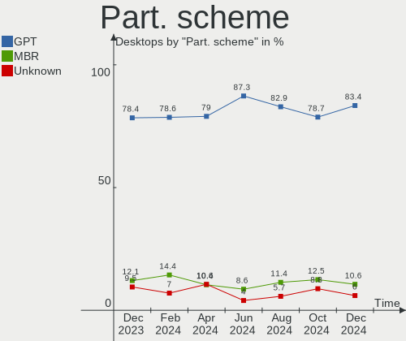
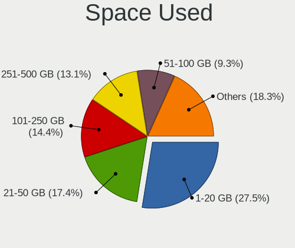
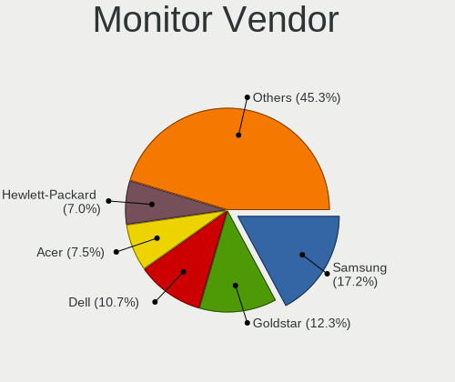
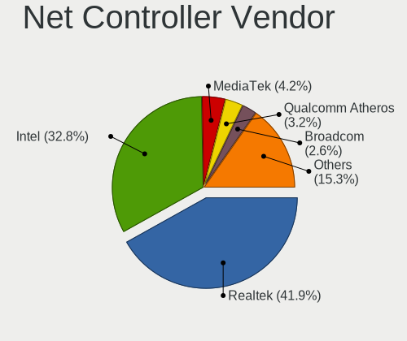
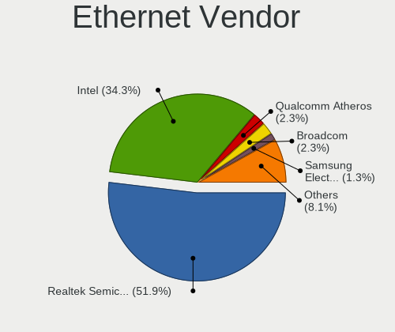

Ubuntu - Hardware Trends (Desktops)
-----------------------------------

A project to identify most popular hardware characteristics and track their change
over time based on data collected by Linux users at https://Linux-Hardware.org.

Anyone can contribute to this report by the [hw-probe](https://github.com/linuxhw/hw-probe) tool:

    sudo -E hw-probe -all -upload

This report is for one last month. Overall report since the beginning of time: [TestDays](https://github.com/linuxhw/TestDays)

Period: Dec, 2023.

Contents
--------

* [ System ](#system)
  - [ OS                       ](#os)
  - [ OS Family                ](#os-family)
  - [ Kernel                   ](#kernel)
  - [ Kernel Family            ](#kernel-family)
  - [ Kernel Major Ver.        ](#kernel-major-ver)
  - [ Arch                     ](#arch)
  - [ DE                       ](#de)
  - [ Display Server           ](#display-server)
  - [ Display Manager          ](#display-manager)
  - [ OS Lang                  ](#os-lang)
  - [ Boot Mode                ](#boot-mode)
  - [ Filesystem               ](#filesystem)
  - [ Part. scheme             ](#part-scheme)
  - [ Dual Boot with Linux/BSD ](#dual-boot-with-linuxbsd)
  - [ Dual Boot (Win)          ](#dual-boot-win)

* [ Board ](#board)
  - [ Vendor                   ](#vendor)
  - [ Model                    ](#model)
  - [ Model Family             ](#model-family)
  - [ MFG Year                 ](#mfg-year)
  - [ Form Factor              ](#form-factor)
  - [ Secure Boot              ](#secure-boot)
  - [ Coreboot                 ](#coreboot)
  - [ RAM Size                 ](#ram-size)
  - [ RAM Used                 ](#ram-used)
  - [ Total Drives             ](#total-drives)
  - [ Has CD-ROM               ](#has-cd-rom)
  - [ Has Ethernet             ](#has-ethernet)
  - [ Has WiFi                 ](#has-wifi)
  - [ Has Bluetooth            ](#has-bluetooth)

* [ Location ](#location)
  - [ Country                  ](#country)
  - [ City                     ](#city)

* [ Drives ](#drives)
  - [ Drive Vendor             ](#drive-vendor)
  - [ Drive Model              ](#drive-model)
  - [ HDD Vendor               ](#hdd-vendor)
  - [ SSD Vendor               ](#ssd-vendor)
  - [ Drive Kind               ](#drive-kind)
  - [ Drive Connector          ](#drive-connector)
  - [ Drive Size               ](#drive-size)
  - [ Space Total              ](#space-total)
  - [ Space Used               ](#space-used)
  - [ Malfunc. Drives          ](#malfunc-drives)
  - [ Malfunc. Drive Vendor    ](#malfunc-drive-vendor)
  - [ Malfunc. HDD Vendor      ](#malfunc-hdd-vendor)
  - [ Malfunc. Drive Kind      ](#malfunc-drive-kind)
  - [ Failed Drives            ](#failed-drives)
  - [ Failed Drive Vendor      ](#failed-drive-vendor)
  - [ Drive Status             ](#drive-status)

* [ Storage controller ](#storage-controller)
  - [ Storage Vendor           ](#storage-vendor)
  - [ Storage Model            ](#storage-model)
  - [ Storage Kind             ](#storage-kind)

* [ Processor ](#processor)
  - [ CPU Vendor               ](#cpu-vendor)
  - [ CPU Model                ](#cpu-model)
  - [ CPU Model Family         ](#cpu-model-family)
  - [ CPU Cores                ](#cpu-cores)
  - [ CPU Sockets              ](#cpu-sockets)
  - [ CPU Threads              ](#cpu-threads)
  - [ CPU Op-Modes             ](#cpu-op-modes)
  - [ CPU Microcode            ](#cpu-microcode)
  - [ CPU Microarch            ](#cpu-microarch)

* [ Graphics ](#graphics)
  - [ GPU Vendor               ](#gpu-vendor)
  - [ GPU Model                ](#gpu-model)
  - [ GPU Combo                ](#gpu-combo)
  - [ GPU Driver               ](#gpu-driver)
  - [ GPU Memory               ](#gpu-memory)

* [ Monitor ](#monitor)
  - [ Monitor Vendor           ](#monitor-vendor)
  - [ Monitor Model            ](#monitor-model)
  - [ Monitor Resolution       ](#monitor-resolution)
  - [ Monitor Diagonal         ](#monitor-diagonal)
  - [ Monitor Width            ](#monitor-width)
  - [ Aspect Ratio             ](#aspect-ratio)
  - [ Monitor Area             ](#monitor-area)
  - [ Pixel Density            ](#pixel-density)
  - [ Multiple Monitors        ](#multiple-monitors)

* [ Network ](#network)
  - [ Net Controller Vendor    ](#net-controller-vendor)
  - [ Net Controller Model     ](#net-controller-model)
  - [ Wireless Vendor          ](#wireless-vendor)
  - [ Wireless Model           ](#wireless-model)
  - [ Ethernet Vendor          ](#ethernet-vendor)
  - [ Ethernet Model           ](#ethernet-model)
  - [ Net Controller Kind      ](#net-controller-kind)
  - [ Used Controller          ](#used-controller)
  - [ NICs                     ](#nics)
  - [ IPv6                     ](#ipv6)

* [ Bluetooth ](#bluetooth)
  - [ Bluetooth Vendor         ](#bluetooth-vendor)
  - [ Bluetooth Model          ](#bluetooth-model)

* [ Sound ](#sound)
  - [ Sound Vendor             ](#sound-vendor)
  - [ Sound Model              ](#sound-model)

* [ Memory ](#memory)
  - [ Memory Vendor            ](#memory-vendor)
  - [ Memory Model             ](#memory-model)
  - [ Memory Kind              ](#memory-kind)
  - [ Memory Form Factor       ](#memory-form-factor)
  - [ Memory Size              ](#memory-size)
  - [ Memory Speed             ](#memory-speed)

* [ Printers & scanners ](#printers--scanners)
  - [ Printer Vendor           ](#printer-vendor)
  - [ Printer Model            ](#printer-model)
  - [ Scanner Vendor           ](#scanner-vendor)
  - [ Scanner Model            ](#scanner-model)

* [ Camera ](#camera)
  - [ Camera Vendor            ](#camera-vendor)
  - [ Camera Model             ](#camera-model)

* [ Security ](#security)
  - [ Fingerprint Vendor       ](#fingerprint-vendor)
  - [ Fingerprint Model        ](#fingerprint-model)
  - [ Chipcard Vendor          ](#chipcard-vendor)
  - [ Chipcard Model           ](#chipcard-model)

* [ Unsupported ](#unsupported)
  - [ Unsupported Devices      ](#unsupported-devices)
  - [ Unsupported Device Types ](#unsupported-device-types)

System
------

OS
--

Installed operating systems

| Name           | Desktops | Percent |
|----------------|----------|---------|
| Ubuntu 22.04   | 277      | 59.83%  |
| Ubuntu 23.10   | 110      | 23.76%  |
| Ubuntu 20.04   | 41       | 8.86%   |
| Ubuntu 23.04   | 12       | 2.59%   |
| Ubuntu 18.04   | 7        | 1.51%   |
| Ubuntu 22.10   | 6        | 1.3%    |
| Ubuntu 24.04   | 3        | 0.65%   |
| Ubuntu 21.10   | 2        | 0.43%   |
| Ubuntu 20.10   | 2        | 0.43%   |
| Ubuntu Core 22 | 1        | 0.22%   |
| Ubuntu 21.04   | 1        | 0.22%   |
| Ubuntu 19.10   | 1        | 0.22%   |

OS Family
---------

OS without a version

| Name   | Desktops | Percent |
|--------|----------|---------|
| Ubuntu | 463      | 100%    |

Kernel
------

Version of the Linux kernel

| Version                 | Desktops | Percent |
|-------------------------|----------|---------|
| 6.2.0-39-generic        | 98       | 21.17%  |
| 6.2.0-37-generic        | 98       | 21.17%  |
| 6.5.0-14-generic        | 83       | 17.93%  |
| 5.15.0-91-generic       | 49       | 10.58%  |
| 6.2.0-26-generic        | 16       | 3.46%   |
| 5.15.0-89-generic       | 15       | 3.24%   |
| 5.19.0-38-generic       | 13       | 2.81%   |
| 6.5.0-13-generic        | 12       | 2.59%   |
| 6.5.0-9-generic         | 11       | 2.38%   |
| 6.2.0-36-generic        | 4        | 0.86%   |
| 5.4.0-169-generic       | 4        | 0.86%   |
| 5.19.0-21-generic       | 4        | 0.86%   |
| 5.4.0-150-generic       | 3        | 0.65%   |
| 5.19.0-32-generic       | 3        | 0.65%   |
| 5.15.0-88-generic       | 3        | 0.65%   |
| 4.15.0-213-generic      | 3        | 0.65%   |
| 6.6.5-060605-generic    | 2        | 0.43%   |
| 6.2.0-1017-lowlatency   | 2        | 0.43%   |
| 5.17.7-051707-generic   | 2        | 0.43%   |
| 5.15.0-25-generic       | 2        | 0.43%   |
| 6.7.0-060700rc5-generic | 1        | 0.22%   |
| 6.7.0-060700rc4-generic | 1        | 0.22%   |
| 6.6.8-200.fc39.x86_64   | 1        | 0.22%   |
| 6.6.7-x64v3-xanmod1     | 1        | 0.22%   |
| 6.6.7-1-liquorix-amd64  | 1        | 0.22%   |
| 6.5.7-060507-generic    | 1        | 0.22%   |
| 6.5.0-14-lowlatency     | 1        | 0.22%   |
| 6.5.0-1006-oem          | 1        | 0.22%   |
| 6.5.0-10-generic        | 1        | 0.22%   |
| 6.2.0-34-generic        | 1        | 0.22%   |
| 6.2.0-33-generic        | 1        | 0.22%   |
| 6.2.0-20-generic        | 1        | 0.22%   |
| 6.2.0-060200-generic    | 1        | 0.22%   |
| 5.8.0-63-generic        | 1        | 0.22%   |
| 5.8.0-25-generic        | 1        | 0.22%   |
| 5.4.0-167-generic       | 1        | 0.22%   |
| 5.4.0-166-generic       | 1        | 0.22%   |
| 5.4.0-163-generic       | 1        | 0.22%   |
| 5.3.0-64-generic        | 1        | 0.22%   |
| 5.19.0-40-generic       | 1        | 0.22%   |

Kernel Family
-------------

Linux kernel without a distro release

| Version  | Desktops | Percent |
|----------|----------|---------|
| 6.2.0    | 222      | 47.95%  |
| 6.5.0    | 109      | 23.54%  |
| 5.15.0   | 78       | 16.85%  |
| 5.19.0   | 21       | 4.54%   |
| 5.4.0    | 10       | 2.16%   |
| 4.15.0   | 4        | 0.86%   |
| 6.7.0    | 2        | 0.43%   |
| 6.6.7    | 2        | 0.43%   |
| 6.6.5    | 2        | 0.43%   |
| 5.8.0    | 2        | 0.43%   |
| 5.17.7   | 2        | 0.43%   |
| 5.13.0   | 2        | 0.43%   |
| 5.11.0   | 2        | 0.43%   |
| 6.6.8    | 1        | 0.22%   |
| 6.5.7    | 1        | 0.22%   |
| 5.3.0    | 1        | 0.22%   |
| 5.15.144 | 1        | 0.22%   |
| 5.11.5   | 1        | 0.22%   |

Kernel Major Ver.
-----------------

Linux kernel major version

| Version | Desktops | Percent |
|---------|----------|---------|
| 6.2     | 222      | 47.95%  |
| 6.5     | 110      | 23.76%  |
| 5.15    | 79       | 17.06%  |
| 5.19    | 21       | 4.54%   |
| 5.4     | 10       | 2.16%   |
| 6.6     | 5        | 1.08%   |
| 4.15    | 4        | 0.86%   |
| 5.11    | 3        | 0.65%   |
| 6.7     | 2        | 0.43%   |
| 5.8     | 2        | 0.43%   |
| 5.17    | 2        | 0.43%   |
| 5.13    | 2        | 0.43%   |
| 5.3     | 1        | 0.22%   |

Arch
----

OS architecture (x86_64, i586, etc.)

| Name   | Desktops | Percent |
|--------|----------|---------|
| x86_64 | 461      | 99.57%  |
| i686   | 2        | 0.43%   |

DE
--

Desktop Environment

| Name            | Desktops | Percent |
|-----------------|----------|---------|
| GNOME           | 425      | 91.79%  |
| Unknown         | 31       | 6.7%    |
| X-Cinnamon      | 5        | 1.08%   |
| GNOME Flashback | 1        | 0.22%   |
| GNOME Classic   | 1        | 0.22%   |

Display Server
--------------

X11 or Wayland

| Name    | Desktops | Percent |
|---------|----------|---------|
| Wayland | 232      | 50.11%  |
| X11     | 198      | 42.76%  |
| Unknown | 22       | 4.75%   |
| Tty     | 11       | 2.38%   |

Display Manager
---------------

SDDM, LightDM, etc.

| Name    | Desktops | Percent |
|---------|----------|---------|
| GDM3    | 377      | 81.43%  |
| Unknown | 59       | 12.74%  |
| GDM     | 19       | 4.1%    |
| LightDM | 5        | 1.08%   |
| SDDM    | 2        | 0.43%   |
| SLiM    | 1        | 0.22%   |

OS Lang
-------

Language

| Lang    | Desktops | Percent |
|---------|----------|---------|
| en_US   | 192      | 41.47%  |
| de_DE   | 46       | 9.94%   |
| fr_FR   | 40       | 8.64%   |
| C       | 23       | 4.97%   |
| pt_BR   | 19       | 4.1%    |
| en_GB   | 19       | 4.1%    |
| it_IT   | 13       | 2.81%   |
| en_AU   | 13       | 2.81%   |
| Unknown | 13       | 2.81%   |
| ru_RU   | 10       | 2.16%   |
| pl_PL   | 10       | 2.16%   |
| en_IN   | 8        | 1.73%   |
| en_CA   | 8        | 1.73%   |
| es_ES   | 7        | 1.51%   |
| zh_CN   | 5        | 1.08%   |
| hu_HU   | 4        | 0.86%   |
| ro_RO   | 3        | 0.65%   |
| tr_TR   | 2        | 0.43%   |
| sv_SE   | 2        | 0.43%   |
| sk_SK   | 2        | 0.43%   |
| nl_NL   | 2        | 0.43%   |
| nb_NO   | 2        | 0.43%   |
| ja_JP   | 2        | 0.43%   |
| es_US   | 2        | 0.43%   |
| bg_BG   | 2        | 0.43%   |
| zh_TW   | 1        | 0.22%   |
| zh_HK   | 1        | 0.22%   |
| th_TH   | 1        | 0.22%   |
| pt_PT   | 1        | 0.22%   |
| fr_CA   | 1        | 0.22%   |
| es_MX   | 1        | 0.22%   |
| es_CL   | 1        | 0.22%   |
| es_AR   | 1        | 0.22%   |
| en_PH   | 1        | 0.22%   |
| en_IL   | 1        | 0.22%   |
| de_CH   | 1        | 0.22%   |
| de_AT   | 1        | 0.22%   |
| cs_CZ   | 1        | 0.22%   |
| aa_DJ   | 1        | 0.22%   |

Boot Mode
---------

EFI or BIOS

| Mode | Desktops | Percent |
|------|----------|---------|
| BIOS | 330      | 71.27%  |
| EFI  | 133      | 28.73%  |

Filesystem
----------

Type of filesystem

| Type    | Desktops | Percent |
|---------|----------|---------|
| Tmpfs   | 277      | 59.83%  |
| Ext4    | 168      | 36.29%  |
| Overlay | 13       | 2.81%   |
| Zfs     | 3        | 0.65%   |
| Btrfs   | 2        | 0.43%   |

Part. scheme
------------

Scheme of partitioning

| Type    | Desktops | Percent |
|---------|----------|---------|
| GPT     | 362      | 78.19%  |
| MBR     | 56       | 12.1%   |
| Unknown | 45       | 9.72%   |

Dual Boot with Linux/BSD
------------------------

Hosting more than one Linux/BSD

| Dual boot | Desktops | Percent |
|-----------|----------|---------|
| No        | 367      | 79.27%  |
| Yes       | 96       | 20.73%  |

Dual Boot (Win)
---------------

Hosting Linux and Windows

| Dual boot | Desktops | Percent |
|-----------|----------|---------|
| No        | 292      | 63.07%  |
| Yes       | 171      | 36.93%  |

Board
-----

Vendor
------

Motherboard manufacturer

| Name                                 | Desktops | Percent |
|--------------------------------------|----------|---------|
| ASUSTek Computer                     | 95       | 20.52%  |
| Dell                                 | 60       | 12.96%  |
| Gigabyte Technology                  | 58       | 12.53%  |
| MSI                                  | 46       | 9.94%   |
| Hewlett-Packard                      | 45       | 9.72%   |
| ASRock                               | 34       | 7.34%   |
| Lenovo                               | 30       | 6.48%   |
| Supermicro                           | 14       | 3.02%   |
| Acer                                 | 9        | 1.94%   |
| Intel                                | 8        | 1.73%   |
| Foxconn                              | 6        | 1.3%    |
| Unknown                              | 6        | 1.3%    |
| Shenzhen Meigao Electronic Equipment | 4        | 0.86%   |
| Pegatron                             | 4        | 0.86%   |
| Fujitsu                              | 4        | 0.86%   |
| MACHINIST                            | 3        | 0.65%   |
| Inventec                             | 3        | 0.65%   |
| Huanan                               | 3        | 0.65%   |
| HC Technology.                       | 3        | 0.65%   |
| ZOTAC                                | 2        | 0.43%   |
| Google                               | 2        | 0.43%   |
| Biostar                              | 2        | 0.43%   |
| AZW                                  | 2        | 0.43%   |
| XDO.AI                               | 1        | 0.22%   |
| VIA Technologies                     | 1        | 0.22%   |
| TECHNOPC                             | 1        | 0.22%   |
| Shuttle                              | 1        | 0.22%   |
| QIYIDA                               | 1        | 0.22%   |
| Positivo                             | 1        | 0.22%   |
| Packard Bell                         | 1        | 0.22%   |
| ONDA                                 | 1        | 0.22%   |
| NEC Infrontia                        | 1        | 0.22%   |
| NCR                                  | 1        | 0.22%   |
| Medion                               | 1        | 0.22%   |
| LattePanda                           | 1        | 0.22%   |
| JHZD                                 | 1        | 0.22%   |
| EVGA                                 | 1        | 0.22%   |
| Entroware                            | 1        | 0.22%   |
| eMachines                            | 1        | 0.22%   |
| DFI                                  | 1        | 0.22%   |

Model
-----

Motherboard model

| Name                                | Desktops | Percent |
|-------------------------------------|----------|---------|
| Lenovo ThinkCentre M710s 10M8S02A00 | 8        | 1.73%   |
| ASUS All Series                     | 8        | 1.73%   |
| Unknown                             | 6        | 1.3%    |
| Dell OptiPlex 7010                  | 5        | 1.08%   |
| Supermicro SYS-1028R-TDW            | 4        | 0.86%   |
| ASUS M5A97 R2.0                     | 4        | 0.86%   |
| MSI MS-7E07                         | 3        | 0.65%   |
| MSI MS-7C56                         | 3        | 0.65%   |
| MSI MS-7C37                         | 3        | 0.65%   |
| Lenovo ThinkCentre M720s 10SUSES500 | 3        | 0.65%   |
| Dell Vostro 3268                    | 3        | 0.65%   |
| Dell OptiPlex 980                   | 3        | 0.65%   |
| Dell OptiPlex 7040                  | 3        | 0.65%   |
| Dell OptiPlex 5050                  | 3        | 0.65%   |
| Acer Veriton X2631G                 | 3        | 0.65%   |
| ZOTAC NM10                          | 2        | 0.43%   |
| Supermicro SYS-6018R-MTR            | 2        | 0.43%   |
| MSI MS-7C75                         | 2        | 0.43%   |
| MSI MS-7B98                         | 2        | 0.43%   |
| MSI MS-7B86                         | 2        | 0.43%   |
| MSI MS-7B79                         | 2        | 0.43%   |
| MSI MS-7816                         | 2        | 0.43%   |
| MSI MS-7680                         | 2        | 0.43%   |
| Inventec DQ Class                   | 2        | 0.43%   |
| Intel H61                           | 2        | 0.43%   |
| HP Z800 Workstation                 | 2        | 0.43%   |
| HP Z440 Workstation                 | 2        | 0.43%   |
| HP ProDesk 600 G3 SFF               | 2        | 0.43%   |
| HP ProDesk 400 G1 SFF               | 2        | 0.43%   |
| HP Compaq 8200 Elite SFF PC         | 2        | 0.43%   |
| HP Compaq 6200 Pro MT PC            | 2        | 0.43%   |
| HP Compaq 6000 Pro SFF PC           | 2        | 0.43%   |
| HC Technology. HCAR5000-MI          | 2        | 0.43%   |
| Gigabyte GA-990X-Gaming SLI-CF      | 2        | 0.43%   |
| Gigabyte B550M DS3H AC              | 2        | 0.43%   |
| Gigabyte 990FXA-UD3                 | 2        | 0.43%   |
| Dell XPS 8700                       | 2        | 0.43%   |
| Dell Precision WorkStation T3500    | 2        | 0.43%   |
| Dell Precision Tower 7910           | 2        | 0.43%   |
| Dell OptiPlex 9020                  | 2        | 0.43%   |

Model Family
------------

Motherboard model prefix

| Name                     | Desktops | Percent |
|--------------------------|----------|---------|
| Dell OptiPlex            | 35       | 7.56%   |
| Lenovo ThinkCentre       | 25       | 5.4%    |
| ASUS PRIME               | 23       | 4.97%   |
| ASUS ROG                 | 17       | 3.67%   |
| HP Compaq                | 13       | 2.81%   |
| Dell Precision           | 11       | 2.38%   |
| ASUS TUF                 | 11       | 2.38%   |
| ASUS All                 | 8        | 1.73%   |
| HP ProDesk               | 7        | 1.51%   |
| Dell Vostro              | 6        | 1.3%    |
| Unknown                  | 6        | 1.3%    |
| Gigabyte B550M           | 5        | 1.08%   |
| Acer Veriton             | 5        | 1.08%   |
| Supermicro SYS-1028R-TDW | 4        | 0.86%   |
| Fujitsu ESPRIMO          | 4        | 0.86%   |
| ASUS M5A97               | 4        | 0.86%   |
| MSI MS-7E07              | 3        | 0.65%   |
| MSI MS-7C56              | 3        | 0.65%   |
| MSI MS-7C37              | 3        | 0.65%   |
| Gigabyte Z790            | 3        | 0.65%   |
| Dell XPS                 | 3        | 0.65%   |
| Dell Inspiron            | 3        | 0.65%   |
| ASUS M5A78L-M            | 3        | 0.65%   |
| Acer Aspire              | 3        | 0.65%   |
| ZOTAC NM10               | 2        | 0.43%   |
| Supermicro SYS-6018R-MTR | 2        | 0.43%   |
| Supermicro AS            | 2        | 0.43%   |
| MSI MS-7C75              | 2        | 0.43%   |
| MSI MS-7B98              | 2        | 0.43%   |
| MSI MS-7B86              | 2        | 0.43%   |
| MSI MS-7B79              | 2        | 0.43%   |
| MSI MS-7816              | 2        | 0.43%   |
| MSI MS-7680              | 2        | 0.43%   |
| Lenovo ThinkStation      | 2        | 0.43%   |
| Inventec DQ              | 2        | 0.43%   |
| Intel H61                | 2        | 0.43%   |
| Huanan X99-F8            | 2        | 0.43%   |
| HP Z800                  | 2        | 0.43%   |
| HP Z440                  | 2        | 0.43%   |
| HP Pavilion              | 2        | 0.43%   |

MFG Year
--------

Motherboard manufacture year

| Year | Desktops | Percent |
|------|----------|---------|
| 2023 | 40       | 8.64%   |
| 2017 | 39       | 8.42%   |
| 2012 | 38       | 8.21%   |
| 2013 | 37       | 7.99%   |
| 2019 | 35       | 7.56%   |
| 2018 | 34       | 7.34%   |
| 2022 | 32       | 6.91%   |
| 2021 | 30       | 6.48%   |
| 2020 | 28       | 6.05%   |
| 2014 | 28       | 6.05%   |
| 2015 | 24       | 5.18%   |
| 2016 | 23       | 4.97%   |
| 2011 | 21       | 4.54%   |
| 2010 | 20       | 4.32%   |
| 2009 | 17       | 3.67%   |
| 2008 | 9        | 1.94%   |
| 2007 | 7        | 1.51%   |
| 2005 | 1        | 0.22%   |

Form Factor
-----------

Physical design of the computer

| Name    | Desktops | Percent |
|---------|----------|---------|
| Desktop | 463      | 100%    |

Secure Boot
-----------

Enabled or disabled

| State    | Desktops | Percent |
|----------|----------|---------|
| Disabled | 445      | 96.11%  |
| Enabled  | 18       | 3.89%   |

Coreboot
--------

Have coreboot on board

| Used | Desktops | Percent |
|------|----------|---------|
| No   | 461      | 99.57%  |
| Yes  | 2        | 0.43%   |

RAM Size
--------

Total RAM memory

| Size in GB      | Desktops | Percent |
|-----------------|----------|---------|
| 16.01-24.0      | 106      | 22.89%  |
| 4.01-8.0        | 89       | 19.22%  |
| 32.01-64.0      | 73       | 15.77%  |
| 8.01-16.0       | 68       | 14.69%  |
| 64.01-256.0     | 53       | 11.45%  |
| 3.01-4.0        | 47       | 10.15%  |
| 24.01-32.0      | 14       | 3.02%   |
| More than 256.0 | 9        | 1.94%   |
| 2.01-3.0        | 2        | 0.43%   |
| 1.01-2.0        | 2        | 0.43%   |

RAM Used
--------

Used RAM memory

| Used GB     | Desktops | Percent |
|-------------|----------|---------|
| 1.01-2.0    | 147      | 31.75%  |
| 2.01-3.0    | 127      | 27.43%  |
| 4.01-8.0    | 90       | 19.44%  |
| 3.01-4.0    | 59       | 12.74%  |
| 8.01-16.0   | 22       | 4.75%   |
| 16.01-24.0  | 8        | 1.73%   |
| 64.01-256.0 | 4        | 0.86%   |
| 0.51-1.0    | 3        | 0.65%   |
| 32.01-64.0  | 2        | 0.43%   |
| 24.01-32.0  | 1        | 0.22%   |

Total Drives
------------

Number of drives on board

| Drives | Desktops | Percent |
|--------|----------|---------|
| 1      | 209      | 45.14%  |
| 2      | 126      | 27.21%  |
| 3      | 56       | 12.1%   |
| 4      | 36       | 7.78%   |
| 5      | 13       | 2.81%   |
| 7      | 7        | 1.51%   |
| 6      | 6        | 1.3%    |
| 0      | 5        | 1.08%   |
| 10     | 2        | 0.43%   |
| 9      | 2        | 0.43%   |
| 101    | 1        | 0.22%   |

Has CD-ROM
----------

Has CD-ROM on board

| Presented | Desktops | Percent |
|-----------|----------|---------|
| No        | 255      | 55.08%  |
| Yes       | 208      | 44.92%  |

Has Ethernet
------------

Has Ethernet on board

| Presented | Desktops | Percent |
|-----------|----------|---------|
| Yes       | 458      | 98.92%  |
| No        | 5        | 1.08%   |

Has WiFi
--------

Has WiFi module

| Presented | Desktops | Percent |
|-----------|----------|---------|
| No        | 236      | 50.97%  |
| Yes       | 227      | 49.03%  |

Has Bluetooth
-------------

Has Bluetooth module

| Presented | Desktops | Percent |
|-----------|----------|---------|
| No        | 285      | 61.56%  |
| Yes       | 178      | 38.44%  |

Location
--------

Country
-------

Geographic location (country)

| Country          | Desktops | Percent |
|------------------|----------|---------|
| USA              | 104      | 22.46%  |
| Germany          | 56       | 12.1%   |
| France           | 44       | 9.5%    |
| Russia           | 27       | 5.83%   |
| Brazil           | 26       | 5.62%   |
| UK               | 19       | 4.1%    |
| Italy            | 18       | 3.89%   |
| Australia        | 14       | 3.02%   |
| Canada           | 13       | 2.81%   |
| India            | 11       | 2.38%   |
| Spain            | 10       | 2.16%   |
| Poland           | 9        | 1.94%   |
| Netherlands      | 8        | 1.73%   |
| Mexico           | 7        | 1.51%   |
| Vietnam          | 6        | 1.3%    |
| Switzerland      | 6        | 1.3%    |
| Hungary          | 6        | 1.3%    |
| China            | 6        | 1.3%    |
| Sweden           | 5        | 1.08%   |
| Turkey           | 4        | 0.86%   |
| Thailand         | 4        | 0.86%   |
| Romania          | 4        | 0.86%   |
| Israel           | 4        | 0.86%   |
| Slovakia         | 3        | 0.65%   |
| Singapore        | 3        | 0.65%   |
| Japan            | 3        | 0.65%   |
| Iran             | 3        | 0.65%   |
| Hong Kong        | 3        | 0.65%   |
| Egypt            | 3        | 0.65%   |
| Bulgaria         | 3        | 0.65%   |
| Austria          | 3        | 0.65%   |
| South Korea      | 2        | 0.43%   |
| Portugal         | 2        | 0.43%   |
| Norway           | 2        | 0.43%   |
| French Polynesia | 2        | 0.43%   |
| Czechia          | 2        | 0.43%   |
| Ukraine          | 1        | 0.22%   |
| The Netherlands  | 1        | 0.22%   |
| Taiwan           | 1        | 0.22%   |
| Serbia           | 1        | 0.22%   |

City
----

Geographic location (city)

| City             | Desktops | Percent |
|------------------|----------|---------|
| Moscow           | 17       | 3.67%   |
| Roubaix          | 12       | 2.59%   |
| Sao Paulo        | 7        | 1.51%   |
| Kolkata          | 6        | 1.3%    |
| Melbourne        | 5        | 1.08%   |
| Paris            | 4        | 0.86%   |
| Montreal         | 4        | 0.86%   |
| Hanoi            | 4        | 0.86%   |
| Thornton         | 3        | 0.65%   |
| Tehran           | 3        | 0.65%   |
| Sydney           | 3        | 0.65%   |
| St Petersburg    | 3        | 0.65%   |
| Singapore        | 3        | 0.65%   |
| Rome             | 3        | 0.65%   |
| Rio de Janeiro   | 3        | 0.65%   |
| Hamburg          | 3        | 0.65%   |
| Giessen          | 3        | 0.65%   |
| Cairo            | 3        | 0.65%   |
| Brisbane         | 3        | 0.65%   |
| Bonn             | 3        | 0.65%   |
| Berlin           | 3        | 0.65%   |
| Barcelona        | 3        | 0.65%   |
| Tijuana          | 2        | 0.43%   |
| Stockholm        | 2        | 0.43%   |
| Santo André     | 2        | 0.43%   |
| Ploieşti        | 2        | 0.43%   |
| Papeete          | 2        | 0.43%   |
| Munich           | 2        | 0.43%   |
| Milton Keynes    | 2        | 0.43%   |
| Miami            | 2        | 0.43%   |
| Marseille        | 2        | 0.43%   |
| Madrid           | 2        | 0.43%   |
| Las Vegas        | 2        | 0.43%   |
| Jerusalem        | 2        | 0.43%   |
| Hyderabad        | 2        | 0.43%   |
| Ho Chi Minh City | 2        | 0.43%   |
| Greenville       | 2        | 0.43%   |
| Geneva           | 2        | 0.43%   |
| Geneseo          | 2        | 0.43%   |
| Frankfurt (Oder) | 2        | 0.43%   |

Drives
------

Drive Vendor
------------

Hard drive vendors

| Vendor                       | Desktops | Drives | Percent |
|------------------------------|----------|--------|---------|
| WDC                          | 138      | 211    | 17.65%  |
| Seagate                      | 125      | 183    | 15.98%  |
| Samsung Electronics          | 111      | 139    | 14.19%  |
| Sandisk                      | 42       | 47     | 5.37%   |
| Kingston                     | 38       | 40     | 4.86%   |
| Toshiba                      | 34       | 45     | 4.35%   |
| Crucial                      | 26       | 36     | 3.32%   |
| Intel                        | 22       | 40     | 2.81%   |
| Hitachi                      | 17       | 22     | 2.17%   |
| Unknown                      | 14       | 24     | 1.79%   |
| Kingston Technology Company  | 12       | 12     | 1.53%   |
| China                        | 12       | 13     | 1.53%   |
| A-DATA Technology            | 12       | 12     | 1.53%   |
| Phison Electronics           | 10       | 12     | 1.28%   |
| Micron/Crucial Technology    | 10       | 14     | 1.28%   |
| HGST                         | 10       | 39     | 1.28%   |
| Micron Technology            | 7        | 8      | 0.9%    |
| SK hynix                     | 6        | 6      | 0.77%   |
| Silicon Motion               | 6        | 6      | 0.77%   |
| Corsair                      | 6        | 7      | 0.77%   |
| SPCC                         | 5        | 7      | 0.64%   |
| PNY                          | 5        | 5      | 0.64%   |
| Patriot                      | 5        | 5      | 0.64%   |
| MAXIO Technology (Hangzhou)  | 5        | 5      | 0.64%   |
| Intenso                      | 5        | 8      | 0.64%   |
| Hewlett-Packard              | 5        | 5      | 0.64%   |
| Unknown                      | 5        | 7      | 0.64%   |
| T-FORCE                      | 4        | 5      | 0.51%   |
| OCZ                          | 4        | 4      | 0.51%   |
| ADATA Technology             | 4        | 6      | 0.51%   |
| Transcend                    | 3        | 3      | 0.38%   |
| Team                         | 3        | 3      | 0.38%   |
| Shenzhen Longsys Electronics | 3        | 3      | 0.38%   |
| Netac                        | 3        | 3      | 0.38%   |
| Lexar                        | 3        | 3      | 0.38%   |
| KIOXIA-EXCERIA               | 3        | 6      | 0.38%   |
| KIOXIA                       | 3        | 4      | 0.38%   |
| Gigabyte Technology          | 3        | 3      | 0.38%   |
| WD MediaMax                  | 2        | 3      | 0.26%   |
| Realtek Semiconductor        | 2        | 2      | 0.26%   |

Drive Model
-----------

Hard drive models

| Model                                                 | Desktops | Percent |
|-------------------------------------------------------|----------|---------|
| Samsung NVMe SSD Controller SM981/PM981/PM983 512GB   | 19       | 2.09%   |
| Seagate ST1000DM003-1SB102 1TB                        | 11       | 1.21%   |
| Seagate ST1000DM010-2EP102 1TB                        | 10       | 1.1%    |
| Samsung SSD 860 EVO 500GB                             | 10       | 1.1%    |
| Samsung NVMe SSD Controller PM9A1/PM9A3/980PRO 2TB    | 9        | 0.99%   |
| WDC WD10EZEX-08WN4A0 1TB                              | 8        | 0.88%   |
| Seagate ST500DM002-1BD142 500GB                       | 8        | 0.88%   |
| Seagate ST2000DM008-2FR102 2TB                        | 8        | 0.88%   |
| Micron/Crucial P2 NVMe PCIe SSD 4TB                   | 7        | 0.77%   |
| Kingston Company SNV2S1000G 1TB                       | 7        | 0.77%   |
| Kingston SA400S37480G 480GB SSD                       | 7        | 0.77%   |
| Unknown SD/MMC 2GB                                    | 6        | 0.66%   |
| Unknown M.S./M.S.Pro/HG 16GB                          | 6        | 0.66%   |
| Kingston SA400S37240G 240GB SSD                       | 6        | 0.66%   |
| Crucial CT500MX500SSD1 500GB                          | 6        | 0.66%   |
| Unknown SD/MMC/MS PRO 512GB                           | 5        | 0.55%   |
| Toshiba DT01ACA100 1TB                                | 5        | 0.55%   |
| Silicon Motion SM2263EN/SM2263XT SSD Controller 500GB | 5        | 0.55%   |
| Seagate ST4000DM004-2CV104 4TB                        | 5        | 0.55%   |
| Seagate ST1000DM003-1CH162 1TB                        | 5        | 0.55%   |
| Samsung SSD 980 1TB                                   | 5        | 0.55%   |
| Samsung SSD 870 EVO 1TB                               | 5        | 0.55%   |
| Kingston SV300S37A120G 120GB SSD                      | 5        | 0.55%   |
| Crucial CT1000MX500SSD1 1TB                           | 5        | 0.55%   |
| Unknown                                               | 5        | 0.55%   |
| WDC WDS240G2G0A-00JH30 240GB SSD                      | 4        | 0.44%   |
| WDC WD5000AZLX-75K2TA0 500GB                          | 4        | 0.44%   |
| WDC WD10EZEX-60M2NA0 1TB                              | 4        | 0.44%   |
| Toshiba DT01ACA050 500GB                              | 4        | 0.44%   |
| SanDisk SSD PLUS 240GB                                | 4        | 0.44%   |
| Samsung SSD 990 PRO 2TB                               | 4        | 0.44%   |
| Samsung SSD 850 EVO 500GB                             | 4        | 0.44%   |
| Phison E12 NVMe Controller 1TB                        | 4        | 0.44%   |
| MAXIO (Hangzhou) NVMe SSD Controller MAP1202 256GB    | 4        | 0.44%   |
| Intel SSDSC2BB800G7 800GB                             | 4        | 0.44%   |
| Intel SSDSC2BB480G7 480GB                             | 4        | 0.44%   |
| HGST HTE721010A9E630 1TB                              | 4        | 0.44%   |
| Crucial CT480BX500SSD1 480GB                          | 4        | 0.44%   |
| Crucial CT240BX500SSD1 240GB                          | 4        | 0.44%   |
| WDC WD5000AAKX-22ERMA0 500GB                          | 3        | 0.33%   |

HDD Vendor
----------

Hard disk drive vendors

| Vendor              | Desktops | Drives | Percent |
|---------------------|----------|--------|---------|
| WDC                 | 127      | 189    | 37.24%  |
| Seagate             | 123      | 180    | 36.07%  |
| Toshiba             | 32       | 43     | 9.38%   |
| Hitachi             | 17       | 22     | 4.99%   |
| Samsung Electronics | 14       | 17     | 4.11%   |
| HGST                | 10       | 17     | 2.93%   |
| Unknown             | 7        | 7      | 2.05%   |
| Maxtor              | 2        | 2      | 0.59%   |
| Fujitsu             | 2        | 2      | 0.59%   |
| WD MediaMax         | 1        | 2      | 0.29%   |
| USB3.0              | 1        | 1      | 0.29%   |
| OOS16000            | 1        | 1      | 0.29%   |
| NETAPP              | 1        | 12     | 0.29%   |
| External            | 1        | 1      | 0.29%   |
| ASMT                | 1        | 1      | 0.29%   |
| Unknown             | 1        | 1      | 0.29%   |

SSD Vendor
----------

Solid state drive vendors

| Vendor              | Desktops | Drives | Percent |
|---------------------|----------|--------|---------|
| Samsung Electronics | 53       | 57     | 20.38%  |
| Kingston            | 30       | 31     | 11.54%  |
| SanDisk             | 25       | 27     | 9.62%   |
| Crucial             | 25       | 30     | 9.62%   |
| Intel               | 16       | 33     | 6.15%   |
| WDC                 | 12       | 12     | 4.62%   |
| China               | 12       | 13     | 4.62%   |
| A-DATA Technology   | 9        | 9      | 3.46%   |
| PNY                 | 5        | 5      | 1.92%   |
| Patriot             | 5        | 5      | 1.92%   |
| Micron Technology   | 5        | 5      | 1.92%   |
| SPCC                | 4        | 6      | 1.54%   |
| OCZ                 | 4        | 4      | 1.54%   |
| Intenso             | 4        | 7      | 1.54%   |
| Corsair             | 4        | 4      | 1.54%   |
| Transcend           | 3        | 3      | 1.15%   |
| Team                | 3        | 3      | 1.15%   |
| SK hynix            | 3        | 3      | 1.15%   |
| Lexar               | 3        | 3      | 1.15%   |
| KIOXIA-EXCERIA      | 3        | 6      | 1.15%   |
| Netac               | 2        | 2      | 0.77%   |
| LDLC                | 2        | 2      | 0.77%   |
| KingSpec            | 2        | 2      | 0.77%   |
| KingDian            | 2        | 2      | 0.77%   |
| Hewlett-Packard     | 2        | 2      | 0.77%   |
| GOODRAM             | 2        | 2      | 0.77%   |
| Gigabyte Technology | 2        | 2      | 0.77%   |
| XrayDisk            | 1        | 1      | 0.38%   |
| Vaseky              | 1        | 1      | 0.38%   |
| Toshiba             | 1        | 1      | 0.38%   |
| Teclast             | 1        | 1      | 0.38%   |
| SUNEAST             | 1        | 1      | 0.38%   |
| SPCC M.2            | 1        | 1      | 0.38%   |
| SILICONMOTION       | 1        | 1      | 0.38%   |
| POWER               | 1        | 1      | 0.38%   |
| PHD 3.0             | 1        | 1      | 0.38%   |
| MAXIO               | 1        | 1      | 0.38%   |
| LITEON              | 1        | 1      | 0.38%   |
| Lenovo              | 1        | 1      | 0.38%   |
| KingFast            | 1        | 1      | 0.38%   |

Drive Kind
----------

HDD or SSD

| Kind    | Desktops | Drives | Percent |
|---------|----------|--------|---------|
| HDD     | 277      | 498    | 40.62%  |
| SSD     | 223      | 298    | 32.7%   |
| NVMe    | 157      | 210    | 23.02%  |
| Unknown | 25       | 63     | 3.67%   |

Drive Connector
---------------

SATA, SAS, NVMe, etc.

| Type | Desktops | Drives | Percent |
|------|----------|--------|---------|
| SATA | 391      | 749    | 66.61%  |
| NVMe | 157      | 209    | 26.75%  |
| SAS  | 39       | 111    | 6.64%   |

Drive Size
----------

Size of hard drive

| Size in TB | Desktops | Drives | Percent |
|------------|----------|--------|---------|
| 0.01-0.5   | 240      | 335    | 44.61%  |
| 0.51-1.0   | 172      | 222    | 31.97%  |
| 1.01-2.0   | 57       | 75     | 10.59%  |
| 3.01-4.0   | 24       | 42     | 4.46%   |
| 4.01-10.0  | 20       | 45     | 3.72%   |
| 2.01-3.0   | 15       | 16     | 2.79%   |
| 10.01-20.0 | 10       | 61     | 1.86%   |

Space Total
-----------

Amount of disk space available on the file system

| Size in GB     | Desktops | Percent |
|----------------|----------|---------|
| 101-250        | 104      | 22.46%  |
| 501-1000       | 100      | 21.6%   |
| 251-500        | 73       | 15.77%  |
| 1001-2000      | 55       | 11.88%  |
| More than 3000 | 42       | 9.07%   |
| Unknown        | 27       | 5.83%   |
| 51-100         | 24       | 5.18%   |
| 2001-3000      | 22       | 4.75%   |
| 1-20           | 9        | 1.94%   |
| 21-50          | 7        | 1.51%   |

Space Used
----------

Amount of used disk space

| Used GB        | Desktops | Percent |
|----------------|----------|---------|
| 1-20           | 123      | 26.57%  |
| 21-50          | 88       | 19.01%  |
| 51-100         | 65       | 14.04%  |
| 101-250        | 57       | 12.31%  |
| 251-500        | 28       | 6.05%   |
| 501-1000       | 28       | 6.05%   |
| Unknown        | 27       | 5.83%   |
| 1001-2000      | 19       | 4.1%    |
| More than 3000 | 16       | 3.46%   |
| 2001-3000      | 12       | 2.59%   |

Malfunc. Drives
---------------

Drive models with a malfunction

| Model                                                 | Desktops | Drives | Percent |
|-------------------------------------------------------|----------|--------|---------|
| Intel SSDSC2BB800G7 800GB                             | 3        | 3      | 6.98%   |
| Seagate ST1000DM010-2EP102 1TB                        | 2        | 2      | 4.65%   |
| WDC WD60PURZ-85ZUFY1 6TB                              | 1        | 1      | 2.33%   |
| WDC WD5002ABYS-02B1B0 500GB                           | 1        | 2      | 2.33%   |
| WDC WD5000AAKX-22ERMA0 500GB                          | 1        | 1      | 2.33%   |
| WDC WD5000AAKX-001CA0 500GB                           | 1        | 1      | 2.33%   |
| WDC WD5000AAKS-75V0A0 500GB                           | 1        | 1      | 2.33%   |
| WDC WD40EZRZ-00WN9B0 4TB                              | 1        | 1      | 2.33%   |
| WDC WD40EZRX-00SPEB0 4TB                              | 1        | 1      | 2.33%   |
| WDC WD30EZRZ-00Z5HB0 3TB                              | 1        | 1      | 2.33%   |
| WDC WD2003FYPS-27W9B0 2TB                             | 1        | 1      | 2.33%   |
| WDC WD10EZRZ-00HTKB0 1TB                              | 1        | 2      | 2.33%   |
| WDC WD10EADS-65L5B1 1TB                               | 1        | 1      | 2.33%   |
| SK hynix SH920 2.5 7MM 512GB SSD                      | 1        | 1      | 2.33%   |
| Seagate ST8000DM0004-1ZC11G 8TB                       | 1        | 1      | 2.33%   |
| Seagate ST500LM021-1KJ152 500GB                       | 1        | 3      | 2.33%   |
| Seagate ST500DM002-1BC142 500GB                       | 1        | 1      | 2.33%   |
| Seagate ST4000VN008-2DR166 4TB                        | 1        | 1      | 2.33%   |
| Seagate ST3000NC000 3TB                               | 1        | 1      | 2.33%   |
| Seagate ST2000DM008-2FR102 2TB                        | 1        | 1      | 2.33%   |
| Seagate ST2000DM001-1CH164 2TB                        | 1        | 1      | 2.33%   |
| Seagate ST2000DM 001-1CH164 2TB                       | 1        | 1      | 2.33%   |
| Seagate ST14000NM0018-2H4101 14TB                     | 1        | 1      | 2.33%   |
| Seagate ST1000NM0011 1TB                              | 1        | 2      | 2.33%   |
| Seagate ST1000LM035-1RK172 1TB                        | 1        | 1      | 2.33%   |
| Samsung Electronics SSD 980 1TB                       | 1        | 1      | 2.33%   |
| Samsung Electronics SSD 970 EVO 500GB S5H7NS0N813785B | 1        | 1      | 2.33%   |
| Samsung Electronics SSD 830 Series 256GB              | 1        | 1      | 2.33%   |
| Samsung Electronics HD322HJ 320GB                     | 1        | 1      | 2.33%   |
| LDLC SSD 120GB                                        | 1        | 1      | 2.33%   |
| LDLC F7+480GB SSD                                     | 1        | 1      | 2.33%   |
| Kingston SKC600512G 512GB SSD                         | 1        | 1      | 2.33%   |
| Kingston SA400S37240G 240GB SSD                       | 1        | 1      | 2.33%   |
| Intel SSDSC2KG480G8 480GB                             | 1        | 2      | 2.33%   |
| Intel SSDSC2BW240H6 240GB                             | 1        | 1      | 2.33%   |
| Intel SSDSC2BB480G7 480GB                             | 1        | 3      | 2.33%   |
| Hitachi HUA722020ALA331 2TB                           | 1        | 4      | 2.33%   |
| China SH00M240GB SSD                                  | 1        | 1      | 2.33%   |
| A-DATA Technology SX900 128GB SSD                     | 1        | 1      | 2.33%   |
| A-DATA Technology SX8100NP 512GB                      | 1        | 1      | 2.33%   |

Malfunc. Drive Vendor
---------------------

Vendors of faulty drives

| Vendor              | Desktops | Drives | Percent |
|---------------------|----------|--------|---------|
| Seagate             | 12       | 16     | 30%     |
| WDC                 | 10       | 13     | 25%     |
| Intel               | 5        | 9      | 12.5%   |
| Samsung Electronics | 4        | 4      | 10%     |
| LDLC                | 2        | 2      | 5%      |
| Kingston            | 2        | 2      | 5%      |
| A-DATA Technology   | 2        | 2      | 5%      |
| SK hynix            | 1        | 1      | 2.5%    |
| Hitachi             | 1        | 4      | 2.5%    |
| China               | 1        | 1      | 2.5%    |

Malfunc. HDD Vendor
-------------------

Vendors of faulty HDD drives

| Vendor              | Desktops | Drives | Percent |
|---------------------|----------|--------|---------|
| Seagate             | 12       | 16     | 50%     |
| WDC                 | 10       | 13     | 41.67%  |
| Samsung Electronics | 1        | 1      | 4.17%   |
| Hitachi             | 1        | 4      | 4.17%   |

Malfunc. Drive Kind
-------------------

Kinds of faulty drives

| Kind | Desktops | Drives | Percent |
|------|----------|--------|---------|
| HDD  | 24       | 34     | 60%     |
| SSD  | 13       | 17     | 32.5%   |
| NVMe | 3        | 3      | 7.5%    |

Failed Drives
-------------

Failed drive models

Zero info for selected period =(

Failed Drive Vendor
-------------------

Failed drive vendors

Zero info for selected period =(

Drive Status
------------

Number of failed and malfunc. drives

| Status   | Desktops | Drives | Percent |
|----------|----------|--------|---------|
| Detected | 323      | 683    | 63.96%  |
| Works    | 145      | 332    | 28.71%  |
| Malfunc  | 37       | 54     | 7.33%   |

Storage controller
------------------

Storage Vendor
--------------

Storage controller vendors

| Vendor                        | Desktops | Percent |
|-------------------------------|----------|---------|
| Intel                         | 328      | 47.19%  |
| AMD                           | 129      | 18.56%  |
| Samsung Electronics           | 60       | 8.63%   |
| ASMedia Technology            | 28       | 4.03%   |
| SanDisk                       | 22       | 3.17%   |
| Kingston Technology Company   | 20       | 2.88%   |
| Phison Electronics            | 17       | 2.45%   |
| Marvell Technology Group      | 13       | 1.87%   |
| Micron/Crucial Technology     | 12       | 1.73%   |
| Silicon Motion                | 8        | 1.15%   |
| Broadcom / LSI                | 6        | 0.86%   |
| ADATA Technology              | 6        | 0.86%   |
| Realtek Semiconductor         | 5        | 0.72%   |
| MAXIO Technology (Hangzhou)   | 5        | 0.72%   |
| JMicron Technology            | 5        | 0.72%   |
| Nvidia                        | 4        | 0.58%   |
| VIA Technologies              | 3        | 0.43%   |
| SK hynix                      | 3        | 0.43%   |
| Shenzhen Longsys Electronics  | 3        | 0.43%   |
| Seagate Technology            | 3        | 0.43%   |
| Toshiba America Info Systems  | 2        | 0.29%   |
| Micron Technology             | 2        | 0.29%   |
| LSI Logic / Symbios Logic     | 2        | 0.29%   |
| KIOXIA                        | 2        | 0.29%   |
| INNOGRIT                      | 2        | 0.29%   |
| Solidigm                      | 1        | 0.14%   |
| Netac Technology              | 1        | 0.14%   |
| Integrated Technology Express | 1        | 0.14%   |
| Hewlett-Packard               | 1        | 0.14%   |
| Adaptec                       | 1        | 0.14%   |

Storage Model
-------------

Storage controller models

| Model                                                                                   | Desktops | Percent |
|-----------------------------------------------------------------------------------------|----------|---------|
| AMD FCH SATA Controller [AHCI mode]                                                     | 73       | 8.86%   |
| Intel 8 Series/C220 Series Chipset Family 6-port SATA Controller 1 [AHCI mode]          | 34       | 4.13%   |
| Samsung NVMe SSD Controller SM981/PM981/PM983                                           | 26       | 3.16%   |
| Intel SATA Controller [RAID mode]                                                       | 26       | 3.16%   |
| Intel 200 Series PCH SATA controller [AHCI mode]                                        | 26       | 3.16%   |
| ASMedia ASM1062 Serial ATA Controller                                                   | 26       | 3.16%   |
| Intel Q170/Q150/B150/H170/H110/Z170/CM236 Chipset SATA Controller [AHCI Mode]           | 24       | 2.91%   |
| Intel 6 Series/C200 Series Chipset Family 6 port Desktop SATA AHCI Controller           | 24       | 2.91%   |
| AMD 500 Series Chipset SATA Controller                                                  | 23       | 2.79%   |
| Intel C610/X99 series chipset 6-Port SATA Controller [AHCI mode]                        | 19       | 2.31%   |
| Intel 7 Series/C210 Series Chipset Family 6-port SATA Controller [AHCI mode]            | 19       | 2.31%   |
| AMD 400 Series Chipset SATA Controller                                                  | 19       | 2.31%   |
| AMD SB7x0/SB8x0/SB9x0 SATA Controller [AHCI mode]                                       | 18       | 2.18%   |
| Intel Cannon Lake PCH SATA AHCI Controller                                              | 16       | 1.94%   |
| Intel 700 Series Chipset Family SATA AHCI Controller                                    | 15       | 1.82%   |
| Intel 500 Series Chipset Family SATA AHCI Controller                                    | 15       | 1.82%   |
| Samsung NVMe SSD Controller PM9A1/PM9A3/980PRO                                          | 14       | 1.7%    |
| Intel C610/X99 series chipset sSATA Controller [AHCI mode]                              | 14       | 1.7%    |
| AMD SB7x0/SB8x0/SB9x0 IDE Controller                                                    | 14       | 1.7%    |
| Intel Alder Lake-S PCH SATA Controller [AHCI Mode]                                      | 13       | 1.58%   |
| Samsung NVMe SSD Controller 980 (DRAM-less)                                             | 10       | 1.21%   |
| Micron/Crucial P2 [Nick P2] / P3 / P3 Plus NVMe PCIe SSD (DRAM-less)                    | 9        | 1.09%   |
| Kingston Company NV2 NVMe SSD SM2267XT                                                  | 9        | 1.09%   |
| Silicon Motion SM2263EN/SM2263XT (DRAM-less) NVMe SSD Controllers                       | 8        | 0.97%   |
| Samsung NVMe SSD Controller S4LV008[Pascal]                                             | 8        | 0.97%   |
| Intel Volume Management Device NVMe RAID Controller Intel Corporation                   | 8        | 0.97%   |
| AMD SB7x0/SB8x0/SB9x0 SATA Controller [IDE mode]                                        | 8        | 0.97%   |
| Phison E12 NVMe Controller                                                              | 6        | 0.73%   |
| Intel Volume Management Device NVMe RAID Controller                                     | 6        | 0.73%   |
| Intel NM10/ICH7 Family SATA Controller [IDE mode]                                       | 6        | 0.73%   |
| Intel 82801JD/DO (ICH10 Family) SATA AHCI Controller                                    | 6        | 0.73%   |
| Intel 6 Series/C200 Series Chipset Family Desktop SATA Controller (IDE mode, ports 4-5) | 6        | 0.73%   |
| Intel 6 Series/C200 Series Chipset Family Desktop SATA Controller (IDE mode, ports 0-3) | 6        | 0.73%   |
| MAXIO (Hangzhou) NVMe SSD Controller MAP1202                                            | 5        | 0.61%   |
| Intel Comet Lake SATA AHCI Controller                                                   | 5        | 0.61%   |
| Intel 9 Series Chipset Family SATA Controller [AHCI Mode]                               | 5        | 0.61%   |
| Intel 5 Series/3400 Series Chipset 6 port SATA AHCI Controller                          | 5        | 0.61%   |
| Intel 4 Series Chipset PT IDER Controller                                               | 5        | 0.61%   |
| AMD FCH SATA Controller D                                                               | 5        | 0.61%   |
| AMD 300 Series Chipset SATA Controller                                                  | 5        | 0.61%   |

Storage Kind
------------

Kind of storage controller (IDE, SATA, NVMe, SAS, ...)

| Kind | Desktops | Percent |
|------|----------|---------|
| SATA | 395      | 58.09%  |
| NVMe | 157      | 23.09%  |
| IDE  | 67       | 9.85%   |
| RAID | 51       | 7.5%    |
| SAS  | 7        | 1.03%   |
| SCSI | 3        | 0.44%   |

Processor
---------

CPU Vendor
----------

Processor vendors

| Vendor       | Desktops | Percent |
|--------------|----------|---------|
| Intel        | 330      | 71.27%  |
| AMD          | 132      | 28.51%  |
| CentaurHauls | 1        | 0.22%   |

CPU Model
---------

Processor models

| Model                                  | Desktops | Percent |
|----------------------------------------|----------|---------|
| Intel Core i3-6100 CPU @ 3.70GHz       | 10       | 2.16%   |
| Intel Core 2 Duo CPU E8400 @ 3.00GHz   | 7        | 1.51%   |
| AMD Ryzen 5 5600G with Radeon Graphics | 7        | 1.51%   |
| Intel Core i7-6700 CPU @ 3.40GHz       | 6        | 1.3%    |
| Intel Xeon CPU E5-2650 v4 @ 2.20GHz    | 5        | 1.08%   |
| Intel Core i5-4460 CPU @ 3.20GHz       | 5        | 1.08%   |
| Intel Core i5-3470 CPU @ 3.20GHz       | 5        | 1.08%   |
| Intel 13th Gen Core i9-13900K          | 5        | 1.08%   |
| AMD Ryzen 9 5900X 12-Core Processor    | 5        | 1.08%   |
| AMD Ryzen 7 5700G with Radeon Graphics | 5        | 1.08%   |
| AMD Ryzen 7 2700X Eight-Core Processor | 5        | 1.08%   |
| AMD Ryzen 5 5600X 6-Core Processor     | 5        | 1.08%   |
| AMD FX-8350 Eight-Core Processor       | 5        | 1.08%   |
| Intel Core i7-8700 CPU @ 3.20GHz       | 4        | 0.86%   |
| Intel Core i7-4790 CPU @ 3.60GHz       | 4        | 0.86%   |
| Intel Core i7-4770 CPU @ 3.40GHz       | 4        | 0.86%   |
| Intel Core i5-6500 CPU @ 3.20GHz       | 4        | 0.86%   |
| Intel Core i5-4590 CPU @ 3.30GHz       | 4        | 0.86%   |
| Intel Core i5-4570 CPU @ 3.20GHz       | 4        | 0.86%   |
| Intel Core i5-3570K CPU @ 3.40GHz      | 4        | 0.86%   |
| AMD Ryzen 9 7900X 12-Core Processor    | 4        | 0.86%   |
| AMD Ryzen 9 3900X 12-Core Processor    | 4        | 0.86%   |
| AMD FX-6300 Six-Core Processor         | 4        | 0.86%   |
| Intel Xeon CPU E5-2680 v4 @ 2.40GHz    | 3        | 0.65%   |
| Intel Xeon CPU E5-2620 v3 @ 2.40GHz    | 3        | 0.65%   |
| Intel Xeon CPU E5-1620 v3 @ 3.50GHz    | 3        | 0.65%   |
| Intel Pentium Gold G5420 CPU @ 3.80GHz | 3        | 0.65%   |
| Intel N100                             | 3        | 0.65%   |
| Intel Core i9-14900K                   | 3        | 0.65%   |
| Intel Core i7-8700K CPU @ 3.70GHz      | 3        | 0.65%   |
| Intel Core i7-3770 CPU @ 3.40GHz       | 3        | 0.65%   |
| Intel Core i5-9600K CPU @ 3.70GHz      | 3        | 0.65%   |
| Intel Core i5-9400 CPU @ 2.90GHz       | 3        | 0.65%   |
| Intel Core i5-7500 CPU @ 3.40GHz       | 3        | 0.65%   |
| Intel Core i5-7400 CPU @ 3.00GHz       | 3        | 0.65%   |
| Intel Core i5-6500T CPU @ 2.50GHz      | 3        | 0.65%   |
| Intel Core i5-2400 CPU @ 3.10GHz       | 3        | 0.65%   |
| Intel Core i3-7100 CPU @ 3.90GHz       | 3        | 0.65%   |
| Intel Core i3-3220 CPU @ 3.30GHz       | 3        | 0.65%   |
| Intel Core i3-2120 CPU @ 3.30GHz       | 3        | 0.65%   |

CPU Model Family
----------------

Processor model prefix

| Model                   | Desktops | Percent |
|-------------------------|----------|---------|
| Intel Core i5           | 80       | 17.28%  |
| Intel Core i7           | 56       | 12.1%   |
| Intel Xeon              | 49       | 10.58%  |
| Other                   | 41       | 8.86%   |
| Intel Core i3           | 41       | 8.86%   |
| AMD Ryzen 5             | 32       | 6.91%   |
| AMD Ryzen 7             | 23       | 4.97%   |
| AMD Ryzen 9             | 20       | 4.32%   |
| Intel Pentium           | 14       | 3.02%   |
| Intel Celeron           | 14       | 3.02%   |
| AMD FX                  | 13       | 2.81%   |
| Intel Core i9           | 9        | 1.94%   |
| Intel Core 2 Duo        | 9        | 1.94%   |
| Intel Pentium Dual-Core | 5        | 1.08%   |
| Intel Pentium Gold      | 4        | 0.86%   |
| Intel Core 2 Quad       | 4        | 0.86%   |
| AMD A6                  | 4        | 0.86%   |
| AMD A10                 | 4        | 0.86%   |
| Intel Atom              | 3        | 0.65%   |
| AMD Phenom II X4        | 3        | 0.65%   |
| AMD Athlon II X2        | 3        | 0.65%   |
| AMD A8                  | 3        | 0.65%   |
| AMD A4                  | 3        | 0.65%   |
| AMD Ryzen Threadripper  | 2        | 0.43%   |
| AMD Ryzen 5 PRO         | 2        | 0.43%   |
| AMD Ryzen 3             | 2        | 0.43%   |
| AMD Phenom II X2        | 2        | 0.43%   |
| AMD GX                  | 2        | 0.43%   |
| AMD EPYC                | 2        | 0.43%   |
| Intel Pentium Dual      | 1        | 0.22%   |
| Intel Pentium 4         | 1        | 0.22%   |
| Intel Genuine           | 1        | 0.22%   |
| Intel Core 2 Extreme    | 1        | 0.22%   |
| CentaurHauls VIA Eden   | 1        | 0.22%   |
| AMD Ryzen 7 PRO         | 1        | 0.22%   |
| AMD Phenom II X6        | 1        | 0.22%   |
| AMD Phenom              | 1        | 0.22%   |
| AMD G                   | 1        | 0.22%   |
| AMD E                   | 1        | 0.22%   |
| AMD Athlon X4           | 1        | 0.22%   |

CPU Cores
---------

Number of processor cores

| Number | Desktops | Percent |
|--------|----------|---------|
| 4      | 164      | 35.42%  |
| 2      | 103      | 22.25%  |
| 6      | 66       | 14.25%  |
| 8      | 42       | 9.07%   |
| 12     | 25       | 5.4%    |
| 24     | 15       | 3.24%   |
| 16     | 12       | 2.59%   |
| 10     | 8        | 1.73%   |
| 3      | 6        | 1.3%    |
| 14     | 5        | 1.08%   |
| 32     | 4        | 0.86%   |
| 28     | 4        | 0.86%   |
| 1      | 4        | 0.86%   |
| 64     | 2        | 0.43%   |
| 36     | 1        | 0.22%   |
| 22     | 1        | 0.22%   |
| 20     | 1        | 0.22%   |

CPU Sockets
-----------

Number of sockets

| Number | Desktops | Percent |
|--------|----------|---------|
| 1      | 439      | 94.82%  |
| 2      | 24       | 5.18%   |

CPU Threads
-----------

Threads per core (Hyper-Threading)

| Number | Desktops | Percent |
|--------|----------|---------|
| 2      | 282      | 60.91%  |
| 1      | 181      | 39.09%  |

CPU Op-Modes
------------

CPU Operation Modes (32-bit, 64-bit)

| Op mode        | Desktops | Percent |
|----------------|----------|---------|
| 32-bit, 64-bit | 463      | 100%    |

CPU Microcode
-------------

Microcode number

| Number     | Desktops | Percent |
|------------|----------|---------|
| Unknown    | 357      | 77.11%  |
| 0x406f1    | 9        | 1.94%   |
| 0x306c3    | 8        | 1.73%   |
| 0x506e3    | 6        | 1.3%    |
| 0x0a601206 | 6        | 1.3%    |
| 0x906e9    | 5        | 1.08%   |
| 0x306a9    | 4        | 0.86%   |
| 0xb0671    | 3        | 0.65%   |
| 0x906ea    | 3        | 0.65%   |
| 0x0a20120a | 3        | 0.65%   |
| 0x08701021 | 3        | 0.65%   |
| 0x0800820d | 3        | 0.65%   |
| 0x06000852 | 3        | 0.65%   |
| 0xa0655    | 2        | 0.43%   |
| 0x306f2    | 2        | 0.43%   |
| 0x106e5    | 2        | 0.43%   |
| 0x1067a    | 2        | 0.43%   |
| 0x0a50000f | 2        | 0.43%   |
| 0x0a201009 | 2        | 0.43%   |
| 0x08701013 | 2        | 0.43%   |
| 0x08108109 | 2        | 0.43%   |
| 0x0700010f | 2        | 0.43%   |
| 0xa0671    | 1        | 0.22%   |
| 0x906ec    | 1        | 0.22%   |
| 0x906eb    | 1        | 0.22%   |
| 0x90675    | 1        | 0.22%   |
| 0x90672    | 1        | 0.22%   |
| 0x6fd      | 1        | 0.22%   |
| 0x6fb      | 1        | 0.22%   |
| 0x306e4    | 1        | 0.22%   |
| 0x206a7    | 1        | 0.22%   |
| 0x20655    | 1        | 0.22%   |
| 0x20652    | 1        | 0.22%   |
| 0x106a4    | 1        | 0.22%   |
| 0x10676    | 1        | 0.22%   |
| 0x0a601203 | 1        | 0.22%   |
| 0x0a50000d | 1        | 0.22%   |
| 0x0a50000c | 1        | 0.22%   |
| 0x0a50000b | 1        | 0.22%   |
| 0x0a20120e | 1        | 0.22%   |

CPU Microarch
-------------

Microarchitecture

| Name             | Desktops | Percent |
|------------------|----------|---------|
| Haswell          | 62       | 13.39%  |
| KabyLake         | 47       | 10.15%  |
| Unknown          | 42       | 9.07%   |
| Zen 3            | 33       | 7.13%   |
| Skylake          | 33       | 7.13%   |
| IvyBridge        | 32       | 6.91%   |
| SandyBridge      | 27       | 5.83%   |
| Piledriver       | 18       | 3.89%   |
| CometLake        | 18       | 3.89%   |
| Penryn           | 16       | 3.46%   |
| Alderlake Hybrid | 16       | 3.46%   |
| Broadwell        | 14       | 3.02%   |
| Zen 2            | 13       | 2.81%   |
| K10              | 13       | 2.81%   |
| Zen+             | 12       | 2.59%   |
| Westmere         | 10       | 2.16%   |
| Nehalem          | 10       | 2.16%   |
| Zen              | 7        | 1.51%   |
| Core             | 7        | 1.51%   |
| Jaguar           | 4        | 0.86%   |
| Icelake          | 4        | 0.86%   |
| Excavator        | 4        | 0.86%   |
| Steamroller      | 3        | 0.65%   |
| Silvermont       | 3        | 0.65%   |
| Bonnell          | 3        | 0.65%   |
| K10 Llano        | 2        | 0.43%   |
| Goldmont plus    | 2        | 0.43%   |
| Bobcat           | 2        | 0.43%   |
| TigerLake        | 1        | 0.22%   |
| Puma             | 1        | 0.22%   |
| NetBurst         | 1        | 0.22%   |
| K8 Hammer        | 1        | 0.22%   |
| Gracemont        | 1        | 0.22%   |
| Goldmont         | 1        | 0.22%   |

Graphics
--------

GPU Vendor
----------

Vendors of graphics cards

| Vendor                     | Desktops | Percent |
|----------------------------|----------|---------|
| Intel                      | 190      | 37.92%  |
| Nvidia                     | 158      | 31.54%  |
| AMD                        | 138      | 27.54%  |
| ASPEED Technology          | 10       | 2%      |
| Matrox Electronics Systems | 4        | 0.8%    |
| VIA Technologies           | 1        | 0.2%    |

GPU Model
---------

Graphics card models

| Model                                                                       | Desktops | Percent |
|-----------------------------------------------------------------------------|----------|---------|
| Intel Xeon E3-1200 v3/4th Gen Core Processor Integrated Graphics Controller | 35       | 6.74%   |
| Intel HD Graphics 530                                                       | 23       | 4.43%   |
| Intel CoffeeLake-S GT2 [UHD Graphics 630]                                   | 15       | 2.89%   |
| Intel 2nd Generation Core Processor Family Integrated Graphics Controller   | 15       | 2.89%   |
| AMD Ellesmere [Radeon RX 470/480/570/570X/580/580X/590]                     | 15       | 2.89%   |
| AMD Cezanne [Radeon Vega Series / Radeon Vega Mobile Series]                | 13       | 2.5%    |
| Nvidia GK208B [GeForce GT 710]                                              | 11       | 2.12%   |
| Intel Raptor Lake-S GT1 [UHD Graphics 770]                                  | 11       | 2.12%   |
| AMD Raphael                                                                 | 11       | 2.12%   |
| Nvidia GA106 [GeForce RTX 3060 Lite Hash Rate]                              | 10       | 1.93%   |
| ASPEED Technology ASPEED Graphics Family                                    | 10       | 1.93%   |
| Intel Xeon E3-1200 v2/3rd Gen Core processor Graphics Controller            | 9        | 1.73%   |
| Intel HD Graphics 630                                                       | 9        | 1.73%   |
| Intel CometLake-S GT2 [UHD Graphics 630]                                    | 9        | 1.73%   |
| Nvidia AD102 [GeForce RTX 4090]                                             | 8        | 1.54%   |
| Intel 4 Series Chipset Integrated Graphics Controller                       | 7        | 1.35%   |
| AMD Navi 23 [Radeon RX 6600/6600 XT/6600M]                                  | 7        | 1.35%   |
| Nvidia TU102 [GeForce RTX 2080 Ti Rev. A]                                   | 5        | 0.96%   |
| Nvidia GP108 [GeForce GT 1030]                                              | 5        | 0.96%   |
| Nvidia GP106 [GeForce GTX 1060 6GB]                                         | 5        | 0.96%   |
| Intel AlderLake-S GT1                                                       | 5        | 0.96%   |
| Nvidia TU106 [GeForce RTX 2060 SUPER]                                       | 4        | 0.77%   |
| Nvidia GP107 [GeForce GTX 1050]                                             | 4        | 0.77%   |
| Nvidia GM107 [GeForce GTX 750 Ti]                                           | 4        | 0.77%   |
| Nvidia GK208B [GeForce GT 730]                                              | 4        | 0.77%   |
| Intel IvyBridge GT2 [HD Graphics 4000]                                      | 4        | 0.77%   |
| Intel Core Processor Integrated Graphics Controller                         | 4        | 0.77%   |
| Intel Alder Lake-N [UHD Graphics]                                           | 4        | 0.77%   |
| AMD Raven Ridge [Radeon Vega Series / Radeon Vega Mobile Series]            | 4        | 0.77%   |
| AMD Cedar [Radeon HD 5000/6000/7350/8350 Series]                            | 4        | 0.77%   |
| Nvidia TU117 [GeForce GTX 1650]                                             | 3        | 0.58%   |
| Nvidia TU104 [GeForce RTX 2070 SUPER]                                       | 3        | 0.58%   |
| Nvidia GT218 [GeForce 210]                                                  | 3        | 0.58%   |
| Nvidia GP107 [GeForce GTX 1050 Ti]                                          | 3        | 0.58%   |
| Nvidia GP104GL [Quadro P4000]                                               | 3        | 0.58%   |
| Nvidia GP104 [GeForce GTX 1070]                                             | 3        | 0.58%   |
| Nvidia GM204 [GeForce GTX 970]                                              | 3        | 0.58%   |
| Nvidia GF119 [GeForce GT 620 OEM]                                           | 3        | 0.58%   |
| Nvidia GF119 [GeForce GT 610]                                               | 3        | 0.58%   |
| Nvidia GA104 [GeForce RTX 3060 Ti Lite Hash Rate]                           | 3        | 0.58%   |

GPU Combo
---------

Combinations of graphics cards

| Name                    | Desktops | Percent |
|-------------------------|----------|---------|
| 1 x Intel               | 162      | 34.99%  |
| 1 x Nvidia              | 132      | 28.51%  |
| 1 x AMD                 | 115      | 24.84%  |
| Intel + Nvidia          | 13       | 2.81%   |
| 2 x AMD                 | 10       | 2.16%   |
| AMD + Nvidia            | 8        | 1.73%   |
| 1 x ASPEED              | 6        | 1.3%    |
| 1 x Matrox              | 4        | 0.86%   |
| Intel + AMD             | 3        | 0.65%   |
| Other                   | 2        | 0.43%   |
| AMD + ASPEED            | 2        | 0.43%   |
| 3 x Nvidia + 1 x ASPEED | 1        | 0.22%   |
| 2 x Nvidia              | 1        | 0.22%   |
| 1 x VIA                 | 1        | 0.22%   |
| Nvidia + ASPEED         | 1        | 0.22%   |
| 1 x Intel + 3 x Nvidia  | 1        | 0.22%   |
| Intel + 2 x Nvidia      | 1        | 0.22%   |

GPU Driver
----------

Free vs proprietary

| Driver      | Desktops | Percent |
|-------------|----------|---------|
| Free        | 327      | 70.63%  |
| Proprietary | 106      | 22.89%  |
| Unknown     | 30       | 6.48%   |

GPU Memory
----------

Total video memory

| Size in GB | Desktops | Percent |
|------------|----------|---------|
| Unknown    | 346      | 74.73%  |
| 1.01-2.0   | 28       | 6.05%   |
| 7.01-8.0   | 18       | 3.89%   |
| 0.01-0.5   | 18       | 3.89%   |
| 0.51-1.0   | 15       | 3.24%   |
| 3.01-4.0   | 13       | 2.81%   |
| 8.01-16.0  | 12       | 2.59%   |
| 16.01-24.0 | 8        | 1.73%   |
| 5.01-6.0   | 4        | 0.86%   |
| 4.01-5.0   | 1        | 0.22%   |

Monitor
-------

Monitor Vendor
--------------

Monitor vendors

| Vendor                  | Desktops | Percent |
|-------------------------|----------|---------|
| Samsung Electronics     | 60       | 12.93%  |
| Dell                    | 59       | 12.72%  |
| Goldstar                | 45       | 9.7%    |
| Acer                    | 37       | 7.97%   |
| Philips                 | 36       | 7.76%   |
| Hewlett-Packard         | 34       | 7.33%   |
| AOC                     | 21       | 4.53%   |
| Ancor Communications    | 20       | 4.31%   |
| BenQ                    | 15       | 3.23%   |
| Lenovo                  | 13       | 2.8%    |
| Iiyama                  | 12       | 2.59%   |
| ViewSonic               | 8        | 1.72%   |
| ASUSTek Computer        | 8        | 1.72%   |
| Fujitsu Siemens         | 5        | 1.08%   |
| Sony                    | 4        | 0.86%   |
| Sceptre Tech            | 4        | 0.86%   |
| Panasonic               | 4        | 0.86%   |
| MSI                     | 4        | 0.86%   |
| Vizio                   | 3        | 0.65%   |
| Unknown                 | 3        | 0.65%   |
| Toshiba                 | 3        | 0.65%   |
| Denver                  | 3        | 0.65%   |
| Belinea                 | 3        | 0.65%   |
| ___                     | 2        | 0.43%   |
| Xiaomi                  | 2        | 0.43%   |
| Westinghouse            | 2        | 0.43%   |
| Unknown (XXX)           | 2        | 0.43%   |
| Sharp                   | 2        | 0.43%   |
| RTK                     | 2        | 0.43%   |
| Mi                      | 2        | 0.43%   |
| LG Electronics          | 2        | 0.43%   |
| Insignia                | 2        | 0.43%   |
| HKC                     | 2        | 0.43%   |
| Eizo                    | 2        | 0.43%   |
| CTV                     | 2        | 0.43%   |
| Chi Mei Optoelectronics | 2        | 0.43%   |
| XGM                     | 1        | 0.22%   |
| Viotek                  | 1        | 0.22%   |
| Vestel Elektronik       | 1        | 0.22%   |
| TCL                     | 1        | 0.22%   |

Monitor Model
-------------

Monitor models

| Model                                                                  | Desktops | Percent |
|------------------------------------------------------------------------|----------|---------|
| Philips 197EL PHLC08B 1366x768 410x230mm 18.5-inch                     | 12       | 2.47%   |
| Goldstar HDR 4K GSM7707 3840x2160 600x340mm 27.2-inch                  | 6        | 1.24%   |
| Goldstar LG IPS FULLHD GSM5AB8 1920x1080 480x270mm 21.7-inch           | 4        | 0.82%   |
| AOC 24B1W AOC2401 1920x1080 521x293mm 23.5-inch                        | 4        | 0.82%   |
| Samsung Electronics SyncMaster SAM03E5 1680x1050 470x300mm 22.0-inch   | 3        | 0.62%   |
| Goldstar FULL HD GSM5B55 1920x1080 480x270mm 21.7-inch                 | 3        | 0.62%   |
| BenQ GW2780 BNQ78E6 1920x1080 598x336mm 27.0-inch                      | 3        | 0.62%   |
| BenQ GL2460 BNQ78CE 1920x1080 531x299mm 24.0-inch                      | 3        | 0.62%   |
| Westinghouse L1916HW WDE5510 1680x1050 408x255mm 18.9-inch             | 2        | 0.41%   |
| Sceptre Tech Sceptre F27 SPT0AD7 1920x1080 600x330mm 27.0-inch         | 2        | 0.41%   |
| Samsung Electronics C27F390 SAM0D33 1920x1080 598x336mm 27.0-inch      | 2        | 0.41%   |
| Philips 226V4 PHLC0B1 1920x1080 477x268mm 21.5-inch                    | 2        | 0.41%   |
| Panasonic TV MEIA296 1920x1080 698x392mm 31.5-inch                     | 2        | 0.41%   |
| Mi Redmi Monitor XMI23C3 1920x1080 527x293mm 23.7-inch                 | 2        | 0.41%   |
| Lenovo LEN L28u-30 LEN65FA 3840x2160 621x341mm 27.9-inch               | 2        | 0.41%   |
| Lenovo L1951p Wide LEN0990 1440x900 408x255mm 18.9-inch                | 2        | 0.41%   |
| Hewlett-Packard VH240a HPN3499 1920x1080 527x296mm 23.8-inch           | 2        | 0.41%   |
| Goldstar IPS FULLHD GSM5AB6 1920x1080 480x270mm 21.7-inch              | 2        | 0.41%   |
| Goldstar 2D FHD TV GSM59C6 1920x1080 509x286mm 23.0-inch               | 2        | 0.41%   |
| Fujitsu Siemens D22W-1 FUS076D 1680x1050 474x296mm 22.0-inch           | 2        | 0.41%   |
| Dell U2414H DELA0A3 1920x1080 530x300mm 24.0-inch                      | 2        | 0.41%   |
| Dell E2416H DELA0CA 1920x1080 531x299mm 24.0-inch                      | 2        | 0.41%   |
| BenQ GL2450H BNQ78A7 1920x1080 530x300mm 24.0-inch                     | 2        | 0.41%   |
| Belinea B101555 MAX05DF 1024x768 304x228mm 15.0-inch                   | 2        | 0.41%   |
| AOC G2460 AOC2460 1920x1080 531x299mm 24.0-inch                        | 2        | 0.41%   |
| AOC 27G2G4 AOC2702 1920x1080 598x336mm 27.0-inch                       | 2        | 0.41%   |
| AOC 24B2W1G5 AOC2402 1920x1080 527x296mm 23.8-inch                     | 2        | 0.41%   |
| Ancor Communications VX228 ACI22C1 1920x1080 476x268mm 21.5-inch       | 2        | 0.41%   |
| Ancor Communications VS278 ACI27A1 1920x1080 598x336mm 27.0-inch       | 2        | 0.41%   |
| Ancor Communications ASUS VS228 ACI22FD 1920x1080 480x270mm 21.7-inch  | 2        | 0.41%   |
| Ancor Communications ASUS VH228 ACI22FC 1920x1080 477x268mm 21.5-inch  | 2        | 0.41%   |
| Ancor Communications ASUS PB287Q ACI28A3 3840x2160 621x341mm 27.9-inch | 2        | 0.41%   |
| Acer S271HL ACR02CA 1920x1080 598x336mm 27.0-inch                      | 2        | 0.41%   |
| Acer KA251Q ACR057B 1920x1080 544x303mm 24.5-inch                      | 2        | 0.41%   |
| ___ LCDTV16 ___9000 1360x768                                           | 1        | 0.21%   |
| ___ LCD TV ___0101 1920x1080                                           | 1        | 0.21%   |
| Xiaomi Mi TV XMD00E1 3840x2160 708x398mm 32.0-inch                     | 1        | 0.21%   |
| Xiaomi Mi TV XMD0076 3840x2160 800x450mm 36.1-inch                     | 1        | 0.21%   |
| XGM XGIMI TV XGM8030 2288x1430 708x398mm 32.0-inch                     | 1        | 0.21%   |
| Vizio E480i-C2 VIZ1004 1920x1080 477x268mm 21.5-inch                   | 1        | 0.21%   |

Monitor Resolution
------------------

Monitor screen resolution

| Resolution         | Desktops | Percent |
|--------------------|----------|---------|
| 1920x1080 (FHD)    | 209      | 46.34%  |
| 3840x2160 (4K)     | 49       | 10.86%  |
| 2560x1440 (QHD)    | 36       | 7.98%   |
| 1680x1050 (WSXGA+) | 30       | 6.65%   |
| 1366x768 (WXGA)    | 25       | 5.54%   |
| 1280x1024 (SXGA)   | 23       | 5.1%    |
| 1440x900 (WXGA+)   | 16       | 3.55%   |
| 1600x900 (HD+)     | 12       | 2.66%   |
| 3440x1440          | 8        | 1.77%   |
| 1920x1200 (WUXGA)  | 6        | 1.33%   |
| 3840x1080          | 5        | 1.11%   |
| 1360x768           | 5        | 1.11%   |
| Unknown            | 5        | 1.11%   |
| 2560x1080          | 4        | 0.89%   |
| 1920x540           | 3        | 0.67%   |
| 1600x1200          | 3        | 0.67%   |
| 1024x768 (XGA)     | 2        | 0.44%   |
| 800x600            | 1        | 0.22%   |
| 5120x1080          | 1        | 0.22%   |
| 3840x1600          | 1        | 0.22%   |
| 3200x1080          | 1        | 0.22%   |
| 3040x900           | 1        | 0.22%   |
| 2560x1600          | 1        | 0.22%   |
| 2288x1287          | 1        | 0.22%   |
| 2048x1152          | 1        | 0.22%   |
| 1280x960           | 1        | 0.22%   |
| 1280x720 (HD)      | 1        | 0.22%   |

Monitor Diagonal
----------------

Diagonal size in inches

| Inches  | Desktops | Percent |
|---------|----------|---------|
| 27      | 80       | 17.32%  |
| 24      | 72       | 15.58%  |
| 23      | 52       | 11.26%  |
| 21      | 48       | 10.39%  |
| 19      | 33       | 7.14%   |
| Unknown | 28       | 6.06%   |
| 18      | 22       | 4.76%   |
| 22      | 21       | 4.55%   |
| 31      | 18       | 3.9%    |
| 20      | 13       | 2.81%   |
| 34      | 11       | 2.38%   |
| 32      | 8        | 1.73%   |
| 17      | 8        | 1.73%   |
| 84      | 7        | 1.52%   |
| 54      | 7        | 1.52%   |
| 72      | 5        | 1.08%   |
| 15      | 4        | 0.87%   |
| 48      | 3        | 0.65%   |
| 43      | 3        | 0.65%   |
| 40      | 3        | 0.65%   |
| 37      | 3        | 0.65%   |
| 49      | 2        | 0.43%   |
| 142     | 1        | 0.22%   |
| 74      | 1        | 0.22%   |
| 65      | 1        | 0.22%   |
| 57      | 1        | 0.22%   |
| 42      | 1        | 0.22%   |
| 41      | 1        | 0.22%   |
| 29      | 1        | 0.22%   |
| 28      | 1        | 0.22%   |
| 25      | 1        | 0.22%   |
| 16      | 1        | 0.22%   |
| 14      | 1        | 0.22%   |

Monitor Width
-------------

Physical width

| Width in mm    | Desktops | Percent |
|----------------|----------|---------|
| 501-600        | 183      | 40.94%  |
| 401-500        | 122      | 27.29%  |
| 601-700        | 28       | 6.26%   |
| Unknown        | 28       | 6.26%   |
| 701-800        | 18       | 4.03%   |
| 351-400        | 15       | 3.36%   |
| 1001-1500      | 14       | 3.13%   |
| 301-350        | 13       | 2.91%   |
| 1501-2000      | 13       | 2.91%   |
| 801-900        | 6        | 1.34%   |
| 901-1000       | 5        | 1.12%   |
| More than 2000 | 1        | 0.22%   |
| 201-300        | 1        | 0.22%   |

Aspect Ratio
------------

Proportional relationship between the width and the height

| Ratio   | Desktops | Percent |
|---------|----------|---------|
| 16/9    | 295      | 69.41%  |
| 16/10   | 56       | 13.18%  |
| 5/4     | 22       | 5.18%   |
| Unknown | 22       | 5.18%   |
| 21/9    | 13       | 3.06%   |
| 4/3     | 8        | 1.88%   |
| 32/9    | 5        | 1.18%   |
| 3/2     | 2        | 0.47%   |
| 6/5     | 1        | 0.24%   |
| 1.00    | 1        | 0.24%   |

Monitor Area
------------

Area in inch²

| Area in inch² | Desktops | Percent |
|----------------|----------|---------|
| 201-250        | 150      | 33.41%  |
| 301-350        | 81       | 18.04%  |
| 151-200        | 61       | 13.59%  |
| 351-500        | 37       | 8.24%   |
| Unknown        | 28       | 6.24%   |
| 141-150        | 26       | 5.79%   |
| More than 1000 | 23       | 5.12%   |
| 251-300        | 21       | 4.68%   |
| 501-1000       | 16       | 3.56%   |
| 101-110        | 3        | 0.67%   |
| 81-90          | 1        | 0.22%   |
| 131-140        | 1        | 0.22%   |
| 91-100         | 1        | 0.22%   |

Pixel Density
-------------

Pixels per inch

| Density | Desktops | Percent |
|---------|----------|---------|
| 51-100  | 280      | 63.93%  |
| 101-120 | 77       | 17.58%  |
| Unknown | 28       | 6.39%   |
| 121-160 | 22       | 5.02%   |
| 1-50    | 19       | 4.34%   |
| 161-240 | 12       | 2.74%   |

Multiple Monitors
-----------------

Total monitors connected

| Total | Desktops | Percent |
|-------|----------|---------|
| 1     | 350      | 75.59%  |
| 2     | 61       | 13.17%  |
| 0     | 42       | 9.07%   |
| 3     | 9        | 1.94%   |
| 4     | 1        | 0.22%   |

Network
-------

Net Controller Vendor
---------------------

Controller vendors

| Vendor                          | Desktops | Percent |
|---------------------------------|----------|---------|
| Realtek Semiconductor           | 274      | 42.02%  |
| Intel                           | 236      | 36.2%   |
| Qualcomm Atheros                | 32       | 4.91%   |
| Broadcom                        | 16       | 2.45%   |
| MediaTek                        | 13       | 1.99%   |
| Ralink Technology               | 8        | 1.23%   |
| Ralink                          | 7        | 1.07%   |
| TP-Link                         | 6        | 0.92%   |
| Mercucys                        | 4        | 0.61%   |
| Marvell Technology Group        | 4        | 0.61%   |
| D-Link                          | 4        | 0.61%   |
| Broadcom Limited                | 4        | 0.61%   |
| Samsung Electronics             | 3        | 0.46%   |
| Qualcomm Atheros Communications | 3        | 0.46%   |
| Nvidia                          | 3        | 0.46%   |
| Microsoft                       | 3        | 0.46%   |
| Mellanox Technologies           | 3        | 0.46%   |
| ASIX Electronics                | 3        | 0.46%   |
| Sitecom Europe                  | 2        | 0.31%   |
| NetGear                         | 2        | 0.31%   |
| Netchip Technology              | 2        | 0.31%   |
| DisplayLink                     | 2        | 0.31%   |
| D-Link System                   | 2        | 0.31%   |
| ASUSTek Computer                | 2        | 0.31%   |
| Spreadtrum Communications       | 1        | 0.15%   |
| Qualcomm Technologies           | 1        | 0.15%   |
| Qualcomm                        | 1        | 0.15%   |
| PreAct Technologies             | 1        | 0.15%   |
| PEAK-System Technik             | 1        | 0.15%   |
| Oculus VR                       | 1        | 0.15%   |
| Motorola PCS                    | 1        | 0.15%   |
| Huawei Technologies             | 1        | 0.15%   |
| Edimax Technology               | 1        | 0.15%   |
| BUFFALO                         | 1        | 0.15%   |
| AVM                             | 1        | 0.15%   |
| Arduino SA                      | 1        | 0.15%   |
| Aquantia                        | 1        | 0.15%   |
| Unknown                         | 1        | 0.15%   |

Net Controller Model
--------------------

Controller models

| Model                                                             | Desktops | Percent |
|-------------------------------------------------------------------|----------|---------|
| Realtek RTL8111/8168/8411 PCI Express Gigabit Ethernet Controller | 218      | 28.87%  |
| Realtek RTL8125 2.5GbE Controller                                 | 26       | 3.44%   |
| Intel Ethernet Controller I225-V                                  | 23       | 3.05%   |
| Intel Wi-Fi 6 AX200                                               | 16       | 2.12%   |
| Intel Wi-Fi 6 AX210/AX211/AX411 160MHz                            | 15       | 1.99%   |
| Intel Ethernet Connection I217-LM                                 | 15       | 1.99%   |
| Intel 82579LM Gigabit Network Connection (Lewisville)             | 15       | 1.99%   |
| Intel I211 Gigabit Network Connection                             | 14       | 1.85%   |
| Intel Ethernet Connection (7) I219-V                              | 14       | 1.85%   |
| Intel Ethernet Connection (2) I219-LM                             | 12       | 1.59%   |
| Intel Ethernet Controller I226-V                                  | 10       | 1.32%   |
| Intel I350 Gigabit Network Connection                             | 9        | 1.19%   |
| Intel 700 Series Chipset Family Wi-Fi                             | 9        | 1.19%   |
| Realtek RTL8821CE 802.11ac PCIe Wireless Network Adapter          | 8        | 1.06%   |
| Intel I210 Gigabit Network Connection                             | 8        | 1.06%   |
| Intel Dual Band Wireless-AC 3168NGW [Stone Peak]                  | 8        | 1.06%   |
| Intel 82567LM-3 Gigabit Network Connection                        | 8        | 1.06%   |
| Realtek RTL88x2bu [AC1200 Techkey]                                | 7        | 0.93%   |
| Realtek RTL810xE PCI Express Fast Ethernet controller             | 7        | 0.93%   |
| Qualcomm Atheros QCA9565 / AR9565 Wireless Network Adapter        | 7        | 0.93%   |
| Intel Ethernet Connection (2) I219-V                              | 7        | 0.93%   |
| Intel Ethernet Connection (14) I219-V                             | 6        | 0.79%   |
| Intel 82579V Gigabit Network Connection                           | 6        | 0.79%   |
| Realtek RTL8192EE PCIe Wireless Network Adapter                   | 5        | 0.66%   |
| Realtek 802.11ac NIC                                              | 5        | 0.66%   |
| Qualcomm Atheros AR9485 Wireless Network Adapter                  | 5        | 0.66%   |
| MediaTek MT7922 802.11ax PCI Express Wireless Network Adapter     | 5        | 0.66%   |
| Intel Wireless 7260                                               | 5        | 0.66%   |
| Realtek RTL8821AE 802.11ac PCIe Wireless Network Adapter          | 4        | 0.53%   |
| Realtek RTL8812AE 802.11ac PCIe Wireless Network Adapter          | 4        | 0.53%   |
| Realtek RTL8192EU 802.11b/g/n WLAN Adapter                        | 4        | 0.53%   |
| Realtek RTL8153 Gigabit Ethernet Adapter                          | 4        | 0.53%   |
| Qualcomm Atheros AR9285 Wireless Network Adapter (PCI-Express)    | 4        | 0.53%   |
| MediaTek MT7921K (RZ608) Wi-Fi 6E 80MHz                           | 4        | 0.53%   |
| Intel Wireless-AC 9260                                            | 4        | 0.53%   |
| Intel Wireless 7265                                               | 4        | 0.53%   |
| Intel Tiger Lake PCH CNVi WiFi                                    | 4        | 0.53%   |
| Intel Ethernet Connection (7) I219-LM                             | 4        | 0.53%   |
| Intel Ethernet Connection (2) I218-V                              | 4        | 0.53%   |
| Intel Cannon Lake PCH CNVi WiFi                                   | 4        | 0.53%   |

Wireless Vendor
---------------

Wireless vendors

| Vendor                          | Desktops | Percent |
|---------------------------------|----------|---------|
| Intel                           | 88       | 37.45%  |
| Realtek Semiconductor           | 56       | 23.83%  |
| Qualcomm Atheros                | 25       | 10.64%  |
| MediaTek                        | 12       | 5.11%   |
| Ralink Technology               | 8        | 3.4%    |
| Ralink                          | 7        | 2.98%   |
| Broadcom                        | 7        | 2.98%   |
| TP-Link                         | 6        | 2.55%   |
| Mercucys                        | 4        | 1.7%    |
| D-Link                          | 4        | 1.7%    |
| Qualcomm Atheros Communications | 3        | 1.28%   |
| Microsoft                       | 3        | 1.28%   |
| Sitecom Europe                  | 2        | 0.85%   |
| NetGear                         | 2        | 0.85%   |
| Broadcom Limited                | 2        | 0.85%   |
| ASUSTek Computer                | 2        | 0.85%   |
| Edimax Technology               | 1        | 0.43%   |
| D-Link System                   | 1        | 0.43%   |
| BUFFALO                         | 1        | 0.43%   |
| AVM                             | 1        | 0.43%   |

Wireless Model
--------------

Wireless models

| Model                                                          | Desktops | Percent |
|----------------------------------------------------------------|----------|---------|
| Intel Wi-Fi 6 AX200                                            | 16       | 6.69%   |
| Intel Wi-Fi 6 AX210/AX211/AX411 160MHz                         | 15       | 6.28%   |
| Intel 700 Series Chipset Family Wi-Fi                          | 9        | 3.77%   |
| Realtek RTL8821CE 802.11ac PCIe Wireless Network Adapter       | 8        | 3.35%   |
| Intel Dual Band Wireless-AC 3168NGW [Stone Peak]               | 8        | 3.35%   |
| Realtek RTL88x2bu [AC1200 Techkey]                             | 7        | 2.93%   |
| Qualcomm Atheros QCA9565 / AR9565 Wireless Network Adapter     | 7        | 2.93%   |
| Realtek RTL8192EE PCIe Wireless Network Adapter                | 5        | 2.09%   |
| Realtek 802.11ac NIC                                           | 5        | 2.09%   |
| Qualcomm Atheros AR9485 Wireless Network Adapter               | 5        | 2.09%   |
| MediaTek MT7922 802.11ax PCI Express Wireless Network Adapter  | 5        | 2.09%   |
| Intel Wireless 7260                                            | 5        | 2.09%   |
| Realtek RTL8821AE 802.11ac PCIe Wireless Network Adapter       | 4        | 1.67%   |
| Realtek RTL8812AE 802.11ac PCIe Wireless Network Adapter       | 4        | 1.67%   |
| Realtek RTL8192EU 802.11b/g/n WLAN Adapter                     | 4        | 1.67%   |
| Qualcomm Atheros AR9285 Wireless Network Adapter (PCI-Express) | 4        | 1.67%   |
| MediaTek MT7921K (RZ608) Wi-Fi 6E 80MHz                        | 4        | 1.67%   |
| Intel Wireless-AC 9260                                         | 4        | 1.67%   |
| Intel Wireless 7265                                            | 4        | 1.67%   |
| Intel Tiger Lake PCH CNVi WiFi                                 | 4        | 1.67%   |
| Intel Cannon Lake PCH CNVi WiFi                                | 4        | 1.67%   |
| Intel Alder Lake-S PCH CNVi WiFi                               | 4        | 1.67%   |
| Realtek RTL8852BE PCIe 802.11ax Wireless Network Controller    | 3        | 1.26%   |
| Realtek RTL8192CU 802.11n WLAN Adapter                         | 3        | 1.26%   |
| Realtek RTL8188EUS 802.11n Wireless Network Adapter            | 3        | 1.26%   |
| Mercucys MW300UM RTL8192EU wifi                                | 3        | 1.26%   |
| Intel Wireless-AC                                              | 3        | 1.26%   |
| Intel Wireless 8265 / 8275                                     | 3        | 1.26%   |
| Intel Wireless 3165                                            | 3        | 1.26%   |
| Broadcom BCM4360 802.11ac Dual Band Wireless Network Adapter   | 3        | 1.26%   |
| TP-Link Archer T2U PLUS [RTL8821AU]                            | 2        | 0.84%   |
| Realtek RTL8814AU 802.11a/b/g/n/ac Wireless Adapter            | 2        | 0.84%   |
| Realtek RTL8812AU 802.11a/b/g/n/ac 2T2R DB WLAN Adapter        | 2        | 0.84%   |
| Realtek RTL8188FTV 802.11b/g/n 1T1R 2.4G WLAN Adapter          | 2        | 0.84%   |
| Ralink RT2870/RT3070 Wireless Adapter                          | 2        | 0.84%   |
| Qualcomm Atheros QCA9377 802.11ac Wireless Network Adapter     | 2        | 0.84%   |
| Qualcomm Atheros QCA6174 802.11ac Wireless Network Adapter     | 2        | 0.84%   |
| Qualcomm Atheros AR9271 802.11n                                | 2        | 0.84%   |
| Microsoft Xbox 360 Wireless Adapter                            | 2        | 0.84%   |
| Intel CNVi: Wi-Fi                                              | 2        | 0.84%   |

Ethernet Vendor
---------------

Ethernet vendors

| Vendor                    | Desktops | Percent |
|---------------------------|----------|---------|
| Realtek Semiconductor     | 254      | 52.59%  |
| Intel                     | 190      | 39.34%  |
| Broadcom                  | 9        | 1.86%   |
| Qualcomm Atheros          | 7        | 1.45%   |
| Marvell Technology Group  | 4        | 0.83%   |
| Nvidia                    | 3        | 0.62%   |
| ASIX Electronics          | 3        | 0.62%   |
| DisplayLink               | 2        | 0.41%   |
| Broadcom Limited          | 2        | 0.41%   |
| Spreadtrum Communications | 1        | 0.21%   |
| Samsung Electronics       | 1        | 0.21%   |
| Qualcomm                  | 1        | 0.21%   |
| Netchip Technology        | 1        | 0.21%   |
| Motorola PCS              | 1        | 0.21%   |
| Mellanox Technologies     | 1        | 0.21%   |
| Huawei Technologies       | 1        | 0.21%   |
| D-Link System             | 1        | 0.21%   |
| Aquantia                  | 1        | 0.21%   |

Ethernet Model
--------------

Ethernet models

| Model                                                             | Desktops | Percent |
|-------------------------------------------------------------------|----------|---------|
| Realtek RTL8111/8168/8411 PCI Express Gigabit Ethernet Controller | 218      | 43.25%  |
| Realtek RTL8125 2.5GbE Controller                                 | 26       | 5.16%   |
| Intel Ethernet Controller I225-V                                  | 23       | 4.56%   |
| Intel Ethernet Connection I217-LM                                 | 15       | 2.98%   |
| Intel 82579LM Gigabit Network Connection (Lewisville)             | 15       | 2.98%   |
| Intel I211 Gigabit Network Connection                             | 14       | 2.78%   |
| Intel Ethernet Connection (7) I219-V                              | 14       | 2.78%   |
| Intel Ethernet Connection (2) I219-LM                             | 12       | 2.38%   |
| Intel Ethernet Controller I226-V                                  | 10       | 1.98%   |
| Intel I350 Gigabit Network Connection                             | 9        | 1.79%   |
| Intel I210 Gigabit Network Connection                             | 8        | 1.59%   |
| Intel 82567LM-3 Gigabit Network Connection                        | 8        | 1.59%   |
| Realtek RTL810xE PCI Express Fast Ethernet controller             | 7        | 1.39%   |
| Intel Ethernet Connection (2) I219-V                              | 7        | 1.39%   |
| Intel Ethernet Connection (14) I219-V                             | 6        | 1.19%   |
| Intel 82579V Gigabit Network Connection                           | 6        | 1.19%   |
| Realtek RTL8153 Gigabit Ethernet Adapter                          | 4        | 0.79%   |
| Intel Ethernet Connection (7) I219-LM                             | 4        | 0.79%   |
| Intel Ethernet Connection (2) I218-V                              | 4        | 0.79%   |
| Intel 82578DM Gigabit Network Connection                          | 4        | 0.79%   |
| Realtek RTL-8100/8101L/8139 PCI Fast Ethernet Adapter             | 3        | 0.6%    |
| Qualcomm Atheros AR8161 Gigabit Ethernet                          | 3        | 0.6%    |
| Intel Ethernet Controller X550                                    | 3        | 0.6%    |
| Intel Ethernet Connection I217-V                                  | 3        | 0.6%    |
| Intel Ethernet Connection (5) I219-V                              | 3        | 0.6%    |
| Intel Ethernet Connection (5) I219-LM                             | 3        | 0.6%    |
| Intel Ethernet Connection (2) I218-LM                             | 3        | 0.6%    |
| Intel Ethernet Connection (17) I219-V                             | 3        | 0.6%    |
| Intel 82574L Gigabit Network Connection                           | 3        | 0.6%    |
| Broadcom NetXtreme BCM5761 Gigabit Ethernet PCIe                  | 3        | 0.6%    |
| Marvell Group 88E8056 PCI-E Gigabit Ethernet Controller           | 2        | 0.4%    |
| Intel Ethernet Connection (17) I219-LM                            | 2        | 0.4%    |
| Intel Ethernet Connection (11) I219-V                             | 2        | 0.4%    |
| Intel Ethernet Connection (11) I219-LM                            | 2        | 0.4%    |
| Intel 82599ES 10-Gigabit SFI/SFP+ Network Connection              | 2        | 0.4%    |
| Intel 82575EB Gigabit Network Connection                          | 2        | 0.4%    |
| Intel 82562V-2 10/100 Network Connection                          | 2        | 0.4%    |
| Broadcom NetXtreme BCM5764M Gigabit Ethernet PCIe                 | 2        | 0.4%    |
| ASIX AX88179 Gigabit Ethernet                                     | 2        | 0.4%    |
| Spreadtrum Unisoc Phone                                           | 1        | 0.2%    |

Net Controller Kind
-------------------

Ethernet, WiFi or modem

| Kind     | Desktops | Percent |
|----------|----------|---------|
| Ethernet | 458      | 65.8%   |
| WiFi     | 226      | 32.47%  |
| Modem    | 8        | 1.15%   |
| Unknown  | 4        | 0.57%   |

Used Controller
---------------

Currently used network controller

| Kind     | Desktops | Percent |
|----------|----------|---------|
| Ethernet | 358      | 73.66%  |
| WiFi     | 128      | 26.34%  |

NICs
----

Total network controllers on board

| Total | Desktops | Percent |
|-------|----------|---------|
| 1     | 255      | 55.08%  |
| 2     | 174      | 37.58%  |
| 3     | 23       | 4.97%   |
| 4     | 4        | 0.86%   |
| 0     | 3        | 0.65%   |
| 7     | 2        | 0.43%   |
| 6     | 1        | 0.22%   |
| 5     | 1        | 0.22%   |

IPv6
----

IPv6 vs IPv4

| Used | Desktops | Percent |
|------|----------|---------|
| No   | 295      | 63.71%  |
| Yes  | 168      | 36.29%  |

Bluetooth
---------

Bluetooth Vendor
----------------

Controller vendors

| Vendor                          | Desktops | Percent |
|---------------------------------|----------|---------|
| Intel                           | 79       | 42.7%   |
| Cambridge Silicon Radio         | 37       | 20%     |
| Realtek Semiconductor           | 18       | 9.73%   |
| IMC Networks                    | 8        | 4.32%   |
| ASUSTek Computer                | 8        | 4.32%   |
| Qualcomm Atheros Communications | 7        | 3.78%   |
| Broadcom                        | 7        | 3.78%   |
| MediaTek                        | 6        | 3.24%   |
| TP-Link                         | 3        | 1.62%   |
| Realtek                         | 3        | 1.62%   |
| Foxconn / Hon Hai               | 3        | 1.62%   |
| Lite-On Technology              | 2        | 1.08%   |
| Actions                         | 2        | 1.08%   |
| Dynex                           | 1        | 0.54%   |
| Dell                            | 1        | 0.54%   |

Bluetooth Model
---------------

Controller models

| Model                                                    | Desktops | Percent |
|----------------------------------------------------------|----------|---------|
| Cambridge Silicon Radio Bluetooth Dongle (HCI mode)      | 37       | 20%     |
| Intel Bluetooth Device                                   | 20       | 10.81%  |
| Intel AX200 Bluetooth                                    | 16       | 8.65%   |
| Intel Bluetooth wireless interface                       | 12       | 6.49%   |
| Intel AX210 Bluetooth                                    | 12       | 6.49%   |
| Realtek Bluetooth Radio                                  | 11       | 5.95%   |
| Intel Wireless-AC 3168 Bluetooth                         | 8        | 4.32%   |
| MediaTek Wireless_Device                                 | 6        | 3.24%   |
| Intel Bluetooth 9460/9560 Jefferson Peak (JfP)           | 6        | 3.24%   |
| Realtek  Bluetooth 4.2 Adapter                           | 5        | 2.7%    |
| Qualcomm Atheros  Bluetooth Device                       | 5        | 2.7%    |
| IMC Networks Bluetooth Radio                             | 5        | 2.7%    |
| Intel Wireless-AC 9260 Bluetooth Adapter                 | 4        | 2.16%   |
| TP-Link UB500 Adapter                                    | 3        | 1.62%   |
| Realtek Bluetooth Radio                                  | 3        | 1.62%   |
| ASUS Bluetooth Device                                    | 3        | 1.62%   |
| Realtek Bluetooth 5.1 Radio                              | 2        | 1.08%   |
| IMC Networks Wireless_Device                             | 2        | 1.08%   |
| Foxconn / Hon Hai Wireless_Device                        | 2        | 1.08%   |
| Broadcom BCM92046DG-CL1ROM Bluetooth 2.1 Adapter         | 2        | 1.08%   |
| Broadcom BCM43142 Bluetooth 4.0                          | 2        | 1.08%   |
| ASUS Bluetooth Radio                                     | 2        | 1.08%   |
| Actions general adapter                                  | 2        | 1.08%   |
| Qualcomm Atheros Bluetooth USB Host Controller           | 1        | 0.54%   |
| Qualcomm Atheros AR3012 Bluetooth 4.0                    | 1        | 0.54%   |
| Lite-On Qualcomm Atheros QCA9377 Bluetooth               | 1        | 0.54%   |
| Lite-On Atheros AR3012 Bluetooth                         | 1        | 0.54%   |
| Intel Centrino Bluetooth Wireless Transceiver            | 1        | 0.54%   |
| IMC Networks Bluetooth Device                            | 1        | 0.54%   |
| Foxconn / Hon Hai Bluetooth Device                       | 1        | 0.54%   |
| Dynex Bluetooth 4.0 Adapter [Broadcom, 1.12, BCM20702A0] | 1        | 0.54%   |
| Dell BT Mini-Receiver                                    | 1        | 0.54%   |
| Broadcom BCM92046DG-CL1ROM                               | 1        | 0.54%   |
| Broadcom BCM20702A0 Bluetooth 4.0                        | 1        | 0.54%   |
| Broadcom BCM2045 Bluetooth                               | 1        | 0.54%   |
| ASUS Qualcomm Bluetooth 4.1                              | 1        | 0.54%   |
| ASUS Broadcom BCM20702A0 Bluetooth                       | 1        | 0.54%   |
| ASUS Broadcom BCM20702 Single-Chip Bluetooth 4.0 + LE    | 1        | 0.54%   |

Sound
-----

Sound Vendor
------------

Sound card vendors

| Vendor                                       | Desktops | Percent |
|----------------------------------------------|----------|---------|
| Intel                                        | 309      | 43.28%  |
| AMD                                          | 171      | 23.95%  |
| Nvidia                                       | 149      | 20.87%  |
| C-Media Electronics                          | 12       | 1.68%   |
| ASUSTek Computer                             | 12       | 1.68%   |
| Logitech                                     | 10       | 1.4%    |
| Creative Labs                                | 9        | 1.26%   |
| Micro Star International                     | 5        | 0.7%    |
| Texas Instruments                            | 3        | 0.42%   |
| Plantronics                                  | 3        | 0.42%   |
| FIFINE Microphones                           | 3        | 0.42%   |
| Creative Technology                          | 3        | 0.42%   |
| Zoran Co. Personal Media Division (Nogatech) | 2        | 0.28%   |
| Kingston Technology                          | 2        | 0.28%   |
| JMTek                                        | 2        | 0.28%   |
| JBL                                          | 2        | 0.28%   |
| Generalplus Technology                       | 2        | 0.28%   |
| Corsair                                      | 2        | 0.28%   |
| Yamaha                                       | 1        | 0.14%   |
| VIA Technologies                             | 1        | 0.14%   |
| Syntek                                       | 1        | 0.14%   |
| Native Instruments                           | 1        | 0.14%   |
| Focusrite-Novation                           | 1        | 0.14%   |
| DSEA A/S                                     | 1        | 0.14%   |
| Dell                                         | 1        | 0.14%   |
| BR23                                         | 1        | 0.14%   |
| Blue Microphones                             | 1        | 0.14%   |
| Astro Gaming                                 | 1        | 0.14%   |
| Anlya.cn                                     | 1        | 0.14%   |
| AKAI Professional M.I.                       | 1        | 0.14%   |
| Unknown                                      | 1        | 0.14%   |

Sound Model
-----------

Sound card models

| Model                                                                      | Desktops | Percent |
|----------------------------------------------------------------------------|----------|---------|
| Intel 8 Series/C220 Series Chipset High Definition Audio Controller        | 42       | 4.93%   |
| Intel Xeon E3-1200 v3/4th Gen Core Processor HD Audio Controller           | 36       | 4.23%   |
| AMD Family 17h/19h HD Audio Controller                                     | 36       | 4.23%   |
| Intel 200 Series PCH HD Audio                                              | 31       | 3.64%   |
| Intel 6 Series/C200 Series Chipset Family High Definition Audio Controller | 30       | 3.52%   |
| AMD Starship/Matisse HD Audio Controller                                   | 27       | 3.17%   |
| AMD SBx00 Azalia (Intel HDA)                                               | 26       | 3.05%   |
| Intel 100 Series/C230 Series Chipset Family HD Audio Controller            | 25       | 2.93%   |
| Intel 7 Series/C216 Chipset Family High Definition Audio Controller        | 22       | 2.58%   |
| Intel Cannon Lake PCH cAVS                                                 | 20       | 2.35%   |
| AMD Renoir Radeon High Definition Audio Controller                         | 20       | 2.35%   |
| AMD Ellesmere HDMI Audio [Radeon RX 470/480 / 570/580/590]                 | 17       | 2%      |
| AMD Navi 21/23 HDMI/DP Audio Controller                                    | 16       | 1.88%   |
| AMD FCH Azalia Controller                                                  | 16       | 1.88%   |
| Nvidia GK208 HDMI/DP Audio Controller                                      | 15       | 1.76%   |
| Intel C610/X99 series chipset HD Audio Controller                          | 15       | 1.76%   |
| Intel 700 Series Chipset Family Precise Touch and Stylus Port #1           | 14       | 1.64%   |
| Nvidia GA106 High Definition Audio Controller                              | 13       | 1.53%   |
| Intel Alder Lake-S HD Audio Controller                                     | 13       | 1.53%   |
| AMD Oland/Hainan/Cape Verde/Pitcairn HDMI Audio [Radeon HD 7000 Series]    | 12       | 1.41%   |
| ASUSTek Computer USB Audio                                                 | 11       | 1.29%   |
| AMD Rembrandt Radeon High Definition Audio Controller                      | 11       | 1.29%   |
| AMD Family 17h (Models 00h-0fh) HD Audio Controller                        | 11       | 1.29%   |
| Nvidia GF119 HDMI Audio Controller                                         | 9        | 1.06%   |
| Nvidia GA104 High Definition Audio Controller                              | 9        | 1.06%   |
| Nvidia GA102 High Definition Audio Controller                              | 9        | 1.06%   |
| Nvidia AD102 High Definition Audio Controller                              | 9        | 1.06%   |
| Intel Smart Sound Technology (SST) Audio Controller                        | 9        | 1.06%   |
| Intel 82801JI (ICH10 Family) HD Audio Controller                           | 9        | 1.06%   |
| Intel 5 Series/3400 Series Chipset High Definition Audio                   | 9        | 1.06%   |
| Nvidia High Definition Audio Controller                                    | 8        | 0.94%   |
| Intel 82801JD/DO (ICH10 Family) HD Audio Controller                        | 8        | 0.94%   |
| AMD Kabini HDMI/DP Audio                                                   | 8        | 0.94%   |
| Nvidia GP107GL High Definition Audio Controller                            | 7        | 0.82%   |
| Nvidia GP106 High Definition Audio Controller                              | 7        | 0.82%   |
| Nvidia GM107 High Definition Audio Controller [GeForce 940MX]              | 7        | 0.82%   |
| Intel Tiger Lake-H HD Audio Controller                                     | 7        | 0.82%   |
| Intel NM10/ICH7 Family High Definition Audio Controller                    | 7        | 0.82%   |
| Intel Comet Lake PCH cAVS                                                  | 7        | 0.82%   |
| Intel 9 Series Chipset Family HD Audio Controller                          | 7        | 0.82%   |

Memory
------

Memory Vendor
-------------

Memory module vendors

| Vendor                       | Desktops | Percent |
|------------------------------|----------|---------|
| Kingston                     | 38       | 16.96%  |
| Samsung Electronics          | 36       | 16.07%  |
| Corsair                      | 32       | 14.29%  |
| SK hynix                     | 21       | 9.38%   |
| Micron Technology            | 20       | 8.93%   |
| G.Skill                      | 19       | 8.48%   |
| Crucial                      | 16       | 7.14%   |
| A-DATA Technology            | 12       | 5.36%   |
| Unknown                      | 9        | 4.02%   |
| Smart                        | 2        | 0.89%   |
| GOODRAM                      | 2        | 0.89%   |
| Unknown                      | 2        | 0.89%   |
| Unifosa                      | 1        | 0.45%   |
| Teikon                       | 1        | 0.45%   |
| Team                         | 1        | 0.45%   |
| Silicon Power                | 1        | 0.45%   |
| Sesame                       | 1        | 0.45%   |
| Ramaxel Technology           | 1        | 0.45%   |
| Patriot Memory (PDP Systems) | 1        | 0.45%   |
| Patriot                      | 1        | 0.45%   |
| Multilaser                   | 1        | 0.45%   |
| Lexar                        | 1        | 0.45%   |
| Kllisre                      | 1        | 0.45%   |
| Goldkey                      | 1        | 0.45%   |
| Golden Empire                | 1        | 0.45%   |
| Avant                        | 1        | 0.45%   |
| Apacer                       | 1        | 0.45%   |

Memory Model
------------

Memory module models

| Model                                                   | Desktops | Percent |
|---------------------------------------------------------|----------|---------|
| Samsung RAM M378A5244CB0-CRC 4GB DIMM DDR4 3066MT/s     | 12       | 5.06%   |
| Samsung RAM M378A1K43CB2-CTD 8GB DIMM DDR4 3266MT/s     | 4        | 1.69%   |
| Micron RAM 36ASF2G72PZ-2G3B1 16GB DIMM DDR4 2400MT/s    | 4        | 1.69%   |
| SK hynix RAM Module 4GB DIMM DDR3 1600MT/s              | 3        | 1.27%   |
| SK hynix RAM HMT351U6CFR8C-PB 4GB DIMM DDR3 1800MT/s    | 3        | 1.27%   |
| Micron RAM 8JTF51264AZ-1G6E1 4GB DIMM DDR3 1600MT/s     | 3        | 1.27%   |
| Micron RAM 36ASF4G72PZ-2G3B1 32GB DIMM DDR4 2400MT/s    | 3        | 1.27%   |
| Kingston RAM KF3200C16D4/16GX 16GB DIMM DDR4 3200MT/s   | 3        | 1.27%   |
| Corsair RAM CMK64GX5M2B5600C40 32GB DIMM DDR5 5600MT/s  | 3        | 1.27%   |
| Corsair RAM CMK16GX4M2B3200C16 8GB DIMM DDR4 3600MT/s   | 3        | 1.27%   |
| Unknown RAM Module 2GB DIMM DDR2 1067MT/s               | 2        | 0.84%   |
| SK hynix RAM HMT451U6BFR8C-PB 4GB DIMM DDR3 1600MT/s    | 2        | 0.84%   |
| Samsung RAM M378A1K43BB1-CPB 8GB DIMM DDR4 2733MT/s     | 2        | 0.84%   |
| Kingston RAM Module 4GB DIMM DDR3 1600MT/s              | 2        | 0.84%   |
| Kingston RAM KHX1600C9D3/8GX 8192MB DIMM DDR3 2133MT/s  | 2        | 0.84%   |
| G.Skill RAM F5-6400J3239G32G 32GB DIMM 6400MT/s         | 2        | 0.84%   |
| G.Skill RAM F4-3600C18-16GTZN 16GB DIMM DDR4 3666MT/s   | 2        | 0.84%   |
| G.Skill RAM F4-3200C16-8GVKB 8GB DIMM DDR4 3866MT/s     | 2        | 0.84%   |
| Crucial RAM CT102464BD160B.C16 8GB DIMM DDR3 1600MT/s   | 2        | 0.84%   |
| Corsair RAM CMK32GX4M2A2666C16 16GB DIMM DDR4 3100MT/s  | 2        | 0.84%   |
| A-DATA RAM DDR4 3200 8GB DIMM DDR4 3600MT/s             | 2        | 0.84%   |
| A-DATA RAM DDR4 3000 16GB DIMM DDR4 3600MT/s            | 2        | 0.84%   |
| Unknown                                                 | 2        | 0.84%   |
| Unknown RAM Module 8GB DIMM DDR3 1600MT/s               | 1        | 0.42%   |
| Unknown RAM Module 8GB DIMM DDR3 1333MT/s               | 1        | 0.42%   |
| Unknown RAM Module 4GB SODIMM DDR4 2400MT/s             | 1        | 0.42%   |
| Unknown RAM Module 4GB SODIMM DDR2 667MT/s              | 1        | 0.42%   |
| Unknown RAM Module 2GB DIMM 1066MT/s                    | 1        | 0.42%   |
| Unknown RAM Module 16GB DIMM DDR4 2133MT/s              | 1        | 0.42%   |
| Unknown RAM 3600 C18 Series 16GB DIMM DDR4 2933MT/s     | 1        | 0.42%   |
| Unifosa RAM GU342G0ALEPR692C6F 2GB DIMM DDR2 800MT/s    | 1        | 0.42%   |
| Teikon RAM TMT41GU6BFR8C-PBHC 8GB DIMM DDR3 1600MT/s    | 1        | 0.42%   |
| Team RAM TEAMGROUP-UD4-3000 8192MB DIMM DDR4 3200MT/s   | 1        | 0.42%   |
| Smart RAM SH564128FH8N6TNSQR 4GB DIMM DDR3 1600MT/s     | 1        | 0.42%   |
| Smart RAM SF564128CJ8N6NNSEG 4GB DIMM DDR3 1333MT/s     | 1        | 0.42%   |
| SK hynix RAM Module 8GB DIMM DDR4 2133MT/s              | 1        | 0.42%   |
| SK hynix RAM HMT451U6BFR8A-PB 4GB DIMM DDR3 1600MT/s    | 1        | 0.42%   |
| SK hynix RAM HMT451U6BFR8A-PB 4096MB DIMM DDR3 1600MT/s | 1        | 0.42%   |
| SK hynix RAM HMT42GR7AFR4A-PB 16GB DIMM DDR3 1600MT/s   | 1        | 0.42%   |
| SK hynix RAM HMT41GU6MFR8C-PB 8GB DIMM DDR3 1600MT/s    | 1        | 0.42%   |

Memory Kind
-----------

Memory module kinds

| Kind    | Desktops | Percent |
|---------|----------|---------|
| DDR4    | 101      | 51.27%  |
| DDR3    | 59       | 29.95%  |
| DDR5    | 23       | 11.68%  |
| DDR2    | 7        | 3.55%   |
| DRAM    | 4        | 2.03%   |
| Unknown | 2        | 1.02%   |
| SDRAM   | 1        | 0.51%   |

Memory Form Factor
------------------

Physical design of the memory module

| Name   | Desktops | Percent |
|--------|----------|---------|
| DIMM   | 177      | 91.24%  |
| SODIMM | 15       | 7.73%   |
| RIMM   | 2        | 1.03%   |

Memory Size
-----------

Memory module size

| Size  | Desktops | Percent |
|-------|----------|---------|
| 8192  | 67       | 31.6%   |
| 4096  | 52       | 24.53%  |
| 16384 | 50       | 23.58%  |
| 32768 | 23       | 10.85%  |
| 2048  | 13       | 6.13%   |
| 1024  | 3        | 1.42%   |
| 49152 | 2        | 0.94%   |
| 65536 | 1        | 0.47%   |
| 512   | 1        | 0.47%   |

Memory Speed
------------

Memory module speed

| Speed | Desktops | Percent |
|-------|----------|---------|
| 1600  | 32       | 15.02%  |
| 3200  | 21       | 9.86%   |
| 2400  | 19       | 8.92%   |
| 1333  | 18       | 8.45%   |
| 3600  | 14       | 6.57%   |
| 3066  | 12       | 5.63%   |
| 2667  | 9        | 4.23%   |
| 2133  | 9        | 4.23%   |
| 4800  | 7        | 3.29%   |
| 5600  | 6        | 2.82%   |
| 3266  | 5        | 2.35%   |
| 6400  | 4        | 1.88%   |
| 6000  | 4        | 1.88%   |
| 1800  | 4        | 1.88%   |
| 3866  | 3        | 1.41%   |
| 3666  | 3        | 1.41%   |
| 3000  | 3        | 1.41%   |
| 2933  | 3        | 1.41%   |
| 2666  | 3        | 1.41%   |
| 800   | 3        | 1.41%   |
| 667   | 3        | 1.41%   |
| 5200  | 2        | 0.94%   |
| 3100  | 2        | 0.94%   |
| 2733  | 2        | 0.94%   |
| 2048  | 2        | 0.94%   |
| 2000  | 2        | 0.94%   |
| 1866  | 2        | 0.94%   |
| 1067  | 2        | 0.94%   |
| 1066  | 2        | 0.94%   |
| 5808  | 1        | 0.47%   |
| 3933  | 1        | 0.47%   |
| 3800  | 1        | 0.47%   |
| 3534  | 1        | 0.47%   |
| 3533  | 1        | 0.47%   |
| 3400  | 1        | 0.47%   |
| 3067  | 1        | 0.47%   |
| 2747  | 1        | 0.47%   |
| 2200  | 1        | 0.47%   |
| 2134  | 1        | 0.47%   |
| 1867  | 1        | 0.47%   |

Printers & scanners
-------------------

Printer Vendor
--------------

Printer device vendors

| Vendor             | Desktops | Percent |
|--------------------|----------|---------|
| Hewlett-Packard    | 8        | 40%     |
| Brother Industries | 5        | 25%     |
| Seiko Epson        | 3        | 15%     |
| Canon              | 3        | 15%     |
| Dymo-CoStar        | 1        | 5%      |

Printer Model
-------------

Printer device models

| Model                        | Desktops | Percent |
|------------------------------|----------|---------|
| Seiko Epson ET-4800 Series   | 2        | 10%     |
| Canon MF230 Series UFRII LT  | 2        | 10%     |
| Seiko Epson L3150 Series     | 1        | 5%      |
| HP Printing Support          | 1        | 5%      |
| HP OfficeJet 5200 series     | 1        | 5%      |
| HP LaserJet P2055 series     | 1        | 5%      |
| HP LaserJet M402d            | 1        | 5%      |
| HP LaserJet CM1415fnw        | 1        | 5%      |
| HP ENVY 4500 series          | 1        | 5%      |
| HP DeskJet 3700 series       | 1        | 5%      |
| HP Deskjet 2510 series       | 1        | 5%      |
| Dymo-CoStar LabelWriter 400  | 1        | 5%      |
| Canon MG2200 series          | 1        | 5%      |
| Brother QL-570 Label Printer | 1        | 5%      |
| Brother MFC-L2715DW series   | 1        | 5%      |
| Brother MFC-L2700DW          | 1        | 5%      |
| Brother HL-L2370DW series    | 1        | 5%      |
| Brother HL-L2305 series      | 1        | 5%      |

Scanner Vendor
--------------

Scanner device vendors

| Vendor                      | Desktops | Percent |
|-----------------------------|----------|---------|
| Canon                       | 2        | 50%     |
| Seiko Epson                 | 1        | 25%     |
| Acer Peripherals (now BenQ) | 1        | 25%     |

Scanner Model
-------------

Scanner device models

| Model                                         | Desktops | Percent |
|-----------------------------------------------|----------|---------|
| Seiko Epson GT-9300UF [Perfection 2400 PHOTO] | 1        | 25%     |
| Canon CanoScan N670U/N676U/LiDE 20            | 1        | 25%     |
| Canon CanoScan LiDE 220                       | 1        | 25%     |
| Acer Peripherals (now BenQ) Benq 5560         | 1        | 25%     |

Camera
------

Camera Vendor
-------------

Camera device vendors

| Vendor                                 | Desktops | Percent |
|----------------------------------------|----------|---------|
| Logitech                               | 36       | 46.75%  |
| Microdia                               | 5        | 6.49%   |
| Sunplus Innovation Technology          | 4        | 5.19%   |
| Samsung Electronics                    | 4        | 5.19%   |
| Hewlett-Packard                        | 3        | 3.9%    |
| Chicony Electronics                    | 3        | 3.9%    |
| Z-Star Microelectronics                | 2        | 2.6%    |
| Generalplus Technology                 | 2        | 2.6%    |
| Creality 3D Technology                 | 2        | 2.6%    |
| YT-230810-H                            | 1        | 1.3%    |
| Trust                                  | 1        | 1.3%    |
| Tobii Technology AB                    | 1        | 1.3%    |
| Sung Forn                              | 1        | 1.3%    |
| Sony Ericsson Mobile Communications AB | 1        | 1.3%    |
| Remo Tech                              | 1        | 1.3%    |
| Realtek Semiconductor                  | 1        | 1.3%    |
| Razer USA                              | 1        | 1.3%    |
| lihappe8                               | 1        | 1.3%    |
| KYE Systems (Mouse Systems)            | 1        | 1.3%    |
| Cheng Uei Precision Industry (Foxlink) | 1        | 1.3%    |
| Asuscom Network                        | 1        | 1.3%    |
| ARC International                      | 1        | 1.3%    |
| Apple                                  | 1        | 1.3%    |
| Anker PowerConf C200                   | 1        | 1.3%    |
| Unknown                                | 1        | 1.3%    |

Camera Model
------------

Camera device models

| Model                                     | Desktops | Percent |
|-------------------------------------------|----------|---------|
| Logitech Webcam C270                      | 13       | 16.88%  |
| Logitech HD Pro Webcam C920               | 6        | 7.79%   |
| Samsung Galaxy series, misc. (MTP mode)   | 4        | 5.19%   |
| Logitech Webcam C170                      | 4        | 5.19%   |
| Sunplus WEBCAM ESSENTIELB W1              | 2        | 2.6%    |
| Logitech HD Webcam C615                   | 2        | 2.6%    |
| Logitech HD Webcam C525                   | 2        | 2.6%    |
| Creality 3D CREALITY CAM                  | 2        | 2.6%    |
| Z-Star LG Webcam 2M Audio                 | 1        | 1.3%    |
| Z-Star A4 TECH HD PC Camera               | 1        | 1.3%    |
| YT-230810-H YT-720P Camera                | 1        | 1.3%    |
| Trust Full HD Webcam                      | 1        | 1.3%    |
| Tobii AB EyeChip                          | 1        | 1.3%    |
| Sunplus Lihappe8 Webcam L0485A2SP         | 1        | 1.3%    |
| Sunplus Depstech webcam                   | 1        | 1.3%    |
| Sung Forn USB 2.0 PC Camera               | 1        | 1.3%    |
| Sony Ericsson Mobile AB XQ-CT54           | 1        | 1.3%    |
| Remo Tech OBSBOT Tiny                     | 1        | 1.3%    |
| Realtek FULL HD 1080P Webcam              | 1        | 1.3%    |
| Razer USA Razer Kiyo Pro                  | 1        | 1.3%    |
| Microdia Webcam Vitade AF                 | 1        | 1.3%    |
| Microdia USB Camera                       | 1        | 1.3%    |
| Microdia Integrated Camera                | 1        | 1.3%    |
| Microdia HP Integrated Webcam             | 1        | 1.3%    |
| Microdia Camera                           | 1        | 1.3%    |
| Logitech Webcam C930e                     | 1        | 1.3%    |
| Logitech Webcam C210                      | 1        | 1.3%    |
| Logitech QuickCam Vision Pro              | 1        | 1.3%    |
| Logitech QuickCam Pro for Notebooks       | 1        | 1.3%    |
| Logitech QuickCam Communicate MP/S5500    | 1        | 1.3%    |
| Logitech Logi Webcam C920e                | 1        | 1.3%    |
| Logitech C920 PRO HD Webcam               | 1        | 1.3%    |
| Logitech C505e HD Webcam                  | 1        | 1.3%    |
| Logitech BRIO Ultra HD Webcam             | 1        | 1.3%    |
| lihappe8 USB 2.0 Camera                   | 1        | 1.3%    |
| KYE Systems (Mouse Systems) Genius Webcam | 1        | 1.3%    |
| HP Webcam HD 2300                         | 1        | 1.3%    |
| HP Webcam 3110                            | 1        | 1.3%    |
| HP HD-4110 Webcam                         | 1        | 1.3%    |
| Generalplus WEB CAM                       | 1        | 1.3%    |

Security
--------

Fingerprint Vendor
------------------

Fingerprint sensor vendors

| Vendor         | Desktops | Percent |
|----------------|----------|---------|
| DigitalPersona | 1        | 100%    |

Fingerprint Model
-----------------

Fingerprint sensor models

| Model                             | Desktops | Percent |
|-----------------------------------|----------|---------|
| DigitalPersona Fingerprint Reader | 1        | 100%    |

Chipcard Vendor
---------------

Chipcard module vendors

| Vendor                | Desktops | Percent |
|-----------------------|----------|---------|
| OmniKey               | 1        | 50%     |
| Advanced Card Systems | 1        | 50%     |

Chipcard Model
--------------

Chipcard module models

| Model                                        | Desktops | Percent |
|----------------------------------------------|----------|---------|
| OmniKey CardMan 3021 / 3121                  | 1        | 50%     |
| Advanced Card Systems ACR38 SmartCard Reader | 1        | 50%     |

Unsupported
-----------

Unsupported Devices
-------------------

Total unsupported devices on board

| Total | Desktops | Percent |
|-------|----------|---------|
| 0     | 385      | 83.15%  |
| 1     | 54       | 11.66%  |
| 2     | 11       | 2.38%   |
| 4     | 6        | 1.3%    |
| 3     | 4        | 0.86%   |
| 5     | 2        | 0.43%   |
| 10    | 1        | 0.22%   |

Unsupported Device Types
------------------------

Types of unsupported devices

| Type                     | Desktops | Percent |
|--------------------------|----------|---------|
| Graphics card            | 37       | 34.26%  |
| Unassigned class         | 26       | 24.07%  |
| Net/wireless             | 15       | 13.89%  |
| Communication controller | 14       | 12.96%  |
| Storage/raid             | 4        | 3.7%    |
| Sound                    | 3        | 2.78%   |
| Multimedia controller    | 3        | 2.78%   |
| Chipcard                 | 2        | 1.85%   |
| Network                  | 1        | 0.93%   |
| Fingerprint reader       | 1        | 0.93%   |
| Camera                   | 1        | 0.93%   |
| Bluetooth                | 1        | 0.93%   |

