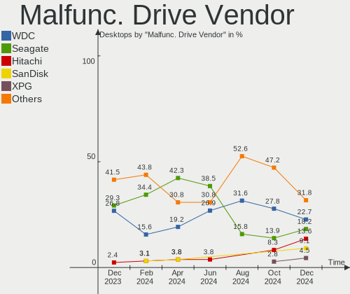
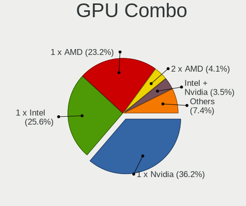
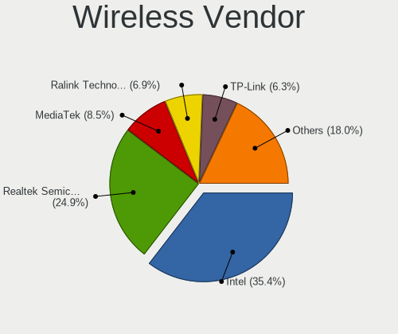

Ubuntu Hardware Trends (Desktops)
---------------------------------

A project to identify most popular hardware characteristics and track their change
over time based on data collected by Ubuntu users at https://Linux-Hardware.org.

Anyone can contribute to this report by the [hw-probe](https://github.com/linuxhw/hw-probe) tool:

    sudo -E hw-probe -all -upload

Full-feature report is available here: https://linux-hardware.org/?view=trends&formfactor=desktop

Period: Sep, 2021.

Contents
--------

* [ System ](#system)
  - [ OS                       ](#os)
  - [ OS Family                ](#os-family)
  - [ Kernel                   ](#kernel)
  - [ Kernel Family            ](#kernel-family)
  - [ Kernel Major Ver.        ](#kernel-major-ver)
  - [ Arch                     ](#arch)
  - [ DE                       ](#de)
  - [ Display Server           ](#display-server)
  - [ Display Manager          ](#display-manager)
  - [ OS Lang                  ](#os-lang)
  - [ Boot Mode                ](#boot-mode)
  - [ Filesystem               ](#filesystem)
  - [ Part. scheme             ](#part-scheme)
  - [ Dual Boot with Linux/BSD ](#dual-boot-with-linuxbsd)
  - [ Dual Boot (Win)          ](#dual-boot-win)

* [ Board ](#board)
  - [ Vendor                   ](#vendor)
  - [ Model                    ](#model)
  - [ Model Family             ](#model-family)
  - [ MFG Year                 ](#mfg-year)
  - [ Form Factor              ](#form-factor)
  - [ Secure Boot              ](#secure-boot)
  - [ Coreboot                 ](#coreboot)
  - [ RAM Size                 ](#ram-size)
  - [ RAM Used                 ](#ram-used)
  - [ Total Drives             ](#total-drives)
  - [ Has CD-ROM               ](#has-cd-rom)
  - [ Has Ethernet             ](#has-ethernet)
  - [ Has WiFi                 ](#has-wifi)
  - [ Has Bluetooth            ](#has-bluetooth)

* [ Location ](#location)
  - [ Country                  ](#country)
  - [ City                     ](#city)

* [ Drives ](#drives)
  - [ Drive Vendor             ](#drive-vendor)
  - [ Drive Model              ](#drive-model)
  - [ HDD Vendor               ](#hdd-vendor)
  - [ SSD Vendor               ](#ssd-vendor)
  - [ Drive Kind               ](#drive-kind)
  - [ Drive Connector          ](#drive-connector)
  - [ Drive Size               ](#drive-size)
  - [ Space Total              ](#space-total)
  - [ Space Used               ](#space-used)
  - [ Malfunc. Drives          ](#malfunc-drives)
  - [ Malfunc. Drive Vendor    ](#malfunc-drive-vendor)
  - [ Malfunc. HDD Vendor      ](#malfunc-hdd-vendor)
  - [ Malfunc. Drive Kind      ](#malfunc-drive-kind)
  - [ Failed Drives            ](#failed-drives)
  - [ Failed Drive Vendor      ](#failed-drive-vendor)
  - [ Drive Status             ](#drive-status)

* [ Storage controller ](#storage-controller)
  - [ Storage Vendor           ](#storage-vendor)
  - [ Storage Model            ](#storage-model)
  - [ Storage Kind             ](#storage-kind)

* [ Processor ](#processor)
  - [ CPU Vendor               ](#cpu-vendor)
  - [ CPU Model                ](#cpu-model)
  - [ CPU Model Family         ](#cpu-model-family)
  - [ CPU Cores                ](#cpu-cores)
  - [ CPU Sockets              ](#cpu-sockets)
  - [ CPU Threads              ](#cpu-threads)
  - [ CPU Op-Modes             ](#cpu-op-modes)
  - [ CPU Microcode            ](#cpu-microcode)
  - [ CPU Microarch            ](#cpu-microarch)

* [ Graphics ](#graphics)
  - [ GPU Vendor               ](#gpu-vendor)
  - [ GPU Model                ](#gpu-model)
  - [ GPU Combo                ](#gpu-combo)
  - [ GPU Driver               ](#gpu-driver)
  - [ GPU Memory               ](#gpu-memory)

* [ Monitor ](#monitor)
  - [ Monitor Vendor           ](#monitor-vendor)
  - [ Monitor Model            ](#monitor-model)
  - [ Monitor Resolution       ](#monitor-resolution)
  - [ Monitor Diagonal         ](#monitor-diagonal)
  - [ Monitor Width            ](#monitor-width)
  - [ Aspect Ratio             ](#aspect-ratio)
  - [ Monitor Area             ](#monitor-area)
  - [ Pixel Density            ](#pixel-density)
  - [ Multiple Monitors        ](#multiple-monitors)

* [ Network ](#network)
  - [ Net Controller Vendor    ](#net-controller-vendor)
  - [ Net Controller Model     ](#net-controller-model)
  - [ Wireless Vendor          ](#wireless-vendor)
  - [ Wireless Model           ](#wireless-model)
  - [ Ethernet Vendor          ](#ethernet-vendor)
  - [ Ethernet Model           ](#ethernet-model)
  - [ Net Controller Kind      ](#net-controller-kind)
  - [ Used Controller          ](#used-controller)
  - [ NICs                     ](#nics)
  - [ IPv6                     ](#ipv6)

* [ Bluetooth ](#bluetooth)
  - [ Bluetooth Vendor         ](#bluetooth-vendor)
  - [ Bluetooth Model          ](#bluetooth-model)

* [ Sound ](#sound)
  - [ Sound Vendor             ](#sound-vendor)
  - [ Sound Model              ](#sound-model)

* [ Memory ](#memory)
  - [ Memory Vendor            ](#memory-vendor)
  - [ Memory Model             ](#memory-model)
  - [ Memory Kind              ](#memory-kind)
  - [ Memory Form Factor       ](#memory-form-factor)
  - [ Memory Size              ](#memory-size)
  - [ Memory Speed             ](#memory-speed)

* [ Printers & scanners ](#printers--scanners)
  - [ Printer Vendor           ](#printer-vendor)
  - [ Printer Model            ](#printer-model)
  - [ Scanner Vendor           ](#scanner-vendor)
  - [ Scanner Model            ](#scanner-model)

* [ Camera ](#camera)
  - [ Camera Vendor            ](#camera-vendor)
  - [ Camera Model             ](#camera-model)

* [ Security ](#security)
  - [ Fingerprint Vendor       ](#fingerprint-vendor)
  - [ Fingerprint Model        ](#fingerprint-model)
  - [ Chipcard Vendor          ](#chipcard-vendor)
  - [ Chipcard Model           ](#chipcard-model)

* [ Unsupported ](#unsupported)
  - [ Unsupported Devices      ](#unsupported-devices)
  - [ Unsupported Device Types ](#unsupported-device-types)

System
------

OS
--

Installed operating systems

| Name         | Desktops | Percent |
|--------------|----------|---------|
| Ubuntu 20.04 | 287      | 63.64%  |
| Ubuntu 21.04 | 99       | 21.95%  |
| Ubuntu 18.04 | 33       | 7.32%   |
| Ubuntu 21.10 | 12       | 2.66%   |
| Ubuntu 16.04 | 9        | 2%      |
| Ubuntu 20.10 | 7        | 1.55%   |
| Ubuntu 19.10 | 1        | 0.22%   |
| Ubuntu 19.04 | 1        | 0.22%   |
| Ubuntu 17.10 | 1        | 0.22%   |
| Ubuntu       | 1        | 0.22%   |

OS Family
---------

OS without a version

| Name   | Desktops | Percent |
|--------|----------|---------|
| Ubuntu | 451      | 100%    |

Kernel
------

Version of the Linux kernel

| Version                     | Desktops | Percent |
|-----------------------------|----------|---------|
| 5.11.0-34-generic           | 125      | 27.72%  |
| 5.11.0-27-generic           | 68       | 15.08%  |
| 5.11.0-36-generic           | 53       | 11.75%  |
| 5.11.0-31-generic           | 31       | 6.87%   |
| 5.4.0-81-generic            | 25       | 5.54%   |
| 5.11.0-37-generic           | 20       | 4.43%   |
| 5.4.0-84-generic            | 18       | 3.99%   |
| 5.8.0-63-generic            | 9        | 2%      |
| 5.13.0-16-generic           | 9        | 2%      |
| 5.4.0-86-generic            | 8        | 1.77%   |
| 5.4.0-88-generic            | 7        | 1.55%   |
| 5.8.0-43-generic            | 6        | 1.33%   |
| 4.15.0-156-generic          | 5        | 1.11%   |
| 4.15.0-142-generic          | 5        | 1.11%   |
| 5.4.0-42-generic            | 4        | 0.89%   |
| 5.11.0-16-generic           | 4        | 0.89%   |
| 5.11.0-35-generic           | 3        | 0.67%   |
| 4.15.0-154-generic          | 3        | 0.67%   |
| 5.8.0-59-generic            | 2        | 0.44%   |
| 5.8.0-50-generic            | 2        | 0.44%   |
| 5.4.0-80-generic            | 2        | 0.44%   |
| 5.13.0-14-generic           | 2        | 0.44%   |
| 5.11.0-25-generic           | 2        | 0.44%   |
| 4.4.0-210-generic           | 2        | 0.44%   |
| 4.15.0-158-generic          | 2        | 0.44%   |
| 5.8.0-63-lowlatency         | 1        | 0.22%   |
| 5.8.0-55-generic            | 1        | 0.22%   |
| 5.8.0-53-generic            | 1        | 0.22%   |
| 5.8.0-48-generic            | 1        | 0.22%   |
| 5.8.0-45-generic            | 1        | 0.22%   |
| 5.8.0-41-generic            | 1        | 0.22%   |
| 5.5.4-050504-generic        | 1        | 0.22%   |
| 5.4.5-050405-generic        | 1        | 0.22%   |
| 5.4.0-hiveos                | 1        | 0.22%   |
| 5.4.0-67-generic            | 1        | 0.22%   |
| 5.4.0-59-generic            | 1        | 0.22%   |
| 5.4.0-52-generic            | 1        | 0.22%   |
| 5.4.0-48-generic            | 1        | 0.22%   |
| 5.4.0-47-generic            | 1        | 0.22%   |
| 5.4.0-45-generic            | 1        | 0.22%   |
| 5.4.0-26-generic            | 1        | 0.22%   |
| 5.3.0-64-generic            | 1        | 0.22%   |
| 5.3.0-51-generic            | 1        | 0.22%   |
| 5.14.0-051400rc7-lowlatency | 1        | 0.22%   |
| 5.13.0-17-generic           | 1        | 0.22%   |
| 5.11.4-rt11                 | 1        | 0.22%   |
| 5.11.0-36-lowlatency        | 1        | 0.22%   |
| 5.11.0-22-generic           | 1        | 0.22%   |
| 5.11.0-18-generic           | 1        | 0.22%   |
| 5.10.0-1044-oem             | 1        | 0.22%   |
| 5.0.0-38-generic            | 1        | 0.22%   |
| 5.0.0-27-generic            | 1        | 0.22%   |
| 4.15.0-62-generic           | 1        | 0.22%   |
| 4.15.0-29-generic           | 1        | 0.22%   |
| 4.15.0-143-generic          | 1        | 0.22%   |
| 4.15.0-122-generic          | 1        | 0.22%   |
| 4.15.0-101-generic          | 1        | 0.22%   |
| 4.14.24-qnap                | 1        | 0.22%   |
| 4.13.0-16-generic           | 1        | 0.22%   |

Kernel Family
-------------

Linux kernel without a distro release

| Version | Desktops | Percent |
|---------|----------|---------|
| 5.11.0  | 309      | 68.51%  |
| 5.4.0   | 72       | 15.96%  |
| 5.8.0   | 25       | 5.54%   |
| 4.15.0  | 20       | 4.43%   |
| 5.13.0  | 12       | 2.66%   |
| 5.3.0   | 2        | 0.44%   |
| 5.0.0   | 2        | 0.44%   |
| 4.4.0   | 2        | 0.44%   |
| 5.5.4   | 1        | 0.22%   |
| 5.4.5   | 1        | 0.22%   |
| 5.14.0  | 1        | 0.22%   |
| 5.11.4  | 1        | 0.22%   |
| 5.10.0  | 1        | 0.22%   |
| 4.14.24 | 1        | 0.22%   |
| 4.13.0  | 1        | 0.22%   |

Kernel Major Ver.
-----------------

Linux kernel major version

| Version | Desktops | Percent |
|---------|----------|---------|
| 5.11    | 310      | 68.74%  |
| 5.4     | 73       | 16.19%  |
| 5.8     | 25       | 5.54%   |
| 4.15    | 20       | 4.43%   |
| 5.13    | 12       | 2.66%   |
| 5.3     | 2        | 0.44%   |
| 5.0     | 2        | 0.44%   |
| 4.4     | 2        | 0.44%   |
| 5.5     | 1        | 0.22%   |
| 5.14    | 1        | 0.22%   |
| 5.10    | 1        | 0.22%   |
| 4.14    | 1        | 0.22%   |
| 4.13    | 1        | 0.22%   |

Arch
----

OS architecture (x86_64, i586, etc.)

| Name   | Desktops | Percent |
|--------|----------|---------|
| x86_64 | 449      | 99.56%  |
| i686   | 2        | 0.44%   |

DE
--

Desktop Environment

| Name              | Desktops | Percent |
|-------------------|----------|---------|
| GNOME             | 391      | 86.7%   |
| Unknown           | 41       | 9.09%   |
| Unity             | 10       | 2.22%   |
| X-Cinnamon        | 2        | 0.44%   |
| Yaru:ubuntu:GNOME | 1        | 0.22%   |
| xmonad            | 1        | 0.22%   |
| i3                | 1        | 0.22%   |
| GNOME Flashback   | 1        | 0.22%   |
| GNOME Classic     | 1        | 0.22%   |
| fvwm              | 1        | 0.22%   |
| Deepin            | 1        | 0.22%   |

Display Server
--------------

X11 or Wayland

| Name    | Desktops | Percent |
|---------|----------|---------|
| X11     | 339      | 75.17%  |
| Wayland | 79       | 17.52%  |
| Unknown | 26       | 5.76%   |
| Tty     | 7        | 1.55%   |

Display Manager
---------------

SDDM, LightDM, etc.

| Name    | Desktops | Percent |
|---------|----------|---------|
| Unknown | 268      | 59.42%  |
| GDM3    | 88       | 19.51%  |
| GDM     | 85       | 18.85%  |
| LightDM | 10       | 2.22%   |

OS Lang
-------

Language

| Lang       | Desktops | Percent |
|------------|----------|---------|
| en_US      | 176      | 39.02%  |
| de_DE      | 58       | 12.86%  |
| fr_FR      | 43       | 9.53%   |
| en_GB      | 15       | 3.33%   |
| pt_BR      | 13       | 2.88%   |
| it_IT      | 13       | 2.88%   |
| en_CA      | 12       | 2.66%   |
| C          | 11       | 2.44%   |
| en_AU      | 9        | 2%      |
| pl_PL      | 8        | 1.77%   |
| es_ES      | 8        | 1.77%   |
| ru_RU      | 7        | 1.55%   |
| en_IN      | 7        | 1.55%   |
| hu_HU      | 6        | 1.33%   |
| ro_RO      | 5        | 1.11%   |
| nl_NL      | 4        | 0.89%   |
| es_MX      | 3        | 0.67%   |
| en_ZA      | 3        | 0.67%   |
| en_NZ      | 3        | 0.67%   |
| cs_CZ      | 3        | 0.67%   |
| zh_CN      | 2        | 0.44%   |
| uk_UA      | 2        | 0.44%   |
| sv_SE      | 2        | 0.44%   |
| sr_RS      | 2        | 0.44%   |
| ja_JP      | 2        | 0.44%   |
| fr_CH      | 2        | 0.44%   |
| fr_CA      | 2        | 0.44%   |
| es_CO      | 2        | 0.44%   |
| es_AR      | 2        | 0.44%   |
| en_IL      | 2        | 0.44%   |
| de_CH      | 2        | 0.44%   |
| de_AT      | 2        | 0.44%   |
| bg_BG      | 2        | 0.44%   |
| Unknown    | 2        | 0.44%   |
| zh_TW      | 1        | 0.22%   |
| tr_TR      | 1        | 0.22%   |
| sl_SI      | 1        | 0.22%   |
| ru_UA      | 1        | 0.22%   |
| pt_PT      | 1        | 0.22%   |
| nl_BE      | 1        | 0.22%   |
| nb_NO      | 1        | 0.22%   |
| lt_LT      | 1        | 0.22%   |
| is_IS      | 1        | 0.22%   |
| fr_FR.UTF8 | 1        | 0.22%   |
| fr_BE      | 1        | 0.22%   |
| fi_FI      | 1        | 0.22%   |
| es_CL      | 1        | 0.22%   |
| es_BO      | 1        | 0.22%   |
| el_GR      | 1        | 0.22%   |
| ca_ES      | 1        | 0.22%   |

Boot Mode
---------

EFI or BIOS

| Mode | Desktops | Percent |
|------|----------|---------|
| BIOS | 289      | 64.08%  |
| EFI  | 162      | 35.92%  |

Filesystem
----------

Type of filesystem

| Type     | Desktops | Percent |
|----------|----------|---------|
| Ext4     | 419      | 92.9%   |
| Overlay  | 12       | 2.66%   |
| Btrfs    | 6        | 1.33%   |
| Ext3     | 4        | 0.89%   |
| Zfs      | 3        | 0.67%   |
| Ext2     | 3        | 0.67%   |
| Xfs      | 2        | 0.44%   |
| SquXshfs | 1        | 0.22%   |
| Reiserfs | 1        | 0.22%   |

Part. scheme
------------

Scheme of partitioning

| Type    | Desktops | Percent |
|---------|----------|---------|
| Unknown | 354      | 78.49%  |
| GPT     | 66       | 14.63%  |
| MBR     | 31       | 6.87%   |

Dual Boot with Linux/BSD
------------------------

Hosting more than one Linux/BSD

| Dual boot | Desktops | Percent |
|-----------|----------|---------|
| No        | 372      | 82.48%  |
| Yes       | 79       | 17.52%  |

Dual Boot (Win)
---------------

Hosting Linux and Windows

| Dual boot | Desktops | Percent |
|-----------|----------|---------|
| No        | 248      | 54.99%  |
| Yes       | 203      | 45.01%  |

Board
-----

Vendor
------

Motherboard manufacturer

| Name                | Desktops | Percent |
|---------------------|----------|---------|
| ASUSTek Computer    | 114      | 25.28%  |
| Gigabyte Technology | 73       | 16.19%  |
| Hewlett-Packard     | 50       | 11.09%  |
| Dell                | 45       | 9.98%   |
| ASRock              | 42       | 9.31%   |
| MSI                 | 39       | 8.65%   |
| Lenovo              | 17       | 3.77%   |
| Acer                | 12       | 2.66%   |
| Intel               | 10       | 2.22%   |
| Unknown             | 8        | 1.77%   |
| Fujitsu             | 7        | 1.55%   |
| Foxconn             | 5        | 1.11%   |
| Pegatron            | 4        | 0.89%   |
| Medion              | 3        | 0.67%   |
| ECS                 | 3        | 0.67%   |
| Biostar             | 3        | 0.67%   |
| Supermicro          | 2        | 0.44%   |
| PCWare              | 2        | 0.44%   |
| Huanan              | 2        | 0.44%   |
| EVGA                | 2        | 0.44%   |
| eMachines           | 2        | 0.44%   |
| Wistron             | 1        | 0.22%   |
| Google              | 1        | 0.22%   |
| Fujitsu Siemens     | 1        | 0.22%   |
| FIRICH              | 1        | 0.22%   |
| AZW                 | 1        | 0.22%   |
| Apple               | 1        | 0.22%   |

Model
-----

Motherboard model

| Name                                   | Desktops | Percent |
|----------------------------------------|----------|---------|
| Unknown                                | 8        | 1.77%   |
| ASUS All Series                        | 7        | 1.55%   |
| Dell OptiPlex 7010                     | 6        | 1.33%   |
| Dell OptiPlex 9020                     | 5        | 1.11%   |
| ASUS PRIME A320M-K                     | 5        | 1.11%   |
| MSI MS-7C02                            | 3        | 0.67%   |
| MSI MS-7A34                            | 3        | 0.67%   |
| HP Z440 Workstation                    | 3        | 0.67%   |
| HP Compaq Pro 6300 SFF                 | 3        | 0.67%   |
| HP Compaq Elite 8300 SFF               | 3        | 0.67%   |
| Gigabyte X570 AORUS ELITE              | 3        | 0.67%   |
| Gigabyte B450M DS3H                    | 3        | 0.67%   |
| Dell OptiPlex 7050                     | 3        | 0.67%   |
| MSI MS-7C37                            | 2        | 0.44%   |
| MSI MS-7C08                            | 2        | 0.44%   |
| HP ProDesk 400 G1 SFF                  | 2        | 0.44%   |
| HP Pavilion Desktop TP01-2xxx          | 2        | 0.44%   |
| HP ENVY TE01-1xxx                      | 2        | 0.44%   |
| HP Compaq dc7900 Convertible Minitower | 2        | 0.44%   |
| HP Compaq 8200 Elite CMT PC            | 2        | 0.44%   |
| HP Compaq 6200 Pro SFF PC              | 2        | 0.44%   |
| Gigabyte Z77X-UD5H                     | 2        | 0.44%   |
| Gigabyte X570 I AORUS PRO WIFI         | 2        | 0.44%   |
| Gigabyte GA-78LMT-USB3                 | 2        | 0.44%   |
| Gigabyte 970A-DS3P                     | 2        | 0.44%   |
| Dell Precision WorkStation T7400       | 2        | 0.44%   |
| Dell OptiPlex 990                      | 2        | 0.44%   |
| Dell OptiPlex 390                      | 2        | 0.44%   |
| ASUS Z170-A                            | 2        | 0.44%   |
| ASUS PRIME X370-PRO                    | 2        | 0.44%   |
| ASUS P8Z77-V LX                        | 2        | 0.44%   |
| ASUS P7P55D-E                          | 2        | 0.44%   |
| ASUS P6X58D PREMIUM                    | 2        | 0.44%   |
| ASUS M5A78L-M/USB3                     | 2        | 0.44%   |
| ASUS M4A785TD-M EVO                    | 2        | 0.44%   |
| ASUS A68HM-PLUS                        | 2        | 0.44%   |
| ASRock Z390M Pro4                      | 2        | 0.44%   |
| ASRock H55M Pro                        | 2        | 0.44%   |
| ASRock B450M Steel Legend              | 2        | 0.44%   |
| ASRock 970 Pro3 R2.0                   | 2        | 0.44%   |
| Wistron ProLiant ML110 G5              | 1        | 0.22%   |
| Supermicro X9SCL/X9SCM                 | 1        | 0.22%   |
| Supermicro PIO-627R-TRLN4F+-ST031      | 1        | 0.22%   |
| Pegatron Pavilion P6000 Series         | 1        | 0.22%   |
| Pegatron NC062AA-ABZ IQ522it           | 1        | 0.22%   |
| Pegatron dx2810 SFF                    | 1        | 0.22%   |
| Pegatron 320-1010a                     | 1        | 0.22%   |
| PCWare IPMH61R1                        | 1        | 0.22%   |
| PCWare CAPE7 847                       | 1        | 0.22%   |
| MSI MS-7D09                            | 1        | 0.22%   |
| MSI MS-7C94                            | 1        | 0.22%   |
| MSI MS-7C91                            | 1        | 0.22%   |
| MSI MS-7C89                            | 1        | 0.22%   |
| MSI MS-7C60                            | 1        | 0.22%   |
| MSI MS-7C52                            | 1        | 0.22%   |
| MSI MS-7B98                            | 1        | 0.22%   |
| MSI MS-7B86                            | 1        | 0.22%   |
| MSI MS-7B84                            | 1        | 0.22%   |
| MSI MS-7B79                            | 1        | 0.22%   |
| MSI MS-7B09                            | 1        | 0.22%   |

Model Family
------------

Motherboard model prefix

| Name                              | Desktops | Percent |
|-----------------------------------|----------|---------|
| Dell OptiPlex                     | 30       | 6.65%   |
| HP Compaq                         | 21       | 4.66%   |
| ASUS PRIME                        | 20       | 4.43%   |
| Lenovo ThinkCentre                | 13       | 2.88%   |
| ASUS ROG                          | 11       | 2.44%   |
| Acer Aspire                       | 8        | 1.77%   |
| Unknown                           | 8        | 1.77%   |
| Gigabyte X570                     | 7        | 1.55%   |
| Fujitsu ESPRIMO                   | 7        | 1.55%   |
| Dell Precision                    | 7        | 1.55%   |
| ASUS All                          | 7        | 1.55%   |
| HP EliteDesk                      | 6        | 1.33%   |
| Gigabyte B450M                    | 5        | 1.11%   |
| Dell Inspiron                     | 5        | 1.11%   |
| ASUS P8Z77-V                      | 5        | 1.11%   |
| HP ProDesk                        | 4        | 0.89%   |
| HP Pavilion                       | 4        | 0.89%   |
| Gigabyte B550                     | 4        | 0.89%   |
| ASUS M5A78L-M                     | 4        | 0.89%   |
| MSI MS-7C02                       | 3        | 0.67%   |
| MSI MS-7A34                       | 3        | 0.67%   |
| HP Z440                           | 3        | 0.67%   |
| ASUS TUF                          | 3        | 0.67%   |
| ASUS Maximus                      | 3        | 0.67%   |
| ASRock 970                        | 3        | 0.67%   |
| MSI MS-7C37                       | 2        | 0.44%   |
| MSI MS-7C08                       | 2        | 0.44%   |
| HP ProLiant                       | 2        | 0.44%   |
| HP ENVY                           | 2        | 0.44%   |
| Gigabyte Z77X-UD5H                | 2        | 0.44%   |
| Gigabyte Z390                     | 2        | 0.44%   |
| Gigabyte Z370                     | 2        | 0.44%   |
| Gigabyte H310M                    | 2        | 0.44%   |
| Gigabyte GA-78LMT-USB3            | 2        | 0.44%   |
| Gigabyte 970A-DS3P                | 2        | 0.44%   |
| ASUS Z170-A                       | 2        | 0.44%   |
| ASUS SABERTOOTH                   | 2        | 0.44%   |
| ASUS P8Z77-M                      | 2        | 0.44%   |
| ASUS P7P55D-E                     | 2        | 0.44%   |
| ASUS P6X58D                       | 2        | 0.44%   |
| ASUS P6T                          | 2        | 0.44%   |
| ASUS M4A785TD-M                   | 2        | 0.44%   |
| ASUS M2N-MX                       | 2        | 0.44%   |
| ASUS A68HM-PLUS                   | 2        | 0.44%   |
| ASRock Z77                        | 2        | 0.44%   |
| ASRock Z68                        | 2        | 0.44%   |
| ASRock Z390M                      | 2        | 0.44%   |
| ASRock X570                       | 2        | 0.44%   |
| ASRock H55M                       | 2        | 0.44%   |
| ASRock B450M                      | 2        | 0.44%   |
| Acer Veriton                      | 2        | 0.44%   |
| Wistron ProLiant                  | 1        | 0.22%   |
| Supermicro X9SCL                  | 1        | 0.22%   |
| Supermicro PIO-627R-TRLN4F+-ST031 | 1        | 0.22%   |
| Pegatron Pavilion                 | 1        | 0.22%   |
| Pegatron NC062AA-ABZ              | 1        | 0.22%   |
| Pegatron dx2810                   | 1        | 0.22%   |
| Pegatron 320-1010a                | 1        | 0.22%   |
| PCWare IPMH61R1                   | 1        | 0.22%   |
| PCWare CAPE7                      | 1        | 0.22%   |

MFG Year
--------

Motherboard manufacture year

| Year    | Desktops | Percent |
|---------|----------|---------|
| 2021    | 48       | 10.64%  |
| 2020    | 46       | 10.2%   |
| 2018    | 45       | 9.98%   |
| 2019    | 43       | 9.53%   |
| 2012    | 40       | 8.87%   |
| 2014    | 34       | 7.54%   |
| 2011    | 30       | 6.65%   |
| 2013    | 28       | 6.21%   |
| 2015    | 25       | 5.54%   |
| 2010    | 24       | 5.32%   |
| 2016    | 23       | 5.1%    |
| 2009    | 20       | 4.43%   |
| 2017    | 14       | 3.1%    |
| 2008    | 14       | 3.1%    |
| 2007    | 7        | 1.55%   |
| 2006    | 5        | 1.11%   |
| 2005    | 3        | 0.67%   |
| Unknown | 2        | 0.44%   |

Form Factor
-----------

Physical design of the computer

| Name    | Desktops | Percent |
|---------|----------|---------|
| Desktop | 451      | 100%    |

Secure Boot
-----------

Enabled or disabled

| State    | Desktops | Percent |
|----------|----------|---------|
| Disabled | 433      | 96.01%  |
| Enabled  | 18       | 3.99%   |

Coreboot
--------

Have coreboot on board

| Used | Desktops | Percent |
|------|----------|---------|
| No   | 450      | 99.78%  |
| Yes  | 1        | 0.22%   |

RAM Size
--------

Total RAM memory

| Size in GB  | Desktops | Percent |
|-------------|----------|---------|
| 16.01-24.0  | 108      | 23.95%  |
| 8.01-16.0   | 105      | 23.28%  |
| 4.01-8.0    | 79       | 17.52%  |
| 3.01-4.0    | 69       | 15.3%   |
| 32.01-64.0  | 45       | 9.98%   |
| 64.01-256.0 | 20       | 4.43%   |
| 24.01-32.0  | 11       | 2.44%   |
| 1.01-2.0    | 10       | 2.22%   |
| 2.01-3.0    | 2        | 0.44%   |
| 0.51-1.0    | 2        | 0.44%   |

RAM Used
--------

Used RAM memory

| Used GB    | Desktops | Percent |
|------------|----------|---------|
| 1.01-2.0   | 194      | 43.02%  |
| 2.01-3.0   | 117      | 25.94%  |
| 4.01-8.0   | 56       | 12.42%  |
| 3.01-4.0   | 52       | 11.53%  |
| 8.01-16.0  | 16       | 3.55%   |
| 0.51-1.0   | 11       | 2.44%   |
| 16.01-24.0 | 2        | 0.44%   |
| 32.01-64.0 | 1        | 0.22%   |
| 24.01-32.0 | 1        | 0.22%   |
| 0.01-0.5   | 1        | 0.22%   |

Total Drives
------------

Number of drives on board

| Drives | Desktops | Percent |
|--------|----------|---------|
| 1      | 188      | 41.69%  |
| 2      | 130      | 28.82%  |
| 3      | 56       | 12.42%  |
| 4      | 40       | 8.87%   |
| 5      | 15       | 3.33%   |
| 0      | 8        | 1.77%   |
| 7      | 4        | 0.89%   |
| 6      | 4        | 0.89%   |
| 8      | 3        | 0.67%   |
| 25     | 1        | 0.22%   |
| 12     | 1        | 0.22%   |
| 10     | 1        | 0.22%   |

Has CD-ROM
----------

Has CD-ROM on board

| Presented | Desktops | Percent |
|-----------|----------|---------|
| Yes       | 230      | 51%     |
| No        | 221      | 49%     |

Has Ethernet
------------

Has Ethernet on board

| Presented | Desktops | Percent |
|-----------|----------|---------|
| Yes       | 449      | 99.56%  |
| No        | 2        | 0.44%   |

Has WiFi
--------

Has WiFi module

| Presented | Desktops | Percent |
|-----------|----------|---------|
| No        | 284      | 62.97%  |
| Yes       | 167      | 37.03%  |

Has Bluetooth
-------------

Has Bluetooth module

| Presented | Desktops | Percent |
|-----------|----------|---------|
| No        | 336      | 74.5%   |
| Yes       | 115      | 25.5%   |

Location
--------

Country
-------

Geographic location (country)

| Country         | Desktops | Percent |
|-----------------|----------|---------|
| USA             | 103      | 22.84%  |
| Germany         | 66       | 14.63%  |
| France          | 41       | 9.09%   |
| Brazil          | 17       | 3.77%   |
| Canada          | 16       | 3.55%   |
| Italy           | 15       | 3.33%   |
| UK              | 13       | 2.88%   |
| Russia          | 13       | 2.88%   |
| Spain           | 11       | 2.44%   |
| Australia       | 10       | 2.22%   |
| Romania         | 8        | 1.77%   |
| Switzerland     | 7        | 1.55%   |
| Poland          | 7        | 1.55%   |
| India           | 7        | 1.55%   |
| Ukraine         | 6        | 1.33%   |
| Netherlands     | 6        | 1.33%   |
| Hungary         | 6        | 1.33%   |
| Sweden          | 5        | 1.11%   |
| Mexico          | 5        | 1.11%   |
| Czechia         | 5        | 1.11%   |
| South Africa    | 4        | 0.89%   |
| Serbia          | 4        | 0.89%   |
| Portugal        | 4        | 0.89%   |
| China           | 4        | 0.89%   |
| Bulgaria        | 4        | 0.89%   |
| Belgium         | 4        | 0.89%   |
| Austria         | 4        | 0.89%   |
| Turkey          | 3        | 0.67%   |
| Norway          | 3        | 0.67%   |
| New Zealand     | 3        | 0.67%   |
| Malaysia        | 3        | 0.67%   |
| Finland         | 3        | 0.67%   |
| Chile           | 3        | 0.67%   |
| Argentina       | 3        | 0.67%   |
| Taiwan          | 2        | 0.44%   |
| Singapore       | 2        | 0.44%   |
| Japan           | 2        | 0.44%   |
| Israel          | 2        | 0.44%   |
| Iran            | 2        | 0.44%   |
| Indonesia       | 2        | 0.44%   |
| Greece          | 2        | 0.44%   |
| Ecuador         | 2        | 0.44%   |
| Colombia        | 2        | 0.44%   |
| Algeria         | 2        | 0.44%   |
| UAE             | 1        | 0.22%   |
| Tunisia         | 1        | 0.22%   |
| Slovenia        | 1        | 0.22%   |
| Sint Maarten    | 1        | 0.22%   |
| Pakistan        | 1        | 0.22%   |
| North Macedonia | 1        | 0.22%   |
| Martinique      | 1        | 0.22%   |
| Lithuania       | 1        | 0.22%   |
| Kenya           | 1        | 0.22%   |
| Jordan          | 1        | 0.22%   |
| Iceland         | 1        | 0.22%   |
| Denmark         | 1        | 0.22%   |
| Cyprus          | 1        | 0.22%   |
| Bolivia         | 1        | 0.22%   |
| Azerbaijan      | 1        | 0.22%   |

City
----

Geographic location (city)

| City                 | Desktops | Percent |
|----------------------|----------|---------|
| Wittlich             | 4        | 0.89%   |
| Portland             | 4        | 0.89%   |
| Munich               | 4        | 0.89%   |
| Moscow               | 4        | 0.89%   |
| Los Angeles          | 4        | 0.89%   |
| Bucharest            | 4        | 0.89%   |
| Berlin               | 4        | 0.89%   |
| Toronto              | 3        | 0.67%   |
| St Petersburg        | 3        | 0.67%   |
| Seattle              | 3        | 0.67%   |
| S??o Paulo           | 3        | 0.67%   |
| Perth                | 3        | 0.67%   |
| Mumbai               | 3        | 0.67%   |
| Lyon                 | 3        | 0.67%   |
| Kyiv                 | 3        | 0.67%   |
| Hamburg              | 3        | 0.67%   |
| Erie                 | 3        | 0.67%   |
| Dallas               | 3        | 0.67%   |
| Chicago              | 3        | 0.67%   |
| Tijuana              | 2        | 0.44%   |
| Tehran               | 2        | 0.44%   |
| Tatab??nya           | 2        | 0.44%   |
| Stuttgart            | 2        | 0.44%   |
| Sofia                | 2        | 0.44%   |
| Singapore            | 2        | 0.44%   |
| Santiago             | 2        | 0.44%   |
| Rennes               | 2        | 0.44%   |
| Paderno Franciacorta | 2        | 0.44%   |
| Novi Sad             | 2        | 0.44%   |
| New Taipei           | 2        | 0.44%   |
| Nantes               | 2        | 0.44%   |
| Minneapolis          | 2        | 0.44%   |
| Milan                | 2        | 0.44%   |
| Miami                | 2        | 0.44%   |
| Melbourne            | 2        | 0.44%   |
| M?¶nchengladbach     | 2        | 0.44%   |
| Martellago           | 2        | 0.44%   |
| Marseille            | 2        | 0.44%   |
| Manchester           | 2        | 0.44%   |
| Iasi                 | 2        | 0.44%   |
| Fortaleza            | 2        | 0.44%   |
| Budapest             | 2        | 0.44%   |
| Brisbane             | 2        | 0.44%   |
| Belgrade             | 2        | 0.44%   |
| Beijing              | 2        | 0.44%   |
| Barcelona            | 2        | 0.44%   |
| Balne??rio Cambori?? | 2        | 0.44%   |
| Zwickau              | 1        | 0.22%   |
| Zegge                | 1        | 0.22%   |
| Zdanice              | 1        | 0.22%   |
| Ypsilanti            | 1        | 0.22%   |
| Yekaterinburg        | 1        | 0.22%   |
| Wylie                | 1        | 0.22%   |
| Wurzen               | 1        | 0.22%   |
| Wroclaw              | 1        | 0.22%   |
| Wilderness Rim       | 1        | 0.22%   |
| Wigan                | 1        | 0.22%   |
| Wetzikon             | 1        | 0.22%   |
| Westport             | 1        | 0.22%   |
| Westbank             | 1        | 0.22%   |

Drives
------

Drive Vendor
------------

Hard drive vendors

| Vendor                         | Desktops | Drives | Percent |
|--------------------------------|----------|--------|---------|
| WDC                            | 147      | 214    | 19.27%  |
| Seagate                        | 142      | 187    | 18.61%  |
| Samsung Electronics            | 94       | 129    | 12.32%  |
| Kingston                       | 53       | 57     | 6.95%   |
| Toshiba                        | 49       | 60     | 6.42%   |
| Hitachi                        | 33       | 35     | 4.33%   |
| Sandisk                        | 30       | 31     | 3.93%   |
| Crucial                        | 27       | 35     | 3.54%   |
| Phison                         | 14       | 16     | 1.83%   |
| Intel                          | 13       | 16     | 1.7%    |
| China                          | 12       | 14     | 1.57%   |
| A-DATA Technology              | 11       | 12     | 1.44%   |
| MAXTOR                         | 10       | 12     | 1.31%   |
| HGST                           | 8        | 16     | 1.05%   |
| Unknown                        | 7        | 8      | 0.92%   |
| PNY                            | 7        | 8      | 0.92%   |
| Micron Technology              | 6        | 7      | 0.79%   |
| Corsair                        | 6        | 6      | 0.79%   |
| Team                           | 5        | 5      | 0.66%   |
| SPCC                           | 5        | 5      | 0.66%   |
| Silicon Motion                 | 5        | 5      | 0.66%   |
| Micron/Crucial Technology      | 5        | 5      | 0.66%   |
| SK Hynix                       | 4        | 4      | 0.52%   |
| Realtek Semiconductor          | 4        | 4      | 0.52%   |
| KIOXIA                         | 4        | 4      | 0.52%   |
| JMicron                        | 4        | 6      | 0.52%   |
| Intenso                        | 4        | 4      | 0.52%   |
| XPG                            | 3        | 3      | 0.39%   |
| ASMT                           | 3        | 3      | 0.39%   |
| Zheino                         | 2        | 2      | 0.26%   |
| Transcend                      | 2        | 2      | 0.26%   |
| Patriot                        | 2        | 2      | 0.26%   |
| OCZ                            | 2        | 2      | 0.26%   |
| Mushkin                        | 2        | 2      | 0.26%   |
| KIOXIA-EXCERIA                 | 2        | 2      | 0.26%   |
| Hewlett-Packard                | 2        | 2      | 0.26%   |
| GOODRAM                        | 2        | 3      | 0.26%   |
| Drevo                          | 2        | 2      | 0.26%   |
| Apacer                         | 2        | 2      | 0.26%   |
| Unknown                        | 2        | 2      | 0.26%   |
| WD MediaMax                    | 1        | 1      | 0.13%   |
| V-GeN                          | 1        | 1      | 0.13%   |
| TYPEC 1T                       | 1        | 1      | 0.13%   |
| SSK                            | 1        | 1      | 0.13%   |
| Solid State Storage Technology | 1        | 2      | 0.13%   |
| ShanDianZhe                    | 1        | 1      | 0.13%   |
| SABRENT                        | 1        | 1      | 0.13%   |
| PLEXTOR                        | 1        | 1      | 0.13%   |
| MG                             | 1        | 1      | 0.13%   |
| Mass                           | 1        | 1      | 0.13%   |
| Lite-On                        | 1        | 1      | 0.13%   |
| LDLC                           | 1        | 1      | 0.13%   |
| LaCie                          | 1        | 1      | 0.13%   |
| KingDian                       | 1        | 1      | 0.13%   |
| IMATION                        | 1        | 1      | 0.13%   |
| HPE                            | 1        | 1      | 0.13%   |
| HGST HTS                       | 1        | 1      | 0.13%   |
| Gigabyte Technology            | 1        | 1      | 0.13%   |
| Fujitsu                        | 1        | 1      | 0.13%   |
| Colorful                       | 1        | 1      | 0.13%   |

Drive Model
-----------

Hard drive models

| Model                             | Desktops | Percent |
|-----------------------------------|----------|---------|
| Toshiba DT01ACA100 1TB            | 12       | 1.37%   |
| Seagate ST500DM002-1BD142 500GB   | 11       | 1.25%   |
| Seagate ST1000DM010-2EP102 1TB    | 11       | 1.25%   |
| Kingston SA400S37240G 240GB SSD   | 10       | 1.14%   |
| Seagate ST1000DM003-1CH162 1TB    | 8        | 0.91%   |
| Samsung SSD 850 EVO 500GB         | 8        | 0.91%   |
| WDC WD10EZEX-08WN4A0 1TB          | 7        | 0.8%    |
| Kingston SV300S37A120G 120GB SSD  | 7        | 0.8%    |
| Seagate ST3500418AS 500GB         | 6        | 0.68%   |
| Seagate ST2000DM008-2FR102 2TB    | 6        | 0.68%   |
| Seagate ST2000DM001-1ER164 2TB    | 6        | 0.68%   |
| Seagate ST2000DM001-1CH164 2TB    | 6        | 0.68%   |
| Samsung SSD 850 EVO 250GB         | 6        | 0.68%   |
| Samsung NVMe SSD Drive 500GB      | 6        | 0.68%   |
| Kingston SA400S37120G 120GB SSD   | 6        | 0.68%   |
| Seagate ST1000DM003-1ER162 1TB    | 5        | 0.57%   |
| Seagate Expansion 1TB             | 5        | 0.57%   |
| Kingston SA400S37480G 480GB SSD   | 5        | 0.57%   |
| WDC WDS500G2B0A-00SM50 500GB SSD  | 4        | 0.46%   |
| WDC WD10EALX-009BA0 1TB           | 4        | 0.46%   |
| Toshiba DT01ACA050 500GB          | 4        | 0.46%   |
| Seagate ST31000524AS 1TB          | 4        | 0.46%   |
| Samsung SSD 870 QVO 2TB           | 4        | 0.46%   |
| Samsung SSD 870 EVO 250GB         | 4        | 0.46%   |
| Samsung SSD 860 EVO 500GB         | 4        | 0.46%   |
| Samsung NVMe SSD Drive 1TB        | 4        | 0.46%   |
| Phison NVMe SSD Drive 1TB         | 4        | 0.46%   |
| Micron/Crucial NVMe SSD Drive 1TB | 4        | 0.46%   |
| Kingston SUV400S37240G 240GB SSD  | 4        | 0.46%   |
| Crucial CT480BX500SSD1 480GB      | 4        | 0.46%   |
| WDC WDS240G2G0A-00JH30 240GB SSD  | 3        | 0.34%   |
| WDC WD5000AAKX-00ERMA0 500GB      | 3        | 0.34%   |
| WDC WD10EZEX-08M2NA0 1TB          | 3        | 0.34%   |
| WDC WD1002FAEX-00Z3A0 1TB         | 3        | 0.34%   |
| WDC WD1002FAEX-00Y9A0 1TB         | 3        | 0.34%   |
| Unknown SD/MMC/MS PRO 128GB       | 3        | 0.34%   |
| Toshiba MQ01ABD100 1TB            | 3        | 0.34%   |
| Toshiba DT01ACA200 2TB            | 3        | 0.34%   |
| Seagate ST3500414CS 500GB         | 3        | 0.34%   |
| Seagate ST3320820AS 320GB         | 3        | 0.34%   |
| Seagate ST2000DM006-2DM164 2TB    | 3        | 0.34%   |
| SanDisk SSD PLUS 240GB            | 3        | 0.34%   |
| Samsung SSD 860 EVO 250GB         | 3        | 0.34%   |
| Samsung SSD 840 Series 120GB      | 3        | 0.34%   |
| Samsung NVMe SSD Drive 512GB      | 3        | 0.34%   |
| Samsung NVMe SSD Drive 250GB      | 3        | 0.34%   |
| Kingston SV300S37A240G 240GB SSD  | 3        | 0.34%   |
| Kingston SH103S3120G 120GB SSD    | 3        | 0.34%   |
| Hitachi HUA723020ALA641 2TB       | 3        | 0.34%   |
| Crucial CT525MX300SSD1 528GB      | 3        | 0.34%   |
| Crucial CT500MX500SSD1 500GB      | 3        | 0.34%   |
| Crucial CT240BX500SSD1 240GB      | 3        | 0.34%   |
| Corsair Force 3 SSD 120GB         | 3        | 0.34%   |
| ASMT 2115 1TB                     | 3        | 0.34%   |
| XPG NVMe SSD Drive 2TB            | 2        | 0.23%   |
| WDC WDBNCE5000PNC 500GB SSD       | 2        | 0.23%   |
| WDC WD60EFAX-68JH4N1 6TB          | 2        | 0.23%   |
| WDC WD5000AAKX-60U6AA0 500GB      | 2        | 0.23%   |
| WDC WD5000AAKX-08U6AA0 500GB      | 2        | 0.23%   |
| WDC WD40EFRX-68N32N0 4TB          | 2        | 0.23%   |

HDD Vendor
----------

Hard disk drive vendors

| Vendor              | Desktops | Drives | Percent |
|---------------------|----------|--------|---------|
| Seagate             | 139      | 182    | 35.46%  |
| WDC                 | 134      | 195    | 34.18%  |
| Toshiba             | 43       | 52     | 10.97%  |
| Hitachi             | 33       | 35     | 8.42%   |
| Samsung Electronics | 19       | 21     | 4.85%   |
| MAXTOR              | 8        | 10     | 2.04%   |
| HGST                | 8        | 16     | 2.04%   |
| Unknown             | 3        | 3      | 0.77%   |
| WD MediaMax         | 1        | 1      | 0.26%   |
| Hewlett-Packard     | 1        | 1      | 0.26%   |
| Fujitsu             | 1        | 1      | 0.26%   |
| ASMT109x            | 1        | 1      | 0.26%   |
| Apple               | 1        | 1      | 0.26%   |

SSD Vendor
----------

Solid state drive vendors

| Vendor              | Desktops | Drives | Percent |
|---------------------|----------|--------|---------|
| Samsung Electronics | 50       | 68     | 18.45%  |
| Kingston            | 48       | 52     | 17.71%  |
| SanDisk             | 27       | 27     | 9.96%   |
| Crucial             | 27       | 35     | 9.96%   |
| WDC                 | 14       | 15     | 5.17%   |
| China               | 12       | 14     | 4.43%   |
| A-DATA Technology   | 11       | 11     | 4.06%   |
| PNY                 | 7        | 8      | 2.58%   |
| Micron Technology   | 6        | 7      | 2.21%   |
| Intel               | 6        | 7      | 2.21%   |
| Toshiba             | 5        | 5      | 1.85%   |
| SPCC                | 5        | 5      | 1.85%   |
| Corsair             | 5        | 5      | 1.85%   |
| Team                | 4        | 4      | 1.48%   |
| SK Hynix            | 3        | 3      | 1.11%   |
| Intenso             | 3        | 3      | 1.11%   |
| ASMT                | 3        | 3      | 1.11%   |
| Unknown             | 2        | 2      | 0.74%   |
| Transcend           | 2        | 2      | 0.74%   |
| Patriot             | 2        | 2      | 0.74%   |
| OCZ                 | 2        | 2      | 0.74%   |
| Mushkin             | 2        | 2      | 0.74%   |
| MAXTOR              | 2        | 2      | 0.74%   |
| KIOXIA-EXCERIA      | 2        | 2      | 0.74%   |
| JMicron             | 2        | 3      | 0.74%   |
| Apacer              | 2        | 2      | 0.74%   |
| Zheino              | 1        | 1      | 0.37%   |
| TYPEC 1T            | 1        | 1      | 0.37%   |
| ShanDianZhe         | 1        | 1      | 0.37%   |
| Seagate             | 1        | 2      | 0.37%   |
| SABRENT             | 1        | 1      | 0.37%   |
| PLEXTOR             | 1        | 1      | 0.37%   |
| MG                  | 1        | 1      | 0.37%   |
| LDLC                | 1        | 1      | 0.37%   |
| KingDian            | 1        | 1      | 0.37%   |
| Hewlett-Packard     | 1        | 1      | 0.37%   |
| GOODRAM             | 1        | 1      | 0.37%   |
| Gigabyte Technology | 1        | 1      | 0.37%   |
| DREVO               | 1        | 1      | 0.37%   |
| Colorful            | 1        | 1      | 0.37%   |
| BRAVEEAGLE          | 1        | 1      | 0.37%   |
| AMD                 | 1        | 1      | 0.37%   |
| Unknown             | 1        | 1      | 0.37%   |

Drive Kind
----------

HDD or SSD

| Kind    | Desktops | Drives | Percent |
|---------|----------|--------|---------|
| HDD     | 303      | 519    | 47.12%  |
| SSD     | 233      | 309    | 36.24%  |
| NVMe    | 90       | 114    | 14%     |
| Unknown | 17       | 19     | 2.64%   |

Drive Connector
---------------

SATA, SAS, NVMe, etc.

| Type | Desktops | Drives | Percent |
|------|----------|--------|---------|
| SATA | 412      | 795    | 77.59%  |
| NVMe | 90       | 114    | 16.95%  |
| SAS  | 29       | 52     | 5.46%   |

Drive Size
----------

Size of hard drive

| Size in TB | Desktops | Drives | Percent |
|------------|----------|--------|---------|
| 0.01-0.5   | 313      | 435    | 53.14%  |
| 0.51-1.0   | 162      | 215    | 27.5%   |
| 1.01-2.0   | 64       | 83     | 10.87%  |
| 2.01-3.0   | 16       | 19     | 2.72%   |
| 3.01-4.0   | 15       | 19     | 2.55%   |
| 4.01-10.0  | 14       | 40     | 2.38%   |
| 10.01-20.0 | 5        | 17     | 0.85%   |

Space Total
-----------

Amount of disk space available on the file system

| Size in GB     | Desktops | Percent |
|----------------|----------|---------|
| 101-250        | 125      | 27.72%  |
| 251-500        | 100      | 22.17%  |
| 501-1000       | 66       | 14.63%  |
| 1001-2000      | 49       | 10.86%  |
| More than 3000 | 33       | 7.32%   |
| 1-20           | 20       | 4.43%   |
| 2001-3000      | 19       | 4.21%   |
| 21-50          | 18       | 3.99%   |
| 51-100         | 17       | 3.77%   |
| Unknown        | 4        | 0.89%   |

Space Used
----------

Amount of used disk space

| Used GB        | Desktops | Percent |
|----------------|----------|---------|
| 1-20           | 168      | 37.25%  |
| 21-50          | 71       | 15.74%  |
| 101-250        | 51       | 11.31%  |
| 51-100         | 47       | 10.42%  |
| 501-1000       | 39       | 8.65%   |
| 251-500        | 36       | 7.98%   |
| 1001-2000      | 15       | 3.33%   |
| More than 3000 | 11       | 2.44%   |
| 2001-3000      | 9        | 2%      |
| Unknown        | 4        | 0.89%   |

Malfunc. Drives
---------------

Drive models with a malfunction

| Model                                          | Desktops | Drives | Percent |
|------------------------------------------------|----------|--------|---------|
| Seagate ST3500414CS 500GB                      | 2        | 2      | 6.25%   |
| Kingston SH103S3120G 120GB SSD                 | 2        | 2      | 6.25%   |
| WDC WD6000HLHX-01JJPV0 600GB                   | 1        | 2      | 3.13%   |
| WDC WD5000AAKX-001CA0 500GB                    | 1        | 1      | 3.13%   |
| WDC WD5000AADS-00S9B0 500GB                    | 1        | 1      | 3.13%   |
| WDC WD3200AAVS-00ZTB0 320GB                    | 1        | 1      | 3.13%   |
| WDC WD10EZEX-08M2NA0 1TB                       | 1        | 1      | 3.13%   |
| WDC WD10EADS-65M2B1 1TB                        | 1        | 1      | 3.13%   |
| WDC WD10EADS-00L5B1 1TB                        | 1        | 1      | 3.13%   |
| WDC WD1003FZEX-00MK2A0 1TB                     | 1        | 1      | 3.13%   |
| Toshiba MQ01ABF050 500GB                       | 1        | 1      | 3.13%   |
| Toshiba DT01ACA100 1TB                         | 1        | 1      | 3.13%   |
| Seagate ST4000DM004-2CV104 4TB                 | 1        | 1      | 3.13%   |
| Seagate ST3320620A 320GB                       | 1        | 1      | 3.13%   |
| Seagate ST250DM000-1BD141 250GB                | 1        | 1      | 3.13%   |
| Seagate ST1000DM003-1CH162 1TB                 | 1        | 1      | 3.13%   |
| Seagate ST1000DM 003-1CH162 1TB                | 1        | 1      | 3.13%   |
| SanDisk SDSSDXPS240G 240GB                     | 1        | 1      | 3.13%   |
| Samsung Electronics SSD 840 EVO 500GB          | 1        | 1      | 3.13%   |
| OCZ AGITLITY3 480GB SSD                        | 1        | 1      | 3.13%   |
| Micron Technology MTFDDAK256MAM-1K12 256GB SSD | 1        | 1      | 3.13%   |
| MAXTOR 6Y120M0 128GB                           | 1        | 1      | 3.13%   |
| MAXTOR 6Y080M0 80GB                            | 1        | 1      | 3.13%   |
| Kingston SUV500480G 480GB SSD                  | 1        | 1      | 3.13%   |
| Hitachi HUA723020ALA641 2TB                    | 1        | 2      | 3.13%   |
| Hitachi HDT721016SLA380 160GB                  | 1        | 1      | 3.13%   |
| Hitachi HDS5C3020ALA632 2TB                    | 1        | 1      | 3.13%   |
| Crucial CT525MX300SSD1 528GB                   | 1        | 1      | 3.13%   |
| Corsair Force 3 SSD 120GB                      | 1        | 1      | 3.13%   |
| AMD R3SL60G 64GB SSD                           | 1        | 1      | 3.13%   |

Malfunc. Drive Vendor
---------------------

Vendors of faulty drives

| Vendor              | Desktops | Drives | Percent |
|---------------------|----------|--------|---------|
| WDC                 | 7        | 9      | 23.33%  |
| Seagate             | 6        | 7      | 20%     |
| Kingston            | 3        | 3      | 10%     |
| Hitachi             | 3        | 4      | 10%     |
| Toshiba             | 2        | 2      | 6.67%   |
| MAXTOR              | 2        | 2      | 6.67%   |
| SanDisk             | 1        | 1      | 3.33%   |
| Samsung Electronics | 1        | 1      | 3.33%   |
| OCZ                 | 1        | 1      | 3.33%   |
| Micron Technology   | 1        | 1      | 3.33%   |
| Crucial             | 1        | 1      | 3.33%   |
| Corsair             | 1        | 1      | 3.33%   |
| AMD                 | 1        | 1      | 3.33%   |

Malfunc. HDD Vendor
-------------------

Vendors of faulty HDD drives

| Vendor  | Desktops | Drives | Percent |
|---------|----------|--------|---------|
| WDC     | 7        | 9      | 35%     |
| Seagate | 6        | 7      | 30%     |
| Hitachi | 3        | 4      | 15%     |
| Toshiba | 2        | 2      | 10%     |
| MAXTOR  | 2        | 2      | 10%     |

Malfunc. Drive Kind
-------------------

Kinds of faulty drives

| Kind | Desktops | Drives | Percent |
|------|----------|--------|---------|
| HDD  | 20       | 24     | 66.67%  |
| SSD  | 10       | 10     | 33.33%  |

Failed Drives
-------------

Failed drive models

Zero info for selected period =(

Failed Drive Vendor
-------------------

Failed drive vendors

Zero info for selected period =(

Drive Status
------------

Number of failed and malfunc. drives

| Status   | Desktops | Drives | Percent |
|----------|----------|--------|---------|
| Detected | 348      | 693    | 72.96%  |
| Works    | 101      | 234    | 21.17%  |
| Malfunc  | 28       | 34     | 5.87%   |

Storage controller
------------------

Storage Vendor
--------------

Storage controller vendors

| Vendor                         | Desktops | Percent |
|--------------------------------|----------|---------|
| Intel                          | 312      | 51.49%  |
| AMD                            | 131      | 21.62%  |
| Samsung Electronics            | 34       | 5.61%   |
| Marvell Technology Group       | 21       | 3.47%   |
| ASMedia Technology             | 16       | 2.64%   |
| Phison Electronics             | 15       | 2.48%   |
| JMicron Technology             | 12       | 1.98%   |
| Nvidia                         | 10       | 1.65%   |
| Silicon Motion                 | 6        | 0.99%   |
| Sandisk                        | 6        | 0.99%   |
| Micron/Crucial Technology      | 5        | 0.83%   |
| LSI Logic / Symbios Logic      | 5        | 0.83%   |
| Kingston Technology Company    | 5        | 0.83%   |
| Realtek Semiconductor          | 4        | 0.66%   |
| KIOXIA                         | 4        | 0.66%   |
| ADATA Technology               | 4        | 0.66%   |
| VIA Technologies               | 3        | 0.5%    |
| Shenzhen Longsys Electronics   | 2        | 0.33%   |
| Broadcom / LSI                 | 2        | 0.33%   |
| Toshiba America Info Systems   | 1        | 0.17%   |
| Toshiba                        | 1        | 0.17%   |
| Solid State Storage Technology | 1        | 0.17%   |
| SK Hynix                       | 1        | 0.17%   |
| Seagate Technology             | 1        | 0.17%   |
| Lite-On Technology             | 1        | 0.17%   |
| Lite-On IT Corp. / Plextor     | 1        | 0.17%   |
| Hewlett-Packard                | 1        | 0.17%   |
| Adaptec                        | 1        | 0.17%   |

Storage Model
-------------

Storage controller models

| Model                                                                                   | Desktops | Percent |
|-----------------------------------------------------------------------------------------|----------|---------|
| AMD FCH SATA Controller [AHCI mode]                                                     | 77       | 9.95%   |
| Intel 7 Series/C210 Series Chipset Family 6-port SATA Controller [AHCI mode]            | 37       | 4.78%   |
| Intel 8 Series/C220 Series Chipset Family 6-port SATA Controller 1 [AHCI mode]          | 31       | 4.01%   |
| AMD SB7x0/SB8x0/SB9x0 IDE Controller                                                    | 31       | 4.01%   |
| Intel 6 Series/C200 Series Chipset Family 6 port Desktop SATA AHCI Controller           | 26       | 3.36%   |
| Intel 200 Series PCH SATA controller [AHCI mode]                                        | 23       | 2.97%   |
| AMD 400 Series Chipset SATA Controller                                                  | 23       | 2.97%   |
| Intel SATA Controller [RAID mode]                                                       | 22       | 2.84%   |
| Intel Q170/Q150/B150/H170/H110/Z170/CM236 Chipset SATA Controller [AHCI Mode]           | 22       | 2.84%   |
| AMD SB7x0/SB8x0/SB9x0 SATA Controller [IDE mode]                                        | 22       | 2.84%   |
| Intel NM10/ICH7 Family SATA Controller [IDE mode]                                       | 19       | 2.45%   |
| Intel 82801G (ICH7 Family) IDE Controller                                               | 16       | 2.07%   |
| Samsung NVMe SSD Controller SM981/PM981/PM983                                           | 15       | 1.94%   |
| Intel Cannon Lake PCH SATA AHCI Controller                                              | 15       | 1.94%   |
| AMD SB7x0/SB8x0/SB9x0 SATA Controller [AHCI mode]                                       | 15       | 1.94%   |
| ASMedia ASM1062 Serial ATA Controller                                                   | 14       | 1.81%   |
| Intel 82801JI (ICH10 Family) 2 port SATA IDE Controller #2                              | 10       | 1.29%   |
| AMD Starship/Matisse Chipset SATA Controller [AHCI mode]                                | 10       | 1.29%   |
| Phison E12 NVMe Controller                                                              | 9        | 1.16%   |
| Intel 82801JI (ICH10 Family) 4 port SATA IDE Controller #1                              | 9        | 1.16%   |
| AMD FCH SATA Controller D                                                               | 9        | 1.16%   |
| Samsung NVMe SSD Controller SM961/PM961/SM963                                           | 8        | 1.03%   |
| Intel 6 Series/C200 Series Chipset Family Desktop SATA Controller (IDE mode, ports 4-5) | 8        | 1.03%   |
| Intel 6 Series/C200 Series Chipset Family Desktop SATA Controller (IDE mode, ports 0-3) | 8        | 1.03%   |
| Nvidia MCP61 SATA Controller                                                            | 7        | 0.9%    |
| Nvidia MCP61 IDE                                                                        | 7        | 0.9%    |
| Intel C610/X99 series chipset 6-Port SATA Controller [AHCI mode]                        | 7        | 0.9%    |
| Intel 9 Series Chipset Family SATA Controller [AHCI Mode]                               | 7        | 0.9%    |
| Intel 5 Series/3400 Series Chipset 4 port SATA IDE Controller                           | 7        | 0.9%    |
| Silicon Motion SM2263EN/SM2263XT SSD Controller                                         | 6        | 0.78%   |
| Samsung NVMe SSD Controller 980                                                         | 6        | 0.78%   |
| Intel 5 Series/3400 Series Chipset 6 port SATA AHCI Controller                          | 6        | 0.78%   |
| Intel 5 Series/3400 Series Chipset 2 port SATA IDE Controller                           | 6        | 0.78%   |
| Intel 400 Series Chipset Family SATA AHCI Controller                                    | 6        | 0.78%   |
| AMD X370 Series Chipset SATA Controller                                                 | 6        | 0.78%   |
| AMD FCH IDE Controller                                                                  | 6        | 0.78%   |
| Marvell Group 88SE9172 SATA 6Gb/s Controller                                            | 5        | 0.65%   |
| Intel C600/X79 series chipset 6-Port SATA AHCI Controller                               | 5        | 0.65%   |
| AMD FCH SATA Controller [IDE mode]                                                      | 5        | 0.65%   |
| Realtek RTS5763DL NVMe SSD Controller                                                   | 4        | 0.52%   |
| Phison E16 PCIe4 NVMe Controller                                                        | 4        | 0.52%   |
| KIOXIA Non-Volatile memory controller                                                   | 4        | 0.52%   |
| Kingston Company A2000 NVMe SSD                                                         | 4        | 0.52%   |
| JMicron JMB368 IDE controller                                                           | 4        | 0.52%   |
| JMicron JMB363 SATA/IDE Controller                                                      | 4        | 0.52%   |
| Intel C610/X99 series chipset sSATA Controller [AHCI mode]                              | 4        | 0.52%   |
| Intel C600/X79 series chipset SATA RAID Controller                                      | 4        | 0.52%   |
| Intel 82801JD/DO (ICH10 Family) SATA AHCI Controller                                    | 4        | 0.52%   |
| Intel 82801I (ICH9 Family) 2 port SATA Controller [IDE mode]                            | 4        | 0.52%   |
| Intel 500 Series Chipset Family SATA AHCI Controller                                    | 4        | 0.52%   |
| AMD 300 Series Chipset SATA Controller                                                  | 4        | 0.52%   |
| ADATA XPG SX8200 Pro PCIe Gen3x4 M.2 2280 Solid State Drive                             | 4        | 0.52%   |
| Sandisk WD Black SN750 / PC SN730 NVMe SSD                                              | 3        | 0.39%   |
| Samsung NVMe SSD Controller PM9A1/PM9A3/980PRO                                          | 3        | 0.39%   |
| Marvell Group 88SE914D SATA-600 Controller                                              | 3        | 0.39%   |
| Marvell Group 88SE912x SATA 6Gb/s Controller [IDE mode]                                 | 3        | 0.39%   |
| Marvell Group 88SE6111/6121 SATA II / PATA Controller                                   | 3        | 0.39%   |
| LSI Logic / Symbios Logic SAS1068E PCI-Express Fusion-MPT SAS                           | 3        | 0.39%   |
| JMicron JMB362 SATA Controller                                                          | 3        | 0.39%   |
| Intel 82Q35 Express PT IDER Controller                                                  | 3        | 0.39%   |

Storage Kind
------------

Kind of storage controller (IDE, SATA, NVMe, SAS, ...)

| Kind | Desktops | Percent |
|------|----------|---------|
| SATA | 354      | 58.13%  |
| IDE  | 121      | 19.87%  |
| NVMe | 89       | 14.61%  |
| RAID | 38       | 6.24%   |
| SCSI | 4        | 0.66%   |
| SAS  | 3        | 0.49%   |

Processor
---------

CPU Vendor
----------

Processor vendors

| Vendor | Desktops | Percent |
|--------|----------|---------|
| Intel  | 310      | 68.74%  |
| AMD    | 141      | 31.26%  |

CPU Model
---------

Processor models

| Model                                          | Desktops | Percent |
|------------------------------------------------|----------|---------|
| Intel Core i5-4570 CPU @ 3.20GHz               | 10       | 2.22%   |
| Intel Core i7-3770K CPU @ 3.50GHz              | 9        | 2%      |
| Intel Core i5-3470 CPU @ 3.20GHz               | 7        | 1.55%   |
| Intel Core i5-2400 CPU @ 3.10GHz               | 7        | 1.55%   |
| Intel Core i3-2120 CPU @ 3.30GHz               | 6        | 1.33%   |
| Intel Core i7-7700K CPU @ 4.20GHz              | 5        | 1.11%   |
| Intel Core i5-6500 CPU @ 3.20GHz               | 5        | 1.11%   |
| Intel Core i5-4460 CPU @ 3.20GHz               | 5        | 1.11%   |
| Intel Core i5-2500K CPU @ 3.30GHz              | 5        | 1.11%   |
| AMD FX-8350 Eight-Core Processor               | 5        | 1.11%   |
| Intel Pentium 4 CPU 3.00GHz                    | 4        | 0.89%   |
| Intel Core i7-9700 CPU @ 3.00GHz               | 4        | 0.89%   |
| Intel Core i7-8700K CPU @ 3.70GHz              | 4        | 0.89%   |
| Intel Core i7-3770 CPU @ 3.40GHz               | 4        | 0.89%   |
| Intel Core i7-2600 CPU @ 3.40GHz               | 4        | 0.89%   |
| Intel Core i7-10700 CPU @ 2.90GHz              | 4        | 0.89%   |
| Intel Core i5-8400 CPU @ 2.80GHz               | 4        | 0.89%   |
| Intel Core 2 Duo CPU E8400 @ 3.00GHz           | 4        | 0.89%   |
| AMD Ryzen 9 3900X 12-Core Processor            | 4        | 0.89%   |
| AMD Ryzen 7 5700G with Radeon Graphics         | 4        | 0.89%   |
| AMD Ryzen 7 3700X 8-Core Processor             | 4        | 0.89%   |
| AMD Ryzen 7 2700 Eight-Core Processor          | 4        | 0.89%   |
| AMD Ryzen 5 5600X 6-Core Processor             | 4        | 0.89%   |
| AMD Ryzen 5 3600 6-Core Processor              | 4        | 0.89%   |
| AMD Ryzen 5 1600 Six-Core Processor            | 4        | 0.89%   |
| AMD Phenom II X4 955 Processor                 | 4        | 0.89%   |
| AMD A10-5800K APU with Radeon HD Graphics      | 4        | 0.89%   |
| Intel Pentium D CPU 3.00GHz                    | 3        | 0.67%   |
| Intel Pentium CPU G850 @ 2.90GHz               | 3        | 0.67%   |
| Intel Core i7-6700K CPU @ 4.00GHz              | 3        | 0.67%   |
| Intel Core i7-4790 CPU @ 3.60GHz               | 3        | 0.67%   |
| Intel Core i5-9400F CPU @ 2.90GHz              | 3        | 0.67%   |
| Intel Core i5-3570 CPU @ 3.40GHz               | 3        | 0.67%   |
| Intel Core i5-3350P CPU @ 3.10GHz              | 3        | 0.67%   |
| Intel Core i5-2500 CPU @ 3.30GHz               | 3        | 0.67%   |
| Intel Core i5-10400F CPU @ 2.90GHz             | 3        | 0.67%   |
| Intel Core i5 CPU 760 @ 2.80GHz                | 3        | 0.67%   |
| Intel Core i3-6100 CPU @ 3.70GHz               | 3        | 0.67%   |
| Intel Core i3-4130 CPU @ 3.40GHz               | 3        | 0.67%   |
| Intel Core i3-2100 CPU @ 3.10GHz               | 3        | 0.67%   |
| AMD Ryzen Threadripper 3960X 24-Core Processor | 3        | 0.67%   |
| AMD Ryzen 7 2700X Eight-Core Processor         | 3        | 0.67%   |
| AMD Ryzen 5 5600G with Radeon Graphics         | 3        | 0.67%   |
| AMD Ryzen 5 3400G with Radeon Vega Graphics    | 3        | 0.67%   |
| AMD Ryzen 5 2600X Six-Core Processor           | 3        | 0.67%   |
| AMD FX-6300 Six-Core Processor                 | 3        | 0.67%   |
| AMD Athlon II X2 250 Processor                 | 3        | 0.67%   |
| AMD A8-6600K APU with Radeon HD Graphics       | 3        | 0.67%   |
| AMD A4-6300 APU with Radeon HD Graphics        | 3        | 0.67%   |
| Intel Xeon CPU E5-2650 v2 @ 2.60GHz            | 2        | 0.44%   |
| Intel Pentium Dual-Core CPU E5500 @ 2.80GHz    | 2        | 0.44%   |
| Intel Pentium Dual-Core CPU E5300 @ 2.60GHz    | 2        | 0.44%   |
| Intel Core i9-9900K CPU @ 3.60GHz              | 2        | 0.44%   |
| Intel Core i7-9700K CPU @ 3.60GHz              | 2        | 0.44%   |
| Intel Core i7-7700 CPU @ 3.60GHz               | 2        | 0.44%   |
| Intel Core i7-6700 CPU @ 3.40GHz               | 2        | 0.44%   |
| Intel Core i7-5960X CPU @ 3.00GHz              | 2        | 0.44%   |
| Intel Core i7-4790S CPU @ 3.20GHz              | 2        | 0.44%   |
| Intel Core i7-4770K CPU @ 3.50GHz              | 2        | 0.44%   |
| Intel Core i7-4770 CPU @ 3.40GHz               | 2        | 0.44%   |

CPU Model Family
----------------

Processor model prefix

| Model                   | Desktops | Percent |
|-------------------------|----------|---------|
| Intel Core i5           | 99       | 21.95%  |
| Intel Core i7           | 70       | 15.52%  |
| Intel Core i3           | 38       | 8.43%   |
| AMD Ryzen 5             | 29       | 6.43%   |
| AMD Ryzen 7             | 23       | 5.1%    |
| Intel Xeon              | 22       | 4.88%   |
| Intel Core 2 Duo        | 16       | 3.55%   |
| AMD FX                  | 16       | 3.55%   |
| Intel Celeron           | 15       | 3.33%   |
| Intel Pentium Dual-Core | 9        | 2%      |
| Intel Pentium           | 7        | 1.55%   |
| Intel Core i9           | 7        | 1.55%   |
| Intel Core 2 Quad       | 7        | 1.55%   |
| AMD Ryzen 9             | 7        | 1.55%   |
| AMD Phenom II X4        | 7        | 1.55%   |
| AMD A4                  | 7        | 1.55%   |
| Other                   | 6        | 1.33%   |
| AMD Athlon II X2        | 6        | 1.33%   |
| Intel Pentium 4         | 5        | 1.11%   |
| AMD Sempron             | 5        | 1.11%   |
| AMD Ryzen Threadripper  | 5        | 1.11%   |
| AMD Ryzen 3             | 5        | 1.11%   |
| AMD A10                 | 5        | 1.11%   |
| AMD Athlon II X4        | 4        | 0.89%   |
| AMD A8                  | 4        | 0.89%   |
| Intel Pentium Dual      | 3        | 0.67%   |
| Intel Pentium D         | 3        | 0.67%   |
| AMD Athlon              | 3        | 0.67%   |
| Intel Core 2            | 2        | 0.44%   |
| AMD Phenom II X6        | 2        | 0.44%   |
| AMD Athlon 64 X2        | 2        | 0.44%   |
| AMD A6                  | 2        | 0.44%   |
| Intel Pentium Silver    | 1        | 0.22%   |
| Intel Genuine           | 1        | 0.22%   |
| AMD Turion II Neo       | 1        | 0.22%   |
| AMD Ryzen 5 PRO         | 1        | 0.22%   |
| AMD Ryzen 3 PRO         | 1        | 0.22%   |
| AMD Phenom              | 1        | 0.22%   |
| AMD Opteron             | 1        | 0.22%   |
| AMD Athlon X4           | 1        | 0.22%   |
| AMD Athlon Dual Core    | 1        | 0.22%   |
| AMD Athlon 64           | 1        | 0.22%   |

CPU Cores
---------

Number of processor cores

| Number | Desktops | Percent |
|--------|----------|---------|
| 4      | 196      | 43.46%  |
| 2      | 110      | 24.39%  |
| 6      | 50       | 11.09%  |
| 8      | 45       | 9.98%   |
| 1      | 19       | 4.21%   |
| 12     | 10       | 2.22%   |
| 3      | 7        | 1.55%   |
| 16     | 5        | 1.11%   |
| 10     | 4        | 0.89%   |
| 24     | 3        | 0.67%   |
| 28     | 1        | 0.22%   |
| 14     | 1        | 0.22%   |

CPU Sockets
-----------

Number of sockets

| Number | Desktops | Percent |
|--------|----------|---------|
| 1      | 443      | 98.23%  |
| 2      | 8        | 1.77%   |

CPU Threads
-----------

Threads per core (Hyper-Threading)

| Number | Desktops | Percent |
|--------|----------|---------|
| 2      | 239      | 52.99%  |
| 1      | 212      | 47.01%  |

CPU Op-Modes
------------

CPU Operation Modes (32-bit, 64-bit)

| Op mode        | Desktops | Percent |
|----------------|----------|---------|
| 32-bit, 64-bit | 450      | 99.78%  |
| Unknown        | 1        | 0.22%   |

CPU Microcode
-------------

Microcode number

| Number     | Desktops | Percent |
|------------|----------|---------|
| Unknown    | 107      | 23.73%  |
| 0x206a7    | 37       | 8.2%    |
| 0x306a9    | 34       | 7.54%   |
| 0x306c3    | 30       | 6.65%   |
| 0x1067a    | 17       | 3.77%   |
| 0x506e3    | 16       | 3.55%   |
| 0x906e9    | 12       | 2.66%   |
| 0x906ea    | 11       | 2.44%   |
| 0x0800820d | 11       | 2.44%   |
| 0x08701021 | 10       | 2.22%   |
| 0xa0655    | 8        | 1.77%   |
| 0x906ed    | 8        | 1.77%   |
| 0x06001119 | 8        | 1.77%   |
| 0x06000852 | 8        | 1.77%   |
| 0x010000c8 | 7        | 1.55%   |
| 0x106a5    | 6        | 1.33%   |
| 0x6fb      | 5        | 1.11%   |
| 0x106e5    | 5        | 1.11%   |
| 0x10676    | 5        | 1.11%   |
| 0xa0671    | 4        | 0.89%   |
| 0xa0653    | 4        | 0.89%   |
| 0x906eb    | 4        | 0.89%   |
| 0x406f1    | 4        | 0.89%   |
| 0x0a50000c | 4        | 0.89%   |
| 0x0a201016 | 4        | 0.89%   |
| 0x0a201009 | 4        | 0.89%   |
| 0x08101016 | 4        | 0.89%   |
| 0x0600063e | 4        | 0.89%   |
| 0x010000db | 4        | 0.89%   |
| 0xf43      | 3        | 0.67%   |
| 0x6fd      | 3        | 0.67%   |
| 0x306f2    | 3        | 0.67%   |
| 0x206d7    | 3        | 0.67%   |
| 0x206c2    | 3        | 0.67%   |
| 0x20652    | 3        | 0.67%   |
| 0x08108109 | 3        | 0.67%   |
| 0x08001138 | 3        | 0.67%   |
| 0x08001137 | 3        | 0.67%   |
| 0x506c9    | 2        | 0.44%   |
| 0x306e4    | 2        | 0.44%   |
| 0x30678    | 2        | 0.44%   |
| 0x20655    | 2        | 0.44%   |
| 0x0a50000b | 2        | 0.44%   |
| 0x08600106 | 2        | 0.44%   |
| 0xf62      | 1        | 0.22%   |
| 0xf49      | 1        | 0.22%   |
| 0xf44      | 1        | 0.22%   |
| 0x90671    | 1        | 0.22%   |
| 0x806ea    | 1        | 0.22%   |
| 0x6f6      | 1        | 0.22%   |
| 0x50657    | 1        | 0.22%   |
| 0x50654    | 1        | 0.22%   |
| 0x40651    | 1        | 0.22%   |
| 0x306d4    | 1        | 0.22%   |
| 0x0a500007 | 1        | 0.22%   |
| 0x08701013 | 1        | 0.22%   |
| 0x08701011 | 1        | 0.22%   |
| 0x08301039 | 1        | 0.22%   |
| 0x08301025 | 1        | 0.22%   |
| 0x0810100b | 1        | 0.22%   |

CPU Microarch
-------------

Microarchitecture

| Name          | Desktops | Percent |
|---------------|----------|---------|
| Haswell       | 48       | 10.64%  |
| SandyBridge   | 46       | 10.2%   |
| KabyLake      | 45       | 9.98%   |
| IvyBridge     | 45       | 9.98%   |
| Penryn        | 31       | 6.87%   |
| Piledriver    | 26       | 5.76%   |
| K10           | 23       | 5.1%    |
| Skylake       | 22       | 4.88%   |
| Zen 2         | 20       | 4.43%   |
| Zen           | 18       | 3.99%   |
| Zen+          | 17       | 3.77%   |
| Zen 3         | 17       | 3.77%   |
| Nehalem       | 14       | 3.1%    |
| CometLake     | 14       | 3.1%    |
| Core          | 11       | 2.44%   |
| Westmere      | 8        | 1.77%   |
| NetBurst      | 8        | 1.77%   |
| K8 Hammer     | 7        | 1.55%   |
| Broadwell     | 6        | 1.33%   |
| Bulldozer     | 5        | 1.11%   |
| Unknown       | 4        | 0.89%   |
| Silvermont    | 3        | 0.67%   |
| Steamroller   | 2        | 0.44%   |
| K10 Llano     | 2        | 0.44%   |
| Jaguar        | 2        | 0.44%   |
| Goldmont      | 2        | 0.44%   |
| Excavator     | 2        | 0.44%   |
| TigerLake     | 1        | 0.22%   |
| Icelake       | 1        | 0.22%   |
| Goldmont plus | 1        | 0.22%   |

Graphics
--------

GPU Vendor
----------

Vendors of graphics cards

| Vendor                     | Desktops | Percent |
|----------------------------|----------|---------|
| Nvidia                     | 187      | 38.8%   |
| Intel                      | 160      | 33.2%   |
| AMD                        | 133      | 27.59%  |
| Matrox Electronics Systems | 2        | 0.41%   |

GPU Model
---------

Graphics card models

| Model                                                                       | Desktops | Percent |
|-----------------------------------------------------------------------------|----------|---------|
| Intel Xeon E3-1200 v2/3rd Gen Core processor Graphics Controller            | 27       | 5.5%    |
| Intel Xeon E3-1200 v3/4th Gen Core Processor Integrated Graphics Controller | 26       | 5.3%    |
| Intel 2nd Generation Core Processor Family Integrated Graphics Controller   | 24       | 4.89%   |
| Nvidia GK208B [GeForce GT 710]                                              | 16       | 3.26%   |
| AMD Ellesmere [Radeon RX 470/480/570/570X/580/580X/590]                     | 13       | 2.65%   |
| Intel HD Graphics 530                                                       | 12       | 2.44%   |
| Intel CometLake-S GT2 [UHD Graphics 630]                                    | 12       | 2.44%   |
| Nvidia GP107 [GeForce GTX 1050 Ti]                                          | 9        | 1.83%   |
| Intel 4 Series Chipset Integrated Graphics Controller                       | 9        | 1.83%   |
| Nvidia GP108 [GeForce GT 1030]                                              | 8        | 1.63%   |
| AMD Cezanne                                                                 | 8        | 1.63%   |
| Nvidia GK208B [GeForce GT 730]                                              | 7        | 1.43%   |
| Intel CoffeeLake-S GT2 [UHD Graphics 630]                                   | 7        | 1.43%   |
| Nvidia GT218 [GeForce 210]                                                  | 6        | 1.22%   |
| AMD Raven Ridge [Radeon Vega Series / Radeon Vega Mobile Series]            | 6        | 1.22%   |
| Nvidia GP106 [GeForce GTX 1060 6GB]                                         | 5        | 1.02%   |
| Nvidia GP104 [GeForce GTX 1080]                                             | 5        | 1.02%   |
| Nvidia GP102 [GeForce GTX 1080 Ti]                                          | 5        | 1.02%   |
| Intel HD Graphics 630                                                       | 5        | 1.02%   |
| Intel 82G33/G31 Express Integrated Graphics Controller                      | 5        | 1.02%   |
| Intel 4th Generation Core Processor Family Integrated Graphics Controller   | 5        | 1.02%   |
| AMD Cedar [Radeon HD 5000/6000/7350/8350 Series]                            | 5        | 1.02%   |
| AMD Cape Verde XT [Radeon HD 7770/8760 / R7 250X]                           | 5        | 1.02%   |
| Nvidia GT218 [GeForce 8400 GS Rev. 3]                                       | 4        | 0.81%   |
| Nvidia GP107 [GeForce GTX 1050]                                             | 4        | 0.81%   |
| Nvidia GM107 [GeForce GTX 750 Ti]                                           | 4        | 0.81%   |
| Nvidia C61 [GeForce 6150SE nForce 430]                                      | 4        | 0.81%   |
| AMD RS880 [Radeon HD 4200]                                                  | 4        | 0.81%   |
| AMD RS780L [Radeon 3000]                                                    | 4        | 0.81%   |
| AMD Picasso                                                                 | 4        | 0.81%   |
| Nvidia TU117 [GeForce GTX 1650]                                             | 3        | 0.61%   |
| Nvidia TU106 [GeForce RTX 2060 SUPER]                                       | 3        | 0.61%   |
| Nvidia TU106 [GeForce RTX 2060 Rev. A]                                      | 3        | 0.61%   |
| Nvidia TU104 [GeForce RTX 2070 SUPER]                                       | 3        | 0.61%   |
| Nvidia GP104 [GeForce GTX 1070]                                             | 3        | 0.61%   |
| Nvidia GM206 [GeForce GTX 960]                                              | 3        | 0.61%   |
| Nvidia GM204 [GeForce GTX 970]                                              | 3        | 0.61%   |
| Nvidia GK104 [GeForce GTX 680]                                              | 3        | 0.61%   |
| Nvidia GF119 [GeForce GT 610]                                               | 3        | 0.61%   |
| Nvidia GF108 [GeForce GT 730]                                               | 3        | 0.61%   |
| Nvidia GA104 [GeForce RTX 3070]                                             | 3        | 0.61%   |
| Nvidia GA102 [GeForce RTX 3090]                                             | 3        | 0.61%   |
| Intel Core Processor Integrated Graphics Controller                         | 3        | 0.61%   |
| Intel Atom Processor Z36xxx/Z37xxx Series Graphics & Display                | 3        | 0.61%   |
| Intel 82945G/GZ Integrated Graphics Controller                              | 3        | 0.61%   |
| AMD Turks XT [Radeon HD 6670/7670]                                          | 3        | 0.61%   |
| AMD Trinity [Radeon HD 7660D]                                               | 3        | 0.61%   |
| AMD Richland [Radeon HD 8570D]                                              | 3        | 0.61%   |
| AMD Richland [Radeon HD 8370D]                                              | 3        | 0.61%   |
| AMD Pitcairn PRO [Radeon HD 7850 / R7 265 / R9 270 1024SP]                  | 3        | 0.61%   |
| AMD Navi 14 [Radeon RX 5500/5500M / Pro 5500M]                              | 3        | 0.61%   |
| AMD Lexa PRO [Radeon 540/540X/550/550X / RX 540X/550/550X]                  | 3        | 0.61%   |
| AMD Caicos [Radeon HD 6450/7450/8450 / R5 230 OEM]                          | 3        | 0.61%   |
| AMD Caicos PRO [Radeon HD 7450]                                             | 3        | 0.61%   |
| AMD Barts PRO [Radeon HD 6850]                                              | 3        | 0.61%   |
| Nvidia TU116 [GeForce GTX 1660 Ti]                                          | 2        | 0.41%   |
| Nvidia TU116 [GeForce GTX 1660 SUPER]                                       | 2        | 0.41%   |
| Nvidia TU102 [GeForce RTX 2080 Ti]                                          | 2        | 0.41%   |
| Nvidia GT216 [GeForce 210]                                                  | 2        | 0.41%   |
| Nvidia GP106 [GeForce GTX 1060 3GB]                                         | 2        | 0.41%   |

GPU Combo
---------

Combinations of graphics cards

| Name                     | Desktops | Percent |
|--------------------------|----------|---------|
| 1 x Nvidia               | 169      | 37.47%  |
| 1 x Intel                | 135      | 29.93%  |
| 1 x AMD                  | 119      | 26.39%  |
| Intel + Nvidia           | 9        | 2%      |
| 2 x AMD                  | 7        | 1.55%   |
| 2 x Nvidia               | 4        | 0.89%   |
| Intel + AMD              | 2        | 0.44%   |
| AMD + Nvidia             | 2        | 0.44%   |
| Other                    | 1        | 0.22%   |
| Nvidia + Matrox          | 1        | 0.22%   |
| 1 x Matrox               | 1        | 0.22%   |
| Intel + AMD + 2 x Nvidia | 1        | 0.22%   |

GPU Driver
----------

Free vs proprietary

| Driver      | Desktops | Percent |
|-------------|----------|---------|
| Free        | 323      | 71.62%  |
| Proprietary | 108      | 23.95%  |
| Unknown     | 20       | 4.43%   |

GPU Memory
----------

Total video memory

| Size in GB | Desktops | Percent |
|------------|----------|---------|
| Unknown    | 231      | 51.22%  |
| 1.01-2.0   | 70       | 15.52%  |
| 0.01-0.5   | 45       | 9.98%   |
| 0.51-1.0   | 39       | 8.65%   |
| 7.01-8.0   | 23       | 5.1%    |
| 3.01-4.0   | 21       | 4.66%   |
| 5.01-6.0   | 9        | 2%      |
| 8.01-16.0  | 8        | 1.77%   |
| 2.01-3.0   | 3        | 0.67%   |
| 24.01-32.0 | 1        | 0.22%   |
| 16.01-24.0 | 1        | 0.22%   |

Monitor
-------

Monitor Vendor
--------------

Monitor vendors

| Vendor               | Desktops | Percent |
|----------------------|----------|---------|
| Samsung Electronics  | 73       | 16.78%  |
| Dell                 | 43       | 9.89%   |
| Goldstar             | 41       | 9.43%   |
| Acer                 | 39       | 8.97%   |
| Hewlett-Packard      | 34       | 7.82%   |
| BenQ                 | 23       | 5.29%   |
| Ancor Communications | 18       | 4.14%   |
| Philips              | 16       | 3.68%   |
| AOC                  | 16       | 3.68%   |
| Lenovo               | 13       | 2.99%   |
| LG Electronics       | 10       | 2.3%    |
| ViewSonic            | 9        | 2.07%   |
| Iiyama               | 9        | 2.07%   |
| Unknown              | 7        | 1.61%   |
| Packard Bell         | 4        | 0.92%   |
| Eizo                 | 4        | 0.92%   |
| ASUSTek Computer     | 4        | 0.92%   |
| Vizio                | 3        | 0.69%   |
| Vestel Elektronik    | 3        | 0.69%   |
| Sony                 | 3        | 0.69%   |
| SHARP                | 3        | 0.69%   |
| Sceptre Tech         | 3        | 0.69%   |
| OEM                  | 3        | 0.69%   |
| Microstep            | 3        | 0.69%   |
| Lenovo Group Limited | 3        | 0.69%   |
| LED                  | 3        | 0.69%   |
| Fujitsu Siemens      | 3        | 0.69%   |
| Toshiba              | 2        | 0.46%   |
| SKY                  | 2        | 0.46%   |
| ONN                  | 2        | 0.46%   |
| NEC Computers        | 2        | 0.46%   |
| MStar                | 2        | 0.46%   |
| MSI                  | 2        | 0.46%   |
| Medion               | 2        | 0.46%   |
| Insignia             | 2        | 0.46%   |
| HannStar             | 2        | 0.46%   |
| Viotek               | 1        | 0.23%   |
| SNC                  | 1        | 0.23%   |
| Sceptre              | 1        | 0.23%   |
| RIS                  | 1        | 0.23%   |
| PRISM+               | 1        | 0.23%   |
| PKB                  | 1        | 0.23%   |
| Panasonic            | 1        | 0.23%   |
| NTS                  | 1        | 0.23%   |
| LTM                  | 1        | 0.23%   |
| LG Display           | 1        | 0.23%   |
| KTL                  | 1        | 0.23%   |
| IPS                  | 1        | 0.23%   |
| Idek Iiyama          | 1        | 0.23%   |
| IBM                  | 1        | 0.23%   |
| HYO                  | 1        | 0.23%   |
| HKC                  | 1        | 0.23%   |
| Hitachi              | 1        | 0.23%   |
| GER                  | 1        | 0.23%   |
| Denver               | 1        | 0.23%   |
| CHR                  | 1        | 0.23%   |
| CHD                  | 1        | 0.23%   |
| AVG                  | 1        | 0.23%   |
| AUS                  | 1        | 0.23%   |
| Apple                | 1        | 0.23%   |

Monitor Model
-------------

Monitor models

| Model                                                                   | Desktops | Percent |
|-------------------------------------------------------------------------|----------|---------|
| Samsung Electronics SMS19A450 SAM0848 1280x1024 376x301mm 19.0-inch     | 4        | 0.87%   |
| Dell P2214H DELA097 1920x1080 480x270mm 21.7-inch                       | 4        | 0.87%   |
| Vestel Elektronik 50UHD_LCD_TV VES3700 3840x2160 1872x1053mm 84.6-inch  | 3        | 0.66%   |
| Dell 1907FP DEL4015 1280x1024 376x301mm 19.0-inch                       | 3        | 0.66%   |
| BenQ GW2270 BNQ78DB 1920x1080 476x268mm 21.5-inch                       | 3        | 0.66%   |
| BenQ GL2580 BNQ78E5 1920x1080 544x303mm 24.5-inch                       | 3        | 0.66%   |
| Unknown LCD Monitor SAMSUNG 1920x1080                                   | 2        | 0.44%   |
| SKY TV-monitor SKY0001 1920x1080 697x392mm 31.5-inch                    | 2        | 0.44%   |
| Samsung Electronics LCD Monitor SAM0DF7 3840x2160 1872x1053mm 84.6-inch | 2        | 0.44%   |
| Samsung Electronics LCD Monitor SAM07C0 1920x1080 700x390mm 31.5-inch   | 2        | 0.44%   |
| Philips PHL 242V8 PHLC219 1920x1080 527x296mm 23.8-inch                 | 2        | 0.44%   |
| ONN ONA18HO015 ONN0101 1920x1080 698x393mm 31.5-inch                    | 2        | 0.44%   |
| OEM 32W_LCD_TV OEM3700 1920x1080                                        | 2        | 0.44%   |
| MStar TV_MONITOR MST0030 1440x900 1150x650mm 52.0-inch                  | 2        | 0.44%   |
| Lenovo LEN LI2221swA LEN0E7C 1920x1080 475x267mm 21.5-inch              | 2        | 0.44%   |
| Hewlett-Packard E231 HWP3063 1920x1080 510x287mm 23.0-inch              | 2        | 0.44%   |
| Goldstar W2234 GSM56B8 1680x1050 474x296mm 22.0-inch                    | 2        | 0.44%   |
| Goldstar IPS FULLHD GSM5AB8 1920x1080 480x270mm 21.7-inch               | 2        | 0.44%   |
| Goldstar HDR WFHD GSM7749 2560x1080 798x334mm 34.1-inch                 | 2        | 0.44%   |
| BenQ GL2460 BNQ78CE 1920x1080 531x299mm 24.0-inch                       | 2        | 0.44%   |
| Ancor Communications ASUS PB287Q ACI28A3 1920x1080 620x340mm 27.8-inch  | 2        | 0.44%   |
| Acer KG271 ACR058F 1920x1080 598x336mm 27.0-inch                        | 2        | 0.44%   |
| Acer EK240Y ACR0758 1920x1080 531x299mm 24.0-inch                       | 2        | 0.44%   |
| Acer EB321HQU ACR0507 2560x1440 699x393mm 31.6-inch                     | 2        | 0.44%   |
| Vizio E320VA VIZ0071 1360x768 697x392mm 31.5-inch                       | 1        | 0.22%   |
| Vizio E190VA VIZ0067 1360x768 410x230mm 18.5-inch                       | 1        | 0.22%   |
| Vizio D28h-C1 VIZ0095 1360x768 607x345mm 27.5-inch                      | 1        | 0.22%   |
| Viotek VIOTEKNB32C VTK3200 1920x1080 698x393mm 31.5-inch                | 1        | 0.22%   |
| ViewSonic VX2770 SERIES VSC3A2C 1920x1080 597x336mm 27.0-inch           | 1        | 0.22%   |
| ViewSonic VX2458-mhd VSC0437 1920x1080 520x290mm 23.4-inch              | 1        | 0.22%   |
| ViewSonic VX2457 VSCB931 1920x1080 520x290mm 23.4-inch                  | 1        | 0.22%   |
| ViewSonic VX2453 Series VSC0C28 1920x1080 520x290mm 23.4-inch           | 1        | 0.22%   |
| ViewSonic VP171b VSC0C11 1280x1024 338x270mm 17.0-inch                  | 1        | 0.22%   |
| ViewSonic VA902b VSC211C 1280x1024 376x301mm 19.0-inch                  | 1        | 0.22%   |
| ViewSonic VA2456 Series VSC3236 1920x1080 527x296mm 23.8-inch           | 1        | 0.22%   |
| ViewSonic VA2223wm VSC0523 1920x1080 480x270mm 21.7-inch                | 1        | 0.22%   |
| ViewSonic LCD Monitor VX2476 Series                                     | 1        | 0.22%   |
| Unknown SMART TV 0563 1920x1080 1209x680mm 54.6-inch                    | 1        | 0.22%   |
| Unknown LCD Monitor XXX L9WA4 1440x900                                  | 1        | 0.22%   |
| Unknown LCD Monitor WAM OZDSP27IPS 2560x2520                            | 1        | 0.22%   |
| Unknown LCD Monitor Sanyo Electric Co.,Ltd. SANYO LCD 1920x1080         | 1        | 0.22%   |
| Unknown LCD Monitor SAMSUNG                                             | 1        | 0.22%   |
| Toshiba TV TSB0206 1920x1080 886x498mm 40.0-inch                        | 1        | 0.22%   |
| Toshiba TV TSB0200 1920x1080 530x300mm 24.0-inch                        | 1        | 0.22%   |
| Sony TV SNYEE01 1920x1080 1600x900mm 72.3-inch                          | 1        | 0.22%   |
| Sony TV SNY7A02 1360x768 576x324mm 26.0-inch                            | 1        | 0.22%   |
| Sony TV *00 SNYF303 1920x1080 952x535mm 43.0-inch                       | 1        | 0.22%   |
| SNC PHOTO 190V SNC1850 1366x768 409x230mm 18.5-inch                     | 1        | 0.22%   |
| SHARP LCD Monitor HDMI                                                  | 1        | 0.22%   |
| Sharp HDMI SHP119E 1920x1080 1540x870mm 69.6-inch                       | 1        | 0.22%   |
| Sharp HDMI SHP0FE8 1920x1080 1152x648mm 52.0-inch                       | 1        | 0.22%   |
| Sceptre Tech X246W-1080p SPT2303 1920x1080 521x293mm 23.5-inch          | 1        | 0.22%   |
| Sceptre Tech Sceptre X20WG-NagaII SPT2094 1680x1050 433x270mm 20.1-inch | 1        | 0.22%   |
| Sceptre Tech Sceptre H40 SPT0FF1 1920x1080 575x323mm 26.0-inch          | 1        | 0.22%   |
| Sceptre LCD Monitor E20                                                 | 1        | 0.22%   |
| Samsung Electronics U32J59x SAM0F33 3840x2160 697x392mm 31.5-inch       | 1        | 0.22%   |
| Samsung Electronics U28E570 SAM0D6F 3840x2160 607x345mm 27.5-inch       | 1        | 0.22%   |
| Samsung Electronics U24E590 SAM0CD2 3840x2160 521x293mm 23.5-inch       | 1        | 0.22%   |
| Samsung Electronics T24C370 SAM0ADB 1920x1080 521x293mm 23.5-inch       | 1        | 0.22%   |
| Samsung Electronics T23B550 SAM0959 1920x1080 510x287mm 23.0-inch       | 1        | 0.22%   |

Monitor Resolution
------------------

Monitor screen resolution

| Resolution         | Desktops | Percent |
|--------------------|----------|---------|
| 1920x1080 (FHD)    | 215      | 48.97%  |
| 3840x2160 (4K)     | 37       | 8.43%   |
| 1280x1024 (SXGA)   | 36       | 8.2%    |
| 1680x1050 (WSXGA+) | 22       | 5.01%   |
| 2560x1440 (QHD)    | 18       | 4.1%    |
| 1366x768 (WXGA)    | 16       | 3.64%   |
| Unknown            | 15       | 3.42%   |
| 1600x900 (HD+)     | 13       | 2.96%   |
| 1920x1200 (WUXGA)  | 12       | 2.73%   |
| 1440x900 (WXGA+)   | 12       | 2.73%   |
| 1360x768           | 7        | 1.59%   |
| 3440x1440          | 4        | 0.91%   |
| 2560x1080          | 4        | 0.91%   |
| 1024x768 (XGA)     | 4        | 0.91%   |
| 1920x540           | 3        | 0.68%   |
| 5120x1440          | 2        | 0.46%   |
| 4480x1080          | 2        | 0.46%   |
| 3840x1080          | 2        | 0.46%   |
| 1600x1200          | 2        | 0.46%   |
| 1280x720 (HD)      | 2        | 0.46%   |
| 7920x1440          | 1        | 0.23%   |
| 5760x2160          | 1        | 0.23%   |
| 5760x1200          | 1        | 0.23%   |
| 5760x1080          | 1        | 0.23%   |
| 4480x1440          | 1        | 0.23%   |
| 3600x1080          | 1        | 0.23%   |
| 3520x1080          | 1        | 0.23%   |
| 2880x1200          | 1        | 0.23%   |
| 2560x2520          | 1        | 0.23%   |
| 2560x1600          | 1        | 0.23%   |
| 2288x1287          | 1        | 0.23%   |

Monitor Diagonal
----------------

Diagonal size in inches

| Inches  | Desktops | Percent |
|---------|----------|---------|
| 23      | 55       | 12.79%  |
| 24      | 53       | 12.33%  |
| 21      | 50       | 11.63%  |
| Unknown | 50       | 11.63%  |
| 27      | 49       | 11.4%   |
| 19      | 34       | 7.91%   |
| 18      | 19       | 4.42%   |
| 31      | 17       | 3.95%   |
| 22      | 17       | 3.95%   |
| 17      | 16       | 3.72%   |
| 20      | 14       | 3.26%   |
| 84      | 9        | 2.09%   |
| 40      | 8        | 1.86%   |
| 72      | 5        | 1.16%   |
| 34      | 5        | 1.16%   |
| 15      | 5        | 1.16%   |
| 52      | 3        | 0.7%    |
| 48      | 3        | 0.7%    |
| 26      | 3        | 0.7%    |
| 54      | 2        | 0.47%   |
| 35      | 2        | 0.47%   |
| 86      | 1        | 0.23%   |
| 75      | 1        | 0.23%   |
| 74      | 1        | 0.23%   |
| 69      | 1        | 0.23%   |
| 47      | 1        | 0.23%   |
| 41      | 1        | 0.23%   |
| 37      | 1        | 0.23%   |
| 32      | 1        | 0.23%   |
| 29      | 1        | 0.23%   |
| 28      | 1        | 0.23%   |
| 14      | 1        | 0.23%   |

Monitor Width
-------------

Physical width

| Width in mm | Desktops | Percent |
|-------------|----------|---------|
| 501-600     | 146      | 34.27%  |
| 401-500     | 109      | 25.59%  |
| Unknown     | 50       | 11.74%  |
| 601-700     | 29       | 6.81%   |
| 351-400     | 28       | 6.57%   |
| 301-350     | 18       | 4.23%   |
| 1501-2000   | 18       | 4.23%   |
| 801-900     | 11       | 2.58%   |
| 1001-1500   | 9        | 2.11%   |
| 701-800     | 6        | 1.41%   |
| 201-300     | 1        | 0.23%   |
| 901-1000    | 1        | 0.23%   |

Aspect Ratio
------------

Proportional relationship between the width and the height

| Ratio   | Desktops | Percent |
|---------|----------|---------|
| 16/9    | 268      | 64.42%  |
| Unknown | 48       | 11.54%  |
| 16/10   | 44       | 10.58%  |
| 5/4     | 37       | 8.89%   |
| 21/9    | 7        | 1.68%   |
| 4/3     | 6        | 1.44%   |
| 6/5     | 2        | 0.48%   |
| 32/9    | 1        | 0.24%   |
| 3/2     | 1        | 0.24%   |
| 1.96    | 1        | 0.24%   |
| 1.00    | 1        | 0.24%   |

Monitor Area
------------

Area in inch²

| Area in inch² | Desktops | Percent |
|----------------|----------|---------|
| 201-250        | 139      | 32.48%  |
| 151-200        | 72       | 16.82%  |
| 301-350        | 50       | 11.68%  |
| Unknown        | 50       | 11.68%  |
| 351-500        | 27       | 6.31%   |
| 141-150        | 27       | 6.31%   |
| More than 1000 | 24       | 5.61%   |
| 251-300        | 18       | 4.21%   |
| 501-1000       | 13       | 3.04%   |
| 101-110        | 6        | 1.4%    |
| 131-140        | 1        | 0.23%   |
| 121-130        | 1        | 0.23%   |

Pixel Density
-------------

Pixels per inch

| Density | Desktops | Percent |
|---------|----------|---------|
| 51-100  | 246      | 59.85%  |
| 101-120 | 71       | 17.27%  |
| Unknown | 50       | 12.17%  |
| 1-50    | 23       | 5.6%    |
| 161-240 | 11       | 2.68%   |
| 121-160 | 10       | 2.43%   |

Multiple Monitors
-----------------

Total monitors connected

| Total | Desktops | Percent |
|-------|----------|---------|
| 1     | 367      | 81.37%  |
| 2     | 47       | 10.42%  |
| 0     | 31       | 6.87%   |
| 3     | 6        | 1.33%   |

Network
-------

Net Controller Vendor
---------------------

Controller vendors

| Vendor                          | Desktops | Percent |
|---------------------------------|----------|---------|
| Realtek Semiconductor           | 254      | 40.9%   |
| Intel                           | 198      | 31.88%  |
| Qualcomm Atheros                | 41       | 6.6%    |
| Broadcom                        | 19       | 3.06%   |
| TP-Link                         | 16       | 2.58%   |
| Ralink Technology               | 10       | 1.61%   |
| Nvidia                          | 9        | 1.45%   |
| Broadcom Limited                | 9        | 1.45%   |
| Ralink                          | 8        | 1.29%   |
| Marvell Technology Group        | 6        | 0.97%   |
| D-Link                          | 6        | 0.97%   |
| Aquantia                        | 6        | 0.97%   |
| D-Link System                   | 5        | 0.81%   |
| Samsung Electronics             | 4        | 0.64%   |
| Xiaomi                          | 3        | 0.48%   |
| NetGear                         | 3        | 0.48%   |
| IMC Networks                    | 2        | 0.32%   |
| Huawei Technologies             | 2        | 0.32%   |
| Edimax Technology               | 2        | 0.32%   |
| ASUSTek Computer                | 2        | 0.32%   |
| ASIX Electronics                | 2        | 0.32%   |
| Uniden                          | 1        | 0.16%   |
| STMicroelectronics              | 1        | 0.16%   |
| Solarflare Communications       | 1        | 0.16%   |
| SILICON Laboratories            | 1        | 0.16%   |
| Qualcomm Atheros Communications | 1        | 0.16%   |
| Padix (Rockfire)                | 1        | 0.16%   |
| Motorola PCS                    | 1        | 0.16%   |
| MediaTek                        | 1        | 0.16%   |
| Linksys                         | 1        | 0.16%   |
| Lenovo                          | 1        | 0.16%   |
| Emulex                          | 1        | 0.16%   |
| Belkin Components               | 1        | 0.16%   |
| Arduino SA                      | 1        | 0.16%   |
| ADMtek                          | 1        | 0.16%   |

Net Controller Model
--------------------

Controller models

| Model                                                             | Desktops | Percent |
|-------------------------------------------------------------------|----------|---------|
| Realtek RTL8111/8168/8411 PCI Express Gigabit Ethernet Controller | 211      | 30.45%  |
| Intel 82579LM Gigabit Network Connection (Lewisville)             | 33       | 4.76%   |
| Intel I211 Gigabit Network Connection                             | 29       | 4.18%   |
| Intel Ethernet Connection (2) I219-V                              | 25       | 3.61%   |
| Intel Wi-Fi 6 AX200                                               | 18       | 2.6%    |
| Intel Ethernet Connection I217-LM                                 | 13       | 1.88%   |
| Realtek RTL8125 2.5GbE Controller                                 | 12       | 1.73%   |
| Intel Dual Band Wireless-AC 3168NGW [Stone Peak]                  | 10       | 1.44%   |
| Intel 82579V Gigabit Network Connection                           | 10       | 1.44%   |
| Intel Ethernet Connection (7) I219-V                              | 9        | 1.3%    |
| Realtek RTL810xE PCI Express Fast Ethernet controller             | 7        | 1.01%   |
| Qualcomm Atheros AR8151 v2.0 Gigabit Ethernet                     | 7        | 1.01%   |
| Realtek RTL8169 PCI Gigabit Ethernet Controller                   | 6        | 0.87%   |
| Nvidia MCP61 Ethernet                                             | 6        | 0.87%   |
| Intel Wireless 7265                                               | 6        | 0.87%   |
| Intel I210 Gigabit Network Connection                             | 6        | 0.87%   |
| Realtek RTL88x2bu [AC1200 Techkey]                                | 5        | 0.72%   |
| Realtek RTL8821CE 802.11ac PCIe Wireless Network Adapter          | 5        | 0.72%   |
| Qualcomm Atheros AR9485 Wireless Network Adapter                  | 5        | 0.72%   |
| Marvell Group 88E8056 PCI-E Gigabit Ethernet Controller           | 5        | 0.72%   |
| Intel Ethernet Connection (2) I218-LM                             | 5        | 0.72%   |
| TP-Link 802.11ac WLAN Adapter                                     | 4        | 0.58%   |
| Samsung Galaxy series, misc. (tethering mode)                     | 4        | 0.58%   |
| Realtek RTL8188EUS 802.11n Wireless Network Adapter               | 4        | 0.58%   |
| Ralink MT7601U Wireless Adapter                                   | 4        | 0.58%   |
| Qualcomm Atheros Killer E2500 Gigabit Ethernet Controller         | 4        | 0.58%   |
| Qualcomm Atheros Killer E220x Gigabit Ethernet Controller         | 4        | 0.58%   |
| Intel Wireless 8260                                               | 4        | 0.58%   |
| Intel Ethernet Controller I225-V                                  | 4        | 0.58%   |
| Intel Ethernet Connection I217-V                                  | 4        | 0.58%   |
| Intel Ethernet Connection (2) I219-LM                             | 4        | 0.58%   |
| Intel 82574L Gigabit Network Connection                           | 4        | 0.58%   |
| Intel 82567V-2 Gigabit Network Connection                         | 4        | 0.58%   |
| Intel 82567LM-3 Gigabit Network Connection                        | 4        | 0.58%   |
| TP-Link TL-WN823N v2/v3 [Realtek RTL8192EU]                       | 3        | 0.43%   |
| TP-Link TL-WN822N Version 4 RTL8192EU                             | 3        | 0.43%   |
| Realtek RTL8812AU 802.11a/b/g/n/ac 2T2R DB WLAN Adapter           | 3        | 0.43%   |
| Realtek RTL8188FTV 802.11b/g/n 1T1R 2.4G WLAN Adapter             | 3        | 0.43%   |
| Realtek RTL8153 Gigabit Ethernet Adapter                          | 3        | 0.43%   |
| Ralink RT5370 Wireless Adapter                                    | 3        | 0.43%   |
| Qualcomm Atheros AR93xx Wireless Network Adapter                  | 3        | 0.43%   |
| Qualcomm Atheros AR8161 Gigabit Ethernet                          | 3        | 0.43%   |
| Qualcomm Atheros AR8121/AR8113/AR8114 Gigabit or Fast Ethernet    | 3        | 0.43%   |
| Intel Wireless 7260                                               | 3        | 0.43%   |
| Intel Ethernet Connection (5) I219-LM                             | 3        | 0.43%   |
| Intel 82566DM-2 Gigabit Network Connection                        | 3        | 0.43%   |
| Broadcom NetXtreme BCM5764M Gigabit Ethernet PCIe                 | 3        | 0.43%   |
| Broadcom NetLink BCM57781 Gigabit Ethernet PCIe                   | 3        | 0.43%   |
| Xiaomi Mi/Redmi series (RNDIS + ADB)                              | 2        | 0.29%   |
| TP-Link TL-WN722N v2                                              | 2        | 0.29%   |
| TP-Link Archer T4U ver.3                                          | 2        | 0.29%   |
| TP-Link 802.11ac NIC                                              | 2        | 0.29%   |
| Realtek RTL8822CE 802.11ac PCIe Wireless Network Adapter          | 2        | 0.29%   |
| Realtek RTL8822BE 802.11a/b/g/n/ac WiFi adapter                   | 2        | 0.29%   |
| Realtek RTL8192CE PCIe Wireless Network Adapter                   | 2        | 0.29%   |
| Realtek RTL-8100/8101L/8139 PCI Fast Ethernet Adapter             | 2        | 0.29%   |
| Realtek 802.11ac NIC                                              | 2        | 0.29%   |
| Ralink RT2870/RT3070 Wireless Adapter                             | 2        | 0.29%   |
| Ralink RT5390 Wireless 802.11n 1T/1R PCIe                         | 2        | 0.29%   |
| Ralink RT3090 Wireless 802.11n 1T/1R PCIe                         | 2        | 0.29%   |

Wireless Vendor
---------------

Wireless vendors

| Vendor                          | Desktops | Percent |
|---------------------------------|----------|---------|
| Intel                           | 56       | 32.37%  |
| Realtek Semiconductor           | 36       | 20.81%  |
| TP-Link                         | 16       | 9.25%   |
| Qualcomm Atheros                | 16       | 9.25%   |
| Ralink Technology               | 10       | 5.78%   |
| Ralink                          | 8        | 4.62%   |
| D-Link                          | 6        | 3.47%   |
| Broadcom                        | 5        | 2.89%   |
| D-Link System                   | 4        | 2.31%   |
| NetGear                         | 3        | 1.73%   |
| Broadcom Limited                | 3        | 1.73%   |
| IMC Networks                    | 2        | 1.16%   |
| Edimax Technology               | 2        | 1.16%   |
| ASUSTek Computer                | 2        | 1.16%   |
| Qualcomm Atheros Communications | 1        | 0.58%   |
| MediaTek                        | 1        | 0.58%   |
| Linksys                         | 1        | 0.58%   |
| Belkin Components               | 1        | 0.58%   |

Wireless Model
--------------

Wireless models

| Model                                                                             | Desktops | Percent |
|-----------------------------------------------------------------------------------|----------|---------|
| Intel Wi-Fi 6 AX200                                                               | 18       | 10.29%  |
| Intel Dual Band Wireless-AC 3168NGW [Stone Peak]                                  | 10       | 5.71%   |
| Intel Wireless 7265                                                               | 6        | 3.43%   |
| Realtek RTL88x2bu [AC1200 Techkey]                                                | 5        | 2.86%   |
| Realtek RTL8821CE 802.11ac PCIe Wireless Network Adapter                          | 5        | 2.86%   |
| Qualcomm Atheros AR9485 Wireless Network Adapter                                  | 5        | 2.86%   |
| TP-Link 802.11ac WLAN Adapter                                                     | 4        | 2.29%   |
| Realtek RTL8188EUS 802.11n Wireless Network Adapter                               | 4        | 2.29%   |
| Ralink MT7601U Wireless Adapter                                                   | 4        | 2.29%   |
| Intel Wireless 8260                                                               | 4        | 2.29%   |
| TP-Link TL-WN823N v2/v3 [Realtek RTL8192EU]                                       | 3        | 1.71%   |
| TP-Link TL-WN822N Version 4 RTL8192EU                                             | 3        | 1.71%   |
| Realtek RTL8812AU 802.11a/b/g/n/ac 2T2R DB WLAN Adapter                           | 3        | 1.71%   |
| Realtek RTL8188FTV 802.11b/g/n 1T1R 2.4G WLAN Adapter                             | 3        | 1.71%   |
| Ralink RT5370 Wireless Adapter                                                    | 3        | 1.71%   |
| Qualcomm Atheros AR93xx Wireless Network Adapter                                  | 3        | 1.71%   |
| Intel Wireless 7260                                                               | 3        | 1.71%   |
| TP-Link TL-WN722N v2                                                              | 2        | 1.14%   |
| TP-Link Archer T4U ver.3                                                          | 2        | 1.14%   |
| TP-Link 802.11ac NIC                                                              | 2        | 1.14%   |
| Realtek RTL8822CE 802.11ac PCIe Wireless Network Adapter                          | 2        | 1.14%   |
| Realtek RTL8822BE 802.11a/b/g/n/ac WiFi adapter                                   | 2        | 1.14%   |
| Realtek RTL8192CE PCIe Wireless Network Adapter                                   | 2        | 1.14%   |
| Realtek 802.11ac NIC                                                              | 2        | 1.14%   |
| Ralink RT2870/RT3070 Wireless Adapter                                             | 2        | 1.14%   |
| Ralink RT5390 Wireless 802.11n 1T/1R PCIe                                         | 2        | 1.14%   |
| Ralink RT3090 Wireless 802.11n 1T/1R PCIe                                         | 2        | 1.14%   |
| Qualcomm Atheros QCA9565 / AR9565 Wireless Network Adapter                        | 2        | 1.14%   |
| Qualcomm Atheros AR9462 Wireless Network Adapter                                  | 2        | 1.14%   |
| Qualcomm Atheros AR9287 Wireless Network Adapter (PCI-Express)                    | 2        | 1.14%   |
| Intel Wireless 3165                                                               | 2        | 1.14%   |
| Intel Comet Lake PCH CNVi WiFi                                                    | 2        | 1.14%   |
| Intel Centrino Wireless-N 2230                                                    | 2        | 1.14%   |
| Intel Cannon Lake PCH CNVi WiFi                                                   | 2        | 1.14%   |
| Edimax EW-7811Un 802.11n Wireless Adapter [Realtek RTL8188CUS]                    | 2        | 1.14%   |
| D-Link System DWA-131 802.11n Wireless N Nano Adapter(rev.A1) [Realtek RTL8192SU] | 2        | 1.14%   |
| D-Link DWA-127 Wireless N 150 High-Gain Adapter(rev.A1) [Ralink RT3070]           | 2        | 1.14%   |
| Broadcom BCM4360 802.11ac Wireless Network Adapter                                | 2        | 1.14%   |
| ASUS AC51 802.11a/b/g/n/ac Wireless Adapter [Mediatek MT7610U]                    | 2        | 1.14%   |
| Realtek RTL8821AE 802.11ac PCIe Wireless Network Adapter                          | 1        | 0.57%   |
| Realtek RTL8814AU 802.11a/b/g/n/ac Wireless Adapter                               | 1        | 0.57%   |
| Realtek RTL8812AE 802.11ac PCIe Wireless Network Adapter                          | 1        | 0.57%   |
| Realtek RTL8723BE PCIe Wireless Network Adapter                                   | 1        | 0.57%   |
| Realtek RTL8192SE Wireless LAN Controller                                         | 1        | 0.57%   |
| Realtek RTL8192CU 802.11n WLAN Adapter                                            | 1        | 0.57%   |
| Realtek RTL8191SU 802.11n WLAN Adapter                                            | 1        | 0.57%   |
| Realtek RTL8188ETV Wireless LAN 802.11n Network Adapter                           | 1        | 0.57%   |
| Realtek RTL8188CUS 802.11n WLAN Adapter                                           | 1        | 0.57%   |
| Realtek RTL-8185 IEEE 802.11a/b/g Wireless LAN Controller                         | 1        | 0.57%   |
| Ralink RT5372 Wireless Adapter                                                    | 1        | 0.57%   |
| Ralink RT2800 802.11n PCI                                                         | 1        | 0.57%   |
| Ralink RT2790 Wireless 802.11n 1T/2R PCIe                                         | 1        | 0.57%   |
| Ralink RT2760 Wireless 802.11n 1T/2R                                              | 1        | 0.57%   |
| Ralink RT2561/RT61 rev B 802.11g                                                  | 1        | 0.57%   |
| Qualcomm Atheros AR9271 802.11n                                                   | 1        | 0.57%   |
| Qualcomm Atheros AR9227 Wireless Network Adapter                                  | 1        | 0.57%   |
| Qualcomm Atheros AR2413/AR2414 Wireless Network Adapter [AR5005G(S) 802.11bg]     | 1        | 0.57%   |
| NetGear WG111v3 54 Mbps Wireless [realtek RTL8187B]                               | 1        | 0.57%   |
| NetGear Nighthawk A7000 802.11ac Wireless Adapter AC1900 [Realtek 8814AU]         | 1        | 0.57%   |
| NetGear A6150                                                                     | 1        | 0.57%   |

Ethernet Vendor
---------------

Ethernet vendors

| Vendor                    | Desktops | Percent |
|---------------------------|----------|---------|
| Realtek Semiconductor     | 236      | 47.97%  |
| Intel                     | 172      | 34.96%  |
| Qualcomm Atheros          | 28       | 5.69%   |
| Broadcom                  | 14       | 2.85%   |
| Nvidia                    | 9        | 1.83%   |
| Marvell Technology Group  | 6        | 1.22%   |
| Broadcom Limited          | 6        | 1.22%   |
| Aquantia                  | 6        | 1.22%   |
| Samsung Electronics       | 4        | 0.81%   |
| Xiaomi                    | 3        | 0.61%   |
| Huawei Technologies       | 2        | 0.41%   |
| ASIX Electronics          | 2        | 0.41%   |
| Solarflare Communications | 1        | 0.2%    |
| Emulex                    | 1        | 0.2%    |
| D-Link System             | 1        | 0.2%    |
| ADMtek                    | 1        | 0.2%    |

Ethernet Model
--------------

Ethernet models

| Model                                                             | Desktops | Percent |
|-------------------------------------------------------------------|----------|---------|
| Realtek RTL8111/8168/8411 PCI Express Gigabit Ethernet Controller | 211      | 41.29%  |
| Intel 82579LM Gigabit Network Connection (Lewisville)             | 33       | 6.46%   |
| Intel I211 Gigabit Network Connection                             | 29       | 5.68%   |
| Intel Ethernet Connection (2) I219-V                              | 25       | 4.89%   |
| Intel Ethernet Connection I217-LM                                 | 13       | 2.54%   |
| Realtek RTL8125 2.5GbE Controller                                 | 12       | 2.35%   |
| Intel 82579V Gigabit Network Connection                           | 10       | 1.96%   |
| Intel Ethernet Connection (7) I219-V                              | 9        | 1.76%   |
| Realtek RTL810xE PCI Express Fast Ethernet controller             | 7        | 1.37%   |
| Qualcomm Atheros AR8151 v2.0 Gigabit Ethernet                     | 7        | 1.37%   |
| Realtek RTL8169 PCI Gigabit Ethernet Controller                   | 6        | 1.17%   |
| Nvidia MCP61 Ethernet                                             | 6        | 1.17%   |
| Intel I210 Gigabit Network Connection                             | 6        | 1.17%   |
| Marvell Group 88E8056 PCI-E Gigabit Ethernet Controller           | 5        | 0.98%   |
| Intel Ethernet Connection (2) I218-LM                             | 5        | 0.98%   |
| Samsung Galaxy series, misc. (tethering mode)                     | 4        | 0.78%   |
| Qualcomm Atheros Killer E2500 Gigabit Ethernet Controller         | 4        | 0.78%   |
| Qualcomm Atheros Killer E220x Gigabit Ethernet Controller         | 4        | 0.78%   |
| Intel Ethernet Controller I225-V                                  | 4        | 0.78%   |
| Intel Ethernet Connection I217-V                                  | 4        | 0.78%   |
| Intel Ethernet Connection (2) I219-LM                             | 4        | 0.78%   |
| Intel 82574L Gigabit Network Connection                           | 4        | 0.78%   |
| Intel 82567V-2 Gigabit Network Connection                         | 4        | 0.78%   |
| Intel 82567LM-3 Gigabit Network Connection                        | 4        | 0.78%   |
| Realtek RTL8153 Gigabit Ethernet Adapter                          | 3        | 0.59%   |
| Qualcomm Atheros AR8161 Gigabit Ethernet                          | 3        | 0.59%   |
| Qualcomm Atheros AR8121/AR8113/AR8114 Gigabit or Fast Ethernet    | 3        | 0.59%   |
| Intel Ethernet Connection (5) I219-LM                             | 3        | 0.59%   |
| Intel 82566DM-2 Gigabit Network Connection                        | 3        | 0.59%   |
| Broadcom NetXtreme BCM5764M Gigabit Ethernet PCIe                 | 3        | 0.59%   |
| Broadcom NetLink BCM57781 Gigabit Ethernet PCIe                   | 3        | 0.59%   |
| Xiaomi Mi/Redmi series (RNDIS + ADB)                              | 2        | 0.39%   |
| Realtek RTL-8100/8101L/8139 PCI Fast Ethernet Adapter             | 2        | 0.39%   |
| Qualcomm Atheros QCA8171 Gigabit Ethernet                         | 2        | 0.39%   |
| Qualcomm Atheros AR8152 v2.0 Fast Ethernet                        | 2        | 0.39%   |
| Nvidia MCP55 Ethernet                                             | 2        | 0.39%   |
| Intel NM10/ICH7 Family LAN Controller                             | 2        | 0.39%   |
| Intel I350 Gigabit Network Connection                             | 2        | 0.39%   |
| Intel Ethernet Connection (2) I218-V                              | 2        | 0.39%   |
| Intel Ethernet Connection (12) I219-V                             | 2        | 0.39%   |
| Intel 82578DM Gigabit Network Connection                          | 2        | 0.39%   |
| Intel 82572EI Gigabit Ethernet Controller (Copper)                | 2        | 0.39%   |
| Broadcom NetXtreme BCM5754 Gigabit Ethernet PCI Express           | 2        | 0.39%   |
| Broadcom NetLink BCM57788 Gigabit Ethernet PCIe                   | 2        | 0.39%   |
| Broadcom Limited NetXtreme BCM5761 Gigabit Ethernet PCIe          | 2        | 0.39%   |
| Broadcom Limited NetXtreme BCM5722 Gigabit Ethernet PCI Express   | 2        | 0.39%   |
| ASIX AX88179 Gigabit Ethernet                                     | 2        | 0.39%   |
| Aquantia Ethernet controller                                      | 2        | 0.39%   |
| Aquantia AQC111 NBase-T/IEEE 802.3bz Ethernet Controller [AQtion] | 2        | 0.39%   |
| Xiaomi Mi/Redmi series (RNDIS)                                    | 1        | 0.2%    |
| Solarflare SFC9020 10G Ethernet Controller                        | 1        | 0.2%    |
| Realtek RTL-8110SC/8169SC Gigabit Ethernet                        | 1        | 0.2%    |
| Qualcomm Atheros Attansic L2 Fast Ethernet                        | 1        | 0.2%    |
| Qualcomm Atheros Attansic L1 Gigabit Ethernet                     | 1        | 0.2%    |
| Qualcomm Atheros AR8131 Gigabit Ethernet                          | 1        | 0.2%    |
| Nvidia MCP77 Ethernet                                             | 1        | 0.2%    |
| Marvell Group 88E8057 PCI-E Gigabit Ethernet Controller           | 1        | 0.2%    |
| Intel Ethernet Controller 10-Gigabit X540-AT2                     | 1        | 0.2%    |
| Intel Ethernet Connection (7) I219-LM                             | 1        | 0.2%    |
| Intel Ethernet Connection (14) I219-V                             | 1        | 0.2%    |

Net Controller Kind
-------------------

Ethernet, WiFi or modem

| Kind     | Desktops | Percent |
|----------|----------|---------|
| Ethernet | 449      | 72.19%  |
| WiFi     | 166      | 26.69%  |
| Modem    | 4        | 0.64%   |
| Unknown  | 3        | 0.48%   |

Used Controller
---------------

Currently used network controller

| Kind     | Desktops | Percent |
|----------|----------|---------|
| Ethernet | 368      | 76.19%  |
| WiFi     | 114      | 23.6%   |
| Unknown  | 1        | 0.21%   |

NICs
----

Total network controllers on board

| Total | Desktops | Percent |
|-------|----------|---------|
| 1     | 301      | 66.74%  |
| 2     | 128      | 28.38%  |
| 3     | 13       | 2.88%   |
| 4     | 4        | 0.89%   |
| 5     | 3        | 0.67%   |
| 6     | 1        | 0.22%   |
| 0     | 1        | 0.22%   |

IPv6
----

IPv6 vs IPv4

| Used | Desktops | Percent |
|------|----------|---------|
| No   | 315      | 69.84%  |
| Yes  | 136      | 30.16%  |

Bluetooth
---------

Bluetooth Vendor
----------------

Controller vendors

| Vendor                          | Desktops | Percent |
|---------------------------------|----------|---------|
| Intel                           | 47       | 40.17%  |
| Cambridge Silicon Radio         | 27       | 23.08%  |
| Realtek Semiconductor           | 14       | 11.97%  |
| Broadcom                        | 10       | 8.55%   |
| ASUSTek Computer                | 5        | 4.27%   |
| Qualcomm Atheros Communications | 3        | 2.56%   |
| IMC Networks                    | 3        | 2.56%   |
| Apple                           | 2        | 1.71%   |
| Unknown                         | 1        | 0.85%   |
| Logitech                        | 1        | 0.85%   |
| Integrated System Solution      | 1        | 0.85%   |
| HTC (High Tech Computer)        | 1        | 0.85%   |
| Hewlett-Packard                 | 1        | 0.85%   |
| Belkin Components               | 1        | 0.85%   |

Bluetooth Model
---------------

Controller models

| Model                                                 | Desktops | Percent |
|-------------------------------------------------------|----------|---------|
| Cambridge Silicon Radio Bluetooth Dongle (HCI mode)   | 27       | 23.08%  |
| Intel Bluetooth Device                                | 16       | 13.68%  |
| Intel AX200 Bluetooth                                 | 15       | 12.82%  |
| Realtek Bluetooth Radio                               | 11       | 9.4%    |
| Intel Bluetooth wireless interface                    | 7        | 5.98%   |
| Broadcom BCM20702A0 Bluetooth 4.0                     | 4        | 3.42%   |
| Realtek  Bluetooth 4.2 Adapter                        | 3        | 2.56%   |
| Intel Centrino Bluetooth Wireless Transceiver         | 3        | 2.56%   |
| Intel AX201 Bluetooth                                 | 3        | 2.56%   |
| Intel Bluetooth 9460/9560 Jefferson Peak (JfP)        | 2        | 1.71%   |
| Broadcom BCM20702A0                                   | 2        | 1.71%   |
| Broadcom BCM2045 Bluetooth                            | 2        | 1.71%   |
| ASUS Bluetooth Radio                                  | 2        | 1.71%   |
| Unknown Bluetooth Device                              | 1        | 0.85%   |
| Qualcomm Atheros  Bluetooth Device                    | 1        | 0.85%   |
| Qualcomm Atheros Bluetooth USB Host Controller        | 1        | 0.85%   |
| Qualcomm Atheros AR9462 Bluetooth                     | 1        | 0.85%   |
| Logitech BT Mini-Receiver (HCI mode)                  | 1        | 0.85%   |
| Intel AX210 Bluetooth                                 | 1        | 0.85%   |
| Integrated System Solution KY-BT100 Bluetooth Adapter | 1        | 0.85%   |
| IMC Networks Bluetooth Device                         | 1        | 0.85%   |
| IMC Networks BCM20702A0                               | 1        | 0.85%   |
| IMC Networks 802.11n WLAN Adapter                     | 1        | 0.85%   |
| HTC (High Tech Computer) BCM920703 Bluetooth 4.1      | 1        | 0.85%   |
| HP Bluetooth 2.0 Interface [Broadcom BCM2045]         | 1        | 0.85%   |
| Broadcom BCM92046DG-CL1ROM Bluetooth 2.1 Adapter      | 1        | 0.85%   |
| Broadcom BCM43142A0 Bluetooth Device                  | 1        | 0.85%   |
| Belkin Components F8T065BF Mini Bluetooth 4.0 Adapter | 1        | 0.85%   |
| ASUS Broadcom BCM20702A0 Bluetooth                    | 1        | 0.85%   |
| ASUS Broadcom BCM20702 Single-Chip Bluetooth 4.0 + LE | 1        | 0.85%   |
| ASUS Bluetooth Device                                 | 1        | 0.85%   |
| Apple Bluetooth USB Host Controller                   | 1        | 0.85%   |
| Apple Bluetooth HCI                                   | 1        | 0.85%   |

Sound
-----

Sound Vendor
------------

Sound card vendors

| Vendor                         | Desktops | Percent |
|--------------------------------|----------|---------|
| Intel                          | 297      | 41.48%  |
| Nvidia                         | 175      | 24.44%  |
| AMD                            | 172      | 24.02%  |
| C-Media Electronics            | 11       | 1.54%   |
| Logitech                       | 8        | 1.12%   |
| Creative Labs                  | 8        | 1.12%   |
| JMTek                          | 6        | 0.84%   |
| Texas Instruments              | 3        | 0.42%   |
| Razer USA                      | 3        | 0.42%   |
| ASUSTek Computer               | 3        | 0.42%   |
| Astro Gaming                   | 3        | 0.42%   |
| VIA Technologies               | 2        | 0.28%   |
| Sennheiser Communications      | 2        | 0.28%   |
| RODE Microphones               | 2        | 0.28%   |
| GN Netcom                      | 2        | 0.28%   |
| www.hirestech.com 2010 REV 1.4 | 1        | 0.14%   |
| USB MICROPHONE                 | 1        | 0.14%   |
| Unknown                        | 1        | 0.14%   |
| Textech International          | 1        | 0.14%   |
| TerraTec Electronic            | 1        | 0.14%   |
| Tenx Technology                | 1        | 0.14%   |
| SteelSeries ApS                | 1        | 0.14%   |
| Realtek Semiconductor          | 1        | 0.14%   |
| QinHeng Electronics            | 1        | 0.14%   |
| Oculus VR                      | 1        | 0.14%   |
| Kingston Technology            | 1        | 0.14%   |
| Giga-Byte Technology           | 1        | 0.14%   |
| Generalplus Technology         | 1        | 0.14%   |
| Focusrite-Novation             | 1        | 0.14%   |
| Creative Technology            | 1        | 0.14%   |
| Conrad Electronic SE           | 1        | 0.14%   |
| BlackWeb                       | 1        | 0.14%   |
| BEHRINGER International        | 1        | 0.14%   |
| Avid Technology                | 1        | 0.14%   |

Sound Model
-----------

Sound card models

| Model                                                                             | Desktops | Percent |
|-----------------------------------------------------------------------------------|----------|---------|
| Intel 7 Series/C216 Chipset Family High Definition Audio Controller               | 41       | 4.99%   |
| Intel 6 Series/C200 Series Chipset Family High Definition Audio Controller        | 39       | 4.75%   |
| AMD SBx00 Azalia (Intel HDA)                                                      | 36       | 4.38%   |
| Intel 8 Series/C220 Series Chipset High Definition Audio Controller               | 34       | 4.14%   |
| Nvidia GK208 HDMI/DP Audio Controller                                             | 26       | 3.17%   |
| AMD Starship/Matisse HD Audio Controller                                          | 25       | 3.05%   |
| Intel Xeon E3-1200 v3/4th Gen Core Processor HD Audio Controller                  | 24       | 2.92%   |
| Intel 200 Series PCH HD Audio                                                     | 23       | 2.8%    |
| Intel 100 Series/C230 Series Chipset Family HD Audio Controller                   | 23       | 2.8%    |
| AMD Family 17h (Models 10h-1fh) HD Audio Controller                               | 22       | 2.68%   |
| AMD Family 17h (Models 00h-0fh) HD Audio Controller                               | 21       | 2.56%   |
| Intel NM10/ICH7 Family High Definition Audio Controller                           | 19       | 2.31%   |
| AMD FCH Azalia Controller                                                         | 19       | 2.31%   |
| Intel Cannon Lake PCH cAVS                                                        | 18       | 2.19%   |
| Intel 82801JI (ICH10 Family) HD Audio Controller                                  | 17       | 2.07%   |
| Nvidia GP107GL High Definition Audio Controller                                   | 15       | 1.83%   |
| AMD Oland/Hainan/Cape Verde/Pitcairn HDMI Audio [Radeon HD 7000 Series]           | 13       | 1.58%   |
| AMD Ellesmere HDMI Audio [Radeon RX 470/480 / 570/580/590]                        | 13       | 1.58%   |
| Intel 5 Series/3400 Series Chipset High Definition Audio                          | 12       | 1.46%   |
| Nvidia High Definition Audio Controller                                           | 11       | 1.34%   |
| Nvidia GP104 High Definition Audio Controller                                     | 10       | 1.22%   |
| AMD Trinity HDMI Audio Controller                                                 | 10       | 1.22%   |
| AMD Renoir Radeon High Definition Audio Controller                                | 10       | 1.22%   |
| AMD Raven/Raven2/Fenghuang HDMI/DP Audio Controller                               | 10       | 1.22%   |
| Intel C610/X99 series chipset HD Audio Controller                                 | 9        | 1.1%    |
| Nvidia GP108 High Definition Audio Controller                                     | 8        | 0.97%   |
| Nvidia GF108 High Definition Audio Controller                                     | 8        | 0.97%   |
| AMD Caicos HDMI Audio [Radeon HD 6450 / 7450/8450/8490 OEM / R5 230/235/235X OEM] | 8        | 0.97%   |
| Nvidia MCP61 High Definition Audio                                                | 7        | 0.85%   |
| Nvidia GP106 High Definition Audio Controller                                     | 7        | 0.85%   |
| Intel Comet Lake PCH-V Smart Sound Technology Audio Controller                    | 7        | 0.85%   |
| Intel C600/X79 series chipset High Definition Audio Controller                    | 7        | 0.85%   |
| Intel 82801I (ICH9 Family) HD Audio Controller                                    | 7        | 0.85%   |
| Nvidia TU106 High Definition Audio Controller                                     | 6        | 0.73%   |
| Nvidia GM206 High Definition Audio Controller                                     | 6        | 0.73%   |
| Nvidia GM107 High Definition Audio Controller [GeForce 940MX]                     | 6        | 0.73%   |
| Nvidia GK104 HDMI Audio Controller                                                | 6        | 0.73%   |
| Nvidia GF119 HDMI Audio Controller                                                | 6        | 0.73%   |
| Intel 9 Series Chipset Family HD Audio Controller                                 | 6        | 0.73%   |
| Nvidia TU116 High Definition Audio Controller                                     | 5        | 0.61%   |
| Nvidia TU104 HD Audio Controller                                                  | 5        | 0.61%   |
| Nvidia GP102 HDMI Audio Controller                                                | 5        | 0.61%   |
| Nvidia GM204 High Definition Audio Controller                                     | 5        | 0.61%   |
| Nvidia GK107 HDMI Audio Controller                                                | 5        | 0.61%   |
| Nvidia GA102 High Definition Audio Controller                                     | 5        | 0.61%   |
| Intel Comet Lake PCH cAVS                                                         | 5        | 0.61%   |
| Intel 82801JD/DO (ICH10 Family) HD Audio Controller                               | 5        | 0.61%   |
| AMD RS880 HDMI Audio [Radeon HD 4200 Series]                                      | 5        | 0.61%   |
| AMD Baffin HDMI/DP Audio [Radeon RX 550 640SP / RX 560/560X]                      | 5        | 0.61%   |
| Intel Tiger Lake-H HD Audio Controller                                            | 4        | 0.49%   |
| C-Media Electronics Audio Adapter (Unitek Y-247A)                                 | 4        | 0.49%   |
| AMD Turks HDMI Audio [Radeon HD 6500/6600 / 6700M Series]                         | 4        | 0.49%   |
| AMD Redwood HDMI Audio [Radeon HD 5000 Series]                                    | 4        | 0.49%   |
| AMD Navi 21 HDMI Audio [Radeon RX 6800/6800 XT / 6900 XT]                         | 4        | 0.49%   |
| AMD Navi 10 HDMI Audio                                                            | 4        | 0.49%   |
| AMD Cedar HDMI Audio [Radeon HD 5400/6300/7300 Series]                            | 4        | 0.49%   |
| AMD Barts HDMI Audio [Radeon HD 6790/6850/6870 / 7720 OEM]                        | 4        | 0.49%   |
| Nvidia TU107 GeForce GTX 1650 High Definition Audio Controller                    | 3        | 0.37%   |
| Nvidia GT216 HDMI Audio Controller                                                | 3        | 0.37%   |
| Nvidia GK106 HDMI Audio Controller                                                | 3        | 0.37%   |

Memory
------

Memory Vendor
-------------

Memory module vendors

| Vendor                   | Desktops | Percent |
|--------------------------|----------|---------|
| Kingston                 | 27       | 13.99%  |
| Unknown                  | 26       | 13.47%  |
| Corsair                  | 24       | 12.44%  |
| G.Skill                  | 23       | 11.92%  |
| SK Hynix                 | 22       | 11.4%   |
| Samsung Electronics      | 22       | 11.4%   |
| Crucial                  | 15       | 7.77%   |
| Team                     | 7        | 3.63%   |
| Micron Technology        | 7        | 3.63%   |
| Patriot                  | 3        | 1.55%   |
| A-DATA Technology        | 3        | 1.55%   |
| Unifosa                  | 2        | 1.04%   |
| Nanya Technology         | 2        | 1.04%   |
| AMD                      | 2        | 1.04%   |
| Unknown (7F7F7F0B000000) | 1        | 0.52%   |
| Tigo                     | 1        | 0.52%   |
| Sesame                   | 1        | 0.52%   |
| Kingmax                  | 1        | 0.52%   |
| GOODRAM                  | 1        | 0.52%   |
| Elpida                   | 1        | 0.52%   |
| Apacer                   | 1        | 0.52%   |
| Unknown                  | 1        | 0.52%   |

Memory Model
------------

Memory module models

| Model                                                                | Desktops | Percent |
|----------------------------------------------------------------------|----------|---------|
| Team RAM TEAMGROUP-UD4-3200 8192MB DIMM DDR4 3200MT/s                | 4        | 1.84%   |
| Kingston RAM KHX1600C9D3/4GX 4096MB DIMM DDR3 2400MT/s               | 3        | 1.38%   |
| G.Skill RAM F4-3200C16-8GVKB 8192MB DIMM DDR4 3200MT/s               | 3        | 1.38%   |
| Corsair RAM CMK16GX4M2B3200C16 8192MB DIMM DDR4 3600MT/s             | 3        | 1.38%   |
| Corsair RAM CMK16GX4M2B3000C15 8192MB DIMM DDR4 3466MT/s             | 3        | 1.38%   |
| Unknown RAM Module 4096MB DIMM 1600MT/s                              | 2        | 0.92%   |
| Unknown RAM Module 2GB DIMM 1066MT/s                                 | 2        | 0.92%   |
| SK Hynix RAM Module 4096MB DIMM DDR3 1333MT/s                        | 2        | 0.92%   |
| SK Hynix RAM HMT451U6AFR8C-PB 4096MB DIMM DDR3 1600MT/s              | 2        | 0.92%   |
| Samsung RAM M378A5244CB0-CRC 4096MB DIMM DDR4 2400MT/s               | 2        | 0.92%   |
| Micron RAM 8JTF25664AZ-1G4D1 2GB DIMM DDR3 1333MT/s                  | 2        | 0.92%   |
| G.Skill RAM F3-12800CL9-4GBXL 4096MB DIMM DDR3 1600MT/s              | 2        | 0.92%   |
| Corsair RAM CMZ8GX3M2A1866C9 4096MB DIMM DDR3 1867MT/s               | 2        | 0.92%   |
| Unknown RAM Module 8GB DIMM 1600MT/s                                 | 1        | 0.46%   |
| Unknown RAM Module 8GB DIMM 1333MT/s                                 | 1        | 0.46%   |
| Unknown RAM Module 8192MB DIMM DDR3 1600MT/s                         | 1        | 0.46%   |
| Unknown RAM Module 8192MB DIMM DDR3 1333MT/s                         | 1        | 0.46%   |
| Unknown RAM Module 512MB DIMM DDR2 533MT/s                           | 1        | 0.46%   |
| Unknown RAM Module 4GB DIMM 1600MT/s                                 | 1        | 0.46%   |
| Unknown RAM Module 4GB DIMM 1333MT/s                                 | 1        | 0.46%   |
| Unknown RAM Module 4GB DIMM 1066MT/s                                 | 1        | 0.46%   |
| Unknown RAM Module 4096MB DIMM DDR3 800MT/s                          | 1        | 0.46%   |
| Unknown RAM Module 4096MB DIMM 1333MT/s                              | 1        | 0.46%   |
| Unknown RAM Module 2GB DIMM SDRAM 667MT/s                            | 1        | 0.46%   |
| Unknown RAM Module 2GB DIMM SDRAM                                    | 1        | 0.46%   |
| Unknown RAM Module 2GB DIMM DRAM 800MT/s                             | 1        | 0.46%   |
| Unknown RAM Module 2GB DIMM DDR3 1333MT/s                            | 1        | 0.46%   |
| Unknown RAM Module 2GB DIMM DDR 1333MT/s                             | 1        | 0.46%   |
| Unknown RAM Module 2GB DIMM 1333MT/s                                 | 1        | 0.46%   |
| Unknown RAM Module 2GB DIMM                                          | 1        | 0.46%   |
| Unknown RAM Module 2048MB DIMM DDR2 800MT/s                          | 1        | 0.46%   |
| Unknown RAM Module 2048MB DIMM DDR2 667MT/s                          | 1        | 0.46%   |
| Unknown RAM Module 2048MB DIMM 800MT/s                               | 1        | 0.46%   |
| Unknown RAM Module 2048MB DIMM 1333MT/s                              | 1        | 0.46%   |
| Unknown RAM Module 1GB DIMM SDRAM 667MT/s                            | 1        | 0.46%   |
| Unknown RAM Module 16384MB DIMM DDR4 2133MT/s                        | 1        | 0.46%   |
| Unknown RAM Module 1024MB DIMM DDR2 667MT/s                          | 1        | 0.46%   |
| Unknown RAM Module 1024MB DIMM DDR2 533MT/s                          | 1        | 0.46%   |
| Unknown RAM Module 1024MB DIMM DDR2 200MT/s                          | 1        | 0.46%   |
| Unknown RAM CL18-22-22 D4-3600 16384MB DIMM DDR4 3600MT/s            | 1        | 0.46%   |
| Unknown RAM 2400 C16 Series 8192MB DIMM DDR4 1200MT/s                | 1        | 0.46%   |
| Unknown RAM 1866 CL9 Series 4GB DIMM DDR3 1600MT/s                   | 1        | 0.46%   |
| Unknown RAM 1333EL Series00000 2GB DIMM DDR3 1066MT/s                | 1        | 0.46%   |
| Unknown (7F7F7F0B000000) RAM NT2GT64U8HD0BY-AD 2GB DIMM DDR2 800MT/s | 1        | 0.46%   |
| Unifosa RAM Module 2GB DIMM DDR3 1333MT/s                            | 1        | 0.46%   |
| Unifosa RAM GU512303EP0202 2048MB DIMM 1333MT/s                      | 1        | 0.46%   |
| Tigo RAM 2666Mhz-8G 8GB DIMM DDR4 2666MT/s                           | 1        | 0.46%   |
| Team RAM Value-667 1GB DIMM DDR 400MT/s                              | 1        | 0.46%   |
| Team RAM TEAMGROUP-UD4-3000 8GB DIMM DDR4 3000MT/s                   | 1        | 0.46%   |
| Team RAM TEAMGROUP-UD4-2666 16GB DIMM DDR4 2667MT/s                  | 1        | 0.46%   |
| SK Hynix RAM Module 4GB DIMM DDR4 2133MT/s                           | 1        | 0.46%   |
| SK Hynix RAM Module 4096MB SODIMM DDR3 1333MT/s                      | 1        | 0.46%   |
| SK Hynix RAM Module 2048MB DIMM DDR3 1333MT/s                        | 1        | 0.46%   |
| SK Hynix RAM Module 16GB DIMM DDR4 3200MT/s                          | 1        | 0.46%   |
| SK Hynix RAM HYMP564U64P8-E3 512MB DIMM DDR 400MT/s                  | 1        | 0.46%   |
| SK Hynix RAM HYMP525F72CP4N3-Y5 2GB FB-DIMM DDR2 667MT/s             | 1        | 0.46%   |
| SK Hynix RAM HMT451U6BFR8A-PB 4GB DIMM DDR3 1600MT/s                 | 1        | 0.46%   |
| SK Hynix RAM HMT41GU6BFR8C-PB 8192MB DIMM DDR3 1600MT/s              | 1        | 0.46%   |
| SK Hynix RAM HMT41GU6BFR8A-PB 8192MB DIMM DDR3 1600MT/s              | 1        | 0.46%   |
| SK Hynix RAM HMT351U6CFR8C-H9 4096MB DIMM DDR3 1600MT/s              | 1        | 0.46%   |

Memory Kind
-----------

Memory module kinds

| Kind    | Desktops | Percent |
|---------|----------|---------|
| DDR4    | 85       | 50.3%   |
| DDR3    | 59       | 34.91%  |
| Unknown | 11       | 6.51%   |
| DDR2    | 8        | 4.73%   |
| SDRAM   | 2        | 1.18%   |
| DDR     | 2        | 1.18%   |
| LPDDR4  | 1        | 0.59%   |
| DRAM    | 1        | 0.59%   |

Memory Form Factor
------------------

Physical design of the memory module

| Name    | Desktops | Percent |
|---------|----------|---------|
| DIMM    | 158      | 93.49%  |
| SODIMM  | 9        | 5.33%   |
| RIMM    | 1        | 0.59%   |
| FB-DIMM | 1        | 0.59%   |

Memory Size
-----------

Memory module size

| Size  | Desktops | Percent |
|-------|----------|---------|
| 8192  | 73       | 38.62%  |
| 4096  | 43       | 22.75%  |
| 2048  | 30       | 15.87%  |
| 16384 | 22       | 11.64%  |
| 32768 | 12       | 6.35%   |
| 1024  | 6        | 3.17%   |
| 512   | 3        | 1.59%   |

Memory Speed
------------

Memory module speed

| Speed   | Desktops | Percent |
|---------|----------|---------|
| 3200    | 31       | 16.76%  |
| 1600    | 31       | 16.76%  |
| 1333    | 29       | 15.68%  |
| 2400    | 20       | 10.81%  |
| 3600    | 10       | 5.41%   |
| 2667    | 9        | 4.86%   |
| 800     | 7        | 3.78%   |
| 3000    | 6        | 3.24%   |
| 2133    | 6        | 3.24%   |
| 2666    | 5        | 2.7%    |
| 1066    | 4        | 2.16%   |
| 667     | 4        | 2.16%   |
| 3466    | 3        | 1.62%   |
| 2933    | 2        | 1.08%   |
| 1867    | 2        | 1.08%   |
| 533     | 2        | 1.08%   |
| Unknown | 2        | 1.08%   |
| 4800    | 1        | 0.54%   |
| 3733    | 1        | 0.54%   |
| 3533    | 1        | 0.54%   |
| 3266    | 1        | 0.54%   |
| 3007    | 1        | 0.54%   |
| 2934    | 1        | 0.54%   |
| 2800    | 1        | 0.54%   |
| 2200    | 1        | 0.54%   |
| 1866    | 1        | 0.54%   |
| 1067    | 1        | 0.54%   |
| 400     | 1        | 0.54%   |
| 200     | 1        | 0.54%   |

Printers & scanners
-------------------

Printer Vendor
--------------

Printer device vendors

| Vendor                | Desktops | Percent |
|-----------------------|----------|---------|
| Hewlett-Packard       | 11       | 34.38%  |
| Samsung Electronics   | 6        | 18.75%  |
| Brother Industries    | 6        | 18.75%  |
| Canon                 | 3        | 9.38%   |
| Seiko Epson           | 2        | 6.25%   |
| Lexmark International | 2        | 6.25%   |
| Xerox                 | 1        | 3.13%   |
| QinHeng Electronics   | 1        | 3.13%   |

Printer Model
-------------

Printer device models

| Model                                      | Desktops | Percent |
|--------------------------------------------|----------|---------|
| Samsung M283x Series                       | 3        | 9.38%   |
| Brother HL-L2300D series                   | 2        | 6.25%   |
| Xerox WorkCentre 3119 Series               | 1        | 3.13%   |
| Seiko Epson WF-2510 Series                 | 1        | 3.13%   |
| Seiko Epson ET-2720 Series                 | 1        | 3.13%   |
| Samsung SCX-472x Series                    | 1        | 3.13%   |
| Samsung SCX-3400 Series                    | 1        | 3.13%   |
| Samsung Composite Device                   | 1        | 3.13%   |
| QinHeng CH340S                             | 1        | 3.13%   |
| Lexmark International Lexmark CS410dn      | 1        | 3.13%   |
| Lexmark International InkJet Color Printer | 1        | 3.13%   |
| HP Officejet Pro 8100                      | 1        | 3.13%   |
| HP Officejet 4500 G510g-m                  | 1        | 3.13%   |
| HP LaserJet P1505n                         | 1        | 3.13%   |
| HP LaserJet M14-M17                        | 1        | 3.13%   |
| HP LaserJet 3050                           | 1        | 3.13%   |
| HP LaserJet 200 colorMFP M276nw            | 1        | 3.13%   |
| HP LaserJet 1020                           | 1        | 3.13%   |
| HP DeskJet F4200 series                    | 1        | 3.13%   |
| HP DeskJet 990c                            | 1        | 3.13%   |
| HP DeskJet 5150c                           | 1        | 3.13%   |
| HP Deskjet 1050 J410                       | 1        | 3.13%   |
| Canon TR4500 series                        | 1        | 3.13%   |
| Canon PIXMA iP3000x Printer                | 1        | 3.13%   |
| Canon LiDE 400                             | 1        | 3.13%   |
| Brother HL-L3210CW series                  | 1        | 3.13%   |
| Brother HL-L2350DW series                  | 1        | 3.13%   |
| Brother HL-5250DN Printer                  | 1        | 3.13%   |
| Brother DCP-L2540DW                        | 1        | 3.13%   |

Scanner Vendor
--------------

Scanner device vendors

| Vendor      | Desktops | Percent |
|-------------|----------|---------|
| Canon       | 4        | 80%     |
| Seiko Epson | 1        | 20%     |

Scanner Model
-------------

Scanner device models

| Model                                              | Desktops | Percent |
|----------------------------------------------------|----------|---------|
| Seiko Epson GT-8400UF [Perfection 1670/1670 PHOTO] | 1        | 20%     |
| Canon CanoScan N1240U/LiDE 30                      | 1        | 20%     |
| Canon CanoScan LIDE 25                             | 1        | 20%     |
| Canon CanoScan LiDE 210                            | 1        | 20%     |
| Canon CanoScan LiDE 200                            | 1        | 20%     |

Camera
------

Camera Vendor
-------------

Camera device vendors

| Vendor                        | Desktops | Percent |
|-------------------------------|----------|---------|
| Logitech                      | 27       | 33.33%  |
| Microdia                      | 10       | 12.35%  |
| Samsung Electronics           | 5        | 6.17%   |
| Microsoft                     | 4        | 4.94%   |
| Chicony Electronics           | 4        | 4.94%   |
| Sunplus Innovation Technology | 3        | 3.7%    |
| Aveo Technology               | 3        | 3.7%    |
| ARC International             | 3        | 3.7%    |
| Realtek Semiconductor         | 2        | 2.47%   |
| LG Electronics                | 2        | 2.47%   |
| GEMBIRD                       | 2        | 2.47%   |
| Cubeternet                    | 2        | 2.47%   |
| Z-Star Microelectronics       | 1        | 1.23%   |
| Sonix Technology              | 1        | 1.23%   |
| Silicon Motion                | 1        | 1.23%   |
| PrehKeyTec                    | 1        | 1.23%   |
| Philips (or NXP)              | 1        | 1.23%   |
| MACROSILICON                  | 1        | 1.23%   |
| IPEVO                         | 1        | 1.23%   |
| Huawei Technologies           | 1        | 1.23%   |
| Guillemot                     | 1        | 1.23%   |
| Generalplus Technology        | 1        | 1.23%   |
| Etron Technology              | 1        | 1.23%   |
| Dynex                         | 1        | 1.23%   |
| Arkmicro Technologies         | 1        | 1.23%   |
| A4Tech                        | 1        | 1.23%   |

Camera Model
------------

Camera device models

| Model                                          | Desktops | Percent |
|------------------------------------------------|----------|---------|
| Logitech Webcam C270                           | 6        | 7.41%   |
| Samsung Galaxy A5 (MTP)                        | 4        | 4.94%   |
| Microdia USB 2.0 Camera                        | 4        | 4.94%   |
| Logitech C922 Pro Stream Webcam                | 4        | 4.94%   |
| Microdia Webcam Vitade AF                      | 3        | 3.7%    |
| Logitech Webcam C930e                          | 3        | 3.7%    |
| ARC International Camera                       | 3        | 3.7%    |
| Sunplus NexiGo N930E FHD Webcam                | 2        | 2.47%   |
| Realtek NexiGo N960E FHD Webcam                | 2        | 2.47%   |
| Microdia Camera                                | 2        | 2.47%   |
| Logitech QuickCam Pro 9000                     | 2        | 2.47%   |
| Logitech HD Webcam C525                        | 2        | 2.47%   |
| Logitech HD Pro Webcam C920                    | 2        | 2.47%   |
| LG G2/G3 Android Phone [MTP/PTP/Download mode] | 2        | 2.47%   |
| GEMBIRD USB2.0 PC CAMERA                       | 2        | 2.47%   |
| Z-Star Vimicro USB2.0 UVC PC Camera            | 1        | 1.23%   |
| Sunplus FanNicao S20                           | 1        | 1.23%   |
| Sonix Lenovo EasyCamera                        | 1        | 1.23%   |
| Silicon Motion Silicon Motion SM371 Camera     | 1        | 1.23%   |
| Samsung USB2.0 UVC HQ WebCam                   | 1        | 1.23%   |
| PrehKeyTec MikrOkularFullHD                    | 1        | 1.23%   |
| Philips (or NXP) SPC 520/525NC PC Camera       | 1        | 1.23%   |
| Microsoft Microsoft?‚ LifeCam HD-5001          | 1        | 1.23%   |
| Microsoft LifeCam VX-800                       | 1        | 1.23%   |
| Microsoft LifeCam HD-3000                      | 1        | 1.23%   |
| Microsoft LifeCam Cinema                       | 1        | 1.23%   |
| Microdia USB camera                            | 1        | 1.23%   |
| MACROSILICON ShadowCast                        | 1        | 1.23%   |
| Logitech Webcam C925e                          | 1        | 1.23%   |
| Logitech Webcam C310                           | 1        | 1.23%   |
| Logitech Webcam C300                           | 1        | 1.23%   |
| Logitech Webcam C250                           | 1        | 1.23%   |
| Logitech Webcam C210                           | 1        | 1.23%   |
| Logitech Webcam C110                           | 1        | 1.23%   |
| Logitech HD Webcam C910                        | 1        | 1.23%   |
| Logitech C930c                                 | 1        | 1.23%   |
| IPEVO V4K                                      | 1        | 1.23%   |
| Huawei HiCamera                                | 1        | 1.23%   |
| Guillemot Hercules HD Sunset                   | 1        | 1.23%   |
| Generalplus GENERAL WEBCAM                     | 1        | 1.23%   |
| Etron SPEEDLINK SNAPPY Smart Webcam            | 1        | 1.23%   |
| Dynex 1.3MP Webcam                             | 1        | 1.23%   |
| Cubeternet WebCam                              | 1        | 1.23%   |
| Cubeternet Live Streaming USB Device           | 1        | 1.23%   |
| Chicony USB2.0 HD UVC WebCam                   | 1        | 1.23%   |
| Chicony Integrated Camera                      | 1        | 1.23%   |
| Chicony HP High Definition 1MP Webcam          | 1        | 1.23%   |
| Chicony CNF7042                                | 1        | 1.23%   |
| Aveo UVC camera (Bresser microscope)           | 1        | 1.23%   |
| Aveo USB2.0 Camera                             | 1        | 1.23%   |
| Aveo Camera                                    | 1        | 1.23%   |
| Arkmicro USB2.0 PC CAMERA                      | 1        | 1.23%   |
| A4Tech HD 720P PC Camera                       | 1        | 1.23%   |

Security
--------

Fingerprint Vendor
------------------

Fingerprint sensor vendors

Zero info for selected period =(

Fingerprint Model
-----------------

Fingerprint sensor models

Zero info for selected period =(

Chipcard Vendor
---------------

Chipcard module vendors

| Vendor      | Desktops | Percent |
|-------------|----------|---------|
| Alcor Micro | 1        | 100%    |

Chipcard Model
--------------

Chipcard module models

| Model                               | Desktops | Percent |
|-------------------------------------|----------|---------|
| Alcor Micro AU9540 Smartcard Reader | 1        | 100%    |

Unsupported
-----------

Unsupported Devices
-------------------

Total unsupported devices on board

| Total | Desktops | Percent |
|-------|----------|---------|
| 0     | 377      | 83.59%  |
| 1     | 64       | 14.19%  |
| 2     | 5        | 1.11%   |
| 3     | 3        | 0.67%   |
| 5     | 1        | 0.22%   |
| 4     | 1        | 0.22%   |

Unsupported Device Types
------------------------

Types of unsupported devices

| Type                     | Desktops | Percent |
|--------------------------|----------|---------|
| Graphics card            | 26       | 28.57%  |
| Net/wireless             | 22       | 24.18%  |
| Unassigned class         | 9        | 9.89%   |
| Communication controller | 8        | 8.79%   |
| Sound                    | 6        | 6.59%   |
| Net/ethernet             | 3        | 3.3%    |
| Storage/raid             | 2        | 2.2%    |
| Network                  | 2        | 2.2%    |
| Multimedia controller    | 2        | 2.2%    |
| Dvb card                 | 2        | 2.2%    |
| Camera                   | 2        | 2.2%    |
| Bluetooth                | 2        | 2.2%    |
| Video                    | 1        | 1.1%    |
| Storage/ata              | 1        | 1.1%    |
| Modem                    | 1        | 1.1%    |
| Firewire controller      | 1        | 1.1%    |
| Chipcard                 | 1        | 1.1%    |

