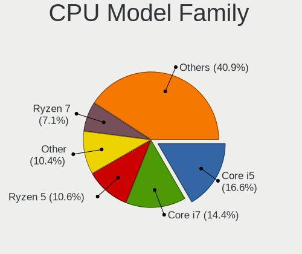
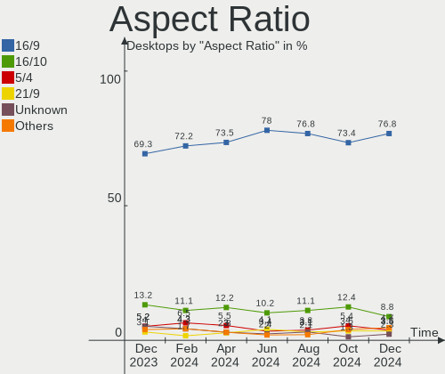
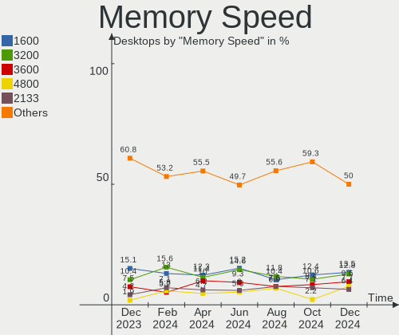

Ubuntu Hardware Trends (Desktops)
---------------------------------

A project to identify most popular hardware characteristics and track their change
over time based on data collected by Ubuntu users at https://Linux-Hardware.org.

Anyone can contribute to this report by the [hw-probe](https://github.com/linuxhw/hw-probe) tool:

    sudo -E hw-probe -all -upload

Full-feature report is available here: https://linux-hardware.org/?view=trends

Period: Jan, 2022.

Contents
--------

* [ System ](#system)
  - [ OS                       ](#os)
  - [ OS Family                ](#os-family)
  - [ Kernel                   ](#kernel)
  - [ Kernel Family            ](#kernel-family)
  - [ Kernel Major Ver.        ](#kernel-major-ver)
  - [ Arch                     ](#arch)
  - [ DE                       ](#de)
  - [ Display Server           ](#display-server)
  - [ Display Manager          ](#display-manager)
  - [ OS Lang                  ](#os-lang)
  - [ Boot Mode                ](#boot-mode)
  - [ Filesystem               ](#filesystem)
  - [ Part. scheme             ](#part-scheme)
  - [ Dual Boot with Linux/BSD ](#dual-boot-with-linuxbsd)
  - [ Dual Boot (Win)          ](#dual-boot-win)

* [ Board ](#board)
  - [ Vendor                   ](#vendor)
  - [ Model                    ](#model)
  - [ Model Family             ](#model-family)
  - [ MFG Year                 ](#mfg-year)
  - [ Form Factor              ](#form-factor)
  - [ Secure Boot              ](#secure-boot)
  - [ Coreboot                 ](#coreboot)
  - [ RAM Size                 ](#ram-size)
  - [ RAM Used                 ](#ram-used)
  - [ Total Drives             ](#total-drives)
  - [ Has CD-ROM               ](#has-cd-rom)
  - [ Has Ethernet             ](#has-ethernet)
  - [ Has WiFi                 ](#has-wifi)
  - [ Has Bluetooth            ](#has-bluetooth)

* [ Location ](#location)
  - [ Country                  ](#country)
  - [ City                     ](#city)

* [ Drives ](#drives)
  - [ Drive Vendor             ](#drive-vendor)
  - [ Drive Model              ](#drive-model)
  - [ HDD Vendor               ](#hdd-vendor)
  - [ SSD Vendor               ](#ssd-vendor)
  - [ Drive Kind               ](#drive-kind)
  - [ Drive Connector          ](#drive-connector)
  - [ Drive Size               ](#drive-size)
  - [ Space Total              ](#space-total)
  - [ Space Used               ](#space-used)
  - [ Malfunc. Drives          ](#malfunc-drives)
  - [ Malfunc. Drive Vendor    ](#malfunc-drive-vendor)
  - [ Malfunc. HDD Vendor      ](#malfunc-hdd-vendor)
  - [ Malfunc. Drive Kind      ](#malfunc-drive-kind)
  - [ Failed Drives            ](#failed-drives)
  - [ Failed Drive Vendor      ](#failed-drive-vendor)
  - [ Drive Status             ](#drive-status)

* [ Storage controller ](#storage-controller)
  - [ Storage Vendor           ](#storage-vendor)
  - [ Storage Model            ](#storage-model)
  - [ Storage Kind             ](#storage-kind)

* [ Processor ](#processor)
  - [ CPU Vendor               ](#cpu-vendor)
  - [ CPU Model                ](#cpu-model)
  - [ CPU Model Family         ](#cpu-model-family)
  - [ CPU Cores                ](#cpu-cores)
  - [ CPU Sockets              ](#cpu-sockets)
  - [ CPU Threads              ](#cpu-threads)
  - [ CPU Op-Modes             ](#cpu-op-modes)
  - [ CPU Microcode            ](#cpu-microcode)
  - [ CPU Microarch            ](#cpu-microarch)

* [ Graphics ](#graphics)
  - [ GPU Vendor               ](#gpu-vendor)
  - [ GPU Model                ](#gpu-model)
  - [ GPU Combo                ](#gpu-combo)
  - [ GPU Driver               ](#gpu-driver)
  - [ GPU Memory               ](#gpu-memory)

* [ Monitor ](#monitor)
  - [ Monitor Vendor           ](#monitor-vendor)
  - [ Monitor Model            ](#monitor-model)
  - [ Monitor Resolution       ](#monitor-resolution)
  - [ Monitor Diagonal         ](#monitor-diagonal)
  - [ Monitor Width            ](#monitor-width)
  - [ Aspect Ratio             ](#aspect-ratio)
  - [ Monitor Area             ](#monitor-area)
  - [ Pixel Density            ](#pixel-density)
  - [ Multiple Monitors        ](#multiple-monitors)

* [ Network ](#network)
  - [ Net Controller Vendor    ](#net-controller-vendor)
  - [ Net Controller Model     ](#net-controller-model)
  - [ Wireless Vendor          ](#wireless-vendor)
  - [ Wireless Model           ](#wireless-model)
  - [ Ethernet Vendor          ](#ethernet-vendor)
  - [ Ethernet Model           ](#ethernet-model)
  - [ Net Controller Kind      ](#net-controller-kind)
  - [ Used Controller          ](#used-controller)
  - [ NICs                     ](#nics)
  - [ IPv6                     ](#ipv6)

* [ Bluetooth ](#bluetooth)
  - [ Bluetooth Vendor         ](#bluetooth-vendor)
  - [ Bluetooth Model          ](#bluetooth-model)

* [ Sound ](#sound)
  - [ Sound Vendor             ](#sound-vendor)
  - [ Sound Model              ](#sound-model)

* [ Memory ](#memory)
  - [ Memory Vendor            ](#memory-vendor)
  - [ Memory Model             ](#memory-model)
  - [ Memory Kind              ](#memory-kind)
  - [ Memory Form Factor       ](#memory-form-factor)
  - [ Memory Size              ](#memory-size)
  - [ Memory Speed             ](#memory-speed)

* [ Printers & scanners ](#printers--scanners)
  - [ Printer Vendor           ](#printer-vendor)
  - [ Printer Model            ](#printer-model)
  - [ Scanner Vendor           ](#scanner-vendor)
  - [ Scanner Model            ](#scanner-model)

* [ Camera ](#camera)
  - [ Camera Vendor            ](#camera-vendor)
  - [ Camera Model             ](#camera-model)

* [ Security ](#security)
  - [ Fingerprint Vendor       ](#fingerprint-vendor)
  - [ Fingerprint Model        ](#fingerprint-model)
  - [ Chipcard Vendor          ](#chipcard-vendor)
  - [ Chipcard Model           ](#chipcard-model)

* [ Unsupported ](#unsupported)
  - [ Unsupported Devices      ](#unsupported-devices)
  - [ Unsupported Device Types ](#unsupported-device-types)

System
------

OS
--

Installed operating systems

| Name         | Desktops | Percent |
|--------------|----------|---------|
| Ubuntu 20.04 | 273      | 64.85%  |
| Ubuntu 21.10 | 100      | 23.75%  |
| Ubuntu 18.04 | 25       | 5.94%   |
| Ubuntu 21.04 | 13       | 3.09%   |
| Ubuntu 22.04 | 4        | 0.95%   |
| Ubuntu 16.04 | 4        | 0.95%   |
| Ubuntu 6.1   | 1        | 0.24%   |
| Ubuntu 19.10 | 1        | 0.24%   |

OS Family
---------

OS without a version

| Name   | Desktops | Percent |
|--------|----------|---------|
| Ubuntu | 421      | 100%    |

Kernel
------

Version of the Linux kernel

| Version                     | Desktops | Percent |
|-----------------------------|----------|---------|
| 5.13.0-27-generic           | 108      | 25.65%  |
| 5.11.0-46-generic           | 40       | 9.5%    |
| 5.11.0-44-generic           | 34       | 8.08%   |
| 5.11.0-43-generic           | 32       | 7.6%    |
| 5.13.0-25-generic           | 30       | 7.13%   |
| 5.13.0-23-generic           | 19       | 4.51%   |
| 5.13.0-22-generic           | 18       | 4.28%   |
| 5.4.0-96-generic            | 17       | 4.04%   |
| 5.4.0-92-generic            | 16       | 3.8%    |
| 5.4.0-94-generic            | 15       | 3.56%   |
| 5.11.0-27-generic           | 8        | 1.9%    |
| 5.4.0-91-generic            | 7        | 1.66%   |
| 4.15.0-166-generic          | 7        | 1.66%   |
| 4.15.0-163-generic          | 6        | 1.43%   |
| 5.13.0-28-generic           | 5        | 1.19%   |
| 5.8.0-43-generic            | 3        | 0.71%   |
| 5.4.0-26-generic            | 3        | 0.71%   |
| 5.13.0-19-generic           | 3        | 0.71%   |
| 5.11.0-49-generic           | 3        | 0.71%   |
| 5.11.0-41-generic           | 3        | 0.71%   |
| 5.11.0-40-generic           | 3        | 0.71%   |
| 5.11.0-38-generic           | 3        | 0.71%   |
| 4.15.0-142-generic          | 3        | 0.71%   |
| 5.8.0-50-generic            | 2        | 0.48%   |
| 5.4.0-89-generic            | 2        | 0.48%   |
| 5.16.0-051600-generic       | 2        | 0.48%   |
| 5.13.0-24-generic           | 2        | 0.48%   |
| 5.11.0-37-generic           | 2        | 0.48%   |
| 5.11.0-16-generic           | 2        | 0.48%   |
| 5.8.0-53-generic            | 1        | 0.24%   |
| 5.8.0-28-generic            | 1        | 0.24%   |
| 5.4.0-80-generic            | 1        | 0.24%   |
| 5.4.0-72-generic            | 1        | 0.24%   |
| 5.4.0-54-generic            | 1        | 0.24%   |
| 5.4.0-47-generic            | 1        | 0.24%   |
| 5.4.0-37-generic            | 1        | 0.24%   |
| 5.3.0-64-generic            | 1        | 0.24%   |
| 5.16.1-tkg-pds              | 1        | 0.24%   |
| 5.16.0                      | 1        | 0.24%   |
| 5.15.13-051513-generic      | 1        | 0.24%   |
| 5.15.11-051511-generic      | 1        | 0.24%   |
| 5.15.0-17-generic           | 1        | 0.24%   |
| 5.15.0-051500rc7-generic    | 1        | 0.24%   |
| 5.13.0-21-generic           | 1        | 0.24%   |
| 5.13.0-192110311031-generic | 1        | 0.24%   |
| 5.13.0-1017-oem             | 1        | 0.24%   |
| 5.11.0-402110311031-generic | 1        | 0.24%   |
| 5.10.94-xanmod2             | 1        | 0.24%   |
| 5.10.10-051010-generic      | 1        | 0.24%   |
| 4.4.0-210-generic           | 1        | 0.24%   |
| 4.15.0-162-generic          | 1        | 0.24%   |
| 4.15.0-147-generic          | 1        | 0.24%   |

Kernel Family
-------------

Linux kernel without a distro release

| Version | Desktops | Percent |
|---------|----------|---------|
| 5.13.0  | 188      | 44.66%  |
| 5.11.0  | 131      | 31.12%  |
| 5.4.0   | 65       | 15.44%  |
| 4.15.0  | 18       | 4.28%   |
| 5.8.0   | 7        | 1.66%   |
| 5.16.0  | 3        | 0.71%   |
| 5.15.0  | 2        | 0.48%   |
| 5.3.0   | 1        | 0.24%   |
| 5.16.1  | 1        | 0.24%   |
| 5.15.13 | 1        | 0.24%   |
| 5.15.11 | 1        | 0.24%   |
| 5.10.94 | 1        | 0.24%   |
| 5.10.10 | 1        | 0.24%   |
| 4.4.0   | 1        | 0.24%   |

Kernel Major Ver.
-----------------

Linux kernel major version

| Version | Desktops | Percent |
|---------|----------|---------|
| 5.13    | 188      | 44.66%  |
| 5.11    | 131      | 31.12%  |
| 5.4     | 65       | 15.44%  |
| 4.15    | 18       | 4.28%   |
| 5.8     | 7        | 1.66%   |
| 5.16    | 4        | 0.95%   |
| 5.15    | 4        | 0.95%   |
| 5.10    | 2        | 0.48%   |
| 5.3     | 1        | 0.24%   |
| 4.4     | 1        | 0.24%   |

Arch
----

OS architecture (x86_64, i586, etc.)

| Name   | Desktops | Percent |
|--------|----------|---------|
| x86_64 | 415      | 98.57%  |
| i686   | 6        | 1.43%   |

DE
--

Desktop Environment

| Name            | Desktops | Percent |
|-----------------|----------|---------|
| GNOME           | 388      | 92.16%  |
| Unknown         | 16       | 3.8%    |
| Unity           | 10       | 2.38%   |
| i3              | 2        | 0.48%   |
| GNOME Flashback | 2        | 0.48%   |
| X-Cinnamon      | 1        | 0.24%   |
| Pantheon        | 1        | 0.24%   |
| Enlightenment   | 1        | 0.24%   |

Display Server
--------------

X11 or Wayland

| Name        | Desktops | Percent |
|-------------|----------|---------|
| X11         | 330      | 78.38%  |
| Wayland     | 72       | 17.1%   |
| Tty         | 10       | 2.38%   |
| Unknown     | 8        | 1.9%    |
| Unspecified | 1        | 0.24%   |

Display Manager
---------------

SDDM, LightDM, etc.

| Name    | Desktops | Percent |
|---------|----------|---------|
| GDM3    | 264      | 62.71%  |
| GDM     | 105      | 24.94%  |
| Unknown | 36       | 8.55%   |
| LightDM | 16       | 3.8%    |

OS Lang
-------

Language

| Lang    | Desktops | Percent |
|---------|----------|---------|
| en_US   | 135      | 32.07%  |
| de_DE   | 75       | 17.81%  |
| fr_FR   | 37       | 8.79%   |
| en_GB   | 21       | 4.99%   |
| it_IT   | 13       | 3.09%   |
| en_CA   | 13       | 3.09%   |
| ru_RU   | 11       | 2.61%   |
| pt_BR   | 11       | 2.61%   |
| pl_PL   | 11       | 2.61%   |
| hu_HU   | 7        | 1.66%   |
| fi_FI   | 6        | 1.43%   |
| es_ES   | 6        | 1.43%   |
| zh_CN   | 5        | 1.19%   |
| nl_NL   | 5        | 1.19%   |
| es_MX   | 5        | 1.19%   |
| en_IN   | 5        | 1.19%   |
| en_AU   | 5        | 1.19%   |
| el_GR   | 5        | 1.19%   |
| de_AT   | 4        | 0.95%   |
| sv_SE   | 3        | 0.71%   |
| ja_JP   | 3        | 0.71%   |
| fr_CA   | 3        | 0.71%   |
| en_IL   | 3        | 0.71%   |
| zh_TW   | 2        | 0.48%   |
| fr_CH   | 2        | 0.48%   |
| de_CH   | 2        | 0.48%   |
| Unknown | 2        | 0.48%   |
| sr_RS   | 1        | 0.24%   |
| sk_SK   | 1        | 0.24%   |
| ru_UA   | 1        | 0.24%   |
| ro_RO   | 1        | 0.24%   |
| pt_PT   | 1        | 0.24%   |
| es_US   | 1        | 0.24%   |
| es_PE   | 1        | 0.24%   |
| es_EC   | 1        | 0.24%   |
| es_DO   | 1        | 0.24%   |
| es_CO   | 1        | 0.24%   |
| es_AR   | 1        | 0.24%   |
| en_ZW   | 1        | 0.24%   |
| en_ZA   | 1        | 0.24%   |
| en_SG   | 1        | 0.24%   |
| en_NG   | 1        | 0.24%   |
| en_HK   | 1        | 0.24%   |
| da_DK   | 1        | 0.24%   |
| cs_CZ   | 1        | 0.24%   |
| ca_ES   | 1        | 0.24%   |
| C       | 1        | 0.24%   |
| ar_EG   | 1        | 0.24%   |

Boot Mode
---------

EFI or BIOS

| Mode | Desktops | Percent |
|------|----------|---------|
| BIOS | 261      | 62%     |
| EFI  | 160      | 38%     |

Filesystem
----------

Type of filesystem

| Type    | Desktops | Percent |
|---------|----------|---------|
| Ext4    | 393      | 93.35%  |
| Overlay | 8        | 1.9%    |
| Zfs     | 6        | 1.43%   |
| Xfs     | 6        | 1.43%   |
| Btrfs   | 4        | 0.95%   |
| Ext2    | 3        | 0.71%   |
| Ext3    | 1        | 0.24%   |

Part. scheme
------------

Scheme of partitioning

| Type    | Desktops | Percent |
|---------|----------|---------|
| Unknown | 299      | 71.02%  |
| GPT     | 90       | 21.38%  |
| MBR     | 32       | 7.6%    |

Dual Boot with Linux/BSD
------------------------

Hosting more than one Linux/BSD

| Dual boot | Desktops | Percent |
|-----------|----------|---------|
| No        | 339      | 80.52%  |
| Yes       | 82       | 19.48%  |

Dual Boot (Win)
---------------

Hosting Linux and Windows

| Dual boot | Desktops | Percent |
|-----------|----------|---------|
| No        | 258      | 61.28%  |
| Yes       | 163      | 38.72%  |

Board
-----

Vendor
------

Motherboard manufacturer

| Name                | Desktops | Percent |
|---------------------|----------|---------|
| ASUSTek Computer    | 109      | 25.89%  |
| Gigabyte Technology | 68       | 16.15%  |
| MSI                 | 55       | 13.06%  |
| Dell                | 39       | 9.26%   |
| Hewlett-Packard     | 38       | 9.03%   |
| ASRock              | 25       | 5.94%   |
| Lenovo              | 14       | 3.33%   |
| Acer                | 10       | 2.38%   |
| Medion              | 9        | 2.14%   |
| Intel               | 9        | 2.14%   |
| Unknown             | 6        | 1.43%   |
| Packard Bell        | 5        | 1.19%   |
| Fujitsu             | 4        | 0.95%   |
| ECS                 | 3        | 0.71%   |
| Biostar             | 3        | 0.71%   |
| Huanan              | 2        | 0.48%   |
| Foxconn             | 2        | 0.48%   |
| TYAN Computer       | 1        | 0.24%   |
| teleplatforms       | 1        | 0.24%   |
| Supermicro          | 1        | 0.24%   |
| QTQD                | 1        | 0.24%   |
| PCWare              | 1        | 0.24%   |
| PC Engines          | 1        | 0.24%   |
| OEM                 | 1        | 0.24%   |
| Nvidia              | 1        | 0.24%   |
| MACHINIST           | 1        | 0.24%   |
| HC                  | 1        | 0.24%   |
| HARDKERNEL          | 1        | 0.24%   |
| Google              | 1        | 0.24%   |
| Fujitsu Siemens     | 1        | 0.24%   |
| Chuwi               | 1        | 0.24%   |
| BESSTAR Tech        | 1        | 0.24%   |
| AZW                 | 1        | 0.24%   |
| ASRockRack          | 1        | 0.24%   |
| Apple               | 1        | 0.24%   |
| Alienware           | 1        | 0.24%   |
| AAEON               | 1        | 0.24%   |

Model
-----

Motherboard model

| Name                             | Desktops | Percent |
|----------------------------------|----------|---------|
| ASUS All Series                  | 14       | 3.33%   |
| Unknown                          | 7        | 1.66%   |
| Dell OptiPlex 7010               | 5        | 1.19%   |
| Dell OptiPlex 3020               | 4        | 0.95%   |
| MSI MS-7592                      | 3        | 0.71%   |
| ASUS PRIME A320M-K               | 3        | 0.71%   |
| Packard Bell IMEDIA S3840        | 2        | 0.48%   |
| MSI MS-7D25                      | 2        | 0.48%   |
| MSI MS-7C96                      | 2        | 0.48%   |
| MSI MS-7C08                      | 2        | 0.48%   |
| MSI MS-7B98                      | 2        | 0.48%   |
| MSI MS-7996                      | 2        | 0.48%   |
| MSI MS-7978                      | 2        | 0.48%   |
| MSI MS-7721                      | 2        | 0.48%   |
| Medion MD34030/2511              | 2        | 0.48%   |
| HP Z800 Workstation              | 2        | 0.48%   |
| HP ProDesk 600 G1 SFF            | 2        | 0.48%   |
| HP EliteDesk 800 G1 SFF          | 2        | 0.48%   |
| HP EliteDesk 705 G1 SFF          | 2        | 0.48%   |
| Gigabyte X58A-UD3R               | 2        | 0.48%   |
| Gigabyte X570 AORUS ULTRA        | 2        | 0.48%   |
| Gigabyte X570 AORUS PRO WIFI     | 2        | 0.48%   |
| Gigabyte GA-880GA-UD3H           | 2        | 0.48%   |
| Gigabyte B460MAORUSPRO           | 2        | 0.48%   |
| Gigabyte B460HD3                 | 2        | 0.48%   |
| Gigabyte A320M-S2H               | 2        | 0.48%   |
| Gigabyte 970A-DS3P               | 2        | 0.48%   |
| Fujitsu ESPRIMO P520             | 2        | 0.48%   |
| Dell Precision Tower 3620        | 2        | 0.48%   |
| Dell OptiPlex 755                | 2        | 0.48%   |
| Dell OptiPlex 745                | 2        | 0.48%   |
| Dell OptiPlex 390                | 2        | 0.48%   |
| Dell OptiPlex 3010               | 2        | 0.48%   |
| ASUS TUF B360M-PLUS GAMING/BR    | 2        | 0.48%   |
| ASUS ROG STRIX B550-E GAMING     | 2        | 0.48%   |
| ASUS PRIME Z690-P WIFI D4        | 2        | 0.48%   |
| ASUS PRIME X470-PRO              | 2        | 0.48%   |
| ASUS PRIME X370-PRO              | 2        | 0.48%   |
| ASUS P9X79 WS                    | 2        | 0.48%   |
| ASUS P8Z77-V LX                  | 2        | 0.48%   |
| ASUS P8H77-M PRO                 | 2        | 0.48%   |
| ASUS P8H61-M LX R2.0             | 2        | 0.48%   |
| ASUS M5A78L-M/USB3               | 2        | 0.48%   |
| ASRock AM1H-ITX                  | 2        | 0.48%   |
| TYAN Tempest-i5000VS-S5372-LC/LH | 1        | 0.24%   |
| teleplatforms D4E4S16P8          | 1        | 0.24%   |
| Supermicro X9DAi                 | 1        | 0.24%   |
| PCWare IPMH61R1                  | 1        | 0.24%   |
| PC Engines APU2                  | 1        | 0.24%   |
| Packard Bell MCP73               | 1        | 0.24%   |
| Packard Bell IXTREME M5722       | 1        | 0.24%   |
| Packard Bell IMEDIA S2291        | 1        | 0.24%   |
| OEM BTC B250                     | 1        | 0.24%   |
| Nvidia NFORCE 780i SLI           | 1        | 0.24%   |
| MSI X5836                        | 1        | 0.24%   |
| MSI VC774AA-ABD CQ5109DE         | 1        | 0.24%   |
| MSI Silent Gamer GTX 650 R1      | 1        | 0.24%   |
| MSI P67A-C43                     | 1        | 0.24%   |
| MSI MS-7D20                      | 1        | 0.24%   |
| MSI MS-7D16                      | 1        | 0.24%   |

Model Family
------------

Motherboard model prefix

| Name                          | Desktops | Percent |
|-------------------------------|----------|---------|
| Dell OptiPlex                 | 25       | 5.94%   |
| ASUS PRIME                    | 23       | 5.46%   |
| ASUS All                      | 14       | 3.33%   |
| ASUS ROG                      | 13       | 3.09%   |
| Lenovo ThinkCentre            | 9        | 2.14%   |
| HP Compaq                     | 8        | 1.9%    |
| Gigabyte X570                 | 8        | 1.9%    |
| Dell Precision                | 7        | 1.66%   |
| Acer Aspire                   | 7        | 1.66%   |
| Unknown                       | 7        | 1.66%   |
| HP ProDesk                    | 6        | 1.43%   |
| HP EliteDesk                  | 6        | 1.43%   |
| ASUS TUF                      | 5        | 1.19%   |
| HP Pavilion                   | 4        | 0.95%   |
| ASUS M5A78L-M                 | 4        | 0.95%   |
| Packard Bell IMEDIA           | 3        | 0.71%   |
| MSI MS-7592                   | 3        | 0.71%   |
| Medion Akoya                  | 3        | 0.71%   |
| Lenovo IdeaCentre             | 3        | 0.71%   |
| Gigabyte 970A-DS3P            | 3        | 0.71%   |
| Fujitsu ESPRIMO               | 3        | 0.71%   |
| ASUS P8Z77-V                  | 3        | 0.71%   |
| MSI MS-7D25                   | 2        | 0.48%   |
| MSI MS-7C96                   | 2        | 0.48%   |
| MSI MS-7C08                   | 2        | 0.48%   |
| MSI MS-7B98                   | 2        | 0.48%   |
| MSI MS-7996                   | 2        | 0.48%   |
| MSI MS-7978                   | 2        | 0.48%   |
| MSI MS-7721                   | 2        | 0.48%   |
| Medion MD34030                | 2        | 0.48%   |
| Lenovo ThinkStation           | 2        | 0.48%   |
| HP Z800                       | 2        | 0.48%   |
| Gigabyte Z690                 | 2        | 0.48%   |
| Gigabyte X58A-UD3R            | 2        | 0.48%   |
| Gigabyte GA-880GA-UD3H        | 2        | 0.48%   |
| Gigabyte B550M                | 2        | 0.48%   |
| Gigabyte B460MAORUSPRO        | 2        | 0.48%   |
| Gigabyte B460HD3              | 2        | 0.48%   |
| Gigabyte A320M-S2H            | 2        | 0.48%   |
| Dell XPS                      | 2        | 0.48%   |
| Dell Vostro                   | 2        | 0.48%   |
| Dell Inspiron                 | 2        | 0.48%   |
| ASUS P9X79                    | 2        | 0.48%   |
| ASUS P8Z68-V                  | 2        | 0.48%   |
| ASUS P8H77-M                  | 2        | 0.48%   |
| ASUS P8H61-M                  | 2        | 0.48%   |
| ASUS P8B75-M                  | 2        | 0.48%   |
| ASRock Z77                    | 2        | 0.48%   |
| ASRock AM1H-ITX               | 2        | 0.48%   |
| TYAN Tempest-i5000VS-S5372-LC | 1        | 0.24%   |
| teleplatforms D4E4S16P8       | 1        | 0.24%   |
| Supermicro X9DAi              | 1        | 0.24%   |
| PCWare IPMH61R1               | 1        | 0.24%   |
| PC Engines APU2               | 1        | 0.24%   |
| Packard Bell MCP73            | 1        | 0.24%   |
| Packard Bell IXTREME          | 1        | 0.24%   |
| OEM BTC                       | 1        | 0.24%   |
| Nvidia NFORCE                 | 1        | 0.24%   |
| MSI X5836                     | 1        | 0.24%   |
| MSI VC774AA-ABD               | 1        | 0.24%   |

MFG Year
--------

Motherboard manufacture year

| Year | Desktops | Percent |
|------|----------|---------|
| 2013 | 39       | 9.26%   |
| 2012 | 39       | 9.26%   |
| 2018 | 35       | 8.31%   |
| 2020 | 34       | 8.08%   |
| 2014 | 34       | 8.08%   |
| 2011 | 33       | 7.84%   |
| 2019 | 32       | 7.6%    |
| 2017 | 32       | 7.6%    |
| 2009 | 26       | 6.18%   |
| 2010 | 25       | 5.94%   |
| 2016 | 23       | 5.46%   |
| 2021 | 22       | 5.23%   |
| 2015 | 20       | 4.75%   |
| 2008 | 15       | 3.56%   |
| 2007 | 8        | 1.9%    |
| 2006 | 3        | 0.71%   |
| 2005 | 1        | 0.24%   |

Form Factor
-----------

Physical design of the computer

| Name    | Desktops | Percent |
|---------|----------|---------|
| Desktop | 421      | 100%    |

Secure Boot
-----------

Enabled or disabled

| State    | Desktops | Percent |
|----------|----------|---------|
| Disabled | 407      | 96.67%  |
| Enabled  | 14       | 3.33%   |

Coreboot
--------

Have coreboot on board

| Used | Desktops | Percent |
|------|----------|---------|
| No   | 418      | 99.29%  |
| Yes  | 3        | 0.71%   |

RAM Size
--------

Total RAM memory

| Size in GB      | Desktops | Percent |
|-----------------|----------|---------|
| 16.01-24.0      | 106      | 25.18%  |
| 8.01-16.0       | 91       | 21.62%  |
| 3.01-4.0        | 63       | 14.96%  |
| 4.01-8.0        | 61       | 14.49%  |
| 32.01-64.0      | 52       | 12.35%  |
| 64.01-256.0     | 23       | 5.46%   |
| 24.01-32.0      | 10       | 2.38%   |
| 1.01-2.0        | 8        | 1.9%    |
| 2.01-3.0        | 5        | 1.19%   |
| More than 256.0 | 1        | 0.24%   |
| 0.51-1.0        | 1        | 0.24%   |

RAM Used
--------

Used RAM memory

| Used GB    | Desktops | Percent |
|------------|----------|---------|
| 1.01-2.0   | 167      | 39.67%  |
| 2.01-3.0   | 98       | 23.28%  |
| 4.01-8.0   | 60       | 14.25%  |
| 3.01-4.0   | 60       | 14.25%  |
| 8.01-16.0  | 17       | 4.04%   |
| 0.51-1.0   | 11       | 2.61%   |
| 0.01-0.5   | 3        | 0.71%   |
| 24.01-32.0 | 2        | 0.48%   |
| 16.01-24.0 | 2        | 0.48%   |
| 32.01-64.0 | 1        | 0.24%   |

Total Drives
------------

Number of drives on board

| Drives | Desktops | Percent |
|--------|----------|---------|
| 1      | 160      | 38%     |
| 2      | 129      | 30.64%  |
| 3      | 67       | 15.91%  |
| 4      | 28       | 6.65%   |
| 5      | 22       | 5.23%   |
| 6      | 5        | 1.19%   |
| 7      | 3        | 0.71%   |
| 0      | 3        | 0.71%   |
| 20     | 2        | 0.48%   |
| 17     | 1        | 0.24%   |
| 11     | 1        | 0.24%   |

Has CD-ROM
----------

Has CD-ROM on board

| Presented | Desktops | Percent |
|-----------|----------|---------|
| No        | 219      | 52.02%  |
| Yes       | 202      | 47.98%  |

Has Ethernet
------------

Has Ethernet on board

| Presented | Desktops | Percent |
|-----------|----------|---------|
| Yes       | 419      | 99.52%  |
| No        | 2        | 0.48%   |

Has WiFi
--------

Has WiFi module

| Presented | Desktops | Percent |
|-----------|----------|---------|
| No        | 236      | 56.06%  |
| Yes       | 185      | 43.94%  |

Has Bluetooth
-------------

Has Bluetooth module

| Presented | Desktops | Percent |
|-----------|----------|---------|
| No        | 306      | 72.68%  |
| Yes       | 115      | 27.32%  |

Location
--------

Country
-------

Geographic location (country)

| Country                | Desktops | Percent |
|------------------------|----------|---------|
| Germany                | 84       | 19.95%  |
| USA                    | 71       | 16.86%  |
| France                 | 36       | 8.55%   |
| UK                     | 19       | 4.51%   |
| Canada                 | 19       | 4.51%   |
| Brazil                 | 17       | 4.04%   |
| Italy                  | 15       | 3.56%   |
| Poland                 | 13       | 3.09%   |
| Russia                 | 12       | 2.85%   |
| Spain                  | 9        | 2.14%   |
| Hungary                | 8        | 1.9%    |
| Finland                | 8        | 1.9%    |
| Switzerland            | 7        | 1.66%   |
| Mexico                 | 7        | 1.66%   |
| Netherlands            | 6        | 1.43%   |
| Austria                | 6        | 1.43%   |
| Australia              | 6        | 1.43%   |
| Sweden                 | 5        | 1.19%   |
| India                  | 5        | 1.19%   |
| Greece                 | 5        | 1.19%   |
| China                  | 4        | 0.95%   |
| Ukraine                | 3        | 0.71%   |
| Japan                  | 3        | 0.71%   |
| Israel                 | 3        | 0.71%   |
| Denmark                | 3        | 0.71%   |
| Czechia                | 3        | 0.71%   |
| Bulgaria               | 3        | 0.71%   |
| Belgium                | 3        | 0.71%   |
| South Africa           | 2        | 0.48%   |
| Portugal               | 2        | 0.48%   |
| Iran                   | 2        | 0.48%   |
| Vietnam                | 1        | 0.24%   |
| Venezuela              | 1        | 0.24%   |
| Uruguay                | 1        | 0.24%   |
| Turkey                 | 1        | 0.24%   |
| Thailand               | 1        | 0.24%   |
| Taiwan                 | 1        | 0.24%   |
| Sri Lanka              | 1        | 0.24%   |
| Slovakia               | 1        | 0.24%   |
| Singapore              | 1        | 0.24%   |
| Serbia                 | 1        | 0.24%   |
| Romania                | 1        | 0.24%   |
| Peru                   | 1        | 0.24%   |
| Norway                 | 1        | 0.24%   |
| Nigeria                | 1        | 0.24%   |
| Malta                  | 1        | 0.24%   |
| Ireland                | 1        | 0.24%   |
| Indonesia              | 1        | 0.24%   |
| Iceland                | 1        | 0.24%   |
| Hong Kong              | 1        | 0.24%   |
| Honduras               | 1        | 0.24%   |
| Faroe Islands          | 1        | 0.24%   |
| Estonia                | 1        | 0.24%   |
| Ecuador                | 1        | 0.24%   |
| Dominican Republic     | 1        | 0.24%   |
| Costa Rica             | 1        | 0.24%   |
| Colombia               | 1        | 0.24%   |
| Cameroon               | 1        | 0.24%   |
| Bosnia and Herzegovina | 1        | 0.24%   |
| Belarus                | 1        | 0.24%   |

City
----

Geographic location (city)

| City                    | Desktops | Percent |
|-------------------------|----------|---------|
| Berlin                  | 9        | 2.14%   |
| Vienna                  | 4        | 0.95%   |
| Montreal                | 4        | 0.95%   |
| Thessaloniki            | 3        | 0.71%   |
| Strasbourg              | 3        | 0.71%   |
| S??o Paulo              | 3        | 0.71%   |
| Munich                  | 3        | 0.71%   |
| Moscow                  | 3        | 0.71%   |
| Mannheim                | 3        | 0.71%   |
| Hamburg                 | 3        | 0.71%   |
| Haifa                   | 3        | 0.71%   |
| Guadalajara             | 3        | 0.71%   |
| Dresden                 | 3        | 0.71%   |
| Chicago                 | 3        | 0.71%   |
| Zeven                   | 2        | 0.48%   |
| Wroclaw                 | 2        | 0.48%   |
| Vechelde                | 2        | 0.48%   |
| Tehran                  | 2        | 0.48%   |
| Szeksz??rd              | 2        | 0.48%   |
| Sydney                  | 2        | 0.48%   |
| St Petersburg           | 2        | 0.48%   |
| Sofia                   | 2        | 0.48%   |
| Salford                 | 2        | 0.48%   |
| Prague                  | 2        | 0.48%   |
| Poznan                  | 2        | 0.48%   |
| Paris                   | 2        | 0.48%   |
| Oulu                    | 2        | 0.48%   |
| New York                | 2        | 0.48%   |
| Madrid                  | 2        | 0.48%   |
| Karlsruhe               | 2        | 0.48%   |
| Helsinki                | 2        | 0.48%   |
| Hanau                   | 2        | 0.48%   |
| Haarlem                 | 2        | 0.48%   |
| Frankfurt am Main       | 2        | 0.48%   |
| Edmonton                | 2        | 0.48%   |
| Dallas                  | 2        | 0.48%   |
| Chikusei                | 2        | 0.48%   |
| Calgary                 | 2        | 0.48%   |
| Budapest                | 2        | 0.48%   |
| Barcelona               | 2        | 0.48%   |
| Albany                  | 2        | 0.48%   |
| Zurich                  | 1        | 0.24%   |
| Yaound?©                | 1        | 0.24%   |
| Wuppertal               | 1        | 0.24%   |
| Wrexham                 | 1        | 0.24%   |
| Woonsocket              | 1        | 0.24%   |
| Wo?‚omin                | 1        | 0.24%   |
| Wittenberg              | 1        | 0.24%   |
| Westminster             | 1        | 0.24%   |
| Weisendorf              | 1        | 0.24%   |
| Waterloo                | 1        | 0.24%   |
| Warsaw                  | 1        | 0.24%   |
| Wabern                  | 1        | 0.24%   |
| Voronezh                | 1        | 0.24%   |
| Villefranche-sur-Sa??ne | 1        | 0.24%   |
| Vicosa                  | 1        | 0.24%   |
| Veresegyhaz             | 1        | 0.24%   |
| Velbert                 | 1        | 0.24%   |
| Veitshochheim           | 1        | 0.24%   |
| Vantaa                  | 1        | 0.24%   |

Drives
------

Drive Vendor
------------

Hard drive vendors

| Vendor                      | Desktops | Drives | Percent |
|-----------------------------|----------|--------|---------|
| WDC                         | 162      | 221    | 22.13%  |
| Seagate                     | 157      | 198    | 21.45%  |
| Samsung Electronics         | 102      | 138    | 13.93%  |
| Kingston                    | 53       | 57     | 7.24%   |
| Toshiba                     | 38       | 74     | 5.19%   |
| SanDisk                     | 32       | 37     | 4.37%   |
| Crucial                     | 27       | 28     | 3.69%   |
| Hitachi                     | 23       | 27     | 3.14%   |
| A-DATA Technology           | 16       | 18     | 2.19%   |
| Unknown                     | 12       | 14     | 1.64%   |
| HGST                        | 8        | 10     | 1.09%   |
| MAXTOR                      | 7        | 7      | 0.96%   |
| Intenso                     | 7        | 7      | 0.96%   |
| Intel                       | 6        | 7      | 0.82%   |
| Silicon Motion              | 4        | 4      | 0.55%   |
| PNY                         | 4        | 4      | 0.55%   |
| Phison                      | 4        | 4      | 0.55%   |
| Transcend                   | 3        | 3      | 0.41%   |
| OCZ                         | 3        | 3      | 0.41%   |
| China                       | 3        | 3      | 0.41%   |
| Unknown                     | 3        | 3      | 0.41%   |
| XPG                         | 2        | 3      | 0.27%   |
| Team                        | 2        | 2      | 0.27%   |
| SPCC                        | 2        | 2      | 0.27%   |
| Realtek Semiconductor       | 2        | 2      | 0.27%   |
| LDLC                        | 2        | 2      | 0.27%   |
| KIOXIA                      | 2        | 2      | 0.27%   |
| FORESEE                     | 2        | 2      | 0.27%   |
| Corsair                     | 2        | 2      | 0.27%   |
| Verbatim                    | 1        | 2      | 0.14%   |
| TO Exter                    | 1        | 1      | 0.14%   |
| SUPERSONIC                  | 1        | 1      | 0.14%   |
| SST                         | 1        | 1      | 0.14%   |
| SK Hynix                    | 1        | 1      | 0.14%   |
| SABRENT                     | 1        | 1      | 0.14%   |
| Q200                        | 1        | 2      | 0.14%   |
| PLEXTOR                     | 1        | 1      | 0.14%   |
| PHD 3.0                     | 1        | 1      | 0.14%   |
| Patriot                     | 1        | 1      | 0.14%   |
| OYUNKEY                     | 1        | 1      | 0.14%   |
| ORTIAL                      | 1        | 1      | 0.14%   |
| NGFF                        | 1        | 1      | 0.14%   |
| Mushkin                     | 1        | 1      | 0.14%   |
| Micron/Crucial Technology   | 1        | 1      | 0.14%   |
| MAXIO Technology (Hangzhou) | 1        | 1      | 0.14%   |
| LITEONIT                    | 1        | 1      | 0.14%   |
| LITEON                      | 1        | 1      | 0.14%   |
| Lite-On                     | 1        | 1      | 0.14%   |
| Lexar                       | 1        | 1      | 0.14%   |
| LaCie                       | 1        | 1      | 0.14%   |
| KLEVV                       | 1        | 1      | 0.14%   |
| KingSpec                    | 1        | 1      | 0.14%   |
| KingFast                    | 1        | 1      | 0.14%   |
| Kingchuxing                 | 1        | 1      | 0.14%   |
| KEEPDATA                    | 1        | 1      | 0.14%   |
| JMicron                     | 1        | 1      | 0.14%   |
| INDMEM                      | 1        | 1      | 0.14%   |
| HS-SSD-C260                 | 1        | 1      | 0.14%   |
| Hoodisk                     | 1        | 1      | 0.14%   |
| Hewlett-Packard             | 1        | 1      | 0.14%   |

Drive Model
-----------

Hard drive models

| Model                               | Desktops | Percent |
|-------------------------------------|----------|---------|
| Toshiba DT01ACA100 1TB              | 12       | 1.41%   |
| Seagate ST2000DM008-2FR102 2TB      | 12       | 1.41%   |
| Kingston SA400S37240G 240GB SSD     | 12       | 1.41%   |
| Seagate ST1000DM010-2EP102 1TB      | 10       | 1.17%   |
| Samsung SSD 850 EVO 250GB           | 9        | 1.06%   |
| Seagate ST500DM002-1BD142 500GB     | 8        | 0.94%   |
| Samsung SSD 860 EVO 1TB             | 8        | 0.94%   |
| Kingston SA400S37480G 480GB SSD     | 8        | 0.94%   |
| WDC WD20EARX-00PASB0 2TB            | 7        | 0.82%   |
| Seagate ST1000DM003-1CH162 1TB      | 7        | 0.82%   |
| Samsung SSD 860 EVO 500GB           | 7        | 0.82%   |
| Kingston SV300S37A120G 120GB SSD    | 6        | 0.7%    |
| WDC WDS240G2G0A-00JH30 240GB SSD    | 5        | 0.59%   |
| Unknown SD/MMC/MS PRO 128GB         | 5        | 0.59%   |
| Seagate ST2000DL003-9VT166 2TB      | 5        | 0.59%   |
| Samsung NVMe SSD Drive 500GB        | 5        | 0.59%   |
| Samsung NVMe SSD Drive 250GB        | 5        | 0.59%   |
| Kingston SA400S37120G 120GB SSD     | 5        | 0.59%   |
| WDC WDS240G2G0B-00EPW0 240GB SSD    | 4        | 0.47%   |
| WDC WD40EFRX-68WT0N0 4TB            | 4        | 0.47%   |
| Seagate ST4000DM004-2CV104 4TB      | 4        | 0.47%   |
| Seagate ST3500413AS 500GB           | 4        | 0.47%   |
| Seagate ST2000DM001-1ER164 2TB      | 4        | 0.47%   |
| Seagate ST1000DM003-1ER162 1TB      | 4        | 0.47%   |
| SanDisk SSD PLUS 1000GB             | 4        | 0.47%   |
| Samsung NVMe SSD Drive 1TB          | 4        | 0.47%   |
| Samsung HD103SJ 1TB                 | 4        | 0.47%   |
| Kingston NVMe SSD Drive 500GB       | 4        | 0.47%   |
| Crucial CT1000MX500SSD1 1TB         | 4        | 0.47%   |
| WDC WDBNCE5000PNC 500GB SSD         | 3        | 0.35%   |
| WDC WD20EZRX-00D8PB0 2TB            | 3        | 0.35%   |
| WDC WD20EFRX-68EUZN0 2TB            | 3        | 0.35%   |
| WDC WD10EZEX-08WN4A0 1TB            | 3        | 0.35%   |
| WDC WD10EZEX-00WN4A0 1TB            | 3        | 0.35%   |
| Toshiba DT01ACA050 500GB            | 3        | 0.35%   |
| Silicon Motion NVMe SSD Drive 256GB | 3        | 0.35%   |
| Seagate ST9500325AS 500GB           | 3        | 0.35%   |
| Seagate ST380815AS 80GB             | 3        | 0.35%   |
| Seagate ST3500418AS 500GB           | 3        | 0.35%   |
| Seagate ST31000524AS 1TB            | 3        | 0.35%   |
| Seagate ST2000DM006-2DM164 2TB      | 3        | 0.35%   |
| Seagate ST1500DL003-9VT16L 1TB      | 3        | 0.35%   |
| SanDisk SSD PLUS 240GB              | 3        | 0.35%   |
| Sandisk NVMe SSD Drive 1TB          | 3        | 0.35%   |
| Samsung SSD 970 EVO Plus 500GB      | 3        | 0.35%   |
| Samsung SSD 970 EVO Plus 1TB        | 3        | 0.35%   |
| Samsung SSD 850 PRO 256GB           | 3        | 0.35%   |
| Samsung SSD 850 EVO 500GB           | 3        | 0.35%   |
| Samsung SSD 840 EVO 250GB           | 3        | 0.35%   |
| Samsung SSD 750 EVO 120GB           | 3        | 0.35%   |
| Samsung NVMe SSD Drive 512GB        | 3        | 0.35%   |
| PNY CS900 240GB SSD                 | 3        | 0.35%   |
| Kingston SHFS37A240G 240GB SSD      | 3        | 0.35%   |
| Hitachi HDS721010CLA332 1TB         | 3        | 0.35%   |
| Crucial CT240BX500SSD1 240GB        | 3        | 0.35%   |
| Unknown                             | 3        | 0.35%   |
| WDC WDS100T2B0A-00SM50 1TB SSD      | 2        | 0.23%   |
| WDC WD6401AALS-00L3B2 640GB         | 2        | 0.23%   |
| WDC WD6400AAKS-22A7B2 640GB         | 2        | 0.23%   |
| WDC WD5000BPVT-22A1YT0 500GB        | 2        | 0.23%   |

HDD Vendor
----------

Hard disk drive vendors

| Vendor              | Desktops | Drives | Percent |
|---------------------|----------|--------|---------|
| Seagate             | 152      | 191    | 38.29%  |
| WDC                 | 144      | 191    | 36.27%  |
| Toshiba             | 35       | 69     | 8.82%   |
| Hitachi             | 23       | 27     | 5.79%   |
| Samsung Electronics | 20       | 25     | 5.04%   |
| HGST                | 8        | 10     | 2.02%   |
| Unknown             | 5        | 5      | 1.26%   |
| MAXTOR              | 5        | 5      | 1.26%   |
| Intenso             | 2        | 2      | 0.5%    |
| TO Exter            | 1        | 1      | 0.25%   |
| PHD 3.0             | 1        | 1      | 0.25%   |
| Fujitsu             | 1        | 1      | 0.25%   |

SSD Vendor
----------

Solid state drive vendors

| Vendor              | Desktops | Drives | Percent |
|---------------------|----------|--------|---------|
| Samsung Electronics | 57       | 69     | 22.18%  |
| Kingston            | 47       | 50     | 18.29%  |
| SanDisk             | 29       | 31     | 11.28%  |
| WDC                 | 25       | 25     | 9.73%   |
| Crucial             | 22       | 23     | 8.56%   |
| A-DATA Technology   | 14       | 16     | 5.45%   |
| Intenso             | 4        | 4      | 1.56%   |
| Intel               | 4        | 5      | 1.56%   |
| Transcend           | 3        | 3      | 1.17%   |
| Toshiba             | 3        | 3      | 1.17%   |
| PNY                 | 3        | 3      | 1.17%   |
| OCZ                 | 3        | 3      | 1.17%   |
| China               | 3        | 3      | 1.17%   |
| Team                | 2        | 2      | 0.78%   |
| SPCC                | 2        | 2      | 0.78%   |
| Seagate             | 2        | 2      | 0.78%   |
| MAXTOR              | 2        | 2      | 0.78%   |
| FORESEE             | 2        | 2      | 0.78%   |
| Unknown             | 2        | 2      | 0.78%   |
| Verbatim            | 1        | 2      | 0.39%   |
| SABRENT             | 1        | 1      | 0.39%   |
| Q200                | 1        | 2      | 0.39%   |
| PLEXTOR             | 1        | 1      | 0.39%   |
| Patriot             | 1        | 1      | 0.39%   |
| OYUNKEY             | 1        | 1      | 0.39%   |
| ORTIAL              | 1        | 1      | 0.39%   |
| NGFF                | 1        | 1      | 0.39%   |
| Mushkin             | 1        | 1      | 0.39%   |
| LITEONIT            | 1        | 1      | 0.39%   |
| LITEON              | 1        | 1      | 0.39%   |
| Lexar               | 1        | 1      | 0.39%   |
| KLEVV               | 1        | 1      | 0.39%   |
| KingSpec            | 1        | 1      | 0.39%   |
| KingFast            | 1        | 1      | 0.39%   |
| Kingchuxing         | 1        | 1      | 0.39%   |
| KEEPDATA            | 1        | 1      | 0.39%   |
| HS-SSD-C260         | 1        | 1      | 0.39%   |
| Hoodisk             | 1        | 1      | 0.39%   |
| Hewlett-Packard     | 1        | 1      | 0.39%   |
| GOODRAM             | 1        | 1      | 0.39%   |
| Gigabyte Technology | 1        | 1      | 0.39%   |
| Emtec               | 1        | 1      | 0.39%   |
| Corsair             | 1        | 1      | 0.39%   |
| Colorful            | 1        | 1      | 0.39%   |
| ASMT                | 1        | 1      | 0.39%   |
| Advantech           | 1        | 1      | 0.39%   |
| 2-Power             | 1        | 1      | 0.39%   |

Drive Kind
----------

HDD or SSD

| Kind    | Desktops | Drives | Percent |
|---------|----------|--------|---------|
| HDD     | 303      | 528    | 49.03%  |
| SSD     | 215      | 280    | 34.79%  |
| NVMe    | 79       | 98     | 12.78%  |
| Unknown | 16       | 18     | 2.59%   |
| MMC     | 5        | 5      | 0.81%   |

Drive Connector
---------------

SATA, SAS, NVMe, etc.

| Type | Desktops | Drives | Percent |
|------|----------|--------|---------|
| SATA | 390      | 782    | 77.38%  |
| NVMe | 79       | 96     | 15.67%  |
| SAS  | 30       | 46     | 5.95%   |
| MMC  | 5        | 5      | 0.99%   |

Drive Size
----------

Size of hard drive

| Size in TB | Desktops | Drives | Percent |
|------------|----------|--------|---------|
| 0.01-0.5   | 275      | 386    | 46.85%  |
| 0.51-1.0   | 174      | 220    | 29.64%  |
| 1.01-2.0   | 75       | 83     | 12.78%  |
| 3.01-4.0   | 32       | 59     | 5.45%   |
| 2.01-3.0   | 13       | 18     | 2.21%   |
| 4.01-10.0  | 13       | 28     | 2.21%   |
| 10.01-20.0 | 5        | 14     | 0.85%   |

Space Total
-----------

Amount of disk space available on the file system

| Size in GB     | Desktops | Percent |
|----------------|----------|---------|
| 101-250        | 122      | 28.98%  |
| 251-500        | 71       | 16.86%  |
| 501-1000       | 71       | 16.86%  |
| 1001-2000      | 48       | 11.4%   |
| More than 3000 | 43       | 10.21%  |
| 51-100         | 25       | 5.94%   |
| 2001-3000      | 23       | 5.46%   |
| 1-20           | 11       | 2.61%   |
| 21-50          | 5        | 1.19%   |
| Unknown        | 2        | 0.48%   |

Space Used
----------

Amount of used disk space

| Used GB        | Desktops | Percent |
|----------------|----------|---------|
| 1-20           | 136      | 32.3%   |
| 21-50          | 71       | 16.86%  |
| 101-250        | 57       | 13.54%  |
| 51-100         | 50       | 11.88%  |
| 501-1000       | 32       | 7.6%    |
| 1001-2000      | 23       | 5.46%   |
| 251-500        | 22       | 5.23%   |
| More than 3000 | 19       | 4.51%   |
| 2001-3000      | 8        | 1.9%    |
| Unknown        | 2        | 0.48%   |
| 0              | 1        | 0.24%   |

Malfunc. Drives
---------------

Drive models with a malfunction

| Model                                      | Desktops | Drives | Percent |
|--------------------------------------------|----------|--------|---------|
| WDC WD3200AAJS-08L7A0 320GB                | 2        | 2      | 5.71%   |
| WDC WD20EARX-00PASB0 2TB                   | 2        | 2      | 5.71%   |
| WDC WDS240G2G0A-00JH30 240GB SSD           | 1        | 1      | 2.86%   |
| WDC WD6400AAKS-22A7B2 640GB                | 1        | 1      | 2.86%   |
| WDC WD5000BPVT-00HXZT3 500GB               | 1        | 1      | 2.86%   |
| WDC WD5000AAKS-00A7B0 500GB                | 1        | 1      | 2.86%   |
| WDC WD5000AACS-00ZUB0 500GB                | 1        | 1      | 2.86%   |
| WDC WD40EFRX-68WT0N0 4TB                   | 1        | 2      | 2.86%   |
| WDC WD3200BEKT-22F3T0 320GB                | 1        | 1      | 2.86%   |
| WDC WD10EZEX-60ZF5A0 1TB                   | 1        | 1      | 2.86%   |
| WDC WD10EZEX-00RKKA0 1TB                   | 1        | 1      | 2.86%   |
| WDC WD10EARS-00Y5B1 1TB                    | 1        | 1      | 2.86%   |
| WDC WD10EADS-65L5B1 1TB                    | 1        | 1      | 2.86%   |
| WDC WD1002FAEX-00Y9A0 1TB                  | 1        | 1      | 2.86%   |
| Toshiba MQ01ABD050 500GB                   | 1        | 1      | 2.86%   |
| Toshiba DT01ACA100 1TB                     | 1        | 1      | 2.86%   |
| Seagate ST3750840ACE 752GB                 | 1        | 1      | 2.86%   |
| Seagate ST3500418AS 500GB                  | 1        | 1      | 2.86%   |
| Seagate ST3320613AS 320GB                  | 1        | 1      | 2.86%   |
| Seagate ST31000524NS 1TB                   | 1        | 1      | 2.86%   |
| Seagate ST3000DM001-1CH166 3TB             | 1        | 2      | 2.86%   |
| Seagate ST2000DX001-1NS164 2TB             | 1        | 1      | 2.86%   |
| Seagate ST1000DM003-9YN162 1TB             | 1        | 1      | 2.86%   |
| Seagate ST1000DM003-1CH162 1TB             | 1        | 1      | 2.86%   |
| Samsung Electronics MZVLB1T0HALR-00000 1TB | 1        | 1      | 2.86%   |
| Intel SSDSC2CW120A3 120GB                  | 1        | 1      | 2.86%   |
| Hitachi HTS543216L9A300 160GB              | 1        | 1      | 2.86%   |
| Hitachi HTS542525K9SA00 250GB              | 1        | 1      | 2.86%   |
| HGST HTS545050A7E380 500GB                 | 1        | 1      | 2.86%   |
| Crucial CT240M500SSD1 240GB                | 1        | 1      | 2.86%   |
| A-DATA Technology SU800 128GB SSD          | 1        | 1      | 2.86%   |
| A-DATA Technology SU650 120GB SSD          | 1        | 1      | 2.86%   |
| Unknown                                    | 1        | 1      | 2.86%   |

Malfunc. Drive Vendor
---------------------

Vendors of faulty drives

| Vendor              | Desktops | Drives | Percent |
|---------------------|----------|--------|---------|
| WDC                 | 14       | 17     | 42.42%  |
| Seagate             | 8        | 9      | 24.24%  |
| Toshiba             | 2        | 2      | 6.06%   |
| Hitachi             | 2        | 2      | 6.06%   |
| A-DATA Technology   | 2        | 2      | 6.06%   |
| Samsung Electronics | 1        | 1      | 3.03%   |
| Intel               | 1        | 1      | 3.03%   |
| HGST                | 1        | 1      | 3.03%   |
| Crucial             | 1        | 1      | 3.03%   |
| Unknown             | 1        | 1      | 3.03%   |

Malfunc. HDD Vendor
-------------------

Vendors of faulty HDD drives

| Vendor  | Desktops | Drives | Percent |
|---------|----------|--------|---------|
| WDC     | 13       | 16     | 50%     |
| Seagate | 8        | 9      | 30.77%  |
| Toshiba | 2        | 2      | 7.69%   |
| Hitachi | 2        | 2      | 7.69%   |
| HGST    | 1        | 1      | 3.85%   |

Malfunc. Drive Kind
-------------------

Kinds of faulty drives

| Kind | Desktops | Drives | Percent |
|------|----------|--------|---------|
| HDD  | 25       | 30     | 78.13%  |
| SSD  | 6        | 6      | 18.75%  |
| NVMe | 1        | 1      | 3.13%   |

Failed Drives
-------------

Failed drive models

Zero info for selected period =(

Failed Drive Vendor
-------------------

Failed drive vendors

Zero info for selected period =(

Drive Status
------------

Number of failed and malfunc. drives

| Status   | Desktops | Drives | Percent |
|----------|----------|--------|---------|
| Detected | 308      | 642    | 67.99%  |
| Works    | 114      | 250    | 25.17%  |
| Malfunc  | 31       | 37     | 6.84%   |

Storage controller
------------------

Storage Vendor
--------------

Storage controller vendors

| Vendor                       | Desktops | Percent |
|------------------------------|----------|---------|
| Intel                        | 293      | 51.68%  |
| AMD                          | 120      | 21.16%  |
| Samsung Electronics          | 34       | 6%      |
| Marvell Technology Group     | 20       | 3.53%   |
| JMicron Technology           | 20       | 3.53%   |
| ASMedia Technology           | 12       | 2.12%   |
| Sandisk                      | 9        | 1.59%   |
| Nvidia                       | 7        | 1.23%   |
| Kingston Technology Company  | 7        | 1.23%   |
| Phison Electronics           | 6        | 1.06%   |
| Micron/Crucial Technology    | 6        | 1.06%   |
| Silicon Motion               | 4        | 0.71%   |
| Realtek Semiconductor        | 4        | 0.71%   |
| Broadcom / LSI               | 4        | 0.71%   |
| VIA Technologies             | 3        | 0.53%   |
| LSI Logic / Symbios Logic    | 3        | 0.53%   |
| Seagate Technology           | 2        | 0.35%   |
| KIOXIA                       | 2        | 0.35%   |
| ADATA Technology             | 2        | 0.35%   |
| Adaptec                      | 2        | 0.35%   |
| Toshiba America Info Systems | 1        | 0.18%   |
| Toshiba                      | 1        | 0.18%   |
| SK Hynix                     | 1        | 0.18%   |
| Silicon Image                | 1        | 0.18%   |
| MAXIO Technology (Hangzhou)  | 1        | 0.18%   |
| Hewlett-Packard              | 1        | 0.18%   |
| Biwin Storage Technology     | 1        | 0.18%   |

Storage Model
-------------

Storage controller models

| Model                                                                                   | Desktops | Percent |
|-----------------------------------------------------------------------------------------|----------|---------|
| AMD FCH SATA Controller [AHCI mode]                                                     | 70       | 9.94%   |
| Intel 8 Series/C220 Series Chipset Family 6-port SATA Controller 1 [AHCI mode]          | 35       | 4.97%   |
| Intel 6 Series/C200 Series Chipset Family 6 port Desktop SATA AHCI Controller           | 26       | 3.69%   |
| Samsung NVMe SSD Controller SM981/PM981/PM983                                           | 25       | 3.55%   |
| Intel SATA Controller [RAID mode]                                                       | 25       | 3.55%   |
| Intel Q170/Q150/B150/H170/H110/Z170/CM236 Chipset SATA Controller [AHCI Mode]           | 25       | 3.55%   |
| AMD SB7x0/SB8x0/SB9x0 IDE Controller                                                    | 25       | 3.55%   |
| Intel 7 Series/C210 Series Chipset Family 6-port SATA Controller [AHCI mode]            | 24       | 3.41%   |
| Intel 200 Series PCH SATA controller [AHCI mode]                                        | 24       | 3.41%   |
| AMD SB7x0/SB8x0/SB9x0 SATA Controller [IDE mode]                                        | 21       | 2.98%   |
| Intel NM10/ICH7 Family SATA Controller [IDE mode]                                       | 17       | 2.41%   |
| AMD 400 Series Chipset SATA Controller                                                  | 17       | 2.41%   |
| JMicron JMB363 SATA/IDE Controller                                                      | 14       | 1.99%   |
| ASMedia ASM1062 Serial ATA Controller                                                   | 12       | 1.7%    |
| AMD Starship/Matisse Chipset SATA Controller [AHCI mode]                                | 12       | 1.7%    |
| AMD SB7x0/SB8x0/SB9x0 SATA Controller [AHCI mode]                                       | 12       | 1.7%    |
| Intel 82801G (ICH7 Family) IDE Controller                                               | 11       | 1.56%   |
| Intel 9 Series Chipset Family SATA Controller [AHCI Mode]                               | 10       | 1.42%   |
| Intel Cannon Lake PCH SATA AHCI Controller                                              | 9        | 1.28%   |
| AMD FCH SATA Controller D                                                               | 9        | 1.28%   |
| Intel 82801JI (ICH10 Family) 4 port SATA IDE Controller #1                              | 8        | 1.14%   |
| Intel 82801JI (ICH10 Family) 2 port SATA IDE Controller #2                              | 8        | 1.14%   |
| Intel Alder Lake-S PCH SATA Controller [AHCI Mode]                                      | 6        | 0.85%   |
| Intel 7 Series/C210 Series Chipset Family 4-port SATA Controller [IDE mode]             | 6        | 0.85%   |
| Intel 7 Series/C210 Series Chipset Family 2-port SATA Controller [IDE mode]             | 6        | 0.85%   |
| Intel 6 Series/C200 Series Chipset Family Desktop SATA Controller (IDE mode, ports 4-5) | 6        | 0.85%   |
| Intel 6 Series/C200 Series Chipset Family Desktop SATA Controller (IDE mode, ports 0-3) | 6        | 0.85%   |
| AMD 300 Series Chipset SATA Controller                                                  | 6        | 0.85%   |
| Samsung NVMe SSD Controller PM9A1/PM9A3/980PRO                                          | 5        | 0.71%   |
| Marvell Group 88SE9172 SATA 6Gb/s Controller                                            | 5        | 0.71%   |
| Intel 5 Series/3400 Series Chipset 6 port SATA AHCI Controller                          | 5        | 0.71%   |
| Intel 400 Series Chipset Family SATA AHCI Controller                                    | 5        | 0.71%   |
| AMD X370 Series Chipset SATA Controller                                                 | 5        | 0.71%   |
| Silicon Motion SM2263EN/SM2263XT SSD Controller                                         | 4        | 0.57%   |
| Sandisk WD Black SN750 / PC SN730 NVMe SSD                                              | 4        | 0.57%   |
| Samsung NVMe SSD Controller SM961/PM961/SM963                                           | 4        | 0.57%   |
| Realtek Realtek Non-Volatile memory controller                                          | 4        | 0.57%   |
| Micron/Crucial P2 NVMe PCIe SSD                                                         | 4        | 0.57%   |
| Marvell Group 88SE6111/6121 SATA II / PATA Controller                                   | 4        | 0.57%   |
| Kingston Company A2000 NVMe SSD                                                         | 4        | 0.57%   |
| Intel Comet Lake SATA AHCI Controller                                                   | 4        | 0.57%   |
| Intel Celeron/Pentium Silver Processor SATA Controller                                  | 4        | 0.57%   |
| Intel C600/X79 series chipset SATA RAID Controller                                      | 4        | 0.57%   |
| Intel C600/X79 series chipset 6-Port SATA AHCI Controller                               | 4        | 0.57%   |
| Intel 82801JI (ICH10 Family) SATA AHCI Controller                                       | 4        | 0.57%   |
| Intel 500 Series Chipset Family SATA AHCI Controller                                    | 4        | 0.57%   |
| Intel 4 Series Chipset PT IDER Controller                                               | 4        | 0.57%   |
| VIA VT6415 PATA IDE Host Controller                                                     | 3        | 0.43%   |
| Sandisk WD Blue SN550 NVMe SSD                                                          | 3        | 0.43%   |
| Nvidia MCP61 SATA Controller                                                            | 3        | 0.43%   |
| Nvidia MCP61 IDE                                                                        | 3        | 0.43%   |
| Marvell Group 88SE9128 PCIe SATA 6 Gb/s RAID controller with HyperDuo                   | 3        | 0.43%   |
| Kingston Company SNVS2000G [NV1 NVMe PCIe SSD 2TB]                                      | 3        | 0.43%   |
| JMicron JMB362 SATA Controller                                                          | 3        | 0.43%   |
| Intel Volume Management Device NVMe RAID Controller                                     | 3        | 0.43%   |
| Intel C610/X99 series chipset 6-Port SATA Controller [AHCI mode]                        | 3        | 0.43%   |
| Intel C602 chipset 4-Port SATA Storage Control Unit                                     | 3        | 0.43%   |
| Intel 82801IR/IO/IH (ICH9R/DO/DH) 6 port SATA Controller [AHCI mode]                    | 3        | 0.43%   |
| Intel 82801I (ICH9 Family) 2 port SATA Controller [IDE mode]                            | 3        | 0.43%   |
| Intel 82801HR/HO/HH (ICH8R/DO/DH) 2 port SATA Controller [IDE mode]                     | 3        | 0.43%   |

Storage Kind
------------

Kind of storage controller (IDE, SATA, NVMe, SAS, ...)

| Kind | Desktops | Percent |
|------|----------|---------|
| SATA | 336      | 58.84%  |
| IDE  | 105      | 18.39%  |
| NVMe | 79       | 13.84%  |
| RAID | 39       | 6.83%   |
| SAS  | 8        | 1.4%    |
| SCSI | 4        | 0.7%    |

Processor
---------

CPU Vendor
----------

Processor vendors

| Vendor | Desktops | Percent |
|--------|----------|---------|
| Intel  | 297      | 70.55%  |
| AMD    | 124      | 29.45%  |

CPU Model
---------

Processor models

| Model                                       | Desktops | Percent |
|---------------------------------------------|----------|---------|
| Intel Core i3-2120 CPU @ 3.30GHz            | 8        | 1.9%    |
| Intel Core i7-4790 CPU @ 3.60GHz            | 7        | 1.66%   |
| Intel Core i7-3770 CPU @ 3.40GHz            | 7        | 1.66%   |
| Intel Core i5-3470 CPU @ 3.20GHz            | 7        | 1.66%   |
| Intel Core i5-4590 CPU @ 3.30GHz            | 6        | 1.43%   |
| Intel Core i7-8700K CPU @ 3.70GHz           | 5        | 1.19%   |
| Intel Core i7-4790K CPU @ 4.00GHz           | 5        | 1.19%   |
| Intel Core i5-3570K CPU @ 3.40GHz           | 5        | 1.19%   |
| Intel Core i5-2400 CPU @ 3.10GHz            | 5        | 1.19%   |
| Intel Core i3-3220 CPU @ 3.30GHz            | 5        | 1.19%   |
| AMD Ryzen 7 3700X 8-Core Processor          | 5        | 1.19%   |
| AMD Ryzen 5 3600X 6-Core Processor          | 5        | 1.19%   |
| AMD Ryzen 5 1600 Six-Core Processor         | 5        | 1.19%   |
| AMD FX-4300 Quad-Core Processor             | 5        | 1.19%   |
| Intel Core i7-8700 CPU @ 3.20GHz            | 4        | 0.95%   |
| Intel Core i7-7700K CPU @ 4.20GHz           | 4        | 0.95%   |
| Intel Core i7-2600 CPU @ 3.40GHz            | 4        | 0.95%   |
| Intel Core i5-7400 CPU @ 3.00GHz            | 4        | 0.95%   |
| Intel Core i5-6600K CPU @ 3.50GHz           | 4        | 0.95%   |
| Intel Core i5-6500 CPU @ 3.20GHz            | 4        | 0.95%   |
| AMD Ryzen 9 3900X 12-Core Processor         | 4        | 0.95%   |
| AMD Ryzen 5 3600 6-Core Processor           | 4        | 0.95%   |
| AMD Ryzen 3 2200G with Radeon Vega Graphics | 4        | 0.95%   |
| AMD Athlon II X2 250 Processor              | 4        | 0.95%   |
| Intel Pentium Dual-Core CPU E5200 @ 2.50GHz | 3        | 0.71%   |
| Intel Core i7-6700K CPU @ 4.00GHz           | 3        | 0.71%   |
| Intel Core i7-6700 CPU @ 3.40GHz            | 3        | 0.71%   |
| Intel Core i5-4690K CPU @ 3.50GHz           | 3        | 0.71%   |
| Intel Core i5-4690 CPU @ 3.50GHz            | 3        | 0.71%   |
| Intel Core i5-4570 CPU @ 3.20GHz            | 3        | 0.71%   |
| Intel Core 2 Quad CPU Q9300 @ 2.50GHz       | 3        | 0.71%   |
| Intel Core 2 Duo CPU E7500 @ 2.93GHz        | 3        | 0.71%   |
| Intel 12th Gen Core i7-12700K               | 3        | 0.71%   |
| AMD Ryzen 7 5700G with Radeon Graphics      | 3        | 0.71%   |
| AMD Ryzen 7 1700X Eight-Core Processor      | 3        | 0.71%   |
| AMD Ryzen 5 2600 Six-Core Processor         | 3        | 0.71%   |
| AMD Phenom II X6 1055T Processor            | 3        | 0.71%   |
| Intel Xeon CPU E5-2650 v2 @ 2.60GHz         | 2        | 0.48%   |
| Intel Pentium Dual-Core CPU E5800 @ 3.20GHz | 2        | 0.48%   |
| Intel Pentium D CPU 3.40GHz                 | 2        | 0.48%   |
| Intel Pentium CPU G640 @ 2.80GHz            | 2        | 0.48%   |
| Intel Pentium 4 CPU 2.80GHz                 | 2        | 0.48%   |
| Intel Core i9-9900K CPU @ 3.60GHz           | 2        | 0.48%   |
| Intel Core i7-4770 CPU @ 3.40GHz            | 2        | 0.48%   |
| Intel Core i7-10700F CPU @ 2.90GHz          | 2        | 0.48%   |
| Intel Core i7 CPU 960 @ 3.20GHz             | 2        | 0.48%   |
| Intel Core i7 CPU 920 @ 2.67GHz             | 2        | 0.48%   |
| Intel Core i5-9600K CPU @ 3.70GHz           | 2        | 0.48%   |
| Intel Core i5-9400 CPU @ 2.90GHz            | 2        | 0.48%   |
| Intel Core i5-8600K CPU @ 3.60GHz           | 2        | 0.48%   |
| Intel Core i5-7600K CPU @ 3.80GHz           | 2        | 0.48%   |
| Intel Core i5-6600 CPU @ 3.30GHz            | 2        | 0.48%   |
| Intel Core i5-6400 CPU @ 2.70GHz            | 2        | 0.48%   |
| Intel Core i5-4670K CPU @ 3.40GHz           | 2        | 0.48%   |
| Intel Core i5-4460 CPU @ 3.20GHz            | 2        | 0.48%   |
| Intel Core i5-3330 CPU @ 3.00GHz            | 2        | 0.48%   |
| Intel Core i5-2500 CPU @ 3.30GHz            | 2        | 0.48%   |
| Intel Core i5-2300 CPU @ 2.80GHz            | 2        | 0.48%   |
| Intel Core i5-10400F CPU @ 2.90GHz          | 2        | 0.48%   |
| Intel Core i5-10400 CPU @ 2.90GHz           | 2        | 0.48%   |

CPU Model Family
----------------

Processor model prefix

| Model                   | Desktops | Percent |
|-------------------------|----------|---------|
| Intel Core i5           | 90       | 21.38%  |
| Intel Core i7           | 62       | 14.73%  |
| Intel Core i3           | 36       | 8.55%   |
| Intel Xeon              | 24       | 5.7%    |
| AMD Ryzen 5             | 24       | 5.7%    |
| AMD Ryzen 7             | 18       | 4.28%   |
| Intel Celeron           | 14       | 3.33%   |
| Other                   | 12       | 2.85%   |
| Intel Core 2 Quad       | 12       | 2.85%   |
| Intel Pentium           | 9        | 2.14%   |
| Intel Core 2 Duo        | 9        | 2.14%   |
| AMD Ryzen 9             | 9        | 2.14%   |
| AMD Ryzen 3             | 8        | 1.9%    |
| AMD FX                  | 8        | 1.9%    |
| AMD Athlon II X2        | 8        | 1.9%    |
| AMD Phenom II X4        | 7        | 1.66%   |
| Intel Pentium Dual-Core | 6        | 1.43%   |
| Intel Atom              | 5        | 1.19%   |
| AMD Phenom II X6        | 5        | 1.19%   |
| AMD A10                 | 5        | 1.19%   |
| AMD A8                  | 4        | 0.95%   |
| Intel Pentium Dual      | 3        | 0.71%   |
| Intel Genuine           | 3        | 0.71%   |
| Intel Core i9           | 3        | 0.71%   |
| Intel Core 2            | 3        | 0.71%   |
| AMD Ryzen 5 PRO         | 3        | 0.71%   |
| AMD Athlon              | 3        | 0.71%   |
| Intel Pentium Gold      | 2        | 0.48%   |
| Intel Pentium D         | 2        | 0.48%   |
| Intel Pentium 4         | 2        | 0.48%   |
| AMD Sempron             | 2        | 0.48%   |
| AMD Ryzen 7 PRO         | 2        | 0.48%   |
| AMD E1                  | 2        | 0.48%   |
| AMD Athlon X4           | 2        | 0.48%   |
| AMD Athlon II X4        | 2        | 0.48%   |
| AMD A6                  | 2        | 0.48%   |
| AMD A4                  | 2        | 0.48%   |
| Intel Core 2 Extreme    | 1        | 0.24%   |
| AMD PRO A8              | 1        | 0.24%   |
| AMD PRO A10             | 1        | 0.24%   |
| AMD Phenom II X3        | 1        | 0.24%   |
| AMD GX                  | 1        | 0.24%   |
| AMD G                   | 1        | 0.24%   |
| AMD E                   | 1        | 0.24%   |
| AMD Athlon 64 X2        | 1        | 0.24%   |

CPU Cores
---------

Number of processor cores

| Number | Desktops | Percent |
|--------|----------|---------|
| 4      | 174      | 41.33%  |
| 2      | 116      | 27.55%  |
| 6      | 58       | 13.78%  |
| 8      | 38       | 9.03%   |
| 12     | 13       | 3.09%   |
| 16     | 7        | 1.66%   |
| 1      | 7        | 1.66%   |
| 10     | 3        | 0.71%   |
| 3      | 3        | 0.71%   |
| 28     | 1        | 0.24%   |
| 15     | 1        | 0.24%   |

CPU Sockets
-----------

Number of sockets

| Number | Desktops | Percent |
|--------|----------|---------|
| 1      | 411      | 97.62%  |
| 2      | 10       | 2.38%   |

CPU Threads
-----------

Threads per core (Hyper-Threading)

| Number | Desktops | Percent |
|--------|----------|---------|
| 2      | 212      | 50.36%  |
| 1      | 209      | 49.64%  |

CPU Op-Modes
------------

CPU Operation Modes (32-bit, 64-bit)

| Op mode        | Desktops | Percent |
|----------------|----------|---------|
| 32-bit, 64-bit | 419      | 99.52%  |
| 32-bit         | 2        | 0.48%   |

CPU Microcode
-------------

Microcode number

| Number     | Desktops | Percent |
|------------|----------|---------|
| Unknown    | 112      | 26.6%   |
| 0x306c3    | 36       | 8.55%   |
| 0x306a9    | 29       | 6.89%   |
| 0x206a7    | 23       | 5.46%   |
| 0x506e3    | 19       | 4.51%   |
| 0x1067a    | 14       | 3.33%   |
| 0x906ea    | 9        | 2.14%   |
| 0x08701021 | 9        | 2.14%   |
| 0x906e9    | 7        | 1.66%   |
| 0x08701013 | 7        | 1.66%   |
| 0x0800820d | 7        | 1.66%   |
| 0xa0655    | 6        | 1.43%   |
| 0x906ed    | 6        | 1.43%   |
| 0x06001119 | 6        | 1.43%   |
| 0x010000c8 | 6        | 1.43%   |
| 0x90672    | 5        | 1.19%   |
| 0x6fb      | 5        | 1.19%   |
| 0x06000852 | 5        | 1.19%   |
| 0xa0653    | 4        | 0.95%   |
| 0x306e4    | 4        | 0.95%   |
| 0x0600611a | 4        | 0.95%   |
| 0x010000dc | 4        | 0.95%   |
| 0x010000db | 4        | 0.95%   |
| 0xa0671    | 3        | 0.71%   |
| 0x206d7    | 3        | 0.71%   |
| 0x10677    | 3        | 0.71%   |
| 0x0a50000c | 3        | 0.71%   |
| 0x0a201009 | 3        | 0.71%   |
| 0x08108109 | 3        | 0.71%   |
| 0x0810100b | 3        | 0.71%   |
| 0x0700010f | 3        | 0.71%   |
| 0xf65      | 2        | 0.48%   |
| 0x906eb    | 2        | 0.48%   |
| 0x706a1    | 2        | 0.48%   |
| 0x6fd      | 2        | 0.48%   |
| 0x6f2      | 2        | 0.48%   |
| 0x306f2    | 2        | 0.48%   |
| 0x206c2    | 2        | 0.48%   |
| 0x20655    | 2        | 0.48%   |
| 0x20652    | 2        | 0.48%   |
| 0x106e5    | 2        | 0.48%   |
| 0x106a5    | 2        | 0.48%   |
| 0x10676    | 2        | 0.48%   |
| 0x08600106 | 2        | 0.48%   |
| 0x08108102 | 2        | 0.48%   |
| 0x08001138 | 2        | 0.48%   |
| 0x08001137 | 2        | 0.48%   |
| 0x07030105 | 2        | 0.48%   |
| 0x06003104 | 2        | 0.48%   |
| 0x010000c7 | 2        | 0.48%   |
| 0xf29      | 1        | 0.24%   |
| 0x906ec    | 1        | 0.24%   |
| 0x906c0    | 1        | 0.24%   |
| 0x806c1    | 1        | 0.24%   |
| 0x706a8    | 1        | 0.24%   |
| 0x6f6      | 1        | 0.24%   |
| 0x6ec      | 1        | 0.24%   |
| 0x506f1    | 1        | 0.24%   |
| 0x506e8    | 1        | 0.24%   |
| 0x506ca    | 1        | 0.24%   |

CPU Microarch
-------------

Microarchitecture

| Name             | Desktops | Percent |
|------------------|----------|---------|
| Haswell          | 56       | 13.3%   |
| KabyLake         | 41       | 9.74%   |
| IvyBridge        | 39       | 9.26%   |
| SandyBridge      | 34       | 8.08%   |
| Skylake          | 29       | 6.89%   |
| K10              | 27       | 6.41%   |
| Penryn           | 26       | 6.18%   |
| Zen 2            | 23       | 5.46%   |
| Zen+             | 16       | 3.8%    |
| Piledriver       | 15       | 3.56%   |
| Zen 3            | 13       | 3.09%   |
| Zen              | 12       | 2.85%   |
| Core             | 12       | 2.85%   |
| CometLake        | 12       | 2.85%   |
| Nehalem          | 10       | 2.38%   |
| Westmere         | 9        | 2.14%   |
| Excavator        | 6        | 1.43%   |
| Unknown          | 5        | 1.19%   |
| Steamroller      | 4        | 0.95%   |
| NetBurst         | 4        | 0.95%   |
| Goldmont plus    | 4        | 0.95%   |
| Jaguar           | 3        | 0.71%   |
| Icelake          | 3        | 0.71%   |
| Goldmont         | 3        | 0.71%   |
| Bonnell          | 3        | 0.71%   |
| Alderlake Hybrid | 3        | 0.71%   |
| Silvermont       | 2        | 0.48%   |
| Puma             | 2        | 0.48%   |
| Bobcat           | 2        | 0.48%   |
| TigerLake        | 1        | 0.24%   |
| P6               | 1        | 0.24%   |
| K8 Hammer        | 1        | 0.24%   |

Graphics
--------

GPU Vendor
----------

Vendors of graphics cards

| Vendor                                       | Desktops | Percent |
|----------------------------------------------|----------|---------|
| Nvidia                                       | 168      | 37.67%  |
| Intel                                        | 146      | 32.74%  |
| AMD                                          | 130      | 29.15%  |
| XGI Technology (eXtreme Graphics Innovation) | 1        | 0.22%   |
| ASPEED Technology                            | 1        | 0.22%   |

GPU Model
---------

Graphics card models

| Model                                                                       | Desktops | Percent |
|-----------------------------------------------------------------------------|----------|---------|
| Intel Xeon E3-1200 v3/4th Gen Core Processor Integrated Graphics Controller | 27       | 5.95%   |
| Intel Xeon E3-1200 v2/3rd Gen Core processor Graphics Controller            | 15       | 3.3%    |
| AMD Ellesmere [Radeon RX 470/480/570/570X/580/580X/590]                     | 15       | 3.3%    |
| Intel 2nd Generation Core Processor Family Integrated Graphics Controller   | 14       | 3.08%   |
| Intel HD Graphics 530                                                       | 11       | 2.42%   |
| Intel CoffeeLake-S GT2 [UHD Graphics 630]                                   | 11       | 2.42%   |
| Nvidia GK208B [GeForce GT 710]                                              | 10       | 2.2%    |
| Nvidia GP107 [GeForce GTX 1050 Ti]                                          | 9        | 1.98%   |
| Nvidia GM206 [GeForce GTX 960]                                              | 8        | 1.76%   |
| Nvidia GK107 [GeForce GTX 650]                                              | 8        | 1.76%   |
| Intel 4 Series Chipset Integrated Graphics Controller                       | 8        | 1.76%   |
| Nvidia GT218 [GeForce 210]                                                  | 7        | 1.54%   |
| Nvidia GF119 [GeForce GT 610]                                               | 7        | 1.54%   |
| Intel HD Graphics 630                                                       | 6        | 1.32%   |
| Intel AlderLake-S GT1                                                       | 6        | 1.32%   |
| AMD Picasso/Raven 2 [Radeon Vega Series / Radeon Vega Mobile Series]        | 6        | 1.32%   |
| AMD Cezanne                                                                 | 6        | 1.32%   |
| Nvidia GP106 [GeForce GTX 1060 6GB]                                         | 5        | 1.1%    |
| Nvidia GK208B [GeForce GT 730]                                              | 5        | 1.1%    |
| Intel IvyBridge GT2 [HD Graphics 4000]                                      | 5        | 1.1%    |
| AMD Tahiti XT [Radeon HD 7970/8970 OEM / R9 280X]                           | 5        | 1.1%    |
| AMD Cedar [Radeon HD 5000/6000/7350/8350 Series]                            | 5        | 1.1%    |
| AMD Caicos [Radeon HD 6450/7450/8450 / R5 230 OEM]                          | 5        | 1.1%    |
| Nvidia GM204 [GeForce GTX 970]                                              | 4        | 0.88%   |
| Nvidia GM107 [GeForce GTX 750 Ti]                                           | 4        | 0.88%   |
| Nvidia GF108 [GeForce GT 730]                                               | 4        | 0.88%   |
| Intel GeminiLake [UHD Graphics 600]                                         | 4        | 0.88%   |
| Intel CometLake-S GT2 [UHD Graphics 630]                                    | 4        | 0.88%   |
| Intel 4th Generation Core Processor Family Integrated Graphics Controller   | 4        | 0.88%   |
| AMD RS880 [Radeon HD 4250]                                                  | 4        | 0.88%   |
| AMD RS780L [Radeon 3000]                                                    | 4        | 0.88%   |
| AMD Navi 21 [Radeon RX 6800/6800 XT / 6900 XT]                              | 4        | 0.88%   |
| AMD Navi 14 [Radeon RX 5500/5500M / Pro 5500M]                              | 4        | 0.88%   |
| Nvidia TU106 [GeForce RTX 2060 Rev. A]                                      | 3        | 0.66%   |
| Nvidia TU104 [GeForce RTX 2070 SUPER]                                       | 3        | 0.66%   |
| Nvidia GP108 [GeForce GT 1030]                                              | 3        | 0.66%   |
| Nvidia GP107 [GeForce GTX 1050]                                             | 3        | 0.66%   |
| Nvidia GP104 [GeForce GTX 1070]                                             | 3        | 0.66%   |
| AMD Wani [Radeon R5/R6/R7 Graphics]                                         | 3        | 0.66%   |
| AMD Raven Ridge [Radeon Vega Series / Radeon Vega Mobile Series]            | 3        | 0.66%   |
| AMD Park [Mobility Radeon HD 5430]                                          | 3        | 0.66%   |
| AMD Oland PRO [Radeon R7 240/340 / Radeon 520]                              | 3        | 0.66%   |
| AMD Navi 23 [Radeon RX 6600/6600 XT/6600M]                                  | 3        | 0.66%   |
| AMD Baffin [Radeon RX 460/560D / Pro 450/455/460/555/555X/560/560X]         | 3        | 0.66%   |
| Nvidia TU116 [GeForce GTX 1660]                                             | 2        | 0.44%   |
| Nvidia TU104 [GeForce RTX 2080 SUPER]                                       | 2        | 0.44%   |
| Nvidia TU102 [GeForce RTX 2080 Ti Rev. A]                                   | 2        | 0.44%   |
| Nvidia GT216 [GeForce 315]                                                  | 2        | 0.44%   |
| Nvidia GP104 [GeForce GTX 1080]                                             | 2        | 0.44%   |
| Nvidia GP104 [GeForce GTX 1070 Ti]                                          | 2        | 0.44%   |
| Nvidia GP102 [GeForce GTX 1080 Ti]                                          | 2        | 0.44%   |
| Nvidia GM206 [GeForce GTX 950]                                              | 2        | 0.44%   |
| Nvidia GM200 [GeForce GTX 980 Ti]                                           | 2        | 0.44%   |
| Nvidia GM107GL [Quadro K2200]                                               | 2        | 0.44%   |
| Nvidia GK107 [GeForce GT 740]                                               | 2        | 0.44%   |
| Nvidia GK104 [GeForce GTX 670]                                              | 2        | 0.44%   |
| Nvidia GK104 [GeForce GTX 660 Ti]                                           | 2        | 0.44%   |
| Nvidia GF100GL [Quadro 4000]                                                | 2        | 0.44%   |
| Nvidia GA104 [GeForce RTX 3070]                                             | 2        | 0.44%   |
| Nvidia GA104 [GeForce RTX 3060 Ti Lite Hash Rate]                           | 2        | 0.44%   |

GPU Combo
---------

Combinations of graphics cards

| Name           | Desktops | Percent |
|----------------|----------|---------|
| 1 x Nvidia     | 147      | 34.92%  |
| 1 x Intel      | 126      | 29.93%  |
| 1 x AMD        | 123      | 29.22%  |
| Intel + Nvidia | 9        | 2.14%   |
| 2 x Nvidia     | 6        | 1.43%   |
| AMD + Nvidia   | 3        | 0.71%   |
| 2 x AMD        | 2        | 0.48%   |
| Intel + AMD    | 2        | 0.48%   |
| Other          | 1        | 0.24%   |
| 1 x XGI        | 1        | 0.24%   |
| 1 x ASPEED     | 1        | 0.24%   |

GPU Driver
----------

Free vs proprietary

| Driver      | Desktops | Percent |
|-------------|----------|---------|
| Free        | 291      | 69.12%  |
| Proprietary | 102      | 24.23%  |
| Unknown     | 28       | 6.65%   |

GPU Memory
----------

Total video memory

| Size in GB | Desktops | Percent |
|------------|----------|---------|
| Unknown    | 222      | 52.73%  |
| 1.01-2.0   | 42       | 9.98%   |
| 0.01-0.5   | 40       | 9.5%    |
| 0.51-1.0   | 37       | 8.79%   |
| 3.01-4.0   | 28       | 6.65%   |
| 7.01-8.0   | 22       | 5.23%   |
| 5.01-6.0   | 11       | 2.61%   |
| 8.01-16.0  | 9        | 2.14%   |
| 2.01-3.0   | 8        | 1.9%    |
| 32.01-64.0 | 1        | 0.24%   |
| 16.01-24.0 | 1        | 0.24%   |

Monitor
-------

Monitor Vendor
--------------

Monitor vendors

| Vendor               | Desktops | Percent |
|----------------------|----------|---------|
| Samsung Electronics  | 70       | 16.55%  |
| Dell                 | 52       | 12.29%  |
| Goldstar             | 34       | 8.04%   |
| Acer                 | 30       | 7.09%   |
| AOC                  | 29       | 6.86%   |
| Hewlett-Packard      | 24       | 5.67%   |
| Ancor Communications | 24       | 5.67%   |
| BenQ                 | 21       | 4.96%   |
| Philips              | 19       | 4.49%   |
| ViewSonic            | 15       | 3.55%   |
| Iiyama               | 10       | 2.36%   |
| Unknown              | 9        | 2.13%   |
| Toshiba              | 5        | 1.18%   |
| Medion               | 5        | 1.18%   |
| Fujitsu Siemens      | 5        | 1.18%   |
| ASUSTek Computer     | 5        | 1.18%   |
| Sony                 | 4        | 0.95%   |
| NEC Computers        | 4        | 0.95%   |
| LG Electronics       | 4        | 0.95%   |
| Lenovo               | 3        | 0.71%   |
| Eizo                 | 3        | 0.71%   |
| Vizio                | 2        | 0.47%   |
| Sceptre Tech         | 2        | 0.47%   |
| Panasonic            | 2        | 0.47%   |
| Packard Bell         | 2        | 0.47%   |
| HannStar             | 2        | 0.47%   |
| Gigabyte Technology  | 2        | 0.47%   |
| Unknown              | 2        | 0.47%   |
| Westinghouse         | 1        | 0.24%   |
| Wacom                | 1        | 0.24%   |
| VOR                  | 1        | 0.24%   |
| TBD                  | 1        | 0.24%   |
| Sharp                | 1        | 0.24%   |
| Sceptre              | 1        | 0.24%   |
| SAC                  | 1        | 0.24%   |
| RTK                  | 1        | 0.24%   |
| PRINCETON            | 1        | 0.24%   |
| PKB                  | 1        | 0.24%   |
| Optoma               | 1        | 0.24%   |
| ONN                  | 1        | 0.24%   |
| Onkyo                | 1        | 0.24%   |
| OEM                  | 1        | 0.24%   |
| NTS                  | 1        | 0.24%   |
| NCS                  | 1        | 0.24%   |
| MStar                | 1        | 0.24%   |
| Mi                   | 1        | 0.24%   |
| LG Display           | 1        | 0.24%   |
| KTC                  | 1        | 0.24%   |
| KON                  | 1        | 0.24%   |
| InnoLux Display      | 1        | 0.24%   |
| Hyundai ImageQuest   | 1        | 0.24%   |
| HJW                  | 1        | 0.24%   |
| Hitachi              | 1        | 0.24%   |
| HDC                  | 1        | 0.24%   |
| Gateway              | 1        | 0.24%   |
| Envision             | 1        | 0.24%   |
| Denver               | 1        | 0.24%   |
| Compaq Computer      | 1        | 0.24%   |
| Belinea              | 1        | 0.24%   |
| AUS                  | 1        | 0.24%   |

Monitor Model
-------------

Monitor models

| Model                                                                 | Desktops | Percent |
|-----------------------------------------------------------------------|----------|---------|
| Unknown LCD Monitor SAMSUNG 1920x1080                                 | 3        | 0.68%   |
| Dell 1908FP DEL4025 1280x1024 376x301mm 19.0-inch                     | 3        | 0.68%   |
| AOC 24G2W1G4 AOC2402 1920x1080 527x296mm 23.8-inch                    | 3        | 0.68%   |
| Ancor Communications ASUS VS228 ACI22FD 1920x1080 476x268mm 21.5-inch | 3        | 0.68%   |
| Unknown LCD Monitor FFFF 2288x1287 2550x2550mm 142.0-inch             | 2        | 0.45%   |
| Samsung Electronics U32J59x SAM0F33 1920x2160 700x390mm 31.5-inch     | 2        | 0.45%   |
| Samsung Electronics SyncMaster SAM011F 1280x1024 380x300mm 19.1-inch  | 2        | 0.45%   |
| Samsung Electronics SMS24A450 SAM083A 1920x1200 520x320mm 24.0-inch   | 2        | 0.45%   |
| Samsung Electronics S27B350 SAM08DC 1920x1080 600x340mm 27.2-inch     | 2        | 0.45%   |
| Samsung Electronics LCD Monitor SAM0C3C 1366x768 609x347mm 27.6-inch  | 2        | 0.45%   |
| Samsung Electronics LCD Monitor SAM0B7C 1920x1080 700x390mm 31.5-inch | 2        | 0.45%   |
| Samsung Electronics C27F390 SAM0D32 1920x1080 598x336mm 27.0-inch     | 2        | 0.45%   |
| NEC Computers EA243WM NEC6866 1920x1200 519x324mm 24.1-inch           | 2        | 0.45%   |
| NEC Computers EA243WM NEC6864 1920x1200 519x324mm 24.1-inch           | 2        | 0.45%   |
| Hewlett-Packard E241i HWP3122 1920x1200 518x324mm 24.1-inch           | 2        | 0.45%   |
| Goldstar LCD Monitor GSM5AB8 1920x1080 480x270mm 21.7-inch            | 2        | 0.45%   |
| Goldstar FULL HD GSM5ABA 1920x1080 480x270mm 21.7-inch                | 2        | 0.45%   |
| Dell U2412M DELA07B 1920x1200 520x320mm 24.0-inch                     | 2        | 0.45%   |
| Dell P2419H DELD0D9 1920x1080 527x296mm 23.8-inch                     | 2        | 0.45%   |
| Dell P2414H DELA09B 1920x1080 527x297mm 23.8-inch                     | 2        | 0.45%   |
| Dell 2007FP DELA020 1600x1200 367x275mm 18.1-inch                     | 2        | 0.45%   |
| Dell 2001FP DELA008 1600x1200 367x275mm 18.1-inch                     | 2        | 0.45%   |
| BenQ GW2765 BNQ78D6 2560x1440 597x336mm 27.0-inch                     | 2        | 0.45%   |
| BenQ GL2450H BNQ78A7 1920x1080 531x298mm 24.0-inch                    | 2        | 0.45%   |
| BenQ EW2750ZL BNQ793D 1920x1080 598x336mm 27.0-inch                   | 2        | 0.45%   |
| AOC 2769M AOC2769 1920x1080 598x336mm 27.0-inch                       | 2        | 0.45%   |
| AOC 2470W1M AOC2470 1920x1080 527x296mm 23.8-inch                     | 2        | 0.45%   |
| AOC 2460G4 AOC2460 1920x1080 531x299mm 24.0-inch                      | 2        | 0.45%   |
| Unknown                                                               | 2        | 0.45%   |
| Westinghouse VR-4030 WDT1946 1920x1080 698x392mm 31.5-inch            | 1        | 0.23%   |
| Wacom Cintiq21UX WAC1014 1600x1200 432x324mm 21.3-inch                | 1        | 0.23%   |
| VOR LED21300 VOR2150 1920x1080 476x268mm 21.5-inch                    | 1        | 0.23%   |
| Vizio VO420E VIZ0050 1920x1080 930x520mm 41.9-inch                    | 1        | 0.23%   |
| Vizio D55-D2 VIZ1004 1920x1080 477x268mm 21.5-inch                    | 1        | 0.23%   |
| ViewSonic VX3276-QHD VSCE635 2560x1440 698x393mm 31.5-inch            | 1        | 0.23%   |
| ViewSonic VX2476 Series VSC9939 1920x1080 527x296mm 23.8-inch         | 1        | 0.23%   |
| ViewSonic VX2457 VSCB931 1920x1080 520x290mm 23.4-inch                | 1        | 0.23%   |
| ViewSonic VX2433wm VSC3822 1920x1080 520x290mm 23.4-inch              | 1        | 0.23%   |
| ViewSonic VP2468 Series VSCB032 1920x1080 527x296mm 23.8-inch         | 1        | 0.23%   |
| ViewSonic VG910s VSCDA18 1280x1024 376x301mm 19.0-inch                | 1        | 0.23%   |
| ViewSonic VG2439 Series VSCD22B 1920x1080 521x293mm 23.5-inch         | 1        | 0.23%   |
| ViewSonic VA721 VSC6E19 1280x1024 340x270mm 17.1-inch                 | 1        | 0.23%   |
| ViewSonic VA2703 Series VSC622A 1920x1080 598x336mm 27.0-inch         | 1        | 0.23%   |
| ViewSonic VA2452 Series VSC7931 1920x1080 521x293mm 23.5-inch         | 1        | 0.23%   |
| ViewSonic VA2349 Series VSC702E 1920x1080 509x286mm 23.0-inch         | 1        | 0.23%   |
| ViewSonic VA2246 SERIES VSC6F2E 1920x1080 477x268mm 21.5-inch         | 1        | 0.23%   |
| ViewSonic LCD Monitor VSC3E32 1920x1080 600x340mm 27.2-inch           | 1        | 0.23%   |
| ViewSonic LCD Monitor VSC0A28 1920x1080 480x270mm 21.7-inch           | 1        | 0.23%   |
| ViewSonic LCD Monitor VA2231 Series                                   | 1        | 0.23%   |
| Unknown LCD Monitor XXX WXGA TV 1360x768                              | 1        | 0.23%   |
| Unknown LCD Monitor XXX Union TV 1920x1080                            | 1        | 0.23%   |
| Unknown LCD Monitor XMD Mi TV 1920x1080                               | 1        | 0.23%   |
| Unknown LCD Monitor SAMSUNG 3840x2160                                 | 1        | 0.23%   |
| Toshiba TV TSB0215 3840x2160 952x535mm 43.0-inch                      | 1        | 0.23%   |
| Toshiba TV TSB0108 1360x768 700x390mm 31.5-inch                       | 1        | 0.23%   |
| Toshiba TSB-TV TSB0103 1920x540 1960x1420mm 95.3-inch                 | 1        | 0.23%   |
| Toshiba LCD Monitor TV                                                | 1        | 0.23%   |
| Toshiba 55UHD_LCD_TV TSB3700 3840x2160 1872x1053mm 84.6-inch          | 1        | 0.23%   |
| TBD TBD TBD2700 2560x1440 598x336mm 27.0-inch                         | 1        | 0.23%   |
| Sony TV SNY4803 1920x1080 1107x623mm 50.0-inch                        | 1        | 0.23%   |

Monitor Resolution
------------------

Monitor screen resolution

| Resolution         | Desktops | Percent |
|--------------------|----------|---------|
| 1920x1080 (FHD)    | 197      | 48.17%  |
| 1680x1050 (WSXGA+) | 34       | 8.31%   |
| 3840x2160 (4K)     | 33       | 8.07%   |
| 1280x1024 (SXGA)   | 30       | 7.33%   |
| 2560x1440 (QHD)    | 24       | 5.87%   |
| 1920x1200 (WUXGA)  | 19       | 4.65%   |
| 1366x768 (WXGA)    | 15       | 3.67%   |
| 1440x900 (WXGA+)   | 11       | 2.69%   |
| 1600x1200          | 6        | 1.47%   |
| 1600x900 (HD+)     | 5        | 1.22%   |
| Unknown            | 5        | 1.22%   |
| 2560x1080          | 4        | 0.98%   |
| 1920x540           | 4        | 0.98%   |
| 1024x768 (XGA)     | 4        | 0.98%   |
| 3440x1440          | 3        | 0.73%   |
| 1360x768           | 3        | 0.73%   |
| 2560x1600          | 2        | 0.49%   |
| 2288x1287          | 2        | 0.49%   |
| 1280x720 (HD)      | 2        | 0.49%   |
| 4480x1440          | 1        | 0.24%   |
| 3840x1080          | 1        | 0.24%   |
| 3200x900           | 1        | 0.24%   |
| 2680x1050          | 1        | 0.24%   |
| 1882x1058          | 1        | 0.24%   |
| 1400x1050          | 1        | 0.24%   |

Monitor Diagonal
----------------

Diagonal size in inches

| Inches  | Desktops | Percent |
|---------|----------|---------|
| 27      | 65       | 15.55%  |
| 23      | 62       | 14.83%  |
| 24      | 54       | 12.92%  |
| 21      | 51       | 12.2%   |
| Unknown | 38       | 9.09%   |
| 19      | 27       | 6.46%   |
| 22      | 23       | 5.5%    |
| 31      | 14       | 3.35%   |
| 17      | 14       | 3.35%   |
| 20      | 13       | 3.11%   |
| 18      | 10       | 2.39%   |
| 15      | 6        | 1.44%   |
| 84      | 5        | 1.2%    |
| 34      | 5        | 1.2%    |
| 54      | 4        | 0.96%   |
| 40      | 4        | 0.96%   |
| 32      | 3        | 0.72%   |
| 142     | 2        | 0.48%   |
| 72      | 2        | 0.48%   |
| 43      | 2        | 0.48%   |
| 30      | 2        | 0.48%   |
| 95      | 1        | 0.24%   |
| 75      | 1        | 0.24%   |
| 65      | 1        | 0.24%   |
| 55      | 1        | 0.24%   |
| 52      | 1        | 0.24%   |
| 50      | 1        | 0.24%   |
| 49      | 1        | 0.24%   |
| 41      | 1        | 0.24%   |
| 28      | 1        | 0.24%   |
| 25      | 1        | 0.24%   |
| 14      | 1        | 0.24%   |
| 12      | 1        | 0.24%   |

Monitor Width
-------------

Physical width

| Width in mm    | Desktops | Percent |
|----------------|----------|---------|
| 501-600        | 164      | 40.59%  |
| 401-500        | 104      | 25.74%  |
| Unknown        | 38       | 9.41%   |
| 601-700        | 26       | 6.44%   |
| 301-350        | 20       | 4.95%   |
| 351-400        | 16       | 3.96%   |
| 1501-2000      | 9        | 2.23%   |
| 1001-1500      | 9        | 2.23%   |
| 701-800        | 8        | 1.98%   |
| 801-900        | 4        | 0.99%   |
| 901-1000       | 3        | 0.74%   |
| More than 2000 | 2        | 0.5%    |
| 201-300        | 1        | 0.25%   |

Aspect Ratio
------------

Proportional relationship between the width and the height

| Ratio   | Desktops | Percent |
|---------|----------|---------|
| 16/9    | 248      | 63.43%  |
| 16/10   | 59       | 15.09%  |
| 5/4     | 30       | 7.67%   |
| Unknown | 30       | 7.67%   |
| 4/3     | 13       | 3.32%   |
| 21/9    | 6        | 1.53%   |
| 3/2     | 2        | 0.51%   |
| 1.00    | 2        | 0.51%   |
| 32/9    | 1        | 0.26%   |

Monitor Area
------------

Area in inch²

| Area in inch² | Desktops | Percent |
|----------------|----------|---------|
| 201-250        | 151      | 36.65%  |
| 301-350        | 65       | 15.78%  |
| 151-200        | 56       | 13.59%  |
| Unknown        | 38       | 9.22%   |
| 351-500        | 23       | 5.58%   |
| 141-150        | 23       | 5.58%   |
| 251-300        | 22       | 5.34%   |
| More than 1000 | 19       | 4.61%   |
| 501-1000       | 7        | 1.7%    |
| 101-110        | 6        | 1.46%   |
| 81-90          | 1        | 0.24%   |
| 71-80          | 1        | 0.24%   |

Pixel Density
-------------

Pixels per inch

| Density | Desktops | Percent |
|---------|----------|---------|
| 51-100  | 255      | 63.91%  |
| 101-120 | 68       | 17.04%  |
| Unknown | 38       | 9.52%   |
| 1-50    | 15       | 3.76%   |
| 121-160 | 12       | 3.01%   |
| 161-240 | 11       | 2.76%   |

Multiple Monitors
-----------------

Total monitors connected

| Total | Desktops | Percent |
|-------|----------|---------|
| 1     | 322      | 76.48%  |
| 2     | 56       | 13.3%   |
| 0     | 34       | 8.08%   |
| 3     | 7        | 1.66%   |
| 5     | 1        | 0.24%   |
| 4     | 1        | 0.24%   |

Network
-------

Net Controller Vendor
---------------------

Controller vendors

| Vendor                            | Desktops | Percent |
|-----------------------------------|----------|---------|
| Realtek Semiconductor             | 254      | 42.62%  |
| Intel                             | 175      | 29.36%  |
| Qualcomm Atheros                  | 43       | 7.21%   |
| TP-Link                           | 17       | 2.85%   |
| Ralink Technology                 | 16       | 2.68%   |
| Broadcom                          | 16       | 2.68%   |
| Nvidia                            | 7        | 1.17%   |
| Samsung Electronics               | 6        | 1.01%   |
| Ralink                            | 6        | 1.01%   |
| NetGear                           | 5        | 0.84%   |
| Xiaomi                            | 4        | 0.67%   |
| MediaTek                          | 4        | 0.67%   |
| Marvell Technology Group          | 4        | 0.67%   |
| D-Link System                     | 4        | 0.67%   |
| VIA Technologies                  | 3        | 0.5%    |
| Qualcomm Atheros Communications   | 3        | 0.5%    |
| Microsoft                         | 3        | 0.5%    |
| Wacom                             | 2        | 0.34%   |
| Huawei Technologies               | 2        | 0.34%   |
| D-Link                            | 2        | 0.34%   |
| Broadcom Limited                  | 2        | 0.34%   |
| ASUSTek Computer                  | 2        | 0.34%   |
| Aquantia                          | 2        | 0.34%   |
| ZyDAS                             | 1        | 0.17%   |
| U-Blox                            | 1        | 0.17%   |
| Sundance Technology Inc / IC Plus | 1        | 0.17%   |
| Sigma Designs                     | 1        | 0.17%   |
| Qualcomm                          | 1        | 0.17%   |
| Pulse-Eight                       | 1        | 0.17%   |
| Mellanox Technologies             | 1        | 0.17%   |
| MCS                               | 1        | 0.17%   |
| JMicron Technology                | 1        | 0.17%   |
| IMC Networks                      | 1        | 0.17%   |
| Google                            | 1        | 0.17%   |
| Gemtek                            | 1        | 0.17%   |
| Edimax Technology                 | 1        | 0.17%   |
| AVM                               | 1        | 0.17%   |

Net Controller Model
--------------------

Controller models

| Model                                                                                | Desktops | Percent |
|--------------------------------------------------------------------------------------|----------|---------|
| Realtek RTL8111/8168/8411 PCI Express Gigabit Ethernet Controller                    | 207      | 30.49%  |
| Intel Ethernet Connection (2) I219-V                                                 | 21       | 3.09%   |
| Intel I211 Gigabit Network Connection                                                | 20       | 2.95%   |
| Intel 82579LM Gigabit Network Connection (Lewisville)                                | 20       | 2.95%   |
| Intel Wi-Fi 6 AX200                                                                  | 19       | 2.8%    |
| Realtek RTL8125 2.5GbE Controller                                                    | 15       | 2.21%   |
| Intel Ethernet Connection I217-LM                                                    | 12       | 1.77%   |
| Intel 82579V Gigabit Network Connection                                              | 11       | 1.62%   |
| Realtek 802.11ac NIC                                                                 | 8        | 1.18%   |
| Realtek RTL810xE PCI Express Fast Ethernet controller                                | 7        | 1.03%   |
| Ralink MT7601U Wireless Adapter                                                      | 7        | 1.03%   |
| Intel Ethernet Controller I225-V                                                     | 7        | 1.03%   |
| Intel Ethernet Connection (7) I219-V                                                 | 7        | 1.03%   |
| TP-Link 802.11ac WLAN Adapter                                                        | 6        | 0.88%   |
| Intel Ethernet Connection I217-V                                                     | 6        | 0.88%   |
| Realtek RTL8188CUS 802.11n WLAN Adapter                                              | 5        | 0.74%   |
| Intel Wireless 3165                                                                  | 5        | 0.74%   |
| Intel I210 Gigabit Network Connection                                                | 5        | 0.74%   |
| Intel Ethernet Connection (2) I219-LM                                                | 5        | 0.74%   |
| Intel Ethernet Connection (2) I218-V                                                 | 5        | 0.74%   |
| Xiaomi Mi/Redmi series (RNDIS)                                                       | 4        | 0.59%   |
| Samsung Galaxy series, misc. (tethering mode)                                        | 4        | 0.59%   |
| Realtek RTL88x2bu [AC1200 Techkey]                                                   | 4        | 0.59%   |
| Realtek RTL8169 PCI Gigabit Ethernet Controller                                      | 4        | 0.59%   |
| Realtek RTL-8100/8101L/8139 PCI Fast Ethernet Adapter                                | 4        | 0.59%   |
| Intel Wireless 7265                                                                  | 4        | 0.59%   |
| Intel Alder Lake-S PCH CNVi WiFi                                                     | 4        | 0.59%   |
| Intel 82574L Gigabit Network Connection                                              | 4        | 0.59%   |
| Intel 82567V-2 Gigabit Network Connection                                            | 4        | 0.59%   |
| Intel 82567LM-3 Gigabit Network Connection                                           | 4        | 0.59%   |
| Realtek RTL8821CE 802.11ac PCIe Wireless Network Adapter                             | 3        | 0.44%   |
| Realtek RTL8192EE PCIe Wireless Network Adapter                                      | 3        | 0.44%   |
| Realtek RTL8188FTV 802.11b/g/n 1T1R 2.4G WLAN Adapter                                | 3        | 0.44%   |
| Realtek RTL8153 Gigabit Ethernet Adapter                                             | 3        | 0.44%   |
| Ralink RT2870/RT3070 Wireless Adapter                                                | 3        | 0.44%   |
| Qualcomm Atheros QCA9565 / AR9565 Wireless Network Adapter                           | 3        | 0.44%   |
| Qualcomm Atheros QCA6174 802.11ac Wireless Network Adapter                           | 3        | 0.44%   |
| Qualcomm Atheros Killer E2500 Gigabit Ethernet Controller                            | 3        | 0.44%   |
| Qualcomm Atheros Killer E220x Gigabit Ethernet Controller                            | 3        | 0.44%   |
| Qualcomm Atheros TP-Link TL-WN821N v3 / TL-WN822N v2 802.11n [Atheros AR7010+AR9287] | 3        | 0.44%   |
| Qualcomm Atheros AR9485 Wireless Network Adapter                                     | 3        | 0.44%   |
| Qualcomm Atheros AR9287 Wireless Network Adapter (PCI-Express)                       | 3        | 0.44%   |
| Qualcomm Atheros AR9285 Wireless Network Adapter (PCI-Express)                       | 3        | 0.44%   |
| Qualcomm Atheros AR8161 Gigabit Ethernet                                             | 3        | 0.44%   |
| Qualcomm Atheros AR8121/AR8113/AR8114 Gigabit or Fast Ethernet                       | 3        | 0.44%   |
| Nvidia MCP61 Ethernet                                                                | 3        | 0.44%   |
| Microsoft Xbox 360 Wireless Adapter                                                  | 3        | 0.44%   |
| Marvell Group 88E8056 PCI-E Gigabit Ethernet Controller                              | 3        | 0.44%   |
| Intel Wireless-AC 9260                                                               | 3        | 0.44%   |
| Intel Wi-Fi 6 AX210/AX211/AX411 160MHz                                               | 3        | 0.44%   |
| Intel 82566DM-2 Gigabit Network Connection                                           | 3        | 0.44%   |
| Broadcom NetXtreme BCM5764M Gigabit Ethernet PCIe                                    | 3        | 0.44%   |
| Broadcom NetXtreme BCM5762 Gigabit Ethernet PCIe                                     | 3        | 0.44%   |
| Wacom ACK-40401 [Wireless Accessory Kit]                                             | 2        | 0.29%   |
| VIA VT6105/VT6106S [Rhine-III]                                                       | 2        | 0.29%   |
| TP-Link TL-WN823N v2/v3 [Realtek RTL8192EU]                                          | 2        | 0.29%   |
| TP-Link TL-WN722N v2/v3 [Realtek RTL8188EUS]                                         | 2        | 0.29%   |
| TP-Link Archer T9UH v1 [Realtek RTL8814AU]                                           | 2        | 0.29%   |
| TP-Link Archer T4U v2 [Realtek RTL8812AU]                                            | 2        | 0.29%   |
| Samsung GT-I9070 (network tethering, USB debugging enabled)                          | 2        | 0.29%   |

Wireless Vendor
---------------

Wireless vendors

| Vendor                          | Desktops | Percent |
|---------------------------------|----------|---------|
| Realtek Semiconductor           | 51       | 25.76%  |
| Intel                           | 50       | 25.25%  |
| Qualcomm Atheros                | 26       | 13.13%  |
| TP-Link                         | 17       | 8.59%   |
| Ralink Technology               | 16       | 8.08%   |
| Ralink                          | 6        | 3.03%   |
| NetGear                         | 5        | 2.53%   |
| Broadcom                        | 4        | 2.02%   |
| Qualcomm Atheros Communications | 3        | 1.52%   |
| Microsoft                       | 3        | 1.52%   |
| MediaTek                        | 3        | 1.52%   |
| D-Link System                   | 3        | 1.52%   |
| Wacom                           | 2        | 1.01%   |
| D-Link                          | 2        | 1.01%   |
| ASUSTek Computer                | 2        | 1.01%   |
| ZyDAS                           | 1        | 0.51%   |
| IMC Networks                    | 1        | 0.51%   |
| Gemtek                          | 1        | 0.51%   |
| Edimax Technology               | 1        | 0.51%   |
| AVM                             | 1        | 0.51%   |

Wireless Model
--------------

Wireless models

| Model                                                                                | Desktops | Percent |
|--------------------------------------------------------------------------------------|----------|---------|
| Intel Wi-Fi 6 AX200                                                                  | 19       | 9.55%   |
| Realtek 802.11ac NIC                                                                 | 8        | 4.02%   |
| Ralink MT7601U Wireless Adapter                                                      | 7        | 3.52%   |
| TP-Link 802.11ac WLAN Adapter                                                        | 6        | 3.02%   |
| Realtek RTL8188CUS 802.11n WLAN Adapter                                              | 5        | 2.51%   |
| Intel Wireless 3165                                                                  | 5        | 2.51%   |
| Realtek RTL88x2bu [AC1200 Techkey]                                                   | 4        | 2.01%   |
| Intel Wireless 7265                                                                  | 4        | 2.01%   |
| Intel Alder Lake-S PCH CNVi WiFi                                                     | 4        | 2.01%   |
| Realtek RTL8821CE 802.11ac PCIe Wireless Network Adapter                             | 3        | 1.51%   |
| Realtek RTL8192EE PCIe Wireless Network Adapter                                      | 3        | 1.51%   |
| Realtek RTL8188FTV 802.11b/g/n 1T1R 2.4G WLAN Adapter                                | 3        | 1.51%   |
| Ralink RT2870/RT3070 Wireless Adapter                                                | 3        | 1.51%   |
| Qualcomm Atheros QCA9565 / AR9565 Wireless Network Adapter                           | 3        | 1.51%   |
| Qualcomm Atheros QCA6174 802.11ac Wireless Network Adapter                           | 3        | 1.51%   |
| Qualcomm Atheros TP-Link TL-WN821N v3 / TL-WN822N v2 802.11n [Atheros AR7010+AR9287] | 3        | 1.51%   |
| Qualcomm Atheros AR9485 Wireless Network Adapter                                     | 3        | 1.51%   |
| Qualcomm Atheros AR9287 Wireless Network Adapter (PCI-Express)                       | 3        | 1.51%   |
| Qualcomm Atheros AR9285 Wireless Network Adapter (PCI-Express)                       | 3        | 1.51%   |
| Microsoft Xbox 360 Wireless Adapter                                                  | 3        | 1.51%   |
| Intel Wireless-AC 9260                                                               | 3        | 1.51%   |
| Intel Wi-Fi 6 AX210/AX211/AX411 160MHz                                               | 3        | 1.51%   |
| Wacom ACK-40401 [Wireless Accessory Kit]                                             | 2        | 1.01%   |
| TP-Link TL-WN823N v2/v3 [Realtek RTL8192EU]                                          | 2        | 1.01%   |
| TP-Link TL-WN722N v2/v3 [Realtek RTL8188EUS]                                         | 2        | 1.01%   |
| TP-Link Archer T9UH v1 [Realtek RTL8814AU]                                           | 2        | 1.01%   |
| TP-Link Archer T4U v2 [Realtek RTL8812AU]                                            | 2        | 1.01%   |
| Realtek RTL8822CE 802.11ac PCIe Wireless Network Adapter                             | 2        | 1.01%   |
| Realtek RTL8812AE 802.11ac PCIe Wireless Network Adapter                             | 2        | 1.01%   |
| Realtek RTL8723BE PCIe Wireless Network Adapter                                      | 2        | 1.01%   |
| Realtek RTL8192EU 802.11b/g/n WLAN Adapter                                           | 2        | 1.01%   |
| Realtek RTL8192CU 802.11n WLAN Adapter                                               | 2        | 1.01%   |
| Realtek RTL8188EUS 802.11n Wireless Network Adapter                                  | 2        | 1.01%   |
| Realtek RTL8188CE 802.11b/g/n WiFi Adapter                                           | 2        | 1.01%   |
| Realtek RTL-8185 IEEE 802.11a/b/g Wireless LAN Controller                            | 2        | 1.01%   |
| Ralink RT5372 Wireless Adapter                                                       | 2        | 1.01%   |
| Ralink RT5370 Wireless Adapter                                                       | 2        | 1.01%   |
| Ralink RT2870 Wireless Adapter                                                       | 2        | 1.01%   |
| Ralink RT2800 802.11n PCI                                                            | 2        | 1.01%   |
| Qualcomm Atheros QCA9377 802.11ac Wireless Network Adapter                           | 2        | 1.01%   |
| NetGear A6150                                                                        | 2        | 1.01%   |
| NetGear A6100 AC600 DB Wireless Adapter [Realtek RTL8811AU]                          | 2        | 1.01%   |
| MediaTek WiFi                                                                        | 2        | 1.01%   |
| Intel Wireless 8260                                                                  | 2        | 1.01%   |
| Broadcom BCM4360 802.11ac Wireless Network Adapter                                   | 2        | 1.01%   |
| ASUS AC51 802.11a/b/g/n/ac Wireless Adapter [Mediatek MT7610U]                       | 2        | 1.01%   |
| ZyDAS ZD1211 802.11g                                                                 | 1        | 0.5%    |
| TP-Link TL-WN822N Version 4 RTL8192EU                                                | 1        | 0.5%    |
| TP-Link Archer T3U [Realtek RTL8812BU]                                               | 1        | 0.5%    |
| TP-Link 802.11n NIC                                                                  | 1        | 0.5%    |
| Realtek RTL8821AE 802.11ac PCIe Wireless Network Adapter                             | 1        | 0.5%    |
| Realtek RTL8814AU 802.11a/b/g/n/ac Wireless Adapter                                  | 1        | 0.5%    |
| Realtek RTL8813AE 802.11ac PCIe Wireless Network Adapter                             | 1        | 0.5%    |
| Realtek RTL8812AU 802.11a/b/g/n/ac 2T2R DB WLAN Adapter                              | 1        | 0.5%    |
| Realtek RTL8192CE PCIe Wireless Network Adapter                                      | 1        | 0.5%    |
| Realtek RTL8191SU 802.11n WLAN Adapter                                               | 1        | 0.5%    |
| Realtek RTL8191SEvB Wireless LAN Controller                                          | 1        | 0.5%    |
| Realtek RTL8188EE Wireless Network Adapter                                           | 1        | 0.5%    |
| Realtek B1610311068                                                                  | 1        | 0.5%    |
| Ralink MT7610U ("Archer T2U" 2.4G+5G WLAN Adapter                                    | 1        | 0.5%    |

Ethernet Vendor
---------------

Ethernet vendors

| Vendor                            | Desktops | Percent |
|-----------------------------------|----------|---------|
| Realtek Semiconductor             | 237      | 52.09%  |
| Intel                             | 150      | 32.97%  |
| Qualcomm Atheros                  | 19       | 4.18%   |
| Broadcom                          | 12       | 2.64%   |
| Nvidia                            | 7        | 1.54%   |
| Samsung Electronics               | 6        | 1.32%   |
| Xiaomi                            | 4        | 0.88%   |
| Marvell Technology Group          | 4        | 0.88%   |
| VIA Technologies                  | 3        | 0.66%   |
| Huawei Technologies               | 2        | 0.44%   |
| Broadcom Limited                  | 2        | 0.44%   |
| Aquantia                          | 2        | 0.44%   |
| Sundance Technology Inc / IC Plus | 1        | 0.22%   |
| Qualcomm                          | 1        | 0.22%   |
| Mellanox Technologies             | 1        | 0.22%   |
| MediaTek                          | 1        | 0.22%   |
| JMicron Technology                | 1        | 0.22%   |
| Google                            | 1        | 0.22%   |
| D-Link System                     | 1        | 0.22%   |

Ethernet Model
--------------

Ethernet models

| Model                                                                      | Desktops | Percent |
|----------------------------------------------------------------------------|----------|---------|
| Realtek RTL8111/8168/8411 PCI Express Gigabit Ethernet Controller          | 207      | 43.49%  |
| Intel Ethernet Connection (2) I219-V                                       | 21       | 4.41%   |
| Intel I211 Gigabit Network Connection                                      | 20       | 4.2%    |
| Intel 82579LM Gigabit Network Connection (Lewisville)                      | 20       | 4.2%    |
| Realtek RTL8125 2.5GbE Controller                                          | 15       | 3.15%   |
| Intel Ethernet Connection I217-LM                                          | 12       | 2.52%   |
| Intel 82579V Gigabit Network Connection                                    | 11       | 2.31%   |
| Realtek RTL810xE PCI Express Fast Ethernet controller                      | 7        | 1.47%   |
| Intel Ethernet Controller I225-V                                           | 7        | 1.47%   |
| Intel Ethernet Connection (7) I219-V                                       | 7        | 1.47%   |
| Intel Ethernet Connection I217-V                                           | 6        | 1.26%   |
| Intel I210 Gigabit Network Connection                                      | 5        | 1.05%   |
| Intel Ethernet Connection (2) I219-LM                                      | 5        | 1.05%   |
| Intel Ethernet Connection (2) I218-V                                       | 5        | 1.05%   |
| Xiaomi Mi/Redmi series (RNDIS)                                             | 4        | 0.84%   |
| Samsung Galaxy series, misc. (tethering mode)                              | 4        | 0.84%   |
| Realtek RTL8169 PCI Gigabit Ethernet Controller                            | 4        | 0.84%   |
| Realtek RTL-8100/8101L/8139 PCI Fast Ethernet Adapter                      | 4        | 0.84%   |
| Intel 82574L Gigabit Network Connection                                    | 4        | 0.84%   |
| Intel 82567V-2 Gigabit Network Connection                                  | 4        | 0.84%   |
| Intel 82567LM-3 Gigabit Network Connection                                 | 4        | 0.84%   |
| Realtek RTL8153 Gigabit Ethernet Adapter                                   | 3        | 0.63%   |
| Qualcomm Atheros Killer E2500 Gigabit Ethernet Controller                  | 3        | 0.63%   |
| Qualcomm Atheros Killer E220x Gigabit Ethernet Controller                  | 3        | 0.63%   |
| Qualcomm Atheros AR8161 Gigabit Ethernet                                   | 3        | 0.63%   |
| Qualcomm Atheros AR8121/AR8113/AR8114 Gigabit or Fast Ethernet             | 3        | 0.63%   |
| Nvidia MCP61 Ethernet                                                      | 3        | 0.63%   |
| Marvell Group 88E8056 PCI-E Gigabit Ethernet Controller                    | 3        | 0.63%   |
| Intel 82566DM-2 Gigabit Network Connection                                 | 3        | 0.63%   |
| Broadcom NetXtreme BCM5764M Gigabit Ethernet PCIe                          | 3        | 0.63%   |
| Broadcom NetXtreme BCM5762 Gigabit Ethernet PCIe                           | 3        | 0.63%   |
| VIA VT6105/VT6106S [Rhine-III]                                             | 2        | 0.42%   |
| Samsung GT-I9070 (network tethering, USB debugging enabled)                | 2        | 0.42%   |
| Qualcomm Atheros Killer E2400 Gigabit Ethernet Controller                  | 2        | 0.42%   |
| Intel Ethernet Connection (7) I219-LM                                      | 2        | 0.42%   |
| Intel Ethernet Connection (5) I219-LM                                      | 2        | 0.42%   |
| Intel Ethernet Connection (14) I219-V                                      | 2        | 0.42%   |
| Intel Ethernet Connection (12) I219-V                                      | 2        | 0.42%   |
| Intel Ethernet Connection (11) I219-V                                      | 2        | 0.42%   |
| Intel 82599ES 10-Gigabit SFI/SFP+ Network Connection                       | 2        | 0.42%   |
| Intel 82599 Ethernet Controller Virtual Function                           | 2        | 0.42%   |
| Intel 80003ES2LAN Gigabit Ethernet Controller (Copper)                     | 2        | 0.42%   |
| Broadcom NetXtreme BCM5754 Gigabit Ethernet PCI Express                    | 2        | 0.42%   |
| Broadcom NetLink BCM57780 Gigabit Ethernet PCIe                            | 2        | 0.42%   |
| Aquantia AQC107 NBase-T/IEEE 802.3bz Ethernet Controller [AQtion]          | 2        | 0.42%   |
| VIA VT86C100A [Rhine]                                                      | 1        | 0.21%   |
| Sundance Inc / IC Plus IC Plus IP100A Integrated 10/100 Ethernet MAC + PHY | 1        | 0.21%   |
| Realtek RTL8152 Fast Ethernet Adapter                                      | 1        | 0.21%   |
| Realtek Killer E3000 2.5GbE Controller                                     | 1        | 0.21%   |
| Realtek Killer E2600 Gigabit Ethernet Controller                           | 1        | 0.21%   |
| Qualcomm U673C                                                             | 1        | 0.21%   |
| Qualcomm Atheros Attansic L1 Gigabit Ethernet                              | 1        | 0.21%   |
| Qualcomm Atheros AR8152 v2.0 Fast Ethernet                                 | 1        | 0.21%   |
| Qualcomm Atheros AR8151 v2.0 Gigabit Ethernet                              | 1        | 0.21%   |
| Qualcomm Atheros AR8132 Fast Ethernet                                      | 1        | 0.21%   |
| Qualcomm Atheros AR8131 Gigabit Ethernet                                   | 1        | 0.21%   |
| Nvidia MCP77 Ethernet                                                      | 1        | 0.21%   |
| Nvidia MCP73 Ethernet                                                      | 1        | 0.21%   |
| Nvidia MCP55 Ethernet                                                      | 1        | 0.21%   |
| Nvidia MCP51 Ethernet Controller                                           | 1        | 0.21%   |

Net Controller Kind
-------------------

Ethernet, WiFi or modem

| Kind     | Desktops | Percent |
|----------|----------|---------|
| Ethernet | 419      | 68.8%   |
| WiFi     | 186      | 30.54%  |
| Modem    | 4        | 0.66%   |

Used Controller
---------------

Currently used network controller

| Kind     | Desktops | Percent |
|----------|----------|---------|
| Ethernet | 401      | 73.31%  |
| WiFi     | 146      | 26.69%  |

NICs
----

Total network controllers on board

| Total | Desktops | Percent |
|-------|----------|---------|
| 1     | 277      | 65.8%   |
| 2     | 117      | 27.79%  |
| 3     | 20       | 4.75%   |
| 4     | 4        | 0.95%   |
| 18    | 2        | 0.48%   |
| 0     | 1        | 0.24%   |

IPv6
----

IPv6 vs IPv4

| Used | Desktops | Percent |
|------|----------|---------|
| No   | 292      | 69.36%  |
| Yes  | 129      | 30.64%  |

Bluetooth
---------

Bluetooth Vendor
----------------

Controller vendors

| Vendor                          | Desktops | Percent |
|---------------------------------|----------|---------|
| Intel                           | 42       | 35.59%  |
| Cambridge Silicon Radio         | 33       | 27.97%  |
| Realtek Semiconductor           | 13       | 11.02%  |
| Broadcom                        | 9        | 7.63%   |
| Qualcomm Atheros Communications | 6        | 5.08%   |
| ASUSTek Computer                | 6        | 5.08%   |
| Realtek                         | 2        | 1.69%   |
| Logitech                        | 1        | 0.85%   |
| Lite-On Technology              | 1        | 0.85%   |
| Integrated System Solution      | 1        | 0.85%   |
| IMC Networks                    | 1        | 0.85%   |
| Edimax Technology               | 1        | 0.85%   |
| D-Link System                   | 1        | 0.85%   |
| Apple                           | 1        | 0.85%   |

Bluetooth Model
---------------

Controller models

| Model                                               | Desktops | Percent |
|-----------------------------------------------------|----------|---------|
| Cambridge Silicon Radio Bluetooth Dongle (HCI mode) | 33       | 27.97%  |
| Intel Bluetooth Device                              | 30       | 25.42%  |
| Realtek Bluetooth Radio                             | 11       | 9.32%   |
| Broadcom BCM20702A0 Bluetooth 4.0                   | 7        | 5.93%   |
| Qualcomm Atheros  Bluetooth Device                  | 3        | 2.54%   |
| Intel Wireless-AC 9260 Bluetooth Adapter            | 3        | 2.54%   |
| Intel Bluetooth wireless interface                  | 3        | 2.54%   |
| Intel AX210 Bluetooth                               | 3        | 2.54%   |
| Realtek  Bluetooth 4.2 Adapter                      | 2        | 1.69%   |
| Realtek Bluetooth Radio                             | 2        | 1.69%   |
| Intel Bluetooth 9460/9560 Jefferson Peak (JfP)      | 2        | 1.69%   |
| ASUS Broadcom BCM20702A0 Bluetooth                  | 2        | 1.69%   |
| ASUS Bluetooth Device                               | 2        | 1.69%   |
| Qualcomm Atheros QCA61x4 Bluetooth 4.0              | 1        | 0.85%   |
| Qualcomm Atheros Bluetooth USB Host Controller      | 1        | 0.85%   |
| Qualcomm Atheros AR3011 Bluetooth                   | 1        | 0.85%   |
| Logitech BT Mini-Receiver (HCI mode)                | 1        | 0.85%   |
| Lite-On Atheros AR3012 Bluetooth                    | 1        | 0.85%   |
| Intel Wireless-AC 3168 Bluetooth                    | 1        | 0.85%   |
| Integrated System Solution Bluetooth Device         | 1        | 0.85%   |
| IMC Networks Bluetooth Radio                        | 1        | 0.85%   |
| Edimax Bluetooth Adapter                            | 1        | 0.85%   |
| D-Link System DBT-122 Bluetooth                     | 1        | 0.85%   |
| Broadcom HP Portable Bumble Bee                     | 1        | 0.85%   |
| Broadcom BCM92046DG-CL1ROM Bluetooth 2.1 Adapter    | 1        | 0.85%   |
| ASUS Qualcomm Bluetooth 4.1                         | 1        | 0.85%   |
| ASUS ASUS USB-BT500                                 | 1        | 0.85%   |
| Apple Bluetooth HCI                                 | 1        | 0.85%   |

Sound
-----

Sound Vendor
------------

Sound card vendors

| Vendor                     | Desktops | Percent |
|----------------------------|----------|---------|
| Intel                      | 280      | 41.48%  |
| AMD                        | 160      | 23.7%   |
| Nvidia                     | 157      | 23.26%  |
| C-Media Electronics        | 11       | 1.63%   |
| Creative Labs              | 7        | 1.04%   |
| Logitech                   | 6        | 0.89%   |
| Texas Instruments          | 4        | 0.59%   |
| Corsair                    | 4        | 0.59%   |
| Razer USA                  | 3        | 0.44%   |
| Generalplus Technology     | 3        | 0.44%   |
| Focusrite-Novation         | 3        | 0.44%   |
| ASUSTek Computer           | 3        | 0.44%   |
| Yamaha                     | 2        | 0.3%    |
| VIA Technologies           | 2        | 0.3%    |
| Tenx Technology            | 2        | 0.3%    |
| RODE Microphones           | 2        | 0.3%    |
| Realtek Semiconductor      | 2        | 0.3%    |
| Kingston Technology        | 2        | 0.3%    |
| JMTek                      | 2        | 0.3%    |
| Creative Technology        | 2        | 0.3%    |
| XMOS                       | 1        | 0.15%   |
| TerraTec Electronic        | 1        | 0.15%   |
| SteelSeries ApS            | 1        | 0.15%   |
| Sony                       | 1        | 0.15%   |
| Sennheiser Communications  | 1        | 0.15%   |
| SAVITECH                   | 1        | 0.15%   |
| Plantronics                | 1        | 0.15%   |
| Pioneer DJ                 | 1        | 0.15%   |
| Native Instruments         | 1        | 0.15%   |
| MAG Technology             | 1        | 0.15%   |
| Lenovo                     | 1        | 0.15%   |
| GYROCOM C&C                | 1        | 0.15%   |
| GN Netcom                  | 1        | 0.15%   |
| EGO SYStems                | 1        | 0.15%   |
| DigiTech                   | 1        | 0.15%   |
| Digidesign                 | 1        | 0.15%   |
| Arturia                    | 1        | 0.15%   |
| Altec Lansing Technologies | 1        | 0.15%   |

Sound Model
-----------

Sound card models

| Model                                                                             | Desktops | Percent |
|-----------------------------------------------------------------------------------|----------|---------|
| Intel 8 Series/C220 Series Chipset High Definition Audio Controller               | 39       | 4.93%   |
| Intel 6 Series/C200 Series Chipset Family High Definition Audio Controller        | 34       | 4.3%    |
| AMD SBx00 Azalia (Intel HDA)                                                      | 33       | 4.17%   |
| Intel 7 Series/C216 Chipset Family High Definition Audio Controller               | 32       | 4.05%   |
| Intel Xeon E3-1200 v3/4th Gen Core Processor HD Audio Controller                  | 29       | 3.67%   |
| Intel 200 Series PCH HD Audio                                                     | 29       | 3.67%   |
| AMD Starship/Matisse HD Audio Controller                                          | 27       | 3.41%   |
| Intel 100 Series/C230 Series Chipset Family HD Audio Controller                   | 26       | 3.29%   |
| AMD Family 17h (Models 10h-1fh) HD Audio Controller                               | 20       | 2.53%   |
| Intel NM10/ICH7 Family High Definition Audio Controller                           | 16       | 2.02%   |
| Nvidia GK208 HDMI/DP Audio Controller                                             | 15       | 1.9%    |
| AMD FCH Azalia Controller                                                         | 15       | 1.9%    |
| AMD Ellesmere HDMI Audio [Radeon RX 470/480 / 570/580/590]                        | 15       | 1.9%    |
| Intel 82801JI (ICH10 Family) HD Audio Controller                                  | 14       | 1.77%   |
| AMD Oland/Hainan/Cape Verde/Pitcairn HDMI Audio [Radeon HD 7000 Series]           | 14       | 1.77%   |
| Nvidia GK107 HDMI Audio Controller                                                | 13       | 1.64%   |
| AMD Family 17h (Models 00h-0fh) HD Audio Controller                               | 13       | 1.64%   |
| Nvidia GP107GL High Definition Audio Controller                                   | 12       | 1.52%   |
| Intel Cannon Lake PCH cAVS                                                        | 12       | 1.52%   |
| Intel 9 Series Chipset Family HD Audio Controller                                 | 11       | 1.39%   |
| Nvidia GM206 High Definition Audio Controller                                     | 10       | 1.26%   |
| Nvidia GF119 HDMI Audio Controller                                                | 10       | 1.26%   |
| AMD Raven/Raven2/Fenghuang HDMI/DP Audio Controller                               | 9        | 1.14%   |
| Nvidia High Definition Audio Controller                                           | 8        | 1.01%   |
| Nvidia GP104 High Definition Audio Controller                                     | 8        | 1.01%   |
| Nvidia GF108 High Definition Audio Controller                                     | 8        | 1.01%   |
| AMD Renoir Radeon High Definition Audio Controller                                | 8        | 1.01%   |
| Nvidia TU104 HD Audio Controller                                                  | 7        | 0.88%   |
| Nvidia GM107 High Definition Audio Controller [GeForce 940MX]                     | 7        | 0.88%   |
| Intel 82801I (ICH9 Family) HD Audio Controller                                    | 7        | 0.88%   |
| Intel 5 Series/3400 Series Chipset High Definition Audio                          | 7        | 0.88%   |
| AMD Trinity HDMI Audio Controller                                                 | 7        | 0.88%   |
| AMD RS880 HDMI Audio [Radeon HD 4200 Series]                                      | 7        | 0.88%   |
| AMD Navi 21 HDMI Audio [Radeon RX 6800/6800 XT / 6900 XT]                         | 7        | 0.88%   |
| AMD Kabini HDMI/DP Audio                                                          | 7        | 0.88%   |
| Nvidia GA104 High Definition Audio Controller                                     | 6        | 0.76%   |
| Intel Comet Lake PCH-V cAVS                                                       | 6        | 0.76%   |
| Intel C600/X79 series chipset High Definition Audio Controller                    | 6        | 0.76%   |
| Intel Alder Lake-S HD Audio Controller                                            | 6        | 0.76%   |
| AMD Cedar HDMI Audio [Radeon HD 5400/6300/7300 Series]                            | 6        | 0.76%   |
| AMD Caicos HDMI Audio [Radeon HD 6450 / 7450/8450/8490 OEM / R5 230/235/235X OEM] | 6        | 0.76%   |
| Nvidia TU106 High Definition Audio Controller                                     | 5        | 0.63%   |
| Nvidia GP106 High Definition Audio Controller                                     | 5        | 0.63%   |
| Nvidia GM204 High Definition Audio Controller                                     | 5        | 0.63%   |
| Intel 82801H (ICH8 Family) HD Audio Controller                                    | 5        | 0.63%   |
| AMD Tahiti HDMI Audio [Radeon HD 7870 XT / 7950/7970]                             | 5        | 0.63%   |
| AMD Navi 10 HDMI Audio                                                            | 5        | 0.63%   |
| AMD Family 15h (Models 60h-6fh) Audio Controller                                  | 5        | 0.63%   |
| Nvidia TU116 High Definition Audio Controller                                     | 4        | 0.51%   |
| Nvidia TU102 High Definition Audio Controller                                     | 4        | 0.51%   |
| Nvidia GK104 HDMI Audio Controller                                                | 4        | 0.51%   |
| Intel Comet Lake PCH cAVS                                                         | 4        | 0.51%   |
| Intel Celeron/Pentium Silver Processor High Definition Audio                      | 4        | 0.51%   |
| Intel Audio device                                                                | 4        | 0.51%   |
| Intel 82801JD/DO (ICH10 Family) HD Audio Controller                               | 4        | 0.51%   |
| AMD Baffin HDMI/DP Audio [Radeon RX 550 640SP / RX 560/560X]                      | 4        | 0.51%   |
| Nvidia MCP61 High Definition Audio                                                | 3        | 0.38%   |
| Nvidia GT216 HDMI Audio Controller                                                | 3        | 0.38%   |
| Nvidia GP108 High Definition Audio Controller                                     | 3        | 0.38%   |
| Nvidia GK106 HDMI Audio Controller                                                | 3        | 0.38%   |

Memory
------

Memory Vendor
-------------

Memory module vendors

| Vendor              | Desktops | Percent |
|---------------------|----------|---------|
| Kingston            | 30       | 15.54%  |
| Corsair             | 28       | 14.51%  |
| Unknown             | 26       | 13.47%  |
| Crucial             | 19       | 9.84%   |
| Micron Technology   | 18       | 9.33%   |
| Samsung Electronics | 17       | 8.81%   |
| G.Skill             | 13       | 6.74%   |
| SK Hynix            | 12       | 6.22%   |
| Nanya Technology    | 5        | 2.59%   |
| Transcend           | 3        | 1.55%   |
| A-DATA Technology   | 3        | 1.55%   |
| Unknown (ABCD)      | 2        | 1.04%   |
| Team                | 2        | 1.04%   |
| GeIL                | 2        | 1.04%   |
| Unknown             | 2        | 1.04%   |
| V-Color             | 1        | 0.52%   |
| Unifosa             | 1        | 0.52%   |
| SMART               | 1        | 0.52%   |
| Silicon Power       | 1        | 0.52%   |
| Qimonda             | 1        | 0.52%   |
| Kingmax             | 1        | 0.52%   |
| GOODRAM             | 1        | 0.52%   |
| Goldkey             | 1        | 0.52%   |
| G-Alantic           | 1        | 0.52%   |
| atermiter           | 1        | 0.52%   |
| Apacer              | 1        | 0.52%   |

Memory Model
------------

Memory module models

| Model                                                          | Desktops | Percent |
|----------------------------------------------------------------|----------|---------|
| Unknown RAM Module 4GB DIMM 1333MT/s                           | 3        | 1.42%   |
| G.Skill RAM F4-3200C16-8GVKB 8192MB DIMM DDR4 3200MT/s         | 3        | 1.42%   |
| Unknown RAM Module 8GB DIMM DDR3 1600MT/s                      | 2        | 0.94%   |
| Unknown RAM Module 8192MB DIMM DDR3 1333MT/s                   | 2        | 0.94%   |
| Unknown (ABCD) RAM 123456789012345678 4GB DIMM LPDDR4 2400MT/s | 2        | 0.94%   |
| Samsung RAM M378B5273CH0-CK0 4096MB DIMM DDR3 2000MT/s         | 2        | 0.94%   |
| Samsung RAM M378B5173QH0-CK0 4GB DIMM DDR3 1866MT/s            | 2        | 0.94%   |
| Samsung RAM M378B5173DB0-CK0 4096MB DIMM DDR3 1600MT/s         | 2        | 0.94%   |
| Samsung RAM M3 78T2953EZ3-CE6 1024MB DIMM SDRAM 667MT/s        | 2        | 0.94%   |
| Nanya RAM NT2GT64U8HD0BY-AD 2048MB DIMM DDR2 2048MT/s          | 2        | 0.94%   |
| Micron RAM 8JTF51264AZ-1G6E1 4096MB DIMM DDR3 1600MT/s         | 2        | 0.94%   |
| Micron RAM 36ASF2G72PZ-2G1A2 16GB DIMM DDR4 2133MT/s           | 2        | 0.94%   |
| Kingston RAM KHX3200C18D4/16G 16GB DIMM DDR4 3200MT/s          | 2        | 0.94%   |
| Kingston RAM KHX3200C16D4/8GX 8192MB DIMM DDR4 3533MT/s        | 2        | 0.94%   |
| Kingston RAM KHX1600C9D3/4GX 4096MB DIMM DDR3 2400MT/s         | 2        | 0.94%   |
| Kingston RAM KHX1600C10D3/8G 8192MB DIMM DDR3 1867MT/s         | 2        | 0.94%   |
| GeIL RAM CL9-9-9 D3-1600 4GB DIMM DDR3 1600MT/s                | 2        | 0.94%   |
| Corsair RAM CML16GX3M2A1600C10 8GB DIMM DDR3 1600MT/s          | 2        | 0.94%   |
| Corsair RAM CMK16GX4M2B3000C15 8192MB DIMM DDR4 2400MT/s       | 2        | 0.94%   |
| Unknown                                                        | 2        | 0.94%   |
| V-Color RAM TD48G26S819K-VC 8GB DIMM DDR4 2667MT/s             | 1        | 0.47%   |
| Unknown RAM Module 8GB DIMM DDR3 1333MT/s                      | 1        | 0.47%   |
| Unknown RAM Module 8GB DIMM DDR 1333MT/s                       | 1        | 0.47%   |
| Unknown RAM Module 8GB DIMM 1333MT/s                           | 1        | 0.47%   |
| Unknown RAM Module 8192MB DIMM DDR4 2400MT/s                   | 1        | 0.47%   |
| Unknown RAM Module 4GB DIMM DDR3 667MT/s                       | 1        | 0.47%   |
| Unknown RAM Module 4GB DIMM DDR3 1333MT/s                      | 1        | 0.47%   |
| Unknown RAM Module 4096MB SODIMM DDR3 667MT/s                  | 1        | 0.47%   |
| Unknown RAM Module 4096MB DIMM SDRAM 1066MT/s                  | 1        | 0.47%   |
| Unknown RAM Module 4096MB DIMM SDRAM                           | 1        | 0.47%   |
| Unknown RAM Module 4096MB DIMM DDR2 800MT/s                    | 1        | 0.47%   |
| Unknown RAM Module 4096MB DIMM 1333MT/s                        | 1        | 0.47%   |
| Unknown RAM Module 2GB DIMM SDRAM 533MT/s                      | 1        | 0.47%   |
| Unknown RAM Module 2GB DIMM SDRAM                              | 1        | 0.47%   |
| Unknown RAM Module 2GB DIMM 1066MT/s                           | 1        | 0.47%   |
| Unknown RAM Module 2048MB DIMM SDRAM 800MT/s                   | 1        | 0.47%   |
| Unknown RAM Module 2048MB DIMM SDRAM                           | 1        | 0.47%   |
| Unknown RAM Module 2048MB DIMM DDR3 1333MT/s                   | 1        | 0.47%   |
| Unknown RAM Module 2048MB DIMM DDR3 1067MT/s                   | 1        | 0.47%   |
| Unknown RAM Module 2048MB DIMM DDR2 800MT/s                    | 1        | 0.47%   |
| Unknown RAM Module 2048MB DIMM 1066MT/s                        | 1        | 0.47%   |
| Unknown RAM DDR4 NB 8G 2666 8GB SODIMM DDR4 2667MT/s           | 1        | 0.47%   |
| Unifosa RAM Module 4GB DIMM DDR3 1333MT/s                      | 1        | 0.47%   |
| Transcend RAM JM800QLU-2G 2GB DIMM DDR2 2048MT/s               | 1        | 0.47%   |
| Transcend RAM JM3200HLE-16G 16384MB DIMM DDR4 3200MT/s         | 1        | 0.47%   |
| Transcend RAM JM1333KLH-4G 4096MB DIMM DDR3 1333MT/s           | 1        | 0.47%   |
| Team RAM TEAMGROUP-UD4-3200 16384MB DIMM DDR4 3200MT/s         | 1        | 0.47%   |
| Team RAM TEAMGROUP-UD4-2400 8192MB DIMM DDR4 2400MT/s          | 1        | 0.47%   |
| SMART RAM Module 8GB SODIMM DDR4 2133MT/s                      | 1        | 0.47%   |
| SK Hynix RAM Module 4GB DIMM DDR3 1600MT/s                     | 1        | 0.47%   |
| SK Hynix RAM Module 4096MB SODIMM DDR3 1600MT/s                | 1        | 0.47%   |
| SK Hynix RAM Module 4096MB DIMM DDR3 1333MT/s                  | 1        | 0.47%   |
| SK Hynix RAM Module 2048MB DIMM DDR3 1333MT/s                  | 1        | 0.47%   |
| SK Hynix RAM HYMP125U64CP8-S6 2048MB DIMM DDR2 49926MT/s       | 1        | 0.47%   |
| SK Hynix RAM HMT451U6BFR8A-PB 4096MB DIMM DDR3 1600MT/s        | 1        | 0.47%   |
| SK Hynix RAM HMT451U6AFR8C-PB 4096MB DIMM DDR3 1600MT/s        | 1        | 0.47%   |
| SK Hynix RAM HMT451S6BFR8A-PB 4GB SODIMM DDR3 1600MT/s         | 1        | 0.47%   |
| SK Hynix RAM HMT351U6CFR8C-PB 4GB DIMM DDR3 1800MT/s           | 1        | 0.47%   |
| SK Hynix RAM HMT325U6CFR8C-PB 2GB DIMM DDR3 1600MT/s           | 1        | 0.47%   |
| SK Hynix RAM HMA851S6JJR6N-VK 4GB SODIMM DDR4 2667MT/s         | 1        | 0.47%   |

Memory Kind
-----------

Memory module kinds

| Kind    | Desktops | Percent |
|---------|----------|---------|
| DDR4    | 76       | 44.44%  |
| DDR3    | 64       | 37.43%  |
| SDRAM   | 11       | 6.43%   |
| DDR2    | 8        | 4.68%   |
| Unknown | 6        | 3.51%   |
| LPDDR4  | 2        | 1.17%   |
| DRAM    | 2        | 1.17%   |
| DDR     | 2        | 1.17%   |

Memory Form Factor
------------------

Physical design of the memory module

| Name   | Desktops | Percent |
|--------|----------|---------|
| DIMM   | 153      | 92.17%  |
| SODIMM | 13       | 7.83%   |

Memory Size
-----------

Memory module size

| Size  | Desktops | Percent |
|-------|----------|---------|
| 8192  | 60       | 33.52%  |
| 4096  | 47       | 26.26%  |
| 16384 | 36       | 20.11%  |
| 2048  | 24       | 13.41%  |
| 32768 | 6        | 3.35%   |
| 1024  | 5        | 2.79%   |
| 512   | 1        | 0.56%   |

Memory Speed
------------

Memory module speed

| Speed   | Desktops | Percent |
|---------|----------|---------|
| 1600    | 32       | 17.11%  |
| 1333    | 23       | 12.3%   |
| 3200    | 20       | 10.7%   |
| 2400    | 19       | 10.16%  |
| 2133    | 11       | 5.88%   |
| 2667    | 10       | 5.35%   |
| 3600    | 7        | 3.74%   |
| 3000    | 6        | 3.21%   |
| 1066    | 6        | 3.21%   |
| 800     | 6        | 3.21%   |
| 1867    | 5        | 2.67%   |
| 1866    | 5        | 2.67%   |
| 667     | 5        | 2.67%   |
| 2933    | 3        | 1.6%    |
| 2048    | 3        | 1.6%    |
| 1800    | 3        | 1.6%    |
| 533     | 3        | 1.6%    |
| Unknown | 3        | 1.6%    |
| 3533    | 2        | 1.07%   |
| 3466    | 2        | 1.07%   |
| 3400    | 2        | 1.07%   |
| 2800    | 2        | 1.07%   |
| 2000    | 2        | 1.07%   |
| 49926   | 1        | 0.53%   |
| 3866    | 1        | 0.53%   |
| 3800    | 1        | 0.53%   |
| 3733    | 1        | 0.53%   |
| 2465    | 1        | 0.53%   |
| 2448    | 1        | 0.53%   |
| 1067    | 1        | 0.53%   |

Printers & scanners
-------------------

Printer Vendor
--------------

Printer device vendors

| Vendor              | Desktops | Percent |
|---------------------|----------|---------|
| Hewlett-Packard     | 7        | 35%     |
| Samsung Electronics | 3        | 15%     |
| Canon               | 3        | 15%     |
| Brother Industries  | 3        | 15%     |
| Seiko Epson         | 2        | 10%     |
| Zebra               | 1        | 5%      |
| Dymo-CoStar         | 1        | 5%      |

Printer Model
-------------

Printer device models

| Model                                                      | Desktops | Percent |
|------------------------------------------------------------|----------|---------|
| Samsung Composite Device                                   | 2        | 10%     |
| Zebra ZTC LP2844-Z-200dpi                                  | 1        | 5%      |
| Seiko Epson XP-255 257 Series                              | 1        | 5%      |
| Seiko Epson ET-4750 [WorkForce ET-4750 EcoTank All-in-One] | 1        | 5%      |
| Samsung C48x Series Color Laser Multifunction Printer      | 1        | 5%      |
| HP OfficeJet 6960                                          | 1        | 5%      |
| HP LaserJet M14-M17                                        | 1        | 5%      |
| HP LaserJet 400 M401dne                                    | 1        | 5%      |
| HP LaserJet 1200                                           | 1        | 5%      |
| HP DeskJet F4100 Printer series                            | 1        | 5%      |
| HP Deskjet 2540 series                                     | 1        | 5%      |
| HP Deskjet 1050 J410                                       | 1        | 5%      |
| Dymo-CoStar DYMO LabelWriter 320                           | 1        | 5%      |
| Canon PIXMA MX720 Series                                   | 1        | 5%      |
| Canon PIXMA MG2500 Series                                  | 1        | 5%      |
| Canon PIXMA iP3000x Printer                                | 1        | 5%      |
| Brother Printer                                            | 1        | 5%      |
| Brother MFC-J3930DW                                        | 1        | 5%      |
| Brother HL-2030 Laser Printer                              | 1        | 5%      |

Scanner Vendor
--------------

Scanner device vendors

| Vendor          | Desktops | Percent |
|-----------------|----------|---------|
| Canon           | 6        | 60%     |
| Seiko Epson     | 2        | 20%     |
| Hewlett-Packard | 2        | 20%     |

Scanner Model
-------------

Scanner device models

| Model                                                   | Desktops | Percent |
|---------------------------------------------------------|----------|---------|
| Seiko Epson GT-X900 [Perfection V700/V750 Photo]        | 1        | 10%     |
| Seiko Epson GT-F720 [GT-S620/Perfection V30/V300 Photo] | 1        | 10%     |
| HP ScanJet 7400c                                        | 1        | 10%     |
| HP ScanJet 3970c                                        | 1        | 10%     |
| Canon CanoScan N670U/N676U/LiDE 20                      | 1        | 10%     |
| Canon CanoScan N1240U/LiDE 30                           | 1        | 10%     |
| Canon CanoScan LiDE 60                                  | 1        | 10%     |
| Canon CanoScan LiDE 50/LiDE 35/LiDE 40                  | 1        | 10%     |
| Canon CanoScan LiDE 220                                 | 1        | 10%     |
| Canon CanoScan LiDE 100                                 | 1        | 10%     |

Camera
------

Camera Vendor
-------------

Camera device vendors

| Vendor                        | Desktops | Percent |
|-------------------------------|----------|---------|
| Logitech                      | 25       | 33.78%  |
| Microdia                      | 8        | 10.81%  |
| Sunplus Innovation Technology | 6        | 8.11%   |
| Samsung Electronics           | 6        | 8.11%   |
| Sony                          | 3        | 4.05%   |
| Realtek Semiconductor         | 3        | 4.05%   |
| Microsoft                     | 3        | 4.05%   |
| Chicony Electronics           | 3        | 4.05%   |
| KYE Systems (Mouse Systems)   | 2        | 2.7%    |
| Generalplus Technology        | 2        | 2.7%    |
| Apple                         | 2        | 2.7%    |
| Z-Star Microelectronics       | 1        | 1.35%   |
| Unknown                       | 1        | 1.35%   |
| Sonix Technology              | 1        | 1.35%   |
| Razer USA                     | 1        | 1.35%   |
| PC-LM1E                       | 1        | 1.35%   |
| OmniVision Technologies       | 1        | 1.35%   |
| Oculus                        | 1        | 1.35%   |
| Huawei Technologies           | 1        | 1.35%   |
| HopeWin                       | 1        | 1.35%   |
| GEMBIRD                       | 1        | 1.35%   |
| Creative Technology           | 1        | 1.35%   |

Camera Model
------------

Camera device models

| Model                                             | Desktops | Percent |
|---------------------------------------------------|----------|---------|
| Logitech Webcam C270                              | 7        | 9.46%   |
| Samsung Galaxy A5 (MTP)                           | 6        | 8.11%   |
| Logitech HD Pro Webcam C920                       | 5        | 6.76%   |
| Sunplus FHD Camera Microphone                     | 3        | 4.05%   |
| Sony CEVCECM                                      | 3        | 4.05%   |
| Sunplus Full HD webcam                            | 2        | 2.7%    |
| Microsoft LifeCam HD-3000                         | 2        | 2.7%    |
| Microdia USB 2.0 Camera                           | 2        | 2.7%    |
| Logitech HD Webcam C910                           | 2        | 2.7%    |
| Logitech HD Webcam C615                           | 2        | 2.7%    |
| KYE Systems (Mouse Systems) Genius Webcam         | 2        | 2.7%    |
| Chicony ASUS USB2.0 Webcam                        | 2        | 2.7%    |
| Apple iPhone 5/5C/5S/6/SE                         | 2        | 2.7%    |
| Z-Star Venus USB2.0 Camera                        | 1        | 1.35%   |
| Unknown Integrated RGB Camera                     | 1        | 1.35%   |
| Sunplus ezcap U3 capture                          | 1        | 1.35%   |
| Sonix USB Camera                                  | 1        | 1.35%   |
| Realtek NexiGo N660P FHD Webcam                   | 1        | 1.35%   |
| Realtek HP 1.0MP High Definition Webcam           | 1        | 1.35%   |
| Realtek HK 2M CAM                                 | 1        | 1.35%   |
| Razer USA Razer Kiyo                              | 1        | 1.35%   |
| PC-LM1E PC-LM1E                                   | 1        | 1.35%   |
| OmniVision Monitor Webcam                         | 1        | 1.35%   |
| Oculus Quest                                      | 1        | 1.35%   |
| Microsoft LifeCam VX-800                          | 1        | 1.35%   |
| Microdia Webcam Vitade AF                         | 1        | 1.35%   |
| Microdia USB Live camera                          | 1        | 1.35%   |
| Microdia USB camera                               | 1        | 1.35%   |
| Microdia Sonix USB 2.0 Camera                     | 1        | 1.35%   |
| Microdia Integrated Camera                        | 1        | 1.35%   |
| Microdia Camera                                   | 1        | 1.35%   |
| Logitech Webcam Pro 9000                          | 1        | 1.35%   |
| Logitech Webcam C250                              | 1        | 1.35%   |
| Logitech QuickCam Pro 9000                        | 1        | 1.35%   |
| Logitech QuickCam Orbit/Sphere AF                 | 1        | 1.35%   |
| Logitech QuickCam Communicate MP/S5500            | 1        | 1.35%   |
| Logitech HD Webcam C525                           | 1        | 1.35%   |
| Logitech C922 Pro Stream Webcam                   | 1        | 1.35%   |
| Logitech BRIO                                     | 1        | 1.35%   |
| Logitech B525 HD Webcam                           | 1        | 1.35%   |
| Huawei UVC Camera                                 | 1        | 1.35%   |
| HopeWin HD 720P Webcam                            | 1        | 1.35%   |
| Generalplus WEB CAM                               | 1        | 1.35%   |
| Generalplus GENERAL WEBCAM                        | 1        | 1.35%   |
| GEMBIRD Generic UVC 1.00 camera [AppoTech AX2311] | 1        | 1.35%   |
| Creative Live! Cam Chat HD [VF0700]               | 1        | 1.35%   |
| Chicony HP High Definition 1MP Webcam             | 1        | 1.35%   |

Security
--------

Fingerprint Vendor
------------------

Fingerprint sensor vendors

| Vendor                | Desktops | Percent |
|-----------------------|----------|---------|
| Elan Microelectronics | 1        | 100%    |

Fingerprint Model
-----------------

Fingerprint sensor models

| Model                 | Desktops | Percent |
|-----------------------|----------|---------|
| Elan ELAN:Fingerprint | 1        | 100%    |

Chipcard Vendor
---------------

Chipcard module vendors

| Vendor                   | Desktops | Percent |
|--------------------------|----------|---------|
| SCM Microsystems         | 2        | 50%     |
| Reiner SCT Kartensysteme | 1        | 25%     |
| Hewlett-Packard          | 1        | 25%     |

Chipcard Model
--------------

Chipcard module models

| Model                                                                      | Desktops | Percent |
|----------------------------------------------------------------------------|----------|---------|
| SCM Microsystems SCR335 SmartCard Reader                                   | 1        | 25%     |
| SCM Microsystems SCR333 SmartCard Reader                                   | 1        | 25%     |
| Reiner SCT Kartensysteme cyberJack RFID basis contactless smartcard reader | 1        | 25%     |
| Hewlett-Packard SC Keyboard - Apollo (Liteon)                              | 1        | 25%     |

Unsupported
-----------

Unsupported Devices
-------------------

Total unsupported devices on board

| Total | Desktops | Percent |
|-------|----------|---------|
| 0     | 340      | 80.76%  |
| 1     | 69       | 16.39%  |
| 2     | 9        | 2.14%   |
| 5     | 2        | 0.48%   |
| 3     | 1        | 0.24%   |

Unsupported Device Types
------------------------

Types of unsupported devices

| Type                     | Desktops | Percent |
|--------------------------|----------|---------|
| Graphics card            | 33       | 34.74%  |
| Net/wireless             | 27       | 28.42%  |
| Communication controller | 11       | 11.58%  |
| Unassigned class         | 4        | 4.21%   |
| Multimedia controller    | 4        | 4.21%   |
| Chipcard                 | 3        | 3.16%   |
| Bluetooth                | 3        | 3.16%   |
| Storage/raid             | 2        | 2.11%   |
| Net/ethernet             | 2        | 2.11%   |
| Camera                   | 2        | 2.11%   |
| Sound                    | 1        | 1.05%   |
| Firewire controller      | 1        | 1.05%   |
| Fingerprint reader       | 1        | 1.05%   |
| Card reader              | 1        | 1.05%   |

