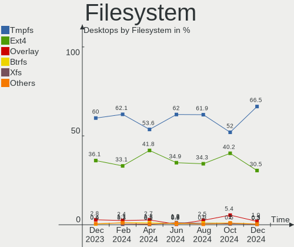
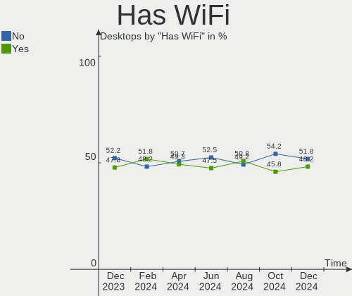
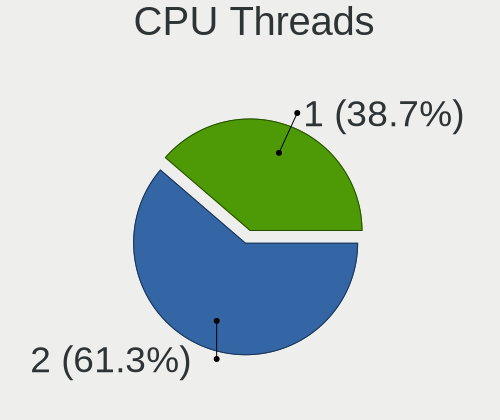
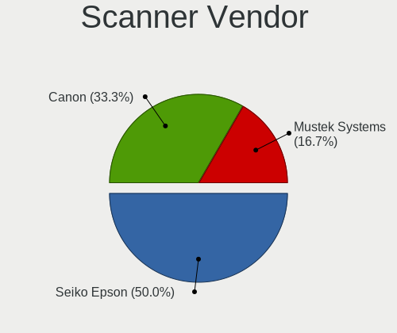

Ubuntu Hardware Trends (Desktops)
---------------------------------

A project to identify most popular hardware characteristics and track their change
over time based on data collected by Ubuntu users at https://Linux-Hardware.org.

Anyone can contribute to this report by the [hw-probe](https://github.com/linuxhw/hw-probe) tool:

    sudo -E hw-probe -all -upload

Full-feature report is available here: https://linux-hardware.org/?view=trends

Period: Dec, 2021.

Contents
--------

* [ System ](#system)
  - [ OS                       ](#os)
  - [ OS Family                ](#os-family)
  - [ Kernel                   ](#kernel)
  - [ Kernel Family            ](#kernel-family)
  - [ Kernel Major Ver.        ](#kernel-major-ver)
  - [ Arch                     ](#arch)
  - [ DE                       ](#de)
  - [ Display Server           ](#display-server)
  - [ Display Manager          ](#display-manager)
  - [ OS Lang                  ](#os-lang)
  - [ Boot Mode                ](#boot-mode)
  - [ Filesystem               ](#filesystem)
  - [ Part. scheme             ](#part-scheme)
  - [ Dual Boot with Linux/BSD ](#dual-boot-with-linuxbsd)
  - [ Dual Boot (Win)          ](#dual-boot-win)

* [ Board ](#board)
  - [ Vendor                   ](#vendor)
  - [ Model                    ](#model)
  - [ Model Family             ](#model-family)
  - [ MFG Year                 ](#mfg-year)
  - [ Form Factor              ](#form-factor)
  - [ Secure Boot              ](#secure-boot)
  - [ Coreboot                 ](#coreboot)
  - [ RAM Size                 ](#ram-size)
  - [ RAM Used                 ](#ram-used)
  - [ Total Drives             ](#total-drives)
  - [ Has CD-ROM               ](#has-cd-rom)
  - [ Has Ethernet             ](#has-ethernet)
  - [ Has WiFi                 ](#has-wifi)
  - [ Has Bluetooth            ](#has-bluetooth)

* [ Location ](#location)
  - [ Country                  ](#country)
  - [ City                     ](#city)

* [ Drives ](#drives)
  - [ Drive Vendor             ](#drive-vendor)
  - [ Drive Model              ](#drive-model)
  - [ HDD Vendor               ](#hdd-vendor)
  - [ SSD Vendor               ](#ssd-vendor)
  - [ Drive Kind               ](#drive-kind)
  - [ Drive Connector          ](#drive-connector)
  - [ Drive Size               ](#drive-size)
  - [ Space Total              ](#space-total)
  - [ Space Used               ](#space-used)
  - [ Malfunc. Drives          ](#malfunc-drives)
  - [ Malfunc. Drive Vendor    ](#malfunc-drive-vendor)
  - [ Malfunc. HDD Vendor      ](#malfunc-hdd-vendor)
  - [ Malfunc. Drive Kind      ](#malfunc-drive-kind)
  - [ Failed Drives            ](#failed-drives)
  - [ Failed Drive Vendor      ](#failed-drive-vendor)
  - [ Drive Status             ](#drive-status)

* [ Storage controller ](#storage-controller)
  - [ Storage Vendor           ](#storage-vendor)
  - [ Storage Model            ](#storage-model)
  - [ Storage Kind             ](#storage-kind)

* [ Processor ](#processor)
  - [ CPU Vendor               ](#cpu-vendor)
  - [ CPU Model                ](#cpu-model)
  - [ CPU Model Family         ](#cpu-model-family)
  - [ CPU Cores                ](#cpu-cores)
  - [ CPU Sockets              ](#cpu-sockets)
  - [ CPU Threads              ](#cpu-threads)
  - [ CPU Op-Modes             ](#cpu-op-modes)
  - [ CPU Microcode            ](#cpu-microcode)
  - [ CPU Microarch            ](#cpu-microarch)

* [ Graphics ](#graphics)
  - [ GPU Vendor               ](#gpu-vendor)
  - [ GPU Model                ](#gpu-model)
  - [ GPU Combo                ](#gpu-combo)
  - [ GPU Driver               ](#gpu-driver)
  - [ GPU Memory               ](#gpu-memory)

* [ Monitor ](#monitor)
  - [ Monitor Vendor           ](#monitor-vendor)
  - [ Monitor Model            ](#monitor-model)
  - [ Monitor Resolution       ](#monitor-resolution)
  - [ Monitor Diagonal         ](#monitor-diagonal)
  - [ Monitor Width            ](#monitor-width)
  - [ Aspect Ratio             ](#aspect-ratio)
  - [ Monitor Area             ](#monitor-area)
  - [ Pixel Density            ](#pixel-density)
  - [ Multiple Monitors        ](#multiple-monitors)

* [ Network ](#network)
  - [ Net Controller Vendor    ](#net-controller-vendor)
  - [ Net Controller Model     ](#net-controller-model)
  - [ Wireless Vendor          ](#wireless-vendor)
  - [ Wireless Model           ](#wireless-model)
  - [ Ethernet Vendor          ](#ethernet-vendor)
  - [ Ethernet Model           ](#ethernet-model)
  - [ Net Controller Kind      ](#net-controller-kind)
  - [ Used Controller          ](#used-controller)
  - [ NICs                     ](#nics)
  - [ IPv6                     ](#ipv6)

* [ Bluetooth ](#bluetooth)
  - [ Bluetooth Vendor         ](#bluetooth-vendor)
  - [ Bluetooth Model          ](#bluetooth-model)

* [ Sound ](#sound)
  - [ Sound Vendor             ](#sound-vendor)
  - [ Sound Model              ](#sound-model)

* [ Memory ](#memory)
  - [ Memory Vendor            ](#memory-vendor)
  - [ Memory Model             ](#memory-model)
  - [ Memory Kind              ](#memory-kind)
  - [ Memory Form Factor       ](#memory-form-factor)
  - [ Memory Size              ](#memory-size)
  - [ Memory Speed             ](#memory-speed)

* [ Printers & scanners ](#printers--scanners)
  - [ Printer Vendor           ](#printer-vendor)
  - [ Printer Model            ](#printer-model)
  - [ Scanner Vendor           ](#scanner-vendor)
  - [ Scanner Model            ](#scanner-model)

* [ Camera ](#camera)
  - [ Camera Vendor            ](#camera-vendor)
  - [ Camera Model             ](#camera-model)

* [ Security ](#security)
  - [ Fingerprint Vendor       ](#fingerprint-vendor)
  - [ Fingerprint Model        ](#fingerprint-model)
  - [ Chipcard Vendor          ](#chipcard-vendor)
  - [ Chipcard Model           ](#chipcard-model)

* [ Unsupported ](#unsupported)
  - [ Unsupported Devices      ](#unsupported-devices)
  - [ Unsupported Device Types ](#unsupported-device-types)

System
------

OS
--

Installed operating systems

| Name           | Desktops | Percent |
|----------------|----------|---------|
| Ubuntu 20.04   | 348      | 67.97%  |
| Ubuntu 21.10   | 112      | 21.88%  |
| Ubuntu 18.04   | 27       | 5.27%   |
| Ubuntu 21.04   | 14       | 2.73%   |
| Ubuntu 20.10   | 4        | 0.78%   |
| Ubuntu 22.04   | 3        | 0.59%   |
| Ubuntu 20.04.3 | 1        | 0.2%    |
| Ubuntu 19.10   | 1        | 0.2%    |
| Ubuntu 16.04   | 1        | 0.2%    |
| Ubuntu 14.04   | 1        | 0.2%    |

OS Family
---------

OS without a version

| Name   | Desktops | Percent |
|--------|----------|---------|
| Ubuntu | 512      | 100%    |

Kernel
------

Version of the Linux kernel

| Version                     | Desktops | Percent |
|-----------------------------|----------|---------|
| 5.11.0-41-generic           | 141      | 27.54%  |
| 5.11.0-43-generic           | 106      | 20.7%   |
| 5.13.0-22-generic           | 82       | 16.02%  |
| 5.4.0-91-generic            | 59       | 11.52%  |
| 5.13.0-19-generic           | 14       | 2.73%   |
| 5.11.0-27-generic           | 14       | 2.73%   |
| 5.11.0-40-generic           | 12       | 2.34%   |
| 5.13.0-23-generic           | 9        | 1.76%   |
| 4.15.0-163-generic          | 8        | 1.56%   |
| 5.4.0-90-generic            | 5        | 0.98%   |
| 5.13.0-21-generic           | 5        | 0.98%   |
| 5.11.0-42-generic           | 5        | 0.98%   |
| 5.8.0-63-generic            | 3        | 0.59%   |
| 5.11.0-44-generic           | 3        | 0.59%   |
| 5.4.0-56-generic            | 2        | 0.39%   |
| 5.4.0-42-generic            | 2        | 0.39%   |
| 5.13.0-22-lowlatency        | 2        | 0.39%   |
| 5.11.0-37-generic           | 2        | 0.39%   |
| 5.11.0-36-generic           | 2        | 0.39%   |
| 4.15.0-161-generic          | 2        | 0.39%   |
| 5.9.16-050916-generic       | 1        | 0.2%    |
| 5.8.0-50-generic            | 1        | 0.2%    |
| 5.8.0-25-generic            | 1        | 0.2%    |
| 5.4.0-92-generic            | 1        | 0.2%    |
| 5.4.0-91-lowlatency         | 1        | 0.2%    |
| 5.4.0-902110311031-generic  | 1        | 0.2%    |
| 5.4.0-89-generic            | 1        | 0.2%    |
| 5.4.0-88-generic            | 1        | 0.2%    |
| 5.4.0-84-generic            | 1        | 0.2%    |
| 5.4.0-72-generic            | 1        | 0.2%    |
| 5.4.0-58-generic            | 1        | 0.2%    |
| 5.4.0-47-generic            | 1        | 0.2%    |
| 5.4.0-26-generic            | 1        | 0.2%    |
| 5.3.0-40-generic            | 1        | 0.2%    |
| 5.15.6-051506-generic       | 1        | 0.2%    |
| 5.15.2-051502-generic       | 1        | 0.2%    |
| 5.15.10-gentoo-dist         | 1        | 0.2%    |
| 5.14.11-051411-generic      | 1        | 0.2%    |
| 5.14.1-051401-generic       | 1        | 0.2%    |
| 5.14.0-1011-oem             | 1        | 0.2%    |
| 5.14.0-1010-oem             | 1        | 0.2%    |
| 5.13.0-20-generic           | 1        | 0.2%    |
| 5.13.0-192110311031-generic | 1        | 0.2%    |
| 5.13.0-1010-oracle          | 1        | 0.2%    |
| 5.11.0-43-lowlatency        | 1        | 0.2%    |
| 5.11.0-402110311031-generic | 1        | 0.2%    |
| 5.11.0-38-generic           | 1        | 0.2%    |
| 5.11.0-25-generic           | 1        | 0.2%    |
| 5.10.43-yocto-standard      | 1        | 0.2%    |
| 5.1.0-050100-lowlatency     | 1        | 0.2%    |
| 4.4.0-148-generic           | 1        | 0.2%    |
| 4.15.0-158-generic          | 1        | 0.2%    |
| 4.15.0-156-generic          | 1        | 0.2%    |
| 4.15.0-142-generic          | 1        | 0.2%    |

Kernel Family
-------------

Linux kernel without a distro release

| Version | Desktops | Percent |
|---------|----------|---------|
| 5.11.0  | 289      | 56.45%  |
| 5.13.0  | 115      | 22.46%  |
| 5.4.0   | 78       | 15.23%  |
| 4.15.0  | 13       | 2.54%   |
| 5.8.0   | 5        | 0.98%   |
| 5.14.0  | 2        | 0.39%   |
| 5.9.16  | 1        | 0.2%    |
| 5.3.0   | 1        | 0.2%    |
| 5.15.6  | 1        | 0.2%    |
| 5.15.2  | 1        | 0.2%    |
| 5.15.10 | 1        | 0.2%    |
| 5.14.11 | 1        | 0.2%    |
| 5.14.1  | 1        | 0.2%    |
| 5.10.43 | 1        | 0.2%    |
| 5.1.0   | 1        | 0.2%    |
| 4.4.0   | 1        | 0.2%    |

Kernel Major Ver.
-----------------

Linux kernel major version

| Version | Desktops | Percent |
|---------|----------|---------|
| 5.11    | 289      | 56.45%  |
| 5.13    | 115      | 22.46%  |
| 5.4     | 78       | 15.23%  |
| 4.15    | 13       | 2.54%   |
| 5.8     | 5        | 0.98%   |
| 5.14    | 4        | 0.78%   |
| 5.15    | 3        | 0.59%   |
| 5.9     | 1        | 0.2%    |
| 5.3     | 1        | 0.2%    |
| 5.10    | 1        | 0.2%    |
| 5.1     | 1        | 0.2%    |
| 4.4     | 1        | 0.2%    |

Arch
----

OS architecture (x86_64, i586, etc.)

| Name   | Desktops | Percent |
|--------|----------|---------|
| x86_64 | 505      | 98.63%  |
| i686   | 7        | 1.37%   |

DE
--

Desktop Environment

| Name            | Desktops | Percent |
|-----------------|----------|---------|
| GNOME           | 471      | 91.99%  |
| Unknown         | 24       | 4.69%   |
| Unity           | 8        | 1.56%   |
| X-Cinnamon      | 5        | 0.98%   |
| Cinnamon        | 2        | 0.39%   |
| Pantheon        | 1        | 0.2%    |
| GNOME Flashback | 1        | 0.2%    |

Display Server
--------------

X11 or Wayland

| Name    | Desktops | Percent |
|---------|----------|---------|
| X11     | 400      | 78.13%  |
| Wayland | 90       | 17.58%  |
| Tty     | 14       | 2.73%   |
| Unknown | 8        | 1.56%   |

Display Manager
---------------

SDDM, LightDM, etc.

| Name    | Desktops | Percent |
|---------|----------|---------|
| GDM3    | 360      | 70.31%  |
| GDM     | 107      | 20.9%   |
| Unknown | 27       | 5.27%   |
| LightDM | 17       | 3.32%   |
| SLiM    | 1        | 0.2%    |

OS Lang
-------

Language

| Lang    | Desktops | Percent |
|---------|----------|---------|
| en_US   | 196      | 38.28%  |
| de_DE   | 76       | 14.84%  |
| fr_FR   | 33       | 6.45%   |
| pt_BR   | 21       | 4.1%    |
| en_GB   | 21       | 4.1%    |
| en_IN   | 17       | 3.32%   |
| es_ES   | 14       | 2.73%   |
| nl_NL   | 11       | 2.15%   |
| en_AU   | 11       | 2.15%   |
| it_IT   | 9        | 1.76%   |
| hu_HU   | 9        | 1.76%   |
| zh_CN   | 8        | 1.56%   |
| ru_RU   | 8        | 1.56%   |
| pl_PL   | 7        | 1.37%   |
| en_CA   | 7        | 1.37%   |
| C       | 7        | 1.37%   |
| zh_TW   | 6        | 1.17%   |
| ja_JP   | 5        | 0.98%   |
| de_CH   | 5        | 0.98%   |
| sv_SE   | 4        | 0.78%   |
| de_AT   | 4        | 0.78%   |
| es_AR   | 3        | 0.59%   |
| Unknown | 3        | 0.59%   |
| sk_SK   | 2        | 0.39%   |
| ru_UA   | 2        | 0.39%   |
| fr_CH   | 2        | 0.39%   |
| fr_BE   | 2        | 0.39%   |
| cs_CZ   | 2        | 0.39%   |
| vi_VN   | 1        | 0.2%    |
| sr_RS   | 1        | 0.2%    |
| pt_PT   | 1        | 0.2%    |
| nl_BE   | 1        | 0.2%    |
| hr_HR   | 1        | 0.2%    |
| fi_FI   | 1        | 0.2%    |
| et_EE   | 1        | 0.2%    |
| es_US   | 1        | 0.2%    |
| es_MX   | 1        | 0.2%    |
| en_ZA   | 1        | 0.2%    |
| en_SG   | 1        | 0.2%    |
| en_PH   | 1        | 0.2%    |
| en_NZ   | 1        | 0.2%    |
| en_IE   | 1        | 0.2%    |
| en_HK   | 1        | 0.2%    |
| el_GR   | 1        | 0.2%    |
| da_DK   | 1        | 0.2%    |

Boot Mode
---------

EFI or BIOS

| Mode | Desktops | Percent |
|------|----------|---------|
| BIOS | 305      | 59.57%  |
| EFI  | 207      | 40.43%  |

Filesystem
----------

Type of filesystem

| Type    | Desktops | Percent |
|---------|----------|---------|
| Ext4    | 470      | 91.8%   |
| Overlay | 20       | 3.91%   |
| Zfs     | 12       | 2.34%   |
| Ext2    | 3        | 0.59%   |
| Btrfs   | 3        | 0.59%   |
| Xfs     | 2        | 0.39%   |
| Ext3    | 2        | 0.39%   |

Part. scheme
------------

Scheme of partitioning

| Type    | Desktops | Percent |
|---------|----------|---------|
| Unknown | 385      | 75.2%   |
| GPT     | 95       | 18.55%  |
| MBR     | 32       | 6.25%   |

Dual Boot with Linux/BSD
------------------------

Hosting more than one Linux/BSD

| Dual boot | Desktops | Percent |
|-----------|----------|---------|
| No        | 420      | 82.03%  |
| Yes       | 92       | 17.97%  |

Dual Boot (Win)
---------------

Hosting Linux and Windows

| Dual boot | Desktops | Percent |
|-----------|----------|---------|
| No        | 301      | 58.79%  |
| Yes       | 211      | 41.21%  |

Board
-----

Vendor
------

Motherboard manufacturer

| Name                | Desktops | Percent |
|---------------------|----------|---------|
| ASUSTek Computer    | 137      | 26.76%  |
| Gigabyte Technology | 92       | 17.97%  |
| MSI                 | 54       | 10.55%  |
| Dell                | 52       | 10.16%  |
| Hewlett-Packard     | 38       | 7.42%   |
| ASRock              | 38       | 7.42%   |
| Lenovo              | 16       | 3.13%   |
| Intel               | 16       | 3.13%   |
| Acer                | 12       | 2.34%   |
| Pegatron            | 7        | 1.37%   |
| Foxconn             | 6        | 1.17%   |
| Biostar             | 6        | 1.17%   |
| Unknown             | 6        | 1.17%   |
| Huanan              | 3        | 0.59%   |
| Apple               | 3        | 0.59%   |
| Shuttle             | 2        | 0.39%   |
| Medion              | 2        | 0.39%   |
| Fujitsu             | 2        | 0.39%   |
| EVGA                | 2        | 0.39%   |
| ASRockRack          | 2        | 0.39%   |
| Supermicro          | 1        | 0.2%    |
| Positivo            | 1        | 0.2%    |
| Packard Bell        | 1        | 0.2%    |
| OEM                 | 1        | 0.2%    |
| MiTAC               | 1        | 0.2%    |
| Login Informatica   | 1        | 0.2%    |
| Itautec             | 1        | 0.2%    |
| Gateway             | 1        | 0.2%    |
| Fujitsu Siemens     | 1        | 0.2%    |
| DFI                 | 1        | 0.2%    |
| Cisco Systems       | 1        | 0.2%    |
| Chuwi               | 1        | 0.2%    |
| AZW                 | 1        | 0.2%    |
| AOC                 | 1        | 0.2%    |
| Alienware           | 1        | 0.2%    |
| ABIT                | 1        | 0.2%    |

Model
-----

Motherboard model

| Name                              | Desktops | Percent |
|-----------------------------------|----------|---------|
| ASUS All Series                   | 11       | 2.15%   |
| Unknown                           | 6        | 1.17%   |
| Dell OptiPlex 7010                | 5        | 0.98%   |
| MSI MS-7C37                       | 4        | 0.78%   |
| ASUS PRIME B450M-A                | 4        | 0.78%   |
| MSI MS-7C52                       | 3        | 0.59%   |
| MSI MS-7C02                       | 3        | 0.59%   |
| Gigabyte X470 AORUS ULTRA GAMING  | 3        | 0.59%   |
| Gigabyte B550M DS3H               | 3        | 0.59%   |
| Gigabyte 970A-DS3P                | 3        | 0.59%   |
| Dell Precision 3650 Tower         | 3        | 0.59%   |
| Dell OptiPlex 9010                | 3        | 0.59%   |
| Dell OptiPlex 3020                | 3        | 0.59%   |
| Dell OptiPlex 3010                | 3        | 0.59%   |
| ASUS TUF GAMING Z690-PLUS WIFI D4 | 3        | 0.59%   |
| ASUS PRIME A320M-K                | 3        | 0.59%   |
| ASUS P8Z77-V LX                   | 3        | 0.59%   |
| ASUS CROSSHAIR VI HERO            | 3        | 0.59%   |
| MSI MS-7C81                       | 2        | 0.39%   |
| MSI MS-7C35                       | 2        | 0.39%   |
| MSI MS-7B79                       | 2        | 0.39%   |
| MSI MS-7A70                       | 2        | 0.39%   |
| MSI MS-7978                       | 2        | 0.39%   |
| MSI MS-7817                       | 2        | 0.39%   |
| Intel H61                         | 2        | 0.39%   |
| HP Z440 Workstation               | 2        | 0.39%   |
| HP Pavilion Desktop TP01-2xxx     | 2        | 0.39%   |
| HP EliteDesk 800 G2 SFF           | 2        | 0.39%   |
| HP Compaq 8200 Elite USDT PC      | 2        | 0.39%   |
| Gigabyte Z97-HD3                  | 2        | 0.39%   |
| Gigabyte X570 AORUS MASTER        | 2        | 0.39%   |
| Gigabyte GA-78LMT-USB3            | 2        | 0.39%   |
| Gigabyte EX58-UD5                 | 2        | 0.39%   |
| Gigabyte B550 AORUS ELITE V2      | 2        | 0.39%   |
| Gigabyte AB350-Gaming             | 2        | 0.39%   |
| Dell Precision Tower 3620         | 2        | 0.39%   |
| Dell OptiPlex 9020                | 2        | 0.39%   |
| Dell OptiPlex 755                 | 2        | 0.39%   |
| Dell OptiPlex 745                 | 2        | 0.39%   |
| Dell OptiPlex 380                 | 2        | 0.39%   |
| Dell OptiPlex 3080                | 2        | 0.39%   |
| Dell Inspiron 3847                | 2        | 0.39%   |
| ASUS Z170-K                       | 2        | 0.39%   |
| ASUS Z170 PRO GAMING              | 2        | 0.39%   |
| ASUS TUF GAMING X570-PRO          | 2        | 0.39%   |
| ASUS TUF GAMING X570-PLUS         | 2        | 0.39%   |
| ASUS STRIX Z270E GAMING           | 2        | 0.39%   |
| ASUS ROG STRIX B550-E GAMING      | 2        | 0.39%   |
| ASUS ROG CROSSHAIR VIII HERO      | 2        | 0.39%   |
| ASUS P8H61                        | 2        | 0.39%   |
| ASUS M5A99FX PRO R2.0             | 2        | 0.39%   |
| ASUS M5A97 R2.0                   | 2        | 0.39%   |
| ASUS M5A78L-M/USB3                | 2        | 0.39%   |
| ASUS M4A89GTD-PRO/USB3            | 2        | 0.39%   |
| ASUS M4A87TD/USB3                 | 2        | 0.39%   |
| ASUS A55BM-E                      | 2        | 0.39%   |
| ASRock B450M-HDV R4.0             | 2        | 0.39%   |
| Supermicro X9SCL/X9SCM            | 1        | 0.2%    |
| Shuttle XH81V                     | 1        | 0.2%    |
| Shuttle SZ87R                     | 1        | 0.2%    |

Model Family
------------

Motherboard model prefix

| Name                   | Desktops | Percent |
|------------------------|----------|---------|
| Dell OptiPlex          | 28       | 5.47%   |
| ASUS PRIME             | 20       | 3.91%   |
| ASUS ROG               | 14       | 2.73%   |
| HP Compaq              | 12       | 2.34%   |
| ASUS TUF               | 11       | 2.15%   |
| ASUS All               | 11       | 2.15%   |
| Lenovo ThinkCentre     | 10       | 1.95%   |
| Gigabyte X570          | 10       | 1.95%   |
| Dell Precision         | 10       | 1.95%   |
| Acer Aspire            | 8        | 1.56%   |
| Dell Inspiron          | 7        | 1.37%   |
| Unknown                | 6        | 1.17%   |
| HP EliteDesk           | 5        | 0.98%   |
| ASUS P8Z77-V           | 5        | 0.98%   |
| MSI MS-7C37            | 4        | 0.78%   |
| HP Pavilion            | 4        | 0.78%   |
| Gigabyte 970A-DS3P     | 4        | 0.78%   |
| ASUS M5A97             | 4        | 0.78%   |
| ASUS M5A78L-M          | 4        | 0.78%   |
| ASUS CROSSHAIR         | 4        | 0.78%   |
| MSI MS-7C52            | 3        | 0.59%   |
| MSI MS-7C02            | 3        | 0.59%   |
| HP ProDesk             | 3        | 0.59%   |
| Gigabyte Z390          | 3        | 0.59%   |
| Gigabyte X470          | 3        | 0.59%   |
| Gigabyte GA-78LMT-USB3 | 3        | 0.59%   |
| Gigabyte B550M         | 3        | 0.59%   |
| ASUS STRIX             | 3        | 0.59%   |
| MSI MS-7C81            | 2        | 0.39%   |
| MSI MS-7C35            | 2        | 0.39%   |
| MSI MS-7B79            | 2        | 0.39%   |
| MSI MS-7A70            | 2        | 0.39%   |
| MSI MS-7978            | 2        | 0.39%   |
| MSI MS-7817            | 2        | 0.39%   |
| Intel H61              | 2        | 0.39%   |
| Intel DG965WH          | 2        | 0.39%   |
| HP Z440                | 2        | 0.39%   |
| Gigabyte Z97-HD3       | 2        | 0.39%   |
| Gigabyte Z690          | 2        | 0.39%   |
| Gigabyte EX58-UD5      | 2        | 0.39%   |
| Gigabyte B550          | 2        | 0.39%   |
| Gigabyte B450          | 2        | 0.39%   |
| Gigabyte AB350-Gaming  | 2        | 0.39%   |
| Dell XPS               | 2        | 0.39%   |
| ASUS Z170-K            | 2        | 0.39%   |
| ASUS Z170              | 2        | 0.39%   |
| ASUS P8H61-M           | 2        | 0.39%   |
| ASUS P8H61             | 2        | 0.39%   |
| ASUS P6T               | 2        | 0.39%   |
| ASUS P5KPL-AM          | 2        | 0.39%   |
| ASUS P5G41T-M          | 2        | 0.39%   |
| ASUS M5A99FX           | 2        | 0.39%   |
| ASUS M4N68T-M          | 2        | 0.39%   |
| ASUS M4A89GTD-PRO      | 2        | 0.39%   |
| ASUS M4A87TD           | 2        | 0.39%   |
| ASUS A55BM-E           | 2        | 0.39%   |
| ASRock X58             | 2        | 0.39%   |
| ASRock X470            | 2        | 0.39%   |
| ASRock B450M-HDV       | 2        | 0.39%   |
| ASRock B450M           | 2        | 0.39%   |

MFG Year
--------

Motherboard manufacture year

| Year | Desktops | Percent |
|------|----------|---------|
| 2021 | 73       | 14.26%  |
| 2018 | 49       | 9.57%   |
| 2020 | 48       | 9.38%   |
| 2019 | 46       | 8.98%   |
| 2014 | 38       | 7.42%   |
| 2013 | 38       | 7.42%   |
| 2010 | 38       | 7.42%   |
| 2015 | 30       | 5.86%   |
| 2011 | 29       | 5.66%   |
| 2012 | 27       | 5.27%   |
| 2016 | 24       | 4.69%   |
| 2009 | 19       | 3.71%   |
| 2017 | 16       | 3.13%   |
| 2008 | 14       | 2.73%   |
| 2007 | 14       | 2.73%   |
| 2006 | 6        | 1.17%   |
| 2005 | 2        | 0.39%   |
| 1906 | 1        | 0.2%    |

Form Factor
-----------

Physical design of the computer

| Name    | Desktops | Percent |
|---------|----------|---------|
| Desktop | 512      | 100%    |

Secure Boot
-----------

Enabled or disabled

| State    | Desktops | Percent |
|----------|----------|---------|
| Disabled | 489      | 95.51%  |
| Enabled  | 23       | 4.49%   |

Coreboot
--------

Have coreboot on board

| Used | Desktops | Percent |
|------|----------|---------|
| No   | 512      | 100%    |

RAM Size
--------

Total RAM memory

| Size in GB      | Desktops | Percent |
|-----------------|----------|---------|
| 16.01-24.0      | 124      | 24.22%  |
| 8.01-16.0       | 98       | 19.14%  |
| 3.01-4.0        | 81       | 15.82%  |
| 4.01-8.0        | 80       | 15.63%  |
| 32.01-64.0      | 74       | 14.45%  |
| 64.01-256.0     | 30       | 5.86%   |
| 1.01-2.0        | 11       | 2.15%   |
| 24.01-32.0      | 6        | 1.17%   |
| 2.01-3.0        | 4        | 0.78%   |
| More than 256.0 | 2        | 0.39%   |
| 0.51-1.0        | 1        | 0.2%    |
| 0.01-0.5        | 1        | 0.2%    |

RAM Used
--------

Used RAM memory

| Used GB     | Desktops | Percent |
|-------------|----------|---------|
| 1.01-2.0    | 223      | 43.55%  |
| 2.01-3.0    | 133      | 25.98%  |
| 3.01-4.0    | 69       | 13.48%  |
| 4.01-8.0    | 52       | 10.16%  |
| 8.01-16.0   | 19       | 3.71%   |
| 0.51-1.0    | 7        | 1.37%   |
| 16.01-24.0  | 4        | 0.78%   |
| 24.01-32.0  | 2        | 0.39%   |
| 0.01-0.5    | 2        | 0.39%   |
| 64.01-256.0 | 1        | 0.2%    |

Total Drives
------------

Number of drives on board

| Drives | Desktops | Percent |
|--------|----------|---------|
| 1      | 218      | 42.58%  |
| 2      | 146      | 28.52%  |
| 3      | 58       | 11.33%  |
| 4      | 49       | 9.57%   |
| 5      | 18       | 3.52%   |
| 6      | 8        | 1.56%   |
| 7      | 6        | 1.17%   |
| 0      | 5        | 0.98%   |
| 21     | 1        | 0.2%    |
| 10     | 1        | 0.2%    |
| 9      | 1        | 0.2%    |
| 8      | 1        | 0.2%    |

Has CD-ROM
----------

Has CD-ROM on board

| Presented | Desktops | Percent |
|-----------|----------|---------|
| No        | 264      | 51.56%  |
| Yes       | 248      | 48.44%  |

Has Ethernet
------------

Has Ethernet on board

| Presented | Desktops | Percent |
|-----------|----------|---------|
| Yes       | 509      | 99.41%  |
| No        | 3        | 0.59%   |

Has WiFi
--------

Has WiFi module

| Presented | Desktops | Percent |
|-----------|----------|---------|
| No        | 293      | 57.23%  |
| Yes       | 219      | 42.77%  |

Has Bluetooth
-------------

Has Bluetooth module

| Presented | Desktops | Percent |
|-----------|----------|---------|
| No        | 365      | 71.29%  |
| Yes       | 147      | 28.71%  |

Location
--------

Country
-------

Geographic location (country)

| Country       | Desktops | Percent |
|---------------|----------|---------|
| USA           | 117      | 22.85%  |
| Germany       | 82       | 16.02%  |
| France        | 33       | 6.45%   |
| UK            | 22       | 4.3%    |
| Brazil        | 22       | 4.3%    |
| India         | 18       | 3.52%   |
| Russia        | 17       | 3.32%   |
| Spain         | 13       | 2.54%   |
| Italy         | 13       | 2.54%   |
| Switzerland   | 12       | 2.34%   |
| Canada        | 12       | 2.34%   |
| Netherlands   | 11       | 2.15%   |
| Hungary       | 11       | 2.15%   |
| Australia     | 11       | 2.15%   |
| China         | 10       | 1.95%   |
| Poland        | 8        | 1.56%   |
| Belgium       | 8        | 1.56%   |
| Ukraine       | 7        | 1.37%   |
| Japan         | 7        | 1.37%   |
| Greece        | 5        | 0.98%   |
| Taiwan        | 4        | 0.78%   |
| Sweden        | 4        | 0.78%   |
| Romania       | 4        | 0.78%   |
| Mexico        | 4        | 0.78%   |
| Denmark       | 4        | 0.78%   |
| Austria       | 4        | 0.78%   |
| Israel        | 3        | 0.59%   |
| Hong Kong     | 3        | 0.59%   |
| Argentina     | 3        | 0.59%   |
| Vietnam       | 2        | 0.39%   |
| Thailand      | 2        | 0.39%   |
| South Africa  | 2        | 0.39%   |
| Slovakia      | 2        | 0.39%   |
| Serbia        | 2        | 0.39%   |
| Portugal      | 2        | 0.39%   |
| Finland       | 2        | 0.39%   |
| Czechia       | 2        | 0.39%   |
| Croatia       | 2        | 0.39%   |
| Turkey        | 1        | 0.2%    |
| Slovenia      | 1        | 0.2%    |
| Singapore     | 1        | 0.2%    |
| R?©union      | 1        | 0.2%    |
| Philippines   | 1        | 0.2%    |
| Pakistan      | 1        | 0.2%    |
| Norway        | 1        | 0.2%    |
| New Zealand   | 1        | 0.2%    |
| Morocco       | 1        | 0.2%    |
| Malaysia      | 1        | 0.2%    |
| Kazakhstan    | 1        | 0.2%    |
| Jordan        | 1        | 0.2%    |
| Iran          | 1        | 0.2%    |
| Guam          | 1        | 0.2%    |
| Georgia       | 1        | 0.2%    |
| French Guiana | 1        | 0.2%    |
| Estonia       | 1        | 0.2%    |
| Egypt         | 1        | 0.2%    |
| Colombia      | 1        | 0.2%    |
| Cambodia      | 1        | 0.2%    |
| Bulgaria      | 1        | 0.2%    |
| Algeria       | 1        | 0.2%    |

City
----

Geographic location (city)

| City              | Desktops | Percent |
|-------------------|----------|---------|
| Cleveland         | 8        | 1.56%   |
| Berlin            | 8        | 1.56%   |
| Hamburg           | 5        | 0.98%   |
| Sydney            | 4        | 0.78%   |
| Madrid            | 4        | 0.78%   |
| Wuhan             | 3        | 0.59%   |
| Vienna            | 3        | 0.59%   |
| St Petersburg     | 3        | 0.59%   |
| Shenzhen          | 3        | 0.59%   |
| S??o Paulo        | 3        | 0.59%   |
| Paris             | 3        | 0.59%   |
| New York          | 3        | 0.59%   |
| Moscow            | 3        | 0.59%   |
| Milan             | 3        | 0.59%   |
| Melbourne         | 3        | 0.59%   |
| Erie              | 3        | 0.59%   |
| Chennai           | 3        | 0.59%   |
| Budapest          | 3        | 0.59%   |
| Amsterdam         | 3        | 0.59%   |
| Zagreb            | 2        | 0.39%   |
| Vannes            | 2        | 0.39%   |
| Szeged            | 2        | 0.39%   |
| Sz?©kesfeh?©rv??r | 2        | 0.39%   |
| Stockdale         | 2        | 0.39%   |
| Staten Island     | 2        | 0.39%   |
| San Francisco     | 2        | 0.39%   |
| Rochester         | 2        | 0.39%   |
| Rio de Janeiro    | 2        | 0.39%   |
| Richmond          | 2        | 0.39%   |
| Osaka             | 2        | 0.39%   |
| Munich            | 2        | 0.39%   |
| Lexington         | 2        | 0.39%   |
| Landsberg am Lech | 2        | 0.39%   |
| Lajsce            | 2        | 0.39%   |
| Kyiv              | 2        | 0.39%   |
| Kolkata           | 2        | 0.39%   |
| Johannesburg      | 2        | 0.39%   |
| Itzehoe           | 2        | 0.39%   |
| Ho Chi Minh City  | 2        | 0.39%   |
| Glendale          | 2        | 0.39%   |
| Fort Worth        | 2        | 0.39%   |
| Dnipro            | 2        | 0.39%   |
| Denver            | 2        | 0.39%   |
| Chicago           | 2        | 0.39%   |
| Central           | 2        | 0.39%   |
| Buenos Aires      | 2        | 0.39%   |
| Bengaluru         | 2        | 0.39%   |
| Barcelona         | 2        | 0.39%   |
| Augsburg          | 2        | 0.39%   |
| Athens            | 2        | 0.39%   |
| Antwerp           | 2        | 0.39%   |
| Albany            | 2        | 0.39%   |
| Ziar nad Hronom   | 1        | 0.2%    |
| Zheleznogorsk     | 1        | 0.2%    |
| Zeitz             | 1        | 0.2%    |
| Zaventem          | 1        | 0.2%    |
| Yekaterinburg     | 1        | 0.2%    |
| Yau Tsim Mong     | 1        | 0.2%    |
| Xindian           | 1        | 0.2%    |
| Xanthi            | 1        | 0.2%    |

Drives
------

Drive Vendor
------------

Hard drive vendors

| Vendor                    | Desktops | Drives | Percent |
|---------------------------|----------|--------|---------|
| WDC                       | 192      | 269    | 22.15%  |
| Seagate                   | 162      | 215    | 18.69%  |
| Samsung Electronics       | 121      | 164    | 13.96%  |
| Kingston                  | 52       | 57     | 6%      |
| Toshiba                   | 39       | 44     | 4.5%    |
| SanDisk                   | 39       | 48     | 4.5%    |
| Crucial                   | 30       | 35     | 3.46%   |
| Hitachi                   | 24       | 28     | 2.77%   |
| A-DATA Technology         | 14       | 15     | 1.61%   |
| Phison                    | 11       | 19     | 1.27%   |
| Intel                     | 10       | 11     | 1.15%   |
| MAXTOR                    | 9        | 10     | 1.04%   |
| SK Hynix                  | 8        | 10     | 0.92%   |
| PNY                       | 8        | 8      | 0.92%   |
| OCZ                       | 8        | 8      | 0.92%   |
| Micron Technology         | 8        | 8      | 0.92%   |
| HGST                      | 8        | 12     | 0.92%   |
| Unknown                   | 7        | 11     | 0.81%   |
| Patriot                   | 7        | 7      | 0.81%   |
| Transcend                 | 6        | 6      | 0.69%   |
| Corsair                   | 6        | 6      | 0.69%   |
| China                     | 6        | 6      | 0.69%   |
| SPCC                      | 5        | 5      | 0.58%   |
| Silicon Motion            | 5        | 5      | 0.58%   |
| Micron/Crucial Technology | 5        | 5      | 0.58%   |
| Phison Electronics        | 4        | 4      | 0.46%   |
| Unknown                   | 4        | 4      | 0.46%   |
| PLEXTOR                   | 3        | 3      | 0.35%   |
| Netac                     | 3        | 3      | 0.35%   |
| JMicron                   | 3        | 3      | 0.35%   |
| Intenso                   | 3        | 3      | 0.35%   |
| Gigabyte Technology       | 3        | 3      | 0.35%   |
| Team                      | 2        | 2      | 0.23%   |
| Realtek Semiconductor     | 2        | 2      | 0.23%   |
| NGFF                      | 2        | 2      | 0.23%   |
| LITEONIT                  | 2        | 2      | 0.23%   |
| Lexar                     | 2        | 2      | 0.23%   |
| Kston                     | 2        | 2      | 0.23%   |
| KingSpec                  | 2        | 2      | 0.23%   |
| KingFast                  | 2        | 2      | 0.23%   |
| Hewlett-Packard           | 2        | 2      | 0.23%   |
| GOODRAM                   | 2        | 2      | 0.23%   |
| ZHITAI                    | 1        | 1      | 0.12%   |
| XPG                       | 1        | 1      | 0.12%   |
| Verbatim                  | 1        | 1      | 0.12%   |
| Vaseky                    | 1        | 1      | 0.12%   |
| USB3.0                    | 1        | 1      | 0.12%   |
| T-FORCE                   | 1        | 1      | 0.12%   |
| ShanDianZhe               | 1        | 1      | 0.12%   |
| P400                      | 1        | 1      | 0.12%   |
| OWC                       | 1        | 1      | 0.12%   |
| NTC                       | 1        | 1      | 0.12%   |
| Mushkin                   | 1        | 1      | 0.12%   |
| Maxone                    | 1        | 1      | 0.12%   |
| Magnetic Data             | 1        | 1      | 0.12%   |
| Lite-On                   | 1        | 1      | 0.12%   |
| Leven                     | 1        | 1      | 0.12%   |
| LDLC                      | 1        | 1      | 0.12%   |
| KLEVV                     | 1        | 1      | 0.12%   |
| KIOXIA                    | 1        | 1      | 0.12%   |

Drive Model
-----------

Hard drive models

| Model                               | Desktops | Percent |
|-------------------------------------|----------|---------|
| Samsung SSD 850 EVO 250GB           | 17       | 1.69%   |
| Seagate ST500DM002-1BD142 500GB     | 14       | 1.39%   |
| Seagate ST2000DM008-2FR102 2TB      | 14       | 1.39%   |
| Seagate ST1000DM010-2EP102 1TB      | 14       | 1.39%   |
| Seagate ST1000DM003-1ER162 1TB      | 12       | 1.19%   |
| Samsung NVMe SSD Drive 500GB        | 11       | 1.09%   |
| Samsung SSD 860 EVO 1TB             | 10       | 0.99%   |
| Kingston SA400S37120G 120GB SSD     | 10       | 0.99%   |
| Toshiba MQ01ABD100 1TB              | 8        | 0.79%   |
| Samsung SSD 850 EVO 500GB           | 8        | 0.79%   |
| Kingston SA400S37480G 480GB SSD     | 8        | 0.79%   |
| Samsung SSD 860 EVO 500GB           | 7        | 0.7%    |
| Kingston SA400S37240G 240GB SSD     | 7        | 0.7%    |
| Seagate ST1000DM003-1CH162 1TB      | 6        | 0.6%    |
| Sandisk NVMe SSD Drive 500GB        | 6        | 0.6%    |
| Samsung SSD 970 EVO 500GB           | 6        | 0.6%    |
| Samsung NVMe SSD Drive 250GB        | 6        | 0.6%    |
| Samsung NVMe SSD Drive 1TB          | 6        | 0.6%    |
| Kingston SV300S37A120G 120GB SSD    | 6        | 0.6%    |
| Crucial CT500MX500SSD1 500GB        | 6        | 0.6%    |
| Crucial CT240BX500SSD1 240GB        | 6        | 0.6%    |
| WDC WDS500G2B0A-00SM50 500GB SSD    | 5        | 0.5%    |
| WDC WD10EZEX-75WN4A1 1TB            | 5        | 0.5%    |
| Seagate ST3500418AS 500GB           | 5        | 0.5%    |
| Samsung SSD 860 EVO 250GB           | 5        | 0.5%    |
| WDC WDS120G2G0A-00JH30 120GB SSD    | 4        | 0.4%    |
| WDC WD5000AAKX-001CA0 500GB         | 4        | 0.4%    |
| WDC WD5000AAKS-00V1A0 500GB         | 4        | 0.4%    |
| WDC WD20EZRZ-00Z5HB0 2TB            | 4        | 0.4%    |
| WDC WD20EZRX-00DC0B0 2TB            | 4        | 0.4%    |
| WDC WD10EZEX-08WN4A0 1TB            | 4        | 0.4%    |
| WDC WD10EZEX-00BN5A0 1TB            | 4        | 0.4%    |
| WDC WD10EARS-00Y5B1 1TB             | 4        | 0.4%    |
| WDC WD10EADX-22TDHB0 1TB            | 4        | 0.4%    |
| Toshiba DT01ACA100 1TB              | 4        | 0.4%    |
| Seagate ST2000DM001-1CH164 2TB      | 4        | 0.4%    |
| Seagate ST1000DM003-9YN162 1TB      | 4        | 0.4%    |
| SanDisk SSD PLUS 240GB              | 4        | 0.4%    |
| Samsung SSD 870 EVO 500GB           | 4        | 0.4%    |
| Samsung NVMe SSD Drive 512GB        | 4        | 0.4%    |
| Samsung HD250HJ 250GB               | 4        | 0.4%    |
| Phison PCIe SSD 256GB               | 4        | 0.4%    |
| Micron/Crucial NVMe SSD Drive 500GB | 4        | 0.4%    |
| Hitachi HUS724030ALE641 3TB         | 4        | 0.4%    |
| Crucial CT1000MX500SSD1 1TB         | 4        | 0.4%    |
| Unknown                             | 4        | 0.4%    |
| WDC WDS240G2G0A-00JH30 240GB SSD    | 3        | 0.3%    |
| WDC WD10EZEX-22BN5A0 1TB            | 3        | 0.3%    |
| WDC WD10EADS-00L5B1 1TB             | 3        | 0.3%    |
| WDC WD1002FAEX-00Z3A0 1TB           | 3        | 0.3%    |
| Unknown SD/MMC/MS PRO 7GB           | 3        | 0.3%    |
| Unknown SD/MMC 16GB                 | 3        | 0.3%    |
| Unknown M.S./M.S.Pro/HG 16GB        | 3        | 0.3%    |
| Toshiba HDWD130 3TB                 | 3        | 0.3%    |
| Toshiba HDWD110 1TB                 | 3        | 0.3%    |
| Toshiba DT01ACA050 500GB            | 3        | 0.3%    |
| SPCC Solid State Disk 256GB         | 3        | 0.3%    |
| Silicon Motion NVMe SSD Drive 256GB | 3        | 0.3%    |
| Seagate ST500DM002-1SB10A 500GB     | 3        | 0.3%    |
| Seagate ST4000DM004-2CV104 4TB      | 3        | 0.3%    |

HDD Vendor
----------

Hard disk drive vendors

| Vendor              | Desktops | Drives | Percent |
|---------------------|----------|--------|---------|
| WDC                 | 162      | 230    | 38.57%  |
| Seagate             | 159      | 210    | 37.86%  |
| Toshiba             | 37       | 40     | 8.81%   |
| Hitachi             | 24       | 28     | 5.71%   |
| Samsung Electronics | 16       | 17     | 3.81%   |
| HGST                | 8        | 12     | 1.9%    |
| MAXTOR              | 6        | 7      | 1.43%   |
| Unknown             | 3        | 3      | 0.71%   |
| USB3.0              | 1        | 1      | 0.24%   |
| Maxone              | 1        | 1      | 0.24%   |
| Magnetic Data       | 1        | 1      | 0.24%   |
| ASMT109x            | 1        | 1      | 0.24%   |
| asmedia             | 1        | 2      | 0.24%   |

SSD Vendor
----------

Solid state drive vendors

| Vendor              | Desktops | Drives | Percent |
|---------------------|----------|--------|---------|
| Samsung Electronics | 71       | 89     | 21.98%  |
| Kingston            | 46       | 49     | 14.24%  |
| Crucial             | 29       | 34     | 8.98%   |
| SanDisk             | 27       | 32     | 8.36%   |
| WDC                 | 26       | 26     | 8.05%   |
| A-DATA Technology   | 12       | 12     | 3.72%   |
| OCZ                 | 8        | 8      | 2.48%   |
| Micron Technology   | 8        | 8      | 2.48%   |
| PNY                 | 7        | 7      | 2.17%   |
| Transcend           | 6        | 6      | 1.86%   |
| Patriot             | 6        | 6      | 1.86%   |
| Intel               | 6        | 6      | 1.86%   |
| China               | 6        | 6      | 1.86%   |
| SPCC                | 5        | 5      | 1.55%   |
| Toshiba             | 4        | 4      | 1.24%   |
| PLEXTOR             | 3        | 3      | 0.93%   |
| Netac               | 3        | 3      | 0.93%   |
| MAXTOR              | 3        | 3      | 0.93%   |
| JMicron             | 3        | 3      | 0.93%   |
| Team                | 2        | 2      | 0.62%   |
| SK Hynix            | 2        | 2      | 0.62%   |
| NGFF                | 2        | 2      | 0.62%   |
| LITEONIT            | 2        | 2      | 0.62%   |
| Lexar               | 2        | 2      | 0.62%   |
| KingSpec            | 2        | 2      | 0.62%   |
| Intenso             | 2        | 2      | 0.62%   |
| Hewlett-Packard     | 2        | 2      | 0.62%   |
| GOODRAM             | 2        | 2      | 0.62%   |
| Gigabyte Technology | 2        | 2      | 0.62%   |
| Unknown             | 2        | 2      | 0.62%   |
| ZHITAI              | 1        | 1      | 0.31%   |
| Verbatim            | 1        | 1      | 0.31%   |
| Vaseky              | 1        | 1      | 0.31%   |
| T-FORCE             | 1        | 1      | 0.31%   |
| ShanDianZhe         | 1        | 1      | 0.31%   |
| Seagate             | 1        | 1      | 0.31%   |
| Mushkin             | 1        | 1      | 0.31%   |
| LDLC                | 1        | 1      | 0.31%   |
| Kston               | 1        | 1      | 0.31%   |
| KLEVV               | 1        | 1      | 0.31%   |
| KEEPDATA            | 1        | 1      | 0.31%   |
| Green House         | 1        | 1      | 0.31%   |
| Flash               | 1        | 1      | 0.31%   |
| Emtec               | 1        | 1      | 0.31%   |
| Dogfish             | 1        | 1      | 0.31%   |
| Corsair             | 1        | 1      | 0.31%   |
| Colorful            | 1        | 1      | 0.31%   |
| BAITITON            | 1        | 1      | 0.31%   |
| Apple               | 1        | 1      | 0.31%   |
| Apacer              | 1        | 1      | 0.31%   |
| AMD                 | 1        | 1      | 0.31%   |
| 2-Power             | 1        | 1      | 0.31%   |

Drive Kind
----------

HDD or SSD

| Kind    | Desktops | Drives | Percent |
|---------|----------|--------|---------|
| HDD     | 338      | 553    | 45.25%  |
| SSD     | 274      | 354    | 36.68%  |
| NVMe    | 117      | 161    | 15.66%  |
| Unknown | 17       | 21     | 2.28%   |
| MMC     | 1        | 1      | 0.13%   |

Drive Connector
---------------

SATA, SAS, NVMe, etc.

| Type | Desktops | Drives | Percent |
|------|----------|--------|---------|
| SATA | 470      | 892    | 76.3%   |
| NVMe | 117      | 161    | 18.99%  |
| SAS  | 28       | 36     | 4.55%   |
| MMC  | 1        | 1      | 0.16%   |

Drive Size
----------

Size of hard drive

| Size in TB | Desktops | Drives | Percent |
|------------|----------|--------|---------|
| 0.01-0.5   | 353      | 477    | 53.57%  |
| 0.51-1.0   | 177      | 248    | 26.86%  |
| 1.01-2.0   | 79       | 94     | 11.99%  |
| 3.01-4.0   | 21       | 28     | 3.19%   |
| 2.01-3.0   | 16       | 23     | 2.43%   |
| 4.01-10.0  | 9        | 28     | 1.37%   |
| 10.01-20.0 | 4        | 9      | 0.61%   |

Space Total
-----------

Amount of disk space available on the file system

| Size in GB     | Desktops | Percent |
|----------------|----------|---------|
| 101-250        | 144      | 28.13%  |
| 501-1000       | 95       | 18.55%  |
| 251-500        | 90       | 17.58%  |
| 1001-2000      | 55       | 10.74%  |
| More than 3000 | 30       | 5.86%   |
| 51-100         | 29       | 5.66%   |
| 2001-3000      | 24       | 4.69%   |
| 21-50          | 19       | 3.71%   |
| 1-20           | 19       | 3.71%   |
| Unknown        | 7        | 1.37%   |

Space Used
----------

Amount of used disk space

| Used GB        | Desktops | Percent |
|----------------|----------|---------|
| 1-20           | 196      | 38.28%  |
| 21-50          | 91       | 17.77%  |
| 51-100         | 59       | 11.52%  |
| 101-250        | 56       | 10.94%  |
| 251-500        | 32       | 6.25%   |
| 501-1000       | 29       | 5.66%   |
| 1001-2000      | 23       | 4.49%   |
| More than 3000 | 10       | 1.95%   |
| 2001-3000      | 9        | 1.76%   |
| Unknown        | 7        | 1.37%   |

Malfunc. Drives
---------------

Drive models with a malfunction

| Model                                 | Desktops | Drives | Percent |
|---------------------------------------|----------|--------|---------|
| WDC WD10EARS-00Y5B1 1TB               | 2        | 2      | 5%      |
| Toshiba MQ01ABD100 1TB                | 2        | 2      | 5%      |
| Seagate ST500DM002-1BD142 500GB       | 2        | 2      | 5%      |
| Seagate ST31000528AS 1TB              | 2        | 2      | 5%      |
| WDC WD5000AAKX-00ERMA0 500GB          | 1        | 1      | 2.5%    |
| WDC WD5000AAKS-22V1A0 500GB           | 1        | 1      | 2.5%    |
| WDC WD5000AADS-00S9B0 500GB           | 1        | 1      | 2.5%    |
| WDC WD1600AAJS-00L7A0 160GB           | 1        | 1      | 2.5%    |
| WDC WD10EZEX-60ZF5A0 1TB              | 1        | 1      | 2.5%    |
| WDC WD10EZEX-00BN5A0 1TB              | 1        | 1      | 2.5%    |
| WDC WD10EADS-00L5B1 1TB               | 1        | 1      | 2.5%    |
| WDC WD1002FAEX-00Z3A0 1TB             | 1        | 1      | 2.5%    |
| WDC WD1001FALS-00J7B1 1TB             | 1        | 1      | 2.5%    |
| Toshiba DT01ACA100 1TB                | 1        | 1      | 2.5%    |
| Seagate ST3750528AS 752GB             | 1        | 1      | 2.5%    |
| Seagate ST3500320AS 500GB             | 1        | 1      | 2.5%    |
| Seagate ST3250318AS 250GB             | 1        | 1      | 2.5%    |
| Seagate ST3250312AS 250GB             | 1        | 1      | 2.5%    |
| Seagate ST31500341AS 1TB              | 1        | 2      | 2.5%    |
| Seagate ST31000322CS 1TB              | 1        | 1      | 2.5%    |
| Seagate ST1000DM003-9YN162 1TB        | 1        | 1      | 2.5%    |
| SanDisk SSD PLUS 480GB                | 1        | 1      | 2.5%    |
| SanDisk SDSSDX240GG25 240GB           | 1        | 1      | 2.5%    |
| Samsung Electronics SSD 870 EVO 500GB | 1        | 1      | 2.5%    |
| Samsung Electronics SSD 870 EVO 1TB   | 1        | 1      | 2.5%    |
| Samsung Electronics HD642JJ 640GB     | 1        | 1      | 2.5%    |
| MAXTOR 6L040J2 40GB                   | 1        | 1      | 2.5%    |
| Kingston SV300S37A120G 120GB SSD      | 1        | 1      | 2.5%    |
| Kingston SA400S37240G 240GB SSD       | 1        | 1      | 2.5%    |
| Kingston SA400S37 120GB SSD           | 1        | 1      | 2.5%    |
| Intel SSDSC2BW120A4 120GB             | 1        | 1      | 2.5%    |
| Intel SSDPEKKW512G7 512GB             | 1        | 1      | 2.5%    |
| Hitachi HUA723030ALA640 3TB           | 1        | 1      | 2.5%    |
| Hitachi HDS721680PLA380 80GB          | 1        | 1      | 2.5%    |
| HGST HTS541010A9E680 1TB              | 1        | 1      | 2.5%    |
| Crucial CT525MX300SSD1 528GB          | 1        | 1      | 2.5%    |

Malfunc. Drive Vendor
---------------------

Vendors of faulty drives

| Vendor              | Desktops | Drives | Percent |
|---------------------|----------|--------|---------|
| WDC                 | 10       | 11     | 27.03%  |
| Seagate             | 10       | 12     | 27.03%  |
| Toshiba             | 3        | 3      | 8.11%   |
| Kingston            | 3        | 3      | 8.11%   |
| SanDisk             | 2        | 2      | 5.41%   |
| Samsung Electronics | 2        | 3      | 5.41%   |
| Intel               | 2        | 2      | 5.41%   |
| Hitachi             | 2        | 2      | 5.41%   |
| MAXTOR              | 1        | 1      | 2.7%    |
| HGST                | 1        | 1      | 2.7%    |
| Crucial             | 1        | 1      | 2.7%    |

Malfunc. HDD Vendor
-------------------

Vendors of faulty HDD drives

| Vendor              | Desktops | Drives | Percent |
|---------------------|----------|--------|---------|
| WDC                 | 10       | 11     | 35.71%  |
| Seagate             | 10       | 12     | 35.71%  |
| Toshiba             | 3        | 3      | 10.71%  |
| Hitachi             | 2        | 2      | 7.14%   |
| Samsung Electronics | 1        | 1      | 3.57%   |
| MAXTOR              | 1        | 1      | 3.57%   |
| HGST                | 1        | 1      | 3.57%   |

Malfunc. Drive Kind
-------------------

Kinds of faulty drives

| Kind | Desktops | Drives | Percent |
|------|----------|--------|---------|
| HDD  | 26       | 31     | 74.29%  |
| SSD  | 8        | 9      | 22.86%  |
| NVMe | 1        | 1      | 2.86%   |

Failed Drives
-------------

Failed drive models

Zero info for selected period =(

Failed Drive Vendor
-------------------

Failed drive vendors

Zero info for selected period =(

Drive Status
------------

Number of failed and malfunc. drives

| Status   | Desktops | Drives | Percent |
|----------|----------|--------|---------|
| Detected | 386      | 801    | 71.09%  |
| Works    | 123      | 248    | 22.65%  |
| Malfunc  | 34       | 41     | 6.26%   |

Storage controller
------------------

Storage Vendor
--------------

Storage controller vendors

| Vendor                      | Desktops | Percent |
|-----------------------------|----------|---------|
| Intel                       | 336      | 46.73%  |
| AMD                         | 158      | 21.97%  |
| Samsung Electronics         | 50       | 6.95%   |
| ASMedia Technology          | 26       | 3.62%   |
| JMicron Technology          | 22       | 3.06%   |
| Sandisk                     | 21       | 2.92%   |
| Phison Electronics          | 20       | 2.78%   |
| Marvell Technology Group    | 17       | 2.36%   |
| Nvidia                      | 14       | 1.95%   |
| Silicon Motion              | 8        | 1.11%   |
| SK Hynix                    | 7        | 0.97%   |
| Kingston Technology Company | 6        | 0.83%   |
| VIA Technologies            | 5        | 0.7%    |
| Micron/Crucial Technology   | 5        | 0.7%    |
| Broadcom / LSI              | 5        | 0.7%    |
| LSI Logic / Symbios Logic   | 4        | 0.56%   |
| Silicon Image               | 3        | 0.42%   |
| Realtek Semiconductor       | 2        | 0.28%   |
| Unknown                     | 1        | 0.14%   |
| Seagate Technology          | 1        | 0.14%   |
| Promise Technology          | 1        | 0.14%   |
| Micron Technology           | 1        | 0.14%   |
| Lite-On Technology          | 1        | 0.14%   |
| Lite-On IT Corp. / Plextor  | 1        | 0.14%   |
| KIOXIA                      | 1        | 0.14%   |
| Hewlett-Packard             | 1        | 0.14%   |
| ADATA Technology            | 1        | 0.14%   |
| Adaptec                     | 1        | 0.14%   |

Storage Model
-------------

Storage controller models

| Model                                                                                   | Desktops | Percent |
|-----------------------------------------------------------------------------------------|----------|---------|
| AMD FCH SATA Controller [AHCI mode]                                                     | 92       | 10.09%  |
| AMD 400 Series Chipset SATA Controller                                                  | 37       | 4.06%   |
| Intel 8 Series/C220 Series Chipset Family 6-port SATA Controller 1 [AHCI mode]          | 35       | 3.84%   |
| Samsung NVMe SSD Controller SM981/PM981/PM983                                           | 32       | 3.51%   |
| Intel 6 Series/C200 Series Chipset Family 6 port Desktop SATA AHCI Controller           | 25       | 2.74%   |
| AMD SB7x0/SB8x0/SB9x0 IDE Controller                                                    | 25       | 2.74%   |
| Intel SATA Controller [RAID mode]                                                       | 24       | 2.63%   |
| Intel NM10/ICH7 Family SATA Controller [IDE mode]                                       | 24       | 2.63%   |
| AMD SB7x0/SB8x0/SB9x0 SATA Controller [AHCI mode]                                       | 24       | 2.63%   |
| Intel Q170/Q150/B150/H170/H110/Z170/CM236 Chipset SATA Controller [AHCI Mode]           | 23       | 2.52%   |
| ASMedia ASM1062 Serial ATA Controller                                                   | 23       | 2.52%   |
| Intel 7 Series/C210 Series Chipset Family 6-port SATA Controller [AHCI mode]            | 21       | 2.3%    |
| Intel 200 Series PCH SATA controller [AHCI mode]                                        | 20       | 2.19%   |
| AMD SB7x0/SB8x0/SB9x0 SATA Controller [IDE mode]                                        | 18       | 1.97%   |
| AMD Starship/Matisse Chipset SATA Controller [AHCI mode]                                | 17       | 1.86%   |
| Intel Cannon Lake PCH SATA AHCI Controller                                              | 15       | 1.64%   |
| Intel 82801G (ICH7 Family) IDE Controller                                               | 15       | 1.64%   |
| Phison E12 NVMe Controller                                                              | 13       | 1.43%   |
| Intel 6 Series/C200 Series Chipset Family Desktop SATA Controller (IDE mode, ports 4-5) | 12       | 1.32%   |
| Intel 6 Series/C200 Series Chipset Family Desktop SATA Controller (IDE mode, ports 0-3) | 12       | 1.32%   |
| Intel 9 Series Chipset Family SATA Controller [AHCI Mode]                               | 11       | 1.21%   |
| Nvidia MCP61 SATA Controller                                                            | 10       | 1.1%    |
| JMicron JMB363 SATA/IDE Controller                                                      | 10       | 1.1%    |
| Intel 82801H (ICH8 Family) 4 port SATA Controller [IDE mode]                            | 10       | 1.1%    |
| Intel C600/X79 series chipset 6-Port SATA AHCI Controller                               | 9        | 0.99%   |
| Intel 82801HR/HO/HH (ICH8R/DO/DH) 2 port SATA Controller [IDE mode]                     | 9        | 0.99%   |
| Samsung NVMe SSD Controller PM9A1/PM9A3/980PRO                                          | 8        | 0.88%   |
| Nvidia MCP61 IDE                                                                        | 8        | 0.88%   |
| Intel 82801JI (ICH10 Family) 4 port SATA IDE Controller #1                              | 8        | 0.88%   |
| Intel 400 Series Chipset Family SATA AHCI Controller                                    | 8        | 0.88%   |
| AMD FCH SATA Controller D                                                               | 8        | 0.88%   |
| JMicron JMB368 IDE controller                                                           | 7        | 0.77%   |
| Intel 82801IR/IO/IH (ICH9R/DO/DH) 6 port SATA Controller [AHCI mode]                    | 7        | 0.77%   |
| Intel 500 Series Chipset Family SATA AHCI Controller                                    | 7        | 0.77%   |
| Silicon Motion SM2263EN/SM2263XT SSD Controller                                         | 6        | 0.66%   |
| Sandisk WD Black SN750 / PC SN730 NVMe SSD                                              | 6        | 0.66%   |
| Samsung NVMe SSD Controller 980                                                         | 6        | 0.66%   |
| Phison E16 PCIe4 NVMe Controller                                                        | 6        | 0.66%   |
| Intel 82801JI (ICH10 Family) 2 port SATA IDE Controller #2                              | 6        | 0.66%   |
| Intel 82801I (ICH9 Family) 2 port SATA Controller [IDE mode]                            | 6        | 0.66%   |
| Intel 600 Series Chipset Family SATA AHCI Controller                                    | 6        | 0.66%   |
| Intel 5 Series/3400 Series Chipset 6 port SATA AHCI Controller                          | 6        | 0.66%   |
| Sandisk WD Blue SN550 NVMe SSD                                                          | 5        | 0.55%   |
| Intel C600/X79 series chipset SATA RAID Controller                                      | 5        | 0.55%   |
| Intel Atom/Celeron/Pentium Processor x5-E8000/J3xxx/N3xxx Series SATA Controller        | 5        | 0.55%   |
| Intel 82801IR/IO/IH (ICH9R/DO/DH) 4 port SATA Controller [IDE mode]                     | 5        | 0.55%   |
| Intel 7 Series/C210 Series Chipset Family 4-port SATA Controller [IDE mode]             | 5        | 0.55%   |
| Intel 7 Series/C210 Series Chipset Family 2-port SATA Controller [IDE mode]             | 5        | 0.55%   |
| Intel 5 Series/3400 Series Chipset 4 port SATA IDE Controller                           | 5        | 0.55%   |
| Intel 5 Series/3400 Series Chipset 2 port SATA IDE Controller                           | 5        | 0.55%   |
| AMD 300 Series Chipset SATA Controller                                                  | 5        | 0.55%   |
| SK Hynix Gold P31 SSD                                                                   | 4        | 0.44%   |
| Sandisk WD PC SN810 / Black SN850 NVMe SSD                                              | 4        | 0.44%   |
| Sandisk Non-Volatile memory controller                                                  | 4        | 0.44%   |
| Samsung NVMe SSD Controller SM961/PM961/SM963                                           | 4        | 0.44%   |
| Marvell Group 88SE9172 SATA 6Gb/s Controller                                            | 4        | 0.44%   |
| Marvell Group 88SE6101/6102 single-port PATA133 interface                               | 4        | 0.44%   |
| Kingston Company A2000 NVMe SSD                                                         | 4        | 0.44%   |
| JMicron JMB361 AHCI/IDE                                                                 | 4        | 0.44%   |
| Intel Comet Lake SATA AHCI Controller                                                   | 4        | 0.44%   |

Storage Kind
------------

Kind of storage controller (IDE, SATA, NVMe, SAS, ...)

| Kind | Desktops | Percent |
|------|----------|---------|
| SATA | 390      | 55.08%  |
| IDE  | 148      | 20.9%   |
| NVMe | 117      | 16.53%  |
| RAID | 43       | 6.07%   |
| SAS  | 6        | 0.85%   |
| SCSI | 4        | 0.56%   |

Processor
---------

CPU Vendor
----------

Processor vendors

| Vendor | Desktops | Percent |
|--------|----------|---------|
| Intel  | 342      | 66.8%   |
| AMD    | 170      | 33.2%   |

CPU Model
---------

Processor models

| Model                                       | Desktops | Percent |
|---------------------------------------------|----------|---------|
| Intel Core i5-3470 CPU @ 3.20GHz            | 11       | 2.15%   |
| AMD Ryzen 7 3700X 8-Core Processor          | 10       | 1.95%   |
| Intel Core i7-4770 CPU @ 3.40GHz            | 9        | 1.76%   |
| Intel Core 2 Quad CPU Q6600 @ 2.40GHz       | 8        | 1.56%   |
| Intel Core i3-3220 CPU @ 3.30GHz            | 7        | 1.37%   |
| AMD Ryzen 5 3600 6-Core Processor           | 7        | 1.37%   |
| Intel Core i7-7700K CPU @ 4.20GHz           | 6        | 1.17%   |
| Intel Core i5-4590 CPU @ 3.30GHz            | 6        | 1.17%   |
| AMD Ryzen 9 3900X 12-Core Processor         | 6        | 1.17%   |
| AMD Ryzen 5 2600 Six-Core Processor         | 6        | 1.17%   |
| AMD FX-6300 Six-Core Processor              | 6        | 1.17%   |
| Intel Core i7-6700K CPU @ 4.00GHz           | 5        | 0.98%   |
| Intel Core i7-6700 CPU @ 3.40GHz            | 5        | 0.98%   |
| Intel Core i7-3770 CPU @ 3.40GHz            | 5        | 0.98%   |
| Intel Core i3-2100 CPU @ 3.10GHz            | 5        | 0.98%   |
| AMD Ryzen 7 2700X Eight-Core Processor      | 5        | 0.98%   |
| AMD Ryzen 5 1600 Six-Core Processor         | 5        | 0.98%   |
| AMD FX-8350 Eight-Core Processor            | 5        | 0.98%   |
| Intel Core i7-2600 CPU @ 3.40GHz            | 4        | 0.78%   |
| Intel Core i5-3570 CPU @ 3.40GHz            | 4        | 0.78%   |
| Intel Core i5-2500K CPU @ 3.30GHz           | 4        | 0.78%   |
| Intel Core i3-9100 CPU @ 3.60GHz            | 4        | 0.78%   |
| Intel Core i3-4130 CPU @ 3.40GHz            | 4        | 0.78%   |
| Intel Core 2 Duo CPU E8400 @ 3.00GHz        | 4        | 0.78%   |
| Intel Core 2 Duo CPU E7500 @ 2.93GHz        | 4        | 0.78%   |
| AMD Ryzen 9 5900X 12-Core Processor         | 4        | 0.78%   |
| AMD Ryzen 7 1700 Eight-Core Processor       | 4        | 0.78%   |
| AMD Ryzen 3 2200G with Radeon Vega Graphics | 4        | 0.78%   |
| Intel Core i9-9900K CPU @ 3.60GHz           | 3        | 0.59%   |
| Intel Core i7-9700K CPU @ 3.60GHz           | 3        | 0.59%   |
| Intel Core i7-8700 CPU @ 3.20GHz            | 3        | 0.59%   |
| Intel Core i7-4790K CPU @ 4.00GHz           | 3        | 0.59%   |
| Intel Core i7-4790 CPU @ 3.60GHz            | 3        | 0.59%   |
| Intel Core i7 CPU 950 @ 3.07GHz             | 3        | 0.59%   |
| Intel Core i5-6600K CPU @ 3.50GHz           | 3        | 0.59%   |
| Intel Core i5-6500 CPU @ 3.20GHz            | 3        | 0.59%   |
| Intel Core i5-6400 CPU @ 2.70GHz            | 3        | 0.59%   |
| Intel Core i5-4460 CPU @ 3.20GHz            | 3        | 0.59%   |
| Intel Core i5-4440 CPU @ 3.10GHz            | 3        | 0.59%   |
| Intel Core i5-10400 CPU @ 2.90GHz           | 3        | 0.59%   |
| Intel Core i3-4160 CPU @ 3.60GHz            | 3        | 0.59%   |
| Intel Core i3-2120 CPU @ 3.30GHz            | 3        | 0.59%   |
| Intel Core i3 CPU 540 @ 3.07GHz             | 3        | 0.59%   |
| Intel Core 2 Duo CPU E7400 @ 2.80GHz        | 3        | 0.59%   |
| Intel Core 2 Duo CPU E7200 @ 2.53GHz        | 3        | 0.59%   |
| Intel Core 2 Duo CPU E4500 @ 2.20GHz        | 3        | 0.59%   |
| Intel Core 2 CPU 6300 @ 1.86GHz             | 3        | 0.59%   |
| Intel 12th Gen Core i5-12600K               | 3        | 0.59%   |
| Intel 11th Gen Core i7-11700K @ 3.60GHz     | 3        | 0.59%   |
| AMD Ryzen 9 3950X 16-Core Processor         | 3        | 0.59%   |
| AMD Ryzen 7 5700G with Radeon Graphics      | 3        | 0.59%   |
| AMD Ryzen 7 3800X 8-Core Processor          | 3        | 0.59%   |
| AMD Ryzen 7 2700 Eight-Core Processor       | 3        | 0.59%   |
| AMD Ryzen 5 5600X 6-Core Processor          | 3        | 0.59%   |
| AMD Ryzen 5 5600G with Radeon Graphics      | 3        | 0.59%   |
| AMD Ryzen 5 2600X Six-Core Processor        | 3        | 0.59%   |
| AMD Ryzen 5 2400G with Radeon Vega Graphics | 3        | 0.59%   |
| AMD Phenom II X4 965 Processor              | 3        | 0.59%   |
| AMD Athlon II X2 250 Processor              | 3        | 0.59%   |
| Intel Pentium Gold G6400 CPU @ 4.00GHz      | 2        | 0.39%   |

CPU Model Family
----------------

Processor model prefix

| Model                   | Desktops | Percent |
|-------------------------|----------|---------|
| Intel Core i5           | 99       | 19.34%  |
| Intel Core i7           | 74       | 14.45%  |
| Intel Core i3           | 46       | 8.98%   |
| AMD Ryzen 5             | 34       | 6.64%   |
| AMD Ryzen 7             | 33       | 6.45%   |
| Intel Core 2 Duo        | 25       | 4.88%   |
| Intel Xeon              | 23       | 4.49%   |
| AMD FX                  | 22       | 4.3%    |
| Intel Core 2 Quad       | 15       | 2.93%   |
| AMD Ryzen 9             | 15       | 2.93%   |
| Intel Celeron           | 14       | 2.73%   |
| Other                   | 11       | 2.15%   |
| AMD Phenom II X4        | 9        | 1.76%   |
| AMD Athlon II X2        | 9        | 1.76%   |
| Intel Pentium           | 7        | 1.37%   |
| AMD Ryzen 3             | 7        | 1.37%   |
| Intel Core 2            | 6        | 1.17%   |
| Intel Pentium Dual-Core | 5        | 0.98%   |
| Intel Core i9           | 5        | 0.98%   |
| AMD Ryzen Threadripper  | 5        | 0.98%   |
| AMD Athlon II X4        | 4        | 0.78%   |
| AMD Athlon 64 X2        | 4        | 0.78%   |
| AMD A8                  | 4        | 0.78%   |
| AMD A6                  | 4        | 0.78%   |
| Intel Pentium Dual      | 3        | 0.59%   |
| Intel Pentium 4         | 3        | 0.59%   |
| AMD Phenom II X6        | 3        | 0.59%   |
| Intel Pentium Gold      | 2        | 0.39%   |
| Intel Pentium D         | 2        | 0.39%   |
| AMD Ryzen 7 PRO         | 2        | 0.39%   |
| AMD Ryzen 5 PRO         | 2        | 0.39%   |
| AMD Athlon              | 2        | 0.39%   |
| AMD A4                  | 2        | 0.39%   |
| AMD A10                 | 2        | 0.39%   |
| Intel Genuine           | 1        | 0.2%    |
| Intel Celeron M         | 1        | 0.2%    |
| Intel Celeron D         | 1        | 0.2%    |
| AMD Sempron             | 1        | 0.2%    |
| AMD GX                  | 1        | 0.2%    |
| AMD EPYC                | 1        | 0.2%    |
| AMD E1                  | 1        | 0.2%    |
| AMD E                   | 1        | 0.2%    |
| AMD Athlon II X3        | 1        | 0.2%    |

CPU Cores
---------

Number of processor cores

| Number | Desktops | Percent |
|--------|----------|---------|
| 4      | 212      | 41.41%  |
| 2      | 127      | 24.8%   |
| 8      | 58       | 11.33%  |
| 6      | 58       | 11.33%  |
| 12     | 16       | 3.13%   |
| 1      | 12       | 2.34%   |
| 16     | 11       | 2.15%   |
| 3      | 8        | 1.56%   |
| 10     | 4        | 0.78%   |
| 32     | 3        | 0.59%   |
| 24     | 2        | 0.39%   |
| 14     | 1        | 0.2%    |

CPU Sockets
-----------

Number of sockets

| Number | Desktops | Percent |
|--------|----------|---------|
| 1      | 500      | 97.66%  |
| 2      | 12       | 2.34%   |

CPU Threads
-----------

Threads per core (Hyper-Threading)

| Number | Desktops | Percent |
|--------|----------|---------|
| 2      | 281      | 54.88%  |
| 1      | 231      | 45.12%  |

CPU Op-Modes
------------

CPU Operation Modes (32-bit, 64-bit)

| Op mode        | Desktops | Percent |
|----------------|----------|---------|
| 32-bit, 64-bit | 511      | 99.8%   |
| 32-bit         | 1        | 0.2%    |

CPU Microcode
-------------

Microcode number

| Number     | Desktops | Percent |
|------------|----------|---------|
| Unknown    | 126      | 24.61%  |
| 0x306c3    | 36       | 7.03%   |
| 0x306a9    | 28       | 5.47%   |
| 0x206a7    | 25       | 4.88%   |
| 0x1067a    | 19       | 3.71%   |
| 0x506e3    | 18       | 3.52%   |
| 0x06000852 | 17       | 3.32%   |
| 0x906e9    | 14       | 2.73%   |
| 0x0800820d | 14       | 2.73%   |
| 0x08701021 | 12       | 2.34%   |
| 0x010000c8 | 11       | 2.15%   |
| 0x6fb      | 10       | 1.95%   |
| 0xa0653    | 8        | 1.56%   |
| 0x906ed    | 8        | 1.56%   |
| 0x08701013 | 8        | 1.56%   |
| 0x906ea    | 7        | 1.37%   |
| 0x306e4    | 7        | 1.37%   |
| 0x106a5    | 7        | 1.37%   |
| 0x6fd      | 6        | 1.17%   |
| 0x10676    | 6        | 1.17%   |
| 0x0a201016 | 6        | 1.17%   |
| 0x08101016 | 6        | 1.17%   |
| 0xa0655    | 5        | 0.98%   |
| 0x906eb    | 5        | 0.98%   |
| 0x106e5    | 5        | 0.98%   |
| 0x0a50000c | 5        | 0.98%   |
| 0x90672    | 4        | 0.78%   |
| 0x206d7    | 4        | 0.78%   |
| 0x20655    | 4        | 0.78%   |
| 0x0a201009 | 4        | 0.78%   |
| 0x06001119 | 4        | 0.78%   |
| 0x010000db | 4        | 0.78%   |
| 0xa0671    | 3        | 0.59%   |
| 0x6f2      | 3        | 0.59%   |
| 0x406c3    | 3        | 0.59%   |
| 0x20652    | 3        | 0.59%   |
| 0x010000dc | 3        | 0.59%   |
| 0x010000c7 | 3        | 0.59%   |
| 0xf49      | 2        | 0.39%   |
| 0x706a8    | 2        | 0.39%   |
| 0x406f1    | 2        | 0.39%   |
| 0x406c4    | 2        | 0.39%   |
| 0x08600106 | 2        | 0.39%   |
| 0x08301039 | 2        | 0.39%   |
| 0x08108109 | 2        | 0.39%   |
| 0x0810100b | 2        | 0.39%   |
| 0x08001138 | 2        | 0.39%   |
| 0x08001137 | 2        | 0.39%   |
| 0x03000027 | 2        | 0.39%   |
| 0xf4a      | 1        | 0.2%    |
| 0xf47      | 1        | 0.2%    |
| 0xf44      | 1        | 0.2%    |
| 0x906c0    | 1        | 0.2%    |
| 0x806ea    | 1        | 0.2%    |
| 0x706a1    | 1        | 0.2%    |
| 0x6f6      | 1        | 0.2%    |
| 0x6d8      | 1        | 0.2%    |
| 0x506ca    | 1        | 0.2%    |
| 0x406e3    | 1        | 0.2%    |
| 0x40661    | 1        | 0.2%    |

CPU Microarch
-------------

Microarchitecture

| Name             | Desktops | Percent |
|------------------|----------|---------|
| Haswell          | 57       | 11.13%  |
| IvyBridge        | 50       | 9.77%   |
| KabyLake         | 45       | 8.79%   |
| Zen 2            | 36       | 7.03%   |
| SandyBridge      | 34       | 6.64%   |
| Penryn           | 32       | 6.25%   |
| Piledriver       | 29       | 5.66%   |
| Zen+             | 26       | 5.08%   |
| Skylake          | 26       | 5.08%   |
| K10              | 26       | 5.08%   |
| Core             | 25       | 4.88%   |
| Zen              | 21       | 4.1%    |
| Zen 3            | 18       | 3.52%   |
| CometLake        | 18       | 3.52%   |
| Nehalem          | 14       | 2.73%   |
| Westmere         | 9        | 1.76%   |
| Silvermont       | 7        | 1.37%   |
| NetBurst         | 7        | 1.37%   |
| Unknown          | 6        | 1.17%   |
| K8 Hammer        | 5        | 0.98%   |
| Goldmont plus    | 3        | 0.59%   |
| Alderlake Hybrid | 3        | 0.59%   |
| K10 Llano        | 2        | 0.39%   |
| Excavator        | 2        | 0.39%   |
| Broadwell        | 2        | 0.39%   |
| Tremont          | 1        | 0.2%    |
| Steamroller      | 1        | 0.2%    |
| Puma             | 1        | 0.2%    |
| P6               | 1        | 0.2%    |
| Jaguar           | 1        | 0.2%    |
| Icelake          | 1        | 0.2%    |
| Goldmont         | 1        | 0.2%    |
| Bulldozer        | 1        | 0.2%    |
| Bobcat           | 1        | 0.2%    |

Graphics
--------

GPU Vendor
----------

Vendors of graphics cards

| Vendor                     | Desktops | Percent |
|----------------------------|----------|---------|
| Nvidia                     | 201      | 37.64%  |
| Intel                      | 184      | 34.46%  |
| AMD                        | 145      | 27.15%  |
| Matrox Electronics Systems | 3        | 0.56%   |
| ASPEED Technology          | 1        | 0.19%   |

GPU Model
---------

Graphics card models

| Model                                                                                    | Desktops | Percent |
|------------------------------------------------------------------------------------------|----------|---------|
| Intel Xeon E3-1200 v3/4th Gen Core Processor Integrated Graphics Controller              | 32       | 5.88%   |
| Intel Xeon E3-1200 v2/3rd Gen Core processor Graphics Controller                         | 26       | 4.78%   |
| AMD Ellesmere [Radeon RX 470/480/570/570X/580/580X/590]                                  | 17       | 3.13%   |
| Nvidia GK208B [GeForce GT 710]                                                           | 16       | 2.94%   |
| Intel HD Graphics 530                                                                    | 13       | 2.39%   |
| Intel CoffeeLake-S GT2 [UHD Graphics 630]                                                | 13       | 2.39%   |
| AMD Cedar [Radeon HD 5000/6000/7350/8350 Series]                                         | 11       | 2.02%   |
| Intel CometLake-S GT2 [UHD Graphics 630]                                                 | 10       | 1.84%   |
| Intel 4 Series Chipset Integrated Graphics Controller                                    | 10       | 1.84%   |
| Intel 2nd Generation Core Processor Family Integrated Graphics Controller                | 10       | 1.84%   |
| Nvidia GP107 [GeForce GTX 1050 Ti]                                                       | 9        | 1.65%   |
| Intel HD Graphics 630                                                                    | 8        | 1.47%   |
| Intel 4th Generation Core Processor Family Integrated Graphics Controller                | 8        | 1.47%   |
| Nvidia GP108 [GeForce GT 1030]                                                           | 7        | 1.29%   |
| Nvidia GP106 [GeForce GTX 1060 6GB]                                                      | 7        | 1.29%   |
| Nvidia GM206 [GeForce GTX 960]                                                           | 7        | 1.29%   |
| AMD RS780L [Radeon 3000]                                                                 | 7        | 1.29%   |
| AMD Cezanne                                                                              | 7        | 1.29%   |
| Nvidia TU104 [GeForce RTX 2070 SUPER]                                                    | 6        | 1.1%    |
| Nvidia GF119 [GeForce GT 610]                                                            | 6        | 1.1%    |
| Nvidia GA102 [GeForce RTX 3090]                                                          | 6        | 1.1%    |
| Intel AlderLake-S GT1                                                                    | 6        | 1.1%    |
| Intel 82Q963/Q965 Integrated Graphics Controller                                         | 6        | 1.1%    |
| AMD Raven Ridge [Radeon Vega Series / Radeon Vega Mobile Series]                         | 6        | 1.1%    |
| Nvidia TU117 [GeForce GTX 1650]                                                          | 5        | 0.92%   |
| Nvidia TU106 [GeForce RTX 2060 Rev. A]                                                   | 5        | 0.92%   |
| Nvidia GM107 [GeForce GTX 750 Ti]                                                        | 5        | 0.92%   |
| Intel Atom/Celeron/Pentium Processor x5-E8000/J3xxx/N3xxx Integrated Graphics Controller | 5        | 0.92%   |
| Intel 82G33/G31 Express Integrated Graphics Controller                                   | 5        | 0.92%   |
| AMD Navi 14 [Radeon RX 5500/5500M / Pro 5500M]                                           | 5        | 0.92%   |
| AMD Navi 10 [Radeon RX 5600 OEM/5600 XT / 5700/5700 XT]                                  | 5        | 0.92%   |
| Nvidia GT218 [GeForce 210]                                                               | 4        | 0.74%   |
| Nvidia GM204 [GeForce GTX 970]                                                           | 4        | 0.74%   |
| AMD RV710 [Radeon HD 4350/4550]                                                          | 4        | 0.74%   |
| AMD Hawaii PRO [Radeon R9 290/390]                                                       | 4        | 0.74%   |
| AMD Barts XT [Radeon HD 6870]                                                            | 4        | 0.74%   |
| Nvidia TU116 [GeForce GTX 1660 SUPER]                                                    | 3        | 0.55%   |
| Nvidia GP104 [GeForce GTX 1070]                                                          | 3        | 0.55%   |
| Nvidia GM206 [GeForce GTX 950]                                                           | 3        | 0.55%   |
| Nvidia GK106 [GeForce GTX 660]                                                           | 3        | 0.55%   |
| Nvidia GF108 [GeForce GT 430]                                                            | 3        | 0.55%   |
| Intel RocketLake-S GT1 [UHD Graphics 750]                                                | 3        | 0.55%   |
| Intel GeminiLake [UHD Graphics 600]                                                      | 3        | 0.55%   |
| Intel Core Processor Integrated Graphics Controller                                      | 3        | 0.55%   |
| Intel Comet Lake UHD Graphics                                                            | 3        | 0.55%   |
| Intel 82Q35 Express Integrated Graphics Controller                                       | 3        | 0.55%   |
| AMD Turks XT [Radeon HD 6670/7670]                                                       | 3        | 0.55%   |
| AMD RV770 [Radeon HD 4870]                                                               | 3        | 0.55%   |
| AMD Picasso/Raven 2 [Radeon Vega Series / Radeon Vega Mobile Series]                     | 3        | 0.55%   |
| AMD Juniper XT [Radeon HD 5770]                                                          | 3        | 0.55%   |
| AMD Hawaii XT / Grenada XT [Radeon R9 290X/390X]                                         | 3        | 0.55%   |
| AMD Curacao XT / Trinidad XT [Radeon R7 370 / R9 270X/370X]                              | 3        | 0.55%   |
| Nvidia TU116 [GeForce GTX 1660 Ti]                                                       | 2        | 0.37%   |
| Nvidia TU106 [GeForce GTX 1650]                                                          | 2        | 0.37%   |
| Nvidia TU104GL [Quadro RTX 4000]                                                         | 2        | 0.37%   |
| Nvidia GT216 [GeForce GT 220]                                                            | 2        | 0.37%   |
| Nvidia GT215 [GeForce GT 240]                                                            | 2        | 0.37%   |
| Nvidia GP104 [GeForce GTX 1080]                                                          | 2        | 0.37%   |
| Nvidia GP104 [GeForce GTX 1070 Ti]                                                       | 2        | 0.37%   |
| Nvidia GM107GL [Quadro K2200]                                                            | 2        | 0.37%   |

GPU Combo
---------

Combinations of graphics cards

| Name               | Desktops | Percent |
|--------------------|----------|---------|
| 1 x Nvidia         | 187      | 36.52%  |
| 1 x Intel          | 164      | 32.03%  |
| 1 x AMD            | 134      | 26.17%  |
| 2 x AMD            | 7        | 1.37%   |
| Intel + Nvidia     | 7        | 1.37%   |
| 2 x Nvidia         | 4        | 0.78%   |
| 1 x Matrox         | 3        | 0.59%   |
| Intel + AMD        | 2        | 0.39%   |
| Other              | 1        | 0.2%    |
| Intel + 2 x Nvidia | 1        | 0.2%    |
| 1 x ASPEED         | 1        | 0.2%    |
| AMD + Nvidia       | 1        | 0.2%    |

GPU Driver
----------

Free vs proprietary

| Driver      | Desktops | Percent |
|-------------|----------|---------|
| Free        | 376      | 73.44%  |
| Proprietary | 103      | 20.12%  |
| Unknown     | 33       | 6.45%   |

GPU Memory
----------

Total video memory

| Size in GB | Desktops | Percent |
|------------|----------|---------|
| Unknown    | 273      | 53.32%  |
| 1.01-2.0   | 57       | 11.13%  |
| 0.51-1.0   | 53       | 10.35%  |
| 0.01-0.5   | 51       | 9.96%   |
| 7.01-8.0   | 29       | 5.66%   |
| 3.01-4.0   | 24       | 4.69%   |
| 5.01-6.0   | 13       | 2.54%   |
| 8.01-16.0  | 6        | 1.17%   |
| 2.01-3.0   | 3        | 0.59%   |
| 16.01-24.0 | 3        | 0.59%   |

Monitor
-------

Monitor Vendor
--------------

Monitor vendors

| Vendor               | Desktops | Percent |
|----------------------|----------|---------|
| Samsung Electronics  | 87       | 17.51%  |
| Dell                 | 68       | 13.68%  |
| Goldstar             | 42       | 8.45%   |
| Hewlett-Packard      | 32       | 6.44%   |
| Acer                 | 31       | 6.24%   |
| AOC                  | 24       | 4.83%   |
| BenQ                 | 21       | 4.23%   |
| Ancor Communications | 21       | 4.23%   |
| Philips              | 20       | 4.02%   |
| ASUSTek Computer     | 15       | 3.02%   |
| Lenovo               | 12       | 2.41%   |
| ViewSonic            | 11       | 2.21%   |
| Iiyama               | 9        | 1.81%   |
| Fujitsu Siemens      | 6        | 1.21%   |
| Vizio                | 5        | 1.01%   |
| Sony                 | 5        | 1.01%   |
| NEC Computers        | 5        | 1.01%   |
| Unknown              | 4        | 0.8%    |
| Packard Bell         | 4        | 0.8%    |
| Medion               | 4        | 0.8%    |
| Eizo                 | 4        | 0.8%    |
| Xiaomi               | 3        | 0.6%    |
| Sceptre Tech         | 3        | 0.6%    |
| HannStar             | 3        | 0.6%    |
| Westinghouse         | 2        | 0.4%    |
| Toshiba              | 2        | 0.4%    |
| SKY                  | 2        | 0.4%    |
| PVT                  | 2        | 0.4%    |
| Plain Tree Systems   | 2        | 0.4%    |
| MStar                | 2        | 0.4%    |
| LED                  | 2        | 0.4%    |
| KTC                  | 2        | 0.4%    |
| IBM                  | 2        | 0.4%    |
| Hyundai ImageQuest   | 2        | 0.4%    |
| Gigabyte Technology  | 2        | 0.4%    |
| FUS                  | 2        | 0.4%    |
| Unknown              | 2        | 0.4%    |
| ___                  | 1        | 0.2%    |
| Vestel Elektronik    | 1        | 0.2%    |
| Sharp                | 1        | 0.2%    |
| Seiki                | 1        | 0.2%    |
| SAC                  | 1        | 0.2%    |
| RTK                  | 1        | 0.2%    |
| Orion                | 1        | 0.2%    |
| OEM                  | 1        | 0.2%    |
| MSI                  | 1        | 0.2%    |
| LG Electronics       | 1        | 0.2%    |
| Lenovo Group Limited | 1        | 0.2%    |
| Lacie                | 1        | 0.2%    |
| KON                  | 1        | 0.2%    |
| ITE                  | 1        | 0.2%    |
| HPN                  | 1        | 0.2%    |
| HJW                  | 1        | 0.2%    |
| Hitachi              | 1        | 0.2%    |
| Grundig              | 1        | 0.2%    |
| GKK                  | 1        | 0.2%    |
| GDH                  | 1        | 0.2%    |
| Gateway              | 1        | 0.2%    |
| Fujitsu              | 1        | 0.2%    |
| DENON                | 1        | 0.2%    |

Monitor Model
-------------

Monitor models

| Model                                                                  | Desktops | Percent |
|------------------------------------------------------------------------|----------|---------|
| Samsung Electronics C27F390 SAM0D32 1920x1080 600x340mm 27.2-inch      | 4        | 0.76%   |
| Goldstar LG ULTRAWIDE GSM59F1 1920x1080 580x240mm 24.7-inch            | 4        | 0.76%   |
| Goldstar HDR 4K GSM7707 3840x2160 600x340mm 27.2-inch                  | 4        | 0.76%   |
| Samsung Electronics S24F350 SAM0D20 1920x1080 521x293mm 23.5-inch      | 3        | 0.57%   |
| BenQ BL2405 BNQ8016 1920x1080 531x298mm 24.0-inch                      | 3        | 0.57%   |
| ASUSTek Computer VP278 AUS27AE 1920x1080 598x336mm 27.0-inch           | 3        | 0.57%   |
| AOC 1970W AOC1970 1366x768 410x230mm 18.5-inch                         | 3        | 0.57%   |
| Xiaomi Mi TV XMD004A 1440x900 708x398mm 32.0-inch                      | 2        | 0.38%   |
| Vizio VO320E VIZ0035 1366x768 700x390mm 31.5-inch                      | 2        | 0.38%   |
| Samsung Electronics SyncMaster SAM0373 1680x1050 459x296mm 21.5-inch   | 2        | 0.38%   |
| Samsung Electronics SyncMaster SAM01E1 1280x1024 376x301mm 19.0-inch   | 2        | 0.38%   |
| Samsung Electronics SyncMaster SAM011E 1280x1024 338x270mm 17.0-inch   | 2        | 0.38%   |
| Samsung Electronics SA300/SA350 SAM078F 1920x1080 477x268mm 21.5-inch  | 2        | 0.38%   |
| Samsung Electronics S24F350 SAM0D21 1680x1050 520x290mm 23.4-inch      | 2        | 0.38%   |
| Samsung Electronics S24D330 SAM0D92 1920x1080 531x299mm 24.0-inch      | 2        | 0.38%   |
| Samsung Electronics S23C350 SAM0A36 1920x1080 510x287mm 23.0-inch      | 2        | 0.38%   |
| Samsung Electronics LCD Monitor SAM0C3C 1920x1080 700x390mm 31.5-inch  | 2        | 0.38%   |
| Samsung Electronics C24F390 SAM0D2C 1920x1080 520x290mm 23.4-inch      | 2        | 0.38%   |
| PVT MATRIX 4*4 PVTF01D 1920x1080 510x287mm 23.0-inch                   | 2        | 0.38%   |
| Philips PHL 273V7 PHLC156 1920x1080 598x336mm 27.0-inch                | 2        | 0.38%   |
| Philips PHL 223V5 PHLC0CF 1920x1080 480x270mm 21.7-inch                | 2        | 0.38%   |
| Hewlett-Packard LP2465 HWP2676 1920x1200 520x330mm 24.2-inch           | 2        | 0.38%   |
| Hewlett-Packard LE2201w HWP2843 1680x1050 473x296mm 22.0-inch          | 2        | 0.38%   |
| Goldstar Ultra HD GSM5B09 3840x2160 600x340mm 27.2-inch                | 2        | 0.38%   |
| Goldstar LG FULL HD GSM5AB9 1680x1050 480x270mm 21.7-inch              | 2        | 0.38%   |
| Goldstar IPS FULLHD GSM5AB8 1920x1080 480x270mm 21.7-inch              | 2        | 0.38%   |
| Goldstar HD PLUS GSM5AC5 1600x900 440x250mm 19.9-inch                  | 2        | 0.38%   |
| Dell 2208WFP DEL403B 1680x1050 473x296mm 22.0-inch                     | 2        | 0.38%   |
| Dell 1909W DELA03D 1440x900 408x255mm 18.9-inch                        | 2        | 0.38%   |
| BenQ GW2480 BNQ78E7 1920x1080 527x296mm 23.8-inch                      | 2        | 0.38%   |
| ASUSTek Computer VZ239 AUS23CC 1920x1080 509x286mm 23.0-inch           | 2        | 0.38%   |
| AOC 2790 AOC2790 1920x1080 598x336mm 27.0-inch                         | 2        | 0.38%   |
| AOC 2481W AOC2481 1920x1080 527x296mm 23.8-inch                        | 2        | 0.38%   |
| Ancor Communications VE228 ACI22FA 1920x1080 477x268mm 21.5-inch       | 2        | 0.38%   |
| Ancor Communications ASUS VP278 ACI27C8 1920x1080 598x336mm 27.0-inch  | 2        | 0.38%   |
| Ancor Communications ASUS VN247 ACI24C3 1920x1080 520x290mm 23.4-inch  | 2        | 0.38%   |
| Unknown                                                                | 2        | 0.38%   |
| ___ LCDTV16 ___0101 1600x1200 1600x900mm 72.3-inch                     | 1        | 0.19%   |
| Xiaomi Mi TV XMD009A 2880x1800 480x270mm 21.7-inch                     | 1        | 0.19%   |
| Xiaomi Mi TV XMD0002 1920x1080 1440x810mm 65.0-inch                    | 1        | 0.19%   |
| Westinghouse WD32HT1360 WET0026 1366x768 700x390mm 31.5-inch           | 1        | 0.19%   |
| Westinghouse LTV-19w6 WDE1906 1440x900 408x255mm 18.9-inch             | 1        | 0.19%   |
| Vizio E190VA VIZ0067 1360x768 410x230mm 18.5-inch                      | 1        | 0.19%   |
| Vizio D55-D2 VIZ1004 1920x1080 477x268mm 21.5-inch                     | 1        | 0.19%   |
| Vizio D32f-F1 VIZ1027 1920x1080 698x392mm 31.5-inch                    | 1        | 0.19%   |
| ViewSonic VX710 VSC3B19 1280x1024 338x270mm 17.0-inch                  | 1        | 0.19%   |
| ViewSonic VX700-2 VSCEF08 1280x1024 337x270mm 17.0-inch                | 1        | 0.19%   |
| ViewSonic VX2253 Series VSC0A28 1920x1080 476x268mm 21.5-inch          | 1        | 0.19%   |
| ViewSonic VX1935wm-3 VSCB81E 1440x900 410x256mm 19.0-inch              | 1        | 0.19%   |
| ViewSonic VP2468 Series VSCB032 1920x1080 527x296mm 23.8-inch          | 1        | 0.19%   |
| ViewSonic VP171b VSC0C11 1280x1024 338x270mm 17.0-inch                 | 1        | 0.19%   |
| ViewSonic VG1655 VSCD239 1920x1080 344x194mm 15.5-inch                 | 1        | 0.19%   |
| ViewSonic VA721 VSC6E19 1280x1024 340x270mm 17.1-inch                  | 1        | 0.19%   |
| ViewSonic VA703-3Series VSC631E 1280x1024 338x270mm 17.0-inch          | 1        | 0.19%   |
| ViewSonic VA1931 Series VSC5826 1366x768 410x230mm 18.5-inch           | 1        | 0.19%   |
| ViewSonic LCD Monitor VX2770 SERIES 1920x1080                          | 1        | 0.19%   |
| ViewSonic LCD Monitor VA2407 Series 1920x1080                          | 1        | 0.19%   |
| Vestel Elektronik 50UHD_LCD_TV VES3700 3840x2160 1872x1053mm 84.6-inch | 1        | 0.19%   |
| Unknown LCDTV16 0101 1920x1080 1600x900mm 72.3-inch                    | 1        | 0.19%   |
| Unknown LCD Monitor XXX WXGA TV 1360x768                               | 1        | 0.19%   |

Monitor Resolution
------------------

Monitor screen resolution

| Resolution         | Desktops | Percent |
|--------------------|----------|---------|
| 1920x1080 (FHD)    | 228      | 46.72%  |
| 1280x1024 (SXGA)   | 53       | 10.86%  |
| 3840x2160 (4K)     | 34       | 6.97%   |
| 1680x1050 (WSXGA+) | 34       | 6.97%   |
| 2560x1440 (QHD)    | 26       | 5.33%   |
| 1366x768 (WXGA)    | 18       | 3.69%   |
| 1600x900 (HD+)     | 15       | 3.07%   |
| 1440x900 (WXGA+)   | 15       | 3.07%   |
| 1360x768           | 12       | 2.46%   |
| 1920x1200 (WUXGA)  | 11       | 2.25%   |
| Unknown            | 8        | 1.64%   |
| 3840x1080          | 6        | 1.23%   |
| 2560x1080          | 4        | 0.82%   |
| 1920x540           | 4        | 0.82%   |
| 1024x768 (XGA)     | 4        | 0.82%   |
| 3440x1440          | 3        | 0.61%   |
| 1600x1200          | 3        | 0.61%   |
| 3840x1600          | 2        | 0.41%   |
| 6400x2160          | 1        | 0.2%    |
| 5040x1050          | 1        | 0.2%    |
| 3200x1080          | 1        | 0.2%    |
| 2880x1800          | 1        | 0.2%    |
| 2048x1152          | 1        | 0.2%    |
| 1400x1050          | 1        | 0.2%    |
| 1280x960           | 1        | 0.2%    |
| 1280x720 (HD)      | 1        | 0.2%    |

Monitor Diagonal
----------------

Diagonal size in inches

| Inches  | Desktops | Percent |
|---------|----------|---------|
| 27      | 74       | 14.83%  |
| 24      | 57       | 11.42%  |
| 23      | 55       | 11.02%  |
| 21      | 55       | 11.02%  |
| 19      | 43       | 8.62%   |
| Unknown | 39       | 7.82%   |
| 22      | 23       | 4.61%   |
| 17      | 23       | 4.61%   |
| 18      | 19       | 3.81%   |
| 20      | 18       | 3.61%   |
| 31      | 17       | 3.41%   |
| 32      | 10       | 2%      |
| 40      | 8        | 1.6%    |
| 34      | 7        | 1.4%    |
| 72      | 6        | 1.2%    |
| 84      | 4        | 0.8%    |
| 15      | 4        | 0.8%    |
| 65      | 3        | 0.6%    |
| 49      | 3        | 0.6%    |
| 48      | 3        | 0.6%    |
| 26      | 3        | 0.6%    |
| 43      | 2        | 0.4%    |
| 39      | 2        | 0.4%    |
| 37      | 2        | 0.4%    |
| 36      | 2        | 0.4%    |
| 25      | 2        | 0.4%    |
| 14      | 2        | 0.4%    |
| 95      | 1        | 0.2%    |
| 74      | 1        | 0.2%    |
| 64      | 1        | 0.2%    |
| 63      | 1        | 0.2%    |
| 60      | 1        | 0.2%    |
| 54      | 1        | 0.2%    |
| 52      | 1        | 0.2%    |
| 47      | 1        | 0.2%    |
| 46      | 1        | 0.2%    |
| 41      | 1        | 0.2%    |
| 33      | 1        | 0.2%    |
| 16      | 1        | 0.2%    |
| 12      | 1        | 0.2%    |

Monitor Width
-------------

Physical width

| Width in mm | Desktops | Percent |
|-------------|----------|---------|
| 501-600     | 177      | 36.34%  |
| 401-500     | 128      | 26.28%  |
| Unknown     | 39       | 8.01%   |
| 351-400     | 29       | 5.95%   |
| 301-350     | 27       | 5.54%   |
| 601-700     | 22       | 4.52%   |
| 701-800     | 20       | 4.11%   |
| 1001-1500   | 16       | 3.29%   |
| 801-900     | 12       | 2.46%   |
| 1501-2000   | 12       | 2.46%   |
| 901-1000    | 3        | 0.62%   |
| 201-300     | 2        | 0.41%   |

Aspect Ratio
------------

Proportional relationship between the width and the height

| Ratio   | Desktops | Percent |
|---------|----------|---------|
| 16/9    | 300      | 63.83%  |
| 16/10   | 58       | 12.34%  |
| 5/4     | 48       | 10.21%  |
| Unknown | 35       | 7.45%   |
| 4/3     | 11       | 2.34%   |
| 21/9    | 9        | 1.91%   |
| 3/2     | 4        | 0.85%   |
| 6/5     | 2        | 0.43%   |
| 32/9    | 2        | 0.43%   |
| 1.00    | 1        | 0.21%   |

Monitor Area
------------

Area in inch²

| Area in inch² | Desktops | Percent |
|----------------|----------|---------|
| 201-250        | 158      | 32.11%  |
| 151-200        | 82       | 16.67%  |
| 301-350        | 76       | 15.45%  |
| Unknown        | 39       | 7.93%   |
| 351-500        | 36       | 7.32%   |
| 141-150        | 34       | 6.91%   |
| More than 1000 | 24       | 4.88%   |
| 501-1000       | 21       | 4.27%   |
| 251-300        | 14       | 2.85%   |
| 101-110        | 5        | 1.02%   |
| 81-90          | 1        | 0.2%    |
| 71-80          | 1        | 0.2%    |
| 121-130        | 1        | 0.2%    |

Pixel Density
-------------

Pixels per inch

| Density | Desktops | Percent |
|---------|----------|---------|
| 51-100  | 316      | 66.11%  |
| 101-120 | 66       | 13.81%  |
| Unknown | 39       | 8.16%   |
| 1-50    | 31       | 6.49%   |
| 121-160 | 15       | 3.14%   |
| 161-240 | 11       | 2.3%    |

Multiple Monitors
-----------------

Total monitors connected

| Total | Desktops | Percent |
|-------|----------|---------|
| 1     | 407      | 79.49%  |
| 2     | 60       | 11.72%  |
| 0     | 38       | 7.42%   |
| 3     | 6        | 1.17%   |
| 4     | 1        | 0.2%    |

Network
-------

Net Controller Vendor
---------------------

Controller vendors

| Vendor                          | Desktops | Percent |
|---------------------------------|----------|---------|
| Realtek Semiconductor           | 320      | 45.33%  |
| Intel                           | 192      | 27.2%   |
| Qualcomm Atheros                | 49       | 6.94%   |
| TP-Link                         | 20       | 2.83%   |
| Broadcom                        | 20       | 2.83%   |
| Ralink Technology               | 14       | 1.98%   |
| Nvidia                          | 13       | 1.84%   |
| Ralink                          | 7        | 0.99%   |
| Microsoft                       | 6        | 0.85%   |
| Xiaomi                          | 5        | 0.71%   |
| Qualcomm Atheros Communications | 5        | 0.71%   |
| NetGear                         | 5        | 0.71%   |
| D-Link                          | 5        | 0.71%   |
| Aquantia                        | 5        | 0.71%   |
| MediaTek                        | 4        | 0.57%   |
| Marvell Technology Group        | 4        | 0.57%   |
| ASUSTek Computer                | 4        | 0.57%   |
| Broadcom Limited                | 3        | 0.42%   |
| VIA Technologies                | 2        | 0.28%   |
| Huawei Technologies             | 2        | 0.28%   |
| Edimax Technology               | 2        | 0.28%   |
| Belkin Components               | 2        | 0.28%   |
| AVM                             | 2        | 0.28%   |
| ZyXEL Communications            | 1        | 0.14%   |
| U-Blox                          | 1        | 0.14%   |
| Samsung Electronics             | 1        | 0.14%   |
| Sagem                           | 1        | 0.14%   |
| Qualcomm                        | 1        | 0.14%   |
| Pioneer DJ                      | 1        | 0.14%   |
| OPPO Electronics                | 1        | 0.14%   |
| OnePlus                         | 1        | 0.14%   |
| Motorola PCS                    | 1        | 0.14%   |
| Microchip Technology            | 1        | 0.14%   |
| Linksys                         | 1        | 0.14%   |
| IMC Networks                    | 1        | 0.14%   |
| Google                          | 1        | 0.14%   |
| Elecom                          | 1        | 0.14%   |
| D-Link System                   | 1        | 0.14%   |

Net Controller Model
--------------------

Controller models

| Model                                                             | Desktops | Percent |
|-------------------------------------------------------------------|----------|---------|
| Realtek RTL8111/8168/8411 PCI Express Gigabit Ethernet Controller | 258      | 32.17%  |
| Intel I211 Gigabit Network Connection                             | 31       | 3.87%   |
| Intel Wi-Fi 6 AX200                                               | 25       | 3.12%   |
| Intel 82579LM Gigabit Network Connection (Lewisville)             | 24       | 2.99%   |
| Realtek RTL8125 2.5GbE Controller                                 | 23       | 2.87%   |
| Intel Ethernet Connection (2) I219-V                              | 17       | 2.12%   |
| Realtek RTL810xE PCI Express Fast Ethernet controller             | 15       | 1.87%   |
| Intel Ethernet Controller I225-V                                  | 12       | 1.5%    |
| Intel Ethernet Connection I217-LM                                 | 12       | 1.5%    |
| Intel Dual Band Wireless-AC 3168NGW [Stone Peak]                  | 11       | 1.37%   |
| Nvidia MCP61 Ethernet                                             | 9        | 1.12%   |
| Intel Ethernet Connection (7) I219-V                              | 9        | 1.12%   |
| Realtek 802.11ac NIC                                              | 8        | 1%      |
| Realtek RTL8188EUS 802.11n Wireless Network Adapter               | 7        | 0.87%   |
| Intel Ethernet Connection (2) I218-V                              | 7        | 0.87%   |
| Intel 82579V Gigabit Network Connection                           | 7        | 0.87%   |
| Realtek RTL-8100/8101L/8139 PCI Fast Ethernet Adapter             | 6        | 0.75%   |
| Qualcomm Atheros AR9485 Wireless Network Adapter                  | 6        | 0.75%   |
| Intel Wireless-AC 9260                                            | 6        | 0.75%   |
| Intel Ethernet Connection (2) I219-LM                             | 6        | 0.75%   |
| Intel 82574L Gigabit Network Connection                           | 6        | 0.75%   |
| TP-Link TL-WN823N v2/v3 [Realtek RTL8192EU]                       | 5        | 0.62%   |
| Realtek RTL8188CUS 802.11n WLAN Adapter                           | 5        | 0.62%   |
| Qualcomm Atheros QCA9565 / AR9565 Wireless Network Adapter        | 5        | 0.62%   |
| Qualcomm Atheros Killer E220x Gigabit Ethernet Controller         | 5        | 0.62%   |
| Qualcomm Atheros AR8161 Gigabit Ethernet                          | 5        | 0.62%   |
| Intel Cannon Lake PCH CNVi WiFi                                   | 5        | 0.62%   |
| Intel 600 Series Chipset Family Wireless-AC 9560                  | 5        | 0.62%   |
| Xiaomi Mi/Redmi series (RNDIS)                                    | 4        | 0.5%    |
| TP-Link AC600 wireless Realtek RTL8811AU [Archer T2U Nano]        | 4        | 0.5%    |
| Realtek RTL88x2bu [AC1200 Techkey]                                | 4        | 0.5%    |
| Realtek RTL8821CE 802.11ac PCIe Wireless Network Adapter          | 4        | 0.5%    |
| Realtek RTL8188FTV 802.11b/g/n 1T1R 2.4G WLAN Adapter             | 4        | 0.5%    |
| Ralink RT5370 Wireless Adapter                                    | 4        | 0.5%    |
| Qualcomm Atheros QCA6174 802.11ac Wireless Network Adapter        | 4        | 0.5%    |
| Qualcomm Atheros AR8151 v2.0 Gigabit Ethernet                     | 4        | 0.5%    |
| Microsoft Xbox 360 Wireless Adapter                               | 4        | 0.5%    |
| Marvell Group 88E8056 PCI-E Gigabit Ethernet Controller           | 4        | 0.5%    |
| Intel I210 Gigabit Network Connection                             | 4        | 0.5%    |
| Intel 82566DM-2 Gigabit Network Connection                        | 4        | 0.5%    |
| Broadcom NetXtreme BCM5754 Gigabit Ethernet PCI Express           | 4        | 0.5%    |
| Aquantia AQC107 NBase-T/IEEE 802.3bz Ethernet Controller [AQtion] | 4        | 0.5%    |
| TP-Link TL-WN722N v2/v3 [Realtek RTL8188EUS]                      | 3        | 0.37%   |
| TP-Link Archer T3U [Realtek RTL8812BU]                            | 3        | 0.37%   |
| Realtek RTL8192EE PCIe Wireless Network Adapter                   | 3        | 0.37%   |
| Realtek RTL8192CU 802.11n WLAN Adapter                            | 3        | 0.37%   |
| Ralink RT2870/RT3070 Wireless Adapter                             | 3        | 0.37%   |
| Ralink MT7601U Wireless Adapter                                   | 3        | 0.37%   |
| Qualcomm Atheros QCA8171 Gigabit Ethernet                         | 3        | 0.37%   |
| Qualcomm Atheros Killer E2400 Gigabit Ethernet Controller         | 3        | 0.37%   |
| Qualcomm Atheros AR93xx Wireless Network Adapter                  | 3        | 0.37%   |
| Qualcomm Atheros AR8121/AR8113/AR8114 Gigabit or Fast Ethernet    | 3        | 0.37%   |
| Nvidia MCP51 Ethernet Controller                                  | 3        | 0.37%   |
| MediaTek MT7612U 802.11a/b/g/n/ac Wireless Adapter                | 3        | 0.37%   |
| Intel Wireless 7260                                               | 3        | 0.37%   |
| Intel Ethernet Connection (14) I219-LM                            | 3        | 0.37%   |
| Intel 82567LM-3 Gigabit Network Connection                        | 3        | 0.37%   |
| Intel 82566DM Gigabit Network Connection                          | 3        | 0.37%   |
| TP-Link USB 10/100/1000 LAN                                       | 2        | 0.25%   |
| TP-Link TL-WN822N Version 4 RTL8192EU                             | 2        | 0.25%   |

Wireless Vendor
---------------

Wireless vendors

| Vendor                          | Desktops | Percent |
|---------------------------------|----------|---------|
| Intel                           | 68       | 29.31%  |
| Realtek Semiconductor           | 53       | 22.84%  |
| Qualcomm Atheros                | 24       | 10.34%  |
| TP-Link                         | 18       | 7.76%   |
| Ralink Technology               | 14       | 6.03%   |
| Ralink                          | 7        | 3.02%   |
| Broadcom                        | 7        | 3.02%   |
| Microsoft                       | 6        | 2.59%   |
| Qualcomm Atheros Communications | 5        | 2.16%   |
| NetGear                         | 5        | 2.16%   |
| MediaTek                        | 4        | 1.72%   |
| D-Link                          | 4        | 1.72%   |
| ASUSTek Computer                | 4        | 1.72%   |
| Edimax Technology               | 2        | 0.86%   |
| Belkin Components               | 2        | 0.86%   |
| AVM                             | 2        | 0.86%   |
| ZyXEL Communications            | 1        | 0.43%   |
| Sagem                           | 1        | 0.43%   |
| Linksys                         | 1        | 0.43%   |
| IMC Networks                    | 1        | 0.43%   |
| Elecom                          | 1        | 0.43%   |
| D-Link System                   | 1        | 0.43%   |
| Broadcom Limited                | 1        | 0.43%   |

Wireless Model
--------------

Wireless models

| Model                                                                                | Desktops | Percent |
|--------------------------------------------------------------------------------------|----------|---------|
| Intel Wi-Fi 6 AX200                                                                  | 25       | 10.68%  |
| Intel Dual Band Wireless-AC 3168NGW [Stone Peak]                                     | 11       | 4.7%    |
| Realtek 802.11ac NIC                                                                 | 8        | 3.42%   |
| Realtek RTL8188EUS 802.11n Wireless Network Adapter                                  | 7        | 2.99%   |
| Qualcomm Atheros AR9485 Wireless Network Adapter                                     | 6        | 2.56%   |
| Intel Wireless-AC 9260                                                               | 6        | 2.56%   |
| TP-Link TL-WN823N v2/v3 [Realtek RTL8192EU]                                          | 5        | 2.14%   |
| Realtek RTL8188CUS 802.11n WLAN Adapter                                              | 5        | 2.14%   |
| Qualcomm Atheros QCA9565 / AR9565 Wireless Network Adapter                           | 5        | 2.14%   |
| Intel Cannon Lake PCH CNVi WiFi                                                      | 5        | 2.14%   |
| Intel 600 Series Chipset Family Wireless-AC 9560                                     | 5        | 2.14%   |
| TP-Link AC600 wireless Realtek RTL8811AU [Archer T2U Nano]                           | 4        | 1.71%   |
| Realtek RTL88x2bu [AC1200 Techkey]                                                   | 4        | 1.71%   |
| Realtek RTL8821CE 802.11ac PCIe Wireless Network Adapter                             | 4        | 1.71%   |
| Realtek RTL8188FTV 802.11b/g/n 1T1R 2.4G WLAN Adapter                                | 4        | 1.71%   |
| Ralink RT5370 Wireless Adapter                                                       | 4        | 1.71%   |
| Qualcomm Atheros QCA6174 802.11ac Wireless Network Adapter                           | 4        | 1.71%   |
| Microsoft Xbox 360 Wireless Adapter                                                  | 4        | 1.71%   |
| TP-Link TL-WN722N v2/v3 [Realtek RTL8188EUS]                                         | 3        | 1.28%   |
| TP-Link Archer T3U [Realtek RTL8812BU]                                               | 3        | 1.28%   |
| Realtek RTL8192EE PCIe Wireless Network Adapter                                      | 3        | 1.28%   |
| Realtek RTL8192CU 802.11n WLAN Adapter                                               | 3        | 1.28%   |
| Ralink RT2870/RT3070 Wireless Adapter                                                | 3        | 1.28%   |
| Ralink MT7601U Wireless Adapter                                                      | 3        | 1.28%   |
| Qualcomm Atheros AR93xx Wireless Network Adapter                                     | 3        | 1.28%   |
| MediaTek MT7612U 802.11a/b/g/n/ac Wireless Adapter                                   | 3        | 1.28%   |
| Intel Wireless 7260                                                                  | 3        | 1.28%   |
| TP-Link TL-WN822N Version 4 RTL8192EU                                                | 2        | 0.85%   |
| Realtek RTL8822CE 802.11ac PCIe Wireless Network Adapter                             | 2        | 0.85%   |
| Realtek RTL8811AU 802.11a/b/g/n/ac WLAN Adapter                                      | 2        | 0.85%   |
| Realtek RTL8187 Wireless Adapter                                                     | 2        | 0.85%   |
| Ralink RT5372 Wireless Adapter                                                       | 2        | 0.85%   |
| Ralink MT7610U ("Archer T2U" 2.4G+5G WLAN Adapter                                    | 2        | 0.85%   |
| Ralink RT3090 Wireless 802.11n 1T/1R PCIe                                            | 2        | 0.85%   |
| Qualcomm Atheros TP-Link TL-WN821N v3 / TL-WN822N v2 802.11n [Atheros AR7010+AR9287] | 2        | 0.85%   |
| Qualcomm Atheros AR9271 802.11n                                                      | 2        | 0.85%   |
| Qualcomm Atheros AR928X Wireless Network Adapter (PCI-Express)                       | 2        | 0.85%   |
| NetGear A6100 AC600 DB Wireless Adapter [Realtek RTL8811AU]                          | 2        | 0.85%   |
| Microsoft Wireless XBox Controller Dongle                                            | 2        | 0.85%   |
| Intel Wireless 8260                                                                  | 2        | 0.85%   |
| Intel Wireless 3165                                                                  | 2        | 0.85%   |
| Intel Wi-Fi 6 AX210/AX211/AX411 160MHz                                               | 2        | 0.85%   |
| Intel Tiger Lake PCH CNVi WiFi                                                       | 2        | 0.85%   |
| Edimax EW-7811Un 802.11n Wireless Adapter [Realtek RTL8188CUS]                       | 2        | 0.85%   |
| Broadcom BCM4360 802.11ac Wireless Network Adapter                                   | 2        | 0.85%   |
| Broadcom BCM4352 802.11ac Wireless Network Adapter                                   | 2        | 0.85%   |
| Belkin Components F7D1101 v1 Basic Wireless Adapter [Realtek RTL8188SU]              | 2        | 0.85%   |
| ASUS 802.11ac NIC                                                                    | 2        | 0.85%   |
| ZyXEL NWD2205 802.11n Wireless N Adapter [Realtek RTL8192CU]                         | 1        | 0.43%   |
| TP-Link 802.11ac WLAN Adapter                                                        | 1        | 0.43%   |
| Sagem XG-76NA 802.11bg                                                               | 1        | 0.43%   |
| Realtek RTL8822BE 802.11a/b/g/n/ac WiFi adapter                                      | 1        | 0.43%   |
| Realtek RTL8821AE 802.11ac PCIe Wireless Network Adapter                             | 1        | 0.43%   |
| Realtek RTL8814AU 802.11a/b/g/n/ac Wireless Adapter                                  | 1        | 0.43%   |
| Realtek RTL8812AU 802.11a/b/g/n/ac 2T2R DB WLAN Adapter                              | 1        | 0.43%   |
| Realtek RTL8812AE 802.11ac PCIe Wireless Network Adapter                             | 1        | 0.43%   |
| Realtek RTL8192CE PCIe Wireless Network Adapter                                      | 1        | 0.43%   |
| Realtek RTL8191SU 802.11n WLAN Adapter                                               | 1        | 0.43%   |
| Realtek RTL8188ETV Wireless LAN 802.11n Network Adapter                              | 1        | 0.43%   |
| Realtek RTL8188EE Wireless Network Adapter                                           | 1        | 0.43%   |

Ethernet Vendor
---------------

Ethernet vendors

| Vendor                   | Desktops | Percent |
|--------------------------|----------|---------|
| Realtek Semiconductor    | 304      | 54.77%  |
| Intel                    | 170      | 30.63%  |
| Qualcomm Atheros         | 25       | 4.5%    |
| Broadcom                 | 14       | 2.52%   |
| Nvidia                   | 13       | 2.34%   |
| Xiaomi                   | 5        | 0.9%    |
| Aquantia                 | 5        | 0.9%    |
| Marvell Technology Group | 4        | 0.72%   |
| VIA Technologies         | 2        | 0.36%   |
| TP-Link                  | 2        | 0.36%   |
| Huawei Technologies      | 2        | 0.36%   |
| Broadcom Limited         | 2        | 0.36%   |
| Samsung Electronics      | 1        | 0.18%   |
| Qualcomm                 | 1        | 0.18%   |
| Pioneer DJ               | 1        | 0.18%   |
| OPPO Electronics         | 1        | 0.18%   |
| OnePlus                  | 1        | 0.18%   |
| Microchip Technology     | 1        | 0.18%   |
| D-Link                   | 1        | 0.18%   |

Ethernet Model
--------------

Ethernet models

| Model                                                             | Desktops | Percent |
|-------------------------------------------------------------------|----------|---------|
| Realtek RTL8111/8168/8411 PCI Express Gigabit Ethernet Controller | 258      | 45.66%  |
| Intel I211 Gigabit Network Connection                             | 31       | 5.49%   |
| Intel 82579LM Gigabit Network Connection (Lewisville)             | 24       | 4.25%   |
| Realtek RTL8125 2.5GbE Controller                                 | 23       | 4.07%   |
| Intel Ethernet Connection (2) I219-V                              | 17       | 3.01%   |
| Realtek RTL810xE PCI Express Fast Ethernet controller             | 15       | 2.65%   |
| Intel Ethernet Controller I225-V                                  | 12       | 2.12%   |
| Intel Ethernet Connection I217-LM                                 | 12       | 2.12%   |
| Nvidia MCP61 Ethernet                                             | 9        | 1.59%   |
| Intel Ethernet Connection (7) I219-V                              | 9        | 1.59%   |
| Intel Ethernet Connection (2) I218-V                              | 7        | 1.24%   |
| Intel 82579V Gigabit Network Connection                           | 7        | 1.24%   |
| Realtek RTL-8100/8101L/8139 PCI Fast Ethernet Adapter             | 6        | 1.06%   |
| Intel Ethernet Connection (2) I219-LM                             | 6        | 1.06%   |
| Intel 82574L Gigabit Network Connection                           | 6        | 1.06%   |
| Qualcomm Atheros Killer E220x Gigabit Ethernet Controller         | 5        | 0.88%   |
| Qualcomm Atheros AR8161 Gigabit Ethernet                          | 5        | 0.88%   |
| Xiaomi Mi/Redmi series (RNDIS)                                    | 4        | 0.71%   |
| Qualcomm Atheros AR8151 v2.0 Gigabit Ethernet                     | 4        | 0.71%   |
| Marvell Group 88E8056 PCI-E Gigabit Ethernet Controller           | 4        | 0.71%   |
| Intel I210 Gigabit Network Connection                             | 4        | 0.71%   |
| Intel 82566DM-2 Gigabit Network Connection                        | 4        | 0.71%   |
| Broadcom NetXtreme BCM5754 Gigabit Ethernet PCI Express           | 4        | 0.71%   |
| Aquantia AQC107 NBase-T/IEEE 802.3bz Ethernet Controller [AQtion] | 4        | 0.71%   |
| Qualcomm Atheros QCA8171 Gigabit Ethernet                         | 3        | 0.53%   |
| Qualcomm Atheros Killer E2400 Gigabit Ethernet Controller         | 3        | 0.53%   |
| Qualcomm Atheros AR8121/AR8113/AR8114 Gigabit or Fast Ethernet    | 3        | 0.53%   |
| Nvidia MCP51 Ethernet Controller                                  | 3        | 0.53%   |
| Intel Ethernet Connection (14) I219-LM                            | 3        | 0.53%   |
| Intel 82567LM-3 Gigabit Network Connection                        | 3        | 0.53%   |
| Intel 82566DM Gigabit Network Connection                          | 3        | 0.53%   |
| TP-Link USB 10/100/1000 LAN                                       | 2        | 0.35%   |
| Realtek RTL8169 PCI Gigabit Ethernet Controller                   | 2        | 0.35%   |
| Realtek RTL8153 Gigabit Ethernet Adapter                          | 2        | 0.35%   |
| Intel Ethernet Connection (7) I219-LM                             | 2        | 0.35%   |
| Intel Ethernet Connection (2) I218-LM                             | 2        | 0.35%   |
| Intel Ethernet Connection (11) I219-V                             | 2        | 0.35%   |
| Intel 82578DM Gigabit Network Connection                          | 2        | 0.35%   |
| Intel 82576 Gigabit Network Connection                            | 2        | 0.35%   |
| Intel 82566DC Gigabit Network Connection                          | 2        | 0.35%   |
| Intel 82562V-2 10/100 Network Connection                          | 2        | 0.35%   |
| Huawei ELE-AL00                                                   | 2        | 0.35%   |
| Broadcom NetXtreme BCM5764M Gigabit Ethernet PCIe                 | 2        | 0.35%   |
| Broadcom NetXtreme BCM5755 Gigabit Ethernet PCI Express           | 2        | 0.35%   |
| Broadcom NetXtreme BCM5719 Gigabit Ethernet PCIe                  | 2        | 0.35%   |
| Broadcom NetLink BCM57780 Gigabit Ethernet PCIe                   | 2        | 0.35%   |
| Xiaomi Mi/Redmi series (RNDIS + ADB)                              | 1        | 0.18%   |
| VIA VT6105/VT6106S [Rhine-III]                                    | 1        | 0.18%   |
| VIA VT6102/VT6103 [Rhine-II]                                      | 1        | 0.18%   |
| Samsung GT-I9070 (network tethering, USB debugging enabled)       | 1        | 0.18%   |
| Realtek Killer E2600 Gigabit Ethernet Controller                  | 1        | 0.18%   |
| Qualcomm Mobile Router                                            | 1        | 0.18%   |
| Qualcomm Atheros Attansic L1 Gigabit Ethernet                     | 1        | 0.18%   |
| Qualcomm Atheros AR8131 Gigabit Ethernet                          | 1        | 0.18%   |
| Pioneer DJ USB 10/100 LAN                                         | 1        | 0.18%   |
| OPPO realme X50 Pro 5G                                            | 1        | 0.18%   |
| OnePlus SM8150-MTP _SN:D8D6033B                                   | 1        | 0.18%   |
| Nvidia MCP77 Ethernet                                             | 1        | 0.18%   |
| Microchip LAN7500 Ethernet 10/100/1000 Adapter                    | 1        | 0.18%   |
| Intel PRO/100 VE Network Connection                               | 1        | 0.18%   |

Net Controller Kind
-------------------

Ethernet, WiFi or modem

| Kind     | Desktops | Percent |
|----------|----------|---------|
| Ethernet | 508      | 69.59%  |
| WiFi     | 219      | 30%     |
| Modem    | 2        | 0.27%   |
| Unknown  | 1        | 0.14%   |

Used Controller
---------------

Currently used network controller

| Kind     | Desktops | Percent |
|----------|----------|---------|
| Ethernet | 490      | 72.49%  |
| WiFi     | 186      | 27.51%  |

NICs
----

Total network controllers on board

| Total | Desktops | Percent |
|-------|----------|---------|
| 1     | 350      | 68.36%  |
| 2     | 134      | 26.17%  |
| 3     | 21       | 4.1%    |
| 4     | 4        | 0.78%   |
| 0     | 2        | 0.39%   |
| 5     | 1        | 0.2%    |

IPv6
----

IPv6 vs IPv4

| Used | Desktops | Percent |
|------|----------|---------|
| No   | 343      | 66.99%  |
| Yes  | 169      | 33.01%  |

Bluetooth
---------

Bluetooth Vendor
----------------

Controller vendors

| Vendor                          | Desktops | Percent |
|---------------------------------|----------|---------|
| Intel                           | 59       | 39.6%   |
| Cambridge Silicon Radio         | 40       | 26.85%  |
| Realtek Semiconductor           | 14       | 9.4%    |
| ASUSTek Computer                | 12       | 8.05%   |
| Broadcom                        | 7        | 4.7%    |
| Qualcomm Atheros Communications | 6        | 4.03%   |
| Edimax Technology               | 3        | 2.01%   |
| IMC Networks                    | 2        | 1.34%   |
| Apple                           | 2        | 1.34%   |
| HTC (High Tech Computer)        | 1        | 0.67%   |
| Dell                            | 1        | 0.67%   |
| Belkin Components               | 1        | 0.67%   |
| AVM                             | 1        | 0.67%   |

Bluetooth Model
---------------

Controller models

| Model                                                                | Desktops | Percent |
|----------------------------------------------------------------------|----------|---------|
| Cambridge Silicon Radio Bluetooth Dongle (HCI mode)                  | 40       | 26.85%  |
| Intel AX200 Bluetooth                                                | 22       | 14.77%  |
| Intel Bluetooth Device                                               | 14       | 9.4%    |
| Intel Wireless-AC 3168 Bluetooth                                     | 11       | 7.38%   |
| Realtek Bluetooth Radio                                              | 10       | 6.71%   |
| Intel Wireless-AC 9260 Bluetooth Adapter                             | 6        | 4.03%   |
| Broadcom BCM20702A0 Bluetooth 4.0                                    | 6        | 4.03%   |
| Intel Bluetooth wireless interface                                   | 5        | 3.36%   |
| ASUS Broadcom BCM20702A0 Bluetooth                                   | 4        | 2.68%   |
| Realtek  Bluetooth 4.2 Adapter                                       | 3        | 2.01%   |
| Qualcomm Atheros  Bluetooth Device                                   | 3        | 2.01%   |
| ASUS Qualcomm Bluetooth 4.1                                          | 3        | 2.01%   |
| Qualcomm Atheros AR9462 Bluetooth                                    | 2        | 1.34%   |
| Edimax Bluetooth Adapter                                             | 2        | 1.34%   |
| ASUS ASUS USB-BT500                                                  | 2        | 1.34%   |
| Realtek 802.11n WLAN Adapter                                         | 1        | 0.67%   |
| Qualcomm Atheros AR3011 Bluetooth                                    | 1        | 0.67%   |
| Intel Centrino Advanced-N 6230 Bluetooth adapter                     | 1        | 0.67%   |
| IMC Networks Bluetooth Radio                                         | 1        | 0.67%   |
| IMC Networks Bluetooth Device                                        | 1        | 0.67%   |
| HTC (High Tech Computer) Vive Hub Bluetooth 4.1 (Broadcom BCM920703) | 1        | 0.67%   |
| Edimax Wi-Fi AC600 Bluetooth4.0 USB Adapter                          | 1        | 0.67%   |
| Dell BT Mini-Receiver                                                | 1        | 0.67%   |
| Broadcom HP Bluetooth Module                                         | 1        | 0.67%   |
| Belkin Components Bluetooth Device with trace filter                 | 1        | 0.67%   |
| AVM BlueFRITZ! Bluetooth Stick                                       | 1        | 0.67%   |
| ASUS Broadcom BCM20702 Single-Chip Bluetooth 4.0 + LE                | 1        | 0.67%   |
| ASUS Bluetooth Adapter                                               | 1        | 0.67%   |
| ASUS BCM20702A0                                                      | 1        | 0.67%   |
| Apple Built-in Bluetooth 2.0+EDR HCI                                 | 1        | 0.67%   |
| Apple Bluetooth USB Host Controller                                  | 1        | 0.67%   |

Sound
-----

Sound Vendor
------------

Sound card vendors

| Vendor                                       | Desktops | Percent |
|----------------------------------------------|----------|---------|
| Intel                                        | 324      | 40.05%  |
| AMD                                          | 207      | 25.59%  |
| Nvidia                                       | 190      | 23.49%  |
| Creative Labs                                | 16       | 1.98%   |
| C-Media Electronics                          | 15       | 1.85%   |
| Logitech                                     | 7        | 0.87%   |
| VIA Technologies                             | 5        | 0.62%   |
| GN Netcom                                    | 4        | 0.49%   |
| Texas Instruments                            | 3        | 0.37%   |
| Kingston Technology                          | 3        | 0.37%   |
| Corsair                                      | 3        | 0.37%   |
| Tenx Technology                              | 2        | 0.25%   |
| Plantronics                                  | 2        | 0.25%   |
| Focusrite-Novation                           | 2        | 0.25%   |
| ASUSTek Computer                             | 2        | 0.25%   |
| Zoran Co. Personal Media Division (Nogatech) | 1        | 0.12%   |
| Yamaha                                       | 1        | 0.12%   |
| XMOS                                         | 1        | 0.12%   |
| Unknown                                      | 1        | 0.12%   |
| TerraTec Electronic                          | 1        | 0.12%   |
| Sennheiser Communications                    | 1        | 0.12%   |
| Razer USA                                    | 1        | 0.12%   |
| Microsoft                                    | 1        | 0.12%   |
| Micro Star International                     | 1        | 0.12%   |
| M-Audio                                      | 1        | 0.12%   |
| Lenovo                                       | 1        | 0.12%   |
| JMTek                                        | 1        | 0.12%   |
| Giga-Byte Technology                         | 1        | 0.12%   |
| Generalplus Technology                       | 1        | 0.12%   |
| FENDER MUSICAL INSTRUMENTS                   | 1        | 0.12%   |
| Elgato Systems                               | 1        | 0.12%   |
| Digidesign                                   | 1        | 0.12%   |
| Dell                                         | 1        | 0.12%   |
| DCMT Technology                              | 1        | 0.12%   |
| Creative Technology                          | 1        | 0.12%   |
| Cambridge Silicon Radio                      | 1        | 0.12%   |
| Blue Microphones                             | 1        | 0.12%   |
| Audio-Technica                               | 1        | 0.12%   |
| AlphaTheta                                   | 1        | 0.12%   |

Sound Model
-----------

Sound card models

| Model                                                                                             | Desktops | Percent |
|---------------------------------------------------------------------------------------------------|----------|---------|
| Intel 8 Series/C220 Series Chipset High Definition Audio Controller                               | 42       | 4.47%   |
| AMD Starship/Matisse HD Audio Controller                                                          | 42       | 4.47%   |
| AMD SBx00 Azalia (Intel HDA)                                                                      | 40       | 4.26%   |
| Intel Xeon E3-1200 v3/4th Gen Core Processor HD Audio Controller                                  | 38       | 4.05%   |
| Intel 6 Series/C200 Series Chipset Family High Definition Audio Controller                        | 38       | 4.05%   |
| AMD Family 17h (Models 00h-0fh) HD Audio Controller                                               | 31       | 3.3%    |
| Intel 7 Series/C216 Chipset Family High Definition Audio Controller                               | 30       | 3.19%   |
| Intel 100 Series/C230 Series Chipset Family HD Audio Controller                                   | 27       | 2.88%   |
| Intel NM10/ICH7 Family High Definition Audio Controller                                           | 23       | 2.45%   |
| AMD Family 17h (Models 10h-1fh) HD Audio Controller                                               | 23       | 2.45%   |
| Intel 200 Series PCH HD Audio                                                                     | 20       | 2.13%   |
| Nvidia GK208 HDMI/DP Audio Controller                                                             | 19       | 2.02%   |
| Intel Cannon Lake PCH cAVS                                                                        | 17       | 1.81%   |
| AMD Ellesmere HDMI Audio [Radeon RX 470/480 / 570/580/590]                                        | 17       | 1.81%   |
| AMD Oland/Hainan/Cape Verde/Pitcairn HDMI Audio [Radeon HD 7000 Series]                           | 16       | 1.7%    |
| Intel 82801JI (ICH10 Family) HD Audio Controller                                                  | 14       | 1.49%   |
| Intel 82801I (ICH9 Family) HD Audio Controller                                                    | 13       | 1.38%   |
| Intel 5 Series/3400 Series Chipset High Definition Audio                                          | 13       | 1.38%   |
| AMD FCH Azalia Controller                                                                         | 13       | 1.38%   |
| Intel C600/X79 series chipset High Definition Audio Controller                                    | 12       | 1.28%   |
| Intel 9 Series Chipset Family HD Audio Controller                                                 | 12       | 1.28%   |
| Nvidia GF108 High Definition Audio Controller                                                     | 11       | 1.17%   |
| AMD Cedar HDMI Audio [Radeon HD 5400/6300/7300 Series]                                            | 11       | 1.17%   |
| Nvidia MCP61 High Definition Audio                                                                | 10       | 1.06%   |
| Nvidia GP107GL High Definition Audio Controller                                                   | 10       | 1.06%   |
| Nvidia GM206 High Definition Audio Controller                                                     | 10       | 1.06%   |
| Nvidia GM107 High Definition Audio Controller [GeForce 940MX]                                     | 10       | 1.06%   |
| Nvidia GA102 High Definition Audio Controller                                                     | 10       | 1.06%   |
| Intel Comet Lake PCH-V cAVS                                                                       | 10       | 1.06%   |
| Intel 82801H (ICH8 Family) HD Audio Controller                                                    | 10       | 1.06%   |
| AMD Navi 10 HDMI Audio                                                                            | 10       | 1.06%   |
| Nvidia TU104 HD Audio Controller                                                                  | 9        | 0.96%   |
| Nvidia GP106 High Definition Audio Controller                                                     | 9        | 0.96%   |
| Nvidia GP104 High Definition Audio Controller                                                     | 9        | 0.96%   |
| Nvidia GF119 HDMI Audio Controller                                                                | 9        | 0.96%   |
| AMD Renoir Radeon High Definition Audio Controller                                                | 9        | 0.96%   |
| AMD Raven/Raven2/Fenghuang HDMI/DP Audio Controller                                               | 9        | 0.96%   |
| Nvidia TU106 High Definition Audio Controller                                                     | 8        | 0.85%   |
| Nvidia High Definition Audio Controller                                                           | 8        | 0.85%   |
| Nvidia GP108 High Definition Audio Controller                                                     | 7        | 0.75%   |
| Nvidia GK106 HDMI Audio Controller                                                                | 7        | 0.75%   |
| AMD Hawaii HDMI Audio [Radeon R9 290/290X / 390/390X]                                             | 7        | 0.75%   |
| AMD Barts HDMI Audio [Radeon HD 6790/6850/6870 / 7720 OEM]                                        | 7        | 0.75%   |
| Nvidia TU116 High Definition Audio Controller                                                     | 6        | 0.64%   |
| Nvidia GM204 High Definition Audio Controller                                                     | 6        | 0.64%   |
| Intel 600 Series Chipset Family Smart Sound Technology (SST) Audio Controller                     | 6        | 0.64%   |
| Creative Labs Sound Core3D [Sound Blaster Recon3D / Z-Series]                                     | 6        | 0.64%   |
| Nvidia TU107 GeForce GTX 1650 High Definition Audio Controller                                    | 5        | 0.53%   |
| Nvidia GK107 HDMI Audio Controller                                                                | 5        | 0.53%   |
| Nvidia GK104 HDMI Audio Controller                                                                | 5        | 0.53%   |
| Intel Atom/Celeron/Pentium Processor x5-E8000/J3xxx/N3xxx Series High Definition Audio Controller | 5        | 0.53%   |
| AMD Turks HDMI Audio [Radeon HD 6500/6600 / 6700M Series]                                         | 5        | 0.53%   |
| AMD RV710/730 HDMI Audio [Radeon HD 4000 series]                                                  | 5        | 0.53%   |
| Nvidia GT216 HDMI Audio Controller                                                                | 4        | 0.43%   |
| Intel Tiger Lake-H HD Audio Controller                                                            | 4        | 0.43%   |
| Intel Comet Lake PCH cAVS                                                                         | 4        | 0.43%   |
| Intel C610/X99 series chipset HD Audio Controller                                                 | 4        | 0.43%   |
| Intel Audio device                                                                                | 4        | 0.43%   |
| Intel 82801JD/DO (ICH10 Family) HD Audio Controller                                               | 4        | 0.43%   |
| C-Media Electronics Audio Adapter (Unitek Y-247A)                                                 | 4        | 0.43%   |

Memory
------

Memory Vendor
-------------

Memory module vendors

| Vendor              | Desktops | Percent |
|---------------------|----------|---------|
| Kingston            | 40       | 19.32%  |
| Unknown             | 31       | 14.98%  |
| Corsair             | 30       | 14.49%  |
| Crucial             | 22       | 10.63%  |
| G.Skill             | 20       | 9.66%   |
| Samsung Electronics | 19       | 9.18%   |
| SK Hynix            | 12       | 5.8%    |
| Transcend           | 4        | 1.93%   |
| A-DATA Technology   | 4        | 1.93%   |
| Team                | 3        | 1.45%   |
| Micron Technology   | 3        | 1.45%   |
| Unknown             | 3        | 1.45%   |
| Ramaxel Technology  | 2        | 0.97%   |
| GeIL                | 2        | 0.97%   |
| Wilk Elektronik     | 1        | 0.48%   |
| UMAX                | 1        | 0.48%   |
| Smart               | 1        | 0.48%   |
| Silicon Power       | 1        | 0.48%   |
| Puskill             | 1        | 0.48%   |
| pqi                 | 1        | 0.48%   |
| Patriot             | 1        | 0.48%   |
| Nanya Technology    | 1        | 0.48%   |
| Kingmax             | 1        | 0.48%   |
| Elpida              | 1        | 0.48%   |
| AMD                 | 1        | 0.48%   |
| 48spaces            | 1        | 0.48%   |

Memory Model
------------

Memory module models

| Model                                                             | Desktops | Percent |
|-------------------------------------------------------------------|----------|---------|
| Unknown RAM Module 4GB DIMM 1333MT/s                              | 3        | 1.32%   |
| Samsung RAM M378B5673FH0-CH9 2GB DIMM DDR3 1600MT/s               | 3        | 1.32%   |
| Kingston RAM KHX2666C16/8G 8GB DIMM DDR4 3200MT/s                 | 3        | 1.32%   |
| G.Skill RAM F4-3200C16-8GVKB 8GB DIMM DDR4 3200MT/s               | 3        | 1.32%   |
| G.Skill RAM F4-3200C16-16GVK 16GB DIMM DDR4 3600MT/s              | 3        | 1.32%   |
| Unknown                                                           | 3        | 1.32%   |
| Unknown RAM Module 8192MB DIMM DDR3 1600MT/s                      | 2        | 0.88%   |
| Unknown RAM Module 2GB DIMM 1333MT/s                              | 2        | 0.88%   |
| Unknown RAM Module 2048MB DIMM DDR2 800MT/s                       | 2        | 0.88%   |
| Unknown RAM Module 2048MB DIMM 667MT/s                            | 2        | 0.88%   |
| Samsung RAM M378A1G44AB0-CWE 8GB DIMM DDR4 3200MT/s               | 2        | 0.88%   |
| Kingston RAM KHX3200C16D4/8GX 8192MB DIMM DDR4 3533MT/s           | 2        | 0.88%   |
| Kingston RAM KHX2400C15/8G 8GB DIMM DDR4 2933MT/s                 | 2        | 0.88%   |
| Crucial RAM BLT8G3D1608DT1TX0. 8GB DIMM DDR3 1600MT/s             | 2        | 0.88%   |
| Corsair RAM CMX8GX3M2A1600C9 4GB DIMM DDR3 1800MT/s               | 2        | 0.88%   |
| Corsair RAM CMX8GX3M2A1333C9 4096MB DIMM DDR3 1333MT/s            | 2        | 0.88%   |
| Corsair RAM CMW16GX4M2C3200C16 8GB DIMM DDR4 3266MT/s             | 2        | 0.88%   |
| Corsair RAM CMK8GX4M2A2400C14 4GB DIMM DDR4 2400MT/s              | 2        | 0.88%   |
| Corsair RAM CMK16GX4M2B3000C15 8GB DIMM DDR4 3466MT/s             | 2        | 0.88%   |
| Corsair RAM CMK16GX4M2A2400C16 8GB DIMM DDR4 2933MT/s             | 2        | 0.88%   |
| Wilk Elektronik RAM IRP4000D4V64L18S/8G 8192MB DIMM DDR4 2666MT/s | 1        | 0.44%   |
| Unknown RAM Module 8GB DIMM DDR3 1066MT/s                         | 1        | 0.44%   |
| Unknown RAM Module 8192MB SODIMM DDR4 2667MT/s                    | 1        | 0.44%   |
| Unknown RAM Module 512MB DIMM DDR2 667MT/s                        | 1        | 0.44%   |
| Unknown RAM Module 4GB DIMM DDR3 1333MT/s                         | 1        | 0.44%   |
| Unknown RAM Module 4GB DIMM 1600MT/s                              | 1        | 0.44%   |
| Unknown RAM Module 4096MB DIMM DDR3 1333MT/s                      | 1        | 0.44%   |
| Unknown RAM Module 4096MB DIMM 667MT/s                            | 1        | 0.44%   |
| Unknown RAM Module 4096MB DIMM 400MT/s                            | 1        | 0.44%   |
| Unknown RAM Module 4096MB DIMM 1333MT/s                           | 1        | 0.44%   |
| Unknown RAM Module 2GB DIMM SDRAM                                 | 1        | 0.44%   |
| Unknown RAM Module 2GB DIMM DDR3 1067MT/s                         | 1        | 0.44%   |
| Unknown RAM Module 2GB DIMM DDR2 333MT/s                          | 1        | 0.44%   |
| Unknown RAM Module 2GB DIMM 800MT/s                               | 1        | 0.44%   |
| Unknown RAM Module 2GB DIMM 1600MT/s                              | 1        | 0.44%   |
| Unknown RAM Module 2048MB DIMM SDRAM                              | 1        | 0.44%   |
| Unknown RAM Module 2048MB DIMM DDR3 1333MT/s                      | 1        | 0.44%   |
| Unknown RAM Module 2048MB DIMM 400MT/s                            | 1        | 0.44%   |
| Unknown RAM Module 2048MB DIMM 1333MT/s                           | 1        | 0.44%   |
| Unknown RAM Module 1GB DIMM SDRAM                                 | 1        | 0.44%   |
| Unknown RAM Module 16384MB DIMM 667MT/s                           | 1        | 0.44%   |
| Unknown RAM GSA8G4SCL156P-21 8192MB SODIMM DDR4 2133MT/s          | 1        | 0.44%   |
| Unknown RAM CL19-19-19 D4-2666 8192MB DIMM DDR4 2400MT/s          | 1        | 0.44%   |
| Unknown RAM 3600 C18 Series 16GB DIMM DDR4 2933MT/s               | 1        | 0.44%   |
| UMAX RAM D4-3200-16G-2048X8-L 16384MB DIMM DDR4 3200MT/s          | 1        | 0.44%   |
| Transcend RAM TS512MLK64V3H 4096MB DIMM DDR3 1333MT/s             | 1        | 0.44%   |
| Transcend RAM TS1GLK64V6H 8GB DIMM DDR3 1600MT/s                  | 1        | 0.44%   |
| Transcend RAM JM3200HLE-16G 16384MB DIMM DDR4 3200MT/s            | 1        | 0.44%   |
| Transcend RAM JM1333KLN-4G 4GB DIMM DDR3 1333MT/s                 | 1        | 0.44%   |
| Team RAM TEAMGROUP-UD4-3200 16384MB DIMM DDR4 3200MT/s            | 1        | 0.44%   |
| Team RAM TEAMGROUP-UD3-1600 8GB DIMM DDR3 1600MT/s                | 1        | 0.44%   |
| Team RAM Elite-1600 8GB DIMM DDR3 1600MT/s                        | 1        | 0.44%   |
| Smart RAM SH564128FH8N6TNSQR 4GB DIMM DDR3 1600MT/s               | 1        | 0.44%   |
| SK Hynix RAM Module 16384MB DIMM DDR3 1866MT/s                    | 1        | 0.44%   |
| SK Hynix RAM HMT451U6BFR8C-PB 4GB DIMM DDR3 1600MT/s              | 1        | 0.44%   |
| SK Hynix RAM HMT41GU6BFR8C-PB 8GB DIMM DDR3 1600MT/s              | 1        | 0.44%   |
| SK Hynix RAM HMT351U6CFR8C-PB 4GB DIMM DDR3 1600MT/s              | 1        | 0.44%   |
| SK Hynix RAM HMT325U6CFR8C-PB 2GB DIMM DDR3 1600MT/s              | 1        | 0.44%   |
| SK Hynix RAM HMT125U6TFR8C-H9 2048MB DIMM DDR3 1333MT/s           | 1        | 0.44%   |
| SK Hynix RAM HMA82GU6DJR8N-XN 16GB DIMM DDR4 3200MT/s             | 1        | 0.44%   |

Memory Kind
-----------

Memory module kinds

| Kind    | Desktops | Percent |
|---------|----------|---------|
| DDR4    | 99       | 53.23%  |
| DDR3    | 57       | 30.65%  |
| Unknown | 14       | 7.53%   |
| DDR2    | 10       | 5.38%   |
| SDRAM   | 6        | 3.23%   |

Memory Form Factor
------------------

Physical design of the memory module

| Name   | Desktops | Percent |
|--------|----------|---------|
| DIMM   | 176      | 96.17%  |
| SODIMM | 6        | 3.28%   |
| RIMM   | 1        | 0.55%   |

Memory Size
-----------

Memory module size

| Size  | Desktops | Percent |
|-------|----------|---------|
| 8192  | 79       | 39.7%   |
| 4096  | 40       | 20.1%   |
| 16384 | 36       | 18.09%  |
| 2048  | 31       | 15.58%  |
| 32768 | 6        | 3.02%   |
| 1024  | 5        | 2.51%   |
| 512   | 1        | 0.5%    |
| 64    | 1        | 0.5%    |

Memory Speed
------------

Memory module speed

| Speed   | Desktops | Percent |
|---------|----------|---------|
| 3200    | 30       | 14.85%  |
| 1600    | 30       | 14.85%  |
| 1333    | 28       | 13.86%  |
| 3600    | 14       | 6.93%   |
| 2400    | 13       | 6.44%   |
| 2666    | 10       | 4.95%   |
| 2133    | 10       | 4.95%   |
| 2667    | 7        | 3.47%   |
| 800     | 7        | 3.47%   |
| 2933    | 6        | 2.97%   |
| 667     | 6        | 2.97%   |
| 1066    | 4        | 1.98%   |
| 3466    | 3        | 1.49%   |
| 3266    | 3        | 1.49%   |
| 3000    | 3        | 1.49%   |
| 1800    | 3        | 1.49%   |
| Unknown | 3        | 1.49%   |
| 3533    | 2        | 0.99%   |
| 1867    | 2        | 0.99%   |
| 1866    | 2        | 0.99%   |
| 1067    | 2        | 0.99%   |
| 33859   | 1        | 0.5%    |
| 20306   | 1        | 0.5%    |
| 4133    | 1        | 0.5%    |
| 3866    | 1        | 0.5%    |
| 3733    | 1        | 0.5%    |
| 3100    | 1        | 0.5%    |
| 2800    | 1        | 0.5%    |
| 2733    | 1        | 0.5%    |
| 2473    | 1        | 0.5%    |
| 2465    | 1        | 0.5%    |
| 2200    | 1        | 0.5%    |
| 2134    | 1        | 0.5%    |
| 400     | 1        | 0.5%    |
| 333     | 1        | 0.5%    |

Printers & scanners
-------------------

Printer Vendor
--------------

Printer device vendors

| Vendor              | Desktops | Percent |
|---------------------|----------|---------|
| Hewlett-Packard     | 12       | 38.71%  |
| Canon               | 7        | 22.58%  |
| Seiko Epson         | 5        | 16.13%  |
| Samsung Electronics | 4        | 12.9%   |
| Brother Industries  | 2        | 6.45%   |
| Zebra               | 1        | 3.23%   |

Printer Model
-------------

Printer device models

| Model                                                      | Desktops | Percent |
|------------------------------------------------------------|----------|---------|
| HP OfficeJet 5200 series                                   | 3        | 9.68%   |
| Seiko Epson ET-4750 [WorkForce ET-4750 EcoTank All-in-One] | 2        | 6.45%   |
| Canon TR4500 series                                        | 2        | 6.45%   |
| Canon iP7200 series                                        | 2        | 6.45%   |
| Zebra ZTC LP2844-Z-200dpi                                  | 1        | 3.23%   |
| Seiko Epson WF-2530 Series                                 | 1        | 3.23%   |
| Seiko Epson Printer                                        | 1        | 3.23%   |
| Seiko Epson L3150 Series                                   | 1        | 3.23%   |
| Samsung M332x 382x 402x Series                             | 1        | 3.23%   |
| Samsung M2020 Series                                       | 1        | 3.23%   |
| Samsung CLP-680 Series                                     | 1        | 3.23%   |
| Samsung C48x Series Color Laser Multifunction Printer      | 1        | 3.23%   |
| HP Printing Support                                        | 1        | 3.23%   |
| HP LaserJet P2035                                          | 1        | 3.23%   |
| HP LaserJet M14-M17                                        | 1        | 3.23%   |
| HP LaserJet M101-M106                                      | 1        | 3.23%   |
| HP LaserJet 400 colorMFP M475dn                            | 1        | 3.23%   |
| HP ENVY Photo 7800 series                                  | 1        | 3.23%   |
| HP DeskJet F2492 All-in-One                                | 1        | 3.23%   |
| HP DeskJet 3700 series                                     | 1        | 3.23%   |
| HP DeskJet 2130 series                                     | 1        | 3.23%   |
| Canon PIXMA MX410                                          | 1        | 3.23%   |
| Canon MG5700 series                                        | 1        | 3.23%   |
| Canon G4010 series                                         | 1        | 3.23%   |
| Brother Printer                                            | 1        | 3.23%   |
| Brother DCP-L2540DN                                        | 1        | 3.23%   |

Scanner Vendor
--------------

Scanner device vendors

| Vendor      | Desktops | Percent |
|-------------|----------|---------|
| Canon       | 7        | 63.64%  |
| Seiko Epson | 4        | 36.36%  |

Scanner Model
-------------

Scanner device models

| Model                                                   | Desktops | Percent |
|---------------------------------------------------------|----------|---------|
| Canon CanoScan 9000F Mark II                            | 2        | 18.18%  |
| Seiko Epson Scanner                                     | 1        | 9.09%   |
| Seiko Epson GT-X770 [Perfection V500]                   | 1        | 9.09%   |
| Seiko Epson GT-F720 [GT-S620/Perfection V30/V300 Photo] | 1        | 9.09%   |
| Seiko Epson GT-8400UF [Perfection 1670/1670 PHOTO]      | 1        | 9.09%   |
| Canon CanoScan N1240U/LiDE 30                           | 1        | 9.09%   |
| Canon CanoScan LiDE 60                                  | 1        | 9.09%   |
| Canon CanoScan LIDE 25                                  | 1        | 9.09%   |
| Canon CanoScan LiDE 210                                 | 1        | 9.09%   |
| Canon CanoScan LiDE 100                                 | 1        | 9.09%   |

Camera
------

Camera Vendor
-------------

Camera device vendors

| Vendor                        | Desktops | Percent |
|-------------------------------|----------|---------|
| Logitech                      | 27       | 36.49%  |
| Microdia                      | 11       | 14.86%  |
| Microsoft                     | 5        | 6.76%   |
| Z-Star Microelectronics       | 3        | 4.05%   |
| Generalplus Technology        | 3        | 4.05%   |
| Cubeternet                    | 3        | 4.05%   |
| Jieli Technology              | 2        | 2.7%    |
| HD WEBCAM                     | 2        | 2.7%    |
| Creative Technology           | 2        | 2.7%    |
| Apple                         | 2        | 2.7%    |
| Trust                         | 1        | 1.35%   |
| Sunplus Innovation Technology | 1        | 1.35%   |
| Samsung Electronics           | 1        | 1.35%   |
| MacroSilicon                  | 1        | 1.35%   |
| KYE Systems (Mouse Systems)   | 1        | 1.35%   |
| Huawei Technologies           | 1        | 1.35%   |
| HopeWin                       | 1        | 1.35%   |
| HD USB Camera                 | 1        | 1.35%   |
| Guillemot                     | 1        | 1.35%   |
| GEMBIRD                       | 1        | 1.35%   |
| Chicony Electronics           | 1        | 1.35%   |
| AVerMedia Technologies        | 1        | 1.35%   |
| ARC International             | 1        | 1.35%   |
| Unknown                       | 1        | 1.35%   |

Camera Model
------------

Camera device models

| Model                                             | Desktops | Percent |
|---------------------------------------------------|----------|---------|
| Logitech Webcam C270                              | 7        | 9.46%   |
| Microdia USB 2.0 Camera                           | 5        | 6.76%   |
| Logitech HD Webcam C525                           | 4        | 5.41%   |
| Microsoft LifeCam VX-2000                         | 3        | 4.05%   |
| Microdia Sonix USB 2.0 Camera                     | 2        | 2.7%    |
| Logitech Webcam C250                              | 2        | 2.7%    |
| Logitech HD Webcam C615                           | 2        | 2.7%    |
| Logitech HD Pro Webcam C920                       | 2        | 2.7%    |
| Jieli USB PHY 2.0                                 | 2        | 2.7%    |
| HD WEBCAM HD WEBCAM                               | 2        | 2.7%    |
| Generalplus GENERAL WEBCAM                        | 2        | 2.7%    |
| Cubeternet GL-UPC822 UVC WebCam                   | 2        | 2.7%    |
| Z-Star Lenovo USB 2.0 UVC Camera                  | 1        | 1.35%   |
| Z-Star Full HD 1080P PC Camera                    | 1        | 1.35%   |
| Z-Star A4 TECH USB2.0 PC Camera J                 | 1        | 1.35%   |
| Trust ZET USB WEBCAM                              | 1        | 1.35%   |
| Sunplus Depstech webcam MIC                       | 1        | 1.35%   |
| Samsung Galaxy A5 (MTP)                           | 1        | 1.35%   |
| Microsoft LifeCam VX-5000                         | 1        | 1.35%   |
| Microsoft LifeCam HD-3000                         | 1        | 1.35%   |
| Microdia Webcam Vitade AF                         | 1        | 1.35%   |
| Microdia Integrated Camera                        | 1        | 1.35%   |
| Microdia Camera                                   | 1        | 1.35%   |
| Microdia ACR010 USB Webcam                        | 1        | 1.35%   |
| MacroSilicon USB Video                            | 1        | 1.35%   |
| Logitech Webcam Pro 9000                          | 1        | 1.35%   |
| Logitech Webcam C930e                             | 1        | 1.35%   |
| Logitech Webcam C310                              | 1        | 1.35%   |
| Logitech Webcam C210                              | 1        | 1.35%   |
| Logitech Webcam C110                              | 1        | 1.35%   |
| Logitech QuickCam Pro 9000                        | 1        | 1.35%   |
| Logitech HD Webcam C910                           | 1        | 1.35%   |
| Logitech C930c                                    | 1        | 1.35%   |
| Logitech C922 Pro Stream Webcam                   | 1        | 1.35%   |
| Logitech C505e HD Webcam                          | 1        | 1.35%   |
| KYE Systems (Mouse Systems) FaceCam 1000X         | 1        | 1.35%   |
| Huawei UVC Camera                                 | 1        | 1.35%   |
| HopeWin HD 720P Webcam                            | 1        | 1.35%   |
| HD USB Camera HD USB Camera                       | 1        | 1.35%   |
| Guillemot Hercules HD Twist                       | 1        | 1.35%   |
| Generalplus 808 Camera                            | 1        | 1.35%   |
| GEMBIRD Generic UVC 1.00 camera [AppoTech AX2311] | 1        | 1.35%   |
| Cubeternet WebCam                                 | 1        | 1.35%   |
| Creative Live! Cam inPerson HD VF0720             | 1        | 1.35%   |
| Creative Live! Cam Chat HD [VF0700]               | 1        | 1.35%   |
| Chicony CNF8050 Webcam                            | 1        | 1.35%   |
| AVerMedia Live Streamer CAM 313                   | 1        | 1.35%   |
| ARC International Camera                          | 1        | 1.35%   |
| Apple iPhone 5/5C/5S/6/SE                         | 1        | 1.35%   |
| Apple iPhone 4S                                   | 1        | 1.35%   |
| Unknown                                           | 1        | 1.35%   |

Security
--------

Fingerprint Vendor
------------------

Fingerprint sensor vendors

Zero info for selected period =(

Fingerprint Model
-----------------

Fingerprint sensor models

Zero info for selected period =(

Chipcard Vendor
---------------

Chipcard module vendors

| Vendor                | Desktops | Percent |
|-----------------------|----------|---------|
| SCM Microsystems      | 2        | 40%     |
| Gemalto (was Gemplus) | 2        | 40%     |
| Realtek Semiconductor | 1        | 20%     |

Chipcard Model
--------------

Chipcard module models

| Model                                             | Desktops | Percent |
|---------------------------------------------------|----------|---------|
| SCM Microsystems SCR335 SmartCard Reader          | 2        | 40%     |
| Gemalto (was Gemplus) GemPC Twin SmartCard Reader | 2        | 40%     |
| Realtek Semiconductor Smart Card Reader Interface | 1        | 20%     |

Unsupported
-----------

Unsupported Devices
-------------------

Total unsupported devices on board

| Total | Desktops | Percent |
|-------|----------|---------|
| 0     | 428      | 83.59%  |
| 1     | 66       | 12.89%  |
| 2     | 11       | 2.15%   |
| 4     | 3        | 0.59%   |
| 5     | 2        | 0.39%   |
| 6     | 1        | 0.2%    |
| 3     | 1        | 0.2%    |

Unsupported Device Types
------------------------

Types of unsupported devices

| Type                     | Desktops | Percent |
|--------------------------|----------|---------|
| Graphics card            | 43       | 38.74%  |
| Net/wireless             | 28       | 25.23%  |
| Communication controller | 8        | 7.21%   |
| Unassigned class         | 5        | 4.5%    |
| Sound                    | 5        | 4.5%    |
| Chipcard                 | 5        | 4.5%    |
| Net/ethernet             | 4        | 3.6%    |
| Bluetooth                | 4        | 3.6%    |
| Multimedia controller    | 3        | 2.7%    |
| Dvb card                 | 2        | 1.8%    |
| Card reader              | 2        | 1.8%    |
| Storage/raid             | 1        | 0.9%    |
| Network                  | 1        | 0.9%    |

