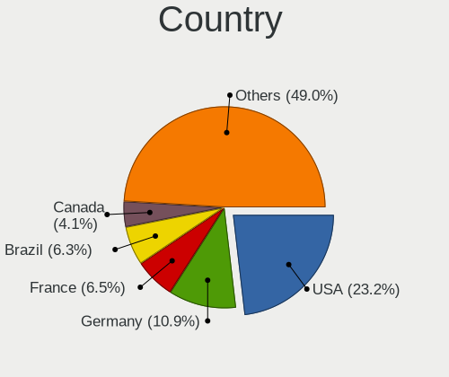
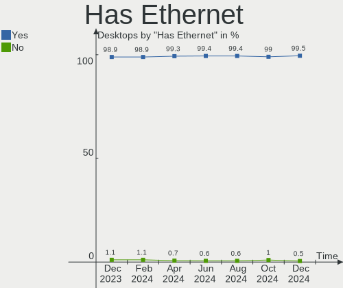
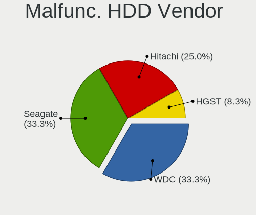

Ubuntu Hardware Trends (Desktop)
--------------------------------

A project to identify most popular hardware characteristics and track their change
over time based on data collected by Ubuntu users at https://Linux-Hardware.org.

Anyone can contribute to the study by uploading probes of their computers by
the [hw-probe](https://github.com/linuxhw/hw-probe) tool:

    sudo -E hw-probe -all -upload

Full-feature report is available here: https://linux-hardware.org/?view=trends&formfactor=desktop

Period: Mar, 2021.

Contents
--------

- [ OS                       ](#os)
- [ OS Family                ](#os-family)
- [ Kernel                   ](#kernel)
- [ Kernel Family            ](#kernel-family)
- [ Kernel Major Ver.        ](#kernel-major-ver)
- [ Arch                     ](#arch)
- [ DE                       ](#de)
- [ Display Server           ](#display-server)
- [ Display Manager          ](#display-manager)
- [ OS Lang                  ](#os-lang)
- [ Boot Mode                ](#boot-mode)
- [ Filesystem               ](#filesystem)
- [ Part. scheme             ](#part-scheme)
- [ Dual Boot with Linux/BSD ](#dual-boot-with-linux/bsd)
- [ Dual Boot (Win)          ](#dual-boot-win)
- [ Country                  ](#country)
- [ City                     ](#city)
- [ Vendor                   ](#vendor)
- [ Model                    ](#model)
- [ Model Family             ](#model-family)
- [ MFG Year                 ](#mfg-year)
- [ Form Factor              ](#form-factor)
- [ Secure Boot              ](#secure-boot)
- [ Coreboot                 ](#coreboot)
- [ RAM Size                 ](#ram-size)
- [ RAM Used                 ](#ram-used)
- [ Has CD-ROM               ](#has-cd-rom)
- [ Total Drives             ](#total-drives)
- [ Has Ethernet             ](#has-ethernet)
- [ Has WiFi                 ](#has-wifi)
- [ Has Bluetooth            ](#has-bluetooth)
- [ Drive Vendor             ](#drive-vendor)
- [ Drive Model              ](#drive-model)
- [ HDD Vendor               ](#hdd-vendor)
- [ SSD Vendor               ](#ssd-vendor)
- [ Drive Kind               ](#drive-kind)
- [ Drive Connector          ](#drive-connector)
- [ Drive Size               ](#drive-size)
- [ Space Total              ](#space-total)
- [ Space Used               ](#space-used)
- [ Malfunc. Drives          ](#malfunc-drives)
- [ Malfunc. Drive Vendor    ](#malfunc-drive-vendor)
- [ Malfunc. HDD Vendor      ](#malfunc-hdd-vendor)
- [ Malfunc. Drive Kind      ](#malfunc-drive-kind)
- [ Failed Drives            ](#failed-drives)
- [ Failed Drive Vendor      ](#failed-drive-vendor)
- [ Drive Status             ](#drive-status)
- [ Storage Vendor           ](#storage-vendor)
- [ Storage Model            ](#storage-model)
- [ Storage Kind             ](#storage-kind)
- [ CPU Vendor               ](#cpu-vendor)
- [ CPU Model                ](#cpu-model)
- [ CPU Model Family         ](#cpu-model-family)
- [ CPU Cores                ](#cpu-cores)
- [ CPU Sockets              ](#cpu-sockets)
- [ CPU Threads              ](#cpu-threads)
- [ CPU Op-Modes             ](#cpu-op-modes)
- [ CPU Microcode            ](#cpu-microcode)
- [ CPU Microarch            ](#cpu-microarch)
- [ GPU Vendor               ](#gpu-vendor)
- [ GPU Model                ](#gpu-model)
- [ GPU Combo                ](#gpu-combo)
- [ GPU Driver               ](#gpu-driver)
- [ GPU Memory               ](#gpu-memory)
- [ Monitor Vendor           ](#monitor-vendor)
- [ Monitor Model            ](#monitor-model)
- [ Monitor Resolution       ](#monitor-resolution)
- [ Monitor Diagonal         ](#monitor-diagonal)
- [ Monitor Width            ](#monitor-width)
- [ Aspect Ratio             ](#aspect-ratio)
- [ Monitor Area             ](#monitor-area)
- [ Pixel Density            ](#pixel-density)
- [ Multiple Monitors        ](#multiple-monitors)
- [ Net Controller Vendor    ](#net-controller-vendor)
- [ Net Controller Model     ](#net-controller-model)
- [ Wireless Vendor          ](#wireless-vendor)
- [ Wireless Model           ](#wireless-model)
- [ Ethernet Vendor          ](#ethernet-vendor)
- [ Ethernet Model           ](#ethernet-model)
- [ Net Controller Kind      ](#net-controller-kind)
- [ Used Controller          ](#used-controller)
- [ NICs                     ](#nics)
- [ IPv6                     ](#ipv6)
- [ Memory Vendor            ](#memory-vendor)
- [ Memory Model             ](#memory-model)
- [ Memory Kind              ](#memory-kind)
- [ Memory Form Factor       ](#memory-form-factor)
- [ Memory Size              ](#memory-size)
- [ Memory Speed             ](#memory-speed)
- [ Sound Vendor             ](#sound-vendor)
- [ Sound Model              ](#sound-model)
- [ Camera Vendor            ](#camera-vendor)
- [ Camera Model             ](#camera-model)
- [ Fingerprint Vendor       ](#fingerprint-vendor)
- [ Fingerprint Model        ](#fingerprint-model)
- [ Chipcard Vendor          ](#chipcard-vendor)
- [ Chipcard Model           ](#chipcard-model)
- [ Printer Vendor           ](#printer-vendor)
- [ Printer Model            ](#printer-model)
- [ Scanner Vendor           ](#scanner-vendor)
- [ Scanner Model            ](#scanner-model)
- [ Bluetooth Vendor         ](#bluetooth-vendor)
- [ Bluetooth Model          ](#bluetooth-model)
- [ Unsupported Devices      ](#unsupported-devices)
- [ Unsupported Device Types ](#unsupported-device-types)

OS
--

Installed operating systems

| Name         | Desktops | Percent |
|--------------|----------|---------|
| Ubuntu 20.04 | 432      | 68.35%  |
| Ubuntu 20.10 | 108      | 17.09%  |
| Ubuntu 18.04 | 67       | 10.6%   |
| Ubuntu 16.04 | 9        | 1.42%   |
| Ubuntu 21.04 | 8        | 1.27%   |
| Ubuntu 2020  | 3        | 0.47%   |
| Ubuntu 19.10 | 2        | 0.32%   |
| Ubuntu 19.04 | 2        | 0.32%   |
| Ubuntu       | 1        | 0.16%   |

OS Family
---------

OS without a version

| Name   | Desktops | Percent |
|--------|----------|---------|
| Ubuntu | 632      | 100%    |

Kernel
------

Version of the Linux kernel

| Version                    | Desktops | Percent |
|----------------------------|----------|---------|
| 5.8.0-44-generic           | 210      | 33.23%  |
| 5.8.0-45-generic           | 93       | 14.72%  |
| 5.4.0-66-generic           | 67       | 10.6%   |
| 5.8.0-48-generic           | 54       | 8.54%   |
| 5.4.0-67-generic           | 35       | 5.54%   |
| 5.4.0-70-generic           | 21       | 3.32%   |
| 4.15.0-136-generic         | 18       | 2.85%   |
| 5.8.0-43-generic           | 16       | 2.53%   |
| 5.4.0-42-generic           | 11       | 1.74%   |
| 5.8.0-41-generic           | 10       | 1.58%   |
| 5.8.0-25-generic           | 9        | 1.42%   |
| 5.11.0-051100-generic      | 5        | 0.79%   |
| 5.8.0-49-generic           | 4        | 0.63%   |
| 5.4.0-54-generic           | 4        | 0.63%   |
| 4.15.0-139-generic         | 4        | 0.63%   |
| 5.4.0-65-generic           | 3        | 0.47%   |
| 5.4.0-58-generic           | 3        | 0.47%   |
| 5.10.0-14-generic          | 3        | 0.47%   |
| 4.15.0-137-generic         | 3        | 0.47%   |
| 5.8.0-45-lowlatency        | 2        | 0.32%   |
| 5.4.0-67-lowlatency        | 2        | 0.32%   |
| 5.4.0-53-generic           | 2        | 0.32%   |
| 5.4.0-52-generic           | 2        | 0.32%   |
| 5.11.0-11-generic          | 2        | 0.32%   |
| 4.15.0-140-generic         | 2        | 0.32%   |
| 5.9.0-050900-generic       | 1        | 0.16%   |
| 5.8.0-7642-generic         | 1        | 0.16%   |
| 5.8.0-44-lowlatency        | 1        | 0.16%   |
| 5.8.0-412102030405-generic | 1        | 0.16%   |
| 5.8.0-38-lowlatency        | 1        | 0.16%   |
| 5.8.0-38-generic           | 1        | 0.16%   |
| 5.8.0-36-generic           | 1        | 0.16%   |
| 5.8.0-34-generic           | 1        | 0.16%   |
| 5.8.0-31-generic           | 1        | 0.16%   |
| 5.7.1-050701-generic       | 1        | 0.16%   |
| 5.6.14-supergamer          | 1        | 0.16%   |
| 5.4.80-hiveos              | 1        | 0.16%   |
| 5.4.65-rt38+               | 1        | 0.16%   |
| 5.4.0-66-lowlatency        | 1        | 0.16%   |
| 5.4.0-62-generic           | 1        | 0.16%   |
| 5.4.0-60-generic           | 1        | 0.16%   |
| 5.4.0-59-generic           | 1        | 0.16%   |
| 5.4.0-57-generic           | 1        | 0.16%   |
| 5.4.0-48-generic           | 1        | 0.16%   |
| 5.4.0-47-generic           | 1        | 0.16%   |
| 5.3.0-64-generic           | 1        | 0.16%   |
| 5.3.0-28-generic           | 1        | 0.16%   |
| 5.3.0-18-generic           | 1        | 0.16%   |
| 5.11.1-xanmod2-cacule      | 1        | 0.16%   |
| 5.10.19-051019-generic     | 1        | 0.16%   |
| 5.10.13-xanmod1            | 1        | 0.16%   |
| 5.10.0-1014-oem            | 1        | 0.16%   |
| 5.0.0-38-generic           | 1        | 0.16%   |
| 5.0.0-36-generic           | 1        | 0.16%   |
| 4.4.0-204-generic          | 1        | 0.16%   |
| 4.4.0-203-generic          | 1        | 0.16%   |
| 4.4.0-178-generic          | 1        | 0.16%   |
| 4.4.0-130-generic          | 1        | 0.16%   |
| 4.18.0-15-generic          | 1        | 0.16%   |
| 4.15.0-72-generic          | 1        | 0.16%   |

Kernel Family
-------------

Linux kernel without a distro release

| Version  | Desktops | Percent |
|----------|----------|---------|
| 5.8.0    | 406      | 64.24%  |
| 5.4.0    | 157      | 24.84%  |
| 4.15.0   | 39       | 6.17%   |
| 5.11.0   | 7        | 1.11%   |
| 5.10.0   | 4        | 0.63%   |
| 4.4.0    | 4        | 0.63%   |
| 5.3.0    | 3        | 0.47%   |
| 5.0.0    | 2        | 0.32%   |
| 5.9.0    | 1        | 0.16%   |
| 5.7.1    | 1        | 0.16%   |
| 5.6.14   | 1        | 0.16%   |
| 5.4.80   | 1        | 0.16%   |
| 5.4.65   | 1        | 0.16%   |
| 5.11.1   | 1        | 0.16%   |
| 5.10.19  | 1        | 0.16%   |
| 5.10.13  | 1        | 0.16%   |
| 4.18.0   | 1        | 0.16%   |
| 3.10.105 | 1        | 0.16%   |

Kernel Major Ver.
-----------------

Linux kernel major version

| Version | Desktops | Percent |
|---------|----------|---------|
| 5.8     | 406      | 64.24%  |
| 5.4     | 159      | 25.16%  |
| 4.15    | 39       | 6.17%   |
| 5.11    | 8        | 1.27%   |
| 5.10    | 6        | 0.95%   |
| 4.4     | 4        | 0.63%   |
| 5.3     | 3        | 0.47%   |
| 5.0     | 2        | 0.32%   |
| 5.9     | 1        | 0.16%   |
| 5.7     | 1        | 0.16%   |
| 5.6     | 1        | 0.16%   |
| 4.18    | 1        | 0.16%   |
| 3.10    | 1        | 0.16%   |

Arch
----

OS architecture (x86_64, i586, etc.)

| Name   | Desktops | Percent |
|--------|----------|---------|
| x86_64 | 619      | 97.94%  |
| i686   | 13       | 2.06%   |

DE
--

Desktop Environment

| Name            | Desktops | Percent |
|-----------------|----------|---------|
| GNOME           | 522      | 82.59%  |
| Unknown         | 72       | 11.39%  |
| Unity           | 20       | 3.16%   |
| X-Cinnamon      | 9        | 1.42%   |
| GNOME Flashback | 5        | 0.79%   |
| GNOME Classic   | 2        | 0.32%   |
| Deepin          | 2        | 0.32%   |

Display Server
--------------

X11 or Wayland

| Name    | Desktops | Percent |
|---------|----------|---------|
| X11     | 568      | 89.87%  |
| Unknown | 31       | 4.91%   |
| Wayland | 28       | 4.43%   |
| Tty     | 5        | 0.79%   |

Display Manager
---------------

SDDM, LightDM, etc.

| Name    | Desktops | Percent |
|---------|----------|---------|
| Unknown | 517      | 81.8%   |
| GDM     | 109      | 17.25%  |
| TDM     | 6        | 0.95%   |

OS Lang
-------

Language

| Lang    | Desktops | Percent |
|---------|----------|---------|
| en_US   | 247      | 39.08%  |
| de_DE   | 81       | 12.82%  |
| fr_FR   | 43       | 6.8%    |
| pt_BR   | 32       | 5.06%   |
| en_GB   | 24       | 3.8%    |
| en_CA   | 24       | 3.8%    |
| it_IT   | 19       | 3.01%   |
| ru_RU   | 14       | 2.22%   |
| pl_PL   | 13       | 2.06%   |
| en_AU   | 13       | 2.06%   |
| nl_NL   | 12       | 1.9%    |
| es_ES   | 10       | 1.58%   |
| en_IN   | 9        | 1.42%   |
| C       | 9        | 1.42%   |
| Unknown | 7        | 1.11%   |
| de_CH   | 5        | 0.79%   |
| de_AT   | 5        | 0.79%   |
| nl_BE   | 4        | 0.63%   |
| hu_HU   | 4        | 0.63%   |
| fr_BE   | 4        | 0.63%   |
| es_AR   | 4        | 0.63%   |
| sv_SE   | 3        | 0.47%   |
| pt_PT   | 3        | 0.47%   |
| fr_CA   | 3        | 0.47%   |
| es_MX   | 3        | 0.47%   |
| en_ZA   | 3        | 0.47%   |
| ca_ES   | 3        | 0.47%   |
| ru_UA   | 2        | 0.32%   |
| es_VE   | 2        | 0.32%   |
| es_PE   | 2        | 0.32%   |
| es_CO   | 2        | 0.32%   |
| en_IL   | 2        | 0.32%   |
| da_DK   | 2        | 0.32%   |
| cs_CZ   | 2        | 0.32%   |
| zh_TW   | 1        | 0.16%   |
| sl_SI   | 1        | 0.16%   |
| ro_RO   | 1        | 0.16%   |
| ja_JP   | 1        | 0.16%   |
| hr_HR   | 1        | 0.16%   |
| fr_CH   | 1        | 0.16%   |
| fi_FI   | 1        | 0.16%   |
| et_EE   | 1        | 0.16%   |
| es_PY   | 1        | 0.16%   |
| es_CL   | 1        | 0.16%   |
| es_BO   | 1        | 0.16%   |
| en_SG   | 1        | 0.16%   |
| en_PH   | 1        | 0.16%   |
| en_NZ   | 1        | 0.16%   |
| en_HK   | 1        | 0.16%   |
| bg_BG   | 1        | 0.16%   |
| be_BY   | 1        | 0.16%   |

Boot Mode
---------

EFI or BIOS

| Mode | Desktops | Percent |
|------|----------|---------|
| BIOS | 437      | 69.15%  |
| EFI  | 195      | 30.85%  |

Filesystem
----------

Type of filesystem

| Type    | Desktops | Percent |
|---------|----------|---------|
| Ext4    | 586      | 92.72%  |
| Overlay | 18       | 2.85%   |
| Zfs     | 11       | 1.74%   |
| Btrfs   | 9        | 1.42%   |
| Xfs     | 6        | 0.95%   |
| Ext2    | 1        | 0.16%   |
| Unknown | 1        | 0.16%   |

Part. scheme
------------

Scheme of partitioning

| Type    | Desktops | Percent |
|---------|----------|---------|
| Unknown | 507      | 80.22%  |
| GPT     | 89       | 14.08%  |
| MBR     | 36       | 5.7%    |

Dual Boot with Linux/BSD
------------------------

Hosting more than one Linux/BSD

| Dual boot | Desktops | Percent |
|-----------|----------|---------|
| No        | 509      | 80.54%  |
| Yes       | 123      | 19.46%  |

Dual Boot (Win)
---------------

Hosting Linux and Windows

| Dual boot | Desktops | Percent |
|-----------|----------|---------|
| No        | 367      | 58.07%  |
| Yes       | 265      | 41.93%  |

Country
-------

Geographic location (country)

| Country         | Desktops | Percent |
|-----------------|----------|---------|
| USA             | 129      | 20.41%  |
| Germany         | 83       | 13.13%  |
| France          | 40       | 6.33%   |
| Brazil          | 40       | 6.33%   |
| Canada          | 33       | 5.22%   |
| Russia          | 28       | 4.43%   |
| Italy           | 23       | 3.64%   |
| UK              | 21       | 3.32%   |
| Switzerland     | 17       | 2.69%   |
| Netherlands     | 17       | 2.69%   |
| Poland          | 16       | 2.53%   |
| Spain           | 13       | 2.06%   |
| Belgium         | 13       | 2.06%   |
| Australia       | 13       | 2.06%   |
| India           | 12       | 1.9%    |
| Austria         | 8        | 1.27%   |
| Sweden          | 7        | 1.11%   |
| Hungary         | 7        | 1.11%   |
| Mexico          | 6        | 0.95%   |
| Finland         | 6        | 0.95%   |
| Serbia          | 5        | 0.79%   |
| Argentina       | 5        | 0.79%   |
| Ukraine         | 4        | 0.63%   |
| Portugal        | 4        | 0.63%   |
| Iran            | 4        | 0.63%   |
| Indonesia       | 4        | 0.63%   |
| Greece          | 4        | 0.63%   |
| Bulgaria        | 4        | 0.63%   |
| South Korea     | 3        | 0.47%   |
| South Africa    | 3        | 0.47%   |
| Puerto Rico     | 3        | 0.47%   |
| New Zealand     | 3        | 0.47%   |
| Israel          | 3        | 0.47%   |
| Czechia         | 3        | 0.47%   |
| Vietnam         | 2        | 0.32%   |
| Venezuela       | 2        | 0.32%   |
| Turkey          | 2        | 0.32%   |
| Thailand        | 2        | 0.32%   |
| Romania         | 2        | 0.32%   |
| Peru            | 2        | 0.32%   |
| Pakistan        | 2        | 0.32%   |
| Hong Kong       | 2        | 0.32%   |
| Estonia         | 2        | 0.32%   |
| Denmark         | 2        | 0.32%   |
| Croatia         | 2        | 0.32%   |
| Colombia        | 2        | 0.32%   |
| Bolivia         | 2        | 0.32%   |
| Taiwan          | 1        | 0.16%   |
| Slovenia        | 1        | 0.16%   |
| Slovakia        | 1        | 0.16%   |
| Singapore       | 1        | 0.16%   |
| Saudi Arabia    | 1        | 0.16%   |
| Réunion        | 1        | 0.16%   |
| Philippines     | 1        | 0.16%   |
| Paraguay        | 1        | 0.16%   |
| Norway          | 1        | 0.16%   |
| North Macedonia | 1        | 0.16%   |
| Morocco         | 1        | 0.16%   |
| Malaysia        | 1        | 0.16%   |
| Lithuania       | 1        | 0.16%   |

City
----

Geographic location (city)

| City          | Desktops | Percent |
|---------------|----------|---------|
| Berlin        | 9        | 1.42%   |
| Moscow        | 8        | 1.27%   |
| Zurich        | 7        | 1.11%   |
| São Paulo    | 5        | 0.79%   |
| Warsaw        | 4        | 0.63%   |
| Vienna        | 4        | 0.63%   |
| Sydney        | 4        | 0.63%   |
| Spokane       | 4        | 0.63%   |
| Madrid        | 4        | 0.63%   |
| Hamburg       | 4        | 0.63%   |
| Essen         | 4        | 0.63%   |
| Amsterdam     | 4        | 0.63%   |
| Voronezh      | 3        | 0.47%   |
| Vancouver     | 3        | 0.47%   |
| Toronto       | 3        | 0.47%   |
| Rome          | 3        | 0.47%   |
| Perth         | 3        | 0.47%   |
| Novosibirsk   | 3        | 0.47%   |
| Montreal      | 3        | 0.47%   |
| Milan         | 3        | 0.47%   |
| Melbourne     | 3        | 0.47%   |
| Kyiv          | 3        | 0.47%   |
| Jersey City   | 3        | 0.47%   |
| Campinas      | 3        | 0.47%   |
| Budapest      | 3        | 0.47%   |
| Brooklyn      | 3        | 0.47%   |
| Bern          | 3        | 0.47%   |
| Belgrade      | 3        | 0.47%   |
| Athens        | 3        | 0.47%   |
| Yekaterinburg | 2        | 0.32%   |
| Vilvoorde     | 2        | 0.32%   |
| Toulouse      | 2        | 0.32%   |
| Tilburg       | 2        | 0.32%   |
| Tel Aviv      | 2        | 0.32%   |
| Tehran        | 2        | 0.32%   |
| Tampa         | 2        | 0.32%   |
| Seville       | 2        | 0.32%   |
| Seattle       | 2        | 0.32%   |
| Sacramento    | 2        | 0.32%   |
| Riverside     | 2        | 0.32%   |
| Rietberg      | 2        | 0.32%   |
| Portsmouth    | 2        | 0.32%   |
| Osnabrück    | 2        | 0.32%   |
| New York      | 2        | 0.32%   |
| Montpellier   | 2        | 0.32%   |
| La Paz        | 2        | 0.32%   |
| Krakow        | 2        | 0.32%   |
| Khimki        | 2        | 0.32%   |
| Keswick       | 2        | 0.32%   |
| Holzminden    | 2        | 0.32%   |
| Herndon       | 2        | 0.32%   |
| Helsinki      | 2        | 0.32%   |
| Fortaleza     | 2        | 0.32%   |
| Espoo         | 2        | 0.32%   |
| Dortmund      | 2        | 0.32%   |
| Chicago       | 2        | 0.32%   |
| Chennai       | 2        | 0.32%   |
| Cape Town     | 2        | 0.32%   |
| Burlington    | 2        | 0.32%   |
| Bucharest     | 2        | 0.32%   |

Vendor
------

Motherboard manufacturer

| Name                | Desktops | Percent |
|---------------------|----------|---------|
| ASUSTek Computer    | 148      | 23.42%  |
| Gigabyte Technology | 96       | 15.19%  |
| MSI                 | 73       | 11.55%  |
| Dell                | 72       | 11.39%  |
| ASRock              | 49       | 7.75%   |
| Hewlett-Packard     | 46       | 7.28%   |
| Intel               | 21       | 3.32%   |
| Lenovo              | 20       | 3.16%   |
| Acer                | 19       | 3.01%   |
| Unknown             | 14       | 2.22%   |
| Pegatron            | 10       | 1.58%   |
| ECS                 | 8        | 1.27%   |
| Fujitsu             | 6        | 0.95%   |
| Biostar             | 6        | 0.95%   |
| Fujitsu Siemens     | 5        | 0.79%   |
| Foxconn             | 5        | 0.79%   |
| PC Engines          | 3        | 0.47%   |
| OEM                 | 3        | 0.47%   |
| Positivo            | 2        | 0.32%   |
| PCWare              | 2        | 0.32%   |
| Medion              | 2        | 0.32%   |
| Huanan              | 2        | 0.32%   |
| Gateway             | 2        | 0.32%   |
| AAEON               | 2        | 0.32%   |
| Uniwill             | 1        | 0.16%   |
| Supermicro          | 1        | 0.16%   |
| Shuttle             | 1        | 0.16%   |
| Sapphire            | 1        | 0.16%   |
| Quanta              | 1        | 0.16%   |
| PCChips             | 1        | 0.16%   |
| Packard Bell        | 1        | 0.16%   |
| LOGIN2              | 1        | 0.16%   |
| langchao            | 1        | 0.16%   |
| Itautec             | 1        | 0.16%   |
| FLEXTRONICS         | 1        | 0.16%   |
| eMachines           | 1        | 0.16%   |
| Digitron            | 1        | 0.16%   |
| ASRockRack          | 1        | 0.16%   |
| AMD                 | 1        | 0.16%   |
| ABIT                | 1        | 0.16%   |

Model
-----

Motherboard model

| Name                             | Desktops | Percent |
|----------------------------------|----------|---------|
| ASUS All Series                  | 16       | 2.53%   |
| Unknown                          | 15       | 2.37%   |
| Dell OptiPlex 990                | 6        | 0.95%   |
| Dell OptiPlex 9010               | 6        | 0.95%   |
| MSI MS-7C37                      | 5        | 0.79%   |
| Dell OptiPlex 790                | 5        | 0.79%   |
| Dell OptiPlex 780                | 5        | 0.79%   |
| MSI MS-7C02                      | 4        | 0.63%   |
| MSI MS-7817                      | 4        | 0.63%   |
| MSI MS-7693                      | 4        | 0.63%   |
| ASUS M4N68T-M-LE-V2              | 4        | 0.63%   |
| PC Engines apu2                  | 3        | 0.47%   |
| HP Compaq Pro 6300 SFF           | 3        | 0.47%   |
| Gigabyte H110M-H                 | 3        | 0.47%   |
| Gigabyte A320M-S2H V2            | 3        | 0.47%   |
| Gigabyte 970A-DS3P               | 3        | 0.47%   |
| Dell Vostro 200                  | 3        | 0.47%   |
| Dell OptiPlex 9020               | 3        | 0.47%   |
| Dell OptiPlex 760                | 3        | 0.47%   |
| Dell OptiPlex 7010               | 3        | 0.47%   |
| Dell OptiPlex 3010               | 3        | 0.47%   |
| ASUS P8Z77-V                     | 3        | 0.47%   |
| ASUS M5A78L-M/USB3               | 3        | 0.47%   |
| ASUS M5A78L-M PLUS/USB3          | 3        | 0.47%   |
| ASRock B450M Pro4                | 3        | 0.47%   |
| MSI MS-7C95                      | 2        | 0.32%   |
| MSI MS-7B79                      | 2        | 0.32%   |
| MSI MS-7A34                      | 2        | 0.32%   |
| MSI MS-7798                      | 2        | 0.32%   |
| MSI MS-7788                      | 2        | 0.32%   |
| MSI MS-7592                      | 2        | 0.32%   |
| Intel SKYBAY                     | 2        | 0.32%   |
| Intel H61                        | 2        | 0.32%   |
| HP Z400 Workstation              | 2        | 0.32%   |
| HP Z240 Tower Workstation        | 2        | 0.32%   |
| HP Compaq Pro 6305 SFF           | 2        | 0.32%   |
| HP Compaq Elite 8300 SFF         | 2        | 0.32%   |
| HP Compaq 6200 Pro MT PC         | 2        | 0.32%   |
| HP Compaq 6000 Pro SFF PC        | 2        | 0.32%   |
| Gigabyte X58A-UD3R               | 2        | 0.32%   |
| Gigabyte H87M-D3H                | 2        | 0.32%   |
| Gigabyte H87-HD3                 | 2        | 0.32%   |
| Gigabyte H110M-H DDR3            | 2        | 0.32%   |
| Gigabyte GA-970A-D3              | 2        | 0.32%   |
| Gigabyte F2A68HM-H               | 2        | 0.32%   |
| Gigabyte B75-D3V                 | 2        | 0.32%   |
| Gigabyte B450M DS3H              | 2        | 0.32%   |
| Gigabyte A320M-S2H               | 2        | 0.32%   |
| ECS GF7100/7050PVT-M3            | 2        | 0.32%   |
| Dell Studio XPS 8100             | 2        | 0.32%   |
| Dell Precision WorkStation T3400 | 2        | 0.32%   |
| Dell Precision Tower 3620        | 2        | 0.32%   |
| Dell OptiPlex 755                | 2        | 0.32%   |
| ASUS Z170 PRO GAMING             | 2        | 0.32%   |
| ASUS WS X299 SAGE                | 2        | 0.32%   |
| ASUS TUF GAMING Z490-PLUS        | 2        | 0.32%   |
| ASUS TUF GAMING X570-PLUS        | 2        | 0.32%   |
| ASUS ROG STRIX Z390-F GAMING     | 2        | 0.32%   |
| ASUS ROG STRIX X570-E GAMING     | 2        | 0.32%   |
| ASUS PRIME B450M-A II            | 2        | 0.32%   |

Model Family
------------

Motherboard model prefix

| Name                    | Desktops | Percent |
|-------------------------|----------|---------|
| Dell OptiPlex           | 43       | 6.8%    |
| HP Compaq               | 21       | 3.32%   |
| ASUS All                | 16       | 2.53%   |
| Unknown                 | 15       | 2.37%   |
| Lenovo ThinkCentre      | 14       | 2.22%   |
| ASUS TUF                | 12       | 1.9%    |
| ASUS PRIME              | 12       | 1.9%    |
| Acer Aspire             | 12       | 1.9%    |
| Dell Precision          | 10       | 1.58%   |
| ASUS ROG                | 10       | 1.58%   |
| ASUS M5A78L-M           | 8        | 1.27%   |
| Dell Vostro             | 7        | 1.11%   |
| HP EliteDesk            | 6        | 0.95%   |
| Gigabyte B450M          | 6        | 0.95%   |
| Dell Inspiron           | 6        | 0.95%   |
| MSI MS-7C37             | 5        | 0.79%   |
| Gigabyte H110M-H        | 5        | 0.79%   |
| Gigabyte A320M-S2H      | 5        | 0.79%   |
| MSI MS-7C02             | 4        | 0.63%   |
| MSI MS-7817             | 4        | 0.63%   |
| MSI MS-7693             | 4        | 0.63%   |
| Fujitsu ESPRIMO         | 4        | 0.63%   |
| ASUS M5A97              | 4        | 0.63%   |
| ASUS M4N68T-M-LE-V2     | 4        | 0.63%   |
| ASRock B450M            | 4        | 0.63%   |
| Acer Veriton            | 4        | 0.63%   |
| PC Engines apu2         | 3        | 0.47%   |
| Lenovo IdeaCentre       | 3        | 0.47%   |
| HP Pavilion             | 3        | 0.47%   |
| Gigabyte Z390           | 3        | 0.47%   |
| Gigabyte X570           | 3        | 0.47%   |
| Gigabyte 970A-DS3P      | 3        | 0.47%   |
| Fujitsu Siemens ESPRIMO | 3        | 0.47%   |
| Dell Studio             | 3        | 0.47%   |
| ASUS WS                 | 3        | 0.47%   |
| ASUS P8Z77-V            | 3        | 0.47%   |
| ASUS P8H61-M            | 3        | 0.47%   |
| ASUS P8B75-M            | 3        | 0.47%   |
| ASUS M5A99X             | 3        | 0.47%   |
| ASRock Z77              | 3        | 0.47%   |
| ASRock B450             | 3        | 0.47%   |
| MSI MS-7C95             | 2        | 0.32%   |
| MSI MS-7B79             | 2        | 0.32%   |
| MSI MS-7A34             | 2        | 0.32%   |
| MSI MS-7798             | 2        | 0.32%   |
| MSI MS-7788             | 2        | 0.32%   |
| MSI MS-7592             | 2        | 0.32%   |
| Intel SKYBAY            | 2        | 0.32%   |
| Intel H61               | 2        | 0.32%   |
| Intel DH61WW            | 2        | 0.32%   |
| Intel DG31PR            | 2        | 0.32%   |
| Huanan X79              | 2        | 0.32%   |
| HP Z400                 | 2        | 0.32%   |
| HP Z240                 | 2        | 0.32%   |
| HP ProDesk              | 2        | 0.32%   |
| Gigabyte Z490           | 2        | 0.32%   |
| Gigabyte X58A-UD3R      | 2        | 0.32%   |
| Gigabyte H87M-D3H       | 2        | 0.32%   |
| Gigabyte H87-HD3        | 2        | 0.32%   |
| Gigabyte GA-970A-D3     | 2        | 0.32%   |

MFG Year
--------

Motherboard manufacture year

| Year    | Desktops | Percent |
|---------|----------|---------|
| 2020    | 79       | 12.5%   |
| 2013    | 68       | 10.76%  |
| 2019    | 57       | 9.02%   |
| 2018    | 56       | 8.86%   |
| 2012    | 56       | 8.86%   |
| 2011    | 50       | 7.91%   |
| 2010    | 47       | 7.44%   |
| 2014    | 40       | 6.33%   |
| 2016    | 36       | 5.7%    |
| 2009    | 34       | 5.38%   |
| 2015    | 26       | 4.11%   |
| 2017    | 24       | 3.8%    |
| 2008    | 17       | 2.69%   |
| 2007    | 17       | 2.69%   |
| 2021    | 13       | 2.06%   |
| 2006    | 7        | 1.11%   |
| 2005    | 2        | 0.32%   |
| Unknown | 2        | 0.32%   |
| 2003    | 1        | 0.16%   |

Form Factor
-----------

Physical design of the computer

| Name    | Desktops | Percent |
|---------|----------|---------|
| Desktop | 632      | 100%    |

Secure Boot
-----------

Enabled or disabled

| State    | Desktops | Percent |
|----------|----------|---------|
| Disabled | 608      | 96.2%   |
| Enabled  | 24       | 3.8%    |

Coreboot
--------

Have coreboot on board

| Used | Desktops | Percent |
|------|----------|---------|
| No   | 629      | 99.53%  |
| Yes  | 3        | 0.47%   |

RAM Size
--------

Total RAM memory

| Size in GB  | Desktops | Percent |
|-------------|----------|---------|
| 8.01-16.0   | 148      | 23.42%  |
| 16.01-24.0  | 140      | 22.15%  |
| 3.01-4.0    | 113      | 17.88%  |
| 4.01-8.0    | 109      | 17.25%  |
| 32.01-64.0  | 66       | 10.44%  |
| 64.01-256.0 | 21       | 3.32%   |
| 1.01-2.0    | 18       | 2.85%   |
| 24.01-32.0  | 8        | 1.27%   |
| 2.01-3.0    | 6        | 0.95%   |
| 0.51-1.0    | 3        | 0.47%   |

RAM Used
--------

Used RAM memory

| Used GB     | Desktops | Percent |
|-------------|----------|---------|
| 1.01-2.0    | 284      | 44.94%  |
| 2.01-3.0    | 150      | 23.73%  |
| 4.01-8.0    | 77       | 12.18%  |
| 3.01-4.0    | 75       | 11.87%  |
| 8.01-16.0   | 19       | 3.01%   |
| 0.51-1.0    | 13       | 2.06%   |
| 16.01-24.0  | 4        | 0.63%   |
| 32.01-64.0  | 3        | 0.47%   |
| 24.01-32.0  | 3        | 0.47%   |
| 0.01-0.5    | 2        | 0.32%   |
| 64.01-256.0 | 1        | 0.16%   |
| Unknown     | 1        | 0.16%   |

Has CD-ROM
----------

Has CD-ROM on board

| Presented | Desktops | Percent |
|-----------|----------|---------|
| Yes       | 331      | 52.37%  |
| No        | 301      | 47.63%  |

Total Drives
------------

Number of drives on board

| Drives | Desktops | Percent |
|--------|----------|---------|
| 1      | 266      | 42.09%  |
| 2      | 189      | 29.91%  |
| 3      | 84       | 13.29%  |
| 4      | 48       | 7.59%   |
| 5      | 23       | 3.64%   |
| 6      | 10       | 1.58%   |
| 7      | 4        | 0.63%   |
| 0      | 4        | 0.63%   |
| 10     | 3        | 0.47%   |
| 8      | 1        | 0.16%   |

Has Ethernet
------------

Has Ethernet on board

| Presented | Desktops | Percent |
|-----------|----------|---------|
| Yes       | 622      | 98.42%  |
| No        | 10       | 1.58%   |

Has WiFi
--------

Has WiFi module

| Presented | Desktops | Percent |
|-----------|----------|---------|
| No        | 375      | 59.34%  |
| Yes       | 257      | 40.66%  |

Has Bluetooth
-------------

Has Bluetooth module

| Presented | Desktops | Percent |
|-----------|----------|---------|
| No        | 506      | 80.06%  |
| Yes       | 126      | 19.94%  |

Drive Vendor
------------

Hard drive vendors

| Vendor                    | Desktops | Drives | Percent |
|---------------------------|----------|--------|---------|
| WDC                       | 251      | 335    | 23.63%  |
| Seagate                   | 223      | 273    | 21%     |
| Samsung Electronics       | 146      | 187    | 13.75%  |
| Toshiba                   | 62       | 68     | 5.84%   |
| Kingston                  | 50       | 57     | 4.71%   |
| Hitachi                   | 44       | 47     | 4.14%   |
| Crucial                   | 35       | 42     | 3.3%    |
| SanDisk                   | 31       | 33     | 2.92%   |
| Unknown                   | 15       | 22     | 1.41%   |
| MAXTOR                    | 15       | 16     | 1.41%   |
| Intel                     | 14       | 16     | 1.32%   |
| HGST                      | 12       | 14     | 1.13%   |
| A-DATA Technology         | 12       | 13     | 1.13%   |
| China                     | 11       | 11     | 1.04%   |
| OCZ                       | 10       | 13     | 0.94%   |
| Intenso                   | 7        | 10     | 0.66%   |
| PNY                       | 6        | 6      | 0.56%   |
| Micron/Crucial Technology | 6        | 6      | 0.56%   |
| LITEONIT                  | 6        | 6      | 0.56%   |
| Transcend                 | 5        | 5      | 0.47%   |
| SPCC                      | 5        | 5      | 0.47%   |
| SK Hynix                  | 5        | 5      | 0.47%   |
| Silicon Motion            | 5        | 5      | 0.47%   |
| Patriot                   | 5        | 5      | 0.47%   |
| Micron Technology         | 5        | 5      | 0.47%   |
| Corsair                   | 5        | 5      | 0.47%   |
| Phison                    | 4        | 4      | 0.38%   |
| PLEXTOR                   | 3        | 3      | 0.28%   |
| KingFast                  | 3        | 4      | 0.28%   |
| GOODRAM                   | 3        | 4      | 0.28%   |
| Gigabyte Technology       | 3        | 3      | 0.28%   |
| Apacer                    | 3        | 3      | 0.28%   |
| XPG                       | 2        | 2      | 0.19%   |
| TrekStor                  | 2        | 2      | 0.19%   |
| Team                      | 2        | 2      | 0.19%   |
| SABRENT                   | 2        | 2      | 0.19%   |
| QUANTUM                   | 2        | 2      | 0.19%   |
| LITEON                    | 2        | 2      | 0.19%   |
| Lexar                     | 2        | 2      | 0.19%   |
| KingSpec                  | 2        | 2      | 0.19%   |
| HPE                       | 2        | 2      | 0.19%   |
| Hewlett-Packard           | 2        | 2      | 0.19%   |
| WD MediaMax               | 1        | 2      | 0.09%   |
| Verbatim                  | 1        | 1      | 0.09%   |
| Vaseky                    | 1        | 1      | 0.09%   |
| V-GeN                     | 1        | 1      | 0.09%   |
| TCSUNBOW                  | 1        | 1      | 0.09%   |
| SSD-S400                  | 1        | 1      | 0.09%   |
| Phison Electronics        | 1        | 1      | 0.09%   |
| MyDigitalSSD              | 1        | 1      | 0.09%   |
| Mushkin                   | 1        | 1      | 0.09%   |
| LaCie                     | 1        | 1      | 0.09%   |
| KIOXIA                    | 1        | 1      | 0.09%   |
| Kingrich                  | 1        | 1      | 0.09%   |
| KINGBANK                  | 1        | 1      | 0.09%   |
| KING                      | 1        | 1      | 0.09%   |
| JMicron                   | 1        | 1      | 0.09%   |
| iMRAM                     | 1        | 1      | 0.09%   |
| IBM                       | 1        | 1      | 0.09%   |
| Hoodisk                   | 1        | 1      | 0.09%   |

Drive Model
-----------

Hard drive models

| Model                            | Desktops | Percent |
|----------------------------------|----------|---------|
| Seagate ST500DM002-1BD142 500GB  | 20       | 1.64%   |
| Seagate ST1000DM010-2EP102 1TB   | 18       | 1.47%   |
| Samsung SSD 860 EVO 500GB        | 16       | 1.31%   |
| WDC WD10EZEX-08WN4A0 1TB         | 13       | 1.06%   |
| Toshiba DT01ACA100 1TB           | 12       | 0.98%   |
| Samsung NVMe SSD Drive 500GB     | 12       | 0.98%   |
| Seagate ST1000DM003-1CH162 1TB   | 11       | 0.9%    |
| Kingston SA400S37120G 120GB SSD  | 11       | 0.9%    |
| Kingston SA400S37240G 240GB SSD  | 10       | 0.82%   |
| WDC WD10EZEX-00WN4A0 1TB         | 9        | 0.74%   |
| Seagate ST31000524AS 1TB         | 9        | 0.74%   |
| Seagate ST2000DM008-2FR102 2TB   | 9        | 0.74%   |
| Kingston SV300S37A120G 120GB SSD | 9        | 0.74%   |
| Seagate Expansion 1TB            | 8        | 0.65%   |
| Samsung SSD 850 EVO 250GB        | 8        | 0.65%   |
| Samsung NVMe SSD Drive 1TB       | 8        | 0.65%   |
| Toshiba DT01ACA050 500GB         | 7        | 0.57%   |
| Seagate ST3500418AS 500GB        | 7        | 0.57%   |
| Crucial CT240BX500SSD1 240GB     | 7        | 0.57%   |
| WDC WDS240G2G0A-00JH30 240GB SSD | 6        | 0.49%   |
| WDC WD5000AADS-00S9B0 500GB      | 6        | 0.49%   |
| WDC WD10EZEX-00BN5A0 1TB         | 6        | 0.49%   |
| Unknown SD/MMC/MS PRO 128GB      | 6        | 0.49%   |
| Samsung SSD 860 EVO 1TB          | 6        | 0.49%   |
| Samsung HD103SI 1TB              | 6        | 0.49%   |
| Crucial CT500MX500SSD1 500GB     | 6        | 0.49%   |
| Crucial CT120BX500SSD1 120GB     | 6        | 0.49%   |
| China SATA SSD 120GB             | 6        | 0.49%   |
| WDC WDS100T2B0A-00SM50 1TB SSD   | 5        | 0.41%   |
| WDC WD20EARX-00PASB0 2TB         | 5        | 0.41%   |
| WDC WD10EZEX-22MFCA0 1TB         | 5        | 0.41%   |
| Seagate ST3500413AS 500GB        | 5        | 0.41%   |
| Seagate ST31000528AS 1TB         | 5        | 0.41%   |
| Seagate ST2000DM001-1CH164 2TB   | 5        | 0.41%   |
| Seagate ST1000DM003-1ER162 1TB   | 5        | 0.41%   |
| SanDisk SSD PLUS 1000GB          | 5        | 0.41%   |
| Samsung SSD 850 EVO 500GB        | 5        | 0.41%   |
| Samsung SSD 840 Series 120GB     | 5        | 0.41%   |
| WDC WDS500G2B0A-00SM50 500GB SSD | 4        | 0.33%   |
| WDC WD5000AAKX-60U6AA0 500GB     | 4        | 0.33%   |
| WDC WD30EFRX-68AX9N0 3TB         | 4        | 0.33%   |
| WDC WD2500AAJS-75M0A0 250GB      | 4        | 0.33%   |
| WDC WD20EARS-00MVWB0 2TB         | 4        | 0.33%   |
| Toshiba HDWD120 2TB              | 4        | 0.33%   |
| Toshiba HDWD110 1TB              | 4        | 0.33%   |
| Seagate ST4000DM004-2CV104 4TB   | 4        | 0.33%   |
| Seagate ST3250824AS 250GB        | 4        | 0.33%   |
| Seagate ST3250318AS 250GB        | 4        | 0.33%   |
| Seagate ST1000DM003-1SB102 1TB   | 4        | 0.33%   |
| Seagate Expansion Desk 8TB       | 4        | 0.33%   |
| Samsung SSD 970 EVO 500GB        | 4        | 0.33%   |
| Samsung SSD 840 EVO 250GB        | 4        | 0.33%   |
| Samsung SSD 840 EVO 120GB        | 4        | 0.33%   |
| Kingston SUV400S37240G 240GB SSD | 4        | 0.33%   |
| Crucial CT480BX500SSD1 480GB     | 4        | 0.33%   |
| WDC WD5000AAKX-75U6AA0 500GB     | 3        | 0.25%   |
| WDC WD5000AAKX-08U6AA0 500GB     | 3        | 0.25%   |
| WDC WD20EZRZ-00Z5HB0 2TB         | 3        | 0.25%   |
| WDC WD20EFRX-68EUZN0 2TB         | 3        | 0.25%   |
| WDC WD10EZEX-21M2NA0 1TB         | 3        | 0.25%   |

HDD Vendor
----------

Hard disk drive vendors

| Vendor              | Desktops | Drives | Percent |
|---------------------|----------|--------|---------|
| WDC                 | 226      | 296    | 36.57%  |
| Seagate             | 221      | 265    | 35.76%  |
| Toshiba             | 55       | 61     | 8.9%    |
| Hitachi             | 44       | 47     | 7.12%   |
| Samsung Electronics | 38       | 45     | 6.15%   |
| MAXTOR              | 12       | 13     | 1.94%   |
| HGST                | 12       | 14     | 1.94%   |
| QUANTUM             | 2        | 2      | 0.32%   |
| Intenso             | 1        | 2      | 0.16%   |
| Hewlett-Packard     | 1        | 1      | 0.16%   |
| Fujitsu             | 1        | 1      | 0.16%   |
| ExcelStor           | 1        | 1      | 0.16%   |
| Dell                | 1        | 1      | 0.16%   |
| ASMT109x            | 1        | 1      | 0.16%   |
| ASMT                | 1        | 1      | 0.16%   |
| Apple               | 1        | 1      | 0.16%   |

SSD Vendor
----------

Solid state drive vendors

| Vendor              | Desktops | Drives | Percent |
|---------------------|----------|--------|---------|
| Samsung Electronics | 85       | 94     | 24.93%  |
| Kingston            | 46       | 52     | 13.49%  |
| Crucial             | 33       | 38     | 9.68%   |
| WDC                 | 29       | 32     | 8.5%    |
| SanDisk             | 25       | 26     | 7.33%   |
| A-DATA Technology   | 11       | 12     | 3.23%   |
| OCZ                 | 10       | 13     | 2.93%   |
| China               | 10       | 10     | 2.93%   |
| Intel               | 8        | 9      | 2.35%   |
| Toshiba             | 6        | 6      | 1.76%   |
| PNY                 | 6        | 6      | 1.76%   |
| LITEONIT            | 6        | 6      | 1.76%   |
| Transcend           | 5        | 5      | 1.47%   |
| SPCC                | 5        | 5      | 1.47%   |
| Patriot             | 5        | 5      | 1.47%   |
| Micron Technology   | 4        | 4      | 1.17%   |
| Intenso             | 4        | 5      | 1.17%   |
| Maxtor              | 3        | 3      | 0.88%   |
| GOODRAM             | 3        | 4      | 0.88%   |
| Corsair             | 3        | 3      | 0.88%   |
| Apacer              | 3        | 3      | 0.88%   |
| SABRENT             | 2        | 2      | 0.59%   |
| PLEXTOR             | 2        | 2      | 0.59%   |
| LITEON              | 2        | 2      | 0.59%   |
| KingSpec            | 2        | 2      | 0.59%   |
| Gigabyte Technology | 2        | 2      | 0.59%   |
| Verbatim            | 1        | 1      | 0.29%   |
| Vaseky              | 1        | 1      | 0.29%   |
| Team                | 1        | 1      | 0.29%   |
| TCSUNBOW            | 1        | 1      | 0.29%   |
| SSD-S400            | 1        | 1      | 0.29%   |
| SK Hynix            | 1        | 1      | 0.29%   |
| MyDigitalSSD        | 1        | 1      | 0.29%   |
| Mushkin             | 1        | 1      | 0.29%   |
| Lexar               | 1        | 1      | 0.29%   |
| Kingrich            | 1        | 1      | 0.29%   |
| KingFast            | 1        | 1      | 0.29%   |
| KINGBANK            | 1        | 1      | 0.29%   |
| Hoodisk             | 1        | 1      | 0.29%   |
| Hikvision           | 1        | 1      | 0.29%   |
| Hewlett-Packard     | 1        | 1      | 0.29%   |
| GBDriver            | 1        | 1      | 0.29%   |
| External            | 1        | 1      | 0.29%   |
| EAGET               | 1        | 1      | 0.29%   |
| Dahua               | 1        | 1      | 0.29%   |
| Aoluska             | 1        | 1      | 0.29%   |
| 2.5"                | 1        | 1      | 0.29%   |

Drive Kind
----------

HDD or SSD

| Kind    | Desktops | Drives | Percent |
|---------|----------|--------|---------|
| HDD     | 484      | 752    | 53.36%  |
| SSD     | 294      | 372    | 32.41%  |
| NVMe    | 94       | 112    | 10.36%  |
| Unknown | 30       | 43     | 3.31%   |
| MMC     | 5        | 5      | 0.55%   |

Drive Connector
---------------

SATA, SAS, NVMe, etc.

| Type | Desktops | Drives | Percent |
|------|----------|--------|---------|
| SATA | 596      | 1103   | 80.43%  |
| NVMe | 94       | 112    | 12.69%  |
| SAS  | 46       | 64     | 6.21%   |
| MMC  | 5        | 5      | 0.67%   |

Drive Size
----------

Size of hard drive

| Size in TB | Desktops | Drives | Percent |
|------------|----------|--------|---------|
| 0.01-0.5   | 438      | 626    | 52.14%  |
| 0.51-1.0   | 252      | 304    | 30%     |
| 1.01-2.0   | 83       | 97     | 9.88%   |
| 3.01-4.0   | 27       | 31     | 3.21%   |
| 2.01-3.0   | 20       | 31     | 2.38%   |
| 4.01-10.0  | 17       | 32     | 2.02%   |
| 10.01-20.0 | 3        | 3      | 0.36%   |

Space Total
-----------

Amount of disk space available on the file system

| Size in GB     | Desktops | Percent |
|----------------|----------|---------|
| 101-250        | 158      | 25%     |
| 251-500        | 133      | 21.04%  |
| 501-1000       | 115      | 18.2%   |
| 1001-2000      | 60       | 9.49%   |
| 51-100         | 47       | 7.44%   |
| More than 3000 | 46       | 7.28%   |
| 2001-3000      | 27       | 4.27%   |
| 1-20           | 20       | 3.16%   |
| 21-50          | 15       | 2.37%   |
| Unknown        | 11       | 1.74%   |

Space Used
----------

Amount of used disk space

| Used GB        | Desktops | Percent |
|----------------|----------|---------|
| 1-20           | 222      | 35.13%  |
| 21-50          | 110      | 17.41%  |
| 101-250        | 86       | 13.61%  |
| 51-100         | 64       | 10.13%  |
| 251-500        | 54       | 8.54%   |
| 501-1000       | 31       | 4.91%   |
| 1001-2000      | 30       | 4.75%   |
| More than 3000 | 13       | 2.06%   |
| 2001-3000      | 11       | 1.74%   |
| Unknown        | 11       | 1.74%   |

Malfunc. Drives
---------------

Drive models with a malfunction

| Model                             | Desktops | Drives | Percent |
|-----------------------------------|----------|--------|---------|
| WDC WD800BB-22JHC0 80GB           | 1        | 1      | 2.7%    |
| WDC WD6400AAKS-07A7B0 640GB       | 1        | 1      | 2.7%    |
| WDC WD3200BPVT-00HXZT1 320GB      | 1        | 1      | 2.7%    |
| WDC WD3200AAKS-75L9A0 320GB       | 1        | 1      | 2.7%    |
| WDC WD3000HLFS-01MZUV0 304GB      | 1        | 1      | 2.7%    |
| WDC WD2500JB-55EVA0 250GB         | 1        | 1      | 2.7%    |
| WDC WD2003FYYS-02W0B1 2TB         | 1        | 1      | 2.7%    |
| WDC WD15EARS-22MVWB0 1TB          | 1        | 1      | 2.7%    |
| WDC WD10EADS-65P6B0 1TB           | 1        | 1      | 2.7%    |
| Toshiba DT01ACA050 500GB          | 1        | 1      | 2.7%    |
| SSD-S400 SSD 120GB                | 1        | 1      | 2.7%    |
| SK Hynix SH920 2.5 7MM 256GB SSD  | 1        | 1      | 2.7%    |
| Seagate STM3500418AS 500GB        | 1        | 2      | 2.7%    |
| Seagate ST500DM002-1BD142 500GB   | 1        | 1      | 2.7%    |
| Seagate ST3750330NS 752GB         | 1        | 1      | 2.7%    |
| Seagate ST3500418AS 500GB         | 1        | 1      | 2.7%    |
| Seagate ST3320813AS 320GB         | 1        | 1      | 2.7%    |
| Seagate ST3320413AS 320GB         | 1        | 1      | 2.7%    |
| Seagate ST3250824AS 250GB         | 1        | 1      | 2.7%    |
| Seagate ST3250310AS 250GB         | 1        | 1      | 2.7%    |
| Seagate ST3200826AS 200GB         | 1        | 1      | 2.7%    |
| Seagate ST32000542AS 2TB          | 1        | 1      | 2.7%    |
| Seagate ST31500341AS 1TB          | 1        | 1      | 2.7%    |
| Seagate ST250DM000-1BD141 250GB   | 1        | 1      | 2.7%    |
| Seagate ST1000NM0011 1TB          | 1        | 1      | 2.7%    |
| SanDisk SSD PLUS 240GB            | 1        | 1      | 2.7%    |
| Samsung Electronics SSD 850 256GB | 1        | 1      | 2.7%    |
| Samsung Electronics HD753LJ 752GB | 1        | 1      | 2.7%    |
| Samsung Electronics HD403LJ 400GB | 1        | 1      | 2.7%    |
| Samsung Electronics HD103UJ 1TB   | 1        | 1      | 2.7%    |
| OCZ VERTEX450 128GB SSD           | 1        | 1      | 2.7%    |
| Kingston SV300S37A120G 120GB SSD  | 1        | 1      | 2.7%    |
| Hitachi HUA723020ALA641 2TB       | 1        | 1      | 2.7%    |
| Hitachi HTS543232A7A384 320GB     | 1        | 1      | 2.7%    |
| Hitachi HTS542512K9SA00 120GB     | 1        | 1      | 2.7%    |
| Hitachi HDS721016CLA382 160GB     | 1        | 1      | 2.7%    |
| Hitachi HDS721010CLA332 1TB       | 1        | 1      | 2.7%    |

Malfunc. Drive Vendor
---------------------

Vendors of faulty drives

| Vendor              | Desktops | Drives | Percent |
|---------------------|----------|--------|---------|
| Seagate             | 13       | 14     | 35.14%  |
| WDC                 | 9        | 9      | 24.32%  |
| Hitachi             | 5        | 5      | 13.51%  |
| Samsung Electronics | 4        | 4      | 10.81%  |
| Toshiba             | 1        | 1      | 2.7%    |
| SSD-S400            | 1        | 1      | 2.7%    |
| SK Hynix            | 1        | 1      | 2.7%    |
| SanDisk             | 1        | 1      | 2.7%    |
| OCZ                 | 1        | 1      | 2.7%    |
| Kingston            | 1        | 1      | 2.7%    |

Malfunc. HDD Vendor
-------------------

Vendors of faulty HDD drives

| Vendor              | Desktops | Drives | Percent |
|---------------------|----------|--------|---------|
| Seagate             | 13       | 14     | 41.94%  |
| WDC                 | 9        | 9      | 29.03%  |
| Hitachi             | 5        | 5      | 16.13%  |
| Samsung Electronics | 3        | 3      | 9.68%   |
| Toshiba             | 1        | 1      | 3.23%   |

Malfunc. Drive Kind
-------------------

Kinds of faulty drives

| Kind | Desktops | Drives | Percent |
|------|----------|--------|---------|
| HDD  | 27       | 32     | 81.82%  |
| SSD  | 6        | 6      | 18.18%  |

Failed Drives
-------------

Failed drive models

Zero info for selected period =(

Failed Drive Vendor
-------------------

Failed drive vendors

Zero info for selected period =(

Drive Status
------------

Number of failed and malfunc. drives

| Status   | Desktops | Drives | Percent |
|----------|----------|--------|---------|
| Detected | 490      | 988    | 74.24%  |
| Works    | 139      | 258    | 21.06%  |
| Malfunc  | 31       | 38     | 4.7%    |

Storage Vendor
--------------

Storage controller vendors

| Vendor                           | Desktops | Percent |
|----------------------------------|----------|---------|
| Intel                            | 430      | 52.31%  |
| AMD                              | 176      | 21.41%  |
| Samsung Electronics              | 41       | 4.99%   |
| ASMedia Technology               | 29       | 3.53%   |
| Nvidia                           | 27       | 3.28%   |
| JMicron Technology               | 27       | 3.28%   |
| Marvell Technology Group         | 22       | 2.68%   |
| Sandisk                          | 9        | 1.09%   |
| Phison Electronics               | 9        | 1.09%   |
| Micron/Crucial Technology        | 9        | 1.09%   |
| Silicon Motion                   | 6        | 0.73%   |
| Silicon Image                    | 5        | 0.61%   |
| Kingston Technology Company      | 5        | 0.61%   |
| VIA Technologies                 | 4        | 0.49%   |
| SK Hynix                         | 4        | 0.49%   |
| Broadcom / LSI                   | 3        | 0.36%   |
| ADATA Technology                 | 3        | 0.36%   |
| Adaptec                          | 2        | 0.24%   |
| ULi Electronics                  | 1        | 0.12%   |
| Toshiba America Info Systems     | 1        | 0.12%   |
| Silicon Integrated Systems [SiS] | 1        | 0.12%   |
| Seagate Technology               | 1        | 0.12%   |
| Promise Technology               | 1        | 0.12%   |
| Micron Technology                | 1        | 0.12%   |
| LSI Logic / Symbios Logic        | 1        | 0.12%   |
| Lite-On Technology               | 1        | 0.12%   |
| KIOXIA                           | 1        | 0.12%   |
| Initio                           | 1        | 0.12%   |
| Areca Technology                 | 1        | 0.12%   |

Storage Model
-------------

Storage controller models

| Model                                                                                   | Desktops | Percent |
|-----------------------------------------------------------------------------------------|----------|---------|
| AMD FCH SATA Controller [AHCI mode]                                                     | 95       | 8.89%   |
| Intel 8 Series/C220 Series Chipset Family 6-port SATA Controller 1 [AHCI mode]          | 52       | 4.86%   |
| Intel 6 Series/C200 Series Chipset Family 6 port Desktop SATA AHCI Controller           | 46       | 4.3%    |
| Intel 7 Series/C210 Series Chipset Family 6-port SATA Controller [AHCI mode]            | 40       | 3.74%   |
| AMD 400 Series Chipset SATA Controller                                                  | 38       | 3.55%   |
| Intel NM10/ICH7 Family SATA Controller [IDE mode]                                       | 36       | 3.37%   |
| Intel SATA Controller [RAID mode]                                                       | 35       | 3.27%   |
| AMD SB7x0/SB8x0/SB9x0 IDE Controller                                                    | 34       | 3.18%   |
| Intel Q170/Q150/B150/H170/H110/Z170/CM236 Chipset SATA Controller [AHCI Mode]           | 32       | 2.99%   |
| Intel 82801G (ICH7 Family) IDE Controller                                               | 32       | 2.99%   |
| AMD SB7x0/SB8x0/SB9x0 SATA Controller [IDE mode]                                        | 28       | 2.62%   |
| Samsung NVMe SSD Controller SM981/PM981/PM983                                           | 27       | 2.53%   |
| Intel Cannon Lake PCH SATA AHCI Controller                                              | 26       | 2.43%   |
| ASMedia ASM1062 Serial ATA Controller                                                   | 26       | 2.43%   |
| Intel 200 Series PCH SATA controller [AHCI mode]                                        | 23       | 2.15%   |
| AMD SB7x0/SB8x0/SB9x0 SATA Controller [AHCI mode]                                       | 22       | 2.06%   |
| Nvidia MCP61 SATA Controller                                                            | 18       | 1.68%   |
| Intel 6 Series/C200 Series Chipset Family Desktop SATA Controller (IDE mode, ports 4-5) | 18       | 1.68%   |
| Intel 6 Series/C200 Series Chipset Family Desktop SATA Controller (IDE mode, ports 0-3) | 18       | 1.68%   |
| Nvidia MCP61 IDE                                                                        | 16       | 1.5%    |
| Intel 4 Series Chipset PT IDER Controller                                               | 14       | 1.31%   |
| AMD 300 Series Chipset SATA Controller                                                  | 14       | 1.31%   |
| JMicron JMB363 SATA/IDE Controller                                                      | 12       | 1.12%   |
| Intel 82801JD/DO (ICH10 Family) SATA AHCI Controller                                    | 11       | 1.03%   |
| Intel 82801I (ICH9 Family) 2 port SATA Controller [IDE mode]                            | 11       | 1.03%   |
| AMD Starship/Matisse Chipset SATA Controller [AHCI mode]                                | 11       | 1.03%   |
| Intel 82801IR/IO/IH (ICH9R/DO/DH) 4 port SATA Controller [IDE mode]                     | 10       | 0.94%   |
| AMD FCH SATA Controller [IDE mode]                                                      | 10       | 0.94%   |
| AMD FCH IDE Controller                                                                  | 8        | 0.75%   |
| Samsung NVMe SSD Controller SM961/PM961/SM963                                           | 7        | 0.65%   |
| JMicron JMB362 SATA Controller                                                          | 7        | 0.65%   |
| Intel C600/X79 series chipset 6-Port SATA AHCI Controller                               | 7        | 0.65%   |
| Micron/Crucial P1 NVMe PCIe SSD                                                         | 6        | 0.56%   |
| JMicron JMB368 IDE controller                                                           | 6        | 0.56%   |
| Intel 9 Series Chipset Family SATA Controller [AHCI Mode]                               | 6        | 0.56%   |
| Intel 82801JI (ICH10 Family) SATA AHCI Controller                                       | 6        | 0.56%   |
| Intel 82801JI (ICH10 Family) 4 port SATA IDE Controller #1                              | 6        | 0.56%   |
| Intel 82801JI (ICH10 Family) 2 port SATA IDE Controller #2                              | 6        | 0.56%   |
| Intel 82801IR/IO/IH (ICH9R/DO/DH) 6 port SATA Controller [AHCI mode]                    | 6        | 0.56%   |
| Intel 5 Series/3400 Series Chipset 4 port SATA IDE Controller                           | 6        | 0.56%   |
| AMD FCH SATA Controller D                                                               | 6        | 0.56%   |
| Silicon Motion SM2263EN/SM2263XT SSD Controller                                         | 5        | 0.47%   |
| Samsung NVMe SSD Controller PM9A1/980PRO                                                | 5        | 0.47%   |
| Intel Comet Lake SATA AHCI Controller                                                   | 5        | 0.47%   |
| Intel 82801JD/DO (ICH10 Family) 4-port SATA IDE Controller                              | 5        | 0.47%   |
| Intel 82801JD/DO (ICH10 Family) 2-port SATA IDE Controller                              | 5        | 0.47%   |
| Intel 7 Series/C210 Series Chipset Family 4-port SATA Controller [IDE mode]             | 5        | 0.47%   |
| Intel 7 Series/C210 Series Chipset Family 2-port SATA Controller [IDE mode]             | 5        | 0.47%   |
| Intel 5 Series/3400 Series Chipset 2 port SATA IDE Controller                           | 5        | 0.47%   |
| Phison E12 NVMe Controller                                                              | 4        | 0.37%   |
| Marvell Group 88SE9172 SATA 6Gb/s Controller                                            | 4        | 0.37%   |
| Kingston Company A2000 NVMe SSD                                                         | 4        | 0.37%   |
| Intel Celeron/Pentium Silver Processor SATA Controller                                  | 4        | 0.37%   |
| Intel C610/X99 series chipset 6-Port SATA Controller [AHCI mode]                        | 4        | 0.37%   |
| Intel Atom Processor E3800 Series SATA AHCI Controller                                  | 4        | 0.37%   |
| Intel 82Q35 Express PT IDER Controller                                                  | 4        | 0.37%   |
| Intel 5 Series/3400 Series Chipset 6 port SATA AHCI Controller                          | 4        | 0.37%   |
| Intel 400 Series Chipset Family SATA AHCI Controller                                    | 4        | 0.37%   |
| Sandisk WD Black 2018/SN750 / PC SN720 NVMe SSD                                         | 3        | 0.28%   |
| Phison PS5013 E13 NVMe Controller                                                       | 3        | 0.28%   |

Storage Kind
------------

Kind of storage controller (IDE, SATA, NVMe, SAS, ...)

| Kind | Desktops | Percent |
|------|----------|---------|
| SATA | 469      | 56.71%  |
| IDE  | 199      | 24.06%  |
| NVMe | 93       | 11.25%  |
| RAID | 58       | 7.01%   |
| SAS  | 4        | 0.48%   |
| SCSI | 4        | 0.48%   |

CPU Vendor
----------

Processor vendors

| Vendor | Desktops | Percent |
|--------|----------|---------|
| Intel  | 433      | 68.51%  |
| AMD    | 199      | 31.49%  |

CPU Model
---------

Processor models

| Model                                       | Desktops | Percent |
|---------------------------------------------|----------|---------|
| Intel Core i5-3470 CPU @ 3.20GHz            | 17       | 2.69%   |
| Intel Core i5-2400 CPU @ 3.10GHz            | 14       | 2.22%   |
| AMD Ryzen 5 3600 6-Core Processor           | 14       | 2.22%   |
| Intel Core i7-3770 CPU @ 3.40GHz            | 11       | 1.74%   |
| Intel Core i7-2600 CPU @ 3.40GHz            | 11       | 1.74%   |
| Intel Core i3-2120 CPU @ 3.30GHz            | 11       | 1.74%   |
| Intel Core 2 Duo CPU E8400 @ 3.00GHz        | 9        | 1.42%   |
| Intel Core i7-4770 CPU @ 3.40GHz            | 8        | 1.27%   |
| AMD FX-6300 Six-Core Processor              | 8        | 1.27%   |
| Intel Core i7-4790 CPU @ 3.60GHz            | 7        | 1.11%   |
| Intel Core i5-4460 CPU @ 3.20GHz            | 7        | 1.11%   |
| Intel Core i3-2100 CPU @ 3.10GHz            | 6        | 0.95%   |
| AMD Ryzen 7 3700X 8-Core Processor          | 6        | 0.95%   |
| AMD Ryzen 5 3400G with Radeon Vega Graphics | 6        | 0.95%   |
| AMD Ryzen 5 2600 Six-Core Processor         | 6        | 0.95%   |
| AMD Ryzen 3 3200G with Radeon Vega Graphics | 6        | 0.95%   |
| Intel Core i7-9700K CPU @ 3.60GHz           | 5        | 0.79%   |
| Intel Core i7-8700K CPU @ 3.70GHz           | 5        | 0.79%   |
| Intel Core i7-6700K CPU @ 4.00GHz           | 5        | 0.79%   |
| Intel Core i5 CPU 650 @ 3.20GHz             | 5        | 0.79%   |
| AMD Ryzen 5 1600 Six-Core Processor         | 5        | 0.79%   |
| Intel Pentium Dual-Core CPU E5400 @ 2.70GHz | 4        | 0.63%   |
| Intel Core i7-8700 CPU @ 3.20GHz            | 4        | 0.63%   |
| Intel Core i5-8400 CPU @ 2.80GHz            | 4        | 0.63%   |
| Intel Core i5-7500 CPU @ 3.40GHz            | 4        | 0.63%   |
| Intel Core i5-7400 CPU @ 3.00GHz            | 4        | 0.63%   |
| Intel Core i5-4570 CPU @ 3.20GHz            | 4        | 0.63%   |
| Intel Core i5-4440 CPU @ 3.10GHz            | 4        | 0.63%   |
| Intel Core i5-3570K CPU @ 3.40GHz           | 4        | 0.63%   |
| Intel Core i5-3570 CPU @ 3.40GHz            | 4        | 0.63%   |
| Intel Core i3-6100 CPU @ 3.70GHz            | 4        | 0.63%   |
| Intel Core 2 Quad CPU Q6600 @ 2.40GHz       | 4        | 0.63%   |
| AMD Ryzen 9 5950X 16-Core Processor         | 4        | 0.63%   |
| AMD Ryzen 5 2600X Six-Core Processor        | 4        | 0.63%   |
| AMD Phenom II X4 955 Processor              | 4        | 0.63%   |
| AMD FX-8350 Eight-Core Processor            | 4        | 0.63%   |
| Intel Pentium Dual-Core CPU E5800 @ 3.20GHz | 3        | 0.47%   |
| Intel Pentium Dual-Core CPU E5300 @ 2.60GHz | 3        | 0.47%   |
| Intel Pentium Dual-Core CPU E5200 @ 2.50GHz | 3        | 0.47%   |
| Intel Pentium Dual CPU E2200 @ 2.20GHz      | 3        | 0.47%   |
| Intel Core i7-9700 CPU @ 3.00GHz            | 3        | 0.47%   |
| Intel Core i7-6700 CPU @ 3.40GHz            | 3        | 0.47%   |
| Intel Core i7 CPU 960 @ 3.20GHz             | 3        | 0.47%   |
| Intel Core i7 CPU 930 @ 2.80GHz             | 3        | 0.47%   |
| Intel Core i7 CPU 920 @ 2.67GHz             | 3        | 0.47%   |
| Intel Core i5-9400 CPU @ 2.90GHz            | 3        | 0.47%   |
| Intel Core i5-7600K CPU @ 3.80GHz           | 3        | 0.47%   |
| Intel Core i5-6600K CPU @ 3.50GHz           | 3        | 0.47%   |
| Intel Core i5-4670K CPU @ 3.40GHz           | 3        | 0.47%   |
| Intel Core i5-4670 CPU @ 3.40GHz            | 3        | 0.47%   |
| Intel Core i5-4590T CPU @ 2.00GHz           | 3        | 0.47%   |
| Intel Core i5-3330 CPU @ 3.00GHz            | 3        | 0.47%   |
| Intel Core i3-7100 CPU @ 3.90GHz            | 3        | 0.47%   |
| Intel Core i3-6300 CPU @ 3.80GHz            | 3        | 0.47%   |
| Intel Core i3-4170 CPU @ 3.70GHz            | 3        | 0.47%   |
| Intel Core i3-3240 CPU @ 3.40GHz            | 3        | 0.47%   |
| Intel Core i3-3220 CPU @ 3.30GHz            | 3        | 0.47%   |
| Intel Core 2 Quad CPU Q6700 @ 2.66GHz       | 3        | 0.47%   |
| Intel Core 2 Duo CPU E7500 @ 2.93GHz        | 3        | 0.47%   |
| Intel Core 2 Duo CPU E7400 @ 2.80GHz        | 3        | 0.47%   |

CPU Model Family
----------------

Processor model prefix

| Model                   | Desktops | Percent |
|-------------------------|----------|---------|
| Intel Core i5           | 126      | 19.94%  |
| Intel Core i7           | 94       | 14.87%  |
| Intel Core i3           | 54       | 8.54%   |
| AMD Ryzen 5             | 45       | 7.12%   |
| Intel Core 2 Duo        | 30       | 4.75%   |
| Intel Xeon              | 28       | 4.43%   |
| AMD FX                  | 28       | 4.43%   |
| AMD Ryzen 7             | 19       | 3.01%   |
| Intel Pentium           | 18       | 2.85%   |
| Intel Celeron           | 18       | 2.85%   |
| Intel Pentium Dual-Core | 17       | 2.69%   |
| Intel Core 2 Quad       | 16       | 2.53%   |
| AMD Phenom II X4        | 11       | 1.74%   |
| AMD Ryzen 9             | 9        | 1.42%   |
| AMD Ryzen 3             | 9        | 1.42%   |
| AMD A8                  | 9        | 1.42%   |
| Intel Core i9           | 7        | 1.11%   |
| Intel Core 2            | 7        | 1.11%   |
| AMD Athlon II X4        | 7        | 1.11%   |
| AMD Athlon II X2        | 7        | 1.11%   |
| AMD A4                  | 7        | 1.11%   |
| AMD Phenom              | 6        | 0.95%   |
| Intel Pentium 4         | 5        | 0.79%   |
| AMD Athlon 64 X2        | 5        | 0.79%   |
| Intel Pentium Dual      | 4        | 0.63%   |
| AMD Phenom II X6        | 4        | 0.63%   |
| Intel Core 2 Extreme    | 3        | 0.47%   |
| Intel Atom              | 3        | 0.47%   |
| AMD Phenom II X2        | 3        | 0.47%   |
| AMD GX                  | 3        | 0.47%   |
| AMD Athlon              | 3        | 0.47%   |
| AMD A6                  | 3        | 0.47%   |
| AMD A10                 | 3        | 0.47%   |
| AMD Ryzen Threadripper  | 2        | 0.32%   |
| AMD Ryzen 5 PRO         | 2        | 0.32%   |
| AMD Ryzen 3 PRO         | 2        | 0.32%   |
| AMD Athlon X4           | 2        | 0.32%   |
| Other                   | 1        | 0.16%   |
| Intel Pentium Gold      | 1        | 0.16%   |
| Intel Pentium D         | 1        | 0.16%   |
| Intel Genuine           | 1        | 0.16%   |
| AMD Sempron             | 1        | 0.16%   |
| AMD PRO A8              | 1        | 0.16%   |
| AMD Mobile Sempron      | 1        | 0.16%   |
| AMD E2                  | 1        | 0.16%   |
| AMD E1                  | 1        | 0.16%   |
| AMD E                   | 1        | 0.16%   |
| AMD Athlon X2           | 1        | 0.16%   |
| AMD Athlon II X3        | 1        | 0.16%   |
| AMD Athlon II           | 1        | 0.16%   |

CPU Cores
---------

Number of processor cores

| Number | Desktops | Percent |
|--------|----------|---------|
| 4      | 288      | 45.57%  |
| 2      | 187      | 29.59%  |
| 6      | 74       | 11.71%  |
| 8      | 35       | 5.54%   |
| 3      | 14       | 2.22%   |
| 1      | 14       | 2.22%   |
| 16     | 7        | 1.11%   |
| 12     | 7        | 1.11%   |
| 10     | 4        | 0.63%   |
| 32     | 1        | 0.16%   |
| 14     | 1        | 0.16%   |

CPU Sockets
-----------

Number of sockets

| Number | Desktops | Percent |
|--------|----------|---------|
| 1      | 627      | 99.21%  |
| 2      | 5        | 0.79%   |

CPU Threads
-----------

Threads per core (Hyper-Threading)

| Number | Desktops | Percent |
|--------|----------|---------|
| 1      | 330      | 52.22%  |
| 2      | 302      | 47.78%  |

CPU Op-Modes
------------

CPU Operation Modes (32-bit, 64-bit)

| Op mode        | Desktops | Percent |
|----------------|----------|---------|
| 32-bit, 64-bit | 628      | 99.37%  |
| 32-bit         | 3        | 0.47%   |
| Unknown        | 1        | 0.16%   |

CPU Microcode
-------------

Microcode number

| Number     | Desktops | Percent |
|------------|----------|---------|
| Unknown    | 131      | 20.73%  |
| 0x306c3    | 54       | 8.54%   |
| 0x206a7    | 53       | 8.39%   |
| 0x306a9    | 49       | 7.75%   |
| 0x1067a    | 33       | 5.22%   |
| 0x506e3    | 23       | 3.64%   |
| 0x08701021 | 18       | 2.85%   |
| 0x906e9    | 15       | 2.37%   |
| 0x010000c8 | 15       | 2.37%   |
| 0x906ea    | 14       | 2.22%   |
| 0x06000852 | 14       | 2.22%   |
| 0x6fb      | 12       | 1.9%    |
| 0x08108109 | 12       | 1.9%    |
| 0x906ed    | 11       | 1.74%   |
| 0x0800820d | 11       | 1.74%   |
| 0x06001119 | 10       | 1.58%   |
| 0x106a5    | 9        | 1.42%   |
| 0x0a201009 | 8        | 1.27%   |
| 0x206d7    | 7        | 1.11%   |
| 0x6fd      | 6        | 0.95%   |
| 0x08701013 | 6        | 0.95%   |
| 0x010000db | 6        | 0.95%   |
| 0xa0655    | 5        | 0.79%   |
| 0x20655    | 5        | 0.79%   |
| 0x10676    | 5        | 0.79%   |
| 0x0600063e | 5        | 0.79%   |
| 0x03000027 | 5        | 0.79%   |
| 0x906eb    | 4        | 0.63%   |
| 0x6f6      | 4        | 0.63%   |
| 0x10677    | 4        | 0.63%   |
| 0x08001137 | 4        | 0.63%   |
| 0x08001129 | 4        | 0.63%   |
| 0x806e9    | 3        | 0.47%   |
| 0x306f2    | 3        | 0.47%   |
| 0x30678    | 3        | 0.47%   |
| 0x20652    | 3        | 0.47%   |
| 0x08101016 | 3        | 0.47%   |
| 0x010000dc | 3        | 0.47%   |
| 0xf41      | 2        | 0.32%   |
| 0x906ec    | 2        | 0.32%   |
| 0x50654    | 2        | 0.32%   |
| 0x306e4    | 2        | 0.32%   |
| 0x30661    | 2        | 0.32%   |
| 0x206c2    | 2        | 0.32%   |
| 0x106e5    | 2        | 0.32%   |
| 0x106a4    | 2        | 0.32%   |
| 0x08600106 | 2        | 0.32%   |
| 0x0810100b | 2        | 0.32%   |
| 0x08001138 | 2        | 0.32%   |
| 0x07030105 | 2        | 0.32%   |
| 0x06003106 | 2        | 0.32%   |
| 0x01000083 | 2        | 0.32%   |
| 0xf65      | 1        | 0.16%   |
| 0xf4a      | 1        | 0.16%   |
| 0xf29      | 1        | 0.16%   |
| 0xa0653    | 1        | 0.16%   |
| 0x806ec    | 1        | 0.16%   |
| 0x706a8    | 1        | 0.16%   |
| 0x6f2      | 1        | 0.16%   |
| 0x50657    | 1        | 0.16%   |

CPU Microarch
-------------

Microarchitecture

| Name            | Desktops | Percent |
|-----------------|----------|---------|
| SandyBridge     | 71       | 11.23%  |
| Haswell         | 70       | 11.08%  |
| KabyLake        | 62       | 9.81%   |
| IvyBridge       | 61       | 9.65%   |
| Penryn          | 53       | 8.39%   |
| K10             | 41       | 6.49%   |
| Zen 2           | 35       | 5.54%   |
| Piledriver      | 33       | 5.22%   |
| Zen+            | 31       | 4.91%   |
| Skylake         | 31       | 4.91%   |
| Core            | 28       | 4.43%   |
| Zen             | 17       | 2.69%   |
| Nehalem         | 17       | 2.69%   |
| Westmere        | 11       | 1.74%   |
| CometLake       | 9        | 1.42%   |
| Zen 3           | 8        | 1.27%   |
| Bulldozer       | 8        | 1.27%   |
| NetBurst        | 7        | 1.11%   |
| K8 Hammer       | 6        | 0.95%   |
| K10 Llano       | 6        | 0.95%   |
| Silvermont      | 5        | 0.79%   |
| Puma            | 5        | 0.79%   |
| Goldmont plus   | 4        | 0.63%   |
| Steamroller     | 3        | 0.47%   |
| Goldmont        | 2        | 0.32%   |
| Excavator       | 2        | 0.32%   |
| Bonnell         | 2        | 0.32%   |
| Bobcat          | 2        | 0.32%   |
| K8 & K10 hybrid | 1        | 0.16%   |
| Jaguar          | 1        | 0.16%   |

GPU Vendor
----------

Vendors of graphics cards

| Vendor                           | Desktops | Percent |
|----------------------------------|----------|---------|
| Nvidia                           | 258      | 38.97%  |
| Intel                            | 213      | 32.18%  |
| AMD                              | 187      | 28.25%  |
| ASPEED Technology                | 2        | 0.3%    |
| VIA Technologies                 | 1        | 0.15%   |
| Silicon Integrated Systems [SiS] | 1        | 0.15%   |

GPU Model
---------

Graphics card models

| Model                                                                       | Desktops | Percent |
|-----------------------------------------------------------------------------|----------|---------|
| Intel Xeon E3-1200 v2/3rd Gen Core processor Graphics Controller            | 32       | 4.73%   |
| Intel Xeon E3-1200 v3/4th Gen Core Processor Integrated Graphics Controller | 29       | 4.28%   |
| Intel 2nd Generation Core Processor Family Integrated Graphics Controller   | 28       | 4.14%   |
| AMD Ellesmere [Radeon RX 470/480/570/570X/580/580X/590]                     | 28       | 4.14%   |
| Nvidia GK208B [GeForce GT 710]                                              | 23       | 3.4%    |
| Intel 4 Series Chipset Integrated Graphics Controller                       | 20       | 2.95%   |
| Intel CometLake-S GT2 [UHD Graphics 630]                                    | 18       | 2.66%   |
| Nvidia GP107 [GeForce GTX 1050 Ti]                                          | 13       | 1.92%   |
| Intel HD Graphics 530                                                       | 13       | 1.92%   |
| AMD Cedar [Radeon HD 5000/6000/7350/8350 Series]                            | 13       | 1.92%   |
| Nvidia GP106 [GeForce GTX 1060 6GB]                                         | 12       | 1.77%   |
| AMD Picasso                                                                 | 11       | 1.62%   |
| Nvidia GT218 [GeForce 210]                                                  | 10       | 1.48%   |
| Intel CoffeeLake-S GT2 [UHD Graphics 630]                                   | 10       | 1.48%   |
| Nvidia GM107 [GeForce GTX 750 Ti]                                           | 9        | 1.33%   |
| Intel 82G33/G31 Express Integrated Graphics Controller                      | 9        | 1.33%   |
| Intel HD Graphics 630                                                       | 8        | 1.18%   |
| AMD Navi 10 [Radeon RX 5600 OEM/5600 XT / 5700/5700 XT]                     | 8        | 1.18%   |
| Nvidia GP104 [GeForce GTX 1070]                                             | 7        | 1.03%   |
| AMD RS780L [Radeon 3000]                                                    | 7        | 1.03%   |
| Nvidia TU117 [GeForce GTX 1650]                                             | 6        | 0.89%   |
| Nvidia GP108 [GeForce GT 1030]                                              | 6        | 0.89%   |
| Nvidia GP107 [GeForce GTX 1050]                                             | 6        | 0.89%   |
| Intel 82945G/GZ Integrated Graphics Controller                              | 6        | 0.89%   |
| AMD Raven Ridge [Radeon Vega Series / Radeon Vega Mobile Series]            | 6        | 0.89%   |
| Nvidia GT218 [GeForce 8400 GS Rev. 3]                                       | 5        | 0.74%   |
| Nvidia GM206 [GeForce GTX 960]                                              | 5        | 0.74%   |
| Nvidia GK106 [GeForce GTX 660]                                              | 5        | 0.74%   |
| Nvidia GK104 [GeForce GTX 760]                                              | 5        | 0.74%   |
| Nvidia GF119 [GeForce GT 610]                                               | 5        | 0.74%   |
| Intel Core Processor Integrated Graphics Controller                         | 5        | 0.74%   |
| Intel 4th Generation Core Processor Family Integrated Graphics Controller   | 5        | 0.74%   |
| Nvidia GP106 [GeForce GTX 1060 3GB]                                         | 4        | 0.59%   |
| Nvidia GP104 [GeForce GTX 1080]                                             | 4        | 0.59%   |
| Nvidia GM204 [GeForce GTX 970]                                              | 4        | 0.59%   |
| Nvidia GK208B [GeForce GT 730]                                              | 4        | 0.59%   |
| Nvidia GK107 [GeForce GTX 650]                                              | 4        | 0.59%   |
| Intel GeminiLake [UHD Graphics 600]                                         | 4        | 0.59%   |
| Intel Atom Processor Z36xxx/Z37xxx Series Graphics & Display                | 4        | 0.59%   |
| AMD Turks PRO [Radeon HD 6570/7570/8550 / R5 230]                           | 4        | 0.59%   |
| AMD RV710 [Radeon HD 4350/4550]                                             | 4        | 0.59%   |
| AMD Lexa PRO [Radeon 540/540X/550/550X / RX 540X/550/550X]                  | 4        | 0.59%   |
| Nvidia TU116 [GeForce GTX 1650 SUPER]                                       | 3        | 0.44%   |
| Nvidia TU106 [GeForce RTX 2060 Rev. A]                                      | 3        | 0.44%   |
| Nvidia GP102 [GeForce GTX 1080 Ti]                                          | 3        | 0.44%   |
| Nvidia GM107 [GeForce GTX 750]                                              | 3        | 0.44%   |
| Nvidia GK107 [GeForce GT 640]                                               | 3        | 0.44%   |
| Nvidia GF116 [GeForce GTX 550 Ti]                                           | 3        | 0.44%   |
| Nvidia GF108 [GeForce GT 430]                                               | 3        | 0.44%   |
| Nvidia G84 [GeForce 8600 GT]                                                | 3        | 0.44%   |
| Intel 82Q35 Express Integrated Graphics Controller                          | 3        | 0.44%   |
| AMD Turks PRO [Radeon HD 7570]                                              | 3        | 0.44%   |
| AMD Trinity [Radeon HD 7560D]                                               | 3        | 0.44%   |
| AMD Renoir                                                                  | 3        | 0.44%   |
| AMD Oland PRO [Radeon R7 240/340]                                           | 3        | 0.44%   |
| AMD Juniper XT [Radeon HD 5770]                                             | 3        | 0.44%   |
| AMD Hawaii PRO [Radeon R9 290/390]                                          | 3        | 0.44%   |
| AMD Caicos [Radeon HD 6450/7450/8450 / R5 230 OEM]                          | 3        | 0.44%   |
| AMD Caicos PRO [Radeon HD 7450]                                             | 3        | 0.44%   |
| AMD Baffin [Radeon RX 460/560D / Pro 450/455/460/555/555X/560/560X]         | 3        | 0.44%   |

GPU Combo
---------

Combinations of graphics cards

| Name               | Desktops | Percent |
|--------------------|----------|---------|
| 1 x Nvidia         | 233      | 36.87%  |
| 1 x Intel          | 185      | 29.27%  |
| 1 x AMD            | 170      | 26.9%   |
| Intel + Nvidia     | 10       | 1.58%   |
| 2 x AMD            | 7        | 1.11%   |
| Other              | 5        | 0.79%   |
| Intel + AMD        | 5        | 0.79%   |
| 2 x Nvidia         | 4        | 0.63%   |
| AMD + Nvidia       | 4        | 0.63%   |
| 3 x Nvidia         | 3        | 0.47%   |
| Intel + 2 x Nvidia | 2        | 0.32%   |
| 1 x ASPEED         | 2        | 0.32%   |
| 1 x VIA            | 1        | 0.16%   |
| 1 x SiS            | 1        | 0.16%   |

GPU Driver
----------

Free vs proprietary

| Driver      | Desktops | Percent |
|-------------|----------|---------|
| Free        | 439      | 69.46%  |
| Proprietary | 161      | 25.47%  |
| Unknown     | 32       | 5.06%   |

GPU Memory
----------

Total video memory

| Size in GB | Desktops | Percent |
|------------|----------|---------|
| Unknown    | 319      | 50.47%  |
| 1.01-2.0   | 85       | 13.45%  |
| 0.51-1.0   | 71       | 11.23%  |
| 0.01-0.5   | 52       | 8.23%   |
| 3.01-4.0   | 43       | 6.8%    |
| 7.01-8.0   | 34       | 5.38%   |
| 5.01-6.0   | 17       | 2.69%   |
| 8.01-16.0  | 6        | 0.95%   |
| 2.01-3.0   | 3        | 0.47%   |
| 16.01-24.0 | 2        | 0.32%   |

Monitor Vendor
--------------

Monitor vendors

| Vendor                  | Desktops | Percent |
|-------------------------|----------|---------|
| Samsung Electronics     | 114      | 17.87%  |
| Dell                    | 82       | 12.85%  |
| Hewlett-Packard         | 58       | 9.09%   |
| Goldstar                | 57       | 8.93%   |
| Acer                    | 39       | 6.11%   |
| Philips                 | 31       | 4.86%   |
| Ancor Communications    | 25       | 3.92%   |
| AOC                     | 22       | 3.45%   |
| BenQ                    | 20       | 3.13%   |
| Unknown                 | 19       | 2.98%   |
| LG Electronics          | 16       | 2.51%   |
| ViewSonic               | 13       | 2.04%   |
| Iiyama                  | 13       | 2.04%   |
| Sony                    | 12       | 1.88%   |
| Lenovo                  | 11       | 1.72%   |
| ASUSTek Computer        | 9        | 1.41%   |
| Toshiba                 | 5        | 0.78%   |
| Panasonic               | 5        | 0.78%   |
| Eizo                    | 5        | 0.78%   |
| Vizio                   | 4        | 0.63%   |
| NEC Computers           | 4        | 0.63%   |
| Vestel Elektronik       | 3        | 0.47%   |
| Sceptre Tech            | 3        | 0.47%   |
| Hyundai ImageQuest      | 3        | 0.47%   |
| HPN                     | 3        | 0.47%   |
| Hitachi                 | 3        | 0.47%   |
| ___                     | 2        | 0.31%   |
| Sharp                   | 2        | 0.31%   |
| MStar                   | 2        | 0.31%   |
| MSI                     | 2        | 0.31%   |
| Lenovo Group Limited    | 2        | 0.31%   |
| IBM                     | 2        | 0.31%   |
| HannStar                | 2        | 0.31%   |
| Fujitsu Siemens         | 2        | 0.31%   |
| eMachines               | 2        | 0.31%   |
| Compaq Computer         | 2        | 0.31%   |
| Chi Mei Optoelectronics | 2        | 0.31%   |
| XYE                     | 1        | 0.16%   |
| Vestel                  | 1        | 0.16%   |
| TXD                     | 1        | 0.16%   |
| TopView                 | 1        | 0.16%   |
| Targa Visionary         | 1        | 0.16%   |
| SKY                     | 1        | 0.16%   |
| SII                     | 1        | 0.16%   |
| SFX                     | 1        | 0.16%   |
| SCH                     | 1        | 0.16%   |
| Sanyo                   | 1        | 0.16%   |
| RS                      | 1        | 0.16%   |
| PZG                     | 1        | 0.16%   |
| Plain Tree Systems      | 1        | 0.16%   |
| Pixio                   | 1        | 0.16%   |
| OTC                     | 1        | 0.16%   |
| NEW                     | 1        | 0.16%   |
| NCS                     | 1        | 0.16%   |
| Microstep               | 1        | 0.16%   |
| Medion                  | 1        | 0.16%   |
| LED                     | 1        | 0.16%   |
| KTL                     | 1        | 0.16%   |
| JRY                     | 1        | 0.16%   |
| Idek Iiyama             | 1        | 0.16%   |

Monitor Model
-------------

Monitor models

| Model                                                                                 | Desktops | Percent |
|---------------------------------------------------------------------------------------|----------|---------|
| Samsung Electronics S24F350 SAM0D20 1920x1080 521x293mm 23.5-inch                     | 4        | 0.6%    |
| Philips PHL 243V5 PHLC0D1 1920x1080 521x293mm 23.5-inch                               | 4        | 0.6%    |
| Goldstar 2D HD LG TV GSM59CA 1920x1080 510x290mm 23.1-inch                            | 4        | 0.6%    |
| Vestel Elektronik 50UHD_LCD_TV VES3700 3840x2160 1872x1053mm 84.6-inch                | 3        | 0.45%   |
| Lenovo L2251p Wide LEN0A0C 1680x1050 474x296mm 22.0-inch                              | 3        | 0.45%   |
| Hewlett-Packard w1907 HWP26A2 1440x900 408x255mm 18.9-inch                            | 3        | 0.45%   |
| Goldstar FULL HD GSM5B55 1920x1080 480x270mm 21.7-inch                                | 3        | 0.45%   |
| ASUSTek Computer VP247 AUS24CA 1920x1080 521x293mm 23.5-inch                          | 3        | 0.45%   |
| Vizio E241i-A1 VIZ1005 1920x1080 521x293mm 23.5-inch                                  | 2        | 0.3%    |
| ViewSonic VA2448 SERIES VSC3828 1920x1080 521x293mm 23.5-inch                         | 2        | 0.3%    |
| Unknown LCD Monitor FFFF 2288x1287 2550x2550mm 142.0-inch                             | 2        | 0.3%    |
| Sony TV SNYEB01 1360x768 1600x900mm 72.3-inch                                         | 2        | 0.3%    |
| Samsung Electronics SyncMaster SAM0593 1920x1080 477x268mm 21.5-inch                  | 2        | 0.3%    |
| Samsung Electronics SyncMaster SAM0587 1920x1200 518x324mm 24.1-inch                  | 2        | 0.3%    |
| Samsung Electronics SyncMaster SAM02B6 1920x1200 518x324mm 24.1-inch                  | 2        | 0.3%    |
| Samsung Electronics S27D390 SAM0B67 1920x1080 600x340mm 27.2-inch                     | 2        | 0.3%    |
| Samsung Electronics LCD Monitor SAM0509 1920x1080                                     | 2        | 0.3%    |
| Panasonic TV MEIA296 1920x1080 1280x720mm 57.8-inch                                   | 2        | 0.3%    |
| LG Electronics LCD Monitor LG HDR 4K 7680x2160                                        | 2        | 0.3%    |
| LG Electronics LCD Monitor LG HDR 4K                                                  | 2        | 0.3%    |
| LG Electronics LCD Monitor LG FULL HD 1920x1080                                       | 2        | 0.3%    |
| Iiyama PL2492H IVM612F 1920x1080 530x300mm 24.0-inch                                  | 2        | 0.3%    |
| Hyundai ImageQuest HDIT19W DSUB IQT9008 1366x768 430x255mm 19.7-inch                  | 2        | 0.3%    |
| Hewlett-Packard LE2002x HWP2964 1600x900 443x249mm 20.0-inch                          | 2        | 0.3%    |
| Hewlett-Packard 22w HPN342E 1920x1080 480x270mm 21.7-inch                             | 2        | 0.3%    |
| Hewlett-Packard 2210 HWP288A 1920x1080 476x268mm 21.5-inch                            | 2        | 0.3%    |
| Goldstar W2243 GSM56FF 1920x1080 477x268mm 21.5-inch                                  | 2        | 0.3%    |
| Goldstar W2243 GSM56FE 1920x1080 477x269mm 21.6-inch                                  | 2        | 0.3%    |
| Goldstar ULTRAWIDE GSM76F6 3440x1440 800x335mm 34.1-inch                              | 2        | 0.3%    |
| Goldstar LG ULTRAWIDE GSM59F1 1920x1080 580x240mm 24.7-inch                           | 2        | 0.3%    |
| Eizo FS2333 ENC2342 1920x1080 510x287mm 23.0-inch                                     | 2        | 0.3%    |
| Dell U2415 DELA0BA 1920x1080 518x324mm 24.1-inch                                      | 2        | 0.3%    |
| Dell U2412M DELA079 1920x1200 518x324mm 24.1-inch                                     | 2        | 0.3%    |
| Dell U2311H DELA05F 1920x1080 509x286mm 23.0-inch                                     | 2        | 0.3%    |
| Dell S2309W DELA041 1920x1080 509x286mm 23.0-inch                                     | 2        | 0.3%    |
| Dell P2212H DELA07F 1920x1080 531x299mm 24.0-inch                                     | 2        | 0.3%    |
| Dell P1914S DELF04A 1280x1024 376x301mm 19.0-inch                                     | 2        | 0.3%    |
| Dell P190S DEL405A 1280x1024 376x301mm 19.0-inch                                      | 2        | 0.3%    |
| Dell LCD Monitor U2412M 1920x1200                                                     | 2        | 0.3%    |
| Dell IN1910N DELA04C 1366x768 410x230mm 18.5-inch                                     | 2        | 0.3%    |
| Dell 2407WFP DELA017 1680x1050 520x330mm 24.2-inch                                    | 2        | 0.3%    |
| Dell 1708FP DEL4024 1280x1024 338x270mm 17.0-inch                                     | 2        | 0.3%    |
| BenQ GL2460 BNQ78CE 1920x1080 531x299mm 24.0-inch                                     | 2        | 0.3%    |
| AOC 2270W AOC2270 1920x1080 477x268mm 21.5-inch                                       | 2        | 0.3%    |
| Ancor Communications VE247 ACI2493 1920x1080 531x299mm 24.0-inch                      | 2        | 0.3%    |
| Ancor Communications VE228 ACI22FA 1920x1080 477x268mm 21.5-inch                      | 2        | 0.3%    |
| Ancor Communications ASUS VW193D ACI19D5 1440x900 408x255mm 18.9-inch                 | 2        | 0.3%    |
| Ancor Communications ASUS VE278 ACI27F6 1920x1080 598x336mm 27.0-inch                 | 2        | 0.3%    |
| Acer X223W ACR000D 1680x1050 474x296mm 22.0-inch                                      | 2        | 0.3%    |
| Acer K243Y ACR08B7 1920x1080 527x296mm 23.8-inch                                      | 2        | 0.3%    |
| Acer AL2223W ACRAD84 1680x1050 474x296mm 22.0-inch                                    | 2        | 0.3%    |
| ___ Monitor ranges (GTF): 48-62Hz V, 14-68kHz H, max dotclock 150MHz ___9000 1440x900 | 1        | 0.15%   |
| ___ LCDTV16 ___0101 1600x1200 1600x900mm 72.3-inch                                    | 1        | 0.15%   |
| XYE XE2400 XYE2380 3840x2160 520x310mm 23.8-inch                                      | 1        | 0.15%   |
| Vizio E321VL VIZ0083 1366x768 700x400mm 31.7-inch                                     | 1        | 0.15%   |
| Vizio E190VA VIZ0067 1360x768 410x230mm 18.5-inch                                     | 1        | 0.15%   |
| ViewSonic VX2770 SERIES VSC3A2C 1920x1080 597x336mm 27.0-inch                         | 1        | 0.15%   |
| ViewSonic VX2433wm VSC3822 1920x1080 520x290mm 23.4-inch                              | 1        | 0.15%   |
| ViewSonic VA916 Series VSC7C20 1280x1024 376x301mm 19.0-inch                          | 1        | 0.15%   |
| ViewSonic VA2759 Series VSC6832 1920x1080 598x336mm 27.0-inch                         | 1        | 0.15%   |

Monitor Resolution
------------------

Monitor screen resolution

| Resolution         | Desktops | Percent |
|--------------------|----------|---------|
| 1920x1080 (FHD)    | 299      | 47.09%  |
| 1280x1024 (SXGA)   | 55       | 8.66%   |
| 1680x1050 (WSXGA+) | 39       | 6.14%   |
| 3840x2160 (4K)     | 34       | 5.35%   |
| 1440x900 (WXGA+)   | 25       | 3.94%   |
| 1366x768 (WXGA)    | 25       | 3.94%   |
| 1600x900 (HD+)     | 23       | 3.62%   |
| 1920x1200 (WUXGA)  | 22       | 3.46%   |
| 2560x1440 (QHD)    | 21       | 3.31%   |
| Unknown            | 20       | 3.15%   |
| 1360x768           | 15       | 2.36%   |
| 1024x768 (XGA)     | 9        | 1.42%   |
| 3440x1440          | 8        | 1.26%   |
| 3840x1080          | 6        | 0.94%   |
| 1920x540           | 6        | 0.94%   |
| 2560x1080          | 5        | 0.79%   |
| 1280x720 (HD)      | 5        | 0.79%   |
| 7680x2160          | 4        | 0.63%   |
| 2288x1287          | 4        | 0.63%   |
| 5760x2160          | 2        | 0.31%   |
| 4480x1440          | 1        | 0.16%   |
| 3200x1080          | 1        | 0.16%   |
| 2966x900           | 1        | 0.16%   |
| 2560x1600          | 1        | 0.16%   |
| 1600x1200          | 1        | 0.16%   |
| 1400x1050          | 1        | 0.16%   |
| 1280x960           | 1        | 0.16%   |
| 1152x864           | 1        | 0.16%   |

Monitor Diagonal
----------------

Diagonal size in inches

| Inches  | Desktops | Percent |
|---------|----------|---------|
| Unknown | 93       | 14.72%  |
| 23      | 84       | 13.29%  |
| 24      | 78       | 12.34%  |
| 21      | 66       | 10.44%  |
| 27      | 52       | 8.23%   |
| 19      | 47       | 7.44%   |
| 22      | 29       | 4.59%   |
| 17      | 28       | 4.43%   |
| 18      | 27       | 4.27%   |
| 31      | 23       | 3.64%   |
| 20      | 23       | 3.64%   |
| 15      | 13       | 2.06%   |
| 72      | 9        | 1.42%   |
| 34      | 9        | 1.42%   |
| 84      | 8        | 1.27%   |
| 32      | 5        | 0.79%   |
| 16      | 5        | 0.79%   |
| 52      | 4        | 0.63%   |
| 40      | 4        | 0.63%   |
| 25      | 4        | 0.63%   |
| 142     | 2        | 0.32%   |
| 54      | 2        | 0.32%   |
| 35      | 2        | 0.32%   |
| 14      | 2        | 0.32%   |
| 95      | 1        | 0.16%   |
| 65      | 1        | 0.16%   |
| 60      | 1        | 0.16%   |
| 55      | 1        | 0.16%   |
| 48      | 1        | 0.16%   |
| 43      | 1        | 0.16%   |
| 42      | 1        | 0.16%   |
| 39      | 1        | 0.16%   |
| 37      | 1        | 0.16%   |
| 33      | 1        | 0.16%   |
| 30      | 1        | 0.16%   |
| 28      | 1        | 0.16%   |
| 12      | 1        | 0.16%   |

Monitor Width
-------------

Physical width

| Width in mm    | Desktops | Percent |
|----------------|----------|---------|
| 501-600        | 206      | 33.12%  |
| 401-500        | 162      | 26.05%  |
| Unknown        | 93       | 14.95%  |
| 301-350        | 40       | 6.43%   |
| 351-400        | 34       | 5.47%   |
| 601-700        | 29       | 4.66%   |
| 1501-2000      | 18       | 2.89%   |
| 701-800        | 15       | 2.41%   |
| 1001-1500      | 10       | 1.61%   |
| 801-900        | 8        | 1.29%   |
| 201-300        | 3        | 0.48%   |
| More than 2000 | 2        | 0.32%   |
| 901-1000       | 2        | 0.32%   |

Aspect Ratio
------------

Proportional relationship between the width and the height

| Ratio   | Desktops | Percent |
|---------|----------|---------|
| 16/9    | 361      | 59.47%  |
| 16/10   | 81       | 13.34%  |
| Unknown | 74       | 12.19%  |
| 5/4     | 49       | 8.07%   |
| 4/3     | 17       | 2.8%    |
| 21/9    | 11       | 1.81%   |
| 6/5     | 6        | 0.99%   |
| 32/9    | 3        | 0.49%   |
| 3/2     | 3        | 0.49%   |
| 1.00    | 2        | 0.33%   |

Monitor Area
------------

Area in inch²

| Area in inch² | Desktops | Percent |
|----------------|----------|---------|
| 201-250        | 209      | 33.23%  |
| 151-200        | 94       | 14.94%  |
| Unknown        | 93       | 14.79%  |
| 301-350        | 52       | 8.27%   |
| 141-150        | 45       | 7.15%   |
| 351-500        | 42       | 6.68%   |
| 251-300        | 33       | 5.25%   |
| More than 1000 | 30       | 4.77%   |
| 101-110        | 12       | 1.91%   |
| 501-1000       | 8        | 1.27%   |
| 111-120        | 4        | 0.64%   |
| 131-140        | 3        | 0.48%   |
| 121-130        | 3        | 0.48%   |
| 71-80          | 1        | 0.16%   |

Pixel Density
-------------

Pixels per inch

| Density | Desktops | Percent |
|---------|----------|---------|
| 51-100  | 376      | 61.84%  |
| Unknown | 93       | 15.3%   |
| 101-120 | 88       | 14.47%  |
| 1-50    | 29       | 4.77%   |
| 121-160 | 14       | 2.3%    |
| 161-240 | 8        | 1.32%   |

Multiple Monitors
-----------------

Total monitors connected

| Total | Desktops | Percent |
|-------|----------|---------|
| 1     | 527      | 83.39%  |
| 2     | 64       | 10.13%  |
| 0     | 29       | 4.59%   |
| 3     | 11       | 1.74%   |
| 4     | 1        | 0.16%   |

Net Controller Vendor
---------------------

Controller vendors

| Vendor                           | Desktops | Percent |
|----------------------------------|----------|---------|
| Realtek Semiconductor            | 375      | 43.1%   |
| Intel                            | 244      | 28.05%  |
| Qualcomm Atheros                 | 66       | 7.59%   |
| Broadcom Inc. and subsidiaries   | 24       | 2.76%   |
| Ralink                           | 23       | 2.64%   |
| Ralink Technology                | 22       | 2.53%   |
| Nvidia                           | 22       | 2.53%   |
| TP-Link                          | 16       | 1.84%   |
| NetGear                          | 9        | 1.03%   |
| Marvell Technology Group         | 9        | 1.03%   |
| Samsung Electronics              | 7        | 0.8%    |
| Broadcom Limited                 | 6        | 0.69%   |
| Qualcomm Atheros Communications  | 5        | 0.57%   |
| VIA Technologies                 | 3        | 0.34%   |
| Huawei Technologies              | 3        | 0.34%   |
| MediaTek                         | 2        | 0.23%   |
| Edimax Technology                | 2        | 0.23%   |
| D-Link System                    | 2        | 0.23%   |
| D-Link                           | 2        | 0.23%   |
| AVM                              | 2        | 0.23%   |
| Arduino SA                       | 2        | 0.23%   |
| Aquantia                         | 2        | 0.23%   |
| ZyXEL Communications             | 1        | 0.11%   |
| Xiaomi                           | 1        | 0.11%   |
| Tenda                            | 1        | 0.11%   |
| STMicroelectronics               | 1        | 0.11%   |
| Sitecom Europe                   | 1        | 0.11%   |
| Silicon Integrated Systems [SiS] | 1        | 0.11%   |
| Qualcomm                         | 1        | 0.11%   |
| QLogic                           | 1        | 0.11%   |
| PEAK-System Technik              | 1        | 0.11%   |
| PCTel                            | 1        | 0.11%   |
| Microsoft                        | 1        | 0.11%   |
| Manta                            | 1        | 0.11%   |
| Lenovo                           | 1        | 0.11%   |
| IMC Networks                     | 1        | 0.11%   |
| Gemtek                           | 1        | 0.11%   |
| DisplayLink                      | 1        | 0.11%   |
| Broadcom                         | 1        | 0.11%   |
| Belkin Components                | 1        | 0.11%   |
| ASUSTek Computer                 | 1        | 0.11%   |
| ASIX Electronics                 | 1        | 0.11%   |
| American Megatrends              | 1        | 0.11%   |
| 3Com                             | 1        | 0.11%   |

Net Controller Model
--------------------

Controller models

| Model                                                             | Desktops | Percent |
|-------------------------------------------------------------------|----------|---------|
| Realtek RTL8111/8168/8411 PCI Express Gigabit Ethernet Controller | 307      | 31.55%  |
| Intel 82579LM Gigabit Network Connection (Lewisville)             | 45       | 4.62%   |
| Intel Ethernet Connection (2) I219-V                              | 20       | 2.06%   |
| Intel 82579V Gigabit Network Connection                           | 20       | 2.06%   |
| Intel I211 Gigabit Network Connection                             | 19       | 1.95%   |
| Nvidia MCP61 Ethernet                                             | 17       | 1.75%   |
| Realtek RTL810xE PCI Express Fast Ethernet controller             | 16       | 1.64%   |
| Intel Wi-Fi 6 AX200                                               | 15       | 1.54%   |
| Intel 82567LM-3 Gigabit Network Connection                        | 15       | 1.54%   |
| Realtek RTL8188EUS 802.11n Wireless Network Adapter               | 14       | 1.44%   |
| Intel Ethernet Connection (7) I219-V                              | 14       | 1.44%   |
| Intel Ethernet Connection I217-LM                                 | 13       | 1.34%   |
| Intel Dual Band Wireless-AC 3168NGW [Stone Peak]                  | 13       | 1.34%   |
| Intel I210 Gigabit Network Connection                             | 12       | 1.23%   |
| Realtek RTL8125 2.5GbE Controller                                 | 11       | 1.13%   |
| Ralink MT7601U Wireless Adapter                                   | 10       | 1.03%   |
| Intel Ethernet Connection (2) I219-LM                             | 10       | 1.03%   |
| Realtek RTL88x2bu [AC1200 Techkey]                                | 7        | 0.72%   |
| Realtek RTL-8100/8101L/8139 PCI Fast Ethernet Adapter             | 7        | 0.72%   |
| Qualcomm Atheros AR9485 Wireless Network Adapter                  | 7        | 0.72%   |
| Intel Wireless-AC 9260                                            | 7        | 0.72%   |
| Intel Ethernet Connection I217-V                                  | 7        | 0.72%   |
| Realtek RTL8821AE 802.11ac PCIe Wireless Network Adapter          | 6        | 0.62%   |
| Realtek RTL8188EE Wireless Network Adapter                        | 6        | 0.62%   |
| Realtek 802.11ac NIC                                              | 6        | 0.62%   |
| Qualcomm Atheros AR8161 Gigabit Ethernet                          | 6        | 0.62%   |
| Marvell Group 88E8056 PCI-E Gigabit Ethernet Controller           | 6        | 0.62%   |
| Intel Ethernet Connection (2) I218-V                              | 6        | 0.62%   |
| TP-Link TL-WN823N v2/v3 [Realtek RTL8192EU]                       | 5        | 0.51%   |
| Realtek RTL8812AE 802.11ac PCIe Wireless Network Adapter          | 5        | 0.51%   |
| Realtek RTL8192CU 802.11n WLAN Adapter                            | 5        | 0.51%   |
| Ralink RT3090 Wireless 802.11n 1T/1R PCIe                         | 5        | 0.51%   |
| Samsung Galaxy series, misc. (tethering mode)                     | 4        | 0.41%   |
| Realtek RTL8192EE PCIe Wireless Network Adapter                   | 4        | 0.41%   |
| Realtek RTL8192CE PCIe Wireless Network Adapter                   | 4        | 0.41%   |
| Realtek RTL8169 PCI Gigabit Ethernet Controller                   | 4        | 0.41%   |
| Realtek RTL8153 Gigabit Ethernet Adapter                          | 4        | 0.41%   |
| Qualcomm Atheros Killer E220x Gigabit Ethernet Controller         | 4        | 0.41%   |
| Qualcomm Atheros AR9271 802.11n                                   | 4        | 0.41%   |
| Qualcomm Atheros AR93xx Wireless Network Adapter                  | 4        | 0.41%   |
| Intel Wireless-AC 9560 [Jefferson Peak]                           | 4        | 0.41%   |
| Intel Wireless 7260                                               | 4        | 0.41%   |
| Intel 82574L Gigabit Network Connection                           | 4        | 0.41%   |
| Intel 82566DM-2 Gigabit Network Connection                        | 4        | 0.41%   |
| Intel 82562V-2 10/100 Network Connection                          | 4        | 0.41%   |
| TP-Link TL-WN722N v2/v3 [Realtek RTL8188EUS]                      | 3        | 0.31%   |
| TP-Link 802.11ac NIC                                              | 3        | 0.31%   |
| Samsung GT-I9070 (network tethering, USB debugging enabled)       | 3        | 0.31%   |
| Realtek RTL8821CE 802.11ac PCIe Wireless Network Adapter          | 3        | 0.31%   |
| Ralink RT2870/RT3070 Wireless Adapter                             | 3        | 0.31%   |
| Ralink RT2501/RT2573 Wireless Adapter                             | 3        | 0.31%   |
| Ralink RT5390 Wireless 802.11n 1T/1R PCIe                         | 3        | 0.31%   |
| Ralink RT2790 Wireless 802.11n 1T/2R PCIe                         | 3        | 0.31%   |
| Ralink RT2561/RT61 802.11g PCI                                    | 3        | 0.31%   |
| Qualcomm Atheros QCA9565 / AR9565 Wireless Network Adapter        | 3        | 0.31%   |
| Qualcomm Atheros Killer E2500 Gigabit Ethernet Controller         | 3        | 0.31%   |
| Qualcomm Atheros AR9462 Wireless Network Adapter                  | 3        | 0.31%   |
| Qualcomm Atheros AR9287 Wireless Network Adapter (PCI-Express)    | 3        | 0.31%   |
| Qualcomm Atheros AR8151 v2.0 Gigabit Ethernet                     | 3        | 0.31%   |
| Qualcomm Atheros AR5212/5213/2414 Wireless Network Adapter        | 3        | 0.31%   |

Wireless Vendor
---------------

Wireless vendors

| Vendor                          | Desktops | Percent |
|---------------------------------|----------|---------|
| Realtek Semiconductor           | 78       | 29%     |
| Intel                           | 55       | 20.45%  |
| Qualcomm Atheros                | 37       | 13.75%  |
| Ralink                          | 23       | 8.55%   |
| Ralink Technology               | 22       | 8.18%   |
| TP-Link                         | 16       | 5.95%   |
| NetGear                         | 8        | 2.97%   |
| Broadcom Inc. and subsidiaries  | 6        | 2.23%   |
| Qualcomm Atheros Communications | 5        | 1.86%   |
| MediaTek                        | 2        | 0.74%   |
| Edimax Technology               | 2        | 0.74%   |
| D-Link System                   | 2        | 0.74%   |
| D-Link                          | 2        | 0.74%   |
| AVM                             | 2        | 0.74%   |
| ZyXEL Communications            | 1        | 0.37%   |
| Tenda                           | 1        | 0.37%   |
| Sitecom Europe                  | 1        | 0.37%   |
| Microsoft                       | 1        | 0.37%   |
| IMC Networks                    | 1        | 0.37%   |
| Gemtek                          | 1        | 0.37%   |
| Broadcom Limited                | 1        | 0.37%   |
| Belkin Components               | 1        | 0.37%   |
| ASUSTek Computer                | 1        | 0.37%   |

Wireless Model
--------------

Wireless models

| Model                                                                         | Desktops | Percent |
|-------------------------------------------------------------------------------|----------|---------|
| Intel Wi-Fi 6 AX200                                                           | 15       | 5.47%   |
| Realtek RTL8188EUS 802.11n Wireless Network Adapter                           | 14       | 5.11%   |
| Intel Dual Band Wireless-AC 3168NGW [Stone Peak]                              | 13       | 4.74%   |
| Ralink MT7601U Wireless Adapter                                               | 10       | 3.65%   |
| Realtek RTL88x2bu [AC1200 Techkey]                                            | 7        | 2.55%   |
| Qualcomm Atheros AR9485 Wireless Network Adapter                              | 7        | 2.55%   |
| Intel Wireless-AC 9260                                                        | 7        | 2.55%   |
| Realtek RTL8821AE 802.11ac PCIe Wireless Network Adapter                      | 6        | 2.19%   |
| Realtek RTL8188EE Wireless Network Adapter                                    | 6        | 2.19%   |
| Realtek 802.11ac NIC                                                          | 6        | 2.19%   |
| TP-Link TL-WN823N v2/v3 [Realtek RTL8192EU]                                   | 5        | 1.82%   |
| Realtek RTL8812AE 802.11ac PCIe Wireless Network Adapter                      | 5        | 1.82%   |
| Realtek RTL8192CU 802.11n WLAN Adapter                                        | 5        | 1.82%   |
| Ralink RT3090 Wireless 802.11n 1T/1R PCIe                                     | 5        | 1.82%   |
| Realtek RTL8192EE PCIe Wireless Network Adapter                               | 4        | 1.46%   |
| Realtek RTL8192CE PCIe Wireless Network Adapter                               | 4        | 1.46%   |
| Qualcomm Atheros AR9271 802.11n                                               | 4        | 1.46%   |
| Qualcomm Atheros AR93xx Wireless Network Adapter                              | 4        | 1.46%   |
| Intel Wireless-AC 9560 [Jefferson Peak]                                       | 4        | 1.46%   |
| Intel Wireless 7260                                                           | 4        | 1.46%   |
| TP-Link TL-WN722N v2/v3 [Realtek RTL8188EUS]                                  | 3        | 1.09%   |
| TP-Link 802.11ac NIC                                                          | 3        | 1.09%   |
| Realtek RTL8821CE 802.11ac PCIe Wireless Network Adapter                      | 3        | 1.09%   |
| Ralink RT2870/RT3070 Wireless Adapter                                         | 3        | 1.09%   |
| Ralink RT2501/RT2573 Wireless Adapter                                         | 3        | 1.09%   |
| Ralink RT5390 Wireless 802.11n 1T/1R PCIe                                     | 3        | 1.09%   |
| Ralink RT2790 Wireless 802.11n 1T/2R PCIe                                     | 3        | 1.09%   |
| Ralink RT2561/RT61 802.11g PCI                                                | 3        | 1.09%   |
| Qualcomm Atheros QCA9565 / AR9565 Wireless Network Adapter                    | 3        | 1.09%   |
| Qualcomm Atheros AR9462 Wireless Network Adapter                              | 3        | 1.09%   |
| Qualcomm Atheros AR9287 Wireless Network Adapter (PCI-Express)                | 3        | 1.09%   |
| Qualcomm Atheros AR5212/5213/2414 Wireless Network Adapter                    | 3        | 1.09%   |
| Qualcomm Atheros AR2413/AR2414 Wireless Network Adapter [AR5005G(S) 802.11bg] | 3        | 1.09%   |
| Intel Wireless 7265                                                           | 3        | 1.09%   |
| TP-Link TL-WN821N Version 5 RTL8192EU                                         | 2        | 0.73%   |
| TP-Link AC600 wireless Realtek RTL8811AU [Archer T2U Nano]                    | 2        | 0.73%   |
| Realtek RTL8822CE 802.11ac PCIe Wireless Network Adapter                      | 2        | 0.73%   |
| Realtek RTL8822BE 802.11a/b/g/n/ac WiFi adapter                               | 2        | 0.73%   |
| Realtek RTL8723BU 802.11b/g/n WLAN Adapter                                    | 2        | 0.73%   |
| Realtek RTL8192EU 802.11b/g/n WLAN Adapter                                    | 2        | 0.73%   |
| Realtek RTL8191SU 802.11n WLAN Adapter                                        | 2        | 0.73%   |
| Realtek RTL8187B Wireless 802.11g 54Mbps Network Adapter                      | 2        | 0.73%   |
| Ralink RT5572 Wireless Adapter                                                | 2        | 0.73%   |
| Ralink RT5370 Wireless Adapter                                                | 2        | 0.73%   |
| Ralink RT5392 PCIe Wireless Network Adapter                                   | 2        | 0.73%   |
| Ralink RT3060 Wireless 802.11n 1T/1R                                          | 2        | 0.73%   |
| Qualcomm Atheros QCA6174 802.11ac Wireless Network Adapter                    | 2        | 0.73%   |
| Qualcomm Atheros AR928X Wireless Network Adapter (PCI-Express)                | 2        | 0.73%   |
| Qualcomm Atheros AR9285 Wireless Network Adapter (PCI-Express)                | 2        | 0.73%   |
| Intel Wireless 8265 / 8275                                                    | 2        | 0.73%   |
| Intel Wireless 8260                                                           | 2        | 0.73%   |
| Intel Wireless 3160                                                           | 2        | 0.73%   |
| Edimax EW-7811Un 802.11n Wireless Adapter [Realtek RTL8188CUS]                | 2        | 0.73%   |
| Broadcom Inc. and subsidiaries BCM4352 802.11ac Wireless Network Adapter      | 2        | 0.73%   |
| ZyXEL NWD2205 802.11n Wireless N Adapter [Realtek RTL8192CU]                  | 1        | 0.36%   |
| TP-Link RTL8812AU Archer T4U 802.11ac                                         | 1        | 0.36%   |
| TP-Link Archer T2U PLUS [RTL8821AU]                                           | 1        | 0.36%   |
| Tenda U12                                                                     | 1        | 0.36%   |
| Sitecom Europe WL-608 Wireless USB Adapter 54g                                | 1        | 0.36%   |
| Realtek RTL8812AU 802.11a/b/g/n/ac 2T2R DB WLAN Adapter                       | 1        | 0.36%   |

Ethernet Vendor
---------------

Ethernet vendors

| Vendor                           | Desktops | Percent |
|----------------------------------|----------|---------|
| Realtek Semiconductor            | 343      | 51.73%  |
| Intel                            | 212      | 31.98%  |
| Qualcomm Atheros                 | 29       | 4.37%   |
| Nvidia                           | 22       | 3.32%   |
| Broadcom Inc. and subsidiaries   | 18       | 2.71%   |
| Marvell Technology Group         | 9        | 1.36%   |
| Samsung Electronics              | 7        | 1.06%   |
| Broadcom Limited                 | 5        | 0.75%   |
| VIA Technologies                 | 3        | 0.45%   |
| Huawei Technologies              | 3        | 0.45%   |
| Aquantia                         | 2        | 0.3%    |
| Xiaomi                           | 1        | 0.15%   |
| Silicon Integrated Systems [SiS] | 1        | 0.15%   |
| QLogic                           | 1        | 0.15%   |
| NetGear                          | 1        | 0.15%   |
| Lenovo                           | 1        | 0.15%   |
| DisplayLink                      | 1        | 0.15%   |
| Broadcom                         | 1        | 0.15%   |
| ASIX Electronics                 | 1        | 0.15%   |
| American Megatrends              | 1        | 0.15%   |
| 3Com                             | 1        | 0.15%   |

Ethernet Model
--------------

Ethernet models

| Model                                                                         | Desktops | Percent |
|-------------------------------------------------------------------------------|----------|---------|
| Realtek RTL8111/8168/8411 PCI Express Gigabit Ethernet Controller             | 307      | 44.43%  |
| Intel 82579LM Gigabit Network Connection (Lewisville)                         | 45       | 6.51%   |
| Intel Ethernet Connection (2) I219-V                                          | 20       | 2.89%   |
| Intel 82579V Gigabit Network Connection                                       | 20       | 2.89%   |
| Intel I211 Gigabit Network Connection                                         | 19       | 2.75%   |
| Nvidia MCP61 Ethernet                                                         | 17       | 2.46%   |
| Realtek RTL810xE PCI Express Fast Ethernet controller                         | 16       | 2.32%   |
| Intel 82567LM-3 Gigabit Network Connection                                    | 15       | 2.17%   |
| Intel Ethernet Connection (7) I219-V                                          | 14       | 2.03%   |
| Intel Ethernet Connection I217-LM                                             | 13       | 1.88%   |
| Intel I210 Gigabit Network Connection                                         | 12       | 1.74%   |
| Realtek RTL8125 2.5GbE Controller                                             | 11       | 1.59%   |
| Intel Ethernet Connection (2) I219-LM                                         | 10       | 1.45%   |
| Realtek RTL-8100/8101L/8139 PCI Fast Ethernet Adapter                         | 7        | 1.01%   |
| Intel Ethernet Connection I217-V                                              | 7        | 1.01%   |
| Qualcomm Atheros AR8161 Gigabit Ethernet                                      | 6        | 0.87%   |
| Marvell Group 88E8056 PCI-E Gigabit Ethernet Controller                       | 6        | 0.87%   |
| Intel Ethernet Connection (2) I218-V                                          | 6        | 0.87%   |
| Samsung Galaxy series, misc. (tethering mode)                                 | 4        | 0.58%   |
| Realtek RTL8169 PCI Gigabit Ethernet Controller                               | 4        | 0.58%   |
| Realtek RTL8153 Gigabit Ethernet Adapter                                      | 4        | 0.58%   |
| Qualcomm Atheros Killer E220x Gigabit Ethernet Controller                     | 4        | 0.58%   |
| Intel 82574L Gigabit Network Connection                                       | 4        | 0.58%   |
| Intel 82566DM-2 Gigabit Network Connection                                    | 4        | 0.58%   |
| Intel 82562V-2 10/100 Network Connection                                      | 4        | 0.58%   |
| Samsung GT-I9070 (network tethering, USB debugging enabled)                   | 3        | 0.43%   |
| Qualcomm Atheros Killer E2500 Gigabit Ethernet Controller                     | 3        | 0.43%   |
| Qualcomm Atheros AR8151 v2.0 Gigabit Ethernet                                 | 3        | 0.43%   |
| Intel Ethernet Controller I225-V                                              | 3        | 0.43%   |
| Intel Ethernet Connection (11) I219-V                                         | 3        | 0.43%   |
| Intel 82578DM Gigabit Network Connection                                      | 3        | 0.43%   |
| Intel 82567LF-3 Gigabit Network Connection                                    | 3        | 0.43%   |
| Intel 82566DC Gigabit Network Connection                                      | 3        | 0.43%   |
| Broadcom Limited NetXtreme BCM5761 Gigabit Ethernet PCIe                      | 3        | 0.43%   |
| Broadcom Inc. and subsidiaries NetXtreme BCM5764M Gigabit Ethernet PCIe       | 3        | 0.43%   |
| Broadcom Inc. and subsidiaries NetXtreme BCM5755 Gigabit Ethernet PCI Express | 3        | 0.43%   |
| Broadcom Inc. and subsidiaries NetLink BCM57788 Gigabit Ethernet PCIe         | 3        | 0.43%   |
| Realtek RTL-8110SC/8169SC Gigabit Ethernet                                    | 2        | 0.29%   |
| Qualcomm Atheros QCA8171 Gigabit Ethernet                                     | 2        | 0.29%   |
| Qualcomm Atheros Attansic L2 Fast Ethernet                                    | 2        | 0.29%   |
| Qualcomm Atheros Attansic L1 Gigabit Ethernet                                 | 2        | 0.29%   |
| Qualcomm Atheros AR8131 Gigabit Ethernet                                      | 2        | 0.29%   |
| Qualcomm Atheros AR8121/AR8113/AR8114 Gigabit or Fast Ethernet                | 2        | 0.29%   |
| Nvidia MCP77 Ethernet                                                         | 2        | 0.29%   |
| Marvell Group 88E8057 PCI-E Gigabit Ethernet Controller                       | 2        | 0.29%   |
| Intel Ethernet Connection (5) I219-LM                                         | 2        | 0.29%   |
| Intel 82599ES 10-Gigabit SFI/SFP+ Network Connection                          | 2        | 0.29%   |
| Intel 82567LF-2 Gigabit Network Connection                                    | 2        | 0.29%   |
| Intel 82566DC-2 Gigabit Network Connection                                    | 2        | 0.29%   |
| Huawei E353/E3131                                                             | 2        | 0.29%   |
| Broadcom Limited NetXtreme BCM5751 Gigabit Ethernet PCI Express               | 2        | 0.29%   |
| Broadcom Inc. and subsidiaries NetXtreme BCM5761 Gigabit Ethernet PCIe        | 2        | 0.29%   |
| Broadcom Inc. and subsidiaries NetXtreme BCM5754 Gigabit Ethernet PCI Express | 2        | 0.29%   |
| Broadcom Inc. and subsidiaries NetLink BCM57780 Gigabit Ethernet PCIe         | 2        | 0.29%   |
| Aquantia AQC107 NBase-T/IEEE 802.3bz Ethernet Controller [AQtion]             | 2        | 0.29%   |
| Xiaomi Mi/Redmi series (RNDIS)                                                | 1        | 0.14%   |
| VIA VT6120/VT6121/VT6122 Gigabit Ethernet Adapter                             | 1        | 0.14%   |
| VIA VT6105/VT6106S [Rhine-III]                                                | 1        | 0.14%   |
| VIA VT6102/VT6103 [Rhine-II]                                                  | 1        | 0.14%   |
| Silicon Integrated Systems [SiS] SiS900 PCI Fast Ethernet                     | 1        | 0.14%   |

Net Controller Kind
-------------------

Ethernet, WiFi or modem

| Kind     | Desktops | Percent |
|----------|----------|---------|
| Ethernet | 622      | 70.05%  |
| WiFi     | 258      | 29.05%  |
| Modem    | 5        | 0.56%   |
| Unknown  | 3        | 0.34%   |

Used Controller
---------------

Currently used network controller

| Kind     | Desktops | Percent |
|----------|----------|---------|
| Ethernet | 499      | 74.15%  |
| WiFi     | 173      | 25.71%  |
| Unknown  | 1        | 0.15%   |

NICs
----

Total network controllers on board

| Total | Desktops | Percent |
|-------|----------|---------|
| 1     | 432      | 68.35%  |
| 2     | 163      | 25.79%  |
| 3     | 24       | 3.8%    |
| 0     | 7        | 1.11%   |
| 5     | 3        | 0.47%   |
| 4     | 3        | 0.47%   |

IPv6
----

IPv6 vs IPv4

| Used | Desktops | Percent |
|------|----------|---------|
| No   | 459      | 72.63%  |
| Yes  | 173      | 27.37%  |

Memory Vendor
-------------

Memory module vendors

| Vendor                     | Desktops | Percent |
|----------------------------|----------|---------|
| Unknown                    | 42       | 16.09%  |
| Kingston                   | 40       | 15.33%  |
| Corsair                    | 31       | 11.88%  |
| Samsung Electronics        | 27       | 10.34%  |
| SK Hynix                   | 25       | 9.58%   |
| Crucial                    | 25       | 9.58%   |
| G.Skill                    | 17       | 6.51%   |
| Micron Technology          | 14       | 5.36%   |
| Patriot                    | 8        | 3.07%   |
| Nanya Technology           | 4        | 1.53%   |
| Elpida                     | 4        | 1.53%   |
| A-DATA Technology          | 4        | 1.53%   |
| Team                       | 3        | 1.15%   |
| Ramaxel Technology         | 3        | 1.15%   |
| Unifosa                    | 2        | 0.77%   |
| Transcend                  | 2        | 0.77%   |
| Goldkey                    | 2        | 0.77%   |
| Unknown (7F7F7F7F7FD60000) | 1        | 0.38%   |
| Silicon Power              | 1        | 0.38%   |
| Multilaser                 | 1        | 0.38%   |
| Innodisk                   | 1        | 0.38%   |
| High Bridge                | 1        | 0.38%   |
| Avant                      | 1        | 0.38%   |
| ASint Technology           | 1        | 0.38%   |
| 8325000080AD               | 1        | 0.38%   |

Memory Model
------------

Memory module models

| Model                                                      | Desktops | Percent |
|------------------------------------------------------------|----------|---------|
| SK Hynix RAM HMT451U6AFR8C-PB 4096MB DIMM DDR3 1600MT/s    | 4        | 1.39%   |
| Corsair RAM CMK16GX4M2B3200C16 8GB DIMM DDR4 3266MT/s      | 4        | 1.39%   |
| Corsair RAM CMK16GX4M2B3000C15 8GB DIMM DDR4 3466MT/s      | 4        | 1.39%   |
| Unknown RAM Module 4096MB DIMM DDR3 1333MT/s               | 3        | 1.04%   |
| Kingston RAM KHX1866C10D3/8G 8GB DIMM DDR3 2133MT/s        | 3        | 1.04%   |
| G.Skill RAM F4-3200C16-8GVKB 8GB DIMM DDR4 3200MT/s        | 3        | 1.04%   |
| Crucial RAM BLS4G3D1609DS1S00. 4096MB DIMM DDR3 1600MT/s   | 3        | 1.04%   |
| Unknown RAM Module 8GB DIMM 1333MT/s                       | 2        | 0.69%   |
| Unknown RAM Module 512MB DIMM SDRAM                        | 2        | 0.69%   |
| Unknown RAM Module 2GB DIMM DDR2 800MT/s                   | 2        | 0.69%   |
| Unknown RAM Module 2GB DIMM 1333MT/s                       | 2        | 0.69%   |
| Team RAM TEAMGROUP-UD4-2400 16384MB DIMM DDR4 2400MT/s     | 2        | 0.69%   |
| SK Hynix RAM HMT41GU6MFR8C-PB 8GB DIMM DDR3 1600MT/s       | 2        | 0.69%   |
| SK Hynix RAM HMT325U6CFR8C-H9 2GB DIMM DDR3 1600MT/s       | 2        | 0.69%   |
| Samsung RAM M378B5773DH0-CH9 2GB DIMM DDR3 1333MT/s        | 2        | 0.69%   |
| Samsung RAM M378B5773CH0-CH9 2GB DIMM DDR3 1867MT/s        | 2        | 0.69%   |
| Samsung RAM M378A4G43MB1-CTD 32GB DIMM DDR4 2667MT/s       | 2        | 0.69%   |
| Samsung RAM M378A2K43CB1-CTD 16384MB DIMM DDR4 2667MT/s    | 2        | 0.69%   |
| Patriot RAM 3200 C16 Series 8GB DIMM DDR4 3200MT/s         | 2        | 0.69%   |
| Nanya RAM Module 2GB DIMM DDR3 1333MT/s                    | 2        | 0.69%   |
| Micron RAM 8JTF25664AZ-1G6M1 2GB DIMM DDR3 1600MT/s        | 2        | 0.69%   |
| Micron RAM 16JTF25664AZ-1G4F1 2048MB DIMM 1333MT/s         | 2        | 0.69%   |
| Kingston RAM KHX3200C16D4/4GX 4096MB DIMM DDR4 3600MT/s    | 2        | 0.69%   |
| Kingston RAM KHX1600C10D3/4G 4096MB DIMM DDR3 1866MT/s     | 2        | 0.69%   |
| Kingston RAM 99U5471-054.A00LF 8GB DIMM DDR3 1600MT/s      | 2        | 0.69%   |
| G.Skill RAM F4-3200C16-16GVK 16384MB DIMM DDR4 3600MT/s    | 2        | 0.69%   |
| Crucial RAM CT51264BA160BJ.C8 4096MB DIMM DDR3 1600MT/s    | 2        | 0.69%   |
| Crucial RAM BLS8G4D240FSB.16FBD 8192MB DIMM DDR4 2933MT/s  | 2        | 0.69%   |
| Crucial RAM BLS8G3D1609DS1S00. 8192MB DIMM DDR3 1600MT/s   | 2        | 0.69%   |
| Corsair RAM CMZ8GX3M1A1600C10 8192MB DIMM DDR3 1600MT/s    | 2        | 0.69%   |
| Corsair RAM CMV4GX3M1A1333C9 4GB DIMM DDR3 1600MT/s        | 2        | 0.69%   |
| Corsair RAM CMK64GX4M2E3200C16 32GB DIMM DDR4 3200MT/s     | 2        | 0.69%   |
| Corsair RAM CMK32GX4M2B3000C15 16GB DIMM DDR4 3000MT/s     | 2        | 0.69%   |
| Unknown RAM V02D4L88GB1G81G82400 8192MB DIMM DDR4 2400MT/s | 1        | 0.35%   |
| Unknown RAM PSA32G10662S 2048MB DIMM DDR3 1066MT/s         | 1        | 0.35%   |
| Unknown RAM Module 8GB DIMM DDR3                           | 1        | 0.35%   |
| Unknown RAM Module 8192MB DIMM DDR3 1600MT/s               | 1        | 0.35%   |
| Unknown RAM Module 8192MB DIMM 667MT/s                     | 1        | 0.35%   |
| Unknown RAM Module 512MB DIMM DDR                          | 1        | 0.35%   |
| Unknown RAM Module 4GB SODIMM DDR3 667MT/s                 | 1        | 0.35%   |
| Unknown RAM Module 4GB DIMM DDR3 1600MT/s                  | 1        | 0.35%   |
| Unknown RAM Module 4GB DIMM DDR3 1333MT/s                  | 1        | 0.35%   |
| Unknown RAM Module 4GB DIMM 1800MT/s                       | 1        | 0.35%   |
| Unknown RAM Module 4GB DIMM 1333MT/s                       | 1        | 0.35%   |
| Unknown RAM Module 4096MB DIMM DDR3 667MT/s                | 1        | 0.35%   |
| Unknown RAM Module 4096MB DIMM 1600MT/s                    | 1        | 0.35%   |
| Unknown RAM Module 4096MB DIMM 1333MT/s                    | 1        | 0.35%   |
| Unknown RAM Module 2GB DIMM DDR2 333MT/s                   | 1        | 0.35%   |
| Unknown RAM Module 2GB DIMM DDR                            | 1        | 0.35%   |
| Unknown RAM Module 2GB DIMM 800MT/s                        | 1        | 0.35%   |
| Unknown RAM Module 2GB DIMM 667MT/s                        | 1        | 0.35%   |
| Unknown RAM Module 2GB DIMM 1066MT/s                       | 1        | 0.35%   |
| Unknown RAM Module 2048MB DIMM SDRAM 956MT/s               | 1        | 0.35%   |
| Unknown RAM Module 2048MB DIMM SDRAM                       | 1        | 0.35%   |
| Unknown RAM Module 2048MB DIMM DDR3 800MT/s                | 1        | 0.35%   |
| Unknown RAM Module 2048MB DIMM DDR2 800MT/s                | 1        | 0.35%   |
| Unknown RAM Module 2048MB DIMM DDR2                        | 1        | 0.35%   |
| Unknown RAM Module 2048MB DIMM 800MT/s                     | 1        | 0.35%   |
| Unknown RAM Module 2048MB DIMM 1333MT/s                    | 1        | 0.35%   |
| Unknown RAM Module 1GB DIMM SDRAM                          | 1        | 0.35%   |

Memory Kind
-----------

Memory module kinds

| Kind    | Desktops | Percent |
|---------|----------|---------|
| DDR3    | 100      | 43.86%  |
| DDR4    | 99       | 43.42%  |
| Unknown | 15       | 6.58%   |
| DDR2    | 8        | 3.51%   |
| SDRAM   | 4        | 1.75%   |
| DDR     | 2        | 0.88%   |

Memory Form Factor
------------------

Physical design of the memory module

| Name   | Desktops | Percent |
|--------|----------|---------|
| DIMM   | 216      | 95.58%  |
| SODIMM | 10       | 4.42%   |

Memory Size
-----------

Memory module size

| Size  | Desktops | Percent |
|-------|----------|---------|
| 8192  | 85       | 33.2%   |
| 4096  | 75       | 29.3%   |
| 2048  | 43       | 16.8%   |
| 16384 | 34       | 13.28%  |
| 32768 | 11       | 4.3%    |
| 1024  | 5        | 1.95%   |
| 512   | 3        | 1.17%   |

Memory Speed
------------

Memory module speed

| Speed   | Desktops | Percent |
|---------|----------|---------|
| 1600    | 57       | 22.09%  |
| 1333    | 38       | 14.73%  |
| 3200    | 28       | 10.85%  |
| 2400    | 22       | 8.53%   |
| 2133    | 14       | 5.43%   |
| 2667    | 12       | 4.65%   |
| 3600    | 9        | 3.49%   |
| 800     | 8        | 3.1%    |
| Unknown | 7        | 2.71%   |
| 1867    | 6        | 2.33%   |
| 667     | 6        | 2.33%   |
| 3466    | 4        | 1.55%   |
| 3266    | 4        | 1.55%   |
| 2933    | 4        | 1.55%   |
| 2666    | 4        | 1.55%   |
| 1866    | 4        | 1.55%   |
| 1066    | 4        | 1.55%   |
| 3000    | 3        | 1.16%   |
| 1800    | 3        | 1.16%   |
| 1067    | 3        | 1.16%   |
| 3334    | 2        | 0.78%   |
| 2000    | 2        | 0.78%   |
| 3666    | 1        | 0.39%   |
| 3533    | 1        | 0.39%   |
| 3500    | 1        | 0.39%   |
| 3400    | 1        | 0.39%   |
| 3100    | 1        | 0.39%   |
| 3020    | 1        | 0.39%   |
| 2800    | 1        | 0.39%   |
| 2733    | 1        | 0.39%   |
| 2200    | 1        | 0.39%   |
| 2134    | 1        | 0.39%   |
| 2048    | 1        | 0.39%   |
| 1400    | 1        | 0.39%   |
| 956     | 1        | 0.39%   |
| 333     | 1        | 0.39%   |

Sound Vendor
------------

Sound card vendors

| Vendor                           | Desktops | Percent |
|----------------------------------|----------|---------|
| Intel                            | 413      | 41.59%  |
| Nvidia                           | 239      | 24.07%  |
| AMD                              | 233      | 23.46%  |
| Creative Labs                    | 13       | 1.31%   |
| C-Media Electronics              | 13       | 1.31%   |
| Logitech                         | 8        | 0.81%   |
| VIA Technologies                 | 5        | 0.5%    |
| Texas Instruments                | 5        | 0.5%    |
| JMTek                            | 5        | 0.5%    |
| Focusrite-Novation               | 4        | 0.4%    |
| Yamaha                           | 3        | 0.3%    |
| Tenx Technology                  | 3        | 0.3%    |
| Creative Technology              | 3        | 0.3%    |
| Cambridge Silicon Radio          | 3        | 0.3%    |
| Blue Microphones                 | 3        | 0.3%    |
| Sennheiser Communications        | 2        | 0.2%    |
| GYROCOM C&C                      | 2        | 0.2%    |
| Dell                             | 2        | 0.2%    |
| Corsair                          | 2        | 0.2%    |
| BEHRINGER International          | 2        | 0.2%    |
| ASUSTek Computer                 | 2        | 0.2%    |
| AKAI Professional M.I.           | 2        | 0.2%    |
| XMOS                             | 1        | 0.1%    |
| ULi Electronics                  | 1        | 0.1%    |
| Textech International            | 1        | 0.1%    |
| Syntek                           | 1        | 0.1%    |
| Silicon Integrated Systems [SiS] | 1        | 0.1%    |
| SGM                              | 1        | 0.1%    |
| Samson Technologies              | 1        | 0.1%    |
| Realtek Semiconductor            | 1        | 0.1%    |
| QinHeng Electronics              | 1        | 0.1%    |
| Plantronics                      | 1        | 0.1%    |
| ORBBEC                           | 1        | 0.1%    |
| Nordic Semiconductor ASA         | 1        | 0.1%    |
| Microdia                         | 1        | 0.1%    |
| Magic Control Technology         | 1        | 0.1%    |
| Logic3                           | 1        | 0.1%    |
| Kingston Technology              | 1        | 0.1%    |
| iCreate Technologies             | 1        | 0.1%    |
| Guillemot                        | 1        | 0.1%    |
| GN Netcom                        | 1        | 0.1%    |
| EGO SYStems                      | 1        | 0.1%    |
| Edifier Technology               | 1        | 0.1%    |
| C&T                              | 1        | 0.1%    |
| Barco Display Systems            | 1        | 0.1%    |
| Asahi Kasei Microsystems         | 1        | 0.1%    |
| ARCAM                            | 1        | 0.1%    |
| Altec Lansing Technologies       | 1        | 0.1%    |

Sound Model
-----------

Sound card models

| Model                                                                             | Desktops | Percent |
|-----------------------------------------------------------------------------------|----------|---------|
| Intel 6 Series/C200 Series Chipset Family High Definition Audio Controller        | 71       | 6.22%   |
| Intel 8 Series/C220 Series Chipset High Definition Audio Controller               | 55       | 4.82%   |
| AMD SBx00 Azalia (Intel HDA)                                                      | 53       | 4.64%   |
| Intel 7 Series/C216 Chipset Family High Definition Audio Controller               | 46       | 4.03%   |
| AMD Starship/Matisse HD Audio Controller                                          | 39       | 3.42%   |
| Intel 100 Series/C230 Series Chipset Family HD Audio Controller                   | 37       | 3.24%   |
| Intel NM10/ICH7 Family High Definition Audio Controller                           | 36       | 3.15%   |
| Intel Xeon E3-1200 v3/4th Gen Core Processor HD Audio Controller                  | 31       | 2.71%   |
| Nvidia GK208 HDMI/DP Audio Controller                                             | 29       | 2.54%   |
| AMD Ellesmere HDMI Audio [Radeon RX 470/480 / 570/580/590]                        | 28       | 2.45%   |
| Intel Cannon Lake PCH cAVS                                                        | 25       | 2.19%   |
| Intel 200 Series PCH HD Audio                                                     | 25       | 2.19%   |
| AMD FCH Azalia Controller                                                         | 25       | 2.19%   |
| AMD Family 17h (Models 00h-0fh) HD Audio Controller                               | 25       | 2.19%   |
| AMD Family 17h (Models 10h-1fh) HD Audio Controller                               | 23       | 2.01%   |
| Nvidia High Definition Audio Controller                                           | 22       | 1.93%   |
| Nvidia GP107GL High Definition Audio Controller                                   | 19       | 1.66%   |
| Intel 82801JD/DO (ICH10 Family) HD Audio Controller                               | 18       | 1.58%   |
| Nvidia MCP61 High Definition Audio                                                | 17       | 1.49%   |
| AMD Raven/Raven2/Fenghuang HDMI/DP Audio Controller                               | 17       | 1.49%   |
| Nvidia GP106 High Definition Audio Controller                                     | 16       | 1.4%    |
| Intel 82801JI (ICH10 Family) HD Audio Controller                                  | 16       | 1.4%    |
| Intel 82801I (ICH9 Family) HD Audio Controller                                    | 16       | 1.4%    |
| Nvidia GM107 High Definition Audio Controller [GeForce 940MX]                     | 15       | 1.31%   |
| AMD Oland/Hainan/Cape Verde/Pitcairn HDMI Audio [Radeon HD 7000 Series]           | 14       | 1.23%   |
| Nvidia GP104 High Definition Audio Controller                                     | 13       | 1.14%   |
| Intel 5 Series/3400 Series Chipset High Definition Audio                          | 12       | 1.05%   |
| Nvidia GK107 HDMI Audio Controller                                                | 11       | 0.96%   |
| AMD Trinity HDMI Audio Controller                                                 | 11       | 0.96%   |
| Nvidia GF119 HDMI Audio Controller                                                | 10       | 0.88%   |
| Intel C600/X79 series chipset High Definition Audio Controller                    | 10       | 0.88%   |
| AMD Navi 10 HDMI Audio                                                            | 10       | 0.88%   |
| AMD Cedar HDMI Audio [Radeon HD 5400/6300/7300 Series]                            | 10       | 0.88%   |
| Nvidia GK104 HDMI Audio Controller                                                | 9        | 0.79%   |
| AMD Turks HDMI Audio [Radeon HD 6500/6600 / 6700M Series]                         | 9        | 0.79%   |
| AMD Caicos HDMI Audio [Radeon HD 6450 / 7450/8450/8490 OEM / R5 230/235/235X OEM] | 9        | 0.79%   |
| AMD Baffin HDMI/DP Audio [Radeon RX 550 640SP / RX 560/560X]                      | 9        | 0.79%   |
| Nvidia TU116 High Definition Audio Controller                                     | 8        | 0.7%    |
| Nvidia TU106 High Definition Audio Controller                                     | 8        | 0.7%    |
| Intel 9 Series Chipset Family HD Audio Controller                                 | 8        | 0.7%    |
| Nvidia GM206 High Definition Audio Controller                                     | 7        | 0.61%   |
| Nvidia GF108 High Definition Audio Controller                                     | 7        | 0.61%   |
| Nvidia TU107 GeForce GTX 1650 High Definition Audio Controller                    | 6        | 0.53%   |
| Nvidia GP108 High Definition Audio Controller                                     | 6        | 0.53%   |
| Nvidia GK106 HDMI Audio Controller                                                | 6        | 0.53%   |
| AMD RV710/730 HDMI Audio [Radeon HD 4000 series]                                  | 6        | 0.53%   |
| AMD RS780 HDMI Audio [Radeon 3000/3100 / HD 3200/3300]                            | 6        | 0.53%   |
| Nvidia GM204 High Definition Audio Controller                                     | 5        | 0.44%   |
| Intel Comet Lake PCH cAVS                                                         | 5        | 0.44%   |
| Creative Labs EMU10k2/CA0100/CA0102/CA10200 [Sound Blaster Audigy Series]         | 5        | 0.44%   |
| C-Media Electronics CM106 Like Sound Device                                       | 5        | 0.44%   |
| AMD Redwood HDMI Audio [Radeon HD 5000 Series]                                    | 5        | 0.44%   |
| Nvidia MCP72XE/MCP72P/MCP78U/MCP78S High Definition Audio                         | 4        | 0.35%   |
| Nvidia GF116 High Definition Audio Controller                                     | 4        | 0.35%   |
| Intel Celeron/Pentium Silver Processor High Definition Audio                      | 4        | 0.35%   |
| Intel C610/X99 series chipset HD Audio Controller                                 | 4        | 0.35%   |
| Intel Atom Processor Z36xxx/Z37xxx Series High Definition Audio Controller        | 4        | 0.35%   |
| Intel 82801H (ICH8 Family) HD Audio Controller                                    | 4        | 0.35%   |
| AMD Juniper HDMI Audio [Radeon HD 5700 Series]                                    | 4        | 0.35%   |
| AMD Hawaii HDMI Audio [Radeon R9 290/290X / 390/390X]                             | 4        | 0.35%   |

Camera Vendor
-------------

Camera device vendors

| Vendor                        | Desktops | Percent |
|-------------------------------|----------|---------|
| Logitech                      | 34       | 32.38%  |
| Microdia                      | 9        | 8.57%   |
| Microsoft                     | 6        | 5.71%   |
| Generalplus Technology        | 5        | 4.76%   |
| Z-Star Microelectronics       | 4        | 3.81%   |
| GEMBIRD                       | 4        | 3.81%   |
| ARC International             | 4        | 3.81%   |
| Apple                         | 4        | 3.81%   |
| Alcor Micro                   | 4        | 3.81%   |
| Samsung Electronics           | 3        | 2.86%   |
| Realtek Semiconductor         | 3        | 2.86%   |
| AVerMedia Technologies        | 3        | 2.86%   |
| Jieli Technology              | 2        | 1.9%    |
| Hewlett-Packard               | 2        | 1.9%    |
| Unknown                       | 1        | 0.95%   |
| Trust                         | 1        | 0.95%   |
| Sunplus Innovation Technology | 1        | 0.95%   |
| STEREOLABS                    | 1        | 0.95%   |
| Sonix Technology              | 1        | 0.95%   |
| SHENZHEN Fullhan              | 1        | 0.95%   |
| SHENZHEN EMEET TECHNOLOGY     | 1        | 0.95%   |
| MacroSilicon                  | 1        | 0.95%   |
| Lite-On Technology            | 1        | 0.95%   |
| Lenovo                        | 1        | 0.95%   |
| KYE Systems (Mouse Systems)   | 1        | 0.95%   |
| Divio                         | 1        | 0.95%   |
| Cubeternet                    | 1        | 0.95%   |
| Creative Technology           | 1        | 0.95%   |
| Chicony Electronics           | 1        | 0.95%   |
| Aveo Technology               | 1        | 0.95%   |
| Arkmicro Technologies         | 1        | 0.95%   |
| ANYKA                         | 1        | 0.95%   |

Camera Model
------------

Camera device models

| Model                                             | Desktops | Percent |
|---------------------------------------------------|----------|---------|
| Logitech Webcam C270                              | 6        | 5.66%   |
| Logitech HD Pro Webcam C920                       | 4        | 3.77%   |
| Generalplus GENERAL WEBCAM                        | 4        | 3.77%   |
| ARC International Camera                          | 4        | 3.77%   |
| Apple iPhone 5/5C/5S/6/SE                         | 4        | 3.77%   |
| Alcor Micro USB 2.0 PC Camera                     | 4        | 3.77%   |
| Samsung Galaxy A5 (MTP)                           | 3        | 2.83%   |
| Microdia Camera                                   | 3        | 2.83%   |
| Logitech Webcam C310                              | 3        | 2.83%   |
| Logitech C922 Pro Stream Webcam                   | 3        | 2.83%   |
| GEMBIRD USB2.0 PC CAMERA                          | 3        | 2.83%   |
| AVerMedia Live Streamer CAM 313                   | 3        | 2.83%   |
| Microdia USB 2.0 Camera                           | 2        | 1.89%   |
| Logitech Webcam C300                              | 2        | 1.89%   |
| Logitech Webcam C210                              | 2        | 1.89%   |
| Logitech Webcam B500                              | 2        | 1.89%   |
| Logitech QuickCam Pro 9000                        | 2        | 1.89%   |
| Logitech B525 HD Webcam                           | 2        | 1.89%   |
| Jieli USB PHY 2.0                                 | 2        | 1.89%   |
| Z-Star Vega USB 2.0 Camera.                       | 1        | 0.94%   |
| Z-Star Vega USB 2.0 Camera                        | 1        | 0.94%   |
| Z-Star Lenovo IdeaCentre Web Camera               | 1        | 0.94%   |
| Z-Star Integrated Camera                          | 1        | 0.94%   |
| Unknown HD camera                                 | 1        | 0.94%   |
| Trust 17676 Webcam                                | 1        | 0.94%   |
| Sunplus FHD Camera Microphone                     | 1        | 0.94%   |
| STEREOLABS ZED camera                             | 1        | 0.94%   |
| Sonix Astra Pro FHD Camera                        | 1        | 0.94%   |
| SHENZHEN Fullhan webcam                           | 1        | 0.94%   |
| SHENZHEN EMEET TECHNOLOGY HD Webcam eMeet C960    | 1        | 0.94%   |
| Realtek Web Camera                                | 1        | 0.94%   |
| Realtek HP 1.0MP High Definition Webcam           | 1        | 0.94%   |
| Realtek FULL HD 1080P Webcam                      | 1        | 0.94%   |
| Microsoft Video Camera                            | 1        | 0.94%   |
| Microsoft LifeCam VX-800                          | 1        | 0.94%   |
| Microsoft LifeCam VX-700                          | 1        | 0.94%   |
| Microsoft LifeCam VX-2000                         | 1        | 0.94%   |
| Microsoft LifeCam HD-3000                         | 1        | 0.94%   |
| Microsoft LifeCam Cinema                          | 1        | 0.94%   |
| Microdia Webcam Vitade AF                         | 1        | 0.94%   |
| Microdia USB Camera                               | 1        | 0.94%   |
| Microdia Sonix USB 2.0 Camera                     | 1        | 0.94%   |
| Microdia Defender G-Lens 2577 HD720p Camera       | 1        | 0.94%   |
| MacroSilicon MS210x Video Grabber [EasierCAP]     | 1        | 0.94%   |
| Logitech Webcam C930e                             | 1        | 0.94%   |
| Logitech Webcam C250                              | 1        | 0.94%   |
| Logitech Webcam C170                              | 1        | 0.94%   |
| Logitech HD Webcam C910                           | 1        | 0.94%   |
| Logitech HD Webcam C525                           | 1        | 0.94%   |
| Logitech HD Webcam C510                           | 1        | 0.94%   |
| Logitech C505 HD Webcam                           | 1        | 0.94%   |
| Logitech BRIO                                     | 1        | 0.94%   |
| Lite-On EasyCamera 5M                             | 1        | 0.94%   |
| Lenovo FHD Webcam                                 | 1        | 0.94%   |
| KYE Systems (Mouse Systems) Genius iSlim 1300AF   | 1        | 0.94%   |
| HP Webcam HD 2300                                 | 1        | 0.94%   |
| HP Webcam 3100                                    | 1        | 0.94%   |
| Generalplus 808 Camera #9 (web-cam mode)          | 1        | 0.94%   |
| Generalplus 2K HD Camera                          | 1        | 0.94%   |
| GEMBIRD Generic UVC 1.00 camera [AppoTech AX2311] | 1        | 0.94%   |

Fingerprint Vendor
------------------

Fingerprint sensor vendors

| Vendor    | Desktops | Percent |
|-----------|----------|---------|
| AuthenTec | 1        | 100%    |

Fingerprint Model
-----------------

Fingerprint sensor models

| Model                                | Desktops | Percent |
|--------------------------------------|----------|---------|
| AuthenTec AES2501 Fingerprint Sensor | 1        | 100%    |

Chipcard Vendor
---------------

Chipcard module vendors

| Vendor                | Desktops | Percent |
|-----------------------|----------|---------|
| SCM Microsystems      | 1        | 33.33%  |
| Aktiv                 | 1        | 33.33%  |
| Advanced Card Systems | 1        | 33.33%  |

Chipcard Model
--------------

Chipcard module models

| Model                                        | Desktops | Percent |
|----------------------------------------------|----------|---------|
| SCM Microsystems SCR35xx Smart Card Reader   | 1        | 33.33%  |
| Aktiv Rutoken lite                           | 1        | 33.33%  |
| Advanced Card Systems ACR38 SmartCard Reader | 1        | 33.33%  |

Printer Vendor
--------------

Printer device vendors

| Vendor              | Desktops | Percent |
|---------------------|----------|---------|
| Hewlett-Packard     | 13       | 39.39%  |
| Brother Industries  | 8        | 24.24%  |
| Samsung Electronics | 4        | 12.12%  |
| Seiko Epson         | 3        | 9.09%   |
| Xerox               | 1        | 3.03%   |
| QinHeng Electronics | 1        | 3.03%   |
| Pantum              | 1        | 3.03%   |
| Kyocera             | 1        | 3.03%   |
| Dell                | 1        | 3.03%   |

Printer Model
-------------

Printer device models

| Model                                | Desktops | Percent |
|--------------------------------------|----------|---------|
| Brother HL-3170CDW series            | 2        | 6.06%   |
| Xerox Phaser 3200MFP                 | 1        | 3.03%   |
| Seiko Epson WF-2860 Series           | 1        | 3.03%   |
| Seiko Epson Printer                  | 1        | 3.03%   |
| Seiko Epson ET-3750 Series           | 1        | 3.03%   |
| Samsung ML-2250 Series               | 1        | 3.03%   |
| Samsung ML-216x Series Laser Printer | 1        | 3.03%   |
| Samsung M2020 Series                 | 1        | 3.03%   |
| Samsung C48x Series                  | 1        | 3.03%   |
| QinHeng CH340S                       | 1        | 3.03%   |
| Pantum P2500W series                 | 1        | 3.03%   |
| Kyocera FS-1100                      | 1        | 3.03%   |
| HP Officejet J4500 series            | 1        | 3.03%   |
| HP Officejet 4630 series             | 1        | 3.03%   |
| HP OfficeJet 3830 series             | 1        | 3.03%   |
| HP LaserJet P2035n                   | 1        | 3.03%   |
| HP LaserJet M14-M17                  | 1        | 3.03%   |
| HP LaserJet M101-M106                | 1        | 3.03%   |
| HP LaserJet 3050                     | 1        | 3.03%   |
| HP LaserJet 200 colorMFP M276n       | 1        | 3.03%   |
| HP LaserJet 1022                     | 1        | 3.03%   |
| HP LaserJet 1018                     | 1        | 3.03%   |
| HP ENVY 5540 series                  | 1        | 3.03%   |
| HP DeskJet 5550                      | 1        | 3.03%   |
| HP DeskJet 3940                      | 1        | 3.03%   |
| Dell 1350cnw Color Printer           | 1        | 3.03%   |
| Brother Printer                      | 1        | 3.03%   |
| Brother MFC-J425W                    | 1        | 3.03%   |
| Brother HL-2270DW Laser Printer      | 1        | 3.03%   |
| Brother HL-1110 series               | 1        | 3.03%   |
| Brother DCP-T310                     | 1        | 3.03%   |
| Brother DCP-7030                     | 1        | 3.03%   |

Scanner Vendor
--------------

Scanner device vendors

| Vendor | Desktops | Percent |
|--------|----------|---------|
| Canon  | 7        | 100%    |

Scanner Model
-------------

Scanner device models

| Model                              | Desktops | Percent |
|------------------------------------|----------|---------|
| Canon CanoScan LiDE 220            | 2        | 28.57%  |
| Canon CanoScan LiDE 120            | 2        | 28.57%  |
| Canon CanoScan N670U/N676U/LiDE 20 | 1        | 14.29%  |
| Canon CanoScan LiDE 700F           | 1        | 14.29%  |
| Canon CanoScan LIDE 25             | 1        | 14.29%  |

Bluetooth Vendor
----------------

Controller vendors

| Vendor                          | Desktops | Percent |
|---------------------------------|----------|---------|
| Intel                           | 48       | 37.5%   |
| Cambridge Silicon Radio         | 38       | 29.69%  |
| Realtek Semiconductor           | 11       | 8.59%   |
| ASUSTek Computer                | 9        | 7.03%   |
| Qualcomm Atheros Communications | 7        | 5.47%   |
| Broadcom                        | 5        | 3.91%   |
| IMC Networks                    | 4        | 3.13%   |
| Dell                            | 2        | 1.56%   |
| Roper                           | 1        | 0.78%   |
| Integrated System Solution      | 1        | 0.78%   |
| Belkin Components               | 1        | 0.78%   |
| Apple                           | 1        | 0.78%   |

Bluetooth Model
---------------

Controller models

| Model                                                 | Desktops | Percent |
|-------------------------------------------------------|----------|---------|
| Cambridge Silicon Radio Bluetooth Dongle (HCI mode)   | 38       | 29.69%  |
| Intel Bluetooth Device                                | 13       | 10.16%  |
| Intel Bluetooth wireless interface                    | 12       | 9.38%   |
| Intel AX200 Bluetooth                                 | 12       | 9.38%   |
| Realtek Bluetooth Radio                               | 8        | 6.25%   |
| Intel Wireless-AC 9260 Bluetooth Adapter              | 6        | 4.69%   |
| Intel Bluetooth 9460/9560 Jefferson Peak (JfP)        | 4        | 3.13%   |
| IMC Networks Bluetooth Radio                          | 4        | 3.13%   |
| Realtek  Bluetooth 4.2 Adapter                        | 3        | 2.34%   |
| Qualcomm Atheros AR3011 Bluetooth                     | 3        | 2.34%   |
| ASUS BCM20702A0                                       | 3        | 2.34%   |
| Qualcomm Atheros  Bluetooth Device                    | 2        | 1.56%   |
| Dell Wireless 365 Bluetooth                           | 2        | 1.56%   |
| Broadcom BCM20702A0 Bluetooth 4.0                     | 2        | 1.56%   |
| Broadcom BCM2045 Bluetooth                            | 2        | 1.56%   |
| ASUS Bluetooth Radio                                  | 2        | 1.56%   |
| ASUS Bluetooth Device                                 | 2        | 1.56%   |
| Roper Class 1 Bluetooth Dongle                        | 1        | 0.78%   |
| Qualcomm Atheros Bluetooth USB Host Controller        | 1        | 0.78%   |
| Qualcomm Atheros AR9462 Bluetooth                     | 1        | 0.78%   |
| Intel Centrino Bluetooth Wireless Transceiver         | 1        | 0.78%   |
| Integrated System Solution KY-BT100 Bluetooth Adapter | 1        | 0.78%   |
| Broadcom HP Bluethunder                               | 1        | 0.78%   |
| Belkin Components Bluetooth Mini Dongle               | 1        | 0.78%   |
| ASUS Qualcomm Bluetooth 4.1                           | 1        | 0.78%   |
| ASUS Broadcom BCM20702A0 Bluetooth                    | 1        | 0.78%   |
| Apple Bluetooth USB Host Controller                   | 1        | 0.78%   |

Unsupported Devices
-------------------

Total unsupported devices on board

| Total | Desktops | Percent |
|-------|----------|---------|
| 0     | 549      | 86.87%  |
| 1     | 67       | 10.6%   |
| 2     | 8        | 1.27%   |
| 4     | 3        | 0.47%   |
| 3     | 3        | 0.47%   |
| 5     | 2        | 0.32%   |

Unsupported Device Types
------------------------

Types of unsupported devices

| Type                     | Desktops | Percent |
|--------------------------|----------|---------|
| Graphics card            | 39       | 37.5%   |
| Net/wireless             | 21       | 20.19%  |
| Communication controller | 12       | 11.54%  |
| Sound                    | 6        | 5.77%   |
| Unassigned class         | 5        | 4.81%   |
| Multimedia controller    | 5        | 4.81%   |
| Net/ethernet             | 4        | 3.85%   |
| Camera                   | 4        | 3.85%   |
| Modem                    | 2        | 1.92%   |
| Video                    | 1        | 0.96%   |
| Storage/ide              | 1        | 0.96%   |
| Network                  | 1        | 0.96%   |
| Fingerprint reader       | 1        | 0.96%   |
| Dvb card                 | 1        | 0.96%   |
| Chipcard                 | 1        | 0.96%   |

