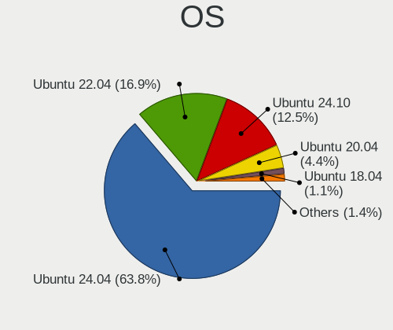
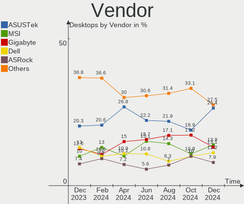
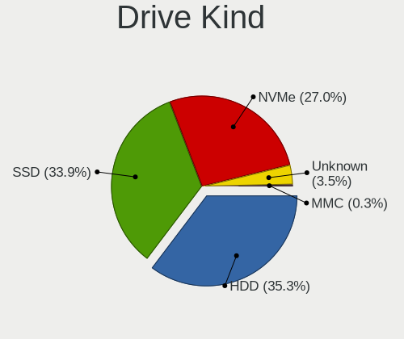
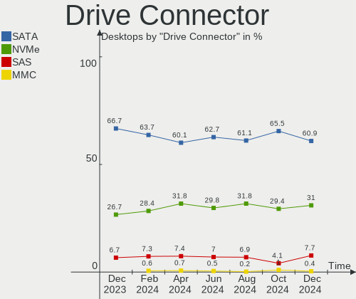
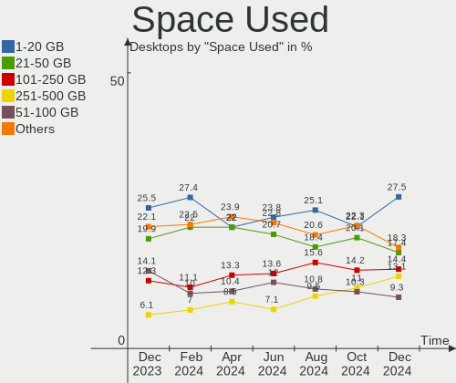
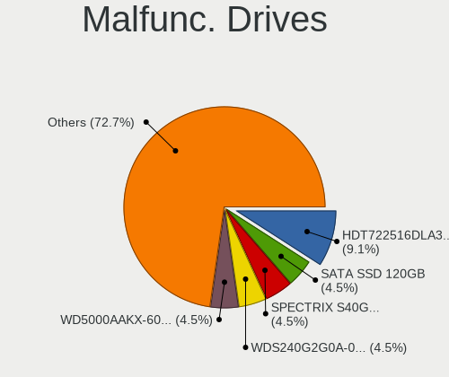
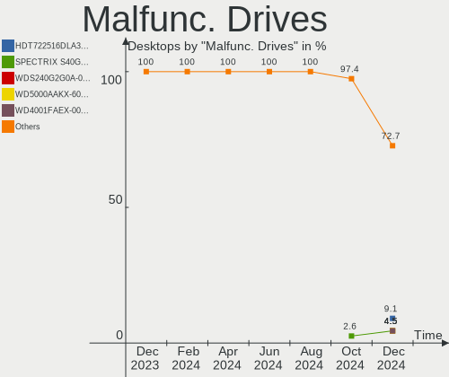
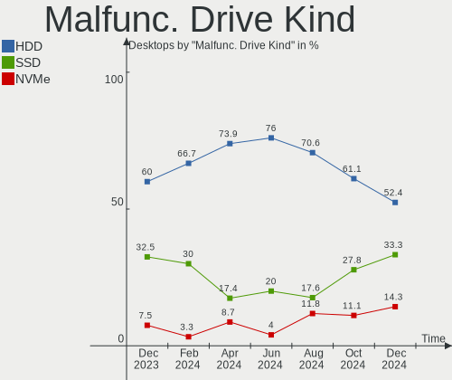
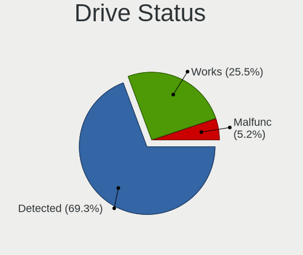
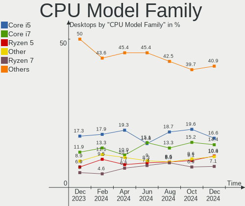

Ubuntu Hardware Trends (Desktop)
--------------------------------

A project to identify most popular hardware characteristics and track their change
over time based on data collected by Ubuntu users at https://Linux-Hardware.org.

Anyone can contribute to the study by uploading probes of their computers by
the [hw-probe](https://github.com/linuxhw/hw-probe) tool:

    sudo hw-probe -all -upload

Full-feature report is available here: https://linux-hardware.org/?view=trends&formfactor=desktop

Period: Nov, 2019.

Contents
--------

- [ OS                       ](#os)
- [ OS Family                ](#os-family)
- [ Kernel                   ](#kernel)
- [ Kernel Family            ](#kernel-family)
- [ Kernel Major Ver.        ](#kernel-major-ver)
- [ Arch                     ](#arch)
- [ DE                       ](#de)
- [ Display Server           ](#display-server)
- [ OS Lang                  ](#os-lang)
- [ Boot Mode                ](#boot-mode)
- [ Filesystem               ](#filesystem)
- [ Dual Boot with Linux     ](#dual-boot-with-linux)
- [ Dual Boot (Win)          ](#dual-boot-win)
- [ Country                  ](#country)
- [ City                     ](#city)
- [ Vendor                   ](#vendor)
- [ Model                    ](#model)
- [ Model Family             ](#model-family)
- [ MFG Year                 ](#mfg-year)
- [ Form Factor              ](#form-factor)
- [ Secure Boot              ](#secure-boot)
- [ Coreboot                 ](#coreboot)
- [ RAM Size                 ](#ram-size)
- [ RAM Used                 ](#ram-used)
- [ Drive Vendor             ](#drive-vendor)
- [ Drive Model              ](#drive-model)
- [ Drive Kind               ](#drive-kind)
- [ Drive Connector          ](#drive-connector)
- [ Drive Size               ](#drive-size)
- [ Space Total              ](#space-total)
- [ Space Used               ](#space-used)
- [ Malfunc. Drives          ](#malfunc-drives)
- [ Malfunc. Drive Vendor    ](#malfunc-drive-vendor)
- [ Malfunc. Drive Kind      ](#malfunc-drive-kind)
- [ Failed Drives            ](#failed-drives)
- [ Failed Drive Vendor      ](#failed-drive-vendor)
- [ Drive Status             ](#drive-status)
- [ CPU Vendor               ](#cpu-vendor)
- [ CPU Model                ](#cpu-model)
- [ CPU Model Family         ](#cpu-model-family)
- [ CPU Cores                ](#cpu-cores)
- [ CPU Sockets              ](#cpu-sockets)
- [ CPU Threads              ](#cpu-threads)
- [ CPU Op-Modes             ](#cpu-op-modes)
- [ CPU Microarch            ](#cpu-microarch)
- [ CPU Microcode            ](#cpu-microcode)
- [ GPU Vendor               ](#gpu-vendor)
- [ GPU Model                ](#gpu-model)
- [ GPU Combo                ](#gpu-combo)
- [ GPU Driver               ](#gpu-driver)
- [ GPU Memory               ](#gpu-memory)
- [ Monitor Vendor           ](#monitor-vendor)
- [ Monitor Model            ](#monitor-model)
- [ Monitor Resolution       ](#monitor-resolution)
- [ Monitor Diagonal         ](#monitor-diagonal)
- [ Monitor Width            ](#monitor-width)
- [ Aspect Ratio             ](#aspect-ratio)
- [ Monitor Area             ](#monitor-area)
- [ Pixel Density            ](#pixel-density)
- [ Multiple Monitors        ](#multiple-monitors)
- [ Net Controller Vendor    ](#net-controller-vendor)
- [ Net Controller Model     ](#net-controller-model)
- [ Net Controller Kind      ](#net-controller-kind)
- [ Used Controller          ](#used-controller)
- [ NICs                     ](#nics)
- [ Unsupported Devices      ](#unsupported-devices)
- [ Unsupported Device Types ](#unsupported-device-types)

OS
--

Installed operating systems

| Name         | Computers | Percent |
|--------------|-----------|---------|
| Ubuntu 18.04 | 222       | 59.2%   |
| Ubuntu 19.10 | 99        | 26.4%   |
| Ubuntu 19.04 | 29        | 7.73%   |
| Ubuntu 16.04 | 18        | 4.8%    |
| Ubuntu 20.04 | 3         | 0.8%    |
| Ubuntu 18.10 | 3         | 0.8%    |
| Ubuntu 17.10 | 1         | 0.27%   |

OS Family
---------

OS without a version

| Name   | Computers | Percent |
|--------|-----------|---------|
| Ubuntu | 375       | 100%    |

Kernel
------

Version of the Linux kernel

| Version                 | Computers | Percent |
|-------------------------|-----------|---------|
| 5.0.0-36-generic        | 71        | 18.93%  |
| 5.0.0-32-generic        | 58        | 15.47%  |
| 5.3.0-23-generic        | 39        | 10.4%   |
| 4.15.0-66-generic       | 39        | 10.4%   |
| 5.3.0-19-generic        | 34        | 9.07%   |
| 4.15.0-70-generic       | 33        | 8.8%    |
| 5.0.0-23-generic        | 13        | 3.47%   |
| 5.3.0-18-generic        | 9         | 2.4%    |
| 5.3.0-21-generic        | 6         | 1.6%    |
| 5.0.0-35-generic        | 5         | 1.33%   |
| 5.0.0-34-generic        | 5         | 1.33%   |
| 4.15.0-66-lowlatency    | 4         | 1.07%   |
| 4.15.0-29-generic       | 4         | 1.07%   |
| 5.3.0-24-generic        | 3         | 0.8%    |
| 5.3.0-22-generic        | 3         | 0.8%    |
| 4.4.0-166-generic       | 3         | 0.8%    |
| 4.18.0-25-generic       | 3         | 0.8%    |
| 5.0.0-37-generic        | 2         | 0.53%   |
| 5.0.0-29-generic        | 2         | 0.53%   |
| 4.4.0-169-generic       | 2         | 0.53%   |
| 4.15.0-69-generic       | 2         | 0.53%   |
| 5.3.7-301.fc31.x86_64   | 1         | 0.27%   |
| 5.3.7-050307-generic    | 1         | 0.27%   |
| 5.3.12-050312-generic   | 1         | 0.27%   |
| 5.3.0-23-lowlatency     | 1         | 0.27%   |
| 5.3.0-20-generic        | 1         | 0.27%   |
| 5.3.0-19-lowlatency     | 1         | 0.27%   |
| 5.1.0-050100-lowlatency | 1         | 0.27%   |
| 5.0.21-050021-generic   | 1         | 0.27%   |
| 5.0.0-33-generic        | 1         | 0.27%   |
| 5.0.0-31-generic        | 1         | 0.27%   |
| 5.0.0-27-generic        | 1         | 0.27%   |
| 5.0.0-25-generic        | 1         | 0.27%   |
| 5.0.0-15-generic        | 1         | 0.27%   |
| 5.0.0-13-generic        | 1         | 0.27%   |
| 4.4.0-168-generic       | 1         | 0.27%   |
| 4.4.0-165-generic       | 1         | 0.27%   |
| 4.4.0-139-generic       | 1         | 0.27%   |
| 4.4.0-137-generic       | 1         | 0.27%   |
| 4.18.0-25-lowlatency    | 1         | 0.27%   |
| 4.15.0-72-generic       | 1         | 0.27%   |
| 4.15.0-71-generic       | 1         | 0.27%   |
| 4.15.0-70-lowlatency    | 1         | 0.27%   |
| 4.15.0-68-lowlatency    | 1         | 0.27%   |
| 4.15.0-68-generic       | 1         | 0.27%   |
| 4.15.0-62-generic       | 1         | 0.27%   |
| 4.15.0-55-generic       | 1         | 0.27%   |
| 4.15.0-51-generic       | 1         | 0.27%   |
| 4.15.0-47-generic       | 1         | 0.27%   |
| 4.15.0-46-generic       | 1         | 0.27%   |
| 4.15.0-22-generic       | 1         | 0.27%   |
| 4.15.0-20-generic       | 1         | 0.27%   |
| 4.13.0-38-generic       | 1         | 0.27%   |
| 4.13.0-36-generic       | 1         | 0.27%   |
| 4.13.0-16-generic       | 1         | 0.27%   |
| 3.13.0-119-generic      | 1         | 0.27%   |

Kernel Family
-------------

Linux kernel without a distro release

| Version | Computers | Percent |
|---------|-----------|---------|
| 5.0.0   | 162       | 43.2%   |
| 5.3.0   | 97        | 25.87%  |
| 4.15.0  | 94        | 25.07%  |
| 4.4.0   | 9         | 2.4%    |
| 4.18.0  | 4         | 1.07%   |
| 4.13.0  | 3         | 0.8%    |
| 5.3.7   | 2         | 0.53%   |
| 5.3.12  | 1         | 0.27%   |
| 5.1.0   | 1         | 0.27%   |
| 5.0.21  | 1         | 0.27%   |
| 3.13.0  | 1         | 0.27%   |

Kernel Major Ver.
-----------------

Linux kernel major version

| Version | Computers | Percent |
|---------|-----------|---------|
| 5.0     | 163       | 43.47%  |
| 5.3     | 100       | 26.67%  |
| 4.15    | 94        | 25.07%  |
| 4.4     | 9         | 2.4%    |
| 4.18    | 4         | 1.07%   |
| 4.13    | 3         | 0.8%    |
| 5.1     | 1         | 0.27%   |
| 3.13    | 1         | 0.27%   |

Arch
----

OS architecture (x86_64, i586, etc.)

| Name   | Computers | Percent |
|--------|-----------|---------|
| x86_64 | 345       | 92%     |
| i686   | 30        | 8%      |

DE
--

Desktop Environment

| Name            | Computers | Percent |
|-----------------|-----------|---------|
| GNOME           | 168       | 44.8%   |
| Unknown         | 156       | 41.6%   |
| XFCE            | 27        | 7.2%    |
| Unity           | 9         | 2.4%    |
| KDE             | 6         | 1.6%    |
| X-Cinnamon      | 2         | 0.53%   |
| LXDE            | 2         | 0.53%   |
| MATE            | 1         | 0.27%   |
| LXQt            | 1         | 0.27%   |
| GNOME Flashback | 1         | 0.27%   |
| Deepin          | 1         | 0.27%   |
| Cinnamon        | 1         | 0.27%   |

Display Server
--------------

X11 or Wayland

| Name    | Computers | Percent |
|---------|-----------|---------|
| Unknown | 195       | 52%     |
| X11     | 176       | 46.93%  |
| Wayland | 4         | 1.07%   |

OS Lang
-------

Language

| Lang    | Computers | Percent |
|---------|-----------|---------|
| Unknown | 191       | 50.93%  |
| en_US   | 56        | 14.93%  |
| de_DE   | 22        | 5.87%   |
| pt_BR   | 16        | 4.27%   |
| fr_FR   | 14        | 3.73%   |
| es_ES   | 10        | 2.67%   |
| en_GB   | 9         | 2.4%    |
| ru_RU   | 7         | 1.87%   |
| it_IT   | 6         | 1.6%    |
| C       | 5         | 1.33%   |
| hu_HU   | 4         | 1.07%   |
| en_CA   | 4         | 1.07%   |
| en_AU   | 3         | 0.8%    |
| zh_CN   | 2         | 0.53%   |
| sl_SI   | 2         | 0.53%   |
| pt_PT   | 2         | 0.53%   |
| nl_NL   | 2         | 0.53%   |
| cs_CZ   | 2         | 0.53%   |
| zh_TW   | 1         | 0.27%   |
| tr_TR   | 1         | 0.27%   |
| th_TH   | 1         | 0.27%   |
| ru_UA   | 1         | 0.27%   |
| ro_RO   | 1         | 0.27%   |
| nl_BE   | 1         | 0.27%   |
| ja_JP   | 1         | 0.27%   |
| hr_HR   | 1         | 0.27%   |
| fr_CH   | 1         | 0.27%   |
| fi_FI   | 1         | 0.27%   |
| es_UY   | 1         | 0.27%   |
| es_MX   | 1         | 0.27%   |
| es_AR   | 1         | 0.27%   |
| en_ZA   | 1         | 0.27%   |
| en_IN   | 1         | 0.27%   |
| en_IE   | 1         | 0.27%   |
| da_DK   | 1         | 0.27%   |
| bg_BG   | 1         | 0.27%   |

Boot Mode
---------

EFI or BIOS

| Mode | Computers | Percent |
|------|-----------|---------|
| BIOS | 251       | 66.93%  |
| EFI  | 124       | 33.07%  |

Filesystem
----------

Type of filesystem

| Type    | Computers | Percent |
|---------|-----------|---------|
| Ext4    | 349       | 93.07%  |
| Overlay | 18        | 4.8%    |
| Btrfs   | 4         | 1.07%   |
| Jfs     | 1         | 0.27%   |
| Ext3    | 1         | 0.27%   |
| Ext2    | 1         | 0.27%   |
| Unknown | 1         | 0.27%   |

Dual Boot with Linux
--------------------

Hosting more than one Linux

| Dual boot | Computers | Percent |
|-----------|-----------|---------|
| No        | 308       | 82.13%  |
| Yes       | 67        | 17.87%  |

Dual Boot (Win)
---------------

Hosting Linux and Windows

| Dual boot | Computers | Percent |
|-----------|-----------|---------|
| No        | 218       | 58.13%  |
| Yes       | 157       | 41.87%  |

Country
-------

Geographic location (country)

| Country                   | Computers | Percent |
|---------------------------|-----------|---------|
| USA                       | 67        | 17.87%  |
| Germany                   | 48        | 12.8%   |
| Brazil                    | 30        | 8%      |
| Italy                     | 24        | 6.4%    |
| Spain                     | 22        | 5.87%   |
| France                    | 21        | 5.6%    |
| Russia                    | 16        | 4.27%   |
| UK                        | 15        | 4%      |
| Netherlands               | 11        | 2.93%   |
| Canada                    | 10        | 2.67%   |
| Czech Republic            | 7         | 1.87%   |
| Australia                 | 7         | 1.87%   |
| Ukraine                   | 6         | 1.6%    |
| Romania                   | 6         | 1.6%    |
| Poland                    | 6         | 1.6%    |
| Hungary                   | 6         | 1.6%    |
| Slovakia                  | 5         | 1.33%   |
| Belgium                   | 5         | 1.33%   |
| Portugal                  | 4         | 1.07%   |
| India                     | 4         | 1.07%   |
| China                     | 4         | 1.07%   |
| Argentina                 | 4         | 1.07%   |
| Switzerland               | 3         | 0.8%    |
| Finland                   | 3         | 0.8%    |
| Bulgaria                  | 3         | 0.8%    |
| Sweden                    | 2         | 0.53%   |
| Slovenia                  | 2         | 0.53%   |
| Singapore                 | 2         | 0.53%   |
| Norway                    | 2         | 0.53%   |
| New Zealand               | 2         | 0.53%   |
| Mexico                    | 2         | 0.53%   |
| Japan                     | 2         | 0.53%   |
| Denmark                   | 2         | 0.53%   |
| Croatia                   | 2         | 0.53%   |
| Vietnam                   | 1         | 0.27%   |
| Uruguay                   | 1         | 0.27%   |
| Turkey                    | 1         | 0.27%   |
| Thailand                  | 1         | 0.27%   |
| Taiwan                    | 1         | 0.27%   |
| South Africa              | 1         | 0.27%   |
| Philippines               | 1         | 0.27%   |
| Morocco                   | 1         | 0.27%   |
| Malaysia                  | 1         | 0.27%   |
| Luxembourg                | 1         | 0.27%   |
| Ireland                   | 1         | 0.27%   |
| Iran, Islamic Republic of | 1         | 0.27%   |
| Iceland                   | 1         | 0.27%   |
| Greece                    | 1         | 0.27%   |
| Egypt                     | 1         | 0.27%   |
| Dominican Republic        | 1         | 0.27%   |
| Colombia                  | 1         | 0.27%   |
| Chile                     | 1         | 0.27%   |
| Bosnia and Herzegovina    | 1         | 0.27%   |
| Austria                   | 1         | 0.27%   |

City
----

Geographic location (city)

| City                 | Computers | Percent |
|----------------------|-----------|---------|
| Moscow               | 7         | 1.87%   |
| São Paulo           | 5         | 1.33%   |
| Berlin               | 5         | 1.33%   |
| Munich               | 4         | 1.07%   |
| Madrid               | 4         | 1.07%   |
| Prague               | 3         | 0.8%    |
| Frankfurt am Main    | 3         | 0.8%    |
| Curitiba             | 3         | 0.8%    |
| Zaragoza             | 2         | 0.53%   |
| Warsaw               | 2         | 0.53%   |
| Vinnytsia            | 2         | 0.53%   |
| The Hague            | 2         | 0.53%   |
| Tampere              | 2         | 0.53%   |
| Saint-Laurent-d'Agny | 2         | 0.53%   |
| Rome                 | 2         | 0.53%   |
| Prešov              | 2         | 0.53%   |
| Olympia              | 2         | 0.53%   |
| Laatzen              | 2         | 0.53%   |
| Kyiv                 | 2         | 0.53%   |
| Krakow               | 2         | 0.53%   |
| Kampong Punggol      | 2         | 0.53%   |
| Hamburg              | 2         | 0.53%   |
| Genoa                | 2         | 0.53%   |
| Cologne              | 2         | 0.53%   |
| Bucharest            | 2         | 0.53%   |
| Belo Horizonte       | 2         | 0.53%   |
| Bath                 | 2         | 0.53%   |
| Avondale             | 2         | 0.53%   |
| Zwolle               | 1         | 0.27%   |
| Zurich               | 1         | 0.27%   |
| Zgierz               | 1         | 0.27%   |
| Zenica               | 1         | 0.27%   |
| Zdanice              | 1         | 0.27%   |
| Zarechnyy            | 1         | 0.27%   |
| Zagreb               | 1         | 0.27%   |
| Zabreh               | 1         | 0.27%   |
| Winterthur           | 1         | 0.27%   |
| Wichita              | 1         | 0.27%   |
| Whangarei            | 1         | 0.27%   |
| Westminster          | 1         | 0.27%   |
| West Memphis         | 1         | 0.27%   |
| Wendlingen am Neckar | 1         | 0.27%   |
| Wegberg              | 1         | 0.27%   |
| Waco                 | 1         | 0.27%   |
| Vlaardingen          | 1         | 0.27%   |
| Vila Nova de Gaia    | 1         | 0.27%   |
| Veroli               | 1         | 0.27%   |
| Varna                | 1         | 0.27%   |
| Valley Heights       | 1         | 0.27%   |
| Vallejo              | 1         | 0.27%   |
| Valinhos             | 1         | 0.27%   |
| Valencia             | 1         | 0.27%   |
| Upper Marlboro       | 1         | 0.27%   |
| Twickenham           | 1         | 0.27%   |
| Turnhout             | 1         | 0.27%   |
| Tucson               | 1         | 0.27%   |
| Trondheim            | 1         | 0.27%   |
| Townsend             | 1         | 0.27%   |
| Tours                | 1         | 0.27%   |
| Torrejón de Ardoz   | 1         | 0.27%   |

Vendor
------

Motherboard manufacturer

| Name                | Computers | Percent |
|---------------------|-----------|---------|
| ASUSTek Computer    | 106       | 28.27%  |
| Gigabyte Technology | 64        | 17.07%  |
| MSI                 | 39        | 10.4%   |
| Dell                | 33        | 8.8%    |
| ASRock              | 30        | 8%      |
| Hewlett-Packard     | 23        | 6.13%   |
| Intel               | 11        | 2.93%   |
| Acer                | 11        | 2.93%   |
| Lenovo              | 10        | 2.67%   |
| Fujitsu             | 7         | 1.87%   |
| Foxconn             | 6         | 1.6%    |
| Pegatron            | 5         | 1.33%   |
| ECS                 | 5         | 1.33%   |
| Medion              | 3         | 0.8%    |
| Biostar             | 3         | 0.8%    |
| Wistron             | 2         | 0.53%   |
| WINCOR NIXDORF      | 1         | 0.27%   |
| Supermicro          | 1         | 0.27%   |
| Shuttle             | 1         | 0.27%   |
| Qbex                | 1         | 0.27%   |
| Positivo            | 1         | 0.27%   |
| PCWare              | 1         | 0.27%   |
| PCChips             | 1         | 0.27%   |
| Packard Bell        | 1         | 0.27%   |
| Megaware            | 1         | 0.27%   |
| Login Informatica   | 1         | 0.27%   |
| JW Technology       | 1         | 0.27%   |
| IBM                 | 1         | 0.27%   |
| Gateway             | 1         | 0.27%   |
| Fujitsu Siemens     | 1         | 0.27%   |
| eMachines           | 1         | 0.27%   |
| Alienware           | 1         | 0.27%   |
| Unknown             | 1         | 0.27%   |

Model
-----

Motherboard model

| Name                            | Computers | Percent |
|---------------------------------|-----------|---------|
| All Series                      | 17        | 4.53%   |
| OptiPlex 745                    | 3         | 0.8%    |
| MS-7A38                         | 3         | 0.8%    |
| H61M-K                          | 3         | 0.8%    |
| H61M-A/BR                       | 3         | 0.8%    |
| Compaq dc5800 Small Form Factor | 3         | 0.8%    |
| X570 AORUS PRO WIFI             | 2         | 0.53%   |
| ProLiant ML110 G6               | 2         | 0.53%   |
| P8Z77-V LX                      | 2         | 0.53%   |
| P8H67                           | 2         | 0.53%   |
| P6T SE                          | 2         | 0.53%   |
| P5K PRO                         | 2         | 0.53%   |
| P35-DS4                         | 2         | 0.53%   |
| OptiPlex 960                    | 2         | 0.53%   |
| OptiPlex 9020                   | 2         | 0.53%   |
| OptiPlex 760                    | 2         | 0.53%   |
| OptiPlex 755                    | 2         | 0.53%   |
| OptiPlex 390                    | 2         | 0.53%   |
| OptiPlex 380                    | 2         | 0.53%   |
| OptiPlex 3020                   | 2         | 0.53%   |
| MS-7C37                         | 2         | 0.53%   |
| MS-7C02                         | 2         | 0.53%   |
| MS-7751                         | 2         | 0.53%   |
| MS-7360                         | 2         | 0.53%   |
| M5A78L-M/USB3                   | 2         | 0.53%   |
| M2N-E                           | 2         | 0.53%   |
| GA-890GPA-UD3H                  | 2         | 0.53%   |
| GA-78LMT-USB3 6.0               | 2         | 0.53%   |
| G31M-ES2L                       | 2         | 0.53%   |
| F2A88XM-D3HP                    | 2         | 0.53%   |
| EliteDesk 800 G1 SFF            | 2         | 0.53%   |
| D3041-A1                        | 2         | 0.53%   |
| Compaq dc7800 Small Form Factor | 2         | 0.53%   |
| B75M-D3H                        | 2         | 0.53%   |
| B450M Pro4                      | 2         | 0.53%   |
| B450 AORUS M                    | 2         | 0.53%   |
| A320M-HD                        | 2         | 0.53%   |
| 970 Pro3 R2.0                   | 2         | 0.53%   |
| ZHAN 99 Pro G1 MT               | 1         | 0.27%   |
| Z87X-UD3H                       | 1         | 0.27%   |
| Z87P-D3                         | 1         | 0.27%   |
| Z87M-D3H                        | 1         | 0.27%   |
| Z77P-D3                         | 1         | 0.27%   |
| Z77-DS3H                        | 1         | 0.27%   |
| Z68X-UD4-B3                     | 1         | 0.27%   |
| Z68 Pro3 Gen3                   | 1         | 0.27%   |
| Z420 Workstation                | 1         | 0.27%   |
| Z390 Taichi                     | 1         | 0.27%   |
| Z390 DESIGNARE                  | 1         | 0.27%   |
| Z390 AORUS ELITE                | 1         | 0.27%   |
| Z270-HD3P                       | 1         | 0.27%   |
| Z270-Gaming K3                  | 1         | 0.27%   |
| Z230 Tower Workstation          | 1         | 0.27%   |
| Z2 Tower G4                     | 1         | 0.27%   |
| Z170-A                          | 1         | 0.27%   |
| Z170 PRO GAMING                 | 1         | 0.27%   |
| Z170 Gaming K4                  | 1         | 0.27%   |
| XPS 8930                        | 1         | 0.27%   |
| XPS 8700                        | 1         | 0.27%   |
| XPS 630i                        | 1         | 0.27%   |

Model Family
------------

Motherboard model prefix

| Name                     | Computers | Percent |
|--------------------------|-----------|---------|
| Dell OptiPlex            | 20        | 5.33%   |
| ASUS All                 | 17        | 4.53%   |
| HP Compaq                | 10        | 2.67%   |
| Lenovo ThinkCentre       | 8         | 2.13%   |
| ASUS PRIME               | 8         | 2.13%   |
| Acer Veriton             | 5         | 1.33%   |
| Acer Aspire              | 5         | 1.33%   |
| Gigabyte GA-78LMT-USB3   | 4         | 1.07%   |
| Gigabyte B450            | 4         | 1.07%   |
| Fujitsu ESPRIMO          | 4         | 1.07%   |
| Dell Precision           | 4         | 1.07%   |
| ASUS M5A78L-M            | 4         | 1.07%   |
| MSI MS-7A38              | 3         | 0.8%    |
| HP EliteDesk             | 3         | 0.8%    |
| Dell XPS                 | 3         | 0.8%    |
| Dell Inspiron            | 3         | 0.8%    |
| ASUS P6T                 | 3         | 0.8%    |
| ASUS P5K                 | 3         | 0.8%    |
| ASUS H61M-K              | 3         | 0.8%    |
| ASUS H61M-A              | 3         | 0.8%    |
| ASRock B450M             | 3         | 0.8%    |
| ASRock 970               | 3         | 0.8%    |
| Wistron ProLiant         | 2         | 0.53%   |
| MSI MS-7C37              | 2         | 0.53%   |
| MSI MS-7C02              | 2         | 0.53%   |
| MSI MS-7751              | 2         | 0.53%   |
| MSI MS-7360              | 2         | 0.53%   |
| HP ProDesk               | 2         | 0.53%   |
| Gigabyte Z390            | 2         | 0.53%   |
| Gigabyte X570            | 2         | 0.53%   |
| Gigabyte P35-DS4         | 2         | 0.53%   |
| Gigabyte H310M           | 2         | 0.53%   |
| Gigabyte GA-890GPA-UD3H  | 2         | 0.53%   |
| Gigabyte G31M-ES2L       | 2         | 0.53%   |
| Gigabyte F2A88XM-D3HP    | 2         | 0.53%   |
| Gigabyte B75M-D3H        | 2         | 0.53%   |
| Gigabyte B450M           | 2         | 0.53%   |
| Fujitsu D3041-A1         | 2         | 0.53%   |
| Foxconn Pro              | 2         | 0.53%   |
| Dell Vostro              | 2         | 0.53%   |
| ASUS WS                  | 2         | 0.53%   |
| ASUS TUF                 | 2         | 0.53%   |
| ASUS P8Z77-V             | 2         | 0.53%   |
| ASUS P8H67               | 2         | 0.53%   |
| ASUS P8B75-M             | 2         | 0.53%   |
| ASUS M5A97               | 2         | 0.53%   |
| ASUS M2N-E               | 2         | 0.53%   |
| ASRock A320M-HD          | 2         | 0.53%   |
| WINCOR NIXDORF BEETLE    | 1         | 0.27%   |
| Supermicro SYS-7048GR-TR | 1         | 0.27%   |
| Shuttle SH370V2          | 1         | 0.27%   |
| Qbex QBEX-HDC-M          | 1         | 0.27%   |
| Positivo POS-EIH61CE     | 1         | 0.27%   |
| Pegatron p6-2120t        | 1         | 0.27%   |
| Pegatron NY537AA-ABA     | 1         | 0.27%   |
| Pegatron NC890AA-ABA     | 1         | 0.27%   |
| Pegatron KJ379AAR-ABA    | 1         | 0.27%   |
| Pegatron IPMSB-H61       | 1         | 0.27%   |
| PCWare PW-945GCX         | 1         | 0.27%   |
| PCChips A13G             | 1         | 0.27%   |

MFG Year
--------

Motherboard manufacture year

| Year    | Computers | Percent |
|---------|-----------|---------|
| 2012    | 43        | 11.47%  |
| 2019    | 41        | 10.93%  |
| 2018    | 37        | 9.87%   |
| 2014    | 35        | 9.33%   |
| 2011    | 28        | 7.47%   |
| 2010    | 28        | 7.47%   |
| 2008    | 27        | 7.2%    |
| 2013    | 25        | 6.67%   |
| 2016    | 21        | 5.6%    |
| 2015    | 20        | 5.33%   |
| 2017    | 18        | 4.8%    |
| 2009    | 18        | 4.8%    |
| 2007    | 14        | 3.73%   |
| 2006    | 9         | 2.4%    |
| 2005    | 3         | 0.8%    |
| 2004    | 2         | 0.53%   |
| 2001    | 2         | 0.53%   |
| Unknown | 2         | 0.53%   |
| 2003    | 1         | 0.27%   |
| 2002    | 1         | 0.27%   |

Form Factor
-----------

Physical design of the computer

| Name    | Computers | Percent |
|---------|-----------|---------|
| Desktop | 375       | 100%    |

Secure Boot
-----------

Enabled or disabled

| State    | Computers | Percent |
|----------|-----------|---------|
| Disabled | 359       | 95.73%  |
| Enabled  | 16        | 4.27%   |

Coreboot
--------

Have coreboot on board

| Used | Computers | Percent |
|------|-----------|---------|
| No   | 375       | 100%    |

RAM Size
--------

Total RAM memory

| Size in GB  | Computers | Percent |
|-------------|-----------|---------|
| 3.01-4.0    | 88        | 23.47%  |
| 8.01-16.0   | 82        | 21.87%  |
| 16.01-24.0  | 77        | 20.53%  |
| 4.01-8.0    | 51        | 13.6%   |
| 32.01-64.0  | 23        | 6.13%   |
| 1.01-2.0    | 23        | 6.13%   |
| 64.01-256.0 | 11        | 2.93%   |
| 2.01-3.0    | 9         | 2.4%    |
| 24.01-32.0  | 6         | 1.6%    |
| 0.01-1.0    | 4         | 1.07%   |
| Unknown     | 1         | 0.27%   |

RAM Used
--------

Used RAM memory

| Used GB    | Computers | Percent |
|------------|-----------|---------|
| 1.01-2.0   | 170       | 45.33%  |
| 2.01-3.0   | 102       | 27.2%   |
| 3.01-4.0   | 33        | 8.8%    |
| 0.01-1.0   | 31        | 8.27%   |
| 4.01-8.0   | 27        | 7.2%    |
| 8.01-16.0  | 7         | 1.87%   |
| Unknown    | 2         | 0.53%   |
| 32.01-64.0 | 1         | 0.27%   |
| 24.01-32.0 | 1         | 0.27%   |
| 16.01-24.0 | 1         | 0.27%   |

Drive Vendor
------------

Hard drive vendors

| Vendor              | Computers | Drives | Percent |
|---------------------|-----------|--------|---------|
| Seagate             | 139       | 168    | 23.44%  |
| WDC                 | 135       | 163    | 22.77%  |
| Samsung Electronics | 84        | 96     | 14.17%  |
| Toshiba             | 40        | 43     | 6.75%   |
| Kingston            | 29        | 30     | 4.89%   |
| Hitachi             | 25        | 26     | 4.22%   |
| SanDisk             | 22        | 24     | 3.71%   |
| Crucial             | 20        | 20     | 3.37%   |
| MAXTOR              | 14        | 15     | 2.36%   |
| Intel               | 11        | 11     | 1.85%   |
| OCZ                 | 8         | 8      | 1.35%   |
| Transcend           | 5         | 5      | 0.84%   |
| Corsair             | 5         | 5      | 0.84%   |
| China               | 5         | 5      | 0.84%   |
| PLEXTOR             | 4         | 4      | 0.67%   |
| Patriot             | 4         | 4      | 0.67%   |
| HGST                | 4         | 4      | 0.67%   |
| SPCC                | 3         | 3      | 0.51%   |
| Generic             | 3         | 3      | 0.51%   |
| Apacer              | 3         | 3      | 0.51%   |
| Team                | 2         | 2      | 0.34%   |
| Micron Technology   | 2         | 2      | 0.34%   |
| JMicron             | 2         | 2      | 0.34%   |
| Intenso             | 2         | 2      | 0.34%   |
| GOODRAM             | 2         | 3      | 0.34%   |
| ASMT                | 2         | 2      | 0.34%   |
| A-DATA Technology   | 2         | 2      | 0.34%   |
| Vi550               | 1         | 1      | 0.17%   |
| Unknown             | 1         | 1      | 0.17%   |
| SK Hynix            | 1         | 1      | 0.17%   |
| PNY                 | 1         | 1      | 0.17%   |
| OCZ-VERTEX          | 1         | 1      | 0.17%   |
| Mushkin             | 1         | 1      | 0.17%   |
| LITEONIT            | 1         | 1      | 0.17%   |
| LITEON              | 1         | 1      | 0.17%   |
| Lexar               | 1         | 1      | 0.17%   |
| KingSpec            | 1         | 1      | 0.17%   |
| Hewlett-Packard     | 1         | 2      | 0.17%   |
| Gigabyte Technology | 1         | 1      | 0.17%   |
| faspeed             | 1         | 1      | 0.17%   |
| ASMT109x            | 1         | 1      | 0.17%   |
| Apple               | 1         | 1      | 0.17%   |
| AMD                 | 1         | 1      | 0.17%   |

Drive Model
-----------

Hard drive models

| Model                    | Computers | Percent |
|--------------------------|-----------|---------|
| ST500DM002-1BD142 500GB  | 15        | 2.23%   |
| SSD 850 EVO 250GB        | 9         | 1.34%   |
| SA400S37240G 240GB SSD   | 8         | 1.19%   |
| WD20EZRZ-00Z5HB0 2TB     | 7         | 1.04%   |
| ST3500418AS 500GB        | 7         | 1.04%   |
| ST3500413AS 500GB        | 7         | 1.04%   |
| SSD 860 EVO 250GB        | 7         | 1.04%   |
| DT01ACA050 500GB         | 7         | 1.04%   |
| ST1000DM003-1CH162 1TB   | 6         | 0.89%   |
| SA400S37120G 120GB SSD   | 6         | 0.89%   |
| WD10EZEX-22MFCA0 1TB     | 5         | 0.74%   |
| SV300S37A120G 120GB SSD  | 5         | 0.74%   |
| ST4000DM004-2CV104 4TB   | 5         | 0.74%   |
| ST1000DM010-2EP102 1TB   | 5         | 0.74%   |
| ST1000DM003-1ER162 1TB   | 5         | 0.74%   |
| SSD 860 EVO 1TB          | 5         | 0.74%   |
| SSD 840 EVO 120GB        | 5         | 0.74%   |
| DT01ACA200 2TB           | 5         | 0.74%   |
| DT01ACA100 1TB           | 5         | 0.74%   |
| WD20EFRX-68EUZN0 2TB     | 4         | 0.6%    |
| WD10EZEX-08WN4A0 1TB     | 4         | 0.6%    |
| Ultra II 480GB SSD       | 4         | 0.6%    |
| ST2000DM001-1CH164 2TB   | 4         | 0.6%    |
| ST1000DM003-9YN162 1TB   | 4         | 0.6%    |
| ST1000DM003-1SB102 1TB   | 4         | 0.6%    |
| SSD 850 EVO 500GB        | 4         | 0.6%    |
| SATA 120GB SSD           | 4         | 0.6%    |
| DT01ACA300 3TB           | 4         | 0.6%    |
| CT120BX500SSD1 120GB     | 4         | 0.6%    |
| 6Y080L0 81GB             | 4         | 0.6%    |
| WD5000AAKX-22ERMA0 500GB | 3         | 0.45%   |
| WD5000AAKX-001CA0 500GB  | 3         | 0.45%   |
| WD5000AADS-00S9B0 500GB  | 3         | 0.45%   |
| WD40EZRZ-00GXCB0 4TB     | 3         | 0.45%   |
| WD40EFRX-68N32N0 4TB     | 3         | 0.45%   |
| WD10EZRX-00A8LB0 1TB     | 3         | 0.45%   |
| WD10EARS-00Y5B1 1TB      | 3         | 0.45%   |
| ST3500312CS 500GB        | 3         | 0.45%   |
| ST3250410AS 250GB        | 3         | 0.45%   |
| ST250DM000-1BD141 250GB  | 3         | 0.45%   |
| ST2000DX002-2DV164 2TB   | 3         | 0.45%   |
| ST2000DM006-2DM164 2TB   | 3         | 0.45%   |
| SSD 840 EVO 250GB        | 3         | 0.45%   |
| Solid State Disk 128GB   | 3         | 0.45%   |
| HDWD110 1TB              | 3         | 0.45%   |
| HD322HJ 320GB            | 3         | 0.45%   |
| HD160JJ 160GB            | 3         | 0.45%   |
| HD154UI 1TB              | 3         | 0.45%   |
| HD103SJ 1TB              | 3         | 0.45%   |
| Expansion Desk 5TB       | 3         | 0.45%   |
| CT1000MX500SSD1 1TB      | 3         | 0.45%   |
| WD6400AACS-00G8B1 640GB  | 2         | 0.3%    |
| WD5000AAKX-00ERMA0 500GB | 2         | 0.3%    |
| WD5000AAKX-003CA0 500GB  | 2         | 0.3%    |
| WD30EZRX-00DC0B0 3TB     | 2         | 0.3%    |
| WD20EARX-00ZUDB0 2TB     | 2         | 0.3%    |
| WD20EARX-00PASB0 2TB     | 2         | 0.3%    |
| WD10EZEX-60WN4A0 1TB     | 2         | 0.3%    |
| WD10EZEX-08M2NA0 1TB     | 2         | 0.3%    |
| WD10EZEX-00BN5A0 1TB     | 2         | 0.3%    |

Drive Kind
----------

HDD or SSD

| Kind    | Computers | Drives | Percent |
|---------|-----------|--------|---------|
| HDD     | 307       | 447    | 62.53%  |
| SSD     | 170       | 209    | 34.62%  |
| Unknown | 10        | 11     | 2.04%   |
| NVMe    | 4         | 5      | 0.81%   |

Drive Connector
---------------

SATA, SAS, NVMe, etc.

| Type | Computers | Drives | Percent |
|------|-----------|--------|---------|
| SATA | 364       | 645    | 93.57%  |
| SAS  | 21        | 22     | 5.4%    |
| NVMe | 4         | 5      | 1.03%   |

Drive Size
----------

Size of hard drive

| Size in TB | Computers | Drives | Percent |
|------------|-----------|--------|---------|
| 0.01-0.5   | 302       | 415    | 57.31%  |
| 0.51-1.0   | 125       | 147    | 23.72%  |
| 1.01-2.0   | 54        | 61     | 10.25%  |
| 3.01-4.0   | 21        | 22     | 3.98%   |
| 2.01-3.0   | 15        | 16     | 2.85%   |
| 4.01-10.0  | 8         | 9      | 1.52%   |
| Unknown    | 2         | 2      | 0.38%   |

Space Total
-----------

Amount of disk space available on the file system

| Size in GB     | Computers | Percent |
|----------------|-----------|---------|
| 101-250        | 87        | 23.2%   |
| 251-500        | 83        | 22.13%  |
| 501-1000       | 55        | 14.67%  |
| 1001-2000      | 36        | 9.6%    |
| 51-100         | 33        | 8.8%    |
| More than 3000 | 20        | 5.33%   |
| 21-50          | 19        | 5.07%   |
| 2001-3000      | 18        | 4.8%    |
| 1-20           | 16        | 4.27%   |
| Unknown        | 8         | 2.13%   |

Space Used
----------

Amount of used disk space

| Used GB        | Computers | Percent |
|----------------|-----------|---------|
| 1-20           | 150       | 40%     |
| 21-50          | 61        | 16.27%  |
| 101-250        | 44        | 11.73%  |
| 51-100         | 35        | 9.33%   |
| 501-1000       | 25        | 6.67%   |
| 251-500        | 24        | 6.4%    |
| 1001-2000      | 15        | 4%      |
| More than 3000 | 8         | 2.13%   |
| Unknown        | 8         | 2.13%   |
| 2001-3000      | 5         | 1.33%   |

Malfunc. Drives
---------------

Drive models with a malfunction

| Model                    | Computers | Drives | Percent |
|--------------------------|-----------|--------|---------|
| WD2500AAKX-75U6AA0 250GB | 1         | 1      | 16.67%  |
| WD2000JS-00MHB0 200GB    | 1         | 1      | 16.67%  |
| ST3500312CS 500GB        | 1         | 1      | 16.67%  |
| ST3320410SV 320GB        | 1         | 1      | 16.67%  |
| SSDSC2BW120H6 120GB      | 1         | 1      | 16.67%  |
| MD04ACA400 4TB           | 1         | 1      | 16.67%  |

Malfunc. Drive Vendor
---------------------

Vendors of faulty drives

| Vendor  | Computers | Drives | Percent |
|---------|-----------|--------|---------|
| WDC     | 2         | 2      | 33.33%  |
| Seagate | 2         | 2      | 33.33%  |
| Toshiba | 1         | 1      | 16.67%  |
| Intel   | 1         | 1      | 16.67%  |

Malfunc. Drive Kind
-------------------

Kinds of faulty drives

| Kind | Computers | Drives | Percent |
|------|-----------|--------|---------|
| HDD  | 5         | 5      | 83.33%  |
| SSD  | 1         | 1      | 16.67%  |

Failed Drives
-------------

Failed drive models

Zero info for selected period =(

Failed Drive Vendor
-------------------

Failed drive vendors

Zero info for selected period =(

Drive Status
------------

Number of failed and malfunc. drives

| Status   | Computers | Drives | Percent |
|----------|-----------|--------|---------|
| Detected | 342       | 623    | 91.69%  |
| Works    | 25        | 43     | 6.7%    |
| Malfunc  | 6         | 6      | 1.61%   |

CPU Vendor
----------

Processor vendors

| Vendor | Computers | Percent |
|--------|-----------|---------|
| Intel  | 259       | 69.07%  |
| AMD    | 116       | 30.93%  |

CPU Model
---------

Processor models

| Model                                       | Computers | Percent |
|---------------------------------------------|-----------|---------|
| Intel Core 2 Duo CPU E8400 @ 3.00GHz        | 8         | 2.13%   |
| Intel Core i7-4770 CPU @ 3.40GHz            | 6         | 1.6%    |
| Intel Core i5-3470 CPU @ 3.20GHz            | 6         | 1.6%    |
| Intel Core i5-2400 CPU @ 3.10GHz            | 6         | 1.6%    |
| AMD FX-8350 Eight-Core Processor            | 6         | 1.6%    |
| Intel Core i7-3770 CPU @ 3.40GHz            | 5         | 1.33%   |
| Intel Core i5-7500 CPU @ 3.40GHz            | 5         | 1.33%   |
| Intel Core i3-2120 CPU @ 3.30GHz            | 5         | 1.33%   |
| Intel Core 2 Quad CPU Q6600 @ 2.40GHz       | 5         | 1.33%   |
| AMD Ryzen 5 2600 Six-Core Processor         | 5         | 1.33%   |
| Intel Core i7-4790K CPU @ 4.00GHz           | 4         | 1.07%   |
| Intel Core i5-6500 CPU @ 3.20GHz            | 4         | 1.07%   |
| Intel Core i5-3330 CPU @ 3.00GHz            | 4         | 1.07%   |
| Intel Core i3-8100 CPU @ 3.60GHz            | 4         | 1.07%   |
| Intel Core i3-3220 CPU @ 3.30GHz            | 4         | 1.07%   |
| Intel Core i3-2100 CPU @ 3.10GHz            | 4         | 1.07%   |
| Intel Core 2 Duo CPU E7500 @ 2.93GHz        | 4         | 1.07%   |
| Intel Core 2 Duo CPU E6750 @ 2.66GHz        | 4         | 1.07%   |
| AMD Ryzen 3 2200G with Radeon Vega Graphics | 4         | 1.07%   |
| Intel Core i7-6700 CPU @ 3.40GHz            | 3         | 0.8%    |
| Intel Core i7-3770K CPU @ 3.50GHz           | 3         | 0.8%    |
| Intel Core i7-2600K CPU @ 3.40GHz           | 3         | 0.8%    |
| Intel Core i5-8400 CPU @ 2.80GHz            | 3         | 0.8%    |
| Intel Core i5-4590 CPU @ 3.30GHz            | 3         | 0.8%    |
| Intel Core i5-4440 CPU @ 3.10GHz            | 3         | 0.8%    |
| Intel Core i5-3570K CPU @ 3.40GHz           | 3         | 0.8%    |
| Intel Core i5-3570 CPU @ 3.40GHz            | 3         | 0.8%    |
| Intel Core i3-6100 CPU @ 3.70GHz            | 3         | 0.8%    |
| Intel Core 2 Quad CPU Q9400 @ 2.66GHz       | 3         | 0.8%    |
| Intel Core 2 Duo CPU E7300 @ 2.66GHz        | 3         | 0.8%    |
| AMD Ryzen 7 2700 Eight-Core Processor       | 3         | 0.8%    |
| AMD Ryzen 7 1700X Eight-Core Processor      | 3         | 0.8%    |
| AMD FX-8320 Eight-Core Processor            | 3         | 0.8%    |
| AMD FX-6300 Six-Core Processor              | 3         | 0.8%    |
| AMD FX-4300 Quad-Core Processor             | 3         | 0.8%    |
| AMD Athlon II X2 250 Processor              | 3         | 0.8%    |
| AMD Athlon 64 Processor 3200+               | 3         | 0.8%    |
| Intel Pentium Dual-Core CPU E6700 @ 3.20GHz | 2         | 0.53%   |
| Intel Pentium Dual-Core CPU E6600 @ 3.06GHz | 2         | 0.53%   |
| Intel Pentium Dual-Core CPU E5300 @ 2.60GHz | 2         | 0.53%   |
| Intel Pentium Dual CPU E2180 @ 2.00GHz      | 2         | 0.53%   |
| Intel Pentium D CPU 2.80GHz                 | 2         | 0.53%   |
| Intel Pentium CPU G4560 @ 3.50GHz           | 2         | 0.53%   |
| Intel Pentium CPU G3220 @ 3.00GHz           | 2         | 0.53%   |
| Intel Pentium 4 CPU 3.00GHz                 | 2         | 0.53%   |
| Intel Pentium 4 CPU 2.40GHz                 | 2         | 0.53%   |
| Intel Core i9-9980XE CPU @ 3.00GHz          | 2         | 0.53%   |
| Intel Core i7-8700K CPU @ 3.70GHz           | 2         | 0.53%   |
| Intel Core i7-7700 CPU @ 3.60GHz            | 2         | 0.53%   |
| Intel Core i7-2600 CPU @ 3.40GHz            | 2         | 0.53%   |
| Intel Core i5-8500 CPU @ 3.00GHz            | 2         | 0.53%   |
| Intel Core i5-7400 CPU @ 3.00GHz            | 2         | 0.53%   |
| Intel Core i5-4690 CPU @ 3.50GHz            | 2         | 0.53%   |
| Intel Core i5-4570 CPU @ 3.20GHz            | 2         | 0.53%   |
| Intel Core i5-3350P CPU @ 3.10GHz           | 2         | 0.53%   |
| Intel Core i5-2500K CPU @ 3.30GHz           | 2         | 0.53%   |
| Intel Core i5-2500 CPU @ 3.30GHz            | 2         | 0.53%   |
| Intel Core i5 CPU 760 @ 2.80GHz             | 2         | 0.53%   |
| Intel Core i5 CPU 650 @ 3.20GHz             | 2         | 0.53%   |
| Intel Core i3-4150 CPU @ 3.50GHz            | 2         | 0.53%   |

CPU Model Family
----------------

Processor model prefix

| Model                   | Computers | Percent |
|-------------------------|-----------|---------|
| Intel Core i5           | 73        | 19.47%  |
| Intel Core i7           | 43        | 11.47%  |
| Intel Core i3           | 27        | 7.2%    |
| Intel Core 2 Duo        | 27        | 7.2%    |
| AMD FX                  | 21        | 5.6%    |
| AMD Ryzen 5             | 16        | 4.27%   |
| Intel Xeon              | 14        | 3.73%   |
| Intel Core 2 Quad       | 14        | 3.73%   |
| AMD Athlon 64 X2        | 12        | 3.2%    |
| AMD Ryzen 7             | 11        | 2.93%   |
| Intel Pentium           | 10        | 2.67%   |
| Intel Celeron           | 10        | 2.67%   |
| Intel Pentium Dual-Core | 8         | 2.13%   |
| Intel Pentium 4         | 8         | 2.13%   |
| AMD Ryzen 3             | 7         | 1.87%   |
| Intel Core i9           | 6         | 1.6%    |
| Intel Core 2            | 6         | 1.6%    |
| AMD Athlon II X2        | 6         | 1.6%    |
| AMD Athlon              | 6         | 1.6%    |
| AMD A10                 | 6         | 1.6%    |
| AMD Phenom II X4        | 5         | 1.33%   |
| AMD Phenom              | 5         | 1.33%   |
| Intel Atom              | 4         | 1.07%   |
| AMD Athlon 64           | 4         | 1.07%   |
| Intel Pentium Dual      | 3         | 0.8%    |
| Intel Pentium D         | 3         | 0.8%    |
| AMD Athlon II X4        | 3         | 0.8%    |
| AMD Ryzen Threadripper  | 2         | 0.53%   |
| AMD Athlon II X3        | 2         | 0.53%   |
| AMD A8                  | 2         | 0.53%   |
| Intel Pentium Silver    | 1         | 0.27%   |
| Intel Genuine           | 1         | 0.27%   |
| Intel Core 2 Extreme    | 1         | 0.27%   |
| AMD Sempron X2          | 1         | 0.27%   |
| AMD Ryzen 9             | 1         | 0.27%   |
| AMD Phenom II X6        | 1         | 0.27%   |
| AMD C-70                | 1         | 0.27%   |
| AMD Athlon XP           | 1         | 0.27%   |
| AMD Athlon X4           | 1         | 0.27%   |
| AMD A6                  | 1         | 0.27%   |
| AMD A4                  | 1         | 0.27%   |

CPU Cores
---------

Number of processor cores

| Number  | Computers | Percent |
|---------|-----------|---------|
| 4       | 170       | 45.33%  |
| 2       | 127       | 33.87%  |
| 6       | 27        | 7.2%    |
| 1       | 17        | 4.53%   |
| 8       | 16        | 4.27%   |
| 3       | 9         | 2.4%    |
| 18      | 2         | 0.53%   |
| 32      | 1         | 0.27%   |
| 28      | 1         | 0.27%   |
| 16      | 1         | 0.27%   |
| 14      | 1         | 0.27%   |
| 12      | 1         | 0.27%   |
| 10      | 1         | 0.27%   |
| Unknown | 1         | 0.27%   |

CPU Sockets
-----------

Number of sockets

| Number  | Computers | Percent |
|---------|-----------|---------|
| 1       | 373       | 99.47%  |
| 2       | 1         | 0.27%   |
| Unknown | 1         | 0.27%   |

CPU Threads
-----------

Threads per core (Hyper-Threading)

| Number  | Computers | Percent |
|---------|-----------|---------|
| 1       | 221       | 58.93%  |
| 2       | 153       | 40.8%   |
| Unknown | 1         | 0.27%   |

CPU Op-Modes
------------

CPU Operation Modes (32-bit, 64-bit)

| Op mode        | Computers | Percent |
|----------------|-----------|---------|
| 32-bit, 64-bit | 361       | 96.27%  |
| Unknown        | 8         | 2.13%   |
| 32-bit         | 6         | 1.6%    |

CPU Microarch
-------------

Microarchitecture

| Name          | Computers | Percent |
|---------------|-----------|---------|
| Core          | 65        | 17.33%  |
| Skylake       | 49        | 13.07%  |
| IvyBridge     | 37        | 9.87%   |
| SandyBridge   | 36        | 9.6%    |
| Haswell       | 36        | 9.6%    |
| K10           | 24        | 6.4%    |
| Piledriver    | 20        | 5.33%   |
| K8 Hammer     | 17        | 4.53%   |
| Zen           | 15        | 4%      |
| Zen+          | 14        | 3.73%   |
| NetBurst      | 11        | 2.93%   |
| Nehalem       | 9         | 2.4%    |
| Zen 2         | 8         | 2.13%   |
| Steamroller   | 6         | 1.6%    |
| Jaguar        | 4         | 1.07%   |
| Bulldozer     | 4         | 1.07%   |
| Bonnell       | 4         | 1.07%   |
| Westmere      | 3         | 0.8%    |
| Silvermont    | 3         | 0.8%    |
| KabyLake      | 3         | 0.8%    |
| Penryn        | 1         | 0.27%   |
| K6            | 1         | 0.27%   |
| K10 Llano     | 1         | 0.27%   |
| K10 Liano     | 1         | 0.27%   |
| Goldmont plus | 1         | 0.27%   |
| Broadwell     | 1         | 0.27%   |
| Bobcat        | 1         | 0.27%   |

CPU Microcode
-------------

Microcode number

| Number     | Computers | Percent |
|------------|-----------|---------|
| Unknown    | 42        | 11.2%   |
| 0x306c3    | 33        | 8.8%    |
| 0x306a9    | 32        | 8.53%   |
| 0x206a7    | 32        | 8.53%   |
| 0x1067a    | 27        | 7.2%    |
| 0x06000852 | 15        | 4%      |
| 0x906ea    | 13        | 3.47%   |
| 0x906e9    | 12        | 3.2%    |
| 0x506e3    | 12        | 3.2%    |
| 0x010000c8 | 11        | 2.93%   |
| 0x6fb      | 10        | 2.67%   |
| 0x6fd      | 8         | 2.13%   |
| 0x10676    | 8         | 2.13%   |
| 0x08701013 | 8         | 2.13%   |
| 0x6f6      | 5         | 1.33%   |
| 0x50654    | 5         | 1.33%   |
| 0x106e5    | 5         | 1.33%   |
| 0x08001138 | 5         | 1.33%   |
| 0x06003106 | 5         | 1.33%   |
| 0x906eb    | 4         | 1.07%   |
| 0x106ca    | 4         | 1.07%   |
| 0x0800820d | 4         | 1.07%   |
| 0x0800820b | 4         | 1.07%   |
| 0x0700010f | 4         | 1.07%   |
| 0x0600063e | 4         | 1.07%   |
| 0x01000083 | 4         | 1.07%   |
| 0x206d7    | 3         | 0.8%    |
| 0x106a5    | 3         | 0.8%    |
| 0x08108109 | 3         | 0.8%    |
| 0x08001129 | 3         | 0.8%    |
| 0x010000db | 3         | 0.8%    |
| 0xf47      | 2         | 0.53%   |
| 0xf43      | 2         | 0.53%   |
| 0xf29      | 2         | 0.53%   |
| 0xf27      | 2         | 0.53%   |
| 0x306f2    | 2         | 0.53%   |
| 0x30678    | 2         | 0.53%   |
| 0x10677    | 2         | 0.53%   |
| 0x08101016 | 2         | 0.53%   |
| 0x0810100b | 2         | 0.53%   |
| 0x08008206 | 2         | 0.53%   |
| 0x08001137 | 2         | 0.53%   |
| 0x06001119 | 2         | 0.53%   |
| 0x03000027 | 2         | 0.53%   |
| 0xf65      | 1         | 0.27%   |
| 0xf41      | 1         | 0.27%   |
| 0xf33      | 1         | 0.27%   |
| 0x906ec    | 1         | 0.27%   |
| 0x706a1    | 1         | 0.27%   |
| 0x6f7      | 1         | 0.27%   |
| 0x6f2      | 1         | 0.27%   |
| 0x406c4    | 1         | 0.27%   |
| 0x306e4    | 1         | 0.27%   |
| 0x206c2    | 1         | 0.27%   |
| 0x20655    | 1         | 0.27%   |
| 0x20652    | 1         | 0.27%   |
| 0x106a4    | 1         | 0.27%   |
| 0x10661    | 1         | 0.27%   |
| 0x0500010d | 1         | 0.27%   |
| 0x010000dc | 1         | 0.27%   |

GPU Vendor
----------

Vendors of graphics cards

| Vendor                           | Computers | Percent |
|----------------------------------|-----------|---------|
| Nvidia                           | 157       | 39.45%  |
| AMD                              | 121       | 30.4%   |
| Intel                            | 118       | 29.65%  |
| Silicon Integrated Systems [SiS] | 1         | 0.25%   |
| Matrox Electronics Systems       | 1         | 0.25%   |

GPU Model
---------

Graphics card models

| Model                                                                 | Computers | Percent |
|-----------------------------------------------------------------------|-----------|---------|
| 2nd Generation Core Processor Family Integrated Graphics Controller   | 22        | 5.42%   |
| Ellesmere [Radeon RX 470/480/570/570X/580/580X/590]                   | 18        | 4.43%   |
| Xeon E3-1200 v2/3rd Gen Core processor Graphics Controller            | 17        | 4.19%   |
| Xeon E3-1200 v3/4th Gen Core Processor Integrated Graphics Controller | 16        | 3.94%   |
| GK208B [GeForce GT 710]                                               | 11        | 2.71%   |
| GP106 [GeForce GTX 1060 6GB]                                          | 9         | 2.22%   |
| GT218 [GeForce 210]                                                   | 8         | 1.97%   |
| GP107 [GeForce GTX 1050 Ti]                                           | 8         | 1.97%   |
| Caicos [Radeon HD 6450/7450/8450 / R5 230 OEM]                        | 8         | 1.97%   |
| 4 Series Chipset Integrated Graphics Controller                       | 8         | 1.97%   |
| HD Graphics 530                                                       | 7         | 1.72%   |
| UHD Graphics 630 (Desktop)                                            | 6         | 1.48%   |
| HD Graphics 630                                                       | 6         | 1.48%   |
| Raven Ridge [Radeon Vega Series / Radeon Vega Mobile Series]          | 5         | 1.23%   |
| GF119 [GeForce GT 610]                                                | 5         | 1.23%   |
| RV710 [Radeon HD 4350/4550]                                           | 4         | 0.99%   |
| RS780L [Radeon 3000]                                                  | 4         | 0.99%   |
| Kaveri [Radeon R7 Graphics]                                           | 4         | 0.99%   |
| Kabini [Radeon HD 8400 / R3 Series]                                   | 4         | 0.99%   |
| GM107 [GeForce GTX 750 Ti]                                            | 4         | 0.99%   |
| Cedar [Radeon HD 5000/6000/7350/8350 Series]                          | 4         | 0.99%   |
| Baffin [Radeon RX 460/560D / Pro 450/455/460/555/555X/560/560X]       | 4         | 0.99%   |
| 82945G/GZ Integrated Graphics Controller                              | 4         | 0.99%   |
| Vega 10 XL/XT [Radeon RX Vega 56/64]                                  | 3         | 0.74%   |
| TU106 [GeForce RTX 2060 Rev. A]                                       | 3         | 0.74%   |
| RS880 [Radeon HD 4290]                                                | 3         | 0.74%   |
| Picasso                                                               | 3         | 0.74%   |
| GP106 [GeForce GTX 1060 3GB]                                          | 3         | 0.74%   |
| GM204 [GeForce GTX 970]                                               | 3         | 0.74%   |
| GM107 [GeForce GTX 745]                                               | 3         | 0.74%   |
| GF116 [GeForce GTX 550 Ti]                                            | 3         | 0.74%   |
| GF108 [GeForce GT 730]                                                | 3         | 0.74%   |
| G98 [GeForce 8400 GS Rev. 2]                                          | 3         | 0.74%   |
| C61 [GeForce 7025 / nForce 630a]                                      | 3         | 0.74%   |
| C61 [GeForce 6150SE nForce 430]                                       | 3         | 0.74%   |
| Atom Processor D4xx/D5xx/N4xx/N5xx Integrated Graphics Controller     | 3         | 0.74%   |
| 8th Gen Core Processor Gaussian Mixture Model                         | 3         | 0.74%   |
| 82Q963/Q965 Integrated Graphics Controller                            | 3         | 0.74%   |
| 82Q33 Express Integrated Graphics Controller                          | 3         | 0.74%   |
| 4th Generation Core Processor Family Integrated Graphics Controller   | 3         | 0.74%   |
| Turks PRO [Radeon HD 6570/7570/8550]                                  | 2         | 0.49%   |
| Turks GL [FirePro V3900]                                              | 2         | 0.49%   |
| TU106 [GeForce RTX 2060 SUPER]                                        | 2         | 0.49%   |
| Trinity [Radeon HD 7660D]                                             | 2         | 0.49%   |
| Tonga XT / Amethyst XT [Radeon R9 380X / R9 M295X]                    | 2         | 0.49%   |
| RV730 PRO [Radeon HD 4650]                                            | 2         | 0.49%   |
| RV635 [Radeon HD 3650/3750/4570/4580]                                 | 2         | 0.49%   |
| RV620 LE [Radeon HD 3450]                                             | 2         | 0.49%   |
| RS880 [Radeon HD 4200]                                                | 2         | 0.49%   |
| RS780 [Radeon HD 3200]                                                | 2         | 0.49%   |
| Oland XT [Radeon HD 8670 / R7 250/350]                                | 2         | 0.49%   |
| NV43 [GeForce 6600 GT]                                                | 2         | 0.49%   |
| Lexa PRO [Radeon 540/540X/550/550X / RX 540X/550/550X]                | 2         | 0.49%   |
| HD Graphics 510                                                       | 2         | 0.49%   |
| Hawaii XT / Grenada XT [Radeon R9 290X/390X]                          | 2         | 0.49%   |
| GP107 [GeForce GTX 1050]                                              | 2         | 0.49%   |
| GP104 [GeForce GTX 1080]                                              | 2         | 0.49%   |
| GP104 [GeForce GTX 1070]                                              | 2         | 0.49%   |
| GP102 [GeForce GTX 1080 Ti]                                           | 2         | 0.49%   |
| GM206 [GeForce GTX 960]                                               | 2         | 0.49%   |

GPU Combo
---------

Combinations of graphics cards

| Name                 | Computers | Percent |
|----------------------|-----------|---------|
| 1 x Nvidia           | 146       | 38.93%  |
| 1 x AMD              | 110       | 29.33%  |
| 1 x Intel            | 99        | 26.4%   |
| 2 x AMD              | 6         | 1.6%    |
| Intel + Nvidia       | 4         | 1.07%   |
| 2 x Nvidia           | 3         | 0.8%    |
| Intel + AMD          | 3         | 0.8%    |
| Other                | 1         | 0.27%   |
| 2 x AMD + 1 x Nvidia | 1         | 0.27%   |
| 1 x SiS              | 1         | 0.27%   |
| 1 x Matrox           | 1         | 0.27%   |

GPU Driver
----------

Free vs proprietary

| Driver      | Computers | Percent |
|-------------|-----------|---------|
| Free        | 279       | 74.4%   |
| Proprietary | 85        | 22.67%  |
| Unknown     | 11        | 2.93%   |

GPU Memory
----------

Total video memory

| Size in GB | Computers | Percent |
|------------|-----------|---------|
| Unknown    | 91        | 24.27%  |
| 1.01-2.0   | 79        | 21.07%  |
| 0.01-0.5   | 74        | 19.73%  |
| 0.51-1.0   | 58        | 15.47%  |
| 3.01-4.0   | 32        | 8.53%   |
| 7.01-8.0   | 20        | 5.33%   |
| 5.01-6.0   | 12        | 3.2%    |
| 2.01-3.0   | 4         | 1.07%   |
| 8.01-16.0  | 4         | 1.07%   |
| 4.01-5.0   | 1         | 0.27%   |

Monitor Vendor
--------------

Monitor vendors

| Vendor                  | Computers | Percent |
|-------------------------|-----------|---------|
| Samsung Electronics     | 58        | 20%     |
| Goldstar                | 30        | 10.34%  |
| Dell                    | 26        | 8.97%   |
| Ancor Communications    | 24        | 8.28%   |
| Hewlett-Packard         | 18        | 6.21%   |
| Acer                    | 16        | 5.52%   |
| AOC                     | 15        | 5.17%   |
| BenQ                    | 14        | 4.83%   |
| Philips                 | 12        | 4.14%   |
| ViewSonic               | 9         | 3.1%    |
| Fujitsu Siemens         | 8         | 2.76%   |
| Iiyama                  | 7         | 2.41%   |
| Sony                    | 5         | 1.72%   |
| Medion                  | 5         | 1.72%   |
| Vizio                   | 2         | 0.69%   |
| MSI                     | 2         | 0.69%   |
| LG Electronics          | 2         | 0.69%   |
| Lenovo                  | 2         | 0.69%   |
| INN                     | 2         | 0.69%   |
| HannStar                | 2         | 0.69%   |
| Eizo                    | 2         | 0.69%   |
| Unknown (ADA)           | 1         | 0.34%   |
| Toshiba                 | 1         | 0.34%   |
| RTK                     | 1         | 0.34%   |
| Plain Tree Systems      | 1         | 0.34%   |
| PGE                     | 1         | 0.34%   |
| PEB                     | 1         | 0.34%   |
| Panasonic               | 1         | 0.34%   |
| Packard Bell            | 1         | 0.34%   |
| Onkyo                   | 1         | 0.34%   |
| NEC Computers           | 1         | 0.34%   |
| Medion Akoya            | 1         | 0.34%   |
| KTC                     | 1         | 0.34%   |
| Konka                   | 1         | 0.34%   |
| Jean                    | 1         | 0.34%   |
| ITE                     | 1         | 0.34%   |
| Hitachi                 | 1         | 0.34%   |
| HCL                     | 1         | 0.34%   |
| Hansol                  | 1         | 0.34%   |
| Grundig                 | 1         | 0.34%   |
| FZC                     | 1         | 0.34%   |
| DELTA                   | 1         | 0.34%   |
| Compaq Computer         | 1         | 0.34%   |
| Chimei Innolux          | 1         | 0.34%   |
| Chi Mei Optoelectronics | 1         | 0.34%   |
| Belinea                 | 1         | 0.34%   |
| ASUSTek Computer        | 1         | 0.34%   |
| Arnos Instruments       | 1         | 0.34%   |
| Apple                   | 1         | 0.34%   |
| AGO                     | 1         | 0.34%   |

Monitor Model
-------------

Monitor models

| Model                                               | Computers | Percent |
|-----------------------------------------------------|-----------|---------|
| P2715Q DEL40BD 3840x2160 597x336mm 27.0-inch        | 3         | 0.98%   |
| ASUS VS247 ACI249A 1920x1080 521x293mm 23.5-inch    | 3         | 0.98%   |
| X315 INN3200 2560x1440 697x393mm 31.5-inch          | 2         | 0.65%   |
| W1752 GSM4490 1440x900 370x232mm 17.2-inch          | 2         | 0.65%   |
| VX2250 SERIES VSCCB25 1920x1080 477x268mm 21.5-inch | 2         | 0.65%   |
| VE228 ACI22FA 1920x1080 477x268mm 21.5-inch         | 2         | 0.65%   |
| U28E590 SAM0C4E 3840x2160 608x345mm 27.5-inch       | 2         | 0.65%   |
| U2410 DELF015 1920x1200 520x320mm 24.0-inch         | 2         | 0.65%   |
| S/T 77/76DFX STN0006 1280x1024 312x234mm 15.4-inch  | 2         | 0.65%   |
| LEN L171 LEN240B 1280x1024 337x270mm 17.0-inch      | 2         | 0.65%   |
| LCD Monitor SAM0509 1920x1080                       | 2         | 0.65%   |
| E2240 GSM57A4 1920x1080 477x268mm 21.5-inch         | 2         | 0.65%   |
| ASUS VX239 ACI23E1 1920x1080 509x286mm 23.0-inch    | 2         | 0.65%   |
| ASUS VS228 ACI22FD 1920x1080 476x268mm 21.5-inch    | 2         | 0.65%   |
| XF270H B ACR064D 1920x1080 598x336mm 27.0-inch      | 1         | 0.33%   |
| X2485 IVM610F 1920x1080 520x320mm 24.0-inch         | 1         | 0.33%   |
| X223HQ ACR0098 1920x1080 470x270mm 21.3-inch        | 1         | 0.33%   |
| X163W ACR0015 1366x768 344x193mm 15.5-inch          | 1         | 0.33%   |
| WXGA TV (3) PHL1E52 1360x768 708x398mm 32.0-inch    | 1         | 0.33%   |
| W2442 GSM56CC 1920x1080 531x299mm 24.0-inch         | 1         | 0.33%   |
| W2253 GSM56DC 1920x1080 477x268mm 21.5-inch         | 1         | 0.33%   |
| W2252 GSM567E 1680x1050 474x296mm 22.0-inch         | 1         | 0.33%   |
| W2240 GSM57A1 1920x1080 477x268mm 21.5-inch         | 1         | 0.33%   |
| W2081d HWP325B 1600x900 443x249mm 20.0-inch         | 1         | 0.33%   |
| W2081d HWP325A 1600x900 443x249mm 20.0-inch         | 1         | 0.33%   |
| W2072a HWP3000 1600x900 443x249mm 20.0-inch         | 1         | 0.33%   |
| W2052 GSM4E88 1680x1050 474x296mm 22.0-inch         | 1         | 0.33%   |
| W1942 GSM4B6F 1440x900 408x255mm 18.9-inch          | 1         | 0.33%   |
| w1907 HWP26A2 1440x900 408x255mm 18.9-inch          | 1         | 0.33%   |
| VX2255wm-2 VSC9B1F 1680x1050 474x296mm 22.0-inch    | 1         | 0.33%   |
| VX207 ACI20E2 1366x768 434x236mm 19.4-inch          | 1         | 0.33%   |
| VW195 ACI19AB 1440x900 410x260mm 19.1-inch          | 1         | 0.33%   |
| VP247 AUS24DA 1920x1080 521x293mm 23.5-inch         | 1         | 0.33%   |
| VK246 ACI24F1 1920x1080 531x299mm 24.0-inch         | 1         | 0.33%   |
| VK191 ACI19AC 1440x900 408x255mm 18.9-inch          | 1         | 0.33%   |
| Vivitek H1188 DPC8659 1920x1080                     | 1         | 0.33%   |
| VA2407 SERIES VSC8C31 1920x1080 521x293mm 23.5-inch | 1         | 0.33%   |
| VA2055 Series VSC3C31 1920x1080 435x239mm 19.5-inch | 1         | 0.33%   |
| VA2037 SERIES VSCCC2C 1600x900 432x240mm 19.5-inch  | 1         | 0.33%   |
| VA19L HDTV10T VIZ0019 1360x768 410x230mm 18.5-inch  | 1         | 0.33%   |
| VA1930wm-3 VSC0220 1440x900 410x256mm 19.0-inch     | 1         | 0.33%   |
| VA1913 series VSC1A22 1366x768 410x230mm 18.5-inch  | 1         | 0.33%   |
| VA1903a VSC8A31 1280x720 410x230mm 18.5-inch        | 1         | 0.33%   |
| V2420 BNQ7B12 1920x1080 531x299mm 24.0-inch         | 1         | 0.33%   |
| V226HQL ACR032D 1920x1080 477x268mm 21.5-inch       | 1         | 0.33%   |
| V223W ACR001B 1680x1050 474x296mm 22.0-inch         | 1         | 0.33%   |
| V213a HPN335B 1920x1080 458x258mm 20.7-inch         | 1         | 0.33%   |
| V206HQL ACR0334 1280x1024 430x240mm 19.4-inch       | 1         | 0.33%   |
| ULTRAWIDE GSM76F9 2560x1080 531x298mm 24.0-inch     | 1         | 0.33%   |
| ULTRAWIDE GSM59F0 2560x1080 677x290mm 29.0-inch     | 1         | 0.33%   |
| Ultra HD GSM5B09 3840x2160 600x340mm 27.2-inch      | 1         | 0.33%   |
| U4919DW DELA10D 3840x1080 1198x337mm 49.0-inch      | 1         | 0.33%   |
| U3014 DEL4083 2560x1600 641x401mm 29.8-inch         | 1         | 0.33%   |
| U2879G6 AOC2879 3840x2160 621x341mm 27.9-inch       | 1         | 0.33%   |
| U2417H DEL40E7 1920x1080 527x296mm 23.8-inch        | 1         | 0.33%   |
| U2412M DELA07B 1920x1200 518x324mm 24.1-inch        | 1         | 0.33%   |
| TV XV SNYBA01 1920x1080 1600x900mm 72.3-inch        | 1         | 0.33%   |
| TV SNY9600 1920x540 735x420mm 33.3-inch             | 1         | 0.33%   |
| TV SNY7702 1920x1080 886x498mm 40.0-inch            | 1         | 0.33%   |
| TV MONIOR KOA0030 1920x1080 1150x650mm 52.0-inch    | 1         | 0.33%   |

Monitor Resolution
------------------

Monitor screen resolution

| Resolution         | Computers | Percent |
|--------------------|-----------|---------|
| 1920x1080 (FHD)    | 134       | 45.58%  |
| 1280x1024 (SXGA)   | 33        | 11.22%  |
| 1680x1050 (WSXGA+) | 32        | 10.88%  |
| 1440x900 (WXGA+)   | 16        | 5.44%   |
| 1366x768 (WXGA)    | 13        | 4.42%   |
| 1920x1200 (WUXGA)  | 12        | 4.08%   |
| 3840x2160 (4K)     | 11        | 3.74%   |
| 2560x1440 (QHD)    | 9         | 3.06%   |
| 1600x900 (HD+)     | 7         | 2.38%   |
| 1360x768           | 6         | 2.04%   |
| 1024x768 (XGA)     | 6         | 2.04%   |
| 3840x1080          | 3         | 1.02%   |
| 2560x1080          | 3         | 1.02%   |
| 1920x540           | 2         | 0.68%   |
| 1280x720 (HD)      | 2         | 0.68%   |
| Unknown            | 2         | 0.68%   |
| 2560x1600          | 1         | 0.34%   |
| 1280x800 (WXGA)    | 1         | 0.34%   |
| 1280x768           | 1         | 0.34%   |

Monitor Diagonal
----------------

Diagonal size in inches

| Inches  | Computers | Percent |
|---------|-----------|---------|
| 21      | 43        | 14.58%  |
| 23      | 39        | 13.22%  |
| 27      | 29        | 9.83%   |
| 24      | 25        | 8.47%   |
| 22      | 25        | 8.47%   |
| 19      | 22        | 7.46%   |
| 17      | 21        | 7.12%   |
| 18      | 17        | 5.76%   |
| Unknown | 15        | 5.08%   |
| 20      | 13        | 4.41%   |
| 31      | 9         | 3.05%   |
| 15      | 8         | 2.71%   |
| 32      | 5         | 1.69%   |
| 72      | 4         | 1.36%   |
| 25      | 3         | 1.02%   |
| 29      | 2         | 0.68%   |
| 16      | 2         | 0.68%   |
| 13      | 2         | 0.68%   |
| 54      | 1         | 0.34%   |
| 49      | 1         | 0.34%   |
| 46      | 1         | 0.34%   |
| 42      | 1         | 0.34%   |
| 41      | 1         | 0.34%   |
| 33      | 1         | 0.34%   |
| 28      | 1         | 0.34%   |
| 26      | 1         | 0.34%   |
| 14      | 1         | 0.34%   |
| 12      | 1         | 0.34%   |
| 7       | 1         | 0.34%   |

Monitor Width
-------------

Physical width

| Width in mm | Computers | Percent |
|-------------|-----------|---------|
| 401-500     | 104       | 35.74%  |
| 501-600     | 91        | 31.27%  |
| 301-350     | 28        | 9.62%   |
| 601-700     | 18        | 6.19%   |
| 351-400     | 16        | 5.5%    |
| Unknown     | 15        | 5.15%   |
| 701-800     | 6         | 2.06%   |
| 1501-2000   | 4         | 1.37%   |
| 201-300     | 3         | 1.03%   |
| 1001-1500   | 3         | 1.03%   |
| 901-1000    | 2         | 0.69%   |
| 101-200     | 1         | 0.34%   |

Aspect Ratio
------------

Proportional relationship between the width and the height

| Ratio   | Computers | Percent |
|---------|-----------|---------|
| 16/9    | 176       | 60.69%  |
| 16/10   | 60        | 20.69%  |
| 5/4     | 31        | 10.69%  |
| 4/3     | 9         | 3.1%    |
| Unknown | 9         | 3.1%    |
| 3/2     | 2         | 0.69%   |
| 21/9    | 2         | 0.69%   |
| 32/9    | 1         | 0.34%   |

Monitor Area
------------

Area in inch²

| Area in inch² | Computers | Percent |
|----------------|-----------|---------|
| 201-250        | 86        | 29.15%  |
| 151-200        | 81        | 27.46%  |
| 301-350        | 30        | 10.17%  |
| 141-150        | 26        | 8.81%   |
| 351-500        | 16        | 5.42%   |
| Unknown        | 15        | 5.08%   |
| 251-300        | 14        | 4.75%   |
| 101-110        | 7         | 2.37%   |
| More than 1000 | 5         | 1.69%   |
| 501-1000       | 4         | 1.36%   |
| 131-140        | 3         | 1.02%   |
| 111-120        | 3         | 1.02%   |
| 81-90          | 2         | 0.68%   |
| 71-80          | 1         | 0.34%   |
| 1-40           | 1         | 0.34%   |
| 121-130        | 1         | 0.34%   |

Pixel Density
-------------

Pixels per inch

| Density | Computers | Percent |
|---------|-----------|---------|
| 51-100  | 196       | 68.77%  |
| 101-120 | 55        | 19.3%   |
| Unknown | 15        | 5.26%   |
| 161-240 | 8         | 2.81%   |
| 1-50    | 6         | 2.11%   |
| 121-160 | 5         | 1.75%   |

Multiple Monitors
-----------------

Total monitors connected

| Total | Computers | Percent |
|-------|-----------|---------|
| 1     | 320       | 85.33%  |
| 2     | 34        | 9.07%   |
| 0     | 17        | 4.53%   |
| 3     | 3         | 0.8%    |
| 4     | 1         | 0.27%   |

Net Controller Vendor
---------------------

Controller vendors

| Vendor                            | Computers | Percent |
|-----------------------------------|-----------|---------|
| Intel                             | 66        | 61.68%  |
| Nvidia                            | 17        | 15.89%  |
| Samsung Electronics               | 5         | 4.67%   |
| Realtek Semiconductor             | 2         | 1.87%   |
| D-Link System                     | 2         | 1.87%   |
| Arduino SA                        | 2         | 1.87%   |
| Android                           | 2         | 1.87%   |
| ZTE WCDMA Technologies MSM        | 1         | 0.93%   |
| VIA Technologies                  | 1         | 0.93%   |
| MediaTek                          | 1         | 0.93%   |
| Linux 3.4.99-bilbao with at91_udc | 1         | 0.93%   |
| Intersil                          | 1         | 0.93%   |
| Holtek Semiconductor              | 1         | 0.93%   |
| Edimax Technology                 | 1         | 0.93%   |
| Broadcom Limited                  | 1         | 0.93%   |
| ASUSTek Computer                  | 1         | 0.93%   |
| ASIX Electronics                  | 1         | 0.93%   |
| 3Com                              | 1         | 0.93%   |

Net Controller Model
--------------------

Controller models

| Model                                                              | Computers | Percent |
|--------------------------------------------------------------------|-----------|---------|
| I211 Gigabit Network Connection                                    | 14        | 12.17%  |
| 82579V Gigabit Network Connection                                  | 13        | 11.3%   |
| MCP61 Ethernet                                                     | 9         | 7.83%   |
| 82579LM Gigabit Network Connection (Lewisville)                    | 8         | 6.96%   |
| 82566DM-2 Gigabit Network Connection                               | 8         | 6.96%   |
| 82567LM-3 Gigabit Network Connection                               | 7         | 6.09%   |
| MCP51 Ethernet Controller                                          | 5         | 4.35%   |
| Wireless 8265 / 8275                                               | 4         | 3.48%   |
| GT-I9500 [Galaxy S4] / GT-I9250 [Galaxy Nexus] (network tethering) | 4         | 3.48%   |
| Wi-Fi 6 AX200                                                      | 3         | 2.61%   |
| 82574L Gigabit Network Connection                                  | 3         | 2.61%   |
| 82567V-2 Gigabit Network Connection                                | 3         | 2.61%   |
| SDM636-MTP _SN:5F93851E                                            | 2         | 1.74%   |
| PRO/100 VE Network Connection                                      | 2         | 1.74%   |
| MCP55 Ethernet                                                     | 2         | 1.74%   |
| DWA-140 RangeBooster N Adapter(rev.B2) [Ralink RT3072]             | 2         | 1.74%   |
| Android                                                            | 2         | 1.74%   |
| 82566DM Gigabit Network Connection                                 | 2         | 1.74%   |
| ZTE Mobile Broadband Station                                       | 1         | 0.87%   |
| VT6105/VT6106S [Rhine-III]                                         | 1         | 0.87%   |
| Uno (CDC ACM)                                                      | 1         | 0.87%   |
| RTL8723BU 802.11n WLAN Adapter                                     | 1         | 0.87%   |
| OSA Express Network card                                           | 1         | 0.87%   |
| NM10/ICH7 Family LAN Controller                                    | 1         | 0.87%   |
| Mega 2560 R3 (CDC ACM)                                             | 1         | 0.87%   |
| ISL3886 [Prism Javelin/Prism Xbow]                                 | 1         | 0.87%   |
| I350 Gigabit Network Connection                                    | 1         | 0.87%   |
| I210 Gigabit Network Connection                                    | 1         | 0.87%   |
| GT-I9070 (network tethering, USB debugging enabled)                | 1         | 0.87%   |
| Gadget Serial v2.4                                                 | 1         | 0.87%   |
| CK804 Ethernet Controller                                          | 1         | 0.87%   |
| BCM4401 100Base-T                                                  | 1         | 0.87%   |
| AX88179 Gigabit Ethernet                                           | 1         | 0.87%   |
| AC1750 USB                                                         | 1         | 0.87%   |
| 82583V Gigabit Network Connection                                  | 1         | 0.87%   |
| 82578DC Gigabit Network Connection                                 | 1         | 0.87%   |
| 82576 Gigabit Network Connection                                   | 1         | 0.87%   |
| 82567LF-3 Gigabit Network Connection                               | 1         | 0.87%   |
| 802.11ac WLAN Adapter                                              | 1         | 0.87%   |
| 3c905C-TX/TX-M [Tornado]                                           | 1         | 0.87%   |

Net Controller Kind
-------------------

Ethernet, WiFi or modem

| Kind     | Computers | Percent |
|----------|-----------|---------|
| Ethernet | 91        | 84.26%  |
| WiFi     | 11        | 10.19%  |
| Modem    | 3         | 2.78%   |
| Unknown  | 3         | 2.78%   |

Used Controller
---------------

Currently used network controller

| Kind     | Computers | Percent |
|----------|-----------|---------|
| Ethernet | 57        | 93.44%  |
| WiFi     | 4         | 6.56%   |

NICs
----

Total network controllers on board

| Total | Computers | Percent |
|-------|-----------|---------|
| 1     | 277       | 73.87%  |
| 2     | 81        | 21.6%   |
| 3     | 11        | 2.93%   |
| 4     | 3         | 0.8%    |
| 0     | 3         | 0.8%    |

Unsupported Devices
-------------------

Total unsupported devices on board

| Total | Computers | Percent |
|-------|-----------|---------|
| 0     | 322       | 85.87%  |
| 1     | 45        | 12%     |
| 2     | 4         | 1.07%   |
| 3     | 3         | 0.8%    |
| 4     | 1         | 0.27%   |

Unsupported Device Types
------------------------

Types of unsupported devices

| Type                     | Computers | Percent |
|--------------------------|-----------|---------|
| Graphics card            | 20        | 33.33%  |
| Net/wireless             | 16        | 26.67%  |
| Communication controller | 8         | 13.33%  |
| Multimedia controller    | 5         | 8.33%   |
| Unassigned class         | 3         | 5%      |
| Network                  | 3         | 5%      |
| Sound                    | 2         | 3.33%   |
| Chipcard                 | 2         | 3.33%   |
| Tv card                  | 1         | 1.67%   |

