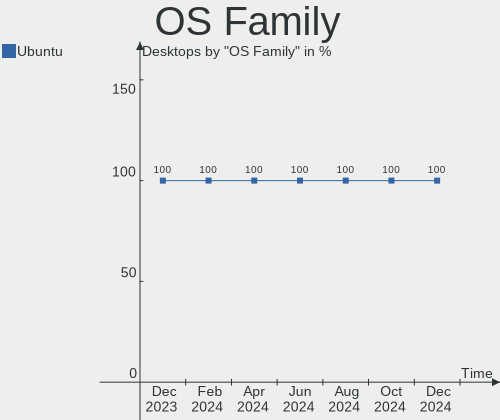
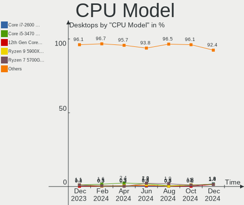
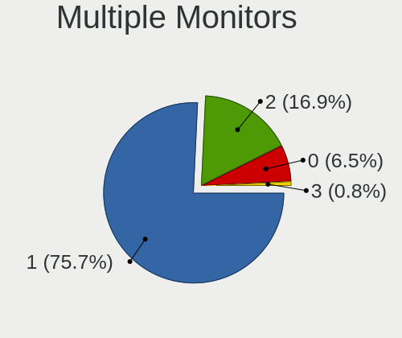

Ubuntu Hardware Trends (Desktop)
--------------------------------

A project to identify most popular hardware characteristics and track their change
over time based on data collected by Ubuntu users at https://Linux-Hardware.org.

Anyone can contribute to the study by uploading probes of their computers by
the [hw-probe](https://github.com/linuxhw/hw-probe) tool:

    sudo -E hw-probe -all -upload

Full-feature report is available here: https://linux-hardware.org/?view=trends&formfactor=desktop

Period: Nov, 2020.

Contents
--------

- [ OS                       ](#os)
- [ OS Family                ](#os-family)
- [ Kernel                   ](#kernel)
- [ Kernel Family            ](#kernel-family)
- [ Kernel Major Ver.        ](#kernel-major-ver)
- [ Arch                     ](#arch)
- [ DE                       ](#de)
- [ Display Server           ](#display-server)
- [ Display Manager          ](#display-manager)
- [ OS Lang                  ](#os-lang)
- [ Boot Mode                ](#boot-mode)
- [ Filesystem               ](#filesystem)
- [ Part. scheme             ](#part-scheme)
- [ Dual Boot with Linux/BSD ](#dual-boot-with-linux/bsd)
- [ Dual Boot (Win)          ](#dual-boot-win)
- [ Country                  ](#country)
- [ City                     ](#city)
- [ Vendor                   ](#vendor)
- [ Model                    ](#model)
- [ Model Family             ](#model-family)
- [ MFG Year                 ](#mfg-year)
- [ Form Factor              ](#form-factor)
- [ Secure Boot              ](#secure-boot)
- [ Coreboot                 ](#coreboot)
- [ RAM Size                 ](#ram-size)
- [ RAM Used                 ](#ram-used)
- [ Has CD-ROM               ](#has-cd-rom)
- [ Total Drives             ](#total-drives)
- [ Has Ethernet             ](#has-ethernet)
- [ Drive Vendor             ](#drive-vendor)
- [ Drive Model              ](#drive-model)
- [ HDD Vendor               ](#hdd-vendor)
- [ SSD Vendor               ](#ssd-vendor)
- [ Drive Kind               ](#drive-kind)
- [ Drive Connector          ](#drive-connector)
- [ Drive Size               ](#drive-size)
- [ Space Total              ](#space-total)
- [ Space Used               ](#space-used)
- [ Malfunc. Drives          ](#malfunc-drives)
- [ Malfunc. Drive Vendor    ](#malfunc-drive-vendor)
- [ Malfunc. HDD Vendor      ](#malfunc-hdd-vendor)
- [ Malfunc. Drive Kind      ](#malfunc-drive-kind)
- [ Failed Drives            ](#failed-drives)
- [ Failed Drive Vendor      ](#failed-drive-vendor)
- [ Drive Status             ](#drive-status)
- [ Storage Vendor           ](#storage-vendor)
- [ Storage Model            ](#storage-model)
- [ Storage Kind             ](#storage-kind)
- [ CPU Vendor               ](#cpu-vendor)
- [ CPU Model                ](#cpu-model)
- [ CPU Model Family         ](#cpu-model-family)
- [ CPU Cores                ](#cpu-cores)
- [ CPU Sockets              ](#cpu-sockets)
- [ CPU Threads              ](#cpu-threads)
- [ CPU Op-Modes             ](#cpu-op-modes)
- [ CPU Microcode            ](#cpu-microcode)
- [ CPU Microarch            ](#cpu-microarch)
- [ GPU Vendor               ](#gpu-vendor)
- [ GPU Model                ](#gpu-model)
- [ GPU Combo                ](#gpu-combo)
- [ GPU Driver               ](#gpu-driver)
- [ GPU Memory               ](#gpu-memory)
- [ Monitor Vendor           ](#monitor-vendor)
- [ Monitor Model            ](#monitor-model)
- [ Monitor Resolution       ](#monitor-resolution)
- [ Monitor Diagonal         ](#monitor-diagonal)
- [ Monitor Width            ](#monitor-width)
- [ Aspect Ratio             ](#aspect-ratio)
- [ Monitor Area             ](#monitor-area)
- [ Pixel Density            ](#pixel-density)
- [ Multiple Monitors        ](#multiple-monitors)
- [ Net Controller Vendor    ](#net-controller-vendor)
- [ Net Controller Model     ](#net-controller-model)
- [ Wireless Vendor          ](#wireless-vendor)
- [ Wireless Model           ](#wireless-model)
- [ Ethernet Vendor          ](#ethernet-vendor)
- [ Ethernet Model           ](#ethernet-model)
- [ Net Controller Kind      ](#net-controller-kind)
- [ Used Controller          ](#used-controller)
- [ NICs                     ](#nics)
- [ Memory Vendor            ](#memory-vendor)
- [ Memory Model             ](#memory-model)
- [ Memory Kind              ](#memory-kind)
- [ Memory Form Factor       ](#memory-form-factor)
- [ Memory Size              ](#memory-size)
- [ Memory Speed             ](#memory-speed)
- [ Sound Vendor             ](#sound-vendor)
- [ Sound Model              ](#sound-model)
- [ Camera Vendor            ](#camera-vendor)
- [ Camera Model             ](#camera-model)
- [ Fingerprint Vendor       ](#fingerprint-vendor)
- [ Fingerprint Model        ](#fingerprint-model)
- [ Chipcard Vendor          ](#chipcard-vendor)
- [ Chipcard Model           ](#chipcard-model)
- [ Printer Vendor           ](#printer-vendor)
- [ Printer Model            ](#printer-model)
- [ Scanner Vendor           ](#scanner-vendor)
- [ Scanner Model            ](#scanner-model)
- [ Bluetooth Vendor         ](#bluetooth-vendor)
- [ Bluetooth Model          ](#bluetooth-model)
- [ Unsupported Devices      ](#unsupported-devices)
- [ Unsupported Device Types ](#unsupported-device-types)

OS
--

Installed operating systems

| Name           | Desktops | Percent |
|----------------|----------|---------|
| Ubuntu 20.04   | 663      | 67.04%  |
| Ubuntu 20.10   | 149      | 15.07%  |
| Ubuntu 18.04   | 142      | 14.36%  |
| Ubuntu 16.04   | 20       | 2.02%   |
| Ubuntu 19.10   | 5        | 0.51%   |
| Ubuntu 21.04   | 3        | 0.3%    |
| Ubuntu Core 16 | 1        | 0.1%    |
| Ubuntu 2020    | 1        | 0.1%    |
| Ubuntu 19.04   | 1        | 0.1%    |
| Ubuntu 18.10   | 1        | 0.1%    |
| Ubuntu 17.10   | 1        | 0.1%    |
| Ubuntu 14.04   | 1        | 0.1%    |
| Ubuntu         | 1        | 0.1%    |

OS Family
---------

OS without a version

| Name   | Desktops | Percent |
|--------|----------|---------|
| Ubuntu | 989      | 100%    |

Kernel
------

Version of the Linux kernel

| Version                     | Desktops | Percent |
|-----------------------------|----------|---------|
| 5.4.0-52-generic            | 255      | 25.78%  |
| 5.4.0-54-generic            | 244      | 24.67%  |
| 5.4.0-53-generic            | 127      | 12.84%  |
| 5.8.0-29-generic            | 54       | 5.46%   |
| 5.8.0-26-generic            | 54       | 5.46%   |
| 5.4.0-42-generic            | 33       | 3.34%   |
| 4.15.0-122-generic          | 24       | 2.43%   |
| 5.8.0-28-generic            | 17       | 1.72%   |
| 5.4.0-52-lowlatency         | 15       | 1.52%   |
| 4.15.0-124-generic          | 11       | 1.11%   |
| 5.8.0-25-generic            | 10       | 1.01%   |
| 5.4.0-48-generic            | 8        | 0.81%   |
| 5.4.0-53-lowlatency         | 7        | 0.71%   |
| 5.4.0-51-generic            | 7        | 0.71%   |
| 5.4.0-26-generic            | 7        | 0.71%   |
| 4.15.0-123-generic          | 7        | 0.71%   |
| 5.8.0-30-generic            | 6        | 0.61%   |
| 5.4.0-54-lowlatency         | 5        | 0.51%   |
| 5.8.0-31-generic            | 4        | 0.4%    |
| 5.4.0-55-generic            | 4        | 0.4%    |
| 5.3.0-64-generic            | 4        | 0.4%    |
| 5.0.0-32-generic            | 4        | 0.4%    |
| 4.4.0-194-generic           | 4        | 0.4%    |
| 5.9.10-050910-generic       | 3        | 0.3%    |
| 5.8.0-29-lowlatency         | 3        | 0.3%    |
| 4.15.0-125-generic          | 3        | 0.3%    |
| 4.15.0-122-lowlatency       | 3        | 0.3%    |
| 5.9.0-050900-generic        | 2        | 0.2%    |
| 5.4.0-512010201020-generic  | 2        | 0.2%    |
| 5.4.0-49-generic            | 2        | 0.2%    |
| 5.4.0-47-generic            | 2        | 0.2%    |
| 5.4.0-33-generic            | 2        | 0.2%    |
| 5.3.0-28-generic            | 2        | 0.2%    |
| 4.15.0-123-lowlatency       | 2        | 0.2%    |
| 4.15.0-118-generic          | 2        | 0.2%    |
| 5.9.8-xanmod1-cachy         | 1        | 0.1%    |
| 5.9.6-050906-generic        | 1        | 0.1%    |
| 5.9.1-050901-generic        | 1        | 0.1%    |
| 5.8.15-050815-generic       | 1        | 0.1%    |
| 5.8.0-7630-generic          | 1        | 0.1%    |
| 5.8.0-31-lowlatency         | 1        | 0.1%    |
| 5.8.0-28-lowlatency         | 1        | 0.1%    |
| 5.8.0-26-lowlatency         | 1        | 0.1%    |
| 5.8.0-18-generic            | 1        | 0.1%    |
| 5.6.0-050600-lowlatency     | 1        | 0.1%    |
| 5.5.4-050504-generic        | 1        | 0.1%    |
| 5.4.0-56-generic            | 1        | 0.1%    |
| 5.4.0-47-lowlatency         | 1        | 0.1%    |
| 5.4.0-45-generic            | 1        | 0.1%    |
| 5.4.0-40-generic            | 1        | 0.1%    |
| 5.4.0-050400-generic        | 1        | 0.1%    |
| 5.3.0-7625-generic          | 1        | 0.1%    |
| 5.3.0-62-generic            | 1        | 0.1%    |
| 5.3.0-59-generic            | 1        | 0.1%    |
| 5.3.0-53-generic            | 1        | 0.1%    |
| 5.3.0-46-generic            | 1        | 0.1%    |
| 5.10.0-051000rc5-lowlatency | 1        | 0.1%    |
| 5.0.0-38-generic            | 1        | 0.1%    |
| 5.0.0-23-generic            | 1        | 0.1%    |
| 4.4.0-87-generic            | 1        | 0.1%    |

Kernel Family
-------------

Linux kernel without a distro release

| Version  | Desktops | Percent |
|----------|----------|---------|
| 5.4.0    | 725      | 73.31%  |
| 5.8.0    | 153      | 15.47%  |
| 4.15.0   | 65       | 6.57%   |
| 5.3.0    | 11       | 1.11%   |
| 4.4.0    | 10       | 1.01%   |
| 5.0.0    | 6        | 0.61%   |
| 5.9.10   | 3        | 0.3%    |
| 5.9.0    | 2        | 0.2%    |
| 5.9.8    | 1        | 0.1%    |
| 5.9.6    | 1        | 0.1%    |
| 5.9.1    | 1        | 0.1%    |
| 5.8.15   | 1        | 0.1%    |
| 5.6.0    | 1        | 0.1%    |
| 5.5.4    | 1        | 0.1%    |
| 5.10.0   | 1        | 0.1%    |
| 4.2.8    | 1        | 0.1%    |
| 4.19.5   | 1        | 0.1%    |
| 4.19.128 | 1        | 0.1%    |
| 4.19.104 | 1        | 0.1%    |
| 4.18.0   | 1        | 0.1%    |
| 4.13.0   | 1        | 0.1%    |
| 3.13.0   | 1        | 0.1%    |

Kernel Major Ver.
-----------------

Linux kernel major version

| Version | Desktops | Percent |
|---------|----------|---------|
| 5.4     | 725      | 73.31%  |
| 5.8     | 154      | 15.57%  |
| 4.15    | 65       | 6.57%   |
| 5.3     | 11       | 1.11%   |
| 4.4     | 10       | 1.01%   |
| 5.9     | 8        | 0.81%   |
| 5.0     | 6        | 0.61%   |
| 4.19    | 3        | 0.3%    |
| 5.6     | 1        | 0.1%    |
| 5.5     | 1        | 0.1%    |
| 5.10    | 1        | 0.1%    |
| 4.2     | 1        | 0.1%    |
| 4.18    | 1        | 0.1%    |
| 4.13    | 1        | 0.1%    |
| 3.13    | 1        | 0.1%    |

Arch
----

OS architecture (x86_64, i586, etc.)

| Name   | Desktops | Percent |
|--------|----------|---------|
| x86_64 | 962      | 97.27%  |
| i686   | 27       | 2.73%   |

DE
--

Desktop Environment

| Name            | Desktops | Percent |
|-----------------|----------|---------|
| GNOME           | 712      | 71.99%  |
| XFCE            | 74       | 7.48%   |
| Unknown         | 68       | 6.88%   |
| KDE             | 26       | 2.63%   |
| KDE5            | 21       | 2.12%   |
| Unity           | 20       | 2.02%   |
| MATE            | 20       | 2.02%   |
| X-Cinnamon      | 11       | 1.11%   |
| LXQt            | 8        | 0.81%   |
| GNOME Flashback | 8        | 0.81%   |
| LXDE            | 6        | 0.61%   |
| Budgie          | 5        | 0.51%   |
| GNOME Classic   | 3        | 0.3%    |
| Deepin          | 3        | 0.3%    |
| i3              | 2        | 0.2%    |
| Cinnamon        | 1        | 0.1%    |
| awesome         | 1        | 0.1%    |

Display Server
--------------

X11 or Wayland

| Name    | Desktops | Percent |
|---------|----------|---------|
| X11     | 909      | 91.91%  |
| Unknown | 40       | 4.04%   |
| Wayland | 20       | 2.02%   |
| Tty     | 18       | 1.82%   |
| Web     | 2        | 0.2%    |

Display Manager
---------------

SDDM, LightDM, etc.

| Name    | Desktops | Percent |
|---------|----------|---------|
| Unknown | 827      | 83.62%  |
| GDM     | 93       | 9.4%    |
| TDM     | 36       | 3.64%   |
| SDDM    | 24       | 2.43%   |
| LightDM | 9        | 0.91%   |

OS Lang
-------

Language

| Lang    | Desktops | Percent |
|---------|----------|---------|
| en_US   | 366      | 37.01%  |
| de_DE   | 104      | 10.52%  |
| fr_FR   | 57       | 5.76%   |
| en_GB   | 57       | 5.76%   |
| it_IT   | 52       | 5.26%   |
| es_ES   | 34       | 3.44%   |
| pt_BR   | 33       | 3.34%   |
| en_CA   | 26       | 2.63%   |
| ru_RU   | 23       | 2.33%   |
| pl_PL   | 22       | 2.22%   |
| en_IN   | 17       | 1.72%   |
| en_AU   | 15       | 1.52%   |
| cs_CZ   | 14       | 1.42%   |
| C       | 14       | 1.42%   |
| nl_NL   | 13       | 1.31%   |
| es_AR   | 13       | 1.31%   |
| ja_JP   | 11       | 1.11%   |
| en_ZA   | 9        | 0.91%   |
| de_AT   | 8        | 0.81%   |
| sv_SE   | 6        | 0.61%   |
| ro_RO   | 6        | 0.61%   |
| es_MX   | 6        | 0.61%   |
| Unknown | 6        | 0.61%   |
| zh_TW   | 5        | 0.51%   |
| hu_HU   | 5        | 0.51%   |
| fi_FI   | 5        | 0.51%   |
| ru_UA   | 4        | 0.4%    |
| es_CO   | 4        | 0.4%    |
| en_NZ   | 4        | 0.4%    |
| el_GR   | 4        | 0.4%    |
| de_CH   | 4        | 0.4%    |
| nl_BE   | 3        | 0.3%    |
| ko_KR   | 3        | 0.3%    |
| fr_CA   | 3        | 0.3%    |
| fr_BE   | 3        | 0.3%    |
| zh_CN   | 2        | 0.2%    |
| uk_UA   | 2        | 0.2%    |
| sl_SI   | 2        | 0.2%    |
| he_IL   | 2        | 0.2%    |
| es_EC   | 2        | 0.2%    |
| en_HK   | 2        | 0.2%    |
| da_DK   | 2        | 0.2%    |
| sr_RS   | 1        | 0.1%    |
| nb_NO   | 1        | 0.1%    |
| lt_LT   | 1        | 0.1%    |
| hr_HR   | 1        | 0.1%    |
| fr_CH   | 1        | 0.1%    |
| eu_ES   | 1        | 0.1%    |
| et_EE   | 1        | 0.1%    |
| es_VE   | 1        | 0.1%    |
| es_PE   | 1        | 0.1%    |
| es_NI   | 1        | 0.1%    |
| es_CL   | 1        | 0.1%    |
| en_ZW   | 1        | 0.1%    |
| en_PH   | 1        | 0.1%    |
| en_IL   | 1        | 0.1%    |
| ca_ES   | 1        | 0.1%    |
| bg_BG   | 1        | 0.1%    |

Boot Mode
---------

EFI or BIOS

| Mode | Desktops | Percent |
|------|----------|---------|
| BIOS | 702      | 70.98%  |
| EFI  | 287      | 29.02%  |

Filesystem
----------

Type of filesystem

| Type    | Desktops | Percent |
|---------|----------|---------|
| Ext4    | 935      | 94.54%  |
| Overlay | 23       | 2.33%   |
| Zfs     | 12       | 1.21%   |
| Btrfs   | 8        | 0.81%   |
| Ext2    | 5        | 0.51%   |
| Xfs     | 4        | 0.4%    |
| Ext3    | 1        | 0.1%    |
| Unknown | 1        | 0.1%    |

Part. scheme
------------

Scheme of partitioning

| Type    | Desktops | Percent |
|---------|----------|---------|
| Unknown | 817      | 82.61%  |
| GPT     | 127      | 12.84%  |
| MBR     | 45       | 4.55%   |

Dual Boot with Linux/BSD
------------------------

Hosting more than one Linux/BSD

| Dual boot | Desktops | Percent |
|-----------|----------|---------|
| No        | 814      | 82.31%  |
| Yes       | 175      | 17.69%  |

Dual Boot (Win)
---------------

Hosting Linux and Windows

| Dual boot | Desktops | Percent |
|-----------|----------|---------|
| No        | 578      | 58.44%  |
| Yes       | 411      | 41.56%  |

Country
-------

Geographic location (country)

| Country            | Desktops | Percent |
|--------------------|----------|---------|
| USA                | 192      | 19.41%  |
| Germany            | 127      | 12.84%  |
| Italy              | 76       | 7.68%   |
| France             | 65       | 6.57%   |
| Brazil             | 44       | 4.45%   |
| UK                 | 40       | 4.04%   |
| Spain              | 37       | 3.74%   |
| Canada             | 33       | 3.34%   |
| Russia             | 29       | 2.93%   |
| Poland             | 26       | 2.63%   |
| Netherlands        | 26       | 2.63%   |
| India              | 18       | 1.82%   |
| South Africa       | 15       | 1.52%   |
| Argentina          | 15       | 1.52%   |
| Greece             | 14       | 1.42%   |
| Japan              | 13       | 1.31%   |
| Finland            | 13       | 1.31%   |
| Belgium            | 13       | 1.31%   |
| Australia          | 13       | 1.31%   |
| Romania            | 12       | 1.21%   |
| Czech Republic     | 12       | 1.21%   |
| Ukraine            | 11       | 1.11%   |
| Austria            | 10       | 1.01%   |
| Sweden             | 8        | 0.81%   |
| Mexico             | 8        | 0.81%   |
| Israel             | 8        | 0.81%   |
| Indonesia          | 8        | 0.81%   |
| Hungary            | 8        | 0.81%   |
| Switzerland        | 7        | 0.71%   |
| New Zealand        | 7        | 0.71%   |
| Taiwan             | 6        | 0.61%   |
| Denmark            | 5        | 0.51%   |
| Slovenia           | 4        | 0.4%    |
| Serbia             | 4        | 0.4%    |
| Colombia           | 4        | 0.4%    |
| China              | 4        | 0.4%    |
| Norway             | 3        | 0.3%    |
| Lithuania          | 3        | 0.3%    |
| Latvia             | 3        | 0.3%    |
| Korea, Republic of | 3        | 0.3%    |
| Hong Kong          | 3        | 0.3%    |
| Bulgaria           | 3        | 0.3%    |
| Turkey             | 2        | 0.2%    |
| South Korea        | 2        | 0.2%    |
| Portugal           | 2        | 0.2%    |
| Ecuador            | 2        | 0.2%    |
| Bangladesh         | 2        | 0.2%    |
| Albania            | 2        | 0.2%    |
| Venezuela          | 1        | 0.1%    |
| Sri Lanka          | 1        | 0.1%    |
| Slovakia           | 1        | 0.1%    |
| Puerto Rico        | 1        | 0.1%    |
| Philippines        | 1        | 0.1%    |
| Peru               | 1        | 0.1%    |
| Panama             | 1        | 0.1%    |
| Nicaragua          | 1        | 0.1%    |
| Morocco            | 1        | 0.1%    |
| Malaysia           | 1        | 0.1%    |
| Libya              | 1        | 0.1%    |
| Kuwait             | 1        | 0.1%    |

City
----

Geographic location (city)

| City           | Desktops | Percent |
|----------------|----------|---------|
| Parabiago      | 16       | 1.62%   |
| Paris          | 9        | 0.91%   |
| Helsinki       | 9        | 0.91%   |
| São Paulo     | 7        | 0.71%   |
| Johannesburg   | 7        | 0.71%   |
| Athens         | 7        | 0.71%   |
| Rome           | 6        | 0.61%   |
| Moscow         | 6        | 0.61%   |
| Madrid         | 6        | 0.61%   |
| Warsaw         | 5        | 0.51%   |
| Vienna         | 5        | 0.51%   |
| Thessaloniki   | 5        | 0.51%   |
| St Petersburg  | 5        | 0.51%   |
| Bucharest      | 5        | 0.51%   |
| Łódź        | 4        | 0.4%    |
| Toronto        | 4        | 0.4%    |
| Prague         | 4        | 0.4%    |
| Norwich        | 4        | 0.4%    |
| Milan          | 4        | 0.4%    |
| Leipzig        | 4        | 0.4%    |
| Krakow         | 4        | 0.4%    |
| Genoa          | 4        | 0.4%    |
| Cape Town      | 4        | 0.4%    |
| Buenos Aires   | 4        | 0.4%    |
| Bogotá        | 4        | 0.4%    |
| Wateringen     | 3        | 0.3%    |
| Rio de Janeiro | 3        | 0.3%    |
| Riga           | 3        | 0.3%    |
| Richmond       | 3        | 0.3%    |
| Munich         | 3        | 0.3%    |
| Mumbai         | 3        | 0.3%    |
| Mexico City    | 3        | 0.3%    |
| London         | 3        | 0.3%    |
| Kyiv           | 3        | 0.3%    |
| Karlsruhe      | 3        | 0.3%    |
| Jakarta        | 3        | 0.3%    |
| Hamburg        | 3        | 0.3%    |
| Düsseldorf    | 3        | 0.3%    |
| Dallas         | 3        | 0.3%    |
| Columbus       | 3        | 0.3%    |
| Cleveland      | 3        | 0.3%    |
| Christchurch   | 3        | 0.3%    |
| Chicago        | 3        | 0.3%    |
| Calgary        | 3        | 0.3%    |
| Budapest       | 3        | 0.3%    |
| Berlin         | 3        | 0.3%    |
| Amsterdam      | 3        | 0.3%    |
| Adelaide       | 3        | 0.3%    |
| Érd           | 2        | 0.2%    |
| Voronezh       | 2        | 0.2%    |
| Vijayawada     | 2        | 0.2%    |
| Valencia       | 2        | 0.2%    |
| Tullahoma      | 2        | 0.2%    |
| Tirana         | 2        | 0.2%    |
| Thompson       | 2        | 0.2%    |
| The Hague      | 2        | 0.2%    |
| Tel Aviv       | 2        | 0.2%    |
| Talence        | 2        | 0.2%    |
| Taichung       | 2        | 0.2%    |
| Sydney         | 2        | 0.2%    |

Vendor
------

Motherboard manufacturer

| Name                                   | Desktops | Percent |
|----------------------------------------|----------|---------|
| ASUSTek Computer                       | 226      | 22.85%  |
| Gigabyte Technology                    | 182      | 18.4%   |
| MSI                                    | 109      | 11.02%  |
| Dell                                   | 86       | 8.7%    |
| Hewlett-Packard                        | 78       | 7.89%   |
| ASRock                                 | 73       | 7.38%   |
| Lenovo                                 | 40       | 4.04%   |
| Intel                                  | 29       | 2.93%   |
| Acer                                   | 29       | 2.93%   |
| Unknown                                | 16       | 1.62%   |
| Pegatron                               | 14       | 1.42%   |
| Supermicro                             | 13       | 1.31%   |
| Fujitsu                                | 11       | 1.11%   |
| Foxconn                                | 10       | 1.01%   |
| Medion                                 | 9        | 0.91%   |
| ECS                                    | 8        | 0.81%   |
| Biostar                                | 7        | 0.71%   |
| TYAN Computer                          | 5        | 0.51%   |
| Fujitsu Siemens                        | 5        | 0.51%   |
| Packard Bell                           | 3        | 0.3%    |
| NEC Computers                          | 3        | 0.3%    |
| Gateway                                | 3        | 0.3%    |
| eMachines                              | 3        | 0.3%    |
| Apple                                  | 3        | 0.3%    |
| Alienware                              | 3        | 0.3%    |
| Wistron                                | 2        | 0.2%    |
| Huanan                                 | 2        | 0.2%    |
| Rockwell Automation/Allen-Bradley      | 1        | 0.1%    |
| Quanta                                 | 1        | 0.1%    |
| Positivo                               | 1        | 0.1%    |
| PCChips                                | 1        | 0.1%    |
| PC Partner Limited                     | 1        | 0.1%    |
| NCR                                    | 1        | 0.1%    |
| Maxtang                                | 1        | 0.1%    |
| LattePanda                             | 1        | 0.1%    |
| Inventec                               | 1        | 0.1%    |
| INTELBRAS                              | 1        | 0.1%    |
| IBM                                    | 1        | 0.1%    |
| EAGLE EYE NETWORKS                     | 1        | 0.1%    |
| Desenvolvido para Positivo Informatica | 1        | 0.1%    |
| Colorful Technology                    | 1        | 0.1%    |
| BANGHO                                 | 1        | 0.1%    |
| ASRockRack                             | 1        | 0.1%    |
| AMI                                    | 1        | 0.1%    |

Model
-----

Motherboard model

| Name                                   | Desktops | Percent |
|----------------------------------------|----------|---------|
| ASUS All Series                        | 25       | 2.53%   |
| Unknown                                | 16       | 1.62%   |
| HP EliteDesk 800 G1 SFF                | 11       | 1.11%   |
| Supermicro H8DM8-2                     | 7        | 0.71%   |
| ASUS M5A78L-M/USB3                     | 7        | 0.71%   |
| MSI MS-7B86                            | 6        | 0.61%   |
| MSI MS-7817                            | 5        | 0.51%   |
| HP Compaq Elite 8300 SFF               | 5        | 0.51%   |
| Gigabyte 970A-DS3P                     | 5        | 0.51%   |
| Dell OptiPlex 755                      | 5        | 0.51%   |
| MSI MS-7C91                            | 4        | 0.4%    |
| MSI MS-7A38                            | 4        | 0.4%    |
| HP Compaq 8100 Elite SFF PC            | 4        | 0.4%    |
| Gigabyte X570 AORUS ELITE              | 4        | 0.4%    |
| Gigabyte A320M-S2H                     | 4        | 0.4%    |
| Dell Vostro 200                        | 4        | 0.4%    |
| Dell Precision T1700                   | 4        | 0.4%    |
| Dell OptiPlex 7010                     | 4        | 0.4%    |
| ASUS ROG STRIX X570-E GAMING           | 4        | 0.4%    |
| ASUS PRIME B450M-A                     | 4        | 0.4%    |
| ASUS PRIME A320M-K                     | 4        | 0.4%    |
| ASUS M5A97 R2.0                        | 4        | 0.4%    |
| TYAN S3992-E                           | 3        | 0.3%    |
| MSI MS-7C35                            | 3        | 0.3%    |
| MSI MS-7996                            | 3        | 0.3%    |
| MSI MS-7793                            | 3        | 0.3%    |
| MSI MS-7693                            | 3        | 0.3%    |
| MSI MS-7680                            | 3        | 0.3%    |
| MSI MS-7599                            | 3        | 0.3%    |
| Gigabyte H81M-S1                       | 3        | 0.3%    |
| Gigabyte H61M-S1                       | 3        | 0.3%    |
| Gigabyte H270-HD3                      | 3        | 0.3%    |
| Gigabyte GA-MA785GM-US2H               | 3        | 0.3%    |
| Dell XPS 8700                          | 3        | 0.3%    |
| Dell OptiPlex GX620                    | 3        | 0.3%    |
| Dell OptiPlex 790                      | 3        | 0.3%    |
| Dell OptiPlex 745                      | 3        | 0.3%    |
| Dell OptiPlex 390                      | 3        | 0.3%    |
| Dell OptiPlex 3020                     | 3        | 0.3%    |
| Dell Inspiron 560                      | 3        | 0.3%    |
| ASUS PRIME X370-A                      | 3        | 0.3%    |
| ASUS PRIME B450-PLUS                   | 3        | 0.3%    |
| ASUS P5KPL-CM                          | 3        | 0.3%    |
| ASUS KFSN4-DRE/RS161                   | 3        | 0.3%    |
| ASRock N68C-S UCC                      | 3        | 0.3%    |
| ASRock B450M/ac                        | 3        | 0.3%    |
| ASRock B450 Gaming K4                  | 3        | 0.3%    |
| Wistron ProLiant ML110 G6              | 2        | 0.2%    |
| TYAN S8230                             | 2        | 0.2%    |
| MSI MS-7C94                            | 2        | 0.2%    |
| MSI MS-7C02                            | 2        | 0.2%    |
| MSI MS-7721                            | 2        | 0.2%    |
| Intel D54250WYK H13922-304             | 2        | 0.2%    |
| HP Z800 Workstation                    | 2        | 0.2%    |
| HP Z440 Workstation                    | 2        | 0.2%    |
| HP Z230 Tower Workstation              | 2        | 0.2%    |
| HP Z2 Tower G4 Workstation             | 2        | 0.2%    |
| HP Compaq dc7900 Convertible Minitower | 2        | 0.2%    |
| HP Compaq 8100 Elite CMT PC            | 2        | 0.2%    |
| HP Compaq 6000 Pro MT PC               | 2        | 0.2%    |

Model Family
------------

Motherboard model prefix

| Name                     | Desktops | Percent |
|--------------------------|----------|---------|
| Dell OptiPlex            | 40       | 4.04%   |
| HP Compaq                | 32       | 3.24%   |
| ASUS PRIME               | 32       | 3.24%   |
| Lenovo ThinkCentre       | 27       | 2.73%   |
| ASUS All                 | 25       | 2.53%   |
| ASUS ROG                 | 16       | 1.62%   |
| Unknown                  | 16       | 1.62%   |
| Acer Aspire              | 15       | 1.52%   |
| HP EliteDesk             | 13       | 1.31%   |
| Dell Precision           | 13       | 1.31%   |
| Dell Inspiron            | 13       | 1.31%   |
| ASUS M5A78L-M            | 13       | 1.31%   |
| ASUS TUF                 | 10       | 1.01%   |
| Fujitsu ESPRIMO          | 9        | 0.91%   |
| Acer Veriton             | 9        | 0.91%   |
| Dell Vostro              | 8        | 0.81%   |
| ASUS SABERTOOTH          | 8        | 0.81%   |
| Supermicro H8DM8-2       | 7        | 0.71%   |
| Gigabyte X570            | 7        | 0.71%   |
| MSI MS-7B86              | 6        | 0.61%   |
| HP ProDesk               | 6        | 0.61%   |
| Gigabyte A320M-S2H       | 6        | 0.61%   |
| Gigabyte 970A-DS3P       | 6        | 0.61%   |
| ASUS M5A97               | 6        | 0.61%   |
| MSI MS-7817              | 5        | 0.51%   |
| Lenovo IdeaCentre        | 5        | 0.51%   |
| Gigabyte GA-78LMT-USB3   | 5        | 0.51%   |
| Dell XPS                 | 5        | 0.51%   |
| ASRock X99               | 5        | 0.51%   |
| ASRock B450M             | 5        | 0.51%   |
| MSI MS-7C91              | 4        | 0.4%    |
| MSI MS-7A38              | 4        | 0.4%    |
| Gigabyte B450M           | 4        | 0.4%    |
| Gigabyte B450            | 4        | 0.4%    |
| ASUS P6T                 | 4        | 0.4%    |
| ASRock B450              | 4        | 0.4%    |
| TYAN S3992-E             | 3        | 0.3%    |
| MSI MS-7C35              | 3        | 0.3%    |
| MSI MS-7996              | 3        | 0.3%    |
| MSI MS-7793              | 3        | 0.3%    |
| MSI MS-7693              | 3        | 0.3%    |
| MSI MS-7680              | 3        | 0.3%    |
| MSI MS-7599              | 3        | 0.3%    |
| Gigabyte Z390            | 3        | 0.3%    |
| Gigabyte X470            | 3        | 0.3%    |
| Gigabyte H81M-S1         | 3        | 0.3%    |
| Gigabyte H61M-S1         | 3        | 0.3%    |
| Gigabyte H310M           | 3        | 0.3%    |
| Gigabyte H270-HD3        | 3        | 0.3%    |
| Gigabyte GA-MA785GM-US2H | 3        | 0.3%    |
| Fujitsu Siemens ESPRIMO  | 3        | 0.3%    |
| ASUS P7P55D-E            | 3        | 0.3%    |
| ASUS P5KPL-CM            | 3        | 0.3%    |
| ASUS P5G41T-M            | 3        | 0.3%    |
| ASUS Maximus             | 3        | 0.3%    |
| ASUS KFSN4-DRE           | 3        | 0.3%    |
| ASUS H110M-K             | 3        | 0.3%    |
| ASRock N68C-S            | 3        | 0.3%    |
| Wistron ProLiant         | 2        | 0.2%    |
| TYAN S8230               | 2        | 0.2%    |

MFG Year
--------

Motherboard manufacture year

| Year    | Desktops | Percent |
|---------|----------|---------|
| 2020    | 104      | 10.52%  |
| 2019    | 84       | 8.49%   |
| 2018    | 82       | 8.29%   |
| 2009    | 80       | 8.09%   |
| 2011    | 79       | 7.99%   |
| 2013    | 78       | 7.89%   |
| 2014    | 76       | 7.68%   |
| 2010    | 75       | 7.58%   |
| 2012    | 70       | 7.08%   |
| 2015    | 67       | 6.77%   |
| 2008    | 49       | 4.95%   |
| 2017    | 45       | 4.55%   |
| 2016    | 40       | 4.04%   |
| 2007    | 31       | 3.13%   |
| 2006    | 13       | 1.31%   |
| 2005    | 11       | 1.11%   |
| Unknown | 3        | 0.3%    |
| 2004    | 1        | 0.1%    |
| 2001    | 1        | 0.1%    |

Form Factor
-----------

Physical design of the computer

| Name    | Desktops | Percent |
|---------|----------|---------|
| Desktop | 989      | 100%    |

Secure Boot
-----------

Enabled or disabled

| State    | Desktops | Percent |
|----------|----------|---------|
| Disabled | 968      | 97.88%  |
| Enabled  | 21       | 2.12%   |

Coreboot
--------

Have coreboot on board

| Used | Desktops | Percent |
|------|----------|---------|
| No   | 989      | 100%    |

RAM Size
--------

Total RAM memory

| Size in GB  | Desktops | Percent |
|-------------|----------|---------|
| 16.01-24.0  | 222      | 22.45%  |
| 8.01-16.0   | 209      | 21.13%  |
| 3.01-4.0    | 188      | 19.01%  |
| 4.01-8.0    | 135      | 13.65%  |
| 32.01-64.0  | 94       | 9.5%    |
| 64.01-256.0 | 54       | 5.46%   |
| 1.01-2.0    | 50       | 5.06%   |
| 24.01-32.0  | 19       | 1.92%   |
| 2.01-3.0    | 12       | 1.21%   |
| 0.01-1.0    | 6        | 0.61%   |

RAM Used
--------

Used RAM memory

| Used GB    | Desktops | Percent |
|------------|----------|---------|
| 1.01-2.0   | 467      | 47.22%  |
| 2.01-3.0   | 212      | 21.44%  |
| 4.01-8.0   | 110      | 11.12%  |
| 3.01-4.0   | 96       | 9.71%   |
| 0.01-1.0   | 58       | 5.86%   |
| 8.01-16.0  | 33       | 3.34%   |
| 24.01-32.0 | 5        | 0.51%   |
| 16.01-24.0 | 5        | 0.51%   |
| 32.01-64.0 | 2        | 0.2%    |
| Unknown    | 1        | 0.1%    |

Has CD-ROM
----------

Has CD-ROM on board

| Presented | Desktops | Percent |
|-----------|----------|---------|
| Yes       | 566      | 57.23%  |
| No        | 423      | 42.77%  |

Total Drives
------------

Number of drives on board

| Drives | Desktops | Percent |
|--------|----------|---------|
| 1      | 401      | 40.55%  |
| 2      | 308      | 31.14%  |
| 3      | 135      | 13.65%  |
| 4      | 61       | 6.17%   |
| 5      | 42       | 4.25%   |
| 6      | 20       | 2.02%   |
| 7      | 10       | 1.01%   |
| 0      | 7        | 0.71%   |
| 9      | 2        | 0.2%    |
| 8      | 2        | 0.2%    |
| 11     | 1        | 0.1%    |

Has Ethernet
------------

Has Ethernet on board

| Presented | Desktops | Percent |
|-----------|----------|---------|
| Yes       | 978      | 98.89%  |
| No        | 11       | 1.11%   |

Drive Vendor
------------

Hard drive vendors

| Vendor                    | Desktops | Drives | Percent |
|---------------------------|----------|--------|---------|
| Seagate                   | 392      | 522    | 22.92%  |
| WDC                       | 356      | 457    | 20.82%  |
| Samsung Electronics       | 238      | 290    | 13.92%  |
| Kingston                  | 96       | 104    | 5.61%   |
| Toshiba                   | 91       | 103    | 5.32%   |
| Hitachi                   | 77       | 84     | 4.5%    |
| Crucial                   | 62       | 64     | 3.63%   |
| SanDisk                   | 45       | 49     | 2.63%   |
| Unknown                   | 30       | 33     | 1.75%   |
| Intel                     | 28       | 32     | 1.64%   |
| Phison                    | 26       | 29     | 1.52%   |
| OCZ                       | 20       | 20     | 1.17%   |
| Maxtor                    | 18       | 19     | 1.05%   |
| Patriot                   | 17       | 17     | 0.99%   |
| Intenso                   | 17       | 19     | 0.99%   |
| HGST                      | 16       | 19     | 0.94%   |
| A-DATA Technology         | 16       | 18     | 0.94%   |
| GOODRAM                   | 13       | 13     | 0.76%   |
| Transcend                 | 11       | 11     | 0.64%   |
| Corsair                   | 11       | 11     | 0.64%   |
| China                     | 11       | 11     | 0.64%   |
| PNY                       | 8        | 8      | 0.47%   |
| Micron/Crucial Technology | 8        | 8      | 0.47%   |
| Micron Technology         | 7        | 7      | 0.41%   |
| SPCC                      | 6        | 8      | 0.35%   |
| Silicon Motion            | 6        | 6      | 0.35%   |
| ASMT                      | 6        | 7      | 0.35%   |
| PLEXTOR                   | 5        | 5      | 0.29%   |
| Fujitsu                   | 4        | 4      | 0.23%   |
| Team                      | 3        | 3      | 0.18%   |
| Realtek Semiconductor     | 3        | 3      | 0.18%   |
| LITEON                    | 3        | 4      | 0.18%   |
| Hewlett-Packard           | 3        | 3      | 0.18%   |
| Gigabyte Technology       | 3        | 3      | 0.18%   |
| XPG                       | 2        | 2      | 0.12%   |
| TCSUNBOW                  | 2        | 2      | 0.12%   |
| SK Hynix                  | 2        | 2      | 0.12%   |
| SABRENT                   | 2        | 2      | 0.12%   |
| Netac                     | 2        | 2      | 0.12%   |
| Mushkin                   | 2        | 2      | 0.12%   |
| Msft                      | 2        | 4      | 0.12%   |
| LITEONIT                  | 2        | 2      | 0.12%   |
| Lexar                     | 2        | 2      | 0.12%   |
| KingFast                  | 2        | 2      | 0.12%   |
| KingDian                  | 2        | 2      | 0.12%   |
| InnoLite                  | 2        | 2      | 0.12%   |
| ASMT109x                  | 2        | 2      | 0.12%   |
| Apacer                    | 2        | 2      | 0.12%   |
| WD MediaMax               | 1        | 1      | 0.06%   |
| V7                        | 1        | 1      | 0.06%   |
| TS512GMT                  | 1        | 1      | 0.06%   |
| Teclast                   | 1        | 1      | 0.06%   |
| SMI                       | 1        | 1      | 0.06%   |
| RSH-338H                  | 1        | 1      | 0.06%   |
| QNIX                      | 1        | 1      | 0.06%   |
| PUSKILL                   | 1        | 2      | 0.06%   |
| Phison Electronics        | 1        | 1      | 0.06%   |
| OCZ-VERTEX2               | 1        | 1      | 0.06%   |
| MG                        | 1        | 1      | 0.06%   |
| Maxmemory                 | 1        | 1      | 0.06%   |

Drive Model
-----------

Hard drive models

| Model                            | Desktops | Percent |
|----------------------------------|----------|---------|
| Seagate ST500DM002-1BD142 500GB  | 35       | 1.76%   |
| Seagate ST1000DM010-2EP102 1TB   | 29       | 1.46%   |
| Samsung SSD 860 EVO 500GB        | 21       | 1.06%   |
| WDC WD10EZEX-08WN4A0 1TB         | 19       | 0.95%   |
| Samsung SSD 850 EVO 250GB        | 19       | 0.95%   |
| Seagate ST1000DM003-1CH162 1TB   | 18       | 0.9%    |
| Samsung NVMe SSD Drive 500GB     | 18       | 0.9%    |
| Seagate ST2000DM008-2FR102 2TB   | 17       | 0.85%   |
| Seagate ST2000DM006-2DM164 2TB   | 17       | 0.85%   |
| Seagate ST3500418AS 500GB        | 16       | 0.8%    |
| Seagate ST31000528AS 1TB         | 16       | 0.8%    |
| Toshiba DT01ACA100 1TB           | 15       | 0.75%   |
| Kingston SA400S37480G 480GB SSD  | 15       | 0.75%   |
| Kingston SA400S37240G 240GB SSD  | 15       | 0.75%   |
| Kingston SA400S37120G 120GB SSD  | 15       | 0.75%   |
| Samsung SSD 860 EVO 1TB          | 14       | 0.7%    |
| Kingston SV300S37A120G 120GB SSD | 14       | 0.7%    |
| Unknown SD/MMC/MS PRO 128GB      | 12       | 0.6%    |
| Seagate ST8000AS0002-1NA17Z 8TB  | 12       | 0.6%    |
| Seagate ST1000DM003-1ER162 1TB   | 12       | 0.6%    |
| Seagate ST2000DM001-1ER164 2TB   | 11       | 0.55%   |
| Toshiba DT01ACA200 2TB           | 10       | 0.5%    |
| Toshiba DT01ACA050 500GB         | 10       | 0.5%    |
| Seagate ST2000DM001-1CH164 2TB   | 10       | 0.5%    |
| Samsung SSD 850 EVO 500GB        | 10       | 0.5%    |
| Samsung SSD 840 EVO 250GB        | 10       | 0.5%    |
| WDC WDS240G2G0A-00JH30 240GB SSD | 9        | 0.45%   |
| WDC WD20EARX-00PASB0 2TB         | 9        | 0.45%   |
| WDC WD10EZEX-00BN5A0 1TB         | 9        | 0.45%   |
| Seagate ST4000DM000-1F2168 4TB   | 9        | 0.45%   |
| Seagate ST1000DM003-1SB102 1TB   | 9        | 0.45%   |
| WDC WD10EARS-00Y5B1 1TB          | 8        | 0.4%    |
| Seagate ST3500413AS 500GB        | 8        | 0.4%    |
| Seagate ST31000524AS 1TB         | 8        | 0.4%    |
| Samsung NVMe SSD Drive 1TB       | 8        | 0.4%    |
| Samsung HD322HJ 320GB            | 8        | 0.4%    |
| Samsung HD103SJ 1TB              | 8        | 0.4%    |
| Crucial CT500MX500SSD1 500GB     | 8        | 0.4%    |
| WDC WDS100T2B0A-00SM50 1TB SSD   | 7        | 0.35%   |
| WDC WD5000AAKX-001CA0 500GB      | 7        | 0.35%   |
| WDC WD20EZRX-00D8PB0 2TB         | 7        | 0.35%   |
| WDC WD1003FZEX-00MK2A0 1TB       | 7        | 0.35%   |
| Toshiba HDWD110 1TB              | 7        | 0.35%   |
| Seagate ST3250820AS 250GB        | 7        | 0.35%   |
| Seagate ST3250310AS 250GB        | 7        | 0.35%   |
| Seagate ST3160815AS 160GB        | 7        | 0.35%   |
| Samsung SSD 970 EVO Plus 500GB   | 7        | 0.35%   |
| Samsung SSD 860 EVO 250GB        | 7        | 0.35%   |
| Samsung NVMe SSD Drive 250GB     | 7        | 0.35%   |
| Phison NVMe SSD Drive 1TB        | 7        | 0.35%   |
| Hitachi HDS721010CLA332 1TB      | 7        | 0.35%   |
| Hitachi HDP725050GLA360 500GB    | 7        | 0.35%   |
| WDC WD5000AAKX-08U6AA0 500GB     | 6        | 0.3%    |
| Unknown SD/MMC 16GB              | 6        | 0.3%    |
| Unknown MM0500EANCR 500GB        | 6        | 0.3%    |
| Seagate ST2000DL003-9VT166 2TB   | 6        | 0.3%    |
| Seagate ST1000DM003-9YN162 1TB   | 6        | 0.3%    |
| Samsung SSD 860 QVO 1TB          | 6        | 0.3%    |
| Samsung SSD 840 EVO 120GB        | 6        | 0.3%    |
| Kingston SUV400S37240G 240GB SSD | 6        | 0.3%    |

HDD Vendor
----------

Hard disk drive vendors

| Vendor              | Desktops | Drives | Percent |
|---------------------|----------|--------|---------|
| Seagate             | 390      | 513    | 40%     |
| WDC                 | 320      | 408    | 32.82%  |
| Toshiba             | 77       | 86     | 7.9%    |
| Hitachi             | 77       | 84     | 7.9%    |
| Samsung Electronics | 60       | 62     | 6.15%   |
| Maxtor              | 17       | 18     | 1.74%   |
| HGST                | 16       | 19     | 1.64%   |
| Unknown             | 6        | 6      | 0.62%   |
| Intenso             | 3        | 3      | 0.31%   |
| Fujitsu             | 3        | 3      | 0.31%   |
| Msft                | 2        | 4      | 0.21%   |
| ASMT109x            | 2        | 2      | 0.21%   |
| Hewlett-Packard     | 1        | 1      | 0.1%    |
| ASMT                | 1        | 1      | 0.1%    |

SSD Vendor
----------

Solid state drive vendors

| Vendor              | Desktops | Drives | Percent |
|---------------------|----------|--------|---------|
| Samsung Electronics | 136      | 156    | 23.49%  |
| Kingston            | 90       | 96     | 15.54%  |
| Crucial             | 59       | 61     | 10.19%  |
| WDC                 | 42       | 42     | 7.25%   |
| SanDisk             | 41       | 44     | 7.08%   |
| OCZ                 | 20       | 20     | 3.45%   |
| Intel               | 18       | 22     | 3.11%   |
| Patriot             | 17       | 17     | 2.94%   |
| A-DATA Technology   | 14       | 16     | 2.42%   |
| Toshiba             | 13       | 13     | 2.25%   |
| GOODRAM             | 13       | 13     | 2.25%   |
| Intenso             | 12       | 12     | 2.07%   |
| Transcend           | 10       | 10     | 1.73%   |
| China               | 10       | 10     | 1.73%   |
| Corsair             | 9        | 9      | 1.55%   |
| PNY                 | 8        | 8      | 1.38%   |
| SPCC                | 6        | 7      | 1.04%   |
| Micron Technology   | 6        | 6      | 1.04%   |
| PLEXTOR             | 5        | 5      | 0.86%   |
| ASMT                | 4        | 4      | 0.69%   |
| Team                | 3        | 3      | 0.52%   |
| LITEON              | 3        | 4      | 0.52%   |
| Unknown             | 2        | 2      | 0.35%   |
| Seagate             | 2        | 2      | 0.35%   |
| SABRENT             | 2        | 2      | 0.35%   |
| Netac               | 2        | 2      | 0.35%   |
| Mushkin             | 2        | 2      | 0.35%   |
| LITEONIT            | 2        | 2      | 0.35%   |
| Lexar               | 2        | 2      | 0.35%   |
| KingDian            | 2        | 2      | 0.35%   |
| InnoLite            | 2        | 2      | 0.35%   |
| Hewlett-Packard     | 2        | 2      | 0.35%   |
| Gigabyte Technology | 2        | 2      | 0.35%   |
| Apacer              | 2        | 2      | 0.35%   |
| V7                  | 1        | 1      | 0.17%   |
| Teclast             | 1        | 1      | 0.17%   |
| TCSUNBOW            | 1        | 1      | 0.17%   |
| SMI                 | 1        | 1      | 0.17%   |
| SK Hynix            | 1        | 1      | 0.17%   |
| QNIX                | 1        | 1      | 0.17%   |
| OCZ-VERTEX2         | 1        | 1      | 0.17%   |
| MG                  | 1        | 1      | 0.17%   |
| Maxtor              | 1        | 1      | 0.17%   |
| LDLC                | 1        | 1      | 0.17%   |
| Kingmax             | 1        | 1      | 0.17%   |
| Fujitsu             | 1        | 1      | 0.17%   |
| DREVO               | 1        | 1      | 0.17%   |
| BIWIN               | 1        | 1      | 0.17%   |
| BAITITON            | 1        | 1      | 0.17%   |
| AMD                 | 1        | 1      | 0.17%   |

Drive Kind
----------

HDD or SSD

| Kind    | Desktops | Drives | Percent |
|---------|----------|--------|---------|
| HDD     | 746      | 1210   | 52.87%  |
| SSD     | 478      | 618    | 33.88%  |
| NVMe    | 138      | 168    | 9.78%   |
| Unknown | 47       | 52     | 3.33%   |
| MMC     | 2        | 3      | 0.14%   |

Drive Connector
---------------

SATA, SAS, NVMe, etc.

| Type | Desktops | Drives | Percent |
|------|----------|--------|---------|
| SATA | 937      | 1784   | 81.27%  |
| NVMe | 138      | 167    | 11.97%  |
| SAS  | 76       | 97     | 6.59%   |
| MMC  | 2        | 3      | 0.17%   |

Drive Size
----------

Size of hard drive

| Size in TB | Desktops | Drives | Percent |
|------------|----------|--------|---------|
| 0.01-0.5   | 747      | 1031   | 53.51%  |
| 0.51-1.0   | 364      | 436    | 26.07%  |
| 1.01-2.0   | 153      | 197    | 10.96%  |
| 3.01-4.0   | 52       | 60     | 3.72%   |
| 4.01-10.0  | 40       | 54     | 2.87%   |
| 2.01-3.0   | 35       | 44     | 2.51%   |
| 10.01-20.0 | 5        | 6      | 0.36%   |

Space Total
-----------

Amount of disk space available on the file system

| Size in GB     | Desktops | Percent |
|----------------|----------|---------|
| 101-250        | 234      | 23.66%  |
| 251-500        | 206      | 20.83%  |
| 501-1000       | 159      | 16.08%  |
| 1001-2000      | 103      | 10.41%  |
| More than 3000 | 96       | 9.71%   |
| 51-100         | 70       | 7.08%   |
| 21-50          | 38       | 3.84%   |
| 2001-3000      | 38       | 3.84%   |
| 1-20           | 25       | 2.53%   |
| Unknown        | 20       | 2.02%   |

Space Used
----------

Amount of used disk space

| Used GB        | Desktops | Percent |
|----------------|----------|---------|
| 1-20           | 385      | 38.93%  |
| 21-50          | 139      | 14.05%  |
| 101-250        | 103      | 10.41%  |
| 51-100         | 96       | 9.71%   |
| 251-500        | 77       | 7.79%   |
| 501-1000       | 56       | 5.66%   |
| 1001-2000      | 53       | 5.36%   |
| More than 3000 | 45       | 4.55%   |
| Unknown        | 20       | 2.02%   |
| 2001-3000      | 15       | 1.52%   |

Malfunc. Drives
---------------

Drive models with a malfunction

| Model                                    | Desktops | Drives | Percent |
|------------------------------------------|----------|--------|---------|
| Seagate ST31000528AS 1TB                 | 6        | 6      | 7.69%   |
| Unknown MM0500EANCR 500GB                | 4        | 4      | 5.13%   |
| Seagate ST3500418AS 500GB                | 4        | 4      | 5.13%   |
| WDC WD5000AAKX-001CA0 500GB              | 2        | 2      | 2.56%   |
| WDC WD10EADS-00L5B1 1TB                  | 2        | 2      | 2.56%   |
| Seagate ST9500530NS 500GB                | 2        | 2      | 2.56%   |
| Seagate ST3320813AS 320GB                | 2        | 2      | 2.56%   |
| Seagate ST31000524AS 1TB                 | 2        | 2      | 2.56%   |
| Seagate ST1000DM003-1ER162 1TB           | 2        | 2      | 2.56%   |
| OCZ VERTEX450 128GB SSD                  | 2        | 2      | 2.56%   |
| Kingston SA400S37120G 120GB SSD          | 2        | 2      | 2.56%   |
| WDC WD5001AALS-00LWTA0 500GB             | 1        | 1      | 1.28%   |
| WDC WD5000AZRX-00A8LB0 500GB             | 1        | 1      | 1.28%   |
| WDC WD4000FYYZ-01UL1B1 4TB               | 1        | 2      | 1.28%   |
| WDC WD3200AAKS-75L9A0 320GB              | 1        | 1      | 1.28%   |
| WDC WD30EFRX-68EUZN0 3TB                 | 1        | 1      | 1.28%   |
| WDC WD2500AAKX-753CA1 250GB              | 1        | 1      | 1.28%   |
| WDC WD2500AAJS-00VTA0 250GB              | 1        | 1      | 1.28%   |
| WDC WD15EADS-00P8B0 1TB                  | 1        | 1      | 1.28%   |
| WDC WD153AA-53BAA0 16GB                  | 1        | 1      | 1.28%   |
| WDC WD10EZEX-00BN5A0 1TB                 | 1        | 1      | 1.28%   |
| WDC WD10EFRX-68FYTN0 1TB                 | 1        | 1      | 1.28%   |
| WDC WD10EADS-67M2B0 1TB                  | 1        | 1      | 1.28%   |
| Toshiba MK1652GSX 160GB                  | 1        | 1      | 1.28%   |
| Toshiba DT01ACA200 2TB                   | 1        | 1      | 1.28%   |
| Toshiba DT01ACA050 500GB                 | 1        | 1      | 1.28%   |
| SPCC M.2 SSD 1TB                         | 1        | 1      | 1.28%   |
| Seagate ST6000AS0002-1N917X 6TB          | 1        | 1      | 1.28%   |
| Seagate ST500LM012 HN-M500MBB 500GB      | 1        | 1      | 1.28%   |
| Seagate ST4000DM005-2DP166 4TB           | 1        | 1      | 1.28%   |
| Seagate ST4000DM000-1F2168 4TB           | 1        | 1      | 1.28%   |
| Seagate ST3750330NS 752GB                | 1        | 1      | 1.28%   |
| Seagate ST3500620AS 500GB                | 1        | 1      | 1.28%   |
| Seagate ST3500410AS 500GB                | 1        | 1      | 1.28%   |
| Seagate ST3500320AS 500GB                | 1        | 1      | 1.28%   |
| Seagate ST3400620AS 400GB                | 1        | 1      | 1.28%   |
| Seagate ST3250310AS 250GB                | 1        | 1      | 1.28%   |
| Seagate ST32000542AS 2TB                 | 1        | 1      | 1.28%   |
| Seagate ST31500341AS 1TB                 | 1        | 1      | 1.28%   |
| Seagate ST2000DX001-1NS164 2TB           | 1        | 1      | 1.28%   |
| Seagate ST2000DM001-9YN164 2TB           | 1        | 1      | 1.28%   |
| Seagate ST2000DM001-1ER164 2TB           | 1        | 2      | 1.28%   |
| Seagate ST1000NM0033-9ZM173 1TB          | 1        | 1      | 1.28%   |
| Seagate ST1000DX002-2DV162 1TB           | 1        | 1      | 1.28%   |
| Seagate ST1000DX001-1CM162 1TB           | 1        | 1      | 1.28%   |
| Samsung Electronics SSD 840 Series 120GB | 1        | 1      | 1.28%   |
| Samsung Electronics HD251HJ 250GB        | 1        | 1      | 1.28%   |
| Samsung Electronics HD204UI 2TB          | 1        | 1      | 1.28%   |
| Kingston SHFS37A120G 120GB SSD           | 1        | 1      | 1.28%   |
| Intenso SSD Sata III 128GB               | 1        | 1      | 1.28%   |
| Intel SSDSC2BW120A4 120GB                | 1        | 1      | 1.28%   |
| Hitachi HTS725032A9A364 320GB            | 1        | 1      | 1.28%   |
| Hitachi HCP725050GLAT80 500GB            | 1        | 1      | 1.28%   |
| HGST HTS725050A7E630 500GB               | 1        | 1      | 1.28%   |
| Fujitsu MHZ2160BH G2 160GB               | 1        | 1      | 1.28%   |
| Crucial CT3500SC 500GB SSD               | 1        | 1      | 1.28%   |
| Crucial CT275MX300SSD1 275GB             | 1        | 1      | 1.28%   |
| ASMT ASMT105 320GB                       | 1        | 1      | 1.28%   |
| A-DATA Technology SU650 480GB SSD        | 1        | 1      | 1.28%   |

Malfunc. Drive Vendor
---------------------

Vendors of faulty drives

| Vendor              | Desktops | Drives | Percent |
|---------------------|----------|--------|---------|
| Seagate             | 31       | 37     | 42.47%  |
| WDC                 | 16       | 17     | 21.92%  |
| Unknown             | 4        | 4      | 5.48%   |
| Toshiba             | 3        | 3      | 4.11%   |
| Samsung Electronics | 3        | 3      | 4.11%   |
| Kingston            | 3        | 3      | 4.11%   |
| OCZ                 | 2        | 2      | 2.74%   |
| Hitachi             | 2        | 2      | 2.74%   |
| Crucial             | 2        | 2      | 2.74%   |
| SPCC                | 1        | 1      | 1.37%   |
| Intenso             | 1        | 1      | 1.37%   |
| Intel               | 1        | 1      | 1.37%   |
| HGST                | 1        | 1      | 1.37%   |
| Fujitsu             | 1        | 1      | 1.37%   |
| ASMT                | 1        | 1      | 1.37%   |
| A-DATA Technology   | 1        | 1      | 1.37%   |

Malfunc. HDD Vendor
-------------------

Vendors of faulty HDD drives

| Vendor              | Desktops | Drives | Percent |
|---------------------|----------|--------|---------|
| Seagate             | 31       | 37     | 50.82%  |
| WDC                 | 16       | 17     | 26.23%  |
| Unknown             | 4        | 4      | 6.56%   |
| Toshiba             | 3        | 3      | 4.92%   |
| Samsung Electronics | 2        | 2      | 3.28%   |
| Hitachi             | 2        | 2      | 3.28%   |
| HGST                | 1        | 1      | 1.64%   |
| Fujitsu             | 1        | 1      | 1.64%   |
| ASMT                | 1        | 1      | 1.64%   |

Malfunc. Drive Kind
-------------------

Kinds of faulty drives

| Kind | Desktops | Drives | Percent |
|------|----------|--------|---------|
| HDD  | 54       | 68     | 81.82%  |
| SSD  | 12       | 12     | 18.18%  |

Failed Drives
-------------

Failed drive models

| Model                     | Desktops | Drives | Percent |
|---------------------------|----------|--------|---------|
| Crucial CT500P2SSD8 500GB | 1        | 1      | 100%    |

Failed Drive Vendor
-------------------

Failed drive vendors

| Vendor  | Desktops | Drives | Percent |
|---------|----------|--------|---------|
| Crucial | 1        | 1      | 100%    |

Drive Status
------------

Number of failed and malfunc. drives

| Status   | Desktops | Drives | Percent |
|----------|----------|--------|---------|
| Detected | 801      | 1612   | 76.8%   |
| Works    | 178      | 358    | 17.07%  |
| Malfunc  | 63       | 80     | 6.04%   |
| Failed   | 1        | 1      | 0.1%    |

Storage Vendor
--------------

Storage controller vendors

| Vendor                           | Desktops | Percent |
|----------------------------------|----------|---------|
| Intel                            | 628      | 48.23%  |
| AMD                              | 298      | 22.89%  |
| Samsung Electronics              | 59       | 4.53%   |
| JMicron Technology               | 55       | 4.22%   |
| Nvidia                           | 54       | 4.15%   |
| Marvell Technology Group         | 44       | 3.38%   |
| ASMedia Technology               | 41       | 3.15%   |
| Phison Electronics               | 30       | 2.3%    |
| Adaptec                          | 11       | 0.84%   |
| Sandisk                          | 10       | 0.77%   |
| Micron/Crucial Technology        | 10       | 0.77%   |
| VIA Technologies                 | 9        | 0.69%   |
| Silicon Motion                   | 9        | 0.69%   |
| Kingston Technology Company      | 6        | 0.46%   |
| Broadcom / LSI                   | 6        | 0.46%   |
| Silicon Image                    | 5        | 0.38%   |
| Realtek Semiconductor            | 4        | 0.31%   |
| LSI Logic / Symbios Logic        | 4        | 0.31%   |
| Toshiba America Info Systems     | 3        | 0.23%   |
| Broadcom                         | 3        | 0.23%   |
| Promise Technology               | 2        | 0.15%   |
| Integrated Technology Express    | 2        | 0.15%   |
| Hewlett-Packard                  | 2        | 0.15%   |
| ADATA Technology                 | 2        | 0.15%   |
| SK Hynix                         | 1        | 0.08%   |
| Silicon Integrated Systems [SiS] | 1        | 0.08%   |
| Seagate Technology               | 1        | 0.08%   |
| Micron Technology                | 1        | 0.08%   |
| Lite-On Technology               | 1        | 0.08%   |

Storage Model
-------------

Storage controller models

| Model                                                                                   | Desktops | Percent |
|-----------------------------------------------------------------------------------------|----------|---------|
| AMD FCH SATA Controller [AHCI mode]                                                     | 155      | 8.91%   |
| Intel 8 Series/C220 Series Chipset Family 6-port SATA Controller 1 [AHCI mode]          | 87       | 5%      |
| AMD SB7x0/SB8x0/SB9x0 IDE Controller                                                    | 70       | 4.02%   |
| AMD SB7x0/SB8x0/SB9x0 SATA Controller [AHCI mode]                                       | 59       | 3.39%   |
| Intel NM10/ICH7 Family SATA Controller [IDE mode]                                       | 58       | 3.33%   |
| AMD 400 Series Chipset SATA Controller                                                  | 55       | 3.16%   |
| Intel 6 Series/C200 Series Chipset Family 6 port Desktop SATA AHCI Controller           | 54       | 3.1%    |
| AMD SB7x0/SB8x0/SB9x0 SATA Controller [IDE mode]                                        | 50       | 2.87%   |
| Intel Q170/Q150/B150/H170/H110/Z170/CM236 Chipset SATA Controller [AHCI Mode]           | 49       | 2.82%   |
| Samsung Electronics NVMe SSD Controller SM981/PM981/PM983                               | 46       | 2.64%   |
| Intel 82801G (ICH7 Family) IDE Controller                                               | 46       | 2.64%   |
| Intel 7 Series/C210 Series Chipset Family 6-port SATA Controller [AHCI mode]            | 39       | 2.24%   |
| Intel SATA Controller [RAID mode]                                                       | 36       | 2.07%   |
| ASMedia Technology ASM1062 Serial ATA Controller                                        | 35       | 2.01%   |
| JMicron Technology JMB363 SATA/IDE Controller                                           | 34       | 1.95%   |
| Intel 200 Series PCH SATA controller [AHCI mode]                                        | 29       | 1.67%   |
| Intel 6 Series/C200 Series Chipset Family Desktop SATA Controller (IDE mode, ports 4-5) | 27       | 1.55%   |
| Intel 6 Series/C200 Series Chipset Family Desktop SATA Controller (IDE mode, ports 0-3) | 27       | 1.55%   |
| Nvidia MCP61 SATA Controller                                                            | 25       | 1.44%   |
| Intel Cannon Lake PCH SATA AHCI Controller                                              | 25       | 1.44%   |
| Intel 82801I (ICH9 Family) 2 port SATA Controller [IDE mode]                            | 25       | 1.44%   |
| Intel 82801IR/IO/IH (ICH9R/DO/DH) 4 port SATA Controller [IDE mode]                     | 20       | 1.15%   |
| Nvidia MCP61 IDE                                                                        | 17       | 0.98%   |
| Intel 5 Series/3400 Series Chipset 6 port SATA AHCI Controller                          | 17       | 0.98%   |
| Intel 5 Series/3400 Series Chipset 4 port SATA IDE Controller                           | 17       | 0.98%   |
| AMD SATA controller                                                                     | 17       | 0.98%   |
| Intel 9 Series Chipset Family SATA Controller [AHCI Mode]                               | 16       | 0.92%   |
| Intel 82801JI (ICH10 Family) SATA AHCI Controller                                       | 16       | 0.92%   |
| Intel 5 Series/3400 Series Chipset 2 port SATA IDE Controller                           | 16       | 0.92%   |
| AMD FCH SATA Controller D                                                               | 16       | 0.92%   |
| Phison Electronics E16 PCIe4 NVMe Controller                                            | 15       | 0.86%   |
| Intel 82801JI (ICH10 Family) 4 port SATA IDE Controller #1                              | 15       | 0.86%   |
| Intel 82801JI (ICH10 Family) 2 port SATA IDE Controller #2                              | 13       | 0.75%   |
| Phison Electronics E12 NVMe Controller                                                  | 12       | 0.69%   |
| JMicron Technology JMB368 IDE controller                                                | 12       | 0.69%   |
| Intel C610/X99 series chipset sSATA Controller [AHCI mode]                              | 12       | 0.69%   |
| Intel C600/X79 series chipset 6-Port SATA AHCI Controller                               | 12       | 0.69%   |
| AMD 300 Series Chipset SATA Controller                                                  | 12       | 0.69%   |
| Intel 400 Series Chipset Family SATA AHCI Controller                                    | 11       | 0.63%   |
| Samsung Electronics NVMe SSD Controller SM961/PM961                                     | 10       | 0.57%   |
| Intel C610/X99 series chipset 6-Port SATA Controller [AHCI mode]                        | 10       | 0.57%   |
| Intel 82Q35 Express PT IDER Controller                                                  | 10       | 0.57%   |
| Intel 4 Series Chipset PT IDER Controller                                               | 9        | 0.52%   |
| AMD X370 Series Chipset SATA Controller                                                 | 9        | 0.52%   |
| AMD FCH IDE Controller                                                                  | 9        | 0.52%   |
| Nvidia MCP55 SATA Controller                                                            | 8        | 0.46%   |
| Micron/Crucial Technology P1 NVMe PCIe SSD                                              | 8        | 0.46%   |
| Intel 82801JD/DO (ICH10 Family) SATA AHCI Controller                                    | 8        | 0.46%   |
| Silicon Motion Non-Volatile memory controller                                           | 7        | 0.4%    |
| Intel 82801IR/IO/IH (ICH9R/DO/DH) 6 port SATA Controller [AHCI mode]                    | 7        | 0.4%    |
| Intel 82801H (ICH8 Family) 4 port SATA Controller [IDE mode]                            | 7        | 0.4%    |
| AMD FCH SATA Controller [IDE mode]                                                      | 7        | 0.4%    |
| VIA Technologies VT82C586A/B/VT82C686/A/B/VT823x/A/C PIPC Bus Master IDE                | 6        | 0.34%   |
| Sandisk WD Black 2018 / PC SN720 NVMe SSD                                               | 6        | 0.34%   |
| Nvidia MCP78S [GeForce 8200] IDE                                                        | 6        | 0.34%   |
| Marvell Technology Group 92xx SATA 6G Controller                                        | 6        | 0.34%   |
| Marvell Technology Group 88SE9172 SATA 6Gb/s Controller                                 | 6        | 0.34%   |
| Marvell Technology Group 88SE6111/6121 SATA II / PATA Controller                        | 6        | 0.34%   |
| JMicron Technology JMB362 SATA Controller                                               | 6        | 0.34%   |
| AMD SB600 IDE                                                                           | 6        | 0.34%   |

Storage Kind
------------

Kind of storage controller (IDE, SATA, NVMe, SAS, ...)

| Kind | Desktops | Percent |
|------|----------|---------|
| SATA | 718      | 54.64%  |
| IDE  | 369      | 28.08%  |
| NVMe | 136      | 10.35%  |
| RAID | 78       | 5.94%   |
| SAS  | 8        | 0.61%   |
| SCSI | 5        | 0.38%   |

CPU Vendor
----------

Processor vendors

| Vendor | Desktops | Percent |
|--------|----------|---------|
| Intel  | 641      | 64.81%  |
| AMD    | 348      | 35.19%  |

CPU Model
---------

Processor models

| Model                                       | Desktops | Percent |
|---------------------------------------------|----------|---------|
| AMD Ryzen 5 3600 6-Core Processor           | 18       | 1.82%   |
| Intel Core i5-2400 CPU @ 3.10GHz            | 15       | 1.52%   |
| AMD FX-8350 Eight-Core Processor            | 15       | 1.52%   |
| Intel Core i7-4790 CPU @ 3.60GHz            | 13       | 1.31%   |
| Intel Core i7-4770 CPU @ 3.40GHz            | 13       | 1.31%   |
| AMD Ryzen 9 3900X 12-Core Processor         | 13       | 1.31%   |
| Intel Core i7-2600 CPU @ 3.40GHz            | 12       | 1.21%   |
| Intel Core i5-4570 CPU @ 3.20GHz            | 12       | 1.21%   |
| AMD Ryzen 5 3400G with Radeon Vega Graphics | 12       | 1.21%   |
| AMD Ryzen 5 2600 Six-Core Processor         | 12       | 1.21%   |
| Intel Core i5-3470 CPU @ 3.20GHz            | 11       | 1.11%   |
| AMD Six-Core Opteron Processor 8435         | 11       | 1.11%   |
| AMD Ryzen 7 3700X 8-Core Processor          | 11       | 1.11%   |
| Intel Core i3-2120 CPU @ 3.30GHz            | 10       | 1.01%   |
| Intel Core 2 Duo CPU E8400 @ 3.00GHz        | 10       | 1.01%   |
| Intel Core i7-3770 CPU @ 3.40GHz            | 9        | 0.91%   |
| Intel Core 2 Quad CPU Q6600 @ 2.40GHz       | 9        | 0.91%   |
| AMD Ryzen 7 2700X Eight-Core Processor      | 9        | 0.91%   |
| AMD FX-6300 Six-Core Processor              | 9        | 0.91%   |
| Intel Pentium Dual-Core CPU E5300 @ 2.60GHz | 8        | 0.81%   |
| Intel Core i5-4460 CPU @ 3.20GHz            | 8        | 0.81%   |
| Intel Core i5 CPU 650 @ 3.20GHz             | 8        | 0.81%   |
| Intel Core 2 Duo CPU E7500 @ 2.93GHz        | 8        | 0.81%   |
| Intel Core i7 CPU 860 @ 2.80GHz             | 7        | 0.71%   |
| Intel Core i5-3570 CPU @ 3.40GHz            | 7        | 0.71%   |
| Intel Core i5 CPU 750 @ 2.67GHz             | 7        | 0.71%   |
| Intel Core i3-6100 CPU @ 3.70GHz            | 7        | 0.71%   |
| Intel Core i3-4130 CPU @ 3.40GHz            | 7        | 0.71%   |
| Intel Core i3-2100 CPU @ 3.10GHz            | 7        | 0.71%   |
| AMD Ryzen 5 2400G with Radeon Vega Graphics | 7        | 0.71%   |
| AMD FX-4300 Quad-Core Processor             | 7        | 0.71%   |
| Intel Pentium Dual-Core CPU E5200 @ 2.50GHz | 6        | 0.61%   |
| Intel Core i7-7700 CPU @ 3.60GHz            | 6        | 0.61%   |
| Intel Core i7-4790K CPU @ 4.00GHz           | 6        | 0.61%   |
| Intel Core i7-3770K CPU @ 3.50GHz           | 6        | 0.61%   |
| Intel Core i5-8400 CPU @ 2.80GHz            | 6        | 0.61%   |
| Intel Core i5-4670K CPU @ 3.40GHz           | 6        | 0.61%   |
| Intel Core i5-4590 CPU @ 3.30GHz            | 6        | 0.61%   |
| Intel Core i3-4160 CPU @ 3.60GHz            | 6        | 0.61%   |
| Intel Core i3-3220 CPU @ 3.30GHz            | 6        | 0.61%   |
| AMD Ryzen 5 2600X Six-Core Processor        | 6        | 0.61%   |
| AMD Phenom II X6 1055T Processor            | 6        | 0.61%   |
| AMD Athlon II X2 250 Processor              | 6        | 0.61%   |
| Intel Pentium Dual-Core CPU E6700 @ 3.20GHz | 5        | 0.51%   |
| Intel Core i9-9900K CPU @ 3.60GHz           | 5        | 0.51%   |
| Intel Core i7-6700K CPU @ 4.00GHz           | 5        | 0.51%   |
| Intel Core i7-5820K CPU @ 3.30GHz           | 5        | 0.51%   |
| Intel Core i7 CPU 920 @ 2.67GHz             | 5        | 0.51%   |
| Intel Core i5-9400F CPU @ 2.90GHz           | 5        | 0.51%   |
| Intel Core i5-7400 CPU @ 3.00GHz            | 5        | 0.51%   |
| Intel Core i5-6600K CPU @ 3.50GHz           | 5        | 0.51%   |
| Intel Core i5-6400 CPU @ 2.70GHz            | 5        | 0.51%   |
| Intel Core i5-4440 CPU @ 3.10GHz            | 5        | 0.51%   |
| Intel Core i3 CPU 540 @ 3.07GHz             | 5        | 0.51%   |
| Intel Core 2 Quad CPU Q8200 @ 2.33GHz       | 5        | 0.51%   |
| AMD Ryzen 3 3200G with Radeon Vega Graphics | 5        | 0.51%   |
| AMD Athlon II X4 640 Processor              | 5        | 0.51%   |
| Intel Pentium Dual-Core CPU E5400 @ 2.70GHz | 4        | 0.4%    |
| Intel Pentium 4 CPU 3.00GHz                 | 4        | 0.4%    |
| Intel Pentium 4 CPU 2.80GHz                 | 4        | 0.4%    |

CPU Model Family
----------------

Processor model prefix

| Model                   | Desktops | Percent |
|-------------------------|----------|---------|
| Intel Core i5           | 176      | 17.8%   |
| Intel Core i7           | 123      | 12.44%  |
| Intel Core i3           | 82       | 8.29%   |
| AMD Ryzen 5             | 70       | 7.08%   |
| Intel Xeon              | 53       | 5.36%   |
| AMD FX                  | 46       | 4.65%   |
| Intel Core 2 Duo        | 44       | 4.45%   |
| Intel Pentium Dual-Core | 35       | 3.54%   |
| AMD Ryzen 7             | 32       | 3.24%   |
| Intel Core 2 Quad       | 28       | 2.83%   |
| Intel Pentium           | 20       | 2.02%   |
| AMD Athlon II X2        | 19       | 1.92%   |
| Intel Celeron           | 18       | 1.82%   |
| AMD Ryzen 9             | 18       | 1.82%   |
| AMD Phenom II X4        | 18       | 1.82%   |
| Intel Core 2            | 16       | 1.62%   |
| Intel Pentium 4         | 15       | 1.52%   |
| AMD A10                 | 13       | 1.31%   |
| AMD A8                  | 12       | 1.21%   |
| AMD Six-Core Opteron    | 11       | 1.11%   |
| AMD Ryzen 3             | 11       | 1.11%   |
| AMD Phenom II X6        | 11       | 1.11%   |
| AMD Athlon 64 X2        | 11       | 1.11%   |
| Intel Pentium Dual      | 9        | 0.91%   |
| Intel Core i9           | 9        | 0.91%   |
| AMD Athlon II X4        | 9        | 0.91%   |
| Intel Pentium D         | 8        | 0.81%   |
| AMD Athlon II X3        | 8        | 0.81%   |
| AMD Ryzen Threadripper  | 5        | 0.51%   |
| AMD Phenom              | 5        | 0.51%   |
| Other                   | 4        | 0.4%    |
| AMD A4                  | 4        | 0.4%    |
| AMD Sempron             | 3        | 0.3%    |
| AMD Quad-Core Opteron   | 3        | 0.3%    |
| AMD E                   | 3        | 0.3%    |
| AMD Athlon X4           | 3        | 0.3%    |
| AMD Athlon 64           | 3        | 0.3%    |
| Intel Atom              | 2        | 0.2%    |
| AMD Ryzen 5 PRO         | 2        | 0.2%    |
| AMD Phenom II X3        | 2        | 0.2%    |
| AMD Phenom II X2        | 2        | 0.2%    |
| AMD Opteron             | 2        | 0.2%    |
| AMD GX                  | 2        | 0.2%    |
| AMD E2                  | 2        | 0.2%    |
| AMD E1                  | 2        | 0.2%    |
| AMD Athlon              | 2        | 0.2%    |
| Intel Pentium Gold      | 1        | 0.1%    |
| Intel Core m3           | 1        | 0.1%    |
| Intel Celeron D         | 1        | 0.1%    |
| AMD Turion II Neo       | 1        | 0.1%    |
| AMD Turion 64 X2 Mobile | 1        | 0.1%    |
| AMD Ryzen Embedded      | 1        | 0.1%    |
| AMD Ryzen 7 PRO         | 1        | 0.1%    |
| AMD G                   | 1        | 0.1%    |
| AMD EPYC                | 1        | 0.1%    |
| AMD Embedded            | 1        | 0.1%    |
| AMD Athlon X2           | 1        | 0.1%    |
| AMD Athlon II           | 1        | 0.1%    |
| AMD Athlon Dual Core    | 1        | 0.1%    |

CPU Cores
---------

Number of processor cores

| Number | Desktops | Percent |
|--------|----------|---------|
| 4      | 403      | 40.75%  |
| 2      | 324      | 32.76%  |
| 6      | 104      | 10.52%  |
| 8      | 56       | 5.66%   |
| 12     | 31       | 3.13%   |
| 1      | 31       | 3.13%   |
| 3      | 21       | 2.12%   |
| 16     | 11       | 1.11%   |
| 10     | 5        | 0.51%   |
| 24     | 3        | 0.3%    |

CPU Sockets
-----------

Number of sockets

| Number | Desktops | Percent |
|--------|----------|---------|
| 1      | 960      | 97.07%  |
| 2      | 29       | 2.93%   |

CPU Threads
-----------

Threads per core (Hyper-Threading)

| Number | Desktops | Percent |
|--------|----------|---------|
| 1      | 504      | 50.96%  |
| 2      | 485      | 49.04%  |

CPU Op-Modes
------------

CPU Operation Modes (32-bit, 64-bit)

| Op mode        | Desktops | Percent |
|----------------|----------|---------|
| 32-bit, 64-bit | 986      | 99.7%   |
| 32-bit         | 3        | 0.3%    |

CPU Microcode
-------------

Microcode number

| Number     | Desktops | Percent |
|------------|----------|---------|
| Unknown    | 222      | 22.45%  |
| 0x306c3    | 92       | 9.3%    |
| 0x1067a    | 57       | 5.76%   |
| 0x206a7    | 54       | 5.46%   |
| 0x306a9    | 50       | 5.06%   |
| 0x506e3    | 33       | 3.34%   |
| 0x010000c8 | 30       | 3.03%   |
| 0x08701021 | 27       | 2.73%   |
| 0x06000852 | 27       | 2.73%   |
| 0x0800820d | 26       | 2.63%   |
| 0x906e9    | 21       | 2.12%   |
| 0x906ea    | 18       | 1.82%   |
| 0x106e5    | 15       | 1.52%   |
| 0x08108109 | 15       | 1.52%   |
| 0x06001119 | 15       | 1.52%   |
| 0x6fb      | 14       | 1.42%   |
| 0x6fd      | 13       | 1.31%   |
| 0x08701013 | 13       | 1.31%   |
| 0x10676    | 12       | 1.21%   |
| 0x6f6      | 11       | 1.11%   |
| 0x106a5    | 11       | 1.11%   |
| 0x010000dc | 10       | 1.01%   |
| 0x010000db | 10       | 1.01%   |
| 0x20655    | 9        | 0.91%   |
| 0x306f2    | 8        | 0.81%   |
| 0x206d7    | 8        | 0.81%   |
| 0x906ed    | 7        | 0.71%   |
| 0x08101016 | 7        | 0.71%   |
| 0x010000da | 7        | 0.71%   |
| 0x206c2    | 6        | 0.61%   |
| 0x20652    | 6        | 0.61%   |
| 0x01000083 | 6        | 0.61%   |
| 0xf43      | 5        | 0.51%   |
| 0x10677    | 5        | 0.51%   |
| 0x08001129 | 5        | 0.51%   |
| 0xf65      | 4        | 0.4%    |
| 0xf47      | 4        | 0.4%    |
| 0xa0655    | 4        | 0.4%    |
| 0x906eb    | 4        | 0.4%    |
| 0x806ea    | 4        | 0.4%    |
| 0x406f1    | 4        | 0.4%    |
| 0x306e4    | 4        | 0.4%    |
| 0x08001138 | 4        | 0.4%    |
| 0x06003106 | 4        | 0.4%    |
| 0x0600063e | 4        | 0.4%    |
| 0xf49      | 3        | 0.3%    |
| 0xf41      | 3        | 0.3%    |
| 0xa0653    | 3        | 0.3%    |
| 0x40651    | 3        | 0.3%    |
| 0x05000119 | 3        | 0.3%    |
| 0x010000c7 | 3        | 0.3%    |
| 0xf64      | 2        | 0.2%    |
| 0x906ec    | 2        | 0.2%    |
| 0x6f2      | 2        | 0.2%    |
| 0x506c9    | 2        | 0.2%    |
| 0x406c4    | 2        | 0.2%    |
| 0x30678    | 2        | 0.2%    |
| 0x0810100b | 2        | 0.2%    |
| 0x08001137 | 2        | 0.2%    |
| 0x08001126 | 2        | 0.2%    |

CPU Microarch
-------------

Microarchitecture

| Name          | Desktops | Percent |
|---------------|----------|---------|
| Haswell       | 128      | 12.94%  |
| K10           | 97       | 9.81%   |
| Penryn        | 87       | 8.8%    |
| SandyBridge   | 76       | 7.68%   |
| KabyLake      | 75       | 7.58%   |
| IvyBridge     | 68       | 6.88%   |
| Zen 2         | 61       | 6.17%   |
| Piledriver    | 58       | 5.86%   |
| Core          | 51       | 5.16%   |
| Zen+          | 48       | 4.85%   |
| Skylake       | 42       | 4.25%   |
| Zen           | 32       | 3.24%   |
| Nehalem       | 30       | 3.03%   |
| NetBurst      | 28       | 2.83%   |
| Westmere      | 27       | 2.73%   |
| K8 Hammer     | 19       | 1.92%   |
| CometLake     | 11       | 1.11%   |
| Silvermont    | 9        | 0.91%   |
| Steamroller   | 8        | 0.81%   |
| Excavator     | 7        | 0.71%   |
| Bobcat        | 6        | 0.61%   |
| Bulldozer     | 5        | 0.51%   |
| Broadwell     | 5        | 0.51%   |
| Puma          | 2        | 0.2%    |
| K10 Llano     | 2        | 0.2%    |
| Jaguar        | 2        | 0.2%    |
| Goldmont      | 2        | 0.2%    |
| Goldmont plus | 1        | 0.1%    |
| Bonnell       | 1        | 0.1%    |
| Unknown       | 1        | 0.1%    |

GPU Vendor
----------

Vendors of graphics cards

| Vendor                                       | Desktops | Percent |
|----------------------------------------------|----------|---------|
| Nvidia                                       | 405      | 39.55%  |
| AMD                                          | 307      | 29.98%  |
| Intel                                        | 295      | 28.81%  |
| ASPEED Technology                            | 7        | 0.68%   |
| XGI Technology (eXtreme Graphics Innovation) | 4        | 0.39%   |
| Matrox Electronics Systems                   | 3        | 0.29%   |
| ATI Technologies                             | 2        | 0.2%    |
| Silicon Integrated Systems [SiS]             | 1        | 0.1%    |

GPU Model
---------

Graphics card models

| Model                                                                                    | Desktops | Percent |
|------------------------------------------------------------------------------------------|----------|---------|
| Intel Xeon E3-1200 v3/4th Gen Core Processor Integrated Graphics Controller              | 54       | 5.16%   |
| Intel Xeon E3-1200 v2/3rd Gen Core processor Graphics Controller                         | 40       | 3.82%   |
| AMD Ellesmere [Radeon RX 470/480/570/570X/580/580X/590]                                  | 35       | 3.35%   |
| Intel 2nd Generation Core Processor Family Integrated Graphics Controller                | 34       | 3.25%   |
| Intel 4 Series Chipset Integrated Graphics Controller                                    | 33       | 3.15%   |
| Nvidia GK208B [GeForce GT 710]                                                           | 26       | 2.49%   |
| Nvidia GT218 [GeForce 210]                                                               | 21       | 2.01%   |
| Intel HD Graphics 530                                                                    | 19       | 1.82%   |
| Nvidia GP108 [GeForce GT 1030]                                                           | 18       | 1.72%   |
| Nvidia GP107 [GeForce GTX 1050 Ti]                                                       | 17       | 1.63%   |
| Nvidia GP106 [GeForce GTX 1060 6GB]                                                      | 16       | 1.53%   |
| AMD Caicos [Radeon HD 6450/7450/8450 / R5 230 OEM]                                       | 15       | 1.43%   |
| Intel 82G33/G31 Express Integrated Graphics Controller                                   | 14       | 1.34%   |
| AMD Cedar [Radeon HD 5000/6000/7350/8350 Series]                                         | 14       | 1.34%   |
| AMD Picasso                                                                              | 13       | 1.24%   |
| AMD RS780L [Radeon 3000]                                                                 | 12       | 1.15%   |
| Nvidia GP106 [GeForce GTX 1060 3GB]                                                      | 11       | 1.05%   |
| Intel 4th Generation Core Processor Family Integrated Graphics Controller                | 11       | 1.05%   |
| Nvidia GM107 [GeForce GTX 750 Ti]                                                        | 10       | 0.96%   |
| Intel HD Graphics 630                                                                    | 10       | 0.96%   |
| AMD Raven Ridge [Radeon Vega Series / Radeon Vega Mobile Series]                         | 10       | 0.96%   |
| AMD Navi 10 [Radeon RX 5600 OEM/5600 XT / 5700/5700 XT]                                  | 10       | 0.96%   |
| AMD ES1000                                                                               | 10       | 0.96%   |
| Nvidia GM204 [GeForce GTX 970]                                                           | 9        | 0.86%   |
| Nvidia GP107 [GeForce GTX 1050]                                                          | 8        | 0.76%   |
| Nvidia GM206 [GeForce GTX 960]                                                           | 8        | 0.76%   |
| Nvidia GK106 [GeForce GTX 660]                                                           | 8        | 0.76%   |
| AMD Cape Verde XT [Radeon HD 7770/8760 / R7 250X]                                        | 8        | 0.76%   |
| Nvidia GP104 [GeForce GTX 1070]                                                          | 7        | 0.67%   |
| Intel UHD Graphics 630 (Desktop)                                                         | 7        | 0.67%   |
| ASPEED Technology ASPEED Graphics Family                                                 | 7        | 0.67%   |
| AMD Navi 14 [Radeon RX 5500/5500M / Pro 5500M]                                           | 7        | 0.67%   |
| Nvidia GP104 [GeForce GTX 1080]                                                          | 6        | 0.57%   |
| Nvidia GP102 [GeForce GTX 1080 Ti]                                                       | 6        | 0.57%   |
| Nvidia GF119 [GeForce GT 610]                                                            | 6        | 0.57%   |
| Intel Core Processor Integrated Graphics Controller                                      | 6        | 0.57%   |
| Intel Atom/Celeron/Pentium Processor x5-E8000/J3xxx/N3xxx Integrated Graphics Controller | 6        | 0.57%   |
| Intel 82Q35 Express Integrated Graphics Controller                                       | 6        | 0.57%   |
| Intel 82945G/GZ Integrated Graphics Controller                                           | 6        | 0.57%   |
| AMD RV710 [Radeon HD 4350/4550]                                                          | 6        | 0.57%   |
| AMD Lexa PRO [Radeon 540/540X/550/550X / RX 540X/550/550X]                               | 6        | 0.57%   |
| AMD Juniper XT [Radeon HD 5770]                                                          | 6        | 0.57%   |
| AMD Baffin [Radeon RX 460/560D / Pro 450/455/460/555/555X/560/560X]                      | 6        | 0.57%   |
| Nvidia TU116 [GeForce GTX 1660]                                                          | 5        | 0.48%   |
| Nvidia TU106 [GeForce RTX 2060 SUPER]                                                    | 5        | 0.48%   |
| Nvidia TU104 [GeForce RTX 2070 SUPER]                                                    | 5        | 0.48%   |
| Nvidia TU104 [GeForce RTX 2060]                                                          | 5        | 0.48%   |
| Nvidia GT218 [GeForce 310]                                                               | 5        | 0.48%   |
| Nvidia GK107 [GeForce GTX 650]                                                           | 5        | 0.48%   |
| Nvidia GF108 [GeForce GT 730]                                                            | 5        | 0.48%   |
| Nvidia GF108 [GeForce GT 630]                                                            | 5        | 0.48%   |
| Nvidia GF106GL [Quadro 2000]                                                             | 5        | 0.48%   |
| Nvidia G98 [GeForce 8400 GS Rev. 2]                                                      | 5        | 0.48%   |
| Nvidia G96C [GeForce 9500 GT]                                                            | 5        | 0.48%   |
| Nvidia C61 [GeForce 6150SE nForce 430]                                                   | 5        | 0.48%   |
| Intel UHD Graphics                                                                       | 5        | 0.48%   |
| AMD RS880 [Radeon HD 4250]                                                               | 5        | 0.48%   |
| AMD Park [Mobility Radeon HD 5430]                                                       | 5        | 0.48%   |
| AMD Oland XT [Radeon HD 8670 / R7 250/350]                                               | 5        | 0.48%   |
| AMD Kaveri [Radeon R7 Graphics]                                                          | 5        | 0.48%   |

GPU Combo
---------

Combinations of graphics cards

| Name            | Desktops | Percent |
|-----------------|----------|---------|
| 1 x Nvidia      | 385      | 38.93%  |
| 1 x AMD         | 284      | 28.72%  |
| 1 x Intel       | 268      | 27.1%   |
| 2 x AMD         | 16       | 1.62%   |
| Intel + Nvidia  | 8        | 0.81%   |
| 1 x ASPEED      | 6        | 0.61%   |
| AMD + Nvidia    | 5        | 0.51%   |
| 1 x XGI         | 4        | 0.4%    |
| Other           | 3        | 0.3%    |
| 2 x Nvidia      | 2        | 0.2%    |
| Nvidia + Matrox | 2        | 0.2%    |
| Intel + AMD     | 2        | 0.2%    |
| 1 x SiS         | 1        | 0.1%    |
| Nvidia + ASPEED | 1        | 0.1%    |
| 1 x Matrox      | 1        | 0.1%    |
| Intel + 2 x AMD | 1        | 0.1%    |

GPU Driver
----------

Free vs proprietary

| Driver      | Desktops | Percent |
|-------------|----------|---------|
| Free        | 707      | 71.49%  |
| Proprietary | 245      | 24.77%  |
| Unknown     | 37       | 3.74%   |

GPU Memory
----------

Total video memory

| Size in GB | Desktops | Percent |
|------------|----------|---------|
| Unknown    | 416      | 42.06%  |
| 1.01-2.0   | 147      | 14.86%  |
| 0.51-1.0   | 145      | 14.66%  |
| 0.01-0.5   | 117      | 11.83%  |
| 3.01-4.0   | 65       | 6.57%   |
| 7.01-8.0   | 46       | 4.65%   |
| 5.01-6.0   | 27       | 2.73%   |
| 2.01-3.0   | 11       | 1.11%   |
| 8.01-16.0  | 11       | 1.11%   |
| 4.01-5.0   | 3        | 0.3%    |
| 16.01-24.0 | 1        | 0.1%    |

Monitor Vendor
--------------

Monitor vendors

| Vendor               | Desktops | Percent |
|----------------------|----------|---------|
| Samsung Electronics  | 175      | 17.64%  |
| Dell                 | 104      | 10.48%  |
| Goldstar             | 101      | 10.18%  |
| Acer                 | 73       | 7.36%   |
| Hewlett-Packard      | 63       | 6.35%   |
| Philips              | 50       | 5.04%   |
| BenQ                 | 44       | 4.44%   |
| AOC                  | 43       | 4.33%   |
| Ancor Communications | 40       | 4.03%   |
| LG Electronics       | 24       | 2.42%   |
| Unknown              | 22       | 2.22%   |
| ViewSonic            | 19       | 1.92%   |
| Iiyama               | 19       | 1.92%   |
| Sony                 | 16       | 1.61%   |
| Lenovo               | 11       | 1.11%   |
| Vizio                | 9        | 0.91%   |
| Fujitsu Siemens      | 9        | 0.91%   |
| Idek Iiyama          | 8        | 0.81%   |
| ASUSTek Computer     | 8        | 0.81%   |
| NEC Computers        | 6        | 0.6%    |
| HannStar             | 6        | 0.6%    |
| Belinea              | 6        | 0.6%    |
| Eizo                 | 5        | 0.5%    |
| Sharp                | 4        | 0.4%    |
| Panasonic            | 4        | 0.4%    |
| Medion               | 4        | 0.4%    |
| Insignia             | 4        | 0.4%    |
| HPN                  | 4        | 0.4%    |
| Vestel Elektronik    | 3        | 0.3%    |
| Toshiba              | 3        | 0.3%    |
| Packard Bell         | 3        | 0.3%    |
| Onkyo                | 3        | 0.3%    |
| MSI                  | 3        | 0.3%    |
| MiTAC                | 3        | 0.3%    |
| IOD                  | 3        | 0.3%    |
| AU Optronics         | 3        | 0.3%    |
| VIZ                  | 2        | 0.2%    |
| TCL                  | 2        | 0.2%    |
| Sceptre Tech         | 2        | 0.2%    |
| ONN                  | 2        | 0.2%    |
| MStar                | 2        | 0.2%    |
| Lenovo Group Limited | 2        | 0.2%    |
| Haier                | 2        | 0.2%    |
| GRUNDIG              | 2        | 0.2%    |
| Gericom              | 2        | 0.2%    |
| eMachines            | 2        | 0.2%    |
| CVT                  | 2        | 0.2%    |
| CHD                  | 2        | 0.2%    |
| AUS                  | 2        | 0.2%    |
| Xiaomi               | 1        | 0.1%    |
| WIN                  | 1        | 0.1%    |
| Westinghouse         | 1        | 0.1%    |
| Viotek               | 1        | 0.1%    |
| Vestel               | 1        | 0.1%    |
| Unknown (AAA)        | 1        | 0.1%    |
| TGL                  | 1        | 0.1%    |
| Tatung               | 1        | 0.1%    |
| Targa                | 1        | 0.1%    |
| STD                  | 1        | 0.1%    |
| Seiko/Epson          | 1        | 0.1%    |

Monitor Model
-------------

Monitor models

| Model                                                                   | Desktops | Percent |
|-------------------------------------------------------------------------|----------|---------|
| Samsung Electronics S24F350 SAM0D20 1920x1080 521x293mm 23.5-inch       | 6        | 0.58%   |
| Goldstar IPS FULLHD GSM5AB8 1920x1080 480x270mm 21.7-inch               | 6        | 0.58%   |
| Dell U2412M DELA07A 1920x1200 518x324mm 24.1-inch                       | 6        | 0.58%   |
| LG Electronics LCD Monitor LG TV 1920x1080                              | 5        | 0.48%   |
| Philips FTV PHL01EA 1920x1080 1440x810mm 65.0-inch                      | 4        | 0.38%   |
| Goldstar LG ULTRAWIDE GSM59F1 1920x1080 580x240mm 24.7-inch             | 4        | 0.38%   |
| Acer X223W ACR000D 1680x1050 474x296mm 22.0-inch                        | 4        | 0.38%   |
| Vestel Elektronik 50UHD_LCD_TV VES3700 3840x2160 1872x1053mm 84.6-inch  | 3        | 0.29%   |
| Unknown LCD Monitor SAMSUNG                                             | 3        | 0.29%   |
| Samsung Electronics T24D390 SAM0B6C 1920x1080 521x293mm 23.5-inch       | 3        | 0.29%   |
| Samsung Electronics SMB2240W SAM0699 1680x1050 459x296mm 21.5-inch      | 3        | 0.29%   |
| Samsung Electronics S20B300 SAM08A8 1600x900 443x249mm 20.0-inch        | 3        | 0.29%   |
| Philips PHL 223V5 PHLC0CF 1920x1080 480x270mm 21.7-inch                 | 3        | 0.29%   |
| Philips LCD Monitor PHILIPS FTV 1920x1080                               | 3        | 0.29%   |
| Hewlett-Packard w2007 HWP26A7 1680x1050 433x271mm 20.1-inch             | 3        | 0.29%   |
| Goldstar W1943 GSM4BAD 1024x768 410x230mm 18.5-inch                     | 3        | 0.29%   |
| Goldstar HDR 4K GSM7707 3840x2160 600x340mm 27.2-inch                   | 3        | 0.29%   |
| Goldstar E2350 GSM5791 1920x1080 510x290mm 23.1-inch                    | 3        | 0.29%   |
| Goldstar 32inch FHD GSM76F5 1920x1080 698x392mm 31.5-inch               | 3        | 0.29%   |
| Dell U2412M DELA07B 1920x1200 518x324mm 24.1-inch                       | 3        | 0.29%   |
| Dell E228WFP DELD014 1680x1050 473x296mm 22.0-inch                      | 3        | 0.29%   |
| AOC 2460 AOC2460 1920x1080 531x299mm 24.0-inch                          | 3        | 0.29%   |
| Ancor Communications VE208 ACI20A8 1600x900 443x249mm 20.0-inch         | 3        | 0.29%   |
| Ancor Communications ASUS VS228 ACI22FD 1920x1080 476x268mm 21.5-inch   | 3        | 0.29%   |
| Ancor Communications ASUS PB278 ACI27A3 2560x1440 597x336mm 27.0-inch   | 3        | 0.29%   |
| Vizio D55-D2 VIZ1004 1920x1080 477x268mm 21.5-inch                      | 2        | 0.19%   |
| ViewSonic VX2770 SERIES VSC3A2C 1920x1080 597x336mm 27.0-inch           | 2        | 0.19%   |
| Unknown LCD Monitor 09DB 1280x1024 337x294mm 17.6-inch                  | 2        | 0.19%   |
| Sony TV *00 SNYF503 1920x1080 1218x685mm 55.0-inch                      | 2        | 0.19%   |
| Sony SDM-S75D/F/N SNY3800 1280x1024 338x270mm 17.0-inch                 | 2        | 0.19%   |
| Sony SDM-HS75 SNY2400 1280x1024 338x270mm 17.0-inch                     | 2        | 0.19%   |
| Samsung Electronics T24D390 SAM0B6E 1920x1080 520x290mm 23.4-inch       | 2        | 0.19%   |
| Samsung Electronics SyncMaster SAM044B 1680x1050 474x296mm 22.0-inch    | 2        | 0.19%   |
| Samsung Electronics SyncMaster SAM036F 1440x900 428x255mm 19.6-inch     | 2        | 0.19%   |
| Samsung Electronics SyncMaster SAM02E3 1440x900 367x229mm 17.0-inch     | 2        | 0.19%   |
| Samsung Electronics SyncMaster SAM021C 1400x1050 408x300mm 19.9-inch    | 2        | 0.19%   |
| Samsung Electronics SyncMaster SAM01E1 1280x1024 376x301mm 19.0-inch    | 2        | 0.19%   |
| Samsung Electronics SA300/SA350 SAM078F 1920x1080 477x268mm 21.5-inch   | 2        | 0.19%   |
| Samsung Electronics LCD Monitor U28E590 3840x2160                       | 2        | 0.19%   |
| Samsung Electronics LCD Monitor SyncMaster 1920x1080                    | 2        | 0.19%   |
| Samsung Electronics LCD Monitor SyncMaster 1680x1050                    | 2        | 0.19%   |
| Samsung Electronics LCD Monitor SAM0F13 3840x2160 1872x1053mm 84.6-inch | 2        | 0.19%   |
| Samsung Electronics LCD Monitor SAM0A7D 1920x1080 1060x626mm 48.5-inch  | 2        | 0.19%   |
| Samsung Electronics LCD Monitor SAM0902 1920x1080 1020x570mm 46.0-inch  | 2        | 0.19%   |
| Samsung Electronics LCD Monitor SAM0900 1920x1080 700x390mm 31.5-inch   | 2        | 0.19%   |
| Samsung Electronics LCD Monitor S24D330 1920x1080                       | 2        | 0.19%   |
| Samsung Electronics C32F391 SAM0D34 1920x1080 698x393mm 31.5-inch       | 2        | 0.19%   |
| Samsung Electronics C27F390 SAM0D32 1920x1080 600x340mm 27.2-inch       | 2        | 0.19%   |
| Philips PHL 273V7 PHLC156 1920x1080 598x336mm 27.0-inch                 | 2        | 0.19%   |
| Philips PHL 243V5 PHLC0D1 1920x1080 521x293mm 23.5-inch                 | 2        | 0.19%   |
| Philips LCD Monitor PHLC0B1 1920x1080 480x270mm 21.7-inch               | 2        | 0.19%   |
| Philips 19S PHL0878 1280x1024 376x301mm 19.0-inch                       | 2        | 0.19%   |
| MStar TV_MONITOR MST0030 1440x900 1150x650mm 52.0-inch                  | 2        | 0.19%   |
| LG Electronics LCD Monitor W2246 1920x1080                              | 2        | 0.19%   |
| Iiyama PL2377 IVM561D 1920x1080 510x287mm 23.0-inch                     | 2        | 0.19%   |
| Hewlett-Packard w2007 HWP26A6 1680x1050 433x271mm 20.1-inch             | 2        | 0.19%   |
| Hewlett-Packard w1907 HWP26A2 1440x900 408x255mm 18.9-inch              | 2        | 0.19%   |
| Hewlett-Packard VH240a HPN3499 1920x1080 527x296mm 23.8-inch            | 2        | 0.19%   |
| Hewlett-Packard LCD Monitor HWP4211 1920x1080 510x290mm 23.1-inch       | 2        | 0.19%   |
| Hewlett-Packard 2009 HWP2827 1600x900 442x249mm 20.0-inch               | 2        | 0.19%   |

Monitor Resolution
------------------

Monitor screen resolution

| Resolution         | Desktops | Percent |
|--------------------|----------|---------|
| 1920x1080 (FHD)    | 441      | 45.14%  |
| 1280x1024 (SXGA)   | 93       | 9.52%   |
| 1680x1050 (WSXGA+) | 69       | 7.06%   |
| 1440x900 (WXGA+)   | 49       | 5.02%   |
| 3840x2160 (4K)     | 44       | 4.5%    |
| 1600x900 (HD+)     | 43       | 4.4%    |
| 1366x768 (WXGA)    | 39       | 3.99%   |
| 2560x1440 (QHD)    | 36       | 3.68%   |
| 1920x1200 (WUXGA)  | 32       | 3.28%   |
| Unknown            | 32       | 3.28%   |
| 1360x768           | 18       | 1.84%   |
| 3840x1080          | 12       | 1.23%   |
| 1024x768 (XGA)     | 12       | 1.23%   |
| 3440x1440          | 8        | 0.82%   |
| 2560x1080          | 8        | 0.82%   |
| 3200x1080          | 3        | 0.31%   |
| 1920x540           | 3        | 0.31%   |
| 1600x1200          | 3        | 0.31%   |
| 1280x720 (HD)      | 3        | 0.31%   |
| 5760x2160          | 2        | 0.2%    |
| 4480x1440          | 2        | 0.2%    |
| 3840x1200          | 2        | 0.2%    |
| 3600x1080          | 2        | 0.2%    |
| 1400x1050          | 2        | 0.2%    |
| 1280x960           | 2        | 0.2%    |
| 8960x2160          | 1        | 0.1%    |
| 800x480            | 1        | 0.1%    |
| 7680x2160          | 1        | 0.1%    |
| 5760x1080          | 1        | 0.1%    |
| 5520x2160          | 1        | 0.1%    |
| 5440x1080          | 1        | 0.1%    |
| 5360x1440          | 1        | 0.1%    |
| 5120x1080          | 1        | 0.1%    |
| 3840x1600          | 1        | 0.1%    |
| 3360x1080          | 1        | 0.1%    |
| 3286x1080          | 1        | 0.1%    |
| 3040x900           | 1        | 0.1%    |
| 2944x1080          | 1        | 0.1%    |
| 2732x768           | 1        | 0.1%    |
| 2560x1600          | 1        | 0.1%    |
| 1820x1023          | 1        | 0.1%    |
| 1152x864           | 1        | 0.1%    |

Monitor Diagonal
----------------

Diagonal size in inches

| Inches  | Desktops | Percent |
|---------|----------|---------|
| Unknown | 161      | 16.46%  |
| 23      | 120      | 12.27%  |
| 21      | 93       | 9.51%   |
| 24      | 88       | 9%      |
| 27      | 87       | 8.9%    |
| 19      | 82       | 8.38%   |
| 20      | 52       | 5.32%   |
| 17      | 47       | 4.81%   |
| 22      | 42       | 4.29%   |
| 18      | 41       | 4.19%   |
| 31      | 33       | 3.37%   |
| 15      | 18       | 1.84%   |
| 34      | 14       | 1.43%   |
| 84      | 9        | 0.92%   |
| 72      | 9        | 0.92%   |
| 32      | 9        | 0.92%   |
| 40      | 8        | 0.82%   |
| 65      | 7        | 0.72%   |
| 25      | 6        | 0.61%   |
| 54      | 5        | 0.51%   |
| 37      | 5        | 0.51%   |
| 49      | 4        | 0.41%   |
| 48      | 4        | 0.41%   |
| 14      | 4        | 0.41%   |
| 52      | 3        | 0.31%   |
| 42      | 3        | 0.31%   |
| 28      | 3        | 0.31%   |
| 16      | 3        | 0.31%   |
| 46      | 2        | 0.2%    |
| 43      | 2        | 0.2%    |
| 41      | 2        | 0.2%    |
| 29      | 2        | 0.2%    |
| 26      | 2        | 0.2%    |
| 12      | 2        | 0.2%    |
| 50      | 1        | 0.1%    |
| 47      | 1        | 0.1%    |
| 39      | 1        | 0.1%    |
| 38      | 1        | 0.1%    |
| 33      | 1        | 0.1%    |
| 30      | 1        | 0.1%    |

Monitor Width
-------------

Physical width

| Width in mm | Desktops | Percent |
|-------------|----------|---------|
| 501-600     | 277      | 28.7%   |
| 401-500     | 263      | 27.25%  |
| Unknown     | 161      | 16.68%  |
| 301-350     | 64       | 6.63%   |
| 351-400     | 55       | 5.7%    |
| 601-700     | 51       | 5.28%   |
| 1001-1500   | 27       | 2.8%    |
| 701-800     | 24       | 2.49%   |
| 1501-2000   | 18       | 1.87%   |
| 801-900     | 15       | 1.55%   |
| 901-1000    | 7        | 0.73%   |
| 201-300     | 3        | 0.31%   |

Aspect Ratio
------------

Proportional relationship between the width and the height

| Ratio   | Desktops | Percent |
|---------|----------|---------|
| 16/9    | 518      | 55.4%   |
| Unknown | 153      | 16.36%  |
| 16/10   | 128      | 13.69%  |
| 5/4     | 85       | 9.09%   |
| 4/3     | 22       | 2.35%   |
| 21/9    | 15       | 1.6%    |
| 3/2     | 6        | 0.64%   |
| 6/5     | 2        | 0.21%   |
| 32/9    | 2        | 0.21%   |
| 11/10   | 2        | 0.21%   |
| 1.96    | 1        | 0.11%   |
| 1.00    | 1        | 0.11%   |

Monitor Area
------------

Area in inch²

| Area in inch² | Desktops | Percent |
|----------------|----------|---------|
| 201-250        | 273      | 28.06%  |
| 151-200        | 182      | 18.71%  |
| Unknown        | 161      | 16.55%  |
| 301-350        | 89       | 9.15%   |
| 141-150        | 67       | 6.89%   |
| 351-500        | 61       | 6.27%   |
| More than 1000 | 40       | 4.11%   |
| 251-300        | 39       | 4.01%   |
| 501-1000       | 28       | 2.88%   |
| 101-110        | 17       | 1.75%   |
| 131-140        | 7        | 0.72%   |
| 81-90          | 3        | 0.31%   |
| 111-120        | 3        | 0.31%   |
| 71-80          | 2        | 0.21%   |
| 121-130        | 1        | 0.1%    |

Pixel Density
-------------

Pixels per inch

| Density | Desktops | Percent |
|---------|----------|---------|
| 51-100  | 579      | 61.93%  |
| Unknown | 161      | 17.22%  |
| 101-120 | 119      | 12.73%  |
| 1-50    | 44       | 4.71%   |
| 121-160 | 22       | 2.35%   |
| 161-240 | 10       | 1.07%   |

Multiple Monitors
-----------------

Total monitors connected

| Total | Desktops | Percent |
|-------|----------|---------|
| 1     | 821      | 83.01%  |
| 2     | 106      | 10.72%  |
| 0     | 45       | 4.55%   |
| 3     | 16       | 1.62%   |
| 4     | 1        | 0.1%    |

Net Controller Vendor
---------------------

Controller vendors

| Vendor                            | Desktops | Percent |
|-----------------------------------|----------|---------|
| Realtek Semiconductor             | 576      | 42.73%  |
| Intel                             | 346      | 25.67%  |
| Qualcomm Atheros                  | 91       | 6.75%   |
| Broadcom Inc. and subsidiaries    | 50       | 3.71%   |
| Nvidia                            | 44       | 3.26%   |
| Ralink Technology                 | 33       | 2.45%   |
| TP-Link                           | 25       | 1.85%   |
| Ralink                            | 21       | 1.56%   |
| Qualcomm Atheros Communications   | 18       | 1.34%   |
| Marvell Technology Group          | 12       | 0.89%   |
| Broadcom Limited                  | 11       | 0.82%   |
| Samsung Electronics               | 10       | 0.74%   |
| NetGear                           | 10       | 0.74%   |
| D-Link System                     | 9        | 0.67%   |
| D-Link                            | 9        | 0.67%   |
| VIA Technologies                  | 8        | 0.59%   |
| ASUSTek Computer                  | 5        | 0.37%   |
| Belkin Components                 | 4        | 0.3%    |
| ASIX Electronics                  | 4        | 0.3%    |
| Motorola PCS                      | 3        | 0.22%   |
| Linksys                           | 3        | 0.22%   |
| Gemtek                            | 3        | 0.22%   |
| Aquantia                          | 3        | 0.22%   |
| 3Com                              | 3        | 0.22%   |
| ZyDAS                             | 2        | 0.15%   |
| Xiaomi                            | 2        | 0.15%   |
| MediaTek                          | 2        | 0.15%   |
| IMC Networks                      | 2        | 0.15%   |
| Huawei Technologies               | 2        | 0.15%   |
| Edimax Technology                 | 2        | 0.15%   |
| Broadcom                          | 2        | 0.15%   |
| AVM                               | 2        | 0.15%   |
| Accton Technology                 | 2        | 0.15%   |
| ZyXEL Communications              | 1        | 0.07%   |
| ZTE WCDMA Technologies MSM        | 1        | 0.07%   |
| Wilocity                          | 1        | 0.07%   |
| Wacom                             | 1        | 0.07%   |
| Uniden                            | 1        | 0.07%   |
| U.S. Robotics                     | 1        | 0.07%   |
| Texas Instruments                 | 1        | 0.07%   |
| Tehuti Networks                   | 1        | 0.07%   |
| Sundance Technology Inc / IC Plus | 1        | 0.07%   |
| Spreadtrum Communications         | 1        | 0.07%   |
| Sitecom Europe                    | 1        | 0.07%   |
| Silicon Integrated Systems [SiS]  | 1        | 0.07%   |
| SEGGER                            | 1        | 0.07%   |
| Qualcomm                          | 1        | 0.07%   |
| QLogic                            | 1        | 0.07%   |
| Philips (or NXP)                  | 1        | 0.07%   |
| Netchip Technology                | 1        | 0.07%   |
| Motorola                          | 1        | 0.07%   |
| Microsoft                         | 1        | 0.07%   |
| Mellanox Technologies             | 1        | 0.07%   |
| Intersil                          | 1        | 0.07%   |
| ICS Advent                        | 1        | 0.07%   |
| HMD Global                        | 1        | 0.07%   |
| Google                            | 1        | 0.07%   |
| Exar                              | 1        | 0.07%   |
| Compex                            | 1        | 0.07%   |
| Cisco Systems                     | 1        | 0.07%   |

Net Controller Model
--------------------

Controller models

| Model                                                                  | Desktops | Percent |
|------------------------------------------------------------------------|----------|---------|
| Realtek RTL8111/8168/8411 PCI Express Gigabit Ethernet Controller      | 473      | 31.6%   |
| Intel 82579LM Gigabit Network Connection (Lewisville)                  | 47       | 3.14%   |
| Intel I211 Gigabit Network Connection                                  | 44       | 2.94%   |
| Intel Ethernet Connection I217-LM                                      | 32       | 2.14%   |
| Intel Wi-Fi 6 AX200                                                    | 28       | 1.87%   |
| Intel Ethernet Connection (2) I219-V                                   | 28       | 1.87%   |
| Realtek RTL8125 2.5GbE Controller                                      | 23       | 1.54%   |
| Nvidia MCP61 Ethernet                                                  | 23       | 1.54%   |
| Realtek RTL8188EUS 802.11n Wireless Network Adapter                    | 19       | 1.27%   |
| Realtek RTL810xE PCI Express Fast Ethernet controller                  | 18       | 1.2%    |
| Realtek RTL-8100/8101L/8139 PCI Fast Ethernet Adapter                  | 17       | 1.14%   |
| Ralink MT7601U Wireless Adapter                                        | 17       | 1.14%   |
| Qualcomm Atheros AR9271 802.11n                                        | 16       | 1.07%   |
| Intel 82579V Gigabit Network Connection                                | 15       | 1%      |
| Intel 82574L Gigabit Network Connection                                | 15       | 1%      |
| Intel Ethernet Connection (2) I218-V                                   | 14       | 0.94%   |
| Intel Dual Band Wireless-AC 3168NGW [Stone Peak]                       | 14       | 0.94%   |
| Intel 82567LM-3 Gigabit Network Connection                             | 14       | 0.94%   |
| Qualcomm Atheros AR8151 v2.0 Gigabit Ethernet                          | 13       | 0.87%   |
| Intel Ethernet Connection (7) I219-V                                   | 13       | 0.87%   |
| Realtek RTL88x2bu [AC1200 Techkey]                                     | 12       | 0.8%    |
| Qualcomm Atheros Killer E220x Gigabit Ethernet Controller              | 11       | 0.73%   |
| Intel Ethernet Connection I217-V                                       | 11       | 0.73%   |
| Qualcomm Atheros AR9485 Wireless Network Adapter                       | 10       | 0.67%   |
| Qualcomm Atheros AR8121/AR8113/AR8114 Gigabit or Fast Ethernet         | 10       | 0.67%   |
| Intel 82566DM-2 Gigabit Network Connection                             | 10       | 0.67%   |
| TP-Link TL-WN823N v2/v3 [Realtek RTL8192EU]                            | 9        | 0.6%    |
| Intel Wireless-AC 9260                                                 | 9        | 0.6%    |
| Intel 82578DM Gigabit Network Connection                               | 9        | 0.6%    |
| Samsung Galaxy series, misc. (tethering mode)                          | 8        | 0.53%   |
| Realtek 802.11ac NIC                                                   | 8        | 0.53%   |
| Nvidia MCP55 Ethernet                                                  | 8        | 0.53%   |
| Intel Wireless-AC 9560 [Jefferson Peak]                                | 8        | 0.53%   |
| TP-Link 802.11ac WLAN Adapter                                          | 7        | 0.47%   |
| Realtek RTL8169 PCI Gigabit Ethernet Controller                        | 7        | 0.47%   |
| Nvidia MCP77 Ethernet                                                  | 7        | 0.47%   |
| Marvell Group 88E8056 PCI-E Gigabit Ethernet Controller                | 7        | 0.47%   |
| Intel 82562V-2 10/100 Network Connection                               | 7        | 0.47%   |
| VIA VT6102/VT6103 [Rhine-II]                                           | 6        | 0.4%    |
| Realtek RTL8821CE 802.11ac PCIe Wireless Network Adapter               | 6        | 0.4%    |
| Realtek RTL8188FTV 802.11b/g/n 1T1R 2.4G WLAN Adapter                  | 6        | 0.4%    |
| Realtek RTL8188CUS 802.11n WLAN Adapter                                | 6        | 0.4%    |
| Qualcomm Atheros AR9227 Wireless Network Adapter                       | 6        | 0.4%    |
| Intel I210 Gigabit Network Connection                                  | 6        | 0.4%    |
| Intel 82578DC Gigabit Network Connection                               | 6        | 0.4%    |
| Broadcom Inc. and subsidiaries NetXtreme BCM5761 Gigabit Ethernet PCIe | 6        | 0.4%    |
| Realtek RTL8192EE PCIe Wireless Network Adapter                        | 5        | 0.33%   |
| Realtek RTL8192CU 802.11n WLAN Adapter                                 | 5        | 0.33%   |
| Realtek RTL8191SU 802.11n WLAN Adapter                                 | 5        | 0.33%   |
| Ralink RT2870/RT3070 Wireless Adapter                                  | 5        | 0.33%   |
| Ralink RT2561/RT61 802.11g PCI                                         | 5        | 0.33%   |
| Qualcomm Atheros QCA8171 Gigabit Ethernet                              | 5        | 0.33%   |
| Qualcomm Atheros AR8131 Gigabit Ethernet                               | 5        | 0.33%   |
| Intel Ethernet Controller I225-V                                       | 5        | 0.33%   |
| Realtek RTL8153 Gigabit Ethernet Adapter                               | 4        | 0.27%   |
| Ralink RT5370 Wireless Adapter                                         | 4        | 0.27%   |
| Ralink RT2790 Wireless 802.11n 1T/2R PCIe                              | 4        | 0.27%   |
| Qualcomm Atheros QCA6174 802.11ac Wireless Network Adapter             | 4        | 0.27%   |
| Qualcomm Atheros AR9285 Wireless Network Adapter (PCI-Express)         | 4        | 0.27%   |
| Qualcomm Atheros AR8161 Gigabit Ethernet                               | 4        | 0.27%   |

Wireless Vendor
---------------

Wireless vendors

| Vendor                          | Desktops | Percent |
|---------------------------------|----------|---------|
| Realtek Semiconductor           | 92       | 24.02%  |
| Intel                           | 85       | 22.19%  |
| Qualcomm Atheros                | 38       | 9.92%   |
| Ralink Technology               | 33       | 8.62%   |
| TP-Link                         | 25       | 6.53%   |
| Ralink                          | 21       | 5.48%   |
| Qualcomm Atheros Communications | 18       | 4.7%    |
| Broadcom Inc. and subsidiaries  | 11       | 2.87%   |
| NetGear                         | 10       | 2.61%   |
| D-Link                          | 9        | 2.35%   |
| Broadcom Limited                | 5        | 1.31%   |
| ASUSTek Computer                | 5        | 1.31%   |
| Belkin Components               | 4        | 1.04%   |
| Linksys                         | 3        | 0.78%   |
| Gemtek                          | 3        | 0.78%   |
| D-Link System                   | 3        | 0.78%   |
| ZyDAS                           | 2        | 0.52%   |
| MediaTek                        | 2        | 0.52%   |
| IMC Networks                    | 2        | 0.52%   |
| Edimax Technology               | 2        | 0.52%   |
| AVM                             | 2        | 0.52%   |
| ZyXEL Communications            | 1        | 0.26%   |
| Wilocity                        | 1        | 0.26%   |
| Wacom                           | 1        | 0.26%   |
| Sitecom Europe                  | 1        | 0.26%   |
| Philips (or NXP)                | 1        | 0.26%   |
| Microsoft                       | 1        | 0.26%   |
| Chu Yuen Enterprise             | 1        | 0.26%   |
| Accton Technology               | 1        | 0.26%   |

Wireless Model
--------------

Wireless models

| Model                                                                    | Desktops | Percent |
|--------------------------------------------------------------------------|----------|---------|
| Intel Wi-Fi 6 AX200                                                      | 28       | 7.22%   |
| Realtek RTL8188EUS 802.11n Wireless Network Adapter                      | 19       | 4.9%    |
| Ralink MT7601U Wireless Adapter                                          | 17       | 4.38%   |
| Qualcomm Atheros AR9271 802.11n                                          | 16       | 4.12%   |
| Intel Dual Band Wireless-AC 3168NGW [Stone Peak]                         | 14       | 3.61%   |
| Realtek RTL88x2bu [AC1200 Techkey]                                       | 12       | 3.09%   |
| Qualcomm Atheros AR9485 Wireless Network Adapter                         | 10       | 2.58%   |
| TP-Link TL-WN823N v2/v3 [Realtek RTL8192EU]                              | 9        | 2.32%   |
| Intel Wireless-AC 9260                                                   | 9        | 2.32%   |
| Realtek 802.11ac NIC                                                     | 8        | 2.06%   |
| Intel Wireless-AC 9560 [Jefferson Peak]                                  | 8        | 2.06%   |
| TP-Link 802.11ac WLAN Adapter                                            | 7        | 1.8%    |
| Realtek RTL8821CE 802.11ac PCIe Wireless Network Adapter                 | 6        | 1.55%   |
| Realtek RTL8188FTV 802.11b/g/n 1T1R 2.4G WLAN Adapter                    | 6        | 1.55%   |
| Realtek RTL8188CUS 802.11n WLAN Adapter                                  | 6        | 1.55%   |
| Qualcomm Atheros AR9227 Wireless Network Adapter                         | 6        | 1.55%   |
| Realtek RTL8192EE PCIe Wireless Network Adapter                          | 5        | 1.29%   |
| Realtek RTL8192CU 802.11n WLAN Adapter                                   | 5        | 1.29%   |
| Realtek RTL8191SU 802.11n WLAN Adapter                                   | 5        | 1.29%   |
| Ralink RT2870/RT3070 Wireless Adapter                                    | 5        | 1.29%   |
| Ralink RT2561/RT61 802.11g PCI                                           | 5        | 1.29%   |
| Ralink RT5370 Wireless Adapter                                           | 4        | 1.03%   |
| Ralink RT2790 Wireless 802.11n 1T/2R PCIe                                | 4        | 1.03%   |
| Qualcomm Atheros QCA6174 802.11ac Wireless Network Adapter               | 4        | 1.03%   |
| Qualcomm Atheros AR9285 Wireless Network Adapter (PCI-Express)           | 4        | 1.03%   |
| Intel Wireless 8260                                                      | 4        | 1.03%   |
| Intel Wireless 7265                                                      | 4        | 1.03%   |
| Intel Wireless 7260                                                      | 4        | 1.03%   |
| Intel Wireless 3165                                                      | 4        | 1.03%   |
| Broadcom Inc. and subsidiaries BCM4360 802.11ac Wireless Network Adapter | 4        | 1.03%   |
| Realtek RTL8192EU 802.11b/g/n WLAN Adapter                               | 3        | 0.77%   |
| Ralink RT5572 Wireless Adapter                                           | 3        | 0.77%   |
| Qualcomm Atheros QCA9377 802.11ac Wireless Network Adapter               | 3        | 0.77%   |
| Qualcomm Atheros AR9287 Wireless Network Adapter (PCI-Express)           | 3        | 0.77%   |
| Gemtek WUBR-177G [Ralink RT2571W]                                        | 3        | 0.77%   |
| ZyDAS ZD1211B 802.11g                                                    | 2        | 0.52%   |
| TP-Link TL-WN822N Version 4 RTL8192EU                                    | 2        | 0.52%   |
| TP-Link TL-WN821N Version 5 RTL8192EU                                    | 2        | 0.52%   |
| TP-Link Archer T9UH v1 [Realtek RTL8814AU]                               | 2        | 0.52%   |
| Realtek RTL8812AE 802.11ac PCIe Wireless Network Adapter                 | 2        | 0.52%   |
| Realtek RTL8811AU 802.11a/b/g/n/ac WLAN Adapter                          | 2        | 0.52%   |
| Realtek RTL8192CE PCIe Wireless Network Adapter                          | 2        | 0.52%   |
| Realtek RTL8191SEvB Wireless LAN Controller                              | 2        | 0.52%   |
| Realtek 802.11ac WLAN Adapter                                            | 2        | 0.52%   |
| Ralink RT5372 Wireless Adapter                                           | 2        | 0.52%   |
| Ralink RT5390R 802.11bgn PCIe Wireless Network Adapter                   | 2        | 0.52%   |
| Ralink RT5390 Wireless 802.11n 1T/1R PCIe                                | 2        | 0.52%   |
| Ralink RT3090 Wireless 802.11n 1T/1R PCIe                                | 2        | 0.52%   |
| Qualcomm Atheros QCA9565 / AR9565 Wireless Network Adapter               | 2        | 0.52%   |
| Qualcomm Atheros AR9462 Wireless Network Adapter                         | 2        | 0.52%   |
| Qualcomm Atheros AR93xx Wireless Network Adapter                         | 2        | 0.52%   |
| NetGear WG111v3 54 Mbps Wireless [realtek RTL8187B]                      | 2        | 0.52%   |
| NetGear A6210                                                            | 2        | 0.52%   |
| NetGear A6100 AC600 DB Wireless Adapter [Realtek RTL8811AU]              | 2        | 0.52%   |
| Intel Wireless 8265 / 8275                                               | 2        | 0.52%   |
| Intel Wireless 3160                                                      | 2        | 0.52%   |
| Intel Comet Lake PCH CNVi WiFi                                           | 2        | 0.52%   |
| Intel Centrino Advanced-N 6205 [Taylor Peak]                             | 2        | 0.52%   |
| D-Link System DWA-140 RangeBooster N Adapter(rev.B2) [Ralink RT3072]     | 2        | 0.52%   |
| D-Link DWA-123 Wireless N 150 Adapter (rev.D1)                           | 2        | 0.52%   |

Ethernet Vendor
---------------

Ethernet vendors

| Vendor                            | Desktops | Percent |
|-----------------------------------|----------|---------|
| Realtek Semiconductor             | 535      | 50.38%  |
| Intel                             | 311      | 29.28%  |
| Qualcomm Atheros                  | 57       | 5.37%   |
| Nvidia                            | 44       | 4.14%   |
| Broadcom Inc. and subsidiaries    | 40       | 3.77%   |
| Marvell Technology Group          | 12       | 1.13%   |
| Samsung Electronics               | 10       | 0.94%   |
| VIA Technologies                  | 8        | 0.75%   |
| D-Link System                     | 6        | 0.56%   |
| Broadcom Limited                  | 6        | 0.56%   |
| ASIX Electronics                  | 4        | 0.38%   |
| Motorola PCS                      | 3        | 0.28%   |
| Aquantia                          | 3        | 0.28%   |
| 3Com                              | 3        | 0.28%   |
| Xiaomi                            | 2        | 0.19%   |
| Huawei Technologies               | 2        | 0.19%   |
| Broadcom                          | 2        | 0.19%   |
| ZTE WCDMA Technologies MSM        | 1        | 0.09%   |
| Tehuti Networks                   | 1        | 0.09%   |
| Sundance Technology Inc / IC Plus | 1        | 0.09%   |
| Spreadtrum Communications         | 1        | 0.09%   |
| Silicon Integrated Systems [SiS]  | 1        | 0.09%   |
| Qualcomm                          | 1        | 0.09%   |
| QLogic                            | 1        | 0.09%   |
| Netchip Technology                | 1        | 0.09%   |
| Mellanox Technologies             | 1        | 0.09%   |
| ICS Advent                        | 1        | 0.09%   |
| HMD Global                        | 1        | 0.09%   |
| Google                            | 1        | 0.09%   |
| Compex                            | 1        | 0.09%   |
| Accton Technology                 | 1        | 0.09%   |

Ethernet Model
--------------

Ethernet models

| Model                                                                         | Desktops | Percent |
|-------------------------------------------------------------------------------|----------|---------|
| Realtek RTL8111/8168/8411 PCI Express Gigabit Ethernet Controller             | 473      | 43.16%  |
| Intel 82579LM Gigabit Network Connection (Lewisville)                         | 47       | 4.29%   |
| Intel I211 Gigabit Network Connection                                         | 44       | 4.01%   |
| Intel Ethernet Connection I217-LM                                             | 32       | 2.92%   |
| Intel Ethernet Connection (2) I219-V                                          | 28       | 2.55%   |
| Nvidia MCP61 Ethernet                                                         | 23       | 2.1%    |
| Realtek RTL8125 2.5GbE Controller                                             | 22       | 2.01%   |
| Realtek RTL810xE PCI Express Fast Ethernet controller                         | 18       | 1.64%   |
| Realtek RTL-8100/8101L/8139 PCI Fast Ethernet Adapter                         | 17       | 1.55%   |
| Intel 82579V Gigabit Network Connection                                       | 15       | 1.37%   |
| Intel 82574L Gigabit Network Connection                                       | 15       | 1.37%   |
| Intel Ethernet Connection (2) I218-V                                          | 14       | 1.28%   |
| Intel 82567LM-3 Gigabit Network Connection                                    | 14       | 1.28%   |
| Qualcomm Atheros AR8151 v2.0 Gigabit Ethernet                                 | 13       | 1.19%   |
| Intel Ethernet Connection (7) I219-V                                          | 13       | 1.19%   |
| Qualcomm Atheros Killer E220x Gigabit Ethernet Controller                     | 11       | 1%      |
| Intel Ethernet Connection I217-V                                              | 11       | 1%      |
| Qualcomm Atheros AR8121/AR8113/AR8114 Gigabit or Fast Ethernet                | 10       | 0.91%   |
| Intel 82566DM-2 Gigabit Network Connection                                    | 10       | 0.91%   |
| Intel 82578DM Gigabit Network Connection                                      | 9        | 0.82%   |
| Samsung Galaxy series, misc. (tethering mode)                                 | 8        | 0.73%   |
| Nvidia MCP55 Ethernet                                                         | 8        | 0.73%   |
| Realtek RTL8169 PCI Gigabit Ethernet Controller                               | 7        | 0.64%   |
| Nvidia MCP77 Ethernet                                                         | 7        | 0.64%   |
| Marvell Group 88E8056 PCI-E Gigabit Ethernet Controller                       | 7        | 0.64%   |
| Intel 82562V-2 10/100 Network Connection                                      | 7        | 0.64%   |
| VIA VT6102/VT6103 [Rhine-II]                                                  | 6        | 0.55%   |
| Intel I210 Gigabit Network Connection                                         | 6        | 0.55%   |
| Intel 82578DC Gigabit Network Connection                                      | 6        | 0.55%   |
| Broadcom Inc. and subsidiaries NetXtreme BCM5761 Gigabit Ethernet PCIe        | 6        | 0.55%   |
| Qualcomm Atheros QCA8171 Gigabit Ethernet                                     | 5        | 0.46%   |
| Qualcomm Atheros AR8131 Gigabit Ethernet                                      | 5        | 0.46%   |
| Intel Ethernet Controller I225-V                                              | 5        | 0.46%   |
| Realtek RTL8153 Gigabit Ethernet Adapter                                      | 4        | 0.36%   |
| Qualcomm Atheros AR8161 Gigabit Ethernet                                      | 4        | 0.36%   |
| Intel NM10/ICH7 Family LAN Controller                                         | 4        | 0.36%   |
| Intel Ethernet Connection (2) I219-LM                                         | 4        | 0.36%   |
| Intel 82566DC-2 Gigabit Network Connection                                    | 4        | 0.36%   |
| Intel 82557/8/9/0/1 Ethernet Pro 100                                          | 4        | 0.36%   |
| D-Link System DGE-528T Gigabit Ethernet Adapter                               | 4        | 0.36%   |
| Broadcom Inc. and subsidiaries NetXtreme BCM5754 Gigabit Ethernet PCI Express | 4        | 0.36%   |
| Broadcom Inc. and subsidiaries NetXtreme BCM5721 Gigabit Ethernet PCI Express | 4        | 0.36%   |
| Realtek RTL-8110SC/8169SC Gigabit Ethernet                                    | 3        | 0.27%   |
| Qualcomm Atheros Killer E2500 Gigabit Ethernet Controller                     | 3        | 0.27%   |
| Qualcomm Atheros Attansic L2 Fast Ethernet                                    | 3        | 0.27%   |
| Nvidia MCP73 Ethernet                                                         | 3        | 0.27%   |
| Motorola PCS moto g(7) optimo maxx(XT1955DL)                                  | 3        | 0.27%   |
| Marvell Group 88E8001 Gigabit Ethernet Controller                             | 3        | 0.27%   |
| Intel I350 Gigabit Network Connection                                         | 3        | 0.27%   |
| Intel Ethernet Connection (7) I219-LM                                         | 3        | 0.27%   |
| Intel Ethernet Connection (2) I218-LM                                         | 3        | 0.27%   |
| Intel Ethernet Connection (12) I219-V                                         | 3        | 0.27%   |
| Intel 82571EB/82571GB Gigabit Ethernet Controller D0/D1 (copper applications) | 3        | 0.27%   |
| Broadcom Inc. and subsidiaries NetXtreme BCM5780 Gigabit Ethernet             | 3        | 0.27%   |
| Broadcom Inc. and subsidiaries NetXtreme BCM5764M Gigabit Ethernet PCIe       | 3        | 0.27%   |
| Broadcom Inc. and subsidiaries NetXtreme BCM5751 Gigabit Ethernet PCI Express | 3        | 0.27%   |
| Broadcom Inc. and subsidiaries NetXtreme BCM5723 Gigabit Ethernet PCIe        | 3        | 0.27%   |
| Broadcom Inc. and subsidiaries NetLink BCM57788 Gigabit Ethernet PCIe         | 3        | 0.27%   |
| Broadcom Inc. and subsidiaries NetLink BCM57780 Gigabit Ethernet PCIe         | 3        | 0.27%   |
| Aquantia AQC107 NBase-T/IEEE 802.3bz Ethernet Controller [AQtion]             | 3        | 0.27%   |

Net Controller Kind
-------------------

Ethernet, WiFi or modem

| Kind     | Desktops | Percent |
|----------|----------|---------|
| Ethernet | 979      | 72.3%   |
| WiFi     | 362      | 26.74%  |
| Modem    | 9        | 0.66%   |
| Unknown  | 4        | 0.3%    |

Used Controller
---------------

Currently used network controller

| Kind     | Desktops | Percent |
|----------|----------|---------|
| Ethernet | 799      | 75.45%  |
| WiFi     | 260      | 24.55%  |

NICs
----

Total network controllers on board

| Total | Desktops | Percent |
|-------|----------|---------|
| 1     | 688      | 69.57%  |
| 2     | 245      | 24.77%  |
| 3     | 35       | 3.54%   |
| 0     | 11       | 1.11%   |
| 4     | 8        | 0.81%   |
| 6     | 1        | 0.1%    |
| 5     | 1        | 0.1%    |

Memory Vendor
-------------

Memory module vendors

| Vendor              | Desktops | Percent |
|---------------------|----------|---------|
| Kingston            | 67       | 20.36%  |
| Unknown             | 61       | 18.54%  |
| Samsung Electronics | 35       | 10.64%  |
| SK Hynix            | 32       | 9.73%   |
| Corsair             | 32       | 9.73%   |
| Crucial             | 26       | 7.9%    |
| G.Skill             | 23       | 6.99%   |
| A-DATA Technology   | 16       | 4.86%   |
| Micron Technology   | 9        | 2.74%   |
| Team                | 5        | 1.52%   |
| Elpida              | 4        | 1.22%   |
| Silicon Power       | 3        | 0.91%   |
| Patriot             | 3        | 0.91%   |
| Transcend           | 2        | 0.61%   |
| Ramaxel Technology  | 2        | 0.61%   |
| Avant               | 2        | 0.61%   |
| Unifosa             | 1        | 0.3%    |
| TwinMOS             | 1        | 0.3%    |
| Nanya Technology    | 1        | 0.3%    |
| Kreton              | 1        | 0.3%    |
| KLEVV               | 1        | 0.3%    |
| AXIOM               | 1        | 0.3%    |
| Apacer              | 1        | 0.3%    |

Memory Model
------------

Memory module models

| Model                                                     | Desktops | Percent |
|-----------------------------------------------------------|----------|---------|
| Unknown RAM Module 4096MB DIMM DDR2 266MT/s               | 13       | 3.59%   |
| Unknown RAM Module 4096MB DIMM 1333MT/s                   | 5        | 1.38%   |
| Unknown RAM Module 2048MB DIMM 1333MT/s                   | 5        | 1.38%   |
| Kingston RAM KHX1866C10D3/8G 8GB DIMM DDR3 1904MT/s       | 4        | 1.1%    |
| G.Skill RAM F4-3200C16-16GVK 16384MB DIMM DDR4 3600MT/s   | 4        | 1.1%    |
| SK Hynix RAM HYMP125U64CP8-S6 2048MB DIMM DDR2 49926MT/s  | 3        | 0.83%   |
| Samsung RAM M378B5273CH0-CH9 4GB DIMM DDR3 1867MT/s       | 3        | 0.83%   |
| Kingston RAM KHX2666C16/16G 16384MB DIMM DDR4 3200MT/s    | 3        | 0.83%   |
| G.Skill RAM F4-3000C16-8GISB 8GB DIMM DDR4 3200MT/s       | 3        | 0.83%   |
| Corsair RAM CMK16GX4M2B3200C16 8192MB DIMM DDR4 3266MT/s  | 3        | 0.83%   |
| A-DATA RAM DDR4 3000 8192MB DIMM DDR4 3066MT/s            | 3        | 0.83%   |
| Unknown RAM Module 4GB DIMM SDRAM                         | 2        | 0.55%   |
| Unknown RAM Module 2GB DIMM SDRAM                         | 2        | 0.55%   |
| Unknown RAM Module 2GB DIMM DDR2 800MT/s                  | 2        | 0.55%   |
| Unknown RAM Module 2048MB DIMM DDR 1333MT/s               | 2        | 0.55%   |
| Unknown RAM Module 2048MB DIMM 800MT/s                    | 2        | 0.55%   |
| Unknown RAM Module 1024MB DIMM                            | 2        | 0.55%   |
| SK Hynix RAM HMT351U6CFR8C-PB 4GB DIMM DDR3 1800MT/s      | 2        | 0.55%   |
| SK Hynix RAM HMT31GR7BFR4C-H9 8192MB DIMM DDR3 1333MT/s   | 2        | 0.55%   |
| SK Hynix RAM HMT125U7BFR8C-H9 2GB DIMM DDR3 1067MT/s      | 2        | 0.55%   |
| Samsung RAM Module 4096MB DIMM DDR3 1333MT/s              | 2        | 0.55%   |
| Samsung RAM M378B5773DH0-CH9 2048MB DIMM DDR3 1333MT/s    | 2        | 0.55%   |
| Samsung RAM M378B5673FH0-CH9 2GB DIMM DDR2 1600MT/s       | 2        | 0.55%   |
| Samsung RAM M378B5173DB0-CK0 4096MB DIMM DDR3 1600MT/s    | 2        | 0.55%   |
| Samsung RAM M378A5143EB1-CPB 4096MB DIMM DDR4 2400MT/s    | 2        | 0.55%   |
| Micron RAM 8JTF25664AZ-1G6M1 2GB DIMM DDR3 1600MT/s       | 2        | 0.55%   |
| Kingston RAM Module 4GB DIMM DDR3 1600MT/s                | 2        | 0.55%   |
| Kingston RAM KHX3200C16D4/8GX 8GB DIMM DDR4 3533MT/s      | 2        | 0.55%   |
| Kingston RAM KHX3200C16D4/32GX 32GB DIMM DDR4 3200MT/s    | 2        | 0.55%   |
| Kingston RAM KHX2666C15D4/8G 8192MB DIMM DDR4 2667MT/s    | 2        | 0.55%   |
| Kingston RAM KHX1600C9D3/4GX 4096MB DIMM DDR3 2400MT/s    | 2        | 0.55%   |
| Kingston RAM KHX1600C10D3/8GX 8192MB DIMM DDR3 1600MT/s   | 2        | 0.55%   |
| Kingston RAM 9965525-120.A00LF 8GB DIMM DDR3 1333MT/s     | 2        | 0.55%   |
| Kingston RAM 9905678-023.A00G 8192MB DIMM DDR4 2134MT/s   | 2        | 0.55%   |
| Kingston RAM 9905471-001.A01LF 2048MB DIMM DDR3 1600MT/s  | 2        | 0.55%   |
| G.Skill RAM F4-3200C16-8GVKB 8192MB DIMM DDR4 3200MT/s    | 2        | 0.55%   |
| G.Skill RAM F4-2666C19-8GIS 8192MB DIMM DDR4 2667MT/s     | 2        | 0.55%   |
| G.Skill RAM F4-2400C17-8GNT 8GB DIMM DDR4 2400MT/s        | 2        | 0.55%   |
| Elpida RAM EBJ41EF8BCFA-DJ-F 4096MB DIMM DDR3 1333MT/s    | 2        | 0.55%   |
| Crucial RAM CT51264BA160BJ.C8 4GB DIMM DDR3 1600MT/s      | 2        | 0.55%   |
| Crucial RAM CT4G4DFS8213.C8FBD2 4096MB DIMM DDR4 2133MT/s | 2        | 0.55%   |
| Crucial RAM BLS8G4D26BFSEK.8FD 8GB DIMM DDR4 2666MT/s     | 2        | 0.55%   |
| Corsair RAM CMK32GX4M1D3000C16 32GB DIMM DDR4 3000MT/s    | 2        | 0.55%   |
| Corsair RAM CMK16GX4M2B3000C15 8GB DIMM DDR4 3466MT/s     | 2        | 0.55%   |
| Corsair RAM CMK16GX4M2A2666C16 8GB DIMM DDR4 3200MT/s     | 2        | 0.55%   |
| Corsair RAM CMK16GX4M2A2400C14 8192MB DIMM DDR4 2800MT/s  | 2        | 0.55%   |
| Corsair RAM CMK16GX4M1D3000C16 16GB DIMM DDR4 3000MT/s    | 2        | 0.55%   |
| Unknown RAM Module 8GB DIMM DDR3 1333MT/s                 | 1        | 0.28%   |
| Unknown RAM Module 8192MB DIMM DDR3 800MT/s               | 1        | 0.28%   |
| Unknown RAM Module 8192MB DIMM 1333MT/s                   | 1        | 0.28%   |
| Unknown RAM Module 4GB DIMM DDR3 1600MT/s                 | 1        | 0.28%   |
| Unknown RAM Module 4GB DIMM 1333MT/s                      | 1        | 0.28%   |
| Unknown RAM Module 4096MB DIMM SDRAM                      | 1        | 0.28%   |
| Unknown RAM Module 4096MB DIMM DDR2 800MT/s               | 1        | 0.28%   |
| Unknown RAM Module 4096MB DIMM DDR 1600MT/s               | 1        | 0.28%   |
| Unknown RAM Module 4096MB DIMM 667MT/s                    | 1        | 0.28%   |
| Unknown RAM Module 4096MB DIMM 400MT/s                    | 1        | 0.28%   |
| Unknown RAM Module 32GB DIMM DDR4 3200MT/s                | 1        | 0.28%   |
| Unknown RAM Module 2GB DIMM SDRAM 1066MT/s                | 1        | 0.28%   |
| Unknown RAM Module 2GB DIMM DDR2 400MT/s                  | 1        | 0.28%   |

Memory Kind
-----------

Memory module kinds

| Kind    | Desktops | Percent |
|---------|----------|---------|
| DDR4    | 128      | 43.1%   |
| DDR3    | 99       | 33.33%  |
| DDR2    | 31       | 10.44%  |
| Unknown | 24       | 8.08%   |
| SDRAM   | 10       | 3.37%   |
| DDR     | 5        | 1.68%   |

Memory Form Factor
------------------

Physical design of the memory module

| Name   | Desktops | Percent |
|--------|----------|---------|
| DIMM   | 284      | 96.27%  |
| SODIMM | 10       | 3.39%   |
| RIMM   | 1        | 0.34%   |

Memory Size
-----------

Memory module size

| Size  | Desktops | Percent |
|-------|----------|---------|
| 8192  | 109      | 34.38%  |
| 4096  | 88       | 27.76%  |
| 2048  | 51       | 16.09%  |
| 16384 | 42       | 13.25%  |
| 1024  | 13       | 4.1%    |
| 32768 | 10       | 3.15%   |
| 512   | 2        | 0.63%   |
| 1536  | 1        | 0.32%   |
| 32    | 1        | 0.32%   |

Memory Speed
------------

Memory module speed

| Speed   | Desktops | Percent |
|---------|----------|---------|
| 1600    | 51       | 15.69%  |
| 1333    | 45       | 13.85%  |
| 2400    | 31       | 9.54%   |
| 3200    | 27       | 8.31%   |
| 2133    | 24       | 7.38%   |
| 800     | 16       | 4.92%   |
| 2667    | 15       | 4.62%   |
| 266     | 14       | 4.31%   |
| Unknown | 11       | 3.38%   |
| 3600    | 10       | 3.08%   |
| 3000    | 9        | 2.77%   |
| 2666    | 7        | 2.15%   |
| 1867    | 6        | 1.85%   |
| 667     | 6        | 1.85%   |
| 1866    | 5        | 1.54%   |
| 1066    | 5        | 1.54%   |
| 533     | 4        | 1.23%   |
| 49926   | 3        | 0.92%   |
| 3400    | 3        | 0.92%   |
| 3266    | 3        | 0.92%   |
| 3066    | 3        | 0.92%   |
| 2933    | 3        | 0.92%   |
| 2800    | 3        | 0.92%   |
| 1800    | 3        | 0.92%   |
| 400     | 3        | 0.92%   |
| 3533    | 2        | 0.62%   |
| 3466    | 2        | 0.62%   |
| 2134    | 2        | 0.62%   |
| 2000    | 2        | 0.62%   |
| 1067    | 2        | 0.62%   |
| 4133    | 1        | 0.31%   |
| 3500    | 1        | 0.31%   |
| 2465    | 1        | 0.31%   |
| 1639    | 1        | 0.31%   |
| 1332    | 1        | 0.31%   |

Sound Vendor
------------

Sound card vendors

| Vendor                                          | Desktops | Percent |
|-------------------------------------------------|----------|---------|
| Intel                                           | 604      | 38.72%  |
| AMD                                             | 401      | 25.71%  |
| Nvidia                                          | 383      | 24.55%  |
| C-Media Electronics                             | 39       | 2.5%    |
| Creative Labs                                   | 22       | 1.41%   |
| Logitech                                        | 10       | 0.64%   |
| VIA Technologies                                | 8        | 0.51%   |
| Creative Technology                             | 7        | 0.45%   |
| GN Netcom                                       | 5        | 0.32%   |
| Generalplus Technology                          | 5        | 0.32%   |
| ASUSTek Computer                                | 5        | 0.32%   |
| Texas Instruments                               | 4        | 0.26%   |
| Tenx Technology                                 | 4        | 0.26%   |
| Plantronics                                     | 4        | 0.26%   |
| Sennheiser Communications                       | 3        | 0.19%   |
| M-Audio                                         | 3        | 0.19%   |
| JMTek                                           | 3        | 0.19%   |
| Focusrite-Novation                              | 3        | 0.19%   |
| XMOS                                            | 2        | 0.13%   |
| TerraTec Electronic                             | 2        | 0.13%   |
| Syntek                                          | 2        | 0.13%   |
| Razer USA                                       | 2        | 0.13%   |
| Microsoft                                       | 2        | 0.13%   |
| Dell                                            | 2        | 0.13%   |
| Corsair                                         | 2        | 0.13%   |
| ATI Technologies                                | 2        | 0.13%   |
| ZOOM                                            | 1        | 0.06%   |
| Thesycon Systemsoftware & Consulting            | 1        | 0.06%   |
| TEAC                                            | 1        | 0.06%   |
| SZSanJing                                       | 1        | 0.06%   |
| STUDIOLOGIC                                     | 1        | 0.06%   |
| SteelSeries ApS                                 | 1        | 0.06%   |
| Silicon Integrated Systems [SiS]                | 1        | 0.06%   |
| RODE Microphones                                | 1        | 0.06%   |
| ROCCAT                                          | 1        | 0.06%   |
| Realtek Semiconductor                           | 1        | 0.06%   |
| Plustek                                         | 1        | 0.06%   |
| Philips (or NXP)                                | 1        | 0.06%   |
| Onkyo                                           | 1        | 0.06%   |
| miniDSP                                         | 1        | 0.06%   |
| Line6                                           | 1        | 0.06%   |
| Licensed by Sony Computer Entertainment America | 1        | 0.06%   |
| iCreate Technologies                            | 1        | 0.06%   |
| iCON                                            | 1        | 0.06%   |
| Harman                                          | 1        | 0.06%   |
| GYROCOM C&C                                     | 1        | 0.06%   |
| Giga-Byte Technology                            | 1        | 0.06%   |
| EGO SYStems                                     | 1        | 0.06%   |
| DigiTech                                        | 1        | 0.06%   |
| Cambridge Audio                                 | 1        | 0.06%   |
| BigBen Interactive                              | 1        | 0.06%   |
| BEHRINGER International                         | 1        | 0.06%   |
| Astro Gaming                                    | 1        | 0.06%   |
| Asahi Kasei Microsystems                        | 1        | 0.06%   |
| Altec Lansing Technologies                      | 1        | 0.06%   |
| AlfaPlus Semiconductor                          | 1        | 0.06%   |
| Alesis                                          | 1        | 0.06%   |

Sound Model
-----------

Sound card models

| Model                                                                             | Desktops | Percent |
|-----------------------------------------------------------------------------------|----------|---------|
| AMD SBx00 Azalia (Intel HDA)                                                      | 108      | 6.06%   |
| Intel 8 Series/C220 Series Chipset High Definition Audio Controller               | 93       | 5.22%   |
| Intel 6 Series/C200 Series Chipset Family High Definition Audio Controller        | 82       | 4.6%    |
| Intel Xeon E3-1200 v3/4th Gen Core Processor HD Audio Controller                  | 60       | 3.37%   |
| AMD Starship/Matisse HD Audio Controller                                          | 59       | 3.31%   |
| Intel NM10/ICH7 Family High Definition Audio Controller                           | 57       | 3.2%    |
| Intel 100 Series/C230 Series Chipset Family HD Audio Controller                   | 51       | 2.86%   |
| AMD Family 17h (Models 00h-0fh) HD Audio Controller                               | 48       | 2.7%    |
| Intel 7 Series/C216 Chipset Family High Definition Audio Controller               | 42       | 2.36%   |
| Nvidia GK208 HDMI/DP Audio Controller                                             | 38       | 2.13%   |
| Intel 82801I (ICH9 Family) HD Audio Controller                                    | 37       | 2.08%   |
| AMD Ellesmere HDMI Audio [Radeon RX 470/480 / 570/580/590]                        | 35       | 1.97%   |
| Intel 82801JI (ICH10 Family) HD Audio Controller                                  | 33       | 1.85%   |
| Intel 5 Series/3400 Series Chipset High Definition Audio                          | 33       | 1.85%   |
| Intel 200 Series PCH HD Audio                                                     | 33       | 1.85%   |
| Nvidia High Definition Audio Controller                                           | 32       | 1.8%    |
| AMD FCH Azalia Controller                                                         | 32       | 1.8%    |
| AMD Family 17h (Models 10h-1fh) HD Audio Controller                               | 30       | 1.68%   |
| Nvidia GP106 High Definition Audio Controller                                     | 29       | 1.63%   |
| Nvidia GP107GL High Definition Audio Controller                                   | 26       | 1.46%   |
| Intel Cannon Lake PCH cAVS                                                        | 26       | 1.46%   |
| Nvidia MCP61 High Definition Audio                                                | 25       | 1.4%    |
| AMD Oland/Hainan/Cape Verde/Pitcairn HDMI Audio [Radeon HD 7000 Series]           | 25       | 1.4%    |
| AMD Raven/Raven2/Fenghuang HDMI/DP Audio Controller                               | 23       | 1.29%   |
| Nvidia GF108 High Definition Audio Controller                                     | 19       | 1.07%   |
| AMD Cedar HDMI Audio [Radeon HD 5400/6300/7300 Series]                            | 19       | 1.07%   |
| AMD Caicos HDMI Audio [Radeon HD 6450 / 7450/8450/8490 OEM / R5 230/235/235X OEM] | 19       | 1.07%   |
| Nvidia GP108 High Definition Audio Controller                                     | 18       | 1.01%   |
| Nvidia GM107 High Definition Audio Controller [GeForce 940MX]                     | 18       | 1.01%   |
| Nvidia GK107 HDMI Audio Controller                                                | 17       | 0.95%   |
| Intel 9 Series Chipset Family HD Audio Controller                                 | 17       | 0.95%   |
| AMD Navi 10 HDMI Audio                                                            | 17       | 0.95%   |
| AMD Baffin HDMI/DP Audio [Radeon RX 550 640SP / RX 560/560X]                      | 17       | 0.95%   |
| Nvidia GF119 HDMI Audio Controller                                                | 16       | 0.9%    |
| Intel C610/X99 series chipset HD Audio Controller                                 | 16       | 0.9%    |
| Nvidia TU116 High Definition Audio Controller                                     | 14       | 0.79%   |
| Nvidia GP104 High Definition Audio Controller                                     | 14       | 0.79%   |
| Intel C600/X79 series chipset High Definition Audio Controller                    | 14       | 0.79%   |
| Intel 82801JD/DO (ICH10 Family) HD Audio Controller                               | 14       | 0.79%   |
| Nvidia TU104 HD Audio Controller                                                  | 12       | 0.67%   |
| Nvidia GM206 High Definition Audio Controller                                     | 11       | 0.62%   |
| Nvidia GM204 High Definition Audio Controller                                     | 11       | 0.62%   |
| Intel 82801H (ICH8 Family) HD Audio Controller                                    | 11       | 0.62%   |
| AMD Turks HDMI Audio [Radeon HD 6500/6600 / 6700M Series]                         | 11       | 0.62%   |
| Nvidia GK106 HDMI Audio Controller                                                | 10       | 0.56%   |
| AMD RV710/730 HDMI Audio [Radeon HD 4000 series]                                  | 10       | 0.56%   |
| AMD RS780 HDMI Audio [Radeon 3000/3100 / HD 3200/3300]                            | 10       | 0.56%   |
| Nvidia GF116 High Definition Audio Controller                                     | 9        | 0.51%   |
| AMD Trinity HDMI Audio Controller                                                 | 9        | 0.51%   |
| AMD Juniper HDMI Audio [Radeon HD 5700 Series]                                    | 9        | 0.51%   |
| Nvidia TU106 High Definition Audio Controller                                     | 8        | 0.45%   |
| Nvidia MCP72XE/MCP72P/MCP78U/MCP78S High Definition Audio                         | 8        | 0.45%   |
| C-Media Electronics CMI8788 [Oxygen HD Audio]                                     | 8        | 0.45%   |
| Nvidia GT216 HDMI Audio Controller                                                | 7        | 0.39%   |
| Nvidia GP102 HDMI Audio Controller                                                | 7        | 0.39%   |
| AMD Family 15h (Models 60h-6fh) Audio Controller                                  | 7        | 0.39%   |
| Nvidia GF106 High Definition Audio Controller                                     | 6        | 0.34%   |
| Intel Comet Lake PCH cAVS                                                         | 6        | 0.34%   |
| C-Media Electronics CM108 Audio Controller                                        | 6        | 0.34%   |
| Nvidia MCP73 High Definition Audio                                                | 5        | 0.28%   |

Camera Vendor
-------------

Camera device vendors

| Vendor                        | Desktops | Percent |
|-------------------------------|----------|---------|
| Logitech                      | 56       | 38.36%  |
| Microsoft                     | 9        | 6.16%   |
| Microdia                      | 9        | 6.16%   |
| Realtek Semiconductor         | 6        | 4.11%   |
| Chicony Electronics           | 6        | 4.11%   |
| Samsung Electronics           | 5        | 3.42%   |
| Cubeternet                    | 5        | 3.42%   |
| Sunplus Innovation Technology | 4        | 2.74%   |
| Apple                         | 4        | 2.74%   |
| Z-Star Microelectronics       | 3        | 2.05%   |
| Generalplus Technology        | 3        | 2.05%   |
| Creative Technology           | 3        | 2.05%   |
| ARC International             | 3        | 2.05%   |
| Sunplus IT                    | 2        | 1.37%   |
| Jieli Technology              | 2        | 1.37%   |
| Huawei Technologies           | 2        | 1.37%   |
| Alcor Micro                   | 2        | 1.37%   |
| Acer                          | 2        | 1.37%   |
| YJXU502S                      | 1        | 0.68%   |
| WaveRider Communications      | 1        | 0.68%   |
| USB3.0 HD Audio Capture       | 1        | 0.68%   |
| Trust                         | 1        | 0.68%   |
| TANDBERG                      | 1        | 0.68%   |
| Sweex                         | 1        | 0.68%   |
| SiGma Micro                   | 1        | 0.68%   |
| Ruision                       | 1        | 0.68%   |
| Razer USA                     | 1        | 0.68%   |
| Pixart Imaging                | 1        | 0.68%   |
| Philips (or NXP)              | 1        | 0.68%   |
| Novatek Microelectronics      | 1        | 0.68%   |
| Intel                         | 1        | 0.68%   |
| IMC Networks                  | 1        | 0.68%   |
| Hewlett-Packard               | 1        | 0.68%   |
| Guillemot                     | 1        | 0.68%   |
| Google                        | 1        | 0.68%   |
| GEMBIRD                       | 1        | 0.68%   |
| Aveo Technology               | 1        | 0.68%   |
| A4Tech                        | 1        | 0.68%   |

Camera Model
------------

Camera device models

| Model                                           | Desktops | Percent |
|-------------------------------------------------|----------|---------|
| Logitech Webcam C270                            | 10       | 6.85%   |
| Logitech Webcam C310                            | 6        | 4.11%   |
| Samsung Galaxy A5 (MTP)                         | 5        | 3.42%   |
| Realtek FULL HD 1080P Webcam                    | 4        | 2.74%   |
| Logitech HD Webcam C525                         | 4        | 2.74%   |
| Logitech HD Pro Webcam C920                     | 4        | 2.74%   |
| Apple iPhone 5/5C/5S/6/SE                       | 4        | 2.74%   |
| Sunplus Full HD webcam                          | 3        | 2.05%   |
| Microsoft LifeCam HD-3000                       | 3        | 2.05%   |
| Microdia Webcam Vitade AF                       | 3        | 2.05%   |
| Microdia USB 2.0 Camera                         | 3        | 2.05%   |
| Logitech Webcam C250                            | 3        | 2.05%   |
| Logitech HD Webcam C615                         | 3        | 2.05%   |
| Cubeternet GL-UPC822 UVC WebCam                 | 3        | 2.05%   |
| ARC International Camera                        | 3        | 2.05%   |
| Sunplus IT AUKEY PC-LM1 USB Camera              | 2        | 1.37%   |
| Microsoft LifeCam Cinema                        | 2        | 1.37%   |
| Logitech Webcam C300                            | 2        | 1.37%   |
| Logitech Webcam C210                            | 2        | 1.37%   |
| Logitech Webcam C170                            | 2        | 1.37%   |
| Logitech Logitech Webcam C160                   | 2        | 1.37%   |
| Logitech C922 Pro Stream Webcam                 | 2        | 1.37%   |
| Jieli USB PHY 2.0                               | 2        | 1.37%   |
| Huawei HiCamera                                 | 2        | 1.37%   |
| Generalplus GENERAL WEBCAM                      | 2        | 1.37%   |
| Creative Live! Cam Sync HD [VF0770]             | 2        | 1.37%   |
| Alcor Micro USB 2.0 PC Camera                   | 2        | 1.37%   |
| Z-Star Vimicro USB Camera (Altair)              | 1        | 0.68%   |
| Z-Star Vega USB 2.0 Camera                      | 1        | 0.68%   |
| Z-Star Sirius USB2.0 Camera                     | 1        | 0.68%   |
| YJXU502S USB Camera                             | 1        | 0.68%   |
| WaveRider USB Live camera                       | 1        | 0.68%   |
| USB3.0 HD Audio Capture USB3.0 HD Video Capture | 1        | 0.68%   |
| Trust 17676 Webcam                              | 1        | 0.68%   |
| TANDBERG PrecisionHD Camera                     | 1        | 0.68%   |
| Sweex USB keyboard                              | 1        | 0.68%   |
| Sunplus Aukey-PC-LM1E Camera                    | 1        | 0.68%   |
| SiGma Micro SG330                               | 1        | 0.68%   |
| Ruision UVC Camera                              | 1        | 0.68%   |
| Realtek Integrated_Webcam_FHD                   | 1        | 0.68%   |
| Realtek HP 1.0MP High Definition Webcam         | 1        | 0.68%   |
| Razer USA Razer Kiyo                            | 1        | 0.68%   |
| Pixart Imaging USB2.0_Camera                    | 1        | 0.68%   |
| Philips (or NXP) SPC 1300NC PC Camera           | 1        | 0.68%   |
| Novatek HP High Definition 2MP Webcam           | 1        | 0.68%   |
| Microsoft LifeCam VX-5000                       | 1        | 0.68%   |
| Microsoft LifeCam VX-2000                       | 1        | 0.68%   |
| Microsoft LifeCam NX-6000                       | 1        | 0.68%   |
| Microsoft LifeCam NX-3000 (UVC-compliant)       | 1        | 0.68%   |
| Microdia USB camera                             | 1        | 0.68%   |
| Microdia Sonix USB 2.0 Camera                   | 1        | 0.68%   |
| Microdia Defender G-Lens 2577 HD720p Camera     | 1        | 0.68%   |
| Logitech Webcam Pro 9000                        | 1        | 0.68%   |
| Logitech Webcam C930e                           | 1        | 0.68%   |
| Logitech Webcam C925e                           | 1        | 0.68%   |
| Logitech Webcam C260                            | 1        | 0.68%   |
| Logitech Webcam C200                            | 1        | 0.68%   |
| Logitech Webcam C120                            | 1        | 0.68%   |
| Logitech Webcam B500                            | 1        | 0.68%   |
| Logitech QuickCam Zoom                          | 1        | 0.68%   |

Fingerprint Vendor
------------------

Fingerprint sensor vendors

| Vendor             | Desktops | Percent |
|--------------------|----------|---------|
| STMicroelectronics | 2        | 50%     |
| Upek               | 1        | 25%     |
| Synaptics          | 1        | 25%     |

Fingerprint Model
-----------------

Fingerprint sensor models

| Model                                        | Desktops | Percent |
|----------------------------------------------|----------|---------|
| STMicroelectronics Fingerprint Reader        | 2        | 50%     |
| Upek TCS1C EIM/STM32 Fingerprint sensor      | 1        | 25%     |
| Synaptics  WBDI Fingerprint Reader - USB 052 | 1        | 25%     |

Chipcard Vendor
---------------

Chipcard module vendors

| Vendor                    | Desktops | Percent |
|---------------------------|----------|---------|
| SCM Microsystems          | 1        | 12.5%   |
| Reiner SCT Kartensysteme  | 1        | 12.5%   |
| OmniKey                   | 1        | 12.5%   |
| Gemalto (was Gemplus)     | 1        | 12.5%   |
| Fujitsu Siemens Computers | 1        | 12.5%   |
| Cherry                    | 1        | 12.5%   |
| Alcor Micro               | 1        | 12.5%   |
| Advanced Card Systems     | 1        | 12.5%   |

Chipcard Model
--------------

Chipcard module models

| Model                                            | Desktops | Percent |
|--------------------------------------------------|----------|---------|
| SCM Microsystems SCR335 SmartCard Reader         | 1        | 12.5%   |
| Reiner SCT Kartensysteme tanJack USB             | 1        | 12.5%   |
| OmniKey CardMan 1021                             | 1        | 12.5%   |
| Gemalto (was Gemplus) GemPC Key SmartCard Reader | 1        | 12.5%   |
| Fujitsu Siemens Computers SmartCard Reader 2A    | 1        | 12.5%   |
| Cherry SmartTerminal XX44                        | 1        | 12.5%   |
| Alcor Micro AU9540 Smartcard Reader              | 1        | 12.5%   |
| Advanced Card Systems ACR122U                    | 1        | 12.5%   |

Printer Vendor
--------------

Printer device vendors

| Vendor              | Desktops | Percent |
|---------------------|----------|---------|
| Hewlett-Packard     | 21       | 35.59%  |
| Brother Industries  | 13       | 22.03%  |
| Canon               | 10       | 16.95%  |
| Seiko Epson         | 5        | 8.47%   |
| Samsung Electronics | 5        | 8.47%   |
| Xerox               | 1        | 1.69%   |
| Prolific Technology | 1        | 1.69%   |
| Oki Data            | 1        | 1.69%   |
| Kyocera             | 1        | 1.69%   |
| Dymo-CoStar         | 1        | 1.69%   |

Printer Model
-------------

Printer device models

| Model                                                      | Desktops | Percent |
|------------------------------------------------------------|----------|---------|
| Canon LiDE 300                                             | 2        | 3.33%   |
| Brother HL-L2340D series                                   | 2        | 3.33%   |
| Xerox Phaser 3140 and 3155                                 | 1        | 1.67%   |
| Seiko Epson XP-225 Series                                  | 1        | 1.67%   |
| Seiko Epson Printer                                        | 1        | 1.67%   |
| Seiko Epson ME Office 600F/Stylus Office BX300F/TX300F     | 1        | 1.67%   |
| Seiko Epson ET-4750 [WorkForce ET-4750 EcoTank All-in-One] | 1        | 1.67%   |
| Seiko Epson AcuLaser CX17NF                                | 1        | 1.67%   |
| Samsung SCX-4200 series                                    | 1        | 1.67%   |
| Samsung M262x/M282x Xpress Series Laser Printer            | 1        | 1.67%   |
| Samsung M2070 Series                                       | 1        | 1.67%   |
| Samsung M2020 Series                                       | 1        | 1.67%   |
| Samsung C43x Series                                        | 1        | 1.67%   |
| Prolific PL2305 Parallel Port                              | 1        | 1.67%   |
| Oki Data USB Device                                        | 1        | 1.67%   |
| Kyocera FS-1370DN                                          | 1        | 1.67%   |
| HP OfficeJet Pro 9020 series                               | 1        | 1.67%   |
| HP OfficeJet Pro 9010 series                               | 1        | 1.67%   |
| HP OfficeJet Pro 8020 series                               | 1        | 1.67%   |
| HP OfficeJet 6950                                          | 1        | 1.67%   |
| HP Officejet 6600                                          | 1        | 1.67%   |
| HP OfficeJet 5600 (USBHUB)                                 | 1        | 1.67%   |
| HP Officejet 4630 series                                   | 1        | 1.67%   |
| HP OfficeJet 3830 series                                   | 1        | 1.67%   |
| HP LaserJet Pro M12a                                       | 1        | 1.67%   |
| HP LaserJet P1005                                          | 1        | 1.67%   |
| HP LaserJet 3030                                           | 1        | 1.67%   |
| HP LaserJet 200 colorMFP M276n                             | 1        | 1.67%   |
| HP LaserJet 1020                                           | 1        | 1.67%   |
| HP LaserJet 1010                                           | 1        | 1.67%   |
| HP ENVY 5000 series                                        | 1        | 1.67%   |
| HP Deskjet F4500 series                                    | 1        | 1.67%   |
| HP Deskjet F4400 series                                    | 1        | 1.67%   |
| HP DeskJet 880c/970c                                       | 1        | 1.67%   |
| HP DeskJet 3700 series                                     | 1        | 1.67%   |
| HP Deskjet 3520 series                                     | 1        | 1.67%   |
| HP Deskjet 3050A                                           | 1        | 1.67%   |
| Dymo-CoStar LabelWriter 450                                | 1        | 1.67%   |
| Canon TS5100 series                                        | 1        | 1.67%   |
| Canon Pro9000II series                                     | 1        | 1.67%   |
| Canon PIXMA TS6250                                         | 1        | 1.67%   |
| Canon PIXMA MX340                                          | 1        | 1.67%   |
| Canon PIXMA MG3200 Series                                  | 1        | 1.67%   |
| Canon MG5700 series                                        | 1        | 1.67%   |
| Canon LiDE 400                                             | 1        | 1.67%   |
| Canon G3010 series                                         | 1        | 1.67%   |
| Brother Printer                                            | 1        | 1.67%   |
| Brother MFC-J485DW                                         | 1        | 1.67%   |
| Brother MFC-J480DW                                         | 1        | 1.67%   |
| Brother HL-L3230CDW series                                 | 1        | 1.67%   |
| Brother HL-L2380DW                                         | 1        | 1.67%   |
| Brother HL-L2360D series                                   | 1        | 1.67%   |
| Brother HL-5250DN Printer                                  | 1        | 1.67%   |
| Brother HL-4040CN                                          | 1        | 1.67%   |
| Brother DCP-J152W                                          | 1        | 1.67%   |
| Brother DCP-J140W                                          | 1        | 1.67%   |
| Brother DCP-7030                                           | 1        | 1.67%   |
| Brother DCP-7020                                           | 1        | 1.67%   |

Scanner Vendor
--------------

Scanner device vendors

| Vendor          | Desktops | Percent |
|-----------------|----------|---------|
| Canon           | 11       | 78.57%  |
| Seiko Epson     | 2        | 14.29%  |
| Hewlett-Packard | 1        | 7.14%   |

Scanner Model
-------------

Scanner device models

| Model                                                    | Desktops | Percent |
|----------------------------------------------------------|----------|---------|
| Canon CanoScan LiDE 110                                  | 3        | 21.43%  |
| Canon CanoScan N1240U/LiDE 30                            | 2        | 14.29%  |
| Seiko Epson GT-F500/GT-F550 [Perfection 2480/2580 PHOTO] | 1        | 7.14%   |
| Seiko Epson GT-6600U [Perfection 610]                    | 1        | 7.14%   |
| HP ScanJet 3400cse                                       | 1        | 7.14%   |
| Canon CanoScan LiDE 90                                   | 1        | 7.14%   |
| Canon CanoScan LiDE 220                                  | 1        | 7.14%   |
| Canon CanoScan LiDE 210                                  | 1        | 7.14%   |
| Canon CanoScan LiDE 120                                  | 1        | 7.14%   |
| Canon CanoScan 9000F Mark II                             | 1        | 7.14%   |
| Canon CanoScan 4400F                                     | 1        | 7.14%   |

Bluetooth Vendor
----------------

Controller vendors

| Vendor                          | Desktops | Percent |
|---------------------------------|----------|---------|
| Intel                           | 75       | 36.41%  |
| Cambridge Silicon Radio         | 65       | 31.55%  |
| Broadcom                        | 18       | 8.74%   |
| Qualcomm Atheros Communications | 16       | 7.77%   |
| Realtek Semiconductor           | 8        | 3.88%   |
| ASUSTek Computer                | 6        | 2.91%   |
| Logitech                        | 3        | 1.46%   |
| Integrated System Solution      | 3        | 1.46%   |
| IMC Networks                    | 3        | 1.46%   |
| Apple                           | 3        | 1.46%   |
| Ralink                          | 1        | 0.49%   |
| Kensington                      | 1        | 0.49%   |
| Hewlett-Packard                 | 1        | 0.49%   |
| Dynex                           | 1        | 0.49%   |
| Conwise Technology              | 1        | 0.49%   |
| Bluetooth Device                | 1        | 0.49%   |

Bluetooth Model
---------------

Controller models

| Model                                                        | Desktops | Percent |
|--------------------------------------------------------------|----------|---------|
| Cambridge Silicon Radio Bluetooth Dongle (HCI mode)          | 65       | 31.55%  |
| Intel AX200 Bluetooth                                        | 24       | 11.65%  |
| Intel Bluetooth wireless interface                           | 20       | 9.71%   |
| Intel Wireless-AC 3168 Bluetooth                             | 12       | 5.83%   |
| Intel Wireless-AC 9260 Bluetooth Adapter                     | 9        | 4.37%   |
| Intel Bluetooth 9460/9560 Jefferson Peak (JfP)               | 8        | 3.88%   |
| Broadcom BCM20702A0 Bluetooth 4.0                            | 8        | 3.88%   |
| Qualcomm Atheros  Bluetooth Device                           | 6        | 2.91%   |
| Realtek  Bluetooth 4.2 Adapter                               | 4        | 1.94%   |
| Qualcomm Atheros Bluetooth USB Host Controller               | 4        | 1.94%   |
| Qualcomm Atheros AR3011 Bluetooth                            | 4        | 1.94%   |
| Realtek Bluetooth Radio                                      | 3        | 1.46%   |
| Logitech BT Mini-Receiver (HCI mode)                         | 3        | 1.46%   |
| Intel Bluetooth Device                                       | 2        | 0.97%   |
| Integrated System Solution KY-BT100 Bluetooth Adapter        | 2        | 0.97%   |
| Broadcom Bluetooth 3.0 Device                                | 2        | 0.97%   |
| Broadcom BCM2045 Bluetooth                                   | 2        | 0.97%   |
| ASUS Broadcom BCM20702A0 Bluetooth                           | 2        | 0.97%   |
| Realtek RTL8821A Bluetooth                                   | 1        | 0.49%   |
| Ralink RT3290 Bluetooth                                      | 1        | 0.49%   |
| Qualcomm Atheros AR9462 Bluetooth                            | 1        | 0.49%   |
| Qualcomm Atheros AR3012 Bluetooth                            | 1        | 0.49%   |
| Kensington Bluetooth EDR Dongle                              | 1        | 0.49%   |
| Integrated System Solution Bluetooth Device                  | 1        | 0.49%   |
| IMC Networks Bluetooth Module                                | 1        | 0.49%   |
| IMC Networks Bluetooth Device                                | 1        | 0.49%   |
| IMC Networks BCM20702A0                                      | 1        | 0.49%   |
| HP Bluetooth 2.0 Interface [Broadcom BCM2045]                | 1        | 0.49%   |
| Dynex Bluetooth 4.0 Adapter [Broadcom, 1.12, BCM20702A0]     | 1        | 0.49%   |
| Conwise CW6622                                               | 1        | 0.49%   |
| Broadcom HP Bluethunder                                      | 1        | 0.49%   |
| Broadcom Bluetooth Controller                                | 1        | 0.49%   |
| Broadcom Bluetooth 2.0+eDR dongle                            | 1        | 0.49%   |
| Broadcom BCM92046DG-CL1ROM Bluetooth 2.1 Adapter             | 1        | 0.49%   |
| Broadcom BCM43142A0 Bluetooth Device                         | 1        | 0.49%   |
| Broadcom 2045 Bluetooth 2.0 USB-UHE Device with trace filter | 1        | 0.49%   |
| Bluetooth Device Bluetooth Device                            | 1        | 0.49%   |
| ASUS Broadcom BCM20702 Single-Chip Bluetooth 4.0 + LE        | 1        | 0.49%   |
| ASUS Bluetooth Radio                                         | 1        | 0.49%   |
| ASUS Bluetooth Device                                        | 1        | 0.49%   |
| ASUS BCM20702A0                                              | 1        | 0.49%   |
| Apple Built-in Bluetooth 2.0+EDR HCI                         | 1        | 0.49%   |
| Apple Bluetooth Host Controller                              | 1        | 0.49%   |
| Apple Bluetooth HCI                                          | 1        | 0.49%   |

Unsupported Devices
-------------------

Total unsupported devices on board

| Total | Desktops | Percent |
|-------|----------|---------|
| 0     | 845      | 85.44%  |
| 1     | 127      | 12.84%  |
| 2     | 15       | 1.52%   |
| 4     | 1        | 0.1%    |
| 3     | 1        | 0.1%    |

Unsupported Device Types
------------------------

Types of unsupported devices

| Type                     | Desktops | Percent |
|--------------------------|----------|---------|
| Graphics card            | 47       | 29.75%  |
| Net/wireless             | 39       | 24.68%  |
| Unassigned class         | 19       | 12.03%  |
| Communication controller | 15       | 9.49%   |
| Multimedia controller    | 8        | 5.06%   |
| Chipcard                 | 7        | 4.43%   |
| Fingerprint reader       | 4        | 2.53%   |
| Card reader              | 4        | 2.53%   |
| Sound                    | 3        | 1.9%    |
| Network                  | 3        | 1.9%    |
| Modem                    | 2        | 1.27%   |
| Bluetooth                | 2        | 1.27%   |
| Tv card                  | 1        | 0.63%   |
| Storage/raid             | 1        | 0.63%   |
| Net/ethernet             | 1        | 0.63%   |
| Firewire controller      | 1        | 0.63%   |
| Dvb card                 | 1        | 0.63%   |

