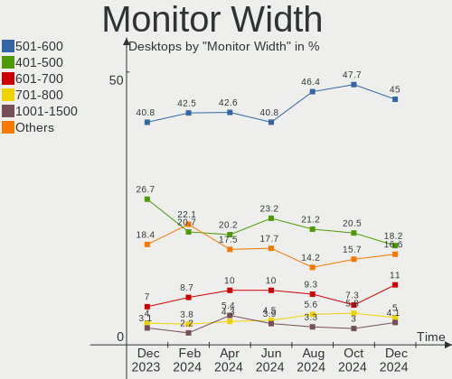
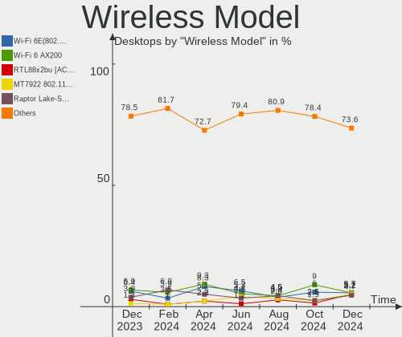
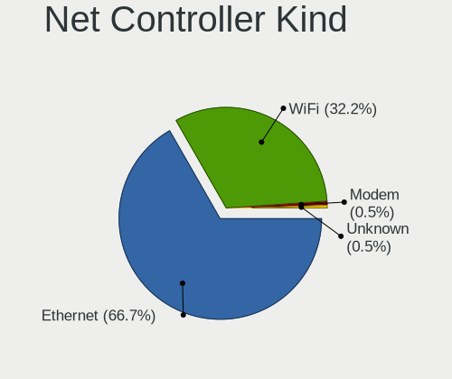

Ubuntu - Hardware Trends (Desktops)
-----------------------------------

A project to identify most popular hardware characteristics and track their change
over time based on data collected by Linux users at https://Linux-Hardware.org.

Anyone can contribute to this report by the [hw-probe](https://github.com/linuxhw/hw-probe) tool:

    sudo -E hw-probe -all -upload

This report is for one last month. Overall report since the beginning of time: [TestCoverage](https://github.com/linuxhw/TestCoverage)

Period: Sep, 2022.

Contents
--------

* [ System ](#system)
  - [ OS                       ](#os)
  - [ OS Family                ](#os-family)
  - [ Kernel                   ](#kernel)
  - [ Kernel Family            ](#kernel-family)
  - [ Kernel Major Ver.        ](#kernel-major-ver)
  - [ Arch                     ](#arch)
  - [ DE                       ](#de)
  - [ Display Server           ](#display-server)
  - [ Display Manager          ](#display-manager)
  - [ OS Lang                  ](#os-lang)
  - [ Boot Mode                ](#boot-mode)
  - [ Filesystem               ](#filesystem)
  - [ Part. scheme             ](#part-scheme)
  - [ Dual Boot with Linux/BSD ](#dual-boot-with-linuxbsd)
  - [ Dual Boot (Win)          ](#dual-boot-win)

* [ Board ](#board)
  - [ Vendor                   ](#vendor)
  - [ Model                    ](#model)
  - [ Model Family             ](#model-family)
  - [ MFG Year                 ](#mfg-year)
  - [ Form Factor              ](#form-factor)
  - [ Secure Boot              ](#secure-boot)
  - [ Coreboot                 ](#coreboot)
  - [ RAM Size                 ](#ram-size)
  - [ RAM Used                 ](#ram-used)
  - [ Total Drives             ](#total-drives)
  - [ Has CD-ROM               ](#has-cd-rom)
  - [ Has Ethernet             ](#has-ethernet)
  - [ Has WiFi                 ](#has-wifi)
  - [ Has Bluetooth            ](#has-bluetooth)

* [ Location ](#location)
  - [ Country                  ](#country)
  - [ City                     ](#city)

* [ Drives ](#drives)
  - [ Drive Vendor             ](#drive-vendor)
  - [ Drive Model              ](#drive-model)
  - [ HDD Vendor               ](#hdd-vendor)
  - [ SSD Vendor               ](#ssd-vendor)
  - [ Drive Kind               ](#drive-kind)
  - [ Drive Connector          ](#drive-connector)
  - [ Drive Size               ](#drive-size)
  - [ Space Total              ](#space-total)
  - [ Space Used               ](#space-used)
  - [ Malfunc. Drives          ](#malfunc-drives)
  - [ Malfunc. Drive Vendor    ](#malfunc-drive-vendor)
  - [ Malfunc. HDD Vendor      ](#malfunc-hdd-vendor)
  - [ Malfunc. Drive Kind      ](#malfunc-drive-kind)
  - [ Failed Drives            ](#failed-drives)
  - [ Failed Drive Vendor      ](#failed-drive-vendor)
  - [ Drive Status             ](#drive-status)

* [ Storage controller ](#storage-controller)
  - [ Storage Vendor           ](#storage-vendor)
  - [ Storage Model            ](#storage-model)
  - [ Storage Kind             ](#storage-kind)

* [ Processor ](#processor)
  - [ CPU Vendor               ](#cpu-vendor)
  - [ CPU Model                ](#cpu-model)
  - [ CPU Model Family         ](#cpu-model-family)
  - [ CPU Cores                ](#cpu-cores)
  - [ CPU Sockets              ](#cpu-sockets)
  - [ CPU Threads              ](#cpu-threads)
  - [ CPU Op-Modes             ](#cpu-op-modes)
  - [ CPU Microcode            ](#cpu-microcode)
  - [ CPU Microarch            ](#cpu-microarch)

* [ Graphics ](#graphics)
  - [ GPU Vendor               ](#gpu-vendor)
  - [ GPU Model                ](#gpu-model)
  - [ GPU Combo                ](#gpu-combo)
  - [ GPU Driver               ](#gpu-driver)
  - [ GPU Memory               ](#gpu-memory)

* [ Monitor ](#monitor)
  - [ Monitor Vendor           ](#monitor-vendor)
  - [ Monitor Model            ](#monitor-model)
  - [ Monitor Resolution       ](#monitor-resolution)
  - [ Monitor Diagonal         ](#monitor-diagonal)
  - [ Monitor Width            ](#monitor-width)
  - [ Aspect Ratio             ](#aspect-ratio)
  - [ Monitor Area             ](#monitor-area)
  - [ Pixel Density            ](#pixel-density)
  - [ Multiple Monitors        ](#multiple-monitors)

* [ Network ](#network)
  - [ Net Controller Vendor    ](#net-controller-vendor)
  - [ Net Controller Model     ](#net-controller-model)
  - [ Wireless Vendor          ](#wireless-vendor)
  - [ Wireless Model           ](#wireless-model)
  - [ Ethernet Vendor          ](#ethernet-vendor)
  - [ Ethernet Model           ](#ethernet-model)
  - [ Net Controller Kind      ](#net-controller-kind)
  - [ Used Controller          ](#used-controller)
  - [ NICs                     ](#nics)
  - [ IPv6                     ](#ipv6)

* [ Bluetooth ](#bluetooth)
  - [ Bluetooth Vendor         ](#bluetooth-vendor)
  - [ Bluetooth Model          ](#bluetooth-model)

* [ Sound ](#sound)
  - [ Sound Vendor             ](#sound-vendor)
  - [ Sound Model              ](#sound-model)

* [ Memory ](#memory)
  - [ Memory Vendor            ](#memory-vendor)
  - [ Memory Model             ](#memory-model)
  - [ Memory Kind              ](#memory-kind)
  - [ Memory Form Factor       ](#memory-form-factor)
  - [ Memory Size              ](#memory-size)
  - [ Memory Speed             ](#memory-speed)

* [ Printers & scanners ](#printers--scanners)
  - [ Printer Vendor           ](#printer-vendor)
  - [ Printer Model            ](#printer-model)
  - [ Scanner Vendor           ](#scanner-vendor)
  - [ Scanner Model            ](#scanner-model)

* [ Camera ](#camera)
  - [ Camera Vendor            ](#camera-vendor)
  - [ Camera Model             ](#camera-model)

* [ Security ](#security)
  - [ Fingerprint Vendor       ](#fingerprint-vendor)
  - [ Fingerprint Model        ](#fingerprint-model)
  - [ Chipcard Vendor          ](#chipcard-vendor)
  - [ Chipcard Model           ](#chipcard-model)

* [ Unsupported ](#unsupported)
  - [ Unsupported Devices      ](#unsupported-devices)
  - [ Unsupported Device Types ](#unsupported-device-types)

System
------

OS
--

Installed operating systems

| Name           | Desktops | Percent |
|----------------|----------|---------|
| Ubuntu 22.04   | 316      | 73.83%  |
| Ubuntu 20.04   | 98       | 22.9%   |
| Ubuntu 22.10   | 5        | 1.17%   |
| Ubuntu 18.04   | 5        | 1.17%   |
| Ubuntu 21.10   | 2        | 0.47%   |
| Ubuntu Core 18 | 1        | 0.23%   |
| Ubuntu 20.10   | 1        | 0.23%   |

OS Family
---------

OS without a version

| Name   | Desktops | Percent |
|--------|----------|---------|
| Ubuntu | 428      | 100%    |

Kernel
------

Version of the Linux kernel

| Version                              | Desktops | Percent |
|--------------------------------------|----------|---------|
| 5.15.0-47-generic                    | 173      | 40.42%  |
| 5.15.0-48-generic                    | 111      | 25.93%  |
| 5.15.0-46-generic                    | 54       | 12.62%  |
| 5.15.0-43-generic                    | 19       | 4.44%   |
| 5.4.0-125-generic                    | 11       | 2.57%   |
| 5.4.0-126-generic                    | 7        | 1.64%   |
| 5.15.0-25-generic                    | 4        | 0.93%   |
| 5.13.0-52-generic                    | 3        | 0.7%    |
| 5.13.0-30-generic                    | 3        | 0.7%    |
| 5.4.0-72-generic                     | 2        | 0.47%   |
| 5.4.0-124-generic                    | 2        | 0.47%   |
| 5.4.0-122-generic                    | 2        | 0.47%   |
| 5.19.0-18-generic                    | 2        | 0.47%   |
| 6.0.0-rc5                            | 1        | 0.23%   |
| 6.0.0-060000rc5daily20220913-generic | 1        | 0.23%   |
| 5.9.1-050901-lowlatency              | 1        | 0.23%   |
| 5.8.0-63-generic                     | 1        | 0.23%   |
| 5.8.0-59-generic                     | 1        | 0.23%   |
| 5.8.0-41-generic                     | 1        | 0.23%   |
| 5.4.0-91-generic                     | 1        | 0.23%   |
| 5.4.0-70-generic                     | 1        | 0.23%   |
| 5.4.0-52-generic                     | 1        | 0.23%   |
| 5.4.0-26-generic                     | 1        | 0.23%   |
| 5.4.0-121-generic                    | 1        | 0.23%   |
| 5.4.0-104-generic                    | 1        | 0.23%   |
| 5.4.0-100-generic                    | 1        | 0.23%   |
| 5.19.5-051905-generic                | 1        | 0.23%   |
| 5.19.0-16-generic                    | 1        | 0.23%   |
| 5.19.0-15-generic                    | 1        | 0.23%   |
| 5.19.0-051900-generic                | 1        | 0.23%   |
| 5.18.8-051808-generic                | 1        | 0.23%   |
| 5.18.10-051810-generic               | 1        | 0.23%   |
| 5.17.7-051707-generic                | 1        | 0.23%   |
| 5.17.0-1018-oem                      | 1        | 0.23%   |
| 5.17.0-1017-oem                      | 1        | 0.23%   |
| 5.15.0-50-generic                    | 1        | 0.23%   |
| 5.15.0-48-lowlatency                 | 1        | 0.23%   |
| 5.15.0-41-generic                    | 1        | 0.23%   |
| 5.15.0-40-generic                    | 1        | 0.23%   |
| 5.15.0-30-generic                    | 1        | 0.23%   |

Kernel Family
-------------

Linux kernel without a distro release

| Version | Desktops | Percent |
|---------|----------|---------|
| 5.15.0  | 366      | 85.51%  |
| 5.4.0   | 31       | 7.24%   |
| 5.13.0  | 7        | 1.64%   |
| 5.19.0  | 5        | 1.17%   |
| 5.11.0  | 4        | 0.93%   |
| 5.8.0   | 3        | 0.7%    |
| 6.0.0   | 2        | 0.47%   |
| 5.17.0  | 2        | 0.47%   |
| 5.9.1   | 1        | 0.23%   |
| 5.19.5  | 1        | 0.23%   |
| 5.18.8  | 1        | 0.23%   |
| 5.18.10 | 1        | 0.23%   |
| 5.17.7  | 1        | 0.23%   |
| 5.14.0  | 1        | 0.23%   |
| 5.13.11 | 1        | 0.23%   |
| 4.15.0  | 1        | 0.23%   |

Kernel Major Ver.
-----------------

Linux kernel major version

| Version | Desktops | Percent |
|---------|----------|---------|
| 5.15    | 366      | 85.51%  |
| 5.4     | 31       | 7.24%   |
| 5.13    | 8        | 1.87%   |
| 5.19    | 6        | 1.4%    |
| 5.11    | 4        | 0.93%   |
| 5.8     | 3        | 0.7%    |
| 5.17    | 3        | 0.7%    |
| 6.0     | 2        | 0.47%   |
| 5.18    | 2        | 0.47%   |
| 5.9     | 1        | 0.23%   |
| 5.14    | 1        | 0.23%   |
| 4.15    | 1        | 0.23%   |

Arch
----

OS architecture (x86_64, i586, etc.)

| Name   | Desktops | Percent |
|--------|----------|---------|
| x86_64 | 427      | 99.77%  |
| s390x  | 1        | 0.23%   |

DE
--

Desktop Environment

| Name            | Desktops | Percent |
|-----------------|----------|---------|
| GNOME           | 385      | 89.95%  |
| Unknown         | 30       | 7.01%   |
| X-Cinnamon      | 6        | 1.4%    |
| GNOME Flashback | 5        | 1.17%   |
| GNOME Classic   | 1        | 0.23%   |
| Enlightenment   | 1        | 0.23%   |

Display Server
--------------

X11 or Wayland

| Name    | Desktops | Percent |
|---------|----------|---------|
| X11     | 220      | 51.4%   |
| Wayland | 179      | 41.82%  |
| Tty     | 18       | 4.21%   |
| Unknown | 11       | 2.57%   |

Display Manager
---------------

SDDM, LightDM, etc.

| Name    | Desktops | Percent |
|---------|----------|---------|
| GDM3    | 331      | 77.34%  |
| Unknown | 57       | 13.32%  |
| GDM     | 27       | 6.31%   |
| LightDM | 10       | 2.34%   |
| SDDM    | 2        | 0.47%   |
| LXDM    | 1        | 0.23%   |

OS Lang
-------

Language

| Lang    | Desktops | Percent |
|---------|----------|---------|
| en_US   | 157      | 36.68%  |
| de_DE   | 56       | 13.08%  |
| fr_FR   | 32       | 7.48%   |
| it_IT   | 27       | 6.31%   |
| pt_BR   | 21       | 4.91%   |
| en_GB   | 18       | 4.21%   |
| en_CA   | 18       | 4.21%   |
| ru_RU   | 8        | 1.87%   |
| pl_PL   | 7        | 1.64%   |
| es_ES   | 7        | 1.64%   |
| en_IN   | 7        | 1.64%   |
| en_AU   | 6        | 1.4%    |
| C       | 6        | 1.4%    |
| Unknown | 6        | 1.4%    |
| hu_HU   | 5        | 1.17%   |
| ja_JP   | 4        | 0.93%   |
| sv_SE   | 3        | 0.7%    |
| nl_NL   | 3        | 0.7%    |
| de_AT   | 3        | 0.7%    |
| zh_CN   | 2        | 0.47%   |
| tr_TR   | 2        | 0.47%   |
| fr_CA   | 2        | 0.47%   |
| fr_BE   | 2        | 0.47%   |
| es_MX   | 2        | 0.47%   |
| el_GR   | 2        | 0.47%   |
| de_CH   | 2        | 0.47%   |
| zh_TW   | 1        | 0.23%   |
| sl_SI   | 1        | 0.23%   |
| ru_UA   | 1        | 0.23%   |
| pt_PT   | 1        | 0.23%   |
| ko_KR   | 1        | 0.23%   |
| it_CH   | 1        | 0.23%   |
| fr_CH   | 1        | 0.23%   |
| es_VE   | 1        | 0.23%   |
| es_SV   | 1        | 0.23%   |
| es_EC   | 1        | 0.23%   |
| es_CU   | 1        | 0.23%   |
| es_CR   | 1        | 0.23%   |
| es_AR   | 1        | 0.23%   |
| en_SG   | 1        | 0.23%   |

Boot Mode
---------

EFI or BIOS

| Mode | Desktops | Percent |
|------|----------|---------|
| BIOS | 301      | 70.33%  |
| EFI  | 127      | 29.67%  |

Filesystem
----------

Type of filesystem

| Type     | Desktops | Percent |
|----------|----------|---------|
| Ext4     | 405      | 94.63%  |
| Overlay  | 9        | 2.1%    |
| Zfs      | 5        | 1.17%   |
| Xfs      | 4        | 0.93%   |
| Btrfs    | 3        | 0.7%    |
| Reiserfs | 1        | 0.23%   |
| Ext2     | 1        | 0.23%   |

Part. scheme
------------

Scheme of partitioning

| Type    | Desktops | Percent |
|---------|----------|---------|
| Unknown | 302      | 70.56%  |
| GPT     | 113      | 26.4%   |
| MBR     | 13       | 3.04%   |

Dual Boot with Linux/BSD
------------------------

Hosting more than one Linux/BSD

| Dual boot | Desktops | Percent |
|-----------|----------|---------|
| No        | 347      | 81.07%  |
| Yes       | 81       | 18.93%  |

Dual Boot (Win)
---------------

Hosting Linux and Windows

| Dual boot | Desktops | Percent |
|-----------|----------|---------|
| No        | 254      | 59.35%  |
| Yes       | 174      | 40.65%  |

Board
-----

Vendor
------

Motherboard manufacturer

| Name                      | Desktops | Percent |
|---------------------------|----------|---------|
| ASUSTek Computer          | 118      | 27.57%  |
| Gigabyte Technology       | 71       | 16.59%  |
| MSI                       | 45       | 10.51%  |
| Dell                      | 40       | 9.35%   |
| ASRock                    | 35       | 8.18%   |
| Hewlett-Packard           | 32       | 7.48%   |
| Lenovo                    | 19       | 4.44%   |
| Acer                      | 10       | 2.34%   |
| Medion                    | 8        | 1.87%   |
| Intel                     | 6        | 1.4%    |
| Pegatron                  | 5        | 1.17%   |
| Fujitsu                   | 5        | 1.17%   |
| Foxconn                   | 3        | 0.7%    |
| Biostar                   | 3        | 0.7%    |
| Unknown                   | 3        | 0.7%    |
| Supermicro                | 2        | 0.47%   |
| Positivo                  | 2        | 0.47%   |
| ECS                       | 2        | 0.47%   |
| Apple                     | 2        | 0.47%   |
| AMI                       | 2        | 0.47%   |
| Shuttle                   | 1        | 0.23%   |
| Protectli                 | 1        | 0.23%   |
| Packard Bell              | 1        | 0.23%   |
| OEM                       | 1        | 0.23%   |
| NU591                     | 1        | 0.23%   |
| MiTAC                     | 1        | 0.23%   |
| IBT.ca (IBT Technologies) | 1        | 0.23%   |
| Huanan                    | 1        | 0.23%   |
| Fujitsu Siemens           | 1        | 0.23%   |
| DFI                       | 1        | 0.23%   |
| Colorful Technology       | 1        | 0.23%   |
| BESSTAR Tech              | 1        | 0.23%   |
| Avalue                    | 1        | 0.23%   |
| ASRockRack                | 1        | 0.23%   |
| Alienware                 | 1        | 0.23%   |

Model
-----

Motherboard model

| Name                                | Desktops | Percent |
|-------------------------------------|----------|---------|
| ASUS All Series                     | 11       | 2.57%   |
| MSI MS-7C37                         | 6        | 1.4%    |
| Unknown                             | 5        | 1.17%   |
| MSI MS-7721                         | 4        | 0.93%   |
| Dell OptiPlex 9020                  | 4        | 0.93%   |
| ASUS TUF Gaming X570-PLUS           | 4        | 0.93%   |
| ASUS PRIME A320M-K                  | 4        | 0.93%   |
| Dell Precision WorkStation T5500    | 3        | 0.7%    |
| Dell OptiPlex 7010                  | 3        | 0.7%    |
| ASUS ROG STRIX B450-F GAMING        | 3        | 0.7%    |
| ASRock B450M Pro4                   | 3        | 0.7%    |
| MSI MS-7C91                         | 2        | 0.47%   |
| MSI MS-7B48                         | 2        | 0.47%   |
| MSI MS-7817                         | 2        | 0.47%   |
| Medion MS-7707                      | 2        | 0.47%   |
| Lenovo ThinkStation P910 30B8S0EN00 | 2        | 0.47%   |
| Intel H61                           | 2        | 0.47%   |
| HP Compaq Elite 8300 USDT           | 2        | 0.47%   |
| HP Compaq dc7900 Small Form Factor  | 2        | 0.47%   |
| Gigabyte X570 UD                    | 2        | 0.47%   |
| Gigabyte B75M-D3H                   | 2        | 0.47%   |
| Gigabyte B450 I AORUS PRO WIFI      | 2        | 0.47%   |
| Gigabyte 990FXA-UD3                 | 2        | 0.47%   |
| Gigabyte 970A-DS3P                  | 2        | 0.47%   |
| Dell OptiPlex 9010                  | 2        | 0.47%   |
| Dell OptiPlex 390                   | 2        | 0.47%   |
| Dell OptiPlex 3010                  | 2        | 0.47%   |
| ASUS ROG STRIX B450-I GAMING        | 2        | 0.47%   |
| ASUS Pro WS WRX80E-SAGE SE WIFI     | 2        | 0.47%   |
| ASUS PRIME B360-PLUS                | 2        | 0.47%   |
| ASUS PRIME B350-PLUS                | 2        | 0.47%   |
| ASUS P5B-Deluxe                     | 2        | 0.47%   |
| ASUS M5A97 R2.0                     | 2        | 0.47%   |
| ASUS CROSSHAIR V FORMULA-Z          | 2        | 0.47%   |
| ASRock Q1900M                       | 2        | 0.47%   |
| Acer Aspire M3970                   | 2        | 0.47%   |
| Supermicro X9SCL/X9SCM              | 1        | 0.23%   |
| Supermicro C7P67                    | 1        | 0.23%   |
| Shuttle DH470                       | 1        | 0.23%   |
| Protectli FW2B                      | 1        | 0.23%   |

Model Family
------------

Motherboard model prefix

| Name                | Desktops | Percent |
|---------------------|----------|---------|
| Dell OptiPlex       | 22       | 5.14%   |
| ASUS PRIME          | 22       | 5.14%   |
| HP Compaq           | 14       | 3.27%   |
| ASUS TUF            | 13       | 3.04%   |
| ASUS ROG            | 12       | 2.8%    |
| ASUS All            | 11       | 2.57%   |
| Dell Precision      | 9        | 2.1%    |
| Lenovo ThinkStation | 7        | 1.64%   |
| Lenovo ThinkCentre  | 7        | 1.64%   |
| Acer Aspire         | 7        | 1.64%   |
| MSI MS-7C37         | 6        | 1.4%    |
| Unknown             | 5        | 1.17%   |
| MSI MS-7721         | 4        | 0.93%   |
| Gigabyte B450       | 4        | 0.93%   |
| Fujitsu ESPRIMO     | 4        | 0.93%   |
| ASUS M5A97          | 4        | 0.93%   |
| ASRock B450M        | 4        | 0.93%   |
| Lenovo IdeaCentre   | 3        | 0.7%    |
| HP EliteDesk        | 3        | 0.7%    |
| Gigabyte X570       | 3        | 0.7%    |
| Dell Vostro         | 3        | 0.7%    |
| ASUS Pro            | 3        | 0.7%    |
| ASUS P8Z68-V        | 3        | 0.7%    |
| ASUS M5A78L-M       | 3        | 0.7%    |
| MSI MS-7C91         | 2        | 0.47%   |
| MSI MS-7B48         | 2        | 0.47%   |
| MSI MS-7817         | 2        | 0.47%   |
| Medion MS-7707      | 2        | 0.47%   |
| Lenovo H50-50       | 2        | 0.47%   |
| Intel H61           | 2        | 0.47%   |
| HP ProLiant         | 2        | 0.47%   |
| HP ProDesk          | 2        | 0.47%   |
| HP Pavilion         | 2        | 0.47%   |
| Gigabyte Z590       | 2        | 0.47%   |
| Gigabyte H510M      | 2        | 0.47%   |
| Gigabyte H310M      | 2        | 0.47%   |
| Gigabyte B75M-D3H   | 2        | 0.47%   |
| Gigabyte B560M      | 2        | 0.47%   |
| Gigabyte 990FXA-UD3 | 2        | 0.47%   |
| Gigabyte 970A-DS3P  | 2        | 0.47%   |

MFG Year
--------

Motherboard manufacture year

| Year    | Desktops | Percent |
|---------|----------|---------|
| 2018    | 50       | 11.68%  |
| 2012    | 39       | 9.11%   |
| 2011    | 38       | 8.88%   |
| 2013    | 36       | 8.41%   |
| 2021    | 35       | 8.18%   |
| 2014    | 31       | 7.24%   |
| 2019    | 27       | 6.31%   |
| 2017    | 25       | 5.84%   |
| 2020    | 23       | 5.37%   |
| 2010    | 23       | 5.37%   |
| 2016    | 21       | 4.91%   |
| 2015    | 19       | 4.44%   |
| 2009    | 17       | 3.97%   |
| 2008    | 15       | 3.5%    |
| 2022    | 11       | 2.57%   |
| 2007    | 9        | 2.1%    |
| 2006    | 6        | 1.4%    |
| 2005    | 2        | 0.47%   |
| Unknown | 1        | 0.23%   |

Form Factor
-----------

Physical design of the computer

| Name    | Desktops | Percent |
|---------|----------|---------|
| Desktop | 428      | 100%    |

Secure Boot
-----------

Enabled or disabled

| State    | Desktops | Percent |
|----------|----------|---------|
| Disabled | 415      | 96.96%  |
| Enabled  | 13       | 3.04%   |

Coreboot
--------

Have coreboot on board

| Used | Desktops | Percent |
|------|----------|---------|
| No   | 426      | 99.53%  |
| Yes  | 2        | 0.47%   |

RAM Size
--------

Total RAM memory

| Size in GB      | Desktops | Percent |
|-----------------|----------|---------|
| 16.01-24.0      | 113      | 26.4%   |
| 8.01-16.0       | 81       | 18.93%  |
| 32.01-64.0      | 64       | 14.95%  |
| 3.01-4.0        | 63       | 14.72%  |
| 4.01-8.0        | 59       | 13.79%  |
| 64.01-256.0     | 16       | 3.74%   |
| 24.01-32.0      | 14       | 3.27%   |
| 1.01-2.0        | 11       | 2.57%   |
| 2.01-3.0        | 4        | 0.93%   |
| More than 256.0 | 2        | 0.47%   |
| 0.51-1.0        | 1        | 0.23%   |

RAM Used
--------

Used RAM memory

| Used GB     | Desktops | Percent |
|-------------|----------|---------|
| 1.01-2.0    | 147      | 34.35%  |
| 2.01-3.0    | 123      | 28.74%  |
| 3.01-4.0    | 63       | 14.72%  |
| 4.01-8.0    | 50       | 11.68%  |
| 8.01-16.0   | 24       | 5.61%   |
| 0.51-1.0    | 12       | 2.8%    |
| 16.01-24.0  | 4        | 0.93%   |
| 0.01-0.5    | 3        | 0.7%    |
| 24.01-32.0  | 1        | 0.23%   |
| 64.01-256.0 | 1        | 0.23%   |

Total Drives
------------

Number of drives on board

| Drives | Desktops | Percent |
|--------|----------|---------|
| 1      | 163      | 38.08%  |
| 2      | 141      | 32.94%  |
| 3      | 62       | 14.49%  |
| 4      | 28       | 6.54%   |
| 5      | 14       | 3.27%   |
| 0      | 8        | 1.87%   |
| 6      | 6        | 1.4%    |
| 7      | 4        | 0.93%   |
| 13     | 1        | 0.23%   |
| 8      | 1        | 0.23%   |

Has CD-ROM
----------

Has CD-ROM on board

| Presented | Desktops | Percent |
|-----------|----------|---------|
| Yes       | 218      | 50.93%  |
| No        | 210      | 49.07%  |

Has Ethernet
------------

Has Ethernet on board

| Presented | Desktops | Percent |
|-----------|----------|---------|
| Yes       | 424      | 99.07%  |
| No        | 4        | 0.93%   |

Has WiFi
--------

Has WiFi module

| Presented | Desktops | Percent |
|-----------|----------|---------|
| No        | 236      | 55.14%  |
| Yes       | 192      | 44.86%  |

Has Bluetooth
-------------

Has Bluetooth module

| Presented | Desktops | Percent |
|-----------|----------|---------|
| No        | 305      | 71.26%  |
| Yes       | 123      | 28.74%  |

Location
--------

Country
-------

Geographic location (country)

| Country      | Desktops | Percent |
|--------------|----------|---------|
| USA          | 79       | 18.46%  |
| Germany      | 61       | 14.25%  |
| Italy        | 31       | 7.24%   |
| France       | 31       | 7.24%   |
| Canada       | 22       | 5.14%   |
| Brazil       | 22       | 5.14%   |
| UK           | 20       | 4.67%   |
| Russia       | 14       | 3.27%   |
| India        | 9        | 2.1%    |
| Spain        | 8        | 1.87%   |
| Poland       | 8        | 1.87%   |
| Slovakia     | 7        | 1.64%   |
| Sweden       | 6        | 1.4%    |
| Japan        | 6        | 1.4%    |
| Hungary      | 6        | 1.4%    |
| Australia    | 6        | 1.4%    |
| Switzerland  | 5        | 1.17%   |
| Netherlands  | 5        | 1.17%   |
| Belgium      | 5        | 1.17%   |
| Austria      | 5        | 1.17%   |
| Slovenia     | 4        | 0.93%   |
| Mexico       | 4        | 0.93%   |
| Greece       | 4        | 0.93%   |
| China        | 4        | 0.93%   |
| Singapore    | 3        | 0.7%    |
| Israel       | 3        | 0.7%    |
| Algeria      | 3        | 0.7%    |
| Vietnam      | 2        | 0.47%   |
| Turkey       | 2        | 0.47%   |
| South Korea  | 2        | 0.47%   |
| South Africa | 2        | 0.47%   |
| Portugal     | 2        | 0.47%   |
| Iran         | 2        | 0.47%   |
| Hong Kong    | 2        | 0.47%   |
| Finland      | 2        | 0.47%   |
| Ecuador      | 2        | 0.47%   |
| Czechia      | 2        | 0.47%   |
| Costa Rica   | 2        | 0.47%   |
| Chile        | 2        | 0.47%   |
| Argentina    | 2        | 0.47%   |

City
----

Geographic location (city)

| City           | Desktops | Percent |
|----------------|----------|---------|
| Košice        | 7        | 1.64%   |
| Milan          | 5        | 1.17%   |
| St Petersburg  | 4        | 0.93%   |
| Rome           | 4        | 0.93%   |
| Berlin         | 4        | 0.93%   |
| Toronto        | 3        | 0.7%    |
| Singapore      | 3        | 0.7%    |
| Paris          | 3        | 0.7%    |
| Ljubljana      | 3        | 0.7%    |
| Kolkata        | 3        | 0.7%    |
| Hamburg        | 3        | 0.7%    |
| Cagliari       | 3        | 0.7%    |
| Bradford       | 3        | 0.7%    |
| Yekaterinburg  | 2        | 0.47%   |
| Warsaw         | 2        | 0.47%   |
| Vienna         | 2        | 0.47%   |
| Tel Aviv       | 2        | 0.47%   |
| Sydney         | 2        | 0.47%   |
| Stuttgart      | 2        | 0.47%   |
| Strasbourg     | 2        | 0.47%   |
| Solms          | 2        | 0.47%   |
| Seattle        | 2        | 0.47%   |
| San Diego      | 2        | 0.47%   |
| Rio de Janeiro | 2        | 0.47%   |
| Rho            | 2        | 0.47%   |
| Quito          | 2        | 0.47%   |
| Porto          | 2        | 0.47%   |
| Ottawa         | 2        | 0.47%   |
| Niterói       | 2        | 0.47%   |
| Nanaimo        | 2        | 0.47%   |
| Munich         | 2        | 0.47%   |
| Moscow         | 2        | 0.47%   |
| Mexico City    | 2        | 0.47%   |
| Luetjenburg    | 2        | 0.47%   |
| Las Condes     | 2        | 0.47%   |
| Gothenburg     | 2        | 0.47%   |
| Dayton         | 2        | 0.47%   |
| Budapest       | 2        | 0.47%   |
| Belo Horizonte | 2        | 0.47%   |
| Athens         | 2        | 0.47%   |

Drives
------

Drive Vendor
------------

Hard drive vendors

| Vendor                      | Desktops | Drives | Percent |
|-----------------------------|----------|--------|---------|
| WDC                         | 154      | 203    | 20.9%   |
| Seagate                     | 139      | 178    | 18.86%  |
| Samsung Electronics         | 107      | 146    | 14.52%  |
| Kingston                    | 41       | 47     | 5.56%   |
| Crucial                     | 39       | 43     | 5.29%   |
| Toshiba                     | 37       | 45     | 5.02%   |
| Sandisk                     | 32       | 37     | 4.34%   |
| Hitachi                     | 16       | 18     | 2.17%   |
| HGST                        | 13       | 17     | 1.76%   |
| Unknown                     | 10       | 14     | 1.36%   |
| SK hynix                    | 9        | 9      | 1.22%   |
| PNY                         | 7        | 7      | 0.95%   |
| Phison Electronics          | 7        | 8      | 0.95%   |
| Maxtor                      | 7        | 8      | 0.95%   |
| Intel                       | 7        | 7      | 0.95%   |
| A-DATA Technology           | 7        | 8      | 0.95%   |
| Transcend                   | 4        | 4      | 0.54%   |
| SPCC                        | 4        | 5      | 0.54%   |
| Patriot                     | 4        | 4      | 0.54%   |
| Micron Technology           | 4        | 4      | 0.54%   |
| Intenso                     | 4        | 4      | 0.54%   |
| China                       | 4        | 4      | 0.54%   |
| Silicon Motion              | 3        | 3      | 0.41%   |
| Realtek Semiconductor       | 3        | 3      | 0.41%   |
| Phison                      | 3        | 4      | 0.41%   |
| Micron/Crucial Technology   | 3        | 3      | 0.41%   |
| Integral                    | 3        | 3      | 0.41%   |
| Verbatim                    | 2        | 2      | 0.27%   |
| Teclast                     | 2        | 2      | 0.27%   |
| Team                        | 2        | 2      | 0.27%   |
| LITEONIT                    | 2        | 2      | 0.27%   |
| Kingston Technology Company | 2        | 2      | 0.27%   |
| KingFast                    | 2        | 2      | 0.27%   |
| GOODRAM                     | 2        | 2      | 0.27%   |
| Dogfish                     | 2        | 2      | 0.27%   |
| Corsair                     | 2        | 2      | 0.27%   |
| Apacer                      | 2        | 2      | 0.27%   |
| Unknown                     | 2        | 3      | 0.27%   |
| YS                          | 1        | 1      | 0.14%   |
| XrayDisk                    | 1        | 1      | 0.14%   |

Drive Model
-----------

Hard drive models

| Model                                               | Desktops | Percent |
|-----------------------------------------------------|----------|---------|
| Seagate ST500DM002-1BD142 500GB                     | 15       | 1.76%   |
| Samsung SSD 860 EVO 500GB                           | 11       | 1.29%   |
| Samsung SSD 850 EVO 250GB                           | 10       | 1.17%   |
| Seagate ST1000DM010-2EP102 1TB                      | 9        | 1.06%   |
| Seagate ST1000DM003-1CH162 1TB                      | 9        | 1.06%   |
| Toshiba DT01ACA100 1TB                              | 8        | 0.94%   |
| Seagate ST2000DM008-2FR102 2TB                      | 7        | 0.82%   |
| Seagate ST1000DM003-1SB102 1TB                      | 7        | 0.82%   |
| Samsung NVMe SSD Controller SM981/PM981/PM983 256GB | 7        | 0.82%   |
| Crucial CT240BX500SSD1 240GB                        | 7        | 0.82%   |
| Kingston SA400S37480G 480GB SSD                     | 6        | 0.7%    |
| Kingston SA400S37120G 120GB SSD                     | 6        | 0.7%    |
| Crucial CT500MX500SSD1 500GB                        | 6        | 0.7%    |
| Crucial CT480BX500SSD1 480GB                        | 6        | 0.7%    |
| WDC WD10EZEX-00WN4A0 1TB                            | 5        | 0.59%   |
| Unknown SD/MMC/MS PRO 2GB                           | 5        | 0.59%   |
| Seagate ST3500418AS 500GB                           | 5        | 0.59%   |
| Samsung SSD 850 EVO 500GB                           | 5        | 0.59%   |
| Samsung SSD 840 EVO 250GB                           | 5        | 0.59%   |
| WDC WD40EFRX-68WT0N0 4TB                            | 4        | 0.47%   |
| WDC WD20EARS-00MVWB0 2TB                            | 4        | 0.47%   |
| WDC WD10EZEX-08WN4A0 1TB                            | 4        | 0.47%   |
| Toshiba DT01ACA200 2TB                              | 4        | 0.47%   |
| Seagate ST9500325AS 500GB                           | 4        | 0.47%   |
| Seagate ST4000DM004-2CV104 4TB                      | 4        | 0.47%   |
| Seagate ST1000LM024 HN-M101MBB 1TB                  | 4        | 0.47%   |
| Seagate Expansion 1TB                               | 4        | 0.47%   |
| Samsung SSD 980 PRO 1TB                             | 4        | 0.47%   |
| Samsung SSD 870 QVO 1TB                             | 4        | 0.47%   |
| Samsung NVMe SSD Drive 500GB                        | 4        | 0.47%   |
| Kingston SA400S37240G 240GB SSD                     | 4        | 0.47%   |
| Crucial CT1000MX500SSD1 1TB                         | 4        | 0.47%   |
| WDC WD5000AZLX-60K2TA0 500GB                        | 3        | 0.35%   |
| WDC WD5000AAKX-001CA0 500GB                         | 3        | 0.35%   |
| WDC WD30EFRX-68EUZN0 3TB                            | 3        | 0.35%   |
| WDC WD20EZRZ-00Z5HB0 2TB                            | 3        | 0.35%   |
| WDC WD2003FZEX-00SRLA0 2TB                          | 3        | 0.35%   |
| WDC WD10EZEX-60M2NA0 1TB                            | 3        | 0.35%   |
| WDC WD10EZEX-00ZF5A0 1TB                            | 3        | 0.35%   |
| WDC WD10EZEX-00BN5A0 1TB                            | 3        | 0.35%   |

HDD Vendor
----------

Hard disk drive vendors

| Vendor              | Desktops | Drives | Percent |
|---------------------|----------|--------|---------|
| WDC                 | 143      | 182    | 37.43%  |
| Seagate             | 137      | 173    | 35.86%  |
| Toshiba             | 34       | 42     | 8.9%    |
| Samsung Electronics | 22       | 26     | 5.76%   |
| Hitachi             | 16       | 18     | 4.19%   |
| HGST                | 13       | 17     | 3.4%    |
| Maxtor              | 6        | 7      | 1.57%   |
| Unknown             | 5        | 5      | 1.31%   |
| WD MediaMax         | 1        | 1      | 0.26%   |
| Intenso             | 1        | 1      | 0.26%   |
| ExcelStor           | 1        | 1      | 0.26%   |
| ASMT                | 1        | 2      | 0.26%   |
| Apple               | 1        | 1      | 0.26%   |
| Unknown             | 1        | 2      | 0.26%   |

SSD Vendor
----------

Solid state drive vendors

| Vendor              | Desktops | Drives | Percent |
|---------------------|----------|--------|---------|
| Samsung Electronics | 54       | 64     | 22.78%  |
| Crucial             | 32       | 36     | 13.5%   |
| Kingston            | 30       | 34     | 12.66%  |
| SanDisk             | 21       | 24     | 8.86%   |
| WDC                 | 14       | 15     | 5.91%   |
| PNY                 | 7        | 7      | 2.95%   |
| A-DATA Technology   | 6        | 7      | 2.53%   |
| SK hynix            | 4        | 4      | 1.69%   |
| Patriot             | 4        | 4      | 1.69%   |
| Intel               | 4        | 4      | 1.69%   |
| China               | 4        | 4      | 1.69%   |
| Transcend           | 3        | 3      | 1.27%   |
| Toshiba             | 3        | 3      | 1.27%   |
| SPCC                | 3        | 3      | 1.27%   |
| Micron Technology   | 3        | 3      | 1.27%   |
| Intenso             | 3        | 3      | 1.27%   |
| Integral            | 3        | 3      | 1.27%   |
| Verbatim            | 2        | 2      | 0.84%   |
| Teclast             | 2        | 2      | 0.84%   |
| Team                | 2        | 2      | 0.84%   |
| LITEONIT            | 2        | 2      | 0.84%   |
| GOODRAM             | 2        | 2      | 0.84%   |
| Dogfish             | 2        | 2      | 0.84%   |
| Corsair             | 2        | 2      | 0.84%   |
| YS                  | 1        | 1      | 0.42%   |
| WALRAM              | 1        | 1      | 0.42%   |
| Vaseky              | 1        | 1      | 0.42%   |
| TwinMOS             | 1        | 1      | 0.42%   |
| TCSUNBOW            | 1        | 1      | 0.42%   |
| TANCA               | 1        | 1      | 0.42%   |
| Protectli           | 1        | 1      | 0.42%   |
| Pioneer             | 1        | 1      | 0.42%   |
| OCZ                 | 1        | 1      | 0.42%   |
| Maxtor              | 1        | 1      | 0.42%   |
| LITEON              | 1        | 1      | 0.42%   |
| Linux               | 1        | 1      | 0.42%   |
| Lexar               | 1        | 1      | 0.42%   |
| KingFast            | 1        | 1      | 0.42%   |
| KINGBANK            | 1        | 1      | 0.42%   |
| INNOVATION IT       | 1        | 1      | 0.42%   |

Drive Kind
----------

HDD or SSD

| Kind    | Desktops | Drives | Percent |
|---------|----------|--------|---------|
| HDD     | 295      | 478    | 46.75%  |
| SSD     | 206      | 260    | 32.65%  |
| NVMe    | 109      | 144    | 17.27%  |
| Unknown | 18       | 22     | 2.85%   |
| MMC     | 3        | 3      | 0.48%   |

Drive Connector
---------------

SATA, SAS, NVMe, etc.

| Type | Desktops | Drives | Percent |
|------|----------|--------|---------|
| SATA | 380      | 724    | 73.5%   |
| NVMe | 108      | 142    | 20.89%  |
| SAS  | 26       | 38     | 5.03%   |
| MMC  | 3        | 3      | 0.58%   |

Drive Size
----------

Size of hard drive

| Size in TB | Desktops | Drives | Percent |
|------------|----------|--------|---------|
| 0.01-0.5   | 262      | 386    | 49.06%  |
| 0.51-1.0   | 164      | 210    | 30.71%  |
| 1.01-2.0   | 57       | 69     | 10.67%  |
| 3.01-4.0   | 21       | 25     | 3.93%   |
| 4.01-10.0  | 13       | 18     | 2.43%   |
| 2.01-3.0   | 11       | 16     | 2.06%   |
| 10.01-20.0 | 6        | 14     | 1.12%   |

Space Total
-----------

Amount of disk space available on the file system

| Size in GB     | Desktops | Percent |
|----------------|----------|---------|
| 101-250        | 108      | 25.23%  |
| 501-1000       | 85       | 19.86%  |
| 251-500        | 83       | 19.39%  |
| More than 3000 | 42       | 9.81%   |
| 1001-2000      | 39       | 9.11%   |
| 51-100         | 24       | 5.61%   |
| 2001-3000      | 14       | 3.27%   |
| 1-20           | 12       | 2.8%    |
| Unknown        | 11       | 2.57%   |
| 21-50          | 10       | 2.34%   |

Space Used
----------

Amount of used disk space

| Used GB        | Desktops | Percent |
|----------------|----------|---------|
| 1-20           | 126      | 29.44%  |
| 21-50          | 84       | 19.63%  |
| 101-250        | 50       | 11.68%  |
| 51-100         | 48       | 11.21%  |
| 501-1000       | 41       | 9.58%   |
| 251-500        | 32       | 7.48%   |
| More than 3000 | 17       | 3.97%   |
| 1001-2000      | 15       | 3.5%    |
| Unknown        | 11       | 2.57%   |
| 2001-3000      | 4        | 0.93%   |

Malfunc. Drives
---------------

Drive models with a malfunction

| Model                                     | Desktops | Drives | Percent |
|-------------------------------------------|----------|--------|---------|
| WDC WD5000AAKX-00ERMA0 500GB              | 2        | 2      | 5.13%   |
| Seagate ST9500325AS 500GB                 | 2        | 2      | 5.13%   |
| Seagate ST500DM002-1BD142 500GB           | 2        | 2      | 5.13%   |
| YS SSD 128GB                              | 1        | 1      | 2.56%   |
| WDC WD6400AAKS-00A7B2 640GB               | 1        | 1      | 2.56%   |
| WDC WD5000AZLX-60K2TA0 500GB              | 1        | 1      | 2.56%   |
| WDC WD5000AAKX-603CA0 500GB               | 1        | 1      | 2.56%   |
| WDC WD5000AAKX-003CA0 500GB               | 1        | 1      | 2.56%   |
| WDC WD3200AAJS-00L7A0 320GB               | 1        | 1      | 2.56%   |
| WDC WD2003FYYS-02W0B0 2TB                 | 1        | 2      | 2.56%   |
| WDC WD10EZRZ-00Z5HB0 1TB                  | 1        | 1      | 2.56%   |
| WDC WD10EZRX-00L4HB0 1TB                  | 1        | 1      | 2.56%   |
| WDC WD10EZEX-22BN5A0 1TB                  | 1        | 1      | 2.56%   |
| WDC WD10EZEX-21M2NA0 1TB                  | 1        | 1      | 2.56%   |
| WDC WD10EUCX-73YZ1Y0 1TB                  | 1        | 1      | 2.56%   |
| WDC WD10EFRX-68JCSN0 1TB                  | 1        | 1      | 2.56%   |
| WD MediaMax WL2000GSA6454G 2TB            | 1        | 1      | 2.56%   |
| Toshiba MQ01ABD100 1TB                    | 1        | 1      | 2.56%   |
| Toshiba DT01ACA050 500GB                  | 1        | 1      | 2.56%   |
| Seagate ST3500418AS 500GB                 | 1        | 1      | 2.56%   |
| Seagate ST3320620AS 320GB                 | 1        | 1      | 2.56%   |
| Seagate ST3250310AS 250GB                 | 1        | 1      | 2.56%   |
| Seagate ST3160815AS 160GB                 | 1        | 1      | 2.56%   |
| SanDisk SSD PLUS 1000GB                   | 1        | 1      | 2.56%   |
| Samsung Electronics SSD 970 EVO 1TB       | 1        | 1      | 2.56%   |
| Samsung Electronics SSD 850 EVO 250GB     | 1        | 1      | 2.56%   |
| Samsung Electronics SSD 840 EVO 250GB     | 1        | 1      | 2.56%   |
| Samsung Electronics SP2504C 250GB         | 1        | 1      | 2.56%   |
| Maxtor 6L160M0 160GB                      | 1        | 2      | 2.56%   |
| Intel SSDSC2BW180A4 180GB                 | 1        | 1      | 2.56%   |
| Innodisk Corp. - mSATA 3ME4 64GB          | 1        | 1      | 2.56%   |
| Hitachi HDT722516DLA380 165GB             | 1        | 1      | 2.56%   |
| Hitachi HDS7216SBSUN160G 0814QZEG2M 160GB | 1        | 1      | 2.56%   |
| Hitachi HDS5C1010CLA382 1TB               | 1        | 1      | 2.56%   |
| Crucial CT500MX500SSD1 500GB              | 1        | 2      | 2.56%   |
| Crucial CT128M550SSD1 128GB               | 1        | 1      | 2.56%   |

Malfunc. Drive Vendor
---------------------

Vendors of faulty drives

| Vendor              | Desktops | Drives | Percent |
|---------------------|----------|--------|---------|
| WDC                 | 14       | 15     | 35.9%   |
| Seagate             | 8        | 8      | 20.51%  |
| Samsung Electronics | 4        | 4      | 10.26%  |
| Hitachi             | 3        | 3      | 7.69%   |
| Toshiba             | 2        | 2      | 5.13%   |
| Crucial             | 2        | 3      | 5.13%   |
| YS                  | 1        | 1      | 2.56%   |
| WD MediaMax         | 1        | 1      | 2.56%   |
| SanDisk             | 1        | 1      | 2.56%   |
| Maxtor              | 1        | 2      | 2.56%   |
| Intel               | 1        | 1      | 2.56%   |
| Innodisk            | 1        | 1      | 2.56%   |

Malfunc. HDD Vendor
-------------------

Vendors of faulty HDD drives

| Vendor              | Desktops | Drives | Percent |
|---------------------|----------|--------|---------|
| WDC                 | 14       | 15     | 46.67%  |
| Seagate             | 8        | 8      | 26.67%  |
| Hitachi             | 3        | 3      | 10%     |
| Toshiba             | 2        | 2      | 6.67%   |
| WD MediaMax         | 1        | 1      | 3.33%   |
| Samsung Electronics | 1        | 1      | 3.33%   |
| Maxtor              | 1        | 2      | 3.33%   |

Malfunc. Drive Kind
-------------------

Kinds of faulty drives

| Kind | Desktops | Drives | Percent |
|------|----------|--------|---------|
| HDD  | 27       | 32     | 75%     |
| SSD  | 8        | 9      | 22.22%  |
| NVMe | 1        | 1      | 2.78%   |

Failed Drives
-------------

Failed drive models

Zero info for selected period =(

Failed Drive Vendor
-------------------

Failed drive vendors

Zero info for selected period =(

Drive Status
------------

Number of failed and malfunc. drives

| Status   | Desktops | Drives | Percent |
|----------|----------|--------|---------|
| Detected | 298      | 619    | 66.08%  |
| Works    | 120      | 246    | 26.61%  |
| Malfunc  | 33       | 42     | 7.32%   |

Storage controller
------------------

Storage Vendor
--------------

Storage controller vendors

| Vendor                       | Desktops | Percent |
|------------------------------|----------|---------|
| Intel                        | 287      | 48.15%  |
| AMD                          | 121      | 20.3%   |
| Samsung Electronics          | 38       | 6.38%   |
| ASMedia Technology           | 25       | 4.19%   |
| SanDisk                      | 18       | 3.02%   |
| JMicron Technology           | 18       | 3.02%   |
| Marvell Technology Group     | 14       | 2.35%   |
| Kingston Technology Company  | 14       | 2.35%   |
| Phison Electronics           | 12       | 2.01%   |
| Nvidia                       | 10       | 1.68%   |
| Micron/Crucial Technology    | 10       | 1.68%   |
| SK hynix                     | 5        | 0.84%   |
| Silicon Motion               | 5        | 0.84%   |
| Silicon Image                | 4        | 0.67%   |
| Realtek Semiconductor        | 4        | 0.67%   |
| Lite-On Technology           | 2        | 0.34%   |
| KIOXIA                       | 2        | 0.34%   |
| VIA Technologies             | 1        | 0.17%   |
| Shenzhen Longsys Electronics | 1        | 0.17%   |
| Seagate Technology           | 1        | 0.17%   |
| Micron Technology            | 1        | 0.17%   |
| LSI Logic / Symbios Logic    | 1        | 0.17%   |
| HighPoint Technologies       | 1        | 0.17%   |
| 3ware                        | 1        | 0.17%   |

Storage Model
-------------

Storage controller models

| Model                                                                                   | Desktops | Percent |
|-----------------------------------------------------------------------------------------|----------|---------|
| AMD FCH SATA Controller [AHCI mode]                                                     | 68       | 9.21%   |
| Intel SATA Controller [RAID mode]                                                       | 28       | 3.79%   |
| Samsung NVMe SSD Controller SM981/PM981/PM983                                           | 27       | 3.66%   |
| ASMedia ASM1062 Serial ATA Controller                                                   | 25       | 3.39%   |
| AMD 400 Series Chipset SATA Controller                                                  | 25       | 3.39%   |
| Intel 7 Series/C210 Series Chipset Family 6-port SATA Controller [AHCI mode]            | 23       | 3.12%   |
| Intel 6 Series/C200 Series Chipset Family 6 port Desktop SATA AHCI Controller           | 23       | 3.12%   |
| AMD SB7x0/SB8x0/SB9x0 SATA Controller [AHCI mode]                                       | 23       | 3.12%   |
| Intel Q170/Q150/B150/H170/H110/Z170/CM236 Chipset SATA Controller [AHCI Mode]           | 22       | 2.98%   |
| Intel 8 Series/C220 Series Chipset Family 6-port SATA Controller 1 [AHCI mode]          | 22       | 2.98%   |
| AMD SB7x0/SB8x0/SB9x0 IDE Controller                                                    | 17       | 2.3%    |
| Intel 200 Series PCH SATA controller [AHCI mode]                                        | 16       | 2.17%   |
| Intel NM10/ICH7 Family SATA Controller [IDE mode]                                       | 15       | 2.03%   |
| Intel Cannon Lake PCH SATA AHCI Controller                                              | 14       | 1.9%    |
| Intel 500 Series Chipset Family SATA AHCI Controller                                    | 14       | 1.9%    |
| AMD 500 Series Chipset SATA Controller                                                  | 12       | 1.63%   |
| JMicron JMB363 SATA/IDE Controller                                                      | 11       | 1.49%   |
| Intel 6 Series/C200 Series Chipset Family Desktop SATA Controller (IDE mode, ports 4-5) | 11       | 1.49%   |
| Intel 6 Series/C200 Series Chipset Family Desktop SATA Controller (IDE mode, ports 0-3) | 11       | 1.49%   |
| AMD FCH SATA Controller D                                                               | 10       | 1.36%   |
| Intel 9 Series Chipset Family SATA Controller [AHCI Mode]                               | 9        | 1.22%   |
| Intel 82801G (ICH7 Family) IDE Controller                                               | 8        | 1.08%   |
| Samsung NVMe SSD Controller 980                                                         | 7        | 0.95%   |
| Intel C610/X99 series chipset 6-Port SATA Controller [AHCI mode]                        | 7        | 0.95%   |
| Intel 82801JI (ICH10 Family) SATA AHCI Controller                                       | 7        | 0.95%   |
| AMD SB7x0/SB8x0/SB9x0 SATA Controller [IDE mode]                                        | 7        | 0.95%   |
| Samsung NVMe SSD Controller PM9A1/PM9A3/980PRO                                          | 6        | 0.81%   |
| Micron/Crucial P2 NVMe PCIe SSD                                                         | 6        | 0.81%   |
| Intel Volume Management Device NVMe RAID Controller                                     | 6        | 0.81%   |
| Intel C610/X99 series chipset sSATA Controller [AHCI mode]                              | 6        | 0.81%   |
| Intel Atom Processor E3800 Series SATA AHCI Controller                                  | 6        | 0.81%   |
| Intel Alder Lake-S PCH SATA Controller [AHCI Mode]                                      | 6        | 0.81%   |
| Intel 4 Series Chipset PT IDER Controller                                               | 6        | 0.81%   |
| SanDisk WD Black SN750 / PC SN730 NVMe SSD                                              | 5        | 0.68%   |
| Phison PS5013 E13 NVMe Controller                                                       | 5        | 0.68%   |
| Marvell Group 88SE9172 SATA 6Gb/s Controller                                            | 5        | 0.68%   |
| Kingston Company A2000 NVMe SSD                                                         | 5        | 0.68%   |
| Intel Comet Lake SATA AHCI Controller                                                   | 5        | 0.68%   |
| Intel 82801JD/DO (ICH10 Family) SATA AHCI Controller                                    | 5        | 0.68%   |
| SanDisk Non-Volatile memory controller                                                  | 4        | 0.54%   |

Storage Kind
------------

Kind of storage controller (IDE, SATA, NVMe, SAS, ...)

| Kind | Desktops | Percent |
|------|----------|---------|
| SATA | 331      | 56.48%  |
| NVMe | 108      | 18.43%  |
| IDE  | 96       | 16.38%  |
| RAID | 48       | 8.19%   |
| SAS  | 2        | 0.34%   |
| SCSI | 1        | 0.17%   |

Processor
---------

CPU Vendor
----------

Processor vendors

| Vendor   | Desktops | Percent |
|----------|----------|---------|
| Intel    | 298      | 69.63%  |
| AMD      | 129      | 30.14%  |
| IBM/S390 | 1        | 0.23%   |

CPU Model
---------

Processor models

| Model                                   | Desktops | Percent |
|-----------------------------------------|----------|---------|
| Intel Core i5-3470 CPU @ 3.20GHz        | 9        | 2.1%    |
| AMD Ryzen 5 3600 6-Core Processor       | 9        | 2.1%    |
| AMD Ryzen 7 3700X 8-Core Processor      | 7        | 1.64%   |
| Intel Core i7-8700 CPU @ 3.20GHz        | 6        | 1.4%    |
| Intel Core i7-4770 CPU @ 3.40GHz        | 6        | 1.4%    |
| AMD Ryzen 9 5900X 12-Core Processor     | 6        | 1.4%    |
| AMD Ryzen 7 2700X Eight-Core Processor  | 6        | 1.4%    |
| AMD FX-8350 Eight-Core Processor        | 6        | 1.4%    |
| Intel Core i7-6700 CPU @ 3.40GHz        | 5        | 1.17%   |
| Intel Core i7-2600 CPU @ 3.40GHz        | 5        | 1.17%   |
| Intel Core 2 Duo CPU E8400 @ 3.00GHz    | 5        | 1.17%   |
| Intel Core i5-3570K CPU @ 3.40GHz       | 4        | 0.93%   |
| Intel Core i3-6100 CPU @ 3.70GHz        | 4        | 0.93%   |
| Intel Core i3-2120 CPU @ 3.30GHz        | 4        | 0.93%   |
| Intel Core i3-10100 CPU @ 3.60GHz       | 4        | 0.93%   |
| Intel Core 2 Quad CPU Q6600 @ 2.40GHz   | 4        | 0.93%   |
| AMD Ryzen 7 5800X 8-Core Processor      | 4        | 0.93%   |
| Intel Pentium 4 CPU 3.00GHz             | 3        | 0.7%    |
| Intel Core i7-6700K CPU @ 4.00GHz       | 3        | 0.7%    |
| Intel Core i7-4790K CPU @ 4.00GHz       | 3        | 0.7%    |
| Intel Core i7-4790 CPU @ 3.60GHz        | 3        | 0.7%    |
| Intel Core i7-3770 CPU @ 3.40GHz        | 3        | 0.7%    |
| Intel Core i5-7500 CPU @ 3.40GHz        | 3        | 0.7%    |
| Intel Core i5-4460 CPU @ 3.20GHz        | 3        | 0.7%    |
| Intel Core i5-3570 CPU @ 3.40GHz        | 3        | 0.7%    |
| Intel Core i5-2320 CPU @ 3.00GHz        | 3        | 0.7%    |
| Intel Core i5-2300 CPU @ 2.80GHz        | 3        | 0.7%    |
| Intel Core i5-10400 CPU @ 2.90GHz       | 3        | 0.7%    |
| Intel Core i3-7100 CPU @ 3.90GHz        | 3        | 0.7%    |
| Intel Core i3-4130 CPU @ 3.40GHz        | 3        | 0.7%    |
| Intel Core i3-3240 CPU @ 3.40GHz        | 3        | 0.7%    |
| Intel Core 2 Duo CPU E7500 @ 2.93GHz    | 3        | 0.7%    |
| Intel Core 2 CPU 6300 @ 1.86GHz         | 3        | 0.7%    |
| Intel 11th Gen Core i5-11400F @ 2.60GHz | 3        | 0.7%    |
| Intel 11th Gen Core i5-11400 @ 2.60GHz  | 3        | 0.7%    |
| AMD Ryzen 7 5700X 8-Core Processor      | 3        | 0.7%    |
| AMD Ryzen 5 5600X 6-Core Processor      | 3        | 0.7%    |
| AMD Ryzen 5 5600G with Radeon Graphics  | 3        | 0.7%    |
| AMD Ryzen 5 1600 Six-Core Processor     | 3        | 0.7%    |
| AMD Ryzen 5 1400 Quad-Core Processor    | 3        | 0.7%    |

CPU Model Family
----------------

Processor model prefix

| Model                   | Desktops | Percent |
|-------------------------|----------|---------|
| Intel Core i5           | 75       | 17.52%  |
| Intel Core i7           | 56       | 13.08%  |
| Intel Core i3           | 43       | 10.05%  |
| Intel Xeon              | 28       | 6.54%   |
| AMD Ryzen 5             | 28       | 6.54%   |
| AMD Ryzen 7             | 25       | 5.84%   |
| Other                   | 20       | 4.67%   |
| AMD FX                  | 18       | 4.21%   |
| Intel Celeron           | 16       | 3.74%   |
| Intel Core 2 Duo        | 14       | 3.27%   |
| Intel Pentium           | 11       | 2.57%   |
| AMD Ryzen 9             | 9        | 2.1%    |
| Intel Pentium Dual-Core | 8        | 1.87%   |
| Intel Core 2 Quad       | 7        | 1.64%   |
| Intel Core 2            | 5        | 1.17%   |
| AMD Ryzen 3             | 5        | 1.17%   |
| AMD Athlon II X2        | 5        | 1.17%   |
| AMD A10                 | 5        | 1.17%   |
| Intel Core i9           | 4        | 0.93%   |
| Intel Pentium 4         | 3        | 0.7%    |
| Intel Atom              | 3        | 0.7%    |
| AMD Ryzen Threadripper  | 3        | 0.7%    |
| AMD Ryzen 5 PRO         | 3        | 0.7%    |
| AMD Phenom II X4        | 3        | 0.7%    |
| AMD Athlon II X4        | 3        | 0.7%    |
| AMD A6                  | 3        | 0.7%    |
| Intel Pentium Dual      | 2        | 0.47%   |
| AMD Phenom II X6        | 2        | 0.47%   |
| AMD Athlon II X3        | 2        | 0.47%   |
| AMD A8                  | 2        | 0.47%   |
| Intel Xeon Bronze       | 1        | 0.23%   |
| Intel Pentium Gold      | 1        | 0.23%   |
| Intel Pentium D         | 1        | 0.23%   |
| Intel Genuine           | 1        | 0.23%   |
| Intel Celeron D         | 1        | 0.23%   |
| AMD Turion II Neo       | 1        | 0.23%   |
| AMD Turion 64 X2 Mobile | 1        | 0.23%   |
| AMD Sempron             | 1        | 0.23%   |
| AMD Ryzen 7 PRO         | 1        | 0.23%   |
| AMD Ryzen 3 PRO         | 1        | 0.23%   |

CPU Cores
---------

Number of processor cores

| Number  | Desktops | Percent |
|---------|----------|---------|
| 4       | 174      | 40.65%  |
| 2       | 110      | 25.7%   |
| 6       | 63       | 14.72%  |
| 8       | 38       | 8.88%   |
| 12      | 15       | 3.5%    |
| 1       | 10       | 2.34%   |
| 3       | 6        | 1.4%    |
| 32      | 3        | 0.7%    |
| 16      | 3        | 0.7%    |
| 20      | 2        | 0.47%   |
| 10      | 2        | 0.47%   |
| 18      | 1        | 0.23%   |
| Unknown | 1        | 0.23%   |

CPU Sockets
-----------

Number of sockets

| Number  | Desktops | Percent |
|---------|----------|---------|
| 1       | 418      | 97.66%  |
| 2       | 9        | 2.1%    |
| Unknown | 1        | 0.23%   |

CPU Threads
-----------

Threads per core (Hyper-Threading)

| Number  | Desktops | Percent |
|---------|----------|---------|
| 2       | 246      | 57.48%  |
| 1       | 181      | 42.29%  |
| Unknown | 1        | 0.23%   |

CPU Op-Modes
------------

CPU Operation Modes (32-bit, 64-bit)

| Op mode        | Desktops | Percent |
|----------------|----------|---------|
| 32-bit, 64-bit | 428      | 100%    |

CPU Microcode
-------------

Microcode number

| Number     | Desktops | Percent |
|------------|----------|---------|
| Unknown    | 231      | 53.97%  |
| 0x306a9    | 17       | 3.97%   |
| 0x306c3    | 15       | 3.5%    |
| 0x206a7    | 14       | 3.27%   |
| 0x506e3    | 11       | 2.57%   |
| 0x906ea    | 10       | 2.34%   |
| 0x08701021 | 9        | 2.1%    |
| 0xa0653    | 7        | 1.64%   |
| 0x1067a    | 6        | 1.4%    |
| 0x0800820d | 6        | 1.4%    |
| 0x06000852 | 6        | 1.4%    |
| 0x906e9    | 5        | 1.17%   |
| 0x010000c8 | 5        | 1.17%   |
| 0x6fb      | 4        | 0.93%   |
| 0xa0671    | 3        | 0.7%    |
| 0x906ed    | 3        | 0.7%    |
| 0x50654    | 3        | 0.7%    |
| 0x406f1    | 3        | 0.7%    |
| 0x206c2    | 3        | 0.7%    |
| 0x106e5    | 3        | 0.7%    |
| 0x0a201016 | 3        | 0.7%    |
| 0x0a201009 | 3        | 0.7%    |
| 0x08701013 | 3        | 0.7%    |
| 0x06001119 | 3        | 0.7%    |
| 0xf65      | 2        | 0.47%   |
| 0xa0655    | 2        | 0.47%   |
| 0x906eb    | 2        | 0.47%   |
| 0x50657    | 2        | 0.47%   |
| 0x406c3    | 2        | 0.47%   |
| 0x306f2    | 2        | 0.47%   |
| 0x30678    | 2        | 0.47%   |
| 0x206d7    | 2        | 0.47%   |
| 0x20655    | 2        | 0.47%   |
| 0x10676    | 2        | 0.47%   |
| 0x0a50000d | 2        | 0.47%   |
| 0x08600106 | 2        | 0.47%   |
| 0x08001129 | 2        | 0.47%   |
| 0xf64      | 1        | 0.23%   |
| 0xf43      | 1        | 0.23%   |
| 0x90675    | 1        | 0.23%   |

CPU Microarch
-------------

Microarchitecture

| Name             | Desktops | Percent |
|------------------|----------|---------|
| Haswell          | 44       | 10.28%  |
| IvyBridge        | 39       | 9.11%   |
| SandyBridge      | 35       | 8.18%   |
| KabyLake         | 33       | 7.71%   |
| Skylake          | 31       | 7.24%   |
| Zen 2            | 27       | 6.31%   |
| Penryn           | 25       | 5.84%   |
| Piledriver       | 24       | 5.61%   |
| Zen 3            | 21       | 4.91%   |
| K10              | 18       | 4.21%   |
| CometLake        | 15       | 3.5%    |
| Zen+             | 14       | 3.27%   |
| Unknown          | 14       | 3.27%   |
| Westmere         | 13       | 3.04%   |
| Core             | 13       | 3.04%   |
| Silvermont       | 12       | 2.8%    |
| Zen              | 11       | 2.57%   |
| Nehalem          | 7        | 1.64%   |
| NetBurst         | 5        | 1.17%   |
| Broadwell        | 4        | 0.93%   |
| Steamroller      | 3        | 0.7%    |
| K8 Hammer        | 3        | 0.7%    |
| Icelake          | 3        | 0.7%    |
| Excavator        | 3        | 0.7%    |
| TigerLake        | 2        | 0.47%   |
| Goldmont         | 2        | 0.47%   |
| Bulldozer        | 2        | 0.47%   |
| Alderlake Hybrid | 2        | 0.47%   |
| Tremont          | 1        | 0.23%   |
| Jaguar           | 1        | 0.23%   |
| Goldmont plus    | 1        | 0.23%   |

Graphics
--------

GPU Vendor
----------

Vendors of graphics cards

| Vendor                     | Desktops | Percent |
|----------------------------|----------|---------|
| Nvidia                     | 189      | 41.72%  |
| Intel                      | 155      | 34.22%  |
| AMD                        | 104      | 22.96%  |
| ASPEED Technology          | 3        | 0.66%   |
| Matrox Electronics Systems | 2        | 0.44%   |

GPU Model
---------

Graphics card models

| Model                                                                                    | Desktops | Percent |
|------------------------------------------------------------------------------------------|----------|---------|
| Intel Xeon E3-1200 v3/4th Gen Core Processor Integrated Graphics Controller              | 21       | 4.53%   |
| AMD Ellesmere [Radeon RX 470/480/570/570X/580/580X/590]                                  | 19       | 4.09%   |
| Intel 2nd Generation Core Processor Family Integrated Graphics Controller                | 18       | 3.88%   |
| Intel CoffeeLake-S GT2 [UHD Graphics 630]                                                | 15       | 3.23%   |
| Intel Xeon E3-1200 v2/3rd Gen Core processor Graphics Controller                         | 12       | 2.59%   |
| Nvidia GK208B [GeForce GT 710]                                                           | 10       | 2.16%   |
| Intel HD Graphics 530                                                                    | 10       | 2.16%   |
| Intel 4 Series Chipset Integrated Graphics Controller                                    | 10       | 2.16%   |
| Intel CometLake-S GT2 [UHD Graphics 630]                                                 | 9        | 1.94%   |
| Nvidia GT218 [GeForce 210]                                                               | 8        | 1.72%   |
| Nvidia GK208B [GeForce GT 730]                                                           | 8        | 1.72%   |
| Intel IvyBridge GT2 [HD Graphics 4000]                                                   | 7        | 1.51%   |
| Nvidia GA106 [GeForce RTX 3060 Lite Hash Rate]                                           | 6        | 1.29%   |
| Intel HD Graphics 630                                                                    | 6        | 1.29%   |
| Intel Atom/Celeron/Pentium Processor x5-E8000/J3xxx/N3xxx Integrated Graphics Controller | 6        | 1.29%   |
| Intel Atom Processor Z36xxx/Z37xxx Series Graphics & Display                             | 6        | 1.29%   |
| Intel 4th Generation Core Processor Family Integrated Graphics Controller                | 6        | 1.29%   |
| Nvidia GP107 [GeForce GTX 1050 Ti]                                                       | 5        | 1.08%   |
| Nvidia GP106 [GeForce GTX 1060 3GB]                                                      | 5        | 1.08%   |
| Nvidia GP102 [GeForce GTX 1080 Ti]                                                       | 5        | 1.08%   |
| Nvidia GF119 [GeForce GT 610]                                                            | 5        | 1.08%   |
| Nvidia GF108 [GeForce GT 730]                                                            | 5        | 1.08%   |
| AMD Cezanne                                                                              | 5        | 1.08%   |
| AMD Cedar [Radeon HD 5000/6000/7350/8350 Series]                                         | 5        | 1.08%   |
| Nvidia GP106 [GeForce GTX 1060 6GB]                                                      | 4        | 0.86%   |
| Nvidia GM204 [GeForce GTX 980]                                                           | 4        | 0.86%   |
| Nvidia GA102 [GeForce RTX 3080 Lite Hash Rate]                                           | 4        | 0.86%   |
| Intel 82G33/G31 Express Integrated Graphics Controller                                   | 4        | 0.86%   |
| AMD RV710 [Radeon HD 4350/4550]                                                          | 4        | 0.86%   |
| AMD RS780L [Radeon 3000]                                                                 | 4        | 0.86%   |
| AMD Caicos [Radeon HD 6450/7450/8450 / R5 230 OEM]                                       | 4        | 0.86%   |
| Nvidia TU117 [GeForce GTX 1650]                                                          | 3        | 0.65%   |
| Nvidia TU116 [GeForce GTX 1660 Ti]                                                       | 3        | 0.65%   |
| Nvidia TU102 [GeForce RTX 2080 Ti]                                                       | 3        | 0.65%   |
| Nvidia GP108 [GeForce GT 1030]                                                           | 3        | 0.65%   |
| Nvidia GM206 [GeForce GTX 960]                                                           | 3        | 0.65%   |
| Nvidia GM204 [GeForce GTX 970]                                                           | 3        | 0.65%   |
| Nvidia GM107 [GeForce GTX 750]                                                           | 3        | 0.65%   |
| Nvidia GM107 [GeForce GTX 750 Ti]                                                        | 3        | 0.65%   |
| Nvidia GK106 [GeForce GTX 660]                                                           | 3        | 0.65%   |

GPU Combo
---------

Combinations of graphics cards

| Name            | Desktops | Percent |
|-----------------|----------|---------|
| 1 x Nvidia      | 170      | 39.72%  |
| 1 x Intel       | 137      | 32.01%  |
| 1 x AMD         | 90       | 21.03%  |
| Intel + Nvidia  | 7        | 1.64%   |
| 2 x Nvidia      | 6        | 1.4%    |
| 2 x AMD         | 5        | 1.17%   |
| AMD + Nvidia    | 4        | 0.93%   |
| 1 x Matrox      | 2        | 0.47%   |
| Intel + AMD     | 2        | 0.47%   |
| Other           | 1        | 0.23%   |
| 3 x AMD         | 1        | 0.23%   |
| Nvidia + ASPEED | 1        | 0.23%   |
| 1 x ASPEED      | 1        | 0.23%   |
| AMD + ASPEED    | 1        | 0.23%   |

GPU Driver
----------

Free vs proprietary

| Driver      | Desktops | Percent |
|-------------|----------|---------|
| Free        | 290      | 67.76%  |
| Proprietary | 118      | 27.57%  |
| Unknown     | 20       | 4.67%   |

GPU Memory
----------

Total video memory

| Size in GB | Desktops | Percent |
|------------|----------|---------|
| Unknown    | 291      | 67.99%  |
| 1.01-2.0   | 39       | 9.11%   |
| 0.51-1.0   | 25       | 5.84%   |
| 3.01-4.0   | 18       | 4.21%   |
| 0.01-0.5   | 18       | 4.21%   |
| 7.01-8.0   | 13       | 3.04%   |
| 8.01-16.0  | 10       | 2.34%   |
| 2.01-3.0   | 6        | 1.4%    |
| 5.01-6.0   | 4        | 0.93%   |
| 4.01-5.0   | 2        | 0.47%   |
| 16.01-24.0 | 2        | 0.47%   |

Monitor
-------

Monitor Vendor
--------------

Monitor vendors

| Vendor               | Desktops | Percent |
|----------------------|----------|---------|
| Samsung Electronics  | 78       | 18.48%  |
| Dell                 | 55       | 13.03%  |
| Goldstar             | 40       | 9.48%   |
| Hewlett-Packard      | 32       | 7.58%   |
| Acer                 | 26       | 6.16%   |
| BenQ                 | 19       | 4.5%    |
| AOC                  | 19       | 4.5%    |
| Philips              | 18       | 4.27%   |
| Ancor Communications | 18       | 4.27%   |
| Iiyama               | 8        | 1.9%    |
| ViewSonic            | 7        | 1.66%   |
| Sony                 | 6        | 1.42%   |
| Lenovo               | 6        | 1.42%   |
| ASUSTek Computer     | 6        | 1.42%   |
| Unknown              | 6        | 1.42%   |
| Vizio                | 3        | 0.71%   |
| Medion               | 3        | 0.71%   |
| LG Electronics       | 3        | 0.71%   |
| Hitachi              | 3        | 0.71%   |
| Fujitsu Siemens      | 3        | 0.71%   |
| Eizo                 | 3        | 0.71%   |
| Apple                | 3        | 0.71%   |
| RTK                  | 2        | 0.47%   |
| Roku                 | 2        | 0.47%   |
| Packard Bell         | 2        | 0.47%   |
| OEM                  | 2        | 0.47%   |
| Lenovo Group Limited | 2        | 0.47%   |
| Impression           | 2        | 0.47%   |
| HPN                  | 2        | 0.47%   |
| AUS                  | 2        | 0.47%   |
| ___                  | 1        | 0.24%   |
| YEY                  | 1        | 0.24%   |
| WYT                  | 1        | 0.24%   |
| Westinghouse         | 1        | 0.24%   |
| WDD                  | 1        | 0.24%   |
| Vestel               | 1        | 0.24%   |
| Unknown (ACA)        | 1        | 0.24%   |
| Unknown              | 1        | 0.24%   |
| TVL                  | 1        | 0.24%   |
| Skyworth             | 1        | 0.24%   |

Monitor Model
-------------

Monitor models

| Model                                                                | Desktops | Percent |
|----------------------------------------------------------------------|----------|---------|
| Dell U2412M DELA07A 1920x1200 518x324mm 24.1-inch                    | 8        | 1.79%   |
| Unknown                                                              | 6        | 1.35%   |
| Goldstar FULL HD GSM5B55 1920x1080 480x270mm 21.7-inch               | 4        | 0.9%    |
| Dell U2412M DELA07B 1920x1200 518x324mm 24.1-inch                    | 4        | 0.9%    |
| Samsung Electronics SyncMaster SAM034D 1280x1024 376x301mm 19.0-inch | 2        | 0.45%   |
| Samsung Electronics S24D330 SAM0D92 1920x1080 531x299mm 24.0-inch    | 2        | 0.45%   |
| Samsung Electronics S24D300 SAM0B43 1920x1080 531x299mm 24.0-inch    | 2        | 0.45%   |
| Samsung Electronics LCD Monitor SyncMaster 1920x1080                 | 2        | 0.45%   |
| Samsung Electronics LCD Monitor SAM0C3C 1366x768 609x347mm 27.6-inch | 2        | 0.45%   |
| Samsung Electronics C24F390 SAM0D2C 1920x1080 521x293mm 23.5-inch    | 2        | 0.45%   |
| Roku TV RKU7824 3840x2160 800x450mm 36.1-inch                        | 2        | 0.45%   |
| Philips PHL 243V7 PHLC155 1920x1080 527x296mm 23.8-inch              | 2        | 0.45%   |
| OEM 19W_LCD_TV OEM3700 1920x540                                      | 2        | 0.45%   |
| Lenovo LEN LT2452pwC LEN1144 1920x1200 518x324mm 24.1-inch           | 2        | 0.45%   |
| Lenovo Group Limited LCD Monitor L2251x Wide                         | 2        | 0.45%   |
| Hewlett-Packard E233 HPN345F 1920x1080 510x290mm 23.1-inch           | 2        | 0.45%   |
| Goldstar 32inch FHD GSM76F3 1920x1080 698x392mm 31.5-inch            | 2        | 0.45%   |
| Goldstar 20M35 GSM4EED 1600x900 433x236mm 19.4-inch                  | 2        | 0.45%   |
| Dell U4320Q DEL41D2 3840x2160 941x529mm 42.5-inch                    | 2        | 0.45%   |
| Dell U2410 DELF017 1920x1200 518x324mm 24.1-inch                     | 2        | 0.45%   |
| Dell P2419H DELD0DA 1920x1080 527x296mm 23.8-inch                    | 2        | 0.45%   |
| Dell P2417H DELA0DB 1920x1080 527x296mm 23.8-inch                    | 2        | 0.45%   |
| Dell P190S DEL405A 1280x1024 376x301mm 19.0-inch                     | 2        | 0.45%   |
| Dell LCD Monitor P2217H 1920x1080                                    | 2        | 0.45%   |
| BenQ GW2270 BNQ78DB 1920x1080 476x268mm 21.5-inch                    | 2        | 0.45%   |
| AOC 2460G5 AOC246A 1920x1080 531x299mm 24.0-inch                     | 2        | 0.45%   |
| Ancor Communications VE228 ACI22FA 1920x1080 477x268mm 21.5-inch     | 2        | 0.45%   |
| Acer B226WL ACR033A 1680x1050 474x296mm 22.0-inch                    | 2        | 0.45%   |
| ___ LCD Monitor ___A770 1280x1024 320x240mm 15.7-inch                | 1        | 0.22%   |
| YEY YMG-4K32-01 YEY3150 3840x2160 700x390mm 31.5-inch                | 1        | 0.22%   |
| WYT LCD Monitor WYT1113 1440x900 430x260mm 19.8-inch                 | 1        | 0.22%   |
| Westinghouse WE50UR4200 WET6586 1920x1080 708x398mm 32.0-inch        | 1        | 0.22%   |
| WDD HMDI WDD3217 1600x900 443x249mm 20.0-inch                        | 1        | 0.22%   |
| Vizio M551d-A2R VIZ1006 1920x1080 1430x800mm 64.5-inch               | 1        | 0.22%   |
| Vizio M322i-B1 VIZ1005 1920x1080 698x392mm 31.5-inch                 | 1        | 0.22%   |
| Vizio E500i-B1 VIZ1004 1920x1080 1095x616mm 49.5-inch                | 1        | 0.22%   |
| ViewSonic VX2778 Series VSC8432 2560x1440 597x336mm 27.0-inch        | 1        | 0.22%   |
| ViewSonic VX2703 SERIES VSCF62B 1920x1080 597x336mm 27.0-inch        | 1        | 0.22%   |
| ViewSonic VX1935wm-3 VSCB81E 1440x900 410x256mm 19.0-inch            | 1        | 0.22%   |
| ViewSonic PJD5132 VSC622C 1600x1200                                  | 1        | 0.22%   |

Monitor Resolution
------------------

Monitor screen resolution

| Resolution         | Desktops | Percent |
|--------------------|----------|---------|
| 1920x1080 (FHD)    | 197      | 47.47%  |
| 3840x2160 (4K)     | 36       | 8.67%   |
| 1280x1024 (SXGA)   | 33       | 7.95%   |
| 1920x1200 (WUXGA)  | 22       | 5.3%    |
| 2560x1440 (QHD)    | 21       | 5.06%   |
| 1680x1050 (WSXGA+) | 19       | 4.58%   |
| 1600x900 (HD+)     | 17       | 4.1%    |
| 1366x768 (WXGA)    | 15       | 3.61%   |
| 1440x900 (WXGA+)   | 14       | 3.37%   |
| Unknown            | 5        | 1.2%    |
| 3440x1440          | 4        | 0.96%   |
| 1920x540           | 4        | 0.96%   |
| 3840x1080          | 3        | 0.72%   |
| 2560x1600          | 3        | 0.72%   |
| 2560x1080          | 3        | 0.72%   |
| 2288x1287          | 3        | 0.72%   |
| 1360x768           | 3        | 0.72%   |
| 1280x720 (HD)      | 3        | 0.72%   |
| 3600x1080          | 2        | 0.48%   |
| 1280x960           | 2        | 0.48%   |
| 800x480            | 1        | 0.24%   |
| 3840x1600          | 1        | 0.24%   |
| 2720x900           | 1        | 0.24%   |
| 1600x1200          | 1        | 0.24%   |
| 1400x1050          | 1        | 0.24%   |
| 1152x864           | 1        | 0.24%   |

Monitor Diagonal
----------------

Diagonal size in inches

| Inches  | Desktops | Percent |
|---------|----------|---------|
| 24      | 79       | 18.68%  |
| 27      | 51       | 12.06%  |
| 23      | 47       | 11.11%  |
| 21      | 39       | 9.22%   |
| 19      | 37       | 8.75%   |
| Unknown | 37       | 8.75%   |
| 31      | 21       | 4.96%   |
| 20      | 15       | 3.55%   |
| 18      | 14       | 3.31%   |
| 17      | 13       | 3.07%   |
| 22      | 12       | 2.84%   |
| 84      | 7        | 1.65%   |
| 34      | 6        | 1.42%   |
| 26      | 5        | 1.18%   |
| 32      | 4        | 0.95%   |
| 15      | 4        | 0.95%   |
| 37      | 3        | 0.71%   |
| 28      | 3        | 0.71%   |
| 25      | 3        | 0.71%   |
| 72      | 2        | 0.47%   |
| 64      | 2        | 0.47%   |
| 54      | 2        | 0.47%   |
| 46      | 2        | 0.47%   |
| 42      | 2        | 0.47%   |
| 40      | 2        | 0.47%   |
| 36      | 2        | 0.47%   |
| 142     | 1        | 0.24%   |
| 49      | 1        | 0.24%   |
| 48      | 1        | 0.24%   |
| 47      | 1        | 0.24%   |
| 39      | 1        | 0.24%   |
| 33      | 1        | 0.24%   |
| 29      | 1        | 0.24%   |
| 14      | 1        | 0.24%   |
| 8       | 1        | 0.24%   |

Monitor Width
-------------

Physical width

| Width in mm    | Desktops | Percent |
|----------------|----------|---------|
| 501-600        | 167      | 40.73%  |
| 401-500        | 91       | 22.2%   |
| Unknown        | 37       | 9.02%   |
| 601-700        | 33       | 8.05%   |
| 351-400        | 25       | 6.1%    |
| 301-350        | 16       | 3.9%    |
| 701-800        | 13       | 3.17%   |
| 1501-2000      | 9        | 2.2%    |
| 1001-1500      | 9        | 2.2%    |
| 801-900        | 6        | 1.46%   |
| 901-1000       | 2        | 0.49%   |
| More than 2000 | 1        | 0.24%   |
| 101-200        | 1        | 0.24%   |

Aspect Ratio
------------

Proportional relationship between the width and the height

| Ratio   | Desktops | Percent |
|---------|----------|---------|
| 16/9    | 255      | 64.56%  |
| 16/10   | 58       | 14.68%  |
| 5/4     | 32       | 8.1%    |
| Unknown | 31       | 7.85%   |
| 21/9    | 8        | 2.03%   |
| 6/5     | 3        | 0.76%   |
| 4/3     | 3        | 0.76%   |
| 32/9    | 2        | 0.51%   |
| 3/2     | 2        | 0.51%   |
| 1.00    | 1        | 0.25%   |

Monitor Area
------------

Area in inch²

| Area in inch² | Desktops | Percent |
|----------------|----------|---------|
| 201-250        | 134      | 32.37%  |
| 151-200        | 63       | 15.22%  |
| 301-350        | 53       | 12.8%   |
| Unknown        | 37       | 8.94%   |
| 351-500        | 35       | 8.45%   |
| 251-300        | 33       | 7.97%   |
| 141-150        | 23       | 5.56%   |
| More than 1000 | 15       | 3.62%   |
| 501-1000       | 14       | 3.38%   |
| 101-110        | 3        | 0.72%   |
| 81-90          | 1        | 0.24%   |
| 1-40           | 1        | 0.24%   |
| 131-140        | 1        | 0.24%   |
| 111-120        | 1        | 0.24%   |

Pixel Density
-------------

Pixels per inch

| Density | Desktops | Percent |
|---------|----------|---------|
| 51-100  | 269      | 67.93%  |
| 101-120 | 56       | 14.14%  |
| Unknown | 37       | 9.34%   |
| 121-160 | 18       | 4.55%   |
| 1-50    | 13       | 3.28%   |
| 161-240 | 3        | 0.76%   |

Multiple Monitors
-----------------

Total monitors connected

| Total | Desktops | Percent |
|-------|----------|---------|
| 1     | 333      | 77.8%   |
| 2     | 52       | 12.15%  |
| 0     | 34       | 7.94%   |
| 3     | 8        | 1.87%   |
| 6     | 1        | 0.23%   |

Network
-------

Net Controller Vendor
---------------------

Controller vendors

| Vendor                          | Desktops | Percent |
|---------------------------------|----------|---------|
| Realtek Semiconductor           | 271      | 43.85%  |
| Intel                           | 179      | 28.96%  |
| Qualcomm Atheros                | 39       | 6.31%   |
| Ralink Technology               | 21       | 3.4%    |
| Broadcom                        | 19       | 3.07%   |
| TP-Link                         | 12       | 1.94%   |
| Nvidia                          | 9        | 1.46%   |
| NetGear                         | 8        | 1.29%   |
| MediaTek                        | 6        | 0.97%   |
| Marvell Technology Group        | 6        | 0.97%   |
| IMC Networks                    | 5        | 0.81%   |
| D-Link System                   | 5        | 0.81%   |
| Samsung Electronics             | 4        | 0.65%   |
| Qualcomm Atheros Communications | 4        | 0.65%   |
| D-Link                          | 4        | 0.65%   |
| Microsoft                       | 3        | 0.49%   |
| Qualcomm                        | 2        | 0.32%   |
| Broadcom Limited                | 2        | 0.32%   |
| ASUSTek Computer                | 2        | 0.32%   |
| ASIX Electronics                | 2        | 0.32%   |
| Aquantia                        | 2        | 0.32%   |
| ZyDAS                           | 1        | 0.16%   |
| Xiaomi                          | 1        | 0.16%   |
| VIA Technologies                | 1        | 0.16%   |
| Sitecom Europe                  | 1        | 0.16%   |
| Ralink                          | 1        | 0.16%   |
| Linksys                         | 1        | 0.16%   |
| JMicron Technology              | 1        | 0.16%   |
| Google                          | 1        | 0.16%   |
| Dresden Elektronik              | 1        | 0.16%   |
| Compal Electronics              | 1        | 0.16%   |
| BUFFALO                         | 1        | 0.16%   |
| Belkin Components               | 1        | 0.16%   |
| American Megatrends             | 1        | 0.16%   |

Net Controller Model
--------------------

Controller models

| Model                                                             | Desktops | Percent |
|-------------------------------------------------------------------|----------|---------|
| Realtek RTL8111/8168/8411 PCI Express Gigabit Ethernet Controller | 207      | 30.17%  |
| Intel 82579LM Gigabit Network Connection (Lewisville)             | 23       | 3.35%   |
| Intel I211 Gigabit Network Connection                             | 22       | 3.21%   |
| Realtek RTL8125 2.5GbE Controller                                 | 20       | 2.92%   |
| Intel Wi-Fi 6 AX200                                               | 17       | 2.48%   |
| Realtek 802.11ac NIC                                              | 14       | 2.04%   |
| Intel I210 Gigabit Network Connection                             | 10       | 1.46%   |
| Intel Ethernet Connection I217-LM                                 | 9        | 1.31%   |
| Intel Ethernet Connection (2) I219-V                              | 9        | 1.31%   |
| Ralink MT7601U Wireless Adapter                                   | 8        | 1.17%   |
| Intel Ethernet Connection (2) I219-LM                             | 8        | 1.17%   |
| Intel 82579V Gigabit Network Connection                           | 8        | 1.17%   |
| Intel 82567LM-3 Gigabit Network Connection                        | 8        | 1.17%   |
| Realtek RTL8188EUS 802.11n Wireless Network Adapter               | 7        | 1.02%   |
| Intel Wi-Fi 6 AX210/AX211/AX411 160MHz                            | 7        | 1.02%   |
| Realtek RTL810xE PCI Express Fast Ethernet controller             | 6        | 0.87%   |
| Intel Wireless-AC 9260                                            | 6        | 0.87%   |
| Intel Ethernet Controller I225-V                                  | 6        | 0.87%   |
| Intel Ethernet Connection (2) I218-V                              | 6        | 0.87%   |
| Intel Ethernet Connection (2) I218-LM                             | 6        | 0.87%   |
| Intel 82574L Gigabit Network Connection                           | 6        | 0.87%   |
| Qualcomm Atheros AR9485 Wireless Network Adapter                  | 5        | 0.73%   |
| Qualcomm Atheros AR93xx Wireless Network Adapter                  | 5        | 0.73%   |
| Marvell Group 88E8056 PCI-E Gigabit Ethernet Controller           | 5        | 0.73%   |
| Intel Wireless 7265                                               | 5        | 0.73%   |
| IMC Networks Mediao 802.11n WLAN [Realtek RTL8191SU]              | 5        | 0.73%   |
| TP-Link Archer T2U PLUS [RTL8821AU]                               | 4        | 0.58%   |
| Samsung Galaxy series, misc. (tethering mode)                     | 4        | 0.58%   |
| Realtek RTL8822BE 802.11a/b/g/n/ac WiFi adapter                   | 4        | 0.58%   |
| Realtek RTL8153 Gigabit Ethernet Adapter                          | 4        | 0.58%   |
| Ralink RT2870/RT3070 Wireless Adapter                             | 4        | 0.58%   |
| Qualcomm Atheros Killer E2400 Gigabit Ethernet Controller         | 4        | 0.58%   |
| Qualcomm Atheros AR9271 802.11n                                   | 4        | 0.58%   |
| Qualcomm Atheros AR8161 Gigabit Ethernet                          | 4        | 0.58%   |
| Intel Tiger Lake PCH CNVi WiFi                                    | 4        | 0.58%   |
| Intel Ethernet Connection (7) I219-V                              | 4        | 0.58%   |
| Intel Ethernet Connection (7) I219-LM                             | 4        | 0.58%   |
| Intel Ethernet Connection (14) I219-V                             | 4        | 0.58%   |
| Intel Ethernet Connection (11) I219-V                             | 4        | 0.58%   |
| Intel Dual Band Wireless-AC 3168NGW [Stone Peak]                  | 4        | 0.58%   |

Wireless Vendor
---------------

Wireless vendors

| Vendor                          | Desktops | Percent |
|---------------------------------|----------|---------|
| Intel                           | 55       | 27.09%  |
| Realtek Semiconductor           | 51       | 25.12%  |
| Ralink Technology               | 21       | 10.34%  |
| Qualcomm Atheros                | 19       | 9.36%   |
| TP-Link                         | 12       | 5.91%   |
| NetGear                         | 8        | 3.94%   |
| MediaTek                        | 5        | 2.46%   |
| IMC Networks                    | 5        | 2.46%   |
| Qualcomm Atheros Communications | 4        | 1.97%   |
| D-Link System                   | 4        | 1.97%   |
| D-Link                          | 4        | 1.97%   |
| Broadcom                        | 4        | 1.97%   |
| Microsoft                       | 3        | 1.48%   |
| ASUSTek Computer                | 2        | 0.99%   |
| ZyDAS                           | 1        | 0.49%   |
| Sitecom Europe                  | 1        | 0.49%   |
| Ralink                          | 1        | 0.49%   |
| Linksys                         | 1        | 0.49%   |
| BUFFALO                         | 1        | 0.49%   |
| Belkin Components               | 1        | 0.49%   |

Wireless Model
--------------

Wireless models

| Model                                                                | Desktops | Percent |
|----------------------------------------------------------------------|----------|---------|
| Intel Wi-Fi 6 AX200                                                  | 17       | 8.33%   |
| Realtek 802.11ac NIC                                                 | 14       | 6.86%   |
| Ralink MT7601U Wireless Adapter                                      | 8        | 3.92%   |
| Realtek RTL8188EUS 802.11n Wireless Network Adapter                  | 7        | 3.43%   |
| Intel Wi-Fi 6 AX210/AX211/AX411 160MHz                               | 7        | 3.43%   |
| Intel Wireless-AC 9260                                               | 6        | 2.94%   |
| Qualcomm Atheros AR9485 Wireless Network Adapter                     | 5        | 2.45%   |
| Qualcomm Atheros AR93xx Wireless Network Adapter                     | 5        | 2.45%   |
| Intel Wireless 7265                                                  | 5        | 2.45%   |
| IMC Networks Mediao 802.11n WLAN [Realtek RTL8191SU]                 | 5        | 2.45%   |
| TP-Link Archer T2U PLUS [RTL8821AU]                                  | 4        | 1.96%   |
| Realtek RTL8822BE 802.11a/b/g/n/ac WiFi adapter                      | 4        | 1.96%   |
| Ralink RT2870/RT3070 Wireless Adapter                                | 4        | 1.96%   |
| Qualcomm Atheros AR9271 802.11n                                      | 4        | 1.96%   |
| Intel Tiger Lake PCH CNVi WiFi                                       | 4        | 1.96%   |
| Intel Dual Band Wireless-AC 3168NGW [Stone Peak]                     | 4        | 1.96%   |
| Realtek RTL8188CUS 802.11n WLAN Adapter                              | 3        | 1.47%   |
| Realtek RTL8187 Wireless Adapter                                     | 3        | 1.47%   |
| Ralink RT5370 Wireless Adapter                                       | 3        | 1.47%   |
| Qualcomm Atheros AR9227 Wireless Network Adapter                     | 3        | 1.47%   |
| MediaTek MT7921K (RZ608) Wi-Fi 6E 80MHz                              | 3        | 1.47%   |
| Intel Wireless 3165                                                  | 3        | 1.47%   |
| D-Link System DWA-140 RangeBooster N Adapter(rev.B2) [Ralink RT3072] | 3        | 1.47%   |
| TP-Link TL-WN823N v2/v3 [Realtek RTL8192EU]                          | 2        | 0.98%   |
| Realtek RTL8821CE 802.11ac PCIe Wireless Network Adapter             | 2        | 0.98%   |
| Realtek RTL8821AE 802.11ac PCIe Wireless Network Adapter             | 2        | 0.98%   |
| Realtek RTL8812AE 802.11ac PCIe Wireless Network Adapter             | 2        | 0.98%   |
| Realtek RTL8723BE PCIe Wireless Network Adapter                      | 2        | 0.98%   |
| Realtek RTL8192CE PCIe Wireless Network Adapter                      | 2        | 0.98%   |
| Realtek RTL8191SU 802.11n WLAN Adapter                               | 2        | 0.98%   |
| Realtek RTL8188GU 802.11n WLAN Adapter (After Modeswitch)            | 2        | 0.98%   |
| Realtek RTL8188EE Wireless Network Adapter                           | 2        | 0.98%   |
| Ralink RT2501/RT2573 Wireless Adapter                                | 2        | 0.98%   |
| Qualcomm Atheros QCA6174 802.11ac Wireless Network Adapter           | 2        | 0.98%   |
| NetGear WN111(v2) RangeMax Next Wireless [Atheros AR9170+AR9101]     | 2        | 0.98%   |
| Intel Wireless 8260                                                  | 2        | 0.98%   |
| Intel Cannon Lake PCH CNVi WiFi                                      | 2        | 0.98%   |
| ZyDAS 802.11bg                                                       | 1        | 0.49%   |
| TP-Link TL-WN822N Version 4 RTL8192EU                                | 1        | 0.49%   |
| TP-Link TL-WN722N v2/v3 [Realtek RTL8188EUS]                         | 1        | 0.49%   |

Ethernet Vendor
---------------

Ethernet vendors

| Vendor                   | Desktops | Percent |
|--------------------------|----------|---------|
| Realtek Semiconductor    | 240      | 52.17%  |
| Intel                    | 150      | 32.61%  |
| Qualcomm Atheros         | 22       | 4.78%   |
| Broadcom                 | 15       | 3.26%   |
| Nvidia                   | 9        | 1.96%   |
| Marvell Technology Group | 6        | 1.3%    |
| Samsung Electronics      | 4        | 0.87%   |
| Qualcomm                 | 2        | 0.43%   |
| Broadcom Limited         | 2        | 0.43%   |
| ASIX Electronics         | 2        | 0.43%   |
| Aquantia                 | 2        | 0.43%   |
| Xiaomi                   | 1        | 0.22%   |
| VIA Technologies         | 1        | 0.22%   |
| JMicron Technology       | 1        | 0.22%   |
| Google                   | 1        | 0.22%   |
| D-Link System            | 1        | 0.22%   |
| American Megatrends      | 1        | 0.22%   |

Ethernet Model
--------------

Ethernet models

| Model                                                             | Desktops | Percent |
|-------------------------------------------------------------------|----------|---------|
| Realtek RTL8111/8168/8411 PCI Express Gigabit Ethernet Controller | 207      | 43.22%  |
| Intel 82579LM Gigabit Network Connection (Lewisville)             | 23       | 4.8%    |
| Intel I211 Gigabit Network Connection                             | 22       | 4.59%   |
| Realtek RTL8125 2.5GbE Controller                                 | 20       | 4.18%   |
| Intel I210 Gigabit Network Connection                             | 10       | 2.09%   |
| Intel Ethernet Connection I217-LM                                 | 9        | 1.88%   |
| Intel Ethernet Connection (2) I219-V                              | 9        | 1.88%   |
| Intel Ethernet Connection (2) I219-LM                             | 8        | 1.67%   |
| Intel 82579V Gigabit Network Connection                           | 8        | 1.67%   |
| Intel 82567LM-3 Gigabit Network Connection                        | 8        | 1.67%   |
| Realtek RTL810xE PCI Express Fast Ethernet controller             | 6        | 1.25%   |
| Intel Ethernet Controller I225-V                                  | 6        | 1.25%   |
| Intel Ethernet Connection (2) I218-V                              | 6        | 1.25%   |
| Intel Ethernet Connection (2) I218-LM                             | 6        | 1.25%   |
| Intel 82574L Gigabit Network Connection                           | 6        | 1.25%   |
| Marvell Group 88E8056 PCI-E Gigabit Ethernet Controller           | 5        | 1.04%   |
| Samsung Galaxy series, misc. (tethering mode)                     | 4        | 0.84%   |
| Realtek RTL8153 Gigabit Ethernet Adapter                          | 4        | 0.84%   |
| Qualcomm Atheros Killer E2400 Gigabit Ethernet Controller         | 4        | 0.84%   |
| Qualcomm Atheros AR8161 Gigabit Ethernet                          | 4        | 0.84%   |
| Intel Ethernet Connection (7) I219-V                              | 4        | 0.84%   |
| Intel Ethernet Connection (7) I219-LM                             | 4        | 0.84%   |
| Intel Ethernet Connection (14) I219-V                             | 4        | 0.84%   |
| Intel Ethernet Connection (11) I219-V                             | 4        | 0.84%   |
| Broadcom NetXtreme BCM5761 Gigabit Ethernet PCIe                  | 4        | 0.84%   |
| Realtek RTL8169 PCI Gigabit Ethernet Controller                   | 3        | 0.63%   |
| Qualcomm Atheros AR8151 v2.0 Gigabit Ethernet                     | 3        | 0.63%   |
| Nvidia MCP61 Ethernet                                             | 3        | 0.63%   |
| Intel Ethernet Controller X550                                    | 3        | 0.63%   |
| Intel Ethernet Connection I217-V                                  | 3        | 0.63%   |
| Broadcom NetXtreme BCM5754 Gigabit Ethernet PCI Express           | 3        | 0.63%   |
| Qualcomm Mobile Router                                            | 2        | 0.42%   |
| Qualcomm Atheros Killer E220x Gigabit Ethernet Controller         | 2        | 0.42%   |
| Qualcomm Atheros Attansic L1 Gigabit Ethernet                     | 2        | 0.42%   |
| Qualcomm Atheros AR8151 v1.0 Gigabit Ethernet                     | 2        | 0.42%   |
| Qualcomm Atheros AR8121/AR8113/AR8114 Gigabit or Fast Ethernet    | 2        | 0.42%   |
| Nvidia MCP55 Ethernet                                             | 2        | 0.42%   |
| Marvell Group 88E8001 Gigabit Ethernet Controller                 | 2        | 0.42%   |
| Intel Ethernet Connection (5) I219-LM                             | 2        | 0.42%   |
| Intel Ethernet Connection (12) I219-V                             | 2        | 0.42%   |

Net Controller Kind
-------------------

Ethernet, WiFi or modem

| Kind     | Desktops | Percent |
|----------|----------|---------|
| Ethernet | 424      | 68.5%   |
| WiFi     | 192      | 31.02%  |
| Modem    | 2        | 0.32%   |
| Unknown  | 1        | 0.16%   |

Used Controller
---------------

Currently used network controller

| Kind     | Desktops | Percent |
|----------|----------|---------|
| Ethernet | 337      | 76.07%  |
| WiFi     | 105      | 23.7%   |
| Unknown  | 1        | 0.23%   |

NICs
----

Total network controllers on board

| Total | Desktops | Percent |
|-------|----------|---------|
| 1     | 274      | 64.02%  |
| 2     | 134      | 31.31%  |
| 3     | 14       | 3.27%   |
| 0     | 4        | 0.93%   |
| 5     | 1        | 0.23%   |
| 4     | 1        | 0.23%   |

IPv6
----

IPv6 vs IPv4

| Used | Desktops | Percent |
|------|----------|---------|
| No   | 294      | 68.69%  |
| Yes  | 134      | 31.31%  |

Bluetooth
---------

Bluetooth Vendor
----------------

Controller vendors

| Vendor                          | Desktops | Percent |
|---------------------------------|----------|---------|
| Intel                           | 48       | 37.5%   |
| Cambridge Silicon Radio         | 28       | 21.88%  |
| Realtek Semiconductor           | 10       | 7.81%   |
| ASUSTek Computer                | 9        | 7.03%   |
| Qualcomm Atheros Communications | 8        | 6.25%   |
| Broadcom                        | 8        | 6.25%   |
| IMC Networks                    | 4        | 3.13%   |
| TP-Link                         | 3        | 2.34%   |
| MediaTek                        | 3        | 2.34%   |
| Apple                           | 3        | 2.34%   |
| Lite-On Technology              | 1        | 0.78%   |
| Hewlett-Packard                 | 1        | 0.78%   |
| Dell                            | 1        | 0.78%   |
| D-Link System                   | 1        | 0.78%   |

Bluetooth Model
---------------

Controller models

| Model                                               | Desktops | Percent |
|-----------------------------------------------------|----------|---------|
| Cambridge Silicon Radio Bluetooth Dongle (HCI mode) | 28       | 21.88%  |
| Intel AX200 Bluetooth                               | 13       | 10.16%  |
| Intel Bluetooth wireless interface                  | 11       | 8.59%   |
| Intel AX210 Bluetooth                               | 8        | 6.25%   |
| Intel Wireless-AC 9260 Bluetooth Adapter            | 6        | 4.69%   |
| ASUS Broadcom BCM20702A0 Bluetooth                  | 6        | 4.69%   |
| Realtek Bluetooth Radio                             | 5        | 3.91%   |
| Intel AX201 Bluetooth                               | 5        | 3.91%   |
| Realtek  Bluetooth 4.2 Adapter                      | 4        | 3.13%   |
| Qualcomm Atheros AR3011 Bluetooth                   | 4        | 3.13%   |
| Broadcom BCM20702A0 Bluetooth 4.0                   | 4        | 3.13%   |
| TP-Link UB500 Adapter                               | 3        | 2.34%   |
| MediaTek Wireless_Device                            | 3        | 2.34%   |
| Intel Wireless-AC 3168 Bluetooth                    | 3        | 2.34%   |
| Qualcomm Atheros QCA61x4 Bluetooth 4.0              | 2        | 1.56%   |
| Qualcomm Atheros Bluetooth USB Host Controller      | 2        | 1.56%   |
| Intel Bluetooth 9460/9560 Jefferson Peak (JfP)      | 2        | 1.56%   |
| IMC Networks Bluetooth Radio                        | 2        | 1.56%   |
| Broadcom BCM2045 Bluetooth                          | 2        | 1.56%   |
| Realtek RTL8723B Bluetooth                          | 1        | 0.78%   |
| Lite-On Bluetooth Device                            | 1        | 0.78%   |
| IMC Networks Wireless_Device                        | 1        | 0.78%   |
| IMC Networks Atheros AR3012 Bluetooth 4.0 Adapter   | 1        | 0.78%   |
| HP Bluetooth 2.0 Interface [Broadcom BCM2045]       | 1        | 0.78%   |
| Dell BT Mini-Receiver                               | 1        | 0.78%   |
| D-Link System DBT-122 Bluetooth                     | 1        | 0.78%   |
| Broadcom BCM2210 Bluetooth                          | 1        | 0.78%   |
| Broadcom BCM2035 Bluetooth dongle                   | 1        | 0.78%   |
| ASUS Bluetooth Radio                                | 1        | 0.78%   |
| ASUS Bluetooth Adapter                              | 1        | 0.78%   |
| ASUS BCM20702A0                                     | 1        | 0.78%   |
| Apple Built-in Bluetooth 2.0+EDR HCI                | 1        | 0.78%   |
| Apple Bluetooth USB Host Controller                 | 1        | 0.78%   |
| Apple Bluetooth HCI                                 | 1        | 0.78%   |

Sound
-----

Sound Vendor
------------

Sound card vendors

| Vendor                     | Desktops | Percent |
|----------------------------|----------|---------|
| Intel                      | 278      | 40.29%  |
| Nvidia                     | 177      | 25.65%  |
| AMD                        | 153      | 22.17%  |
| C-Media Electronics        | 19       | 2.75%   |
| Creative Labs              | 11       | 1.59%   |
| Logitech                   | 7        | 1.01%   |
| Texas Instruments          | 4        | 0.58%   |
| SteelSeries ApS            | 4        | 0.58%   |
| Razer USA                  | 4        | 0.58%   |
| VIA Technologies           | 3        | 0.43%   |
| Plantronics                | 2        | 0.29%   |
| GN Netcom                  | 2        | 0.29%   |
| Cambridge Silicon Radio    | 2        | 0.29%   |
| ASUSTek Computer           | 2        | 0.29%   |
| Yamaha                     | 1        | 0.14%   |
| Tenx Technology            | 1        | 0.14%   |
| Sony                       | 1        | 0.14%   |
| Shenzhen Rapoo Technology  | 1        | 0.14%   |
| Realtek Semiconductor      | 1        | 0.14%   |
| Quanta                     | 1        | 0.14%   |
| miniDSP                    | 1        | 0.14%   |
| Midiplus                   | 1        | 0.14%   |
| Micro Star International   | 1        | 0.14%   |
| Medeli Electronics         | 1        | 0.14%   |
| Kingston Technology        | 1        | 0.14%   |
| JMTek                      | 1        | 0.14%   |
| Hewlett-Packard            | 1        | 0.14%   |
| Giga-Byte Technology       | 1        | 0.14%   |
| Focusrite-Novation         | 1        | 0.14%   |
| FIFINE Microphones         | 1        | 0.14%   |
| Creative Technology        | 1        | 0.14%   |
| Corsair                    | 1        | 0.14%   |
| Cooler Master              | 1        | 0.14%   |
| Blue Microphones           | 1        | 0.14%   |
| Altec Lansing Technologies | 1        | 0.14%   |
| AKAI Professional M.I.     | 1        | 0.14%   |

Sound Model
-----------

Sound card models

| Model                                                                      | Desktops | Percent |
|----------------------------------------------------------------------------|----------|---------|
| AMD Starship/Matisse HD Audio Controller                                   | 40       | 5.14%   |
| Intel 6 Series/C200 Series Chipset Family High Definition Audio Controller | 36       | 4.63%   |
| Intel 7 Series/C216 Chipset Family High Definition Audio Controller        | 31       | 3.98%   |
| AMD SBx00 Azalia (Intel HDA)                                               | 31       | 3.98%   |
| Intel 8 Series/C220 Series Chipset High Definition Audio Controller        | 26       | 3.34%   |
| Intel 100 Series/C230 Series Chipset Family HD Audio Controller            | 25       | 3.21%   |
| Intel Xeon E3-1200 v3/4th Gen Core Processor HD Audio Controller           | 24       | 3.08%   |
| Intel 200 Series PCH HD Audio                                              | 20       | 2.57%   |
| AMD Ellesmere HDMI Audio [Radeon RX 470/480 / 570/580/590]                 | 19       | 2.44%   |
| Nvidia GK208 HDMI/DP Audio Controller                                      | 18       | 2.31%   |
| AMD Family 17h (Models 00h-0fh) HD Audio Controller                        | 18       | 2.31%   |
| Intel Cannon Lake PCH cAVS                                                 | 16       | 2.06%   |
| Nvidia GF108 High Definition Audio Controller                              | 14       | 1.8%    |
| AMD Family 17h/19h HD Audio Controller                                     | 14       | 1.8%    |
| Intel NM10/ICH7 Family High Definition Audio Controller                    | 13       | 1.67%   |
| Intel 82801JI (ICH10 Family) HD Audio Controller                           | 13       | 1.67%   |
| Nvidia GF119 HDMI Audio Controller                                         | 12       | 1.54%   |
| AMD FCH Azalia Controller                                                  | 12       | 1.54%   |
| Nvidia High Definition Audio Controller                                    | 11       | 1.41%   |
| Nvidia GP106 High Definition Audio Controller                              | 11       | 1.41%   |
| Intel 9 Series Chipset Family HD Audio Controller                          | 10       | 1.29%   |
| Nvidia GP107GL High Definition Audio Controller                            | 9        | 1.16%   |
| Intel Tiger Lake-H HD Audio Controller                                     | 9        | 1.16%   |
| Intel 5 Series/3400 Series Chipset High Definition Audio                   | 9        | 1.16%   |
| AMD Renoir Radeon High Definition Audio Controller                         | 9        | 1.16%   |
| Nvidia GM204 High Definition Audio Controller                              | 8        | 1.03%   |
| Nvidia GM107 High Definition Audio Controller [GeForce 940MX]              | 8        | 1.03%   |
| Intel C610/X99 series chipset HD Audio Controller                          | 8        | 1.03%   |
| AMD Oland/Hainan/Cape Verde/Pitcairn HDMI Audio [Radeon HD 7000 Series]    | 8        | 1.03%   |
| Nvidia GK104 HDMI Audio Controller                                         | 7        | 0.9%    |
| Nvidia GA106 High Definition Audio Controller                              | 7        | 0.9%    |
| Nvidia GA102 High Definition Audio Controller                              | 7        | 0.9%    |
| Intel Audio device                                                         | 7        | 0.9%    |
| AMD Trinity HDMI Audio Controller                                          | 7        | 0.9%    |
| Nvidia TU102 High Definition Audio Controller                              | 6        | 0.77%   |
| Nvidia GM206 High Definition Audio Controller                              | 6        | 0.77%   |
| Intel Atom Processor Z36xxx/Z37xxx Series High Definition Audio Controller | 6        | 0.77%   |
| Intel Alder Lake-S HD Audio Controller                                     | 6        | 0.77%   |
| Intel 82801JD/DO (ICH10 Family) HD Audio Controller                        | 6        | 0.77%   |
| Intel 82801I (ICH9 Family) HD Audio Controller                             | 6        | 0.77%   |

Memory
------

Memory Vendor
-------------

Memory module vendors

| Vendor                                  | Desktops | Percent |
|-----------------------------------------|----------|---------|
| Kingston                                | 24       | 12.57%  |
| Corsair                                 | 24       | 12.57%  |
| Unknown                                 | 22       | 11.52%  |
| SK hynix                                | 22       | 11.52%  |
| Crucial                                 | 20       | 10.47%  |
| Samsung Electronics                     | 16       | 8.38%   |
| G.Skill                                 | 16       | 8.38%   |
| Micron Technology                       | 8        | 4.19%   |
| Team                                    | 6        | 3.14%   |
| Unknown                                 | 5        | 2.62%   |
| PNY                                     | 3        | 1.57%   |
| Nanya Technology                        | 3        | 1.57%   |
| A-DATA Technology                       | 3        | 1.57%   |
| Transcend                               | 2        | 1.05%   |
| Innodisk                                | 2        | 1.05%   |
| ASint Technology                        | 2        | 1.05%   |
| Wilk Elektronik                         | 1        | 0.52%   |
| Unknown (0A23)                          | 1        | 0.52%   |
| Super Talent                            | 1        | 0.52%   |
| Smart                                   | 1        | 0.52%   |
| Silicon Power Computer & Communications | 1        | 0.52%   |
| Netac                                   | 1        | 0.52%   |
| Neo Forza                               | 1        | 0.52%   |
| Kingmax Semiconductor                   | 1        | 0.52%   |
| Hikvision                               | 1        | 0.52%   |
| Colorful                                | 1        | 0.52%   |
| Avant                                   | 1        | 0.52%   |
| Apacer                                  | 1        | 0.52%   |
| AMD                                     | 1        | 0.52%   |

Memory Model
------------

Memory module models

| Model                                                           | Desktops | Percent |
|-----------------------------------------------------------------|----------|---------|
| Unknown                                                         | 5        | 2.36%   |
| Unknown RAM Module 2GB DIMM DDR 1333MT/s                        | 3        | 1.42%   |
| Unknown RAM Module 8192MB DIMM 1333MT/s                         | 2        | 0.94%   |
| Unknown RAM Module 4GB DIMM DDR 1333MT/s                        | 2        | 0.94%   |
| Team RAM TEAMGROUP-UD4-3200 8GB DIMM DDR4 3200MT/s              | 2        | 0.94%   |
| SK hynix RAM HMT351U6CFR8C-PB 4GB DIMM DDR3 1800MT/s            | 2        | 0.94%   |
| SK hynix RAM HMT325U6CFR8C-H9 2048MB DIMM DDR3 1600MT/s         | 2        | 0.94%   |
| Samsung RAM Module 8GB DIMM DDR4 2666MT/s                       | 2        | 0.94%   |
| Kingston RAM KHX2400C15/8G 8GB DIMM DDR4 2933MT/s               | 2        | 0.94%   |
| Kingston RAM KHX2133C14D4/4G 4GB DIMM DDR4 2933MT/s             | 2        | 0.94%   |
| Kingston RAM KHX1866C10D3/8G 8GB DIMM DDR3 2133MT/s             | 2        | 0.94%   |
| Kingston RAM KHX1600C10D3/8G 8GB DIMM DDR3 1600MT/s             | 2        | 0.94%   |
| G.Skill RAM F4-3200C16-16GVK 16GB DIMM DDR4 3600MT/s            | 2        | 0.94%   |
| G.Skill RAM F4-2133C15-8GNT 8GB DIMM DDR4 2133MT/s              | 2        | 0.94%   |
| Crucial RAM BLS8G3D1609DS1S00. 8GB DIMM DDR3 1600MT/s           | 2        | 0.94%   |
| Wilk Elektronik RAM IRP3600D4V64L18/16G 16GB DIMM DDR4 3600MT/s | 1        | 0.47%   |
| Unknown RAM Module 8GB DIMM DDR3 1866MT/s                       | 1        | 0.47%   |
| Unknown RAM Module 8GB DIMM DDR3 1600MT/s                       | 1        | 0.47%   |
| Unknown RAM Module 8GB DIMM 1333MT/s                            | 1        | 0.47%   |
| Unknown RAM Module 4GB DIMM DDR3 1067MT/s                       | 1        | 0.47%   |
| Unknown RAM Module 4GB DIMM 800MT/s                             | 1        | 0.47%   |
| Unknown RAM Module 4GB DIMM 1600MT/s                            | 1        | 0.47%   |
| Unknown RAM Module 4GB DIMM 1333MT/s                            | 1        | 0.47%   |
| Unknown RAM Module 4096MB DIMM SDRAM                            | 1        | 0.47%   |
| Unknown RAM Module 4096MB DIMM DDR3 1600MT/s                    | 1        | 0.47%   |
| Unknown RAM Module 4096MB DIMM 400MT/s                          | 1        | 0.47%   |
| Unknown RAM Module 4096MB DIMM 1333MT/s                         | 1        | 0.47%   |
| Unknown RAM Module 2GB DIMM SDRAM                               | 1        | 0.47%   |
| Unknown RAM Module 2GB DIMM DDR2 333MT/s                        | 1        | 0.47%   |
| Unknown RAM Module 2GB DIMM DDR 667MT/s                         | 1        | 0.47%   |
| Unknown RAM Module 2GB DIMM 800MT/s                             | 1        | 0.47%   |
| Unknown RAM Module 2GB DIMM 667MT/s                             | 1        | 0.47%   |
| Unknown RAM Module 2GB DIMM 1333MT/s                            | 1        | 0.47%   |
| Unknown RAM Module 1GB DIMM DDR2 333MT/s                        | 1        | 0.47%   |
| Unknown RAM Module 1GB DIMM DDR2 266MT/s                        | 1        | 0.47%   |
| Unknown RAM CL19-19-19 D4-2666 8192MB DIMM DDR4 2400MT/s        | 1        | 0.47%   |
| Unknown (0A23) RAM Module 8GB DIMM DDR3                         | 1        | 0.47%   |
| Transcend RAM TS512MSH64V1H 4096MB SODIMM DDR4 2133MT/s         | 1        | 0.47%   |
| Transcend RAM JM1333KLN-4G 4GB DIMM DDR3 1333MT/s               | 1        | 0.47%   |
| Team RAM Value-667 1GB DIMM DDR 400MT/s                         | 1        | 0.47%   |

Memory Kind
-----------

Memory module kinds

| Kind    | Desktops | Percent |
|---------|----------|---------|
| DDR4    | 89       | 51.15%  |
| DDR3    | 55       | 31.61%  |
| Unknown | 11       | 6.32%   |
| SDRAM   | 7        | 4.02%   |
| DDR     | 5        | 2.87%   |
| DDR2    | 4        | 2.3%    |
| LPDDR4  | 3        | 1.72%   |

Memory Form Factor
------------------

Physical design of the memory module

| Name         | Desktops | Percent |
|--------------|----------|---------|
| DIMM         | 158      | 92.94%  |
| SODIMM       | 10       | 5.88%   |
| Row Of Chips | 1        | 0.59%   |
| Unknown      | 1        | 0.59%   |

Memory Size
-----------

Memory module size

| Size  | Desktops | Percent |
|-------|----------|---------|
| 8192  | 68       | 36.76%  |
| 4096  | 44       | 23.78%  |
| 16384 | 37       | 20%     |
| 2048  | 22       | 11.89%  |
| 32768 | 7        | 3.78%   |
| 1024  | 5        | 2.7%    |
| 65536 | 1        | 0.54%   |
| 512   | 1        | 0.54%   |

Memory Speed
------------

Memory module speed

| Speed   | Desktops | Percent |
|---------|----------|---------|
| 1600    | 37       | 19.27%  |
| 3200    | 25       | 13.02%  |
| 1333    | 21       | 10.94%  |
| 2400    | 16       | 8.33%   |
| 2667    | 13       | 6.77%   |
| 3600    | 10       | 5.21%   |
| 2666    | 10       | 5.21%   |
| 2133    | 10       | 5.21%   |
| 2933    | 8        | 4.17%   |
| 3000    | 5        | 2.6%    |
| 1867    | 5        | 2.6%    |
| 800     | 5        | 2.6%    |
| Unknown | 4        | 2.08%   |
| 1800    | 3        | 1.56%   |
| 667     | 3        | 1.56%   |
| 1334    | 2        | 1.04%   |
| 1067    | 2        | 1.04%   |
| 1066    | 2        | 1.04%   |
| 400     | 2        | 1.04%   |
| 5600    | 1        | 0.52%   |
| 3733    | 1        | 0.52%   |
| 3466    | 1        | 0.52%   |
| 3400    | 1        | 0.52%   |
| 3266    | 1        | 0.52%   |
| 2465    | 1        | 0.52%   |
| 1866    | 1        | 0.52%   |
| 333     | 1        | 0.52%   |
| 266     | 1        | 0.52%   |

Printers & scanners
-------------------

Printer Vendor
--------------

Printer device vendors

| Vendor              | Desktops | Percent |
|---------------------|----------|---------|
| Hewlett-Packard     | 7        | 31.82%  |
| Seiko Epson         | 5        | 22.73%  |
| Canon               | 4        | 18.18%  |
| Brother Industries  | 4        | 18.18%  |
| Samsung Electronics | 1        | 4.55%   |
| QinHeng Electronics | 1        | 4.55%   |

Printer Model
-------------

Printer device models

| Model                         | Desktops | Percent |
|-------------------------------|----------|---------|
| Seiko Epson L3250 Series      | 2        | 8.33%   |
| HP LaserJet M14-M17           | 2        | 8.33%   |
| Seiko Epson L3160 Series      | 1        | 4.17%   |
| Seiko Epson L3110 Series      | 1        | 4.17%   |
| Seiko Epson ET-2710 Series    | 1        | 4.17%   |
| Seiko Epson AL-M300           | 1        | 4.17%   |
| Samsung C43x Series           | 1        | 4.17%   |
| QinHeng CH340S                | 1        | 4.17%   |
| HP Smart Tank 7000 series     | 1        | 4.17%   |
| HP OfficeJet 3830 series      | 1        | 4.17%   |
| HP LaserJet 4250              | 1        | 4.17%   |
| HP DeskJet 3630 series        | 1        | 4.17%   |
| HP DeskJet 2300 series        | 1        | 4.17%   |
| Canon PIXMA MX920 Series      | 1        | 4.17%   |
| Canon PIXMA MP240             | 1        | 4.17%   |
| Canon PIXMA MG3600 Series     | 1        | 4.17%   |
| Canon iP7200 series           | 1        | 4.17%   |
| Brother MFC-L3750CDW          | 1        | 4.17%   |
| Brother MFC-J6930DW           | 1        | 4.17%   |
| Brother MFC-J430W             | 1        | 4.17%   |
| Brother HL-1440 Laser Printer | 1        | 4.17%   |
| Brother DCP-J105              | 1        | 4.17%   |

Scanner Vendor
--------------

Scanner device vendors

| Vendor                      | Desktops | Percent |
|-----------------------------|----------|---------|
| Canon                       | 6        | 75%     |
| Seiko Epson                 | 1        | 12.5%   |
| Acer Peripherals (now BenQ) | 1        | 12.5%   |

Scanner Model
-------------

Scanner device models

| Model                                               | Desktops | Percent |
|-----------------------------------------------------|----------|---------|
| Canon CanoScan LiDE 120                             | 2        | 25%     |
| Seiko Epson GT-F520/GT-F570 [Perfection 3590 PHOTO] | 1        | 12.5%   |
| Canon CanoScan LIDE 25                              | 1        | 12.5%   |
| Canon CanoScan LiDE 220                             | 1        | 12.5%   |
| Canon CanoScan LiDE 100                             | 1        | 12.5%   |
| Canon CanoScan 3200F                                | 1        | 12.5%   |
| Acer Peripherals (now BenQ) Benq 5000               | 1        | 12.5%   |

Camera
------

Camera Vendor
-------------

Camera device vendors

| Vendor                        | Desktops | Percent |
|-------------------------------|----------|---------|
| Logitech                      | 35       | 36.84%  |
| Microsoft                     | 9        | 9.47%   |
| Microdia                      | 7        | 7.37%   |
| Sunplus Innovation Technology | 6        | 6.32%   |
| Generalplus Technology        | 6        | 6.32%   |
| Samsung Electronics           | 3        | 3.16%   |
| 2M UVC CAMERA                 | 3        | 3.16%   |
| Z-Star Microelectronics       | 2        | 2.11%   |
| Realtek Semiconductor         | 2        | 2.11%   |
| Quanta                        | 2        | 2.11%   |
| GEMBIRD                       | 2        | 2.11%   |
| Creative Technology           | 2        | 2.11%   |
| Apple                         | 2        | 2.11%   |
| Xiongmai                      | 1        | 1.05%   |
| Unknown                       | 1        | 1.05%   |
| Trust                         | 1        | 1.05%   |
| Philips (or NXP)              | 1        | 1.05%   |
| Motorola PCS                  | 1        | 1.05%   |
| MacroSilicon                  | 1        | 1.05%   |
| Intel                         | 1        | 1.05%   |
| IMC Networks                  | 1        | 1.05%   |
| Cubeternet                    | 1        | 1.05%   |
| Chicony Electronics           | 1        | 1.05%   |
| AVerMedia Technologies        | 1        | 1.05%   |
| Aveo Technology               | 1        | 1.05%   |
| Arkmicro Technologies         | 1        | 1.05%   |
| Acer                          | 1        | 1.05%   |

Camera Model
------------

Camera device models

| Model                                         | Desktops | Percent |
|-----------------------------------------------|----------|---------|
| Logitech HD Pro Webcam C920                   | 8        | 8.33%   |
| Logitech Webcam C270                          | 5        | 5.21%   |
| Generalplus GENERAL WEBCAM                    | 5        | 5.21%   |
| Samsung Galaxy A5 (MTP)                       | 3        | 3.13%   |
| Microsoft LifeCam HD-3000                     | 3        | 3.13%   |
| Logitech Webcam C170                          | 3        | 3.13%   |
| Logitech HD Webcam C910                       | 3        | 3.13%   |
| Logitech C922 Pro Stream Webcam               | 3        | 3.13%   |
| 2M UVC CAMERA NexiGo N60 FHD Webcam           | 3        | 3.13%   |
| Z-Star Lenovo USB 2.0 UVC Camera              | 2        | 2.08%   |
| Sunplus Aukey-PC-LM1E Camera                  | 2        | 2.08%   |
| Microsoft LifeCam Cinema                      | 2        | 2.08%   |
| Microdia Webcam Vitade AF                     | 2        | 2.08%   |
| Microdia Sonix USB 2.0 Camera                 | 2        | 2.08%   |
| Logitech Webcam C310                          | 2        | 2.08%   |
| Logitech BRIO Ultra HD Webcam                 | 2        | 2.08%   |
| Creative Live! Cam Chat HD [VF0700]           | 2        | 2.08%   |
| Apple iPhone5/5C/5S/6                         | 2        | 2.08%   |
| Xiongmai web camera                           | 1        | 1.04%   |
| Unknown HD camera                             | 1        | 1.04%   |
| Trust QHD Webcam                              | 1        | 1.04%   |
| Sunplus USB camera                            | 1        | 1.04%   |
| Sunplus PAPALOOK_229AF                        | 1        | 1.04%   |
| Sunplus HK 1080P K20Pro                       | 1        | 1.04%   |
| Sunplus HD 720P webcam                        | 1        | 1.04%   |
| Realtek USB Camera                            | 1        | 1.04%   |
| Realtek Integrated_Webcam_HD                  | 1        | 1.04%   |
| Quanta HD Camera                              | 1        | 1.04%   |
| Quanta Astro HD Camera                        | 1        | 1.04%   |
| Philips (or NXP) SPC 520/525NC PC Camera      | 1        | 1.04%   |
| Motorola PCS XT1033 [Moto G], PTP mode        | 1        | 1.04%   |
| Microsoft Modern Webcam                       | 1        | 1.04%   |
| Microsoft LifeCam VX-7000 (UVC-compliant)     | 1        | 1.04%   |
| Microsoft LifeCam VX-500 [1357]               | 1        | 1.04%   |
| Microsoft LifeCam Studio                      | 1        | 1.04%   |
| Microdia USB 2.0 Camera                       | 1        | 1.04%   |
| Microdia CameraA                              | 1        | 1.04%   |
| Microdia Camera                               | 1        | 1.04%   |
| MacroSilicon MS210x Video Grabber [EasierCAP] | 1        | 1.04%   |
| Logitech Webcam C925e                         | 1        | 1.04%   |

Security
--------

Fingerprint Vendor
------------------

Fingerprint sensor vendors

| Vendor                | Desktops | Percent |
|-----------------------|----------|---------|
| Elan Microelectronics | 1        | 50%     |
| Dell                  | 1        | 50%     |

Fingerprint Model
-----------------

Fingerprint sensor models

| Model                                          | Desktops | Percent |
|------------------------------------------------|----------|---------|
| Elan fingerprint sensor [FeinTech FPS00200]    | 1        | 50%     |
| Dell MS819 Wired Mouse With Fingerprint Reader | 1        | 50%     |

Chipcard Vendor
---------------

Chipcard module vendors

| Vendor                    | Desktops | Percent |
|---------------------------|----------|---------|
| Advanced Card Systems     | 3        | 42.86%  |
| SCM Microsystems          | 1        | 14.29%  |
| Realtek Semiconductor     | 1        | 14.29%  |
| Fujitsu Siemens Computers | 1        | 14.29%  |
| Chicony Electronics       | 1        | 14.29%  |

Chipcard Model
--------------

Chipcard module models

| Model                                                  | Desktops | Percent |
|--------------------------------------------------------|----------|---------|
| SCM Microsystems SCR331-LC1 / SCR3310 SmartCard Reader | 1        | 14.29%  |
| Realtek Semiconductor Smart Card Reader Interface      | 1        | 14.29%  |
| Fujitsu Siemens Computers SmartCard Reader 2A          | 1        | 14.29%  |
| Chicony Electronics HP Skylab USB Smartcard Keyboard   | 1        | 14.29%  |
| Advanced Card Systems ACR39U                           | 1        | 14.29%  |
| Advanced Card Systems ACR1281 1S Dual Reader           | 1        | 14.29%  |
| Advanced Card Systems ACR122U                          | 1        | 14.29%  |

Unsupported
-----------

Unsupported Devices
-------------------

Total unsupported devices on board

| Total | Desktops | Percent |
|-------|----------|---------|
| 0     | 359      | 83.88%  |
| 1     | 58       | 13.55%  |
| 2     | 9        | 2.1%    |
| 5     | 1        | 0.23%   |
| 3     | 1        | 0.23%   |

Unsupported Device Types
------------------------

Types of unsupported devices

| Type                     | Desktops | Percent |
|--------------------------|----------|---------|
| Graphics card            | 25       | 30.86%  |
| Net/wireless             | 20       | 24.69%  |
| Unassigned class         | 9        | 11.11%  |
| Communication controller | 8        | 9.88%   |
| Sound                    | 5        | 6.17%   |
| Chipcard                 | 5        | 6.17%   |
| Storage/raid             | 2        | 2.47%   |
| Card reader              | 2        | 2.47%   |
| Net/ethernet             | 1        | 1.23%   |
| Fingerprint reader       | 1        | 1.23%   |
| Dvb card                 | 1        | 1.23%   |
| Camera                   | 1        | 1.23%   |
| Bluetooth                | 1        | 1.23%   |

