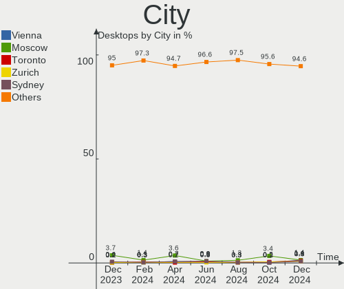
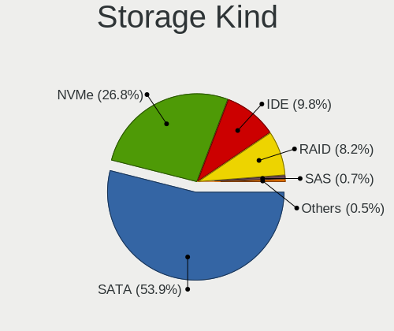
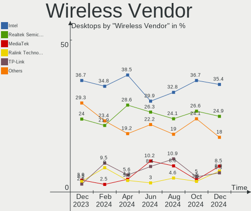

Ubuntu Hardware Trends (Desktops)
---------------------------------

A project to identify most popular hardware characteristics and track their change
over time based on data collected by Ubuntu users at https://Linux-Hardware.org.

Anyone can contribute to this report by the [hw-probe](https://github.com/linuxhw/hw-probe) tool:

    sudo -E hw-probe -all -upload

Full-feature report is available here: https://linux-hardware.org/?view=trends

Period: Nov, 2021.

Contents
--------

* [ System ](#system)
  - [ OS                       ](#os)
  - [ OS Family                ](#os-family)
  - [ Kernel                   ](#kernel)
  - [ Kernel Family            ](#kernel-family)
  - [ Kernel Major Ver.        ](#kernel-major-ver)
  - [ Arch                     ](#arch)
  - [ DE                       ](#de)
  - [ Display Server           ](#display-server)
  - [ Display Manager          ](#display-manager)
  - [ OS Lang                  ](#os-lang)
  - [ Boot Mode                ](#boot-mode)
  - [ Filesystem               ](#filesystem)
  - [ Part. scheme             ](#part-scheme)
  - [ Dual Boot with Linux/BSD ](#dual-boot-with-linuxbsd)
  - [ Dual Boot (Win)          ](#dual-boot-win)

* [ Board ](#board)
  - [ Vendor                   ](#vendor)
  - [ Model                    ](#model)
  - [ Model Family             ](#model-family)
  - [ MFG Year                 ](#mfg-year)
  - [ Form Factor              ](#form-factor)
  - [ Secure Boot              ](#secure-boot)
  - [ Coreboot                 ](#coreboot)
  - [ RAM Size                 ](#ram-size)
  - [ RAM Used                 ](#ram-used)
  - [ Total Drives             ](#total-drives)
  - [ Has CD-ROM               ](#has-cd-rom)
  - [ Has Ethernet             ](#has-ethernet)
  - [ Has WiFi                 ](#has-wifi)
  - [ Has Bluetooth            ](#has-bluetooth)

* [ Location ](#location)
  - [ Country                  ](#country)
  - [ City                     ](#city)

* [ Drives ](#drives)
  - [ Drive Vendor             ](#drive-vendor)
  - [ Drive Model              ](#drive-model)
  - [ HDD Vendor               ](#hdd-vendor)
  - [ SSD Vendor               ](#ssd-vendor)
  - [ Drive Kind               ](#drive-kind)
  - [ Drive Connector          ](#drive-connector)
  - [ Drive Size               ](#drive-size)
  - [ Space Total              ](#space-total)
  - [ Space Used               ](#space-used)
  - [ Malfunc. Drives          ](#malfunc-drives)
  - [ Malfunc. Drive Vendor    ](#malfunc-drive-vendor)
  - [ Malfunc. HDD Vendor      ](#malfunc-hdd-vendor)
  - [ Malfunc. Drive Kind      ](#malfunc-drive-kind)
  - [ Failed Drives            ](#failed-drives)
  - [ Failed Drive Vendor      ](#failed-drive-vendor)
  - [ Drive Status             ](#drive-status)

* [ Storage controller ](#storage-controller)
  - [ Storage Vendor           ](#storage-vendor)
  - [ Storage Model            ](#storage-model)
  - [ Storage Kind             ](#storage-kind)

* [ Processor ](#processor)
  - [ CPU Vendor               ](#cpu-vendor)
  - [ CPU Model                ](#cpu-model)
  - [ CPU Model Family         ](#cpu-model-family)
  - [ CPU Cores                ](#cpu-cores)
  - [ CPU Sockets              ](#cpu-sockets)
  - [ CPU Threads              ](#cpu-threads)
  - [ CPU Op-Modes             ](#cpu-op-modes)
  - [ CPU Microcode            ](#cpu-microcode)
  - [ CPU Microarch            ](#cpu-microarch)

* [ Graphics ](#graphics)
  - [ GPU Vendor               ](#gpu-vendor)
  - [ GPU Model                ](#gpu-model)
  - [ GPU Combo                ](#gpu-combo)
  - [ GPU Driver               ](#gpu-driver)
  - [ GPU Memory               ](#gpu-memory)

* [ Monitor ](#monitor)
  - [ Monitor Vendor           ](#monitor-vendor)
  - [ Monitor Model            ](#monitor-model)
  - [ Monitor Resolution       ](#monitor-resolution)
  - [ Monitor Diagonal         ](#monitor-diagonal)
  - [ Monitor Width            ](#monitor-width)
  - [ Aspect Ratio             ](#aspect-ratio)
  - [ Monitor Area             ](#monitor-area)
  - [ Pixel Density            ](#pixel-density)
  - [ Multiple Monitors        ](#multiple-monitors)

* [ Network ](#network)
  - [ Net Controller Vendor    ](#net-controller-vendor)
  - [ Net Controller Model     ](#net-controller-model)
  - [ Wireless Vendor          ](#wireless-vendor)
  - [ Wireless Model           ](#wireless-model)
  - [ Ethernet Vendor          ](#ethernet-vendor)
  - [ Ethernet Model           ](#ethernet-model)
  - [ Net Controller Kind      ](#net-controller-kind)
  - [ Used Controller          ](#used-controller)
  - [ NICs                     ](#nics)
  - [ IPv6                     ](#ipv6)

* [ Bluetooth ](#bluetooth)
  - [ Bluetooth Vendor         ](#bluetooth-vendor)
  - [ Bluetooth Model          ](#bluetooth-model)

* [ Sound ](#sound)
  - [ Sound Vendor             ](#sound-vendor)
  - [ Sound Model              ](#sound-model)

* [ Memory ](#memory)
  - [ Memory Vendor            ](#memory-vendor)
  - [ Memory Model             ](#memory-model)
  - [ Memory Kind              ](#memory-kind)
  - [ Memory Form Factor       ](#memory-form-factor)
  - [ Memory Size              ](#memory-size)
  - [ Memory Speed             ](#memory-speed)

* [ Printers & scanners ](#printers--scanners)
  - [ Printer Vendor           ](#printer-vendor)
  - [ Printer Model            ](#printer-model)
  - [ Scanner Vendor           ](#scanner-vendor)
  - [ Scanner Model            ](#scanner-model)

* [ Camera ](#camera)
  - [ Camera Vendor            ](#camera-vendor)
  - [ Camera Model             ](#camera-model)

* [ Security ](#security)
  - [ Fingerprint Vendor       ](#fingerprint-vendor)
  - [ Fingerprint Model        ](#fingerprint-model)
  - [ Chipcard Vendor          ](#chipcard-vendor)
  - [ Chipcard Model           ](#chipcard-model)

* [ Unsupported ](#unsupported)
  - [ Unsupported Devices      ](#unsupported-devices)
  - [ Unsupported Device Types ](#unsupported-device-types)

System
------

OS
--

Installed operating systems

| Name           | Desktops | Percent |
|----------------|----------|---------|
| Ubuntu 20.04   | 370      | 64.35%  |
| Ubuntu 21.10   | 128      | 22.26%  |
| Ubuntu 21.04   | 36       | 6.26%   |
| Ubuntu 18.04   | 28       | 4.87%   |
| Ubuntu 22.04   | 4        | 0.7%    |
| Ubuntu 20.10   | 4        | 0.7%    |
| Ubuntu 16.04   | 3        | 0.52%   |
| Ubuntu Core 18 | 1        | 0.17%   |
| Ubuntu 6       | 1        | 0.17%   |

OS Family
---------

OS without a version

| Name   | Desktops | Percent |
|--------|----------|---------|
| Ubuntu | 575      | 100%    |

Kernel
------

Version of the Linux kernel

| Version                        | Desktops | Percent |
|--------------------------------|----------|---------|
| 5.11.0-40-generic              | 183      | 31.83%  |
| 5.11.0-38-generic              | 97       | 16.87%  |
| 5.13.0-21-generic              | 77       | 13.39%  |
| 5.4.0-90-generic               | 48       | 8.35%   |
| 5.13.0-20-generic              | 28       | 4.87%   |
| 5.11.0-27-generic              | 17       | 2.96%   |
| 5.4.0-89-generic               | 16       | 2.78%   |
| 5.13.0-19-generic              | 16       | 2.78%   |
| 4.15.0-162-generic             | 9        | 1.57%   |
| 5.11.0-41-generic              | 8        | 1.39%   |
| 5.13.0-22-generic              | 6        | 1.04%   |
| 5.11.0-37-generic              | 6        | 1.04%   |
| 5.4.0-91-generic               | 4        | 0.7%    |
| 5.15.2-051502-generic          | 4        | 0.7%    |
| 5.8.0-63-generic               | 3        | 0.52%   |
| 5.8.0-43-generic               | 3        | 0.52%   |
| 5.4.0-42-generic               | 3        | 0.52%   |
| 4.4.0-210-generic              | 3        | 0.52%   |
| 5.8.0-50-generic               | 2        | 0.35%   |
| 5.4.0-88-generic               | 2        | 0.35%   |
| 5.4.0-86-generic               | 2        | 0.35%   |
| 5.4.0-73-generic               | 2        | 0.35%   |
| 5.11.0-25-generic              | 2        | 0.35%   |
| 5.8.0-55-generic               | 1        | 0.17%   |
| 5.8.0-48-generic               | 1        | 0.17%   |
| 5.8.0-45-generic               | 1        | 0.17%   |
| 5.8.0-41-generic               | 1        | 0.17%   |
| 5.8.0-38-generic               | 1        | 0.17%   |
| 5.8.0-25-generic               | 1        | 0.17%   |
| 5.6.0-1042-oem                 | 1        | 0.17%   |
| 5.5.7-050507-generic           | 1        | 0.17%   |
| 5.4.0-90-lowlatency            | 1        | 0.17%   |
| 5.4.0-80-generic               | 1        | 0.17%   |
| 5.4.0-58-generic               | 1        | 0.17%   |
| 5.4.0-48-generic               | 1        | 0.17%   |
| 5.4.0-31-generic               | 1        | 0.17%   |
| 5.4.0-26-generic               | 1        | 0.17%   |
| 5.3.0-51-generic               | 1        | 0.17%   |
| 5.15.4-051504-generic          | 1        | 0.17%   |
| 5.15.0                         | 1        | 0.17%   |
| 5.14.14-051414-generic         | 1        | 0.17%   |
| 5.14.0-051400rc7-lowlatency    | 1        | 0.17%   |
| 5.13.18-21.09.16.amdgpu.ubuntu | 1        | 0.17%   |
| 5.11.15-051115-generic         | 1        | 0.17%   |
| 5.11.0-36-generic              | 1        | 0.17%   |
| 5.11.0-34-generic              | 1        | 0.17%   |
| 5.11.0-33-generic              | 1        | 0.17%   |
| 5.11.0-22-generic              | 1        | 0.17%   |
| 5.11.0-18-generic              | 1        | 0.17%   |
| 5.11.0-16-generic              | 1        | 0.17%   |
| 5.10.0-1051-oem                | 1        | 0.17%   |
| 5.10.0-1050-oem                | 1        | 0.17%   |
| 4.9.0-6-686                    | 1        | 0.17%   |
| 4.15.0-29-generic              | 1        | 0.17%   |
| 4.15.0-161-generic             | 1        | 0.17%   |
| 4.15.0-160-generic             | 1        | 0.17%   |
| 4.15.0-135-generic             | 1        | 0.17%   |

Kernel Family
-------------

Linux kernel without a distro release

| Version | Desktops | Percent |
|---------|----------|---------|
| 5.11.0  | 319      | 55.48%  |
| 5.13.0  | 127      | 22.09%  |
| 5.4.0   | 83       | 14.43%  |
| 5.8.0   | 14       | 2.43%   |
| 4.15.0  | 13       | 2.26%   |
| 5.15.2  | 4        | 0.7%    |
| 4.4.0   | 3        | 0.52%   |
| 5.10.0  | 2        | 0.35%   |
| 5.6.0   | 1        | 0.17%   |
| 5.5.7   | 1        | 0.17%   |
| 5.3.0   | 1        | 0.17%   |
| 5.15.4  | 1        | 0.17%   |
| 5.15.0  | 1        | 0.17%   |
| 5.14.14 | 1        | 0.17%   |
| 5.14.0  | 1        | 0.17%   |
| 5.13.18 | 1        | 0.17%   |
| 5.11.15 | 1        | 0.17%   |
| 4.9.0   | 1        | 0.17%   |

Kernel Major Ver.
-----------------

Linux kernel major version

| Version | Desktops | Percent |
|---------|----------|---------|
| 5.11    | 320      | 55.65%  |
| 5.13    | 128      | 22.26%  |
| 5.4     | 83       | 14.43%  |
| 5.8     | 14       | 2.43%   |
| 4.15    | 13       | 2.26%   |
| 5.15    | 6        | 1.04%   |
| 4.4     | 3        | 0.52%   |
| 5.14    | 2        | 0.35%   |
| 5.10    | 2        | 0.35%   |
| 5.6     | 1        | 0.17%   |
| 5.5     | 1        | 0.17%   |
| 5.3     | 1        | 0.17%   |
| 4.9     | 1        | 0.17%   |

Arch
----

OS architecture (x86_64, i586, etc.)

| Name   | Desktops | Percent |
|--------|----------|---------|
| x86_64 | 569      | 98.96%  |
| i686   | 6        | 1.04%   |

DE
--

Desktop Environment

| Name            | Desktops | Percent |
|-----------------|----------|---------|
| GNOME           | 502      | 87.3%   |
| Unknown         | 53       | 9.22%   |
| X-Cinnamon      | 7        | 1.22%   |
| Unity           | 5        | 0.87%   |
| GNOME Flashback | 3        | 0.52%   |
| sway            | 1        | 0.17%   |
| Pantheon        | 1        | 0.17%   |
| i3              | 1        | 0.17%   |
| GNOME Classic   | 1        | 0.17%   |
| Cinnamon        | 1        | 0.17%   |

Display Server
--------------

X11 or Wayland

| Name    | Desktops | Percent |
|---------|----------|---------|
| X11     | 432      | 75.13%  |
| Wayland | 101      | 17.57%  |
| Unknown | 28       | 4.87%   |
| Tty     | 14       | 2.43%   |

Display Manager
---------------

SDDM, LightDM, etc.

| Name    | Desktops | Percent |
|---------|----------|---------|
| GDM3    | 409      | 71.13%  |
| GDM     | 118      | 20.52%  |
| Unknown | 29       | 5.04%   |
| LightDM | 16       | 2.78%   |
| SDDM    | 3        | 0.52%   |

OS Lang
-------

Language

| Lang    | Desktops | Percent |
|---------|----------|---------|
| en_US   | 211      | 36.7%   |
| de_DE   | 83       | 14.43%  |
| fr_FR   | 44       | 7.65%   |
| en_GB   | 25       | 4.35%   |
| en_CA   | 23       | 4%      |
| it_IT   | 22       | 3.83%   |
| pt_BR   | 19       | 3.3%    |
| ru_RU   | 17       | 2.96%   |
| pl_PL   | 14       | 2.43%   |
| en_AU   | 11       | 1.91%   |
| C       | 9        | 1.57%   |
| nl_NL   | 7        | 1.22%   |
| es_ES   | 7        | 1.22%   |
| en_IN   | 7        | 1.22%   |
| zh_CN   | 5        | 0.87%   |
| en_ZA   | 5        | 0.87%   |
| Unknown | 5        | 0.87%   |
| ja_JP   | 4        | 0.7%    |
| fr_CA   | 4        | 0.7%    |
| de_CH   | 4        | 0.7%    |
| nb_NO   | 3        | 0.52%   |
| hu_HU   | 3        | 0.52%   |
| es_PE   | 3        | 0.52%   |
| el_GR   | 3        | 0.52%   |
| de_AT   | 3        | 0.52%   |
| zh_TW   | 2        | 0.35%   |
| tr_TR   | 2        | 0.35%   |
| sk_SK   | 2        | 0.35%   |
| pt_PT   | 2        | 0.35%   |
| fr_BE   | 2        | 0.35%   |
| es_AR   | 2        | 0.35%   |
| cs_CZ   | 2        | 0.35%   |
| uk_UA   | 1        | 0.17%   |
| th_TH   | 1        | 0.17%   |
| sv_SE   | 1        | 0.17%   |
| sl_SI   | 1        | 0.17%   |
| ru_UA   | 1        | 0.17%   |
| nl_BE   | 1        | 0.17%   |
| hr_HR   | 1        | 0.17%   |
| fi_FI   | 1        | 0.17%   |
| et_EE   | 1        | 0.17%   |
| es_US   | 1        | 0.17%   |
| es_MX   | 1        | 0.17%   |
| es_DO   | 1        | 0.17%   |
| es_BO   | 1        | 0.17%   |
| en_SG   | 1        | 0.17%   |
| en_PH   | 1        | 0.17%   |
| en_IL   | 1        | 0.17%   |
| de_LU   | 1        | 0.17%   |
| da_DK   | 1        | 0.17%   |
| ca_ES   | 1        | 0.17%   |
| ar_SA   | 1        | 0.17%   |

Boot Mode
---------

EFI or BIOS

| Mode | Desktops | Percent |
|------|----------|---------|
| BIOS | 364      | 63.3%   |
| EFI  | 211      | 36.7%   |

Filesystem
----------

Type of filesystem

| Type    | Desktops | Percent |
|---------|----------|---------|
| Ext4    | 539      | 93.74%  |
| Overlay | 21       | 3.65%   |
| Zfs     | 6        | 1.04%   |
| Btrfs   | 5        | 0.87%   |
| Ext2    | 3        | 0.52%   |
| Ext3    | 1        | 0.17%   |

Part. scheme
------------

Scheme of partitioning

| Type    | Desktops | Percent |
|---------|----------|---------|
| Unknown | 437      | 76%     |
| GPT     | 106      | 18.43%  |
| MBR     | 32       | 5.57%   |

Dual Boot with Linux/BSD
------------------------

Hosting more than one Linux/BSD

| Dual boot | Desktops | Percent |
|-----------|----------|---------|
| No        | 452      | 78.61%  |
| Yes       | 123      | 21.39%  |

Dual Boot (Win)
---------------

Hosting Linux and Windows

| Dual boot | Desktops | Percent |
|-----------|----------|---------|
| No        | 318      | 55.3%   |
| Yes       | 257      | 44.7%   |

Board
-----

Vendor
------

Motherboard manufacturer

| Name                | Desktops | Percent |
|---------------------|----------|---------|
| ASUSTek Computer    | 140      | 24.35%  |
| Gigabyte Technology | 100      | 17.39%  |
| MSI                 | 69       | 12%     |
| Dell                | 60       | 10.43%  |
| ASRock              | 48       | 8.35%   |
| Hewlett-Packard     | 41       | 7.13%   |
| Lenovo              | 16       | 2.78%   |
| Intel               | 14       | 2.43%   |
| Acer                | 12       | 2.09%   |
| Pegatron            | 11       | 1.91%   |
| Medion              | 9        | 1.57%   |
| Fujitsu             | 6        | 1.04%   |
| Unknown             | 6        | 1.04%   |
| Huanan              | 5        | 0.87%   |
| ECS                 | 4        | 0.7%    |
| Fujitsu Siemens     | 3        | 0.52%   |
| EVGA                | 3        | 0.52%   |
| Biostar             | 3        | 0.52%   |
| Apple               | 3        | 0.52%   |
| Supermicro          | 2        | 0.35%   |
| Shuttle             | 2        | 0.35%   |
| MouseComputer       | 2        | 0.35%   |
| Semp Toshiba        | 1        | 0.17%   |
| Seeed Studio        | 1        | 0.17%   |
| Packard Bell        | 1        | 0.17%   |
| OEM                 | 1        | 0.17%   |
| Minix               | 1        | 0.17%   |
| JGINYUE             | 1        | 0.17%   |
| IBM                 | 1        | 0.17%   |
| Gateway             | 1        | 0.17%   |
| Foxconn             | 1        | 0.17%   |
| FIRICH              | 1        | 0.17%   |
| Daten Tecnologia    | 1        | 0.17%   |
| Centrium            | 1        | 0.17%   |
| AOC                 | 1        | 0.17%   |
| Alienware           | 1        | 0.17%   |
| AK3V                | 1        | 0.17%   |
| AAEON               | 1        | 0.17%   |

Model
-----

Motherboard model

| Name                         | Desktops | Percent |
|------------------------------|----------|---------|
| ASUS All Series              | 13       | 2.26%   |
| Dell OptiPlex 7010           | 6        | 1.04%   |
| Unknown                      | 6        | 1.04%   |
| MSI MS-7D25                  | 4        | 0.7%    |
| ASRock A320M-HDV R4.0        | 4        | 0.7%    |
| MSI MS-7A38                  | 3        | 0.52%   |
| MSI MS-7641                  | 3        | 0.52%   |
| HP Z800 Workstation          | 3        | 0.52%   |
| Gigabyte X570 AORUS ELITE    | 3        | 0.52%   |
| Gigabyte B450M DS3H          | 3        | 0.52%   |
| Dell OptiPlex 9020           | 3        | 0.52%   |
| Dell OptiPlex 390            | 3        | 0.52%   |
| ASUS ROG STRIX B450-F GAMING | 3        | 0.52%   |
| ASUS PRIME A320M-K           | 3        | 0.52%   |
| ASUS P8Z77-V LX              | 3        | 0.52%   |
| ASUS M5A78L-M PLUS/USB3      | 3        | 0.52%   |
| ASUS CROSSHAIR VI HERO       | 3        | 0.52%   |
| ASRock X570 Pro4             | 3        | 0.52%   |
| MSI MS-7C02                  | 2        | 0.35%   |
| MSI MS-7B98                  | 2        | 0.35%   |
| MSI MS-7B54                  | 2        | 0.35%   |
| MSI MS-7821                  | 2        | 0.35%   |
| MSI MS-7721                  | 2        | 0.35%   |
| Intel H61                    | 2        | 0.35%   |
| Intel BTC-T37                | 2        | 0.35%   |
| HP xw8600 Workstation        | 2        | 0.35%   |
| HP EliteDesk 800 G1 SFF      | 2        | 0.35%   |
| HP Compaq Pro 6300 SFF       | 2        | 0.35%   |
| HP Compaq Elite 8300 SFF     | 2        | 0.35%   |
| HP Compaq 8200 Elite SFF PC  | 2        | 0.35%   |
| HP Compaq 8200 Elite CMT PC  | 2        | 0.35%   |
| HP Compaq 8100 Elite SFF PC  | 2        | 0.35%   |
| HP Compaq 6005 Pro SFF PC    | 2        | 0.35%   |
| Gigabyte Z77X-UD5H           | 2        | 0.35%   |
| Gigabyte Z370 HD3            | 2        | 0.35%   |
| Gigabyte X570 AORUS PRO      | 2        | 0.35%   |
| Gigabyte X570 AORUS MASTER   | 2        | 0.35%   |
| Gigabyte H61M-S2PV           | 2        | 0.35%   |
| Gigabyte H61M-S1             | 2        | 0.35%   |
| Gigabyte GB-BRR7H-4800       | 2        | 0.35%   |
| Gigabyte GA-870A-UD3         | 2        | 0.35%   |
| Gigabyte GA-78LMT-USB3       | 2        | 0.35%   |
| Gigabyte B85M-HD3            | 2        | 0.35%   |
| Gigabyte B550M DS3H          | 2        | 0.35%   |
| Gigabyte B460HD3             | 2        | 0.35%   |
| Gigabyte B450M S2H           | 2        | 0.35%   |
| Dell XPS 8300                | 2        | 0.35%   |
| Dell Precision Tower 3620    | 2        | 0.35%   |
| Dell OptiPlex GX520          | 2        | 0.35%   |
| Dell OptiPlex 9010           | 2        | 0.35%   |
| Dell OptiPlex 780            | 2        | 0.35%   |
| Dell OptiPlex 3020           | 2        | 0.35%   |
| Dell Inspiron 3847           | 2        | 0.35%   |
| ASUS Z170-P                  | 2        | 0.35%   |
| ASUS TUF GAMING X570-PLUS    | 2        | 0.35%   |
| ASUS ROG Maximus XII HERO    | 2        | 0.35%   |
| ASUS Rampage IV EXTREME      | 2        | 0.35%   |
| ASUS PRIME B450M-A           | 2        | 0.35%   |
| ASUS P8Z77-V                 | 2        | 0.35%   |
| ASUS P8P67 PRO               | 2        | 0.35%   |

Model Family
------------

Motherboard model prefix

| Name                    | Desktops | Percent |
|-------------------------|----------|---------|
| Dell OptiPlex           | 33       | 5.74%   |
| ASUS PRIME              | 25       | 4.35%   |
| HP Compaq               | 18       | 3.13%   |
| ASUS ROG                | 14       | 2.43%   |
| ASUS All                | 13       | 2.26%   |
| Dell Inspiron           | 11       | 1.91%   |
| Lenovo ThinkCentre      | 10       | 1.74%   |
| ASUS M5A78L-M           | 9        | 1.57%   |
| Gigabyte X570           | 8        | 1.39%   |
| ASUS TUF                | 8        | 1.39%   |
| Acer Aspire             | 8        | 1.39%   |
| Dell Precision          | 7        | 1.22%   |
| ASUS P8Z77-V            | 7        | 1.22%   |
| HP EliteDesk            | 6        | 1.04%   |
| Unknown                 | 6        | 1.04%   |
| Gigabyte B450M          | 5        | 0.87%   |
| MSI MS-7D25             | 4        | 0.7%    |
| Fujitsu ESPRIMO         | 4        | 0.7%    |
| Dell XPS                | 4        | 0.7%    |
| ASUS P8P67              | 4        | 0.7%    |
| ASUS P8H61-M            | 4        | 0.7%    |
| ASRock A320M-HDV        | 4        | 0.7%    |
| MSI MS-7A38             | 3        | 0.52%   |
| MSI MS-7641             | 3        | 0.52%   |
| HP Z800                 | 3        | 0.52%   |
| HP ProLiant             | 3        | 0.52%   |
| Gigabyte GA-78LMT-USB3  | 3        | 0.52%   |
| Gigabyte B450           | 3        | 0.52%   |
| Fujitsu Siemens ESPRIMO | 3        | 0.52%   |
| ASUS CROSSHAIR          | 3        | 0.52%   |
| ASRock X570             | 3        | 0.52%   |
| MSI MS-7C02             | 2        | 0.35%   |
| MSI MS-7B98             | 2        | 0.35%   |
| MSI MS-7B54             | 2        | 0.35%   |
| MSI MS-7821             | 2        | 0.35%   |
| MSI MS-7721             | 2        | 0.35%   |
| Medion Akoya            | 2        | 0.35%   |
| Lenovo ThinkStation     | 2        | 0.35%   |
| Lenovo IdeaCentre       | 2        | 0.35%   |
| Intel H61               | 2        | 0.35%   |
| Intel BTC-T37           | 2        | 0.35%   |
| HP xw8600               | 2        | 0.35%   |
| HP Pavilion             | 2        | 0.35%   |
| Gigabyte Z77X-UD5H      | 2        | 0.35%   |
| Gigabyte Z390           | 2        | 0.35%   |
| Gigabyte Z370           | 2        | 0.35%   |
| Gigabyte X470           | 2        | 0.35%   |
| Gigabyte H61M-S2PV      | 2        | 0.35%   |
| Gigabyte H61M-S1        | 2        | 0.35%   |
| Gigabyte GB-BRR7H-4800  | 2        | 0.35%   |
| Gigabyte GA-870A-UD3    | 2        | 0.35%   |
| Gigabyte B85M-HD3       | 2        | 0.35%   |
| Gigabyte B550M          | 2        | 0.35%   |
| Gigabyte B550           | 2        | 0.35%   |
| Gigabyte B460HD3        | 2        | 0.35%   |
| Dell Vostro             | 2        | 0.35%   |
| ASUS Z170-P             | 2        | 0.35%   |
| ASUS STRIX              | 2        | 0.35%   |
| ASUS Rampage            | 2        | 0.35%   |
| ASUS M5A97              | 2        | 0.35%   |

MFG Year
--------

Motherboard manufacture year

| Year | Desktops | Percent |
|------|----------|---------|
| 2021 | 82       | 14.26%  |
| 2020 | 62       | 10.78%  |
| 2013 | 49       | 8.52%   |
| 2019 | 47       | 8.17%   |
| 2010 | 44       | 7.65%   |
| 2018 | 41       | 7.13%   |
| 2014 | 36       | 6.26%   |
| 2015 | 35       | 6.09%   |
| 2012 | 35       | 6.09%   |
| 2011 | 35       | 6.09%   |
| 2009 | 31       | 5.39%   |
| 2016 | 29       | 5.04%   |
| 2017 | 17       | 2.96%   |
| 2008 | 17       | 2.96%   |
| 2007 | 7        | 1.22%   |
| 2006 | 4        | 0.7%    |
| 2005 | 4        | 0.7%    |

Form Factor
-----------

Physical design of the computer

| Name    | Desktops | Percent |
|---------|----------|---------|
| Desktop | 575      | 100%    |

Secure Boot
-----------

Enabled or disabled

| State    | Desktops | Percent |
|----------|----------|---------|
| Disabled | 547      | 95.13%  |
| Enabled  | 28       | 4.87%   |

Coreboot
--------

Have coreboot on board

| Used | Desktops | Percent |
|------|----------|---------|
| No   | 574      | 99.83%  |
| Yes  | 1        | 0.17%   |

RAM Size
--------

Total RAM memory

| Size in GB  | Desktops | Percent |
|-------------|----------|---------|
| 16.01-24.0  | 138      | 24%     |
| 8.01-16.0   | 108      | 18.78%  |
| 3.01-4.0    | 94       | 16.35%  |
| 4.01-8.0    | 87       | 15.13%  |
| 32.01-64.0  | 83       | 14.43%  |
| 64.01-256.0 | 35       | 6.09%   |
| 1.01-2.0    | 17       | 2.96%   |
| 24.01-32.0  | 11       | 1.91%   |
| 2.01-3.0    | 2        | 0.35%   |

RAM Used
--------

Used RAM memory

| Used GB    | Desktops | Percent |
|------------|----------|---------|
| 1.01-2.0   | 251      | 43.65%  |
| 2.01-3.0   | 143      | 24.87%  |
| 3.01-4.0   | 68       | 11.83%  |
| 4.01-8.0   | 67       | 11.65%  |
| 8.01-16.0  | 17       | 2.96%   |
| 0.51-1.0   | 17       | 2.96%   |
| 16.01-24.0 | 7        | 1.22%   |
| 32.01-64.0 | 3        | 0.52%   |
| 24.01-32.0 | 1        | 0.17%   |
| 0.01-0.5   | 1        | 0.17%   |

Total Drives
------------

Number of drives on board

| Drives | Desktops | Percent |
|--------|----------|---------|
| 1      | 241      | 41.91%  |
| 2      | 166      | 28.87%  |
| 3      | 81       | 14.09%  |
| 4      | 44       | 7.65%   |
| 5      | 19       | 3.3%    |
| 6      | 9        | 1.57%   |
| 11     | 3        | 0.52%   |
| 0      | 3        | 0.52%   |
| 10     | 2        | 0.35%   |
| 8      | 2        | 0.35%   |
| 7      | 2        | 0.35%   |
| 13     | 1        | 0.17%   |
| 12     | 1        | 0.17%   |
| 9      | 1        | 0.17%   |

Has CD-ROM
----------

Has CD-ROM on board

| Presented | Desktops | Percent |
|-----------|----------|---------|
| Yes       | 312      | 54.26%  |
| No        | 263      | 45.74%  |

Has Ethernet
------------

Has Ethernet on board

| Presented | Desktops | Percent |
|-----------|----------|---------|
| Yes       | 572      | 99.48%  |
| No        | 3        | 0.52%   |

Has WiFi
--------

Has WiFi module

| Presented | Desktops | Percent |
|-----------|----------|---------|
| No        | 325      | 56.52%  |
| Yes       | 250      | 43.48%  |

Has Bluetooth
-------------

Has Bluetooth module

| Presented | Desktops | Percent |
|-----------|----------|---------|
| No        | 416      | 72.35%  |
| Yes       | 159      | 27.65%  |

Location
--------

Country
-------

Geographic location (country)

| Country       | Desktops | Percent |
|---------------|----------|---------|
| USA           | 132      | 22.96%  |
| Germany       | 94       | 16.35%  |
| France        | 50       | 8.7%    |
| Canada        | 25       | 4.35%   |
| Italy         | 24       | 4.17%   |
| Brazil        | 22       | 3.83%   |
| Russia        | 21       | 3.65%   |
| UK            | 19       | 3.3%    |
| Poland        | 15       | 2.61%   |
| Netherlands   | 13       | 2.26%   |
| Australia     | 12       | 2.09%   |
| Spain         | 10       | 1.74%   |
| Greece        | 8        | 1.39%   |
| India         | 7        | 1.22%   |
| South Africa  | 6        | 1.04%   |
| Switzerland   | 5        | 0.87%   |
| Peru          | 5        | 0.87%   |
| Norway        | 5        | 0.87%   |
| Japan         | 5        | 0.87%   |
| China         | 5        | 0.87%   |
| Belgium       | 5        | 0.87%   |
| Austria       | 5        | 0.87%   |
| Ukraine       | 4        | 0.7%    |
| Turkey        | 4        | 0.7%    |
| Slovakia      | 4        | 0.7%    |
| Hungary       | 4        | 0.7%    |
| Finland       | 4        | 0.7%    |
| Czechia       | 4        | 0.7%    |
| Sweden        | 3        | 0.52%   |
| Portugal      | 3        | 0.52%   |
| Argentina     | 3        | 0.52%   |
| Taiwan        | 2        | 0.35%   |
| South Korea   | 2        | 0.35%   |
| Singapore     | 2        | 0.35%   |
| Romania       | 2        | 0.35%   |
| Puerto Rico   | 2        | 0.35%   |
| Philippines   | 2        | 0.35%   |
| Mexico        | 2        | 0.35%   |
| Luxembourg    | 2        | 0.35%   |
| Iran          | 2        | 0.35%   |
| Algeria       | 2        | 0.35%   |
| Yemen         | 1        | 0.17%   |
| Vietnam       | 1        | 0.17%   |
| UAE           | 1        | 0.17%   |
| Thailand      | 1        | 0.17%   |
| Slovenia      | 1        | 0.17%   |
| Saudi Arabia  | 1        | 0.17%   |
| R?©union      | 1        | 0.17%   |
| Pakistan      | 1        | 0.17%   |
| New Zealand   | 1        | 0.17%   |
| New Caledonia | 1        | 0.17%   |
| Nepal         | 1        | 0.17%   |
| Myanmar       | 1        | 0.17%   |
| Morocco       | 1        | 0.17%   |
| Moldova       | 1        | 0.17%   |
| Lithuania     | 1        | 0.17%   |
| Jamaica       | 1        | 0.17%   |
| Israel        | 1        | 0.17%   |
| Indonesia     | 1        | 0.17%   |
| Iceland       | 1        | 0.17%   |

City
----

Geographic location (city)

| City              | Desktops | Percent |
|-------------------|----------|---------|
| Berlin            | 12       | 2.09%   |
| Sydney            | 6        | 1.04%   |
| Moscow            | 6        | 1.04%   |
| Cleveland         | 6        | 1.04%   |
| Athens            | 6        | 1.04%   |
| Lima              | 5        | 0.87%   |
| Amsterdam         | 5        | 0.87%   |
| Stuttgart         | 4        | 0.7%    |
| St Petersburg     | 4        | 0.7%    |
| Montreal          | 4        | 0.7%    |
| Milan             | 4        | 0.7%    |
| Marseille         | 4        | 0.7%    |
| Madrid            | 4        | 0.7%    |
| Warsaw            | 3        | 0.52%   |
| Vienna            | 3        | 0.52%   |
| Vancouver         | 3        | 0.52%   |
| Strasbourg        | 3        | 0.52%   |
| San Francisco     | 3        | 0.52%   |
| San Diego         | 3        | 0.52%   |
| Paris             | 3        | 0.52%   |
| Oslo              | 3        | 0.52%   |
| Los Angeles       | 3        | 0.52%   |
| Houston           | 3        | 0.52%   |
| Frankfurt am Main | 3        | 0.52%   |
| Cape Town         | 3        | 0.52%   |
| Zurich            | 2        | 0.35%   |
| Wroclaw           | 2        | 0.35%   |
| Washington        | 2        | 0.35%   |
| Turin             | 2        | 0.35%   |
| Tucson            | 2        | 0.35%   |
| Tehran            | 2        | 0.35%   |
| Streatham         | 2        | 0.35%   |
| Singapore         | 2        | 0.35%   |
| Samara            | 2        | 0.35%   |
| Rosenberg         | 2        | 0.35%   |
| Rome              | 2        | 0.35%   |
| Rio de Janeiro    | 2        | 0.35%   |
| Mumbai            | 2        | 0.35%   |
| Luxembourg        | 2        | 0.35%   |
| Lund              | 2        | 0.35%   |
| Las Vegas         | 2        | 0.35%   |
| Lafayette         | 2        | 0.35%   |
| Kyiv              | 2        | 0.35%   |
| Koto              | 2        | 0.35%   |
| Johannesburg      | 2        | 0.35%   |
| Helsinki          | 2        | 0.35%   |
| Hamburg           | 2        | 0.35%   |
| Essen             | 2        | 0.35%   |
| El Paso           | 2        | 0.35%   |
| Denver            | 2        | 0.35%   |
| Cincinnati        | 2        | 0.35%   |
| Bristol           | 2        | 0.35%   |
| Bras?­lia         | 2        | 0.35%   |
| Bodenheim         | 2        | 0.35%   |
| Beijing           | 2        | 0.35%   |
| Zwickau           | 1        | 0.17%   |
| Ziar nad Hronom   | 1        | 0.17%   |
| Zhytomyr          | 1        | 0.17%   |
| Zevenaar          | 1        | 0.17%   |
| Zagreb            | 1        | 0.17%   |

Drives
------

Drive Vendor
------------

Hard drive vendors

| Vendor                         | Desktops | Drives | Percent |
|--------------------------------|----------|--------|---------|
| WDC                            | 213      | 283    | 21.85%  |
| Seagate                        | 193      | 268    | 19.79%  |
| Samsung Electronics            | 152      | 196    | 15.59%  |
| Toshiba                        | 47       | 55     | 4.82%   |
| Kingston                       | 43       | 47     | 4.41%   |
| Crucial                        | 43       | 51     | 4.41%   |
| Sandisk                        | 32       | 35     | 3.28%   |
| Hitachi                        | 30       | 41     | 3.08%   |
| Intel                          | 19       | 22     | 1.95%   |
| A-DATA Technology              | 18       | 19     | 1.85%   |
| Phison                         | 11       | 12     | 1.13%   |
| HGST                           | 11       | 17     | 1.13%   |
| PNY                            | 9        | 11     | 0.92%   |
| MAXTOR                         | 9        | 10     | 0.92%   |
| Unknown                        | 8        | 11     | 0.82%   |
| SPCC                           | 8        | 8      | 0.82%   |
| Silicon Motion                 | 8        | 8      | 0.82%   |
| Micron/Crucial Technology      | 8        | 9      | 0.82%   |
| Corsair                        | 6        | 6      | 0.62%   |
| China                          | 6        | 6      | 0.62%   |
| Intenso                        | 5        | 5      | 0.51%   |
| Hewlett-Packard                | 5        | 6      | 0.51%   |
| Transcend                      | 4        | 4      | 0.41%   |
| Realtek Semiconductor          | 4        | 4      | 0.41%   |
| JMicron                        | 4        | 4      | 0.41%   |
| XPG                            | 3        | 3      | 0.31%   |
| SK Hynix                       | 3        | 5      | 0.31%   |
| SABRENT                        | 3        | 3      | 0.31%   |
| PLEXTOR                        | 3        | 3      | 0.31%   |
| OCZ                            | 3        | 3      | 0.31%   |
| LITEON                         | 3        | 3      | 0.31%   |
| GOODRAM                        | 3        | 3      | 0.31%   |
| ASMT                           | 3        | 4      | 0.31%   |
| Verbatim                       | 2        | 2      | 0.21%   |
| Team                           | 2        | 2      | 0.21%   |
| Phison Electronics             | 2        | 2      | 0.21%   |
| Netac                          | 2        | 2      | 0.21%   |
| Micron Technology              | 2        | 2      | 0.21%   |
| LITEONIT                       | 2        | 2      | 0.21%   |
| KingSpec                       | 2        | 2      | 0.21%   |
| Apacer                         | 2        | 2      | 0.21%   |
| XUM                            | 1        | 1      | 0.1%    |
| TWINMOS                        | 1        | 1      | 0.1%    |
| TCSUNBOW                       | 1        | 1      | 0.1%    |
| SSSTC                          | 1        | 1      | 0.1%    |
| SSD                            | 1        | 1      | 0.1%    |
| SPCC Sol                       | 1        | 1      | 0.1%    |
| Solid State Storage Technology | 1        | 2      | 0.1%    |
| QUMOX                          | 1        | 1      | 0.1%    |
| Q200                           | 1        | 2      | 0.1%    |
| Pioneer                        | 1        | 1      | 0.1%    |
| Patriot                        | 1        | 1      | 0.1%    |
| MARVELL                        | 1        | 1      | 0.1%    |
| Lite-On                        | 1        | 1      | 0.1%    |
| Lexar                          | 1        | 1      | 0.1%    |
| Leven                          | 1        | 1      | 0.1%    |
| LEIGU                          | 1        | 1      | 0.1%    |
| LDLC                           | 1        | 1      | 0.1%    |
| LaCie                          | 1        | 1      | 0.1%    |
| KLEVV                          | 1        | 1      | 0.1%    |

Drive Model
-----------

Hard drive models

| Model                                  | Desktops | Percent |
|----------------------------------------|----------|---------|
| Seagate ST2000DM008-2FR102 2TB         | 17       | 1.51%   |
| Samsung NVMe SSD Drive 500GB           | 15       | 1.33%   |
| Seagate ST1000DM010-2EP102 1TB         | 14       | 1.24%   |
| Seagate ST500DM002-1BD142 500GB        | 12       | 1.06%   |
| Samsung SSD 860 EVO 500GB              | 12       | 1.06%   |
| WDC WD10EZEX-08WN4A0 1TB               | 10       | 0.89%   |
| Toshiba DT01ACA050 500GB               | 10       | 0.89%   |
| Samsung SSD 850 EVO 500GB              | 10       | 0.89%   |
| Kingston SA400S37240G 240GB SSD        | 9        | 0.8%    |
| Toshiba DT01ACA100 1TB                 | 8        | 0.71%   |
| Seagate ST1000DM003-1ER162 1TB         | 8        | 0.71%   |
| Seagate ST1000DM003-1CH162 1TB         | 8        | 0.71%   |
| Kingston SV300S37A120G 120GB SSD       | 8        | 0.71%   |
| Kingston SA400S37120G 120GB SSD        | 8        | 0.71%   |
| Crucial CT240BX500SSD1 240GB           | 8        | 0.71%   |
| Seagate ST2000DM006-2DM164 2TB         | 7        | 0.62%   |
| Samsung SSD 850 EVO 250GB              | 7        | 0.62%   |
| Crucial CT500MX500SSD1 500GB           | 7        | 0.62%   |
| Samsung SSD 860 EVO 250GB              | 6        | 0.53%   |
| WDC WDS500G2B0A-00SM50 500GB SSD       | 5        | 0.44%   |
| WDC WD10EARS-00Y5B1 1TB                | 5        | 0.44%   |
| Toshiba DT01ACA200 2TB                 | 5        | 0.44%   |
| SPCC Solid State Disk 256GB            | 5        | 0.44%   |
| Seagate ST3500418AS 500GB              | 5        | 0.44%   |
| Seagate ST31000528AS 1TB               | 5        | 0.44%   |
| Seagate ST2000DM001-1CH164 2TB         | 5        | 0.44%   |
| Samsung SM963 2.5" NVMe PCIe SSD 250GB | 5        | 0.44%   |
| WDC WDS120G2G0A-00JH30 120GB SSD       | 4        | 0.35%   |
| WDC WD40EZRZ-00GXCB0 4TB               | 4        | 0.35%   |
| WDC WD40EFRX-68N32N0 4TB               | 4        | 0.35%   |
| WDC WD20EFRX-68EUZN0 2TB               | 4        | 0.35%   |
| WDC WD10EZEX-60ZF5A0 1TB               | 4        | 0.35%   |
| WDC WD10EZEX-22MFCA0 1TB               | 4        | 0.35%   |
| WDC WD10EADS-00M2B0 1TB                | 4        | 0.35%   |
| Unknown SD/MMC/MS PRO 394GB            | 4        | 0.35%   |
| Silicon Motion NVMe SSD Drive 512GB    | 4        | 0.35%   |
| Seagate ST4000DM004-2CV104 4TB         | 4        | 0.35%   |
| Seagate ST3250318AS 250GB              | 4        | 0.35%   |
| Seagate ST3000DM001-1ER166 3TB         | 4        | 0.35%   |
| Seagate ST2000DM001-1ER164 2TB         | 4        | 0.35%   |
| Samsung SSD 970 EVO 500GB              | 4        | 0.35%   |
| Samsung SSD 870 QVO 1TB                | 4        | 0.35%   |
| Samsung SSD 860 EVO 1TB                | 4        | 0.35%   |
| Samsung NVMe SSD Drive 512GB           | 4        | 0.35%   |
| Samsung NVMe SSD Drive 1TB             | 4        | 0.35%   |
| Samsung HD321KJ 320GB                  | 4        | 0.35%   |
| Hitachi HDS722020ALA330 2TB            | 4        | 0.35%   |
| Crucial CT500P2SSD8 500GB              | 4        | 0.35%   |
| WDC WDS500G2B0B-00YS70 500GB SSD       | 3        | 0.27%   |
| WDC WDS100T2B0A-00SM50 1TB SSD         | 3        | 0.27%   |
| WDC WD5000AADS-00S9B0 500GB            | 3        | 0.27%   |
| WDC WD4003FFBX-68MU3N0 4TB             | 3        | 0.27%   |
| WDC WD10EZEX-08M2NA0 1TB               | 3        | 0.27%   |
| WDC WD10EZEX-00WN4A0 1TB               | 3        | 0.27%   |
| WDC WD10EAVS-00D7B1 1TB                | 3        | 0.27%   |
| Toshiba HDWD130 3TB                    | 3        | 0.27%   |
| Toshiba HDWD110 1TB                    | 3        | 0.27%   |
| Toshiba DT01ACA300 3TB                 | 3        | 0.27%   |
| Silicon Motion NVMe SSD Drive 256GB    | 3        | 0.27%   |
| Seagate ST8000DM004-2CX188 8TB         | 3        | 0.27%   |

HDD Vendor
----------

Hard disk drive vendors

| Vendor              | Desktops | Drives | Percent |
|---------------------|----------|--------|---------|
| Seagate             | 189      | 258    | 36.91%  |
| WDC                 | 185      | 246    | 36.13%  |
| Toshiba             | 43       | 51     | 8.4%    |
| Samsung Electronics | 34       | 38     | 6.64%   |
| Hitachi             | 30       | 41     | 5.86%   |
| HGST                | 11       | 17     | 2.15%   |
| MAXTOR              | 8        | 9      | 1.56%   |
| Unknown             | 4        | 4      | 0.78%   |
| Hewlett-Packard     | 3        | 4      | 0.59%   |
| ASMT                | 3        | 4      | 0.59%   |
| MARVELL             | 1        | 1      | 0.2%    |
| LaCie               | 1        | 1      | 0.2%    |

SSD Vendor
----------

Solid state drive vendors

| Vendor              | Desktops | Drives | Percent |
|---------------------|----------|--------|---------|
| Samsung Electronics | 80       | 90     | 24.1%   |
| Kingston            | 40       | 44     | 12.05%  |
| Crucial             | 35       | 41     | 10.54%  |
| WDC                 | 31       | 31     | 9.34%   |
| SanDisk             | 23       | 26     | 6.93%   |
| Intel               | 15       | 15     | 4.52%   |
| A-DATA Technology   | 14       | 15     | 4.22%   |
| SPCC                | 8        | 8      | 2.41%   |
| PNY                 | 8        | 9      | 2.41%   |
| China               | 6        | 6      | 1.81%   |
| Transcend           | 4        | 4      | 1.2%    |
| Corsair             | 4        | 4      | 1.2%    |
| Toshiba             | 3        | 3      | 0.9%    |
| PLEXTOR             | 3        | 3      | 0.9%    |
| OCZ                 | 3        | 3      | 0.9%    |
| Intenso             | 3        | 3      | 0.9%    |
| GOODRAM             | 3        | 3      | 0.9%    |
| Verbatim            | 2        | 2      | 0.6%    |
| Team                | 2        | 2      | 0.6%    |
| Seagate             | 2        | 2      | 0.6%    |
| Netac               | 2        | 2      | 0.6%    |
| LITEONIT            | 2        | 2      | 0.6%    |
| LITEON              | 2        | 2      | 0.6%    |
| Hewlett-Packard     | 2        | 2      | 0.6%    |
| Apacer              | 2        | 2      | 0.6%    |
| XUM                 | 1        | 1      | 0.3%    |
| TWINMOS             | 1        | 1      | 0.3%    |
| TCSUNBOW            | 1        | 1      | 0.3%    |
| SSD                 | 1        | 1      | 0.3%    |
| SPCC Sol            | 1        | 1      | 0.3%    |
| SK Hynix            | 1        | 1      | 0.3%    |
| QUMOX               | 1        | 1      | 0.3%    |
| Q200                | 1        | 2      | 0.3%    |
| Pioneer             | 1        | 1      | 0.3%    |
| Phison              | 1        | 1      | 0.3%    |
| Micron Technology   | 1        | 1      | 0.3%    |
| MAXTOR              | 1        | 1      | 0.3%    |
| Lexar               | 1        | 1      | 0.3%    |
| Leven               | 1        | 1      | 0.3%    |
| LEIGU               | 1        | 1      | 0.3%    |
| LDLC                | 1        | 1      | 0.3%    |
| KLEVV               | 1        | 1      | 0.3%    |
| KIOXIA-EXCERIA      | 1        | 1      | 0.3%    |
| KingSpec            | 1        | 1      | 0.3%    |
| KingDian            | 1        | 1      | 0.3%    |
| kimtigo             | 1        | 1      | 0.3%    |
| JMicron             | 1        | 1      | 0.3%    |
| INTEL SS            | 1        | 1      | 0.3%    |
| Hoodisk             | 1        | 1      | 0.3%    |
| GALAX               | 1        | 1      | 0.3%    |
| Flash               | 1        | 1      | 0.3%    |
| EMTEC               | 1        | 1      | 0.3%    |
| BAITITON            | 1        | 1      | 0.3%    |
| Apple               | 1        | 1      | 0.3%    |
| AMD                 | 1        | 1      | 0.3%    |
| ADATA SU            | 1        | 1      | 0.3%    |
| 2-Power             | 1        | 1      | 0.3%    |
| Unknown             | 1        | 1      | 0.3%    |

Drive Kind
----------

HDD or SSD

| Kind    | Desktops | Drives | Percent |
|---------|----------|--------|---------|
| HDD     | 404      | 674    | 48.38%  |
| SSD     | 284      | 358    | 34.01%  |
| NVMe    | 123      | 161    | 14.73%  |
| Unknown | 22       | 28     | 2.63%   |
| MMC     | 2        | 2      | 0.24%   |

Drive Connector
---------------

SATA, SAS, NVMe, etc.

| Type | Desktops | Drives | Percent |
|------|----------|--------|---------|
| SATA | 531      | 1004   | 75.97%  |
| NVMe | 123      | 159    | 17.6%   |
| SAS  | 43       | 58     | 6.15%   |
| MMC  | 2        | 2      | 0.29%   |

Drive Size
----------

Size of hard drive

| Size in TB | Desktops | Drives | Percent |
|------------|----------|--------|---------|
| 0.01-0.5   | 378      | 536    | 50.87%  |
| 0.51-1.0   | 205      | 260    | 27.59%  |
| 1.01-2.0   | 89       | 118    | 11.98%  |
| 3.01-4.0   | 33       | 54     | 4.44%   |
| 2.01-3.0   | 22       | 40     | 2.96%   |
| 4.01-10.0  | 13       | 21     | 1.75%   |
| 10.01-20.0 | 3        | 3      | 0.4%    |

Space Total
-----------

Amount of disk space available on the file system

| Size in GB     | Desktops | Percent |
|----------------|----------|---------|
| 101-250        | 158      | 27.48%  |
| 251-500        | 100      | 17.39%  |
| 501-1000       | 90       | 15.65%  |
| 1001-2000      | 69       | 12%     |
| More than 3000 | 45       | 7.83%   |
| 2001-3000      | 36       | 6.26%   |
| 51-100         | 28       | 4.87%   |
| 1-20           | 27       | 4.7%    |
| 21-50          | 16       | 2.78%   |
| Unknown        | 6        | 1.04%   |

Space Used
----------

Amount of used disk space

| Used GB        | Desktops | Percent |
|----------------|----------|---------|
| 1-20           | 205      | 35.65%  |
| 21-50          | 104      | 18.09%  |
| 101-250        | 63       | 10.96%  |
| 51-100         | 59       | 10.26%  |
| 501-1000       | 48       | 8.35%   |
| 251-500        | 39       | 6.78%   |
| 1001-2000      | 22       | 3.83%   |
| More than 3000 | 19       | 3.3%    |
| 2001-3000      | 10       | 1.74%   |
| Unknown        | 6        | 1.04%   |

Malfunc. Drives
---------------

Drive models with a malfunction

| Model                               | Desktops | Drives | Percent |
|-------------------------------------|----------|--------|---------|
| WDC WD10EADS-00M2B0 1TB             | 2        | 2      | 5.13%   |
| Seagate ST500DM002-1BC142 500GB     | 2        | 2      | 5.13%   |
| Seagate ST31500341AS 1TB            | 2        | 4      | 5.13%   |
| Kingston SV300S37A120G 120GB SSD    | 2        | 2      | 5.13%   |
| WDC WDS500G2B0B-00YS70 500GB SSD    | 1        | 1      | 2.56%   |
| WDC WD5000AAKS-65YGA0 500GB         | 1        | 1      | 2.56%   |
| WDC WD5000AACS-00ZUB0 500GB         | 1        | 1      | 2.56%   |
| WDC WD30EZRX-00DC0B0 3TB            | 1        | 1      | 2.56%   |
| WDC WD30EFRX-68E 3TB                | 1        | 1      | 2.56%   |
| WDC WD2500JD-22HBC0 250GB           | 1        | 1      | 2.56%   |
| WDC WD2500HHTZ-04N21V0 250GB        | 1        | 1      | 2.56%   |
| WDC WD2500AAKX-083CA1 250GB         | 1        | 1      | 2.56%   |
| WDC WD10EZEX-60ZF5A0 1TB            | 1        | 1      | 2.56%   |
| WDC WD10EZEX-22MFCA0 1TB            | 1        | 1      | 2.56%   |
| WDC WD10EARS-00Y5B1 1TB             | 1        | 1      | 2.56%   |
| WDC WD1002FAEX-00Z3A0 1TB           | 1        | 1      | 2.56%   |
| Toshiba MQ01ABD100 1TB              | 1        | 1      | 2.56%   |
| Toshiba DT01ACA100 1TB              | 1        | 1      | 2.56%   |
| Seagate ST8000DM004-2CX188 8TB      | 1        | 1      | 2.56%   |
| Seagate ST4000DM004-2CV104 4TB      | 1        | 2      | 2.56%   |
| Seagate ST3750640AS 752GB           | 1        | 1      | 2.56%   |
| Seagate ST3500641AS 500GB           | 1        | 1      | 2.56%   |
| Seagate ST3500320AS 500GB           | 1        | 1      | 2.56%   |
| Seagate ST3320620AS 320GB           | 1        | 3      | 2.56%   |
| Seagate ST3320418AS 320GB           | 1        | 1      | 2.56%   |
| Seagate ST2000DM008-2FR102 2TB      | 1        | 1      | 2.56%   |
| Seagate ST1000DM003-1CH162 1TB      | 1        | 1      | 2.56%   |
| SanDisk SDSSDXPS240G 240GB          | 1        | 1      | 2.56%   |
| Samsung Electronics SSD 850 PRO 1TB | 1        | 1      | 2.56%   |
| Samsung Electronics HD321KJ 320GB   | 1        | 1      | 2.56%   |
| MAXTOR STM3250310AS 250GB           | 1        | 1      | 2.56%   |
| MAXTOR 6G160E0 160GB                | 1        | 1      | 2.56%   |
| Kingston SH103S3120G 120GB SSD      | 1        | 1      | 2.56%   |
| Hitachi HUA722020ALA331 2TB         | 1        | 1      | 2.56%   |
| Hewlett-Packard VB0250EAVER 250GB   | 1        | 1      | 2.56%   |

Malfunc. Drive Vendor
---------------------

Vendors of faulty drives

| Vendor              | Desktops | Drives | Percent |
|---------------------|----------|--------|---------|
| Seagate             | 13       | 18     | 35.14%  |
| WDC                 | 12       | 14     | 32.43%  |
| Kingston            | 3        | 3      | 8.11%   |
| Toshiba             | 2        | 2      | 5.41%   |
| Samsung Electronics | 2        | 2      | 5.41%   |
| MAXTOR              | 2        | 2      | 5.41%   |
| SanDisk             | 1        | 1      | 2.7%    |
| Hitachi             | 1        | 1      | 2.7%    |
| Hewlett-Packard     | 1        | 1      | 2.7%    |

Malfunc. HDD Vendor
-------------------

Vendors of faulty HDD drives

| Vendor              | Desktops | Drives | Percent |
|---------------------|----------|--------|---------|
| Seagate             | 13       | 18     | 40.63%  |
| WDC                 | 12       | 13     | 37.5%   |
| Toshiba             | 2        | 2      | 6.25%   |
| MAXTOR              | 2        | 2      | 6.25%   |
| Samsung Electronics | 1        | 1      | 3.13%   |
| Hitachi             | 1        | 1      | 3.13%   |
| Hewlett-Packard     | 1        | 1      | 3.13%   |

Malfunc. Drive Kind
-------------------

Kinds of faulty drives

| Kind | Desktops | Drives | Percent |
|------|----------|--------|---------|
| HDD  | 29       | 38     | 82.86%  |
| SSD  | 6        | 6      | 17.14%  |

Failed Drives
-------------

Failed drive models

| Model                  | Desktops | Drives | Percent |
|------------------------|----------|--------|---------|
| Toshiba DT01ACA200 2TB | 1        | 1      | 100%    |

Failed Drive Vendor
-------------------

Failed drive vendors

| Vendor  | Desktops | Drives | Percent |
|---------|----------|--------|---------|
| Toshiba | 1        | 1      | 100%    |

Drive Status
------------

Number of failed and malfunc. drives

| Status   | Desktops | Drives | Percent |
|----------|----------|--------|---------|
| Detected | 432      | 879    | 70.7%   |
| Works    | 145      | 299    | 23.73%  |
| Malfunc  | 33       | 44     | 5.4%    |
| Failed   | 1        | 1      | 0.16%   |

Storage controller
------------------

Storage Vendor
--------------

Storage controller vendors

| Vendor                         | Desktops | Percent |
|--------------------------------|----------|---------|
| Intel                          | 386      | 49.17%  |
| AMD                            | 162      | 20.64%  |
| Samsung Electronics            | 57       | 7.26%   |
| ASMedia Technology             | 24       | 3.06%   |
| JMicron Technology             | 21       | 2.68%   |
| Nvidia                         | 20       | 2.55%   |
| Marvell Technology Group       | 18       | 2.29%   |
| Micron/Crucial Technology      | 16       | 2.04%   |
| Phison Electronics             | 15       | 1.91%   |
| Sandisk                        | 13       | 1.66%   |
| Silicon Motion                 | 9        | 1.15%   |
| Realtek Semiconductor          | 6        | 0.76%   |
| VIA Technologies               | 5        | 0.64%   |
| LSI Logic / Symbios Logic      | 5        | 0.64%   |
| ADATA Technology               | 5        | 0.64%   |
| Broadcom / LSI                 | 4        | 0.51%   |
| Kingston Technology Company    | 3        | 0.38%   |
| Adaptec                        | 3        | 0.38%   |
| SK Hynix                       | 2        | 0.25%   |
| Silicon Image                  | 2        | 0.25%   |
| Lite-On Technology             | 2        | 0.25%   |
| Toshiba America Info Systems   | 1        | 0.13%   |
| Solid State Storage Technology | 1        | 0.13%   |
| Micron Technology              | 1        | 0.13%   |
| Lite-On IT Corp. / Plextor     | 1        | 0.13%   |
| KIOXIA                         | 1        | 0.13%   |
| Integrated Technology Express  | 1        | 0.13%   |
| Hewlett-Packard                | 1        | 0.13%   |

Storage Model
-------------

Storage controller models

| Model                                                                                   | Desktops | Percent |
|-----------------------------------------------------------------------------------------|----------|---------|
| AMD FCH SATA Controller [AHCI mode]                                                     | 89       | 8.86%   |
| Intel 8 Series/C220 Series Chipset Family 6-port SATA Controller 1 [AHCI mode]          | 41       | 4.08%   |
| AMD SB7x0/SB8x0/SB9x0 IDE Controller                                                    | 40       | 3.98%   |
| Samsung NVMe SSD Controller SM981/PM981/PM983                                           | 38       | 3.78%   |
| Intel 7 Series/C210 Series Chipset Family 6-port SATA Controller [AHCI mode]            | 32       | 3.19%   |
| Intel SATA Controller [RAID mode]                                                       | 30       | 2.99%   |
| AMD SB7x0/SB8x0/SB9x0 SATA Controller [IDE mode]                                        | 30       | 2.99%   |
| Intel 6 Series/C200 Series Chipset Family 6 port Desktop SATA AHCI Controller           | 29       | 2.89%   |
| Intel NM10/ICH7 Family SATA Controller [IDE mode]                                       | 28       | 2.79%   |
| Intel 200 Series PCH SATA controller [AHCI mode]                                        | 28       | 2.79%   |
| AMD 400 Series Chipset SATA Controller                                                  | 28       | 2.79%   |
| Intel Q170/Q150/B150/H170/H110/Z170/CM236 Chipset SATA Controller [AHCI Mode]           | 27       | 2.69%   |
| ASMedia ASM1062 Serial ATA Controller                                                   | 22       | 2.19%   |
| Intel 6 Series/C200 Series Chipset Family Desktop SATA Controller (IDE mode, ports 4-5) | 20       | 1.99%   |
| Intel 6 Series/C200 Series Chipset Family Desktop SATA Controller (IDE mode, ports 0-3) | 20       | 1.99%   |
| AMD SB7x0/SB8x0/SB9x0 SATA Controller [AHCI mode]                                       | 20       | 1.99%   |
| Intel Cannon Lake PCH SATA AHCI Controller                                              | 17       | 1.69%   |
| Intel 500 Series Chipset Family SATA AHCI Controller                                    | 15       | 1.49%   |
| Intel 82801G (ICH7 Family) IDE Controller                                               | 14       | 1.39%   |
| AMD FCH SATA Controller D                                                               | 13       | 1.29%   |
| AMD Starship/Matisse Chipset SATA Controller [AHCI mode]                                | 12       | 1.2%    |
| Micron/Crucial P2 NVMe PCIe SSD                                                         | 11       | 1.1%    |
| JMicron JMB363 SATA/IDE Controller                                                      | 11       | 1.1%    |
| Samsung NVMe SSD Controller PM9A1/PM9A3/980PRO                                          | 10       | 1%      |
| Nvidia MCP61 SATA Controller                                                            | 10       | 1%      |
| Intel 9 Series Chipset Family SATA Controller [AHCI Mode]                               | 10       | 1%      |
| Intel Comet Lake SATA AHCI Controller                                                   | 9        | 0.9%    |
| Intel 400 Series Chipset Family SATA AHCI Controller                                    | 9        | 0.9%    |
| AMD FCH IDE Controller                                                                  | 9        | 0.9%    |
| Silicon Motion SM2263EN/SM2263XT SSD Controller                                         | 8        | 0.8%    |
| Intel 5 Series/3400 Series Chipset 6 port SATA AHCI Controller                          | 8        | 0.8%    |
| Samsung NVMe SSD Controller SM961/PM961/SM963                                           | 7        | 0.7%    |
| Intel 600 Series Chipset Family SATA AHCI Controller                                    | 7        | 0.7%    |
| Intel 4 Series Chipset PT IDER Controller                                               | 7        | 0.7%    |
| Samsung NVMe SSD Controller 980                                                         | 6        | 0.6%    |
| Phison E12 NVMe Controller                                                              | 6        | 0.6%    |
| Nvidia MCP61 IDE                                                                        | 6        | 0.6%    |
| Intel C610/X99 series chipset 6-Port SATA Controller [AHCI mode]                        | 6        | 0.6%    |
| Intel 82801JI (ICH10 Family) 4 port SATA IDE Controller #1                              | 6        | 0.6%    |
| Intel 82801JI (ICH10 Family) 2 port SATA IDE Controller #2                              | 6        | 0.6%    |
| AMD X370 Series Chipset SATA Controller                                                 | 6        | 0.6%    |
| Sandisk WD Blue SN550 NVMe SSD                                                          | 5        | 0.5%    |
| JMicron JMB368 IDE controller                                                           | 5        | 0.5%    |
| Intel 82801IR/IO/IH (ICH9R/DO/DH) 4 port SATA Controller [IDE mode]                     | 5        | 0.5%    |
| Intel 82801I (ICH9 Family) 2 port SATA Controller [IDE mode]                            | 5        | 0.5%    |
| Intel 631xESB/632xESB IDE Controller                                                    | 5        | 0.5%    |
| Intel 5 Series/3400 Series Chipset 4 port SATA IDE Controller                           | 5        | 0.5%    |
| Intel 5 Series/3400 Series Chipset 2 port SATA IDE Controller                           | 5        | 0.5%    |
| ADATA XPG SX8200 Pro PCIe Gen3x4 M.2 2280 Solid State Drive                             | 5        | 0.5%    |
| VIA VT6415 PATA IDE Host Controller                                                     | 4        | 0.4%    |
| Realtek Realtek Non-Volatile memory controller                                          | 4        | 0.4%    |
| Phison E16 PCIe4 NVMe Controller                                                        | 4        | 0.4%    |
| JMicron JMB362 SATA Controller                                                          | 4        | 0.4%    |
| Intel Celeron N3350/Pentium N4200/Atom E3900 Series SATA AHCI Controller                | 4        | 0.4%    |
| Intel C600/X79 series chipset SATA RAID Controller                                      | 4        | 0.4%    |
| Intel C600/X79 series chipset 6-Port SATA AHCI Controller                               | 4        | 0.4%    |
| Intel Atom Processor E3800 Series SATA AHCI Controller                                  | 4        | 0.4%    |
| Intel 82801JD/DO (ICH10 Family) 4-port SATA IDE Controller                              | 4        | 0.4%    |
| Intel 82801JD/DO (ICH10 Family) 2-port SATA IDE Controller                              | 4        | 0.4%    |
| Sandisk Non-Volatile memory controller                                                  | 3        | 0.3%    |

Storage Kind
------------

Kind of storage controller (IDE, SATA, NVMe, SAS, ...)

| Kind | Desktops | Percent |
|------|----------|---------|
| SATA | 441      | 55.4%   |
| IDE  | 167      | 20.98%  |
| NVMe | 123      | 15.45%  |
| RAID | 53       | 6.66%   |
| SAS  | 6        | 0.75%   |
| SCSI | 6        | 0.75%   |

Processor
---------

CPU Vendor
----------

Processor vendors

| Vendor | Desktops | Percent |
|--------|----------|---------|
| Intel  | 391      | 68%     |
| AMD    | 184      | 32%     |

CPU Model
---------

Processor models

| Model                                       | Desktops | Percent |
|---------------------------------------------|----------|---------|
| Intel Core i7-3770 CPU @ 3.40GHz            | 11       | 1.91%   |
| Intel Core i7-4790 CPU @ 3.60GHz            | 9        | 1.57%   |
| Intel Core i5-3470 CPU @ 3.20GHz            | 9        | 1.57%   |
| Intel Core i7-2600 CPU @ 3.40GHz            | 8        | 1.39%   |
| Intel Core i5-2400 CPU @ 3.10GHz            | 8        | 1.39%   |
| AMD Ryzen 5 5600X 6-Core Processor          | 8        | 1.39%   |
| AMD Ryzen 5 3600 6-Core Processor           | 8        | 1.39%   |
| Intel Core i5-6500 CPU @ 3.20GHz            | 7        | 1.22%   |
| Intel Core i9-9900K CPU @ 3.60GHz           | 6        | 1.04%   |
| Intel Core i5-8400 CPU @ 2.80GHz            | 6        | 1.04%   |
| Intel Core i5 CPU 650 @ 3.20GHz             | 6        | 1.04%   |
| Intel Core i3-2120 CPU @ 3.30GHz            | 6        | 1.04%   |
| Intel Core 2 Duo CPU E8400 @ 3.00GHz        | 6        | 1.04%   |
| AMD Ryzen 7 3700X 8-Core Processor          | 6        | 1.04%   |
| Intel Core i7-7700K CPU @ 4.20GHz           | 5        | 0.87%   |
| Intel Core i5-10400 CPU @ 2.90GHz           | 5        | 0.87%   |
| Intel Core 2 Quad CPU Q6600 @ 2.40GHz       | 5        | 0.87%   |
| AMD Ryzen 7 2700 Eight-Core Processor       | 5        | 0.87%   |
| AMD Ryzen 5 1600 Six-Core Processor         | 5        | 0.87%   |
| Intel Pentium Dual-Core CPU E5300 @ 2.60GHz | 4        | 0.7%    |
| Intel Core i7-8700K CPU @ 3.70GHz           | 4        | 0.7%    |
| Intel Core i7-4770K CPU @ 3.50GHz           | 4        | 0.7%    |
| Intel Core i7-4770 CPU @ 3.40GHz            | 4        | 0.7%    |
| Intel Core i5-7400 CPU @ 3.00GHz            | 4        | 0.7%    |
| Intel Core i5-4460 CPU @ 3.20GHz            | 4        | 0.7%    |
| Intel Core i5-3570 CPU @ 3.40GHz            | 4        | 0.7%    |
| Intel Core i5-2500 CPU @ 3.30GHz            | 4        | 0.7%    |
| Intel Core i3-2100 CPU @ 3.10GHz            | 4        | 0.7%    |
| Intel Core i3-10100 CPU @ 3.60GHz           | 4        | 0.7%    |
| Intel Core 2 Quad CPU Q8300 @ 2.50GHz       | 4        | 0.7%    |
| Intel Core 2 Duo CPU E7500 @ 2.93GHz        | 4        | 0.7%    |
| Intel Celeron CPU J1900 @ 1.99GHz           | 4        | 0.7%    |
| AMD Ryzen 9 5900X 12-Core Processor         | 4        | 0.7%    |
| AMD Ryzen 7 2700X Eight-Core Processor      | 4        | 0.7%    |
| AMD Ryzen 5 5600G with Radeon Graphics      | 4        | 0.7%    |
| AMD Ryzen 3 3200G with Radeon Vega Graphics | 4        | 0.7%    |
| Intel Core i9-10900K CPU @ 3.70GHz          | 3        | 0.52%   |
| Intel Core i7-9700K CPU @ 3.60GHz           | 3        | 0.52%   |
| Intel Core i7-6700K CPU @ 4.00GHz           | 3        | 0.52%   |
| Intel Core i7-6700 CPU @ 3.40GHz            | 3        | 0.52%   |
| Intel Core i7-4790K CPU @ 4.00GHz           | 3        | 0.52%   |
| Intel Core i7-3770K CPU @ 3.50GHz           | 3        | 0.52%   |
| Intel Core i7-10700 CPU @ 2.90GHz           | 3        | 0.52%   |
| Intel Core i5-6600K CPU @ 3.50GHz           | 3        | 0.52%   |
| Intel Core i5-4590T CPU @ 2.00GHz           | 3        | 0.52%   |
| Intel Core i5-4590 CPU @ 3.30GHz            | 3        | 0.52%   |
| Intel Core i5 CPU 750 @ 2.67GHz             | 3        | 0.52%   |
| Intel Core i3-4160 CPU @ 3.60GHz            | 3        | 0.52%   |
| Intel Core i3-3220 CPU @ 3.30GHz            | 3        | 0.52%   |
| Intel 11th Gen Core i5-11400 @ 2.60GHz      | 3        | 0.52%   |
| AMD Ryzen 9 5950X 16-Core Processor         | 3        | 0.52%   |
| AMD Ryzen 9 3900X 12-Core Processor         | 3        | 0.52%   |
| AMD Ryzen 7 1700X Eight-Core Processor      | 3        | 0.52%   |
| AMD Ryzen 7 1700 Eight-Core Processor       | 3        | 0.52%   |
| AMD Ryzen 5 3400G with Radeon Vega Graphics | 3        | 0.52%   |
| AMD Ryzen 5 2600 Six-Core Processor         | 3        | 0.52%   |
| AMD Phenom II X6 1090T Processor            | 3        | 0.52%   |
| AMD Phenom II X4 955 Processor              | 3        | 0.52%   |
| AMD FX-8320 Eight-Core Processor            | 3        | 0.52%   |
| AMD Athlon II X4 640 Processor              | 3        | 0.52%   |

CPU Model Family
----------------

Processor model prefix

| Model                   | Desktops | Percent |
|-------------------------|----------|---------|
| Intel Core i5           | 106      | 18.43%  |
| Intel Core i7           | 88       | 15.3%   |
| Intel Core i3           | 40       | 6.96%   |
| AMD Ryzen 5             | 35       | 6.09%   |
| Intel Xeon              | 30       | 5.22%   |
| AMD Ryzen 7             | 28       | 4.87%   |
| Intel Pentium           | 18       | 3.13%   |
| Intel Core 2 Duo        | 18       | 3.13%   |
| AMD FX                  | 18       | 3.13%   |
| Other                   | 17       | 2.96%   |
| Intel Celeron           | 17       | 2.96%   |
| Intel Core 2 Quad       | 14       | 2.43%   |
| Intel Core i9           | 13       | 2.26%   |
| AMD Ryzen 9             | 12       | 2.09%   |
| AMD Athlon II X2        | 11       | 1.91%   |
| Intel Pentium Dual-Core | 10       | 1.74%   |
| AMD Phenom II X4        | 10       | 1.74%   |
| AMD Athlon 64 X2        | 9        | 1.57%   |
| AMD Athlon II X4        | 8        | 1.39%   |
| AMD A10                 | 8        | 1.39%   |
| AMD Ryzen 3             | 6        | 1.04%   |
| AMD Phenom II X6        | 6        | 1.04%   |
| AMD A8                  | 5        | 0.87%   |
| Intel Pentium D         | 4        | 0.7%    |
| AMD Athlon              | 4        | 0.7%    |
| AMD A6                  | 4        | 0.7%    |
| Intel Pentium Gold      | 3        | 0.52%   |
| Intel Pentium Dual      | 3        | 0.52%   |
| Intel Pentium 4         | 3        | 0.52%   |
| Intel Atom              | 3        | 0.52%   |
| AMD Ryzen Threadripper  | 3        | 0.52%   |
| AMD E1                  | 3        | 0.52%   |
| AMD A4                  | 3        | 0.52%   |
| Intel Core 2 Extreme    | 2        | 0.35%   |
| Intel Core 2            | 2        | 0.35%   |
| AMD Phenom              | 2        | 0.35%   |
| AMD Athlon 64           | 2        | 0.35%   |
| Intel Genuine           | 1        | 0.17%   |
| AMD Turion II Neo       | 1        | 0.17%   |
| AMD Sempron             | 1        | 0.17%   |
| AMD Ryzen 3 PRO         | 1        | 0.17%   |
| AMD Phenom II X2        | 1        | 0.17%   |
| AMD Athlon X4           | 1        | 0.17%   |
| AMD Athlon Dual Core    | 1        | 0.17%   |

CPU Cores
---------

Number of processor cores

| Number | Desktops | Percent |
|--------|----------|---------|
| 4      | 229      | 39.83%  |
| 2      | 159      | 27.65%  |
| 6      | 75       | 13.04%  |
| 8      | 57       | 9.91%   |
| 12     | 16       | 2.78%   |
| 10     | 10       | 1.74%   |
| 1      | 10       | 1.74%   |
| 16     | 8        | 1.39%   |
| 3      | 7        | 1.22%   |
| 28     | 1        | 0.17%   |
| 24     | 1        | 0.17%   |
| 20     | 1        | 0.17%   |
| 14     | 1        | 0.17%   |

CPU Sockets
-----------

Number of sockets

| Number | Desktops | Percent |
|--------|----------|---------|
| 1      | 565      | 98.26%  |
| 2      | 10       | 1.74%   |

CPU Threads
-----------

Threads per core (Hyper-Threading)

| Number | Desktops | Percent |
|--------|----------|---------|
| 2      | 304      | 52.87%  |
| 1      | 271      | 47.13%  |

CPU Op-Modes
------------

CPU Operation Modes (32-bit, 64-bit)

| Op mode        | Desktops | Percent |
|----------------|----------|---------|
| 32-bit, 64-bit | 575      | 100%    |

CPU Microcode
-------------

Microcode number

| Number     | Desktops | Percent |
|------------|----------|---------|
| Unknown    | 161      | 28%     |
| 0x306c3    | 40       | 6.96%   |
| 0x306a9    | 39       | 6.78%   |
| 0x206a7    | 34       | 5.91%   |
| 0x506e3    | 21       | 3.65%   |
| 0x1067a    | 19       | 3.3%    |
| 0x010000c8 | 18       | 3.13%   |
| 0x906ed    | 11       | 1.91%   |
| 0x906ea    | 11       | 1.91%   |
| 0x0800820d | 11       | 1.91%   |
| 0x06001119 | 11       | 1.91%   |
| 0xa0655    | 10       | 1.74%   |
| 0x906e9    | 10       | 1.74%   |
| 0x08701021 | 10       | 1.74%   |
| 0xa0653    | 8        | 1.39%   |
| 0xa0671    | 7        | 1.22%   |
| 0x0a201016 | 7        | 1.22%   |
| 0x06000852 | 7        | 1.22%   |
| 0x90672    | 6        | 1.04%   |
| 0x0a201009 | 6        | 1.04%   |
| 0x010000db | 6        | 1.04%   |
| 0x6fb      | 5        | 0.87%   |
| 0x306f2    | 5        | 0.87%   |
| 0x08701013 | 5        | 0.87%   |
| 0x010000dc | 5        | 0.87%   |
| 0x206d7    | 4        | 0.7%    |
| 0x106e5    | 4        | 0.7%    |
| 0x0a50000c | 4        | 0.7%    |
| 0x08108109 | 4        | 0.7%    |
| 0x08001137 | 4        | 0.7%    |
| 0x906eb    | 3        | 0.52%   |
| 0x6fd      | 3        | 0.52%   |
| 0x6f6      | 3        | 0.52%   |
| 0x50654    | 3        | 0.52%   |
| 0x406f1    | 3        | 0.52%   |
| 0x20655    | 3        | 0.52%   |
| 0x106a5    | 3        | 0.52%   |
| 0x10676    | 3        | 0.52%   |
| 0x0700010f | 3        | 0.52%   |
| 0x0600063e | 3        | 0.52%   |
| 0xf47      | 2        | 0.35%   |
| 0xf43      | 2        | 0.35%   |
| 0x906ec    | 2        | 0.35%   |
| 0x506c9    | 2        | 0.35%   |
| 0x306e4    | 2        | 0.35%   |
| 0x30678    | 2        | 0.35%   |
| 0x30661    | 2        | 0.35%   |
| 0x20652    | 2        | 0.35%   |
| 0x10677    | 2        | 0.35%   |
| 0x08600103 | 2        | 0.35%   |
| 0x08101016 | 2        | 0.35%   |
| 0x08001138 | 2        | 0.35%   |
| 0x0600611a | 2        | 0.35%   |
| 0x06003106 | 2        | 0.35%   |
| 0x010000c7 | 2        | 0.35%   |
| 0xf65      | 1        | 0.17%   |
| 0xf44      | 1        | 0.17%   |
| 0x806c1    | 1        | 0.17%   |
| 0x6f7      | 1        | 0.17%   |
| 0x506e8    | 1        | 0.17%   |

CPU Microarch
-------------

Microarchitecture

| Name             | Desktops | Percent |
|------------------|----------|---------|
| Haswell          | 62       | 10.78%  |
| IvyBridge        | 53       | 9.22%   |
| KabyLake         | 51       | 8.87%   |
| SandyBridge      | 48       | 8.35%   |
| K10              | 41       | 7.13%   |
| Penryn           | 40       | 6.96%   |
| Skylake          | 30       | 5.22%   |
| CometLake        | 28       | 4.87%   |
| Piledriver       | 25       | 4.35%   |
| Zen+             | 24       | 4.17%   |
| Zen 2            | 24       | 4.17%   |
| Zen 3            | 22       | 3.83%   |
| Zen              | 18       | 3.13%   |
| Core             | 16       | 2.78%   |
| K8 Hammer        | 13       | 2.26%   |
| Nehalem          | 11       | 1.91%   |
| Westmere         | 10       | 1.74%   |
| NetBurst         | 7        | 1.22%   |
| Silvermont       | 6        | 1.04%   |
| Unknown          | 6        | 1.04%   |
| Icelake          | 5        | 0.87%   |
| Broadwell        | 5        | 0.87%   |
| Goldmont         | 4        | 0.7%    |
| Excavator        | 4        | 0.7%    |
| Bulldozer        | 4        | 0.7%    |
| Alderlake Hybrid | 4        | 0.7%    |
| Steamroller      | 3        | 0.52%   |
| Jaguar           | 3        | 0.52%   |
| Bonnell          | 3        | 0.52%   |
| K10 Llano        | 2        | 0.35%   |
| TigerLake        | 1        | 0.17%   |
| Goldmont plus    | 1        | 0.17%   |
| Bobcat           | 1        | 0.17%   |

Graphics
--------

GPU Vendor
----------

Vendors of graphics cards

| Vendor                     | Desktops | Percent |
|----------------------------|----------|---------|
| Nvidia                     | 232      | 38.1%   |
| Intel                      | 204      | 33.5%   |
| AMD                        | 169      | 27.75%  |
| Matrox Electronics Systems | 2        | 0.33%   |
| VIA Technologies           | 1        | 0.16%   |
| ATI Technologies           | 1        | 0.16%   |

GPU Model
---------

Graphics card models

| Model                                                                       | Desktops | Percent |
|-----------------------------------------------------------------------------|----------|---------|
| Intel Xeon E3-1200 v3/4th Gen Core Processor Integrated Graphics Controller | 29       | 4.61%   |
| Intel 2nd Generation Core Processor Family Integrated Graphics Controller   | 26       | 4.13%   |
| Intel Xeon E3-1200 v2/3rd Gen Core processor Graphics Controller            | 21       | 3.34%   |
| Nvidia GP107 [GeForce GTX 1050 Ti]                                          | 19       | 3.02%   |
| AMD Ellesmere [Radeon RX 470/480/570/570X/580/580X/590]                     | 18       | 2.86%   |
| Nvidia GK208B [GeForce GT 710]                                              | 16       | 2.54%   |
| Intel CometLake-S GT2 [UHD Graphics 630]                                    | 16       | 2.54%   |
| Intel 4 Series Chipset Integrated Graphics Controller                       | 16       | 2.54%   |
| Nvidia GP108 [GeForce GT 1030]                                              | 14       | 2.23%   |
| Intel HD Graphics 530                                                       | 13       | 2.07%   |
| Intel CoffeeLake-S GT2 [UHD Graphics 630]                                   | 13       | 2.07%   |
| AMD Cedar [Radeon HD 5000/6000/7350/8350 Series]                            | 11       | 1.75%   |
| AMD RS780L [Radeon 3000]                                                    | 10       | 1.59%   |
| Nvidia GM107 [GeForce GTX 750 Ti]                                           | 8        | 1.27%   |
| AMD Picasso/Raven 2 [Radeon Vega Series / Radeon Vega Mobile Series]        | 8        | 1.27%   |
| Intel IvyBridge GT2 [HD Graphics 4000]                                      | 7        | 1.11%   |
| Intel 4th Generation Core Processor Family Integrated Graphics Controller   | 7        | 1.11%   |
| AMD Caicos [Radeon HD 6450/7450/8450 / R5 230 OEM]                          | 7        | 1.11%   |
| Nvidia GP106 [GeForce GTX 1060 6GB]                                         | 6        | 0.95%   |
| Nvidia GP104 [GeForce GTX 1080]                                             | 6        | 0.95%   |
| Nvidia GP104 [GeForce GTX 1070]                                             | 6        | 0.95%   |
| Nvidia GK208B [GeForce GT 730]                                              | 6        | 0.95%   |
| AMD Navi 10 [Radeon RX 5600 OEM/5600 XT / 5700/5700 XT]                     | 6        | 0.95%   |
| Intel AlderLake-S GT1                                                       | 5        | 0.79%   |
| Intel 82G33/G31 Express Integrated Graphics Controller                      | 5        | 0.79%   |
| AMD RV710 [Radeon HD 4350/4550]                                             | 5        | 0.79%   |
| AMD Curacao PRO [Radeon R7 370 / R9 270/370 OEM]                            | 5        | 0.79%   |
| Nvidia TU106 [GeForce RTX 2060 Rev. A]                                      | 4        | 0.64%   |
| Nvidia GT218 [GeForce 210]                                                  | 4        | 0.64%   |
| Nvidia GP107 [GeForce GTX 1050]                                             | 4        | 0.64%   |
| Nvidia GP102 [GeForce GTX 1080 Ti]                                          | 4        | 0.64%   |
| Nvidia GM204 [GeForce GTX 970]                                              | 4        | 0.64%   |
| Nvidia GF119 [GeForce GT 520]                                               | 4        | 0.64%   |
| Intel RocketLake-S GT1 [UHD Graphics 750]                                   | 4        | 0.64%   |
| Intel HD Graphics 630                                                       | 4        | 0.64%   |
| Intel Atom Processor Z36xxx/Z37xxx Series Graphics & Display                | 4        | 0.64%   |
| Intel 82945G/GZ Integrated Graphics Controller                              | 4        | 0.64%   |
| AMD Cezanne                                                                 | 4        | 0.64%   |
| Nvidia TU117 [GeForce GTX 1650]                                             | 3        | 0.48%   |
| Nvidia TU116 [GeForce GTX 1660 SUPER]                                       | 3        | 0.48%   |
| Nvidia GT218 [GeForce 8400 GS Rev. 3]                                       | 3        | 0.48%   |
| Nvidia GT216 [GeForce GT 220]                                               | 3        | 0.48%   |
| Nvidia GP107GL [Quadro P620]                                                | 3        | 0.48%   |
| Nvidia GP106 [GeForce GTX 1060 3GB]                                         | 3        | 0.48%   |
| Nvidia GP104 [GeForce GTX 1070 Ti]                                          | 3        | 0.48%   |
| Nvidia GF108GL [Quadro 600]                                                 | 3        | 0.48%   |
| Nvidia GF108 [GeForce GT 730]                                               | 3        | 0.48%   |
| Nvidia GF108 [GeForce GT 430]                                               | 3        | 0.48%   |
| Nvidia GA102 [GeForce RTX 3080 Lite Hash Rate]                              | 3        | 0.48%   |
| Nvidia G96C [GeForce 9400 GT]                                               | 3        | 0.48%   |
| Intel RocketLake-S GT1 [UHD Graphics 730]                                   | 3        | 0.48%   |
| Intel HD Graphics 510                                                       | 3        | 0.48%   |
| Intel HD Graphics 500                                                       | 3        | 0.48%   |
| Intel 3rd Gen Core processor Graphics Controller                            | 3        | 0.48%   |
| AMD Trinity 2 [Radeon HD 7480D]                                             | 3        | 0.48%   |
| AMD RS880 [Radeon HD 4250]                                                  | 3        | 0.48%   |
| AMD RS880 [Radeon HD 4200]                                                  | 3        | 0.48%   |
| AMD Navi 22 [Radeon RX 6700/6700 XT / 6800M]                                | 3        | 0.48%   |
| AMD Juniper XT [Radeon HD 5770]                                             | 3        | 0.48%   |
| AMD Hawaii PRO [Radeon R9 290/390]                                          | 3        | 0.48%   |

GPU Combo
---------

Combinations of graphics cards

| Name               | Desktops | Percent |
|--------------------|----------|---------|
| 1 x Nvidia         | 209      | 36.35%  |
| 1 x Intel          | 177      | 30.78%  |
| 1 x AMD            | 151      | 26.26%  |
| Intel + Nvidia     | 12       | 2.09%   |
| 2 x AMD            | 8        | 1.39%   |
| Intel + AMD        | 5        | 0.87%   |
| 2 x Nvidia         | 4        | 0.7%    |
| AMD + Nvidia       | 3        | 0.52%   |
| 1 x Matrox         | 2        | 0.35%   |
| Intel + 2 x Nvidia | 2        | 0.35%   |
| 5 x AMD            | 1        | 0.17%   |
| 1 x VIA            | 1        | 0.17%   |

GPU Driver
----------

Free vs proprietary

| Driver      | Desktops | Percent |
|-------------|----------|---------|
| Free        | 420      | 73.04%  |
| Proprietary | 126      | 21.91%  |
| Unknown     | 29       | 5.04%   |

GPU Memory
----------

Total video memory

| Size in GB | Desktops | Percent |
|------------|----------|---------|
| Unknown    | 288      | 50.09%  |
| 1.01-2.0   | 72       | 12.52%  |
| 0.01-0.5   | 59       | 10.26%  |
| 0.51-1.0   | 55       | 9.57%   |
| 3.01-4.0   | 35       | 6.09%   |
| 7.01-8.0   | 34       | 5.91%   |
| 5.01-6.0   | 14       | 2.43%   |
| 8.01-16.0  | 12       | 2.09%   |
| 2.01-3.0   | 4        | 0.7%    |
| 24.01-32.0 | 1        | 0.17%   |
| 16.01-24.0 | 1        | 0.17%   |

Monitor
-------

Monitor Vendor
--------------

Monitor vendors

| Vendor               | Desktops | Percent |
|----------------------|----------|---------|
| Samsung Electronics  | 91       | 16.08%  |
| Dell                 | 63       | 11.13%  |
| Goldstar             | 51       | 9.01%   |
| Hewlett-Packard      | 43       | 7.6%    |
| Acer                 | 38       | 6.71%   |
| BenQ                 | 29       | 5.12%   |
| Philips              | 27       | 4.77%   |
| Ancor Communications | 27       | 4.77%   |
| AOC                  | 22       | 3.89%   |
| ViewSonic            | 21       | 3.71%   |
| Iiyama               | 15       | 2.65%   |
| ASUSTek Computer     | 12       | 2.12%   |
| Sony                 | 10       | 1.77%   |
| HannStar             | 7        | 1.24%   |
| Vizio                | 6        | 1.06%   |
| NEC Computers        | 6        | 1.06%   |
| LG Electronics       | 6        | 1.06%   |
| Packard Bell         | 5        | 0.88%   |
| Medion               | 5        | 0.88%   |
| Fujitsu Siemens      | 5        | 0.88%   |
| Eizo                 | 5        | 0.88%   |
| Sceptre Tech         | 4        | 0.71%   |
| Lenovo               | 4        | 0.71%   |
| Unknown              | 3        | 0.53%   |
| ONN                  | 3        | 0.53%   |
| Compaq Computer      | 3        | 0.53%   |
| VIE                  | 2        | 0.35%   |
| Toshiba              | 2        | 0.35%   |
| PZG                  | 2        | 0.35%   |
| Panasonic            | 2        | 0.35%   |
| Gigabyte Technology  | 2        | 0.35%   |
| CVT                  | 2        | 0.35%   |
| CTV                  | 2        | 0.35%   |
| Belinea              | 2        | 0.35%   |
| AUS                  | 2        | 0.35%   |
| Xiaomi               | 1        | 0.18%   |
| Westinghouse         | 1        | 0.18%   |
| UpStar               | 1        | 0.18%   |
| SLN                  | 1        | 0.18%   |
| Sanyo                | 1        | 0.18%   |
| SAC                  | 1        | 0.18%   |
| PLN                  | 1        | 0.18%   |
| Planar               | 1        | 0.18%   |
| Plain Tree Systems   | 1        | 0.18%   |
| Onkyo                | 1        | 0.18%   |
| NVISION              | 1        | 0.18%   |
| NECCI                | 1        | 0.18%   |
| MSI                  | 1        | 0.18%   |
| LYC                  | 1        | 0.18%   |
| LOE                  | 1        | 0.18%   |
| LED                  | 1        | 0.18%   |
| IPS                  | 1        | 0.18%   |
| IOD                  | 1        | 0.18%   |
| Insignia             | 1        | 0.18%   |
| InnoLux Display      | 1        | 0.18%   |
| Idek Iiyama          | 1        | 0.18%   |
| IBM                  | 1        | 0.18%   |
| Hyundai ImageQuest   | 1        | 0.18%   |
| HUAWEI               | 1        | 0.18%   |
| HKC                  | 1        | 0.18%   |

Monitor Model
-------------

Monitor models

| Model                                                                  | Desktops | Percent |
|------------------------------------------------------------------------|----------|---------|
| Samsung Electronics C27F390 SAM0D32 1920x1080 600x340mm 27.2-inch      | 4        | 0.67%   |
| Samsung Electronics LCD Monitor SAM0B60 1920x1080 1060x590mm 47.8-inch | 3        | 0.5%    |
| Samsung Electronics C24F390 SAM0D2C 1920x1080 520x290mm 23.4-inch      | 3        | 0.5%    |
| ONN ONA18HO015 ONN0101 1920x1080 698x393mm 31.5-inch                   | 3        | 0.5%    |
| Goldstar LG ULTRAWIDE GSM59F1 1920x1080 580x240mm 24.7-inch            | 3        | 0.5%    |
| BenQ GW2480 BNQ78E7 1920x1080 527x296mm 23.8-inch                      | 3        | 0.5%    |
| ASUSTek Computer VZ239 AUS23CC 1920x1080 509x286mm 23.0-inch           | 3        | 0.5%    |
| AOC 24V2W1G5 AOC2402 1920x1080 527x296mm 23.8-inch                     | 3        | 0.5%    |
| Vizio VO320E VIZ0035 1366x768 700x390mm 31.5-inch                      | 2        | 0.33%   |
| ViewSonic VX3211-4K VSCC336 3840x2160 698x393mm 31.5-inch              | 2        | 0.33%   |
| Samsung Electronics SyncMaster SAM04D5 1920x540                        | 2        | 0.33%   |
| Samsung Electronics SyncMaster SAM0304 1680x1050 494x320mm 23.2-inch   | 2        | 0.33%   |
| Samsung Electronics S27F350 SAM0D22 1920x1080 598x336mm 27.0-inch      | 2        | 0.33%   |
| Samsung Electronics S24F350 SAM0D20 1920x1080 521x293mm 23.5-inch      | 2        | 0.33%   |
| Samsung Electronics S24D300 SAM0B43 1920x1080 531x299mm 24.0-inch      | 2        | 0.33%   |
| Samsung Electronics LCD Monitor U28E590 3840x2160                      | 2        | 0.33%   |
| Philips PHL 243V5 PHLC0D1 1920x1080 521x293mm 23.5-inch                | 2        | 0.33%   |
| Philips LCD Monitor PHLC081 1920x1080 480x270mm 21.7-inch              | 2        | 0.33%   |
| Panasonic TV MEIA296 1920x1080 1280x720mm 57.8-inch                    | 2        | 0.33%   |
| Packard Bell Viseo243D PKB0386 1920x1080 531x299mm 24.0-inch           | 2        | 0.33%   |
| Hewlett-Packard LP2275w HWP2808 1680x1050 470x300mm 22.0-inch          | 2        | 0.33%   |
| Goldstar W1943 GSM4BAD 1024x768 410x230mm 18.5-inch                    | 2        | 0.33%   |
| Goldstar HDR WFHD GSM7715 2560x1080 798x334mm 34.1-inch                | 2        | 0.33%   |
| Goldstar HDR 4K GSM7706 3840x2160 600x340mm 27.2-inch                  | 2        | 0.33%   |
| Dell U2713HM DEL4080 2560x1440 597x336mm 27.0-inch                     | 2        | 0.33%   |
| Dell P2210 DEL404E 1680x1050 474x296mm 22.0-inch                       | 2        | 0.33%   |
| Dell DEL 1708FPBLK DEL4045 1280x1024 338x270mm 17.0-inch               | 2        | 0.33%   |
| CVT CVTE TV CVT0003 1920x1080 575x323mm 26.0-inch                      | 2        | 0.33%   |
| CTV BBK TV CTV0030 1920x1080 708x398mm 32.0-inch                       | 2        | 0.33%   |
| BenQ GW2765 BNQ78D6 1920x1080 600x340mm 27.2-inch                      | 2        | 0.33%   |
| ASUSTek Computer VP28U AUS28B1 3840x2160 621x341mm 27.9-inch           | 2        | 0.33%   |
| ASUSTek Computer VG245 AUS24A1 1920x1080 531x299mm 24.0-inch           | 2        | 0.33%   |
| AOC 2270W AOC2270 1920x1080 477x268mm 21.5-inch                        | 2        | 0.33%   |
| AOC 1970W AOC1970 1366x768 410x230mm 18.5-inch                         | 2        | 0.33%   |
| Ancor Communications ASUS VS247 ACI249A 1920x1080 521x293mm 23.5-inch  | 2        | 0.33%   |
| Ancor Communications ASUS VS228 ACI22FD 1920x1080 476x268mm 21.5-inch  | 2        | 0.33%   |
| Ancor Communications ASUS PB277 ACI27B5 2560x1440 600x340mm 27.2-inch  | 2        | 0.33%   |
| Ancor Communications ASUS MG28U ACI28A7 3840x2160 621x341mm 27.9-inch  | 2        | 0.33%   |
| Xiaomi Mi TV XMD004A 1440x900 708x398mm 32.0-inch                      | 1        | 0.17%   |
| Westinghouse LD-2240 WDT19D8 1920x1080 698x392mm 31.5-inch             | 1        | 0.17%   |
| Vizio M320NV VIZ0070 1920x1080 700x390mm 31.5-inch                     | 1        | 0.17%   |
| Vizio D55-D2 VIZ1004 1920x1080 477x268mm 21.5-inch                     | 1        | 0.17%   |
| Vizio D32h-D1 VIZ1002 1360x768 697x392mm 31.5-inch                     | 1        | 0.17%   |
| Vizio D32f-F1 VIZ1027 1920x1080 698x392mm 31.5-inch                    | 1        | 0.17%   |
| ViewSonic XG270QC VSCC438 2560x1440 597x336mm 27.0-inch                | 1        | 0.17%   |
| ViewSonic XG2703-GS VSCBA32 2560x1440 598x336mm 27.0-inch              | 1        | 0.17%   |
| ViewSonic VX3276-FHD VSCE735 1920x1080 698x393mm 31.5-inch             | 1        | 0.17%   |
| ViewSonic VX2757 VSCF931 1920x1080 598x336mm 27.0-inch                 | 1        | 0.17%   |
| ViewSonic VX2457 VSCB931 1920x1080 520x290mm 23.4-inch                 | 1        | 0.17%   |
| ViewSonic VX2453 Series VSC0C28 1920x1080 520x290mm 23.4-inch          | 1        | 0.17%   |
| ViewSonic VX2263 Series VSC692F 1920x1080 476x268mm 21.5-inch          | 1        | 0.17%   |
| ViewSonic VX2255wm-2 VSC9B1F 1680x1050 474x296mm 22.0-inch             | 1        | 0.17%   |
| ViewSonic VX1935wm VSC2A1E 1440x900 408x255mm 18.9-inch                | 1        | 0.17%   |
| ViewSonic VG2433Smh VSC132F 1920x1080 521x293mm 23.5-inch              | 1        | 0.17%   |
| ViewSonic VA703-3Series VSC631E 1280x1024 338x270mm 17.0-inch          | 1        | 0.17%   |
| ViewSonic VA520 VSCBA07 1024x768 304x228mm 15.0-inch                   | 1        | 0.17%   |
| ViewSonic VA2465 SERIES VSCB730 1920x1080 521x293mm 23.5-inch          | 1        | 0.17%   |
| ViewSonic VA2432-FHD VSCB639 1920x1080 527x296mm 23.8-inch             | 1        | 0.17%   |
| ViewSonic VA2418-FHD VSCD739 1920x1080 527x296mm 23.8-inch             | 1        | 0.17%   |
| ViewSonic VA2261 VSC0F30 1920x1080 477x268mm 21.5-inch                 | 1        | 0.17%   |

Monitor Resolution
------------------

Monitor screen resolution

| Resolution         | Desktops | Percent |
|--------------------|----------|---------|
| 1920x1080 (FHD)    | 262      | 46.87%  |
| 1280x1024 (SXGA)   | 52       | 9.3%    |
| 3840x2160 (4K)     | 39       | 6.98%   |
| 1680x1050 (WSXGA+) | 37       | 6.62%   |
| 2560x1440 (QHD)    | 29       | 5.19%   |
| 1600x900 (HD+)     | 22       | 3.94%   |
| 1440x900 (WXGA+)   | 20       | 3.58%   |
| 1366x768 (WXGA)    | 18       | 3.22%   |
| Unknown            | 18       | 3.22%   |
| 1920x1200 (WUXGA)  | 16       | 2.86%   |
| 3840x1080          | 8        | 1.43%   |
| 1360x768           | 8        | 1.43%   |
| 2560x1080          | 7        | 1.25%   |
| 3440x1440          | 3        | 0.54%   |
| 1920x540           | 3        | 0.54%   |
| 1024x768 (XGA)     | 3        | 0.54%   |
| 4480x1440          | 2        | 0.36%   |
| 3600x1080          | 2        | 0.36%   |
| 5760x2160          | 1        | 0.18%   |
| 5120x1440          | 1        | 0.18%   |
| 4480x1080          | 1        | 0.18%   |
| 3840x1600          | 1        | 0.18%   |
| 3840x1440          | 1        | 0.18%   |
| 3200x900           | 1        | 0.18%   |
| 3200x1080          | 1        | 0.18%   |
| 2560x1600          | 1        | 0.18%   |
| 1600x1200          | 1        | 0.18%   |
| 1280x720 (HD)      | 1        | 0.18%   |

Monitor Diagonal
----------------

Diagonal size in inches

| Inches  | Desktops | Percent |
|---------|----------|---------|
| 27      | 85       | 15.12%  |
| 24      | 76       | 13.52%  |
| 23      | 65       | 11.57%  |
| Unknown | 53       | 9.43%   |
| 21      | 52       | 9.25%   |
| 19      | 45       | 8.01%   |
| 22      | 26       | 4.63%   |
| 17      | 26       | 4.63%   |
| 31      | 23       | 4.09%   |
| 18      | 21       | 3.74%   |
| 20      | 19       | 3.38%   |
| 72      | 9        | 1.6%    |
| 34      | 8        | 1.42%   |
| 26      | 7        | 1.25%   |
| 15      | 5        | 0.89%   |
| 84      | 4        | 0.71%   |
| 54      | 4        | 0.71%   |
| 32      | 4        | 0.71%   |
| 25      | 4        | 0.71%   |
| 65      | 3        | 0.53%   |
| 49      | 3        | 0.53%   |
| 46      | 2        | 0.36%   |
| 42      | 2        | 0.36%   |
| 40      | 2        | 0.36%   |
| 36      | 2        | 0.36%   |
| 33      | 2        | 0.36%   |
| 30      | 2        | 0.36%   |
| 28      | 2        | 0.36%   |
| 52      | 1        | 0.18%   |
| 41      | 1        | 0.18%   |
| 39      | 1        | 0.18%   |
| 38      | 1        | 0.18%   |
| 37      | 1        | 0.18%   |
| 14      | 1        | 0.18%   |

Monitor Width
-------------

Physical width

| Width in mm | Desktops | Percent |
|-------------|----------|---------|
| 501-600     | 213      | 38.94%  |
| 401-500     | 133      | 24.31%  |
| Unknown     | 53       | 9.69%   |
| 601-700     | 37       | 6.76%   |
| 351-400     | 31       | 5.67%   |
| 301-350     | 30       | 5.48%   |
| 701-800     | 16       | 2.93%   |
| 1501-2000   | 13       | 2.38%   |
| 1001-1500   | 13       | 2.38%   |
| 801-900     | 5        | 0.91%   |
| 901-1000    | 3        | 0.55%   |

Aspect Ratio
------------

Proportional relationship between the width and the height

| Ratio   | Desktops | Percent |
|---------|----------|---------|
| 16/9    | 334      | 63.02%  |
| 16/10   | 62       | 11.7%   |
| 5/4     | 50       | 9.43%   |
| Unknown | 49       | 9.25%   |
| 21/9    | 11       | 2.08%   |
| 3/2     | 10       | 1.89%   |
| 4/3     | 7        | 1.32%   |
| 6/5     | 3        | 0.57%   |
| 32/9    | 3        | 0.57%   |
| 1.00    | 1        | 0.19%   |

Monitor Area
------------

Area in inch²

| Area in inch² | Desktops | Percent |
|----------------|----------|---------|
| 201-250        | 179      | 32.37%  |
| 301-350        | 88       | 15.91%  |
| 151-200        | 82       | 14.83%  |
| Unknown        | 53       | 9.58%   |
| 351-500        | 41       | 7.41%   |
| 141-150        | 39       | 7.05%   |
| 251-300        | 29       | 5.24%   |
| More than 1000 | 23       | 4.16%   |
| 501-1000       | 13       | 2.35%   |
| 101-110        | 5        | 0.9%    |
| 81-90          | 1        | 0.18%   |

Pixel Density
-------------

Pixels per inch

| Density | Desktops | Percent |
|---------|----------|---------|
| 51-100  | 345      | 65.34%  |
| 101-120 | 78       | 14.77%  |
| Unknown | 53       | 10.04%  |
| 1-50    | 25       | 4.73%   |
| 121-160 | 17       | 3.22%   |
| 161-240 | 10       | 1.89%   |

Multiple Monitors
-----------------

Total monitors connected

| Total | Desktops | Percent |
|-------|----------|---------|
| 1     | 451      | 78.43%  |
| 2     | 82       | 14.26%  |
| 0     | 34       | 5.91%   |
| 3     | 8        | 1.39%   |

Network
-------

Net Controller Vendor
---------------------

Controller vendors

| Vendor                                | Desktops | Percent |
|---------------------------------------|----------|---------|
| Realtek Semiconductor                 | 336      | 40.98%  |
| Intel                                 | 256      | 31.22%  |
| Qualcomm Atheros                      | 56       | 6.83%   |
| Broadcom                              | 31       | 3.78%   |
| Ralink Technology                     | 17       | 2.07%   |
| Nvidia                                | 16       | 1.95%   |
| Ralink                                | 14       | 1.71%   |
| TP-Link                               | 11       | 1.34%   |
| Aquantia                              | 7        | 0.85%   |
| Marvell Technology Group              | 6        | 0.73%   |
| Broadcom Limited                      | 5        | 0.61%   |
| ASUSTek Computer                      | 5        | 0.61%   |
| NetGear                               | 4        | 0.49%   |
| Micro Star International              | 4        | 0.49%   |
| IMC Networks                          | 4        | 0.49%   |
| VIA Technologies                      | 3        | 0.37%   |
| MediaTek                              | 3        | 0.37%   |
| DisplayLink                           | 3        | 0.37%   |
| AVM                                   | 3        | 0.37%   |
| ZyDAS                                 | 2        | 0.24%   |
| Sitecom Europe                        | 2        | 0.24%   |
| Samsung Electronics                   | 2        | 0.24%   |
| Qualcomm Atheros Communications       | 2        | 0.24%   |
| Microsoft                             | 2        | 0.24%   |
| D-Link System                         | 2        | 0.24%   |
| Xiaomi                                | 1        | 0.12%   |
| Wilocity                              | 1        | 0.12%   |
| Van Ooijen Technische Informatica     | 1        | 0.12%   |
| Texas Instruments                     | 1        | 0.12%   |
| Tehuti Networks                       | 1        | 0.12%   |
| STMicroelectronics                    | 1        | 0.12%   |
| Seeed Technology                      | 1        | 0.12%   |
| Panasonic (Matsushita)                | 1        | 0.12%   |
| OPPO Electronics                      | 1        | 0.12%   |
| Oculus VR                             | 1        | 0.12%   |
| National Semiconductor                | 1        | 0.12%   |
| Mellanox Technologies                 | 1        | 0.12%   |
| Linksys                               | 1        | 0.12%   |
| Lenovo                                | 1        | 0.12%   |
| Huawei Technologies                   | 1        | 0.12%   |
| Google                                | 1        | 0.12%   |
| Gemtek                                | 1        | 0.12%   |
| Edimax Technology                     | 1        | 0.12%   |
| D-Link                                | 1        | 0.12%   |
| Belkin Components                     | 1        | 0.12%   |
| Atmel                                 | 1        | 0.12%   |
| Arduino SA                            | 1        | 0.12%   |
| Accton Technology                     | 1        | 0.12%   |
| 802.11g Adapter [Linksys WUSB54GC v3] | 1        | 0.12%   |

Net Controller Model
--------------------

Controller models

| Model                                                                      | Desktops | Percent |
|----------------------------------------------------------------------------|----------|---------|
| Realtek RTL8111/8168/8411 PCI Express Gigabit Ethernet Controller          | 267      | 29.31%  |
| Intel I211 Gigabit Network Connection                                      | 33       | 3.62%   |
| Intel 82579LM Gigabit Network Connection (Lewisville)                      | 30       | 3.29%   |
| Realtek RTL8125 2.5GbE Controller                                          | 28       | 3.07%   |
| Intel Ethernet Connection (2) I219-V                                       | 25       | 2.74%   |
| Intel Wi-Fi 6 AX200                                                        | 21       | 2.31%   |
| Intel Ethernet Connection I217-LM                                          | 15       | 1.65%   |
| Intel Ethernet Connection (7) I219-V                                       | 15       | 1.65%   |
| Intel 82579V Gigabit Network Connection                                    | 15       | 1.65%   |
| Intel Ethernet Controller I225-V                                           | 12       | 1.32%   |
| Realtek 802.11ac NIC                                                       | 10       | 1.1%    |
| Qualcomm Atheros AR9485 Wireless Network Adapter                           | 10       | 1.1%    |
| Nvidia MCP61 Ethernet                                                      | 10       | 1.1%    |
| Intel Dual Band Wireless-AC 3168NGW [Stone Peak]                           | 9        | 0.99%   |
| Ralink MT7601U Wireless Adapter                                            | 8        | 0.88%   |
| Intel 82574L Gigabit Network Connection                                    | 8        | 0.88%   |
| Realtek RTL8188EUS 802.11n Wireless Network Adapter                        | 7        | 0.77%   |
| Realtek RTL810xE PCI Express Fast Ethernet controller                      | 7        | 0.77%   |
| Qualcomm Atheros Killer E220x Gigabit Ethernet Controller                  | 7        | 0.77%   |
| Intel Wireless 7260                                                        | 7        | 0.77%   |
| Intel Wi-Fi 6 AX210/AX211/AX411 160MHz                                     | 7        | 0.77%   |
| Intel Ethernet Connection (2) I218-V                                       | 7        | 0.77%   |
| Intel 82567LM-3 Gigabit Network Connection                                 | 7        | 0.77%   |
| Realtek RTL8153 Gigabit Ethernet Adapter                                   | 6        | 0.66%   |
| Intel Wireless-AC 9260                                                     | 6        | 0.66%   |
| Intel Ethernet Connection I217-V                                           | 6        | 0.66%   |
| Intel Ethernet Connection (2) I219-LM                                      | 6        | 0.66%   |
| Intel Cannon Lake PCH CNVi WiFi                                            | 6        | 0.66%   |
| Ralink RT3090 Wireless 802.11n 1T/1R PCIe                                  | 5        | 0.55%   |
| Qualcomm Atheros AR9287 Wireless Network Adapter (PCI-Express)             | 5        | 0.55%   |
| Intel Ethernet Connection (14) I219-V                                      | 5        | 0.55%   |
| Broadcom BCM4360 802.11ac Wireless Network Adapter                         | 5        | 0.55%   |
| Realtek RTL8821CE 802.11ac PCIe Wireless Network Adapter                   | 4        | 0.44%   |
| Ralink RT2870/RT3070 Wireless Adapter                                      | 4        | 0.44%   |
| Qualcomm Atheros QCA9565 / AR9565 Wireless Network Adapter                 | 4        | 0.44%   |
| Micro Star International MS-3871 802.11bgn Wireless Module [Ralink RT8070] | 4        | 0.44%   |
| Intel Wireless 8265 / 8275                                                 | 4        | 0.44%   |
| Intel Tiger Lake PCH CNVi WiFi                                             | 4        | 0.44%   |
| Intel I210 Gigabit Network Connection                                      | 4        | 0.44%   |
| Intel Ethernet Connection (11) I219-V                                      | 4        | 0.44%   |
| Intel 82578DM Gigabit Network Connection                                   | 4        | 0.44%   |
| IMC Networks Mediao 802.11n WLAN [Realtek RTL8191SU]                       | 4        | 0.44%   |
| Broadcom NetXtreme BCM5764M Gigabit Ethernet PCIe                          | 4        | 0.44%   |
| TP-Link AC600 wireless Realtek RTL8811AU [Archer T2U Nano]                 | 3        | 0.33%   |
| Realtek RTL88x2bu [AC1200 Techkey]                                         | 3        | 0.33%   |
| Realtek RTL8192CU 802.11n WLAN Adapter                                     | 3        | 0.33%   |
| Realtek RTL8169 PCI Gigabit Ethernet Controller                            | 3        | 0.33%   |
| Realtek RTL-8100/8101L/8139 PCI Fast Ethernet Adapter                      | 3        | 0.33%   |
| Qualcomm Atheros QCA8171 Gigabit Ethernet                                  | 3        | 0.33%   |
| Qualcomm Atheros AR93xx Wireless Network Adapter                           | 3        | 0.33%   |
| Qualcomm Atheros AR8161 Gigabit Ethernet                                   | 3        | 0.33%   |
| Intel Wireless 7265                                                        | 3        | 0.33%   |
| Intel Ethernet Connection (7) I219-LM                                      | 3        | 0.33%   |
| Intel Comet Lake PCH CNVi WiFi                                             | 3        | 0.33%   |
| Intel 82562V-2 10/100 Network Connection                                   | 3        | 0.33%   |
| Intel 600 Series Chipset Family Wireless-AC 9560                           | 3        | 0.33%   |
| Broadcom NetXtreme BCM5755 Gigabit Ethernet PCI Express                    | 3        | 0.33%   |
| Broadcom NetXtreme BCM5751 Gigabit Ethernet PCI Express                    | 3        | 0.33%   |
| Broadcom NetLink BCM57788 Gigabit Ethernet PCIe                            | 3        | 0.33%   |
| Aquantia AQC111 NBase-T/IEEE 802.3bz Ethernet Controller [AQtion]          | 3        | 0.33%   |

Wireless Vendor
---------------

Wireless vendors

| Vendor                                | Desktops | Percent |
|---------------------------------------|----------|---------|
| Intel                                 | 83       | 31.56%  |
| Realtek Semiconductor                 | 53       | 20.15%  |
| Qualcomm Atheros                      | 30       | 11.41%  |
| Ralink Technology                     | 17       | 6.46%   |
| Ralink                                | 14       | 5.32%   |
| Broadcom                              | 13       | 4.94%   |
| TP-Link                               | 10       | 3.8%    |
| ASUSTek Computer                      | 5        | 1.9%    |
| NetGear                               | 4        | 1.52%   |
| Micro Star International              | 4        | 1.52%   |
| IMC Networks                          | 4        | 1.52%   |
| Broadcom Limited                      | 4        | 1.52%   |
| AVM                                   | 3        | 1.14%   |
| ZyDAS                                 | 2        | 0.76%   |
| Sitecom Europe                        | 2        | 0.76%   |
| Qualcomm Atheros Communications       | 2        | 0.76%   |
| Microsoft                             | 2        | 0.76%   |
| MediaTek                              | 2        | 0.76%   |
| Wilocity                              | 1        | 0.38%   |
| Panasonic (Matsushita)                | 1        | 0.38%   |
| Linksys                               | 1        | 0.38%   |
| Gemtek                                | 1        | 0.38%   |
| Edimax Technology                     | 1        | 0.38%   |
| D-Link System                         | 1        | 0.38%   |
| D-Link                                | 1        | 0.38%   |
| Belkin Components                     | 1        | 0.38%   |
| 802.11g Adapter [Linksys WUSB54GC v3] | 1        | 0.38%   |

Wireless Model
--------------

Wireless models

| Model                                                                      | Desktops | Percent |
|----------------------------------------------------------------------------|----------|---------|
| Intel Wi-Fi 6 AX200                                                        | 21       | 7.95%   |
| Realtek 802.11ac NIC                                                       | 10       | 3.79%   |
| Qualcomm Atheros AR9485 Wireless Network Adapter                           | 10       | 3.79%   |
| Intel Dual Band Wireless-AC 3168NGW [Stone Peak]                           | 9        | 3.41%   |
| Ralink MT7601U Wireless Adapter                                            | 8        | 3.03%   |
| Realtek RTL8188EUS 802.11n Wireless Network Adapter                        | 7        | 2.65%   |
| Intel Wireless 7260                                                        | 7        | 2.65%   |
| Intel Wi-Fi 6 AX210/AX211/AX411 160MHz                                     | 7        | 2.65%   |
| Intel Wireless-AC 9260                                                     | 6        | 2.27%   |
| Intel Cannon Lake PCH CNVi WiFi                                            | 6        | 2.27%   |
| Ralink RT3090 Wireless 802.11n 1T/1R PCIe                                  | 5        | 1.89%   |
| Qualcomm Atheros AR9287 Wireless Network Adapter (PCI-Express)             | 5        | 1.89%   |
| Broadcom BCM4360 802.11ac Wireless Network Adapter                         | 5        | 1.89%   |
| Realtek RTL8821CE 802.11ac PCIe Wireless Network Adapter                   | 4        | 1.52%   |
| Ralink RT2870/RT3070 Wireless Adapter                                      | 4        | 1.52%   |
| Qualcomm Atheros QCA9565 / AR9565 Wireless Network Adapter                 | 4        | 1.52%   |
| Micro Star International MS-3871 802.11bgn Wireless Module [Ralink RT8070] | 4        | 1.52%   |
| Intel Wireless 8265 / 8275                                                 | 4        | 1.52%   |
| Intel Tiger Lake PCH CNVi WiFi                                             | 4        | 1.52%   |
| IMC Networks Mediao 802.11n WLAN [Realtek RTL8191SU]                       | 4        | 1.52%   |
| TP-Link AC600 wireless Realtek RTL8811AU [Archer T2U Nano]                 | 3        | 1.14%   |
| Realtek RTL88x2bu [AC1200 Techkey]                                         | 3        | 1.14%   |
| Realtek RTL8192CU 802.11n WLAN Adapter                                     | 3        | 1.14%   |
| Qualcomm Atheros AR93xx Wireless Network Adapter                           | 3        | 1.14%   |
| Intel Wireless 7265                                                        | 3        | 1.14%   |
| Intel Comet Lake PCH CNVi WiFi                                             | 3        | 1.14%   |
| Intel 600 Series Chipset Family Wireless-AC 9560                           | 3        | 1.14%   |
| TP-Link Archer T3U [Realtek RTL8812BU]                                     | 2        | 0.76%   |
| Realtek RTL8821AE 802.11ac PCIe Wireless Network Adapter                   | 2        | 0.76%   |
| Realtek RTL8812AU 802.11a/b/g/n/ac 2T2R DB WLAN Adapter                    | 2        | 0.76%   |
| Realtek RTL8812AE 802.11ac PCIe Wireless Network Adapter                   | 2        | 0.76%   |
| Realtek RTL8192EU 802.11b/g/n WLAN Adapter                                 | 2        | 0.76%   |
| Realtek RTL8192EE PCIe Wireless Network Adapter                            | 2        | 0.76%   |
| Realtek RTL8192CE PCIe Wireless Network Adapter                            | 2        | 0.76%   |
| Realtek RTL8188FTV 802.11b/g/n 1T1R 2.4G WLAN Adapter                      | 2        | 0.76%   |
| Realtek RTL8188CUS 802.11n WLAN Adapter                                    | 2        | 0.76%   |
| Realtek RTL8188CE 802.11b/g/n WiFi Adapter                                 | 2        | 0.76%   |
| Ralink RT5370 Wireless Adapter                                             | 2        | 0.76%   |
| Ralink RT2561/RT61 802.11g PCI                                             | 2        | 0.76%   |
| Qualcomm Atheros QCA6174 802.11ac Wireless Network Adapter                 | 2        | 0.76%   |
| Qualcomm Atheros AR9271 802.11n                                            | 2        | 0.76%   |
| Qualcomm Atheros AR9462 Wireless Network Adapter                           | 2        | 0.76%   |
| Qualcomm Atheros AR2417 Wireless Network Adapter [AR5007G 802.11bg]        | 2        | 0.76%   |
| MediaTek WiFi                                                              | 2        | 0.76%   |
| Intel Wireless 8260                                                        | 2        | 0.76%   |
| Intel Wireless 3165                                                        | 2        | 0.76%   |
| Broadcom BCM4352 802.11ac Wireless Network Adapter                         | 2        | 0.76%   |
| Broadcom BCM4313 802.11bgn Wireless Network Adapter                        | 2        | 0.76%   |
| AVM Fritz!WLAN N v2 [Atheros AR9271]                                       | 2        | 0.76%   |
| ASUS USB-N10 802.11n Network Adapter [Realtek RTL8188SU]                   | 2        | 0.76%   |
| ASUS AC51 802.11a/b/g/n/ac Wireless Adapter [Mediatek MT7610U]             | 2        | 0.76%   |
| ZyDAS ZD1211B 802.11g                                                      | 1        | 0.38%   |
| ZyDAS ZD1211 802.11g                                                       | 1        | 0.38%   |
| Wilocity Wil6200 802.11ad Wireless Network Adapter                         | 1        | 0.38%   |
| TP-Link TL-WN822N Version 4 RTL8192EU                                      | 1        | 0.38%   |
| TP-Link TL-WN722N v2/v3 [Realtek RTL8188EUS]                               | 1        | 0.38%   |
| TP-Link TL WN823N RTL8192EU                                                | 1        | 0.38%   |
| TP-Link Archer T2U PLUS [RTL8821AU]                                        | 1        | 0.38%   |
| TP-Link 802.11ac WLAN Adapter                                              | 1        | 0.38%   |
| Sitecom Europe WLA-2000 v1.001 WLAN [RTL8191SU]                            | 1        | 0.38%   |

Ethernet Vendor
---------------

Ethernet vendors

| Vendor                   | Desktops | Percent |
|--------------------------|----------|---------|
| Realtek Semiconductor    | 311      | 50.08%  |
| Intel                    | 215      | 34.62%  |
| Qualcomm Atheros         | 27       | 4.35%   |
| Broadcom                 | 21       | 3.38%   |
| Nvidia                   | 16       | 2.58%   |
| Aquantia                 | 7        | 1.13%   |
| Marvell Technology Group | 6        | 0.97%   |
| VIA Technologies         | 3        | 0.48%   |
| DisplayLink              | 3        | 0.48%   |
| Samsung Electronics      | 2        | 0.32%   |
| Xiaomi                   | 1        | 0.16%   |
| TP-Link                  | 1        | 0.16%   |
| Tehuti Networks          | 1        | 0.16%   |
| National Semiconductor   | 1        | 0.16%   |
| Mellanox Technologies    | 1        | 0.16%   |
| MediaTek                 | 1        | 0.16%   |
| Lenovo                   | 1        | 0.16%   |
| D-Link System            | 1        | 0.16%   |
| Broadcom Limited         | 1        | 0.16%   |
| Accton Technology        | 1        | 0.16%   |

Ethernet Model
--------------

Ethernet models

| Model                                                             | Desktops | Percent |
|-------------------------------------------------------------------|----------|---------|
| Realtek RTL8111/8168/8411 PCI Express Gigabit Ethernet Controller | 267      | 41.92%  |
| Intel I211 Gigabit Network Connection                             | 33       | 5.18%   |
| Intel 82579LM Gigabit Network Connection (Lewisville)             | 30       | 4.71%   |
| Realtek RTL8125 2.5GbE Controller                                 | 28       | 4.4%    |
| Intel Ethernet Connection (2) I219-V                              | 25       | 3.92%   |
| Intel Ethernet Connection I217-LM                                 | 15       | 2.35%   |
| Intel Ethernet Connection (7) I219-V                              | 15       | 2.35%   |
| Intel 82579V Gigabit Network Connection                           | 15       | 2.35%   |
| Intel Ethernet Controller I225-V                                  | 12       | 1.88%   |
| Nvidia MCP61 Ethernet                                             | 10       | 1.57%   |
| Intel 82574L Gigabit Network Connection                           | 8        | 1.26%   |
| Realtek RTL810xE PCI Express Fast Ethernet controller             | 7        | 1.1%    |
| Qualcomm Atheros Killer E220x Gigabit Ethernet Controller         | 7        | 1.1%    |
| Intel Ethernet Connection (2) I218-V                              | 7        | 1.1%    |
| Intel 82567LM-3 Gigabit Network Connection                        | 7        | 1.1%    |
| Realtek RTL8153 Gigabit Ethernet Adapter                          | 6        | 0.94%   |
| Intel Ethernet Connection I217-V                                  | 6        | 0.94%   |
| Intel Ethernet Connection (2) I219-LM                             | 6        | 0.94%   |
| Intel Ethernet Connection (14) I219-V                             | 5        | 0.78%   |
| Intel I210 Gigabit Network Connection                             | 4        | 0.63%   |
| Intel Ethernet Connection (11) I219-V                             | 4        | 0.63%   |
| Intel 82578DM Gigabit Network Connection                          | 4        | 0.63%   |
| Broadcom NetXtreme BCM5764M Gigabit Ethernet PCIe                 | 4        | 0.63%   |
| Realtek RTL8169 PCI Gigabit Ethernet Controller                   | 3        | 0.47%   |
| Realtek RTL-8100/8101L/8139 PCI Fast Ethernet Adapter             | 3        | 0.47%   |
| Qualcomm Atheros QCA8171 Gigabit Ethernet                         | 3        | 0.47%   |
| Qualcomm Atheros AR8161 Gigabit Ethernet                          | 3        | 0.47%   |
| Intel Ethernet Connection (7) I219-LM                             | 3        | 0.47%   |
| Intel 82562V-2 10/100 Network Connection                          | 3        | 0.47%   |
| Broadcom NetXtreme BCM5755 Gigabit Ethernet PCI Express           | 3        | 0.47%   |
| Broadcom NetXtreme BCM5751 Gigabit Ethernet PCI Express           | 3        | 0.47%   |
| Broadcom NetLink BCM57788 Gigabit Ethernet PCIe                   | 3        | 0.47%   |
| Aquantia AQC111 NBase-T/IEEE 802.3bz Ethernet Controller [AQtion] | 3        | 0.47%   |
| VIA VT6102/VT6103 [Rhine-II]                                      | 2        | 0.31%   |
| Qualcomm Atheros Killer E2500 Gigabit Ethernet Controller         | 2        | 0.31%   |
| Qualcomm Atheros Attansic L1 Gigabit Ethernet                     | 2        | 0.31%   |
| Qualcomm Atheros AR8151 v2.0 Gigabit Ethernet                     | 2        | 0.31%   |
| Qualcomm Atheros AR8121/AR8113/AR8114 Gigabit or Fast Ethernet    | 2        | 0.31%   |
| Nvidia MCP55 Ethernet                                             | 2        | 0.31%   |
| Nvidia MCP51 Ethernet Controller                                  | 2        | 0.31%   |
| Marvell Group 88E8057 PCI-E Gigabit Ethernet Controller           | 2        | 0.31%   |
| Marvell Group 88E8056 PCI-E Gigabit Ethernet Controller           | 2        | 0.31%   |
| Intel Ethernet Connection (5) I219-LM                             | 2        | 0.31%   |
| Intel Ethernet Connection (12) I219-V                             | 2        | 0.31%   |
| Intel 82573L Gigabit Ethernet Controller                          | 2        | 0.31%   |
| Intel 82567V-2 Gigabit Network Connection                         | 2        | 0.31%   |
| Intel 80003ES2LAN Gigabit Ethernet Controller (Copper)            | 2        | 0.31%   |
| Broadcom NetXtreme BCM5761 Gigabit Ethernet PCIe                  | 2        | 0.31%   |
| Aquantia AQC107 NBase-T/IEEE 802.3bz Ethernet Controller [AQtion] | 2        | 0.31%   |
| Xiaomi Mi/Redmi series (RNDIS)                                    | 1        | 0.16%   |
| VIA VT6105/VT6106S [Rhine-III]                                    | 1        | 0.16%   |
| TP-Link UE300 10/100/1000 LAN (ethernet mode) [Realtek RTL8153]   | 1        | 0.16%   |
| Tehuti Networks TN9710P 10GBase-T/NBASE-T Ethernet Adapter        | 1        | 0.16%   |
| Samsung GT-I9070 (network tethering, USB debugging enabled)       | 1        | 0.16%   |
| Samsung Galaxy series, misc. (tethering mode)                     | 1        | 0.16%   |
| Realtek RTL-8110SC/8169SC Gigabit Ethernet                        | 1        | 0.16%   |
| Realtek RTL-8029(AS)                                              | 1        | 0.16%   |
| Qualcomm Atheros Killer E2400 Gigabit Ethernet Controller         | 1        | 0.16%   |
| Qualcomm Atheros Attansic L2 Fast Ethernet                        | 1        | 0.16%   |
| Qualcomm Atheros AR8152 v2.0 Fast Ethernet                        | 1        | 0.16%   |

Net Controller Kind
-------------------

Ethernet, WiFi or modem

| Kind     | Desktops | Percent |
|----------|----------|---------|
| Ethernet | 572      | 68.83%  |
| WiFi     | 250      | 30.08%  |
| Modem    | 7        | 0.84%   |
| Unknown  | 2        | 0.24%   |

Used Controller
---------------

Currently used network controller

| Kind     | Desktops | Percent |
|----------|----------|---------|
| Ethernet | 466      | 71.8%   |
| WiFi     | 182      | 28.04%  |
| Unknown  | 1        | 0.15%   |

NICs
----

Total network controllers on board

| Total | Desktops | Percent |
|-------|----------|---------|
| 1     | 366      | 63.65%  |
| 2     | 177      | 30.78%  |
| 3     | 23       | 4%      |
| 4     | 4        | 0.7%    |
| 0     | 3        | 0.52%   |
| 7     | 1        | 0.17%   |
| 6     | 1        | 0.17%   |

IPv6
----

IPv6 vs IPv4

| Used | Desktops | Percent |
|------|----------|---------|
| No   | 383      | 66.61%  |
| Yes  | 192      | 33.39%  |

Bluetooth
---------

Bluetooth Vendor
----------------

Controller vendors

| Vendor                          | Desktops | Percent |
|---------------------------------|----------|---------|
| Intel                           | 67       | 42.14%  |
| Cambridge Silicon Radio         | 39       | 24.53%  |
| Realtek Semiconductor           | 11       | 6.92%   |
| Qualcomm Atheros Communications | 11       | 6.92%   |
| ASUSTek Computer                | 6        | 3.77%   |
| IMC Networks                    | 5        | 3.14%   |
| Micro Star International        | 4        | 2.52%   |
| Dell                            | 3        | 1.89%   |
| Broadcom                        | 3        | 1.89%   |
| Apple                           | 3        | 1.89%   |
| Lite-On Technology              | 2        | 1.26%   |
| Belkin Components               | 2        | 1.26%   |
| Mobile Action Technology        | 1        | 0.63%   |
| Integrated System Solution      | 1        | 0.63%   |
| Edimax Technology               | 1        | 0.63%   |

Bluetooth Model
---------------

Controller models

| Model                                                 | Desktops | Percent |
|-------------------------------------------------------|----------|---------|
| Cambridge Silicon Radio Bluetooth Dongle (HCI mode)   | 39       | 24.38%  |
| Intel AX200 Bluetooth                                 | 16       | 10%     |
| Intel Bluetooth wireless interface                    | 15       | 9.38%   |
| Realtek Bluetooth Radio                               | 10       | 6.25%   |
| Intel Bluetooth Device                                | 10       | 6.25%   |
| Intel Wireless-AC 3168 Bluetooth                      | 8        | 5%      |
| Intel Wireless-AC 9260 Bluetooth Adapter              | 6        | 3.75%   |
| Intel Bluetooth 9460/9560 Jefferson Peak (JfP)        | 6        | 3.75%   |
| Intel AX210 Bluetooth                                 | 6        | 3.75%   |
| Qualcomm Atheros AR3011 Bluetooth                     | 4        | 2.5%    |
| Micro Star International Bluetooth Device             | 4        | 2.5%    |
| Qualcomm Atheros  Bluetooth Device                    | 3        | 1.88%   |
| Broadcom BCM20702A0 Bluetooth 4.0                     | 3        | 1.88%   |
| ASUS Broadcom BCM20702A0 Bluetooth                    | 3        | 1.88%   |
| Qualcomm Atheros Bluetooth USB Host Controller        | 2        | 1.25%   |
| Qualcomm Atheros AR9462 Bluetooth                     | 2        | 1.25%   |
| Lite-On Bluetooth Device                              | 2        | 1.25%   |
| IMC Networks Bluetooth Radio                          | 2        | 1.25%   |
| IMC Networks BCM20702A0                               | 2        | 1.25%   |
| Dell BT Mini-Receiver                                 | 2        | 1.25%   |
| Apple Bluetooth USB Host Controller                   | 2        | 1.25%   |
| Realtek 802.11n WLAN Adapter                          | 1        | 0.63%   |
| Mobile Action MA-730/MA-730G Bluetooth Adapter        | 1        | 0.63%   |
| Integrated System Solution Bluetooth Device           | 1        | 0.63%   |
| IMC Networks Bluetooth Module                         | 1        | 0.63%   |
| Edimax Bluetooth Adapter                              | 1        | 0.63%   |
| Dell Broadcom BCM20702A0 Bluetooth                    | 1        | 0.63%   |
| Belkin Components F8T065BF Mini Bluetooth 4.0 Adapter | 1        | 0.63%   |
| Belkin Components F8T001v2 Bluetooth                  | 1        | 0.63%   |
| ASUS Broadcom BCM20702 Single-Chip Bluetooth 4.0 + LE | 1        | 0.63%   |
| ASUS Bluetooth Device                                 | 1        | 0.63%   |
| ASUS Bluetooth Adapter                                | 1        | 0.63%   |
| ASUS ASUS USB-BT500                                   | 1        | 0.63%   |
| Apple Bluetooth HCI                                   | 1        | 0.63%   |

Sound
-----

Sound Vendor
------------

Sound card vendors

| Vendor                               | Desktops | Percent |
|--------------------------------------|----------|---------|
| Intel                                | 370      | 40.13%  |
| Nvidia                               | 229      | 24.84%  |
| AMD                                  | 219      | 23.75%  |
| C-Media Electronics                  | 19       | 2.06%   |
| Creative Labs                        | 15       | 1.63%   |
| Logitech                             | 10       | 1.08%   |
| ASUSTek Computer                     | 5        | 0.54%   |
| VIA Technologies                     | 3        | 0.33%   |
| Texas Instruments                    | 3        | 0.33%   |
| Tenx Technology                      | 3        | 0.33%   |
| Sennheiser Communications            | 3        | 0.33%   |
| GN Netcom                            | 3        | 0.33%   |
| Generalplus Technology               | 3        | 0.33%   |
| Realtek Semiconductor                | 2        | 0.22%   |
| Plantronics                          | 2        | 0.22%   |
| Oculus VR                            | 2        | 0.22%   |
| Corsair                              | 2        | 0.22%   |
| Yamaha                               | 1        | 0.11%   |
| www.hirestech.com 2010 REV 1.4       | 1        | 0.11%   |
| Unknown                              | 1        | 0.11%   |
| Thesycon Systemsoftware & Consulting | 1        | 0.11%   |
| TerraTec Electronic                  | 1        | 0.11%   |
| szmy-power                           | 1        | 0.11%   |
| Syntek                               | 1        | 0.11%   |
| SteelSeries ApS                      | 1        | 0.11%   |
| SM900 Microphone                     | 1        | 0.11%   |
| Sennheiser electronic                | 1        | 0.11%   |
| SAVITECH                             | 1        | 0.11%   |
| Samson Technologies                  | 1        | 0.11%   |
| Razer USA                            | 1        | 0.11%   |
| Micro Star International             | 1        | 0.11%   |
| MAG Technology                       | 1        | 0.11%   |
| Kingston Technology                  | 1        | 0.11%   |
| JMTek                                | 1        | 0.11%   |
| Insignia (Best Buy)                  | 1        | 0.11%   |
| Hewlett-Packard                      | 1        | 0.11%   |
| Focusrite-Novation                   | 1        | 0.11%   |
| Digidesign                           | 1        | 0.11%   |
| Cambridge Silicon Radio              | 1        | 0.11%   |
| Bose                                 | 1        | 0.11%   |
| Blue Microphones                     | 1        | 0.11%   |
| Audio-Technica                       | 1        | 0.11%   |
| ATI Technologies                     | 1        | 0.11%   |
| Astro Gaming                         | 1        | 0.11%   |
| Asahi Kasei Microsystems             | 1        | 0.11%   |
| Afatech                              | 1        | 0.11%   |

Sound Model
-----------

Sound card models

| Model                                                                             | Desktops | Percent |
|-----------------------------------------------------------------------------------|----------|---------|
| Intel 6 Series/C200 Series Chipset Family High Definition Audio Controller        | 52       | 4.9%    |
| AMD SBx00 Azalia (Intel HDA)                                                      | 49       | 4.61%   |
| Intel 8 Series/C220 Series Chipset High Definition Audio Controller               | 45       | 4.24%   |
| Intel 7 Series/C216 Chipset Family High Definition Audio Controller               | 40       | 3.77%   |
| AMD Starship/Matisse HD Audio Controller                                          | 39       | 3.67%   |
| Intel Xeon E3-1200 v3/4th Gen Core Processor HD Audio Controller                  | 34       | 3.2%    |
| Intel 100 Series/C230 Series Chipset Family HD Audio Controller                   | 29       | 2.73%   |
| Intel 200 Series PCH HD Audio                                                     | 28       | 2.64%   |
| Nvidia GP107GL High Definition Audio Controller                                   | 27       | 2.54%   |
| AMD Family 17h (Models 00h-0fh) HD Audio Controller                               | 27       | 2.54%   |
| Intel NM10/ICH7 Family High Definition Audio Controller                           | 26       | 2.45%   |
| Nvidia GK208 HDMI/DP Audio Controller                                             | 22       | 2.07%   |
| AMD FCH Azalia Controller                                                         | 20       | 1.88%   |
| AMD Family 17h (Models 10h-1fh) HD Audio Controller                               | 20       | 1.88%   |
| AMD Oland/Hainan/Cape Verde/Pitcairn HDMI Audio [Radeon HD 7000 Series]           | 19       | 1.79%   |
| AMD Ellesmere HDMI Audio [Radeon RX 470/480 / 570/580/590]                        | 18       | 1.69%   |
| Intel Cannon Lake PCH cAVS                                                        | 16       | 1.51%   |
| Nvidia GP104 High Definition Audio Controller                                     | 15       | 1.41%   |
| Nvidia GP108 High Definition Audio Controller                                     | 14       | 1.32%   |
| Nvidia GM107 High Definition Audio Controller [GeForce 940MX]                     | 13       | 1.22%   |
| Nvidia GF108 High Definition Audio Controller                                     | 13       | 1.22%   |
| Intel 82801JI (ICH10 Family) HD Audio Controller                                  | 13       | 1.22%   |
| Intel 82801I (ICH9 Family) HD Audio Controller                                    | 12       | 1.13%   |
| Intel 5 Series/3400 Series Chipset High Definition Audio                          | 12       | 1.13%   |
| Nvidia GP106 High Definition Audio Controller                                     | 11       | 1.04%   |
| Nvidia GF119 HDMI Audio Controller                                                | 11       | 1.04%   |
| Intel 9 Series Chipset Family HD Audio Controller                                 | 11       | 1.04%   |
| AMD Trinity HDMI Audio Controller                                                 | 11       | 1.04%   |
| AMD Cedar HDMI Audio [Radeon HD 5400/6300/7300 Series]                            | 11       | 1.04%   |
| Nvidia MCP61 High Definition Audio                                                | 10       | 0.94%   |
| Intel Comet Lake PCH-V cAVS                                                       | 10       | 0.94%   |
| AMD Raven/Raven2/Fenghuang HDMI/DP Audio Controller                               | 10       | 0.94%   |
| Intel Comet Lake PCH cAVS                                                         | 9        | 0.85%   |
| Nvidia TU116 High Definition Audio Controller                                     | 8        | 0.75%   |
| Nvidia High Definition Audio Controller                                           | 8        | 0.75%   |
| Nvidia GK104 HDMI Audio Controller                                                | 8        | 0.75%   |
| Intel C610/X99 series chipset HD Audio Controller                                 | 8        | 0.75%   |
| Intel Audio device                                                                | 8        | 0.75%   |
| Intel 82801JD/DO (ICH10 Family) HD Audio Controller                               | 8        | 0.75%   |
| Nvidia TU104 HD Audio Controller                                                  | 7        | 0.66%   |
| Intel Tiger Lake-H HD Audio Controller                                            | 7        | 0.66%   |
| Intel C600/X79 series chipset High Definition Audio Controller                    | 7        | 0.66%   |
| Intel 600 Series Chipset Family Smart Sound Technology (SST) Audio Controller     | 7        | 0.66%   |
| AMD RV710/730 HDMI Audio [Radeon HD 4000 series]                                  | 7        | 0.66%   |
| AMD Renoir Radeon High Definition Audio Controller                                | 7        | 0.66%   |
| AMD Navi 10 HDMI Audio                                                            | 7        | 0.66%   |
| AMD Caicos HDMI Audio [Radeon HD 6450 / 7450/8450/8490 OEM / R5 230/235/235X OEM] | 7        | 0.66%   |
| Nvidia TU106 High Definition Audio Controller                                     | 6        | 0.56%   |
| Nvidia GP102 HDMI Audio Controller                                                | 6        | 0.56%   |
| Nvidia GF110 High Definition Audio Controller                                     | 6        | 0.56%   |
| Nvidia GA102 High Definition Audio Controller                                     | 6        | 0.56%   |
| C-Media Electronics Audio Adapter (Unitek Y-247A)                                 | 6        | 0.56%   |
| AMD Navi 21 HDMI Audio [Radeon RX 6800/6800 XT / 6900 XT]                         | 6        | 0.56%   |
| AMD Baffin HDMI/DP Audio [Radeon RX 550 640SP / RX 560/560X]                      | 6        | 0.56%   |
| Nvidia GT216 HDMI Audio Controller                                                | 5        | 0.47%   |
| AMD Turks HDMI Audio [Radeon HD 6500/6600 / 6700M Series]                         | 5        | 0.47%   |
| AMD Kabini HDMI/DP Audio                                                          | 5        | 0.47%   |
| Nvidia GM204 High Definition Audio Controller                                     | 4        | 0.38%   |
| Intel Celeron N3350/Pentium N4200/Atom E3900 Series Audio Cluster                 | 4        | 0.38%   |
| Intel Atom Processor Z36xxx/Z37xxx Series High Definition Audio Controller        | 4        | 0.38%   |

Memory
------

Memory Vendor
-------------

Memory module vendors

| Vendor              | Desktops | Percent |
|---------------------|----------|---------|
| Kingston            | 39       | 14.61%  |
| G.Skill             | 33       | 12.36%  |
| Crucial             | 32       | 11.99%  |
| Unknown             | 31       | 11.61%  |
| Corsair             | 28       | 10.49%  |
| Samsung Electronics | 21       | 7.87%   |
| SK Hynix            | 16       | 5.99%   |
| Micron Technology   | 13       | 4.87%   |
| Unknown             | 8        | 3%      |
| Patriot             | 6        | 2.25%   |
| A-DATA Technology   | 6        | 2.25%   |
| Transcend           | 5        | 1.87%   |
| Team                | 5        | 1.87%   |
| Nanya Technology    | 4        | 1.5%    |
| Smart               | 3        | 1.12%   |
| PNY                 | 3        | 1.12%   |
| Elpida              | 3        | 1.12%   |
| Multilaser          | 2        | 0.75%   |
| Atermiter           | 2        | 0.75%   |
| Unknown (ABCD)      | 1        | 0.37%   |
| Unifosa             | 1        | 0.37%   |
| TakeMS              | 1        | 0.37%   |
| Ramaxel Technology  | 1        | 0.37%   |
| Neo Forza           | 1        | 0.37%   |
| Hewlett-Packard     | 1        | 0.37%   |
| GEIL                | 1        | 0.37%   |

Memory Model
------------

Memory module models

| Model                                                             | Desktops | Percent |
|-------------------------------------------------------------------|----------|---------|
| Unknown                                                           | 8        | 2.82%   |
| G.Skill RAM F4-3200C16-8GVKB 8GB DIMM DDR4 3200MT/s               | 6        | 2.11%   |
| Corsair RAM CMK16GX4M2A2666C16 8GB DIMM DDR4 3200MT/s             | 4        | 1.41%   |
| Unknown RAM Module 4GB DIMM 1333MT/s                              | 3        | 1.06%   |
| Corsair RAM CMK32GX4M2E3200C16 16GB DIMM DDR4 3200MT/s            | 3        | 1.06%   |
| A-DATA RAM DDR4 3200 8GB DIMM DDR4 3200MT/s                       | 3        | 1.06%   |
| Unknown RAM Module 4096MB DIMM 1333MT/s                           | 2        | 0.7%    |
| Transcend RAM TX2133KLN-8GK 4096MB DIMM DDR3 2000MT/s             | 2        | 0.7%    |
| Samsung RAM M378B5673FH0-CF8 2048MB DIMM DDR3 1067MT/s            | 2        | 0.7%    |
| Samsung RAM M378A5244CB0-CRC 4GB DIMM DDR4 2400MT/s               | 2        | 0.7%    |
| Micron RAM 8JTF51264AZ-1G6E1 4096MB DIMM DDR3 1600MT/s            | 2        | 0.7%    |
| Kingston RAM KHX3200C16D4/8GX 8GB DIMM DDR4 3533MT/s              | 2        | 0.7%    |
| Kingston RAM KHX2666C16/8G 8192MB DIMM DDR4 3200MT/s              | 2        | 0.7%    |
| Kingston RAM 99U5471-039.A00LF 8192MB DIMM DDR3 1600MT/s          | 2        | 0.7%    |
| G.Skill RAM F4-3600C16-16GTZNC 16GB DIMM DDR4 3600MT/s            | 2        | 0.7%    |
| G.Skill RAM F4-3200C16-8GIS 8GB DIMM DDR4 3200MT/s                | 2        | 0.7%    |
| G.Skill RAM F4-3200C16-16GVK 16GB DIMM DDR4 3600MT/s              | 2        | 0.7%    |
| G.Skill RAM F4-2666C19-16GIS 16384MB DIMM DDR4 2667MT/s           | 2        | 0.7%    |
| G.Skill RAM F3-12800CL9-2GBNQ 2048MB DIMM DDR3 1333MT/s           | 2        | 0.7%    |
| Crucial RAM BLS8G3D1609DS1S00. 8192MB DIMM DDR3 1600MT/s          | 2        | 0.7%    |
| Crucial RAM BL16G32C16U4B.M8FB1 16384MB DIMM DDR4 3200MT/s        | 2        | 0.7%    |
| Corsair RAM CMK32GX4M2A2666C16 16GB DIMM DDR4 3100MT/s            | 2        | 0.7%    |
| Corsair RAM CMK16GX4M2B3200C16 8GB DIMM DDR4 3600MT/s             | 2        | 0.7%    |
| Unknown RAM Module 8GB DIMM DDR3 1866MT/s                         | 1        | 0.35%   |
| Unknown RAM Module 8GB DIMM DDR3 1333MT/s                         | 1        | 0.35%   |
| Unknown RAM Module 8GB DIMM 400MT/s                               | 1        | 0.35%   |
| Unknown RAM Module 8GB DIMM 1333MT/s                              | 1        | 0.35%   |
| Unknown RAM Module 8192MB DIMM 1333MT/s                           | 1        | 0.35%   |
| Unknown RAM Module 4GB DIMM DDR3 1333MT/s                         | 1        | 0.35%   |
| Unknown RAM Module 4096MB SODIMM DDR3 1600MT/s                    | 1        | 0.35%   |
| Unknown RAM Module 4096MB DIMM 667MT/s                            | 1        | 0.35%   |
| Unknown RAM Module 4096MB DIMM 1600MT/s                           | 1        | 0.35%   |
| Unknown RAM Module 2GB SODIMM DDR2 667MT/s                        | 1        | 0.35%   |
| Unknown RAM Module 2GB DIMM DDR3 1333MT/s                         | 1        | 0.35%   |
| Unknown RAM Module 2GB DIMM DDR3 1066MT/s                         | 1        | 0.35%   |
| Unknown RAM Module 2GB DIMM DDR2 800MT/s                          | 1        | 0.35%   |
| Unknown RAM Module 2GB DIMM DDR2 667MT/s                          | 1        | 0.35%   |
| Unknown RAM Module 2GB DIMM DDR2 1067MT/s                         | 1        | 0.35%   |
| Unknown RAM Module 2GB DIMM DDR 1066MT/s                          | 1        | 0.35%   |
| Unknown RAM Module 2GB DIMM 800MT/s                               | 1        | 0.35%   |
| Unknown RAM Module 2GB DIMM 1333MT/s                              | 1        | 0.35%   |
| Unknown RAM Module 2GB DIMM 1066MT/s                              | 1        | 0.35%   |
| Unknown RAM Module 2GB DIMM                                       | 1        | 0.35%   |
| Unknown RAM Module 2048MB DIMM DDR3 1333MT/s                      | 1        | 0.35%   |
| Unknown RAM Module 2048MB DIMM DDR2                               | 1        | 0.35%   |
| Unknown RAM Module 2048MB DIMM 400MT/s                            | 1        | 0.35%   |
| Unknown RAM Module 1GB DIMM 800MT/s                               | 1        | 0.35%   |
| Unknown RAM Module 1024MB DIMM SDRAM                              | 1        | 0.35%   |
| Unknown RAM CL17-17-17 D4-2400 16384MB DIMM DDR4 2400MT/s         | 1        | 0.35%   |
| Unknown RAM 2400 C16 Series 8192MB DIMM DDR4 1200MT/s             | 1        | 0.35%   |
| Unknown RAM 1866 CL9 Series 4GB DIMM DDR3 1600MT/s                | 1        | 0.35%   |
| Unknown (ABCD) RAM 123456789012345678 2048MB DIMM LPDDR3 2400MT/s | 1        | 0.35%   |
| Unifosa RAM Module 2GB DIMM DDR3 1333MT/s                         | 1        | 0.35%   |
| Transcend RAM TS512MLK72W6H 4GB DIMM DDR3 1600MT/s                | 1        | 0.35%   |
| Transcend RAM TS256MSK64W8N 2GB SODIMM DDR3 1866MT/s              | 1        | 0.35%   |
| Transcend RAM JM1333KLH-4G 4096MB DIMM DDR3 1333MT/s              | 1        | 0.35%   |
| Team RAM TEAMGROUP-UD4-3600 8192MB DIMM DDR4 3600MT/s             | 1        | 0.35%   |
| Team RAM TEAMGROUP-UD4-3200 8GB DIMM DDR4 3200MT/s                | 1        | 0.35%   |
| Team RAM TEAMGROUP-UD4-3000 8GB DIMM DDR4 3067MT/s                | 1        | 0.35%   |
| Team RAM TEAMGROUP-UD4-2400 8192MB DIMM DDR4 3007MT/s             | 1        | 0.35%   |

Memory Kind
-----------

Memory module kinds

| Kind    | Desktops | Percent |
|---------|----------|---------|
| DDR4    | 121      | 51.27%  |
| DDR3    | 80       | 33.9%   |
| Unknown | 15       | 6.36%   |
| DDR2    | 11       | 4.66%   |
| SDRAM   | 5        | 2.12%   |
| DDR     | 3        | 1.27%   |
| LPDDR4  | 1        | 0.42%   |

Memory Form Factor
------------------

Physical design of the memory module

| Name   | Desktops | Percent |
|--------|----------|---------|
| DIMM   | 218      | 93.56%  |
| SODIMM | 14       | 6.01%   |
| RIMM   | 1        | 0.43%   |

Memory Size
-----------

Memory module size

| Size  | Desktops | Percent |
|-------|----------|---------|
| 8192  | 88       | 34.65%  |
| 16384 | 60       | 23.62%  |
| 4096  | 55       | 21.65%  |
| 2048  | 36       | 14.17%  |
| 32768 | 9        | 3.54%   |
| 1024  | 6        | 2.36%   |

Memory Speed
------------

Memory module speed

| Speed   | Desktops | Percent |
|---------|----------|---------|
| 1600    | 44       | 17.6%   |
| 3200    | 43       | 17.2%   |
| 1333    | 30       | 12%     |
| 2667    | 20       | 8%      |
| 2133    | 19       | 7.6%    |
| 2400    | 18       | 7.2%    |
| 3600    | 16       | 6.4%    |
| 1066    | 5        | 2%      |
| 800     | 5        | 2%      |
| 1866    | 4        | 1.6%    |
| 667     | 4        | 1.6%    |
| 3400    | 3        | 1.2%    |
| 2933    | 3        | 1.2%    |
| 2666    | 3        | 1.2%    |
| 1867    | 3        | 1.2%    |
| 1067    | 3        | 1.2%    |
| Unknown | 3        | 1.2%    |
| 3533    | 2        | 0.8%    |
| 3100    | 2        | 0.8%    |
| 3000    | 2        | 0.8%    |
| 2048    | 2        | 0.8%    |
| 2000    | 2        | 0.8%    |
| 400     | 2        | 0.8%    |
| 49926   | 1        | 0.4%    |
| 3800    | 1        | 0.4%    |
| 3733    | 1        | 0.4%    |
| 3067    | 1        | 0.4%    |
| 3007    | 1        | 0.4%    |
| 2800    | 1        | 0.4%    |
| 2465    | 1        | 0.4%    |
| 2132    | 1        | 0.4%    |
| 1648    | 1        | 0.4%    |
| 1639    | 1        | 0.4%    |
| 1334    | 1        | 0.4%    |
| 533     | 1        | 0.4%    |

Printers & scanners
-------------------

Printer Vendor
--------------

Printer device vendors

| Vendor              | Desktops | Percent |
|---------------------|----------|---------|
| Hewlett-Packard     | 17       | 37.78%  |
| Brother Industries  | 9        | 20%     |
| Samsung Electronics | 6        | 13.33%  |
| Canon               | 6        | 13.33%  |
| Seiko Epson         | 2        | 4.44%   |
| STMicroelectronics  | 1        | 2.22%   |
| Star Micronics      | 1        | 2.22%   |
| QinHeng Electronics | 1        | 2.22%   |
| Prolific Technology | 1        | 2.22%   |
| Pantum              | 1        | 2.22%   |

Printer Model
-------------

Printer device models

| Model                                                      | Desktops | Percent |
|------------------------------------------------------------|----------|---------|
| Samsung ML-216x Series Laser Printer                       | 2        | 4.44%   |
| Canon PIXMA MP495                                          | 2        | 4.44%   |
| STMicroelectronics JRSVC Printer                           | 1        | 2.22%   |
| Star Micronics IP1000 Printer USB001                       | 1        | 2.22%   |
| Seiko Epson Printer                                        | 1        | 2.22%   |
| Seiko Epson ET-4750 [WorkForce ET-4750 EcoTank All-in-One] | 1        | 2.22%   |
| Samsung SCX-4200 series                                    | 1        | 2.22%   |
| Samsung SCX-3400 Series                                    | 1        | 2.22%   |
| Samsung ML-2010P Mono Laser Printer                        | 1        | 2.22%   |
| Samsung ML-1865                                            | 1        | 2.22%   |
| QinHeng CH340S                                             | 1        | 2.22%   |
| Prolific PL2305 Parallel Port                              | 1        | 2.22%   |
| Pantum M6500 series                                        | 1        | 2.22%   |
| HP Officejet Pro 6230                                      | 1        | 2.22%   |
| HP OfficeJet 6960                                          | 1        | 2.22%   |
| HP OfficeJet 5200 series                                   | 1        | 2.22%   |
| HP LaserJet P2055 series                                   | 1        | 2.22%   |
| HP LaserJet P1005                                          | 1        | 2.22%   |
| HP LaserJet M14-M17                                        | 1        | 2.22%   |
| HP LaserJet 1018                                           | 1        | 2.22%   |
| HP ENVY Photo 6200 series                                  | 1        | 2.22%   |
| HP ENVY 5000 series                                        | 1        | 2.22%   |
| HP Deskjet F2280 series                                    | 1        | 2.22%   |
| HP DeskJet D2300                                           | 1        | 2.22%   |
| HP DeskJet 5550                                            | 1        | 2.22%   |
| HP DeskJet 3940                                            | 1        | 2.22%   |
| HP DeskJet 3700 series                                     | 1        | 2.22%   |
| HP Deskjet 3050 J610 series                                | 1        | 2.22%   |
| HP DeskJet 2130 series                                     | 1        | 2.22%   |
| HP Deskjet 2050 J510                                       | 1        | 2.22%   |
| Canon TR8600 series                                        | 1        | 2.22%   |
| Canon TR4500 series                                        | 1        | 2.22%   |
| Canon PIXMA MX450 Series                                   | 1        | 2.22%   |
| Canon MF731C/733C                                          | 1        | 2.22%   |
| Brother Printer                                            | 1        | 2.22%   |
| Brother MFC-J425W                                          | 1        | 2.22%   |
| Brother HL-L3270CDW series                                 | 1        | 2.22%   |
| Brother HL-L2390DW                                         | 1        | 2.22%   |
| Brother HL-L2380DW                                         | 1        | 2.22%   |
| Brother HL-3140CW series                                   | 1        | 2.22%   |
| Brother HL-2240D series                                    | 1        | 2.22%   |
| Brother HL-1430 Laser Printer                              | 1        | 2.22%   |
| Brother DCP-7030                                           | 1        | 2.22%   |

Scanner Vendor
--------------

Scanner device vendors

| Vendor          | Desktops | Percent |
|-----------------|----------|---------|
| Canon           | 9        | 69.23%  |
| Seiko Epson     | 3        | 23.08%  |
| Hewlett-Packard | 1        | 7.69%   |

Scanner Model
-------------

Scanner device models

| Model                                              | Desktops | Percent |
|----------------------------------------------------|----------|---------|
| Canon CanoScan LIDE 25                             | 2        | 15.38%  |
| Canon CanoScan LiDE 200                            | 2        | 15.38%  |
| Seiko Epson GT-X820 [Perfection V600 Photo]        | 1        | 7.69%   |
| Seiko Epson GT-9300UF [Perfection 2400 PHOTO]      | 1        | 7.69%   |
| Seiko Epson GT-8400UF [Perfection 1670/1670 PHOTO] | 1        | 7.69%   |
| HP ScanJet 4370                                    | 1        | 7.69%   |
| Canon CanoScan N1240U/LiDE 30                      | 1        | 7.69%   |
| Canon CanoScan LiDE 210                            | 1        | 7.69%   |
| Canon CanoScan LiDE 120                            | 1        | 7.69%   |
| Canon CanoScan 8800F                               | 1        | 7.69%   |
| Canon CanoScan 4400F                               | 1        | 7.69%   |

Camera
------

Camera Vendor
-------------

Camera device vendors

| Vendor                        | Desktops | Percent |
|-------------------------------|----------|---------|
| Logitech                      | 40       | 39.6%   |
| Microdia                      | 14       | 13.86%  |
| Microsoft                     | 8        | 7.92%   |
| Sunplus Innovation Technology | 5        | 4.95%   |
| ARC International             | 3        | 2.97%   |
| Samsung Electronics           | 2        | 1.98%   |
| Hewlett-Packard               | 2        | 1.98%   |
| Chicony Electronics           | 2        | 1.98%   |
| Aveo Technology               | 2        | 1.98%   |
| Apple                         | 2        | 1.98%   |
| Z-Star Microelectronics       | 1        | 0.99%   |
| WaveRider Communications      | 1        | 0.99%   |
| Sonix Technology              | 1        | 0.99%   |
| Realtek Semiconductor         | 1        | 0.99%   |
| PrehKeyTec                    | 1        | 0.99%   |
| Philips (or NXP)              | 1        | 0.99%   |
| Motorola PCS                  | 1        | 0.99%   |
| Mimaki Engineering            | 1        | 0.99%   |
| MACROSILICON                  | 1        | 0.99%   |
| Lite-On Technology            | 1        | 0.99%   |
| KYE Systems (Mouse Systems)   | 1        | 0.99%   |
| Jieli Technology              | 1        | 0.99%   |
| Intel                         | 1        | 0.99%   |
| Huawei Technologies           | 1        | 0.99%   |
| HD WEBCAM                     | 1        | 0.99%   |
| Genesys Logic                 | 1        | 0.99%   |
| Generalplus Technology        | 1        | 0.99%   |
| GEMBIRD                       | 1        | 0.99%   |
| Dynex                         | 1        | 0.99%   |
| Cubeternet                    | 1        | 0.99%   |
| Creative Technology           | 1        | 0.99%   |

Camera Model
------------

Camera device models

| Model                                             | Desktops | Percent |
|---------------------------------------------------|----------|---------|
| Logitech Webcam C270                              | 15       | 14.85%  |
| Microdia Sonix USB 2.0 Camera                     | 4        | 3.96%   |
| Logitech HD Webcam C525                           | 4        | 3.96%   |
| Sunplus FHD Camera Microphone                     | 3        | 2.97%   |
| Microsoft LifeCam HD-3000                         | 3        | 2.97%   |
| Microdia Webcam Vitade AF                         | 3        | 2.97%   |
| Logitech HD Pro Webcam C920                       | 3        | 2.97%   |
| ARC International Camera                          | 3        | 2.97%   |
| Microdia USB Live camera                          | 2        | 1.98%   |
| Logitech Webcam C300                              | 2        | 1.98%   |
| Logitech Webcam C170                              | 2        | 1.98%   |
| Logitech HD Webcam B910                           | 2        | 1.98%   |
| Logitech BRIO Ultra HD Webcam                     | 2        | 1.98%   |
| Chicony HP High Definition 1MP Webcam             | 2        | 1.98%   |
| Z-Star Venus USB2.0 Camera                        | 1        | 0.99%   |
| WaveRider USB 2.0 Camera                          | 1        | 0.99%   |
| Sunplus HD 720P webcam                            | 1        | 0.99%   |
| Sunplus FULL HD webcam                            | 1        | 0.99%   |
| Sonix Lenovo EasyCamera                           | 1        | 0.99%   |
| Samsung USB2.0 UVC HQ WebCam                      | 1        | 0.99%   |
| Samsung Galaxy A5 (MTP)                           | 1        | 0.99%   |
| Realtek USB Camera                                | 1        | 0.99%   |
| PrehKeyTec TA-0120-AS                             | 1        | 0.99%   |
| Philips (or NXP) SPC 520/525NC PC Camera          | 1        | 0.99%   |
| Motorola PCS XT1033 [Moto G], PTP mode            | 1        | 0.99%   |
| Mimaki Engineering USB 2.0 Camera                 | 1        | 0.99%   |
| Microsoft Microsoft?‚ LifeCam Studio              | 1        | 0.99%   |
| Microsoft LifeCam VX-7000 (UVC-compliant)         | 1        | 0.99%   |
| Microsoft LifeCam VX-5000                         | 1        | 0.99%   |
| Microsoft LifeCam Studio                          | 1        | 0.99%   |
| Microsoft LifeCam Cinema                          | 1        | 0.99%   |
| Microdia USB 2.0 Camera                           | 1        | 0.99%   |
| Microdia MSI Starcam Racer                        | 1        | 0.99%   |
| Microdia Laptop_Integrated_Webcam_E4HD            | 1        | 0.99%   |
| Microdia Integrated Camera                        | 1        | 0.99%   |
| Microdia Camera                                   | 1        | 0.99%   |
| MACROSILICON USB Video                            | 1        | 0.99%   |
| Logitech Webcam C310                              | 1        | 0.99%   |
| Logitech Webcam C250                              | 1        | 0.99%   |
| Logitech Webcam C120                              | 1        | 0.99%   |
| Logitech StreamCam                                | 1        | 0.99%   |
| Logitech QuickCam Pro 9000                        | 1        | 0.99%   |
| Logitech QuickCam E 3500                          | 1        | 0.99%   |
| Logitech HD Webcam C910                           | 1        | 0.99%   |
| Logitech HD Webcam C615                           | 1        | 0.99%   |
| Logitech C922 Pro Stream Webcam                   | 1        | 0.99%   |
| Logitech C505e HD Webcam                          | 1        | 0.99%   |
| Lite-On EasyCamera 5M                             | 1        | 0.99%   |
| KYE Systems (Mouse Systems) Genius iSlim 1300AF   | 1        | 0.99%   |
| Jieli USB PHY 2.0                                 | 1        | 0.99%   |
| Intel RealSense Depth Camera 435                  | 1        | 0.99%   |
| Huawei HiCamera                                   | 1        | 0.99%   |
| HP Webcam HD 3300                                 | 1        | 0.99%   |
| HP Display Camera                                 | 1        | 0.99%   |
| HD WEBCAM NexiGo N60 FHD Webcam                   | 1        | 0.99%   |
| Genesys Logic USB2.0 UVC PC Camera                | 1        | 0.99%   |
| Generalplus GENERAL WEBCAM                        | 1        | 0.99%   |
| GEMBIRD Generic UVC 1.00 camera [AppoTech AX2311] | 1        | 0.99%   |
| Dynex 1.3MP Webcam                                | 1        | 0.99%   |
| Cubeternet USB2.0 Camera                          | 1        | 0.99%   |

Security
--------

Fingerprint Vendor
------------------

Fingerprint sensor vendors

Zero info for selected period =(

Fingerprint Model
-----------------

Fingerprint sensor models

Zero info for selected period =(

Chipcard Vendor
---------------

Chipcard module vendors

| Vendor                | Desktops | Percent |
|-----------------------|----------|---------|
| SCM Microsystems      | 1        | 20%     |
| Hewlett-Packard       | 1        | 20%     |
| Gemalto (was Gemplus) | 1        | 20%     |
| Cherry                | 1        | 20%     |
| Advanced Card Systems | 1        | 20%     |

Chipcard Model
--------------

Chipcard module models

| Model                                             | Desktops | Percent |
|---------------------------------------------------|----------|---------|
| SCM Microsystems SCR335 SmartCard Reader          | 1        | 20%     |
| Hewlett-Packard SC Keyboard - Apollo (Liteon)     | 1        | 20%     |
| Gemalto (was Gemplus) GemPC Twin SmartCard Reader | 1        | 20%     |
| Cherry SmartCard Reader Keyboard KC 1000 SC       | 1        | 20%     |
| Advanced Card Systems ACR38 SmartCard Reader      | 1        | 20%     |

Unsupported
-----------

Unsupported Devices
-------------------

Total unsupported devices on board

| Total | Desktops | Percent |
|-------|----------|---------|
| 0     | 490      | 85.22%  |
| 1     | 77       | 13.39%  |
| 2     | 5        | 0.87%   |
| 3     | 3        | 0.52%   |

Unsupported Device Types
------------------------

Types of unsupported devices

| Type                     | Desktops | Percent |
|--------------------------|----------|---------|
| Graphics card            | 41       | 43.62%  |
| Net/wireless             | 20       | 21.28%  |
| Unassigned class         | 9        | 9.57%   |
| Multimedia controller    | 5        | 5.32%   |
| Communication controller | 5        | 5.32%   |
| Chipcard                 | 3        | 3.19%   |
| Sound                    | 2        | 2.13%   |
| Net/ethernet             | 2        | 2.13%   |
| Card reader              | 2        | 2.13%   |
| Camera                   | 2        | 2.13%   |
| Storage/raid             | 1        | 1.06%   |
| Storage                  | 1        | 1.06%   |
| Dvb card                 | 1        | 1.06%   |

