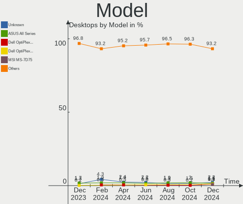
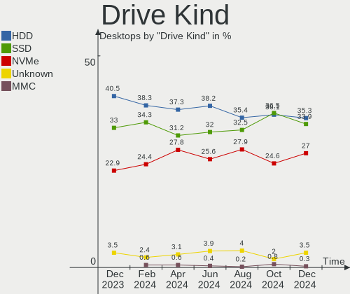

Ubuntu Hardware Trends (Desktop)
--------------------------------

A project to identify most popular hardware characteristics and track their change
over time based on data collected by Ubuntu users at https://Linux-Hardware.org.

Anyone can contribute to the study by uploading probes of their computers by
the [hw-probe](https://github.com/linuxhw/hw-probe) tool:

    sudo -E hw-probe -all -upload

Full-feature report is available here: https://linux-hardware.org/?view=trends&formfactor=desktop

Period: May, 2020.

Contents
--------

- [ OS                       ](#os)
- [ OS Family                ](#os-family)
- [ Kernel                   ](#kernel)
- [ Kernel Family            ](#kernel-family)
- [ Kernel Major Ver.        ](#kernel-major-ver)
- [ Arch                     ](#arch)
- [ DE                       ](#de)
- [ Display Server           ](#display-server)
- [ Display Manager          ](#display-manager)
- [ OS Lang                  ](#os-lang)
- [ Boot Mode                ](#boot-mode)
- [ Filesystem               ](#filesystem)
- [ Part. scheme             ](#part-scheme)
- [ Dual Boot with Linux/BSD ](#dual-boot-with-linux/bsd)
- [ Dual Boot (Win)          ](#dual-boot-win)
- [ Country                  ](#country)
- [ City                     ](#city)
- [ Vendor                   ](#vendor)
- [ Model                    ](#model)
- [ Model Family             ](#model-family)
- [ MFG Year                 ](#mfg-year)
- [ Form Factor              ](#form-factor)
- [ Secure Boot              ](#secure-boot)
- [ Coreboot                 ](#coreboot)
- [ RAM Size                 ](#ram-size)
- [ RAM Used                 ](#ram-used)
- [ Drive Vendor             ](#drive-vendor)
- [ Drive Model              ](#drive-model)
- [ Drive Kind               ](#drive-kind)
- [ Drive Connector          ](#drive-connector)
- [ Drive Size               ](#drive-size)
- [ Space Total              ](#space-total)
- [ Space Used               ](#space-used)
- [ Malfunc. Drives          ](#malfunc-drives)
- [ Malfunc. Drive Vendor    ](#malfunc-drive-vendor)
- [ Malfunc. Drive Kind      ](#malfunc-drive-kind)
- [ Failed Drives            ](#failed-drives)
- [ Failed Drive Vendor      ](#failed-drive-vendor)
- [ Drive Status             ](#drive-status)
- [ Storage Vendor           ](#storage-vendor)
- [ Storage Model            ](#storage-model)
- [ Storage Kind             ](#storage-kind)
- [ CPU Vendor               ](#cpu-vendor)
- [ CPU Model                ](#cpu-model)
- [ CPU Model Family         ](#cpu-model-family)
- [ CPU Cores                ](#cpu-cores)
- [ CPU Sockets              ](#cpu-sockets)
- [ CPU Threads              ](#cpu-threads)
- [ CPU Op-Modes             ](#cpu-op-modes)
- [ CPU Microcode            ](#cpu-microcode)
- [ CPU Microarch            ](#cpu-microarch)
- [ GPU Vendor               ](#gpu-vendor)
- [ GPU Model                ](#gpu-model)
- [ GPU Combo                ](#gpu-combo)
- [ GPU Driver               ](#gpu-driver)
- [ GPU Memory               ](#gpu-memory)
- [ Monitor Vendor           ](#monitor-vendor)
- [ Monitor Model            ](#monitor-model)
- [ Monitor Resolution       ](#monitor-resolution)
- [ Monitor Diagonal         ](#monitor-diagonal)
- [ Monitor Width            ](#monitor-width)
- [ Aspect Ratio             ](#aspect-ratio)
- [ Monitor Area             ](#monitor-area)
- [ Pixel Density            ](#pixel-density)
- [ Multiple Monitors        ](#multiple-monitors)
- [ Net Controller Vendor    ](#net-controller-vendor)
- [ Net Controller Model     ](#net-controller-model)
- [ Net Controller Kind      ](#net-controller-kind)
- [ Used Controller          ](#used-controller)
- [ NICs                     ](#nics)
- [ Unsupported Devices      ](#unsupported-devices)
- [ Unsupported Device Types ](#unsupported-device-types)

OS
--

Installed operating systems

| Name         | Computers | Percent |
|--------------|-----------|---------|
| Ubuntu 20.04 | 991       | 73.35%  |
| Ubuntu 18.04 | 266       | 19.69%  |
| Ubuntu 19.10 | 51        | 3.77%   |
| Ubuntu 16.04 | 27        | 2%      |
| Ubuntu 19.04 | 4         | 0.3%    |
| Ubuntu 18.10 | 4         | 0.3%    |
| Ubuntu 20.10 | 3         | 0.22%   |
| Ubuntu 16.10 | 2         | 0.15%   |
| Ubuntu       | 2         | 0.15%   |
| Ubuntu 17.04 | 1         | 0.07%   |

OS Family
---------

OS without a version

| Name   | Computers | Percent |
|--------|-----------|---------|
| Ubuntu | 1351      | 100%    |

Kernel
------

Version of the Linux kernel

| Version                 | Computers | Percent |
|-------------------------|-----------|---------|
| 5.4.0-29-generic        | 393       | 29.09%  |
| 5.4.0-31-generic        | 244       | 18.06%  |
| 5.4.0-28-generic        | 151       | 11.18%  |
| 5.3.0-51-generic        | 103       | 7.62%   |
| 5.4.0-26-generic        | 78        | 5.77%   |
| 5.4.0-33-generic        | 74        | 5.48%   |
| 4.15.0-99-generic       | 74        | 5.48%   |
| 5.3.0-53-generic        | 54        | 4%      |
| 4.15.0-101-generic      | 22        | 1.63%   |
| 5.4.0-29-lowlatency     | 17        | 1.26%   |
| 5.3.0-46-generic        | 14        | 1.04%   |
| 5.3.0-28-generic        | 14        | 1.04%   |
| 5.4.0-32-generic        | 7         | 0.52%   |
| 5.4.0-31-lowlatency     | 7         | 0.52%   |
| 4.4.0-178-generic       | 7         | 0.52%   |
| 5.3.0-51-lowlatency     | 4         | 0.3%    |
| 5.0.0-23-generic        | 4         | 0.3%    |
| 4.15.0-29-generic       | 4         | 0.3%    |
| 5.6.0-1010-oem          | 3         | 0.22%   |
| 5.4.0-30-generic        | 3         | 0.22%   |
| 5.4.0-28-lowlatency     | 3         | 0.22%   |
| 5.3.0-18-generic        | 3         | 0.22%   |
| 4.4.0-179-generic       | 3         | 0.22%   |
| 4.15.0-96-generic       | 3         | 0.22%   |
| 4.15.0-91-generic       | 3         | 0.22%   |
| 4.15.0-58-generic       | 3         | 0.22%   |
| 5.7.0-050700rc5-generic | 2         | 0.15%   |
| 5.6.11-050611-generic   | 2         | 0.15%   |
| 5.4.0-34-generic        | 2         | 0.15%   |
| 5.3.0-42-generic        | 2         | 0.15%   |
| 5.3.0-26-generic        | 2         | 0.15%   |
| 5.0.0-32-generic        | 2         | 0.15%   |
| 5.0.0-27-generic        | 2         | 0.15%   |
| 5.0.0-13-generic        | 2         | 0.15%   |
| 4.18.0-10-generic       | 2         | 0.15%   |
| 4.15.0-50-generic       | 2         | 0.15%   |
| 4.15.0-45-generic       | 2         | 0.15%   |
| 4.15.0-100-generic      | 2         | 0.15%   |
| 5.6.7-050607-lowlatency | 1         | 0.07%   |
| 5.6.0-999-lowlatency    | 1         | 0.07%   |
| 5.6.0+                  | 1         | 0.07%   |
| 5.5.19-050519-generic   | 1         | 0.07%   |
| 5.4.42-xanmod1          | 1         | 0.07%   |
| 5.4.10-050410-generic   | 1         | 0.07%   |
| 5.4.0-33-lowlatency     | 1         | 0.07%   |
| 5.4.0-26-lowlatency     | 1         | 0.07%   |
| 5.4.0-21-generic        | 1         | 0.07%   |
| 5.3.0-7625-generic      | 1         | 0.07%   |
| 5.3.0-55-generic        | 1         | 0.07%   |
| 5.3.0-52-generic        | 1         | 0.07%   |
| 5.3.0-45-generic        | 1         | 0.07%   |
| 5.3.0-40-lowlatency     | 1         | 0.07%   |
| 5.3.0-40-generic        | 1         | 0.07%   |
| 5.3.0-050300-generic    | 1         | 0.07%   |
| 5.0.0-38-generic        | 1         | 0.07%   |
| 5.0.0-37-generic        | 1         | 0.07%   |
| 4.8.0-59-generic        | 1         | 0.07%   |
| 4.8.0-27-generic        | 1         | 0.07%   |
| 4.4.0-177-generic       | 1         | 0.07%   |
| 4.18.0-25-lowlatency    | 1         | 0.07%   |

Kernel Family
-------------

Linux kernel without a distro release

| Version | Computers | Percent |
|---------|-----------|---------|
| 5.4.0   | 982       | 72.69%  |
| 5.3.0   | 203       | 15.03%  |
| 4.15.0  | 123       | 9.1%    |
| 5.0.0   | 12        | 0.89%   |
| 4.4.0   | 11        | 0.81%   |
| 5.6.0   | 5         | 0.37%   |
| 4.18.0  | 4         | 0.3%    |
| 5.7.0   | 2         | 0.15%   |
| 5.6.11  | 2         | 0.15%   |
| 4.8.0   | 2         | 0.15%   |
| 5.6.7   | 1         | 0.07%   |
| 5.5.19  | 1         | 0.07%   |
| 5.4.42  | 1         | 0.07%   |
| 5.4.10  | 1         | 0.07%   |
| 4.10.0  | 1         | 0.07%   |

Kernel Major Ver.
-----------------

Linux kernel major version

| Version | Computers | Percent |
|---------|-----------|---------|
| 5.4     | 984       | 72.83%  |
| 5.3     | 203       | 15.03%  |
| 4.15    | 123       | 9.1%    |
| 5.0     | 12        | 0.89%   |
| 4.4     | 11        | 0.81%   |
| 5.6     | 8         | 0.59%   |
| 4.18    | 4         | 0.3%    |
| 5.7     | 2         | 0.15%   |
| 4.8     | 2         | 0.15%   |
| 5.5     | 1         | 0.07%   |
| 4.10    | 1         | 0.07%   |

Arch
----

OS architecture (x86_64, i586, etc.)

| Name   | Computers | Percent |
|--------|-----------|---------|
| x86_64 | 1322      | 97.85%  |
| i686   | 29        | 2.15%   |

DE
--

Desktop Environment

| Name            | Computers | Percent |
|-----------------|-----------|---------|
| GNOME           | 1071      | 79.27%  |
| XFCE            | 90        | 6.66%   |
| Unknown         | 49        | 3.63%   |
| KDE             | 29        | 2.15%   |
| Unity           | 24        | 1.78%   |
| MATE            | 17        | 1.26%   |
| X-Cinnamon      | 12        | 0.89%   |
| GNOME Flashback | 12        | 0.89%   |
| Deepin          | 10        | 0.74%   |
| LXQt            | 9         | 0.67%   |
| KDE5            | 9         | 0.67%   |
| Budgie          | 9         | 0.67%   |
| LXDE            | 8         | 0.59%   |
| GNOME Classic   | 2         | 0.15%   |

Display Server
--------------

X11 or Wayland

| Name    | Computers | Percent |
|---------|-----------|---------|
| X11     | 1305      | 96.6%   |
| Wayland | 22        | 1.63%   |
| Unknown | 21        | 1.55%   |
| Tty     | 3         | 0.22%   |

Display Manager
---------------

SDDM, LightDM, etc.

| Name    | Computers | Percent |
|---------|-----------|---------|
| Unknown | 1283      | 94.97%  |
| GDM     | 38        | 2.81%   |
| LightDM | 20        | 1.48%   |
| SDDM    | 10        | 0.74%   |

OS Lang
-------

Language

| Lang        | Computers | Percent |
|-------------|-----------|---------|
| en_US       | 438       | 32.42%  |
| de_DE       | 149       | 11.03%  |
| en_GB       | 96        | 7.11%   |
| fr_FR       | 76        | 5.63%   |
| it_IT       | 69        | 5.11%   |
| pt_BR       | 65        | 4.81%   |
| en_CA       | 49        | 3.63%   |
| ru_RU       | 43        | 3.18%   |
| es_ES       | 42        | 3.11%   |
| en_AU       | 28        | 2.07%   |
| C           | 25        | 1.85%   |
| pl_PL       | 23        | 1.7%    |
| en_IN       | 20        | 1.48%   |
| ja_JP       | 19        | 1.41%   |
| nl_NL       | 17        | 1.26%   |
| es_AR       | 14        | 1.04%   |
| cs_CZ       | 11        | 0.81%   |
| en_ZA       | 9         | 0.67%   |
| es_PE       | 8         | 0.59%   |
| de_AT       | 8         | 0.59%   |
| ca_ES       | 8         | 0.59%   |
| el_GR       | 7         | 0.52%   |
| ru_UA       | 6         | 0.44%   |
| ro_RO       | 6         | 0.44%   |
| hu_HU       | 6         | 0.44%   |
| es_CO       | 6         | 0.44%   |
| zh_TW       | 5         | 0.37%   |
| tr_TR       | 5         | 0.37%   |
| pt_PT       | 5         | 0.37%   |
| es_MX       | 5         | 0.37%   |
| en_NZ       | 5         | 0.37%   |
| de_CH       | 5         | 0.37%   |
| zh_CN       | 4         | 0.3%    |
| sv_SE       | 4         | 0.3%    |
| ko_KR       | 4         | 0.3%    |
| es_UY       | 4         | 0.3%    |
| es_CL       | 4         | 0.3%    |
| Unknown     | 4         | 0.3%    |
| uk_UA       | 3         | 0.22%   |
| sl_SI       | 3         | 0.22%   |
| nl_BE       | 3         | 0.22%   |
| fr_CA       | 3         | 0.22%   |
| fr_BE       | 3         | 0.22%   |
| en_SG       | 3         | 0.22%   |
| en_IL       | 3         | 0.22%   |
| sr_RS       | 2         | 0.15%   |
| es_EC       | 2         | 0.15%   |
| es_CR       | 2         | 0.15%   |
| en_HK       | 2         | 0.15%   |
| bg_BG       | 2         | 0.15%   |
| sr_RS@latin | 1         | 0.07%   |
| sk_SK       | 1         | 0.07%   |
| nb_NO       | 1         | 0.07%   |
| lv_LV       | 1         | 0.07%   |
| id_ID       | 1         | 0.07%   |
| hr_HR       | 1         | 0.07%   |
| fr_CH       | 1         | 0.07%   |
| fa_IR       | 1         | 0.07%   |
| fa_IR       | 1         | 0.07%   |
| es_VE       | 1         | 0.07%   |

Boot Mode
---------

EFI or BIOS

| Mode | Computers | Percent |
|------|-----------|---------|
| BIOS | 947       | 70.1%   |
| EFI  | 404       | 29.9%   |

Filesystem
----------

Type of filesystem

| Type    | Computers | Percent |
|---------|-----------|---------|
| Ext4    | 1259      | 93.19%  |
| Overlay | 50        | 3.7%    |
| Zfs     | 18        | 1.33%   |
| Ext2    | 9         | 0.67%   |
| Btrfs   | 7         | 0.52%   |
| Xfs     | 6         | 0.44%   |
| Ext3    | 2         | 0.15%   |

Part. scheme
------------

Scheme of partitioning

| Type    | Computers | Percent |
|---------|-----------|---------|
| Unknown | 1317      | 97.48%  |
| GPT     | 22        | 1.63%   |
| MBR     | 12        | 0.89%   |

Dual Boot with Linux/BSD
------------------------

Hosting more than one Linux/BSD

| Dual boot | Computers | Percent |
|-----------|-----------|---------|
| No        | 1112      | 82.31%  |
| Yes       | 239       | 17.69%  |

Dual Boot (Win)
---------------

Hosting Linux and Windows

| Dual boot | Computers | Percent |
|-----------|-----------|---------|
| No        | 721       | 53.37%  |
| Yes       | 630       | 46.63%  |

Country
-------

Geographic location (country)

| Country            | Computers | Percent |
|--------------------|-----------|---------|
| USA                | 267       | 19.76%  |
| Germany            | 168       | 12.44%  |
| UK                 | 91        | 6.74%   |
| France             | 83        | 6.14%   |
| Brazil             | 78        | 5.77%   |
| Italy              | 72        | 5.33%   |
| Spain              | 53        | 3.92%   |
| Canada             | 53        | 3.92%   |
| Russia             | 46        | 3.4%    |
| Australia          | 30        | 2.22%   |
| Poland             | 27        | 2%      |
| Netherlands        | 22        | 1.63%   |
| India              | 22        | 1.63%   |
| Argentina          | 20        | 1.48%   |
| Japan              | 19        | 1.41%   |
| Greece             | 19        | 1.41%   |
| Ukraine            | 16        | 1.18%   |
| Austria            | 15        | 1.11%   |
| Sweden             | 12        | 0.89%   |
| Romania            | 12        | 0.89%   |
| Switzerland        | 11        | 0.81%   |
| Mexico             | 11        | 0.81%   |
| Czech Republic     | 11        | 0.81%   |
| Belgium            | 11        | 0.81%   |
| South Africa       | 9         | 0.67%   |
| Turkey             | 8         | 0.59%   |
| Taiwan             | 8         | 0.59%   |
| Serbia             | 8         | 0.59%   |
| Peru               | 8         | 0.59%   |
| Colombia           | 8         | 0.59%   |
| Portugal           | 7         | 0.52%   |
| Hungary            | 7         | 0.52%   |
| New Zealand        | 6         | 0.44%   |
| Korea, Republic of | 6         | 0.44%   |
| Uruguay            | 5         | 0.37%   |
| Croatia            | 5         | 0.37%   |
| China              | 5         | 0.37%   |
| Chile              | 5         | 0.37%   |
| Slovenia           | 4         | 0.3%    |
| Norway             | 4         | 0.3%    |
| Malaysia           | 4         | 0.3%    |
| Israel             | 4         | 0.3%    |
| Indonesia          | 4         | 0.3%    |
| Egypt              | 4         | 0.3%    |
| Bulgaria           | 4         | 0.3%    |
| Thailand           | 3         | 0.22%   |
| Singapore          | 3         | 0.22%   |
| Pakistan           | 3         | 0.22%   |
| Iran               | 3         | 0.22%   |
| Denmark            | 3         | 0.22%   |
| Vietnam            | 2         | 0.15%   |
| Venezuela          | 2         | 0.15%   |
| Sri Lanka          | 2         | 0.15%   |
| Slovakia           | 2         | 0.15%   |
| Saudi Arabia       | 2         | 0.15%   |
| Luxembourg         | 2         | 0.15%   |
| Kenya              | 2         | 0.15%   |
| Ireland            | 2         | 0.15%   |
| Hong Kong          | 2         | 0.15%   |
| Ecuador            | 2         | 0.15%   |

City
----

Geographic location (city)

| City              | Computers | Percent |
|-------------------|-----------|---------|
| Paris             | 14        | 1.04%   |
| Berlin            | 14        | 1.04%   |
| Moscow            | 13        | 0.96%   |
| São Paulo        | 10        | 0.74%   |
| Rome              | 10        | 0.74%   |
| Rio de Janeiro    | 10        | 0.74%   |
| Madrid            | 10        | 0.74%   |
| Athens            | 10        | 0.74%   |
| Vienna            | 9         | 0.67%   |
| Barcelona         | 8         | 0.59%   |
| Warsaw            | 7         | 0.52%   |
| Toronto           | 7         | 0.52%   |
| Sydney            | 7         | 0.52%   |
| London            | 7         | 0.52%   |
| Buenos Aires      | 7         | 0.52%   |
| Brisbane          | 7         | 0.52%   |
| Munich            | 6         | 0.44%   |
| Milan             | 6         | 0.44%   |
| Leipzig           | 6         | 0.44%   |
| Plano             | 5         | 0.37%   |
| Lima              | 5         | 0.37%   |
| Hamburg           | 5         | 0.37%   |
| Dallas            | 5         | 0.37%   |
| Budapest          | 5         | 0.37%   |
| Belo Horizonte    | 5         | 0.37%   |
| York              | 4         | 0.3%    |
| Turin             | 4         | 0.3%    |
| Tucson            | 4         | 0.3%    |
| Prague            | 4         | 0.3%    |
| Ottawa            | 4         | 0.3%    |
| Nuremberg         | 4         | 0.3%    |
| Montreal          | 4         | 0.3%    |
| Montevideo        | 4         | 0.3%    |
| Mannheim          | 4         | 0.3%    |
| Kyiv              | 4         | 0.3%    |
| Atlanta           | 4         | 0.3%    |
| Zurich            | 3         | 0.22%   |
| Wellington        | 3         | 0.22%   |
| Venice            | 3         | 0.22%   |
| Unna              | 3         | 0.22%   |
| Taipei            | 3         | 0.22%   |
| Stuttgart         | 3         | 0.22%   |
| San Jose          | 3         | 0.22%   |
| Recife            | 3         | 0.22%   |
| Pune              | 3         | 0.22%   |
| Oshawa            | 3         | 0.22%   |
| Naples            | 3         | 0.22%   |
| Mumbai            | 3         | 0.22%   |
| Minneapolis       | 3         | 0.22%   |
| Medellín         | 3         | 0.22%   |
| Lviv              | 3         | 0.22%   |
| Johannesburg      | 3         | 0.22%   |
| Gliwice           | 3         | 0.22%   |
| Glendora          | 3         | 0.22%   |
| Frankfurt am Main | 3         | 0.22%   |
| Edmonton          | 3         | 0.22%   |
| Denver            | 3         | 0.22%   |
| Colorado Springs  | 3         | 0.22%   |
| Chicago           | 3         | 0.22%   |
| Cambridge         | 3         | 0.22%   |

Vendor
------

Motherboard manufacturer

| Name                                   | Computers | Percent |
|----------------------------------------|-----------|---------|
| ASUSTek Computer                       | 370       | 27.39%  |
| Gigabyte Technology                    | 241       | 17.84%  |
| MSI                                    | 140       | 10.36%  |
| Dell                                   | 129       | 9.55%   |
| ASRock                                 | 101       | 7.48%   |
| Hewlett-Packard                        | 98        | 7.25%   |
| Lenovo                                 | 36        | 2.66%   |
| Intel                                  | 35        | 2.59%   |
| Acer                                   | 31        | 2.29%   |
| Fujitsu                                | 19        | 1.41%   |
| Foxconn                                | 17        | 1.26%   |
| Biostar                                | 16        | 1.18%   |
| ECS                                    | 12        | 0.89%   |
| Unknown                                | 11        | 0.81%   |
| Pegatron                               | 10        | 0.74%   |
| Packard Bell                           | 9         | 0.67%   |
| Fujitsu Siemens                        | 7         | 0.52%   |
| Medion                                 | 6         | 0.44%   |
| Positivo                               | 5         | 0.37%   |
| Apple                                  | 5         | 0.37%   |
| EVGA                                   | 4         | 0.3%    |
| Shuttle                                | 3         | 0.22%   |
| PCWare                                 | 3         | 0.22%   |
| Huanan                                 | 3         | 0.22%   |
| eMachines                              | 3         | 0.22%   |
| Supermicro                             | 2         | 0.15%   |
| IBM                                    | 2         | 0.15%   |
| Gateway                                | 2         | 0.15%   |
| AOpen                                  | 2         | 0.15%   |
| Alienware                              | 2         | 0.15%   |
| ZOTAC                                  | 1         | 0.07%   |
| VIA Technologies                       | 1         | 0.07%   |
| TECO Electric and Machinery            | 1         | 0.07%   |
| Semp Toshiba                           | 1         | 0.07%   |
| Sapphire Tech                          | 1         | 0.07%   |
| PCChips                                | 1         | 0.07%   |
| ONKYO                                  | 1         | 0.07%   |
| OLIDATA CHILE                          | 1         | 0.07%   |
| Nvidia                                 | 1         | 0.07%   |
| NEC Computers                          | 1         | 0.07%   |
| MouseComputer                          | 1         | 0.07%   |
| Maxtang                                | 1         | 0.07%   |
| LattePanda                             | 1         | 0.07%   |
| Lanix                                  | 1         | 0.07%   |
| Intel OEM                              | 1         | 0.07%   |
| ICP / iEi                              | 1         | 0.07%   |
| HOUTER                                 | 1         | 0.07%   |
| Exo                                    | 1         | 0.07%   |
| Digitron                               | 1         | 0.07%   |
| Desenvolvido para Positivo Informatica | 1         | 0.07%   |
| Braview                                | 1         | 0.07%   |
| BCM                                    | 1         | 0.07%   |
| AMI                                    | 1         | 0.07%   |
| AMD                                    | 1         | 0.07%   |
| ADLINK TECHNOLOGY                      | 1         | 0.07%   |
| Accton                                 | 1         | 0.07%   |
| ABIT                                   | 1         | 0.07%   |

Model
-----

Motherboard model

| Name                             | Computers | Percent |
|----------------------------------|-----------|---------|
| ASUS All Series                  | 28        | 2.07%   |
| Unknown                          | 12        | 0.89%   |
| Gigabyte B450M DS3H              | 8         | 0.59%   |
| Dell OptiPlex 7010               | 8         | 0.59%   |
| ASUS PRIME A320M-K               | 8         | 0.59%   |
| MSI MS-7C02                      | 7         | 0.52%   |
| HP Compaq Elite 8300 SFF         | 7         | 0.52%   |
| Dell OptiPlex 780                | 7         | 0.52%   |
| ASUS M5A78L-M/USB3               | 7         | 0.52%   |
| Gigabyte GA-78LMT-USB3 6.0       | 6         | 0.44%   |
| Gigabyte A320M-S2H               | 6         | 0.44%   |
| Dell OptiPlex 9020               | 6         | 0.44%   |
| Dell OptiPlex 9010               | 6         | 0.44%   |
| ASRock B450M Pro4                | 6         | 0.44%   |
| MSI MS-7A36                      | 5         | 0.37%   |
| MSI MS-7850                      | 5         | 0.37%   |
| MSI MS-7693                      | 5         | 0.37%   |
| HP Compaq 8200 Elite SFF PC      | 5         | 0.37%   |
| Gigabyte X470 AORUS ULTRA GAMING | 5         | 0.37%   |
| Dell OptiPlex 760                | 5         | 0.37%   |
| Dell OptiPlex 755                | 5         | 0.37%   |
| ASUS M5A78L-M PLUS/USB3          | 5         | 0.37%   |
| MSI MS-7C37                      | 4         | 0.3%    |
| MSI MS-7C35                      | 4         | 0.3%    |
| MSI MS-7A34                      | 4         | 0.3%    |
| MSI MS-7721                      | 4         | 0.3%    |
| Dell OptiPlex GX620              | 4         | 0.3%    |
| Dell OptiPlex 390                | 4         | 0.3%    |
| Dell OptiPlex 3020               | 4         | 0.3%    |
| ASUS PRIME A320M-K/BR            | 4         | 0.3%    |
| ASUS P5N-D                       | 4         | 0.3%    |
| ASUS M5A99FX PRO R2.0            | 4         | 0.3%    |
| ASRock Z77 Extreme4              | 4         | 0.3%    |
| MSI MS-7C09                      | 3         | 0.22%   |
| MSI MS-7B86                      | 3         | 0.22%   |
| MSI MS-7A38                      | 3         | 0.22%   |
| MSI MS-7994                      | 3         | 0.22%   |
| MSI MS-7817                      | 3         | 0.22%   |
| HP Z620 Workstation              | 3         | 0.22%   |
| Gigabyte GA-970A-UD3             | 3         | 0.22%   |
| Gigabyte G41M-Combo              | 3         | 0.22%   |
| Gigabyte B75M-D3H                | 3         | 0.22%   |
| Gigabyte B450 AORUS M            | 3         | 0.22%   |
| Gigabyte B450 AORUS ELITE        | 3         | 0.22%   |
| Gigabyte 990FXA-UD3              | 3         | 0.22%   |
| Gigabyte 970A-DS3P               | 3         | 0.22%   |
| Dell Precision WorkStation T3500 | 3         | 0.22%   |
| Dell OptiPlex 380                | 3         | 0.22%   |
| Dell Inspiron 560                | 3         | 0.22%   |
| Dell Inspiron 530                | 3         | 0.22%   |
| Dell Inspiron 3650               | 3         | 0.22%   |
| ASUS SABERTOOTH 990FX R2.0       | 3         | 0.22%   |
| ASUS PRIME Z270-P                | 3         | 0.22%   |
| ASUS PRIME H310M-E R2.0          | 3         | 0.22%   |
| ASUS PRIME B450-PLUS             | 3         | 0.22%   |
| ASUS PRIME B350-PLUS             | 3         | 0.22%   |
| ASUS P8Z68-V LX                  | 3         | 0.22%   |
| ASUS P8H77-V LE                  | 3         | 0.22%   |
| ASUS P6T                         | 3         | 0.22%   |
| ASUS P5QL PRO                    | 3         | 0.22%   |

Model Family
------------

Motherboard model prefix

| Name                   | Computers | Percent |
|------------------------|-----------|---------|
| Dell OptiPlex          | 72        | 5.33%   |
| ASUS PRIME             | 52        | 3.85%   |
| HP Compaq              | 50        | 3.7%    |
| ASUS All               | 28        | 2.07%   |
| Acer Aspire            | 23        | 1.7%    |
| Dell Inspiron          | 22        | 1.63%   |
| Lenovo ThinkCentre     | 21        | 1.55%   |
| ASUS M5A78L-M          | 18        | 1.33%   |
| Dell Precision         | 16        | 1.18%   |
| ASUS ROG               | 15        | 1.11%   |
| ASUS P8H61-M           | 15        | 1.11%   |
| Fujitsu ESPRIMO        | 14        | 1.04%   |
| Gigabyte B450          | 12        | 0.89%   |
| Unknown                | 12        | 0.89%   |
| Gigabyte B450M         | 11        | 0.81%   |
| Gigabyte GA-78LMT-USB3 | 9         | 0.67%   |
| ASUS TUF               | 9         | 0.67%   |
| ASUS P8Z77-V           | 9         | 0.67%   |
| ASUS SABERTOOTH        | 8         | 0.59%   |
| ASUS P8Z68-V           | 8         | 0.59%   |
| ASRock Z77             | 8         | 0.59%   |
| MSI MS-7C02            | 7         | 0.52%   |
| ASUS Maximus           | 7         | 0.52%   |
| ASRock B450M           | 7         | 0.52%   |
| Lenovo IdeaCentre      | 6         | 0.44%   |
| HP ProDesk             | 6         | 0.44%   |
| Gigabyte X570          | 6         | 0.44%   |
| Gigabyte X470          | 6         | 0.44%   |
| Gigabyte A320M-S2H     | 6         | 0.44%   |
| Dell XPS               | 6         | 0.44%   |
| Packard Bell iMedia    | 5         | 0.37%   |
| MSI MS-7A36            | 5         | 0.37%   |
| MSI MS-7850            | 5         | 0.37%   |
| MSI MS-7693            | 5         | 0.37%   |
| Gigabyte Z390          | 5         | 0.37%   |
| ASRock A320M-HDV       | 5         | 0.37%   |
| ASRock 970             | 5         | 0.37%   |
| Acer Veriton           | 5         | 0.37%   |
| MSI MS-7C37            | 4         | 0.3%    |
| MSI MS-7C35            | 4         | 0.3%    |
| MSI MS-7A34            | 4         | 0.3%    |
| MSI MS-7721            | 4         | 0.3%    |
| Lenovo ThinkStation    | 4         | 0.3%    |
| HP EliteDesk           | 4         | 0.3%    |
| Gigabyte H310M         | 4         | 0.3%    |
| Dell Studio            | 4         | 0.3%    |
| ASUS STRIX             | 4         | 0.3%    |
| ASUS Rampage           | 4         | 0.3%    |
| ASUS P6T               | 4         | 0.3%    |
| ASUS P5N-D             | 4         | 0.3%    |
| ASUS P5G41T-M          | 4         | 0.3%    |
| ASUS M5A99FX           | 4         | 0.3%    |
| ASRock B450            | 4         | 0.3%    |
| MSI MS-7C09            | 3         | 0.22%   |
| MSI MS-7B86            | 3         | 0.22%   |
| MSI MS-7A38            | 3         | 0.22%   |
| MSI MS-7994            | 3         | 0.22%   |
| MSI MS-7817            | 3         | 0.22%   |
| Medion AKOYA           | 3         | 0.22%   |
| HP Z620                | 3         | 0.22%   |

MFG Year
--------

Motherboard manufacture year

| Year    | Computers | Percent |
|---------|-----------|---------|
| 2019    | 201       | 14.88%  |
| 2018    | 122       | 9.03%   |
| 2012    | 120       | 8.88%   |
| 2013    | 115       | 8.51%   |
| 2010    | 106       | 7.85%   |
| 2014    | 103       | 7.62%   |
| 2011    | 90        | 6.66%   |
| 2009    | 85        | 6.29%   |
| 2015    | 78        | 5.77%   |
| 2016    | 77        | 5.7%    |
| 2008    | 70        | 5.18%   |
| 2017    | 64        | 4.74%   |
| 2007    | 45        | 3.33%   |
| 2020    | 33        | 2.44%   |
| 2006    | 21        | 1.55%   |
| 2005    | 14        | 1.04%   |
| 2004    | 2         | 0.15%   |
| Unknown | 2         | 0.15%   |
| 2003    | 1         | 0.07%   |
| 2002    | 1         | 0.07%   |
| 2001    | 1         | 0.07%   |

Form Factor
-----------

Physical design of the computer

| Name    | Computers | Percent |
|---------|-----------|---------|
| Desktop | 1351      | 100%    |

Secure Boot
-----------

Enabled or disabled

| State    | Computers | Percent |
|----------|-----------|---------|
| Disabled | 1316      | 97.41%  |
| Enabled  | 35        | 2.59%   |

Coreboot
--------

Have coreboot on board

| Used | Computers | Percent |
|------|-----------|---------|
| No   | 1350      | 99.93%  |
| Yes  | 1         | 0.07%   |

RAM Size
--------

Total RAM memory

| Size in GB      | Computers | Percent |
|-----------------|-----------|---------|
| 8.01-16.0       | 295       | 21.84%  |
| 3.01-4.0        | 294       | 21.76%  |
| 16.01-24.0      | 285       | 21.1%   |
| 4.01-8.0        | 232       | 17.17%  |
| 32.01-64.0      | 112       | 8.29%   |
| 1.01-2.0        | 62        | 4.59%   |
| 64.01-256.0     | 29        | 2.15%   |
| 24.01-32.0      | 18        | 1.33%   |
| 2.01-3.0        | 16        | 1.18%   |
| 0.01-1.0        | 7         | 0.52%   |
| More than 256.0 | 1         | 0.07%   |

RAM Used
--------

Used RAM memory

| Used GB     | Computers | Percent |
|-------------|-----------|---------|
| 1.01-2.0    | 677       | 50.11%  |
| 2.01-3.0    | 342       | 25.31%  |
| 3.01-4.0    | 124       | 9.18%   |
| 4.01-8.0    | 117       | 8.66%   |
| 0.01-1.0    | 55        | 4.07%   |
| 8.01-16.0   | 33        | 2.44%   |
| 32.01-64.0  | 1         | 0.07%   |
| 64.01-256.0 | 1         | 0.07%   |
| 16.01-24.0  | 1         | 0.07%   |

Drive Vendor
------------

Hard drive vendors

| Vendor              | Computers | Drives | Percent |
|---------------------|-----------|--------|---------|
| WDC                 | 525       | 683    | 24.52%  |
| Seagate             | 500       | 617    | 23.35%  |
| Samsung Electronics | 271       | 307    | 12.66%  |
| Toshiba             | 119       | 126    | 5.56%   |
| Hitachi             | 110       | 120    | 5.14%   |
| Kingston            | 107       | 115    | 5%      |
| Crucial             | 84        | 91     | 3.92%   |
| SanDisk             | 73        | 78     | 3.41%   |
| Maxtor              | 39        | 41     | 1.82%   |
| A-DATA Technology   | 29        | 30     | 1.35%   |
| Unknown             | 22        | 23     | 1.03%   |
| Intel               | 21        | 23     | 0.98%   |
| HGST                | 18        | 18     | 0.84%   |
| Patriot             | 16        | 18     | 0.75%   |
| OCZ                 | 16        | 16     | 0.75%   |
| SPCC                | 13        | 13     | 0.61%   |
| Intenso             | 12        | 13     | 0.56%   |
| China               | 12        | 12     | 0.56%   |
| PNY                 | 11        | 11     | 0.51%   |
| GOODRAM             | 10        | 10     | 0.47%   |
| Micron Technology   | 6         | 6      | 0.28%   |
| JMicron             | 6         | 6      | 0.28%   |
| Hewlett-Packard     | 6         | 7      | 0.28%   |
| Corsair             | 6         | 6      | 0.28%   |
| ASMT                | 6         | 7      | 0.28%   |
| LITEON              | 5         | 5      | 0.23%   |
| HL-DT-ST            | 5         | 5      | 0.23%   |
| Transcend           | 4         | 4      | 0.19%   |
| Team                | 4         | 4      | 0.19%   |
| PLEXTOR             | 4         | 4      | 0.19%   |
| Fujitsu             | 4         | 4      | 0.19%   |
| TO Exter            | 3         | 3      | 0.14%   |
| SABRENT             | 3         | 3      | 0.14%   |
| Mushkin             | 3         | 3      | 0.14%   |
| LITEONIT            | 3         | 3      | 0.14%   |
| LaCie               | 3         | 4      | 0.14%   |
| KingDian            | 3         | 3      | 0.14%   |
| Gigabyte Technology | 3         | 3      | 0.14%   |
| Generic             | 3         | 3      | 0.14%   |
| Apple               | 3         | 3      | 0.14%   |
| Apacer              | 3         | 3      | 0.14%   |
| SK Hynix            | 2         | 2      | 0.09%   |
| Phison              | 2         | 2      | 0.09%   |
| OCZ-VERTEX2         | 2         | 2      | 0.09%   |
| MARVELL             | 2         | 2      | 0.09%   |
| Lexar               | 2         | 2      | 0.09%   |
| HyperX              | 2         | 2      | 0.09%   |
| DREVO               | 2         | 2      | 0.09%   |
| Dogfish             | 2         | 2      | 0.09%   |
| ASMT109x            | 2         | 2      | 0.09%   |
| AMD                 | 2         | 4      | 0.09%   |
| ZOTAC               | 1         | 1      | 0.05%   |
| XUNZHE800S          | 1         | 1      | 0.05%   |
| WDC WD75            | 1         | 1      | 0.05%   |
| TAMMUZ              | 1         | 2      | 0.05%   |
| SUNEAST             | 1         | 1      | 0.05%   |
| sobetter            | 1         | 1      | 0.05%   |
| SandForce           | 1         | 1      | 0.05%   |
| QUANTUM             | 1         | 1      | 0.05%   |
| PHD 3.0             | 1         | 1      | 0.05%   |

Drive Model
-----------

Hard drive models

| Model                        | Computers | Percent |
|------------------------------|-----------|---------|
| ST500DM002-1BD142 500GB      | 57        | 2.28%   |
| SSD 850 EVO 250GB            | 38        | 1.52%   |
| DT01ACA100 1TB               | 35        | 1.4%    |
| ST1000DM010-2EP102 1TB       | 27        | 1.08%   |
| ST2000DM008-2FR102 2TB       | 24        | 0.96%   |
| SA400S37240G 240GB SSD       | 24        | 0.96%   |
| SV300S37A120G 120GB SSD      | 20        | 0.8%    |
| WD10EZEX-00BN5A0 1TB         | 18        | 0.72%   |
| ST1000DM003-1CH162 1TB       | 17        | 0.68%   |
| CT500MX500SSD1 500GB         | 17        | 0.68%   |
| SSD 860 EVO 500GB            | 16        | 0.64%   |
| WD10EZEX-08WN4A0 1TB         | 15        | 0.6%    |
| ST3500418AS 500GB            | 14        | 0.56%   |
| ST31000528AS 1TB             | 14        | 0.56%   |
| SD/MMC/MS PRO 128GB          | 14        | 0.56%   |
| DT01ACA200 2TB               | 14        | 0.56%   |
| ST2000DM001-1ER164 2TB       | 13        | 0.52%   |
| SA400S37120G 120GB SSD       | 13        | 0.52%   |
| ST3160815AS 160GB            | 12        | 0.48%   |
| ST1000DM003-1ER162 1TB       | 12        | 0.48%   |
| WD20EZRX-00D8PB0 2TB         | 11        | 0.44%   |
| ST3500413AS 500GB            | 11        | 0.44%   |
| ST2000DM006-2DM164 2TB       | 11        | 0.44%   |
| ST2000DM001-1CH164 2TB       | 11        | 0.44%   |
| ST1000DM003-9YN162 1TB       | 11        | 0.44%   |
| SSD 850 EVO 500GB            | 11        | 0.44%   |
| HDS721050CLA362 500GB        | 11        | 0.44%   |
| WDS120G2G0A-00JH30 120GB SSD | 10        | 0.4%    |
| WD40EZRZ-00GXCB0 4TB         | 10        | 0.4%    |
| WD20EARX-00PASB0 2TB         | 10        | 0.4%    |
| SSD 860 EVO 1TB              | 10        | 0.4%    |
| SSD 840 EVO 250GB            | 10        | 0.4%    |
| HDWD110 1TB                  | 10        | 0.4%    |
| HD502HJ 500GB                | 10        | 0.4%    |
| WD30EFRX-68EUZN0 3TB         | 9         | 0.36%   |
| WD10EZEX-22MFCA0 1TB         | 9         | 0.36%   |
| SSD 860 EVO 250GB            | 9         | 0.36%   |
| SA400S37480G 480GB SSD       | 9         | 0.36%   |
| HDWD120 2TB                  | 9         | 0.36%   |
| HDP725050GLA360 500GB        | 9         | 0.36%   |
| WD20EZRZ-00Z5HB0 2TB         | 8         | 0.32%   |
| WD10EARS-00Y5B1 1TB          | 8         | 0.32%   |
| SV300S37A240G 240GB SSD      | 8         | 0.32%   |
| STM3500418AS 500GB           | 8         | 0.32%   |
| ST4000DM004-2CV104 4TB       | 8         | 0.32%   |
| ST3500312CS 500GB            | 8         | 0.32%   |
| ST2000DL003-9VT166 2TB       | 8         | 0.32%   |
| SSD 850 PRO 256GB            | 8         | 0.32%   |
| SSD 840 PRO Series 256GB     | 8         | 0.32%   |
| HDWD130 3TB                  | 8         | 0.32%   |
| HD502HI 500GB                | 8         | 0.32%   |
| HD103SJ 1TB                  | 8         | 0.32%   |
| CT240BX500SSD1 240GB         | 8         | 0.32%   |
| WD5000AAKX-60U6AA0 500GB     | 7         | 0.28%   |
| WD10EZEX-21WN4A0 1TB         | 7         | 0.28%   |
| WD10EADS-00L5B1 1TB          | 7         | 0.28%   |
| ST380815AS 80GB              | 7         | 0.28%   |
| ST3250318AS 250GB            | 7         | 0.28%   |
| ST3160318AS 160GB            | 7         | 0.28%   |
| ST31000524AS 1TB             | 7         | 0.28%   |

Drive Kind
----------

HDD or SSD

| Kind    | Computers | Drives | Percent |
|---------|-----------|--------|---------|
| HDD     | 1094      | 1675   | 61.7%   |
| SSD     | 602       | 746    | 33.95%  |
| Unknown | 57        | 61     | 3.21%   |
| NVMe    | 17        | 19     | 0.96%   |
| MMC     | 3         | 3      | 0.17%   |

Drive Connector
---------------

SATA, SAS, NVMe, etc.

| Type | Computers | Drives | Percent |
|------|-----------|--------|---------|
| SATA | 1303      | 2385   | 92.28%  |
| SAS  | 89        | 97     | 6.3%    |
| NVMe | 17        | 19     | 1.2%    |
| MMC  | 3         | 3      | 0.21%   |

Drive Size
----------

Size of hard drive

| Size in TB | Computers | Drives | Percent |
|------------|-----------|--------|---------|
| 0.01-0.5   | 1027      | 1478   | 54.17%  |
| 0.51-1.0   | 509       | 599    | 26.85%  |
| 1.01-2.0   | 202       | 243    | 10.65%  |
| 2.01-3.0   | 68        | 78     | 3.59%   |
| 3.01-4.0   | 56        | 66     | 2.95%   |
| 4.01-10.0  | 29        | 35     | 1.53%   |
| 10.01-20.0 | 3         | 3      | 0.16%   |
| Unknown    | 2         | 2      | 0.11%   |

Space Total
-----------

Amount of disk space available on the file system

| Size in GB     | Computers | Percent |
|----------------|-----------|---------|
| 101-250        | 369       | 27.31%  |
| 251-500        | 268       | 19.84%  |
| 501-1000       | 219       | 16.21%  |
| 1001-2000      | 126       | 9.33%   |
| 51-100         | 105       | 7.77%   |
| More than 3000 | 88        | 6.51%   |
| 1-20           | 58        | 4.29%   |
| 2001-3000      | 55        | 4.07%   |
| 21-50          | 50        | 3.7%    |
| Unknown        | 13        | 0.96%   |

Space Used
----------

Amount of used disk space

| Used GB        | Computers | Percent |
|----------------|-----------|---------|
| 1-20           | 631       | 46.71%  |
| 21-50          | 194       | 14.36%  |
| 101-250        | 131       | 9.7%    |
| 51-100         | 105       | 7.77%   |
| 501-1000       | 84        | 6.22%   |
| 251-500        | 81        | 6%      |
| 1001-2000      | 57        | 4.22%   |
| More than 3000 | 35        | 2.59%   |
| 2001-3000      | 20        | 1.48%   |
| Unknown        | 13        | 0.96%   |

Malfunc. Drives
---------------

Drive models with a malfunction

| Model                    | Computers | Drives | Percent |
|--------------------------|-----------|--------|---------|
| ST500DM002-1BD142 500GB  | 2         | 2      | 6.25%   |
| WD5000LPVX-08V0TT5 500GB | 1         | 1      | 3.13%   |
| WD5000AAKX-221CA0 500GB  | 1         | 1      | 3.13%   |
| WD5000AAKX-00U6AA0 500GB | 1         | 1      | 3.13%   |
| WD5000AAKX-001CA0 500GB  | 1         | 1      | 3.13%   |
| WD5000AADS-00M2B0 500GB  | 1         | 1      | 3.13%   |
| WD2502ABYS-18B7A0 250GB  | 1         | 1      | 3.13%   |
| WD2500HHTZ-04N21V0 250GB | 1         | 1      | 3.13%   |
| WD1200JB-00CRA1 120GB    | 1         | 1      | 3.13%   |
| WD1001FALS-41Y6A0 1TB    | 1         | 1      | 3.13%   |
| ST9500325ASG 500GB       | 1         | 1      | 3.13%   |
| ST9250315AS 250GB        | 1         | 1      | 3.13%   |
| ST3320418AS 320GB        | 1         | 1      | 3.13%   |
| ST31000333AS 1TB         | 1         | 1      | 3.13%   |
| ST3000DM001-9YN166 3TB   | 1         | 1      | 3.13%   |
| SSDSA2M080G2GC 80GB      | 1         | 1      | 3.13%   |
| SSD DP900 512GB-DL3      | 1         | 1      | 3.13%   |
| SSD 960 PRO 512GB        | 1         | 1      | 3.13%   |
| SP920SS 128GB SSD        | 1         | 1      | 3.13%   |
| SDSSDXPS480G 480GB       | 1         | 1      | 3.13%   |
| SA400S37480G 480GB SSD   | 1         | 1      | 3.13%   |
| SA400S37120G 120GB SSD   | 1         | 1      | 3.13%   |
| MKNSSDCR120GB            | 1         | 1      | 3.13%   |
| HUS726060ALE614 6TB      | 1         | 1      | 3.13%   |
| HTS725050A9A362 500GB    | 1         | 1      | 3.13%   |
| HTS545050A7E380 500GB    | 1         | 1      | 3.13%   |
| HDP725032GLA380 320GB    | 1         | 1      | 3.13%   |
| HD502HJ 500GB            | 1         | 1      | 3.13%   |
| ASM1156-PM 1TB           | 1         | 1      | 3.13%   |
| 6Y160M0 164GB            | 1         | 1      | 3.13%   |
| 6Y080L0 81GB             | 1         | 1      | 3.13%   |

Malfunc. Drive Vendor
---------------------

Vendors of faulty drives

| Vendor              | Computers | Drives | Percent |
|---------------------|-----------|--------|---------|
| WDC                 | 8         | 9      | 25.81%  |
| Seagate             | 7         | 7      | 22.58%  |
| Samsung Electronics | 2         | 2      | 6.45%   |
| Maxtor              | 2         | 2      | 6.45%   |
| Kingston            | 2         | 2      | 6.45%   |
| Hitachi             | 2         | 2      | 6.45%   |
| HGST                | 2         | 2      | 6.45%   |
| A-DATA Technology   | 2         | 2      | 6.45%   |
| SanDisk             | 1         | 1      | 3.23%   |
| Mushkin             | 1         | 1      | 3.23%   |
| Intel               | 1         | 1      | 3.23%   |
| ASMT                | 1         | 1      | 3.23%   |

Malfunc. Drive Kind
-------------------

Kinds of faulty drives

| Kind | Computers | Drives | Percent |
|------|-----------|--------|---------|
| HDD  | 21        | 24     | 72.41%  |
| SSD  | 7         | 7      | 24.14%  |
| NVMe | 1         | 1      | 3.45%   |

Failed Drives
-------------

Failed drive models

Zero info for selected period =(

Failed Drive Vendor
-------------------

Failed drive vendors

Zero info for selected period =(

Drive Status
------------

Number of failed and malfunc. drives

| Status   | Computers | Drives | Percent |
|----------|-----------|--------|---------|
| Detected | 1226      | 2314   | 91.63%  |
| Works    | 84        | 158    | 6.28%   |
| Malfunc  | 28        | 32     | 2.09%   |

Storage Vendor
--------------

Storage controller vendors

| Vendor                           | Computers | Percent |
|----------------------------------|-----------|---------|
| Intel                            | 889       | 50.97%  |
| AMD                              | 381       | 21.85%  |
| Marvell Technology Group         | 73        | 4.19%   |
| JMicron Technology               | 72        | 4.13%   |
| Samsung Electronics              | 64        | 3.67%   |
| ASMedia Technology               | 63        | 3.61%   |
| Nvidia                           | 62        | 3.56%   |
| Phison Electronics               | 24        | 1.38%   |
| VIA Technologies                 | 21        | 1.2%    |
| Sandisk                          | 12        | 0.69%   |
| Silicon Motion                   | 11        | 0.63%   |
| Micron/Crucial Technology        | 9         | 0.52%   |
| Silicon Image                    | 8         | 0.46%   |
| Kingston Technology Company      | 7         | 0.4%    |
| Integrated Technology Express    | 7         | 0.4%    |
| Broadcom / LSI                   | 7         | 0.4%    |
| Realtek Semiconductor            | 6         | 0.34%   |
| LSI Logic / Symbios Logic        | 5         | 0.29%   |
| ADATA Technology                 | 5         | 0.29%   |
| Adaptec                          | 5         | 0.29%   |
| Toshiba America Info Systems     | 2         | 0.11%   |
| Silicon Integrated Systems [SiS] | 2         | 0.11%   |
| OCZ Technology Group             | 2         | 0.11%   |
| SK Hynix                         | 1         | 0.06%   |
| Shenzhen Longsys Electronics     | 1         | 0.06%   |
| Seagate Technology               | 1         | 0.06%   |
| Micron Technology                | 1         | 0.06%   |
| Lenovo                           | 1         | 0.06%   |
| HighPoint Technologies           | 1         | 0.06%   |
| Hewlett-Packard                  | 1         | 0.06%   |

Storage Model
-------------

Storage controller models

| Model                                                                             | Computers | Percent |
|-----------------------------------------------------------------------------------|-----------|---------|
| FCH SATA Controller [AHCI mode]                                                   | 209       | 8.67%   |
| SB7x0/SB8x0/SB9x0 IDE Controller                                                  | 105       | 4.35%   |
| NM10/ICH7 Family SATA Controller [IDE mode]                                       | 97        | 4.02%   |
| 8 Series/C220 Series Chipset Family 6-port SATA Controller 1 [AHCI mode]          | 87        | 3.61%   |
| SB7x0/SB8x0/SB9x0 SATA Controller [IDE mode]                                      | 84        | 3.48%   |
| 82801G (ICH7 Family) IDE Controller                                               | 75        | 3.11%   |
| 400 Series Chipset SATA Controller                                                | 75        | 3.11%   |
| 7 Series/C210 Series Chipset Family 6-port SATA Controller [AHCI mode]            | 65        | 2.69%   |
| Q170/Q150/B150/H170/H110/Z170/CM236 Chipset SATA Controller [AHCI Mode]           | 63        | 2.61%   |
| 6 Series/C200 Series Chipset Family 6 port Desktop SATA AHCI Controller           | 63        | 2.61%   |
| ASM1062 Serial ATA Controller                                                     | 61        | 2.53%   |
| 200 Series PCH SATA controller [AHCI mode]                                        | 58        | 2.4%    |
| SB7x0/SB8x0/SB9x0 SATA Controller [AHCI mode]                                     | 56        | 2.32%   |
| SATA Controller [RAID mode]                                                       | 56        | 2.32%   |
| NVMe SSD Controller SM981/PM981/PM983                                             | 49        | 2.03%   |
| 6 Series/C200 Series Chipset Family Desktop SATA Controller (IDE mode, ports 4-5) | 43        | 1.78%   |
| 6 Series/C200 Series Chipset Family Desktop SATA Controller (IDE mode, ports 0-3) | 43        | 1.78%   |
| JMB363 SATA/IDE Controller                                                        | 40        | 1.66%   |
| Cannon Lake PCH SATA AHCI Controller                                              | 33        | 1.37%   |
| FCH SATA Controller D                                                             | 31        | 1.29%   |
| 9 Series Chipset Family SATA Controller [AHCI Mode]                               | 28        | 1.16%   |
| 82801JI (ICH10 Family) 4 port SATA IDE Controller #1                              | 27        | 1.12%   |
| 82801I (ICH9 Family) 2 port SATA Controller [IDE mode]                            | 27        | 1.12%   |
| 5 Series/3400 Series Chipset 4 port SATA IDE Controller                           | 27        | 1.12%   |
| 5 Series/3400 Series Chipset 2 port SATA IDE Controller                           | 27        | 1.12%   |
| Non-Volatile memory controller                                                    | 26        | 1.08%   |
| MCP61 SATA Controller                                                             | 26        | 1.08%   |
| 82801JI (ICH10 Family) 2 port SATA IDE Controller #2                              | 26        | 1.08%   |
| 7 Series/C210 Series Chipset Family 4-port SATA Controller [IDE mode]             | 26        | 1.08%   |
| 7 Series/C210 Series Chipset Family 2-port SATA Controller [IDE mode]             | 26        | 1.08%   |
| 4 Series Chipset PT IDER Controller                                               | 23        | 0.95%   |
| 82801IR/IO/IH (ICH9R/DO/DH) 4 port SATA Controller [IDE mode]                     | 21        | 0.87%   |
| 300 Series Chipset SATA Controller                                                | 21        | 0.87%   |
| C600/X79 series chipset 6-Port SATA AHCI Controller                               | 20        | 0.83%   |
| MCP61 IDE                                                                         | 19        | 0.79%   |
| 82801JI (ICH10 Family) SATA AHCI Controller                                       | 18        | 0.75%   |
| JMB368 IDE controller                                                             | 17        | 0.7%    |
| E12 NVMe Controller                                                               | 17        | 0.7%    |
| 88SE9172 SATA 6Gb/s Controller                                                    | 17        | 0.7%    |
| 5 Series/3400 Series Chipset 6 port SATA AHCI Controller                          | 17        | 0.7%    |
| MCP51 Serial ATA Controller                                                       | 15        | 0.62%   |
| 88SE6111/6121 SATA II / PATA Controller                                           | 15        | 0.62%   |
| VT82C586A/B/VT82C686/A/B/VT823x/A/C PIPC Bus Master IDE                           | 14        | 0.58%   |
| FCH IDE Controller                                                                | 14        | 0.58%   |
| 82801H (ICH8 Family) 4 port SATA Controller [IDE mode]                            | 13        | 0.54%   |
| MCP51 IDE                                                                         | 12        | 0.5%    |
| 82801JD/DO (ICH10 Family) SATA AHCI Controller                                    | 12        | 0.5%    |
| JMB362 SATA Controller                                                            | 11        | 0.46%   |
| FCH SATA Controller [IDE mode]                                                    | 11        | 0.46%   |
| 82Q35 Express PT IDER Controller                                                  | 11        | 0.46%   |
| 82801IR/IO/IH (ICH9R/DO/DH) 6 port SATA Controller [AHCI mode]                    | 11        | 0.46%   |
| 82801HR/HO/HH (ICH8R/DO/DH) 2 port SATA Controller [IDE mode]                     | 11        | 0.46%   |
| SB600 Non-Raid-5 SATA                                                             | 10        | 0.41%   |
| SB600 IDE                                                                         | 10        | 0.41%   |
| 82801JD/DO (ICH10 Family) 4-port SATA IDE Controller                              | 10        | 0.41%   |
| 82801JD/DO (ICH10 Family) 2-port SATA IDE Controller                              | 10        | 0.41%   |
| C610/X99 series chipset 6-Port SATA Controller [AHCI mode]                        | 9         | 0.37%   |
| P1 NVMe PCIe SSD                                                                  | 8         | 0.33%   |
| C602 chipset 4-Port SATA Storage Control Unit                                     | 8         | 0.33%   |
| Atom/Celeron/Pentium Processor x5-E8000/J3xxx/N3xxx Series SATA Controller        | 8         | 0.33%   |

Storage Kind
------------

Kind of storage controller (IDE, SATA, NVMe, SAS, ...)

| Kind | Computers | Percent |
|------|-----------|---------|
| SATA | 930       | 53.23%  |
| IDE  | 558       | 31.94%  |
| NVMe | 144       | 8.24%   |
| RAID | 94        | 5.38%   |
| SAS  | 15        | 0.86%   |
| SCSI | 6         | 0.34%   |

CPU Vendor
----------

Processor vendors

| Vendor       | Computers | Percent |
|--------------|-----------|---------|
| Intel        | 917       | 67.88%  |
| AMD          | 433       | 32.05%  |
| CentaurHauls | 1         | 0.07%   |

CPU Model
---------

Processor models

| Model                                           | Computers | Percent |
|-------------------------------------------------|-----------|---------|
| Intel Core i5-3470 CPU @ 3.20GHz                | 24        | 1.78%   |
| Intel Core 2 Duo CPU E8400 @ 3.00GHz            | 24        | 1.78%   |
| AMD FX-8350 Eight-Core Processor                | 20        | 1.48%   |
| Intel Core i7-2600 CPU @ 3.40GHz                | 19        | 1.41%   |
| Intel Core 2 Quad CPU Q6600 @ 2.40GHz           | 19        | 1.41%   |
| Intel Core i7-4790K CPU @ 4.00GHz               | 17        | 1.26%   |
| Intel Core i7-4790 CPU @ 3.60GHz                | 16        | 1.18%   |
| Intel Core i7-3770 CPU @ 3.40GHz                | 16        | 1.18%   |
| AMD Ryzen 5 3600 6-Core Processor               | 16        | 1.18%   |
| Intel Core i7-8700 CPU @ 3.20GHz                | 14        | 1.04%   |
| Intel Core i7-2600K CPU @ 3.40GHz               | 13        | 0.96%   |
| Intel Core i7-6700 CPU @ 3.40GHz                | 12        | 0.89%   |
| Intel Core i5-2400 CPU @ 3.10GHz                | 12        | 0.89%   |
| Intel Core i3-3220 CPU @ 3.30GHz                | 12        | 0.89%   |
| AMD Ryzen 5 2600 Six-Core Processor             | 12        | 0.89%   |
| AMD FX-6300 Six-Core Processor                  | 12        | 0.89%   |
| Intel Core i5-7400 CPU @ 3.00GHz                | 11        | 0.81%   |
| Intel Core 2 Duo CPU E6750 @ 2.66GHz            | 11        | 0.81%   |
| AMD Ryzen 3 3200G with Radeon Vega Graphics     | 11        | 0.81%   |
| Intel Core i7 CPU 860 @ 2.80GHz                 | 10        | 0.74%   |
| Intel Core i3-2120 CPU @ 3.30GHz                | 10        | 0.74%   |
| Intel Core 2 Duo CPU E7500 @ 2.93GHz            | 10        | 0.74%   |
| AMD Ryzen 7 2700X Eight-Core Processor          | 10        | 0.74%   |
| AMD Ryzen 5 1600 Six-Core Processor             | 10        | 0.74%   |
| AMD Ryzen 3 2200G with Radeon Vega Graphics     | 10        | 0.74%   |
| AMD Phenom II X4 965 Processor                  | 10        | 0.74%   |
| Intel Pentium Dual-Core CPU E5700 @ 3.00GHz     | 9         | 0.67%   |
| Intel Core i5-3570 CPU @ 3.40GHz                | 9         | 0.67%   |
| Intel Core i5 CPU 650 @ 3.20GHz                 | 9         | 0.67%   |
| Intel Pentium Dual-Core CPU E5400 @ 2.70GHz     | 8         | 0.59%   |
| Intel Core i7-6700K CPU @ 4.00GHz               | 8         | 0.59%   |
| Intel Core i3-2100 CPU @ 3.10GHz                | 8         | 0.59%   |
| Intel Core 2 Duo CPU E8500 @ 3.16GHz            | 8         | 0.59%   |
| AMD Ryzen 5 3400G with Radeon Vega Graphics     | 8         | 0.59%   |
| Intel Core i9-9900K CPU @ 3.60GHz               | 7         | 0.52%   |
| Intel Core i7-7700K CPU @ 4.20GHz               | 7         | 0.52%   |
| Intel Core i5-6600K CPU @ 3.50GHz               | 7         | 0.52%   |
| Intel Core i5-4460 CPU @ 3.20GHz                | 7         | 0.52%   |
| AMD Ryzen 9 3900X 12-Core Processor             | 7         | 0.52%   |
| AMD Ryzen 7 2700 Eight-Core Processor           | 7         | 0.52%   |
| AMD Ryzen 7 1700 Eight-Core Processor           | 7         | 0.52%   |
| AMD Ryzen 5 2400G with Radeon Vega Graphics     | 7         | 0.52%   |
| AMD FX-4100 Quad-Core Processor                 | 7         | 0.52%   |
| AMD A10-7850K Radeon R7, 12 Compute Cores 4C+8G | 7         | 0.52%   |
| Intel Pentium Dual-Core CPU E5800 @ 3.20GHz     | 6         | 0.44%   |
| Intel Core i7-4770 CPU @ 3.40GHz                | 6         | 0.44%   |
| Intel Core i7-3770K CPU @ 3.50GHz               | 6         | 0.44%   |
| Intel Core i7 CPU 870 @ 2.93GHz                 | 6         | 0.44%   |
| Intel Core i5-8400 CPU @ 2.80GHz                | 6         | 0.44%   |
| Intel Core i5-6400 CPU @ 2.70GHz                | 6         | 0.44%   |
| Intel Core i5-4590 CPU @ 3.30GHz                | 6         | 0.44%   |
| Intel Core i5-4570 CPU @ 3.20GHz                | 6         | 0.44%   |
| Intel Core i5-3570K CPU @ 3.40GHz               | 6         | 0.44%   |
| Intel Core i5-3330 CPU @ 3.00GHz                | 6         | 0.44%   |
| Intel Core i3-9100F CPU @ 3.60GHz               | 6         | 0.44%   |
| Intel Core i3-8100 CPU @ 3.60GHz                | 6         | 0.44%   |
| Intel Core i3-6100 CPU @ 3.70GHz                | 6         | 0.44%   |
| Intel Core i3-4150 CPU @ 3.50GHz                | 6         | 0.44%   |
| Intel Core i3-3240 CPU @ 3.40GHz                | 6         | 0.44%   |
| Intel Core 2 Duo CPU E6550 @ 2.33GHz            | 6         | 0.44%   |

CPU Model Family
----------------

Processor model prefix

| Model                   | Computers | Percent |
|-------------------------|-----------|---------|
| Intel Core i5           | 212       | 15.69%  |
| Intel Core i7           | 207       | 15.32%  |
| Intel Core i3           | 94        | 6.96%   |
| Intel Core 2 Duo        | 84        | 6.22%   |
| AMD FX                  | 79        | 5.85%   |
| AMD Ryzen 5             | 71        | 5.26%   |
| Intel Xeon              | 58        | 4.29%   |
| Intel Celeron           | 49        | 3.63%   |
| Intel Core 2 Quad       | 44        | 3.26%   |
| Intel Pentium           | 42        | 3.11%   |
| AMD Ryzen 7             | 41        | 3.03%   |
| Intel Pentium Dual-Core | 40        | 2.96%   |
| AMD Athlon 64 X2        | 25        | 1.85%   |
| Intel Core 2            | 24        | 1.78%   |
| AMD Ryzen 3             | 23        | 1.7%    |
| AMD Phenom II X4        | 22        | 1.63%   |
| AMD A10                 | 21        | 1.55%   |
| AMD Athlon II X2        | 20        | 1.48%   |
| AMD A8                  | 18        | 1.33%   |
| Intel Pentium 4         | 16        | 1.18%   |
| AMD A6                  | 16        | 1.18%   |
| Intel Pentium Dual      | 13        | 0.96%   |
| AMD Athlon              | 12        | 0.89%   |
| Intel Pentium D         | 10        | 0.74%   |
| AMD Phenom II X6        | 9         | 0.67%   |
| AMD Phenom              | 9         | 0.67%   |
| AMD Athlon II X4        | 9         | 0.67%   |
| Intel Core i9           | 8         | 0.59%   |
| AMD Ryzen 9             | 8         | 0.59%   |
| Intel Atom              | 7         | 0.52%   |
| AMD A4                  | 6         | 0.44%   |
| AMD Sempron             | 5         | 0.37%   |
| AMD Ryzen Threadripper  | 5         | 0.37%   |
| Intel Pentium Silver    | 4         | 0.3%    |
| AMD Athlon II X3        | 4         | 0.3%    |
| AMD Athlon 64           | 4         | 0.3%    |
| Intel Pentium Gold      | 3         | 0.22%   |
| AMD Athlon X2           | 3         | 0.22%   |
| Other                   | 2         | 0.15%   |
| AMD Ryzen Embedded      | 2         | 0.15%   |
| AMD Phenom II X2        | 2         | 0.15%   |
| AMD E2                  | 2         | 0.15%   |
| AMD Athlon X4           | 2         | 0.15%   |
| AMD A12                 | 2         | 0.15%   |
| Intel Core m3           | 1         | 0.07%   |
| Intel Core 2 Extreme    | 1         | 0.07%   |
| CentaurHauls VIA Nano   | 1         | 0.07%   |
| AMD Turion 64 X2 Mobile | 1         | 0.07%   |
| AMD Six-Core Opteron    | 1         | 0.07%   |
| AMD Sempron X2          | 1         | 0.07%   |
| AMD Ryzen 3 PRO         | 1         | 0.07%   |
| AMD Phenom II X3        | 1         | 0.07%   |
| AMD Opteron             | 1         | 0.07%   |
| AMD GX                  | 1         | 0.07%   |
| AMD G                   | 1         | 0.07%   |
| AMD E                   | 1         | 0.07%   |
| AMD Athlon XP           | 1         | 0.07%   |
| AMD Athlon Dual Core    | 1         | 0.07%   |

CPU Cores
---------

Number of processor cores

| Number | Computers | Percent |
|--------|-----------|---------|
| 4      | 577       | 42.71%  |
| 2      | 477       | 35.31%  |
| 6      | 118       | 8.73%   |
| 8      | 66        | 4.89%   |
| 1      | 53        | 3.92%   |
| 3      | 28        | 2.07%   |
| 12     | 16        | 1.18%   |
| 16     | 11        | 0.81%   |
| 24     | 2         | 0.15%   |
| 32     | 1         | 0.07%   |
| 20     | 1         | 0.07%   |
| 10     | 1         | 0.07%   |

CPU Sockets
-----------

Number of sockets

| Number | Computers | Percent |
|--------|-----------|---------|
| 1      | 1330      | 98.45%  |
| 2      | 21        | 1.55%   |

CPU Threads
-----------

Threads per core (Hyper-Threading)

| Number | Computers | Percent |
|--------|-----------|---------|
| 1      | 716       | 53%     |
| 2      | 635       | 47%     |

CPU Op-Modes
------------

CPU Operation Modes (32-bit, 64-bit)

| Op mode        | Computers | Percent |
|----------------|-----------|---------|
| 32-bit, 64-bit | 1345      | 99.56%  |
| 32-bit         | 6         | 0.44%   |

CPU Microcode
-------------

Microcode number

| Number     | Computers | Percent |
|------------|-----------|---------|
| Unknown    | 157       | 11.62%  |
| 0x306c3    | 111       | 8.22%   |
| 0x306a9    | 107       | 7.92%   |
| 0x206a7    | 96        | 7.11%   |
| 0x1067a    | 89        | 6.59%   |
| 0x506e3    | 53        | 3.92%   |
| 0x06000852 | 46        | 3.4%    |
| 0x6fb      | 41        | 3.03%   |
| 0x906ea    | 36        | 2.66%   |
| 0x010000c8 | 34        | 2.52%   |
| 0x906e9    | 33        | 2.44%   |
| 0x0800820d | 33        | 2.44%   |
| 0x08701013 | 30        | 2.22%   |
| 0x6fd      | 25        | 1.85%   |
| 0x106e5    | 25        | 1.85%   |
| 0x06001119 | 23        | 1.7%    |
| 0x0600063e | 20        | 1.48%   |
| 0x10676    | 19        | 1.41%   |
| 0x08108109 | 19        | 1.41%   |
| 0x906ed    | 15        | 1.11%   |
| 0x6f6      | 14        | 1.04%   |
| 0x20652    | 13        | 0.96%   |
| 0x06003106 | 13        | 0.96%   |
| 0x010000db | 13        | 0.96%   |
| 0x306e4    | 12        | 0.89%   |
| 0x106a5    | 11        | 0.81%   |
| 0x08001138 | 11        | 0.81%   |
| 0x6f2      | 10        | 0.74%   |
| 0x206d7    | 10        | 0.74%   |
| 0x0810100b | 9         | 0.67%   |
| 0x010000dc | 9         | 0.67%   |
| 0xf43      | 8         | 0.59%   |
| 0x906eb    | 8         | 0.59%   |
| 0x30678    | 8         | 0.59%   |
| 0x206c2    | 8         | 0.59%   |
| 0x10677    | 8         | 0.59%   |
| 0x01000083 | 8         | 0.59%   |
| 0x306f2    | 7         | 0.52%   |
| 0x08101016 | 7         | 0.52%   |
| 0x03000027 | 7         | 0.52%   |
| 0x20655    | 6         | 0.44%   |
| 0x08001129 | 6         | 0.44%   |
| 0x010000c7 | 6         | 0.44%   |
| 0x906ec    | 5         | 0.37%   |
| 0x806eb    | 5         | 0.37%   |
| 0x406c3    | 5         | 0.37%   |
| 0x40651    | 5         | 0.37%   |
| 0x08001137 | 5         | 0.37%   |
| 0x06006118 | 5         | 0.37%   |
| 0xf49      | 4         | 0.3%    |
| 0xf47      | 4         | 0.3%    |
| 0x706a1    | 4         | 0.3%    |
| 0x406c4    | 4         | 0.3%    |
| 0x106ca    | 4         | 0.3%    |
| 0x08701021 | 4         | 0.3%    |
| 0x0700010f | 4         | 0.3%    |
| 0x0600611a | 4         | 0.3%    |
| 0xf41      | 3         | 0.22%   |
| 0x806e9    | 3         | 0.22%   |
| 0x306d4    | 3         | 0.22%   |

CPU Microarch
-------------

Microarchitecture

| Name          | Computers | Percent |
|---------------|-----------|---------|
| Core          | 204       | 15.1%   |
| Skylake       | 161       | 11.92%  |
| Haswell       | 137       | 10.14%  |
| IvyBridge     | 128       | 9.47%   |
| SandyBridge   | 115       | 8.51%   |
| K10           | 87        | 6.44%   |
| Piledriver    | 83        | 6.14%   |
| Zen+          | 63        | 4.66%   |
| Zen           | 51        | 3.77%   |
| Zen 2         | 42        | 3.11%   |
| Nehalem       | 42        | 3.11%   |
| K8 Hammer     | 37        | 2.74%   |
| NetBurst      | 31        | 2.29%   |
| Westmere      | 30        | 2.22%   |
| Bulldozer     | 22        | 1.63%   |
| Silvermont    | 18        | 1.33%   |
| KabyLake      | 18        | 1.33%   |
| Steamroller   | 17        | 1.26%   |
| Penryn        | 17        | 1.26%   |
| Excavator     | 13        | 0.96%   |
| K10 Llano     | 7         | 0.52%   |
| Bonnell       | 6         | 0.44%   |
| Jaguar        | 5         | 0.37%   |
| Broadwell     | 5         | 0.37%   |
| Goldmont plus | 4         | 0.3%    |
| Puma          | 2         | 0.15%   |
| K6            | 2         | 0.15%   |
| Bobcat        | 2         | 0.15%   |
| Goldmont      | 1         | 0.07%   |
| Unknown       | 1         | 0.07%   |

GPU Vendor
----------

Vendors of graphics cards

| Vendor                           | Computers | Percent |
|----------------------------------|-----------|---------|
| Nvidia                           | 553       | 39%     |
| AMD                              | 441       | 31.1%   |
| Intel                            | 412       | 29.06%  |
| VIA Technologies                 | 5         | 0.35%   |
| Silicon Integrated Systems [SiS] | 2         | 0.14%   |
| ATI Technologies                 | 2         | 0.14%   |
| ASPEED Technology                | 2         | 0.14%   |
| Matrox Electronics Systems       | 1         | 0.07%   |

GPU Model
---------

Graphics card models

| Model                                                                              | Computers | Percent |
|------------------------------------------------------------------------------------|-----------|---------|
| Ellesmere [Radeon RX 470/480/570/570X/580/580X/590]                                | 60        | 4.14%   |
| Xeon E3-1200 v3/4th Gen Core Processor Integrated Graphics Controller              | 59        | 4.07%   |
| Xeon E3-1200 v2/3rd Gen Core processor Graphics Controller                         | 55        | 3.79%   |
| 2nd Generation Core Processor Family Integrated Graphics Controller                | 46        | 3.17%   |
| 4 Series Chipset Integrated Graphics Controller                                    | 42        | 2.89%   |
| GK208B [GeForce GT 710]                                                            | 39        | 2.69%   |
| HD Graphics 530                                                                    | 24        | 1.65%   |
| GT218 [GeForce 210]                                                                | 24        | 1.65%   |
| GP107 [GeForce GTX 1050 Ti]                                                        | 23        | 1.59%   |
| Cedar [Radeon HD 5000/6000/7350/8350 Series]                                       | 22        | 1.52%   |
| GF119 [GeForce GT 610]                                                             | 21        | 1.45%   |
| Picasso                                                                            | 20        | 1.38%   |
| GP106 [GeForce GTX 1060 6GB]                                                       | 20        | 1.38%   |
| 82G33/G31 Express Integrated Graphics Controller                                   | 18        | 1.24%   |
| RS780L [Radeon 3000]                                                               | 16        | 1.1%    |
| GM206 [GeForce GTX 960]                                                            | 16        | 1.1%    |
| GM204 [GeForce GTX 970]                                                            | 16        | 1.1%    |
| UHD Graphics 630 (Desktop)                                                         | 15        | 1.03%   |
| HD Graphics 630                                                                    | 15        | 1.03%   |
| GP104 [GeForce GTX 1070]                                                           | 14        | 0.96%   |
| G96C [GeForce 9500 GT]                                                             | 14        | 0.96%   |
| Caicos [Radeon HD 6450/7450/8450 / R5 230 OEM]                                     | 14        | 0.96%   |
| Raven Ridge [Radeon Vega Series / Radeon Vega Mobile Series]                       | 13        | 0.9%    |
| Core Processor Integrated Graphics Controller                                      | 13        | 0.9%    |
| 82945G/GZ Integrated Graphics Controller                                           | 13        | 0.9%    |
| GT218 [GeForce 8400 GS Rev. 3]                                                     | 12        | 0.83%   |
| GP108 [GeForce GT 1030]                                                            | 12        | 0.83%   |
| GP106 [GeForce GTX 1060 3GB]                                                       | 12        | 0.83%   |
| Navi 10 [Radeon RX 5600 OEM/5600 XT / 5700/5700 XT]                                | 11        | 0.76%   |
| Kaveri [Radeon R7 Graphics]                                                        | 11        | 0.76%   |
| GP104 [GeForce GTX 1080]                                                           | 11        | 0.76%   |
| GM107 [GeForce GTX 750 Ti]                                                         | 11        | 0.76%   |
| 4th Generation Core Processor Family Integrated Graphics Controller                | 11        | 0.76%   |
| Baffin [Radeon RX 550 640SP / RX 560/560X]                                         | 10        | 0.69%   |
| RS880 [Radeon HD 4200]                                                             | 9         | 0.62%   |
| GK208B [GeForce GT 730]                                                            | 9         | 0.62%   |
| Cape Verde PRO [Radeon HD 7750/8740 / R7 250E]                                     | 9         | 0.62%   |
| Atom/Celeron/Pentium Processor x5-E8000/J3xxx/N3xxx Integrated Graphics Controller | 9         | 0.62%   |
| Atom Processor Z36xxx/Z37xxx Series Graphics & Display                             | 9         | 0.62%   |
| Wani [Radeon R5/R6/R7 Graphics]                                                    | 8         | 0.55%   |
| Turks XT [Radeon HD 6670/7670]                                                     | 8         | 0.55%   |
| RV710 [Radeon HD 4350/4550]                                                        | 8         | 0.55%   |
| RS880 [Radeon HD 4250]                                                             | 8         | 0.55%   |
| Oland XT [Radeon HD 8670 / R7 250/350]                                             | 8         | 0.55%   |
| Oland PRO [Radeon R7 240/340]                                                      | 8         | 0.55%   |
| Juniper XT [Radeon HD 5770]                                                        | 8         | 0.55%   |
| HD Graphics 510                                                                    | 8         | 0.55%   |
| GP107 [GeForce GTX 1050]                                                           | 8         | 0.55%   |
| G94 [GeForce 9600 GT]                                                              | 8         | 0.55%   |
| Cape Verde XT [Radeon HD 7770/8760 / R7 250X]                                      | 8         | 0.55%   |
| UHD Graphics 630 (Desktop 9 Series)                                                | 7         | 0.48%   |
| TU116 [GeForce GTX 1650 SUPER]                                                     | 7         | 0.48%   |
| HD Graphics 610                                                                    | 7         | 0.48%   |
| TU106 [GeForce RTX 2070]                                                           | 6         | 0.41%   |
| TU104 [GeForce RTX 2070 SUPER]                                                     | 6         | 0.41%   |
| RV610 [Radeon HD 2400 PRO]                                                         | 6         | 0.41%   |
| GT215 [GeForce GT 240]                                                             | 6         | 0.41%   |
| GP102 [GeForce GTX 1080 Ti]                                                        | 6         | 0.41%   |
| GK107 [GeForce GTX 650]                                                            | 6         | 0.41%   |
| GK104 [GeForce GTX 770]                                                            | 6         | 0.41%   |

GPU Combo
---------

Combinations of graphics cards

| Name           | Computers | Percent |
|----------------|-----------|---------|
| 1 x Nvidia     | 514       | 38.05%  |
| 1 x AMD        | 406       | 30.05%  |
| 1 x Intel      | 352       | 26.05%  |
| Intel + Nvidia | 21        | 1.55%   |
| 2 x AMD        | 19        | 1.41%   |
| AMD + Nvidia   | 11        | 0.81%   |
| Intel + AMD    | 10        | 0.74%   |
| 2 x Nvidia     | 8         | 0.59%   |
| 1 x VIA        | 5         | 0.37%   |
| 1 x SiS        | 2         | 0.15%   |
| 1 x Matrox     | 1         | 0.07%   |
| 1 x ASPEED     | 1         | 0.07%   |
| AMD + ASPEED   | 1         | 0.07%   |

GPU Driver
----------

Free vs proprietary

| Driver      | Computers | Percent |
|-------------|-----------|---------|
| Free        | 957       | 70.84%  |
| Proprietary | 354       | 26.2%   |
| Unknown     | 40        | 2.96%   |

GPU Memory
----------

Total video memory

| Size in GB | Computers | Percent |
|------------|-----------|---------|
| Unknown    | 419       | 31.01%  |
| 0.51-1.0   | 236       | 17.47%  |
| 1.01-2.0   | 226       | 16.73%  |
| 0.01-0.5   | 206       | 15.25%  |
| 3.01-4.0   | 103       | 7.62%   |
| 7.01-8.0   | 90        | 6.66%   |
| 5.01-6.0   | 37        | 2.74%   |
| 2.01-3.0   | 20        | 1.48%   |
| 8.01-16.0  | 11        | 0.81%   |
| 4.01-5.0   | 2         | 0.15%   |
| 16.01-24.0 | 1         | 0.07%   |

Monitor Vendor
--------------

Monitor vendors

| Vendor                  | Computers | Percent |
|-------------------------|-----------|---------|
| Samsung Electronics     | 247       | 18.42%  |
| Dell                    | 137       | 10.22%  |
| Goldstar                | 109       | 8.13%   |
| Acer                    | 95        | 7.08%   |
| Hewlett-Packard         | 93        | 6.94%   |
| Ancor Communications    | 69        | 5.15%   |
| BenQ                    | 64        | 4.77%   |
| Philips                 | 56        | 4.18%   |
| LG Electronics          | 56        | 4.18%   |
| AOC                     | 53        | 3.95%   |
| Unknown                 | 41        | 3.06%   |
| Iiyama                  | 27        | 2.01%   |
| ViewSonic               | 26        | 1.94%   |
| Sony                    | 21        | 1.57%   |
| Medion                  | 14        | 1.04%   |
| Lenovo                  | 13        | 0.97%   |
| Panasonic               | 12        | 0.89%   |
| Fujitsu Siemens         | 11        | 0.82%   |
| Eizo                    | 11        | 0.82%   |
| Vizio                   | 10        | 0.75%   |
| Toshiba                 | 10        | 0.75%   |
| Vestel Elektronik       | 7         | 0.52%   |
| Idek Iiyama             | 7         | 0.52%   |
| HannStar                | 6         | 0.45%   |
| ASUSTek Computer        | 5         | 0.37%   |
| ___                     | 4         | 0.3%    |
| Sharp                   | 4         | 0.3%    |
| Sanyo                   | 4         | 0.3%    |
| Packard Bell            | 4         | 0.3%    |
| NEC Computers           | 4         | 0.3%    |
| Microstep               | 4         | 0.3%    |
| Hyundai ImageQuest      | 4         | 0.3%    |
| HannStar Display        | 4         | 0.3%    |
| AUS                     | 4         | 0.3%    |
| Sceptre Tech            | 3         | 0.22%   |
| Planar                  | 3         | 0.22%   |
| Envision                | 3         | 0.22%   |
| Chi Mei Optoelectronics | 3         | 0.22%   |
| Belinea                 | 3         | 0.22%   |
| Apple                   | 3         | 0.22%   |
| Westinghouse            | 2         | 0.15%   |
| SAC                     | 2         | 0.15%   |
| PLN                     | 2         | 0.15%   |
| Onkyo                   | 2         | 0.15%   |
| OEM                     | 2         | 0.15%   |
| MStar                   | 2         | 0.15%   |
| Mitsubishi              | 2         | 0.15%   |
| MEB                     | 2         | 0.15%   |
| Lenovo Group Limited    | 2         | 0.15%   |
| Hitachi                 | 2         | 0.15%   |
| Gateway                 | 2         | 0.15%   |
| DENON                   | 2         | 0.15%   |
| Daewoo                  | 2         | 0.15%   |
| CVT                     | 2         | 0.15%   |
| Chimei Innolux          | 2         | 0.15%   |
| AGO                     | 2         | 0.15%   |
| WDT                     | 1         | 0.07%   |
| VIZ                     | 1         | 0.07%   |
| Viotek                  | 1         | 0.07%   |
| VIE                     | 1         | 0.07%   |

Monitor Model
-------------

Monitor models

| Model                                                | Computers | Percent |
|------------------------------------------------------|-----------|---------|
| LG ULTRAWIDE GSM59F1 1920x1080 580x240mm 24.7-inch   | 8         | 0.57%   |
| TV MEIA296 1920x1080 1280x720mm 57.8-inch            | 7         | 0.5%    |
| LCD Monitor SAMSUNG 1920x1080                        | 7         | 0.5%    |
| 50UHD_LCD_TV VES3700 3840x2160 1872x1053mm 84.6-inch | 7         | 0.5%    |
| U2412M DELA07A 1920x1200 518x324mm 24.1-inch         | 6         | 0.43%   |
| LCD Monitor SyncMaster 1280x1024                     | 6         | 0.43%   |
| SMB1930N SAM0632 1366x768 410x230mm 18.5-inch        | 5         | 0.36%   |
| LCD Monitor SyncMaster                               | 5         | 0.36%   |
| LCD Monitor LG FULL HD 1920x1080                     | 5         | 0.36%   |
| IPS FULLHD GSM5AB8 1920x1080 480x270mm 21.7-inch     | 5         | 0.36%   |
| w2207 HWP26A9 1680x1050 473x296mm 22.0-inch          | 4         | 0.29%   |
| w1907 HWP26A2 1440x900 408x255mm 18.9-inch           | 4         | 0.29%   |
| LCDTV16 ___0101 1600x1200 1600x900mm 72.3-inch       | 4         | 0.29%   |
| LCD Monitor U28E590 3840x2160                        | 4         | 0.29%   |
| LCD Monitor TV 1920x1080                             | 4         | 0.29%   |
| LCD Monitor SyncMaster 1920x1080                     | 4         | 0.29%   |
| LCD Monitor LG ULTRAWIDE 2560x1080                   | 4         | 0.29%   |
| ASUS PA238 ACI23B1 1920x1080 509x286mm 23.0-inch     | 4         | 0.29%   |
| 27E1 AOC2701 1920x1080 598x336mm 27.0-inch           | 4         | 0.29%   |
| W2243 GSM56FF 1920x1080 477x268mm 21.5-inch          | 3         | 0.22%   |
| VX238 ACI23C1 1920x1080 510x290mm 23.1-inch          | 3         | 0.22%   |
| U28E590 SAM0C4D 3840x2160 607x345mm 27.5-inch        | 3         | 0.22%   |
| Q3279WG5B AOC3279 2560x1440 725x428mm 33.1-inch      | 3         | 0.22%   |
| PLT1931 IVM483F 1280x1024 376x301mm 19.0-inch        | 3         | 0.22%   |
| P193WA ACR000C 1440x900 410x256mm 19.0-inch          | 3         | 0.22%   |
| LCD Monitor SyncMaster 1680x1050                     | 3         | 0.22%   |
| LCD Monitor SAM0A7D 1920x1080 1060x626mm 48.5-inch   | 3         | 0.22%   |
| LCD Monitor SAM0902 1920x1080 1020x570mm 46.0-inch   | 3         | 0.22%   |
| LCD Monitor LG TV                                    | 3         | 0.22%   |
| LCD Monitor LG IPS FULLHD 1920x1080                  | 3         | 0.22%   |
| FULL HD GSM5B55 1920x1080 480x270mm 21.7-inch        | 3         | 0.22%   |
| C32F391 SAM0D34 1920x1080 698x393mm 31.5-inch        | 3         | 0.22%   |
| C27F390 SAM0D32 1920x1080 600x340mm 27.2-inch        | 3         | 0.22%   |
| C24F390 SAM0D2C 1920x1080 520x290mm 23.4-inch        | 3         | 0.22%   |
| ASUS PB287Q ACI28A3 1920x1080 620x340mm 27.8-inch    | 3         | 0.22%   |
| 196VL PHLC07F 1366x768 409x230mm 18.5-inch           | 3         | 0.22%   |
| XL2720Z BNQ7F29 1920x1080 597x336mm 27.0-inch        | 2         | 0.14%   |
| XF240H ACR0472 1920x1080 531x299mm 24.0-inch         | 2         | 0.14%   |
| X223W ACR000D 1680x1050 474x296mm 22.0-inch          | 2         | 0.14%   |
| w2408 HWP26CF 1920x1200 518x324mm 24.1-inch          | 2         | 0.14%   |
| W1942 GSM4B6F 1440x900 408x255mm 18.9-inch           | 2         | 0.14%   |
| w1907 HWP26A3 1440x900 410x260mm 19.1-inch           | 2         | 0.14%   |
| VX37L HDTV10A VIZ0022 1366x768 820x460mm 37.0-inch   | 2         | 0.14%   |
| VX2703 SERIES VSCF62B 1920x1080 597x336mm 27.0-inch  | 2         | 0.14%   |
| VX2250 SERIES VSCCB25 1920x1080 477x268mm 21.5-inch  | 2         | 0.14%   |
| VW202 ACI20A2 1680x1050 433x271mm 20.1-inch          | 2         | 0.14%   |
| VS248 ACI2498 1920x1080 531x299mm 24.0-inch          | 2         | 0.14%   |
| VA1913 series VSC1A22 1366x768 410x230mm 18.5-inch   | 2         | 0.14%   |
| V193HQ ACR006D 1366x768 410x230mm 18.5-inch          | 2         | 0.14%   |
| U32J59x SAM0F33 3840x2160 697x392mm 31.5-inch        | 2         | 0.14%   |
| U28E590 SAM0C4C 3840x2160 608x345mm 27.5-inch        | 2         | 0.14%   |
| U2718Q DELA0EC 3840x2160 609x349mm 27.6-inch         | 2         | 0.14%   |
| U2412M DELA079 1920x1200 518x324mm 24.1-inch         | 2         | 0.14%   |
| U2312HM DEL4072 1920x1080 510x290mm 23.1-inch        | 2         | 0.14%   |
| U2312HM DEL4071 1920x1080 510x287mm 23.0-inch        | 2         | 0.14%   |
| TV_MONITOR MST0030 1440x900 1150x650mm 52.0-inch     | 2         | 0.14%   |
| TV TSB2017 3840x2160                                 | 2         | 0.14%   |
| T24E390 SAM0C20 1920x1080 521x293mm 23.5-inch        | 2         | 0.14%   |
| SyncMaster SAM0650 1920x1080                         | 2         | 0.14%   |
| SyncMaster SAM0613 1920x1080                         | 2         | 0.14%   |

Monitor Resolution
------------------

Monitor screen resolution

| Resolution         | Computers | Percent |
|--------------------|-----------|---------|
| 1920x1080 (FHD)    | 602       | 45.68%  |
| 1280x1024 (SXGA)   | 128       | 9.71%   |
| 1680x1050 (WSXGA+) | 86        | 6.53%   |
| 3840x2160 (4K)     | 66        | 5.01%   |
| 1440x900 (WXGA+)   | 64        | 4.86%   |
| Unknown            | 60        | 4.55%   |
| 1366x768 (WXGA)    | 49        | 3.72%   |
| 1600x900 (HD+)     | 48        | 3.64%   |
| 1360x768           | 38        | 2.88%   |
| 2560x1440 (QHD)    | 37        | 2.81%   |
| 1920x1200 (WUXGA)  | 32        | 2.43%   |
| 2560x1080          | 15        | 1.14%   |
| 3840x1080          | 14        | 1.06%   |
| 1024x768 (XGA)     | 12        | 0.91%   |
| 1920x540           | 11        | 0.83%   |
| 1600x1200          | 7         | 0.53%   |
| 3440x1440          | 5         | 0.38%   |
| 1280x720 (HD)      | 5         | 0.38%   |
| 5760x1080          | 4         | 0.3%    |
| 2048x1152          | 4         | 0.3%    |
| 2960x1050          | 3         | 0.23%   |
| 7680x2160          | 2         | 0.15%   |
| 3600x1080          | 2         | 0.15%   |
| 3200x1080          | 2         | 0.15%   |
| 2560x1600          | 2         | 0.15%   |
| 720x480            | 1         | 0.08%   |
| 5760x1440          | 1         | 0.08%   |
| 5520x1080          | 1         | 0.08%   |
| 5504x1440          | 1         | 0.08%   |
| 5120x1440          | 1         | 0.08%   |
| 4480x1440          | 1         | 0.08%   |
| 3840x1200          | 1         | 0.08%   |
| 3520x1080          | 1         | 0.08%   |
| 3360x1200          | 1         | 0.08%   |
| 3286x1080          | 1         | 0.08%   |
| 3280x1080          | 1         | 0.08%   |
| 3200x900           | 1         | 0.08%   |
| 2944x1080          | 1         | 0.08%   |
| 2880x900           | 1         | 0.08%   |
| 2806x900           | 1         | 0.08%   |
| 2464x900           | 1         | 0.08%   |
| 2304x768           | 1         | 0.08%   |
| 1360x765           | 1         | 0.08%   |
| 1280x960           | 1         | 0.08%   |
| 1280x768           | 1         | 0.08%   |

Monitor Diagonal
----------------

Diagonal size in inches

| Inches  | Computers | Percent |
|---------|-----------|---------|
| Unknown | 318       | 24.13%  |
| 23      | 148       | 11.23%  |
| 21      | 136       | 10.32%  |
| 27      | 118       | 8.95%   |
| 24      | 89        | 6.75%   |
| 19      | 81        | 6.15%   |
| 18      | 76        | 5.77%   |
| 17      | 57        | 4.32%   |
| 31      | 51        | 3.87%   |
| 22      | 51        | 3.87%   |
| 20      | 49        | 3.72%   |
| 15      | 25        | 1.9%    |
| 72      | 17        | 1.29%   |
| 34      | 14        | 1.06%   |
| 40      | 12        | 0.91%   |
| 32      | 10        | 0.76%   |
| 26      | 9         | 0.68%   |
| 25      | 9         | 0.68%   |
| 48      | 5         | 0.38%   |
| 37      | 5         | 0.38%   |
| 84      | 4         | 0.3%    |
| 54      | 4         | 0.3%    |
| 33      | 4         | 0.3%    |
| 16      | 3         | 0.23%   |
| 12      | 3         | 0.23%   |
| 65      | 2         | 0.15%   |
| 52      | 2         | 0.15%   |
| 43      | 2         | 0.15%   |
| 38      | 2         | 0.15%   |
| 28      | 2         | 0.15%   |
| 58      | 1         | 0.08%   |
| 55      | 1         | 0.08%   |
| 50      | 1         | 0.08%   |
| 49      | 1         | 0.08%   |
| 46      | 1         | 0.08%   |
| 42      | 1         | 0.08%   |
| 39      | 1         | 0.08%   |
| 36      | 1         | 0.08%   |
| 29      | 1         | 0.08%   |
| 14      | 1         | 0.08%   |

Monitor Width
-------------

Physical width

| Width in mm | Computers | Percent |
|-------------|-----------|---------|
| 501-600     | 343       | 26.36%  |
| 401-500     | 332       | 25.52%  |
| Unknown     | 318       | 24.44%  |
| 301-350     | 76        | 5.84%   |
| 601-700     | 73        | 5.61%   |
| 351-400     | 64        | 4.92%   |
| 701-800     | 29        | 2.23%   |
| 1501-2000   | 21        | 1.61%   |
| 801-900     | 20        | 1.54%   |
| 1001-1500   | 18        | 1.38%   |
| 201-300     | 4         | 0.31%   |
| 901-1000    | 3         | 0.23%   |

Aspect Ratio
------------

Proportional relationship between the width and the height

| Ratio   | Computers | Percent |
|---------|-----------|---------|
| 16/9    | 641       | 51.28%  |
| Unknown | 296       | 23.68%  |
| 16/10   | 155       | 12.4%   |
| 5/4     | 102       | 8.16%   |
| 4/3     | 24        | 1.92%   |
| 21/9    | 14        | 1.12%   |
| 32/9    | 9         | 0.72%   |
| 6/5     | 5         | 0.4%    |
| 3/2     | 4         | 0.32%   |

Monitor Area
------------

Area in inch²

| Area in inch² | Computers | Percent |
|----------------|-----------|---------|
| Unknown        | 318       | 24.39%  |
| 201-250        | 278       | 21.32%  |
| 151-200        | 264       | 20.25%  |
| 301-350        | 123       | 9.43%   |
| 141-150        | 89        | 6.83%   |
| 351-500        | 82        | 6.29%   |
| 251-300        | 49        | 3.76%   |
| More than 1000 | 37        | 2.84%   |
| 501-1000       | 26        | 1.99%   |
| 101-110        | 23        | 1.76%   |
| 121-130        | 5         | 0.38%   |
| 131-140        | 4         | 0.31%   |
| 71-80          | 3         | 0.23%   |
| 111-120        | 2         | 0.15%   |
| 91-100         | 1         | 0.08%   |

Pixel Density
-------------

Pixels per inch

| Density | Computers | Percent |
|---------|-----------|---------|
| 51-100  | 676       | 53.61%  |
| Unknown | 318       | 25.22%  |
| 101-120 | 182       | 14.43%  |
| 1-50    | 40        | 3.17%   |
| 121-160 | 28        | 2.22%   |
| 161-240 | 17        | 1.35%   |

Multiple Monitors
-----------------

Total monitors connected

| Total | Computers | Percent |
|-------|-----------|---------|
| 1     | 1103      | 81.64%  |
| 2     | 167       | 12.36%  |
| 0     | 61        | 4.52%   |
| 3     | 18        | 1.33%   |
| 4     | 2         | 0.15%   |

Net Controller Vendor
---------------------

Controller vendors

| Vendor                                            | Computers | Percent |
|---------------------------------------------------|-----------|---------|
| Intel                                             | 267       | 68.46%  |
| Nvidia                                            | 42        | 10.77%  |
| Samsung Electronics                               | 11        | 2.82%   |
| Realtek Semiconductor                             | 11        | 2.82%   |
| VIA Technologies                                  | 9         | 2.31%   |
| Huawei Technologies                               | 7         | 1.79%   |
| D-Link                                            | 5         | 1.28%   |
| MediaTek                                          | 3         | 0.77%   |
| DisplayLink                                       | 3         | 0.77%   |
| 3Com                                              | 3         | 0.77%   |
| Sigma Designs                                     | 2         | 0.51%   |
| NetGear                                           | 2         | 0.51%   |
| Motorola PCS                                      | 2         | 0.51%   |
| Motorola                                          | 2         | 0.51%   |
| Mellanox Technologies                             | 2         | 0.51%   |
| D-Link System                                     | 2         | 0.51%   |
| ASIX Electronics                                  | 2         | 0.51%   |
| ZTE WCDMA Technologies MSM                        | 1         | 0.26%   |
| Xiaomi                                            | 1         | 0.26%   |
| U-Blox                                            | 1         | 0.26%   |
| STMicroelectronics                                | 1         | 0.26%   |
| Novatel Wireless                                  | 1         | 0.26%   |
| Microchip Technology                              | 1         | 0.26%   |
| Lite-On Communications                            | 1         | 0.26%   |
| Linksys                                           | 1         | 0.26%   |
| Kontron (Industrial Computer Source / ICS Advent) | 1         | 0.26%   |
| Ingenico                                          | 1         | 0.26%   |
| HTC (High Tech Computer)                          | 1         | 0.26%   |
| Exar                                              | 1         | 0.26%   |
| Broadcom Inc. and subsidiaries                    | 1         | 0.26%   |
| Atmel                                             | 1         | 0.26%   |
| Arduino SA                                        | 1         | 0.26%   |

Net Controller Model
--------------------

Controller models

| Model                                                                                                         | Computers | Percent |
|---------------------------------------------------------------------------------------------------------------|-----------|---------|
| 82579LM Gigabit Network Connection (Lewisville)                                                               | 70        | 16.83%  |
| I211 Gigabit Network Connection                                                                               | 53        | 12.74%  |
| 82579V Gigabit Network Connection                                                                             | 33        | 7.93%   |
| 82567LM-3 Gigabit Network Connection                                                                          | 28        | 6.73%   |
| Wi-Fi 6 AX200                                                                                                 | 21        | 5.05%   |
| MCP61 Ethernet                                                                                                | 21        | 5.05%   |
| 82566DM-2 Gigabit Network Connection                                                                          | 15        | 3.61%   |
| 82574L Gigabit Network Connection                                                                             | 14        | 3.37%   |
| MCP51 Ethernet Controller                                                                                     | 13        | 3.13%   |
| 82578DM Gigabit Network Connection                                                                            | 8         | 1.92%   |
| VT6102/VT6103 [Rhine-II]                                                                                      | 7         | 1.68%   |
| I210 Gigabit Network Connection                                                                               | 7         | 1.68%   |
| Galaxy series, misc. (tethering mode)                                                                         | 7         | 1.68%   |
| 82578DC Gigabit Network Connection                                                                            | 6         | 1.44%   |
| 82566DC-2 Gigabit Network Connection                                                                          | 6         | 1.44%   |
| RTL8125 2.5GbE Controller                                                                                     | 5         | 1.2%    |
| CK804 Ethernet Controller                                                                                     | 5         | 1.2%    |
| 82562V-2 10/100 Network Connection                                                                            | 5         | 1.2%    |
| RTL8153 Gigabit Ethernet Adapter                                                                              | 4         | 0.96%   |
| GT-I9070 (network tethering, USB debugging enabled)                                                           | 4         | 0.96%   |
| MCP55 Ethernet                                                                                                | 3         | 0.72%   |
| Wireless 8265 / 8275                                                                                          | 2         | 0.48%   |
| ThinkPad USB 3.0 Dock                                                                                         | 2         | 0.48%   |
| SM56 Data Fax Modem                                                                                           | 2         | 0.48%   |
| RTL8187 Wireless Adapter                                                                                      | 2         | 0.48%   |
| NM10/ICH7 Family LAN Controller                                                                               | 2         | 0.48%   |
| moto g(6) play                                                                                                | 2         | 0.48%   |
| MOBILE                                                                                                        | 2         | 0.48%   |
| Infinix Zero 4                                                                                                | 2         | 0.48%   |
| E353/E3131                                                                                                    | 2         | 0.48%   |
| DWA-140 RangeBooster N Adapter(rev.B3) [Ralink RT5372]                                                        | 2         | 0.48%   |
| DWA-123 11n Adapter                                                                                           | 2         | 0.48%   |
| AX88179 Gigabit Ethernet                                                                                      | 2         | 0.48%   |
| Aeotec Z-Stick Gen5 (ZW090) - UZB                                                                             | 2         | 0.48%   |
| A6210                                                                                                         | 2         | 0.48%   |
| 82576 Gigabit Network Connection                                                                              | 2         | 0.48%   |
| 82567V-2 Gigabit Network Connection                                                                           | 2         | 0.48%   |
| 82567LF-2 Gigabit Network Connection                                                                          | 2         | 0.48%   |
| 82567LF Gigabit Network Connection                                                                            | 2         | 0.48%   |
| 82566DM Gigabit Network Connection                                                                            | 2         | 0.48%   |
| [u-blox 7]                                                                                                    | 1         | 0.24%   |
| XR21V1410 USB-UART IC                                                                                         | 1         | 0.24%   |
| WUSB54GS v2 802.11g Adapter [Broadcom 4320 USB]                                                               | 1         | 0.24%   |
| WUA-2340 RangeBooster G Adapter(rev.A) [Atheros AR5523]                                                       | 1         | 0.24%   |
| Wi-Fi 6 AX201                                                                                                 | 1         | 0.24%   |
| VX855/VX875 USB Device Controller                                                                             | 1         | 0.24%   |
| VT6105/VT6106S [Rhine-III]                                                                                    | 1         | 0.24%   |
| Vital'Act 3S                                                                                                  | 1         | 0.24%   |
| USB3.0 Dual Video Dock                                                                                        | 1         | 0.24%   |
| USB Watchdog                                                                                                  | 1         | 0.24%   |
| The Micro                                                                                                     | 1         | 0.24%   |
| Network controller                                                                                            | 1         | 0.24%   |
| MT27500 Family [ConnectX-3]                                                                                   | 1         | 0.24%   |
| MT25408A0-FCC-QI ConnectX, Dual Port 40Gb/s InfiniBand / 10GigE Adapter IC with PCIe 2.0 x8 5.0GT/s Interface | 1         | 0.24%   |
| Modem/Networkcard                                                                                             | 1         | 0.24%   |
| MiFi 5792                                                                                                     | 1         | 0.24%   |
| Mi/Redmi series (RNDIS)                                                                                       | 1         | 0.24%   |
| Mega 2560 R3 (CDC ACM)                                                                                        | 1         | 0.24%   |
| LNE100TX [Linksys EtherFast 10/100]                                                                           | 1         | 0.24%   |
| I350 Gigabit Network Connection                                                                               | 1         | 0.24%   |

Net Controller Kind
-------------------

Ethernet, WiFi or modem

| Kind     | Computers | Percent |
|----------|-----------|---------|
| Ethernet | 330       | 85.05%  |
| WiFi     | 40        | 10.31%  |
| Modem    | 14        | 3.61%   |
| Unknown  | 4         | 1.03%   |

Used Controller
---------------

Currently used network controller

| Kind     | Computers | Percent |
|----------|-----------|---------|
| Ethernet | 224       | 91.43%  |
| WiFi     | 20        | 8.16%   |
| Unknown  | 1         | 0.41%   |

NICs
----

Total network controllers on board

| Total | Computers | Percent |
|-------|-----------|---------|
| 1     | 971       | 71.87%  |
| 2     | 327       | 24.2%   |
| 3     | 39        | 2.89%   |
| 0     | 7         | 0.52%   |
| 4     | 5         | 0.37%   |
| 5     | 2         | 0.15%   |

Unsupported Devices
-------------------

Total unsupported devices on board

| Total | Computers | Percent |
|-------|-----------|---------|
| 0     | 1196      | 88.53%  |
| 1     | 135       | 9.99%   |
| 2     | 15        | 1.11%   |
| 3     | 3         | 0.22%   |
| 8     | 1         | 0.07%   |
| 4     | 1         | 0.07%   |

Unsupported Device Types
------------------------

Types of unsupported devices

| Type                     | Computers | Percent |
|--------------------------|-----------|---------|
| Graphics card            | 54        | 31.21%  |
| Net/wireless             | 52        | 30.06%  |
| Communication controller | 21        | 12.14%  |
| Unassigned class         | 12        | 6.94%   |
| Chipcard                 | 7         | 4.05%   |
| Multimedia controller    | 6         | 3.47%   |
| Camera                   | 4         | 2.31%   |
| Storage/raid             | 3         | 1.73%   |
| Network                  | 3         | 1.73%   |
| Modem                    | 3         | 1.73%   |
| Fingerprint reader       | 2         | 1.16%   |
| Storage/nvme             | 1         | 0.58%   |
| Storage                  | 1         | 0.58%   |
| Sound                    | 1         | 0.58%   |
| Net/ethernet             | 1         | 0.58%   |
| Card reader              | 1         | 0.58%   |
| Bluetooth                | 1         | 0.58%   |

