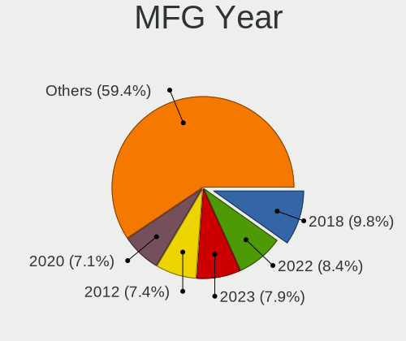
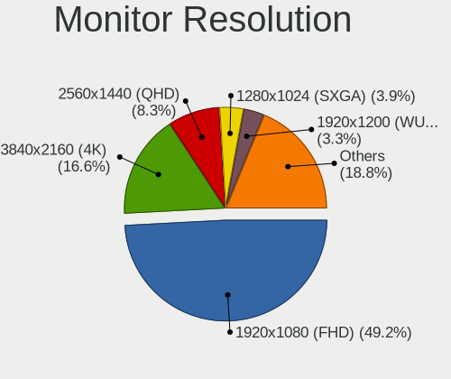

Ubuntu Hardware Trends (Desktop)
--------------------------------

A project to identify most popular hardware characteristics and track their change
over time based on data collected by Ubuntu users at https://Linux-Hardware.org.

Anyone can contribute to the study by uploading probes of their computers by
the [hw-probe](https://github.com/linuxhw/hw-probe) tool:

    sudo -E hw-probe -all -upload

Full-feature report is available here: https://linux-hardware.org/?view=trends&formfactor=desktop

Period: Jun, 2021.

Contents
--------

- [ OS                       ](#os)
- [ OS Family                ](#os-family)
- [ Kernel                   ](#kernel)
- [ Kernel Family            ](#kernel-family)
- [ Kernel Major Ver.        ](#kernel-major-ver)
- [ Arch                     ](#arch)
- [ DE                       ](#de)
- [ Display Server           ](#display-server)
- [ Display Manager          ](#display-manager)
- [ OS Lang                  ](#os-lang)
- [ Boot Mode                ](#boot-mode)
- [ Filesystem               ](#filesystem)
- [ Part. scheme             ](#part-scheme)
- [ Dual Boot with Linux/BSD ](#dual-boot-with-linux/bsd)
- [ Dual Boot (Win)          ](#dual-boot-win)
- [ Country                  ](#country)
- [ City                     ](#city)
- [ Vendor                   ](#vendor)
- [ Model                    ](#model)
- [ Model Family             ](#model-family)
- [ MFG Year                 ](#mfg-year)
- [ Form Factor              ](#form-factor)
- [ Secure Boot              ](#secure-boot)
- [ Coreboot                 ](#coreboot)
- [ RAM Size                 ](#ram-size)
- [ RAM Used                 ](#ram-used)
- [ Has CD-ROM               ](#has-cd-rom)
- [ Total Drives             ](#total-drives)
- [ Has Ethernet             ](#has-ethernet)
- [ Has WiFi                 ](#has-wifi)
- [ Has Bluetooth            ](#has-bluetooth)
- [ Drive Vendor             ](#drive-vendor)
- [ Drive Model              ](#drive-model)
- [ HDD Vendor               ](#hdd-vendor)
- [ SSD Vendor               ](#ssd-vendor)
- [ Drive Kind               ](#drive-kind)
- [ Drive Connector          ](#drive-connector)
- [ Drive Size               ](#drive-size)
- [ Space Total              ](#space-total)
- [ Space Used               ](#space-used)
- [ Malfunc. Drives          ](#malfunc-drives)
- [ Malfunc. Drive Vendor    ](#malfunc-drive-vendor)
- [ Malfunc. HDD Vendor      ](#malfunc-hdd-vendor)
- [ Malfunc. Drive Kind      ](#malfunc-drive-kind)
- [ Failed Drives            ](#failed-drives)
- [ Failed Drive Vendor      ](#failed-drive-vendor)
- [ Drive Status             ](#drive-status)
- [ Storage Vendor           ](#storage-vendor)
- [ Storage Model            ](#storage-model)
- [ Storage Kind             ](#storage-kind)
- [ CPU Vendor               ](#cpu-vendor)
- [ CPU Model                ](#cpu-model)
- [ CPU Model Family         ](#cpu-model-family)
- [ CPU Cores                ](#cpu-cores)
- [ CPU Sockets              ](#cpu-sockets)
- [ CPU Threads              ](#cpu-threads)
- [ CPU Op-Modes             ](#cpu-op-modes)
- [ CPU Microcode            ](#cpu-microcode)
- [ CPU Microarch            ](#cpu-microarch)
- [ GPU Vendor               ](#gpu-vendor)
- [ GPU Model                ](#gpu-model)
- [ GPU Combo                ](#gpu-combo)
- [ GPU Driver               ](#gpu-driver)
- [ GPU Memory               ](#gpu-memory)
- [ Monitor Vendor           ](#monitor-vendor)
- [ Monitor Model            ](#monitor-model)
- [ Monitor Resolution       ](#monitor-resolution)
- [ Monitor Diagonal         ](#monitor-diagonal)
- [ Monitor Width            ](#monitor-width)
- [ Aspect Ratio             ](#aspect-ratio)
- [ Monitor Area             ](#monitor-area)
- [ Pixel Density            ](#pixel-density)
- [ Multiple Monitors        ](#multiple-monitors)
- [ Net Controller Vendor    ](#net-controller-vendor)
- [ Net Controller Model     ](#net-controller-model)
- [ Wireless Vendor          ](#wireless-vendor)
- [ Wireless Model           ](#wireless-model)
- [ Ethernet Vendor          ](#ethernet-vendor)
- [ Ethernet Model           ](#ethernet-model)
- [ Net Controller Kind      ](#net-controller-kind)
- [ Used Controller          ](#used-controller)
- [ NICs                     ](#nics)
- [ IPv6                     ](#ipv6)
- [ Memory Vendor            ](#memory-vendor)
- [ Memory Model             ](#memory-model)
- [ Memory Kind              ](#memory-kind)
- [ Memory Form Factor       ](#memory-form-factor)
- [ Memory Size              ](#memory-size)
- [ Memory Speed             ](#memory-speed)
- [ Sound Vendor             ](#sound-vendor)
- [ Sound Model              ](#sound-model)
- [ Camera Vendor            ](#camera-vendor)
- [ Camera Model             ](#camera-model)
- [ Fingerprint Vendor       ](#fingerprint-vendor)
- [ Fingerprint Model        ](#fingerprint-model)
- [ Chipcard Vendor          ](#chipcard-vendor)
- [ Chipcard Model           ](#chipcard-model)
- [ Printer Vendor           ](#printer-vendor)
- [ Printer Model            ](#printer-model)
- [ Scanner Vendor           ](#scanner-vendor)
- [ Scanner Model            ](#scanner-model)
- [ Bluetooth Vendor         ](#bluetooth-vendor)
- [ Bluetooth Model          ](#bluetooth-model)
- [ Unsupported Devices      ](#unsupported-devices)
- [ Unsupported Device Types ](#unsupported-device-types)

OS
--

Installed operating systems

| Name           | Desktops | Percent |
|----------------|----------|---------|
| Ubuntu 20.04   | 296      | 64.21%  |
| Ubuntu 21.04   | 101      | 21.91%  |
| Ubuntu 18.04   | 37       | 8.03%   |
| Ubuntu 20.10   | 21       | 4.56%   |
| Ubuntu 16.04   | 4        | 0.87%   |
| Ubuntu Core 16 | 1        | 0.22%   |
| Ubuntu 19.10   | 1        | 0.22%   |

OS Family
---------

OS without a version

| Name   | Desktops | Percent |
|--------|----------|---------|
| Ubuntu | 461      | 100%    |

Kernel
------

Version of the Linux kernel

| Version                  | Desktops | Percent |
|--------------------------|----------|---------|
| 5.8.0-55-generic         | 127      | 27.55%  |
| 5.11.0-18-generic        | 63       | 13.67%  |
| 5.4.0-74-generic         | 61       | 13.23%  |
| 5.8.0-59-generic         | 42       | 9.11%   |
| 5.8.0-53-generic         | 35       | 7.59%   |
| 5.11.0-22-generic        | 20       | 4.34%   |
| 5.8.0-43-generic         | 16       | 3.47%   |
| 5.4.0-73-generic         | 12       | 2.6%    |
| 5.4.0-77-generic         | 8        | 1.74%   |
| 5.4.0-42-generic         | 6        | 1.3%    |
| 5.8.0-48-generic         | 4        | 0.87%   |
| 5.11.0-23-generic        | 4        | 0.87%   |
| 5.11.0-16-generic        | 4        | 0.87%   |
| 5.8.0-50-generic         | 3        | 0.65%   |
| 4.15.0-112-generic       | 3        | 0.65%   |
| 5.9.0-050900-generic     | 2        | 0.43%   |
| 5.8.0-60-generic         | 2        | 0.43%   |
| 5.11.0-19-generic        | 2        | 0.43%   |
| 5.11.0-17-generic        | 2        | 0.43%   |
| 5.0.0-23-generic         | 2        | 0.43%   |
| 4.15.0-144-generic       | 2        | 0.43%   |
| 4.15.0-143-generic       | 2        | 0.43%   |
| 5.9.12-050912-generic    | 1        | 0.22%   |
| 5.9.1-050901-generic     | 1        | 0.22%   |
| 5.8.0-57-generic         | 1        | 0.22%   |
| 5.8.0-56-generic         | 1        | 0.22%   |
| 5.8.0-45-generic         | 1        | 0.22%   |
| 5.8.0-41-generic         | 1        | 0.22%   |
| 5.7.1-050701-generic     | 1        | 0.22%   |
| 5.6.0-1021-oem           | 1        | 0.22%   |
| 5.4.0-75-generic         | 1        | 0.22%   |
| 5.4.0-72-generic         | 1        | 0.22%   |
| 5.4.0-71-generic         | 1        | 0.22%   |
| 5.4.0-65-generic         | 1        | 0.22%   |
| 5.4.0-64-generic         | 1        | 0.22%   |
| 5.4.0-59-generic         | 1        | 0.22%   |
| 5.4.0-26-generic         | 1        | 0.22%   |
| 5.3.0-28-generic         | 1        | 0.22%   |
| 5.3.0-18-generic         | 1        | 0.22%   |
| 5.13.0-051300rc7-generic | 1        | 0.22%   |
| 5.13.0-051300rc4-generic | 1        | 0.22%   |
| 5.12.9-051209-generic    | 1        | 0.22%   |
| 5.12.6-051206-generic    | 1        | 0.22%   |
| 5.12.2-051202-generic    | 1        | 0.22%   |
| 5.12.10-051210-generic   | 1        | 0.22%   |
| 5.11.11-051111-generic   | 1        | 0.22%   |
| 5.11.0-23-lowlatency     | 1        | 0.22%   |
| 5.11.0-20-generic        | 1        | 0.22%   |
| 5.11.0-18-lowlatency     | 1        | 0.22%   |
| 5.11.0-051100-generic    | 1        | 0.22%   |
| 5.10.29-amd64-desktop    | 1        | 0.22%   |
| 5.10.0-1029-oem          | 1        | 0.22%   |
| 4.18.0-15-generic        | 1        | 0.22%   |
| 4.15.18-041518-generic   | 1        | 0.22%   |
| 4.15.0-91-generic        | 1        | 0.22%   |
| 4.15.0-29-generic        | 1        | 0.22%   |
| 4.15.0-147-generic       | 1        | 0.22%   |
| 4.15.0-145-generic       | 1        | 0.22%   |
| 4.15.0-142-generic       | 1        | 0.22%   |
| 4.15.0-118-generic       | 1        | 0.22%   |

Kernel Family
-------------

Linux kernel without a distro release

| Version | Desktops | Percent |
|---------|----------|---------|
| 5.8.0   | 233      | 50.54%  |
| 5.11.0  | 99       | 21.48%  |
| 5.4.0   | 94       | 20.39%  |
| 4.15.0  | 14       | 3.04%   |
| 5.9.0   | 2        | 0.43%   |
| 5.3.0   | 2        | 0.43%   |
| 5.13.0  | 2        | 0.43%   |
| 5.0.0   | 2        | 0.43%   |
| 5.9.12  | 1        | 0.22%   |
| 5.9.1   | 1        | 0.22%   |
| 5.7.1   | 1        | 0.22%   |
| 5.6.0   | 1        | 0.22%   |
| 5.12.9  | 1        | 0.22%   |
| 5.12.6  | 1        | 0.22%   |
| 5.12.2  | 1        | 0.22%   |
| 5.12.10 | 1        | 0.22%   |
| 5.11.11 | 1        | 0.22%   |
| 5.10.29 | 1        | 0.22%   |
| 5.10.0  | 1        | 0.22%   |
| 4.18.0  | 1        | 0.22%   |
| 4.15.18 | 1        | 0.22%   |

Kernel Major Ver.
-----------------

Linux kernel major version

| Version | Desktops | Percent |
|---------|----------|---------|
| 5.8     | 233      | 50.54%  |
| 5.11    | 100      | 21.69%  |
| 5.4     | 94       | 20.39%  |
| 4.15    | 15       | 3.25%   |
| 5.9     | 4        | 0.87%   |
| 5.12    | 4        | 0.87%   |
| 5.3     | 2        | 0.43%   |
| 5.13    | 2        | 0.43%   |
| 5.10    | 2        | 0.43%   |
| 5.0     | 2        | 0.43%   |
| 5.7     | 1        | 0.22%   |
| 5.6     | 1        | 0.22%   |
| 4.18    | 1        | 0.22%   |

Arch
----

OS architecture (x86_64, i586, etc.)

| Name   | Desktops | Percent |
|--------|----------|---------|
| x86_64 | 461      | 100%    |

DE
--

Desktop Environment

| Name            | Desktops | Percent |
|-----------------|----------|---------|
| GNOME           | 405      | 87.85%  |
| Unknown         | 37       | 8.03%   |
| Unity           | 9        | 1.95%   |
| X-Cinnamon      | 5        | 1.08%   |
| Cinnamon        | 2        | 0.43%   |
| Lubuntu         | 1        | 0.22%   |
| GNOME Flashback | 1        | 0.22%   |
| Deepin          | 1        | 0.22%   |

Display Server
--------------

X11 or Wayland

| Name    | Desktops | Percent |
|---------|----------|---------|
| X11     | 373      | 80.91%  |
| Wayland | 67       | 14.53%  |
| Unknown | 14       | 3.04%   |
| Tty     | 7        | 1.52%   |

Display Manager
---------------

SDDM, LightDM, etc.

| Name    | Desktops | Percent |
|---------|----------|---------|
| Unknown | 374      | 81.13%  |
| GDM     | 80       | 17.35%  |
| TDM     | 4        | 0.87%   |
| LightDM | 2        | 0.43%   |
| GDM3    | 1        | 0.22%   |

OS Lang
-------

Language

| Lang    | Desktops | Percent |
|---------|----------|---------|
| en_US   | 166      | 36.01%  |
| de_DE   | 52       | 11.28%  |
| fr_FR   | 30       | 6.51%   |
| en_GB   | 28       | 6.07%   |
| pt_BR   | 22       | 4.77%   |
| en_CA   | 14       | 3.04%   |
| es_ES   | 13       | 2.82%   |
| it_IT   | 11       | 2.39%   |
| pl_PL   | 9        | 1.95%   |
| es_AR   | 9        | 1.95%   |
| en_AU   | 9        | 1.95%   |
| ru_RU   | 8        | 1.74%   |
| en_IN   | 8        | 1.74%   |
| ja_JP   | 6        | 1.3%    |
| pt_PT   | 5        | 1.08%   |
| fr_BE   | 5        | 1.08%   |
| C       | 5        | 1.08%   |
| zh_TW   | 4        | 0.87%   |
| hu_HU   | 4        | 0.87%   |
| en_ZA   | 4        | 0.87%   |
| cs_CZ   | 4        | 0.87%   |
| sv_SE   | 3        | 0.65%   |
| ro_RO   | 3        | 0.65%   |
| nl_NL   | 3        | 0.65%   |
| nl_BE   | 3        | 0.65%   |
| fr_CA   | 3        | 0.65%   |
| en_NZ   | 3        | 0.65%   |
| de_AT   | 3        | 0.65%   |
| tr_TR   | 2        | 0.43%   |
| sl_SI   | 2        | 0.43%   |
| es_VE   | 2        | 0.43%   |
| es_MX   | 2        | 0.43%   |
| en_IL   | 2        | 0.43%   |
| de_CH   | 2        | 0.43%   |
| zh_HK   | 1        | 0.22%   |
| ru_UA   | 1        | 0.22%   |
| nb_NO   | 1        | 0.22%   |
| ko_KR   | 1        | 0.22%   |
| is_IS   | 1        | 0.22%   |
| es_US   | 1        | 0.22%   |
| es_EC   | 1        | 0.22%   |
| es_CL   | 1        | 0.22%   |
| en_PH   | 1        | 0.22%   |
| en_HK   | 1        | 0.22%   |
| bg_BG   | 1        | 0.22%   |
| Unknown | 1        | 0.22%   |

Boot Mode
---------

EFI or BIOS

| Mode | Desktops | Percent |
|------|----------|---------|
| BIOS | 313      | 67.9%   |
| EFI  | 148      | 32.1%   |

Filesystem
----------

Type of filesystem

| Type    | Desktops | Percent |
|---------|----------|---------|
| Ext4    | 423      | 91.76%  |
| Overlay | 15       | 3.25%   |
| Zfs     | 10       | 2.17%   |
| Btrfs   | 7        | 1.52%   |
| Xfs     | 3        | 0.65%   |
| Ext2    | 2        | 0.43%   |
| Ext3    | 1        | 0.22%   |

Part. scheme
------------

Scheme of partitioning

| Type    | Desktops | Percent |
|---------|----------|---------|
| Unknown | 372      | 80.69%  |
| GPT     | 60       | 13.02%  |
| MBR     | 29       | 6.29%   |

Dual Boot with Linux/BSD
------------------------

Hosting more than one Linux/BSD

| Dual boot | Desktops | Percent |
|-----------|----------|---------|
| No        | 376      | 81.56%  |
| Yes       | 85       | 18.44%  |

Dual Boot (Win)
---------------

Hosting Linux and Windows

| Dual boot | Desktops | Percent |
|-----------|----------|---------|
| No        | 265      | 57.48%  |
| Yes       | 196      | 42.52%  |

Country
-------

Geographic location (country)

| Country             | Desktops | Percent |
|---------------------|----------|---------|
| USA                 | 79       | 17.14%  |
| Germany             | 59       | 12.8%   |
| France              | 39       | 8.46%   |
| Brazil              | 27       | 5.86%   |
| UK                  | 25       | 5.42%   |
| Italy               | 17       | 3.69%   |
| Canada              | 17       | 3.69%   |
| Spain               | 13       | 2.82%   |
| Australia           | 12       | 2.6%    |
| Belgium             | 11       | 2.39%   |
| Argentina           | 11       | 2.39%   |
| Poland              | 8        | 1.74%   |
| Netherlands         | 8        | 1.74%   |
| Japan               | 8        | 1.74%   |
| India               | 8        | 1.74%   |
| Russia              | 7        | 1.52%   |
| Taiwan              | 6        | 1.3%    |
| Vietnam             | 5        | 1.08%   |
| Turkey              | 5        | 1.08%   |
| Portugal            | 5        | 1.08%   |
| Austria             | 5        | 1.08%   |
| Switzerland         | 4        | 0.87%   |
| South Africa        | 4        | 0.87%   |
| New Zealand         | 4        | 0.87%   |
| Mexico              | 4        | 0.87%   |
| Hungary             | 4        | 0.87%   |
| Czechia             | 4        | 0.87%   |
| Sweden              | 3        | 0.65%   |
| Romania             | 3        | 0.65%   |
| Israel              | 3        | 0.65%   |
| Hong Kong           | 3        | 0.65%   |
| Greece              | 3        | 0.65%   |
| Finland             | 3        | 0.65%   |
| Chile               | 3        | 0.65%   |
| Bulgaria            | 3        | 0.65%   |
| Bangladesh          | 3        | 0.65%   |
| Venezuela           | 2        | 0.43%   |
| Ukraine             | 2        | 0.43%   |
| South Korea         | 2        | 0.43%   |
| Slovenia            | 2        | 0.43%   |
| Slovakia            | 2        | 0.43%   |
| Iran                | 2        | 0.43%   |
| Iceland             | 2        | 0.43%   |
| Egypt               | 2        | 0.43%   |
| China               | 2        | 0.43%   |
| Trinidad and Tobago | 1        | 0.22%   |
| Thailand            | 1        | 0.22%   |
| Serbia              | 1        | 0.22%   |
| Saudi Arabia        | 1        | 0.22%   |
| Réunion            | 1        | 0.22%   |
| Puerto Rico         | 1        | 0.22%   |
| Philippines         | 1        | 0.22%   |
| Pakistan            | 1        | 0.22%   |
| Norway              | 1        | 0.22%   |
| Kuwait              | 1        | 0.22%   |
| Ireland             | 1        | 0.22%   |
| Indonesia           | 1        | 0.22%   |
| Estonia             | 1        | 0.22%   |
| Ecuador             | 1        | 0.22%   |
| Colombia            | 1        | 0.22%   |

City
----

Geographic location (city)

| City                  | Desktops | Percent |
|-----------------------|----------|---------|
| Paris                 | 6        | 1.3%    |
| Sydney                | 4        | 0.87%   |
| New Taipei            | 4        | 0.87%   |
| London                | 4        | 0.87%   |
| Düsseldorf           | 4        | 0.87%   |
| São Paulo            | 3        | 0.65%   |
| Sofia                 | 3        | 0.65%   |
| Melbourne             | 3        | 0.65%   |
| Manchester            | 3        | 0.65%   |
| Ho Chi Minh City      | 3        | 0.65%   |
| Hamburg               | 3        | 0.65%   |
| Essen                 | 3        | 0.65%   |
| Curitiba              | 3        | 0.65%   |
| Berlin                | 3        | 0.65%   |
| Warsaw                | 2        | 0.43%   |
| Vienna                | 2        | 0.43%   |
| Valencia              | 2        | 0.43%   |
| The Hague             | 2        | 0.43%   |
| Tel Aviv              | 2        | 0.43%   |
| Tehran                | 2        | 0.43%   |
| Tauranga              | 2        | 0.43%   |
| São José dos Campos | 2        | 0.43%   |
| Sunderland            | 2        | 0.43%   |
| Southport             | 2        | 0.43%   |
| Shatin                | 2        | 0.43%   |
| Seminole              | 2        | 0.43%   |
| Québec               | 2        | 0.43%   |
| Prague                | 2        | 0.43%   |
| Portland              | 2        | 0.43%   |
| Phoenix               | 2        | 0.43%   |
| Oxford                | 2        | 0.43%   |
| New Malden            | 2        | 0.43%   |
| Nantes                | 2        | 0.43%   |
| Munich                | 2        | 0.43%   |
| Montreal              | 2        | 0.43%   |
| Milan                 | 2        | 0.43%   |
| Miami                 | 2        | 0.43%   |
| Madrid                | 2        | 0.43%   |
| Los Angeles           | 2        | 0.43%   |
| Lisbon                | 2        | 0.43%   |
| Hyderabad             | 2        | 0.43%   |
| Hanoi                 | 2        | 0.43%   |
| Giza                  | 2        | 0.43%   |
| Florence              | 2        | 0.43%   |
| Buenos Aires          | 2        | 0.43%   |
| Budapest              | 2        | 0.43%   |
| Brussels              | 2        | 0.43%   |
| Brasov                | 2        | 0.43%   |
| Athens                | 2        | 0.43%   |
| Arlington             | 2        | 0.43%   |
| Zwickau               | 1        | 0.22%   |
| Zittau                | 1        | 0.22%   |
| Zeulenroda-Triebes    | 1        | 0.22%   |
| Zacatecas City        | 1        | 0.22%   |
| Yarrabilba            | 1        | 0.22%   |
| Wylie                 | 1        | 0.22%   |
| Wroclaw               | 1        | 0.22%   |
| Wilderness Rim        | 1        | 0.22%   |
| Weinbach              | 1        | 0.22%   |
| Waxhaw                | 1        | 0.22%   |

Vendor
------

Motherboard manufacturer

| Name                                        | Desktops | Percent |
|---------------------------------------------|----------|---------|
| ASUSTek Computer                            | 113      | 24.51%  |
| Gigabyte Technology                         | 89       | 19.31%  |
| MSI                                         | 52       | 11.28%  |
| Dell                                        | 47       | 10.2%   |
| ASRock                                      | 44       | 9.54%   |
| Hewlett-Packard                             | 25       | 5.42%   |
| Lenovo                                      | 16       | 3.47%   |
| Pegatron                                    | 11       | 2.39%   |
| Intel                                       | 10       | 2.17%   |
| Unknown                                     | 7        | 1.52%   |
| Medion                                      | 5        | 1.08%   |
| ECS                                         | 5        | 1.08%   |
| Foxconn                                     | 4        | 0.87%   |
| Fujitsu Siemens                             | 3        | 0.65%   |
| Supermicro                                  | 2        | 0.43%   |
| PCWare                                      | 2        | 0.43%   |
| Huanan                                      | 2        | 0.43%   |
| Fujitsu                                     | 2        | 0.43%   |
| Biostar                                     | 2        | 0.43%   |
| ASRockRack                                  | 2        | 0.43%   |
| Alienware                                   | 2        | 0.43%   |
| Acer                                        | 2        | 0.43%   |
| TYAN Computer                               | 1        | 0.22%   |
| Shuttle                                     | 1        | 0.22%   |
| Packard Bell                                | 1        | 0.22%   |
| OEM                                         | 1        | 0.22%   |
| langchao                                    | 1        | 0.22%   |
| JINGSHA                                     | 1        | 0.22%   |
| HC                                          | 1        | 0.22%   |
| Gateway                                     | 1        | 0.22%   |
| EVGA                                        | 1        | 0.22%   |
| eMachines                                   | 1        | 0.22%   |
| Colorful Yu Gong Technology And Development | 1        | 0.22%   |
| BCM Advanced Research                       | 1        | 0.22%   |
| Apple                                       | 1        | 0.22%   |
| Advantech                                   | 1        | 0.22%   |

Model
-----

Motherboard model

| Name                                   | Desktops | Percent |
|----------------------------------------|----------|---------|
| ASUS All Series                        | 13       | 2.82%   |
| Unknown                                | 7        | 1.52%   |
| ASUS PRIME A320M-K                     | 5        | 1.08%   |
| Dell Precision T3600                   | 4        | 0.87%   |
| MSI MS-7C52                            | 3        | 0.65%   |
| MSI MS-7C37                            | 3        | 0.65%   |
| Gigabyte Z77-DS3H                      | 3        | 0.65%   |
| Gigabyte X570 I AORUS PRO WIFI         | 3        | 0.65%   |
| MSI MS-7B86                            | 2        | 0.43%   |
| MSI MS-7A38                            | 2        | 0.43%   |
| MSI MS-7758                            | 2        | 0.43%   |
| Gigabyte Z77X-D3H                      | 2        | 0.43%   |
| Gigabyte Z170X-Gaming 7                | 2        | 0.43%   |
| Gigabyte H61MS                         | 2        | 0.43%   |
| Gigabyte H61M-S2PV                     | 2        | 0.43%   |
| Gigabyte GA-78LMT-USB3 6.0             | 2        | 0.43%   |
| Gigabyte G1.Sniper 3                   | 2        | 0.43%   |
| Gigabyte B85M-DS3H-A                   | 2        | 0.43%   |
| Gigabyte B450M DS3H                    | 2        | 0.43%   |
| Gigabyte B450 AORUS ELITE              | 2        | 0.43%   |
| Foxconn p6610f                         | 2        | 0.43%   |
| Dell Precision WorkStation T5500       | 2        | 0.43%   |
| Dell OptiPlex 990                      | 2        | 0.43%   |
| Dell OptiPlex 780                      | 2        | 0.43%   |
| Dell OptiPlex 755                      | 2        | 0.43%   |
| Dell OptiPlex 7010                     | 2        | 0.43%   |
| Dell OptiPlex 3020                     | 2        | 0.43%   |
| ASUS ROG STRIX Z390-E GAMING           | 2        | 0.43%   |
| ASUS ROG STRIX X570-F GAMING           | 2        | 0.43%   |
| ASUS ROG STRIX X570-E GAMING           | 2        | 0.43%   |
| ASUS PRIME Z490-P                      | 2        | 0.43%   |
| ASUS PRIME Z390-P                      | 2        | 0.43%   |
| ASUS PRIME Z270-A                      | 2        | 0.43%   |
| ASUS M5A97 LE R2.0                     | 2        | 0.43%   |
| ASRock N68C-S UCC                      | 2        | 0.43%   |
| ASRock 970M Pro3                       | 2        | 0.43%   |
| ASRock 760GM-HDV                       | 2        | 0.43%   |
| TYAN Toledo i3210W/i3200R S5211        | 1        | 0.22%   |
| Supermicro X9DAi                       | 1        | 0.22%   |
| Supermicro C9Z490-PGW                  | 1        | 0.22%   |
| Shuttle SA76                           | 1        | 0.22%   |
| Pegatron WC934AA-ABZ CQ5334IT          | 1        | 0.22%   |
| Pegatron QW716AA#ABA                   | 1        | 0.22%   |
| Pegatron Pro 3010 Small Form Factor PC | 1        | 0.22%   |
| Pegatron NQ840AA-ABD p6029de           | 1        | 0.22%   |
| Pegatron IPX41-D3                      | 1        | 0.22%   |
| Pegatron IPMSB-GS                      | 1        | 0.22%   |
| Pegatron h8-1017c                      | 1        | 0.22%   |
| Pegatron FK886AA-A2L m9457c            | 1        | 0.22%   |
| Pegatron FK572AAR-ABA a6642p           | 1        | 0.22%   |
| Pegatron Elite 7300 Series MT          | 1        | 0.22%   |
| Pegatron CQ2900EF                      | 1        | 0.22%   |
| PCWare IPMH61R1                        | 1        | 0.22%   |
| PCWare IPMH110G                        | 1        | 0.22%   |
| Packard Bell IMEDIA D6001 GE AIO       | 1        | 0.22%   |
| OEM B250B                              | 1        | 0.22%   |
| MSI WC883AA-ABF HPE-130fr              | 1        | 0.22%   |
| MSI ONE                                | 1        | 0.22%   |
| MSI MS-7D16                            | 1        | 0.22%   |
| MSI MS-7D09                            | 1        | 0.22%   |

Model Family
------------

Motherboard model prefix

| Name                   | Desktops | Percent |
|------------------------|----------|---------|
| ASUS PRIME             | 29       | 6.29%   |
| Dell OptiPlex          | 17       | 3.69%   |
| Dell Precision         | 16       | 3.47%   |
| ASUS ROG               | 13       | 2.82%   |
| ASUS All               | 13       | 2.82%   |
| Lenovo ThinkCentre     | 9        | 1.95%   |
| HP Compaq              | 7        | 1.52%   |
| Gigabyte X570          | 7        | 1.52%   |
| Unknown                | 7        | 1.52%   |
| Dell Inspiron          | 6        | 1.3%    |
| ASUS TUF               | 4        | 0.87%   |
| MSI MS-7C52            | 3        | 0.65%   |
| MSI MS-7C37            | 3        | 0.65%   |
| Lenovo ThinkStation    | 3        | 0.65%   |
| HP ProDesk             | 3        | 0.65%   |
| Gigabyte Z77-DS3H      | 3        | 0.65%   |
| Gigabyte G1.Sniper     | 3        | 0.65%   |
| Gigabyte B450          | 3        | 0.65%   |
| Dell XPS               | 3        | 0.65%   |
| Dell Vostro            | 3        | 0.65%   |
| ASUS P8B75-M           | 3        | 0.65%   |
| ASUS M5A97             | 3        | 0.65%   |
| MSI MS-7B86            | 2        | 0.43%   |
| MSI MS-7A38            | 2        | 0.43%   |
| MSI MS-7758            | 2        | 0.43%   |
| Lenovo IdeaCentre      | 2        | 0.43%   |
| HP Pavilion            | 2        | 0.43%   |
| HP EliteDesk           | 2        | 0.43%   |
| Gigabyte Z77X-D3H      | 2        | 0.43%   |
| Gigabyte Z170X-Gaming  | 2        | 0.43%   |
| Gigabyte H61MS         | 2        | 0.43%   |
| Gigabyte H61M-S2PV     | 2        | 0.43%   |
| Gigabyte GA-78LMT-USB3 | 2        | 0.43%   |
| Gigabyte B85M-DS3H-A   | 2        | 0.43%   |
| Gigabyte B450M         | 2        | 0.43%   |
| Foxconn p6610f         | 2        | 0.43%   |
| ASUS P8Z77-V           | 2        | 0.43%   |
| ASUS P6T               | 2        | 0.43%   |
| ASUS Maximus           | 2        | 0.43%   |
| ASUS M5A78L-M          | 2        | 0.43%   |
| ASRock X470            | 2        | 0.43%   |
| ASRock P67             | 2        | 0.43%   |
| ASRock N68C-S          | 2        | 0.43%   |
| ASRock B450M           | 2        | 0.43%   |
| ASRock 970M            | 2        | 0.43%   |
| ASRock 760GM-HDV       | 2        | 0.43%   |
| TYAN Toledo            | 1        | 0.22%   |
| Supermicro X9DAi       | 1        | 0.22%   |
| Supermicro C9Z490-PGW  | 1        | 0.22%   |
| Shuttle SA76           | 1        | 0.22%   |
| Pegatron WC934AA-ABZ   | 1        | 0.22%   |
| Pegatron QW716AA#ABA   | 1        | 0.22%   |
| Pegatron Pro           | 1        | 0.22%   |
| Pegatron NQ840AA-ABD   | 1        | 0.22%   |
| Pegatron IPX41-D3      | 1        | 0.22%   |
| Pegatron IPMSB-GS      | 1        | 0.22%   |
| Pegatron h8-1017c      | 1        | 0.22%   |
| Pegatron FK886AA-A2L   | 1        | 0.22%   |
| Pegatron FK572AAR-ABA  | 1        | 0.22%   |
| Pegatron Elite         | 1        | 0.22%   |

MFG Year
--------

Motherboard manufacture year

| Year | Desktops | Percent |
|------|----------|---------|
| 2020 | 51       | 11.06%  |
| 2019 | 50       | 10.85%  |
| 2010 | 42       | 9.11%   |
| 2021 | 41       | 8.89%   |
| 2018 | 33       | 7.16%   |
| 2012 | 33       | 7.16%   |
| 2014 | 32       | 6.94%   |
| 2013 | 27       | 5.86%   |
| 2015 | 26       | 5.64%   |
| 2009 | 26       | 5.64%   |
| 2011 | 25       | 5.42%   |
| 2016 | 23       | 4.99%   |
| 2017 | 22       | 4.77%   |
| 2008 | 20       | 4.34%   |
| 2006 | 5        | 1.08%   |
| 2007 | 3        | 0.65%   |
| 2005 | 2        | 0.43%   |

Form Factor
-----------

Physical design of the computer

| Name    | Desktops | Percent |
|---------|----------|---------|
| Desktop | 461      | 100%    |

Secure Boot
-----------

Enabled or disabled

| State    | Desktops | Percent |
|----------|----------|---------|
| Disabled | 445      | 96.53%  |
| Enabled  | 16       | 3.47%   |

Coreboot
--------

Have coreboot on board

| Used | Desktops | Percent |
|------|----------|---------|
| No   | 461      | 100%    |

RAM Size
--------

Total RAM memory

| Size in GB      | Desktops | Percent |
|-----------------|----------|---------|
| 16.01-24.0      | 104      | 22.56%  |
| 8.01-16.0       | 93       | 20.17%  |
| 3.01-4.0        | 84       | 18.22%  |
| 4.01-8.0        | 69       | 14.97%  |
| 32.01-64.0      | 56       | 12.15%  |
| 64.01-256.0     | 32       | 6.94%   |
| 1.01-2.0        | 12       | 2.6%    |
| 24.01-32.0      | 8        | 1.74%   |
| More than 256.0 | 2        | 0.43%   |
| 2.01-3.0        | 1        | 0.22%   |

RAM Used
--------

Used RAM memory

| Used GB     | Desktops | Percent |
|-------------|----------|---------|
| 1.01-2.0    | 197      | 42.73%  |
| 2.01-3.0    | 126      | 27.33%  |
| 3.01-4.0    | 53       | 11.5%   |
| 4.01-8.0    | 49       | 10.63%  |
| 8.01-16.0   | 17       | 3.69%   |
| 0.51-1.0    | 8        | 1.74%   |
| 16.01-24.0  | 6        | 1.3%    |
| 24.01-32.0  | 2        | 0.43%   |
| 32.01-64.0  | 1        | 0.22%   |
| 64.01-256.0 | 1        | 0.22%   |
| 0.01-0.5    | 1        | 0.22%   |

Has CD-ROM
----------

Has CD-ROM on board

| Presented | Desktops | Percent |
|-----------|----------|---------|
| Yes       | 235      | 50.98%  |
| No        | 226      | 49.02%  |

Total Drives
------------

Number of drives on board

| Drives | Desktops | Percent |
|--------|----------|---------|
| 1      | 186      | 40.35%  |
| 2      | 126      | 27.33%  |
| 3      | 67       | 14.53%  |
| 4      | 34       | 7.38%   |
| 5      | 20       | 4.34%   |
| 6      | 11       | 2.39%   |
| 0      | 6        | 1.3%    |
| 9      | 4        | 0.87%   |
| 13     | 2        | 0.43%   |
| 8      | 2        | 0.43%   |
| 7      | 2        | 0.43%   |
| 11     | 1        | 0.22%   |

Has Ethernet
------------

Has Ethernet on board

| Presented | Desktops | Percent |
|-----------|----------|---------|
| Yes       | 454      | 98.48%  |
| No        | 7        | 1.52%   |

Has WiFi
--------

Has WiFi module

| Presented | Desktops | Percent |
|-----------|----------|---------|
| No        | 257      | 55.75%  |
| Yes       | 204      | 44.25%  |

Has Bluetooth
-------------

Has Bluetooth module

| Presented | Desktops | Percent |
|-----------|----------|---------|
| No        | 330      | 71.58%  |
| Yes       | 131      | 28.42%  |

Drive Vendor
------------

Hard drive vendors

| Vendor                    | Desktops | Drives | Percent |
|---------------------------|----------|--------|---------|
| Seagate                   | 162      | 229    | 20.51%  |
| WDC                       | 146      | 201    | 18.48%  |
| Samsung Electronics       | 125      | 174    | 15.82%  |
| Toshiba                   | 48       | 56     | 6.08%   |
| Kingston                  | 46       | 54     | 5.82%   |
| SanDisk                   | 39       | 45     | 4.94%   |
| Crucial                   | 37       | 38     | 4.68%   |
| Hitachi                   | 24       | 26     | 3.04%   |
| A-DATA Technology         | 11       | 13     | 1.39%   |
| Unknown                   | 10       | 12     | 1.27%   |
| Phison                    | 10       | 10     | 1.27%   |
| Intel                     | 10       | 10     | 1.27%   |
| MAXTOR                    | 8        | 8      | 1.01%   |
| HGST                      | 8        | 10     | 1.01%   |
| SK Hynix                  | 7        | 8      | 0.89%   |
| China                     | 7        | 7      | 0.89%   |
| Silicon Motion            | 6        | 6      | 0.76%   |
| Micron Technology         | 6        | 6      | 0.76%   |
| Gigabyte Technology       | 5        | 5      | 0.63%   |
| KIOXIA-EXCERIA            | 4        | 4      | 0.51%   |
| Intenso                   | 4        | 5      | 0.51%   |
| Hewlett-Packard           | 4        | 5      | 0.51%   |
| Corsair                   | 4        | 5      | 0.51%   |
| XPG                       | 3        | 3      | 0.38%   |
| SABRENT                   | 3        | 3      | 0.38%   |
| Realtek Semiconductor     | 3        | 3      | 0.38%   |
| OCZ                       | 3        | 3      | 0.38%   |
| Mushkin                   | 3        | 3      | 0.38%   |
| JMicron                   | 3        | 3      | 0.38%   |
| PNY                       | 2        | 2      | 0.25%   |
| Netac                     | 2        | 2      | 0.25%   |
| Micron/Crucial Technology | 2        | 2      | 0.25%   |
| LITEON                    | 2        | 2      | 0.25%   |
| GOODRAM                   | 2        | 2      | 0.25%   |
| Zozt                      | 1        | 3      | 0.13%   |
| Zheino                    | 1        | 1      | 0.13%   |
| XrayDisk                  | 1        | 1      | 0.13%   |
| Verbatim                  | 1        | 1      | 0.13%   |
| Synology                  | 1        | 4      | 0.13%   |
| SPCC                      | 1        | 1      | 0.13%   |
| Patriot                   | 1        | 1      | 0.13%   |
| Palit                     | 1        | 1      | 0.13%   |
| OWC                       | 1        | 3      | 0.13%   |
| OCZ-VERTEX                | 1        | 1      | 0.13%   |
| LITEONIT                  | 1        | 1      | 0.13%   |
| Lite-On                   | 1        | 1      | 0.13%   |
| Lexar                     | 1        | 1      | 0.13%   |
| Lenovo                    | 1        | 1      | 0.13%   |
| LDLC                      | 1        | 1      | 0.13%   |
| KingSpec                  | 1        | 1      | 0.13%   |
| KingFast                  | 1        | 1      | 0.13%   |
| KingDian                  | 1        | 1      | 0.13%   |
| Kingchuxing               | 1        | 1      | 0.13%   |
| GLOWAY                    | 1        | 1      | 0.13%   |
| Fujitsu                   | 1        | 1      | 0.13%   |
| FC-1307                   | 1        | 1      | 0.13%   |
| External                  | 1        | 1      | 0.13%   |
| EDGE                      | 1        | 1      | 0.13%   |
| Dogfish                   | 1        | 1      | 0.13%   |
| Blackbox                  | 1        | 1      | 0.13%   |

Drive Model
-----------

Hard drive models

| Model                            | Desktops | Percent |
|----------------------------------|----------|---------|
| Seagate ST1000DM010-2EP102 1TB   | 14       | 1.53%   |
| Toshiba DT01ACA100 1TB           | 13       | 1.42%   |
| Kingston SA400S37240G 240GB SSD  | 13       | 1.42%   |
| Samsung SSD 860 EVO 500GB        | 12       | 1.31%   |
| Seagate ST2000DM008-2FR102 2TB   | 11       | 1.2%    |
| Seagate ST500DM002-1BD142 500GB  | 9        | 0.98%   |
| Samsung NVMe SSD Drive 500GB     | 9        | 0.98%   |
| Crucial CT240BX500SSD1 240GB     | 9        | 0.98%   |
| Seagate ST3500418AS 500GB        | 8        | 0.87%   |
| Samsung SSD 860 EVO 1TB          | 8        | 0.87%   |
| WDC WD10EZEX-08WN4A0 1TB         | 7        | 0.77%   |
| Seagate ST2000DM001-1ER164 2TB   | 7        | 0.77%   |
| Sandisk NVMe SSD Drive 500GB     | 7        | 0.77%   |
| Samsung SSD 850 EVO 500GB        | 7        | 0.77%   |
| Samsung NVMe SSD Drive 250GB     | 7        | 0.77%   |
| Samsung NVMe SSD Drive 1TB       | 7        | 0.77%   |
| Seagate ST6000DM003-2CY186 6TB   | 6        | 0.66%   |
| Seagate ST4000DM004-2CV104 4TB   | 6        | 0.66%   |
| Seagate ST1000DM003-1CH162 1TB   | 6        | 0.66%   |
| Samsung SSD 860 EVO 250GB        | 6        | 0.66%   |
| Samsung SSD 850 EVO 250GB        | 6        | 0.66%   |
| Kingston SV300S37A120G 120GB SSD | 6        | 0.66%   |
| Kingston SUV400S37240G 240GB SSD | 6        | 0.66%   |
| Crucial CT500MX500SSD1 500GB     | 6        | 0.66%   |
| Crucial CT120BX500SSD1 120GB     | 6        | 0.66%   |
| Toshiba HDWD110 1TB              | 5        | 0.55%   |
| Toshiba DT01ACA200 2TB           | 5        | 0.55%   |
| Seagate ST2000DM006-2DM164 2TB   | 5        | 0.55%   |
| Seagate ST2000DM001-1CH164 2TB   | 5        | 0.55%   |
| Seagate Expansion Desk 2TB       | 5        | 0.55%   |
| Samsung SSD 970 EVO Plus 1TB     | 5        | 0.55%   |
| Kingston SA400S37480G 480GB SSD  | 5        | 0.55%   |
| Kingston SA400S37120G 120GB SSD  | 5        | 0.55%   |
| WDC WD10EZEX-21WN4A0 1TB         | 4        | 0.44%   |
| WDC WD10EARS-00Y5B1 1TB          | 4        | 0.44%   |
| WDC WD1002FAEX-00Z3A0 1TB        | 4        | 0.44%   |
| Toshiba HDWD130 3TB              | 4        | 0.44%   |
| Toshiba DT01ACA050 500GB         | 4        | 0.44%   |
| Seagate ST31000524AS 1TB         | 4        | 0.44%   |
| Samsung SSD 860 QVO 1TB          | 4        | 0.44%   |
| Samsung SSD 850 EVO 120GB        | 4        | 0.44%   |
| Samsung NVMe SSD Drive 512GB     | 4        | 0.44%   |
| Kingston SUV400S37120G 120GB SSD | 4        | 0.44%   |
| Crucial CT1000MX500SSD1 1TB      | 4        | 0.44%   |
| WDC WD40EFRX-68WT0N0 4TB         | 3        | 0.33%   |
| WDC WD30EFRX-68EUZN0 3TB         | 3        | 0.33%   |
| WDC WD20EZRZ-00Z5HB0 2TB         | 3        | 0.33%   |
| WDC WD20EZRX-00D8PB0 2TB         | 3        | 0.33%   |
| WDC WD10EZEX-75WN4A1 1TB         | 3        | 0.33%   |
| Seagate ST3500830AS 500GB        | 3        | 0.33%   |
| Seagate ST3250820AS 250GB        | 3        | 0.33%   |
| Seagate ST3250318AS 250GB        | 3        | 0.33%   |
| Seagate ST3000DM001-1ER166 3TB   | 3        | 0.33%   |
| SanDisk SSD PLUS 240GB           | 3        | 0.33%   |
| SanDisk SSD PLUS 1000GB          | 3        | 0.33%   |
| SanDisk SDSSDA240G 240GB         | 3        | 0.33%   |
| Sandisk NVMe SSD Drive 1TB       | 3        | 0.33%   |
| Samsung SSD 850 EVO 1TB          | 3        | 0.33%   |
| Samsung SSD 840 Series 120GB     | 3        | 0.33%   |
| Samsung HD502HI 500GB            | 3        | 0.33%   |

HDD Vendor
----------

Hard disk drive vendors

| Vendor              | Desktops | Drives | Percent |
|---------------------|----------|--------|---------|
| Seagate             | 160      | 224    | 39.22%  |
| WDC                 | 134      | 184    | 32.84%  |
| Toshiba             | 45       | 51     | 11.03%  |
| Hitachi             | 24       | 26     | 5.88%   |
| Samsung Electronics | 22       | 24     | 5.39%   |
| HGST                | 8        | 10     | 1.96%   |
| MAXTOR              | 7        | 7      | 1.72%   |
| Hewlett-Packard     | 2        | 2      | 0.49%   |
| Synology            | 1        | 4      | 0.25%   |
| Lenovo              | 1        | 1      | 0.25%   |
| Intenso             | 1        | 1      | 0.25%   |
| Fujitsu             | 1        | 1      | 0.25%   |
| ASMT109x            | 1        | 1      | 0.25%   |
| asmedia             | 1        | 1      | 0.25%   |

SSD Vendor
----------

Solid state drive vendors

| Vendor              | Desktops | Drives | Percent |
|---------------------|----------|--------|---------|
| Samsung Electronics | 74       | 99     | 27.41%  |
| Kingston            | 43       | 50     | 15.93%  |
| Crucial             | 35       | 36     | 12.96%  |
| SanDisk             | 28       | 31     | 10.37%  |
| WDC                 | 13       | 14     | 4.81%   |
| A-DATA Technology   | 9        | 11     | 3.33%   |
| China               | 7        | 7      | 2.59%   |
| Unknown             | 4        | 4      | 1.48%   |
| Toshiba             | 4        | 4      | 1.48%   |
| Micron Technology   | 4        | 4      | 1.48%   |
| Intel               | 4        | 4      | 1.48%   |
| SABRENT             | 3        | 3      | 1.11%   |
| OCZ                 | 3        | 3      | 1.11%   |
| Mushkin             | 3        | 3      | 1.11%   |
| KIOXIA-EXCERIA      | 3        | 3      | 1.11%   |
| Gigabyte Technology | 3        | 3      | 1.11%   |
| SK Hynix            | 2        | 3      | 0.74%   |
| PNY                 | 2        | 2      | 0.74%   |
| LITEON              | 2        | 2      | 0.74%   |
| Intenso             | 2        | 3      | 0.74%   |
| Hewlett-Packard     | 2        | 3      | 0.74%   |
| GOODRAM             | 2        | 2      | 0.74%   |
| Zozt                | 1        | 3      | 0.37%   |
| Zheino              | 1        | 1      | 0.37%   |
| Verbatim            | 1        | 1      | 0.37%   |
| SPCC                | 1        | 1      | 0.37%   |
| Patriot             | 1        | 1      | 0.37%   |
| OWC                 | 1        | 3      | 0.37%   |
| OCZ-VERTEX          | 1        | 1      | 0.37%   |
| Netac               | 1        | 1      | 0.37%   |
| Maxtor              | 1        | 1      | 0.37%   |
| LITEONIT            | 1        | 1      | 0.37%   |
| Lexar               | 1        | 1      | 0.37%   |
| KingSpec            | 1        | 1      | 0.37%   |
| KingFast            | 1        | 1      | 0.37%   |
| KingDian            | 1        | 1      | 0.37%   |
| GLOWAY              | 1        | 1      | 0.37%   |
| EDGE                | 1        | 1      | 0.37%   |
| Dogfish             | 1        | 1      | 0.37%   |
| AMD-RAID            | 1        | 1      | 0.37%   |

Drive Kind
----------

HDD or SSD

| Kind    | Desktops | Drives | Percent |
|---------|----------|--------|---------|
| HDD     | 317      | 537    | 46.28%  |
| SSD     | 242      | 316    | 35.33%  |
| NVMe    | 108      | 136    | 15.77%  |
| Unknown | 17       | 21     | 2.48%   |
| MMC     | 1        | 1      | 0.15%   |

Drive Connector
---------------

SATA, SAS, NVMe, etc.

| Type | Desktops | Drives | Percent |
|------|----------|--------|---------|
| SATA | 422      | 833    | 75.63%  |
| NVMe | 106      | 134    | 19%     |
| SAS  | 29       | 43     | 5.2%    |
| MMC  | 1        | 1      | 0.18%   |

Drive Size
----------

Size of hard drive

| Size in TB | Desktops | Drives | Percent |
|------------|----------|--------|---------|
| 0.01-0.5   | 307      | 428    | 49.92%  |
| 0.51-1.0   | 159      | 202    | 25.85%  |
| 1.01-2.0   | 83       | 103    | 13.5%   |
| 3.01-4.0   | 25       | 36     | 4.07%   |
| 2.01-3.0   | 23       | 30     | 3.74%   |
| 4.01-10.0  | 13       | 35     | 2.11%   |
| 10.01-20.0 | 5        | 19     | 0.81%   |

Space Total
-----------

Amount of disk space available on the file system

| Size in GB     | Desktops | Percent |
|----------------|----------|---------|
| 101-250        | 117      | 25.38%  |
| 251-500        | 94       | 20.39%  |
| 501-1000       | 72       | 15.62%  |
| More than 3000 | 49       | 10.63%  |
| 1001-2000      | 43       | 9.33%   |
| 2001-3000      | 24       | 5.21%   |
| 21-50          | 20       | 4.34%   |
| 51-100         | 19       | 4.12%   |
| 1-20           | 18       | 3.9%    |
| Unknown        | 5        | 1.08%   |

Space Used
----------

Amount of used disk space

| Used GB        | Desktops | Percent |
|----------------|----------|---------|
| 1-20           | 161      | 34.92%  |
| 21-50          | 70       | 15.18%  |
| 101-250        | 59       | 12.8%   |
| 51-100         | 54       | 11.71%  |
| 251-500        | 33       | 7.16%   |
| 501-1000       | 30       | 6.51%   |
| 1001-2000      | 25       | 5.42%   |
| More than 3000 | 16       | 3.47%   |
| 2001-3000      | 8        | 1.74%   |
| Unknown        | 5        | 1.08%   |

Malfunc. Drives
---------------

Drive models with a malfunction

| Model                                               | Desktops | Drives | Percent |
|-----------------------------------------------------|----------|--------|---------|
| Seagate ST3250410AS 250GB                           | 2        | 2      | 8.7%    |
| WDC WD7500AADS-00M2B0 752GB                         | 1        | 1      | 4.35%   |
| WDC WD5000AAKS-22A7B0 500GB                         | 1        | 1      | 4.35%   |
| WDC WD5000AADS-00S9B0 500GB                         | 1        | 1      | 4.35%   |
| WDC WD40EFRX-68WT0N0 4TB                            | 1        | 2      | 4.35%   |
| WDC WD3009FYPX-09AAMB0 3TB                          | 1        | 1      | 4.35%   |
| WDC WD20EZRZ-00Z5HB0 2TB                            | 1        | 1      | 4.35%   |
| WDC WD10JPVX-60JC3T0 1TB                            | 1        | 1      | 4.35%   |
| WDC WD10EZRX-00L4HB0 1TB                            | 1        | 1      | 4.35%   |
| WDC WD10EZEX-00BN5A0 1TB                            | 1        | 1      | 4.35%   |
| Seagate ST6000DM003-2CY186 6TB                      | 1        | 1      | 4.35%   |
| Seagate ST3500418AS 500GB                           | 1        | 1      | 4.35%   |
| Seagate ST1000LM024 HN-M101MBB 1TB                  | 1        | 1      | 4.35%   |
| Samsung Electronics HD103SJ 1TB                     | 1        | 1      | 4.35%   |
| Micron Technology MTFDDAK512MAY-1AE1ZABHA 512GB SSD | 1        | 1      | 4.35%   |
| Kingston SV300S37A120G 120GB SSD                    | 1        | 1      | 4.35%   |
| Kingston SUV400S37240G 240GB SSD                    | 1        | 2      | 4.35%   |
| Kingston SA400S37120G 120GB SSD                     | 1        | 1      | 4.35%   |
| Hitachi HDS721616PLA380 160GB                       | 1        | 1      | 4.35%   |
| HGST HTS545050A7E680 500GB                          | 1        | 1      | 4.35%   |
| Fujitsu MJA2160BH G2 160GB                          | 1        | 1      | 4.35%   |
| Crucial CT120M500SSD1 120GB                         | 1        | 1      | 4.35%   |

Malfunc. Drive Vendor
---------------------

Vendors of faulty drives

| Vendor              | Desktops | Drives | Percent |
|---------------------|----------|--------|---------|
| WDC                 | 7        | 10     | 35%     |
| Seagate             | 4        | 5      | 20%     |
| Kingston            | 3        | 4      | 15%     |
| Samsung Electronics | 1        | 1      | 5%      |
| Micron Technology   | 1        | 1      | 5%      |
| Hitachi             | 1        | 1      | 5%      |
| HGST                | 1        | 1      | 5%      |
| Fujitsu             | 1        | 1      | 5%      |
| Crucial             | 1        | 1      | 5%      |

Malfunc. HDD Vendor
-------------------

Vendors of faulty HDD drives

| Vendor              | Desktops | Drives | Percent |
|---------------------|----------|--------|---------|
| WDC                 | 7        | 10     | 46.67%  |
| Seagate             | 4        | 5      | 26.67%  |
| Samsung Electronics | 1        | 1      | 6.67%   |
| Hitachi             | 1        | 1      | 6.67%   |
| HGST                | 1        | 1      | 6.67%   |
| Fujitsu             | 1        | 1      | 6.67%   |

Malfunc. Drive Kind
-------------------

Kinds of faulty drives

| Kind | Desktops | Drives | Percent |
|------|----------|--------|---------|
| HDD  | 15       | 19     | 75%     |
| SSD  | 5        | 6      | 25%     |

Failed Drives
-------------

Failed drive models

| Model                   | Desktops | Drives | Percent |
|-------------------------|----------|--------|---------|
| Mushkin MKNSSDCR120GB-7 | 1        | 1      | 100%    |

Failed Drive Vendor
-------------------

Failed drive vendors

| Vendor  | Desktops | Drives | Percent |
|---------|----------|--------|---------|
| Mushkin | 1        | 1      | 100%    |

Drive Status
------------

Number of failed and malfunc. drives

| Status   | Desktops | Drives | Percent |
|----------|----------|--------|---------|
| Detected | 364      | 774    | 75.99%  |
| Works    | 95       | 211    | 19.83%  |
| Malfunc  | 19       | 25     | 3.97%   |
| Failed   | 1        | 1      | 0.21%   |

Storage Vendor
--------------

Storage controller vendors

| Vendor                         | Desktops | Percent |
|--------------------------------|----------|---------|
| Intel                          | 307      | 48.19%  |
| AMD                            | 134      | 21.04%  |
| Samsung Electronics            | 44       | 6.91%   |
| Nvidia                         | 22       | 3.45%   |
| Marvell Technology Group       | 19       | 2.98%   |
| ASMedia Technology             | 19       | 2.98%   |
| Sandisk                        | 16       | 2.51%   |
| JMicron Technology             | 15       | 2.35%   |
| Phison Electronics             | 14       | 2.2%    |
| Silicon Motion                 | 6        | 0.94%   |
| SK Hynix                       | 5        | 0.78%   |
| Realtek Semiconductor          | 4        | 0.63%   |
| Micron/Crucial Technology      | 4        | 0.63%   |
| Kingston Technology Company    | 4        | 0.63%   |
| ADATA Technology               | 4        | 0.63%   |
| Silicon Image                  | 3        | 0.47%   |
| LSI Logic / Symbios Logic      | 3        | 0.47%   |
| Micron Technology              | 2        | 0.31%   |
| Integrated Technology Express  | 2        | 0.31%   |
| Broadcom / LSI                 | 2        | 0.31%   |
| VIA Technologies               | 1        | 0.16%   |
| Unknown                        | 1        | 0.16%   |
| Toshiba America Info Systems   | 1        | 0.16%   |
| Solid State Storage Technology | 1        | 0.16%   |
| Lite-On Technology             | 1        | 0.16%   |
| KIOXIA                         | 1        | 0.16%   |
| Advanced System Products       | 1        | 0.16%   |
| Adaptec                        | 1        | 0.16%   |

Storage Model
-------------

Storage controller models

| Model                                                                                   | Desktops | Percent |
|-----------------------------------------------------------------------------------------|----------|---------|
| AMD FCH SATA Controller [AHCI mode]                                                     | 79       | 9.52%   |
| Intel 8 Series/C220 Series Chipset Family 6-port SATA Controller 1 [AHCI mode]          | 37       | 4.46%   |
| AMD SB7x0/SB8x0/SB9x0 IDE Controller                                                    | 29       | 3.49%   |
| Samsung NVMe SSD Controller SM981/PM981/PM983                                           | 28       | 3.37%   |
| AMD 400 Series Chipset SATA Controller                                                  | 26       | 3.13%   |
| Intel SATA Controller [RAID mode]                                                       | 24       | 2.89%   |
| Intel 200 Series PCH SATA controller [AHCI mode]                                        | 24       | 2.89%   |
| AMD SB7x0/SB8x0/SB9x0 SATA Controller [AHCI mode]                                       | 23       | 2.77%   |
| Intel NM10/ICH7 Family SATA Controller [IDE mode]                                       | 22       | 2.65%   |
| Intel Cannon Lake PCH SATA AHCI Controller                                              | 21       | 2.53%   |
| Intel Q170/Q150/B150/H170/H110/Z170/CM236 Chipset SATA Controller [AHCI Mode]           | 20       | 2.41%   |
| Intel 7 Series/C210 Series Chipset Family 6-port SATA Controller [AHCI mode]            | 20       | 2.41%   |
| ASMedia ASM1062 Serial ATA Controller                                                   | 19       | 2.29%   |
| Intel 82801G (ICH7 Family) IDE Controller                                               | 18       | 2.17%   |
| AMD SB7x0/SB8x0/SB9x0 SATA Controller [IDE mode]                                        | 17       | 2.05%   |
| Intel 6 Series/C200 Series Chipset Family 6 port Desktop SATA AHCI Controller           | 15       | 1.81%   |
| Nvidia MCP61 SATA Controller                                                            | 13       | 1.57%   |
| Intel 500 Series Chipset Family SATA AHCI Controller                                    | 12       | 1.45%   |
| AMD FCH SATA Controller D                                                               | 12       | 1.45%   |
| Nvidia MCP61 IDE                                                                        | 11       | 1.33%   |
| Samsung NVMe SSD Controller SM961/PM961/SM963                                           | 9        | 1.08%   |
| JMicron JMB363 SATA/IDE Controller                                                      | 9        | 1.08%   |
| Intel Comet Lake SATA AHCI Controller                                                   | 9        | 1.08%   |
| Intel C600/X79 series chipset 6-Port SATA AHCI Controller                               | 9        | 1.08%   |
| Intel 82801JI (ICH10 Family) SATA AHCI Controller                                       | 9        | 1.08%   |
| Intel C602 chipset 4-Port SATA Storage Control Unit                                     | 8        | 0.96%   |
| Intel 400 Series Chipset Family SATA AHCI Controller                                    | 8        | 0.96%   |
| AMD FCH IDE Controller                                                                  | 8        | 0.96%   |
| Sandisk WD Black SN750 / PC SN730 NVMe SSD                                              | 7        | 0.84%   |
| Marvell Group 88SE9172 SATA 6Gb/s Controller                                            | 7        | 0.84%   |
| Intel 9 Series Chipset Family SATA Controller [AHCI Mode]                               | 7        | 0.84%   |
| Intel 82801I (ICH9 Family) 2 port SATA Controller [IDE mode]                            | 7        | 0.84%   |
| Intel 7 Series/C210 Series Chipset Family 4-port SATA Controller [IDE mode]             | 7        | 0.84%   |
| Intel 7 Series/C210 Series Chipset Family 2-port SATA Controller [IDE mode]             | 7        | 0.84%   |
| Intel 6 Series/C200 Series Chipset Family Desktop SATA Controller (IDE mode, ports 4-5) | 7        | 0.84%   |
| Intel 6 Series/C200 Series Chipset Family Desktop SATA Controller (IDE mode, ports 0-3) | 7        | 0.84%   |
| Silicon Motion SM2263EN/SM2263XT SSD Controller                                         | 6        | 0.72%   |
| Sandisk WD Blue SN550 NVMe SSD                                                          | 6        | 0.72%   |
| Phison E12 NVMe Controller                                                              | 6        | 0.72%   |
| Intel C610/X99 series chipset sSATA Controller [AHCI mode]                              | 6        | 0.72%   |
| Intel C600/X79 series chipset SATA RAID Controller                                      | 6        | 0.72%   |
| Intel 82801IR/IO/IH (ICH9R/DO/DH) 6 port SATA Controller [AHCI mode]                    | 6        | 0.72%   |
| Intel 82801IR/IO/IH (ICH9R/DO/DH) 4 port SATA Controller [IDE mode]                     | 6        | 0.72%   |
| Intel 5 Series/3400 Series Chipset 4 port SATA IDE Controller                           | 6        | 0.72%   |
| Intel 4 Series Chipset PT IDER Controller                                               | 6        | 0.72%   |
| AMD Starship/Matisse Chipset SATA Controller [AHCI mode]                                | 6        | 0.72%   |
| Phison E16 PCIe4 NVMe Controller                                                        | 5        | 0.6%    |
| Intel 5 Series/3400 Series Chipset 2 port SATA IDE Controller                           | 5        | 0.6%    |
| AMD 300 Series Chipset SATA Controller                                                  | 5        | 0.6%    |
| Marvell Group 88SE6111/6121 SATA II / PATA Controller                                   | 4        | 0.48%   |
| JMicron JMB368 IDE controller                                                           | 4        | 0.48%   |
| Intel SSD 660P Series                                                                   | 4        | 0.48%   |
| Intel C610/X99 series chipset 6-Port SATA Controller [AHCI mode]                        | 4        | 0.48%   |
| Intel 82Q35 Express PT IDER Controller                                                  | 4        | 0.48%   |
| Intel 82801JI (ICH10 Family) 4 port SATA IDE Controller #1                              | 4        | 0.48%   |
| Intel 82801JI (ICH10 Family) 2 port SATA IDE Controller #2                              | 4        | 0.48%   |
| ADATA XPG SX8200 Pro PCIe Gen3x4 M.2 2280 Solid State Drive                             | 4        | 0.48%   |
| Sandisk WD Black 2018/SN750 / PC SN720 NVMe SSD                                         | 3        | 0.36%   |
| Samsung NVMe SSD Controller PM9A1/PM9A3/980PRO                                          | 3        | 0.36%   |
| Samsung NVMe Controller                                                                 | 3        | 0.36%   |

Storage Kind
------------

Kind of storage controller (IDE, SATA, NVMe, SAS, ...)

| Kind | Desktops | Percent |
|------|----------|---------|
| SATA | 353      | 54.14%  |
| IDE  | 139      | 21.32%  |
| NVMe | 106      | 16.26%  |
| RAID | 41       | 6.29%   |
| SAS  | 9        | 1.38%   |
| SCSI | 4        | 0.61%   |

CPU Vendor
----------

Processor vendors

| Vendor | Desktops | Percent |
|--------|----------|---------|
| Intel  | 311      | 67.46%  |
| AMD    | 150      | 32.54%  |

CPU Model
---------

Processor models

| Model                                       | Desktops | Percent |
|---------------------------------------------|----------|---------|
| Intel Core 2 Duo CPU E8400 @ 3.00GHz        | 9        | 1.95%   |
| AMD Ryzen 5 3600 6-Core Processor           | 9        | 1.95%   |
| Intel Core i7-7700K CPU @ 4.20GHz           | 8        | 1.74%   |
| Intel Core i5-8400 CPU @ 2.80GHz            | 8        | 1.74%   |
| Intel Core i5-4460 CPU @ 3.20GHz            | 8        | 1.74%   |
| AMD Ryzen 7 3700X 8-Core Processor          | 8        | 1.74%   |
| AMD FX-6300 Six-Core Processor              | 8        | 1.74%   |
| Intel Core i5-3570 CPU @ 3.40GHz            | 6        | 1.3%    |
| AMD Ryzen 3 3200G with Radeon Vega Graphics | 6        | 1.3%    |
| Intel Core i7-4770 CPU @ 3.40GHz            | 5        | 1.08%   |
| Intel Core i5-4590 CPU @ 3.30GHz            | 5        | 1.08%   |
| Intel Core 2 Quad CPU Q6600 @ 2.40GHz       | 5        | 1.08%   |
| AMD Ryzen 7 2700X Eight-Core Processor      | 5        | 1.08%   |
| AMD Athlon II X2 250 Processor              | 5        | 1.08%   |
| Intel Core i7-6700K CPU @ 4.00GHz           | 4        | 0.87%   |
| Intel Core i7-3770 CPU @ 3.40GHz            | 4        | 0.87%   |
| Intel Core i7-2600 CPU @ 3.40GHz            | 4        | 0.87%   |
| Intel Core i7-10700K CPU @ 3.80GHz          | 4        | 0.87%   |
| Intel Core i5-7400 CPU @ 3.00GHz            | 4        | 0.87%   |
| Intel Core i5-3570K CPU @ 3.40GHz           | 4        | 0.87%   |
| Intel Core i3-10100 CPU @ 3.60GHz           | 4        | 0.87%   |
| AMD Ryzen 7 5800X 8-Core Processor          | 4        | 0.87%   |
| AMD Ryzen 5 3400G with Radeon Vega Graphics | 4        | 0.87%   |
| AMD Ryzen 5 1600 Six-Core Processor         | 4        | 0.87%   |
| AMD FX-8350 Eight-Core Processor            | 4        | 0.87%   |
| Intel Xeon CPU E5-2670 0 @ 2.60GHz          | 3        | 0.65%   |
| Intel Pentium Dual-Core CPU E5400 @ 2.70GHz | 3        | 0.65%   |
| Intel Pentium Dual CPU E2200 @ 2.20GHz      | 3        | 0.65%   |
| Intel Core i9-10900K CPU @ 3.70GHz          | 3        | 0.65%   |
| Intel Core i9-10900 CPU @ 2.80GHz           | 3        | 0.65%   |
| Intel Core i7-8700 CPU @ 3.20GHz            | 3        | 0.65%   |
| Intel Core i7-4790 CPU @ 3.60GHz            | 3        | 0.65%   |
| Intel Core i7-10700 CPU @ 2.90GHz           | 3        | 0.65%   |
| Intel Core i5-6600 CPU @ 3.30GHz            | 3        | 0.65%   |
| Intel Core i5-6500 CPU @ 3.20GHz            | 3        | 0.65%   |
| Intel Core i5-3470 CPU @ 3.20GHz            | 3        | 0.65%   |
| Intel Core i5-2500K CPU @ 3.30GHz           | 3        | 0.65%   |
| Intel Core i5-2400 CPU @ 3.10GHz            | 3        | 0.65%   |
| Intel Core i3-3220 CPU @ 3.30GHz            | 3        | 0.65%   |
| Intel Core i3-2120 CPU @ 3.30GHz            | 3        | 0.65%   |
| Intel Core 2 Quad CPU Q8200 @ 2.33GHz       | 3        | 0.65%   |
| Intel Core 2 Duo CPU E7500 @ 2.93GHz        | 3        | 0.65%   |
| Intel Celeron G5905 CPU @ 3.50GHz           | 3        | 0.65%   |
| AMD Ryzen 9 3900X 12-Core Processor         | 3        | 0.65%   |
| AMD Ryzen 7 2700 Eight-Core Processor       | 3        | 0.65%   |
| AMD Ryzen 7 1700 Eight-Core Processor       | 3        | 0.65%   |
| AMD Ryzen 5 5600X 6-Core Processor          | 3        | 0.65%   |
| Intel Xeon CPU X5675 @ 3.07GHz              | 2        | 0.43%   |
| Intel Xeon CPU X5570 @ 2.93GHz              | 2        | 0.43%   |
| Intel Xeon CPU E5-2690 0 @ 2.90GHz          | 2        | 0.43%   |
| Intel Xeon CPU E5-1620 0 @ 3.60GHz          | 2        | 0.43%   |
| Intel Xeon CPU E3-1225 v3 @ 3.20GHz         | 2        | 0.43%   |
| Intel Pentium Dual-Core CPU E5200 @ 2.50GHz | 2        | 0.43%   |
| Intel Pentium CPU G4400 @ 3.30GHz           | 2        | 0.43%   |
| Intel Core i9-9900K CPU @ 3.60GHz           | 2        | 0.43%   |
| Intel Core i7-9700 CPU @ 3.00GHz            | 2        | 0.43%   |
| Intel Core i7-8700K CPU @ 3.70GHz           | 2        | 0.43%   |
| Intel Core i7-7700 CPU @ 3.60GHz            | 2        | 0.43%   |
| Intel Core i7-6700 CPU @ 3.40GHz            | 2        | 0.43%   |
| Intel Core i7-4790K CPU @ 4.00GHz           | 2        | 0.43%   |

CPU Model Family
----------------

Processor model prefix

| Model                   | Desktops | Percent |
|-------------------------|----------|---------|
| Intel Core i5           | 85       | 18.44%  |
| Intel Core i7           | 67       | 14.53%  |
| Intel Xeon              | 41       | 8.89%   |
| AMD Ryzen 5             | 28       | 6.07%   |
| Intel Core i3           | 26       | 5.64%   |
| AMD Ryzen 7             | 25       | 5.42%   |
| Intel Core 2 Duo        | 20       | 4.34%   |
| AMD FX                  | 18       | 3.9%    |
| Intel Core 2 Quad       | 14       | 3.04%   |
| Intel Pentium Dual-Core | 11       | 2.39%   |
| Intel Celeron           | 10       | 2.17%   |
| Intel Pentium           | 9        | 1.95%   |
| Intel Core i9           | 9        | 1.95%   |
| AMD Athlon II X2        | 9        | 1.95%   |
| AMD Ryzen 3             | 8        | 1.74%   |
| AMD Athlon 64 X2        | 8        | 1.74%   |
| AMD Phenom II X4        | 7        | 1.52%   |
| Intel Core 2            | 6        | 1.3%    |
| AMD A4                  | 6        | 1.3%    |
| AMD A10                 | 6        | 1.3%    |
| Other                   | 5        | 1.08%   |
| AMD Phenom II X6        | 5        | 1.08%   |
| AMD A8                  | 5        | 1.08%   |
| AMD Ryzen 9             | 4        | 0.87%   |
| AMD Athlon II X4        | 4        | 0.87%   |
| Intel Pentium Dual      | 3        | 0.65%   |
| AMD Ryzen Threadripper  | 3        | 0.65%   |
| Intel Pentium D         | 2        | 0.43%   |
| AMD Phenom II X2        | 2        | 0.43%   |
| AMD Phenom              | 2        | 0.43%   |
| AMD A6                  | 2        | 0.43%   |
| Intel Xeon Bronze       | 1        | 0.22%   |
| Intel Pentium Gold      | 1        | 0.22%   |
| Intel Pentium 4         | 1        | 0.22%   |
| Intel Core 2 Extreme    | 1        | 0.22%   |
| AMD Ryzen 5 PRO         | 1        | 0.22%   |
| AMD Ryzen 3 PRO         | 1        | 0.22%   |
| AMD PRO A10             | 1        | 0.22%   |
| AMD E1                  | 1        | 0.22%   |
| AMD Athlon X4           | 1        | 0.22%   |
| AMD Athlon II X3        | 1        | 0.22%   |
| AMD Athlon II Neo       | 1        | 0.22%   |

CPU Cores
---------

Number of processor cores

| Number | Desktops | Percent |
|--------|----------|---------|
| 4      | 180      | 39.05%  |
| 2      | 119      | 25.81%  |
| 6      | 62       | 13.45%  |
| 8      | 53       | 11.5%   |
| 3      | 13       | 2.82%   |
| 1      | 9        | 1.95%   |
| 10     | 7        | 1.52%   |
| 24     | 5        | 1.08%   |
| 16     | 5        | 1.08%   |
| 12     | 5        | 1.08%   |
| 28     | 2        | 0.43%   |
| 20     | 1        | 0.22%   |

CPU Sockets
-----------

Number of sockets

| Number | Desktops | Percent |
|--------|----------|---------|
| 1      | 449      | 97.4%   |
| 2      | 12       | 2.6%    |

CPU Threads
-----------

Threads per core (Hyper-Threading)

| Number | Desktops | Percent |
|--------|----------|---------|
| 2      | 234      | 50.76%  |
| 1      | 227      | 49.24%  |

CPU Op-Modes
------------

CPU Operation Modes (32-bit, 64-bit)

| Op mode        | Desktops | Percent |
|----------------|----------|---------|
| 32-bit, 64-bit | 461      | 100%    |

CPU Microcode
-------------

Microcode number

| Number     | Desktops | Percent |
|------------|----------|---------|
| Unknown    | 122      | 26.46%  |
| 0x306c3    | 37       | 8.03%   |
| 0x306a9    | 20       | 4.34%   |
| 0x1067a    | 18       | 3.9%    |
| 0x506e3    | 17       | 3.69%   |
| 0x906ea    | 16       | 3.47%   |
| 0x206a7    | 16       | 3.47%   |
| 0xa0655    | 14       | 3.04%   |
| 0x906e9    | 13       | 2.82%   |
| 0x010000c8 | 13       | 2.82%   |
| 0x06001119 | 10       | 2.17%   |
| 0x06000852 | 10       | 2.17%   |
| 0xa0653    | 8        | 1.74%   |
| 0x6fb      | 8        | 1.74%   |
| 0x08701013 | 8        | 1.74%   |
| 0x906ed    | 7        | 1.52%   |
| 0x206d7    | 7        | 1.52%   |
| 0x08108109 | 7        | 1.52%   |
| 0x0800820d | 7        | 1.52%   |
| 0x106a5    | 6        | 1.3%    |
| 0x08701021 | 6        | 1.3%    |
| 0x0a201009 | 5        | 1.08%   |
| 0xa0671    | 4        | 0.87%   |
| 0x6fd      | 4        | 0.87%   |
| 0x6f6      | 4        | 0.87%   |
| 0x306f2    | 4        | 0.87%   |
| 0x306e4    | 4        | 0.87%   |
| 0x106e5    | 4        | 0.87%   |
| 0x010000c7 | 4        | 0.87%   |
| 0x406f1    | 3        | 0.65%   |
| 0x206c2    | 3        | 0.65%   |
| 0x20652    | 3        | 0.65%   |
| 0x10676    | 3        | 0.65%   |
| 0x03000027 | 3        | 0.65%   |
| 0x010000dc | 3        | 0.65%   |
| 0x906eb    | 2        | 0.43%   |
| 0x50654    | 2        | 0.43%   |
| 0x20655    | 2        | 0.43%   |
| 0x10677    | 2        | 0.43%   |
| 0x08301039 | 2        | 0.43%   |
| 0x08101016 | 2        | 0.43%   |
| 0x0800820b | 2        | 0.43%   |
| 0x08001138 | 2        | 0.43%   |
| 0x0600063e | 2        | 0.43%   |
| 0x010000db | 2        | 0.43%   |
| 0xf43      | 1        | 0.22%   |
| 0x806ec    | 1        | 0.22%   |
| 0x6f7      | 1        | 0.22%   |
| 0x6f2      | 1        | 0.22%   |
| 0x506c9    | 1        | 0.22%   |
| 0x50657    | 1        | 0.22%   |
| 0x406c3    | 1        | 0.22%   |
| 0x10661    | 1        | 0.22%   |
| 0x0a201005 | 1        | 0.22%   |
| 0x08600106 | 1        | 0.22%   |
| 0x08101007 | 1        | 0.22%   |
| 0x08001137 | 1        | 0.22%   |
| 0x0800111c | 1        | 0.22%   |
| 0x0800111a | 1        | 0.22%   |
| 0x06006705 | 1        | 0.22%   |

CPU Microarch
-------------

Microarchitecture

| Name        | Desktops | Percent |
|-------------|----------|---------|
| Haswell     | 51       | 11.06%  |
| KabyLake    | 49       | 10.63%  |
| Penryn      | 36       | 7.81%   |
| SandyBridge | 34       | 7.38%   |
| K10         | 32       | 6.94%   |
| IvyBridge   | 31       | 6.72%   |
| Skylake     | 27       | 5.86%   |
| Piledriver  | 27       | 5.86%   |
| CometLake   | 27       | 5.86%   |
| Zen 2       | 26       | 5.64%   |
| Core        | 24       | 5.21%   |
| Zen+        | 23       | 4.99%   |
| Zen         | 13       | 2.82%   |
| Nehalem     | 11       | 2.39%   |
| Zen 3       | 8        | 1.74%   |
| Westmere    | 8        | 1.74%   |
| K8 Hammer   | 8        | 1.74%   |
| K10 Llano   | 4        | 0.87%   |
| Excavator   | 4        | 0.87%   |
| Broadwell   | 4        | 0.87%   |
| NetBurst    | 3        | 0.65%   |
| Steamroller | 2        | 0.43%   |
| Icelake     | 2        | 0.43%   |
| Bulldozer   | 2        | 0.43%   |
| Unknown     | 2        | 0.43%   |
| Silvermont  | 1        | 0.22%   |
| Goldmont    | 1        | 0.22%   |
| Bobcat      | 1        | 0.22%   |

GPU Vendor
----------

Vendors of graphics cards

| Vendor                                       | Desktops | Percent |
|----------------------------------------------|----------|---------|
| Nvidia                                       | 204      | 41.55%  |
| Intel                                        | 146      | 29.74%  |
| AMD                                          | 139      | 28.31%  |
| XGI Technology (eXtreme Graphics Innovation) | 1        | 0.2%    |
| ASPEED Technology                            | 1        | 0.2%    |

GPU Model
---------

Graphics card models

| Model                                                                       | Desktops | Percent |
|-----------------------------------------------------------------------------|----------|---------|
| Intel CometLake-S GT2 [UHD Graphics 630]                                    | 30       | 6.05%   |
| AMD Ellesmere [Radeon RX 470/480/570/570X/580/580X/590]                     | 25       | 5.04%   |
| Intel Xeon E3-1200 v3/4th Gen Core Processor Integrated Graphics Controller | 21       | 4.23%   |
| Nvidia GK208B [GeForce GT 710]                                              | 16       | 3.23%   |
| Intel Xeon E3-1200 v2/3rd Gen Core processor Graphics Controller            | 16       | 3.23%   |
| Intel 4 Series Chipset Integrated Graphics Controller                       | 14       | 2.82%   |
| Intel 2nd Generation Core Processor Family Integrated Graphics Controller   | 12       | 2.42%   |
| AMD Picasso                                                                 | 9        | 1.81%   |
| Intel HD Graphics 530                                                       | 8        | 1.61%   |
| Nvidia GP106 [GeForce GTX 1060 6GB]                                         | 7        | 1.41%   |
| Nvidia GP104 [GeForce GTX 1070]                                             | 7        | 1.41%   |
| Nvidia GK208B [GeForce GT 730]                                              | 7        | 1.41%   |
| Intel HD Graphics 630                                                       | 7        | 1.41%   |
| Nvidia GM206 [GeForce GTX 960]                                              | 6        | 1.21%   |
| Nvidia GP107 [GeForce GTX 1050 Ti]                                          | 5        | 1.01%   |
| Nvidia GM107 [GeForce GTX 750 Ti]                                           | 5        | 1.01%   |
| Intel 4th Generation Core Processor Family Integrated Graphics Controller   | 5        | 1.01%   |
| AMD Navi 10 [Radeon RX 5600 OEM/5600 XT / 5700/5700 XT]                     | 5        | 1.01%   |
| AMD Cedar [Radeon HD 5000/6000/7350/8350 Series]                            | 5        | 1.01%   |
| Nvidia TU116 [GeForce GTX 1660 SUPER]                                       | 4        | 0.81%   |
| Nvidia TU104 [GeForce RTX 2070 SUPER]                                       | 4        | 0.81%   |
| Nvidia GM204 [GeForce GTX 970]                                              | 4        | 0.81%   |
| Nvidia GK106 [GeForce GTX 660]                                              | 4        | 0.81%   |
| Nvidia GF116 [GeForce GTX 550 Ti]                                           | 4        | 0.81%   |
| Nvidia GA102 [GeForce RTX 3090]                                             | 4        | 0.81%   |
| Nvidia G96C [GeForce 9500 GT]                                               | 4        | 0.81%   |
| Intel Comet Lake UHD Graphics                                               | 4        | 0.81%   |
| Intel CoffeeLake-S GT2 [UHD Graphics 630]                                   | 4        | 0.81%   |
| Intel 82G33/G31 Express Integrated Graphics Controller                      | 4        | 0.81%   |
| AMD Raven Ridge [Radeon Vega Series / Radeon Vega Mobile Series]            | 4        | 0.81%   |
| AMD Oland PRO [Radeon R7 240/340]                                           | 4        | 0.81%   |
| AMD Cape Verde XT [Radeon HD 7770/8760 / R7 250X]                           | 4        | 0.81%   |
| Nvidia GT218 [GeForce 210]                                                  | 3        | 0.6%    |
| Nvidia GP106 [GeForce GTX 1060 3GB]                                         | 3        | 0.6%    |
| Nvidia GM107 [GeForce GTX 750]                                              | 3        | 0.6%    |
| Nvidia GK107 [GeForce GTX 650]                                              | 3        | 0.6%    |
| Nvidia GF119 [GeForce GT 610]                                               | 3        | 0.6%    |
| Nvidia GA104 [GeForce RTX 3070]                                             | 3        | 0.6%    |
| Intel HD Graphics 510                                                       | 3        | 0.6%    |
| Intel Core Processor Integrated Graphics Controller                         | 3        | 0.6%    |
| Intel 82Q35 Express Integrated Graphics Controller                          | 3        | 0.6%    |
| AMD Trinity 2 [Radeon HD 7480D]                                             | 3        | 0.6%    |
| AMD RS880 [Radeon HD 4250]                                                  | 3        | 0.6%    |
| AMD RS780L [Radeon 3000]                                                    | 3        | 0.6%    |
| AMD Park [Mobility Radeon HD 5430]                                          | 3        | 0.6%    |
| AMD Lexa PRO [Radeon 540/540X/550/550X / RX 540X/550/550X]                  | 3        | 0.6%    |
| AMD Baffin [Radeon RX 460/560D / Pro 450/455/460/555/555X/560/560X]         | 3        | 0.6%    |
| Nvidia TU117 [GeForce GTX 1650]                                             | 2        | 0.4%    |
| Nvidia TU116 [GeForce GTX 1660]                                             | 2        | 0.4%    |
| Nvidia TU116 [GeForce GTX 1660 Ti]                                          | 2        | 0.4%    |
| Nvidia TU106 [GeForce RTX 2070]                                             | 2        | 0.4%    |
| Nvidia TU106 [GeForce RTX 2060 SUPER]                                       | 2        | 0.4%    |
| Nvidia TU104 [GeForce RTX 2080 SUPER]                                       | 2        | 0.4%    |
| Nvidia GP107 [GeForce GTX 1050]                                             | 2        | 0.4%    |
| Nvidia GP106GL [Quadro P2200]                                               | 2        | 0.4%    |
| Nvidia GP102 [GeForce GTX 1080 Ti]                                          | 2        | 0.4%    |
| Nvidia GM204GL [Quadro M4000]                                               | 2        | 0.4%    |
| Nvidia GM200 [GeForce GTX 980 Ti]                                           | 2        | 0.4%    |
| Nvidia GK208 [GeForce GT 635]                                               | 2        | 0.4%    |
| Nvidia GK107 [NVS 510]                                                      | 2        | 0.4%    |

GPU Combo
---------

Combinations of graphics cards

| Name                     | Desktops | Percent |
|--------------------------|----------|---------|
| 1 x Nvidia               | 191      | 41.43%  |
| 1 x AMD                  | 125      | 27.11%  |
| 1 x Intel                | 124      | 26.9%   |
| Intel + Nvidia           | 6        | 1.3%    |
| 2 x AMD                  | 4        | 0.87%   |
| Intel + AMD              | 4        | 0.87%   |
| AMD + Nvidia             | 3        | 0.65%   |
| 2 x Nvidia               | 1        | 0.22%   |
| 1 x XGI                  | 1        | 0.22%   |
| Intel + AMD + 1 x Nvidia | 1        | 0.22%   |
| 1 x ASPEED               | 1        | 0.22%   |

GPU Driver
----------

Free vs proprietary

| Driver      | Desktops | Percent |
|-------------|----------|---------|
| Free        | 322      | 69.85%  |
| Proprietary | 119      | 25.81%  |
| Unknown     | 20       | 4.34%   |

GPU Memory
----------

Total video memory

| Size in GB | Desktops | Percent |
|------------|----------|---------|
| Unknown    | 222      | 48.16%  |
| 1.01-2.0   | 63       | 13.67%  |
| 0.51-1.0   | 55       | 11.93%  |
| 0.01-0.5   | 39       | 8.46%   |
| 7.01-8.0   | 32       | 6.94%   |
| 3.01-4.0   | 20       | 4.34%   |
| 5.01-6.0   | 15       | 3.25%   |
| 2.01-3.0   | 6        | 1.3%    |
| 16.01-24.0 | 4        | 0.87%   |
| 8.01-16.0  | 4        | 0.87%   |
| 4.01-5.0   | 1        | 0.22%   |

Monitor Vendor
--------------

Monitor vendors

| Vendor               | Desktops | Percent |
|----------------------|----------|---------|
| Samsung Electronics  | 86       | 17.52%  |
| Goldstar             | 61       | 12.42%  |
| Dell                 | 60       | 12.22%  |
| Acer                 | 37       | 7.54%   |
| Hewlett-Packard      | 31       | 6.31%   |
| BenQ                 | 27       | 5.5%    |
| Ancor Communications | 22       | 4.48%   |
| Philips              | 14       | 2.85%   |
| AOC                  | 13       | 2.65%   |
| Unknown              | 11       | 2.24%   |
| ViewSonic            | 9        | 1.83%   |
| Lenovo               | 9        | 1.83%   |
| Sony                 | 7        | 1.43%   |
| Iiyama               | 7        | 1.43%   |
| LG Electronics       | 6        | 1.22%   |
| ASUSTek Computer     | 6        | 1.22%   |
| Eizo                 | 5        | 1.02%   |
| Vizio                | 4        | 0.81%   |
| Sceptre Tech         | 4        | 0.81%   |
| AUS                  | 4        | 0.81%   |
| NEC Computers        | 3        | 0.61%   |
| Fujitsu Siemens      | 3        | 0.61%   |
| Westinghouse         | 2        | 0.41%   |
| Vestel Elektronik    | 2        | 0.41%   |
| Vestel               | 2        | 0.41%   |
| Toshiba              | 2        | 0.41%   |
| Plain Tree Systems   | 2        | 0.41%   |
| Packard Bell         | 2        | 0.41%   |
| Medion               | 2        | 0.41%   |
| HKC                  | 2        | 0.41%   |
| Hitachi              | 2        | 0.41%   |
| HannStar             | 2        | 0.41%   |
| Compal               | 2        | 0.41%   |
| CHR                  | 2        | 0.41%   |
| ___                  | 1        | 0.2%    |
| XVision              | 1        | 0.2%    |
| Wacom                | 1        | 0.2%    |
| VIZ                  | 1        | 0.2%    |
| Viotek               | 1        | 0.2%    |
| Unknown (XXX)        | 1        | 0.2%    |
| Unknown (ADA)        | 1        | 0.2%    |
| Tech Concepts        | 1        | 0.2%    |
| SKY                  | 1        | 0.2%    |
| SKK                  | 1        | 0.2%    |
| Sharp                | 1        | 0.2%    |
| SGT                  | 1        | 0.2%    |
| SFX                  | 1        | 0.2%    |
| Seiki                | 1        | 0.2%    |
| SAC                  | 1        | 0.2%    |
| OTC                  | 1        | 0.2%    |
| ONN                  | 1        | 0.2%    |
| OEM                  | 1        | 0.2%    |
| NECCI                | 1        | 0.2%    |
| NCS                  | 1        | 0.2%    |
| MStar                | 1        | 0.2%    |
| MSI                  | 1        | 0.2%    |
| MLK                  | 1        | 0.2%    |
| Lite-On              | 1        | 0.2%    |
| LG Display           | 1        | 0.2%    |
| JRY                  | 1        | 0.2%    |

Monitor Model
-------------

Monitor models

| Model                                                                  | Desktops | Percent |
|------------------------------------------------------------------------|----------|---------|
| Goldstar LG ULTRAWIDE GSM59F1 1920x1080 580x240mm 24.7-inch            | 4        | 0.78%   |
| Unknown LCD Monitor SAMSUNG 1920x1080                                  | 3        | 0.59%   |
| Goldstar LG FULL HD GSM5AB9 1680x1050 480x270mm 21.7-inch              | 3        | 0.59%   |
| Dell U2412M DELA07A 1920x1200 518x324mm 24.1-inch                      | 3        | 0.59%   |
| Dell P2717H DEL40F5 1920x1080 598x336mm 27.0-inch                      | 3        | 0.59%   |
| BenQ GW2760 BNQ78C6 1920x1080 598x336mm 27.0-inch                      | 3        | 0.59%   |
| Vestel Elektronik 50UHD_LCD_TV VES3700 3840x2160 1872x1053mm 84.6-inch | 2        | 0.39%   |
| Sceptre Tech E205W-1600 SPT080D 1600x900 477x268mm 21.5-inch           | 2        | 0.39%   |
| Samsung Electronics U28E590 SAM0C4D 3840x2160 607x345mm 27.5-inch      | 2        | 0.39%   |
| Samsung Electronics SyncMaster SAM03E8 1920x1080                       | 2        | 0.39%   |
| Samsung Electronics SyncMaster SAM03E5 1680x1050 470x300mm 22.0-inch   | 2        | 0.39%   |
| Samsung Electronics S24F350 SAM0D20 1920x1080 521x293mm 23.5-inch      | 2        | 0.39%   |
| Samsung Electronics LCD Monitor SyncMaster 1680x1050                   | 2        | 0.39%   |
| Samsung Electronics LCD Monitor SA300/SA350 1920x1080                  | 2        | 0.39%   |
| Samsung Electronics C24F390 SAM0D2C 1920x1080 520x290mm 23.4-inch      | 2        | 0.39%   |
| Philips PHL 323E7 PHLC121 1920x1080 700x390mm 31.5-inch                | 2        | 0.39%   |
| Philips PHL 221V8 PHLC211 1920x1080 477x268mm 21.5-inch                | 2        | 0.39%   |
| Lenovo LEN T2454pA LEN60C9 1920x1080 527x296mm 23.8-inch               | 2        | 0.39%   |
| Lenovo LEN T22i-10 LEN61A9 1920x1080 476x268mm 21.5-inch               | 2        | 0.39%   |
| Hewlett-Packard 2311x HWP293A 1920x1080 510x287mm 23.0-inch            | 2        | 0.39%   |
| Goldstar Ultra HD GSM5B09 3840x2160 600x340mm 27.2-inch                | 2        | 0.39%   |
| Goldstar L194W GSM4B6A 1440x900 410x260mm 19.1-inch                    | 2        | 0.39%   |
| Goldstar L1753T GSM4476 1280x1024 338x270mm 17.0-inch                  | 2        | 0.39%   |
| Goldstar IPS235 GSM587E 1920x1080 510x290mm 23.1-inch                  | 2        | 0.39%   |
| Goldstar IPS FULLHD GSM5AB8 1920x1080 480x270mm 21.7-inch              | 2        | 0.39%   |
| Goldstar IPS FULLHD GSM5AB6 1920x1080 480x270mm 21.7-inch              | 2        | 0.39%   |
| Goldstar 23EA53 GSM59A9 1920x1080 510x290mm 23.1-inch                  | 2        | 0.39%   |
| Dell U2311H DELA05F 1920x1080 509x286mm 23.0-inch                      | 2        | 0.39%   |
| Dell P2419H DELD0D9 1920x1080 527x296mm 23.8-inch                      | 2        | 0.39%   |
| Dell LCD Monitor P2419H 1920x1080                                      | 2        | 0.39%   |
| Dell 1907FP DEL4015 1280x1024 376x301mm 19.0-inch                      | 2        | 0.39%   |
| BenQ GW2480 BNQ78E7 1920x1080 527x296mm 23.8-inch                      | 2        | 0.39%   |
| BenQ GW2255 BNQ78CD 1920x1080 480x270mm 21.7-inch                      | 2        | 0.39%   |
| BenQ GL2450H BNQ78A7 1920x1080 530x300mm 24.0-inch                     | 2        | 0.39%   |
| ASUSTek Computer VG245 AUS24A1 1920x1080 531x299mm 24.0-inch           | 2        | 0.39%   |
| AOC 2790 AOC2790 1920x1080 598x336mm 27.0-inch                         | 2        | 0.39%   |
| Ancor Communications VE228 ACI22FA 1920x1080 477x268mm 21.5-inch       | 2        | 0.39%   |
| Ancor Communications ROG PG279Q ACI27EC 2560x1440 598x336mm 27.0-inch  | 2        | 0.39%   |
| Ancor Communications LCD Monitor VS248 1920x1080                       | 2        | 0.39%   |
| Ancor Communications ASUS VS247 ACI249A 1920x1080 521x293mm 23.5-inch  | 2        | 0.39%   |
| Acer P243W ACRADAF 1920x1200 518x324mm 24.1-inch                       | 2        | 0.39%   |
| Acer KG241Q ACR0604 1920x1080 521x293mm 23.5-inch                      | 2        | 0.39%   |
| ___ LCDTV16 ___0101 1600x1200 1600x900mm 72.3-inch                     | 1        | 0.2%    |
| XVision XL2020AI XVS0392 1600x900 600x340mm 27.2-inch                  | 1        | 0.2%    |
| Westinghouse L2270NW WDE5540 1680x1050 473x296mm 22.0-inch             | 1        | 0.2%    |
| Westinghouse EWM24F1Y1 WDT1E6E 1920x1080 530x300mm 24.0-inch           | 1        | 0.2%    |
| Wacom Cintiq 21UX 2 WAC1022 1600x1200 432x324mm 21.3-inch              | 1        | 0.2%    |
| Vizio VW32L HDTV20A VIZ0027 1280x720 700x390mm 31.5-inch               | 1        | 0.2%    |
| Vizio VO370M VIZ0050 1920x1080 820x460mm 37.0-inch                     | 1        | 0.2%    |
| Vizio E321VL VIZ0083 1366x768 700x400mm 31.7-inch                      | 1        | 0.2%    |
| Vizio D43-C1 VIZ0098 1920x1080 940x529mm 42.5-inch                     | 1        | 0.2%    |
| VIZ LCD Monitor M420NV 1920x1080                                       | 1        | 0.2%    |
| Viotek VIOTEKNB32C VTK3200 1920x1080 698x393mm 31.5-inch               | 1        | 0.2%    |
| ViewSonic VX3211 SERIES VSCF534 1920x1080 698x392mm 31.5-inch          | 1        | 0.2%    |
| ViewSonic VX2450 SERIES VSCE226 1920x1080 525x297mm 23.7-inch          | 1        | 0.2%    |
| ViewSonic VA702b VSC231C 1280x1024 338x270mm 17.0-inch                 | 1        | 0.2%    |
| ViewSonic VA2261 VSC0F30 1920x1080 477x268mm 21.5-inch                 | 1        | 0.2%    |
| ViewSonic VA2246 SERIES VSC6F2E 1920x1080 477x268mm 21.5-inch          | 1        | 0.2%    |
| ViewSonic VA1903a VSC8A31 1280x720 410x230mm 18.5-inch                 | 1        | 0.2%    |
| ViewSonic V3D245 VSCE527 1920x1080 520x290mm 23.4-inch                 | 1        | 0.2%    |

Monitor Resolution
------------------

Monitor screen resolution

| Resolution         | Desktops | Percent |
|--------------------|----------|---------|
| 1920x1080 (FHD)    | 244      | 51.26%  |
| 1280x1024 (SXGA)   | 39       | 8.19%   |
| 3840x2160 (4K)     | 27       | 5.67%   |
| 1680x1050 (WSXGA+) | 24       | 5.04%   |
| 1440x900 (WXGA+)   | 21       | 4.41%   |
| 2560x1440 (QHD)    | 18       | 3.78%   |
| 1366x768 (WXGA)    | 18       | 3.78%   |
| 1600x900 (HD+)     | 15       | 3.15%   |
| Unknown            | 14       | 2.94%   |
| 1920x1200 (WUXGA)  | 11       | 2.31%   |
| 1360x768           | 10       | 2.1%    |
| 2560x1080          | 7        | 1.47%   |
| 3840x1080          | 5        | 1.05%   |
| 3440x1440          | 3        | 0.63%   |
| 1920x540           | 3        | 0.63%   |
| 1600x1200          | 3        | 0.63%   |
| 1024x768 (XGA)     | 3        | 0.63%   |
| 5120x1440          | 2        | 0.42%   |
| 1280x720 (HD)      | 2        | 0.42%   |
| 5760x1200          | 1        | 0.21%   |
| 4480x1080          | 1        | 0.21%   |
| 3640x1920          | 1        | 0.21%   |
| 3200x900           | 1        | 0.21%   |
| 2880x1620          | 1        | 0.21%   |
| 1826x1027          | 1        | 0.21%   |
| 1280x800 (WXGA)    | 1        | 0.21%   |

Monitor Diagonal
----------------

Diagonal size in inches

| Inches  | Desktops | Percent |
|---------|----------|---------|
| Unknown | 75       | 15.53%  |
| 23      | 72       | 14.91%  |
| 24      | 61       | 12.63%  |
| 27      | 52       | 10.77%  |
| 21      | 50       | 10.35%  |
| 19      | 34       | 7.04%   |
| 18      | 23       | 4.76%   |
| 31      | 19       | 3.93%   |
| 17      | 16       | 3.31%   |
| 20      | 14       | 2.9%    |
| 34      | 9        | 1.86%   |
| 22      | 9        | 1.86%   |
| 84      | 7        | 1.45%   |
| 40      | 7        | 1.45%   |
| 15      | 6        | 1.24%   |
| 14      | 4        | 0.83%   |
| 72      | 3        | 0.62%   |
| 32      | 3        | 0.62%   |
| 25      | 3        | 0.62%   |
| 42      | 2        | 0.41%   |
| 16      | 2        | 0.41%   |
| 65      | 1        | 0.21%   |
| 50      | 1        | 0.21%   |
| 49      | 1        | 0.21%   |
| 48      | 1        | 0.21%   |
| 43      | 1        | 0.21%   |
| 41      | 1        | 0.21%   |
| 36      | 1        | 0.21%   |
| 28      | 1        | 0.21%   |
| 13      | 1        | 0.21%   |
| 12      | 1        | 0.21%   |
| 11      | 1        | 0.21%   |
| 7       | 1        | 0.21%   |

Monitor Width
-------------

Physical width

| Width in mm | Desktops | Percent |
|-------------|----------|---------|
| 501-600     | 173      | 36.58%  |
| 401-500     | 109      | 23.04%  |
| Unknown     | 75       | 15.86%  |
| 601-700     | 26       | 5.5%    |
| 301-350     | 23       | 4.86%   |
| 351-400     | 21       | 4.44%   |
| 701-800     | 13       | 2.75%   |
| 1501-2000   | 10       | 2.11%   |
| 801-900     | 7        | 1.48%   |
| 201-300     | 7        | 1.48%   |
| 1001-1500   | 4        | 0.85%   |
| 901-1000    | 4        | 0.85%   |
| 101-200     | 1        | 0.21%   |

Aspect Ratio
------------

Proportional relationship between the width and the height

| Ratio   | Desktops | Percent |
|---------|----------|---------|
| 16/9    | 271      | 60.9%   |
| Unknown | 62       | 13.93%  |
| 16/10   | 52       | 11.69%  |
| 5/4     | 32       | 7.19%   |
| 4/3     | 10       | 2.25%   |
| 21/9    | 9        | 2.02%   |
| 6/5     | 4        | 0.9%    |
| 3/2     | 3        | 0.67%   |
| 32/9    | 2        | 0.45%   |

Monitor Area
------------

Area in inch²

| Area in inch² | Desktops | Percent |
|----------------|----------|---------|
| 201-250        | 160      | 33.4%   |
| Unknown        | 75       | 15.66%  |
| 151-200        | 66       | 13.78%  |
| 301-350        | 52       | 10.86%  |
| 141-150        | 33       | 6.89%   |
| 351-500        | 30       | 6.26%   |
| 251-300        | 21       | 4.38%   |
| More than 1000 | 14       | 2.92%   |
| 501-1000       | 12       | 2.51%   |
| 101-110        | 7        | 1.46%   |
| 81-90          | 2        | 0.42%   |
| 121-130        | 2        | 0.42%   |
| 71-80          | 1        | 0.21%   |
| 51-60          | 1        | 0.21%   |
| 1-40           | 1        | 0.21%   |
| 131-140        | 1        | 0.21%   |
| 111-120        | 1        | 0.21%   |

Pixel Density
-------------

Pixels per inch

| Density | Desktops | Percent |
|---------|----------|---------|
| 51-100  | 276      | 61.33%  |
| Unknown | 75       | 16.67%  |
| 101-120 | 62       | 13.78%  |
| 1-50    | 13       | 2.89%   |
| 121-160 | 13       | 2.89%   |
| 161-240 | 11       | 2.44%   |

Multiple Monitors
-----------------

Total monitors connected

| Total | Desktops | Percent |
|-------|----------|---------|
| 1     | 358      | 77.66%  |
| 2     | 72       | 15.62%  |
| 0     | 23       | 4.99%   |
| 3     | 7        | 1.52%   |
| 4     | 1        | 0.22%   |

Net Controller Vendor
---------------------

Controller vendors

| Vendor                          | Desktops | Percent |
|---------------------------------|----------|---------|
| Realtek Semiconductor           | 273      | 41.36%  |
| Intel                           | 186      | 28.18%  |
| Qualcomm Atheros                | 51       | 7.73%   |
| Broadcom                        | 19       | 2.88%   |
| Nvidia                          | 16       | 2.42%   |
| Ralink Technology               | 14       | 2.12%   |
| TP-Link                         | 9        | 1.36%   |
| Ralink                          | 8        | 1.21%   |
| NetGear                         | 8        | 1.21%   |
| D-Link System                   | 8        | 1.21%   |
| Marvell Technology Group        | 7        | 1.06%   |
| Broadcom Limited                | 7        | 1.06%   |
| ASUSTek Computer                | 7        | 1.06%   |
| D-Link                          | 5        | 0.76%   |
| Aquantia                        | 5        | 0.76%   |
| Xiaomi                          | 4        | 0.61%   |
| Qualcomm Atheros Communications | 4        | 0.61%   |
| Microsoft                       | 4        | 0.61%   |
| Samsung Electronics             | 3        | 0.45%   |
| Motorola PCS                    | 2        | 0.3%    |
| Huawei Technologies             | 2        | 0.3%    |
| AVM                             | 2        | 0.3%    |
| ASIX Electronics                | 2        | 0.3%    |
| VIA Technologies                | 1        | 0.15%   |
| Seeed Technology                | 1        | 0.15%   |
| Qualcomm                        | 1        | 0.15%   |
| MediaTek                        | 1        | 0.15%   |
| MCS                             | 1        | 0.15%   |
| IMC Networks                    | 1        | 0.15%   |
| Gemtek                          | 1        | 0.15%   |
| Edimax Technology               | 1        | 0.15%   |
| Dresden Elektronik              | 1        | 0.15%   |
| BUFFALO                         | 1        | 0.15%   |
| Arduino SA                      | 1        | 0.15%   |
| American Megatrends             | 1        | 0.15%   |
| Accton Technology               | 1        | 0.15%   |
| 3Com                            | 1        | 0.15%   |

Net Controller Model
--------------------

Controller models

| Model                                                             | Desktops | Percent |
|-------------------------------------------------------------------|----------|---------|
| Realtek RTL8111/8168/8411 PCI Express Gigabit Ethernet Controller | 218      | 29.5%   |
| Intel I211 Gigabit Network Connection                             | 26       | 3.52%   |
| Intel Ethernet Connection (2) I219-V                              | 26       | 3.52%   |
| Intel Wi-Fi 6 AX200                                               | 20       | 2.71%   |
| Intel 82579LM Gigabit Network Connection (Lewisville)             | 19       | 2.57%   |
| Realtek RTL8125 2.5GbE Controller                                 | 12       | 1.62%   |
| Nvidia MCP61 Ethernet                                             | 11       | 1.49%   |
| Intel Ethernet Connection I217-LM                                 | 10       | 1.35%   |
| Realtek RTL810xE PCI Express Fast Ethernet controller             | 9        | 1.22%   |
| Intel Ethernet Connection (7) I219-V                              | 9        | 1.22%   |
| Intel Dual Band Wireless-AC 3168NGW [Stone Peak]                  | 9        | 1.22%   |
| Realtek 802.11ac NIC                                              | 8        | 1.08%   |
| Intel Wireless-AC 9260                                            | 7        | 0.95%   |
| Intel 82579V Gigabit Network Connection                           | 7        | 0.95%   |
| Intel 82567LM-3 Gigabit Network Connection                        | 7        | 0.95%   |
| Realtek RTL8188EUS 802.11n Wireless Network Adapter               | 6        | 0.81%   |
| Realtek RTL-8100/8101L/8139 PCI Fast Ethernet Adapter             | 6        | 0.81%   |
| Ralink MT7601U Wireless Adapter                                   | 6        | 0.81%   |
| Intel Ethernet Controller I225-V                                  | 6        | 0.81%   |
| Intel Ethernet Connection I217-V                                  | 6        | 0.81%   |
| Intel Comet Lake PCH CNVi WiFi                                    | 6        | 0.81%   |
| Realtek RTL8821CE 802.11ac PCIe Wireless Network Adapter          | 5        | 0.68%   |
| Qualcomm Atheros QCA9377 802.11ac Wireless Network Adapter        | 5        | 0.68%   |
| Qualcomm Atheros Killer E220x Gigabit Ethernet Controller         | 5        | 0.68%   |
| Qualcomm Atheros AR8161 Gigabit Ethernet                          | 5        | 0.68%   |
| Xiaomi Mi/Redmi series (RNDIS)                                    | 4        | 0.54%   |
| Realtek RTL88x2bu [AC1200 Techkey]                                | 4        | 0.54%   |
| Realtek RTL8192EU 802.11b/g/n WLAN Adapter                        | 4        | 0.54%   |
| Realtek RTL8192CE PCIe Wireless Network Adapter                   | 4        | 0.54%   |
| Realtek RTL8188CUS 802.11n WLAN Adapter                           | 4        | 0.54%   |
| Realtek RTL8169 PCI Gigabit Ethernet Controller                   | 4        | 0.54%   |
| Ralink RT3090 Wireless 802.11n 1T/1R PCIe                         | 4        | 0.54%   |
| Qualcomm Atheros AR9271 802.11n                                   | 4        | 0.54%   |
| Intel Ethernet Connection (2) I218-V                              | 4        | 0.54%   |
| Intel Ethernet Connection (12) I219-V                             | 4        | 0.54%   |
| Intel 82566DM-2 Gigabit Network Connection                        | 4        | 0.54%   |
| Aquantia AQC107 NBase-T/IEEE 802.3bz Ethernet Controller [AQtion] | 4        | 0.54%   |
| Realtek RTL8812AE 802.11ac PCIe Wireless Network Adapter          | 3        | 0.41%   |
| Ralink RT5370 Wireless Adapter                                    | 3        | 0.41%   |
| Qualcomm Atheros Killer E2500 Gigabit Ethernet Controller         | 3        | 0.41%   |
| Qualcomm Atheros AR928X Wireless Network Adapter (PCI-Express)    | 3        | 0.41%   |
| Qualcomm Atheros AR9227 Wireless Network Adapter                  | 3        | 0.41%   |
| NetGear A6210                                                     | 3        | 0.41%   |
| Marvell Group 88E8053 PCI-E Gigabit Ethernet Controller           | 3        | 0.41%   |
| Intel Wireless 3165                                               | 3        | 0.41%   |
| Intel Wi-Fi 6 AX210/AX211/AX411 160MHz                            | 3        | 0.41%   |
| Intel I210 Gigabit Network Connection                             | 3        | 0.41%   |
| Intel Ethernet Connection (7) I219-LM                             | 3        | 0.41%   |
| Intel Ethernet Connection (14) I219-V                             | 3        | 0.41%   |
| Intel 82574L Gigabit Network Connection                           | 3        | 0.41%   |
| Broadcom NetXtreme BCM5761 Gigabit Ethernet PCIe                  | 3        | 0.41%   |
| Broadcom NetXtreme BCM5754 Gigabit Ethernet PCI Express           | 3        | 0.41%   |
| Broadcom NetLink BCM57788 Gigabit Ethernet PCIe                   | 3        | 0.41%   |
| TP-Link Archer T4U ver.3                                          | 2        | 0.27%   |
| TP-Link AC600 wireless Realtek RTL8811AU [Archer T2U Nano]        | 2        | 0.27%   |
| TP-Link 802.11ac WLAN Adapter                                     | 2        | 0.27%   |
| Samsung GT-I9070 (network tethering, USB debugging enabled)       | 2        | 0.27%   |
| Realtek RTL8192EE PCIe Wireless Network Adapter                   | 2        | 0.27%   |
| Realtek RTL8192CU 802.11n WLAN Adapter                            | 2        | 0.27%   |
| Realtek RTL8188FTV 802.11b/g/n 1T1R 2.4G WLAN Adapter             | 2        | 0.27%   |

Wireless Vendor
---------------

Wireless vendors

| Vendor                          | Desktops | Percent |
|---------------------------------|----------|---------|
| Intel                           | 58       | 27.49%  |
| Realtek Semiconductor           | 53       | 25.12%  |
| Qualcomm Atheros                | 23       | 10.9%   |
| Ralink Technology               | 14       | 6.64%   |
| TP-Link                         | 9        | 4.27%   |
| Ralink                          | 8        | 3.79%   |
| Netgear                         | 8        | 3.79%   |
| D-Link System                   | 7        | 3.32%   |
| ASUSTek Computer                | 7        | 3.32%   |
| D-Link                          | 5        | 2.37%   |
| Broadcom                        | 5        | 2.37%   |
| Qualcomm Atheros Communications | 4        | 1.9%    |
| Microsoft                       | 4        | 1.9%    |
| AVM                             | 2        | 0.95%   |
| IMC Networks                    | 1        | 0.47%   |
| Gemtek                          | 1        | 0.47%   |
| Edimax Technology               | 1        | 0.47%   |
| BUFFALO                         | 1        | 0.47%   |

Wireless Model
--------------

Wireless models

| Model                                                                       | Desktops | Percent |
|-----------------------------------------------------------------------------|----------|---------|
| Intel Wi-Fi 6 AX200                                                         | 20       | 9.43%   |
| Intel Dual Band Wireless-AC 3168NGW [Stone Peak]                            | 9        | 4.25%   |
| Realtek 802.11ac NIC                                                        | 8        | 3.77%   |
| Intel Wireless-AC 9260                                                      | 7        | 3.3%    |
| Realtek RTL8188EUS 802.11n Wireless Network Adapter                         | 6        | 2.83%   |
| Ralink MT7601U Wireless Adapter                                             | 6        | 2.83%   |
| Intel Comet Lake PCH CNVi WiFi                                              | 6        | 2.83%   |
| Realtek RTL8821CE 802.11ac PCIe Wireless Network Adapter                    | 5        | 2.36%   |
| Qualcomm Atheros QCA9377 802.11ac Wireless Network Adapter                  | 5        | 2.36%   |
| Realtek RTL88x2bu [AC1200 Techkey]                                          | 4        | 1.89%   |
| Realtek RTL8192EU 802.11b/g/n WLAN Adapter                                  | 4        | 1.89%   |
| Realtek RTL8192CE PCIe Wireless Network Adapter                             | 4        | 1.89%   |
| Realtek RTL8188CUS 802.11n WLAN Adapter                                     | 4        | 1.89%   |
| Ralink RT3090 Wireless 802.11n 1T/1R PCIe                                   | 4        | 1.89%   |
| Qualcomm Atheros AR9271 802.11n                                             | 4        | 1.89%   |
| Realtek RTL8812AE 802.11ac PCIe Wireless Network Adapter                    | 3        | 1.42%   |
| Ralink RT5370 Wireless Adapter                                              | 3        | 1.42%   |
| Qualcomm Atheros AR928X Wireless Network Adapter (PCI-Express)              | 3        | 1.42%   |
| Qualcomm Atheros AR9227 Wireless Network Adapter                            | 3        | 1.42%   |
| NetGear A6210                                                               | 3        | 1.42%   |
| Intel Wireless 3165                                                         | 3        | 1.42%   |
| Intel Wi-Fi 6 AX210/AX211/AX411 160MHz                                      | 3        | 1.42%   |
| TP-Link Archer T4U ver.3                                                    | 2        | 0.94%   |
| TP-Link AC600 wireless Realtek RTL8811AU [Archer T2U Nano]                  | 2        | 0.94%   |
| TP-Link 802.11ac WLAN Adapter                                               | 2        | 0.94%   |
| Realtek RTL8192EE PCIe Wireless Network Adapter                             | 2        | 0.94%   |
| Realtek RTL8192CU 802.11n WLAN Adapter                                      | 2        | 0.94%   |
| Realtek RTL8188FTV 802.11b/g/n 1T1R 2.4G WLAN Adapter                       | 2        | 0.94%   |
| Realtek RTL-8185 IEEE 802.11a/b/g Wireless LAN Controller                   | 2        | 0.94%   |
| Ralink RT2501/RT2573 Wireless Adapter                                       | 2        | 0.94%   |
| Qualcomm Atheros QCA9565 / AR9565 Wireless Network Adapter                  | 2        | 0.94%   |
| Qualcomm Atheros QCA6174 802.11ac Wireless Network Adapter                  | 2        | 0.94%   |
| Qualcomm Atheros AR9485 Wireless Network Adapter                            | 2        | 0.94%   |
| Qualcomm Atheros AR93xx Wireless Network Adapter                            | 2        | 0.94%   |
| Qualcomm Atheros AR9287 Wireless Network Adapter (PCI-Express)              | 2        | 0.94%   |
| NetGear WNA1100 Wireless-N 150 [Atheros AR9271]                             | 2        | 0.94%   |
| Microsoft XBOX ACC                                                          | 2        | 0.94%   |
| Microsoft Xbox 360 Wireless Adapter                                         | 2        | 0.94%   |
| Intel Wireless 8265 / 8275                                                  | 2        | 0.94%   |
| Intel Centrino Wireless-N 105                                               | 2        | 0.94%   |
| Intel Cannon Lake PCH CNVi WiFi                                             | 2        | 0.94%   |
| D-Link System DWA-140 RangeBooster N Adapter(rev.B1) [Ralink RT2870]        | 2        | 0.94%   |
| D-Link System DWA-130 802.11n Wireless N Adapter(rev.E) [Realtek RTL8191SU] | 2        | 0.94%   |
| AVM FRITZ WLAN N v2 [RT5572/rt2870.bin]                                     | 2        | 0.94%   |
| ASUS 802.11ac NIC                                                           | 2        | 0.94%   |
| TP-Link TL-WN822N Version 4 RTL8192EU                                       | 1        | 0.47%   |
| TP-Link TL-WN722N v2                                                        | 1        | 0.47%   |
| TP-Link Archer T2U PLUS [RTL8821AU]                                         | 1        | 0.47%   |
| Realtek RTL8822BE 802.11a/b/g/n/ac WiFi adapter                             | 1        | 0.47%   |
| Realtek RTL8814AU 802.11a/b/g/n/ac Wireless Adapter                         | 1        | 0.47%   |
| Realtek RTL8811AU 802.11a/b/g/n/ac WLAN Adapter                             | 1        | 0.47%   |
| Realtek RTL8192SU 802.11n WLAN Adapter                                      | 1        | 0.47%   |
| Realtek RTL8191SU 802.11n WLAN Adapter                                      | 1        | 0.47%   |
| Realtek RTL8191SEvB Wireless LAN Controller                                 | 1        | 0.47%   |
| Realtek RTL8187 Wireless Adapter                                            | 1        | 0.47%   |
| Ralink RT5572 Wireless Adapter                                              | 1        | 0.47%   |
| Ralink RT5372 Wireless Adapter                                              | 1        | 0.47%   |
| Ralink RT2070 Wireless Adapter                                              | 1        | 0.47%   |
| Ralink MT7610U ("Archer T2U" 2.4G+5G WLAN Adapter                           | 1        | 0.47%   |
| Ralink RT5392 PCIe Wireless Network Adapter                                 | 1        | 0.47%   |

Ethernet Vendor
---------------

Ethernet vendors

| Vendor                   | Desktops | Percent |
|--------------------------|----------|---------|
| Realtek Semiconductor    | 249      | 49.02%  |
| Intel                    | 160      | 31.5%   |
| Qualcomm Atheros         | 29       | 5.71%   |
| Nvidia                   | 16       | 3.15%   |
| Broadcom                 | 15       | 2.95%   |
| Marvell Technology Group | 7        | 1.38%   |
| Broadcom Limited         | 7        | 1.38%   |
| Aquantia                 | 5        | 0.98%   |
| Xiaomi                   | 4        | 0.79%   |
| Samsung Electronics      | 3        | 0.59%   |
| Motorola PCS             | 2        | 0.39%   |
| Huawei Technologies      | 2        | 0.39%   |
| ASIX Electronics         | 2        | 0.39%   |
| VIA Technologies         | 1        | 0.2%    |
| Qualcomm                 | 1        | 0.2%    |
| MediaTek                 | 1        | 0.2%    |
| D-Link System            | 1        | 0.2%    |
| American Megatrends      | 1        | 0.2%    |
| Accton Technology        | 1        | 0.2%    |
| 3Com                     | 1        | 0.2%    |

Ethernet Model
--------------

Ethernet models

| Model                                                                         | Desktops | Percent |
|-------------------------------------------------------------------------------|----------|---------|
| Realtek RTL8111/8168/8411 PCI Express Gigabit Ethernet Controller             | 218      | 41.76%  |
| Intel I211 Gigabit Network Connection                                         | 26       | 4.98%   |
| Intel Ethernet Connection (2) I219-V                                          | 26       | 4.98%   |
| Intel 82579LM Gigabit Network Connection (Lewisville)                         | 19       | 3.64%   |
| Realtek RTL8125 2.5GbE Controller                                             | 12       | 2.3%    |
| Nvidia MCP61 Ethernet                                                         | 11       | 2.11%   |
| Intel Ethernet Connection I217-LM                                             | 10       | 1.92%   |
| Realtek RTL810xE PCI Express Fast Ethernet controller                         | 9        | 1.72%   |
| Intel Ethernet Connection (7) I219-V                                          | 9        | 1.72%   |
| Intel 82579V Gigabit Network Connection                                       | 7        | 1.34%   |
| Intel 82567LM-3 Gigabit Network Connection                                    | 7        | 1.34%   |
| Realtek RTL-8100/8101L/8139 PCI Fast Ethernet Adapter                         | 6        | 1.15%   |
| Intel Ethernet Controller I225-V                                              | 6        | 1.15%   |
| Intel Ethernet Connection I217-V                                              | 6        | 1.15%   |
| Qualcomm Atheros Killer E220x Gigabit Ethernet Controller                     | 5        | 0.96%   |
| Qualcomm Atheros AR8161 Gigabit Ethernet                                      | 5        | 0.96%   |
| Xiaomi Mi/Redmi series (RNDIS)                                                | 4        | 0.77%   |
| Realtek RTL8169 PCI Gigabit Ethernet Controller                               | 4        | 0.77%   |
| Intel Ethernet Connection (2) I218-V                                          | 4        | 0.77%   |
| Intel Ethernet Connection (12) I219-V                                         | 4        | 0.77%   |
| Intel 82566DM-2 Gigabit Network Connection                                    | 4        | 0.77%   |
| Aquantia AQC107 NBase-T/IEEE 802.3bz Ethernet Controller [AQtion]             | 4        | 0.77%   |
| Qualcomm Atheros Killer E2500 Gigabit Ethernet Controller                     | 3        | 0.57%   |
| Marvell Group 88E8053 PCI-E Gigabit Ethernet Controller                       | 3        | 0.57%   |
| Intel I210 Gigabit Network Connection                                         | 3        | 0.57%   |
| Intel Ethernet Connection (7) I219-LM                                         | 3        | 0.57%   |
| Intel Ethernet Connection (14) I219-V                                         | 3        | 0.57%   |
| Intel 82574L Gigabit Network Connection                                       | 3        | 0.57%   |
| Broadcom NetXtreme BCM5761 Gigabit Ethernet PCIe                              | 3        | 0.57%   |
| Broadcom NetXtreme BCM5754 Gigabit Ethernet PCI Express                       | 3        | 0.57%   |
| Broadcom NetLink BCM57788 Gigabit Ethernet PCIe                               | 3        | 0.57%   |
| Samsung GT-I9070 (network tethering, USB debugging enabled)                   | 2        | 0.38%   |
| Qualcomm Atheros Killer E2400 Gigabit Ethernet Controller                     | 2        | 0.38%   |
| Qualcomm Atheros Attansic L2 Fast Ethernet                                    | 2        | 0.38%   |
| Qualcomm Atheros AR8152 v2.0 Fast Ethernet                                    | 2        | 0.38%   |
| Qualcomm Atheros AR8151 v2.0 Gigabit Ethernet                                 | 2        | 0.38%   |
| Qualcomm Atheros AR8151 v1.0 Gigabit Ethernet                                 | 2        | 0.38%   |
| Qualcomm Atheros AR8131 Gigabit Ethernet                                      | 2        | 0.38%   |
| Nvidia MCP51 Ethernet Controller                                              | 2        | 0.38%   |
| Motorola PCS moto g(8) power                                                  | 2        | 0.38%   |
| Marvell Group 88E8056 PCI-E Gigabit Ethernet Controller                       | 2        | 0.38%   |
| Intel I350 Gigabit Network Connection                                         | 2        | 0.38%   |
| Intel Ethernet Connection (5) I219-LM                                         | 2        | 0.38%   |
| Intel Ethernet Connection (11) I219-V                                         | 2        | 0.38%   |
| Intel Ethernet Connection (11) I219-LM                                        | 2        | 0.38%   |
| Intel 82599ES 10-Gigabit SFI/SFP+ Network Connection                          | 2        | 0.38%   |
| Intel 82578DC Gigabit Network Connection                                      | 2        | 0.38%   |
| Intel 82573V Gigabit Ethernet Controller (Copper)                             | 2        | 0.38%   |
| Intel 82571EB/82571GB Gigabit Ethernet Controller D0/D1 (copper applications) | 2        | 0.38%   |
| Broadcom NetXtreme BCM5764M Gigabit Ethernet PCIe                             | 2        | 0.38%   |
| Broadcom Limited NetXtreme BCM5755 Gigabit Ethernet PCI Express               | 2        | 0.38%   |
| VIA VT6105/VT6106S [Rhine-III]                                                | 1        | 0.19%   |
| Samsung Galaxy series, misc. (tethering mode)                                 | 1        | 0.19%   |
| Realtek USB 10/100/1G/2.5G LAN                                                | 1        | 0.19%   |
| Realtek RTL8153 Gigabit Ethernet Adapter                                      | 1        | 0.19%   |
| Qualcomm Atheros QCA8171 Gigabit Ethernet                                     | 1        | 0.19%   |
| Qualcomm Atheros Attansic L1 Gigabit Ethernet                                 | 1        | 0.19%   |
| Qualcomm Atheros AR8132 Fast Ethernet                                         | 1        | 0.19%   |
| Qualcomm Atheros AR8121/AR8113/AR8114 Gigabit or Fast Ethernet                | 1        | 0.19%   |
| Qualcomm Android                                                              | 1        | 0.19%   |

Net Controller Kind
-------------------

Ethernet, WiFi or modem

| Kind     | Desktops | Percent |
|----------|----------|---------|
| Ethernet | 454      | 68.48%  |
| WiFi     | 204      | 30.77%  |
| Modem    | 4        | 0.6%    |
| Unknown  | 1        | 0.15%   |

Used Controller
---------------

Currently used network controller

| Kind     | Desktops | Percent |
|----------|----------|---------|
| Ethernet | 361      | 73.08%  |
| WiFi     | 133      | 26.92%  |

NICs
----

Total network controllers on board

| Total | Desktops | Percent |
|-------|----------|---------|
| 1     | 307      | 66.59%  |
| 2     | 131      | 28.42%  |
| 3     | 15       | 3.25%   |
| 4     | 4        | 0.87%   |
| 0     | 3        | 0.65%   |
| 5     | 1        | 0.22%   |

IPv6
----

IPv6 vs IPv4

| Used | Desktops | Percent |
|------|----------|---------|
| No   | 300      | 65.08%  |
| Yes  | 161      | 34.92%  |

Memory Vendor
-------------

Memory module vendors

| Vendor              | Desktops | Percent |
|---------------------|----------|---------|
| Kingston            | 31       | 17.51%  |
| Unknown             | 30       | 16.95%  |
| Corsair             | 21       | 11.86%  |
| Samsung Electronics | 20       | 11.3%   |
| SK Hynix            | 17       | 9.6%    |
| G.Skill             | 16       | 9.04%   |
| Crucial             | 13       | 7.34%   |
| Micron Technology   | 8        | 4.52%   |
| Team                | 3        | 1.69%   |
| A-DATA Technology   | 3        | 1.69%   |
| Patriot             | 2        | 1.13%   |
| Innodisk            | 2        | 1.13%   |
| Transcend           | 1        | 0.56%   |
| Smart               | 1        | 0.56%   |
| Silicon Power       | 1        | 0.56%   |
| Ramaxel Technology  | 1        | 0.56%   |
| Neo Forza           | 1        | 0.56%   |
| Mushkin             | 1        | 0.56%   |
| Klevv               | 1        | 0.56%   |
| GOODRAM             | 1        | 0.56%   |
| Exceleram           | 1        | 0.56%   |
| Elpida              | 1        | 0.56%   |
| CSX                 | 1        | 0.56%   |

Memory Model
------------

Memory module models

| Model                                                        | Desktops | Percent |
|--------------------------------------------------------------|----------|---------|
| G.Skill RAM F4-3200C16-16GVK 16384MB DIMM DDR4 3600MT/s      | 4        | 2.05%   |
| Unknown RAM Module 4GB DIMM 1066MT/s                         | 3        | 1.54%   |
| Unknown RAM Module 2GB DIMM 800MT/s                          | 3        | 1.54%   |
| Unknown RAM Module 4096MB DIMM 1333MT/s                      | 2        | 1.03%   |
| Unknown RAM Module 2048MB DIMM 800MT/s                       | 2        | 1.03%   |
| Unknown RAM 3000 C16 Series 8192MB DIMM DDR4 2133MT/s        | 2        | 1.03%   |
| SK Hynix RAM HMT351U6CFR8C-H9 4GB DIMM DDR3 1333MT/s         | 2        | 1.03%   |
| Samsung RAM M378B5173DB0-CK0 4096MB DIMM DDR3 1600MT/s       | 2        | 1.03%   |
| Kingston RAM KHX2666C16/8G 8GB DIMM DDR4 3200MT/s            | 2        | 1.03%   |
| Kingston RAM KHX2400C15/8G 8GB DIMM DDR4 2933MT/s            | 2        | 1.03%   |
| Kingston RAM 99U5403-159.A01LF 8192MB DIMM DDR3 1600MT/s     | 2        | 1.03%   |
| Corsair RAM CMW64GX4M2E3200C16 32GB DIMM DDR4 3200MT/s       | 2        | 1.03%   |
| Corsair RAM CMK8GX4M1A2400C16 8192MB DIMM DDR4 2800MT/s      | 2        | 1.03%   |
| Corsair RAM CMK32GX4M2E3200C16 16384MB DIMM DDR4 3200MT/s    | 2        | 1.03%   |
| Corsair RAM CMK32GX4M2A2666C16 16384MB DIMM DDR4 3100MT/s    | 2        | 1.03%   |
| Unknown RAM SF4721G8CK8H8GKSBS 8192MB RIMM DDR4 2400MT/s     | 1        | 0.51%   |
| Unknown RAM Module 8GB DIMM 1333MT/s                         | 1        | 0.51%   |
| Unknown RAM Module 8192MB DIMM DDR3 1600MT/s                 | 1        | 0.51%   |
| Unknown RAM Module 8192MB DIMM 1600MT/s                      | 1        | 0.51%   |
| Unknown RAM Module 4GB DIMM SDRAM                            | 1        | 0.51%   |
| Unknown RAM Module 4GB DIMM DDR3 1333MT/s                    | 1        | 0.51%   |
| Unknown RAM Module 4096MB DIMM SDRAM 1066MT/s                | 1        | 0.51%   |
| Unknown RAM Module 4096MB DIMM 1600MT/s                      | 1        | 0.51%   |
| Unknown RAM Module 2GB DIMM DDR2 667MT/s                     | 1        | 0.51%   |
| Unknown RAM Module 2GB DIMM DDR2                             | 1        | 0.51%   |
| Unknown RAM Module 2GB DIMM 1333MT/s                         | 1        | 0.51%   |
| Unknown RAM Module 2GB DIMM 1066MT/s                         | 1        | 0.51%   |
| Unknown RAM Module 2048MB FB-DIMM DDR2 800MT/s               | 1        | 0.51%   |
| Unknown RAM Module 2048MB DIMM SDRAM                         | 1        | 0.51%   |
| Unknown RAM Module 2048MB DIMM DDR2 800MT/s                  | 1        | 0.51%   |
| Unknown RAM Module 2048MB DIMM 1333MT/s                      | 1        | 0.51%   |
| Unknown RAM Module 1GB DIMM 800MT/s                          | 1        | 0.51%   |
| Unknown RAM Module 16GB DIMM DDR3 1066MT/s                   | 1        | 0.51%   |
| Unknown RAM Module 1024MB DIMM SDRAM                         | 1        | 0.51%   |
| Unknown RAM Module 1024MB DIMM DDR2                          | 1        | 0.51%   |
| Unknown RAM B8P94-0060-LOGIN. 2048MB DIMM DDR3 1333MT/s      | 1        | 0.51%   |
| Transcend RAM Module 2GB DIMM DDR2 667MT/s                   | 1        | 0.51%   |
| Team RAM TEAMGROUP-UD4-3200 8192MB DIMM DDR4 3200MT/s        | 1        | 0.51%   |
| Team RAM TEAMGROUP-UD4-3000 8192MB DIMM DDR4 3000MT/s        | 1        | 0.51%   |
| Team RAM TEAMGROUP-UD4-2400 16GB DIMM DDR4 2400MT/s          | 1        | 0.51%   |
| Smart RAM SF4641G8CK8I6GKSEG 8192MB DIMM DDR4 2400MT/s       | 1        | 0.51%   |
| SK Hynix RAM Module 4GB DIMM DDR3 1066MT/s                   | 1        | 0.51%   |
| SK Hynix RAM HYMP112U64CP8-S6 1024MB DIMM DDR2 800MT/s       | 1        | 0.51%   |
| SK Hynix RAM HMT451U7BFR8A-PB 4GB DIMM DDR3 1600MT/s         | 1        | 0.51%   |
| SK Hynix RAM HMT451U7AFR8A-PB 4096MB DIMM DDR3 1600MT/s      | 1        | 0.51%   |
| SK Hynix RAM HMT42GR7MFR4C 16384MB DIMM DDR3 1600MT/s        | 1        | 0.51%   |
| SK Hynix RAM HMT41GU6BFR8A-PB 8GB DIMM DDR3 2000MT/s         | 1        | 0.51%   |
| SK Hynix RAM HMT351U7BFR8C-H9 4GB DIMM DDR3 1333MT/s         | 1        | 0.51%   |
| SK Hynix RAM HMT351U7BFR8A-H9 4GB DIMM DDR3 1333MT/s         | 1        | 0.51%   |
| SK Hynix RAM HMT351U6CFR8C-PB 4096MB DIMM DDR3 1333MT/s      | 1        | 0.51%   |
| SK Hynix RAM HMT31GR7BFR4C-H9 8192MB DIMM DDR3 1333MT/s      | 1        | 0.51%   |
| SK Hynix RAM HMT151R7BFR4C 4GB DIMM DDR3 1333MT/s            | 1        | 0.51%   |
| SK Hynix RAM HMT125U6BFR8C-H9 2048MB DIMM DDR3 1333MT/s      | 1        | 0.51%   |
| SK Hynix RAM HMA84GR7AFR4N-UH 32GB DIMM DDR4 2400MT/s        | 1        | 0.51%   |
| SK Hynix RAM HMA82GU7MFR8N-TF 16384MB DIMM DDR4 2133MT/s     | 1        | 0.51%   |
| SK Hynix RAM HMA81GR7MFR8N-UH 8192MB RIMM 2400MT/s           | 1        | 0.51%   |
| SK Hynix RAM HMA41GU6AFR8N-TF 8192MB DIMM DDR4 2465MT/s      | 1        | 0.51%   |
| Silicon Power RAM SP008GLLTU160N02 8192MB DIMM DDR3 1600MT/s | 1        | 0.51%   |
| Samsung RAM Module 8GB DIMM DDR4 2666MT/s                    | 1        | 0.51%   |
| Samsung RAM Module 4096MB SODIMM DDR4 2667MT/s               | 1        | 0.51%   |

Memory Kind
-----------

Memory module kinds

| Kind    | Desktops | Percent |
|---------|----------|---------|
| DDR4    | 77       | 47.83%  |
| DDR3    | 55       | 34.16%  |
| Unknown | 15       | 9.32%   |
| DDR2    | 8        | 4.97%   |
| SDRAM   | 6        | 3.73%   |

Memory Form Factor
------------------

Physical design of the memory module

| Name    | Desktops | Percent |
|---------|----------|---------|
| DIMM    | 152      | 95.6%   |
| SODIMM  | 4        | 2.52%   |
| RIMM    | 2        | 1.26%   |
| FB-DIMM | 1        | 0.63%   |

Memory Size
-----------

Memory module size

| Size  | Desktops | Percent |
|-------|----------|---------|
| 8192  | 63       | 36.21%  |
| 4096  | 35       | 20.11%  |
| 16384 | 30       | 17.24%  |
| 2048  | 27       | 15.52%  |
| 32768 | 13       | 7.47%   |
| 1024  | 5        | 2.87%   |
| 65536 | 1        | 0.57%   |

Memory Speed
------------

Memory module speed

| Speed   | Desktops | Percent |
|---------|----------|---------|
| 1600    | 32       | 18.6%   |
| 3200    | 25       | 14.53%  |
| 1333    | 22       | 12.79%  |
| 2400    | 14       | 8.14%   |
| 3600    | 9        | 5.23%   |
| 800     | 9        | 5.23%   |
| 2667    | 7        | 4.07%   |
| 2133    | 7        | 4.07%   |
| 1066    | 6        | 3.49%   |
| 2933    | 5        | 2.91%   |
| 2666    | 5        | 2.91%   |
| 667     | 4        | 2.33%   |
| Unknown | 4        | 2.33%   |
| 3000    | 3        | 1.74%   |
| 2800    | 3        | 1.74%   |
| 1867    | 3        | 1.74%   |
| 3733    | 2        | 1.16%   |
| 3100    | 2        | 1.16%   |
| 2000    | 2        | 1.16%   |
| 1866    | 2        | 1.16%   |
| 3500    | 1        | 0.58%   |
| 3400    | 1        | 0.58%   |
| 2473    | 1        | 0.58%   |
| 2465    | 1        | 0.58%   |
| 1639    | 1        | 0.58%   |
| 1400    | 1        | 0.58%   |

Sound Vendor
------------

Sound card vendors

| Vendor                         | Desktops | Percent |
|--------------------------------|----------|---------|
| Intel                          | 295      | 39.54%  |
| Nvidia                         | 184      | 24.66%  |
| AMD                            | 182      | 24.4%   |
| Creative Labs                  | 13       | 1.74%   |
| C-Media Electronics            | 11       | 1.47%   |
| Logitech                       | 5        | 0.67%   |
| Kingston Technology            | 5        | 0.67%   |
| Texas Instruments              | 3        | 0.4%    |
| Tenx Technology                | 3        | 0.4%    |
| Generalplus Technology         | 3        | 0.4%    |
| Dell                           | 3        | 0.4%    |
| SteelSeries ApS                | 2        | 0.27%   |
| Samson Technologies            | 2        | 0.27%   |
| Plantronics                    | 2        | 0.27%   |
| Micro Star International       | 2        | 0.27%   |
| JMTek                          | 2        | 0.27%   |
| Corsair                        | 2        | 0.27%   |
| ZOOM                           | 1        | 0.13%   |
| Yamaha                         | 1        | 0.13%   |
| XMOS                           | 1        | 0.13%   |
| www.hirestech.com 2010 REV 1.4 | 1        | 0.13%   |
| Unknown                        | 1        | 0.13%   |
| Syntek                         | 1        | 0.13%   |
| Shure                          | 1        | 0.13%   |
| SAVITECH                       | 1        | 0.13%   |
| Roland                         | 1        | 0.13%   |
| Realtek Semiconductor          | 1        | 0.13%   |
| Pixart Imaging                 | 1        | 0.13%   |
| Panasonic (Matsushita)         | 1        | 0.13%   |
| Nam Tai E&E Products           | 1        | 0.13%   |
| Medeli Electronics             | 1        | 0.13%   |
| Mad Catz                       | 1        | 0.13%   |
| M-Audio                        | 1        | 0.13%   |
| GYROCOM C&C                    | 1        | 0.13%   |
| GN Netcom                      | 1        | 0.13%   |
| Fry's Electronics              | 1        | 0.13%   |
| Ensoniq                        | 1        | 0.13%   |
| Earth Computer Technologies    | 1        | 0.13%   |
| Cambridge Silicon Radio        | 1        | 0.13%   |
| BEHRINGER International        | 1        | 0.13%   |
| ASUSTek Computer               | 1        | 0.13%   |
| Asahi Kasei Microsystems       | 1        | 0.13%   |
| AlfaPlus Semiconductor         | 1        | 0.13%   |
| Alesis                         | 1        | 0.13%   |

Sound Model
-----------

Sound card models

| Model                                                                             | Desktops | Percent |
|-----------------------------------------------------------------------------------|----------|---------|
| AMD SBx00 Azalia (Intel HDA)                                                      | 40       | 4.73%   |
| Intel 8 Series/C220 Series Chipset High Definition Audio Controller               | 38       | 4.5%    |
| AMD Starship/Matisse HD Audio Controller                                          | 33       | 3.91%   |
| Intel 7 Series/C216 Chipset Family High Definition Audio Controller               | 28       | 3.31%   |
| Intel 200 Series PCH HD Audio                                                     | 27       | 3.2%    |
| AMD Ellesmere HDMI Audio [Radeon RX 470/480 / 570/580/590]                        | 25       | 2.96%   |
| Nvidia GK208 HDMI/DP Audio Controller                                             | 24       | 2.84%   |
| Intel Xeon E3-1200 v3/4th Gen Core Processor HD Audio Controller                  | 24       | 2.84%   |
| Intel 6 Series/C200 Series Chipset Family High Definition Audio Controller        | 24       | 2.84%   |
| Intel NM10/ICH7 Family High Definition Audio Controller                           | 23       | 2.72%   |
| Intel 100 Series/C230 Series Chipset Family HD Audio Controller                   | 23       | 2.72%   |
| Intel Cannon Lake PCH cAVS                                                        | 21       | 2.49%   |
| AMD Family 17h (Models 00h-0fh) HD Audio Controller                               | 19       | 2.25%   |
| AMD Oland/Hainan/Cape Verde/Pitcairn HDMI Audio [Radeon HD 7000 Series]           | 16       | 1.89%   |
| AMD FCH Azalia Controller                                                         | 15       | 1.78%   |
| AMD Family 17h (Models 10h-1fh) HD Audio Controller                               | 15       | 1.78%   |
| Intel 82801JI (ICH10 Family) HD Audio Controller                                  | 14       | 1.66%   |
| Intel 82801I (ICH9 Family) HD Audio Controller                                    | 13       | 1.54%   |
| AMD Raven/Raven2/Fenghuang HDMI/DP Audio Controller                               | 13       | 1.54%   |
| Nvidia MCP61 High Definition Audio                                                | 12       | 1.42%   |
| Nvidia GP106 High Definition Audio Controller                                     | 12       | 1.42%   |
| Intel C600/X79 series chipset High Definition Audio Controller                    | 12       | 1.42%   |
| Nvidia GP104 High Definition Audio Controller                                     | 11       | 1.3%    |
| Nvidia GM107 High Definition Audio Controller [GeForce 940MX]                     | 10       | 1.18%   |
| Intel Audio device                                                                | 10       | 1.18%   |
| Nvidia TU116 High Definition Audio Controller                                     | 9        | 1.07%   |
| Nvidia GP107GL High Definition Audio Controller                                   | 9        | 1.07%   |
| Nvidia GK107 HDMI Audio Controller                                                | 9        | 1.07%   |
| Intel Comet Lake PCH cAVS                                                         | 9        | 1.07%   |
| Intel 5 Series/3400 Series Chipset High Definition Audio                          | 9        | 1.07%   |
| AMD Cedar HDMI Audio [Radeon HD 5400/6300/7300 Series]                            | 9        | 1.07%   |
| Intel Comet Lake PCH-V Smart Sound Technology Audio Controller                    | 8        | 0.95%   |
| Intel 9 Series Chipset Family HD Audio Controller                                 | 8        | 0.95%   |
| Intel 82801JD/DO (ICH10 Family) HD Audio Controller                               | 8        | 0.95%   |
| Nvidia TU104 HD Audio Controller                                                  | 7        | 0.83%   |
| Nvidia GM206 High Definition Audio Controller                                     | 7        | 0.83%   |
| Nvidia GM204 High Definition Audio Controller                                     | 7        | 0.83%   |
| Nvidia GF108 High Definition Audio Controller                                     | 7        | 0.83%   |
| Nvidia GA102 High Definition Audio Controller                                     | 7        | 0.83%   |
| Intel C610/X99 series chipset HD Audio Controller                                 | 7        | 0.83%   |
| AMD Baffin HDMI/DP Audio [Radeon RX 550 640SP / RX 560/560X]                      | 7        | 0.83%   |
| Nvidia TU106 High Definition Audio Controller                                     | 6        | 0.71%   |
| Nvidia GF119 HDMI Audio Controller                                                | 6        | 0.71%   |
| AMD Trinity HDMI Audio Controller                                                 | 6        | 0.71%   |
| AMD RS880 HDMI Audio [Radeon HD 4200 Series]                                      | 6        | 0.71%   |
| Nvidia High Definition Audio Controller                                           | 5        | 0.59%   |
| AMD Navi 10 HDMI Audio                                                            | 5        | 0.59%   |
| AMD Caicos HDMI Audio [Radeon HD 6450 / 7450/8450/8490 OEM / R5 230/235/235X OEM] | 5        | 0.59%   |
| Nvidia GK106 HDMI Audio Controller                                                | 4        | 0.47%   |
| Nvidia GK104 HDMI Audio Controller                                                | 4        | 0.47%   |
| Nvidia GF116 High Definition Audio Controller                                     | 4        | 0.47%   |
| C-Media Electronics Audio Adapter (Unitek Y-247A)                                 | 4        | 0.47%   |
| AMD Family 15h (Models 60h-6fh) Audio Controller                                  | 4        | 0.47%   |
| Tenx Technology USB AUDIO                                                         | 3        | 0.36%   |
| Nvidia GF114 HDMI Audio Controller                                                | 3        | 0.36%   |
| Nvidia GA104 High Definition Audio Controller                                     | 3        | 0.36%   |
| Kingston Technology HyperX 7.1 Audio                                              | 3        | 0.36%   |
| Intel 82801H (ICH8 Family) HD Audio Controller                                    | 3        | 0.36%   |
| Generalplus Technology USB Audio Device                                           | 3        | 0.36%   |
| Dell AC511 Sound Bar                                                              | 3        | 0.36%   |

Camera Vendor
-------------

Camera device vendors

| Vendor                          | Desktops | Percent |
|---------------------------------|----------|---------|
| Logitech                        | 23       | 30.67%  |
| Microdia                        | 7        | 9.33%   |
| Z-Star Microelectronics         | 5        | 6.67%   |
| Microsoft                       | 4        | 5.33%   |
| Creative Technology             | 3        | 4%      |
| ARC International               | 3        | 4%      |
| Sunplus Innovation Technology   | 2        | 2.67%   |
| Samsung Electronics             | 2        | 2.67%   |
| Hewlett-Packard                 | 2        | 2.67%   |
| HD WEBCAM                       | 2        | 2.67%   |
| Generalplus Technology          | 2        | 2.67%   |
| GEMBIRD                         | 2        | 2.67%   |
| Trust                           | 1        | 1.33%   |
| Sunplus IT                      | 1        | 1.33%   |
| Sonix Technology                | 1        | 1.33%   |
| Philips (or NXP)                | 1        | 1.33%   |
| Nintendo                        | 1        | 1.33%   |
| Magic Control Technology        | 1        | 1.33%   |
| MACROSILICON                    | 1        | 1.33%   |
| LG Electronics                  | 1        | 1.33%   |
| KYE Systems (Mouse Systems)     | 1        | 1.33%   |
| Jieli Technology                | 1        | 1.33%   |
| IMC Networks                    | 1        | 1.33%   |
| IDS Imaging Development Systems | 1        | 1.33%   |
| Huawei Technologies             | 1        | 1.33%   |
| Guillemot                       | 1        | 1.33%   |
| Cubeternet                      | 1        | 1.33%   |
| AVerMedia Technologies          | 1        | 1.33%   |
| Apple                           | 1        | 1.33%   |
| 4K USB CAMERA                   | 1        | 1.33%   |

Camera Model
------------

Camera device models

| Model                                          | Desktops | Percent |
|------------------------------------------------|----------|---------|
| Logitech HD Webcam C525                        | 4        | 5.33%   |
| Logitech HD Pro Webcam C920                    | 4        | 5.33%   |
| Microsoft LifeCam HD-3000                      | 3        | 4%      |
| Microdia Camera                                | 3        | 4%      |
| Logitech Webcam C270                           | 3        | 4%      |
| ARC International Camera                       | 3        | 4%      |
| Z-Star Venus USB2.0 Camera                     | 2        | 2.67%   |
| Samsung Galaxy A5 (MTP)                        | 2        | 2.67%   |
| Microdia USB camera                            | 2        | 2.67%   |
| Logitech Webcam Pro 9000                       | 2        | 2.67%   |
| Logitech Webcam C250                           | 2        | 2.67%   |
| HD WEBCAM HD WEBCAM                            | 2        | 2.67%   |
| Generalplus GENERAL WEBCAM                     | 2        | 2.67%   |
| GEMBIRD USB2.0 PC CAMERA                       | 2        | 2.67%   |
| Creative Live! Cam Chat HD [VF0700]            | 2        | 2.67%   |
| Z-Star UVC USB2.0 Camera                       | 1        | 1.33%   |
| Z-Star Integrated Camera                       | 1        | 1.33%   |
| Z-Star Full HD 1080P PC Camera                 | 1        | 1.33%   |
| Trust 17676 Webcam                             | 1        | 1.33%   |
| Sunplus IT AUKEY PC-LM1 USB Camera             | 1        | 1.33%   |
| Sunplus USB Camera                             | 1        | 1.33%   |
| Sunplus Full HD webcam                         | 1        | 1.33%   |
| Sonix USB Camera                               | 1        | 1.33%   |
| Philips (or NXP) SPC 1000NC PC Camera          | 1        | 1.33%   |
| Nintendo USB Camera                            | 1        | 1.33%   |
| Microsoft LifeCam Cinema                       | 1        | 1.33%   |
| Microdia USB Live camera                       | 1        | 1.33%   |
| Microdia USB 2.0 Camera                        | 1        | 1.33%   |
| Magic Control j5 WebCam JVCU100                | 1        | 1.33%   |
| MACROSILICON USB Video                         | 1        | 1.33%   |
| Logitech Webcam C600                           | 1        | 1.33%   |
| Logitech Webcam C300                           | 1        | 1.33%   |
| Logitech Webcam C210                           | 1        | 1.33%   |
| Logitech QuickCam Express                      | 1        | 1.33%   |
| Logitech QuickCam Communicate MP/S5500         | 1        | 1.33%   |
| Logitech HD Webcam C910                        | 1        | 1.33%   |
| Logitech HD Webcam C615                        | 1        | 1.33%   |
| Logitech B525 HD Webcam                        | 1        | 1.33%   |
| LG AN-VC500 Camera                             | 1        | 1.33%   |
| KYE Systems (Mouse Systems) Genius FaceCam 320 | 1        | 1.33%   |
| Jieli USB PHY 2.0                              | 1        | 1.33%   |
| IMC Networks USB 2.0 Camera                    | 1        | 1.33%   |
| IDS Imaging Development Systems USB 3.0 Camera | 1        | 1.33%   |
| Huawei HiCamera                                | 1        | 1.33%   |
| HP Webcam HD-2200                              | 1        | 1.33%   |
| HP HD-4110 Webcam                              | 1        | 1.33%   |
| Guillemot Deluxe Optical Glass                 | 1        | 1.33%   |
| Cubeternet WebCam                              | 1        | 1.33%   |
| Creative Live! Cam Sync 1080p                  | 1        | 1.33%   |
| AVerMedia Live Streamer CAM 313                | 1        | 1.33%   |
| Apple iPhone 5/5C/5S/6/SE                      | 1        | 1.33%   |
| 4K USB CAMERA HD USB CAMERA                    | 1        | 1.33%   |

Fingerprint Vendor
------------------

Fingerprint sensor vendors

| Vendor                | Desktops | Percent |
|-----------------------|----------|---------|
| Elan Microelectronics | 1        | 100%    |

Fingerprint Model
-----------------

Fingerprint sensor models

| Model                                       | Desktops | Percent |
|---------------------------------------------|----------|---------|
| Elan fingerprint sensor [FeinTech FPS00200] | 1        | 100%    |

Chipcard Vendor
---------------

Chipcard module vendors

| Vendor              | Desktops | Percent |
|---------------------|----------|---------|
| Chicony Electronics | 1        | 33.33%  |
| Cherry              | 1        | 33.33%  |
| BIT4ID              | 1        | 33.33%  |

Chipcard Model
--------------

Chipcard module models

| Model                                                | Desktops | Percent |
|------------------------------------------------------|----------|---------|
| Chicony Electronics HP Skylab USB Smartcard Keyboard | 1        | 33.33%  |
| Cherry SmartCard Reader Keyboard KC 1000 SC          | 1        | 33.33%  |
| BIT4ID miniLector EVO                                | 1        | 33.33%  |

Printer Vendor
--------------

Printer device vendors

| Vendor              | Desktops | Percent |
|---------------------|----------|---------|
| Hewlett-Packard     | 13       | 48.15%  |
| Brother Industries  | 6        | 22.22%  |
| Canon               | 4        | 14.81%  |
| Samsung Electronics | 2        | 7.41%   |
| Seiko Epson         | 1        | 3.7%    |
| Kyocera             | 1        | 3.7%    |

Printer Model
-------------

Printer device models

| Model                            | Desktops | Percent |
|----------------------------------|----------|---------|
| HP DeskJet 2700 series           | 2        | 7.14%   |
| Seiko Epson ET-3750 Series       | 1        | 3.57%   |
| Samsung SCX-3400 Series          | 1        | 3.57%   |
| Samsung M288x Series             | 1        | 3.57%   |
| Kyocera FS-3920DN                | 1        | 3.57%   |
| HP Officejet 6600                | 1        | 3.57%   |
| HP LaserJet Professional P1102w  | 1        | 3.57%   |
| HP LaserJet Professional P 1102w | 1        | 3.57%   |
| HP LaserJet Pro M118-M119        | 1        | 3.57%   |
| HP LaserJet P1005                | 1        | 3.57%   |
| HP LaserJet M14-M17              | 1        | 3.57%   |
| HP LaserJet 1012                 | 1        | 3.57%   |
| HP ENVY Photo 6200 series        | 1        | 3.57%   |
| HP Deskjet F4500 series          | 1        | 3.57%   |
| HP DeskJet 5550                  | 1        | 3.57%   |
| HP DeskJet 3630 series           | 1        | 3.57%   |
| Canon TS6300 series              | 1        | 3.57%   |
| Canon PIXMA MX920 Series         | 1        | 3.57%   |
| Canon PIXMA MG3600 Series        | 1        | 3.57%   |
| Canon LBP6200                    | 1        | 3.57%   |
| Canon iP7200 series              | 1        | 3.57%   |
| Brother MFC-J480DW               | 1        | 3.57%   |
| Brother HL-L2395DW series        | 1        | 3.57%   |
| Brother HL-L2350DW series        | 1        | 3.57%   |
| Brother HL-5250DN Printer        | 1        | 3.57%   |
| Brother HL-3170CDW series        | 1        | 3.57%   |
| Brother DCP-L3550CDW             | 1        | 3.57%   |

Scanner Vendor
--------------

Scanner device vendors

| Vendor         | Desktops | Percent |
|----------------|----------|---------|
| Canon          | 3        | 75%     |
| Mustek Systems | 1        | 25%     |

Scanner Model
-------------

Scanner device models

| Model                              | Desktops | Percent |
|------------------------------------|----------|---------|
| Mustek Systems BearPaw 2448 CU Pro | 1        | 25%     |
| Canon CanoScan N1240U/LiDE 30      | 1        | 25%     |
| Canon CanoScan LiDE 120            | 1        | 25%     |
| Canon CanoScan 4400F               | 1        | 25%     |

Bluetooth Vendor
----------------

Controller vendors

| Vendor                          | Desktops | Percent |
|---------------------------------|----------|---------|
| Intel                           | 55       | 41.35%  |
| Cambridge Silicon Radio         | 38       | 28.57%  |
| Realtek Semiconductor           | 12       | 9.02%   |
| Qualcomm Atheros Communications | 10       | 7.52%   |
| ASUSTek Computer                | 8        | 6.02%   |
| Broadcom                        | 3        | 2.26%   |
| Integrated System Solution      | 2        | 1.5%    |
| IMC Networks                    | 2        | 1.5%    |
| Dynex                           | 1        | 0.75%   |
| Belkin Components               | 1        | 0.75%   |
| Apple                           | 1        | 0.75%   |

Bluetooth Model
---------------

Controller models

| Model                                                    | Desktops | Percent |
|----------------------------------------------------------|----------|---------|
| Cambridge Silicon Radio Bluetooth Dongle (HCI mode)      | 38       | 28.57%  |
| Intel AX200 Bluetooth                                    | 19       | 14.29%  |
| Realtek Bluetooth Radio                                  | 12       | 9.02%   |
| Intel Wireless-AC 3168 Bluetooth                         | 9        | 6.77%   |
| Intel Bluetooth Device                                   | 9        | 6.77%   |
| Intel Bluetooth wireless interface                       | 8        | 6.02%   |
| Intel Wireless-AC 9260 Bluetooth Adapter                 | 7        | 5.26%   |
| Qualcomm Atheros  Bluetooth Device                       | 5        | 3.76%   |
| ASUS Broadcom BCM20702A0 Bluetooth                       | 5        | 3.76%   |
| Intel Bluetooth 9460/9560 Jefferson Peak (JfP)           | 3        | 2.26%   |
| Broadcom BCM20702A0 Bluetooth 4.0                        | 3        | 2.26%   |
| Qualcomm Atheros AR3011 Bluetooth                        | 2        | 1.5%    |
| IMC Networks Bluetooth Device                            | 2        | 1.5%    |
| Qualcomm Atheros QCA61x4 Bluetooth 4.0                   | 1        | 0.75%   |
| Qualcomm Atheros Bluetooth USB Host Controller           | 1        | 0.75%   |
| Qualcomm Atheros AR9462 Bluetooth                        | 1        | 0.75%   |
| Integrated System Solution KY-BT100 Bluetooth Adapter    | 1        | 0.75%   |
| Integrated System Solution Bluetooth Device              | 1        | 0.75%   |
| Dynex Bluetooth 4.0 Adapter [Broadcom, 1.12, BCM20702A0] | 1        | 0.75%   |
| Belkin Components Bluetooth Mini Dongle                  | 1        | 0.75%   |
| ASUS Bluetooth Radio                                     | 1        | 0.75%   |
| ASUS BCM20702A0                                          | 1        | 0.75%   |
| ASUS ASUS USB-BT500                                      | 1        | 0.75%   |
| Apple Bluetooth HCI                                      | 1        | 0.75%   |

Unsupported Devices
-------------------

Total unsupported devices on board

| Total | Desktops | Percent |
|-------|----------|---------|
| 0     | 387      | 83.95%  |
| 1     | 58       | 12.58%  |
| 2     | 12       | 2.6%    |
| 7     | 2        | 0.43%   |
| 6     | 1        | 0.22%   |
| 3     | 1        | 0.22%   |

Unsupported Device Types
------------------------

Types of unsupported devices

| Type                     | Desktops | Percent |
|--------------------------|----------|---------|
| Graphics card            | 29       | 29.9%   |
| Net/wireless             | 25       | 25.77%  |
| Unassigned class         | 10       | 10.31%  |
| Communication controller | 9        | 9.28%   |
| Sound                    | 5        | 5.15%   |
| Multimedia controller    | 4        | 4.12%   |
| Camera                   | 4        | 4.12%   |
| Bluetooth                | 3        | 3.09%   |
| Card reader              | 2        | 2.06%   |
| Storage/ide              | 1        | 1.03%   |
| Storage/ata              | 1        | 1.03%   |
| Net/ethernet             | 1        | 1.03%   |
| Fingerprint reader       | 1        | 1.03%   |
| Dvb card                 | 1        | 1.03%   |
| Chipcard                 | 1        | 1.03%   |

