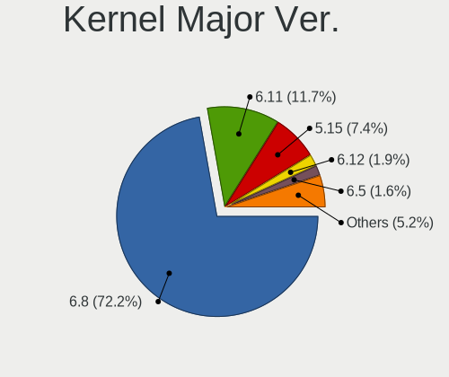
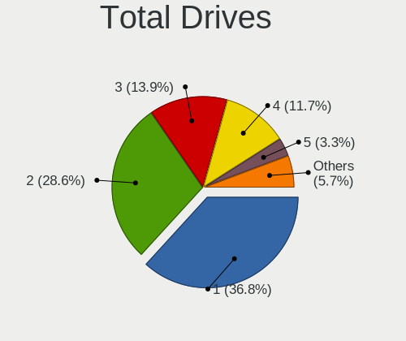
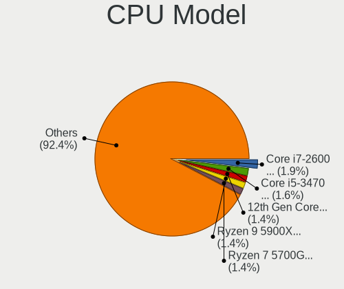
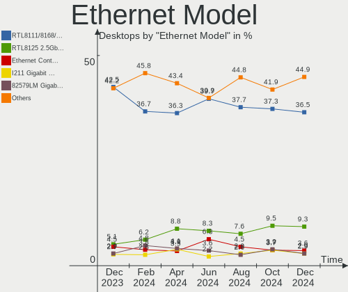
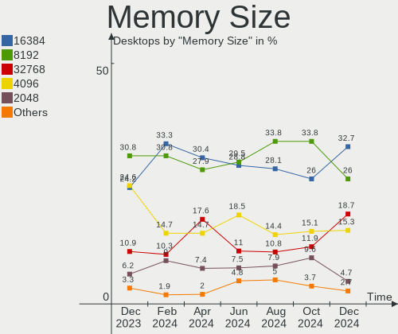

Ubuntu - Hardware Trends (Desktops)
-----------------------------------

A project to identify most popular hardware characteristics and track their change
over time based on data collected by Linux users at https://Linux-Hardware.org.

Anyone can contribute to this report by the [hw-probe](https://github.com/linuxhw/hw-probe) tool:

    sudo -E hw-probe -all -upload

This report is for one last month. Overall report since the beginning of time: [TestDays](https://github.com/linuxhw/TestDays)

Period: Apr, 2024.

Contents
--------

* [ System ](#system)
  - [ OS                       ](#os)
  - [ OS Family                ](#os-family)
  - [ Kernel                   ](#kernel)
  - [ Kernel Family            ](#kernel-family)
  - [ Kernel Major Ver.        ](#kernel-major-ver)
  - [ Arch                     ](#arch)
  - [ DE                       ](#de)
  - [ Display Server           ](#display-server)
  - [ Display Manager          ](#display-manager)
  - [ OS Lang                  ](#os-lang)
  - [ Boot Mode                ](#boot-mode)
  - [ Filesystem               ](#filesystem)
  - [ Part. scheme             ](#part-scheme)
  - [ Dual Boot with Linux/BSD ](#dual-boot-with-linuxbsd)
  - [ Dual Boot (Win)          ](#dual-boot-win)

* [ Board ](#board)
  - [ Vendor                   ](#vendor)
  - [ Model                    ](#model)
  - [ Model Family             ](#model-family)
  - [ MFG Year                 ](#mfg-year)
  - [ Form Factor              ](#form-factor)
  - [ Secure Boot              ](#secure-boot)
  - [ Coreboot                 ](#coreboot)
  - [ RAM Size                 ](#ram-size)
  - [ RAM Used                 ](#ram-used)
  - [ Total Drives             ](#total-drives)
  - [ Has CD-ROM               ](#has-cd-rom)
  - [ Has Ethernet             ](#has-ethernet)
  - [ Has WiFi                 ](#has-wifi)
  - [ Has Bluetooth            ](#has-bluetooth)

* [ Location ](#location)
  - [ Country                  ](#country)
  - [ City                     ](#city)

* [ Drives ](#drives)
  - [ Drive Vendor             ](#drive-vendor)
  - [ Drive Model              ](#drive-model)
  - [ HDD Vendor               ](#hdd-vendor)
  - [ SSD Vendor               ](#ssd-vendor)
  - [ Drive Kind               ](#drive-kind)
  - [ Drive Connector          ](#drive-connector)
  - [ Drive Size               ](#drive-size)
  - [ Space Total              ](#space-total)
  - [ Space Used               ](#space-used)
  - [ Malfunc. Drives          ](#malfunc-drives)
  - [ Malfunc. Drive Vendor    ](#malfunc-drive-vendor)
  - [ Malfunc. HDD Vendor      ](#malfunc-hdd-vendor)
  - [ Malfunc. Drive Kind      ](#malfunc-drive-kind)
  - [ Failed Drives            ](#failed-drives)
  - [ Failed Drive Vendor      ](#failed-drive-vendor)
  - [ Drive Status             ](#drive-status)

* [ Storage controller ](#storage-controller)
  - [ Storage Vendor           ](#storage-vendor)
  - [ Storage Model            ](#storage-model)
  - [ Storage Kind             ](#storage-kind)

* [ Processor ](#processor)
  - [ CPU Vendor               ](#cpu-vendor)
  - [ CPU Model                ](#cpu-model)
  - [ CPU Model Family         ](#cpu-model-family)
  - [ CPU Cores                ](#cpu-cores)
  - [ CPU Sockets              ](#cpu-sockets)
  - [ CPU Threads              ](#cpu-threads)
  - [ CPU Op-Modes             ](#cpu-op-modes)
  - [ CPU Microcode            ](#cpu-microcode)
  - [ CPU Microarch            ](#cpu-microarch)

* [ Graphics ](#graphics)
  - [ GPU Vendor               ](#gpu-vendor)
  - [ GPU Model                ](#gpu-model)
  - [ GPU Combo                ](#gpu-combo)
  - [ GPU Driver               ](#gpu-driver)
  - [ GPU Memory               ](#gpu-memory)

* [ Monitor ](#monitor)
  - [ Monitor Vendor           ](#monitor-vendor)
  - [ Monitor Model            ](#monitor-model)
  - [ Monitor Resolution       ](#monitor-resolution)
  - [ Monitor Diagonal         ](#monitor-diagonal)
  - [ Monitor Width            ](#monitor-width)
  - [ Aspect Ratio             ](#aspect-ratio)
  - [ Monitor Area             ](#monitor-area)
  - [ Pixel Density            ](#pixel-density)
  - [ Multiple Monitors        ](#multiple-monitors)

* [ Network ](#network)
  - [ Net Controller Vendor    ](#net-controller-vendor)
  - [ Net Controller Model     ](#net-controller-model)
  - [ Wireless Vendor          ](#wireless-vendor)
  - [ Wireless Model           ](#wireless-model)
  - [ Ethernet Vendor          ](#ethernet-vendor)
  - [ Ethernet Model           ](#ethernet-model)
  - [ Net Controller Kind      ](#net-controller-kind)
  - [ Used Controller          ](#used-controller)
  - [ NICs                     ](#nics)
  - [ IPv6                     ](#ipv6)

* [ Bluetooth ](#bluetooth)
  - [ Bluetooth Vendor         ](#bluetooth-vendor)
  - [ Bluetooth Model          ](#bluetooth-model)

* [ Sound ](#sound)
  - [ Sound Vendor             ](#sound-vendor)
  - [ Sound Model              ](#sound-model)

* [ Memory ](#memory)
  - [ Memory Vendor            ](#memory-vendor)
  - [ Memory Model             ](#memory-model)
  - [ Memory Kind              ](#memory-kind)
  - [ Memory Form Factor       ](#memory-form-factor)
  - [ Memory Size              ](#memory-size)
  - [ Memory Speed             ](#memory-speed)

* [ Printers & scanners ](#printers--scanners)
  - [ Printer Vendor           ](#printer-vendor)
  - [ Printer Model            ](#printer-model)
  - [ Scanner Vendor           ](#scanner-vendor)
  - [ Scanner Model            ](#scanner-model)

* [ Camera ](#camera)
  - [ Camera Vendor            ](#camera-vendor)
  - [ Camera Model             ](#camera-model)

* [ Security ](#security)
  - [ Fingerprint Vendor       ](#fingerprint-vendor)
  - [ Fingerprint Model        ](#fingerprint-model)
  - [ Chipcard Vendor          ](#chipcard-vendor)
  - [ Chipcard Model           ](#chipcard-model)

* [ Unsupported ](#unsupported)
  - [ Unsupported Devices      ](#unsupported-devices)
  - [ Unsupported Device Types ](#unsupported-device-types)

System
------

OS
--

Installed operating systems

| Name           | Desktops | Percent |
|----------------|----------|---------|
| Ubuntu 22.04   | 264      | 63.77%  |
| Ubuntu 23.10   | 66       | 15.94%  |
| Ubuntu 24.04   | 36       | 8.7%    |
| Ubuntu 20.04   | 36       | 8.7%    |
| Ubuntu 23.04   | 2        | 0.48%   |
| Ubuntu 22.10   | 2        | 0.48%   |
| Ubuntu 21.04   | 2        | 0.48%   |
| Ubuntu 18.04   | 2        | 0.48%   |
| Ubuntu Core 22 | 1        | 0.24%   |
| Ubuntu 21.10   | 1        | 0.24%   |
| Ubuntu 19.10   | 1        | 0.24%   |
| Ubuntu 16.04   | 1        | 0.24%   |

OS Family
---------

OS without a version

| Name   | Desktops | Percent |
|--------|----------|---------|
| Ubuntu | 414      | 100%    |

Kernel
------

Version of the Linux kernel

| Version                 | Desktops | Percent |
|-------------------------|----------|---------|
| 6.5.0-27-generic        | 87       | 21.01%  |
| 6.5.0-26-generic        | 83       | 20.05%  |
| 6.5.0-28-generic        | 73       | 17.63%  |
| 6.8.0-31-generic        | 25       | 6.04%   |
| 5.15.0-101-generic      | 21       | 5.07%   |
| 5.15.0-102-generic      | 14       | 3.38%   |
| 5.15.0-105-generic      | 12       | 2.9%    |
| 5.15.0-97-generic       | 11       | 2.66%   |
| 6.5.0-18-generic        | 9        | 2.17%   |
| 6.8.0-22-generic        | 5        | 1.21%   |
| 6.5.0-9-generic         | 5        | 1.21%   |
| 6.5.0-17-generic        | 5        | 1.21%   |
| 6.5.0-25-generic        | 4        | 0.97%   |
| 5.15.0-100-generic      | 4        | 0.97%   |
| 6.5.0-15-generic        | 3        | 0.72%   |
| 6.2.0-39-generic        | 3        | 0.72%   |
| 5.19.0-46-generic       | 3        | 0.72%   |
| 5.15.0-94-generic       | 3        | 0.72%   |
| 6.8.0-11-generic        | 2        | 0.48%   |
| 6.5.0-34-generic        | 2        | 0.48%   |
| 6.5.0-1019-oem          | 2        | 0.48%   |
| 6.2.0-35-generic        | 2        | 0.48%   |
| 5.4.0-173-generic       | 2        | 0.48%   |
| 5.19.0-32-generic       | 2        | 0.48%   |
| 5.15.0-92-generic       | 2        | 0.48%   |
| 6.9.0-060900rc5-generic | 1        | 0.24%   |
| 6.8.0-31-lowlatency     | 1        | 0.24%   |
| 6.8.0-28-generic        | 1        | 0.24%   |
| 6.8.0-1007-gcp          | 1        | 0.24%   |
| 6.5.0-27-lowlatency     | 1        | 0.24%   |
| 6.5.0-26-lowlatency     | 1        | 0.24%   |
| 6.5.0-21-generic        | 1        | 0.24%   |
| 6.5.0-1020-oem          | 1        | 0.24%   |
| 6.2.0-36-generic        | 1        | 0.24%   |
| 5.4.0-73-generic        | 1        | 0.24%   |
| 5.4.0-177-generic       | 1        | 0.24%   |
| 5.4.0-150-generic       | 1        | 0.24%   |
| 5.4.0-144-generic       | 1        | 0.24%   |
| 5.4.0-132-generic       | 1        | 0.24%   |
| 5.3.0-64-generic        | 1        | 0.24%   |

Kernel Family
-------------

Linux kernel without a distro release

| Version | Desktops | Percent |
|---------|----------|---------|
| 6.5.0   | 277      | 66.91%  |
| 5.15.0  | 74       | 17.87%  |
| 6.8.0   | 35       | 8.45%   |
| 5.4.0   | 7        | 1.69%   |
| 6.2.0   | 6        | 1.45%   |
| 5.19.0  | 5        | 1.21%   |
| 5.11.0  | 4        | 0.97%   |
| 4.15.0  | 3        | 0.72%   |
| 6.9.0   | 1        | 0.24%   |
| 5.3.0   | 1        | 0.24%   |
| 5.13.0  | 1        | 0.24%   |

Kernel Major Ver.
-----------------

Linux kernel major version

| Version | Desktops | Percent |
|---------|----------|---------|
| 6.5     | 277      | 66.91%  |
| 5.15    | 74       | 17.87%  |
| 6.8     | 35       | 8.45%   |
| 5.4     | 7        | 1.69%   |
| 6.2     | 6        | 1.45%   |
| 5.19    | 5        | 1.21%   |
| 5.11    | 4        | 0.97%   |
| 4.15    | 3        | 0.72%   |
| 6.9     | 1        | 0.24%   |
| 5.3     | 1        | 0.24%   |
| 5.13    | 1        | 0.24%   |

Arch
----

OS architecture (x86_64, i586, etc.)

| Name   | Desktops | Percent |
|--------|----------|---------|
| x86_64 | 412      | 99.52%  |
| i686   | 2        | 0.48%   |

DE
--

Desktop Environment

| Name            | Desktops | Percent |
|-----------------|----------|---------|
| GNOME           | 343      | 82.85%  |
| Unknown         | 66       | 15.94%  |
| X-Cinnamon      | 2        | 0.48%   |
| GNOME Flashback | 2        | 0.48%   |
| GNOME Classic   | 1        | 0.24%   |

Display Server
--------------

X11 or Wayland

| Name    | Desktops | Percent |
|---------|----------|---------|
| Wayland | 187      | 45.17%  |
| X11     | 167      | 40.34%  |
| Tty     | 30       | 7.25%   |
| Unknown | 30       | 7.25%   |

Display Manager
---------------

SDDM, LightDM, etc.

| Name    | Desktops | Percent |
|---------|----------|---------|
| GDM3    | 309      | 74.64%  |
| Unknown | 87       | 21.01%  |
| GDM     | 9        | 2.17%   |
| LightDM | 5        | 1.21%   |
| SDDM    | 3        | 0.72%   |
| SLiM    | 1        | 0.24%   |

OS Lang
-------

Language

| Lang    | Desktops | Percent |
|---------|----------|---------|
| en_US   | 168      | 40.58%  |
| de_DE   | 39       | 9.42%   |
| fr_FR   | 32       | 7.73%   |
| pt_BR   | 19       | 4.59%   |
| C       | 18       | 4.35%   |
| en_GB   | 16       | 3.86%   |
| it_IT   | 13       | 3.14%   |
| Unknown | 13       | 3.14%   |
| ru_RU   | 12       | 2.9%    |
| pl_PL   | 12       | 2.9%    |
| es_ES   | 11       | 2.66%   |
| en_CA   | 10       | 2.42%   |
| en_AU   | 6        | 1.45%   |
| zh_CN   | 5        | 1.21%   |
| en_IN   | 5        | 1.21%   |
| nl_NL   | 4        | 0.97%   |
| tr_TR   | 3        | 0.72%   |
| pt_PT   | 2        | 0.48%   |
| nl_BE   | 2        | 0.48%   |
| ja_JP   | 2        | 0.48%   |
| es_AR   | 2        | 0.48%   |
| en_ZA   | 2        | 0.48%   |
| el_GR   | 2        | 0.48%   |
| bg_BG   | 2        | 0.48%   |
| zh_TW   | 1        | 0.24%   |
| uk_UA   | 1        | 0.24%   |
| nb_NO   | 1        | 0.24%   |
| lzh_TW  | 1        | 0.24%   |
| hu_HU   | 1        | 0.24%   |
| es_VE   | 1        | 0.24%   |
| es_SV   | 1        | 0.24%   |
| es_PE   | 1        | 0.24%   |
| es_MX   | 1        | 0.24%   |
| en_NZ   | 1        | 0.24%   |
| de_CH   | 1        | 0.24%   |
| da_DK   | 1        | 0.24%   |
| cs_CZ   | 1        | 0.24%   |
| ca_ES   | 1        | 0.24%   |

Boot Mode
---------

EFI or BIOS

| Mode | Desktops | Percent |
|------|----------|---------|
| BIOS | 275      | 66.43%  |
| EFI  | 139      | 33.57%  |

Filesystem
----------

Type of filesystem

| Type    | Desktops | Percent |
|---------|----------|---------|
| Tmpfs   | 222      | 53.62%  |
| Ext4    | 173      | 41.79%  |
| Overlay | 11       | 2.66%   |
| Btrfs   | 5        | 1.21%   |
| Zfs     | 2        | 0.48%   |
| Xfs     | 1        | 0.24%   |

Part. scheme
------------

Scheme of partitioning

| Type    | Desktops | Percent |
|---------|----------|---------|
| GPT     | 327      | 78.99%  |
| Unknown | 44       | 10.63%  |
| MBR     | 43       | 10.39%  |

Dual Boot with Linux/BSD
------------------------

Hosting more than one Linux/BSD

| Dual boot | Desktops | Percent |
|-----------|----------|---------|
| No        | 335      | 80.92%  |
| Yes       | 79       | 19.08%  |

Dual Boot (Win)
---------------

Hosting Linux and Windows

| Dual boot | Desktops | Percent |
|-----------|----------|---------|
| No        | 262      | 63.29%  |
| Yes       | 152      | 36.71%  |

Board
-----

Vendor
------

Motherboard manufacturer

| Name                | Desktops | Percent |
|---------------------|----------|---------|
| ASUSTek Computer    | 110      | 26.57%  |
| Gigabyte Technology | 62       | 14.98%  |
| Dell                | 45       | 10.87%  |
| MSI                 | 42       | 10.14%  |
| ASRock              | 31       | 7.49%   |
| Hewlett-Packard     | 29       | 7%      |
| Lenovo              | 14       | 3.38%   |
| Supermicro          | 12       | 2.9%    |
| Intel               | 9        | 2.17%   |
| AZW                 | 9        | 2.17%   |
| Acer                | 8        | 1.93%   |
| Unknown             | 8        | 1.93%   |
| Fujitsu             | 4        | 0.97%   |
| Pegatron            | 3        | 0.72%   |
| Medion              | 2        | 0.48%   |
| Foxconn             | 2        | 0.48%   |
| eMachines           | 2        | 0.48%   |
| Apple               | 2        | 0.48%   |
| Alienware           | 2        | 0.48%   |
| Techvision          | 1        | 0.24%   |
| SiComputer          | 1        | 0.24%   |
| Semp Toshiba        | 1        | 0.24%   |
| QTQD                | 1        | 0.24%   |
| PCWare              | 1        | 0.24%   |
| ParTech             | 1        | 0.24%   |
| Packard Bell        | 1        | 0.24%   |
| ONDA                | 1        | 0.24%   |
| Minix               | 1        | 0.24%   |
| MAXSUN              | 1        | 0.24%   |
| MACHINIST           | 1        | 0.24%   |
| Huanan              | 1        | 0.24%   |
| GMKtec              | 1        | 0.24%   |
| GEEKOM              | 1        | 0.24%   |
| Fujitsu Siemens     | 1        | 0.24%   |
| Biostar             | 1        | 0.24%   |
| AWOW                | 1        | 0.24%   |
| AMI                 | 1        | 0.24%   |

Model
-----

Motherboard model

| Name                            | Desktops | Percent |
|---------------------------------|----------|---------|
| Unknown                         | 10       | 2.42%   |
| ASUS All Series                 | 8        | 1.93%   |
| Gigabyte TRX40 AORUS MASTER     | 6        | 1.45%   |
| Dell OptiPlex 7010              | 6        | 1.45%   |
| ASRock TRX40 Creator            | 6        | 1.45%   |
| Supermicro SYS-6018R-TDW        | 5        | 1.21%   |
| AZW MINI S                      | 5        | 1.21%   |
| MSI MS-7C37                     | 3        | 0.72%   |
| Gigabyte B75M-D3H               | 3        | 0.72%   |
| Gigabyte B550M DS3H             | 3        | 0.72%   |
| ASUS M5A97 R2.0                 | 3        | 0.72%   |
| Supermicro SYS-6018R-MTR        | 2        | 0.48%   |
| MSI MS-7D91                     | 2        | 0.48%   |
| MSI MS-7D67                     | 2        | 0.48%   |
| MSI MS-7C95                     | 2        | 0.48%   |
| MSI MS-7B98                     | 2        | 0.48%   |
| MSI MS-7823                     | 2        | 0.48%   |
| MSI MS-7816                     | 2        | 0.48%   |
| Intel DH61CR                    | 2        | 0.48%   |
| HP EliteDesk 800 G1 SFF         | 2        | 0.48%   |
| HP Compaq 8200 Elite CMT PC     | 2        | 0.48%   |
| Gigabyte M68M-S2P               | 2        | 0.48%   |
| Gigabyte B550 GAMING X V2       | 2        | 0.48%   |
| Gigabyte B450M DS3H             | 2        | 0.48%   |
| Dell XPS 8700                   | 2        | 0.48%   |
| Dell Precision 5820 Tower       | 2        | 0.48%   |
| Dell Precision 3630 Tower       | 2        | 0.48%   |
| Dell OptiPlex 990               | 2        | 0.48%   |
| Dell OptiPlex 7040              | 2        | 0.48%   |
| Dell OptiPlex 5040              | 2        | 0.48%   |
| Dell OptiPlex 3020              | 2        | 0.48%   |
| Dell OptiPlex 3010              | 2        | 0.48%   |
| Dell Inspiron 3847              | 2        | 0.48%   |
| AZW T4 PRO                      | 2        | 0.48%   |
| ASUS TUF Gaming Z590-PLUS WIFI  | 2        | 0.48%   |
| ASUS TUF Gaming X570-PLUS       | 2        | 0.48%   |
| ASUS TUF Gaming B650-PLUS WIFI  | 2        | 0.48%   |
| ASUS ROG ZENITH II EXTREME      | 2        | 0.48%   |
| ASUS ROG Maximus Z790 DARK HERO | 2        | 0.48%   |
| ASUS ProArt Z790-CREATOR WIFI   | 2        | 0.48%   |

Model Family
------------

Motherboard model prefix

| Name                     | Desktops | Percent |
|--------------------------|----------|---------|
| Dell OptiPlex            | 25       | 6.04%   |
| ASUS PRIME               | 21       | 5.07%   |
| ASUS ROG                 | 19       | 4.59%   |
| ASUS TUF                 | 16       | 3.86%   |
| Unknown                  | 10       | 2.42%   |
| HP Compaq                | 9        | 2.17%   |
| Dell Precision           | 8        | 1.93%   |
| ASUS All                 | 8        | 1.93%   |
| HP EliteDesk             | 6        | 1.45%   |
| Gigabyte TRX40           | 6        | 1.45%   |
| ASUS Pro                 | 6        | 1.45%   |
| ASRock TRX40             | 6        | 1.45%   |
| Supermicro SYS-6018R-TDW | 5        | 1.21%   |
| AZW MINI                 | 5        | 1.21%   |
| ASUS M5A97               | 5        | 1.21%   |
| Lenovo ThinkCentre       | 4        | 0.97%   |
| Lenovo IdeaCentre        | 4        | 0.97%   |
| Gigabyte B760M           | 4        | 0.97%   |
| Gigabyte A520M           | 4        | 0.97%   |
| Dell XPS                 | 4        | 0.97%   |
| Dell Inspiron            | 4        | 0.97%   |
| Acer Veriton             | 4        | 0.97%   |
| MSI MS-7C37              | 3        | 0.72%   |
| Lenovo ThinkStation      | 3        | 0.72%   |
| Gigabyte B75M-D3H        | 3        | 0.72%   |
| Gigabyte B550M           | 3        | 0.72%   |
| Gigabyte B450M           | 3        | 0.72%   |
| Acer Aspire              | 3        | 0.72%   |
| Supermicro SYS-6018R-MTR | 2        | 0.48%   |
| MSI MS-7D91              | 2        | 0.48%   |
| MSI MS-7D67              | 2        | 0.48%   |
| MSI MS-7C95              | 2        | 0.48%   |
| MSI MS-7B98              | 2        | 0.48%   |
| MSI MS-7823              | 2        | 0.48%   |
| MSI MS-7816              | 2        | 0.48%   |
| Intel DH61CR             | 2        | 0.48%   |
| HP ProLiant              | 2        | 0.48%   |
| HP ProDesk               | 2        | 0.48%   |
| Gigabyte Z390            | 2        | 0.48%   |
| Gigabyte X299            | 2        | 0.48%   |

MFG Year
--------

Motherboard manufacture year

| Year    | Desktops | Percent |
|---------|----------|---------|
| 2020    | 39       | 9.42%   |
| 2018    | 39       | 9.42%   |
| 2023    | 38       | 9.18%   |
| 2019    | 37       | 8.94%   |
| 2013    | 35       | 8.45%   |
| 2012    | 34       | 8.21%   |
| 2022    | 28       | 6.76%   |
| 2021    | 26       | 6.28%   |
| 2014    | 24       | 5.8%    |
| 2009    | 23       | 5.56%   |
| 2011    | 19       | 4.59%   |
| 2017    | 17       | 4.11%   |
| 2015    | 14       | 3.38%   |
| 2016    | 13       | 3.14%   |
| 2010    | 11       | 2.66%   |
| 2008    | 8        | 1.93%   |
| 2024    | 5        | 1.21%   |
| 2007    | 1        | 0.24%   |
| 2006    | 1        | 0.24%   |
| 2004    | 1        | 0.24%   |
| Unknown | 1        | 0.24%   |

Form Factor
-----------

Physical design of the computer

| Name    | Desktops | Percent |
|---------|----------|---------|
| Desktop | 414      | 100%    |

Secure Boot
-----------

Enabled or disabled

| State    | Desktops | Percent |
|----------|----------|---------|
| Disabled | 397      | 95.89%  |
| Enabled  | 17       | 4.11%   |

Coreboot
--------

Have coreboot on board

| Used | Desktops | Percent |
|------|----------|---------|
| No   | 414      | 100%    |

RAM Size
--------

Total RAM memory

| Size in GB      | Desktops | Percent |
|-----------------|----------|---------|
| 16.01-24.0      | 105      | 25.36%  |
| 32.01-64.0      | 74       | 17.87%  |
| 4.01-8.0        | 65       | 15.7%   |
| 64.01-256.0     | 58       | 14.01%  |
| 3.01-4.0        | 41       | 9.9%    |
| 8.01-16.0       | 40       | 9.66%   |
| More than 256.0 | 14       | 3.38%   |
| 24.01-32.0      | 12       | 2.9%    |
| 2.01-3.0        | 4        | 0.97%   |
| 1.01-2.0        | 1        | 0.24%   |

RAM Used
--------

Used RAM memory

| Used GB     | Desktops | Percent |
|-------------|----------|---------|
| 1.01-2.0    | 126      | 30.43%  |
| 2.01-3.0    | 102      | 24.64%  |
| 4.01-8.0    | 70       | 16.91%  |
| 3.01-4.0    | 52       | 12.56%  |
| 8.01-16.0   | 29       | 7%      |
| 64.01-256.0 | 14       | 3.38%   |
| 0.51-1.0    | 10       | 2.42%   |
| 24.01-32.0  | 4        | 0.97%   |
| 32.01-64.0  | 3        | 0.72%   |
| 16.01-24.0  | 3        | 0.72%   |
| 0.01-0.5    | 1        | 0.24%   |

Total Drives
------------

Number of drives on board

| Drives | Desktops | Percent |
|--------|----------|---------|
| 1      | 164      | 39.61%  |
| 2      | 110      | 26.57%  |
| 3      | 66       | 15.94%  |
| 4      | 29       | 7%      |
| 5      | 18       | 4.35%   |
| 6      | 7        | 1.69%   |
| 13     | 6        | 1.45%   |
| 7      | 5        | 1.21%   |
| 9      | 4        | 0.97%   |
| 21     | 1        | 0.24%   |
| 14     | 1        | 0.24%   |
| 10     | 1        | 0.24%   |
| 8      | 1        | 0.24%   |
| 0      | 1        | 0.24%   |

Has CD-ROM
----------

Has CD-ROM on board

| Presented | Desktops | Percent |
|-----------|----------|---------|
| No        | 263      | 63.53%  |
| Yes       | 151      | 36.47%  |

Has Ethernet
------------

Has Ethernet on board

| Presented | Desktops | Percent |
|-----------|----------|---------|
| Yes       | 411      | 99.28%  |
| No        | 3        | 0.72%   |

Has WiFi
--------

Has WiFi module

| Presented | Desktops | Percent |
|-----------|----------|---------|
| Yes       | 214      | 51.69%  |
| No        | 200      | 48.31%  |

Has Bluetooth
-------------

Has Bluetooth module

| Presented | Desktops | Percent |
|-----------|----------|---------|
| No        | 247      | 59.66%  |
| Yes       | 167      | 40.34%  |

Location
--------

Country
-------

Geographic location (country)

| Country      | Desktops | Percent |
|--------------|----------|---------|
| USA          | 74       | 17.87%  |
| Germany      | 44       | 10.63%  |
| France       | 33       | 7.97%   |
| Spain        | 27       | 6.52%   |
| Russia       | 26       | 6.28%   |
| Brazil       | 24       | 5.8%    |
| UK           | 18       | 4.35%   |
| Italy        | 15       | 3.62%   |
| Poland       | 14       | 3.38%   |
| Canada       | 14       | 3.38%   |
| Australia    | 8        | 1.93%   |
| Norway       | 7        | 1.69%   |
| Netherlands  | 7        | 1.69%   |
| Austria      | 7        | 1.69%   |
| Turkey       | 6        | 1.45%   |
| India        | 6        | 1.45%   |
| Greece       | 6        | 1.45%   |
| Vietnam      | 4        | 0.97%   |
| Taiwan       | 4        | 0.97%   |
| South Africa | 4        | 0.97%   |
| Portugal     | 4        | 0.97%   |
| Bulgaria     | 4        | 0.97%   |
| Belgium      | 4        | 0.97%   |
| Argentina    | 4        | 0.97%   |
| Sweden       | 3        | 0.72%   |
| Japan        | 3        | 0.72%   |
| Hungary      | 3        | 0.72%   |
| Denmark      | 3        | 0.72%   |
| China        | 3        | 0.72%   |
| Switzerland  | 2        | 0.48%   |
| Singapore    | 2        | 0.48%   |
| Qatar        | 2        | 0.48%   |
| Peru         | 2        | 0.48%   |
| Mexico       | 2        | 0.48%   |
| Malaysia     | 2        | 0.48%   |
| Croatia      | 2        | 0.48%   |
| Venezuela    | 1        | 0.24%   |
| Thailand     | 1        | 0.24%   |
| Slovenia     | 1        | 0.24%   |
| Serbia       | 1        | 0.24%   |

City
----

Geographic location (city)

| City                  | Desktops | Percent |
|-----------------------|----------|---------|
| Terrassa              | 15       | 3.62%   |
| Moscow                | 15       | 3.62%   |
| Berlin                | 4        | 0.97%   |
| Vienna                | 3        | 0.72%   |
| Taipei                | 3        | 0.72%   |
| Sydney                | 3        | 0.72%   |
| St Petersburg         | 3        | 0.72%   |
| Sao Paulo             | 3        | 0.72%   |
| Poznan                | 3        | 0.72%   |
| Paris                 | 3        | 0.72%   |
| Madrid                | 3        | 0.72%   |
| Los Angeles           | 3        | 0.72%   |
| Istanbul              | 3        | 0.72%   |
| Warsaw                | 2        | 0.48%   |
| Vernon                | 2        | 0.48%   |
| Tucson                | 2        | 0.48%   |
| Thrissur              | 2        | 0.48%   |
| Sofia                 | 2        | 0.48%   |
| Singapore             | 2        | 0.48%   |
| San Jacinto           | 2        | 0.48%   |
| Rome                  | 2        | 0.48%   |
| Poitiers              | 2        | 0.48%   |
| Perth                 | 2        | 0.48%   |
| Paracuellos de Jarama | 2        | 0.48%   |
| Pace                  | 2        | 0.48%   |
| Oldenburg             | 2        | 0.48%   |
| Niterói              | 2        | 0.48%   |
| New York              | 2        | 0.48%   |
| Milpitas              | 2        | 0.48%   |
| Krakow                | 2        | 0.48%   |
| Kazan’              | 2        | 0.48%   |
| Johannesburg          | 2        | 0.48%   |
| Ho Chi Minh City      | 2        | 0.48%   |
| Hanoi                 | 2        | 0.48%   |
| Hamburg               | 2        | 0.48%   |
| Haltern am See        | 2        | 0.48%   |
| Halle                 | 2        | 0.48%   |
| Gothenburg            | 2        | 0.48%   |
| Farroupilha           | 2        | 0.48%   |
| Falkenstein           | 2        | 0.48%   |

Drives
------

Drive Vendor
------------

Hard drive vendors

| Vendor                       | Desktops | Drives | Percent |
|------------------------------|----------|--------|---------|
| WDC                          | 119      | 151    | 16.23%  |
| Seagate                      | 112      | 182    | 15.28%  |
| Samsung Electronics          | 104      | 136    | 14.19%  |
| Kingston                     | 43       | 50     | 5.87%   |
| SanDisk                      | 41       | 46     | 5.59%   |
| Crucial                      | 41       | 88     | 5.59%   |
| Toshiba                      | 30       | 42     | 4.09%   |
| PNY                          | 17       | 21     | 2.32%   |
| Unknown                      | 16       | 26     | 2.18%   |
| Intel                        | 15       | 18     | 2.05%   |
| Hitachi                      | 14       | 15     | 1.91%   |
| Phison                       | 12       | 55     | 1.64%   |
| Phison Electronics           | 11       | 13     | 1.5%    |
| MAXIO Technology (Hangzhou)  | 8        | 8      | 1.09%   |
| Silicon Motion               | 7        | 7      | 0.95%   |
| Micron Technology            | 7        | 11     | 0.95%   |
| China                        | 7        | 7      | 0.95%   |
| SK hynix                     | 5        | 5      | 0.68%   |
| Lexar                        | 5        | 5      | 0.68%   |
| Hewlett-Packard              | 5        | 5      | 0.68%   |
| A-DATA Technology            | 5        | 6      | 0.68%   |
| Team                         | 4        | 4      | 0.55%   |
| Shenzhen Longsys Electronics | 4        | 4      | 0.55%   |
| OCZ                          | 4        | 5      | 0.55%   |
| Intenso                      | 4        | 4      | 0.55%   |
| HGST                         | 4        | 5      | 0.55%   |
| Corsair                      | 4        | 5      | 0.55%   |
| Unknown                      | 4        | 4      | 0.55%   |
| SPCC                         | 3        | 3      | 0.41%   |
| Micron/Crucial Technology    | 3        | 3      | 0.41%   |
| Maxtor                       | 3        | 3      | 0.41%   |
| LITEON                       | 3        | 4      | 0.41%   |
| Lite-On Technology           | 3        | 3      | 0.41%   |
| KIOXIA                       | 3        | 3      | 0.41%   |
| Kingston Technology Company  | 3        | 3      | 0.41%   |
| Apple                        | 3        | 3      | 0.41%   |
| Verbatim                     | 2        | 2      | 0.27%   |
| Transcend                    | 2        | 2      | 0.27%   |
| Patriot                      | 2        | 2      | 0.27%   |
| KingSpec                     | 2        | 2      | 0.27%   |

Drive Model
-----------

Hard drive models

| Model                                                 | Desktops | Percent |
|-------------------------------------------------------|----------|---------|
| Seagate ST500DM002-1BD142 500GB                       | 13       | 1.56%   |
| Kingston SA400S37240G 240GB SSD                       | 13       | 1.56%   |
| PNY CS3030 250GB SSD                                  | 12       | 1.44%   |
| Phison Sabrent Rocket Q 8TB                           | 10       | 1.2%    |
| WDC WD10EZEX-08WN4A0 1TB                              | 9        | 1.08%   |
| Seagate ST1000DM010-2EP102 1TB                        | 9        | 1.08%   |
| Samsung SSD 850 EVO 500GB                             | 8        | 0.96%   |
| Samsung NVMe SSD Controller SM981/PM981/PM983 1TB     | 8        | 0.96%   |
| Samsung SSD 860 EVO 500GB                             | 7        | 0.84%   |
| Samsung NVMe SSD Controller PM9A1/PM9A3/980PRO 1TB    | 7        | 0.84%   |
| Crucial CT500MX500SSD1 500GB                          | 7        | 0.84%   |
| Crucial CT4000P3SSD8 4TB                              | 7        | 0.84%   |
| MAXIO (Hangzhou) NVMe SSD Controller MAP1202 256GB    | 6        | 0.72%   |
| Crucial CT1000MX500SSD1 1TB                           | 6        | 0.72%   |
| WDC WD20EZRZ-00Z5HB0 2TB                              | 5        | 0.6%    |
| Unknown SD/MMC/MS PRO 128GB                           | 5        | 0.6%    |
| Unknown Compact Flash 977MB                           | 5        | 0.6%    |
| Toshiba DT01ACA050 500GB                              | 5        | 0.6%    |
| Seagate ST3500418AS 500GB                             | 5        | 0.6%    |
| Seagate ST2000DM008-2FR102 2TB                        | 5        | 0.6%    |
| Samsung SSD 990 PRO 2TB                               | 5        | 0.6%    |
| Kingston SV300S37A120G 120GB SSD                      | 5        | 0.6%    |
| Kingston SA400S37480G 480GB SSD                       | 5        | 0.6%    |
| Unknown SD/MMC 2GB                                    | 4        | 0.48%   |
| Unknown M.S./M.S.Pro/HG 16GB                          | 4        | 0.48%   |
| Toshiba HDWD110 1TB                                   | 4        | 0.48%   |
| Toshiba DT01ACA100 1TB                                | 4        | 0.48%   |
| Silicon Motion SM2263EN/SM2263XT SSD Controller 256GB | 4        | 0.48%   |
| Seagate ST1000DM003-9YN162 1TB                        | 4        | 0.48%   |
| Sandisk WD Black 2018/SN750 / PC SN720 NVMe SSD 1TB   | 4        | 0.48%   |
| Samsung SSD 980 1TB                                   | 4        | 0.48%   |
| Samsung SSD 970 EVO Plus 2TB                          | 4        | 0.48%   |
| Samsung SSD 870 EVO 500GB                             | 4        | 0.48%   |
| Samsung SSD 850 EVO 250GB                             | 4        | 0.48%   |
| Kingston SA400S37120G 120GB SSD                       | 4        | 0.48%   |
| Unknown                                               | 4        | 0.48%   |
| WDC WDS100T2B0C-00PXH0 1TB                            | 3        | 0.36%   |
| WDC WD5000AAKX-60U6AA0 500GB                          | 3        | 0.36%   |
| WDC WD5000AAKX-001CA0 500GB                           | 3        | 0.36%   |
| WDC WD10EZEX-00BN5A0 1TB                              | 3        | 0.36%   |

HDD Vendor
----------

Hard disk drive vendors

| Vendor              | Desktops | Drives | Percent |
|---------------------|----------|--------|---------|
| Seagate             | 111      | 178    | 37.37%  |
| WDC                 | 104      | 132    | 35.02%  |
| Toshiba             | 29       | 41     | 9.76%   |
| Hitachi             | 14       | 15     | 4.71%   |
| Samsung Electronics | 12       | 12     | 4.04%   |
| Unknown             | 5        | 5      | 1.68%   |
| HGST                | 4        | 5      | 1.35%   |
| Maxtor              | 3        | 3      | 1.01%   |
| Apple               | 3        | 3      | 1.01%   |
| Hewlett-Packard     | 2        | 2      | 0.67%   |
| Fujitsu             | 2        | 4      | 0.67%   |
| TO Exter            | 1        | 1      | 0.34%   |
| SABRENT             | 1        | 1      | 0.34%   |
| QUANTUM             | 1        | 1      | 0.34%   |
| Lenovo              | 1        | 2      | 0.34%   |
| Intenso             | 1        | 1      | 0.34%   |
| HPE                 | 1        | 1      | 0.34%   |
| Config              | 1        | 1      | 0.34%   |
| ASMT                | 1        | 1      | 0.34%   |

SSD Vendor
----------

Solid state drive vendors

| Vendor              | Desktops | Drives | Percent |
|---------------------|----------|--------|---------|
| Samsung Electronics | 47       | 52     | 20.89%  |
| Kingston            | 38       | 43     | 16.89%  |
| Crucial             | 28       | 33     | 12.44%  |
| SanDisk             | 18       | 20     | 8%      |
| WDC                 | 12       | 12     | 5.33%   |
| Intel               | 10       | 10     | 4.44%   |
| China               | 7        | 7      | 3.11%   |
| Micron Technology   | 6        | 10     | 2.67%   |
| A-DATA Technology   | 5        | 5      | 2.22%   |
| PNY                 | 4        | 5      | 1.78%   |
| OCZ                 | 4        | 5      | 1.78%   |
| Lexar               | 4        | 4      | 1.78%   |
| LITEON              | 3        | 4      | 1.33%   |
| Transcend           | 2        | 2      | 0.89%   |
| Team                | 2        | 2      | 0.89%   |
| SK hynix            | 2        | 2      | 0.89%   |
| Patriot             | 2        | 2      | 0.89%   |
| KingSpec            | 2        | 2      | 0.89%   |
| GOODRAM             | 2        | 4      | 0.89%   |
| Corsair             | 2        | 2      | 0.89%   |
| Unknown             | 2        | 2      | 0.89%   |
| Verbatim            | 1        | 1      | 0.44%   |
| Vaseky              | 1        | 1      | 0.44%   |
| USB3.0              | 1        | 1      | 0.44%   |
| Toshiba             | 1        | 1      | 0.44%   |
| SPCC                | 1        | 1      | 0.44%   |
| Silicon Power       | 1        | 1      | 0.44%   |
| Seagate             | 1        | 2      | 0.44%   |
| Netac               | 1        | 1      | 0.44%   |
| Mushkin             | 1        | 2      | 0.44%   |
| MicroFrom           | 1        | 1      | 0.44%   |
| KOWIN               | 1        | 1      | 0.44%   |
| KLEVV               | 1        | 1      | 0.44%   |
| KIOXIA-EXCERIA      | 1        | 1      | 0.44%   |
| Kimtigo             | 1        | 1      | 0.44%   |
| KBM                 | 1        | 1      | 0.44%   |
| Intenso             | 1        | 1      | 0.44%   |
| Hewlett-Packard     | 1        | 1      | 0.44%   |
| Gigabyte Technology | 1        | 1      | 0.44%   |
| Fanxiang            | 1        | 1      | 0.44%   |

Drive Kind
----------

HDD or SSD

| Kind    | Desktops | Drives | Percent |
|---------|----------|--------|---------|
| HDD     | 231      | 409    | 37.32%  |
| SSD     | 192      | 253    | 31.02%  |
| NVMe    | 172      | 325    | 27.79%  |
| Unknown | 20       | 32     | 3.23%   |
| MMC     | 4        | 4      | 0.65%   |

Drive Connector
---------------

SATA, SAS, NVMe, etc.

| Type | Desktops | Drives | Percent |
|------|----------|--------|---------|
| SATA | 325      | 627    | 60.07%  |
| NVMe | 172      | 325    | 31.79%  |
| SAS  | 40       | 67     | 7.39%   |
| MMC  | 4        | 4      | 0.74%   |

Drive Size
----------

Size of hard drive

| Size in TB | Desktops | Drives | Percent |
|------------|----------|--------|---------|
| 0.01-0.5   | 221      | 309    | 48.89%  |
| 0.51-1.0   | 130      | 169    | 28.76%  |
| 1.01-2.0   | 46       | 66     | 10.18%  |
| 3.01-4.0   | 21       | 44     | 4.65%   |
| 4.01-10.0  | 13       | 35     | 2.88%   |
| 2.01-3.0   | 12       | 17     | 2.65%   |
| 10.01-20.0 | 9        | 22     | 1.99%   |

Space Total
-----------

Amount of disk space available on the file system

| Size in GB     | Desktops | Percent |
|----------------|----------|---------|
| 101-250        | 105      | 25.36%  |
| 251-500        | 70       | 16.91%  |
| 1001-2000      | 64       | 15.46%  |
| 501-1000       | 64       | 15.46%  |
| More than 3000 | 37       | 8.94%   |
| Unknown        | 26       | 6.28%   |
| 2001-3000      | 17       | 4.11%   |
| 51-100         | 15       | 3.62%   |
| 1-20           | 13       | 3.14%   |
| 21-50          | 3        | 0.72%   |

Space Used
----------

Amount of used disk space

| Used GB        | Desktops | Percent |
|----------------|----------|---------|
| 21-50          | 91       | 21.98%  |
| 1-20           | 91       | 21.98%  |
| 101-250        | 55       | 13.29%  |
| 51-100         | 43       | 10.39%  |
| 251-500        | 35       | 8.45%   |
| 501-1000       | 29       | 7%      |
| Unknown        | 26       | 6.28%   |
| 1001-2000      | 20       | 4.83%   |
| More than 3000 | 19       | 4.59%   |
| 2001-3000      | 5        | 1.21%   |

Malfunc. Drives
---------------

Drive models with a malfunction

| Model                                 | Desktops | Drives | Percent |
|---------------------------------------|----------|--------|---------|
| Seagate ST500DM002-1BD142 500GB       | 2        | 2      | 7.41%   |
| WDC WDS100T2B0C-00PXH0 1TB            | 1        | 1      | 3.7%    |
| WDC WD60PURZ-85ZUFY1 6TB              | 1        | 1      | 3.7%    |
| WDC WD20EZRX-00DC0B0 2TB              | 1        | 1      | 3.7%    |
| WDC WD15EARS-00Z5B1 1TB               | 1        | 1      | 3.7%    |
| WDC WD10EZEX-00WN4A0 1TB              | 1        | 1      | 3.7%    |
| Toshiba HDWE160 6TB                   | 1        | 1      | 3.7%    |
| Toshiba DT01ACA300 3TB                | 1        | 1      | 3.7%    |
| Seagate ST9500325AS 500GB             | 1        | 1      | 3.7%    |
| Seagate ST500DM002-1BC142 500GB       | 1        | 1      | 3.7%    |
| Seagate ST3500418AS 500GB             | 1        | 1      | 3.7%    |
| Seagate ST2000DX002-2DV164 2TB        | 1        | 1      | 3.7%    |
| Seagate ST2000DM001-9YN164 2TB        | 1        | 2      | 3.7%    |
| Seagate ST2000DL003-9VT166 2TB        | 1        | 1      | 3.7%    |
| Seagate ST14000NM0018-2H4101 14TB     | 1        | 1      | 3.7%    |
| Seagate ST1000DX001-1NS162 1TB        | 1        | 1      | 3.7%    |
| Seagate ST1000DM010-2EP102 1TB        | 1        | 1      | 3.7%    |
| Seagate ST1000DM003-1CH162 1TB        | 1        | 1      | 3.7%    |
| SanDisk SD7SB2Q512G1001 512GB SSD     | 1        | 1      | 3.7%    |
| Samsung Electronics SSD 870 EVO 2TB   | 1        | 1      | 3.7%    |
| Samsung Electronics PM9A1 NVMe 2048GB | 1        | 1      | 3.7%    |
| Samsung Electronics HD103SI 1TB       | 1        | 1      | 3.7%    |
| Kingston SKC600512G 512GB SSD         | 1        | 1      | 3.7%    |
| Intel SSDSC2KW240H6 240GB             | 1        | 1      | 3.7%    |
| Hitachi HDT721010SLA360 1TB           | 1        | 1      | 3.7%    |
| HGST HTS541010A9E680 1TB              | 1        | 1      | 3.7%    |

Malfunc. Drive Vendor
---------------------

Vendors of faulty drives

| Vendor              | Desktops | Drives | Percent |
|---------------------|----------|--------|---------|
| Seagate             | 11       | 13     | 42.31%  |
| WDC                 | 5        | 5      | 19.23%  |
| Samsung Electronics | 3        | 3      | 11.54%  |
| Toshiba             | 2        | 2      | 7.69%   |
| SanDisk             | 1        | 1      | 3.85%   |
| Kingston            | 1        | 1      | 3.85%   |
| Intel               | 1        | 1      | 3.85%   |
| Hitachi             | 1        | 1      | 3.85%   |
| HGST                | 1        | 1      | 3.85%   |

Malfunc. HDD Vendor
-------------------

Vendors of faulty HDD drives

| Vendor              | Desktops | Drives | Percent |
|---------------------|----------|--------|---------|
| Seagate             | 11       | 13     | 55%     |
| WDC                 | 4        | 4      | 20%     |
| Toshiba             | 2        | 2      | 10%     |
| Samsung Electronics | 1        | 1      | 5%      |
| Hitachi             | 1        | 1      | 5%      |
| HGST                | 1        | 1      | 5%      |

Malfunc. Drive Kind
-------------------

Kinds of faulty drives

| Kind | Desktops | Drives | Percent |
|------|----------|--------|---------|
| HDD  | 17       | 22     | 73.91%  |
| SSD  | 4        | 4      | 17.39%  |
| NVMe | 2        | 2      | 8.7%    |

Failed Drives
-------------

Failed drive models

Zero info for selected period =(

Failed Drive Vendor
-------------------

Failed drive vendors

Zero info for selected period =(

Drive Status
------------

Number of failed and malfunc. drives

| Status   | Desktops | Drives | Percent |
|----------|----------|--------|---------|
| Detected | 276      | 564    | 60.66%  |
| Works    | 156      | 431    | 34.29%  |
| Malfunc  | 23       | 28     | 5.05%   |

Storage controller
------------------

Storage Vendor
--------------

Storage controller vendors

| Vendor                         | Desktops | Percent |
|--------------------------------|----------|---------|
| Intel                          | 277      | 41.78%  |
| AMD                            | 118      | 17.8%   |
| Samsung Electronics            | 58       | 8.75%   |
| Phison Electronics             | 33       | 4.98%   |
| ASMedia Technology             | 29       | 4.37%   |
| SanDisk                        | 28       | 4.22%   |
| Micron/Crucial Technology      | 14       | 2.11%   |
| MAXIO Technology (Hangzhou)    | 11       | 1.66%   |
| Marvell Technology Group       | 11       | 1.66%   |
| Nvidia                         | 10       | 1.51%   |
| Silicon Motion                 | 9        | 1.36%   |
| Kingston Technology Company    | 9        | 1.36%   |
| JMicron Technology             | 6        | 0.9%    |
| HighPoint Technologies         | 6        | 0.9%    |
| Shenzhen Longsys Electronics   | 4        | 0.6%    |
| LSI Logic / Symbios Logic      | 4        | 0.6%    |
| SK hynix                       | 3        | 0.45%   |
| Realtek Semiconductor          | 3        | 0.45%   |
| Lite-On Technology             | 3        | 0.45%   |
| KIOXIA                         | 3        | 0.45%   |
| Hosin Global Electronics       | 3        | 0.45%   |
| Broadcom / LSI                 | 3        | 0.45%   |
| ADATA Technology               | 3        | 0.45%   |
| VIA Technologies               | 2        | 0.3%    |
| Solidigm                       | 2        | 0.3%    |
| Micron Technology              | 2        | 0.3%    |
| Adaptec                        | 2        | 0.3%    |
| Union Memory (Shenzhen)        | 1        | 0.15%   |
| Solid State Storage Technology | 1        | 0.15%   |
| Silicon Image                  | 1        | 0.15%   |
| Seagate Technology             | 1        | 0.15%   |
| Hewlett-Packard                | 1        | 0.15%   |
| Biwin Storage Technology       | 1        | 0.15%   |
| Artop Electronic               | 1        | 0.15%   |

Storage Model
-------------

Storage controller models

| Model                                                                                   | Desktops | Percent |
|-----------------------------------------------------------------------------------------|----------|---------|
| AMD FCH SATA Controller [AHCI mode]                                                     | 56       | 7.19%   |
| Intel 8 Series/C220 Series Chipset Family 6-port SATA Controller 1 [AHCI mode]          | 28       | 3.59%   |
| ASMedia ASM1061/ASM1062 Serial ATA Controller                                           | 26       | 3.34%   |
| Intel Raptor Lake SATA AHCI Controller                                                  | 22       | 2.82%   |
| Intel 6 Series/C200 Series Chipset Family 6 port Desktop SATA AHCI Controller           | 21       | 2.7%    |
| Phison E12 NVMe Controller                                                              | 20       | 2.57%   |
| Intel SATA Controller [RAID mode]                                                       | 20       | 2.57%   |
| Intel 7 Series/C210 Series Chipset Family 6-port SATA Controller [AHCI mode]            | 20       | 2.57%   |
| AMD 500 Series Chipset SATA Controller                                                  | 20       | 2.57%   |
| Samsung NVMe SSD Controller PM9A1/PM9A3/980PRO                                          | 18       | 2.31%   |
| AMD 400 Series Chipset SATA Controller                                                  | 18       | 2.31%   |
| Intel Q170/Q150/B150/H170/H110/Z170/CM236 Chipset SATA Controller [AHCI Mode]           | 16       | 2.05%   |
| Intel Cannon Lake PCH SATA AHCI Controller                                              | 16       | 2.05%   |
| Intel C610/X99 series chipset sSATA Controller [AHCI mode]                              | 16       | 2.05%   |
| Samsung NVMe SSD Controller SM981/PM981/PM983                                           | 15       | 1.93%   |
| Intel C610/X99 series chipset 6-Port SATA Controller [AHCI mode]                        | 15       | 1.93%   |
| AMD 600 Series Chipset SATA Controller                                                  | 15       | 1.93%   |
| Micron/Crucial P2 [Nick P2] / P3 / P3 Plus NVMe PCIe SSD (DRAM-less)                    | 14       | 1.8%    |
| Intel Alder Lake-S PCH SATA Controller [AHCI Mode]                                      | 12       | 1.54%   |
| Intel 200 Series PCH SATA controller [AHCI mode]                                        | 12       | 1.54%   |
| Samsung NVMe SSD Controller S4LV008[Pascal]                                             | 11       | 1.41%   |
| MAXIO (Hangzhou) NVMe SSD Controller MAP1202 (DRAM-less)                                | 10       | 1.28%   |
| AMD SB7x0/SB8x0/SB9x0 SATA Controller [AHCI mode]                                       | 10       | 1.28%   |
| Intel Volume Management Device NVMe RAID Controller Intel Corporation                   | 9        | 1.16%   |
| Intel 500 Series Chipset Family SATA AHCI Controller                                    | 9        | 1.16%   |
| Samsung NVMe SSD Controller 980 (DRAM-less)                                             | 8        | 1.03%   |
| Intel Volume Management Device NVMe RAID Controller                                     | 8        | 1.03%   |
| Intel SATA controller                                                                   | 8        | 1.03%   |
| Silicon Motion SM2263EN/SM2263XT (DRAM-less) NVMe SSD Controllers                       | 7        | 0.9%    |
| Intel NM10/ICH7 Family SATA Controller [IDE mode]                                       | 7        | 0.9%    |
| AMD SB7x0/SB8x0/SB9x0 IDE Controller                                                    | 7        | 0.9%    |
| SanDisk Extreme Pro / WD Black 2018/SN750/PC SN720 NVMe SSD                             | 6        | 0.77%   |
| Intel 6 Series/C200 Series Chipset Family Desktop SATA Controller (IDE mode, ports 4-5) | 6        | 0.77%   |
| Intel 6 Series/C200 Series Chipset Family Desktop SATA Controller (IDE mode, ports 0-3) | 6        | 0.77%   |
| Intel 5 Series/3400 Series Chipset 4 port SATA IDE Controller                           | 6        | 0.77%   |
| Intel 5 Series/3400 Series Chipset 2 port SATA IDE Controller                           | 6        | 0.77%   |
| Intel 4 Series Chipset PT IDER Controller                                               | 6        | 0.77%   |
| HighPoint SSD7540 PCIe Gen4 x16 8-Port M.2 NVMe RAID Controller                         | 6        | 0.77%   |
| AMD SB7x0/SB8x0/SB9x0 SATA Controller [IDE mode]                                        | 6        | 0.77%   |
| AMD FCH SATA Controller D                                                               | 6        | 0.77%   |

Storage Kind
------------

Kind of storage controller (IDE, SATA, NVMe, SAS, ...)

| Kind | Desktops | Percent |
|------|----------|---------|
| SATA | 347      | 54.47%  |
| NVMe | 171      | 26.84%  |
| IDE  | 57       | 8.95%   |
| RAID | 53       | 8.32%   |
| SAS  | 7        | 1.1%    |
| SCSI | 2        | 0.31%   |

Processor
---------

CPU Vendor
----------

Processor vendors

| Vendor | Desktops | Percent |
|--------|----------|---------|
| Intel  | 289      | 69.81%  |
| AMD    | 125      | 30.19%  |

CPU Model
---------

Processor models

| Model                                          | Desktops | Percent |
|------------------------------------------------|----------|---------|
| AMD Ryzen Threadripper 3990X 64-Core Processor | 13       | 3.14%   |
| Intel Core i5-3470 CPU @ 3.20GHz               | 10       | 2.42%   |
| AMD Ryzen 5 3600 6-Core Processor              | 8        | 1.93%   |
| Intel N100                                     | 6        | 1.45%   |
| Intel Core i7-3770 CPU @ 3.40GHz               | 6        | 1.45%   |
| Intel Core i5-4590 CPU @ 3.30GHz               | 6        | 1.45%   |
| Intel Core i5-4460 CPU @ 3.20GHz               | 6        | 1.45%   |
| Intel Core i7-6700 CPU @ 3.40GHz               | 5        | 1.21%   |
| AMD Ryzen 7 5800X 8-Core Processor             | 5        | 1.21%   |
| AMD Ryzen 5 5600G with Radeon Graphics         | 5        | 1.21%   |
| Intel Xeon CPU E5-2680 v4 @ 2.40GHz            | 4        | 0.97%   |
| Intel Xeon CPU E5-2620 v4 @ 2.10GHz            | 4        | 0.97%   |
| Intel Core i9-14900K                           | 4        | 0.97%   |
| Intel Core i5-9600K CPU @ 3.70GHz              | 4        | 0.97%   |
| Intel Core i5-4570 CPU @ 3.20GHz               | 4        | 0.97%   |
| Intel Core i5-2400 CPU @ 3.10GHz               | 4        | 0.97%   |
| Intel Core 2 Duo CPU E8400 @ 3.00GHz           | 4        | 0.97%   |
| AMD Ryzen 9 5950X 16-Core Processor            | 4        | 0.97%   |
| AMD Ryzen 3 3200G with Radeon Vega Graphics    | 4        | 0.97%   |
| Intel Xeon CPU E5-2620 v3 @ 2.40GHz            | 3        | 0.72%   |
| Intel Core i9-14900KF                          | 3        | 0.72%   |
| Intel Core i7-8700 CPU @ 3.20GHz               | 3        | 0.72%   |
| Intel Core i7-2600 CPU @ 3.40GHz               | 3        | 0.72%   |
| Intel Core i7 CPU 860 @ 2.80GHz                | 3        | 0.72%   |
| Intel Core i5-2500 CPU @ 3.30GHz               | 3        | 0.72%   |
| Intel Core i5-2320 CPU @ 3.00GHz               | 3        | 0.72%   |
| Intel Core i5 CPU 750 @ 2.67GHz                | 3        | 0.72%   |
| Intel Core i3-4150 CPU @ 3.50GHz               | 3        | 0.72%   |
| Intel Core i3-3220 CPU @ 3.30GHz               | 3        | 0.72%   |
| Intel Core i3-2100 CPU @ 3.10GHz               | 3        | 0.72%   |
| Intel 13th Gen Core i9-13900K                  | 3        | 0.72%   |
| AMD Ryzen 9 7900 12-Core Processor             | 3        | 0.72%   |
| AMD Ryzen 7 5700X 8-Core Processor             | 3        | 0.72%   |
| AMD Ryzen 7 3700X 8-Core Processor             | 3        | 0.72%   |
| AMD Ryzen 7 2700X Eight-Core Processor         | 3        | 0.72%   |
| AMD Ryzen 5 5600X 6-Core Processor             | 3        | 0.72%   |
| AMD Ryzen 5 5500                               | 3        | 0.72%   |
| Intel Xeon CPU E5-2697 v4 @ 2.30GHz            | 2        | 0.48%   |
| Intel Xeon CPU E5-1650 v2 @ 3.50GHz            | 2        | 0.48%   |
| Intel Pentium Dual-Core CPU E5300 @ 2.60GHz    | 2        | 0.48%   |

CPU Model Family
----------------

Processor model prefix

| Model                   | Desktops | Percent |
|-------------------------|----------|---------|
| Intel Core i5           | 80       | 19.32%  |
| Intel Core i7           | 45       | 10.87%  |
| Other                   | 42       | 10.14%  |
| Intel Xeon              | 34       | 8.21%   |
| AMD Ryzen 5             | 32       | 7.73%   |
| AMD Ryzen 7             | 27       | 6.52%   |
| Intel Core i3           | 25       | 6.04%   |
| AMD Ryzen Threadripper  | 17       | 4.11%   |
| AMD Ryzen 9             | 15       | 3.62%   |
| Intel Celeron           | 14       | 3.38%   |
| Intel Core i9           | 11       | 2.66%   |
| Intel Pentium           | 9        | 2.17%   |
| Intel Pentium Dual-Core | 7        | 1.69%   |
| Intel Core 2 Quad       | 7        | 1.69%   |
| AMD FX                  | 7        | 1.69%   |
| Intel Core 2 Duo        | 6        | 1.45%   |
| AMD Phenom II X4        | 6        | 1.45%   |
| AMD Ryzen 3             | 4        | 0.97%   |
| AMD Athlon II X2        | 3        | 0.72%   |
| AMD A6                  | 3        | 0.72%   |
| Intel Pentium Gold      | 2        | 0.48%   |
| Intel Atom              | 2        | 0.48%   |
| AMD A8                  | 2        | 0.48%   |
| AMD A4                  | 2        | 0.48%   |
| Intel Pentium Silver    | 1        | 0.24%   |
| Intel Pentium Dual      | 1        | 0.24%   |
| Intel Pentium D         | 1        | 0.24%   |
| Intel Pentium 4         | 1        | 0.24%   |
| Intel Core 2 Extreme    | 1        | 0.24%   |
| AMD Sempron X2          | 1        | 0.24%   |
| AMD Ryzen 5 PRO         | 1        | 0.24%   |
| AMD GX                  | 1        | 0.24%   |
| AMD Athlon II X4        | 1        | 0.24%   |
| AMD Athlon II X3        | 1        | 0.24%   |
| AMD Athlon 64 X2        | 1        | 0.24%   |
| AMD A10                 | 1        | 0.24%   |

CPU Cores
---------

Number of processor cores

| Number | Desktops | Percent |
|--------|----------|---------|
| 4      | 146      | 35.27%  |
| 2      | 67       | 16.18%  |
| 6      | 66       | 15.94%  |
| 8      | 42       | 10.14%  |
| 12     | 20       | 4.83%   |
| 16     | 15       | 3.62%   |
| 24     | 14       | 3.38%   |
| 64     | 13       | 3.14%   |
| 14     | 7        | 1.69%   |
| 10     | 7        | 1.69%   |
| 1      | 6        | 1.45%   |
| 18     | 4        | 0.97%   |
| 28     | 3        | 0.72%   |
| 3      | 2        | 0.48%   |
| 32     | 1        | 0.24%   |
| 20     | 1        | 0.24%   |

CPU Sockets
-----------

Number of sockets

| Number | Desktops | Percent |
|--------|----------|---------|
| 1      | 400      | 96.62%  |
| 2      | 14       | 3.38%   |

CPU Threads
-----------

Threads per core (Hyper-Threading)

| Number | Desktops | Percent |
|--------|----------|---------|
| 2      | 247      | 59.66%  |
| 1      | 167      | 40.34%  |

CPU Op-Modes
------------

CPU Operation Modes (32-bit, 64-bit)

| Op mode        | Desktops | Percent |
|----------------|----------|---------|
| 32-bit, 64-bit | 413      | 99.76%  |
| 32-bit         | 1        | 0.24%   |

CPU Microcode
-------------

Microcode number

| Number     | Desktops | Percent |
|------------|----------|---------|
| Unknown    | 308      | 74.4%   |
| 0x0830107a | 12       | 2.9%    |
| 0x406f1    | 6        | 1.45%   |
| 0x0a601206 | 6        | 1.45%   |
| 0x206a7    | 5        | 1.21%   |
| 0x08701021 | 5        | 1.21%   |
| 0x906e9    | 4        | 0.97%   |
| 0xb0671    | 3        | 0.72%   |
| 0x306f2    | 3        | 0.72%   |
| 0x306a9    | 3        | 0.72%   |
| 0x1067a    | 3        | 0.72%   |
| 0x0a20120a | 3        | 0.72%   |
| 0x0a201009 | 3        | 0.72%   |
| 0x06001119 | 3        | 0.72%   |
| 0x010000c8 | 3        | 0.72%   |
| 0x906c0    | 2        | 0.48%   |
| 0x90675    | 2        | 0.48%   |
| 0x50654    | 2        | 0.48%   |
| 0x306c3    | 2        | 0.48%   |
| 0x106e5    | 2        | 0.48%   |
| 0x0a601203 | 2        | 0.48%   |
| 0x0a201016 | 2        | 0.48%   |
| 0x08701030 | 2        | 0.48%   |
| 0x08701013 | 2        | 0.48%   |
| 0x08301025 | 2        | 0.48%   |
| 0x06000852 | 2        | 0.48%   |
| 0x010000db | 2        | 0.48%   |
| 0xf34      | 1        | 0.24%   |
| 0xa0653    | 1        | 0.24%   |
| 0x906ec    | 1        | 0.24%   |
| 0x906ea    | 1        | 0.24%   |
| 0x90672    | 1        | 0.24%   |
| 0x706a1    | 1        | 0.24%   |
| 0x50657    | 1        | 0.24%   |
| 0x306e4    | 1        | 0.24%   |
| 0x30661    | 1        | 0.24%   |
| 0x10676    | 1        | 0.24%   |
| 0x0a708004 | 1        | 0.24%   |
| 0x0a601201 | 1        | 0.24%   |
| 0x0a50000d | 1        | 0.24%   |

CPU Microarch
-------------

Microarchitecture

| Name             | Desktops | Percent |
|------------------|----------|---------|
| Haswell          | 51       | 12.32%  |
| Unknown          | 39       | 9.42%   |
| Zen 2            | 33       | 7.97%   |
| IvyBridge        | 33       | 7.97%   |
| KabyLake         | 32       | 7.73%   |
| Zen 3            | 29       | 7%      |
| SandyBridge      | 26       | 6.28%   |
| Skylake          | 23       | 5.56%   |
| Alderlake Hybrid | 20       | 4.83%   |
| Penryn           | 19       | 4.59%   |
| Zen+             | 12       | 2.9%    |
| Piledriver       | 12       | 2.9%    |
| K10              | 12       | 2.9%    |
| CometLake        | 11       | 2.66%   |
| Broadwell        | 11       | 2.66%   |
| Nehalem          | 10       | 2.42%   |
| Zen              | 5        | 1.21%   |
| Gracemont        | 5        | 1.21%   |
| Goldmont plus    | 5        | 1.21%   |
| Core             | 5        | 1.21%   |
| Icelake          | 3        | 0.72%   |
| Goldmont         | 3        | 0.72%   |
| Westmere         | 2        | 0.48%   |
| Tremont          | 2        | 0.48%   |
| Silvermont       | 2        | 0.48%   |
| NetBurst         | 2        | 0.48%   |
| Excavator        | 2        | 0.48%   |
| TigerLake        | 1        | 0.24%   |
| Steamroller      | 1        | 0.24%   |
| K8 Hammer        | 1        | 0.24%   |
| Jaguar           | 1        | 0.24%   |
| Bonnell          | 1        | 0.24%   |

Graphics
--------

GPU Vendor
----------

Vendors of graphics cards

| Vendor                     | Desktops | Percent |
|----------------------------|----------|---------|
| Nvidia                     | 176      | 39.73%  |
| Intel                      | 141      | 31.83%  |
| AMD                        | 112      | 25.28%  |
| ASPEED Technology          | 12       | 2.71%   |
| Matrox Electronics Systems | 2        | 0.45%   |

GPU Model
---------

Graphics card models

| Model                                                                       | Desktops | Percent |
|-----------------------------------------------------------------------------|----------|---------|
| Nvidia GK208B [GeForce GT 710]                                              | 19       | 4.19%   |
| Intel Xeon E3-1200 v3/4th Gen Core Processor Integrated Graphics Controller | 16       | 3.52%   |
| Intel 2nd Generation Core Processor Family Integrated Graphics Controller   | 15       | 3.3%    |
| Nvidia AD102 [GeForce RTX 4090]                                             | 13       | 2.86%   |
| ASPEED Technology ASPEED Graphics Family                                    | 12       | 2.64%   |
| Intel CoffeeLake-S GT2 [UHD Graphics 630]                                   | 11       | 2.42%   |
| Intel Xeon E3-1200 v2/3rd Gen Core processor Graphics Controller            | 10       | 2.2%    |
| AMD Raphael                                                                 | 10       | 2.2%    |
| Intel HD Graphics 530                                                       | 8        | 1.76%   |
| Intel Alder Lake-N [UHD Graphics]                                           | 8        | 1.76%   |
| AMD Navi 23 [Radeon RX 6600/6600 XT/6600M]                                  | 8        | 1.76%   |
| AMD Ellesmere [Radeon RX 470/480/570/570X/580/580X/590]                     | 8        | 1.76%   |
| Intel Raptor Lake-S GT1 [UHD Graphics 770]                                  | 7        | 1.54%   |
| Intel 4 Series Chipset Integrated Graphics Controller                       | 7        | 1.54%   |
| Nvidia GP108 [GeForce GT 1030]                                              | 6        | 1.32%   |
| Nvidia GA102 [GeForce RTX 3090]                                             | 6        | 1.32%   |
| Intel IvyBridge GT2 [HD Graphics 4000]                                      | 6        | 1.32%   |
| Intel CometLake-S GT2 [UHD Graphics 630]                                    | 6        | 1.32%   |
| AMD Cedar [Radeon HD 5000/6000/7350/8350 Series]                            | 6        | 1.32%   |
| Nvidia GP107 [GeForce GTX 1050 Ti]                                          | 5        | 1.1%    |
| Nvidia GP102 [GeForce GTX 1080 Ti]                                          | 5        | 1.1%    |
| Intel 4th Generation Core Processor Family Integrated Graphics Controller   | 5        | 1.1%    |
| AMD Lexa PRO [Radeon 540/540X/550/550X / RX 540X/550/550X]                  | 5        | 1.1%    |
| Nvidia TU116 [GeForce GTX 1660]                                             | 4        | 0.88%   |
| Nvidia GT218 [GeForce 210]                                                  | 4        | 0.88%   |
| Nvidia GM107 [GeForce GTX 750 Ti]                                           | 4        | 0.88%   |
| Nvidia GF119 [GeForce GT 610]                                               | 4        | 0.88%   |
| Nvidia GA106 [GeForce RTX 3060 Lite Hash Rate]                              | 4        | 0.88%   |
| Nvidia AD107 [GeForce RTX 4060]                                             | 4        | 0.88%   |
| Intel RocketLake-S GT1 [UHD Graphics 750]                                   | 4        | 0.88%   |
| Intel HD Graphics 630                                                       | 4        | 0.88%   |
| Intel GeminiLake [UHD Graphics 600]                                         | 4        | 0.88%   |
| AMD Navi 31 [Radeon RX 7900 XT/7900 XTX/7900M]                              | 4        | 0.88%   |
| AMD Cezanne [Radeon Vega Series / Radeon Vega Mobile Series]                | 4        | 0.88%   |
| AMD Caicos [Radeon HD 6450/7450/8450 / R5 230 OEM]                          | 4        | 0.88%   |
| Nvidia TU116 [GeForce GTX 1660 SUPER]                                       | 3        | 0.66%   |
| Nvidia TU106 [GeForce RTX 2060 SUPER]                                       | 3        | 0.66%   |
| Nvidia GP106 [GeForce GTX 1060 3GB]                                         | 3        | 0.66%   |
| Nvidia GM206 [GeForce GTX 960]                                              | 3        | 0.66%   |
| Nvidia GM107 [GeForce GTX 750]                                              | 3        | 0.66%   |

GPU Combo
---------

Combinations of graphics cards

| Name               | Desktops | Percent |
|--------------------|----------|---------|
| 1 x Nvidia         | 155      | 37.44%  |
| 1 x Intel          | 122      | 29.47%  |
| 1 x AMD            | 95       | 22.95%  |
| 1 x ASPEED         | 10       | 2.42%   |
| Intel + Nvidia     | 7        | 1.69%   |
| AMD + Nvidia       | 7        | 1.69%   |
| 2 x AMD            | 6        | 1.45%   |
| 2 x Nvidia         | 3        | 0.72%   |
| Intel + AMD        | 3        | 0.72%   |
| Nvidia + ASPEED    | 2        | 0.48%   |
| 1 x Matrox         | 2        | 0.48%   |
| Intel + 2 x Nvidia | 1        | 0.24%   |
| AMD + 2 x Nvidia   | 1        | 0.24%   |

GPU Driver
----------

Free vs proprietary

| Driver      | Desktops | Percent |
|-------------|----------|---------|
| Free        | 271      | 65.46%  |
| Proprietary | 107      | 25.85%  |
| Unknown     | 36       | 8.7%    |

GPU Memory
----------

Total video memory

| Size in GB | Desktops | Percent |
|------------|----------|---------|
| Unknown    | 304      | 73.43%  |
| 0.51-1.0   | 29       | 7%      |
| 1.01-2.0   | 16       | 3.86%   |
| 0.01-0.5   | 16       | 3.86%   |
| 8.01-16.0  | 12       | 2.9%    |
| 7.01-8.0   | 11       | 2.66%   |
| 16.01-24.0 | 11       | 2.66%   |
| 5.01-6.0   | 7        | 1.69%   |
| 3.01-4.0   | 5        | 1.21%   |
| 2.01-3.0   | 3        | 0.72%   |

Monitor
-------

Monitor Vendor
--------------

Monitor vendors

| Vendor               | Desktops | Percent |
|----------------------|----------|---------|
| Samsung Electronics  | 59       | 15.32%  |
| Goldstar             | 43       | 11.17%  |
| Dell                 | 41       | 10.65%  |
| Acer                 | 31       | 8.05%   |
| Philips              | 23       | 5.97%   |
| Hewlett-Packard      | 21       | 5.45%   |
| AOC                  | 19       | 4.94%   |
| BenQ                 | 15       | 3.9%    |
| Iiyama               | 11       | 2.86%   |
| Ancor Communications | 8        | 2.08%   |
| MSI                  | 7        | 1.82%   |
| ASUSTek Computer     | 7        | 1.82%   |
| Lenovo               | 6        | 1.56%   |
| Fujitsu Siemens      | 5        | 1.3%    |
| Medion               | 4        | 1.04%   |
| Denver               | 4        | 1.04%   |
| Unknown              | 4        | 1.04%   |
| ViewSonic            | 3        | 0.78%   |
| Unknown              | 3        | 0.78%   |
| LG Electronics       | 3        | 0.78%   |
| Hitachi              | 3        | 0.78%   |
| ___                  | 2        | 0.52%   |
| Sony                 | 2        | 0.52%   |
| Sceptre Tech         | 2        | 0.52%   |
| NEC Computers        | 2        | 0.52%   |
| MStar                | 2        | 0.52%   |
| Mi                   | 2        | 0.52%   |
| Insignia             | 2        | 0.52%   |
| HKC                  | 2        | 0.52%   |
| Envision             | 2        | 0.52%   |
| Eizo                 | 2        | 0.52%   |
| AU Optronics         | 2        | 0.52%   |
| ZCX                  | 1        | 0.26%   |
| Xiaomi               | 1        | 0.26%   |
| Wacom                | 1        | 0.26%   |
| Vizio                | 1        | 0.26%   |
| VIE                  | 1        | 0.26%   |
| Vestel Elektronik    | 1        | 0.26%   |
| Vestel               | 1        | 0.26%   |
| Unknown (XXX)        | 1        | 0.26%   |

Monitor Model
-------------

Monitor models

| Model                                                                  | Desktops | Percent |
|------------------------------------------------------------------------|----------|---------|
| Dell U2412M DELA07B 1920x1200 518x324mm 24.1-inch                      | 4        | 1%      |
| Unknown                                                                | 4        | 1%      |
| Goldstar HDR 4K GSM7706 3840x2160 600x340mm 27.2-inch                  | 3        | 0.75%   |
| Goldstar FULL HD GSM5B55 1920x1080 480x270mm 21.7-inch                 | 3        | 0.75%   |
| ___ LCDTV16 ___9000 1360x768                                           | 2        | 0.5%    |
| Sony TV SNYEE01 1920x1080                                              | 2        | 0.5%    |
| Samsung Electronics U28E590 SAM0C4C 3840x2160 608x345mm 27.5-inch      | 2        | 0.5%    |
| Samsung Electronics S24F350 SAM0D20 1920x1080 521x293mm 23.5-inch      | 2        | 0.5%    |
| Samsung Electronics Odyssey G52A SAM71E7 2560x1440 699x393mm 31.6-inch | 2        | 0.5%    |
| Samsung Electronics LCD Monitor SAM0B60 1920x1080 887x500mm 40.1-inch  | 2        | 0.5%    |
| Samsung Electronics C27F390 SAM0D32 1920x1080 598x336mm 27.0-inch      | 2        | 0.5%    |
| Philips PHL 223V5 PHLC0CF 1920x1080 477x268mm 21.5-inch                | 2        | 0.5%    |
| MStar TV MST0030 1920x1080 708x398mm 32.0-inch                         | 2        | 0.5%    |
| Mi Redmi Monitor XMI23C3 1920x1080 527x293mm 23.7-inch                 | 2        | 0.5%    |
| Goldstar Ultra HD GSM5B09 3840x2160 600x340mm 27.2-inch                | 2        | 0.5%    |
| Goldstar TV SSCR2 GSMC0C8 3840x2160                                    | 2        | 0.5%    |
| Goldstar HDR WFHD GSM7714 2560x1080 798x334mm 34.1-inch                | 2        | 0.5%    |
| Goldstar HDR 4K GSM7707 3840x2160 600x340mm 27.2-inch                  | 2        | 0.5%    |
| Goldstar FULL HD GSM5BDF 1920x1080 480x270mm 21.7-inch                 | 2        | 0.5%    |
| Dell U2412M DELA07A 1920x1200 518x324mm 24.1-inch                      | 2        | 0.5%    |
| Dell P2719H DEL4185 1920x1080 598x336mm 27.0-inch                      | 2        | 0.5%    |
| Dell E2418HN DELA105 1920x1080 527x296mm 23.8-inch                     | 2        | 0.5%    |
| AOC Q32G2WG3 AOC3202 2560x1440 697x392mm 31.5-inch                     | 2        | 0.5%    |
| AOC 2778G5 AOC2778 1920x1080 598x336mm 27.0-inch                       | 2        | 0.5%    |
| AOC 24B2W1 AOC2402 1920x1080 527x296mm 23.8-inch                       | 2        | 0.5%    |
| AOC 22B1WG5 AOC2201 1920x1080 479x260mm 21.5-inch                      | 2        | 0.5%    |
| Ancor Communications VE228 ACI22FA 1920x1080 477x268mm 21.5-inch       | 2        | 0.5%    |
| Ancor Communications ASUS VS247 ACI249A 1920x1080 521x293mm 23.5-inch  | 2        | 0.5%    |
| Acer V193W ACR0025 1440x900 408x255mm 18.9-inch                        | 2        | 0.5%    |
| ZCX '' ZCX2150 1920x1080 436x245mm 19.7-inch                           | 1        | 0.25%   |
| Xiaomi Mi TV XMD00E1 3840x2160 708x398mm 32.0-inch                     | 1        | 0.25%   |
| Wacom Cintiq 22 WAC1065 1920x1080 476x268mm 21.5-inch                  | 1        | 0.25%   |
| Vizio E320-B0 VIZ1007 1366x768 697x392mm 31.5-inch                     | 1        | 0.25%   |
| ViewSonic VA2719-2K VSC6B34 2560x1440 597x336mm 27.0-inch              | 1        | 0.25%   |
| ViewSonic VA2448 SERIES VSC3828 1920x1080 521x293mm 23.5-inch          | 1        | 0.25%   |
| ViewSonic VA1903a VSC8A31 1366x768 410x230mm 18.5-inch                 | 1        | 0.25%   |
| VIE ATHEN U2L 21 VIE2150 1920x1080 476x268mm 21.5-inch                 | 1        | 0.25%   |
| Vestel LCD Monitor 22W_LCD_TV 1920x1080                                | 1        | 0.25%   |
| Vestel Elektronik 22W_LCD_TV VES3700 1920x540                          | 1        | 0.25%   |
| Unknown LCDTV16 9000 1360x768 1600x900mm 72.3-inch                     | 1        | 0.25%   |

Monitor Resolution
------------------

Monitor screen resolution

| Resolution         | Desktops | Percent |
|--------------------|----------|---------|
| 1920x1080 (FHD)    | 177      | 46.83%  |
| 3840x2160 (4K)     | 59       | 15.61%  |
| 2560x1440 (QHD)    | 33       | 8.73%   |
| 1440x900 (WXGA+)   | 19       | 5.03%   |
| 1280x1024 (SXGA)   | 19       | 5.03%   |
| 1920x1200 (WUXGA)  | 13       | 3.44%   |
| 1366x768 (WXGA)    | 12       | 3.17%   |
| 1600x900 (HD+)     | 11       | 2.91%   |
| 3440x1440          | 7        | 1.85%   |
| 1680x1050 (WSXGA+) | 7        | 1.85%   |
| 1360x768           | 5        | 1.32%   |
| 3840x1080          | 4        | 1.06%   |
| 2560x1080          | 3        | 0.79%   |
| Unknown            | 3        | 0.79%   |
| 1024x768 (XGA)     | 2        | 0.53%   |
| 3840x1600          | 1        | 0.26%   |
| 2288x1287          | 1        | 0.26%   |
| 2048x1152          | 1        | 0.26%   |
| 1600x1200          | 1        | 0.26%   |

Monitor Diagonal
----------------

Diagonal size in inches

| Inches  | Desktops | Percent |
|---------|----------|---------|
| 27      | 70       | 18.47%  |
| 24      | 60       | 15.83%  |
| 23      | 38       | 10.03%  |
| 21      | 33       | 8.71%   |
| 19      | 30       | 7.92%   |
| 31      | 25       | 6.6%    |
| Unknown | 16       | 4.22%   |
| 18      | 15       | 3.96%   |
| 84      | 11       | 2.9%    |
| 34      | 8        | 2.11%   |
| 17      | 8        | 2.11%   |
| 22      | 6        | 1.58%   |
| 72      | 5        | 1.32%   |
| 32      | 5        | 1.32%   |
| 20      | 5        | 1.32%   |
| 15      | 5        | 1.32%   |
| 54      | 4        | 1.06%   |
| 48      | 4        | 1.06%   |
| 25      | 4        | 1.06%   |
| 52      | 3        | 0.79%   |
| 26      | 3        | 0.79%   |
| 49      | 2        | 0.53%   |
| 47      | 2        | 0.53%   |
| 40      | 2        | 0.53%   |
| 38      | 2        | 0.53%   |
| 36      | 2        | 0.53%   |
| 28      | 2        | 0.53%   |
| 142     | 1        | 0.26%   |
| 65      | 1        | 0.26%   |
| 57      | 1        | 0.26%   |
| 50      | 1        | 0.26%   |
| 43      | 1        | 0.26%   |
| 35      | 1        | 0.26%   |
| 29      | 1        | 0.26%   |
| 16      | 1        | 0.26%   |
| 14      | 1        | 0.26%   |

Monitor Width
-------------

Physical width

| Width in mm    | Desktops | Percent |
|----------------|----------|---------|
| 501-600        | 157      | 42.43%  |
| 401-500        | 78       | 21.08%  |
| 601-700        | 37       | 10%     |
| 1001-1500      | 18       | 4.86%   |
| 1501-2000      | 16       | 4.32%   |
| Unknown        | 16       | 4.32%   |
| 701-800        | 15       | 4.05%   |
| 301-350        | 14       | 3.78%   |
| 351-400        | 12       | 3.24%   |
| 801-900        | 5        | 1.35%   |
| More than 2000 | 1        | 0.27%   |
| 201-300        | 1        | 0.27%   |

Aspect Ratio
------------

Proportional relationship between the width and the height

| Ratio   | Desktops | Percent |
|---------|----------|---------|
| 16/9    | 267      | 73.96%  |
| 16/10   | 43       | 11.91%  |
| 5/4     | 20       | 5.54%   |
| Unknown | 11       | 3.05%   |
| 21/9    | 10       | 2.77%   |
| 32/9    | 5        | 1.39%   |
| 4/3     | 4        | 1.11%   |
| 1.00    | 1        | 0.28%   |

Monitor Area
------------

Area in inch²

| Area in inch² | Desktops | Percent |
|----------------|----------|---------|
| 201-250        | 109      | 28.91%  |
| 301-350        | 74       | 19.63%  |
| 351-500        | 42       | 11.14%  |
| 151-200        | 42       | 11.14%  |
| More than 1000 | 28       | 7.43%   |
| 251-300        | 27       | 7.16%   |
| 141-150        | 20       | 5.31%   |
| Unknown        | 16       | 4.24%   |
| 501-1000       | 12       | 3.18%   |
| 101-110        | 6        | 1.59%   |
| 111-120        | 1        | 0.27%   |

Pixel Density
-------------

Pixels per inch

| Density | Desktops | Percent |
|---------|----------|---------|
| 51-100  | 239      | 65.3%   |
| 101-120 | 56       | 15.3%   |
| 121-160 | 29       | 7.92%   |
| 1-50    | 19       | 5.19%   |
| Unknown | 16       | 4.37%   |
| 161-240 | 7        | 1.91%   |

Multiple Monitors
-----------------

Total monitors connected

| Total | Desktops | Percent |
|-------|----------|---------|
| 1     | 297      | 71.74%  |
| 0     | 57       | 13.77%  |
| 2     | 56       | 13.53%  |
| 3     | 3        | 0.72%   |
| 4     | 1        | 0.24%   |

Network
-------

Net Controller Vendor
---------------------

Controller vendors

| Vendor                          | Desktops | Percent |
|---------------------------------|----------|---------|
| Realtek Semiconductor           | 255      | 42.79%  |
| Intel                           | 208      | 34.9%   |
| Qualcomm Atheros                | 23       | 3.86%   |
| Aquantia                        | 18       | 3.02%   |
| TP-Link                         | 13       | 2.18%   |
| Broadcom                        | 12       | 2.01%   |
| MediaTek                        | 11       | 1.85%   |
| Ralink Technology               | 8        | 1.34%   |
| Nvidia                          | 7        | 1.17%   |
| Ralink                          | 4        | 0.67%   |
| NetGear                         | 4        | 0.67%   |
| Broadcom Limited                | 3        | 0.5%    |
| ASUSTek Computer                | 3        | 0.5%    |
| Xiaomi                          | 2        | 0.34%   |
| Samsung Electronics             | 2        | 0.34%   |
| Qualcomm Atheros Communications | 2        | 0.34%   |
| Mellanox Technologies           | 2        | 0.34%   |
| Marvell Technology Group        | 2        | 0.34%   |
| ZyXEL Communications            | 1        | 0.17%   |
| ZTopInc                         | 1        | 0.17%   |
| TMS                             | 1        | 0.17%   |
| Tehuti Networks                 | 1        | 0.17%   |
| Qualcomm Technologies           | 1        | 0.17%   |
| QinHeng Electronics             | 1        | 0.17%   |
| Mercucys                        | 1        | 0.17%   |
| IMC Networks                    | 1        | 0.17%   |
| Huawei Technologies             | 1        | 0.17%   |
| Google                          | 1        | 0.17%   |
| Edimax Technology               | 1        | 0.17%   |
| D-Link System                   | 1        | 0.17%   |
| D-Link                          | 1        | 0.17%   |
| AVM                             | 1        | 0.17%   |
| ASIX Electronics                | 1        | 0.17%   |
| Arduino SA                      | 1        | 0.17%   |
| Accton Technology               | 1        | 0.17%   |

Net Controller Model
--------------------

Controller models

| Model                                                                          | Desktops | Percent |
|--------------------------------------------------------------------------------|----------|---------|
| Realtek RTL8111/8168/8211/8411 PCI Express Gigabit Ethernet Controller         | 177      | 25%     |
| Realtek RTL8125 2.5GbE Controller                                              | 43       | 6.07%   |
| Intel Wi-Fi 6 AX200                                                            | 20       | 2.82%   |
| Intel 82579LM Gigabit Network Connection (Lewisville)                          | 20       | 2.82%   |
| Intel I211 Gigabit Network Connection                                          | 19       | 2.68%   |
| Intel Wi-Fi 6E(802.11ax) AX210/AX1675* 2x2 [Typhoon Peak]                      | 18       | 2.54%   |
| Intel Ethernet Controller I225-V                                               | 17       | 2.4%    |
| Aquantia AQtion AQC107 NBase-T/IEEE 802.3an Ethernet Controller [Atlantic 10G] | 14       | 1.98%   |
| Realtek 802.11ac NIC                                                           | 11       | 1.55%   |
| Intel Raptor Lake-S PCH CNVi WiFi                                              | 11       | 1.55%   |
| Intel Ethernet Controller I226-V                                               | 10       | 1.41%   |
| Realtek RTL8188EUS 802.11n Wireless Network Adapter                            | 9        | 1.27%   |
| Intel I210 Gigabit Network Connection                                          | 9        | 1.27%   |
| Intel Ethernet Connection I217-LM                                              | 8        | 1.13%   |
| Intel Ethernet Connection (7) I219-V                                           | 8        | 1.13%   |
| Intel Ethernet Connection (2) I219-V                                           | 8        | 1.13%   |
| Intel Dual Band Wireless-AC 3168NGW [Stone Peak]                               | 8        | 1.13%   |
| Intel Ethernet Connection (2) I219-LM                                          | 7        | 0.99%   |
| Realtek RTL8821CE 802.11ac PCIe Wireless Network Adapter                       | 6        | 0.85%   |
| Realtek RTL810xE PCI Express Fast Ethernet controller                          | 6        | 0.85%   |
| MediaTek MT7922 802.11ax PCI Express Wireless Network Adapter                  | 6        | 0.85%   |
| Intel I350 Gigabit Network Connection                                          | 6        | 0.85%   |
| Intel Ethernet Connection (2) I218-V                                           | 6        | 0.85%   |
| Intel 82567LM-3 Gigabit Network Connection                                     | 6        | 0.85%   |
| Aquantia AQC111 NBase-T/IEEE 802.3bz Ethernet Controller [AQtion]              | 6        | 0.85%   |
| Realtek RTL88x2bu [AC1200 Techkey]                                             | 5        | 0.71%   |
| Realtek RTL8852BE PCIe 802.11ax Wireless Network Controller                    | 5        | 0.71%   |
| Realtek RTL8169 PCI Gigabit Ethernet Controller                                | 5        | 0.71%   |
| Intel Wireless 7265                                                            | 5        | 0.71%   |
| Intel Ethernet Connection I217-V                                               | 5        | 0.71%   |
| Intel 82579V Gigabit Network Connection                                        | 5        | 0.71%   |
| Ralink RT5370 Wireless Adapter                                                 | 4        | 0.56%   |
| Ralink MT7601U Wireless Adapter                                                | 4        | 0.56%   |
| Qualcomm Atheros QCA6174 802.11ac Wireless Network Adapter                     | 4        | 0.56%   |
| Qualcomm Atheros Killer E220x Gigabit Ethernet Controller                      | 4        | 0.56%   |
| Intel Ethernet Connection (7) I219-LM                                          | 4        | 0.56%   |
| Intel CNVi: Wi-Fi                                                              | 4        | 0.56%   |
| Realtek RTL8821AE 802.11ac PCIe Wireless Network Adapter                       | 3        | 0.42%   |
| Realtek RTL8192CU 802.11n WLAN Adapter                                         | 3        | 0.42%   |
| Realtek RTL8188FTV 802.11b/g/n 1T1R 2.4G WLAN Adapter                          | 3        | 0.42%   |

Wireless Vendor
---------------

Wireless vendors

| Vendor                          | Desktops | Percent |
|---------------------------------|----------|---------|
| Intel                           | 88       | 39.46%  |
| Realtek Semiconductor           | 64       | 28.7%   |
| Qualcomm Atheros                | 14       | 6.28%   |
| TP-Link                         | 12       | 5.38%   |
| MediaTek                        | 10       | 4.48%   |
| Ralink Technology               | 8        | 3.59%   |
| Ralink                          | 4        | 1.79%   |
| NetGear                         | 4        | 1.79%   |
| Broadcom                        | 4        | 1.79%   |
| Qualcomm Atheros Communications | 2        | 0.9%    |
| Broadcom Limited                | 2        | 0.9%    |
| ASUSTek Computer                | 2        | 0.9%    |
| ZyXEL Communications            | 1        | 0.45%   |
| ZTopInc                         | 1        | 0.45%   |
| Qualcomm Technologies           | 1        | 0.45%   |
| Mercucys                        | 1        | 0.45%   |
| IMC Networks                    | 1        | 0.45%   |
| Edimax Technology               | 1        | 0.45%   |
| D-Link System                   | 1        | 0.45%   |
| D-Link                          | 1        | 0.45%   |
| AVM                             | 1        | 0.45%   |

Wireless Model
--------------

Wireless models

| Model                                                           | Desktops | Percent |
|-----------------------------------------------------------------|----------|---------|
| Intel Wi-Fi 6 AX200                                             | 20       | 8.85%   |
| Intel Wi-Fi 6E(802.11ax) AX210/AX1675* 2x2 [Typhoon Peak]       | 18       | 7.96%   |
| Realtek 802.11ac NIC                                            | 11       | 4.87%   |
| Intel Raptor Lake-S PCH CNVi WiFi                               | 11       | 4.87%   |
| Realtek RTL8188EUS 802.11n Wireless Network Adapter             | 9        | 3.98%   |
| Intel Dual Band Wireless-AC 3168NGW [Stone Peak]                | 8        | 3.54%   |
| Realtek RTL8821CE 802.11ac PCIe Wireless Network Adapter        | 6        | 2.65%   |
| MediaTek MT7922 802.11ax PCI Express Wireless Network Adapter   | 6        | 2.65%   |
| Realtek RTL88x2bu [AC1200 Techkey]                              | 5        | 2.21%   |
| Realtek RTL8852BE PCIe 802.11ax Wireless Network Controller     | 5        | 2.21%   |
| Intel Wireless 7265                                             | 5        | 2.21%   |
| Ralink RT5370 Wireless Adapter                                  | 4        | 1.77%   |
| Ralink MT7601U Wireless Adapter                                 | 4        | 1.77%   |
| Qualcomm Atheros QCA6174 802.11ac Wireless Network Adapter      | 4        | 1.77%   |
| Intel CNVi: Wi-Fi                                               | 4        | 1.77%   |
| Realtek RTL8821AE 802.11ac PCIe Wireless Network Adapter        | 3        | 1.33%   |
| Realtek RTL8192CU 802.11n WLAN Adapter                          | 3        | 1.33%   |
| Realtek RTL8188FTV 802.11b/g/n 1T1R 2.4G WLAN Adapter           | 3        | 1.33%   |
| Realtek RTL8188CUS 802.11n WLAN Adapter                         | 3        | 1.33%   |
| Qualcomm Atheros AR9485 Wireless Network Adapter                | 3        | 1.33%   |
| Intel Wi-Fi 5(802.11ac) Wireless-AC 9x6x [Thunder Peak]         | 3        | 1.33%   |
| Intel Tiger Lake PCH CNVi WiFi                                  | 3        | 1.33%   |
| Intel Cannon Lake PCH CNVi WiFi                                 | 3        | 1.33%   |
| TP-Link TL-WN823N v2/v3 [Realtek RTL8192EU]                     | 2        | 0.88%   |
| TP-Link Archer T3U [Realtek RTL8812BU]                          | 2        | 0.88%   |
| TP-Link 802.11ac NIC                                            | 2        | 0.88%   |
| Realtek RTL8852AE 802.11ax PCIe Wireless Network Adapter        | 2        | 0.88%   |
| Realtek RTL8814AU 802.11a/b/g/n/ac Wireless Adapter             | 2        | 0.88%   |
| Realtek RTL8811AU 802.11a/b/g/n/ac WLAN Adapter                 | 2        | 0.88%   |
| Qualcomm Atheros QCA9565 / AR9565 Wireless Network Adapter      | 2        | 0.88%   |
| Qualcomm Atheros AR9271 802.11n                                 | 2        | 0.88%   |
| NetGear A6100 AC600 DB Wireless Adapter [Realtek RTL8811AU]     | 2        | 0.88%   |
| Intel Wireless 7260                                             | 2        | 0.88%   |
| Intel Wi-Fi 7(802.11be) AX1775*/AX1790*/BE20*/BE401/BE1750* 2x2 | 2        | 0.88%   |
| Intel Dual Band Wireless-AC 3165 Plus Bluetooth                 | 2        | 0.88%   |
| Intel Alder Lake-S PCH CNVi WiFi                                | 2        | 0.88%   |
| Broadcom BCM4360 802.11ac Dual Band Wireless Network Adapter    | 2        | 0.88%   |
| ZyXEL 802.11ax WLAN Adapter                                     | 1        | 0.44%   |
| ZTopInc 802.11n NIC                                             | 1        | 0.44%   |
| TP-Link TL-WN821N v5/v6 [RTL8192EU]                             | 1        | 0.44%   |

Ethernet Vendor
---------------

Ethernet vendors

| Vendor                   | Desktops | Percent |
|--------------------------|----------|---------|
| Realtek Semiconductor    | 231      | 50.88%  |
| Intel                    | 160      | 35.24%  |
| Aquantia                 | 18       | 3.96%   |
| Qualcomm Atheros         | 12       | 2.64%   |
| Broadcom                 | 9        | 1.98%   |
| Nvidia                   | 7        | 1.54%   |
| Xiaomi                   | 2        | 0.44%   |
| Samsung Electronics      | 2        | 0.44%   |
| Mellanox Technologies    | 2        | 0.44%   |
| Marvell Technology Group | 2        | 0.44%   |
| TP-Link                  | 1        | 0.22%   |
| Tehuti Networks          | 1        | 0.22%   |
| MediaTek                 | 1        | 0.22%   |
| Huawei Technologies      | 1        | 0.22%   |
| Google                   | 1        | 0.22%   |
| Broadcom Limited         | 1        | 0.22%   |
| ASUSTek Computer         | 1        | 0.22%   |
| ASIX Electronics         | 1        | 0.22%   |
| Accton Technology        | 1        | 0.22%   |

Ethernet Model
--------------

Ethernet models

| Model                                                                           | Desktops | Percent |
|---------------------------------------------------------------------------------|----------|---------|
| Realtek RTL8111/8168/8211/8411 PCI Express Gigabit Ethernet Controller          | 177      | 36.95%  |
| Realtek RTL8125 2.5GbE Controller                                               | 43       | 8.98%   |
| Intel 82579LM Gigabit Network Connection (Lewisville)                           | 20       | 4.18%   |
| Intel I211 Gigabit Network Connection                                           | 19       | 3.97%   |
| Intel Ethernet Controller I225-V                                                | 17       | 3.55%   |
| Aquantia AQtion AQC107 NBase-T/IEEE 802.3an Ethernet Controller [Atlantic 10G]  | 14       | 2.92%   |
| Intel Ethernet Controller I226-V                                                | 10       | 2.09%   |
| Intel I210 Gigabit Network Connection                                           | 9        | 1.88%   |
| Intel Ethernet Connection I217-LM                                               | 8        | 1.67%   |
| Intel Ethernet Connection (7) I219-V                                            | 8        | 1.67%   |
| Intel Ethernet Connection (2) I219-V                                            | 8        | 1.67%   |
| Intel Ethernet Connection (2) I219-LM                                           | 7        | 1.46%   |
| Realtek RTL810xE PCI Express Fast Ethernet controller                           | 6        | 1.25%   |
| Intel I350 Gigabit Network Connection                                           | 6        | 1.25%   |
| Intel Ethernet Connection (2) I218-V                                            | 6        | 1.25%   |
| Intel 82567LM-3 Gigabit Network Connection                                      | 6        | 1.25%   |
| Aquantia AQC111 NBase-T/IEEE 802.3bz Ethernet Controller [AQtion]               | 6        | 1.25%   |
| Realtek RTL8169 PCI Gigabit Ethernet Controller                                 | 5        | 1.04%   |
| Intel Ethernet Connection I217-V                                                | 5        | 1.04%   |
| Intel 82579V Gigabit Network Connection                                         | 5        | 1.04%   |
| Qualcomm Atheros Killer E220x Gigabit Ethernet Controller                       | 4        | 0.84%   |
| Intel Ethernet Connection (7) I219-LM                                           | 4        | 0.84%   |
| Realtek Killer E3000 2.5GbE Controller                                          | 3        | 0.63%   |
| Nvidia MCP73 Ethernet                                                           | 3        | 0.63%   |
| Nvidia MCP61 Ethernet                                                           | 3        | 0.63%   |
| Intel Ethernet Connection (5) I219-LM                                           | 3        | 0.63%   |
| Intel 82574L Gigabit Network Connection                                         | 3        | 0.63%   |
| Aquantia AQtion AQC113CS NBase-T/IEEE 802.3an Ethernet Controller [Antigua 10G] | 3        | 0.63%   |
| Xiaomi Mi/Redmi series (RNDIS)                                                  | 2        | 0.42%   |
| Realtek Killer E2600 GbE Controller                                             | 2        | 0.42%   |
| Qualcomm Atheros AR8151 v2.0 Gigabit Ethernet                                   | 2        | 0.42%   |
| Qualcomm Atheros AR8121/AR8113/AR8114 Gigabit or Fast Ethernet                  | 2        | 0.42%   |
| Marvell Group 88E8056 PCI-E Gigabit Ethernet Controller                         | 2        | 0.42%   |
| Intel Ethernet Controller I225-LM                                               | 2        | 0.42%   |
| Intel Ethernet Connection (14) I219-V                                           | 2        | 0.42%   |
| Intel Ethernet Connection (12) I219-V                                           | 2        | 0.42%   |
| Intel 82583V Gigabit Network Connection                                         | 2        | 0.42%   |
| TP-Link USB 10/100 LAN                                                          | 1        | 0.21%   |
| Tehuti Networks TN9710Q 5GBase-T/NBASE-T Ethernet Adapter                       | 1        | 0.21%   |
| Samsung GT-I9070 (network tethering, USB debugging enabled)                     | 1        | 0.21%   |

Net Controller Kind
-------------------

Ethernet, WiFi or modem

| Kind     | Desktops | Percent |
|----------|----------|---------|
| Ethernet | 411      | 65.45%  |
| WiFi     | 214      | 34.08%  |
| Modem    | 3        | 0.48%   |

Used Controller
---------------

Currently used network controller

| Kind     | Desktops | Percent |
|----------|----------|---------|
| Ethernet | 313      | 73.47%  |
| WiFi     | 113      | 26.53%  |

NICs
----

Total network controllers on board

| Total | Desktops | Percent |
|-------|----------|---------|
| 1     | 217      | 52.42%  |
| 2     | 151      | 36.47%  |
| 3     | 30       | 7.25%   |
| 4     | 9        | 2.17%   |
| 0     | 5        | 1.21%   |
| 7     | 1        | 0.24%   |
| 6     | 1        | 0.24%   |

IPv6
----

IPv6 vs IPv4

| Used | Desktops | Percent |
|------|----------|---------|
| No   | 280      | 67.63%  |
| Yes  | 134      | 32.37%  |

Bluetooth
---------

Bluetooth Vendor
----------------

Controller vendors

| Vendor                          | Desktops | Percent |
|---------------------------------|----------|---------|
| Intel                           | 87       | 50.58%  |
| Cambridge Silicon Radio         | 18       | 10.47%  |
| Realtek Semiconductor           | 16       | 9.3%    |
| ASUSTek Computer                | 10       | 5.81%   |
| IMC Networks                    | 8        | 4.65%   |
| Qualcomm Atheros Communications | 7        | 4.07%   |
| MediaTek                        | 6        | 3.49%   |
| Broadcom                        | 5        | 2.91%   |
| TP-Link                         | 4        | 2.33%   |
| Foxconn / Hon Hai               | 3        | 1.74%   |
| Apple                           | 3        | 1.74%   |
| National Semiconductor          | 1        | 0.58%   |
| Logitech                        | 1        | 0.58%   |
| Integrated System Solution      | 1        | 0.58%   |
| Dell                            | 1        | 0.58%   |
| Actions                         | 1        | 0.58%   |

Bluetooth Model
---------------

Controller models

| Model                                                 | Desktops | Percent |
|-------------------------------------------------------|----------|---------|
| Intel AX200 Bluetooth                                 | 20       | 11.63%  |
| Cambridge Silicon Radio Bluetooth Dongle (HCI mode)   | 18       | 10.47%  |
| Intel AX210 Bluetooth                                 | 17       | 9.88%   |
| Intel AX201 Bluetooth                                 | 13       | 7.56%   |
| Realtek Bluetooth Radio                               | 12       | 6.98%   |
| Intel Bluetooth wireless interface                    | 10       | 5.81%   |
| Intel AX211 Bluetooth                                 | 9        | 5.23%   |
| Intel Wireless-AC 3168 Bluetooth                      | 8        | 4.65%   |
| MediaTek Wireless_Device                              | 6        | 3.49%   |
| TP-Link UB500 Adapter                                 | 4        | 2.33%   |
| Intel Bluetooth Device                                | 4        | 2.33%   |
| IMC Networks Wireless_Device                          | 4        | 2.33%   |
| IMC Networks Bluetooth Radio                          | 4        | 2.33%   |
| ASUS Broadcom BCM20702A0 Bluetooth                    | 4        | 2.33%   |
| Intel Wireless-AC 9260 Bluetooth Adapter              | 3        | 1.74%   |
| Intel Bluetooth 9460/9560 Jefferson Peak (JfP)        | 3        | 1.74%   |
| Broadcom BCM20702A0 Bluetooth 4.0                     | 3        | 1.74%   |
| Realtek  Bluetooth 4.2 Adapter                        | 2        | 1.16%   |
| Qualcomm Atheros QCA61x4 Bluetooth 4.0                | 2        | 1.16%   |
| Qualcomm Atheros AR9462 Bluetooth                     | 2        | 1.16%   |
| Foxconn / Hon Hai Bluetooth Device                    | 2        | 1.16%   |
| ASUS Bluetooth Radio                                  | 2        | 1.16%   |
| Apple Bluetooth Host Controller                       | 2        | 1.16%   |
| Realtek RTL8821A Bluetooth                            | 1        | 0.58%   |
| Realtek Bluetooth 5.3 Radio                           | 1        | 0.58%   |
| Qualcomm Atheros  Bluetooth Device                    | 1        | 0.58%   |
| Qualcomm Atheros Bluetooth USB Host Controller        | 1        | 0.58%   |
| Qualcomm Atheros AR3011 Bluetooth                     | 1        | 0.58%   |
| National Bluetooth Dongle                             | 1        | 0.58%   |
| Logitech BT Mini-Receiver (HCI mode)                  | 1        | 0.58%   |
| Integrated System Solution Bluetooth Device           | 1        | 0.58%   |
| Foxconn / Hon Hai Wireless_Device                     | 1        | 0.58%   |
| Dell BT Mini-Receiver                                 | 1        | 0.58%   |
| Broadcom BCM43142 Bluetooth 4.0                       | 1        | 0.58%   |
| Broadcom BCM20702A0                                   | 1        | 0.58%   |
| ASUS Qualcomm Bluetooth 4.1                           | 1        | 0.58%   |
| ASUS Broadcom BCM20702 Single-Chip Bluetooth 4.0 + LE | 1        | 0.58%   |
| ASUS BCM20702A0                                       | 1        | 0.58%   |
| ASUS ASUS USB-BT500                                   | 1        | 0.58%   |
| Apple Built-in Bluetooth 2.0+EDR HCI                  | 1        | 0.58%   |

Sound
-----

Sound Vendor
------------

Sound card vendors

| Vendor                                       | Desktops | Percent |
|----------------------------------------------|----------|---------|
| Intel                                        | 263      | 38.39%  |
| Nvidia                                       | 175      | 25.55%  |
| AMD                                          | 161      | 23.5%   |
| C-Media Electronics                          | 14       | 2.04%   |
| ASUSTek Computer                             | 7        | 1.02%   |
| Giga-Byte Technology                         | 6        | 0.88%   |
| Creative Labs                                | 6        | 0.88%   |
| ASRock                                       | 6        | 0.88%   |
| Micro Star International                     | 5        | 0.73%   |
| Ensoniq                                      | 4        | 0.58%   |
| KTMicro                                      | 3        | 0.44%   |
| Zoran Co. Personal Media Division (Nogatech) | 2        | 0.29%   |
| Razer USA                                    | 2        | 0.29%   |
| Logitech                                     | 2        | 0.29%   |
| JMTek                                        | 2        | 0.29%   |
| Generalplus Technology                       | 2        | 0.29%   |
| Creative Technology                          | 2        | 0.29%   |
| Corsair                                      | 2        | 0.29%   |
| TX                                           | 1        | 0.15%   |
| Tenx Technology                              | 1        | 0.15%   |
| Samson Technologies                          | 1        | 0.15%   |
| ROCCAT                                       | 1        | 0.15%   |
| Realtek Semiconductor                        | 1        | 0.15%   |
| Plantronics                                  | 1        | 0.15%   |
| Philips (or NXP)                             | 1        | 0.15%   |
| Microsoft                                    | 1        | 0.15%   |
| Medeli Electronics                           | 1        | 0.15%   |
| M-Audio                                      | 1        | 0.15%   |
| Kingston Technology                          | 1        | 0.15%   |
| JBL                                          | 1        | 0.15%   |
| iCreate Technologies                         | 1        | 0.15%   |
| Hewlett-Packard                              | 1        | 0.15%   |
| GYROCOM C&C                                  | 1        | 0.15%   |
| GN Netcom                                    | 1        | 0.15%   |
| fifinemicrophone.com                         | 1        | 0.15%   |
| EDIFIER                                      | 1        | 0.15%   |
| Bose                                         | 1        | 0.15%   |
| Alesis                                       | 1        | 0.15%   |
| Actions Semiconductor                        | 1        | 0.15%   |

Sound Model
-----------

Sound card models

| Model                                                                      | Desktops | Percent |
|----------------------------------------------------------------------------|----------|---------|
| AMD Starship/Matisse HD Audio Controller                                   | 48       | 6.18%   |
| Intel 8 Series/C220 Series Chipset High Definition Audio Controller        | 32       | 4.12%   |
| AMD Family 17h/19h HD Audio Controller                                     | 30       | 3.86%   |
| Intel 6 Series/C200 Series Chipset Family High Definition Audio Controller | 27       | 3.47%   |
| Intel 7 Series/C216 Chipset Family High Definition Audio Controller        | 26       | 3.35%   |
| Nvidia GK208 HDMI/DP Audio Controller                                      | 23       | 2.96%   |
| Intel Raptor Lake High Definition Audio Controller                         | 22       | 2.83%   |
| Intel Xeon E3-1200 v3/4th Gen Core Processor HD Audio Controller           | 21       | 2.7%    |
| Intel 100 Series/C230 Series Chipset Family HD Audio Controller            | 18       | 2.32%   |
| Intel Cannon Lake PCH cAVS                                                 | 17       | 2.19%   |
| Intel 200 Series PCH HD Audio                                              | 17       | 2.19%   |
| AMD SBx00 Azalia (Intel HDA)                                               | 16       | 2.06%   |
| Nvidia AD102 High Definition Audio Controller                              | 14       | 1.8%    |
| AMD Navi 21/23 HDMI/DP Audio Controller                                    | 13       | 1.67%   |
| Nvidia GA102 High Definition Audio Controller                              | 12       | 1.54%   |
| Intel C610/X99 series chipset HD Audio Controller                          | 12       | 1.54%   |
| Nvidia TU116 High Definition Audio Controller                              | 11       | 1.42%   |
| Intel Alder Lake-S HD Audio Controller                                     | 11       | 1.42%   |
| AMD Renoir Radeon High Definition Audio Controller                         | 11       | 1.42%   |
| Nvidia GM107 High Definition Audio Controller [GeForce 940MX]              | 10       | 1.29%   |
| Nvidia Audio device                                                        | 10       | 1.29%   |
| AMD Rembrandt Radeon High Definition Audio Controller                      | 10       | 1.29%   |
| AMD Ellesmere HDMI Audio [Radeon RX 470/480 / 570/580/590]                 | 10       | 1.29%   |
| Nvidia GP107GL High Definition Audio Controller                            | 9        | 1.16%   |
| AMD Family 17h (Models 00h-0fh) HD Audio Controller                        | 9        | 1.16%   |
| Nvidia GA106 High Definition Audio Controller                              | 8        | 1.03%   |
| Intel Alder Lake-N PCH High Definition Audio Controller                    | 8        | 1.03%   |
| AMD Oland/Hainan/Cape Verde/Pitcairn HDMI Audio [Radeon HD 7000 Series]    | 8        | 1.03%   |
| AMD Baffin HDMI/DP Audio [Radeon RX 550 640SP / RX 560/560X]               | 8        | 1.03%   |
| Nvidia TU106 High Definition Audio Controller                              | 7        | 0.9%    |
| Nvidia GF119 HDMI Audio Controller                                         | 7        | 0.9%    |
| Intel 82801JI (ICH10 Family) HD Audio Controller                           | 7        | 0.9%    |
| ASUSTek Computer USB Audio                                                 | 7        | 0.9%    |
| AMD Navi 31 HDMI/DP Audio                                                  | 7        | 0.9%    |
| Nvidia GP108 High Definition Audio Controller                              | 6        | 0.77%   |
| Nvidia GP106 High Definition Audio Controller                              | 6        | 0.77%   |
| Intel NM10/ICH7 Family High Definition Audio Controller                    | 6        | 0.77%   |
| Intel 9 Series Chipset Family HD Audio Controller                          | 6        | 0.77%   |
| Intel 82801JD/DO (ICH10 Family) HD Audio Controller                        | 6        | 0.77%   |
| Intel 5 Series/3400 Series Chipset High Definition Audio                   | 6        | 0.77%   |

Memory
------

Memory Vendor
-------------

Memory module vendors

| Vendor              | Desktops | Percent |
|---------------------|----------|---------|
| Kingston            | 43       | 20.19%  |
| Corsair             | 40       | 18.78%  |
| Samsung Electronics | 25       | 11.74%  |
| Micron Technology   | 18       | 8.45%   |
| Unknown             | 15       | 7.04%   |
| G.Skill             | 14       | 6.57%   |
| SK hynix            | 11       | 5.16%   |
| Crucial             | 10       | 4.69%   |
| A-DATA Technology   | 5        | 2.35%   |
| Unknown             | 5        | 2.35%   |
| Elpida              | 4        | 1.88%   |
| Unknown (ABCD)      | 3        | 1.41%   |
| Team                | 3        | 1.41%   |
| AMD                 | 3        | 1.41%   |
| Unknown (0x0B45)    | 2        | 0.94%   |
| Unknown (0x0DD5)    | 1        | 0.47%   |
| Unknown (0x0C97)    | 1        | 0.47%   |
| Unknown (0x0080)    | 1        | 0.47%   |
| Smart               | 1        | 0.47%   |
| Qumo                | 1        | 0.47%   |
| Panram              | 1        | 0.47%   |
| Neo Forza           | 1        | 0.47%   |
| Nanya Technology    | 1        | 0.47%   |
| Kimtigo             | 1        | 0.47%   |
| Hikvision           | 1        | 0.47%   |
| Essencore Limited   | 1        | 0.47%   |
| Atermiter           | 1        | 0.47%   |

Memory Model
------------

Memory module models

| Model                                                              | Desktops | Percent |
|--------------------------------------------------------------------|----------|---------|
| Corsair RAM CMK64GX4M2E3200C16 32GB DIMM DDR4 3600MT/s             | 10       | 4.33%   |
| Unknown                                                            | 5        | 2.16%   |
| Unknown RAM Module 8GB DIMM DDR3 1600MT/s                          | 3        | 1.3%    |
| Unknown (ABCD) RAM 123456789012345678 4GB DIMM DDR4 2400MT/s       | 3        | 1.3%    |
| Micron RAM Module 2GB DIMM DDR3 1333MT/s                           | 3        | 1.3%    |
| Micron RAM 36ASF2G72PZ-2G3B1 16GB DIMM DDR4 2400MT/s               | 3        | 1.3%    |
| Kingston RAM KHX3200C16D4/16GX 16GB DIMM DDR4 3600MT/s             | 3        | 1.3%    |
| Kingston RAM 9965596-004.B00G 4GB DIMM DDR4 2133MT/s               | 3        | 1.3%    |
| Crucial RAM CT102464BF160B.C16 8GB SODIMM DDR3 1600MT/s            | 3        | 1.3%    |
| Corsair RAM CMK32GX4M1D3000C16 32GB DIMM DDR4 3000MT/s             | 3        | 1.3%    |
| Unknown RAM Module 8GB DIMM DDR4 2133MT/s                          | 2        | 0.87%   |
| Unknown RAM Module 2GB DIMM 667MT/s                                | 2        | 0.87%   |
| Unknown (0x0B45) RAM WPBH32D408SWM-16G 16GB SODIMM DDR4 3200MT/s   | 2        | 0.87%   |
| Samsung RAM Module 2GB DIMM DDR3 1333MT/s                          | 2        | 0.87%   |
| Samsung RAM M323R2GA3DB0-CWMOD 16GB DIMM DDR5 5600MT/s             | 2        | 0.87%   |
| Micron RAM 9ASF51272PZ-2G3B1 4GB DIMM DRAM 2400MT/s                | 2        | 0.87%   |
| Micron RAM 8JTF51264AZ-1G6E1 4GB DIMM DDR3 1600MT/s                | 2        | 0.87%   |
| Kingston RAM KF3200C16D4/32GX 32GB DIMM DDR4 3933MT/s              | 2        | 0.87%   |
| Kingston RAM 9965596-019.B01G 4GB DIMM DDR4 2400MT/s               | 2        | 0.87%   |
| Kingston RAM 9965596-004.B01G 4GB DIMM DDR4 2133MT/s               | 2        | 0.87%   |
| Corsair RAM CMK96GX5M2B5600C40 48GB DIMM DDR5 5600MT/s             | 2        | 0.87%   |
| Corsair RAM CMK64GX5M2B5200C40 32GB DIMM DDR5 5200MT/s             | 2        | 0.87%   |
| Corsair RAM CMK32GX4M2B3200C16 16GB DIMM DDR4 3800MT/s             | 2        | 0.87%   |
| Unknown RAM Module 8GB DIMM 667MT/s                                | 1        | 0.43%   |
| Unknown RAM Module 8GB DIMM 1600MT/s                               | 1        | 0.43%   |
| Unknown RAM Module 4GB DIMM DDR3 1333MT/s                          | 1        | 0.43%   |
| Unknown RAM Module 4GB DIMM DDR2 800MT/s                           | 1        | 0.43%   |
| Unknown RAM Module 4GB DIMM 1333MT/s                               | 1        | 0.43%   |
| Unknown RAM Module 2GB DIMM SDRAM                                  | 1        | 0.43%   |
| Unknown RAM Module 2GB DIMM DDR2 800MT/s                           | 1        | 0.43%   |
| Unknown RAM Module 2GB DIMM 800MT/s                                | 1        | 0.43%   |
| Unknown RAM Module 2GB DIMM 1333MT/s                               | 1        | 0.43%   |
| Unknown RAM Module 2048MB DIMM DDR 1333MT/s                        | 1        | 0.43%   |
| Unknown (0x0DD5) RAM AZ8G4SW266-8G 8GB SODIMM DDR4 2667MT/s        | 1        | 0.43%   |
| Unknown (0x0C97) RAM TXU8G1M2666C19 8GB DIMM DDR4 2667MT/s         | 1        | 0.43%   |
| Unknown (0x0080) RAM KINSOTIN16GB2666MHZ 16GB SODIMM DDR4 2667MT/s | 1        | 0.43%   |
| Team RAM UD5-6000 16GB DIMM DDR5 6000MT/s                          | 1        | 0.43%   |
| Team RAM TEAMGROUP-UD4-3200 16GB DIMM DDR4 3733MT/s                | 1        | 0.43%   |
| Team RAM TEAMGROUP-UD4-2666 16GB DIMM DDR4 3000MT/s                | 1        | 0.43%   |
| Smart RAM SH564128FH8N6TNSQG 4GB DIMM DDR3 1600MT/s                | 1        | 0.43%   |

Memory Kind
-----------

Memory module kinds

| Kind    | Desktops | Percent |
|---------|----------|---------|
| DDR4    | 101      | 52.06%  |
| DDR3    | 41       | 21.13%  |
| DDR5    | 33       | 17.01%  |
| Unknown | 6        | 3.09%   |
| DRAM    | 5        | 2.58%   |
| LPDDR4  | 3        | 1.55%   |
| SDRAM   | 2        | 1.03%   |
| DDR2    | 2        | 1.03%   |
| DDR     | 1        | 0.52%   |

Memory Form Factor
------------------

Physical design of the memory module

| Name   | Desktops | Percent |
|--------|----------|---------|
| DIMM   | 172      | 89.58%  |
| SODIMM | 19       | 9.9%    |
| RIMM   | 1        | 0.52%   |

Memory Size
-----------

Memory module size

| Size  | Desktops | Percent |
|-------|----------|---------|
| 16384 | 61       | 30.05%  |
| 8192  | 57       | 28.08%  |
| 32768 | 36       | 17.73%  |
| 4096  | 30       | 14.78%  |
| 2048  | 15       | 7.39%   |
| 49152 | 3        | 1.48%   |
| 65536 | 1        | 0.49%   |

Memory Speed
------------

Memory module speed

| Speed   | Desktops | Percent |
|---------|----------|---------|
| 1600    | 26       | 12.32%  |
| 3200    | 24       | 11.37%  |
| 3600    | 22       | 10.43%  |
| 2400    | 18       | 8.53%   |
| 2667    | 14       | 6.64%   |
| 2133    | 13       | 6.16%   |
| 1333    | 12       | 5.69%   |
| 4800    | 11       | 5.21%   |
| 5600    | 10       | 4.74%   |
| 3000    | 9        | 4.27%   |
| 6000    | 6        | 2.84%   |
| 5200    | 4        | 1.9%    |
| 3800    | 4        | 1.9%    |
| 3733    | 4        | 1.9%    |
| 1866    | 4        | 1.9%    |
| 2666    | 3        | 1.42%   |
| 1867    | 3        | 1.42%   |
| 800     | 3        | 1.42%   |
| 3933    | 2        | 0.95%   |
| 3866    | 2        | 0.95%   |
| 2933    | 2        | 0.95%   |
| 667     | 2        | 0.95%   |
| 7000    | 1        | 0.47%   |
| 6400    | 1        | 0.47%   |
| 5808    | 1        | 0.47%   |
| 3666    | 1        | 0.47%   |
| 3500    | 1        | 0.47%   |
| 3467    | 1        | 0.47%   |
| 3466    | 1        | 0.47%   |
| 2134    | 1        | 0.47%   |
| 1800    | 1        | 0.47%   |
| 1648    | 1        | 0.47%   |
| 1334    | 1        | 0.47%   |
| 1067    | 1        | 0.47%   |
| Unknown | 1        | 0.47%   |

Printers & scanners
-------------------

Printer Vendor
--------------

Printer device vendors

| Vendor              | Desktops | Percent |
|---------------------|----------|---------|
| Hewlett-Packard     | 6        | 31.58%  |
| Brother Industries  | 6        | 31.58%  |
| Samsung Electronics | 3        | 15.79%  |
| Canon               | 3        | 15.79%  |
| Prolific Technology | 1        | 5.26%   |

Printer Model
-------------

Printer device models

| Model                            | Desktops | Percent |
|----------------------------------|----------|---------|
| Samsung SCX-3200 Series          | 1        | 5.26%   |
| Samsung M2020 Series             | 1        | 5.26%   |
| Samsung C43x Series              | 1        | 5.26%   |
| Prolific PL2305 Parallel Port    | 1        | 5.26%   |
| HP OfficeJet 5200 series         | 1        | 5.26%   |
| HP OfficeJet 3830 series         | 1        | 5.26%   |
| HP LaserJet P1102                | 1        | 5.26%   |
| HP LaserJet M203-M206            | 1        | 5.26%   |
| HP Deskjet 3050A                 | 1        | 5.26%   |
| HP DeskJet 2700 series           | 1        | 5.26%   |
| Canon TS5100 series              | 1        | 5.26%   |
| Canon TS3400 series              | 1        | 5.26%   |
| Canon LiDE 400                   | 1        | 5.26%   |
| Brother MFC-L2710DW series       | 1        | 5.26%   |
| Brother HL-L2360D series         | 1        | 5.26%   |
| Brother HL-3142CW series         | 1        | 5.26%   |
| Brother HL-1440 Laser Printer    | 1        | 5.26%   |
| Brother DCP-9020CDW              | 1        | 5.26%   |
| Brother DCP-7055 scanner/printer | 1        | 5.26%   |

Scanner Vendor
--------------

Scanner device vendors

| Vendor      | Desktops | Percent |
|-------------|----------|---------|
| Canon       | 6        | 75%     |
| Seiko Epson | 2        | 25%     |

Scanner Model
-------------

Scanner device models

| Model                                                   | Desktops | Percent |
|---------------------------------------------------------|----------|---------|
| Canon CanoScan LiDE 120                                 | 3        | 37.5%   |
| Seiko Epson GT-F730 [GT-S630/Perfection V33/V330 Photo] | 1        | 12.5%   |
| Seiko Epson GT-8400UF [Perfection 1670/1670 PHOTO]      | 1        | 12.5%   |
| Canon CanoScan LiDE 500F                                | 1        | 12.5%   |
| Canon CanoScan LiDE 210                                 | 1        | 12.5%   |
| Canon CanoScan LiDE 110                                 | 1        | 12.5%   |

Camera
------

Camera Vendor
-------------

Camera device vendors

| Vendor                        | Desktops | Percent |
|-------------------------------|----------|---------|
| Logitech                      | 16       | 26.23%  |
| Microsoft                     | 6        | 9.84%   |
| Microdia                      | 6        | 9.84%   |
| Sunplus Innovation Technology | 4        | 6.56%   |
| Generalplus Technology        | 4        | 6.56%   |
| ARC International             | 3        | 4.92%   |
| Samsung Electronics           | 2        | 3.28%   |
| Apple                         | 2        | 3.28%   |
| 2M UVC CAMERA                 | 2        | 3.28%   |
| Z-Star Microelectronics       | 1        | 1.64%   |
| Xiongmai                      | 1        | 1.64%   |
| WaveRider Communications      | 1        | 1.64%   |
| ValueHD                       | 1        | 1.64%   |
| Unknown                       | 1        | 1.64%   |
| Sunplus Technology            | 1        | 1.64%   |
| Realtek Semiconductor         | 1        | 1.64%   |
| Razer USA                     | 1        | 1.64%   |
| Philips (or NXP)              | 1        | 1.64%   |
| KYE Systems (Mouse Systems)   | 1        | 1.64%   |
| Intel                         | 1        | 1.64%   |
| Insta360                      | 1        | 1.64%   |
| Guillemot                     | 1        | 1.64%   |
| Creative Technology           | 1        | 1.64%   |
| Arkmicro Technologies         | 1        | 1.64%   |
| Alcor Micro                   | 1        | 1.64%   |

Camera Model
------------

Camera device models

| Model                                     | Desktops | Percent |
|-------------------------------------------|----------|---------|
| Logitech Webcam C270                      | 5        | 8.2%    |
| Sunplus PC Camera                         | 3        | 4.92%   |
| Microsoft LifeCam HD-3000                 | 3        | 4.92%   |
| ARC International Camera                  | 3        | 4.92%   |
| Samsung Galaxy series, misc. (MTP mode)   | 2        | 3.28%   |
| Microdia Camera                           | 2        | 3.28%   |
| Logitech Logi Webcam C920e                | 2        | 3.28%   |
| Generalplus CAMERA - UVC                  | 2        | 3.28%   |
| Generalplus 808 Camera                    | 2        | 3.28%   |
| Apple iPhone 5/5C/5S/6/SE/7/8/X           | 2        | 3.28%   |
| 2M UVC CAMERA NexiGo N60 FHD Webcam       | 2        | 3.28%   |
| Z-Star Venus USB2.0 Camera                | 1        | 1.64%   |
| Xiongmai web camera                       | 1        | 1.64%   |
| WaveRider USB Live camera                 | 1        | 1.64%   |
| ValueHD Avaya HC020                       | 1        | 1.64%   |
| Unknown HD camera                         | 1        | 1.64%   |
| Sunplus USB2.0 2M WebCam                  | 1        | 1.64%   |
| Sunplus Depstech webcam                   | 1        | 1.64%   |
| Realtek Thronmax Stream Go Pro Webcam     | 1        | 1.64%   |
| Razer USA Gaming Webcam [Kiyo]            | 1        | 1.64%   |
| Philips (or NXP) SPC 520/525NC PC Camera  | 1        | 1.64%   |
| Microsoft Microsoft LifeCam HD-5001     | 1        | 1.64%   |
| Microsoft LifeCam VX-5000                 | 1        | 1.64%   |
| Microsoft LifeCam Cinema                  | 1        | 1.64%   |
| Microdia Webcam Vitade AF                 | 1        | 1.64%   |
| Microdia Sonix USB 2.0 Camera             | 1        | 1.64%   |
| Microdia Integrated Camera                | 1        | 1.64%   |
| Microdia HoverCam Solo Spark Audio        | 1        | 1.64%   |
| Logitech Webcam C310                      | 1        | 1.64%   |
| Logitech Webcam B500                      | 1        | 1.64%   |
| Logitech QuickCam Pro for Notebooks       | 1        | 1.64%   |
| Logitech QuickCam E 3500                  | 1        | 1.64%   |
| Logitech Portable Webcam C905             | 1        | 1.64%   |
| Logitech HD Webcam C615                   | 1        | 1.64%   |
| Logitech HD Webcam C525                   | 1        | 1.64%   |
| Logitech HD Pro Webcam C920               | 1        | 1.64%   |
| Logitech C922 Pro Stream Webcam           | 1        | 1.64%   |
| KYE Systems (Mouse Systems) FaceCam 1000X | 1        | 1.64%   |
| Intel RealSense Depth Camera 405          | 1        | 1.64%   |
| Insta360 Link                             | 1        | 1.64%   |

Security
--------

Fingerprint Vendor
------------------

Fingerprint sensor vendors

| Vendor    | Desktops | Percent |
|-----------|----------|---------|
| Synaptics | 1        | 100%    |

Fingerprint Model
-----------------

Fingerprint sensor models

| Model                                                     | Desktops | Percent |
|-----------------------------------------------------------|----------|---------|
| Synaptics  FS7604 Touch Fingerprint Sensor with PurePrint | 1        | 100%    |

Chipcard Vendor
---------------

Chipcard module vendors

| Vendor                    | Desktops | Percent |
|---------------------------|----------|---------|
| SCM Microsystems          | 1        | 20%     |
| Gemalto (was Gemplus)     | 1        | 20%     |
| Chicony Electronics       | 1        | 20%     |
| Alcor Micro               | 1        | 20%     |
| Aladdin Knowledge Systems | 1        | 20%     |

Chipcard Model
--------------

Chipcard module models

| Model                                                  | Desktops | Percent |
|--------------------------------------------------------|----------|---------|
| SCM Microsystems SCR331-LC1 / SCR3310 SmartCard Reader | 1        | 20%     |
| Gemalto (was Gemplus) GemPC Key SmartCard Reader       | 1        | 20%     |
| Chicony Electronics HP Skylab USB Smartcard Keyboard   | 1        | 20%     |
| Alcor Micro AU9540 Smartcard Reader                    | 1        | 20%     |
| Aladdin Knowledge Systems Token JC                     | 1        | 20%     |

Unsupported
-----------

Unsupported Devices
-------------------

Total unsupported devices on board

| Total | Desktops | Percent |
|-------|----------|---------|
| 0     | 331      | 79.95%  |
| 1     | 56       | 13.53%  |
| 2     | 15       | 3.62%   |
| 4     | 9        | 2.17%   |
| 6     | 1        | 0.24%   |
| 5     | 1        | 0.24%   |
| 3     | 1        | 0.24%   |

Unsupported Device Types
------------------------

Types of unsupported devices

| Type                     | Desktops | Percent |
|--------------------------|----------|---------|
| Graphics card            | 42       | 34.71%  |
| Unassigned class         | 24       | 19.83%  |
| Net/wireless             | 16       | 13.22%  |
| Communication controller | 14       | 11.57%  |
| Storage/raid             | 10       | 8.26%   |
| Sound                    | 4        | 3.31%   |
| Chipcard                 | 3        | 2.48%   |
| Bluetooth                | 3        | 2.48%   |
| Net/ethernet             | 1        | 0.83%   |
| Multimedia controller    | 1        | 0.83%   |
| Fingerprint reader       | 1        | 0.83%   |
| Dvb card                 | 1        | 0.83%   |
| Camera                   | 1        | 0.83%   |

