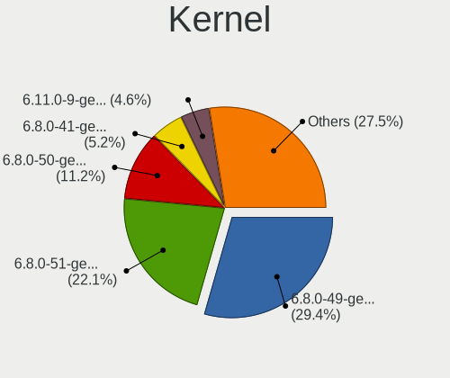
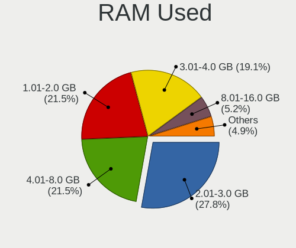
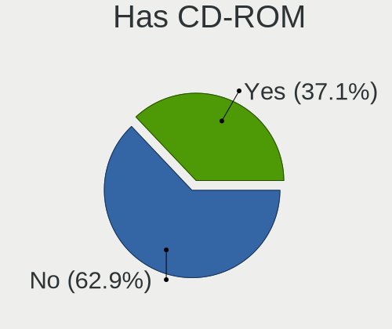
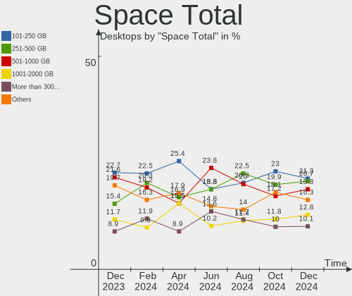
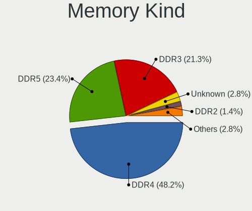

Ubuntu Hardware Trends (Desktops)
---------------------------------

A project to identify most popular hardware characteristics and track their change
over time based on data collected by Ubuntu users at https://Linux-Hardware.org.

Anyone can contribute to this report by the [hw-probe](https://github.com/linuxhw/hw-probe) tool:

    sudo -E hw-probe -all -upload

Full-feature report is available here: https://linux-hardware.org/?view=trends&formfactor=desktop

Period: Jul, 2021.

Contents
--------

* [ System ](#system)
  - [ OS                       ](#os)
  - [ OS Family                ](#os-family)
  - [ Kernel                   ](#kernel)
  - [ Kernel Family            ](#kernel-family)
  - [ Kernel Major Ver.        ](#kernel-major-ver)
  - [ Arch                     ](#arch)
  - [ DE                       ](#de)
  - [ Display Server           ](#display-server)
  - [ Display Manager          ](#display-manager)
  - [ OS Lang                  ](#os-lang)
  - [ Boot Mode                ](#boot-mode)
  - [ Filesystem               ](#filesystem)
  - [ Part. scheme             ](#part-scheme)
  - [ Dual Boot with Linux/BSD ](#dual-boot-with-linuxbsd)
  - [ Dual Boot (Win)          ](#dual-boot-win)

* [ Board ](#board)
  - [ Vendor                   ](#vendor)
  - [ Model                    ](#model)
  - [ Model Family             ](#model-family)
  - [ MFG Year                 ](#mfg-year)
  - [ Form Factor              ](#form-factor)
  - [ Secure Boot              ](#secure-boot)
  - [ Coreboot                 ](#coreboot)
  - [ RAM Size                 ](#ram-size)
  - [ RAM Used                 ](#ram-used)
  - [ Total Drives             ](#total-drives)
  - [ Has CD-ROM               ](#has-cd-rom)
  - [ Has Ethernet             ](#has-ethernet)
  - [ Has WiFi                 ](#has-wifi)
  - [ Has Bluetooth            ](#has-bluetooth)

* [ Location ](#location)
  - [ Country                  ](#country)
  - [ City                     ](#city)

* [ Drives ](#drives)
  - [ Drive Vendor             ](#drive-vendor)
  - [ Drive Model              ](#drive-model)
  - [ HDD Vendor               ](#hdd-vendor)
  - [ SSD Vendor               ](#ssd-vendor)
  - [ Drive Kind               ](#drive-kind)
  - [ Drive Connector          ](#drive-connector)
  - [ Drive Size               ](#drive-size)
  - [ Space Total              ](#space-total)
  - [ Space Used               ](#space-used)
  - [ Malfunc. Drives          ](#malfunc-drives)
  - [ Malfunc. Drive Vendor    ](#malfunc-drive-vendor)
  - [ Malfunc. HDD Vendor      ](#malfunc-hdd-vendor)
  - [ Malfunc. Drive Kind      ](#malfunc-drive-kind)
  - [ Failed Drives            ](#failed-drives)
  - [ Failed Drive Vendor      ](#failed-drive-vendor)
  - [ Drive Status             ](#drive-status)

* [ Storage controller ](#storage-controller)
  - [ Storage Vendor           ](#storage-vendor)
  - [ Storage Model            ](#storage-model)
  - [ Storage Kind             ](#storage-kind)

* [ Processor ](#processor)
  - [ CPU Vendor               ](#cpu-vendor)
  - [ CPU Model                ](#cpu-model)
  - [ CPU Model Family         ](#cpu-model-family)
  - [ CPU Cores                ](#cpu-cores)
  - [ CPU Sockets              ](#cpu-sockets)
  - [ CPU Threads              ](#cpu-threads)
  - [ CPU Op-Modes             ](#cpu-op-modes)
  - [ CPU Microcode            ](#cpu-microcode)
  - [ CPU Microarch            ](#cpu-microarch)

* [ Graphics ](#graphics)
  - [ GPU Vendor               ](#gpu-vendor)
  - [ GPU Model                ](#gpu-model)
  - [ GPU Combo                ](#gpu-combo)
  - [ GPU Driver               ](#gpu-driver)
  - [ GPU Memory               ](#gpu-memory)

* [ Monitor ](#monitor)
  - [ Monitor Vendor           ](#monitor-vendor)
  - [ Monitor Model            ](#monitor-model)
  - [ Monitor Resolution       ](#monitor-resolution)
  - [ Monitor Diagonal         ](#monitor-diagonal)
  - [ Monitor Width            ](#monitor-width)
  - [ Aspect Ratio             ](#aspect-ratio)
  - [ Monitor Area             ](#monitor-area)
  - [ Pixel Density            ](#pixel-density)
  - [ Multiple Monitors        ](#multiple-monitors)

* [ Network ](#network)
  - [ Net Controller Vendor    ](#net-controller-vendor)
  - [ Net Controller Model     ](#net-controller-model)
  - [ Wireless Vendor          ](#wireless-vendor)
  - [ Wireless Model           ](#wireless-model)
  - [ Ethernet Vendor          ](#ethernet-vendor)
  - [ Ethernet Model           ](#ethernet-model)
  - [ Net Controller Kind      ](#net-controller-kind)
  - [ Used Controller          ](#used-controller)
  - [ NICs                     ](#nics)
  - [ IPv6                     ](#ipv6)

* [ Bluetooth ](#bluetooth)
  - [ Bluetooth Vendor         ](#bluetooth-vendor)
  - [ Bluetooth Model          ](#bluetooth-model)

* [ Sound ](#sound)
  - [ Sound Vendor             ](#sound-vendor)
  - [ Sound Model              ](#sound-model)

* [ Memory ](#memory)
  - [ Memory Vendor            ](#memory-vendor)
  - [ Memory Model             ](#memory-model)
  - [ Memory Kind              ](#memory-kind)
  - [ Memory Form Factor       ](#memory-form-factor)
  - [ Memory Size              ](#memory-size)
  - [ Memory Speed             ](#memory-speed)

* [ Printers & scanners ](#printers--scanners)
  - [ Printer Vendor           ](#printer-vendor)
  - [ Printer Model            ](#printer-model)
  - [ Scanner Vendor           ](#scanner-vendor)
  - [ Scanner Model            ](#scanner-model)

* [ Camera ](#camera)
  - [ Camera Vendor            ](#camera-vendor)
  - [ Camera Model             ](#camera-model)

* [ Security ](#security)
  - [ Fingerprint Vendor       ](#fingerprint-vendor)
  - [ Fingerprint Model        ](#fingerprint-model)
  - [ Chipcard Vendor          ](#chipcard-vendor)
  - [ Chipcard Model           ](#chipcard-model)

* [ Unsupported ](#unsupported)
  - [ Unsupported Devices      ](#unsupported-devices)
  - [ Unsupported Device Types ](#unsupported-device-types)

System
------

OS
--

Installed operating systems

| Name           | Desktops | Percent |
|----------------|----------|---------|
| Ubuntu 20.04   | 333      | 65.04%  |
| Ubuntu 21.04   | 107      | 20.9%   |
| Ubuntu 18.04   | 47       | 9.18%   |
| Ubuntu 20.10   | 15       | 2.93%   |
| Ubuntu 16.04   | 5        | 0.98%   |
| Ubuntu 21.10   | 2        | 0.39%   |
| Ubuntu Core 18 | 1        | 0.2%    |
| Ubuntu 19.10   | 1        | 0.2%    |
| Ubuntu 18.10   | 1        | 0.2%    |

OS Family
---------

OS without a version

| Name   | Desktops | Percent |
|--------|----------|---------|
| Ubuntu | 513      | 100%    |

Kernel
------

Version of the Linux kernel

| Version                    | Desktops | Percent |
|----------------------------|----------|---------|
| 5.8.0-59-generic           | 152      | 29.63%  |
| 5.8.0-63-generic           | 60       | 11.7%   |
| 5.11.0-22-generic          | 57       | 11.11%  |
| 5.4.0-77-generic           | 53       | 10.33%  |
| 5.4.0-80-generic           | 29       | 5.65%   |
| 5.11.0-25-generic          | 28       | 5.46%   |
| 5.8.0-43-generic           | 14       | 2.73%   |
| 5.11.0-16-generic          | 8        | 1.56%   |
| 4.15.0-151-generic         | 8        | 1.56%   |
| 4.15.0-147-generic         | 8        | 1.56%   |
| 5.11.0-24-generic          | 7        | 1.36%   |
| 5.8.0-61-generic           | 4        | 0.78%   |
| 5.8.0-55-generic           | 4        | 0.78%   |
| 5.4.0-74-generic           | 4        | 0.78%   |
| 5.11.0-26-generic          | 4        | 0.78%   |
| 5.8.0-50-generic           | 3        | 0.58%   |
| 5.4.0-72-generic           | 3        | 0.58%   |
| 5.4.0-70-generic           | 3        | 0.58%   |
| 5.4.0-42-generic           | 3        | 0.58%   |
| 5.4.0-26-generic           | 3        | 0.58%   |
| 4.15.0-20-generic          | 3        | 0.58%   |
| 5.8.0-64-generic           | 2        | 0.39%   |
| 5.8.0-63-lowlatency        | 2        | 0.39%   |
| 5.8.0-53-generic           | 2        | 0.39%   |
| 5.8.0-38-generic           | 2        | 0.39%   |
| 5.4.0-79-generic           | 2        | 0.39%   |
| 5.4.0-58-generic           | 2        | 0.39%   |
| 5.4.0-54-generic           | 2        | 0.39%   |
| 5.13.1-051301-generic      | 2        | 0.39%   |
| 4.4.0-210-generic          | 2        | 0.39%   |
| 5.8.0-60-generic           | 1        | 0.19%   |
| 5.8.0-59-lowlatency        | 1        | 0.19%   |
| 5.8.0-492104061620-generic | 1        | 0.19%   |
| 5.8.0-44-generic           | 1        | 0.19%   |
| 5.8.0-41-generic           | 1        | 0.19%   |
| 5.8.0-36-generic           | 1        | 0.19%   |
| 5.8.0-25-generic           | 1        | 0.19%   |
| 5.7.15-050715-generic      | 1        | 0.19%   |
| 5.4.0-hiveos               | 1        | 0.19%   |
| 5.4.0-77-lowlatency        | 1        | 0.19%   |
| 5.4.0-73-generic           | 1        | 0.19%   |
| 5.4.0-65-generic           | 1        | 0.19%   |
| 5.4.0-62-generic           | 1        | 0.19%   |
| 5.4.0-56-generic           | 1        | 0.19%   |
| 5.4.0-53-generic           | 1        | 0.19%   |
| 5.4.0-48-generic           | 1        | 0.19%   |
| 5.4.0-47-generic           | 1        | 0.19%   |
| 5.3.0-64-generic           | 1        | 0.19%   |
| 5.13.6-051306-lowlatency   | 1        | 0.19%   |
| 5.13.4                     | 1        | 0.19%   |
| 5.13.0-12-generic          | 1        | 0.19%   |
| 5.13.0-051300-generic      | 1        | 0.19%   |
| 5.12.9-051209-lowlatency   | 1        | 0.19%   |
| 5.12.0-051200-generic      | 1        | 0.19%   |
| 5.11.0-22-lowlatency       | 1        | 0.19%   |
| 5.11.0-20-generic          | 1        | 0.19%   |
| 5.11.0-18-generic          | 1        | 0.19%   |
| 5.0.0-1037-oem-osp1        | 1        | 0.19%   |
| 4.4.0-159-generic          | 1        | 0.19%   |
| 4.18.0-25-generic          | 1        | 0.19%   |

Kernel Family
-------------

Linux kernel without a distro release

| Version | Desktops | Percent |
|---------|----------|---------|
| 5.8.0   | 252      | 49.12%  |
| 5.4.0   | 113      | 22.03%  |
| 5.11.0  | 107      | 20.86%  |
| 4.15.0  | 26       | 5.07%   |
| 4.4.0   | 3        | 0.58%   |
| 5.13.1  | 2        | 0.39%   |
| 5.13.0  | 2        | 0.39%   |
| 5.7.15  | 1        | 0.19%   |
| 5.3.0   | 1        | 0.19%   |
| 5.13.6  | 1        | 0.19%   |
| 5.13.4  | 1        | 0.19%   |
| 5.12.9  | 1        | 0.19%   |
| 5.12.0  | 1        | 0.19%   |
| 5.0.0   | 1        | 0.19%   |
| 4.18.0  | 1        | 0.19%   |

Kernel Major Ver.
-----------------

Linux kernel major version

| Version | Desktops | Percent |
|---------|----------|---------|
| 5.8     | 252      | 49.12%  |
| 5.4     | 113      | 22.03%  |
| 5.11    | 107      | 20.86%  |
| 4.15    | 26       | 5.07%   |
| 5.13    | 6        | 1.17%   |
| 4.4     | 3        | 0.58%   |
| 5.12    | 2        | 0.39%   |
| 5.7     | 1        | 0.19%   |
| 5.3     | 1        | 0.19%   |
| 5.0     | 1        | 0.19%   |
| 4.18    | 1        | 0.19%   |

Arch
----

OS architecture (x86_64, i586, etc.)

| Name   | Desktops | Percent |
|--------|----------|---------|
| x86_64 | 509      | 99.22%  |
| i686   | 4        | 0.78%   |

DE
--

Desktop Environment

| Name              | Desktops | Percent |
|-------------------|----------|---------|
| GNOME             | 424      | 82.65%  |
| Unknown           | 64       | 12.48%  |
| Unity             | 10       | 1.95%   |
| X-Cinnamon        | 7        | 1.36%   |
| GNOME Flashback   | 3        | 0.58%   |
| Yaru:ubuntu:GNOME | 1        | 0.19%   |
| ubuntustudio      | 1        | 0.19%   |
| Trinity           | 1        | 0.19%   |
| i3                | 1        | 0.19%   |
| Enlightenment     | 1        | 0.19%   |

Display Server
--------------

X11 or Wayland

| Name    | Desktops | Percent |
|---------|----------|---------|
| X11     | 396      | 77.19%  |
| Wayland | 76       | 14.81%  |
| Unknown | 27       | 5.26%   |
| Tty     | 14       | 2.73%   |

Display Manager
---------------

SDDM, LightDM, etc.

| Name    | Desktops | Percent |
|---------|----------|---------|
| Unknown | 430      | 83.82%  |
| GDM     | 77       | 15.01%  |
| TDM     | 4        | 0.78%   |
| GDM3    | 2        | 0.39%   |

OS Lang
-------

Language

| Lang    | Desktops | Percent |
|---------|----------|---------|
| en_US   | 205      | 39.96%  |
| de_DE   | 53       | 10.33%  |
| en_GB   | 31       | 6.04%   |
| fr_FR   | 29       | 5.65%   |
| pt_BR   | 19       | 3.7%    |
| it_IT   | 18       | 3.51%   |
| ru_RU   | 14       | 2.73%   |
| en_IN   | 14       | 2.73%   |
| en_CA   | 11       | 2.14%   |
| C       | 10       | 1.95%   |
| en_AU   | 9        | 1.75%   |
| pl_PL   | 8        | 1.56%   |
| es_ES   | 8        | 1.56%   |
| Unknown | 8        | 1.56%   |
| nl_NL   | 6        | 1.17%   |
| es_MX   | 5        | 0.97%   |
| es_AR   | 5        | 0.97%   |
| en_ZA   | 5        | 0.97%   |
| de_AT   | 5        | 0.97%   |
| pt_PT   | 4        | 0.78%   |
| ja_JP   | 4        | 0.78%   |
| en_NZ   | 4        | 0.78%   |
| ru_UA   | 3        | 0.58%   |
| ro_RO   | 3        | 0.58%   |
| hu_HU   | 3        | 0.58%   |
| zh_CN   | 2        | 0.39%   |
| sv_SE   | 2        | 0.39%   |
| sk_SK   | 2        | 0.39%   |
| ko_KR   | 2        | 0.39%   |
| id_ID   | 2        | 0.39%   |
| hr_HR   | 2        | 0.39%   |
| fi_FI   | 2        | 0.39%   |
| es_CL   | 2        | 0.39%   |
| ca_ES   | 2        | 0.39%   |
| zh_TW   | 1        | 0.19%   |
| zh_HK   | 1        | 0.19%   |
| uk_UA   | 1        | 0.19%   |
| fr_CH   | 1        | 0.19%   |
| es_VE   | 1        | 0.19%   |
| es_NI   | 1        | 0.19%   |
| es_EC   | 1        | 0.19%   |
| en_IL   | 1        | 0.19%   |
| en_IE   | 1        | 0.19%   |
| de_CH   | 1        | 0.19%   |
| de_BE   | 1        | 0.19%   |

Boot Mode
---------

EFI or BIOS

| Mode | Desktops | Percent |
|------|----------|---------|
| BIOS | 339      | 66.08%  |
| EFI  | 174      | 33.92%  |

Filesystem
----------

Type of filesystem

| Type    | Desktops | Percent |
|---------|----------|---------|
| Ext4    | 475      | 92.59%  |
| Overlay | 17       | 3.31%   |
| Zfs     | 10       | 1.95%   |
| Xfs     | 4        | 0.78%   |
| Btrfs   | 4        | 0.78%   |
| Ext2    | 2        | 0.39%   |
| Ext3    | 1        | 0.19%   |

Part. scheme
------------

Scheme of partitioning

| Type    | Desktops | Percent |
|---------|----------|---------|
| Unknown | 412      | 80.31%  |
| GPT     | 76       | 14.81%  |
| MBR     | 25       | 4.87%   |

Dual Boot with Linux/BSD
------------------------

Hosting more than one Linux/BSD

| Dual boot | Desktops | Percent |
|-----------|----------|---------|
| No        | 421      | 82.07%  |
| Yes       | 92       | 17.93%  |

Dual Boot (Win)
---------------

Hosting Linux and Windows

| Dual boot | Desktops | Percent |
|-----------|----------|---------|
| No        | 276      | 53.8%   |
| Yes       | 237      | 46.2%   |

Board
-----

Vendor
------

Motherboard manufacturer

| Name                | Desktops | Percent |
|---------------------|----------|---------|
| ASUSTek Computer    | 134      | 26.12%  |
| Gigabyte Technology | 83       | 16.18%  |
| MSI                 | 62       | 12.09%  |
| Dell                | 54       | 10.53%  |
| ASRock              | 39       | 7.6%    |
| Hewlett-Packard     | 30       | 5.85%   |
| Intel               | 25       | 4.87%   |
| Lenovo              | 12       | 2.34%   |
| Pegatron            | 10       | 1.95%   |
| Acer                | 10       | 1.95%   |
| Fujitsu             | 6        | 1.17%   |
| Unknown             | 6        | 1.17%   |
| Foxconn             | 5        | 0.97%   |
| Biostar             | 5        | 0.97%   |
| ECS                 | 4        | 0.78%   |
| Supermicro          | 3        | 0.58%   |
| Medion              | 3        | 0.58%   |
| Huanan              | 3        | 0.58%   |
| Shuttle             | 2        | 0.39%   |
| Samsung Electronics | 1        | 0.19%   |
| PCWare              | 1        | 0.19%   |
| PCChips             | 1        | 0.19%   |
| Packard Bell        | 1        | 0.19%   |
| OEM                 | 1        | 0.19%   |
| MACHINIST           | 1        | 0.19%   |
| Inventec            | 1        | 0.19%   |
| Gateway             | 1        | 0.19%   |
| Fujitsu Siemens     | 1        | 0.19%   |
| EVGA                | 1        | 0.19%   |
| Chuwi               | 1        | 0.19%   |
| AZW                 | 1        | 0.19%   |
| ASRockRack          | 1        | 0.19%   |
| Apple               | 1        | 0.19%   |
| AOpen               | 1        | 0.19%   |
| AMI                 | 1        | 0.19%   |
| Alienware           | 1        | 0.19%   |

Model
-----

Motherboard model

| Name                                 | Desktops | Percent |
|--------------------------------------|----------|---------|
| ASUS All Series                      | 19       | 3.7%    |
| Unknown                              | 6        | 1.17%   |
| Dell OptiPlex 790                    | 5        | 0.97%   |
| MSI MS-7A38                          | 4        | 0.78%   |
| MSI MS-7817                          | 4        | 0.78%   |
| Gigabyte B450M DS3H                  | 4        | 0.78%   |
| Dell OptiPlex 990                    | 4        | 0.78%   |
| MSI MS-7C37                          | 3        | 0.58%   |
| Gigabyte GA-78LMT-USB3 6.0           | 3        | 0.58%   |
| Dell OptiPlex 7010                   | 3        | 0.58%   |
| ASUS ROG STRIX X570-E GAMING         | 3        | 0.58%   |
| ASUS P6T DELUXE V2                   | 3        | 0.58%   |
| MSI Pro 3000/3080                    | 2        | 0.39%   |
| MSI MS-7C91                          | 2        | 0.39%   |
| MSI MS-7C75                          | 2        | 0.39%   |
| MSI MS-7C56                          | 2        | 0.39%   |
| MSI MS-7C02                          | 2        | 0.39%   |
| MSI MS-7A34                          | 2        | 0.39%   |
| MSI MS-7996                          | 2        | 0.39%   |
| MSI MS-7788                          | 2        | 0.39%   |
| MSI MS-7693                          | 2        | 0.39%   |
| MSI MS-7592                          | 2        | 0.39%   |
| Intel DQ57TM AAE70931-404            | 2        | 0.39%   |
| Huanan X99-F8                        | 2        | 0.39%   |
| HP Z400 Workstation                  | 2        | 0.39%   |
| HP ProLiant MicroServer Gen8         | 2        | 0.39%   |
| HP Pavilion Gaming Desktop TG01-0xxx | 2        | 0.39%   |
| HP Pavilion Desktop TP01-0xxx        | 2        | 0.39%   |
| HP Compaq 8200 Elite CMT PC          | 2        | 0.39%   |
| Gigabyte Z77-DS3H                    | 2        | 0.39%   |
| Gigabyte Z590 UD AC                  | 2        | 0.39%   |
| Gigabyte X570 AORUS ULTRA            | 2        | 0.39%   |
| Gigabyte A320M-S2H                   | 2        | 0.39%   |
| Dell XPS 630i                        | 2        | 0.39%   |
| Dell Precision Tower 7910            | 2        | 0.39%   |
| Dell OptiPlex 3020                   | 2        | 0.39%   |
| Dell Inspiron 3880                   | 2        | 0.39%   |
| ASUS TUF GAMING X570-PLUS            | 2        | 0.39%   |
| ASUS TUF B450M-PLUS GAMING           | 2        | 0.39%   |
| ASUS ROG STRIX B550-F GAMING         | 2        | 0.39%   |
| ASUS PRIME X470-PRO                  | 2        | 0.39%   |
| ASUS PRIME A320M-K                   | 2        | 0.39%   |
| ASUS P8H61-M LX3 R2.0                | 2        | 0.39%   |
| ASUS P8H61 R2.0                      | 2        | 0.39%   |
| ASUS M4A785TD-V EVO                  | 2        | 0.39%   |
| ASRock Z77 Extreme3                  | 2        | 0.39%   |
| ASRock Z370 Pro4                     | 2        | 0.39%   |
| ASRock N68C-S UCC                    | 2        | 0.39%   |
| ASRock N68-VS3 FX                    | 2        | 0.39%   |
| ASRock AB350 Pro4                    | 2        | 0.39%   |
| ASRock A320M-HDV                     | 2        | 0.39%   |
| Acer Veriton EN76G                   | 2        | 0.39%   |
| Supermicro X9DRD-iF                  | 1        | 0.19%   |
| Supermicro X8STi                     | 1        | 0.19%   |
| Supermicro SYS-5018D-FN4T            | 1        | 0.19%   |
| Shuttle XH61V                        | 1        | 0.19%   |
| Shuttle DX30D                        | 1        | 0.19%   |
| Samsung 0RCPW3 A03                   | 1        | 0.19%   |
| Pegatron VC903AA-ABF p6145fr         | 1        | 0.19%   |
| Pegatron s5-1110                     | 1        | 0.19%   |

Model Family
------------

Motherboard model prefix

| Name                   | Desktops | Percent |
|------------------------|----------|---------|
| Dell OptiPlex          | 30       | 5.85%   |
| ASUS All               | 19       | 3.7%    |
| ASUS PRIME             | 15       | 2.92%   |
| ASUS ROG               | 14       | 2.73%   |
| HP Compaq              | 10       | 1.95%   |
| Dell Inspiron          | 10       | 1.95%   |
| ASUS TUF               | 10       | 1.95%   |
| Dell Precision         | 7        | 1.36%   |
| Acer Aspire            | 6        | 1.17%   |
| Unknown                | 6        | 1.17%   |
| Lenovo ThinkCentre     | 5        | 0.97%   |
| Gigabyte B450M         | 5        | 0.97%   |
| ASUS P8H61-M           | 5        | 0.97%   |
| MSI MS-7A38            | 4        | 0.78%   |
| MSI MS-7817            | 4        | 0.78%   |
| HP Pavilion            | 4        | 0.78%   |
| Gigabyte GA-78LMT-USB3 | 4        | 0.78%   |
| Fujitsu ESPRIMO        | 4        | 0.78%   |
| Dell XPS               | 4        | 0.78%   |
| Acer Veriton           | 4        | 0.78%   |
| MSI MS-7C37            | 3        | 0.58%   |
| HP EliteDesk           | 3        | 0.58%   |
| Gigabyte Z390          | 3        | 0.58%   |
| Gigabyte X570          | 3        | 0.58%   |
| Gigabyte B450          | 3        | 0.58%   |
| Gigabyte A320M-S2H     | 3        | 0.58%   |
| ASUS SABERTOOTH        | 3        | 0.58%   |
| ASUS P6T               | 3        | 0.58%   |
| ASUS Maximus           | 3        | 0.58%   |
| ASUS M5A97             | 3        | 0.58%   |
| ASRock 970             | 3        | 0.58%   |
| MSI Pro                | 2        | 0.39%   |
| MSI MS-7C91            | 2        | 0.39%   |
| MSI MS-7C75            | 2        | 0.39%   |
| MSI MS-7C56            | 2        | 0.39%   |
| MSI MS-7C02            | 2        | 0.39%   |
| MSI MS-7A34            | 2        | 0.39%   |
| MSI MS-7996            | 2        | 0.39%   |
| MSI MS-7788            | 2        | 0.39%   |
| MSI MS-7693            | 2        | 0.39%   |
| MSI MS-7592            | 2        | 0.39%   |
| Lenovo ThinkStation    | 2        | 0.39%   |
| Lenovo IdeaCentre      | 2        | 0.39%   |
| Intel X79              | 2        | 0.39%   |
| Intel DQ57TM           | 2        | 0.39%   |
| Intel DH67BL           | 2        | 0.39%   |
| Intel DG31PR           | 2        | 0.39%   |
| Huanan X99-F8          | 2        | 0.39%   |
| HP Z400                | 2        | 0.39%   |
| HP ProLiant            | 2        | 0.39%   |
| Gigabyte Z77-DS3H      | 2        | 0.39%   |
| Gigabyte Z590          | 2        | 0.39%   |
| Gigabyte Z170X-Gaming  | 2        | 0.39%   |
| Gigabyte X299          | 2        | 0.39%   |
| Fujitsu CELSIUS        | 2        | 0.39%   |
| Dell Vostro            | 2        | 0.39%   |
| ASUS P8H61             | 2        | 0.39%   |
| ASUS P5KPL-AM          | 2        | 0.39%   |
| ASUS P5KPL             | 2        | 0.39%   |
| ASUS M5A78L-M          | 2        | 0.39%   |

MFG Year
--------

Motherboard manufacture year

| Year | Desktops | Percent |
|------|----------|---------|
| 2018 | 59       | 11.5%   |
| 2020 | 52       | 10.14%  |
| 2019 | 46       | 8.97%   |
| 2021 | 45       | 8.77%   |
| 2010 | 40       | 7.8%    |
| 2012 | 39       | 7.6%    |
| 2011 | 35       | 6.82%   |
| 2013 | 34       | 6.63%   |
| 2014 | 32       | 6.24%   |
| 2009 | 31       | 6.04%   |
| 2015 | 30       | 5.85%   |
| 2017 | 22       | 4.29%   |
| 2016 | 22       | 4.29%   |
| 2008 | 14       | 2.73%   |
| 2007 | 9        | 1.75%   |
| 2006 | 1        | 0.19%   |
| 2005 | 1        | 0.19%   |
| 2004 | 1        | 0.19%   |

Form Factor
-----------

Physical design of the computer

| Name    | Desktops | Percent |
|---------|----------|---------|
| Desktop | 513      | 100%    |

Secure Boot
-----------

Enabled or disabled

| State    | Desktops | Percent |
|----------|----------|---------|
| Disabled | 496      | 96.69%  |
| Enabled  | 17       | 3.31%   |

Coreboot
--------

Have coreboot on board

| Used | Desktops | Percent |
|------|----------|---------|
| No   | 513      | 100%    |

RAM Size
--------

Total RAM memory

| Size in GB      | Desktops | Percent |
|-----------------|----------|---------|
| 16.01-24.0      | 121      | 23.59%  |
| 8.01-16.0       | 115      | 22.42%  |
| 3.01-4.0        | 82       | 15.98%  |
| 4.01-8.0        | 75       | 14.62%  |
| 32.01-64.0      | 65       | 12.67%  |
| 64.01-256.0     | 24       | 4.68%   |
| 1.01-2.0        | 15       | 2.92%   |
| 24.01-32.0      | 8        | 1.56%   |
| More than 256.0 | 4        | 0.78%   |
| 2.01-3.0        | 4        | 0.78%   |

RAM Used
--------

Used RAM memory

| Used GB     | Desktops | Percent |
|-------------|----------|---------|
| 1.01-2.0    | 214      | 41.72%  |
| 2.01-3.0    | 134      | 26.12%  |
| 4.01-8.0    | 61       | 11.89%  |
| 3.01-4.0    | 56       | 10.92%  |
| 8.01-16.0   | 29       | 5.65%   |
| 0.51-1.0    | 11       | 2.14%   |
| 16.01-24.0  | 4        | 0.78%   |
| 0.01-0.5    | 2        | 0.39%   |
| 32.01-64.0  | 1        | 0.19%   |
| 64.01-256.0 | 1        | 0.19%   |

Total Drives
------------

Number of drives on board

| Drives | Desktops | Percent |
|--------|----------|---------|
| 1      | 202      | 39.38%  |
| 2      | 146      | 28.46%  |
| 3      | 90       | 17.54%  |
| 4      | 34       | 6.63%   |
| 5      | 18       | 3.51%   |
| 6      | 9        | 1.75%   |
| 7      | 4        | 0.78%   |
| 0      | 4        | 0.78%   |
| 9      | 2        | 0.39%   |
| 8      | 2        | 0.39%   |
| 32     | 1        | 0.19%   |
| 23     | 1        | 0.19%   |

Has CD-ROM
----------

Has CD-ROM on board

| Presented | Desktops | Percent |
|-----------|----------|---------|
| No        | 270      | 52.63%  |
| Yes       | 243      | 47.37%  |

Has Ethernet
------------

Has Ethernet on board

| Presented | Desktops | Percent |
|-----------|----------|---------|
| Yes       | 504      | 98.25%  |
| No        | 9        | 1.75%   |

Has WiFi
--------

Has WiFi module

| Presented | Desktops | Percent |
|-----------|----------|---------|
| No        | 305      | 59.45%  |
| Yes       | 208      | 40.55%  |

Has Bluetooth
-------------

Has Bluetooth module

| Presented | Desktops | Percent |
|-----------|----------|---------|
| No        | 375      | 73.1%   |
| Yes       | 138      | 26.9%   |

Location
--------

Country
-------

Geographic location (country)

| Country                | Desktops | Percent |
|------------------------|----------|---------|
| USA                    | 115      | 22.42%  |
| Germany                | 68       | 13.26%  |
| France                 | 33       | 6.43%   |
| UK                     | 30       | 5.85%   |
| Brazil                 | 30       | 5.85%   |
| Italy                  | 23       | 4.48%   |
| Russia                 | 16       | 3.12%   |
| India                  | 14       | 2.73%   |
| Canada                 | 14       | 2.73%   |
| Netherlands            | 12       | 2.34%   |
| Spain                  | 11       | 2.14%   |
| Austria                | 10       | 1.95%   |
| Australia              | 10       | 1.95%   |
| Ukraine                | 9        | 1.75%   |
| Poland                 | 9        | 1.75%   |
| Argentina              | 9        | 1.75%   |
| Mexico                 | 7        | 1.36%   |
| South Africa           | 6        | 1.17%   |
| Romania                | 5        | 0.97%   |
| Slovakia               | 4        | 0.78%   |
| Portugal               | 4        | 0.78%   |
| New Zealand            | 4        | 0.78%   |
| Japan                  | 4        | 0.78%   |
| Indonesia              | 4        | 0.78%   |
| Belgium                | 4        | 0.78%   |
| Switzerland            | 3        | 0.58%   |
| Sweden                 | 3        | 0.58%   |
| Hungary                | 3        | 0.58%   |
| Finland                | 3        | 0.58%   |
| Turkey                 | 2        | 0.39%   |
| Thailand               | 2        | 0.39%   |
| Taiwan                 | 2        | 0.39%   |
| South Korea            | 2        | 0.39%   |
| Serbia                 | 2        | 0.39%   |
| Qatar                  | 2        | 0.39%   |
| Pakistan               | 2        | 0.39%   |
| Norway                 | 2        | 0.39%   |
| Malaysia               | 2        | 0.39%   |
| Iran                   | 2        | 0.39%   |
| Hong Kong              | 2        | 0.39%   |
| Greece                 | 2        | 0.39%   |
| China                  | 2        | 0.39%   |
| Chile                  | 2        | 0.39%   |
| Venezuela              | 1        | 0.19%   |
| Trinidad and Tobago    | 1        | 0.19%   |
| Singapore              | 1        | 0.19%   |
| Nicaragua              | 1        | 0.19%   |
| Israel                 | 1        | 0.19%   |
| Ireland                | 1        | 0.19%   |
| Estonia                | 1        | 0.19%   |
| Ecuador                | 1        | 0.19%   |
| Denmark                | 1        | 0.19%   |
| Cyprus                 | 1        | 0.19%   |
| Croatia                | 1        | 0.19%   |
| Costa Rica             | 1        | 0.19%   |
| Bulgaria               | 1        | 0.19%   |
| Bosnia and Herzegovina | 1        | 0.19%   |
| Belarus                | 1        | 0.19%   |
| Bangladesh             | 1        | 0.19%   |
| Bahrain                | 1        | 0.19%   |

City
----

Geographic location (city)

| City              | Desktops | Percent |
|-------------------|----------|---------|
| Berlin            | 13       | 2.53%   |
| Paris             | 7        | 1.36%   |
| Vienna            | 6        | 1.17%   |
| S??o Paulo        | 5        | 0.97%   |
| Portland          | 5        | 0.97%   |
| Moscow            | 5        | 0.97%   |
| London            | 5        | 0.97%   |
| Milan             | 4        | 0.78%   |
| Wroclaw           | 3        | 0.58%   |
| St Petersburg     | 3        | 0.58%   |
| Munich            | 3        | 0.58%   |
| Hyderabad         | 3        | 0.58%   |
| Hamilton          | 3        | 0.58%   |
| Greenwood         | 3        | 0.58%   |
| Cape Town         | 3        | 0.58%   |
| Bengaluru         | 3        | 0.58%   |
| Amsterdam         | 3        | 0.58%   |
| 's-Hertogenbosch  | 3        | 0.58%   |
| Wylie             | 2        | 0.39%   |
| Warsaw            | 2        | 0.39%   |
| Tehran            | 2        | 0.39%   |
| Rosario           | 2        | 0.39%   |
| Rome              | 2        | 0.39%   |
| Rio de Janeiro    | 2        | 0.39%   |
| Ranchi            | 2        | 0.39%   |
| Ramsgate          | 2        | 0.39%   |
| Pretoria          | 2        | 0.39%   |
| Ottawa            | 2        | 0.39%   |
| Novi Sad          | 2        | 0.39%   |
| New York          | 2        | 0.39%   |
| New Taipei        | 2        | 0.39%   |
| Minneapolis       | 2        | 0.39%   |
| Mexico City       | 2        | 0.39%   |
| Los Angeles       | 2        | 0.39%   |
| Leipzig           | 2        | 0.39%   |
| Lahore            | 2        | 0.39%   |
| Kyiv              | 2        | 0.39%   |
| Helsinki          | 2        | 0.39%   |
| Hamburg           | 2        | 0.39%   |
| Hackney           | 2        | 0.39%   |
| Frankfurt am Main | 2        | 0.39%   |
| Chennai           | 2        | 0.39%   |
| Campo Grande      | 2        | 0.39%   |
| Buenos Aires      | 2        | 0.39%   |
| Bucharest         | 2        | 0.39%   |
| Bratislava        | 2        | 0.39%   |
| Belton            | 2        | 0.39%   |
| Beijing           | 2        | 0.39%   |
| Barcelona         | 2        | 0.39%   |
| Austin            | 2        | 0.39%   |
| Zurich            | 1        | 0.19%   |
| Zelenogorsk       | 1        | 0.19%   |
| Zeist             | 1        | 0.19%   |
| Zaventem          | 1        | 0.19%   |
| Zagreb            | 1        | 0.19%   |
| Yuzhno-Sakhalinsk | 1        | 0.19%   |
| Yutz              | 1        | 0.19%   |
| Yoshkar-Ola       | 1        | 0.19%   |
| Yangju            | 1        | 0.19%   |
| Winnipeg          | 1        | 0.19%   |

Drives
------

Drive Vendor
------------

Hard drive vendors

| Vendor                    | Desktops | Drives | Percent |
|---------------------------|----------|--------|---------|
| WDC                       | 184      | 267    | 21.17%  |
| Seagate                   | 178      | 252    | 20.48%  |
| Samsung Electronics       | 120      | 176    | 13.81%  |
| Kingston                  | 49       | 55     | 5.64%   |
| Toshiba                   | 47       | 47     | 5.41%   |
| SanDisk                   | 35       | 38     | 4.03%   |
| Hitachi                   | 33       | 33     | 3.8%    |
| Crucial                   | 30       | 34     | 3.45%   |
| Phison                    | 14       | 16     | 1.61%   |
| Intel                     | 11       | 12     | 1.27%   |
| HGST                      | 11       | 21     | 1.27%   |
| A-DATA Technology         | 11       | 12     | 1.27%   |
| Silicon Motion            | 10       | 10     | 1.15%   |
| China                     | 9        | 9      | 1.04%   |
| Unknown                   | 8        | 17     | 0.92%   |
| SK Hynix                  | 7        | 7      | 0.81%   |
| OCZ                       | 7        | 7      | 0.81%   |
| XPG                       | 6        | 6      | 0.69%   |
| JMicron                   | 6        | 6      | 0.69%   |
| Transcend                 | 5        | 5      | 0.58%   |
| SPCC                      | 5        | 5      | 0.58%   |
| MAXTOR                    | 5        | 5      | 0.58%   |
| Corsair                   | 5        | 5      | 0.58%   |
| PNY                       | 4        | 4      | 0.46%   |
| Mushkin                   | 4        | 4      | 0.46%   |
| Intenso                   | 4        | 4      | 0.46%   |
| Hewlett-Packard           | 4        | 6      | 0.46%   |
| Realtek Semiconductor     | 3        | 3      | 0.35%   |
| LITEONIT                  | 3        | 3      | 0.35%   |
| GOODRAM                   | 3        | 3      | 0.35%   |
| Emtec                     | 3        | 3      | 0.35%   |
| Netac                     | 2        | 2      | 0.23%   |
| Micron/Crucial Technology | 2        | 2      | 0.23%   |
| Micron Technology         | 2        | 3      | 0.23%   |
| LITEON                    | 2        | 2      | 0.23%   |
| Lexar                     | 2        | 2      | 0.23%   |
| LaCie                     | 2        | 3      | 0.23%   |
| KingFast                  | 2        | 2      | 0.23%   |
| Gigabyte Technology       | 2        | 2      | 0.23%   |
| WD MediaMax               | 1        | 1      | 0.12%   |
| Verbatim                  | 1        | 1      | 0.12%   |
| Vaseky                    | 1        | 1      | 0.12%   |
| USB                       | 1        | 1      | 0.12%   |
| TO Exter                  | 1        | 1      | 0.12%   |
| Team                      | 1        | 1      | 0.12%   |
| TCSUNBOW                  | 1        | 1      | 0.12%   |
| SR2611-2S-S2R             | 1        | 1      | 0.12%   |
| Sabrent                   | 1        | 1      | 0.12%   |
| RX7                       | 1        | 1      | 0.12%   |
| PLEXTOR                   | 1        | 1      | 0.12%   |
| Pioneer                   | 1        | 2      | 0.12%   |
| PHD 3.0                   | 1        | 1      | 0.12%   |
| Patriot                   | 1        | 1      | 0.12%   |
| OCZ-VERTEX3               | 1        | 1      | 0.12%   |
| Lite-On                   | 1        | 2      | 0.12%   |
| KLEVV                     | 1        | 1      | 0.12%   |
| KIOXIA-EXCERIA            | 1        | 1      | 0.12%   |
| KIOXIA                    | 1        | 1      | 0.12%   |
| KingDian                  | 1        | 1      | 0.12%   |
| HUAWEI                    | 1        | 1      | 0.12%   |

Drive Model
-----------

Hard drive models

| Model                               | Desktops | Percent |
|-------------------------------------|----------|---------|
| Seagate ST500DM002-1BD142 500GB     | 18       | 1.8%    |
| Seagate ST1000DM010-2EP102 1TB      | 16       | 1.6%    |
| Samsung NVMe SSD Drive 500GB        | 15       | 1.5%    |
| Seagate ST2000DM008-2FR102 2TB      | 11       | 1.1%    |
| Samsung SSD 860 EVO 500GB           | 11       | 1.1%    |
| Kingston SA400S37240G 240GB SSD     | 11       | 1.1%    |
| WDC WD10EZEX-08WN4A0 1TB            | 10       | 1%      |
| Kingston SA400S37480G 480GB SSD     | 9        | 0.9%    |
| Toshiba DT01ACA050 500GB            | 8        | 0.8%    |
| Samsung SSD 850 EVO 500GB           | 8        | 0.8%    |
| WDC WD20EZRZ-00Z5HB0 2TB            | 7        | 0.7%    |
| Toshiba DT01ACA100 1TB              | 7        | 0.7%    |
| Seagate ST1000DM003-1SB102 1TB      | 7        | 0.7%    |
| Seagate ST3250318AS 250GB           | 6        | 0.6%    |
| Seagate ST3160318AS 160GB           | 6        | 0.6%    |
| Seagate ST2000DM001-1ER164 2TB      | 6        | 0.6%    |
| Seagate ST1000DM003-1ER162 1TB      | 6        | 0.6%    |
| Samsung SSD 860 EVO 250GB           | 6        | 0.6%    |
| Samsung SSD 850 EVO 250GB           | 6        | 0.6%    |
| Crucial CT240BX500SSD1 240GB        | 6        | 0.6%    |
| Crucial CT1000MX500SSD1 1TB         | 6        | 0.6%    |
| WDC WDS120G2G0A-00JH30 120GB SSD    | 5        | 0.5%    |
| Toshiba HDWD110 1TB                 | 5        | 0.5%    |
| Seagate ST2000DM006-2DM164 2TB      | 5        | 0.5%    |
| Samsung SSD 860 EVO 1TB             | 5        | 0.5%    |
| Kingston SA400S37120G 120GB SSD     | 5        | 0.5%    |
| WDC WDS240G2G0A-00JH30 240GB SSD    | 4        | 0.4%    |
| WDC WD20EZRX-00D8PB0 2TB            | 4        | 0.4%    |
| WDC WD10EZEX-21WN4A0 1TB            | 4        | 0.4%    |
| WDC WD10EZEX-00BN5A0 1TB            | 4        | 0.4%    |
| WDC WD1002FAEX-00Y9A0 1TB           | 4        | 0.4%    |
| Toshiba DT01ACA200 2TB              | 4        | 0.4%    |
| Silicon Motion NVMe SSD Drive 256GB | 4        | 0.4%    |
| Seagate ST4000DM004-2CV104 4TB      | 4        | 0.4%    |
| Seagate ST1000DM003-1CH162 1TB      | 4        | 0.4%    |
| Sandisk NVMe SSD Drive 500GB        | 4        | 0.4%    |
| Samsung SSD 850 PRO 256GB           | 4        | 0.4%    |
| Samsung NVMe SSD Drive 512GB        | 4        | 0.4%    |
| Samsung NVMe SSD Drive 250GB        | 4        | 0.4%    |
| Samsung NVMe SSD Drive 1TB          | 4        | 0.4%    |
| Samsung HD502HI 500GB               | 4        | 0.4%    |
| Samsung HD103SJ 1TB                 | 4        | 0.4%    |
| Kingston SV300S37A120G 120GB SSD    | 4        | 0.4%    |
| Kingston NVMe SSD Drive 500GB       | 4        | 0.4%    |
| JMicron Generic 1TB                 | 4        | 0.4%    |
| XPG NVMe SSD Drive 256GB            | 3        | 0.3%    |
| WDC WDS250G2B0A-00SM50 250GB SSD    | 3        | 0.3%    |
| WDC WD5000AAKX-001CA0 500GB         | 3        | 0.3%    |
| WDC WD20EARS-00MVWB0 2TB            | 3        | 0.3%    |
| WDC WD10EZEX-60WN4A0 1TB            | 3        | 0.3%    |
| Unknown SD/MMC/MS PRO 128GB         | 3        | 0.3%    |
| Seagate ST4000VN008-2DR166 4TB      | 3        | 0.3%    |
| Seagate ST3500418AS 500GB           | 3        | 0.3%    |
| Seagate ST3320418AS 320GB           | 3        | 0.3%    |
| Seagate ST31500341AS 1TB            | 3        | 0.3%    |
| Seagate ST31000524AS 1TB            | 3        | 0.3%    |
| Seagate ST2000DM001-1CH164 2TB      | 3        | 0.3%    |
| Seagate ST1000DM003-9YN162 1TB      | 3        | 0.3%    |
| Seagate Expansion Desk 3TB          | 3        | 0.3%    |
| SanDisk SDSSDA240G 240GB            | 3        | 0.3%    |

HDD Vendor
----------

Hard disk drive vendors

| Vendor              | Desktops | Drives | Percent |
|---------------------|----------|--------|---------|
| Seagate             | 174      | 246    | 37.58%  |
| WDC                 | 163      | 240    | 35.21%  |
| Toshiba             | 44       | 44     | 9.5%    |
| Hitachi             | 33       | 33     | 7.13%   |
| Samsung Electronics | 27       | 31     | 5.83%   |
| HGST                | 11       | 21     | 2.38%   |
| Maxtor              | 5        | 5      | 1.08%   |
| Hewlett-Packard     | 3        | 5      | 0.65%   |
| Unknown             | 1        | 4      | 0.22%   |
| PHD 3.0             | 1        | 1      | 0.22%   |
| LaCie               | 1        | 1      | 0.22%   |

SSD Vendor
----------

Solid state drive vendors

| Vendor              | Desktops | Drives | Percent |
|---------------------|----------|--------|---------|
| Samsung Electronics | 62       | 79     | 21.68%  |
| Kingston            | 44       | 48     | 15.38%  |
| Crucial             | 29       | 33     | 10.14%  |
| SanDisk             | 27       | 30     | 9.44%   |
| WDC                 | 22       | 22     | 7.69%   |
| China               | 9        | 9      | 3.15%   |
| A-DATA Technology   | 9        | 10     | 3.15%   |
| OCZ                 | 7        | 7      | 2.45%   |
| Intel               | 7        | 8      | 2.45%   |
| JMicron             | 6        | 6      | 2.1%    |
| Transcend           | 5        | 5      | 1.75%   |
| SPCC                | 5        | 5      | 1.75%   |
| PNY                 | 4        | 4      | 1.4%    |
| Mushkin             | 3        | 3      | 1.05%   |
| LITEONIT            | 3        | 3      | 1.05%   |
| Intenso             | 3        | 3      | 1.05%   |
| GOODRAM             | 3        | 3      | 1.05%   |
| Corsair             | 3        | 3      | 1.05%   |
| Toshiba             | 2        | 2      | 0.7%    |
| Micron Technology   | 2        | 3      | 0.7%    |
| LITEON              | 2        | 2      | 0.7%    |
| Lexar               | 2        | 2      | 0.7%    |
| Gigabyte Technology | 2        | 2      | 0.7%    |
| Emtec               | 2        | 2      | 0.7%    |
| Verbatim            | 1        | 1      | 0.35%   |
| Vaseky              | 1        | 1      | 0.35%   |
| TO Exter            | 1        | 1      | 0.35%   |
| Team                | 1        | 1      | 0.35%   |
| TCSUNBOW            | 1        | 1      | 0.35%   |
| SK Hynix            | 1        | 1      | 0.35%   |
| Seagate             | 1        | 1      | 0.35%   |
| PLEXTOR             | 1        | 1      | 0.35%   |
| Pioneer             | 1        | 2      | 0.35%   |
| Patriot             | 1        | 1      | 0.35%   |
| OCZ-VERTEX3         | 1        | 1      | 0.35%   |
| Netac               | 1        | 1      | 0.35%   |
| Lite-On             | 1        | 2      | 0.35%   |
| KLEVV               | 1        | 1      | 0.35%   |
| KIOXIA-EXCERIA      | 1        | 1      | 0.35%   |
| KingDian            | 1        | 1      | 0.35%   |
| Hewlett-Packard     | 1        | 1      | 0.35%   |
| DREVO               | 1        | 1      | 0.35%   |
| DeTech              | 1        | 1      | 0.35%   |
| BIWIN               | 1        | 1      | 0.35%   |
| ASMedia             | 1        | 1      | 0.35%   |
| Apacer              | 1        | 1      | 0.35%   |
| AMD-RAID            | 1        | 1      | 0.35%   |

Drive Kind
----------

HDD or SSD

| Kind    | Desktops | Drives | Percent |
|---------|----------|--------|---------|
| HDD     | 367      | 631    | 49.06%  |
| SSD     | 250      | 319    | 33.42%  |
| NVMe    | 104      | 139    | 13.9%   |
| Unknown | 25       | 32     | 3.34%   |
| MMC     | 2        | 3      | 0.27%   |

Drive Connector
---------------

SATA, SAS, NVMe, etc.

| Type | Desktops | Drives | Percent |
|------|----------|--------|---------|
| SATA | 474      | 924    | 76.21%  |
| NVMe | 104      | 139    | 16.72%  |
| SAS  | 42       | 58     | 6.75%   |
| MMC  | 2        | 3      | 0.32%   |

Drive Size
----------

Size of hard drive

| Size in TB | Desktops | Drives | Percent |
|------------|----------|--------|---------|
| 0.01-0.5   | 340      | 471    | 50%     |
| 0.51-1.0   | 201      | 257    | 29.56%  |
| 1.01-2.0   | 78       | 102    | 11.47%  |
| 3.01-4.0   | 29       | 62     | 4.26%   |
| 2.01-3.0   | 19       | 26     | 2.79%   |
| 4.01-10.0  | 10       | 22     | 1.47%   |
| 10.01-20.0 | 3        | 10     | 0.44%   |

Space Total
-----------

Amount of disk space available on the file system

| Size in GB     | Desktops | Percent |
|----------------|----------|---------|
| 101-250        | 123      | 23.98%  |
| 251-500        | 110      | 21.44%  |
| 501-1000       | 79       | 15.4%   |
| 1001-2000      | 60       | 11.7%   |
| More than 3000 | 37       | 7.21%   |
| 51-100         | 29       | 5.65%   |
| 2001-3000      | 25       | 4.87%   |
| 21-50          | 21       | 4.09%   |
| 1-20           | 19       | 3.7%    |
| Unknown        | 10       | 1.95%   |

Space Used
----------

Amount of used disk space

| Used GB        | Desktops | Percent |
|----------------|----------|---------|
| 1-20           | 185      | 36.06%  |
| 21-50          | 78       | 15.2%   |
| 101-250        | 72       | 14.04%  |
| 51-100         | 59       | 11.5%   |
| 251-500        | 38       | 7.41%   |
| 501-1000       | 29       | 5.65%   |
| 1001-2000      | 22       | 4.29%   |
| More than 3000 | 13       | 2.53%   |
| Unknown        | 10       | 1.95%   |
| 2001-3000      | 7        | 1.36%   |

Malfunc. Drives
---------------

Drive models with a malfunction

| Model                                        | Desktops | Drives | Percent |
|----------------------------------------------|----------|--------|---------|
| Seagate ST500DM002-1BD142 500GB              | 3        | 3      | 8.11%   |
| Seagate ST3250318AS 250GB                    | 3        | 3      | 8.11%   |
| Samsung Electronics HD502HI 500GB            | 2        | 2      | 5.41%   |
| WDC WD5002AALX-00J37A0 500GB                 | 1        | 1      | 2.7%    |
| WDC WD5000AAKX-001CA0 500GB                  | 1        | 1      | 2.7%    |
| WDC WD5000AAKS-22V1A0 500GB                  | 1        | 1      | 2.7%    |
| WDC WD5000AAKS-00UU3A0 500GB                 | 1        | 1      | 2.7%    |
| WDC WD3200JS-63PDB1 320GB                    | 1        | 1      | 2.7%    |
| WDC WD3200AAKS-00L9A0 320GB                  | 1        | 1      | 2.7%    |
| WDC WD20PURZ-85AKKY0 2TB                     | 1        | 1      | 2.7%    |
| WDC WD20EZRZ-00Z5HB0 2TB                     | 1        | 1      | 2.7%    |
| WDC WD20EARS-00MVWB0 2TB                     | 1        | 1      | 2.7%    |
| WDC WD2002FYPS-02W3B0 2TB                    | 1        | 1      | 2.7%    |
| WDC WD10EZEX-08WN4A0 1TB                     | 1        | 1      | 2.7%    |
| Transcend TS240GSSD220S 240GB                | 1        | 1      | 2.7%    |
| Toshiba DT01ACA050 500GB                     | 1        | 1      | 2.7%    |
| Seagate ST750LM022 HN-M750MBB 752GB          | 1        | 1      | 2.7%    |
| Seagate ST500NM0011 39M4517 42C0468IBM 500GB | 1        | 1      | 2.7%    |
| Seagate ST3750330NS 752GB                    | 1        | 1      | 2.7%    |
| Seagate ST3500418AS 500GB                    | 1        | 2      | 2.7%    |
| Seagate ST3500413AS 500GB                    | 1        | 1      | 2.7%    |
| Seagate ST3160215ACE 160GB                   | 1        | 1      | 2.7%    |
| Seagate ST2000DL003-9VT166 2TB               | 1        | 1      | 2.7%    |
| Samsung Electronics SSD 970 EVO 1TB          | 1        | 1      | 2.7%    |
| Samsung Electronics SSD 870 EVO 4TB          | 1        | 1      | 2.7%    |
| Samsung Electronics HD103SJ 1TB              | 1        | 1      | 2.7%    |
| PLEXTOR PX-128M5S 128GB SSD                  | 1        | 1      | 2.7%    |
| LITEONIT LMT-32L3M mSATA 32GB SSD            | 1        | 1      | 2.7%    |
| Kingston SA400S37120G 120GB SSD              | 1        | 1      | 2.7%    |
| Intel SSDSC2BW240A4 240GB                    | 1        | 1      | 2.7%    |
| Intel SSDSA2M080G2GC 80GB                    | 1        | 1      | 2.7%    |
| Crucial CT275MX300SSD1 275GB                 | 1        | 1      | 2.7%    |

Malfunc. Drive Vendor
---------------------

Vendors of faulty drives

| Vendor              | Desktops | Drives | Percent |
|---------------------|----------|--------|---------|
| WDC                 | 11       | 11     | 31.43%  |
| Seagate             | 11       | 14     | 31.43%  |
| Samsung Electronics | 5        | 5      | 14.29%  |
| Intel               | 2        | 2      | 5.71%   |
| Transcend           | 1        | 1      | 2.86%   |
| Toshiba             | 1        | 1      | 2.86%   |
| PLEXTOR             | 1        | 1      | 2.86%   |
| LITEONIT            | 1        | 1      | 2.86%   |
| Kingston            | 1        | 1      | 2.86%   |
| Crucial             | 1        | 1      | 2.86%   |

Malfunc. HDD Vendor
-------------------

Vendors of faulty HDD drives

| Vendor              | Desktops | Drives | Percent |
|---------------------|----------|--------|---------|
| WDC                 | 11       | 11     | 42.31%  |
| Seagate             | 11       | 14     | 42.31%  |
| Samsung Electronics | 3        | 3      | 11.54%  |
| Toshiba             | 1        | 1      | 3.85%   |

Malfunc. Drive Kind
-------------------

Kinds of faulty drives

| Kind | Desktops | Drives | Percent |
|------|----------|--------|---------|
| HDD  | 24       | 29     | 75%     |
| SSD  | 7        | 8      | 21.88%  |
| NVMe | 1        | 1      | 3.13%   |

Failed Drives
-------------

Failed drive models

Zero info for selected period =(

Failed Drive Vendor
-------------------

Failed drive vendors

Zero info for selected period =(

Drive Status
------------

Number of failed and malfunc. drives

| Status   | Desktops | Drives | Percent |
|----------|----------|--------|---------|
| Detected | 400      | 829    | 74.21%  |
| Works    | 108      | 257    | 20.04%  |
| Malfunc  | 31       | 38     | 5.75%   |

Storage controller
------------------

Storage Vendor
--------------

Storage controller vendors

| Vendor                       | Desktops | Percent |
|------------------------------|----------|---------|
| Intel                        | 352      | 50.43%  |
| AMD                          | 140      | 20.06%  |
| Samsung Electronics          | 46       | 6.59%   |
| ASMedia Technology           | 23       | 3.3%    |
| Marvell Technology Group     | 22       | 3.15%   |
| Nvidia                       | 19       | 2.72%   |
| JMicron Technology           | 17       | 2.44%   |
| Phison Electronics           | 16       | 2.29%   |
| Silicon Motion               | 11       | 1.58%   |
| Sandisk                      | 11       | 1.58%   |
| Kingston Technology Company  | 9        | 1.29%   |
| ADATA Technology             | 7        | 1%      |
| VIA Technologies             | 4        | 0.57%   |
| SK Hynix                     | 4        | 0.57%   |
| Realtek Semiconductor        | 4        | 0.57%   |
| Broadcom / LSI               | 4        | 0.57%   |
| Micron/Crucial Technology    | 3        | 0.43%   |
| LSI Logic / Symbios Logic    | 2        | 0.29%   |
| Unknown                      | 1        | 0.14%   |
| Toshiba America Info Systems | 1        | 0.14%   |
| Silicon Image                | 1        | 0.14%   |
| KIOXIA                       | 1        | 0.14%   |

Storage Model
-------------

Storage controller models

| Model                                                                                   | Desktops | Percent |
|-----------------------------------------------------------------------------------------|----------|---------|
| AMD FCH SATA Controller [AHCI mode]                                                     | 81       | 9.05%   |
| Intel 8 Series/C220 Series Chipset Family 6-port SATA Controller 1 [AHCI mode]          | 43       | 4.8%    |
| Intel 6 Series/C200 Series Chipset Family 6 port Desktop SATA AHCI Controller           | 39       | 4.36%   |
| AMD 400 Series Chipset SATA Controller                                                  | 31       | 3.46%   |
| Intel NM10/ICH7 Family SATA Controller [IDE mode]                                       | 30       | 3.35%   |
| Samsung NVMe SSD Controller SM981/PM981/PM983                                           | 29       | 3.24%   |
| Intel Q170/Q150/B150/H170/H110/Z170/CM236 Chipset SATA Controller [AHCI Mode]           | 29       | 3.24%   |
| Intel SATA Controller [RAID mode]                                                       | 27       | 3.02%   |
| AMD SB7x0/SB8x0/SB9x0 IDE Controller                                                    | 27       | 3.02%   |
| Intel 200 Series PCH SATA controller [AHCI mode]                                        | 24       | 2.68%   |
| Intel 82801G (ICH7 Family) IDE Controller                                               | 22       | 2.46%   |
| AMD SB7x0/SB8x0/SB9x0 SATA Controller [IDE mode]                                        | 22       | 2.46%   |
| AMD SB7x0/SB8x0/SB9x0 SATA Controller [AHCI mode]                                       | 21       | 2.35%   |
| ASMedia ASM1062 Serial ATA Controller                                                   | 20       | 2.23%   |
| Intel 7 Series/C210 Series Chipset Family 6-port SATA Controller [AHCI mode]            | 17       | 1.9%    |
| Intel Cannon Lake PCH SATA AHCI Controller                                              | 14       | 1.56%   |
| Intel 6 Series/C200 Series Chipset Family Desktop SATA Controller (IDE mode, ports 4-5) | 14       | 1.56%   |
| Intel 6 Series/C200 Series Chipset Family Desktop SATA Controller (IDE mode, ports 0-3) | 14       | 1.56%   |
| AMD Starship/Matisse Chipset SATA Controller [AHCI mode]                                | 12       | 1.34%   |
| AMD FCH SATA Controller D                                                               | 11       | 1.23%   |
| Intel C610/X99 series chipset 6-Port SATA Controller [AHCI mode]                        | 10       | 1.12%   |
| Intel 82801JI (ICH10 Family) 4 port SATA IDE Controller #1                              | 10       | 1.12%   |
| Intel 400 Series Chipset Family SATA AHCI Controller                                    | 10       | 1.12%   |
| Samsung NVMe SSD Controller SM961/PM961/SM963                                           | 9        | 1.01%   |
| Nvidia MCP61 SATA Controller                                                            | 9        | 1.01%   |
| Nvidia MCP61 IDE                                                                        | 9        | 1.01%   |
| Intel C600/X79 series chipset 6-Port SATA AHCI Controller                               | 8        | 0.89%   |
| Intel 82801JI (ICH10 Family) SATA AHCI Controller                                       | 8        | 0.89%   |
| Intel 82801JI (ICH10 Family) 2 port SATA IDE Controller #2                              | 8        | 0.89%   |
| Intel 500 Series Chipset Family SATA AHCI Controller                                    | 8        | 0.89%   |
| AMD 300 Series Chipset SATA Controller                                                  | 8        | 0.89%   |
| Silicon Motion SM2263EN/SM2263XT SSD Controller                                         | 7        | 0.78%   |
| Phison E12 NVMe Controller                                                              | 7        | 0.78%   |
| JMicron JMB363 SATA/IDE Controller                                                      | 7        | 0.78%   |
| ADATA XPG SX8200 Pro PCIe Gen3x4 M.2 2280 Solid State Drive                             | 7        | 0.78%   |
| Sandisk WD Black SN750 / PC SN730 NVMe SSD                                              | 6        | 0.67%   |
| Intel Comet Lake SATA AHCI Controller                                                   | 6        | 0.67%   |
| Intel 7 Series/C210 Series Chipset Family 4-port SATA Controller [IDE mode]             | 6        | 0.67%   |
| Intel 7 Series/C210 Series Chipset Family 2-port SATA Controller [IDE mode]             | 6        | 0.67%   |
| Intel 5 Series/3400 Series Chipset PT IDER Controller                                   | 6        | 0.67%   |
| Intel 5 Series/3400 Series Chipset 4 port SATA IDE Controller                           | 6        | 0.67%   |
| Intel 5 Series/3400 Series Chipset 2 port SATA IDE Controller                           | 6        | 0.67%   |
| Intel 4 Series Chipset PT IDER Controller                                               | 6        | 0.67%   |
| Samsung NVMe SSD Controller PM9A1/PM9A3/980PRO                                          | 5        | 0.56%   |
| Samsung NVMe Controller                                                                 | 5        | 0.56%   |
| Kingston Company A2000 NVMe SSD                                                         | 5        | 0.56%   |
| JMicron JMB368 IDE controller                                                           | 5        | 0.56%   |
| Intel 5 Series/3400 Series Chipset 6 port SATA AHCI Controller                          | 5        | 0.56%   |
| Phison E16 PCIe4 NVMe Controller                                                        | 4        | 0.45%   |
| Nvidia MCP51 Serial ATA Controller                                                      | 4        | 0.45%   |
| Nvidia MCP51 IDE                                                                        | 4        | 0.45%   |
| Marvell Group 88SE6111/6121 SATA II / PATA Controller                                   | 4        | 0.45%   |
| JMicron JMB361 AHCI/IDE                                                                 | 4        | 0.45%   |
| Intel Celeron N3350/Pentium N4200/Atom E3900 Series SATA AHCI Controller                | 4        | 0.45%   |
| Intel C610/X99 series chipset sSATA Controller [AHCI mode]                              | 4        | 0.45%   |
| Intel C602 chipset 4-Port SATA Storage Control Unit                                     | 4        | 0.45%   |
| Intel 9 Series Chipset Family SATA Controller [AHCI Mode]                               | 4        | 0.45%   |
| Intel 82801JD/DO (ICH10 Family) SATA AHCI Controller                                    | 4        | 0.45%   |
| Silicon Motion SM2262/SM2262EN SSD Controller                                           | 3        | 0.34%   |
| Samsung NVMe SSD Controller SM951/PM951                                                 | 3        | 0.34%   |

Storage Kind
------------

Kind of storage controller (IDE, SATA, NVMe, SAS, ...)

| Kind | Desktops | Percent |
|------|----------|---------|
| SATA | 394      | 57.18%  |
| IDE  | 141      | 20.46%  |
| NVMe | 105      | 15.24%  |
| RAID | 41       | 5.95%   |
| SAS  | 7        | 1.02%   |
| SCSI | 1        | 0.15%   |

Processor
---------

CPU Vendor
----------

Processor vendors

| Vendor | Desktops | Percent |
|--------|----------|---------|
| Intel  | 357      | 69.59%  |
| AMD    | 156      | 30.41%  |

CPU Model
---------

Processor models

| Model                                       | Desktops | Percent |
|---------------------------------------------|----------|---------|
| Intel Core i5-3470 CPU @ 3.20GHz            | 10       | 1.95%   |
| Intel Core i5-2400 CPU @ 3.10GHz            | 9        | 1.75%   |
| AMD FX-6300 Six-Core Processor              | 9        | 1.75%   |
| Intel Core i5-7400 CPU @ 3.00GHz            | 8        | 1.56%   |
| AMD Ryzen 5 3600 6-Core Processor           | 8        | 1.56%   |
| AMD Ryzen 7 3700X 8-Core Processor          | 7        | 1.36%   |
| AMD Ryzen 5 2600 Six-Core Processor         | 7        | 1.36%   |
| Intel Core i7-6700K CPU @ 4.00GHz           | 6        | 1.17%   |
| Intel Core i3-2100 CPU @ 3.10GHz            | 6        | 1.17%   |
| Intel Core 2 Duo CPU E8400 @ 3.00GHz        | 6        | 1.17%   |
| AMD Ryzen 5 1600 Six-Core Processor         | 6        | 1.17%   |
| Intel Core i7-4790 CPU @ 3.60GHz            | 5        | 0.97%   |
| Intel Core i7-2600 CPU @ 3.40GHz            | 5        | 0.97%   |
| Intel Core i5-4460 CPU @ 3.20GHz            | 5        | 0.97%   |
| Intel Core 2 Quad CPU Q6600 @ 2.40GHz       | 5        | 0.97%   |
| AMD Ryzen 5 5600X 6-Core Processor          | 5        | 0.97%   |
| Intel Pentium Dual-Core CPU E5400 @ 2.70GHz | 4        | 0.78%   |
| Intel Core i7-7700 CPU @ 3.60GHz            | 4        | 0.78%   |
| Intel Core i7-6700 CPU @ 3.40GHz            | 4        | 0.78%   |
| Intel Core i7-2600K CPU @ 3.40GHz           | 4        | 0.78%   |
| Intel Core i7-10700K CPU @ 3.80GHz          | 4        | 0.78%   |
| Intel Core i7-10700 CPU @ 2.90GHz           | 4        | 0.78%   |
| Intel Core i3-2120 CPU @ 3.30GHz            | 4        | 0.78%   |
| Intel Core 2 Quad CPU Q8200 @ 2.33GHz       | 4        | 0.78%   |
| AMD Ryzen 9 5950X 16-Core Processor         | 4        | 0.78%   |
| AMD Ryzen 7 2700X Eight-Core Processor      | 4        | 0.78%   |
| AMD Ryzen 5 2400G with Radeon Vega Graphics | 4        | 0.78%   |
| AMD Phenom II X4 965 Processor              | 4        | 0.78%   |
| AMD Athlon II X2 250 Processor              | 4        | 0.78%   |
| AMD A8-6600K APU with Radeon HD Graphics    | 4        | 0.78%   |
| Intel Pentium Dual-Core CPU E5300 @ 2.60GHz | 3        | 0.58%   |
| Intel Pentium CPU G3220 @ 3.00GHz           | 3        | 0.58%   |
| Intel Core i9-9900K CPU @ 3.60GHz           | 3        | 0.58%   |
| Intel Core i7-8700K CPU @ 3.70GHz           | 3        | 0.58%   |
| Intel Core i7-8700 CPU @ 3.20GHz            | 3        | 0.58%   |
| Intel Core i7-4790K CPU @ 4.00GHz           | 3        | 0.58%   |
| Intel Core i7-4770 CPU @ 3.40GHz            | 3        | 0.58%   |
| Intel Core i5-8400 CPU @ 2.80GHz            | 3        | 0.58%   |
| Intel Core i5-6500 CPU @ 3.20GHz            | 3        | 0.58%   |
| Intel Core i5-6400 CPU @ 2.70GHz            | 3        | 0.58%   |
| Intel Core i5-4590 CPU @ 3.30GHz            | 3        | 0.58%   |
| Intel Core i5-4570 CPU @ 3.20GHz            | 3        | 0.58%   |
| Intel Core i5-3570 CPU @ 3.40GHz            | 3        | 0.58%   |
| Intel Core i5-2500 CPU @ 3.30GHz            | 3        | 0.58%   |
| Intel Core i3-8100 CPU @ 3.60GHz            | 3        | 0.58%   |
| Intel Core i3-4170 CPU @ 3.70GHz            | 3        | 0.58%   |
| Intel Core i3-3220 CPU @ 3.30GHz            | 3        | 0.58%   |
| Intel Core i3-10100 CPU @ 3.60GHz           | 3        | 0.58%   |
| Intel Core i3 CPU 540 @ 3.07GHz             | 3        | 0.58%   |
| Intel Core 2 Duo CPU E7500 @ 2.93GHz        | 3        | 0.58%   |
| AMD Ryzen 3 3200G with Radeon Vega Graphics | 3        | 0.58%   |
| AMD Athlon 64 X2 Dual Core Processor 5000+  | 3        | 0.58%   |
| Intel Xeon CPU E5-1650 v2 @ 3.50GHz         | 2        | 0.39%   |
| Intel Xeon CPU E5-1620 0 @ 3.60GHz          | 2        | 0.39%   |
| Intel Pentium Dual-Core CPU E6700 @ 3.20GHz | 2        | 0.39%   |
| Intel Pentium Dual-Core CPU E6600 @ 3.06GHz | 2        | 0.39%   |
| Intel Pentium CPU G620 @ 2.60GHz            | 2        | 0.39%   |
| Intel Pentium CPU G3250 @ 3.20GHz           | 2        | 0.39%   |
| Intel Pentium 4 CPU 3.00GHz                 | 2        | 0.39%   |
| Intel Core i7-3820 CPU @ 3.60GHz            | 2        | 0.39%   |

CPU Model Family
----------------

Processor model prefix

| Model                   | Desktops | Percent |
|-------------------------|----------|---------|
| Intel Core i5           | 103      | 20.08%  |
| Intel Core i7           | 75       | 14.62%  |
| Intel Core i3           | 45       | 8.77%   |
| AMD Ryzen 5             | 42       | 8.19%   |
| Intel Xeon              | 32       | 6.24%   |
| Intel Pentium           | 19       | 3.7%    |
| Intel Core 2 Duo        | 19       | 3.7%    |
| AMD FX                  | 17       | 3.31%   |
| Intel Pentium Dual-Core | 16       | 3.12%   |
| AMD Ryzen 7             | 16       | 3.12%   |
| Intel Core 2 Quad       | 15       | 2.92%   |
| AMD Phenom II X4        | 12       | 2.34%   |
| Intel Celeron           | 11       | 2.14%   |
| Intel Core i9           | 9        | 1.75%   |
| AMD Ryzen 9             | 9        | 1.75%   |
| AMD Ryzen 3             | 7        | 1.36%   |
| AMD Athlon II X2        | 7        | 1.36%   |
| AMD Athlon 64 X2        | 7        | 1.36%   |
| AMD A8                  | 7        | 1.36%   |
| AMD A4                  | 6        | 1.17%   |
| AMD Phenom II X6        | 5        | 0.97%   |
| Other                   | 4        | 0.78%   |
| AMD Athlon II X4        | 4        | 0.78%   |
| Intel Core 2            | 3        | 0.58%   |
| AMD Ryzen Threadripper  | 3        | 0.58%   |
| Intel Pentium Gold      | 2        | 0.39%   |
| Intel Pentium 4         | 2        | 0.39%   |
| Intel Genuine           | 2        | 0.39%   |
| AMD Phenom II X2        | 2        | 0.39%   |
| AMD Athlon              | 2        | 0.39%   |
| AMD A10                 | 2        | 0.39%   |
| Intel Atom              | 1        | 0.19%   |
| AMD Ryzen 7 PRO         | 1        | 0.19%   |
| AMD Ryzen 5 PRO         | 1        | 0.19%   |
| AMD Phenom II X3        | 1        | 0.19%   |
| AMD G                   | 1        | 0.19%   |
| AMD Athlon Dual Core    | 1        | 0.19%   |
| AMD Athlon 64           | 1        | 0.19%   |
| AMD A6                  | 1        | 0.19%   |

CPU Cores
---------

Number of processor cores

| Number | Desktops | Percent |
|--------|----------|---------|
| 4      | 213      | 41.52%  |
| 2      | 136      | 26.51%  |
| 6      | 71       | 13.84%  |
| 8      | 40       | 7.8%    |
| 3      | 14       | 2.73%   |
| 1      | 12       | 2.34%   |
| 12     | 8        | 1.56%   |
| 16     | 6        | 1.17%   |
| 14     | 4        | 0.78%   |
| 10     | 3        | 0.58%   |
| 28     | 2        | 0.39%   |
| 64     | 1        | 0.19%   |
| 40     | 1        | 0.19%   |
| 36     | 1        | 0.19%   |
| 32     | 1        | 0.19%   |

CPU Sockets
-----------

Number of sockets

| Number | Desktops | Percent |
|--------|----------|---------|
| 1      | 505      | 98.44%  |
| 2      | 8        | 1.56%   |

CPU Threads
-----------

Threads per core (Hyper-Threading)

| Number | Desktops | Percent |
|--------|----------|---------|
| 2      | 267      | 52.05%  |
| 1      | 246      | 47.95%  |

CPU Op-Modes
------------

CPU Operation Modes (32-bit, 64-bit)

| Op mode        | Desktops | Percent |
|----------------|----------|---------|
| 32-bit, 64-bit | 512      | 99.81%  |
| 32-bit         | 1        | 0.19%   |

CPU Microcode
-------------

Microcode number

| Number     | Desktops | Percent |
|------------|----------|---------|
| Unknown    | 127      | 24.76%  |
| 0x306c3    | 43       | 8.38%   |
| 0x206a7    | 40       | 7.8%    |
| 0x1067a    | 23       | 4.48%   |
| 0x306a9    | 22       | 4.29%   |
| 0x906e9    | 18       | 3.51%   |
| 0x506e3    | 17       | 3.31%   |
| 0x08701021 | 14       | 2.73%   |
| 0x010000c8 | 13       | 2.53%   |
| 0x906ea    | 12       | 2.34%   |
| 0x0800820d | 12       | 2.34%   |
| 0x06000852 | 10       | 1.95%   |
| 0xa0655    | 8        | 1.56%   |
| 0x06001119 | 8        | 1.56%   |
| 0x106e5    | 7        | 1.36%   |
| 0xa0653    | 6        | 1.17%   |
| 0x306f2    | 6        | 1.17%   |
| 0x6fb      | 5        | 0.97%   |
| 0x206d7    | 5        | 0.97%   |
| 0x20652    | 5        | 0.97%   |
| 0x10676    | 5        | 0.97%   |
| 0x0a201009 | 5        | 0.97%   |
| 0x08701013 | 5        | 0.97%   |
| 0x906ed    | 4        | 0.78%   |
| 0x206c2    | 4        | 0.78%   |
| 0x20655    | 4        | 0.78%   |
| 0x106a5    | 4        | 0.78%   |
| 0x010000dc | 4        | 0.78%   |
| 0x906eb    | 3        | 0.58%   |
| 0x6fd      | 3        | 0.58%   |
| 0x6f2      | 3        | 0.58%   |
| 0x506c9    | 3        | 0.58%   |
| 0x50654    | 3        | 0.58%   |
| 0x08108109 | 3        | 0.58%   |
| 0x08001138 | 3        | 0.58%   |
| 0x0600063e | 3        | 0.58%   |
| 0xa0671    | 2        | 0.39%   |
| 0x806e9    | 2        | 0.39%   |
| 0x6f7      | 2        | 0.39%   |
| 0x6f6      | 2        | 0.39%   |
| 0x50657    | 2        | 0.39%   |
| 0x406f1    | 2        | 0.39%   |
| 0x306e4    | 2        | 0.39%   |
| 0x10677    | 2        | 0.39%   |
| 0x0a201016 | 2        | 0.39%   |
| 0x08301039 | 2        | 0.39%   |
| 0x0810100b | 2        | 0.39%   |
| 0x08001137 | 2        | 0.39%   |
| 0x08001129 | 2        | 0.39%   |
| 0x06003106 | 2        | 0.39%   |
| 0x010000db | 2        | 0.39%   |
| 0xf34      | 1        | 0.19%   |
| 0x906ec    | 1        | 0.19%   |
| 0x706a8    | 1        | 0.19%   |
| 0x506e1    | 1        | 0.19%   |
| 0x50663    | 1        | 0.19%   |
| 0x406c4    | 1        | 0.19%   |
| 0x30678    | 1        | 0.19%   |
| 0x30673    | 1        | 0.19%   |
| 0x106a4    | 1        | 0.19%   |

CPU Microarch
-------------

Microarchitecture

| Name          | Desktops | Percent |
|---------------|----------|---------|
| SandyBridge   | 58       | 11.31%  |
| Haswell       | 58       | 11.31%  |
| KabyLake      | 50       | 9.75%   |
| Penryn        | 42       | 8.19%   |
| IvyBridge     | 34       | 6.63%   |
| K10           | 31       | 6.04%   |
| Skylake       | 30       | 5.85%   |
| Zen 2         | 28       | 5.46%   |
| Piledriver    | 24       | 4.68%   |
| Zen+          | 22       | 4.29%   |
| CometLake     | 21       | 4.09%   |
| Zen           | 19       | 3.7%    |
| Core          | 17       | 3.31%   |
| Westmere      | 14       | 2.73%   |
| Nehalem       | 13       | 2.53%   |
| Zen 3         | 11       | 2.14%   |
| K8 Hammer     | 10       | 1.95%   |
| Broadwell     | 6        | 1.17%   |
| Silvermont    | 4        | 0.78%   |
| Goldmont      | 4        | 0.78%   |
| Excavator     | 3        | 0.58%   |
| Bulldozer     | 3        | 0.58%   |
| Steamroller   | 2        | 0.39%   |
| NetBurst      | 2        | 0.39%   |
| Unknown       | 2        | 0.39%   |
| K10 Llano     | 1        | 0.19%   |
| Jaguar        | 1        | 0.19%   |
| Icelake       | 1        | 0.19%   |
| Goldmont plus | 1        | 0.19%   |
| Bobcat        | 1        | 0.19%   |

Graphics
--------

GPU Vendor
----------

Vendors of graphics cards

| Vendor                     | Desktops | Percent |
|----------------------------|----------|---------|
| Nvidia                     | 219      | 41.01%  |
| Intel                      | 176      | 32.96%  |
| AMD                        | 132      | 24.72%  |
| Matrox Electronics Systems | 4        | 0.75%   |
| ASPEED Technology          | 2        | 0.37%   |
| VIA Technologies           | 1        | 0.19%   |

GPU Model
---------

Graphics card models

| Model                                                                       | Desktops | Percent |
|-----------------------------------------------------------------------------|----------|---------|
| Intel 2nd Generation Core Processor Family Integrated Graphics Controller   | 30       | 5.49%   |
| Intel Xeon E3-1200 v3/4th Gen Core Processor Integrated Graphics Controller | 26       | 4.76%   |
| AMD Ellesmere [Radeon RX 470/480/570/570X/580/580X/590]                     | 23       | 4.21%   |
| Intel CometLake-S GT2 [UHD Graphics 630]                                    | 22       | 4.03%   |
| Nvidia GK208B [GeForce GT 710]                                              | 18       | 3.3%    |
| Intel 4 Series Chipset Integrated Graphics Controller                       | 17       | 3.11%   |
| Intel Xeon E3-1200 v2/3rd Gen Core processor Graphics Controller            | 14       | 2.56%   |
| Intel HD Graphics 630                                                       | 12       | 2.2%    |
| Nvidia GT218 [GeForce 210]                                                  | 11       | 2.01%   |
| Nvidia GP107 [GeForce GTX 1050 Ti]                                          | 9        | 1.65%   |
| Nvidia GP104 [GeForce GTX 1080]                                             | 8        | 1.47%   |
| Nvidia GM206 [GeForce GTX 960]                                              | 8        | 1.47%   |
| Intel HD Graphics 530                                                       | 8        | 1.47%   |
| Intel 82G33/G31 Express Integrated Graphics Controller                      | 8        | 1.47%   |
| Nvidia GP108 [GeForce GT 1030]                                              | 7        | 1.28%   |
| AMD Raven Ridge [Radeon Vega Series / Radeon Vega Mobile Series]            | 7        | 1.28%   |
| Nvidia GP107 [GeForce GTX 1050]                                             | 6        | 1.1%    |
| Nvidia GP106 [GeForce GTX 1060 6GB]                                         | 6        | 1.1%    |
| Nvidia GK208B [GeForce GT 730]                                              | 6        | 1.1%    |
| Intel CoffeeLake-S GT2 [UHD Graphics 630]                                   | 6        | 1.1%    |
| AMD Cedar [Radeon HD 5000/6000/7350/8350 Series]                            | 6        | 1.1%    |
| Nvidia GP106 [GeForce GTX 1060 3GB]                                         | 5        | 0.92%   |
| Nvidia GP102 [GeForce GTX 1080 Ti]                                          | 5        | 0.92%   |
| Nvidia GM107 [GeForce GTX 750 Ti]                                           | 5        | 0.92%   |
| Nvidia GF119 [GeForce GT 610]                                               | 5        | 0.92%   |
| Intel Core Processor Integrated Graphics Controller                         | 5        | 0.92%   |
| Intel 4th Generation Core Processor Family Integrated Graphics Controller   | 5        | 0.92%   |
| Nvidia TU117 [GeForce GTX 1650]                                             | 4        | 0.73%   |
| Nvidia TU116 [GeForce GTX 1650 SUPER]                                       | 4        | 0.73%   |
| Nvidia GP104 [GeForce GTX 1070]                                             | 4        | 0.73%   |
| Nvidia G98 [GeForce 8400 GS Rev. 2]                                         | 4        | 0.73%   |
| AMD RS780L [Radeon 3000]                                                    | 4        | 0.73%   |
| AMD Picasso                                                                 | 4        | 0.73%   |
| AMD Navi 10 [Radeon RX 5600 OEM/5600 XT / 5700/5700 XT]                     | 4        | 0.73%   |
| AMD Lexa PRO [Radeon 540/540X/550/550X / RX 540X/550/550X]                  | 4        | 0.73%   |
| Nvidia TU116 [GeForce GTX 1660 SUPER]                                       | 3        | 0.55%   |
| Nvidia GM204 [GeForce GTX 970]                                              | 3        | 0.55%   |
| Nvidia GK106 [GeForce GTX 660]                                              | 3        | 0.55%   |
| Nvidia GK104 [GeForce GTX 760]                                              | 3        | 0.55%   |
| Nvidia GF108 [GeForce GT 730]                                               | 3        | 0.55%   |
| Nvidia GF108 [GeForce GT 630]                                               | 3        | 0.55%   |
| Nvidia GA104 [GeForce RTX 3070]                                             | 3        | 0.55%   |
| Intel HD Graphics 500                                                       | 3        | 0.55%   |
| AMD RS880 [Radeon HD 4250]                                                  | 3        | 0.55%   |
| AMD Pitcairn PRO [Radeon HD 7850 / R7 265 / R9 270 1024SP]                  | 3        | 0.55%   |
| AMD Juniper XT [Radeon HD 5770]                                             | 3        | 0.55%   |
| AMD Baffin [Radeon RX 550 640SP / RX 560/560X]                              | 3        | 0.55%   |
| Nvidia TU116 [GeForce GTX 1660]                                             | 2        | 0.37%   |
| Nvidia TU106 [GeForce RTX 2060 Rev. A]                                      | 2        | 0.37%   |
| Nvidia GT218 [NVS 300]                                                      | 2        | 0.37%   |
| Nvidia GT200 [GeForce GTX 260]                                              | 2        | 0.37%   |
| Nvidia GM107 [GeForce GTX 750]                                              | 2        | 0.37%   |
| Nvidia GK208 [GeForce GT 630 Rev. 2]                                        | 2        | 0.37%   |
| Nvidia GK104 [GeForce GTX 660 Ti]                                           | 2        | 0.37%   |
| Nvidia GF119 [NVS 315]                                                      | 2        | 0.37%   |
| Nvidia GF116 [GeForce GTS 450 Rev. 2]                                       | 2        | 0.37%   |
| Nvidia GF114 [GeForce GTX 560]                                              | 2        | 0.37%   |
| Nvidia GF108 [GeForce GT 440]                                               | 2        | 0.37%   |
| Nvidia GF106GL [Quadro 2000]                                                | 2        | 0.37%   |
| Nvidia GA102 [GeForce RTX 3090]                                             | 2        | 0.37%   |

GPU Combo
---------

Combinations of graphics cards

| Name                 | Desktops | Percent |
|----------------------|----------|---------|
| 1 x Nvidia           | 205      | 39.96%  |
| 1 x Intel            | 163      | 31.77%  |
| 1 x AMD              | 119      | 23.2%   |
| 2 x AMD              | 5        | 0.97%   |
| 2 x Nvidia           | 4        | 0.78%   |
| 1 x Matrox           | 4        | 0.78%   |
| Intel + Nvidia       | 4        | 0.78%   |
| Intel + AMD          | 2        | 0.39%   |
| 1 x ASPEED           | 2        | 0.39%   |
| AMD + Nvidia         | 2        | 0.39%   |
| 3 x AMD + 1 x Nvidia | 1        | 0.19%   |
| Nvidia + VIA         | 1        | 0.19%   |
| 1 x Intel + 4 x AMD  | 1        | 0.19%   |

GPU Driver
----------

Free vs proprietary

| Driver      | Desktops | Percent |
|-------------|----------|---------|
| Free        | 385      | 75.05%  |
| Proprietary | 113      | 22.03%  |
| Unknown     | 15       | 2.92%   |

GPU Memory
----------

Total video memory

| Size in GB | Desktops | Percent |
|------------|----------|---------|
| Unknown    | 264      | 51.46%  |
| 1.01-2.0   | 60       | 11.7%   |
| 0.51-1.0   | 54       | 10.53%  |
| 0.01-0.5   | 42       | 8.19%   |
| 3.01-4.0   | 34       | 6.63%   |
| 7.01-8.0   | 28       | 5.46%   |
| 5.01-6.0   | 12       | 2.34%   |
| 8.01-16.0  | 11       | 2.14%   |
| 2.01-3.0   | 4        | 0.78%   |
| 16.01-24.0 | 2        | 0.39%   |
| 32.01-64.0 | 1        | 0.19%   |
| 4.01-5.0   | 1        | 0.19%   |

Monitor
-------

Monitor Vendor
--------------

Monitor vendors

| Vendor               | Desktops | Percent |
|----------------------|----------|---------|
| Samsung Electronics  | 82       | 15.89%  |
| Goldstar             | 55       | 10.66%  |
| Dell                 | 52       | 10.08%  |
| Hewlett-Packard      | 42       | 8.14%   |
| Acer                 | 37       | 7.17%   |
| Ancor Communications | 32       | 6.2%    |
| BenQ                 | 26       | 5.04%   |
| Philips              | 21       | 4.07%   |
| AOC                  | 18       | 3.49%   |
| LG Electronics       | 15       | 2.91%   |
| Unknown              | 11       | 2.13%   |
| Fujitsu Siemens      | 11       | 2.13%   |
| Lenovo               | 10       | 1.94%   |
| ViewSonic            | 9        | 1.74%   |
| Sony                 | 7        | 1.36%   |
| Iiyama               | 5        | 0.97%   |
| NEC Computers        | 4        | 0.78%   |
| Eizo                 | 4        | 0.78%   |
| Vizio                | 3        | 0.58%   |
| Hitachi              | 3        | 0.58%   |
| ASUSTek Computer     | 3        | 0.58%   |
| Westinghouse         | 2        | 0.39%   |
| Toshiba              | 2        | 0.39%   |
| SKY                  | 2        | 0.39%   |
| Sharp                | 2        | 0.39%   |
| Sanyo                | 2        | 0.39%   |
| RTK                  | 2        | 0.39%   |
| Plain Tree Systems   | 2        | 0.39%   |
| Pixio                | 2        | 0.39%   |
| Panasonic            | 2        | 0.39%   |
| Packard Bell         | 2        | 0.39%   |
| MSI                  | 2        | 0.39%   |
| Medion               | 2        | 0.39%   |
| Lacie                | 2        | 0.39%   |
| Insignia             | 2        | 0.39%   |
| Idek Iiyama          | 2        | 0.39%   |
| HPN                  | 2        | 0.39%   |
| HannStar             | 2        | 0.39%   |
| CTV                  | 2        | 0.39%   |
| Vita                 | 1        | 0.19%   |
| Viotek               | 1        | 0.19%   |
| Videoseven           | 1        | 0.19%   |
| TCL                  | 1        | 0.19%   |
| STD                  | 1        | 0.19%   |
| SNC                  | 1        | 0.19%   |
| Seiki                | 1        | 0.19%   |
| Sceptre Tech         | 1        | 0.19%   |
| Sceptre              | 1        | 0.19%   |
| Roku                 | 1        | 0.19%   |
| Princeton            | 1        | 0.19%   |
| PLT                  | 1        | 0.19%   |
| ONN                  | 1        | 0.19%   |
| Mitsubishi           | 1        | 0.19%   |
| Microstep            | 1        | 0.19%   |
| Lite-On              | 1        | 0.19%   |
| LED                  | 1        | 0.19%   |
| JRY                  | 1        | 0.19%   |
| Jean                 | 1        | 0.19%   |
| HSI                  | 1        | 0.19%   |
| HKC                  | 1        | 0.19%   |

Monitor Model
-------------

Monitor models

| Model                                                                  | Desktops | Percent |
|------------------------------------------------------------------------|----------|---------|
| BenQ GL2450H BNQ78A7 1920x1080 530x300mm 24.0-inch                     | 4        | 0.73%   |
| Lenovo LEN T22i-10 LEN61A9 1920x1080 476x268mm 21.5-inch               | 3        | 0.55%   |
| Hewlett-Packard L1706 HWP265C 1280x1024 340x270mm 17.1-inch            | 3        | 0.55%   |
| Goldstar FULL HD GSM5B55 1920x1080 480x270mm 21.7-inch                 | 3        | 0.55%   |
| AOC 2369M AOC2369 1920x1080 509x286mm 23.0-inch                        | 3        | 0.55%   |
| Vizio E190VA VIZ0067 1360x768 410x230mm 18.5-inch                      | 2        | 0.37%   |
| ViewSonic VX2250 SERIES VSCCB25 1920x1080 477x268mm 21.5-inch          | 2        | 0.37%   |
| Samsung Electronics S24F350 SAM0D21 1680x1050 520x290mm 23.4-inch      | 2        | 0.37%   |
| Samsung Electronics LCD Monitor SyncMaster 1920x1080                   | 2        | 0.37%   |
| Samsung Electronics LCD Monitor SyncMaster 1680x1050                   | 2        | 0.37%   |
| Samsung Electronics LCD Monitor SAM0A7D 1920x1080 1060x626mm 48.5-inch | 2        | 0.37%   |
| Samsung Electronics C24F390 SAM0D2C 1920x1080 520x290mm 23.4-inch      | 2        | 0.37%   |
| Philips PHL 243V5 PHLC0D1 1920x1080 521x293mm 23.5-inch                | 2        | 0.37%   |
| Philips PHL 223V5 PHLC0CF 1920x1080 480x270mm 21.7-inch                | 2        | 0.37%   |
| Philips LCD Monitor PHLC0B1 1920x1080 480x270mm 21.7-inch              | 2        | 0.37%   |
| LG Electronics LCD Monitor LG ULTRAWIDE 2560x1080                      | 2        | 0.37%   |
| LG Electronics LCD Monitor LG IPS FULLHD 1920x1080                     | 2        | 0.37%   |
| Lacie photon20visio n2 LAC200B 1600x1200 518x324mm 24.1-inch           | 2        | 0.37%   |
| Hewlett-Packard vs17 HWP2647 1280x1024 340x270mm 17.1-inch             | 2        | 0.37%   |
| Hewlett-Packard VH240a HPN3499 1920x1080 527x296mm 23.8-inch           | 2        | 0.37%   |
| Goldstar Ultra HD GSM5B08 3840x2160 600x340mm 27.2-inch                | 2        | 0.37%   |
| Goldstar M2550A GSM6423 1920x1080 509x286mm 23.0-inch                  | 2        | 0.37%   |
| Goldstar IPS FULLHD GSM5AB8 1920x1080 480x270mm 21.7-inch              | 2        | 0.37%   |
| Goldstar HD GSM5ACB 1366x768 410x230mm 18.5-inch                       | 2        | 0.37%   |
| Goldstar E2442 GSM58C6 1920x1080 531x299mm 24.0-inch                   | 2        | 0.37%   |
| Eizo S2202W ENC1975 1680x1050 474x297mm 22.0-inch                      | 2        | 0.37%   |
| Dell U2412M DELA07A 1920x1200 518x324mm 24.1-inch                      | 2        | 0.37%   |
| Dell P2419H DELD0DA 1920x1080 527x296mm 23.8-inch                      | 2        | 0.37%   |
| Dell E2414H DEL4091 1920x1080 530x300mm 24.0-inch                      | 2        | 0.37%   |
| Dell E2313H DELF045 1920x1080 509x286mm 23.0-inch                      | 2        | 0.37%   |
| Dell 1905FP DEL400C 1280x1024 376x301mm 19.0-inch                      | 2        | 0.37%   |
| CTV BBK TV CTV0030 1920x1080 708x398mm 32.0-inch                       | 2        | 0.37%   |
| BenQ GW2760HS BNQ78CA 1920x1080 598x336mm 27.0-inch                    | 2        | 0.37%   |
| AOC 27G2G4 AOC2702 1920x1080 600x340mm 27.2-inch                       | 2        | 0.37%   |
| Ancor Communications VE247 ACI2493 1920x1080 531x299mm 24.0-inch       | 2        | 0.37%   |
| Ancor Communications VE228 ACI22FA 1920x1080 477x268mm 21.5-inch       | 2        | 0.37%   |
| Acer SB220Q ACR06AB 1920x1080 476x268mm 21.5-inch                      | 2        | 0.37%   |
| Acer G246HYL ACR035B 1920x1080 530x300mm 24.0-inch                     | 2        | 0.37%   |
| Westinghouse LD-2240 WDT19D8 1920x1080 698x392mm 31.5-inch             | 1        | 0.18%   |
| Westinghouse L2270NW WDE5540 1680x1050 473x296mm 22.0-inch             | 1        | 0.18%   |
| Vizio E320VA VIZ0071 1360x768 697x392mm 31.5-inch                      | 1        | 0.18%   |
| Vita VT-788D VIT0315 1280x1024 376x301mm 19.0-inch                     | 1        | 0.18%   |
| Viotek VIOTEKNB32C VTK3200 1920x1080 698x393mm 31.5-inch               | 1        | 0.18%   |
| ViewSonic VX3211 SERIES VSCF534 1920x1080 698x392mm 31.5-inch          | 1        | 0.18%   |
| ViewSonic VX2770 SERIES VSC3A2C 1920x1080 597x336mm 27.0-inch          | 1        | 0.18%   |
| ViewSonic VX2263 Series VSC692F 1920x1080 476x268mm 21.5-inch          | 1        | 0.18%   |
| ViewSonic VX2025wm VSCE51D 1680x1050 430x270mm 20.0-inch               | 1        | 0.18%   |
| ViewSonic VA1938 Series VSC0626 1366x768 410x230mm 18.5-inch           | 1        | 0.18%   |
| ViewSonic TD2421 Series VSCE732 1920x1080 521x293mm 23.5-inch          | 1        | 0.18%   |
| ViewSonic LCD Monitor VX2776 Series 1920x1080                          | 1        | 0.18%   |
| Videoseven *191* IGM1973 1280x1024 376x301mm 19.0-inch                 | 1        | 0.18%   |
| Unknown LCD Monitor WOR TERRA 2750W 1920x1080                          | 1        | 0.18%   |
| Unknown LCD Monitor TSL 24MT600BF 3840x1080                            | 1        | 0.18%   |
| Unknown LCD Monitor TSL 24MT600BF                                      | 1        | 0.18%   |
| Unknown LCD Monitor Sanyo Electric Co.,Ltd. SANYO-TV 1360x765          | 1        | 0.18%   |
| Unknown LCD Monitor RTK CX101 1366x768                                 | 1        | 0.18%   |
| Unknown LCD Monitor RTK C-FORCE 1920x1080                              | 1        | 0.18%   |
| Unknown LCD Monitor Impression V7-R22W02 1680x1050                     | 1        | 0.18%   |
| Unknown LCD Monitor ELE E4SW5017RKU                                    | 1        | 0.18%   |
| Unknown LCD Monitor DTV Digital TV                                     | 1        | 0.18%   |

Monitor Resolution
------------------

Monitor screen resolution

| Resolution         | Desktops | Percent |
|--------------------|----------|---------|
| 1920x1080 (FHD)    | 232      | 45.4%   |
| 1280x1024 (SXGA)   | 52       | 10.18%  |
| 3840x2160 (4K)     | 40       | 7.83%   |
| 1680x1050 (WSXGA+) | 33       | 6.46%   |
| 1366x768 (WXGA)    | 24       | 4.7%    |
| 2560x1440 (QHD)    | 22       | 4.31%   |
| Unknown            | 16       | 3.13%   |
| 1440x900 (WXGA+)   | 15       | 2.94%   |
| 1600x900 (HD+)     | 13       | 2.54%   |
| 1920x1200 (WUXGA)  | 8        | 1.57%   |
| 1360x768           | 8        | 1.57%   |
| 3840x1080          | 7        | 1.37%   |
| 2560x1080          | 7        | 1.37%   |
| 1600x1200          | 6        | 1.17%   |
| 3440x1440          | 5        | 0.98%   |
| 1920x540           | 3        | 0.59%   |
| 1024x768 (XGA)     | 3        | 0.59%   |
| 5120x1440          | 2        | 0.39%   |
| 2560x1600          | 2        | 0.39%   |
| 6400x1080          | 1        | 0.2%    |
| 5760x2160          | 1        | 0.2%    |
| 5760x1080          | 1        | 0.2%    |
| 5206x1200          | 1        | 0.2%    |
| 4480x1440          | 1        | 0.2%    |
| 3840x1200          | 1        | 0.2%    |
| 3520x1080          | 1        | 0.2%    |
| 2288x1287          | 1        | 0.2%    |
| 2048x1152          | 1        | 0.2%    |
| 1400x1050          | 1        | 0.2%    |
| 1360x765           | 1        | 0.2%    |
| 1280x960           | 1        | 0.2%    |
| 1280x720 (HD)      | 1        | 0.2%    |

Monitor Diagonal
----------------

Diagonal size in inches

| Inches  | Desktops | Percent |
|---------|----------|---------|
| Unknown | 70       | 13.73%  |
| 24      | 65       | 12.75%  |
| 23      | 60       | 11.76%  |
| 21      | 56       | 10.98%  |
| 27      | 43       | 8.43%   |
| 19      | 43       | 8.43%   |
| 31      | 24       | 4.71%   |
| 17      | 23       | 4.51%   |
| 18      | 21       | 4.12%   |
| 22      | 20       | 3.92%   |
| 20      | 18       | 3.53%   |
| 34      | 10       | 1.96%   |
| 32      | 8        | 1.57%   |
| 72      | 7        | 1.37%   |
| 84      | 6        | 1.18%   |
| 25      | 5        | 0.98%   |
| 15      | 5        | 0.98%   |
| 48      | 3        | 0.59%   |
| 46      | 3        | 0.59%   |
| 40      | 3        | 0.59%   |
| 37      | 3        | 0.59%   |
| 54      | 2        | 0.39%   |
| 42      | 2        | 0.39%   |
| 26      | 2        | 0.39%   |
| 95      | 1        | 0.2%    |
| 65      | 1        | 0.2%    |
| 47      | 1        | 0.2%    |
| 36      | 1        | 0.2%    |
| 30      | 1        | 0.2%    |
| 16      | 1        | 0.2%    |
| 14      | 1        | 0.2%    |
| 10      | 1        | 0.2%    |

Monitor Width
-------------

Physical width

| Width in mm | Desktops | Percent |
|-------------|----------|---------|
| 501-600     | 159      | 31.8%   |
| 401-500     | 128      | 25.6%   |
| Unknown     | 70       | 14%     |
| 351-400     | 35       | 7%      |
| 601-700     | 29       | 5.8%    |
| 301-350     | 26       | 5.2%    |
| 701-800     | 18       | 3.6%    |
| 1501-2000   | 14       | 2.8%    |
| 1001-1500   | 10       | 2%      |
| 801-900     | 7        | 1.4%    |
| 201-300     | 2        | 0.4%    |
| 901-1000    | 2        | 0.4%    |

Aspect Ratio
------------

Proportional relationship between the width and the height

| Ratio   | Desktops | Percent |
|---------|----------|---------|
| 16/9    | 289      | 59.22%  |
| Unknown | 67       | 13.73%  |
| 16/10   | 53       | 10.86%  |
| 5/4     | 50       | 10.25%  |
| 4/3     | 11       | 2.25%   |
| 21/9    | 10       | 2.05%   |
| 3/2     | 4        | 0.82%   |
| 6/5     | 2        | 0.41%   |
| 32/9    | 1        | 0.2%    |
| 1.96    | 1        | 0.2%    |

Monitor Area
------------

Area in inch

| Area in inch | Desktops | Percent |
|----------------|----------|---------|
| 201-250        | 170      | 34%     |
| 151-200        | 76       | 15.2%   |
| Unknown        | 70       | 14%     |
| 301-350        | 45       | 9%      |
| 351-500        | 41       | 8.2%    |
| 141-150        | 35       | 7%      |
| 251-300        | 20       | 4%      |
| More than 1000 | 19       | 3.8%    |
| 501-1000       | 15       | 3%      |
| 101-110        | 5        | 1%      |
| 41-50          | 1        | 0.2%    |
| 131-140        | 1        | 0.2%    |
| 111-120        | 1        | 0.2%    |
| 91-100         | 1        | 0.2%    |

Pixel Density
-------------

Pixels per inch

| Density | Desktops | Percent |
|---------|----------|---------|
| 51-100  | 299      | 61.65%  |
| 101-120 | 77       | 15.88%  |
| Unknown | 70       | 14.43%  |
| 1-50    | 20       | 4.12%   |
| 121-160 | 12       | 2.47%   |
| 161-240 | 7        | 1.44%   |

Multiple Monitors
-----------------

Total monitors connected

| Total | Desktops | Percent |
|-------|----------|---------|
| 1     | 406      | 79.14%  |
| 2     | 74       | 14.42%  |
| 0     | 29       | 5.65%   |
| 3     | 3        | 0.58%   |
| 4     | 1        | 0.19%   |

Network
-------

Net Controller Vendor
---------------------

Controller vendors

| Vendor                                | Desktops | Percent |
|---------------------------------------|----------|---------|
| Realtek Semiconductor                 | 323      | 45.82%  |
| Intel                                 | 202      | 28.65%  |
| Qualcomm Atheros                      | 38       | 5.39%   |
| Broadcom                              | 17       | 2.41%   |
| Nvidia                                | 16       | 2.27%   |
| Ralink Technology                     | 13       | 1.84%   |
| TP-Link                               | 10       | 1.42%   |
| Ralink                                | 9        | 1.28%   |
| Marvell Technology Group              | 7        | 0.99%   |
| NetGear                               | 6        | 0.85%   |
| MediaTek                              | 5        | 0.71%   |
| D-Link                                | 5        | 0.71%   |
| D-Link System                         | 4        | 0.57%   |
| ASIX Electronics                      | 4        | 0.57%   |
| Samsung Electronics                   | 3        | 0.43%   |
| Qualcomm Atheros Communications       | 3        | 0.43%   |
| Motorola PCS                          | 3        | 0.43%   |
| Aquantia                              | 3        | 0.43%   |
| Xiaomi                                | 2        | 0.28%   |
| Sundance Technology Inc / IC Plus     | 2        | 0.28%   |
| Microsoft                             | 2        | 0.28%   |
| Gemtek                                | 2        | 0.28%   |
| Edimax Technology                     | 2        | 0.28%   |
| Broadcom Limited                      | 2        | 0.28%   |
| AVM                                   | 2        | 0.28%   |
| ASUSTek Computer                      | 2        | 0.28%   |
| 802.11g Adapter [Linksys WUSB54GC v3] | 2        | 0.28%   |
| VIA Technologies                      | 1        | 0.14%   |
| PLANEX                                | 1        | 0.14%   |
| Netchip Technology                    | 1        | 0.14%   |
| Micro Star International              | 1        | 0.14%   |
| Mellanox Technologies                 | 1        | 0.14%   |
| MCS                                   | 1        | 0.14%   |
| LG Electronics                        | 1        | 0.14%   |
| IMC Networks                          | 1        | 0.14%   |
| Huawei Technologies                   | 1        | 0.14%   |
| Guillemot                             | 1        | 0.14%   |
| DisplayLink                           | 1        | 0.14%   |
| CyberTAN Technology                   | 1        | 0.14%   |
| BUFFALO                               | 1        | 0.14%   |
| Belkin Components                     | 1        | 0.14%   |
| Belkin                                | 1        | 0.14%   |
| Accton Technology                     | 1        | 0.14%   |

Net Controller Model
--------------------

Controller models

| Model                                                                      | Desktops | Percent |
|----------------------------------------------------------------------------|----------|---------|
| Realtek RTL8111/8168/8411 PCI Express Gigabit Ethernet Controller          | 263      | 33.08%  |
| Intel 82579LM Gigabit Network Connection (Lewisville)                      | 26       | 3.27%   |
| Intel Ethernet Connection (2) I219-V                                       | 24       | 3.02%   |
| Intel Wi-Fi 6 AX200                                                        | 21       | 2.64%   |
| Realtek RTL8125 2.5GbE Controller                                          | 19       | 2.39%   |
| Realtek RTL810xE PCI Express Fast Ethernet controller                      | 19       | 2.39%   |
| Intel I211 Gigabit Network Connection                                      | 18       | 2.26%   |
| Intel Ethernet Connection I217-LM                                          | 12       | 1.51%   |
| Intel Dual Band Wireless-AC 3168NGW [Stone Peak]                           | 10       | 1.26%   |
| Realtek RTL8188EUS 802.11n Wireless Network Adapter                        | 9        | 1.13%   |
| Intel 82579V Gigabit Network Connection                                    | 9        | 1.13%   |
| Intel Wireless 3165                                                        | 8        | 1.01%   |
| Intel I210 Gigabit Network Connection                                      | 8        | 1.01%   |
| Intel Ethernet Connection (7) I219-V                                       | 8        | 1.01%   |
| Realtek 802.11ac NIC                                                       | 7        | 0.88%   |
| Realtek RTL88x2bu [AC1200 Techkey]                                         | 6        | 0.75%   |
| Ralink MT7601U Wireless Adapter                                            | 6        | 0.75%   |
| Qualcomm Atheros AR9485 Wireless Network Adapter                           | 6        | 0.75%   |
| Nvidia MCP61 Ethernet                                                      | 6        | 0.75%   |
| Intel Ethernet Connection I217-V                                           | 6        | 0.75%   |
| Intel Ethernet Connection (2) I218-V                                       | 6        | 0.75%   |
| Realtek RTL8821CE 802.11ac PCIe Wireless Network Adapter                   | 5        | 0.63%   |
| Realtek RTL8188EE Wireless Network Adapter                                 | 5        | 0.63%   |
| Realtek RTL-8110SC/8169SC Gigabit Ethernet                                 | 5        | 0.63%   |
| Realtek RTL-8100/8101L/8139 PCI Fast Ethernet Adapter                      | 5        | 0.63%   |
| Intel Wireless-AC 9260                                                     | 5        | 0.63%   |
| Intel 82567LM-3 Gigabit Network Connection                                 | 5        | 0.63%   |
| Realtek RTL8169 PCI Gigabit Ethernet Controller                            | 4        | 0.5%    |
| Ralink RT5370 Wireless Adapter                                             | 4        | 0.5%    |
| Qualcomm Atheros AR8161 Gigabit Ethernet                                   | 4        | 0.5%    |
| Nvidia MCP77 Ethernet                                                      | 4        | 0.5%    |
| Nvidia MCP51 Ethernet Controller                                           | 4        | 0.5%    |
| Marvell Group 88E8056 PCI-E Gigabit Ethernet Controller                    | 4        | 0.5%    |
| Intel Tiger Lake PCH CNVi WiFi                                             | 4        | 0.5%    |
| Intel Ethernet Controller I225-V                                           | 4        | 0.5%    |
| Intel Ethernet Connection (2) I219-LM                                      | 4        | 0.5%    |
| Intel 82578DM Gigabit Network Connection                                   | 4        | 0.5%    |
| D-Link DWA-131 Wireless N Nano Adapter (Rev. E1) [Realtek RTL8192EU]       | 4        | 0.5%    |
| Broadcom BCM4360 802.11ac Wireless Network Adapter                         | 4        | 0.5%    |
| TP-Link TL-WN823N v2/v3 [Realtek RTL8192EU]                                | 3        | 0.38%   |
| Realtek RTL8821AE 802.11ac PCIe Wireless Network Adapter                   | 3        | 0.38%   |
| Realtek RTL8812AU 802.11a/b/g/n/ac 2T2R DB WLAN Adapter                    | 3        | 0.38%   |
| Realtek RTL8192CU 802.11n WLAN Adapter                                     | 3        | 0.38%   |
| Realtek RTL8188CUS 802.11n WLAN Adapter                                    | 3        | 0.38%   |
| Realtek RTL8153 Gigabit Ethernet Adapter                                   | 3        | 0.38%   |
| Ralink RT5390 Wireless 802.11n 1T/1R PCIe                                  | 3        | 0.38%   |
| Qualcomm Atheros QCA6174 802.11ac Wireless Network Adapter                 | 3        | 0.38%   |
| Qualcomm Atheros AR9271 802.11n                                            | 3        | 0.38%   |
| Qualcomm Atheros AR9287 Wireless Network Adapter (PCI-Express)             | 3        | 0.38%   |
| Qualcomm Atheros AR8152 v2.0 Fast Ethernet                                 | 3        | 0.38%   |
| Qualcomm Atheros AR8151 v2.0 Gigabit Ethernet                              | 3        | 0.38%   |
| Intel I350 Gigabit Network Connection                                      | 3        | 0.38%   |
| Intel Cannon Lake PCH CNVi WiFi                                            | 3        | 0.38%   |
| Intel 82574L Gigabit Network Connection                                    | 3        | 0.38%   |
| Xiaomi Mi/Redmi series (RNDIS)                                             | 2        | 0.25%   |
| TP-Link 802.11n NIC                                                        | 2        | 0.25%   |
| TP-Link 802.11ac NIC                                                       | 2        | 0.25%   |
| Sundance Inc / IC Plus IC Plus IP100A Integrated 10/100 Ethernet MAC + PHY | 2        | 0.25%   |
| Samsung GT-I9070 (network tethering, USB debugging enabled)                | 2        | 0.25%   |
| Realtek RTL8812AE 802.11ac PCIe Wireless Network Adapter                   | 2        | 0.25%   |

Wireless Vendor
---------------

Wireless vendors

| Vendor                                | Desktops | Percent |
|---------------------------------------|----------|---------|
| Intel                                 | 66       | 30.14%  |
| Realtek Semiconductor                 | 54       | 24.66%  |
| Qualcomm Atheros                      | 20       | 9.13%   |
| Ralink Technology                     | 13       | 5.94%   |
| TP-Link                               | 10       | 4.57%   |
| Ralink                                | 9        | 4.11%   |
| NetGear                               | 6        | 2.74%   |
| Broadcom                              | 6        | 2.74%   |
| D-Link                                | 5        | 2.28%   |
| Qualcomm Atheros Communications       | 3        | 1.37%   |
| Microsoft                             | 2        | 0.91%   |
| MediaTek                              | 2        | 0.91%   |
| Gemtek                                | 2        | 0.91%   |
| Edimax Technology                     | 2        | 0.91%   |
| Broadcom Limited                      | 2        | 0.91%   |
| AVM                                   | 2        | 0.91%   |
| ASUSTek Computer                      | 2        | 0.91%   |
| 802.11g Adapter [Linksys WUSB54GC v3] | 2        | 0.91%   |
| PLANEX                                | 1        | 0.46%   |
| Micro Star International              | 1        | 0.46%   |
| IMC Networks                          | 1        | 0.46%   |
| Huawei Technologies                   | 1        | 0.46%   |
| Guillemot                             | 1        | 0.46%   |
| D-Link System                         | 1        | 0.46%   |
| CyberTAN Technology                   | 1        | 0.46%   |
| BUFFALO                               | 1        | 0.46%   |
| Belkin Components                     | 1        | 0.46%   |
| Belkin                                | 1        | 0.46%   |
| Accton Technology                     | 1        | 0.46%   |

Wireless Model
--------------

Wireless models

| Model                                                                                                  | Desktops | Percent |
|--------------------------------------------------------------------------------------------------------|----------|---------|
| Intel Wi-Fi 6 AX200                                                                                    | 21       | 9.5%    |
| Intel Dual Band Wireless-AC 3168NGW [Stone Peak]                                                       | 10       | 4.52%   |
| Realtek RTL8188EUS 802.11n Wireless Network Adapter                                                    | 9        | 4.07%   |
| Intel Wireless 3165                                                                                    | 8        | 3.62%   |
| Realtek 802.11ac NIC                                                                                   | 7        | 3.17%   |
| Realtek RTL88x2bu [AC1200 Techkey]                                                                     | 6        | 2.71%   |
| Ralink MT7601U Wireless Adapter                                                                        | 6        | 2.71%   |
| Qualcomm Atheros AR9485 Wireless Network Adapter                                                       | 6        | 2.71%   |
| Realtek RTL8821CE 802.11ac PCIe Wireless Network Adapter                                               | 5        | 2.26%   |
| Realtek RTL8188EE Wireless Network Adapter                                                             | 5        | 2.26%   |
| Intel Wireless-AC 9260                                                                                 | 5        | 2.26%   |
| Ralink RT5370 Wireless Adapter                                                                         | 4        | 1.81%   |
| Intel Tiger Lake PCH CNVi WiFi                                                                         | 4        | 1.81%   |
| D-Link DWA-131 Wireless N Nano Adapter (Rev. E1) [Realtek RTL8192EU]                                   | 4        | 1.81%   |
| Broadcom BCM4360 802.11ac Wireless Network Adapter                                                     | 4        | 1.81%   |
| TP-Link TL-WN823N v2/v3 [Realtek RTL8192EU]                                                            | 3        | 1.36%   |
| Realtek RTL8821AE 802.11ac PCIe Wireless Network Adapter                                               | 3        | 1.36%   |
| Realtek RTL8812AU 802.11a/b/g/n/ac 2T2R DB WLAN Adapter                                                | 3        | 1.36%   |
| Realtek RTL8192CU 802.11n WLAN Adapter                                                                 | 3        | 1.36%   |
| Realtek RTL8188CUS 802.11n WLAN Adapter                                                                | 3        | 1.36%   |
| Ralink RT5390 Wireless 802.11n 1T/1R PCIe                                                              | 3        | 1.36%   |
| Qualcomm Atheros QCA6174 802.11ac Wireless Network Adapter                                             | 3        | 1.36%   |
| Qualcomm Atheros AR9271 802.11n                                                                        | 3        | 1.36%   |
| Qualcomm Atheros AR9287 Wireless Network Adapter (PCI-Express)                                         | 3        | 1.36%   |
| Intel Cannon Lake PCH CNVi WiFi                                                                        | 3        | 1.36%   |
| TP-Link 802.11n NIC                                                                                    | 2        | 0.9%    |
| TP-Link 802.11ac NIC                                                                                   | 2        | 0.9%    |
| Realtek RTL8812AE 802.11ac PCIe Wireless Network Adapter                                               | 2        | 0.9%    |
| Realtek RTL8192EU 802.11b/g/n WLAN Adapter                                                             | 2        | 0.9%    |
| Realtek RTL8192EE PCIe Wireless Network Adapter                                                        | 2        | 0.9%    |
| Realtek RTL8188FTV 802.11b/g/n 1T1R 2.4G WLAN Adapter                                                  | 2        | 0.9%    |
| Ralink RT3090 Wireless 802.11n 1T/1R PCIe                                                              | 2        | 0.9%    |
| Ralink RT2790 Wireless 802.11n 1T/2R PCIe                                                              | 2        | 0.9%    |
| Qualcomm Atheros AR9462 Wireless Network Adapter                                                       | 2        | 0.9%    |
| Qualcomm Atheros AR928X Wireless Network Adapter (PCI-Express)                                         | 2        | 0.9%    |
| NetGear A6100 AC600 DB Wireless Adapter [Realtek RTL8811AU]                                            | 2        | 0.9%    |
| MediaTek WiFi                                                                                          | 2        | 0.9%    |
| Intel Wireless 8260                                                                                    | 2        | 0.9%    |
| Intel Wireless 7265                                                                                    | 2        | 0.9%    |
| Intel Wireless 7260                                                                                    | 2        | 0.9%    |
| Intel Ultimate N WiFi Link 5300                                                                        | 2        | 0.9%    |
| Intel Comet Lake PCH CNVi WiFi                                                                         | 2        | 0.9%    |
| Gemtek WUBR-177G [Ralink RT2571W]                                                                      | 2        | 0.9%    |
| Edimax EW-7711UTn nLite Wireless Adapter [Ralink RT3070]                                               | 2        | 0.9%    |
| ASUS USB-N13 802.11n Network Adapter (rev. B1) [Realtek RTL8192CU]                                     | 2        | 0.9%    |
| 802.11g Adapter [Linksys WUSB54GC v3] WUSB600N v1 Dual-Band Wireless-N Network Adapter [Ralink RT2870] | 2        | 0.9%    |
| TP-Link Archer T4U ver.3                                                                               | 1        | 0.45%   |
| TP-Link AC600 wireless Realtek RTL8811AU [Archer T2U Nano]                                             | 1        | 0.45%   |
| TP-Link 802.11ac WLAN Adapter                                                                          | 1        | 0.45%   |
| Realtek RTL8811AU 802.11a/b/g/n/ac WLAN Adapter                                                        | 1        | 0.45%   |
| Realtek RTL8723BE PCIe Wireless Network Adapter                                                        | 1        | 0.45%   |
| Realtek RTL-8185 IEEE 802.11a/b/g Wireless LAN Controller                                              | 1        | 0.45%   |
| Ralink RT5572 Wireless Adapter                                                                         | 1        | 0.45%   |
| Ralink RT3072 Wireless Adapter                                                                         | 1        | 0.45%   |
| Ralink RT2870/RT3070 Wireless Adapter                                                                  | 1        | 0.45%   |
| Ralink RT2070 Wireless Adapter                                                                         | 1        | 0.45%   |
| Ralink RT3060 Wireless 802.11n 1T/1R                                                                   | 1        | 0.45%   |
| Ralink RT2800 802.11n PCI                                                                              | 1        | 0.45%   |
| Qualcomm Atheros QCA9377 802.11ac Wireless Network Adapter                                             | 1        | 0.45%   |
| Qualcomm Atheros AR9285 Wireless Network Adapter (PCI-Express)                                         | 1        | 0.45%   |

Ethernet Vendor
---------------

Ethernet vendors

| Vendor                            | Desktops | Percent |
|-----------------------------------|----------|---------|
| Realtek Semiconductor             | 306      | 56.04%  |
| Intel                             | 161      | 29.49%  |
| Qualcomm Atheros                  | 19       | 3.48%   |
| Nvidia                            | 16       | 2.93%   |
| Broadcom                          | 11       | 2.01%   |
| Marvell Technology Group          | 7        | 1.28%   |
| ASIX Electronics                  | 4        | 0.73%   |
| Samsung Electronics               | 3        | 0.55%   |
| D-Link System                     | 3        | 0.55%   |
| Aquantia                          | 3        | 0.55%   |
| Xiaomi                            | 2        | 0.37%   |
| Sundance Technology Inc / IC Plus | 2        | 0.37%   |
| Motorola PCS                      | 2        | 0.37%   |
| MediaTek                          | 2        | 0.37%   |
| VIA Technologies                  | 1        | 0.18%   |
| Netchip Technology                | 1        | 0.18%   |
| Mellanox Technologies             | 1        | 0.18%   |
| LG Electronics                    | 1        | 0.18%   |
| DisplayLink                       | 1        | 0.18%   |

Ethernet Model
--------------

Ethernet models

| Model                                                                      | Desktops | Percent |
|----------------------------------------------------------------------------|----------|---------|
| Realtek RTL8111/8168/8411 PCI Express Gigabit Ethernet Controller          | 263      | 46.06%  |
| Intel 82579LM Gigabit Network Connection (Lewisville)                      | 26       | 4.55%   |
| Intel Ethernet Connection (2) I219-V                                       | 24       | 4.2%    |
| Realtek RTL8125 2.5GbE Controller                                          | 19       | 3.33%   |
| Realtek RTL810xE PCI Express Fast Ethernet controller                      | 19       | 3.33%   |
| Intel I211 Gigabit Network Connection                                      | 18       | 3.15%   |
| Intel Ethernet Connection I217-LM                                          | 12       | 2.1%    |
| Intel 82579V Gigabit Network Connection                                    | 9        | 1.58%   |
| Intel I210 Gigabit Network Connection                                      | 8        | 1.4%    |
| Intel Ethernet Connection (7) I219-V                                       | 8        | 1.4%    |
| Nvidia MCP61 Ethernet                                                      | 6        | 1.05%   |
| Intel Ethernet Connection I217-V                                           | 6        | 1.05%   |
| Intel Ethernet Connection (2) I218-V                                       | 6        | 1.05%   |
| Realtek RTL-8110SC/8169SC Gigabit Ethernet                                 | 5        | 0.88%   |
| Realtek RTL-8100/8101L/8139 PCI Fast Ethernet Adapter                      | 5        | 0.88%   |
| Intel 82567LM-3 Gigabit Network Connection                                 | 5        | 0.88%   |
| Realtek RTL8169 PCI Gigabit Ethernet Controller                            | 4        | 0.7%    |
| Qualcomm Atheros AR8161 Gigabit Ethernet                                   | 4        | 0.7%    |
| Nvidia MCP77 Ethernet                                                      | 4        | 0.7%    |
| Nvidia MCP51 Ethernet Controller                                           | 4        | 0.7%    |
| Marvell Group 88E8056 PCI-E Gigabit Ethernet Controller                    | 4        | 0.7%    |
| Intel Ethernet Controller I225-V                                           | 4        | 0.7%    |
| Intel Ethernet Connection (2) I219-LM                                      | 4        | 0.7%    |
| Intel 82578DM Gigabit Network Connection                                   | 4        | 0.7%    |
| Realtek RTL8153 Gigabit Ethernet Adapter                                   | 3        | 0.53%   |
| Qualcomm Atheros AR8152 v2.0 Fast Ethernet                                 | 3        | 0.53%   |
| Qualcomm Atheros AR8151 v2.0 Gigabit Ethernet                              | 3        | 0.53%   |
| Intel I350 Gigabit Network Connection                                      | 3        | 0.53%   |
| Intel 82574L Gigabit Network Connection                                    | 3        | 0.53%   |
| Xiaomi Mi/Redmi series (RNDIS)                                             | 2        | 0.35%   |
| Sundance Inc / IC Plus IC Plus IP100A Integrated 10/100 Ethernet MAC + PHY | 2        | 0.35%   |
| Samsung GT-I9070 (network tethering, USB debugging enabled)                | 2        | 0.35%   |
| Qualcomm Atheros Killer E2500 Gigabit Ethernet Controller                  | 2        | 0.35%   |
| Qualcomm Atheros Killer E2400 Gigabit Ethernet Controller                  | 2        | 0.35%   |
| Qualcomm Atheros Killer E220x Gigabit Ethernet Controller                  | 2        | 0.35%   |
| Qualcomm Atheros AR8121/AR8113/AR8114 Gigabit or Fast Ethernet             | 2        | 0.35%   |
| Motorola PCS moto g 5G plus                                                | 2        | 0.35%   |
| MediaTek 100015685-A                                                       | 2        | 0.35%   |
| Intel Ethernet Connection (2) I218-LM                                      | 2        | 0.35%   |
| Intel Ethernet Connection (12) I219-V                                      | 2        | 0.35%   |
| Intel Ethernet Connection (11) I219-V                                      | 2        | 0.35%   |
| Intel 82599ES 10-Gigabit SFI/SFP+ Network Connection                       | 2        | 0.35%   |
| Intel 82578DC Gigabit Network Connection                                   | 2        | 0.35%   |
| Intel 82567V-2 Gigabit Network Connection                                  | 2        | 0.35%   |
| Intel 82566DC-2 Gigabit Network Connection                                 | 2        | 0.35%   |
| Intel 80003ES2LAN Gigabit Ethernet Controller (Copper)                     | 2        | 0.35%   |
| D-Link System DGE-528T Gigabit Ethernet Adapter                            | 2        | 0.35%   |
| Broadcom NetXtreme II BCM57810 10 Gigabit Ethernet                         | 2        | 0.35%   |
| Broadcom NetXtreme BCM5764M Gigabit Ethernet PCIe                          | 2        | 0.35%   |
| Broadcom NetXtreme BCM5761 Gigabit Ethernet PCIe                           | 2        | 0.35%   |
| Broadcom NetXtreme BCM5720 Gigabit Ethernet PCIe                           | 2        | 0.35%   |
| ASIX AX88179 Gigabit Ethernet                                              | 2        | 0.35%   |
| Aquantia AQC107 NBase-T/IEEE 802.3bz Ethernet Controller [AQtion]          | 2        | 0.35%   |
| VIA VT6102/VT6103 [Rhine-II]                                               | 1        | 0.18%   |
| Samsung Galaxy series, misc. (tethering mode)                              | 1        | 0.18%   |
| Realtek RTL-8029(AS)                                                       | 1        | 0.18%   |
| Qualcomm Atheros Attansic L1 Gigabit Ethernet                              | 1        | 0.18%   |
| Nvidia MCP79 Ethernet                                                      | 1        | 0.18%   |
| Nvidia MCP55 Ethernet                                                      | 1        | 0.18%   |
| Netchip Linux-USB Ethernet/RNDIS Gadget                                    | 1        | 0.18%   |

Net Controller Kind
-------------------

Ethernet, WiFi or modem

| Kind     | Desktops | Percent |
|----------|----------|---------|
| Ethernet | 503      | 70.45%  |
| WiFi     | 208      | 29.13%  |
| Modem    | 2        | 0.28%   |
| Unknown  | 1        | 0.14%   |

Used Controller
---------------

Currently used network controller

| Kind     | Desktops | Percent |
|----------|----------|---------|
| Ethernet | 398      | 71.58%  |
| WiFi     | 158      | 28.42%  |

NICs
----

Total network controllers on board

| Total | Desktops | Percent |
|-------|----------|---------|
| 1     | 341      | 66.47%  |
| 2     | 143      | 27.88%  |
| 3     | 17       | 3.31%   |
| 0     | 6        | 1.17%   |
| 4     | 5        | 0.97%   |
| 5     | 1        | 0.19%   |

IPv6
----

IPv6 vs IPv4

| Used | Desktops | Percent |
|------|----------|---------|
| No   | 356      | 69.4%   |
| Yes  | 157      | 30.6%   |

Bluetooth
---------

Bluetooth Vendor
----------------

Controller vendors

| Vendor                          | Desktops | Percent |
|---------------------------------|----------|---------|
| Intel                           | 58       | 41.73%  |
| Cambridge Silicon Radio         | 32       | 23.02%  |
| Realtek Semiconductor           | 17       | 12.23%  |
| Qualcomm Atheros Communications | 7        | 5.04%   |
| Broadcom                        | 5        | 3.6%    |
| ASUSTek Computer                | 5        | 3.6%    |
| Apple                           | 3        | 2.16%   |
| IMC Networks                    | 2        | 1.44%   |
| Dell                            | 2        | 1.44%   |
| Realtek                         | 1        | 0.72%   |
| Micro Star International        | 1        | 0.72%   |
| Hewlett-Packard                 | 1        | 0.72%   |
| Foxconn / Hon Hai               | 1        | 0.72%   |
| Dynex                           | 1        | 0.72%   |
| D-Link                          | 1        | 0.72%   |
| Conwise Technology              | 1        | 0.72%   |
| Belkin Components               | 1        | 0.72%   |

Bluetooth Model
---------------

Controller models

| Model                                                    | Desktops | Percent |
|----------------------------------------------------------|----------|---------|
| Cambridge Silicon Radio Bluetooth Dongle (HCI mode)      | 32       | 23.02%  |
| Intel AX200 Bluetooth                                    | 18       | 12.95%  |
| Intel Bluetooth wireless interface                       | 14       | 10.07%  |
| Realtek Bluetooth Radio                                  | 12       | 8.63%   |
| Intel Wireless-AC 3168 Bluetooth                         | 10       | 7.19%   |
| Intel Bluetooth 9460/9560 Jefferson Peak (JfP)           | 6        | 4.32%   |
| Intel Wireless-AC 9260 Bluetooth Adapter                 | 5        | 3.6%    |
| Realtek  Bluetooth 4.2 Adapter                           | 4        | 2.88%   |
| Intel AX201 Bluetooth                                    | 4        | 2.88%   |
| Qualcomm Atheros  Bluetooth Device                       | 2        | 1.44%   |
| Qualcomm Atheros QCA61x4 Bluetooth 4.0                   | 2        | 1.44%   |
| Qualcomm Atheros AR3011 Bluetooth                        | 2        | 1.44%   |
| IMC Networks Bluetooth Radio                             | 2        | 1.44%   |
| Broadcom BCM20702A0 Bluetooth 4.0                        | 2        | 1.44%   |
| ASUS Broadcom BCM20702A0 Bluetooth                       | 2        | 1.44%   |
| Apple Bluetooth USB Host Controller                      | 2        | 1.44%   |
| Realtek RTL8821A Bluetooth                               | 1        | 0.72%   |
| Realtek Bluetooth Radio                                  | 1        | 0.72%   |
| Qualcomm Atheros Bluetooth USB Host Controller           | 1        | 0.72%   |
| Micro Star International Bluetooth Device                | 1        | 0.72%   |
| Intel Centrino Bluetooth Wireless Transceiver            | 1        | 0.72%   |
| HP Bluetooth 2.0 Interface [Broadcom BCM2045]            | 1        | 0.72%   |
| Foxconn / Hon Hai Bluetooth Device                       | 1        | 0.72%   |
| Dynex Bluetooth 4.0 Adapter [Broadcom, 1.12, BCM20702A0] | 1        | 0.72%   |
| Dell BT Mini-Receiver                                    | 1        | 0.72%   |
| Dell Broadcom BCM20702A0 Bluetooth                       | 1        | 0.72%   |
| D-Link DBT-122 Bluetooth adapter                         | 1        | 0.72%   |
| Conwise CW6622                                           | 1        | 0.72%   |
| Broadcom BCM92046DG-CL1ROM Bluetooth 2.1 UHE Dongle      | 1        | 0.72%   |
| Broadcom BCM2210 Bluetooth                               | 1        | 0.72%   |
| Broadcom BCM2045 Bluetooth                               | 1        | 0.72%   |
| Belkin Components F8T065BF Mini Bluetooth 4.0 Adapter    | 1        | 0.72%   |
| ASUS Broadcom BCM20702 Single-Chip Bluetooth 4.0 + LE    | 1        | 0.72%   |
| ASUS Bluetooth Device                                    | 1        | 0.72%   |
| ASUS ASUS USB-BT500                                      | 1        | 0.72%   |
| Apple Bluetooth HCI                                      | 1        | 0.72%   |

Sound
-----

Sound Vendor
------------

Sound card vendors

| Vendor                               | Desktops | Percent |
|--------------------------------------|----------|---------|
| Intel                                | 336      | 41.03%  |
| Nvidia                               | 205      | 25.03%  |
| AMD                                  | 190      | 23.2%   |
| C-Media Electronics                  | 18       | 2.2%    |
| Creative Labs                        | 11       | 1.34%   |
| JMTek                                | 5        | 0.61%   |
| Plantronics                          | 4        | 0.49%   |
| Logitech                             | 4        | 0.49%   |
| Kingston Technology                  | 4        | 0.49%   |
| Generalplus Technology               | 4        | 0.49%   |
| VIA Technologies                     | 3        | 0.37%   |
| Tenx Technology                      | 3        | 0.37%   |
| SteelSeries ApS                      | 2        | 0.24%   |
| GYROCOM C&C                          | 2        | 0.24%   |
| GN Netcom                            | 2        | 0.24%   |
| Focusrite-Novation                   | 2        | 0.24%   |
| Yamaha                               | 1        | 0.12%   |
| Unknown                              | 1        | 0.12%   |
| Thomann                              | 1        | 0.12%   |
| Thesycon Systemsoftware & Consulting | 1        | 0.12%   |
| Texas Instruments                    | 1        | 0.12%   |
| SHARKOON Technologies                | 1        | 0.12%   |
| Samson Technologies                  | 1        | 0.12%   |
| RODE Microphones                     | 1        | 0.12%   |
| Realtek Semiconductor                | 1        | 0.12%   |
| MAG Technology                       | 1        | 0.12%   |
| Jieli Technology                     | 1        | 0.12%   |
| IK Multimedia                        | 1        | 0.12%   |
| iConnectivity                        | 1        | 0.12%   |
| Holtek Semiconductor                 | 1        | 0.12%   |
| Giga-Byte Technology                 | 1        | 0.12%   |
| Ensoniq                              | 1        | 0.12%   |
| Dell                                 | 1        | 0.12%   |
| Costar Electronics                   | 1        | 0.12%   |
| Cambridge Silicon Radio              | 1        | 0.12%   |
| Cambridge Audio                      | 1        | 0.12%   |
| BY EDIFIER                           | 1        | 0.12%   |
| BEHRINGER International              | 1        | 0.12%   |
| Astro Gaming                         | 1        | 0.12%   |
| AKAI Professional M.I.               | 1        | 0.12%   |

Sound Model
-----------

Sound card models

| Model                                                                      | Desktops | Percent |
|----------------------------------------------------------------------------|----------|---------|
| Intel 6 Series/C200 Series Chipset Family High Definition Audio Controller | 54       | 5.82%   |
| AMD SBx00 Azalia (Intel HDA)                                               | 41       | 4.42%   |
| Intel 8 Series/C220 Series Chipset High Definition Audio Controller        | 40       | 4.31%   |
| AMD Starship/Matisse HD Audio Controller                                   | 39       | 4.2%    |
| Intel 100 Series/C230 Series Chipset Family HD Audio Controller            | 32       | 3.45%   |
| Intel Xeon E3-1200 v3/4th Gen Core Processor HD Audio Controller           | 30       | 3.23%   |
| Intel 200 Series PCH HD Audio                                              | 30       | 3.23%   |
| Intel NM10/ICH7 Family High Definition Audio Controller                    | 28       | 3.02%   |
| AMD Family 17h (Models 00h-0fh) HD Audio Controller                        | 28       | 3.02%   |
| Nvidia GK208 HDMI/DP Audio Controller                                      | 26       | 2.8%    |
| Intel 7 Series/C216 Chipset Family High Definition Audio Controller        | 25       | 2.69%   |
| AMD Ellesmere HDMI Audio [Radeon RX 470/480 / 570/580/590]                 | 23       | 2.48%   |
| Nvidia GP107GL High Definition Audio Controller                            | 16       | 1.72%   |
| Intel 82801JI (ICH10 Family) HD Audio Controller                           | 16       | 1.72%   |
| Intel 5 Series/3400 Series Chipset High Definition Audio                   | 16       | 1.72%   |
| Nvidia High Definition Audio Controller                                    | 15       | 1.62%   |
| Intel Cannon Lake PCH cAVS                                                 | 15       | 1.62%   |
| AMD FCH Azalia Controller                                                  | 14       | 1.51%   |
| AMD Family 17h (Models 10h-1fh) HD Audio Controller                        | 13       | 1.4%    |
| Nvidia GP106 High Definition Audio Controller                              | 12       | 1.29%   |
| Nvidia GP104 High Definition Audio Controller                              | 12       | 1.29%   |
| Nvidia GM107 High Definition Audio Controller [GeForce 940MX]              | 11       | 1.19%   |
| Intel C610/X99 series chipset HD Audio Controller                          | 11       | 1.19%   |
| AMD Raven/Raven2/Fenghuang HDMI/DP Audio Controller                        | 11       | 1.19%   |
| AMD Oland/Hainan/Cape Verde/Pitcairn HDMI Audio [Radeon HD 7000 Series]    | 11       | 1.19%   |
| Nvidia GF108 High Definition Audio Controller                              | 10       | 1.08%   |
| Intel Comet Lake PCH-V Smart Sound Technology Audio Controller             | 10       | 1.08%   |
| Nvidia TU116 High Definition Audio Controller                              | 9        | 0.97%   |
| Nvidia GK104 HDMI Audio Controller                                         | 9        | 0.97%   |
| Nvidia GF119 HDMI Audio Controller                                         | 9        | 0.97%   |
| Nvidia MCP61 High Definition Audio                                         | 8        | 0.86%   |
| Nvidia GM206 High Definition Audio Controller                              | 8        | 0.86%   |
| Intel C600/X79 series chipset High Definition Audio Controller             | 8        | 0.86%   |
| AMD Cedar HDMI Audio [Radeon HD 5400/6300/7300 Series]                     | 8        | 0.86%   |
| AMD Baffin HDMI/DP Audio [Radeon RX 550 640SP / RX 560/560X]               | 8        | 0.86%   |
| Nvidia GP108 High Definition Audio Controller                              | 7        | 0.75%   |
| Intel 82801JD/DO (ICH10 Family) HD Audio Controller                        | 7        | 0.75%   |
| AMD Trinity HDMI Audio Controller                                          | 7        | 0.75%   |
| Intel 9 Series Chipset Family HD Audio Controller                          | 6        | 0.65%   |
| Intel 82801I (ICH9 Family) HD Audio Controller                             | 6        | 0.65%   |
| AMD RS880 HDMI Audio [Radeon HD 4200 Series]                               | 6        | 0.65%   |
| AMD Navi 10 HDMI Audio                                                     | 6        | 0.65%   |
| Nvidia GP102 HDMI Audio Controller                                         | 5        | 0.54%   |
| Intel Comet Lake PCH cAVS                                                  | 5        | 0.54%   |
| Intel Audio device                                                         | 5        | 0.54%   |
| AMD Turks HDMI Audio [Radeon HD 6500/6600 / 6700M Series]                  | 5        | 0.54%   |
| AMD RS780 HDMI Audio [Radeon 3000/3100 / HD 3200/3300]                     | 5        | 0.54%   |
| AMD Juniper HDMI Audio [Radeon HD 5700 Series]                             | 5        | 0.54%   |
| Nvidia TU107 GeForce GTX 1650 High Definition Audio Controller             | 4        | 0.43%   |
| Nvidia TU102 High Definition Audio Controller                              | 4        | 0.43%   |
| Nvidia MCP72XE/MCP72P/MCP78U/MCP78S High Definition Audio                  | 4        | 0.43%   |
| Nvidia GM204 High Definition Audio Controller                              | 4        | 0.43%   |
| Nvidia GK107 HDMI Audio Controller                                         | 4        | 0.43%   |
| Nvidia GK106 HDMI Audio Controller                                         | 4        | 0.43%   |
| Nvidia GA102 High Definition Audio Controller                              | 4        | 0.43%   |
| JMTek USB PnP Audio Device                                                 | 4        | 0.43%   |
| Intel Celeron N3350/Pentium N4200/Atom E3900 Series Audio Cluster          | 4        | 0.43%   |
| C-Media Electronics Audio Adapter (Unitek Y-247A)                          | 4        | 0.43%   |
| Tenx Technology USB AUDIO                                                  | 3        | 0.32%   |
| Nvidia TU106 High Definition Audio Controller                              | 3        | 0.32%   |

Memory
------

Memory Vendor
-------------

Memory module vendors

| Vendor                       | Desktops | Percent |
|------------------------------|----------|---------|
| Kingston                     | 36       | 18.56%  |
| Unknown                      | 31       | 15.98%  |
| Corsair                      | 25       | 12.89%  |
| G.Skill                      | 19       | 9.79%   |
| SK Hynix                     | 16       | 8.25%   |
| Crucial                      | 16       | 8.25%   |
| Samsung Electronics          | 12       | 6.19%   |
| Micron Technology            | 11       | 5.67%   |
| A-DATA Technology            | 4        | 2.06%   |
| Team                         | 3        | 1.55%   |
| Ramaxel Technology           | 2        | 1.03%   |
| Avant                        | 2        | 1.03%   |
| Unknown (ABCD)               | 1        | 0.52%   |
| TIMETEC                      | 1        | 0.52%   |
| Tigo                         | 1        | 0.52%   |
| Super Talent                 | 1        | 0.52%   |
| Smart                        | 1        | 0.52%   |
| Qumo                         | 1        | 0.52%   |
| PNY                          | 1        | 0.52%   |
| Patriot Memory (PDP Systems) | 1        | 0.52%   |
| Patriot                      | 1        | 0.52%   |
| OLOY                         | 1        | 0.52%   |
| Neo Forza                    | 1        | 0.52%   |
| Nanya Technology             | 1        | 0.52%   |
| Kingmax                      | 1        | 0.52%   |
| Hewlett-Packard              | 1        | 0.52%   |
| GOODRAM                      | 1        | 0.52%   |
| atermiter                    | 1        | 0.52%   |
| Apacer                       | 1        | 0.52%   |

Memory Model
------------

Memory module models

| Model                                                          | Desktops | Percent |
|----------------------------------------------------------------|----------|---------|
| Unknown RAM Module 2048MB DIMM 1333MT/s                        | 4        | 1.84%   |
| Unknown RAM Module 2GB DIMM DDR2 800MT/s                       | 3        | 1.38%   |
| Unknown RAM Module 8192MB DIMM 1333MT/s                        | 2        | 0.92%   |
| Unknown RAM Module 4096MB DIMM 1333MT/s                        | 2        | 0.92%   |
| Unknown RAM Module 2GB DIMM SDRAM                              | 2        | 0.92%   |
| Unknown RAM Module 2048MB DIMM DDR2 800MT/s                    | 2        | 0.92%   |
| SK Hynix RAM HMT325U6CFR8C-PB 2GB DIMM DDR3 1600MT/s           | 2        | 0.92%   |
| Micron RAM 8JTF25664AZ-1G6M1 2GB DIMM DDR3 1600MT/s            | 2        | 0.92%   |
| Kingston RAM KHX2133C14/8G 8GB DIMM DDR4 2400MT/s              | 2        | 0.92%   |
| Kingston RAM KHX1600C9D3/4GX 4096MB DIMM DDR3 2400MT/s         | 2        | 0.92%   |
| Kingston RAM 99U5471-054.A00LF 8GB DIMM DDR3 1600MT/s          | 2        | 0.92%   |
| Kingston RAM 99P5471-011.A00LF 4GB DIMM DDR3 1600MT/s          | 2        | 0.92%   |
| G.Skill RAM F4-3600C16-16GTZNC 16GB DIMM DDR4 3600MT/s         | 2        | 0.92%   |
| G.Skill RAM F4-3200C16-8GIS 8192MB DIMM DDR4 3200MT/s          | 2        | 0.92%   |
| Corsair RAM CMY16GX3M2A2133C11 8GB DIMM DDR3 2133MT/s          | 2        | 0.92%   |
| Corsair RAM CMK16GX4M2B3200C16 8GB DIMM DDR4 3600MT/s          | 2        | 0.92%   |
| Corsair RAM CMK16GX4M2B3000C15 8GB DIMM DDR4 3466MT/s          | 2        | 0.92%   |
| Unknown RAM Module 8GB DIMM DDR4 2667MT/s                      | 1        | 0.46%   |
| Unknown RAM Module 4GB DIMM DDR3 1066MT/s                      | 1        | 0.46%   |
| Unknown RAM Module 4GB DIMM 1333MT/s                           | 1        | 0.46%   |
| Unknown RAM Module 4096MB DIMM DDR3 1600MT/s                   | 1        | 0.46%   |
| Unknown RAM Module 4096MB DIMM DDR3                            | 1        | 0.46%   |
| Unknown RAM Module 4096MB DIMM 800MT/s                         | 1        | 0.46%   |
| Unknown RAM Module 4096MB DIMM 400MT/s                         | 1        | 0.46%   |
| Unknown RAM Module 4096MB DIMM 1600MT/s                        | 1        | 0.46%   |
| Unknown RAM Module 2GB DIMM SDRAM 800MT/s                      | 1        | 0.46%   |
| Unknown RAM Module 2GB DIMM DDR3 1066MT/s                      | 1        | 0.46%   |
| Unknown RAM Module 2GB DIMM 1333MT/s                           | 1        | 0.46%   |
| Unknown RAM Module 2048MB DIMM SDRAM                           | 1        | 0.46%   |
| Unknown RAM Module 2048MB DIMM DDR2 667MT/s                    | 1        | 0.46%   |
| Unknown RAM Module 2048MB DIMM DDR 800MT/s                     | 1        | 0.46%   |
| Unknown RAM Module 2048MB DIMM 667MT/s                         | 1        | 0.46%   |
| Unknown RAM Module 1GB DIMM SDRAM 1066MT/s                     | 1        | 0.46%   |
| Unknown RAM Module 1GB DIMM DDR2 800MT/s                       | 1        | 0.46%   |
| Unknown RAM Module 1024MB DIMM DDR2 800MT/s                    | 1        | 0.46%   |
| Unknown RAM Module 1024MB DIMM 667MT/s                         | 1        | 0.46%   |
| Unknown RAM DDR3 1600 8G 8192MB DIMM DDR3 1600MT/s             | 1        | 0.46%   |
| Unknown RAM B8P94-0060-LOGIN. 2048MB DIMM DDR3 1333MT/s        | 1        | 0.46%   |
| Unknown (ABCD) RAM 123456789012345678 2GB DIMM LPDDR4 2133MT/s | 1        | 0.46%   |
| TIMETEC RAM UD3-1600 8GB DIMM DDR3 1600MT/s                    | 1        | 0.46%   |
| Tigo RAM X3-3200MHz-8G 8192MB DIMM DDR4 1800MT/s               | 1        | 0.46%   |
| Team RAM TEAMGROUP-UD4-2400 8GB DIMM DDR4 2400MT/s             | 1        | 0.46%   |
| Team RAM Elite-16 8192MB DIMM DDR3 1600MT/s                    | 1        | 0.46%   |
| Team RAM Elite-1333 4GB DIMM 1333MT/s                          | 1        | 0.46%   |
| Super Talent RAM SUPERTALENT02 4GB DIMM DDR3 1333MT/s          | 1        | 0.46%   |
| Smart RAM SH5641G8FH8N6TNSQG 8GB DIMM DDR3 1600MT/s            | 1        | 0.46%   |
| SK Hynix RAM HMT451U6BFR8C-PB 4GB DIMM DDR3 1600MT/s           | 1        | 0.46%   |
| SK Hynix RAM HMT451U6BFR8A-PB 4GB DIMM DDR3 1600MT/s           | 1        | 0.46%   |
| SK Hynix RAM HMT451U6AFR8C-PB 4096MB DIMM DDR3 1600MT/s        | 1        | 0.46%   |
| SK Hynix RAM HMT425U6AFR6A-PB 2048MB DIMM DDR3 1600MT/s        | 1        | 0.46%   |
| SK Hynix RAM HMT41GU6MFR8C-PB 8GB DIMM DDR3 1600MT/s           | 1        | 0.46%   |
| SK Hynix RAM HMT351U7BFR8C-H9 4GB DIMM DDR3 1333MT/s           | 1        | 0.46%   |
| SK Hynix RAM HMT351U7BFR8A-H9 4GB DIMM DDR3 1333MT/s           | 1        | 0.46%   |
| SK Hynix RAM HMT351U6EFR8C-PB 4GB DIMM DDR3 1800MT/s           | 1        | 0.46%   |
| SK Hynix RAM HMT351R7CFR8C-PB 4096MB DIMM DDR3 1600MT/s        | 1        | 0.46%   |
| SK Hynix RAM HMT325U6CFR8C-PB 2048MB DIMM DDR3 1600MT/s        | 1        | 0.46%   |
| SK Hynix RAM HMT151R7BFR4C 4GB DIMM DDR3 1333MT/s              | 1        | 0.46%   |
| SK Hynix RAM HMA851S6AFR6N-UH 4096MB SODIMM DDR4 2667MT/s      | 1        | 0.46%   |
| SK Hynix RAM HMA84GL7MMR4N-TF 32GB RIMM DDR4 2133MT/s          | 1        | 0.46%   |
| SK Hynix RAM HMA84GL7AMR4N-TF 32GB RIMM DDR4 2133MT/s          | 1        | 0.46%   |

Memory Kind
-----------

Memory module kinds

| Kind    | Desktops | Percent |
|---------|----------|---------|
| DDR4    | 84       | 47.73%  |
| DDR3    | 64       | 36.36%  |
| Unknown | 12       | 6.82%   |
| DDR2    | 8        | 4.55%   |
| SDRAM   | 5        | 2.84%   |
| LPDDR4  | 2        | 1.14%   |
| DDR     | 1        | 0.57%   |

Memory Form Factor
------------------

Physical design of the memory module

| Name   | Desktops | Percent |
|--------|----------|---------|
| DIMM   | 164      | 93.71%  |
| SODIMM | 10       | 5.71%   |
| RIMM   | 1        | 0.57%   |

Memory Size
-----------

Memory module size

| Size  | Desktops | Percent |
|-------|----------|---------|
| 8192  | 68       | 35.42%  |
| 4096  | 47       | 24.48%  |
| 2048  | 35       | 18.23%  |
| 16384 | 29       | 15.1%   |
| 32768 | 9        | 4.69%   |
| 1024  | 4        | 2.08%   |

Memory Speed
------------

Memory module speed

| Speed   | Desktops | Percent |
|---------|----------|---------|
| 1600    | 39       | 20.31%  |
| 1333    | 31       | 16.15%  |
| 3200    | 21       | 10.94%  |
| 2400    | 19       | 9.9%    |
| 2667    | 15       | 7.81%   |
| 3600    | 14       | 7.29%   |
| 2133    | 10       | 5.21%   |
| 800     | 10       | 5.21%   |
| 2933    | 4        | 2.08%   |
| 667     | 4        | 2.08%   |
| Unknown | 4        | 2.08%   |
| 3000    | 3        | 1.56%   |
| 3466    | 2        | 1.04%   |
| 3400    | 2        | 1.04%   |
| 1800    | 2        | 1.04%   |
| 1066    | 2        | 1.04%   |
| 3500    | 1        | 0.52%   |
| 3334    | 1        | 0.52%   |
| 3151    | 1        | 0.52%   |
| 3100    | 1        | 0.52%   |
| 3066    | 1        | 0.52%   |
| 2934    | 1        | 0.52%   |
| 2800    | 1        | 0.52%   |
| 2666    | 1        | 0.52%   |
| 2200    | 1        | 0.52%   |
| 400     | 1        | 0.52%   |

Printers & scanners
-------------------

Printer Vendor
--------------

Printer device vendors

| Vendor                   | Desktops | Percent |
|--------------------------|----------|---------|
| Hewlett-Packard          | 17       | 37.78%  |
| Samsung Electronics      | 7        | 15.56%  |
| Brother Industries       | 7        | 15.56%  |
| Seiko Epson              | 4        | 8.89%   |
| Canon                    | 3        | 6.67%   |
| Citizen                  | 2        | 4.44%   |
| Zhuhai Poskey Technology | 1        | 2.22%   |
| Zebra                    | 1        | 2.22%   |
| Dymo-CoStar              | 1        | 2.22%   |
| Dell                     | 1        | 2.22%   |
| ARGOX                    | 1        | 2.22%   |

Printer Model
-------------

Printer device models

| Model                                                      | Desktops | Percent |
|------------------------------------------------------------|----------|---------|
| Seiko Epson XP-243 245 247 Series                          | 2        | 4.17%   |
| HP DeskJet 2130 series                                     | 2        | 4.17%   |
| HP Deskjet 2050 J510                                       | 2        | 4.17%   |
| Citizen Thermal Receipt Printer [CT-E351]                  | 2        | 4.17%   |
| Zhuhai Poskey Printer                                      | 1        | 2.08%   |
| Zebra LP2844 Printer                                       | 1        | 2.08%   |
| Seiko Epson L395 Series                                    | 1        | 2.08%   |
| Seiko Epson ET-4750 [WorkForce ET-4750 EcoTank All-in-One] | 1        | 2.08%   |
| Samsung Xerox Phaser 3117 Laser Printer                    | 1        | 2.08%   |
| Samsung SCX-4623 Series                                    | 1        | 2.08%   |
| Samsung SCX-4300 Series                                    | 1        | 2.08%   |
| Samsung SCX-3400 Series                                    | 1        | 2.08%   |
| Samsung ML-216x Series Laser Printer                       | 1        | 2.08%   |
| Samsung ML-1450                                            | 1        | 2.08%   |
| Samsung C43x Series                                        | 1        | 2.08%   |
| HP Officejet Pro 8000 A809                                 | 1        | 2.08%   |
| HP Officejet 4620 series                                   | 1        | 2.08%   |
| HP LaserJet Professional P 1102w                           | 1        | 2.08%   |
| HP LaserJet Pro M148f-M149f                                | 1        | 2.08%   |
| HP LaserJet M14-M17                                        | 1        | 2.08%   |
| HP LaserJet CP1025nw                                       | 1        | 2.08%   |
| HP LaserJet 400 color M451dn                               | 1        | 2.08%   |
| HP LaserJet 1010                                           | 1        | 2.08%   |
| HP ENVY 4520 series                                        | 1        | 2.08%   |
| HP Deskjet F4500 series                                    | 1        | 2.08%   |
| HP DeskJet F4100 Printer series                            | 1        | 2.08%   |
| HP DeskJet 3940                                            | 1        | 2.08%   |
| HP DeskJet 3700 series                                     | 1        | 2.08%   |
| HP Deskjet 3050 J610 series                                | 1        | 2.08%   |
| HP DeskJet 2700 series                                     | 1        | 2.08%   |
| HP Color LaserJet CP2025dn                                 | 1        | 2.08%   |
| Dymo-CoStar LabelWriter 400                                | 1        | 2.08%   |
| Dell 1130 Laser Printer                                    | 1        | 2.08%   |
| Canon PIXMA MX450 Series                                   | 1        | 2.08%   |
| Canon PIXMA MG3600 Series                                  | 1        | 2.08%   |
| Canon PIXMA MG3200 Series                                  | 1        | 2.08%   |
| Brother Printer                                            | 1        | 2.08%   |
| Brother HL-L2320D series                                   | 1        | 2.08%   |
| Brother HL-L2300D series                                   | 1        | 2.08%   |
| Brother HL-5350DN series                                   | 1        | 2.08%   |
| Brother HL-2130 series                                     | 1        | 2.08%   |
| Brother HL-1200 series                                     | 1        | 2.08%   |
| Brother DCP-T310                                           | 1        | 2.08%   |
| ARGOX OS-214 plus PPLA                                     | 1        | 2.08%   |

Scanner Vendor
--------------

Scanner device vendors

| Vendor      | Desktops | Percent |
|-------------|----------|---------|
| Seiko Epson | 1        | 50%     |
| Canon       | 1        | 50%     |

Scanner Model
-------------

Scanner device models

| Model                                 | Desktops | Percent |
|---------------------------------------|----------|---------|
| Seiko Epson GT-X770 [Perfection V500] | 1        | 50%     |
| Canon CanoScan LiDE 220               | 1        | 50%     |

Camera
------

Camera Vendor
-------------

Camera device vendors

| Vendor                        | Desktops | Percent |
|-------------------------------|----------|---------|
| Logitech                      | 34       | 40%     |
| Microdia                      | 12       | 14.12%  |
| Sunplus Innovation Technology | 5        | 5.88%   |
| Microsoft                     | 5        | 5.88%   |
| Generalplus Technology        | 5        | 5.88%   |
| Jieli Technology              | 3        | 3.53%   |
| Trust                         | 2        | 2.35%   |
| Samsung Electronics           | 2        | 2.35%   |
| Realtek Semiconductor         | 2        | 2.35%   |
| GEMBIRD                       | 2        | 2.35%   |
| Alcor Micro                   | 2        | 2.35%   |
| Unknown                       | 1        | 1.18%   |
| MacroSilicon                  | 1        | 1.18%   |
| Huawei Technologies           | 1        | 1.18%   |
| Hewlett-Packard               | 1        | 1.18%   |
| Dynex                         | 1        | 1.18%   |
| Chicony Electronics           | 1        | 1.18%   |
| Canon                         | 1        | 1.18%   |
| Asuscom Network               | 1        | 1.18%   |
| Arkmicro Technologies         | 1        | 1.18%   |
| ARC International             | 1        | 1.18%   |
| Apple                         | 1        | 1.18%   |

Camera Model
------------

Camera device models

| Model                                       | Desktops | Percent |
|---------------------------------------------|----------|---------|
| Logitech Webcam C270                        | 10       | 11.76%  |
| Generalplus GENERAL WEBCAM                  | 4        | 4.71%   |
| Microdia Webcam Vitade AF                   | 3        | 3.53%   |
| Microdia Camera                             | 3        | 3.53%   |
| Logitech Webcam C310                        | 3        | 3.53%   |
| Jieli USB PHY 2.0                           | 3        | 3.53%   |
| Sunplus Full HD webcam                      | 2        | 2.35%   |
| Samsung Galaxy A5 (MTP)                     | 2        | 2.35%   |
| Microsoft LifeCam HD-3000                   | 2        | 2.35%   |
| Logitech Webcam C170                        | 2        | 2.35%   |
| Logitech HD Webcam C910                     | 2        | 2.35%   |
| Logitech C922 Pro Stream Webcam             | 2        | 2.35%   |
| Logitech BRIO                               | 2        | 2.35%   |
| GEMBIRD USB2.0 PC CAMERA                    | 2        | 2.35%   |
| Alcor Micro USB 2.0 PC Camera               | 2        | 2.35%   |
| Unknown HD camera                           | 1        | 1.18%   |
| Trust USB Camera                            | 1        | 1.18%   |
| Trust AUKEY PC-LM1A Webcam                  | 1        | 1.18%   |
| Sunplus FHD Camera Microphone               | 1        | 1.18%   |
| Sunplus ezcap U3 capture-04                 | 1        | 1.18%   |
| Sunplus Aukey-PC-LM1E Camera                | 1        | 1.18%   |
| Realtek WEB CAMERA M9 Pro                   | 1        | 1.18%   |
| Realtek AF FULL HD 1080P Webcam             | 1        | 1.18%   |
| Microsoft Microsoft LifeCam HD-5001       | 1        | 1.18%   |
| Microsoft LifeCam HD-5000                   | 1        | 1.18%   |
| Microsoft LifeCam Cinema                    | 1        | 1.18%   |
| Microdia USB 2.0 Camera                     | 1        | 1.18%   |
| Microdia Sonix USB 2.0 Camera               | 1        | 1.18%   |
| Microdia Laptop_Integrated_Webcam_E4HD      | 1        | 1.18%   |
| Microdia Integrated Camera                  | 1        | 1.18%   |
| Microdia Defender G-Lens 2577 HD720p Camera | 1        | 1.18%   |
| Microdia ACR010 USB Webcam                  | 1        | 1.18%   |
| MacroSilicon USB Video                      | 1        | 1.18%   |
| Logitech Webcam C930e                       | 1        | 1.18%   |
| Logitech Webcam C925e                       | 1        | 1.18%   |
| Logitech Webcam C250                        | 1        | 1.18%   |
| Logitech Webcam C200                        | 1        | 1.18%   |
| Logitech Webcam B500                        | 1        | 1.18%   |
| Logitech QuickCam Pro 9000                  | 1        | 1.18%   |
| Logitech QuickCam E 3500                    | 1        | 1.18%   |
| Logitech QuickCam Communicate MP/S5500      | 1        | 1.18%   |
| Logitech Logi Webcam C920e                  | 1        | 1.18%   |
| Logitech HD Webcam C615                     | 1        | 1.18%   |
| Logitech HD Webcam C525                     | 1        | 1.18%   |
| Logitech HD Pro Webcam C920                 | 1        | 1.18%   |
| Logitech B525 HD Webcam                     | 1        | 1.18%   |
| Huawei UVC Camera                           | 1        | 1.18%   |
| HP Webcam HD-2200                           | 1        | 1.18%   |
| Generalplus 808 Camera #9 (web-cam mode)    | 1        | 1.18%   |
| Dynex 1.3MP Webcam                          | 1        | 1.18%   |
| Chicony CNF7042                             | 1        | 1.18%   |
| Canon Digital Camera                        | 1        | 1.18%   |
| Asuscom Network REDRAGON Live Camera        | 1        | 1.18%   |
| Arkmicro USB2.0 PC CAMERA                   | 1        | 1.18%   |
| ARC International Camera                    | 1        | 1.18%   |
| Apple iPhone 5/5C/5S/6/SE                   | 1        | 1.18%   |

Security
--------

Fingerprint Vendor
------------------

Fingerprint sensor vendors

| Vendor                     | Desktops | Percent |
|----------------------------|----------|---------|
| Shenzhen Goodix Technology | 2        | 50%     |
| Elan Microelectronics      | 1        | 25%     |
| Dell                       | 1        | 25%     |

Fingerprint Model
-----------------

Fingerprint sensor models

| Model                                          | Desktops | Percent |
|------------------------------------------------|----------|---------|
| Shenzhen Goodix  Fingerprint Device            | 2        | 50%     |
| Elan fingerprint sensor [FeinTech FPS00200]    | 1        | 25%     |
| Dell MS819 Wired Mouse With Fingerprint Reader | 1        | 25%     |

Chipcard Vendor
---------------

Chipcard module vendors

Zero info for selected period =(

Chipcard Model
--------------

Chipcard module models

Zero info for selected period =(

Unsupported
-----------

Unsupported Devices
-------------------

Total unsupported devices on board

| Total | Desktops | Percent |
|-------|----------|---------|
| 0     | 445      | 86.74%  |
| 1     | 60       | 11.7%   |
| 2     | 4        | 0.78%   |
| 3     | 2        | 0.39%   |
| 7     | 1        | 0.19%   |
| 4     | 1        | 0.19%   |

Unsupported Device Types
------------------------

Types of unsupported devices

| Type                     | Desktops | Percent |
|--------------------------|----------|---------|
| Graphics card            | 21       | 26.92%  |
| Net/wireless             | 20       | 25.64%  |
| Unassigned class         | 12       | 15.38%  |
| Communication controller | 10       | 12.82%  |
| Sound                    | 5        | 6.41%   |
| Network                  | 2        | 2.56%   |
| Multimedia controller    | 2        | 2.56%   |
| Camera                   | 2        | 2.56%   |
| Bluetooth                | 2        | 2.56%   |
| Net/ethernet             | 1        | 1.28%   |
| Fingerprint reader       | 1        | 1.28%   |

