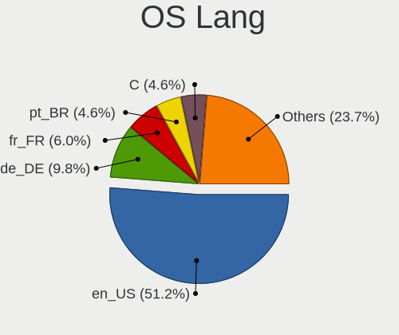
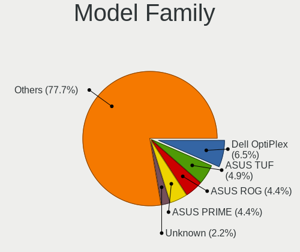
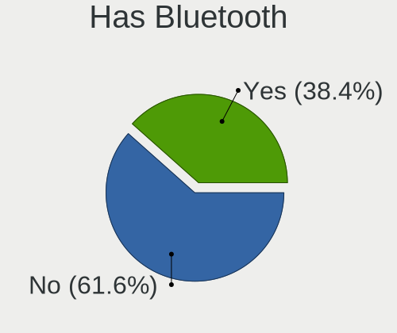
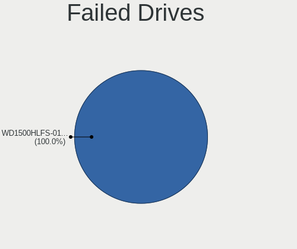
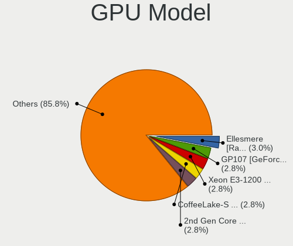
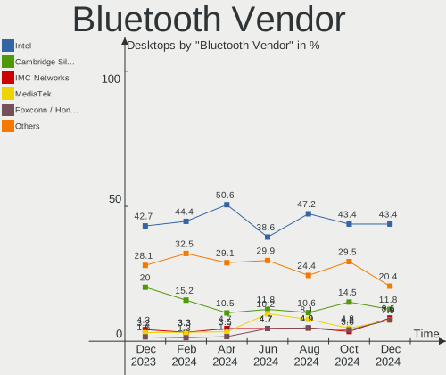
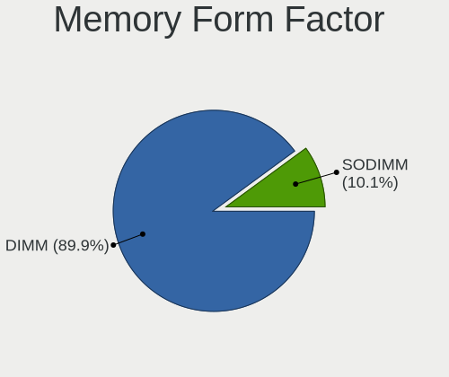
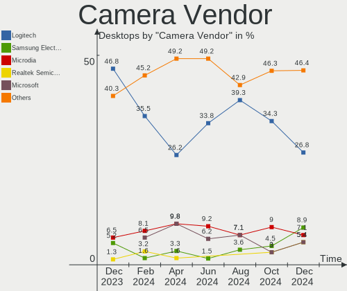

Ubuntu - Hardware Trends (Desktops)
-----------------------------------

A project to identify most popular hardware characteristics and track their change
over time based on data collected by Linux users at https://Linux-Hardware.org.

Anyone can contribute to this report by the [hw-probe](https://github.com/linuxhw/hw-probe) tool:

    sudo -E hw-probe -all -upload

This report is for one last month. Overall report since the beginning of time: [TestCoverage](https://github.com/linuxhw/TestCoverage)

Period: May, 2022.

Contents
--------

* [ System ](#system)
  - [ OS                       ](#os)
  - [ OS Family                ](#os-family)
  - [ Kernel                   ](#kernel)
  - [ Kernel Family            ](#kernel-family)
  - [ Kernel Major Ver.        ](#kernel-major-ver)
  - [ Arch                     ](#arch)
  - [ DE                       ](#de)
  - [ Display Server           ](#display-server)
  - [ Display Manager          ](#display-manager)
  - [ OS Lang                  ](#os-lang)
  - [ Boot Mode                ](#boot-mode)
  - [ Filesystem               ](#filesystem)
  - [ Part. scheme             ](#part-scheme)
  - [ Dual Boot with Linux/BSD ](#dual-boot-with-linuxbsd)
  - [ Dual Boot (Win)          ](#dual-boot-win)

* [ Board ](#board)
  - [ Vendor                   ](#vendor)
  - [ Model                    ](#model)
  - [ Model Family             ](#model-family)
  - [ MFG Year                 ](#mfg-year)
  - [ Form Factor              ](#form-factor)
  - [ Secure Boot              ](#secure-boot)
  - [ Coreboot                 ](#coreboot)
  - [ RAM Size                 ](#ram-size)
  - [ RAM Used                 ](#ram-used)
  - [ Total Drives             ](#total-drives)
  - [ Has CD-ROM               ](#has-cd-rom)
  - [ Has Ethernet             ](#has-ethernet)
  - [ Has WiFi                 ](#has-wifi)
  - [ Has Bluetooth            ](#has-bluetooth)

* [ Location ](#location)
  - [ Country                  ](#country)
  - [ City                     ](#city)

* [ Drives ](#drives)
  - [ Drive Vendor             ](#drive-vendor)
  - [ Drive Model              ](#drive-model)
  - [ HDD Vendor               ](#hdd-vendor)
  - [ SSD Vendor               ](#ssd-vendor)
  - [ Drive Kind               ](#drive-kind)
  - [ Drive Connector          ](#drive-connector)
  - [ Drive Size               ](#drive-size)
  - [ Space Total              ](#space-total)
  - [ Space Used               ](#space-used)
  - [ Malfunc. Drives          ](#malfunc-drives)
  - [ Malfunc. Drive Vendor    ](#malfunc-drive-vendor)
  - [ Malfunc. HDD Vendor      ](#malfunc-hdd-vendor)
  - [ Malfunc. Drive Kind      ](#malfunc-drive-kind)
  - [ Failed Drives            ](#failed-drives)
  - [ Failed Drive Vendor      ](#failed-drive-vendor)
  - [ Drive Status             ](#drive-status)

* [ Storage controller ](#storage-controller)
  - [ Storage Vendor           ](#storage-vendor)
  - [ Storage Model            ](#storage-model)
  - [ Storage Kind             ](#storage-kind)

* [ Processor ](#processor)
  - [ CPU Vendor               ](#cpu-vendor)
  - [ CPU Model                ](#cpu-model)
  - [ CPU Model Family         ](#cpu-model-family)
  - [ CPU Cores                ](#cpu-cores)
  - [ CPU Sockets              ](#cpu-sockets)
  - [ CPU Threads              ](#cpu-threads)
  - [ CPU Op-Modes             ](#cpu-op-modes)
  - [ CPU Microcode            ](#cpu-microcode)
  - [ CPU Microarch            ](#cpu-microarch)

* [ Graphics ](#graphics)
  - [ GPU Vendor               ](#gpu-vendor)
  - [ GPU Model                ](#gpu-model)
  - [ GPU Combo                ](#gpu-combo)
  - [ GPU Driver               ](#gpu-driver)
  - [ GPU Memory               ](#gpu-memory)

* [ Monitor ](#monitor)
  - [ Monitor Vendor           ](#monitor-vendor)
  - [ Monitor Model            ](#monitor-model)
  - [ Monitor Resolution       ](#monitor-resolution)
  - [ Monitor Diagonal         ](#monitor-diagonal)
  - [ Monitor Width            ](#monitor-width)
  - [ Aspect Ratio             ](#aspect-ratio)
  - [ Monitor Area             ](#monitor-area)
  - [ Pixel Density            ](#pixel-density)
  - [ Multiple Monitors        ](#multiple-monitors)

* [ Network ](#network)
  - [ Net Controller Vendor    ](#net-controller-vendor)
  - [ Net Controller Model     ](#net-controller-model)
  - [ Wireless Vendor          ](#wireless-vendor)
  - [ Wireless Model           ](#wireless-model)
  - [ Ethernet Vendor          ](#ethernet-vendor)
  - [ Ethernet Model           ](#ethernet-model)
  - [ Net Controller Kind      ](#net-controller-kind)
  - [ Used Controller          ](#used-controller)
  - [ NICs                     ](#nics)
  - [ IPv6                     ](#ipv6)

* [ Bluetooth ](#bluetooth)
  - [ Bluetooth Vendor         ](#bluetooth-vendor)
  - [ Bluetooth Model          ](#bluetooth-model)

* [ Sound ](#sound)
  - [ Sound Vendor             ](#sound-vendor)
  - [ Sound Model              ](#sound-model)

* [ Memory ](#memory)
  - [ Memory Vendor            ](#memory-vendor)
  - [ Memory Model             ](#memory-model)
  - [ Memory Kind              ](#memory-kind)
  - [ Memory Form Factor       ](#memory-form-factor)
  - [ Memory Size              ](#memory-size)
  - [ Memory Speed             ](#memory-speed)

* [ Printers & scanners ](#printers--scanners)
  - [ Printer Vendor           ](#printer-vendor)
  - [ Printer Model            ](#printer-model)
  - [ Scanner Vendor           ](#scanner-vendor)
  - [ Scanner Model            ](#scanner-model)

* [ Camera ](#camera)
  - [ Camera Vendor            ](#camera-vendor)
  - [ Camera Model             ](#camera-model)

* [ Security ](#security)
  - [ Fingerprint Vendor       ](#fingerprint-vendor)
  - [ Fingerprint Model        ](#fingerprint-model)
  - [ Chipcard Vendor          ](#chipcard-vendor)
  - [ Chipcard Model           ](#chipcard-model)

* [ Unsupported ](#unsupported)
  - [ Unsupported Devices      ](#unsupported-devices)
  - [ Unsupported Device Types ](#unsupported-device-types)

System
------

OS
--

Installed operating systems

| Name         | Desktops | Percent |
|--------------|----------|---------|
| Ubuntu 22.04 | 196      | 48.28%  |
| Ubuntu 20.04 | 162      | 39.9%   |
| Ubuntu 21.10 | 21       | 5.17%   |
| Ubuntu 18.04 | 16       | 3.94%   |
| Ubuntu 16.04 | 4        | 0.99%   |
| Ubuntu 20.10 | 3        | 0.74%   |
| Ubuntu 21.04 | 2        | 0.49%   |
| Ubuntu 21.12 | 1        | 0.25%   |
| Ubuntu 10.04 | 1        | 0.25%   |

OS Family
---------

OS without a version

| Name   | Desktops | Percent |
|--------|----------|---------|
| Ubuntu | 406      | 100%    |

Kernel
------

Version of the Linux kernel

| Version                     | Desktops | Percent |
|-----------------------------|----------|---------|
| 5.15.0-27-generic           | 70       | 17.24%  |
| 5.15.0-30-generic           | 49       | 12.07%  |
| 5.13.0-41-generic           | 46       | 11.33%  |
| 5.13.0-40-generic           | 45       | 11.08%  |
| 5.15.0-33-generic           | 43       | 10.59%  |
| 5.13.0-44-generic           | 25       | 6.16%   |
| 5.4.0-109-generic           | 18       | 4.43%   |
| 5.4.0-110-generic           | 16       | 3.94%   |
| 5.15.0-25-generic           | 13       | 3.2%    |
| 5.4.0-113-generic           | 7        | 1.72%   |
| 5.15.0-32-generic           | 5        | 1.23%   |
| 5.15.0-28-generic           | 4        | 0.99%   |
| 5.11.0-27-generic           | 4        | 0.99%   |
| 4.15.0-176-generic          | 4        | 0.99%   |
| 5.13.0-28-generic           | 3        | 0.74%   |
| 4.15.0-177-generic          | 3        | 0.74%   |
| 5.8.0-63-generic            | 2        | 0.49%   |
| 5.4.0-81-generic            | 2        | 0.49%   |
| 5.18.0-051800-generic       | 2        | 0.49%   |
| 5.13.0-39-generic           | 2        | 0.49%   |
| 5.13.0-37-generic           | 2        | 0.49%   |
| 5.11.0-49-generic           | 2        | 0.49%   |
| 4.15.0-142-generic          | 2        | 0.49%   |
| 5.8.0-55-generic            | 1        | 0.25%   |
| 5.8.0-43-generic            | 1        | 0.25%   |
| 5.8.0-33-generic            | 1        | 0.25%   |
| 5.6.0-050600-generic        | 1        | 0.25%   |
| 5.4.0-84-generic            | 1        | 0.25%   |
| 5.4.0-58-generic            | 1        | 0.25%   |
| 5.4.0-110-lowlatency        | 1        | 0.25%   |
| 5.17.9-xanmod1-x64v2        | 1        | 0.25%   |
| 5.17.9-051709-generic       | 1        | 0.25%   |
| 5.17.7-051707-generic       | 1        | 0.25%   |
| 5.17.6-051706-generic       | 1        | 0.25%   |
| 5.17.0-void25-nomac-znver3  | 1        | 0.25%   |
| 5.17.0-051700-generic       | 1        | 0.25%   |
| 5.15.0-35-generic           | 1        | 0.25%   |
| 5.15.0-30-lowlatency        | 1        | 0.25%   |
| 5.15.0-23-generic           | 1        | 0.25%   |
| 5.14.0-1036-oem             | 1        | 0.25%   |
| 5.13.0-43-generic           | 1        | 0.25%   |
| 5.13.0-40-lowlatency        | 1        | 0.25%   |
| 5.13.0-352203222222-generic | 1        | 0.25%   |
| 5.13.0-32-generic           | 1        | 0.25%   |
| 5.13.0-30-generic           | 1        | 0.25%   |
| 5.13.0-27-generic           | 1        | 0.25%   |
| 5.13.0-19-generic           | 1        | 0.25%   |
| 5.13.0-1017-oem             | 1        | 0.25%   |
| 5.13.0-1011-intel           | 1        | 0.25%   |
| 5.11.0-44-generic           | 1        | 0.25%   |
| 5.11.0-43-generic           | 1        | 0.25%   |
| 5.11.0-41-generic           | 1        | 0.25%   |
| 5.11.0-37-generic           | 1        | 0.25%   |
| 5.11.0-25-generic           | 1        | 0.25%   |
| 5.10.0-1031-oem             | 1        | 0.25%   |
| 4.4.0-210-generic           | 1        | 0.25%   |
| 4.15.0-176-lowlatency       | 1        | 0.25%   |
| 4.15.0-175-generic          | 1        | 0.25%   |
| 4.15.0-167-generic          | 1        | 0.25%   |
| 2.6.32-21-generic           | 1        | 0.25%   |

Kernel Family
-------------

Linux kernel without a distro release

| Version | Desktops | Percent |
|---------|----------|---------|
| 5.15.0  | 187      | 46.06%  |
| 5.13.0  | 132      | 32.51%  |
| 5.4.0   | 46       | 11.33%  |
| 4.15.0  | 12       | 2.96%   |
| 5.11.0  | 11       | 2.71%   |
| 5.8.0   | 5        | 1.23%   |
| 5.18.0  | 2        | 0.49%   |
| 5.17.9  | 2        | 0.49%   |
| 5.17.0  | 2        | 0.49%   |
| 5.6.0   | 1        | 0.25%   |
| 5.17.7  | 1        | 0.25%   |
| 5.17.6  | 1        | 0.25%   |
| 5.14.0  | 1        | 0.25%   |
| 5.10.0  | 1        | 0.25%   |
| 4.4.0   | 1        | 0.25%   |
| 2.6.32  | 1        | 0.25%   |

Kernel Major Ver.
-----------------

Linux kernel major version

| Version | Desktops | Percent |
|---------|----------|---------|
| 5.15    | 187      | 46.06%  |
| 5.13    | 132      | 32.51%  |
| 5.4     | 46       | 11.33%  |
| 4.15    | 12       | 2.96%   |
| 5.11    | 11       | 2.71%   |
| 5.17    | 6        | 1.48%   |
| 5.8     | 5        | 1.23%   |
| 5.18    | 2        | 0.49%   |
| 5.6     | 1        | 0.25%   |
| 5.14    | 1        | 0.25%   |
| 5.10    | 1        | 0.25%   |
| 4.4     | 1        | 0.25%   |
| 2.6     | 1        | 0.25%   |

Arch
----

OS architecture (x86_64, i586, etc.)

| Name   | Desktops | Percent |
|--------|----------|---------|
| x86_64 | 400      | 98.52%  |
| i686   | 6        | 1.48%   |

DE
--

Desktop Environment

| Name       | Desktops | Percent |
|------------|----------|---------|
| GNOME      | 377      | 92.86%  |
| Unknown    | 15       | 3.69%   |
| Unity      | 6        | 1.48%   |
| X-Cinnamon | 5        | 1.23%   |
| i3         | 1        | 0.25%   |
| Cinnamon   | 1        | 0.25%   |
| awesome    | 1        | 0.25%   |

Display Server
--------------

X11 or Wayland

| Name    | Desktops | Percent |
|---------|----------|---------|
| X11     | 269      | 66.26%  |
| Wayland | 119      | 29.31%  |
| Tty     | 12       | 2.96%   |
| Unknown | 6        | 1.48%   |

Display Manager
---------------

SDDM, LightDM, etc.

| Name    | Desktops | Percent |
|---------|----------|---------|
| GDM3    | 300      | 73.89%  |
| GDM     | 54       | 13.3%   |
| Unknown | 38       | 9.36%   |
| LightDM | 11       | 2.71%   |
| SDDM    | 3        | 0.74%   |

OS Lang
-------

Language

| Lang    | Desktops | Percent |
|---------|----------|---------|
| en_US   | 152      | 37.44%  |
| de_DE   | 48       | 11.82%  |
| fr_FR   | 35       | 8.62%   |
| en_GB   | 24       | 5.91%   |
| pt_BR   | 14       | 3.45%   |
| en_CA   | 14       | 3.45%   |
| es_ES   | 13       | 3.2%    |
| en_AU   | 11       | 2.71%   |
| ru_RU   | 10       | 2.46%   |
| pl_PL   | 8        | 1.97%   |
| nl_NL   | 8        | 1.97%   |
| it_IT   | 8        | 1.97%   |
| cs_CZ   | 6        | 1.48%   |
| ja_JP   | 5        | 1.23%   |
| zh_CN   | 3        | 0.74%   |
| hu_HU   | 3        | 0.74%   |
| en_IN   | 3        | 0.74%   |
| el_GR   | 3        | 0.74%   |
| de_AT   | 3        | 0.74%   |
| tr_TR   | 2        | 0.49%   |
| sv_SE   | 2        | 0.49%   |
| sk_SK   | 2        | 0.49%   |
| pt_PT   | 2        | 0.49%   |
| nl_BE   | 2        | 0.49%   |
| ko_KR   | 2        | 0.49%   |
| fi_FI   | 2        | 0.49%   |
| es_AR   | 2        | 0.49%   |
| en_ZA   | 2        | 0.49%   |
| de_CH   | 2        | 0.49%   |
| C       | 2        | 0.49%   |
| zh_TW   | 1        | 0.25%   |
| sl_SI   | 1        | 0.25%   |
| fr_CH   | 1        | 0.25%   |
| es_PE   | 1        | 0.25%   |
| es_EC   | 1        | 0.25%   |
| es_CR   | 1        | 0.25%   |
| es_CL   | 1        | 0.25%   |
| en_ZW   | 1        | 0.25%   |
| en_PH   | 1        | 0.25%   |
| en_NZ   | 1        | 0.25%   |
| de_BE   | 1        | 0.25%   |
| bg_BG   | 1        | 0.25%   |
| Unknown | 1        | 0.25%   |

Boot Mode
---------

EFI or BIOS

| Mode | Desktops | Percent |
|------|----------|---------|
| BIOS | 271      | 66.75%  |
| EFI  | 135      | 33.25%  |

Filesystem
----------

Type of filesystem

| Type    | Desktops | Percent |
|---------|----------|---------|
| Ext4    | 370      | 91.13%  |
| Overlay | 14       | 3.45%   |
| Zfs     | 10       | 2.46%   |
| Btrfs   | 7        | 1.72%   |
| Ext2    | 4        | 0.99%   |
| Xfs     | 1        | 0.25%   |

Part. scheme
------------

Scheme of partitioning

| Type    | Desktops | Percent |
|---------|----------|---------|
| Unknown | 295      | 72.66%  |
| GPT     | 95       | 23.4%   |
| MBR     | 16       | 3.94%   |

Dual Boot with Linux/BSD
------------------------

Hosting more than one Linux/BSD

| Dual boot | Desktops | Percent |
|-----------|----------|---------|
| No        | 333      | 82.02%  |
| Yes       | 73       | 17.98%  |

Dual Boot (Win)
---------------

Hosting Linux and Windows

| Dual boot | Desktops | Percent |
|-----------|----------|---------|
| No        | 234      | 57.64%  |
| Yes       | 172      | 42.36%  |

Board
-----

Vendor
------

Motherboard manufacturer

| Name                | Desktops | Percent |
|---------------------|----------|---------|
| ASUSTek Computer    | 114      | 28.08%  |
| Gigabyte Technology | 57       | 14.04%  |
| MSI                 | 52       | 12.81%  |
| Dell                | 36       | 8.87%   |
| ASRock              | 27       | 6.65%   |
| Hewlett-Packard     | 26       | 6.4%    |
| Intel               | 13       | 3.2%    |
| Acer                | 12       | 2.96%   |
| Lenovo              | 11       | 2.71%   |
| Pegatron            | 8        | 1.97%   |
| Shuttle             | 7        | 1.72%   |
| Unknown             | 6        | 1.48%   |
| Foxconn             | 5        | 1.23%   |
| ECS                 | 5        | 1.23%   |
| Medion              | 4        | 0.99%   |
| Fujitsu             | 3        | 0.74%   |
| Supermicro          | 2        | 0.49%   |
| Apple               | 2        | 0.49%   |
| SZMZ                | 1        | 0.25%   |
| Seeed Studio        | 1        | 0.25%   |
| Positivo            | 1        | 0.25%   |
| Pepper Jobs         | 1        | 0.25%   |
| Packard Bell        | 1        | 0.25%   |
| MW                  | 1        | 0.25%   |
| Mustek6376 mst6376  | 1        | 0.25%   |
| MouseComputer       | 1        | 0.25%   |
| Minix               | 1        | 0.25%   |
| KLLISRE             | 1        | 0.25%   |
| iEi                 | 1        | 0.25%   |
| Google              | 1        | 0.25%   |
| Fujitsu Siemens     | 1        | 0.25%   |
| Clientron           | 1        | 0.25%   |
| Biostar             | 1        | 0.25%   |
| Alienware           | 1        | 0.25%   |

Model
-----

Motherboard model

| Name                             | Desktops | Percent |
|----------------------------------|----------|---------|
| ASUS All Series                  | 12       | 2.96%   |
| Unknown                          | 6        | 1.48%   |
| MSI MS-7C52                      | 4        | 0.99%   |
| HP Compaq 8200 Elite SFF PC      | 4        | 0.99%   |
| MSI MS-7C92                      | 3        | 0.74%   |
| MSI MS-7C37                      | 3        | 0.74%   |
| MSI MS-7C02                      | 3        | 0.74%   |
| Gigabyte X570 AORUS MASTER       | 3        | 0.74%   |
| Dell OptiPlex 7010               | 3        | 0.74%   |
| ASUS TUF Gaming B450-PLUS II     | 3        | 0.74%   |
| MSI MS-7D54                      | 2        | 0.49%   |
| MSI MS-7C91                      | 2        | 0.49%   |
| MSI MS-7B86                      | 2        | 0.49%   |
| MSI MS-7A38                      | 2        | 0.49%   |
| Intel H55                        | 2        | 0.49%   |
| HP ProDesk 490 G3 MT Business PC | 2        | 0.49%   |
| HP Compaq 6005 Pro SFF PC        | 2        | 0.49%   |
| Gigabyte Z77X-UD3H               | 2        | 0.49%   |
| Gigabyte X99-UD4-CF              | 2        | 0.49%   |
| Fujitsu CELSIUS R570-2           | 2        | 0.49%   |
| Dell Precision WorkStation 690   | 2        | 0.49%   |
| Dell OptiPlex 790                | 2        | 0.49%   |
| Dell OptiPlex 3020               | 2        | 0.49%   |
| ASUS Z170-A                      | 2        | 0.49%   |
| ASUS TUF Gaming X570-PLUS        | 2        | 0.49%   |
| ASUS ROG STRIX B550-F GAMING     | 2        | 0.49%   |
| ASUS ROG STRIX B450-F GAMING II  | 2        | 0.49%   |
| ASUS PRIME B450M-A               | 2        | 0.49%   |
| ASUS PRIME A320M-K               | 2        | 0.49%   |
| ASUS H61M-K                      | 2        | 0.49%   |
| ASUS H61M-E                      | 2        | 0.49%   |
| ASRock 970 Pro3 R2.0             | 2        | 0.49%   |
| Apple MacPro5,1                  | 2        | 0.49%   |
| SZMZ X99 DUAL Z8                 | 1        | 0.25%   |
| Supermicro X9DR3-F               | 1        | 0.25%   |
| Supermicro X8ST3                 | 1        | 0.25%   |
| Shuttle SH87R                    | 1        | 0.25%   |
| Shuttle SH170                    | 1        | 0.25%   |
| Shuttle SG41                     | 1        | 0.25%   |
| Shuttle DS81D                    | 1        | 0.25%   |
| Shuttle DS20U                    | 1        | 0.25%   |
| Shuttle DS10U                    | 1        | 0.25%   |
| Shuttle DH110                    | 1        | 0.25%   |
| Seeed Studio ODYSSEY-X86J4125    | 1        | 0.25%   |
| Positivo POS-PIH81DI             | 1        | 0.25%   |
| Pepper Jobs GLK-UC2X             | 1        | 0.25%   |
| Pegatron VN433AA-ABF p6235fr     | 1        | 0.25%   |
| Pegatron p7-1110                 | 1        | 0.25%   |
| Pegatron p6541fr-m               | 1        | 0.25%   |
| Pegatron p6-2133w                | 1        | 0.25%   |
| Pegatron p6-2109eo               | 1        | 0.25%   |
| Pegatron h9-1000cs               | 1        | 0.25%   |
| Pegatron 520-1030uk              | 1        | 0.25%   |
| Pegatron 23-1015                 | 1        | 0.25%   |
| Packard Bell IMEDIA S3800        | 1        | 0.25%   |
| MW GMLK-2_5G4L                   | 1        | 0.25%   |
| Mustek6376 mst6376 945GZT-M      | 1        | 0.25%   |
| MSI VIG644M                      | 1        | 0.25%   |
| MSI p7-1240                      | 1        | 0.25%   |
| MSI NQ890AA-ABZ CQ5011IT         | 1        | 0.25%   |

Model Family
------------

Motherboard model prefix

| Name                          | Desktops | Percent |
|-------------------------------|----------|---------|
| ASUS PRIME                    | 21       | 5.17%   |
| Dell OptiPlex                 | 17       | 4.19%   |
| HP Compaq                     | 12       | 2.96%   |
| ASUS All                      | 12       | 2.96%   |
| Dell Precision                | 9        | 2.22%   |
| ASUS ROG                      | 9        | 2.22%   |
| Acer Aspire                   | 9        | 2.22%   |
| ASUS TUF                      | 8        | 1.97%   |
| Lenovo ThinkCentre            | 6        | 1.48%   |
| Unknown                       | 6        | 1.48%   |
| MSI MS-7C52                   | 4        | 0.99%   |
| Gigabyte X570                 | 4        | 0.99%   |
| MSI MS-7C92                   | 3        | 0.74%   |
| MSI MS-7C37                   | 3        | 0.74%   |
| MSI MS-7C02                   | 3        | 0.74%   |
| HP ProDesk                    | 3        | 0.74%   |
| HP EliteDesk                  | 3        | 0.74%   |
| Dell XPS                      | 3        | 0.74%   |
| ASUS PRO                      | 3        | 0.74%   |
| MSI MS-7D54                   | 2        | 0.49%   |
| MSI MS-7C91                   | 2        | 0.49%   |
| MSI MS-7B86                   | 2        | 0.49%   |
| MSI MS-7A38                   | 2        | 0.49%   |
| Medion Akoya                  | 2        | 0.49%   |
| Intel X99                     | 2        | 0.49%   |
| Intel H55                     | 2        | 0.49%   |
| HP Pavilion                   | 2        | 0.49%   |
| Gigabyte Z77X-UD3H            | 2        | 0.49%   |
| Gigabyte X99-UD4-CF           | 2        | 0.49%   |
| Fujitsu CELSIUS               | 2        | 0.49%   |
| Dell Vostro                   | 2        | 0.49%   |
| Dell Inspiron                 | 2        | 0.49%   |
| ASUS Z170-A                   | 2        | 0.49%   |
| ASUS SABERTOOTH               | 2        | 0.49%   |
| ASUS P8Z77-V                  | 2        | 0.49%   |
| ASUS P8H61                    | 2        | 0.49%   |
| ASUS Maximus                  | 2        | 0.49%   |
| ASUS M32CD                    | 2        | 0.49%   |
| ASUS H61M-K                   | 2        | 0.49%   |
| ASUS H61M-E                   | 2        | 0.49%   |
| ASUS F2A85-V                  | 2        | 0.49%   |
| ASUS Crosshair                | 2        | 0.49%   |
| ASRock B450M                  | 2        | 0.49%   |
| ASRock 970                    | 2        | 0.49%   |
| Apple MacPro5                 | 2        | 0.49%   |
| Acer Veriton                  | 2        | 0.49%   |
| SZMZ X99                      | 1        | 0.25%   |
| Supermicro X9DR3-F            | 1        | 0.25%   |
| Supermicro X8ST3              | 1        | 0.25%   |
| Shuttle SH87R                 | 1        | 0.25%   |
| Shuttle SH170                 | 1        | 0.25%   |
| Shuttle SG41                  | 1        | 0.25%   |
| Shuttle DS81D                 | 1        | 0.25%   |
| Shuttle DS20U                 | 1        | 0.25%   |
| Shuttle DS10U                 | 1        | 0.25%   |
| Shuttle DH110                 | 1        | 0.25%   |
| Seeed Studio ODYSSEY-X86J4125 | 1        | 0.25%   |
| Positivo POS-PIH81DI          | 1        | 0.25%   |
| Pepper Jobs GLK-UC2X          | 1        | 0.25%   |
| Pegatron VN433AA-ABF          | 1        | 0.25%   |

MFG Year
--------

Motherboard manufacture year

| Year | Desktops | Percent |
|------|----------|---------|
| 2012 | 43       | 10.59%  |
| 2021 | 36       | 8.87%   |
| 2014 | 34       | 8.37%   |
| 2020 | 32       | 7.88%   |
| 2010 | 32       | 7.88%   |
| 2019 | 31       | 7.64%   |
| 2018 | 31       | 7.64%   |
| 2013 | 28       | 6.9%    |
| 2011 | 27       | 6.65%   |
| 2016 | 24       | 5.91%   |
| 2009 | 20       | 4.93%   |
| 2015 | 16       | 3.94%   |
| 2017 | 14       | 3.45%   |
| 2008 | 13       | 3.2%    |
| 2022 | 8        | 1.97%   |
| 2007 | 8        | 1.97%   |
| 2006 | 6        | 1.48%   |
| 2005 | 3        | 0.74%   |

Form Factor
-----------

Physical design of the computer

| Name    | Desktops | Percent |
|---------|----------|---------|
| Desktop | 406      | 100%    |

Secure Boot
-----------

Enabled or disabled

| State    | Desktops | Percent |
|----------|----------|---------|
| Disabled | 391      | 96.31%  |
| Enabled  | 15       | 3.69%   |

Coreboot
--------

Have coreboot on board

| Used | Desktops | Percent |
|------|----------|---------|
| No   | 405      | 99.75%  |
| Yes  | 1        | 0.25%   |

RAM Size
--------

Total RAM memory

| Size in GB      | Desktops | Percent |
|-----------------|----------|---------|
| 16.01-24.0      | 96       | 23.65%  |
| 8.01-16.0       | 76       | 18.72%  |
| 32.01-64.0      | 73       | 17.98%  |
| 4.01-8.0        | 70       | 17.24%  |
| 3.01-4.0        | 40       | 9.85%   |
| 64.01-256.0     | 23       | 5.67%   |
| 24.01-32.0      | 12       | 2.96%   |
| 1.01-2.0        | 9        | 2.22%   |
| 2.01-3.0        | 5        | 1.23%   |
| More than 256.0 | 1        | 0.25%   |
| 0.51-1.0        | 1        | 0.25%   |

RAM Used
--------

Used RAM memory

| Used GB     | Desktops | Percent |
|-------------|----------|---------|
| 1.01-2.0    | 150      | 36.95%  |
| 2.01-3.0    | 102      | 25.12%  |
| 4.01-8.0    | 67       | 16.5%   |
| 3.01-4.0    | 47       | 11.58%  |
| 8.01-16.0   | 21       | 5.17%   |
| 0.51-1.0    | 10       | 2.46%   |
| 16.01-24.0  | 3        | 0.74%   |
| 32.01-64.0  | 2        | 0.49%   |
| 24.01-32.0  | 1        | 0.25%   |
| 64.01-256.0 | 1        | 0.25%   |
| 0.01-0.5    | 1        | 0.25%   |
| Unknown     | 1        | 0.25%   |

Total Drives
------------

Number of drives on board

| Drives | Desktops | Percent |
|--------|----------|---------|
| 1      | 153      | 37.68%  |
| 2      | 107      | 26.35%  |
| 3      | 68       | 16.75%  |
| 4      | 32       | 7.88%   |
| 5      | 20       | 4.93%   |
| 0      | 9        | 2.22%   |
| 6      | 8        | 1.97%   |
| 10     | 3        | 0.74%   |
| 9      | 2        | 0.49%   |
| 7      | 2        | 0.49%   |
| 13     | 1        | 0.25%   |
| 8      | 1        | 0.25%   |

Has CD-ROM
----------

Has CD-ROM on board

| Presented | Desktops | Percent |
|-----------|----------|---------|
| Yes       | 203      | 50%     |
| No        | 203      | 50%     |

Has Ethernet
------------

Has Ethernet on board

| Presented | Desktops | Percent |
|-----------|----------|---------|
| Yes       | 404      | 99.51%  |
| No        | 2        | 0.49%   |

Has WiFi
--------

Has WiFi module

| Presented | Desktops | Percent |
|-----------|----------|---------|
| No        | 249      | 61.33%  |
| Yes       | 157      | 38.67%  |

Has Bluetooth
-------------

Has Bluetooth module

| Presented | Desktops | Percent |
|-----------|----------|---------|
| No        | 292      | 71.92%  |
| Yes       | 114      | 28.08%  |

Location
--------

Country
-------

Geographic location (country)

| Country          | Desktops | Percent |
|------------------|----------|---------|
| USA              | 70       | 17.24%  |
| Germany          | 53       | 13.05%  |
| France           | 39       | 9.61%   |
| UK               | 23       | 5.67%   |
| Canada           | 15       | 3.69%   |
| Brazil           | 15       | 3.69%   |
| Netherlands      | 14       | 3.45%   |
| Poland           | 13       | 3.2%    |
| Spain            | 11       | 2.71%   |
| Russia           | 10       | 2.46%   |
| Australia        | 10       | 2.46%   |
| Switzerland      | 9        | 2.22%   |
| Italy            | 9        | 2.22%   |
| Finland          | 8        | 1.97%   |
| Czechia          | 8        | 1.97%   |
| Japan            | 7        | 1.72%   |
| Argentina        | 7        | 1.72%   |
| Belgium          | 6        | 1.48%   |
| Austria          | 5        | 1.23%   |
| Turkey           | 4        | 0.99%   |
| Portugal         | 4        | 0.99%   |
| Norway           | 4        | 0.99%   |
| Sweden           | 3        | 0.74%   |
| South Africa     | 3        | 0.74%   |
| Slovakia         | 3        | 0.74%   |
| Serbia           | 3        | 0.74%   |
| Romania          | 3        | 0.74%   |
| Peru             | 3        | 0.74%   |
| Indonesia        | 3        | 0.74%   |
| India            | 3        | 0.74%   |
| Hungary          | 3        | 0.74%   |
| Greece           | 3        | 0.74%   |
| China            | 3        | 0.74%   |
| Bulgaria         | 3        | 0.74%   |
| Thailand         | 2        | 0.49%   |
| South Korea      | 2        | 0.49%   |
| Saudi Arabia     | 2        | 0.49%   |
| Pakistan         | 2        | 0.49%   |
| New Zealand      | 2        | 0.49%   |
| Iran             | 2        | 0.49%   |
| Ukraine          | 1        | 0.25%   |
| Taiwan           | 1        | 0.25%   |
| Slovenia         | 1        | 0.25%   |
| Singapore        | 1        | 0.25%   |
| Philippines      | 1        | 0.25%   |
| Papua New Guinea | 1        | 0.25%   |
| Mexico           | 1        | 0.25%   |
| Estonia          | 1        | 0.25%   |
| Ecuador          | 1        | 0.25%   |
| Denmark          | 1        | 0.25%   |
| Costa Rica       | 1        | 0.25%   |
| Chile            | 1        | 0.25%   |
| Cameroon         | 1        | 0.25%   |
| Algeria          | 1        | 0.25%   |

City
----

Geographic location (city)

| City               | Desktops | Percent |
|--------------------|----------|---------|
| Paris              | 9        | 2.22%   |
| Hamburg            | 5        | 1.23%   |
| Berlin             | 5        | 1.23%   |
| Vienna             | 4        | 0.99%   |
| Sydney             | 4        | 0.99%   |
| Sao Paulo          | 4        | 0.99%   |
| Milan              | 4        | 0.99%   |
| London             | 4        | 0.99%   |
| Helsinki           | 4        | 0.99%   |
| Debica             | 4        | 0.99%   |
| Munich             | 3        | 0.74%   |
| Gdansk             | 3        | 0.74%   |
| Dallas             | 3        | 0.74%   |
| Charlestown        | 3        | 0.74%   |
| Buenos Aires       | 3        | 0.74%   |
| Wroclaw            | 2        | 0.49%   |
| Tehran             | 2        | 0.49%   |
| St Petersburg      | 2        | 0.49%   |
| Sidney             | 2        | 0.49%   |
| Santo André       | 2        | 0.49%   |
| San Jose           | 2        | 0.49%   |
| San Francisco      | 2        | 0.49%   |
| Riyadh             | 2        | 0.49%   |
| Pretoria           | 2        | 0.49%   |
| Prague             | 2        | 0.49%   |
| Nieuwpoort         | 2        | 0.49%   |
| New York           | 2        | 0.49%   |
| Moscow             | 2        | 0.49%   |
| Melbourne          | 2        | 0.49%   |
| Los Angeles        | 2        | 0.49%   |
| Lima               | 2        | 0.49%   |
| Kiel               | 2        | 0.49%   |
| Jakarta            | 2        | 0.49%   |
| Istanbul           | 2        | 0.49%   |
| Herne              | 2        | 0.49%   |
| Calgary            | 2        | 0.49%   |
| Budapest           | 2        | 0.49%   |
| Brighton           | 2        | 0.49%   |
| Beijing            | 2        | 0.49%   |
| Atlanta            | 2        | 0.49%   |
| Athens             | 2        | 0.49%   |
| Zvolen             | 1        | 0.25%   |
| Zurich             | 1        | 0.25%   |
| Zoersel            | 1        | 0.25%   |
| Ziar nad Hronom    | 1        | 0.25%   |
| Zeulenroda-Triebes | 1        | 0.25%   |
| Zdanice            | 1        | 0.25%   |
| Ypsilanti          | 1        | 0.25%   |
| Yeovil             | 1        | 0.25%   |
| Yaoundé           | 1        | 0.25%   |
| Wyszeborz          | 1        | 0.25%   |
| Wormerveer         | 1        | 0.25%   |
| Wittenberge        | 1        | 0.25%   |
| Winter Garden      | 1        | 0.25%   |
| Wingerode          | 1        | 0.25%   |
| Winder             | 1        | 0.25%   |
| Willisau           | 1        | 0.25%   |
| Wiesbaden          | 1        | 0.25%   |
| Westminster        | 1        | 0.25%   |
| West Chester       | 1        | 0.25%   |

Drives
------

Drive Vendor
------------

Hard drive vendors

| Vendor                    | Desktops | Drives | Percent |
|---------------------------|----------|--------|---------|
| WDC                       | 155      | 238    | 22.14%  |
| Seagate                   | 129      | 178    | 18.43%  |
| Samsung Electronics       | 105      | 147    | 15%     |
| Kingston                  | 43       | 48     | 6.14%   |
| Crucial                   | 36       | 39     | 5.14%   |
| SanDisk                   | 34       | 39     | 4.86%   |
| Toshiba                   | 30       | 42     | 4.29%   |
| Hitachi                   | 22       | 32     | 3.14%   |
| Unknown                   | 10       | 13     | 1.43%   |
| Intel                     | 9        | 10     | 1.29%   |
| A-DATA Technology         | 9        | 11     | 1.29%   |
| Phison                    | 8        | 9      | 1.14%   |
| PNY                       | 5        | 5      | 0.71%   |
| OCZ                       | 5        | 6      | 0.71%   |
| China                     | 5        | 5      | 0.71%   |
| SK Hynix                  | 4        | 5      | 0.57%   |
| MAXTOR                    | 4        | 5      | 0.57%   |
| Gigabyte Technology       | 4        | 4      | 0.57%   |
| Corsair                   | 4        | 4      | 0.57%   |
| Unknown                   | 4        | 4      | 0.57%   |
| Transcend                 | 3        | 3      | 0.43%   |
| Silicon Motion            | 3        | 3      | 0.43%   |
| Patriot                   | 3        | 3      | 0.43%   |
| Micron/Crucial Technology | 3        | 3      | 0.43%   |
| Lexar                     | 3        | 3      | 0.43%   |
| Intenso                   | 3        | 6      | 0.43%   |
| GOODRAM                   | 3        | 3      | 0.43%   |
| XPG                       | 2        | 2      | 0.29%   |
| walram                    | 2        | 2      | 0.29%   |
| SPCC                      | 2        | 2      | 0.29%   |
| Netac                     | 2        | 2      | 0.29%   |
| LITEON                    | 2        | 2      | 0.29%   |
| KingSpec                  | 2        | 2      | 0.29%   |
| KingFast                  | 2        | 2      | 0.29%   |
| HGST HTS                  | 2        | 2      | 0.29%   |
| HGST                      | 2        | 3      | 0.29%   |
| Hewlett-Packard           | 2        | 2      | 0.29%   |
| Dogfish                   | 2        | 2      | 0.29%   |
| ASMT                      | 2        | 2      | 0.29%   |
| XrayDisk                  | 1        | 1      | 0.14%   |
| ViperTeq                  | 1        | 1      | 0.14%   |
| USB3.0                    | 1        | 1      | 0.14%   |
| TYPEC 2T                  | 1        | 1      | 0.14%   |
| Team                      | 1        | 1      | 0.14%   |
| TCSUNBOW-X5               | 1        | 1      | 0.14%   |
| TCSUNBOW                  | 1        | 1      | 0.14%   |
| Smartbuy                  | 1        | 1      | 0.14%   |
| S3+                       | 1        | 1      | 0.14%   |
| RIM                       | 1        | 1      | 0.14%   |
| Realtek Semiconductor     | 1        | 1      | 0.14%   |
| pqi                       | 1        | 1      | 0.14%   |
| PLEXTOR                   | 1        | 1      | 0.14%   |
| Mushkin                   | 1        | 1      | 0.14%   |
| MidasForce                | 1        | 1      | 0.14%   |
| Micron Technology         | 1        | 2      | 0.14%   |
| MBED                      | 1        | 1      | 0.14%   |
| Lenovo                    | 1        | 1      | 0.14%   |
| LDLC                      | 1        | 1      | 0.14%   |
| KLEVV                     | 1        | 1      | 0.14%   |
| KIOXIA-EXCERIA            | 1        | 1      | 0.14%   |

Drive Model
-----------

Hard drive models

| Model                            | Desktops | Percent |
|----------------------------------|----------|---------|
| Kingston SA400S37240G 240GB SSD  | 10       | 1.18%   |
| Seagate ST500DM002-1BD142 500GB  | 9        | 1.07%   |
| Seagate ST2000DM008-2FR102 2TB   | 9        | 1.07%   |
| Sandisk NVMe SSD Drive 1TB       | 9        | 1.07%   |
| Samsung SSD 850 EVO 250GB        | 9        | 1.07%   |
| WDC WD10EZEX-08WN4A0 1TB         | 8        | 0.95%   |
| Seagate ST2000DM001-1CH164 2TB   | 7        | 0.83%   |
| Samsung SSD 970 EVO Plus 500GB   | 7        | 0.83%   |
| Seagate ST1000DM010-2EP102 1TB   | 6        | 0.71%   |
| Seagate ST1000DM003-1ER162 1TB   | 6        | 0.71%   |
| Samsung SSD 860 EVO 1TB          | 6        | 0.71%   |
| Samsung NVMe SSD Drive 500GB     | 6        | 0.71%   |
| Samsung NVMe SSD Drive 1TB       | 6        | 0.71%   |
| Crucial CT500MX500SSD1 500GB     | 6        | 0.71%   |
| Toshiba HDWD110 1TB              | 5        | 0.59%   |
| Seagate ST31000524AS 1TB         | 5        | 0.59%   |
| Seagate ST1000DM003-1CH162 1TB   | 5        | 0.59%   |
| Crucial CT1000MX500SSD1 1TB      | 5        | 0.59%   |
| WDC WD10EZEX-00BN5A0 1TB         | 4        | 0.47%   |
| Unknown SD/MMC/MS PRO 999GB      | 4        | 0.47%   |
| Toshiba DT01ACA100 1TB           | 4        | 0.47%   |
| Seagate ST31000528AS 1TB         | 4        | 0.47%   |
| Seagate ST2000DL003-9VT166 2TB   | 4        | 0.47%   |
| Seagate Expansion Desk 10TB      | 4        | 0.47%   |
| SanDisk SDSSDHII240G 240GB       | 4        | 0.47%   |
| Sandisk NVMe SSD Drive 500GB     | 4        | 0.47%   |
| Samsung SSD 970 EVO 500GB        | 4        | 0.47%   |
| Samsung SSD 870 QVO 1TB          | 4        | 0.47%   |
| Samsung SSD 850 PRO 256GB        | 4        | 0.47%   |
| Samsung SSD 850 EVO 500GB        | 4        | 0.47%   |
| Kingston SV300S37A240G 240GB SSD | 4        | 0.47%   |
| Kingston SV300S37A120G 120GB SSD | 4        | 0.47%   |
| Kingston SA400S37480G 480GB SSD  | 4        | 0.47%   |
| Unknown                          | 4        | 0.47%   |
| WDC WDS500G2B0A-00SM50 500GB SSD | 3        | 0.36%   |
| WDC WDS240G2G0A-00JH30 240GB SSD | 3        | 0.36%   |
| WDC WDS120G2G0A-00JH30 120GB SSD | 3        | 0.36%   |
| WDC WDS100T2B0C-00PXH0 1TB       | 3        | 0.36%   |
| WDC WD5000AADS-00S9B0 500GB      | 3        | 0.36%   |
| WDC WD40EZRZ-00GXCB0 4TB         | 3        | 0.36%   |
| WDC WD20EFRX-68EUZN0 2TB         | 3        | 0.36%   |
| WDC WD20EARX-00PASB0 2TB         | 3        | 0.36%   |
| WDC WD20EARS-00MVWB0 2TB         | 3        | 0.36%   |
| WDC WD10EALX-009BA0 1TB          | 3        | 0.36%   |
| Toshiba DT01ACA300 3TB           | 3        | 0.36%   |
| Toshiba DT01ACA200 2TB           | 3        | 0.36%   |
| Toshiba DT01ACA050 500GB         | 3        | 0.36%   |
| Seagate ST3500418AS 500GB        | 3        | 0.36%   |
| Seagate ST3320620AS 320GB        | 3        | 0.36%   |
| Seagate ST2000DM001-1ER164 2TB   | 3        | 0.36%   |
| Seagate ST1000DM003-9YN162 1TB   | 3        | 0.36%   |
| SanDisk SDSSDA240G 240GB         | 3        | 0.36%   |
| Samsung SSD 980 500GB            | 3        | 0.36%   |
| Samsung SSD 870 EVO 1TB          | 3        | 0.36%   |
| Samsung SSD 860 EVO 500GB        | 3        | 0.36%   |
| Samsung HD501LJ 500GB            | 3        | 0.36%   |
| Lexar 128GB SSD                  | 3        | 0.36%   |
| Kingston SHSS37A480G 480GB SSD   | 3        | 0.36%   |
| Kingston NVMe SSD Drive 500GB    | 3        | 0.36%   |
| Hitachi HDS721010CLA332 1TB      | 3        | 0.36%   |

HDD Vendor
----------

Hard disk drive vendors

| Vendor              | Desktops | Drives | Percent |
|---------------------|----------|--------|---------|
| WDC                 | 132      | 198    | 39.29%  |
| Seagate             | 126      | 174    | 37.5%   |
| Toshiba             | 26       | 36     | 7.74%   |
| Hitachi             | 22       | 32     | 6.55%   |
| Samsung Electronics | 16       | 18     | 4.76%   |
| Unknown             | 4        | 4      | 1.19%   |
| MAXTOR              | 3        | 4      | 0.89%   |
| HGST                | 2        | 3      | 0.6%    |
| ASMT                | 2        | 2      | 0.6%    |
| pqi                 | 1        | 1      | 0.3%    |
| HGST HTS            | 1        | 1      | 0.3%    |
| Fujitsu             | 1        | 1      | 0.3%    |

SSD Vendor
----------

Solid state drive vendors

| Vendor              | Desktops | Drives | Percent |
|---------------------|----------|--------|---------|
| Samsung Electronics | 65       | 78     | 24.34%  |
| Kingston            | 37       | 42     | 13.86%  |
| Crucial             | 33       | 36     | 12.36%  |
| WDC                 | 25       | 25     | 9.36%   |
| SanDisk             | 22       | 24     | 8.24%   |
| A-DATA Technology   | 7        | 8      | 2.62%   |
| Intel               | 6        | 7      | 2.25%   |
| PNY                 | 5        | 5      | 1.87%   |
| China               | 5        | 5      | 1.87%   |
| Toshiba             | 4        | 4      | 1.5%    |
| OCZ                 | 4        | 4      | 1.5%    |
| Corsair             | 4        | 4      | 1.5%    |
| Patriot             | 3        | 3      | 1.12%   |
| Lexar               | 3        | 3      | 1.12%   |
| GOODRAM             | 3        | 3      | 1.12%   |
| Unknown             | 3        | 3      | 1.12%   |
| Transcend           | 2        | 2      | 0.75%   |
| SPCC                | 2        | 2      | 0.75%   |
| LITEON              | 2        | 2      | 0.75%   |
| KingSpec            | 2        | 2      | 0.75%   |
| Hewlett-Packard     | 2        | 2      | 0.75%   |
| Gigabyte Technology | 2        | 2      | 0.75%   |
| Dogfish             | 2        | 2      | 0.75%   |
| ViperTeq            | 1        | 1      | 0.37%   |
| USB3.0              | 1        | 1      | 0.37%   |
| TYPEC 2T            | 1        | 1      | 0.37%   |
| Team                | 1        | 1      | 0.37%   |
| TCSUNBOW-X5         | 1        | 1      | 0.37%   |
| Smartbuy            | 1        | 1      | 0.37%   |
| SK Hynix            | 1        | 1      | 0.37%   |
| Seagate             | 1        | 1      | 0.37%   |
| S3+                 | 1        | 1      | 0.37%   |
| PLEXTOR             | 1        | 1      | 0.37%   |
| Phison              | 1        | 1      | 0.37%   |
| Netac               | 1        | 1      | 0.37%   |
| Mushkin             | 1        | 1      | 0.37%   |
| MidasForce          | 1        | 1      | 0.37%   |
| Micron Technology   | 1        | 2      | 0.37%   |
| MAXTOR              | 1        | 1      | 0.37%   |
| Lenovo              | 1        | 1      | 0.37%   |
| LDLC                | 1        | 1      | 0.37%   |
| KLEVV               | 1        | 1      | 0.37%   |
| KIOXIA-EXCERIA      | 1        | 1      | 0.37%   |
| Hoodisk             | 1        | 1      | 0.37%   |
| FORESEE             | 1        | 1      | 0.37%   |
| EMTEC               | 1        | 1      | 0.37%   |
| BAITITON            | 1        | 1      | 0.37%   |

Drive Kind
----------

HDD or SSD

| Kind    | Desktops | Drives | Percent |
|---------|----------|--------|---------|
| HDD     | 268      | 474    | 44.59%  |
| SSD     | 217      | 293    | 36.11%  |
| NVMe    | 91       | 126    | 15.14%  |
| Unknown | 21       | 27     | 3.49%   |
| MMC     | 4        | 4      | 0.67%   |

Drive Connector
---------------

SATA, SAS, NVMe, etc.

| Type | Desktops | Drives | Percent |
|------|----------|--------|---------|
| SATA | 363      | 751    | 73.93%  |
| NVMe | 91       | 126    | 18.53%  |
| SAS  | 33       | 43     | 6.72%   |
| MMC  | 4        | 4      | 0.81%   |

Drive Size
----------

Size of hard drive

| Size in TB | Desktops | Drives | Percent |
|------------|----------|--------|---------|
| 0.01-0.5   | 247      | 343    | 46.34%  |
| 0.51-1.0   | 155      | 214    | 29.08%  |
| 1.01-2.0   | 71       | 100    | 13.32%  |
| 3.01-4.0   | 22       | 35     | 4.13%   |
| 4.01-10.0  | 22       | 46     | 4.13%   |
| 2.01-3.0   | 11       | 22     | 2.06%   |
| 10.01-20.0 | 5        | 7      | 0.94%   |

Space Total
-----------

Amount of disk space available on the file system

| Size in GB     | Desktops | Percent |
|----------------|----------|---------|
| 101-250        | 102      | 25.12%  |
| 251-500        | 78       | 19.21%  |
| 501-1000       | 73       | 17.98%  |
| More than 3000 | 54       | 13.3%   |
| 1001-2000      | 39       | 9.61%   |
| 2001-3000      | 20       | 4.93%   |
| 51-100         | 18       | 4.43%   |
| 1-20           | 15       | 3.69%   |
| 21-50          | 6        | 1.48%   |
| Unknown        | 1        | 0.25%   |

Space Used
----------

Amount of used disk space

| Used GB        | Desktops | Percent |
|----------------|----------|---------|
| 1-20           | 129      | 31.77%  |
| 21-50          | 70       | 17.24%  |
| 101-250        | 55       | 13.55%  |
| 51-100         | 47       | 11.58%  |
| 251-500        | 38       | 9.36%   |
| 1001-2000      | 21       | 5.17%   |
| More than 3000 | 20       | 4.93%   |
| 501-1000       | 16       | 3.94%   |
| 2001-3000      | 9        | 2.22%   |
| Unknown        | 1        | 0.25%   |

Malfunc. Drives
---------------

Drive models with a malfunction

| Model                                 | Desktops | Drives | Percent |
|---------------------------------------|----------|--------|---------|
| WDC WD10EALX-009BA0 1TB               | 3        | 3      | 10.71%  |
| WDC WD20EARS-00MVWB0 2TB              | 2        | 2      | 7.14%   |
| WDC WDS240G2G0A-00JH30 240GB SSD      | 1        | 1      | 3.57%   |
| WDC WD7500AACS-00D6B0 752GB           | 1        | 1      | 3.57%   |
| WDC WD5000AAKX-08ERMA0 500GB          | 1        | 1      | 3.57%   |
| WDC WD5000AAKS-65V0A0 500GB           | 1        | 1      | 3.57%   |
| WDC WD40EFRX-68N32N0 4TB              | 1        | 1      | 3.57%   |
| WDC WD2500JS-40TGB0 250GB             | 1        | 1      | 3.57%   |
| WDC WD20EARX-008FB0 2TB               | 1        | 2      | 3.57%   |
| WDC WD10EZEX-22MFCA0 1TB              | 1        | 1      | 3.57%   |
| WDC WD10EFRX-68FYTN0 1TB              | 1        | 1      | 3.57%   |
| WDC WD1003FBYX-01Y7B1 1TB             | 1        | 1      | 3.57%   |
| Seagate ST2000DX002-2DV164 2TB        | 1        | 1      | 3.57%   |
| Seagate ST2000DL003-9VT166 2TB        | 1        | 1      | 3.57%   |
| Seagate ST1500DM003-9YN16G 1TB        | 1        | 1      | 3.57%   |
| Samsung Electronics SSD 970 EVO 500GB | 1        | 1      | 3.57%   |
| Samsung Electronics SSD 870 EVO 1TB   | 1        | 1      | 3.57%   |
| Samsung Electronics HD250HJ 250GB     | 1        | 1      | 3.57%   |
| Samsung Electronics HD080HJ 80GB      | 1        | 1      | 3.57%   |
| Kingston SV300S37A60G 64GB SSD        | 1        | 1      | 3.57%   |
| Kingston SA400S37240G 240GB SSD       | 1        | 1      | 3.57%   |
| Intel SSDSC2KF512H6 SATA 512GB        | 1        | 2      | 3.57%   |
| Hitachi HDS721010CLA332 1TB           | 1        | 1      | 3.57%   |
| Hitachi HDP725016GLA380 160GB         | 1        | 1      | 3.57%   |
| Unknown                               | 1        | 1      | 3.57%   |

Malfunc. Drive Vendor
---------------------

Vendors of faulty drives

| Vendor              | Desktops | Drives | Percent |
|---------------------|----------|--------|---------|
| WDC                 | 15       | 16     | 53.57%  |
| Samsung Electronics | 4        | 4      | 14.29%  |
| Seagate             | 3        | 3      | 10.71%  |
| Kingston            | 2        | 2      | 7.14%   |
| Hitachi             | 2        | 2      | 7.14%   |
| Intel               | 1        | 2      | 3.57%   |
| Unknown             | 1        | 1      | 3.57%   |

Malfunc. HDD Vendor
-------------------

Vendors of faulty HDD drives

| Vendor              | Desktops | Drives | Percent |
|---------------------|----------|--------|---------|
| WDC                 | 14       | 15     | 66.67%  |
| Seagate             | 3        | 3      | 14.29%  |
| Samsung Electronics | 2        | 2      | 9.52%   |
| Hitachi             | 2        | 2      | 9.52%   |

Malfunc. Drive Kind
-------------------

Kinds of faulty drives

| Kind | Desktops | Drives | Percent |
|------|----------|--------|---------|
| HDD  | 19       | 22     | 73.08%  |
| SSD  | 6        | 7      | 23.08%  |
| NVMe | 1        | 1      | 3.85%   |

Failed Drives
-------------

Failed drive models

| Model                          | Desktops | Drives | Percent |
|--------------------------------|----------|--------|---------|
| Seagate ST2000DM001-1CH164 2TB | 1        | 1      | 100%    |

Failed Drive Vendor
-------------------

Failed drive vendors

| Vendor  | Desktops | Drives | Percent |
|---------|----------|--------|---------|
| Seagate | 1        | 1      | 100%    |

Drive Status
------------

Number of failed and malfunc. drives

| Status   | Desktops | Drives | Percent |
|----------|----------|--------|---------|
| Detected | 294      | 651    | 68.69%  |
| Works    | 107      | 242    | 25%     |
| Malfunc  | 26       | 30     | 6.07%   |
| Failed   | 1        | 1      | 0.23%   |

Storage controller
------------------

Storage Vendor
--------------

Storage controller vendors

| Vendor                        | Desktops | Percent |
|-------------------------------|----------|---------|
| Intel                         | 281      | 48.87%  |
| AMD                           | 109      | 18.96%  |
| Samsung Electronics           | 39       | 6.78%   |
| Sandisk                       | 24       | 4.17%   |
| ASMedia Technology            | 22       | 3.83%   |
| Marvell Technology Group      | 18       | 3.13%   |
| JMicron Technology            | 16       | 2.78%   |
| Nvidia                        | 12       | 2.09%   |
| Phison Electronics            | 8        | 1.39%   |
| Micron/Crucial Technology     | 6        | 1.04%   |
| Kingston Technology Company   | 6        | 1.04%   |
| VIA Technologies              | 5        | 0.87%   |
| LSI Logic / Symbios Logic     | 5        | 0.87%   |
| Silicon Motion                | 4        | 0.7%    |
| SK Hynix                      | 3        | 0.52%   |
| Realtek Semiconductor         | 3        | 0.52%   |
| Silicon Image                 | 2        | 0.35%   |
| KIOXIA                        | 2        | 0.35%   |
| Integrated Technology Express | 2        | 0.35%   |
| Broadcom / LSI                | 2        | 0.35%   |
| ULi Electronics               | 1        | 0.17%   |
| Toshiba America Info Systems  | 1        | 0.17%   |
| Seagate Technology            | 1        | 0.17%   |
| OCZ Technology Group          | 1        | 0.17%   |
| Chelsio Communications        | 1        | 0.17%   |
| ADATA Technology              | 1        | 0.17%   |

Storage Model
-------------

Storage controller models

| Model                                                                                   | Desktops | Percent |
|-----------------------------------------------------------------------------------------|----------|---------|
| AMD FCH SATA Controller [AHCI mode]                                                     | 67       | 9.38%   |
| Intel 6 Series/C200 Series Chipset Family 6 port Desktop SATA AHCI Controller           | 37       | 5.18%   |
| Intel Q170/Q150/B150/H170/H110/Z170/CM236 Chipset SATA Controller [AHCI Mode]           | 28       | 3.92%   |
| Samsung NVMe SSD Controller SM981/PM981/PM983                                           | 23       | 3.22%   |
| Intel 8 Series/C220 Series Chipset Family 6-port SATA Controller 1 [AHCI mode]          | 23       | 3.22%   |
| AMD 400 Series Chipset SATA Controller                                                  | 22       | 3.08%   |
| AMD SB7x0/SB8x0/SB9x0 IDE Controller                                                    | 21       | 2.94%   |
| Intel SATA Controller [RAID mode]                                                       | 20       | 2.8%    |
| ASMedia ASM1062 Serial ATA Controller                                                   | 19       | 2.66%   |
| Intel 7 Series/C210 Series Chipset Family 6-port SATA Controller [AHCI mode]            | 15       | 2.1%    |
| Intel NM10/ICH7 Family SATA Controller [IDE mode]                                       | 14       | 1.96%   |
| Intel 9 Series Chipset Family SATA Controller [AHCI Mode]                               | 14       | 1.96%   |
| AMD SB7x0/SB8x0/SB9x0 SATA Controller [IDE mode]                                        | 14       | 1.96%   |
| AMD SB7x0/SB8x0/SB9x0 SATA Controller [AHCI mode]                                       | 13       | 1.82%   |
| Intel Alder Lake-S PCH SATA Controller [AHCI Mode]                                      | 12       | 1.68%   |
| AMD 500 Series Chipset SATA Controller                                                  | 12       | 1.68%   |
| Intel 82801G (ICH7 Family) IDE Controller                                               | 11       | 1.54%   |
| Intel 82801JI (ICH10 Family) SATA AHCI Controller                                       | 10       | 1.4%    |
| Intel 200 Series PCH SATA controller [AHCI mode]                                        | 10       | 1.4%    |
| JMicron JMB363 SATA/IDE Controller                                                      | 9        | 1.26%   |
| Intel 500 Series Chipset Family SATA AHCI Controller                                    | 9        | 1.26%   |
| Intel C600/X79 series chipset 6-Port SATA AHCI Controller                               | 8        | 1.12%   |
| AMD FCH SATA Controller D                                                               | 8        | 1.12%   |
| Sandisk WD PC SN810 / Black SN850 NVMe SSD                                              | 7        | 0.98%   |
| Samsung NVMe SSD Controller 980                                                         | 7        | 0.98%   |
| Intel Celeron/Pentium Silver Processor SATA Controller                                  | 7        | 0.98%   |
| Intel 82801JI (ICH10 Family) 4 port SATA IDE Controller #1                              | 7        | 0.98%   |
| Sandisk WD Blue SN570 NVMe SSD                                                          | 6        | 0.84%   |
| Intel Volume Management Device NVMe RAID Controller                                     | 6        | 0.84%   |
| Intel Cannon Lake PCH SATA AHCI Controller                                              | 6        | 0.84%   |
| Intel C610/X99 series chipset sSATA Controller [AHCI mode]                              | 6        | 0.84%   |
| Intel C610/X99 series chipset 6-Port SATA Controller [AHCI mode]                        | 6        | 0.84%   |
| Sandisk WD Blue SN550 NVMe SSD                                                          | 5        | 0.7%    |
| Sandisk Non-Volatile memory controller                                                  | 5        | 0.7%    |
| Samsung NVMe SSD Controller SM961/PM961/SM963                                           | 5        | 0.7%    |
| Phison E16 PCIe4 NVMe Controller                                                        | 5        | 0.7%    |
| Micron/Crucial P2 NVMe PCIe SSD                                                         | 5        | 0.7%    |
| Marvell Group 88SE9172 SATA 6Gb/s Controller                                            | 5        | 0.7%    |
| Kingston Company A2000 NVMe SSD                                                         | 5        | 0.7%    |
| JMicron JMB368 IDE controller                                                           | 5        | 0.7%    |
| Intel Comet Lake SATA AHCI Controller                                                   | 5        | 0.7%    |
| Intel 82801JI (ICH10 Family) 2 port SATA IDE Controller #2                              | 5        | 0.7%    |
| Intel 82801H (ICH8 Family) 4 port SATA Controller [IDE mode]                            | 5        | 0.7%    |
| Intel 6 Series/C200 Series Chipset Family Desktop SATA Controller (IDE mode, ports 4-5) | 5        | 0.7%    |
| Intel 6 Series/C200 Series Chipset Family Desktop SATA Controller (IDE mode, ports 0-3) | 5        | 0.7%    |
| Intel 5 Series/3400 Series Chipset 6 port SATA AHCI Controller                          | 5        | 0.7%    |
| Silicon Motion SM2263EN/SM2263XT SSD Controller                                         | 4        | 0.56%   |
| Samsung NVMe SSD Controller PM9A1/PM9A3/980PRO                                          | 4        | 0.56%   |
| Intel 82801HR/HO/HH (ICH8R/DO/DH) 2 port SATA Controller [IDE mode]                     | 4        | 0.56%   |
| Intel 5 Series/3400 Series Chipset 4 port SATA IDE Controller                           | 4        | 0.56%   |
| Intel 5 Series/3400 Series Chipset 2 port SATA IDE Controller                           | 4        | 0.56%   |
| VIA VT6415 PATA IDE Host Controller                                                     | 3        | 0.42%   |
| Sandisk WD Black SN750 / PC SN730 NVMe SSD                                              | 3        | 0.42%   |
| Realtek Realtek Non-Volatile memory controller                                          | 3        | 0.42%   |
| Nvidia MCP78S [GeForce 8200] IDE                                                        | 3        | 0.42%   |
| Nvidia MCP61 SATA Controller                                                            | 3        | 0.42%   |
| Nvidia MCP61 IDE                                                                        | 3        | 0.42%   |
| Intel C602 chipset 4-Port SATA Storage Control Unit                                     | 3        | 0.42%   |
| Intel 7 Series/C210 Series Chipset Family 4-port SATA Controller [IDE mode]             | 3        | 0.42%   |
| Intel 7 Series/C210 Series Chipset Family 2-port SATA Controller [IDE mode]             | 3        | 0.42%   |

Storage Kind
------------

Kind of storage controller (IDE, SATA, NVMe, SAS, ...)

| Kind | Desktops | Percent |
|------|----------|---------|
| SATA | 326      | 58.42%  |
| IDE  | 97       | 17.38%  |
| NVMe | 91       | 16.31%  |
| RAID | 34       | 6.09%   |
| SAS  | 6        | 1.08%   |
| SCSI | 4        | 0.72%   |

Processor
---------

CPU Vendor
----------

Processor vendors

| Vendor | Desktops | Percent |
|--------|----------|---------|
| Intel  | 287      | 70.69%  |
| AMD    | 119      | 29.31%  |

CPU Model
---------

Processor models

| Model                                       | Desktops | Percent |
|---------------------------------------------|----------|---------|
| AMD Ryzen 5 3600 6-Core Processor           | 11       | 2.71%   |
| Intel Core i5-2400 CPU @ 3.10GHz            | 7        | 1.72%   |
| Intel Core i7-6700 CPU @ 3.40GHz            | 6        | 1.48%   |
| Intel Core i7-2600 CPU @ 3.40GHz            | 6        | 1.48%   |
| Intel Core i5-2500 CPU @ 3.30GHz            | 6        | 1.48%   |
| Intel Core i3-2120 CPU @ 3.30GHz            | 6        | 1.48%   |
| Intel Core i7-4790 CPU @ 3.60GHz            | 5        | 1.23%   |
| Intel Core i3-6100 CPU @ 3.70GHz            | 5        | 1.23%   |
| AMD Ryzen 7 3700X 8-Core Processor          | 5        | 1.23%   |
| AMD Ryzen 5 2600 Six-Core Processor         | 5        | 1.23%   |
| AMD FX-8350 Eight-Core Processor            | 5        | 1.23%   |
| Intel Core i7-7700K CPU @ 4.20GHz           | 4        | 0.99%   |
| Intel Core i7-7700 CPU @ 3.60GHz            | 4        | 0.99%   |
| Intel Core i7-6700K CPU @ 4.00GHz           | 4        | 0.99%   |
| Intel Core i7-4790K CPU @ 4.00GHz           | 4        | 0.99%   |
| Intel Core i5-4590 CPU @ 3.30GHz            | 4        | 0.99%   |
| Intel Core 2 Duo CPU E8400 @ 3.00GHz        | 4        | 0.99%   |
| Intel Celeron J4125 CPU @ 2.00GHz           | 4        | 0.99%   |
| AMD Ryzen 5 5600G with Radeon Graphics      | 4        | 0.99%   |
| AMD Phenom II X4 965 Processor              | 4        | 0.99%   |
| Intel Core i7-4770 CPU @ 3.40GHz            | 3        | 0.74%   |
| Intel Core i5-4690 CPU @ 3.50GHz            | 3        | 0.74%   |
| Intel Core i5-4440 CPU @ 3.10GHz            | 3        | 0.74%   |
| Intel Core i5-3570 CPU @ 3.40GHz            | 3        | 0.74%   |
| Intel Core i5-3470 CPU @ 3.20GHz            | 3        | 0.74%   |
| Intel Core i3-3220 CPU @ 3.30GHz            | 3        | 0.74%   |
| Intel Core 2 Quad CPU Q8300 @ 2.50GHz       | 3        | 0.74%   |
| Intel 12th Gen Core i9-12900K               | 3        | 0.74%   |
| Intel 12th Gen Core i7-12700K               | 3        | 0.74%   |
| AMD Ryzen 9 5900X 12-Core Processor         | 3        | 0.74%   |
| AMD Ryzen 7 5800X 8-Core Processor          | 3        | 0.74%   |
| AMD Ryzen 5 5600X 6-Core Processor          | 3        | 0.74%   |
| AMD Ryzen 3 2200G with Radeon Vega Graphics | 3        | 0.74%   |
| Intel Xeon CPU E5640 @ 2.67GHz              | 2        | 0.49%   |
| Intel Pentium Dual-Core CPU E5400 @ 2.70GHz | 2        | 0.49%   |
| Intel Pentium CPU G2030 @ 3.00GHz           | 2        | 0.49%   |
| Intel Pentium 4 CPU 3.00GHz                 | 2        | 0.49%   |
| Intel Core i9-10900K CPU @ 3.70GHz          | 2        | 0.49%   |
| Intel Core i7-9700K CPU @ 3.60GHz           | 2        | 0.49%   |
| Intel Core i7-5820K CPU @ 3.30GHz           | 2        | 0.49%   |
| Intel Core i7-3770K CPU @ 3.50GHz           | 2        | 0.49%   |
| Intel Core i7-3770 CPU @ 3.40GHz            | 2        | 0.49%   |
| Intel Core i7-2700K CPU @ 3.50GHz           | 2        | 0.49%   |
| Intel Core i7-2600K CPU @ 3.40GHz           | 2        | 0.49%   |
| Intel Core i7-10700K CPU @ 3.80GHz          | 2        | 0.49%   |
| Intel Core i7-10700 CPU @ 2.90GHz           | 2        | 0.49%   |
| Intel Core i7 CPU 960 @ 3.20GHz             | 2        | 0.49%   |
| Intel Core i7 CPU 920 @ 2.67GHz             | 2        | 0.49%   |
| Intel Core i7 CPU 860 @ 2.80GHz             | 2        | 0.49%   |
| Intel Core i5-7400 CPU @ 3.00GHz            | 2        | 0.49%   |
| Intel Core i5-6400 CPU @ 2.70GHz            | 2        | 0.49%   |
| Intel Core i5-4690K CPU @ 3.50GHz           | 2        | 0.49%   |
| Intel Core i5-4670 CPU @ 3.40GHz            | 2        | 0.49%   |
| Intel Core i5-4460 CPU @ 3.20GHz            | 2        | 0.49%   |
| Intel Core i5-3570K CPU @ 3.40GHz           | 2        | 0.49%   |
| Intel Core i5-2500K CPU @ 3.30GHz           | 2        | 0.49%   |
| Intel Core i5-10400 CPU @ 2.90GHz           | 2        | 0.49%   |
| Intel Core i3-7100 CPU @ 3.90GHz            | 2        | 0.49%   |
| Intel Core i3-4160 CPU @ 3.60GHz            | 2        | 0.49%   |
| Intel Core i3-10100 CPU @ 3.60GHz           | 2        | 0.49%   |

CPU Model Family
----------------

Processor model prefix

| Model                   | Desktops | Percent |
|-------------------------|----------|---------|
| Intel Core i7           | 75       | 18.47%  |
| Intel Core i5           | 68       | 16.75%  |
| Intel Core i3           | 33       | 8.13%   |
| AMD Ryzen 5             | 32       | 7.88%   |
| Intel Xeon              | 30       | 7.39%   |
| AMD Ryzen 7             | 19       | 4.68%   |
| Other                   | 17       | 4.19%   |
| Intel Celeron           | 15       | 3.69%   |
| Intel Core 2 Quad       | 12       | 2.96%   |
| AMD FX                  | 12       | 2.96%   |
| Intel Core 2 Duo        | 9        | 2.22%   |
| AMD Ryzen 9             | 9        | 2.22%   |
| AMD Phenom II X4        | 7        | 1.72%   |
| Intel Pentium           | 6        | 1.48%   |
| Intel Core i9           | 5        | 1.23%   |
| AMD A8                  | 5        | 1.23%   |
| AMD A6                  | 5        | 1.23%   |
| Intel Pentium Dual-Core | 4        | 0.99%   |
| Intel Core 2            | 4        | 0.99%   |
| AMD Ryzen 3             | 4        | 0.99%   |
| AMD Phenom II X6        | 4        | 0.99%   |
| AMD Athlon 64 X2        | 4        | 0.99%   |
| AMD Athlon II X2        | 3        | 0.74%   |
| Intel Pentium Dual      | 2        | 0.49%   |
| Intel Pentium 4         | 2        | 0.49%   |
| Intel Atom              | 2        | 0.49%   |
| AMD Phenom              | 2        | 0.49%   |
| AMD Athlon II X3        | 2        | 0.49%   |
| AMD Athlon              | 2        | 0.49%   |
| AMD A10                 | 2        | 0.49%   |
| Intel Pentium Silver    | 1        | 0.25%   |
| Intel Core 2 Extreme    | 1        | 0.25%   |
| Intel Celeron D         | 1        | 0.25%   |
| AMD Ryzen Threadripper  | 1        | 0.25%   |
| AMD Ryzen 7 PRO         | 1        | 0.25%   |
| AMD Phenom II X2        | 1        | 0.25%   |
| AMD E1                  | 1        | 0.25%   |
| AMD Athlon X4           | 1        | 0.25%   |
| AMD Athlon II X4        | 1        | 0.25%   |
| AMD Athlon 64           | 1        | 0.25%   |

CPU Cores
---------

Number of processor cores

| Number | Desktops | Percent |
|--------|----------|---------|
| 4      | 178      | 43.84%  |
| 2      | 87       | 21.43%  |
| 6      | 59       | 14.53%  |
| 8      | 38       | 9.36%   |
| 12     | 11       | 2.71%   |
| 16     | 8        | 1.97%   |
| 10     | 7        | 1.72%   |
| 1      | 7        | 1.72%   |
| 3      | 6        | 1.48%   |
| 20     | 2        | 0.49%   |
| 64     | 1        | 0.25%   |
| 28     | 1        | 0.25%   |
| 24     | 1        | 0.25%   |

CPU Sockets
-----------

Number of sockets

| Number | Desktops | Percent |
|--------|----------|---------|
| 1      | 394      | 97.04%  |
| 2      | 12       | 2.96%   |

CPU Threads
-----------

Threads per core (Hyper-Threading)

| Number | Desktops | Percent |
|--------|----------|---------|
| 2      | 232      | 57.14%  |
| 1      | 174      | 42.86%  |

CPU Op-Modes
------------

CPU Operation Modes (32-bit, 64-bit)

| Op mode        | Desktops | Percent |
|----------------|----------|---------|
| 32-bit, 64-bit | 404      | 99.51%  |
| 32-bit         | 2        | 0.49%   |

CPU Microcode
-------------

Microcode number

| Number     | Desktops | Percent |
|------------|----------|---------|
| Unknown    | 173      | 42.61%  |
| 0x206a7    | 26       | 6.4%    |
| 0x306c3    | 23       | 5.67%   |
| 0x306a9    | 16       | 3.94%   |
| 0x506e3    | 15       | 3.69%   |
| 0x906e9    | 11       | 2.71%   |
| 0x08701021 | 9        | 2.22%   |
| 0x1067a    | 8        | 1.97%   |
| 0x010000c8 | 7        | 1.72%   |
| 0x90672    | 6        | 1.48%   |
| 0x0800820d | 6        | 1.48%   |
| 0x06001119 | 6        | 1.48%   |
| 0x06000852 | 6        | 1.48%   |
| 0xa0655    | 5        | 1.23%   |
| 0x906ea    | 5        | 1.23%   |
| 0x0a50000c | 5        | 1.23%   |
| 0x90675    | 4        | 0.99%   |
| 0x106a5    | 4        | 0.99%   |
| 0x0a201016 | 4        | 0.99%   |
| 0xa0653    | 3        | 0.74%   |
| 0x906ed    | 3        | 0.74%   |
| 0x806ec    | 3        | 0.74%   |
| 0x706a8    | 3        | 0.74%   |
| 0x08701013 | 3        | 0.74%   |
| 0x08108109 | 3        | 0.74%   |
| 0x0700010f | 3        | 0.74%   |
| 0xa0671    | 2        | 0.49%   |
| 0x406f1    | 2        | 0.49%   |
| 0x306f2    | 2        | 0.49%   |
| 0x306e4    | 2        | 0.49%   |
| 0x206d7    | 2        | 0.49%   |
| 0x206c2    | 2        | 0.49%   |
| 0x20655    | 2        | 0.49%   |
| 0x20652    | 2        | 0.49%   |
| 0x106e5    | 2        | 0.49%   |
| 0x08101016 | 2        | 0.49%   |
| 0x03000027 | 2        | 0.49%   |
| 0x010000dc | 2        | 0.49%   |
| 0xf43      | 1        | 0.25%   |
| 0xf34      | 1        | 0.25%   |
| 0x906ec    | 1        | 0.25%   |
| 0x806e9    | 1        | 0.25%   |
| 0x706a1    | 1        | 0.25%   |
| 0x6fd      | 1        | 0.25%   |
| 0x6f6      | 1        | 0.25%   |
| 0x6f2      | 1        | 0.25%   |
| 0x50654    | 1        | 0.25%   |
| 0x30678    | 1        | 0.25%   |
| 0x10661    | 1        | 0.25%   |
| 0x0a201205 | 1        | 0.25%   |
| 0x0a201204 | 1        | 0.25%   |
| 0x0a201009 | 1        | 0.25%   |
| 0x08600106 | 1        | 0.25%   |
| 0x08600103 | 1        | 0.25%   |
| 0x0830104d | 1        | 0.25%   |
| 0x0810100b | 1        | 0.25%   |
| 0x08001138 | 1        | 0.25%   |
| 0x0800111c | 1        | 0.25%   |
| 0x0600611a | 1        | 0.25%   |
| 0x01000095 | 1        | 0.25%   |

CPU Microarch
-------------

Microarchitecture

| Name             | Desktops | Percent |
|------------------|----------|---------|
| Haswell          | 50       | 12.32%  |
| SandyBridge      | 41       | 10.1%   |
| IvyBridge        | 33       | 8.13%   |
| KabyLake         | 32       | 7.88%   |
| Zen 2            | 27       | 6.65%   |
| Skylake          | 25       | 6.16%   |
| Penryn           | 22       | 5.42%   |
| K10              | 20       | 4.93%   |
| Zen 3            | 19       | 4.68%   |
| Piledriver       | 18       | 4.43%   |
| Zen+             | 14       | 3.45%   |
| Core             | 14       | 3.45%   |
| CometLake        | 14       | 3.45%   |
| Westmere         | 12       | 2.96%   |
| Nehalem          | 11       | 2.71%   |
| Alderlake Hybrid | 8        | 1.97%   |
| Zen              | 7        | 1.72%   |
| Goldmont plus    | 7        | 1.72%   |
| Unknown          | 7        | 1.72%   |
| K8 Hammer        | 5        | 1.23%   |
| NetBurst         | 3        | 0.74%   |
| K10 Llano        | 3        | 0.74%   |
| Jaguar           | 3        | 0.74%   |
| Broadwell        | 3        | 0.74%   |
| Silvermont       | 2        | 0.49%   |
| Excavator        | 2        | 0.49%   |
| TigerLake        | 1        | 0.25%   |
| Steamroller      | 1        | 0.25%   |
| Icelake          | 1        | 0.25%   |
| Bonnell          | 1        | 0.25%   |

Graphics
--------

GPU Vendor
----------

Vendors of graphics cards

| Vendor                     | Desktops | Percent |
|----------------------------|----------|---------|
| Nvidia                     | 179      | 42.02%  |
| Intel                      | 134      | 31.46%  |
| AMD                        | 110      | 25.82%  |
| Matrox Electronics Systems | 2        | 0.47%   |
| ASPEED Technology          | 1        | 0.23%   |

GPU Model
---------

Graphics card models

| Model                                                                       | Desktops | Percent |
|-----------------------------------------------------------------------------|----------|---------|
| Intel Xeon E3-1200 v3/4th Gen Core Processor Integrated Graphics Controller | 24       | 5.5%    |
| Intel 2nd Generation Core Processor Family Integrated Graphics Controller   | 21       | 4.82%   |
| AMD Ellesmere [Radeon RX 470/480/570/570X/580/580X/590]                     | 11       | 2.52%   |
| Intel Xeon E3-1200 v2/3rd Gen Core processor Graphics Controller            | 10       | 2.29%   |
| AMD Cedar [Radeon HD 5000/6000/7350/8350 Series]                            | 10       | 2.29%   |
| Intel HD Graphics 530                                                       | 9        | 2.06%   |
| Nvidia GK208B [GeForce GT 710]                                              | 8        | 1.83%   |
| Nvidia GM204 [GeForce GTX 970]                                              | 7        | 1.61%   |
| Intel 4 Series Chipset Integrated Graphics Controller                       | 7        | 1.61%   |
| Nvidia GT218 [GeForce 210]                                                  | 6        | 1.38%   |
| Nvidia GA104 [GeForce RTX 3060 Ti Lite Hash Rate]                           | 6        | 1.38%   |
| Intel GeminiLake [UHD Graphics 600]                                         | 6        | 1.38%   |
| Intel CoffeeLake-S GT2 [UHD Graphics 630]                                   | 6        | 1.38%   |
| Nvidia GP108 [GeForce GT 1030]                                              | 5        | 1.15%   |
| Nvidia GP106 [GeForce GTX 1060 6GB]                                         | 5        | 1.15%   |
| Nvidia GP104 [GeForce GTX 1070]                                             | 5        | 1.15%   |
| Nvidia GM206 [GeForce GTX 960]                                              | 5        | 1.15%   |
| Nvidia GF108 [GeForce GT 730]                                               | 5        | 1.15%   |
| Intel HD Graphics 630                                                       | 5        | 1.15%   |
| Intel Core Processor Integrated Graphics Controller                         | 5        | 1.15%   |
| Intel CometLake-S GT2 [UHD Graphics 630]                                    | 5        | 1.15%   |
| Intel AlderLake-S GT1                                                       | 5        | 1.15%   |
| AMD Navi 10 [Radeon RX 5600 OEM/5600 XT / 5700/5700 XT]                     | 5        | 1.15%   |
| AMD Cezanne                                                                 | 5        | 1.15%   |
| Nvidia GP107 [GeForce GTX 1050 Ti]                                          | 4        | 0.92%   |
| Nvidia GK208B [GeForce GT 730]                                              | 4        | 0.92%   |
| Nvidia GF119 [GeForce GT 610]                                               | 4        | 0.92%   |
| Nvidia G96C [GeForce 9500 GT]                                               | 4        | 0.92%   |
| AMD Caicos XT [Radeon HD 7470/8470 / R5 235/310 OEM]                        | 4        | 0.92%   |
| Nvidia GT216 [GeForce GT 220]                                               | 3        | 0.69%   |
| Nvidia GP104 [GeForce GTX 1080]                                             | 3        | 0.69%   |
| Nvidia GP104 [GeForce GTX 1070 Ti]                                          | 3        | 0.69%   |
| Nvidia GM107 [GeForce GTX 750 Ti]                                           | 3        | 0.69%   |
| Nvidia GF108 [GeForce GT 440]                                               | 3        | 0.69%   |
| Nvidia GF106GL [Quadro 2000]                                                | 3        | 0.69%   |
| Nvidia GA106 [GeForce RTX 3060 Lite Hash Rate]                              | 3        | 0.69%   |
| Intel IvyBridge GT2 [HD Graphics 4000]                                      | 3        | 0.69%   |
| Intel 4th Generation Core Processor Family Integrated Graphics Controller   | 3        | 0.69%   |
| AMD Picasso/Raven 2 [Radeon Vega Series / Radeon Vega Mobile Series]        | 3        | 0.69%   |
| AMD Caicos [Radeon HD 6450/7450/8450 / R5 230 OEM]                          | 3        | 0.69%   |
| AMD Barts PRO [Radeon HD 6850]                                              | 3        | 0.69%   |
| Nvidia TU117 [GeForce GTX 1650]                                             | 2        | 0.46%   |
| Nvidia TU116 [GeForce GTX 1660]                                             | 2        | 0.46%   |
| Nvidia TU116 [GeForce GTX 1660 Ti]                                          | 2        | 0.46%   |
| Nvidia TU116 [GeForce GTX 1660 SUPER]                                       | 2        | 0.46%   |
| Nvidia TU106 [GeForce RTX 2060 SUPER]                                       | 2        | 0.46%   |
| Nvidia TU106 [GeForce RTX 2060 Rev. A]                                      | 2        | 0.46%   |
| Nvidia TU104 [GeForce RTX 2070 SUPER]                                       | 2        | 0.46%   |
| Nvidia TU102 [GeForce RTX 2080 Ti Rev. A]                                   | 2        | 0.46%   |
| Nvidia GP107 [GeForce GTX 1050]                                             | 2        | 0.46%   |
| Nvidia GP102 [GeForce GTX 1080 Ti]                                          | 2        | 0.46%   |
| Nvidia GM206 [GeForce GTX 950]                                              | 2        | 0.46%   |
| Nvidia GM200 [GeForce GTX 980 Ti]                                           | 2        | 0.46%   |
| Nvidia GK110 [GeForce GTX 780]                                              | 2        | 0.46%   |
| Nvidia GF116 [GeForce GTX 550 Ti]                                           | 2        | 0.46%   |
| Nvidia GF114 [GeForce GTX 560 Ti]                                           | 2        | 0.46%   |
| Nvidia GF108 [GeForce GT 430]                                               | 2        | 0.46%   |
| Nvidia GA102 [GeForce RTX 3080 Ti]                                          | 2        | 0.46%   |
| Nvidia G92 [GeForce GTS 250]                                                | 2        | 0.46%   |
| Matrox Electronics Systems MGA G200eW WPCM450                               | 2        | 0.46%   |

GPU Combo
---------

Combinations of graphics cards

| Name                     | Desktops | Percent |
|--------------------------|----------|---------|
| 1 x Nvidia               | 168      | 41.38%  |
| 1 x Intel                | 121      | 29.8%   |
| 1 x AMD                  | 96       | 23.65%  |
| 2 x AMD                  | 5        | 1.23%   |
| AMD + Nvidia             | 5        | 1.23%   |
| Intel + AMD              | 3        | 0.74%   |
| 2 x Nvidia               | 2        | 0.49%   |
| 1 x Matrox               | 2        | 0.49%   |
| Intel + Nvidia           | 2        | 0.49%   |
| Intel + AMD + 1 x Nvidia | 1        | 0.25%   |
| 1 x ASPEED               | 1        | 0.25%   |

GPU Driver
----------

Free vs proprietary

| Driver      | Desktops | Percent |
|-------------|----------|---------|
| Free        | 274      | 67.49%  |
| Proprietary | 105      | 25.86%  |
| Unknown     | 27       | 6.65%   |

GPU Memory
----------

Total video memory

| Size in GB | Desktops | Percent |
|------------|----------|---------|
| Unknown    | 243      | 59.85%  |
| 0.51-1.0   | 43       | 10.59%  |
| 1.01-2.0   | 31       | 7.64%   |
| 0.01-0.5   | 29       | 7.14%   |
| 3.01-4.0   | 20       | 4.93%   |
| 7.01-8.0   | 17       | 4.19%   |
| 8.01-16.0  | 9        | 2.22%   |
| 5.01-6.0   | 8        | 1.97%   |
| 2.01-3.0   | 5        | 1.23%   |
| 4.01-5.0   | 1        | 0.25%   |

Monitor
-------

Monitor Vendor
--------------

Monitor vendors

| Vendor               | Desktops | Percent |
|----------------------|----------|---------|
| Samsung Electronics  | 72       | 17.73%  |
| Goldstar             | 45       | 11.08%  |
| Dell                 | 34       | 8.37%   |
| Hewlett-Packard      | 31       | 7.64%   |
| Acer                 | 30       | 7.39%   |
| AOC                  | 20       | 4.93%   |
| Ancor Communications | 20       | 4.93%   |
| BenQ                 | 18       | 4.43%   |
| Philips              | 15       | 3.69%   |
| ASUSTek Computer     | 10       | 2.46%   |
| ViewSonic            | 9        | 2.22%   |
| Sony                 | 9        | 2.22%   |
| Lenovo               | 8        | 1.97%   |
| Iiyama               | 8        | 1.97%   |
| Unknown              | 6        | 1.48%   |
| MSI                  | 4        | 0.99%   |
| LG Electronics       | 4        | 0.99%   |
| HannStar             | 4        | 0.99%   |
| Unknown (XXX)        | 3        | 0.74%   |
| Plain Tree Systems   | 3        | 0.74%   |
| Onkyo                | 3        | 0.74%   |
| NEC Computers        | 3        | 0.74%   |
| Medion               | 3        | 0.74%   |
| Unknown              | 3        | 0.74%   |
| Toshiba              | 2        | 0.49%   |
| Panasonic            | 2        | 0.49%   |
| Microstep            | 2        | 0.49%   |
| Idek Iiyama          | 2        | 0.49%   |
| ___                  | 1        | 0.25%   |
| Vizio                | 1        | 0.25%   |
| Viotek               | 1        | 0.25%   |
| UpStar               | 1        | 0.25%   |
| TCT                  | 1        | 0.25%   |
| TCL                  | 1        | 0.25%   |
| Sunplus              | 1        | 0.25%   |
| SPU                  | 1        | 0.25%   |
| Skyworth             | 1        | 0.25%   |
| Sharp                | 1        | 0.25%   |
| Sceptre Tech         | 1        | 0.25%   |
| RTK                  | 1        | 0.25%   |
| RS                   | 1        | 0.25%   |
| Planar               | 1        | 0.25%   |
| OEM                  | 1        | 0.25%   |
| MStar                | 1        | 0.25%   |
| Mitsubishi           | 1        | 0.25%   |
| LPS                  | 1        | 0.25%   |
| KOIOS                | 1        | 0.25%   |
| ITE                  | 1        | 0.25%   |
| IOD                  | 1        | 0.25%   |
| Huion                | 1        | 0.25%   |
| HKC                  | 1        | 0.25%   |
| Hitachi              | 1        | 0.25%   |
| Hisense              | 1        | 0.25%   |
| G-Story              | 1        | 0.25%   |
| Fujitsu Siemens      | 1        | 0.25%   |
| Eizo                 | 1        | 0.25%   |
| Denver               | 1        | 0.25%   |
| CTV                  | 1        | 0.25%   |
| Compaq Computer      | 1        | 0.25%   |
| Arnos Instruments    | 1        | 0.25%   |

Monitor Model
-------------

Monitor models

| Model                                                                 | Desktops | Percent |
|-----------------------------------------------------------------------|----------|---------|
| Goldstar FULL HD GSM5B55 1920x1080 480x270mm 21.7-inch                | 4        | 0.94%   |
| Philips PHL 223V5 PHLC0CF 1920x1080 480x270mm 21.7-inch               | 3        | 0.71%   |
| Hewlett-Packard 24f HPN3545 1920x1080 527x296mm 23.8-inch             | 3        | 0.71%   |
| Goldstar IPS FULLHD GSM5AB8 1920x1080 480x270mm 21.7-inch             | 3        | 0.71%   |
| AOC 24G1WG4 AOC2401 1920x1080 521x293mm 23.5-inch                     | 3        | 0.71%   |
| Unknown                                                               | 3        | 0.71%   |
| Unknown (XXX) SMART TV XXX2851 3840x2160                              | 2        | 0.47%   |
| Sony TV SNYDC02 1920x1080 930x523mm 42.0-inch                         | 2        | 0.47%   |
| Samsung Electronics U32J59x SAM0F35 3840x2160 697x392mm 31.5-inch     | 2        | 0.47%   |
| Samsung Electronics U28E590 SAM0C4D 3840x2160 607x345mm 27.5-inch     | 2        | 0.47%   |
| Samsung Electronics SyncMaster SAM037C 1680x1050 474x296mm 22.0-inch  | 2        | 0.47%   |
| Samsung Electronics S24F350 SAM0D21 1920x1080 521x293mm 23.5-inch     | 2        | 0.47%   |
| Samsung Electronics LC24RG50 SAM0F90 1920x1080 532x304mm 24.1-inch    | 2        | 0.47%   |
| Samsung Electronics C24F390 SAM0D2C 1920x1080 521x293mm 23.5-inch     | 2        | 0.47%   |
| Hewlett-Packard SLT 21 PRO HWP3135 1920x1080 510x290mm 23.1-inch      | 2        | 0.47%   |
| Goldstar Ultra HD GSM5B09 3840x2160 600x340mm 27.2-inch               | 2        | 0.47%   |
| Goldstar HDR WFHD GSM7714 2560x1080 798x334mm 34.1-inch               | 2        | 0.47%   |
| Goldstar E2240 GSM57A3 1920x1080 477x268mm 21.5-inch                  | 2        | 0.47%   |
| Goldstar 23MP55 GSM5A23 1920x1080 510x290mm 23.1-inch                 | 2        | 0.47%   |
| Dell U2412M DELA07B 1920x1200 518x324mm 24.1-inch                     | 2        | 0.47%   |
| Dell U2410 DELF016 1920x1200 518x324mm 24.1-inch                      | 2        | 0.47%   |
| ASUSTek Computer VG245 AUS24A1 1920x1080 531x299mm 24.0-inch          | 2        | 0.47%   |
| AOC 712Sa AOC1712 1280x1024 340x270mm 17.1-inch                       | 2        | 0.47%   |
| AOC 27B1 AOC2701 1920x1080 598x336mm 27.0-inch                        | 2        | 0.47%   |
| AOC 24B2W1G5 AOC2402 1920x1080 527x296mm 23.8-inch                    | 2        | 0.47%   |
| AOC 2450W AOC2450 1920x1080 520x290mm 23.4-inch                       | 2        | 0.47%   |
| Ancor Communications VE248 ACI2494 1920x1080 531x299mm 24.0-inch      | 2        | 0.47%   |
| Ancor Communications PA248 ACI24B1 1920x1200 546x352mm 25.6-inch      | 2        | 0.47%   |
| Ancor Communications ASUS VE278 ACI27F6 1920x1080 598x336mm 27.0-inch | 2        | 0.47%   |
| ___ LCDTV16 ___3393 1366x768                                          | 1        | 0.24%   |
| Vizio E220VA VIZ0070 1920x1080 476x268mm 21.5-inch                    | 1        | 0.24%   |
| Viotek GNV30CBXA VTK3036 2560x1080 690x291mm 29.5-inch                | 1        | 0.24%   |
| ViewSonic VX3276-FHD VSCE735 1920x1080 698x393mm 31.5-inch            | 1        | 0.24%   |
| ViewSonic VX2255wm-2 VSC9B1F 1680x1050 474x296mm 22.0-inch            | 1        | 0.24%   |
| ViewSonic VA902b VSC211C 1280x1024 376x301mm 19.0-inch                | 1        | 0.24%   |
| ViewSonic VA2855 SERIES VSCD62F 1920x1080 621x341mm 27.9-inch         | 1        | 0.24%   |
| ViewSonic VA2452 Series VSC7931 1920x1080 521x293mm 23.5-inch         | 1        | 0.24%   |
| ViewSonic VA2359 Series VSC6332 1920x1080 509x286mm 23.0-inch         | 1        | 0.24%   |
| ViewSonic VA2246 SERIES VSC6F2E 1920x1080 477x268mm 21.5-inch         | 1        | 0.24%   |
| ViewSonic LCD Monitor VG2236 SERIES 1920x1080                         | 1        | 0.24%   |
| ViewSonic LCD Monitor VG2228 SERIES                                   | 1        | 0.24%   |
| UpStar M240A1 UPS2360 1920x1080 409x230mm 18.5-inch                   | 1        | 0.24%   |
| Unknown LCDTV16 3393 1920x1080 1600x900mm 72.3-inch                   | 1        | 0.24%   |
| Unknown LCD Monitor XXX WXGA TV 1360x768                              | 1        | 0.24%   |
| Unknown LCD Monitor XXX Union TV 1920x1080                            | 1        | 0.24%   |
| Unknown LCD Monitor SAMSUNG 2464x900                                  | 1        | 0.24%   |
| Unknown LCD Monitor RTK                                               | 1        | 0.24%   |
| Unknown LCD Monitor Impression V7-R22W02 1680x1050                    | 1        | 0.24%   |
| Unknown LCD Monitor Dell SE2717H/HX                                   | 1        | 0.24%   |
| Unknown (XXX) Union TV XXX2841 1920x1080 1209x680mm 54.6-inch         | 1        | 0.24%   |
| Toshiba TV TSB0206 1920x1080 886x498mm 40.0-inch                      | 1        | 0.24%   |
| Toshiba TV TSB0109 1920x1080 1594x900mm 72.1-inch                     | 1        | 0.24%   |
| TCT DP1080P60 TCT0270 2560x1600 480x270mm 21.7-inch                   | 1        | 0.24%   |
| TCL LCD TV TCL0030 1920x1080 708x398mm 32.0-inch                      | 1        | 0.24%   |
| Sunplus Monitor TV SPVFFFF 1920x1080 376x301mm 19.0-inch              | 1        | 0.24%   |
| SPU NERO3 SPU0757 1920x1080 708x398mm 32.0-inch                       | 1        | 0.24%   |
| Sony TV SNYEE01 1920x1080                                             | 1        | 0.24%   |
| Sony TV SNYAA01 1360x768                                              | 1        | 0.24%   |
| Sony TV SNY7F02 1360x768                                              | 1        | 0.24%   |
| Sony TV SNY6604 1920x1080                                             | 1        | 0.24%   |

Monitor Resolution
------------------

Monitor screen resolution

| Resolution         | Desktops | Percent |
|--------------------|----------|---------|
| 1920x1080 (FHD)    | 199      | 50.51%  |
| 3840x2160 (4K)     | 45       | 11.42%  |
| 1280x1024 (SXGA)   | 24       | 6.09%   |
| 2560x1440 (QHD)    | 22       | 5.58%   |
| 1680x1050 (WSXGA+) | 21       | 5.33%   |
| 1920x1200 (WUXGA)  | 13       | 3.3%    |
| 1440x900 (WXGA+)   | 12       | 3.05%   |
| 1600x900 (HD+)     | 8        | 2.03%   |
| 1366x768 (WXGA)    | 8        | 2.03%   |
| Unknown            | 8        | 2.03%   |
| 3440x1440          | 6        | 1.52%   |
| 1360x768           | 5        | 1.27%   |
| 2560x1080          | 4        | 1.02%   |
| 1600x1200          | 2        | 0.51%   |
| 1024x768 (XGA)     | 2        | 0.51%   |
| 7680x2160          | 1        | 0.25%   |
| 5760x2160          | 1        | 0.25%   |
| 5760x1080          | 1        | 0.25%   |
| 4480x1440          | 1        | 0.25%   |
| 4096x1152          | 1        | 0.25%   |
| 3840x1600          | 1        | 0.25%   |
| 3840x1200          | 1        | 0.25%   |
| 3840x1080          | 1        | 0.25%   |
| 3360x1080          | 1        | 0.25%   |
| 2560x1600          | 1        | 0.25%   |
| 2464x900           | 1        | 0.25%   |
| 2048x1536          | 1        | 0.25%   |
| 2048x1152          | 1        | 0.25%   |
| 1920x540           | 1        | 0.25%   |
| 1280x768           | 1        | 0.25%   |

Monitor Diagonal
----------------

Diagonal size in inches

| Inches  | Desktops | Percent |
|---------|----------|---------|
| 23      | 61       | 15.4%   |
| 24      | 59       | 14.9%   |
| 21      | 50       | 12.63%  |
| 27      | 44       | 11.11%  |
| Unknown | 40       | 10.1%   |
| 17      | 17       | 4.29%   |
| 31      | 14       | 3.54%   |
| 19      | 14       | 3.54%   |
| 22      | 13       | 3.28%   |
| 20      | 13       | 3.28%   |
| 18      | 13       | 3.28%   |
| 34      | 9        | 2.27%   |
| 72      | 7        | 1.77%   |
| 32      | 6        | 1.52%   |
| 84      | 5        | 1.26%   |
| 46      | 4        | 1.01%   |
| 25      | 4        | 1.01%   |
| 15      | 4        | 1.01%   |
| 54      | 3        | 0.76%   |
| 29      | 3        | 0.76%   |
| 57      | 2        | 0.51%   |
| 74      | 1        | 0.25%   |
| 69      | 1        | 0.25%   |
| 65      | 1        | 0.25%   |
| 52      | 1        | 0.25%   |
| 48      | 1        | 0.25%   |
| 43      | 1        | 0.25%   |
| 42      | 1        | 0.25%   |
| 39      | 1        | 0.25%   |
| 37      | 1        | 0.25%   |
| 28      | 1        | 0.25%   |
| 26      | 1        | 0.25%   |

Monitor Width
-------------

Physical width

| Width in mm | Desktops | Percent |
|-------------|----------|---------|
| 501-600     | 152      | 39.38%  |
| 401-500     | 92       | 23.83%  |
| Unknown     | 40       | 10.36%  |
| 601-700     | 29       | 7.51%   |
| 301-350     | 18       | 4.66%   |
| 701-800     | 15       | 3.89%   |
| 1501-2000   | 14       | 3.63%   |
| 1001-1500   | 12       | 3.11%   |
| 351-400     | 10       | 2.59%   |
| 801-900     | 2        | 0.52%   |
| 901-1000    | 2        | 0.52%   |

Aspect Ratio
------------

Proportional relationship between the width and the height

| Ratio   | Desktops | Percent |
|---------|----------|---------|
| 16/9    | 243      | 66.58%  |
| 16/10   | 50       | 13.7%   |
| Unknown | 33       | 9.04%   |
| 5/4     | 19       | 5.21%   |
| 21/9    | 11       | 3.01%   |
| 4/3     | 8        | 2.19%   |
| 32/9    | 1        | 0.27%   |

Monitor Area
------------

Area in inch²

| Area in inch² | Desktops | Percent |
|----------------|----------|---------|
| 201-250        | 147      | 37.98%  |
| 301-350        | 47       | 12.14%  |
| 151-200        | 44       | 11.37%  |
| Unknown        | 40       | 10.34%  |
| 351-500        | 30       | 7.75%   |
| 141-150        | 22       | 5.68%   |
| 251-300        | 21       | 5.43%   |
| More than 1000 | 20       | 5.17%   |
| 501-1000       | 10       | 2.58%   |
| 101-110        | 3        | 0.78%   |
| 131-140        | 2        | 0.52%   |
| 111-120        | 1        | 0.26%   |

Pixel Density
-------------

Pixels per inch

| Density | Desktops | Percent |
|---------|----------|---------|
| 51-100  | 220      | 59.14%  |
| 101-120 | 65       | 17.47%  |
| Unknown | 40       | 10.75%  |
| 121-160 | 21       | 5.65%   |
| 1-50    | 18       | 4.84%   |
| 161-240 | 8        | 2.15%   |

Multiple Monitors
-----------------

Total monitors connected

| Total | Desktops | Percent |
|-------|----------|---------|
| 1     | 298      | 73.4%   |
| 2     | 68       | 16.75%  |
| 0     | 33       | 8.13%   |
| 3     | 5        | 1.23%   |
| 4     | 2        | 0.49%   |

Network
-------

Net Controller Vendor
---------------------

Controller vendors

| Vendor                          | Desktops | Percent |
|---------------------------------|----------|---------|
| Realtek Semiconductor           | 263      | 46.22%  |
| Intel                           | 165      | 29%     |
| Qualcomm Atheros                | 26       | 4.57%   |
| Broadcom                        | 21       | 3.69%   |
| Nvidia                          | 12       | 2.11%   |
| TP-Link                         | 7        | 1.23%   |
| Ralink                          | 7        | 1.23%   |
| Marvell Technology Group        | 7        | 1.23%   |
| ASUSTek Computer                | 6        | 1.05%   |
| Ralink Technology               | 5        | 0.88%   |
| NetGear                         | 5        | 0.88%   |
| D-Link                          | 4        | 0.7%    |
| Broadcom Limited                | 4        | 0.7%    |
| Samsung Electronics             | 3        | 0.53%   |
| Microsoft                       | 3        | 0.53%   |
| D-Link System                   | 3        | 0.53%   |
| Belkin Components               | 3        | 0.53%   |
| Xiaomi                          | 2        | 0.35%   |
| Qualcomm Atheros Communications | 2        | 0.35%   |
| ASIX Electronics                | 2        | 0.35%   |
| Aquantia                        | 2        | 0.35%   |
| Wilocity                        | 1        | 0.18%   |
| ULi Electronics                 | 1        | 0.18%   |
| Seeed Technology                | 1        | 0.18%   |
| OPPO Electronics                | 1        | 0.18%   |
| OnePlus Technology (Shenzhen)   | 1        | 0.18%   |
| Motorola PCS                    | 1        | 0.18%   |
| Motorola                        | 1        | 0.18%   |
| Microchip Technology            | 1        | 0.18%   |
| Micro Star International        | 1        | 0.18%   |
| Mellanox Technologies           | 1        | 0.18%   |
| MediaTek                        | 1        | 0.18%   |
| Fargo                           | 1        | 0.18%   |
| Dell                            | 1        | 0.18%   |
| Compal Electronics              | 1        | 0.18%   |
| Chelsio Communications          | 1        | 0.18%   |
| AVM                             | 1        | 0.18%   |
| Arduino SA                      | 1        | 0.18%   |

Net Controller Model
--------------------

Controller models

| Model                                                             | Desktops | Percent |
|-------------------------------------------------------------------|----------|---------|
| Realtek RTL8111/8168/8411 PCI Express Gigabit Ethernet Controller | 197      | 30.83%  |
| Realtek RTL8125 2.5GbE Controller                                 | 28       | 4.38%   |
| Intel I211 Gigabit Network Connection                             | 23       | 3.6%    |
| Intel Wi-Fi 6 AX200                                               | 17       | 2.66%   |
| Intel 82579LM Gigabit Network Connection (Lewisville)             | 17       | 2.66%   |
| Intel Ethernet Connection (2) I219-V                              | 14       | 2.19%   |
| Realtek RTL810xE PCI Express Fast Ethernet controller             | 11       | 1.72%   |
| Intel Wi-Fi 6 AX210/AX211/AX411 160MHz                            | 11       | 1.72%   |
| Intel Ethernet Controller I225-V                                  | 10       | 1.56%   |
| Realtek RTL8188EUS 802.11n Wireless Network Adapter               | 9        | 1.41%   |
| Intel 82579V Gigabit Network Connection                           | 9        | 1.41%   |
| Intel Ethernet Connection I217-V                                  | 8        | 1.25%   |
| Intel Ethernet Connection I217-LM                                 | 8        | 1.25%   |
| Intel Ethernet Connection (2) I218-V                              | 7        | 1.1%    |
| Realtek RTL88x2bu [AC1200 Techkey]                                | 6        | 0.94%   |
| Intel Alder Lake-S PCH CNVi WiFi                                  | 6        | 0.94%   |
| Intel 82574L Gigabit Network Connection                           | 6        | 0.94%   |
| Realtek RTL8192EU 802.11b/g/n WLAN Adapter                        | 5        | 0.78%   |
| Qualcomm Atheros AR8161 Gigabit Ethernet                          | 5        | 0.78%   |
| Intel Wireless 7260                                               | 5        | 0.78%   |
| Intel Ethernet Connection (7) I219-V                              | 5        | 0.78%   |
| Broadcom BCM4360 802.11ac Wireless Network Adapter                | 5        | 0.78%   |
| Realtek RTL8153 Gigabit Ethernet Adapter                          | 4        | 0.63%   |
| Ralink RT5390 Wireless 802.11n 1T/1R PCIe                         | 4        | 0.63%   |
| Intel Wireless 7265                                               | 4        | 0.63%   |
| Intel Ethernet Connection (2) I219-LM                             | 4        | 0.63%   |
| TP-Link 802.11ac WLAN Adapter                                     | 3        | 0.47%   |
| Realtek RTL8812AU 802.11a/b/g/n/ac 2T2R DB WLAN Adapter           | 3        | 0.47%   |
| Realtek 802.11ac NIC                                              | 3        | 0.47%   |
| Ralink MT7601U Wireless Adapter                                   | 3        | 0.47%   |
| Qualcomm Atheros QCA6174 802.11ac Wireless Network Adapter        | 3        | 0.47%   |
| Qualcomm Atheros Killer E220x Gigabit Ethernet Controller         | 3        | 0.47%   |
| Nvidia MCP77 Ethernet                                             | 3        | 0.47%   |
| Nvidia MCP61 Ethernet                                             | 3        | 0.47%   |
| NetGear A6210                                                     | 3        | 0.47%   |
| Microsoft XBOX ACC                                                | 3        | 0.47%   |
| Intel Wireless-AC 9260                                            | 3        | 0.47%   |
| Intel Wireless 3165                                               | 3        | 0.47%   |
| Intel Ethernet Controller X550                                    | 3        | 0.47%   |
| Intel Ethernet Connection (17) I219-V                             | 3        | 0.47%   |
| Intel 82578DC Gigabit Network Connection                          | 3        | 0.47%   |
| Intel 82567LM-3 Gigabit Network Connection                        | 3        | 0.47%   |
| Broadcom NetXtreme BCM5761 Gigabit Ethernet PCIe                  | 3        | 0.47%   |
| Xiaomi Mi/Redmi series (RNDIS)                                    | 2        | 0.31%   |
| Samsung Galaxy series, misc. (tethering mode)                     | 2        | 0.31%   |
| Realtek RTL8821AE 802.11ac PCIe Wireless Network Adapter          | 2        | 0.31%   |
| Realtek RTL8192EE PCIe Wireless Network Adapter                   | 2        | 0.31%   |
| Realtek RTL8187 Wireless Adapter                                  | 2        | 0.31%   |
| Realtek RTL8169 PCI Gigabit Ethernet Controller                   | 2        | 0.31%   |
| Realtek RTL-8110SC/8169SC Gigabit Ethernet                        | 2        | 0.31%   |
| Ralink RT3060 Wireless 802.11n 1T/1R                              | 2        | 0.31%   |
| Qualcomm Atheros AR9462 Wireless Network Adapter                  | 2        | 0.31%   |
| Qualcomm Atheros AR9227 Wireless Network Adapter                  | 2        | 0.31%   |
| Qualcomm Atheros AR8151 v2.0 Gigabit Ethernet                     | 2        | 0.31%   |
| Qualcomm Atheros AR8131 Gigabit Ethernet                          | 2        | 0.31%   |
| Qualcomm Atheros AR8121/AR8113/AR8114 Gigabit or Fast Ethernet    | 2        | 0.31%   |
| Nvidia MCP73 Ethernet                                             | 2        | 0.31%   |
| Marvell Group 88E8053 PCI-E Gigabit Ethernet Controller           | 2        | 0.31%   |
| Intel Tiger Lake PCH CNVi WiFi                                    | 2        | 0.31%   |
| Intel Ethernet Connection (6) I219-LM                             | 2        | 0.31%   |

Wireless Vendor
---------------

Wireless vendors

| Vendor                          | Desktops | Percent |
|---------------------------------|----------|---------|
| Intel                           | 58       | 33.92%  |
| Realtek Semiconductor           | 42       | 24.56%  |
| Qualcomm Atheros                | 12       | 7.02%   |
| Broadcom                        | 10       | 5.85%   |
| TP-Link                         | 7        | 4.09%   |
| Ralink                          | 7        | 4.09%   |
| ASUSTek Computer                | 6        | 3.51%   |
| Ralink Technology               | 5        | 2.92%   |
| NetGear                         | 5        | 2.92%   |
| D-Link                          | 4        | 2.34%   |
| Microsoft                       | 3        | 1.75%   |
| Belkin Components               | 3        | 1.75%   |
| Qualcomm Atheros Communications | 2        | 1.17%   |
| Broadcom Limited                | 2        | 1.17%   |
| Wilocity                        | 1        | 0.58%   |
| Micro Star International        | 1        | 0.58%   |
| Dell                            | 1        | 0.58%   |
| D-Link System                   | 1        | 0.58%   |
| AVM                             | 1        | 0.58%   |

Wireless Model
--------------

Wireless models

| Model                                                                         | Desktops | Percent |
|-------------------------------------------------------------------------------|----------|---------|
| Intel Wi-Fi 6 AX200                                                           | 17       | 9.83%   |
| Intel Wi-Fi 6 AX210/AX211/AX411 160MHz                                        | 11       | 6.36%   |
| Realtek RTL8188EUS 802.11n Wireless Network Adapter                           | 9        | 5.2%    |
| Realtek RTL88x2bu [AC1200 Techkey]                                            | 6        | 3.47%   |
| Intel Alder Lake-S PCH CNVi WiFi                                              | 6        | 3.47%   |
| Realtek RTL8192EU 802.11b/g/n WLAN Adapter                                    | 5        | 2.89%   |
| Intel Wireless 7260                                                           | 5        | 2.89%   |
| Broadcom BCM4360 802.11ac Wireless Network Adapter                            | 5        | 2.89%   |
| Ralink RT5390 Wireless 802.11n 1T/1R PCIe                                     | 4        | 2.31%   |
| Intel Wireless 7265                                                           | 4        | 2.31%   |
| TP-Link 802.11ac WLAN Adapter                                                 | 3        | 1.73%   |
| Realtek RTL8812AU 802.11a/b/g/n/ac 2T2R DB WLAN Adapter                       | 3        | 1.73%   |
| Realtek 802.11ac NIC                                                          | 3        | 1.73%   |
| Ralink MT7601U Wireless Adapter                                               | 3        | 1.73%   |
| Qualcomm Atheros QCA6174 802.11ac Wireless Network Adapter                    | 3        | 1.73%   |
| NetGear A6210                                                                 | 3        | 1.73%   |
| Microsoft XBOX ACC                                                            | 3        | 1.73%   |
| Intel Wireless-AC 9260                                                        | 3        | 1.73%   |
| Intel Wireless 3165                                                           | 3        | 1.73%   |
| Realtek RTL8821AE 802.11ac PCIe Wireless Network Adapter                      | 2        | 1.16%   |
| Realtek RTL8192EE PCIe Wireless Network Adapter                               | 2        | 1.16%   |
| Realtek RTL8187 Wireless Adapter                                              | 2        | 1.16%   |
| Ralink RT3060 Wireless 802.11n 1T/1R                                          | 2        | 1.16%   |
| Qualcomm Atheros AR9462 Wireless Network Adapter                              | 2        | 1.16%   |
| Qualcomm Atheros AR9227 Wireless Network Adapter                              | 2        | 1.16%   |
| Intel Tiger Lake PCH CNVi WiFi                                                | 2        | 1.16%   |
| Intel Dual Band Wireless-AC 3168NGW [Stone Peak]                              | 2        | 1.16%   |
| Intel Comet Lake PCH CNVi WiFi                                                | 2        | 1.16%   |
| Broadcom BCM43228 802.11a/b/g/n                                               | 2        | 1.16%   |
| ASUS AC51 802.11a/b/g/n/ac Wireless Adapter [Mediatek MT7610U]                | 2        | 1.16%   |
| ASUS 802.11ac NIC                                                             | 2        | 1.16%   |
| Wilocity Wil6200 802.11ad Wireless Network Adapter                            | 1        | 0.58%   |
| TP-Link TL-WN823N v2/v3 [Realtek RTL8192EU]                                   | 1        | 0.58%   |
| TP-Link TL-WN822N Version 4 RTL8192EU                                         | 1        | 0.58%   |
| TP-Link TL-WN722N v2/v3 [Realtek RTL8188EUS]                                  | 1        | 0.58%   |
| TP-Link Archer T2U PLUS [RTL8821AU]                                           | 1        | 0.58%   |
| Realtek RTL8852AE 802.11ax PCIe Wireless Network Adapter                      | 1        | 0.58%   |
| Realtek RTL8822CE 802.11ac PCIe Wireless Network Adapter                      | 1        | 0.58%   |
| Realtek RTL8822BE 802.11a/b/g/n/ac WiFi adapter                               | 1        | 0.58%   |
| Realtek RTL8814AU 802.11a/b/g/n/ac Wireless Adapter                           | 1        | 0.58%   |
| Realtek RTL8813AE 802.11ac PCIe Wireless Network Adapter                      | 1        | 0.58%   |
| Realtek RTL8812AE 802.11ac PCIe Wireless Network Adapter                      | 1        | 0.58%   |
| Realtek RTL8188FTV 802.11b/g/n 1T1R 2.4G WLAN Adapter                         | 1        | 0.58%   |
| Realtek RTL8188ETV Wireless LAN 802.11n Network Adapter                       | 1        | 0.58%   |
| Realtek RTL8188EE Wireless Network Adapter                                    | 1        | 0.58%   |
| Realtek RTL8188CUS 802.11n WLAN Adapter                                       | 1        | 0.58%   |
| Realtek RTL-8185 IEEE 802.11a/b/g Wireless LAN Controller                     | 1        | 0.58%   |
| Realtek B1610311068                                                           | 1        | 0.58%   |
| Ralink RT5572 Wireless Adapter                                                | 1        | 0.58%   |
| Ralink RT2870/RT3070 Wireless Adapter                                         | 1        | 0.58%   |
| Ralink RT5390R 802.11bgn PCIe Wireless Network Adapter                        | 1        | 0.58%   |
| Qualcomm Atheros QCA9565 / AR9565 Wireless Network Adapter                    | 1        | 0.58%   |
| Qualcomm Atheros QCA9377 802.11ac Wireless Network Adapter                    | 1        | 0.58%   |
| Qualcomm Atheros TP-Link TL-WN322G v3 / TL-WN422G v2 802.11g [Atheros AR9271] | 1        | 0.58%   |
| Qualcomm Atheros AR9271 802.11n                                               | 1        | 0.58%   |
| Qualcomm Atheros AR9485 Wireless Network Adapter                              | 1        | 0.58%   |
| Qualcomm Atheros AR93xx Wireless Network Adapter                              | 1        | 0.58%   |
| Qualcomm Atheros AR9287 Wireless Network Adapter (PCI-Express)                | 1        | 0.58%   |
| NetGear WNDA3100v2 802.11abgn [Broadcom BCM4323]                              | 1        | 0.58%   |
| NetGear WN111(v2) RangeMax Next Wireless [Atheros AR9170+AR9101]              | 1        | 0.58%   |

Ethernet Vendor
---------------

Ethernet vendors

| Vendor                        | Desktops | Percent |
|-------------------------------|----------|---------|
| Realtek Semiconductor         | 243      | 55.23%  |
| Intel                         | 134      | 30.45%  |
| Qualcomm Atheros              | 14       | 3.18%   |
| Nvidia                        | 12       | 2.73%   |
| Broadcom                      | 12       | 2.73%   |
| Marvell Technology Group      | 7        | 1.59%   |
| Samsung Electronics           | 3        | 0.68%   |
| Xiaomi                        | 2        | 0.45%   |
| D-Link System                 | 2        | 0.45%   |
| Broadcom Limited              | 2        | 0.45%   |
| ASIX Electronics              | 2        | 0.45%   |
| Aquantia                      | 2        | 0.45%   |
| ULi Electronics               | 1        | 0.23%   |
| OPPO Electronics              | 1        | 0.23%   |
| OnePlus Technology (Shenzhen) | 1        | 0.23%   |
| Mellanox Technologies         | 1        | 0.23%   |
| Chelsio Communications        | 1        | 0.23%   |

Ethernet Model
--------------

Ethernet models

| Model                                                                          | Desktops | Percent |
|--------------------------------------------------------------------------------|----------|---------|
| Realtek RTL8111/8168/8411 PCI Express Gigabit Ethernet Controller              | 197      | 43.01%  |
| Realtek RTL8125 2.5GbE Controller                                              | 28       | 6.11%   |
| Intel I211 Gigabit Network Connection                                          | 23       | 5.02%   |
| Intel 82579LM Gigabit Network Connection (Lewisville)                          | 17       | 3.71%   |
| Intel Ethernet Connection (2) I219-V                                           | 14       | 3.06%   |
| Realtek RTL810xE PCI Express Fast Ethernet controller                          | 11       | 2.4%    |
| Intel Ethernet Controller I225-V                                               | 10       | 2.18%   |
| Intel 82579V Gigabit Network Connection                                        | 9        | 1.97%   |
| Intel Ethernet Connection I217-V                                               | 8        | 1.75%   |
| Intel Ethernet Connection I217-LM                                              | 8        | 1.75%   |
| Intel Ethernet Connection (2) I218-V                                           | 7        | 1.53%   |
| Intel 82574L Gigabit Network Connection                                        | 6        | 1.31%   |
| Qualcomm Atheros AR8161 Gigabit Ethernet                                       | 5        | 1.09%   |
| Intel Ethernet Connection (7) I219-V                                           | 5        | 1.09%   |
| Realtek RTL8153 Gigabit Ethernet Adapter                                       | 4        | 0.87%   |
| Intel Ethernet Connection (2) I219-LM                                          | 4        | 0.87%   |
| Qualcomm Atheros Killer E220x Gigabit Ethernet Controller                      | 3        | 0.66%   |
| Nvidia MCP77 Ethernet                                                          | 3        | 0.66%   |
| Nvidia MCP61 Ethernet                                                          | 3        | 0.66%   |
| Intel Ethernet Controller X550                                                 | 3        | 0.66%   |
| Intel Ethernet Connection (17) I219-V                                          | 3        | 0.66%   |
| Intel 82578DC Gigabit Network Connection                                       | 3        | 0.66%   |
| Intel 82567LM-3 Gigabit Network Connection                                     | 3        | 0.66%   |
| Broadcom NetXtreme BCM5761 Gigabit Ethernet PCIe                               | 3        | 0.66%   |
| Xiaomi Mi/Redmi series (RNDIS)                                                 | 2        | 0.44%   |
| Samsung Galaxy series, misc. (tethering mode)                                  | 2        | 0.44%   |
| Realtek RTL8169 PCI Gigabit Ethernet Controller                                | 2        | 0.44%   |
| Realtek RTL-8110SC/8169SC Gigabit Ethernet                                     | 2        | 0.44%   |
| Qualcomm Atheros AR8151 v2.0 Gigabit Ethernet                                  | 2        | 0.44%   |
| Qualcomm Atheros AR8131 Gigabit Ethernet                                       | 2        | 0.44%   |
| Qualcomm Atheros AR8121/AR8113/AR8114 Gigabit or Fast Ethernet                 | 2        | 0.44%   |
| Nvidia MCP73 Ethernet                                                          | 2        | 0.44%   |
| Marvell Group 88E8053 PCI-E Gigabit Ethernet Controller                        | 2        | 0.44%   |
| Intel Ethernet Connection (6) I219-LM                                          | 2        | 0.44%   |
| Intel Ethernet Connection (14) I219-V                                          | 2        | 0.44%   |
| Intel Ethernet Connection (14) I219-LM                                         | 2        | 0.44%   |
| Intel 82571EB/82571GB Gigabit Ethernet Controller D0/D1 (copper applications)  | 2        | 0.44%   |
| Intel 82566DM-2 Gigabit Network Connection                                     | 2        | 0.44%   |
| Intel 82566DC Gigabit Network Connection                                       | 2        | 0.44%   |
| Broadcom NetXtreme BCM5764M Gigabit Ethernet PCIe                              | 2        | 0.44%   |
| Broadcom NetXtreme BCM5752 Gigabit Ethernet PCI Express                        | 2        | 0.44%   |
| Broadcom NetLink BCM57788 Gigabit Ethernet PCIe                                | 2        | 0.44%   |
| Aquantia AQC107 NBase-T/IEEE 802.3bz Ethernet Controller [AQtion]              | 2        | 0.44%   |
| ULi ULi 1689,1573 integrated ethernet.                                         | 1        | 0.22%   |
| Samsung GT-I9070 (network tethering, USB debugging enabled)                    | 1        | 0.22%   |
| Realtek RTL-8100/8101L/8139 PCI Fast Ethernet Adapter                          | 1        | 0.22%   |
| Realtek Killer E3000 2.5GbE Controller                                         | 1        | 0.22%   |
| Realtek Killer E2600 Gigabit Ethernet Controller                               | 1        | 0.22%   |
| OPPO realme X50 5G                                                             | 1        | 0.22%   |
| OnePlus (Shenzhen) OnePlus                                                     | 1        | 0.22%   |
| Nvidia MCP79 Ethernet                                                          | 1        | 0.22%   |
| Nvidia MCP67 Ethernet                                                          | 1        | 0.22%   |
| Nvidia MCP55 Ethernet                                                          | 1        | 0.22%   |
| Nvidia CK804 Ethernet Controller                                               | 1        | 0.22%   |
| Mellanox MT26448 [ConnectX EN 10GigE, PCIe 2.0 5GT/s]                          | 1        | 0.22%   |
| Marvell Group Yukon Optima 88E8059 [PCIe Gigabit Ethernet Controller with AVB] | 1        | 0.22%   |
| Marvell Group 88E8075 PCI-E Gigabit Ethernet Controller                        | 1        | 0.22%   |
| Marvell Group 88E8057 PCI-E Gigabit Ethernet Controller                        | 1        | 0.22%   |
| Marvell Group 88E8056 PCI-E Gigabit Ethernet Controller                        | 1        | 0.22%   |
| Marvell Group 88E8001 Gigabit Ethernet Controller                              | 1        | 0.22%   |

Net Controller Kind
-------------------

Ethernet, WiFi or modem

| Kind     | Desktops | Percent |
|----------|----------|---------|
| Ethernet | 403      | 70.95%  |
| WiFi     | 157      | 27.64%  |
| Modem    | 5        | 0.88%   |
| Unknown  | 3        | 0.53%   |

Used Controller
---------------

Currently used network controller

| Kind     | Desktops | Percent |
|----------|----------|---------|
| Ethernet | 333      | 79.86%  |
| WiFi     | 82       | 19.66%  |
| Unknown  | 2        | 0.48%   |

NICs
----

Total network controllers on board

| Total | Desktops | Percent |
|-------|----------|---------|
| 1     | 265      | 65.27%  |
| 2     | 113      | 27.83%  |
| 3     | 15       | 3.69%   |
| 4     | 7        | 1.72%   |
| 0     | 4        | 0.99%   |
| 8     | 1        | 0.25%   |
| 5     | 1        | 0.25%   |

IPv6
----

IPv6 vs IPv4

| Used | Desktops | Percent |
|------|----------|---------|
| No   | 267      | 65.76%  |
| Yes  | 139      | 34.24%  |

Bluetooth
---------

Bluetooth Vendor
----------------

Controller vendors

| Vendor                          | Desktops | Percent |
|---------------------------------|----------|---------|
| Intel                           | 45       | 38.14%  |
| Cambridge Silicon Radio         | 30       | 25.42%  |
| ASUSTek Computer                | 10       | 8.47%   |
| Broadcom                        | 9        | 7.63%   |
| Realtek Semiconductor           | 5        | 4.24%   |
| Qualcomm Atheros Communications | 5        | 4.24%   |
| IMC Networks                    | 3        | 2.54%   |
| Apple                           | 3        | 2.54%   |
| Lite-On Technology              | 2        | 1.69%   |
| TRENDnet                        | 1        | 0.85%   |
| TP-Link                         | 1        | 0.85%   |
| Micro Star International        | 1        | 0.85%   |
| Integrated System Solution      | 1        | 0.85%   |
| Belkin Components               | 1        | 0.85%   |
| Unknown                         | 1        | 0.85%   |

Bluetooth Model
---------------

Controller models

| Model                                                     | Desktops | Percent |
|-----------------------------------------------------------|----------|---------|
| Cambridge Silicon Radio Bluetooth Dongle (HCI mode)       | 29       | 24.58%  |
| Intel AX200 Bluetooth                                     | 12       | 10.17%  |
| Intel Bluetooth wireless interface                        | 10       | 8.47%   |
| Intel AX210 Bluetooth                                     | 10       | 8.47%   |
| Realtek Bluetooth Radio                                   | 5        | 4.24%   |
| Broadcom BCM20702A0 Bluetooth 4.0                         | 5        | 4.24%   |
| Intel AX201 Bluetooth                                     | 4        | 3.39%   |
| Intel Wireless-AC 9260 Bluetooth Adapter                  | 3        | 2.54%   |
| ASUS ASUS USB-BT500                                       | 3        | 2.54%   |
| Qualcomm Atheros AR3011 Bluetooth                         | 2        | 1.69%   |
| Intel Wireless-AC 3168 Bluetooth                          | 2        | 1.69%   |
| Intel Bluetooth 9460/9560 Jefferson Peak (JfP)            | 2        | 1.69%   |
| IMC Networks Bluetooth Radio                              | 2        | 1.69%   |
| ASUS Broadcom BCM20702A0 Bluetooth                        | 2        | 1.69%   |
| Apple Built-in Bluetooth 2.0+EDR HCI                      | 2        | 1.69%   |
| TRENDnet TBW-108UB USB Adapter                            | 1        | 0.85%   |
| TP-Link UB500 Adapter                                     | 1        | 0.85%   |
| Qualcomm Atheros  Bluetooth Device                        | 1        | 0.85%   |
| Qualcomm Atheros QCA61x4 Bluetooth 4.0                    | 1        | 0.85%   |
| Qualcomm Atheros Bluetooth USB Host Controller            | 1        | 0.85%   |
| Micro Star International Bluetooth Device                 | 1        | 0.85%   |
| Lite-On Qualcomm Atheros QCA9377 Bluetooth                | 1        | 0.85%   |
| Lite-On Bluetooth Device                                  | 1        | 0.85%   |
| Intel Centrino Bluetooth Wireless Transceiver             | 1        | 0.85%   |
| Intel Bluetooth Device                                    | 1        | 0.85%   |
| Integrated System Solution KY-BT100 Bluetooth Adapter     | 1        | 0.85%   |
| IMC Networks Bluetooth Device                             | 1        | 0.85%   |
| Cambridge Silicon Radio USB Bluetooth Device in DFU State | 1        | 0.85%   |
| Broadcom HP Portable Bumble Bee                           | 1        | 0.85%   |
| Broadcom HP Bluethunder                                   | 1        | 0.85%   |
| Broadcom Bluetooth dongle                                 | 1        | 0.85%   |
| Broadcom BCM2035 Bluetooth dongle                         | 1        | 0.85%   |
| Belkin Components F8T013 Bluetooth Adapter                | 1        | 0.85%   |
| ASUS Qualcomm Bluetooth 4.1                               | 1        | 0.85%   |
| ASUS Broadcom BCM20702 Single-Chip Bluetooth 4.0 + LE     | 1        | 0.85%   |
| ASUS Bluetooth Radio                                      | 1        | 0.85%   |
| ASUS Bluetooth Device                                     | 1        | 0.85%   |
| ASUS BCM20702A0                                           | 1        | 0.85%   |
| Apple Bluetooth USB Host Controller                       | 1        | 0.85%   |
| Unknown                                                   | 1        | 0.85%   |

Sound
-----

Sound Vendor
------------

Sound card vendors

| Vendor                                          | Desktops | Percent |
|-------------------------------------------------|----------|---------|
| Intel                                           | 271      | 40.87%  |
| Nvidia                                          | 165      | 24.89%  |
| AMD                                             | 154      | 23.23%  |
| C-Media Electronics                             | 15       | 2.26%   |
| Logitech                                        | 9        | 1.36%   |
| Creative Labs                                   | 8        | 1.21%   |
| Kingston Technology                             | 4        | 0.6%    |
| Generalplus Technology                          | 4        | 0.6%    |
| Micro Star International                        | 3        | 0.45%   |
| SteelSeries ApS                                 | 2        | 0.3%    |
| Razer USA                                       | 2        | 0.3%    |
| Creative Technology                             | 2        | 0.3%    |
| ASUSTek Computer                                | 2        | 0.3%    |
| Zoran Co. Personal Media Division (Nogatech)    | 1        | 0.15%   |
| VIA Technologies                                | 1        | 0.15%   |
| ULi Electronics                                 | 1        | 0.15%   |
| Texas Instruments                               | 1        | 0.15%   |
| Syntek                                          | 1        | 0.15%   |
| Sennheiser Communications                       | 1        | 0.15%   |
| Nam Tai E&E Products                            | 1        | 0.15%   |
| Medeli Electronics                              | 1        | 0.15%   |
| Mackie Designs                                  | 1        | 0.15%   |
| Licensed by Sony Computer Entertainment America | 1        | 0.15%   |
| Goldvish                                        | 1        | 0.15%   |
| GN Netcom                                       | 1        | 0.15%   |
| Giga-Byte Technology                            | 1        | 0.15%   |
| Ensoniq                                         | 1        | 0.15%   |
| Elite Silicon                                   | 1        | 0.15%   |
| Elgato Systems                                  | 1        | 0.15%   |
| EGO SYStems                                     | 1        | 0.15%   |
| Dell                                            | 1        | 0.15%   |
| Corsair                                         | 1        | 0.15%   |
| Bose                                            | 1        | 0.15%   |
| Astro Gaming                                    | 1        | 0.15%   |
| Arturia                                         | 1        | 0.15%   |

Sound Model
-----------

Sound card models

| Model                                                                             | Desktops | Percent |
|-----------------------------------------------------------------------------------|----------|---------|
| Intel 6 Series/C200 Series Chipset Family High Definition Audio Controller        | 42       | 5.61%   |
| AMD Starship/Matisse HD Audio Controller                                          | 38       | 5.08%   |
| Intel 8 Series/C220 Series Chipset High Definition Audio Controller               | 29       | 3.88%   |
| Intel 100 Series/C230 Series Chipset Family HD Audio Controller                   | 28       | 3.74%   |
| AMD SBx00 Azalia (Intel HDA)                                                      | 27       | 3.61%   |
| Intel Xeon E3-1200 v3/4th Gen Core Processor HD Audio Controller                  | 26       | 3.48%   |
| Intel 7 Series/C216 Chipset Family High Definition Audio Controller               | 22       | 2.94%   |
| Intel 82801JI (ICH10 Family) HD Audio Controller                                  | 17       | 2.27%   |
| Intel 9 Series Chipset Family HD Audio Controller                                 | 14       | 1.87%   |
| Intel 200 Series PCH HD Audio                                                     | 14       | 1.87%   |
| AMD FCH Azalia Controller                                                         | 14       | 1.87%   |
| AMD Family 17h (Models 00h-0fh) HD Audio Controller                               | 14       | 1.87%   |
| Nvidia GK208 HDMI/DP Audio Controller                                             | 13       | 1.74%   |
| Intel NM10/ICH7 Family High Definition Audio Controller                           | 13       | 1.74%   |
| AMD Family 17h/19h HD Audio Controller                                            | 13       | 1.74%   |
| AMD Ellesmere HDMI Audio [Radeon RX 470/480 / 570/580/590]                        | 12       | 1.6%    |
| Nvidia GP104 High Definition Audio Controller                                     | 11       | 1.47%   |
| Intel Alder Lake-S HD Audio Controller                                            | 11       | 1.47%   |
| Nvidia GF108 High Definition Audio Controller                                     | 10       | 1.34%   |
| AMD Cedar HDMI Audio [Radeon HD 5400/6300/7300 Series]                            | 10       | 1.34%   |
| Nvidia High Definition Audio Controller                                           | 9        | 1.2%    |
| Intel Cannon Lake PCH cAVS                                                        | 9        | 1.2%    |
| Intel C610/X99 series chipset HD Audio Controller                                 | 9        | 1.2%    |
| Intel 5 Series/3400 Series Chipset High Definition Audio                          | 9        | 1.2%    |
| AMD Renoir Radeon High Definition Audio Controller                                | 8        | 1.07%   |
| AMD Caicos HDMI Audio [Radeon HD 6450 / 7450/8450/8490 OEM / R5 230/235/235X OEM] | 8        | 1.07%   |
| Nvidia GP107GL High Definition Audio Controller                                   | 7        | 0.94%   |
| Nvidia GP106 High Definition Audio Controller                                     | 7        | 0.94%   |
| Nvidia GM206 High Definition Audio Controller                                     | 7        | 0.94%   |
| Nvidia GM204 High Definition Audio Controller                                     | 7        | 0.94%   |
| Nvidia GA104 High Definition Audio Controller                                     | 7        | 0.94%   |
| Intel Celeron/Pentium Silver Processor High Definition Audio                      | 7        | 0.94%   |
| Intel C600/X79 series chipset High Definition Audio Controller                    | 7        | 0.94%   |
| AMD Oland/Hainan/Cape Verde/Pitcairn HDMI Audio [Radeon HD 7000 Series]           | 7        | 0.94%   |
| AMD Navi 10 HDMI Audio                                                            | 7        | 0.94%   |
| Nvidia TU116 High Definition Audio Controller                                     | 6        | 0.8%    |
| Nvidia GF119 HDMI Audio Controller                                                | 6        | 0.8%    |
| Intel Comet Lake PCH cAVS                                                         | 6        | 0.8%    |
| Intel 82801H (ICH8 Family) HD Audio Controller                                    | 6        | 0.8%    |
| AMD Turks HDMI Audio [Radeon HD 6500/6600 / 6700M Series]                         | 6        | 0.8%    |
| Nvidia TU106 High Definition Audio Controller                                     | 5        | 0.67%   |
| Nvidia TU104 HD Audio Controller                                                  | 5        | 0.67%   |
| Nvidia GP108 High Definition Audio Controller                                     | 5        | 0.67%   |
| Nvidia GM107 High Definition Audio Controller [GeForce 940MX]                     | 5        | 0.67%   |
| Nvidia GK107 HDMI Audio Controller                                                | 5        | 0.67%   |
| Nvidia GK104 HDMI Audio Controller                                                | 5        | 0.67%   |
| Nvidia GF106 High Definition Audio Controller                                     | 5        | 0.67%   |
| Nvidia GA102 High Definition Audio Controller                                     | 5        | 0.67%   |
| Nvidia GT216 HDMI Audio Controller                                                | 4        | 0.53%   |
| Nvidia Audio device                                                               | 4        | 0.53%   |
| Intel Tiger Lake-H HD Audio Controller                                            | 4        | 0.53%   |
| Intel Audio device                                                                | 4        | 0.53%   |
| Generalplus Technology Usb Audio Device                                           | 4        | 0.53%   |
| AMD Trinity HDMI Audio Controller                                                 | 4        | 0.53%   |
| AMD RV710/730 HDMI Audio [Radeon HD 4000 series]                                  | 4        | 0.53%   |
| AMD Raven/Raven2/Fenghuang HDMI/DP Audio Controller                               | 4        | 0.53%   |
| AMD Kabini HDMI/DP Audio                                                          | 4        | 0.53%   |
| AMD Juniper HDMI Audio [Radeon HD 5700 Series]                                    | 4        | 0.53%   |
| Nvidia MCP72XE/MCP72P/MCP78U/MCP78S High Definition Audio                         | 3        | 0.4%    |
| Nvidia GF116 High Definition Audio Controller                                     | 3        | 0.4%    |

Memory
------

Memory Vendor
-------------

Memory module vendors

| Vendor                       | Desktops | Percent |
|------------------------------|----------|---------|
| Kingston                     | 30       | 17.14%  |
| Corsair                      | 26       | 14.86%  |
| G.Skill                      | 21       | 12%     |
| SK Hynix                     | 18       | 10.29%  |
| Samsung Electronics          | 17       | 9.71%   |
| Crucial                      | 17       | 9.71%   |
| Unknown                      | 11       | 6.29%   |
| Micron Technology            | 6        | 3.43%   |
| Team                         | 5        | 2.86%   |
| Patriot                      | 3        | 1.71%   |
| Unknown                      | 3        | 1.71%   |
| GOODRAM                      | 2        | 1.14%   |
| V-Color                      | 1        | 0.57%   |
| Unknown (ABCD)               | 1        | 0.57%   |
| Unknown (8AD3)               | 1        | 0.57%   |
| Unifosa                      | 1        | 0.57%   |
| Silicon Power                | 1        | 0.57%   |
| Ramaxel Technology           | 1        | 0.57%   |
| Puskill                      | 1        | 0.57%   |
| PNY                          | 1        | 0.57%   |
| Patriot Memory (PDP Systems) | 1        | 0.57%   |
| Kingmax                      | 1        | 0.57%   |
| Innodisk                     | 1        | 0.57%   |
| Hewlett-Packard              | 1        | 0.57%   |
| GeIL                         | 1        | 0.57%   |
| Apacer                       | 1        | 0.57%   |
| AMD                          | 1        | 0.57%   |
| A-DATA Technology            | 1        | 0.57%   |

Memory Model
------------

Memory module models

| Model                                                          | Desktops | Percent |
|----------------------------------------------------------------|----------|---------|
| Kingston RAM KHX1600C10D3/8G 4096MB DIMM DDR3 1600MT/s         | 4        | 2.07%   |
| Unknown                                                        | 3        | 1.55%   |
| Unknown RAM Module 4GB DIMM 1333MT/s                           | 2        | 1.04%   |
| Team RAM TEAMGROUP-UD4-2400 16GB DIMM DDR4 2400MT/s            | 2        | 1.04%   |
| SK Hynix RAM Module 2GB DIMM DDR3 1333MT/s                     | 2        | 1.04%   |
| Samsung RAM Module 4GB DIMM DDR3 1333MT/s                      | 2        | 1.04%   |
| Samsung RAM M393B2G70BH0 16GB DIMM DDR3 1600MT/s               | 2        | 1.04%   |
| Micron RAM 8JTF25664AZ-1G6M1 2GB DIMM DDR3 1600MT/s            | 2        | 1.04%   |
| Kingston RAM KHX2666C16/8G 8GB DIMM DDR4 3466MT/s              | 2        | 1.04%   |
| Kingston RAM KHX2400C15/8G 8192MB DIMM DDR4 2933MT/s           | 2        | 1.04%   |
| G.Skill RAM F4-3200C16-16GVK 16GB DIMM DDR4 3600MT/s           | 2        | 1.04%   |
| G.Skill RAM F4-3000C16-8GISB 8GB DIMM DDR4 3200MT/s            | 2        | 1.04%   |
| Corsair RAM CMK32GX4M2E3200C16 16384MB DIMM DDR4 3200MT/s      | 2        | 1.04%   |
| Corsair RAM CMK16GX4M2Z3200C16 8192MB DIMM DDR4 3200MT/s       | 2        | 1.04%   |
| Corsair RAM CMK16GX4M2B3000C15 8GB DIMM DDR4 3000MT/s          | 2        | 1.04%   |
| V-Color RAM TD48G26S819K-VC 8GB DIMM DDR4 2667MT/s             | 1        | 0.52%   |
| Unknown RAM Module 8GB DIMM 1333MT/s                           | 1        | 0.52%   |
| Unknown RAM Module 8192MB DIMM DDR3 1600MT/s                   | 1        | 0.52%   |
| Unknown RAM Module 8192MB DIMM DDR3 1333MT/s                   | 1        | 0.52%   |
| Unknown RAM Module 8192MB DIMM 800MT/s                         | 1        | 0.52%   |
| Unknown RAM Module 4GB DIMM SDRAM                              | 1        | 0.52%   |
| Unknown RAM Module 4GB DIMM 1600MT/s                           | 1        | 0.52%   |
| Unknown RAM Module 2GB DIMM DDR2 800MT/s                       | 1        | 0.52%   |
| Unknown RAM Module 2GB DIMM 400MT/s                            | 1        | 0.52%   |
| Unknown RAM Module 2GB DIMM 1333MT/s                           | 1        | 0.52%   |
| Unknown RAM Module 256MB DIMM SDRAM 333MT/s                    | 1        | 0.52%   |
| Unknown RAM Module 16GB DIMM DDR4 2133MT/s                     | 1        | 0.52%   |
| Unknown (ABCD) RAM 123456789012345678 2GB DIMM LPDDR4 2400MT/s | 1        | 0.52%   |
| Unknown (8AD3) RAM CIR-S4DUSW2616G 16GB DIMM DDR4 2667MT/s     | 1        | 0.52%   |
| Unifosa RAM Module 2GB DIMM DDR3 1333MT/s                      | 1        | 0.52%   |
| Unifosa RAM Module 1GB DIMM DDR3 1333MT/s                      | 1        | 0.52%   |
| Team RAM TEAMGROUP-UD4-3200 8GB DIMM DDR4 3200MT/s             | 1        | 0.52%   |
| Team RAM TEAMGROUP-UD4-2666 8192MB DIMM DDR4 2667MT/s          | 1        | 0.52%   |
| Team RAM TEAMGROUP-UD4-2133 8GB DIMM DDR4 2133MT/s             | 1        | 0.52%   |
| SK Hynix RAM Module 8GB DIMM DDR4 2133MT/s                     | 1        | 0.52%   |
| SK Hynix RAM Module 4GB SODIMM DDR3 1333MT/s                   | 1        | 0.52%   |
| SK Hynix RAM Module 4GB DIMM DDR3 1333MT/s                     | 1        | 0.52%   |
| SK Hynix RAM Module 4096MB DIMM DDR4 2133MT/s                  | 1        | 0.52%   |
| SK Hynix RAM Module 2GB DIMM DDR3 1066MT/s                     | 1        | 0.52%   |
| SK Hynix RAM HMT451U6BFR8A-PB 4GB DIMM DDR3 1600MT/s           | 1        | 0.52%   |
| SK Hynix RAM HMT451U6AFR8C-PB 4096MB DIMM DDR3 1600MT/s        | 1        | 0.52%   |
| SK Hynix RAM HMT41GU6BFR8C-PB 8GB DIMM DDR3 1600MT/s           | 1        | 0.52%   |
| SK Hynix RAM HMT41GU6AFR8A-PB 8192MB DIMM DDR3 1600MT/s        | 1        | 0.52%   |
| SK Hynix RAM HMT41GS6BFR8A-PB 8GB SODIMM DDR3 1600MT/s         | 1        | 0.52%   |
| SK Hynix RAM HMT351U6CFR8C-PB 4096MB DIMM DDR3 1800MT/s        | 1        | 0.52%   |
| SK Hynix RAM HMT351R7CFR8C-PB 4096MB DIMM DDR3 1600MT/s        | 1        | 0.52%   |
| SK Hynix RAM HMT125U6BFR8C-H9 2GB DIMM 1333MT/s                | 1        | 0.52%   |
| SK Hynix RAM HMA851S6AFR6N-UH 4GB SODIMM DDR4 2667MT/s         | 1        | 0.52%   |
| SK Hynix RAM HMA81GU6CJR8N-VK 8GB DIMM DDR4 2667MT/s           | 1        | 0.52%   |
| SK Hynix RAM HMA81GU6AFR8N-UH 8192MB DIMM DDR4 2400MT/s        | 1        | 0.52%   |
| Silicon Power RAM SP008GBLTU160N02 8192MB DIMM DDR3 1600MT/s   | 1        | 0.52%   |
| Samsung RAM Module 4GB SODIMM DDR3 1333MT/s                    | 1        | 0.52%   |
| Samsung RAM Module 2GB DIMM DDR3 1333MT/s                      | 1        | 0.52%   |
| Samsung RAM Module 1GB DIMM DDR3 1333MT/s                      | 1        | 0.52%   |
| Samsung RAM M471B5173QH0-YK0 4GB SODIMM DDR3 1600MT/s          | 1        | 0.52%   |
| Samsung RAM M471B1G73QH0-YK0 8192MB SODIMM DDR3 1600MT/s       | 1        | 0.52%   |
| Samsung RAM M378B5773QB0-CK0 2GB DIMM DDR3 1600MT/s            | 1        | 0.52%   |
| Samsung RAM M378B5773DH0-CH9 2GB DIMM DDR3 1333MT/s            | 1        | 0.52%   |
| Samsung RAM M378B5773CH0-CK0 2GB DIMM DDR3 1600MT/s            | 1        | 0.52%   |
| Samsung RAM M378B5273DH0-CH9 4GB DIMM DDR3 2133MT/s            | 1        | 0.52%   |

Memory Kind
-----------

Memory module kinds

| Kind    | Desktops | Percent |
|---------|----------|---------|
| DDR4    | 89       | 55.97%  |
| DDR3    | 51       | 32.08%  |
| Unknown | 9        | 5.66%   |
| SDRAM   | 5        | 3.14%   |
| LPDDR4  | 2        | 1.26%   |
| DDR2    | 2        | 1.26%   |
| DDR     | 1        | 0.63%   |

Memory Form Factor
------------------

Physical design of the memory module

| Name   | Desktops | Percent |
|--------|----------|---------|
| DIMM   | 150      | 94.94%  |
| SODIMM | 8        | 5.06%   |

Memory Size
-----------

Memory module size

| Size  | Desktops | Percent |
|-------|----------|---------|
| 8192  | 70       | 40%     |
| 16384 | 44       | 25.14%  |
| 4096  | 35       | 20%     |
| 2048  | 13       | 7.43%   |
| 32768 | 8        | 4.57%   |
| 1024  | 3        | 1.71%   |
| 65536 | 1        | 0.57%   |
| 256   | 1        | 0.57%   |

Memory Speed
------------

Memory module speed

| Speed   | Desktops | Percent |
|---------|----------|---------|
| 3200    | 30       | 17.44%  |
| 1600    | 30       | 17.44%  |
| 2133    | 17       | 9.88%   |
| 1333    | 17       | 9.88%   |
| 2667    | 12       | 6.98%   |
| 2400    | 12       | 6.98%   |
| 3600    | 10       | 5.81%   |
| 1867    | 7        | 4.07%   |
| 3466    | 5        | 2.91%   |
| 2933    | 5        | 2.91%   |
| 3000    | 4        | 2.33%   |
| 4800    | 2        | 1.16%   |
| 2666    | 2        | 1.16%   |
| 1866    | 2        | 1.16%   |
| 800     | 2        | 1.16%   |
| Unknown | 2        | 1.16%   |
| 4600    | 1        | 0.58%   |
| 4000    | 1        | 0.58%   |
| 3866    | 1        | 0.58%   |
| 3533    | 1        | 0.58%   |
| 3400    | 1        | 0.58%   |
| 2800    | 1        | 0.58%   |
| 2473    | 1        | 0.58%   |
| 2448    | 1        | 0.58%   |
| 1800    | 1        | 0.58%   |
| 1066    | 1        | 0.58%   |
| 533     | 1        | 0.58%   |
| 400     | 1        | 0.58%   |
| 333     | 1        | 0.58%   |

Printers & scanners
-------------------

Printer Vendor
--------------

Printer device vendors

| Vendor                | Desktops | Percent |
|-----------------------|----------|---------|
| Hewlett-Packard       | 8        | 28.57%  |
| Canon                 | 5        | 17.86%  |
| Samsung Electronics   | 4        | 14.29%  |
| Brother Industries    | 4        | 14.29%  |
| Dymo-CoStar           | 2        | 7.14%   |
| Seiko Epson           | 1        | 3.57%   |
| QinHeng Electronics   | 1        | 3.57%   |
| Prolific Technology   | 1        | 3.57%   |
| Pantum                | 1        | 3.57%   |
| Lexmark International | 1        | 3.57%   |

Printer Model
-------------

Printer device models

| Model                                                      | Desktops | Percent |
|------------------------------------------------------------|----------|---------|
| HP LaserJet M14-M17                                        | 2        | 7.14%   |
| Seiko Epson ET-4750 [WorkForce ET-4750 EcoTank All-in-One] | 1        | 3.57%   |
| Samsung SCX-4600 Series                                    | 1        | 3.57%   |
| Samsung ML-216x Series Laser Printer                       | 1        | 3.57%   |
| Samsung M2020 Series                                       | 1        | 3.57%   |
| Samsung Composite Device                                   | 1        | 3.57%   |
| QinHeng CH340S                                             | 1        | 3.57%   |
| Prolific PL2305 Parallel Port                              | 1        | 3.57%   |
| Pantum P2500W series                                       | 1        | 3.57%   |
| Lexmark International B2442dw                              | 1        | 3.57%   |
| HP OfficeJet Pro 7740 series                               | 1        | 3.57%   |
| HP OfficeJet 5500 series                                   | 1        | 3.57%   |
| HP OfficeJet 5200 series                                   | 1        | 3.57%   |
| HP Deskjet D1500 series                                    | 1        | 3.57%   |
| HP DeskJet 5550                                            | 1        | 3.57%   |
| HP DeskJet 1110 series                                     | 1        | 3.57%   |
| Dymo-CoStar LabelWriter 450                                | 1        | 3.57%   |
| Dymo-CoStar LabelWriter 400 Turbo                          | 1        | 3.57%   |
| Canon PIXMA iP3000x Printer                                | 1        | 3.57%   |
| Canon MF4700 Series                                        | 1        | 3.57%   |
| Canon iR2004/2204 UFRII LT                                 | 1        | 3.57%   |
| Canon iP7200 series                                        | 1        | 3.57%   |
| Canon iP1700                                               | 1        | 3.57%   |
| Brother MFC-L2710DW series                                 | 1        | 3.57%   |
| Brother MFC-7360N                                          | 1        | 3.57%   |
| Brother HL-3170CDW series                                  | 1        | 3.57%   |
| Brother HL-1440 Laser Printer                              | 1        | 3.57%   |

Scanner Vendor
--------------

Scanner device vendors

| Vendor | Desktops | Percent |
|--------|----------|---------|
| Canon  | 3        | 100%    |

Scanner Model
-------------

Scanner device models

| Model                   | Desktops | Percent |
|-------------------------|----------|---------|
| Canon CanoScan LiDE 220 | 1        | 33.33%  |
| Canon CanoScan LiDE 200 | 1        | 33.33%  |
| Canon CanoScan LiDE 100 | 1        | 33.33%  |

Camera
------

Camera Vendor
-------------

Camera device vendors

| Vendor                        | Desktops | Percent |
|-------------------------------|----------|---------|
| Logitech                      | 44       | 45.36%  |
| Microdia                      | 10       | 10.31%  |
| Sunplus Innovation Technology | 6        | 6.19%   |
| Microsoft                     | 6        | 6.19%   |
| Generalplus Technology        | 3        | 3.09%   |
| Apple                         | 3        | 3.09%   |
| Realtek Semiconductor         | 2        | 2.06%   |
| Pixart Imaging                | 2        | 2.06%   |
| Creative Technology           | 2        | 2.06%   |
| Chicony Electronics           | 2        | 2.06%   |
| Z-Star Microelectronics       | 1        | 1.03%   |
| WaveRider Communications      | 1        | 1.03%   |
| Unknown                       | 1        | 1.03%   |
| Trust                         | 1        | 1.03%   |
| Technologies                  | 1        | 1.03%   |
| Samsung Electronics           | 1        | 1.03%   |
| Razer USA                     | 1        | 1.03%   |
| MacroSilicon                  | 1        | 1.03%   |
| KYE Systems (Mouse Systems)   | 1        | 1.03%   |
| Jieli Technology              | 1        | 1.03%   |
| Guillemot                     | 1        | 1.03%   |
| Google                        | 1        | 1.03%   |
| GEMBIRD                       | 1        | 1.03%   |
| Arkmicro Technologies         | 1        | 1.03%   |
| ARC International             | 1        | 1.03%   |
| Acer                          | 1        | 1.03%   |
| 2M UVC CAMERA                 | 1        | 1.03%   |

Camera Model
------------

Camera device models

| Model                                             | Desktops | Percent |
|---------------------------------------------------|----------|---------|
| Logitech HD Pro Webcam C920                       | 11       | 11.34%  |
| Logitech Webcam C270                              | 5        | 5.15%   |
| Logitech HD Webcam C525                           | 5        | 5.15%   |
| Logitech C922 Pro Stream Webcam                   | 5        | 5.15%   |
| Sunplus HK 1080P K20Pro                           | 4        | 4.12%   |
| Microdia Sonix USB 2.0 Camera                     | 3        | 3.09%   |
| Apple iPhone 5/5C/5S/6/SE                         | 3        | 3.09%   |
| Sunplus Canyon CNS-CWC5 Webcam                    | 2        | 2.06%   |
| Microsoft LifeCam VX-5000                         | 2        | 2.06%   |
| Microsoft LifeCam HD-3000                         | 2        | 2.06%   |
| Microsoft LifeCam Cinema                          | 2        | 2.06%   |
| Microdia Webcam Vitade AF                         | 2        | 2.06%   |
| Microdia USB 2.0 Camera                           | 2        | 2.06%   |
| Microdia Integrated Camera                        | 2        | 2.06%   |
| Logitech HD Webcam C910                           | 2        | 2.06%   |
| Z-Star Venus USB2.0 Camera                        | 1        | 1.03%   |
| WaveRider USB 2.0 Camera                          | 1        | 1.03%   |
| Unknown HD camera                                 | 1        | 1.03%   |
| Trust USB Camera                                  | 1        | 1.03%   |
| Technologies ZED 2i                               | 1        | 1.03%   |
| Samsung Galaxy A5 (MTP)                           | 1        | 1.03%   |
| Realtek WEB CAMERA M9 Pro                         | 1        | 1.03%   |
| Realtek USB Camera                                | 1        | 1.03%   |
| Razer USA Razer Ripsaw HD - Game Capture Card     | 1        | 1.03%   |
| Pixart Imaging Multimedia audio controller        | 1        | 1.03%   |
| Pixart Imaging GE 1.3 MP MiniCam Pro              | 1        | 1.03%   |
| Microdia USB Camera                               | 1        | 1.03%   |
| MacroSilicon USB Video                            | 1        | 1.03%   |
| Logitech Webcam C925e                             | 1        | 1.03%   |
| Logitech Webcam C300                              | 1        | 1.03%   |
| Logitech Webcam C260                              | 1        | 1.03%   |
| Logitech Webcam C250                              | 1        | 1.03%   |
| Logitech Webcam C210                              | 1        | 1.03%   |
| Logitech Webcam C170                              | 1        | 1.03%   |
| Logitech Webcam B500                              | 1        | 1.03%   |
| Logitech StreamCam                                | 1        | 1.03%   |
| Logitech QuickCam Pro 9000                        | 1        | 1.03%   |
| Logitech Logitech Webcam C100                     | 1        | 1.03%   |
| Logitech HD Webcam C615                           | 1        | 1.03%   |
| Logitech C930c                                    | 1        | 1.03%   |
| Logitech C920 PRO HD Webcam                       | 1        | 1.03%   |
| Logitech BRIO Ultra HD Webcam                     | 1        | 1.03%   |
| Logitech BRIO 4K Stream Edition                   | 1        | 1.03%   |
| Logitech B525 HD Webcam                           | 1        | 1.03%   |
| KYE Systems (Mouse Systems) iSlim 1320            | 1        | 1.03%   |
| Jieli USB PHY 2.0                                 | 1        | 1.03%   |
| Guillemot Hercules HD Twist                       | 1        | 1.03%   |
| Google Nexus/Pixel Device (MTP + debug)           | 1        | 1.03%   |
| Generalplus WEB CAM                               | 1        | 1.03%   |
| Generalplus GENERAL - UVC                         | 1        | 1.03%   |
| Generalplus CAMERA - UVC                          | 1        | 1.03%   |
| GEMBIRD Generic UVC 1.00 camera [AppoTech AX2311] | 1        | 1.03%   |
| Creative Live! Cam Sync 1080p                     | 1        | 1.03%   |
| Creative Live! Cam Chat HD [VF0700]               | 1        | 1.03%   |
| Chicony Integrated Camera                         | 1        | 1.03%   |
| Chicony HP High Definition 1MP Webcam             | 1        | 1.03%   |
| Arkmicro Webcam Carrefour                         | 1        | 1.03%   |
| ARC International Camera                          | 1        | 1.03%   |
| Acer Integrated Camera                            | 1        | 1.03%   |
| 2M UVC CAMERA Web Camera                          | 1        | 1.03%   |

Security
--------

Fingerprint Vendor
------------------

Fingerprint sensor vendors

| Vendor                | Desktops | Percent |
|-----------------------|----------|---------|
| Elan Microelectronics | 1        | 50%     |
| Dell                  | 1        | 50%     |

Fingerprint Model
-----------------

Fingerprint sensor models

| Model                                          | Desktops | Percent |
|------------------------------------------------|----------|---------|
| Elan fingerprint sensor [FeinTech FPS00200]    | 1        | 50%     |
| Dell MS819 Wired Mouse With Fingerprint Reader | 1        | 50%     |

Chipcard Vendor
---------------

Chipcard module vendors

| Vendor                | Desktops | Percent |
|-----------------------|----------|---------|
| OmniKey               | 2        | 40%     |
| SCM Microsystems      | 1        | 20%     |
| Realtek Semiconductor | 1        | 20%     |
| Alcor Micro           | 1        | 20%     |

Chipcard Model
--------------

Chipcard module models

| Model                                             | Desktops | Percent |
|---------------------------------------------------|----------|---------|
| SCM Microsystems SCR335 SmartCard Reader          | 1        | 20%     |
| Realtek Semiconductor Smart Card Reader Interface | 1        | 20%     |
| OmniKey CardMan 3021 / 3121                       | 1        | 20%     |
| OmniKey 3x21 Smart Card Reader                    | 1        | 20%     |
| Alcor Micro AU9540 Smartcard Reader               | 1        | 20%     |

Unsupported
-----------

Unsupported Devices
-------------------

Total unsupported devices on board

| Total | Desktops | Percent |
|-------|----------|---------|
| 0     | 322      | 79.31%  |
| 1     | 68       | 16.75%  |
| 2     | 9        | 2.22%   |
| 3     | 6        | 1.48%   |
| 5     | 1        | 0.25%   |

Unsupported Device Types
------------------------

Types of unsupported devices

| Type                     | Desktops | Percent |
|--------------------------|----------|---------|
| Graphics card            | 34       | 35.05%  |
| Net/wireless             | 17       | 17.53%  |
| Unassigned class         | 10       | 10.31%  |
| Communication controller | 9        | 9.28%   |
| Sound                    | 5        | 5.15%   |
| Net/ethernet             | 4        | 4.12%   |
| Multimedia controller    | 4        | 4.12%   |
| Chipcard                 | 4        | 4.12%   |
| Bluetooth                | 4        | 4.12%   |
| Storage/ide              | 1        | 1.03%   |
| Storage                  | 1        | 1.03%   |
| Modem                    | 1        | 1.03%   |
| Fingerprint reader       | 1        | 1.03%   |
| Card reader              | 1        | 1.03%   |
| Camera                   | 1        | 1.03%   |

