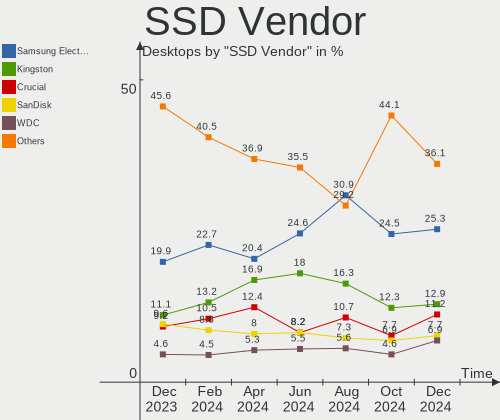
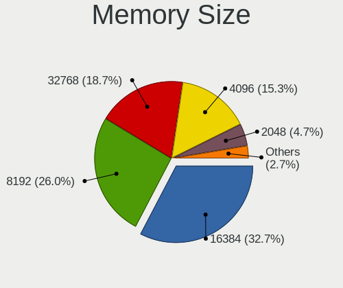
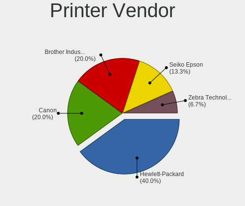
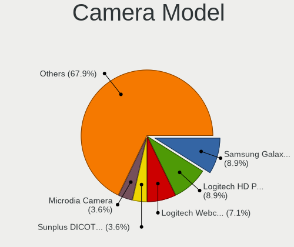

Ubuntu Hardware Trends (Desktops)
---------------------------------

A project to identify most popular hardware characteristics and track their change
over time based on data collected by Ubuntu users at https://Linux-Hardware.org.

Anyone can contribute to this report by the [hw-probe](https://github.com/linuxhw/hw-probe) tool:

    sudo -E hw-probe -all -upload

This report is for one last month. Overall report since the beginning of time: [TestCoverage](https://github.com/linuxhw/TestCoverage)

Period: Apr, 2022.

Contents
--------

* [ System ](#system)
  - [ OS                       ](#os)
  - [ OS Family                ](#os-family)
  - [ Kernel                   ](#kernel)
  - [ Kernel Family            ](#kernel-family)
  - [ Kernel Major Ver.        ](#kernel-major-ver)
  - [ Arch                     ](#arch)
  - [ DE                       ](#de)
  - [ Display Server           ](#display-server)
  - [ Display Manager          ](#display-manager)
  - [ OS Lang                  ](#os-lang)
  - [ Boot Mode                ](#boot-mode)
  - [ Filesystem               ](#filesystem)
  - [ Part. scheme             ](#part-scheme)
  - [ Dual Boot with Linux/BSD ](#dual-boot-with-linuxbsd)
  - [ Dual Boot (Win)          ](#dual-boot-win)

* [ Board ](#board)
  - [ Vendor                   ](#vendor)
  - [ Model                    ](#model)
  - [ Model Family             ](#model-family)
  - [ MFG Year                 ](#mfg-year)
  - [ Form Factor              ](#form-factor)
  - [ Secure Boot              ](#secure-boot)
  - [ Coreboot                 ](#coreboot)
  - [ RAM Size                 ](#ram-size)
  - [ RAM Used                 ](#ram-used)
  - [ Total Drives             ](#total-drives)
  - [ Has CD-ROM               ](#has-cd-rom)
  - [ Has Ethernet             ](#has-ethernet)
  - [ Has WiFi                 ](#has-wifi)
  - [ Has Bluetooth            ](#has-bluetooth)

* [ Location ](#location)
  - [ Country                  ](#country)
  - [ City                     ](#city)

* [ Drives ](#drives)
  - [ Drive Vendor             ](#drive-vendor)
  - [ Drive Model              ](#drive-model)
  - [ HDD Vendor               ](#hdd-vendor)
  - [ SSD Vendor               ](#ssd-vendor)
  - [ Drive Kind               ](#drive-kind)
  - [ Drive Connector          ](#drive-connector)
  - [ Drive Size               ](#drive-size)
  - [ Space Total              ](#space-total)
  - [ Space Used               ](#space-used)
  - [ Malfunc. Drives          ](#malfunc-drives)
  - [ Malfunc. Drive Vendor    ](#malfunc-drive-vendor)
  - [ Malfunc. HDD Vendor      ](#malfunc-hdd-vendor)
  - [ Malfunc. Drive Kind      ](#malfunc-drive-kind)
  - [ Failed Drives            ](#failed-drives)
  - [ Failed Drive Vendor      ](#failed-drive-vendor)
  - [ Drive Status             ](#drive-status)

* [ Storage controller ](#storage-controller)
  - [ Storage Vendor           ](#storage-vendor)
  - [ Storage Model            ](#storage-model)
  - [ Storage Kind             ](#storage-kind)

* [ Processor ](#processor)
  - [ CPU Vendor               ](#cpu-vendor)
  - [ CPU Model                ](#cpu-model)
  - [ CPU Model Family         ](#cpu-model-family)
  - [ CPU Cores                ](#cpu-cores)
  - [ CPU Sockets              ](#cpu-sockets)
  - [ CPU Threads              ](#cpu-threads)
  - [ CPU Op-Modes             ](#cpu-op-modes)
  - [ CPU Microcode            ](#cpu-microcode)
  - [ CPU Microarch            ](#cpu-microarch)

* [ Graphics ](#graphics)
  - [ GPU Vendor               ](#gpu-vendor)
  - [ GPU Model                ](#gpu-model)
  - [ GPU Combo                ](#gpu-combo)
  - [ GPU Driver               ](#gpu-driver)
  - [ GPU Memory               ](#gpu-memory)

* [ Monitor ](#monitor)
  - [ Monitor Vendor           ](#monitor-vendor)
  - [ Monitor Model            ](#monitor-model)
  - [ Monitor Resolution       ](#monitor-resolution)
  - [ Monitor Diagonal         ](#monitor-diagonal)
  - [ Monitor Width            ](#monitor-width)
  - [ Aspect Ratio             ](#aspect-ratio)
  - [ Monitor Area             ](#monitor-area)
  - [ Pixel Density            ](#pixel-density)
  - [ Multiple Monitors        ](#multiple-monitors)

* [ Network ](#network)
  - [ Net Controller Vendor    ](#net-controller-vendor)
  - [ Net Controller Model     ](#net-controller-model)
  - [ Wireless Vendor          ](#wireless-vendor)
  - [ Wireless Model           ](#wireless-model)
  - [ Ethernet Vendor          ](#ethernet-vendor)
  - [ Ethernet Model           ](#ethernet-model)
  - [ Net Controller Kind      ](#net-controller-kind)
  - [ Used Controller          ](#used-controller)
  - [ NICs                     ](#nics)
  - [ IPv6                     ](#ipv6)

* [ Bluetooth ](#bluetooth)
  - [ Bluetooth Vendor         ](#bluetooth-vendor)
  - [ Bluetooth Model          ](#bluetooth-model)

* [ Sound ](#sound)
  - [ Sound Vendor             ](#sound-vendor)
  - [ Sound Model              ](#sound-model)

* [ Memory ](#memory)
  - [ Memory Vendor            ](#memory-vendor)
  - [ Memory Model             ](#memory-model)
  - [ Memory Kind              ](#memory-kind)
  - [ Memory Form Factor       ](#memory-form-factor)
  - [ Memory Size              ](#memory-size)
  - [ Memory Speed             ](#memory-speed)

* [ Printers & scanners ](#printers--scanners)
  - [ Printer Vendor           ](#printer-vendor)
  - [ Printer Model            ](#printer-model)
  - [ Scanner Vendor           ](#scanner-vendor)
  - [ Scanner Model            ](#scanner-model)

* [ Camera ](#camera)
  - [ Camera Vendor            ](#camera-vendor)
  - [ Camera Model             ](#camera-model)

* [ Security ](#security)
  - [ Fingerprint Vendor       ](#fingerprint-vendor)
  - [ Fingerprint Model        ](#fingerprint-model)
  - [ Chipcard Vendor          ](#chipcard-vendor)
  - [ Chipcard Model           ](#chipcard-model)

* [ Unsupported ](#unsupported)
  - [ Unsupported Devices      ](#unsupported-devices)
  - [ Unsupported Device Types ](#unsupported-device-types)

System
------

OS
--

Installed operating systems

| Name         | Desktops | Percent |
|--------------|----------|---------|
| Ubuntu 20.04 | 251      | 51.02%  |
| Ubuntu 21.10 | 113      | 22.97%  |
| Ubuntu 22.04 | 89       | 18.09%  |
| Ubuntu 18.04 | 28       | 5.69%   |
| Ubuntu 16.04 | 6        | 1.22%   |
| Ubuntu 21.04 | 4        | 0.81%   |
| Ubuntu 20.10 | 1        | 0.2%    |

OS Family
---------

OS without a version

| Name   | Desktops | Percent |
|--------|----------|---------|
| Ubuntu | 492      | 100%    |

Kernel
------

Version of the Linux kernel

| Version                   | Desktops | Percent |
|---------------------------|----------|---------|
| 5.13.0-39-generic         | 180      | 36.59%  |
| 5.13.0-40-generic         | 75       | 15.24%  |
| 5.15.0-25-generic         | 40       | 8.13%   |
| 5.15.0-27-generic         | 34       | 6.91%   |
| 5.4.0-107-generic         | 31       | 6.3%    |
| 5.4.0-109-generic         | 16       | 3.25%   |
| 5.13.0-37-generic         | 14       | 2.85%   |
| 5.13.0-30-generic         | 10       | 2.03%   |
| 5.15.0-23-generic         | 8        | 1.63%   |
| 4.15.0-175-generic        | 7        | 1.42%   |
| 5.11.0-27-generic         | 6        | 1.22%   |
| 5.13.0-35-generic         | 4        | 0.81%   |
| 4.15.0-142-generic        | 4        | 0.81%   |
| 5.4.0-42-generic          | 3        | 0.61%   |
| 5.4.0-107-lowlatency      | 3        | 0.61%   |
| 5.13.0-19-generic         | 3        | 0.61%   |
| 5.11.0-49-generic         | 3        | 0.61%   |
| 5.4.0-92-generic          | 2        | 0.41%   |
| 5.4.0-72-generic          | 2        | 0.41%   |
| 5.4.0-105-generic         | 2        | 0.41%   |
| 5.4.0-104-generic         | 2        | 0.41%   |
| 5.13.0-27-generic         | 2        | 0.41%   |
| 5.11.0-41-generic         | 2        | 0.41%   |
| 5.8.0-48-generic          | 1        | 0.2%    |
| 5.8.0-45-generic          | 1        | 0.2%    |
| 5.8.0-44-generic          | 1        | 0.2%    |
| 5.8.0-41-generic          | 1        | 0.2%    |
| 5.6.0-050600-generic      | 1        | 0.2%    |
| 5.4.0-99-generic          | 1        | 0.2%    |
| 5.4.0-97-generic          | 1        | 0.2%    |
| 5.4.0-48-generic          | 1        | 0.2%    |
| 5.4.0-26-generic          | 1        | 0.2%    |
| 5.4.0-108-generic         | 1        | 0.2%    |
| 5.4.0-1047-fips           | 1        | 0.2%    |
| 5.17.5-051705-generic     | 1        | 0.2%    |
| 5.17.4-051704-generic     | 1        | 0.2%    |
| 5.17.3-051703-generic     | 1        | 0.2%    |
| 5.17.2-051702-generic     | 1        | 0.2%    |
| 5.17.1-051701-generic     | 1        | 0.2%    |
| 5.17.0-tkg-cacule         | 1        | 0.2%    |
| 5.17.0-4.1-liquorix-amd64 | 1        | 0.2%    |
| 5.17.0-2.2-liquorix-amd64 | 1        | 0.2%    |
| 5.17.0-1003-oem           | 1        | 0.2%    |
| 5.17.0-051700-generic     | 1        | 0.2%    |
| 5.16.18-051618-generic    | 1        | 0.2%    |
| 5.15.0-27-lowlatency      | 1        | 0.2%    |
| 5.14.0-1029-oem           | 1        | 0.2%    |
| 5.13.0-41-generic         | 1        | 0.2%    |
| 5.13.0-40-lowlatency      | 1        | 0.2%    |
| 5.13.0-37-lowlatency      | 1        | 0.2%    |
| 5.13.0-32-generic         | 1        | 0.2%    |
| 5.13.0-28-generic         | 1        | 0.2%    |
| 5.13.0-22-generic         | 1        | 0.2%    |
| 5.13.0-1017-oem           | 1        | 0.2%    |
| 5.11.0-46-generic         | 1        | 0.2%    |
| 5.11.0-43-generic         | 1        | 0.2%    |
| 5.10.0-hiveos             | 1        | 0.2%    |
| 4.8.0-36-generic          | 1        | 0.2%    |
| 4.4.0-210-lowlatency      | 1        | 0.2%    |
| 4.15.0-45-generic         | 1        | 0.2%    |

Kernel Family
-------------

Linux kernel without a distro release

| Version | Desktops | Percent |
|---------|----------|---------|
| 5.13.0  | 295      | 59.96%  |
| 5.15.0  | 83       | 16.87%  |
| 5.4.0   | 67       | 13.62%  |
| 4.15.0  | 14       | 2.85%   |
| 5.11.0  | 13       | 2.64%   |
| 5.17.0  | 5        | 1.02%   |
| 5.8.0   | 4        | 0.81%   |
| 5.6.0   | 1        | 0.2%    |
| 5.17.5  | 1        | 0.2%    |
| 5.17.4  | 1        | 0.2%    |
| 5.17.3  | 1        | 0.2%    |
| 5.17.2  | 1        | 0.2%    |
| 5.17.1  | 1        | 0.2%    |
| 5.16.18 | 1        | 0.2%    |
| 5.14.0  | 1        | 0.2%    |
| 5.10.0  | 1        | 0.2%    |
| 4.8.0   | 1        | 0.2%    |
| 4.4.0   | 1        | 0.2%    |

Kernel Major Ver.
-----------------

Linux kernel major version

| Version | Desktops | Percent |
|---------|----------|---------|
| 5.13    | 295      | 59.96%  |
| 5.15    | 83       | 16.87%  |
| 5.4     | 67       | 13.62%  |
| 4.15    | 14       | 2.85%   |
| 5.11    | 13       | 2.64%   |
| 5.17    | 10       | 2.03%   |
| 5.8     | 4        | 0.81%   |
| 5.6     | 1        | 0.2%    |
| 5.16    | 1        | 0.2%    |
| 5.14    | 1        | 0.2%    |
| 5.10    | 1        | 0.2%    |
| 4.8     | 1        | 0.2%    |
| 4.4     | 1        | 0.2%    |

Arch
----

OS architecture (x86_64, i586, etc.)

| Name   | Desktops | Percent |
|--------|----------|---------|
| x86_64 | 486      | 98.78%  |
| i686   | 6        | 1.22%   |

DE
--

Desktop Environment

| Name            | Desktops | Percent |
|-----------------|----------|---------|
| GNOME           | 436      | 88.62%  |
| Unknown         | 33       | 6.71%   |
| Unity           | 8        | 1.63%   |
| X-Cinnamon      | 4        | 0.81%   |
| i3              | 3        | 0.61%   |
| GNOME Flashback | 3        | 0.61%   |
| openbox         | 1        | 0.2%    |
| Lubuntu         | 1        | 0.2%    |
| kde             | 1        | 0.2%    |
| Cinnamon        | 1        | 0.2%    |
| awesome         | 1        | 0.2%    |

Display Server
--------------

X11 or Wayland

| Name    | Desktops | Percent |
|---------|----------|---------|
| X11     | 331      | 67.28%  |
| Wayland | 127      | 25.81%  |
| Tty     | 24       | 4.88%   |
| Unknown | 10       | 2.03%   |

Display Manager
---------------

SDDM, LightDM, etc.

| Name    | Desktops | Percent |
|---------|----------|---------|
| GDM3    | 295      | 59.96%  |
| GDM     | 119      | 24.19%  |
| Unknown | 50       | 10.16%  |
| LightDM | 20       | 4.07%   |
| SDDM    | 6        | 1.22%   |
| SLiM    | 1        | 0.2%    |
| LXDM    | 1        | 0.2%    |

OS Lang
-------

Language

| Lang    | Desktops | Percent |
|---------|----------|---------|
| en_US   | 200      | 40.65%  |
| de_DE   | 56       | 11.38%  |
| fr_FR   | 32       | 6.5%    |
| en_GB   | 25       | 5.08%   |
| en_CA   | 24       | 4.88%   |
| pt_BR   | 23       | 4.67%   |
| es_ES   | 14       | 2.85%   |
| ru_RU   | 13       | 2.64%   |
| pl_PL   | 12       | 2.44%   |
| en_AU   | 10       | 2.03%   |
| ja_JP   | 9        | 1.83%   |
| it_IT   | 9        | 1.83%   |
| cs_CZ   | 8        | 1.63%   |
| en_IN   | 7        | 1.42%   |
| nl_NL   | 6        | 1.22%   |
| Unknown | 6        | 1.22%   |
| en_ZA   | 3        | 0.61%   |
| el_GR   | 3        | 0.61%   |
| de_AT   | 3        | 0.61%   |
| C       | 3        | 0.61%   |
| ro_RO   | 2        | 0.41%   |
| hu_HU   | 2        | 0.41%   |
| fi_FI   | 2        | 0.41%   |
| ca_ES   | 2        | 0.41%   |
| zh_CN   | 1        | 0.2%    |
| tr_TR   | 1        | 0.2%    |
| sv_SE   | 1        | 0.2%    |
| sk_SK   | 1        | 0.2%    |
| pt_PT   | 1        | 0.2%    |
| nl_BE   | 1        | 0.2%    |
| hr_HR   | 1        | 0.2%    |
| fr_CA   | 1        | 0.2%    |
| es_US   | 1        | 0.2%    |
| es_MX   | 1        | 0.2%    |
| es_GT   | 1        | 0.2%    |
| es_DO   | 1        | 0.2%    |
| es_CL   | 1        | 0.2%    |
| es_AR   | 1        | 0.2%    |
| en_NZ   | 1        | 0.2%    |
| en_IL   | 1        | 0.2%    |
| en_HK   | 1        | 0.2%    |
| de_CH   | 1        | 0.2%    |

Boot Mode
---------

EFI or BIOS

| Mode | Desktops | Percent |
|------|----------|---------|
| BIOS | 314      | 63.82%  |
| EFI  | 178      | 36.18%  |

Filesystem
----------

Type of filesystem

| Type    | Desktops | Percent |
|---------|----------|---------|
| Ext4    | 452      | 91.87%  |
| Overlay | 14       | 2.85%   |
| Zfs     | 12       | 2.44%   |
| Btrfs   | 8        | 1.63%   |
| Xfs     | 4        | 0.81%   |
| Ext3    | 1        | 0.2%    |
| Ext2    | 1        | 0.2%    |

Part. scheme
------------

Scheme of partitioning

| Type    | Desktops | Percent |
|---------|----------|---------|
| Unknown | 321      | 65.24%  |
| GPT     | 130      | 26.42%  |
| MBR     | 41       | 8.33%   |

Dual Boot with Linux/BSD
------------------------

Hosting more than one Linux/BSD

| Dual boot | Desktops | Percent |
|-----------|----------|---------|
| No        | 395      | 80.28%  |
| Yes       | 97       | 19.72%  |

Dual Boot (Win)
---------------

Hosting Linux and Windows

| Dual boot | Desktops | Percent |
|-----------|----------|---------|
| No        | 300      | 60.98%  |
| Yes       | 192      | 39.02%  |

Board
-----

Vendor
------

Motherboard manufacturer

| Name                | Desktops | Percent |
|---------------------|----------|---------|
| ASUSTek Computer    | 125      | 25.41%  |
| Gigabyte Technology | 83       | 16.87%  |
| MSI                 | 76       | 15.45%  |
| Dell                | 50       | 10.16%  |
| Hewlett-Packard     | 34       | 6.91%   |
| ASRock              | 28       | 5.69%   |
| Lenovo              | 20       | 4.07%   |
| Unknown             | 9        | 1.83%   |
| Acer                | 7        | 1.42%   |
| Medion              | 6        | 1.22%   |
| Intel               | 6        | 1.22%   |
| Foxconn             | 5        | 1.02%   |
| Biostar             | 5        | 1.02%   |
| Pegatron            | 4        | 0.81%   |
| Fujitsu             | 4        | 0.81%   |
| Apple               | 4        | 0.81%   |
| ECS                 | 3        | 0.61%   |
| Alienware           | 3        | 0.61%   |
| Packard Bell        | 2        | 0.41%   |
| Huanan              | 2        | 0.41%   |
| SiS Technology      | 1        | 0.2%    |
| Shuttle             | 1        | 0.2%    |
| Seco                | 1        | 0.2%    |
| Positivo            | 1        | 0.2%    |
| Pepper Jobs         | 1        | 0.2%    |
| PCWare              | 1        | 0.2%    |
| NF541               | 1        | 0.2%    |
| Minix               | 1        | 0.2%    |
| Maxtang             | 1        | 0.2%    |
| Lanix               | 1        | 0.2%    |
| HARDKERNEL          | 1        | 0.2%    |
| Gateway             | 1        | 0.2%    |
| Fujitsu Siemens     | 1        | 0.2%    |
| EVGA                | 1        | 0.2%    |
| Casper              | 1        | 0.2%    |
| AMI                 | 1        | 0.2%    |

Model
-----

Motherboard model

| Name                            | Desktops | Percent |
|---------------------------------|----------|---------|
| ASUS All Series                 | 17       | 3.46%   |
| Unknown                         | 10       | 2.03%   |
| Dell OptiPlex 7010              | 5        | 1.02%   |
| MSI MS-7C56                     | 3        | 0.61%   |
| MSI MS-7C37                     | 3        | 0.61%   |
| MSI MS-7C02                     | 3        | 0.61%   |
| MSI MS-7B79                     | 3        | 0.61%   |
| Gigabyte B450M DS3H             | 3        | 0.61%   |
| Dell OptiPlex 990               | 3        | 0.61%   |
| Dell OptiPlex 390               | 3        | 0.61%   |
| Dell OptiPlex 3050              | 3        | 0.61%   |
| Dell OptiPlex 3020              | 3        | 0.61%   |
| MSI MS-7D22                     | 2        | 0.41%   |
| MSI MS-7C80                     | 2        | 0.41%   |
| MSI MS-7C52                     | 2        | 0.41%   |
| MSI MS-7C35                     | 2        | 0.41%   |
| MSI MS-7B98                     | 2        | 0.41%   |
| MSI MS-7B48                     | 2        | 0.41%   |
| MSI MS-7971                     | 2        | 0.41%   |
| MSI MS-7917                     | 2        | 0.41%   |
| MSI MS-7850                     | 2        | 0.41%   |
| MSI MS-7817                     | 2        | 0.41%   |
| MSI MS-7721                     | 2        | 0.41%   |
| MSI MS-7693                     | 2        | 0.41%   |
| HP EliteDesk 800 G1 USDT        | 2        | 0.41%   |
| HP Compaq Elite 8300 SFF        | 2        | 0.41%   |
| HP Compaq 8200 Elite SFF PC     | 2        | 0.41%   |
| HP Compaq 6000 Pro SFF PC       | 2        | 0.41%   |
| Gigabyte Z370P D3               | 2        | 0.41%   |
| Gigabyte GA-78LMT-USB3 6.0      | 2        | 0.41%   |
| Gigabyte B85M-D3H               | 2        | 0.41%   |
| Gigabyte B450 AORUS M           | 2        | 0.41%   |
| Gigabyte 970A-DS3P              | 2        | 0.41%   |
| Dell Precision 5820 Tower       | 2        | 0.41%   |
| Dell OptiPlex 9020              | 2        | 0.41%   |
| Dell OptiPlex 7040              | 2        | 0.41%   |
| ASUS TUF Gaming X570-PLUS       | 2        | 0.41%   |
| ASUS TUF Gaming B560-PLUS WIFI  | 2        | 0.41%   |
| ASUS ROG STRIX B550-I GAMING    | 2        | 0.41%   |
| ASUS Pro WS WRX80E-SAGE SE WIFI | 2        | 0.41%   |
| ASUS PRIME Z690-P WIFI D4       | 2        | 0.41%   |
| ASUS PRIME B550-PLUS            | 2        | 0.41%   |
| ASUS P9X79                      | 2        | 0.41%   |
| ASUS P8H61-M LX3 R2.0           | 2        | 0.41%   |
| ASUS P8B75-M                    | 2        | 0.41%   |
| ASUS M5A97 LE R2.0              | 2        | 0.41%   |
| ASUS M5A78L-M/USB3              | 2        | 0.41%   |
| ASUS M5A78L-M PLUS/USB3         | 2        | 0.41%   |
| ASUS M5A78L-M LX3               | 2        | 0.41%   |
| ASUS H110M-A/M.2                | 2        | 0.41%   |
| ASRock X470 Taichi Ultimate     | 2        | 0.41%   |
| Apple MacPro5,1                 | 2        | 0.41%   |
| Alienware Aurora R12            | 2        | 0.41%   |
| SiS 741                         | 1        | 0.2%    |
| Shuttle SG41                    | 1        | 0.2%    |
| Seco C40                        | 1        | 0.2%    |
| Positivo POS-ECIG41BS           | 1        | 0.2%    |
| Pepper Jobs GLK-UC2X            | 1        | 0.2%    |
| Pegatron p7-1110                | 1        | 0.2%    |
| Pegatron IPMH61P1               | 1        | 0.2%    |

Model Family
------------

Motherboard model prefix

| Name                   | Desktops | Percent |
|------------------------|----------|---------|
| Dell OptiPlex          | 31       | 6.3%    |
| ASUS PRIME             | 23       | 4.67%   |
| ASUS All               | 17       | 3.46%   |
| Lenovo ThinkCentre     | 15       | 3.05%   |
| HP Compaq              | 14       | 2.85%   |
| ASUS ROG               | 14       | 2.85%   |
| Unknown                | 10       | 2.03%   |
| Dell Precision         | 7        | 1.42%   |
| ASUS TUF               | 7        | 1.42%   |
| ASUS M5A78L-M          | 7        | 1.42%   |
| HP EliteDesk           | 6        | 1.22%   |
| Acer Aspire            | 5        | 1.02%   |
| Gigabyte B550          | 4        | 0.81%   |
| Gigabyte B450M         | 4        | 0.81%   |
| Dell Vostro            | 4        | 0.81%   |
| Dell Inspiron          | 4        | 0.81%   |
| ASUS Pro               | 4        | 0.81%   |
| ASUS P8H61-M           | 4        | 0.81%   |
| MSI MS-7C56            | 3        | 0.61%   |
| MSI MS-7C37            | 3        | 0.61%   |
| MSI MS-7C02            | 3        | 0.61%   |
| MSI MS-7B79            | 3        | 0.61%   |
| Lenovo ThinkStation    | 3        | 0.61%   |
| Gigabyte B450          | 3        | 0.61%   |
| ASUS P9X79             | 3        | 0.61%   |
| ASRock X470            | 3        | 0.61%   |
| Alienware Aurora       | 3        | 0.61%   |
| Packard Bell IMEDIA    | 2        | 0.41%   |
| MSI MS-7D22            | 2        | 0.41%   |
| MSI MS-7C80            | 2        | 0.41%   |
| MSI MS-7C52            | 2        | 0.41%   |
| MSI MS-7C35            | 2        | 0.41%   |
| MSI MS-7B98            | 2        | 0.41%   |
| MSI MS-7B48            | 2        | 0.41%   |
| MSI MS-7971            | 2        | 0.41%   |
| MSI MS-7917            | 2        | 0.41%   |
| MSI MS-7850            | 2        | 0.41%   |
| MSI MS-7817            | 2        | 0.41%   |
| MSI MS-7721            | 2        | 0.41%   |
| MSI MS-7693            | 2        | 0.41%   |
| HP Z210                | 2        | 0.41%   |
| HP ProLiant            | 2        | 0.41%   |
| Gigabyte Z590          | 2        | 0.41%   |
| Gigabyte Z370P         | 2        | 0.41%   |
| Gigabyte Z370          | 2        | 0.41%   |
| Gigabyte X570          | 2        | 0.41%   |
| Gigabyte H61M-DS2      | 2        | 0.41%   |
| Gigabyte H310M         | 2        | 0.41%   |
| Gigabyte GA-78LMT-USB3 | 2        | 0.41%   |
| Gigabyte B85M-D3H      | 2        | 0.41%   |
| Gigabyte B550M         | 2        | 0.41%   |
| Gigabyte 970A-DS3P     | 2        | 0.41%   |
| Fujitsu ESPRIMO        | 2        | 0.41%   |
| ASUS P8B75-M           | 2        | 0.41%   |
| ASUS Maximus           | 2        | 0.41%   |
| ASUS M5A97             | 2        | 0.41%   |
| ASUS H110M-A           | 2        | 0.41%   |
| ASRock X570            | 2        | 0.41%   |
| Apple MacPro5          | 2        | 0.41%   |
| SiS 741                | 1        | 0.2%    |

MFG Year
--------

Motherboard manufacture year

| Year | Desktops | Percent |
|------|----------|---------|
| 2012 | 49       | 9.96%   |
| 2021 | 46       | 9.35%   |
| 2018 | 46       | 9.35%   |
| 2013 | 45       | 9.15%   |
| 2014 | 42       | 8.54%   |
| 2020 | 39       | 7.93%   |
| 2019 | 35       | 7.11%   |
| 2011 | 35       | 7.11%   |
| 2017 | 26       | 5.28%   |
| 2010 | 26       | 5.28%   |
| 2009 | 24       | 4.88%   |
| 2016 | 23       | 4.67%   |
| 2015 | 19       | 3.86%   |
| 2008 | 13       | 2.64%   |
| 2007 | 12       | 2.44%   |
| 2022 | 6        | 1.22%   |
| 2006 | 4        | 0.81%   |
| 2005 | 1        | 0.2%    |
| 2004 | 1        | 0.2%    |

Form Factor
-----------

Physical design of the computer

| Name    | Desktops | Percent |
|---------|----------|---------|
| Desktop | 492      | 100%    |

Secure Boot
-----------

Enabled or disabled

| State    | Desktops | Percent |
|----------|----------|---------|
| Disabled | 475      | 96.54%  |
| Enabled  | 17       | 3.46%   |

Coreboot
--------

Have coreboot on board

| Used | Desktops | Percent |
|------|----------|---------|
| No   | 492      | 100%    |

RAM Size
--------

Total RAM memory

| Size in GB      | Desktops | Percent |
|-----------------|----------|---------|
| 16.01-24.0      | 120      | 24.39%  |
| 4.01-8.0        | 79       | 16.06%  |
| 8.01-16.0       | 78       | 15.85%  |
| 32.01-64.0      | 75       | 15.24%  |
| 3.01-4.0        | 71       | 14.43%  |
| 64.01-256.0     | 40       | 8.13%   |
| 1.01-2.0        | 14       | 2.85%   |
| 24.01-32.0      | 11       | 2.24%   |
| More than 256.0 | 2        | 0.41%   |
| 2.01-3.0        | 2        | 0.41%   |

RAM Used
--------

Used RAM memory

| Used GB    | Desktops | Percent |
|------------|----------|---------|
| 1.01-2.0   | 173      | 35.16%  |
| 2.01-3.0   | 118      | 23.98%  |
| 4.01-8.0   | 95       | 19.31%  |
| 3.01-4.0   | 57       | 11.59%  |
| 8.01-16.0  | 24       | 4.88%   |
| 0.51-1.0   | 15       | 3.05%   |
| 24.01-32.0 | 3        | 0.61%   |
| 16.01-24.0 | 3        | 0.61%   |
| 0.01-0.5   | 3        | 0.61%   |
| 32.01-64.0 | 1        | 0.2%    |

Total Drives
------------

Number of drives on board

| Drives | Desktops | Percent |
|--------|----------|---------|
| 1      | 211      | 42.89%  |
| 2      | 135      | 27.44%  |
| 3      | 59       | 11.99%  |
| 4      | 38       | 7.72%   |
| 5      | 18       | 3.66%   |
| 6      | 13       | 2.64%   |
| 8      | 7        | 1.42%   |
| 7      | 6        | 1.22%   |
| 0      | 2        | 0.41%   |
| 45     | 1        | 0.2%    |
| 13     | 1        | 0.2%    |
| 9      | 1        | 0.2%    |

Has CD-ROM
----------

Has CD-ROM on board

| Presented | Desktops | Percent |
|-----------|----------|---------|
| No        | 262      | 53.25%  |
| Yes       | 230      | 46.75%  |

Has Ethernet
------------

Has Ethernet on board

| Presented | Desktops | Percent |
|-----------|----------|---------|
| Yes       | 488      | 99.19%  |
| No        | 4        | 0.81%   |

Has WiFi
--------

Has WiFi module

| Presented | Desktops | Percent |
|-----------|----------|---------|
| No        | 277      | 56.3%   |
| Yes       | 215      | 43.7%   |

Has Bluetooth
-------------

Has Bluetooth module

| Presented | Desktops | Percent |
|-----------|----------|---------|
| No        | 348      | 70.73%  |
| Yes       | 144      | 29.27%  |

Location
--------

Country
-------

Geographic location (country)

| Country            | Desktops | Percent |
|--------------------|----------|---------|
| USA                | 110      | 22.36%  |
| Germany            | 62       | 12.6%   |
| France             | 36       | 7.32%   |
| Canada             | 30       | 6.1%    |
| UK                 | 28       | 5.69%   |
| Brazil             | 26       | 5.28%   |
| Russia             | 20       | 4.07%   |
| Spain              | 18       | 3.66%   |
| Poland             | 14       | 2.85%   |
| Japan              | 10       | 2.03%   |
| Italy              | 10       | 2.03%   |
| Czechia            | 10       | 2.03%   |
| Australia          | 10       | 2.03%   |
| India              | 9        | 1.83%   |
| Netherlands        | 7        | 1.42%   |
| Austria            | 7        | 1.42%   |
| Switzerland        | 6        | 1.22%   |
| Sweden             | 5        | 1.02%   |
| Greece             | 5        | 1.02%   |
| Turkey             | 4        | 0.81%   |
| South Africa       | 4        | 0.81%   |
| Mexico             | 4        | 0.81%   |
| Finland            | 4        | 0.81%   |
| Serbia             | 3        | 0.61%   |
| Romania            | 3        | 0.61%   |
| Peru               | 3        | 0.61%   |
| Denmark            | 3        | 0.61%   |
| Belgium            | 3        | 0.61%   |
| Argentina          | 3        | 0.61%   |
| Taiwan             | 2        | 0.41%   |
| South Korea        | 2        | 0.41%   |
| Slovakia           | 2        | 0.41%   |
| Réunion           | 2        | 0.41%   |
| Portugal           | 2        | 0.41%   |
| Lithuania          | 2        | 0.41%   |
| Hungary            | 2        | 0.41%   |
| China              | 2        | 0.41%   |
| Tunisia            | 1        | 0.2%    |
| Thailand           | 1        | 0.2%    |
| Saudi Arabia       | 1        | 0.2%    |
| Puerto Rico        | 1        | 0.2%    |
| New Zealand        | 1        | 0.2%    |
| Moldova            | 1        | 0.2%    |
| Latvia             | 1        | 0.2%    |
| Kazakhstan         | 1        | 0.2%    |
| Israel             | 1        | 0.2%    |
| Indonesia          | 1        | 0.2%    |
| Hong Kong          | 1        | 0.2%    |
| Guatemala          | 1        | 0.2%    |
| Ghana              | 1        | 0.2%    |
| Egypt              | 1        | 0.2%    |
| Dominican Republic | 1        | 0.2%    |
| Cyprus             | 1        | 0.2%    |
| Croatia            | 1        | 0.2%    |
| Colombia           | 1        | 0.2%    |
| Chile              | 1        | 0.2%    |

City
----

Geographic location (city)

| City              | Desktops | Percent |
|-------------------|----------|---------|
| Toronto           | 5        | 1.02%   |
| Moscow            | 5        | 1.02%   |
| Sao Paulo         | 4        | 0.81%   |
| Istanbul          | 4        | 0.81%   |
| Berlin            | 4        | 0.81%   |
| Barcelona         | 4        | 0.81%   |
| Surrey            | 3        | 0.61%   |
| St Petersburg     | 3        | 0.61%   |
| San Diego         | 3        | 0.61%   |
| Portland          | 3        | 0.61%   |
| Paris             | 3        | 0.61%   |
| Miami             | 3        | 0.61%   |
| Marseille         | 3        | 0.61%   |
| Bucharest         | 3        | 0.61%   |
| Belgrade          | 3        | 0.61%   |
| Atlanta           | 3        | 0.61%   |
| Zdanice           | 2        | 0.41%   |
| Washington        | 2        | 0.41%   |
| Warsaw            | 2        | 0.41%   |
| Waghausel         | 2        | 0.41%   |
| Vilnius           | 2        | 0.41%   |
| Vienna            | 2        | 0.41%   |
| Vancouver         | 2        | 0.41%   |
| Turin             | 2        | 0.41%   |
| Troisdorf         | 2        | 0.41%   |
| Topeka            | 2        | 0.41%   |
| Sydney            | 2        | 0.41%   |
| Stuttgart         | 2        | 0.41%   |
| Smyrna            | 2        | 0.41%   |
| Shinjuku          | 2        | 0.41%   |
| Seoul             | 2        | 0.41%   |
| San Jose          | 2        | 0.41%   |
| Pretoria          | 2        | 0.41%   |
| Perth             | 2        | 0.41%   |
| Perm              | 2        | 0.41%   |
| Ottawa            | 2        | 0.41%   |
| Ostrava           | 2        | 0.41%   |
| Oakland           | 2        | 0.41%   |
| Munich            | 2        | 0.41%   |
| Montreal          | 2        | 0.41%   |
| Milan             | 2        | 0.41%   |
| Melbourne         | 2        | 0.41%   |
| Matsudo           | 2        | 0.41%   |
| Lima              | 2        | 0.41%   |
| Kolkata           | 2        | 0.41%   |
| Kiel              | 2        | 0.41%   |
| Karlsruhe         | 2        | 0.41%   |
| Gothenburg        | 2        | 0.41%   |
| Goiânia          | 2        | 0.41%   |
| Frankfurt am Main | 2        | 0.41%   |
| Falkenstein       | 2        | 0.41%   |
| Edmonton          | 2        | 0.41%   |
| Edinburgh         | 2        | 0.41%   |
| Covington         | 2        | 0.41%   |
| Brisbane          | 2        | 0.41%   |
| Bakersfield       | 2        | 0.41%   |
| Athens            | 2        | 0.41%   |
| Arlington         | 2        | 0.41%   |
| Amsterdam         | 2        | 0.41%   |
| Ahmedabad         | 2        | 0.41%   |

Drives
------

Drive Vendor
------------

Hard drive vendors

| Vendor                      | Desktops | Drives | Percent |
|-----------------------------|----------|--------|---------|
| WDC                         | 169      | 235    | 19.93%  |
| Seagate                     | 158      | 228    | 18.63%  |
| Samsung Electronics         | 138      | 186    | 16.27%  |
| Kingston                    | 50       | 57     | 5.9%    |
| Toshiba                     | 46       | 60     | 5.42%   |
| SanDisk                     | 36       | 43     | 4.25%   |
| Crucial                     | 36       | 40     | 4.25%   |
| Hitachi                     | 25       | 27     | 2.95%   |
| Intel                       | 14       | 15     | 1.65%   |
| A-DATA Technology           | 14       | 17     | 1.65%   |
| OCZ                         | 10       | 12     | 1.18%   |
| HGST                        | 10       | 12     | 1.18%   |
| Phison                      | 9        | 10     | 1.06%   |
| Micron Technology           | 9        | 9      | 1.06%   |
| MAXTOR                      | 9        | 9      | 1.06%   |
| Unknown                     | 8        | 10     | 0.94%   |
| PNY                         | 7        | 8      | 0.83%   |
| China                       | 7        | 7      | 0.83%   |
| SPCC                        | 6        | 6      | 0.71%   |
| SK Hynix                    | 6        | 10     | 0.71%   |
| Mushkin                     | 4        | 7      | 0.47%   |
| Micron/Crucial Technology   | 4        | 7      | 0.47%   |
| GOODRAM                     | 4        | 4      | 0.47%   |
| ASMT                        | 4        | 4      | 0.47%   |
| Unknown                     | 4        | 4      | 0.47%   |
| XPG                         | 3        | 4      | 0.35%   |
| Transcend                   | 3        | 3      | 0.35%   |
| Silicon Motion              | 3        | 3      | 0.35%   |
| KIOXIA                      | 3        | 3      | 0.35%   |
| Intenso                     | 3        | 4      | 0.35%   |
| Fujitsu                     | 3        | 3      | 0.35%   |
| Verbatim                    | 2        | 3      | 0.24%   |
| Patriot                     | 2        | 2      | 0.24%   |
| LITEON                      | 2        | 2      | 0.24%   |
| JMicron                     | 2        | 3      | 0.24%   |
| Hewlett-Packard             | 2        | 2      | 0.24%   |
| Gigabyte Technology         | 2        | 2      | 0.24%   |
| Corsair                     | 2        | 2      | 0.24%   |
| Apacer                      | 2        | 2      | 0.24%   |
| Value                       | 1        | 1      | 0.12%   |
| UMIS                        | 1        | 1      | 0.12%   |
| Teclast                     | 1        | 1      | 0.12%   |
| Team                        | 1        | 1      | 0.12%   |
| TCSUNBOW                    | 1        | 1      | 0.12%   |
| StoreJet                    | 1        | 1      | 0.12%   |
| Smartbuy                    | 1        | 1      | 0.12%   |
| Pioneer                     | 1        | 1      | 0.12%   |
| Phison Electronics          | 1        | 1      | 0.12%   |
| NV-2242A                    | 1        | 1      | 0.12%   |
| Netac                       | 1        | 1      | 0.12%   |
| Mercury                     | 1        | 1      | 0.12%   |
| MAXIO Technology (Hangzhou) | 1        | 1      | 0.12%   |
| LONDISK                     | 1        | 2      | 0.12%   |
| KLEVV                       | 1        | 1      | 0.12%   |
| KIOXIA-EXCERIA              | 1        | 1      | 0.12%   |
| KingSpec                    | 1        | 1      | 0.12%   |
| Hoodisk                     | 1        | 1      | 0.12%   |
| FC-1307                     | 1        | 1      | 0.12%   |
| ExcelStor                   | 1        | 1      | 0.12%   |
| EMTEC                       | 1        | 1      | 0.12%   |

Drive Model
-----------

Hard drive models

| Model                            | Desktops | Percent |
|----------------------------------|----------|---------|
| Samsung SSD 860 EVO 500GB        | 17       | 1.7%    |
| Kingston SA400S37240G 240GB SSD  | 14       | 1.4%    |
| Samsung SSD 850 EVO 250GB        | 10       | 1%      |
| Samsung NVMe SSD Drive 250GB     | 10       | 1%      |
| Seagate ST500DM002-1BD142 500GB  | 9        | 0.9%    |
| Samsung NVMe SSD Drive 1TB       | 9        | 0.9%    |
| Crucial CT1000MX500SSD1 1TB      | 9        | 0.9%    |
| Seagate ST2000DM008-2FR102 2TB   | 8        | 0.8%    |
| Seagate ST1000DM003-1ER162 1TB   | 8        | 0.8%    |
| Samsung SSD 860 EVO 1TB          | 7        | 0.7%    |
| WDC WDS500G2B0A-00SM50 500GB SSD | 6        | 0.6%    |
| Toshiba MQ01ABD100 1TB           | 6        | 0.6%    |
| Seagate ST4000DM004-2CV104 4TB   | 6        | 0.6%    |
| Seagate ST3500418AS 500GB        | 6        | 0.6%    |
| Samsung SSD 980 PRO 1TB          | 6        | 0.6%    |
| Samsung HD103SJ 1TB              | 6        | 0.6%    |
| Crucial CT240BX500SSD1 240GB     | 6        | 0.6%    |
| WDC WD5000AAKX-60U6AA0 500GB     | 5        | 0.5%    |
| WDC WD20EZRZ-00Z5HB0 2TB         | 5        | 0.5%    |
| WDC WD20EFRX-68EUZN0 2TB         | 5        | 0.5%    |
| WDC WD20EARX-00PASB0 2TB         | 5        | 0.5%    |
| WDC WD10EZEX-08WN4A0 1TB         | 5        | 0.5%    |
| Toshiba DT01ACA100 1TB           | 5        | 0.5%    |
| Seagate ST3500413AS 500GB        | 5        | 0.5%    |
| Seagate ST3500312CS 500GB        | 5        | 0.5%    |
| Seagate ST31000528AS 1TB         | 5        | 0.5%    |
| Seagate ST31000524AS 1TB         | 5        | 0.5%    |
| Seagate ST2000DM001-1ER164 2TB   | 5        | 0.5%    |
| Seagate ST2000DM001-1CH164 2TB   | 5        | 0.5%    |
| Samsung SSD 980 1TB              | 5        | 0.5%    |
| Samsung SSD 970 EVO Plus 1TB     | 5        | 0.5%    |
| Samsung SSD 860 EVO 250GB        | 5        | 0.5%    |
| Samsung SSD 850 EVO 500GB        | 5        | 0.5%    |
| Kingston SA400S37480G 480GB SSD  | 5        | 0.5%    |
| WDC WD5000AAKX-08U6AA0 500GB     | 4        | 0.4%    |
| WDC WD40EFRX-68N32N0 4TB         | 4        | 0.4%    |
| WDC WD20EARS-00MVWB0 2TB         | 4        | 0.4%    |
| WDC WD1003FZEX-00K3CA0 1TB       | 4        | 0.4%    |
| Seagate ST8000DM004-2CX188 8TB   | 4        | 0.4%    |
| Seagate ST3250318AS 250GB        | 4        | 0.4%    |
| Seagate ST1000DM010-2EP102 1TB   | 4        | 0.4%    |
| Seagate ST1000DM003-9YN162 1TB   | 4        | 0.4%    |
| Sandisk NVMe SSD Drive 1TB       | 4        | 0.4%    |
| OCZ VERTEX4 128GB SSD            | 4        | 0.4%    |
| Kingston SA400S37120G 120GB SSD  | 4        | 0.4%    |
| Kingston NVMe SSD Drive 500GB    | 4        | 0.4%    |
| Kingston NVMe SSD Drive 1TB      | 4        | 0.4%    |
| Hitachi HDS721010CLA332 1TB      | 4        | 0.4%    |
| HGST HTS721010A9E630 1TB         | 4        | 0.4%    |
| Unknown                          | 4        | 0.4%    |
| WDC WDS240G2G0A-00JH30 240GB SSD | 3        | 0.3%    |
| WDC WD80EFAX-68KNBN0 8TB         | 3        | 0.3%    |
| WDC WD5000AAKX-75U6AA0 500GB     | 3        | 0.3%    |
| WDC WD5000AAKX-00ERMA0 500GB     | 3        | 0.3%    |
| WDC WD20EZRX-00D8PB0 2TB         | 3        | 0.3%    |
| WDC WD10EZEX-60WN4A0 1TB         | 3        | 0.3%    |
| WDC WD10EZEX-00BN5A0 1TB         | 3        | 0.3%    |
| WDC WD10EURX-63C57Y0 1TB         | 3        | 0.3%    |
| Toshiba MQ01ACF050 500GB         | 3        | 0.3%    |
| Toshiba HDWD110 1TB              | 3        | 0.3%    |

HDD Vendor
----------

Hard disk drive vendors

| Vendor              | Desktops | Drives | Percent |
|---------------------|----------|--------|---------|
| Seagate             | 156      | 225    | 37.41%  |
| WDC                 | 150      | 207    | 35.97%  |
| Toshiba             | 42       | 54     | 10.07%  |
| Hitachi             | 25       | 27     | 6%      |
| Samsung Electronics | 17       | 19     | 4.08%   |
| HGST                | 10       | 12     | 2.4%    |
| MAXTOR              | 8        | 8      | 1.92%   |
| Fujitsu             | 3        | 3      | 0.72%   |
| ASMT                | 3        | 3      | 0.72%   |
| Unknown             | 1        | 1      | 0.24%   |
| Hewlett-Packard     | 1        | 1      | 0.24%   |
| ExcelStor           | 1        | 1      | 0.24%   |

SSD Vendor
----------

Solid state drive vendors

| Vendor              | Desktops | Drives | Percent |
|---------------------|----------|--------|---------|
| Samsung Electronics | 79       | 93     | 26.16%  |
| Kingston            | 38       | 41     | 12.58%  |
| Crucial             | 34       | 38     | 11.26%  |
| SanDisk             | 25       | 30     | 8.28%   |
| WDC                 | 22       | 23     | 7.28%   |
| A-DATA Technology   | 11       | 13     | 3.64%   |
| OCZ                 | 8        | 8      | 2.65%   |
| Intel               | 8        | 8      | 2.65%   |
| PNY                 | 7        | 8      | 2.32%   |
| China               | 7        | 7      | 2.32%   |
| SPCC                | 5        | 5      | 1.66%   |
| SK Hynix            | 5        | 5      | 1.66%   |
| Micron Technology   | 4        | 4      | 1.32%   |
| GOODRAM             | 4        | 4      | 1.32%   |
| Transcend           | 3        | 3      | 0.99%   |
| Toshiba             | 3        | 3      | 0.99%   |
| Phison              | 3        | 3      | 0.99%   |
| Mushkin             | 3        | 6      | 0.99%   |
| Verbatim            | 2        | 3      | 0.66%   |
| Patriot             | 2        | 2      | 0.66%   |
| LITEON              | 2        | 2      | 0.66%   |
| Intenso             | 2        | 3      | 0.66%   |
| Gigabyte Technology | 2        | 2      | 0.66%   |
| Apacer              | 2        | 2      | 0.66%   |
| Value               | 1        | 1      | 0.33%   |
| Teclast             | 1        | 1      | 0.33%   |
| Team                | 1        | 1      | 0.33%   |
| StoreJet            | 1        | 1      | 0.33%   |
| Pioneer             | 1        | 1      | 0.33%   |
| Netac               | 1        | 1      | 0.33%   |
| Mercury             | 1        | 1      | 0.33%   |
| MAXTOR              | 1        | 1      | 0.33%   |
| LONDISK             | 1        | 2      | 0.33%   |
| KLEVV               | 1        | 1      | 0.33%   |
| KingSpec            | 1        | 1      | 0.33%   |
| JMicron             | 1        | 1      | 0.33%   |
| Hoodisk             | 1        | 1      | 0.33%   |
| Hewlett-Packard     | 1        | 1      | 0.33%   |
| EMTEC               | 1        | 1      | 0.33%   |
| Dogfish             | 1        | 1      | 0.33%   |
| Corsair             | 1        | 1      | 0.33%   |
| Apple               | 1        | 1      | 0.33%   |
| AMD                 | 1        | 1      | 0.33%   |
| AGI                 | 1        | 1      | 0.33%   |
| Unknown             | 1        | 1      | 0.33%   |

Drive Kind
----------

HDD or SSD

| Kind    | Desktops | Drives | Percent |
|---------|----------|--------|---------|
| HDD     | 333      | 561    | 45.62%  |
| SSD     | 257      | 338    | 35.21%  |
| NVMe    | 121      | 172    | 16.58%  |
| Unknown | 13       | 16     | 1.78%   |
| MMC     | 6        | 6      | 0.82%   |

Drive Connector
---------------

SATA, SAS, NVMe, etc.

| Type | Desktops | Drives | Percent |
|------|----------|--------|---------|
| SATA | 445      | 861    | 73.55%  |
| NVMe | 121      | 171    | 20%     |
| SAS  | 33       | 55     | 5.45%   |
| MMC  | 6        | 6      | 0.99%   |

Drive Size
----------

Size of hard drive

| Size in TB | Desktops | Drives | Percent |
|------------|----------|--------|---------|
| 0.01-0.5   | 320      | 431    | 48.85%  |
| 0.51-1.0   | 186      | 236    | 28.4%   |
| 1.01-2.0   | 78       | 102    | 11.91%  |
| 3.01-4.0   | 30       | 51     | 4.58%   |
| 4.01-10.0  | 21       | 53     | 3.21%   |
| 2.01-3.0   | 14       | 18     | 2.14%   |
| 10.01-20.0 | 6        | 8      | 0.92%   |

Space Total
-----------

Amount of disk space available on the file system

| Size in GB     | Desktops | Percent |
|----------------|----------|---------|
| 101-250        | 136      | 27.64%  |
| 251-500        | 90       | 18.29%  |
| 501-1000       | 83       | 16.87%  |
| More than 3000 | 53       | 10.77%  |
| 2001-3000      | 35       | 7.11%   |
| 1001-2000      | 35       | 7.11%   |
| 1-20           | 21       | 4.27%   |
| 51-100         | 21       | 4.27%   |
| Unknown        | 11       | 2.24%   |
| 21-50          | 7        | 1.42%   |

Space Used
----------

Amount of used disk space

| Used GB        | Desktops | Percent |
|----------------|----------|---------|
| 1-20           | 155      | 31.5%   |
| 21-50          | 76       | 15.45%  |
| 101-250        | 60       | 12.2%   |
| 51-100         | 52       | 10.57%  |
| 251-500        | 47       | 9.55%   |
| 501-1000       | 29       | 5.89%   |
| 1001-2000      | 27       | 5.49%   |
| More than 3000 | 23       | 4.67%   |
| 2001-3000      | 11       | 2.24%   |
| Unknown        | 11       | 2.24%   |
| 0              | 1        | 0.2%    |

Malfunc. Drives
---------------

Drive models with a malfunction

| Model                                          | Desktops | Drives | Percent |
|------------------------------------------------|----------|--------|---------|
| Toshiba MQ01ABD100 1TB                         | 2        | 2      | 4.44%   |
| Seagate ST3500418AS 500GB                      | 2        | 2      | 4.44%   |
| Seagate ST2000DM001-1CH164 2TB                 | 2        | 2      | 4.44%   |
| WDC WD40EZRX-00SPEB0 4TB                       | 1        | 1      | 2.22%   |
| WDC WD40EFRX-68N32N0 4TB                       | 1        | 2      | 2.22%   |
| WDC WD3200SD-01KNB0 320GB                      | 1        | 1      | 2.22%   |
| WDC WD20EZRZ-00Z5HB0 2TB                       | 1        | 1      | 2.22%   |
| WDC WD20EFRX-68EUZN0 2TB                       | 1        | 2      | 2.22%   |
| WDC WD10EZEX-60ZF5A0 1TB                       | 1        | 1      | 2.22%   |
| WDC WD10EZEX-00BN5A0 1TB                       | 1        | 1      | 2.22%   |
| WDC WD10EARS-00Y5B1 1TB                        | 1        | 1      | 2.22%   |
| WDC WD10EALX-009BA0 1TB                        | 1        | 1      | 2.22%   |
| WDC WD10EADS-22M2B0 1TB                        | 1        | 1      | 2.22%   |
| WDC WD10EADS-00L5B1 1TB                        | 1        | 1      | 2.22%   |
| WDC WD1003FZEX-00K3CA0 1TB                     | 1        | 1      | 2.22%   |
| WDC WD1002FBYS-02A6B0 1TB                      | 1        | 1      | 2.22%   |
| Toshiba MK5055GSXF 500GB                       | 1        | 1      | 2.22%   |
| Toshiba HDWD130 3TB                            | 1        | 1      | 2.22%   |
| SK Hynix HFS256G32MND-2200A 256GB SSD          | 1        | 1      | 2.22%   |
| Seagate ST8000AS0002-1NA17Z 8TB                | 1        | 2      | 2.22%   |
| Seagate ST500LT012-9WS142 500GB                | 1        | 1      | 2.22%   |
| Seagate ST500LM021-1KJ152 500GB                | 1        | 1      | 2.22%   |
| Seagate ST500DM002-1BD142 500GB                | 1        | 1      | 2.22%   |
| Seagate ST3250823AS 250GB                      | 1        | 1      | 2.22%   |
| Seagate ST32000644NS 59Y5483 59Y1807IBMV 2TB   | 1        | 1      | 2.22%   |
| Seagate ST3160815AS 160GB                      | 1        | 1      | 2.22%   |
| Seagate ST3000DM001-1ER166 3TB                 | 1        | 1      | 2.22%   |
| Seagate ST2000DM 008-2FR102 2TB                | 1        | 1      | 2.22%   |
| Seagate ST1000DM003-1SB10C 1TB                 | 1        | 1      | 2.22%   |
| SanDisk SSD PLUS 240GB                         | 1        | 1      | 2.22%   |
| SanDisk SDSSDHP256G 256GB                      | 1        | 1      | 2.22%   |
| Samsung Electronics SSD 840 PRO Series 256GB   | 1        | 1      | 2.22%   |
| Samsung Electronics HM121HI 120GB              | 1        | 1      | 2.22%   |
| Micron Technology MTFDDAK256MAM-1K12 256GB SSD | 1        | 1      | 2.22%   |
| MAXTOR STM3160215AS 160GB                      | 1        | 1      | 2.22%   |
| Kingston SUV400S37240G 240GB SSD               | 1        | 1      | 2.22%   |
| Hitachi HUA723020ALA641 2TB                    | 1        | 1      | 2.22%   |
| Hitachi HDT725050VLA380 500GB                  | 1        | 1      | 2.22%   |
| Hitachi HDT721032SLA380 320GB                  | 1        | 1      | 2.22%   |
| HGST HTS721010A9E630 1TB                       | 1        | 2      | 2.22%   |
| Fujitsu MHZ2160BH G2 160GB                     | 1        | 1      | 2.22%   |
| Corsair Performance Pro 128GB SSD              | 1        | 1      | 2.22%   |

Malfunc. Drive Vendor
---------------------

Vendors of faulty drives

| Vendor              | Desktops | Drives | Percent |
|---------------------|----------|--------|---------|
| Seagate             | 14       | 15     | 31.11%  |
| WDC                 | 13       | 15     | 28.89%  |
| Toshiba             | 4        | 4      | 8.89%   |
| Hitachi             | 3        | 3      | 6.67%   |
| SanDisk             | 2        | 2      | 4.44%   |
| Samsung Electronics | 2        | 2      | 4.44%   |
| SK Hynix            | 1        | 1      | 2.22%   |
| Micron Technology   | 1        | 1      | 2.22%   |
| MAXTOR              | 1        | 1      | 2.22%   |
| Kingston            | 1        | 1      | 2.22%   |
| HGST                | 1        | 2      | 2.22%   |
| Fujitsu             | 1        | 1      | 2.22%   |
| Corsair             | 1        | 1      | 2.22%   |

Malfunc. HDD Vendor
-------------------

Vendors of faulty HDD drives

| Vendor              | Desktops | Drives | Percent |
|---------------------|----------|--------|---------|
| Seagate             | 14       | 15     | 36.84%  |
| WDC                 | 13       | 15     | 34.21%  |
| Toshiba             | 4        | 4      | 10.53%  |
| Hitachi             | 3        | 3      | 7.89%   |
| Samsung Electronics | 1        | 1      | 2.63%   |
| MAXTOR              | 1        | 1      | 2.63%   |
| HGST                | 1        | 2      | 2.63%   |
| Fujitsu             | 1        | 1      | 2.63%   |

Malfunc. Drive Kind
-------------------

Kinds of faulty drives

| Kind | Desktops | Drives | Percent |
|------|----------|--------|---------|
| HDD  | 35       | 42     | 85.37%  |
| SSD  | 6        | 7      | 14.63%  |

Failed Drives
-------------

Failed drive models

| Model                    | Desktops | Drives | Percent |
|--------------------------|----------|--------|---------|
| Seagate ST31000520AS 1TB | 1        | 1      | 100%    |

Failed Drive Vendor
-------------------

Failed drive vendors

| Vendor  | Desktops | Drives | Percent |
|---------|----------|--------|---------|
| Seagate | 1        | 1      | 100%    |

Drive Status
------------

Number of failed and malfunc. drives

| Status   | Desktops | Drives | Percent |
|----------|----------|--------|---------|
| Detected | 330      | 718    | 61.22%  |
| Works    | 170      | 325    | 31.54%  |
| Malfunc  | 38       | 49     | 7.05%   |
| Failed   | 1        | 1      | 0.19%   |

Storage controller
------------------

Storage Vendor
--------------

Storage controller vendors

| Vendor                           | Desktops | Percent |
|----------------------------------|----------|---------|
| Intel                            | 347      | 49.57%  |
| AMD                              | 133      | 19%     |
| Samsung Electronics              | 58       | 8.29%   |
| ASMedia Technology               | 24       | 3.43%   |
| Marvell Technology Group         | 19       | 2.71%   |
| Sandisk                          | 17       | 2.43%   |
| JMicron Technology               | 16       | 2.29%   |
| Kingston Technology Company      | 13       | 1.86%   |
| Phison Electronics               | 11       | 1.57%   |
| Nvidia                           | 8        | 1.14%   |
| Micron/Crucial Technology        | 6        | 0.86%   |
| Micron Technology                | 5        | 0.71%   |
| LSI Logic / Symbios Logic        | 5        | 0.71%   |
| ADATA Technology                 | 5        | 0.71%   |
| Toshiba America Info Systems     | 4        | 0.57%   |
| Silicon Motion                   | 4        | 0.57%   |
| Silicon Image                    | 4        | 0.57%   |
| VIA Technologies                 | 3        | 0.43%   |
| SK Hynix                         | 3        | 0.43%   |
| Broadcom / LSI                   | 3        | 0.43%   |
| OCZ Technology Group             | 2        | 0.29%   |
| KIOXIA                           | 2        | 0.29%   |
| Unknown                          | 1        | 0.14%   |
| Union Memory (Shenzhen)          | 1        | 0.14%   |
| Silicon Integrated Systems [SiS] | 1        | 0.14%   |
| Realtek Semiconductor            | 1        | 0.14%   |
| MAXIO Technology (Hangzhou)      | 1        | 0.14%   |
| Integrated Technology Express    | 1        | 0.14%   |
| Apple                            | 1        | 0.14%   |
| Adaptec                          | 1        | 0.14%   |

Storage Model
-------------

Storage controller models

| Model                                                                                   | Desktops | Percent |
|-----------------------------------------------------------------------------------------|----------|---------|
| AMD FCH SATA Controller [AHCI mode]                                                     | 69       | 7.89%   |
| Intel 8 Series/C220 Series Chipset Family 6-port SATA Controller 1 [AHCI mode]          | 41       | 4.69%   |
| AMD 400 Series Chipset SATA Controller                                                  | 30       | 3.43%   |
| Samsung NVMe SSD Controller SM981/PM981/PM983                                           | 28       | 3.2%    |
| Intel Q170/Q150/B150/H170/H110/Z170/CM236 Chipset SATA Controller [AHCI Mode]           | 26       | 2.97%   |
| Intel 200 Series PCH SATA controller [AHCI mode]                                        | 26       | 2.97%   |
| Intel 6 Series/C200 Series Chipset Family 6 port Desktop SATA AHCI Controller           | 23       | 2.63%   |
| Intel 7 Series/C210 Series Chipset Family 6-port SATA Controller [AHCI mode]            | 22       | 2.52%   |
| Intel 6 Series/C200 Series Chipset Family Desktop SATA Controller (IDE mode, ports 4-5) | 21       | 2.4%    |
| Intel 6 Series/C200 Series Chipset Family Desktop SATA Controller (IDE mode, ports 0-3) | 21       | 2.4%    |
| AMD SB7x0/SB8x0/SB9x0 IDE Controller                                                    | 21       | 2.4%    |
| Intel SATA Controller [RAID mode]                                                       | 20       | 2.29%   |
| Intel NM10/ICH7 Family SATA Controller [IDE mode]                                       | 20       | 2.29%   |
| ASMedia ASM1062 Serial ATA Controller                                                   | 20       | 2.29%   |
| AMD 500 Series Chipset SATA Controller                                                  | 19       | 2.17%   |
| Intel 500 Series Chipset Family SATA AHCI Controller                                    | 17       | 1.95%   |
| AMD SB7x0/SB8x0/SB9x0 SATA Controller [AHCI mode]                                       | 17       | 1.95%   |
| AMD SB7x0/SB8x0/SB9x0 SATA Controller [IDE mode]                                        | 15       | 1.72%   |
| Intel 82801G (ICH7 Family) IDE Controller                                               | 13       | 1.49%   |
| Intel 9 Series Chipset Family SATA Controller [AHCI Mode]                               | 12       | 1.37%   |
| Samsung NVMe SSD Controller PM9A1/PM9A3/980PRO                                          | 11       | 1.26%   |
| Samsung NVMe SSD Controller 980                                                         | 11       | 1.26%   |
| Intel Cannon Lake PCH SATA AHCI Controller                                              | 11       | 1.26%   |
| Intel Alder Lake-S PCH SATA Controller [AHCI Mode]                                      | 11       | 1.26%   |
| Samsung NVMe SSD Controller SM961/PM961/SM963                                           | 10       | 1.14%   |
| Intel Comet Lake SATA AHCI Controller                                                   | 9        | 1.03%   |
| Kingston Company A2000 NVMe SSD                                                         | 8        | 0.92%   |
| Intel 82801JI (ICH10 Family) SATA AHCI Controller                                       | 8        | 0.92%   |
| Sandisk WD Blue SN550 NVMe SSD                                                          | 7        | 0.8%    |
| Marvell Group 88SE9172 SATA 6Gb/s Controller                                            | 7        | 0.8%    |
| JMicron JMB363 SATA/IDE Controller                                                      | 7        | 0.8%    |
| Intel Volume Management Device NVMe RAID Controller                                     | 7        | 0.8%    |
| Intel 82801JI (ICH10 Family) 4 port SATA IDE Controller #1                              | 7        | 0.8%    |
| Intel 82801JI (ICH10 Family) 2 port SATA IDE Controller #2                              | 7        | 0.8%    |
| Intel 5 Series/3400 Series Chipset 4 port SATA IDE Controller                           | 7        | 0.8%    |
| Intel 5 Series/3400 Series Chipset 2 port SATA IDE Controller                           | 7        | 0.8%    |
| Intel Celeron/Pentium Silver Processor SATA Controller                                  | 6        | 0.69%   |
| Intel C600/X79 series chipset SATA RAID Controller                                      | 6        | 0.69%   |
| Intel C600/X79 series chipset 6-Port SATA AHCI Controller                               | 6        | 0.69%   |
| Intel 7 Series/C210 Series Chipset Family 4-port SATA Controller [IDE mode]             | 6        | 0.69%   |
| Intel 7 Series/C210 Series Chipset Family 2-port SATA Controller [IDE mode]             | 6        | 0.69%   |
| Intel 4 Series Chipset PT IDER Controller                                               | 6        | 0.69%   |
| Phison E12 NVMe Controller                                                              | 5        | 0.57%   |
| Micron Non-Volatile memory controller                                                   | 5        | 0.57%   |
| JMicron JMB368 IDE controller                                                           | 5        | 0.57%   |
| Intel 82801JD/DO (ICH10 Family) SATA AHCI Controller                                    | 5        | 0.57%   |
| AMD FCH SATA Controller D                                                               | 5        | 0.57%   |
| Sandisk WD Blue SN570 NVMe SSD                                                          | 4        | 0.46%   |
| Nvidia MCP61 SATA Controller                                                            | 4        | 0.46%   |
| Marvell Group 88SE6111/6121 SATA II / PATA Controller                                   | 4        | 0.46%   |
| Intel 82Q35 Express PT IDER Controller                                                  | 4        | 0.46%   |
| Intel 82801I (ICH9 Family) 2 port SATA Controller [IDE mode]                            | 4        | 0.46%   |
| Intel 6 Series/C200 Series Chipset Family IDE-r Controller                              | 4        | 0.46%   |
| Intel 5 Series/3400 Series Chipset 6 port SATA AHCI Controller                          | 4        | 0.46%   |
| ADATA XPG SX8200 Pro PCIe Gen3x4 M.2 2280 Solid State Drive                             | 4        | 0.46%   |
| VIA VT6415 PATA IDE Host Controller                                                     | 3        | 0.34%   |
| SK Hynix Gold P31 SSD                                                                   | 3        | 0.34%   |
| Silicon Motion SM2263EN/SM2263XT SSD Controller                                         | 3        | 0.34%   |
| Sandisk Non-Volatile memory controller                                                  | 3        | 0.34%   |
| Phison E16 PCIe4 NVMe Controller                                                        | 3        | 0.34%   |

Storage Kind
------------

Kind of storage controller (IDE, SATA, NVMe, SAS, ...)

| Kind | Desktops | Percent |
|------|----------|---------|
| SATA | 377      | 54.96%  |
| IDE  | 129      | 18.8%   |
| NVMe | 121      | 17.64%  |
| RAID | 47       | 6.85%   |
| SAS  | 7        | 1.02%   |
| SCSI | 5        | 0.73%   |

Processor
---------

CPU Vendor
----------

Processor vendors

| Vendor | Desktops | Percent |
|--------|----------|---------|
| Intel  | 351      | 71.34%  |
| AMD    | 141      | 28.66%  |

CPU Model
---------

Processor models

| Model                                       | Desktops | Percent |
|---------------------------------------------|----------|---------|
| AMD Ryzen 5 3600 6-Core Processor           | 12       | 2.44%   |
| Intel Core i5-4590 CPU @ 3.30GHz            | 8        | 1.63%   |
| Intel Core i5-3470 CPU @ 3.20GHz            | 8        | 1.63%   |
| Intel Core i3-2120 CPU @ 3.30GHz            | 8        | 1.63%   |
| Intel Core i7-8700K CPU @ 3.70GHz           | 7        | 1.42%   |
| Intel Core i7-3770 CPU @ 3.40GHz            | 7        | 1.42%   |
| Intel Core i5-2400 CPU @ 3.10GHz            | 7        | 1.42%   |
| Intel Core i7-4790 CPU @ 3.60GHz            | 6        | 1.22%   |
| Intel Core i5-6500 CPU @ 3.20GHz            | 6        | 1.22%   |
| Intel Core i3-3220 CPU @ 3.30GHz            | 6        | 1.22%   |
| AMD Ryzen 7 5800X 8-Core Processor          | 6        | 1.22%   |
| AMD FX-6300 Six-Core Processor              | 6        | 1.22%   |
| Intel Core i7-6700 CPU @ 3.40GHz            | 5        | 1.02%   |
| Intel Core i7-4790K CPU @ 4.00GHz           | 5        | 1.02%   |
| Intel Core i5-4570 CPU @ 3.20GHz            | 5        | 1.02%   |
| AMD Ryzen 9 3900X 12-Core Processor         | 5        | 1.02%   |
| AMD Ryzen 7 3700X 8-Core Processor          | 5        | 1.02%   |
| AMD Ryzen 5 2600 Six-Core Processor         | 5        | 1.02%   |
| Intel Core i9-9900K CPU @ 3.60GHz           | 4        | 0.81%   |
| Intel Core i7-7700 CPU @ 3.60GHz            | 4        | 0.81%   |
| Intel Core i7-4770 CPU @ 3.40GHz            | 4        | 0.81%   |
| Intel Core i7 CPU 920 @ 2.67GHz             | 4        | 0.81%   |
| Intel Core i5-4460 CPU @ 3.20GHz            | 4        | 0.81%   |
| Intel Core i5-3570 CPU @ 3.40GHz            | 4        | 0.81%   |
| Intel Core i3-3240 CPU @ 3.40GHz            | 4        | 0.81%   |
| Intel Core 2 Duo CPU E7500 @ 2.93GHz        | 4        | 0.81%   |
| AMD Ryzen 7 2700 Eight-Core Processor       | 4        | 0.81%   |
| AMD Ryzen 5 5600G with Radeon Graphics      | 4        | 0.81%   |
| AMD Ryzen 5 1600 Six-Core Processor         | 4        | 0.81%   |
| AMD FX-4300 Quad-Core Processor             | 4        | 0.81%   |
| Intel Pentium Dual-Core CPU E5800 @ 3.20GHz | 3        | 0.61%   |
| Intel Core i7-8700 CPU @ 3.20GHz            | 3        | 0.61%   |
| Intel Core i7-6700K CPU @ 4.00GHz           | 3        | 0.61%   |
| Intel Core i7-4770K CPU @ 3.50GHz           | 3        | 0.61%   |
| Intel Core i5-7400 CPU @ 3.00GHz            | 3        | 0.61%   |
| Intel Core i5-3570K CPU @ 3.40GHz           | 3        | 0.61%   |
| Intel Core i3-8100 CPU @ 3.60GHz            | 3        | 0.61%   |
| Intel Core i3-7350K CPU @ 4.20GHz           | 3        | 0.61%   |
| Intel Core i3-4130 CPU @ 3.40GHz            | 3        | 0.61%   |
| Intel Core i3-2100 CPU @ 3.10GHz            | 3        | 0.61%   |
| Intel Core i3-10100 CPU @ 3.60GHz           | 3        | 0.61%   |
| Intel Core 2 Duo CPU E8400 @ 3.00GHz        | 3        | 0.61%   |
| Intel Celeron J4125 CPU @ 2.00GHz           | 3        | 0.61%   |
| Intel Celeron G5905 CPU @ 3.50GHz           | 3        | 0.61%   |
| Intel 12th Gen Core i5-12600K               | 3        | 0.61%   |
| AMD Ryzen 9 5950X 16-Core Processor         | 3        | 0.61%   |
| AMD Ryzen 9 5900X 12-Core Processor         | 3        | 0.61%   |
| AMD Ryzen 7 3800X 8-Core Processor          | 3        | 0.61%   |
| AMD Ryzen 7 2700X Eight-Core Processor      | 3        | 0.61%   |
| AMD Ryzen 7 1700 Eight-Core Processor       | 3        | 0.61%   |
| AMD Ryzen 5 5600X 6-Core Processor          | 3        | 0.61%   |
| AMD FX-8350 Eight-Core Processor            | 3        | 0.61%   |
| Intel Xeon CPU E5-2697 v2 @ 2.70GHz         | 2        | 0.41%   |
| Intel Xeon CPU E5-2678 v3 @ 2.50GHz         | 2        | 0.41%   |
| Intel Pentium Dual-Core CPU E5400 @ 2.70GHz | 2        | 0.41%   |
| Intel Pentium D CPU 2.80GHz                 | 2        | 0.41%   |
| Intel Pentium CPU G630 @ 2.70GHz            | 2        | 0.41%   |
| Intel Pentium CPU G4400T @ 2.90GHz          | 2        | 0.41%   |
| Intel Pentium CPU G4400 @ 3.30GHz           | 2        | 0.41%   |
| Intel Pentium CPU G2030 @ 3.00GHz           | 2        | 0.41%   |

CPU Model Family
----------------

Processor model prefix

| Model                   | Desktops | Percent |
|-------------------------|----------|---------|
| Intel Core i5           | 91       | 18.5%   |
| Intel Core i7           | 73       | 14.84%  |
| Intel Core i3           | 55       | 11.18%  |
| AMD Ryzen 5             | 31       | 6.3%    |
| AMD Ryzen 7             | 29       | 5.89%   |
| Intel Xeon              | 23       | 4.67%   |
| Other                   | 22       | 4.47%   |
| AMD FX                  | 19       | 3.86%   |
| Intel Celeron           | 17       | 3.46%   |
| Intel Pentium           | 14       | 2.85%   |
| Intel Core 2 Duo        | 14       | 2.85%   |
| AMD Ryzen 9             | 13       | 2.64%   |
| Intel Core 2 Quad       | 11       | 2.24%   |
| Intel Core i9           | 10       | 2.03%   |
| Intel Pentium Dual-Core | 7        | 1.42%   |
| AMD Athlon II X2        | 6        | 1.22%   |
| AMD Phenom II X4        | 5        | 1.02%   |
| AMD A10                 | 5        | 1.02%   |
| Intel Atom              | 4        | 0.81%   |
| AMD Ryzen 3             | 4        | 0.81%   |
| AMD A4                  | 4        | 0.81%   |
| Intel Pentium D         | 3        | 0.61%   |
| AMD Ryzen Threadripper  | 3        | 0.61%   |
| Intel Pentium Dual      | 2        | 0.41%   |
| Intel Pentium 4         | 2        | 0.41%   |
| Intel Core 2            | 2        | 0.41%   |
| AMD Ryzen Embedded      | 2        | 0.41%   |
| AMD Ryzen 5 PRO         | 2        | 0.41%   |
| AMD Phenom II X6        | 2        | 0.41%   |
| AMD Athlon X4           | 2        | 0.41%   |
| AMD Athlon II X4        | 2        | 0.41%   |
| AMD Athlon 64 X2        | 2        | 0.41%   |
| AMD A8                  | 2        | 0.41%   |
| Intel Pentium Silver    | 1        | 0.2%    |
| AMD Sempron             | 1        | 0.2%    |
| AMD Phenom II X2        | 1        | 0.2%    |
| AMD Phenom              | 1        | 0.2%    |
| AMD GX                  | 1        | 0.2%    |
| AMD E1                  | 1        | 0.2%    |
| AMD Athlon XP           | 1        | 0.2%    |
| AMD Athlon II           | 1        | 0.2%    |
| AMD A6                  | 1        | 0.2%    |

CPU Cores
---------

Number of processor cores

| Number | Desktops | Percent |
|--------|----------|---------|
| 4      | 192      | 39.02%  |
| 2      | 125      | 25.41%  |
| 6      | 63       | 12.8%   |
| 8      | 49       | 9.96%   |
| 12     | 19       | 3.86%   |
| 1      | 13       | 2.64%   |
| 10     | 11       | 2.24%   |
| 16     | 8        | 1.63%   |
| 3      | 8        | 1.63%   |
| 24     | 2        | 0.41%   |
| 64     | 1        | 0.2%    |
| 20     | 1        | 0.2%    |

CPU Sockets
-----------

Number of sockets

| Number | Desktops | Percent |
|--------|----------|---------|
| 1      | 483      | 98.17%  |
| 2      | 9        | 1.83%   |

CPU Threads
-----------

Threads per core (Hyper-Threading)

| Number | Desktops | Percent |
|--------|----------|---------|
| 2      | 283      | 57.52%  |
| 1      | 209      | 42.48%  |

CPU Op-Modes
------------

CPU Operation Modes (32-bit, 64-bit)

| Op mode        | Desktops | Percent |
|----------------|----------|---------|
| 32-bit, 64-bit | 491      | 99.8%   |
| 32-bit         | 1        | 0.2%    |

CPU Microcode
-------------

Microcode number

| Number     | Desktops | Percent |
|------------|----------|---------|
| Unknown    | 163      | 33.13%  |
| 0x306c3    | 32       | 6.5%    |
| 0x306a9    | 29       | 5.89%   |
| 0x206a7    | 24       | 4.88%   |
| 0x1067a    | 17       | 3.46%   |
| 0x506e3    | 16       | 3.25%   |
| 0x06000852 | 13       | 2.64%   |
| 0x906e9    | 12       | 2.44%   |
| 0x08701021 | 11       | 2.24%   |
| 0xa0653    | 9        | 1.83%   |
| 0xa0671    | 7        | 1.42%   |
| 0xa0655    | 7        | 1.42%   |
| 0x906ea    | 7        | 1.42%   |
| 0x90672    | 7        | 1.42%   |
| 0x106a5    | 7        | 1.42%   |
| 0x0800820d | 6        | 1.22%   |
| 0x010000c8 | 6        | 1.22%   |
| 0x906eb    | 5        | 1.02%   |
| 0x206d7    | 5        | 1.02%   |
| 0x0a201016 | 5        | 1.02%   |
| 0x08701013 | 5        | 1.02%   |
| 0x08001138 | 5        | 1.02%   |
| 0x906ed    | 4        | 0.81%   |
| 0x706a8    | 4        | 0.81%   |
| 0x6fd      | 4        | 0.81%   |
| 0x6fb      | 4        | 0.81%   |
| 0x20655    | 4        | 0.81%   |
| 0x106e5    | 4        | 0.81%   |
| 0x0a201009 | 4        | 0.81%   |
| 0x06003106 | 4        | 0.81%   |
| 0x106a4    | 3        | 0.61%   |
| 0x06001119 | 3        | 0.61%   |
| 0x706a1    | 2        | 0.41%   |
| 0x50657    | 2        | 0.41%   |
| 0x50654    | 2        | 0.41%   |
| 0x306f2    | 2        | 0.41%   |
| 0x306e4    | 2        | 0.41%   |
| 0x20652    | 2        | 0.41%   |
| 0x10677    | 2        | 0.41%   |
| 0x10676    | 2        | 0.41%   |
| 0x10661    | 2        | 0.41%   |
| 0x0a50000c | 2        | 0.41%   |
| 0x0a50000b | 2        | 0.41%   |
| 0x0830104d | 2        | 0.41%   |
| 0x0810100b | 2        | 0.41%   |
| 0x08001137 | 2        | 0.41%   |
| 0x0600063e | 2        | 0.41%   |
| 0x010000dc | 2        | 0.41%   |
| 0x010000c7 | 2        | 0.41%   |
| 0xf65      | 1        | 0.2%    |
| 0xf47      | 1        | 0.2%    |
| 0xf43      | 1        | 0.2%    |
| 0x90675    | 1        | 0.2%    |
| 0x806ec    | 1        | 0.2%    |
| 0x6f7      | 1        | 0.2%    |
| 0x6f6      | 1        | 0.2%    |
| 0x6f2      | 1        | 0.2%    |
| 0x506c9    | 1        | 0.2%    |
| 0x406c4    | 1        | 0.2%    |
| 0x30678    | 1        | 0.2%    |

CPU Microarch
-------------

Microarchitecture

| Name             | Desktops | Percent |
|------------------|----------|---------|
| Haswell          | 61       | 12.4%   |
| IvyBridge        | 47       | 9.55%   |
| KabyLake         | 44       | 8.94%   |
| SandyBridge      | 41       | 8.33%   |
| Zen 2            | 30       | 6.1%    |
| Skylake          | 27       | 5.49%   |
| Penryn           | 26       | 5.28%   |
| Piledriver       | 23       | 4.67%   |
| Zen 3            | 22       | 4.47%   |
| CometLake        | 22       | 4.47%   |
| K10              | 19       | 3.86%   |
| Zen+             | 17       | 3.46%   |
| Nehalem          | 16       | 3.25%   |
| Zen              | 15       | 3.05%   |
| Core             | 14       | 2.85%   |
| Westmere         | 10       | 2.03%   |
| Unknown          | 10       | 2.03%   |
| Alderlake Hybrid | 7        | 1.42%   |
| Silvermont       | 6        | 1.22%   |
| Goldmont plus    | 6        | 1.22%   |
| NetBurst         | 5        | 1.02%   |
| Icelake          | 5        | 1.02%   |
| Steamroller      | 4        | 0.81%   |
| Bulldozer        | 3        | 0.61%   |
| Puma             | 2        | 0.41%   |
| K8 Hammer        | 2        | 0.41%   |
| Excavator        | 2        | 0.41%   |
| Broadwell        | 2        | 0.41%   |
| K6               | 1        | 0.2%    |
| Goldmont         | 1        | 0.2%    |
| Bonnell          | 1        | 0.2%    |
| Bobcat           | 1        | 0.2%    |

Graphics
--------

GPU Vendor
----------

Vendors of graphics cards

| Vendor                           | Desktops | Percent |
|----------------------------------|----------|---------|
| Nvidia                           | 201      | 38.51%  |
| Intel                            | 189      | 36.21%  |
| AMD                              | 127      | 24.33%  |
| Matrox Electronics Systems       | 2        | 0.38%   |
| ASPEED Technology                | 2        | 0.38%   |
| Silicon Integrated Systems [SiS] | 1        | 0.19%   |

GPU Model
---------

Graphics card models

| Model                                                                                    | Desktops | Percent |
|------------------------------------------------------------------------------------------|----------|---------|
| Intel Xeon E3-1200 v3/4th Gen Core Processor Integrated Graphics Controller              | 32       | 6.03%   |
| Intel Xeon E3-1200 v2/3rd Gen Core processor Graphics Controller                         | 20       | 3.77%   |
| AMD Ellesmere [Radeon RX 470/480/570/570X/580/580X/590]                                  | 19       | 3.58%   |
| Nvidia GT218 [GeForce 210]                                                               | 14       | 2.64%   |
| Nvidia GK208B [GeForce GT 710]                                                           | 14       | 2.64%   |
| Intel 2nd Generation Core Processor Family Integrated Graphics Controller                | 14       | 2.64%   |
| Intel HD Graphics 530                                                                    | 13       | 2.45%   |
| Intel CometLake-S GT2 [UHD Graphics 630]                                                 | 12       | 2.26%   |
| Intel 4 Series Chipset Integrated Graphics Controller                                    | 12       | 2.26%   |
| Nvidia GP106 [GeForce GTX 1060 6GB]                                                      | 11       | 2.07%   |
| Intel CoffeeLake-S GT2 [UHD Graphics 630]                                                | 10       | 1.88%   |
| Nvidia GP107 [GeForce GTX 1050 Ti]                                                       | 9        | 1.69%   |
| AMD Cedar [Radeon HD 5000/6000/7350/8350 Series]                                         | 9        | 1.69%   |
| Nvidia GM204 [GeForce GTX 970]                                                           | 8        | 1.51%   |
| Intel HD Graphics 630                                                                    | 8        | 1.51%   |
| Intel 4th Generation Core Processor Family Integrated Graphics Controller                | 8        | 1.51%   |
| Intel IvyBridge GT2 [HD Graphics 4000]                                                   | 7        | 1.32%   |
| Intel AlderLake-S GT1                                                                    | 7        | 1.32%   |
| AMD RS780L [Radeon 3000]                                                                 | 7        | 1.32%   |
| AMD Cezanne                                                                              | 6        | 1.13%   |
| Nvidia GP104 [GeForce GTX 1080]                                                          | 5        | 0.94%   |
| Nvidia GP102 [GeForce GTX 1080 Ti]                                                       | 5        | 0.94%   |
| Intel GeminiLake [UHD Graphics 600]                                                      | 5        | 0.94%   |
| Intel Core Processor Integrated Graphics Controller                                      | 5        | 0.94%   |
| Intel 82G33/G31 Express Integrated Graphics Controller                                   | 5        | 0.94%   |
| AMD Raven Ridge [Radeon Vega Series / Radeon Vega Mobile Series]                         | 5        | 0.94%   |
| AMD Caicos [Radeon HD 6450/7450/8450 / R5 230 OEM]                                       | 5        | 0.94%   |
| Nvidia TU117 [GeForce GTX 1650]                                                          | 4        | 0.75%   |
| Nvidia TU106 [GeForce RTX 2060 Rev. A]                                                   | 4        | 0.75%   |
| Nvidia GP108 [GeForce GT 1030]                                                           | 4        | 0.75%   |
| Nvidia GP107 [GeForce GTX 1050]                                                          | 4        | 0.75%   |
| Nvidia GP104 [GeForce GTX 1070]                                                          | 4        | 0.75%   |
| Nvidia GM206 [GeForce GTX 960]                                                           | 4        | 0.75%   |
| Nvidia GK107 [GeForce GTX 650]                                                           | 4        | 0.75%   |
| Nvidia GF108 [GeForce GT 730]                                                            | 4        | 0.75%   |
| Nvidia GA106 [GeForce RTX 3060 Lite Hash Rate]                                           | 4        | 0.75%   |
| Intel HD Graphics 510                                                                    | 4        | 0.75%   |
| Intel Atom/Celeron/Pentium Processor x5-E8000/J3xxx/N3xxx Integrated Graphics Controller | 4        | 0.75%   |
| AMD Navi 23 [Radeon RX 6600/6600 XT/6600M]                                               | 4        | 0.75%   |
| Nvidia GT215 [GeForce GT 240]                                                            | 3        | 0.56%   |
| Nvidia GM107 [GeForce GTX 750 Ti]                                                        | 3        | 0.56%   |
| Nvidia GK208B [GeForce GT 730]                                                           | 3        | 0.56%   |
| Nvidia GA106 [Geforce RTX 3050]                                                          | 3        | 0.56%   |
| Nvidia GA102 [GeForce RTX 3080]                                                          | 3        | 0.56%   |
| Intel 82945G/GZ Integrated Graphics Controller                                           | 3        | 0.56%   |
| AMD Picasso/Raven 2 [Radeon Vega Series / Radeon Vega Mobile Series]                     | 3        | 0.56%   |
| AMD Navi 21 [Radeon RX 6800/6800 XT / 6900 XT]                                           | 3        | 0.56%   |
| AMD Navi 10 [Radeon RX 5600 OEM/5600 XT / 5700/5700 XT]                                  | 3        | 0.56%   |
| AMD Lexa PRO [Radeon 540/540X/550/550X / RX 540X/550/550X]                               | 3        | 0.56%   |
| AMD Juniper XT [Radeon HD 5770]                                                          | 3        | 0.56%   |
| Nvidia TU116 [GeForce GTX 1660 Ti]                                                       | 2        | 0.38%   |
| Nvidia TU116 [GeForce GTX 1660 SUPER]                                                    | 2        | 0.38%   |
| Nvidia TU106 [GeForce RTX 2070]                                                          | 2        | 0.38%   |
| Nvidia TU102 [GeForce RTX 2080 Ti Rev. A]                                                | 2        | 0.38%   |
| Nvidia GT218 [GeForce 8400 GS Rev. 3]                                                    | 2        | 0.38%   |
| Nvidia GT216 [GeForce 315]                                                               | 2        | 0.38%   |
| Nvidia GP106 [GeForce GTX 1060 3GB]                                                      | 2        | 0.38%   |
| Nvidia GK107 [GeForce GT 740]                                                            | 2        | 0.38%   |
| Nvidia GK107 [GeForce GT 640]                                                            | 2        | 0.38%   |
| Nvidia GK104 [GeForce GTX 760]                                                           | 2        | 0.38%   |

GPU Combo
---------

Combinations of graphics cards

| Name                     | Desktops | Percent |
|--------------------------|----------|---------|
| 1 x Nvidia               | 182      | 36.99%  |
| 1 x Intel                | 167      | 33.94%  |
| 1 x AMD                  | 114      | 23.17%  |
| Intel + Nvidia           | 6        | 1.22%   |
| 2 x Nvidia               | 5        | 1.02%   |
| 2 x AMD                  | 4        | 0.81%   |
| Intel + AMD              | 3        | 0.61%   |
| AMD + Nvidia             | 3        | 0.61%   |
| Nvidia + Matrox          | 2        | 0.41%   |
| Other                    | 1        | 0.2%    |
| 3 x AMD                  | 1        | 0.2%    |
| 1 x SiS                  | 1        | 0.2%    |
| Nvidia + ASPEED          | 1        | 0.2%    |
| Intel + AMD + 1 x Nvidia | 1        | 0.2%    |
| 1 x ASPEED               | 1        | 0.2%    |

GPU Driver
----------

Free vs proprietary

| Driver      | Desktops | Percent |
|-------------|----------|---------|
| Free        | 341      | 69.31%  |
| Proprietary | 126      | 25.61%  |
| Unknown     | 25       | 5.08%   |

GPU Memory
----------

Total video memory

| Size in GB | Desktops | Percent |
|------------|----------|---------|
| Unknown    | 284      | 57.72%  |
| 0.51-1.0   | 45       | 9.15%   |
| 1.01-2.0   | 41       | 8.33%   |
| 7.01-8.0   | 33       | 6.71%   |
| 0.01-0.5   | 33       | 6.71%   |
| 3.01-4.0   | 29       | 5.89%   |
| 8.01-16.0  | 14       | 2.85%   |
| 5.01-6.0   | 11       | 2.24%   |
| 2.01-3.0   | 1        | 0.2%    |
| 16.01-24.0 | 1        | 0.2%    |

Monitor
-------

Monitor Vendor
--------------

Monitor vendors

| Vendor               | Desktops | Percent |
|----------------------|----------|---------|
| Samsung Electronics  | 74       | 14.37%  |
| Dell                 | 70       | 13.59%  |
| Goldstar             | 55       | 10.68%  |
| Hewlett-Packard      | 37       | 7.18%   |
| Acer                 | 35       | 6.8%    |
| AOC                  | 31       | 6.02%   |
| Ancor Communications | 28       | 5.44%   |
| BenQ                 | 27       | 5.24%   |
| Philips              | 18       | 3.5%    |
| Iiyama               | 12       | 2.33%   |
| Unknown              | 11       | 2.14%   |
| ViewSonic            | 9        | 1.75%   |
| LG Electronics       | 8        | 1.55%   |
| ASUSTek Computer     | 8        | 1.55%   |
| Lenovo               | 6        | 1.17%   |
| Sony                 | 5        | 0.97%   |
| Vizio                | 4        | 0.78%   |
| Panasonic            | 4        | 0.78%   |
| Unknown              | 4        | 0.78%   |
| Toshiba              | 3        | 0.58%   |
| NEC Computers        | 3        | 0.58%   |
| Fujitsu Siemens      | 3        | 0.58%   |
| Westinghouse         | 2        | 0.39%   |
| Onkyo                | 2        | 0.39%   |
| MSI                  | 2        | 0.39%   |
| HUAWEI               | 2        | 0.39%   |
| HannStar             | 2        | 0.39%   |
| Compaq Computer      | 2        | 0.39%   |
| Belinea              | 2        | 0.39%   |
| Apple                | 2        | 0.39%   |
| WYT                  | 1        | 0.19%   |
| Vestel Elektronik    | 1        | 0.19%   |
| Vestel               | 1        | 0.19%   |
| Unknown (XXX)        | 1        | 0.19%   |
| UGD                  | 1        | 0.19%   |
| TV_                  | 1        | 0.19%   |
| SLN                  | 1        | 0.19%   |
| Skyworth             | 1        | 0.19%   |
| Sharp                | 1        | 0.19%   |
| Semp Toshiba         | 1        | 0.19%   |
| Seiki                | 1        | 0.19%   |
| Sceptre Tech         | 1        | 0.19%   |
| S2-Tek               | 1        | 0.19%   |
| RS                   | 1        | 0.19%   |
| RRR                  | 1        | 0.19%   |
| RIS                  | 1        | 0.19%   |
| RCA                  | 1        | 0.19%   |
| Princeton            | 1        | 0.19%   |
| PRI                  | 1        | 0.19%   |
| Plain Tree Systems   | 1        | 0.19%   |
| NAV                  | 1        | 0.19%   |
| MStar                | 1        | 0.19%   |
| Microstep            | 1        | 0.19%   |
| LKM                  | 1        | 0.19%   |
| KTC                  | 1        | 0.19%   |
| JRY                  | 1        | 0.19%   |
| Hyundai ImageQuest   | 1        | 0.19%   |
| Huion                | 1        | 0.19%   |
| HLT                  | 1        | 0.19%   |
| HKC                  | 1        | 0.19%   |

Monitor Model
-------------

Monitor models

| Model                                                                 | Desktops | Percent |
|-----------------------------------------------------------------------|----------|---------|
| Ancor Communications ASUS VS247 ACI249A 1920x1080 521x293mm 23.5-inch | 5        | 0.93%   |
| Goldstar Ultra HD GSM5B09 3780x2160 600x340mm 27.2-inch               | 4        | 0.74%   |
| Unknown                                                               | 4        | 0.74%   |
| Samsung Electronics SyncMaster SAM03E5 1680x1050 474x296mm 22.0-inch  | 3        | 0.56%   |
| Iiyama PLE2483H IVM6113 1920x1080 530x300mm 24.0-inch                 | 3        | 0.56%   |
| Goldstar LG HDR 4K GSM7707 3840x2160 600x340mm 27.2-inch              | 3        | 0.56%   |
| AOC 2460G5 AOC246A 1920x1080 531x299mm 24.0-inch                      | 3        | 0.56%   |
| ViewSonic VA2246 SERIES VSC6F2E 1920x1080 477x268mm 21.5-inch         | 2        | 0.37%   |
| ViewSonic VA1948 SERIES VSCE827 1440x900 408x255mm 18.9-inch          | 2        | 0.37%   |
| Unknown LCD Monitor FFFF 2288x1287 2550x2550mm 142.0-inch             | 2        | 0.37%   |
| Samsung Electronics S24F350 SAM0D20 1920x1080 520x290mm 23.4-inch     | 2        | 0.37%   |
| Samsung Electronics S24C450 SAM09CD 1920x1080 521x293mm 23.5-inch     | 2        | 0.37%   |
| Samsung Electronics S22F350 SAM0D1A 1920x1080 477x268mm 21.5-inch     | 2        | 0.37%   |
| Samsung Electronics LU28R55 SAM1015 3840x2160 630x360mm 28.6-inch     | 2        | 0.37%   |
| Samsung Electronics LS28AG700N SAM7177 3840x2160 632x360mm 28.6-inch  | 2        | 0.37%   |
| Samsung Electronics LCD Monitor SAM0C3C 1366x768 609x347mm 27.6-inch  | 2        | 0.37%   |
| Samsung Electronics C27R50x SAM0F9D 1920x1080 600x340mm 27.2-inch     | 2        | 0.37%   |
| Samsung Electronics C24F390 SAM0D2C 1920x1080 521x293mm 23.5-inch     | 2        | 0.37%   |
| Philips PHL 223V5 PHLC0CF 1920x1080 477x268mm 21.5-inch               | 2        | 0.37%   |
| Panasonic TV MEIC303 1920x1080 698x392mm 31.5-inch                    | 2        | 0.37%   |
| Onkyo TX-NR747 ONK0F71 1920x1200 550x309mm 24.8-inch                  | 2        | 0.37%   |
| Hewlett-Packard w1907 HWP26A2 1440x900 408x255mm 18.9-inch            | 2        | 0.37%   |
| Hewlett-Packard L1706 HWP265C 1280x1024 338x270mm 17.0-inch           | 2        | 0.37%   |
| Hewlett-Packard 2009 HWP2827 1600x900 443x250mm 20.0-inch             | 2        | 0.37%   |
| Goldstar ULTRAWIDE GSM59F1 2560x1080 677x290mm 29.0-inch              | 2        | 0.37%   |
| Goldstar HDR 4K GSM7706 3840x2160 600x340mm 27.2-inch                 | 2        | 0.37%   |
| Goldstar FULL HD GSM5B55 1920x1080 480x270mm 21.7-inch                | 2        | 0.37%   |
| Dell U2718Q DELA0EC 3840x2160 609x349mm 27.6-inch                     | 2        | 0.37%   |
| Dell U2412M DELA07A 1920x1200 518x324mm 24.1-inch                     | 2        | 0.37%   |
| Dell U2410 DELF016 1920x1200 518x324mm 24.1-inch                      | 2        | 0.37%   |
| Dell U2312HM DEL4071 1920x1080 510x287mm 23.0-inch                    | 2        | 0.37%   |
| Dell S2721DGF DEL41D9 2560x1440 597x336mm 27.0-inch                   | 2        | 0.37%   |
| Dell S1709W DELD018 1440x900 370x230mm 17.2-inch                      | 2        | 0.37%   |
| Dell E228WFP DELD014 1680x1050 473x296mm 22.0-inch                    | 2        | 0.37%   |
| Dell E2009W DEL4240 1680x1050 433x271mm 20.1-inch                     | 2        | 0.37%   |
| Dell E1916He DELF067 1366x768 410x230mm 18.5-inch                     | 2        | 0.37%   |
| Dell 1908FP DEL4026 1280x1024 376x301mm 19.0-inch                     | 2        | 0.37%   |
| BenQ GW2270 BNQ78DB 1920x1080 476x268mm 21.5-inch                     | 2        | 0.37%   |
| BenQ GL2780 BNQ78EC 1920x1080 600x340mm 27.2-inch                     | 2        | 0.37%   |
| ASUSTek Computer VG245 AUS24A1 1920x1080 531x299mm 24.0-inch          | 2        | 0.37%   |
| AOC 24G2W1G4 AOC2402 1920x1080 527x296mm 23.8-inch                    | 2        | 0.37%   |
| Acer K272HL ACR0523 1920x1080 598x336mm 27.0-inch                     | 2        | 0.37%   |
| WYT MNT-ANALOG19W WYT1113 1440x900 410x256mm 19.0-inch                | 1        | 0.19%   |
| Westinghouse L2046NV WDE5160 1400x1050 408x306mm 20.1-inch            | 1        | 0.19%   |
| Westinghouse EUM24F1G1 WDT1E64 1920x1080 530x300mm 24.0-inch          | 1        | 0.19%   |
| Vizio M260VA VIZ0067 1360x768 575x323mm 26.0-inch                     | 1        | 0.19%   |
| Vizio E40-D0 VIZ2001 1920x1080 885x498mm 40.0-inch                    | 1        | 0.19%   |
| Vizio E320-B2 VIZ0095 1360x768 700x400mm 31.7-inch                    | 1        | 0.19%   |
| Vizio D32x-D1 VIZ1005 1920x1080 700x390mm 31.5-inch                   | 1        | 0.19%   |
| ViewSonic VX2252 Series VSCDC2E 1920x1080 477x268mm 21.5-inch         | 1        | 0.19%   |
| ViewSonic VP2458 VSC5337 1920x1080 527x296mm 23.8-inch                | 1        | 0.19%   |
| ViewSonic VG2719-2K VSC1935 2560x1440 597x336mm 27.0-inch             | 1        | 0.19%   |
| ViewSonic LCD Monitor VX2757                                          | 1        | 0.19%   |
| ViewSonic LCD Monitor VSCC132 1920x1080 600x340mm 27.2-inch           | 1        | 0.19%   |
| Vestel LCD Monitor 49FHD_LCD_TV                                       | 1        | 0.19%   |
| Vestel Elektronik 40UHD_LCD_TV VES3700 3840x2160 890x500mm 40.2-inch  | 1        | 0.19%   |
| Unknown LCD Monitor XXX WXGA TV 1360x768                              | 1        | 0.19%   |
| Unknown LCD Monitor XXX Union TV 1920x1080                            | 1        | 0.19%   |
| Unknown LCD Monitor XXX AAA                                           | 1        | 0.19%   |
| Unknown LCD Monitor SAMSUNG 1920x1080                                 | 1        | 0.19%   |

Monitor Resolution
------------------

Monitor screen resolution

| Resolution         | Desktops | Percent |
|--------------------|----------|---------|
| 1920x1080 (FHD)    | 209      | 42.05%  |
| 3840x2160 (4K)     | 49       | 9.86%   |
| 1280x1024 (SXGA)   | 37       | 7.44%   |
| 2560x1440 (QHD)    | 32       | 6.44%   |
| 1680x1050 (WSXGA+) | 25       | 5.03%   |
| 1440x900 (WXGA+)   | 22       | 4.43%   |
| 1366x768 (WXGA)    | 21       | 4.23%   |
| 1920x1200 (WUXGA)  | 19       | 3.82%   |
| 1600x900 (HD+)     | 18       | 3.62%   |
| Unknown            | 14       | 2.82%   |
| 1360x768           | 10       | 2.01%   |
| 3440x1440          | 8        | 1.61%   |
| 2560x1080          | 5        | 1.01%   |
| 5760x1080          | 2        | 0.4%    |
| 3840x1080          | 2        | 0.4%    |
| 3200x1080          | 2        | 0.4%    |
| 2560x1600          | 2        | 0.4%    |
| 2288x1287          | 2        | 0.4%    |
| 2048x1152          | 2        | 0.4%    |
| 1920x540           | 2        | 0.4%    |
| 1024x768 (XGA)     | 2        | 0.4%    |
| 800x480            | 1        | 0.2%    |
| 7280x1440          | 1        | 0.2%    |
| 6784x2160          | 1        | 0.2%    |
| 4000x1440          | 1        | 0.2%    |
| 3840x1200          | 1        | 0.2%    |
| 3600x1080          | 1        | 0.2%    |
| 3520x1200          | 1        | 0.2%    |
| 2560x1024          | 1        | 0.2%    |
| 2390x768           | 1        | 0.2%    |
| 1600x1200          | 1        | 0.2%    |
| 1400x1050          | 1        | 0.2%    |
| 1280x960           | 1        | 0.2%    |

Monitor Diagonal
----------------

Diagonal size in inches

| Inches  | Desktops | Percent |
|---------|----------|---------|
| 27      | 78       | 15.57%  |
| 24      | 64       | 12.77%  |
| 23      | 56       | 11.18%  |
| 21      | 51       | 10.18%  |
| Unknown | 46       | 9.18%   |
| 19      | 41       | 8.18%   |
| 22      | 21       | 4.19%   |
| 18      | 20       | 3.99%   |
| 31      | 18       | 3.59%   |
| 20      | 18       | 3.59%   |
| 17      | 17       | 3.39%   |
| 34      | 13       | 2.59%   |
| 15      | 6        | 1.2%    |
| 84      | 5        | 1%      |
| 25      | 5        | 1%      |
| 40      | 4        | 0.8%    |
| 32      | 4        | 0.8%    |
| 28      | 4        | 0.8%    |
| 33      | 3        | 0.6%    |
| 142     | 2        | 0.4%    |
| 72      | 2        | 0.4%    |
| 54      | 2        | 0.4%    |
| 50      | 2        | 0.4%    |
| 43      | 2        | 0.4%    |
| 42      | 2        | 0.4%    |
| 29      | 2        | 0.4%    |
| 26      | 2        | 0.4%    |
| 65      | 1        | 0.2%    |
| 64      | 1        | 0.2%    |
| 63      | 1        | 0.2%    |
| 60      | 1        | 0.2%    |
| 57      | 1        | 0.2%    |
| 46      | 1        | 0.2%    |
| 36      | 1        | 0.2%    |
| 16      | 1        | 0.2%    |
| 13      | 1        | 0.2%    |
| 8       | 1        | 0.2%    |
| 3       | 1        | 0.2%    |

Monitor Width
-------------

Physical width

| Width in mm    | Desktops | Percent |
|----------------|----------|---------|
| 501-600        | 183      | 37.58%  |
| 401-500        | 127      | 26.08%  |
| Unknown        | 46       | 9.45%   |
| 601-700        | 33       | 6.78%   |
| 351-400        | 25       | 5.13%   |
| 701-800        | 21       | 4.31%   |
| 301-350        | 21       | 4.31%   |
| 1001-1500      | 10       | 2.05%   |
| 1501-2000      | 7        | 1.44%   |
| 801-900        | 4        | 0.82%   |
| 901-1000       | 4        | 0.82%   |
| More than 2000 | 2        | 0.41%   |
| 201-300        | 2        | 0.41%   |
| 101-200        | 1        | 0.21%   |
| 1-100          | 1        | 0.21%   |

Aspect Ratio
------------

Proportional relationship between the width and the height

| Ratio   | Desktops | Percent |
|---------|----------|---------|
| 16/9    | 284      | 60.94%  |
| 16/10   | 79       | 16.95%  |
| Unknown | 43       | 9.23%   |
| 5/4     | 37       | 7.94%   |
| 21/9    | 13       | 2.79%   |
| 4/3     | 5        | 1.07%   |
| 6/5     | 3        | 0.64%   |
| 1.00    | 2        | 0.43%   |

Monitor Area
------------

Area in inch²

| Area in inch² | Desktops | Percent |
|----------------|----------|---------|
| 201-250        | 141      | 28.66%  |
| 301-350        | 81       | 16.46%  |
| 151-200        | 81       | 16.46%  |
| Unknown        | 46       | 9.35%   |
| 351-500        | 42       | 8.54%   |
| 251-300        | 30       | 6.1%    |
| 141-150        | 30       | 6.1%    |
| More than 1000 | 18       | 3.66%   |
| 501-1000       | 11       | 2.24%   |
| 101-110        | 4        | 0.81%   |
| 131-140        | 3        | 0.61%   |
| 1-40           | 2        | 0.41%   |
| 121-130        | 2        | 0.41%   |
| 81-90          | 1        | 0.2%    |

Pixel Density
-------------

Pixels per inch

| Density       | Desktops | Percent |
|---------------|----------|---------|
| 51-100        | 287      | 61.06%  |
| 101-120       | 83       | 17.66%  |
| Unknown       | 46       | 9.79%   |
| 121-160       | 20       | 4.26%   |
| 1-50          | 19       | 4.04%   |
| 161-240       | 13       | 2.77%   |
| More than 240 | 2        | 0.43%   |

Multiple Monitors
-----------------

Total monitors connected

| Total | Desktops | Percent |
|-------|----------|---------|
| 1     | 362      | 73.58%  |
| 2     | 86       | 17.48%  |
| 0     | 34       | 6.91%   |
| 3     | 9        | 1.83%   |
| 4     | 1        | 0.2%    |

Network
-------

Net Controller Vendor
---------------------

Controller vendors

| Vendor                           | Desktops | Percent |
|----------------------------------|----------|---------|
| Realtek Semiconductor            | 290      | 40.56%  |
| Intel                            | 229      | 32.03%  |
| Qualcomm Atheros                 | 56       | 7.83%   |
| Broadcom                         | 21       | 2.94%   |
| Ralink Technology                | 17       | 2.38%   |
| TP-Link                          | 12       | 1.68%   |
| Nvidia                           | 8        | 1.12%   |
| Marvell Technology Group         | 7        | 0.98%   |
| Ralink                           | 6        | 0.84%   |
| D-Link                           | 5        | 0.7%    |
| Broadcom Limited                 | 5        | 0.7%    |
| Qualcomm Atheros Communications  | 4        | 0.56%   |
| MEDIATEK                         | 4        | 0.56%   |
| ASUSTek Computer                 | 4        | 0.56%   |
| Xiaomi                           | 3        | 0.42%   |
| NetGear                          | 3        | 0.42%   |
| Microsoft                        | 3        | 0.42%   |
| ASIX Electronics                 | 3        | 0.42%   |
| Aquantia                         | 3        | 0.42%   |
| Samsung Electronics              | 2        | 0.28%   |
| Qualcomm                         | 2        | 0.28%   |
| IMC Networks                     | 2        | 0.28%   |
| D-Link System                    | 2        | 0.28%   |
| Belkin Components                | 2        | 0.28%   |
| Wilocity                         | 1        | 0.14%   |
| Wacom                            | 1        | 0.14%   |
| VIA Technologies                 | 1        | 0.14%   |
| TRENDnet                         | 1        | 0.14%   |
| Tenda                            | 1        | 0.14%   |
| SK Hynix                         | 1        | 0.14%   |
| Silicon Integrated Systems [SiS] | 1        | 0.14%   |
| Sigma Designs                    | 1        | 0.14%   |
| PLANEX                           | 1        | 0.14%   |
| PCTel                            | 1        | 0.14%   |
| Motorola                         | 1        | 0.14%   |
| Microchip Technology             | 1        | 0.14%   |
| Mellanox Technologies            | 1        | 0.14%   |
| Linksys                          | 1        | 0.14%   |
| Kyocera                          | 1        | 0.14%   |
| JMicron Technology               | 1        | 0.14%   |
| Huawei Technologies              | 1        | 0.14%   |
| Gemtek                           | 1        | 0.14%   |
| Exar                             | 1        | 0.14%   |
| Compal Electronics               | 1        | 0.14%   |
| Arduino SA                       | 1        | 0.14%   |
| 3Com                             | 1        | 0.14%   |

Net Controller Model
--------------------

Controller models

| Model                                                             | Desktops | Percent |
|-------------------------------------------------------------------|----------|---------|
| Realtek RTL8111/8168/8411 PCI Express Gigabit Ethernet Controller | 217      | 27.43%  |
| Intel 82579LM Gigabit Network Connection (Lewisville)             | 27       | 3.41%   |
| Realtek RTL8125 2.5GbE Controller                                 | 26       | 3.29%   |
| Intel I211 Gigabit Network Connection                             | 24       | 3.03%   |
| Intel Ethernet Connection (2) I219-V                              | 22       | 2.78%   |
| Intel Wi-Fi 6 AX200                                               | 15       | 1.9%    |
| Realtek RTL810xE PCI Express Fast Ethernet controller             | 13       | 1.64%   |
| Intel Ethernet Controller I225-V                                  | 13       | 1.64%   |
| Intel Ethernet Connection I217-LM                                 | 11       | 1.39%   |
| Intel 82579V Gigabit Network Connection                           | 11       | 1.39%   |
| Intel Ethernet Connection I217-V                                  | 9        | 1.14%   |
| Realtek RTL88x2bu [AC1200 Techkey]                                | 8        | 1.01%   |
| Realtek 802.11ac NIC                                              | 8        | 1.01%   |
| Ralink MT7601U Wireless Adapter                                   | 8        | 1.01%   |
| Intel Wireless 3165                                               | 8        | 1.01%   |
| Intel Wi-Fi 6 AX210/AX211/AX411 160MHz                            | 8        | 1.01%   |
| Realtek RTL8153 Gigabit Ethernet Adapter                          | 7        | 0.88%   |
| Qualcomm Atheros Killer E220x Gigabit Ethernet Controller         | 7        | 0.88%   |
| Intel Wireless-AC 9260                                            | 7        | 0.88%   |
| Intel Ethernet Connection (7) I219-V                              | 7        | 0.88%   |
| Intel Dual Band Wireless-AC 3168NGW [Stone Peak]                  | 7        | 0.88%   |
| Intel Alder Lake-S PCH CNVi WiFi                                  | 7        | 0.88%   |
| Intel 82574L Gigabit Network Connection                           | 7        | 0.88%   |
| Intel 82567LM-3 Gigabit Network Connection                        | 7        | 0.88%   |
| Qualcomm Atheros QCA9377 802.11ac Wireless Network Adapter        | 5        | 0.63%   |
| Intel Tiger Lake PCH CNVi WiFi                                    | 5        | 0.63%   |
| Intel 82566DM-2 Gigabit Network Connection                        | 5        | 0.63%   |
| Realtek RTL8812AU 802.11a/b/g/n/ac 2T2R DB WLAN Adapter           | 4        | 0.51%   |
| Realtek RTL8188EUS 802.11n Wireless Network Adapter               | 4        | 0.51%   |
| Nvidia MCP61 Ethernet                                             | 4        | 0.51%   |
| Marvell Group 88E8056 PCI-E Gigabit Ethernet Controller           | 4        | 0.51%   |
| Intel Wireless 8265 / 8275                                        | 4        | 0.51%   |
| Intel Wireless 7260                                               | 4        | 0.51%   |
| Intel I210 Gigabit Network Connection                             | 4        | 0.51%   |
| Intel Ethernet Connection (5) I219-LM                             | 4        | 0.51%   |
| Intel Ethernet Connection (2) I219-LM                             | 4        | 0.51%   |
| Intel Ethernet Connection (14) I219-V                             | 4        | 0.51%   |
| Intel Comet Lake PCH CNVi WiFi                                    | 4        | 0.51%   |
| Xiaomi Mi/Redmi series (RNDIS)                                    | 3        | 0.38%   |
| TP-Link TL-WN823N v2/v3 [Realtek RTL8192EU]                       | 3        | 0.38%   |
| Realtek RTL8822BE 802.11a/b/g/n/ac WiFi adapter                   | 3        | 0.38%   |
| Realtek RTL8812AE 802.11ac PCIe Wireless Network Adapter          | 3        | 0.38%   |
| Ralink RT5370 Wireless Adapter                                    | 3        | 0.38%   |
| Ralink RT2870/RT3070 Wireless Adapter                             | 3        | 0.38%   |
| Qualcomm Atheros QCA9565 / AR9565 Wireless Network Adapter        | 3        | 0.38%   |
| Qualcomm Atheros QCA8171 Gigabit Ethernet                         | 3        | 0.38%   |
| Qualcomm Atheros QCA6174 802.11ac Wireless Network Adapter        | 3        | 0.38%   |
| Qualcomm Atheros Killer E2400 Gigabit Ethernet Controller         | 3        | 0.38%   |
| Qualcomm Atheros AR9271 802.11n                                   | 3        | 0.38%   |
| Qualcomm Atheros AR9485 Wireless Network Adapter                  | 3        | 0.38%   |
| Qualcomm Atheros AR9462 Wireless Network Adapter                  | 3        | 0.38%   |
| Qualcomm Atheros AR9285 Wireless Network Adapter (PCI-Express)    | 3        | 0.38%   |
| Qualcomm Atheros AR8161 Gigabit Ethernet                          | 3        | 0.38%   |
| Qualcomm Atheros AR8151 v2.0 Gigabit Ethernet                     | 3        | 0.38%   |
| Qualcomm Atheros AR8121/AR8113/AR8114 Gigabit or Fast Ethernet    | 3        | 0.38%   |
| Qualcomm Atheros AR5212/5213/2414 Wireless Network Adapter        | 3        | 0.38%   |
| MEDIATEK RZ608 Wi-Fi 6E 80MHz                                     | 3        | 0.38%   |
| Intel NM10/ICH7 Family LAN Controller                             | 3        | 0.38%   |
| Intel I350 Gigabit Network Connection                             | 3        | 0.38%   |
| Intel Ethernet Connection (7) I219-LM                             | 3        | 0.38%   |

Wireless Vendor
---------------

Wireless vendors

| Vendor                          | Desktops | Percent |
|---------------------------------|----------|---------|
| Intel                           | 73       | 32.16%  |
| Realtek Semiconductor           | 42       | 18.5%   |
| Qualcomm Atheros                | 31       | 13.66%  |
| Ralink Technology               | 17       | 7.49%   |
| TP-Link                         | 12       | 5.29%   |
| Broadcom                        | 9        | 3.96%   |
| Ralink                          | 5        | 2.2%    |
| D-Link                          | 5        | 2.2%    |
| Qualcomm Atheros Communications | 4        | 1.76%   |
| MEDIATEK                        | 4        | 1.76%   |
| ASUSTek Computer                | 4        | 1.76%   |
| NetGear                         | 3        | 1.32%   |
| Microsoft                       | 3        | 1.32%   |
| Broadcom Limited                | 3        | 1.32%   |
| IMC Networks                    | 2        | 0.88%   |
| Belkin Components               | 2        | 0.88%   |
| Wilocity                        | 1        | 0.44%   |
| Wacom                           | 1        | 0.44%   |
| TRENDnet                        | 1        | 0.44%   |
| Tenda                           | 1        | 0.44%   |
| PLANEX                          | 1        | 0.44%   |
| Marvell Technology Group        | 1        | 0.44%   |
| Gemtek                          | 1        | 0.44%   |
| D-Link System                   | 1        | 0.44%   |

Wireless Model
--------------

Wireless models

| Model                                                                             | Desktops | Percent |
|-----------------------------------------------------------------------------------|----------|---------|
| Intel Wi-Fi 6 AX200                                                               | 15       | 6.52%   |
| Realtek RTL88x2bu [AC1200 Techkey]                                                | 8        | 3.48%   |
| Realtek 802.11ac NIC                                                              | 8        | 3.48%   |
| Ralink MT7601U Wireless Adapter                                                   | 8        | 3.48%   |
| Intel Wireless 3165                                                               | 8        | 3.48%   |
| Intel Wi-Fi 6 AX210/AX211/AX411 160MHz                                            | 8        | 3.48%   |
| Intel Wireless-AC 9260                                                            | 7        | 3.04%   |
| Intel Dual Band Wireless-AC 3168NGW [Stone Peak]                                  | 7        | 3.04%   |
| Intel Alder Lake-S PCH CNVi WiFi                                                  | 7        | 3.04%   |
| Qualcomm Atheros QCA9377 802.11ac Wireless Network Adapter                        | 5        | 2.17%   |
| Intel Tiger Lake PCH CNVi WiFi                                                    | 5        | 2.17%   |
| Realtek RTL8812AU 802.11a/b/g/n/ac 2T2R DB WLAN Adapter                           | 4        | 1.74%   |
| Realtek RTL8188EUS 802.11n Wireless Network Adapter                               | 4        | 1.74%   |
| Intel Wireless 8265 / 8275                                                        | 4        | 1.74%   |
| Intel Wireless 7260                                                               | 4        | 1.74%   |
| Intel Comet Lake PCH CNVi WiFi                                                    | 4        | 1.74%   |
| TP-Link TL-WN823N v2/v3 [Realtek RTL8192EU]                                       | 3        | 1.3%    |
| Realtek RTL8822BE 802.11a/b/g/n/ac WiFi adapter                                   | 3        | 1.3%    |
| Realtek RTL8812AE 802.11ac PCIe Wireless Network Adapter                          | 3        | 1.3%    |
| Ralink RT5370 Wireless Adapter                                                    | 3        | 1.3%    |
| Ralink RT2870/RT3070 Wireless Adapter                                             | 3        | 1.3%    |
| Qualcomm Atheros QCA9565 / AR9565 Wireless Network Adapter                        | 3        | 1.3%    |
| Qualcomm Atheros QCA6174 802.11ac Wireless Network Adapter                        | 3        | 1.3%    |
| Qualcomm Atheros AR9271 802.11n                                                   | 3        | 1.3%    |
| Qualcomm Atheros AR9485 Wireless Network Adapter                                  | 3        | 1.3%    |
| Qualcomm Atheros AR9462 Wireless Network Adapter                                  | 3        | 1.3%    |
| Qualcomm Atheros AR9285 Wireless Network Adapter (PCI-Express)                    | 3        | 1.3%    |
| Qualcomm Atheros AR5212/5213/2414 Wireless Network Adapter                        | 3        | 1.3%    |
| MEDIATEK RZ608 Wi-Fi 6E 80MHz                                                     | 3        | 1.3%    |
| Broadcom BCM4360 802.11ac Wireless Network Adapter                                | 3        | 1.3%    |
| TP-Link Archer T3U [Realtek RTL8812BU]                                            | 2        | 0.87%   |
| TP-Link 802.11ac WLAN Adapter                                                     | 2        | 0.87%   |
| Realtek RTL8192EE PCIe Wireless Network Adapter                                   | 2        | 0.87%   |
| Realtek RTL8192CU 802.11n WLAN Adapter                                            | 2        | 0.87%   |
| Realtek RTL8188FTV 802.11b/g/n 1T1R 2.4G WLAN Adapter                             | 2        | 0.87%   |
| Realtek RTL8188EE Wireless Network Adapter                                        | 2        | 0.87%   |
| Ralink RT2790 Wireless 802.11n 1T/2R PCIe                                         | 2        | 0.87%   |
| Qualcomm Atheros AR928X Wireless Network Adapter (PCI-Express)                    | 2        | 0.87%   |
| Qualcomm Atheros AR9287 Wireless Network Adapter (PCI-Express)                    | 2        | 0.87%   |
| Microsoft XBOX ACC                                                                | 2        | 0.87%   |
| Intel Wireless 7265                                                               | 2        | 0.87%   |
| IMC Networks Mediao 802.11n WLAN [Realtek RTL8191SU]                              | 2        | 0.87%   |
| D-Link DWA-131 Wireless N Nano Adapter (Rev. E1) [Realtek RTL8192EU]              | 2        | 0.87%   |
| D-Link 802.11 n WLAN                                                              | 2        | 0.87%   |
| Broadcom BCM4352 802.11ac Wireless Network Adapter                                | 2        | 0.87%   |
| ASUS AC51 802.11a/b/g/n/ac Wireless Adapter [Mediatek MT7610U]                    | 2        | 0.87%   |
| Wilocity Wil6200 802.11ad Wireless Network Adapter                                | 1        | 0.43%   |
| Wacom ACK-40401 [Wireless Accessory Kit]                                          | 1        | 0.43%   |
| TRENDnet TEW-648UBM 802.11n 150Mbps Micro Wireless N Adapter [Realtek RTL8188CUS] | 1        | 0.43%   |
| TP-Link TL-WN821N v5/v6 [RTL8192EU]                                               | 1        | 0.43%   |
| TP-Link TL-WN722N v2/v3 [Realtek RTL8188EUS]                                      | 1        | 0.43%   |
| TP-Link Archer T9UH v1 [Realtek RTL8814AU]                                        | 1        | 0.43%   |
| TP-Link Archer T4U ver.3                                                          | 1        | 0.43%   |
| TP-Link AC600 wireless Realtek RTL8811AU [Archer T2U Nano]                        | 1        | 0.43%   |
| Tenda U12                                                                         | 1        | 0.43%   |
| Realtek RTL8814AU 802.11a/b/g/n/ac Wireless Adapter                               | 1        | 0.43%   |
| Realtek RTL8811AU 802.11a/b/g/n/ac WLAN Adapter                                   | 1        | 0.43%   |
| Realtek RTL8192EU 802.11b/g/n WLAN Adapter                                        | 1        | 0.43%   |
| Realtek RTL8192CE PCIe Wireless Network Adapter                                   | 1        | 0.43%   |
| Realtek RTL8188CUS 802.11n WLAN Adapter                                           | 1        | 0.43%   |

Ethernet Vendor
---------------

Ethernet vendors

| Vendor                           | Desktops | Percent |
|----------------------------------|----------|---------|
| Realtek Semiconductor            | 267      | 50%     |
| Intel                            | 188      | 35.21%  |
| Qualcomm Atheros                 | 28       | 5.24%   |
| Broadcom                         | 13       | 2.43%   |
| Nvidia                           | 8        | 1.5%    |
| Marvell Technology Group         | 6        | 1.12%   |
| Xiaomi                           | 3        | 0.56%   |
| ASIX Electronics                 | 3        | 0.56%   |
| Aquantia                         | 3        | 0.56%   |
| Samsung Electronics              | 2        | 0.37%   |
| Qualcomm                         | 2        | 0.37%   |
| Broadcom Limited                 | 2        | 0.37%   |
| VIA Technologies                 | 1        | 0.19%   |
| SK Hynix                         | 1        | 0.19%   |
| Silicon Integrated Systems [SiS] | 1        | 0.19%   |
| Linksys                          | 1        | 0.19%   |
| Kyocera                          | 1        | 0.19%   |
| JMicron Technology               | 1        | 0.19%   |
| Huawei Technologies              | 1        | 0.19%   |
| D-Link System                    | 1        | 0.19%   |
| 3Com                             | 1        | 0.19%   |

Ethernet Model
--------------

Ethernet models

| Model                                                             | Desktops | Percent |
|-------------------------------------------------------------------|----------|---------|
| Realtek RTL8111/8168/8411 PCI Express Gigabit Ethernet Controller | 217      | 39.31%  |
| Intel 82579LM Gigabit Network Connection (Lewisville)             | 27       | 4.89%   |
| Realtek RTL8125 2.5GbE Controller                                 | 26       | 4.71%   |
| Intel I211 Gigabit Network Connection                             | 24       | 4.35%   |
| Intel Ethernet Connection (2) I219-V                              | 22       | 3.99%   |
| Realtek RTL810xE PCI Express Fast Ethernet controller             | 13       | 2.36%   |
| Intel Ethernet Controller I225-V                                  | 13       | 2.36%   |
| Intel Ethernet Connection I217-LM                                 | 11       | 1.99%   |
| Intel 82579V Gigabit Network Connection                           | 11       | 1.99%   |
| Intel Ethernet Connection I217-V                                  | 9        | 1.63%   |
| Realtek RTL8153 Gigabit Ethernet Adapter                          | 7        | 1.27%   |
| Qualcomm Atheros Killer E220x Gigabit Ethernet Controller         | 7        | 1.27%   |
| Intel Ethernet Connection (7) I219-V                              | 7        | 1.27%   |
| Intel 82574L Gigabit Network Connection                           | 7        | 1.27%   |
| Intel 82567LM-3 Gigabit Network Connection                        | 7        | 1.27%   |
| Intel 82566DM-2 Gigabit Network Connection                        | 5        | 0.91%   |
| Nvidia MCP61 Ethernet                                             | 4        | 0.72%   |
| Marvell Group 88E8056 PCI-E Gigabit Ethernet Controller           | 4        | 0.72%   |
| Intel I210 Gigabit Network Connection                             | 4        | 0.72%   |
| Intel Ethernet Connection (5) I219-LM                             | 4        | 0.72%   |
| Intel Ethernet Connection (2) I219-LM                             | 4        | 0.72%   |
| Intel Ethernet Connection (14) I219-V                             | 4        | 0.72%   |
| Xiaomi Mi/Redmi series (RNDIS)                                    | 3        | 0.54%   |
| Qualcomm Atheros QCA8171 Gigabit Ethernet                         | 3        | 0.54%   |
| Qualcomm Atheros Killer E2400 Gigabit Ethernet Controller         | 3        | 0.54%   |
| Qualcomm Atheros AR8161 Gigabit Ethernet                          | 3        | 0.54%   |
| Qualcomm Atheros AR8151 v2.0 Gigabit Ethernet                     | 3        | 0.54%   |
| Qualcomm Atheros AR8121/AR8113/AR8114 Gigabit or Fast Ethernet    | 3        | 0.54%   |
| Intel NM10/ICH7 Family LAN Controller                             | 3        | 0.54%   |
| Intel I350 Gigabit Network Connection                             | 3        | 0.54%   |
| Intel Ethernet Connection (7) I219-LM                             | 3        | 0.54%   |
| Intel Ethernet Connection (2) I218-V                              | 3        | 0.54%   |
| Intel Ethernet Connection (11) I219-V                             | 3        | 0.54%   |
| Broadcom NetXtreme BCM5761 Gigabit Ethernet PCIe                  | 3        | 0.54%   |
| Realtek RTL8169 PCI Gigabit Ethernet Controller                   | 2        | 0.36%   |
| Realtek Killer E3000 2.5GbE Controller                            | 2        | 0.36%   |
| Realtek Killer E2600 Gigabit Ethernet Controller                  | 2        | 0.36%   |
| Qualcomm Atheros AR8152 v2.0 Fast Ethernet                        | 2        | 0.36%   |
| Intel Ethernet Controller 10G X550T                               | 2        | 0.36%   |
| Intel Ethernet Connection (17) I219-LM                            | 2        | 0.36%   |
| Intel Ethernet Connection (11) I219-LM                            | 2        | 0.36%   |
| Intel Ethernet Connection (10) I219-V                             | 2        | 0.36%   |
| Intel 82578DM Gigabit Network Connection                          | 2        | 0.36%   |
| Intel 82576 Gigabit Network Connection                            | 2        | 0.36%   |
| ASIX AX88179 Gigabit Ethernet                                     | 2        | 0.36%   |
| Aquantia AQC107 NBase-T/IEEE 802.3bz Ethernet Controller [AQtion] | 2        | 0.36%   |
| VIA VT6105/VT6106S [Rhine-III]                                    | 1        | 0.18%   |
| SK Hynix Hynix Ethernet controller                                | 1        | 0.18%   |
| Silicon Integrated Systems [SiS] SiS900 PCI Fast Ethernet         | 1        | 0.18%   |
| Samsung GT-I9070 (network tethering, USB debugging enabled)       | 1        | 0.18%   |
| Samsung Galaxy series, misc. (tethering mode)                     | 1        | 0.18%   |
| Realtek RTL8152 Fast Ethernet Adapter                             | 1        | 0.18%   |
| Realtek RTL-8100/8101L/8139 PCI Fast Ethernet Adapter             | 1        | 0.18%   |
| Qualcomm Mobile Router                                            | 1        | 0.18%   |
| Qualcomm MDM9207-MTP _SN:916A75FF                                 | 1        | 0.18%   |
| Qualcomm Atheros Killer E2500 Gigabit Ethernet Controller         | 1        | 0.18%   |
| Qualcomm Atheros Attansic L2 Fast Ethernet                        | 1        | 0.18%   |
| Qualcomm Atheros AR8132 Fast Ethernet                             | 1        | 0.18%   |
| Qualcomm Atheros AR8131 Gigabit Ethernet                          | 1        | 0.18%   |
| Nvidia MCP77 Ethernet                                             | 1        | 0.18%   |

Net Controller Kind
-------------------

Ethernet, WiFi or modem

| Kind     | Desktops | Percent |
|----------|----------|---------|
| Ethernet | 488      | 68.54%  |
| WiFi     | 215      | 30.2%   |
| Modem    | 6        | 0.84%   |
| Unknown  | 3        | 0.42%   |

Used Controller
---------------

Currently used network controller

| Kind     | Desktops | Percent |
|----------|----------|---------|
| Ethernet | 384      | 75.15%  |
| WiFi     | 126      | 24.66%  |
| Unknown  | 1        | 0.2%    |

NICs
----

Total network controllers on board

| Total | Desktops | Percent |
|-------|----------|---------|
| 1     | 314      | 63.82%  |
| 2     | 144      | 29.27%  |
| 3     | 24       | 4.88%   |
| 0     | 4        | 0.81%   |
| 4     | 2        | 0.41%   |
| 13    | 1        | 0.2%    |
| 7     | 1        | 0.2%    |
| 6     | 1        | 0.2%    |
| 5     | 1        | 0.2%    |

IPv6
----

IPv6 vs IPv4

| Used | Desktops | Percent |
|------|----------|---------|
| No   | 334      | 67.89%  |
| Yes  | 158      | 32.11%  |

Bluetooth
---------

Bluetooth Vendor
----------------

Controller vendors

| Vendor                          | Desktops | Percent |
|---------------------------------|----------|---------|
| Intel                           | 61       | 41.78%  |
| Cambridge Silicon Radio         | 27       | 18.49%  |
| ASUSTek Computer                | 14       | 9.59%   |
| Qualcomm Atheros Communications | 11       | 7.53%   |
| Realtek Semiconductor           | 8        | 5.48%   |
| Broadcom                        | 7        | 4.79%   |
| Apple                           | 4        | 2.74%   |
| MediaTek                        | 3        | 2.05%   |
| Lite-On Technology              | 2        | 1.37%   |
| Integrated System Solution      | 2        | 1.37%   |
| IMC Networks                    | 2        | 1.37%   |
| Mobile Action Technology        | 1        | 0.68%   |
| Logitech                        | 1        | 0.68%   |
| Dynex                           | 1        | 0.68%   |
| Dell                            | 1        | 0.68%   |
| Belkin Components               | 1        | 0.68%   |

Bluetooth Model
---------------

Controller models

| Model                                                        | Desktops | Percent |
|--------------------------------------------------------------|----------|---------|
| Cambridge Silicon Radio Bluetooth Dongle (HCI mode)          | 27       | 18.49%  |
| Intel Bluetooth wireless interface                           | 17       | 11.64%  |
| Intel Bluetooth Device                                       | 10       | 6.85%   |
| Intel AX200 Bluetooth                                        | 10       | 6.85%   |
| Realtek Bluetooth Radio                                      | 8        | 5.48%   |
| Intel AX210 Bluetooth                                        | 8        | 5.48%   |
| Intel Wireless-AC 9260 Bluetooth Adapter                     | 7        | 4.79%   |
| Intel Wireless-AC 3168 Bluetooth                             | 7        | 4.79%   |
| Qualcomm Atheros  Bluetooth Device                           | 6        | 4.11%   |
| ASUS Broadcom BCM20702A0 Bluetooth                           | 6        | 4.11%   |
| MediaTek Wireless_Device                                     | 3        | 2.05%   |
| Broadcom BCM20702A0 Bluetooth 4.0                            | 3        | 2.05%   |
| ASUS ASUS USB-BT500                                          | 3        | 2.05%   |
| Qualcomm Atheros AR3011 Bluetooth                            | 2        | 1.37%   |
| Lite-On Bluetooth Device                                     | 2        | 1.37%   |
| Intel Bluetooth 9460/9560 Jefferson Peak (JfP)               | 2        | 1.37%   |
| Integrated System Solution KY-BT100 Bluetooth Adapter        | 2        | 1.37%   |
| ASUS Bluetooth Radio                                         | 2        | 1.37%   |
| ASUS Bluetooth Device                                        | 2        | 1.37%   |
| Apple Built-in Bluetooth 2.0+EDR HCI                         | 2        | 1.37%   |
| Apple Bluetooth USB Host Controller                          | 2        | 1.37%   |
| Qualcomm Atheros QCA61x4 Bluetooth 4.0                       | 1        | 0.68%   |
| Qualcomm Atheros Bluetooth USB Host Controller               | 1        | 0.68%   |
| Qualcomm Atheros AR9462 Bluetooth                            | 1        | 0.68%   |
| Mobile Action MA-700 Bluetooth Adapter                       | 1        | 0.68%   |
| Logitech BT Mini-Receiver (HCI mode)                         | 1        | 0.68%   |
| IMC Networks Bluetooth Device                                | 1        | 0.68%   |
| IMC Networks BCM20702A0                                      | 1        | 0.68%   |
| Dynex Bluetooth 4.0 Adapter [Broadcom, 1.12, BCM20702A0]     | 1        | 0.68%   |
| Dell BCM20702A0 Bluetooth Module                             | 1        | 0.68%   |
| Broadcom Bluetooth 2.0+EDR dongle                            | 1        | 0.68%   |
| Broadcom BCM43142A0 Bluetooth Device                         | 1        | 0.68%   |
| Broadcom BCM2035 Bluetooth dongle                            | 1        | 0.68%   |
| Broadcom 2045 Bluetooth 2.0 USB-UHE Device with trace filter | 1        | 0.68%   |
| Belkin Components F8T065BF Mini Bluetooth 4.0 Adapter        | 1        | 0.68%   |
| ASUS Broadcom BCM20702 Single-Chip Bluetooth 4.0 + LE        | 1        | 0.68%   |

Sound
-----

Sound Vendor
------------

Sound card vendors

| Vendor                           | Desktops | Percent |
|----------------------------------|----------|---------|
| Intel                            | 339      | 41.9%   |
| Nvidia                           | 188      | 23.24%  |
| AMD                              | 180      | 22.25%  |
| C-Media Electronics              | 13       | 1.61%   |
| Logitech                         | 9        | 1.11%   |
| Texas Instruments                | 8        | 0.99%   |
| Creative Labs                    | 5        | 0.62%   |
| Corsair                          | 5        | 0.62%   |
| Razer USA                        | 4        | 0.49%   |
| JMTek                            | 4        | 0.49%   |
| GN Netcom                        | 4        | 0.49%   |
| Generalplus Technology           | 4        | 0.49%   |
| Focusrite-Novation               | 4        | 0.49%   |
| ASUSTek Computer                 | 4        | 0.49%   |
| VIA Technologies                 | 3        | 0.37%   |
| Sennheiser Communications        | 3        | 0.37%   |
| Plantronics                      | 3        | 0.37%   |
| Kingston Technology              | 3        | 0.37%   |
| SteelSeries ApS                  | 2        | 0.25%   |
| Sony                             | 2        | 0.25%   |
| Micro Star International         | 2        | 0.25%   |
| Yamaha                           | 1        | 0.12%   |
| XMOS                             | 1        | 0.12%   |
| Trident Microsystems             | 1        | 0.12%   |
| Silicon Integrated Systems [SiS] | 1        | 0.12%   |
| Shure                            | 1        | 0.12%   |
| PreSonus Audio Electronics       | 1        | 0.12%   |
| Philips (or NXP)                 | 1        | 0.12%   |
| M-Audio                          | 1        | 0.12%   |
| Giga-Byte Technology             | 1        | 0.12%   |
| Dell                             | 1        | 0.12%   |
| Creative Technology              | 1        | 0.12%   |
| Casio Computer                   | 1        | 0.12%   |
| Cambridge Silicon Radio          | 1        | 0.12%   |
| Blue Microphones                 | 1        | 0.12%   |
| Audient                          | 1        | 0.12%   |
| Astro Gaming                     | 1        | 0.12%   |
| Arturia                          | 1        | 0.12%   |
| Apple                            | 1        | 0.12%   |
| AOKEO                            | 1        | 0.12%   |
| AKAI                             | 1        | 0.12%   |

Sound Model
-----------

Sound card models

| Model                                                                             | Desktops | Percent |
|-----------------------------------------------------------------------------------|----------|---------|
| Intel 6 Series/C200 Series Chipset Family High Definition Audio Controller        | 47       | 5.09%   |
| Intel 8 Series/C220 Series Chipset High Definition Audio Controller               | 45       | 4.88%   |
| AMD Starship/Matisse HD Audio Controller                                          | 42       | 4.55%   |
| Intel Xeon E3-1200 v3/4th Gen Core Processor HD Audio Controller                  | 38       | 4.12%   |
| AMD SBx00 Azalia (Intel HDA)                                                      | 32       | 3.47%   |
| Intel 200 Series PCH HD Audio                                                     | 31       | 3.36%   |
| Intel 7 Series/C216 Chipset Family High Definition Audio Controller               | 28       | 3.03%   |
| Intel 100 Series/C230 Series Chipset Family HD Audio Controller                   | 27       | 2.93%   |
| AMD Family 17h (Models 00h-0fh) HD Audio Controller                               | 22       | 2.38%   |
| Intel NM10/ICH7 Family High Definition Audio Controller                           | 20       | 2.17%   |
| AMD Ellesmere HDMI Audio [Radeon RX 470/480 / 570/580/590]                        | 20       | 2.17%   |
| Nvidia High Definition Audio Controller                                           | 19       | 2.06%   |
| AMD Family 17h/19h HD Audio Controller                                            | 18       | 1.95%   |
| Nvidia GK208 HDMI/DP Audio Controller                                             | 17       | 1.84%   |
| Nvidia GP107GL High Definition Audio Controller                                   | 16       | 1.73%   |
| Intel 82801JI (ICH10 Family) HD Audio Controller                                  | 15       | 1.63%   |
| Nvidia GP106 High Definition Audio Controller                                     | 14       | 1.52%   |
| AMD FCH Azalia Controller                                                         | 14       | 1.52%   |
| Intel 5 Series/3400 Series Chipset High Definition Audio                          | 13       | 1.41%   |
| Intel Audio device                                                                | 12       | 1.3%    |
| Intel 9 Series Chipset Family HD Audio Controller                                 | 12       | 1.3%    |
| Nvidia GP104 High Definition Audio Controller                                     | 11       | 1.19%   |
| Nvidia GK107 HDMI Audio Controller                                                | 11       | 1.19%   |
| Intel Cannon Lake PCH cAVS                                                        | 11       | 1.19%   |
| Intel C600/X79 series chipset High Definition Audio Controller                    | 11       | 1.19%   |
| AMD Navi 21/23 HDMI/DP Audio Controller                                           | 10       | 1.08%   |
| AMD Cedar HDMI Audio [Radeon HD 5400/6300/7300 Series]                            | 10       | 1.08%   |
| Nvidia GM204 High Definition Audio Controller                                     | 9        | 0.98%   |
| Intel Alder Lake-S HD Audio Controller                                            | 9        | 0.98%   |
| AMD Renoir Radeon High Definition Audio Controller                                | 9        | 0.98%   |
| AMD Caicos HDMI Audio [Radeon HD 6450 / 7450/8450/8490 OEM / R5 230/235/235X OEM] | 9        | 0.98%   |
| Nvidia GF108 High Definition Audio Controller                                     | 8        | 0.87%   |
| Nvidia GA102 High Definition Audio Controller                                     | 8        | 0.87%   |
| Intel Tiger Lake-H HD Audio Controller                                            | 8        | 0.87%   |
| Intel Comet Lake PCH cAVS                                                         | 8        | 0.87%   |
| AMD Raven/Raven2/Fenghuang HDMI/DP Audio Controller                               | 8        | 0.87%   |
| Nvidia TU106 High Definition Audio Controller                                     | 7        | 0.76%   |
| Nvidia GA104 High Definition Audio Controller                                     | 7        | 0.76%   |
| Nvidia Audio device                                                               | 7        | 0.76%   |
| Intel 82801JD/DO (ICH10 Family) HD Audio Controller                               | 7        | 0.76%   |
| Intel 82801I (ICH9 Family) HD Audio Controller                                    | 7        | 0.76%   |
| Intel Celeron/Pentium Silver Processor High Definition Audio                      | 6        | 0.65%   |
| AMD RS780 HDMI Audio [Radeon 3000/3100 / HD 3200/3300]                            | 6        | 0.65%   |
| Texas Instruments PCM2902 Audio Codec                                             | 5        | 0.54%   |
| Nvidia GP102 HDMI Audio Controller                                                | 5        | 0.54%   |
| Nvidia GM206 High Definition Audio Controller                                     | 5        | 0.54%   |
| Nvidia GK104 HDMI Audio Controller                                                | 5        | 0.54%   |
| Intel Comet Lake PCH-V cAVS                                                       | 5        | 0.54%   |
| Intel C610/X99 series chipset HD Audio Controller                                 | 5        | 0.54%   |
| AMD Juniper HDMI Audio [Radeon HD 5700 Series]                                    | 5        | 0.54%   |
| AMD Baffin HDMI/DP Audio [Radeon RX 550 640SP / RX 560/560X]                      | 5        | 0.54%   |
| Nvidia TU116 High Definition Audio Controller                                     | 4        | 0.43%   |
| Nvidia TU107 GeForce GTX 1650 High Definition Audio Controller                    | 4        | 0.43%   |
| Nvidia MCP61 High Definition Audio                                                | 4        | 0.43%   |
| Nvidia GP108 High Definition Audio Controller                                     | 4        | 0.43%   |
| Nvidia GM107 High Definition Audio Controller [GeForce 940MX]                     | 4        | 0.43%   |
| Nvidia GF110 High Definition Audio Controller                                     | 4        | 0.43%   |
| Generalplus Technology USB Audio Device                                           | 4        | 0.43%   |
| C-Media Electronics CMI8788 [Oxygen HD Audio]                                     | 4        | 0.43%   |
| AMD Trinity HDMI Audio Controller                                                 | 4        | 0.43%   |

Memory
------

Memory Vendor
-------------

Memory module vendors

| Vendor              | Desktops | Percent |
|---------------------|----------|---------|
| Corsair             | 44       | 17.67%  |
| Kingston            | 38       | 15.26%  |
| Samsung Electronics | 26       | 10.44%  |
| SK Hynix            | 25       | 10.04%  |
| G.Skill             | 23       | 9.24%   |
| Unknown             | 19       | 7.63%   |
| Crucial             | 19       | 7.63%   |
| Micron Technology   | 13       | 5.22%   |
| Team                | 5        | 2.01%   |
| A-DATA Technology   | 4        | 1.61%   |
| Unknown (ABCD)      | 3        | 1.2%    |
| Transcend           | 3        | 1.2%    |
| TIMETEC             | 3        | 1.2%    |
| Patriot             | 3        | 1.2%    |
| Apacer              | 3        | 1.2%    |
| Ramaxel Technology  | 2        | 0.8%    |
| Unknown             | 2        | 0.8%    |
| V-Color             | 1        | 0.4%    |
| Undefined-00FE      | 1        | 0.4%    |
| Super Talent        | 1        | 0.4%    |
| Smart               | 1        | 0.4%    |
| Silicon Power       | 1        | 0.4%    |
| Qimonda             | 1        | 0.4%    |
| Nanya Technology    | 1        | 0.4%    |
| Kingmax             | 1        | 0.4%    |
| Hikvision           | 1        | 0.4%    |
| GOODRAM             | 1        | 0.4%    |
| GeIL                | 1        | 0.4%    |
| Elpida              | 1        | 0.4%    |
| Corsair SerNum0     | 1        | 0.4%    |
| atermiter           | 1        | 0.4%    |

Memory Model
------------

Memory module models

| Model                                                          | Desktops | Percent |
|----------------------------------------------------------------|----------|---------|
| Corsair RAM CMK16GX4M2B3200C16 8GB DIMM DDR4 3600MT/s          | 7        | 2.6%    |
| G.Skill RAM F4-3200C16-8GVKB 8192MB DIMM DDR4 3200MT/s         | 5        | 1.86%   |
| Unknown RAM Module 4GB DIMM DDR3 1333MT/s                      | 4        | 1.49%   |
| Unknown (ABCD) RAM 123456789012345678 2GB DIMM LPDDR3 2400MT/s | 3        | 1.12%   |
| Team RAM TEAMGROUP-UD4-3200 8GB DIMM DDR4 3200MT/s             | 3        | 1.12%   |
| Samsung RAM M378B5173DB0-CK0 4GB DIMM DDR3 1600MT/s            | 3        | 1.12%   |
| Micron RAM 8JTF51264AZ-1G6E1 4GB DIMM DDR3 1600MT/s            | 3        | 1.12%   |
| G.Skill RAM F4-3200C16-16GVK 16GB DIMM DDR4 3600MT/s           | 3        | 1.12%   |
| Corsair RAM CMK64GX4M2E3200C16 32GB DIMM DDR4 3200MT/s         | 3        | 1.12%   |
| Corsair RAM CMK32GX4M2D3600C18 16GB DIMM DDR4 3600MT/s         | 3        | 1.12%   |
| SK Hynix RAM HMA41GU6AFR8N-TF 8GB DIMM DDR4 2465MT/s           | 2        | 0.74%   |
| Samsung RAM M378B5773CH0-CH9 2GB DIMM SDRAM 1867MT/s           | 2        | 0.74%   |
| Samsung RAM M378B5673EH1-CH9 2GB DIMM 1333MT/s                 | 2        | 0.74%   |
| Kingston RAM XK2M26-MIE-NX 16GB DIMM DDR4 3467MT/s             | 2        | 0.74%   |
| Kingston RAM KHX1600C9D3/4GX 4GB DIMM DDR3 2400MT/s            | 2        | 0.74%   |
| Kingston RAM KHX1600C10D3/8G 8GB DIMM DDR3 1600MT/s            | 2        | 0.74%   |
| Kingston RAM 9905471-064.A00LF 8192MB DIMM 1600MT/s            | 2        | 0.74%   |
| G.Skill RAM F3-12800CL9-4GBXL 4GB DIMM DDR3 1867MT/s           | 2        | 0.74%   |
| Corsair RAM CMZ8GX3M2A1600C9 4096MB DIMM DDR3 1600MT/s         | 2        | 0.74%   |
| Corsair RAM CMK8GX4M1A2400C14 8192MB DIMM DDR4 2800MT/s        | 2        | 0.74%   |
| Corsair RAM CMK16GX4M2B3000C15 8GB DIMM DDR4 3000MT/s          | 2        | 0.74%   |
| Unknown                                                        | 2        | 0.74%   |
| V-Color RAM TD48G26S819K-VC 8GB DIMM DDR4 2667MT/s             | 1        | 0.37%   |
| Unknown RAM Module 8192MB DIMM DDR3 1600MT/s                   | 1        | 0.37%   |
| Unknown RAM Module 8192MB DIMM DDR3 1333MT/s                   | 1        | 0.37%   |
| Unknown RAM Module 8192MB DIMM 800MT/s                         | 1        | 0.37%   |
| Unknown RAM Module 8192MB DIMM 1600MT/s                        | 1        | 0.37%   |
| Unknown RAM Module 4GB DIMM DDR3 800MT/s                       | 1        | 0.37%   |
| Unknown RAM Module 4GB DIMM DDR3 667MT/s                       | 1        | 0.37%   |
| Unknown RAM Module 4096MB DIMM DDR 1333MT/s                    | 1        | 0.37%   |
| Unknown RAM Module 2GB DIMM DDR2 1333MT/s                      | 1        | 0.37%   |
| Unknown RAM Module 2GB DIMM DDR2                               | 1        | 0.37%   |
| Unknown RAM Module 2GB DIMM DDR 1333MT/s                       | 1        | 0.37%   |
| Unknown RAM Module 2048MB DIMM SDRAM                           | 1        | 0.37%   |
| Unknown RAM Module 2048MB DIMM DDR 1333MT/s                    | 1        | 0.37%   |
| Unknown RAM Module 2048MB DIMM 1333MT/s                        | 1        | 0.37%   |
| Unknown RAM Module 1GB DIMM SDRAM                              | 1        | 0.37%   |
| Unknown RAM Module 1GB DIMM                                    | 1        | 0.37%   |
| Unknown RAM Module 1024MB DIMM 667MT/s                         | 1        | 0.37%   |
| Unknown RAM DDR3 1600 8G 8192MB DIMM DDR3 1600MT/s             | 1        | 0.37%   |
| Unknown RAM B8P94-0060-LOGIN. 2048MB DIMM DDR3 1333MT/s        | 1        | 0.37%   |
| Undefined-00FE RAM EBJ17RG4EBWD-DJ-F 16GB DIMM DDR3 1333MT/s   | 1        | 0.37%   |
| Transcend RAM TS1GLH64V1H 8GB DIMM DDR4 2133MT/s               | 1        | 0.37%   |
| Transcend RAM JM800QLU-2G 2048MB DIMM DDR2 2048MT/s            | 1        | 0.37%   |
| Transcend RAM JM1333KLH-8G 8192MB DIMM DDR3 1333MT/s           | 1        | 0.37%   |
| TIMETEC RAM UD3-1333 4096MB DIMM DDR3 1333MT/s                 | 1        | 0.37%   |
| TIMETEC RAM SD4-2400 8GB SODIMM DDR4 2400MT/s                  | 1        | 0.37%   |
| TIMETEC RAM 32NU2R8-32G 32GB DIMM DDR4 3200MT/s                | 1        | 0.37%   |
| Team RAM TEAMGROUP-UD4-3600 16GB DIMM DDR4 3600MT/s            | 1        | 0.37%   |
| Team RAM TEAMGROUP-UD4-2400 16384MB DIMM DDR4 2400MT/s         | 1        | 0.37%   |
| Super Talent RAM SUPERTALENT02 2048MB DIMM DDR3 1600MT/s       | 1        | 0.37%   |
| Smart RAM SH564568FH8N0QHSCR 2GB DIMM DDR3 1333MT/s            | 1        | 0.37%   |
| SK Hynix RAM Module 8GB DIMM DDR3 1600MT/s                     | 1        | 0.37%   |
| SK Hynix RAM Module 4GB FB-DIMM DDR2 667MT/s                   | 1        | 0.37%   |
| SK Hynix RAM Module 4GB DIMM DDR3 1066MT/s                     | 1        | 0.37%   |
| SK Hynix RAM Module 4096MB DIMM DDR4 2133MT/s                  | 1        | 0.37%   |
| SK Hynix RAM Module 4096MB DIMM DDR3 1333MT/s                  | 1        | 0.37%   |
| SK Hynix RAM Module 2GB DIMM DDR3 1600MT/s                     | 1        | 0.37%   |
| SK Hynix RAM Module 2048MB DIMM DDR3 1333MT/s                  | 1        | 0.37%   |
| SK Hynix RAM HYMP112U64CP8-Y5 1GB DIMM DDR2 1639MT/s           | 1        | 0.37%   |

Memory Kind
-----------

Memory module kinds

| Kind    | Desktops | Percent |
|---------|----------|---------|
| DDR4    | 110      | 49.77%  |
| DDR3    | 83       | 37.56%  |
| SDRAM   | 9        | 4.07%   |
| DDR2    | 7        | 3.17%   |
| Unknown | 7        | 3.17%   |
| LPDDR4  | 3        | 1.36%   |
| DDR     | 2        | 0.9%    |

Memory Form Factor
------------------

Physical design of the memory module

| Name    | Desktops | Percent |
|---------|----------|---------|
| DIMM    | 203      | 93.55%  |
| SODIMM  | 13       | 5.99%   |
| FB-DIMM | 1        | 0.46%   |

Memory Size
-----------

Memory module size

| Size   | Desktops | Percent |
|--------|----------|---------|
| 8192   | 93       | 38.75%  |
| 4096   | 53       | 22.08%  |
| 16384  | 44       | 18.33%  |
| 2048   | 24       | 10%     |
| 32768  | 18       | 7.5%    |
| 1024   | 7        | 2.92%   |
| 131072 | 1        | 0.42%   |

Memory Speed
------------

Memory module speed

| Speed   | Desktops | Percent |
|---------|----------|---------|
| 1600    | 46       | 19.17%  |
| 1333    | 34       | 14.17%  |
| 3200    | 27       | 11.25%  |
| 3600    | 25       | 10.42%  |
| 2667    | 14       | 5.83%   |
| 2133    | 13       | 5.42%   |
| 2400    | 12       | 5%      |
| 3466    | 9        | 3.75%   |
| 1867    | 8        | 3.33%   |
| 3000    | 5        | 2.08%   |
| 2933    | 5        | 2.08%   |
| 800     | 5        | 2.08%   |
| 2666    | 4        | 1.67%   |
| 667     | 4        | 1.67%   |
| Unknown | 4        | 1.67%   |
| 2800    | 3        | 1.25%   |
| 1866    | 3        | 1.25%   |
| 3467    | 2        | 0.83%   |
| 2465    | 2        | 0.83%   |
| 1066    | 2        | 0.83%   |
| 4800    | 1        | 0.42%   |
| 4200    | 1        | 0.42%   |
| 3866    | 1        | 0.42%   |
| 3500    | 1        | 0.42%   |
| 3400    | 1        | 0.42%   |
| 3134    | 1        | 0.42%   |
| 3100    | 1        | 0.42%   |
| 2200    | 1        | 0.42%   |
| 2048    | 1        | 0.42%   |
| 1800    | 1        | 0.42%   |
| 1639    | 1        | 0.42%   |
| 1067    | 1        | 0.42%   |
| 333     | 1        | 0.42%   |

Printers & scanners
-------------------

Printer Vendor
--------------

Printer device vendors

| Vendor              | Desktops | Percent |
|---------------------|----------|---------|
| Hewlett-Packard     | 14       | 53.85%  |
| Canon               | 4        | 15.38%  |
| Brother Industries  | 4        | 15.38%  |
| Samsung Electronics | 3        | 11.54%  |
| Dymo-CoStar         | 1        | 3.85%   |

Printer Model
-------------

Printer device models

| Model                                                 | Desktops | Percent |
|-------------------------------------------------------|----------|---------|
| Samsung SCX-4300 Series                               | 1        | 3.57%   |
| Samsung CLP-325 Color Laser Printer                   | 1        | 3.57%   |
| Samsung C48x Series Color Laser Multifunction Printer | 1        | 3.57%   |
| HP PSC 1500 series                                    | 1        | 3.57%   |
| HP Printing Support                                   | 1        | 3.57%   |
| HP OfficeJet 8700                                     | 1        | 3.57%   |
| HP OfficeJet 3830 series                              | 1        | 3.57%   |
| HP LaserJet M14-M17                                   | 1        | 3.57%   |
| HP LaserJet 1012                                      | 1        | 3.57%   |
| HP ENVY Photo 7800 series                             | 1        | 3.57%   |
| HP ENVY 4520 series                                   | 1        | 3.57%   |
| HP DeskJet F4200 series                               | 1        | 3.57%   |
| HP DeskJet 840c                                       | 1        | 3.57%   |
| HP DeskJet 5810 series                                | 1        | 3.57%   |
| HP DeskJet 3940                                       | 1        | 3.57%   |
| HP DeskJet 2620 All-in-One Printer                    | 1        | 3.57%   |
| HP Deskjet 2050 J510                                  | 1        | 3.57%   |
| HP Deskjet 1050 J410                                  | 1        | 3.57%   |
| Dymo-CoStar LabelWriter 400 Turbo                     | 1        | 3.57%   |
| Canon MF632C/634C                                     | 1        | 3.57%   |
| Canon MF4320-4350                                     | 1        | 3.57%   |
| Canon MF230 Series UFRII LT                           | 1        | 3.57%   |
| Canon iP7200 series                                   | 1        | 3.57%   |
| Canon iP2700 series                                   | 1        | 3.57%   |
| Brother HL-3180CDW                                    | 1        | 3.57%   |
| Brother HL-3170CDW series                             | 1        | 3.57%   |
| Brother HL-2030 Laser Printer                         | 1        | 3.57%   |
| Brother HL-1200 series                                | 1        | 3.57%   |

Scanner Vendor
--------------

Scanner device vendors

| Vendor          | Desktops | Percent |
|-----------------|----------|---------|
| Canon           | 3        | 60%     |
| Nikon           | 1        | 20%     |
| Hewlett-Packard | 1        | 20%     |

Scanner Model
-------------

Scanner device models

| Model                   | Desktops | Percent |
|-------------------------|----------|---------|
| Nikon Coolscan LS 40 ED | 1        | 20%     |
| HP Scanjet 300          | 1        | 20%     |
| Canon CanoScan LIDE 25  | 1        | 20%     |
| Canon CanoScan LiDE 210 | 1        | 20%     |
| Canon CanoScan LiDE 110 | 1        | 20%     |

Camera
------

Camera Vendor
-------------

Camera device vendors

| Vendor                        | Desktops | Percent |
|-------------------------------|----------|---------|
| Logitech                      | 36       | 37.89%  |
| Microdia                      | 12       | 12.63%  |
| Sunplus Innovation Technology | 6        | 6.32%   |
| Generalplus Technology        | 5        | 5.26%   |
| Microsoft                     | 4        | 4.21%   |
| Apple                         | 4        | 4.21%   |
| MacroSilicon                  | 3        | 3.16%   |
| Creative Technology           | 3        | 3.16%   |
| Z-Star Microelectronics       | 2        | 2.11%   |
| Razer USA                     | 2        | 2.11%   |
| Genesys Logic                 | 2        | 2.11%   |
| ARC International             | 2        | 2.11%   |
| Xiongmai                      | 1        | 1.05%   |
| webcam                        | 1        | 1.05%   |
| Unknown                       | 1        | 1.05%   |
| Realtek Semiconductor         | 1        | 1.05%   |
| Panasonic (Matsushita)        | 1        | 1.05%   |
| OmniVision Technologies       | 1        | 1.05%   |
| KYE Systems (Mouse Systems)   | 1        | 1.05%   |
| HD USB Camera                 | 1        | 1.05%   |
| Cubeternet                    | 1        | 1.05%   |
| CQG-5693-201019               | 1        | 1.05%   |
| Canon                         | 1        | 1.05%   |
| Aveo Technology               | 1        | 1.05%   |
| Asuscom Network               | 1        | 1.05%   |
| Alcor Micro                   | 1        | 1.05%   |

Camera Model
------------

Camera device models

| Model                                                               | Desktops | Percent |
|---------------------------------------------------------------------|----------|---------|
| Logitech Webcam C270                                                | 8        | 8.33%   |
| Microdia Webcam Vitade AF                                           | 5        | 5.21%   |
| Logitech HD Pro Webcam C920                                         | 4        | 4.17%   |
| Logitech C920 PRO HD Webcam                                         | 4        | 4.17%   |
| Generalplus GENERAL WEBCAM                                          | 4        | 4.17%   |
| Microsoft LifeCam HD-3000                                           | 3        | 3.13%   |
| Microdia JP001                                                      | 3        | 3.13%   |
| MacroSilicon USB Video                                              | 3        | 3.13%   |
| Logitech C922 Pro Stream Webcam                                     | 3        | 3.13%   |
| Apple iPhone 5/5C/5S/6/SE                                           | 3        | 3.13%   |
| Sunplus Integrated_Webcam_HD                                        | 2        | 2.08%   |
| Microdia Camera                                                     | 2        | 2.08%   |
| Logitech Webcam C170                                                | 2        | 2.08%   |
| Logitech QuickCam Pro 9000                                          | 2        | 2.08%   |
| Logitech HD Webcam C615                                             | 2        | 2.08%   |
| Logitech HD Webcam C510                                             | 2        | 2.08%   |
| ARC International Camera                                            | 2        | 2.08%   |
| Z-Star Venus USB2.0 Camera                                          | 1        | 1.04%   |
| Z-Star Sirius USB2.0 Camera                                         | 1        | 1.04%   |
| Xiongmai web camera                                                 | 1        | 1.04%   |
| webcam webcam                                                       | 1        | 1.04%   |
| Unknown HD camera                                                   | 1        | 1.04%   |
| Sunplus UHD4K                                                       | 1        | 1.04%   |
| Sunplus SPCA2281 Web Camera                                         | 1        | 1.04%   |
| Sunplus Live Camera                                                 | 1        | 1.04%   |
| Sunplus Aukey-PC-LM1E Camera                                        | 1        | 1.04%   |
| Realtek FULL HD 1080P Webcam                                        | 1        | 1.04%   |
| Razer USA Razer Ripsaw HD - Game Capture Card                       | 1        | 1.04%   |
| Razer USA Gaming Webcam [Kiyo]                                      | 1        | 1.04%   |
| Panasonic (Matsushita) TY-CC20W                                     | 1        | 1.04%   |
| OmniVision Monitor Webcam                                           | 1        | 1.04%   |
| Microsoft LifeCam NX-6000                                           | 1        | 1.04%   |
| Microdia USB 2.0 Camera                                             | 1        | 1.04%   |
| Microdia Laptop_Integrated_Webcam_FHD                               | 1        | 1.04%   |
| Logitech Webcam Pro 9000                                            | 1        | 1.04%   |
| Logitech Webcam C930e                                               | 1        | 1.04%   |
| Logitech Webcam C310                                                | 1        | 1.04%   |
| Logitech Webcam C200                                                | 1        | 1.04%   |
| Logitech StreamCam                                                  | 1        | 1.04%   |
| Logitech HD Webcam C525                                             | 1        | 1.04%   |
| Logitech CrystalCam                                                 | 1        | 1.04%   |
| Logitech C930c                                                      | 1        | 1.04%   |
| Logitech BRIO Ultra HD Webcam                                       | 1        | 1.04%   |
| KYE Systems (Mouse Systems) Genius iSlim 1300AF                     | 1        | 1.04%   |
| HD USB Camera HD USB Camera                                         | 1        | 1.04%   |
| HD USB Camera                                                       | 1        | 1.04%   |
| Genesys Logic U2 EE Cam                                             | 1        | 1.04%   |
| Genesys Logic Camera                                                | 1        | 1.04%   |
| Generalplus 808 Camera #9 (web-cam mode)                            | 1        | 1.04%   |
| Cubeternet EtronTech CMOS based eSP570 WebCam [Onyx Titanium TC101] | 1        | 1.04%   |
| Creative Live! Cam Sync HD [VF0770]                                 | 1        | 1.04%   |
| Creative Live! Cam Sync 1080p                                       | 1        | 1.04%   |
| Creative Live! Cam Chat HD [VF0700]                                 | 1        | 1.04%   |
| CQG-5693-201019 Real QHD(2592x1944)                                 | 1        | 1.04%   |
| Canon EOS 600D / Rebel T3i (ptp)                                    | 1        | 1.04%   |
| Aveo Camera                                                         | 1        | 1.04%   |
| Asuscom Network REDRAGON Live Camera                                | 1        | 1.04%   |
| Apple iSight in LED Cinema Display                                  | 1        | 1.04%   |
| Alcor Micro USB 2.0 PC Camera                                       | 1        | 1.04%   |

Security
--------

Fingerprint Vendor
------------------

Fingerprint sensor vendors

| Vendor                | Desktops | Percent |
|-----------------------|----------|---------|
| Elan Microelectronics | 1        | 100%    |

Fingerprint Model
-----------------

Fingerprint sensor models

| Model                 | Desktops | Percent |
|-----------------------|----------|---------|
| Elan ELAN:Fingerprint | 1        | 100%    |

Chipcard Vendor
---------------

Chipcard module vendors

| Vendor                   | Desktops | Percent |
|--------------------------|----------|---------|
| Watchdata                | 1        | 25%     |
| Reiner SCT Kartensysteme | 1        | 25%     |
| OmniKey                  | 1        | 25%     |
| Alcor Micro              | 1        | 25%     |

Chipcard Model
--------------

Chipcard module models

| Model                                  | Desktops | Percent |
|----------------------------------------|----------|---------|
| Watchdata USB Key                      | 1        | 25%     |
| Reiner SCT Kartensysteme cyberJack one | 1        | 25%     |
| OmniKey 3x21 Smart Card Reader         | 1        | 25%     |
| Alcor Micro AU9540 Smartcard Reader    | 1        | 25%     |

Unsupported
-----------

Unsupported Devices
-------------------

Total unsupported devices on board

| Total | Desktops | Percent |
|-------|----------|---------|
| 0     | 414      | 84.15%  |
| 1     | 64       | 13.01%  |
| 2     | 9        | 1.83%   |
| 3     | 2        | 0.41%   |
| 6     | 1        | 0.2%    |
| 5     | 1        | 0.2%    |
| 4     | 1        | 0.2%    |

Unsupported Device Types
------------------------

Types of unsupported devices

| Type                     | Desktops | Percent |
|--------------------------|----------|---------|
| Graphics card            | 34       | 36.56%  |
| Net/wireless             | 20       | 21.51%  |
| Communication controller | 13       | 13.98%  |
| Unassigned class         | 5        | 5.38%   |
| Sound                    | 4        | 4.3%    |
| Multimedia controller    | 4        | 4.3%    |
| Net/ethernet             | 3        | 3.23%   |
| Storage/raid             | 2        | 2.15%   |
| Bluetooth                | 2        | 2.15%   |
| Storage                  | 1        | 1.08%   |
| Network                  | 1        | 1.08%   |
| Modem                    | 1        | 1.08%   |
| Fingerprint reader       | 1        | 1.08%   |
| Chipcard                 | 1        | 1.08%   |
| Camera                   | 1        | 1.08%   |

