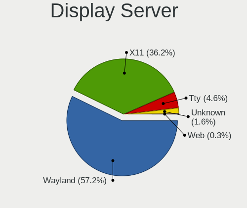
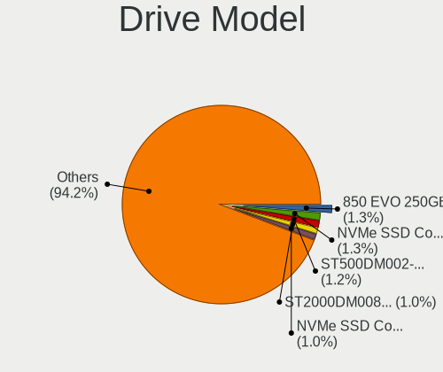
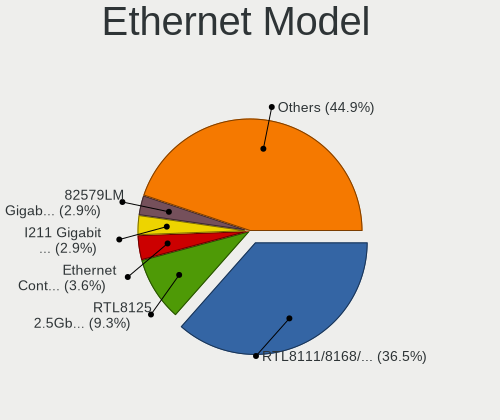
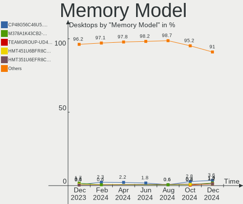

Ubuntu - Hardware Trends (Desktops)
-----------------------------------

A project to identify most popular hardware characteristics and track their change
over time based on data collected by Linux users at https://Linux-Hardware.org.

Anyone can contribute to this report by the [hw-probe](https://github.com/linuxhw/hw-probe) tool:

    sudo -E hw-probe -all -upload

This report is for one last month. Overall report since the beginning of time: [TestDays](https://github.com/linuxhw/TestDays)

Period: Jan, 2024.

Contents
--------

* [ System ](#system)
  - [ OS                       ](#os)
  - [ OS Family                ](#os-family)
  - [ Kernel                   ](#kernel)
  - [ Kernel Family            ](#kernel-family)
  - [ Kernel Major Ver.        ](#kernel-major-ver)
  - [ Arch                     ](#arch)
  - [ DE                       ](#de)
  - [ Display Server           ](#display-server)
  - [ Display Manager          ](#display-manager)
  - [ OS Lang                  ](#os-lang)
  - [ Boot Mode                ](#boot-mode)
  - [ Filesystem               ](#filesystem)
  - [ Part. scheme             ](#part-scheme)
  - [ Dual Boot with Linux/BSD ](#dual-boot-with-linuxbsd)
  - [ Dual Boot (Win)          ](#dual-boot-win)

* [ Board ](#board)
  - [ Vendor                   ](#vendor)
  - [ Model                    ](#model)
  - [ Model Family             ](#model-family)
  - [ MFG Year                 ](#mfg-year)
  - [ Form Factor              ](#form-factor)
  - [ Secure Boot              ](#secure-boot)
  - [ Coreboot                 ](#coreboot)
  - [ RAM Size                 ](#ram-size)
  - [ RAM Used                 ](#ram-used)
  - [ Total Drives             ](#total-drives)
  - [ Has CD-ROM               ](#has-cd-rom)
  - [ Has Ethernet             ](#has-ethernet)
  - [ Has WiFi                 ](#has-wifi)
  - [ Has Bluetooth            ](#has-bluetooth)

* [ Location ](#location)
  - [ Country                  ](#country)
  - [ City                     ](#city)

* [ Drives ](#drives)
  - [ Drive Vendor             ](#drive-vendor)
  - [ Drive Model              ](#drive-model)
  - [ HDD Vendor               ](#hdd-vendor)
  - [ SSD Vendor               ](#ssd-vendor)
  - [ Drive Kind               ](#drive-kind)
  - [ Drive Connector          ](#drive-connector)
  - [ Drive Size               ](#drive-size)
  - [ Space Total              ](#space-total)
  - [ Space Used               ](#space-used)
  - [ Malfunc. Drives          ](#malfunc-drives)
  - [ Malfunc. Drive Vendor    ](#malfunc-drive-vendor)
  - [ Malfunc. HDD Vendor      ](#malfunc-hdd-vendor)
  - [ Malfunc. Drive Kind      ](#malfunc-drive-kind)
  - [ Failed Drives            ](#failed-drives)
  - [ Failed Drive Vendor      ](#failed-drive-vendor)
  - [ Drive Status             ](#drive-status)

* [ Storage controller ](#storage-controller)
  - [ Storage Vendor           ](#storage-vendor)
  - [ Storage Model            ](#storage-model)
  - [ Storage Kind             ](#storage-kind)

* [ Processor ](#processor)
  - [ CPU Vendor               ](#cpu-vendor)
  - [ CPU Model                ](#cpu-model)
  - [ CPU Model Family         ](#cpu-model-family)
  - [ CPU Cores                ](#cpu-cores)
  - [ CPU Sockets              ](#cpu-sockets)
  - [ CPU Threads              ](#cpu-threads)
  - [ CPU Op-Modes             ](#cpu-op-modes)
  - [ CPU Microcode            ](#cpu-microcode)
  - [ CPU Microarch            ](#cpu-microarch)

* [ Graphics ](#graphics)
  - [ GPU Vendor               ](#gpu-vendor)
  - [ GPU Model                ](#gpu-model)
  - [ GPU Combo                ](#gpu-combo)
  - [ GPU Driver               ](#gpu-driver)
  - [ GPU Memory               ](#gpu-memory)

* [ Monitor ](#monitor)
  - [ Monitor Vendor           ](#monitor-vendor)
  - [ Monitor Model            ](#monitor-model)
  - [ Monitor Resolution       ](#monitor-resolution)
  - [ Monitor Diagonal         ](#monitor-diagonal)
  - [ Monitor Width            ](#monitor-width)
  - [ Aspect Ratio             ](#aspect-ratio)
  - [ Monitor Area             ](#monitor-area)
  - [ Pixel Density            ](#pixel-density)
  - [ Multiple Monitors        ](#multiple-monitors)

* [ Network ](#network)
  - [ Net Controller Vendor    ](#net-controller-vendor)
  - [ Net Controller Model     ](#net-controller-model)
  - [ Wireless Vendor          ](#wireless-vendor)
  - [ Wireless Model           ](#wireless-model)
  - [ Ethernet Vendor          ](#ethernet-vendor)
  - [ Ethernet Model           ](#ethernet-model)
  - [ Net Controller Kind      ](#net-controller-kind)
  - [ Used Controller          ](#used-controller)
  - [ NICs                     ](#nics)
  - [ IPv6                     ](#ipv6)

* [ Bluetooth ](#bluetooth)
  - [ Bluetooth Vendor         ](#bluetooth-vendor)
  - [ Bluetooth Model          ](#bluetooth-model)

* [ Sound ](#sound)
  - [ Sound Vendor             ](#sound-vendor)
  - [ Sound Model              ](#sound-model)

* [ Memory ](#memory)
  - [ Memory Vendor            ](#memory-vendor)
  - [ Memory Model             ](#memory-model)
  - [ Memory Kind              ](#memory-kind)
  - [ Memory Form Factor       ](#memory-form-factor)
  - [ Memory Size              ](#memory-size)
  - [ Memory Speed             ](#memory-speed)

* [ Printers & scanners ](#printers--scanners)
  - [ Printer Vendor           ](#printer-vendor)
  - [ Printer Model            ](#printer-model)
  - [ Scanner Vendor           ](#scanner-vendor)
  - [ Scanner Model            ](#scanner-model)

* [ Camera ](#camera)
  - [ Camera Vendor            ](#camera-vendor)
  - [ Camera Model             ](#camera-model)

* [ Security ](#security)
  - [ Fingerprint Vendor       ](#fingerprint-vendor)
  - [ Fingerprint Model        ](#fingerprint-model)
  - [ Chipcard Vendor          ](#chipcard-vendor)
  - [ Chipcard Model           ](#chipcard-model)

* [ Unsupported ](#unsupported)
  - [ Unsupported Devices      ](#unsupported-devices)
  - [ Unsupported Device Types ](#unsupported-device-types)

System
------

OS
--

Installed operating systems

| Name           | Desktops | Percent |
|----------------|----------|---------|
| Ubuntu 22.04   | 317      | 67.59%  |
| Ubuntu 23.10   | 91       | 19.4%   |
| Ubuntu 20.04   | 32       | 6.82%   |
| Ubuntu 23.04   | 14       | 2.99%   |
| Ubuntu 18.04   | 8        | 1.71%   |
| Ubuntu 24.04   | 2        | 0.43%   |
| Ubuntu 22.10   | 2        | 0.43%   |
| Ubuntu Core 22 | 1        | 0.21%   |
| Ubuntu 21.04   | 1        | 0.21%   |
| Ubuntu 19.10   | 1        | 0.21%   |

OS Family
---------

OS without a version

| Name   | Desktops | Percent |
|--------|----------|---------|
| Ubuntu | 469      | 100%    |

Kernel
------

Version of the Linux kernel

| Version                    | Desktops | Percent |
|----------------------------|----------|---------|
| 6.5.0-14-generic           | 178      | 37.95%  |
| 6.2.0-39-generic           | 86       | 18.34%  |
| 5.15.0-91-generic          | 55       | 11.73%  |
| 6.5.0-15-generic           | 46       | 9.81%   |
| 6.2.0-26-generic           | 16       | 3.41%   |
| 5.19.0-38-generic          | 8        | 1.71%   |
| 6.5.0-9-generic            | 5        | 1.07%   |
| 6.2.0-37-generic           | 5        | 1.07%   |
| 5.4.0-169-generic          | 5        | 1.07%   |
| 5.15.0-92-generic          | 5        | 1.07%   |
| 5.15.0-88-generic          | 4        | 0.85%   |
| 6.2.0-36-generic           | 3        | 0.64%   |
| 6.7.0-060700-generic       | 2        | 0.43%   |
| 6.5.0-17-generic           | 2        | 0.43%   |
| 6.5.0-142312122121-generic | 2        | 0.43%   |
| 6.2.0-27-generic           | 2        | 0.43%   |
| 5.4.0-150-generic          | 2        | 0.43%   |
| 5.19.0-43-generic          | 2        | 0.43%   |
| 5.19.0-32-generic          | 2        | 0.43%   |
| 5.15.0-91-lowlatency       | 2        | 0.43%   |
| 5.15.0-89-generic          | 2        | 0.43%   |
| 5.15.0-43-generic          | 2        | 0.43%   |
| 4.15.0-213-generic         | 2        | 0.43%   |
| 6.7.2-060702-generic       | 1        | 0.21%   |
| 6.7.0-060700rc8-generic    | 1        | 0.21%   |
| 6.6.9-060609-generic       | 1        | 0.21%   |
| 6.6.8-2-liquorix-amd64     | 1        | 0.21%   |
| 6.6.13-x64v3-xanmod1       | 1        | 0.21%   |
| 6.6.1-060601-generic       | 1        | 0.21%   |
| 6.6.0-14-generic           | 1        | 0.21%   |
| 6.5.0-14-lowlatency        | 1        | 0.21%   |
| 6.5.0-10-generic           | 1        | 0.21%   |
| 6.2.0-32-generic           | 1        | 0.21%   |
| 6.1.5-060105-generic       | 1        | 0.21%   |
| 6.1.0-1027-oem             | 1        | 0.21%   |
| 5.4.0-72-generic           | 1        | 0.21%   |
| 5.4.0-170-generic          | 1        | 0.21%   |
| 5.3.0-7648-generic         | 1        | 0.21%   |
| 5.3.0-64-generic           | 1        | 0.21%   |
| 5.19.0-46-generic          | 1        | 0.21%   |

Kernel Family
-------------

Linux kernel without a distro release

| Version | Desktops | Percent |
|---------|----------|---------|
| 6.5.0   | 235      | 50.11%  |
| 6.2.0   | 113      | 24.09%  |
| 5.15.0  | 79       | 16.84%  |
| 5.19.0  | 14       | 2.99%   |
| 5.4.0   | 9        | 1.92%   |
| 4.15.0  | 4        | 0.85%   |
| 6.7.0   | 3        | 0.64%   |
| 5.3.0   | 2        | 0.43%   |
| 5.11.0  | 2        | 0.43%   |
| 6.7.2   | 1        | 0.21%   |
| 6.6.9   | 1        | 0.21%   |
| 6.6.8   | 1        | 0.21%   |
| 6.6.13  | 1        | 0.21%   |
| 6.6.1   | 1        | 0.21%   |
| 6.6.0   | 1        | 0.21%   |
| 6.1.5   | 1        | 0.21%   |
| 6.1.0   | 1        | 0.21%   |

Kernel Major Ver.
-----------------

Linux kernel major version

| Version | Desktops | Percent |
|---------|----------|---------|
| 6.5     | 235      | 50.11%  |
| 6.2     | 113      | 24.09%  |
| 5.15    | 79       | 16.84%  |
| 5.19    | 14       | 2.99%   |
| 5.4     | 9        | 1.92%   |
| 6.6     | 5        | 1.07%   |
| 6.7     | 4        | 0.85%   |
| 4.15    | 4        | 0.85%   |
| 6.1     | 2        | 0.43%   |
| 5.3     | 2        | 0.43%   |
| 5.11    | 2        | 0.43%   |

Arch
----

OS architecture (x86_64, i586, etc.)

| Name    | Desktops | Percent |
|---------|----------|---------|
| x86_64  | 467      | 99.57%  |
| i686    | 1        | 0.21%   |
| aarch64 | 1        | 0.21%   |

DE
--

Desktop Environment

| Name            | Desktops | Percent |
|-----------------|----------|---------|
| GNOME           | 419      | 89.34%  |
| Unknown         | 41       | 8.74%   |
| X-Cinnamon      | 3        | 0.64%   |
| GNOME Flashback | 2        | 0.43%   |
| GNUstep         | 1        | 0.21%   |
| GNOME Classic   | 1        | 0.21%   |
| Enlightenment   | 1        | 0.21%   |
| DDE             | 1        | 0.21%   |

Display Server
--------------

X11 or Wayland

| Name    | Desktops | Percent |
|---------|----------|---------|
| Wayland | 233      | 49.68%  |
| X11     | 176      | 37.53%  |
| Tty     | 32       | 6.82%   |
| Unknown | 28       | 5.97%   |

Display Manager
---------------

SDDM, LightDM, etc.

| Name    | Desktops | Percent |
|---------|----------|---------|
| GDM3    | 377      | 80.38%  |
| Unknown | 64       | 13.65%  |
| GDM     | 17       | 3.62%   |
| LightDM | 7        | 1.49%   |
| SLiM    | 2        | 0.43%   |
| SDDM    | 2        | 0.43%   |

OS Lang
-------

Language

| Lang    | Desktops | Percent |
|---------|----------|---------|
| en_US   | 196      | 41.79%  |
| de_DE   | 47       | 10.02%  |
| fr_FR   | 32       | 6.82%   |
| en_GB   | 29       | 6.18%   |
| C       | 18       | 3.84%   |
| pt_BR   | 17       | 3.62%   |
| it_IT   | 15       | 3.2%    |
| en_CA   | 14       | 2.99%   |
| Unknown | 13       | 2.77%   |
| ru_RU   | 9        | 1.92%   |
| en_AU   | 9        | 1.92%   |
| es_ES   | 8        | 1.71%   |
| pl_PL   | 6        | 1.28%   |
| nl_NL   | 6        | 1.28%   |
| zh_CN   | 5        | 1.07%   |
| sv_SE   | 3        | 0.64%   |
| ja_JP   | 3        | 0.64%   |
| fr_CA   | 3        | 0.64%   |
| es_AR   | 3        | 0.64%   |
| en_IN   | 3        | 0.64%   |
| tr_TR   | 2        | 0.43%   |
| hu_HU   | 2        | 0.43%   |
| es_MX   | 2        | 0.43%   |
| es_CO   | 2        | 0.43%   |
| es_CL   | 2        | 0.43%   |
| en_ZA   | 2        | 0.43%   |
| en_HK   | 2        | 0.43%   |
| de_CH   | 2        | 0.43%   |
| zh_TW   | 1        | 0.21%   |
| uk_UA   | 1        | 0.21%   |
| sk_SK   | 1        | 0.21%   |
| pt_PT   | 1        | 0.21%   |
| nl_BE   | 1        | 0.21%   |
| nb_NO   | 1        | 0.21%   |
| is_IS   | 1        | 0.21%   |
| fi_FI   | 1        | 0.21%   |
| en_NZ   | 1        | 0.21%   |
| en_IL   | 1        | 0.21%   |
| el_GR   | 1        | 0.21%   |
| cs_CZ   | 1        | 0.21%   |

Boot Mode
---------

EFI or BIOS

| Mode | Desktops | Percent |
|------|----------|---------|
| BIOS | 313      | 66.74%  |
| EFI  | 156      | 33.26%  |

Filesystem
----------

Type of filesystem

| Type    | Desktops | Percent |
|---------|----------|---------|
| Tmpfs   | 263      | 56.08%  |
| Ext4    | 186      | 39.66%  |
| Overlay | 9        | 1.92%   |
| Zfs     | 6        | 1.28%   |
| Btrfs   | 2        | 0.43%   |
| Xfs     | 1        | 0.21%   |
| Ext3    | 1        | 0.21%   |
| Ext2    | 1        | 0.21%   |

Part. scheme
------------

Scheme of partitioning

| Type    | Desktops | Percent |
|---------|----------|---------|
| GPT     | 377      | 80.38%  |
| MBR     | 55       | 11.73%  |
| Unknown | 37       | 7.89%   |

Dual Boot with Linux/BSD
------------------------

Hosting more than one Linux/BSD

| Dual boot | Desktops | Percent |
|-----------|----------|---------|
| No        | 388      | 82.73%  |
| Yes       | 81       | 17.27%  |

Dual Boot (Win)
---------------

Hosting Linux and Windows

| Dual boot | Desktops | Percent |
|-----------|----------|---------|
| No        | 301      | 64.18%  |
| Yes       | 168      | 35.82%  |

Board
-----

Vendor
------

Motherboard manufacturer

| Name                                 | Desktops | Percent |
|--------------------------------------|----------|---------|
| ASUSTek Computer                     | 110      | 23.45%  |
| Gigabyte Technology                  | 64       | 13.65%  |
| Dell                                 | 56       | 11.94%  |
| MSI                                  | 41       | 8.74%   |
| ASRock                               | 36       | 7.68%   |
| Hewlett-Packard                      | 31       | 6.61%   |
| Lenovo                               | 17       | 3.62%   |
| Intel                                | 16       | 3.41%   |
| Supermicro                           | 14       | 2.99%   |
| Unknown                              | 10       | 2.13%   |
| Fujitsu                              | 8        | 1.71%   |
| Foxconn                              | 7        | 1.49%   |
| Pegatron                             | 5        | 1.07%   |
| Medion                               | 5        | 1.07%   |
| Acer                                 | 5        | 1.07%   |
| Biostar                              | 4        | 0.85%   |
| AZW                                  | 3        | 0.64%   |
| Shenzhen Meigao Electronic Equipment | 2        | 0.43%   |
| MACHINIST                            | 2        | 0.43%   |
| Huanan                               | 2        | 0.43%   |
| GEEKOM                               | 2        | 0.43%   |
| BESSTAR Tech                         | 2        | 0.43%   |
| Apple                                | 2        | 0.43%   |
| YanRay Technology                    | 1        | 0.21%   |
| TYAN Computer                        | 1        | 0.21%   |
| SZMZ                                 | 1        | 0.21%   |
| SPESTECH                             | 1        | 0.21%   |
| Shuttle                              | 1        | 0.21%   |
| PCWare                               | 1        | 0.21%   |
| ONDA                                 | 1        | 0.21%   |
| OEM                                  | 1        | 0.21%   |
| NCR                                  | 1        | 0.21%   |
| JGINYUE                              | 1        | 0.21%   |
| Itautec                              | 1        | 0.21%   |
| Inventec                             | 1        | 0.21%   |
| Google                               | 1        | 0.21%   |
| EVGA                                 | 1        | 0.21%   |
| eMachines                            | 1        | 0.21%   |
| ECS                                  | 1        | 0.21%   |
| Colorful Technology                  | 1        | 0.21%   |

Model
-----

Motherboard model

| Name                              | Desktops | Percent |
|-----------------------------------|----------|---------|
| Unknown                           | 10       | 2.13%   |
| ASUS All Series                   | 8        | 1.71%   |
| Supermicro SYS-1028R-TDW          | 4        | 0.85%   |
| Supermicro AS -2124BT-HTR         | 4        | 0.85%   |
| Intel Jasper Lake Client Platform | 3        | 0.64%   |
| Dell Precision Tower 3420         | 3        | 0.64%   |
| Dell OptiPlex 9020                | 3        | 0.64%   |
| Dell OptiPlex 7050                | 3        | 0.64%   |
| Dell OptiPlex 7020                | 3        | 0.64%   |
| Dell OptiPlex 7010                | 3        | 0.64%   |
| ASUS PRIME X470-PRO               | 3        | 0.64%   |
| Supermicro SYS-6018R-MTR          | 2        | 0.43%   |
| MSI MS-7E06                       | 2        | 0.43%   |
| MSI MS-7C91                       | 2        | 0.43%   |
| MSI MS-7C79                       | 2        | 0.43%   |
| MSI MS-7C75                       | 2        | 0.43%   |
| MSI MS-7B89                       | 2        | 0.43%   |
| MSI MS-7996                       | 2        | 0.43%   |
| Intel X99 V1.0                    | 2        | 0.43%   |
| HP Compaq Pro 6305 SFF            | 2        | 0.43%   |
| HP Compaq Pro 6300 MT             | 2        | 0.43%   |
| Gigabyte Z790 UD AX               | 2        | 0.43%   |
| Gigabyte Z77X-D3H                 | 2        | 0.43%   |
| Gigabyte B450M DS3H               | 2        | 0.43%   |
| Fujitsu ESPRIMO_P756              | 2        | 0.43%   |
| Foxconn 500B Microtower           | 2        | 0.43%   |
| Dell Precision Tower 5810         | 2        | 0.43%   |
| Dell Precision T1700              | 2        | 0.43%   |
| Dell OptiPlex 9010                | 2        | 0.43%   |
| Dell OptiPlex 7040                | 2        | 0.43%   |
| Dell OptiPlex 3060                | 2        | 0.43%   |
| ASUS ROG STRIX G10DK_G10DK        | 2        | 0.43%   |
| ASUS ROG STRIX B550-F GAMING      | 2        | 0.43%   |
| ASUS ROG STRIX B365-F GAMING      | 2        | 0.43%   |
| ASUS ROG CROSSHAIR X670E HERO     | 2        | 0.43%   |
| ASUS ProArt X570-CREATOR WIFI     | 2        | 0.43%   |
| ASUS PRIME B550-PLUS              | 2        | 0.43%   |
| ASUS PRIME A320M-K                | 2        | 0.43%   |
| ASUS M5A97 R2.0                   | 2        | 0.43%   |
| ASRock X570 Phantom Gaming 4      | 2        | 0.43%   |

Model Family
------------

Motherboard model prefix

| Name                     | Desktops | Percent |
|--------------------------|----------|---------|
| Dell OptiPlex            | 27       | 5.76%   |
| ASUS PRIME               | 26       | 5.54%   |
| ASUS ROG                 | 23       | 4.9%    |
| Dell Precision           | 14       | 2.99%   |
| Lenovo ThinkCentre       | 12       | 2.56%   |
| Dell Inspiron            | 11       | 2.35%   |
| Unknown                  | 10       | 2.13%   |
| ASUS TUF                 | 8        | 1.71%   |
| ASUS All                 | 8        | 1.71%   |
| Fujitsu ESPRIMO          | 7        | 1.49%   |
| HP Compaq                | 6        | 1.28%   |
| HP EliteDesk             | 5        | 1.07%   |
| Supermicro SYS-1028R-TDW | 4        | 0.85%   |
| Supermicro AS            | 4        | 0.85%   |
| Gigabyte Z790            | 4        | 0.85%   |
| Gigabyte B450M           | 4        | 0.85%   |
| ASUS SABERTOOTH          | 4        | 0.85%   |
| Lenovo ThinkStation      | 3        | 0.64%   |
| Intel X99                | 3        | 0.64%   |
| Intel Jasper             | 3        | 0.64%   |
| HP ProDesk               | 3        | 0.64%   |
| Gigabyte B550M           | 3        | 0.64%   |
| ASUS STRIX               | 3        | 0.64%   |
| ASUS M5A97               | 3        | 0.64%   |
| ASRock Z77               | 3        | 0.64%   |
| ASRock X570              | 3        | 0.64%   |
| ASRock B450M             | 3        | 0.64%   |
| Acer Aspire              | 3        | 0.64%   |
| Supermicro SYS-6018R-MTR | 2        | 0.43%   |
| MSI MS-7E06              | 2        | 0.43%   |
| MSI MS-7C91              | 2        | 0.43%   |
| MSI MS-7C79              | 2        | 0.43%   |
| MSI MS-7C75              | 2        | 0.43%   |
| MSI MS-7B89              | 2        | 0.43%   |
| MSI MS-7996              | 2        | 0.43%   |
| Medion Akoya             | 2        | 0.43%   |
| Lenovo IdeaCentre        | 2        | 0.43%   |
| Intel DH55TC             | 2        | 0.43%   |
| HP ProLiant              | 2        | 0.43%   |
| HP Pavilion              | 2        | 0.43%   |

MFG Year
--------

Motherboard manufacture year

| Year    | Desktops | Percent |
|---------|----------|---------|
| 2020    | 50       | 10.66%  |
| 2018    | 45       | 9.59%   |
| 2022    | 43       | 9.17%   |
| 2021    | 35       | 7.46%   |
| 2023    | 33       | 7.04%   |
| 2016    | 33       | 7.04%   |
| 2012    | 31       | 6.61%   |
| 2013    | 28       | 5.97%   |
| 2010    | 28       | 5.97%   |
| 2015    | 27       | 5.76%   |
| 2014    | 26       | 5.54%   |
| 2017    | 23       | 4.9%    |
| 2009    | 17       | 3.62%   |
| 2019    | 14       | 2.99%   |
| 2011    | 14       | 2.99%   |
| 2008    | 13       | 2.77%   |
| 2007    | 5        | 1.07%   |
| 2006    | 2        | 0.43%   |
| 2024    | 1        | 0.21%   |
| Unknown | 1        | 0.21%   |

Form Factor
-----------

Physical design of the computer

| Name    | Desktops | Percent |
|---------|----------|---------|
| Desktop | 469      | 100%    |

Secure Boot
-----------

Enabled or disabled

| State    | Desktops | Percent |
|----------|----------|---------|
| Disabled | 449      | 95.74%  |
| Enabled  | 20       | 4.26%   |

Coreboot
--------

Have coreboot on board

| Used | Desktops | Percent |
|------|----------|---------|
| No   | 467      | 99.57%  |
| Yes  | 2        | 0.43%   |

RAM Size
--------

Total RAM memory

| Size in GB      | Desktops | Percent |
|-----------------|----------|---------|
| 16.01-24.0      | 116      | 24.73%  |
| 32.01-64.0      | 91       | 19.4%   |
| 4.01-8.0        | 75       | 15.99%  |
| 8.01-16.0       | 57       | 12.15%  |
| 64.01-256.0     | 54       | 11.51%  |
| 3.01-4.0        | 41       | 8.74%   |
| 24.01-32.0      | 21       | 4.48%   |
| More than 256.0 | 6        | 1.28%   |
| 1.01-2.0        | 6        | 1.28%   |
| 2.01-3.0        | 2        | 0.43%   |

RAM Used
--------

Used RAM memory

| Used GB     | Desktops | Percent |
|-------------|----------|---------|
| 1.01-2.0    | 144      | 30.7%   |
| 2.01-3.0    | 129      | 27.51%  |
| 3.01-4.0    | 73       | 15.57%  |
| 4.01-8.0    | 71       | 15.14%  |
| 8.01-16.0   | 20       | 4.26%   |
| 0.51-1.0    | 10       | 2.13%   |
| 16.01-24.0  | 8        | 1.71%   |
| 64.01-256.0 | 6        | 1.28%   |
| 24.01-32.0  | 4        | 0.85%   |
| 32.01-64.0  | 2        | 0.43%   |
| 0.01-0.5    | 2        | 0.43%   |

Total Drives
------------

Number of drives on board

| Drives | Desktops | Percent |
|--------|----------|---------|
| 1      | 218      | 46.48%  |
| 2      | 108      | 23.03%  |
| 3      | 77       | 16.42%  |
| 4      | 28       | 5.97%   |
| 5      | 17       | 3.62%   |
| 6      | 7        | 1.49%   |
| 0      | 4        | 0.85%   |
| 8      | 3        | 0.64%   |
| 7      | 3        | 0.64%   |
| 25     | 1        | 0.21%   |
| 14     | 1        | 0.21%   |
| 10     | 1        | 0.21%   |
| 9      | 1        | 0.21%   |

Has CD-ROM
----------

Has CD-ROM on board

| Presented | Desktops | Percent |
|-----------|----------|---------|
| No        | 273      | 58.21%  |
| Yes       | 196      | 41.79%  |

Has Ethernet
------------

Has Ethernet on board

| Presented | Desktops | Percent |
|-----------|----------|---------|
| Yes       | 462      | 98.51%  |
| No        | 7        | 1.49%   |

Has WiFi
--------

Has WiFi module

| Presented | Desktops | Percent |
|-----------|----------|---------|
| Yes       | 242      | 51.6%   |
| No        | 227      | 48.4%   |

Has Bluetooth
-------------

Has Bluetooth module

| Presented | Desktops | Percent |
|-----------|----------|---------|
| No        | 280      | 59.7%   |
| Yes       | 189      | 40.3%   |

Location
--------

Country
-------

Geographic location (country)

| Country         | Desktops | Percent |
|-----------------|----------|---------|
| USA             | 111      | 23.67%  |
| Germany         | 58       | 12.37%  |
| France          | 32       | 6.82%   |
| UK              | 30       | 6.4%    |
| Brazil          | 22       | 4.69%   |
| Canada          | 21       | 4.48%   |
| Russia          | 19       | 4.05%   |
| Italy           | 15       | 3.2%    |
| Poland          | 13       | 2.77%   |
| Spain           | 9        | 1.92%   |
| China           | 9        | 1.92%   |
| Australia       | 9        | 1.92%   |
| Sweden          | 8        | 1.71%   |
| Switzerland     | 7        | 1.49%   |
| India           | 7        | 1.49%   |
| Netherlands     | 6        | 1.28%   |
| Hungary         | 6        | 1.28%   |
| Vietnam         | 4        | 0.85%   |
| The Netherlands | 4        | 0.85%   |
| Japan           | 4        | 0.85%   |
| Bulgaria        | 4        | 0.85%   |
| Argentina       | 4        | 0.85%   |
| South Africa    | 3        | 0.64%   |
| Romania         | 3        | 0.64%   |
| Israel          | 3        | 0.64%   |
| Finland         | 3        | 0.64%   |
| El Salvador     | 3        | 0.64%   |
| Belarus         | 3        | 0.64%   |
| Turkey          | 2        | 0.43%   |
| Singapore       | 2        | 0.43%   |
| Saudi Arabia    | 2        | 0.43%   |
| Portugal        | 2        | 0.43%   |
| Mexico          | 2        | 0.43%   |
| Malaysia        | 2        | 0.43%   |
| Indonesia       | 2        | 0.43%   |
| Hong Kong       | 2        | 0.43%   |
| Greece          | 2        | 0.43%   |
| Denmark         | 2        | 0.43%   |
| Colombia        | 2        | 0.43%   |
| Chile           | 2        | 0.43%   |

City
----

Geographic location (city)

| City          | Desktops | Percent |
|---------------|----------|---------|
| Moscow        | 8        | 1.71%   |
| Raleigh       | 5        | 1.07%   |
| Tucson        | 4        | 0.85%   |
| St Petersburg | 4        | 0.85%   |
| Rome          | 4        | 0.85%   |
| Montreal      | 4        | 0.85%   |
| Hanoi         | 4        | 0.85%   |
| Chemnitz      | 4        | 0.85%   |
| Bremen        | 4        | 0.85%   |
| Berlin        | 4        | 0.85%   |
| Zurich        | 3        | 0.64%   |
| Sydney        | 3        | 0.64%   |
| Sao Paulo     | 3        | 0.64%   |
| San Salvador  | 3        | 0.64%   |
| Milan         | 3        | 0.64%   |
| Madrid        | 3        | 0.64%   |
| Lansing       | 3        | 0.64%   |
| Genoa         | 3        | 0.64%   |
| Dallas        | 3        | 0.64%   |
| Budapest      | 3        | 0.64%   |
| Bucharest     | 3        | 0.64%   |
| Bradford      | 3        | 0.64%   |
| Beijing       | 3        | 0.64%   |
| Barcelona     | 3        | 0.64%   |
| Warsaw        | 2        | 0.43%   |
| Waco          | 2        | 0.43%   |
| Vetlanda      | 2        | 0.43%   |
| Toronto       | 2        | 0.43%   |
| Steinbach     | 2        | 0.43%   |
| Sofia         | 2        | 0.43%   |
| Singapore     | 2        | 0.43%   |
| Santo André  | 2        | 0.43%   |
| Santiago      | 2        | 0.43%   |
| San Jose      | 2        | 0.43%   |
| San Jacinto   | 2        | 0.43%   |
| Rockford      | 2        | 0.43%   |
| Portland      | 2        | 0.43%   |
| Paris         | 2        | 0.43%   |
| Oshawa        | 2        | 0.43%   |
| Nuremberg     | 2        | 0.43%   |

Drives
------

Drive Vendor
------------

Hard drive vendors

| Vendor                      | Desktops | Drives | Percent |
|-----------------------------|----------|--------|---------|
| WDC                         | 134      | 194    | 16.65%  |
| Seagate                     | 121      | 166    | 15.03%  |
| Samsung Electronics         | 111      | 150    | 13.79%  |
| Sandisk                     | 49       | 55     | 6.09%   |
| Kingston                    | 43       | 47     | 5.34%   |
| Toshiba                     | 38       | 45     | 4.72%   |
| Crucial                     | 29       | 29     | 3.6%    |
| Hitachi                     | 19       | 23     | 2.36%   |
| HGST                        | 17       | 20     | 2.11%   |
| China                       | 17       | 17     | 2.11%   |
| Unknown                     | 15       | 21     | 1.86%   |
| Intel                       | 15       | 15     | 1.86%   |
| Phison Electronics          | 14       | 14     | 1.74%   |
| Micron/Crucial Technology   | 11       | 14     | 1.37%   |
| SK hynix                    | 9        | 9      | 1.12%   |
| PNY                         | 9        | 9      | 1.12%   |
| Kingston Technology Company | 9        | 9      | 1.12%   |
| A-DATA Technology           | 9        | 10     | 1.12%   |
| Intenso                     | 8        | 8      | 0.99%   |
| Micron Technology           | 7        | 8      | 0.87%   |
| MAXIO Technology (Hangzhou) | 7        | 8      | 0.87%   |
| Silicon Motion              | 5        | 5      | 0.62%   |
| Maxtor                      | 5        | 5      | 0.62%   |
| Lexar                       | 5        | 5      | 0.62%   |
| Fujitsu                     | 5        | 5      | 0.62%   |
| ADATA Technology            | 5        | 5      | 0.62%   |
| Unknown                     | 5        | 5      | 0.62%   |
| XrayDisk                    | 4        | 4      | 0.5%    |
| Team                        | 4        | 5      | 0.5%    |
| SPCC                        | 4        | 4      | 0.5%    |
| GOODRAM                     | 4        | 4      | 0.5%    |
| T-FORCE                     | 3        | 3      | 0.37%   |
| Patriot                     | 3        | 3      | 0.37%   |
| OCZ                         | 3        | 3      | 0.37%   |
| LITEON                      | 3        | 3      | 0.37%   |
| Hewlett-Packard             | 3        | 10     | 0.37%   |
| Yangtze Memory Technologies | 2        | 2      | 0.25%   |
| Transcend                   | 2        | 3      | 0.25%   |
| Teclast                     | 2        | 2      | 0.25%   |
| Realtek Semiconductor       | 2        | 2      | 0.25%   |

Drive Model
-----------

Hard drive models

| Model                                               | Desktops | Percent |
|-----------------------------------------------------|----------|---------|
| Samsung NVMe SSD Controller SM981/PM981/PM983 1TB   | 12       | 1.3%    |
| Kingston SA400S37480G 480GB SSD                     | 10       | 1.09%   |
| Micron/Crucial P2 NVMe PCIe SSD 1TB                 | 9        | 0.98%   |
| Unknown SD/MMC/MS PRO 256GB                         | 8        | 0.87%   |
| WDC WD5000AAKX-22ERMA0 500GB                        | 7        | 0.76%   |
| WDC WD10EZEX-08WN4A0 1TB                            | 7        | 0.76%   |
| Toshiba DT01ACA100 1TB                              | 7        | 0.76%   |
| Seagate ST500DM002-1BD142 500GB                     | 7        | 0.76%   |
| Seagate ST1000DM010-2EP102 1TB                      | 7        | 0.76%   |
| Samsung SSD 980 PRO 1TB                             | 7        | 0.76%   |
| Samsung SSD 860 EVO 1TB                             | 7        | 0.76%   |
| Seagate ST3500418AS 500GB                           | 6        | 0.65%   |
| Samsung SSD 980 PRO 2TB                             | 6        | 0.65%   |
| Samsung SSD 870 EVO 500GB                           | 6        | 0.65%   |
| Kingston Company SNV2S1000G 1TB                     | 6        | 0.65%   |
| WDC WD20EARX-00PASB0 2TB                            | 5        | 0.54%   |
| Toshiba HDWD110 1TB                                 | 5        | 0.54%   |
| Seagate ST4000DM004-2CV104 4TB                      | 5        | 0.54%   |
| Seagate ST2000DM008-2FR102 2TB                      | 5        | 0.54%   |
| Seagate ST1000DM003-1ER162 1TB                      | 5        | 0.54%   |
| Samsung SSD 850 EVO 250GB                           | 5        | 0.54%   |
| Crucial CT500MX500SSD1 500GB                        | 5        | 0.54%   |
| Unknown                                             | 5        | 0.54%   |
| WDC WD20EZRX-00D8PB0 2TB                            | 4        | 0.43%   |
| WDC WD20EFRX-68EUZN0 2TB                            | 4        | 0.43%   |
| Seagate ST2000DM001-1CH164 2TB                      | 4        | 0.43%   |
| Seagate ST1000DM003-9YN162 1TB                      | 4        | 0.43%   |
| Seagate ST1000DM003-1CH162 1TB                      | 4        | 0.43%   |
| Seagate Expansion Desk 8TB                          | 4        | 0.43%   |
| Sandisk WD_BLACK SN770 2TB                          | 4        | 0.43%   |
| SanDisk SSD PLUS 1000GB                             | 4        | 0.43%   |
| Samsung SSD 970 EVO Plus 1TB                        | 4        | 0.43%   |
| Samsung SSD 860 EVO 500GB                           | 4        | 0.43%   |
| Samsung SSD 840 EVO 250GB                           | 4        | 0.43%   |
| Samsung NVMe SSD Controller SM961/PM961/SM963 256GB | 4        | 0.43%   |
| Kingston SV300S37A240G 240GB SSD                    | 4        | 0.43%   |
| Kingston SA400S37240G 240GB SSD                     | 4        | 0.43%   |
| Intel SSDPELKX010T8 1TB                             | 4        | 0.43%   |
| HGST HTE721010A9E630 1TB                            | 4        | 0.43%   |
| Crucial CT1000MX500SSD1 1TB                         | 4        | 0.43%   |

HDD Vendor
----------

Hard disk drive vendors

| Vendor              | Desktops | Drives | Percent |
|---------------------|----------|--------|---------|
| Seagate             | 120      | 163    | 34.78%  |
| WDC                 | 119      | 170    | 34.49%  |
| Toshiba             | 32       | 38     | 9.28%   |
| Hitachi             | 19       | 23     | 5.51%   |
| HGST                | 17       | 20     | 4.93%   |
| Samsung Electronics | 15       | 16     | 4.35%   |
| Unknown             | 8        | 8      | 2.32%   |
| Maxtor              | 5        | 5      | 1.45%   |
| Fujitsu             | 5        | 5      | 1.45%   |
| JMicron Technology  | 1        | 1      | 0.29%   |
| Hewlett-Packard     | 1        | 8      | 0.29%   |
| External            | 1        | 1      | 0.29%   |
| ExcelStor           | 1        | 1      | 0.29%   |
| Apple               | 1        | 1      | 0.29%   |

SSD Vendor
----------

Solid state drive vendors

| Vendor              | Desktops | Drives | Percent |
|---------------------|----------|--------|---------|
| Samsung Electronics | 55       | 66     | 20.52%  |
| Kingston            | 34       | 38     | 12.69%  |
| SanDisk             | 26       | 26     | 9.7%    |
| Crucial             | 25       | 25     | 9.33%   |
| WDC                 | 17       | 18     | 6.34%   |
| China               | 17       | 17     | 6.34%   |
| PNY                 | 8        | 8      | 2.99%   |
| Intel               | 8        | 8      | 2.99%   |
| Intenso             | 6        | 6      | 2.24%   |
| A-DATA Technology   | 6        | 7      | 2.24%   |
| Lexar               | 4        | 4      | 1.49%   |
| GOODRAM             | 4        | 4      | 1.49%   |
| Toshiba             | 3        | 4      | 1.12%   |
| SPCC                | 3        | 3      | 1.12%   |
| Patriot             | 3        | 3      | 1.12%   |
| OCZ                 | 3        | 3      | 1.12%   |
| LITEON              | 3        | 3      | 1.12%   |
| Teclast             | 2        | 2      | 0.75%   |
| Team                | 2        | 3      | 0.75%   |
| T-FORCE             | 2        | 2      | 0.75%   |
| SK hynix            | 2        | 2      | 0.75%   |
| Micron Technology   | 2        | 3      | 0.75%   |
| 2.5"                | 2        | 2      | 0.75%   |
| Unknown             | 2        | 2      | 0.75%   |
| XrayDisk            | 1        | 1      | 0.37%   |
| walram              | 1        | 1      | 0.37%   |
| Verbatim            | 1        | 1      | 0.37%   |
| Vaseky              | 1        | 1      | 0.37%   |
| USB3.0              | 1        | 1      | 0.37%   |
| Transcend           | 1        | 1      | 0.37%   |
| Seagate             | 1        | 1      | 0.37%   |
| SATAFIRM            | 1        | 1      | 0.37%   |
| Netac               | 1        | 1      | 0.37%   |
| Mushkin             | 1        | 1      | 0.37%   |
| MAXIO               | 1        | 1      | 0.37%   |
| LITEONIT            | 1        | 1      | 0.37%   |
| Leven               | 1        | 5      | 0.37%   |
| LDLC                | 1        | 1      | 0.37%   |
| KingFast            | 1        | 1      | 0.37%   |
| KingDian            | 1        | 1      | 0.37%   |

Drive Kind
----------

HDD or SSD

| Kind    | Desktops | Drives | Percent |
|---------|----------|--------|---------|
| HDD     | 268      | 460    | 39.47%  |
| SSD     | 221      | 293    | 32.55%  |
| NVMe    | 172      | 223    | 25.33%  |
| Unknown | 15       | 20     | 2.21%   |
| MMC     | 3        | 3      | 0.44%   |

Drive Connector
---------------

SATA, SAS, NVMe, etc.

| Type | Desktops | Drives | Percent |
|------|----------|--------|---------|
| SATA | 377      | 722    | 63.9%   |
| NVMe | 172      | 223    | 29.15%  |
| SAS  | 38       | 51     | 6.44%   |
| MMC  | 3        | 3      | 0.51%   |

Drive Size
----------

Size of hard drive

| Size in TB | Desktops | Drives | Percent |
|------------|----------|--------|---------|
| 0.01-0.5   | 243      | 370    | 45.51%  |
| 0.51-1.0   | 163      | 197    | 30.52%  |
| 1.01-2.0   | 70       | 93     | 13.11%  |
| 3.01-4.0   | 25       | 31     | 4.68%   |
| 4.01-10.0  | 17       | 28     | 3.18%   |
| 2.01-3.0   | 12       | 25     | 2.25%   |
| 10.01-20.0 | 3        | 7      | 0.56%   |
| 20.01-50.0 | 1        | 2      | 0.19%   |

Space Total
-----------

Amount of disk space available on the file system

| Size in GB     | Desktops | Percent |
|----------------|----------|---------|
| 501-1000       | 106      | 22.6%   |
| 101-250        | 92       | 19.62%  |
| 251-500        | 78       | 16.63%  |
| More than 3000 | 61       | 13.01%  |
| 1001-2000      | 40       | 8.53%   |
| Unknown        | 23       | 4.9%    |
| 1-20           | 22       | 4.69%   |
| 2001-3000      | 21       | 4.48%   |
| 51-100         | 19       | 4.05%   |
| 21-50          | 7        | 1.49%   |

Space Used
----------

Amount of used disk space

| Used GB        | Desktops | Percent |
|----------------|----------|---------|
| 1-20           | 131      | 27.93%  |
| 21-50          | 98       | 20.9%   |
| 101-250        | 64       | 13.65%  |
| 51-100         | 41       | 8.74%   |
| 251-500        | 34       | 7.25%   |
| 501-1000       | 25       | 5.33%   |
| Unknown        | 23       | 4.9%    |
| 1001-2000      | 21       | 4.48%   |
| More than 3000 | 18       | 3.84%   |
| 2001-3000      | 14       | 2.99%   |

Malfunc. Drives
---------------

Drive models with a malfunction

| Model                                    | Desktops | Drives | Percent |
|------------------------------------------|----------|--------|---------|
| WDC WD5000AAKX-22ERMA0 500GB             | 2        | 2      | 5.88%   |
| WDC WD60PURZ-85ZUFY1 6TB                 | 1        | 1      | 2.94%   |
| WDC WD5000LPVX-28V0TT0 500GB             | 1        | 1      | 2.94%   |
| WDC WD5000AVDS-63U7B1 500GB              | 1        | 2      | 2.94%   |
| WDC WD5000AAJB-00UHA0 500GB              | 1        | 1      | 2.94%   |
| WDC WD5000AACS-00G8B1 500GB              | 1        | 1      | 2.94%   |
| WDC WD40EFAX-68JH4N1 4TB                 | 1        | 1      | 2.94%   |
| WDC WD2500AAKX-75U6AA0 250GB             | 1        | 1      | 2.94%   |
| WDC WD20EZRZ-00Z5HB0 2TB                 | 1        | 1      | 2.94%   |
| WDC WD20EARX-00PASB0 2TB                 | 1        | 1      | 2.94%   |
| WDC WD1003FBYX-01Y7B0 1TB                | 1        | 1      | 2.94%   |
| walram SSD 120G                          | 1        | 1      | 2.94%   |
| USB3.0 Super Speed 500GB SSD             | 1        | 1      | 2.94%   |
| Toshiba HDWD130 3TB                      | 1        | 2      | 2.94%   |
| Silicon Motion APS-SE20 1TB              | 1        | 1      | 2.94%   |
| Seagate ST9320325AS 320GB                | 1        | 1      | 2.94%   |
| Seagate ST500DM002-1BC142 500GB          | 1        | 1      | 2.94%   |
| Seagate ST4000VN008-2DR166 4TB           | 1        | 1      | 2.94%   |
| Seagate ST3500418AS 500GB                | 1        | 1      | 2.94%   |
| Seagate ST31000524AS 1TB                 | 1        | 1      | 2.94%   |
| Seagate ST3000LM024-2AN17R 3TB           | 1        | 1      | 2.94%   |
| Seagate ST2000VN000-1H3164 2TB           | 1        | 2      | 2.94%   |
| Seagate ST14000NM0018-2H4101 14TB        | 1        | 1      | 2.94%   |
| Samsung Electronics SSD 840 Series 120GB | 1        | 1      | 2.94%   |
| OCZ AGILITY3 64GB SSD                    | 1        | 1      | 2.94%   |
| Maxtor STM3250310AS 250GB                | 1        | 1      | 2.94%   |
| Kingston SKC600512G 512GB SSD            | 1        | 1      | 2.94%   |
| Hitachi HTS725050A9A364 500GB            | 1        | 1      | 2.94%   |
| Hitachi HDT721016SLA380 160GB            | 1        | 3      | 2.94%   |
| Hitachi HCS721050CLA362 499GB            | 1        | 1      | 2.94%   |
| HGST HTS541075A9E680 752GB               | 1        | 1      | 2.94%   |
| HGST HTE721010A9E630 1TB                 | 1        | 1      | 2.94%   |
| Crucial CT240M500SSD1 240GB              | 1        | 1      | 2.94%   |

Malfunc. Drive Vendor
---------------------

Vendors of faulty drives

| Vendor              | Desktops | Drives | Percent |
|---------------------|----------|--------|---------|
| WDC                 | 9        | 13     | 29.03%  |
| Seagate             | 8        | 9      | 25.81%  |
| Hitachi             | 3        | 5      | 9.68%   |
| HGST                | 2        | 2      | 6.45%   |
| walram              | 1        | 1      | 3.23%   |
| USB3.0              | 1        | 1      | 3.23%   |
| Toshiba             | 1        | 2      | 3.23%   |
| Silicon Motion      | 1        | 1      | 3.23%   |
| Samsung Electronics | 1        | 1      | 3.23%   |
| OCZ                 | 1        | 1      | 3.23%   |
| Maxtor              | 1        | 1      | 3.23%   |
| Kingston            | 1        | 1      | 3.23%   |
| Crucial             | 1        | 1      | 3.23%   |

Malfunc. HDD Vendor
-------------------

Vendors of faulty HDD drives

| Vendor  | Desktops | Drives | Percent |
|---------|----------|--------|---------|
| WDC     | 9        | 13     | 37.5%   |
| Seagate | 8        | 9      | 33.33%  |
| Hitachi | 3        | 5      | 12.5%   |
| HGST    | 2        | 2      | 8.33%   |
| Toshiba | 1        | 2      | 4.17%   |
| Maxtor  | 1        | 1      | 4.17%   |

Malfunc. Drive Kind
-------------------

Kinds of faulty drives

| Kind | Desktops | Drives | Percent |
|------|----------|--------|---------|
| HDD  | 22       | 32     | 75.86%  |
| SSD  | 6        | 6      | 20.69%  |
| NVMe | 1        | 1      | 3.45%   |

Failed Drives
-------------

Failed drive models

| Model                       | Desktops | Drives | Percent |
|-----------------------------|----------|--------|---------|
| WDC WD1500HLFS-01G6U0 150GB | 1        | 1      | 100%    |

Failed Drive Vendor
-------------------

Failed drive vendors

| Vendor | Desktops | Drives | Percent |
|--------|----------|--------|---------|
| WDC    | 1        | 1      | 100%    |

Drive Status
------------

Number of failed and malfunc. drives

| Status   | Desktops | Drives | Percent |
|----------|----------|--------|---------|
| Detected | 309      | 635    | 61.31%  |
| Works    | 166      | 324    | 32.94%  |
| Malfunc  | 28       | 39     | 5.56%   |
| Failed   | 1        | 1      | 0.2%    |

Storage controller
------------------

Storage Vendor
--------------

Storage controller vendors

| Vendor                         | Desktops | Percent |
|--------------------------------|----------|---------|
| Intel                          | 320      | 45.01%  |
| AMD                            | 138      | 19.41%  |
| Samsung Electronics            | 55       | 7.74%   |
| SanDisk                        | 27       | 3.8%    |
| ASMedia Technology             | 21       | 2.95%   |
| Phison Electronics             | 18       | 2.53%   |
| Kingston Technology Company    | 16       | 2.25%   |
| Micron/Crucial Technology      | 15       | 2.11%   |
| JMicron Technology             | 13       | 1.83%   |
| MAXIO Technology (Hangzhou)    | 12       | 1.69%   |
| Marvell Technology Group       | 12       | 1.69%   |
| Silicon Motion                 | 8        | 1.13%   |
| SK hynix                       | 7        | 0.98%   |
| Nvidia                         | 6        | 0.84%   |
| ADATA Technology               | 6        | 0.84%   |
| Micron Technology              | 5        | 0.7%    |
| Broadcom / LSI                 | 5        | 0.7%    |
| Realtek Semiconductor          | 4        | 0.56%   |
| Toshiba America Info Systems   | 3        | 0.42%   |
| Hosin Global Electronics       | 3        | 0.42%   |
| Yangtze Memory Technologies    | 2        | 0.28%   |
| Silicon Image                  | 2        | 0.28%   |
| LSI Logic / Symbios Logic      | 2        | 0.28%   |
| Hewlett-Packard                | 2        | 0.28%   |
| Union Memory (Shenzhen)        | 1        | 0.14%   |
| Transcend                      | 1        | 0.14%   |
| Solidigm                       | 1        | 0.14%   |
| Solid State Storage Technology | 1        | 0.14%   |
| Shenzhen Longsys Electronics   | 1        | 0.14%   |
| Seagate Technology             | 1        | 0.14%   |
| Nextorage                      | 1        | 0.14%   |
| Lite-On Technology             | 1        | 0.14%   |
| KIOXIA                         | 1        | 0.14%   |

Storage Model
-------------

Storage controller models

| Model                                                                          | Desktops | Percent |
|--------------------------------------------------------------------------------|----------|---------|
| AMD FCH SATA Controller [AHCI mode]                                            | 59       | 7.11%   |
| Intel Q170/Q150/B150/H170/H110/Z170/CM236 Chipset SATA Controller [AHCI Mode]  | 34       | 4.1%    |
| Intel 8 Series/C220 Series Chipset Family 6-port SATA Controller 1 [AHCI mode] | 32       | 3.86%   |
| AMD 500 Series Chipset SATA Controller                                         | 26       | 3.13%   |
| AMD 400 Series Chipset SATA Controller                                         | 26       | 3.13%   |
| Intel SATA Controller [RAID mode]                                              | 22       | 2.65%   |
| Intel 200 Series PCH SATA controller [AHCI mode]                               | 21       | 2.53%   |
| ASMedia ASM1061/ASM1062 Serial ATA Controller                                  | 20       | 2.41%   |
| Samsung NVMe SSD Controller SM981/PM981/PM983                                  | 19       | 2.29%   |
| Samsung NVMe SSD Controller PM9A1/PM9A3/980PRO                                 | 18       | 2.17%   |
| Intel C610/X99 series chipset 6-Port SATA Controller [AHCI mode]               | 16       | 1.93%   |
| Intel Alder Lake-S PCH SATA Controller [AHCI Mode]                             | 16       | 1.93%   |
| Intel 500 Series Chipset Family SATA AHCI Controller                           | 16       | 1.93%   |
| AMD SB7x0/SB8x0/SB9x0 SATA Controller [AHCI mode]                              | 16       | 1.93%   |
| Intel 7 Series/C210 Series Chipset Family 6-port SATA Controller [AHCI mode]   | 15       | 1.81%   |
| Intel Raptor Lake SATA AHCI Controller                                         | 14       | 1.69%   |
| Intel Cannon Lake PCH SATA AHCI Controller                                     | 14       | 1.69%   |
| Intel C610/X99 series chipset sSATA Controller [AHCI mode]                     | 14       | 1.69%   |
| AMD 600 Series Chipset SATA Controller                                         | 14       | 1.69%   |
| AMD SB7x0/SB8x0/SB9x0 IDE Controller                                           | 13       | 1.57%   |
| Micron/Crucial P2 [Nick P2] / P3 / P3 Plus NVMe PCIe SSD (DRAM-less)           | 12       | 1.45%   |
| Intel NM10/ICH7 Family SATA Controller [IDE mode]                              | 12       | 1.45%   |
| SanDisk WD Black SN770 / PC SN740 256GB / PC SN560 (DRAM-less) NVMe SSD        | 9        | 1.08%   |
| JMicron JMB363 SATA/IDE Controller                                             | 9        | 1.08%   |
| Intel Comet Lake SATA AHCI Controller                                          | 9        | 1.08%   |
| Intel 82801JI (ICH10 Family) SATA AHCI Controller                              | 9        | 1.08%   |
| Intel 82801G (ICH7 Family) IDE Controller                                      | 9        | 1.08%   |
| AMD SB7x0/SB8x0/SB9x0 SATA Controller [IDE mode]                               | 9        | 1.08%   |
| Samsung NVMe SSD Controller 980 (DRAM-less)                                    | 8        | 0.96%   |
| Intel 6 Series/C200 Series Chipset Family 6 port Desktop SATA AHCI Controller  | 8        | 0.96%   |
| MAXIO (Hangzhou) NVMe SSD Controller MAP1202 (DRAM-less)                       | 7        | 0.84%   |
| Kingston Company NV2 NVMe SSD SM2267XT (DRAM-less)                             | 7        | 0.84%   |
| Samsung NVMe SSD Controller SM961/PM961/SM963                                  | 6        | 0.72%   |
| Intel 9 Series Chipset Family SATA Controller [AHCI Mode]                      | 6        | 0.72%   |
| Intel 5 Series/3400 Series Chipset 4 port SATA IDE Controller                  | 6        | 0.72%   |
| AMD FCH SATA Controller D                                                      | 6        | 0.72%   |
| Silicon Motion SM2263EN/SM2263XT (DRAM-less) NVMe SSD Controllers              | 5        | 0.6%    |
| Sandisk WD Black SN850X NVMe SSD                                               | 5        | 0.6%    |
| Phison E18 PCIe4 NVMe Controller                                               | 5        | 0.6%    |
| MAXIO (Hangzhou) NVMe SSD Controller MAP1602 (DRAM-less)                       | 5        | 0.6%    |

Storage Kind
------------

Kind of storage controller (IDE, SATA, NVMe, SAS, ...)

| Kind | Desktops | Percent |
|------|----------|---------|
| SATA | 398      | 58.19%  |
| NVMe | 173      | 25.29%  |
| IDE  | 71       | 10.38%  |
| RAID | 34       | 4.97%   |
| SAS  | 7        | 1.02%   |
| SCSI | 1        | 0.15%   |

Processor
---------

CPU Vendor
----------

Processor vendors

| Vendor  | Desktops | Percent |
|---------|----------|---------|
| Intel   | 319      | 68.02%  |
| AMD     | 149      | 31.77%  |
| Unknown | 1        | 0.21%   |

CPU Model
---------

Processor models

| Model                                       | Desktops | Percent |
|---------------------------------------------|----------|---------|
| Intel Core i7-6700 CPU @ 3.40GHz            | 7        | 1.49%   |
| Intel Core i7-4790 CPU @ 3.60GHz            | 7        | 1.49%   |
| Intel Core i7-3770 CPU @ 3.40GHz            | 7        | 1.49%   |
| AMD Ryzen 5 5600G with Radeon Graphics      | 7        | 1.49%   |
| AMD Ryzen 5 3600 6-Core Processor           | 7        | 1.49%   |
| Intel Core i5-6500 CPU @ 3.20GHz            | 6        | 1.28%   |
| Intel Core i5-3470 CPU @ 3.20GHz            | 6        | 1.28%   |
| AMD Ryzen 7 5800X 8-Core Processor          | 6        | 1.28%   |
| Intel Xeon CPU E5-2680 v4 @ 2.40GHz         | 5        | 1.07%   |
| Intel Core i7-6700K CPU @ 4.00GHz           | 5        | 1.07%   |
| Intel Core i3-6100 CPU @ 3.70GHz            | 5        | 1.07%   |
| AMD Ryzen 7 2700X Eight-Core Processor      | 5        | 1.07%   |
| Intel Xeon CPU E5-2650 v4 @ 2.20GHz         | 4        | 0.85%   |
| Intel Core i9-14900K                        | 4        | 0.85%   |
| Intel Core i7-8700 CPU @ 3.20GHz            | 4        | 0.85%   |
| Intel Core i7-10700 CPU @ 2.90GHz           | 4        | 0.85%   |
| Intel Core i5-10400F CPU @ 2.90GHz          | 4        | 0.85%   |
| Intel Core i3-7100 CPU @ 3.90GHz            | 4        | 0.85%   |
| Intel Core 2 Quad CPU Q6600 @ 2.40GHz       | 4        | 0.85%   |
| Intel 13th Gen Core i9-13900K               | 4        | 0.85%   |
| AMD Ryzen 9 7950X 16-Core Processor         | 4        | 0.85%   |
| AMD Ryzen 5 5500                            | 4        | 0.85%   |
| AMD Ryzen 5 3400G with Radeon Vega Graphics | 4        | 0.85%   |
| AMD Ryzen 3 3200G with Radeon Vega Graphics | 4        | 0.85%   |
| AMD EPYC 7452 32-Core Processor             | 4        | 0.85%   |
| Intel N100                                  | 3        | 0.64%   |
| Intel Core i9-10850K CPU @ 3.60GHz          | 3        | 0.64%   |
| Intel Core i7-9700K CPU @ 3.60GHz           | 3        | 0.64%   |
| Intel Core i7-4770 CPU @ 3.40GHz            | 3        | 0.64%   |
| Intel Core i5-9600K CPU @ 3.70GHz           | 3        | 0.64%   |
| Intel Core i5-7400 CPU @ 3.00GHz            | 3        | 0.64%   |
| Intel Core i5-4590 CPU @ 3.30GHz            | 3        | 0.64%   |
| Intel Core i5-4460 CPU @ 3.20GHz            | 3        | 0.64%   |
| Intel Core i3-8100 CPU @ 3.60GHz            | 3        | 0.64%   |
| Intel Core 2 Duo CPU E7500 @ 2.93GHz        | 3        | 0.64%   |
| Intel 12th Gen Core i7-12700                | 3        | 0.64%   |
| AMD Ryzen 9 5950X 16-Core Processor         | 3        | 0.64%   |
| AMD Ryzen 7 5700X 8-Core Processor          | 3        | 0.64%   |
| AMD Ryzen 7 5700G with Radeon Graphics      | 3        | 0.64%   |
| AMD Ryzen 7 3700X 8-Core Processor          | 3        | 0.64%   |

CPU Model Family
----------------

Processor model prefix

| Model                   | Desktops | Percent |
|-------------------------|----------|---------|
| Intel Core i5           | 70       | 14.93%  |
| Intel Core i7           | 69       | 14.71%  |
| Other                   | 42       | 8.96%   |
| Intel Xeon              | 42       | 8.96%   |
| AMD Ryzen 5             | 33       | 7.04%   |
| Intel Core i3           | 32       | 6.82%   |
| AMD Ryzen 7             | 30       | 6.4%    |
| AMD Ryzen 9             | 18       | 3.84%   |
| Intel Celeron           | 16       | 3.41%   |
| Intel Core i9           | 11       | 2.35%   |
| Intel Pentium Dual-Core | 10       | 2.13%   |
| AMD FX                  | 10       | 2.13%   |
| Intel Core 2 Duo        | 9        | 1.92%   |
| Intel Core 2 Quad       | 8        | 1.71%   |
| AMD Ryzen 3             | 8        | 1.71%   |
| AMD Athlon II X2        | 7        | 1.49%   |
| Intel Pentium           | 6        | 1.28%   |
| AMD EPYC                | 5        | 1.07%   |
| AMD A8                  | 5        | 1.07%   |
| AMD A10                 | 5        | 1.07%   |
| AMD Phenom II X4        | 4        | 0.85%   |
| AMD A4                  | 4        | 0.85%   |
| AMD Ryzen Threadripper  | 3        | 0.64%   |
| Intel Atom              | 2        | 0.43%   |
| AMD Phenom II X2        | 2        | 0.43%   |
| AMD Athlon X4           | 2        | 0.43%   |
| AMD Athlon II X4        | 2        | 0.43%   |
| AMD Athlon 64 X2        | 2        | 0.43%   |
| Intel Pentium Silver    | 1        | 0.21%   |
| Intel Pentium Gold      | 1        | 0.21%   |
| Intel Genuine           | 1        | 0.21%   |
| Intel Core 2            | 1        | 0.21%   |
| AMD Ryzen 7 PRO         | 1        | 0.21%   |
| AMD Ryzen 5 PRO         | 1        | 0.21%   |
| AMD Phenom              | 1        | 0.21%   |
| AMD GX                  | 1        | 0.21%   |
| AMD G                   | 1        | 0.21%   |
| AMD Athlon II X3        | 1        | 0.21%   |
| AMD A6                  | 1        | 0.21%   |
| AMD A12                 | 1        | 0.21%   |

CPU Cores
---------

Number of processor cores

| Number  | Desktops | Percent |
|---------|----------|---------|
| 4       | 169      | 36.03%  |
| 2       | 88       | 18.76%  |
| 6       | 67       | 14.29%  |
| 8       | 58       | 12.37%  |
| 12      | 18       | 3.84%   |
| 16      | 17       | 3.62%   |
| 24      | 12       | 2.56%   |
| 1       | 8        | 1.71%   |
| 14      | 7        | 1.49%   |
| 10      | 7        | 1.49%   |
| 64      | 4        | 0.85%   |
| 3       | 4        | 0.85%   |
| 28      | 3        | 0.64%   |
| 20      | 2        | 0.43%   |
| 40      | 1        | 0.21%   |
| 36      | 1        | 0.21%   |
| 32      | 1        | 0.21%   |
| 18      | 1        | 0.21%   |
| Unknown | 1        | 0.21%   |

CPU Sockets
-----------

Number of sockets

| Number  | Desktops | Percent |
|---------|----------|---------|
| 1       | 447      | 95.31%  |
| 2       | 21       | 4.48%   |
| Unknown | 1        | 0.21%   |

CPU Threads
-----------

Threads per core (Hyper-Threading)

| Number  | Desktops | Percent |
|---------|----------|---------|
| 2       | 295      | 62.9%   |
| 1       | 173      | 36.89%  |
| Unknown | 1        | 0.21%   |

CPU Op-Modes
------------

CPU Operation Modes (32-bit, 64-bit)

| Op mode        | Desktops | Percent |
|----------------|----------|---------|
| 32-bit, 64-bit | 469      | 100%    |

CPU Microcode
-------------

Microcode number

| Number     | Desktops | Percent |
|------------|----------|---------|
| Unknown    | 354      | 75.48%  |
| 0x406f1    | 9        | 1.92%   |
| 0x0a601203 | 6        | 1.28%   |
| 0x08701021 | 5        | 1.07%   |
| 0x0830107a | 5        | 1.07%   |
| 0x0800820d | 5        | 1.07%   |
| 0x506e3    | 4        | 0.85%   |
| 0x08701030 | 4        | 0.85%   |
| 0xb0671    | 3        | 0.64%   |
| 0xa0655    | 3        | 0.64%   |
| 0x306c3    | 3        | 0.64%   |
| 0x306a9    | 3        | 0.64%   |
| 0x1067a    | 3        | 0.64%   |
| 0x10676    | 3        | 0.64%   |
| 0x0a601206 | 3        | 0.64%   |
| 0x0a50000d | 3        | 0.64%   |
| 0x0a20120e | 3        | 0.64%   |
| 0x0a20120a | 3        | 0.64%   |
| 0x0a201016 | 3        | 0.64%   |
| 0x08108109 | 3        | 0.64%   |
| 0x010000c8 | 3        | 0.64%   |
| 0xb06e0    | 2        | 0.43%   |
| 0x906ea    | 2        | 0.43%   |
| 0x906e9    | 2        | 0.43%   |
| 0x90675    | 2        | 0.43%   |
| 0x90672    | 2        | 0.43%   |
| 0x106ca    | 2        | 0.43%   |
| 0x08101016 | 2        | 0.43%   |
| 0x06001119 | 2        | 0.43%   |
| 0x06000852 | 2        | 0.43%   |
| 0x906ed    | 1        | 0.21%   |
| 0x906a3    | 1        | 0.21%   |
| 0x806ea    | 1        | 0.21%   |
| 0x6fb      | 1        | 0.21%   |
| 0x40651    | 1        | 0.21%   |
| 0x30678    | 1        | 0.21%   |
| 0x206a7    | 1        | 0.21%   |
| 0x20652    | 1        | 0.21%   |
| 0x106a5    | 1        | 0.21%   |
| 0x0a601201 | 1        | 0.21%   |

CPU Microarch
-------------

Microarchitecture

| Name             | Desktops | Percent |
|------------------|----------|---------|
| Haswell          | 50       | 10.66%  |
| Unknown          | 45       | 9.59%   |
| KabyLake         | 41       | 8.74%   |
| Skylake          | 40       | 8.53%   |
| Zen 3            | 33       | 7.04%   |
| IvyBridge        | 26       | 5.54%   |
| CometLake        | 25       | 5.33%   |
| Zen 2            | 23       | 4.9%    |
| Piledriver       | 23       | 4.9%    |
| Penryn           | 21       | 4.48%   |
| Zen+             | 19       | 4.05%   |
| K10              | 17       | 3.62%   |
| Alderlake Hybrid | 16       | 3.41%   |
| Broadwell        | 15       | 3.2%    |
| SandyBridge      | 12       | 2.56%   |
| Core             | 10       | 2.13%   |
| Nehalem          | 9        | 1.92%   |
| Westmere         | 8        | 1.71%   |
| Zen              | 6        | 1.28%   |
| Silvermont       | 4        | 0.85%   |
| Steamroller      | 3        | 0.64%   |
| Icelake          | 3        | 0.64%   |
| Goldmont plus    | 3        | 0.64%   |
| Goldmont         | 3        | 0.64%   |
| Tremont          | 2        | 0.43%   |
| TigerLake        | 2        | 0.43%   |
| K8 Hammer        | 2        | 0.43%   |
| Gracemont        | 2        | 0.43%   |
| Bonnell          | 2        | 0.43%   |
| Jaguar           | 1        | 0.21%   |
| Excavator        | 1        | 0.21%   |
| Bulldozer        | 1        | 0.21%   |
| Bobcat           | 1        | 0.21%   |

Graphics
--------

GPU Vendor
----------

Vendors of graphics cards

| Vendor                     | Desktops | Percent |
|----------------------------|----------|---------|
| Nvidia                     | 192      | 37.21%  |
| Intel                      | 170      | 32.95%  |
| AMD                        | 137      | 26.55%  |
| ASPEED Technology          | 13       | 2.52%   |
| Matrox Electronics Systems | 4        | 0.78%   |

GPU Model
---------

Graphics card models

| Model                                                                       | Desktops | Percent |
|-----------------------------------------------------------------------------|----------|---------|
| Intel Xeon E3-1200 v3/4th Gen Core Processor Integrated Graphics Controller | 27       | 5.16%   |
| Intel HD Graphics 530                                                       | 21       | 4.02%   |
| Intel CoffeeLake-S GT2 [UHD Graphics 630]                                   | 15       | 2.87%   |
| AMD Ellesmere [Radeon RX 470/480/570/570X/580/580X/590]                     | 15       | 2.87%   |
| ASPEED Technology ASPEED Graphics Family                                    | 13       | 2.49%   |
| AMD Raphael                                                                 | 11       | 2.1%    |
| Nvidia GK208B [GeForce GT 710]                                              | 9        | 1.72%   |
| Intel Raptor Lake-S GT1 [UHD Graphics 770]                                  | 9        | 1.72%   |
| Intel HD Graphics 630                                                       | 9        | 1.72%   |
| AMD Cezanne [Radeon Vega Series / Radeon Vega Mobile Series]                | 9        | 1.72%   |
| Intel AlderLake-S GT1                                                       | 8        | 1.53%   |
| Intel 4 Series Chipset Integrated Graphics Controller                       | 8        | 1.53%   |
| AMD Navi 23 [Radeon RX 6600/6600 XT/6600M]                                  | 8        | 1.53%   |
| Intel Xeon E3-1200 v2/3rd Gen Core processor Graphics Controller            | 7        | 1.34%   |
| Intel CometLake-S GT2 [UHD Graphics 630]                                    | 7        | 1.34%   |
| AMD Cedar [Radeon HD 5000/6000/7350/8350 Series]                            | 7        | 1.34%   |
| Nvidia GP106 [GeForce GTX 1060 6GB]                                         | 6        | 1.15%   |
| Nvidia GA106 [GeForce RTX 3060 Lite Hash Rate]                              | 6        | 1.15%   |
| Intel 2nd Generation Core Processor Family Integrated Graphics Controller   | 6        | 1.15%   |
| AMD Polaris 20 XL [Radeon RX 580 2048SP]                                    | 6        | 1.15%   |
| AMD Picasso/Raven 2 [Radeon Vega Series / Radeon Vega Mobile Series]        | 6        | 1.15%   |
| Nvidia TU116 [GeForce GTX 1660 SUPER]                                       | 5        | 0.96%   |
| Nvidia GT218 [GeForce 210]                                                  | 5        | 0.96%   |
| Nvidia GP108 [GeForce GT 1030]                                              | 5        | 0.96%   |
| Nvidia GM107 [GeForce GTX 750 Ti]                                           | 5        | 0.96%   |
| Nvidia GA102 [GeForce RTX 3090]                                             | 5        | 0.96%   |
| Intel IvyBridge GT2 [HD Graphics 4000]                                      | 5        | 0.96%   |
| Intel Alder Lake-N [UHD Graphics]                                           | 5        | 0.96%   |
| AMD RS780L [Radeon 3000]                                                    | 5        | 0.96%   |
| Nvidia TU106 [GeForce RTX 2070 Rev. A]                                      | 4        | 0.76%   |
| Nvidia TU104 [GeForce RTX 2070 SUPER]                                       | 4        | 0.76%   |
| Nvidia GM206 [GeForce GTX 960]                                              | 4        | 0.76%   |
| Nvidia GF108 [GeForce GT 730]                                               | 4        | 0.76%   |
| Nvidia AD102 [GeForce RTX 4090]                                             | 4        | 0.76%   |
| Intel Alder Lake-S GT1 [UHD Graphics 730]                                   | 4        | 0.76%   |
| Intel 82G33/G31 Express Integrated Graphics Controller                      | 4        | 0.76%   |
| AMD Lexa PRO [Radeon 540/540X/550/550X / RX 540X/550/550X]                  | 4        | 0.76%   |
| Nvidia TU117 [GeForce GTX 1650]                                             | 3        | 0.57%   |
| Nvidia TU116 [GeForce GTX 1660 Ti]                                          | 3        | 0.57%   |
| Nvidia GP104 [GeForce GTX 1070]                                             | 3        | 0.57%   |

GPU Combo
---------

Combinations of graphics cards

| Name            | Desktops | Percent |
|-----------------|----------|---------|
| 1 x Nvidia      | 165      | 35.18%  |
| 1 x Intel       | 137      | 29.21%  |
| 1 x AMD         | 114      | 24.31%  |
| 1 x ASPEED      | 12       | 2.56%   |
| AMD + Nvidia    | 12       | 2.56%   |
| Intel + Nvidia  | 11       | 2.35%   |
| Intel + AMD     | 6        | 1.28%   |
| 1 x Matrox      | 4        | 0.85%   |
| 2 x AMD         | 3        | 0.64%   |
| 2 x Nvidia      | 2        | 0.43%   |
| Other           | 1        | 0.21%   |
| 2 x Intel       | 1        | 0.21%   |
| Nvidia + ASPEED | 1        | 0.21%   |

GPU Driver
----------

Free vs proprietary

| Driver      | Desktops | Percent |
|-------------|----------|---------|
| Free        | 314      | 66.95%  |
| Proprietary | 120      | 25.59%  |
| Unknown     | 35       | 7.46%   |

GPU Memory
----------

Total video memory

| Size in GB | Desktops | Percent |
|------------|----------|---------|
| Unknown    | 359      | 76.55%  |
| 7.01-8.0   | 21       | 4.48%   |
| 3.01-4.0   | 19       | 4.05%   |
| 1.01-2.0   | 17       | 3.62%   |
| 0.01-0.5   | 16       | 3.41%   |
| 0.51-1.0   | 15       | 3.2%    |
| 5.01-6.0   | 8        | 1.71%   |
| 8.01-16.0  | 8        | 1.71%   |
| 16.01-24.0 | 4        | 0.85%   |
| 4.01-5.0   | 2        | 0.43%   |

Monitor
-------

Monitor Vendor
--------------

Monitor vendors

| Vendor               | Desktops | Percent |
|----------------------|----------|---------|
| Samsung Electronics  | 76       | 16.45%  |
| Dell                 | 60       | 12.99%  |
| Goldstar             | 56       | 12.12%  |
| Acer                 | 37       | 8.01%   |
| Hewlett-Packard      | 34       | 7.36%   |
| Philips              | 17       | 3.68%   |
| BenQ                 | 16       | 3.46%   |
| Ancor Communications | 15       | 3.25%   |
| AOC                  | 14       | 3.03%   |
| Iiyama               | 13       | 2.81%   |
| ASUSTek Computer     | 12       | 2.6%    |
| ViewSonic            | 9        | 1.95%   |
| Sony                 | 9        | 1.95%   |
| Lenovo               | 9        | 1.95%   |
| Belinea              | 5        | 1.08%   |
| Vizio                | 4        | 0.87%   |
| Sceptre Tech         | 4        | 0.87%   |
| Panasonic            | 4        | 0.87%   |
| HannStar             | 4        | 0.87%   |
| Gigabyte Technology  | 4        | 0.87%   |
| Sharp                | 3        | 0.65%   |
| Plain Tree Systems   | 3        | 0.65%   |
| MSI                  | 3        | 0.65%   |
| Eizo                 | 3        | 0.65%   |
| Toshiba              | 2        | 0.43%   |
| SGT                  | 2        | 0.43%   |
| Medion               | 2        | 0.43%   |
| LG Electronics       | 2        | 0.43%   |
| HUAWEI               | 2        | 0.43%   |
| HKC                  | 2        | 0.43%   |
| Xiaomi               | 1        | 0.22%   |
| XGM                  | 1        | 0.22%   |
| Westinghouse         | 1        | 0.22%   |
| VIE                  | 1        | 0.22%   |
| Vestel Elektronik    | 1        | 0.22%   |
| Unknown (XXX)        | 1        | 0.22%   |
| UGD                  | 1        | 0.22%   |
| SEK                  | 1        | 0.22%   |
| Sceptre              | 1        | 0.22%   |
| RTK                  | 1        | 0.22%   |

Monitor Model
-------------

Monitor models

| Model                                                                   | Desktops | Percent |
|-------------------------------------------------------------------------|----------|---------|
| Samsung Electronics C24F390 SAM0D2C 1920x1080 521x293mm 23.5-inch       | 4        | 0.84%   |
| Goldstar IPS FULLHD GSM5AB8 1920x1080 480x270mm 21.7-inch               | 4        | 0.84%   |
| Dell P2314H DEL409A 1920x1080 510x290mm 23.1-inch                       | 4        | 0.84%   |
| AOC 27G2G8 AOC2702 1920x1080 598x336mm 27.0-inch                        | 4        | 0.84%   |
| Samsung Electronics LCD Monitor SAM7016 3840x2160 1872x1053mm 84.6-inch | 3        | 0.63%   |
| Samsung Electronics C27F390 SAM0D32 1920x1080 598x336mm 27.0-inch       | 3        | 0.63%   |
| Goldstar FULL HD GSM5B55 1920x1080 480x270mm 21.7-inch                  | 3        | 0.63%   |
| Samsung Electronics S34J55x SAM0F70 3440x1440 797x333mm 34.0-inch       | 2        | 0.42%   |
| Samsung Electronics S24F350 SAM0D21 1920x1080 520x290mm 23.4-inch       | 2        | 0.42%   |
| Samsung Electronics S24D332 SAM0F5E 1920x1080 531x299mm 24.0-inch       | 2        | 0.42%   |
| Samsung Electronics S24D330 SAM0D92 1920x1080 531x299mm 24.0-inch       | 2        | 0.42%   |
| Samsung Electronics S22F350 SAM0D1B 1920x1080 477x268mm 21.5-inch       | 2        | 0.42%   |
| Samsung Electronics LF24T35 SAM707D 1920x1080 528x297mm 23.9-inch       | 2        | 0.42%   |
| Samsung Electronics LCD Monitor SAM0B30 1920x1080 885x498mm 40.0-inch   | 2        | 0.42%   |
| Samsung Electronics LC49G95T SAM7053 3840x1080 1193x336mm 48.8-inch     | 2        | 0.42%   |
| Philips 226V4 PHLC0B1 1920x1080 477x268mm 21.5-inch                     | 2        | 0.42%   |
| Hewlett-Packard w1907 HWP26A2 1440x900 408x255mm 18.9-inch              | 2        | 0.42%   |
| Hewlett-Packard OMEN by HP 35 HPN3380 3440x1440 819x346mm 35.0-inch     | 2        | 0.42%   |
| Hewlett-Packard LA2306 HWP2949 1920x1080 509x286mm 23.0-inch            | 2        | 0.42%   |
| Goldstar ULTRAWIDE GSM59F1 2560x1080 673x284mm 28.8-inch                | 2        | 0.42%   |
| Goldstar HDR 4K GSM7707 3840x2160 600x340mm 27.2-inch                   | 2        | 0.42%   |
| Goldstar HDR 4K GSM7706 3840x2160 600x340mm 27.2-inch                   | 2        | 0.42%   |
| Dell U2413 DELF046 1920x1200 518x324mm 24.1-inch                        | 2        | 0.42%   |
| Dell U2412M DELA07B 1920x1200 518x324mm 24.1-inch                       | 2        | 0.42%   |
| Dell SE198WFP DELF004 1440x900 408x255mm 18.9-inch                      | 2        | 0.42%   |
| Dell P2720DC DELD0FC 2560x1440 597x336mm 27.0-inch                      | 2        | 0.42%   |
| Dell P2419H DELD0DA 1920x1080 527x296mm 23.8-inch                       | 2        | 0.42%   |
| Dell P2414H DELA09B 1920x1080 527x297mm 23.8-inch                       | 2        | 0.42%   |
| Dell E178WFP DELD016 1440x900 370x230mm 17.2-inch                       | 2        | 0.42%   |
| BenQ GL2450H BNQ78A7 1920x1080 531x298mm 24.0-inch                      | 2        | 0.42%   |
| BenQ EW3270U BNQ7950 3840x2160 698x393mm 31.5-inch                      | 2        | 0.42%   |
| Belinea Belinea101540 MAX0604 1024x768 307x230mm 15.1-inch              | 2        | 0.42%   |
| AOC 24G2W1G4 AOC2402 1920x1080 527x296mm 23.8-inch                      | 2        | 0.42%   |
| Acer K222HQL ACR03E1 1920x1080 477x268mm 21.5-inch                      | 2        | 0.42%   |
| Acer G246HL ACR02FF 1920x1080 531x299mm 24.0-inch                       | 2        | 0.42%   |
| Xiaomi Mi TV XMD009A 2880x1800 600x340mm 27.2-inch                      | 1        | 0.21%   |
| XGM XGIMI TV XGM8030 2288x1430 708x398mm 32.0-inch                      | 1        | 0.21%   |
| Westinghouse L1916HW WDE5510 1680x1050 408x255mm 18.9-inch              | 1        | 0.21%   |
| Vizio P552ui-B2 VIZ1010 3840x2160 1330x750mm 60.1-inch                  | 1        | 0.21%   |
| Vizio E320i-A0 VIZ0091 1366x768 698x392mm 31.5-inch                     | 1        | 0.21%   |

Monitor Resolution
------------------

Monitor screen resolution

| Resolution         | Desktops | Percent |
|--------------------|----------|---------|
| 1920x1080 (FHD)    | 220      | 49.66%  |
| 3840x2160 (4K)     | 51       | 11.51%  |
| 2560x1440 (QHD)    | 34       | 7.67%   |
| 1280x1024 (SXGA)   | 24       | 5.42%   |
| 1680x1050 (WSXGA+) | 21       | 4.74%   |
| 1366x768 (WXGA)    | 14       | 3.16%   |
| 1440x900 (WXGA+)   | 12       | 2.71%   |
| 3440x1440          | 11       | 2.48%   |
| 1600x900 (HD+)     | 11       | 2.48%   |
| 1920x1200 (WUXGA)  | 10       | 2.26%   |
| 2560x1080          | 6        | 1.35%   |
| 1360x768           | 4        | 0.9%    |
| 1024x768 (XGA)     | 4        | 0.9%    |
| 3840x1080          | 3        | 0.68%   |
| 1920x540           | 3        | 0.68%   |
| 1400x1050          | 3        | 0.68%   |
| Unknown            | 3        | 0.68%   |
| 1600x1200          | 2        | 0.45%   |
| 1280x960           | 2        | 0.45%   |
| 1280x720 (HD)      | 2        | 0.45%   |
| 3520x1080          | 1        | 0.23%   |
| 2560x1600          | 1        | 0.23%   |
| 2048x1152          | 1        | 0.23%   |

Monitor Diagonal
----------------

Diagonal size in inches

| Inches  | Desktops | Percent |
|---------|----------|---------|
| 27      | 89       | 19.14%  |
| 24      | 66       | 14.19%  |
| 23      | 65       | 13.98%  |
| 21      | 48       | 10.32%  |
| 31      | 26       | 5.59%   |
| 19      | 26       | 5.59%   |
| Unknown | 20       | 4.3%    |
| 20      | 16       | 3.44%   |
| 22      | 15       | 3.23%   |
| 18      | 15       | 3.23%   |
| 34      | 14       | 3.01%   |
| 84      | 9        | 1.94%   |
| 17      | 9        | 1.94%   |
| 32      | 7        | 1.51%   |
| 54      | 5        | 1.08%   |
| 15      | 5        | 1.08%   |
| 43      | 3        | 0.65%   |
| 40      | 3        | 0.65%   |
| 26      | 3        | 0.65%   |
| 25      | 3        | 0.65%   |
| 72      | 2        | 0.43%   |
| 49      | 2        | 0.43%   |
| 48      | 2        | 0.43%   |
| 46      | 2        | 0.43%   |
| 36      | 2        | 0.43%   |
| 35      | 2        | 0.43%   |
| 74      | 1        | 0.22%   |
| 60      | 1        | 0.22%   |
| 55      | 1        | 0.22%   |
| 50      | 1        | 0.22%   |
| 39      | 1        | 0.22%   |
| 14      | 1        | 0.22%   |

Monitor Width
-------------

Physical width

| Width in mm | Desktops | Percent |
|-------------|----------|---------|
| 501-600     | 208      | 45.92%  |
| 401-500     | 106      | 23.4%   |
| 601-700     | 35       | 7.73%   |
| 701-800     | 21       | 4.64%   |
| Unknown     | 20       | 4.42%   |
| 301-350     | 14       | 3.09%   |
| 1001-1500   | 14       | 3.09%   |
| 351-400     | 13       | 2.87%   |
| 1501-2000   | 12       | 2.65%   |
| 801-900     | 6        | 1.32%   |
| 901-1000    | 3        | 0.66%   |
| 201-300     | 1        | 0.22%   |

Aspect Ratio
------------

Proportional relationship between the width and the height

| Ratio   | Desktops | Percent |
|---------|----------|---------|
| 16/9    | 312      | 73.07%  |
| 16/10   | 48       | 11.24%  |
| 5/4     | 23       | 5.39%   |
| 21/9    | 16       | 3.75%   |
| Unknown | 13       | 3.04%   |
| 4/3     | 8        | 1.87%   |
| 32/9    | 3        | 0.7%    |
| 2.00    | 2        | 0.47%   |
| 3/2     | 1        | 0.23%   |
| 1.00    | 1        | 0.23%   |

Monitor Area
------------

Area in inch²

| Area in inch² | Desktops | Percent |
|----------------|----------|---------|
| 201-250        | 155      | 34.29%  |
| 301-350        | 90       | 19.91%  |
| 151-200        | 58       | 12.83%  |
| 351-500        | 48       | 10.62%  |
| 251-300        | 22       | 4.87%   |
| More than 1000 | 20       | 4.42%   |
| Unknown        | 20       | 4.42%   |
| 141-150        | 19       | 4.2%    |
| 501-1000       | 14       | 3.1%    |
| 101-110        | 6        | 1.33%   |

Pixel Density
-------------

Pixels per inch

| Density | Desktops | Percent |
|---------|----------|---------|
| 51-100  | 290      | 65.76%  |
| 101-120 | 87       | 19.73%  |
| 121-160 | 20       | 4.54%   |
| Unknown | 20       | 4.54%   |
| 1-50    | 13       | 2.95%   |
| 161-240 | 11       | 2.49%   |

Multiple Monitors
-----------------

Total monitors connected

| Total | Desktops | Percent |
|-------|----------|---------|
| 1     | 346      | 73.77%  |
| 2     | 69       | 14.71%  |
| 0     | 45       | 9.59%   |
| 3     | 9        | 1.92%   |

Network
-------

Net Controller Vendor
---------------------

Controller vendors

| Vendor                          | Desktops | Percent |
|---------------------------------|----------|---------|
| Realtek Semiconductor           | 279      | 41.03%  |
| Intel                           | 227      | 33.38%  |
| Qualcomm Atheros                | 33       | 4.85%   |
| Broadcom                        | 19       | 2.79%   |
| TP-Link                         | 18       | 2.65%   |
| MediaTek                        | 13       | 1.91%   |
| Ralink Technology               | 10       | 1.47%   |
| Qualcomm Atheros Communications | 6        | 0.88%   |
| Nvidia                          | 6        | 0.88%   |
| Mellanox Technologies           | 6        | 0.88%   |
| NetGear                         | 5        | 0.74%   |
| Marvell Technology Group        | 5        | 0.74%   |
| Broadcom Limited                | 5        | 0.74%   |
| Edimax Technology               | 4        | 0.59%   |
| ASUSTek Computer                | 4        | 0.59%   |
| ASIX Electronics                | 4        | 0.59%   |
| Linksys                         | 3        | 0.44%   |
| Aquantia                        | 3        | 0.44%   |
| ZTE WCDMA Technologies MSM      | 2        | 0.29%   |
| Samsung Electronics             | 2        | 0.29%   |
| Ralink                          | 2        | 0.29%   |
| Microsoft                       | 2        | 0.29%   |
| IMC Networks                    | 2        | 0.29%   |
| CUAV                            | 2        | 0.29%   |
| Arduino SA                      | 2        | 0.29%   |
| Zaber Technologies              | 1        | 0.15%   |
| Z-Com                           | 1        | 0.15%   |
| TMS                             | 1        | 0.15%   |
| Solarflare Communications       | 1        | 0.15%   |
| Qualcomm Technologies           | 1        | 0.15%   |
| QLogic                          | 1        | 0.15%   |
| Nordic Semiconductor ASA        | 1        | 0.15%   |
| Linux Foundation                | 1        | 0.15%   |
| Google                          | 1        | 0.15%   |
| Gemtek                          | 1        | 0.15%   |
| D-Link System                   | 1        | 0.15%   |
| D-Link                          | 1        | 0.15%   |
| Chelsio Communications          | 1        | 0.15%   |
| AVM                             | 1        | 0.15%   |
| Accton Technology               | 1        | 0.15%   |

Net Controller Model
--------------------

Controller models

| Model                                                                  | Desktops | Percent |
|------------------------------------------------------------------------|----------|---------|
| Realtek RTL8111/8168/8211/8411 PCI Express Gigabit Ethernet Controller | 201      | 25.19%  |
| Realtek RTL8125 2.5GbE Controller                                      | 38       | 4.76%   |
| Intel Ethernet Controller I225-V                                       | 25       | 3.13%   |
| Intel I211 Gigabit Network Connection                                  | 22       | 2.76%   |
| Intel Wi-Fi 6E(802.11ax) AX210/AX1675* 2x2 [Typhoon Peak]              | 17       | 2.13%   |
| Intel Wi-Fi 6 AX200                                                    | 16       | 2.01%   |
| Intel Ethernet Connection (2) I219-V                                   | 16       | 2.01%   |
| Intel Ethernet Connection I217-LM                                      | 15       | 1.88%   |
| Intel 82579LM Gigabit Network Connection (Lewisville)                  | 14       | 1.75%   |
| Realtek 802.11ac NIC                                                   | 12       | 1.5%    |
| Intel I350 Gigabit Network Connection                                  | 12       | 1.5%    |
| Realtek RTL8188EUS 802.11n Wireless Network Adapter                    | 11       | 1.38%   |
| Intel Ethernet Connection (7) I219-V                                   | 11       | 1.38%   |
| Realtek RTL8821CE 802.11ac PCIe Wireless Network Adapter               | 10       | 1.25%   |
| Realtek RTL810xE PCI Express Fast Ethernet controller                  | 10       | 1.25%   |
| Intel Ethernet Connection (2) I219-LM                                  | 10       | 1.25%   |
| Realtek RTL88x2bu [AC1200 Techkey]                                     | 7        | 0.88%   |
| Intel I210 Gigabit Network Connection                                  | 7        | 0.88%   |
| Qualcomm Atheros AR8161 Gigabit Ethernet                               | 6        | 0.75%   |
| MediaTek MT7921K (RZ608) Wi-Fi 6E 80MHz                                | 6        | 0.75%   |
| Intel Raptor Lake-S PCH CNVi WiFi                                      | 6        | 0.75%   |
| Intel Ethernet Controller I226-V                                       | 6        | 0.75%   |
| Intel Ethernet Connection I217-V                                       | 6        | 0.75%   |
| Intel Dual Band Wireless-AC 3168NGW [Stone Peak]                       | 6        | 0.75%   |
| TP-Link Archer T4U ver.3                                               | 5        | 0.63%   |
| TP-Link 802.11ac NIC                                                   | 5        | 0.63%   |
| Ralink MT7601U Wireless Adapter                                        | 5        | 0.63%   |
| Qualcomm Atheros QCA9565 / AR9565 Wireless Network Adapter             | 5        | 0.63%   |
| Intel Wireless 7265                                                    | 5        | 0.63%   |
| Intel Ethernet Connection (2) I218-V                                   | 5        | 0.63%   |
| Intel Cannon Lake PCH CNVi WiFi                                        | 5        | 0.63%   |
| Realtek RTL8192EE PCIe Wireless Network Adapter                        | 4        | 0.5%    |
| Realtek RTL8153 Gigabit Ethernet Adapter                               | 4        | 0.5%    |
| Qualcomm Atheros AR9271 802.11n                                        | 4        | 0.5%    |
| Qualcomm Atheros AR93xx Wireless Network Adapter                       | 4        | 0.5%    |
| Mellanox MT27800 Family [ConnectX-5]                                   | 4        | 0.5%    |
| MediaTek MT7922 802.11ax PCI Express Wireless Network Adapter          | 4        | 0.5%    |
| Intel Wireless 8260                                                    | 4        | 0.5%    |
| Intel Wireless 7260                                                    | 4        | 0.5%    |
| Intel Wireless 3165                                                    | 4        | 0.5%    |

Wireless Vendor
---------------

Wireless vendors

| Vendor                          | Desktops | Percent |
|---------------------------------|----------|---------|
| Intel                           | 84       | 32.81%  |
| Realtek Semiconductor           | 70       | 27.34%  |
| Qualcomm Atheros                | 19       | 7.42%   |
| TP-Link                         | 18       | 7.03%   |
| MediaTek                        | 13       | 5.08%   |
| Ralink Technology               | 10       | 3.91%   |
| Broadcom                        | 8        | 3.13%   |
| Qualcomm Atheros Communications | 6        | 2.34%   |
| NetGear                         | 5        | 1.95%   |
| Edimax Technology               | 4        | 1.56%   |
| ASUSTek Computer                | 4        | 1.56%   |
| Broadcom Limited                | 3        | 1.17%   |
| Ralink                          | 2        | 0.78%   |
| Microsoft                       | 2        | 0.78%   |
| Linksys                         | 2        | 0.78%   |
| IMC Networks                    | 2        | 0.78%   |
| Z-Com                           | 1        | 0.39%   |
| Gemtek                          | 1        | 0.39%   |
| D-Link System                   | 1        | 0.39%   |
| AVM                             | 1        | 0.39%   |

Wireless Model
--------------

Wireless models

| Model                                                         | Desktops | Percent |
|---------------------------------------------------------------|----------|---------|
| Intel Wi-Fi 6E(802.11ax) AX210/AX1675* 2x2 [Typhoon Peak]     | 17       | 6.54%   |
| Intel Wi-Fi 6 AX200                                           | 16       | 6.15%   |
| Realtek 802.11ac NIC                                          | 12       | 4.62%   |
| Realtek RTL8188EUS 802.11n Wireless Network Adapter           | 11       | 4.23%   |
| Realtek RTL8821CE 802.11ac PCIe Wireless Network Adapter      | 10       | 3.85%   |
| Realtek RTL88x2bu [AC1200 Techkey]                            | 7        | 2.69%   |
| MediaTek MT7921K (RZ608) Wi-Fi 6E 80MHz                       | 6        | 2.31%   |
| Intel Raptor Lake-S PCH CNVi WiFi                             | 6        | 2.31%   |
| Intel Dual Band Wireless-AC 3168NGW [Stone Peak]              | 6        | 2.31%   |
| TP-Link Archer T4U ver.3                                      | 5        | 1.92%   |
| TP-Link 802.11ac NIC                                          | 5        | 1.92%   |
| Ralink MT7601U Wireless Adapter                               | 5        | 1.92%   |
| Qualcomm Atheros QCA9565 / AR9565 Wireless Network Adapter    | 5        | 1.92%   |
| Intel Wireless 7265                                           | 5        | 1.92%   |
| Intel Cannon Lake PCH CNVi WiFi                               | 5        | 1.92%   |
| Realtek RTL8192EE PCIe Wireless Network Adapter               | 4        | 1.54%   |
| Qualcomm Atheros AR9271 802.11n                               | 4        | 1.54%   |
| Qualcomm Atheros AR93xx Wireless Network Adapter              | 4        | 1.54%   |
| MediaTek MT7922 802.11ax PCI Express Wireless Network Adapter | 4        | 1.54%   |
| Intel Wireless 8260                                           | 4        | 1.54%   |
| Intel Wireless 7260                                           | 4        | 1.54%   |
| Intel Wireless 3165                                           | 4        | 1.54%   |
| Intel Alder Lake-S PCH CNVi WiFi                              | 4        | 1.54%   |
| Realtek RTL8822CE 802.11ac PCIe Wireless Network Adapter      | 3        | 1.15%   |
| Realtek RTL8192EU 802.11b/g/n WLAN Adapter                    | 3        | 1.15%   |
| Realtek RTL8192CE PCIe Wireless Network Adapter               | 3        | 1.15%   |
| Realtek RTL8188CUS 802.11n WLAN Adapter                       | 3        | 1.15%   |
| Qualcomm Atheros AR9227 Wireless Network Adapter              | 3        | 1.15%   |
| MediaTek Wi-Fi 6E MT7902 Wireless Network Adapter             | 3        | 1.15%   |
| Intel Wireless 8265 / 8275                                    | 3        | 1.15%   |
| Intel Comet Lake PCH CNVi WiFi                                | 3        | 1.15%   |
| Broadcom BCM4360 802.11ac Dual Band Wireless Network Adapter  | 3        | 1.15%   |
| TP-Link TL-WN823N v2/v3 [Realtek RTL8192EU]                   | 2        | 0.77%   |
| TP-Link AC600 wireless Realtek RTL8811AU [Archer T2U Nano]    | 2        | 0.77%   |
| Realtek RTL8852BE PCIe 802.11ax Wireless Network Controller   | 2        | 0.77%   |
| Realtek RTL8821AE 802.11ac PCIe Wireless Network Adapter      | 2        | 0.77%   |
| Realtek RTL8723BE PCIe Wireless Network Adapter               | 2        | 0.77%   |
| Realtek 802.11ac WLAN Adapter                                 | 2        | 0.77%   |
| Ralink RT2870 Wireless Adapter                                | 2        | 0.77%   |
| Qualcomm Atheros QCA6174 802.11ac Wireless Network Adapter    | 2        | 0.77%   |

Ethernet Vendor
---------------

Ethernet vendors

| Vendor                     | Desktops | Percent |
|----------------------------|----------|---------|
| Realtek Semiconductor      | 254      | 50.5%   |
| Intel                      | 187      | 37.18%  |
| Qualcomm Atheros           | 16       | 3.18%   |
| Broadcom                   | 11       | 2.19%   |
| Nvidia                     | 6        | 1.19%   |
| Marvell Technology Group   | 5        | 0.99%   |
| ASIX Electronics           | 4        | 0.8%    |
| Aquantia                   | 3        | 0.6%    |
| ZTE WCDMA Technologies MSM | 2        | 0.4%    |
| Samsung Electronics        | 2        | 0.4%    |
| Mellanox Technologies      | 2        | 0.4%    |
| Broadcom Limited           | 2        | 0.4%    |
| TP-Link                    | 1        | 0.2%    |
| Solarflare Communications  | 1        | 0.2%    |
| QLogic                     | 1        | 0.2%    |
| Linksys                    | 1        | 0.2%    |
| Google                     | 1        | 0.2%    |
| D-Link                     | 1        | 0.2%    |
| Chelsio Communications     | 1        | 0.2%    |
| Accton Technology          | 1        | 0.2%    |
| 3Com                       | 1        | 0.2%    |

Ethernet Model
--------------

Ethernet models

| Model                                                                  | Desktops | Percent |
|------------------------------------------------------------------------|----------|---------|
| Realtek RTL8111/8168/8211/8411 PCI Express Gigabit Ethernet Controller | 201      | 38.29%  |
| Realtek RTL8125 2.5GbE Controller                                      | 38       | 7.24%   |
| Intel Ethernet Controller I225-V                                       | 25       | 4.76%   |
| Intel I211 Gigabit Network Connection                                  | 22       | 4.19%   |
| Intel Ethernet Connection (2) I219-V                                   | 16       | 3.05%   |
| Intel Ethernet Connection I217-LM                                      | 15       | 2.86%   |
| Intel 82579LM Gigabit Network Connection (Lewisville)                  | 14       | 2.67%   |
| Intel I350 Gigabit Network Connection                                  | 12       | 2.29%   |
| Intel Ethernet Connection (7) I219-V                                   | 11       | 2.1%    |
| Realtek RTL810xE PCI Express Fast Ethernet controller                  | 10       | 1.9%    |
| Intel Ethernet Connection (2) I219-LM                                  | 10       | 1.9%    |
| Intel I210 Gigabit Network Connection                                  | 7        | 1.33%   |
| Qualcomm Atheros AR8161 Gigabit Ethernet                               | 6        | 1.14%   |
| Intel Ethernet Controller I226-V                                       | 6        | 1.14%   |
| Intel Ethernet Connection I217-V                                       | 6        | 1.14%   |
| Intel Ethernet Connection (2) I218-V                                   | 5        | 0.95%   |
| Realtek RTL8153 Gigabit Ethernet Adapter                               | 4        | 0.76%   |
| Intel Ethernet Connection (5) I219-LM                                  | 4        | 0.76%   |
| Intel Ethernet Connection (17) I219-LM                                 | 4        | 0.76%   |
| Intel Ethernet Connection (14) I219-V                                  | 4        | 0.76%   |
| Intel 82574L Gigabit Network Connection                                | 4        | 0.76%   |
| Realtek RTL8111/8168/8411 PCI Express Gigabit Ethernet Controller      | 3        | 0.57%   |
| Qualcomm Atheros Killer E220x Gigabit Ethernet Controller              | 3        | 0.57%   |
| Nvidia MCP61 Ethernet                                                  | 3        | 0.57%   |
| Marvell Group 88E8056 PCI-E Gigabit Ethernet Controller                | 3        | 0.57%   |
| Intel Ethernet Controller 10-Gigabit X540-AT2                          | 3        | 0.57%   |
| Intel Ethernet Connection (17) I219-V                                  | 3        | 0.57%   |
| Intel 82567LM-3 Gigabit Network Connection                             | 3        | 0.57%   |
| ASIX AX88179 Gigabit Ethernet                                          | 3        | 0.57%   |
| Samsung GT-I9070 (network tethering, USB debugging enabled)            | 2        | 0.38%   |
| Realtek RTL-8100/8101L/8139 PCI Fast Ethernet Adapter                  | 2        | 0.38%   |
| Qualcomm Atheros AR8151 v2.0 Gigabit Ethernet                          | 2        | 0.38%   |
| Intel Ethernet Connection (2) I218-LM                                  | 2        | 0.38%   |
| Intel 82579V Gigabit Network Connection                                | 2        | 0.38%   |
| Intel 82578DC Gigabit Network Connection                               | 2        | 0.38%   |
| Intel 82566DM-2 Gigabit Network Connection                             | 2        | 0.38%   |
| Broadcom NetXtreme BCM5761 Gigabit Ethernet PCIe                       | 2        | 0.38%   |
| Broadcom NetLink BCM57788 Gigabit Ethernet PCIe                        | 2        | 0.38%   |
| Broadcom NetLink BCM57781 Gigabit Ethernet PCIe                        | 2        | 0.38%   |
| Broadcom Limited NetXtreme BCM5761 Gigabit Ethernet PCIe               | 2        | 0.38%   |

Net Controller Kind
-------------------

Ethernet, WiFi or modem

| Kind     | Desktops | Percent |
|----------|----------|---------|
| Ethernet | 462      | 64.44%  |
| WiFi     | 242      | 33.75%  |
| Modem    | 8        | 1.12%   |
| Unknown  | 5        | 0.7%    |

Used Controller
---------------

Currently used network controller

| Kind     | Desktops | Percent |
|----------|----------|---------|
| Ethernet | 348      | 72.96%  |
| WiFi     | 129      | 27.04%  |

NICs
----

Total network controllers on board

| Total | Desktops | Percent |
|-------|----------|---------|
| 1     | 253      | 53.94%  |
| 2     | 171      | 36.46%  |
| 3     | 29       | 6.18%   |
| 4     | 8        | 1.71%   |
| 0     | 4        | 0.85%   |
| 5     | 3        | 0.64%   |
| 17    | 1        | 0.21%   |

IPv6
----

IPv6 vs IPv4

| Used | Desktops | Percent |
|------|----------|---------|
| No   | 319      | 68.02%  |
| Yes  | 150      | 31.98%  |

Bluetooth
---------

Bluetooth Vendor
----------------

Controller vendors

| Vendor                          | Desktops | Percent |
|---------------------------------|----------|---------|
| Intel                           | 82       | 42.05%  |
| Cambridge Silicon Radio         | 31       | 15.9%   |
| Realtek Semiconductor           | 24       | 12.31%  |
| MediaTek                        | 10       | 5.13%   |
| IMC Networks                    | 9        | 4.62%   |
| ASUSTek Computer                | 9        | 4.62%   |
| Broadcom                        | 8        | 4.1%    |
| Qualcomm Atheros Communications | 5        | 2.56%   |
| TP-Link                         | 4        | 2.05%   |
| Realtek                         | 3        | 1.54%   |
| Apple                           | 3        | 1.54%   |
| Lite-On Technology              | 2        | 1.03%   |
| Integrated System Solution      | 2        | 1.03%   |
| Foxconn / Hon Hai               | 1        | 0.51%   |
| Dynex                           | 1        | 0.51%   |
| Belkin Components               | 1        | 0.51%   |

Bluetooth Model
---------------

Controller models

| Model                                                    | Desktops | Percent |
|----------------------------------------------------------|----------|---------|
| Cambridge Silicon Radio Bluetooth Dongle (HCI mode)      | 31       | 15.9%   |
| Realtek Bluetooth Radio                                  | 23       | 11.79%  |
| Intel Bluetooth wireless interface                       | 19       | 9.74%   |
| Intel AX210 Bluetooth                                    | 18       | 9.23%   |
| Intel AX200 Bluetooth                                    | 15       | 7.69%   |
| Intel Bluetooth Device                                   | 11       | 5.64%   |
| MediaTek Wireless_Device                                 | 10       | 5.13%   |
| Intel Wireless-AC 3168 Bluetooth                         | 6        | 3.08%   |
| Intel AX201 Bluetooth                                    | 6        | 3.08%   |
| Intel Bluetooth 9460/9560 Jefferson Peak (JfP)           | 5        | 2.56%   |
| IMC Networks Bluetooth Radio                             | 5        | 2.56%   |
| TP-Link UB500 Adapter                                    | 4        | 2.05%   |
| Qualcomm Atheros  Bluetooth Device                       | 4        | 2.05%   |
| ASUS Broadcom BCM20702A0 Bluetooth                       | 4        | 2.05%   |
| Realtek Bluetooth Radio                                  | 3        | 1.54%   |
| IMC Networks Wireless_Device                             | 3        | 1.54%   |
| Intel Wireless-AC 9260 Bluetooth Adapter                 | 2        | 1.03%   |
| Integrated System Solution Bluetooth Device              | 2        | 1.03%   |
| Broadcom HP Portable Bumble Bee                          | 2        | 1.03%   |
| Broadcom BCM2045 Bluetooth                               | 2        | 1.03%   |
| ASUS ASUS USB-BT500                                      | 2        | 1.03%   |
| Realtek Bluetooth 5.3 Radio                              | 1        | 0.51%   |
| Qualcomm Atheros AR9462 Bluetooth                        | 1        | 0.51%   |
| Lite-On Bluetooth Radio                                  | 1        | 0.51%   |
| Lite-On Atheros AR3012 Bluetooth                         | 1        | 0.51%   |
| IMC Networks Bluetooth Device                            | 1        | 0.51%   |
| Foxconn / Hon Hai Bluetooth Device                       | 1        | 0.51%   |
| Dynex Bluetooth 4.0 Adapter [Broadcom, 1.12, BCM20702A0] | 1        | 0.51%   |
| Broadcom BCM92046DG-CL1ROM                               | 1        | 0.51%   |
| Broadcom BCM43142 Bluetooth 4.0                          | 1        | 0.51%   |
| Broadcom BCM20702A0 Bluetooth 4.0                        | 1        | 0.51%   |
| Broadcom BCM20702A0 Bluetooth                            | 1        | 0.51%   |
| Belkin Components F8T065BF Mini Bluetooth 4.0 Adapter    | 1        | 0.51%   |
| ASUS Qualcomm Bluetooth 4.1                              | 1        | 0.51%   |
| ASUS Broadcom BCM20702 Single-Chip Bluetooth 4.0 + LE    | 1        | 0.51%   |
| ASUS Bluetooth Radio                                     | 1        | 0.51%   |
| Apple Bluetooth USB Host Controller                      | 1        | 0.51%   |
| Apple Bluetooth Host Controller                          | 1        | 0.51%   |
| Apple Bluetooth HCI MacBookPro (HID mode)                | 1        | 0.51%   |

Sound
-----

Sound Vendor
------------

Sound card vendors

| Vendor                                       | Desktops | Percent |
|----------------------------------------------|----------|---------|
| Intel                                        | 302      | 40.16%  |
| Nvidia                                       | 179      | 23.8%   |
| AMD                                          | 174      | 23.14%  |
| C-Media Electronics                          | 22       | 2.93%   |
| Logitech                                     | 10       | 1.33%   |
| ASUSTek Computer                             | 7        | 0.93%   |
| Micro Star International                     | 6        | 0.8%    |
| Texas Instruments                            | 4        | 0.53%   |
| Kingston Technology                          | 3        | 0.4%    |
| Generalplus Technology                       | 3        | 0.4%    |
| Creative Technology                          | 3        | 0.4%    |
| Zoran Co. Personal Media Division (Nogatech) | 2        | 0.27%   |
| Tenx Technology                              | 2        | 0.27%   |
| Razer USA                                    | 2        | 0.27%   |
| Nordic Semiconductor ASA                     | 2        | 0.27%   |
| JMTek                                        | 2        | 0.27%   |
| Jieli Technology                             | 2        | 0.27%   |
| Hewlett-Packard                              | 2        | 0.27%   |
| Giga-Byte Technology                         | 2        | 0.27%   |
| Trust                                        | 1        | 0.13%   |
| Thesycon Systemsoftware & Consulting         | 1        | 0.13%   |
| STMicroelectronics                           | 1        | 0.13%   |
| Sennheiser Communications                    | 1        | 0.13%   |
| Samson Technologies                          | 1        | 0.13%   |
| RODE Microphones                             | 1        | 0.13%   |
| Plantronics                                  | 1        | 0.13%   |
| Native Instruments                           | 1        | 0.13%   |
| MediaTek                                     | 1        | 0.13%   |
| M-Audio                                      | 1        | 0.13%   |
| Lenovo                                       | 1        | 0.13%   |
| Lautsprecher Teufel                          | 1        | 0.13%   |
| JOUNIVO                                      | 1        | 0.13%   |
| Focusrite-Novation                           | 1        | 0.13%   |
| DSEA A/S                                     | 1        | 0.13%   |
| DEXP U700 microphone                         | 1        | 0.13%   |
| Dell                                         | 1        | 0.13%   |
| Creative Labs                                | 1        | 0.13%   |
| Cambridge Silicon Radio                      | 1        | 0.13%   |
| Bose                                         | 1        | 0.13%   |
| Blue Microphones                             | 1        | 0.13%   |

Sound Model
-----------

Sound card models

| Model                                                                      | Desktops | Percent |
|----------------------------------------------------------------------------|----------|---------|
| AMD Family 17h/19h HD Audio Controller                                     | 44       | 4.99%   |
| Intel 8 Series/C220 Series Chipset High Definition Audio Controller        | 35       | 3.97%   |
| Intel 100 Series/C230 Series Chipset Family HD Audio Controller            | 35       | 3.97%   |
| AMD Starship/Matisse HD Audio Controller                                   | 30       | 3.4%    |
| Intel Xeon E3-1200 v3/4th Gen Core Processor HD Audio Controller           | 29       | 3.29%   |
| Intel 200 Series PCH HD Audio                                              | 24       | 2.72%   |
| AMD SBx00 Azalia (Intel HDA)                                               | 23       | 2.61%   |
| AMD Ellesmere HDMI Audio [Radeon RX 470/480 / 570/580/590]                 | 21       | 2.38%   |
| Intel 7 Series/C216 Chipset Family High Definition Audio Controller        | 19       | 2.15%   |
| AMD FCH Azalia Controller                                                  | 19       | 2.15%   |
| Intel Cannon Lake PCH cAVS                                                 | 17       | 1.93%   |
| AMD Renoir Radeon High Definition Audio Controller                         | 17       | 1.93%   |
| Intel Alder Lake-S HD Audio Controller                                     | 16       | 1.81%   |
| Intel Raptor Lake High Definition Audio Controller                         | 14       | 1.59%   |
| Intel C610/X99 series chipset HD Audio Controller                          | 14       | 1.59%   |
| AMD Rembrandt Radeon High Definition Audio Controller                      | 14       | 1.59%   |
| AMD Navi 21/23 HDMI/DP Audio Controller                                    | 14       | 1.59%   |
| Nvidia TU116 High Definition Audio Controller                              | 13       | 1.47%   |
| Nvidia GA102 High Definition Audio Controller                              | 13       | 1.47%   |
| AMD Family 17h (Models 00h-0fh) HD Audio Controller                        | 13       | 1.47%   |
| Nvidia GM107 High Definition Audio Controller [GeForce 940MX]              | 12       | 1.36%   |
| Nvidia GK208 HDMI/DP Audio Controller                                      | 12       | 1.36%   |
| Intel NM10/ICH7 Family High Definition Audio Controller                    | 12       | 1.36%   |
| Intel 82801JI (ICH10 Family) HD Audio Controller                           | 12       | 1.36%   |
| Nvidia High Definition Audio Controller                                    | 11       | 1.25%   |
| Intel Smart Sound Technology (SST) Audio Controller                        | 11       | 1.25%   |
| Intel 6 Series/C200 Series Chipset Family High Definition Audio Controller | 10       | 1.13%   |
| AMD Oland/Hainan/Cape Verde/Pitcairn HDMI Audio [Radeon HD 7000 Series]    | 10       | 1.13%   |
| Nvidia GP106 High Definition Audio Controller                              | 9        | 1.02%   |
| Nvidia GF108 High Definition Audio Controller                              | 9        | 1.02%   |
| Nvidia GA106 High Definition Audio Controller                              | 9        | 1.02%   |
| Intel 82801I (ICH9 Family) HD Audio Controller                             | 9        | 1.02%   |
| AMD Cedar HDMI Audio [Radeon HD 5400/6300/7300 Series]                     | 9        | 1.02%   |
| AMD Baffin HDMI/DP Audio [Radeon RX 550 640SP / RX 560/560X]               | 9        | 1.02%   |
| Nvidia GA104 High Definition Audio Controller                              | 8        | 0.91%   |
| Nvidia Audio device                                                        | 8        | 0.91%   |
| Intel Comet Lake PCH cAVS                                                  | 8        | 0.91%   |
| AMD Raven/Raven2/Fenghuang HDMI/DP Audio Controller                        | 8        | 0.91%   |
| Nvidia TU106 High Definition Audio Controller                              | 7        | 0.79%   |
| Nvidia GF119 HDMI Audio Controller                                         | 7        | 0.79%   |

Memory
------

Memory Vendor
-------------

Memory module vendors

| Vendor                       | Desktops | Percent |
|------------------------------|----------|---------|
| Samsung Electronics          | 36       | 15.65%  |
| Corsair                      | 36       | 15.65%  |
| Kingston                     | 35       | 15.22%  |
| SK hynix                     | 26       | 11.3%   |
| Micron Technology            | 19       | 8.26%   |
| Unknown                      | 18       | 7.83%   |
| G.Skill                      | 17       | 7.39%   |
| Crucial                      | 11       | 4.78%   |
| Unknown                      | 6        | 2.61%   |
| A-DATA Technology            | 4        | 1.74%   |
| Team                         | 3        | 1.3%    |
| Unknown (0x1636)             | 2        | 0.87%   |
| Wodposit                     | 1        | 0.43%   |
| Unknown (ABCD)               | 1        | 0.43%   |
| Unknown (0x0B92)             | 1        | 0.43%   |
| Unknown (009E80B380CE)       | 1        | 0.43%   |
| Transcend                    | 1        | 0.43%   |
| Sesame                       | 1        | 0.43%   |
| Patriot Memory (PDP Systems) | 1        | 0.43%   |
| Nanya Technology             | 1        | 0.43%   |
| Lexar                        | 1        | 0.43%   |
| KingFast                     | 1        | 0.43%   |
| Innodisk                     | 1        | 0.43%   |
| GeIL                         | 1        | 0.43%   |
| Essencore Limited            | 1        | 0.43%   |
| Elpida                       | 1        | 0.43%   |
| Avant                        | 1        | 0.43%   |
| Asgard                       | 1        | 0.43%   |
| AMD                          | 1        | 0.43%   |

Memory Model
------------

Memory module models

| Model                                                    | Desktops | Percent |
|----------------------------------------------------------|----------|---------|
| Unknown                                                  | 6        | 2.45%   |
| Samsung RAM M393A2K40DB3-CWE 16GB DIMM DDR4 3200MT/s     | 4        | 1.63%   |
| Micron RAM 36ASF2G72PZ-2G3B1 16GB DIMM DDR4 2400MT/s     | 4        | 1.63%   |
| SK hynix RAM HMT451U6AFR8C-PB 4GB DIMM DDR3 1600MT/s     | 3        | 1.22%   |
| SK hynix RAM HMA41GU6AFR8N-TF 8GB DIMM DDR4 2465MT/s     | 3        | 1.22%   |
| Kingston RAM KHX3200C16D4/16GX 16GB DIMM DDR4 3600MT/s   | 3        | 1.22%   |
| Kingston RAM KHX2666C16/8G 8GB DIMM DDR4 3466MT/s        | 3        | 1.22%   |
| Unknown (0x1636) RAM 6.6.6 16GB DIMM DDR4 2667MT/s       | 2        | 0.82%   |
| SK hynix RAM HMAA2GU6CJR8N-XN 16GB DIMM DDR4 3200MT/s    | 2        | 0.82%   |
| SK hynix RAM HMA451U6AFR8N-TF 4GB DIMM DDR4 2133MT/s     | 2        | 0.82%   |
| Samsung RAM M471A2G43CB2-CWE 16GB SODIMM DDR4 3200MT/s   | 2        | 0.82%   |
| Samsung RAM M393A4K40BB1-CRC 32GB DIMM DDR4 2400MT/s     | 2        | 0.82%   |
| Samsung RAM M378A1K43CB2-CTD 8GB DIMM DDR4 3266MT/s      | 2        | 0.82%   |
| Samsung RAM M378A1K43CB2-CRC 8GB DIMM DDR4 3500MT/s      | 2        | 0.82%   |
| Micron RAM 8JTF51264AZ-1G6E1 4GB DIMM DDR3 1600MT/s      | 2        | 0.82%   |
| Micron RAM 4ATF1G64AZ-3G2F1 8192MB DIMM DDR4 3200MT/s    | 2        | 0.82%   |
| Micron RAM 36ASF4G72PZ-2G3B1 32GB DIMM DDR4 2400MT/s     | 2        | 0.82%   |
| Kingston RAM KHX1600C10D3/8G 8GB DIMM DDR3 1648MT/s      | 2        | 0.82%   |
| G.Skill RAM F5-6000J3636F16G 16GB DIMM DDR5 6400MT/s     | 2        | 0.82%   |
| G.Skill RAM F4-3200C16-8GVKB 8GB DIMM DDR4 3866MT/s      | 2        | 0.82%   |
| Crucial RAM CT8G4DFS824A.C8FDD1 8GB DIMM DDR4 3200MT/s   | 2        | 0.82%   |
| Corsair RAM CMK64GX5M2B6000C40 32GB DIMM DDR5 6000MT/s   | 2        | 0.82%   |
| Corsair RAM CMK32GX4M2A2666C16 16GB DIMM DDR4 3100MT/s   | 2        | 0.82%   |
| Corsair RAM CMK16GX4M2B3000C15 8GB DIMM DDR4 3533MT/s    | 2        | 0.82%   |
| Corsair RAM CMK16GX4M1E3200C16 16GB DIMM DDR4 3200MT/s   | 2        | 0.82%   |
| A-DATA RAM Module 16GB DIMM DDR4 2666MT/s                | 2        | 0.82%   |
| Wodposit RAM WPBH32D408SWM-16G 16GB SODIMM DDR4 3200MT/s | 1        | 0.41%   |
| Unknown RAM Module 8GB DIMM DDR3 1600MT/s                | 1        | 0.41%   |
| Unknown RAM Module 8GB DIMM 1333MT/s                     | 1        | 0.41%   |
| Unknown RAM Module 4GB DIMM DDR3 1600MT/s                | 1        | 0.41%   |
| Unknown RAM Module 4GB DIMM DDR3 1333MT/s                | 1        | 0.41%   |
| Unknown RAM Module 4GB DIMM DDR 1333MT/s                 | 1        | 0.41%   |
| Unknown RAM Module 4GB DIMM 1066MT/s                     | 1        | 0.41%   |
| Unknown RAM Module 4096MB DIMM SDRAM                     | 1        | 0.41%   |
| Unknown RAM Module 2GB DIMM SDRAM                        | 1        | 0.41%   |
| Unknown RAM Module 2GB DIMM DDR3 1066MT/s                | 1        | 0.41%   |
| Unknown RAM Module 2GB DIMM DDR2 800MT/s                 | 1        | 0.41%   |
| Unknown RAM Module 2GB DIMM DDR2 333MT/s                 | 1        | 0.41%   |
| Unknown RAM Module 2GB DIMM DDR2 1067MT/s                | 1        | 0.41%   |
| Unknown RAM Module 2GB DIMM 800MT/s                      | 1        | 0.41%   |

Memory Kind
-----------

Memory module kinds

| Kind    | Desktops | Percent |
|---------|----------|---------|
| DDR4    | 121      | 57.08%  |
| DDR3    | 41       | 19.34%  |
| DDR5    | 21       | 9.91%   |
| Unknown | 10       | 4.72%   |
| DRAM    | 6        | 2.83%   |
| DDR2    | 5        | 2.36%   |
| SDRAM   | 4        | 1.89%   |
| LPDDR4  | 2        | 0.94%   |
| LPDDR5  | 1        | 0.47%   |
| DDR     | 1        | 0.47%   |

Memory Form Factor
------------------

Physical design of the memory module

| Name         | Desktops | Percent |
|--------------|----------|---------|
| DIMM         | 191      | 89.25%  |
| SODIMM       | 17       | 7.94%   |
| Row Of Chips | 2        | 0.93%   |
| FB-DIMM      | 2        | 0.93%   |
| RIMM         | 1        | 0.47%   |
| Chip         | 1        | 0.47%   |

Memory Size
-----------

Memory module size

| Size  | Desktops | Percent |
|-------|----------|---------|
| 16384 | 82       | 36.61%  |
| 8192  | 74       | 33.04%  |
| 4096  | 26       | 11.61%  |
| 32768 | 22       | 9.82%   |
| 2048  | 15       | 6.7%    |
| 1024  | 3        | 1.34%   |
| 65536 | 1        | 0.45%   |
| 512   | 1        | 0.45%   |

Memory Speed
------------

Memory module speed

| Speed   | Desktops | Percent |
|---------|----------|---------|
| 3200    | 38       | 16.31%  |
| 2400    | 25       | 10.73%  |
| 1600    | 24       | 10.3%   |
| 3600    | 16       | 6.87%   |
| 2667    | 14       | 6.01%   |
| 1333    | 12       | 5.15%   |
| 2133    | 11       | 4.72%   |
| 4800    | 8        | 3.43%   |
| 6000    | 6        | 2.58%   |
| 3466    | 4        | 1.72%   |
| 3000    | 4        | 1.72%   |
| 1867    | 4        | 1.72%   |
| 1866    | 4        | 1.72%   |
| 1066    | 4        | 1.72%   |
| 800     | 4        | 1.72%   |
| 6400    | 3        | 1.29%   |
| 5200    | 3        | 1.29%   |
| 3866    | 3        | 1.29%   |
| 2933    | 3        | 1.29%   |
| 2666    | 3        | 1.29%   |
| 2465    | 3        | 1.29%   |
| Unknown | 3        | 1.29%   |
| 3800    | 2        | 0.86%   |
| 3733    | 2        | 0.86%   |
| 3533    | 2        | 0.86%   |
| 3500    | 2        | 0.86%   |
| 3266    | 2        | 0.86%   |
| 3100    | 2        | 0.86%   |
| 2733    | 2        | 0.86%   |
| 1334    | 2        | 0.86%   |
| 55438   | 1        | 0.43%   |
| 12800   | 1        | 0.43%   |
| 5900    | 1        | 0.43%   |
| 5808    | 1        | 0.43%   |
| 5600    | 1        | 0.43%   |
| 4802    | 1        | 0.43%   |
| 3666    | 1        | 0.43%   |
| 3534    | 1        | 0.43%   |
| 3400    | 1        | 0.43%   |
| 3333    | 1        | 0.43%   |

Printers & scanners
-------------------

Printer Vendor
--------------

Printer device vendors

| Vendor              | Desktops | Percent |
|---------------------|----------|---------|
| Hewlett-Packard     | 5        | 31.25%  |
| Canon               | 4        | 25%     |
| Samsung Electronics | 2        | 12.5%   |
| Brother Industries  | 2        | 12.5%   |
| Seiko Epson         | 1        | 6.25%   |
| QinHeng Electronics | 1        | 6.25%   |
| Dymo-CoStar         | 1        | 6.25%   |

Printer Model
-------------

Printer device models

| Model                                                                 | Desktops | Percent |
|-----------------------------------------------------------------------|----------|---------|
| Canon LBP6030w/6018w                                                  | 2        | 11.76%  |
| Seiko Epson ME OFFICE 620F Series/Stylus Office BX305F/BX305FW/TX320F | 1        | 5.88%   |
| Samsung M283x Series                                                  | 1        | 5.88%   |
| Samsung M2020 Series                                                  | 1        | 5.88%   |
| QinHeng CH340S                                                        | 1        | 5.88%   |
| HP OfficeJet Pro 8020 series                                          | 1        | 5.88%   |
| HP LaserJet P1005                                                     | 1        | 5.88%   |
| HP LaserJet 1018                                                      | 1        | 5.88%   |
| HP Deskjet 2540 series                                                | 1        | 5.88%   |
| HP Deskjet 1050 J410                                                  | 1        | 5.88%   |
| Dymo-CoStar LabelWriter 400                                           | 1        | 5.88%   |
| Canon PIXMA MX470 Series                                              | 1        | 5.88%   |
| Canon iP90                                                            | 1        | 5.88%   |
| Canon CanoScan LiDE 300                                               | 1        | 5.88%   |
| Brother HL-52x0 series                                                | 1        | 5.88%   |
| Brother HL-1440 Laser Printer                                         | 1        | 5.88%   |

Scanner Vendor
--------------

Scanner device vendors

| Vendor             | Desktops | Percent |
|--------------------|----------|---------|
| Ultima Electronics | 1        | 33.33%  |
| Hewlett-Packard    | 1        | 33.33%  |
| Canon              | 1        | 33.33%  |

Scanner Model
-------------

Scanner device models

| Model                                                                                 | Desktops | Percent |
|---------------------------------------------------------------------------------------|----------|---------|
| Ultima Artec Ultima 2000 (GT6801 based)/Lifetec LT9385/ScanMagic 1200 UB Plus Scanner | 1        | 33.33%  |
| HP Scanjet N6350                                                                      | 1        | 33.33%  |
| Canon CanoScan LiDE 100                                                               | 1        | 33.33%  |

Camera
------

Camera Vendor
-------------

Camera device vendors

| Vendor                        | Desktops | Percent |
|-------------------------------|----------|---------|
| Logitech                      | 20       | 30.3%   |
| Microdia                      | 9        | 13.64%  |
| Microsoft                     | 4        | 6.06%   |
| Sunplus Innovation Technology | 3        | 4.55%   |
| Sonix Technology              | 3        | 4.55%   |
| Z-Star Microelectronics       | 2        | 3.03%   |
| webcamvendor                  | 2        | 3.03%   |
| Jieli Technology              | 2        | 3.03%   |
| Guillemot                     | 2        | 3.03%   |
| ARC International             | 2        | 3.03%   |
| ValueHD                       | 1        | 1.52%   |
| SHENZHEN AONI ELECTRONIC      | 1        | 1.52%   |
| Realtek Semiconductor         | 1        | 1.52%   |
| Nintendo                      | 1        | 1.52%   |
| Nexight                       | 1        | 1.52%   |
| Netchip Technology            | 1        | 1.52%   |
| Magewell                      | 1        | 1.52%   |
| Insta360                      | 1        | 1.52%   |
| Ingenic Semiconductor         | 1        | 1.52%   |
| GEMBIRD                       | 1        | 1.52%   |
| Elgato Systems                | 1        | 1.52%   |
| Creative Technology           | 1        | 1.52%   |
| Chicony Electronics           | 1        | 1.52%   |
| BUFFALO                       | 1        | 1.52%   |
| Apple                         | 1        | 1.52%   |
| Anker PowerConf C200          | 1        | 1.52%   |
| 04004000_P040200_SN0002       | 1        | 1.52%   |

Camera Model
------------

Camera device models

| Model                                             | Desktops | Percent |
|---------------------------------------------------|----------|---------|
| Logitech Webcam C270                              | 7        | 10.45%  |
| Microsoft LifeCam HD-3000                         | 3        | 4.48%   |
| Microdia USB 2.0 Camera                           | 3        | 4.48%   |
| Logitech HD Webcam C525                           | 3        | 4.48%   |
| Logitech HD Pro Webcam C920                       | 3        | 4.48%   |
| Sunplus FHD Camera Microphone                     | 2        | 2.99%   |
| Logitech Webcam C170                              | 2        | 2.99%   |
| Logitech BRIO Ultra HD Webcam                     | 2        | 2.99%   |
| Jieli USB PHY 2.0                                 | 2        | 2.99%   |
| ARC International Camera                          | 2        | 2.99%   |
| Z-Star Venus USB2.0 Camera                        | 1        | 1.49%   |
| Z-Star USB 2.0 Web Camera                         | 1        | 1.49%   |
| webcamvendor webcamproduct                        | 1        | 1.49%   |
| webcamvendor NexiGo N660 FHD Webcam Audio         | 1        | 1.49%   |
| ValueHD LIBAV CAM90                               | 1        | 1.49%   |
| Sunplus Full HD webcam                            | 1        | 1.49%   |
| Sonix USB Camera                                  | 1        | 1.49%   |
| Sonix USB 2.0 Camera                              | 1        | 1.49%   |
| Sonix GENERAL WEBCAM                              | 1        | 1.49%   |
| SHENZHEN AONI ELECTRONIC NexiGo N930AF FHD Webcam | 1        | 1.49%   |
| Realtek HP 1.0MP High Definition Webcam           | 1        | 1.49%   |
| Nintendo USB Camera                               | 1        | 1.49%   |
| Nexight NexiGo N930E FHD Webcam                   | 1        | 1.49%   |
| Netchip Nuroum V11                                | 1        | 1.49%   |
| Microsoft LifeCam Cinema                          | 1        | 1.49%   |
| Microdia Webcam Vitade AF                         | 1        | 1.49%   |
| Microdia USB camera                               | 1        | 1.49%   |
| Microdia Sonix USB 2.0 Camera                     | 1        | 1.49%   |
| Microdia Integrated Camera                        | 1        | 1.49%   |
| Microdia CyberTrack H6                            | 1        | 1.49%   |
| Microdia Camera                                   | 1        | 1.49%   |
| Magewell XI100DUSB-SDI                            | 1        | 1.49%   |
| Logitech Webcam C930e                             | 1        | 1.49%   |
| Logitech Logi Webcam C920e                        | 1        | 1.49%   |
| Logitech HD Webcam C615                           | 1        | 1.49%   |
| Logitech C922 Pro Stream Webcam                   | 1        | 1.49%   |
| Insta360 Insta360 Link                            | 1        | 1.49%   |
| Ingenic Angetube Live Camera                      | 1        | 1.49%   |
| Guillemot Hercules HD Exchange                    | 1        | 1.49%   |
| Guillemot Hercules Dualpix Chat and Show          | 1        | 1.49%   |

Security
--------

Fingerprint Vendor
------------------

Fingerprint sensor vendors

| Vendor                | Desktops | Percent |
|-----------------------|----------|---------|
| LighTuning Technology | 1        | 50%     |
| DigitalPersona        | 1        | 50%     |

Fingerprint Model
-----------------

Fingerprint sensor models

| Model                             | Desktops | Percent |
|-----------------------------------|----------|---------|
| LighTuning Fingerprint Sensor     | 1        | 50%     |
| DigitalPersona Fingerprint Reader | 1        | 50%     |

Chipcard Vendor
---------------

Chipcard module vendors

| Vendor                | Desktops | Percent |
|-----------------------|----------|---------|
| Gemalto (was Gemplus) | 1        | 33.33%  |
| Cherry                | 1        | 33.33%  |
| Advanced Card Systems | 1        | 33.33%  |

Chipcard Model
--------------

Chipcard module models

| Model                                             | Desktops | Percent |
|---------------------------------------------------|----------|---------|
| Gemalto (was Gemplus) GemPC Twin SmartCard Reader | 1        | 33.33%  |
| Cherry KC 1000 SC Z                               | 1        | 33.33%  |
| Advanced Card Systems ACR122U                     | 1        | 33.33%  |

Unsupported
-----------

Unsupported Devices
-------------------

Total unsupported devices on board

| Total | Desktops | Percent |
|-------|----------|---------|
| 0     | 381      | 81.24%  |
| 1     | 74       | 15.78%  |
| 4     | 8        | 1.71%   |
| 2     | 3        | 0.64%   |
| 3     | 2        | 0.43%   |
| 5     | 1        | 0.21%   |

Unsupported Device Types
------------------------

Types of unsupported devices

| Type                     | Desktops | Percent |
|--------------------------|----------|---------|
| Graphics card            | 46       | 42.59%  |
| Unassigned class         | 23       | 21.3%   |
| Communication controller | 14       | 12.96%  |
| Net/wireless             | 13       | 12.04%  |
| Net/ethernet             | 3        | 2.78%   |
| Multimedia controller    | 2        | 1.85%   |
| Fingerprint reader       | 2        | 1.85%   |
| Chipcard                 | 2        | 1.85%   |
| Sound                    | 1        | 0.93%   |
| Network                  | 1        | 0.93%   |
| Card reader              | 1        | 0.93%   |

