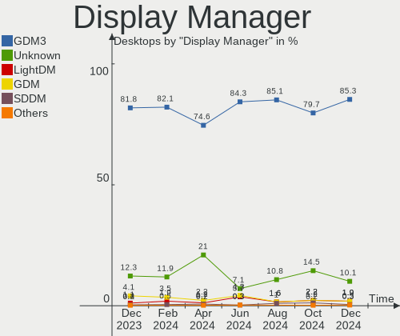
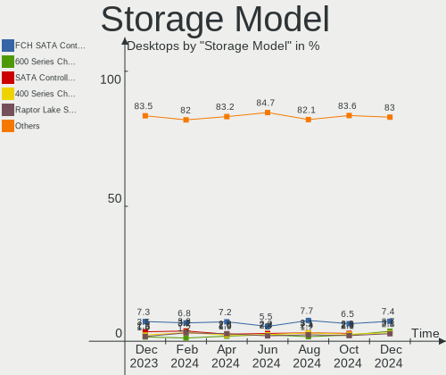
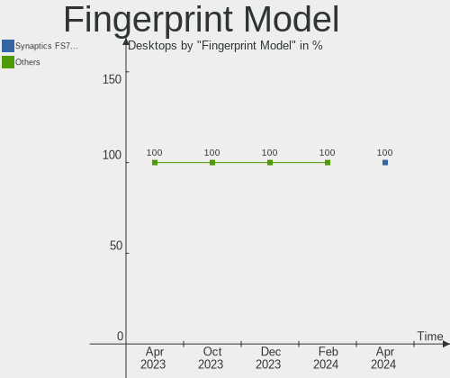

Ubuntu - Hardware Trends (Desktops)
-----------------------------------

A project to identify most popular hardware characteristics and track their change
over time based on data collected by Linux users at https://Linux-Hardware.org.

Anyone can contribute to this report by the [hw-probe](https://github.com/linuxhw/hw-probe) tool:

    sudo -E hw-probe -all -upload

This report is for one last month. Overall report since the beginning of time: [TestDays](https://github.com/linuxhw/TestDays)

Period: Oct, 2023.

Contents
--------

* [ System ](#system)
  - [ OS                       ](#os)
  - [ OS Family                ](#os-family)
  - [ Kernel                   ](#kernel)
  - [ Kernel Family            ](#kernel-family)
  - [ Kernel Major Ver.        ](#kernel-major-ver)
  - [ Arch                     ](#arch)
  - [ DE                       ](#de)
  - [ Display Server           ](#display-server)
  - [ Display Manager          ](#display-manager)
  - [ OS Lang                  ](#os-lang)
  - [ Boot Mode                ](#boot-mode)
  - [ Filesystem               ](#filesystem)
  - [ Part. scheme             ](#part-scheme)
  - [ Dual Boot with Linux/BSD ](#dual-boot-with-linuxbsd)
  - [ Dual Boot (Win)          ](#dual-boot-win)

* [ Board ](#board)
  - [ Vendor                   ](#vendor)
  - [ Model                    ](#model)
  - [ Model Family             ](#model-family)
  - [ MFG Year                 ](#mfg-year)
  - [ Form Factor              ](#form-factor)
  - [ Secure Boot              ](#secure-boot)
  - [ Coreboot                 ](#coreboot)
  - [ RAM Size                 ](#ram-size)
  - [ RAM Used                 ](#ram-used)
  - [ Total Drives             ](#total-drives)
  - [ Has CD-ROM               ](#has-cd-rom)
  - [ Has Ethernet             ](#has-ethernet)
  - [ Has WiFi                 ](#has-wifi)
  - [ Has Bluetooth            ](#has-bluetooth)

* [ Location ](#location)
  - [ Country                  ](#country)
  - [ City                     ](#city)

* [ Drives ](#drives)
  - [ Drive Vendor             ](#drive-vendor)
  - [ Drive Model              ](#drive-model)
  - [ HDD Vendor               ](#hdd-vendor)
  - [ SSD Vendor               ](#ssd-vendor)
  - [ Drive Kind               ](#drive-kind)
  - [ Drive Connector          ](#drive-connector)
  - [ Drive Size               ](#drive-size)
  - [ Space Total              ](#space-total)
  - [ Space Used               ](#space-used)
  - [ Malfunc. Drives          ](#malfunc-drives)
  - [ Malfunc. Drive Vendor    ](#malfunc-drive-vendor)
  - [ Malfunc. HDD Vendor      ](#malfunc-hdd-vendor)
  - [ Malfunc. Drive Kind      ](#malfunc-drive-kind)
  - [ Failed Drives            ](#failed-drives)
  - [ Failed Drive Vendor      ](#failed-drive-vendor)
  - [ Drive Status             ](#drive-status)

* [ Storage controller ](#storage-controller)
  - [ Storage Vendor           ](#storage-vendor)
  - [ Storage Model            ](#storage-model)
  - [ Storage Kind             ](#storage-kind)

* [ Processor ](#processor)
  - [ CPU Vendor               ](#cpu-vendor)
  - [ CPU Model                ](#cpu-model)
  - [ CPU Model Family         ](#cpu-model-family)
  - [ CPU Cores                ](#cpu-cores)
  - [ CPU Sockets              ](#cpu-sockets)
  - [ CPU Threads              ](#cpu-threads)
  - [ CPU Op-Modes             ](#cpu-op-modes)
  - [ CPU Microcode            ](#cpu-microcode)
  - [ CPU Microarch            ](#cpu-microarch)

* [ Graphics ](#graphics)
  - [ GPU Vendor               ](#gpu-vendor)
  - [ GPU Model                ](#gpu-model)
  - [ GPU Combo                ](#gpu-combo)
  - [ GPU Driver               ](#gpu-driver)
  - [ GPU Memory               ](#gpu-memory)

* [ Monitor ](#monitor)
  - [ Monitor Vendor           ](#monitor-vendor)
  - [ Monitor Model            ](#monitor-model)
  - [ Monitor Resolution       ](#monitor-resolution)
  - [ Monitor Diagonal         ](#monitor-diagonal)
  - [ Monitor Width            ](#monitor-width)
  - [ Aspect Ratio             ](#aspect-ratio)
  - [ Monitor Area             ](#monitor-area)
  - [ Pixel Density            ](#pixel-density)
  - [ Multiple Monitors        ](#multiple-monitors)

* [ Network ](#network)
  - [ Net Controller Vendor    ](#net-controller-vendor)
  - [ Net Controller Model     ](#net-controller-model)
  - [ Wireless Vendor          ](#wireless-vendor)
  - [ Wireless Model           ](#wireless-model)
  - [ Ethernet Vendor          ](#ethernet-vendor)
  - [ Ethernet Model           ](#ethernet-model)
  - [ Net Controller Kind      ](#net-controller-kind)
  - [ Used Controller          ](#used-controller)
  - [ NICs                     ](#nics)
  - [ IPv6                     ](#ipv6)

* [ Bluetooth ](#bluetooth)
  - [ Bluetooth Vendor         ](#bluetooth-vendor)
  - [ Bluetooth Model          ](#bluetooth-model)

* [ Sound ](#sound)
  - [ Sound Vendor             ](#sound-vendor)
  - [ Sound Model              ](#sound-model)

* [ Memory ](#memory)
  - [ Memory Vendor            ](#memory-vendor)
  - [ Memory Model             ](#memory-model)
  - [ Memory Kind              ](#memory-kind)
  - [ Memory Form Factor       ](#memory-form-factor)
  - [ Memory Size              ](#memory-size)
  - [ Memory Speed             ](#memory-speed)

* [ Printers & scanners ](#printers--scanners)
  - [ Printer Vendor           ](#printer-vendor)
  - [ Printer Model            ](#printer-model)
  - [ Scanner Vendor           ](#scanner-vendor)
  - [ Scanner Model            ](#scanner-model)

* [ Camera ](#camera)
  - [ Camera Vendor            ](#camera-vendor)
  - [ Camera Model             ](#camera-model)

* [ Security ](#security)
  - [ Fingerprint Vendor       ](#fingerprint-vendor)
  - [ Fingerprint Model        ](#fingerprint-model)
  - [ Chipcard Vendor          ](#chipcard-vendor)
  - [ Chipcard Model           ](#chipcard-model)

* [ Unsupported ](#unsupported)
  - [ Unsupported Devices      ](#unsupported-devices)
  - [ Unsupported Device Types ](#unsupported-device-types)

System
------

OS
--

Installed operating systems

| Name           | Desktops | Percent |
|----------------|----------|---------|
| Ubuntu 22.04   | 312      | 63.8%   |
| Ubuntu 23.04   | 81       | 16.56%  |
| Ubuntu 20.04   | 44       | 9%      |
| Ubuntu 23.10   | 35       | 7.16%   |
| Ubuntu 18.04   | 10       | 2.04%   |
| Ubuntu 22.10   | 6        | 1.23%   |
| Ubuntu Core 22 | 1        | 0.2%    |

OS Family
---------

OS without a version

| Name   | Desktops | Percent |
|--------|----------|---------|
| Ubuntu | 489      | 100%    |

Kernel
------

Version of the Linux kernel

| Version                 | Desktops | Percent |
|-------------------------|----------|---------|
| 6.2.0-34-generic        | 145      | 29.65%  |
| 6.2.0-35-generic        | 97       | 19.84%  |
| 6.2.0-33-generic        | 41       | 8.38%   |
| 5.15.0-86-generic       | 25       | 5.11%   |
| 6.5.0-9-generic         | 21       | 4.29%   |
| 5.19.0-38-generic       | 17       | 3.48%   |
| 5.15.0-87-generic       | 17       | 3.48%   |
| 6.2.0-26-generic        | 16       | 3.27%   |
| 5.15.0-84-generic       | 14       | 2.86%   |
| 6.5.0-10-generic        | 12       | 2.45%   |
| 6.2.0-36-generic        | 11       | 2.25%   |
| 5.4.0-165-generic       | 6        | 1.23%   |
| 5.19.0-46-generic       | 5        | 1.02%   |
| 4.15.0-213-generic      | 4        | 0.82%   |
| 6.2.0-20-generic        | 3        | 0.61%   |
| 5.4.0-163-generic       | 3        | 0.61%   |
| 5.4.0-150-generic       | 3        | 0.61%   |
| 5.15.0-67-generic       | 3        | 0.61%   |
| 6.5.0-5-generic         | 2        | 0.41%   |
| 6.2.0-32-generic        | 2        | 0.41%   |
| 6.2.0-31-generic        | 2        | 0.41%   |
| 5.4.0-52-generic        | 2        | 0.41%   |
| 5.19.0-21-generic       | 2        | 0.41%   |
| 5.15.0-83-generic       | 2        | 0.41%   |
| 5.15.0-76-generic       | 2        | 0.41%   |
| 5.15.0-43-generic       | 2        | 0.41%   |
| 5.15.0-25-generic       | 2        | 0.41%   |
| 6.6.0-060600rc5-generic | 1        | 0.2%    |
| 6.5.5-zen1-1-zen        | 1        | 0.2%    |
| 6.3.9                   | 1        | 0.2%    |
| 6.2.16-3-pve            | 1        | 0.2%    |
| 6.2.16-060216-generic   | 1        | 0.2%    |
| 6.2.1-060201-generic    | 1        | 0.2%    |
| 6.2.0-1015-lowlatency   | 1        | 0.2%    |
| 6.2.0-1014-gcp          | 1        | 0.2%    |
| 6.2.0-1009-lowlatency   | 1        | 0.2%    |
| 6.2.0-1007-lowlatency   | 1        | 0.2%    |
| 6.1.0-hiveos            | 1        | 0.2%    |
| 5.8.0-50-generic        | 1        | 0.2%    |
| 5.4.0-54-generic        | 1        | 0.2%    |

Kernel Family
-------------

Linux kernel without a distro release

| Version | Desktops | Percent |
|---------|----------|---------|
| 6.2.0   | 321      | 65.64%  |
| 5.15.0  | 74       | 15.13%  |
| 6.5.0   | 35       | 7.16%   |
| 5.19.0  | 25       | 5.11%   |
| 5.4.0   | 17       | 3.48%   |
| 4.15.0  | 7        | 1.43%   |
| 6.2.16  | 2        | 0.41%   |
| 6.6.0   | 1        | 0.2%    |
| 6.5.5   | 1        | 0.2%    |
| 6.3.9   | 1        | 0.2%    |
| 6.2.1   | 1        | 0.2%    |
| 6.1.0   | 1        | 0.2%    |
| 5.8.0   | 1        | 0.2%    |
| 5.11.0  | 1        | 0.2%    |
| 4.4.0   | 1        | 0.2%    |

Kernel Major Ver.
-----------------

Linux kernel major version

| Version | Desktops | Percent |
|---------|----------|---------|
| 6.2     | 324      | 66.26%  |
| 5.15    | 74       | 15.13%  |
| 6.5     | 36       | 7.36%   |
| 5.19    | 25       | 5.11%   |
| 5.4     | 17       | 3.48%   |
| 4.15    | 7        | 1.43%   |
| 6.6     | 1        | 0.2%    |
| 6.3     | 1        | 0.2%    |
| 6.1     | 1        | 0.2%    |
| 5.8     | 1        | 0.2%    |
| 5.11    | 1        | 0.2%    |
| 4.4     | 1        | 0.2%    |

Arch
----

OS architecture (x86_64, i586, etc.)

| Name   | Desktops | Percent |
|--------|----------|---------|
| x86_64 | 487      | 99.59%  |
| i686   | 2        | 0.41%   |

DE
--

Desktop Environment

| Name            | Desktops | Percent |
|-----------------|----------|---------|
| GNOME           | 426      | 87.12%  |
| Unknown         | 52       | 10.63%  |
| X-Cinnamon      | 6        | 1.23%   |
| GNOME Classic   | 2        | 0.41%   |
| GNOME Flashback | 1        | 0.2%    |
| Enlightenment   | 1        | 0.2%    |
| Cinnamon        | 1        | 0.2%    |

Display Server
--------------

X11 or Wayland

| Name    | Desktops | Percent |
|---------|----------|---------|
| Wayland | 245      | 50.1%   |
| X11     | 184      | 37.63%  |
| Unknown | 34       | 6.95%   |
| Tty     | 26       | 5.32%   |

Display Manager
---------------

SDDM, LightDM, etc.

| Name    | Desktops | Percent |
|---------|----------|---------|
| GDM3    | 392      | 80.16%  |
| Unknown | 70       | 14.31%  |
| GDM     | 14       | 2.86%   |
| LightDM | 10       | 2.04%   |
| SDDM    | 2        | 0.41%   |
| XDM     | 1        | 0.2%    |

OS Lang
-------

Language

| Lang    | Desktops | Percent |
|---------|----------|---------|
| en_US   | 201      | 41.1%   |
| de_DE   | 49       | 10.02%  |
| fr_FR   | 36       | 7.36%   |
| C       | 25       | 5.11%   |
| en_GB   | 23       | 4.7%    |
| it_IT   | 19       | 3.89%   |
| pt_BR   | 11       | 2.25%   |
| pl_PL   | 10       | 2.04%   |
| es_ES   | 10       | 2.04%   |
| en_IN   | 9        | 1.84%   |
| en_CA   | 8        | 1.64%   |
| zh_CN   | 7        | 1.43%   |
| ru_RU   | 7        | 1.43%   |
| nl_NL   | 5        | 1.02%   |
| ja_JP   | 5        | 1.02%   |
| hu_HU   | 5        | 1.02%   |
| en_AU   | 5        | 1.02%   |
| Unknown | 5        | 1.02%   |
| zh_TW   | 4        | 0.82%   |
| tr_TR   | 4        | 0.82%   |
| en_ZA   | 4        | 0.82%   |
| es_MX   | 3        | 0.61%   |
| es_AR   | 3        | 0.61%   |
| sv_SE   | 2        | 0.41%   |
| sk_SK   | 2        | 0.41%   |
| ko_KR   | 2        | 0.41%   |
| fr_CA   | 2        | 0.41%   |
| es_CO   | 2        | 0.41%   |
| en_NZ   | 2        | 0.41%   |
| en_IE   | 2        | 0.41%   |
| de_AT   | 2        | 0.41%   |
| cs_CZ   | 2        | 0.41%   |
| ru_UA   | 1        | 0.2%    |
| nb_NO   | 1        | 0.2%    |
| he_IL   | 1        | 0.2%    |
| gl_ES   | 1        | 0.2%    |
| fi_FI   | 1        | 0.2%    |
| es_VE   | 1        | 0.2%    |
| es_UY   | 1        | 0.2%    |
| es_US   | 1        | 0.2%    |

Boot Mode
---------

EFI or BIOS

| Mode | Desktops | Percent |
|------|----------|---------|
| BIOS | 347      | 70.96%  |
| EFI  | 142      | 29.04%  |

Filesystem
----------

Type of filesystem

| Type    | Desktops | Percent |
|---------|----------|---------|
| Tmpfs   | 287      | 58.69%  |
| Ext4    | 170      | 34.76%  |
| Overlay | 24       | 4.91%   |
| Btrfs   | 3        | 0.61%   |
| Zfs     | 2        | 0.41%   |
| Xfs     | 1        | 0.2%    |
| Ext3    | 1        | 0.2%    |
| Unknown | 1        | 0.2%    |

Part. scheme
------------

Scheme of partitioning

| Type    | Desktops | Percent |
|---------|----------|---------|
| GPT     | 396      | 80.98%  |
| Unknown | 47       | 9.61%   |
| MBR     | 46       | 9.41%   |

Dual Boot with Linux/BSD
------------------------

Hosting more than one Linux/BSD

| Dual boot | Desktops | Percent |
|-----------|----------|---------|
| No        | 398      | 81.39%  |
| Yes       | 91       | 18.61%  |

Dual Boot (Win)
---------------

Hosting Linux and Windows

| Dual boot | Desktops | Percent |
|-----------|----------|---------|
| No        | 296      | 60.53%  |
| Yes       | 193      | 39.47%  |

Board
-----

Vendor
------

Motherboard manufacturer

| Name                                 | Desktops | Percent |
|--------------------------------------|----------|---------|
| ASUSTek Computer                     | 97       | 19.84%  |
| Gigabyte Technology                  | 70       | 14.31%  |
| Dell                                 | 53       | 10.84%  |
| Hewlett-Packard                      | 50       | 10.22%  |
| MSI                                  | 42       | 8.59%   |
| ASRock                               | 38       | 7.77%   |
| Lenovo                               | 26       | 5.32%   |
| Intel                                | 17       | 3.48%   |
| Supermicro                           | 16       | 3.27%   |
| Acer                                 | 11       | 2.25%   |
| Unknown                              | 10       | 2.04%   |
| AZW                                  | 9        | 1.84%   |
| Biostar                              | 6        | 1.23%   |
| Fujitsu                              | 4        | 0.82%   |
| Pegatron                             | 3        | 0.61%   |
| Inventec                             | 3        | 0.61%   |
| Gateway                              | 3        | 0.61%   |
| Foxconn                              | 3        | 0.61%   |
| ECS                                  | 3        | 0.61%   |
| Samsung Electronics                  | 2        | 0.41%   |
| Positivo                             | 2        | 0.41%   |
| Win element                          | 1        | 0.2%    |
| Trigkey                              | 1        | 0.2%    |
| SZMZ                                 | 1        | 0.2%    |
| System76                             | 1        | 0.2%    |
| Shenzhen Meigao Electronic Equipment | 1        | 0.2%    |
| SHANGZHAOYUAN                        | 1        | 0.2%    |
| Sapphire                             | 1        | 0.2%    |
| Quanta                               | 1        | 0.2%    |
| PCChips                              | 1        | 0.2%    |
| Packard Bell                         | 1        | 0.2%    |
| Online Labs                          | 1        | 0.2%    |
| Medion                               | 1        | 0.2%    |
| MACHINIST                            | 1        | 0.2%    |
| Google                               | 1        | 0.2%    |
| GIADA                                | 1        | 0.2%    |
| GEEKOM                               | 1        | 0.2%    |
| Fujitsu Siemens                      | 1        | 0.2%    |
| Colorful Technology                  | 1        | 0.2%    |
| ASRockRack                           | 1        | 0.2%    |

Model
-----

Motherboard model

| Name                              | Desktops | Percent |
|-----------------------------------|----------|---------|
| Unknown                           | 10       | 2.04%   |
| ASUS All Series                   | 9        | 1.84%   |
| Supermicro SYS-6018R-TDW          | 6        | 1.23%   |
| Supermicro SYS-1028R-TDW          | 4        | 0.82%   |
| Dell OptiPlex 7010                | 4        | 0.82%   |
| AZW SEi                           | 4        | 0.82%   |
| Supermicro SYS-6018R-MTR          | 3        | 0.61%   |
| MSI MS-7C52                       | 3        | 0.61%   |
| HP ProDesk 600 G1 SFF             | 3        | 0.61%   |
| HP Compaq Elite 8300 SFF          | 3        | 0.61%   |
| Dell OptiPlex 790                 | 3        | 0.61%   |
| Samsung DeskTop System            | 2        | 0.41%   |
| MSI MS-7C02                       | 2        | 0.41%   |
| MSI MS-7817                       | 2        | 0.41%   |
| Inventec D CLASS                  | 2        | 0.41%   |
| Intel H61                         | 2        | 0.41%   |
| HP Z420 Workstation               | 2        | 0.41%   |
| HP Z400 Workstation               | 2        | 0.41%   |
| HP xw4600 Workstation             | 2        | 0.41%   |
| HP ProDesk 600 G4 DM              | 2        | 0.41%   |
| HP EliteDesk 800 G1 SFF           | 2        | 0.41%   |
| Gigabyte X570 I AORUS PRO WIFI    | 2        | 0.41%   |
| Gigabyte GA-78LMT-USB3 6.0        | 2        | 0.41%   |
| Gigabyte B75M-D3H                 | 2        | 0.41%   |
| Gigabyte B450M DS3H               | 2        | 0.41%   |
| Dell OptiPlex 7040                | 2        | 0.41%   |
| Dell OptiPlex 5070                | 2        | 0.41%   |
| Dell OptiPlex 5040                | 2        | 0.41%   |
| Dell OptiPlex 380                 | 2        | 0.41%   |
| Dell OptiPlex 3010                | 2        | 0.41%   |
| Dell Inspiron 560                 | 2        | 0.41%   |
| AZW MINI S                        | 2        | 0.41%   |
| ASUS TUF Gaming X670E-PLUS WIFI   | 2        | 0.41%   |
| ASUS TUF Gaming B550M-PLUS        | 2        | 0.41%   |
| ASUS ROG STRIX Z790-A GAMING WIFI | 2        | 0.41%   |
| ASUS ROG STRIX B550-F GAMING      | 2        | 0.41%   |
| ASUS PRIME B450M-A                | 2        | 0.41%   |
| ASUS PRIME B450-PLUS              | 2        | 0.41%   |
| ASUS PRIME A320M-K                | 2        | 0.41%   |
| ASUS M5A97 R2.0                   | 2        | 0.41%   |

Model Family
------------

Motherboard model prefix

| Name                     | Desktops | Percent |
|--------------------------|----------|---------|
| Dell OptiPlex            | 32       | 6.54%   |
| ASUS PRIME               | 19       | 3.89%   |
| Lenovo ThinkCentre       | 18       | 3.68%   |
| ASUS ROG                 | 18       | 3.68%   |
| HP Compaq                | 10       | 2.04%   |
| Dell Precision           | 10       | 2.04%   |
| ASUS TUF                 | 10       | 2.04%   |
| Unknown                  | 10       | 2.04%   |
| HP ProDesk               | 9        | 1.84%   |
| ASUS All                 | 9        | 1.84%   |
| Acer Aspire              | 8        | 1.64%   |
| HP EliteDesk             | 7        | 1.43%   |
| Supermicro SYS-6018R-TDW | 6        | 1.23%   |
| Supermicro SYS-1028R-TDW | 4        | 0.82%   |
| Gigabyte B450M           | 4        | 0.82%   |
| Fujitsu ESPRIMO          | 4        | 0.82%   |
| AZW SEi                  | 4        | 0.82%   |
| Supermicro SYS-6018R-MTR | 3        | 0.61%   |
| MSI MS-7C52              | 3        | 0.61%   |
| Intel H61                | 3        | 0.61%   |
| HP Pavilion              | 3        | 0.61%   |
| Gigabyte Z390            | 3        | 0.61%   |
| Gigabyte GA-78LMT-USB3   | 3        | 0.61%   |
| Gigabyte B550M           | 3        | 0.61%   |
| Dell XPS                 | 3        | 0.61%   |
| Dell Vostro              | 3        | 0.61%   |
| Dell Inspiron            | 3        | 0.61%   |
| ASUS P9X79               | 3        | 0.61%   |
| ASUS H110M-A             | 3        | 0.61%   |
| ASRock Z370              | 3        | 0.61%   |
| Samsung DeskTop          | 2        | 0.41%   |
| MSI MS-7C02              | 2        | 0.41%   |
| MSI MS-7817              | 2        | 0.41%   |
| Lenovo ThinkStation      | 2        | 0.41%   |
| Lenovo IdeaCentre        | 2        | 0.41%   |
| Inventec D               | 2        | 0.41%   |
| Intel X79                | 2        | 0.41%   |
| HP Z420                  | 2        | 0.41%   |
| HP Z400                  | 2        | 0.41%   |
| HP xw4600                | 2        | 0.41%   |

MFG Year
--------

Motherboard manufacture year

| Year | Desktops | Percent |
|------|----------|---------|
| 2013 | 56       | 11.45%  |
| 2018 | 38       | 7.77%   |
| 2023 | 37       | 7.57%   |
| 2019 | 36       | 7.36%   |
| 2020 | 35       | 7.16%   |
| 2022 | 34       | 6.95%   |
| 2014 | 34       | 6.95%   |
| 2011 | 31       | 6.34%   |
| 2012 | 30       | 6.13%   |
| 2017 | 29       | 5.93%   |
| 2015 | 26       | 5.32%   |
| 2016 | 23       | 4.7%    |
| 2009 | 21       | 4.29%   |
| 2010 | 19       | 3.89%   |
| 2021 | 16       | 3.27%   |
| 2008 | 14       | 2.86%   |
| 2007 | 7        | 1.43%   |
| 2006 | 2        | 0.41%   |
| 2005 | 1        | 0.2%    |

Form Factor
-----------

Physical design of the computer

| Name    | Desktops | Percent |
|---------|----------|---------|
| Desktop | 489      | 100%    |

Secure Boot
-----------

Enabled or disabled

| State    | Desktops | Percent |
|----------|----------|---------|
| Disabled | 470      | 96.11%  |
| Enabled  | 19       | 3.89%   |

Coreboot
--------

Have coreboot on board

| Used | Desktops | Percent |
|------|----------|---------|
| No   | 488      | 99.8%   |
| Yes  | 1        | 0.2%    |

RAM Size
--------

Total RAM memory

| Size in GB      | Desktops | Percent |
|-----------------|----------|---------|
| 16.01-24.0      | 144      | 29.45%  |
| 4.01-8.0        | 77       | 15.75%  |
| 8.01-16.0       | 71       | 14.52%  |
| 32.01-64.0      | 69       | 14.11%  |
| 3.01-4.0        | 57       | 11.66%  |
| 64.01-256.0     | 42       | 8.59%   |
| 24.01-32.0      | 21       | 4.29%   |
| More than 256.0 | 4        | 0.82%   |
| 2.01-3.0        | 2        | 0.41%   |
| 1.01-2.0        | 2        | 0.41%   |

RAM Used
--------

Used RAM memory

| Used GB    | Desktops | Percent |
|------------|----------|---------|
| 1.01-2.0   | 149      | 30.47%  |
| 2.01-3.0   | 135      | 27.61%  |
| 4.01-8.0   | 82       | 16.77%  |
| 3.01-4.0   | 79       | 16.16%  |
| 8.01-16.0  | 28       | 5.73%   |
| 0.51-1.0   | 6        | 1.23%   |
| 16.01-24.0 | 4        | 0.82%   |
| 0.01-0.5   | 3        | 0.61%   |
| 32.01-64.0 | 2        | 0.41%   |
| 24.01-32.0 | 1        | 0.2%    |

Total Drives
------------

Number of drives on board

| Drives | Desktops | Percent |
|--------|----------|---------|
| 1      | 209      | 42.74%  |
| 2      | 137      | 28.02%  |
| 3      | 75       | 15.34%  |
| 4      | 38       | 7.77%   |
| 6      | 8        | 1.64%   |
| 5      | 8        | 1.64%   |
| 7      | 6        | 1.23%   |
| 9      | 3        | 0.61%   |
| 0      | 3        | 0.61%   |
| 8      | 2        | 0.41%   |

Has CD-ROM
----------

Has CD-ROM on board

| Presented | Desktops | Percent |
|-----------|----------|---------|
| No        | 299      | 61.15%  |
| Yes       | 190      | 38.85%  |

Has Ethernet
------------

Has Ethernet on board

| Presented | Desktops | Percent |
|-----------|----------|---------|
| Yes       | 485      | 99.18%  |
| No        | 4        | 0.82%   |

Has WiFi
--------

Has WiFi module

| Presented | Desktops | Percent |
|-----------|----------|---------|
| No        | 246      | 50.31%  |
| Yes       | 243      | 49.69%  |

Has Bluetooth
-------------

Has Bluetooth module

| Presented | Desktops | Percent |
|-----------|----------|---------|
| No        | 315      | 64.42%  |
| Yes       | 174      | 35.58%  |

Location
--------

Country
-------

Geographic location (country)

| Country      | Desktops | Percent |
|--------------|----------|---------|
| USA          | 118      | 24.13%  |
| Germany      | 56       | 11.45%  |
| France       | 39       | 7.98%   |
| Russia       | 28       | 5.73%   |
| UK           | 24       | 4.91%   |
| Italy        | 21       | 4.29%   |
| Brazil       | 18       | 3.68%   |
| Canada       | 17       | 3.48%   |
| Spain        | 11       | 2.25%   |
| India        | 11       | 2.25%   |
| Poland       | 10       | 2.04%   |
| Netherlands  | 9        | 1.84%   |
| Turkey       | 8        | 1.64%   |
| China        | 7        | 1.43%   |
| Switzerland  | 6        | 1.23%   |
| Sweden       | 6        | 1.23%   |
| Mexico       | 6        | 1.23%   |
| Japan        | 6        | 1.23%   |
| Hungary      | 6        | 1.23%   |
| Australia    | 6        | 1.23%   |
| Argentina    | 6        | 1.23%   |
| Taiwan       | 5        | 1.02%   |
| South Africa | 5        | 1.02%   |
| Austria      | 4        | 0.82%   |
| South Korea  | 3        | 0.61%   |
| Slovakia     | 3        | 0.61%   |
| Finland      | 3        | 0.61%   |
| Czechia      | 3        | 0.61%   |
| Colombia     | 3        | 0.61%   |
| Thailand     | 2        | 0.41%   |
| Slovenia     | 2        | 0.41%   |
| Singapore    | 2        | 0.41%   |
| Serbia       | 2        | 0.41%   |
| Romania      | 2        | 0.41%   |
| Norway       | 2        | 0.41%   |
| New Zealand  | 2        | 0.41%   |
| Greece       | 2        | 0.41%   |
| Bulgaria     | 2        | 0.41%   |
| Belgium      | 2        | 0.41%   |
| Vietnam      | 1        | 0.2%    |

City
----

Geographic location (city)

| City            | Desktops | Percent |
|-----------------|----------|---------|
| Moscow          | 18       | 3.68%   |
| Berlin          | 6        | 1.23%   |
| Toronto         | 4        | 0.82%   |
| St Petersburg   | 4        | 0.82%   |
| Paris           | 4        | 0.82%   |
| Munich          | 4        | 0.82%   |
| Miami           | 4        | 0.82%   |
| Warsaw          | 3        | 0.61%   |
| Rome            | 3        | 0.61%   |
| New York        | 3        | 0.61%   |
| New Taipei      | 3        | 0.61%   |
| Montreal        | 3        | 0.61%   |
| Los Angeles     | 3        | 0.61%   |
| London          | 3        | 0.61%   |
| Johannesburg    | 3        | 0.61%   |
| Istanbul        | 3        | 0.61%   |
| Hamburg         | 3        | 0.61%   |
| Buenos Aires    | 3        | 0.61%   |
| Budapest        | 3        | 0.61%   |
| Atlanta         | 3        | 0.61%   |
| Zurich          | 2        | 0.41%   |
| Würzburg       | 2        | 0.41%   |
| Wroclaw         | 2        | 0.41%   |
| Waynesboro      | 2        | 0.41%   |
| Vancouver       | 2        | 0.41%   |
| The Hague       | 2        | 0.41%   |
| St. Petersburg  | 2        | 0.41%   |
| Singapore       | 2        | 0.41%   |
| Sao Paulo       | 2        | 0.41%   |
| Rosario         | 2        | 0.41%   |
| Pune            | 2        | 0.41%   |
| Plymouth        | 2        | 0.41%   |
| Penza           | 2        | 0.41%   |
| Ostrava         | 2        | 0.41%   |
| Nussdorf am Inn | 2        | 0.41%   |
| Milan           | 2        | 0.41%   |
| Madrid          | 2        | 0.41%   |
| Ljubljana       | 2        | 0.41%   |
| Las Vegas       | 2        | 0.41%   |
| Kiel            | 2        | 0.41%   |

Drives
------

Drive Vendor
------------

Hard drive vendors

| Vendor                      | Desktops | Drives | Percent |
|-----------------------------|----------|--------|---------|
| WDC                         | 148      | 188    | 17.87%  |
| Seagate                     | 134      | 169    | 16.18%  |
| Samsung Electronics         | 118      | 173    | 14.25%  |
| Sandisk                     | 48       | 55     | 5.8%    |
| Toshiba                     | 40       | 42     | 4.83%   |
| Kingston                    | 34       | 38     | 4.11%   |
| Crucial                     | 33       | 37     | 3.99%   |
| Hitachi                     | 18       | 20     | 2.17%   |
| Unknown                     | 16       | 17     | 1.93%   |
| Intel                       | 15       | 32     | 1.81%   |
| Micron/Crucial Technology   | 14       | 16     | 1.69%   |
| Phison Electronics          | 13       | 14     | 1.57%   |
| SK hynix                    | 12       | 12     | 1.45%   |
| China                       | 11       | 12     | 1.33%   |
| SPCC                        | 10       | 12     | 1.21%   |
| PNY                         | 9        | 14     | 1.09%   |
| A-DATA Technology           | 9        | 11     | 1.09%   |
| HGST                        | 8        | 14     | 0.97%   |
| Micron Technology           | 7        | 7      | 0.85%   |
| Intenso                     | 6        | 6      | 0.72%   |
| Silicon Motion              | 5        | 5      | 0.6%    |
| Lexar                       | 5        | 5      | 0.6%    |
| Kingston Technology Company | 5        | 6      | 0.6%    |
| MAXIO Technology (Hangzhou) | 4        | 4      | 0.48%   |
| Hewlett-Packard             | 4        | 4      | 0.48%   |
| Fujitsu                     | 4        | 4      | 0.48%   |
| XrayDisk                    | 3        | 4      | 0.36%   |
| SABRENT                     | 3        | 3      | 0.36%   |
| Patriot                     | 3        | 3      | 0.36%   |
| Netac                       | 3        | 3      | 0.36%   |
| Maxtor                      | 3        | 3      | 0.36%   |
| KingSpec                    | 3        | 3      | 0.36%   |
| Gigabyte Technology         | 3        | 3      | 0.36%   |
| Fanxiang                    | 3        | 3      | 0.36%   |
| Corsair                     | 3        | 12     | 0.36%   |
| ADATA Technology            | 3        | 4      | 0.36%   |
| Unknown                     | 3        | 3      | 0.36%   |
| Team                        | 2        | 2      | 0.24%   |
| Seagate Technology          | 2        | 2      | 0.24%   |
| Phison                      | 2        | 2      | 0.24%   |

Drive Model
-----------

Hard drive models

| Model                                                 | Desktops | Percent |
|-------------------------------------------------------|----------|---------|
| Samsung NVMe SSD Controller SM981/PM981/PM983 1TB     | 18       | 1.93%   |
| Seagate ST2000DM008-2FR102 2TB                        | 12       | 1.29%   |
| Unknown SD/MMC/MS PRO 16GB                            | 9        | 0.96%   |
| Toshiba DT01ACA100 1TB                                | 9        | 0.96%   |
| WDC WD10EZEX-08WN4A0 1TB                              | 8        | 0.86%   |
| Samsung SSD 850 EVO 250GB                             | 8        | 0.86%   |
| Micron/Crucial P2 NVMe PCIe SSD 500GB                 | 8        | 0.86%   |
| Kingston SA400S37480G 480GB SSD                       | 8        | 0.86%   |
| Crucial CT1000MX500SSD1 1TB                           | 8        | 0.86%   |
| Seagate ST500DM002-1BD142 500GB                       | 7        | 0.75%   |
| Seagate ST1000DM010-2EP102 1TB                        | 7        | 0.75%   |
| Samsung SSD 870 EVO 1TB                               | 7        | 0.75%   |
| Samsung NVMe SSD Controller PM9A1/PM9A3/980PRO 1TB    | 7        | 0.75%   |
| Kingston SA400S37240G 240GB SSD                       | 7        | 0.75%   |
| Seagate ST1000NM0033-9ZM173 1TB                       | 6        | 0.64%   |
| WDC WD10EZEX-00BN5A0 1TB                              | 5        | 0.54%   |
| Silicon Motion SM2263EN/SM2263XT SSD Controller 256GB | 5        | 0.54%   |
| Seagate ST1000DM003-1CH162 1TB                        | 5        | 0.54%   |
| Sandisk WD Black SN750 / PC SN730 NVMe SSD 1024GB     | 5        | 0.54%   |
| Samsung SSD 980 PRO 500GB                             | 5        | 0.54%   |
| Samsung SSD 860 EVO 250GB                             | 5        | 0.54%   |
| Phison E16 PCIe4 NVMe Controller 500GB                | 5        | 0.54%   |
| Kingston SV300S37A120G 120GB SSD                      | 5        | 0.54%   |
| WDC WD20EZRZ-00Z5HB0 2TB                              | 4        | 0.43%   |
| WDC WD10EZEX-08M2NA0 1TB                              | 4        | 0.43%   |
| Toshiba HDWD110 1TB                                   | 4        | 0.43%   |
| SPCC Solid State Disk 512GB                           | 4        | 0.43%   |
| Seagate ST2000DM001-1CH164 2TB                        | 4        | 0.43%   |
| Seagate Expansion 1TB                                 | 4        | 0.43%   |
| Sandisk WD_BLACK SN770 1TB                            | 4        | 0.43%   |
| SanDisk SSD PLUS 240GB                                | 4        | 0.43%   |
| Samsung SSD 860 QVO 1TB                               | 4        | 0.43%   |
| PNY CS900 120GB SSD                                   | 4        | 0.43%   |
| Phison PS5013 E13 NVMe Controller 256GB               | 4        | 0.43%   |
| Intel SSDSC2BB800G7 800GB                             | 4        | 0.43%   |
| Intel SSDSC2BB480G7 480GB                             | 4        | 0.43%   |
| HGST HTE721010A9E630 1TB                              | 4        | 0.43%   |
| Crucial CT500MX500SSD1 500GB                          | 4        | 0.43%   |
| Crucial CT240BX500SSD1 240GB                          | 4        | 0.43%   |
| WDC WDS500G2B0A-00SM50 500GB SSD                      | 3        | 0.32%   |

HDD Vendor
----------

Hard disk drive vendors

| Vendor              | Desktops | Drives | Percent |
|---------------------|----------|--------|---------|
| WDC                 | 129      | 156    | 36.75%  |
| Seagate             | 129      | 164    | 36.75%  |
| Toshiba             | 33       | 35     | 9.4%    |
| Hitachi             | 18       | 20     | 5.13%   |
| Samsung Electronics | 14       | 19     | 3.99%   |
| Unknown             | 9        | 9      | 2.56%   |
| HGST                | 8        | 14     | 2.28%   |
| Fujitsu             | 4        | 4      | 1.14%   |
| Maxtor              | 3        | 3      | 0.85%   |
| USB3.0              | 1        | 1      | 0.28%   |
| SSK                 | 1        | 1      | 0.28%   |
| SABRENT             | 1        | 1      | 0.28%   |
| Hewlett-Packard     | 1        | 1      | 0.28%   |

SSD Vendor
----------

Solid state drive vendors

| Vendor              | Desktops | Drives | Percent |
|---------------------|----------|--------|---------|
| Samsung Electronics | 62       | 76     | 21.09%  |
| Kingston            | 30       | 33     | 10.2%   |
| Crucial             | 29       | 29     | 9.86%   |
| WDC                 | 26       | 27     | 8.84%   |
| SanDisk             | 20       | 23     | 6.8%    |
| China               | 11       | 12     | 3.74%   |
| Intel               | 10       | 27     | 3.4%    |
| SPCC                | 9        | 10     | 3.06%   |
| PNY                 | 8        | 10     | 2.72%   |
| A-DATA Technology   | 8        | 10     | 2.72%   |
| SK hynix            | 6        | 6      | 2.04%   |
| Micron Technology   | 6        | 6      | 2.04%   |
| Intenso             | 5        | 5      | 1.7%    |
| Toshiba             | 3        | 3      | 1.02%   |
| Patriot             | 3        | 3      | 1.02%   |
| KingSpec            | 3        | 3      | 1.02%   |
| Corsair             | 3        | 12     | 1.02%   |
| XrayDisk            | 2        | 2      | 0.68%   |
| Team                | 2        | 2      | 0.68%   |
| SABRENT             | 2        | 2      | 0.68%   |
| PHD 3.0             | 2        | 2      | 0.68%   |
| OCZ                 | 2        | 2      | 0.68%   |
| LITEONIT            | 2        | 2      | 0.68%   |
| Hewlett-Packard     | 2        | 2      | 0.68%   |
| GOODRAM             | 2        | 3      | 0.68%   |
| Gigabyte Technology | 2        | 2      | 0.68%   |
| Emtec               | 2        | 2      | 0.68%   |
| Apacer              | 2        | 2      | 0.68%   |
| XSTAR               | 1        | 1      | 0.34%   |
| Verbatim            | 1        | 1      | 0.34%   |
| Transcend           | 1        | 1      | 0.34%   |
| Timetec             | 1        | 2      | 0.34%   |
| TCSUNBOW            | 1        | 1      | 0.34%   |
| T-FORCE             | 1        | 1      | 0.34%   |
| SUNEAST             | 1        | 1      | 0.34%   |
| STAR                | 1        | 1      | 0.34%   |
| SATAFIRM            | 1        | 1      | 0.34%   |
| Rogueware           | 1        | 1      | 0.34%   |
| POWER               | 1        | 1      | 0.34%   |
| Netac               | 1        | 1      | 0.34%   |

Drive Kind
----------

HDD or SSD

| Kind    | Desktops | Drives | Percent |
|---------|----------|--------|---------|
| HDD     | 276      | 428    | 38.71%  |
| SSD     | 250      | 350    | 35.06%  |
| NVMe    | 157      | 220    | 22.02%  |
| Unknown | 27       | 28     | 3.79%   |
| MMC     | 3        | 3      | 0.42%   |

Drive Connector
---------------

SATA, SAS, NVMe, etc.

| Type | Desktops | Drives | Percent |
|------|----------|--------|---------|
| SATA | 413      | 737    | 65.66%  |
| NVMe | 157      | 220    | 24.96%  |
| SAS  | 56       | 69     | 8.9%    |
| MMC  | 3        | 3      | 0.48%   |

Drive Size
----------

Size of hard drive

| Size in TB | Desktops | Drives | Percent |
|------------|----------|--------|---------|
| 0.01-0.5   | 267      | 380    | 46.84%  |
| 0.51-1.0   | 184      | 243    | 32.28%  |
| 1.01-2.0   | 64       | 81     | 11.23%  |
| 3.01-4.0   | 22       | 24     | 3.86%   |
| 2.01-3.0   | 19       | 33     | 3.33%   |
| 4.01-10.0  | 9        | 11     | 1.58%   |
| 10.01-20.0 | 5        | 6      | 0.88%   |

Space Total
-----------

Amount of disk space available on the file system

| Size in GB     | Desktops | Percent |
|----------------|----------|---------|
| 101-250        | 115      | 23.52%  |
| 501-1000       | 96       | 19.63%  |
| 251-500        | 91       | 18.61%  |
| 1001-2000      | 46       | 9.41%   |
| More than 3000 | 45       | 9.2%    |
| 2001-3000      | 24       | 4.91%   |
| 51-100         | 23       | 4.7%    |
| Unknown        | 23       | 4.7%    |
| 1-20           | 16       | 3.27%   |
| 21-50          | 10       | 2.04%   |

Space Used
----------

Amount of used disk space

| Used GB        | Desktops | Percent |
|----------------|----------|---------|
| 1-20           | 131      | 26.79%  |
| 21-50          | 98       | 20.04%  |
| 51-100         | 62       | 12.68%  |
| 101-250        | 60       | 12.27%  |
| 501-1000       | 37       | 7.57%   |
| 251-500        | 32       | 6.54%   |
| Unknown        | 23       | 4.7%    |
| More than 3000 | 19       | 3.89%   |
| 1001-2000      | 17       | 3.48%   |
| 2001-3000      | 10       | 2.04%   |

Malfunc. Drives
---------------

Drive models with a malfunction

| Model                                   | Desktops | Drives | Percent |
|-----------------------------------------|----------|--------|---------|
| Intel SSDSC2BB800G7 800GB               | 3        | 3      | 9.38%   |
| WDC WDS240G2G0A-00JH30 240GB SSD        | 2        | 2      | 6.25%   |
| WDC WDS240G2G0B-00EPW0 240GB SSD        | 1        | 1      | 3.13%   |
| WDC WD40EZRX-00SPEB0 4TB                | 1        | 1      | 3.13%   |
| WDC WD2500BEKT-60PVMT0 250GB            | 1        | 1      | 3.13%   |
| WDC WD2500AAJS-75M0A0 249GB             | 1        | 1      | 3.13%   |
| WDC WD2002FAEX-007BA0 2TB               | 1        | 1      | 3.13%   |
| WDC WD10EZEX-22MFCA0 1TB                | 1        | 1      | 3.13%   |
| WDC WD10EZEX-00WN4A0 1TB                | 1        | 1      | 3.13%   |
| WDC WD Green 2.5 240GB                  | 1        | 1      | 3.13%   |
| Toshiba A100 240GB SSD                  | 1        | 1      | 3.13%   |
| Seagate ST500LM000-SSHD-8GB             | 1        | 1      | 3.13%   |
| Seagate ST500DM002-1BC142 500GB         | 1        | 1      | 3.13%   |
| Seagate ST4000NM0053 4TB                | 1        | 1      | 3.13%   |
| Seagate ST3750840ACE 752GB              | 1        | 1      | 3.13%   |
| Seagate ST31000528AS 1TB                | 1        | 1      | 3.13%   |
| Seagate ST2000NC001-1DY164 2TB          | 1        | 1      | 3.13%   |
| Seagate ST2000DM008-2FR102 2TB          | 1        | 2      | 3.13%   |
| Seagate ST2000DL003-9VT166 2TB          | 1        | 1      | 3.13%   |
| Seagate ST14000NM0018-2H4101 14TB       | 1        | 1      | 3.13%   |
| Seagate ST1000LX015-1U7172 1TB          | 1        | 1      | 3.13%   |
| Seagate ST1000DM010-2EP102 1TB          | 1        | 1      | 3.13%   |
| Samsung Electronics SSD 980 PRO 500GB   | 1        | 1      | 3.13%   |
| Samsung Electronics SSD 870 EVO 500GB   | 1        | 1      | 3.13%   |
| Neo Forza NFS121SA312-6007000 120GB SSD | 1        | 1      | 3.13%   |
| KingFast SSD 256GB                      | 1        | 1      | 3.13%   |
| Hitachi HDS721050CLA662 500GB           | 1        | 1      | 3.13%   |
| Corsair Neutron GTX SSD 120GB           | 1        | 1      | 3.13%   |
| Corsair CSSD-F120GB2                    | 1        | 1      | 3.13%   |

Malfunc. Drive Vendor
---------------------

Vendors of faulty drives

| Vendor              | Desktops | Drives | Percent |
|---------------------|----------|--------|---------|
| Seagate             | 11       | 12     | 34.38%  |
| WDC                 | 10       | 10     | 31.25%  |
| Intel               | 3        | 3      | 9.38%   |
| Samsung Electronics | 2        | 2      | 6.25%   |
| Corsair             | 2        | 2      | 6.25%   |
| Toshiba             | 1        | 1      | 3.13%   |
| Neo                 | 1        | 1      | 3.13%   |
| KingFast            | 1        | 1      | 3.13%   |
| Hitachi             | 1        | 1      | 3.13%   |

Malfunc. HDD Vendor
-------------------

Vendors of faulty HDD drives

| Vendor  | Desktops | Drives | Percent |
|---------|----------|--------|---------|
| Seagate | 11       | 12     | 61.11%  |
| WDC     | 6        | 6      | 33.33%  |
| Hitachi | 1        | 1      | 5.56%   |

Malfunc. Drive Kind
-------------------

Kinds of faulty drives

| Kind | Desktops | Drives | Percent |
|------|----------|--------|---------|
| HDD  | 18       | 19     | 56.25%  |
| SSD  | 13       | 13     | 40.63%  |
| NVMe | 1        | 1      | 3.13%   |

Failed Drives
-------------

Failed drive models

| Model                     | Desktops | Drives | Percent |
|---------------------------|----------|--------|---------|
| Intel SSDSC2BB480G7 480GB | 1        | 4      | 100%    |

Failed Drive Vendor
-------------------

Failed drive vendors

| Vendor | Desktops | Drives | Percent |
|--------|----------|--------|---------|
| Intel  | 1        | 4      | 100%    |

Drive Status
------------

Number of failed and malfunc. drives

| Status   | Desktops | Drives | Percent |
|----------|----------|--------|---------|
| Detected | 343      | 710    | 65.21%  |
| Works    | 152      | 282    | 28.9%   |
| Malfunc  | 30       | 33     | 5.7%    |
| Failed   | 1        | 4      | 0.19%   |

Storage controller
------------------

Storage Vendor
--------------

Storage controller vendors

| Vendor                       | Desktops | Percent |
|------------------------------|----------|---------|
| Intel                        | 337      | 46.94%  |
| AMD                          | 138      | 19.22%  |
| Samsung Electronics          | 53       | 7.38%   |
| SanDisk                      | 33       | 4.6%    |
| Micron/Crucial Technology    | 20       | 2.79%   |
| Marvell Technology Group     | 19       | 2.65%   |
| ASMedia Technology           | 19       | 2.65%   |
| Phison Electronics           | 15       | 2.09%   |
| JMicron Technology           | 11       | 1.53%   |
| MAXIO Technology (Hangzhou)  | 9        | 1.25%   |
| Kingston Technology Company  | 9        | 1.25%   |
| Nvidia                       | 8        | 1.11%   |
| SK hynix                     | 6        | 0.84%   |
| Silicon Motion               | 6        | 0.84%   |
| Toshiba America Info Systems | 5        | 0.7%    |
| LSI Logic / Symbios Logic    | 5        | 0.7%    |
| Broadcom / LSI               | 4        | 0.56%   |
| ADATA Technology             | 4        | 0.56%   |
| VIA Technologies             | 3        | 0.42%   |
| Seagate Technology           | 3        | 0.42%   |
| Shenzhen Longsys Electronics | 2        | 0.28%   |
| Netac Technology             | 2        | 0.28%   |
| Union Memory (Shenzhen)      | 1        | 0.14%   |
| Realtek Semiconductor        | 1        | 0.14%   |
| Micron Technology            | 1        | 0.14%   |
| KIOXIA                       | 1        | 0.14%   |
| INNOGRIT                     | 1        | 0.14%   |
| Biwin Storage Technology     | 1        | 0.14%   |
| Adaptec                      | 1        | 0.14%   |

Storage Model
-------------

Storage controller models

| Model                                                                                   | Desktops | Percent |
|-----------------------------------------------------------------------------------------|----------|---------|
| AMD FCH SATA Controller [AHCI mode]                                                     | 78       | 8.99%   |
| Intel 8 Series/C220 Series Chipset Family 6-port SATA Controller 1 [AHCI mode]          | 49       | 5.65%   |
| Intel SATA Controller [RAID mode]                                                       | 24       | 2.76%   |
| Intel 200 Series PCH SATA controller [AHCI mode]                                        | 24       | 2.76%   |
| Intel 6 Series/C200 Series Chipset Family 6 port Desktop SATA AHCI Controller           | 23       | 2.65%   |
| Samsung NVMe SSD Controller SM981/PM981/PM983                                           | 22       | 2.53%   |
| Samsung NVMe SSD Controller PM9A1/PM9A3/980PRO                                          | 22       | 2.53%   |
| AMD 400 Series Chipset SATA Controller                                                  | 22       | 2.53%   |
| AMD 500 Series Chipset SATA Controller                                                  | 21       | 2.42%   |
| Intel Q170/Q150/B150/H170/H110/Z170/CM236 Chipset SATA Controller [AHCI Mode]           | 20       | 2.3%    |
| AMD SB7x0/SB8x0/SB9x0 IDE Controller                                                    | 19       | 2.19%   |
| Intel 7 Series/C210 Series Chipset Family 6-port SATA Controller [AHCI mode]            | 18       | 2.07%   |
| ASMedia ASM1062 Serial ATA Controller                                                   | 18       | 2.07%   |
| Intel Alder Lake-S PCH SATA Controller [AHCI Mode]                                      | 17       | 1.96%   |
| Intel Cannon Lake PCH SATA AHCI Controller                                              | 15       | 1.73%   |
| Intel C610/X99 series chipset 6-Port SATA Controller [AHCI mode]                        | 15       | 1.73%   |
| AMD SB7x0/SB8x0/SB9x0 SATA Controller [IDE mode]                                        | 15       | 1.73%   |
| AMD SB7x0/SB8x0/SB9x0 SATA Controller [AHCI mode]                                       | 14       | 1.61%   |
| Micron/Crucial P2 [Nick P2] / P3 / P3 Plus NVMe PCIe SSD (DRAM-less)                    | 13       | 1.5%    |
| Intel C610/X99 series chipset sSATA Controller [AHCI mode]                              | 13       | 1.5%    |
| Intel 700 Series Chipset Family SATA AHCI Controller                                    | 11       | 1.27%   |
| Intel 82801JI (ICH10 Family) SATA AHCI Controller                                       | 10       | 1.15%   |
| Intel 82801JI (ICH10 Family) 4 port SATA IDE Controller #1                              | 9        | 1.04%   |
| AMD FCH SATA Controller D                                                               | 9        | 1.04%   |
| MAXIO (Hangzhou) NVMe SSD Controller MAP1202                                            | 8        | 0.92%   |
| JMicron JMB363 SATA/IDE Controller                                                      | 8        | 0.92%   |
| Intel NM10/ICH7 Family SATA Controller [IDE mode]                                       | 8        | 0.92%   |
| Intel 82801JI (ICH10 Family) 2 port SATA IDE Controller #2                              | 8        | 0.92%   |
| Intel 6 Series/C200 Series Chipset Family Desktop SATA Controller (IDE mode, ports 4-5) | 8        | 0.92%   |
| Intel 6 Series/C200 Series Chipset Family Desktop SATA Controller (IDE mode, ports 0-3) | 8        | 0.92%   |
| Samsung NVMe SSD Controller 980 (DRAM-less)                                             | 7        | 0.81%   |
| Intel 82801G (ICH7 Family) IDE Controller                                               | 7        | 0.81%   |
| AMD 300 Series Chipset SATA Controller                                                  | 7        | 0.81%   |
| Silicon Motion SM2263EN/SM2263XT (DRAM-less) NVMe SSD Controllers                       | 6        | 0.69%   |
| SanDisk WD Black SN770 / PC SN740 256GB / PC SN560 (DRAM-less) NVMe SSD                 | 6        | 0.69%   |
| Phison E16 PCIe4 NVMe Controller                                                        | 6        | 0.69%   |
| Intel Volume Management Device NVMe RAID Controller                                     | 6        | 0.69%   |
| Intel C600/X79 series chipset 6-Port SATA AHCI Controller                               | 6        | 0.69%   |
| Intel 9 Series Chipset Family SATA Controller [AHCI Mode]                               | 6        | 0.69%   |
| Intel 5 Series/3400 Series Chipset 6 port SATA AHCI Controller                          | 6        | 0.69%   |

Storage Kind
------------

Kind of storage controller (IDE, SATA, NVMe, SAS, ...)

| Kind | Desktops | Percent |
|------|----------|---------|
| SATA | 406      | 58.25%  |
| NVMe | 156      | 22.38%  |
| IDE  | 81       | 11.62%  |
| RAID | 43       | 6.17%   |
| SAS  | 9        | 1.29%   |
| SCSI | 2        | 0.29%   |

Processor
---------

CPU Vendor
----------

Processor vendors

| Vendor | Desktops | Percent |
|--------|----------|---------|
| Intel  | 340      | 69.53%  |
| AMD    | 149      | 30.47%  |

CPU Model
---------

Processor models

| Model                                       | Desktops | Percent |
|---------------------------------------------|----------|---------|
| Intel Core i5-4590 CPU @ 3.30GHz            | 8        | 1.64%   |
| Intel Core i7-3770 CPU @ 3.40GHz            | 7        | 1.43%   |
| AMD Ryzen 5 5600G with Radeon Graphics      | 7        | 1.43%   |
| Intel Xeon CPU E5-2620 v3 @ 2.40GHz         | 6        | 1.23%   |
| Intel Core i7-2600 CPU @ 3.40GHz            | 6        | 1.23%   |
| Intel Core i5-6500 CPU @ 3.20GHz            | 6        | 1.23%   |
| Intel Core i5-4570 CPU @ 3.20GHz            | 6        | 1.23%   |
| AMD Ryzen 9 7950X 16-Core Processor         | 6        | 1.23%   |
| AMD Ryzen 3 3200G with Radeon Vega Graphics | 6        | 1.23%   |
| Intel N100                                  | 5        | 1.02%   |
| Intel Core i7-6700 CPU @ 3.40GHz            | 5        | 1.02%   |
| Intel Core i7-4790 CPU @ 3.60GHz            | 5        | 1.02%   |
| Intel Core 2 Duo CPU E8400 @ 3.00GHz        | 5        | 1.02%   |
| Intel 12th Gen Core i5-12400                | 5        | 1.02%   |
| AMD Ryzen 9 5950X 16-Core Processor         | 5        | 1.02%   |
| AMD Ryzen 7 5800X 8-Core Processor          | 5        | 1.02%   |
| AMD Ryzen 7 3700X 8-Core Processor          | 5        | 1.02%   |
| AMD FX-8350 Eight-Core Processor            | 5        | 1.02%   |
| Intel Xeon CPU E5-2650 v4 @ 2.20GHz         | 4        | 0.82%   |
| Intel Core i7-8700 CPU @ 3.20GHz            | 4        | 0.82%   |
| Intel Core i7-4770 CPU @ 3.40GHz            | 4        | 0.82%   |
| Intel Core i5-8400 CPU @ 2.80GHz            | 4        | 0.82%   |
| Intel Core i5-4460 CPU @ 3.20GHz            | 4        | 0.82%   |
| Intel Core i5-3470 CPU @ 3.20GHz            | 4        | 0.82%   |
| Intel Core i5-2400 CPU @ 3.10GHz            | 4        | 0.82%   |
| Intel 13th Gen Core i9-13900K               | 4        | 0.82%   |
| AMD Ryzen 9 3900X 12-Core Processor         | 4        | 0.82%   |
| AMD Ryzen 5 1600 Six-Core Processor         | 4        | 0.82%   |
| Intel Xeon CPU E5-2680 v4 @ 2.40GHz         | 3        | 0.61%   |
| Intel Xeon CPU E5-2620 v4 @ 2.10GHz         | 3        | 0.61%   |
| Intel Core i7-9700K CPU @ 3.60GHz           | 3        | 0.61%   |
| Intel Core i7-7700K CPU @ 4.20GHz           | 3        | 0.61%   |
| Intel Core i7 CPU 950 @ 3.07GHz             | 3        | 0.61%   |
| Intel Core i5-7400 CPU @ 3.00GHz            | 3        | 0.61%   |
| Intel Core i5-6400 CPU @ 2.70GHz            | 3        | 0.61%   |
| Intel Core i5-2500 CPU @ 3.30GHz            | 3        | 0.61%   |
| Intel Core i5-1035G7 CPU @ 1.20GHz          | 3        | 0.61%   |
| Intel Core i3-3220 CPU @ 3.30GHz            | 3        | 0.61%   |
| Intel Core i3-2100 CPU @ 3.10GHz            | 3        | 0.61%   |
| Intel Core i3 CPU 530 @ 2.93GHz             | 3        | 0.61%   |

CPU Model Family
----------------

Processor model prefix

| Model                   | Desktops | Percent |
|-------------------------|----------|---------|
| Intel Core i5           | 89       | 18.2%   |
| Intel Core i7           | 76       | 15.54%  |
| Other                   | 43       | 8.79%   |
| Intel Xeon              | 43       | 8.79%   |
| AMD Ryzen 5             | 33       | 6.75%   |
| Intel Core i3           | 31       | 6.34%   |
| AMD Ryzen 9             | 22       | 4.5%    |
| AMD Ryzen 7             | 22       | 4.5%    |
| Intel Celeron           | 11       | 2.25%   |
| AMD FX                  | 11       | 2.25%   |
| Intel Pentium           | 10       | 2.04%   |
| Intel Core 2 Quad       | 10       | 2.04%   |
| Intel Core 2 Duo        | 10       | 2.04%   |
| AMD Ryzen 3             | 9        | 1.84%   |
| AMD A6                  | 7        | 1.43%   |
| Intel Core i9           | 5        | 1.02%   |
| AMD A10                 | 5        | 1.02%   |
| Intel Pentium Dual-Core | 4        | 0.82%   |
| Intel Atom              | 4        | 0.82%   |
| AMD Phenom II X2        | 4        | 0.82%   |
| AMD Athlon II X4        | 4        | 0.82%   |
| Intel Core 2            | 3        | 0.61%   |
| AMD Ryzen 5 PRO         | 3        | 0.61%   |
| AMD Phenom II X4        | 3        | 0.61%   |
| AMD GX                  | 3        | 0.61%   |
| AMD Ryzen Threadripper  | 2        | 0.41%   |
| AMD Phenom II X6        | 2        | 0.41%   |
| AMD G                   | 2        | 0.41%   |
| AMD Athlon II X3        | 2        | 0.41%   |
| AMD Athlon 64 X2        | 2        | 0.41%   |
| AMD A4                  | 2        | 0.41%   |
| Intel Pentium Silver    | 1        | 0.2%    |
| Intel Pentium Dual      | 1        | 0.2%    |
| Intel Pentium 4         | 1        | 0.2%    |
| AMD PRO A10             | 1        | 0.2%    |
| AMD Phenom II X3        | 1        | 0.2%    |
| AMD Phenom              | 1        | 0.2%    |
| AMD Athlon X4           | 1        | 0.2%    |
| AMD Athlon X2           | 1        | 0.2%    |
| AMD Athlon II X2        | 1        | 0.2%    |

CPU Cores
---------

Number of processor cores

| Number | Desktops | Percent |
|--------|----------|---------|
| 4      | 190      | 38.85%  |
| 2      | 96       | 19.63%  |
| 6      | 72       | 14.72%  |
| 8      | 47       | 9.61%   |
| 12     | 26       | 5.32%   |
| 16     | 22       | 4.5%    |
| 24     | 10       | 2.04%   |
| 1      | 8        | 1.64%   |
| 10     | 5        | 1.02%   |
| 3      | 5        | 1.02%   |
| 14     | 4        | 0.82%   |
| 28     | 3        | 0.61%   |
| 32     | 1        | 0.2%    |

CPU Sockets
-----------

Number of sockets

| Number | Desktops | Percent |
|--------|----------|---------|
| 1      | 463      | 94.68%  |
| 2      | 26       | 5.32%   |

CPU Threads
-----------

Threads per core (Hyper-Threading)

| Number | Desktops | Percent |
|--------|----------|---------|
| 2      | 277      | 56.65%  |
| 1      | 212      | 43.35%  |

CPU Op-Modes
------------

CPU Operation Modes (32-bit, 64-bit)

| Op mode        | Desktops | Percent |
|----------------|----------|---------|
| 32-bit, 64-bit | 488      | 99.8%   |
| 32-bit         | 1        | 0.2%    |

CPU Microcode
-------------

Microcode number

| Number     | Desktops | Percent |
|------------|----------|---------|
| Unknown    | 349      | 71.37%  |
| 0x406f1    | 11       | 2.25%   |
| 0x0a601203 | 8        | 1.64%   |
| 0x306f2    | 6        | 1.23%   |
| 0x306c3    | 6        | 1.23%   |
| 0x0a20120a | 6        | 1.23%   |
| 0x906ea    | 5        | 1.02%   |
| 0x306a9    | 5        | 1.02%   |
| 0x206a7    | 5        | 1.02%   |
| 0x08701021 | 5        | 1.02%   |
| 0x08108109 | 5        | 1.02%   |
| 0x06000852 | 5        | 1.02%   |
| 0x010000c8 | 5        | 1.02%   |
| 0x906e9    | 3        | 0.61%   |
| 0x206d7    | 3        | 0.61%   |
| 0x1067a    | 3        | 0.61%   |
| 0x0a50000d | 3        | 0.61%   |
| 0x08701030 | 3        | 0.61%   |
| 0xb0671    | 2        | 0.41%   |
| 0x90672    | 2        | 0.41%   |
| 0x706e5    | 2        | 0.41%   |
| 0x406c4    | 2        | 0.41%   |
| 0x206c2    | 2        | 0.41%   |
| 0x0a50000c | 2        | 0.41%   |
| 0x0800820d | 2        | 0.41%   |
| 0x08001138 | 2        | 0.41%   |
| 0x05000119 | 2        | 0.41%   |
| 0x010000db | 2        | 0.41%   |
| 0xf29      | 1        | 0.2%    |
| 0xa0671    | 1        | 0.2%    |
| 0x906ed    | 1        | 0.2%    |
| 0x90675    | 1        | 0.2%    |
| 0x806d1    | 1        | 0.2%    |
| 0x6fb      | 1        | 0.2%    |
| 0x6f2      | 1        | 0.2%    |
| 0x506f1    | 1        | 0.2%    |
| 0x506e3    | 1        | 0.2%    |
| 0x50657    | 1        | 0.2%    |
| 0x406d8    | 1        | 0.2%    |
| 0x40651    | 1        | 0.2%    |

CPU Microarch
-------------

Microarchitecture

| Name             | Desktops | Percent |
|------------------|----------|---------|
| Haswell          | 70       | 14.31%  |
| KabyLake         | 49       | 10.02%  |
| Unknown          | 38       | 7.77%   |
| SandyBridge      | 36       | 7.36%   |
| IvyBridge        | 34       | 6.95%   |
| Zen 3            | 31       | 6.34%   |
| Skylake          | 25       | 5.11%   |
| Penryn           | 22       | 4.5%    |
| K10              | 20       | 4.09%   |
| Zen 2            | 19       | 3.89%   |
| Zen+             | 18       | 3.68%   |
| Piledriver       | 16       | 3.27%   |
| Alderlake Hybrid | 14       | 2.86%   |
| Broadwell        | 12       | 2.45%   |
| Nehalem          | 10       | 2.04%   |
| Core             | 10       | 2.04%   |
| Westmere         | 9        | 1.84%   |
| Zen              | 8        | 1.64%   |
| Silvermont       | 7        | 1.43%   |
| CometLake        | 7        | 1.43%   |
| K8 Hammer        | 4        | 0.82%   |
| Jaguar           | 4        | 0.82%   |
| IceLake          | 4        | 0.82%   |
| Excavator        | 4        | 0.82%   |
| Bulldozer        | 3        | 0.61%   |
| TigerLake        | 2        | 0.41%   |
| Steamroller      | 2        | 0.41%   |
| Puma             | 2        | 0.41%   |
| Goldmont         | 2        | 0.41%   |
| Bobcat           | 2        | 0.41%   |
| Tremont          | 1        | 0.2%    |
| NetBurst         | 1        | 0.2%    |
| K10 Llano        | 1        | 0.2%    |
| Gracemont        | 1        | 0.2%    |
| Goldmont plus    | 1        | 0.2%    |

Graphics
--------

GPU Vendor
----------

Vendors of graphics cards

| Vendor                     | Desktops | Percent |
|----------------------------|----------|---------|
| Intel                      | 191      | 35.83%  |
| Nvidia                     | 177      | 33.21%  |
| AMD                        | 146      | 27.39%  |
| ASPEED Technology          | 15       | 2.81%   |
| Matrox Electronics Systems | 4        | 0.75%   |

GPU Model
---------

Graphics card models

| Model                                                                                    | Desktops | Percent |
|------------------------------------------------------------------------------------------|----------|---------|
| Intel Xeon E3-1200 v3/4th Gen Core Processor Integrated Graphics Controller              | 38       | 7.05%   |
| Intel CoffeeLake-S GT2 [UHD Graphics 630]                                                | 21       | 3.9%    |
| Intel HD Graphics 530                                                                    | 18       | 3.34%   |
| Intel 2nd Generation Core Processor Family Integrated Graphics Controller                | 15       | 2.78%   |
| ASPEED Technology ASPEED Graphics Family                                                 | 15       | 2.78%   |
| AMD Ellesmere [Radeon RX 470/480/570/570X/580/580X/590]                                  | 14       | 2.6%    |
| Intel Xeon E3-1200 v2/3rd Gen Core processor Graphics Controller                         | 13       | 2.41%   |
| AMD Raphael                                                                              | 11       | 2.04%   |
| Nvidia GK208B [GeForce GT 710]                                                           | 10       | 1.86%   |
| Intel HD Graphics 630                                                                    | 8        | 1.48%   |
| Intel 4 Series Chipset Integrated Graphics Controller                                    | 8        | 1.48%   |
| Nvidia GP106 [GeForce GTX 1060 6GB]                                                      | 7        | 1.3%    |
| Intel IvyBridge GT2 [HD Graphics 4000]                                                   | 7        | 1.3%    |
| Nvidia GP107 [GeForce GTX 1050 Ti]                                                       | 6        | 1.11%   |
| Intel Raptor Lake-S GT1 [UHD Graphics 770]                                               | 6        | 1.11%   |
| Intel Alder Lake-S GT1 [UHD Graphics 730]                                                | 6        | 1.11%   |
| AMD Picasso/Raven 2 [Radeon Vega Series / Radeon Vega Mobile Series]                     | 6        | 1.11%   |
| AMD Cezanne [Radeon Vega Series / Radeon Vega Mobile Series]                             | 6        | 1.11%   |
| Nvidia GP108 [GeForce GT 1030]                                                           | 5        | 0.93%   |
| Nvidia GM204 [GeForce GTX 970]                                                           | 5        | 0.93%   |
| Nvidia GM107 [GeForce GTX 750 Ti]                                                        | 5        | 0.93%   |
| Nvidia GF119 [GeForce GT 610]                                                            | 5        | 0.93%   |
| Intel Alder Lake-N [UHD Graphics]                                                        | 5        | 0.93%   |
| AMD Polaris 20 XL [Radeon RX 580 2048SP]                                                 | 5        | 0.93%   |
| Nvidia GT218 [GeForce 210]                                                               | 4        | 0.74%   |
| Nvidia GP107 [GeForce GTX 1050]                                                          | 4        | 0.74%   |
| Nvidia GP104 [GeForce GTX 1080]                                                          | 4        | 0.74%   |
| Nvidia GA106 [GeForce RTX 3060 Lite Hash Rate]                                           | 4        | 0.74%   |
| Nvidia GA102 [GeForce RTX 3090]                                                          | 4        | 0.74%   |
| Nvidia AD102 [GeForce RTX 4090]                                                          | 4        | 0.74%   |
| Intel CometLake-S GT2 [UHD Graphics 630]                                                 | 4        | 0.74%   |
| Intel Atom/Celeron/Pentium Processor x5-E8000/J3xxx/N3xxx Integrated Graphics Controller | 4        | 0.74%   |
| Intel AlderLake-S GT1                                                                    | 4        | 0.74%   |
| AMD Oland PRO [Radeon R7 240/340 / Radeon 520]                                           | 4        | 0.74%   |
| AMD Navi 23 [Radeon RX 6600/6600 XT/6600M]                                               | 4        | 0.74%   |
| AMD Navi 22 [Radeon RX 6700/6700 XT/6750 XT / 6800M/6850M XT]                            | 4        | 0.74%   |
| AMD Navi 21 [Radeon RX 6800/6800 XT / 6900 XT]                                           | 4        | 0.74%   |
| AMD Navi 14 [Radeon RX 5500/5500M / Pro 5500M]                                           | 4        | 0.74%   |
| AMD Lexa PRO [Radeon 540/540X/550/550X / RX 540X/550/550X]                               | 4        | 0.74%   |
| AMD Cedar [Radeon HD 5000/6000/7350/8350 Series]                                         | 4        | 0.74%   |

GPU Combo
---------

Combinations of graphics cards

| Name           | Desktops | Percent |
|----------------|----------|---------|
| 1 x Intel      | 160      | 32.72%  |
| 1 x Nvidia     | 146      | 29.86%  |
| 1 x AMD        | 125      | 25.56%  |
| Intel + Nvidia | 17       | 3.48%   |
| 1 x ASPEED     | 15       | 3.07%   |
| AMD + Nvidia   | 9        | 1.84%   |
| 2 x AMD        | 7        | 1.43%   |
| Other          | 3        | 0.61%   |
| 1 x Matrox     | 3        | 0.61%   |
| Intel + AMD    | 2        | 0.41%   |
| 2 x Nvidia     | 1        | 0.2%    |
| AMD + Matrox   | 1        | 0.2%    |

GPU Driver
----------

Free vs proprietary

| Driver      | Desktops | Percent |
|-------------|----------|---------|
| Free        | 337      | 68.92%  |
| Proprietary | 117      | 23.93%  |
| Unknown     | 35       | 7.16%   |

GPU Memory
----------

Total video memory

| Size in GB | Desktops | Percent |
|------------|----------|---------|
| Unknown    | 353      | 72.19%  |
| 1.01-2.0   | 28       | 5.73%   |
| 0.01-0.5   | 28       | 5.73%   |
| 0.51-1.0   | 21       | 4.29%   |
| 7.01-8.0   | 20       | 4.09%   |
| 3.01-4.0   | 18       | 3.68%   |
| 5.01-6.0   | 11       | 2.25%   |
| 8.01-16.0  | 6        | 1.23%   |
| 16.01-24.0 | 4        | 0.82%   |

Monitor
-------

Monitor Vendor
--------------

Monitor vendors

| Vendor               | Desktops | Percent |
|----------------------|----------|---------|
| Samsung Electronics  | 79       | 16.6%   |
| Dell                 | 67       | 14.08%  |
| Goldstar             | 52       | 10.92%  |
| Hewlett-Packard      | 37       | 7.77%   |
| Acer                 | 33       | 6.93%   |
| AOC                  | 25       | 5.25%   |
| Ancor Communications | 25       | 5.25%   |
| Philips              | 20       | 4.2%    |
| BenQ                 | 15       | 3.15%   |
| ViewSonic            | 14       | 2.94%   |
| Lenovo               | 12       | 2.52%   |
| MSI                  | 6        | 1.26%   |
| Iiyama               | 6        | 1.26%   |
| Eizo                 | 6        | 1.26%   |
| Sony                 | 5        | 1.05%   |
| ASUSTek Computer     | 5        | 1.05%   |
| RTK                  | 4        | 0.84%   |
| HannStar             | 4        | 0.84%   |
| Vizio                | 3        | 0.63%   |
| Unknown              | 3        | 0.63%   |
| NEC Computers        | 3        | 0.63%   |
| Toshiba              | 2        | 0.42%   |
| STD                  | 2        | 0.42%   |
| RGT                  | 2        | 0.42%   |
| Plain Tree Systems   | 2        | 0.42%   |
| Panasonic            | 2        | 0.42%   |
| Medion               | 2        | 0.42%   |
| LG Electronics       | 2        | 0.42%   |
| HKC                  | 2        | 0.42%   |
| Gigabyte Technology  | 2        | 0.42%   |
| Fujitsu Siemens      | 2        | 0.42%   |
| Denver               | 2        | 0.42%   |
| AU Optronics         | 2        | 0.42%   |
| Yashi                | 1        | 0.21%   |
| Unknown (ADE)        | 1        | 0.21%   |
| TCL                  | 1        | 0.21%   |
| SMP                  | 1        | 0.21%   |
| Sceptre Tech         | 1        | 0.21%   |
| SANYO                | 1        | 0.21%   |
| Sangyo               | 1        | 0.21%   |

Monitor Model
-------------

Monitor models

| Model                                                                 | Desktops | Percent |
|-----------------------------------------------------------------------|----------|---------|
| Goldstar FULL HD GSM5B55 1920x1080 480x270mm 21.7-inch                | 5        | 0.98%   |
| Dell U2412M DELA07B 1920x1200 518x324mm 24.1-inch                     | 4        | 0.79%   |
| Dell U2412M DELA07A 1920x1200 518x324mm 24.1-inch                     | 4        | 0.79%   |
| Goldstar HDR 4K GSM7707 3840x2160 600x340mm 27.2-inch                 | 3        | 0.59%   |
| Dell P2414H DELA09A 1920x1080 527x297mm 23.8-inch                     | 3        | 0.59%   |
| AOC 24B2W1G5 AOC2402 1920x1080 527x296mm 23.8-inch                    | 3        | 0.59%   |
| AOC 24B1W1 AOC2401 1920x1080 527x296mm 23.8-inch                      | 3        | 0.59%   |
| ViewSonic VG2439 Series VSCD22B 1920x1080 521x293mm 23.5-inch         | 2        | 0.39%   |
| Unknown LCD Monitor SAMSUNG 1920x1080                                 | 2        | 0.39%   |
| Samsung Electronics SMS24A450 SAM083A 1920x1200 520x320mm 24.0-inch   | 2        | 0.39%   |
| Samsung Electronics SMEX2220 SAM0686 1920x1080 477x268mm 21.5-inch    | 2        | 0.39%   |
| Samsung Electronics LCD Monitor SAM7016 3840x2160 950x540mm 43.0-inch | 2        | 0.39%   |
| Samsung Electronics LC27G5xT SAM707A 2560x1440 698x393mm 31.5-inch    | 2        | 0.39%   |
| Samsung Electronics C27F390 SAM0D32 1920x1080 598x336mm 27.0-inch     | 2        | 0.39%   |
| Samsung Electronics C24F390 SAM0D2C 1920x1080 521x293mm 23.5-inch     | 2        | 0.39%   |
| RGT LCD Monitor RGT1352 1920x1080 480x270mm 21.7-inch                 | 2        | 0.39%   |
| Philips LCD Monitor PHL0001 1920x1080 886x498mm 40.0-inch             | 2        | 0.39%   |
| Hewlett-Packard w2207 HWP26A9 1680x1050 473x296mm 22.0-inch           | 2        | 0.39%   |
| Hewlett-Packard OMEN by HP 25 HPN3425 1920x1080 543x302mm 24.5-inch   | 2        | 0.39%   |
| Goldstar LG ULTRAWIDE GSM59F1 2560x1080 800x340mm 34.2-inch           | 2        | 0.39%   |
| Goldstar FULL HD GSM5AB9 1920x1080 480x270mm 21.7-inch                | 2        | 0.39%   |
| Goldstar 2D FHD TV GSM59C6 1920x1080 509x286mm 23.0-inch              | 2        | 0.39%   |
| Dell U2415 DELA0BA 1920x1200 518x324mm 24.1-inch                      | 2        | 0.39%   |
| Dell U2412M DELA079 1920x1200 518x324mm 24.1-inch                     | 2        | 0.39%   |
| Dell SE2416H DELD081 1920x1080 527x296mm 23.8-inch                    | 2        | 0.39%   |
| Dell SE198WFP DELF004 1440x900 408x255mm 18.9-inch                    | 2        | 0.39%   |
| Dell SE178WFP DELD017 1440x900 370x230mm 17.2-inch                    | 2        | 0.39%   |
| Dell S2340L DELD058 1920x1080 509x286mm 23.0-inch                     | 2        | 0.39%   |
| Dell P1913S DELA085 1280x1024 376x301mm 19.0-inch                     | 2        | 0.39%   |
| BenQ GW2255 BNQ78CD 1920x1080 477x268mm 21.5-inch                     | 2        | 0.39%   |
| BenQ EW3270U BNQ7950 3840x2160 698x393mm 31.5-inch                    | 2        | 0.39%   |
| AOC Q27P2W AOC2702 2560x1440 597x336mm 27.0-inch                      | 2        | 0.39%   |
| Ancor Communications VS278 ACI27A1 1920x1080 598x336mm 27.0-inch      | 2        | 0.39%   |
| Ancor Communications VS248 ACI2498 1920x1080 531x299mm 24.0-inch      | 2        | 0.39%   |
| Ancor Communications VE248 ACI2494 1920x1080 531x299mm 24.0-inch      | 2        | 0.39%   |
| Ancor Communications VE247 ACI2493 1920x1080 531x299mm 24.0-inch      | 2        | 0.39%   |
| Acer XB273U ACR074A 2560x1440 597x336mm 27.0-inch                     | 2        | 0.39%   |
| Acer K222HQL ACR03E1 1920x1080 477x268mm 21.5-inch                    | 2        | 0.39%   |
| Acer HA270 ACR0584 1920x1080 598x336mm 27.0-inch                      | 2        | 0.39%   |
| Acer EB321HQU ACR0507 2560x1440 699x393mm 31.6-inch                   | 2        | 0.39%   |

Monitor Resolution
------------------

Monitor screen resolution

| Resolution         | Desktops | Percent |
|--------------------|----------|---------|
| 1920x1080 (FHD)    | 229      | 50%     |
| 3840x2160 (4K)     | 56       | 12.23%  |
| 2560x1440 (QHD)    | 42       | 9.17%   |
| 1680x1050 (WSXGA+) | 25       | 5.46%   |
| 1280x1024 (SXGA)   | 20       | 4.37%   |
| 1920x1200 (WUXGA)  | 15       | 3.28%   |
| 1440x900 (WXGA+)   | 14       | 3.06%   |
| 1366x768 (WXGA)    | 13       | 2.84%   |
| 1600x900 (HD+)     | 10       | 2.18%   |
| 3440x1440          | 5        | 1.09%   |
| 1024x768 (XGA)     | 5        | 1.09%   |
| Unknown            | 5        | 1.09%   |
| 3840x1080          | 3        | 0.66%   |
| 2560x1080          | 3        | 0.66%   |
| 1360x768           | 3        | 0.66%   |
| 2560x1600          | 2        | 0.44%   |
| 4480x1440          | 1        | 0.22%   |
| 3360x1080          | 1        | 0.22%   |
| 2560x1024          | 1        | 0.22%   |
| 2288x1287          | 1        | 0.22%   |
| 2048x1152          | 1        | 0.22%   |
| 1920x540           | 1        | 0.22%   |
| 1360x765           | 1        | 0.22%   |
| 1280x720 (HD)      | 1        | 0.22%   |

Monitor Diagonal
----------------

Diagonal size in inches

| Inches  | Desktops | Percent |
|---------|----------|---------|
| 27      | 78       | 16.56%  |
| 24      | 70       | 14.86%  |
| 23      | 70       | 14.86%  |
| 21      | 53       | 11.25%  |
| 31      | 29       | 6.16%   |
| 19      | 25       | 5.31%   |
| Unknown | 24       | 5.1%    |
| 22      | 17       | 3.61%   |
| 18      | 14       | 2.97%   |
| 17      | 12       | 2.55%   |
| 20      | 10       | 2.12%   |
| 40      | 9        | 1.91%   |
| 84      | 8        | 1.7%    |
| 34      | 8        | 1.7%    |
| 15      | 6        | 1.27%   |
| 72      | 4        | 0.85%   |
| 54      | 4        | 0.85%   |
| 52      | 4        | 0.85%   |
| 26      | 4        | 0.85%   |
| 28      | 3        | 0.64%   |
| 48      | 2        | 0.42%   |
| 36      | 2        | 0.42%   |
| 32      | 2        | 0.42%   |
| 29      | 2        | 0.42%   |
| 25      | 2        | 0.42%   |
| 13      | 2        | 0.42%   |
| 75      | 1        | 0.21%   |
| 74      | 1        | 0.21%   |
| 65      | 1        | 0.21%   |
| 60      | 1        | 0.21%   |
| 49      | 1        | 0.21%   |
| 46      | 1        | 0.21%   |
| 16      | 1        | 0.21%   |

Monitor Width
-------------

Physical width

| Width in mm | Desktops | Percent |
|-------------|----------|---------|
| 501-600     | 206      | 45.08%  |
| 401-500     | 103      | 22.54%  |
| 601-700     | 42       | 9.19%   |
| Unknown     | 24       | 5.25%   |
| 351-400     | 16       | 3.5%    |
| 301-350     | 15       | 3.28%   |
| 1501-2000   | 14       | 3.06%   |
| 1001-1500   | 14       | 3.06%   |
| 701-800     | 12       | 2.63%   |
| 801-900     | 9        | 1.97%   |
| 201-300     | 2        | 0.44%   |

Aspect Ratio
------------

Proportional relationship between the width and the height

| Ratio   | Desktops | Percent |
|---------|----------|---------|
| 16/9    | 319      | 72.83%  |
| 16/10   | 63       | 14.38%  |
| 5/4     | 21       | 4.79%   |
| Unknown | 19       | 4.34%   |
| 21/9    | 8        | 1.83%   |
| 4/3     | 6        | 1.37%   |
| 32/9    | 2        | 0.46%   |

Monitor Area
------------

Area in inch²

| Area in inch² | Desktops | Percent |
|----------------|----------|---------|
| 201-250        | 157      | 34.51%  |
| 301-350        | 80       | 17.58%  |
| 151-200        | 51       | 11.21%  |
| 351-500        | 42       | 9.23%   |
| 251-300        | 30       | 6.59%   |
| More than 1000 | 25       | 5.49%   |
| Unknown        | 24       | 5.27%   |
| 141-150        | 21       | 4.62%   |
| 501-1000       | 14       | 3.08%   |
| 101-110        | 6        | 1.32%   |
| 131-140        | 2        | 0.44%   |
| 81-90          | 1        | 0.22%   |
| 71-80          | 1        | 0.22%   |
| 111-120        | 1        | 0.22%   |

Pixel Density
-------------

Pixels per inch

| Density       | Desktops | Percent |
|---------------|----------|---------|
| 51-100        | 281      | 62.72%  |
| 101-120       | 86       | 19.2%   |
| 121-160       | 27       | 6.03%   |
| Unknown       | 24       | 5.36%   |
| 1-50          | 18       | 4.02%   |
| 161-240       | 11       | 2.46%   |
| More than 240 | 1        | 0.22%   |

Multiple Monitors
-----------------

Total monitors connected

| Total | Desktops | Percent |
|-------|----------|---------|
| 1     | 347      | 70.96%  |
| 2     | 75       | 15.34%  |
| 0     | 56       | 11.45%  |
| 3     | 10       | 2.04%   |
| 5     | 1        | 0.2%    |

Network
-------

Net Controller Vendor
---------------------

Controller vendors

| Vendor                                | Desktops | Percent |
|---------------------------------------|----------|---------|
| Realtek Semiconductor                 | 275      | 40.62%  |
| Intel                                 | 245      | 36.19%  |
| Qualcomm Atheros                      | 24       | 3.55%   |
| Broadcom                              | 22       | 3.25%   |
| MediaTek                              | 19       | 2.81%   |
| Ralink Technology                     | 14       | 2.07%   |
| TP-Link                               | 10       | 1.48%   |
| Nvidia                                | 7        | 1.03%   |
| NetGear                               | 7        | 1.03%   |
| Ralink                                | 4        | 0.59%   |
| Marvell Technology Group              | 4        | 0.59%   |
| D-Link System                         | 4        | 0.59%   |
| Broadcom Limited                      | 4        | 0.59%   |
| Aquantia                              | 4        | 0.59%   |
| IMC Networks                          | 3        | 0.44%   |
| Xiaomi                                | 2        | 0.3%    |
| Qualcomm Atheros Communications       | 2        | 0.3%    |
| D-Link                                | 2        | 0.3%    |
| BUFFALO                               | 2        | 0.3%    |
| AVM                                   | 2        | 0.3%    |
| ASIX Electronics                      | 2        | 0.3%    |
| ZyDAS                                 | 1        | 0.15%   |
| ZTE WCDMA Technologies MSM            | 1        | 0.15%   |
| Wacom                                 | 1        | 0.15%   |
| VIA Technologies                      | 1        | 0.15%   |
| Samsung Electronics                   | 1        | 0.15%   |
| QinHeng Electronics                   | 1        | 0.15%   |
| Novatel Wireless                      | 1        | 0.15%   |
| Microsoft                             | 1        | 0.15%   |
| Microchip Technology                  | 1        | 0.15%   |
| Linksys                               | 1        | 0.15%   |
| Lenovo                                | 1        | 0.15%   |
| JMicron Technology                    | 1        | 0.15%   |
| InterBiometrics                       | 1        | 0.15%   |
| Google                                | 1        | 0.15%   |
| DisplayLink                           | 1        | 0.15%   |
| Compal Electronics                    | 1        | 0.15%   |
| ASUSTek Computer                      | 1        | 0.15%   |
| Arduino SA                            | 1        | 0.15%   |
| 802.11g Adapter [Linksys WUSB54GC v3] | 1        | 0.15%   |

Net Controller Model
--------------------

Controller models

| Model                                                             | Desktops | Percent |
|-------------------------------------------------------------------|----------|---------|
| Realtek RTL8111/8168/8411 PCI Express Gigabit Ethernet Controller | 203      | 25.38%  |
| Realtek RTL8125 2.5GbE Controller                                 | 30       | 3.75%   |
| Intel 82579LM Gigabit Network Connection (Lewisville)             | 24       | 3%      |
| Intel Ethernet Connection I217-LM                                 | 21       | 2.63%   |
| Intel Ethernet Connection (2) I219-V                              | 20       | 2.5%    |
| Intel Wi-Fi 6 AX200                                               | 19       | 2.38%   |
| Intel I211 Gigabit Network Connection                             | 19       | 2.38%   |
| Intel Ethernet Controller I225-V                                  | 17       | 2.13%   |
| Intel Wi-Fi 6 AX210/AX211/AX411 160MHz                            | 15       | 1.88%   |
| Realtek RTL810xE PCI Express Fast Ethernet controller             | 13       | 1.63%   |
| Realtek RTL8188EUS 802.11n Wireless Network Adapter               | 12       | 1.5%    |
| Intel I350 Gigabit Network Connection                             | 12       | 1.5%    |
| Intel I210 Gigabit Network Connection                             | 10       | 1.25%   |
| Intel Ethernet Connection (7) I219-V                              | 10       | 1.25%   |
| Intel Dual Band Wireless-AC 3168NGW [Stone Peak]                  | 10       | 1.25%   |
| Intel Alder Lake-S PCH CNVi WiFi                                  | 9        | 1.13%   |
| MediaTek MT7921K (RZ608) Wi-Fi 6E 80MHz                           | 8        | 1%      |
| Intel Ethernet Connection I217-V                                  | 8        | 1%      |
| Intel Cannon Lake PCH CNVi WiFi                                   | 8        | 1%      |
| Intel 82579V Gigabit Network Connection                           | 8        | 1%      |
| Realtek 802.11ac NIC                                              | 7        | 0.88%   |
| Intel Ethernet Connection (7) I219-LM                             | 7        | 0.88%   |
| Intel Ethernet Connection (2) I219-LM                             | 7        | 0.88%   |
| MediaTek MT7922 802.11ax PCI Express Wireless Network Adapter     | 6        | 0.75%   |
| Intel Wireless 7265                                               | 6        | 0.75%   |
| Intel Ethernet Controller I226-V                                  | 6        | 0.75%   |
| Realtek RTL88x2bu [AC1200 Techkey]                                | 5        | 0.63%   |
| Realtek RTL8821CE 802.11ac PCIe Wireless Network Adapter          | 5        | 0.63%   |
| Realtek RTL8153 Gigabit Ethernet Adapter                          | 5        | 0.63%   |
| Ralink MT7601U Wireless Adapter                                   | 5        | 0.63%   |
| Qualcomm Atheros Killer E220x Gigabit Ethernet Controller         | 5        | 0.63%   |
| Qualcomm Atheros AR9485 Wireless Network Adapter                  | 5        | 0.63%   |
| Intel Wireless 7260                                               | 5        | 0.63%   |
| Intel 700 Series Chipset Family Wi-Fi                             | 5        | 0.63%   |
| Realtek RTL8723BE PCIe Wireless Network Adapter                   | 4        | 0.5%    |
| Realtek RTL8192EE PCIe Wireless Network Adapter                   | 4        | 0.5%    |
| Ralink RT2870/RT3070 Wireless Adapter                             | 4        | 0.5%    |
| Qualcomm Atheros AR8151 v2.0 Gigabit Ethernet                     | 4        | 0.5%    |
| Nvidia MCP61 Ethernet                                             | 4        | 0.5%    |
| Intel Wireless 8260                                               | 4        | 0.5%    |

Wireless Vendor
---------------

Wireless vendors

| Vendor                                | Desktops | Percent |
|---------------------------------------|----------|---------|
| Intel                                 | 99       | 39.13%  |
| Realtek Semiconductor                 | 60       | 23.72%  |
| MediaTek                              | 17       | 6.72%   |
| Qualcomm Atheros                      | 15       | 5.93%   |
| Ralink Technology                     | 14       | 5.53%   |
| TP-Link                               | 10       | 3.95%   |
| NetGear                               | 7        | 2.77%   |
| Broadcom                              | 6        | 2.37%   |
| Ralink                                | 4        | 1.58%   |
| IMC Networks                          | 3        | 1.19%   |
| Qualcomm Atheros Communications       | 2        | 0.79%   |
| D-Link System                         | 2        | 0.79%   |
| D-Link                                | 2        | 0.79%   |
| BUFFALO                               | 2        | 0.79%   |
| AVM                                   | 2        | 0.79%   |
| ZyDAS                                 | 1        | 0.4%    |
| Xiaomi                                | 1        | 0.4%    |
| Wacom                                 | 1        | 0.4%    |
| Microsoft                             | 1        | 0.4%    |
| Linksys                               | 1        | 0.4%    |
| Broadcom Limited                      | 1        | 0.4%    |
| ASUSTek Computer                      | 1        | 0.4%    |
| 802.11g Adapter [Linksys WUSB54GC v3] | 1        | 0.4%    |

Wireless Model
--------------

Wireless models

| Model                                                         | Desktops | Percent |
|---------------------------------------------------------------|----------|---------|
| Intel Wi-Fi 6 AX200                                           | 19       | 7.36%   |
| Intel Wi-Fi 6 AX210/AX211/AX411 160MHz                        | 15       | 5.81%   |
| Realtek RTL8188EUS 802.11n Wireless Network Adapter           | 12       | 4.65%   |
| Intel Dual Band Wireless-AC 3168NGW [Stone Peak]              | 10       | 3.88%   |
| Intel Alder Lake-S PCH CNVi WiFi                              | 9        | 3.49%   |
| MediaTek MT7921K (RZ608) Wi-Fi 6E 80MHz                       | 8        | 3.1%    |
| Intel Cannon Lake PCH CNVi WiFi                               | 8        | 3.1%    |
| Realtek 802.11ac NIC                                          | 7        | 2.71%   |
| MediaTek MT7922 802.11ax PCI Express Wireless Network Adapter | 6        | 2.33%   |
| Intel Wireless 7265                                           | 6        | 2.33%   |
| Realtek RTL88x2bu [AC1200 Techkey]                            | 5        | 1.94%   |
| Realtek RTL8821CE 802.11ac PCIe Wireless Network Adapter      | 5        | 1.94%   |
| Ralink MT7601U Wireless Adapter                               | 5        | 1.94%   |
| Qualcomm Atheros AR9485 Wireless Network Adapter              | 5        | 1.94%   |
| Intel Wireless 7260                                           | 5        | 1.94%   |
| Intel 700 Series Chipset Family Wi-Fi                         | 5        | 1.94%   |
| Realtek RTL8723BE PCIe Wireless Network Adapter               | 4        | 1.55%   |
| Realtek RTL8192EE PCIe Wireless Network Adapter               | 4        | 1.55%   |
| Ralink RT2870/RT3070 Wireless Adapter                         | 4        | 1.55%   |
| Intel Wireless 8260                                           | 4        | 1.55%   |
| Intel CNVi: Wi-Fi                                             | 4        | 1.55%   |
| TP-Link Archer T4U ver.3                                      | 3        | 1.16%   |
| Realtek RTL8821AE 802.11ac PCIe Wireless Network Adapter      | 3        | 1.16%   |
| Realtek RTL8188FTV 802.11b/g/n 1T1R 2.4G WLAN Adapter         | 3        | 1.16%   |
| Intel Wireless-AC 9260                                        | 3        | 1.16%   |
| Intel Wireless 8265 / 8275                                    | 3        | 1.16%   |
| TP-Link 802.11ac WLAN Adapter                                 | 2        | 0.78%   |
| Realtek RTL8852BE PCIe 802.11ax Wireless Network Controller   | 2        | 0.78%   |
| Realtek RTL8812AU 802.11a/b/g/n/ac 2T2R DB WLAN Adapter       | 2        | 0.78%   |
| Realtek RTL8188EE Wireless Network Adapter                    | 2        | 0.78%   |
| Realtek RTL8188CUS 802.11n WLAN Adapter                       | 2        | 0.78%   |
| Realtek 802.11ac WLAN Adapter                                 | 2        | 0.78%   |
| Ralink RT5372 Wireless Adapter                                | 2        | 0.78%   |
| Ralink MT7610U ("Archer T2U" 2.4G+5G WLAN Adapter             | 2        | 0.78%   |
| MediaTek MT7921 802.11ax PCI Express Wireless Network Adapter | 2        | 0.78%   |
| Intel Wireless 3165                                           | 2        | 0.78%   |
| Intel Ice Lake-LP PCH CNVi WiFi                               | 2        | 0.78%   |
| Intel Comet Lake PCH CNVi WiFi                                | 2        | 0.78%   |
| IMC Networks Mediao 802.11n WLAN [Realtek RTL8191SU]          | 2        | 0.78%   |
| BUFFALO WLI-UC-GNM Wireless LAN Adapter [Ralink RT8070]       | 2        | 0.78%   |

Ethernet Vendor
---------------

Ethernet vendors

| Vendor                     | Desktops | Percent |
|----------------------------|----------|---------|
| Realtek Semiconductor      | 251      | 48.55%  |
| Intel                      | 203      | 39.26%  |
| Broadcom                   | 16       | 3.09%   |
| Qualcomm Atheros           | 13       | 2.51%   |
| Nvidia                     | 7        | 1.35%   |
| Marvell Technology Group   | 4        | 0.77%   |
| Aquantia                   | 4        | 0.77%   |
| Broadcom Limited           | 3        | 0.58%   |
| MediaTek                   | 2        | 0.39%   |
| D-Link System              | 2        | 0.39%   |
| ASIX Electronics           | 2        | 0.39%   |
| ZTE WCDMA Technologies MSM | 1        | 0.19%   |
| Xiaomi                     | 1        | 0.19%   |
| VIA Technologies           | 1        | 0.19%   |
| Samsung Electronics        | 1        | 0.19%   |
| Novatel Wireless           | 1        | 0.19%   |
| Lenovo                     | 1        | 0.19%   |
| JMicron Technology         | 1        | 0.19%   |
| Google                     | 1        | 0.19%   |
| DisplayLink                | 1        | 0.19%   |
| Compal Electronics         | 1        | 0.19%   |

Ethernet Model
--------------

Ethernet models

| Model                                                             | Desktops | Percent |
|-------------------------------------------------------------------|----------|---------|
| Realtek RTL8111/8168/8411 PCI Express Gigabit Ethernet Controller | 203      | 37.73%  |
| Realtek RTL8125 2.5GbE Controller                                 | 30       | 5.58%   |
| Intel 82579LM Gigabit Network Connection (Lewisville)             | 24       | 4.46%   |
| Intel Ethernet Connection I217-LM                                 | 21       | 3.9%    |
| Intel Ethernet Connection (2) I219-V                              | 20       | 3.72%   |
| Intel I211 Gigabit Network Connection                             | 19       | 3.53%   |
| Intel Ethernet Controller I225-V                                  | 17       | 3.16%   |
| Realtek RTL810xE PCI Express Fast Ethernet controller             | 13       | 2.42%   |
| Intel I350 Gigabit Network Connection                             | 12       | 2.23%   |
| Intel I210 Gigabit Network Connection                             | 10       | 1.86%   |
| Intel Ethernet Connection (7) I219-V                              | 10       | 1.86%   |
| Intel Ethernet Connection I217-V                                  | 8        | 1.49%   |
| Intel 82579V Gigabit Network Connection                           | 8        | 1.49%   |
| Intel Ethernet Connection (7) I219-LM                             | 7        | 1.3%    |
| Intel Ethernet Connection (2) I219-LM                             | 7        | 1.3%    |
| Intel Ethernet Controller I226-V                                  | 6        | 1.12%   |
| Realtek RTL8153 Gigabit Ethernet Adapter                          | 5        | 0.93%   |
| Qualcomm Atheros Killer E220x Gigabit Ethernet Controller         | 5        | 0.93%   |
| Qualcomm Atheros AR8151 v2.0 Gigabit Ethernet                     | 4        | 0.74%   |
| Nvidia MCP61 Ethernet                                             | 4        | 0.74%   |
| Intel Ethernet Connection (17) I219-V                             | 4        | 0.74%   |
| Intel Ethernet Connection (17) I219-LM                            | 4        | 0.74%   |
| Broadcom NetXtreme BCM5761 Gigabit Ethernet PCIe                  | 4        | 0.74%   |
| Realtek Killer E3000 2.5GbE Controller                            | 3        | 0.56%   |
| Intel Ethernet Connection (2) I218-V                              | 3        | 0.56%   |
| Intel Ethernet Connection (14) I219-V                             | 3        | 0.56%   |
| Intel 82574L Gigabit Network Connection                           | 3        | 0.56%   |
| Intel 82567V-2 Gigabit Network Connection                         | 3        | 0.56%   |
| Intel 82567LM-3 Gigabit Network Connection                        | 3        | 0.56%   |
| Broadcom NetXtreme BCM5755 Gigabit Ethernet PCI Express           | 3        | 0.56%   |
| Qualcomm Atheros AR8121/AR8113/AR8114 Gigabit or Fast Ethernet    | 2        | 0.37%   |
| MediaTek Wiko U316AT                                              | 2        | 0.37%   |
| Marvell Group 88E8056 PCI-E Gigabit Ethernet Controller           | 2        | 0.37%   |
| Intel Ethernet Controller 10-Gigabit X540-AT2                     | 2        | 0.37%   |
| Intel Ethernet Connection (11) I219-V                             | 2        | 0.37%   |
| Intel 82583V Gigabit Network Connection                           | 2        | 0.37%   |
| Intel 82578DC Gigabit Network Connection                          | 2        | 0.37%   |
| Intel 82566DM-2 Gigabit Network Connection                        | 2        | 0.37%   |
| Broadcom NetXtreme BCM5764M Gigabit Ethernet PCIe                 | 2        | 0.37%   |
| Broadcom NetLink BCM57780 Gigabit Ethernet PCIe                   | 2        | 0.37%   |

Net Controller Kind
-------------------

Ethernet, WiFi or modem

| Kind     | Desktops | Percent |
|----------|----------|---------|
| Ethernet | 485      | 66.26%  |
| WiFi     | 243      | 33.2%   |
| Modem    | 4        | 0.55%   |

Used Controller
---------------

Currently used network controller

| Kind     | Desktops | Percent |
|----------|----------|---------|
| Ethernet | 368      | 74.19%  |
| WiFi     | 128      | 25.81%  |

NICs
----

Total network controllers on board

| Total | Desktops | Percent |
|-------|----------|---------|
| 1     | 282      | 57.67%  |
| 2     | 172      | 35.17%  |
| 3     | 24       | 4.91%   |
| 4     | 7        | 1.43%   |
| 0     | 2        | 0.41%   |
| 11    | 1        | 0.2%    |
| 5     | 1        | 0.2%    |

IPv6
----

IPv6 vs IPv4

| Used | Desktops | Percent |
|------|----------|---------|
| No   | 309      | 63.19%  |
| Yes  | 180      | 36.81%  |

Bluetooth
---------

Bluetooth Vendor
----------------

Controller vendors

| Vendor                          | Desktops | Percent |
|---------------------------------|----------|---------|
| Intel                           | 91       | 50.84%  |
| Cambridge Silicon Radio         | 29       | 16.2%   |
| Realtek Semiconductor           | 15       | 8.38%   |
| MediaTek                        | 12       | 6.7%    |
| ASUSTek Computer                | 9        | 5.03%   |
| Broadcom                        | 8        | 4.47%   |
| IMC Networks                    | 6        | 3.35%   |
| Qualcomm Atheros Communications | 4        | 2.23%   |
| TP-Link                         | 2        | 1.12%   |
| Foxconn / Hon Hai               | 1        | 0.56%   |
| Apple                           | 1        | 0.56%   |
| Unknown                         | 1        | 0.56%   |

Bluetooth Model
---------------

Controller models

| Model                                               | Desktops | Percent |
|-----------------------------------------------------|----------|---------|
| Cambridge Silicon Radio Bluetooth Dongle (HCI mode) | 29       | 16.2%   |
| Intel AX200 Bluetooth                               | 18       | 10.06%  |
| Intel Bluetooth wireless interface                  | 17       | 9.5%    |
| Intel AX201 Bluetooth                               | 13       | 7.26%   |
| MediaTek Wireless_Device                            | 12       | 6.7%    |
| Realtek Bluetooth Radio                             | 11       | 6.15%   |
| Intel AX210 Bluetooth                               | 11       | 6.15%   |
| Intel Wireless-AC 3168 Bluetooth                    | 10       | 5.59%   |
| Intel Bluetooth 9460/9560 Jefferson Peak (JfP)      | 10       | 5.59%   |
| Intel Bluetooth Device                              | 7        | 3.91%   |
| IMC Networks Bluetooth Radio                        | 5        | 2.79%   |
| Broadcom BCM20702A0 Bluetooth 4.0                   | 5        | 2.79%   |
| Realtek  Bluetooth 4.2 Adapter                      | 3        | 1.68%   |
| Intel Wireless-AC 9260 Bluetooth Adapter            | 3        | 1.68%   |
| ASUS ASUS USB-BT500                                 | 3        | 1.68%   |
| TP-Link UB500 Adapter                               | 2        | 1.12%   |
| Qualcomm Atheros AR3011 Bluetooth                   | 2        | 1.12%   |
| Intel Centrino Bluetooth Wireless Transceiver       | 2        | 1.12%   |
| ASUS Bluetooth Radio                                | 2        | 1.12%   |
| ASUS BCM20702A0                                     | 2        | 1.12%   |
| Realtek RTL8723B Bluetooth                          | 1        | 0.56%   |
| Qualcomm Atheros  Bluetooth Device                  | 1        | 0.56%   |
| Qualcomm Atheros AR3012 Bluetooth 4.0               | 1        | 0.56%   |
| IMC Networks Wireless_Device                        | 1        | 0.56%   |
| Foxconn / Hon Hai Wireless_Device                   | 1        | 0.56%   |
| Broadcom HP Bluethunder                             | 1        | 0.56%   |
| Broadcom Bluetooth 3.0 Device                       | 1        | 0.56%   |
| Broadcom BCM2035 Bluetooth dongle                   | 1        | 0.56%   |
| ASUS Qualcomm Bluetooth 4.1                         | 1        | 0.56%   |
| ASUS Broadcom BCM20702A0 Bluetooth                  | 1        | 0.56%   |
| Apple Bluetooth HCI                                 | 1        | 0.56%   |
| Unknown                                             | 1        | 0.56%   |

Sound
-----

Sound Vendor
------------

Sound card vendors

| Vendor                                       | Desktops | Percent |
|----------------------------------------------|----------|---------|
| Intel                                        | 309      | 40.08%  |
| AMD                                          | 182      | 23.61%  |
| Nvidia                                       | 170      | 22.05%  |
| C-Media Electronics                          | 20       | 2.59%   |
| Logitech                                     | 8        | 1.04%   |
| ASUSTek Computer                             | 8        | 1.04%   |
| Micro Star International                     | 6        | 0.78%   |
| GN Netcom                                    | 5        | 0.65%   |
| Texas Instruments                            | 4        | 0.52%   |
| JMTek                                        | 4        | 0.52%   |
| Creative Labs                                | 4        | 0.52%   |
| Kingston Technology                          | 3        | 0.39%   |
| Jieli Technology                             | 3        | 0.39%   |
| Creative Technology                          | 3        | 0.39%   |
| Corsair                                      | 3        | 0.39%   |
| Focusrite-Novation                           | 2        | 0.26%   |
| Dell                                         | 2        | 0.26%   |
| Zoran Co. Personal Media Division (Nogatech) | 1        | 0.13%   |
| Yamaha                                       | 1        | 0.13%   |
| XMOS                                         | 1        | 0.13%   |
| TTGK Technology                              | 1        | 0.13%   |
| Thesycon Systemsoftware & Consulting         | 1        | 0.13%   |
| SteelSeries ApS                              | 1        | 0.13%   |
| Sennheiser Communications                    | 1        | 0.13%   |
| Schiit Audio                                 | 1        | 0.13%   |
| Samson Technologies                          | 1        | 0.13%   |
| ROCCAT                                       | 1        | 0.13%   |
| Realtek Semiconductor                        | 1        | 0.13%   |
| Razer USA                                    | 1        | 0.13%   |
| PreSonus Audio Electronics                   | 1        | 0.13%   |
| Plantronics                                  | 1        | 0.13%   |
| OPPO Electronics                             | 1        | 0.13%   |
| Native Instruments                           | 1        | 0.13%   |
| MV-SILICON                                   | 1        | 0.13%   |
| Microsoft                                    | 1        | 0.13%   |
| MediaTek                                     | 1        | 0.13%   |
| M-Audio                                      | 1        | 0.13%   |
| LG Electronics                               | 1        | 0.13%   |
| KTMicro                                      | 1        | 0.13%   |
| Huawei Technologies                          | 1        | 0.13%   |

Sound Model
-----------

Sound card models

| Model                                                                      | Desktops | Percent |
|----------------------------------------------------------------------------|----------|---------|
| Intel 8 Series/C220 Series Chipset High Definition Audio Controller        | 55       | 6%      |
| Intel Xeon E3-1200 v3/4th Gen Core Processor HD Audio Controller           | 38       | 4.14%   |
| AMD Family 17h/19h HD Audio Controller                                     | 36       | 3.93%   |
| AMD Starship/Matisse HD Audio Controller                                   | 34       | 3.71%   |
| Intel 6 Series/C200 Series Chipset Family High Definition Audio Controller | 33       | 3.6%    |
| AMD SBx00 Azalia (Intel HDA)                                               | 30       | 3.27%   |
| Intel 7 Series/C216 Chipset Family High Definition Audio Controller        | 27       | 2.94%   |
| Intel 100 Series/C230 Series Chipset Family HD Audio Controller            | 27       | 2.94%   |
| Intel 200 Series PCH HD Audio                                              | 25       | 2.73%   |
| Intel Cannon Lake PCH cAVS                                                 | 20       | 2.18%   |
| AMD Ellesmere HDMI Audio [Radeon RX 470/480 / 570/580/590]                 | 19       | 2.07%   |
| Intel Alder Lake-S HD Audio Controller                                     | 17       | 1.85%   |
| Intel 82801JI (ICH10 Family) HD Audio Controller                           | 17       | 1.85%   |
| AMD FCH Azalia Controller                                                  | 17       | 1.85%   |
| Nvidia GK208 HDMI/DP Audio Controller                                      | 16       | 1.74%   |
| AMD Family 17h (Models 00h-0fh) HD Audio Controller                        | 16       | 1.74%   |
| AMD Renoir Radeon High Definition Audio Controller                         | 15       | 1.64%   |
| AMD Navi 21/23 HDMI/DP Audio Controller                                    | 15       | 1.64%   |
| AMD Oland/Hainan/Cape Verde/Pitcairn HDMI Audio [Radeon HD 7000 Series]    | 14       | 1.53%   |
| Nvidia GP107GL High Definition Audio Controller                            | 13       | 1.42%   |
| AMD Rembrandt Radeon High Definition Audio Controller                      | 13       | 1.42%   |
| Intel 700 Series Chipset Family Precise Touch and Stylus Port #1           | 10       | 1.09%   |
| Nvidia TU116 High Definition Audio Controller                              | 9        | 0.98%   |
| Nvidia GA102 High Definition Audio Controller                              | 9        | 0.98%   |
| Intel C600/X79 series chipset High Definition Audio Controller             | 9        | 0.98%   |
| Nvidia GP106 High Definition Audio Controller                              | 8        | 0.87%   |
| Nvidia GP104 High Definition Audio Controller                              | 8        | 0.87%   |
| Nvidia GM107 High Definition Audio Controller [GeForce 940MX]              | 8        | 0.87%   |
| Nvidia GA106 High Definition Audio Controller                              | 8        | 0.87%   |
| Nvidia GA104 High Definition Audio Controller                              | 8        | 0.87%   |
| Nvidia Audio device                                                        | 8        | 0.87%   |
| Intel NM10/ICH7 Family High Definition Audio Controller                    | 8        | 0.87%   |
| AMD Raven/Raven2/Fenghuang HDMI/DP Audio Controller                        | 8        | 0.87%   |
| Nvidia TU104 HD Audio Controller                                           | 7        | 0.76%   |
| Nvidia High Definition Audio Controller                                    | 7        | 0.76%   |
| Nvidia GK107 HDMI Audio Controller                                         | 7        | 0.76%   |
| Nvidia GF108 High Definition Audio Controller                              | 7        | 0.76%   |
| Intel 9 Series Chipset Family HD Audio Controller                          | 7        | 0.76%   |
| C-Media Electronics Audio Adapter (Unitek Y-247A)                          | 7        | 0.76%   |
| ASUSTek Computer USB Audio                                                 | 7        | 0.76%   |

Memory
------

Memory Vendor
-------------

Memory module vendors

| Vendor                                  | Desktops | Percent |
|-----------------------------------------|----------|---------|
| Kingston                                | 51       | 21.25%  |
| Samsung Electronics                     | 35       | 14.58%  |
| Corsair                                 | 33       | 13.75%  |
| Micron Technology                       | 22       | 9.17%   |
| Unknown                                 | 20       | 8.33%   |
| SK hynix                                | 17       | 7.08%   |
| Crucial                                 | 13       | 5.42%   |
| G.Skill                                 | 10       | 4.17%   |
| Unknown                                 | 9        | 3.75%   |
| Team                                    | 5        | 2.08%   |
| Elpida                                  | 4        | 1.67%   |
| Nanya Technology                        | 3        | 1.25%   |
| A-DATA Technology                       | 3        | 1.25%   |
| Unknown (0x1636)                        | 2        | 0.83%   |
| Transcend                               | 2        | 0.83%   |
| Wodposit                                | 1        | 0.42%   |
| Unknown (ABCD)                          | 1        | 0.42%   |
| Silicon Power Computer & Communications | 1        | 0.42%   |
| Sesame                                  | 1        | 0.42%   |
| Ramaxel Technology                      | 1        | 0.42%   |
| Patriot                                 | 1        | 0.42%   |
| Neo Forza                               | 1        | 0.42%   |
| Hewlett-Packard                         | 1        | 0.42%   |
| Goldkey                                 | 1        | 0.42%   |
| D3860000                                | 1        | 0.42%   |
| Acer                                    | 1        | 0.42%   |

Memory Model
------------

Memory module models

| Model                                                    | Desktops | Percent |
|----------------------------------------------------------|----------|---------|
| Unknown                                                  | 9        | 3.45%   |
| Micron RAM 36ASF4G72PZ-2G3B1 32GB DIMM DDR4 2400MT/s     | 6        | 2.3%    |
| Kingston RAM 9965596-004.B00G 4GB DIMM DDR4 2133MT/s     | 4        | 1.53%   |
| Micron RAM 9ASF51272PZ-2G3B1 4GB DIMM DDR4 2400MT/s      | 3        | 1.15%   |
| Unknown RAM Module 8GB SODIMM DDR3 1600MT/s              | 2        | 0.77%   |
| Unknown RAM Module 8GB DIMM DDR3 1600MT/s                | 2        | 0.77%   |
| Unknown RAM Module 4GB DIMM 1066MT/s                     | 2        | 0.77%   |
| Unknown (0x1636) RAM 6.6.6 16GB DIMM DDR4 2667MT/s       | 2        | 0.77%   |
| Team RAM TEAMGROUP-UD4-2400 16GB DIMM DDR4 2400MT/s      | 2        | 0.77%   |
| SK hynix RAM HMT451S6BFR8A-PB 4GB SODIMM DDR3 1600MT/s   | 2        | 0.77%   |
| SK hynix RAM HMT41GU6MFR8C-PB 8GB DIMM DDR3 1600MT/s     | 2        | 0.77%   |
| SK hynix RAM HMA81GU6JJR8N-VK 8GB DIMM DDR4 2667MT/s     | 2        | 0.77%   |
| Samsung RAM M471A2K43EB1-CWE 16GB SODIMM DDR4 3200MT/s   | 2        | 0.77%   |
| Samsung RAM M391B5273DH0-CK0 4GB DIMM DDR3 1600MT/s      | 2        | 0.77%   |
| Samsung RAM M386A4G40DM1-CRC 32GB DIMM DDR4 2400MT/s     | 2        | 0.77%   |
| Samsung RAM M378B5773CH0-CH9 2GB DIMM DDR3 1867MT/s      | 2        | 0.77%   |
| Micron RAM 8KTF51264HZ-1G6E1 4096MB SODIMM DDR3 1600MT/s | 2        | 0.77%   |
| Micron RAM 8ATF1G64HZ-3G2R1 8GB SODIMM DDR4 3200MT/s     | 2        | 0.77%   |
| Kingston RAM KHX1600C10D3/8GX 8192MB DIMM DDR3 1600MT/s  | 2        | 0.77%   |
| Kingston RAM KHX1600C10D3/8G 8GB DIMM DDR3 1648MT/s      | 2        | 0.77%   |
| Kingston RAM KF556C40-32 32GB DIMM DDR5 5808MT/s         | 2        | 0.77%   |
| Kingston RAM KF3600C18D4/16GX 16GB DIMM DDR4 3600MT/s    | 2        | 0.77%   |
| Kingston RAM 9965596-004.B01G 4GB DIMM DDR4 2133MT/s     | 2        | 0.77%   |
| G.Skill RAM F5-6000J3040G32G 32GB DIMM DDR5 6000MT/s     | 2        | 0.77%   |
| Corsair RAM CMV4GX3M1A1333C9 4GB DIMM DDR3 1600MT/s      | 2        | 0.77%   |
| Corsair RAM CMK64GX5M2B5600C40 32GB DIMM DDR5 5600MT/s   | 2        | 0.77%   |
| Corsair RAM CMK32GX4M2E3200C16 16GB DIMM DDR4 3534MT/s   | 2        | 0.77%   |
| Corsair RAM CMK16GX4M2E3200C16 8GB DIMM DDR4 3200MT/s    | 2        | 0.77%   |
| Wodposit RAM WPBH32D408SWM-16G 16GB SODIMM DDR4 3200MT/s | 1        | 0.38%   |
| Unknown RAM Module 8GB DIMM DDR4 2400MT/s                | 1        | 0.38%   |
| Unknown RAM Module 8192MB DIMM DDR4 2400MT/s             | 1        | 0.38%   |
| Unknown RAM Module 4GB DIMM DDR3 1066MT/s                | 1        | 0.38%   |
| Unknown RAM Module 4GB DIMM 400MT/s                      | 1        | 0.38%   |
| Unknown RAM Module 4GB DIMM 1333MT/s                     | 1        | 0.38%   |
| Unknown RAM Module 2GB DIMM DDR2 333MT/s                 | 1        | 0.38%   |
| Unknown RAM Module 2GB DIMM 400MT/s                      | 1        | 0.38%   |
| Unknown RAM Module 2GB DIMM 1066MT/s                     | 1        | 0.38%   |
| Unknown RAM Module 2048MB DIMM SDRAM                     | 1        | 0.38%   |
| Unknown RAM Module 2048MB DIMM DDR2 667MT/s              | 1        | 0.38%   |
| Unknown RAM Module 2048MB DIMM DDR 1333MT/s              | 1        | 0.38%   |

Memory Kind
-----------

Memory module kinds

| Kind    | Desktops | Percent |
|---------|----------|---------|
| DDR4    | 99       | 45.83%  |
| DDR3    | 72       | 33.33%  |
| DDR5    | 20       | 9.26%   |
| Unknown | 10       | 4.63%   |
| SDRAM   | 7        | 3.24%   |
| DDR2    | 4        | 1.85%   |
| DDR     | 2        | 0.93%   |
| LPDDR4  | 1        | 0.46%   |
| DRAM    | 1        | 0.46%   |

Memory Form Factor
------------------

Physical design of the memory module

| Name    | Desktops | Percent |
|---------|----------|---------|
| DIMM    | 179      | 84.04%  |
| SODIMM  | 32       | 15.02%  |
| RIMM    | 1        | 0.47%   |
| FB-DIMM | 1        | 0.47%   |

Memory Size
-----------

Memory module size

| Size  | Desktops | Percent |
|-------|----------|---------|
| 8192  | 77       | 33.62%  |
| 4096  | 52       | 22.71%  |
| 16384 | 48       | 20.96%  |
| 32768 | 25       | 10.92%  |
| 2048  | 22       | 9.61%   |
| 1024  | 4        | 1.75%   |
| 49152 | 1        | 0.44%   |

Memory Speed
------------

Memory module speed

| Speed   | Desktops | Percent |
|---------|----------|---------|
| 1600    | 53       | 22.65%  |
| 3200    | 27       | 11.54%  |
| 2400    | 26       | 11.11%  |
| 1333    | 22       | 9.4%    |
| 2667    | 16       | 6.84%   |
| 2133    | 13       | 5.56%   |
| 4800    | 10       | 4.27%   |
| 3600    | 10       | 4.27%   |
| 1867    | 6        | 2.56%   |
| 2666    | 5        | 2.14%   |
| 5600    | 4        | 1.71%   |
| 1066    | 4        | 1.71%   |
| 2134    | 3        | 1.28%   |
| 6000    | 2        | 0.85%   |
| 5808    | 2        | 0.85%   |
| 4000    | 2        | 0.85%   |
| 3534    | 2        | 0.85%   |
| 3334    | 2        | 0.85%   |
| 2933    | 2        | 0.85%   |
| 1866    | 2        | 0.85%   |
| 1800    | 2        | 0.85%   |
| 800     | 2        | 0.85%   |
| 667     | 2        | 0.85%   |
| 400     | 2        | 0.85%   |
| Unknown | 2        | 0.85%   |
| 49926   | 1        | 0.43%   |
| 5200    | 1        | 0.43%   |
| 3800    | 1        | 0.43%   |
| 3533    | 1        | 0.43%   |
| 3466    | 1        | 0.43%   |
| 3400    | 1        | 0.43%   |
| 3000    | 1        | 0.43%   |
| 1648    | 1        | 0.43%   |
| 1400    | 1        | 0.43%   |
| 1334    | 1        | 0.43%   |
| 333     | 1        | 0.43%   |

Printers & scanners
-------------------

Printer Vendor
--------------

Printer device vendors

| Vendor                | Desktops | Percent |
|-----------------------|----------|---------|
| Canon                 | 4        | 20%     |
| Brother Industries    | 4        | 20%     |
| Seiko Epson           | 3        | 15%     |
| Hewlett-Packard       | 3        | 15%     |
| Samsung Electronics   | 2        | 10%     |
| Dymo-CoStar           | 2        | 10%     |
| Xerox                 | 1        | 5%      |
| Lexmark International | 1        | 5%      |

Printer Model
-------------

Printer device models

| Model                            | Desktops | Percent |
|----------------------------------|----------|---------|
| Xerox Phaser 6500N               | 1        | 5%      |
| Seiko Epson XP-2100 Series       | 1        | 5%      |
| Seiko Epson L6160 Series         | 1        | 5%      |
| Seiko Epson ET-2710 Series       | 1        | 5%      |
| Samsung ML-2510 Series           | 1        | 5%      |
| Samsung ML-2250 Series           | 1        | 5%      |
| Lexmark International MC2425adw  | 1        | 5%      |
| HP OfficeJet 6950                | 1        | 5%      |
| HP LaserJet 1320                 | 1        | 5%      |
| HP Deskjet 3050A                 | 1        | 5%      |
| Dymo-CoStar LabelWriter 400      | 1        | 5%      |
| Dymo-CoStar DYMO LabelWriter 4XL | 1        | 5%      |
| Canon TS3400 series              | 1        | 5%      |
| Canon TS3100 series              | 1        | 5%      |
| Canon MF4010 series              | 1        | 5%      |
| Canon LiDE 400                   | 1        | 5%      |
| Brother MFC-L2710DN series       | 1        | 5%      |
| Brother MFC-J475DW               | 1        | 5%      |
| Brother MFC-J4335DW              | 1        | 5%      |
| Brother MFC-7340                 | 1        | 5%      |

Scanner Vendor
--------------

Scanner device vendors

| Vendor          | Desktops | Percent |
|-----------------|----------|---------|
| Canon           | 3        | 60%     |
| Seiko Epson     | 1        | 20%     |
| Hewlett-Packard | 1        | 20%     |

Scanner Model
-------------

Scanner device models

| Model                                 | Desktops | Percent |
|---------------------------------------|----------|---------|
| Seiko Epson GT-F700 [Perfection V350] | 1        | 20%     |
| HP ScanJet G4050                      | 1        | 20%     |
| Canon CanoScan LiDE 70                | 1        | 20%     |
| Canon CanoScan LiDE 220               | 1        | 20%     |
| Canon CanoScan LiDE 210               | 1        | 20%     |

Camera
------

Camera Vendor
-------------

Camera device vendors

| Vendor                                 | Desktops | Percent |
|----------------------------------------|----------|---------|
| Logitech                               | 30       | 34.88%  |
| Sunplus Innovation Technology          | 9        | 10.47%  |
| Microdia                               | 7        | 8.14%   |
| ARC International                      | 5        | 5.81%   |
| Microsoft                              | 4        | 4.65%   |
| Samsung Electronics                    | 3        | 3.49%   |
| KYE Systems (Mouse Systems)            | 3        | 3.49%   |
| Generalplus Technology                 | 3        | 3.49%   |
| Apple                                  | 3        | 3.49%   |
| Z-Star Microelectronics                | 2        | 2.33%   |
| Creative Technology                    | 2        | 2.33%   |
| Chicony Electronics                    | 2        | 2.33%   |
| Trust                                  | 1        | 1.16%   |
| SN0002                                 | 1        | 1.16%   |
| lihappe8                               | 1        | 1.16%   |
| LG Electronics                         | 1        | 1.16%   |
| Jieli Technology                       | 1        | 1.16%   |
| Hewlett-Packard                        | 1        | 1.16%   |
| HD 2MP WEBCAM                          | 1        | 1.16%   |
| GenesysLogic Technology                | 1        | 1.16%   |
| GEMBIRD                                | 1        | 1.16%   |
| Elgato Systems                         | 1        | 1.16%   |
| Cubeternet                             | 1        | 1.16%   |
| Cheng Uei Precision Industry (Foxlink) | 1        | 1.16%   |
| Bison Electronics                      | 1        | 1.16%   |

Camera Model
------------

Camera device models

| Model                                            | Desktops | Percent |
|--------------------------------------------------|----------|---------|
| Logitech Webcam C270                             | 8        | 9.2%    |
| Logitech C922 Pro Stream Webcam                  | 5        | 5.75%   |
| ARC International Camera                         | 5        | 5.75%   |
| Sunplus Full HD webcam                           | 4        | 4.6%    |
| Logitech HD Pro Webcam C920                      | 4        | 4.6%    |
| Sunplus MTD Camera                               | 3        | 3.45%   |
| Samsung Galaxy series, misc. (MTP mode)          | 3        | 3.45%   |
| Apple iPhone 5/5C/5S/6/SE/7/8/X                  | 3        | 3.45%   |
| Microsoft LifeCam HD-3000                        | 2        | 2.3%    |
| Microdia USB 2.0 Camera                          | 2        | 2.3%    |
| Microdia Camera                                  | 2        | 2.3%    |
| Logitech Webcam C930e                            | 2        | 2.3%    |
| Logitech HD Webcam C525                          | 2        | 2.3%    |
| KYE Systems (Mouse Systems) PC-LM1E Camera       | 2        | 2.3%    |
| Generalplus WEB CAM                              | 2        | 2.3%    |
| Z-Star Venus USB2.0 Camera                       | 1        | 1.15%   |
| Z-Star A4 TECH USB2.0 PC Camera E                | 1        | 1.15%   |
| Trust Trust USB Camera                           | 1        | 1.15%   |
| Sunplus iContact Camera                          | 1        | 1.15%   |
| Sunplus ASUS Webcam                              | 1        | 1.15%   |
| SN0002 1080P Web Camera                          | 1        | 1.15%   |
| Microsoft LifeCam VX-800                         | 1        | 1.15%   |
| Microsoft LifeCam Studio                         | 1        | 1.15%   |
| Microdia Webcam Vitade AF                        | 1        | 1.15%   |
| Microdia HP Webcam-101                           | 1        | 1.15%   |
| Microdia HP Integrated Webcam                    | 1        | 1.15%   |
| Logitech Webcam C250                             | 1        | 1.15%   |
| Logitech Webcam C170                             | 1        | 1.15%   |
| Logitech QuickCam Sphere                         | 1        | 1.15%   |
| Logitech QuickCam Orbit/Sphere AF                | 1        | 1.15%   |
| Logitech Mic (Fusion)                            | 1        | 1.15%   |
| Logitech HD Webcam C910                          | 1        | 1.15%   |
| Logitech HD Webcam C615                          | 1        | 1.15%   |
| Logitech C920 PRO HD Webcam                      | 1        | 1.15%   |
| Logitech BRIO Ultra HD Webcam                    | 1        | 1.15%   |
| lihappe8 USB 2.0 Camera                          | 1        | 1.15%   |
| LG LG UltraFine Display Camera                   | 1        | 1.15%   |
| KYE Systems (Mouse Systems) Genius iLook 1321 V2 | 1        | 1.15%   |
| Jieli USB PHY 2.0                                | 1        | 1.15%   |
| HP W100                                          | 1        | 1.15%   |

Security
--------

Fingerprint Vendor
------------------

Fingerprint sensor vendors

| Vendor                | Desktops | Percent |
|-----------------------|----------|---------|
| LighTuning Technology | 1        | 100%    |

Fingerprint Model
-----------------

Fingerprint sensor models

| Model                         | Desktops | Percent |
|-------------------------------|----------|---------|
| LighTuning Fingerprint Sensor | 1        | 100%    |

Chipcard Vendor
---------------

Chipcard module vendors

| Vendor                | Desktops | Percent |
|-----------------------|----------|---------|
| SCM Microsystems      | 1        | 20%     |
| Realtek Semiconductor | 1        | 20%     |
| Gemalto (was Gemplus) | 1        | 20%     |
| Bit4id                | 1        | 20%     |
| Alcor Micro           | 1        | 20%     |

Chipcard Model
--------------

Chipcard module models

| Model                                             | Desktops | Percent |
|---------------------------------------------------|----------|---------|
| SCM Microsystems SCR333 SmartCard Reader          | 1        | 20%     |
| Realtek Semiconductor Smart Card Reader Interface | 1        | 20%     |
| Gemalto (was Gemplus) GemPC Twin SmartCard Reader | 1        | 20%     |
| Bit4id miniLector-s                               | 1        | 20%     |
| Alcor Micro AU9540 Smartcard Reader               | 1        | 20%     |

Unsupported
-----------

Unsupported Devices
-------------------

Total unsupported devices on board

| Total | Desktops | Percent |
|-------|----------|---------|
| 0     | 412      | 84.25%  |
| 1     | 49       | 10.02%  |
| 4     | 17       | 3.48%   |
| 2     | 5        | 1.02%   |
| 3     | 3        | 0.61%   |
| 6     | 2        | 0.41%   |
| 5     | 1        | 0.2%    |

Unsupported Device Types
------------------------

Types of unsupported devices

| Type                     | Desktops | Percent |
|--------------------------|----------|---------|
| Graphics card            | 45       | 35.16%  |
| Communication controller | 25       | 19.53%  |
| Unassigned class         | 18       | 14.06%  |
| Net/wireless             | 12       | 9.38%   |
| Sound                    | 9        | 7.03%   |
| Chipcard                 | 4        | 3.13%   |
| Multimedia controller    | 3        | 2.34%   |
| Bluetooth                | 3        | 2.34%   |
| Storage/raid             | 2        | 1.56%   |
| Camera                   | 2        | 1.56%   |
| Storage/ide              | 1        | 0.78%   |
| Network                  | 1        | 0.78%   |
| Net/ethernet             | 1        | 0.78%   |
| Fingerprint reader       | 1        | 0.78%   |
| Card reader              | 1        | 0.78%   |

