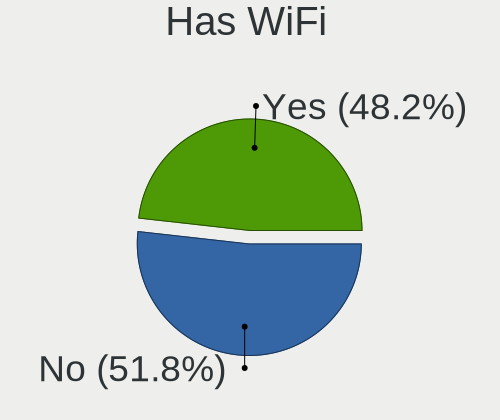
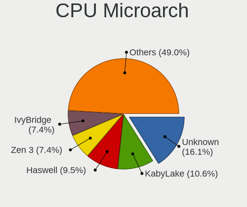
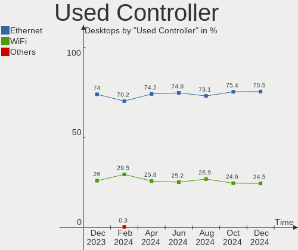
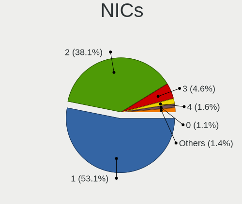

Ubuntu Hardware Trends (Desktops)
---------------------------------

A project to identify most popular hardware characteristics and track their change
over time based on data collected by Ubuntu users at https://Linux-Hardware.org.

Anyone can contribute to this report by the [hw-probe](https://github.com/linuxhw/hw-probe) tool:

    sudo -E hw-probe -all -upload

Full-feature report is available here: https://linux-hardware.org/?view=trends&formfactor=desktop

Period: Aug, 2021.

Contents
--------

* [ System ](#system)
  - [ OS                       ](#os)
  - [ OS Family                ](#os-family)
  - [ Kernel                   ](#kernel)
  - [ Kernel Family            ](#kernel-family)
  - [ Kernel Major Ver.        ](#kernel-major-ver)
  - [ Arch                     ](#arch)
  - [ DE                       ](#de)
  - [ Display Server           ](#display-server)
  - [ Display Manager          ](#display-manager)
  - [ OS Lang                  ](#os-lang)
  - [ Boot Mode                ](#boot-mode)
  - [ Filesystem               ](#filesystem)
  - [ Part. scheme             ](#part-scheme)
  - [ Dual Boot with Linux/BSD ](#dual-boot-with-linuxbsd)
  - [ Dual Boot (Win)          ](#dual-boot-win)

* [ Board ](#board)
  - [ Vendor                   ](#vendor)
  - [ Model                    ](#model)
  - [ Model Family             ](#model-family)
  - [ MFG Year                 ](#mfg-year)
  - [ Form Factor              ](#form-factor)
  - [ Secure Boot              ](#secure-boot)
  - [ Coreboot                 ](#coreboot)
  - [ RAM Size                 ](#ram-size)
  - [ RAM Used                 ](#ram-used)
  - [ Total Drives             ](#total-drives)
  - [ Has CD-ROM               ](#has-cd-rom)
  - [ Has Ethernet             ](#has-ethernet)
  - [ Has WiFi                 ](#has-wifi)
  - [ Has Bluetooth            ](#has-bluetooth)

* [ Location ](#location)
  - [ Country                  ](#country)
  - [ City                     ](#city)

* [ Drives ](#drives)
  - [ Drive Vendor             ](#drive-vendor)
  - [ Drive Model              ](#drive-model)
  - [ HDD Vendor               ](#hdd-vendor)
  - [ SSD Vendor               ](#ssd-vendor)
  - [ Drive Kind               ](#drive-kind)
  - [ Drive Connector          ](#drive-connector)
  - [ Drive Size               ](#drive-size)
  - [ Space Total              ](#space-total)
  - [ Space Used               ](#space-used)
  - [ Malfunc. Drives          ](#malfunc-drives)
  - [ Malfunc. Drive Vendor    ](#malfunc-drive-vendor)
  - [ Malfunc. HDD Vendor      ](#malfunc-hdd-vendor)
  - [ Malfunc. Drive Kind      ](#malfunc-drive-kind)
  - [ Failed Drives            ](#failed-drives)
  - [ Failed Drive Vendor      ](#failed-drive-vendor)
  - [ Drive Status             ](#drive-status)

* [ Storage controller ](#storage-controller)
  - [ Storage Vendor           ](#storage-vendor)
  - [ Storage Model            ](#storage-model)
  - [ Storage Kind             ](#storage-kind)

* [ Processor ](#processor)
  - [ CPU Vendor               ](#cpu-vendor)
  - [ CPU Model                ](#cpu-model)
  - [ CPU Model Family         ](#cpu-model-family)
  - [ CPU Cores                ](#cpu-cores)
  - [ CPU Sockets              ](#cpu-sockets)
  - [ CPU Threads              ](#cpu-threads)
  - [ CPU Op-Modes             ](#cpu-op-modes)
  - [ CPU Microcode            ](#cpu-microcode)
  - [ CPU Microarch            ](#cpu-microarch)

* [ Graphics ](#graphics)
  - [ GPU Vendor               ](#gpu-vendor)
  - [ GPU Model                ](#gpu-model)
  - [ GPU Combo                ](#gpu-combo)
  - [ GPU Driver               ](#gpu-driver)
  - [ GPU Memory               ](#gpu-memory)

* [ Monitor ](#monitor)
  - [ Monitor Vendor           ](#monitor-vendor)
  - [ Monitor Model            ](#monitor-model)
  - [ Monitor Resolution       ](#monitor-resolution)
  - [ Monitor Diagonal         ](#monitor-diagonal)
  - [ Monitor Width            ](#monitor-width)
  - [ Aspect Ratio             ](#aspect-ratio)
  - [ Monitor Area             ](#monitor-area)
  - [ Pixel Density            ](#pixel-density)
  - [ Multiple Monitors        ](#multiple-monitors)

* [ Network ](#network)
  - [ Net Controller Vendor    ](#net-controller-vendor)
  - [ Net Controller Model     ](#net-controller-model)
  - [ Wireless Vendor          ](#wireless-vendor)
  - [ Wireless Model           ](#wireless-model)
  - [ Ethernet Vendor          ](#ethernet-vendor)
  - [ Ethernet Model           ](#ethernet-model)
  - [ Net Controller Kind      ](#net-controller-kind)
  - [ Used Controller          ](#used-controller)
  - [ NICs                     ](#nics)
  - [ IPv6                     ](#ipv6)

* [ Bluetooth ](#bluetooth)
  - [ Bluetooth Vendor         ](#bluetooth-vendor)
  - [ Bluetooth Model          ](#bluetooth-model)

* [ Sound ](#sound)
  - [ Sound Vendor             ](#sound-vendor)
  - [ Sound Model              ](#sound-model)

* [ Memory ](#memory)
  - [ Memory Vendor            ](#memory-vendor)
  - [ Memory Model             ](#memory-model)
  - [ Memory Kind              ](#memory-kind)
  - [ Memory Form Factor       ](#memory-form-factor)
  - [ Memory Size              ](#memory-size)
  - [ Memory Speed             ](#memory-speed)

* [ Printers & scanners ](#printers--scanners)
  - [ Printer Vendor           ](#printer-vendor)
  - [ Printer Model            ](#printer-model)
  - [ Scanner Vendor           ](#scanner-vendor)
  - [ Scanner Model            ](#scanner-model)

* [ Camera ](#camera)
  - [ Camera Vendor            ](#camera-vendor)
  - [ Camera Model             ](#camera-model)

* [ Security ](#security)
  - [ Fingerprint Vendor       ](#fingerprint-vendor)
  - [ Fingerprint Model        ](#fingerprint-model)
  - [ Chipcard Vendor          ](#chipcard-vendor)
  - [ Chipcard Model           ](#chipcard-model)

* [ Unsupported ](#unsupported)
  - [ Unsupported Devices      ](#unsupported-devices)
  - [ Unsupported Device Types ](#unsupported-device-types)

System
------

OS
--

Installed operating systems

| Name         | Desktops | Percent |
|--------------|----------|---------|
| Ubuntu 20.04 | 309      | 65.61%  |
| Ubuntu 21.04 | 111      | 23.57%  |
| Ubuntu 18.04 | 38       | 8.07%   |
| Ubuntu 20.10 | 6        | 1.27%   |
| Ubuntu 21.10 | 4        | 0.85%   |
| Ubuntu 19.10 | 2        | 0.42%   |
| Ubuntu 16.04 | 1        | 0.21%   |

OS Family
---------

OS without a version

| Name   | Desktops | Percent |
|--------|----------|---------|
| Ubuntu | 471      | 100%    |

Kernel
------

Version of the Linux kernel

| Version                    | Desktops | Percent |
|----------------------------|----------|---------|
| 5.11.0-25-generic          | 129      | 27.39%  |
| 5.11.0-27-generic          | 81       | 17.2%   |
| 5.8.0-63-generic           | 47       | 9.98%   |
| 5.4.0-81-generic           | 40       | 8.49%   |
| 5.11.0-31-generic          | 39       | 8.28%   |
| 5.4.0-80-generic           | 35       | 7.43%   |
| 5.8.0-43-generic           | 18       | 3.82%   |
| 5.11.0-33-generic          | 8        | 1.7%    |
| 5.4.0-77-generic           | 6        | 1.27%   |
| 4.15.0-151-generic         | 6        | 1.27%   |
| 5.8.0-59-generic           | 5        | 1.06%   |
| 5.11.0-26-generic          | 4        | 0.85%   |
| 5.11.0-22-generic          | 4        | 0.85%   |
| 5.4.0-42-generic           | 3        | 0.64%   |
| 5.11.0-16-generic          | 3        | 0.64%   |
| 5.8.0-53-generic           | 2        | 0.42%   |
| 5.4.0-hiveos               | 2        | 0.42%   |
| 5.13.0-14-generic          | 2        | 0.42%   |
| 5.13.0-051300-generic      | 2        | 0.42%   |
| 5.11.0-25-lowlatency       | 2        | 0.42%   |
| 4.15.0-154-generic         | 2        | 0.42%   |
| 4.15.0-153-generic         | 2        | 0.42%   |
| 4.15.0-147-generic         | 2        | 0.42%   |
| 5.8.0-55-generic           | 1        | 0.21%   |
| 5.8.0-54-generic           | 1        | 0.21%   |
| 5.8.0-50-generic           | 1        | 0.21%   |
| 5.8.0-492104061620-generic | 1        | 0.21%   |
| 5.8.0-48-generic           | 1        | 0.21%   |
| 5.8.0-36-generic           | 1        | 0.21%   |
| 5.8.0-25-generic           | 1        | 0.21%   |
| 5.4.5-050405-generic       | 1        | 0.21%   |
| 5.4.0-81-lowlatency        | 1        | 0.21%   |
| 5.4.0-74-generic           | 1        | 0.21%   |
| 5.4.0-65-generic           | 1        | 0.21%   |
| 5.4.0-58-generic           | 1        | 0.21%   |
| 5.4.0-48-generic           | 1        | 0.21%   |
| 5.4.0-40-generic           | 1        | 0.21%   |
| 5.3.0-7648-generic         | 1        | 0.21%   |
| 5.3.0-46-generic           | 1        | 0.21%   |
| 5.13.8-xanmod1             | 1        | 0.21%   |
| 5.13.7-tkg-cacule-llvm     | 1        | 0.21%   |
| 5.13.4-051304-generic      | 1        | 0.21%   |
| 5.13.0-12-generic          | 1        | 0.21%   |
| 5.11.0-7633-generic        | 1        | 0.21%   |
| 5.11.0-31-lowlatency       | 1        | 0.21%   |
| 5.0.0-37-generic           | 1        | 0.21%   |
| 4.4.0-210-generic          | 1        | 0.21%   |
| 4.15.0-45-generic          | 1        | 0.21%   |
| 4.15.0-153-lowlatency      | 1        | 0.21%   |
| 4.15.0-118-generic         | 1        | 0.21%   |

Kernel Family
-------------

Linux kernel without a distro release

| Version | Desktops | Percent |
|---------|----------|---------|
| 5.11.0  | 272      | 57.75%  |
| 5.4.0   | 92       | 19.53%  |
| 5.8.0   | 79       | 16.77%  |
| 4.15.0  | 15       | 3.18%   |
| 5.13.0  | 5        | 1.06%   |
| 5.3.0   | 2        | 0.42%   |
| 5.4.5   | 1        | 0.21%   |
| 5.13.8  | 1        | 0.21%   |
| 5.13.7  | 1        | 0.21%   |
| 5.13.4  | 1        | 0.21%   |
| 5.0.0   | 1        | 0.21%   |
| 4.4.0   | 1        | 0.21%   |

Kernel Major Ver.
-----------------

Linux kernel major version

| Version | Desktops | Percent |
|---------|----------|---------|
| 5.11    | 272      | 57.75%  |
| 5.4     | 93       | 19.75%  |
| 5.8     | 79       | 16.77%  |
| 4.15    | 15       | 3.18%   |
| 5.13    | 8        | 1.7%    |
| 5.3     | 2        | 0.42%   |
| 5.0     | 1        | 0.21%   |
| 4.4     | 1        | 0.21%   |

Arch
----

OS architecture (x86_64, i586, etc.)

| Name   | Desktops | Percent |
|--------|----------|---------|
| x86_64 | 467      | 99.15%  |
| i686   | 4        | 0.85%   |

DE
--

Desktop Environment

| Name            | Desktops | Percent |
|-----------------|----------|---------|
| GNOME           | 411      | 87.26%  |
| Unknown         | 47       | 9.98%   |
| Unity           | 4        | 0.85%   |
| X-Cinnamon      | 3        | 0.64%   |
| GNOME Flashback | 3        | 0.64%   |
| xubuntu         | 1        | 0.21%   |
| UKUI            | 1        | 0.21%   |
| Cinnamon        | 1        | 0.21%   |

Display Server
--------------

X11 or Wayland

| Name    | Desktops | Percent |
|---------|----------|---------|
| X11     | 359      | 76.22%  |
| Wayland | 83       | 17.62%  |
| Tty     | 15       | 3.18%   |
| Unknown | 14       | 2.97%   |

Display Manager
---------------

SDDM, LightDM, etc.

| Name    | Desktops | Percent |
|---------|----------|---------|
| Unknown | 386      | 81.95%  |
| GDM     | 81       | 17.2%   |
| TDM     | 3        | 0.64%   |
| SDDM    | 1        | 0.21%   |

OS Lang
-------

Language

| Lang    | Desktops | Percent |
|---------|----------|---------|
| en_US   | 164      | 34.82%  |
| de_DE   | 69       | 14.65%  |
| fr_FR   | 40       | 8.49%   |
| pt_BR   | 26       | 5.52%   |
| en_GB   | 25       | 5.31%   |
| ru_RU   | 13       | 2.76%   |
| it_IT   | 9        | 1.91%   |
| pl_PL   | 8        | 1.7%    |
| en_IN   | 8        | 1.7%    |
| en_CA   | 8        | 1.7%    |
| C       | 8        | 1.7%    |
| es_ES   | 7        | 1.49%   |
| es_AR   | 7        | 1.49%   |
| en_AU   | 6        | 1.27%   |
| zh_CN   | 5        | 1.06%   |
| nl_NL   | 5        | 1.06%   |
| de_CH   | 5        | 1.06%   |
| sv_SE   | 4        | 0.85%   |
| nl_BE   | 4        | 0.85%   |
| ja_JP   | 4        | 0.85%   |
| hu_HU   | 4        | 0.85%   |
| en_ZA   | 4        | 0.85%   |
| en_NZ   | 4        | 0.85%   |
| sk_SK   | 2        | 0.42%   |
| ro_RO   | 2        | 0.42%   |
| nb_NO   | 2        | 0.42%   |
| fr_BE   | 2        | 0.42%   |
| fi_FI   | 2        | 0.42%   |
| es_MX   | 2        | 0.42%   |
| es_CL   | 2        | 0.42%   |
| de_AT   | 2        | 0.42%   |
| bg_BG   | 2        | 0.42%   |
| Unknown | 2        | 0.42%   |
| sl_SI   | 1        | 0.21%   |
| ru_UA   | 1        | 0.21%   |
| pt_PT   | 1        | 0.21%   |
| et_EE   | 1        | 0.21%   |
| es_SV   | 1        | 0.21%   |
| es_NI   | 1        | 0.21%   |
| es_EC   | 1        | 0.21%   |
| es_CO   | 1        | 0.21%   |
| en_ZW   | 1        | 0.21%   |
| en_IL   | 1        | 0.21%   |
| en_IE   | 1        | 0.21%   |
| el_GR   | 1        | 0.21%   |
| da_DK   | 1        | 0.21%   |
| cs_CZ   | 1        | 0.21%   |

Boot Mode
---------

EFI or BIOS

| Mode | Desktops | Percent |
|------|----------|---------|
| BIOS | 335      | 71.13%  |
| EFI  | 136      | 28.87%  |

Filesystem
----------

Type of filesystem

| Type    | Desktops | Percent |
|---------|----------|---------|
| Ext4    | 435      | 92.36%  |
| Overlay | 11       | 2.34%   |
| Zfs     | 10       | 2.12%   |
| Xfs     | 6        | 1.27%   |
| Btrfs   | 5        | 1.06%   |
| Ext2    | 2        | 0.42%   |
| Ext3    | 1        | 0.21%   |
| Aufs    | 1        | 0.21%   |

Part. scheme
------------

Scheme of partitioning

| Type    | Desktops | Percent |
|---------|----------|---------|
| Unknown | 372      | 78.98%  |
| GPT     | 75       | 15.92%  |
| MBR     | 24       | 5.1%    |

Dual Boot with Linux/BSD
------------------------

Hosting more than one Linux/BSD

| Dual boot | Desktops | Percent |
|-----------|----------|---------|
| No        | 370      | 78.56%  |
| Yes       | 101      | 21.44%  |

Dual Boot (Win)
---------------

Hosting Linux and Windows

| Dual boot | Desktops | Percent |
|-----------|----------|---------|
| No        | 268      | 56.9%   |
| Yes       | 203      | 43.1%   |

Board
-----

Vendor
------

Motherboard manufacturer

| Name                | Desktops | Percent |
|---------------------|----------|---------|
| Gigabyte Technology | 98       | 20.81%  |
| ASUSTek Computer    | 86       | 18.26%  |
| ASRock              | 48       | 10.19%  |
| Hewlett-Packard     | 47       | 9.98%   |
| Dell                | 45       | 9.55%   |
| MSI                 | 42       | 8.92%   |
| Lenovo              | 22       | 4.67%   |
| Pegatron            | 9        | 1.91%   |
| Acer                | 9        | 1.91%   |
| Intel               | 8        | 1.7%    |
| Fujitsu             | 8        | 1.7%    |
| Unknown             | 7        | 1.49%   |
| Medion              | 6        | 1.27%   |
| Huanan              | 4        | 0.85%   |
| Foxconn             | 4        | 0.85%   |
| ECS                 | 4        | 0.85%   |
| Shuttle             | 3        | 0.64%   |
| Biostar             | 3        | 0.64%   |
| Packard Bell        | 2        | 0.42%   |
| ZOTAC               | 1        | 0.21%   |
| Yanling             | 1        | 0.21%   |
| VIA technology      | 1        | 0.21%   |
| TYAN Computer       | 1        | 0.21%   |
| Supermicro          | 1        | 0.21%   |
| Seco                | 1        | 0.21%   |
| OEM                 | 1        | 0.21%   |
| NEC Computers       | 1        | 0.21%   |
| Informatica Login   | 1        | 0.21%   |
| ICP / iEi           | 1        | 0.21%   |
| Gateway             | 1        | 0.21%   |
| Fujitsu Siemens     | 1        | 0.21%   |
| Exo                 | 1        | 0.21%   |
| EPSON DIRECT        | 1        | 0.21%   |
| Apple               | 1        | 0.21%   |
| AOpen               | 1        | 0.21%   |

Model
-----

Motherboard model

| Name                                 | Desktops | Percent |
|--------------------------------------|----------|---------|
| ASUS All Series                      | 9        | 1.91%   |
| Unknown                              | 8        | 1.7%    |
| Dell OptiPlex 7010                   | 5        | 1.06%   |
| MSI MS-7C91                          | 3        | 0.64%   |
| Gigabyte GA-78LMT-USB3 6.0           | 3        | 0.64%   |
| Gigabyte B450M DS3H                  | 3        | 0.64%   |
| Gigabyte A320M-S2H                   | 3        | 0.64%   |
| ASUS ROG STRIX B450-F GAMING         | 3        | 0.64%   |
| ASUS PRIME A320M-K                   | 3        | 0.64%   |
| MSI PPPPP-CCC#MMMMMMMM               | 2        | 0.42%   |
| MSI MS-7C94                          | 2        | 0.42%   |
| MSI MS-7C35                          | 2        | 0.42%   |
| MSI MS-7C02                          | 2        | 0.42%   |
| MSI MS-7816                          | 2        | 0.42%   |
| MSI MS-7693                          | 2        | 0.42%   |
| HP Z440 WORKSTATION                  | 2        | 0.42%   |
| HP ProLiant MicroServer              | 2        | 0.42%   |
| HP ProDesk 400 G1 SFF                | 2        | 0.42%   |
| HP Compaq 8200 Elite CMT PC          | 2        | 0.42%   |
| Gigabyte H61M-S2PV                   | 2        | 0.42%   |
| Gigabyte H61M-S1                     | 2        | 0.42%   |
| Gigabyte GA-880GM-UD2H               | 2        | 0.42%   |
| Gigabyte GA-78LMT-USB3 R2            | 2        | 0.42%   |
| Gigabyte F2A68HM-H                   | 2        | 0.42%   |
| Gigabyte B75M-D3H                    | 2        | 0.42%   |
| Dell Precision T7600                 | 2        | 0.42%   |
| Dell Precision T1700                 | 2        | 0.42%   |
| Dell OptiPlex 9010                   | 2        | 0.42%   |
| Dell OptiPlex 790                    | 2        | 0.42%   |
| Dell OptiPlex 7080                   | 2        | 0.42%   |
| ASUS PRIME Z270-A                    | 2        | 0.42%   |
| ASUS PRIME B450M-A II                | 2        | 0.42%   |
| ASUS PRIME B450M-A                   | 2        | 0.42%   |
| ASUS M5A99X EVO R2.0                 | 2        | 0.42%   |
| ASUS M5A78L-M LX3                    | 2        | 0.42%   |
| ASUS M4A78 PRO                       | 2        | 0.42%   |
| ASUS B150M-A/M.2                     | 2        | 0.42%   |
| ASRock B550M-ITX/ac                  | 2        | 0.42%   |
| ASRock A300M-STX                     | 2        | 0.42%   |
| Acer Predator G3-710                 | 2        | 0.42%   |
| ZOTAC NM10                           | 1        | 0.21%   |
| Yanling YL-KBRL2 Series              | 1        | 0.21%   |
| VIA technology VX900                 | 1        | 0.21%   |
| TYAN S3970                           | 1        | 0.21%   |
| Supermicro SSG-6048R-E1CR60N         | 1        | 0.21%   |
| Shuttle XH61V                        | 1        | 0.21%   |
| Shuttle DS81D                        | 1        | 0.21%   |
| Shuttle DS61                         | 1        | 0.21%   |
| Seco C40                             | 1        | 0.21%   |
| Pegatron s5713w                      | 1        | 0.21%   |
| Pegatron Pro 3405 Series             | 1        | 0.21%   |
| Pegatron IPMSB-GS                    | 1        | 0.21%   |
| Pegatron h9-1000cs                   | 1        | 0.21%   |
| Pegatron Compaq dx7500 Microtower    | 1        | 0.21%   |
| Pegatron Compaq dx2450 Microtower    | 1        | 0.21%   |
| Pegatron Compaq dx2400 Microtower PC | 1        | 0.21%   |
| Pegatron AY014AA-ABA a4310f          | 1        | 0.21%   |
| Pegatron 23-d015la                   | 1        | 0.21%   |
| Packard Bell ixtreme M5740           | 1        | 0.21%   |
| Packard Bell imedia S3810            | 1        | 0.21%   |

Model Family
------------

Motherboard model prefix

| Name                   | Desktops | Percent |
|------------------------|----------|---------|
| Dell OptiPlex          | 23       | 4.88%   |
| ASUS PRIME             | 19       | 4.03%   |
| Lenovo ThinkCentre     | 15       | 3.18%   |
| HP Compaq              | 14       | 2.97%   |
| Dell Precision         | 12       | 2.55%   |
| ASUS All               | 9        | 1.91%   |
| Unknown                | 8        | 1.7%    |
| HP EliteDesk           | 7        | 1.49%   |
| ASUS ROG               | 7        | 1.49%   |
| HP ProDesk             | 5        | 1.06%   |
| Gigabyte GA-78LMT-USB3 | 5        | 1.06%   |
| Gigabyte B450M         | 5        | 1.06%   |
| ASUS M5A78L-M          | 5        | 1.06%   |
| Lenovo ThinkStation    | 4        | 0.85%   |
| Gigabyte B450          | 4        | 0.85%   |
| Dell Inspiron          | 4        | 0.85%   |
| Acer Aspire            | 4        | 0.85%   |
| Pegatron Compaq        | 3        | 0.64%   |
| MSI MS-7C91            | 3        | 0.64%   |
| Intel DG31PR           | 3        | 0.64%   |
| HP ProLiant            | 3        | 0.64%   |
| Gigabyte Z390          | 3        | 0.64%   |
| Gigabyte X570          | 3        | 0.64%   |
| Gigabyte A320M-S2H     | 3        | 0.64%   |
| Fujitsu ESPRIMO        | 3        | 0.64%   |
| Dell Vostro            | 3        | 0.64%   |
| ASUS TUF               | 3        | 0.64%   |
| ASUS SABERTOOTH        | 3        | 0.64%   |
| Acer Veriton           | 3        | 0.64%   |
| MSI PPPPP-CCC#MMMMMMMM | 2        | 0.42%   |
| MSI MS-7C94            | 2        | 0.42%   |
| MSI MS-7C35            | 2        | 0.42%   |
| MSI MS-7C02            | 2        | 0.42%   |
| MSI MS-7816            | 2        | 0.42%   |
| MSI MS-7693            | 2        | 0.42%   |
| Huanan X99             | 2        | 0.42%   |
| HP Z440                | 2        | 0.42%   |
| HP Pavilion            | 2        | 0.42%   |
| HP 280                 | 2        | 0.42%   |
| Gigabyte H61M-S2PV     | 2        | 0.42%   |
| Gigabyte H61M-S1       | 2        | 0.42%   |
| Gigabyte H310M         | 2        | 0.42%   |
| Gigabyte GA-880GM-UD2H | 2        | 0.42%   |
| Gigabyte F2A68HM-H     | 2        | 0.42%   |
| Gigabyte B75M-D3H      | 2        | 0.42%   |
| Gigabyte 990FXA-UD3    | 2        | 0.42%   |
| Fujitsu CELSIUS        | 2        | 0.42%   |
| Dell XPS               | 2        | 0.42%   |
| ASUS Pro               | 2        | 0.42%   |
| ASUS P5G41T-M          | 2        | 0.42%   |
| ASUS M5A99X            | 2        | 0.42%   |
| ASUS M5A97             | 2        | 0.42%   |
| ASUS M4A78             | 2        | 0.42%   |
| ASUS B150M-A           | 2        | 0.42%   |
| ASRock Z77             | 2        | 0.42%   |
| ASRock Z390            | 2        | 0.42%   |
| ASRock X570            | 2        | 0.42%   |
| ASRock H310CM-HDV      | 2        | 0.42%   |
| ASRock B550M-ITX       | 2        | 0.42%   |
| ASRock B450M           | 2        | 0.42%   |

MFG Year
--------

Motherboard manufacture year

| Year | Desktops | Percent |
|------|----------|---------|
| 2020 | 57       | 12.1%   |
| 2021 | 46       | 9.77%   |
| 2011 | 42       | 8.92%   |
| 2019 | 41       | 8.7%    |
| 2013 | 39       | 8.28%   |
| 2014 | 38       | 8.07%   |
| 2012 | 34       | 7.22%   |
| 2018 | 33       | 7.01%   |
| 2015 | 29       | 6.16%   |
| 2009 | 26       | 5.52%   |
| 2010 | 23       | 4.88%   |
| 2016 | 22       | 4.67%   |
| 2017 | 20       | 4.25%   |
| 2008 | 10       | 2.12%   |
| 2007 | 7        | 1.49%   |
| 2006 | 3        | 0.64%   |
| 2004 | 1        | 0.21%   |

Form Factor
-----------

Physical design of the computer

| Name    | Desktops | Percent |
|---------|----------|---------|
| Desktop | 471      | 100%    |

Secure Boot
-----------

Enabled or disabled

| State    | Desktops | Percent |
|----------|----------|---------|
| Disabled | 459      | 97.45%  |
| Enabled  | 12       | 2.55%   |

Coreboot
--------

Have coreboot on board

| Used | Desktops | Percent |
|------|----------|---------|
| No   | 471      | 100%    |

RAM Size
--------

Total RAM memory

| Size in GB      | Desktops | Percent |
|-----------------|----------|---------|
| 8.01-16.0       | 110      | 23.35%  |
| 16.01-24.0      | 104      | 22.08%  |
| 4.01-8.0        | 78       | 16.56%  |
| 3.01-4.0        | 68       | 14.44%  |
| 32.01-64.0      | 55       | 11.68%  |
| 64.01-256.0     | 23       | 4.88%   |
| 24.01-32.0      | 15       | 3.18%   |
| 1.01-2.0        | 11       | 2.34%   |
| 2.01-3.0        | 4        | 0.85%   |
| More than 256.0 | 2        | 0.42%   |
| 0.51-1.0        | 1        | 0.21%   |

RAM Used
--------

Used RAM memory

| Used GB    | Desktops | Percent |
|------------|----------|---------|
| 1.01-2.0   | 197      | 41.83%  |
| 2.01-3.0   | 128      | 27.18%  |
| 4.01-8.0   | 54       | 11.46%  |
| 3.01-4.0   | 45       | 9.55%   |
| 8.01-16.0  | 20       | 4.25%   |
| 0.51-1.0   | 9        | 1.91%   |
| 16.01-24.0 | 8        | 1.7%    |
| 0.01-0.5   | 7        | 1.49%   |
| 24.01-32.0 | 2        | 0.42%   |
| 32.01-64.0 | 1        | 0.21%   |

Total Drives
------------

Number of drives on board

| Drives | Desktops | Percent |
|--------|----------|---------|
| 1      | 193      | 40.98%  |
| 2      | 140      | 29.72%  |
| 3      | 72       | 15.29%  |
| 4      | 31       | 6.58%   |
| 5      | 15       | 3.18%   |
| 6      | 9        | 1.91%   |
| 0      | 4        | 0.85%   |
| 8      | 2        | 0.42%   |
| 7      | 2        | 0.42%   |
| 13     | 1        | 0.21%   |
| 11     | 1        | 0.21%   |
| 9      | 1        | 0.21%   |

Has CD-ROM
----------

Has CD-ROM on board

| Presented | Desktops | Percent |
|-----------|----------|---------|
| No        | 243      | 51.59%  |
| Yes       | 228      | 48.41%  |

Has Ethernet
------------

Has Ethernet on board

| Presented | Desktops | Percent |
|-----------|----------|---------|
| Yes       | 466      | 98.94%  |
| No        | 5        | 1.06%   |

Has WiFi
--------

Has WiFi module

| Presented | Desktops | Percent |
|-----------|----------|---------|
| No        | 274      | 58.17%  |
| Yes       | 197      | 41.83%  |

Has Bluetooth
-------------

Has Bluetooth module

| Presented | Desktops | Percent |
|-----------|----------|---------|
| No        | 346      | 73.46%  |
| Yes       | 125      | 26.54%  |

Location
--------

Country
-------

Geographic location (country)

| Country             | Desktops | Percent |
|---------------------|----------|---------|
| USA                 | 85       | 18.05%  |
| Germany             | 66       | 14.01%  |
| France              | 40       | 8.49%   |
| Brazil              | 34       | 7.22%   |
| UK                  | 25       | 5.31%   |
| Russia              | 18       | 3.82%   |
| Australia           | 11       | 2.34%   |
| Poland              | 10       | 2.12%   |
| Italy               | 10       | 2.12%   |
| India               | 10       | 2.12%   |
| Canada              | 10       | 2.12%   |
| Spain               | 8        | 1.7%    |
| Netherlands         | 8        | 1.7%    |
| Argentina           | 8        | 1.7%    |
| Ukraine             | 7        | 1.49%   |
| Switzerland         | 7        | 1.49%   |
| Belgium             | 7        | 1.49%   |
| Sweden              | 6        | 1.27%   |
| South Africa        | 5        | 1.06%   |
| Romania             | 5        | 1.06%   |
| Norway              | 5        | 1.06%   |
| New Zealand         | 5        | 1.06%   |
| Mexico              | 5        | 1.06%   |
| Japan               | 5        | 1.06%   |
| Greece              | 5        | 1.06%   |
| China               | 5        | 1.06%   |
| Hungary             | 4        | 0.85%   |
| Bulgaria            | 4        | 0.85%   |
| Austria             | 4        | 0.85%   |
| Thailand            | 3        | 0.64%   |
| Indonesia           | 3        | 0.64%   |
| Finland             | 3        | 0.64%   |
| Czechia             | 3        | 0.64%   |
| Portugal            | 2        | 0.42%   |
| Iran                | 2        | 0.42%   |
| Ecuador             | 2        | 0.42%   |
| Chile               | 2        | 0.42%   |
| Armenia             | 2        | 0.42%   |
| Algeria             | 2        | 0.42%   |
| Vietnam             | 1        | 0.21%   |
| Uganda              | 1        | 0.21%   |
| Turkey              | 1        | 0.21%   |
| Trinidad and Tobago | 1        | 0.21%   |
| Slovenia            | 1        | 0.21%   |
| Slovakia            | 1        | 0.21%   |
| Singapore           | 1        | 0.21%   |
| Serbia              | 1        | 0.21%   |
| Saudi Arabia        | 1        | 0.21%   |
| North Macedonia     | 1        | 0.21%   |
| Nicaragua           | 1        | 0.21%   |
| Malta               | 1        | 0.21%   |
| Malaysia            | 1        | 0.21%   |
| Lithuania           | 1        | 0.21%   |
| Israel              | 1        | 0.21%   |
| Ireland             | 1        | 0.21%   |
| Iceland             | 1        | 0.21%   |
| Estonia             | 1        | 0.21%   |
| El Salvador         | 1        | 0.21%   |
| Dominican Republic  | 1        | 0.21%   |
| Denmark             | 1        | 0.21%   |

City
----

Geographic location (city)

| City               | Desktops | Percent |
|--------------------|----------|---------|
| Berlin             | 7        | 1.49%   |
| Kyiv               | 5        | 1.06%   |
| Hamburg            | 5        | 1.06%   |
| S??o Paulo         | 4        | 0.85%   |
| Portland           | 4        | 0.85%   |
| Tomsk              | 3        | 0.64%   |
| Stuttgart          | 3        | 0.64%   |
| Paris              | 3        | 0.64%   |
| Oslo               | 3        | 0.64%   |
| Moscow             | 3        | 0.64%   |
| Frankfurt am Main  | 3        | 0.64%   |
| Brisbane           | 3        | 0.64%   |
| Beijing            | 3        | 0.64%   |
| Bangkok            | 3        | 0.64%   |
| Zurich             | 2        | 0.42%   |
| Yerevan            | 2        | 0.42%   |
| Yekaterinburg      | 2        | 0.42%   |
| Wroclaw            | 2        | 0.42%   |
| Wigan              | 2        | 0.42%   |
| Tehran             | 2        | 0.42%   |
| Sofia              | 2        | 0.42%   |
| Rio de Janeiro     | 2        | 0.42%   |
| Newcastle          | 2        | 0.42%   |
| Newark             | 2        | 0.42%   |
| Minneapolis        | 2        | 0.42%   |
| Milan              | 2        | 0.42%   |
| Marseille          | 2        | 0.42%   |
| Madrid             | 2        | 0.42%   |
| Los Angeles        | 2        | 0.42%   |
| Liverpool          | 2        | 0.42%   |
| La Plata           | 2        | 0.42%   |
| Houston            | 2        | 0.42%   |
| Haltern am See     | 2        | 0.42%   |
| Ghent              | 2        | 0.42%   |
| Delano             | 2        | 0.42%   |
| Campinas           | 2        | 0.42%   |
| Cahors             | 2        | 0.42%   |
| Buffalo            | 2        | 0.42%   |
| Bucharest          | 2        | 0.42%   |
| Barcelona          | 2        | 0.42%   |
| Auckland           | 2        | 0.42%   |
| Zug                | 1        | 0.21%   |
| Zittau             | 1        | 0.21%   |
| Yokohama           | 1        | 0.21%   |
| Xylokastro         | 1        | 0.21%   |
| Xi'an              | 1        | 0.21%   |
| Woolloongabba      | 1        | 0.21%   |
| Woodstock          | 1        | 0.21%   |
| Winter Park        | 1        | 0.21%   |
| Winsum             | 1        | 0.21%   |
| Windsor            | 1        | 0.21%   |
| Weybridge          | 1        | 0.21%   |
| Westbank           | 1        | 0.21%   |
| Welwyn Garden City | 1        | 0.21%   |
| Wasilla            | 1        | 0.21%   |
| Warsaw             | 1        | 0.21%   |
| Voronezh           | 1        | 0.21%   |
| Volos              | 1        | 0.21%   |
| Vokany             | 1        | 0.21%   |
| Vienna             | 1        | 0.21%   |

Drives
------

Drive Vendor
------------

Hard drive vendors

| Vendor                    | Desktops | Drives | Percent |
|---------------------------|----------|--------|---------|
| WDC                       | 179      | 227    | 23.37%  |
| Seagate                   | 152      | 216    | 19.84%  |
| Samsung Electronics       | 102      | 144    | 13.32%  |
| Kingston                  | 50       | 57     | 6.53%   |
| SanDisk                   | 29       | 34     | 3.79%   |
| Crucial                   | 29       | 31     | 3.79%   |
| Toshiba                   | 28       | 38     | 3.66%   |
| Hitachi                   | 26       | 32     | 3.39%   |
| Unknown                   | 11       | 15     | 1.44%   |
| Silicon Motion            | 9        | 9      | 1.17%   |
| Intel                     | 9        | 9      | 1.17%   |
| China                     | 9        | 9      | 1.17%   |
| A-DATA Technology         | 9        | 9      | 1.17%   |
| Maxtor                    | 8        | 8      | 1.04%   |
| Transcend                 | 7        | 7      | 0.91%   |
| Micron Technology         | 7        | 7      | 0.91%   |
| Phison                    | 6        | 6      | 0.78%   |
| PNY                       | 5        | 5      | 0.65%   |
| Sabrent                   | 4        | 4      | 0.52%   |
| Realtek Semiconductor     | 4        | 4      | 0.52%   |
| KingFast                  | 4        | 4      | 0.52%   |
| JMicron                   | 4        | 4      | 0.52%   |
| HGST                      | 4        | 6      | 0.52%   |
| SPCC                      | 3        | 3      | 0.39%   |
| SK Hynix                  | 3        | 3      | 0.39%   |
| Patriot                   | 3        | 4      | 0.39%   |
| OCZ                       | 3        | 3      | 0.39%   |
| Netac                     | 3        | 5      | 0.39%   |
| Lite-On                   | 3        | 4      | 0.39%   |
| Intenso                   | 3        | 3      | 0.39%   |
| Zheino                    | 2        | 2      | 0.26%   |
| XPG                       | 2        | 2      | 0.26%   |
| Micron/Crucial Technology | 2        | 2      | 0.26%   |
| LDLC                      | 2        | 2      | 0.26%   |
| KIOXIA-EXCERIA            | 2        | 2      | 0.26%   |
| Hewlett-Packard           | 2        | 2      | 0.26%   |
| Gigabyte Technology       | 2        | 2      | 0.26%   |
| ASMT                      | 2        | 2      | 0.26%   |
| Apacer                    | 2        | 2      | 0.26%   |
| Verbatim                  | 1        | 1      | 0.13%   |
| TO Exter                  | 1        | 1      | 0.13%   |
| Synology                  | 1        | 2      | 0.13%   |
| SSD 120G                  | 1        | 1      | 0.13%   |
| RSH-339                   | 1        | 1      | 0.13%   |
| PLEXTOR                   | 1        | 1      | 0.13%   |
| Pioneer                   | 1        | 1      | 0.13%   |
| Phison Electronics        | 1        | 1      | 0.13%   |
| OCZ-VERTEX3               | 1        | 1      | 0.13%   |
| OCZ-VERTEX                | 1        | 1      | 0.13%   |
| Mushkin                   | 1        | 1      | 0.13%   |
| MG                        | 1        | 1      | 0.13%   |
| LITEONIT                  | 1        | 1      | 0.13%   |
| Linux                     | 1        | 1      | 0.13%   |
| KIOXIA                    | 1        | 1      | 0.13%   |
| KingSpec                  | 1        | 1      | 0.13%   |
| JASTER                    | 1        | 1      | 0.13%   |
| HPE                       | 1        | 1      | 0.13%   |
| Hoodisk                   | 1        | 1      | 0.13%   |
| Hikvision                 | 1        | 1      | 0.13%   |
| HGST HTS                  | 1        | 1      | 0.13%   |

Drive Model
-----------

Hard drive models

| Model                               | Desktops | Percent |
|-------------------------------------|----------|---------|
| Seagate ST1000DM003-1CH162 1TB      | 14       | 1.58%   |
| Samsung NVMe SSD Drive 500GB        | 13       | 1.46%   |
| Kingston SA400S37240G 240GB SSD     | 13       | 1.46%   |
| Seagate ST500DM002-1BD142 500GB     | 11       | 1.24%   |
| WDC WDS240G2G0A-00JH30 240GB SSD    | 10       | 1.13%   |
| Seagate ST1000DM003-1ER162 1TB      | 10       | 1.13%   |
| Samsung SSD 860 EVO 500GB           | 10       | 1.13%   |
| WDC WD10EZEX-08WN4A0 1TB            | 9        | 1.01%   |
| Seagate ST1000DM010-2EP102 1TB      | 9        | 1.01%   |
| Samsung SSD 850 EVO 250GB           | 9        | 1.01%   |
| Toshiba DT01ACA100 1TB              | 8        | 0.9%    |
| Seagate ST3500418AS 500GB           | 8        | 0.9%    |
| Seagate ST2000DM008-2FR102 2TB      | 8        | 0.9%    |
| Kingston SV300S37A120G 120GB SSD    | 7        | 0.79%   |
| Kingston SA400S37120G 120GB SSD     | 7        | 0.79%   |
| Crucial CT240BX500SSD1 240GB        | 7        | 0.79%   |
| Seagate ST4000DM004-2CV104 4TB      | 6        | 0.68%   |
| Samsung SSD 850 EVO 500GB           | 6        | 0.68%   |
| Samsung NVMe SSD Drive 1TB          | 6        | 0.68%   |
| Kingston SUV400S37240G 240GB SSD    | 6        | 0.68%   |
| Toshiba DT01ACA200 2TB              | 5        | 0.56%   |
| Seagate ST2000DM001-1ER164 2TB      | 5        | 0.56%   |
| Samsung SSD 860 EVO 250GB           | 5        | 0.56%   |
| Kingston SA400S37480G 480GB SSD     | 5        | 0.56%   |
| WDC WD20EZAZ-00GGJB0 2TB            | 4        | 0.45%   |
| WDC WD20EFRX-68EUZN0 2TB            | 4        | 0.45%   |
| Seagate ST31000524AS 1TB            | 4        | 0.45%   |
| Seagate ST1000DM003-1SB102 1TB      | 4        | 0.45%   |
| SanDisk SSD PLUS 240GB              | 4        | 0.45%   |
| Sandisk NVMe SSD Drive 1TB          | 4        | 0.45%   |
| Samsung NVMe SSD Drive 250GB        | 4        | 0.45%   |
| Samsung HD103SJ 1TB                 | 4        | 0.45%   |
| Crucial CT500MX500SSD1 500GB        | 4        | 0.45%   |
| WDC WDS500G2B0A-00SM50 500GB SSD    | 3        | 0.34%   |
| WDC WD5000AAKX-60U6AA0 500GB        | 3        | 0.34%   |
| WDC WD20EZRX-00D8PB0 2TB            | 3        | 0.34%   |
| WDC WD10EZRX-00L4HB0 1TB            | 3        | 0.34%   |
| WDC WD10EARS-00Y5B1 1TB             | 3        | 0.34%   |
| Unknown SD/MMC/MS PRO 128GB         | 3        | 0.34%   |
| Transcend TS128GSSD370S 128GB       | 3        | 0.34%   |
| Toshiba HDWD130 3TB                 | 3        | 0.34%   |
| Silicon Motion NVMe SSD Drive 256GB | 3        | 0.34%   |
| Seagate ST9500325AS 500GB           | 3        | 0.34%   |
| Seagate ST3000DM007-1WY10G 3TB      | 3        | 0.34%   |
| Seagate ST2000DM006-2DM164 2TB      | 3        | 0.34%   |
| Seagate ST1000LM048-2E7172 1TB      | 3        | 0.34%   |
| Seagate Expansion Desk 8TB          | 3        | 0.34%   |
| Seagate Expansion 2TB               | 3        | 0.34%   |
| SanDisk SSD PLUS 480GB              | 3        | 0.34%   |
| Sandisk NVMe SSD Drive 500GB        | 3        | 0.34%   |
| Samsung SSD 970 EVO Plus 1TB        | 3        | 0.34%   |
| Samsung SSD 870 QVO 2TB             | 3        | 0.34%   |
| Samsung SSD 860 EVO 1TB             | 3        | 0.34%   |
| Samsung SSD 850 EVO 120GB           | 3        | 0.34%   |
| Samsung SSD 840 EVO 250GB           | 3        | 0.34%   |
| WDC WDS500G3X0C-00SJG0 500GB        | 2        | 0.23%   |
| WDC WDS100T3X0C-00SJG0 1TB          | 2        | 0.23%   |
| WDC WD5000AZRX-00A8LB0 500GB        | 2        | 0.23%   |
| WDC WD5000AZLX-75K2TA0 500GB        | 2        | 0.23%   |
| WDC WD5000AZLX-60K2TA0 500GB        | 2        | 0.23%   |

HDD Vendor
----------

Hard disk drive vendors

| Vendor              | Desktops | Drives | Percent |
|---------------------|----------|--------|---------|
| WDC                 | 159      | 199    | 38.97%  |
| Seagate             | 151      | 213    | 37.01%  |
| Toshiba             | 27       | 36     | 6.62%   |
| Hitachi             | 26       | 32     | 6.37%   |
| Samsung Electronics | 24       | 30     | 5.88%   |
| MAXTOR              | 8        | 8      | 1.96%   |
| HGST                | 4        | 6      | 0.98%   |
| ASMT                | 2        | 2      | 0.49%   |
| Unknown             | 1        | 1      | 0.25%   |
| TO Exter            | 1        | 1      | 0.25%   |
| Synology            | 1        | 2      | 0.25%   |
| JMicron             | 1        | 1      | 0.25%   |
| Intenso             | 1        | 1      | 0.25%   |
| Fujitsu             | 1        | 1      | 0.25%   |
| asmedia             | 1        | 1      | 0.25%   |

SSD Vendor
----------

Solid state drive vendors

| Vendor              | Desktops | Drives | Percent |
|---------------------|----------|--------|---------|
| Samsung Electronics | 54       | 62     | 20.15%  |
| Kingston            | 46       | 52     | 17.16%  |
| Crucial             | 28       | 30     | 10.45%  |
| WDC                 | 22       | 22     | 8.21%   |
| SanDisk             | 22       | 25     | 8.21%   |
| China               | 9        | 9      | 3.36%   |
| A-DATA Technology   | 9        | 9      | 3.36%   |
| Intel               | 7        | 7      | 2.61%   |
| Transcend           | 6        | 6      | 2.24%   |
| Micron Technology   | 6        | 6      | 2.24%   |
| PNY                 | 5        | 5      | 1.87%   |
| SPCC                | 3        | 3      | 1.12%   |
| Patriot             | 3        | 4      | 1.12%   |
| OCZ                 | 3        | 3      | 1.12%   |
| Unknown             | 2        | 2      | 0.75%   |
| Seagate             | 2        | 2      | 0.75%   |
| SABRENT             | 2        | 2      | 0.75%   |
| Netac               | 2        | 3      | 0.75%   |
| LDLC                | 2        | 2      | 0.75%   |
| KIOXIA-EXCERIA      | 2        | 2      | 0.75%   |
| KingFast            | 2        | 2      | 0.75%   |
| JMicron             | 2        | 2      | 0.75%   |
| Intenso             | 2        | 2      | 0.75%   |
| Hewlett-Packard     | 2        | 2      | 0.75%   |
| Gigabyte Technology | 2        | 2      | 0.75%   |
| Apacer              | 2        | 2      | 0.75%   |
| Zheino              | 1        | 1      | 0.37%   |
| Verbatim            | 1        | 1      | 0.37%   |
| Toshiba             | 1        | 1      | 0.37%   |
| PLEXTOR             | 1        | 1      | 0.37%   |
| Pioneer             | 1        | 1      | 0.37%   |
| OCZ-VERTEX3         | 1        | 1      | 0.37%   |
| OCZ-VERTEX          | 1        | 1      | 0.37%   |
| Mushkin             | 1        | 1      | 0.37%   |
| MG                  | 1        | 1      | 0.37%   |
| LITEONIT            | 1        | 1      | 0.37%   |
| Lite-On             | 1        | 2      | 0.37%   |
| KingSpec            | 1        | 1      | 0.37%   |
| Hoodisk             | 1        | 1      | 0.37%   |
| Hikvision           | 1        | 1      | 0.37%   |
| GOODRAM             | 1        | 1      | 0.37%   |
| EAGET S5            | 1        | 1      | 0.37%   |
| DOGFISH             | 1        | 1      | 0.37%   |
| Corsair             | 1        | 1      | 0.37%   |
| BRAVEEAGLE          | 1        | 1      | 0.37%   |
| BAITITON            | 1        | 1      | 0.37%   |
| AMD                 | 1        | 1      | 0.37%   |

Drive Kind
----------

HDD or SSD

| Kind    | Desktops | Drives | Percent |
|---------|----------|--------|---------|
| HDD     | 330      | 534    | 48.25%  |
| SSD     | 242      | 290    | 35.38%  |
| NVMe    | 88       | 110    | 12.87%  |
| Unknown | 21       | 24     | 3.07%   |
| MMC     | 3        | 3      | 0.44%   |

Drive Connector
---------------

SATA, SAS, NVMe, etc.

| Type | Desktops | Drives | Percent |
|------|----------|--------|---------|
| SATA | 438      | 807    | 78.35%  |
| NVMe | 87       | 109    | 15.56%  |
| SAS  | 31       | 42     | 5.55%   |
| MMC  | 3        | 3      | 0.54%   |

Drive Size
----------

Size of hard drive

| Size in TB | Desktops | Drives | Percent |
|------------|----------|--------|---------|
| 0.01-0.5   | 325      | 449    | 52.25%  |
| 0.51-1.0   | 163      | 185    | 26.21%  |
| 1.01-2.0   | 79       | 96     | 12.7%   |
| 3.01-4.0   | 21       | 25     | 3.38%   |
| 2.01-3.0   | 17       | 28     | 2.73%   |
| 4.01-10.0  | 12       | 16     | 1.93%   |
| 10.01-20.0 | 5        | 25     | 0.8%    |

Space Total
-----------

Amount of disk space available on the file system

| Size in GB     | Desktops | Percent |
|----------------|----------|---------|
| 101-250        | 125      | 26.54%  |
| 251-500        | 106      | 22.51%  |
| 501-1000       | 70       | 14.86%  |
| 1001-2000      | 55       | 11.68%  |
| More than 3000 | 35       | 7.43%   |
| 51-100         | 28       | 5.94%   |
| 21-50          | 18       | 3.82%   |
| 1-20           | 16       | 3.4%    |
| 2001-3000      | 14       | 2.97%   |
| Unknown        | 4        | 0.85%   |

Space Used
----------

Amount of used disk space

| Used GB        | Desktops | Percent |
|----------------|----------|---------|
| 1-20           | 166      | 35.24%  |
| 21-50          | 89       | 18.9%   |
| 101-250        | 62       | 13.16%  |
| 51-100         | 46       | 9.77%   |
| 251-500        | 32       | 6.79%   |
| 501-1000       | 28       | 5.94%   |
| 1001-2000      | 21       | 4.46%   |
| More than 3000 | 19       | 4.03%   |
| 2001-3000      | 4        | 0.85%   |
| Unknown        | 4        | 0.85%   |

Malfunc. Drives
---------------

Drive models with a malfunction

| Model                             | Desktops | Drives | Percent |
|-----------------------------------|----------|--------|---------|
| WDC WD2001FASS-00U0B0 2TB         | 2        | 2      | 5.13%   |
| Seagate ST3500413AS 500GB         | 2        | 3      | 5.13%   |
| XPG SPECTRIX S40G 512GB           | 1        | 1      | 2.56%   |
| WDC WD800JD-00HKA0 80GB           | 1        | 1      | 2.56%   |
| WDC WD7500BPKX-00HPJT0 752GB      | 1        | 1      | 2.56%   |
| WDC WD5000AZLX-60K2TA0 500GB      | 1        | 1      | 2.56%   |
| WDC WD5000AAKX-001CA0 500GB       | 1        | 1      | 2.56%   |
| WDC WD5000AADS-00L4B1 500GB       | 1        | 1      | 2.56%   |
| WDC WD3200AAKS-00L9A0 320GB       | 1        | 1      | 2.56%   |
| WDC WD2500YS-01SHB1 256GB         | 1        | 1      | 2.56%   |
| WDC WD20EARX-00AZ6B0 2TB          | 1        | 1      | 2.56%   |
| WDC WD15EARS-00Z5B1 1TB           | 1        | 1      | 2.56%   |
| WDC WD1200JD-00HBB0 120GB         | 1        | 1      | 2.56%   |
| WDC WD10EZRX-00L4HB0 1TB          | 1        | 1      | 2.56%   |
| WDC WD10EFRX-68JCSN0 1TB          | 1        | 1      | 2.56%   |
| Unknown MM0500EBKAE 500GB         | 1        | 1      | 2.56%   |
| Seagate ST9500325AS 500GB         | 1        | 1      | 2.56%   |
| Seagate ST9320320AS 320GB         | 1        | 1      | 2.56%   |
| Seagate ST8000VN0002-1Z8112 8TB   | 1        | 1      | 2.56%   |
| Seagate ST500DM002-1BD142 500GB   | 1        | 1      | 2.56%   |
| Seagate ST3802110AS 80GB          | 1        | 1      | 2.56%   |
| Seagate ST3750640NS 752GB         | 1        | 1      | 2.56%   |
| Seagate ST3500418AS 500GB         | 1        | 1      | 2.56%   |
| Seagate ST3250824AS 250GB         | 1        | 1      | 2.56%   |
| Seagate ST1000LM048-2E7172 1TB    | 1        | 1      | 2.56%   |
| Seagate ST1000DM010-2EP102 1TB    | 1        | 1      | 2.56%   |
| SanDisk SDSSDA-1T00 1TB           | 1        | 2      | 2.56%   |
| Samsung Electronics HD161HJ 160GB | 1        | 2      | 2.56%   |
| OCZ-VERTEX v1.10 64GB SSD         | 1        | 1      | 2.56%   |
| Micron Technology 2300 NVMe 512GB | 1        | 1      | 2.56%   |
| Maxtor 32049H2 20GB               | 1        | 1      | 2.56%   |
| Kingston SUV400S37240G 240GB SSD  | 1        | 1      | 2.56%   |
| KingSpec MT-256 256GB             | 1        | 1      | 2.56%   |
| Hitachi HTS725032A9A364 320GB     | 1        | 1      | 2.56%   |
| Hitachi HTS725032A7E630 320GB     | 1        | 1      | 2.56%   |
| Hitachi HTS545050B9A302 500GB     | 1        | 1      | 2.56%   |
| Hitachi HDS721050CLA660 500GB     | 1        | 1      | 2.56%   |

Malfunc. Drive Vendor
---------------------

Vendors of faulty drives

| Vendor              | Desktops | Drives | Percent |
|---------------------|----------|--------|---------|
| WDC                 | 13       | 14     | 34.21%  |
| Seagate             | 12       | 13     | 31.58%  |
| Hitachi             | 4        | 4      | 10.53%  |
| XPG                 | 1        | 1      | 2.63%   |
| Unknown             | 1        | 1      | 2.63%   |
| SanDisk             | 1        | 2      | 2.63%   |
| Samsung Electronics | 1        | 2      | 2.63%   |
| OCZ-VERTEX          | 1        | 1      | 2.63%   |
| Micron Technology   | 1        | 1      | 2.63%   |
| Maxtor              | 1        | 1      | 2.63%   |
| Kingston            | 1        | 1      | 2.63%   |
| KingSpec            | 1        | 1      | 2.63%   |

Malfunc. HDD Vendor
-------------------

Vendors of faulty HDD drives

| Vendor              | Desktops | Drives | Percent |
|---------------------|----------|--------|---------|
| WDC                 | 13       | 14     | 40.63%  |
| Seagate             | 12       | 13     | 37.5%   |
| Hitachi             | 4        | 4      | 12.5%   |
| Unknown             | 1        | 1      | 3.13%   |
| Samsung Electronics | 1        | 2      | 3.13%   |
| Maxtor              | 1        | 1      | 3.13%   |

Malfunc. Drive Kind
-------------------

Kinds of faulty drives

| Kind | Desktops | Drives | Percent |
|------|----------|--------|---------|
| HDD  | 30       | 35     | 83.33%  |
| SSD  | 4        | 5      | 11.11%  |
| NVMe | 2        | 2      | 5.56%   |

Failed Drives
-------------

Failed drive models

| Model                     | Desktops | Drives | Percent |
|---------------------------|----------|--------|---------|
| Seagate ST3500418AS 500GB | 1        | 1      | 100%    |

Failed Drive Vendor
-------------------

Failed drive vendors

| Vendor  | Desktops | Drives | Percent |
|---------|----------|--------|---------|
| Seagate | 1        | 1      | 100%    |

Drive Status
------------

Number of failed and malfunc. drives

| Status   | Desktops | Drives | Percent |
|----------|----------|--------|---------|
| Detected | 356      | 686    | 71.63%  |
| Works    | 105      | 232    | 21.13%  |
| Malfunc  | 35       | 42     | 7.04%   |
| Failed   | 1        | 1      | 0.2%    |

Storage controller
------------------

Storage Vendor
--------------

Storage controller vendors

| Vendor                       | Desktops | Percent |
|------------------------------|----------|---------|
| Intel                        | 313      | 49.76%  |
| AMD                          | 143      | 22.73%  |
| Samsung Electronics          | 39       | 6.2%    |
| ASMedia Technology           | 29       | 4.61%   |
| Marvell Technology Group     | 15       | 2.38%   |
| Sandisk                      | 12       | 1.91%   |
| JMicron Technology           | 12       | 1.91%   |
| Nvidia                       | 11       | 1.75%   |
| Silicon Motion               | 10       | 1.59%   |
| Phison Electronics           | 7        | 1.11%   |
| Realtek Semiconductor        | 5        | 0.79%   |
| Kingston Technology Company  | 5        | 0.79%   |
| VIA Technologies             | 4        | 0.64%   |
| LSI Logic / Symbios Logic    | 4        | 0.64%   |
| SK Hynix                     | 3        | 0.48%   |
| Micron/Crucial Technology    | 3        | 0.48%   |
| Broadcom / LSI               | 3        | 0.48%   |
| Lite-On Technology           | 2        | 0.32%   |
| Toshiba America Info Systems | 1        | 0.16%   |
| Silicon Image                | 1        | 0.16%   |
| Micron Technology            | 1        | 0.16%   |
| KIOXIA                       | 1        | 0.16%   |
| Initio                       | 1        | 0.16%   |
| Hewlett-Packard              | 1        | 0.16%   |
| Broadcom                     | 1        | 0.16%   |
| ADATA Technology             | 1        | 0.16%   |
| Adaptec                      | 1        | 0.16%   |

Storage Model
-------------

Storage controller models

| Model                                                                                   | Desktops | Percent |
|-----------------------------------------------------------------------------------------|----------|---------|
| AMD FCH SATA Controller [AHCI mode]                                                     | 76       | 9.43%   |
| Intel 8 Series/C220 Series Chipset Family 6-port SATA Controller 1 [AHCI mode]          | 40       | 4.96%   |
| Intel 6 Series/C200 Series Chipset Family 6 port Desktop SATA AHCI Controller           | 33       | 4.09%   |
| AMD SB7x0/SB8x0/SB9x0 IDE Controller                                                    | 30       | 3.72%   |
| AMD 400 Series Chipset SATA Controller                                                  | 29       | 3.6%    |
| Intel SATA Controller [RAID mode]                                                       | 26       | 3.23%   |
| ASMedia ASM1062 Serial ATA Controller                                                   | 24       | 2.98%   |
| Intel Q170/Q150/B150/H170/H110/Z170/CM236 Chipset SATA Controller [AHCI Mode]           | 23       | 2.85%   |
| Samsung NVMe SSD Controller SM981/PM981/PM983                                           | 22       | 2.73%   |
| Intel 200 Series PCH SATA controller [AHCI mode]                                        | 21       | 2.61%   |
| AMD SB7x0/SB8x0/SB9x0 SATA Controller [IDE mode]                                        | 21       | 2.61%   |
| AMD SB7x0/SB8x0/SB9x0 SATA Controller [AHCI mode]                                       | 21       | 2.61%   |
| Intel 7 Series/C210 Series Chipset Family 6-port SATA Controller [AHCI mode]            | 19       | 2.36%   |
| Intel NM10/ICH7 Family SATA Controller [IDE mode]                                       | 18       | 2.23%   |
| Intel Cannon Lake PCH SATA AHCI Controller                                              | 18       | 2.23%   |
| Intel 6 Series/C200 Series Chipset Family Desktop SATA Controller (IDE mode, ports 4-5) | 16       | 1.99%   |
| Intel 6 Series/C200 Series Chipset Family Desktop SATA Controller (IDE mode, ports 0-3) | 16       | 1.99%   |
| Intel 82801G (ICH7 Family) IDE Controller                                               | 14       | 1.74%   |
| AMD Starship/Matisse Chipset SATA Controller [AHCI mode]                                | 12       | 1.49%   |
| Intel C600/X79 series chipset 6-Port SATA AHCI Controller                               | 11       | 1.36%   |
| Intel 5 Series/3400 Series Chipset 6 port SATA AHCI Controller                          | 11       | 1.36%   |
| AMD FCH SATA Controller D                                                               | 11       | 1.36%   |
| Intel C610/X99 series chipset 6-Port SATA Controller [AHCI mode]                        | 10       | 1.24%   |
| Silicon Motion SM2263EN/SM2263XT SSD Controller                                         | 9        | 1.12%   |
| Sandisk WD Black SN750 / PC SN730 NVMe SSD                                              | 9        | 1.12%   |
| JMicron JMB363 SATA/IDE Controller                                                      | 9        | 1.12%   |
| AMD FCH IDE Controller                                                                  | 9        | 1.12%   |
| AMD 300 Series Chipset SATA Controller                                                  | 8        | 0.99%   |
| Samsung NVMe SSD Controller SM961/PM961/SM963                                           | 7        | 0.87%   |
| Samsung NVMe SSD Controller PM9A1/PM9A3/980PRO                                          | 7        | 0.87%   |
| Nvidia MCP61 SATA Controller                                                            | 7        | 0.87%   |
| Intel 9 Series Chipset Family SATA Controller [AHCI Mode]                               | 7        | 0.87%   |
| Intel 82801JI (ICH10 Family) 2 port SATA IDE Controller #2                              | 7        | 0.87%   |
| Intel 82801JI (ICH10 Family) 4 port SATA IDE Controller #1                              | 6        | 0.74%   |
| Intel 82801IR/IO/IH (ICH9R/DO/DH) 4 port SATA Controller [IDE mode]                     | 6        | 0.74%   |
| Intel 82801I (ICH9 Family) 2 port SATA Controller [IDE mode]                            | 6        | 0.74%   |
| Phison E12 NVMe Controller                                                              | 5        | 0.62%   |
| Intel C610/X99 series chipset sSATA Controller [AHCI mode]                              | 5        | 0.62%   |
| Intel 7 Series/C210 Series Chipset Family 4-port SATA Controller [IDE mode]             | 5        | 0.62%   |
| Intel 7 Series/C210 Series Chipset Family 2-port SATA Controller [IDE mode]             | 5        | 0.62%   |
| Samsung NVMe Controller                                                                 | 4        | 0.5%    |
| Realtek RTS5763DL NVMe SSD Controller                                                   | 4        | 0.5%    |
| Nvidia MCP61 IDE                                                                        | 4        | 0.5%    |
| Intel Comet Lake SATA AHCI Controller                                                   | 4        | 0.5%    |
| Intel 500 Series Chipset Family SATA AHCI Controller                                    | 4        | 0.5%    |
| Intel 5 Series/3400 Series Chipset 4 port SATA IDE Controller                           | 4        | 0.5%    |
| Intel 4 Series Chipset PT IDER Controller                                               | 4        | 0.5%    |
| ASMedia 106x SATA/RAID Controller                                                       | 4        | 0.5%    |
| AMD FCH SATA Controller [IDE mode]                                                      | 4        | 0.5%    |
| Marvell Group 88SE9230 PCIe 2.0 x2 4-port SATA 6 Gb/s RAID Controller                   | 3        | 0.37%   |
| Marvell Group 88SE9172 SATA 6Gb/s Controller                                            | 3        | 0.37%   |
| LSI Logic / Symbios Logic SAS1068E PCI-Express Fusion-MPT SAS                           | 3        | 0.37%   |
| Kingston Company A2000 NVMe SSD                                                         | 3        | 0.37%   |
| JMicron JMB368 IDE controller                                                           | 3        | 0.37%   |
| Intel Sunrise Point-LP SATA Controller [AHCI mode]                                      | 3        | 0.37%   |
| Intel 82801JI (ICH10 Family) SATA AHCI Controller                                       | 3        | 0.37%   |
| Intel 82801H (ICH8 Family) 4 port SATA Controller [IDE mode]                            | 3        | 0.37%   |
| Intel 5 Series/3400 Series Chipset 2 port SATA IDE Controller                           | 3        | 0.37%   |
| Intel 400 Series Chipset Family SATA AHCI Controller                                    | 3        | 0.37%   |
| SK Hynix BC501 NVMe Solid State Drive                                                   | 2        | 0.25%   |

Storage Kind
------------

Kind of storage controller (IDE, SATA, NVMe, SAS, ...)

| Kind | Desktops | Percent |
|------|----------|---------|
| SATA | 364      | 57.59%  |
| IDE  | 136      | 21.52%  |
| NVMe | 86       | 13.61%  |
| RAID | 35       | 5.54%   |
| SAS  | 6        | 0.95%   |
| SCSI | 5        | 0.79%   |

Processor
---------

CPU Vendor
----------

Processor vendors

| Vendor       | Desktops | Percent |
|--------------|----------|---------|
| Intel        | 317      | 67.3%   |
| AMD          | 153      | 32.48%  |
| CentaurHauls | 1        | 0.21%   |

CPU Model
---------

Processor models

| Model                                       | Desktops | Percent |
|---------------------------------------------|----------|---------|
| Intel Core i7-4790K CPU @ 4.00GHz           | 7        | 1.49%   |
| AMD Ryzen 5 3600 6-Core Processor           | 7        | 1.49%   |
| Intel Core i5-3470 CPU @ 3.20GHz            | 6        | 1.27%   |
| Intel Core i5-2500 CPU @ 3.30GHz            | 6        | 1.27%   |
| AMD Ryzen 9 3900X 12-Core Processor         | 6        | 1.27%   |
| AMD Ryzen 5 3400G with Radeon Vega Graphics | 6        | 1.27%   |
| AMD Ryzen 3 3200G with Radeon Vega Graphics | 6        | 1.27%   |
| AMD FX-8350 Eight-Core Processor            | 6        | 1.27%   |
| AMD FX-6300 Six-Core Processor              | 6        | 1.27%   |
| Intel Core i7-7700K CPU @ 4.20GHz           | 5        | 1.06%   |
| Intel Core i7-6700 CPU @ 3.40GHz            | 5        | 1.06%   |
| Intel Core i7-2600 CPU @ 3.40GHz            | 5        | 1.06%   |
| Intel Core i5-7400 CPU @ 3.00GHz            | 5        | 1.06%   |
| Intel Core i5-4590 CPU @ 3.30GHz            | 5        | 1.06%   |
| Intel Core i5-2500K CPU @ 3.30GHz           | 5        | 1.06%   |
| Intel Core i5-2400 CPU @ 3.10GHz            | 5        | 1.06%   |
| Intel Core i3-2120 CPU @ 3.30GHz            | 5        | 1.06%   |
| Intel Core 2 Quad CPU Q6600 @ 2.40GHz       | 5        | 1.06%   |
| AMD Ryzen 5 2600 Six-Core Processor         | 5        | 1.06%   |
| AMD Ryzen 3 2200G with Radeon Vega Graphics | 5        | 1.06%   |
| AMD Athlon II X2 250 Processor              | 5        | 1.06%   |
| Intel Core i7-4790 CPU @ 3.60GHz            | 4        | 0.85%   |
| Intel Core i7 CPU 870 @ 2.93GHz             | 4        | 0.85%   |
| Intel Core i5-9600K CPU @ 3.70GHz           | 4        | 0.85%   |
| Intel Core i5-6500 CPU @ 3.20GHz            | 4        | 0.85%   |
| Intel Core i5-3570 CPU @ 3.40GHz            | 4        | 0.85%   |
| Intel Core i5 CPU 750 @ 2.67GHz             | 4        | 0.85%   |
| Intel Core i3-8100 CPU @ 3.60GHz            | 4        | 0.85%   |
| Intel Core i3-4160 CPU @ 3.60GHz            | 4        | 0.85%   |
| Intel Core i3-4130 CPU @ 3.40GHz            | 4        | 0.85%   |
| Intel Core 2 Duo CPU E6550 @ 2.33GHz        | 4        | 0.85%   |
| AMD Ryzen 7 3700X 8-Core Processor          | 4        | 0.85%   |
| Intel Pentium Dual-Core CPU E5300 @ 2.60GHz | 3        | 0.64%   |
| Intel Pentium CPU G4400 @ 3.30GHz           | 3        | 0.64%   |
| Intel Core i7-9700K CPU @ 3.60GHz           | 3        | 0.64%   |
| Intel Core i7-9700 CPU @ 3.00GHz            | 3        | 0.64%   |
| Intel Core i7-8700K CPU @ 3.70GHz           | 3        | 0.64%   |
| Intel Core i7-3770 CPU @ 3.40GHz            | 3        | 0.64%   |
| Intel Core i5-9400F CPU @ 2.90GHz           | 3        | 0.64%   |
| Intel Core i5-9400 CPU @ 2.90GHz            | 3        | 0.64%   |
| Intel Core i5-6600K CPU @ 3.50GHz           | 3        | 0.64%   |
| Intel Core i5-4570 CPU @ 3.20GHz            | 3        | 0.64%   |
| Intel Core i5-3470S CPU @ 2.90GHz           | 3        | 0.64%   |
| Intel Core i5-3330 CPU @ 3.00GHz            | 3        | 0.64%   |
| Intel Core i5-2300 CPU @ 2.80GHz            | 3        | 0.64%   |
| Intel Core i5-10400F CPU @ 2.90GHz          | 3        | 0.64%   |
| Intel Core i3-3240 CPU @ 3.40GHz            | 3        | 0.64%   |
| Intel Core i3-3220 CPU @ 3.30GHz            | 3        | 0.64%   |
| Intel Core i3-2100 CPU @ 3.10GHz            | 3        | 0.64%   |
| Intel Core i3-10100 CPU @ 3.60GHz           | 3        | 0.64%   |
| Intel Core 2 Quad CPU Q9550 @ 2.83GHz       | 3        | 0.64%   |
| AMD Ryzen 9 5900X 12-Core Processor         | 3        | 0.64%   |
| AMD Ryzen 7 PRO 4750G with Radeon Graphics  | 3        | 0.64%   |
| AMD Ryzen 7 5800X 8-Core Processor          | 3        | 0.64%   |
| AMD Ryzen 7 1700 Eight-Core Processor       | 3        | 0.64%   |
| AMD Ryzen 5 5600X 6-Core Processor          | 3        | 0.64%   |
| AMD FX-8320 Eight-Core Processor            | 3        | 0.64%   |
| Intel Xeon CPU E5620 @ 2.40GHz              | 2        | 0.42%   |
| Intel Xeon CPU E5-2690 v4 @ 2.60GHz         | 2        | 0.42%   |
| Intel Xeon CPU E5-2678 v3 @ 2.50GHz         | 2        | 0.42%   |

CPU Model Family
----------------

Processor model prefix

| Model                   | Desktops | Percent |
|-------------------------|----------|---------|
| Intel Core i5           | 106      | 22.51%  |
| Intel Core i7           | 74       | 15.71%  |
| Intel Core i3           | 43       | 9.13%   |
| AMD Ryzen 5             | 29       | 6.16%   |
| Intel Xeon              | 27       | 5.73%   |
| AMD FX                  | 18       | 3.82%   |
| AMD Ryzen 3             | 15       | 3.18%   |
| AMD Ryzen 7             | 14       | 2.97%   |
| Intel Core 2 Quad       | 12       | 2.55%   |
| Intel Pentium           | 11       | 2.34%   |
| Intel Core 2 Duo        | 10       | 2.12%   |
| AMD Ryzen 9             | 10       | 2.12%   |
| AMD Phenom II X4        | 10       | 2.12%   |
| AMD Athlon II X2        | 10       | 2.12%   |
| Intel Pentium Dual-Core | 9        | 1.91%   |
| Intel Celeron           | 7        | 1.49%   |
| Intel Core i9           | 5        | 1.06%   |
| AMD Ryzen Threadripper  | 5        | 1.06%   |
| AMD A4                  | 5        | 1.06%   |
| Intel Core 2            | 4        | 0.85%   |
| AMD A6                  | 4        | 0.85%   |
| Other                   | 3        | 0.64%   |
| AMD Ryzen 7 PRO         | 3        | 0.64%   |
| AMD Phenom II X2        | 3        | 0.64%   |
| AMD Athlon 64 X2        | 3        | 0.64%   |
| AMD A10                 | 3        | 0.64%   |
| Intel Pentium 4         | 2        | 0.42%   |
| Intel Atom              | 2        | 0.42%   |
| AMD Turion II Neo       | 2        | 0.42%   |
| AMD Ryzen 3 PRO         | 2        | 0.42%   |
| AMD Phenom II X6        | 2        | 0.42%   |
| AMD GX                  | 2        | 0.42%   |
| AMD E2                  | 2        | 0.42%   |
| AMD Athlon X4           | 2        | 0.42%   |
| AMD Athlon 64           | 2        | 0.42%   |
| Intel Pentium Dual      | 1        | 0.21%   |
| Intel Pentium D         | 1        | 0.21%   |
| Intel Celeron D         | 1        | 0.21%   |
| CentaurHauls VIA Eden   | 1        | 0.21%   |
| AMD Ryzen Embedded      | 1        | 0.21%   |
| AMD PRO A10             | 1        | 0.21%   |
| AMD Phenom              | 1        | 0.21%   |
| AMD Athlon Dual Core    | 1        | 0.21%   |
| AMD Athlon              | 1        | 0.21%   |
| AMD A8                  | 1        | 0.21%   |

CPU Cores
---------

Number of processor cores

| Number | Desktops | Percent |
|--------|----------|---------|
| 4      | 226      | 47.98%  |
| 2      | 110      | 23.35%  |
| 6      | 52       | 11.04%  |
| 8      | 35       | 7.43%   |
| 12     | 15       | 3.18%   |
| 1      | 13       | 2.76%   |
| 3      | 9        | 1.91%   |
| 16     | 3        | 0.64%   |
| 28     | 2        | 0.42%   |
| 64     | 1        | 0.21%   |
| 44     | 1        | 0.21%   |
| 36     | 1        | 0.21%   |
| 32     | 1        | 0.21%   |
| 24     | 1        | 0.21%   |
| 10     | 1        | 0.21%   |

CPU Sockets
-----------

Number of sockets

| Number | Desktops | Percent |
|--------|----------|---------|
| 1      | 460      | 97.66%  |
| 2      | 11       | 2.34%   |

CPU Threads
-----------

Threads per core (Hyper-Threading)

| Number | Desktops | Percent |
|--------|----------|---------|
| 2      | 240      | 50.96%  |
| 1      | 231      | 49.04%  |

CPU Op-Modes
------------

CPU Operation Modes (32-bit, 64-bit)

| Op mode        | Desktops | Percent |
|----------------|----------|---------|
| 32-bit, 64-bit | 470      | 99.79%  |
| Unknown        | 1        | 0.21%   |

CPU Microcode
-------------

Microcode number

| Number     | Desktops | Percent |
|------------|----------|---------|
| Unknown    | 138      | 29.3%   |
| 0x306c3    | 38       | 8.07%   |
| 0x306a9    | 28       | 5.94%   |
| 0x206a7    | 27       | 5.73%   |
| 0x506e3    | 16       | 3.4%    |
| 0x906e9    | 13       | 2.76%   |
| 0x06000852 | 13       | 2.76%   |
| 0x010000c8 | 12       | 2.55%   |
| 0x6fb      | 11       | 2.34%   |
| 0x106e5    | 10       | 2.12%   |
| 0x08701021 | 10       | 2.12%   |
| 0x906ea    | 9        | 1.91%   |
| 0xa0653    | 8        | 1.7%    |
| 0x1067a    | 8        | 1.7%    |
| 0x906ed    | 7        | 1.49%   |
| 0x08108109 | 7        | 1.49%   |
| 0x08101016 | 6        | 1.27%   |
| 0x0800820d | 6        | 1.27%   |
| 0x206d7    | 5        | 1.06%   |
| 0x10676    | 5        | 1.06%   |
| 0x0a201009 | 5        | 1.06%   |
| 0x06001119 | 5        | 1.06%   |
| 0x010000db | 5        | 1.06%   |
| 0x906ec    | 4        | 0.85%   |
| 0x906eb    | 4        | 0.85%   |
| 0x306e4    | 4        | 0.85%   |
| 0x20655    | 4        | 0.85%   |
| 0x106a5    | 4        | 0.85%   |
| 0x08001138 | 4        | 0.85%   |
| 0x08701013 | 3        | 0.64%   |
| 0x06003106 | 3        | 0.64%   |
| 0xa0671    | 2        | 0.42%   |
| 0xa0655    | 2        | 0.42%   |
| 0x806ea    | 2        | 0.42%   |
| 0x6f2      | 2        | 0.42%   |
| 0x406f1    | 2        | 0.42%   |
| 0x406c3    | 2        | 0.42%   |
| 0x306f2    | 2        | 0.42%   |
| 0x206c2    | 2        | 0.42%   |
| 0x10677    | 2        | 0.42%   |
| 0x08101007 | 2        | 0.42%   |
| 0x03000027 | 2        | 0.42%   |
| 0x010000dc | 2        | 0.42%   |
| 0x010000c7 | 2        | 0.42%   |
| 0xf64      | 1        | 0.21%   |
| 0xf49      | 1        | 0.21%   |
| 0x806eb    | 1        | 0.21%   |
| 0x706a8    | 1        | 0.21%   |
| 0x6fd      | 1        | 0.21%   |
| 0x6f6      | 1        | 0.21%   |
| 0x406c4    | 1        | 0.21%   |
| 0x30678    | 1        | 0.21%   |
| 0x20652    | 1        | 0.21%   |
| 0x106ca    | 1        | 0.21%   |
| 0x106a4    | 1        | 0.21%   |
| 0x08600106 | 1        | 0.21%   |
| 0x08600103 | 1        | 0.21%   |
| 0x08301039 | 1        | 0.21%   |
| 0x08108102 | 1        | 0.21%   |
| 0x08101013 | 1        | 0.21%   |

CPU Microarch
-------------

Microarchitecture

| Name          | Desktops | Percent |
|---------------|----------|---------|
| Haswell       | 57       | 12.1%   |
| SandyBridge   | 52       | 11.04%  |
| KabyLake      | 52       | 11.04%  |
| IvyBridge     | 38       | 8.07%   |
| K10           | 28       | 5.94%   |
| Zen 2         | 27       | 5.73%   |
| Piledriver    | 26       | 5.52%   |
| Zen+          | 22       | 4.67%   |
| Zen           | 22       | 4.67%   |
| Skylake       | 22       | 4.67%   |
| Penryn        | 21       | 4.46%   |
| Nehalem       | 18       | 3.82%   |
| Core          | 18       | 3.82%   |
| CometLake     | 13       | 2.76%   |
| Zen 3         | 9        | 1.91%   |
| Westmere      | 9        | 1.91%   |
| K8 Hammer     | 7        | 1.49%   |
| Broadwell     | 5        | 1.06%   |
| Steamroller   | 4        | 0.85%   |
| Silvermont    | 4        | 0.85%   |
| NetBurst      | 4        | 0.85%   |
| K10 Llano     | 3        | 0.64%   |
| Unknown       | 3        | 0.64%   |
| Puma          | 2        | 0.42%   |
| Goldmont plus | 1        | 0.21%   |
| Excavator     | 1        | 0.21%   |
| Bulldozer     | 1        | 0.21%   |
| Bonnell       | 1        | 0.21%   |
| Bobcat        | 1        | 0.21%   |

Graphics
--------

GPU Vendor
----------

Vendors of graphics cards

| Vendor                                       | Desktops | Percent |
|----------------------------------------------|----------|---------|
| Nvidia                                       | 196      | 39.6%   |
| Intel                                        | 162      | 32.73%  |
| AMD                                          | 134      | 27.07%  |
| XGI Technology (eXtreme Graphics Innovation) | 1        | 0.2%    |
| VIA Technologies                             | 1        | 0.2%    |
| ASPEED Technology                            | 1        | 0.2%    |

GPU Model
---------

Graphics card models

| Model                                                                                    | Desktops | Percent |
|------------------------------------------------------------------------------------------|----------|---------|
| Intel Xeon E3-1200 v3/4th Gen Core Processor Integrated Graphics Controller              | 29       | 5.74%   |
| Nvidia GK208B [GeForce GT 710]                                                           | 26       | 5.15%   |
| Intel 2nd Generation Core Processor Family Integrated Graphics Controller                | 25       | 4.95%   |
| Intel Xeon E3-1200 v2/3rd Gen Core processor Graphics Controller                         | 22       | 4.36%   |
| AMD Ellesmere [Radeon RX 470/480/570/570X/580/580X/590]                                  | 17       | 3.37%   |
| Intel CometLake-S GT2 [UHD Graphics 630]                                                 | 12       | 2.38%   |
| Intel HD Graphics 630                                                                    | 11       | 2.18%   |
| Intel CoffeeLake-S GT2 [UHD Graphics 630]                                                | 11       | 2.18%   |
| Nvidia GT218 [GeForce 210]                                                               | 10       | 1.98%   |
| Intel 4 Series Chipset Integrated Graphics Controller                                    | 10       | 1.98%   |
| AMD Raven Ridge [Radeon Vega Series / Radeon Vega Mobile Series]                         | 10       | 1.98%   |
| Nvidia GP107 [GeForce GTX 1050 Ti]                                                       | 9        | 1.78%   |
| Intel 4th Generation Core Processor Family Integrated Graphics Controller                | 8        | 1.58%   |
| AMD Picasso                                                                              | 8        | 1.58%   |
| Nvidia GK208B [GeForce GT 730]                                                           | 7        | 1.39%   |
| Intel HD Graphics 530                                                                    | 7        | 1.39%   |
| Intel 82G33/G31 Express Integrated Graphics Controller                                   | 7        | 1.39%   |
| AMD RS780L [Radeon 3000]                                                                 | 7        | 1.39%   |
| Nvidia GP108 [GeForce GT 1030]                                                           | 6        | 1.19%   |
| Nvidia GP106 [GeForce GTX 1060 6GB]                                                      | 6        | 1.19%   |
| Nvidia GM107 [GeForce GTX 750 Ti]                                                        | 5        | 0.99%   |
| Nvidia GF116 [GeForce GTX 550 Ti]                                                        | 5        | 0.99%   |
| AMD Cedar [Radeon HD 5000/6000/7350/8350 Series]                                         | 5        | 0.99%   |
| Nvidia TU116 [GeForce GTX 1660 SUPER]                                                    | 4        | 0.79%   |
| Nvidia TU106 [GeForce RTX 2060 Rev. A]                                                   | 4        | 0.79%   |
| Nvidia GP104 [GeForce GTX 1070]                                                          | 4        | 0.79%   |
| Nvidia GP102 [GeForce GTX 1080 Ti]                                                       | 4        | 0.79%   |
| Nvidia GM206 [GeForce GTX 960]                                                           | 4        | 0.79%   |
| Nvidia GK107 [GeForce GTX 650]                                                           | 4        | 0.79%   |
| Nvidia GF119 [GeForce GT 610]                                                            | 4        | 0.79%   |
| Nvidia G96CGL [Quadro FX 580]                                                            | 4        | 0.79%   |
| AMD RV710 [Radeon HD 4350/4550]                                                          | 4        | 0.79%   |
| AMD Navi 22 [Radeon RX 6700/6700 XT / 6800M]                                             | 4        | 0.79%   |
| AMD Navi 14 [Radeon RX 5500/5500M / Pro 5500M]                                           | 4        | 0.79%   |
| Nvidia TU116 [GeForce GTX 1660]                                                          | 3        | 0.59%   |
| Nvidia TU104 [GeForce RTX 2060]                                                          | 3        | 0.59%   |
| Nvidia GP104 [GeForce GTX 1080]                                                          | 3        | 0.59%   |
| Nvidia GA106 [GeForce RTX 3060]                                                          | 3        | 0.59%   |
| Nvidia G96C [GeForce 9500 GT]                                                            | 3        | 0.59%   |
| Intel UHD Graphics 620                                                                   | 3        | 0.59%   |
| Intel Atom/Celeron/Pentium Processor x5-E8000/J3xxx/N3xxx Integrated Graphics Controller | 3        | 0.59%   |
| AMD Turks [Radeon HD 7600 Series]                                                        | 3        | 0.59%   |
| AMD Renoir                                                                               | 3        | 0.59%   |
| AMD Caicos [Radeon HD 6450/7450/8450 / R5 230 OEM]                                       | 3        | 0.59%   |
| AMD Baffin [Radeon RX 460/560D / Pro 450/455/460/555/555X/560/560X]                      | 3        | 0.59%   |
| Nvidia TU106 [GeForce RTX 2070]                                                          | 2        | 0.4%    |
| Nvidia TU104 [GeForce RTX 2080 SUPER]                                                    | 2        | 0.4%    |
| Nvidia GT215 [GeForce GT 240]                                                            | 2        | 0.4%    |
| Nvidia GM204 [GeForce GTX 970]                                                           | 2        | 0.4%    |
| Nvidia GM200 [GeForce GTX 980 Ti]                                                        | 2        | 0.4%    |
| Nvidia GK107GL [Quadro K2000]                                                            | 2        | 0.4%    |
| Nvidia GK107 [GeForce GT 740]                                                            | 2        | 0.4%    |
| Nvidia GF108GL [Quadro 600]                                                              | 2        | 0.4%    |
| Nvidia GF108 [GeForce GT 730]                                                            | 2        | 0.4%    |
| Nvidia GF106 [GeForce GTS 450]                                                           | 2        | 0.4%    |
| Nvidia GA104 [GeForce RTX 3070]                                                          | 2        | 0.4%    |
| Nvidia GA102 [GeForce RTX 3090]                                                          | 2        | 0.4%    |
| Nvidia G94GL [Quadro FX 1800]                                                            | 2        | 0.4%    |
| Nvidia C61 [GeForce 6150SE nForce 430]                                                   | 2        | 0.4%    |
| Intel HD Graphics 510                                                                    | 2        | 0.4%    |

GPU Combo
---------

Combinations of graphics cards

| Name                   | Desktops | Percent |
|------------------------|----------|---------|
| 1 x Nvidia             | 177      | 37.58%  |
| 1 x Intel              | 141      | 29.94%  |
| 1 x AMD                | 125      | 26.54%  |
| Intel + Nvidia         | 7        | 1.49%   |
| 2 x Nvidia             | 5        | 1.06%   |
| Intel + AMD            | 3        | 0.64%   |
| AMD + Nvidia           | 3        | 0.64%   |
| Other                  | 2        | 0.42%   |
| 2 x AMD                | 2        | 0.42%   |
| 3 x Nvidia             | 1        | 0.21%   |
| 1 x XGI                | 1        | 0.21%   |
| 1 x VIA                | 1        | 0.21%   |
| 1 x Intel + 7 x Nvidia | 1        | 0.21%   |
| Intel + 2 x Nvidia     | 1        | 0.21%   |
| 1 x ASPEED             | 1        | 0.21%   |

GPU Driver
----------

Free vs proprietary

| Driver      | Desktops | Percent |
|-------------|----------|---------|
| Free        | 335      | 71.13%  |
| Proprietary | 114      | 24.2%   |
| Unknown     | 22       | 4.67%   |

GPU Memory
----------

Total video memory

| Size in GB | Desktops | Percent |
|------------|----------|---------|
| Unknown    | 244      | 51.8%   |
| 1.01-2.0   | 64       | 13.59%  |
| 0.51-1.0   | 50       | 10.62%  |
| 0.01-0.5   | 37       | 7.86%   |
| 3.01-4.0   | 28       | 5.94%   |
| 7.01-8.0   | 21       | 4.46%   |
| 5.01-6.0   | 12       | 2.55%   |
| 8.01-16.0  | 9        | 1.91%   |
| 2.01-3.0   | 5        | 1.06%   |
| 24.01-32.0 | 1        | 0.21%   |

Monitor
-------

Monitor Vendor
--------------

Monitor vendors

| Vendor               | Desktops | Percent |
|----------------------|----------|---------|
| Samsung Electronics  | 104      | 21.49%  |
| Dell                 | 56       | 11.57%  |
| Goldstar             | 42       | 8.68%   |
| Hewlett-Packard      | 38       | 7.85%   |
| Acer                 | 33       | 6.82%   |
| Philips              | 27       | 5.58%   |
| Ancor Communications | 21       | 4.34%   |
| Unknown              | 15       | 3.1%    |
| AOC                  | 15       | 3.1%    |
| LG Electronics       | 12       | 2.48%   |
| Iiyama               | 11       | 2.27%   |
| BenQ                 | 11       | 2.27%   |
| ViewSonic            | 10       | 2.07%   |
| ASUSTek Computer     | 8        | 1.65%   |
| Fujitsu Siemens      | 7        | 1.45%   |
| Medion               | 6        | 1.24%   |
| Lenovo               | 6        | 1.24%   |
| Vizio                | 4        | 0.83%   |
| MSI                  | 4        | 0.83%   |
| Gateway              | 4        | 0.83%   |
| Sony                 | 3        | 0.62%   |
| Hitachi              | 3        | 0.62%   |
| Sharp                | 2        | 0.41%   |
| NEC Computers        | 2        | 0.41%   |
| MiTAC                | 2        | 0.41%   |
| LED                  | 2        | 0.41%   |
| Insignia             | 2        | 0.41%   |
| HannStar             | 2        | 0.41%   |
| GDH                  | 2        | 0.41%   |
| ZTY                  | 1        | 0.21%   |
| Xiaomi               | 1        | 0.21%   |
| Westinghouse         | 1        | 0.21%   |
| Viotek               | 1        | 0.21%   |
| Unknown (XXX)        | 1        | 0.21%   |
| Toshiba              | 1        | 0.21%   |
| STD                  | 1        | 0.21%   |
| SGT                  | 1        | 0.21%   |
| SAC                  | 1        | 0.21%   |
| RTK                  | 1        | 0.21%   |
| PRISM+               | 1        | 0.21%   |
| Plain Tree Systems   | 1        | 0.21%   |
| Panasonic            | 1        | 0.21%   |
| Packard Bell         | 1        | 0.21%   |
| ONN                  | 1        | 0.21%   |
| MTS                  | 1        | 0.21%   |
| MStar                | 1        | 0.21%   |
| Mitsubishi           | 1        | 0.21%   |
| Lenovo Group Limited | 1        | 0.21%   |
| KOIOS                | 1        | 0.21%   |
| JRY                  | 1        | 0.21%   |
| Idek Iiyama          | 1        | 0.21%   |
| HKC                  | 1        | 0.21%   |
| HIC                  | 1        | 0.21%   |
| HIB                  | 1        | 0.21%   |
| eMachines            | 1        | 0.21%   |
| Eizo                 | 1        | 0.21%   |
| Denver               | 1        | 0.21%   |
| CVT                  | 1        | 0.21%   |
| Belinea              | 1        | 0.21%   |

Monitor Model
-------------

Monitor models

| Model                                                                | Desktops | Percent |
|----------------------------------------------------------------------|----------|---------|
| Samsung Electronics C27F390 SAM0D32 1920x1080 600x340mm 27.2-inch    | 4        | 0.79%   |
| Samsung Electronics U28D590 SAM0B81 3840x2160 608x345mm 27.5-inch    | 3        | 0.59%   |
| Samsung Electronics S22D300 SAM0B3F 1920x1080 477x268mm 21.5-inch    | 3        | 0.59%   |
| Unknown LCD Monitor FFFF 2288x1287 2550x2550mm 142.0-inch            | 2        | 0.39%   |
| Sharp HDMI SHP0FE8 1920x1080 1152x648mm 52.0-inch                    | 2        | 0.39%   |
| Samsung Electronics SyncMaster SAM055D 1920x1080 510x290mm 23.1-inch | 2        | 0.39%   |
| Samsung Electronics LCD Monitor SyncMaster 1920x1080                 | 2        | 0.39%   |
| Samsung Electronics C32F391 SAM0D34 1920x1080 698x393mm 31.5-inch    | 2        | 0.39%   |
| Philips PHL 243V5 PHLC0D1 1920x1080 521x293mm 23.5-inch              | 2        | 0.39%   |
| LG Electronics LCD Monitor LG ULTRAGEAR 2560x1440                    | 2        | 0.39%   |
| LG Electronics LCD Monitor LG TV 1920x1080                           | 2        | 0.39%   |
| Lenovo L2251p Wide LEN0A0C 1680x1050 474x296mm 22.0-inch             | 2        | 0.39%   |
| Hewlett-Packard W2072a HWP3000 1600x900 443x249mm 20.0-inch          | 2        | 0.39%   |
| Goldstar W2243 GSM56FE 1920x1080 477x269mm 21.6-inch                 | 2        | 0.39%   |
| Goldstar FULL HD GSM5B55 1920x1080 480x270mm 21.7-inch               | 2        | 0.39%   |
| Goldstar 2D HD LG TV GSM59CA 1920x1080 510x290mm 23.1-inch           | 2        | 0.39%   |
| Fujitsu Siemens P19-2 FUS0552 1280x1024 376x301mm 19.0-inch          | 2        | 0.39%   |
| Dell E2211H DELA071 1920x1080 477x268mm 21.5-inch                    | 2        | 0.39%   |
| Dell E198WFP DELF005 1440x900 408x255mm 18.9-inch                    | 2        | 0.39%   |
| Dell E173FP DELA00B 1280x1024 338x270mm 17.0-inch                    | 2        | 0.39%   |
| Dell D3218HN DEL200B 1920x1080 698x393mm 31.5-inch                   | 2        | 0.39%   |
| BenQ GL2480 BNQ78ED 1920x1080 531x298mm 24.0-inch                    | 2        | 0.39%   |
| BenQ GL2460 BNQ78CE 1920x1080 531x299mm 24.0-inch                    | 2        | 0.39%   |
| ASUSTek Computer VA24E AUS24D1 1920x1080 527x296mm 23.8-inch         | 2        | 0.39%   |
| AOC 2279WH AOC2279 1920x1080 477x268mm 21.5-inch                     | 2        | 0.39%   |
| Acer S220HQL ACR0281 1920x1080 477x268mm 21.5-inch                   | 2        | 0.39%   |
| ZTY LM1710 (VGA) ZTY1910 1280x1024 337x270mm 17.0-inch               | 1        | 0.2%    |
| Xiaomi Mi TV XMD004A 1440x900 708x398mm 32.0-inch                    | 1        | 0.2%    |
| Westinghouse L2046NV WDE5160 1400x1050 408x306mm 20.1-inch           | 1        | 0.2%    |
| Vizio VA220E VIZ0021 1920x540 640x360mm 28.9-inch                    | 1        | 0.2%    |
| Vizio VA19L HDTV10T VIZ0019 1360x768 410x230mm 18.5-inch             | 1        | 0.2%    |
| Vizio V405-H9 VIZ1039 3840x2160 870x480mm 39.1-inch                  | 1        | 0.2%    |
| Vizio E320VA VIZ0071 1360x768 697x392mm 31.5-inch                    | 1        | 0.2%    |
| Viotek GFV24C VTK0236 1920x1080 530x280mm 23.6-inch                  | 1        | 0.2%    |
| ViewSonic VX2703 SERIES VSCF62B 1920x1080 597x336mm 27.0-inch        | 1        | 0.2%    |
| ViewSonic VX2481-mh VSC3933 1920x1080 527x296mm 23.8-inch            | 1        | 0.2%    |
| ViewSonic VX2252 Series VSCDC2E 1920x1080 477x268mm 21.5-inch        | 1        | 0.2%    |
| ViewSonic VX2025wm VSCE51D 1680x1050 430x270mm 20.0-inch             | 1        | 0.2%    |
| ViewSonic VA703-3Series VSC631E 1280x1024 338x270mm 17.0-inch        | 1        | 0.2%    |
| ViewSonic VA2732-FHD VSC0D3A 1920x1080 598x336mm 27.0-inch           | 1        | 0.2%    |
| ViewSonic VA2431 Series VSCD824 1920x1080 521x293mm 23.5-inch        | 1        | 0.2%    |
| ViewSonic VA2261 VSC0F30 1920x1080 477x268mm 21.5-inch               | 1        | 0.2%    |
| ViewSonic VA2038 SERIES VSC6C26 1600x900 443x249mm 20.0-inch         | 1        | 0.2%    |
| ViewSonic VA1938 Series VSC0626 1366x768 410x230mm 18.5-inch         | 1        | 0.2%    |
| ViewSonic LCD Monitor VSC732E 1920x1080 520x290mm 23.4-inch          | 1        | 0.2%    |
| Unknown LCD Monitor YSP 27inch HDMI 2560x1440                        | 1        | 0.2%    |
| Unknown LCD Monitor XXX L9WA4 1440x900                               | 1        | 0.2%    |
| Unknown LCD Monitor SWM SHERWOOD VGA                                 | 1        | 0.2%    |
| Unknown LCD Monitor SWM SHERWOOD DVI 1920x2928                       | 1        | 0.2%    |
| Unknown LCD Monitor SWM SHERWOOD DVI                                 | 1        | 0.2%    |
| Unknown LCD Monitor Sanyo Electric Co.,Ltd. SANYO LCD 1920x1080      | 1        | 0.2%    |
| Unknown LCD Monitor onn. TV                                          | 1        | 0.2%    |
| Unknown LCD Monitor MACROSILICON 1280x720                            | 1        | 0.2%    |
| Unknown LCD Monitor Kingston Technology 32 DISPLAY 1280x720          | 1        | 0.2%    |
| Unknown LCD Monitor JRY HDMI 1920x1080                               | 1        | 0.2%    |
| Unknown LCD Monitor HSI HiTe 1920x1080                               | 1        | 0.2%    |
| Unknown LCD Monitor Hitachi/HINT N240W DVI 1920x1200                 | 1        | 0.2%    |
| Unknown LCD Monitor GBT G32QC A 2560x1440                            | 1        | 0.2%    |
| Unknown LCD Monitor Dell S2716DG 2560x1440                           | 1        | 0.2%    |
| Unknown LCD Monitor CHD PMOS320-IQC-1 4608x1440                      | 1        | 0.2%    |

Monitor Resolution
------------------

Monitor screen resolution

| Resolution         | Desktops | Percent |
|--------------------|----------|---------|
| 1920x1080 (FHD)    | 225      | 47.27%  |
| 1280x1024 (SXGA)   | 46       | 9.66%   |
| 1680x1050 (WSXGA+) | 34       | 7.14%   |
| 3840x2160 (4K)     | 31       | 6.51%   |
| 1440x900 (WXGA+)   | 23       | 4.83%   |
| 2560x1440 (QHD)    | 21       | 4.41%   |
| 1600x900 (HD+)     | 18       | 3.78%   |
| 1366x768 (WXGA)    | 15       | 3.15%   |
| Unknown            | 10       | 2.1%    |
| 1920x1200 (WUXGA)  | 8        | 1.68%   |
| 3840x1080          | 6        | 1.26%   |
| 1360x768           | 6        | 1.26%   |
| 2560x1080          | 5        | 1.05%   |
| 1920x540           | 4        | 0.84%   |
| 3440x1440          | 3        | 0.63%   |
| 1280x720 (HD)      | 3        | 0.63%   |
| 1024x768 (XGA)     | 3        | 0.63%   |
| 2288x1287          | 2        | 0.42%   |
| 2048x1152          | 2        | 0.42%   |
| 1400x1050          | 2        | 0.42%   |
| 5760x1080          | 1        | 0.21%   |
| 4608x1440          | 1        | 0.21%   |
| 4480x1080          | 1        | 0.21%   |
| 3600x1080          | 1        | 0.21%   |
| 2624x900           | 1        | 0.21%   |
| 2560x1024          | 1        | 0.21%   |
| 2048x1080          | 1        | 0.21%   |
| 1920x2928          | 1        | 0.21%   |
| 1600x1200          | 1        | 0.21%   |

Monitor Diagonal
----------------

Diagonal size in inches

| Inches  | Desktops | Percent |
|---------|----------|---------|
| Unknown | 66       | 13.75%  |
| 23      | 63       | 13.13%  |
| 27      | 55       | 11.46%  |
| 24      | 53       | 11.04%  |
| 21      | 47       | 9.79%   |
| 19      | 40       | 8.33%   |
| 20      | 24       | 5%      |
| 18      | 24       | 5%      |
| 22      | 23       | 4.79%   |
| 31      | 21       | 4.38%   |
| 17      | 18       | 3.75%   |
| 72      | 5        | 1.04%   |
| 40      | 5        | 1.04%   |
| 15      | 5        | 1.04%   |
| 52      | 4        | 0.83%   |
| 32      | 4        | 0.83%   |
| 84      | 3        | 0.63%   |
| 34      | 3        | 0.63%   |
| 28      | 3        | 0.63%   |
| 142     | 2        | 0.42%   |
| 49      | 2        | 0.42%   |
| 48      | 2        | 0.42%   |
| 33      | 2        | 0.42%   |
| 55      | 1        | 0.21%   |
| 54      | 1        | 0.21%   |
| 46      | 1        | 0.21%   |
| 37      | 1        | 0.21%   |
| 25      | 1        | 0.21%   |
| 12      | 1        | 0.21%   |

Monitor Width
-------------

Physical width

| Width in mm    | Desktops | Percent |
|----------------|----------|---------|
| 501-600        | 154      | 32.84%  |
| 401-500        | 127      | 27.08%  |
| Unknown        | 66       | 14.07%  |
| 601-700        | 34       | 7.25%   |
| 351-400        | 29       | 6.18%   |
| 301-350        | 22       | 4.69%   |
| 1001-1500      | 11       | 2.35%   |
| 701-800        | 9        | 1.92%   |
| 1501-2000      | 8        | 1.71%   |
| 801-900        | 6        | 1.28%   |
| More than 2000 | 2        | 0.43%   |
| 201-300        | 1        | 0.21%   |

Aspect Ratio
------------

Proportional relationship between the width and the height

| Ratio   | Desktops | Percent |
|---------|----------|---------|
| 16/9    | 267      | 58.94%  |
| Unknown | 62       | 13.69%  |
| 16/10   | 61       | 13.47%  |
| 5/4     | 42       | 9.27%   |
| 4/3     | 7        | 1.55%   |
| 21/9    | 5        | 1.1%    |
| 6/5     | 3        | 0.66%   |
| 3/2     | 3        | 0.66%   |
| 1.00    | 2        | 0.44%   |
| 32/9    | 1        | 0.22%   |

Monitor Area
------------

Area in inch

| Area in inch | Desktops | Percent |
|----------------|----------|---------|
| 201-250        | 152      | 32.07%  |
| 151-200        | 92       | 19.41%  |
| Unknown        | 66       | 13.92%  |
| 301-350        | 55       | 11.6%   |
| 351-500        | 31       | 6.54%   |
| 141-150        | 30       | 6.33%   |
| More than 1000 | 19       | 4.01%   |
| 251-300        | 14       | 2.95%   |
| 501-1000       | 8        | 1.69%   |
| 101-110        | 4        | 0.84%   |
| 71-80          | 1        | 0.21%   |
| 131-140        | 1        | 0.21%   |
| 111-120        | 1        | 0.21%   |

Pixel Density
-------------

Pixels per inch

| Density | Desktops | Percent |
|---------|----------|---------|
| 51-100  | 284      | 63.39%  |
| Unknown | 66       | 14.73%  |
| 101-120 | 56       | 12.5%   |
| 1-50    | 20       | 4.46%   |
| 121-160 | 16       | 3.57%   |
| 161-240 | 6        | 1.34%   |

Multiple Monitors
-----------------

Total monitors connected

| Total | Desktops | Percent |
|-------|----------|---------|
| 1     | 374      | 79.41%  |
| 2     | 58       | 12.31%  |
| 0     | 29       | 6.16%   |
| 3     | 8        | 1.7%    |
| 4     | 2        | 0.42%   |

Network
-------

Net Controller Vendor
---------------------

Controller vendors

| Vendor                                 | Desktops | Percent |
|----------------------------------------|----------|---------|
| Realtek Semiconductor                  | 275      | 42.11%  |
| Intel                                  | 187      | 28.64%  |
| Qualcomm Atheros                       | 45       | 6.89%   |
| Ralink Technology                      | 24       | 3.68%   |
| Broadcom                               | 23       | 3.52%   |
| TP-Link                                | 17       | 2.6%    |
| Ralink                                 | 9        | 1.38%   |
| Nvidia                                 | 9        | 1.38%   |
| NetGear                                | 6        | 0.92%   |
| Marvell Technology Group               | 5        | 0.77%   |
| Broadcom Limited                       | 5        | 0.77%   |
| Qualcomm Atheros Communications        | 4        | 0.61%   |
| D-Link System                          | 4        | 0.61%   |
| Aquantia                               | 4        | 0.61%   |
| Huawei Technologies                    | 3        | 0.46%   |
| Xiaomi                                 | 2        | 0.31%   |
| VIA Technologies                       | 2        | 0.31%   |
| Samsung Electronics                    | 2        | 0.31%   |
| Motorola PCS                           | 2        | 0.31%   |
| MediaTek                               | 2        | 0.31%   |
| IMC Networks                           | 2        | 0.31%   |
| DisplayLink                            | 2        | 0.31%   |
| D-Link                                 | 2        | 0.31%   |
| ASUSTek Computer                       | 2        | 0.31%   |
| Winbond Electronics                    | 1        | 0.15%   |
| Texas Instruments                      | 1        | 0.15%   |
| Sony Ericsson Mobile Communications AB | 1        | 0.15%   |
| Sitecom Europe                         | 1        | 0.15%   |
| Microsoft                              | 1        | 0.15%   |
| Manta                                  | 1        | 0.15%   |
| LSI                                    | 1        | 0.15%   |
| Exar                                   | 1        | 0.15%   |
| Edimax Technology                      | 1        | 0.15%   |
| Belkin Components                      | 1        | 0.15%   |
| ASIX Electronics                       | 1        | 0.15%   |
| Apple                                  | 1        | 0.15%   |
| AMD                                    | 1        | 0.15%   |
| 802.11g Adapter [Linksys WUSB54GC v3]  | 1        | 0.15%   |
| 3Com                                   | 1        | 0.15%   |

Net Controller Model
--------------------

Controller models

| Model                                                                  | Desktops | Percent |
|------------------------------------------------------------------------|----------|---------|
| Realtek RTL8111/8168/8411 PCI Express Gigabit Ethernet Controller      | 236      | 32.28%  |
| Intel 82579LM Gigabit Network Connection (Lewisville)                  | 32       | 4.38%   |
| Intel Ethernet Connection (2) I219-V                                   | 21       | 2.87%   |
| Intel I211 Gigabit Network Connection                                  | 17       | 2.33%   |
| Intel Wi-Fi 6 AX200                                                    | 15       | 2.05%   |
| Ralink MT7601U Wireless Adapter                                        | 14       | 1.92%   |
| Intel Ethernet Connection I217-LM                                      | 11       | 1.5%    |
| Intel Ethernet Connection (7) I219-V                                   | 10       | 1.37%   |
| Intel Dual Band Wireless-AC 3168NGW [Stone Peak]                       | 10       | 1.37%   |
| Realtek RTL8125 2.5GbE Controller                                      | 9        | 1.23%   |
| Intel 82579V Gigabit Network Connection                                | 9        | 1.23%   |
| Realtek RTL8188EUS 802.11n Wireless Network Adapter                    | 8        | 1.09%   |
| Realtek RTL8821CE 802.11ac PCIe Wireless Network Adapter               | 7        | 0.96%   |
| Realtek RTL810xE PCI Express Fast Ethernet controller                  | 7        | 0.96%   |
| Nvidia MCP61 Ethernet                                                  | 7        | 0.96%   |
| Intel Ethernet Connection I217-V                                       | 6        | 0.82%   |
| Realtek RTL88x2bu [AC1200 Techkey]                                     | 5        | 0.68%   |
| Realtek 802.11ac NIC                                                   | 5        | 0.68%   |
| Qualcomm Atheros AR8151 v2.0 Gigabit Ethernet                          | 5        | 0.68%   |
| Intel Wireless 7260                                                    | 5        | 0.68%   |
| Intel Cannon Lake PCH CNVi WiFi                                        | 5        | 0.68%   |
| TP-Link Archer T3U [Realtek RTL8812BU]                                 | 4        | 0.55%   |
| Realtek RTL8192CE PCIe Wireless Network Adapter                        | 4        | 0.55%   |
| Realtek RTL8153 Gigabit Ethernet Adapter                               | 4        | 0.55%   |
| Realtek RTL-8100/8101L/8139 PCI Fast Ethernet Adapter                  | 4        | 0.55%   |
| Ralink RT3090 Wireless 802.11n 1T/1R PCIe                              | 4        | 0.55%   |
| Qualcomm Atheros Killer E2500 Gigabit Ethernet Controller              | 4        | 0.55%   |
| Qualcomm Atheros AR9271 802.11n                                        | 4        | 0.55%   |
| Qualcomm Atheros AR93xx Wireless Network Adapter                       | 4        | 0.55%   |
| Qualcomm Atheros AR8121/AR8113/AR8114 Gigabit or Fast Ethernet         | 4        | 0.55%   |
| Intel Wireless-AC 9260                                                 | 4        | 0.55%   |
| Intel Wireless 7265                                                    | 4        | 0.55%   |
| Intel I210 Gigabit Network Connection                                  | 4        | 0.55%   |
| Intel Ethernet Controller I225-V                                       | 4        | 0.55%   |
| Intel Ethernet Connection (2) I219-LM                                  | 4        | 0.55%   |
| Intel Ethernet Connection (2) I218-V                                   | 4        | 0.55%   |
| TP-Link TL-WN823N v2/v3 [Realtek RTL8192EU]                            | 3        | 0.41%   |
| TP-Link Archer T2U PLUS [RTL8821AU]                                    | 3        | 0.41%   |
| Realtek RTL8188CUS 802.11n WLAN Adapter                                | 3        | 0.41%   |
| Ralink RT5370 Wireless Adapter                                         | 3        | 0.41%   |
| Ralink RT2501/RT2573 Wireless Adapter                                  | 3        | 0.41%   |
| Qualcomm Atheros AR9287 Wireless Network Adapter (PCI-Express)         | 3        | 0.41%   |
| Qualcomm Atheros AR9285 Wireless Network Adapter (PCI-Express)         | 3        | 0.41%   |
| Qualcomm Atheros AR8161 Gigabit Ethernet                               | 3        | 0.41%   |
| Qualcomm Atheros AR5416 Wireless Network Adapter [AR5008 802.11(a)bgn] | 3        | 0.41%   |
| Qualcomm Atheros AR5212/5213/2414 Wireless Network Adapter             | 3        | 0.41%   |
| NetGear A6210                                                          | 3        | 0.41%   |
| Intel Wireless 8265 / 8275                                             | 3        | 0.41%   |
| Intel Wireless 8260                                                    | 3        | 0.41%   |
| Intel Wireless 3165                                                    | 3        | 0.41%   |
| Intel Ethernet Connection (2) I218-LM                                  | 3        | 0.41%   |
| Intel 82578DM Gigabit Network Connection                               | 3        | 0.41%   |
| Intel 82567LM-3 Gigabit Network Connection                             | 3        | 0.41%   |
| Huawei E353/E3131                                                      | 3        | 0.41%   |
| Broadcom NetXtreme BCM5761 Gigabit Ethernet PCIe                       | 3        | 0.41%   |
| Broadcom NetXtreme BCM5754 Gigabit Ethernet PCI Express                | 3        | 0.41%   |
| Aquantia AQC107 NBase-T/IEEE 802.3bz Ethernet Controller [AQtion]      | 3        | 0.41%   |
| TP-Link AC600 wireless Realtek RTL8811AU [Archer T2U Nano]             | 2        | 0.27%   |
| TP-Link 802.11ac WLAN Adapter                                          | 2        | 0.27%   |
| Realtek RTL8192EU 802.11b/g/n WLAN Adapter                             | 2        | 0.27%   |

Wireless Vendor
---------------

Wireless vendors

| Vendor                                | Desktops | Percent |
|---------------------------------------|----------|---------|
| Intel                                 | 59       | 28.1%   |
| Realtek Semiconductor                 | 42       | 20%     |
| Qualcomm Atheros                      | 25       | 11.9%   |
| Ralink Technology                     | 24       | 11.43%  |
| TP-Link                               | 17       | 8.1%    |
| Ralink                                | 9        | 4.29%   |
| NetGear                               | 6        | 2.86%   |
| Qualcomm Atheros Communications       | 4        | 1.9%    |
| Broadcom                              | 4        | 1.9%    |
| D-Link System                         | 3        | 1.43%   |
| IMC Networks                          | 2        | 0.95%   |
| D-Link                                | 2        | 0.95%   |
| Broadcom Limited                      | 2        | 0.95%   |
| ASUSTek Computer                      | 2        | 0.95%   |
| Xiaomi                                | 1        | 0.48%   |
| Texas Instruments                     | 1        | 0.48%   |
| Sitecom Europe                        | 1        | 0.48%   |
| Microsoft                             | 1        | 0.48%   |
| MediaTek                              | 1        | 0.48%   |
| Marvell Technology Group              | 1        | 0.48%   |
| Edimax Technology                     | 1        | 0.48%   |
| Belkin Components                     | 1        | 0.48%   |
| 802.11g Adapter [Linksys WUSB54GC v3] | 1        | 0.48%   |

Wireless Model
--------------

Wireless models

| Model                                                                                         | Desktops | Percent |
|-----------------------------------------------------------------------------------------------|----------|---------|
| Intel Wi-Fi 6 AX200                                                                           | 15       | 7.08%   |
| Ralink MT7601U Wireless Adapter                                                               | 14       | 6.6%    |
| Intel Dual Band Wireless-AC 3168NGW [Stone Peak]                                              | 10       | 4.72%   |
| Realtek RTL8188EUS 802.11n Wireless Network Adapter                                           | 8        | 3.77%   |
| Realtek RTL8821CE 802.11ac PCIe Wireless Network Adapter                                      | 7        | 3.3%    |
| Realtek RTL88x2bu [AC1200 Techkey]                                                            | 5        | 2.36%   |
| Realtek 802.11ac NIC                                                                          | 5        | 2.36%   |
| Intel Wireless 7260                                                                           | 5        | 2.36%   |
| Intel Cannon Lake PCH CNVi WiFi                                                               | 5        | 2.36%   |
| TP-Link Archer T3U [Realtek RTL8812BU]                                                        | 4        | 1.89%   |
| Realtek RTL8192CE PCIe Wireless Network Adapter                                               | 4        | 1.89%   |
| Ralink RT3090 Wireless 802.11n 1T/1R PCIe                                                     | 4        | 1.89%   |
| Qualcomm Atheros AR9271 802.11n                                                               | 4        | 1.89%   |
| Qualcomm Atheros AR93xx Wireless Network Adapter                                              | 4        | 1.89%   |
| Intel Wireless-AC 9260                                                                        | 4        | 1.89%   |
| Intel Wireless 7265                                                                           | 4        | 1.89%   |
| TP-Link TL-WN823N v2/v3 [Realtek RTL8192EU]                                                   | 3        | 1.42%   |
| TP-Link Archer T2U PLUS [RTL8821AU]                                                           | 3        | 1.42%   |
| Realtek RTL8188CUS 802.11n WLAN Adapter                                                       | 3        | 1.42%   |
| Ralink RT5370 Wireless Adapter                                                                | 3        | 1.42%   |
| Ralink RT2501/RT2573 Wireless Adapter                                                         | 3        | 1.42%   |
| Qualcomm Atheros AR9287 Wireless Network Adapter (PCI-Express)                                | 3        | 1.42%   |
| Qualcomm Atheros AR9285 Wireless Network Adapter (PCI-Express)                                | 3        | 1.42%   |
| Qualcomm Atheros AR5416 Wireless Network Adapter [AR5008 802.11(a)bgn]                        | 3        | 1.42%   |
| Qualcomm Atheros AR5212/5213/2414 Wireless Network Adapter                                    | 3        | 1.42%   |
| NetGear A6210                                                                                 | 3        | 1.42%   |
| Intel Wireless 8265 / 8275                                                                    | 3        | 1.42%   |
| Intel Wireless 8260                                                                           | 3        | 1.42%   |
| Intel Wireless 3165                                                                           | 3        | 1.42%   |
| TP-Link AC600 wireless Realtek RTL8811AU [Archer T2U Nano]                                    | 2        | 0.94%   |
| TP-Link 802.11ac WLAN Adapter                                                                 | 2        | 0.94%   |
| Realtek RTL8192EU 802.11b/g/n WLAN Adapter                                                    | 2        | 0.94%   |
| Ralink RT2870/RT3070 Wireless Adapter                                                         | 2        | 0.94%   |
| Qualcomm Atheros QCA9565 / AR9565 Wireless Network Adapter                                    | 2        | 0.94%   |
| Qualcomm Atheros QCA6174 802.11ac Wireless Network Adapter                                    | 2        | 0.94%   |
| Qualcomm Atheros AR9462 Wireless Network Adapter                                              | 2        | 0.94%   |
| Intel Comet Lake PCH CNVi WiFi                                                                | 2        | 0.94%   |
| IMC Networks Mediao 802.11n WLAN [Realtek RTL8191SU]                                          | 2        | 0.94%   |
| Broadcom Limited BCM4321 802.11a/b/g/n                                                        | 2        | 0.94%   |
| Broadcom BCM43228 802.11a/b/g/n                                                               | 2        | 0.94%   |
| Xiaomi MediaTek MT7601U [MI WiFi]                                                             | 1        | 0.47%   |
| TP-Link TL-WN821N Version 5 RTL8192EU                                                         | 1        | 0.47%   |
| TP-Link TL-WN722N v2/v3 [Realtek RTL8188EUS]                                                  | 1        | 0.47%   |
| TP-Link Archer T4U ver.3                                                                      | 1        | 0.47%   |
| Texas Instruments ACX 111 54Mbps Wireless Interface                                           | 1        | 0.47%   |
| Sitecom Europe WL-608 Wireless USB Adapter 54g                                                | 1        | 0.47%   |
| Realtek RTL8822BE 802.11a/b/g/n/ac WiFi adapter                                               | 1        | 0.47%   |
| Realtek RTL8812AE 802.11ac PCIe Wireless Network Adapter                                      | 1        | 0.47%   |
| Realtek RTL8192EE PCIe Wireless Network Adapter                                               | 1        | 0.47%   |
| Realtek RTL8188FTV 802.11b/g/n 1T1R 2.4G WLAN Adapter                                         | 1        | 0.47%   |
| Realtek RTL8188EE Wireless Network Adapter                                                    | 1        | 0.47%   |
| Realtek RTL8188CE 802.11b/g/n WiFi Adapter                                                    | 1        | 0.47%   |
| Realtek RTL8187 Wireless Adapter                                                              | 1        | 0.47%   |
| Realtek Realtek 8812AU/8821AU 802.11ac WLAN Adapter [USB Wireless Dual-Band Adapter 2.4/5Ghz] | 1        | 0.47%   |
| Realtek 802.11n WLAN Adapter                                                                  | 1        | 0.47%   |
| Ralink RT5572 Wireless Adapter                                                                | 1        | 0.47%   |
| Ralink RT2501USB Wireless Adapter                                                             | 1        | 0.47%   |
| Ralink RT5592 PCIe Wireless Network Adapter                                                   | 1        | 0.47%   |
| Ralink RT5390 Wireless 802.11n 1T/1R PCIe                                                     | 1        | 0.47%   |
| Ralink RT2800 802.11n PCI                                                                     | 1        | 0.47%   |

Ethernet Vendor
---------------

Ethernet vendors

| Vendor                                 | Desktops | Percent |
|----------------------------------------|----------|---------|
| Realtek Semiconductor                  | 262      | 52.4%   |
| Intel                                  | 156      | 31.2%   |
| Qualcomm Atheros                       | 24       | 4.8%    |
| Broadcom                               | 19       | 3.8%    |
| Nvidia                                 | 9        | 1.8%    |
| Marvell Technology Group               | 4        | 0.8%    |
| Aquantia                               | 4        | 0.8%    |
| Huawei Technologies                    | 3        | 0.6%    |
| Broadcom Limited                       | 3        | 0.6%    |
| VIA Technologies                       | 2        | 0.4%    |
| Samsung Electronics                    | 2        | 0.4%    |
| Motorola PCS                           | 2        | 0.4%    |
| DisplayLink                            | 2        | 0.4%    |
| Xiaomi                                 | 1        | 0.2%    |
| Sony Ericsson Mobile Communications AB | 1        | 0.2%    |
| MediaTek                               | 1        | 0.2%    |
| D-Link System                          | 1        | 0.2%    |
| ASIX Electronics                       | 1        | 0.2%    |
| Apple                                  | 1        | 0.2%    |
| AMD                                    | 1        | 0.2%    |
| 3Com                                   | 1        | 0.2%    |

Ethernet Model
--------------

Ethernet models

| Model                                                             | Desktops | Percent |
|-------------------------------------------------------------------|----------|---------|
| Realtek RTL8111/8168/8411 PCI Express Gigabit Ethernet Controller | 236      | 45.83%  |
| Intel 82579LM Gigabit Network Connection (Lewisville)             | 32       | 6.21%   |
| Intel Ethernet Connection (2) I219-V                              | 21       | 4.08%   |
| Intel I211 Gigabit Network Connection                             | 17       | 3.3%    |
| Intel Ethernet Connection I217-LM                                 | 11       | 2.14%   |
| Intel Ethernet Connection (7) I219-V                              | 10       | 1.94%   |
| Realtek RTL8125 2.5GbE Controller                                 | 9        | 1.75%   |
| Intel 82579V Gigabit Network Connection                           | 9        | 1.75%   |
| Realtek RTL810xE PCI Express Fast Ethernet controller             | 7        | 1.36%   |
| Nvidia MCP61 Ethernet                                             | 7        | 1.36%   |
| Intel Ethernet Connection I217-V                                  | 6        | 1.17%   |
| Qualcomm Atheros AR8151 v2.0 Gigabit Ethernet                     | 5        | 0.97%   |
| Realtek RTL8153 Gigabit Ethernet Adapter                          | 4        | 0.78%   |
| Realtek RTL-8100/8101L/8139 PCI Fast Ethernet Adapter             | 4        | 0.78%   |
| Qualcomm Atheros Killer E2500 Gigabit Ethernet Controller         | 4        | 0.78%   |
| Qualcomm Atheros AR8121/AR8113/AR8114 Gigabit or Fast Ethernet    | 4        | 0.78%   |
| Intel I210 Gigabit Network Connection                             | 4        | 0.78%   |
| Intel Ethernet Controller I225-V                                  | 4        | 0.78%   |
| Intel Ethernet Connection (2) I219-LM                             | 4        | 0.78%   |
| Intel Ethernet Connection (2) I218-V                              | 4        | 0.78%   |
| Qualcomm Atheros AR8161 Gigabit Ethernet                          | 3        | 0.58%   |
| Intel Ethernet Connection (2) I218-LM                             | 3        | 0.58%   |
| Intel 82578DM Gigabit Network Connection                          | 3        | 0.58%   |
| Intel 82567LM-3 Gigabit Network Connection                        | 3        | 0.58%   |
| Huawei E353/E3131                                                 | 3        | 0.58%   |
| Broadcom NetXtreme BCM5761 Gigabit Ethernet PCIe                  | 3        | 0.58%   |
| Broadcom NetXtreme BCM5754 Gigabit Ethernet PCI Express           | 3        | 0.58%   |
| Aquantia AQC107 NBase-T/IEEE 802.3bz Ethernet Controller [AQtion] | 3        | 0.58%   |
| Realtek RTL8169 PCI Gigabit Ethernet Controller                   | 2        | 0.39%   |
| Realtek RTL-8110SC/8169SC Gigabit Ethernet                        | 2        | 0.39%   |
| Qualcomm Atheros QCA8171 Gigabit Ethernet                         | 2        | 0.39%   |
| Qualcomm Atheros Killer E2400 Gigabit Ethernet Controller         | 2        | 0.39%   |
| Qualcomm Atheros Killer E220x Gigabit Ethernet Controller         | 2        | 0.39%   |
| Nvidia MCP77 Ethernet                                             | 2        | 0.39%   |
| Motorola PCS moto g(30)                                           | 2        | 0.39%   |
| Intel Ethernet Controller 10G X550T                               | 2        | 0.39%   |
| Intel Ethernet Connection (7) I219-LM                             | 2        | 0.39%   |
| Intel Ethernet Connection (5) I219-LM                             | 2        | 0.39%   |
| Intel Ethernet Connection (11) I219-LM                            | 2        | 0.39%   |
| Intel 82578DC Gigabit Network Connection                          | 2        | 0.39%   |
| Intel 82574L Gigabit Network Connection                           | 2        | 0.39%   |
| Intel 82567V-2 Gigabit Network Connection                         | 2        | 0.39%   |
| Intel 82566DM-2 Gigabit Network Connection                        | 2        | 0.39%   |
| Intel 82566DM Gigabit Network Connection                          | 2        | 0.39%   |
| Intel 82562V-2 10/100 Network Connection                          | 2        | 0.39%   |
| Intel 82541PI Gigabit Ethernet Controller                         | 2        | 0.39%   |
| Broadcom NetXtreme BCM5764M Gigabit Ethernet PCIe                 | 2        | 0.39%   |
| Broadcom NetXtreme BCM5762 Gigabit Ethernet PCIe                  | 2        | 0.39%   |
| Broadcom NetXtreme BCM5723 Gigabit Ethernet PCIe                  | 2        | 0.39%   |
| Broadcom NetLink BCM57781 Gigabit Ethernet PCIe                   | 2        | 0.39%   |
| Broadcom NetLink BCM57780 Gigabit Ethernet PCIe                   | 2        | 0.39%   |
| Xiaomi Mi/Redmi series (RNDIS)                                    | 1        | 0.19%   |
| VIA VT6120/VT6121/VT6122 Gigabit Ethernet Adapter                 | 1        | 0.19%   |
| VIA VT6102/VT6103 [Rhine-II]                                      | 1        | 0.19%   |
| Sony Ericsson Mobile AB F3311                                     | 1        | 0.19%   |
| Samsung GT-I9070 (network tethering, USB debugging enabled)       | 1        | 0.19%   |
| Samsung Galaxy series, misc. (tethering mode)                     | 1        | 0.19%   |
| Qualcomm Atheros AR8152 v2.0 Fast Ethernet                        | 1        | 0.19%   |
| Qualcomm Atheros AR8131 Gigabit Ethernet                          | 1        | 0.19%   |
| MediaTek Armor X5                                                 | 1        | 0.19%   |

Net Controller Kind
-------------------

Ethernet, WiFi or modem

| Kind     | Desktops | Percent |
|----------|----------|---------|
| Ethernet | 466      | 69.87%  |
| WiFi     | 197      | 29.54%  |
| Modem    | 3        | 0.45%   |
| Unknown  | 1        | 0.15%   |

Used Controller
---------------

Currently used network controller

| Kind     | Desktops | Percent |
|----------|----------|---------|
| Ethernet | 372      | 73.52%  |
| WiFi     | 134      | 26.48%  |

NICs
----

Total network controllers on board

| Total | Desktops | Percent |
|-------|----------|---------|
| 1     | 315      | 66.88%  |
| 2     | 135      | 28.66%  |
| 3     | 14       | 2.97%   |
| 0     | 4        | 0.85%   |
| 6     | 1        | 0.21%   |
| 5     | 1        | 0.21%   |
| 4     | 1        | 0.21%   |

IPv6
----

IPv6 vs IPv4

| Used | Desktops | Percent |
|------|----------|---------|
| No   | 321      | 68.15%  |
| Yes  | 150      | 31.85%  |

Bluetooth
---------

Bluetooth Vendor
----------------

Controller vendors

| Vendor                          | Desktops | Percent |
|---------------------------------|----------|---------|
| Intel                           | 53       | 40.46%  |
| Cambridge Silicon Radio         | 38       | 29.01%  |
| Realtek Semiconductor           | 13       | 9.92%   |
| Qualcomm Atheros Communications | 9        | 6.87%   |
| Broadcom                        | 8        | 6.11%   |
| ASUSTek Computer                | 3        | 2.29%   |
| IMC Networks                    | 2        | 1.53%   |
| Qcom                            | 1        | 0.76%   |
| Integrated System Solution      | 1        | 0.76%   |
| Hewlett-Packard                 | 1        | 0.76%   |
| Belkin Components               | 1        | 0.76%   |
| Apple                           | 1        | 0.76%   |

Bluetooth Model
---------------

Controller models

| Model                                                 | Desktops | Percent |
|-------------------------------------------------------|----------|---------|
| Cambridge Silicon Radio Bluetooth Dongle (HCI mode)   | 38       | 29.01%  |
| Intel Bluetooth wireless interface                    | 16       | 12.21%  |
| Intel AX200 Bluetooth                                 | 15       | 11.45%  |
| Realtek Bluetooth Radio                               | 12       | 9.16%   |
| Intel Wireless-AC 3168 Bluetooth                      | 10       | 7.63%   |
| Intel Bluetooth Device                                | 7        | 5.34%   |
| Intel Bluetooth 9460/9560 Jefferson Peak (JfP)        | 5        | 3.82%   |
| Broadcom BCM20702A0 Bluetooth 4.0                     | 4        | 3.05%   |
| Qualcomm Atheros AR3011 Bluetooth                     | 3        | 2.29%   |
| ASUS Broadcom BCM20702A0 Bluetooth                    | 3        | 2.29%   |
| Qualcomm Atheros QCA61x4 Bluetooth 4.0                | 2        | 1.53%   |
| Qualcomm Atheros AR9462 Bluetooth                     | 2        | 1.53%   |
| Broadcom HP Portable Bumble Bee                       | 2        | 1.53%   |
| Realtek  Bluetooth 4.2 Adapter                        | 1        | 0.76%   |
| Qualcomm Atheros  Bluetooth Device                    | 1        | 0.76%   |
| Qualcomm Atheros Bluetooth USB Host Controller        | 1        | 0.76%   |
| Qcom Bluetooth USB                                    | 1        | 0.76%   |
| Integrated System Solution KY-BT100 Bluetooth Adapter | 1        | 0.76%   |
| IMC Networks Bluetooth Radio                          | 1        | 0.76%   |
| IMC Networks Bluetooth Device                         | 1        | 0.76%   |
| HP Bluetooth Dongle                                   | 1        | 0.76%   |
| Broadcom Bluetooth dongle                             | 1        | 0.76%   |
| Broadcom BCM2210 Bluetooth                            | 1        | 0.76%   |
| Belkin Components F8T012 Bluetooth Adapter            | 1        | 0.76%   |
| Apple Bluetooth HCI                                   | 1        | 0.76%   |

Sound
-----

Sound Vendor
------------

Sound card vendors

| Vendor                                          | Desktops | Percent |
|-------------------------------------------------|----------|---------|
| Intel                                           | 304      | 41.87%  |
| Nvidia                                          | 181      | 24.93%  |
| AMD                                             | 176      | 24.24%  |
| C-Media Electronics                             | 11       | 1.52%   |
| Logitech                                        | 6        | 0.83%   |
| Texas Instruments                               | 4        | 0.55%   |
| Kingston Technology                             | 4        | 0.55%   |
| Generalplus Technology                          | 3        | 0.41%   |
| Creative Labs                                   | 3        | 0.41%   |
| VIA Technologies                                | 2        | 0.28%   |
| Unknown                                         | 2        | 0.28%   |
| Plantronics                                     | 2        | 0.28%   |
| Microsoft                                       | 2        | 0.28%   |
| JMTek                                           | 2        | 0.28%   |
| GN Netcom                                       | 2        | 0.28%   |
| Creative Technology                             | 2        | 0.28%   |
| Corsair                                         | 2        | 0.28%   |
| ASUSTek Computer                                | 2        | 0.28%   |
| XMOS                                            | 1        | 0.14%   |
| Turtle Beach                                    | 1        | 0.14%   |
| SteelSeries ApS                                 | 1        | 0.14%   |
| Sony                                            | 1        | 0.14%   |
| Sennheiser Communications                       | 1        | 0.14%   |
| Razer USA                                       | 1        | 0.14%   |
| Onkyo                                           | 1        | 0.14%   |
| Mytek Digital                                   | 1        | 0.14%   |
| Micro Star International                        | 1        | 0.14%   |
| Mad Catz                                        | 1        | 0.14%   |
| Licensed by Sony Computer Entertainment America | 1        | 0.14%   |
| GYROCOM C&C                                     | 1        | 0.14%   |
| Giga-Byte Technology                            | 1        | 0.14%   |
| Fry's Electronics                               | 1        | 0.14%   |
| Blue Microphones                                | 1        | 0.14%   |
| Audioengine                                     | 1        | 0.14%   |

Sound Model
-----------

Sound card models

| Model                                                                             | Desktops | Percent |
|-----------------------------------------------------------------------------------|----------|---------|
| Intel 6 Series/C200 Series Chipset Family High Definition Audio Controller        | 50       | 5.9%    |
| Intel 8 Series/C220 Series Chipset High Definition Audio Controller               | 44       | 5.19%   |
| AMD SBx00 Azalia (Intel HDA)                                                      | 40       | 4.72%   |
| Nvidia GK208 HDMI/DP Audio Controller                                             | 34       | 4.01%   |
| Intel Xeon E3-1200 v3/4th Gen Core Processor HD Audio Controller                  | 30       | 3.54%   |
| AMD Starship/Matisse HD Audio Controller                                          | 30       | 3.54%   |
| AMD Family 17h (Models 10h-1fh) HD Audio Controller                               | 28       | 3.3%    |
| Intel 200 Series PCH HD Audio                                                     | 25       | 2.95%   |
| Intel 7 Series/C216 Chipset Family High Definition Audio Controller               | 23       | 2.71%   |
| Intel 100 Series/C230 Series Chipset Family HD Audio Controller                   | 23       | 2.71%   |
| Intel Cannon Lake PCH cAVS                                                        | 20       | 2.36%   |
| AMD Family 17h (Models 00h-0fh) HD Audio Controller                               | 20       | 2.36%   |
| Intel NM10/ICH7 Family High Definition Audio Controller                           | 18       | 2.12%   |
| Intel 5 Series/3400 Series Chipset High Definition Audio                          | 18       | 2.12%   |
| AMD Raven/Raven2/Fenghuang HDMI/DP Audio Controller                               | 18       | 2.12%   |
| AMD FCH Azalia Controller                                                         | 18       | 2.12%   |
| Nvidia High Definition Audio Controller                                           | 17       | 2%      |
| AMD Ellesmere HDMI Audio [Radeon RX 470/480 / 570/580/590]                        | 17       | 2%      |
| Intel C600/X79 series chipset High Definition Audio Controller                    | 12       | 1.42%   |
| Intel 82801JI (ICH10 Family) HD Audio Controller                                  | 12       | 1.42%   |
| Nvidia GP107GL High Definition Audio Controller                                   | 11       | 1.3%    |
| Nvidia GK107 HDMI Audio Controller                                                | 10       | 1.18%   |
| Intel C610/X99 series chipset HD Audio Controller                                 | 10       | 1.18%   |
| Nvidia TU116 High Definition Audio Controller                                     | 8        | 0.94%   |
| Nvidia GP104 High Definition Audio Controller                                     | 8        | 0.94%   |
| Nvidia TU106 High Definition Audio Controller                                     | 7        | 0.83%   |
| Nvidia MCP61 High Definition Audio                                                | 7        | 0.83%   |
| Nvidia GP106 High Definition Audio Controller                                     | 7        | 0.83%   |
| Nvidia GM107 High Definition Audio Controller [GeForce 940MX]                     | 7        | 0.83%   |
| Nvidia GF116 High Definition Audio Controller                                     | 7        | 0.83%   |
| Nvidia GF108 High Definition Audio Controller                                     | 7        | 0.83%   |
| Intel 82801I (ICH9 Family) HD Audio Controller                                    | 7        | 0.83%   |
| AMD Trinity HDMI Audio Controller                                                 | 7        | 0.83%   |
| AMD Oland/Hainan/Cape Verde/Pitcairn HDMI Audio [Radeon HD 7000 Series]           | 7        | 0.83%   |
| Nvidia TU104 HD Audio Controller                                                  | 6        | 0.71%   |
| Nvidia GP108 High Definition Audio Controller                                     | 6        | 0.71%   |
| Intel Comet Lake PCH-V Smart Sound Technology Audio Controller                    | 6        | 0.71%   |
| Intel 9 Series Chipset Family HD Audio Controller                                 | 6        | 0.71%   |
| AMD Navi 21 HDMI Audio [Radeon RX 6800/6800 XT / 6900 XT]                         | 6        | 0.71%   |
| AMD Cedar HDMI Audio [Radeon HD 5400/6300/7300 Series]                            | 6        | 0.71%   |
| AMD Caicos HDMI Audio [Radeon HD 6450 / 7450/8450/8490 OEM / R5 230/235/235X OEM] | 6        | 0.71%   |
| AMD Baffin HDMI/DP Audio [Radeon RX 550 640SP / RX 560/560X]                      | 6        | 0.71%   |
| Nvidia GF119 HDMI Audio Controller                                                | 5        | 0.59%   |
| Intel Comet Lake PCH cAVS                                                         | 5        | 0.59%   |
| AMD Turks HDMI Audio [Radeon HD 6500/6600 / 6700M Series]                         | 5        | 0.59%   |
| AMD RV710/730 HDMI Audio [Radeon HD 4000 series]                                  | 5        | 0.59%   |
| AMD Navi 10 HDMI Audio                                                            | 5        | 0.59%   |
| Nvidia GP102 HDMI Audio Controller                                                | 4        | 0.47%   |
| Nvidia GM206 High Definition Audio Controller                                     | 4        | 0.47%   |
| Nvidia GK104 HDMI Audio Controller                                                | 4        | 0.47%   |
| Nvidia GF106 High Definition Audio Controller                                     | 4        | 0.47%   |
| Intel 82801JD/DO (ICH10 Family) HD Audio Controller                               | 4        | 0.47%   |
| Intel 82801H (ICH8 Family) HD Audio Controller                                    | 4        | 0.47%   |
| C-Media Electronics Audio Adapter (Unitek Y-247A)                                 | 4        | 0.47%   |
| AMD RS780 HDMI Audio [Radeon 3000/3100 / HD 3200/3300]                            | 4        | 0.47%   |
| AMD Renoir Radeon High Definition Audio Controller                                | 4        | 0.47%   |
| AMD Redwood HDMI Audio [Radeon HD 5000 Series]                                    | 4        | 0.47%   |
| AMD Juniper HDMI Audio [Radeon HD 5700 Series]                                    | 4        | 0.47%   |
| Nvidia GM204 High Definition Audio Controller                                     | 3        | 0.35%   |
| Nvidia GM200 High Definition Audio                                                | 3        | 0.35%   |

Memory
------

Memory Vendor
-------------

Memory module vendors

| Vendor                | Desktops | Percent |
|-----------------------|----------|---------|
| Kingston              | 36       | 18.95%  |
| Unknown               | 29       | 15.26%  |
| Corsair               | 29       | 15.26%  |
| Samsung Electronics   | 20       | 10.53%  |
| SK Hynix              | 18       | 9.47%   |
| Crucial               | 12       | 6.32%   |
| G.Skill               | 11       | 5.79%   |
| Micron Technology     | 9        | 4.74%   |
| Patriot               | 4        | 2.11%   |
| Transcend             | 3        | 1.58%   |
| Smart                 | 2        | 1.05%   |
| Nanya Technology      | 2        | 1.05%   |
| A-DATA Technology     | 2        | 1.05%   |
| Unknown (ABCD)        | 1        | 0.53%   |
| Teikon                | 1        | 0.53%   |
| Team                  | 1        | 0.53%   |
| Silicon Power         | 1        | 0.53%   |
| Sesame                | 1        | 0.53%   |
| Ramaxel Technology    | 1        | 0.53%   |
| PNY                   | 1        | 0.53%   |
| Kingmax Semiconductor | 1        | 0.53%   |
| GOODRAM               | 1        | 0.53%   |
| Goldkey               | 1        | 0.53%   |
| Elpida                | 1        | 0.53%   |
| ASint Technology      | 1        | 0.53%   |
| AMD                   | 1        | 0.53%   |

Memory Model
------------

Memory module models

| Model                                                        | Desktops | Percent |
|--------------------------------------------------------------|----------|---------|
| Unknown RAM Module 4GB DIMM 1333MT/s                         | 3        | 1.46%   |
| Corsair RAM CMK16GX4M2A2400C16 8GB DIMM DDR4 2933MT/s        | 3        | 1.46%   |
| Unknown RAM Module 8GB DIMM 1333MT/s                         | 2        | 0.97%   |
| Unknown RAM Module 4096MB DIMM DDR3 1333MT/s                 | 2        | 0.97%   |
| Unknown RAM Module 2GB DIMM 1333MT/s                         | 2        | 0.97%   |
| SK Hynix RAM HMT31GR7CFR4C-PB 8192MB DIMM DDR3 1600MT/s      | 2        | 0.97%   |
| Micron RAM 8JTF51264AZ-1G6E1 4096MB DIMM DDR3 1600MT/s       | 2        | 0.97%   |
| Kingston RAM KHX2133C14D4/4G 4GB DIMM DDR4 2933MT/s          | 2        | 0.97%   |
| Kingston RAM 99U5471-050.A00LF 8192MB DIMM DDR3 1600MT/s     | 2        | 0.97%   |
| Kingston RAM 9905474-050.A00LF 4GB DIMM DDR3 1333MT/s        | 2        | 0.97%   |
| Corsair RAM CMV4GX3M1A1333C9 4GB DIMM DDR3 1600MT/s          | 2        | 0.97%   |
| Corsair RAM CMK8GX4M1A2400C16 8192MB DIMM DDR4 2800MT/s      | 2        | 0.97%   |
| Corsair RAM CMK64GX4M2E3200C16 32GB DIMM DDR4 3200MT/s       | 2        | 0.97%   |
| Corsair RAM CMK16GX4M2B3000C15 8GB DIMM DDR4 3466MT/s        | 2        | 0.97%   |
| Unknown RAM Module 8GB DIMM 1600MT/s                         | 1        | 0.49%   |
| Unknown RAM Module 8192MB DIMM 1333MT/s                      | 1        | 0.49%   |
| Unknown RAM Module 4GB DIMM 400MT/s                          | 1        | 0.49%   |
| Unknown RAM Module 4096MB DIMM 1333MT/s                      | 1        | 0.49%   |
| Unknown RAM Module 2GB DIMM SDRAM 800MT/s                    | 1        | 0.49%   |
| Unknown RAM Module 2GB DIMM SDRAM 667MT/s                    | 1        | 0.49%   |
| Unknown RAM Module 2GB DIMM DDR3 1333MT/s                    | 1        | 0.49%   |
| Unknown RAM Module 2GB DIMM DDR2 800MT/s                     | 1        | 0.49%   |
| Unknown RAM Module 2GB DIMM DDR2 400MT/s                     | 1        | 0.49%   |
| Unknown RAM Module 2GB DIMM DDR2 266MT/s                     | 1        | 0.49%   |
| Unknown RAM Module 2GB DIMM DDR2                             | 1        | 0.49%   |
| Unknown RAM Module 2GB DIMM DDR 1333MT/s                     | 1        | 0.49%   |
| Unknown RAM Module 2048MB DIMM DDR 800MT/s                   | 1        | 0.49%   |
| Unknown RAM Module 2048MB DIMM 800MT/s                       | 1        | 0.49%   |
| Unknown RAM Module 2048MB DIMM 400MT/s                       | 1        | 0.49%   |
| Unknown RAM Module 2048MB DIMM 1333MT/s                      | 1        | 0.49%   |
| Unknown RAM Module 2048MB DIMM                               | 1        | 0.49%   |
| Unknown RAM Module 1GB DIMM DDR2 800MT/s                     | 1        | 0.49%   |
| Unknown RAM Module 16GB DIMM DDR4 2400MT/s                   | 1        | 0.49%   |
| Unknown RAM Module 1024MB DIMM DDR2 266MT/s                  | 1        | 0.49%   |
| Unknown RAM 1600 CL9 Series 8192MB DIMM DDR3 1066MT/s        | 1        | 0.49%   |
| Unknown (ABCD) RAM 123456789012345678 4GB DIMM DDR4 2400MT/s | 1        | 0.49%   |
| Transcend RAM TS1GSH64V4B 8GB SODIMM DDR4 2400MT/s           | 1        | 0.49%   |
| Transcend RAM JM2666HLG-16GK 8GB DIMM DDR4 2667MT/s          | 1        | 0.49%   |
| Transcend RAM JM1333KLN-4G 4096MB DIMM 1333MT/s              | 1        | 0.49%   |
| Teikon RAM TMT251U6DFP8C-H9EJ 4GB DIMM DDR3 1333MT/s         | 1        | 0.49%   |
| Team RAM Vulcan-2400 4GB DIMM DDR3 1600MT/s                  | 1        | 0.49%   |
| Smart RAM SH564128FH8N0QHSCR 4GB DIMM 1066MT/s               | 1        | 0.49%   |
| SMART RAM Module 8GB SODIMM DDR4 2667MT/s                    | 1        | 0.49%   |
| SK Hynix RAM Module 8192MB DIMM DDR4 2400MT/s                | 1        | 0.49%   |
| SK Hynix RAM Module 4GB DIMM DDR3 1600MT/s                   | 1        | 0.49%   |
| SK Hynix RAM Module 4096MB SODIMM DDR4 2133MT/s              | 1        | 0.49%   |
| SK Hynix RAM Module 16GB DIMM DDR4 3200MT/s                  | 1        | 0.49%   |
| SK Hynix RAM HMT451U6MFR8C-PB 4GB DIMM DDR3 1800MT/s         | 1        | 0.49%   |
| SK Hynix RAM HMT451U6BFR8C-PB 4GB DIMM DDR3 1600MT/s         | 1        | 0.49%   |
| SK Hynix RAM HMT41GV7BMR4C 8192MB DIMM DDR3 1333MT/s         | 1        | 0.49%   |
| SK Hynix RAM HMT351U6CFR8C-H9 4096MB DIMM DDR3 1333MT/s      | 1        | 0.49%   |
| SK Hynix RAM HMT351S6EFR8A-PB 4GB SODIMM DDR3 1600MT/s       | 1        | 0.49%   |
| SK Hynix RAM HMT325U7BFR8C-H9 2048MB DIMM DDR3 1333MT/s      | 1        | 0.49%   |
| SK Hynix RAM HMT31GR7BFR4C-H9 8192MB DIMM DDR3 1333MT/s      | 1        | 0.49%   |
| SK Hynix RAM HMA851S6AFR6N-UH 4096MB SODIMM DDR4 2667MT/s    | 1        | 0.49%   |
| SK Hynix RAM HMA82GU6DJR8N-XN 16384MB DIMM DDR4 3200MT/s     | 1        | 0.49%   |
| SK Hynix RAM HMA81GU6JJR8N-VK 8192MB DIMM DDR4 2666MT/s      | 1        | 0.49%   |
| SK Hynix RAM HMA451S6AFR8N-TF 4GB SODIMM DDR4 2133MT/s       | 1        | 0.49%   |
| SK Hynix RAM HMA42GR7AFR4N-UH 16384MB DIMM DDR4 2400MT/s     | 1        | 0.49%   |
| SK Hynix RAM AARVEX TECHNOLOGY 8GB DIMM DDR4 2400MT/s        | 1        | 0.49%   |

Memory Kind
-----------

Memory module kinds

| Kind    | Desktops | Percent |
|---------|----------|---------|
| DDR4    | 73       | 41.95%  |
| DDR3    | 72       | 41.38%  |
| Unknown | 16       | 9.2%    |
| DDR2    | 6        | 3.45%   |
| SDRAM   | 3        | 1.72%   |
| LPDDR4  | 2        | 1.15%   |
| DDR     | 2        | 1.15%   |

Memory Form Factor
------------------

Physical design of the memory module

| Name   | Desktops | Percent |
|--------|----------|---------|
| DIMM   | 159      | 93.53%  |
| SODIMM | 11       | 6.47%   |

Memory Size
-----------

Memory module size

| Size  | Desktops | Percent |
|-------|----------|---------|
| 8192  | 69       | 36.9%   |
| 4096  | 53       | 28.34%  |
| 2048  | 31       | 16.58%  |
| 16384 | 23       | 12.3%   |
| 32768 | 7        | 3.74%   |
| 1024  | 3        | 1.6%    |
| 65536 | 1        | 0.53%   |

Memory Speed
------------

Memory module speed

| Speed   | Desktops | Percent |
|---------|----------|---------|
| 1600    | 43       | 22.99%  |
| 1333    | 35       | 18.72%  |
| 2400    | 15       | 8.02%   |
| 3200    | 14       | 7.49%   |
| 2667    | 12       | 6.42%   |
| 2133    | 9        | 4.81%   |
| 3600    | 7        | 3.74%   |
| 2933    | 6        | 3.21%   |
| 3000    | 5        | 2.67%   |
| 800     | 5        | 2.67%   |
| 667     | 4        | 2.14%   |
| 3466    | 3        | 1.6%    |
| 2800    | 3        | 1.6%    |
| 1867    | 3        | 1.6%    |
| 1866    | 3        | 1.6%    |
| 400     | 3        | 1.6%    |
| 2666    | 2        | 1.07%   |
| 266     | 2        | 1.07%   |
| Unknown | 2        | 1.07%   |
| 3800    | 1        | 0.53%   |
| 3733    | 1        | 0.53%   |
| 3533    | 1        | 0.53%   |
| 3400    | 1        | 0.53%   |
| 3334    | 1        | 0.53%   |
| 3020    | 1        | 0.53%   |
| 2733    | 1        | 0.53%   |
| 1800    | 1        | 0.53%   |
| 1400    | 1        | 0.53%   |
| 1334    | 1        | 0.53%   |
| 1067    | 1        | 0.53%   |

Printers & scanners
-------------------

Printer Vendor
--------------

Printer device vendors

| Vendor                             | Desktops | Percent |
|------------------------------------|----------|---------|
| Hewlett-Packard                    | 11       | 36.67%  |
| Canon                              | 8        | 26.67%  |
| Seiko Epson                        | 3        | 10%     |
| Brother Industries                 | 3        | 10%     |
| Samsung Electronics                | 1        | 3.33%   |
| Lexmark International              | 1        | 3.33%   |
| Kyocera                            | 1        | 3.33%   |
| Dell                               | 1        | 3.33%   |
| BeiJing LanXum Computer Technology | 1        | 3.33%   |

Printer Model
-------------

Printer device models

| Model                                                   | Desktops | Percent |
|---------------------------------------------------------|----------|---------|
| HP LaserJet M14-M17                                     | 2        | 6.67%   |
| Seiko Epson XP-240 Series                               | 1        | 3.33%   |
| Seiko Epson ME Office 600F/Stylus Office BX300F/TX300F  | 1        | 3.33%   |
| Seiko Epson EP-306 Series                               | 1        | 3.33%   |
| Samsung C48x Series Color Laser Multifunction Printer   | 1        | 3.33%   |
| Lexmark International Lexmark MC2425adw                 | 1        | 3.33%   |
| Kyocera FS-1370DN                                       | 1        | 3.33%   |
| HP Officejet Pro 8100                                   | 1        | 3.33%   |
| HP OfficeJet 5200 series                                | 1        | 3.33%   |
| HP LaserJet 200 colorMFP M276nw                         | 1        | 3.33%   |
| HP LaserJet 1020                                        | 1        | 3.33%   |
| HP LaserJet 1015                                        | 1        | 3.33%   |
| HP LaserJet 1012                                        | 1        | 3.33%   |
| HP ENVY 5000 series                                     | 1        | 3.33%   |
| HP Deskjet 3050 J610 series                             | 1        | 3.33%   |
| HP DeskJet 2600 series                                  | 1        | 3.33%   |
| Dell B1160 Mono Laser Printer                           | 1        | 3.33%   |
| Canon TR8500 series                                     | 1        | 3.33%   |
| Canon PRO-100 series                                    | 1        | 3.33%   |
| Canon PIXMA MX410                                       | 1        | 3.33%   |
| Canon PIXMA MG3600 Series                               | 1        | 3.33%   |
| Canon PIXMA MG2500 Series                               | 1        | 3.33%   |
| Canon MF260 Series                                      | 1        | 3.33%   |
| Canon iP8700 series                                     | 1        | 3.33%   |
| Canon iP2700 series                                     | 1        | 3.33%   |
| Brother Printer                                         | 1        | 3.33%   |
| Brother DCP-L2500D                                      | 1        | 3.33%   |
| Brother DCP-7055 scanner/printer                        | 1        | 3.33%   |
| BeiJing LanXum Technology Black and White Laser Printer | 1        | 3.33%   |

Scanner Vendor
--------------

Scanner device vendors

| Vendor          | Desktops | Percent |
|-----------------|----------|---------|
| Canon           | 4        | 57.14%  |
| Hewlett-Packard | 2        | 28.57%  |
| Seiko Epson     | 1        | 14.29%  |

Scanner Model
-------------

Scanner device models

| Model                                 | Desktops | Percent |
|---------------------------------------|----------|---------|
| Canon CanoScan LiDE 220               | 2        | 28.57%  |
| Seiko Epson GT-X770 [Perfection V500] | 1        | 14.29%  |
| HP ScanJet G4050                      | 1        | 14.29%  |
| HP ScanJet 5200c                      | 1        | 14.29%  |
| Canon CanoScan N1240U/LiDE 30         | 1        | 14.29%  |
| Canon CanoScan LiDE 120               | 1        | 14.29%  |

Camera
------

Camera Vendor
-------------

Camera device vendors

| Vendor                                 | Desktops | Percent |
|----------------------------------------|----------|---------|
| Logitech                               | 19       | 25%     |
| Microdia                               | 9        | 11.84%  |
| Microsoft                              | 7        | 9.21%   |
| Generalplus Technology                 | 7        | 9.21%   |
| Sunplus Innovation Technology          | 6        | 7.89%   |
| Samsung Electronics                    | 3        | 3.95%   |
| Trust                                  | 2        | 2.63%   |
| Cubeternet                             | 2        | 2.63%   |
| Chicony Electronics                    | 2        | 2.63%   |
| Z-Star Microelectronics                | 1        | 1.32%   |
| SunplusIT                              | 1        | 1.32%   |
| Sony                                   | 1        | 1.32%   |
| Polycom                                | 1        | 1.32%   |
| Pixart Imaging                         | 1        | 1.32%   |
| Philips (or NXP)                       | 1        | 1.32%   |
| Mimaki Engineering                     | 1        | 1.32%   |
| Linux Foundation HS                    | 1        | 1.32%   |
| LG Electronics                         | 1        | 1.32%   |
| KYE Systems (Mouse Systems)            | 1        | 1.32%   |
| Huawei Technologies                    | 1        | 1.32%   |
| Creative Technology                    | 1        | 1.32%   |
| Cheng Uei Precision Industry (Foxlink) | 1        | 1.32%   |
| AVerMedia Technologies                 | 1        | 1.32%   |
| Aveo Technology                        | 1        | 1.32%   |
| Arkmicro Technologies                  | 1        | 1.32%   |
| Apple                                  | 1        | 1.32%   |
| ANYKA                                  | 1        | 1.32%   |
| Alcor Micro                            | 1        | 1.32%   |

Camera Model
------------

Camera device models

| Model                                                                | Desktops | Percent |
|----------------------------------------------------------------------|----------|---------|
| Logitech Webcam C270                                                 | 9        | 11.84%  |
| Generalplus GENERAL WEBCAM                                           | 4        | 5.26%   |
| Samsung Galaxy series, misc. (MTP mode)                              | 3        | 3.95%   |
| Logitech HD Webcam C525                                              | 3        | 3.95%   |
| Sunplus Integrated_Webcam_HD                                         | 2        | 2.63%   |
| Sunplus Full HD webcam                                               | 2        | 2.63%   |
| Microsoft LifeCam HD-3000                                            | 2        | 2.63%   |
| Microdia Webcam Vitade AF                                            | 2        | 2.63%   |
| Microdia Camera                                                      | 2        | 2.63%   |
| Logitech HD Pro Webcam C920                                          | 2        | 2.63%   |
| Generalplus 808 Camera                                               | 2        | 2.63%   |
| Cubeternet USB2.0 Camera                                             | 2        | 2.63%   |
| Z-Star A4 TECH USB2.0 PC Camera J                                    | 1        | 1.32%   |
| Trust USB Camera                                                     | 1        | 1.32%   |
| Trust 17676 Webcam                                                   | 1        | 1.32%   |
| SunplusIT USB 2.0 Camera                                             | 1        | 1.32%   |
| Sunplus AUSDOM FHD Camera                                            | 1        | 1.32%   |
| Sunplus 5Mega AoutFocus Webcam                                       | 1        | 1.32%   |
| Sony CEVCECM                                                         | 1        | 1.32%   |
| Polycom Poly Studio P15                                              | 1        | 1.32%   |
| Pixart Imaging GE 1.3 MP MiniCam Pro                                 | 1        | 1.32%   |
| Philips (or NXP) Webcam SPC530NC                                     | 1        | 1.32%   |
| Mimaki Engineering USB 2.0 Camera                                    | 1        | 1.32%   |
| Microsoft Microsoft? LifeCam Studio                                 | 1        | 1.32%   |
| Microsoft Microsoft? LifeCam Cinema                                 | 1        | 1.32%   |
| Microsoft LifeCam VX-7000 (UVC-compliant)                            | 1        | 1.32%   |
| Microsoft LifeCam Studio                                             | 1        | 1.32%   |
| Microsoft LifeCam Cinema                                             | 1        | 1.32%   |
| Microdia USB 2.0 Camera                                              | 1        | 1.32%   |
| Microdia Sonix USB 2.0 Camera                                        | 1        | 1.32%   |
| Microdia HDP Webcam USB                                              | 1        | 1.32%   |
| Microdia Defender G-Lens 2577 HD720p Camera                          | 1        | 1.32%   |
| Microdia ACR010 USB Webcam                                           | 1        | 1.32%   |
| Logitech Webcam C110                                                 | 1        | 1.32%   |
| Logitech QuickCam Pro 9000                                           | 1        | 1.32%   |
| Logitech QuickCam Communicate MP/S5500                               | 1        | 1.32%   |
| Logitech Logitech Webcam C100                                        | 1        | 1.32%   |
| Logitech HD Webcam C910                                              | 1        | 1.32%   |
| Linux Foundation HS Webcam gadget HS                                 | 1        | 1.32%   |
| LG Optimus (Various Models) MTP Mode                                 | 1        | 1.32%   |
| KYE Systems (Mouse Systems) Genius iSlim 1300AF                      | 1        | 1.32%   |
| Huawei HiCamera                                                      | 1        | 1.32%   |
| Generalplus WEB CAM                                                  | 1        | 1.32%   |
| Creative Live! Cam Chat HD [VF0700]                                  | 1        | 1.32%   |
| Chicony USB2.0 HD UVC Camera                                         | 1        | 1.32%   |
| Chicony HP 1.0MP High Definition Webcam                              | 1        | 1.32%   |
| Cheng Uei Precision Industry (Foxlink) HP High Definition 1MP Webcam | 1        | 1.32%   |
| AVerMedia Live Streamer CAM 313                                      | 1        | 1.32%   |
| Aveo USB2.0 UVC PC Camera                                            | 1        | 1.32%   |
| Arkmicro USB2.0 PC CAMERA                                            | 1        | 1.32%   |
| Apple iPhone 5/5C/5S/6/SE                                            | 1        | 1.32%   |
| ANYKA V380 FHD Camera                                                | 1        | 1.32%   |
| Alcor Micro USB 2.0 PC Camera                                        | 1        | 1.32%   |

Security
--------

Fingerprint Vendor
------------------

Fingerprint sensor vendors

| Vendor                | Desktops | Percent |
|-----------------------|----------|---------|
| Elan Microelectronics | 1        | 100%    |

Fingerprint Model
-----------------

Fingerprint sensor models

| Model                                       | Desktops | Percent |
|---------------------------------------------|----------|---------|
| Elan fingerprint sensor [FeinTech FPS00200] | 1        | 100%    |

Chipcard Vendor
---------------

Chipcard module vendors

| Vendor                | Desktops | Percent |
|-----------------------|----------|---------|
| Gemalto (was Gemplus) | 2        | 50%     |
| SCM Microsystems      | 1        | 25%     |
| Chicony Electronics   | 1        | 25%     |

Chipcard Model
--------------

Chipcard module models

| Model                                                  | Desktops | Percent |
|--------------------------------------------------------|----------|---------|
| Gemalto (was Gemplus) GemPC Twin SmartCard Reader      | 2        | 50%     |
| SCM Microsystems SCR331-LC1 / SCR3310 SmartCard Reader | 1        | 25%     |
| Chicony Electronics HP Skylab USB Smartcard Keyboard   | 1        | 25%     |

Unsupported
-----------

Unsupported Devices
-------------------

Total unsupported devices on board

| Total | Desktops | Percent |
|-------|----------|---------|
| 0     | 400      | 84.93%  |
| 1     | 55       | 11.68%  |
| 2     | 8        | 1.7%    |
| 3     | 3        | 0.64%   |
| 7     | 2        | 0.42%   |
| 4     | 2        | 0.42%   |
| 8     | 1        | 0.21%   |

Unsupported Device Types
------------------------

Types of unsupported devices

| Type                     | Desktops | Percent |
|--------------------------|----------|---------|
| Graphics card            | 24       | 26.37%  |
| Net/wireless             | 22       | 24.18%  |
| Unassigned class         | 13       | 14.29%  |
| Communication controller | 11       | 12.09%  |
| Sound                    | 8        | 8.79%   |
| Net/ethernet             | 3        | 3.3%    |
| Multimedia controller    | 2        | 2.2%    |
| Chipcard                 | 2        | 2.2%    |
| Storage/nvme             | 1        | 1.1%    |
| Storage/ata              | 1        | 1.1%    |
| Modem                    | 1        | 1.1%    |
| Fingerprint reader       | 1        | 1.1%    |
| Card reader              | 1        | 1.1%    |
| Bluetooth                | 1        | 1.1%    |

