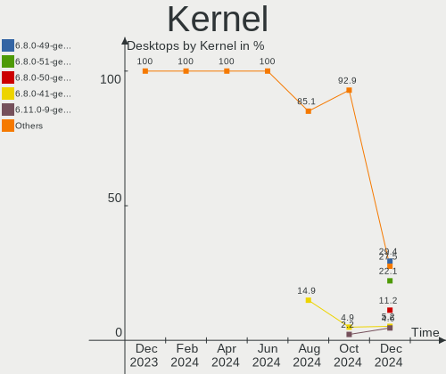
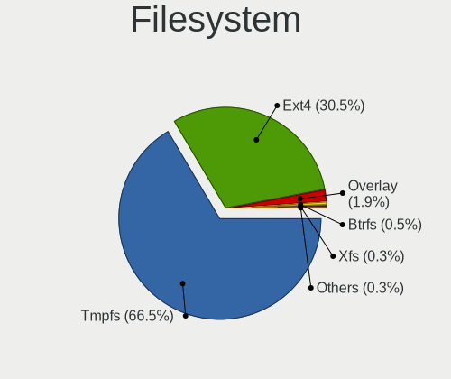
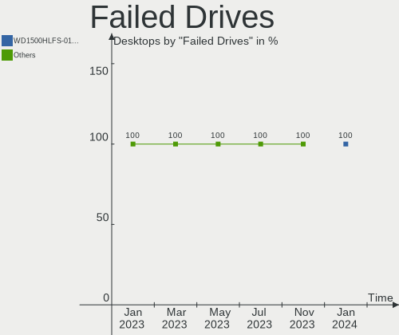
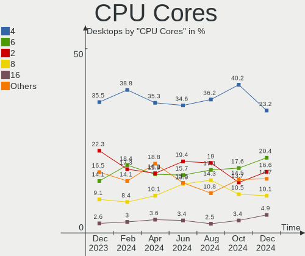
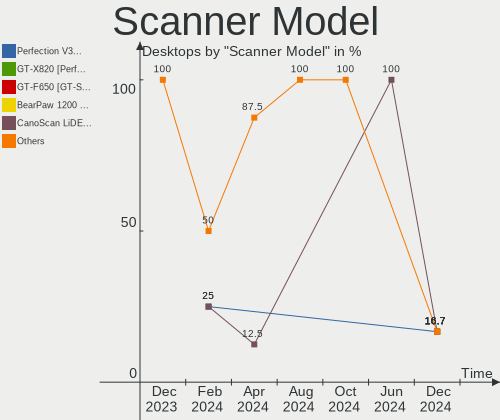
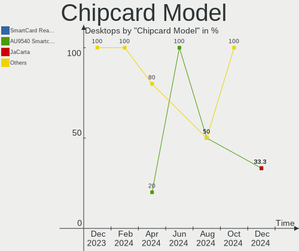

Ubuntu - Hardware Trends (Desktops)
-----------------------------------

A project to identify most popular hardware characteristics and track their change
over time based on data collected by Linux users at https://Linux-Hardware.org.

Anyone can contribute to this report by the [hw-probe](https://github.com/linuxhw/hw-probe) tool:

    sudo -E hw-probe -all -upload

This report is for one last month. Overall report since the beginning of time: [TestCoverage](https://github.com/linuxhw/TestCoverage)

Period: Oct, 2022.

Contents
--------

* [ System ](#system)
  - [ OS                       ](#os)
  - [ OS Family                ](#os-family)
  - [ Kernel                   ](#kernel)
  - [ Kernel Family            ](#kernel-family)
  - [ Kernel Major Ver.        ](#kernel-major-ver)
  - [ Arch                     ](#arch)
  - [ DE                       ](#de)
  - [ Display Server           ](#display-server)
  - [ Display Manager          ](#display-manager)
  - [ OS Lang                  ](#os-lang)
  - [ Boot Mode                ](#boot-mode)
  - [ Filesystem               ](#filesystem)
  - [ Part. scheme             ](#part-scheme)
  - [ Dual Boot with Linux/BSD ](#dual-boot-with-linuxbsd)
  - [ Dual Boot (Win)          ](#dual-boot-win)

* [ Board ](#board)
  - [ Vendor                   ](#vendor)
  - [ Model                    ](#model)
  - [ Model Family             ](#model-family)
  - [ MFG Year                 ](#mfg-year)
  - [ Form Factor              ](#form-factor)
  - [ Secure Boot              ](#secure-boot)
  - [ Coreboot                 ](#coreboot)
  - [ RAM Size                 ](#ram-size)
  - [ RAM Used                 ](#ram-used)
  - [ Total Drives             ](#total-drives)
  - [ Has CD-ROM               ](#has-cd-rom)
  - [ Has Ethernet             ](#has-ethernet)
  - [ Has WiFi                 ](#has-wifi)
  - [ Has Bluetooth            ](#has-bluetooth)

* [ Location ](#location)
  - [ Country                  ](#country)
  - [ City                     ](#city)

* [ Drives ](#drives)
  - [ Drive Vendor             ](#drive-vendor)
  - [ Drive Model              ](#drive-model)
  - [ HDD Vendor               ](#hdd-vendor)
  - [ SSD Vendor               ](#ssd-vendor)
  - [ Drive Kind               ](#drive-kind)
  - [ Drive Connector          ](#drive-connector)
  - [ Drive Size               ](#drive-size)
  - [ Space Total              ](#space-total)
  - [ Space Used               ](#space-used)
  - [ Malfunc. Drives          ](#malfunc-drives)
  - [ Malfunc. Drive Vendor    ](#malfunc-drive-vendor)
  - [ Malfunc. HDD Vendor      ](#malfunc-hdd-vendor)
  - [ Malfunc. Drive Kind      ](#malfunc-drive-kind)
  - [ Failed Drives            ](#failed-drives)
  - [ Failed Drive Vendor      ](#failed-drive-vendor)
  - [ Drive Status             ](#drive-status)

* [ Storage controller ](#storage-controller)
  - [ Storage Vendor           ](#storage-vendor)
  - [ Storage Model            ](#storage-model)
  - [ Storage Kind             ](#storage-kind)

* [ Processor ](#processor)
  - [ CPU Vendor               ](#cpu-vendor)
  - [ CPU Model                ](#cpu-model)
  - [ CPU Model Family         ](#cpu-model-family)
  - [ CPU Cores                ](#cpu-cores)
  - [ CPU Sockets              ](#cpu-sockets)
  - [ CPU Threads              ](#cpu-threads)
  - [ CPU Op-Modes             ](#cpu-op-modes)
  - [ CPU Microcode            ](#cpu-microcode)
  - [ CPU Microarch            ](#cpu-microarch)

* [ Graphics ](#graphics)
  - [ GPU Vendor               ](#gpu-vendor)
  - [ GPU Model                ](#gpu-model)
  - [ GPU Combo                ](#gpu-combo)
  - [ GPU Driver               ](#gpu-driver)
  - [ GPU Memory               ](#gpu-memory)

* [ Monitor ](#monitor)
  - [ Monitor Vendor           ](#monitor-vendor)
  - [ Monitor Model            ](#monitor-model)
  - [ Monitor Resolution       ](#monitor-resolution)
  - [ Monitor Diagonal         ](#monitor-diagonal)
  - [ Monitor Width            ](#monitor-width)
  - [ Aspect Ratio             ](#aspect-ratio)
  - [ Monitor Area             ](#monitor-area)
  - [ Pixel Density            ](#pixel-density)
  - [ Multiple Monitors        ](#multiple-monitors)

* [ Network ](#network)
  - [ Net Controller Vendor    ](#net-controller-vendor)
  - [ Net Controller Model     ](#net-controller-model)
  - [ Wireless Vendor          ](#wireless-vendor)
  - [ Wireless Model           ](#wireless-model)
  - [ Ethernet Vendor          ](#ethernet-vendor)
  - [ Ethernet Model           ](#ethernet-model)
  - [ Net Controller Kind      ](#net-controller-kind)
  - [ Used Controller          ](#used-controller)
  - [ NICs                     ](#nics)
  - [ IPv6                     ](#ipv6)

* [ Bluetooth ](#bluetooth)
  - [ Bluetooth Vendor         ](#bluetooth-vendor)
  - [ Bluetooth Model          ](#bluetooth-model)

* [ Sound ](#sound)
  - [ Sound Vendor             ](#sound-vendor)
  - [ Sound Model              ](#sound-model)

* [ Memory ](#memory)
  - [ Memory Vendor            ](#memory-vendor)
  - [ Memory Model             ](#memory-model)
  - [ Memory Kind              ](#memory-kind)
  - [ Memory Form Factor       ](#memory-form-factor)
  - [ Memory Size              ](#memory-size)
  - [ Memory Speed             ](#memory-speed)

* [ Printers & scanners ](#printers--scanners)
  - [ Printer Vendor           ](#printer-vendor)
  - [ Printer Model            ](#printer-model)
  - [ Scanner Vendor           ](#scanner-vendor)
  - [ Scanner Model            ](#scanner-model)

* [ Camera ](#camera)
  - [ Camera Vendor            ](#camera-vendor)
  - [ Camera Model             ](#camera-model)

* [ Security ](#security)
  - [ Fingerprint Vendor       ](#fingerprint-vendor)
  - [ Fingerprint Model        ](#fingerprint-model)
  - [ Chipcard Vendor          ](#chipcard-vendor)
  - [ Chipcard Model           ](#chipcard-model)

* [ Unsupported ](#unsupported)
  - [ Unsupported Devices      ](#unsupported-devices)
  - [ Unsupported Device Types ](#unsupported-device-types)

System
------

OS
--

Installed operating systems

| Name           | Desktops | Percent |
|----------------|----------|---------|
| Ubuntu 22.04   | 327      | 74.15%  |
| Ubuntu 20.04   | 70       | 15.87%  |
| Ubuntu 22.10   | 27       | 6.12%   |
| Ubuntu 18.04   | 13       | 2.95%   |
| Ubuntu Core 18 | 2        | 0.45%   |
| Ubuntu 21.10   | 1        | 0.23%   |
| Ubuntu 21.04   | 1        | 0.23%   |

OS Family
---------

OS without a version

| Name   | Desktops | Percent |
|--------|----------|---------|
| Ubuntu | 441      | 100%    |

Kernel
------

Version of the Linux kernel

| Version                    | Desktops | Percent |
|----------------------------|----------|---------|
| 5.15.0-52-generic          | 132      | 29.93%  |
| 5.15.0-48-generic          | 113      | 25.62%  |
| 5.15.0-50-generic          | 93       | 21.09%  |
| 5.19.0-23-generic          | 15       | 3.4%    |
| 5.4.0-126-generic          | 10       | 2.27%   |
| 5.15.0-43-generic          | 9        | 2.04%   |
| 5.4.0-128-generic          | 6        | 1.36%   |
| 5.19.0-21-generic          | 6        | 1.36%   |
| 5.15.0-47-generic          | 5        | 1.13%   |
| 5.4.0-131-generic          | 4        | 0.91%   |
| 5.15.0-41-generic          | 4        | 0.91%   |
| 5.15.0-53-generic          | 3        | 0.68%   |
| 5.15.0-46-generic          | 3        | 0.68%   |
| 5.15.0-25-generic          | 3        | 0.68%   |
| 5.19.0-15-generic          | 2        | 0.45%   |
| 5.13.0-30-generic          | 2        | 0.45%   |
| 4.15.0-193-generic         | 2        | 0.45%   |
| 6.0.3-x64v2-xanmod1        | 1        | 0.23%   |
| 6.0.0-060000rc7-generic    | 1        | 0.23%   |
| 5.4.0-42-generic           | 1        | 0.23%   |
| 5.4.0-26-generic           | 1        | 0.23%   |
| 5.19.0-14.2-liquorix-amd64 | 1        | 0.23%   |
| 5.19.0-1009-lowlatency     | 1        | 0.23%   |
| 5.18.8-051808-generic      | 1        | 0.23%   |
| 5.18.0-051800-generic      | 1        | 0.23%   |
| 5.17.0-1020-oem            | 1        | 0.23%   |
| 5.17.0-1014-oem            | 1        | 0.23%   |
| 5.17.0-1006-oem            | 1        | 0.23%   |
| 5.15.13-051513-generic     | 1        | 0.23%   |
| 5.15.0-48-lowlatency       | 1        | 0.23%   |
| 5.15.0-051500rc7-generic   | 1        | 0.23%   |
| 5.13.0-52-generic          | 1        | 0.23%   |
| 5.13.0-51-generic          | 1        | 0.23%   |
| 5.13.0-41-generic          | 1        | 0.23%   |
| 5.13.0-40-generic          | 1        | 0.23%   |
| 5.13.0-39-generic          | 1        | 0.23%   |
| 5.13.0-27-generic          | 1        | 0.23%   |
| 5.11.0-49-generic          | 1        | 0.23%   |
| 5.11.0-27-generic          | 1        | 0.23%   |
| 5.11.0-25-generic          | 1        | 0.23%   |

Kernel Family
-------------

Linux kernel without a distro release

| Version | Desktops | Percent |
|---------|----------|---------|
| 5.15.0  | 367      | 83.22%  |
| 5.19.0  | 25       | 5.67%   |
| 5.4.0   | 22       | 4.99%   |
| 5.13.0  | 8        | 1.81%   |
| 4.15.0  | 6        | 1.36%   |
| 5.17.0  | 3        | 0.68%   |
| 5.11.0  | 3        | 0.68%   |
| 6.0.3   | 1        | 0.23%   |
| 6.0.0   | 1        | 0.23%   |
| 5.18.8  | 1        | 0.23%   |
| 5.18.0  | 1        | 0.23%   |
| 5.15.13 | 1        | 0.23%   |
| 5.10.60 | 1        | 0.23%   |
| 4.9.0   | 1        | 0.23%   |

Kernel Major Ver.
-----------------

Linux kernel major version

| Version | Desktops | Percent |
|---------|----------|---------|
| 5.15    | 368      | 83.45%  |
| 5.19    | 25       | 5.67%   |
| 5.4     | 22       | 4.99%   |
| 5.13    | 8        | 1.81%   |
| 4.15    | 6        | 1.36%   |
| 5.17    | 3        | 0.68%   |
| 5.11    | 3        | 0.68%   |
| 6.0     | 2        | 0.45%   |
| 5.18    | 2        | 0.45%   |
| 5.10    | 1        | 0.23%   |
| 4.9     | 1        | 0.23%   |

Arch
----

OS architecture (x86_64, i586, etc.)

| Name   | Desktops | Percent |
|--------|----------|---------|
| x86_64 | 440      | 99.77%  |
| i686   | 1        | 0.23%   |

DE
--

Desktop Environment

| Name            | Desktops | Percent |
|-----------------|----------|---------|
| GNOME           | 406      | 92.06%  |
| Unknown         | 25       | 5.67%   |
| X-Cinnamon      | 4        | 0.91%   |
| Enlightenment   | 2        | 0.45%   |
| openbox         | 1        | 0.23%   |
| i3              | 1        | 0.23%   |
| GNOME Flashback | 1        | 0.23%   |
| Cinnamon        | 1        | 0.23%   |

Display Server
--------------

X11 or Wayland

| Name    | Desktops | Percent |
|---------|----------|---------|
| X11     | 211      | 47.85%  |
| Wayland | 207      | 46.94%  |
| Tty     | 12       | 2.72%   |
| Unknown | 11       | 2.49%   |

Display Manager
---------------

SDDM, LightDM, etc.

| Name    | Desktops | Percent |
|---------|----------|---------|
| GDM3    | 357      | 80.95%  |
| Unknown | 42       | 9.52%   |
| GDM     | 24       | 5.44%   |
| LightDM | 15       | 3.4%    |
| SDDM    | 2        | 0.45%   |
| LXDM    | 1        | 0.23%   |

OS Lang
-------

Language

| Lang    | Desktops | Percent |
|---------|----------|---------|
| en_US   | 176      | 39.91%  |
| de_DE   | 54       | 12.24%  |
| fr_FR   | 36       | 8.16%   |
| it_IT   | 29       | 6.58%   |
| en_GB   | 17       | 3.85%   |
| ru_RU   | 13       | 2.95%   |
| es_ES   | 13       | 2.95%   |
| pt_BR   | 10       | 2.27%   |
| en_IN   | 9        | 2.04%   |
| en_CA   | 8        | 1.81%   |
| en_AU   | 8        | 1.81%   |
| pl_PL   | 7        | 1.59%   |
| nl_NL   | 7        | 1.59%   |
| C       | 5        | 1.13%   |
| zh_CN   | 4        | 0.91%   |
| tr_TR   | 3        | 0.68%   |
| sv_SE   | 3        | 0.68%   |
| nl_BE   | 3        | 0.68%   |
| ja_JP   | 3        | 0.68%   |
| fr_CA   | 3        | 0.68%   |
| es_AR   | 3        | 0.68%   |
| en_ZA   | 3        | 0.68%   |
| cs_CZ   | 3        | 0.68%   |
| sr_RS   | 2        | 0.45%   |
| sk_SK   | 2        | 0.45%   |
| es_MX   | 2        | 0.45%   |
| Unknown | 2        | 0.45%   |
| zh_TW   | 1        | 0.23%   |
| ko_KR   | 1        | 0.23%   |
| hu_HU   | 1        | 0.23%   |
| fr_BE   | 1        | 0.23%   |
| fi_FI   | 1        | 0.23%   |
| es_UY   | 1        | 0.23%   |
| es_EC   | 1        | 0.23%   |
| en_SG   | 1        | 0.23%   |
| en_PH   | 1        | 0.23%   |
| en_IL   | 1        | 0.23%   |
| el_GR   | 1        | 0.23%   |
| de_AT   | 1        | 0.23%   |
| da_DK   | 1        | 0.23%   |

Boot Mode
---------

EFI or BIOS

| Mode | Desktops | Percent |
|------|----------|---------|
| BIOS | 316      | 71.66%  |
| EFI  | 125      | 28.34%  |

Filesystem
----------

Type of filesystem

| Type          | Desktops | Percent |
|---------------|----------|---------|
| Ext4          | 418      | 94.78%  |
| Zfs           | 7        | 1.59%   |
| Overlay       | 6        | 1.36%   |
| Btrfs         | 6        | 1.36%   |
| Xfs           | 2        | 0.45%   |
| XXXX          | 1        | 0.23%   |
| Fuse.snapfuse | 1        | 0.23%   |

Part. scheme
------------

Scheme of partitioning

| Type    | Desktops | Percent |
|---------|----------|---------|
| GPT     | 328      | 74.38%  |
| MBR     | 78       | 17.69%  |
| Unknown | 35       | 7.94%   |

Dual Boot with Linux/BSD
------------------------

Hosting more than one Linux/BSD

| Dual boot | Desktops | Percent |
|-----------|----------|---------|
| No        | 357      | 80.95%  |
| Yes       | 84       | 19.05%  |

Dual Boot (Win)
---------------

Hosting Linux and Windows

| Dual boot | Desktops | Percent |
|-----------|----------|---------|
| No        | 264      | 59.86%  |
| Yes       | 177      | 40.14%  |

Board
-----

Vendor
------

Motherboard manufacturer

| Name                | Desktops | Percent |
|---------------------|----------|---------|
| ASUSTek Computer    | 109      | 24.72%  |
| Gigabyte Technology | 61       | 13.83%  |
| MSI                 | 57       | 12.93%  |
| Hewlett-Packard     | 48       | 10.88%  |
| Dell                | 48       | 10.88%  |
| ASRock              | 33       | 7.48%   |
| Lenovo              | 15       | 3.4%    |
| Intel               | 11       | 2.49%   |
| Acer                | 8        | 1.81%   |
| Unknown             | 7        | 1.59%   |
| Medion              | 5        | 1.13%   |
| Fujitsu             | 5        | 1.13%   |
| Biostar             | 4        | 0.91%   |
| Pegatron            | 3        | 0.68%   |
| Alienware           | 3        | 0.68%   |
| Packard Bell        | 2        | 0.45%   |
| Google              | 2        | 0.45%   |
| Foxconn             | 2        | 0.45%   |
| ECS                 | 2        | 0.45%   |
| WTM                 | 1        | 0.23%   |
| Techvision          | 1        | 0.23%   |
| Supermicro          | 1        | 0.23%   |
| Soyo                | 1        | 0.23%   |
| Shuttle             | 1        | 0.23%   |
| Samsung Electronics | 1        | 0.23%   |
| OEM                 | 1        | 0.23%   |
| LattePanda          | 1        | 0.23%   |
| Huanan              | 1        | 0.23%   |
| Fujitsu Siemens     | 1        | 0.23%   |
| eMachines           | 1        | 0.23%   |
| AZW                 | 1        | 0.23%   |
| ASRockRack          | 1        | 0.23%   |
| Apple               | 1        | 0.23%   |
| AOpen               | 1        | 0.23%   |
| AMI                 | 1        | 0.23%   |

Model
-----

Motherboard model

| Name                               | Desktops | Percent |
|------------------------------------|----------|---------|
| ASUS All Series                    | 9        | 2.04%   |
| Unknown                            | 8        | 1.81%   |
| Dell OptiPlex 7010                 | 6        | 1.36%   |
| MSI MS-7C91                        | 4        | 0.91%   |
| Dell OptiPlex 9020                 | 4        | 0.91%   |
| ASUS ROG STRIX B450-F GAMING       | 4        | 0.91%   |
| MSI MS-7B86                        | 3        | 0.68%   |
| HP Compaq 8200 Elite SFF PC        | 3        | 0.68%   |
| Dell OptiPlex 790                  | 3        | 0.68%   |
| Dell OptiPlex 3020                 | 3        | 0.68%   |
| ASUS TUF Gaming B550M-PLUS         | 3        | 0.68%   |
| MSI MS-7C79                        | 2        | 0.45%   |
| MSI MS-7C52                        | 2        | 0.45%   |
| MSI MS-7C37                        | 2        | 0.45%   |
| MSI MS-7C02                        | 2        | 0.45%   |
| MSI MS-7B84                        | 2        | 0.45%   |
| MSI MS-7B79                        | 2        | 0.45%   |
| MSI MS-7B51                        | 2        | 0.45%   |
| MSI MS-7817                        | 2        | 0.45%   |
| MSI MS-7309                        | 2        | 0.45%   |
| Lenovo ThinkCentre M83z 10C20003FR | 2        | 0.45%   |
| HP Compaq Pro 6305 SFF             | 2        | 0.45%   |
| HP Compaq Pro 6300 SFF             | 2        | 0.45%   |
| HP Compaq Pro 6300 MT              | 2        | 0.45%   |
| HP Compaq Elite 8300 SFF           | 2        | 0.45%   |
| HP Compaq 8000 Elite CMT PC        | 2        | 0.45%   |
| HP Compaq 6000 Pro MT PC           | 2        | 0.45%   |
| Google Panther                     | 2        | 0.45%   |
| Gigabyte X570 AORUS PRO            | 2        | 0.45%   |
| Gigabyte B550 AORUS ELITE V2       | 2        | 0.45%   |
| Fujitsu ESPRIMO P710               | 2        | 0.45%   |
| Foxconn H61MXT1/F2/-S/-V           | 2        | 0.45%   |
| Dell OptiPlex 980                  | 2        | 0.45%   |
| Dell OptiPlex 7050                 | 2        | 0.45%   |
| Dell OptiPlex 3050                 | 2        | 0.45%   |
| ASUS TUF Gaming B550-PLUS          | 2        | 0.45%   |
| ASUS PRIME X570-PRO                | 2        | 0.45%   |
| ASUS PRIME X470-PRO                | 2        | 0.45%   |
| ASUS PRIME B450M-A                 | 2        | 0.45%   |
| ASUS PRIME B365M-K                 | 2        | 0.45%   |

Model Family
------------

Motherboard model prefix

| Name                | Desktops | Percent |
|---------------------|----------|---------|
| Dell OptiPlex       | 31       | 7.03%   |
| HP Compaq           | 23       | 5.22%   |
| ASUS PRIME          | 21       | 4.76%   |
| Lenovo ThinkCentre  | 13       | 2.95%   |
| ASUS TUF            | 13       | 2.95%   |
| ASUS ROG            | 10       | 2.27%   |
| ASUS All            | 9        | 2.04%   |
| Dell Precision      | 8        | 1.81%   |
| Unknown             | 8        | 1.81%   |
| Gigabyte X570       | 5        | 1.13%   |
| Acer Aspire         | 5        | 1.13%   |
| MSI MS-7C91         | 4        | 0.91%   |
| Fujitsu ESPRIMO     | 4        | 0.91%   |
| MSI MS-7B86         | 3        | 0.68%   |
| HP ProDesk          | 3        | 0.68%   |
| HP EliteDesk        | 3        | 0.68%   |
| Gigabyte Z390       | 3        | 0.68%   |
| Gigabyte B550       | 3        | 0.68%   |
| Dell Vostro         | 3        | 0.68%   |
| Dell Inspiron       | 3        | 0.68%   |
| ASUS P8Z68-V        | 3        | 0.68%   |
| Packard Bell IMEDIA | 2        | 0.45%   |
| MSI PRO             | 2        | 0.45%   |
| MSI MS-7C79         | 2        | 0.45%   |
| MSI MS-7C52         | 2        | 0.45%   |
| MSI MS-7C37         | 2        | 0.45%   |
| MSI MS-7C02         | 2        | 0.45%   |
| MSI MS-7B84         | 2        | 0.45%   |
| MSI MS-7B79         | 2        | 0.45%   |
| MSI MS-7B51         | 2        | 0.45%   |
| MSI MS-7817         | 2        | 0.45%   |
| MSI MS-7309         | 2        | 0.45%   |
| HP ProLiant         | 2        | 0.45%   |
| HP Pavilion         | 2        | 0.45%   |
| Google Panther      | 2        | 0.45%   |
| Gigabyte Z690       | 2        | 0.45%   |
| Gigabyte X570S      | 2        | 0.45%   |
| Gigabyte H410M      | 2        | 0.45%   |
| Gigabyte B550M      | 2        | 0.45%   |
| Gigabyte B450M      | 2        | 0.45%   |

MFG Year
--------

Motherboard manufacture year

| Year    | Desktops | Percent |
|---------|----------|---------|
| 2018    | 42       | 9.52%   |
| 2012    | 41       | 9.3%    |
| 2020    | 40       | 9.07%   |
| 2013    | 39       | 8.84%   |
| 2011    | 38       | 8.62%   |
| 2019    | 34       | 7.71%   |
| 2021    | 28       | 6.35%   |
| 2014    | 27       | 6.12%   |
| 2015    | 26       | 5.9%    |
| 2017    | 23       | 5.22%   |
| 2010    | 22       | 4.99%   |
| 2022    | 18       | 4.08%   |
| 2009    | 18       | 4.08%   |
| 2016    | 17       | 3.85%   |
| 2008    | 13       | 2.95%   |
| 2007    | 9        | 2.04%   |
| 2006    | 3        | 0.68%   |
| 2005    | 1        | 0.23%   |
| 2004    | 1        | 0.23%   |
| Unknown | 1        | 0.23%   |

Form Factor
-----------

Physical design of the computer

| Name    | Desktops | Percent |
|---------|----------|---------|
| Desktop | 441      | 100%    |

Secure Boot
-----------

Enabled or disabled

| State    | Desktops | Percent |
|----------|----------|---------|
| Disabled | 425      | 96.37%  |
| Enabled  | 16       | 3.63%   |

Coreboot
--------

Have coreboot on board

| Used | Desktops | Percent |
|------|----------|---------|
| No   | 439      | 99.55%  |
| Yes  | 2        | 0.45%   |

RAM Size
--------

Total RAM memory

| Size in GB      | Desktops | Percent |
|-----------------|----------|---------|
| 16.01-24.0      | 124      | 28.12%  |
| 8.01-16.0       | 77       | 17.46%  |
| 32.01-64.0      | 68       | 15.42%  |
| 3.01-4.0        | 61       | 13.83%  |
| 4.01-8.0        | 54       | 12.24%  |
| 64.01-256.0     | 26       | 5.9%    |
| 24.01-32.0      | 13       | 2.95%   |
| 1.01-2.0        | 13       | 2.95%   |
| 2.01-3.0        | 4        | 0.91%   |
| More than 256.0 | 1        | 0.23%   |

RAM Used
--------

Used RAM memory

| Used GB    | Desktops | Percent |
|------------|----------|---------|
| 1.01-2.0   | 152      | 34.47%  |
| 2.01-3.0   | 132      | 29.93%  |
| 4.01-8.0   | 68       | 15.42%  |
| 3.01-4.0   | 61       | 13.83%  |
| 8.01-16.0  | 14       | 3.17%   |
| 0.51-1.0   | 8        | 1.81%   |
| 16.01-24.0 | 4        | 0.91%   |
| 24.01-32.0 | 1        | 0.23%   |
| 0.01-0.5   | 1        | 0.23%   |

Total Drives
------------

Number of drives on board

| Drives | Desktops | Percent |
|--------|----------|---------|
| 1      | 176      | 39.91%  |
| 2      | 126      | 28.57%  |
| 3      | 73       | 16.55%  |
| 4      | 26       | 5.9%    |
| 5      | 18       | 4.08%   |
| 6      | 13       | 2.95%   |
| 9      | 2        | 0.45%   |
| 8      | 2        | 0.45%   |
| 7      | 2        | 0.45%   |
| 17     | 1        | 0.23%   |
| 11     | 1        | 0.23%   |
| 0      | 1        | 0.23%   |

Has CD-ROM
----------

Has CD-ROM on board

| Presented | Desktops | Percent |
|-----------|----------|---------|
| Yes       | 229      | 51.93%  |
| No        | 212      | 48.07%  |

Has Ethernet
------------

Has Ethernet on board

| Presented | Desktops | Percent |
|-----------|----------|---------|
| Yes       | 438      | 99.32%  |
| No        | 3        | 0.68%   |

Has WiFi
--------

Has WiFi module

| Presented | Desktops | Percent |
|-----------|----------|---------|
| No        | 241      | 54.65%  |
| Yes       | 200      | 45.35%  |

Has Bluetooth
-------------

Has Bluetooth module

| Presented | Desktops | Percent |
|-----------|----------|---------|
| No        | 289      | 65.53%  |
| Yes       | 152      | 34.47%  |

Location
--------

Country
-------

Geographic location (country)

| Country      | Desktops | Percent |
|--------------|----------|---------|
| USA          | 83       | 18.82%  |
| Germany      | 61       | 13.83%  |
| Italy        | 37       | 8.39%   |
| France       | 37       | 8.39%   |
| Russia       | 19       | 4.31%   |
| UK           | 17       | 3.85%   |
| Spain        | 15       | 3.4%    |
| Brazil       | 15       | 3.4%    |
| Canada       | 13       | 2.95%   |
| Netherlands  | 9        | 2.04%   |
| India        | 9        | 2.04%   |
| Belgium      | 9        | 2.04%   |
| Sweden       | 8        | 1.81%   |
| Poland       | 8        | 1.81%   |
| Australia    | 8        | 1.81%   |
| Turkey       | 6        | 1.36%   |
| China        | 6        | 1.36%   |
| Japan        | 5        | 1.13%   |
| Czechia      | 5        | 1.13%   |
| Greece       | 4        | 0.91%   |
| Argentina    | 4        | 0.91%   |
| Taiwan       | 3        | 0.68%   |
| South Africa | 3        | 0.68%   |
| Hungary      | 3        | 0.68%   |
| Vietnam      | 2        | 0.45%   |
| Switzerland  | 2        | 0.45%   |
| Sri Lanka    | 2        | 0.45%   |
| South Korea  | 2        | 0.45%   |
| Slovakia     | 2        | 0.45%   |
| Serbia       | 2        | 0.45%   |
| Peru         | 2        | 0.45%   |
| Mexico       | 2        | 0.45%   |
| Finland      | 2        | 0.45%   |
| Ecuador      | 2        | 0.45%   |
| Chile        | 2        | 0.45%   |
| Bulgaria     | 2        | 0.45%   |
| Bangladesh   | 2        | 0.45%   |
| Austria      | 2        | 0.45%   |
| Uruguay      | 1        | 0.23%   |
| Ukraine      | 1        | 0.23%   |

City
----

Geographic location (city)

| City                | Desktops | Percent |
|---------------------|----------|---------|
| Milan               | 7        | 1.59%   |
| Sydney              | 6        | 1.36%   |
| Berlin              | 6        | 1.36%   |
| Valenciennes        | 4        | 0.91%   |
| St Petersburg       | 4        | 0.91%   |
| Rio de Janeiro      | 4        | 0.91%   |
| Paris               | 4        | 0.91%   |
| Moscow              | 4        | 0.91%   |
| Warsaw              | 3        | 0.68%   |
| Tucson              | 3        | 0.68%   |
| Prague              | 3        | 0.68%   |
| Nizhniy Novgorod    | 3        | 0.68%   |
| Madrid              | 3        | 0.68%   |
| Karlsruhe           | 3        | 0.68%   |
| Budapest            | 3        | 0.68%   |
| Athens              | 3        | 0.68%   |
| Wroclaw             | 2        | 0.45%   |
| Vienna              | 2        | 0.45%   |
| Verden an der Aller | 2        | 0.45%   |
| Ufa                 | 2        | 0.45%   |
| Turin               | 2        | 0.45%   |
| Shenzhen            | 2        | 0.45%   |
| Seattle             | 2        | 0.45%   |
| Schaarbeek          | 2        | 0.45%   |
| Sao Paulo           | 2        | 0.45%   |
| Oberursel           | 2        | 0.45%   |
| Naples              | 2        | 0.45%   |
| Mieuxce             | 2        | 0.45%   |
| Lüneburg           | 2        | 0.45%   |
| London              | 2        | 0.45%   |
| Linköping          | 2        | 0.45%   |
| Lima                | 2        | 0.45%   |
| Izmir               | 2        | 0.45%   |
| Ho Chi Minh City    | 2        | 0.45%   |
| Hamburg             | 2        | 0.45%   |
| Ghent               | 2        | 0.45%   |
| Frankfurt am Main   | 2        | 0.45%   |
| Dhaka               | 2        | 0.45%   |
| Dallas              | 2        | 0.45%   |
| Champs-sur-Marne    | 2        | 0.45%   |

Drives
------

Drive Vendor
------------

Hard drive vendors

| Vendor                      | Desktops | Drives | Percent |
|-----------------------------|----------|--------|---------|
| Seagate                     | 155      | 211    | 19.42%  |
| WDC                         | 146      | 191    | 18.3%   |
| Samsung Electronics         | 115      | 151    | 14.41%  |
| Kingston                    | 46       | 50     | 5.76%   |
| Toshiba                     | 42       | 45     | 5.26%   |
| Crucial                     | 37       | 40     | 4.64%   |
| SanDisk                     | 35       | 38     | 4.39%   |
| Hitachi                     | 24       | 29     | 3.01%   |
| Phison Electronics          | 16       | 22     | 2.01%   |
| Unknown                     | 14       | 18     | 1.75%   |
| Intel                       | 11       | 12     | 1.38%   |
| A-DATA Technology           | 11       | 14     | 1.38%   |
| China                       | 10       | 10     | 1.25%   |
| PNY                         | 9        | 9      | 1.13%   |
| Intenso                     | 8        | 9      | 1%      |
| HGST                        | 8        | 9      | 1%      |
| SK hynix                    | 7        | 7      | 0.88%   |
| Silicon Motion              | 7        | 7      | 0.88%   |
| Micron Technology           | 7        | 7      | 0.88%   |
| Kingston Technology Company | 7        | 7      | 0.88%   |
| OCZ                         | 6        | 6      | 0.75%   |
| Patriot                     | 5        | 5      | 0.63%   |
| Micron/Crucial Technology   | 4        | 4      | 0.5%    |
| Lexar                       | 4        | 5      | 0.5%    |
| KingFast                    | 4        | 4      | 0.5%    |
| XPG                         | 3        | 4      | 0.38%   |
| SPCC                        | 3        | 4      | 0.38%   |
| GOODRAM                     | 3        | 4      | 0.38%   |
| Transcend                   | 2        | 2      | 0.25%   |
| SABRENT                     | 2        | 3      | 0.25%   |
| Phison                      | 2        | 4      | 0.25%   |
| Maxtor                      | 2        | 2      | 0.25%   |
| Hewlett-Packard             | 2        | 9      | 0.25%   |
| Gigabyte Technology         | 2        | 2      | 0.25%   |
| Fujitsu                     | 2        | 2      | 0.25%   |
| Corsair                     | 2        | 2      | 0.25%   |
| AMD                         | 2        | 2      | 0.25%   |
| ADATA Technology            | 2        | 2      | 0.25%   |
| Verbatim                    | 1        | 1      | 0.13%   |
| USB3.0                      | 1        | 2      | 0.13%   |

Drive Model
-----------

Hard drive models

| Model                                                 | Desktops | Percent |
|-------------------------------------------------------|----------|---------|
| Samsung NVMe SSD Controller SM981/PM981/PM983 500GB   | 19       | 2.1%    |
| Seagate ST1000DM010-2EP102 1TB                        | 12       | 1.33%   |
| Seagate ST500DM002-1BD142 500GB                       | 10       | 1.11%   |
| Kingston SA400S37480G 480GB SSD                       | 9        | 1%      |
| Samsung SSD 860 EVO 500GB                             | 8        | 0.88%   |
| Samsung SSD 850 EVO 250GB                             | 8        | 0.88%   |
| Phison E16 PCIe4 NVMe Controller 1TB                  | 8        | 0.88%   |
| Kingston SA400S37240G 240GB SSD                       | 8        | 0.88%   |
| Crucial CT500MX500SSD1 500GB                          | 8        | 0.88%   |
| Seagate ST4000DM004-2CV104 4TB                        | 7        | 0.77%   |
| Seagate ST2000DM008-2FR102 2TB                        | 7        | 0.77%   |
| Kingston Company A2000 NVMe SSD 1TB                   | 7        | 0.77%   |
| Unknown SD/MMC/MS PRO 1TB                             | 6        | 0.66%   |
| Samsung SSD 980 PRO 1TB                               | 6        | 0.66%   |
| Samsung SSD 980 1TB                                   | 6        | 0.66%   |
| Samsung SSD 860 EVO 250GB                             | 6        | 0.66%   |
| Samsung NVMe SSD Controller PM9A1/PM9A3/980PRO 250GB  | 6        | 0.66%   |
| Toshiba DT01ACA100 1TB                                | 5        | 0.55%   |
| Silicon Motion SM2263EN/SM2263XT SSD Controller 256GB | 5        | 0.55%   |
| Seagate ST31000528AS 1TB                              | 5        | 0.55%   |
| Seagate ST1000DM003-1SB102 1TB                        | 5        | 0.55%   |
| Seagate ST1000DM003-1CH162 1TB                        | 5        | 0.55%   |
| Phison E12 NVMe Controller 2TB                        | 5        | 0.55%   |
| Kingston SV300S37A120G 120GB SSD                      | 5        | 0.55%   |
| Crucial CT240BX500SSD1 240GB                          | 5        | 0.55%   |
| WDC WDS240G2G0A-00JH30 240GB SSD                      | 4        | 0.44%   |
| WDC WD5000AAKX-08U6AA0 500GB                          | 4        | 0.44%   |
| WDC WD20EZRZ-00Z5HB0 2TB                              | 4        | 0.44%   |
| WDC WD10EZEX-08WN4A0 1TB                              | 4        | 0.44%   |
| WDC WD10EARS-00Y5B1 1TB                               | 4        | 0.44%   |
| Seagate ST2000DM006-2DM164 2TB                        | 4        | 0.44%   |
| Seagate ST2000DM001-1CH164 2TB                        | 4        | 0.44%   |
| Seagate M3 Portable 2TB                               | 4        | 0.44%   |
| Sandisk WD Black SN750 / PC SN730 NVMe SSD 1TB        | 4        | 0.44%   |
| Samsung SSD 870 QVO 1TB                               | 4        | 0.44%   |
| Samsung HD502HJ 500GB                                 | 4        | 0.44%   |
| Samsung HD103UJ 1TB                                   | 4        | 0.44%   |
| Kingston SA400S37960G 960GB SSD                       | 4        | 0.44%   |
| Kingston SA400S37120G 120GB SSD                       | 4        | 0.44%   |
| XPG GAMMIX S11 Pro 1TB                                | 3        | 0.33%   |

HDD Vendor
----------

Hard disk drive vendors

| Vendor              | Desktops | Drives | Percent |
|---------------------|----------|--------|---------|
| Seagate             | 151      | 204    | 38.82%  |
| WDC                 | 132      | 170    | 33.93%  |
| Toshiba             | 39       | 41     | 10.03%  |
| Hitachi             | 24       | 29     | 6.17%   |
| Samsung Electronics | 19       | 25     | 4.88%   |
| HGST                | 8        | 9      | 2.06%   |
| Unknown             | 6        | 6      | 1.54%   |
| SABRENT             | 2        | 3      | 0.51%   |
| Maxtor              | 2        | 2      | 0.51%   |
| Fujitsu             | 2        | 2      | 0.51%   |
| USB3.0              | 1        | 2      | 0.26%   |
| QUANTUM             | 1        | 1      | 0.26%   |
| Intenso             | 1        | 1      | 0.26%   |
| Hewlett-Packard     | 1        | 8      | 0.26%   |

SSD Vendor
----------

Solid state drive vendors

| Vendor              | Desktops | Drives | Percent |
|---------------------|----------|--------|---------|
| Samsung Electronics | 59       | 70     | 22.18%  |
| Kingston            | 38       | 41     | 14.29%  |
| Crucial             | 34       | 37     | 12.78%  |
| WDC                 | 17       | 18     | 6.39%   |
| SanDisk             | 17       | 18     | 6.39%   |
| China               | 10       | 10     | 3.76%   |
| A-DATA Technology   | 10       | 13     | 3.76%   |
| PNY                 | 8        | 8      | 3.01%   |
| OCZ                 | 6        | 6      | 2.26%   |
| Micron Technology   | 6        | 6      | 2.26%   |
| Intenso             | 6        | 7      | 2.26%   |
| Patriot             | 5        | 5      | 1.88%   |
| Intel               | 5        | 5      | 1.88%   |
| SK hynix            | 4        | 4      | 1.5%    |
| Toshiba             | 3        | 3      | 1.13%   |
| SPCC                | 3        | 4      | 1.13%   |
| Lexar               | 3        | 4      | 1.13%   |
| GOODRAM             | 3        | 4      | 1.13%   |
| Transcend           | 2        | 2      | 0.75%   |
| Corsair             | 2        | 2      | 0.75%   |
| AMD                 | 2        | 2      | 0.75%   |
| Verbatim            | 1        | 1      | 0.38%   |
| Unknown             | 1        | 1      | 0.38%   |
| tigo                | 1        | 1      | 0.38%   |
| StoreJet            | 1        | 1      | 0.38%   |
| Smartbuy            | 1        | 1      | 0.38%   |
| Seagate             | 1        | 1      | 0.38%   |
| Ramsta              | 1        | 1      | 0.38%   |
| Plextor             | 1        | 1      | 0.38%   |
| Pioneer             | 1        | 1      | 0.38%   |
| OWC                 | 1        | 1      | 0.38%   |
| Netac               | 1        | 1      | 0.38%   |
| Neo                 | 1        | 1      | 0.38%   |
| MaxDigital          | 1        | 1      | 0.38%   |
| Leven               | 1        | 1      | 0.38%   |
| KingSpec            | 1        | 1      | 0.38%   |
| KingFast            | 1        | 1      | 0.38%   |
| Hewlett-Packard     | 1        | 1      | 0.38%   |
| Gigabyte Technology | 1        | 1      | 0.38%   |
| CT2000P2            | 1        | 1      | 0.38%   |

Drive Kind
----------

HDD or SSD

| Kind    | Desktops | Drives | Percent |
|---------|----------|--------|---------|
| HDD     | 302      | 503    | 44.41%  |
| SSD     | 230      | 292    | 33.82%  |
| NVMe    | 128      | 165    | 18.82%  |
| Unknown | 15       | 16     | 2.21%   |
| MMC     | 5        | 7      | 0.74%   |

Drive Connector
---------------

SATA, SAS, NVMe, etc.

| Type | Desktops | Drives | Percent |
|------|----------|--------|---------|
| SATA | 399      | 767    | 70.62%  |
| NVMe | 127      | 163    | 22.48%  |
| SAS  | 34       | 46     | 6.02%   |
| MMC  | 5        | 7      | 0.88%   |

Drive Size
----------

Size of hard drive

| Size in TB | Desktops | Drives | Percent |
|------------|----------|--------|---------|
| 0.01-0.5   | 276      | 367    | 46.15%  |
| 0.51-1.0   | 181      | 231    | 30.27%  |
| 1.01-2.0   | 75       | 98     | 12.54%  |
| 3.01-4.0   | 29       | 36     | 4.85%   |
| 2.01-3.0   | 18       | 26     | 3.01%   |
| 4.01-10.0  | 12       | 21     | 2.01%   |
| 10.01-20.0 | 7        | 16     | 1.17%   |

Space Total
-----------

Amount of disk space available on the file system

| Size in GB     | Desktops | Percent |
|----------------|----------|---------|
| 101-250        | 100      | 22.68%  |
| 251-500        | 89       | 20.18%  |
| 501-1000       | 83       | 18.82%  |
| 1001-2000      | 49       | 11.11%  |
| More than 3000 | 38       | 8.62%   |
| 2001-3000      | 31       | 7.03%   |
| 51-100         | 26       | 5.9%    |
| 1-20           | 14       | 3.17%   |
| 21-50          | 8        | 1.81%   |
| Unknown        | 3        | 0.68%   |

Space Used
----------

Amount of used disk space

| Used GB        | Desktops | Percent |
|----------------|----------|---------|
| 1-20           | 126      | 28.57%  |
| 21-50          | 83       | 18.82%  |
| 51-100         | 54       | 12.24%  |
| 251-500        | 48       | 10.88%  |
| 101-250        | 47       | 10.66%  |
| 501-1000       | 32       | 7.26%   |
| 1001-2000      | 23       | 5.22%   |
| More than 3000 | 15       | 3.4%    |
| 2001-3000      | 10       | 2.27%   |
| Unknown        | 3        | 0.68%   |

Malfunc. Drives
---------------

Drive models with a malfunction

| Model                                            | Desktops | Drives | Percent |
|--------------------------------------------------|----------|--------|---------|
| WDC WD40EFRX-68N32N0 4TB                         | 2        | 2      | 5.71%   |
| Seagate ST2000DM001-1CH164 2TB                   | 2        | 2      | 5.71%   |
| Kingston SA400S37240G 240GB SSD                  | 2        | 2      | 5.71%   |
| WDC WDS240G2G0A-00JH30 240GB SSD                 | 1        | 1      | 2.86%   |
| WDC WD40EFRX-68WT0N0 4TB                         | 1        | 1      | 2.86%   |
| WDC WD3200AAJS-60Z0A0 320GB                      | 1        | 1      | 2.86%   |
| WDC WD30EZRX-00MMMB0 3TB                         | 1        | 2      | 2.86%   |
| WDC WD10EZEX-22MFCA0 1TB                         | 1        | 1      | 2.86%   |
| WDC WD10EZEX-21WN4A0 1TB                         | 1        | 1      | 2.86%   |
| WDC WD10EZEX-07M2NA1 1TB                         | 1        | 1      | 2.86%   |
| WDC WD10EARX-00N0YB0 1TB                         | 1        | 1      | 2.86%   |
| WDC WD10EADS-00M2B0 1TB                          | 1        | 1      | 2.86%   |
| Toshiba MQ01ABD032 320GB                         | 1        | 1      | 2.86%   |
| Toshiba DT01ACA100 1TB                           | 1        | 1      | 2.86%   |
| Toshiba DT01ACA050 500GB                         | 1        | 1      | 2.86%   |
| Seagate ST9640320AS 640GB                        | 1        | 1      | 2.86%   |
| Seagate ST500DM002-1BD142 500GB                  | 1        | 1      | 2.86%   |
| Seagate ST3360320AS 360GB                        | 1        | 1      | 2.86%   |
| Seagate ST3320620AS 320GB                        | 1        | 1      | 2.86%   |
| Seagate ST31000528AS 1TB                         | 1        | 1      | 2.86%   |
| Seagate ST3000DM001-1ER166 3TB                   | 1        | 2      | 2.86%   |
| Seagate ST12000NM0007-2A1101 12TB                | 1        | 1      | 2.86%   |
| Seagate ST1000LM048-2E7172 1TB                   | 1        | 1      | 2.86%   |
| Seagate ST1000DX001-1CM162 1TB                   | 1        | 1      | 2.86%   |
| Seagate ST1000DM003-1CH162 1TB                   | 1        | 1      | 2.86%   |
| Samsung Electronics MZ7WD480HMHP-00003 480GB SSD | 1        | 1      | 2.86%   |
| Samsung Electronics HD103UJ 1TB                  | 1        | 1      | 2.86%   |
| Netac SSD 120GB                                  | 1        | 1      | 2.86%   |
| Neo Forza NFS121SA312-6007000 120GB SSD          | 1        | 1      | 2.86%   |
| Hitachi HUA722010CLA330 1TB                      | 1        | 1      | 2.86%   |
| Hitachi HDE721010SLA330 1TB                      | 1        | 1      | 2.86%   |
| A-DATA Technology SU650 240GB SSD                | 1        | 1      | 2.86%   |

Malfunc. Drive Vendor
---------------------

Vendors of faulty drives

| Vendor              | Desktops | Drives | Percent |
|---------------------|----------|--------|---------|
| WDC                 | 11       | 12     | 32.35%  |
| Seagate             | 11       | 13     | 32.35%  |
| Toshiba             | 3        | 3      | 8.82%   |
| Samsung Electronics | 2        | 2      | 5.88%   |
| Kingston            | 2        | 2      | 5.88%   |
| Hitachi             | 2        | 2      | 5.88%   |
| Netac               | 1        | 1      | 2.94%   |
| Neo                 | 1        | 1      | 2.94%   |
| A-DATA Technology   | 1        | 1      | 2.94%   |

Malfunc. HDD Vendor
-------------------

Vendors of faulty HDD drives

| Vendor              | Desktops | Drives | Percent |
|---------------------|----------|--------|---------|
| Seagate             | 11       | 13     | 40.74%  |
| WDC                 | 10       | 11     | 37.04%  |
| Toshiba             | 3        | 3      | 11.11%  |
| Hitachi             | 2        | 2      | 7.41%   |
| Samsung Electronics | 1        | 1      | 3.7%    |

Malfunc. Drive Kind
-------------------

Kinds of faulty drives

| Kind | Desktops | Drives | Percent |
|------|----------|--------|---------|
| HDD  | 26       | 30     | 78.79%  |
| SSD  | 7        | 7      | 21.21%  |

Failed Drives
-------------

Failed drive models

| Model                             | Desktops | Drives | Percent |
|-----------------------------------|----------|--------|---------|
| Samsung Electronics SSD 980 500GB | 1        | 1      | 50%     |
| Hewlett-Packard EF0450FARMV 450GB | 1        | 4      | 50%     |

Failed Drive Vendor
-------------------

Failed drive vendors

| Vendor              | Desktops | Drives | Percent |
|---------------------|----------|--------|---------|
| Samsung Electronics | 1        | 1      | 50%     |
| Hewlett-Packard     | 1        | 4      | 50%     |

Drive Status
------------

Number of failed and malfunc. drives

| Status   | Desktops | Drives | Percent |
|----------|----------|--------|---------|
| Detected | 313      | 670    | 65.76%  |
| Works    | 130      | 271    | 27.31%  |
| Malfunc  | 31       | 37     | 6.51%   |
| Failed   | 2        | 5      | 0.42%   |

Storage controller
------------------

Storage Vendor
--------------

Storage controller vendors

| Vendor                       | Desktops | Percent |
|------------------------------|----------|---------|
| Intel                        | 301      | 46.74%  |
| AMD                          | 124      | 19.25%  |
| Samsung Electronics          | 48       | 7.45%   |
| SanDisk                      | 21       | 3.26%   |
| ASMedia Technology           | 21       | 3.26%   |
| Phison Electronics           | 20       | 3.11%   |
| JMicron Technology           | 19       | 2.95%   |
| Kingston Technology Company  | 17       | 2.64%   |
| Marvell Technology Group     | 16       | 2.48%   |
| Nvidia                       | 13       | 2.02%   |
| Silicon Motion               | 7        | 1.09%   |
| Micron/Crucial Technology    | 6        | 0.93%   |
| ADATA Technology             | 6        | 0.93%   |
| Silicon Image                | 4        | 0.62%   |
| SK hynix                     | 3        | 0.47%   |
| Seagate Technology           | 3        | 0.47%   |
| Micron Technology            | 2        | 0.31%   |
| Broadcom / LSI               | 2        | 0.31%   |
| VIA Technologies             | 1        | 0.16%   |
| Toshiba America Info Systems | 1        | 0.16%   |
| Tekram Technology            | 1        | 0.16%   |
| Shenzhen Longsys Electronics | 1        | 0.16%   |
| Realtek Semiconductor        | 1        | 0.16%   |
| MAXIO Technology (Hangzhou)  | 1        | 0.16%   |
| LSI Logic / Symbios Logic    | 1        | 0.16%   |
| KIOXIA                       | 1        | 0.16%   |
| Hewlett-Packard              | 1        | 0.16%   |
| Beijing Starblaze Technology | 1        | 0.16%   |
| Adaptec                      | 1        | 0.16%   |

Storage Model
-------------

Storage controller models

| Model                                                                                   | Desktops | Percent |
|-----------------------------------------------------------------------------------------|----------|---------|
| AMD FCH SATA Controller [AHCI mode]                                                     | 60       | 7.73%   |
| Intel 8 Series/C220 Series Chipset Family 6-port SATA Controller 1 [AHCI mode]          | 34       | 4.38%   |
| AMD 400 Series Chipset SATA Controller                                                  | 31       | 3.99%   |
| Intel SATA Controller [RAID mode]                                                       | 30       | 3.87%   |
| Intel 6 Series/C200 Series Chipset Family 6 port Desktop SATA AHCI Controller           | 27       | 3.48%   |
| Intel 7 Series/C210 Series Chipset Family 6-port SATA Controller [AHCI mode]            | 26       | 3.35%   |
| Samsung NVMe SSD Controller SM981/PM981/PM983                                           | 25       | 3.22%   |
| AMD 500 Series Chipset SATA Controller                                                  | 23       | 2.96%   |
| Intel Q170/Q150/B150/H170/H110/Z170/CM236 Chipset SATA Controller [AHCI Mode]           | 22       | 2.84%   |
| Intel 200 Series PCH SATA controller [AHCI mode]                                        | 20       | 2.58%   |
| ASMedia ASM1062 Serial ATA Controller                                                   | 19       | 2.45%   |
| AMD SB7x0/SB8x0/SB9x0 IDE Controller                                                    | 19       | 2.45%   |
| AMD SB7x0/SB8x0/SB9x0 SATA Controller [IDE mode]                                        | 14       | 1.8%    |
| Samsung NVMe SSD Controller PM9A1/PM9A3/980PRO                                          | 13       | 1.68%   |
| AMD SB7x0/SB8x0/SB9x0 SATA Controller [AHCI mode]                                       | 13       | 1.68%   |
| Intel 500 Series Chipset Family SATA AHCI Controller                                    | 12       | 1.55%   |
| Intel Alder Lake-S PCH SATA Controller [AHCI Mode]                                      | 10       | 1.29%   |
| Nvidia MCP61 SATA Controller                                                            | 9        | 1.16%   |
| Kingston Company A2000 NVMe SSD                                                         | 9        | 1.16%   |
| Intel NM10/ICH7 Family SATA Controller [IDE mode]                                       | 9        | 1.16%   |
| Samsung NVMe SSD Controller 980                                                         | 8        | 1.03%   |
| Phison E16 PCIe4 NVMe Controller                                                        | 8        | 1.03%   |
| Phison E12 NVMe Controller                                                              | 8        | 1.03%   |
| Nvidia MCP61 IDE                                                                        | 8        | 1.03%   |
| Intel Cannon Lake PCH SATA AHCI Controller                                              | 8        | 1.03%   |
| Intel 9 Series Chipset Family SATA Controller [AHCI Mode]                               | 8        | 1.03%   |
| Intel 6 Series/C200 Series Chipset Family Desktop SATA Controller (IDE mode, ports 4-5) | 8        | 1.03%   |
| Intel 6 Series/C200 Series Chipset Family Desktop SATA Controller (IDE mode, ports 0-3) | 8        | 1.03%   |
| Kingston Company Company Non-Volatile memory controller                                 | 7        | 0.9%    |
| Intel Comet Lake SATA AHCI Controller                                                   | 7        | 0.9%    |
| Intel 82801JI (ICH10 Family) 4 port SATA IDE Controller #1                              | 7        | 0.9%    |
| Marvell Group 88SE9172 SATA 6Gb/s Controller                                            | 6        | 0.77%   |
| JMicron JMB368 IDE controller                                                           | 6        | 0.77%   |
| JMicron JMB363 SATA/IDE Controller                                                      | 6        | 0.77%   |
| JMicron JMB362 SATA Controller                                                          | 6        | 0.77%   |
| Intel Celeron/Pentium Silver Processor SATA Controller                                  | 6        | 0.77%   |
| Intel C610/X99 series chipset sSATA Controller [AHCI mode]                              | 6        | 0.77%   |
| Intel C610/X99 series chipset 6-Port SATA Controller [AHCI mode]                        | 6        | 0.77%   |
| Intel 82801JD/DO (ICH10 Family) SATA AHCI Controller                                    | 6        | 0.77%   |
| Intel 82801G (ICH7 Family) IDE Controller                                               | 6        | 0.77%   |

Storage Kind
------------

Kind of storage controller (IDE, SATA, NVMe, SAS, ...)

| Kind | Desktops | Percent |
|------|----------|---------|
| SATA | 353      | 56.94%  |
| NVMe | 129      | 20.81%  |
| IDE  | 87       | 14.03%  |
| RAID | 47       | 7.58%   |
| SAS  | 3        | 0.48%   |
| SCSI | 1        | 0.16%   |

Processor
---------

CPU Vendor
----------

Processor vendors

| Vendor | Desktops | Percent |
|--------|----------|---------|
| Intel  | 303      | 68.71%  |
| AMD    | 138      | 31.29%  |

CPU Model
---------

Processor models

| Model                                       | Desktops | Percent |
|---------------------------------------------|----------|---------|
| Intel Core i7-3770 CPU @ 3.40GHz            | 11       | 2.49%   |
| AMD Ryzen 5 5600X 6-Core Processor          | 9        | 2.04%   |
| AMD Ryzen 5 3600 6-Core Processor           | 9        | 2.04%   |
| Intel Core i7-2600 CPU @ 3.40GHz            | 8        | 1.81%   |
| Intel Core i5-3470 CPU @ 3.20GHz            | 8        | 1.81%   |
| Intel Core i5-2400 CPU @ 3.10GHz            | 7        | 1.59%   |
| Intel Core 2 Duo CPU E7500 @ 2.93GHz        | 6        | 1.36%   |
| AMD Ryzen 5 2600 Six-Core Processor         | 6        | 1.36%   |
| Intel Core i7-4770 CPU @ 3.40GHz            | 5        | 1.13%   |
| Intel Core i7-3770K CPU @ 3.50GHz           | 5        | 1.13%   |
| Intel Core i5-6400 CPU @ 2.70GHz            | 5        | 1.13%   |
| Intel Core i5-4570 CPU @ 3.20GHz            | 5        | 1.13%   |
| Intel Core i5 CPU 650 @ 3.20GHz             | 5        | 1.13%   |
| Intel Core i3-2120 CPU @ 3.30GHz            | 5        | 1.13%   |
| Intel Core 2 Duo CPU E8400 @ 3.00GHz        | 5        | 1.13%   |
| AMD Ryzen 7 3700X 8-Core Processor          | 5        | 1.13%   |
| AMD Ryzen 5 5600G with Radeon Graphics      | 5        | 1.13%   |
| AMD FX-6300 Six-Core Processor              | 5        | 1.13%   |
| Intel Core i7-6700K CPU @ 4.00GHz           | 4        | 0.91%   |
| Intel Core i7-6700 CPU @ 3.40GHz            | 4        | 0.91%   |
| Intel Core i7-4790 CPU @ 3.60GHz            | 4        | 0.91%   |
| Intel Core i3-10100 CPU @ 3.60GHz           | 4        | 0.91%   |
| Intel 12th Gen Core i9-12900K               | 4        | 0.91%   |
| AMD Ryzen 9 5950X 16-Core Processor         | 4        | 0.91%   |
| Intel Pentium Dual-Core CPU E5400 @ 2.70GHz | 3        | 0.68%   |
| Intel Core i9-9900K CPU @ 3.60GHz           | 3        | 0.68%   |
| Intel Core i7-9700K CPU @ 3.60GHz           | 3        | 0.68%   |
| Intel Core i7-9700 CPU @ 3.00GHz            | 3        | 0.68%   |
| Intel Core i7-5820K CPU @ 3.30GHz           | 3        | 0.68%   |
| Intel Core i5-9400F CPU @ 2.90GHz           | 3        | 0.68%   |
| Intel Core i5-7400 CPU @ 3.00GHz            | 3        | 0.68%   |
| Intel Core i5-6500T CPU @ 2.50GHz           | 3        | 0.68%   |
| Intel Core i5-6500 CPU @ 3.20GHz            | 3        | 0.68%   |
| Intel Core i5-10400 CPU @ 2.90GHz           | 3        | 0.68%   |
| Intel 11th Gen Core i7-11700 @ 2.50GHz      | 3        | 0.68%   |
| AMD Ryzen 9 5900X 12-Core Processor         | 3        | 0.68%   |
| AMD Ryzen 7 5800X 8-Core Processor          | 3        | 0.68%   |
| AMD Ryzen 7 2700X Eight-Core Processor      | 3        | 0.68%   |
| AMD Ryzen 7 1800X Eight-Core Processor      | 3        | 0.68%   |
| AMD Ryzen 5 3400G with Radeon Vega Graphics | 3        | 0.68%   |

CPU Model Family
----------------

Processor model prefix

| Model                   | Desktops | Percent |
|-------------------------|----------|---------|
| Intel Core i5           | 86       | 19.5%   |
| Intel Core i7           | 70       | 15.87%  |
| Intel Core i3           | 42       | 9.52%   |
| AMD Ryzen 5             | 40       | 9.07%   |
| Intel Xeon              | 25       | 5.67%   |
| AMD Ryzen 7             | 21       | 4.76%   |
| Intel Core 2 Duo        | 18       | 4.08%   |
| Other                   | 17       | 3.85%   |
| AMD FX                  | 17       | 3.85%   |
| Intel Celeron           | 15       | 3.4%    |
| AMD Ryzen 9             | 11       | 2.49%   |
| Intel Pentium Dual-Core | 7        | 1.59%   |
| Intel Core i9           | 7        | 1.59%   |
| AMD Phenom II X4        | 7        | 1.59%   |
| AMD A8                  | 7        | 1.59%   |
| AMD Ryzen 3             | 6        | 1.36%   |
| Intel Pentium           | 5        | 1.13%   |
| Intel Core 2 Quad       | 4        | 0.91%   |
| AMD Ryzen Threadripper  | 3        | 0.68%   |
| AMD Athlon II X2        | 3        | 0.68%   |
| AMD Athlon 64 X2        | 3        | 0.68%   |
| AMD A10                 | 3        | 0.68%   |
| Intel Core 2            | 2        | 0.45%   |
| AMD Sempron             | 2        | 0.45%   |
| AMD Athlon X4           | 2        | 0.45%   |
| AMD Athlon II X3        | 2        | 0.45%   |
| Intel Pentium Silver    | 1        | 0.23%   |
| Intel Pentium D         | 1        | 0.23%   |
| Intel Pentium 4         | 1        | 0.23%   |
| Intel Core m5           | 1        | 0.23%   |
| Intel Atom              | 1        | 0.23%   |
| AMD Turion 64 X2 Mobile | 1        | 0.23%   |
| AMD Ryzen Embedded      | 1        | 0.23%   |
| AMD Ryzen 3 PRO         | 1        | 0.23%   |
| AMD Phenom II X6        | 1        | 0.23%   |
| AMD E1                  | 1        | 0.23%   |
| AMD Athlon II X4        | 1        | 0.23%   |
| AMD Athlon II           | 1        | 0.23%   |
| AMD Athlon Dual Core    | 1        | 0.23%   |
| AMD Athlon              | 1        | 0.23%   |

CPU Cores
---------

Number of processor cores

| Number | Desktops | Percent |
|--------|----------|---------|
| 4      | 180      | 40.82%  |
| 2      | 108      | 24.49%  |
| 6      | 57       | 12.93%  |
| 8      | 46       | 10.43%  |
| 16     | 16       | 3.63%   |
| 3      | 12       | 2.72%   |
| 12     | 11       | 2.49%   |
| 1      | 6        | 1.36%   |
| 20     | 2        | 0.45%   |
| 24     | 1        | 0.23%   |
| 18     | 1        | 0.23%   |
| 10     | 1        | 0.23%   |

CPU Sockets
-----------

Number of sockets

| Number | Desktops | Percent |
|--------|----------|---------|
| 1      | 433      | 98.19%  |
| 2      | 8        | 1.81%   |

CPU Threads
-----------

Threads per core (Hyper-Threading)

| Number | Desktops | Percent |
|--------|----------|---------|
| 2      | 263      | 59.64%  |
| 1      | 178      | 40.36%  |

CPU Op-Modes
------------

CPU Operation Modes (32-bit, 64-bit)

| Op mode        | Desktops | Percent |
|----------------|----------|---------|
| 32-bit, 64-bit | 439      | 99.55%  |
| 32-bit         | 1        | 0.23%   |
| Unknown        | 1        | 0.23%   |

CPU Microcode
-------------

Microcode number

| Number     | Desktops | Percent |
|------------|----------|---------|
| Unknown    | 245      | 55.56%  |
| 0x306a9    | 23       | 5.22%   |
| 0x306c3    | 21       | 4.76%   |
| 0x506e3    | 16       | 3.63%   |
| 0x1067a    | 11       | 2.49%   |
| 0x206a7    | 9        | 2.04%   |
| 0x08701021 | 9        | 2.04%   |
| 0xa0653    | 7        | 1.59%   |
| 0x0800820d | 7        | 1.59%   |
| 0x906ea    | 6        | 1.36%   |
| 0xa0671    | 5        | 1.13%   |
| 0x906e9    | 5        | 1.13%   |
| 0xa0655    | 4        | 0.91%   |
| 0x90672    | 4        | 0.91%   |
| 0x0a20120a | 4        | 0.91%   |
| 0x06000852 | 4        | 0.91%   |
| 0x906ed    | 3        | 0.68%   |
| 0x6fb      | 3        | 0.68%   |
| 0x0a50000c | 3        | 0.68%   |
| 0x08108109 | 3        | 0.68%   |
| 0x010000c8 | 3        | 0.68%   |
| 0x906ec    | 2        | 0.45%   |
| 0x90675    | 2        | 0.45%   |
| 0x706a8    | 2        | 0.45%   |
| 0x706a1    | 2        | 0.45%   |
| 0x50654    | 2        | 0.45%   |
| 0x40651    | 2        | 0.45%   |
| 0x306f2    | 2        | 0.45%   |
| 0x20655    | 2        | 0.45%   |
| 0x10676    | 2        | 0.45%   |
| 0x0a201016 | 2        | 0.45%   |
| 0x06001119 | 2        | 0.45%   |
| 0x010000db | 2        | 0.45%   |
| 0xf65      | 1        | 0.23%   |
| 0x906eb    | 1        | 0.23%   |
| 0x906c0    | 1        | 0.23%   |
| 0x90661    | 1        | 0.23%   |
| 0x6fd      | 1        | 0.23%   |
| 0x6f2      | 1        | 0.23%   |
| 0x50657    | 1        | 0.23%   |

CPU Microarch
-------------

Microarchitecture

| Name             | Desktops | Percent |
|------------------|----------|---------|
| Haswell          | 58       | 13.15%  |
| IvyBridge        | 41       | 9.3%    |
| SandyBridge      | 36       | 8.16%   |
| Skylake          | 33       | 7.48%   |
| KabyLake         | 33       | 7.48%   |
| Zen 3            | 30       | 6.8%    |
| Penryn           | 27       | 6.12%   |
| Zen 2            | 25       | 5.67%   |
| Zen+             | 20       | 4.54%   |
| Piledriver       | 19       | 4.31%   |
| CometLake        | 19       | 4.31%   |
| K10              | 16       | 3.63%   |
| Westmere         | 11       | 2.49%   |
| Unknown          | 10       | 2.27%   |
| Zen              | 7        | 1.59%   |
| Core             | 7        | 1.59%   |
| K8 Hammer        | 6        | 1.36%   |
| Goldmont plus    | 6        | 1.36%   |
| Alderlake Hybrid | 6        | 1.36%   |
| Steamroller      | 5        | 1.13%   |
| Nehalem          | 5        | 1.13%   |
| Bulldozer        | 5        | 1.13%   |
| Icelake          | 4        | 0.91%   |
| Broadwell        | 3        | 0.68%   |
| Tremont          | 2        | 0.45%   |
| NetBurst         | 2        | 0.45%   |
| Jaguar           | 2        | 0.45%   |
| Excavator        | 2        | 0.45%   |
| Silvermont       | 1        | 0.23%   |

Graphics
--------

GPU Vendor
----------

Vendors of graphics cards

| Vendor                     | Desktops | Percent |
|----------------------------|----------|---------|
| Nvidia                     | 194      | 41.1%   |
| Intel                      | 164      | 34.75%  |
| AMD                        | 111      | 23.52%  |
| Matrox Electronics Systems | 2        | 0.42%   |
| Moore Threads Technology   | 1        | 0.21%   |

GPU Model
---------

Graphics card models

| Model                                                                       | Desktops | Percent |
|-----------------------------------------------------------------------------|----------|---------|
| Intel Xeon E3-1200 v3/4th Gen Core Processor Integrated Graphics Controller | 25       | 5.22%   |
| Intel 2nd Generation Core Processor Family Integrated Graphics Controller   | 17       | 3.55%   |
| Intel HD Graphics 530                                                       | 13       | 2.71%   |
| AMD Ellesmere [Radeon RX 470/480/570/570X/580/580X/590]                     | 13       | 2.71%   |
| Nvidia GP106 [GeForce GTX 1060 6GB]                                         | 11       | 2.3%    |
| Intel IvyBridge GT2 [HD Graphics 4000]                                      | 11       | 2.3%    |
| Intel CometLake-S GT2 [UHD Graphics 630]                                    | 11       | 2.3%    |
| Intel Xeon E3-1200 v2/3rd Gen Core processor Graphics Controller            | 10       | 2.09%   |
| Intel 4 Series Chipset Integrated Graphics Controller                       | 10       | 2.09%   |
| Nvidia GP108 [GeForce GT 1030]                                              | 9        | 1.88%   |
| Nvidia GK208B [GeForce GT 710]                                              | 8        | 1.67%   |
| Intel 4th Generation Core Processor Family Integrated Graphics Controller   | 8        | 1.67%   |
| Nvidia GP107 [GeForce GTX 1050 Ti]                                          | 7        | 1.46%   |
| Intel HD Graphics 630                                                       | 7        | 1.46%   |
| AMD Cezanne                                                                 | 7        | 1.46%   |
| Nvidia GT218 [GeForce 210]                                                  | 6        | 1.25%   |
| Nvidia GA106 [GeForce RTX 3060 Lite Hash Rate]                              | 6        | 1.25%   |
| Intel AlderLake-S GT1                                                       | 6        | 1.25%   |
| Nvidia GP104 [GeForce GTX 1070]                                             | 5        | 1.04%   |
| Nvidia GK208B [GeForce GT 730]                                              | 5        | 1.04%   |
| Nvidia GF119 [GeForce GT 610]                                               | 5        | 1.04%   |
| Nvidia GA104 [GeForce RTX 3060 Ti Lite Hash Rate]                           | 5        | 1.04%   |
| Intel GeminiLake [UHD Graphics 600]                                         | 5        | 1.04%   |
| Intel Core Processor Integrated Graphics Controller                         | 5        | 1.04%   |
| Intel CoffeeLake-S GT2 [UHD Graphics 630]                                   | 5        | 1.04%   |
| AMD Picasso/Raven 2 [Radeon Vega Series / Radeon Vega Mobile Series]        | 5        | 1.04%   |
| Nvidia TU117 [GeForce GTX 1650]                                             | 4        | 0.84%   |
| Nvidia GM206 [GeForce GTX 960]                                              | 4        | 0.84%   |
| Nvidia GM107 [GeForce GTX 745]                                              | 4        | 0.84%   |
| Nvidia GF108 [GeForce GT 730]                                               | 4        | 0.84%   |
| Nvidia C61 [GeForce 7025 / nForce 630a]                                     | 4        | 0.84%   |
| Intel Haswell-ULT Integrated Graphics Controller                            | 4        | 0.84%   |
| AMD Lexa PRO [Radeon 540/540X/550/550X / RX 540X/550/550X]                  | 4        | 0.84%   |
| AMD Caicos [Radeon HD 6450/7450/8450 / R5 230 OEM]                          | 4        | 0.84%   |
| Nvidia TU104 [GeForce RTX 2070 SUPER]                                       | 3        | 0.63%   |
| Nvidia GT218 [GeForce 8400 GS Rev. 3]                                       | 3        | 0.63%   |
| Nvidia GP107 [GeForce GTX 1050]                                             | 3        | 0.63%   |
| Nvidia GK107 [GeForce GTX 650]                                              | 3        | 0.63%   |
| Nvidia GK106 [GeForce GTX 660]                                              | 3        | 0.63%   |
| Nvidia G96C [GeForce 9500 GT]                                               | 3        | 0.63%   |

GPU Combo
---------

Combinations of graphics cards

| Name                         | Desktops | Percent |
|------------------------------|----------|---------|
| 1 x Nvidia                   | 181      | 41.04%  |
| 1 x Intel                    | 138      | 31.29%  |
| 1 x AMD                      | 104      | 23.58%  |
| Intel + Nvidia               | 6        | 1.36%   |
| AMD + Nvidia                 | 3        | 0.68%   |
| 2 x Nvidia                   | 2        | 0.45%   |
| 2 x AMD                      | 2        | 0.45%   |
| 1 x Matrox                   | 2        | 0.45%   |
| Intel + AMD                  | 2        | 0.45%   |
| 1 x Moore Threads Technology | 1        | 0.23%   |

GPU Driver
----------

Free vs proprietary

| Driver      | Desktops | Percent |
|-------------|----------|---------|
| Free        | 311      | 70.52%  |
| Proprietary | 108      | 24.49%  |
| Unknown     | 22       | 4.99%   |

GPU Memory
----------

Total video memory

| Size in GB | Desktops | Percent |
|------------|----------|---------|
| Unknown    | 327      | 74.15%  |
| 1.01-2.0   | 33       | 7.48%   |
| 7.01-8.0   | 20       | 4.54%   |
| 0.51-1.0   | 18       | 4.08%   |
| 3.01-4.0   | 17       | 3.85%   |
| 0.01-0.5   | 11       | 2.49%   |
| 8.01-16.0  | 8        | 1.81%   |
| 5.01-6.0   | 5        | 1.13%   |
| 2.01-3.0   | 2        | 0.45%   |

Monitor
-------

Monitor Vendor
--------------

Monitor vendors

| Vendor               | Desktops | Percent |
|----------------------|----------|---------|
| Samsung Electronics  | 60       | 13.48%  |
| Dell                 | 53       | 11.91%  |
| Goldstar             | 45       | 10.11%  |
| Acer                 | 35       | 7.87%   |
| Hewlett-Packard      | 34       | 7.64%   |
| Ancor Communications | 25       | 5.62%   |
| BenQ                 | 23       | 5.17%   |
| AOC                  | 19       | 4.27%   |
| Philips              | 18       | 4.04%   |
| ASUSTek Computer     | 13       | 2.92%   |
| Lenovo               | 11       | 2.47%   |
| ViewSonic            | 10       | 2.25%   |
| Iiyama               | 7        | 1.57%   |
| MSI                  | 6        | 1.35%   |
| Fujitsu Siemens      | 6        | 1.35%   |
| Vizio                | 5        | 1.12%   |
| HannStar             | 5        | 1.12%   |
| Sony                 | 3        | 0.67%   |
| Panasonic            | 3        | 0.67%   |
| NEC Computers        | 3        | 0.67%   |
| Medion               | 3        | 0.67%   |
| Gigabyte Technology  | 3        | 0.67%   |
| AGO                  | 3        | 0.67%   |
| SNC                  | 2        | 0.45%   |
| Seiki                | 2        | 0.45%   |
| S2-Tek               | 2        | 0.45%   |
| HPN                  | 2        | 0.45%   |
| HKC                  | 2        | 0.45%   |
| Eizo                 | 2        | 0.45%   |
| Compaq Computer      | 2        | 0.45%   |
| Unknown              | 2        | 0.45%   |
| Viotek               | 1        | 0.22%   |
| Vestel               | 1        | 0.22%   |
| Unknown (XXX)        | 1        | 0.22%   |
| TCT                  | 1        | 0.22%   |
| Sharp                | 1        | 0.22%   |
| RTK                  | 1        | 0.22%   |
| Roku                 | 1        | 0.22%   |
| Plain Tree Systems   | 1        | 0.22%   |
| Packard Bell         | 1        | 0.22%   |

Monitor Model
-------------

Monitor models

| Model                                                                 | Desktops | Percent |
|-----------------------------------------------------------------------|----------|---------|
| Goldstar FULL HD GSM5B55 1920x1080 480x270mm 21.7-inch                | 3        | 0.64%   |
| Vizio D55x-G1 VIZ1033 3840x2160                                       | 2        | 0.43%   |
| ViewSonic VA2246 SERIES VSC6F2E 1920x1080 477x268mm 21.5-inch         | 2        | 0.43%   |
| SNC SKP_E5-24 SNC2360 1920x1080 521x293mm 23.5-inch                   | 2        | 0.43%   |
| Samsung Electronics SyncMaster SAM055D 1920x1080 510x290mm 23.1-inch  | 2        | 0.43%   |
| Samsung Electronics S24F350 SAM0D20 1920x1080 521x293mm 23.5-inch     | 2        | 0.43%   |
| Samsung Electronics LCD Monitor SyncMaster 1920x1080                  | 2        | 0.43%   |
| Samsung Electronics C32F391 SAM0D34 1920x1080 698x393mm 31.5-inch     | 2        | 0.43%   |
| Samsung Electronics C24F390 SAM0D2C 1920x1080 520x290mm 23.4-inch     | 2        | 0.43%   |
| S2-Tek TV STK531A 1920x1080 930x530mm 42.1-inch                       | 2        | 0.43%   |
| Philips PHL 276E8V PHLC18F 3840x2160 597x336mm 27.0-inch              | 2        | 0.43%   |
| Philips PHL 273V7 PHLC156 1920x1080 598x336mm 27.0-inch               | 2        | 0.43%   |
| Philips PHL 243V7 PHLC155 1920x1080 530x300mm 24.0-inch               | 2        | 0.43%   |
| Philips PHL 243V5 PHLC0D1 1920x1080 520x290mm 23.4-inch               | 2        | 0.43%   |
| Philips PHL 241B8Q PHL0929 1920x1080 527x296mm 23.8-inch              | 2        | 0.43%   |
| MSI MP271 MSI30A2 1920x1080 598x336mm 27.0-inch                       | 2        | 0.43%   |
| Lenovo LEN-M93z-B LEN0093 1920x1080 510x290mm 23.1-inch               | 2        | 0.43%   |
| Lenovo LEN-M82-C LEN00A2 1920x1080 476x268mm 21.5-inch                | 2        | 0.43%   |
| HKC LCD Monitor HKC2160 1920x1080 304x228mm 15.0-inch                 | 2        | 0.43%   |
| Goldstar Ultra HD GSM5B09 3840x2160 600x340mm 27.2-inch               | 2        | 0.43%   |
| Goldstar IPS FULLHD GSM5AB8 1920x1080 480x270mm 21.7-inch             | 2        | 0.43%   |
| Goldstar FULL HD GSM5B54 1920x1080 480x270mm 21.7-inch                | 2        | 0.43%   |
| Goldstar 32inch FHD GSM76F5 1920x1080 698x392mm 31.5-inch             | 2        | 0.43%   |
| Dell U2711 DELA057 2560x1440 597x336mm 27.0-inch                      | 2        | 0.43%   |
| Dell U2415 DELA0BA 1920x1200 518x324mm 24.1-inch                      | 2        | 0.43%   |
| Dell U2412M DELA07B 1920x1200 518x324mm 24.1-inch                     | 2        | 0.43%   |
| Dell U2412M DELA07A 1920x1200 518x324mm 24.1-inch                     | 2        | 0.43%   |
| Dell 1908FP DEL4025 1280x1024 376x301mm 19.0-inch                     | 2        | 0.43%   |
| Dell 1907FP DEL4014 1280x1024 376x301mm 19.0-inch                     | 2        | 0.43%   |
| BenQ E2200HD BNQ790C 1920x1080 477x268mm 21.5-inch                    | 2        | 0.43%   |
| ASUSTek Computer VP28U AUS28B1 3840x2160 621x341mm 27.9-inch          | 2        | 0.43%   |
| ASUSTek Computer VA249 AUS24C1 1920x1080 527x296mm 23.8-inch          | 2        | 0.43%   |
| AOC 2470W AOC2470 1920x1080 521x293mm 23.5-inch                       | 2        | 0.43%   |
| Ancor Communications VX248 ACI24C5 1920x1080 531x299mm 24.0-inch      | 2        | 0.43%   |
| Ancor Communications VS278 ACI27A1 1920x1080 598x336mm 27.0-inch      | 2        | 0.43%   |
| Ancor Communications ASUS VS247 ACI249A 1920x1080 521x293mm 23.5-inch | 2        | 0.43%   |
| Ancor Communications ASUS VC239 ACI23C4 1920x1080 509x286mm 23.0-inch | 2        | 0.43%   |
| Unknown                                                               | 2        | 0.43%   |
| Vizio P552ui-B2 VIZ1010 3840x2160 708x398mm 32.0-inch                 | 1        | 0.21%   |
| Vizio E370VL VIZ0070 1920x1080 820x461mm 37.0-inch                    | 1        | 0.21%   |

Monitor Resolution
------------------

Monitor screen resolution

| Resolution         | Desktops | Percent |
|--------------------|----------|---------|
| 1920x1080 (FHD)    | 224      | 51.49%  |
| 3840x2160 (4K)     | 34       | 7.82%   |
| 1280x1024 (SXGA)   | 33       | 7.59%   |
| 2560x1440 (QHD)    | 29       | 6.67%   |
| 1680x1050 (WSXGA+) | 21       | 4.83%   |
| 1920x1200 (WUXGA)  | 14       | 3.22%   |
| 1600x900 (HD+)     | 13       | 2.99%   |
| 1366x768 (WXGA)    | 12       | 2.76%   |
| 1440x900 (WXGA+)   | 10       | 2.3%    |
| 3440x1440          | 6        | 1.38%   |
| 2560x1080          | 6        | 1.38%   |
| 1360x768           | 6        | 1.38%   |
| 2048x1152          | 4        | 0.92%   |
| 1920x540           | 4        | 0.92%   |
| 1024x768 (XGA)     | 4        | 0.92%   |
| Unknown            | 4        | 0.92%   |
| 3840x1080          | 2        | 0.46%   |
| 2560x1600          | 2        | 0.46%   |
| 1280x720 (HD)      | 2        | 0.46%   |
| 4480x1440          | 1        | 0.23%   |
| 3600x1080          | 1        | 0.23%   |
| 2288x1287          | 1        | 0.23%   |
| 1440x960           | 1        | 0.23%   |
| 1280x960           | 1        | 0.23%   |

Monitor Diagonal
----------------

Diagonal size in inches

| Inches  | Desktops | Percent |
|---------|----------|---------|
| 27      | 71       | 16.06%  |
| 23      | 70       | 15.84%  |
| 24      | 63       | 14.25%  |
| 21      | 50       | 11.31%  |
| 19      | 31       | 7.01%   |
| Unknown | 22       | 4.98%   |
| 31      | 21       | 4.75%   |
| 22      | 14       | 3.17%   |
| 17      | 14       | 3.17%   |
| 20      | 13       | 2.94%   |
| 18      | 12       | 2.71%   |
| 34      | 10       | 2.26%   |
| 15      | 7        | 1.58%   |
| 32      | 5        | 1.13%   |
| 29      | 4        | 0.9%    |
| 25      | 4        | 0.9%    |
| 42      | 3        | 0.68%   |
| 40      | 3        | 0.68%   |
| 12      | 3        | 0.68%   |
| 69      | 2        | 0.45%   |
| 39      | 2        | 0.45%   |
| 33      | 2        | 0.45%   |
| 28      | 2        | 0.45%   |
| 84      | 1        | 0.23%   |
| 72      | 1        | 0.23%   |
| 65      | 1        | 0.23%   |
| 54      | 1        | 0.23%   |
| 52      | 1        | 0.23%   |
| 50      | 1        | 0.23%   |
| 48      | 1        | 0.23%   |
| 46      | 1        | 0.23%   |
| 38      | 1        | 0.23%   |
| 36      | 1        | 0.23%   |
| 35      | 1        | 0.23%   |
| 26      | 1        | 0.23%   |
| 16      | 1        | 0.23%   |
| 14      | 1        | 0.23%   |

Monitor Width
-------------

Physical width

| Width in mm | Desktops | Percent |
|-------------|----------|---------|
| 501-600     | 189      | 44.47%  |
| 401-500     | 98       | 23.06%  |
| 601-700     | 33       | 7.76%   |
| 351-400     | 23       | 5.41%   |
| Unknown     | 22       | 5.18%   |
| 701-800     | 18       | 4.24%   |
| 301-350     | 18       | 4.24%   |
| 801-900     | 6        | 1.41%   |
| 1001-1500   | 6        | 1.41%   |
| 201-300     | 4        | 0.94%   |
| 1501-2000   | 4        | 0.94%   |
| 901-1000    | 4        | 0.94%   |

Aspect Ratio
------------

Proportional relationship between the width and the height

| Ratio   | Desktops | Percent |
|---------|----------|---------|
| 16/9    | 292      | 69.52%  |
| 16/10   | 52       | 12.38%  |
| 5/4     | 32       | 7.62%   |
| Unknown | 16       | 3.81%   |
| 21/9    | 14       | 3.33%   |
| 4/3     | 9        | 2.14%   |
| 3/2     | 2        | 0.48%   |
| 6/5     | 1        | 0.24%   |
| 32/9    | 1        | 0.24%   |
| 1.96    | 1        | 0.24%   |

Monitor Area
------------

Area in inch²

| Area in inch² | Desktops | Percent |
|----------------|----------|---------|
| 201-250        | 144      | 33.41%  |
| 301-350        | 74       | 17.17%  |
| 151-200        | 70       | 16.24%  |
| 351-500        | 42       | 9.74%   |
| 251-300        | 27       | 6.26%   |
| Unknown        | 22       | 5.1%    |
| 141-150        | 20       | 4.64%   |
| 501-1000       | 12       | 2.78%   |
| More than 1000 | 8        | 1.86%   |
| 101-110        | 7        | 1.62%   |
| 71-80          | 2        | 0.46%   |
| 111-120        | 2        | 0.46%   |
| 61-70          | 1        | 0.23%   |

Pixel Density
-------------

Pixels per inch

| Density | Desktops | Percent |
|---------|----------|---------|
| 51-100  | 268      | 64.11%  |
| 101-120 | 79       | 18.9%   |
| 121-160 | 26       | 6.22%   |
| Unknown | 22       | 5.26%   |
| 1-50    | 15       | 3.59%   |
| 161-240 | 8        | 1.91%   |

Multiple Monitors
-----------------

Total monitors connected

| Total | Desktops | Percent |
|-------|----------|---------|
| 1     | 333      | 75.51%  |
| 2     | 63       | 14.29%  |
| 0     | 39       | 8.84%   |
| 3     | 4        | 0.91%   |
| 4     | 2        | 0.45%   |

Network
-------

Net Controller Vendor
---------------------

Controller vendors

| Vendor                          | Desktops | Percent |
|---------------------------------|----------|---------|
| Realtek Semiconductor           | 254      | 39.87%  |
| Intel                           | 215      | 33.75%  |
| Qualcomm Atheros                | 35       | 5.49%   |
| Ralink Technology               | 19       | 2.98%   |
| Broadcom                        | 18       | 2.83%   |
| TP-Link                         | 14       | 2.2%    |
| Nvidia                          | 13       | 2.04%   |
| Ralink                          | 8        | 1.26%   |
| Marvell Technology Group        | 6        | 0.94%   |
| Aquantia                        | 6        | 0.94%   |
| ASIX Electronics                | 5        | 0.78%   |
| Broadcom Limited                | 4        | 0.63%   |
| Samsung Electronics             | 3        | 0.47%   |
| NetGear                         | 3        | 0.47%   |
| DisplayLink                     | 3        | 0.47%   |
| D-Link System                   | 3        | 0.47%   |
| Qualcomm Atheros Communications | 2        | 0.31%   |
| Microsoft                       | 2        | 0.31%   |
| MediaTek                        | 2        | 0.31%   |
| IMC Networks                    | 2        | 0.31%   |
| D-Link                          | 2        | 0.31%   |
| ASUSTek Computer                | 2        | 0.31%   |
| ZyDAS                           | 1        | 0.16%   |
| Xiaomi                          | 1        | 0.16%   |
| Wilocity                        | 1        | 0.16%   |
| VIA Technologies                | 1        | 0.16%   |
| Tehuti Networks                 | 1        | 0.16%   |
| Sitecom Europe                  | 1        | 0.16%   |
| Sigma Designs                   | 1        | 0.16%   |
| OPPO Electronics                | 1        | 0.16%   |
| OnePlus                         | 1        | 0.16%   |
| Linksys                         | 1        | 0.16%   |
| ICS Advent                      | 1        | 0.16%   |
| Google                          | 1        | 0.16%   |
| Edimax Technology               | 1        | 0.16%   |
| Dresden Elektronik              | 1        | 0.16%   |
| Arduino SA                      | 1        | 0.16%   |
| Unknown                         | 1        | 0.16%   |

Net Controller Model
--------------------

Controller models

| Model                                                             | Desktops | Percent |
|-------------------------------------------------------------------|----------|---------|
| Realtek RTL8111/8168/8411 PCI Express Gigabit Ethernet Controller | 193      | 26.92%  |
| Realtek RTL8125 2.5GbE Controller                                 | 34       | 4.74%   |
| Intel Wi-Fi 6 AX200                                               | 27       | 3.77%   |
| Intel 82579LM Gigabit Network Connection (Lewisville)             | 27       | 3.77%   |
| Intel I211 Gigabit Network Connection                             | 24       | 3.35%   |
| Intel Ethernet Connection (2) I219-V                              | 15       | 2.09%   |
| Intel Ethernet Connection I217-LM                                 | 14       | 1.95%   |
| Intel Ethernet Controller I225-V                                  | 13       | 1.81%   |
| Intel 82579V Gigabit Network Connection                           | 11       | 1.53%   |
| Ralink MT7601U Wireless Adapter                                   | 9        | 1.26%   |
| Nvidia MCP61 Ethernet                                             | 9        | 1.26%   |
| Intel Ethernet Connection I217-V                                  | 9        | 1.26%   |
| Intel Ethernet Connection (2) I219-LM                             | 9        | 1.26%   |
| Intel Wi-Fi 6 AX210/AX211/AX411 160MHz                            | 8        | 1.12%   |
| Intel 82567LM-3 Gigabit Network Connection                        | 8        | 1.12%   |
| Realtek 802.11ac NIC                                              | 7        | 0.98%   |
| Intel Ethernet Connection (7) I219-V                              | 7        | 0.98%   |
| Realtek RTL8188EUS 802.11n Wireless Network Adapter               | 6        | 0.84%   |
| Realtek RTL810xE PCI Express Fast Ethernet controller             | 6        | 0.84%   |
| Intel Ethernet Connection (2) I218-V                              | 6        | 0.84%   |
| Intel Dual Band Wireless-AC 3168NGW [Stone Peak]                  | 6        | 0.84%   |
| Marvell Group 88E8056 PCI-E Gigabit Ethernet Controller           | 5        | 0.7%    |
| Intel Wireless 3165                                               | 5        | 0.7%    |
| Intel I210 Gigabit Network Connection                             | 5        | 0.7%    |
| Intel Comet Lake PCH CNVi WiFi                                    | 5        | 0.7%    |
| Intel 82578DM Gigabit Network Connection                          | 5        | 0.7%    |
| Ralink RT5370 Wireless Adapter                                    | 4        | 0.56%   |
| Qualcomm Atheros QCA9377 802.11ac Wireless Network Adapter        | 4        | 0.56%   |
| Qualcomm Atheros AR9485 Wireless Network Adapter                  | 4        | 0.56%   |
| Qualcomm Atheros AR9462 Wireless Network Adapter                  | 4        | 0.56%   |
| Qualcomm Atheros AR93xx Wireless Network Adapter                  | 4        | 0.56%   |
| Intel Wireless 8260                                               | 4        | 0.56%   |
| Intel Wireless 7260                                               | 4        | 0.56%   |
| TP-Link Archer T3U [Realtek RTL8812BU]                            | 3        | 0.42%   |
| TP-Link Archer T2U PLUS [RTL8821AU]                               | 3        | 0.42%   |
| Realtek RTL88x2bu [AC1200 Techkey]                                | 3        | 0.42%   |
| Realtek RTL8821AE 802.11ac PCIe Wireless Network Adapter          | 3        | 0.42%   |
| Realtek RTL8811AU 802.11a/b/g/n/ac WLAN Adapter                   | 3        | 0.42%   |
| Ralink RT3090 Wireless 802.11n 1T/1R PCIe                         | 3        | 0.42%   |
| Qualcomm Atheros QCA6174 802.11ac Wireless Network Adapter        | 3        | 0.42%   |

Wireless Vendor
---------------

Wireless vendors

| Vendor                          | Desktops | Percent |
|---------------------------------|----------|---------|
| Intel                           | 73       | 34.6%   |
| Realtek Semiconductor           | 43       | 20.38%  |
| Qualcomm Atheros                | 26       | 12.32%  |
| Ralink Technology               | 19       | 9%      |
| TP-Link                         | 14       | 6.64%   |
| Ralink                          | 8        | 3.79%   |
| Broadcom                        | 7        | 3.32%   |
| NetGear                         | 3        | 1.42%   |
| Qualcomm Atheros Communications | 2        | 0.95%   |
| Microsoft                       | 2        | 0.95%   |
| IMC Networks                    | 2        | 0.95%   |
| D-Link System                   | 2        | 0.95%   |
| D-Link                          | 2        | 0.95%   |
| ASUSTek Computer                | 2        | 0.95%   |
| ZyDAS                           | 1        | 0.47%   |
| Wilocity                        | 1        | 0.47%   |
| Sitecom Europe                  | 1        | 0.47%   |
| MediaTek                        | 1        | 0.47%   |
| Linksys                         | 1        | 0.47%   |
| Edimax Technology               | 1        | 0.47%   |

Wireless Model
--------------

Wireless models

| Model                                                          | Desktops | Percent |
|----------------------------------------------------------------|----------|---------|
| Intel Wi-Fi 6 AX200                                            | 27       | 12.56%  |
| Ralink MT7601U Wireless Adapter                                | 9        | 4.19%   |
| Intel Wi-Fi 6 AX210/AX211/AX411 160MHz                         | 8        | 3.72%   |
| Realtek 802.11ac NIC                                           | 7        | 3.26%   |
| Realtek RTL8188EUS 802.11n Wireless Network Adapter            | 6        | 2.79%   |
| Intel Dual Band Wireless-AC 3168NGW [Stone Peak]               | 6        | 2.79%   |
| Intel Wireless 3165                                            | 5        | 2.33%   |
| Intel Comet Lake PCH CNVi WiFi                                 | 5        | 2.33%   |
| Ralink RT5370 Wireless Adapter                                 | 4        | 1.86%   |
| Qualcomm Atheros QCA9377 802.11ac Wireless Network Adapter     | 4        | 1.86%   |
| Qualcomm Atheros AR9485 Wireless Network Adapter               | 4        | 1.86%   |
| Qualcomm Atheros AR9462 Wireless Network Adapter               | 4        | 1.86%   |
| Qualcomm Atheros AR93xx Wireless Network Adapter               | 4        | 1.86%   |
| Intel Wireless 8260                                            | 4        | 1.86%   |
| Intel Wireless 7260                                            | 4        | 1.86%   |
| TP-Link Archer T3U [Realtek RTL8812BU]                         | 3        | 1.4%    |
| TP-Link Archer T2U PLUS [RTL8821AU]                            | 3        | 1.4%    |
| Realtek RTL88x2bu [AC1200 Techkey]                             | 3        | 1.4%    |
| Realtek RTL8821AE 802.11ac PCIe Wireless Network Adapter       | 3        | 1.4%    |
| Realtek RTL8811AU 802.11a/b/g/n/ac WLAN Adapter                | 3        | 1.4%    |
| Ralink RT3090 Wireless 802.11n 1T/1R PCIe                      | 3        | 1.4%    |
| Qualcomm Atheros QCA6174 802.11ac Wireless Network Adapter     | 3        | 1.4%    |
| Qualcomm Atheros AR9287 Wireless Network Adapter (PCI-Express) | 3        | 1.4%    |
| Intel Wireless-AC 9260                                         | 3        | 1.4%    |
| Intel Tiger Lake PCH CNVi WiFi                                 | 3        | 1.4%    |
| Broadcom BCM4352 802.11ac Wireless Network Adapter             | 3        | 1.4%    |
| TP-Link TL-WN822N Version 4 RTL8192EU                          | 2        | 0.93%   |
| TP-Link TL-WN722N v2/v3 [Realtek RTL8188EUS]                   | 2        | 0.93%   |
| Realtek RTL8822BE 802.11a/b/g/n/ac WiFi adapter                | 2        | 0.93%   |
| Realtek RTL8821CE 802.11ac PCIe Wireless Network Adapter       | 2        | 0.93%   |
| Realtek RTL8814AU 802.11a/b/g/n/ac Wireless Adapter            | 2        | 0.93%   |
| Realtek RTL8192EU 802.11b/g/n WLAN Adapter                     | 2        | 0.93%   |
| Realtek RTL8192CU 802.11n WLAN Adapter                         | 2        | 0.93%   |
| Realtek RTL8192CE PCIe Wireless Network Adapter                | 2        | 0.93%   |
| Realtek RTL8188FTV 802.11b/g/n 1T1R 2.4G WLAN Adapter          | 2        | 0.93%   |
| Realtek RTL8188CE 802.11b/g/n WiFi Adapter                     | 2        | 0.93%   |
| Realtek 802.11ac WLAN Adapter                                  | 2        | 0.93%   |
| Ralink RT5572 Wireless Adapter                                 | 2        | 0.93%   |
| Ralink RT3060 Wireless 802.11n 1T/1R                           | 2        | 0.93%   |
| Qualcomm Atheros AR9271 802.11n                                | 2        | 0.93%   |

Ethernet Vendor
---------------

Ethernet vendors

| Vendor                   | Desktops | Percent |
|--------------------------|----------|---------|
| Realtek Semiconductor    | 233      | 48.74%  |
| Intel                    | 173      | 36.19%  |
| Nvidia                   | 13       | 2.72%   |
| Qualcomm Atheros         | 12       | 2.51%   |
| Broadcom                 | 11       | 2.3%    |
| Marvell Technology Group | 6        | 1.26%   |
| Aquantia                 | 6        | 1.26%   |
| ASIX Electronics         | 5        | 1.05%   |
| Broadcom Limited         | 4        | 0.84%   |
| Samsung Electronics      | 3        | 0.63%   |
| DisplayLink              | 3        | 0.63%   |
| Xiaomi                   | 1        | 0.21%   |
| VIA Technologies         | 1        | 0.21%   |
| Tehuti Networks          | 1        | 0.21%   |
| OPPO Electronics         | 1        | 0.21%   |
| OnePlus                  | 1        | 0.21%   |
| MediaTek                 | 1        | 0.21%   |
| ICS Advent               | 1        | 0.21%   |
| Google                   | 1        | 0.21%   |
| D-Link System            | 1        | 0.21%   |

Ethernet Model
--------------

Ethernet models

| Model                                                             | Desktops | Percent |
|-------------------------------------------------------------------|----------|---------|
| Realtek RTL8111/8168/8411 PCI Express Gigabit Ethernet Controller | 193      | 38.76%  |
| Realtek RTL8125 2.5GbE Controller                                 | 34       | 6.83%   |
| Intel 82579LM Gigabit Network Connection (Lewisville)             | 27       | 5.42%   |
| Intel I211 Gigabit Network Connection                             | 24       | 4.82%   |
| Intel Ethernet Connection (2) I219-V                              | 15       | 3.01%   |
| Intel Ethernet Connection I217-LM                                 | 14       | 2.81%   |
| Intel Ethernet Controller I225-V                                  | 13       | 2.61%   |
| Intel 82579V Gigabit Network Connection                           | 11       | 2.21%   |
| Nvidia MCP61 Ethernet                                             | 9        | 1.81%   |
| Intel Ethernet Connection I217-V                                  | 9        | 1.81%   |
| Intel Ethernet Connection (2) I219-LM                             | 9        | 1.81%   |
| Intel 82567LM-3 Gigabit Network Connection                        | 8        | 1.61%   |
| Intel Ethernet Connection (7) I219-V                              | 7        | 1.41%   |
| Realtek RTL810xE PCI Express Fast Ethernet controller             | 6        | 1.2%    |
| Intel Ethernet Connection (2) I218-V                              | 6        | 1.2%    |
| Marvell Group 88E8056 PCI-E Gigabit Ethernet Controller           | 5        | 1%      |
| Intel I210 Gigabit Network Connection                             | 5        | 1%      |
| Intel 82578DM Gigabit Network Connection                          | 5        | 1%      |
| Qualcomm Atheros Killer E220x Gigabit Ethernet Controller         | 3        | 0.6%    |
| Intel Ethernet Connection (5) I219-LM                             | 3        | 0.6%    |
| ASIX AX88179 Gigabit Ethernet                                     | 3        | 0.6%    |
| Samsung Galaxy series, misc. (tethering mode)                     | 2        | 0.4%    |
| Realtek Killer E3000 2.5GbE Controller                            | 2        | 0.4%    |
| Realtek Killer E2600 Gigabit Ethernet Controller                  | 2        | 0.4%    |
| Qualcomm Atheros QCA8171 Gigabit Ethernet                         | 2        | 0.4%    |
| Qualcomm Atheros Attansic L2 Fast Ethernet                        | 2        | 0.4%    |
| Marvell Group 88E8001 Gigabit Ethernet Controller                 | 2        | 0.4%    |
| Intel I350 Gigabit Network Connection                             | 2        | 0.4%    |
| Intel Ethernet Controller X550                                    | 2        | 0.4%    |
| Intel Ethernet Connection (2) I218-LM                             | 2        | 0.4%    |
| Intel Ethernet Connection (14) I219-LM                            | 2        | 0.4%    |
| Intel Ethernet Connection (10) I219-V                             | 2        | 0.4%    |
| Intel 82574L Gigabit Network Connection                           | 2        | 0.4%    |
| Broadcom NetXtreme BCM5720 Gigabit Ethernet PCIe                  | 2        | 0.4%    |
| Broadcom NetLink BCM57788 Gigabit Ethernet PCIe                   | 2        | 0.4%    |
| Broadcom Limited NetXtreme BCM5761 Gigabit Ethernet PCIe          | 2        | 0.4%    |
| Aquantia AQC107 NBase-T/IEEE 802.3bz Ethernet Controller [AQtion] | 2        | 0.4%    |
| Xiaomi Mi/Redmi series (RNDIS)                                    | 1        | 0.2%    |
| VIA VT6105/VT6106S [Rhine-III]                                    | 1        | 0.2%    |
| Tehuti Networks TN9710P 10GBase-T/NBASE-T Ethernet Adapter        | 1        | 0.2%    |

Net Controller Kind
-------------------

Ethernet, WiFi or modem

| Kind     | Desktops | Percent |
|----------|----------|---------|
| Ethernet | 438      | 68.22%  |
| WiFi     | 200      | 31.15%  |
| Modem    | 4        | 0.62%   |

Used Controller
---------------

Currently used network controller

| Kind     | Desktops | Percent |
|----------|----------|---------|
| Ethernet | 342      | 75.66%  |
| WiFi     | 110      | 24.34%  |

NICs
----

Total network controllers on board

| Total | Desktops | Percent |
|-------|----------|---------|
| 1     | 270      | 61.22%  |
| 2     | 141      | 31.97%  |
| 3     | 19       | 4.31%   |
| 4     | 5        | 1.13%   |
| 0     | 4        | 0.91%   |
| 6     | 1        | 0.23%   |
| 5     | 1        | 0.23%   |

IPv6
----

IPv6 vs IPv4

| Used | Desktops | Percent |
|------|----------|---------|
| No   | 311      | 70.52%  |
| Yes  | 130      | 29.48%  |

Bluetooth
---------

Bluetooth Vendor
----------------

Controller vendors

| Vendor                          | Desktops | Percent |
|---------------------------------|----------|---------|
| Intel                           | 67       | 42.95%  |
| Cambridge Silicon Radio         | 37       | 23.72%  |
| ASUSTek Computer                | 12       | 7.69%   |
| Realtek Semiconductor           | 10       | 6.41%   |
| IMC Networks                    | 7        | 4.49%   |
| Qualcomm Atheros Communications | 5        | 3.21%   |
| TP-Link                         | 4        | 2.56%   |
| Lite-On Technology              | 3        | 1.92%   |
| Apple                           | 2        | 1.28%   |
| Realtek                         | 1        | 0.64%   |
| Micro Star International        | 1        | 0.64%   |
| MediaTek                        | 1        | 0.64%   |
| Logitech                        | 1        | 0.64%   |
| Integrated System Solution      | 1        | 0.64%   |
| Hewlett-Packard                 | 1        | 0.64%   |
| Edimax Technology               | 1        | 0.64%   |
| D-Link System                   | 1        | 0.64%   |
| Broadcom                        | 1        | 0.64%   |

Bluetooth Model
---------------

Controller models

| Model                                                   | Desktops | Percent |
|---------------------------------------------------------|----------|---------|
| Cambridge Silicon Radio Bluetooth Dongle (HCI mode)     | 37       | 23.72%  |
| Intel AX200 Bluetooth                                   | 23       | 14.74%  |
| Intel Bluetooth wireless interface                      | 13       | 8.33%   |
| Intel AX210 Bluetooth                                   | 9        | 5.77%   |
| Intel AX201 Bluetooth                                   | 9        | 5.77%   |
| Realtek Bluetooth Radio                                 | 7        | 4.49%   |
| Intel Wireless-AC 3168 Bluetooth                        | 6        | 3.85%   |
| IMC Networks Bluetooth Device                           | 5        | 3.21%   |
| TP-Link TPuLink UB500 Adapter                           | 4        | 2.56%   |
| Realtek  Bluetooth 4.2 Adapter                          | 3        | 1.92%   |
| Intel Wireless-AC 9260 Bluetooth Adapter                | 3        | 1.92%   |
| Intel Bluetooth 9460/9560 Jefferson Peak (JfP)          | 3        | 1.92%   |
| ASUS Broadcom BCM20702A0 Bluetooth                      | 3        | 1.92%   |
| ASUS ASUS USB-BT500                                     | 3        | 1.92%   |
| Qualcomm Atheros AR3011 Bluetooth                       | 2        | 1.28%   |
| Lite-On Bluetooth Device                                | 2        | 1.28%   |
| IMC Networks Bluetooth Radio                            | 2        | 1.28%   |
| ASUS BCM20702A0                                         | 2        | 1.28%   |
| Realtek Bluetooth Radio                                 | 1        | 0.64%   |
| Qualcomm Atheros  Bluetooth Device                      | 1        | 0.64%   |
| Qualcomm Atheros Bluetooth USB Host Controller          | 1        | 0.64%   |
| Qualcomm Atheros AR9462 Bluetooth                       | 1        | 0.64%   |
| Micro Star International Bluetooth Device               | 1        | 0.64%   |
| MediaTek Wireless_Device                                | 1        | 0.64%   |
| Logitech BT Mini-Receiver (HCI mode)                    | 1        | 0.64%   |
| Lite-On Qualcomm Atheros QCA9377 Bluetooth              | 1        | 0.64%   |
| Intel Centrino Bluetooth Wireless Transceiver           | 1        | 0.64%   |
| Integrated System Solution Bluetooth Device             | 1        | 0.64%   |
| HP Bluetooth 2.0 Interface [Broadcom BCM2045]           | 1        | 0.64%   |
| Edimax EW-7611ULB 802.11b/g/n and Bluetooth 4.0 Adapter | 1        | 0.64%   |
| D-Link System DBT-122 Bluetooth                         | 1        | 0.64%   |
| Broadcom BCM20702A0 Bluetooth 4.0                       | 1        | 0.64%   |
| ASUS Qualcomm Bluetooth 4.1                             | 1        | 0.64%   |
| ASUS Broadcom BCM20702 Single-Chip Bluetooth 4.0 + LE   | 1        | 0.64%   |
| ASUS Bluetooth Radio                                    | 1        | 0.64%   |
| ASUS Bluetooth Device                                   | 1        | 0.64%   |
| Apple Bluetooth USB Host Controller                     | 1        | 0.64%   |
| Apple Bluetooth HCI                                     | 1        | 0.64%   |

Sound
-----

Sound Vendor
------------

Sound card vendors

| Vendor                    | Desktops | Percent |
|---------------------------|----------|---------|
| Intel                     | 295      | 41.55%  |
| Nvidia                    | 185      | 26.06%  |
| AMD                       | 161      | 22.68%  |
| C-Media Electronics       | 8        | 1.13%   |
| Logitech                  | 7        | 0.99%   |
| Micro Star International  | 4        | 0.56%   |
| Kingston Technology       | 4        | 0.56%   |
| GN Netcom                 | 4        | 0.56%   |
| Creative Labs             | 4        | 0.56%   |
| Creative Technology       | 3        | 0.42%   |
| VIA Technologies          | 2        | 0.28%   |
| Texas Instruments         | 2        | 0.28%   |
| Tenx Technology           | 2        | 0.28%   |
| Razer USA                 | 2        | 0.28%   |
| Corsair                   | 2        | 0.28%   |
| ASUSTek Computer          | 2        | 0.28%   |
| YZ Technology             | 1        | 0.14%   |
| XMOS                      | 1        | 0.14%   |
| Thomann                   | 1        | 0.14%   |
| TerraTec Electronic       | 1        | 0.14%   |
| SteelSeries ApS           | 1        | 0.14%   |
| Sennheiser Communications | 1        | 0.14%   |
| SAVITECH                  | 1        | 0.14%   |
| RODE Microphones          | 1        | 0.14%   |
| Realtek Semiconductor     | 1        | 0.14%   |
| Native Instruments        | 1        | 0.14%   |
| Moore Threads Technology  | 1        | 0.14%   |
| Microsoft                 | 1        | 0.14%   |
| JOUNIVO                   | 1        | 0.14%   |
| Huawei Technologies       | 1        | 0.14%   |
| GYROCOM C&C               | 1        | 0.14%   |
| Giga-Byte Technology      | 1        | 0.14%   |
| Generalplus Technology    | 1        | 0.14%   |
| Focusrite-Novation        | 1        | 0.14%   |
| DSEA A/S                  | 1        | 0.14%   |
| Dell                      | 1        | 0.14%   |
| Cooler Master             | 1        | 0.14%   |
| Bose                      | 1        | 0.14%   |
| Blue Microphones          | 1        | 0.14%   |

Sound Model
-----------

Sound card models

| Model                                                                      | Desktops | Percent |
|----------------------------------------------------------------------------|----------|---------|
| AMD Starship/Matisse HD Audio Controller                                   | 45       | 5.51%   |
| Intel 8 Series/C220 Series Chipset High Definition Audio Controller        | 40       | 4.9%    |
| Intel 6 Series/C200 Series Chipset Family High Definition Audio Controller | 37       | 4.53%   |
| Intel 7 Series/C216 Chipset Family High Definition Audio Controller        | 33       | 4.04%   |
| Intel Xeon E3-1200 v3/4th Gen Core Processor HD Audio Controller           | 29       | 3.55%   |
| Intel 100 Series/C230 Series Chipset Family HD Audio Controller            | 26       | 3.19%   |
| AMD SBx00 Azalia (Intel HDA)                                               | 26       | 3.19%   |
| Intel 200 Series PCH HD Audio                                              | 24       | 2.94%   |
| AMD Family 17h/19h HD Audio Controller                                     | 19       | 2.33%   |
| AMD Family 17h (Models 00h-0fh) HD Audio Controller                        | 18       | 2.21%   |
| AMD FCH Azalia Controller                                                  | 14       | 1.72%   |
| Nvidia GP106 High Definition Audio Controller                              | 13       | 1.59%   |
| Nvidia GK208 HDMI/DP Audio Controller                                      | 13       | 1.59%   |
| Nvidia GA104 High Definition Audio Controller                              | 13       | 1.59%   |
| Intel Cannon Lake PCH cAVS                                                 | 13       | 1.59%   |
| AMD Ellesmere HDMI Audio [Radeon RX 470/480 / 570/580/590]                 | 13       | 1.59%   |
| Nvidia GP107GL High Definition Audio Controller                            | 12       | 1.47%   |
| Intel 82801JI (ICH10 Family) HD Audio Controller                           | 12       | 1.47%   |
| Intel 5 Series/3400 Series Chipset High Definition Audio                   | 12       | 1.47%   |
| AMD Navi 21/23 HDMI/DP Audio Controller                                    | 11       | 1.35%   |
| Nvidia High Definition Audio Controller                                    | 10       | 1.23%   |
| Nvidia GK107 HDMI Audio Controller                                         | 10       | 1.23%   |
| Intel Alder Lake-S HD Audio Controller                                     | 10       | 1.23%   |
| AMD Oland/Hainan/Cape Verde/Pitcairn HDMI Audio [Radeon HD 7000 Series]    | 10       | 1.23%   |
| Nvidia GF108 High Definition Audio Controller                              | 9        | 1.1%    |
| Intel NM10/ICH7 Family High Definition Audio Controller                    | 9        | 1.1%    |
| Intel Audio device                                                         | 9        | 1.1%    |
| AMD Renoir Radeon High Definition Audio Controller                         | 9        | 1.1%    |
| AMD Baffin HDMI/DP Audio [Radeon RX 550 640SP / RX 560/560X]               | 9        | 1.1%    |
| Nvidia TU106 High Definition Audio Controller                              | 8        | 0.98%   |
| Nvidia MCP61 High Definition Audio                                         | 8        | 0.98%   |
| Nvidia GP104 High Definition Audio Controller                              | 8        | 0.98%   |
| Nvidia GA106 High Definition Audio Controller                              | 8        | 0.98%   |
| Intel 82801JD/DO (ICH10 Family) HD Audio Controller                        | 8        | 0.98%   |
| AMD Raven/Raven2/Fenghuang HDMI/DP Audio Controller                        | 8        | 0.98%   |
| Nvidia GP108 High Definition Audio Controller                              | 7        | 0.86%   |
| Nvidia GM107 High Definition Audio Controller [GeForce 940MX]              | 7        | 0.86%   |
| Intel Comet Lake PCH cAVS                                                  | 7        | 0.86%   |
| Intel C610/X99 series chipset HD Audio Controller                          | 7        | 0.86%   |
| Intel 9 Series Chipset Family HD Audio Controller                          | 7        | 0.86%   |

Memory
------

Memory Vendor
-------------

Memory module vendors

| Vendor              | Desktops | Percent |
|---------------------|----------|---------|
| Kingston            | 34       | 16.35%  |
| Samsung Electronics | 28       | 13.46%  |
| Corsair             | 24       | 11.54%  |
| G.Skill             | 20       | 9.62%   |
| Unknown             | 19       | 9.13%   |
| Crucial             | 16       | 7.69%   |
| SK hynix            | 15       | 7.21%   |
| Micron Technology   | 8        | 3.85%   |
| A-DATA Technology   | 6        | 2.88%   |
| Nanya Technology    | 4        | 1.92%   |
| Unknown             | 4        | 1.92%   |
| Transcend           | 3        | 1.44%   |
| Team                | 3        | 1.44%   |
| Patriot             | 3        | 1.44%   |
| GeIL                | 3        | 1.44%   |
| Unknown (ABCD)      | 2        | 0.96%   |
| Smart               | 2        | 0.96%   |
| Ramaxel Technology  | 2        | 0.96%   |
| GOODRAM             | 2        | 0.96%   |
| Timetec             | 1        | 0.48%   |
| Qumo                | 1        | 0.48%   |
| Qimonda             | 1        | 0.48%   |
| Lexar               | 1        | 0.48%   |
| KLEVV               | 1        | 0.48%   |
| Hewlett-Packard     | 1        | 0.48%   |
| Goldkey             | 1        | 0.48%   |
| Elpida              | 1        | 0.48%   |
| ASint Technology    | 1        | 0.48%   |
| AMD                 | 1        | 0.48%   |

Memory Model
------------

Memory module models

| Model                                                        | Desktops | Percent |
|--------------------------------------------------------------|----------|---------|
| Corsair RAM CMK16GX4M2B3200C16 8192MB DIMM DDR4 3600MT/s     | 5        | 2.3%    |
| Unknown                                                      | 4        | 1.84%   |
| Samsung RAM M378B5173DB0-CK0 4GB DIMM DDR3 1600MT/s          | 3        | 1.38%   |
| Corsair RAM CMK16GX4M2B3000C15 8GB DIMM DDR4 3200MT/s        | 3        | 1.38%   |
| Unknown RAM Module 8GB DIMM DDR3 1600MT/s                    | 2        | 0.92%   |
| Unknown RAM Module 2GB DIMM DDR2 800MT/s                     | 2        | 0.92%   |
| Unknown RAM Module 2GB DIMM 1333MT/s                         | 2        | 0.92%   |
| Unknown (ABCD) RAM 123456789012345678 8GB DIMM DDR4 2400MT/s | 2        | 0.92%   |
| SK hynix RAM HMT351U6CFR8C-PB 4096MB DIMM DDR3 1800MT/s      | 2        | 0.92%   |
| SK hynix RAM HMA81GU6AFR8N-UH 8192MB DIMM DDR4 2400MT/s      | 2        | 0.92%   |
| Samsung RAM M471B5173DB0-YK0 4GB SODIMM DDR3 1600MT/s        | 2        | 0.92%   |
| Samsung RAM M378B5273DH0-CH9 4096MB DIMM DDR3 2133MT/s       | 2        | 0.92%   |
| Samsung RAM M378B5173QH0-CK0 4GB DIMM DDR3 1600MT/s          | 2        | 0.92%   |
| Samsung RAM M378B2873FH0-CH9 1GB DIMM DDR3 1333MT/s          | 2        | 0.92%   |
| Samsung RAM M3 78T2863QZS-CF7 1GB DIMM DDR2 800MT/s          | 2        | 0.92%   |
| Kingston RAM 9905403-439.A00LF 4GB DIMM DDR3 1600MT/s        | 2        | 0.92%   |
| G.Skill RAM F4-3200C16-16GVK 16GB DIMM DDR4 3600MT/s         | 2        | 0.92%   |
| G.Skill RAM F4-3000C16-8GISB 8GB DIMM DDR4 3200MT/s          | 2        | 0.92%   |
| Corsair RAM CML16GX3M4A1600C9 4GB DIMM DDR3 1600MT/s         | 2        | 0.92%   |
| Unknown RAM Module 8GB DIMM DDR3 800MT/s                     | 1        | 0.46%   |
| Unknown RAM Module 8GB DIMM DDR3 1333MT/s                    | 1        | 0.46%   |
| Unknown RAM Module 8GB DIMM 667MT/s                          | 1        | 0.46%   |
| Unknown RAM Module 8GB DIMM 1600MT/s                         | 1        | 0.46%   |
| Unknown RAM Module 4GB DIMM DDR3 1333MT/s                    | 1        | 0.46%   |
| Unknown RAM Module 4GB DIMM 1333MT/s                         | 1        | 0.46%   |
| Unknown RAM Module 2GB DIMM DDR2 533MT/s                     | 1        | 0.46%   |
| Unknown RAM Module 2GB DIMM 800MT/s                          | 1        | 0.46%   |
| Unknown RAM Module 2GB DIMM 533MT/s                          | 1        | 0.46%   |
| Unknown RAM Module 1GB DIMM SDRAM                            | 1        | 0.46%   |
| Unknown RAM Module 1GB DIMM DDR2 667MT/s                     | 1        | 0.46%   |
| Unknown RAM Module 1GB DIMM DDR 400MT/s                      | 1        | 0.46%   |
| Unknown RAM Module 1GB DIMM 800MT/s                          | 1        | 0.46%   |
| Unknown RAM Module 1024MB DIMM DDR2 333MT/s                  | 1        | 0.46%   |
| Unknown RAM 3600 C18 Series 16GB DIMM DDR4 2933MT/s          | 1        | 0.46%   |
| Transcend RAM TS1GLK64V6H 8192MB DIMM DDR3 1600MT/s          | 1        | 0.46%   |
| Transcend RAM Module 1024MB DIMM DDR2 667MT/s                | 1        | 0.46%   |
| Transcend RAM JM2666HLB-8G 8192MB DIMM DDR4 2667MT/s         | 1        | 0.46%   |
| Timetec RAM UD3-1600 8GB DIMM DDR3 1600MT/s                  | 1        | 0.46%   |
| Team RAM TEAMGROUP-UD4-3200 8GB DIMM DDR4 3800MT/s           | 1        | 0.46%   |
| Team RAM TEAMGROUP-UD4-2400 16GB DIMM DDR4 2400MT/s          | 1        | 0.46%   |

Memory Kind
-----------

Memory module kinds

| Kind    | Desktops | Percent |
|---------|----------|---------|
| DDR4    | 93       | 50%     |
| DDR3    | 65       | 34.95%  |
| DDR2    | 8        | 4.3%    |
| Unknown | 7        | 3.76%   |
| SDRAM   | 5        | 2.69%   |
| DDR5    | 4        | 2.15%   |
| LPDDR4  | 2        | 1.08%   |
| LPDDR3  | 1        | 0.54%   |
| DDR     | 1        | 0.54%   |

Memory Form Factor
------------------

Physical design of the memory module

| Name   | Desktops | Percent |
|--------|----------|---------|
| DIMM   | 168      | 92.31%  |
| SODIMM | 14       | 7.69%   |

Memory Size
-----------

Memory module size

| Size  | Desktops | Percent |
|-------|----------|---------|
| 8192  | 77       | 40.53%  |
| 16384 | 39       | 20.53%  |
| 4096  | 37       | 19.47%  |
| 2048  | 16       | 8.42%   |
| 1024  | 11       | 5.79%   |
| 32768 | 9        | 4.74%   |
| 512   | 1        | 0.53%   |

Memory Speed
------------

Memory module speed

| Speed   | Desktops | Percent |
|---------|----------|---------|
| 1600    | 40       | 19.9%   |
| 3200    | 28       | 13.93%  |
| 2400    | 21       | 10.45%  |
| 1333    | 19       | 9.45%   |
| 3600    | 14       | 6.97%   |
| 2133    | 12       | 5.97%   |
| 2667    | 10       | 4.98%   |
| 800     | 7        | 3.48%   |
| 2666    | 6        | 2.99%   |
| 667     | 6        | 2.99%   |
| 2933    | 4        | 1.99%   |
| 4800    | 3        | 1.49%   |
| 3466    | 3        | 1.49%   |
| 3000    | 3        | 1.49%   |
| 1867    | 3        | 1.49%   |
| 1800    | 3        | 1.49%   |
| 4000    | 2        | 1%      |
| 3800    | 2        | 1%      |
| 1866    | 2        | 1%      |
| 533     | 2        | 1%      |
| 4400    | 1        | 0.5%    |
| 3866    | 1        | 0.5%    |
| 3733    | 1        | 0.5%    |
| 3400    | 1        | 0.5%    |
| 3266    | 1        | 0.5%    |
| 3100    | 1        | 0.5%    |
| 2866    | 1        | 0.5%    |
| 2465    | 1        | 0.5%    |
| 400     | 1        | 0.5%    |
| 333     | 1        | 0.5%    |
| Unknown | 1        | 0.5%    |

Printers & scanners
-------------------

Printer Vendor
--------------

Printer device vendors

| Vendor              | Desktops | Percent |
|---------------------|----------|---------|
| Brother Industries  | 11       | 35.48%  |
| Hewlett-Packard     | 8        | 25.81%  |
| Canon               | 5        | 16.13%  |
| Seiko Epson         | 2        | 6.45%   |
| Samsung Electronics | 2        | 6.45%   |
| Prolific Technology | 1        | 3.23%   |
| Pantum              | 1        | 3.23%   |
| Dymo-CoStar         | 1        | 3.23%   |

Printer Model
-------------

Printer device models

| Model                                                      | Desktops | Percent |
|------------------------------------------------------------|----------|---------|
| HP DeskJet 4100 series                                     | 2        | 6.45%   |
| Brother HL-L2350DW series                                  | 2        | 6.45%   |
| Brother HL-2130 series                                     | 2        | 6.45%   |
| Seiko Epson TM-T20                                         | 1        | 3.23%   |
| Seiko Epson ET-4750 [WorkForce ET-4750 EcoTank All-in-One] | 1        | 3.23%   |
| Samsung ML-1740 Printer                                    | 1        | 3.23%   |
| Samsung M283x Series                                       | 1        | 3.23%   |
| Prolific PL2305 Parallel Port                              | 1        | 3.23%   |
| Pantum M6500W-series                                       | 1        | 3.23%   |
| HP Smart Install                                           | 1        | 3.23%   |
| HP Officejet Pro 8100                                      | 1        | 3.23%   |
| HP Officejet 4500 G510a-f                                  | 1        | 3.23%   |
| HP LaserJet 4250                                           | 1        | 3.23%   |
| HP DeskJet 2620 All-in-One Printer                         | 1        | 3.23%   |
| HP DeskJet 2130 series                                     | 1        | 3.23%   |
| Dymo-CoStar LabelWriter 450                                | 1        | 3.23%   |
| Canon TS700 series                                         | 1        | 3.23%   |
| Canon TS5100 series                                        | 1        | 3.23%   |
| Canon MB5100 series                                        | 1        | 3.23%   |
| Canon LBP2900                                              | 1        | 3.23%   |
| Canon CanoScan LiDE 300                                    | 1        | 3.23%   |
| Brother MFC-L2710DW series                                 | 1        | 3.23%   |
| Brother MFC-J6930DW                                        | 1        | 3.23%   |
| Brother HL-1440 Laser Printer                              | 1        | 3.23%   |
| Brother FAX-2920 Printer                                   | 1        | 3.23%   |
| Brother DCP-J152W                                          | 1        | 3.23%   |
| Brother DCP-7040                                           | 1        | 3.23%   |
| Brother DCP-1610W                                          | 1        | 3.23%   |

Scanner Vendor
--------------

Scanner device vendors

| Vendor          | Desktops | Percent |
|-----------------|----------|---------|
| Canon           | 5        | 83.33%  |
| Hewlett-Packard | 1        | 16.67%  |

Scanner Model
-------------

Scanner device models

| Model                         | Desktops | Percent |
|-------------------------------|----------|---------|
| Canon CanoScan LiDE 120       | 2        | 33.33%  |
| HP ScanJet 4850C/4890C        | 1        | 16.67%  |
| Canon CanoScan N1240U/LiDE 30 | 1        | 16.67%  |
| Canon CanoScan LIDE 25        | 1        | 16.67%  |
| Canon CanoScan LiDE 110       | 1        | 16.67%  |

Camera
------

Camera Vendor
-------------

Camera device vendors

| Vendor                        | Desktops | Percent |
|-------------------------------|----------|---------|
| Logitech                      | 34       | 41.98%  |
| Microdia                      | 8        | 9.88%   |
| Microsoft                     | 6        | 7.41%   |
| Sunplus Innovation Technology | 4        | 4.94%   |
| Realtek Semiconductor         | 3        | 3.7%    |
| Generalplus Technology        | 3        | 3.7%    |
| Chicony Electronics           | 3        | 3.7%    |
| Z-Star Microelectronics       | 2        | 2.47%   |
| Samsung Electronics           | 2        | 2.47%   |
| GEMBIRD                       | 2        | 2.47%   |
| Trust                         | 1        | 1.23%   |
| Syntek                        | 1        | 1.23%   |
| Sonix Technology              | 1        | 1.23%   |
| Philips (or NXP)              | 1        | 1.23%   |
| Linux Foundation              | 1        | 1.23%   |
| LG Electronics                | 1        | 1.23%   |
| Huawei Technologies           | 1        | 1.23%   |
| Cubeternet                    | 1        | 1.23%   |
| Creative Technology           | 1        | 1.23%   |
| AVerMedia Technologies        | 1        | 1.23%   |
| Apple                         | 1        | 1.23%   |
| ANYKA                         | 1        | 1.23%   |
| Acer                          | 1        | 1.23%   |
| 2M UVC CAMERA                 | 1        | 1.23%   |

Camera Model
------------

Camera device models

| Model                                   | Desktops | Percent |
|-----------------------------------------|----------|---------|
| Logitech Webcam C270                    | 7        | 8.64%   |
| Logitech HD Pro Webcam C920             | 4        | 4.94%   |
| Microsoft LifeCam HD-3000               | 3        | 3.7%    |
| Microdia Webcam Vitade AF               | 3        | 3.7%    |
| Logitech Webcam C310                    | 3        | 3.7%    |
| Logitech C922 Pro Stream Webcam         | 3        | 3.7%    |
| Sunplus HD 720P webcam                  | 2        | 2.47%   |
| Samsung Galaxy series, misc. (MTP mode) | 2        | 2.47%   |
| Microdia Sonix USB 2.0 Camera           | 2        | 2.47%   |
| Logitech Webcam C170                    | 2        | 2.47%   |
| Logitech HD Webcam C525                 | 2        | 2.47%   |
| Generalplus GENERAL WEBCAM              | 2        | 2.47%   |
| Chicony Integrated Camera               | 2        | 2.47%   |
| Z-Star Lenovo USB 2.0 UVC Camera        | 1        | 1.23%   |
| Z-Star Integrated Camera                | 1        | 1.23%   |
| Trust WB-6250X Webcam                   | 1        | 1.23%   |
| Syntek USB Video Device                 | 1        | 1.23%   |
| Sunplus Full HD webcam                  | 1        | 1.23%   |
| Sunplus FHD Camera Microphone           | 1        | 1.23%   |
| Sonix QHD Webcam                        | 1        | 1.23%   |
| Realtek USB Camera                      | 1        | 1.23%   |
| Realtek NexiGo N660P FHD Webcam         | 1        | 1.23%   |
| Realtek DELL S2340T Webcam              | 1        | 1.23%   |
| Philips (or NXP) SPC 1300NC PC Camera   | 1        | 1.23%   |
| Microsoft Microsoft LifeCam Studio    | 1        | 1.23%   |
| Microsoft LifeCam Studio                | 1        | 1.23%   |
| Microsoft LifeCam Cinema                | 1        | 1.23%   |
| Microdia USB 2.0 Camera                 | 1        | 1.23%   |
| Microdia JOYACCESS JA-Webcam            | 1        | 1.23%   |
| Microdia Camera                         | 1        | 1.23%   |
| Logitech Webcam C930e                   | 1        | 1.23%   |
| Logitech Webcam C250                    | 1        | 1.23%   |
| Logitech Webcam C210                    | 1        | 1.23%   |
| Logitech QuickCam Pro for Notebooks     | 1        | 1.23%   |
| Logitech QuickCam Pro 9000              | 1        | 1.23%   |
| Logitech QuickCam Pro 5000              | 1        | 1.23%   |
| Logitech QuickCam E 3500                | 1        | 1.23%   |
| Logitech Logi 4K Stream Edition         | 1        | 1.23%   |
| Logitech HD Webcam C910                 | 1        | 1.23%   |
| Logitech HD Webcam C615                 | 1        | 1.23%   |

Security
--------

Fingerprint Vendor
------------------

Fingerprint sensor vendors

Zero info for selected period =(

Fingerprint Model
-----------------

Fingerprint sensor models

Zero info for selected period =(

Chipcard Vendor
---------------

Chipcard module vendors

| Vendor                    | Desktops | Percent |
|---------------------------|----------|---------|
| SCM Microsystems          | 2        | 33.33%  |
| Lenovo                    | 1        | 16.67%  |
| Alcor Micro               | 1        | 16.67%  |
| Aladdin Knowledge Systems | 1        | 16.67%  |
| Advanced Card Systems     | 1        | 16.67%  |

Chipcard Model
--------------

Chipcard module models

| Model                                                  | Desktops | Percent |
|--------------------------------------------------------|----------|---------|
| SCM Microsystems SCR335 SmartCard Reader               | 1        | 16.67%  |
| SCM Microsystems SCR331-LC1 / SCR3310 SmartCard Reader | 1        | 16.67%  |
| Lenovo Smartcard Keyboard                              | 1        | 16.67%  |
| Alcor Micro AU9540 Smartcard Reader                    | 1        | 16.67%  |
| Aladdin Knowledge Systems Token JC                     | 1        | 16.67%  |
| Advanced Card Systems ACR39U                           | 1        | 16.67%  |

Unsupported
-----------

Unsupported Devices
-------------------

Total unsupported devices on board

| Total | Desktops | Percent |
|-------|----------|---------|
| 0     | 368      | 83.45%  |
| 1     | 62       | 14.06%  |
| 2     | 5        | 1.13%   |
| 3     | 2        | 0.45%   |
| 7     | 1        | 0.23%   |
| 6     | 1        | 0.23%   |
| 5     | 1        | 0.23%   |
| 4     | 1        | 0.23%   |

Unsupported Device Types
------------------------

Types of unsupported devices

| Type                     | Desktops | Percent |
|--------------------------|----------|---------|
| Graphics card            | 30       | 31.25%  |
| Net/wireless             | 19       | 19.79%  |
| Communication controller | 13       | 13.54%  |
| Unassigned class         | 8        | 8.33%   |
| Net/ethernet             | 6        | 6.25%   |
| Chipcard                 | 5        | 5.21%   |
| Sound                    | 4        | 4.17%   |
| Camera                   | 4        | 4.17%   |
| Storage/raid             | 1        | 1.04%   |
| Storage/nvme             | 1        | 1.04%   |
| Storage/ata              | 1        | 1.04%   |
| Network                  | 1        | 1.04%   |
| Multimedia controller    | 1        | 1.04%   |
| Dvb card                 | 1        | 1.04%   |
| Bluetooth                | 1        | 1.04%   |

