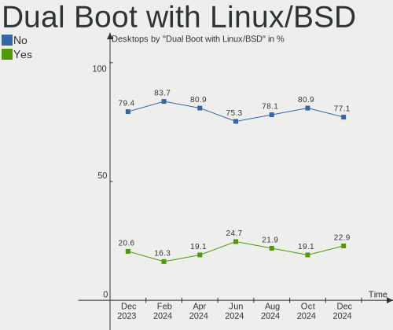
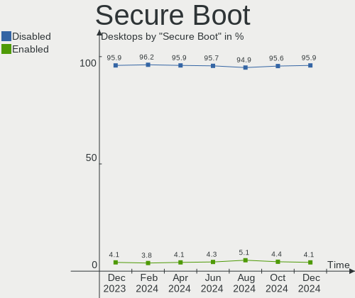

Ubuntu Hardware Trends (Desktops)
---------------------------------

A project to identify most popular hardware characteristics and track their change
over time based on data collected by Ubuntu users at https://Linux-Hardware.org.

Anyone can contribute to this report by the [hw-probe](https://github.com/linuxhw/hw-probe) tool:

    sudo -E hw-probe -all -upload

Full-feature report is available here: https://linux-hardware.org/?view=trends

Period: Mar, 2022.

Contents
--------

* [ System ](#system)
  - [ OS                       ](#os)
  - [ OS Family                ](#os-family)
  - [ Kernel                   ](#kernel)
  - [ Kernel Family            ](#kernel-family)
  - [ Kernel Major Ver.        ](#kernel-major-ver)
  - [ Arch                     ](#arch)
  - [ DE                       ](#de)
  - [ Display Server           ](#display-server)
  - [ Display Manager          ](#display-manager)
  - [ OS Lang                  ](#os-lang)
  - [ Boot Mode                ](#boot-mode)
  - [ Filesystem               ](#filesystem)
  - [ Part. scheme             ](#part-scheme)
  - [ Dual Boot with Linux/BSD ](#dual-boot-with-linuxbsd)
  - [ Dual Boot (Win)          ](#dual-boot-win)

* [ Board ](#board)
  - [ Vendor                   ](#vendor)
  - [ Model                    ](#model)
  - [ Model Family             ](#model-family)
  - [ MFG Year                 ](#mfg-year)
  - [ Form Factor              ](#form-factor)
  - [ Secure Boot              ](#secure-boot)
  - [ Coreboot                 ](#coreboot)
  - [ RAM Size                 ](#ram-size)
  - [ RAM Used                 ](#ram-used)
  - [ Total Drives             ](#total-drives)
  - [ Has CD-ROM               ](#has-cd-rom)
  - [ Has Ethernet             ](#has-ethernet)
  - [ Has WiFi                 ](#has-wifi)
  - [ Has Bluetooth            ](#has-bluetooth)

* [ Location ](#location)
  - [ Country                  ](#country)
  - [ City                     ](#city)

* [ Drives ](#drives)
  - [ Drive Vendor             ](#drive-vendor)
  - [ Drive Model              ](#drive-model)
  - [ HDD Vendor               ](#hdd-vendor)
  - [ SSD Vendor               ](#ssd-vendor)
  - [ Drive Kind               ](#drive-kind)
  - [ Drive Connector          ](#drive-connector)
  - [ Drive Size               ](#drive-size)
  - [ Space Total              ](#space-total)
  - [ Space Used               ](#space-used)
  - [ Malfunc. Drives          ](#malfunc-drives)
  - [ Malfunc. Drive Vendor    ](#malfunc-drive-vendor)
  - [ Malfunc. HDD Vendor      ](#malfunc-hdd-vendor)
  - [ Malfunc. Drive Kind      ](#malfunc-drive-kind)
  - [ Failed Drives            ](#failed-drives)
  - [ Failed Drive Vendor      ](#failed-drive-vendor)
  - [ Drive Status             ](#drive-status)

* [ Storage controller ](#storage-controller)
  - [ Storage Vendor           ](#storage-vendor)
  - [ Storage Model            ](#storage-model)
  - [ Storage Kind             ](#storage-kind)

* [ Processor ](#processor)
  - [ CPU Vendor               ](#cpu-vendor)
  - [ CPU Model                ](#cpu-model)
  - [ CPU Model Family         ](#cpu-model-family)
  - [ CPU Cores                ](#cpu-cores)
  - [ CPU Sockets              ](#cpu-sockets)
  - [ CPU Threads              ](#cpu-threads)
  - [ CPU Op-Modes             ](#cpu-op-modes)
  - [ CPU Microcode            ](#cpu-microcode)
  - [ CPU Microarch            ](#cpu-microarch)

* [ Graphics ](#graphics)
  - [ GPU Vendor               ](#gpu-vendor)
  - [ GPU Model                ](#gpu-model)
  - [ GPU Combo                ](#gpu-combo)
  - [ GPU Driver               ](#gpu-driver)
  - [ GPU Memory               ](#gpu-memory)

* [ Monitor ](#monitor)
  - [ Monitor Vendor           ](#monitor-vendor)
  - [ Monitor Model            ](#monitor-model)
  - [ Monitor Resolution       ](#monitor-resolution)
  - [ Monitor Diagonal         ](#monitor-diagonal)
  - [ Monitor Width            ](#monitor-width)
  - [ Aspect Ratio             ](#aspect-ratio)
  - [ Monitor Area             ](#monitor-area)
  - [ Pixel Density            ](#pixel-density)
  - [ Multiple Monitors        ](#multiple-monitors)

* [ Network ](#network)
  - [ Net Controller Vendor    ](#net-controller-vendor)
  - [ Net Controller Model     ](#net-controller-model)
  - [ Wireless Vendor          ](#wireless-vendor)
  - [ Wireless Model           ](#wireless-model)
  - [ Ethernet Vendor          ](#ethernet-vendor)
  - [ Ethernet Model           ](#ethernet-model)
  - [ Net Controller Kind      ](#net-controller-kind)
  - [ Used Controller          ](#used-controller)
  - [ NICs                     ](#nics)
  - [ IPv6                     ](#ipv6)

* [ Bluetooth ](#bluetooth)
  - [ Bluetooth Vendor         ](#bluetooth-vendor)
  - [ Bluetooth Model          ](#bluetooth-model)

* [ Sound ](#sound)
  - [ Sound Vendor             ](#sound-vendor)
  - [ Sound Model              ](#sound-model)

* [ Memory ](#memory)
  - [ Memory Vendor            ](#memory-vendor)
  - [ Memory Model             ](#memory-model)
  - [ Memory Kind              ](#memory-kind)
  - [ Memory Form Factor       ](#memory-form-factor)
  - [ Memory Size              ](#memory-size)
  - [ Memory Speed             ](#memory-speed)

* [ Printers & scanners ](#printers--scanners)
  - [ Printer Vendor           ](#printer-vendor)
  - [ Printer Model            ](#printer-model)
  - [ Scanner Vendor           ](#scanner-vendor)
  - [ Scanner Model            ](#scanner-model)

* [ Camera ](#camera)
  - [ Camera Vendor            ](#camera-vendor)
  - [ Camera Model             ](#camera-model)

* [ Security ](#security)
  - [ Fingerprint Vendor       ](#fingerprint-vendor)
  - [ Fingerprint Model        ](#fingerprint-model)
  - [ Chipcard Vendor          ](#chipcard-vendor)
  - [ Chipcard Model           ](#chipcard-model)

* [ Unsupported ](#unsupported)
  - [ Unsupported Devices      ](#unsupported-devices)
  - [ Unsupported Device Types ](#unsupported-device-types)

System
------

OS
--

Installed operating systems

| Name         | Desktops | Percent |
|--------------|----------|---------|
| Ubuntu 20.04 | 234      | 62.73%  |
| Ubuntu 21.10 | 103      | 27.61%  |
| Ubuntu 18.04 | 17       | 4.56%   |
| Ubuntu 22.04 | 8        | 2.14%   |
| Ubuntu 21.04 | 6        | 1.61%   |
| Ubuntu 20.10 | 2        | 0.54%   |
| Ubuntu 16.04 | 2        | 0.54%   |
| Ubuntu 21.12 | 1        | 0.27%   |

OS Family
---------

OS without a version

| Name   | Desktops | Percent |
|--------|----------|---------|
| Ubuntu | 373      | 100%    |

Kernel
------

Version of the Linux kernel

| Version                     | Desktops | Percent |
|-----------------------------|----------|---------|
| 5.13.0-35-generic           | 97       | 26.01%  |
| 5.13.0-30-generic           | 77       | 20.64%  |
| 5.13.0-37-generic           | 58       | 15.55%  |
| 5.4.0-100-generic           | 16       | 4.29%   |
| 5.4.0-104-generic           | 11       | 2.95%   |
| 5.13.0-19-generic           | 11       | 2.95%   |
| 5.13.0-39-generic           | 10       | 2.68%   |
| 5.4.0-105-generic           | 8        | 2.14%   |
| 5.11.0-27-generic           | 5        | 1.34%   |
| 5.13.0-36-generic           | 4        | 1.07%   |
| 5.13.0-32-generic           | 4        | 1.07%   |
| 5.11.0-49-generic           | 4        | 1.07%   |
| 5.15.0-22-generic           | 3        | 0.8%    |
| 5.14.0-1027-oem             | 3        | 0.8%    |
| 5.13.0-28-generic           | 3        | 0.8%    |
| 5.13.0-272202022022-generic | 3        | 0.8%    |
| 4.15.0-173-generic          | 3        | 0.8%    |
| 4.15.0-171-generic          | 3        | 0.8%    |
| 5.8.0-63-generic            | 2        | 0.54%   |
| 5.8.0-43-generic            | 2        | 0.54%   |
| 5.4.0-42-generic            | 2        | 0.54%   |
| 5.15.0-23-generic           | 2        | 0.54%   |
| 5.15.0-18-generic           | 2        | 0.54%   |
| 5.13.0-35-lowlatency        | 2        | 0.54%   |
| 5.11.0-44-generic           | 2        | 0.54%   |
| 5.11.0-41-generic           | 2        | 0.54%   |
| 5.11.0-40-generic           | 2        | 0.54%   |
| 5.8.0-55-generic            | 1        | 0.27%   |
| 5.8.0-50-generic            | 1        | 0.27%   |
| 5.4.0-99-generic            | 1        | 0.27%   |
| 5.4.0-97-generic            | 1        | 0.27%   |
| 5.4.0-94-generic            | 1        | 0.27%   |
| 5.4.0-92-generic            | 1        | 0.27%   |
| 5.4.0-90-generic            | 1        | 0.27%   |
| 5.4.0-84-generic            | 1        | 0.27%   |
| 5.4.0-77-generic            | 1        | 0.27%   |
| 5.4.0-58-generic            | 1        | 0.27%   |
| 5.4.0-53-generic            | 1        | 0.27%   |
| 5.4.0-48-generic            | 1        | 0.27%   |
| 5.4.0-31-generic            | 1        | 0.27%   |
| 5.4.0-105-lowlatency        | 1        | 0.27%   |
| 5.17.1-051701-generic       | 1        | 0.27%   |
| 5.17.0                      | 1        | 0.27%   |
| 5.16.12-051612-generic      | 1        | 0.27%   |
| 5.16.0-18.1-liquorix-amd64  | 1        | 0.27%   |
| 5.15.5-051505-generic       | 1        | 0.27%   |
| 5.15.0-051500rc7-generic    | 1        | 0.27%   |
| 5.13.0-37-lowlatency        | 1        | 0.27%   |
| 5.13.0-27-generic           | 1        | 0.27%   |
| 5.13.0-25-generic           | 1        | 0.27%   |
| 5.13.0-22-generic           | 1        | 0.27%   |
| 5.13.0-21-generic           | 1        | 0.27%   |
| 5.11.0-46-generic           | 1        | 0.27%   |
| 5.11.0-34-generic           | 1        | 0.27%   |
| 4.15.0-175-generic          | 1        | 0.27%   |
| 4.15.0-172-generic          | 1        | 0.27%   |
| 4.15.0-163-generic          | 1        | 0.27%   |
| 4.15.0-142-generic          | 1        | 0.27%   |
| 4.15.0-124-generic          | 1        | 0.27%   |

Kernel Family
-------------

Linux kernel without a distro release

| Version | Desktops | Percent |
|---------|----------|---------|
| 5.13.0  | 274      | 73.46%  |
| 5.4.0   | 49       | 13.14%  |
| 5.11.0  | 17       | 4.56%   |
| 4.15.0  | 11       | 2.95%   |
| 5.15.0  | 8        | 2.14%   |
| 5.8.0   | 6        | 1.61%   |
| 5.14.0  | 3        | 0.8%    |
| 5.17.1  | 1        | 0.27%   |
| 5.17.0  | 1        | 0.27%   |
| 5.16.12 | 1        | 0.27%   |
| 5.16.0  | 1        | 0.27%   |
| 5.15.5  | 1        | 0.27%   |

Kernel Major Ver.
-----------------

Linux kernel major version

| Version | Desktops | Percent |
|---------|----------|---------|
| 5.13    | 274      | 73.46%  |
| 5.4     | 49       | 13.14%  |
| 5.11    | 17       | 4.56%   |
| 4.15    | 11       | 2.95%   |
| 5.15    | 9        | 2.41%   |
| 5.8     | 6        | 1.61%   |
| 5.14    | 3        | 0.8%    |
| 5.17    | 2        | 0.54%   |
| 5.16    | 2        | 0.54%   |

Arch
----

OS architecture (x86_64, i586, etc.)

| Name   | Desktops | Percent |
|--------|----------|---------|
| x86_64 | 368      | 98.66%  |
| i686   | 5        | 1.34%   |

DE
--

Desktop Environment

| Name            | Desktops | Percent |
|-----------------|----------|---------|
| GNOME           | 343      | 91.96%  |
| Unknown         | 17       | 4.56%   |
| Unity           | 4        | 1.07%   |
| GNOME Flashback | 4        | 1.07%   |
| Cinnamon        | 2        | 0.54%   |
| Pantheon        | 1        | 0.27%   |
| i3              | 1        | 0.27%   |
| Enlightenment   | 1        | 0.27%   |

Display Server
--------------

X11 or Wayland

| Name    | Desktops | Percent |
|---------|----------|---------|
| X11     | 278      | 74.53%  |
| Wayland | 72       | 19.3%   |
| Tty     | 12       | 3.22%   |
| Unknown | 11       | 2.95%   |

Display Manager
---------------

SDDM, LightDM, etc.

| Name    | Desktops | Percent |
|---------|----------|---------|
| GDM3    | 249      | 66.76%  |
| GDM     | 83       | 22.25%  |
| Unknown | 26       | 6.97%   |
| LightDM | 13       | 3.49%   |
| SDDM    | 2        | 0.54%   |

OS Lang
-------

Language

| Lang        | Desktops | Percent |
|-------------|----------|---------|
| en_US       | 150      | 40.21%  |
| de_DE       | 58       | 15.55%  |
| en_GB       | 19       | 5.09%   |
| es_ES       | 18       | 4.83%   |
| pt_BR       | 16       | 4.29%   |
| fr_FR       | 16       | 4.29%   |
| it_IT       | 10       | 2.68%   |
| en_CA       | 9        | 2.41%   |
| en_AU       | 9        | 2.41%   |
| ru_RU       | 8        | 2.14%   |
| en_IN       | 6        | 1.61%   |
| C           | 6        | 1.61%   |
| pl_PL       | 4        | 1.07%   |
| nl_NL       | 3        | 0.8%    |
| el_GR       | 3        | 0.8%    |
| de_AT       | 3        | 0.8%    |
| cs_CZ       | 3        | 0.8%    |
| zh_CN       | 2        | 0.54%   |
| tr_TR       | 2        | 0.54%   |
| es_AR       | 2        | 0.54%   |
| en_ZA       | 2        | 0.54%   |
| en_PH       | 2        | 0.54%   |
| en_IL       | 2        | 0.54%   |
| en_IE       | 2        | 0.54%   |
| zh_TW       | 1        | 0.27%   |
| sr_RS@latin | 1        | 0.27%   |
| ru_UA       | 1        | 0.27%   |
| ko_KR       | 1        | 0.27%   |
| ja_JP       | 1        | 0.27%   |
| hu_HU       | 1        | 0.27%   |
| fr_CH       | 1        | 0.27%   |
| fr_CA       | 1        | 0.27%   |
| fr_BE       | 1        | 0.27%   |
| es_UY       | 1        | 0.27%   |
| es_MX       | 1        | 0.27%   |
| en_NZ       | 1        | 0.27%   |
| de_CH       | 1        | 0.27%   |
| da_DK       | 1        | 0.27%   |
| ca_ES       | 1        | 0.27%   |
| ar_SA       | 1        | 0.27%   |
| aa_DJ       | 1        | 0.27%   |
| Unknown     | 1        | 0.27%   |

Boot Mode
---------

EFI or BIOS

| Mode | Desktops | Percent |
|------|----------|---------|
| BIOS | 227      | 60.86%  |
| EFI  | 146      | 39.14%  |

Filesystem
----------

Type of filesystem

| Type    | Desktops | Percent |
|---------|----------|---------|
| Ext4    | 339      | 90.88%  |
| Overlay | 21       | 5.63%   |
| Zfs     | 5        | 1.34%   |
| Btrfs   | 5        | 1.34%   |
| Ext2    | 2        | 0.54%   |
| Xfs     | 1        | 0.27%   |

Part. scheme
------------

Scheme of partitioning

| Type    | Desktops | Percent |
|---------|----------|---------|
| Unknown | 271      | 72.65%  |
| GPT     | 83       | 22.25%  |
| MBR     | 19       | 5.09%   |

Dual Boot with Linux/BSD
------------------------

Hosting more than one Linux/BSD

| Dual boot | Desktops | Percent |
|-----------|----------|---------|
| No        | 296      | 79.36%  |
| Yes       | 77       | 20.64%  |

Dual Boot (Win)
---------------

Hosting Linux and Windows

| Dual boot | Desktops | Percent |
|-----------|----------|---------|
| No        | 194      | 52.01%  |
| Yes       | 179      | 47.99%  |

Board
-----

Vendor
------

Motherboard manufacturer

| Name                   | Desktops | Percent |
|------------------------|----------|---------|
| ASUSTek Computer       | 91       | 24.4%   |
| Gigabyte Technology    | 61       | 16.35%  |
| Dell                   | 46       | 12.33%  |
| MSI                    | 44       | 11.8%   |
| Hewlett-Packard        | 32       | 8.58%   |
| ASRock                 | 23       | 6.17%   |
| Intel                  | 14       | 3.75%   |
| Lenovo                 | 11       | 2.95%   |
| Acer                   | 9        | 2.41%   |
| Fujitsu                | 4        | 1.07%   |
| Unknown                | 4        | 1.07%   |
| Pegatron               | 3        | 0.8%    |
| Medion                 | 3        | 0.8%    |
| ECS                    | 3        | 0.8%    |
| Biostar                | 3        | 0.8%    |
| Positivo               | 2        | 0.54%   |
| Apple                  | 2        | 0.54%   |
| ZYREX COMPUTER SYSTEMS | 1        | 0.27%   |
| ZOTAC                  | 1        | 0.27%   |
| Supermicro             | 1        | 0.27%   |
| SiS Technology         | 1        | 0.27%   |
| Packard Bell           | 1        | 0.27%   |
| Online Labs            | 1        | 0.27%   |
| NU591                  | 1        | 0.27%   |
| Le Cube 1              | 1        | 0.27%   |
| Lanix                  | 1        | 0.27%   |
| KLLISRE                | 1        | 0.27%   |
| Inspur                 | 1        | 0.27%   |
| Google                 | 1        | 0.27%   |
| Fujitsu Siemens        | 1        | 0.27%   |
| Foxconn                | 1        | 0.27%   |
| FIC                    | 1        | 0.27%   |
| EVGA                   | 1        | 0.27%   |
| BESSTAR Tech           | 1        | 0.27%   |
| Alienware              | 1        | 0.27%   |

Model
-----

Motherboard model

| Name                              | Desktops | Percent |
|-----------------------------------|----------|---------|
| ASUS All Series                   | 13       | 3.49%   |
| Unknown                           | 6        | 1.61%   |
| Intel DH55TC AAE70932-205         | 4        | 1.07%   |
| Dell OptiPlex 9010                | 4        | 1.07%   |
| Dell OptiPlex 7010                | 4        | 1.07%   |
| MSI MS-7C52                       | 3        | 0.8%    |
| Dell OptiPlex 7050                | 3        | 0.8%    |
| MSI MS-7B87                       | 2        | 0.54%   |
| HP Z420 Workstation               | 2        | 0.54%   |
| HP ProDesk 600 G1 SFF             | 2        | 0.54%   |
| HP EliteDesk 800 G1 TWR           | 2        | 0.54%   |
| HP Compaq Pro 6300 SFF            | 2        | 0.54%   |
| HP Compaq Elite 8300 USDT         | 2        | 0.54%   |
| Gigabyte Z690 UD DDR4             | 2        | 0.54%   |
| Gigabyte X58A-UD3R                | 2        | 0.54%   |
| Gigabyte H110M-S2H                | 2        | 0.54%   |
| Gigabyte B450 AORUS ELITE         | 2        | 0.54%   |
| Gigabyte A320M-S2H                | 2        | 0.54%   |
| Gigabyte 970A-DS3P                | 2        | 0.54%   |
| Fujitsu ESPRIMO P557              | 2        | 0.54%   |
| Dell XPS 8940                     | 2        | 0.54%   |
| Dell XPS 8700                     | 2        | 0.54%   |
| Dell Precision 5820 Tower         | 2        | 0.54%   |
| Dell OptiPlex 990                 | 2        | 0.54%   |
| Dell OptiPlex 7070                | 2        | 0.54%   |
| Dell OptiPlex 3020                | 2        | 0.54%   |
| Dell Inspiron 3650                | 2        | 0.54%   |
| ASUS TUF Gaming X570-PLUS         | 2        | 0.54%   |
| ASUS TUF Gaming B550-PLUS         | 2        | 0.54%   |
| ASUS ROG CROSSHAIR VIII DARK HERO | 2        | 0.54%   |
| ASUS PRIME H310-PLUS R2.0         | 2        | 0.54%   |
| ASUS PRIME A320M-K                | 2        | 0.54%   |
| Apple MacPro6,1                   | 2        | 0.54%   |
| Acer Aspire T180                  | 2        | 0.54%   |
| ZYREX COMPUTER SYSTEMS TACTICAL   | 1        | 0.27%   |
| Supermicro C2SBC-Q                | 1        | 0.27%   |
| SiS 741                           | 1        | 0.27%   |
| Positivo Positivo Master D8200    | 1        | 0.27%   |
| Positivo POS-PIG41BO              | 1        | 0.27%   |
| Pegatron p6541fr-m                | 1        | 0.27%   |
| Pegatron h8-1427a                 | 1        | 0.27%   |
| Pegatron Elite 7500 Series MT     | 1        | 0.27%   |
| Packard Bell Vegas2               | 1        | 0.27%   |
| Online Labs SR                    | 1        | 0.27%   |
| NU591 1.0                         | 1        | 0.27%   |
| MSI X5836                         | 1        | 0.27%   |
| MSI VS303AA-ABD p6228de           | 1        | 0.27%   |
| MSI PC-XB10243                    | 1        | 0.27%   |
| MSI NQ890AA-ABZ CQ5011IT          | 1        | 0.27%   |
| MSI MS-7D25                       | 1        | 0.27%   |
| MSI MS-7D23                       | 1        | 0.27%   |
| MSI MS-7D22                       | 1        | 0.27%   |
| MSI MS-7C95                       | 1        | 0.27%   |
| MSI MS-7C94                       | 1        | 0.27%   |
| MSI MS-7C92                       | 1        | 0.27%   |
| MSI MS-7C91                       | 1        | 0.27%   |
| MSI MS-7C84                       | 1        | 0.27%   |
| MSI MS-7C56                       | 1        | 0.27%   |
| MSI MS-7C37                       | 1        | 0.27%   |
| MSI MS-7C08                       | 1        | 0.27%   |

Model Family
------------

Motherboard model prefix

| Name                            | Desktops | Percent |
|---------------------------------|----------|---------|
| Dell OptiPlex                   | 23       | 6.17%   |
| ASUS PRIME                      | 18       | 4.83%   |
| ASUS All                        | 13       | 3.49%   |
| HP Compaq                       | 8        | 2.14%   |
| Dell Precision                  | 7        | 1.88%   |
| ASUS TUF                        | 7        | 1.88%   |
| ASUS ROG                        | 7        | 1.88%   |
| Lenovo ThinkCentre              | 6        | 1.61%   |
| Intel DH55TC                    | 6        | 1.61%   |
| Dell XPS                        | 6        | 1.61%   |
| Dell Inspiron                   | 6        | 1.61%   |
| Unknown                         | 6        | 1.61%   |
| Acer Aspire                     | 5        | 1.34%   |
| HP EliteDesk                    | 4        | 1.07%   |
| Fujitsu ESPRIMO                 | 4        | 1.07%   |
| MSI MS-7C52                     | 3        | 0.8%    |
| Lenovo ThinkStation             | 3        | 0.8%    |
| HP ProDesk                      | 3        | 0.8%    |
| HP Pavilion                     | 3        | 0.8%    |
| Gigabyte G1.Sniper              | 3        | 0.8%    |
| Dell Vostro                     | 3        | 0.8%    |
| ASUS P8H61-M                    | 3        | 0.8%    |
| ASUS M5A78L-M                   | 3        | 0.8%    |
| MSI MS-7B87                     | 2        | 0.54%   |
| HP Z420                         | 2        | 0.54%   |
| HP ProLiant                     | 2        | 0.54%   |
| Gigabyte Z690                   | 2        | 0.54%   |
| Gigabyte X58A-UD3R              | 2        | 0.54%   |
| Gigabyte X570                   | 2        | 0.54%   |
| Gigabyte H110M-S2H              | 2        | 0.54%   |
| Gigabyte GA-78LMT-USB3          | 2        | 0.54%   |
| Gigabyte B450M                  | 2        | 0.54%   |
| Gigabyte B450                   | 2        | 0.54%   |
| Gigabyte A320M-S2H              | 2        | 0.54%   |
| Gigabyte 970A-DS3P              | 2        | 0.54%   |
| ASUS P6T                        | 2        | 0.54%   |
| ASRock X570                     | 2        | 0.54%   |
| ASRock 970                      | 2        | 0.54%   |
| Apple MacPro6                   | 2        | 0.54%   |
| Acer Veriton                    | 2        | 0.54%   |
| Acer Predator                   | 2        | 0.54%   |
| ZYREX COMPUTER SYSTEMS TACTICAL | 1        | 0.27%   |
| Supermicro C2SBC-Q              | 1        | 0.27%   |
| SiS 741                         | 1        | 0.27%   |
| Positivo Positivo               | 1        | 0.27%   |
| Positivo POS-PIG41BO            | 1        | 0.27%   |
| Pegatron p6541fr-m              | 1        | 0.27%   |
| Pegatron h8-1427a               | 1        | 0.27%   |
| Pegatron Elite                  | 1        | 0.27%   |
| Packard Bell Vegas2             | 1        | 0.27%   |
| Online Labs SR                  | 1        | 0.27%   |
| NU591 1.0                       | 1        | 0.27%   |
| MSI X5836                       | 1        | 0.27%   |
| MSI VS303AA-ABD                 | 1        | 0.27%   |
| MSI PC-XB10243                  | 1        | 0.27%   |
| MSI NQ890AA-ABZ                 | 1        | 0.27%   |
| MSI MS-7D25                     | 1        | 0.27%   |
| MSI MS-7D23                     | 1        | 0.27%   |
| MSI MS-7D22                     | 1        | 0.27%   |
| MSI MS-7C95                     | 1        | 0.27%   |

MFG Year
--------

Motherboard manufacture year

| Year | Desktops | Percent |
|------|----------|---------|
| 2013 | 39       | 10.46%  |
| 2020 | 36       | 9.65%   |
| 2012 | 35       | 9.38%   |
| 2018 | 29       | 7.77%   |
| 2014 | 29       | 7.77%   |
| 2009 | 29       | 7.77%   |
| 2019 | 28       | 7.51%   |
| 2021 | 26       | 6.97%   |
| 2016 | 23       | 6.17%   |
| 2017 | 17       | 4.56%   |
| 2010 | 16       | 4.29%   |
| 2011 | 15       | 4.02%   |
| 2007 | 14       | 3.75%   |
| 2015 | 13       | 3.49%   |
| 2008 | 12       | 3.22%   |
| 2006 | 5        | 1.34%   |
| 2022 | 3        | 0.8%    |
| 2005 | 2        | 0.54%   |
| 2004 | 2        | 0.54%   |

Form Factor
-----------

Physical design of the computer

| Name    | Desktops | Percent |
|---------|----------|---------|
| Desktop | 373      | 100%    |

Secure Boot
-----------

Enabled or disabled

| State    | Desktops | Percent |
|----------|----------|---------|
| Disabled | 347      | 93.03%  |
| Enabled  | 26       | 6.97%   |

Coreboot
--------

Have coreboot on board

| Used | Desktops | Percent |
|------|----------|---------|
| No   | 372      | 99.73%  |
| Yes  | 1        | 0.27%   |

RAM Size
--------

Total RAM memory

| Size in GB      | Desktops | Percent |
|-----------------|----------|---------|
| 16.01-24.0      | 95       | 25.47%  |
| 3.01-4.0        | 70       | 18.77%  |
| 8.01-16.0       | 59       | 15.82%  |
| 32.01-64.0      | 49       | 13.14%  |
| 4.01-8.0        | 47       | 12.6%   |
| 64.01-256.0     | 28       | 7.51%   |
| 24.01-32.0      | 11       | 2.95%   |
| 1.01-2.0        | 10       | 2.68%   |
| 2.01-3.0        | 3        | 0.8%    |
| More than 256.0 | 1        | 0.27%   |

RAM Used
--------

Used RAM memory

| Used GB    | Desktops | Percent |
|------------|----------|---------|
| 1.01-2.0   | 160      | 42.9%   |
| 2.01-3.0   | 97       | 26.01%  |
| 4.01-8.0   | 47       | 12.6%   |
| 3.01-4.0   | 45       | 12.06%  |
| 8.01-16.0  | 10       | 2.68%   |
| 0.51-1.0   | 8        | 2.14%   |
| 24.01-32.0 | 2        | 0.54%   |
| 0.01-0.5   | 2        | 0.54%   |
| 32.01-64.0 | 1        | 0.27%   |
| 16.01-24.0 | 1        | 0.27%   |

Total Drives
------------

Number of drives on board

| Drives | Desktops | Percent |
|--------|----------|---------|
| 1      | 149      | 39.95%  |
| 2      | 103      | 27.61%  |
| 3      | 56       | 15.01%  |
| 4      | 35       | 9.38%   |
| 6      | 7        | 1.88%   |
| 5      | 7        | 1.88%   |
| 7      | 6        | 1.61%   |
| 0      | 4        | 1.07%   |
| 11     | 2        | 0.54%   |
| 9      | 2        | 0.54%   |
| 8      | 2        | 0.54%   |

Has CD-ROM
----------

Has CD-ROM on board

| Presented | Desktops | Percent |
|-----------|----------|---------|
| No        | 193      | 51.74%  |
| Yes       | 180      | 48.26%  |

Has Ethernet
------------

Has Ethernet on board

| Presented | Desktops | Percent |
|-----------|----------|---------|
| Yes       | 369      | 98.93%  |
| No        | 4        | 1.07%   |

Has WiFi
--------

Has WiFi module

| Presented | Desktops | Percent |
|-----------|----------|---------|
| No        | 211      | 56.57%  |
| Yes       | 162      | 43.43%  |

Has Bluetooth
-------------

Has Bluetooth module

| Presented | Desktops | Percent |
|-----------|----------|---------|
| No        | 265      | 71.05%  |
| Yes       | 108      | 28.95%  |

Location
--------

Country
-------

Geographic location (country)

| Country                | Desktops | Percent |
|------------------------|----------|---------|
| USA                    | 79       | 21.18%  |
| Germany                | 66       | 17.69%  |
| France                 | 21       | 5.63%   |
| UK                     | 20       | 5.36%   |
| Brazil                 | 18       | 4.83%   |
| Spain                  | 17       | 4.56%   |
| Russia                 | 14       | 3.75%   |
| Italy                  | 13       | 3.49%   |
| Canada                 | 13       | 3.49%   |
| Australia              | 9        | 2.41%   |
| Netherlands            | 7        | 1.88%   |
| Poland                 | 6        | 1.61%   |
| India                  | 6        | 1.61%   |
| Mexico                 | 5        | 1.34%   |
| Argentina              | 5        | 1.34%   |
| Switzerland            | 4        | 1.07%   |
| Greece                 | 4        | 1.07%   |
| Czechia                | 4        | 1.07%   |
| Austria                | 4        | 1.07%   |
| Turkey                 | 3        | 0.8%    |
| Philippines            | 3        | 0.8%    |
| Finland                | 3        | 0.8%    |
| Taiwan                 | 2        | 0.54%   |
| South Korea            | 2        | 0.54%   |
| South Africa           | 2        | 0.54%   |
| Serbia                 | 2        | 0.54%   |
| Saudi Arabia           | 2        | 0.54%   |
| Norway                 | 2        | 0.54%   |
| New Zealand            | 2        | 0.54%   |
| Japan                  | 2        | 0.54%   |
| Israel                 | 2        | 0.54%   |
| Ireland                | 2        | 0.54%   |
| Iran                   | 2        | 0.54%   |
| Hungary                | 2        | 0.54%   |
| Denmark                | 2        | 0.54%   |
| Colombia               | 2        | 0.54%   |
| China                  | 2        | 0.54%   |
| Chile                  | 2        | 0.54%   |
| Uruguay                | 1        | 0.27%   |
| Ukraine                | 1        | 0.27%   |
| Thailand               | 1        | 0.27%   |
| Sweden                 | 1        | 0.27%   |
| Romania                | 1        | 0.27%   |
| Portugal               | 1        | 0.27%   |
| Peru                   | 1        | 0.27%   |
| Palestine              | 1        | 0.27%   |
| Kenya                  | 1        | 0.27%   |
| Indonesia              | 1        | 0.27%   |
| Iceland                | 1        | 0.27%   |
| Hong Kong              | 1        | 0.27%   |
| Estonia                | 1        | 0.27%   |
| Egypt                  | 1        | 0.27%   |
| Cyprus                 | 1        | 0.27%   |
| Bosnia and Herzegovina | 1        | 0.27%   |
| Belgium                | 1        | 0.27%   |

City
----

Geographic location (city)

| City              | Desktops | Percent |
|-------------------|----------|---------|
| St Petersburg     | 6        | 1.61%   |
| Paris             | 5        | 1.34%   |
| Berlin            | 5        | 1.34%   |
| Barcelona         | 5        | 1.34%   |
| Stuttgart         | 4        | 1.07%   |
| Hamburg           | 4        | 1.07%   |
| Zdunska Wola      | 3        | 0.8%    |
| Milan             | 3        | 0.8%    |
| Melbourne         | 3        | 0.8%    |
| Manchester        | 3        | 0.8%    |
| Giessen           | 3        | 0.8%    |
| Curitiba          | 3        | 0.8%    |
| Vienna            | 2        | 0.54%   |
| Valencia          | 2        | 0.54%   |
| Sydney            | 2        | 0.54%   |
| Spokane           | 2        | 0.54%   |
| Schwabach         | 2        | 0.54%   |
| Saskatoon         | 2        | 0.54%   |
| Sao Paulo         | 2        | 0.54%   |
| San Francisco     | 2        | 0.54%   |
| Pretoria          | 2        | 0.54%   |
| Prague            | 2        | 0.54%   |
| Perth             | 2        | 0.54%   |
| Padova            | 2        | 0.54%   |
| Ottawa            | 2        | 0.54%   |
| Munich            | 2        | 0.54%   |
| Moscow            | 2        | 0.54%   |
| Montreal          | 2        | 0.54%   |
| Miami             | 2        | 0.54%   |
| Leipzig           | 2        | 0.54%   |
| Krefeld           | 2        | 0.54%   |
| Kolkata           | 2        | 0.54%   |
| Karlsruhe         | 2        | 0.54%   |
| Itajaí           | 2        | 0.54%   |
| Istanbul          | 2        | 0.54%   |
| Fresno            | 2        | 0.54%   |
| Compiègne        | 2        | 0.54%   |
| Buenos Aires      | 2        | 0.54%   |
| Bristol           | 2        | 0.54%   |
| Brasília         | 2        | 0.54%   |
| Beijing           | 2        | 0.54%   |
| Atlanta           | 2        | 0.54%   |
| Amsterdam         | 2        | 0.54%   |
| Zdanice           | 1        | 0.27%   |
| York              | 1        | 0.27%   |
| Yekaterinburg     | 1        | 0.27%   |
| Yamachiche        | 1        | 0.27%   |
| Wyandotte         | 1        | 0.27%   |
| Wroclaw           | 1        | 0.27%   |
| Witten            | 1        | 0.27%   |
| Weston-super-Mare | 1        | 0.27%   |
| Weslaco           | 1        | 0.27%   |
| Wauconda          | 1        | 0.27%   |
| Waren             | 1        | 0.27%   |
| Walled Lake       | 1        | 0.27%   |
| Wallasey          | 1        | 0.27%   |
| Waco              | 1        | 0.27%   |
| Volos             | 1        | 0.27%   |
| Vila Velha        | 1        | 0.27%   |
| Venaria Reale     | 1        | 0.27%   |

Drives
------

Drive Vendor
------------

Hard drive vendors

| Vendor                      | Desktops | Drives | Percent |
|-----------------------------|----------|--------|---------|
| Seagate                     | 137      | 192    | 21.14%  |
| WDC                         | 131      | 165    | 20.22%  |
| Samsung Electronics         | 105      | 150    | 16.2%   |
| SanDisk                     | 38       | 44     | 5.86%   |
| Toshiba                     | 34       | 45     | 5.25%   |
| Kingston                    | 29       | 31     | 4.48%   |
| Crucial                     | 19       | 21     | 2.93%   |
| Hitachi                     | 13       | 14     | 2.01%   |
| Unknown                     | 11       | 15     | 1.7%    |
| Phison                      | 11       | 11     | 1.7%    |
| Intel                       | 11       | 12     | 1.7%    |
| HGST                        | 11       | 11     | 1.7%    |
| PNY                         | 6        | 7      | 0.93%   |
| SPCC                        | 5        | 5      | 0.77%   |
| SK Hynix                    | 5        | 5      | 0.77%   |
| Silicon Motion              | 5        | 5      | 0.77%   |
| MAXTOR                      | 5        | 5      | 0.77%   |
| China                       | 5        | 5      | 0.77%   |
| OCZ                         | 4        | 7      | 0.62%   |
| Intenso                     | 4        | 4      | 0.62%   |
| Corsair                     | 4        | 6      | 0.62%   |
| Transcend                   | 3        | 3      | 0.46%   |
| Team                        | 3        | 3      | 0.46%   |
| Micron Technology           | 3        | 3      | 0.46%   |
| ASMT                        | 3        | 4      | 0.46%   |
| A-DATA Technology           | 3        | 3      | 0.46%   |
| SABRENT                     | 2        | 2      | 0.31%   |
| Realtek Semiconductor       | 2        | 2      | 0.31%   |
| Mushkin                     | 2        | 5      | 0.31%   |
| Lexar                       | 2        | 2      | 0.31%   |
| LaCie                       | 2        | 3      | 0.31%   |
| JMicron                     | 2        | 2      | 0.31%   |
| Fujitsu                     | 2        | 3      | 0.31%   |
| Apple                       | 2        | 2      | 0.31%   |
| ZTC                         | 1        | 1      | 0.15%   |
| WDBRPG00                    | 1        | 1      | 0.15%   |
| USB3.0                      | 1        | 1      | 0.15%   |
| UMAX                        | 1        | 1      | 0.15%   |
| TCSUNBOW                    | 1        | 1      | 0.15%   |
| T-FORCE                     | 1        | 1      | 0.15%   |
| sobetter                    | 1        | 1      | 0.15%   |
| S3+                         | 1        | 1      | 0.15%   |
| QNAP                        | 1        | 6      | 0.15%   |
| PLEXTOR                     | 1        | 1      | 0.15%   |
| Patriot                     | 1        | 1      | 0.15%   |
| Micron/Crucial Technology   | 1        | 1      | 0.15%   |
| MAXIO Technology (Hangzhou) | 1        | 1      | 0.15%   |
| LITEONIT                    | 1        | 1      | 0.15%   |
| LITEON                      | 1        | 1      | 0.15%   |
| kimtigo                     | 1        | 1      | 0.15%   |
| Hewlett-Packard             | 1        | 1      | 0.15%   |
| Gigabyte Technology         | 1        | 1      | 0.15%   |
| FC-1307                     | 1        | 1      | 0.15%   |
| EMTEC                       | 1        | 1      | 0.15%   |
| Colorful                    | 1        | 1      | 0.15%   |
| ATP                         | 1        | 1      | 0.15%   |
| ANYOYO                      | 1        | 1      | 0.15%   |
| Unknown                     | 1        | 1      | 0.15%   |

Drive Model
-----------

Hard drive models

| Model                            | Desktops | Percent |
|----------------------------------|----------|---------|
| WDC WD10EZEX-08WN4A0 1TB         | 9        | 1.18%   |
| Seagate ST2000DM008-2FR102 2TB   | 8        | 1.05%   |
| Samsung SSD 970 EVO Plus 1TB     | 8        | 1.05%   |
| Samsung NVMe SSD Drive 1TB       | 8        | 1.05%   |
| Seagate ST1000DM010-2EP102 1TB   | 7        | 0.92%   |
| Samsung SSD 850 EVO 500GB        | 7        | 0.92%   |
| Samsung NVMe SSD Drive 500GB     | 7        | 0.92%   |
| Kingston SA400S37480G 480GB SSD  | 7        | 0.92%   |
| Kingston SA400S37240G 240GB SSD  | 7        | 0.92%   |
| Seagate ST8000DM004-2CX188 8TB   | 6        | 0.79%   |
| Seagate ST500DM002-1BD142 500GB  | 6        | 0.79%   |
| Seagate ST1000DM003-1CH162 1TB   | 6        | 0.79%   |
| Sandisk NVMe SSD Drive 1TB       | 6        | 0.79%   |
| Samsung SSD 850 EVO 250GB        | 6        | 0.79%   |
| Unknown SD/MMC/MS PRO 32GB       | 5        | 0.65%   |
| Toshiba DT01ACA300 3TB           | 5        | 0.65%   |
| Toshiba DT01ACA100 1TB           | 5        | 0.65%   |
| SanDisk SSD PLUS 1000GB          | 5        | 0.65%   |
| Samsung SSD 860 EVO 500GB        | 5        | 0.65%   |
| Samsung SSD 860 EVO 1TB          | 5        | 0.65%   |
| Samsung HD502HJ 500GB            | 5        | 0.65%   |
| Seagate ST4000DM004-2CV104 4TB   | 4        | 0.52%   |
| Seagate ST3500418AS 500GB        | 4        | 0.52%   |
| Seagate ST3500413AS 500GB        | 4        | 0.52%   |
| Seagate ST3500312CS 500GB        | 4        | 0.52%   |
| Seagate ST2000DM001-1ER164 2TB   | 4        | 0.52%   |
| Seagate ST1000DM003-1ER162 1TB   | 4        | 0.52%   |
| SanDisk SSD PLUS 240GB           | 4        | 0.52%   |
| Samsung SSD 870 QVO 1TB          | 4        | 0.52%   |
| Samsung SSD 860 EVO 250GB        | 4        | 0.52%   |
| Samsung SSD 750 EVO 250GB        | 4        | 0.52%   |
| Kingston NVMe SSD Drive 500GB    | 4        | 0.52%   |
| Crucial CT500MX500SSD1 500GB     | 4        | 0.52%   |
| WDC WDS500G2B0A-00SM50 500GB SSD | 3        | 0.39%   |
| WDC WDS240G2G0A-00JH30 240GB SSD | 3        | 0.39%   |
| WDC WDS120G2G0A-00JH30 120GB SSD | 3        | 0.39%   |
| WDC WDS100T2G0A-00JH30 1TB SSD   | 3        | 0.39%   |
| WDC WD20EZRZ-00Z5HB0 2TB         | 3        | 0.39%   |
| WDC WD20EARX-00PASB0 2TB         | 3        | 0.39%   |
| WDC WD10EZEX-75WN4A1 1TB         | 3        | 0.39%   |
| WDC WD10EZEX-00BN5A0 1TB         | 3        | 0.39%   |
| Unknown SD/MMC 16GB              | 3        | 0.39%   |
| Unknown M.S./M.S.Pro/HG 16GB     | 3        | 0.39%   |
| Toshiba HDWD220 2TB              | 3        | 0.39%   |
| Toshiba HDWD110 1TB              | 3        | 0.39%   |
| Toshiba DT01ACA200 2TB           | 3        | 0.39%   |
| Seagate ST31000528AS 1TB         | 3        | 0.39%   |
| Seagate ST31000524AS 1TB         | 3        | 0.39%   |
| Seagate Expansion 320GB          | 3        | 0.39%   |
| Samsung NVMe SSD Drive 250GB     | 3        | 0.39%   |
| Hitachi HDS721010CLA332 1TB      | 3        | 0.39%   |
| China SATA SSD 256GB             | 3        | 0.39%   |
| WDC WDS250G2B0A-00SM50 250GB SSD | 2        | 0.26%   |
| WDC WD6400AAKS-22A7B2 640GB      | 2        | 0.26%   |
| WDC WD5000AAKX-001CA0 500GB      | 2        | 0.26%   |
| WDC WD5000AAKS-00UU3A0 500GB     | 2        | 0.26%   |
| WDC WD5000AADS-00M2B0 500GB      | 2        | 0.26%   |
| WDC WD3200BEVT-22ZCT0 320GB      | 2        | 0.26%   |
| WDC WD20EZRX-00D8PB0 2TB         | 2        | 0.26%   |
| WDC WD2003FZEX-00SRLA0 2TB       | 2        | 0.26%   |

HDD Vendor
----------

Hard disk drive vendors

| Vendor              | Desktops | Drives | Percent |
|---------------------|----------|--------|---------|
| Seagate             | 135      | 190    | 39.36%  |
| WDC                 | 112      | 140    | 32.65%  |
| Toshiba             | 30       | 38     | 8.75%   |
| Samsung Electronics | 24       | 25     | 7%      |
| Hitachi             | 13       | 14     | 3.79%   |
| HGST                | 11       | 11     | 3.21%   |
| Unknown             | 5        | 5      | 1.46%   |
| MAXTOR              | 3        | 3      | 0.87%   |
| ASMT                | 3        | 4      | 0.87%   |
| SABRENT             | 2        | 2      | 0.58%   |
| Fujitsu             | 2        | 3      | 0.58%   |
| QNAP                | 1        | 6      | 0.29%   |
| LaCie               | 1        | 1      | 0.29%   |
| Hewlett-Packard     | 1        | 1      | 0.29%   |

SSD Vendor
----------

Solid state drive vendors

| Vendor              | Desktops | Drives | Percent |
|---------------------|----------|--------|---------|
| Samsung Electronics | 57       | 81     | 26.64%  |
| SanDisk             | 31       | 34     | 14.49%  |
| Kingston            | 21       | 23     | 9.81%   |
| WDC                 | 20       | 20     | 9.35%   |
| Crucial             | 16       | 18     | 7.48%   |
| PNY                 | 5        | 6      | 2.34%   |
| Intel               | 5        | 6      | 2.34%   |
| China               | 5        | 5      | 2.34%   |
| Toshiba             | 4        | 6      | 1.87%   |
| SPCC                | 4        | 4      | 1.87%   |
| Intenso             | 4        | 4      | 1.87%   |
| Transcend           | 3        | 3      | 1.4%    |
| Team                | 3        | 3      | 1.4%    |
| OCZ                 | 3        | 5      | 1.4%    |
| Corsair             | 3        | 5      | 1.4%    |
| A-DATA Technology   | 3        | 3      | 1.4%    |
| Mushkin             | 2        | 5      | 0.93%   |
| MAXTOR              | 2        | 2      | 0.93%   |
| Lexar               | 2        | 2      | 0.93%   |
| JMicron             | 2        | 2      | 0.93%   |
| Apple               | 2        | 2      | 0.93%   |
| ZTC                 | 1        | 1      | 0.47%   |
| USB3.0              | 1        | 1      | 0.47%   |
| UMAX                | 1        | 1      | 0.47%   |
| TCSUNBOW            | 1        | 1      | 0.47%   |
| SK Hynix            | 1        | 1      | 0.47%   |
| S3+                 | 1        | 1      | 0.47%   |
| PLEXTOR             | 1        | 1      | 0.47%   |
| Phison              | 1        | 1      | 0.47%   |
| Patriot             | 1        | 1      | 0.47%   |
| Micron Technology   | 1        | 1      | 0.47%   |
| LITEONIT            | 1        | 1      | 0.47%   |
| LITEON              | 1        | 1      | 0.47%   |
| kimtigo             | 1        | 1      | 0.47%   |
| Gigabyte Technology | 1        | 1      | 0.47%   |
| EMTEC               | 1        | 1      | 0.47%   |
| Colorful            | 1        | 1      | 0.47%   |
| ATP                 | 1        | 1      | 0.47%   |

Drive Kind
----------

HDD or SSD

| Kind    | Desktops | Drives | Percent |
|---------|----------|--------|---------|
| HDD     | 271      | 443    | 47.96%  |
| SSD     | 193      | 256    | 34.16%  |
| NVMe    | 88       | 108    | 15.58%  |
| Unknown | 12       | 17     | 2.12%   |
| MMC     | 1        | 2      | 0.18%   |

Drive Connector
---------------

SATA, SAS, NVMe, etc.

| Type | Desktops | Drives | Percent |
|------|----------|--------|---------|
| SATA | 345      | 663    | 73.4%   |
| NVMe | 88       | 108    | 18.72%  |
| SAS  | 36       | 53     | 7.66%   |
| MMC  | 1        | 2      | 0.21%   |

Drive Size
----------

Size of hard drive

| Size in TB | Desktops | Drives | Percent |
|------------|----------|--------|---------|
| 0.01-0.5   | 252      | 368    | 50.2%   |
| 0.51-1.0   | 142      | 180    | 28.29%  |
| 1.01-2.0   | 53       | 67     | 10.56%  |
| 3.01-4.0   | 27       | 33     | 5.38%   |
| 2.01-3.0   | 13       | 17     | 2.59%   |
| 4.01-10.0  | 12       | 31     | 2.39%   |
| 10.01-20.0 | 3        | 3      | 0.6%    |

Space Total
-----------

Amount of disk space available on the file system

| Size in GB     | Desktops | Percent |
|----------------|----------|---------|
| 101-250        | 88       | 23.59%  |
| 251-500        | 74       | 19.84%  |
| 501-1000       | 64       | 17.16%  |
| 1001-2000      | 41       | 10.99%  |
| More than 3000 | 33       | 8.85%   |
| 1-20           | 24       | 6.43%   |
| 51-100         | 24       | 6.43%   |
| 2001-3000      | 16       | 4.29%   |
| 21-50          | 8        | 2.14%   |
| Unknown        | 1        | 0.27%   |

Space Used
----------

Amount of used disk space

| Used GB        | Desktops | Percent |
|----------------|----------|---------|
| 1-20           | 140      | 37.53%  |
| 21-50          | 63       | 16.89%  |
| 101-250        | 45       | 12.06%  |
| 51-100         | 40       | 10.72%  |
| 251-500        | 31       | 8.31%   |
| 501-1000       | 18       | 4.83%   |
| 1001-2000      | 16       | 4.29%   |
| More than 3000 | 14       | 3.75%   |
| 2001-3000      | 5        | 1.34%   |
| Unknown        | 1        | 0.27%   |

Malfunc. Drives
---------------

Drive models with a malfunction

| Model                                 | Desktops | Drives | Percent |
|---------------------------------------|----------|--------|---------|
| Seagate ST1000DM010-2EP102 1TB        | 2        | 2      | 6.25%   |
| Hitachi HDS721010CLA332 1TB           | 2        | 2      | 6.25%   |
| WDC WD5000AAKX-001CA0 500GB           | 1        | 1      | 3.13%   |
| WDC WD5000AAKS-00D2B0 500GB           | 1        | 1      | 3.13%   |
| WDC WD40EZRX-00SPEB0 4TB              | 1        | 1      | 3.13%   |
| WDC WD3200SD-01KNB0 320GB             | 1        | 1      | 3.13%   |
| WDC WD20EZRZ-00Z5HB0 2TB              | 1        | 1      | 3.13%   |
| WDC WD10EZRZ-00HTKB0 1TB              | 1        | 1      | 3.13%   |
| Toshiba MK1665GSX H 160GB             | 1        | 1      | 3.13%   |
| SK Hynix SC308 SATA 128GB SSD         | 1        | 1      | 3.13%   |
| Seagate ST9250315AS 250GB             | 1        | 1      | 3.13%   |
| Seagate ST8000AS0002-1NA17Z 8TB       | 1        | 2      | 3.13%   |
| Seagate ST750LM022 HN-M750MBB 752GB   | 1        | 1      | 3.13%   |
| Seagate ST500DM009-2DM14C 500GB       | 1        | 1      | 3.13%   |
| Seagate ST3750640NS 752GB             | 1        | 2      | 3.13%   |
| Seagate ST3500320AS 500GB             | 1        | 1      | 3.13%   |
| Seagate ST3250310AS 250GB             | 1        | 1      | 3.13%   |
| Seagate ST3120813AS 120GB             | 1        | 1      | 3.13%   |
| Seagate ST31000528AS 1TB              | 1        | 1      | 3.13%   |
| Seagate ST31000333AS 1TB              | 1        | 1      | 3.13%   |
| Seagate ST2000DM001-9YN164 2TB        | 1        | 1      | 3.13%   |
| Seagate ST1000LM014-SSHD-8GB          | 1        | 1      | 3.13%   |
| Seagate ST1000DM003-1CH162 1TB        | 1        | 1      | 3.13%   |
| SanDisk SSD PLUS 240GB                | 1        | 1      | 3.13%   |
| SanDisk SDSSDHP256G 256GB             | 1        | 1      | 3.13%   |
| Samsung Electronics SSD 850 EVO 250GB | 1        | 1      | 3.13%   |
| Samsung Electronics HD502HI 500GB     | 1        | 1      | 3.13%   |
| Samsung Electronics HD321KJ 320GB     | 1        | 1      | 3.13%   |
| Mushkin MKNSSDCR240GB                 | 1        | 1      | 3.13%   |
| Colorful SL500 320GB SSD              | 1        | 1      | 3.13%   |

Malfunc. Drive Vendor
---------------------

Vendors of faulty drives

| Vendor              | Desktops | Drives | Percent |
|---------------------|----------|--------|---------|
| Seagate             | 13       | 17     | 43.33%  |
| WDC                 | 6        | 6      | 20%     |
| Samsung Electronics | 3        | 3      | 10%     |
| SanDisk             | 2        | 2      | 6.67%   |
| Hitachi             | 2        | 2      | 6.67%   |
| Toshiba             | 1        | 1      | 3.33%   |
| SK Hynix            | 1        | 1      | 3.33%   |
| Mushkin             | 1        | 1      | 3.33%   |
| Colorful            | 1        | 1      | 3.33%   |

Malfunc. HDD Vendor
-------------------

Vendors of faulty HDD drives

| Vendor              | Desktops | Drives | Percent |
|---------------------|----------|--------|---------|
| Seagate             | 13       | 17     | 54.17%  |
| WDC                 | 6        | 6      | 25%     |
| Samsung Electronics | 2        | 2      | 8.33%   |
| Hitachi             | 2        | 2      | 8.33%   |
| Toshiba             | 1        | 1      | 4.17%   |

Malfunc. Drive Kind
-------------------

Kinds of faulty drives

| Kind | Desktops | Drives | Percent |
|------|----------|--------|---------|
| HDD  | 22       | 28     | 78.57%  |
| SSD  | 6        | 6      | 21.43%  |

Failed Drives
-------------

Failed drive models

Zero info for selected period =(

Failed Drive Vendor
-------------------

Failed drive vendors

Zero info for selected period =(

Drive Status
------------

Number of failed and malfunc. drives

| Status   | Desktops | Drives | Percent |
|----------|----------|--------|---------|
| Detected | 273      | 583    | 68.77%  |
| Works    | 98       | 209    | 24.69%  |
| Malfunc  | 26       | 34     | 6.55%   |

Storage controller
------------------

Storage Vendor
--------------

Storage controller vendors

| Vendor                           | Desktops | Percent |
|----------------------------------|----------|---------|
| Intel                            | 257      | 48.49%  |
| AMD                              | 101      | 19.06%  |
| Samsung Electronics              | 37       | 6.98%   |
| Marvell Technology Group         | 21       | 3.96%   |
| JMicron Technology               | 21       | 3.96%   |
| Sandisk                          | 13       | 2.45%   |
| Nvidia                           | 13       | 2.45%   |
| ASMedia Technology               | 13       | 2.45%   |
| Phison Electronics               | 12       | 2.26%   |
| Kingston Technology Company      | 8        | 1.51%   |
| Silicon Motion                   | 5        | 0.94%   |
| SK Hynix                         | 4        | 0.75%   |
| Micron/Crucial Technology        | 4        | 0.75%   |
| Broadcom / LSI                   | 4        | 0.75%   |
| VIA Technologies                 | 2        | 0.38%   |
| Silicon Image                    | 2        | 0.38%   |
| Realtek Semiconductor            | 2        | 0.38%   |
| Micron Technology                | 2        | 0.38%   |
| Adaptec                          | 2        | 0.38%   |
| Toshiba America Info Systems     | 1        | 0.19%   |
| Silicon Integrated Systems [SiS] | 1        | 0.19%   |
| Seagate Technology               | 1        | 0.19%   |
| OCZ Technology Group             | 1        | 0.19%   |
| MAXIO Technology (Hangzhou)      | 1        | 0.19%   |
| LSI Logic / Symbios Logic        | 1        | 0.19%   |
| Integrated Technology Express    | 1        | 0.19%   |

Storage Model
-------------

Storage controller models

| Model                                                                                   | Desktops | Percent |
|-----------------------------------------------------------------------------------------|----------|---------|
| AMD FCH SATA Controller [AHCI mode]                                                     | 55       | 8.12%   |
| Intel 8 Series/C220 Series Chipset Family 6-port SATA Controller 1 [AHCI mode]          | 31       | 4.58%   |
| Intel Q170/Q150/B150/H170/H110/Z170/CM236 Chipset SATA Controller [AHCI Mode]           | 25       | 3.69%   |
| Samsung NVMe SSD Controller SM981/PM981/PM983                                           | 23       | 3.4%    |
| Intel 7 Series/C210 Series Chipset Family 6-port SATA Controller [AHCI mode]            | 22       | 3.25%   |
| Intel SATA Controller [RAID mode]                                                       | 20       | 2.95%   |
| AMD 400 Series Chipset SATA Controller                                                  | 20       | 2.95%   |
| AMD SB7x0/SB8x0/SB9x0 IDE Controller                                                    | 19       | 2.81%   |
| Intel 200 Series PCH SATA controller [AHCI mode]                                        | 13       | 1.92%   |
| AMD SB7x0/SB8x0/SB9x0 SATA Controller [IDE mode]                                        | 13       | 1.92%   |
| ASMedia ASM1062 Serial ATA Controller                                                   | 12       | 1.77%   |
| AMD SB7x0/SB8x0/SB9x0 SATA Controller [AHCI mode]                                       | 12       | 1.77%   |
| JMicron JMB363 SATA/IDE Controller                                                      | 11       | 1.62%   |
| Intel Cannon Lake PCH SATA AHCI Controller                                              | 11       | 1.62%   |
| Intel 6 Series/C200 Series Chipset Family 6 port Desktop SATA AHCI Controller           | 11       | 1.62%   |
| AMD 500 Series Chipset SATA Controller                                                  | 11       | 1.62%   |
| Intel NM10/ICH7 Family SATA Controller [IDE mode]                                       | 10       | 1.48%   |
| AMD FCH SATA Controller D                                                               | 10       | 1.48%   |
| Intel 82801G (ICH7 Family) IDE Controller                                               | 9        | 1.33%   |
| Intel C610/X99 series chipset sSATA Controller [AHCI mode]                              | 8        | 1.18%   |
| Intel C610/X99 series chipset 6-Port SATA Controller [AHCI mode]                        | 8        | 1.18%   |
| Intel C600/X79 series chipset 6-Port SATA AHCI Controller                               | 8        | 1.18%   |
| Intel 5 Series/3400 Series Chipset PT IDER Controller                                   | 8        | 1.18%   |
| Intel 5 Series/3400 Series Chipset 4 port SATA IDE Controller                           | 8        | 1.18%   |
| Phison E12 NVMe Controller                                                              | 7        | 1.03%   |
| JMicron JMB368 IDE controller                                                           | 7        | 1.03%   |
| Intel 9 Series Chipset Family SATA Controller [AHCI Mode]                               | 7        | 1.03%   |
| Intel 82801JI (ICH10 Family) SATA AHCI Controller                                       | 7        | 1.03%   |
| Intel 500 Series Chipset Family SATA AHCI Controller                                    | 7        | 1.03%   |
| Samsung NVMe SSD Controller SM961/PM961/SM963                                           | 6        | 0.89%   |
| Samsung NVMe SSD Controller PM9A1/PM9A3/980PRO                                          | 6        | 0.89%   |
| Nvidia MCP61 SATA Controller                                                            | 6        | 0.89%   |
| Nvidia MCP61 IDE                                                                        | 6        | 0.89%   |
| Intel C600/X79 series chipset SATA RAID Controller                                      | 6        | 0.89%   |
| Intel Alder Lake-S PCH SATA Controller [AHCI Mode]                                      | 6        | 0.89%   |
| Intel 82801JI (ICH10 Family) 4 port SATA IDE Controller #1                              | 6        | 0.89%   |
| Intel 82801I (ICH9 Family) 2 port SATA Controller [IDE mode]                            | 6        | 0.89%   |
| Intel 5 Series/3400 Series Chipset 6 port SATA AHCI Controller                          | 6        | 0.89%   |
| Intel 5 Series/3400 Series Chipset 2 port SATA IDE Controller                           | 6        | 0.89%   |
| Marvell Group 88SE9172 SATA 6Gb/s Controller                                            | 5        | 0.74%   |
| Intel C602 chipset 4-Port SATA Storage Control Unit                                     | 5        | 0.74%   |
| Intel 82801JI (ICH10 Family) 2 port SATA IDE Controller #2                              | 5        | 0.74%   |
| Silicon Motion SM2263EN/SM2263XT SSD Controller                                         | 4        | 0.59%   |
| Samsung NVMe SSD Controller 980                                                         | 4        | 0.59%   |
| Kingston Company A2000 NVMe SSD                                                         | 4        | 0.59%   |
| Intel Volume Management Device NVMe RAID Controller                                     | 4        | 0.59%   |
| Intel 82801IR/IO/IH (ICH9R/DO/DH) 4 port SATA Controller [IDE mode]                     | 4        | 0.59%   |
| Intel 400 Series Chipset Family SATA AHCI Controller                                    | 4        | 0.59%   |
| Intel 4 Series Chipset PT IDER Controller                                               | 4        | 0.59%   |
| AMD X370 Series Chipset SATA Controller                                                 | 4        | 0.59%   |
| AMD FCH IDE Controller                                                                  | 4        | 0.59%   |
| SK Hynix BC511                                                                          | 3        | 0.44%   |
| Sandisk WD Blue SN550 NVMe SSD                                                          | 3        | 0.44%   |
| Marvell Group 88SE6111/6121 SATA II / PATA Controller                                   | 3        | 0.44%   |
| Intel 82801H (ICH8 Family) 4 port SATA Controller [IDE mode]                            | 3        | 0.44%   |
| Intel 6 Series/C200 Series Chipset Family Desktop SATA Controller (IDE mode, ports 4-5) | 3        | 0.44%   |
| Intel 6 Series/C200 Series Chipset Family Desktop SATA Controller (IDE mode, ports 0-3) | 3        | 0.44%   |
| VIA VT82C586A/B/VT82C686/A/B/VT823x/A/C PIPC Bus Master IDE                             | 2        | 0.3%    |
| Silicon Image SiI 3132 Serial ATA Raid II Controller                                    | 2        | 0.3%    |
| Sandisk WD PC SN810 / Black SN850 NVMe SSD                                              | 2        | 0.3%    |

Storage Kind
------------

Kind of storage controller (IDE, SATA, NVMe, SAS, ...)

| Kind | Desktops | Percent |
|------|----------|---------|
| SATA | 291      | 55.43%  |
| IDE  | 102      | 19.43%  |
| NVMe | 87       | 16.57%  |
| RAID | 35       | 6.67%   |
| SAS  | 8        | 1.52%   |
| SCSI | 2        | 0.38%   |

Processor
---------

CPU Vendor
----------

Processor vendors

| Vendor | Desktops | Percent |
|--------|----------|---------|
| Intel  | 264      | 70.78%  |
| AMD    | 109      | 29.22%  |

CPU Model
---------

Processor models

| Model                                           | Desktops | Percent |
|-------------------------------------------------|----------|---------|
| Intel Core i5-3470 CPU @ 3.20GHz                | 9        | 2.41%   |
| Intel Core i7-3770 CPU @ 3.40GHz                | 7        | 1.88%   |
| Intel Core i3 CPU 530 @ 2.93GHz                 | 7        | 1.88%   |
| Intel Core i7-4790 CPU @ 3.60GHz                | 6        | 1.61%   |
| Intel Core i7-4770 CPU @ 3.40GHz                | 6        | 1.61%   |
| Intel Core i5-7400 CPU @ 3.00GHz                | 6        | 1.61%   |
| AMD Ryzen 5 3600 6-Core Processor               | 6        | 1.61%   |
| Intel Core i7-7700 CPU @ 3.60GHz                | 5        | 1.34%   |
| Intel Core i5-10400 CPU @ 2.90GHz               | 5        | 1.34%   |
| AMD Ryzen 5 5600G with Radeon Graphics          | 5        | 1.34%   |
| Intel Core i7-6700K CPU @ 4.00GHz               | 4        | 1.07%   |
| Intel Core i7-5820K CPU @ 3.30GHz               | 4        | 1.07%   |
| Intel Core 2 Duo CPU E8400 @ 3.00GHz            | 4        | 1.07%   |
| AMD Ryzen 9 3900X 12-Core Processor             | 4        | 1.07%   |
| AMD Ryzen 7 5800X 8-Core Processor              | 4        | 1.07%   |
| AMD Ryzen 5 3400G with Radeon Vega Graphics     | 4        | 1.07%   |
| Intel Xeon CPU E5-1620 0 @ 3.60GHz              | 3        | 0.8%    |
| Intel Core i7-8700 CPU @ 3.20GHz                | 3        | 0.8%    |
| Intel Core i7-7700K CPU @ 4.20GHz               | 3        | 0.8%    |
| Intel Core i7 CPU 920 @ 2.67GHz                 | 3        | 0.8%    |
| Intel Core i5-8400 CPU @ 2.80GHz                | 3        | 0.8%    |
| Intel Core i5-6400 CPU @ 2.70GHz                | 3        | 0.8%    |
| Intel Core i5-4590 CPU @ 3.30GHz                | 3        | 0.8%    |
| Intel Core i5-4440 CPU @ 3.10GHz                | 3        | 0.8%    |
| Intel Core i5 CPU 750 @ 2.67GHz                 | 3        | 0.8%    |
| Intel Core i3-6100 CPU @ 3.70GHz                | 3        | 0.8%    |
| Intel Core i3-3220 CPU @ 3.30GHz                | 3        | 0.8%    |
| Intel Core 2 Quad CPU Q8200 @ 2.33GHz           | 3        | 0.8%    |
| Intel Core 2 Quad CPU Q6600 @ 2.40GHz           | 3        | 0.8%    |
| Intel Core 2 Duo CPU E7400 @ 2.80GHz            | 3        | 0.8%    |
| AMD Ryzen 9 5950X 16-Core Processor             | 3        | 0.8%    |
| AMD Ryzen 5 PRO 3350G with Radeon Vega Graphics | 3        | 0.8%    |
| AMD Ryzen 5 2600 Six-Core Processor             | 3        | 0.8%    |
| AMD Ryzen 3 2200G with Radeon Vega Graphics     | 3        | 0.8%    |
| AMD Phenom II X4 965 Processor                  | 3        | 0.8%    |
| Intel Xeon W-2265 CPU @ 3.50GHz                 | 2        | 0.54%   |
| Intel Xeon CPU X5450 @ 3.00GHz                  | 2        | 0.54%   |
| Intel Xeon CPU E5-2697 v2 @ 2.70GHz             | 2        | 0.54%   |
| Intel Xeon CPU E5-2620 v3 @ 2.40GHz             | 2        | 0.54%   |
| Intel Core i7-6700 CPU @ 3.40GHz                | 2        | 0.54%   |
| Intel Core i7-4770K CPU @ 3.50GHz               | 2        | 0.54%   |
| Intel Core i7-2600 CPU @ 3.40GHz                | 2        | 0.54%   |
| Intel Core i7 CPU 960 @ 3.20GHz                 | 2        | 0.54%   |
| Intel Core i5-9600K CPU @ 3.70GHz               | 2        | 0.54%   |
| Intel Core i5-9400F CPU @ 2.90GHz               | 2        | 0.54%   |
| Intel Core i5-6500 CPU @ 3.20GHz                | 2        | 0.54%   |
| Intel Core i5-4690K CPU @ 3.50GHz               | 2        | 0.54%   |
| Intel Core i5-4670 CPU @ 3.40GHz                | 2        | 0.54%   |
| Intel Core i5-4570 CPU @ 3.20GHz                | 2        | 0.54%   |
| Intel Core i5-4460 CPU @ 3.20GHz                | 2        | 0.54%   |
| Intel Core i5-2500 CPU @ 3.30GHz                | 2        | 0.54%   |
| Intel Core i5 CPU 650 @ 3.20GHz                 | 2        | 0.54%   |
| Intel Core i3-9100F CPU @ 3.60GHz               | 2        | 0.54%   |
| Intel Core i3-4130 CPU @ 3.40GHz                | 2        | 0.54%   |
| Intel Core i3-2120 CPU @ 3.30GHz                | 2        | 0.54%   |
| Intel Core 2 Quad CPU Q8300 @ 2.50GHz           | 2        | 0.54%   |
| Intel Core 2 Duo CPU E7600 @ 3.06GHz            | 2        | 0.54%   |
| Intel Core 2 Duo CPU E4500 @ 2.20GHz            | 2        | 0.54%   |
| Intel Celeron CPU G3900 @ 2.80GHz               | 2        | 0.54%   |
| Intel 12th Gen Core i9-12900K                   | 2        | 0.54%   |

CPU Model Family
----------------

Processor model prefix

| Model                   | Desktops | Percent |
|-------------------------|----------|---------|
| Intel Core i5           | 72       | 19.3%   |
| Intel Core i7           | 69       | 18.5%   |
| Intel Core i3           | 34       | 9.12%   |
| Intel Xeon              | 28       | 7.51%   |
| AMD Ryzen 5             | 25       | 6.7%    |
| Intel Core 2 Duo        | 14       | 3.75%   |
| AMD FX                  | 14       | 3.75%   |
| AMD Ryzen 7             | 12       | 3.22%   |
| Other                   | 10       | 2.68%   |
| Intel Core 2 Quad       | 10       | 2.68%   |
| AMD Ryzen 9             | 10       | 2.68%   |
| Intel Celeron           | 8        | 2.14%   |
| AMD Ryzen 3             | 6        | 1.61%   |
| AMD Phenom II X4        | 6        | 1.61%   |
| Intel Atom              | 4        | 1.07%   |
| AMD Ryzen 5 PRO         | 4        | 1.07%   |
| AMD Athlon II X2        | 4        | 1.07%   |
| AMD A10                 | 4        | 1.07%   |
| Intel Pentium Dual      | 3        | 0.8%    |
| Intel Pentium           | 3        | 0.8%    |
| Intel Core i9           | 3        | 0.8%    |
| AMD Athlon II X4        | 3        | 0.8%    |
| AMD Athlon 64 X2        | 3        | 0.8%    |
| AMD A8                  | 3        | 0.8%    |
| Intel Pentium Dual-Core | 2        | 0.54%   |
| Intel Core 2            | 2        | 0.54%   |
| AMD Ryzen Threadripper  | 2        | 0.54%   |
| AMD A6                  | 2        | 0.54%   |
| AMD A4                  | 2        | 0.54%   |
| Intel Pentium Gold      | 1        | 0.27%   |
| Intel Pentium D         | 1        | 0.27%   |
| Intel Core 2 Extreme    | 1        | 0.27%   |
| AMD Turion II Neo       | 1        | 0.27%   |
| AMD Sempron X2          | 1        | 0.27%   |
| AMD Ryzen 3 PRO         | 1        | 0.27%   |
| AMD Phenom II X6        | 1        | 0.27%   |
| AMD Phenom II X3        | 1        | 0.27%   |
| AMD Phenom              | 1        | 0.27%   |
| AMD GX                  | 1        | 0.27%   |
| AMD Athlon XP           | 1        | 0.27%   |

CPU Cores
---------

Number of processor cores

| Number | Desktops | Percent |
|--------|----------|---------|
| 4      | 164      | 43.97%  |
| 2      | 92       | 24.66%  |
| 6      | 57       | 15.28%  |
| 8      | 20       | 5.36%   |
| 12     | 13       | 3.49%   |
| 3      | 7        | 1.88%   |
| 16     | 6        | 1.61%   |
| 1      | 5        | 1.34%   |
| 10     | 3        | 0.8%    |
| 32     | 2        | 0.54%   |
| 24     | 1        | 0.27%   |
| 22     | 1        | 0.27%   |
| 20     | 1        | 0.27%   |
| 18     | 1        | 0.27%   |

CPU Sockets
-----------

Number of sockets

| Number | Desktops | Percent |
|--------|----------|---------|
| 1      | 368      | 98.66%  |
| 2      | 5        | 1.34%   |

CPU Threads
-----------

Threads per core (Hyper-Threading)

| Number | Desktops | Percent |
|--------|----------|---------|
| 2      | 216      | 57.91%  |
| 1      | 157      | 42.09%  |

CPU Op-Modes
------------

CPU Operation Modes (32-bit, 64-bit)

| Op mode        | Desktops | Percent |
|----------------|----------|---------|
| 32-bit, 64-bit | 371      | 99.46%  |
| 32-bit         | 2        | 0.54%   |

CPU Microcode
-------------

Microcode number

| Number     | Desktops | Percent |
|------------|----------|---------|
| Unknown    | 115      | 30.83%  |
| 0x306c3    | 30       | 8.04%   |
| 0x306a9    | 20       | 5.36%   |
| 0x506e3    | 16       | 4.29%   |
| 0x906e9    | 12       | 3.22%   |
| 0x1067a    | 11       | 2.95%   |
| 0x206a7    | 9        | 2.41%   |
| 0x906ea    | 8        | 2.14%   |
| 0x20652    | 8        | 2.14%   |
| 0x90672    | 6        | 1.61%   |
| 0x306f2    | 6        | 1.61%   |
| 0x6fd      | 5        | 1.34%   |
| 0x306e4    | 5        | 1.34%   |
| 0x206d7    | 5        | 1.34%   |
| 0x106a5    | 5        | 1.34%   |
| 0x0a50000c | 5        | 1.34%   |
| 0x0600063e | 5        | 1.34%   |
| 0x906eb    | 4        | 1.07%   |
| 0x50657    | 4        | 1.07%   |
| 0x10677    | 4        | 1.07%   |
| 0x08701021 | 4        | 1.07%   |
| 0x08701013 | 4        | 1.07%   |
| 0x08108109 | 4        | 1.07%   |
| 0x0800820d | 4        | 1.07%   |
| 0x08001138 | 4        | 1.07%   |
| 0x06001119 | 4        | 1.07%   |
| 0x06000852 | 4        | 1.07%   |
| 0x010000c8 | 4        | 1.07%   |
| 0xa0671    | 3        | 0.8%    |
| 0x010000db | 3        | 0.8%    |
| 0xa0655    | 2        | 0.54%   |
| 0xa0653    | 2        | 0.54%   |
| 0x6f2      | 2        | 0.54%   |
| 0x206c2    | 2        | 0.54%   |
| 0x106e5    | 2        | 0.54%   |
| 0x106a4    | 2        | 0.54%   |
| 0x10676    | 2        | 0.54%   |
| 0x0a50000b | 2        | 0.54%   |
| 0x0a201016 | 2        | 0.54%   |
| 0x0a201009 | 2        | 0.54%   |
| 0x08101016 | 2        | 0.54%   |
| 0x0600611a | 2        | 0.54%   |
| 0x06003106 | 2        | 0.54%   |
| 0xf4a      | 1        | 0.27%   |
| 0xf44      | 1        | 0.27%   |
| 0xf43      | 1        | 0.27%   |
| 0xf0a      | 1        | 0.27%   |
| 0x906ed    | 1        | 0.27%   |
| 0x806ea    | 1        | 0.27%   |
| 0x706a8    | 1        | 0.27%   |
| 0x706a1    | 1        | 0.27%   |
| 0x6fb      | 1        | 0.27%   |
| 0x6f7      | 1        | 0.27%   |
| 0x406f1    | 1        | 0.27%   |
| 0x406d8    | 1        | 0.27%   |
| 0x406c4    | 1        | 0.27%   |
| 0x40651    | 1        | 0.27%   |
| 0x306d4    | 1        | 0.27%   |
| 0x20655    | 1        | 0.27%   |
| 0x0a201205 | 1        | 0.27%   |

CPU Microarch
-------------

Microarchitecture

| Name             | Desktops | Percent |
|------------------|----------|---------|
| Haswell          | 48       | 12.87%  |
| IvyBridge        | 40       | 10.72%  |
| KabyLake         | 37       | 9.92%   |
| Skylake          | 25       | 6.7%    |
| Penryn           | 22       | 5.9%    |
| Zen 2            | 19       | 5.09%   |
| K10              | 18       | 4.83%   |
| Zen 3            | 17       | 4.56%   |
| Zen+             | 16       | 4.29%   |
| SandyBridge      | 16       | 4.29%   |
| Piledriver       | 15       | 4.02%   |
| Westmere         | 14       | 3.75%   |
| Nehalem          | 13       | 3.49%   |
| Core             | 13       | 3.49%   |
| CometLake        | 12       | 3.22%   |
| Zen              | 8        | 2.14%   |
| Unknown          | 6        | 1.61%   |
| Bulldozer        | 5        | 1.34%   |
| Steamroller      | 3        | 0.8%    |
| Silvermont       | 3        | 0.8%    |
| NetBurst         | 3        | 0.8%    |
| K8 Hammer        | 3        | 0.8%    |
| Excavator        | 3        | 0.8%    |
| Broadwell        | 3        | 0.8%    |
| Alderlake Hybrid | 3        | 0.8%    |
| Icelake          | 2        | 0.54%   |
| Goldmont plus    | 2        | 0.54%   |
| Bonnell          | 2        | 0.54%   |
| K6               | 1        | 0.27%   |
| Jaguar           | 1        | 0.27%   |

Graphics
--------

GPU Vendor
----------

Vendors of graphics cards

| Vendor                           | Desktops | Percent |
|----------------------------------|----------|---------|
| Nvidia                           | 172      | 43.65%  |
| Intel                            | 111      | 28.17%  |
| AMD                              | 107      | 27.16%  |
| ASPEED Technology                | 2        | 0.51%   |
| VIA Technologies                 | 1        | 0.25%   |
| Silicon Integrated Systems [SiS] | 1        | 0.25%   |

GPU Model
---------

Graphics card models

| Model                                                                       | Desktops | Percent |
|-----------------------------------------------------------------------------|----------|---------|
| Intel Xeon E3-1200 v3/4th Gen Core Processor Integrated Graphics Controller | 18       | 4.42%   |
| Intel Xeon E3-1200 v2/3rd Gen Core processor Graphics Controller            | 15       | 3.69%   |
| AMD Ellesmere [Radeon RX 470/480/570/570X/580/580X/590]                     | 13       | 3.19%   |
| Nvidia GK208B [GeForce GT 710]                                              | 10       | 2.46%   |
| Intel HD Graphics 630                                                       | 10       | 2.46%   |
| Intel CoffeeLake-S GT2 [UHD Graphics 630]                                   | 10       | 2.46%   |
| AMD Picasso/Raven 2 [Radeon Vega Series / Radeon Vega Mobile Series]        | 8        | 1.97%   |
| Nvidia GT218 [GeForce 210]                                                  | 7        | 1.72%   |
| Nvidia GP107 [GeForce GTX 1050 Ti]                                          | 7        | 1.72%   |
| Nvidia GM204 [GeForce GTX 970]                                              | 7        | 1.72%   |
| Nvidia GK208B [GeForce GT 730]                                              | 7        | 1.72%   |
| Intel HD Graphics 530                                                       | 7        | 1.72%   |
| Nvidia GP106 [GeForce GTX 1060 6GB]                                         | 6        | 1.47%   |
| Intel CometLake-S GT2 [UHD Graphics 630]                                    | 6        | 1.47%   |
| AMD Cezanne                                                                 | 6        | 1.47%   |
| AMD Cedar [Radeon HD 5000/6000/7350/8350 Series]                            | 6        | 1.47%   |
| Nvidia GP102 [GeForce GTX 1080 Ti]                                          | 5        | 1.23%   |
| Intel IvyBridge GT2 [HD Graphics 4000]                                      | 5        | 1.23%   |
| Intel 4 Series Chipset Integrated Graphics Controller                       | 5        | 1.23%   |
| Nvidia GP108 [GeForce GT 1030]                                              | 4        | 0.98%   |
| Nvidia GF108 [GeForce GT 730]                                               | 4        | 0.98%   |
| Nvidia G98 [GeForce 8400 GS Rev. 2]                                         | 4        | 0.98%   |
| Intel AlderLake-S GT1                                                       | 4        | 0.98%   |
| Intel 4th Generation Core Processor Family Integrated Graphics Controller   | 4        | 0.98%   |
| Intel 2nd Generation Core Processor Family Integrated Graphics Controller   | 4        | 0.98%   |
| AMD Lexa PRO [Radeon 540/540X/550/550X / RX 540X/550/550X]                  | 4        | 0.98%   |
| Nvidia TU116 [GeForce GTX 1660 Ti]                                          | 3        | 0.74%   |
| Nvidia TU102 [GeForce RTX 2080 Ti Rev. A]                                   | 3        | 0.74%   |
| Nvidia GT216 [GeForce GT 220]                                               | 3        | 0.74%   |
| Nvidia GP107 [GeForce GTX 1050]                                             | 3        | 0.74%   |
| Nvidia GP106 [GeForce GTX 1060 3GB]                                         | 3        | 0.74%   |
| Nvidia GM206 [GeForce GTX 960]                                              | 3        | 0.74%   |
| Nvidia GF119 [GeForce GT 610]                                               | 3        | 0.74%   |
| Nvidia GF108GL [Quadro 600]                                                 | 3        | 0.74%   |
| Intel Core Processor Integrated Graphics Controller                         | 3        | 0.74%   |
| AMD Turks PRO [Radeon HD 6570/7570/8550 / R5 230]                           | 3        | 0.74%   |
| AMD RS880 [Radeon HD 4200]                                                  | 3        | 0.74%   |
| AMD RS780L [Radeon 3000]                                                    | 3        | 0.74%   |
| AMD Oland [Radeon HD 8570 / R5 430 OEM / R7 240/340 / Radeon 520 OEM]       | 3        | 0.74%   |
| AMD Oland XT [Radeon HD 8670 / R5 340X OEM / R7 250/350/350X OEM]           | 3        | 0.74%   |
| AMD Kaveri [Radeon R7 Graphics]                                             | 3        | 0.74%   |
| AMD Caicos [Radeon HD 6450/7450/8450 / R5 230 OEM]                          | 3        | 0.74%   |
| Nvidia TU116 [GeForce GTX 1660 SUPER]                                       | 2        | 0.49%   |
| Nvidia TU106 [GeForce RTX 2070]                                             | 2        | 0.49%   |
| Nvidia TU104 [GeForce RTX 2080 Rev. A]                                      | 2        | 0.49%   |
| Nvidia GP107GL [Quadro P1000]                                               | 2        | 0.49%   |
| Nvidia GP104 [GeForce GTX 1070]                                             | 2        | 0.49%   |
| Nvidia GM206 [GeForce GTX 950]                                              | 2        | 0.49%   |
| Nvidia GM107GL [Quadro K620]                                                | 2        | 0.49%   |
| Nvidia GM107 [GeForce GTX 745]                                              | 2        | 0.49%   |
| Nvidia GK110 [GeForce GTX 780]                                              | 2        | 0.49%   |
| Nvidia GK104 [GeForce GTX 760]                                              | 2        | 0.49%   |
| Nvidia GK104 [GeForce GTX 660 Ti]                                           | 2        | 0.49%   |
| Nvidia GF116 [GeForce GTX 550 Ti]                                           | 2        | 0.49%   |
| Nvidia GF108 [GeForce GT 430]                                               | 2        | 0.49%   |
| Nvidia GA106 [GeForce RTX 3060 Lite Hash Rate]                              | 2        | 0.49%   |
| Nvidia GA104 [GeForce RTX 3070 Lite Hash Rate]                              | 2        | 0.49%   |
| Nvidia GA104 [GeForce RTX 3060 Ti Lite Hash Rate]                           | 2        | 0.49%   |
| Nvidia GA102 [GeForce RTX 3080]                                             | 2        | 0.49%   |
| Nvidia G96C [GeForce 9400 GT]                                               | 2        | 0.49%   |

GPU Combo
---------

Combinations of graphics cards

| Name            | Desktops | Percent |
|-----------------|----------|---------|
| 1 x Nvidia      | 161      | 43.16%  |
| 1 x Intel       | 94       | 25.2%   |
| 1 x AMD         | 92       | 24.66%  |
| 2 x AMD         | 8        | 2.14%   |
| Intel + Nvidia  | 4        | 1.07%   |
| 2 x Nvidia      | 3        | 0.8%    |
| Other           | 2        | 0.54%   |
| 3 x AMD         | 2        | 0.54%   |
| 6 x Nvidia      | 1        | 0.27%   |
| 1 x VIA         | 1        | 0.27%   |
| 1 x SiS         | 1        | 0.27%   |
| Nvidia + ASPEED | 1        | 0.27%   |
| Intel + AMD     | 1        | 0.27%   |
| AMD + Nvidia    | 1        | 0.27%   |
| AMD + ASPEED    | 1        | 0.27%   |

GPU Driver
----------

Free vs proprietary

| Driver      | Desktops | Percent |
|-------------|----------|---------|
| Free        | 255      | 68.36%  |
| Proprietary | 101      | 27.08%  |
| Unknown     | 17       | 4.56%   |

GPU Memory
----------

Total video memory

| Size in GB | Desktops | Percent |
|------------|----------|---------|
| Unknown    | 177      | 47.45%  |
| 1.01-2.0   | 49       | 13.14%  |
| 0.51-1.0   | 46       | 12.33%  |
| 3.01-4.0   | 30       | 8.04%   |
| 0.01-0.5   | 29       | 7.77%   |
| 7.01-8.0   | 13       | 3.49%   |
| 8.01-16.0  | 13       | 3.49%   |
| 5.01-6.0   | 8        | 2.14%   |
| 2.01-3.0   | 8        | 2.14%   |

Monitor
-------

Monitor Vendor
--------------

Monitor vendors

| Vendor               | Desktops | Percent |
|----------------------|----------|---------|
| Samsung Electronics  | 63       | 16.89%  |
| Dell                 | 49       | 13.14%  |
| Goldstar             | 38       | 10.19%  |
| Acer                 | 24       | 6.43%   |
| Ancor Communications | 23       | 6.17%   |
| Hewlett-Packard      | 22       | 5.9%    |
| Philips              | 18       | 4.83%   |
| BenQ                 | 18       | 4.83%   |
| AOC                  | 15       | 4.02%   |
| LG Electronics       | 8        | 2.14%   |
| ViewSonic            | 7        | 1.88%   |
| Unknown              | 6        | 1.61%   |
| Lenovo               | 6        | 1.61%   |
| Iiyama               | 6        | 1.61%   |
| NEC Computers        | 5        | 1.34%   |
| Sony                 | 4        | 1.07%   |
| Medion               | 4        | 1.07%   |
| Eizo                 | 4        | 1.07%   |
| ASUSTek Computer     | 4        | 1.07%   |
| Vizio                | 3        | 0.8%    |
| Toshiba              | 3        | 0.8%    |
| Sceptre              | 2        | 0.54%   |
| Panasonic            | 2        | 0.54%   |
| ONN                  | 2        | 0.54%   |
| MSI                  | 2        | 0.54%   |
| Gateway              | 2        | 0.54%   |
| Fujitsu Siemens      | 2        | 0.54%   |
| UGD                  | 1        | 0.27%   |
| Targa Visionary      | 1        | 0.27%   |
| SNC                  | 1        | 0.27%   |
| Skyworth             | 1        | 0.27%   |
| SHC                  | 1        | 0.27%   |
| Sceptre Tech         | 1        | 0.27%   |
| Sanyo                | 1        | 0.27%   |
| RTK                  | 1        | 0.27%   |
| Prestigio            | 1        | 0.27%   |
| Plain Tree Systems   | 1        | 0.27%   |
| PBK                  | 1        | 0.27%   |
| Packard Bell         | 1        | 0.27%   |
| Optoma               | 1        | 0.27%   |
| Onkyo                | 1        | 0.27%   |
| MIT                  | 1        | 0.27%   |
| Microstep            | 1        | 0.27%   |
| IPS                  | 1        | 0.27%   |
| Insignia             | 1        | 0.27%   |
| HIC                  | 1        | 0.27%   |
| HannStar             | 1        | 0.27%   |
| Grundig              | 1        | 0.27%   |
| Gigabyte Technology  | 1        | 0.27%   |
| FUS                  | 1        | 0.27%   |
| ELD                  | 1        | 0.27%   |
| CVT                  | 1        | 0.27%   |
| Compaq Computer      | 1        | 0.27%   |
| BBY                  | 1        | 0.27%   |
| AUS                  | 1        | 0.27%   |
| Arnos Instruments    | 1        | 0.27%   |
| AQS                  | 1        | 0.27%   |
| Unknown              | 1        | 0.27%   |

Monitor Model
-------------

Monitor models

| Model                                                                | Desktops | Percent |
|----------------------------------------------------------------------|----------|---------|
| Samsung Electronics SyncMaster SAM03D0 1440x900 410x257mm 19.1-inch  | 3        | 0.75%   |
| Unknown LCD Monitor SAMSUNG 1920x1080                                | 2        | 0.5%    |
| Samsung Electronics SyncMaster SAM0524 1920x1080 480x270mm 21.7-inch | 2        | 0.5%    |
| Samsung Electronics S24F350 SAM0D20 1920x1080 521x293mm 23.5-inch    | 2        | 0.5%    |
| Samsung Electronics C27F390 SAM0D32 1920x1080 598x336mm 27.0-inch    | 2        | 0.5%    |
| Philips PHL 223V5 PHLC0CF 1920x1080 477x268mm 21.5-inch              | 2        | 0.5%    |
| Philips LCD Monitor FTV 1920x1080                                    | 2        | 0.5%    |
| ONN ONA18HO015 ONN0101 1920x1080 698x393mm 31.5-inch                 | 2        | 0.5%    |
| LG Electronics LCD Monitor LG TV 1920x1080                           | 2        | 0.5%    |
| Goldstar W1943 GSM4BAD 1360x768 406x229mm 18.4-inch                  | 2        | 0.5%    |
| Goldstar ULTRAWIDE GSM76F9 2560x1080 531x298mm 24.0-inch             | 2        | 0.5%    |
| Goldstar ULTRAWIDE GSM59F1 2560x1080 673x284mm 28.8-inch             | 2        | 0.5%    |
| Goldstar Ultra HD GSM5B09 3840x2160 600x340mm 27.2-inch              | 2        | 0.5%    |
| Goldstar L192WS GSM4B32 1440x900 410x256mm 19.0-inch                 | 2        | 0.5%    |
| Dell U2412M DELA07A 1920x1200 518x324mm 24.1-inch                    | 2        | 0.5%    |
| Dell S2209W DELA043 1920x1080 477x268mm 21.5-inch                    | 2        | 0.5%    |
| Dell P2722H DEL4240 1920x1080 598x336mm 27.0-inch                    | 2        | 0.5%    |
| Dell E2020H DELA15A 1600x900 430x240mm 19.4-inch                     | 2        | 0.5%    |
| BenQ GW2780 BNQ78E6 1920x1080 598x336mm 27.0-inch                    | 2        | 0.5%    |
| BenQ GW2270 BNQ78DB 1920x1080 476x268mm 21.5-inch                    | 2        | 0.5%    |
| BenQ E2200HD BNQ790C 1920x1080 477x268mm 21.5-inch                   | 2        | 0.5%    |
| Ancor Communications VW222 ACI22A2 1680x1050 473x296mm 22.0-inch     | 2        | 0.5%    |
| Ancor Communications MX279 ACI27C3 1920x1080 598x336mm 27.0-inch     | 2        | 0.5%    |
| Acer G246HL ACR02FF 1920x1080 530x300mm 24.0-inch                    | 2        | 0.5%    |
| Vizio M220MV VIZ0062 1920x1080 480x270mm 21.7-inch                   | 1        | 0.25%   |
| Vizio E40-D0 VIZ2001 1920x1080 885x498mm 40.0-inch                   | 1        | 0.25%   |
| Vizio D32hn-D0 VIZ1007 1366x768 700x390mm 31.5-inch                  | 1        | 0.25%   |
| ViewSonic VX3276-QHD VSCE635 2560x1440 698x393mm 31.5-inch           | 1        | 0.25%   |
| ViewSonic VX2476 Series VSC9939 1920x1080 527x296mm 23.8-inch        | 1        | 0.25%   |
| ViewSonic VA2419 Series VSC7B32 1920x1080 527x296mm 23.8-inch        | 1        | 0.25%   |
| ViewSonic VA2223-FHD VSC9239 1920x1080 477x268mm 21.5-inch           | 1        | 0.25%   |
| ViewSonic LCD Monitor VSCB51D 1280x1024 340x270mm 17.1-inch          | 1        | 0.25%   |
| ViewSonic LCD Monitor VSC7731 1920x1080 480x270mm 21.7-inch          | 1        | 0.25%   |
| ViewSonic LCD Monitor VSC112B 1920x1080 480x270mm 21.7-inch          | 1        | 0.25%   |
| Unknown LCD Monitor XXX Union TV 1920x1080                           | 1        | 0.25%   |
| Unknown LCD Monitor ROW AAA                                          | 1        | 0.25%   |
| Unknown LCD Monitor Impression V7-R22W02 1680x1050                   | 1        | 0.25%   |
| Unknown LCD Monitor Dell SE2717H/HX                                  | 1        | 0.25%   |
| UGD Artisr15.6Pro UGD1503 1920x1080 344x193mm 15.5-inch              | 1        | 0.25%   |
| Toshiba TV TSB0110 1920x1080 705x398mm 31.9-inch                     | 1        | 0.25%   |
| Toshiba LCD Monitor TV 1920x1080                                     | 1        | 0.25%   |
| Toshiba LCD Monitor TV 1360x768                                      | 1        | 0.25%   |
| Targa Visionary LCD19-4 TARA194 1280x1024 380x300mm 19.1-inch        | 1        | 0.25%   |
| Sony TV SNY3002 1920x1080 886x498mm 40.0-inch                        | 1        | 0.25%   |
| Sony TV SNY2A01 1360x768                                             | 1        | 0.25%   |
| Sony TV *00 SNYA204 3840x2160 1085x610mm 49.0-inch                   | 1        | 0.25%   |
| Sony SDM-HS94P SNY1C90 1280x1024 376x301mm 19.0-inch                 | 1        | 0.25%   |
| SNC PHOTO 190V SNC1850 1366x768 409x230mm 18.5-inch                  | 1        | 0.25%   |
| Skyworth SII REPEATER SII214F 1920x1080 476x268mm 21.5-inch          | 1        | 0.25%   |
| SHC SHARP SHC0030 3840x2160 708x398mm 32.0-inch                      | 1        | 0.25%   |
| Sceptre Tech F27 SPT0ABF 1920x1080 409x230mm 18.5-inch               | 1        | 0.25%   |
| Sceptre LCD Monitor F24 3520x1080                                    | 1        | 0.25%   |
| Sceptre LCD Monitor E24 1920x1080                                    | 1        | 0.25%   |
| Sanyo LCD SAN0A46 1920x540                                           | 1        | 0.25%   |
| Samsung Electronics U32J59x SAM0F33 3840x2160 697x392mm 31.5-inch    | 1        | 0.25%   |
| Samsung Electronics U28E590 SAM0C4D 3840x2160 607x345mm 27.5-inch    | 1        | 0.25%   |
| Samsung Electronics U28E590 SAM0C4C 3840x2160 608x345mm 27.5-inch    | 1        | 0.25%   |
| Samsung Electronics U28E510 SAM0D68 3840x2160 608x345mm 27.5-inch    | 1        | 0.25%   |
| Samsung Electronics T24D391 SAM0B73 1920x1080 521x293mm 23.5-inch    | 1        | 0.25%   |
| Samsung Electronics SyncMaster SAM05ED 1920x1080 600x340mm 27.2-inch | 1        | 0.25%   |

Monitor Resolution
------------------

Monitor screen resolution

| Resolution         | Desktops | Percent |
|--------------------|----------|---------|
| 1920x1080 (FHD)    | 180      | 48.52%  |
| 1280x1024 (SXGA)   | 25       | 6.74%   |
| 1440x900 (WXGA+)   | 21       | 5.66%   |
| 3840x2160 (4K)     | 20       | 5.39%   |
| 2560x1440 (QHD)    | 18       | 4.85%   |
| 1680x1050 (WSXGA+) | 17       | 4.58%   |
| 1920x1200 (WUXGA)  | 14       | 3.77%   |
| Unknown            | 13       | 3.5%    |
| 1360x768           | 10       | 2.7%    |
| 1600x900 (HD+)     | 9        | 2.43%   |
| 1366x768 (WXGA)    | 9        | 2.43%   |
| 3840x1080          | 7        | 1.89%   |
| 2560x1080          | 7        | 1.89%   |
| 4480x1440          | 3        | 0.81%   |
| 1920x540           | 3        | 0.81%   |
| 3440x1440          | 2        | 0.54%   |
| 1600x1200          | 2        | 0.54%   |
| 7680x2160          | 1        | 0.27%   |
| 5760x1080          | 1        | 0.27%   |
| 4480x1080          | 1        | 0.27%   |
| 3840x1600          | 1        | 0.27%   |
| 3520x1080          | 1        | 0.27%   |
| 3360x1050          | 1        | 0.27%   |
| 2960x1050          | 1        | 0.27%   |
| 2944x1200          | 1        | 0.27%   |
| 2560x1600          | 1        | 0.27%   |
| 1152x864           | 1        | 0.27%   |
| 1024x768 (XGA)     | 1        | 0.27%   |

Monitor Diagonal
----------------

Diagonal size in inches

| Inches  | Desktops | Percent |
|---------|----------|---------|
| Unknown | 51       | 13.75%  |
| 24      | 50       | 13.48%  |
| 21      | 47       | 12.67%  |
| 27      | 45       | 12.13%  |
| 23      | 42       | 11.32%  |
| 19      | 23       | 6.2%    |
| 18      | 19       | 5.12%   |
| 17      | 16       | 4.31%   |
| 22      | 15       | 4.04%   |
| 31      | 14       | 3.77%   |
| 20      | 9        | 2.43%   |
| 34      | 7        | 1.89%   |
| 32      | 4        | 1.08%   |
| 15      | 4        | 1.08%   |
| 48      | 3        | 0.81%   |
| 28      | 3        | 0.81%   |
| 26      | 3        | 0.81%   |
| 84      | 2        | 0.54%   |
| 72      | 2        | 0.54%   |
| 54      | 2        | 0.54%   |
| 40      | 2        | 0.54%   |
| 57      | 1        | 0.27%   |
| 49      | 1        | 0.27%   |
| 46      | 1        | 0.27%   |
| 41      | 1        | 0.27%   |
| 37      | 1        | 0.27%   |
| 30      | 1        | 0.27%   |
| 25      | 1        | 0.27%   |
| 12      | 1        | 0.27%   |

Monitor Width
-------------

Physical width

| Width in mm | Desktops | Percent |
|-------------|----------|---------|
| 501-600     | 130      | 35.91%  |
| 401-500     | 103      | 28.45%  |
| Unknown     | 51       | 14.09%  |
| 601-700     | 22       | 6.08%   |
| 301-350     | 19       | 5.25%   |
| 701-800     | 11       | 3.04%   |
| 351-400     | 9        | 2.49%   |
| 1001-1500   | 8        | 2.21%   |
| 1501-2000   | 4        | 1.1%    |
| 801-900     | 3        | 0.83%   |
| 201-300     | 1        | 0.28%   |
| 901-1000    | 1        | 0.28%   |

Aspect Ratio
------------

Proportional relationship between the width and the height

| Ratio   | Desktops | Percent |
|---------|----------|---------|
| 16/9    | 204      | 59.13%  |
| 16/10   | 51       | 14.78%  |
| Unknown | 46       | 13.33%  |
| 5/4     | 23       | 6.67%   |
| 21/9    | 9        | 2.61%   |
| 4/3     | 6        | 1.74%   |
| 32/9    | 3        | 0.87%   |
| 3/2     | 2        | 0.58%   |
| 1.96    | 1        | 0.29%   |

Monitor Area
------------

Area in inch²

| Area in inch² | Desktops | Percent |
|----------------|----------|---------|
| 201-250        | 120      | 32.79%  |
| 151-200        | 54       | 14.75%  |
| Unknown        | 51       | 13.93%  |
| 301-350        | 46       | 12.57%  |
| 351-500        | 28       | 7.65%   |
| 141-150        | 27       | 7.38%   |
| 251-300        | 18       | 4.92%   |
| More than 1000 | 8        | 2.19%   |
| 501-1000       | 8        | 2.19%   |
| 111-120        | 2        | 0.55%   |
| 101-110        | 2        | 0.55%   |
| 71-80          | 1        | 0.27%   |
| 131-140        | 1        | 0.27%   |

Pixel Density
-------------

Pixels per inch

| Density | Desktops | Percent |
|---------|----------|---------|
| 51-100  | 223      | 62.12%  |
| 101-120 | 62       | 17.27%  |
| Unknown | 51       | 14.21%  |
| 1-50    | 9        | 2.51%   |
| 121-160 | 9        | 2.51%   |
| 161-240 | 5        | 1.39%   |

Multiple Monitors
-----------------

Total monitors connected

| Total | Desktops | Percent |
|-------|----------|---------|
| 1     | 283      | 75.87%  |
| 2     | 66       | 17.69%  |
| 0     | 20       | 5.36%   |
| 4     | 2        | 0.54%   |
| 3     | 2        | 0.54%   |

Network
-------

Net Controller Vendor
---------------------

Controller vendors

| Vendor                            | Desktops | Percent |
|-----------------------------------|----------|---------|
| Realtek Semiconductor             | 218      | 40.45%  |
| Intel                             | 168      | 31.17%  |
| Qualcomm Atheros                  | 36       | 6.68%   |
| Broadcom                          | 20       | 3.71%   |
| TP-Link                           | 15       | 2.78%   |
| Ralink Technology                 | 12       | 2.23%   |
| Nvidia                            | 9        | 1.67%   |
| NetGear                           | 7        | 1.3%    |
| Marvell Technology Group          | 6        | 1.11%   |
| D-Link                            | 5        | 0.93%   |
| Samsung Electronics               | 4        | 0.74%   |
| Ralink                            | 4        | 0.74%   |
| MEDIATEK                          | 4        | 0.74%   |
| Broadcom Limited                  | 4        | 0.74%   |
| Qualcomm                          | 3        | 0.56%   |
| VIA Technologies                  | 2        | 0.37%   |
| Qualcomm Atheros Communications   | 2        | 0.37%   |
| Motorola                          | 2        | 0.37%   |
| D-Link System                     | 2        | 0.37%   |
| Belkin Components                 | 2        | 0.37%   |
| 3Com                              | 2        | 0.37%   |
| Xiaomi                            | 1        | 0.19%   |
| Sundance Technology Inc / IC Plus | 1        | 0.19%   |
| Silicon Integrated Systems [SiS]  | 1        | 0.19%   |
| PCTel                             | 1        | 0.19%   |
| OPPO Electronics                  | 1        | 0.19%   |
| Microsoft                         | 1        | 0.19%   |
| Manta                             | 1        | 0.19%   |
| Linksys                           | 1        | 0.19%   |
| Google                            | 1        | 0.19%   |
| Compal Electronics                | 1        | 0.19%   |
| ASUSTek Computer                  | 1        | 0.19%   |
| Arduino SA                        | 1        | 0.19%   |

Net Controller Model
--------------------

Controller models

| Model                                                               | Desktops | Percent |
|---------------------------------------------------------------------|----------|---------|
| Realtek RTL8111/8168/8411 PCI Express Gigabit Ethernet Controller   | 168      | 28%     |
| Intel I211 Gigabit Network Connection                               | 21       | 3.5%    |
| Intel 82579LM Gigabit Network Connection (Lewisville)               | 21       | 3.5%    |
| Realtek RTL8125 2.5GbE Controller                                   | 15       | 2.5%    |
| Intel Wi-Fi 6 AX200                                                 | 13       | 2.17%   |
| Intel Ethernet Connection (2) I219-V                                | 13       | 2.17%   |
| Intel Ethernet Connection (2) I218-V                                | 10       | 1.67%   |
| Realtek RTL8188EUS 802.11n Wireless Network Adapter                 | 8        | 1.33%   |
| Intel 82578DC Gigabit Network Connection                            | 8        | 1.33%   |
| Realtek 802.11ac NIC                                                | 7        | 1.17%   |
| Intel Ethernet Controller I225-V                                    | 6        | 1%      |
| Intel Ethernet Connection I217-V                                    | 6        | 1%      |
| Intel Ethernet Connection I217-LM                                   | 6        | 1%      |
| Intel Ethernet Connection (5) I219-LM                               | 6        | 1%      |
| Intel 82579V Gigabit Network Connection                             | 6        | 1%      |
| Realtek RTL88x2bu [AC1200 Techkey]                                  | 5        | 0.83%   |
| Marvell Group 88E8056 PCI-E Gigabit Ethernet Controller             | 5        | 0.83%   |
| Intel Ethernet Connection (7) I219-LM                               | 5        | 0.83%   |
| Intel Dual Band Wireless-AC 3168NGW [Stone Peak]                    | 5        | 0.83%   |
| Broadcom BCM4360 802.11ac Wireless Network Adapter                  | 5        | 0.83%   |
| Realtek RTL8192EU 802.11b/g/n WLAN Adapter                          | 4        | 0.67%   |
| Realtek RTL8188CUS 802.11n WLAN Adapter                             | 4        | 0.67%   |
| Realtek RTL8153 Gigabit Ethernet Adapter                            | 4        | 0.67%   |
| Realtek RTL810xE PCI Express Fast Ethernet controller               | 4        | 0.67%   |
| Ralink MT7601U Wireless Adapter                                     | 4        | 0.67%   |
| Qualcomm Atheros Killer E220x Gigabit Ethernet Controller           | 4        | 0.67%   |
| Qualcomm Atheros AR9485 Wireless Network Adapter                    | 4        | 0.67%   |
| Intel Wireless-AC 9260                                              | 4        | 0.67%   |
| Intel Ethernet Connection (7) I219-V                                | 4        | 0.67%   |
| TP-Link AC600 wireless Realtek RTL8811AU [Archer T2U Nano]          | 3        | 0.5%    |
| Samsung Galaxy series, misc. (tethering mode)                       | 3        | 0.5%    |
| Realtek RTL8821AE 802.11ac PCIe Wireless Network Adapter            | 3        | 0.5%    |
| Realtek RTL8814AU 802.11a/b/g/n/ac Wireless Adapter                 | 3        | 0.5%    |
| Qualcomm Atheros AR9462 Wireless Network Adapter                    | 3        | 0.5%    |
| Qualcomm Atheros AR8161 Gigabit Ethernet                            | 3        | 0.5%    |
| Qualcomm Atheros AR2417 Wireless Network Adapter [AR5007G 802.11bg] | 3        | 0.5%    |
| Nvidia MCP61 Ethernet                                               | 3        | 0.5%    |
| Intel Wireless 7265                                                 | 3        | 0.5%    |
| Intel Wireless 3165                                                 | 3        | 0.5%    |
| Intel I210 Gigabit Network Connection                               | 3        | 0.5%    |
| Intel Ethernet Controller 10G X550T                                 | 3        | 0.5%    |
| Intel Ethernet Connection (2) I219-LM                               | 3        | 0.5%    |
| Intel Ethernet Connection (14) I219-V                               | 3        | 0.5%    |
| Intel Cannon Lake PCH CNVi WiFi                                     | 3        | 0.5%    |
| Intel Alder Lake-S PCH CNVi WiFi                                    | 3        | 0.5%    |
| Intel 82574L Gigabit Network Connection                             | 3        | 0.5%    |
| Intel 82567LM-3 Gigabit Network Connection                          | 3        | 0.5%    |
| Intel 82566DM-2 Gigabit Network Connection                          | 3        | 0.5%    |
| Broadcom NetXtreme BCM57762 Gigabit Ethernet PCIe                   | 3        | 0.5%    |
| VIA VT6102/VT6103 [Rhine-II]                                        | 2        | 0.33%   |
| TP-Link Archer T9UH v1 [Realtek RTL8814AU]                          | 2        | 0.33%   |
| TP-Link Archer T3U [Realtek RTL8812BU]                              | 2        | 0.33%   |
| TP-Link Archer T2U PLUS [RTL8821AU]                                 | 2        | 0.33%   |
| Realtek RTL8821CE 802.11ac PCIe Wireless Network Adapter            | 2        | 0.33%   |
| Realtek RTL8812AE 802.11ac PCIe Wireless Network Adapter            | 2        | 0.33%   |
| Realtek RTL8192EE PCIe Wireless Network Adapter                     | 2        | 0.33%   |
| Realtek RTL8169 PCI Gigabit Ethernet Controller                     | 2        | 0.33%   |
| Realtek RTL-8100/8101L/8139 PCI Fast Ethernet Adapter               | 2        | 0.33%   |
| Realtek Killer E2600 Gigabit Ethernet Controller                    | 2        | 0.33%   |
| Ralink RT2870/RT3070 Wireless Adapter                               | 2        | 0.33%   |

Wireless Vendor
---------------

Wireless vendors

| Vendor                          | Desktops | Percent |
|---------------------------------|----------|---------|
| Intel                           | 45       | 25.42%  |
| Realtek Semiconductor           | 43       | 24.29%  |
| Qualcomm Atheros                | 21       | 11.86%  |
| TP-Link                         | 15       | 8.47%   |
| Ralink Technology               | 12       | 6.78%   |
| Broadcom                        | 10       | 5.65%   |
| NetGear                         | 7        | 3.95%   |
| D-Link                          | 5        | 2.82%   |
| Ralink                          | 4        | 2.26%   |
| MediaTek                        | 4        | 2.26%   |
| Qualcomm Atheros Communications | 2        | 1.13%   |
| D-Link System                   | 2        | 1.13%   |
| Broadcom Limited                | 2        | 1.13%   |
| Belkin Components               | 2        | 1.13%   |
| Microsoft                       | 1        | 0.56%   |
| Linksys                         | 1        | 0.56%   |
| ASUSTek Computer                | 1        | 0.56%   |

Wireless Model
--------------

Wireless models

| Model                                                                         | Desktops | Percent |
|-------------------------------------------------------------------------------|----------|---------|
| Intel Wi-Fi 6 AX200                                                           | 13       | 7.26%   |
| Realtek RTL8188EUS 802.11n Wireless Network Adapter                           | 8        | 4.47%   |
| Realtek 802.11ac NIC                                                          | 7        | 3.91%   |
| Realtek RTL88x2bu [AC1200 Techkey]                                            | 5        | 2.79%   |
| Intel Dual Band Wireless-AC 3168NGW [Stone Peak]                              | 5        | 2.79%   |
| Broadcom BCM4360 802.11ac Wireless Network Adapter                            | 5        | 2.79%   |
| Realtek RTL8192EU 802.11b/g/n WLAN Adapter                                    | 4        | 2.23%   |
| Realtek RTL8188CUS 802.11n WLAN Adapter                                       | 4        | 2.23%   |
| Ralink MT7601U Wireless Adapter                                               | 4        | 2.23%   |
| Qualcomm Atheros AR9485 Wireless Network Adapter                              | 4        | 2.23%   |
| Intel Wireless-AC 9260                                                        | 4        | 2.23%   |
| TP-Link AC600 wireless Realtek RTL8811AU [Archer T2U Nano]                    | 3        | 1.68%   |
| Realtek RTL8821AE 802.11ac PCIe Wireless Network Adapter                      | 3        | 1.68%   |
| Realtek RTL8814AU 802.11a/b/g/n/ac Wireless Adapter                           | 3        | 1.68%   |
| Qualcomm Atheros AR9462 Wireless Network Adapter                              | 3        | 1.68%   |
| Qualcomm Atheros AR2417 Wireless Network Adapter [AR5007G 802.11bg]           | 3        | 1.68%   |
| Intel Wireless 7265                                                           | 3        | 1.68%   |
| Intel Wireless 3165                                                           | 3        | 1.68%   |
| Intel Cannon Lake PCH CNVi WiFi                                               | 3        | 1.68%   |
| Intel Alder Lake-S PCH CNVi WiFi                                              | 3        | 1.68%   |
| TP-Link Archer T9UH v1 [Realtek RTL8814AU]                                    | 2        | 1.12%   |
| TP-Link Archer T3U [Realtek RTL8812BU]                                        | 2        | 1.12%   |
| TP-Link Archer T2U PLUS [RTL8821AU]                                           | 2        | 1.12%   |
| Realtek RTL8821CE 802.11ac PCIe Wireless Network Adapter                      | 2        | 1.12%   |
| Realtek RTL8812AE 802.11ac PCIe Wireless Network Adapter                      | 2        | 1.12%   |
| Realtek RTL8192EE PCIe Wireless Network Adapter                               | 2        | 1.12%   |
| Ralink RT2870/RT3070 Wireless Adapter                                         | 2        | 1.12%   |
| Ralink MT7610U ("Archer T2U" 2.4G+5G WLAN Adapter                             | 2        | 1.12%   |
| Qualcomm Atheros QCA9565 / AR9565 Wireless Network Adapter                    | 2        | 1.12%   |
| NetGear A6210                                                                 | 2        | 1.12%   |
| MEDIATEK RZ608 Wi-Fi 6E 80MHz                                                 | 2        | 1.12%   |
| Intel Wireless 8260                                                           | 2        | 1.12%   |
| D-Link DWA-131 Wireless N Nano Adapter (Rev. E1) [Realtek RTL8192EU]          | 2        | 1.12%   |
| Broadcom BCM4321 802.11b/g/n                                                  | 2        | 1.12%   |
| TP-Link TL-WN822N Version 4 RTL8192EU                                         | 1        | 0.56%   |
| TP-Link TL-WN722N v2/v3 [Realtek RTL8188EUS]                                  | 1        | 0.56%   |
| TP-Link RTL8812AU Archer T4U 802.11ac                                         | 1        | 0.56%   |
| TP-Link 802.11n NIC                                                           | 1        | 0.56%   |
| TP-Link 802.11ac WLAN Adapter                                                 | 1        | 0.56%   |
| TP-Link 802.11ac NIC                                                          | 1        | 0.56%   |
| Realtek RTL8822BE 802.11a/b/g/n/ac WiFi adapter                               | 1        | 0.56%   |
| Realtek RTL8811AU 802.11a/b/g/n/ac WLAN Adapter                               | 1        | 0.56%   |
| Realtek RTL8723BE PCIe Wireless Network Adapter                               | 1        | 0.56%   |
| Realtek RTL8192CU 802.11n WLAN Adapter                                        | 1        | 0.56%   |
| Realtek 8821CE Wireless LAN 802.11ac PCIe NIC                                 | 1        | 0.56%   |
| Ralink RT5572 Wireless Adapter                                                | 1        | 0.56%   |
| Ralink RT5372 Wireless Adapter                                                | 1        | 0.56%   |
| Ralink RT5370 Wireless Adapter                                                | 1        | 0.56%   |
| Ralink RT2501/RT2573 Wireless Adapter                                         | 1        | 0.56%   |
| Ralink RT5390R 802.11bgn PCIe Wireless Network Adapter                        | 1        | 0.56%   |
| Ralink RT3062 Wireless 802.11n 2T/2R                                          | 1        | 0.56%   |
| Ralink RT2800 802.11n PCI                                                     | 1        | 0.56%   |
| Ralink RT2500 Wireless 802.11bg                                               | 1        | 0.56%   |
| Qualcomm Atheros QCA9377 802.11ac Wireless Network Adapter                    | 1        | 0.56%   |
| Qualcomm Atheros QCA6174 802.11ac Wireless Network Adapter                    | 1        | 0.56%   |
| Qualcomm Atheros TP-Link TL-WN322G v3 / TL-WN422G v2 802.11g [Atheros AR9271] | 1        | 0.56%   |
| Qualcomm Atheros AR9271 802.11n                                               | 1        | 0.56%   |
| Qualcomm Atheros AR93xx Wireless Network Adapter                              | 1        | 0.56%   |
| Qualcomm Atheros AR9287 Wireless Network Adapter (PCI-Express)                | 1        | 0.56%   |
| Qualcomm Atheros AR9285 Wireless Network Adapter (PCI-Express)                | 1        | 0.56%   |

Ethernet Vendor
---------------

Ethernet vendors

| Vendor                            | Desktops | Percent |
|-----------------------------------|----------|---------|
| Realtek Semiconductor             | 194      | 48.87%  |
| Intel                             | 143      | 36.02%  |
| Qualcomm Atheros                  | 17       | 4.28%   |
| Broadcom                          | 12       | 3.02%   |
| Nvidia                            | 9        | 2.27%   |
| Marvell Technology Group          | 6        | 1.51%   |
| Samsung Electronics               | 4        | 1.01%   |
| VIA Technologies                  | 2        | 0.5%    |
| Qualcomm                          | 2        | 0.5%    |
| Broadcom Limited                  | 2        | 0.5%    |
| 3Com                              | 2        | 0.5%    |
| Xiaomi                            | 1        | 0.25%   |
| Sundance Technology Inc / IC Plus | 1        | 0.25%   |
| Silicon Integrated Systems [SiS]  | 1        | 0.25%   |
| OPPO Electronics                  | 1        | 0.25%   |

Ethernet Model
--------------

Ethernet models

| Model                                                                         | Desktops | Percent |
|-------------------------------------------------------------------------------|----------|---------|
| Realtek RTL8111/8168/8411 PCI Express Gigabit Ethernet Controller             | 168      | 40.68%  |
| Intel I211 Gigabit Network Connection                                         | 21       | 5.08%   |
| Intel 82579LM Gigabit Network Connection (Lewisville)                         | 21       | 5.08%   |
| Realtek RTL8125 2.5GbE Controller                                             | 15       | 3.63%   |
| Intel Ethernet Connection (2) I219-V                                          | 13       | 3.15%   |
| Intel Ethernet Connection (2) I218-V                                          | 10       | 2.42%   |
| Intel 82578DC Gigabit Network Connection                                      | 8        | 1.94%   |
| Intel Ethernet Controller I225-V                                              | 6        | 1.45%   |
| Intel Ethernet Connection I217-V                                              | 6        | 1.45%   |
| Intel Ethernet Connection I217-LM                                             | 6        | 1.45%   |
| Intel Ethernet Connection (5) I219-LM                                         | 6        | 1.45%   |
| Intel 82579V Gigabit Network Connection                                       | 6        | 1.45%   |
| Marvell Group 88E8056 PCI-E Gigabit Ethernet Controller                       | 5        | 1.21%   |
| Intel Ethernet Connection (7) I219-LM                                         | 5        | 1.21%   |
| Realtek RTL8153 Gigabit Ethernet Adapter                                      | 4        | 0.97%   |
| Realtek RTL810xE PCI Express Fast Ethernet controller                         | 4        | 0.97%   |
| Qualcomm Atheros Killer E220x Gigabit Ethernet Controller                     | 4        | 0.97%   |
| Intel Ethernet Connection (7) I219-V                                          | 4        | 0.97%   |
| Samsung Galaxy series, misc. (tethering mode)                                 | 3        | 0.73%   |
| Qualcomm Atheros AR8161 Gigabit Ethernet                                      | 3        | 0.73%   |
| Nvidia MCP61 Ethernet                                                         | 3        | 0.73%   |
| Intel I210 Gigabit Network Connection                                         | 3        | 0.73%   |
| Intel Ethernet Controller 10G X550T                                           | 3        | 0.73%   |
| Intel Ethernet Connection (2) I219-LM                                         | 3        | 0.73%   |
| Intel Ethernet Connection (14) I219-V                                         | 3        | 0.73%   |
| Intel 82574L Gigabit Network Connection                                       | 3        | 0.73%   |
| Intel 82567LM-3 Gigabit Network Connection                                    | 3        | 0.73%   |
| Intel 82566DM-2 Gigabit Network Connection                                    | 3        | 0.73%   |
| Broadcom NetXtreme BCM57762 Gigabit Ethernet PCIe                             | 3        | 0.73%   |
| VIA VT6102/VT6103 [Rhine-II]                                                  | 2        | 0.48%   |
| Realtek RTL8169 PCI Gigabit Ethernet Controller                               | 2        | 0.48%   |
| Realtek RTL-8100/8101L/8139 PCI Fast Ethernet Adapter                         | 2        | 0.48%   |
| Realtek Killer E2600 Gigabit Ethernet Controller                              | 2        | 0.48%   |
| Qualcomm Atheros QCA8171 Gigabit Ethernet                                     | 2        | 0.48%   |
| Qualcomm Atheros Killer E2500 Gigabit Ethernet Controller                     | 2        | 0.48%   |
| Qualcomm Atheros Killer E2400 Gigabit Ethernet Controller                     | 2        | 0.48%   |
| Qualcomm Atheros AR8151 v2.0 Gigabit Ethernet                                 | 2        | 0.48%   |
| Nvidia MCP55 Ethernet                                                         | 2        | 0.48%   |
| Nvidia MCP51 Ethernet Controller                                              | 2        | 0.48%   |
| Intel I350 Gigabit Network Connection                                         | 2        | 0.48%   |
| Intel Ethernet Connection (2) I218-LM                                         | 2        | 0.48%   |
| Intel 82571EB/82571GB Gigabit Ethernet Controller D0/D1 (copper applications) | 2        | 0.48%   |
| Intel 82566DM Gigabit Network Connection                                      | 2        | 0.48%   |
| Broadcom NetXtreme BCM5755 Gigabit Ethernet PCI Express                       | 2        | 0.48%   |
| Broadcom NetLink BCM57788 Gigabit Ethernet PCIe                               | 2        | 0.48%   |
| Xiaomi Mi/Redmi series (RNDIS)                                                | 1        | 0.24%   |
| Sundance Inc / IC Plus IC Plus IP100A Integrated 10/100 Ethernet MAC + PHY    | 1        | 0.24%   |
| Silicon Integrated Systems [SiS] SiS900 PCI Fast Ethernet                     | 1        | 0.24%   |
| Samsung GT-I9070 (network tethering, USB debugging enabled)                   | 1        | 0.24%   |
| Qualcomm SDM710-QRD _SN:0BC14CBF                                              | 1        | 0.24%   |
| Qualcomm Redmi Note 7                                                         | 1        | 0.24%   |
| Qualcomm Atheros Attansic L1 Gigabit Ethernet                                 | 1        | 0.24%   |
| Qualcomm Atheros AR8121/AR8113/AR8114 Gigabit or Fast Ethernet                | 1        | 0.24%   |
| OPPO RMX2001                                                                  | 1        | 0.24%   |
| Nvidia MCP79 Ethernet                                                         | 1        | 0.24%   |
| Nvidia MCP77 Ethernet                                                         | 1        | 0.24%   |
| Marvell Group 88E8057 PCI-E Gigabit Ethernet Controller                       | 1        | 0.24%   |
| Intel NM10/ICH7 Family LAN Controller                                         | 1        | 0.24%   |
| Intel Ethernet Controller 10-Gigabit X540-AT2                                 | 1        | 0.24%   |
| Intel Ethernet Connection I354 2.5 GbE Backplane                              | 1        | 0.24%   |

Net Controller Kind
-------------------

Ethernet, WiFi or modem

| Kind     | Desktops | Percent |
|----------|----------|---------|
| Ethernet | 370      | 68.52%  |
| WiFi     | 162      | 30%     |
| Modem    | 5        | 0.93%   |
| Unknown  | 3        | 0.56%   |

Used Controller
---------------

Currently used network controller

| Kind     | Desktops | Percent |
|----------|----------|---------|
| Ethernet | 307      | 74.15%  |
| WiFi     | 105      | 25.36%  |
| Unknown  | 2        | 0.48%   |

NICs
----

Total network controllers on board

| Total | Desktops | Percent |
|-------|----------|---------|
| 1     | 240      | 64.34%  |
| 2     | 113      | 30.29%  |
| 3     | 15       | 4.02%   |
| 0     | 3        | 0.8%    |
| 6     | 1        | 0.27%   |
| 5     | 1        | 0.27%   |

IPv6
----

IPv6 vs IPv4

| Used | Desktops | Percent |
|------|----------|---------|
| No   | 245      | 65.68%  |
| Yes  | 128      | 34.32%  |

Bluetooth
---------

Bluetooth Vendor
----------------

Controller vendors

| Vendor                          | Desktops | Percent |
|---------------------------------|----------|---------|
| Intel                           | 40       | 36.7%   |
| Cambridge Silicon Radio         | 29       | 26.61%  |
| ASUSTek Computer                | 9        | 8.26%   |
| Realtek Semiconductor           | 8        | 7.34%   |
| Broadcom                        | 7        | 6.42%   |
| Qualcomm Atheros Communications | 5        | 4.59%   |
| Apple                           | 3        | 2.75%   |
| MediaTek                        | 2        | 1.83%   |
| IMC Networks                    | 2        | 1.83%   |
| TP-Link                         | 1        | 0.92%   |
| Foxconn / Hon Hai               | 1        | 0.92%   |
| Dynex                           | 1        | 0.92%   |
| Dell                            | 1        | 0.92%   |

Bluetooth Model
---------------

Controller models

| Model                                                 | Desktops | Percent |
|-------------------------------------------------------|----------|---------|
| Cambridge Silicon Radio Bluetooth Dongle (HCI mode)   | 29       | 26.61%  |
| Intel AX200 Bluetooth                                 | 13       | 11.93%  |
| Intel Bluetooth wireless interface                    | 11       | 10.09%  |
| Realtek Bluetooth Radio                               | 5        | 4.59%   |
| Intel Wireless-AC 3168 Bluetooth                      | 5        | 4.59%   |
| Intel Bluetooth Device                                | 5        | 4.59%   |
| Qualcomm Atheros  Bluetooth Device                    | 4        | 3.67%   |
| Broadcom BCM20702A0 Bluetooth 4.0                     | 4        | 3.67%   |
| Intel Bluetooth 9460/9560 Jefferson Peak (JfP)        | 3        | 2.75%   |
| ASUS ASUS USB-BT500                                   | 3        | 2.75%   |
| Apple Bluetooth USB Host Controller                   | 3        | 2.75%   |
| Realtek  Bluetooth 4.2 Adapter                        | 2        | 1.83%   |
| MediaTek Wireless_Device                              | 2        | 1.83%   |
| IMC Networks Bluetooth Radio                          | 2        | 1.83%   |
| ASUS Broadcom BCM20702A0 Bluetooth                    | 2        | 1.83%   |
| TP-Link UB500 Adapter                                 | 1        | 0.92%   |
| Realtek RTL8821A Bluetooth                            | 1        | 0.92%   |
| Qualcomm Atheros Bluetooth USB Host Controller        | 1        | 0.92%   |
| Intel Centrino Bluetooth Wireless Transceiver         | 1        | 0.92%   |
| Intel AX210 Bluetooth                                 | 1        | 0.92%   |
| Intel AX201 Bluetooth                                 | 1        | 0.92%   |
| Foxconn / Hon Hai Bluetooth Device                    | 1        | 0.92%   |
| Dynex BCM20702A0                                      | 1        | 0.92%   |
| Dell BT Mini-Receiver                                 | 1        | 0.92%   |
| Broadcom BCM43142A0 Bluetooth 4.0                     | 1        | 0.92%   |
| Broadcom BCM20702A0 Bluetooth                         | 1        | 0.92%   |
| Broadcom BCM2045 Bluetooth                            | 1        | 0.92%   |
| ASUS Qualcomm Bluetooth 4.1                           | 1        | 0.92%   |
| ASUS Broadcom BCM20702 Single-Chip Bluetooth 4.0 + LE | 1        | 0.92%   |
| ASUS Bluetooth Radio                                  | 1        | 0.92%   |
| ASUS BCM20702A0                                       | 1        | 0.92%   |

Sound
-----

Sound Vendor
------------

Sound card vendors

| Vendor                           | Desktops | Percent |
|----------------------------------|----------|---------|
| Intel                            | 243      | 39.45%  |
| Nvidia                           | 157      | 25.49%  |
| AMD                              | 141      | 22.89%  |
| C-Media Electronics              | 14       | 2.27%   |
| Logitech                         | 8        | 1.3%    |
| GN Netcom                        | 5        | 0.81%   |
| Creative Labs                    | 5        | 0.81%   |
| VIA Technologies                 | 4        | 0.65%   |
| SteelSeries ApS                  | 3        | 0.49%   |
| Corsair                          | 3        | 0.49%   |
| Texas Instruments                | 2        | 0.32%   |
| Sennheiser Communications        | 2        | 0.32%   |
| Medeli Electronics               | 2        | 0.32%   |
| JMTek                            | 2        | 0.32%   |
| Giga-Byte Technology             | 2        | 0.32%   |
| Focusrite-Novation               | 2        | 0.32%   |
| XMOS                             | 1        | 0.16%   |
| USB-MIC                          | 1        | 0.16%   |
| Unknown                          | 1        | 0.16%   |
| Trust                            | 1        | 0.16%   |
| TerraTec Electronic              | 1        | 0.16%   |
| Silicon Integrated Systems [SiS] | 1        | 0.16%   |
| ROCCAT                           | 1        | 0.16%   |
| Quanta                           | 1        | 0.16%   |
| Philips (or NXP)                 | 1        | 0.16%   |
| Micro Star International         | 1        | 0.16%   |
| MAG Technology                   | 1        | 0.16%   |
| Kingston Technology              | 1        | 0.16%   |
| Hewlett-Packard                  | 1        | 0.16%   |
| Guillemot                        | 1        | 0.16%   |
| Ensoniq                          | 1        | 0.16%   |
| DigiTech                         | 1        | 0.16%   |
| Dell                             | 1        | 0.16%   |
| Creative Technology              | 1        | 0.16%   |
| Conrad Electronic SE             | 1        | 0.16%   |
| Blue Microphones                 | 1        | 0.16%   |
| Astro Gaming                     | 1        | 0.16%   |

Sound Model
-----------

Sound card models

| Model                                                                             | Desktops | Percent |
|-----------------------------------------------------------------------------------|----------|---------|
| Intel 8 Series/C220 Series Chipset High Definition Audio Controller               | 32       | 4.48%   |
| AMD Starship/Matisse HD Audio Controller                                          | 29       | 4.06%   |
| Intel 7 Series/C216 Chipset Family High Definition Audio Controller               | 27       | 3.78%   |
| Intel 100 Series/C230 Series Chipset Family HD Audio Controller                   | 26       | 3.64%   |
| AMD SBx00 Azalia (Intel HDA)                                                      | 25       | 3.5%    |
| Intel Xeon E3-1200 v3/4th Gen Core Processor HD Audio Controller                  | 21       | 2.94%   |
| AMD Family 17h/19h HD Audio Controller                                            | 21       | 2.94%   |
| Intel 200 Series PCH HD Audio                                                     | 20       | 2.8%    |
| Nvidia GK208 HDMI/DP Audio Controller                                             | 18       | 2.52%   |
| Intel 5 Series/3400 Series Chipset High Definition Audio                          | 16       | 2.24%   |
| Nvidia GP107GL High Definition Audio Controller                                   | 14       | 1.96%   |
| Intel Cannon Lake PCH cAVS                                                        | 14       | 1.96%   |
| Intel 82801JI (ICH10 Family) HD Audio Controller                                  | 14       | 1.96%   |
| Intel 6 Series/C200 Series Chipset Family High Definition Audio Controller        | 14       | 1.96%   |
| AMD Oland/Hainan/Cape Verde/Pitcairn HDMI Audio [Radeon HD 7000 Series]           | 13       | 1.82%   |
| AMD Ellesmere HDMI Audio [Radeon RX 470/480 / 570/580/590]                        | 13       | 1.82%   |
| Intel NM10/ICH7 Family High Definition Audio Controller                           | 12       | 1.68%   |
| Intel C600/X79 series chipset High Definition Audio Controller                    | 11       | 1.54%   |
| AMD FCH Azalia Controller                                                         | 11       | 1.54%   |
| AMD Family 17h (Models 00h-0fh) HD Audio Controller                               | 11       | 1.54%   |
| Nvidia GP106 High Definition Audio Controller                                     | 10       | 1.4%    |
| Intel C610/X99 series chipset HD Audio Controller                                 | 10       | 1.4%    |
| Nvidia High Definition Audio Controller                                           | 9        | 1.26%   |
| AMD Raven/Raven2/Fenghuang HDMI/DP Audio Controller                               | 9        | 1.26%   |
| Nvidia GM204 High Definition Audio Controller                                     | 8        | 1.12%   |
| Nvidia GF108 High Definition Audio Controller                                     | 8        | 1.12%   |
| AMD Renoir Radeon High Definition Audio Controller                                | 8        | 1.12%   |
| Nvidia TU116 High Definition Audio Controller                                     | 7        | 0.98%   |
| Intel 9 Series Chipset Family HD Audio Controller                                 | 7        | 0.98%   |
| Intel 82801I (ICH9 Family) HD Audio Controller                                    | 7        | 0.98%   |
| Nvidia MCP61 High Definition Audio                                                | 6        | 0.84%   |
| Nvidia GM206 High Definition Audio Controller                                     | 6        | 0.84%   |
| Nvidia GM107 High Definition Audio Controller [GeForce 940MX]                     | 6        | 0.84%   |
| Nvidia GK104 HDMI Audio Controller                                                | 6        | 0.84%   |
| Nvidia GF119 HDMI Audio Controller                                                | 6        | 0.84%   |
| Nvidia GA104 High Definition Audio Controller                                     | 6        | 0.84%   |
| Intel Alder Lake-S HD Audio Controller                                            | 6        | 0.84%   |
| AMD Cedar HDMI Audio [Radeon HD 5400/6300/7300 Series]                            | 6        | 0.84%   |
| Nvidia TU104 HD Audio Controller                                                  | 5        | 0.7%    |
| Nvidia GP102 HDMI Audio Controller                                                | 5        | 0.7%    |
| Intel Comet Lake PCH-V cAVS                                                       | 5        | 0.7%    |
| AMD Baffin HDMI/DP Audio [Radeon RX 550 640SP / RX 560/560X]                      | 5        | 0.7%    |
| Nvidia TU106 High Definition Audio Controller                                     | 4        | 0.56%   |
| Nvidia GT216 HDMI Audio Controller                                                | 4        | 0.56%   |
| Nvidia GP108 High Definition Audio Controller                                     | 4        | 0.56%   |
| Nvidia GK107 HDMI Audio Controller                                                | 4        | 0.56%   |
| Intel Audio device                                                                | 4        | 0.56%   |
| AMD Trinity HDMI Audio Controller                                                 | 4        | 0.56%   |
| AMD RV710/730 HDMI Audio [Radeon HD 4000 series]                                  | 4        | 0.56%   |
| AMD Navi 10 HDMI Audio                                                            | 4        | 0.56%   |
| AMD Caicos HDMI Audio [Radeon HD 6450 / 7450/8450/8490 OEM / R5 230/235/235X OEM] | 4        | 0.56%   |
| Nvidia TU102 High Definition Audio Controller                                     | 3        | 0.42%   |
| Nvidia GK110 High Definition Audio Controller                                     | 3        | 0.42%   |
| Nvidia GK106 HDMI Audio Controller                                                | 3        | 0.42%   |
| Nvidia GA102 High Definition Audio Controller                                     | 3        | 0.42%   |
| Intel Tiger Lake-H HD Audio Controller                                            | 3        | 0.42%   |
| Intel Comet Lake PCH cAVS                                                         | 3        | 0.42%   |
| Intel 82801JD/DO (ICH10 Family) HD Audio Controller                               | 3        | 0.42%   |
| C-Media Electronics CMI8738/CMI8768 PCI Audio                                     | 3        | 0.42%   |
| C-Media Electronics Audio Adapter (Unitek Y-247A)                                 | 3        | 0.42%   |

Memory
------

Memory Vendor
-------------

Memory module vendors

| Vendor                       | Desktops | Percent |
|------------------------------|----------|---------|
| Corsair                      | 27       | 16.98%  |
| Crucial                      | 20       | 12.58%  |
| Kingston                     | 19       | 11.95%  |
| G.Skill                      | 18       | 11.32%  |
| Unknown                      | 17       | 10.69%  |
| SK Hynix                     | 14       | 8.81%   |
| Samsung Electronics          | 13       | 8.18%   |
| Micron Technology            | 6        | 3.77%   |
| Unknown                      | 4        | 2.52%   |
| Nanya Technology             | 3        | 1.89%   |
| A-DATA Technology            | 3        | 1.89%   |
| Unknown (ABCD)               | 2        | 1.26%   |
| GOODRAM                      | 2        | 1.26%   |
| GEIL                         | 2        | 1.26%   |
| Unknown (0x4000000000000000) | 1        | 0.63%   |
| TIMETEC                      | 1        | 0.63%   |
| Smart                        | 1        | 0.63%   |
| Ramaxel Technology           | 1        | 0.63%   |
| Patriot Memory (PDP Systems) | 1        | 0.63%   |
| OCZ                          | 1        | 0.63%   |
| Avant                        | 1        | 0.63%   |
| Apacer                       | 1        | 0.63%   |
| AMD                          | 1        | 0.63%   |

Memory Model
------------

Memory module models

| Model                                                                    | Desktops | Percent |
|--------------------------------------------------------------------------|----------|---------|
| Unknown                                                                  | 4        | 2.29%   |
| Unknown (ABCD) RAM 123456789012345678 2GB DIMM LPDDR4 2400MT/s           | 2        | 1.14%   |
| SK Hynix RAM HMT351U6CFR8C-PB 4096MB DIMM DDR3 1800MT/s                  | 2        | 1.14%   |
| Samsung RAM M378A2K43BB1-CRC 16384MB DIMM DDR4 3200MT/s                  | 2        | 1.14%   |
| Kingston RAM KHX3200C16D4/8GX 8GB DIMM DDR4 3533MT/s                     | 2        | 1.14%   |
| G.Skill RAM F4-3200C16-8GVKB 8GB DIMM DDR4 3200MT/s                      | 2        | 1.14%   |
| G.Skill RAM F4-2133C15-8GNT 8GB DIMM DDR4 2133MT/s                       | 2        | 1.14%   |
| Corsair RAM CMZ8GX3M2A1600C9 4096MB DIMM DDR3 1600MT/s                   | 2        | 1.14%   |
| Corsair RAM CMW16GX4M2C3200C16 8GB DIMM DDR4 3266MT/s                    | 2        | 1.14%   |
| Corsair RAM CMK32GX4M2B3200C16 16384MB DIMM DDR4 3400MT/s                | 2        | 1.14%   |
| Corsair RAM CMK16GX4M2B3200C16 8192MB DIMM DDR4 3600MT/s                 | 2        | 1.14%   |
| Unknown RAM Module 8GB DIMM 1333MT/s                                     | 1        | 0.57%   |
| Unknown RAM Module 8192MB DIMM DDR3 1600MT/s                             | 1        | 0.57%   |
| Unknown RAM Module 8192MB DIMM 1600MT/s                                  | 1        | 0.57%   |
| Unknown RAM Module 8192MB DIMM 1333MT/s                                  | 1        | 0.57%   |
| Unknown RAM Module 8192MB DIMM 1066MT/s                                  | 1        | 0.57%   |
| Unknown RAM Module 4096MB DIMM DDR 1333MT/s                              | 1        | 0.57%   |
| Unknown RAM Module 4096MB DIMM 533MT/s                                   | 1        | 0.57%   |
| Unknown RAM Module 2GB DIMM DDR2                                         | 1        | 0.57%   |
| Unknown RAM Module 2GB DIMM DDR 1333MT/s                                 | 1        | 0.57%   |
| Unknown RAM Module 2GB DIMM 800MT/s                                      | 1        | 0.57%   |
| Unknown RAM Module 2GB DIMM 1333MT/s                                     | 1        | 0.57%   |
| Unknown RAM Module 2GB DIMM 1066MT/s                                     | 1        | 0.57%   |
| Unknown RAM Module 2GB DIMM                                              | 1        | 0.57%   |
| Unknown RAM Module 2048MB DIMM DDR2 800MT/s                              | 1        | 0.57%   |
| Unknown RAM Module 2048MB DIMM DDR2                                      | 1        | 0.57%   |
| Unknown RAM Module 2048MB DIMM DDR 800MT/s                               | 1        | 0.57%   |
| Unknown RAM Module 1024MB DIMM DDR2 667MT/s                              | 1        | 0.57%   |
| Unknown RAM Module 1024MB DIMM DDR 400MT/s                               | 1        | 0.57%   |
| Unknown (0x4000000000000000) RAM Module 2048MB DIMM DDR2 800MT/s         | 1        | 0.57%   |
| TIMETEC RAM 32NU2R8-32G 32GB DIMM DDR4 3200MT/s                          | 1        | 0.57%   |
| Smart RAM SF4641G8CK8I8HLSBG 8192MB DIMM DDR4 2666MT/s                   | 1        | 0.57%   |
| SK Hynix RAM Module 8192MB DIMM DDR3 1600MT/s                            | 1        | 0.57%   |
| SK Hynix RAM Module 16384MB DIMM DDR4 2667MT/s                           | 1        | 0.57%   |
| SK Hynix RAM HMT451S6AFR8A-PB 4GB SODIMM DDR3 1600MT/s                   | 1        | 0.57%   |
| SK Hynix RAM HMT41GU6DFR8A-PB 8192MB DIMM DDR3 1600MT/s                  | 1        | 0.57%   |
| SK Hynix RAM HMT351U6EFR8C-PB 4GB DIMM DDR3 1800MT/s                     | 1        | 0.57%   |
| SK Hynix RAM HMT112U6BFR8C-H9 1024MB DIMM 1333MT/s                       | 1        | 0.57%   |
| SK Hynix RAM HMA82GU6DJR8N-VK 16GB DIMM DDR4 2666MT/s                    | 1        | 0.57%   |
| SK Hynix RAM HMA81GU6JJR8N-VK 8GB DIMM DDR4 2666MT/s                     | 1        | 0.57%   |
| SK Hynix RAM HMA81GU6AFR8N-UH 8GB DIMM DDR4 2400MT/s                     | 1        | 0.57%   |
| SK Hynix RAM HMA81GS6AFR8N-UH 8GB SODIMM DDR4 2667MT/s                   | 1        | 0.57%   |
| SK Hynix RAM HMA41GS6AFR8N-TF 8192MB SODIMM DDR4 2667MT/s                | 1        | 0.57%   |
| SK Hynix RAM HMA41GR7MFR8N-TF 8192MB RIMM DDR4 2133MT/s                  | 1        | 0.57%   |
| SK Hynix RAM HMA41GR7MFR4N-TF 8192MB DIMM DDR4 2133MT/s                  | 1        | 0.57%   |
| SK Hynix RAM HMA41GR7AFR4N-TF 8192MB DIMM DDR4 2133MT/s                  | 1        | 0.57%   |
| Samsung RAM Module 32GB DIMM DDR3 800MT/s                                | 1        | 0.57%   |
| Samsung RAM M393B1K70DH0 8192MB DIMM DDR3 1866MT/s                       | 1        | 0.57%   |
| Samsung RAM M391B5773CH0 2048MB DIMM DDR3 1333MT/s                       | 1        | 0.57%   |
| Samsung RAM M391B5173QH0-YK0 4096MB DIMM DDR3 1600MT/s                   | 1        | 0.57%   |
| Samsung RAM M391A4G43AB1-CWE 32GB DIMM DDR4 3200MT/s                     | 1        | 0.57%   |
| Samsung RAM M378B5673FH0-CH9 2GB DIMM DDR3 1600MT/s                      | 1        | 0.57%   |
| Samsung RAM M378B5673DZ1-CF8 2GB DIMM 1066MT/s                           | 1        | 0.57%   |
| Samsung RAM M378B5173QH0 4096MB DIMM DDR3 1600MT/s                       | 1        | 0.57%   |
| Samsung RAM M378B5173EB0-CK0 4GB DIMM DDR3 1600MT/s                      | 1        | 0.57%   |
| Samsung RAM M378B1G73QH0-CK0 8192MB DIMM DDR3 1600MT/s                   | 1        | 0.57%   |
| Samsung RAM M378A1K43CB2-CRC 8GB DIMM DDR4 3500MT/s                      | 1        | 0.57%   |
| Samsung RAM M378A1K43BB1-CPB 8GB DIMM DDR4 2733MT/s                      | 1        | 0.57%   |
| Ramaxel RAM RMR5040MM58F9F1600 4096MB DIMM DDR3 1600MT/s                 | 1        | 0.57%   |
| Patriot Memory (PDP Systems) RAM 3600 C18 Series 16GB DIMM DDR4 3600MT/s | 1        | 0.57%   |

Memory Kind
-----------

Memory module kinds

| Kind    | Desktops | Percent |
|---------|----------|---------|
| DDR4    | 73       | 52.52%  |
| DDR3    | 41       | 29.5%   |
| Unknown | 11       | 7.91%   |
| DDR2    | 7        | 5.04%   |
| DDR     | 4        | 2.88%   |
| LPDDR4  | 2        | 1.44%   |
| SDRAM   | 1        | 0.72%   |

Memory Form Factor
------------------

Physical design of the memory module

| Name    | Desktops | Percent |
|---------|----------|---------|
| DIMM    | 132      | 94.96%  |
| SODIMM  | 5        | 3.6%    |
| RIMM    | 1        | 0.72%   |
| Unknown | 1        | 0.72%   |

Memory Size
-----------

Memory module size

| Size  | Desktops | Percent |
|-------|----------|---------|
| 8192  | 63       | 41.45%  |
| 4096  | 31       | 20.39%  |
| 16384 | 27       | 17.76%  |
| 2048  | 18       | 11.84%  |
| 32768 | 9        | 5.92%   |
| 1024  | 4        | 2.63%   |

Memory Speed
------------

Memory module speed

| Speed   | Desktops | Percent |
|---------|----------|---------|
| 1600    | 29       | 18.59%  |
| 2400    | 15       | 9.62%   |
| 3200    | 14       | 8.97%   |
| 1333    | 14       | 8.97%   |
| 3600    | 10       | 6.41%   |
| 2133    | 9        | 5.77%   |
| 2667    | 7        | 4.49%   |
| 3000    | 6        | 3.85%   |
| 2666    | 5        | 3.21%   |
| 800     | 5        | 3.21%   |
| 1800    | 4        | 2.56%   |
| 1066    | 4        | 2.56%   |
| 2933    | 3        | 1.92%   |
| 1866    | 3        | 1.92%   |
| 667     | 3        | 1.92%   |
| Unknown | 3        | 1.92%   |
| 3800    | 2        | 1.28%   |
| 3533    | 2        | 1.28%   |
| 3466    | 2        | 1.28%   |
| 3400    | 2        | 1.28%   |
| 3266    | 2        | 1.28%   |
| 1867    | 2        | 1.28%   |
| 5600    | 1        | 0.64%   |
| 4000    | 1        | 0.64%   |
| 3733    | 1        | 0.64%   |
| 3500    | 1        | 0.64%   |
| 3467    | 1        | 0.64%   |
| 2733    | 1        | 0.64%   |
| 2473    | 1        | 0.64%   |
| 1067    | 1        | 0.64%   |
| 533     | 1        | 0.64%   |
| 400     | 1        | 0.64%   |

Printers & scanners
-------------------

Printer Vendor
--------------

Printer device vendors

| Vendor              | Desktops | Percent |
|---------------------|----------|---------|
| Hewlett-Packard     | 11       | 42.31%  |
| Canon               | 6        | 23.08%  |
| Samsung Electronics | 3        | 11.54%  |
| Prolific Technology | 2        | 7.69%   |
| Seiko Epson         | 1        | 3.85%   |
| QinHeng Electronics | 1        | 3.85%   |
| Dymo-CoStar         | 1        | 3.85%   |
| Brother Industries  | 1        | 3.85%   |

Printer Model
-------------

Printer device models

| Model                                                 | Desktops | Percent |
|-------------------------------------------------------|----------|---------|
| Prolific PL2305 Parallel Port                         | 2        | 7.69%   |
| Seiko Epson ET-2720 Series                            | 1        | 3.85%   |
| Samsung ML-1210 Printer                               | 1        | 3.85%   |
| Samsung M267x 287x Series                             | 1        | 3.85%   |
| Samsung C48x Series Color Laser Multifunction Printer | 1        | 3.85%   |
| QinHeng CH340S                                        | 1        | 3.85%   |
| HP PhotoSmart 7350                                    | 1        | 3.85%   |
| HP LaserJet M14-M17                                   | 1        | 3.85%   |
| HP LaserJet 1018                                      | 1        | 3.85%   |
| HP LaserJet 1012                                      | 1        | 3.85%   |
| HP ENVY Photo 7800 series                             | 1        | 3.85%   |
| HP ENVY Photo 6200 series                             | 1        | 3.85%   |
| HP DeskJet F4200 series                               | 1        | 3.85%   |
| HP DeskJet F4100 Printer series                       | 1        | 3.85%   |
| HP DeskJet 840c                                       | 1        | 3.85%   |
| HP DeskJet 5150c                                      | 1        | 3.85%   |
| HP DeskJet 4530 series                                | 1        | 3.85%   |
| Dymo-CoStar LabelWriter 400 Turbo                     | 1        | 3.85%   |
| Canon TS5100 series                                   | 1        | 3.85%   |
| Canon PIXMA MX920 Series                              | 1        | 3.85%   |
| Canon PIXMA MP495                                     | 1        | 3.85%   |
| Canon PIXMA MG2500 Series                             | 1        | 3.85%   |
| Canon Pixma iP4500 Printer                            | 1        | 3.85%   |
| Canon iP1700                                          | 1        | 3.85%   |
| Brother HL-3170CDW series                             | 1        | 3.85%   |

Scanner Vendor
--------------

Scanner device vendors

| Vendor          | Desktops | Percent |
|-----------------|----------|---------|
| Canon           | 3        | 75%     |
| Hewlett-Packard | 1        | 25%     |

Scanner Model
-------------

Scanner device models

| Model                   | Desktops | Percent |
|-------------------------|----------|---------|
| HP ScanJet 5470c/5490c  | 1        | 25%     |
| Canon CanoScan LIDE 25  | 1        | 25%     |
| Canon CanoScan LiDE 210 | 1        | 25%     |
| Canon CanoScan LiDE 200 | 1        | 25%     |

Camera
------

Camera Vendor
-------------

Camera device vendors

| Vendor                        | Desktops | Percent |
|-------------------------------|----------|---------|
| Logitech                      | 28       | 37.84%  |
| Sunplus Innovation Technology | 5        | 6.76%   |
| Microsoft                     | 5        | 6.76%   |
| Microdia                      | 5        | 6.76%   |
| Apple                         | 4        | 5.41%   |
| Samsung Electronics           | 3        | 4.05%   |
| OmniVision Technologies       | 3        | 4.05%   |
| Generalplus Technology        | 3        | 4.05%   |
| Z-Star Microelectronics       | 2        | 2.7%    |
| Hewlett-Packard               | 2        | 2.7%    |
| Xiongmai                      | 1        | 1.35%   |
| WaveRider Communications      | 1        | 1.35%   |
| Sony                          | 1        | 1.35%   |
| Sonix Technology              | 1        | 1.35%   |
| Quanta                        | 1        | 1.35%   |
| Philips (or NXP)              | 1        | 1.35%   |
| MacroSilicon                  | 1        | 1.35%   |
| Jieli Technology              | 1        | 1.35%   |
| HD 2MP WEBCAM                 | 1        | 1.35%   |
| Creative Technology           | 1        | 1.35%   |
| Chicony Electronics           | 1        | 1.35%   |
| Arkmicro Technologies         | 1        | 1.35%   |
| ARC International             | 1        | 1.35%   |
| Alcor Micro                   | 1        | 1.35%   |

Camera Model
------------

Camera device models

| Model                                      | Desktops | Percent |
|--------------------------------------------|----------|---------|
| Logitech Webcam C270                       | 6        | 7.89%   |
| Logitech HD Webcam C615                    | 4        | 5.26%   |
| Logitech HD Pro Webcam C920                | 4        | 5.26%   |
| Logitech C922 Pro Stream Webcam            | 4        | 5.26%   |
| Logitech BRIO                              | 4        | 5.26%   |
| Apple iPhone 5/5C/5S/6/SE                  | 4        | 5.26%   |
| Samsung Galaxy series, misc. (MTP mode)    | 3        | 3.95%   |
| Microsoft LifeCam HD-3000                  | 2        | 2.63%   |
| Microdia Webcam Vitade AF                  | 2        | 2.63%   |
| Generalplus GENERAL WEBCAM                 | 2        | 2.63%   |
| Z-Star Vega USB 2.0 Camera.                | 1        | 1.32%   |
| Z-Star A4 TECH USB2.0 PC Camera J          | 1        | 1.32%   |
| Xiongmai web camera                        | 1        | 1.32%   |
| WaveRider USB Live camera                  | 1        | 1.32%   |
| Sunplus USB camera                         | 1        | 1.32%   |
| Sunplus SPCA2281 Web Camera                | 1        | 1.32%   |
| Sunplus Integrated_Webcam_HD               | 1        | 1.32%   |
| Sunplus FULL HD webcam                     | 1        | 1.32%   |
| Sunplus FHD Camera                         | 1        | 1.32%   |
| Sony CEVCECM                               | 1        | 1.32%   |
| Sonix GENERAL WEBCAM                       | 1        | 1.32%   |
| Quanta HD Camera                           | 1        | 1.32%   |
| Philips (or NXP) PCVC740K ToUcam Pro [pwc] | 1        | 1.32%   |
| OmniVision OV511+ Webcam                   | 1        | 1.32%   |
| OmniVision OV511 Webcam                    | 1        | 1.32%   |
| OmniVision Monitor Webcam                  | 1        | 1.32%   |
| Microsoft Xbox NUI Camera                  | 1        | 1.32%   |
| Microsoft LifeCam VX-700                   | 1        | 1.32%   |
| Microsoft LifeCam VX-2000                  | 1        | 1.32%   |
| Microdia USB 2.0 Camera                    | 1        | 1.32%   |
| Microdia Sonix USB 2.0 Camera              | 1        | 1.32%   |
| Microdia Hy-HD-Camera                      | 1        | 1.32%   |
| MacroSilicon MiraBox Capture               | 1        | 1.32%   |
| Logitech Webcam C925e                      | 1        | 1.32%   |
| Logitech Webcam C120                       | 1        | 1.32%   |
| Logitech QuickCam Express                  | 1        | 1.32%   |
| Logitech QuickCam E 3500                   | 1        | 1.32%   |
| Logitech Logitech Webcam C160              | 1        | 1.32%   |
| Logitech Logi Webcam C920e                 | 1        | 1.32%   |
| Logitech HD Webcam C910                    | 1        | 1.32%   |
| Logitech HD Webcam B910                    | 1        | 1.32%   |
| Jieli USB PHY 2.0                          | 1        | 1.32%   |
| HP Webcam HD 2300                          | 1        | 1.32%   |
| HP Webcam                                  | 1        | 1.32%   |
| HD 2MP WEBCAM HD 2MP WEBCAM                | 1        | 1.32%   |
| Generalplus WEB CAM                        | 1        | 1.32%   |
| Creative Live! Cam Sync HD [VF0770]        | 1        | 1.32%   |
| Chicony ASUS USB2.0 Webcam                 | 1        | 1.32%   |
| Arkmicro USB2.0 PC CAMERA                  | 1        | 1.32%   |
| ARC International Camera                   | 1        | 1.32%   |
| Alcor Micro 2.0 Camera                     | 1        | 1.32%   |

Security
--------

Fingerprint Vendor
------------------

Fingerprint sensor vendors

| Vendor                | Desktops | Percent |
|-----------------------|----------|---------|
| Elan Microelectronics | 2        | 100%    |

Fingerprint Model
-----------------

Fingerprint sensor models

| Model                 | Desktops | Percent |
|-----------------------|----------|---------|
| Elan ELAN:Fingerprint | 2        | 100%    |

Chipcard Vendor
---------------

Chipcard module vendors

| Vendor      | Desktops | Percent |
|-------------|----------|---------|
| OmniKey     | 1        | 50%     |
| Alcor Micro | 1        | 50%     |

Chipcard Model
--------------

Chipcard module models

| Model                               | Desktops | Percent |
|-------------------------------------|----------|---------|
| OmniKey 3x21 Smart Card Reader      | 1        | 50%     |
| Alcor Micro AU9540 Smartcard Reader | 1        | 50%     |

Unsupported
-----------

Unsupported Devices
-------------------

Total unsupported devices on board

| Total | Desktops | Percent |
|-------|----------|---------|
| 0     | 306      | 82.04%  |
| 1     | 61       | 16.35%  |
| 2     | 3        | 0.8%    |
| 3     | 2        | 0.54%   |
| 5     | 1        | 0.27%   |

Unsupported Device Types
------------------------

Types of unsupported devices

| Type                     | Desktops | Percent |
|--------------------------|----------|---------|
| Net/wireless             | 25       | 34.25%  |
| Graphics card            | 25       | 34.25%  |
| Unassigned class         | 12       | 16.44%  |
| Sound                    | 2        | 2.74%   |
| Modem                    | 2        | 2.74%   |
| Fingerprint reader       | 2        | 2.74%   |
| Communication controller | 2        | 2.74%   |
| Video                    | 1        | 1.37%   |
| Storage/raid             | 1        | 1.37%   |
| Chipcard                 | 1        | 1.37%   |

