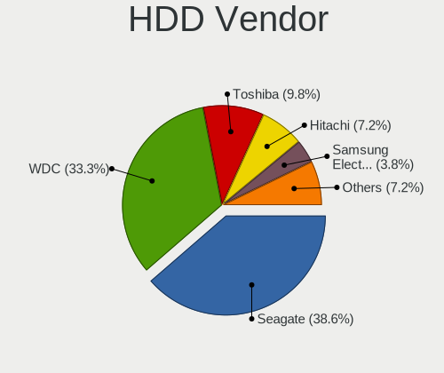
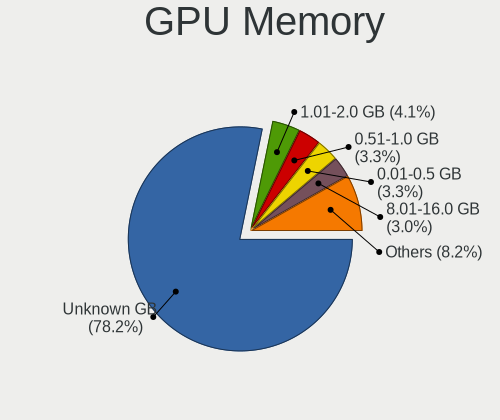
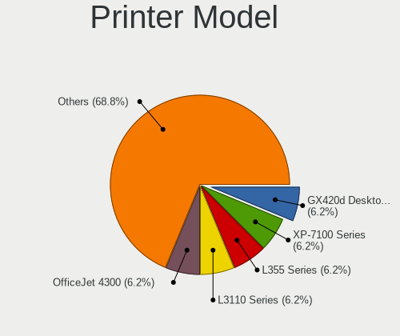

Ubuntu - Hardware Trends (Desktops)
-----------------------------------

A project to identify most popular hardware characteristics and track their change
over time based on data collected by Linux users at https://Linux-Hardware.org.

Anyone can contribute to this report by the [hw-probe](https://github.com/linuxhw/hw-probe) tool:

    sudo -E hw-probe -all -upload

This report is for one last month. Overall report since the beginning of time: [TestCoverage](https://github.com/linuxhw/TestCoverage)

Period: Jan, 2023.

Contents
--------

* [ System ](#system)
  - [ OS                       ](#os)
  - [ OS Family                ](#os-family)
  - [ Kernel                   ](#kernel)
  - [ Kernel Family            ](#kernel-family)
  - [ Kernel Major Ver.        ](#kernel-major-ver)
  - [ Arch                     ](#arch)
  - [ DE                       ](#de)
  - [ Display Server           ](#display-server)
  - [ Display Manager          ](#display-manager)
  - [ OS Lang                  ](#os-lang)
  - [ Boot Mode                ](#boot-mode)
  - [ Filesystem               ](#filesystem)
  - [ Part. scheme             ](#part-scheme)
  - [ Dual Boot with Linux/BSD ](#dual-boot-with-linuxbsd)
  - [ Dual Boot (Win)          ](#dual-boot-win)

* [ Board ](#board)
  - [ Vendor                   ](#vendor)
  - [ Model                    ](#model)
  - [ Model Family             ](#model-family)
  - [ MFG Year                 ](#mfg-year)
  - [ Form Factor              ](#form-factor)
  - [ Secure Boot              ](#secure-boot)
  - [ Coreboot                 ](#coreboot)
  - [ RAM Size                 ](#ram-size)
  - [ RAM Used                 ](#ram-used)
  - [ Total Drives             ](#total-drives)
  - [ Has CD-ROM               ](#has-cd-rom)
  - [ Has Ethernet             ](#has-ethernet)
  - [ Has WiFi                 ](#has-wifi)
  - [ Has Bluetooth            ](#has-bluetooth)

* [ Location ](#location)
  - [ Country                  ](#country)
  - [ City                     ](#city)

* [ Drives ](#drives)
  - [ Drive Vendor             ](#drive-vendor)
  - [ Drive Model              ](#drive-model)
  - [ HDD Vendor               ](#hdd-vendor)
  - [ SSD Vendor               ](#ssd-vendor)
  - [ Drive Kind               ](#drive-kind)
  - [ Drive Connector          ](#drive-connector)
  - [ Drive Size               ](#drive-size)
  - [ Space Total              ](#space-total)
  - [ Space Used               ](#space-used)
  - [ Malfunc. Drives          ](#malfunc-drives)
  - [ Malfunc. Drive Vendor    ](#malfunc-drive-vendor)
  - [ Malfunc. HDD Vendor      ](#malfunc-hdd-vendor)
  - [ Malfunc. Drive Kind      ](#malfunc-drive-kind)
  - [ Failed Drives            ](#failed-drives)
  - [ Failed Drive Vendor      ](#failed-drive-vendor)
  - [ Drive Status             ](#drive-status)

* [ Storage controller ](#storage-controller)
  - [ Storage Vendor           ](#storage-vendor)
  - [ Storage Model            ](#storage-model)
  - [ Storage Kind             ](#storage-kind)

* [ Processor ](#processor)
  - [ CPU Vendor               ](#cpu-vendor)
  - [ CPU Model                ](#cpu-model)
  - [ CPU Model Family         ](#cpu-model-family)
  - [ CPU Cores                ](#cpu-cores)
  - [ CPU Sockets              ](#cpu-sockets)
  - [ CPU Threads              ](#cpu-threads)
  - [ CPU Op-Modes             ](#cpu-op-modes)
  - [ CPU Microcode            ](#cpu-microcode)
  - [ CPU Microarch            ](#cpu-microarch)

* [ Graphics ](#graphics)
  - [ GPU Vendor               ](#gpu-vendor)
  - [ GPU Model                ](#gpu-model)
  - [ GPU Combo                ](#gpu-combo)
  - [ GPU Driver               ](#gpu-driver)
  - [ GPU Memory               ](#gpu-memory)

* [ Monitor ](#monitor)
  - [ Monitor Vendor           ](#monitor-vendor)
  - [ Monitor Model            ](#monitor-model)
  - [ Monitor Resolution       ](#monitor-resolution)
  - [ Monitor Diagonal         ](#monitor-diagonal)
  - [ Monitor Width            ](#monitor-width)
  - [ Aspect Ratio             ](#aspect-ratio)
  - [ Monitor Area             ](#monitor-area)
  - [ Pixel Density            ](#pixel-density)
  - [ Multiple Monitors        ](#multiple-monitors)

* [ Network ](#network)
  - [ Net Controller Vendor    ](#net-controller-vendor)
  - [ Net Controller Model     ](#net-controller-model)
  - [ Wireless Vendor          ](#wireless-vendor)
  - [ Wireless Model           ](#wireless-model)
  - [ Ethernet Vendor          ](#ethernet-vendor)
  - [ Ethernet Model           ](#ethernet-model)
  - [ Net Controller Kind      ](#net-controller-kind)
  - [ Used Controller          ](#used-controller)
  - [ NICs                     ](#nics)
  - [ IPv6                     ](#ipv6)

* [ Bluetooth ](#bluetooth)
  - [ Bluetooth Vendor         ](#bluetooth-vendor)
  - [ Bluetooth Model          ](#bluetooth-model)

* [ Sound ](#sound)
  - [ Sound Vendor             ](#sound-vendor)
  - [ Sound Model              ](#sound-model)

* [ Memory ](#memory)
  - [ Memory Vendor            ](#memory-vendor)
  - [ Memory Model             ](#memory-model)
  - [ Memory Kind              ](#memory-kind)
  - [ Memory Form Factor       ](#memory-form-factor)
  - [ Memory Size              ](#memory-size)
  - [ Memory Speed             ](#memory-speed)

* [ Printers & scanners ](#printers--scanners)
  - [ Printer Vendor           ](#printer-vendor)
  - [ Printer Model            ](#printer-model)
  - [ Scanner Vendor           ](#scanner-vendor)
  - [ Scanner Model            ](#scanner-model)

* [ Camera ](#camera)
  - [ Camera Vendor            ](#camera-vendor)
  - [ Camera Model             ](#camera-model)

* [ Security ](#security)
  - [ Fingerprint Vendor       ](#fingerprint-vendor)
  - [ Fingerprint Model        ](#fingerprint-model)
  - [ Chipcard Vendor          ](#chipcard-vendor)
  - [ Chipcard Model           ](#chipcard-model)

* [ Unsupported ](#unsupported)
  - [ Unsupported Devices      ](#unsupported-devices)
  - [ Unsupported Device Types ](#unsupported-device-types)

System
------

OS
--

Installed operating systems

| Name         | Desktops | Percent |
|--------------|----------|---------|
| Ubuntu 22.04 | 307      | 63.17%  |
| Ubuntu 22.10 | 90       | 18.52%  |
| Ubuntu 20.04 | 58       | 11.93%  |
| Ubuntu 18.04 | 28       | 5.76%   |
| Ubuntu 21.10 | 1        | 0.21%   |
| Ubuntu 16.04 | 1        | 0.21%   |
| Ubuntu 14.04 | 1        | 0.21%   |

OS Family
---------

OS without a version

| Name   | Desktops | Percent |
|--------|----------|---------|
| Ubuntu | 486      | 100%    |

Kernel
------

Version of the Linux kernel

| Version                 | Desktops | Percent |
|-------------------------|----------|---------|
| 5.15.0-58-generic       | 151      | 31.07%  |
| 5.15.0-57-generic       | 71       | 14.61%  |
| 5.15.0-56-generic       | 69       | 14.2%   |
| 5.19.0-29-generic       | 40       | 8.23%   |
| 5.15.0-43-generic       | 19       | 3.91%   |
| 5.19.0-26-generic       | 16       | 3.29%   |
| 5.4.0-137-generic       | 14       | 2.88%   |
| 5.4.0-136-generic       | 13       | 2.67%   |
| 5.19.0-28-generic       | 11       | 2.26%   |
| 5.19.0-21-generic       | 8        | 1.65%   |
| 5.19.0-30-generic       | 5        | 1.03%   |
| 4.15.0-201-generic      | 5        | 1.03%   |
| 5.15.0-52-generic       | 4        | 0.82%   |
| 5.19.0-31-generic       | 3        | 0.62%   |
| 5.15.0-53-generic       | 3        | 0.62%   |
| 5.15.0-46-generic       | 3        | 0.62%   |
| 6.1.8-060108-generic    | 2        | 0.41%   |
| 5.4.0-84-generic        | 2        | 0.41%   |
| 5.4.0-70-generic        | 2        | 0.41%   |
| 5.4.0-42-generic        | 2        | 0.41%   |
| 5.4.0-135-generic       | 2        | 0.41%   |
| 5.15.0-60-generic       | 2        | 0.41%   |
| 5.15.0-59-generic       | 2        | 0.41%   |
| 5.15.0-25-generic       | 2        | 0.41%   |
| 4.15.0-200-generic      | 2        | 0.41%   |
| 6.2.0-060200rc5-generic | 1        | 0.21%   |
| 6.1.6-060106-generic    | 1        | 0.21%   |
| 6.1.4-x64v3-xanmod1     | 1        | 0.21%   |
| 6.0.9-060009-generic    | 1        | 0.21%   |
| 6.0.0-1007-oem          | 1        | 0.21%   |
| 5.8.0-43-generic        | 1        | 0.21%   |
| 5.8.0-36-generic        | 1        | 0.21%   |
| 5.4.25-050425-generic   | 1        | 0.21%   |
| 5.4.0-97-generic        | 1        | 0.21%   |
| 5.4.0-52-generic        | 1        | 0.21%   |
| 5.4.0-33-generic        | 1        | 0.21%   |
| 5.4.0-132-generic       | 1        | 0.21%   |
| 5.4.0-131-generic       | 1        | 0.21%   |
| 5.4.0-128-generic       | 1        | 0.21%   |
| 5.4.0-109-generic       | 1        | 0.21%   |

Kernel Family
-------------

Linux kernel without a distro release

| Version | Desktops | Percent |
|---------|----------|---------|
| 5.15.0  | 333      | 68.52%  |
| 5.19.0  | 85       | 17.49%  |
| 5.4.0   | 42       | 8.64%   |
| 4.15.0  | 10       | 2.06%   |
| 6.1.8   | 2        | 0.41%   |
| 5.8.0   | 2        | 0.41%   |
| 5.13.0  | 2        | 0.41%   |
| 6.2.0   | 1        | 0.21%   |
| 6.1.6   | 1        | 0.21%   |
| 6.1.4   | 1        | 0.21%   |
| 6.0.9   | 1        | 0.21%   |
| 6.0.0   | 1        | 0.21%   |
| 5.4.25  | 1        | 0.21%   |
| 5.19.5  | 1        | 0.21%   |
| 5.17.0  | 1        | 0.21%   |
| 5.11.0  | 1        | 0.21%   |
| 4.4.0   | 1        | 0.21%   |

Kernel Major Ver.
-----------------

Linux kernel major version

| Version | Desktops | Percent |
|---------|----------|---------|
| 5.15    | 333      | 68.52%  |
| 5.19    | 86       | 17.7%   |
| 5.4     | 43       | 8.85%   |
| 4.15    | 10       | 2.06%   |
| 6.1     | 4        | 0.82%   |
| 6.0     | 2        | 0.41%   |
| 5.8     | 2        | 0.41%   |
| 5.13    | 2        | 0.41%   |
| 6.2     | 1        | 0.21%   |
| 5.17    | 1        | 0.21%   |
| 5.11    | 1        | 0.21%   |
| 4.4     | 1        | 0.21%   |

Arch
----

OS architecture (x86_64, i586, etc.)

| Name    | Desktops | Percent |
|---------|----------|---------|
| x86_64  | 480      | 98.77%  |
| i686    | 5        | 1.03%   |
| riscv64 | 1        | 0.21%   |

DE
--

Desktop Environment

| Name            | Desktops | Percent |
|-----------------|----------|---------|
| GNOME           | 447      | 91.98%  |
| Unknown         | 27       | 5.56%   |
| GNOME Flashback | 4        | 0.82%   |
| X-Cinnamon      | 3        | 0.62%   |
| Pantheon        | 1        | 0.21%   |
| i3              | 1        | 0.21%   |
| GNOME Classic   | 1        | 0.21%   |
| Enlightenment   | 1        | 0.21%   |
| Cinnamon        | 1        | 0.21%   |

Display Server
--------------

X11 or Wayland

| Name    | Desktops | Percent |
|---------|----------|---------|
| Wayland | 238      | 48.97%  |
| X11     | 217      | 44.65%  |
| Tty     | 18       | 3.7%    |
| Unknown | 13       | 2.67%   |

Display Manager
---------------

SDDM, LightDM, etc.

| Name    | Desktops | Percent |
|---------|----------|---------|
| GDM3    | 416      | 85.6%   |
| Unknown | 41       | 8.44%   |
| GDM     | 16       | 3.29%   |
| LightDM | 11       | 2.26%   |
| SDDM    | 2        | 0.41%   |

OS Lang
-------

Language

| Lang    | Desktops | Percent |
|---------|----------|---------|
| en_US   | 188      | 38.68%  |
| de_DE   | 46       | 9.47%   |
| fr_FR   | 32       | 6.58%   |
| en_GB   | 28       | 5.76%   |
| it_IT   | 26       | 5.35%   |
| pt_BR   | 18       | 3.7%    |
| ru_RU   | 15       | 3.09%   |
| en_CA   | 15       | 3.09%   |
| pl_PL   | 10       | 2.06%   |
| Unknown | 10       | 2.06%   |
| es_ES   | 9        | 1.85%   |
| de_CH   | 8        | 1.65%   |
| en_AU   | 7        | 1.44%   |
| C       | 7        | 1.44%   |
| nl_NL   | 6        | 1.23%   |
| en_IN   | 6        | 1.23%   |
| en_ZA   | 4        | 0.82%   |
| el_GR   | 4        | 0.82%   |
| sv_SE   | 3        | 0.62%   |
| hu_HU   | 3        | 0.62%   |
| fr_BE   | 3        | 0.62%   |
| fi_FI   | 3        | 0.62%   |
| es_MX   | 3        | 0.62%   |
| de_AT   | 3        | 0.62%   |
| cs_CZ   | 3        | 0.62%   |
| zh_CN   | 2        | 0.41%   |
| pt_PT   | 2        | 0.41%   |
| nl_BE   | 2        | 0.41%   |
| fr_CA   | 2        | 0.41%   |
| es_AR   | 2        | 0.41%   |
| en_HK   | 2        | 0.41%   |
| ca_ES   | 2        | 0.41%   |
| tr_TR   | 1        | 0.21%   |
| ta_LK   | 1        | 0.21%   |
| ro_RO   | 1        | 0.21%   |
| nb_NO   | 1        | 0.21%   |
| lv_LV   | 1        | 0.21%   |
| ja_JP   | 1        | 0.21%   |
| es_VE   | 1        | 0.21%   |
| es_PE   | 1        | 0.21%   |

Boot Mode
---------

EFI or BIOS

| Mode | Desktops | Percent |
|------|----------|---------|
| BIOS | 336      | 69.14%  |
| EFI  | 150      | 30.86%  |

Filesystem
----------

Type of filesystem

| Type    | Desktops | Percent |
|---------|----------|---------|
| Ext4    | 451      | 92.8%   |
| Btrfs   | 14       | 2.88%   |
| Zfs     | 8        | 1.65%   |
| Overlay | 7        | 1.44%   |
| Ext2    | 3        | 0.62%   |
| Xfs     | 1        | 0.21%   |
| Tmpfs   | 1        | 0.21%   |
| Jfs     | 1        | 0.21%   |

Part. scheme
------------

Scheme of partitioning

| Type    | Desktops | Percent |
|---------|----------|---------|
| GPT     | 373      | 76.75%  |
| MBR     | 89       | 18.31%  |
| Unknown | 24       | 4.94%   |

Dual Boot with Linux/BSD
------------------------

Hosting more than one Linux/BSD

| Dual boot | Desktops | Percent |
|-----------|----------|---------|
| No        | 390      | 80.25%  |
| Yes       | 96       | 19.75%  |

Dual Boot (Win)
---------------

Hosting Linux and Windows

| Dual boot | Desktops | Percent |
|-----------|----------|---------|
| No        | 274      | 56.38%  |
| Yes       | 212      | 43.62%  |

Board
-----

Vendor
------

Motherboard manufacturer

| Name                | Desktops | Percent |
|---------------------|----------|---------|
| ASUSTek Computer    | 130      | 26.75%  |
| Gigabyte Technology | 84       | 17.28%  |
| MSI                 | 71       | 14.61%  |
| Dell                | 53       | 10.91%  |
| ASRock              | 35       | 7.2%    |
| Hewlett-Packard     | 28       | 5.76%   |
| Lenovo              | 24       | 4.94%   |
| Intel               | 11       | 2.26%   |
| Acer                | 9        | 1.85%   |
| Unknown             | 7        | 1.44%   |
| Foxconn             | 5        | 1.03%   |
| Medion              | 4        | 0.82%   |
| Fujitsu             | 3        | 0.62%   |
| Pegatron            | 2        | 0.41%   |
| Gateway             | 2        | 0.41%   |
| Biostar             | 2        | 0.41%   |
| ASRockRack          | 2        | 0.41%   |
| Apple               | 2        | 0.41%   |
| SiS Technology      | 1        | 0.21%   |
| Quanta              | 1        | 0.21%   |
| Positivo            | 1        | 0.21%   |
| NCR                 | 1        | 0.21%   |
| Maxtang             | 1        | 0.21%   |
| Hardkernel          | 1        | 0.21%   |
| Fujitsu Siemens     | 1        | 0.21%   |
| CncTion             | 1        | 0.21%   |
| BESSTAR Tech        | 1        | 0.21%   |
| AZW                 | 1        | 0.21%   |
| AOpen               | 1        | 0.21%   |
| Alienware           | 1        | 0.21%   |

Model
-----

Motherboard model

| Name                         | Desktops | Percent |
|------------------------------|----------|---------|
| ASUS All Series              | 15       | 3.09%   |
| Unknown                      | 9        | 1.85%   |
| MSI MS-7C91                  | 4        | 0.82%   |
| Dell OptiPlex 7050           | 4        | 0.82%   |
| Dell OptiPlex 7010           | 4        | 0.82%   |
| ASUS PRIME A320M-K           | 4        | 0.82%   |
| MSI MS-7C51                  | 3        | 0.62%   |
| MSI MS-7C37                  | 3        | 0.62%   |
| MSI MS-7693                  | 3        | 0.62%   |
| Gigabyte B450M DS3H          | 3        | 0.62%   |
| ASUS M5A78L-M/USB3           | 3        | 0.62%   |
| MSI MS-7C02                  | 2        | 0.41%   |
| MSI MS-7B86                  | 2        | 0.41%   |
| MSI MS-7B79                  | 2        | 0.41%   |
| MSI MS-7B17                  | 2        | 0.41%   |
| MSI MS-7A39                  | 2        | 0.41%   |
| MSI MS-7A33                  | 2        | 0.41%   |
| HP ProLiant MicroServer Gen8 | 2        | 0.41%   |
| HP ProDesk 600 G1 TWR        | 2        | 0.41%   |
| HP Compaq 8200 Elite SFF PC  | 2        | 0.41%   |
| HP Compaq 6000 Pro SFF PC    | 2        | 0.41%   |
| Gigabyte Z390 DESIGNARE      | 2        | 0.41%   |
| Gigabyte M68MT-S2P           | 2        | 0.41%   |
| Gigabyte H81M-S2PV           | 2        | 0.41%   |
| Gigabyte H510M H             | 2        | 0.41%   |
| Gigabyte H310M M.2           | 2        | 0.41%   |
| Gigabyte F2A88XM-D3H         | 2        | 0.41%   |
| Gigabyte B75M-D3H            | 2        | 0.41%   |
| Gigabyte B450 AORUS M        | 2        | 0.41%   |
| Gigabyte A320M-S2H           | 2        | 0.41%   |
| Gateway DX4870               | 2        | 0.41%   |
| Dell Precision 3630 Tower    | 2        | 0.41%   |
| Dell OptiPlex 790            | 2        | 0.41%   |
| Dell OptiPlex 755            | 2        | 0.41%   |
| Dell OptiPlex 7070           | 2        | 0.41%   |
| Dell OptiPlex 7040           | 2        | 0.41%   |
| Dell OptiPlex 390            | 2        | 0.41%   |
| Dell OptiPlex 3020           | 2        | 0.41%   |
| Dell OptiPlex 3010           | 2        | 0.41%   |
| ASUS Z170-K                  | 2        | 0.41%   |

Model Family
------------

Motherboard model prefix

| Name                | Desktops | Percent |
|---------------------|----------|---------|
| Dell OptiPlex       | 34       | 7%      |
| ASUS PRIME          | 26       | 5.35%   |
| ASUS ROG            | 15       | 3.09%   |
| ASUS All            | 15       | 3.09%   |
| Lenovo ThinkStation | 10       | 2.06%   |
| ASUS TUF            | 10       | 2.06%   |
| Unknown             | 9        | 1.85%   |
| Dell Precision      | 8        | 1.65%   |
| Lenovo ThinkCentre  | 6        | 1.23%   |
| HP Compaq           | 6        | 1.23%   |
| Lenovo IdeaCentre   | 5        | 1.03%   |
| HP EliteDesk        | 5        | 1.03%   |
| Dell Inspiron       | 5        | 1.03%   |
| MSI MS-7C91         | 4        | 0.82%   |
| Gigabyte Z390       | 4        | 0.82%   |
| Gigabyte B450M      | 4        | 0.82%   |
| ASUS P8Z77-V        | 4        | 0.82%   |
| ASUS M5A97          | 4        | 0.82%   |
| ASUS M5A78L-M       | 4        | 0.82%   |
| Acer Aspire         | 4        | 0.82%   |
| MSI MS-7C51         | 3        | 0.62%   |
| MSI MS-7C37         | 3        | 0.62%   |
| MSI MS-7693         | 3        | 0.62%   |
| HP ProDesk          | 3        | 0.62%   |
| Gigabyte X570       | 3        | 0.62%   |
| Gigabyte H310M      | 3        | 0.62%   |
| Gigabyte B560M      | 3        | 0.62%   |
| Gigabyte B550M      | 3        | 0.62%   |
| Dell XPS            | 3        | 0.62%   |
| ASUS P8H61-M        | 3        | 0.62%   |
| MSI MS-7C02         | 2        | 0.41%   |
| MSI MS-7B86         | 2        | 0.41%   |
| MSI MS-7B79         | 2        | 0.41%   |
| MSI MS-7B17         | 2        | 0.41%   |
| MSI MS-7A39         | 2        | 0.41%   |
| MSI MS-7A33         | 2        | 0.41%   |
| HP ProLiant         | 2        | 0.41%   |
| Gigabyte M68MT-S2P  | 2        | 0.41%   |
| Gigabyte H81M-S2PV  | 2        | 0.41%   |
| Gigabyte H510M      | 2        | 0.41%   |

MFG Year
--------

Motherboard manufacture year

| Year    | Desktops | Percent |
|---------|----------|---------|
| 2012    | 48       | 9.88%   |
| 2019    | 42       | 8.64%   |
| 2018    | 42       | 8.64%   |
| 2017    | 39       | 8.02%   |
| 2013    | 39       | 8.02%   |
| 2021    | 37       | 7.61%   |
| 2014    | 35       | 7.2%    |
| 2022    | 30       | 6.17%   |
| 2011    | 30       | 6.17%   |
| 2020    | 27       | 5.56%   |
| 2015    | 27       | 5.56%   |
| 2009    | 26       | 5.35%   |
| 2016    | 18       | 3.7%    |
| 2010    | 16       | 3.29%   |
| 2008    | 13       | 2.67%   |
| 2007    | 10       | 2.06%   |
| 2005    | 3        | 0.62%   |
| 2006    | 2        | 0.41%   |
| 2004    | 1        | 0.21%   |
| Unknown | 1        | 0.21%   |

Form Factor
-----------

Physical design of the computer

| Name    | Desktops | Percent |
|---------|----------|---------|
| Desktop | 486      | 100%    |

Secure Boot
-----------

Enabled or disabled

| State    | Desktops | Percent |
|----------|----------|---------|
| Disabled | 466      | 95.88%  |
| Enabled  | 20       | 4.12%   |

Coreboot
--------

Have coreboot on board

| Used | Desktops | Percent |
|------|----------|---------|
| No   | 485      | 99.79%  |
| Yes  | 1        | 0.21%   |

RAM Size
--------

Total RAM memory

| Size in GB      | Desktops | Percent |
|-----------------|----------|---------|
| 16.01-24.0      | 117      | 24.07%  |
| 32.01-64.0      | 96       | 19.75%  |
| 4.01-8.0        | 85       | 17.49%  |
| 8.01-16.0       | 76       | 15.64%  |
| 3.01-4.0        | 67       | 13.79%  |
| 64.01-256.0     | 28       | 5.76%   |
| 24.01-32.0      | 7        | 1.44%   |
| 1.01-2.0        | 6        | 1.23%   |
| More than 256.0 | 2        | 0.41%   |
| 2.01-3.0        | 2        | 0.41%   |

RAM Used
--------

Used RAM memory

| Used GB     | Desktops | Percent |
|-------------|----------|---------|
| 2.01-3.0    | 156      | 32.1%   |
| 1.01-2.0    | 149      | 30.66%  |
| 4.01-8.0    | 70       | 14.4%   |
| 3.01-4.0    | 63       | 12.96%  |
| 8.01-16.0   | 25       | 5.14%   |
| 0.51-1.0    | 12       | 2.47%   |
| 16.01-24.0  | 4        | 0.82%   |
| 32.01-64.0  | 2        | 0.41%   |
| 24.01-32.0  | 2        | 0.41%   |
| 64.01-256.0 | 2        | 0.41%   |
| 0.01-0.5    | 1        | 0.21%   |

Total Drives
------------

Number of drives on board

| Drives | Desktops | Percent |
|--------|----------|---------|
| 1      | 204      | 41.98%  |
| 2      | 134      | 27.57%  |
| 3      | 80       | 16.46%  |
| 4      | 28       | 5.76%   |
| 5      | 17       | 3.5%    |
| 7      | 8        | 1.65%   |
| 6      | 8        | 1.65%   |
| 10     | 2        | 0.41%   |
| 8      | 2        | 0.41%   |
| 0      | 2        | 0.41%   |
| 9      | 1        | 0.21%   |

Has CD-ROM
----------

Has CD-ROM on board

| Presented | Desktops | Percent |
|-----------|----------|---------|
| No        | 259      | 53.29%  |
| Yes       | 227      | 46.71%  |

Has Ethernet
------------

Has Ethernet on board

| Presented | Desktops | Percent |
|-----------|----------|---------|
| Yes       | 483      | 99.38%  |
| No        | 3        | 0.62%   |

Has WiFi
--------

Has WiFi module

| Presented | Desktops | Percent |
|-----------|----------|---------|
| No        | 254      | 52.26%  |
| Yes       | 232      | 47.74%  |

Has Bluetooth
-------------

Has Bluetooth module

| Presented | Desktops | Percent |
|-----------|----------|---------|
| No        | 329      | 67.7%   |
| Yes       | 157      | 32.3%   |

Location
--------

Country
-------

Geographic location (country)

| Country      | Desktops | Percent |
|--------------|----------|---------|
| USA          | 104      | 21.4%   |
| Germany      | 56       | 11.52%  |
| France       | 38       | 7.82%   |
| UK           | 28       | 5.76%   |
| Italy        | 28       | 5.76%   |
| Canada       | 22       | 4.53%   |
| Russia       | 21       | 4.32%   |
| Brazil       | 19       | 3.91%   |
| Spain        | 12       | 2.47%   |
| Netherlands  | 12       | 2.47%   |
| Switzerland  | 9        | 1.85%   |
| Australia    | 9        | 1.85%   |
| Portugal     | 7        | 1.44%   |
| Poland       | 7        | 1.44%   |
| India        | 7        | 1.44%   |
| Romania      | 6        | 1.23%   |
| Greece       | 6        | 1.23%   |
| Mexico       | 5        | 1.03%   |
| Finland      | 5        | 1.03%   |
| Belgium      | 5        | 1.03%   |
| Turkey       | 4        | 0.82%   |
| South Africa | 4        | 0.82%   |
| Slovakia     | 4        | 0.82%   |
| Hungary      | 4        | 0.82%   |
| Austria      | 4        | 0.82%   |
| Sweden       | 3        | 0.62%   |
| Norway       | 3        | 0.62%   |
| Czechia      | 3        | 0.62%   |
| Bangladesh   | 3        | 0.62%   |
| Argentina    | 3        | 0.62%   |
| Unknown      | 3        | 0.62%   |
| Vietnam      | 2        | 0.41%   |
| Serbia       | 2        | 0.41%   |
| Ireland      | 2        | 0.41%   |
| Indonesia    | 2        | 0.41%   |
| Hong Kong    | 2        | 0.41%   |
| Denmark      | 2        | 0.41%   |
| Colombia     | 2        | 0.41%   |
| China        | 2        | 0.41%   |
| Chile        | 2        | 0.41%   |

City
----

Geographic location (city)

| City              | Desktops | Percent |
|-------------------|----------|---------|
| New York          | 7        | 1.44%   |
| Milan             | 7        | 1.44%   |
| Paris             | 6        | 1.23%   |
| London            | 6        | 1.23%   |
| Vienna            | 4        | 0.82%   |
| Rome              | 4        | 0.82%   |
| Hamburg           | 4        | 0.82%   |
| Wroclaw           | 3        | 0.62%   |
| Toronto           | 3        | 0.62%   |
| Sydney            | 3        | 0.62%   |
| San Jose          | 3        | 0.62%   |
| Novosibirsk       | 3        | 0.62%   |
| Naples            | 3        | 0.62%   |
| Miami             | 3        | 0.62%   |
| Madrid            | 3        | 0.62%   |
| Helsinki          | 3        | 0.62%   |
| Athens            | 3        | 0.62%   |
| Unknown           | 3        | 0.62%   |
| Waalwijk          | 2        | 0.41%   |
| Seattle           | 2        | 0.41%   |
| Sao Paulo         | 2        | 0.41%   |
| Roubaix           | 2        | 0.41%   |
| Rio de Janeiro    | 2        | 0.41%   |
| Philadelphia      | 2        | 0.41%   |
| Ottawa            | 2        | 0.41%   |
| Norwich           | 2        | 0.41%   |
| Münster          | 2        | 0.41%   |
| Munich            | 2        | 0.41%   |
| Milwaukee         | 2        | 0.41%   |
| Milton Keynes     | 2        | 0.41%   |
| Mexico City       | 2        | 0.41%   |
| Lorient           | 2        | 0.41%   |
| Lisbon            | 2        | 0.41%   |
| Leipzig           | 2        | 0.41%   |
| Istanbul          | 2        | 0.41%   |
| Frankfurt am Main | 2        | 0.41%   |
| Fort Worth        | 2        | 0.41%   |
| Forges-les-Eaux   | 2        | 0.41%   |
| Easton            | 2        | 0.41%   |
| Dhaka             | 2        | 0.41%   |

Drives
------

Drive Vendor
------------

Hard drive vendors

| Vendor                      | Desktops | Drives | Percent |
|-----------------------------|----------|--------|---------|
| WDC                         | 155      | 198    | 17.71%  |
| Seagate                     | 155      | 199    | 17.71%  |
| Samsung Electronics         | 132      | 178    | 15.09%  |
| Kingston                    | 56       | 58     | 6.4%    |
| Sandisk                     | 46       | 53     | 5.26%   |
| Toshiba                     | 42       | 48     | 4.8%    |
| Crucial                     | 41       | 48     | 4.69%   |
| Hitachi                     | 30       | 32     | 3.43%   |
| Unknown                     | 17       | 26     | 1.94%   |
| Intel                       | 17       | 18     | 1.94%   |
| Phison Electronics          | 14       | 15     | 1.6%    |
| A-DATA Technology           | 12       | 12     | 1.37%   |
| SPCC                        | 11       | 13     | 1.26%   |
| Intenso                     | 11       | 15     | 1.26%   |
| Silicon Motion              | 10       | 10     | 1.14%   |
| Maxtor                      | 10       | 11     | 1.14%   |
| China                       | 10       | 10     | 1.14%   |
| HGST                        | 9        | 12     | 1.03%   |
| Kingston Technology Company | 7        | 7      | 0.8%    |
| Micron/Crucial Technology   | 6        | 6      | 0.69%   |
| PNY                         | 5        | 5      | 0.57%   |
| Micron Technology           | 4        | 10     | 0.46%   |
| KIOXIA                      | 4        | 6      | 0.46%   |
| ADATA Technology            | 4        | 5      | 0.46%   |
| Transcend                   | 3        | 3      | 0.34%   |
| SK hynix                    | 3        | 3      | 0.34%   |
| Patriot                     | 3        | 3      | 0.34%   |
| OCZ                         | 3        | 3      | 0.34%   |
| Lexar                       | 3        | 3      | 0.34%   |
| GOODRAM                     | 3        | 4      | 0.34%   |
| Unknown                     | 3        | 3      | 0.34%   |
| Team                        | 2        | 2      | 0.23%   |
| Plextor                     | 2        | 2      | 0.23%   |
| Phison                      | 2        | 2      | 0.23%   |
| Lite-On Technology          | 2        | 2      | 0.23%   |
| LDLC                        | 2        | 2      | 0.23%   |
| KingDian                    | 2        | 2      | 0.23%   |
| Hewlett-Packard             | 2        | 2      | 0.23%   |
| Gigabyte Technology         | 2        | 2      | 0.23%   |
| Apple                       | 2        | 2      | 0.23%   |

Drive Model
-----------

Hard drive models

| Model                                                 | Desktops | Percent |
|-------------------------------------------------------|----------|---------|
| Seagate ST1000DM010-2EP102 1TB                        | 18       | 1.81%   |
| Samsung NVMe SSD Controller SM981/PM981/PM983 500GB   | 18       | 1.81%   |
| Seagate ST2000DM008-2FR102 2TB                        | 13       | 1.31%   |
| Kingston SA400S37240G 240GB SSD                       | 13       | 1.31%   |
| Samsung SSD 850 EVO 250GB                             | 12       | 1.2%    |
| Kingston SA400S37480G 480GB SSD                       | 12       | 1.2%    |
| Seagate ST500DM002-1BD142 500GB                       | 10       | 1%      |
| Samsung SSD 860 EVO 250GB                             | 9        | 0.9%    |
| Toshiba HDWD110 1TB                                   | 8        | 0.8%    |
| WDC WD10EZEX-08WN4A0 1TB                              | 7        | 0.7%    |
| Silicon Motion SM2263EN/SM2263XT SSD Controller 512GB | 7        | 0.7%    |
| Unknown SD/MMC/MS PRO 2GB                             | 6        | 0.6%    |
| Toshiba DT01ACA100 1TB                                | 6        | 0.6%    |
| Seagate ST1000DM003-1ER162 1TB                        | 6        | 0.6%    |
| Seagate ST1000DM003-1CH162 1TB                        | 6        | 0.6%    |
| Samsung SSD 970 EVO Plus 500GB                        | 6        | 0.6%    |
| Kingston SV300S37A120G 120GB SSD                      | 6        | 0.6%    |
| WDC WD20EZRZ-00Z5HB0 2TB                              | 5        | 0.5%    |
| Unknown SD/MMC 2GB                                    | 5        | 0.5%    |
| Unknown M.S./M.S.Pro/HG 16GB                          | 5        | 0.5%    |
| SPCC Solid State Disk 512GB                           | 5        | 0.5%    |
| Seagate ST4000DM004-2CV104 4TB                        | 5        | 0.5%    |
| Seagate ST2000DM001-1ER164 2TB                        | 5        | 0.5%    |
| Samsung SSD 850 EVO 500GB                             | 5        | 0.5%    |
| Samsung SSD 840 EVO 120GB                             | 5        | 0.5%    |
| Crucial CT1000MX500SSD1 1TB                           | 5        | 0.5%    |
| WDC WDS240G2G0B-00EPW0 240GB SSD                      | 4        | 0.4%    |
| WDC WD10EARS-00Y5B1 1TB                               | 4        | 0.4%    |
| Seagate ST3500413AS 500GB                             | 4        | 0.4%    |
| Seagate ST1000DM003-1SB102 1TB                        | 4        | 0.4%    |
| SanDisk NVMe SSD Drive 500GB                          | 4        | 0.4%    |
| Samsung SSD 980 500GB                                 | 4        | 0.4%    |
| Samsung SSD 970 EVO Plus 1TB                          | 4        | 0.4%    |
| Samsung SSD 870 EVO 500GB                             | 4        | 0.4%    |
| Samsung SSD 860 EVO 500GB                             | 4        | 0.4%    |
| Samsung SSD 860 EVO 1TB                               | 4        | 0.4%    |
| Phison PS5013 E13 NVMe Controller 256GB               | 4        | 0.4%    |
| Phison E16 PCIe4 NVMe Controller 2TB                  | 4        | 0.4%    |
| Micron/Crucial P2 NVMe PCIe SSD 500GB                 | 4        | 0.4%    |
| Kingston Company A2000 NVMe SSD 1TB                   | 4        | 0.4%    |

HDD Vendor
----------

Hard disk drive vendors

| Vendor              | Desktops | Drives | Percent |
|---------------------|----------|--------|---------|
| Seagate             | 153      | 193    | 37.68%  |
| WDC                 | 133      | 169    | 32.76%  |
| Toshiba             | 35       | 41     | 8.62%   |
| Hitachi             | 30       | 32     | 7.39%   |
| Samsung Electronics | 24       | 28     | 5.91%   |
| HGST                | 9        | 12     | 2.22%   |
| Unknown             | 8        | 9      | 1.97%   |
| Maxtor              | 8        | 9      | 1.97%   |
| Intenso             | 2        | 2      | 0.49%   |
| Apple               | 2        | 2      | 0.49%   |
| USB                 | 1        | 1      | 0.25%   |
| ASMT                | 1        | 1      | 0.25%   |

SSD Vendor
----------

Solid state drive vendors

| Vendor              | Desktops | Drives | Percent |
|---------------------|----------|--------|---------|
| Samsung Electronics | 74       | 86     | 23.95%  |
| Kingston            | 49       | 50     | 15.86%  |
| Crucial             | 35       | 41     | 11.33%  |
| SanDisk             | 28       | 32     | 9.06%   |
| WDC                 | 21       | 22     | 6.8%    |
| SPCC                | 11       | 13     | 3.56%   |
| China               | 10       | 10     | 3.24%   |
| A-DATA Technology   | 10       | 10     | 3.24%   |
| Intel               | 8        | 8      | 2.59%   |
| Intenso             | 6        | 10     | 1.94%   |
| PNY                 | 5        | 5      | 1.62%   |
| Toshiba             | 4        | 4      | 1.29%   |
| Transcend           | 3        | 3      | 0.97%   |
| Patriot             | 3        | 3      | 0.97%   |
| OCZ                 | 3        | 3      | 0.97%   |
| GOODRAM             | 3        | 4      | 0.97%   |
| Team                | 2        | 2      | 0.65%   |
| SK hynix            | 2        | 2      | 0.65%   |
| Seagate             | 2        | 2      | 0.65%   |
| Plextor             | 2        | 2      | 0.65%   |
| Micron Technology   | 2        | 8      | 0.65%   |
| Maxtor              | 2        | 2      | 0.65%   |
| Lexar               | 2        | 2      | 0.65%   |
| KingDian            | 2        | 2      | 0.65%   |
| Hewlett-Packard     | 2        | 2      | 0.65%   |
| WDC WDS2            | 1        | 1      | 0.32%   |
| TO Exter            | 1        | 1      | 0.32%   |
| Qumo                | 1        | 1      | 0.32%   |
| Q200                | 1        | 1      | 0.32%   |
| OWC                 | 1        | 1      | 0.32%   |
| LITEON              | 1        | 1      | 0.32%   |
| LDLC                | 1        | 1      | 0.32%   |
| Innodisk            | 1        | 1      | 0.32%   |
| Gigabyte Technology | 1        | 1      | 0.32%   |
| GAMER               | 1        | 1      | 0.32%   |
| FRONTECH            | 1        | 1      | 0.32%   |
| Emtec               | 1        | 1      | 0.32%   |
| CT1000MX            | 1        | 1      | 0.32%   |
| Corsair             | 1        | 1      | 0.32%   |
| Apacer              | 1        | 1      | 0.32%   |

Drive Kind
----------

HDD or SSD

| Kind    | Desktops | Drives | Percent |
|---------|----------|--------|---------|
| HDD     | 312      | 499    | 42.22%  |
| SSD     | 254      | 346    | 34.37%  |
| NVMe    | 150      | 187    | 20.3%   |
| Unknown | 21       | 28     | 2.84%   |
| MMC     | 2        | 2      | 0.27%   |

Drive Connector
---------------

SATA, SAS, NVMe, etc.

| Type | Desktops | Drives | Percent |
|------|----------|--------|---------|
| SATA | 429      | 823    | 68.97%  |
| NVMe | 150      | 187    | 24.12%  |
| SAS  | 41       | 50     | 6.59%   |
| MMC  | 2        | 2      | 0.32%   |

Drive Size
----------

Size of hard drive

| Size in TB | Desktops | Drives | Percent |
|------------|----------|--------|---------|
| 0.01-0.5   | 290      | 419    | 47.31%  |
| 0.51-1.0   | 192      | 254    | 31.32%  |
| 1.01-2.0   | 74       | 92     | 12.07%  |
| 3.01-4.0   | 28       | 42     | 4.57%   |
| 2.01-3.0   | 14       | 18     | 2.28%   |
| 4.01-10.0  | 12       | 14     | 1.96%   |
| 10.01-20.0 | 3        | 6      | 0.49%   |

Space Total
-----------

Amount of disk space available on the file system

| Size in GB     | Desktops | Percent |
|----------------|----------|---------|
| 101-250        | 117      | 24.07%  |
| 501-1000       | 98       | 20.16%  |
| 251-500        | 89       | 18.31%  |
| 1001-2000      | 67       | 13.79%  |
| More than 3000 | 34       | 7%      |
| 51-100         | 26       | 5.35%   |
| 2001-3000      | 24       | 4.94%   |
| 1-20           | 14       | 2.88%   |
| Unknown        | 10       | 2.06%   |
| 21-50          | 7        | 1.44%   |

Space Used
----------

Amount of used disk space

| Used GB        | Desktops | Percent |
|----------------|----------|---------|
| 1-20           | 147      | 30.25%  |
| 21-50          | 87       | 17.9%   |
| 101-250        | 62       | 12.76%  |
| 501-1000       | 47       | 9.67%   |
| 251-500        | 46       | 9.47%   |
| 51-100         | 46       | 9.47%   |
| 1001-2000      | 24       | 4.94%   |
| More than 3000 | 11       | 2.26%   |
| Unknown        | 10       | 2.06%   |
| 2001-3000      | 6        | 1.23%   |

Malfunc. Drives
---------------

Drive models with a malfunction

| Model                                        | Desktops | Drives | Percent |
|----------------------------------------------|----------|--------|---------|
| XPG SPECTRIX S40G 1TB                        | 1        | 1      | 2.78%   |
| WDC WDS240G2G0B-00EPW0 240GB SSD             | 1        | 1      | 2.78%   |
| WDC WDS120G2G0B-00EPW0 120GB SSD             | 1        | 1      | 2.78%   |
| WDC WD360GD-00FNA0 37GB                      | 1        | 1      | 2.78%   |
| WDC WD20EADS-00S2B0 2TB                      | 1        | 1      | 2.78%   |
| WDC WD15EADS-65R2B0 1TB                      | 1        | 1      | 2.78%   |
| WDC WD10EZRX-00D8PB0 1TB                     | 1        | 1      | 2.78%   |
| WDC WD10EZEX-60ZF5A0 1TB                     | 1        | 1      | 2.78%   |
| WDC WD10EARS-00Y5B1 1TB                      | 1        | 1      | 2.78%   |
| WDC WD1001FALS-00J7B1 1TB                    | 1        | 1      | 2.78%   |
| Seagate ST9250410AS 250GB                    | 1        | 1      | 2.78%   |
| Seagate ST500DM002-1BC142 500GB              | 1        | 1      | 2.78%   |
| Seagate ST3750528AS 752GB                    | 1        | 1      | 2.78%   |
| Seagate ST3500418AS 500GB                    | 1        | 1      | 2.78%   |
| Seagate ST31000524AS 1TB                     | 1        | 1      | 2.78%   |
| Seagate ST3000DM008-2DM166 3TB               | 1        | 2      | 2.78%   |
| Seagate ST2000DM008-2FR102 2TB               | 1        | 1      | 2.78%   |
| Seagate ST1000LM024 HN-M101MBB 1TB           | 1        | 1      | 2.78%   |
| Seagate ST1000DM010-2EP102 1TB               | 1        | 1      | 2.78%   |
| Seagate ST1000DM003-9YN162 1TB               | 1        | 1      | 2.78%   |
| SanDisk SSD PLUS 480GB                       | 1        | 1      | 2.78%   |
| Samsung Electronics SSD PM810 FDE 2.5 256GB  | 1        | 1      | 2.78%   |
| Samsung Electronics HN-M750MBB 752GB         | 1        | 1      | 2.78%   |
| Samsung Electronics HD501LJ 500GB            | 1        | 1      | 2.78%   |
| Samsung Electronics HD250HJ 250GB            | 1        | 1      | 2.78%   |
| Micron Technology 1100_MTFDDAK1T0TBN 1TB SSD | 1        | 7      | 2.78%   |
| Maxtor 6Y080P0 82GB                          | 1        | 1      | 2.78%   |
| LDLC SSD 120GB                               | 1        | 1      | 2.78%   |
| Kingston SV300S37A120G 120GB SSD             | 1        | 1      | 2.78%   |
| Kingston SUV400S37240G 240GB SSD             | 1        | 1      | 2.78%   |
| Kingston SA400S37480G 480GB SSD              | 1        | 1      | 2.78%   |
| Kingston SA400S37240G 240GB SSD              | 1        | 1      | 2.78%   |
| Intel SSDSCKKW240H6 240GB                    | 1        | 1      | 2.78%   |
| Hitachi HDS722020ALA330 2TB                  | 1        | 1      | 2.78%   |
| Hitachi HDS721616PLA380 160GB                | 1        | 1      | 2.78%   |
| Crucial CT275MX300SSD4 275GB                 | 1        | 1      | 2.78%   |

Malfunc. Drive Vendor
---------------------

Vendors of faulty drives

| Vendor              | Desktops | Drives | Percent |
|---------------------|----------|--------|---------|
| Seagate             | 10       | 11     | 29.41%  |
| WDC                 | 7        | 9      | 20.59%  |
| Samsung Electronics | 4        | 4      | 11.76%  |
| Kingston            | 4        | 4      | 11.76%  |
| Hitachi             | 2        | 2      | 5.88%   |
| XPG                 | 1        | 1      | 2.94%   |
| SanDisk             | 1        | 1      | 2.94%   |
| Micron Technology   | 1        | 7      | 2.94%   |
| Maxtor              | 1        | 1      | 2.94%   |
| LDLC                | 1        | 1      | 2.94%   |
| Intel               | 1        | 1      | 2.94%   |
| Crucial             | 1        | 1      | 2.94%   |

Malfunc. HDD Vendor
-------------------

Vendors of faulty HDD drives

| Vendor              | Desktops | Drives | Percent |
|---------------------|----------|--------|---------|
| Seagate             | 10       | 11     | 45.45%  |
| WDC                 | 6        | 7      | 27.27%  |
| Samsung Electronics | 3        | 3      | 13.64%  |
| Hitachi             | 2        | 2      | 9.09%   |
| Maxtor              | 1        | 1      | 4.55%   |

Malfunc. Drive Kind
-------------------

Kinds of faulty drives

| Kind | Desktops | Drives | Percent |
|------|----------|--------|---------|
| HDD  | 21       | 24     | 61.76%  |
| SSD  | 12       | 18     | 35.29%  |
| NVMe | 1        | 1      | 2.94%   |

Failed Drives
-------------

Failed drive models

| Model                     | Desktops | Drives | Percent |
|---------------------------|----------|--------|---------|
| Intel SSDPEKKW256G7 256GB | 1        | 1      | 100%    |

Failed Drive Vendor
-------------------

Failed drive vendors

| Vendor | Desktops | Drives | Percent |
|--------|----------|--------|---------|
| Intel  | 1        | 1      | 100%    |

Drive Status
------------

Number of failed and malfunc. drives

| Status   | Desktops | Drives | Percent |
|----------|----------|--------|---------|
| Detected | 355      | 728    | 66.36%  |
| Works    | 147      | 290    | 27.48%  |
| Malfunc  | 32       | 43     | 5.98%   |
| Failed   | 1        | 1      | 0.19%   |

Storage controller
------------------

Storage Vendor
--------------

Storage controller vendors

| Vendor                           | Desktops | Percent |
|----------------------------------|----------|---------|
| Intel                            | 328      | 46.13%  |
| AMD                              | 145      | 20.39%  |
| Samsung Electronics              | 51       | 7.17%   |
| ASMedia Technology               | 26       | 3.66%   |
| SanDisk                          | 25       | 3.52%   |
| Phison Electronics               | 17       | 2.39%   |
| Kingston Technology Company      | 15       | 2.11%   |
| Nvidia                           | 14       | 1.97%   |
| Micron/Crucial Technology        | 13       | 1.83%   |
| JMicron Technology               | 13       | 1.83%   |
| Marvell Technology Group         | 11       | 1.55%   |
| Silicon Motion                   | 10       | 1.41%   |
| KIOXIA                           | 7        | 0.98%   |
| ADATA Technology                 | 5        | 0.7%    |
| Silicon Image                    | 3        | 0.42%   |
| Seagate Technology               | 3        | 0.42%   |
| LSI Logic / Symbios Logic        | 3        | 0.42%   |
| VIA Technologies                 | 2        | 0.28%   |
| Tekram Technology                | 2        | 0.28%   |
| Micron Technology                | 2        | 0.28%   |
| MAXIO Technology (Hangzhou)      | 2        | 0.28%   |
| Lite-On Technology               | 2        | 0.28%   |
| Broadcom / LSI                   | 2        | 0.28%   |
| Toshiba America Info Systems     | 1        | 0.14%   |
| Solidigm                         | 1        | 0.14%   |
| Solid State Storage Technology   | 1        | 0.14%   |
| SK hynix                         | 1        | 0.14%   |
| Silicon Integrated Systems [SiS] | 1        | 0.14%   |
| Realtek Semiconductor            | 1        | 0.14%   |
| Lite-On IT Corp. / Plextor       | 1        | 0.14%   |
| Integrated Technology Express    | 1        | 0.14%   |
| Adaptec                          | 1        | 0.14%   |
| 3ware                            | 1        | 0.14%   |

Storage Model
-------------

Storage controller models

| Model                                                                                   | Desktops | Percent |
|-----------------------------------------------------------------------------------------|----------|---------|
| AMD FCH SATA Controller [AHCI mode]                                                     | 76       | 8.63%   |
| Samsung NVMe SSD Controller SM981/PM981/PM983                                           | 33       | 3.75%   |
| Intel 8 Series/C220 Series Chipset Family 6-port SATA Controller 1 [AHCI mode]          | 30       | 3.41%   |
| Intel Q170/Q150/B150/H170/H110/Z170/CM236 Chipset SATA Controller [AHCI Mode]           | 28       | 3.18%   |
| Intel Cannon Lake PCH SATA AHCI Controller                                              | 28       | 3.18%   |
| Intel 7 Series/C210 Series Chipset Family 6-port SATA Controller [AHCI mode]            | 26       | 2.95%   |
| Intel 200 Series PCH SATA controller [AHCI mode]                                        | 26       | 2.95%   |
| ASMedia ASM1062 Serial ATA Controller                                                   | 26       | 2.95%   |
| Intel SATA Controller [RAID mode]                                                       | 22       | 2.5%    |
| AMD 500 Series Chipset SATA Controller                                                  | 21       | 2.38%   |
| AMD SB7x0/SB8x0/SB9x0 IDE Controller                                                    | 20       | 2.27%   |
| AMD 400 Series Chipset SATA Controller                                                  | 20       | 2.27%   |
| Intel 6 Series/C200 Series Chipset Family 6 port Desktop SATA AHCI Controller           | 19       | 2.16%   |
| Intel 500 Series Chipset Family SATA AHCI Controller                                    | 18       | 2.04%   |
| Intel Alder Lake-S PCH SATA Controller [AHCI Mode]                                      | 17       | 1.93%   |
| AMD SB7x0/SB8x0/SB9x0 SATA Controller [AHCI mode]                                       | 16       | 1.82%   |
| AMD SB7x0/SB8x0/SB9x0 SATA Controller [IDE mode]                                        | 15       | 1.7%    |
| AMD FCH SATA Controller D                                                               | 13       | 1.48%   |
| Intel NM10/ICH7 Family SATA Controller [IDE mode]                                       | 12       | 1.36%   |
| Intel 9 Series Chipset Family SATA Controller [AHCI Mode]                               | 12       | 1.36%   |
| Intel 6 Series/C200 Series Chipset Family Desktop SATA Controller (IDE mode, ports 4-5) | 12       | 1.36%   |
| Intel 6 Series/C200 Series Chipset Family Desktop SATA Controller (IDE mode, ports 0-3) | 12       | 1.36%   |
| Micron/Crucial P2 NVMe PCIe SSD                                                         | 11       | 1.25%   |
| SanDisk Non-Volatile memory controller                                                  | 10       | 1.14%   |
| JMicron JMB363 SATA/IDE Controller                                                      | 9        | 1.02%   |
| Intel C600/X79 series chipset 6-Port SATA AHCI Controller                               | 9        | 1.02%   |
| Samsung NVMe SSD Controller 980                                                         | 8        | 0.91%   |
| Intel Volume Management Device NVMe RAID Controller                                     | 8        | 0.91%   |
| Intel C602 chipset 4-Port SATA Storage Control Unit                                     | 8        | 0.91%   |
| Intel 82801G (ICH7 Family) IDE Controller                                               | 8        | 0.91%   |
| Silicon Motion SM2263EN/SM2263XT SSD Controller                                         | 7        | 0.79%   |
| Samsung NVMe SSD Controller PM9A1/PM9A3/980PRO                                          | 7        | 0.79%   |
| SanDisk WD Black SN750 / PC SN730 NVMe SSD                                              | 6        | 0.68%   |
| Phison E16 PCIe4 NVMe Controller                                                        | 6        | 0.68%   |
| Nvidia MCP61 SATA Controller                                                            | 6        | 0.68%   |
| Kingston Company Company Non-Volatile memory controller                                 | 6        | 0.68%   |
| Intel 7 Series/C210 Series Chipset Family 4-port SATA Controller [IDE mode]             | 6        | 0.68%   |
| Intel 7 Series/C210 Series Chipset Family 2-port SATA Controller [IDE mode]             | 6        | 0.68%   |
| AMD 300 Series Chipset SATA Controller                                                  | 6        | 0.68%   |
| SanDisk WD Blue SN570 NVMe SSD                                                          | 5        | 0.57%   |

Storage Kind
------------

Kind of storage controller (IDE, SATA, NVMe, SAS, ...)

| Kind | Desktops | Percent |
|------|----------|---------|
| SATA | 398      | 55.59%  |
| NVMe | 150      | 20.95%  |
| IDE  | 108      | 15.08%  |
| RAID | 43       | 6.01%   |
| SAS  | 12       | 1.68%   |
| SCSI | 5        | 0.7%    |

Processor
---------

CPU Vendor
----------

Processor vendors

| Vendor        | Desktops | Percent |
|---------------|----------|---------|
| Intel         | 329      | 67.7%   |
| AMD           | 156      | 32.1%   |
| sifive,u74-mc | 1        | 0.21%   |

CPU Model
---------

Processor models

| Model                                   | Desktops | Percent |
|-----------------------------------------|----------|---------|
| AMD Ryzen 5 3600 6-Core Processor       | 14       | 2.88%   |
| Intel Core i5-3470 CPU @ 3.20GHz        | 11       | 2.26%   |
| Intel Core i7-8700 CPU @ 3.20GHz        | 8        | 1.65%   |
| Intel Core i7-3770 CPU @ 3.40GHz        | 8        | 1.65%   |
| Intel Core i7-6700 CPU @ 3.40GHz        | 6        | 1.23%   |
| Intel Core i7-4790 CPU @ 3.60GHz        | 6        | 1.23%   |
| Intel Core i5-6500 CPU @ 3.20GHz        | 6        | 1.23%   |
| Intel 12th Gen Core i9-12900K           | 6        | 1.23%   |
| AMD Ryzen 7 5800X 8-Core Processor      | 6        | 1.23%   |
| Intel Core i9-9900K CPU @ 3.60GHz       | 5        | 1.03%   |
| Intel Core i7-6700K CPU @ 4.00GHz       | 5        | 1.03%   |
| Intel Core i5-8400 CPU @ 2.80GHz        | 5        | 1.03%   |
| Intel Core i5-6600 CPU @ 3.30GHz        | 5        | 1.03%   |
| Intel Core i5-2400 CPU @ 3.10GHz        | 5        | 1.03%   |
| AMD Ryzen 7 3700X 8-Core Processor      | 5        | 1.03%   |
| AMD Ryzen 5 5600G with Radeon Graphics  | 5        | 1.03%   |
| Intel Core i7-8700K CPU @ 3.70GHz       | 4        | 0.82%   |
| Intel Core i5-9500 CPU @ 3.00GHz        | 4        | 0.82%   |
| Intel Core i5-4570 CPU @ 3.20GHz        | 4        | 0.82%   |
| Intel Core i5-4460 CPU @ 3.20GHz        | 4        | 0.82%   |
| Intel Core 2 Duo CPU E8400 @ 3.00GHz    | 4        | 0.82%   |
| AMD Ryzen 9 5900X 12-Core Processor     | 4        | 0.82%   |
| AMD Ryzen 7 2700 Eight-Core Processor   | 4        | 0.82%   |
| AMD Ryzen 5 5600X 6-Core Processor      | 4        | 0.82%   |
| AMD Ryzen 5 2600 Six-Core Processor     | 4        | 0.82%   |
| Intel Xeon CPU E5620 @ 2.40GHz          | 3        | 0.62%   |
| Intel Xeon CPU E5-1620 0 @ 3.60GHz      | 3        | 0.62%   |
| Intel Core i7-4790K CPU @ 4.00GHz       | 3        | 0.62%   |
| Intel Core i5-9400 CPU @ 2.90GHz        | 3        | 0.62%   |
| Intel Core i5-4690 CPU @ 3.50GHz        | 3        | 0.62%   |
| Intel Core i5-4590 CPU @ 3.30GHz        | 3        | 0.62%   |
| Intel Core i5 CPU 650 @ 3.20GHz         | 3        | 0.62%   |
| Intel Core i3-3240 CPU @ 3.40GHz        | 3        | 0.62%   |
| Intel Core i3-3220 CPU @ 3.30GHz        | 3        | 0.62%   |
| Intel Core i3-2130 CPU @ 3.40GHz        | 3        | 0.62%   |
| Intel Core i3-2100 CPU @ 3.10GHz        | 3        | 0.62%   |
| Intel Core 2 Quad CPU Q6600 @ 2.40GHz   | 3        | 0.62%   |
| Intel Celeron CPU J3455 @ 1.50GHz       | 3        | 0.62%   |
| Intel 11th Gen Core i7-11700K @ 3.60GHz | 3        | 0.62%   |
| AMD Ryzen 9 5950X 16-Core Processor     | 3        | 0.62%   |

CPU Model Family
----------------

Processor model prefix

| Model                   | Desktops | Percent |
|-------------------------|----------|---------|
| Intel Core i5           | 103      | 21.19%  |
| Intel Core i7           | 66       | 13.58%  |
| AMD Ryzen 5             | 42       | 8.64%   |
| Intel Core i3           | 36       | 7.41%   |
| Other                   | 34       | 7%      |
| Intel Xeon              | 32       | 6.58%   |
| AMD Ryzen 7             | 22       | 4.53%   |
| AMD FX                  | 16       | 3.29%   |
| AMD Ryzen 9             | 13       | 2.67%   |
| Intel Celeron           | 12       | 2.47%   |
| Intel Core 2 Duo        | 11       | 2.26%   |
| Intel Pentium           | 9        | 1.85%   |
| Intel Core 2 Quad       | 8        | 1.65%   |
| Intel Pentium Dual-Core | 7        | 1.44%   |
| AMD Athlon 64 X2        | 7        | 1.44%   |
| Intel Core i9           | 6        | 1.23%   |
| AMD Phenom II X4        | 6        | 1.23%   |
| AMD A6                  | 6        | 1.23%   |
| AMD A10                 | 6        | 1.23%   |
| AMD Phenom II X6        | 5        | 1.03%   |
| AMD Athlon II X2        | 5        | 1.03%   |
| AMD Ryzen 3             | 4        | 0.82%   |
| AMD Athlon X4           | 4        | 0.82%   |
| AMD Ryzen Threadripper  | 3        | 0.62%   |
| AMD Phenom II X2        | 3        | 0.62%   |
| AMD A8                  | 3        | 0.62%   |
| Intel Pentium Gold      | 2        | 0.41%   |
| Intel Pentium Silver    | 1        | 0.21%   |
| Intel Pentium Dual      | 1        | 0.21%   |
| Intel Pentium D         | 1        | 0.21%   |
| Intel Pentium 4         | 1        | 0.21%   |
| Intel Core 2            | 1        | 0.21%   |
| Intel Atom              | 1        | 0.21%   |
| AMD Sempron             | 1        | 0.21%   |
| AMD Ryzen 5 PRO         | 1        | 0.21%   |
| AMD Phenom II X3        | 1        | 0.21%   |
| AMD E1                  | 1        | 0.21%   |
| AMD Athlon XP           | 1        | 0.21%   |
| AMD Athlon II X4        | 1        | 0.21%   |
| AMD Athlon Dual Core    | 1        | 0.21%   |

CPU Cores
---------

Number of processor cores

| Number  | Desktops | Percent |
|---------|----------|---------|
| 4       | 184      | 37.86%  |
| 2       | 114      | 23.46%  |
| 6       | 92       | 18.93%  |
| 8       | 45       | 9.26%   |
| 12      | 15       | 3.09%   |
| 16      | 13       | 2.67%   |
| 3       | 7        | 1.44%   |
| 1       | 6        | 1.23%   |
| 20      | 3        | 0.62%   |
| 24      | 2        | 0.41%   |
| 10      | 2        | 0.41%   |
| 32      | 1        | 0.21%   |
| 14      | 1        | 0.21%   |
| Unknown | 1        | 0.21%   |

CPU Sockets
-----------

Number of sockets

| Number  | Desktops | Percent |
|---------|----------|---------|
| 1       | 478      | 98.35%  |
| 2       | 7        | 1.44%   |
| Unknown | 1        | 0.21%   |

CPU Threads
-----------

Threads per core (Hyper-Threading)

| Number  | Desktops | Percent |
|---------|----------|---------|
| 2       | 282      | 58.02%  |
| 1       | 203      | 41.77%  |
| Unknown | 1        | 0.21%   |

CPU Op-Modes
------------

CPU Operation Modes (32-bit, 64-bit)

| Op mode        | Desktops | Percent |
|----------------|----------|---------|
| 32-bit, 64-bit | 484      | 99.59%  |
| 32-bit         | 1        | 0.21%   |
| Unknown        | 1        | 0.21%   |

CPU Microcode
-------------

Microcode number

| Number     | Desktops | Percent |
|------------|----------|---------|
| Unknown    | 266      | 54.73%  |
| 0x306a9    | 21       | 4.32%   |
| 0x906ea    | 19       | 3.91%   |
| 0x506e3    | 16       | 3.29%   |
| 0x306c3    | 15       | 3.09%   |
| 0x206a7    | 10       | 2.06%   |
| 0x08701021 | 10       | 2.06%   |
| 0x90672    | 8        | 1.65%   |
| 0x906e9    | 7        | 1.44%   |
| 0xa0671    | 6        | 1.23%   |
| 0xa0653    | 6        | 1.23%   |
| 0x1067a    | 6        | 1.23%   |
| 0x0a20120a | 6        | 1.23%   |
| 0x0800820d | 6        | 1.23%   |
| 0x06000852 | 5        | 1.03%   |
| 0x010000c8 | 5        | 1.03%   |
| 0x906ed    | 3        | 0.62%   |
| 0x906ec    | 3        | 0.62%   |
| 0x6fb      | 3        | 0.62%   |
| 0x306f2    | 3        | 0.62%   |
| 0x0a601203 | 3        | 0.62%   |
| 0x08701013 | 3        | 0.62%   |
| 0x06003106 | 3        | 0.62%   |
| 0x906c0    | 2        | 0.41%   |
| 0x506c9    | 2        | 0.41%   |
| 0x50654    | 2        | 0.41%   |
| 0x0a50000d | 2        | 0.41%   |
| 0x0a201205 | 2        | 0.41%   |
| 0x0a201016 | 2        | 0.41%   |
| 0x08001138 | 2        | 0.41%   |
| 0x06001119 | 2        | 0.41%   |
| 0x010000dc | 2        | 0.41%   |
| 0x010000db | 2        | 0.41%   |
| 0xb0671    | 1        | 0.21%   |
| 0xa0655    | 1        | 0.21%   |
| 0x906eb    | 1        | 0.21%   |
| 0x90675    | 1        | 0.21%   |
| 0x90661    | 1        | 0.21%   |
| 0x806ec    | 1        | 0.21%   |
| 0x706a1    | 1        | 0.21%   |

CPU Microarch
-------------

Microarchitecture

| Name             | Desktops | Percent |
|------------------|----------|---------|
| KabyLake         | 58       | 11.93%  |
| Haswell          | 52       | 10.7%   |
| IvyBridge        | 45       | 9.26%   |
| Skylake          | 35       | 7.2%    |
| SandyBridge      | 30       | 6.17%   |
| Zen 2            | 28       | 5.76%   |
| Zen 3            | 26       | 5.35%   |
| K10              | 22       | 4.53%   |
| Unknown          | 22       | 4.53%   |
| Piledriver       | 20       | 4.12%   |
| Penryn           | 19       | 3.91%   |
| Zen+             | 16       | 3.29%   |
| CometLake        | 13       | 2.67%   |
| Zen              | 12       | 2.47%   |
| Westmere         | 12       | 2.47%   |
| Core             | 10       | 2.06%   |
| Alderlake Hybrid | 10       | 2.06%   |
| K8 Hammer        | 9        | 1.85%   |
| Steamroller      | 7        | 1.44%   |
| Icelake          | 5        | 1.03%   |
| Bulldozer        | 5        | 1.03%   |
| Nehalem          | 4        | 0.82%   |
| Goldmont         | 4        | 0.82%   |
| Broadwell        | 4        | 0.82%   |
| Tremont          | 3        | 0.62%   |
| Silvermont       | 3        | 0.62%   |
| Excavator        | 3        | 0.62%   |
| NetBurst         | 2        | 0.41%   |
| Jaguar           | 2        | 0.41%   |
| Goldmont plus    | 2        | 0.41%   |
| K6               | 1        | 0.21%   |
| Bonnell          | 1        | 0.21%   |
| Bobcat           | 1        | 0.21%   |

Graphics
--------

GPU Vendor
----------

Vendors of graphics cards

| Vendor                           | Desktops | Percent |
|----------------------------------|----------|---------|
| Nvidia                           | 206      | 39.46%  |
| Intel                            | 187      | 35.82%  |
| AMD                              | 125      | 23.95%  |
| Matrox Electronics Systems       | 2        | 0.38%   |
| Silicon Integrated Systems [SiS] | 1        | 0.19%   |
| ASPEED Technology                | 1        | 0.19%   |

GPU Model
---------

Graphics card models

| Model                                                                       | Desktops | Percent |
|-----------------------------------------------------------------------------|----------|---------|
| Intel Xeon E3-1200 v3/4th Gen Core Processor Integrated Graphics Controller | 31       | 5.77%   |
| Intel CoffeeLake-S GT2 [UHD Graphics 630]                                   | 24       | 4.47%   |
| Intel HD Graphics 530                                                       | 23       | 4.28%   |
| AMD Ellesmere [Radeon RX 470/480/570/570X/580/580X/590]                     | 22       | 4.1%    |
| Intel Xeon E3-1200 v2/3rd Gen Core processor Graphics Controller            | 21       | 3.91%   |
| Intel 2nd Generation Core Processor Family Integrated Graphics Controller   | 19       | 3.54%   |
| Nvidia GP107 [GeForce GTX 1050 Ti]                                          | 12       | 2.23%   |
| Nvidia GK208B [GeForce GT 710]                                              | 11       | 2.05%   |
| Nvidia GP106 [GeForce GTX 1060 6GB]                                         | 9        | 1.68%   |
| Intel AlderLake-S GT1                                                       | 8        | 1.49%   |
| Nvidia GT218 [GeForce 210]                                                  | 7        | 1.3%    |
| AMD Caicos [Radeon HD 6450/7450/8450 / R5 230 OEM]                          | 6        | 1.12%   |
| Nvidia TU117 [GeForce GTX 1650]                                             | 5        | 0.93%   |
| Nvidia GP108 [GeForce GT 1030]                                              | 5        | 0.93%   |
| Nvidia GA102 [GeForce RTX 3090]                                             | 5        | 0.93%   |
| Intel RocketLake-S GT1 [UHD Graphics 750]                                   | 5        | 0.93%   |
| Intel IvyBridge GT2 [HD Graphics 4000]                                      | 5        | 0.93%   |
| Intel HD Graphics 630                                                       | 5        | 0.93%   |
| Intel Core Processor Integrated Graphics Controller                         | 5        | 0.93%   |
| Intel 82G33/G31 Express Integrated Graphics Controller                      | 5        | 0.93%   |
| AMD Cezanne [Radeon Vega Series / Radeon Vega Mobile Series]                | 5        | 0.93%   |
| AMD Cedar [Radeon HD 5000/6000/7350/8350 Series]                            | 5        | 0.93%   |
| Nvidia TU116 [GeForce GTX 1660 SUPER]                                       | 4        | 0.74%   |
| Nvidia GP106 [GeForce GTX 1060 3GB]                                         | 4        | 0.74%   |
| Nvidia GP102 [GeForce GTX 1080 Ti]                                          | 4        | 0.74%   |
| Nvidia GM206 [GeForce GTX 960]                                              | 4        | 0.74%   |
| Nvidia GM204 [GeForce GTX 970]                                              | 4        | 0.74%   |
| Nvidia GK208B [GeForce GT 730]                                              | 4        | 0.74%   |
| Nvidia GA106 [GeForce RTX 3060 Lite Hash Rate]                              | 4        | 0.74%   |
| Nvidia GA102 [GeForce RTX 3080]                                             | 4        | 0.74%   |
| Intel HD Graphics 500                                                       | 4        | 0.74%   |
| Intel 4th Generation Core Processor Family Integrated Graphics Controller   | 4        | 0.74%   |
| AMD Oland XT [Radeon HD 8670 / R5 340X OEM / R7 250/350/350X OEM]           | 4        | 0.74%   |
| AMD Navi 24 [Radeon RX 6400/6500 XT/6500M]                                  | 4        | 0.74%   |
| AMD Navi 23 [Radeon RX 6600/6600 XT/6600M]                                  | 4        | 0.74%   |
| AMD Navi 21 [Radeon RX 6800/6800 XT / 6900 XT]                              | 4        | 0.74%   |
| Nvidia TU104 [GeForce RTX 2070 SUPER]                                       | 3        | 0.56%   |
| Nvidia GM107 [GeForce GTX 750 Ti]                                           | 3        | 0.56%   |
| Nvidia GK106 [GeForce GTX 660]                                              | 3        | 0.56%   |
| Nvidia GK104 [GeForce GTX 760]                                              | 3        | 0.56%   |

GPU Combo
---------

Combinations of graphics cards

| Name           | Desktops | Percent |
|----------------|----------|---------|
| 1 x Nvidia     | 180      | 37.04%  |
| 1 x Intel      | 158      | 32.51%  |
| 1 x AMD        | 110      | 22.63%  |
| Intel + Nvidia | 11       | 2.26%   |
| 2 x AMD        | 8        | 1.65%   |
| 2 x Nvidia     | 7        | 1.44%   |
| AMD + Nvidia   | 6        | 1.23%   |
| 1 x Matrox     | 2        | 0.41%   |
| Other          | 1        | 0.21%   |
| 1 x SiS        | 1        | 0.21%   |
| Intel + AMD    | 1        | 0.21%   |
| 1 x ASPEED     | 1        | 0.21%   |

GPU Driver
----------

Free vs proprietary

| Driver      | Desktops | Percent |
|-------------|----------|---------|
| Free        | 349      | 71.81%  |
| Proprietary | 116      | 23.87%  |
| Unknown     | 21       | 4.32%   |

GPU Memory
----------

Total video memory

| Size in GB | Desktops | Percent |
|------------|----------|---------|
| Unknown    | 350      | 72.02%  |
| 1.01-2.0   | 28       | 5.76%   |
| 0.51-1.0   | 25       | 5.14%   |
| 0.01-0.5   | 21       | 4.32%   |
| 7.01-8.0   | 17       | 3.5%    |
| 3.01-4.0   | 17       | 3.5%    |
| 8.01-16.0  | 15       | 3.09%   |
| 5.01-6.0   | 5        | 1.03%   |
| 2.01-3.0   | 4        | 0.82%   |
| 16.01-24.0 | 3        | 0.62%   |
| 4.01-5.0   | 1        | 0.21%   |

Monitor
-------

Monitor Vendor
--------------

Monitor vendors

| Vendor               | Desktops | Percent |
|----------------------|----------|---------|
| Samsung Electronics  | 92       | 18.33%  |
| Dell                 | 55       | 10.96%  |
| Goldstar             | 48       | 9.56%   |
| Acer                 | 33       | 6.57%   |
| Hewlett-Packard      | 30       | 5.98%   |
| Ancor Communications | 23       | 4.58%   |
| AOC                  | 19       | 3.78%   |
| ASUSTek Computer     | 18       | 3.59%   |
| Philips              | 16       | 3.19%   |
| ViewSonic            | 15       | 2.99%   |
| Iiyama               | 15       | 2.99%   |
| BenQ                 | 14       | 2.79%   |
| Lenovo               | 10       | 1.99%   |
| Sony                 | 7        | 1.39%   |
| Toshiba              | 6        | 1.2%    |
| HannStar             | 6        | 1.2%    |
| NEC Computers        | 5        | 1%      |
| Eizo                 | 5        | 1%      |
| Vizio                | 4        | 0.8%    |
| MSI                  | 4        | 0.8%    |
| Fujitsu Siemens      | 4        | 0.8%    |
| Unknown              | 4        | 0.8%    |
| Sharp                | 3        | 0.6%    |
| Plain Tree Systems   | 3        | 0.6%    |
| Panasonic            | 3        | 0.6%    |
| Mi                   | 3        | 0.6%    |
| Gigabyte Technology  | 3        | 0.6%    |
| Unknown              | 2        | 0.4%    |
| Packard Bell         | 2        | 0.4%    |
| Lenovo Group Limited | 2        | 0.4%    |
| Insignia             | 2        | 0.4%    |
| HUAWEI               | 2        | 0.4%    |
| Element              | 2        | 0.4%    |
| Belinea              | 2        | 0.4%    |
| AOpen                | 2        | 0.4%    |
| ___                  | 1        | 0.2%    |
| Zoran                | 1        | 0.2%    |
| YSI                  | 1        | 0.2%    |
| VIE                  | 1        | 0.2%    |
| Unknown (XXX)        | 1        | 0.2%    |

Monitor Model
-------------

Monitor models

| Model                                                                 | Desktops | Percent |
|-----------------------------------------------------------------------|----------|---------|
| Goldstar IPS FULLHD GSM5AB8 1920x1080 480x270mm 21.7-inch             | 4        | 0.76%   |
| AOC 24G2W1G4 AOC2402 1920x1080 527x296mm 23.8-inch                    | 4        | 0.76%   |
| Unknown                                                               | 4        | 0.76%   |
| ViewSonic VA2055 Series VSC3C31 1920x1080 435x239mm 19.5-inch         | 3        | 0.57%   |
| Toshiba TV TSB0108 1440x900 700x390mm 31.5-inch                       | 3        | 0.57%   |
| Samsung Electronics U28E590 SAM0C4D 3840x2160 607x345mm 27.5-inch     | 3        | 0.57%   |
| Philips PHL 276E8V PHLC18F 3840x2160 597x336mm 27.0-inch              | 3        | 0.57%   |
| Panasonic TV MEIA296 1920x1080 1280x720mm 57.8-inch                   | 3        | 0.57%   |
| Goldstar Ultra HD GSM5B09 3840x2160 600x340mm 27.2-inch               | 3        | 0.57%   |
| Vizio D32hn-D0 VIZ1007 1366x768 697x392mm 31.5-inch                   | 2        | 0.38%   |
| Samsung Electronics SyncMaster SAM010B 1280x1024 340x270mm 17.1-inch  | 2        | 0.38%   |
| Samsung Electronics S24F350 SAM0D21 1920x1080 521x293mm 23.5-inch     | 2        | 0.38%   |
| Samsung Electronics S24D330 SAM0D92 1920x1080 531x299mm 24.0-inch     | 2        | 0.38%   |
| Samsung Electronics LCD Monitor SAM0C39 1920x1080 885x498mm 40.0-inch | 2        | 0.38%   |
| Samsung Electronics LCD Monitor SAM0A7C 1366x768 698x393mm 31.5-inch  | 2        | 0.38%   |
| Lenovo LEN LT2452pwC LEN1144 1920x1200 518x324mm 24.1-inch            | 2        | 0.38%   |
| Hewlett-Packard 24f HPN3545 1920x1080 527x296mm 23.8-inch             | 2        | 0.38%   |
| Goldstar ULTRAGEAR GSM5B80 2560x1440 597x336mm 27.0-inch              | 2        | 0.38%   |
| Goldstar HDR DQHD GSM9E7B 3840x1080 1198x337mm 49.0-inch              | 2        | 0.38%   |
| Goldstar E2442 GSM58C4 1920x1080 531x299mm 24.0-inch                  | 2        | 0.38%   |
| Gigabyte Technology M27Q GBT270D 2560x1440 596x335mm 26.9-inch        | 2        | 0.38%   |
| Dell U2518D DEL413C 2560x1440 553x311mm 25.0-inch                     | 2        | 0.38%   |
| Dell U2515H DELD070 2560x1440 553x311mm 25.0-inch                     | 2        | 0.38%   |
| Dell P190S DEL405B 1280x1024 376x301mm 19.0-inch                      | 2        | 0.38%   |
| Dell E207WFP DELD011 1680x1050 430x270mm 20.0-inch                    | 2        | 0.38%   |
| ASUSTek Computer VP278 AUS27AE 1920x1080 598x336mm 27.0-inch          | 2        | 0.38%   |
| ASUSTek Computer VG249Q1R AUS2401 1920x1080 520x290mm 23.4-inch       | 2        | 0.38%   |
| AOC 2590G5 AOC2590 1920x1080 544x303mm 24.5-inch                      | 2        | 0.38%   |
| Ancor Communications VX228 ACI22C1 1920x1080 476x268mm 21.5-inch      | 2        | 0.38%   |
| Ancor Communications ASUS PB277 ACI27B5 1920x1080 597x336mm 27.0-inch | 2        | 0.38%   |
| Acer K272HL ACR0523 1920x1080 598x336mm 27.0-inch                     | 2        | 0.38%   |
| ___ LCD TV ___9000 1360x768                                           | 1        | 0.19%   |
| Zoran ZORAN ZRN02E9 1280x720 440x250mm 19.9-inch                      | 1        | 0.19%   |
| YSI YZ2816 YSI2800 3840x2160 620x350mm 28.0-inch                      | 1        | 0.19%   |
| Vizio E601i-A3 VIZ0092 1920x1080 1329x748mm 60.0-inch                 | 1        | 0.19%   |
| Vizio E241i-A1 VIZ1005 1920x1080 521x293mm 23.5-inch                  | 1        | 0.19%   |
| ViewSonic VX3276-QHD VSCE635 2560x1440 698x393mm 31.5-inch            | 1        | 0.19%   |
| ViewSonic VX2452 Series VSCDE2E 1920x1080 521x293mm 23.5-inch         | 1        | 0.19%   |
| ViewSonic VX1935wm-3 VSCB81E 1440x900 410x256mm 19.0-inch             | 1        | 0.19%   |
| ViewSonic VG2755-2K VSC4E37 2560x1440 600x340mm 27.2-inch             | 1        | 0.19%   |

Monitor Resolution
------------------

Monitor screen resolution

| Resolution         | Desktops | Percent |
|--------------------|----------|---------|
| 1920x1080 (FHD)    | 226      | 46.89%  |
| 3840x2160 (4K)     | 42       | 8.71%   |
| 2560x1440 (QHD)    | 38       | 7.88%   |
| 1280x1024 (SXGA)   | 35       | 7.26%   |
| 1680x1050 (WSXGA+) | 28       | 5.81%   |
| 1440x900 (WXGA+)   | 21       | 4.36%   |
| 1366x768 (WXGA)    | 17       | 3.53%   |
| 1920x1200 (WUXGA)  | 13       | 2.7%    |
| 1600x900 (HD+)     | 13       | 2.7%    |
| 3440x1440          | 7        | 1.45%   |
| 1360x768           | 6        | 1.24%   |
| 2560x1080          | 5        | 1.04%   |
| 3840x1080          | 4        | 0.83%   |
| 2560x1600          | 4        | 0.83%   |
| 1920x540           | 4        | 0.83%   |
| 1280x720 (HD)      | 4        | 0.83%   |
| 1024x768 (XGA)     | 4        | 0.83%   |
| 1600x1200          | 3        | 0.62%   |
| Unknown            | 3        | 0.62%   |
| 2288x1287          | 2        | 0.41%   |
| 3840x1200          | 1        | 0.21%   |
| 3600x1080          | 1        | 0.21%   |
| 3360x1080          | 1        | 0.21%   |

Monitor Diagonal
----------------

Diagonal size in inches

| Inches  | Desktops | Percent |
|---------|----------|---------|
| 27      | 72       | 14.6%   |
| 24      | 66       | 13.39%  |
| 23      | 57       | 11.56%  |
| 21      | 50       | 10.14%  |
| 19      | 44       | 8.92%   |
| Unknown | 25       | 5.07%   |
| 31      | 20       | 4.06%   |
| 22      | 20       | 4.06%   |
| 20      | 16       | 3.25%   |
| 18      | 14       | 2.84%   |
| 17      | 14       | 2.84%   |
| 84      | 9        | 1.83%   |
| 34      | 9        | 1.83%   |
| 72      | 8        | 1.62%   |
| 32      | 7        | 1.42%   |
| 25      | 6        | 1.22%   |
| 29      | 5        | 1.01%   |
| 54      | 4        | 0.81%   |
| 49      | 4        | 0.81%   |
| 40      | 4        | 0.81%   |
| 28      | 4        | 0.81%   |
| 15      | 4        | 0.81%   |
| 38      | 3        | 0.61%   |
| 16      | 3        | 0.61%   |
| 60      | 2        | 0.41%   |
| 52      | 2        | 0.41%   |
| 48      | 2        | 0.41%   |
| 47      | 2        | 0.41%   |
| 46      | 2        | 0.41%   |
| 37      | 2        | 0.41%   |
| 36      | 2        | 0.41%   |
| 14      | 2        | 0.41%   |
| 142     | 1        | 0.2%    |
| 58      | 1        | 0.2%    |
| 50      | 1        | 0.2%    |
| 43      | 1        | 0.2%    |
| 42      | 1        | 0.2%    |
| 39      | 1        | 0.2%    |
| 35      | 1        | 0.2%    |
| 26      | 1        | 0.2%    |

Monitor Width
-------------

Physical width

| Width in mm    | Desktops | Percent |
|----------------|----------|---------|
| 501-600        | 181      | 37.63%  |
| 401-500        | 121      | 25.16%  |
| 601-700        | 39       | 8.11%   |
| 351-400        | 25       | 5.2%    |
| Unknown        | 25       | 5.2%    |
| 1001-1500      | 20       | 4.16%   |
| 701-800        | 18       | 3.74%   |
| 301-350        | 18       | 3.74%   |
| 1501-2000      | 17       | 3.53%   |
| 801-900        | 11       | 2.29%   |
| 201-300        | 3        | 0.62%   |
| 901-1000       | 2        | 0.42%   |
| More than 2000 | 1        | 0.21%   |

Aspect Ratio
------------

Proportional relationship between the width and the height

| Ratio   | Desktops | Percent |
|---------|----------|---------|
| 16/9    | 313      | 67.31%  |
| 16/10   | 72       | 15.48%  |
| 5/4     | 33       | 7.1%    |
| Unknown | 18       | 3.87%   |
| 21/9    | 12       | 2.58%   |
| 4/3     | 7        | 1.51%   |
| 32/9    | 5        | 1.08%   |
| 6/5     | 3        | 0.65%   |
| 3/2     | 1        | 0.22%   |
| 1.00    | 1        | 0.22%   |

Monitor Area
------------

Area in inch²

| Area in inch² | Desktops | Percent |
|----------------|----------|---------|
| 201-250        | 148      | 30.33%  |
| 301-350        | 75       | 15.37%  |
| 151-200        | 71       | 14.55%  |
| 351-500        | 42       | 8.61%   |
| 251-300        | 37       | 7.58%   |
| More than 1000 | 30       | 6.15%   |
| 141-150        | 27       | 5.53%   |
| Unknown        | 25       | 5.12%   |
| 501-1000       | 22       | 4.51%   |
| 111-120        | 3        | 0.61%   |
| 101-110        | 3        | 0.61%   |
| 131-140        | 2        | 0.41%   |
| 71-80          | 1        | 0.2%    |
| 121-130        | 1        | 0.2%    |
| 91-100         | 1        | 0.2%    |

Pixel Density
-------------

Pixels per inch

| Density | Desktops | Percent |
|---------|----------|---------|
| 51-100  | 293      | 63.28%  |
| 101-120 | 89       | 19.22%  |
| 1-50    | 29       | 6.26%   |
| Unknown | 25       | 5.4%    |
| 121-160 | 18       | 3.89%   |
| 161-240 | 9        | 1.94%   |

Multiple Monitors
-----------------

Total monitors connected

| Total | Desktops | Percent |
|-------|----------|---------|
| 1     | 367      | 75.51%  |
| 2     | 74       | 15.23%  |
| 0     | 36       | 7.41%   |
| 3     | 6        | 1.23%   |
| 5     | 2        | 0.41%   |
| 4     | 1        | 0.21%   |

Network
-------

Net Controller Vendor
---------------------

Controller vendors

| Vendor                           | Desktops | Percent |
|----------------------------------|----------|---------|
| Realtek Semiconductor            | 288      | 41.86%  |
| Intel                            | 218      | 31.69%  |
| Qualcomm Atheros                 | 41       | 5.96%   |
| TP-Link                          | 16       | 2.33%   |
| Ralink Technology                | 16       | 2.33%   |
| Broadcom                         | 16       | 2.33%   |
| Nvidia                           | 13       | 1.89%   |
| Ralink                           | 9        | 1.31%   |
| MediaTek                         | 8        | 1.16%   |
| Qualcomm Atheros Communications  | 6        | 0.87%   |
| NetGear                          | 6        | 0.87%   |
| Xiaomi                           | 5        | 0.73%   |
| Aquantia                         | 5        | 0.73%   |
| Edimax Technology                | 4        | 0.58%   |
| D-Link                           | 4        | 0.58%   |
| Samsung Electronics              | 2        | 0.29%   |
| Marvell Technology Group         | 2        | 0.29%   |
| Linksys                          | 2        | 0.29%   |
| D-Link System                    | 2        | 0.29%   |
| Broadcom Limited                 | 2        | 0.29%   |
| AVM                              | 2        | 0.29%   |
| ASIX Electronics                 | 2        | 0.29%   |
| ZyDAS                            | 1        | 0.15%   |
| ULi Electronics                  | 1        | 0.15%   |
| Texas Instruments                | 1        | 0.15%   |
| Sitecom Europe                   | 1        | 0.15%   |
| Silicon Integrated Systems [SiS] | 1        | 0.15%   |
| Qualcomm                         | 1        | 0.15%   |
| OnePlus Technology (Shenzhen)    | 1        | 0.15%   |
| Microsoft                        | 1        | 0.15%   |
| LSI                              | 1        | 0.15%   |
| IMC Networks                     | 1        | 0.15%   |
| ICS Advent                       | 1        | 0.15%   |
| IBM                              | 1        | 0.15%   |
| Gemtek                           | 1        | 0.15%   |
| DisplayLink                      | 1        | 0.15%   |
| Compal Electronics               | 1        | 0.15%   |
| Belkin Components                | 1        | 0.15%   |
| ASUSTek Computer                 | 1        | 0.15%   |
| American Megatrends              | 1        | 0.15%   |

Net Controller Model
--------------------

Controller models

| Model                                                             | Desktops | Percent |
|-------------------------------------------------------------------|----------|---------|
| Realtek RTL8111/8168/8411 PCI Express Gigabit Ethernet Controller | 230      | 28.61%  |
| Realtek RTL8125 2.5GbE Controller                                 | 26       | 3.23%   |
| Intel 82579LM Gigabit Network Connection (Lewisville)             | 22       | 2.74%   |
| Intel Wi-Fi 6 AX200                                               | 21       | 2.61%   |
| Intel Ethernet Controller I225-V                                  | 20       | 2.49%   |
| Intel I211 Gigabit Network Connection                             | 19       | 2.36%   |
| Intel Ethernet Connection (7) I219-V                              | 18       | 2.24%   |
| Intel Ethernet Connection (2) I219-V                              | 15       | 1.87%   |
| Intel Ethernet Connection I217-LM                                 | 12       | 1.49%   |
| Realtek RTL810xE PCI Express Fast Ethernet controller             | 11       | 1.37%   |
| Intel Cannon Lake PCH CNVi WiFi                                   | 11       | 1.37%   |
| Intel Ethernet Connection (2) I218-V                              | 10       | 1.24%   |
| Realtek RTL8188EUS 802.11n Wireless Network Adapter               | 9        | 1.12%   |
| Intel Wi-Fi 6 AX210/AX211/AX411 160MHz                            | 9        | 1.12%   |
| Intel Ethernet Connection (2) I219-LM                             | 9        | 1.12%   |
| Intel 82579V Gigabit Network Connection                           | 9        | 1.12%   |
| Realtek 802.11ac NIC                                              | 8        | 1%      |
| Ralink MT7601U Wireless Adapter                                   | 8        | 1%      |
| Intel Alder Lake-S PCH CNVi WiFi                                  | 8        | 1%      |
| Realtek RTL8192EE PCIe Wireless Network Adapter                   | 7        | 0.87%   |
| Intel Wireless 7260                                               | 7        | 0.87%   |
| Intel I210 Gigabit Network Connection                             | 7        | 0.87%   |
| Intel 82574L Gigabit Network Connection                           | 7        | 0.87%   |
| Nvidia MCP61 Ethernet                                             | 6        | 0.75%   |
| Intel Ethernet Connection (7) I219-LM                             | 6        | 0.75%   |
| Xiaomi Mi/Redmi series (RNDIS)                                    | 5        | 0.62%   |
| Realtek RTL88x2bu [AC1200 Techkey]                                | 5        | 0.62%   |
| Realtek RTL8821AE 802.11ac PCIe Wireless Network Adapter          | 5        | 0.62%   |
| Qualcomm Atheros Killer E220x Gigabit Ethernet Controller         | 5        | 0.62%   |
| Qualcomm Atheros AR9271 802.11n                                   | 5        | 0.62%   |
| Intel Ethernet Connection I217-V                                  | 5        | 0.62%   |
| Intel Ethernet Connection (5) I219-LM                             | 5        | 0.62%   |
| Intel Ethernet Connection (14) I219-V                             | 5        | 0.62%   |
| Intel Dual Band Wireless-AC 3168NGW [Stone Peak]                  | 5        | 0.62%   |
| Qualcomm Atheros AR9485 Wireless Network Adapter                  | 4        | 0.5%    |
| Qualcomm Atheros AR9462 Wireless Network Adapter                  | 4        | 0.5%    |
| Qualcomm Atheros AR8161 Gigabit Ethernet                          | 4        | 0.5%    |
| MediaTek MT7922 802.11ax PCI Express Wireless Network Adapter     | 4        | 0.5%    |
| Intel Wireless-AC 9260                                            | 4        | 0.5%    |
| Intel Wireless 8260                                               | 4        | 0.5%    |

Wireless Vendor
---------------

Wireless vendors

| Vendor                          | Desktops | Percent |
|---------------------------------|----------|---------|
| Intel                           | 84       | 33.6%   |
| Realtek Semiconductor           | 56       | 22.4%   |
| Qualcomm Atheros                | 22       | 8.8%    |
| TP-Link                         | 16       | 6.4%    |
| Ralink Technology               | 16       | 6.4%    |
| Ralink                          | 9        | 3.6%    |
| MediaTek                        | 7        | 2.8%    |
| Broadcom                        | 7        | 2.8%    |
| Qualcomm Atheros Communications | 6        | 2.4%    |
| NetGear                         | 6        | 2.4%    |
| Edimax Technology               | 4        | 1.6%    |
| D-Link                          | 4        | 1.6%    |
| Linksys                         | 2        | 0.8%    |
| AVM                             | 2        | 0.8%    |
| ZyDAS                           | 1        | 0.4%    |
| Sitecom Europe                  | 1        | 0.4%    |
| Microsoft                       | 1        | 0.4%    |
| LSI                             | 1        | 0.4%    |
| IMC Networks                    | 1        | 0.4%    |
| Gemtek                          | 1        | 0.4%    |
| D-Link System                   | 1        | 0.4%    |
| Belkin Components               | 1        | 0.4%    |
| ASUSTek Computer                | 1        | 0.4%    |

Wireless Model
--------------

Wireless models

| Model                                                          | Desktops | Percent |
|----------------------------------------------------------------|----------|---------|
| Intel Wi-Fi 6 AX200                                            | 21       | 8.17%   |
| Intel Cannon Lake PCH CNVi WiFi                                | 11       | 4.28%   |
| Realtek RTL8188EUS 802.11n Wireless Network Adapter            | 9        | 3.5%    |
| Intel Wi-Fi 6 AX210/AX211/AX411 160MHz                         | 9        | 3.5%    |
| Realtek 802.11ac NIC                                           | 8        | 3.11%   |
| Ralink MT7601U Wireless Adapter                                | 8        | 3.11%   |
| Intel Alder Lake-S PCH CNVi WiFi                               | 8        | 3.11%   |
| Realtek RTL8192EE PCIe Wireless Network Adapter                | 7        | 2.72%   |
| Intel Wireless 7260                                            | 7        | 2.72%   |
| Realtek RTL88x2bu [AC1200 Techkey]                             | 5        | 1.95%   |
| Realtek RTL8821AE 802.11ac PCIe Wireless Network Adapter       | 5        | 1.95%   |
| Qualcomm Atheros AR9271 802.11n                                | 5        | 1.95%   |
| Intel Dual Band Wireless-AC 3168NGW [Stone Peak]               | 5        | 1.95%   |
| Qualcomm Atheros AR9485 Wireless Network Adapter               | 4        | 1.56%   |
| Qualcomm Atheros AR9462 Wireless Network Adapter               | 4        | 1.56%   |
| MediaTek MT7922 802.11ax PCI Express Wireless Network Adapter  | 4        | 1.56%   |
| Intel Wireless-AC 9260                                         | 4        | 1.56%   |
| Intel Wireless 8260                                            | 4        | 1.56%   |
| Intel Wireless 7265                                            | 4        | 1.56%   |
| TP-Link Archer T2U PLUS [RTL8821AU]                            | 3        | 1.17%   |
| Realtek RTL8821CE 802.11ac PCIe Wireless Network Adapter       | 3        | 1.17%   |
| Realtek RTL8192CE PCIe Wireless Network Adapter                | 3        | 1.17%   |
| Ralink RT5370 Wireless Adapter                                 | 3        | 1.17%   |
| Qualcomm Atheros AR93xx Wireless Network Adapter               | 3        | 1.17%   |
| Qualcomm Atheros AR9285 Wireless Network Adapter (PCI-Express) | 3        | 1.17%   |
| NetGear A6100 AC600 DB Wireless Adapter [Realtek RTL8811AU]    | 3        | 1.17%   |
| Edimax EW-7811Un 802.11n Wireless Adapter [Realtek RTL8188CUS] | 3        | 1.17%   |
| TP-Link TL-WN722N v2/v3 [Realtek RTL8188EUS]                   | 2        | 0.78%   |
| TP-Link Archer T4U ver.3                                       | 2        | 0.78%   |
| TP-Link 802.11ac NIC                                           | 2        | 0.78%   |
| Realtek RTL8822BE 802.11a/b/g/n/ac WiFi adapter                | 2        | 0.78%   |
| Realtek RTL8811AU 802.11a/b/g/n/ac WLAN Adapter                | 2        | 0.78%   |
| Realtek RTL8723BE PCIe Wireless Network Adapter                | 2        | 0.78%   |
| Realtek RTL8192EU 802.11b/g/n WLAN Adapter                     | 2        | 0.78%   |
| Ralink RT2870/RT3070 Wireless Adapter                          | 2        | 0.78%   |
| Ralink RT3090 Wireless 802.11n 1T/1R PCIe                      | 2        | 0.78%   |
| Ralink RT2561/RT61 802.11g PCI                                 | 2        | 0.78%   |
| Qualcomm Atheros QCA9377 802.11ac Wireless Network Adapter     | 2        | 0.78%   |
| Qualcomm Atheros QCA6174 802.11ac Wireless Network Adapter     | 2        | 0.78%   |
| Qualcomm Atheros AR9227 Wireless Network Adapter               | 2        | 0.78%   |

Ethernet Vendor
---------------

Ethernet vendors

| Vendor                           | Desktops | Percent |
|----------------------------------|----------|---------|
| Realtek Semiconductor            | 269      | 51.83%  |
| Intel                            | 182      | 35.07%  |
| Qualcomm Atheros                 | 20       | 3.85%   |
| Nvidia                           | 13       | 2.5%    |
| Broadcom                         | 9        | 1.73%   |
| Xiaomi                           | 5        | 0.96%   |
| Aquantia                         | 5        | 0.96%   |
| Samsung Electronics              | 2        | 0.39%   |
| Marvell Technology Group         | 2        | 0.39%   |
| Broadcom Limited                 | 2        | 0.39%   |
| ASIX Electronics                 | 2        | 0.39%   |
| Silicon Integrated Systems [SiS] | 1        | 0.19%   |
| Qualcomm                         | 1        | 0.19%   |
| OnePlus Technology (Shenzhen)    | 1        | 0.19%   |
| MediaTek                         | 1        | 0.19%   |
| ICS Advent                       | 1        | 0.19%   |
| DisplayLink                      | 1        | 0.19%   |
| D-Link System                    | 1        | 0.19%   |
| American Megatrends              | 1        | 0.19%   |

Ethernet Model
--------------

Ethernet models

| Model                                                             | Desktops | Percent |
|-------------------------------------------------------------------|----------|---------|
| Realtek RTL8111/8168/8411 PCI Express Gigabit Ethernet Controller | 230      | 42.44%  |
| Realtek RTL8125 2.5GbE Controller                                 | 26       | 4.8%    |
| Intel 82579LM Gigabit Network Connection (Lewisville)             | 22       | 4.06%   |
| Intel Ethernet Controller I225-V                                  | 20       | 3.69%   |
| Intel I211 Gigabit Network Connection                             | 19       | 3.51%   |
| Intel Ethernet Connection (7) I219-V                              | 18       | 3.32%   |
| Intel Ethernet Connection (2) I219-V                              | 15       | 2.77%   |
| Intel Ethernet Connection I217-LM                                 | 12       | 2.21%   |
| Realtek RTL810xE PCI Express Fast Ethernet controller             | 11       | 2.03%   |
| Intel Ethernet Connection (2) I218-V                              | 10       | 1.85%   |
| Intel Ethernet Connection (2) I219-LM                             | 9        | 1.66%   |
| Intel 82579V Gigabit Network Connection                           | 9        | 1.66%   |
| Intel I210 Gigabit Network Connection                             | 7        | 1.29%   |
| Intel 82574L Gigabit Network Connection                           | 7        | 1.29%   |
| Nvidia MCP61 Ethernet                                             | 6        | 1.11%   |
| Intel Ethernet Connection (7) I219-LM                             | 6        | 1.11%   |
| Xiaomi Mi/Redmi series (RNDIS)                                    | 5        | 0.92%   |
| Qualcomm Atheros Killer E220x Gigabit Ethernet Controller         | 5        | 0.92%   |
| Intel Ethernet Connection I217-V                                  | 5        | 0.92%   |
| Intel Ethernet Connection (5) I219-LM                             | 5        | 0.92%   |
| Intel Ethernet Connection (14) I219-V                             | 5        | 0.92%   |
| Qualcomm Atheros AR8161 Gigabit Ethernet                          | 4        | 0.74%   |
| Realtek RTL-8100/8101L/8139 PCI Fast Ethernet Adapter             | 3        | 0.55%   |
| Qualcomm Atheros Killer E2400 Gigabit Ethernet Controller         | 3        | 0.55%   |
| Nvidia MCP77 Ethernet                                             | 3        | 0.55%   |
| Intel 82567LM-3 Gigabit Network Connection                        | 3        | 0.55%   |
| Intel 82566DM-2 Gigabit Network Connection                        | 3        | 0.55%   |
| Samsung Galaxy series, misc. (tethering mode)                     | 2        | 0.37%   |
| Realtek RTL-8110SC/8169SC Gigabit Ethernet                        | 2        | 0.37%   |
| Qualcomm Atheros QCA8171 Gigabit Ethernet                         | 2        | 0.37%   |
| Qualcomm Atheros Killer E2500 Gigabit Ethernet Controller         | 2        | 0.37%   |
| Qualcomm Atheros AR8121/AR8113/AR8114 Gigabit or Fast Ethernet    | 2        | 0.37%   |
| Nvidia MCP73 Ethernet                                             | 2        | 0.37%   |
| Intel Ethernet Connection (2) I218-LM                             | 2        | 0.37%   |
| Intel Ethernet Connection (17) I219-V                             | 2        | 0.37%   |
| Intel Ethernet Connection (10) I219-V                             | 2        | 0.37%   |
| Intel 82562V-2 10/100 Network Connection                          | 2        | 0.37%   |
| Broadcom NetXtreme BCM5761 Gigabit Ethernet PCIe                  | 2        | 0.37%   |
| Broadcom NetXtreme BCM5754 Gigabit Ethernet PCI Express           | 2        | 0.37%   |
| Broadcom NetXtreme BCM5720 Gigabit Ethernet PCIe                  | 2        | 0.37%   |

Net Controller Kind
-------------------

Ethernet, WiFi or modem

| Kind     | Desktops | Percent |
|----------|----------|---------|
| Ethernet | 483      | 66.9%   |
| WiFi     | 234      | 32.41%  |
| Unknown  | 3        | 0.42%   |
| Modem    | 2        | 0.28%   |

Used Controller
---------------

Currently used network controller

| Kind     | Desktops | Percent |
|----------|----------|---------|
| Ethernet | 375      | 75%     |
| WiFi     | 124      | 24.8%   |
| Unknown  | 1        | 0.2%    |

NICs
----

Total network controllers on board

| Total | Desktops | Percent |
|-------|----------|---------|
| 1     | 300      | 61.73%  |
| 2     | 149      | 30.66%  |
| 3     | 26       | 5.35%   |
| 4     | 6        | 1.23%   |
| 0     | 2        | 0.41%   |
| 7     | 1        | 0.21%   |
| 6     | 1        | 0.21%   |
| 5     | 1        | 0.21%   |

IPv6
----

IPv6 vs IPv4

| Used | Desktops | Percent |
|------|----------|---------|
| No   | 323      | 66.46%  |
| Yes  | 163      | 33.54%  |

Bluetooth
---------

Bluetooth Vendor
----------------

Controller vendors

| Vendor                          | Desktops | Percent |
|---------------------------------|----------|---------|
| Intel                           | 76       | 46.91%  |
| Cambridge Silicon Radio         | 35       | 21.6%   |
| Realtek Semiconductor           | 14       | 8.64%   |
| ASUSTek Computer                | 7        | 4.32%   |
| Qualcomm Atheros Communications | 5        | 3.09%   |
| IMC Networks                    | 4        | 2.47%   |
| Broadcom                        | 4        | 2.47%   |
| TP-Link                         | 3        | 1.85%   |
| Apple                           | 3        | 1.85%   |
| MediaTek                        | 2        | 1.23%   |
| Lite-On Technology              | 2        | 1.23%   |
| Foxconn / Hon Hai               | 2        | 1.23%   |
| Dynex                           | 2        | 1.23%   |
| Nintendo                        | 1        | 0.62%   |
| Creative Technology             | 1        | 0.62%   |
| Belkin Components               | 1        | 0.62%   |

Bluetooth Model
---------------

Controller models

| Model                                                     | Desktops | Percent |
|-----------------------------------------------------------|----------|---------|
| Cambridge Silicon Radio Bluetooth Dongle (HCI mode)       | 35       | 21.34%  |
| Intel Bluetooth wireless interface                        | 19       | 11.59%  |
| Intel AX200 Bluetooth                                     | 16       | 9.76%   |
| Intel Bluetooth Device                                    | 13       | 7.93%   |
| Intel Bluetooth 9460/9560 Jefferson Peak (JfP)            | 11       | 6.71%   |
| Intel AX210 Bluetooth                                     | 10       | 6.1%    |
| Realtek Bluetooth Radio                                   | 7        | 4.27%   |
| Intel Wireless-AC 3168 Bluetooth                          | 5        | 3.05%   |
| Intel Wireless-AC 9260 Bluetooth Adapter                  | 4        | 2.44%   |
| Broadcom BCM20702A0 Bluetooth 4.0                         | 4        | 2.44%   |
| TP-Link TPuLink UB500 Adapter                             | 3        | 1.83%   |
| Realtek RTL8821A Bluetooth                                | 3        | 1.83%   |
| IMC Networks Bluetooth Radio                              | 3        | 1.83%   |
| Realtek  Bluetooth 4.2 Adapter                            | 2        | 1.22%   |
| Qualcomm Atheros  Bluetooth Device                        | 2        | 1.22%   |
| Qualcomm Atheros QCA61x4 Bluetooth 4.0                    | 2        | 1.22%   |
| MediaTek Wireless_Device                                  | 2        | 1.22%   |
| Lite-On Bluetooth Device                                  | 2        | 1.22%   |
| Foxconn / Hon Hai Wireless_Device                         | 2        | 1.22%   |
| Dynex Bluetooth 4.0 Adapter [Broadcom, 1.12, BCM20702A0]  | 2        | 1.22%   |
| ASUS Bluetooth Device                                     | 2        | 1.22%   |
| ASUS BCM20702A0                                           | 2        | 1.22%   |
| ASUS ASUS USB-BT500                                       | 2        | 1.22%   |
| Apple Bluetooth USB Host Controller                       | 2        | 1.22%   |
| Realtek RTL8822BE Bluetooth 4.2 Adapter                   | 1        | 0.61%   |
| Realtek RTL8723B Bluetooth                                | 1        | 0.61%   |
| Qualcomm Atheros Bluetooth USB Host Controller            | 1        | 0.61%   |
| Nintendo Broadcom BCM2045A Bluetooth Radio [Nintendo Wii] | 1        | 0.61%   |
| IMC Networks Wireless_Device                              | 1        | 0.61%   |
| Creative Bluetooth Audio W2                               | 1        | 0.61%   |
| Belkin Components Bluetooth Mini Dongle                   | 1        | 0.61%   |
| ASUS Broadcom BCM20702A0 Bluetooth                        | 1        | 0.61%   |
| Apple Built-in Bluetooth 2.0+EDR HCI                      | 1        | 0.61%   |

Sound
-----

Sound Vendor
------------

Sound card vendors

| Vendor                                       | Desktops | Percent |
|----------------------------------------------|----------|---------|
| Intel                                        | 320      | 40.56%  |
| Nvidia                                       | 192      | 24.33%  |
| AMD                                          | 178      | 22.56%  |
| C-Media Electronics                          | 19       | 2.41%   |
| Logitech                                     | 13       | 1.65%   |
| Creative Labs                                | 7        | 0.89%   |
| ASUSTek Computer                             | 7        | 0.89%   |
| GN Netcom                                    | 5        | 0.63%   |
| Razer USA                                    | 4        | 0.51%   |
| Micro Star International                     | 4        | 0.51%   |
| Plantronics                                  | 3        | 0.38%   |
| Kingston Technology                          | 3        | 0.38%   |
| JMTek                                        | 3        | 0.38%   |
| Creative Technology                          | 3        | 0.38%   |
| Zoran Co. Personal Media Division (Nogatech) | 2        | 0.25%   |
| Tenx Technology                              | 2        | 0.25%   |
| RME                                          | 2        | 0.25%   |
| Focusrite-Novation                           | 2        | 0.25%   |
| BEHRINGER International                      | 2        | 0.25%   |
| Texas Instruments                            | 1        | 0.13%   |
| SteelSeries ApS                              | 1        | 0.13%   |
| Silicon Integrated Systems [SiS]             | 1        | 0.13%   |
| Sennheiser Communications                    | 1        | 0.13%   |
| Realtek Semiconductor                        | 1        | 0.13%   |
| M-Audio                                      | 1        | 0.13%   |
| KTMicro                                      | 1        | 0.13%   |
| JBL                                          | 1        | 0.13%   |
| Giga-Byte Technology                         | 1        | 0.13%   |
| Generalplus Technology                       | 1        | 0.13%   |
| Edifier Technology                           | 1        | 0.13%   |
| Corsair                                      | 1        | 0.13%   |
| Corsair Components                          | 1        | 0.13%   |
| Cambridge Silicon Radio                      | 1        | 0.13%   |
| Bose                                         | 1        | 0.13%   |
| Astro Gaming                                 | 1        | 0.13%   |
| Arturia                                      | 1        | 0.13%   |
| Altec Lansing Technologies                   | 1        | 0.13%   |

Sound Model
-----------

Sound card models

| Model                                                                             | Desktops | Percent |
|-----------------------------------------------------------------------------------|----------|---------|
| AMD Starship/Matisse HD Audio Controller                                          | 45       | 4.97%   |
| Intel 8 Series/C220 Series Chipset High Definition Audio Controller               | 36       | 3.98%   |
| AMD SBx00 Azalia (Intel HDA)                                                      | 34       | 3.76%   |
| Intel Xeon E3-1200 v3/4th Gen Core Processor HD Audio Controller                  | 33       | 3.65%   |
| Intel Cannon Lake PCH cAVS                                                        | 33       | 3.65%   |
| Intel 7 Series/C216 Chipset Family High Definition Audio Controller               | 33       | 3.65%   |
| Intel 6 Series/C200 Series Chipset Family High Definition Audio Controller        | 30       | 3.31%   |
| Intel 100 Series/C230 Series Chipset Family HD Audio Controller                   | 30       | 3.31%   |
| Intel 200 Series PCH HD Audio                                                     | 28       | 3.09%   |
| AMD Ellesmere HDMI Audio [Radeon RX 470/480 / 570/580/590]                        | 22       | 2.43%   |
| AMD Family 17h (Models 00h-0fh) HD Audio Controller                               | 21       | 2.32%   |
| Nvidia GK208 HDMI/DP Audio Controller                                             | 18       | 1.99%   |
| Intel Alder Lake-S HD Audio Controller                                            | 17       | 1.88%   |
| AMD FCH Azalia Controller                                                         | 17       | 1.88%   |
| AMD Family 17h/19h HD Audio Controller                                            | 16       | 1.77%   |
| Nvidia GP107GL High Definition Audio Controller                                   | 14       | 1.55%   |
| Nvidia GP106 High Definition Audio Controller                                     | 14       | 1.55%   |
| AMD Navi 21/23 HDMI/DP Audio Controller                                           | 14       | 1.55%   |
| Intel 9 Series Chipset Family HD Audio Controller                                 | 13       | 1.44%   |
| Nvidia GA104 High Definition Audio Controller                                     | 12       | 1.33%   |
| Intel NM10/ICH7 Family High Definition Audio Controller                           | 12       | 1.33%   |
| Nvidia GA102 High Definition Audio Controller                                     | 11       | 1.22%   |
| Intel Tiger Lake-H HD Audio Controller                                            | 11       | 1.22%   |
| AMD Oland/Hainan/Cape Verde/Pitcairn HDMI Audio [Radeon HD 7000 Series]           | 11       | 1.22%   |
| Nvidia High Definition Audio Controller                                           | 10       | 1.1%    |
| Intel Audio device                                                                | 10       | 1.1%    |
| Nvidia TU116 High Definition Audio Controller                                     | 9        | 0.99%   |
| Nvidia GK107 HDMI Audio Controller                                                | 9        | 0.99%   |
| Nvidia GA106 High Definition Audio Controller                                     | 9        | 0.99%   |
| Intel C600/X79 series chipset High Definition Audio Controller                    | 9        | 0.99%   |
| Intel 5 Series/3400 Series Chipset High Definition Audio                          | 9        | 0.99%   |
| Intel 82801JI (ICH10 Family) HD Audio Controller                                  | 8        | 0.88%   |
| Intel 82801I (ICH9 Family) HD Audio Controller                                    | 8        | 0.88%   |
| Nvidia TU107 GeForce GTX 1650 High Definition Audio Controller                    | 7        | 0.77%   |
| Nvidia TU106 High Definition Audio Controller                                     | 7        | 0.77%   |
| Nvidia GK106 HDMI Audio Controller                                                | 7        | 0.77%   |
| Nvidia GK104 HDMI Audio Controller                                                | 7        | 0.77%   |
| ASUSTek Computer USB Audio                                                        | 7        | 0.77%   |
| AMD Renoir Radeon High Definition Audio Controller                                | 7        | 0.77%   |
| AMD Caicos HDMI Audio [Radeon HD 6450 / 7450/8450/8490 OEM / R5 230/235/235X OEM] | 7        | 0.77%   |

Memory
------

Memory Vendor
-------------

Memory module vendors

| Vendor                       | Desktops | Percent |
|------------------------------|----------|---------|
| Corsair                      | 40       | 18.6%   |
| Kingston                     | 34       | 15.81%  |
| Unknown                      | 25       | 11.63%  |
| G.Skill                      | 22       | 10.23%  |
| SK hynix                     | 21       | 9.77%   |
| Samsung Electronics          | 19       | 8.84%   |
| Crucial                      | 13       | 6.05%   |
| Micron Technology            | 7        | 3.26%   |
| Patriot                      | 5        | 2.33%   |
| A-DATA Technology            | 5        | 2.33%   |
| Nanya Technology             | 4        | 1.86%   |
| Team                         | 3        | 1.4%    |
| Unknown                      | 3        | 1.4%    |
| Unknown (ABCD)               | 1        | 0.47%   |
| Unknown (0x0C97)             | 1        | 0.47%   |
| Transcend                    | 1        | 0.47%   |
| Timetec                      | 1        | 0.47%   |
| Smart                        | 1        | 0.47%   |
| Silicon Power                | 1        | 0.47%   |
| Ramaxel Technology           | 1        | 0.47%   |
| Patriot Memory (PDP Systems) | 1        | 0.47%   |
| Patriot Memory               | 1        | 0.47%   |
| KLEVV                        | 1        | 0.47%   |
| Innodisk                     | 1        | 0.47%   |
| GOODRAM                      | 1        | 0.47%   |
| Avant                        | 1        | 0.47%   |
| Asgard                       | 1        | 0.47%   |

Memory Model
------------

Memory module models

| Model                                                        | Desktops | Percent |
|--------------------------------------------------------------|----------|---------|
| Corsair RAM CMK16GX4M2B3000C15 8GB DIMM DDR4 3200MT/s        | 6        | 2.62%   |
| G.Skill RAM F4-3200C16-16GVK 16GB DIMM DDR4 3600MT/s         | 4        | 1.75%   |
| Unknown RAM Module 8GB DIMM DDR3 1600MT/s                    | 3        | 1.31%   |
| Unknown RAM Module 8GB DIMM 1600MT/s                         | 3        | 1.31%   |
| Unknown RAM Module 2GB DIMM DDR2 800MT/s                     | 3        | 1.31%   |
| SK hynix RAM HMT451U6AFR8C-PB 4GB DIMM DDR3 1600MT/s         | 3        | 1.31%   |
| Samsung RAM M471B5173QH0-YK0 4GB SODIMM DDR3 1600MT/s        | 3        | 1.31%   |
| G.Skill RAM F4-3200C16-8GVKB 8GB DIMM DDR4 3866MT/s          | 3        | 1.31%   |
| Unknown                                                      | 3        | 1.31%   |
| Unknown RAM Module 4GB DIMM 400MT/s                          | 2        | 0.87%   |
| Unknown RAM Module 2GB DIMM 400MT/s                          | 2        | 0.87%   |
| SK hynix RAM HMA82GS6CJR8N-VK 16GB SODIMM DDR4 2667MT/s      | 2        | 0.87%   |
| SK hynix RAM HMA81GU6AFR8N-UH 8192MB DIMM DDR4 2400MT/s      | 2        | 0.87%   |
| Kingston RAM KHX2666C16/16G 16GB DIMM DDR4 3200MT/s          | 2        | 0.87%   |
| Kingston RAM KHX1866C10D3/8G 8192MB DIMM DDR3 2133MT/s       | 2        | 0.87%   |
| Kingston RAM KHX1600C9D3/4GX 4GB DIMM DDR3 2400MT/s          | 2        | 0.87%   |
| Kingston RAM KF556C40-32 32GB DIMM DDR5 5808MT/s             | 2        | 0.87%   |
| Kingston RAM KF3600C18D4/16GX 16GB DIMM DDR4 3600MT/s        | 2        | 0.87%   |
| Kingston RAM KF3200C16D4/8GX 8GB DIMM DDR4 3600MT/s          | 2        | 0.87%   |
| Kingston RAM KF3200C16D4/32GX 32GB DIMM DDR4 3200MT/s        | 2        | 0.87%   |
| Kingston RAM 99U5471-054.A00LF 8GB DIMM DDR3 1600MT/s        | 2        | 0.87%   |
| Corsair RAM CMW32GX4M2D3600C18 16GB DIMM DDR4 3600MT/s       | 2        | 0.87%   |
| Corsair RAM CMK32GX4M2B3200C16 16GB DIMM DDR4 3400MT/s       | 2        | 0.87%   |
| Corsair RAM CMK16GX4M1Z3600C18 16GB DIMM DDR4 3600MT/s       | 2        | 0.87%   |
| Unknown RAM Module 8GB SODIMM DDR3 1600MT/s                  | 1        | 0.44%   |
| Unknown RAM Module 8192MB DIMM DDR3 1600MT/s                 | 1        | 0.44%   |
| Unknown RAM Module 512MB DIMM                                | 1        | 0.44%   |
| Unknown RAM Module 4GB DIMM SDRAM                            | 1        | 0.44%   |
| Unknown RAM Module 4GB DIMM 1333MT/s                         | 1        | 0.44%   |
| Unknown RAM Module 4096MB DIMM 1333MT/s                      | 1        | 0.44%   |
| Unknown RAM Module 2GB DIMM DDR3 1333MT/s                    | 1        | 0.44%   |
| Unknown RAM Module 2GB DIMM DDR3 1066MT/s                    | 1        | 0.44%   |
| Unknown RAM Module 2GB DIMM 1600MT/s                         | 1        | 0.44%   |
| Unknown RAM Module 2GB DIMM 1333MT/s                         | 1        | 0.44%   |
| Unknown RAM Module 2GB DIMM 1066MT/s                         | 1        | 0.44%   |
| Unknown RAM Module 2048MB DIMM SDRAM                         | 1        | 0.44%   |
| Unknown RAM Module 2048MB DIMM DDR2 400MT/s                  | 1        | 0.44%   |
| Unknown RAM Module 2048MB DIMM 1600MT/s                      | 1        | 0.44%   |
| Unknown RAM Module 1GB DIMM                                  | 1        | 0.44%   |
| Unknown (ABCD) RAM 123456789012345678 4GB DIMM DDR4 2400MT/s | 1        | 0.44%   |

Memory Kind
-----------

Memory module kinds

| Kind    | Desktops | Percent |
|---------|----------|---------|
| DDR4    | 111      | 56.35%  |
| DDR3    | 56       | 28.43%  |
| Unknown | 13       | 6.6%    |
| DDR2    | 6        | 3.05%   |
| DDR5    | 5        | 2.54%   |
| SDRAM   | 4        | 2.03%   |
| LPDDR4  | 2        | 1.02%   |

Memory Form Factor
------------------

Physical design of the memory module

| Name         | Desktops | Percent |
|--------------|----------|---------|
| DIMM         | 180      | 91.37%  |
| SODIMM       | 14       | 7.11%   |
| Row Of Chips | 1        | 0.51%   |
| RIMM         | 1        | 0.51%   |
| FB-DIMM      | 1        | 0.51%   |

Memory Size
-----------

Memory module size

| Size  | Desktops | Percent |
|-------|----------|---------|
| 8192  | 87       | 42.03%  |
| 16384 | 48       | 23.19%  |
| 4096  | 33       | 15.94%  |
| 2048  | 21       | 10.14%  |
| 32768 | 15       | 7.25%   |
| 1024  | 2        | 0.97%   |
| 512   | 1        | 0.48%   |

Memory Speed
------------

Memory module speed

| Speed   | Desktops | Percent |
|---------|----------|---------|
| 1600    | 39       | 18.48%  |
| 3200    | 25       | 11.85%  |
| 3600    | 22       | 10.43%  |
| 2400    | 18       | 8.53%   |
| 2667    | 16       | 7.58%   |
| 2133    | 15       | 7.11%   |
| 1333    | 15       | 7.11%   |
| 3466    | 6        | 2.84%   |
| 3400    | 5        | 2.37%   |
| 3000    | 5        | 2.37%   |
| 800     | 5        | 2.37%   |
| 2666    | 4        | 1.9%    |
| 1866    | 4        | 1.9%    |
| 3866    | 3        | 1.42%   |
| 2933    | 3        | 1.42%   |
| 400     | 3        | 1.42%   |
| Unknown | 3        | 1.42%   |
| 5808    | 2        | 0.95%   |
| 4800    | 2        | 0.95%   |
| 3800    | 2        | 0.95%   |
| 2800    | 2        | 0.95%   |
| 2000    | 2        | 0.95%   |
| 1066    | 2        | 0.95%   |
| 667     | 2        | 0.95%   |
| 5800    | 1        | 0.47%   |
| 4200    | 1        | 0.47%   |
| 2048    | 1        | 0.47%   |
| 1867    | 1        | 0.47%   |
| 1800    | 1        | 0.47%   |
| 1639    | 1        | 0.47%   |

Printers & scanners
-------------------

Printer Vendor
--------------

Printer device vendors

| Vendor              | Desktops | Percent |
|---------------------|----------|---------|
| Hewlett-Packard     | 11       | 44%     |
| Seiko Epson         | 3        | 12%     |
| Samsung Electronics | 3        | 12%     |
| Brother Industries  | 3        | 12%     |
| Canon               | 2        | 8%      |
| Zebra               | 1        | 4%      |
| Prolific Technology | 1        | 4%      |
| Oki Data            | 1        | 4%      |

Printer Model
-------------

Printer device models

| Model                         | Desktops | Percent |
|-------------------------------|----------|---------|
| HP ENVY 5000 series           | 2        | 8%      |
| Zebra ZP 450 Printer          | 1        | 4%      |
| Seiko Epson WF-3520 Series    | 1        | 4%      |
| Seiko Epson L396 Series       | 1        | 4%      |
| Seiko Epson L310 Series       | 1        | 4%      |
| Samsung SCX-472x Series       | 1        | 4%      |
| Samsung SCX-4623FW Series     | 1        | 4%      |
| Samsung M2070 Series          | 1        | 4%      |
| Prolific PL2305 Parallel Port | 1        | 4%      |
| Oki Data USB Device           | 1        | 4%      |
| HP LaserJet P1005             | 1        | 4%      |
| HP LaserJet 1320              | 1        | 4%      |
| HP LaserJet 1018              | 1        | 4%      |
| HP ENVY Photo 7800 series     | 1        | 4%      |
| HP Deskjet F2280 series       | 1        | 4%      |
| HP DeskJet 5150c              | 1        | 4%      |
| HP DeskJet 3700 series        | 1        | 4%      |
| HP Deskjet 3520 series        | 1        | 4%      |
| HP DeskJet 2300 series        | 1        | 4%      |
| Canon PIXMA MP280             | 1        | 4%      |
| Canon PIXMA MG2500 Series     | 1        | 4%      |
| Brother MFC-9320CW            | 1        | 4%      |
| Brother DCP-L2530DW series    | 1        | 4%      |
| Brother DCP-J105              | 1        | 4%      |

Scanner Vendor
--------------

Scanner device vendors

| Vendor          | Desktops | Percent |
|-----------------|----------|---------|
| Hewlett-Packard | 3        | 75%     |
| Canon           | 1        | 25%     |

Scanner Model
-------------

Scanner device models

| Model                                  | Desktops | Percent |
|----------------------------------------|----------|---------|
| HP Scanjet N6010                       | 1        | 25%     |
| HP ScanJet G4010                       | 1        | 25%     |
| HP ScanJet 3400cse                     | 1        | 25%     |
| Canon CanoScan LiDE 50/LiDE 35/LiDE 40 | 1        | 25%     |

Camera
------

Camera Vendor
-------------

Camera device vendors

| Vendor                                 | Desktops | Percent |
|----------------------------------------|----------|---------|
| Logitech                               | 34       | 34.34%  |
| Microdia                               | 7        | 7.07%   |
| Microsoft                              | 6        | 6.06%   |
| Generalplus Technology                 | 5        | 5.05%   |
| Samsung Electronics                    | 4        | 4.04%   |
| Z-Star Microelectronics                | 3        | 3.03%   |
| Sunplus Innovation Technology          | 3        | 3.03%   |
| Realtek Semiconductor                  | 3        | 3.03%   |
| ARC International                      | 3        | 3.03%   |
| WaveRider Communications               | 2        | 2.02%   |
| Trust                                  | 2        | 2.02%   |
| Sonix Technology                       | 2        | 2.02%   |
| SN0002                                 | 2        | 2.02%   |
| Philips (or NXP)                       | 2        | 2.02%   |
| Asuscom Network                        | 2        | 2.02%   |
| Xiaomi                                 | 1        | 1.01%   |
| Sunplus IT                             | 1        | 1.01%   |
| Razer USA                              | 1        | 1.01%   |
| MacroSilicon                           | 1        | 1.01%   |
| Lite-On Technology                     | 1        | 1.01%   |
| Linux Foundation                       | 1        | 1.01%   |
| KYE Systems (Mouse Systems)            | 1        | 1.01%   |
| Jeilin Technology                      | 1        | 1.01%   |
| Huawei Technologies                    | 1        | 1.01%   |
| Hewlett-Packard                        | 1        | 1.01%   |
| Elecom                                 | 1        | 1.01%   |
| CZUR Technology                        | 1        | 1.01%   |
| Cubeternet                             | 1        | 1.01%   |
| Chicony Electronics                    | 1        | 1.01%   |
| Cheng Uei Precision Industry (Foxlink) | 1        | 1.01%   |
| AVerMedia Technologies                 | 1        | 1.01%   |
| Apple                                  | 1        | 1.01%   |
| A4Tech                                 | 1        | 1.01%   |
| 2M UVC CAMERA                          | 1        | 1.01%   |

Camera Model
------------

Camera device models

| Model                                      | Desktops | Percent |
|--------------------------------------------|----------|---------|
| Logitech Webcam C270                       | 8        | 7.92%   |
| Generalplus GENERAL WEBCAM                 | 5        | 4.95%   |
| Samsung Galaxy A5 (MTP)                    | 4        | 3.96%   |
| Logitech HD Pro Webcam C920                | 4        | 3.96%   |
| ARC International Camera                   | 3        | 2.97%   |
| WaveRider USB 2.0 Camera                   | 2        | 1.98%   |
| Sunplus FHD Camera Microphone              | 2        | 1.98%   |
| SN0002 HIK 2K USB CAMERA                   | 2        | 1.98%   |
| Realtek Full HD webcam                     | 2        | 1.98%   |
| Microsoft LifeCam VX-700                   | 2        | 1.98%   |
| Microdia Webcam Vitade AF                  | 2        | 1.98%   |
| Microdia USB 2.0 Camera                    | 2        | 1.98%   |
| Microdia Sonix USB 2.0 Camera              | 2        | 1.98%   |
| Logitech Webcam C250                       | 2        | 1.98%   |
| Logitech Webcam C170                       | 2        | 1.98%   |
| Logitech QuickCam Pro 9000                 | 2        | 1.98%   |
| Logitech C920 PRO HD Webcam                | 2        | 1.98%   |
| Asuscom Network Depstech webcam            | 2        | 1.98%   |
| Z-Star Vimicro USB Camera (Altair)         | 1        | 0.99%   |
| Z-Star Sirius USB2.0 Camera                | 1        | 0.99%   |
| Z-Star Lenovo USB 2.0 UVC Camera           | 1        | 0.99%   |
| Xiaomi Mi/Redmi series (PTP)               | 1        | 0.99%   |
| Trust FHD Webcam                           | 1        | 0.99%   |
| Trust 17676 Webcam                         | 1        | 0.99%   |
| Sunplus IT AUKEY PC-LM1 USB Camera         | 1        | 0.99%   |
| Sunplus ZET USB WEBCAM                     | 1        | 0.99%   |
| Sonix USB Camera                           | 1        | 0.99%   |
| Sonix GENERAL WEBCAM                       | 1        | 0.99%   |
| Realtek USB Camera                         | 1        | 0.99%   |
| Realtek Realtek USB MIC                    | 1        | 0.99%   |
| Razer USA Razer Kiyo Pro                   | 1        | 0.99%   |
| Philips (or NXP) Webcam SPC1030NC          | 1        | 0.99%   |
| Philips (or NXP) PCVC740K ToUcam Pro [pwc] | 1        | 0.99%   |
| Microsoft LifeCam VX-5000                  | 1        | 0.99%   |
| Microsoft LifeCam VX-2000                  | 1        | 0.99%   |
| Microsoft LifeCam Studio                   | 1        | 0.99%   |
| Microsoft LifeCam HD-5000                  | 1        | 0.99%   |
| Microdia Camera                            | 1        | 0.99%   |
| MacroSilicon USB Video                     | 1        | 0.99%   |
| Logitech Webcam Pro 9000                   | 1        | 0.99%   |

Security
--------

Fingerprint Vendor
------------------

Fingerprint sensor vendors

Zero info for selected period =(

Fingerprint Model
-----------------

Fingerprint sensor models

Zero info for selected period =(

Chipcard Vendor
---------------

Chipcard module vendors

| Vendor                   | Desktops | Percent |
|--------------------------|----------|---------|
| Reiner SCT Kartensysteme | 2        | 40%     |
| SCM Microsystems         | 1        | 20%     |
| Gemalto (was Gemplus)    | 1        | 20%     |
| Chicony Electronics      | 1        | 20%     |

Chipcard Model
--------------

Chipcard module models

| Model                                                                      | Desktops | Percent |
|----------------------------------------------------------------------------|----------|---------|
| SCM Microsystems SCR331-LC1 / SCR3310 SmartCard Reader                     | 1        | 20%     |
| Reiner SCT Kartensysteme cyberJack RFID basis contactless smartcard reader | 1        | 20%     |
| Reiner SCT Kartensysteme cyberJack one                                     | 1        | 20%     |
| Gemalto (was Gemplus) GemPC Twin SmartCard Reader                          | 1        | 20%     |
| Chicony Electronics HP Skylab USB Smartcard Keyboard                       | 1        | 20%     |

Unsupported
-----------

Unsupported Devices
-------------------

Total unsupported devices on board

| Total | Desktops | Percent |
|-------|----------|---------|
| 0     | 407      | 83.74%  |
| 1     | 64       | 13.17%  |
| 2     | 9        | 1.85%   |
| 3     | 3        | 0.62%   |
| 6     | 1        | 0.21%   |
| 5     | 1        | 0.21%   |
| 4     | 1        | 0.21%   |

Unsupported Device Types
------------------------

Types of unsupported devices

| Type                     | Desktops | Percent |
|--------------------------|----------|---------|
| Graphics card            | 29       | 29%     |
| Net/wireless             | 25       | 25%     |
| Communication controller | 11       | 11%     |
| Sound                    | 7        | 7%      |
| Unassigned class         | 6        | 6%      |
| Multimedia controller    | 5        | 5%      |
| Chipcard                 | 4        | 4%      |
| Net/ethernet             | 3        | 3%      |
| Tv card                  | 2        | 2%      |
| Storage/raid             | 2        | 2%      |
| Camera                   | 2        | 2%      |
| Bluetooth                | 2        | 2%      |
| Network                  | 1        | 1%      |
| Dvb card                 | 1        | 1%      |

