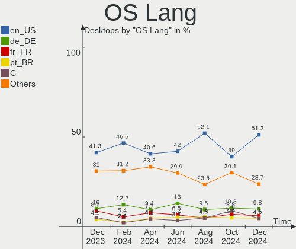
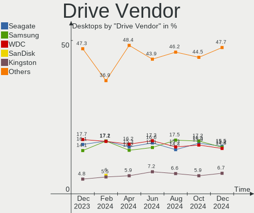
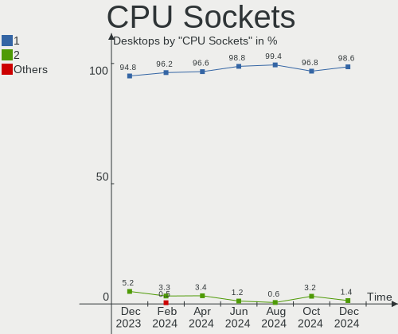
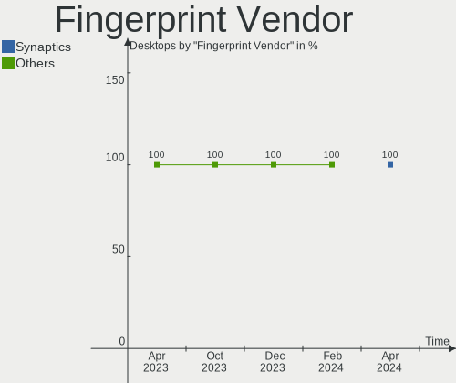
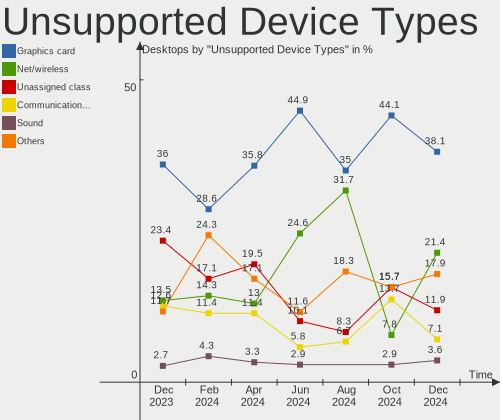

Ubuntu Hardware Trends (Desktop)
--------------------------------

A project to identify most popular hardware characteristics and track their change
over time based on data collected by Ubuntu users at https://Linux-Hardware.org.

Anyone can contribute to the study by uploading probes of their computers by
the [hw-probe](https://github.com/linuxhw/hw-probe) tool:

    sudo -E hw-probe -all -upload

Full-feature report is available here: https://linux-hardware.org/?view=trends&formfactor=desktop

Period: Oct, 2020.

Contents
--------

- [ OS                       ](#os)
- [ OS Family                ](#os-family)
- [ Kernel                   ](#kernel)
- [ Kernel Family            ](#kernel-family)
- [ Kernel Major Ver.        ](#kernel-major-ver)
- [ Arch                     ](#arch)
- [ DE                       ](#de)
- [ Display Server           ](#display-server)
- [ Display Manager          ](#display-manager)
- [ OS Lang                  ](#os-lang)
- [ Boot Mode                ](#boot-mode)
- [ Filesystem               ](#filesystem)
- [ Part. scheme             ](#part-scheme)
- [ Dual Boot with Linux/BSD ](#dual-boot-with-linux/bsd)
- [ Dual Boot (Win)          ](#dual-boot-win)
- [ Country                  ](#country)
- [ City                     ](#city)
- [ Vendor                   ](#vendor)
- [ Model                    ](#model)
- [ Model Family             ](#model-family)
- [ MFG Year                 ](#mfg-year)
- [ Form Factor              ](#form-factor)
- [ Secure Boot              ](#secure-boot)
- [ Coreboot                 ](#coreboot)
- [ RAM Size                 ](#ram-size)
- [ RAM Used                 ](#ram-used)
- [ Has CD-ROM               ](#has-cd-rom)
- [ Total Drives             ](#total-drives)
- [ Has Ethernet             ](#has-ethernet)
- [ Drive Vendor             ](#drive-vendor)
- [ HDD Vendor               ](#hdd-vendor)
- [ SSD Vendor               ](#ssd-vendor)
- [ Drive Model              ](#drive-model)
- [ Drive Kind               ](#drive-kind)
- [ Drive Connector          ](#drive-connector)
- [ Drive Size               ](#drive-size)
- [ Space Total              ](#space-total)
- [ Space Used               ](#space-used)
- [ Malfunc. Drives          ](#malfunc-drives)
- [ Malfunc. Drive Vendor    ](#malfunc-drive-vendor)
- [ Malfunc. HDD Vendor      ](#malfunc-hdd-vendor)
- [ Malfunc. Drive Kind      ](#malfunc-drive-kind)
- [ Failed Drives            ](#failed-drives)
- [ Failed Drive Vendor      ](#failed-drive-vendor)
- [ Drive Status             ](#drive-status)
- [ Storage Vendor           ](#storage-vendor)
- [ Storage Model            ](#storage-model)
- [ Storage Kind             ](#storage-kind)
- [ CPU Vendor               ](#cpu-vendor)
- [ CPU Model                ](#cpu-model)
- [ CPU Model Family         ](#cpu-model-family)
- [ CPU Cores                ](#cpu-cores)
- [ CPU Sockets              ](#cpu-sockets)
- [ CPU Threads              ](#cpu-threads)
- [ CPU Op-Modes             ](#cpu-op-modes)
- [ CPU Microcode            ](#cpu-microcode)
- [ CPU Microarch            ](#cpu-microarch)
- [ GPU Vendor               ](#gpu-vendor)
- [ GPU Model                ](#gpu-model)
- [ GPU Combo                ](#gpu-combo)
- [ GPU Driver               ](#gpu-driver)
- [ GPU Memory               ](#gpu-memory)
- [ Monitor Vendor           ](#monitor-vendor)
- [ Monitor Model            ](#monitor-model)
- [ Monitor Resolution       ](#monitor-resolution)
- [ Monitor Diagonal         ](#monitor-diagonal)
- [ Monitor Width            ](#monitor-width)
- [ Aspect Ratio             ](#aspect-ratio)
- [ Monitor Area             ](#monitor-area)
- [ Pixel Density            ](#pixel-density)
- [ Multiple Monitors        ](#multiple-monitors)
- [ Net Controller Vendor    ](#net-controller-vendor)
- [ Net Controller Model     ](#net-controller-model)
- [ Wireless Vendor          ](#wireless-vendor)
- [ Wireless Model           ](#wireless-model)
- [ Ethernet Vendor          ](#ethernet-vendor)
- [ Ethernet Model           ](#ethernet-model)
- [ Net Controller Kind      ](#net-controller-kind)
- [ Used Controller          ](#used-controller)
- [ NICs                     ](#nics)
- [ Memory Vendor            ](#memory-vendor)
- [ Memory Model             ](#memory-model)
- [ Memory Kind              ](#memory-kind)
- [ Memory Form Factor       ](#memory-form-factor)
- [ Memory Size              ](#memory-size)
- [ Memory Speed             ](#memory-speed)
- [ Sound Vendor             ](#sound-vendor)
- [ Sound Model              ](#sound-model)
- [ Camera Vendor            ](#camera-vendor)
- [ Camera Model             ](#camera-model)
- [ Fingerprint Vendor       ](#fingerprint-vendor)
- [ Fingerprint Model        ](#fingerprint-model)
- [ Chipcard Vendor          ](#chipcard-vendor)
- [ Chipcard Model           ](#chipcard-model)
- [ Printer Vendor           ](#printer-vendor)
- [ Printer Model            ](#printer-model)
- [ Scanner Vendor           ](#scanner-vendor)
- [ Scanner Model            ](#scanner-model)
- [ Bluetooth Vendor         ](#bluetooth-vendor)
- [ Bluetooth Model          ](#bluetooth-model)
- [ Unsupported Devices      ](#unsupported-devices)
- [ Unsupported Device Types ](#unsupported-device-types)

OS
--

Installed operating systems

| Name           | Desktops | Percent |
|----------------|----------|---------|
| Ubuntu 20.04   | 750      | 77%     |
| Ubuntu 18.04   | 132      | 13.55%  |
| Ubuntu 20.10   | 58       | 5.95%   |
| Ubuntu 16.04   | 20       | 2.05%   |
| Ubuntu 19.10   | 10       | 1.03%   |
| Ubuntu Core 16 | 1        | 0.1%    |
| Ubuntu 19.04   | 1        | 0.1%    |
| Ubuntu 18.10   | 1        | 0.1%    |
| Ubuntu 17.10   | 1        | 0.1%    |

OS Family
---------

OS without a version

| Name   | Desktops | Percent |
|--------|----------|---------|
| Ubuntu | 974      | 100%    |

Kernel
------

Version of the Linux kernel

| Version                         | Desktops | Percent |
|---------------------------------|----------|---------|
| 5.4.0-48-generic                | 337      | 34.6%   |
| 5.4.0-52-generic                | 243      | 24.95%  |
| 5.4.0-51-generic                | 81       | 8.32%   |
| 5.4.0-42-generic                | 48       | 4.93%   |
| 4.15.0-118-generic              | 29       | 2.98%   |
| 5.8.0-25-generic                | 28       | 2.87%   |
| 5.4.0-49-generic                | 23       | 2.36%   |
| 5.8.0-26-generic                | 14       | 1.44%   |
| 4.15.0-122-generic              | 14       | 1.44%   |
| 5.4.0-47-generic                | 11       | 1.13%   |
| 5.4.0-48-lowlatency             | 10       | 1.03%   |
| 5.4.0-26-generic                | 10       | 1.03%   |
| 5.3.0-64-generic                | 8        | 0.82%   |
| 5.9.0-050900-generic            | 5        | 0.51%   |
| 5.8.0-20-generic                | 5        | 0.51%   |
| 5.4.0-52-lowlatency             | 5        | 0.51%   |
| 4.15.0-121-generic              | 5        | 0.51%   |
| 5.9.1-050901-generic            | 3        | 0.31%   |
| 5.4.0-51-lowlatency             | 3        | 0.31%   |
| 5.3.0-28-generic                | 3        | 0.31%   |
| 4.15.0-118-lowlatency           | 3        | 0.31%   |
| 5.8.13-050813-generic           | 2        | 0.21%   |
| 5.8.1-050801-generic            | 2        | 0.21%   |
| 5.8.0-23-generic                | 2        | 0.21%   |
| 5.4.0-47-lowlatency             | 2        | 0.21%   |
| 5.4.0-40-generic                | 2        | 0.21%   |
| 5.4.0-37-generic                | 2        | 0.21%   |
| 5.4.0-33-generic                | 2        | 0.21%   |
| 5.3.0-26-generic                | 2        | 0.21%   |
| 5.0.0-23-generic                | 2        | 0.21%   |
| 4.4.0-193-generic               | 2        | 0.21%   |
| 4.15.0-33-generic               | 2        | 0.21%   |
| 4.15.0-20-generic               | 2        | 0.21%   |
| 4.15.0-120-generic              | 2        | 0.21%   |
| 4.15.0-119-generic              | 2        | 0.21%   |
| 4.15.0-106-generic              | 2        | 0.21%   |
| 5.9.0-050900rc8-generic         | 1        | 0.1%    |
| 5.8.2-050802-generic            | 1        | 0.1%    |
| 5.8.16-xanmod1                  | 1        | 0.1%    |
| 5.8.14-050814-generic           | 1        | 0.1%    |
| 5.8.0-25-lowlatency             | 1        | 0.1%    |
| 5.8.0-23-lowlatency             | 1        | 0.1%    |
| 5.8.0-22-generic                | 1        | 0.1%    |
| 5.8.0-21-generic                | 1        | 0.1%    |
| 5.8.0-20-lowlatency             | 1        | 0.1%    |
| 5.8.0-18-generic                | 1        | 0.1%    |
| 5.8.0-16.1-liquorix-amd64       | 1        | 0.1%    |
| 5.8.0-050800-generic            | 1        | 0.1%    |
| 5.7.1-050701-generic            | 1        | 0.1%    |
| 5.7.0-050700-lowlatency         | 1        | 0.1%    |
| 5.7.0-050700-generic            | 1        | 0.1%    |
| 5.6.4-050604-generic            | 1        | 0.1%    |
| 5.6.0-1032-oem                  | 1        | 0.1%    |
| 5.6.0-1028-oem                  | 1        | 0.1%    |
| 5.6.0-050600-lowlatency         | 1        | 0.1%    |
| 5.5.7-050507-generic            | 1        | 0.1%    |
| 5.4.72-xanmod1                  | 1        | 0.1%    |
| 5.4.65-050465-generic           | 1        | 0.1%    |
| 5.4.42arcot-00005-gb19079d5eaad | 1        | 0.1%    |
| 5.4.0-acso                      | 1        | 0.1%    |

Kernel Family
-------------

Linux kernel without a distro release

| Version | Desktops | Percent |
|---------|----------|---------|
| 5.4.0   | 789      | 81.01%  |
| 4.15.0  | 70       | 7.19%   |
| 5.8.0   | 57       | 5.85%   |
| 5.3.0   | 20       | 2.05%   |
| 5.9.0   | 6        | 0.62%   |
| 4.4.0   | 5        | 0.51%   |
| 5.9.1   | 3        | 0.31%   |
| 5.6.0   | 3        | 0.31%   |
| 5.0.0   | 3        | 0.31%   |
| 5.8.13  | 2        | 0.21%   |
| 5.8.1   | 2        | 0.21%   |
| 5.7.0   | 2        | 0.21%   |
| 5.8.2   | 1        | 0.1%    |
| 5.8.16  | 1        | 0.1%    |
| 5.8.14  | 1        | 0.1%    |
| 5.7.1   | 1        | 0.1%    |
| 5.6.4   | 1        | 0.1%    |
| 5.5.7   | 1        | 0.1%    |
| 5.4.72  | 1        | 0.1%    |
| 5.4.65  | 1        | 0.1%    |
| 5.4.42  | 1        | 0.1%    |
| 4.19.5  | 1        | 0.1%    |
| 4.18.0  | 1        | 0.1%    |
| 4.13.0  | 1        | 0.1%    |

Kernel Major Ver.
-----------------

Linux kernel major version

| Version | Desktops | Percent |
|---------|----------|---------|
| 5.4     | 792      | 81.31%  |
| 4.15    | 70       | 7.19%   |
| 5.8     | 64       | 6.57%   |
| 5.3     | 20       | 2.05%   |
| 5.9     | 9        | 0.92%   |
| 4.4     | 5        | 0.51%   |
| 5.6     | 4        | 0.41%   |
| 5.7     | 3        | 0.31%   |
| 5.0     | 3        | 0.31%   |
| 5.5     | 1        | 0.1%    |
| 4.19    | 1        | 0.1%    |
| 4.18    | 1        | 0.1%    |
| 4.13    | 1        | 0.1%    |

Arch
----

OS architecture (x86_64, i586, etc.)

| Name   | Desktops | Percent |
|--------|----------|---------|
| x86_64 | 953      | 97.84%  |
| i686   | 21       | 2.16%   |

DE
--

Desktop Environment

| Name            | Desktops | Percent |
|-----------------|----------|---------|
| GNOME           | 672      | 68.99%  |
| XFCE            | 84       | 8.62%   |
| Unknown         | 49       | 5.03%   |
| MATE            | 43       | 4.41%   |
| KDE             | 35       | 3.59%   |
| Unity           | 23       | 2.36%   |
| KDE5            | 21       | 2.16%   |
| Budgie          | 15       | 1.54%   |
| LXQt            | 8        | 0.82%   |
| GNOME Flashback | 7        | 0.72%   |
| Cinnamon        | 5        | 0.51%   |
| LXDE            | 4        | 0.41%   |
| X-Cinnamon      | 3        | 0.31%   |
| Deepin          | 2        | 0.21%   |
| awesome         | 2        | 0.21%   |
| GNOME Classic   | 1        | 0.1%    |

Display Server
--------------

X11 or Wayland

| Name    | Desktops | Percent |
|---------|----------|---------|
| X11     | 907      | 93.12%  |
| Wayland | 29       | 2.98%   |
| Unknown | 20       | 2.05%   |
| Tty     | 18       | 1.85%   |

Display Manager
---------------

SDDM, LightDM, etc.

| Name    | Desktops | Percent |
|---------|----------|---------|
| Unknown | 802      | 82.34%  |
| GDM     | 94       | 9.65%   |
| TDM     | 51       | 5.24%   |
| SDDM    | 23       | 2.36%   |
| GDM3    | 4        | 0.41%   |

OS Lang
-------

Language

| Lang       | Desktops | Percent |
|------------|----------|---------|
| en_US      | 335      | 34.39%  |
| de_DE      | 95       | 9.75%   |
| pt_BR      | 84       | 8.62%   |
| en_GB      | 62       | 6.37%   |
| it_IT      | 42       | 4.31%   |
| fr_FR      | 37       | 3.8%    |
| es_ES      | 34       | 3.49%   |
| en_CA      | 32       | 3.29%   |
| ru_RU      | 30       | 3.08%   |
| pl_PL      | 19       | 1.95%   |
| hu_HU      | 17       | 1.75%   |
| nl_NL      | 16       | 1.64%   |
| en_AU      | 16       | 1.64%   |
| C          | 16       | 1.64%   |
| en_IN      | 15       | 1.54%   |
| es_AR      | 11       | 1.13%   |
| fi_FI      | 10       | 1.03%   |
| pt_PT      | 7        | 0.72%   |
| ja_JP      | 6        | 0.62%   |
| es_CO      | 6        | 0.62%   |
| de_CH      | 6        | 0.62%   |
| tr_TR      | 5        | 0.51%   |
| zh_TW      | 4        | 0.41%   |
| uk_UA      | 4        | 0.41%   |
| sv_SE      | 4        | 0.41%   |
| nl_BE      | 4        | 0.41%   |
| fr_CA      | 4        | 0.41%   |
| en_ZA      | 4        | 0.41%   |
| de_AT      | 4        | 0.41%   |
| cs_CZ      | 4        | 0.41%   |
| Unknown    | 4        | 0.41%   |
| sl_SI      | 3        | 0.31%   |
| en_IL      | 3        | 0.31%   |
| da_DK      | 3        | 0.31%   |
| id_ID      | 2        | 0.21%   |
| fr_BE      | 2        | 0.21%   |
| es_MX      | 2        | 0.21%   |
| en_NZ      | 2        | 0.21%   |
| el_GR      | 2        | 0.21%   |
| bg_BG      | 2        | 0.21%   |
| zh_CN      | 1        | 0.1%    |
| sk_SK      | 1        | 0.1%    |
| ro_RO      | 1        | 0.1%    |
| nb_NO      | 1        | 0.1%    |
| ko_KR      | 1        | 0.1%    |
| he_IL      | 1        | 0.1%    |
| fr_CH      | 1        | 0.1%    |
| fa_IR      | 1        | 0.1%    |
| eu_ES      | 1        | 0.1%    |
| es_DO      | 1        | 0.1%    |
| es_CU      | 1        | 0.1%    |
| en_US.UTF8 | 1        | 0.1%    |
| en_PH      | 1        | 0.1%    |
| en_IL      | 1        | 0.1%    |
| en_DK      | 1        | 0.1%    |
| ca_ES      | 1        | 0.1%    |

Boot Mode
---------

EFI or BIOS

| Mode | Desktops | Percent |
|------|----------|---------|
| BIOS | 662      | 67.97%  |
| EFI  | 312      | 32.03%  |

Filesystem
----------

Type of filesystem

| Type    | Desktops | Percent |
|---------|----------|---------|
| Ext4    | 899      | 92.3%   |
| Overlay | 27       | 2.77%   |
| Btrfs   | 21       | 2.16%   |
| Zfs     | 16       | 1.64%   |
| Xfs     | 5        | 0.51%   |
| Ext2    | 3        | 0.31%   |
| Jfs     | 1        | 0.1%    |
| Ext3    | 1        | 0.1%    |
| Aufs    | 1        | 0.1%    |

Part. scheme
------------

Scheme of partitioning

| Type    | Desktops | Percent |
|---------|----------|---------|
| Unknown | 790      | 81.11%  |
| GPT     | 113      | 11.6%   |
| MBR     | 71       | 7.29%   |

Dual Boot with Linux/BSD
------------------------

Hosting more than one Linux/BSD

| Dual boot | Desktops | Percent |
|-----------|----------|---------|
| No        | 794      | 81.52%  |
| Yes       | 180      | 18.48%  |

Dual Boot (Win)
---------------

Hosting Linux and Windows

| Dual boot | Desktops | Percent |
|-----------|----------|---------|
| No        | 555      | 56.98%  |
| Yes       | 419      | 43.02%  |

Country
-------

Geographic location (country)

| Country            | Desktops | Percent |
|--------------------|----------|---------|
| USA                | 180      | 18.48%  |
| Germany            | 106      | 10.88%  |
| Brazil             | 90       | 9.24%   |
| UK                 | 56       | 5.75%   |
| Italy              | 45       | 4.62%   |
| France             | 40       | 4.11%   |
| Canada             | 37       | 3.8%    |
| Russia             | 36       | 3.7%    |
| Netherlands        | 35       | 3.59%   |
| Spain              | 32       | 3.29%   |
| Poland             | 22       | 2.26%   |
| Hungary            | 21       | 2.16%   |
| India              | 19       | 1.95%   |
| Finland            | 17       | 1.75%   |
| Australia          | 17       | 1.75%   |
| Ukraine            | 13       | 1.33%   |
| Argentina          | 12       | 1.23%   |
| Switzerland        | 11       | 1.13%   |
| Sweden             | 10       | 1.03%   |
| Portugal           | 10       | 1.03%   |
| Mexico             | 8        | 0.82%   |
| Japan              | 8        | 0.82%   |
| Israel             | 8        | 0.82%   |
| Greece             | 8        | 0.82%   |
| Colombia           | 8        | 0.82%   |
| Austria            | 8        | 0.82%   |
| Turkey             | 7        | 0.72%   |
| Romania            | 7        | 0.72%   |
| Belgium            | 7        | 0.72%   |
| Slovenia           | 6        | 0.62%   |
| Denmark            | 6        | 0.62%   |
| Taiwan             | 5        | 0.51%   |
| Iran               | 5        | 0.51%   |
| South Africa       | 4        | 0.41%   |
| Serbia             | 4        | 0.41%   |
| Norway             | 4        | 0.41%   |
| Indonesia          | 4        | 0.41%   |
| Czech Republic     | 4        | 0.41%   |
| Vietnam            | 3        | 0.31%   |
| Slovakia           | 3        | 0.31%   |
| Malaysia           | 3        | 0.31%   |
| Kyrgyzstan         | 3        | 0.31%   |
| UAE                | 2        | 0.21%   |
| Thailand           | 2        | 0.21%   |
| Peru               | 2        | 0.21%   |
| New Zealand        | 2        | 0.21%   |
| Myanmar            | 2        | 0.21%   |
| Luxembourg         | 2        | 0.21%   |
| Ireland            | 2        | 0.21%   |
| Iceland            | 2        | 0.21%   |
| Dominican Republic | 2        | 0.21%   |
| Croatia            | 2        | 0.21%   |
| China              | 2        | 0.21%   |
| Bulgaria           | 2        | 0.21%   |
| Belarus            | 2        | 0.21%   |
| Uzbekistan         | 1        | 0.1%    |
| Puerto Rico        | 1        | 0.1%    |
| Philippines        | 1        | 0.1%    |
| Nepal              | 1        | 0.1%    |
| Morocco            | 1        | 0.1%    |

City
----

Geographic location (city)

| City                   | Desktops | Percent |
|------------------------|----------|---------|
| São Paulo             | 26       | 2.67%   |
| Athens                 | 8        | 0.82%   |
| Moscow                 | 7        | 0.72%   |
| Madrid                 | 7        | 0.72%   |
| Budapest               | 7        | 0.72%   |
| Toronto                | 6        | 0.62%   |
| Helsinki               | 6        | 0.62%   |
| Berlin                 | 6        | 0.62%   |
| Sydney                 | 5        | 0.51%   |
| St Petersburg          | 5        | 0.51%   |
| Rome                   | 5        | 0.51%   |
| Jundiaí               | 5        | 0.51%   |
| Austin                 | 5        | 0.51%   |
| Warsaw                 | 4        | 0.41%   |
| Tehran                 | 4        | 0.41%   |
| Stuttgart              | 4        | 0.41%   |
| Saint Paul             | 4        | 0.41%   |
| Rio de Janeiro         | 4        | 0.41%   |
| Kyiv                   | 4        | 0.41%   |
| Chicago                | 4        | 0.41%   |
| Zurich                 | 3        | 0.31%   |
| Vienna                 | 3        | 0.31%   |
| Tel Aviv               | 3        | 0.31%   |
| Taipei                 | 3        | 0.31%   |
| San Jose               | 3        | 0.31%   |
| Phoenix                | 3        | 0.31%   |
| Paris                  | 3        | 0.31%   |
| Montreal               | 3        | 0.31%   |
| Milan                  | 3        | 0.31%   |
| Miami                  | 3        | 0.31%   |
| Lisbon                 | 3        | 0.31%   |
| Leipzig                | 3        | 0.31%   |
| Krakow                 | 3        | 0.31%   |
| Karlsruhe              | 3        | 0.31%   |
| Istanbul               | 3        | 0.31%   |
| Hamburg                | 3        | 0.31%   |
| Frankfurt am Main      | 3        | 0.31%   |
| Dallas                 | 3        | 0.31%   |
| Chennai                | 3        | 0.31%   |
| Calgary                | 3        | 0.31%   |
| Bishkek                | 3        | 0.31%   |
| Belo Horizonte         | 3        | 0.31%   |
| Amsterdam              | 3        | 0.31%   |
| Abbotsford             | 3        | 0.31%   |
| Zwolle                 | 2        | 0.21%   |
| Zwaag                  | 2        | 0.21%   |
| Zelenograd             | 2        | 0.21%   |
| Yangon                 | 2        | 0.21%   |
| Wuppertal              | 2        | 0.21%   |
| Vlaardingen            | 2        | 0.21%   |
| Valencia               | 2        | 0.21%   |
| Udine                  | 2        | 0.21%   |
| Turin                  | 2        | 0.21%   |
| Torslanda              | 2        | 0.21%   |
| The Hague              | 2        | 0.21%   |
| São Bernardo do Campo | 2        | 0.21%   |
| St. Petersburg         | 2        | 0.21%   |
| Spokane                | 2        | 0.21%   |
| Seville                | 2        | 0.21%   |
| Rostov-on-Don          | 2        | 0.21%   |

Vendor
------

Motherboard manufacturer

| Name                                   | Desktops | Percent |
|----------------------------------------|----------|---------|
| ASUSTek Computer                       | 237      | 24.33%  |
| Gigabyte Technology                    | 150      | 15.4%   |
| Dell                                   | 107      | 10.99%  |
| ASRock                                 | 96       | 9.86%   |
| Hewlett-Packard                        | 90       | 9.24%   |
| MSI                                    | 88       | 9.03%   |
| Intel                                  | 39       | 4%      |
| Lenovo                                 | 34       | 3.49%   |
| Acer                                   | 19       | 1.95%   |
| Foxconn                                | 17       | 1.75%   |
| Pegatron                               | 16       | 1.64%   |
| Fujitsu                                | 10       | 1.03%   |
| Unknown                                | 10       | 1.03%   |
| Biostar                                | 7        | 0.72%   |
| Packard Bell                           | 6        | 0.62%   |
| Fujitsu Siemens                        | 5        | 0.51%   |
| ECS                                    | 5        | 0.51%   |
| Apple                                  | 5        | 0.51%   |
| Medion                                 | 4        | 0.41%   |
| Positivo                               | 3        | 0.31%   |
| eMachines                              | 3        | 0.31%   |
| Quanta                                 | 2        | 0.21%   |
| Huanan                                 | 2        | 0.21%   |
| EVGA                                   | 2        | 0.21%   |
| Alienware                              | 2        | 0.21%   |
| ZOTAC                                  | 1        | 0.1%    |
| Wistron                                | 1        | 0.1%    |
| WeiBu                                  | 1        | 0.1%    |
| VS Company                             | 1        | 0.1%    |
| Supermicro                             | 1        | 0.1%    |
| Shuttle                                | 1        | 0.1%    |
| NEC Computers                          | 1        | 0.1%    |
| NCR                                    | 1        | 0.1%    |
| MiTAC                                  | 1        | 0.1%    |
| Koloe                                  | 1        | 0.1%    |
| ITSUMI                                 | 1        | 0.1%    |
| Itautec                                | 1        | 0.1%    |
| ISYNC                                  | 1        | 0.1%    |
| Desenvolvido para Positivo Informatica | 1        | 0.1%    |
| CCE                                    | 1        | 0.1%    |

Model
-----

Motherboard model

| Name                           | Desktops | Percent |
|--------------------------------|----------|---------|
| ASUS All Series                | 29       | 2.98%   |
| Unknown                        | 10       | 1.03%   |
| HP Compaq 6005 Pro SFF PC      | 9        | 0.92%   |
| Dell OptiPlex 7010             | 7        | 0.72%   |
| ASUS TUF GAMING X570-PLUS      | 7        | 0.72%   |
| Gigabyte 970A-DS3P             | 6        | 0.62%   |
| HP Compaq Elite 8300 SFF       | 5        | 0.51%   |
| Dell OptiPlex 9020             | 5        | 0.51%   |
| Dell OptiPlex 380              | 5        | 0.51%   |
| ASUS ROG STRIX B450-F GAMING   | 5        | 0.51%   |
| ASUS M5A78L-M PLUS/USB3        | 5        | 0.51%   |
| ASRock N68C-S UCC              | 5        | 0.51%   |
| HP ProDesk 600 G1 SFF          | 4        | 0.41%   |
| Dell XPS 8920                  | 4        | 0.41%   |
| Dell OptiPlex 790              | 4        | 0.41%   |
| Dell OptiPlex 3010             | 4        | 0.41%   |
| ASUS PRIME A320M-K             | 4        | 0.41%   |
| MSI MS-7C84                    | 3        | 0.31%   |
| MSI MS-7A38                    | 3        | 0.31%   |
| MSI MS-7798                    | 3        | 0.31%   |
| Intel H55                      | 3        | 0.31%   |
| HP EliteDesk 800 G1 SFF        | 3        | 0.31%   |
| HP Compaq 6200 Pro MT PC       | 3        | 0.31%   |
| HP Compaq 6005 Pro MT PC       | 3        | 0.31%   |
| HP Compaq 4000 Pro SFF PC      | 3        | 0.31%   |
| Gigabyte X570 I AORUS PRO WIFI | 3        | 0.31%   |
| Gigabyte X570 AORUS ELITE      | 3        | 0.31%   |
| Gigabyte GA-78LMT-USB3 6.0     | 3        | 0.31%   |
| Gigabyte B450M DS3H            | 3        | 0.31%   |
| Dell OptiPlex 990              | 3        | 0.31%   |
| Dell OptiPlex 960              | 3        | 0.31%   |
| Dell OptiPlex 755              | 3        | 0.31%   |
| Dell OptiPlex 390              | 3        | 0.31%   |
| ASUS PRIME X470-PRO            | 3        | 0.31%   |
| ASUS PRIME X370-PRO            | 3        | 0.31%   |
| ASUS PRIME B450-PLUS           | 3        | 0.31%   |
| ASUS P8Z77-V LK                | 3        | 0.31%   |
| ASUS M5A99X EVO R2.0           | 3        | 0.31%   |
| ASUS M5A99FX PRO R2.0          | 3        | 0.31%   |
| ASUS M5A97 R2.0                | 3        | 0.31%   |
| ASUS M5A78L-M/USB3             | 3        | 0.31%   |
| ASRock G31M-GS                 | 3        | 0.31%   |
| ASRock B450M Pro4              | 3        | 0.31%   |
| ASRock 970 Pro3 R2.0           | 3        | 0.31%   |
| ASRock 970 Extreme3 R2.0       | 3        | 0.31%   |
| Apple MacPro1,1                | 3        | 0.31%   |
| Packard Bell imedia S1800      | 2        | 0.21%   |
| MSI MS-7C95                    | 2        | 0.21%   |
| MSI MS-7C52                    | 2        | 0.21%   |
| MSI MS-7C51                    | 2        | 0.21%   |
| MSI MS-7C37                    | 2        | 0.21%   |
| MSI MS-7C35                    | 2        | 0.21%   |
| MSI MS-7C02                    | 2        | 0.21%   |
| MSI MS-7B98                    | 2        | 0.21%   |
| MSI MS-7B86                    | 2        | 0.21%   |
| MSI MS-7B22                    | 2        | 0.21%   |
| MSI MS-7A70                    | 2        | 0.21%   |
| MSI MS-7A59                    | 2        | 0.21%   |
| MSI MS-7A39                    | 2        | 0.21%   |
| MSI MS-7A33                    | 2        | 0.21%   |

Model Family
------------

Motherboard model prefix

| Name                   | Desktops | Percent |
|------------------------|----------|---------|
| Dell OptiPlex          | 56       | 5.75%   |
| HP Compaq              | 54       | 5.54%   |
| ASUS PRIME             | 30       | 3.08%   |
| ASUS All               | 29       | 2.98%   |
| ASUS ROG               | 21       | 2.16%   |
| Lenovo ThinkCentre     | 20       | 2.05%   |
| Dell Precision         | 18       | 1.85%   |
| ASUS TUF               | 13       | 1.33%   |
| ASUS M5A78L-M          | 13       | 1.33%   |
| Dell Inspiron          | 12       | 1.23%   |
| Gigabyte X570          | 11       | 1.13%   |
| Acer Aspire            | 11       | 1.13%   |
| Unknown                | 10       | 1.03%   |
| HP ProDesk             | 8        | 0.82%   |
| Dell XPS               | 8        | 0.82%   |
| HP EliteDesk           | 7        | 0.72%   |
| Gigabyte 970A-DS3P     | 7        | 0.72%   |
| Fujitsu ESPRIMO        | 7        | 0.72%   |
| ASRock 970             | 7        | 0.72%   |
| Gigabyte GA-78LMT-USB3 | 5        | 0.51%   |
| ASUS P8Z77-V           | 5        | 0.51%   |
| ASRock X570            | 5        | 0.51%   |
| ASRock N68C-S          | 5        | 0.51%   |
| Acer Veriton           | 5        | 0.51%   |
| Lenovo IdeaCentre      | 4        | 0.41%   |
| Gigabyte B450M         | 4        | 0.41%   |
| Dell PowerEdge         | 4        | 0.41%   |
| ASUS P5Q               | 4        | 0.41%   |
| ASUS M5A97             | 4        | 0.41%   |
| ASRock B450M           | 4        | 0.41%   |
| ASRock B450            | 4        | 0.41%   |
| Packard Bell iMedia    | 3        | 0.31%   |
| MSI MS-7C84            | 3        | 0.31%   |
| MSI MS-7A38            | 3        | 0.31%   |
| MSI MS-7798            | 3        | 0.31%   |
| Intel H55              | 3        | 0.31%   |
| Gigabyte Z390          | 3        | 0.31%   |
| Gigabyte X470          | 3        | 0.31%   |
| Foxconn Pro            | 3        | 0.31%   |
| Dell Vostro            | 3        | 0.31%   |
| ASUS SABERTOOTH        | 3        | 0.31%   |
| ASUS P8Z68-V           | 3        | 0.31%   |
| ASUS P8H61-M           | 3        | 0.31%   |
| ASUS P5K               | 3        | 0.31%   |
| ASUS P5G41T-M          | 3        | 0.31%   |
| ASUS M5A99X            | 3        | 0.31%   |
| ASUS M5A99FX           | 3        | 0.31%   |
| ASRock Z170            | 3        | 0.31%   |
| ASRock X470            | 3        | 0.31%   |
| ASRock G31M-GS         | 3        | 0.31%   |
| ASRock B75             | 3        | 0.31%   |
| ASRock B450M-HDV       | 3        | 0.31%   |
| Apple MacPro1          | 3        | 0.31%   |
| Pegatron Pro           | 2        | 0.21%   |
| MSI MS-7C95            | 2        | 0.21%   |
| MSI MS-7C52            | 2        | 0.21%   |
| MSI MS-7C51            | 2        | 0.21%   |
| MSI MS-7C37            | 2        | 0.21%   |
| MSI MS-7C35            | 2        | 0.21%   |
| MSI MS-7C02            | 2        | 0.21%   |

MFG Year
--------

Motherboard manufacture year

| Year | Desktops | Percent |
|------|----------|---------|
| 2020 | 115      | 11.81%  |
| 2019 | 109      | 11.19%  |
| 2018 | 91       | 9.34%   |
| 2014 | 83       | 8.52%   |
| 2013 | 78       | 8.01%   |
| 2011 | 77       | 7.91%   |
| 2010 | 76       | 7.8%    |
| 2009 | 72       | 7.39%   |
| 2012 | 70       | 7.19%   |
| 2015 | 47       | 4.83%   |
| 2017 | 39       | 4%      |
| 2016 | 38       | 3.9%    |
| 2007 | 30       | 3.08%   |
| 2008 | 29       | 2.98%   |
| 2006 | 10       | 1.03%   |
| 2005 | 9        | 0.92%   |
| 2004 | 1        | 0.1%    |

Form Factor
-----------

Physical design of the computer

| Name    | Desktops | Percent |
|---------|----------|---------|
| Desktop | 974      | 100%    |

Secure Boot
-----------

Enabled or disabled

| State    | Desktops | Percent |
|----------|----------|---------|
| Disabled | 944      | 96.92%  |
| Enabled  | 30       | 3.08%   |

Coreboot
--------

Have coreboot on board

| Used | Desktops | Percent |
|------|----------|---------|
| No   | 974      | 100%    |

RAM Size
--------

Total RAM memory

| Size in GB      | Desktops | Percent |
|-----------------|----------|---------|
| 8.01-16.0       | 219      | 22.48%  |
| 16.01-24.0      | 204      | 20.94%  |
| 3.01-4.0        | 199      | 20.43%  |
| 4.01-8.0        | 131      | 13.45%  |
| 32.01-64.0      | 114      | 11.7%   |
| 64.01-256.0     | 35       | 3.59%   |
| 1.01-2.0        | 31       | 3.18%   |
| 24.01-32.0      | 24       | 2.46%   |
| 2.01-3.0        | 8        | 0.82%   |
| 0.01-1.0        | 8        | 0.82%   |
| More than 256.0 | 1        | 0.1%    |

RAM Used
--------

Used RAM memory

| Used GB     | Desktops | Percent |
|-------------|----------|---------|
| 1.01-2.0    | 421      | 43.22%  |
| 2.01-3.0    | 194      | 19.92%  |
| 4.01-8.0    | 126      | 12.94%  |
| 3.01-4.0    | 96       | 9.86%   |
| 0.01-1.0    | 81       | 8.32%   |
| 8.01-16.0   | 44       | 4.52%   |
| 16.01-24.0  | 7        | 0.72%   |
| 32.01-64.0  | 2        | 0.21%   |
| 24.01-32.0  | 2        | 0.21%   |
| 64.01-256.0 | 1        | 0.1%    |

Has CD-ROM
----------

Has CD-ROM on board

| Presented | Desktops | Percent |
|-----------|----------|---------|
| Yes       | 539      | 55.34%  |
| No        | 435      | 44.66%  |

Total Drives
------------

Number of drives on board

| Drives | Desktops | Percent |
|--------|----------|---------|
| 1      | 370      | 37.99%  |
| 2      | 307      | 31.52%  |
| 3      | 132      | 13.55%  |
| 4      | 86       | 8.83%   |
| 5      | 47       | 4.83%   |
| 6      | 13       | 1.33%   |
| 0      | 9        | 0.92%   |
| 7      | 5        | 0.51%   |
| 9      | 4        | 0.41%   |
| 20     | 1        | 0.1%    |

Has Ethernet
------------

Has Ethernet on board

| Presented | Desktops | Percent |
|-----------|----------|---------|
| Yes       | 961      | 98.67%  |
| No        | 13       | 1.33%   |

Drive Vendor
------------

Hard drive vendors

| Vendor                    | Desktops | Drives | Percent |
|---------------------------|----------|--------|---------|
| WDC                       | 378      | 517    | 23.01%  |
| Seagate                   | 358      | 486    | 21.79%  |
| Samsung Electronics       | 226      | 301    | 13.76%  |
| Kingston                  | 99       | 114    | 6.03%   |
| Toshiba                   | 83       | 95     | 5.05%   |
| Hitachi                   | 69       | 76     | 4.2%    |
| SanDisk                   | 51       | 57     | 3.1%    |
| Crucial                   | 49       | 56     | 2.98%   |
| Phison                    | 28       | 31     | 1.7%    |
| Intel                     | 25       | 30     | 1.52%   |
| A-DATA Technology         | 25       | 25     | 1.52%   |
| Unknown                   | 24       | 25     | 1.46%   |
| Maxtor                    | 20       | 20     | 1.22%   |
| HGST                      | 15       | 18     | 0.91%   |
| OCZ                       | 11       | 12     | 0.67%   |
| Patriot                   | 10       | 10     | 0.61%   |
| GOODRAM                   | 10       | 10     | 0.61%   |
| Silicon Motion            | 9        | 9      | 0.55%   |
| Micron Technology         | 9        | 9      | 0.55%   |
| Hewlett-Packard           | 9        | 9      | 0.55%   |
| Corsair                   | 9        | 10     | 0.55%   |
| China                     | 9        | 9      | 0.55%   |
| PNY                       | 8        | 9      | 0.49%   |
| Intenso                   | 8        | 8      | 0.49%   |
| SPCC                      | 7        | 7      | 0.43%   |
| Transcend                 | 5        | 5      | 0.3%    |
| Micron/Crucial Technology | 5        | 5      | 0.3%    |
| KingSpec                  | 5        | 5      | 0.3%    |
| Fujitsu                   | 5        | 5      | 0.3%    |
| SK Hynix                  | 4        | 4      | 0.24%   |
| LITEON                    | 4        | 4      | 0.24%   |
| ASMT                      | 4        | 5      | 0.24%   |
| Team                      | 3        | 3      | 0.18%   |
| Realtek Semiconductor     | 3        | 3      | 0.18%   |
| XPG                       | 2        | 3      | 0.12%   |
| Smartbuy                  | 2        | 2      | 0.12%   |
| SABRENT                   | 2        | 2      | 0.12%   |
| Lexar                     | 2        | 2      | 0.12%   |
| KingFast                  | 2        | 2      | 0.12%   |
| JMicron                   | 2        | 2      | 0.12%   |
| ASMT109x                  | 2        | 3      | 0.12%   |
| Apple                     | 2        | 2      | 0.12%   |
| XrayDisk                  | 1        | 1      | 0.06%   |
| USB3.0                    | 1        | 2      | 0.06%   |
| THU                       | 1        | 1      | 0.06%   |
| TCSUNBOW                  | 1        | 1      | 0.06%   |
| SSK                       | 1        | 1      | 0.06%   |
| sobetter                  | 1        | 1      | 0.06%   |
| SandForce                 | 1        | 1      | 0.06%   |
| RCESSD                    | 1        | 1      | 0.06%   |
| PNY USB                   | 1        | 1      | 0.06%   |
| PLEXTOR                   | 1        | 1      | 0.06%   |
| MENGMI                    | 1        | 1      | 0.06%   |
| MDT                       | 1        | 1      | 0.06%   |
| Marlin                    | 1        | 1      | 0.06%   |
| LITEONIT                  | 1        | 1      | 0.06%   |
| Lite-On                   | 1        | 1      | 0.06%   |
| Linux                     | 1        | 1      | 0.06%   |
| Leven                     | 1        | 1      | 0.06%   |
| LDLC                      | 1        | 1      | 0.06%   |

HDD Vendor
----------

Hard disk drive vendors

| Vendor              | Desktops | Drives | Percent |
|---------------------|----------|--------|---------|
| WDC                 | 356      | 480    | 36.36%  |
| Seagate             | 352      | 474    | 35.96%  |
| Toshiba             | 76       | 86     | 7.76%   |
| Samsung Electronics | 74       | 84     | 7.56%   |
| Hitachi             | 69       | 76     | 7.05%   |
| Maxtor              | 19       | 19     | 1.94%   |
| HGST                | 15       | 18     | 1.53%   |
| Fujitsu             | 5        | 5      | 0.51%   |
| Intenso             | 3        | 3      | 0.31%   |
| Hewlett-Packard     | 3        | 3      | 0.31%   |
| ASMT109x            | 2        | 3      | 0.2%    |
| KESU                | 1        | 1      | 0.1%    |
| IET                 | 1        | 2      | 0.1%    |
| ExcelStor           | 1        | 1      | 0.1%    |
| ASMT                | 1        | 2      | 0.1%    |
| Apple               | 1        | 1      | 0.1%    |

SSD Vendor
----------

Solid state drive vendors

| Vendor              | Desktops | Drives | Percent |
|---------------------|----------|--------|---------|
| Samsung Electronics | 126      | 153    | 24.37%  |
| Kingston            | 92       | 104    | 17.79%  |
| Crucial             | 48       | 54     | 9.28%   |
| SanDisk             | 47       | 49     | 9.09%   |
| WDC                 | 33       | 33     | 6.38%   |
| A-DATA Technology   | 22       | 22     | 4.26%   |
| Intel               | 15       | 18     | 2.9%    |
| OCZ                 | 11       | 12     | 2.13%   |
| Patriot             | 10       | 10     | 1.93%   |
| GOODRAM             | 10       | 10     | 1.93%   |
| China               | 9        | 9      | 1.74%   |
| PNY                 | 8        | 9      | 1.55%   |
| Micron Technology   | 8        | 8      | 1.55%   |
| Toshiba             | 7        | 8      | 1.35%   |
| SPCC                | 7        | 7      | 1.35%   |
| Corsair             | 7        | 8      | 1.35%   |
| Transcend           | 5        | 5      | 0.97%   |
| KingSpec            | 4        | 4      | 0.77%   |
| Hewlett-Packard     | 4        | 4      | 0.77%   |
| Team                | 3        | 3      | 0.58%   |
| LITEON              | 3        | 3      | 0.58%   |
| Smartbuy            | 2        | 2      | 0.39%   |
| SK Hynix            | 2        | 2      | 0.39%   |
| Seagate             | 2        | 2      | 0.39%   |
| SABRENT             | 2        | 2      | 0.39%   |
| Lexar               | 2        | 2      | 0.39%   |
| JMicron             | 2        | 2      | 0.39%   |
| Intenso             | 2        | 2      | 0.39%   |
| ASMT                | 2        | 2      | 0.39%   |
| THU                 | 1        | 1      | 0.19%   |
| SandForce           | 1        | 1      | 0.19%   |
| PNY USB             | 1        | 1      | 0.19%   |
| PLEXTOR             | 1        | 1      | 0.19%   |
| MENGMI              | 1        | 1      | 0.19%   |
| Maxtor              | 1        | 1      | 0.19%   |
| LITEONIT            | 1        | 1      | 0.19%   |
| Leven               | 1        | 1      | 0.19%   |
| LDLC                | 1        | 1      | 0.19%   |
| Kingmax             | 1        | 1      | 0.19%   |
| KingDian            | 1        | 1      | 0.19%   |
| Integral            | 1        | 1      | 0.19%   |
| Innodisk            | 1        | 1      | 0.19%   |
| Hoodisk             | 1        | 1      | 0.19%   |
| Gigabyte Technology | 1        | 1      | 0.19%   |
| EZLINK              | 1        | 1      | 0.19%   |
| EDGE                | 1        | 1      | 0.19%   |
| DREVO               | 1        | 1      | 0.19%   |
| BIWIN               | 1        | 1      | 0.19%   |
| AXIOMTEK            | 1        | 1      | 0.19%   |
| Apple               | 1        | 1      | 0.19%   |
| 2.5"                | 1        | 1      | 0.19%   |

Drive Model
-----------

Hard drive models

| Model                        | Desktops | Percent |
|------------------------------|----------|---------|
| ST500DM002-1BD142 500GB      | 33       | 1.72%   |
| NVMe SSD Drive 1TB           | 29       | 1.51%   |
| ST1000DM010-2EP102 1TB       | 25       | 1.3%    |
| ST2000DM008-2FR102 2TB       | 24       | 1.25%   |
| DT01ACA100 1TB               | 24       | 1.25%   |
| SA400S37240G 240GB SSD       | 22       | 1.14%   |
| NVMe SSD Drive 500GB         | 20       | 1.04%   |
| SA400S37120G 120GB SSD       | 18       | 0.94%   |
| ST1000DM003-1CH162 1TB       | 17       | 0.88%   |
| SSD 860 EVO 500GB            | 17       | 0.88%   |
| NVMe SSD Drive 512GB         | 17       | 0.88%   |
| WD10EZEX-08WN4A0 1TB         | 16       | 0.83%   |
| SA400S37480G 480GB SSD       | 16       | 0.83%   |
| ST3500418AS 500GB            | 15       | 0.78%   |
| ST31000528AS 1TB             | 14       | 0.73%   |
| SSD 850 EVO 250GB            | 14       | 0.73%   |
| SV300S37A120G 120GB SSD      | 13       | 0.68%   |
| WD20EZRZ-00Z5HB0 2TB         | 12       | 0.62%   |
| NVMe SSD Drive 256GB         | 12       | 0.62%   |
| ST2000DM001-1CH164 2TB       | 11       | 0.57%   |
| SSD 860 EVO 1TB              | 11       | 0.57%   |
| SSD 850 EVO 500GB            | 11       | 0.57%   |
| SSD 840 EVO 250GB            | 11       | 0.57%   |
| WD20EZRX-00D8PB0 2TB         | 10       | 0.52%   |
| ST1000DM003-1ER162 1TB       | 10       | 0.52%   |
| HDWD110 1TB                  | 10       | 0.52%   |
| Expansion Desk 3TB           | 10       | 0.52%   |
| WD10EZEX-00WN4A0 1TB         | 9        | 0.47%   |
| ST2000DM006-2DM164 2TB       | 9        | 0.47%   |
| NVMe SSD Drive 250GB         | 9        | 0.47%   |
| HDWD120 2TB                  | 9        | 0.47%   |
| HD103SJ 1TB                  | 9        | 0.47%   |
| Expansion 4TB                | 9        | 0.47%   |
| WD5000AAKX-003CA0 500GB      | 8        | 0.42%   |
| WD20EARX-00PASB0 2TB         | 8        | 0.42%   |
| SSD 860 EVO 250GB            | 8        | 0.42%   |
| HD322HJ 320GB                | 8        | 0.42%   |
| WD5000AAKX-001CA0 500GB      | 7        | 0.36%   |
| WD30EFRX-68EUZN0 3TB         | 7        | 0.36%   |
| ST1000DM003-9YN162 1TB       | 7        | 0.36%   |
| ST1000DM003-1SB10C 1TB       | 7        | 0.36%   |
| SD/MMC/MS PRO 32GB           | 7        | 0.36%   |
| NVMe SSD Drive 1024GB        | 7        | 0.36%   |
| DT01ACA200 2TB               | 7        | 0.36%   |
| CT240BX500SSD1 240GB         | 7        | 0.36%   |
| WD5000AAKX-08U6AA0 500GB     | 6        | 0.31%   |
| WD5000AAKX-083CA1 500GB      | 6        | 0.31%   |
| WD10EARS-00Y5B1 1TB          | 6        | 0.31%   |
| ST3500312CS 500GB            | 6        | 0.31%   |
| ST31000524AS 1TB             | 6        | 0.31%   |
| ST3000DM001-1ER166 3TB       | 6        | 0.31%   |
| ST2000DM001-1ER164 2TB       | 6        | 0.31%   |
| SSD PLUS 240GB               | 6        | 0.31%   |
| HDS721010CLA332 1TB          | 6        | 0.31%   |
| HD204UI 2TB                  | 6        | 0.31%   |
| HD103SI 1TB                  | 6        | 0.31%   |
| DT01ACA050 500GB             | 6        | 0.31%   |
| WDS240G2G0A-00JH30 240GB SSD | 5        | 0.26%   |
| WDS120G2G0A-00JH30 120GB SSD | 5        | 0.26%   |
| WD5000AAKX-60U6AA0 500GB     | 5        | 0.26%   |

Drive Kind
----------

HDD or SSD

| Kind    | Desktops | Drives | Percent |
|---------|----------|--------|---------|
| HDD     | 760      | 1258   | 54.56%  |
| SSD     | 443      | 571    | 31.8%   |
| NVMe    | 144      | 174    | 10.34%  |
| Unknown | 42       | 44     | 3.02%   |
| MMC     | 4        | 5      | 0.29%   |

Drive Connector
---------------

SATA, SAS, NVMe, etc.

| Type | Desktops | Drives | Percent |
|------|----------|--------|---------|
| SATA | 929      | 1796   | 81.14%  |
| NVMe | 144      | 174    | 12.58%  |
| SAS  | 68       | 77     | 5.94%   |
| MMC  | 4        | 5      | 0.35%   |

Drive Size
----------

Size of hard drive

| Size in TB | Desktops | Drives | Percent |
|------------|----------|--------|---------|
| 0.01-0.5   | 685      | 970    | 51.82%  |
| 0.51-1.0   | 360      | 462    | 27.23%  |
| 1.01-2.0   | 155      | 197    | 11.72%  |
| 2.01-3.0   | 53       | 80     | 4.01%   |
| 3.01-4.0   | 46       | 65     | 3.48%   |
| 4.01-10.0  | 19       | 50     | 1.44%   |
| 10.01-20.0 | 4        | 5      | 0.3%    |

Space Total
-----------

Amount of disk space available on the file system

| Size in GB     | Desktops | Percent |
|----------------|----------|---------|
| 101-250        | 237      | 24.33%  |
| 251-500        | 212      | 21.77%  |
| 501-1000       | 176      | 18.07%  |
| 1001-2000      | 103      | 10.57%  |
| More than 3000 | 83       | 8.52%   |
| 51-100         | 53       | 5.44%   |
| 2001-3000      | 46       | 4.72%   |
| 21-50          | 28       | 2.87%   |
| 1-20           | 22       | 2.26%   |
| Unknown        | 14       | 1.44%   |

Space Used
----------

Amount of used disk space

| Used GB        | Desktops | Percent |
|----------------|----------|---------|
| 1-20           | 344      | 35.32%  |
| 21-50          | 151      | 15.5%   |
| 101-250        | 122      | 12.53%  |
| 51-100         | 96       | 9.86%   |
| 501-1000       | 75       | 7.7%    |
| 251-500        | 72       | 7.39%   |
| 1001-2000      | 47       | 4.83%   |
| More than 3000 | 34       | 3.49%   |
| 2001-3000      | 19       | 1.95%   |
| Unknown        | 14       | 1.44%   |

Malfunc. Drives
---------------

Drive models with a malfunction

| Model                           | Desktops | Drives | Percent |
|---------------------------------|----------|--------|---------|
| ST500DM002-1BD142 500GB         | 5        | 5      | 6.94%   |
| WD5000AAKX-083CA1 500GB         | 3        | 3      | 4.17%   |
| WD5000AAKX-003CA0 500GB         | 3        | 3      | 4.17%   |
| WD5000AAKX-00ERMA0 500GB        | 2        | 2      | 2.78%   |
| WD30EZRX-00DC0B0 3TB            | 2        | 4      | 2.78%   |
| ST31000528AS 1TB                | 2        | 2      | 2.78%   |
| ST1000DM003-1CH162 1TB          | 2        | 2      | 2.78%   |
| HD502HJ 500GB                   | 2        | 2      | 2.78%   |
| WD5000AAKX-75U6AA0 500GB        | 1        | 1      | 1.39%   |
| WD5000AAKS-60WWPA0 500GB        | 1        | 1      | 1.39%   |
| WD5000AAKS-00UU3A0 500GB        | 1        | 1      | 1.39%   |
| WD3200AAKX-001CA0 320GB         | 1        | 1      | 1.39%   |
| WD30EFRX-68EUZN0 3TB            | 1        | 1      | 1.39%   |
| WD25EZRS-00J99B0 2TB            | 1        | 1      | 1.39%   |
| WD1600AAJS-75M0A0 160GB         | 1        | 1      | 1.39%   |
| WD15EARS-00Z5B1 1TB             | 1        | 1      | 1.39%   |
| WD10SPCX-24HWST0 1TB            | 1        | 1      | 1.39%   |
| WD10EZRX-00L4HB0 1TB            | 1        | 1      | 1.39%   |
| WD10EZEX-00WN4A0 1TB            | 1        | 1      | 1.39%   |
| WD10EARS-22Y5B1 1TB             | 1        | 1      | 1.39%   |
| WD10EADX-22TDHB0 1TB            | 1        | 1      | 1.39%   |
| VERTEX4 128GB SSD               | 1        | 1      | 1.39%   |
| TR150 480GB SSD                 | 1        | 1      | 1.39%   |
| SU800 512GB SSD                 | 1        | 1      | 1.39%   |
| ST9320423AS 320GB               | 1        | 1      | 1.39%   |
| ST8000VN0022-2EL112 8TB         | 1        | 2      | 1.39%   |
| ST8000AS0002-1NA17Z 8TB         | 1        | 1      | 1.39%   |
| ST500LT012-9WS142 500GB         | 1        | 1      | 1.39%   |
| ST500DM002-1BC142 500GB         | 1        | 1      | 1.39%   |
| ST3250410AS 250GB               | 1        | 1      | 1.39%   |
| ST3250318AS 250GB               | 1        | 1      | 1.39%   |
| ST3250310AS 250GB               | 1        | 1      | 1.39%   |
| ST3160812AS 160GB               | 1        | 1      | 1.39%   |
| ST2000DX001-1NS164 2TB          | 1        | 1      | 1.39%   |
| ST2000DL003-9VT166 2TB          | 1        | 1      | 1.39%   |
| SSDSC2BW240A4 240GB             | 1        | 1      | 1.39%   |
| SSDSC2BW120A4 120GB             | 1        | 1      | 1.39%   |
| SSDSC2BF180A5H SED 180GB        | 1        | 1      | 1.39%   |
| SSDSC2BA400G3T 400GB            | 1        | 1      | 1.39%   |
| SSDPEMKF010T8 NVMe 1024GB       | 1        | 1      | 1.39%   |
| SSD EX920 256GB                 | 1        | 1      | 1.39%   |
| SSD EX900 500GB                 | 1        | 1      | 1.39%   |
| SSD 970 EVO 500GB               | 1        | 1      | 1.39%   |
| SSD 120GB                       | 1        | 1      | 1.39%   |
| SP900 128GB SSD                 | 1        | 1      | 1.39%   |
| SH103S3120G 120GB SSD           | 1        | 1      | 1.39%   |
| SH100S3240G 240GB SSD           | 1        | 1      | 1.39%   |
| SDSSDP256G 256GB                | 1        | 1      | 1.39%   |
| SA400S37240G 240GB SSD          | 1        | 1      | 1.39%   |
| Neutron XT SSD 480GB            | 1        | 2      | 1.39%   |
| MHT2060BH 64GB                  | 1        | 1      | 1.39%   |
| LCH-256V2S-11 2.5 7mm 256GB SSD | 1        | 1      | 1.39%   |
| HDWE150 5TB                     | 1        | 2      | 1.39%   |
| HDS721010DLE630 1TB             | 1        | 1      | 1.39%   |
| HDS5C1010CLA382 1TB             | 1        | 1      | 1.39%   |
| HD501LJ 500GB                   | 1        | 1      | 1.39%   |
| HD154UI 1TB                     | 1        | 1      | 1.39%   |
| DT01ACA100 1TB                  | 1        | 1      | 1.39%   |
| CSSD-F40GB2                     | 1        | 1      | 1.39%   |

Malfunc. Drive Vendor
---------------------

Vendors of faulty drives

| Vendor              | Desktops | Drives | Percent |
|---------------------|----------|--------|---------|
| WDC                 | 23       | 25     | 33.33%  |
| Seagate             | 18       | 21     | 26.09%  |
| Samsung Electronics | 5        | 5      | 7.25%   |
| Intel               | 5        | 5      | 7.25%   |
| Toshiba             | 3        | 4      | 4.35%   |
| Kingston            | 2        | 3      | 2.9%    |
| Hitachi             | 2        | 2      | 2.9%    |
| Hewlett-Packard     | 2        | 2      | 2.9%    |
| Corsair             | 2        | 3      | 2.9%    |
| A-DATA Technology   | 2        | 2      | 2.9%    |
| SanDisk             | 1        | 1      | 1.45%   |
| OCZ                 | 1        | 1      | 1.45%   |
| LITEON              | 1        | 1      | 1.45%   |
| LDLC                | 1        | 1      | 1.45%   |
| Fujitsu             | 1        | 1      | 1.45%   |

Malfunc. HDD Vendor
-------------------

Vendors of faulty HDD drives

| Vendor              | Desktops | Drives | Percent |
|---------------------|----------|--------|---------|
| WDC                 | 23       | 25     | 46%     |
| Seagate             | 18       | 21     | 36%     |
| Samsung Electronics | 4        | 4      | 8%      |
| Toshiba             | 2        | 3      | 4%      |
| Hitachi             | 2        | 2      | 4%      |
| Fujitsu             | 1        | 1      | 2%      |

Malfunc. Drive Kind
-------------------

Kinds of faulty drives

| Kind | Desktops | Drives | Percent |
|------|----------|--------|---------|
| HDD  | 46       | 56     | 70.77%  |
| SSD  | 15       | 17     | 23.08%  |
| NVMe | 4        | 4      | 6.15%   |

Failed Drives
-------------

Failed drive models

| Model                    | Desktops | Drives | Percent |
|--------------------------|----------|--------|---------|
| WD3200BEKT-60PVMT0 320GB | 1        | 1      | 50%     |
| VERTEX460A 480GB SSD     | 1        | 1      | 50%     |

Failed Drive Vendor
-------------------

Failed drive vendors

| Vendor | Desktops | Drives | Percent |
|--------|----------|--------|---------|
| WDC    | 1        | 1      | 50%     |
| OCZ    | 1        | 1      | 50%     |

Drive Status
------------

Number of failed and malfunc. drives

| Status   | Desktops | Drives | Percent |
|----------|----------|--------|---------|
| Detected | 777      | 1576   | 75.73%  |
| Works    | 183      | 397    | 17.84%  |
| Malfunc  | 64       | 77     | 6.24%   |
| Failed   | 2        | 2      | 0.19%   |

Storage Vendor
--------------

Storage controller vendors

| Vendor                           | Desktops | Percent |
|----------------------------------|----------|---------|
| Intel                            | 629      | 50.32%  |
| AMD                              | 295      | 23.6%   |
| Samsung Electronics              | 54       | 4.32%   |
| ASMedia Technology               | 43       | 3.44%   |
| Nvidia                           | 40       | 3.2%    |
| JMicron Technology               | 34       | 2.72%   |
| Marvell Technology Group         | 33       | 2.64%   |
| Phison Electronics               | 30       | 2.4%    |
| Silicon Motion                   | 12       | 0.96%   |
| Sandisk                          | 11       | 0.88%   |
| VIA Technologies                 | 10       | 0.8%    |
| Kingston Technology Company      | 9        | 0.72%   |
| ADATA Technology                 | 9        | 0.72%   |
| Micron/Crucial Technology        | 7        | 0.56%   |
| LSI Logic / Symbios Logic        | 6        | 0.48%   |
| Realtek Semiconductor            | 5        | 0.4%    |
| Adaptec                          | 4        | 0.32%   |
| Seagate Technology               | 3        | 0.24%   |
| Broadcom / LSI                   | 3        | 0.24%   |
| SK Hynix                         | 2        | 0.16%   |
| Silicon Integrated Systems [SiS] | 2        | 0.16%   |
| Silicon Image                    | 2        | 0.16%   |
| Lite-On Technology               | 2        | 0.16%   |
| ULi Electronics                  | 1        | 0.08%   |
| Toshiba America Info Systems     | 1        | 0.08%   |
| Micron Technology                | 1        | 0.08%   |
| Lite-On IT Corp. / Plextor       | 1        | 0.08%   |
| Integrated Technology Express    | 1        | 0.08%   |

Storage Model
-------------

Storage controller models

| Model                                                                             | Desktops | Percent |
|-----------------------------------------------------------------------------------|----------|---------|
| FCH SATA Controller [AHCI mode]                                                   | 161      | 9.55%   |
| 8 Series/C220 Series Chipset Family 6-port SATA Controller 1 [AHCI mode]          | 80       | 4.75%   |
| SB7x0/SB8x0/SB9x0 IDE Controller                                                  | 72       | 4.27%   |
| NM10/ICH7 Family SATA Controller [IDE mode]                                       | 69       | 4.09%   |
| 6 Series/C200 Series Chipset Family 6 port Desktop SATA AHCI Controller           | 62       | 3.68%   |
| SB7x0/SB8x0/SB9x0 SATA Controller [AHCI mode]                                     | 57       | 3.38%   |
| 82801G (ICH7 Family) IDE Controller                                               | 57       | 3.38%   |
| 7 Series/C210 Series Chipset Family 6-port SATA Controller [AHCI mode]            | 53       | 3.15%   |
| SB7x0/SB8x0/SB9x0 SATA Controller [IDE mode]                                      | 52       | 3.09%   |
| 400 Series Chipset SATA Controller                                                | 47       | 2.79%   |
| Q170/Q150/B150/H170/H110/Z170/CM236 Chipset SATA Controller [AHCI Mode]           | 40       | 2.37%   |
| NVMe SSD Controller SM981/PM981/PM983                                             | 40       | 2.37%   |
| SATA Controller [RAID mode]                                                       | 39       | 2.31%   |
| ASM1062 Serial ATA Controller                                                     | 39       | 2.31%   |
| 200 Series PCH SATA controller [AHCI mode]                                        | 35       | 2.08%   |
| Cannon Lake PCH SATA AHCI Controller                                              | 30       | 1.78%   |
| 6 Series/C200 Series Chipset Family Desktop SATA Controller (IDE mode, ports 4-5) | 27       | 1.6%    |
| 6 Series/C200 Series Chipset Family Desktop SATA Controller (IDE mode, ports 0-3) | 27       | 1.6%    |
| MCP61 SATA Controller                                                             | 24       | 1.42%   |
| JMB363 SATA/IDE Controller                                                        | 24       | 1.42%   |
| Non-Volatile memory controller                                                    | 21       | 1.25%   |
| MCP61 IDE                                                                         | 21       | 1.25%   |
| FCH SATA Controller D                                                             | 19       | 1.13%   |
| 4 Series Chipset PT IDER Controller                                               | 17       | 1.01%   |
| 82801JI (ICH10 Family) SATA AHCI Controller                                       | 16       | 0.95%   |
| 82801JI (ICH10 Family) 4 port SATA IDE Controller #1                              | 16       | 0.95%   |
| 300 Series Chipset SATA Controller                                                | 16       | 0.95%   |
| E12 NVMe Controller                                                               | 15       | 0.89%   |
| 82801JD/DO (ICH10 Family) SATA AHCI Controller                                    | 15       | 0.89%   |
| SATA controller                                                                   | 14       | 0.83%   |
| 82801JI (ICH10 Family) 2 port SATA IDE Controller #2                              | 14       | 0.83%   |
| 5 Series/3400 Series Chipset 6 port SATA AHCI Controller                          | 14       | 0.83%   |
| 82801I (ICH9 Family) 2 port SATA Controller [IDE mode]                            | 13       | 0.77%   |
| E16 PCIe4 NVMe Controller                                                         | 11       | 0.65%   |
| 5 Series/3400 Series Chipset 4 port SATA IDE Controller                           | 11       | 0.65%   |
| 5 Series/3400 Series Chipset 2 port SATA IDE Controller                           | 11       | 0.65%   |
| NVMe SSD Controller SM961/PM961                                                   | 10       | 0.59%   |
| FCH IDE Controller                                                                | 10       | 0.59%   |
| C610/X99 series chipset 6-Port SATA Controller [AHCI mode]                        | 10       | 0.59%   |
| 82801IR/IO/IH (ICH9R/DO/DH) 4 port SATA Controller [IDE mode]                     | 10       | 0.59%   |
| 7 Series/C210 Series Chipset Family 4-port SATA Controller [IDE mode]             | 10       | 0.59%   |
| 7 Series/C210 Series Chipset Family 2-port SATA Controller [IDE mode]             | 10       | 0.59%   |
| 400 Series Chipset Family SATA AHCI Controller                                    | 10       | 0.59%   |
| 9 Series Chipset Family SATA Controller [AHCI Mode]                               | 9        | 0.53%   |
| XPG SX8200 Pro PCIe Gen3x4 M.2 2280 Solid State Drive                             | 8        | 0.47%   |
| X370 Series Chipset SATA Controller                                               | 8        | 0.47%   |
| 88SE6111/6121 SATA II / PATA Controller                                           | 8        | 0.47%   |
| 631xESB/632xESB IDE Controller                                                    | 7        | 0.42%   |
| SB600 Non-Raid-5 SATA                                                             | 6        | 0.36%   |
| SB600 IDE                                                                         | 6        | 0.36%   |
| P1 NVMe PCIe SSD                                                                  | 6        | 0.36%   |
| C610/X99 series chipset sSATA Controller [AHCI mode]                              | 6        | 0.36%   |
| C600/X79 series chipset SATA RAID Controller                                      | 6        | 0.36%   |
| C600/X79 series chipset 6-Port SATA AHCI Controller                               | 6        | 0.36%   |
| A2000, M.2, 500GB                                                                 | 6        | 0.36%   |
| 88SE9172 SATA 6Gb/s Controller                                                    | 6        | 0.36%   |
| WD Black 2018 / PC SN720 NVMe SSD                                                 | 5        | 0.3%    |
| VT82C586A/B/VT82C686/A/B/VT823x/A/C PIPC Bus Master IDE                           | 5        | 0.3%    |
| Realtek Non-Volatile memory controller                                            | 5        | 0.3%    |
| MCP51 Serial ATA Controller                                                       | 5        | 0.3%    |

Storage Kind
------------

Kind of storage controller (IDE, SATA, NVMe, SAS, ...)

| Kind | Desktops | Percent |
|------|----------|---------|
| SATA | 708      | 55.14%  |
| IDE  | 351      | 27.34%  |
| NVMe | 144      | 11.21%  |
| RAID | 66       | 5.14%   |
| SAS  | 8        | 0.62%   |
| SCSI | 7        | 0.55%   |

CPU Vendor
----------

Processor vendors

| Vendor | Desktops | Percent |
|--------|----------|---------|
| Intel  | 644      | 66.12%  |
| AMD    | 330      | 33.88%  |

CPU Model
---------

Processor models

| Model                                       | Desktops | Percent |
|---------------------------------------------|----------|---------|
| Intel Core 2 Duo CPU E8400 @ 3.00GHz        | 20       | 2.05%   |
| Intel Core i5-3470 CPU @ 3.20GHz            | 18       | 1.85%   |
| Intel Core i7-3770 CPU @ 3.40GHz            | 17       | 1.75%   |
| Intel Core i5-2400 CPU @ 3.10GHz            | 17       | 1.75%   |
| AMD FX-6300 Six-Core Processor              | 16       | 1.64%   |
| AMD Ryzen 7 3700X 8-Core Processor          | 15       | 1.54%   |
| Intel Core i3-2100 CPU @ 3.10GHz            | 14       | 1.44%   |
| AMD Ryzen 9 3900X 12-Core Processor         | 14       | 1.44%   |
| Intel Core i7-2600 CPU @ 3.40GHz            | 13       | 1.33%   |
| Intel Core 2 Duo CPU E7500 @ 2.93GHz        | 13       | 1.33%   |
| AMD Ryzen 5 3600 6-Core Processor           | 13       | 1.33%   |
| AMD Ryzen 5 3400G with Radeon Vega Graphics | 12       | 1.23%   |
| AMD Ryzen 5 2600 Six-Core Processor         | 12       | 1.23%   |
| AMD FX-8350 Eight-Core Processor            | 12       | 1.23%   |
| Intel Core i7-4790 CPU @ 3.60GHz            | 10       | 1.03%   |
| Intel Core i5-4460 CPU @ 3.20GHz            | 9        | 0.92%   |
| Intel Core i7-6700 CPU @ 3.40GHz            | 8        | 0.82%   |
| Intel Core i5-2500 CPU @ 3.30GHz            | 8        | 0.82%   |
| AMD Ryzen 7 2700X Eight-Core Processor      | 8        | 0.82%   |
| Intel Core i7-4790K CPU @ 4.00GHz           | 7        | 0.72%   |
| Intel Core i5-4590 CPU @ 3.30GHz            | 7        | 0.72%   |
| Intel Core i5-3570 CPU @ 3.40GHz            | 7        | 0.72%   |
| Intel Core i5 CPU 650 @ 3.20GHz             | 7        | 0.72%   |
| AMD Ryzen 5 2400G with Radeon Vega Graphics | 7        | 0.72%   |
| AMD Ryzen 5 1600 Six-Core Processor         | 7        | 0.72%   |
| AMD Ryzen 3 2200G with Radeon Vega Graphics | 7        | 0.72%   |
| AMD Phenom II X4 B97 Processor              | 7        | 0.72%   |
| Intel Pentium Dual-Core CPU E5400 @ 2.70GHz | 6        | 0.62%   |
| Intel Core i7-8700 CPU @ 3.20GHz            | 6        | 0.62%   |
| Intel Core i7-7700 CPU @ 3.60GHz            | 6        | 0.62%   |
| Intel Core i5-8400 CPU @ 2.80GHz            | 6        | 0.62%   |
| Intel Core i3-3220 CPU @ 3.30GHz            | 6        | 0.62%   |
| Intel Core 2 Quad CPU Q9400 @ 2.66GHz       | 6        | 0.62%   |
| Intel Core 2 Quad CPU Q6600 @ 2.40GHz       | 6        | 0.62%   |
| Intel Pentium Dual-Core CPU E5700 @ 3.00GHz | 5        | 0.51%   |
| Intel Pentium Dual-Core CPU E5200 @ 2.50GHz | 5        | 0.51%   |
| Intel Pentium CPU G3220 @ 3.00GHz           | 5        | 0.51%   |
| Intel Core i7-8700K CPU @ 3.70GHz           | 5        | 0.51%   |
| Intel Core i7-7700K CPU @ 4.20GHz           | 5        | 0.51%   |
| Intel Core i7-6700K CPU @ 4.00GHz           | 5        | 0.51%   |
| Intel Core i5-7500 CPU @ 3.40GHz            | 5        | 0.51%   |
| Intel Core i5-6600K CPU @ 3.50GHz           | 5        | 0.51%   |
| Intel Core i5-2500K CPU @ 3.30GHz           | 5        | 0.51%   |
| Intel Core i3-4160 CPU @ 3.60GHz            | 5        | 0.51%   |
| Intel Core i3-2120 CPU @ 3.30GHz            | 5        | 0.51%   |
| Intel Core i3 CPU 540 @ 3.07GHz             | 5        | 0.51%   |
| AMD Ryzen 7 1700X Eight-Core Processor      | 5        | 0.51%   |
| AMD Ryzen 7 1700 Eight-Core Processor       | 5        | 0.51%   |
| AMD Phenom II X4 955 Processor              | 5        | 0.51%   |
| AMD Athlon II X2 250 Processor              | 5        | 0.51%   |
| Intel Pentium D CPU 3.00GHz                 | 4        | 0.41%   |
| Intel Pentium D CPU 2.80GHz                 | 4        | 0.41%   |
| Intel Pentium CPU G2030 @ 3.00GHz           | 4        | 0.41%   |
| Intel Pentium 4 CPU 2.80GHz                 | 4        | 0.41%   |
| Intel Core i9-9900K CPU @ 3.60GHz           | 4        | 0.41%   |
| Intel Core i7-9700F CPU @ 3.00GHz           | 4        | 0.41%   |
| Intel Core i7-2600K CPU @ 3.40GHz           | 4        | 0.41%   |
| Intel Core i7-10700K CPU @ 3.80GHz          | 4        | 0.41%   |
| Intel Core i7 CPU 920 @ 2.67GHz             | 4        | 0.41%   |
| Intel Core i5-6400 CPU @ 2.70GHz            | 4        | 0.41%   |

CPU Model Family
----------------

Processor model prefix

| Model                   | Desktops | Percent |
|-------------------------|----------|---------|
| Intel Core i5           | 170      | 17.45%  |
| Intel Core i7           | 140      | 14.37%  |
| Intel Core i3           | 75       | 7.7%    |
| AMD Ryzen 5             | 65       | 6.67%   |
| Intel Core 2 Duo        | 57       | 5.85%   |
| AMD FX                  | 53       | 5.44%   |
| Intel Xeon              | 50       | 5.13%   |
| AMD Ryzen 7             | 39       | 4%      |
| Intel Pentium           | 31       | 3.18%   |
| Intel Pentium Dual-Core | 25       | 2.57%   |
| Intel Core 2 Quad       | 23       | 2.36%   |
| AMD Phenom II X4        | 21       | 2.16%   |
| Intel Celeron           | 20       | 2.05%   |
| AMD Ryzen 9             | 18       | 1.85%   |
| AMD Athlon 64 X2        | 18       | 1.85%   |
| AMD Athlon II X2        | 17       | 1.75%   |
| AMD Ryzen 3             | 12       | 1.23%   |
| Intel Core i9           | 11       | 1.13%   |
| AMD A10                 | 11       | 1.13%   |
| Intel Pentium D         | 10       | 1.03%   |
| AMD Athlon II X4        | 10       | 1.03%   |
| Intel Pentium 4         | 9        | 0.92%   |
| Intel Pentium Dual      | 8        | 0.82%   |
| Intel Core 2            | 8        | 0.82%   |
| AMD A8                  | 8        | 0.82%   |
| AMD A6                  | 7        | 0.72%   |
| AMD Phenom II X6        | 6        | 0.62%   |
| AMD Athlon              | 6        | 0.62%   |
| AMD Phenom              | 5        | 0.51%   |
| Intel Atom              | 4        | 0.41%   |
| AMD Sempron             | 4        | 0.41%   |
| AMD Ryzen Threadripper  | 4        | 0.41%   |
| AMD Phenom II X2        | 4        | 0.41%   |
| AMD E                   | 4        | 0.41%   |
| AMD Athlon 64           | 3        | 0.31%   |
| AMD A4                  | 3        | 0.31%   |
| Other                   | 2        | 0.21%   |
| AMD E1                  | 2        | 0.21%   |
| AMD Athlon X4           | 2        | 0.21%   |
| AMD Athlon Dual Core    | 2        | 0.21%   |
| Intel Pentium Silver    | 1        | 0.1%    |
| Intel Genuine           | 1        | 0.1%    |
| AMD Turion II Neo       | 1        | 0.1%    |
| AMD Ryzen 7 PRO         | 1        | 0.1%    |
| AMD Ryzen 5 PRO         | 1        | 0.1%    |
| AMD Phenom II X3        | 1        | 0.1%    |
| AMD GX                  | 1        | 0.1%    |

CPU Cores
---------

Number of processor cores

| Number | Desktops | Percent |
|--------|----------|---------|
| 4      | 400      | 41.07%  |
| 2      | 317      | 32.55%  |
| 6      | 92       | 9.45%   |
| 8      | 65       | 6.67%   |
| 1      | 33       | 3.39%   |
| 3      | 25       | 2.57%   |
| 12     | 21       | 2.16%   |
| 10     | 8        | 0.82%   |
| 16     | 6        | 0.62%   |
| 24     | 4        | 0.41%   |
| 18     | 2        | 0.21%   |
| 48     | 1        | 0.1%    |

CPU Sockets
-----------

Number of sockets

| Number | Desktops | Percent |
|--------|----------|---------|
| 1      | 959      | 98.46%  |
| 2      | 15       | 1.54%   |

CPU Threads
-----------

Threads per core (Hyper-Threading)

| Number | Desktops | Percent |
|--------|----------|---------|
| 1      | 498      | 51.13%  |
| 2      | 476      | 48.87%  |

CPU Op-Modes
------------

CPU Operation Modes (32-bit, 64-bit)

| Op mode        | Desktops | Percent |
|----------------|----------|---------|
| 32-bit, 64-bit | 971      | 99.69%  |
| 32-bit         | 3        | 0.31%   |

CPU Microcode
-------------

Microcode number

| Number     | Desktops | Percent |
|------------|----------|---------|
| Unknown    | 142      | 14.58%  |
| 0x306c3    | 87       | 8.93%   |
| 0x206a7    | 75       | 7.7%    |
| 0x1067a    | 70       | 7.19%   |
| 0x306a9    | 69       | 7.08%   |
| 0x06000852 | 39       | 4%      |
| 0x010000c8 | 36       | 3.7%    |
| 0x08701021 | 35       | 3.59%   |
| 0x506e3    | 34       | 3.49%   |
| 0x906e9    | 25       | 2.57%   |
| 0x906ea    | 23       | 2.36%   |
| 0x0800820d | 21       | 2.16%   |
| 0x06001119 | 17       | 1.75%   |
| 0x6fb      | 16       | 1.64%   |
| 0x08108109 | 14       | 1.44%   |
| 0x6fd      | 13       | 1.33%   |
| 0x906ed    | 12       | 1.23%   |
| 0x10676    | 12       | 1.23%   |
| 0x08701013 | 12       | 1.23%   |
| 0x20655    | 10       | 1.03%   |
| 0x20652    | 10       | 1.03%   |
| 0x106e5    | 9        | 0.92%   |
| 0x010000db | 9        | 0.92%   |
| 0x6f6      | 8        | 0.82%   |
| 0x08001137 | 8        | 0.82%   |
| 0x306f2    | 7        | 0.72%   |
| 0x08101016 | 7        | 0.72%   |
| 0x0600063e | 7        | 0.72%   |
| 0xa0655    | 6        | 0.62%   |
| 0x206d7    | 6        | 0.62%   |
| 0x206c2    | 6        | 0.62%   |
| 0x08001138 | 5        | 0.51%   |
| 0x010000dc | 5        | 0.51%   |
| 0xf65      | 4        | 0.41%   |
| 0xf43      | 4        | 0.41%   |
| 0xf41      | 4        | 0.41%   |
| 0xa0653    | 4        | 0.41%   |
| 0x10677    | 4        | 0.41%   |
| 0xf64      | 3        | 0.31%   |
| 0xf49      | 3        | 0.31%   |
| 0x906eb    | 3        | 0.31%   |
| 0x706a1    | 3        | 0.31%   |
| 0x6f2      | 3        | 0.31%   |
| 0x50657    | 3        | 0.31%   |
| 0x406f1    | 3        | 0.31%   |
| 0x306e4    | 3        | 0.31%   |
| 0x106a5    | 3        | 0.31%   |
| 0x08101013 | 3        | 0.31%   |
| 0x0810100b | 3        | 0.31%   |
| 0x0700010f | 3        | 0.31%   |
| 0x06003106 | 3        | 0.31%   |
| 0x05000119 | 3        | 0.31%   |
| 0x03000027 | 3        | 0.31%   |
| 0x01000095 | 3        | 0.31%   |
| 0xf47      | 2        | 0.21%   |
| 0x50654    | 2        | 0.21%   |
| 0x406c4    | 2        | 0.21%   |
| 0x40651    | 2        | 0.21%   |
| 0x30678    | 2        | 0.21%   |
| 0x106a4    | 2        | 0.21%   |

CPU Microarch
-------------

Microarchitecture

| Name          | Desktops | Percent |
|---------------|----------|---------|
| Haswell       | 107      | 10.99%  |
| Penryn        | 97       | 9.96%   |
| SandyBridge   | 89       | 9.14%   |
| IvyBridge     | 83       | 8.52%   |
| KabyLake      | 81       | 8.32%   |
| K10           | 70       | 7.19%   |
| Piledriver    | 65       | 6.67%   |
| Zen 2         | 59       | 6.06%   |
| Skylake       | 44       | 4.52%   |
| Zen+          | 43       | 4.41%   |
| Core          | 43       | 4.41%   |
| Zen           | 40       | 4.11%   |
| Westmere      | 29       | 2.98%   |
| K8 Hammer     | 26       | 2.67%   |
| NetBurst      | 22       | 2.26%   |
| Nehalem       | 17       | 1.75%   |
| CometLake     | 12       | 1.23%   |
| Silvermont    | 8        | 0.82%   |
| Bulldozer     | 7        | 0.72%   |
| Steamroller   | 5        | 0.51%   |
| Goldmont plus | 5        | 0.51%   |
| Jaguar        | 4        | 0.41%   |
| Excavator     | 4        | 0.41%   |
| Bobcat        | 4        | 0.41%   |
| K10 Llano     | 3        | 0.31%   |
| Broadwell     | 3        | 0.31%   |
| Bonnell       | 3        | 0.31%   |
| Goldmont      | 1        | 0.1%    |

GPU Vendor
----------

Vendors of graphics cards

| Vendor                           | Desktops | Percent |
|----------------------------------|----------|---------|
| Nvidia                           | 388      | 37.74%  |
| Intel                            | 319      | 31.03%  |
| AMD                              | 313      | 30.45%  |
| VIA Technologies                 | 2        | 0.19%   |
| Matrox Electronics Systems       | 2        | 0.19%   |
| ATI Technologies                 | 2        | 0.19%   |
| Silicon Integrated Systems [SiS] | 1        | 0.1%    |
| ASPEED Technology                | 1        | 0.1%    |

GPU Model
---------

Graphics card models

| Model                                                                 | Desktops | Percent |
|-----------------------------------------------------------------------|----------|---------|
| Xeon E3-1200 v3/4th Gen Core Processor Integrated Graphics Controller | 47       | 4.48%   |
| Xeon E3-1200 v2/3rd Gen Core processor Graphics Controller            | 46       | 4.39%   |
| 2nd Generation Core Processor Family Integrated Graphics Controller   | 46       | 4.39%   |
| Ellesmere [Radeon RX 470/480/570/570X/580/580X/590]                   | 41       | 3.91%   |
| 4 Series Chipset Integrated Graphics Controller                       | 40       | 3.82%   |
| GK208B [GeForce GT 710]                                               | 29       | 2.77%   |
| GT218 [GeForce 210]                                                   | 24       | 2.29%   |
| GP107 [GeForce GTX 1050 Ti]                                           | 23       | 2.19%   |
| RS880 [Radeon HD 4200]                                                | 17       | 1.62%   |
| GP106 [GeForce GTX 1060 6GB]                                          | 15       | 1.43%   |
| Caicos [Radeon HD 6450/7450/8450 / R5 230 OEM]                        | 15       | 1.43%   |
| 82G33/G31 Express Integrated Graphics Controller                      | 15       | 1.43%   |
| Raven Ridge [Radeon Vega Series / Radeon Vega Mobile Series]          | 14       | 1.34%   |
| GP104 [GeForce GTX 1080]                                              | 14       | 1.34%   |
| Picasso                                                               | 13       | 1.24%   |
| HD Graphics 630                                                       | 13       | 1.24%   |
| HD Graphics 530                                                       | 13       | 1.24%   |
| 4th Generation Core Processor Family Integrated Graphics Controller   | 13       | 1.24%   |
| Core Processor Integrated Graphics Controller                         | 12       | 1.15%   |
| UHD Graphics 630 (Desktop)                                            | 11       | 1.05%   |
| RS780L [Radeon 3000]                                                  | 11       | 1.05%   |
| Navi 10 [Radeon RX 5600 OEM/5600 XT / 5700/5700 XT]                   | 10       | 0.95%   |
| GP108 [GeForce GT 1030]                                               | 10       | 0.95%   |
| GM107 [GeForce GTX 750 Ti]                                            | 10       | 0.95%   |
| Cedar [Radeon HD 5000/6000/7350/8350 Series]                          | 10       | 0.95%   |
| TU117 [GeForce GTX 1650]                                              | 9        | 0.86%   |
| TU116 [GeForce GTX 1660 SUPER]                                        | 9        | 0.86%   |
| GP104 [GeForce GTX 1070]                                              | 9        | 0.86%   |
| GM206 [GeForce GTX 960]                                               | 9        | 0.86%   |
| GM204 [GeForce GTX 970]                                               | 9        | 0.86%   |
| TU104 [GeForce RTX 2070 SUPER]                                        | 8        | 0.76%   |
| Cape Verde XT [Radeon HD 7770/8760 / R7 250X]                         | 8        | 0.76%   |
| 82945G/GZ Integrated Graphics Controller                              | 8        | 0.76%   |
| Vega 10 XL/XT [Radeon RX Vega 56/64]                                  | 7        | 0.67%   |
| UHD Graphics                                                          | 7        | 0.67%   |
| RV730 PRO [Radeon HD 4650]                                            | 7        | 0.67%   |
| GF119 [GeForce GT 610]                                                | 7        | 0.67%   |
| Baffin [Radeon RX 460/560D / Pro 450/455/460/555/555X/560/560X]       | 7        | 0.67%   |
| TU116 [GeForce GTX 1650 SUPER]                                        | 6        | 0.57%   |
| TU106 [GeForce RTX 2060 Rev. A]                                       | 6        | 0.57%   |
| RV710 [Radeon HD 4350/4550]                                           | 6        | 0.57%   |
| GP106 [GeForce GTX 1060 3GB]                                          | 6        | 0.57%   |
| UHD Graphics 630 (Desktop 9 Series)                                   | 5        | 0.48%   |
| UHD Graphics 605                                                      | 5        | 0.48%   |
| Trinity [Radeon HD 7660D]                                             | 5        | 0.48%   |
| Lexa PRO [Radeon 540/540X/550/550X / RX 540X/550/550X]                | 5        | 0.48%   |
| GK107 [GeForce GTX 650]                                               | 5        | 0.48%   |
| GF108 [GeForce GT 630]                                                | 5        | 0.48%   |
| GF106GL [Quadro 2000]                                                 | 5        | 0.48%   |
| Curacao XT / Trinidad XT [Radeon R7 370 / R9 270X/370X]               | 5        | 0.48%   |
| 82Q35 Express Integrated Graphics Controller                          | 5        | 0.48%   |
| Turks XT [Radeon HD 6670/7670]                                        | 4        | 0.38%   |
| Redwood XT [Radeon HD 5670/5690/5730]                                 | 4        | 0.38%   |
| Navi 14 [Radeon RX 5500/5500M / Pro 5500M]                            | 4        | 0.38%   |
| Juniper XT [Radeon HD 5770]                                           | 4        | 0.38%   |
| GP107 [GeForce GTX 1050]                                              | 4        | 0.38%   |
| GK208B [GeForce GT 730]                                               | 4        | 0.38%   |
| GK104 [GeForce GTX 770]                                               | 4        | 0.38%   |
| G98 [GeForce 8400 GS Rev. 2]                                          | 4        | 0.38%   |
| G92 [GeForce 9800 GT]                                                 | 4        | 0.38%   |

GPU Combo
---------

Combinations of graphics cards

| Name            | Desktops | Percent |
|-----------------|----------|---------|
| 1 x Nvidia      | 354      | 36.34%  |
| 1 x AMD         | 294      | 30.18%  |
| 1 x Intel       | 276      | 28.34%  |
| Intel + Nvidia  | 16       | 1.64%   |
| 2 x AMD         | 9        | 0.92%   |
| 2 x Nvidia      | 8        | 0.82%   |
| Intel + AMD     | 6        | 0.62%   |
| AMD + Nvidia    | 5        | 0.51%   |
| 1 x VIA         | 2        | 0.21%   |
| Nvidia + Matrox | 2        | 0.21%   |
| 1 x SiS         | 1        | 0.1%    |
| 1 x ASPEED      | 1        | 0.1%    |

GPU Driver
----------

Free vs proprietary

| Driver      | Desktops | Percent |
|-------------|----------|---------|
| Free        | 700      | 71.87%  |
| Proprietary | 251      | 25.77%  |
| Unknown     | 23       | 2.36%   |

GPU Memory
----------

Total video memory

| Size in GB | Desktops | Percent |
|------------|----------|---------|
| Unknown    | 333      | 34.19%  |
| 1.01-2.0   | 147      | 15.09%  |
| 0.51-1.0   | 146      | 14.99%  |
| 0.01-0.5   | 120      | 12.32%  |
| 3.01-4.0   | 94       | 9.65%   |
| 7.01-8.0   | 87       | 8.93%   |
| 5.01-6.0   | 34       | 3.49%   |
| 2.01-3.0   | 8        | 0.82%   |
| 16.01-24.0 | 2        | 0.21%   |
| 8.01-16.0  | 2        | 0.21%   |
| 4.01-5.0   | 1        | 0.1%    |

Monitor Vendor
--------------

Monitor vendors

| Vendor                  | Desktops | Percent |
|-------------------------|----------|---------|
| Samsung Electronics     | 174      | 17.4%   |
| Dell                    | 129      | 12.9%   |
| Goldstar                | 86       | 8.6%    |
| Hewlett-Packard         | 70       | 7%      |
| Acer                    | 66       | 6.6%    |
| Ancor Communications    | 50       | 5%      |
| BenQ                    | 49       | 4.9%    |
| AOC                     | 47       | 4.7%    |
| Philips                 | 46       | 4.6%    |
| LG Electronics          | 37       | 3.7%    |
| Unknown                 | 32       | 3.2%    |
| Iiyama                  | 19       | 1.9%    |
| ViewSonic               | 16       | 1.6%    |
| Sony                    | 9        | 0.9%    |
| Medion                  | 8        | 0.8%    |
| Panasonic               | 7        | 0.7%    |
| NEC Computers           | 7        | 0.7%    |
| Lenovo                  | 7        | 0.7%    |
| Fujitsu Siemens         | 7        | 0.7%    |
| ASUSTek Computer        | 7        | 0.7%    |
| Vizio                   | 6        | 0.6%    |
| Toshiba                 | 5        | 0.5%    |
| Sceptre Tech            | 5        | 0.5%    |
| Idek Iiyama             | 5        | 0.5%    |
| HPN                     | 5        | 0.5%    |
| HannStar                | 5        | 0.5%    |
| Eizo                    | 5        | 0.5%    |
| Tech Concepts           | 4        | 0.4%    |
| Packard Bell            | 4        | 0.4%    |
| FUS                     | 4        | 0.4%    |
| AUS                     | 4        | 0.4%    |
| Lenovo Group Limited    | 3        | 0.3%    |
| Element                 | 3        | 0.3%    |
| Apple                   | 3        | 0.3%    |
| TXD                     | 2        | 0.2%    |
| Sun                     | 2        | 0.2%    |
| Seiki                   | 2        | 0.2%    |
| RTK                     | 2        | 0.2%    |
| ONN                     | 2        | 0.2%    |
| MStar                   | 2        | 0.2%    |
| HKC                     | 2        | 0.2%    |
| Gateway                 | 2        | 0.2%    |
| Envision                | 2        | 0.2%    |
| Chi Mei Optoelectronics | 2        | 0.2%    |
| WIN                     | 1        | 0.1%    |
| VIZ                     | 1        | 0.1%    |
| Viotek                  | 1        | 0.1%    |
| Vestel                  | 1        | 0.1%    |
| Unknown (ADA)           | 1        | 0.1%    |
| TopView                 | 1        | 0.1%    |
| TEO                     | 1        | 0.1%    |
| TCL                     | 1        | 0.1%    |
| Tatung                  | 1        | 0.1%    |
| SNC                     | 1        | 0.1%    |
| SHARP                   | 1        | 0.1%    |
| SEK                     | 1        | 0.1%    |
| S2-Tek                  | 1        | 0.1%    |
| ROW                     | 1        | 0.1%    |
| PZG                     | 1        | 0.1%    |
| Positivo                | 1        | 0.1%    |

Monitor Model
-------------

Monitor models

| Model                                              | Desktops | Percent |
|----------------------------------------------------|----------|---------|
| 1708FP DEL4023 1280x1024 338x270mm 17.0-inch       | 12       | 1.14%   |
| LCD Monitor LG ULTRAWIDE 2560x1080                 | 6        | 0.57%   |
| G610HDA BNQ7819 1366x768 344x194mm 15.5-inch       | 5        | 0.47%   |
| SyncMaster SAM011E 1280x1024 338x270mm 17.0-inch   | 4        | 0.38%   |
| SE2719H DELF10D 1920x1080 598x336mm 27.0-inch      | 4        | 0.38%   |
| LG ULTRAWIDE GSM59F1 1920x1080 580x240mm 24.7-inch | 4        | 0.38%   |
| LCD Monitor SyncMaster 1680x1050                   | 4        | 0.38%   |
| LCD Monitor SAMSUNG 1920x1080                      | 4        | 0.38%   |
| IPS FULLHD GSM5AB8 1920x1080 480x270mm 21.7-inch   | 4        | 0.38%   |
| C27F390 SAM0D32 1920x1080 600x340mm 27.2-inch      | 4        | 0.38%   |
| 1621Wb AOC1621 1366x768 344x194mm 15.5-inch        | 4        | 0.38%   |
| VS248 ACI2498 1920x1080 531x299mm 24.0-inch        | 3        | 0.28%   |
| Ultra HD GSM5B09 3840x2160 600x340mm 27.2-inch     | 3        | 0.28%   |
| U2410 DELF016 1920x1080 520x320mm 24.0-inch        | 3        | 0.28%   |
| SB220Q ACR06AB 1920x1080 476x268mm 21.5-inch       | 3        | 0.28%   |
| S27D590 SAM0B48 1920x1080 598x336mm 27.0-inch      | 3        | 0.28%   |
| S24D300 SAM0B43 1920x1080 531x299mm 24.0-inch      | 3        | 0.28%   |
| PHL 223V5 PHLC0CF 1920x1080 480x270mm 21.7-inch    | 3        | 0.28%   |
| LCD Monitor VG248                                  | 3        | 0.28%   |
| LCD Monitor TV 1920x1080                           | 3        | 0.28%   |
| LCD Monitor SyncMaster 1280x1024                   | 3        | 0.28%   |
| L1740 HWP2648 1280x1024 337x270mm 17.0-inch        | 3        | 0.28%   |
| E232 HWP3279 1920x1080 509x286mm 23.0-inch         | 3        | 0.28%   |
| E2200HD BNQ790B 1920x1080 476x268mm 21.5-inch      | 3        | 0.28%   |
| D32h-D1 VIZ1002 1360x768 697x392mm 31.5-inch       | 3        | 0.28%   |
| 1708FP DEL4024 1280x1024 338x270mm 17.0-inch       | 3        | 0.28%   |
| X203H ACR009D 1600x900 443x249mm 20.0-inch         | 2        | 0.19%   |
| W2252 GSM567E 1680x1050 474x296mm 22.0-inch        | 2        | 0.19%   |
| W2243 GSM56FF 1920x1080 477x268mm 21.5-inch        | 2        | 0.19%   |
| W1943 GSM4BAD 1024x768 410x230mm 18.5-inch         | 2        | 0.19%   |
| VS278 ACI27A1 1920x1080 598x336mm 27.0-inch        | 2        | 0.19%   |
| VE248 ACI2494 1920x1080 531x299mm 24.0-inch        | 2        | 0.19%   |
| V226HQL ACR032D 1920x1080 477x268mm 21.5-inch      | 2        | 0.19%   |
| V173 ACR0053 1280x1024 338x270mm 17.0-inch         | 2        | 0.19%   |
| U3219Q DELA124 3840x2160 697x392mm 31.5-inch       | 2        | 0.19%   |
| U28E590 SAM0C4D 3840x2160 607x345mm 27.5-inch      | 2        | 0.19%   |
| U2718Q DELA0EC 3840x2160 609x349mm 27.6-inch       | 2        | 0.19%   |
| U2412M DELA07A 1920x1200 518x324mm 24.1-inch       | 2        | 0.19%   |
| U2410 DELF015 1920x1200 520x320mm 24.0-inch        | 2        | 0.19%   |
| TV TSB0206 1920x1080 886x498mm 40.0-inch           | 2        | 0.19%   |
| SyncMaster SAM047D 1920x1080 410x230mm 18.5-inch   | 2        | 0.19%   |
| SyncMaster SAM0285 1440x900 410x257mm 19.1-inch    | 2        | 0.19%   |
| SyncMaster SAM0272 1280x1024 338x270mm 17.0-inch   | 2        | 0.19%   |
| SyncMaster SAM01B7 1280x1024 338x270mm 17.0-inch   | 2        | 0.19%   |
| SW2700 BNQ7F47 2560x1440 596x335mm 26.9-inch       | 2        | 0.19%   |
| SME1920N SAM06A3 1366x768 410x230mm 18.5-inch      | 2        | 0.19%   |
| SMB2240W SAM0699 1680x1050 459x296mm 21.5-inch     | 2        | 0.19%   |
| SE2416H DELD082 1920x1080 527x296mm 23.8-inch      | 2        | 0.19%   |
| S24F350 SAM0D21 1680x1050 520x290mm 23.4-inch      | 2        | 0.19%   |
| S22E390 SAM0C18 1920x1080 480x270mm 21.7-inch      | 2        | 0.19%   |
| S22B350 SAM08D4 1920x1080 480x270mm 21.7-inch      | 2        | 0.19%   |
| S200HL ACR0294 1600x900 442x249mm 20.0-inch        | 2        | 0.19%   |
| PHL 273V7 PHLC156 1920x1080 598x336mm 27.0-inch    | 2        | 0.19%   |
| PHL 273V5 PHLC0D2 1920x1080 600x340mm 27.2-inch    | 2        | 0.19%   |
| PHL 243V7 PHLC155 1920x1080 530x300mm 24.0-inch    | 2        | 0.19%   |
| PHL 243V5 PHLC0D1 1920x1080 521x293mm 23.5-inch    | 2        | 0.19%   |
| P2419H DELD0D9 1920x1080 527x296mm 23.8-inch       | 2        | 0.19%   |
| P2417H DELA0DC 1920x1080 527x296mm 23.8-inch       | 2        | 0.19%   |
| P190S DEL405A 1280x1024 376x301mm 19.0-inch        | 2        | 0.19%   |
| ONA18HO015 ONN0101 1920x1080 698x393mm 31.5-inch   | 2        | 0.19%   |

Monitor Resolution
------------------

Monitor screen resolution

| Resolution         | Desktops | Percent |
|--------------------|----------|---------|
| 1920x1080 (FHD)    | 432      | 43.86%  |
| 1280x1024 (SXGA)   | 94       | 9.54%   |
| 1680x1050 (WSXGA+) | 59       | 5.99%   |
| 1366x768 (WXGA)    | 56       | 5.69%   |
| 3840x2160 (4K)     | 47       | 4.77%   |
| Unknown            | 46       | 4.67%   |
| 2560x1440 (QHD)    | 34       | 3.45%   |
| 1440x900 (WXGA+)   | 34       | 3.45%   |
| 1600x900 (HD+)     | 29       | 2.94%   |
| 1920x1200 (WUXGA)  | 25       | 2.54%   |
| 1360x768           | 23       | 2.34%   |
| 3840x1080          | 13       | 1.32%   |
| 2560x1080          | 13       | 1.32%   |
| 3440x1440          | 9        | 0.91%   |
| 1024x768 (XGA)     | 9        | 0.91%   |
| 1920x540           | 6        | 0.61%   |
| 1600x1200          | 5        | 0.51%   |
| 1280x720 (HD)      | 4        | 0.41%   |
| 5760x2160          | 3        | 0.3%    |
| 4480x1440          | 3        | 0.3%    |
| 4480x1080          | 3        | 0.3%    |
| 3840x1200          | 3        | 0.3%    |
| 3600x1080          | 3        | 0.3%    |
| 3200x1080          | 3        | 0.3%    |
| 2560x1600          | 3        | 0.3%    |
| 2048x1152          | 2        | 0.2%    |
| 7680x2160          | 1        | 0.1%    |
| 5760x1080          | 1        | 0.1%    |
| 5360x1440          | 1        | 0.1%    |
| 5120x1440          | 1        | 0.1%    |
| 5040x1050          | 1        | 0.1%    |
| 4000x1440          | 1        | 0.1%    |
| 3840x1600          | 1        | 0.1%    |
| 3840x1440          | 1        | 0.1%    |
| 3840x1303          | 1        | 0.1%    |
| 3520x1080          | 1        | 0.1%    |
| 3286x1080          | 1        | 0.1%    |
| 3000x1920          | 1        | 0.1%    |
| 2880x1440          | 1        | 0.1%    |
| 2704x1050          | 1        | 0.1%    |
| 2640x768           | 1        | 0.1%    |
| 2390x768           | 1        | 0.1%    |
| 1872x1053          | 1        | 0.1%    |
| 1834x1031          | 1        | 0.1%    |
| 1440x1668          | 1        | 0.1%    |
| 1400x1050          | 1        | 0.1%    |
| 1360x765           | 1        | 0.1%    |
| 1280x960           | 1        | 0.1%    |
| 1280x800 (WXGA)    | 1        | 0.1%    |
| 1152x864           | 1        | 0.1%    |

Monitor Diagonal
----------------

Diagonal size in inches

| Inches  | Desktops | Percent |
|---------|----------|---------|
| Unknown | 217      | 22.37%  |
| 23      | 106      | 10.93%  |
| 21      | 98       | 10.1%   |
| 27      | 90       | 9.28%   |
| 24      | 89       | 9.18%   |
| 19      | 60       | 6.19%   |
| 17      | 50       | 5.15%   |
| 18      | 46       | 4.74%   |
| 22      | 36       | 3.71%   |
| 31      | 33       | 3.4%    |
| 15      | 29       | 2.99%   |
| 20      | 28       | 2.89%   |
| 84      | 10       | 1.03%   |
| 34      | 9        | 0.93%   |
| 25      | 9        | 0.93%   |
| 72      | 7        | 0.72%   |
| 32      | 7        | 0.72%   |
| 40      | 5        | 0.52%   |
| 26      | 5        | 0.52%   |
| 54      | 4        | 0.41%   |
| 42      | 3        | 0.31%   |
| 74      | 2        | 0.21%   |
| 52      | 2        | 0.21%   |
| 50      | 2        | 0.21%   |
| 43      | 2        | 0.21%   |
| 33      | 2        | 0.21%   |
| 30      | 2        | 0.21%   |
| 29      | 2        | 0.21%   |
| 28      | 2        | 0.21%   |
| 65      | 1        | 0.1%    |
| 58      | 1        | 0.1%    |
| 55      | 1        | 0.1%    |
| 48      | 1        | 0.1%    |
| 47      | 1        | 0.1%    |
| 44      | 1        | 0.1%    |
| 39      | 1        | 0.1%    |
| 37      | 1        | 0.1%    |
| 36      | 1        | 0.1%    |
| 16      | 1        | 0.1%    |
| 12      | 1        | 0.1%    |
| 7       | 1        | 0.1%    |
| 3       | 1        | 0.1%    |

Monitor Width
-------------

Physical width

| Width in mm | Desktops | Percent |
|-------------|----------|---------|
| 501-600     | 270      | 28.45%  |
| 401-500     | 225      | 23.71%  |
| Unknown     | 217      | 22.87%  |
| 301-350     | 74       | 7.8%    |
| 601-700     | 50       | 5.27%   |
| 351-400     | 47       | 4.95%   |
| 1501-2000   | 19       | 2%      |
| 701-800     | 18       | 1.9%    |
| 1001-1500   | 14       | 1.48%   |
| 801-900     | 7        | 0.74%   |
| 901-1000    | 5        | 0.53%   |
| 201-300     | 1        | 0.11%   |
| 101-200     | 1        | 0.11%   |
| 1-100       | 1        | 0.11%   |

Aspect Ratio
------------

Proportional relationship between the width and the height

| Ratio   | Desktops | Percent |
|---------|----------|---------|
| 16/9    | 495      | 53.23%  |
| Unknown | 202      | 21.72%  |
| 16/10   | 103      | 11.08%  |
| 5/4     | 85       | 9.14%   |
| 4/3     | 20       | 2.15%   |
| 21/9    | 12       | 1.29%   |
| 3/2     | 7        | 0.75%   |
| 32/9    | 3        | 0.32%   |
| 6/5     | 2        | 0.22%   |
| 3.20    | 1        | 0.11%   |

Monitor Area
------------

Area in inch²

| Area in inch² | Desktops | Percent |
|----------------|----------|---------|
| 201-250        | 253      | 26.52%  |
| Unknown        | 217      | 22.75%  |
| 151-200        | 135      | 14.15%  |
| 301-350        | 94       | 9.85%   |
| 141-150        | 78       | 8.18%   |
| 351-500        | 54       | 5.66%   |
| 251-300        | 40       | 4.19%   |
| More than 1000 | 29       | 3.04%   |
| 101-110        | 24       | 2.52%   |
| 501-1000       | 16       | 1.68%   |
| 111-120        | 6        | 0.63%   |
| 131-140        | 5        | 0.52%   |
| 1-40           | 2        | 0.21%   |
| 71-80          | 1        | 0.1%    |

Pixel Density
-------------

Pixels per inch

| Density       | Desktops | Percent |
|---------------|----------|---------|
| 51-100        | 507      | 54.4%   |
| Unknown       | 217      | 23.28%  |
| 101-120       | 139      | 14.91%  |
| 1-50          | 35       | 3.76%   |
| 121-160       | 20       | 2.15%   |
| 161-240       | 13       | 1.39%   |
| More than 240 | 1        | 0.11%   |

Multiple Monitors
-----------------

Total monitors connected

| Total | Desktops | Percent |
|-------|----------|---------|
| 1     | 790      | 81.11%  |
| 2     | 136      | 13.96%  |
| 0     | 37       | 3.8%    |
| 3     | 10       | 1.03%   |
| 4     | 1        | 0.1%    |

Net Controller Vendor
---------------------

Controller vendors

| Vendor                           | Desktops | Percent |
|----------------------------------|----------|---------|
| Realtek Semiconductor            | 563      | 42.14%  |
| Intel                            | 353      | 26.42%  |
| Qualcomm Atheros                 | 96       | 7.19%   |
| Broadcom Inc. and subsidiaries   | 55       | 4.12%   |
| Ralink Technology                | 42       | 3.14%   |
| Nvidia                           | 33       | 2.47%   |
| TP-Link                          | 29       | 2.17%   |
| Ralink                           | 19       | 1.42%   |
| Broadcom Limited                 | 13       | 0.97%   |
| Marvell Technology Group         | 12       | 0.9%    |
| NetGear                          | 9        | 0.67%   |
| Huawei Technologies              | 8        | 0.6%    |
| Broadcom                         | 8        | 0.6%    |
| ASUSTek Computer                 | 7        | 0.52%   |
| VIA Technologies                 | 6        | 0.45%   |
| Samsung Electronics              | 6        | 0.45%   |
| Qualcomm Atheros Communications  | 6        | 0.45%   |
| D-Link                           | 6        | 0.45%   |
| Aquantia                         | 5        | 0.37%   |
| Belkin Components                | 4        | 0.3%    |
| Motorola                         | 3        | 0.22%   |
| Microsoft                        | 3        | 0.22%   |
| Linksys                          | 3        | 0.22%   |
| IMC Networks                     | 3        | 0.22%   |
| D-Link System                    | 3        | 0.22%   |
| AVM                              | 3        | 0.22%   |
| Arduino SA                       | 3        | 0.22%   |
| Xiaomi                           | 2        | 0.15%   |
| ULi Electronics                  | 2        | 0.15%   |
| Qualcomm                         | 2        | 0.15%   |
| Motorola PCS                     | 2        | 0.15%   |
| Apple                            | 2        | 0.15%   |
| 3Com                             | 2        | 0.15%   |
| ZTE WCDMA Technologies MSM       | 1        | 0.07%   |
| Wilocity                         | 1        | 0.07%   |
| U.S. Robotics                    | 1        | 0.07%   |
| Toshiba                          | 1        | 0.07%   |
| STMicroelectronics               | 1        | 0.07%   |
| Spreadtrum Communications        | 1        | 0.07%   |
| Sitecom Europe                   | 1        | 0.07%   |
| Silicon Integrated Systems [SiS] | 1        | 0.07%   |
| Seeed Technology                 | 1        | 0.07%   |
| Philips (or NXP)                 | 1        | 0.07%   |
| OPPO Electronics                 | 1        | 0.07%   |
| National Semiconductor           | 1        | 0.07%   |
| MediaTek                         | 1        | 0.07%   |
| LG Electronics                   | 1        | 0.07%   |
| Lenovo                           | 1        | 0.07%   |
| IBM                              | 1        | 0.07%   |
| HTC (High Tech Computer)         | 1        | 0.07%   |
| Edimax Technology                | 1        | 0.07%   |
| dog hunter                       | 1        | 0.07%   |
| DisplayLink                      | 1        | 0.07%   |
| Davicom Semiconductor            | 1        | 0.07%   |
| ADMtek                           | 1        | 0.07%   |
| Accton Technology                | 1        | 0.07%   |

Net Controller Model
--------------------

Controller models

| Model                                                     | Desktops | Percent |
|-----------------------------------------------------------|----------|---------|
| RTL8111/8168/8411 PCI Express Gigabit Ethernet Controller | 465      | 31.36%  |
| I211 Gigabit Network Connection                           | 53       | 3.57%   |
| 82579LM Gigabit Network Connection (Lewisville)           | 53       | 3.57%   |
| Ethernet Connection (2) I219-V                            | 30       | 2.02%   |
| RTL810xE PCI Express Fast Ethernet controller             | 29       | 1.96%   |
| Wi-Fi 6 AX200                                             | 26       | 1.75%   |
| 802.11ac NIC                                              | 25       | 1.69%   |
| 82579V Gigabit Network Connection                         | 23       | 1.55%   |
| MCP61 Ethernet                                            | 21       | 1.42%   |
| Ethernet Connection I217-LM                               | 20       | 1.35%   |
| MT7601U Wireless Adapter                                  | 18       | 1.21%   |
| 82567LM-3 Gigabit Network Connection                      | 18       | 1.21%   |
| NetXtreme BCM5761 Gigabit Ethernet PCIe                   | 17       | 1.15%   |
| Ethernet Connection (7) I219-V                            | 14       | 0.94%   |
| Ethernet Connection I217-V                                | 13       | 0.88%   |
| RTL8188EUS 802.11n Wireless Network Adapter               | 11       | 0.74%   |
| Dual Band Wireless-AC 3168NGW [Stone Peak]                | 11       | 0.74%   |
| Wireless-AC 9260                                          | 10       | 0.67%   |
| TL-WN823N v2/v3 [Realtek RTL8192EU]                       | 10       | 0.67%   |
| RT5370 Wireless Adapter                                   | 10       | 0.67%   |
| I210 Gigabit Network Connection                           | 10       | 0.67%   |
| AR9485 Wireless Network Adapter                           | 10       | 0.67%   |
| AR8161 Gigabit Ethernet                                   | 10       | 0.67%   |
| RTL-8100/8101L/8139 PCI Fast Ethernet Adapter             | 9        | 0.61%   |
| AR93xx Wireless Network Adapter                           | 9        | 0.61%   |
| Wireless 7260                                             | 8        | 0.54%   |
| Wireless 3165                                             | 8        | 0.54%   |
| RTL8169 PCI Gigabit Ethernet Controller                   | 8        | 0.54%   |
| NetXtreme BCM5754 Gigabit Ethernet PCI Express            | 8        | 0.54%   |
| Ethernet Connection (2) I219-LM                           | 8        | 0.54%   |
| AR9462 Wireless Network Adapter                           | 8        | 0.54%   |
| 82574L Gigabit Network Connection                         | 8        | 0.54%   |
| Wireless-AC 9560 [Jefferson Peak]                         | 7        | 0.47%   |
| RTL8125 2.5GbE Controller                                 | 7        | 0.47%   |
| QCA9565 / AR9565 Wireless Network Adapter                 | 7        | 0.47%   |
| NetLink BCM57780 Gigabit Ethernet PCIe                    | 7        | 0.47%   |
| Ethernet Connection (2) I218-V                            | 7        | 0.47%   |
| RTL8192EU 802.11b/g/n WLAN Adapter                        | 6        | 0.4%    |
| RTL8192EE PCIe Wireless Network Adapter                   | 6        | 0.4%    |
| RTL8188CUS 802.11n WLAN Adapter                           | 6        | 0.4%    |
| QCA8171 Gigabit Ethernet                                  | 6        | 0.4%    |
| Ethernet Controller I225-V                                | 6        | 0.4%    |
| BCM4360 802.11ac Wireless Network Adapter                 | 6        | 0.4%    |
| 88E8056 PCI-E Gigabit Ethernet Controller                 | 6        | 0.4%    |
| 82578DC Gigabit Network Connection                        | 6        | 0.4%    |
| 82566DM-2 Gigabit Network Connection                      | 6        | 0.4%    |
| RTL8192CU 802.11n WLAN Adapter                            | 5        | 0.34%   |
| RTL8188FTV 802.11b/g/n 1T1R 2.4G WLAN Adapter             | 5        | 0.34%   |
| RT3090 Wireless 802.11n 1T/1R PCIe                        | 5        | 0.34%   |
| RT2870/RT3070 Wireless Adapter                            | 5        | 0.34%   |
| QCA6174 802.11ac Wireless Network Adapter                 | 5        | 0.34%   |
| NetXtreme BCM5755 Gigabit Ethernet PCI Express            | 5        | 0.34%   |
| Ethernet Connection (7) I219-LM                           | 5        | 0.34%   |
| Ethernet Connection (5) I219-LM                           | 5        | 0.34%   |
| AR9287 Wireless Network Adapter (PCI-Express)             | 5        | 0.34%   |
| AR9271 802.11n                                            | 5        | 0.34%   |
| AR8151 v2.0 Gigabit Ethernet                              | 5        | 0.34%   |
| 82578DM Gigabit Network Connection                        | 5        | 0.34%   |
| 802.11ac WLAN Adapter                                     | 5        | 0.34%   |
| Wireless 7265                                             | 4        | 0.27%   |

Wireless Vendor
---------------

Wireless vendors

| Vendor                          | Desktops | Percent |
|---------------------------------|----------|---------|
| Realtek Semiconductor           | 100      | 24.57%  |
| Intel                           | 90       | 22.11%  |
| Qualcomm Atheros                | 60       | 14.74%  |
| Ralink Technology               | 42       | 10.32%  |
| TP-Link                         | 25       | 6.14%   |
| Ralink                          | 19       | 4.67%   |
| Broadcom Inc. and subsidiaries  | 17       | 4.18%   |
| NetGear                         | 9        | 2.21%   |
| ASUSTek Computer                | 7        | 1.72%   |
| Qualcomm Atheros Communications | 6        | 1.47%   |
| D-Link                          | 5        | 1.23%   |
| Belkin Components               | 4        | 0.98%   |
| Microsoft                       | 3        | 0.74%   |
| Linksys                         | 3        | 0.74%   |
| IMC Networks                    | 3        | 0.74%   |
| D-Link System                   | 3        | 0.74%   |
| AVM                             | 3        | 0.74%   |
| Wilocity                        | 1        | 0.25%   |
| Toshiba                         | 1        | 0.25%   |
| Sitecom Europe                  | 1        | 0.25%   |
| Philips (or NXP)                | 1        | 0.25%   |
| MediaTek                        | 1        | 0.25%   |
| Edimax Technology               | 1        | 0.25%   |
| Broadcom                        | 1        | 0.25%   |
| Accton Technology               | 1        | 0.25%   |

Wireless Model
--------------

Wireless models

| Model                                                  | Desktops | Percent |
|--------------------------------------------------------|----------|---------|
| Wi-Fi 6 AX200                                          | 26       | 6.3%    |
| 802.11ac NIC                                           | 25       | 6.05%   |
| MT7601U Wireless Adapter                               | 18       | 4.36%   |
| RTL8188EUS 802.11n Wireless Network Adapter            | 11       | 2.66%   |
| Dual Band Wireless-AC 3168NGW [Stone Peak]             | 11       | 2.66%   |
| Wireless-AC 9260                                       | 10       | 2.42%   |
| TL-WN823N v2/v3 [Realtek RTL8192EU]                    | 10       | 2.42%   |
| RT5370 Wireless Adapter                                | 10       | 2.42%   |
| AR9485 Wireless Network Adapter                        | 10       | 2.42%   |
| AR93xx Wireless Network Adapter                        | 9        | 2.18%   |
| Wireless 7260                                          | 8        | 1.94%   |
| Wireless 3165                                          | 8        | 1.94%   |
| AR9462 Wireless Network Adapter                        | 8        | 1.94%   |
| Wireless-AC 9560 [Jefferson Peak]                      | 7        | 1.69%   |
| QCA9565 / AR9565 Wireless Network Adapter              | 7        | 1.69%   |
| RTL8192EU 802.11b/g/n WLAN Adapter                     | 6        | 1.45%   |
| RTL8192EE PCIe Wireless Network Adapter                | 6        | 1.45%   |
| RTL8188CUS 802.11n WLAN Adapter                        | 6        | 1.45%   |
| BCM4360 802.11ac Wireless Network Adapter              | 6        | 1.45%   |
| RTL8192CU 802.11n WLAN Adapter                         | 5        | 1.21%   |
| RTL8188FTV 802.11b/g/n 1T1R 2.4G WLAN Adapter          | 5        | 1.21%   |
| RT3090 Wireless 802.11n 1T/1R PCIe                     | 5        | 1.21%   |
| RT2870/RT3070 Wireless Adapter                         | 5        | 1.21%   |
| QCA6174 802.11ac Wireless Network Adapter              | 5        | 1.21%   |
| AR9287 Wireless Network Adapter (PCI-Express)          | 5        | 1.21%   |
| AR9271 802.11n                                         | 5        | 1.21%   |
| 802.11ac WLAN Adapter                                  | 5        | 1.21%   |
| Wireless 7265                                          | 4        | 0.97%   |
| RTL8821CE 802.11ac PCIe Wireless Network Adapter       | 4        | 0.97%   |
| RTL8812AU 802.11a/b/g/n/ac 2T2R DB WLAN Adapter        | 4        | 0.97%   |
| RTL8812AE 802.11ac PCIe Wireless Network Adapter       | 4        | 0.97%   |
| RTL8192CE PCIe Wireless Network Adapter                | 4        | 0.97%   |
| AR9285 Wireless Network Adapter (PCI-Express)          | 4        | 0.97%   |
| A6210                                                  | 4        | 0.97%   |
| Wireless 8265 / 8275                                   | 3        | 0.73%   |
| TL-WN722N v2/v3 [Realtek RTL8188EUS]                   | 3        | 0.73%   |
| RTL8188EE Wireless Network Adapter                     | 3        | 0.73%   |
| RT5390 Wireless 802.11n 1T/1R PCIe                     | 3        | 0.73%   |
| RT2790 Wireless 802.11n 1T/2R PCIe                     | 3        | 0.73%   |
| RT2561/RT61 802.11g PCI                                | 3        | 0.73%   |
| QCA9377 802.11ac Wireless Network Adapter              | 3        | 0.73%   |
| N10 Nano 802.11n Network Adapter [Realtek RTL8192CU]   | 3        | 0.73%   |
| MT7610U ("Archer T2U" 2.4G+5G WLAN Adapter             | 3        | 0.73%   |
| Mediao 802.11n WLAN [Realtek RTL8191SU]                | 3        | 0.73%   |
| Archer T9UH v1 [Realtek RTL8814AU]                     | 3        | 0.73%   |
| Xbox 360 Wireless Adapter                              | 2        | 0.48%   |
| Ultimate N WiFi Link 5300                              | 2        | 0.48%   |
| TL-WN822N Version 4 RTL8192EU                          | 2        | 0.48%   |
| RTL8822BE 802.11a/b/g/n/ac WiFi adapter                | 2        | 0.48%   |
| RTL8821AE 802.11ac PCIe Wireless Network Adapter       | 2        | 0.48%   |
| RTL8811AU 802.11a/b/g/n/ac WLAN Adapter                | 2        | 0.48%   |
| RTL8190 802.11n PCI Wireless Network Adapter           | 2        | 0.48%   |
| RTL8188CE 802.11b/g/n WiFi Adapter                     | 2        | 0.48%   |
| RTL8187 Wireless Adapter                               | 2        | 0.48%   |
| RTL8180L 802.11b MAC                                   | 2        | 0.48%   |
| RTL-8185 IEEE 802.11a/b/g Wireless LAN Controller      | 2        | 0.48%   |
| RT5372 Wireless Adapter                                | 2        | 0.48%   |
| DWA-140 RangeBooster N Adapter(rev.B2) [Ralink RT3072] | 2        | 0.48%   |
| Comet Lake PCH CNVi WiFi                               | 2        | 0.48%   |
| Centrino Advanced-N 6235                               | 2        | 0.48%   |

Ethernet Vendor
---------------

Ethernet vendors

| Vendor                           | Desktops | Percent |
|----------------------------------|----------|---------|
| Realtek Semiconductor            | 517      | 50.34%  |
| Intel                            | 312      | 30.38%  |
| Qualcomm Atheros                 | 40       | 3.89%   |
| Broadcom Inc. and subsidiaries   | 40       | 3.89%   |
| Nvidia                           | 33       | 3.21%   |
| Broadcom Limited                 | 13       | 1.27%   |
| Marvell Technology Group         | 12       | 1.17%   |
| Huawei Technologies              | 8        | 0.78%   |
| Broadcom                         | 7        | 0.68%   |
| VIA Technologies                 | 6        | 0.58%   |
| Samsung Electronics              | 6        | 0.58%   |
| Aquantia                         | 5        | 0.49%   |
| TP-Link                          | 4        | 0.39%   |
| Xiaomi                           | 2        | 0.19%   |
| ULi Electronics                  | 2        | 0.19%   |
| Qualcomm                         | 2        | 0.19%   |
| Motorola PCS                     | 2        | 0.19%   |
| Apple                            | 2        | 0.19%   |
| 3Com                             | 2        | 0.19%   |
| ZTE WCDMA Technologies MSM       | 1        | 0.1%    |
| Spreadtrum Communications        | 1        | 0.1%    |
| Silicon Integrated Systems [SiS] | 1        | 0.1%    |
| OPPO Electronics                 | 1        | 0.1%    |
| National Semiconductor           | 1        | 0.1%    |
| LG Electronics                   | 1        | 0.1%    |
| IBM                              | 1        | 0.1%    |
| HTC (High Tech Computer)         | 1        | 0.1%    |
| DisplayLink                      | 1        | 0.1%    |
| Davicom Semiconductor            | 1        | 0.1%    |
| D-Link                           | 1        | 0.1%    |
| ADMtek                           | 1        | 0.1%    |

Ethernet Model
--------------

Ethernet models

| Model                                                     | Desktops | Percent |
|-----------------------------------------------------------|----------|---------|
| RTL8111/8168/8411 PCI Express Gigabit Ethernet Controller | 465      | 43.99%  |
| I211 Gigabit Network Connection                           | 53       | 5.01%   |
| 82579LM Gigabit Network Connection (Lewisville)           | 53       | 5.01%   |
| Ethernet Connection (2) I219-V                            | 30       | 2.84%   |
| RTL810xE PCI Express Fast Ethernet controller             | 29       | 2.74%   |
| 82579V Gigabit Network Connection                         | 23       | 2.18%   |
| MCP61 Ethernet                                            | 21       | 1.99%   |
| Ethernet Connection I217-LM                               | 20       | 1.89%   |
| 82567LM-3 Gigabit Network Connection                      | 18       | 1.7%    |
| NetXtreme BCM5761 Gigabit Ethernet PCIe                   | 17       | 1.61%   |
| Ethernet Connection (7) I219-V                            | 14       | 1.32%   |
| Ethernet Connection I217-V                                | 13       | 1.23%   |
| I210 Gigabit Network Connection                           | 10       | 0.95%   |
| AR8161 Gigabit Ethernet                                   | 10       | 0.95%   |
| RTL-8100/8101L/8139 PCI Fast Ethernet Adapter             | 9        | 0.85%   |
| RTL8169 PCI Gigabit Ethernet Controller                   | 8        | 0.76%   |
| NetXtreme BCM5754 Gigabit Ethernet PCI Express            | 8        | 0.76%   |
| Ethernet Connection (2) I219-LM                           | 8        | 0.76%   |
| 82574L Gigabit Network Connection                         | 8        | 0.76%   |
| NetLink BCM57780 Gigabit Ethernet PCIe                    | 7        | 0.66%   |
| Ethernet Connection (2) I218-V                            | 7        | 0.66%   |
| RTL8125 2.5GbE Controller                                 | 6        | 0.57%   |
| QCA8171 Gigabit Ethernet                                  | 6        | 0.57%   |
| Ethernet Controller I225-V                                | 6        | 0.57%   |
| 88E8056 PCI-E Gigabit Ethernet Controller                 | 6        | 0.57%   |
| 82578DC Gigabit Network Connection                        | 6        | 0.57%   |
| 82566DM-2 Gigabit Network Connection                      | 6        | 0.57%   |
| NetXtreme BCM5755 Gigabit Ethernet PCI Express            | 5        | 0.47%   |
| Ethernet Connection (7) I219-LM                           | 5        | 0.47%   |
| Ethernet Connection (5) I219-LM                           | 5        | 0.47%   |
| AR8151 v2.0 Gigabit Ethernet                              | 5        | 0.47%   |
| 82578DM Gigabit Network Connection                        | 5        | 0.47%   |
| VT6102/VT6103 [Rhine-II]                                  | 4        | 0.38%   |
| VNS-L21                                                   | 4        | 0.38%   |
| RTL-8110SC/8169SC Gigabit Ethernet                        | 4        | 0.38%   |
| MCP55 Ethernet                                            | 4        | 0.38%   |
| MCP51 Ethernet Controller                                 | 4        | 0.38%   |
| Killer E220x Gigabit Ethernet Controller                  | 4        | 0.38%   |
| Galaxy series, misc. (tethering mode)                     | 4        | 0.38%   |
| Ethernet Connection (12) I219-V                           | 4        | 0.38%   |
| AQC107 NBase-T/IEEE 802.3bz Ethernet Controller [AQtion]  | 4        | 0.38%   |
| 88E8057 PCI-E Gigabit Ethernet Controller                 | 4        | 0.38%   |
| UE300 10/100/1000 LAN (ethernet mode) [Realtek RTL8153]   | 3        | 0.28%   |
| RTL8153 Gigabit Ethernet Adapter                          | 3        | 0.28%   |
| NM10/ICH7 Family LAN Controller                           | 3        | 0.28%   |
| NetXtreme BCM57760 Gigabit Ethernet PCIe                  | 3        | 0.28%   |
| NetXtreme BCM5752 Gigabit Ethernet PCI Express            | 3        | 0.28%   |
| NetLink BCM57788 Gigabit Ethernet PCIe                    | 3        | 0.28%   |
| E353/E3131                                                | 3        | 0.28%   |
| Attansic L1 Gigabit Ethernet                              | 3        | 0.28%   |
| AR8131 Gigabit Ethernet                                   | 3        | 0.28%   |
| AR8121/AR8113/AR8114 Gigabit or Fast Ethernet             | 3        | 0.28%   |
| 82567V-4 Gigabit Network Connection                       | 3        | 0.28%   |
| 82567V-2 Gigabit Network Connection                       | 3        | 0.28%   |
| 80003ES2LAN Gigabit Ethernet Controller (Copper)          | 3        | 0.28%   |
| VT6105/VT6106S [Rhine-III]                                | 2        | 0.19%   |
| ULi 1689,1573 integrated ethernet.                        | 2        | 0.19%   |
| RTL8152 Fast Ethernet Adapter                             | 2        | 0.19%   |
| PRO/100 VE Network Connection                             | 2        | 0.19%   |
| NetXtreme BCM5722 Gigabit Ethernet PCI Express            | 2        | 0.19%   |

Net Controller Kind
-------------------

Ethernet, WiFi or modem

| Kind     | Desktops | Percent |
|----------|----------|---------|
| Ethernet | 961      | 70.92%  |
| WiFi     | 381      | 28.12%  |
| Modem    | 10       | 0.74%   |
| Unknown  | 3        | 0.22%   |

Used Controller
---------------

Currently used network controller

| Kind     | Desktops | Percent |
|----------|----------|---------|
| Ethernet | 809      | 76.76%  |
| WiFi     | 243      | 23.06%  |
| Unknown  | 2        | 0.19%   |

NICs
----

Total network controllers on board

| Total | Desktops | Percent |
|-------|----------|---------|
| 1     | 681      | 69.92%  |
| 2     | 243      | 24.95%  |
| 3     | 29       | 2.98%   |
| 0     | 12       | 1.23%   |
| 4     | 4        | 0.41%   |
| 6     | 3        | 0.31%   |
| 17    | 1        | 0.1%    |
| 5     | 1        | 0.1%    |

Memory Vendor
-------------

Memory module vendors

| Vendor                     | Desktops | Percent |
|----------------------------|----------|---------|
| Kingston                   | 74       | 21.45%  |
| Unknown                    | 65       | 18.84%  |
| Corsair                    | 50       | 14.49%  |
| Samsung Electronics        | 30       | 8.7%    |
| G.Skill                    | 29       | 8.41%   |
| SK Hynix                   | 27       | 7.83%   |
| Crucial                    | 22       | 6.38%   |
| Micron Technology          | 14       | 4.06%   |
| Patriot                    | 4        | 1.16%   |
| A-DATA Technology          | 4        | 1.16%   |
| Transcend                  | 3        | 0.87%   |
| Team                       | 3        | 0.87%   |
| Nanya Technology           | 3        | 0.87%   |
| Teikon                     | 2        | 0.58%   |
| Apacer                     | 2        | 0.58%   |
| Unknown (E)                | 1        | 0.29%   |
| Unknown (ABCD)             | 1        | 0.29%   |
| Unknown (7F7F7F8300000000) | 1        | 0.29%   |
| Unifosa                    | 1        | 0.29%   |
| Smart                      | 1        | 0.29%   |
| S                          | 1        | 0.29%   |
| PNY                        | 1        | 0.29%   |
| GOODRAM                    | 1        | 0.29%   |
| Golden Empire              | 1        | 0.29%   |
| Gloway                     | 1        | 0.29%   |
| Gigabyte Technology        | 1        | 0.29%   |
| Elpida                     | 1        | 0.29%   |
| Avant                      | 1        | 0.29%   |

Memory Model
------------

Memory module models

| Model                                             | Desktops | Percent |
|---------------------------------------------------|----------|---------|
| RAM Module 4096MB DIMM DDR3 1333MT/s              | 9        | 2.37%   |
| RAM CMK16GX4M2B3200C16 8192MB DIMM DDR4 3266MT/s  | 6        | 1.58%   |
| RAM KHX1866C10D3/8G 8GB DIMM DDR3 1904MT/s        | 5        | 1.32%   |
| RAM Module 4096MB DIMM DDR3 1600MT/s              | 4        | 1.06%   |
| RAM Module 4096MB DIMM 1333MT/s                   | 4        | 1.06%   |
| RAM Module 2048MB DIMM SDRAM                      | 4        | 1.06%   |
| RAM Module 2048MB DIMM DDR2 667MT/s               | 4        | 1.06%   |
| RAM Module 2048MB DIMM 800MT/s                    | 4        | 1.06%   |
| RAM CMW32GX4M2C3200C16 16384MB DIMM DDR4 3200MT/s | 4        | 1.06%   |
| RAM CMK32GX4M2B3200C16 16GB DIMM DDR4 3400MT/s    | 4        | 1.06%   |
| RAM Module 8192MB DIMM DDR3 1333MT/s              | 3        | 0.79%   |
| RAM Module 4096MB DIMM SDRAM                      | 3        | 0.79%   |
| RAM Module 2GB DIMM DDR2 800MT/s                  | 3        | 0.79%   |
| RAM Module 2048MB DIMM DDR2 800MT/s               | 3        | 0.79%   |
| RAM Module 2048MB DIMM 1333MT/s                   | 3        | 0.79%   |
| RAM KP223C-ELD 2048MB DIMM DDR3 1333MT/s          | 3        | 0.79%   |
| RAM KHX1600C10D3/8GX 8192MB DIMM DDR3 1600MT/s    | 3        | 0.79%   |
| RAM KHX1600C10D3/8G 8192MB DIMM 1867MT/s          | 3        | 0.79%   |
| RAM F4-3200C16-8GVKB 8192MB DIMM DDR4 3200MT/s    | 3        | 0.79%   |
| RAM CMK16GX4M2A2400C16 8GB DIMM DDR4 2933MT/s     | 3        | 0.79%   |
| RAM 99U5584-005.A00LF 4GB DIMM DDR3 1600MT/s      | 3        | 0.79%   |
| RAM Module 8192MB DIMM DDR4 2133MT/s              | 2        | 0.53%   |
| RAM Module 8192MB DIMM DDR3 1600MT/s              | 2        | 0.53%   |
| RAM Module 4096MB FB-DIMM DDR2 667MT/s            | 2        | 0.53%   |
| RAM Module 4096MB DIMM DDR3 800MT/s               | 2        | 0.53%   |
| RAM Module 4096MB DIMM 1600MT/s                   | 2        | 0.53%   |
| RAM Module 4096MB DIMM 1066MT/s                   | 2        | 0.53%   |
| RAM Module 2048MB DIMM DDR3 1600MT/s              | 2        | 0.53%   |
| RAM Module 1024MB DIMM SDRAM                      | 2        | 0.53%   |
| RAM Module 1024MB DIMM DDR2 667MT/s               | 2        | 0.53%   |
| RAM M471B5173QH0-YK0 4096MB SODIMM DDR3 1600MT/s  | 2        | 0.53%   |
| RAM M378B5673EH1-CH9 2048MB DIMM DDR3 1333MT/s    | 2        | 0.53%   |
| RAM KHX2666C16/8G 8192MB DIMM DDR4 2800MT/s       | 2        | 0.53%   |
| RAM KHX2133C14/8G 8192MB DIMM DDR4 2133MT/s       | 2        | 0.53%   |
| RAM KHX1600C9D3/4GX 4096MB DIMM DDR3 2400MT/s     | 2        | 0.53%   |
| RAM KHX1600C10D3/ 8192MB DIMM DDR3 1600MT/s       | 2        | 0.53%   |
| RAM HMT451S6AFR8A-PB 4GB SODIMM DDR3 1600MT/s     | 2        | 0.53%   |
| RAM HMT351U6CFR8C-PB 4096MB DIMM DDR3 1800MT/s    | 2        | 0.53%   |
| RAM HMT125U6BFR8C-H9 2048MB DIMM 1333MT/s         | 2        | 0.53%   |
| RAM CT102464BD160B.C16 8GB DIMM DDR3 1600MT/s     | 2        | 0.53%   |
| RAM CMK16GX4M2B3000C15 8GB DIMM DDR4 3466MT/s     | 2        | 0.53%   |
| RAM CMK16GX4M2A2400C14 8192MB DIMM DDR4 2800MT/s  | 2        | 0.53%   |
| RAM BLS8G4D240FSB.16FBD 8192MB DIMM DDR4 2400MT/s | 2        | 0.53%   |
| RAM BLS4G3D1609DS1S00. 4096MB DIMM DDR3 1600MT/s  | 2        | 0.53%   |
| RAM 99U5471-054.A00LF 8192MB DIMM DDR3 1600MT/s   | 2        | 0.53%   |
| RAM 99U5471-020.A00LF 4096MB DIMM DDR3 1600MT/s   | 2        | 0.53%   |
| RAM 9905403-500.A01LF 8192MB DIMM DDR3 1333MT/s   | 2        | 0.53%   |
| RAM XRMWRN-MIE2 16GB DIMM DDR4 2933MT/s           | 1        | 0.26%   |
| RAM VS1GB667D2 1024MB DIMM DDR2 667MT/s           | 1        | 0.26%   |
| RAM TYA4U2666D19082C 8192MB DIMM DDR4 2666MT/s    | 1        | 0.26%   |
| RAM TS512MSK64V6N 4096MB SODIMM DDR3 1600MT/s     | 1        | 0.26%   |
| RAM TS1GLK64W6H 8192MB DIMM DDR3 1600MT/s         | 1        | 0.26%   |
| RAM TMT251U6CFR8C-PBH 4096MB DIMM DDR3 1333MT/s   | 1        | 0.26%   |
| RAM TMT225U6FR8C-H9HC 2048MB DIMM DDR3 1066MT/s   | 1        | 0.26%   |
| RAM TEAMGROUP-UD4-4000 8192MB DIMM DDR4 2400MT/s  | 1        | 0.26%   |
| RAM TEAMGROUP-UD4-3200 8192MB DIMM DDR4 3200MT/s  | 1        | 0.26%   |
| RAM TEAMGROUP-UD4-2400 8192MB DIMM DDR4 2400MT/s  | 1        | 0.26%   |
| RAM SH564568FH8N6PHSF 2048MB DIMM DDR3 1333MT/s   | 1        | 0.26%   |
| RAM RM25664AA800.16FH. 2048MB DIMM DDR2 800MT/s   | 1        | 0.26%   |
| RAM PSD48G266682 8192MB DIMM DDR4 2133MT/s        | 1        | 0.26%   |

Memory Kind
-----------

Memory module kinds

| Kind    | Desktops | Percent |
|---------|----------|---------|
| DDR4    | 128      | 40.38%  |
| DDR3    | 120      | 37.85%  |
| DDR2    | 25       | 7.89%   |
| Unknown | 24       | 7.57%   |
| SDRAM   | 14       | 4.42%   |
| DDR     | 5        | 1.58%   |
| LPDDR4  | 1        | 0.32%   |

Memory Form Factor
------------------

Physical design of the memory module

| Name    | Desktops | Percent |
|---------|----------|---------|
| DIMM    | 290      | 92.65%  |
| SODIMM  | 18       | 5.75%   |
| FB-DIMM | 4        | 1.28%   |
| RIMM    | 1        | 0.32%   |

Memory Size
-----------

Memory module size

| Size  | Desktops | Percent |
|-------|----------|---------|
| 8192  | 112      | 32.56%  |
| 4096  | 93       | 27.03%  |
| 2048  | 59       | 17.15%  |
| 16384 | 55       | 15.99%  |
| 1024  | 15       | 4.36%   |
| 32768 | 8        | 2.33%   |
| 512   | 2        | 0.58%   |

Memory Speed
------------

Memory module speed

| Speed   | Desktops | Percent |
|---------|----------|---------|
| 1600    | 57       | 16.96%  |
| 1333    | 53       | 15.77%  |
| 2133    | 30       | 8.93%   |
| 3200    | 28       | 8.33%   |
| 2400    | 21       | 6.25%   |
| 800     | 19       | 5.65%   |
| 2667    | 17       | 5.06%   |
| 667     | 16       | 4.76%   |
| Unknown | 14       | 4.17%   |
| 3600    | 9        | 2.68%   |
| 2666    | 7        | 2.08%   |
| 3266    | 6        | 1.79%   |
| 1867    | 6        | 1.79%   |
| 1066    | 6        | 1.79%   |
| 3400    | 5        | 1.49%   |
| 3000    | 5        | 1.49%   |
| 2933    | 5        | 1.49%   |
| 2800    | 5        | 1.49%   |
| 3066    | 3        | 0.89%   |
| 1800    | 3        | 0.89%   |
| 1067    | 3        | 0.89%   |
| 3466    | 2        | 0.6%    |
| 3333    | 2        | 0.6%    |
| 1866    | 2        | 0.6%    |
| 400     | 2        | 0.6%    |
| 3867    | 1        | 0.3%    |
| 3500    | 1        | 0.3%    |
| 3100    | 1        | 0.3%    |
| 2200    | 1        | 0.3%    |
| 2134    | 1        | 0.3%    |
| 2048    | 1        | 0.3%    |
| 2000    | 1        | 0.3%    |
| 533     | 1        | 0.3%    |
| 333     | 1        | 0.3%    |
| 133     | 1        | 0.3%    |

Sound Vendor
------------

Sound card vendors

| Vendor                           | Desktops | Percent |
|----------------------------------|----------|---------|
| Intel                            | 605      | 38.56%  |
| AMD                              | 421      | 26.83%  |
| Nvidia                           | 362      | 23.07%  |
| C-Media Electronics              | 31       | 1.98%   |
| Creative Labs                    | 30       | 1.91%   |
| VIA Technologies                 | 10       | 0.64%   |
| Logitech                         | 8        | 0.51%   |
| GN Netcom                        | 8        | 0.51%   |
| JMTek                            | 7        | 0.45%   |
| Creative Technology              | 7        | 0.45%   |
| Texas Instruments                | 6        | 0.38%   |
| Tenx Technology                  | 5        | 0.32%   |
| Realtek Semiconductor            | 3        | 0.19%   |
| Plantronics                      | 3        | 0.19%   |
| M-Audio                          | 3        | 0.19%   |
| Focusrite-Novation               | 3        | 0.19%   |
| EGO SYStems                      | 3        | 0.19%   |
| BEHRINGER International          | 3        | 0.19%   |
| Asahi Kasei Microsystems         | 3        | 0.19%   |
| ULi Electronics                  | 2        | 0.13%   |
| Turtle Beach                     | 2        | 0.13%   |
| Syntek                           | 2        | 0.13%   |
| Silicon Integrated Systems [SiS] | 2        | 0.13%   |
| Sennheiser Communications        | 2        | 0.13%   |
| Samson Technologies              | 2        | 0.13%   |
| RODE Microphones                 | 2        | 0.13%   |
| Giga-Byte Technology             | 2        | 0.13%   |
| Generalplus Technology           | 2        | 0.13%   |
| ESS Technology                   | 2        | 0.13%   |
| ATI Technologies                 | 2        | 0.13%   |
| ASUSTek Computer                 | 2        | 0.13%   |
| AKAI Professional M.I.           | 2        | 0.13%   |
| Yamaha                           | 1        | 0.06%   |
| Textech International            | 1        | 0.06%   |
| TerraTec Electronic              | 1        | 0.06%   |
| Sonicstar                        | 1        | 0.06%   |
| Razer USA                        | 1        | 0.06%   |
| PreSonus Audio Electronics       | 1        | 0.06%   |
| Philips (or NXP)                 | 1        | 0.06%   |
| OPPO Electronics                 | 1        | 0.06%   |
| Native Instruments               | 1        | 0.06%   |
| Microsoft                        | 1        | 0.06%   |
| Microchip Technology             | 1        | 0.06%   |
| Micro Star International         | 1        | 0.06%   |
| Magic Control Technology         | 1        | 0.06%   |
| Holtek Semiconductor             | 1        | 0.06%   |
| Hewlett-Packard                  | 1        | 0.06%   |
| Harman                           | 1        | 0.06%   |
| Hangzhou Worlde                  | 1        | 0.06%   |
| GYROCOM C&C                      | 1        | 0.06%   |
| Corsair                          | 1        | 0.06%   |
| Cirrus Logic                     | 1        | 0.06%   |
| BlackWeb                         | 1        | 0.06%   |
| Audio-Technica                   | 1        | 0.06%   |

Sound Model
-----------

Sound card models

| Model                                                                         | Desktops | Percent |
|-------------------------------------------------------------------------------|----------|---------|
| SBx00 Azalia (Intel HDA)                                                      | 113      | 6.27%   |
| 6 Series/C200 Series Chipset Family High Definition Audio Controller          | 93       | 5.16%   |
| 8 Series/C220 Series Chipset High Definition Audio Controller                 | 85       | 4.72%   |
| NM10/ICH7 Family High Definition Audio Controller                             | 69       | 3.83%   |
| 7 Series/C216 Chipset Family High Definition Audio Controller                 | 64       | 3.55%   |
| Starship/Matisse HD Audio Controller                                          | 58       | 3.22%   |
| Xeon E3-1200 v3/4th Gen Core Processor HD Audio Controller                    | 57       | 3.16%   |
| Family 17h (Models 00h-0fh) HD Audio Controller                               | 50       | 2.78%   |
| 100 Series/C230 Series Chipset Family HD Audio Controller                     | 42       | 2.33%   |
| Ellesmere HDMI Audio [Radeon RX 470/480 / 570/580/590]                        | 41       | 2.28%   |
| 200 Series PCH HD Audio                                                       | 39       | 2.17%   |
| GK208 HDMI/DP Audio Controller                                                | 36       | 2%      |
| Cannon Lake PCH cAVS                                                          | 36       | 2%      |
| High Definition Audio Controller                                              | 34       | 1.89%   |
| Family 17h (Models 10h-1fh) HD Audio Controller                               | 34       | 1.89%   |
| 82801JI (ICH10 Family) HD Audio Controller                                    | 34       | 1.89%   |
| FCH Azalia Controller                                                         | 31       | 1.72%   |
| GP107GL High Definition Audio Controller                                      | 30       | 1.67%   |
| 5 Series/3400 Series Chipset High Definition Audio                            | 30       | 1.67%   |
| Raven/Raven2/Fenghuang HDMI/DP Audio Controller                               | 27       | 1.5%    |
| GP104 High Definition Audio Controller                                        | 25       | 1.39%   |
| TU116 High Definition Audio Controller                                        | 23       | 1.28%   |
| Oland/Hainan/Cape Verde/Pitcairn HDMI Audio [Radeon HD 7000 Series]           | 23       | 1.28%   |
| MCP61 High Definition Audio                                                   | 22       | 1.22%   |
| GP106 High Definition Audio Controller                                        | 21       | 1.17%   |
| 82801JD/DO (ICH10 Family) HD Audio Controller                                 | 21       | 1.17%   |
| TU104 HD Audio Controller                                                     | 19       | 1.05%   |
| RV710/730 HDMI Audio [Radeon HD 4000 series]                                  | 18       | 1%      |
| Caicos HDMI Audio [Radeon HD 6450 / 7450/8450/8490 OEM / R5 230/235/235X OEM] | 18       | 1%      |
| Baffin HDMI/DP Audio [Radeon RX 550 640SP / RX 560/560X]                      | 16       | 0.89%   |
| Cedar HDMI Audio [Radeon HD 5400/6300/7300 Series]                            | 15       | 0.83%   |
| Trinity HDMI Audio Controller                                                 | 14       | 0.78%   |
| Navi 10 HDMI Audio                                                            | 14       | 0.78%   |
| GK107 HDMI Audio Controller                                                   | 14       | 0.78%   |
| 82801I (ICH9 Family) HD Audio Controller                                      | 14       | 0.78%   |
| GM204 High Definition Audio Controller                                        | 13       | 0.72%   |
| GF108 High Definition Audio Controller                                        | 13       | 0.72%   |
| GM107 High Definition Audio Controller [GeForce 940MX]                        | 12       | 0.67%   |
| GF119 HDMI Audio Controller                                                   | 12       | 0.67%   |
| C610/X99 series chipset HD Audio Controller                                   | 12       | 0.67%   |
| GM206 High Definition Audio Controller                                        | 11       | 0.61%   |
| GK104 HDMI Audio Controller                                                   | 11       | 0.61%   |
| USB Audio                                                                     | 10       | 0.56%   |
| TU106 High Definition Audio Controller                                        | 10       | 0.56%   |
| GP108 High Definition Audio Controller                                        | 10       | 0.56%   |
| Turks HDMI Audio [Radeon HD 6500/6600 / 6700M Series]                         | 9        | 0.5%    |
| TU107 GeForce GTX 1650 High Definition Audio Controller                       | 9        | 0.5%    |
| Redwood HDMI Audio [Radeon HD 5000 Series]                                    | 9        | 0.5%    |
| C600/X79 series chipset High Definition Audio Controller                      | 9        | 0.5%    |
| 9 Series Chipset Family HD Audio Controller                                   | 9        | 0.5%    |
| Tobago HDMI Audio [Radeon R7 360 / R9 360 OEM]                                | 8        | 0.44%   |
| Juniper HDMI Audio [Radeon HD 5700 Series]                                    | 8        | 0.44%   |
| Audio Device                                                                  | 8        | 0.44%   |
| Vega 10 HDMI Audio [Radeon Vega 56/64]                                        | 7        | 0.39%   |
| Kabini HDMI/DP Audio                                                          | 7        | 0.39%   |
| GK106 HDMI Audio Controller                                                   | 7        | 0.39%   |
| Barts HDMI Audio [Radeon HD 6790/6850/6870 / 7720 OEM]                        | 7        | 0.39%   |
| 631xESB/632xESB High Definition Audio Controller                              | 7        | 0.39%   |
| Sound Core3D [Sound Blaster Recon3D / Z-Series]                               | 6        | 0.33%   |
| RS880 HDMI Audio [Radeon HD 4200 Series]                                      | 6        | 0.33%   |

Camera Vendor
-------------

Camera device vendors

| Vendor                        | Desktops | Percent |
|-------------------------------|----------|---------|
| Logitech                      | 63       | 34.62%  |
| Microdia                      | 13       | 7.14%   |
| Samsung Electronics           | 12       | 6.59%   |
| Microsoft                     | 10       | 5.49%   |
| Z-Star Microelectronics       | 8        | 4.4%    |
| Realtek Semiconductor         | 8        | 4.4%    |
| Chicony Electronics           | 7        | 3.85%   |
| Apple                         | 7        | 3.85%   |
| GEMBIRD                       | 5        | 2.75%   |
| Creative Technology           | 5        | 2.75%   |
| Aveo Technology               | 4        | 2.2%    |
| Trust                         | 3        | 1.65%   |
| Sunplus Innovation Technology | 3        | 1.65%   |
| Jieli Technology              | 3        | 1.65%   |
| Huawei Technologies           | 3        | 1.65%   |
| Philips (or NXP)              | 2        | 1.1%    |
| LG Electronics                | 2        | 1.1%    |
| KYE Systems (Mouse Systems)   | 2        | 1.1%    |
| IMC Networks                  | 2        | 1.1%    |
| Hewlett-Packard               | 2        | 1.1%    |
| Genesys Logic                 | 2        | 1.1%    |
| Generalplus Technology        | 2        | 1.1%    |
| Cubeternet                    | 2        | 1.1%    |
| ARC International             | 2        | 1.1%    |
| Alcor Micro                   | 2        | 1.1%    |
| Tobii Technology AB           | 1        | 0.55%   |
| Syntek                        | 1        | 0.55%   |
| Razer USA                     | 1        | 0.55%   |
| OmniVision Technologies       | 1        | 0.55%   |
| MACROSIL                      | 1        | 0.55%   |
| Intel                         | 1        | 0.55%   |
| Arkmicro Technologies         | 1        | 0.55%   |
| Acer                          | 1        | 0.55%   |

Camera Model
------------

Camera device models

| Model                                       | Desktops | Percent |
|---------------------------------------------|----------|---------|
| Webcam C270                                 | 17       | 9.29%   |
| Galaxy series, misc. (MTP mode)             | 12       | 6.56%   |
| HD Pro Webcam C920                          | 10       | 5.46%   |
| LifeCam HD-3000                             | 7        | 3.83%   |
| USB2.0 PC CAMERA                            | 6        | 3.28%   |
| iPhone 5/5C/5S/6/SE                         | 6        | 3.28%   |
| HD Webcam C525                              | 6        | 3.28%   |
| Camera                                      | 5        | 2.73%   |
| Webcam C310                                 | 4        | 2.19%   |
| Webcam C170                                 | 4        | 2.19%   |
| QuickCam Pro 9000                           | 4        | 2.19%   |
| FULL HD 1080P Webcam                        | 4        | 2.19%   |
| Webcam Vitade AF                            | 3        | 1.64%   |
| Venus USB2.0 Camera                         | 3        | 1.64%   |
| UVC Camera                                  | 3        | 1.64%   |
| USB2.0 Camera                               | 3        | 1.64%   |
| USB PHY 2.0                                 | 3        | 1.64%   |
| USB 2.0 Camera                              | 3        | 1.64%   |
| Integrated Camera                           | 3        | 1.64%   |
| Webcam                                      | 2        | 1.09%   |
| Vimicro USB Camera (Altair)                 | 2        | 1.09%   |
| USB Camera                                  | 2        | 1.09%   |
| USB 2.0 PC Camera                           | 2        | 1.09%   |
| Sonix USB 2.0 Camera                        | 2        | 1.09%   |
| QuickCam Pro for Notebooks                  | 2        | 1.09%   |
| Live! Cam Sync HD [VF0770]                  | 2        | 1.09%   |
| HP Webcam                                   | 2        | 1.09%   |
| HP High Definition 1MP Webcam               | 2        | 1.09%   |
| G2/G3 Android Phone [MTP/PTP/Download mode] | 2        | 1.09%   |
| BRIO                                        | 2        | 1.09%   |
| aoni Webcam                                 | 2        | 1.09%   |
| A4 TECH HD PC Camera                        | 2        | 1.09%   |
| 808 Camera                                  | 2        | 1.09%   |
| Webcam SPC530NC                             | 1        | 0.55%   |
| Webcam Pro 9000                             | 1        | 0.55%   |
| Webcam HD 2300                              | 1        | 0.55%   |
| Webcam C930e                                | 1        | 0.55%   |
| Webcam C925e                                | 1        | 0.55%   |
| Webcam C250                                 | 1        | 0.55%   |
| Webcam C210                                 | 1        | 0.55%   |
| Webcam C200                                 | 1        | 0.55%   |
| Webcam 3110                                 | 1        | 0.55%   |
| Web Camera                                  | 1        | 0.55%   |
| WB-6250X Webcam                             | 1        | 0.55%   |
| UVC camera (Bresser microscope)             | 1        | 0.55%   |
| USB2.0 UVC VGA Webcam                       | 1        | 0.55%   |
| USB2.0 UVC PC Camera                        | 1        | 0.55%   |
| USB2.0 FHD UVC WebCam                       | 1        | 0.55%   |
| USB2.0 Digital Camera                       | 1        | 0.55%   |
| USB Video Device                            | 1        | 0.55%   |
| Streaming Webcam                            | 1        | 0.55%   |
| RealSense Camera SR300                      | 1        | 0.55%   |
| Razer Kiyo                                  | 1        | 0.55%   |
| QuickCam Vision Pro                         | 1        | 0.55%   |
| QuickCam E 3500                             | 1        | 0.55%   |
| QuickCam Communicate MP/S5500               | 1        | 0.55%   |
| PCVC740K ToUcam Pro [pwc]                   | 1        | 0.55%   |
| Monitor Integrated Webcam                   | 1        | 0.55%   |
| Microsoft LifeCam Show                    | 1        | 0.55%   |
| Live! Cam Video IM Pro                      | 1        | 0.55%   |

Fingerprint Vendor
------------------

Fingerprint sensor vendors

| Vendor              | Desktops | Percent |
|---------------------|----------|---------|
| Upek                | 1        | 33.33%  |
| Futronic Technology | 1        | 33.33%  |
| AuthenTec           | 1        | 33.33%  |

Fingerprint Model
-----------------

Fingerprint sensor models

| Model                              | Desktops | Percent |
|------------------------------------|----------|---------|
| TCS1C EIM/STM32 Fingerprint sensor | 1        | 33.33%  |
| FS81 Fingerprint Scanner Module    | 1        | 33.33%  |
| AES1600                            | 1        | 33.33%  |

Chipcard Vendor
---------------

Chipcard module vendors

| Vendor                | Desktops | Percent |
|-----------------------|----------|---------|
| Alcor Micro           | 3        | 42.86%  |
| Gemalto (was Gemplus) | 2        | 28.57%  |
| BIT4ID                | 1        | 14.29%  |
| Advanced Card Systems | 1        | 14.29%  |

Chipcard Model
--------------

Chipcard module models

| Model                       | Desktops | Percent |
|-----------------------------|----------|---------|
| Watchdata W 1981            | 3        | 42.86%  |
| GemPC Twin SmartCard Reader | 2        | 28.57%  |
| miniLector EVO              | 1        | 14.29%  |
| ACR39U                      | 1        | 14.29%  |

Printer Vendor
--------------

Printer device vendors

| Vendor              | Desktops | Percent |
|---------------------|----------|---------|
| Hewlett-Packard     | 31       | 40.79%  |
| Brother Industries  | 16       | 21.05%  |
| Canon               | 12       | 15.79%  |
| Samsung Electronics | 9        | 11.84%  |
| Seiko Epson         | 5        | 6.58%   |
| QinHeng Electronics | 1        | 1.32%   |
| Prolific Technology | 1        | 1.32%   |
| Oki Data            | 1        | 1.32%   |

Printer Model
-------------

Printer device models

| Model                                                     | Desktops | Percent |
|-----------------------------------------------------------|----------|---------|
| Printer                                                   | 2        | 2.56%   |
| MFC-J480DW                                                | 2        | 2.56%   |
| LaserJet 1000                                             | 2        | 2.56%   |
| HL-L2320D series                                          | 2        | 2.56%   |
| Deskjet F4400 series                                      | 2        | 2.56%   |
| DeskJet 2620 All-in-One Printer                           | 2        | 2.56%   |
| XP-243 245 247 Series                                     | 1        | 1.28%   |
| XP-2100 Series                                            | 1        | 1.28%   |
| USB Device                                                | 1        | 1.28%   |
| TS5100 series                                             | 1        | 1.28%   |
| SCX-4623 Series                                           | 1        | 1.28%   |
| SCX-4300 Series                                           | 1        | 1.28%   |
| SCX-4200 series                                           | 1        | 1.28%   |
| SCX-4100 Scanner                                          | 1        | 1.28%   |
| PL2305 Parallel Port                                      | 1        | 1.28%   |
| PIXMA MX490 Series                                        | 1        | 1.28%   |
| PIXMA MX340                                               | 1        | 1.28%   |
| PIXMA MP240                                               | 1        | 1.28%   |
| PIXMA MG5600 Series                                       | 1        | 1.28%   |
| PIXMA MG3000 series                                       | 1        | 1.28%   |
| PIXMA iP5300 Printer                                      | 1        | 1.28%   |
| OfficeJet Pro 9020 series                                 | 1        | 1.28%   |
| OfficeJet Pro 7730 series                                 | 1        | 1.28%   |
| Officejet J4500 series                                    | 1        | 1.28%   |
| OfficeJet 5200 series                                     | 1        | 1.28%   |
| Officejet 4630 series                                     | 1        | 1.28%   |
| ML-216x Series Laser Printer                              | 1        | 1.28%   |
| ML-2010P Mono Laser Printer                               | 1        | 1.28%   |
| MG2400 series                                             | 1        | 1.28%   |
| MFC-L2740DW                                               | 1        | 1.28%   |
| MFC-J491DW                                                | 1        | 1.28%   |
| MFC-J485DW                                                | 1        | 1.28%   |
| MF230 Series UFRII LT                                     | 1        | 1.28%   |
| ME OFFICE 620F Series/Stylus Office BX305F/BX305FW/TX320F | 1        | 1.28%   |
| M267x 287x Series                                         | 1        | 1.28%   |
| M2020 Series                                              | 1        | 1.28%   |
| LiDE 400                                                  | 1        | 1.28%   |
| LiDE 300                                                  | 1        | 1.28%   |
| LaserJet Professional P 1102w                             | 1        | 1.28%   |
| LaserJet Pro M148f-M149f                                  | 1        | 1.28%   |
| LaserJet P2015 series                                     | 1        | 1.28%   |
| LaserJet P2014                                            | 1        | 1.28%   |
| LaserJet P1505                                            | 1        | 1.28%   |
| LaserJet M101-M106                                        | 1        | 1.28%   |
| LaserJet 200 color M251nw                                 | 1        | 1.28%   |
| LaserJet 1320                                             | 1        | 1.28%   |
| LaserJet 1020                                             | 1        | 1.28%   |
| L555 Series                                               | 1        | 1.28%   |
| L365 Series                                               | 1        | 1.28%   |
| HL-L3230CDW series                                        | 1        | 1.28%   |
| HL-L2380DW                                                | 1        | 1.28%   |
| HL-L2340D series                                          | 1        | 1.28%   |
| HL-5370DW series                                          | 1        | 1.28%   |
| HL-5340 series                                            | 1        | 1.28%   |
| HL-3170CDW series                                         | 1        | 1.28%   |
| HL-2270DW Laser Printer                                   | 1        | 1.28%   |
| ENVY 5000 series                                          | 1        | 1.28%   |
| E410 series                                               | 1        | 1.28%   |
| DeskJet F2100 Printer series                              | 1        | 1.28%   |
| DeskJet 940c                                              | 1        | 1.28%   |

Scanner Vendor
--------------

Scanner device vendors

| Vendor          | Desktops | Percent |
|-----------------|----------|---------|
| Canon           | 19       | 82.61%  |
| Seiko Epson     | 1        | 4.35%   |
| Mustek Systems  | 1        | 4.35%   |
| Hewlett-Packard | 1        | 4.35%   |
| AGFA-Gevaert NV | 1        | 4.35%   |

Scanner Model
-------------

Scanner device models

| Model                                        | Desktops | Percent |
|----------------------------------------------|----------|---------|
| CanoScan LiDE 210                            | 5        | 21.74%  |
| CanoScan LiDE 110                            | 3        | 13.04%  |
| CanoScan LiDE 220                            | 2        | 8.7%    |
| CanoScan LiDE 120                            | 2        | 8.7%    |
| SNAPSCAN e22                                 | 1        | 4.35%   |
| SnapScan 1212U (?)                           | 1        | 4.35%   |
| PSC 1200                                     | 1        | 4.35%   |
| GT-F500/GT-F550 [Perfection 2480/2580 PHOTO] | 1        | 4.35%   |
| CanoScan N670U/N676U/LiDE 20                 | 1        | 4.35%   |
| CanoScan N1240U/LiDE 30                      | 1        | 4.35%   |
| CanoScan LiDE 90                             | 1        | 4.35%   |
| CanoScan LiDE 50/LiDE 35/LiDE 40             | 1        | 4.35%   |
| CanoScan LiDE 200                            | 1        | 4.35%   |
| CanoScan LiDE 100                            | 1        | 4.35%   |
| CanoScan FB630U                              | 1        | 4.35%   |

Bluetooth Vendor
----------------

Controller vendors

| Vendor                          | Desktops | Percent |
|---------------------------------|----------|---------|
| Intel                           | 81       | 39.9%   |
| Cambridge Silicon Radio         | 56       | 27.59%  |
| Qualcomm Atheros Communications | 20       | 9.85%   |
| ASUSTek Computer                | 11       | 5.42%   |
| Broadcom                        | 9        | 4.43%   |
| Realtek Semiconductor           | 6        | 2.96%   |
| Integrated System Solution      | 4        | 1.97%   |
| IMC Networks                    | 3        | 1.48%   |
| Belkin Components               | 3        | 1.48%   |
| Dynex                           | 2        | 0.99%   |
| Apple                           | 2        | 0.99%   |
| Roper                           | 1        | 0.49%   |
| Logitech                        | 1        | 0.49%   |
| Lite-On Technology              | 1        | 0.49%   |
| HTC (High Tech Computer)        | 1        | 0.49%   |
| D-Link                          | 1        | 0.49%   |
| Conwise Technology              | 1        | 0.49%   |

Bluetooth Model
---------------

Controller models

| Model                                              | Desktops | Percent |
|----------------------------------------------------|----------|---------|
| Bluetooth Dongle (HCI mode)                        | 56       | 27.59%  |
| AX200 Bluetooth                                    | 26       | 12.81%  |
| Bluetooth wireless interface                       | 20       | 9.85%   |
| Bluetooth Device                                   | 18       | 8.87%   |
| Wireless-AC 3168 Bluetooth                         | 11       | 5.42%   |
| Qualcomm Atheros Bluetooth Device                  | 10       | 4.93%   |
| Bluetooth 9460/9560 Jefferson Peak (JfP)           | 9        | 4.43%   |
| Bluetooth USB Host Controller                      | 6        | 2.96%   |
| Bluetooth Radio                                    | 6        | 2.96%   |
| BCM20702A0 Bluetooth 4.0                           | 5        | 2.46%   |
| KY-BT100 Bluetooth Adapter                         | 3        | 1.48%   |
| Centrino Bluetooth Wireless Transceiver            | 3        | 1.48%   |
| AR3011 Bluetooth                                   | 3        | 1.48%   |
| Realtek Bluetooth 4.2 Adapter                      | 2        | 0.99%   |
| Qualcomm Bluetooth 4.1                             | 2        | 0.99%   |
| QCA61x4 Bluetooth 4.0                              | 2        | 0.99%   |
| F8T065BF Mini Bluetooth 4.0 Adapter                | 2        | 0.99%   |
| Broadcom BCM20702A0 Bluetooth                      | 2        | 0.99%   |
| Bluetooth 4.0 Adapter [Broadcom, 1.12, BCM20702A0] | 2        | 0.99%   |
| BCM20702A0                                         | 2        | 0.99%   |
| Vive Hub Bluetooth 4.1 (Broadcom BCM920703)        | 1        | 0.49%   |
| RTL8821A Bluetooth                                 | 1        | 0.49%   |
| HP Portable Bumble Bee                             | 1        | 0.49%   |
| HP Bluethunder                                     | 1        | 0.49%   |
| DBT-122 Bluetooth adapter                          | 1        | 0.49%   |
| CW6622                                             | 1        | 0.49%   |
| Class 1 Bluetooth Dongle                           | 1        | 0.49%   |
| Built-in Bluetooth 2.0+EDR HCI                     | 1        | 0.49%   |
| BT Mini-Receiver (HCI mode)                        | 1        | 0.49%   |
| Broadcom BCM20702 Single-Chip Bluetooth 4.0 + LE   | 1        | 0.49%   |
| Bluetooth module                                   | 1        | 0.49%   |
| Bluetooth Device with trace filter                 | 1        | 0.49%   |
| BCM2045 Bluetooth                                  | 1        | 0.49%   |

Unsupported Devices
-------------------

Total unsupported devices on board

| Total | Desktops | Percent |
|-------|----------|---------|
| 0     | 840      | 86.24%  |
| 1     | 113      | 11.6%   |
| 2     | 19       | 1.95%   |
| 3     | 2        | 0.21%   |

Unsupported Device Types
------------------------

Types of unsupported devices

| Type                     | Desktops | Percent |
|--------------------------|----------|---------|
| Net/wireless             | 44       | 29.73%  |
| Graphics card            | 42       | 28.38%  |
| Communication controller | 15       | 10.14%  |
| Unassigned class         | 13       | 8.78%   |
| Chipcard                 | 6        | 4.05%   |
| Multimedia controller    | 5        | 3.38%   |
| Card reader              | 4        | 2.7%    |
| Storage/raid             | 3        | 2.03%   |
| Modem                    | 3        | 2.03%   |
| Fingerprint reader       | 3        | 2.03%   |
| Sound                    | 2        | 1.35%   |
| Network                  | 2        | 1.35%   |
| Net/ethernet             | 2        | 1.35%   |
| Bluetooth                | 2        | 1.35%   |
| Video                    | 1        | 0.68%   |
| Camera                   | 1        | 0.68%   |

