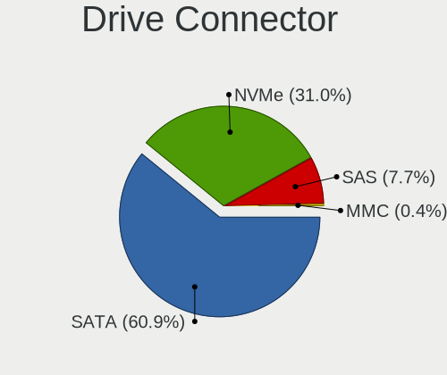

Ubuntu Hardware Trends (Desktop)
--------------------------------

A project to identify most popular hardware characteristics and track their change
over time based on data collected by Ubuntu users at https://Linux-Hardware.org.

Anyone can contribute to the study by uploading probes of their computers by
the [hw-probe](https://github.com/linuxhw/hw-probe) tool:

    sudo -E hw-probe -all -upload

Full-feature report is available here: https://linux-hardware.org/?view=trends&formfactor=desktop

Period: May, 2021.

Contents
--------

- [ OS                       ](#os)
- [ OS Family                ](#os-family)
- [ Kernel                   ](#kernel)
- [ Kernel Family            ](#kernel-family)
- [ Kernel Major Ver.        ](#kernel-major-ver)
- [ Arch                     ](#arch)
- [ DE                       ](#de)
- [ Display Server           ](#display-server)
- [ Display Manager          ](#display-manager)
- [ OS Lang                  ](#os-lang)
- [ Boot Mode                ](#boot-mode)
- [ Filesystem               ](#filesystem)
- [ Part. scheme             ](#part-scheme)
- [ Dual Boot with Linux/BSD ](#dual-boot-with-linux/bsd)
- [ Dual Boot (Win)          ](#dual-boot-win)
- [ Country                  ](#country)
- [ City                     ](#city)
- [ Vendor                   ](#vendor)
- [ Model                    ](#model)
- [ Model Family             ](#model-family)
- [ MFG Year                 ](#mfg-year)
- [ Form Factor              ](#form-factor)
- [ Secure Boot              ](#secure-boot)
- [ Coreboot                 ](#coreboot)
- [ RAM Size                 ](#ram-size)
- [ RAM Used                 ](#ram-used)
- [ Has CD-ROM               ](#has-cd-rom)
- [ Total Drives             ](#total-drives)
- [ Has Ethernet             ](#has-ethernet)
- [ Has WiFi                 ](#has-wifi)
- [ Has Bluetooth            ](#has-bluetooth)
- [ Drive Vendor             ](#drive-vendor)
- [ Drive Model              ](#drive-model)
- [ HDD Vendor               ](#hdd-vendor)
- [ SSD Vendor               ](#ssd-vendor)
- [ Drive Kind               ](#drive-kind)
- [ Drive Connector          ](#drive-connector)
- [ Drive Size               ](#drive-size)
- [ Space Total              ](#space-total)
- [ Space Used               ](#space-used)
- [ Malfunc. Drives          ](#malfunc-drives)
- [ Malfunc. Drive Vendor    ](#malfunc-drive-vendor)
- [ Malfunc. HDD Vendor      ](#malfunc-hdd-vendor)
- [ Malfunc. Drive Kind      ](#malfunc-drive-kind)
- [ Failed Drives            ](#failed-drives)
- [ Failed Drive Vendor      ](#failed-drive-vendor)
- [ Drive Status             ](#drive-status)
- [ Storage Vendor           ](#storage-vendor)
- [ Storage Model            ](#storage-model)
- [ Storage Kind             ](#storage-kind)
- [ CPU Vendor               ](#cpu-vendor)
- [ CPU Model                ](#cpu-model)
- [ CPU Model Family         ](#cpu-model-family)
- [ CPU Cores                ](#cpu-cores)
- [ CPU Sockets              ](#cpu-sockets)
- [ CPU Threads              ](#cpu-threads)
- [ CPU Op-Modes             ](#cpu-op-modes)
- [ CPU Microcode            ](#cpu-microcode)
- [ CPU Microarch            ](#cpu-microarch)
- [ GPU Vendor               ](#gpu-vendor)
- [ GPU Model                ](#gpu-model)
- [ GPU Combo                ](#gpu-combo)
- [ GPU Driver               ](#gpu-driver)
- [ GPU Memory               ](#gpu-memory)
- [ Monitor Vendor           ](#monitor-vendor)
- [ Monitor Model            ](#monitor-model)
- [ Monitor Resolution       ](#monitor-resolution)
- [ Monitor Diagonal         ](#monitor-diagonal)
- [ Monitor Width            ](#monitor-width)
- [ Aspect Ratio             ](#aspect-ratio)
- [ Monitor Area             ](#monitor-area)
- [ Pixel Density            ](#pixel-density)
- [ Multiple Monitors        ](#multiple-monitors)
- [ Net Controller Vendor    ](#net-controller-vendor)
- [ Net Controller Model     ](#net-controller-model)
- [ Wireless Vendor          ](#wireless-vendor)
- [ Wireless Model           ](#wireless-model)
- [ Ethernet Vendor          ](#ethernet-vendor)
- [ Ethernet Model           ](#ethernet-model)
- [ Net Controller Kind      ](#net-controller-kind)
- [ Used Controller          ](#used-controller)
- [ NICs                     ](#nics)
- [ IPv6                     ](#ipv6)
- [ Memory Vendor            ](#memory-vendor)
- [ Memory Model             ](#memory-model)
- [ Memory Kind              ](#memory-kind)
- [ Memory Form Factor       ](#memory-form-factor)
- [ Memory Size              ](#memory-size)
- [ Memory Speed             ](#memory-speed)
- [ Sound Vendor             ](#sound-vendor)
- [ Sound Model              ](#sound-model)
- [ Camera Vendor            ](#camera-vendor)
- [ Camera Model             ](#camera-model)
- [ Fingerprint Vendor       ](#fingerprint-vendor)
- [ Fingerprint Model        ](#fingerprint-model)
- [ Chipcard Vendor          ](#chipcard-vendor)
- [ Chipcard Model           ](#chipcard-model)
- [ Printer Vendor           ](#printer-vendor)
- [ Printer Model            ](#printer-model)
- [ Scanner Vendor           ](#scanner-vendor)
- [ Scanner Model            ](#scanner-model)
- [ Bluetooth Vendor         ](#bluetooth-vendor)
- [ Bluetooth Model          ](#bluetooth-model)
- [ Unsupported Devices      ](#unsupported-devices)
- [ Unsupported Device Types ](#unsupported-device-types)

OS
--

Installed operating systems

| Name           | Desktops | Percent |
|----------------|----------|---------|
| Ubuntu 20.04   | 382      | 67.37%  |
| Ubuntu 21.04   | 76       | 13.4%   |
| Ubuntu 20.10   | 47       | 8.29%   |
| Ubuntu 18.04   | 47       | 8.29%   |
| Ubuntu 16.04   | 7        | 1.23%   |
| Ubuntu 19.10   | 2        | 0.35%   |
| Ubuntu 19.04   | 2        | 0.35%   |
| Ubuntu Core 18 | 1        | 0.18%   |
| Ubuntu 2020    | 1        | 0.18%   |
| Ubuntu 17.04   | 1        | 0.18%   |
| Ubuntu         | 1        | 0.18%   |

OS Family
---------

OS without a version

| Name   | Desktops | Percent |
|--------|----------|---------|
| Ubuntu | 567      | 100%    |

Kernel
------

Version of the Linux kernel

| Version                  | Desktops | Percent |
|--------------------------|----------|---------|
| 5.8.0-53-generic         | 162      | 28.57%  |
| 5.8.0-50-generic         | 120      | 21.16%  |
| 5.4.0-73-generic         | 44       | 7.76%   |
| 5.4.0-72-generic         | 38       | 6.7%    |
| 5.11.0-17-generic        | 35       | 6.17%   |
| 5.11.0-16-generic        | 29       | 5.11%   |
| 5.8.0-43-generic         | 21       | 3.7%    |
| 5.8.0-54-generic         | 13       | 2.29%   |
| 4.15.0-143-generic       | 10       | 1.76%   |
| 4.15.0-142-generic       | 10       | 1.76%   |
| 5.4.0-42-generic         | 6        | 1.06%   |
| 5.8.0-52-generic         | 4        | 0.71%   |
| 5.8.0-48-generic         | 4        | 0.71%   |
| 5.8.0-44-generic         | 4        | 0.71%   |
| 5.8.0-41-generic         | 4        | 0.71%   |
| 5.11.0-18-generic        | 4        | 0.71%   |
| 5.4.0-67-generic         | 3        | 0.53%   |
| 5.4.0-52-generic         | 3        | 0.53%   |
| 5.4.0-26-generic         | 3        | 0.53%   |
| 5.12.0-051200-generic    | 3        | 0.53%   |
| 5.8.0-51-generic         | 2        | 0.35%   |
| 5.8.0-25-generic         | 2        | 0.35%   |
| 5.4.0-70-generic         | 2        | 0.35%   |
| 5.0.0-23-generic         | 2        | 0.35%   |
| 5.0.0-13-generic         | 2        | 0.35%   |
| 5.8.0-49-generic         | 1        | 0.18%   |
| 5.8.0-45-generic         | 1        | 0.18%   |
| 5.7.1-050701-generic     | 1        | 0.18%   |
| 5.4.0-72-lowlatency      | 1        | 0.18%   |
| 5.4.0-66-generic         | 1        | 0.18%   |
| 5.4.0-61-lowlatency      | 1        | 0.18%   |
| 5.4.0-56-generic         | 1        | 0.18%   |
| 5.4.0-53-generic         | 1        | 0.18%   |
| 5.4.0-48-generic         | 1        | 0.18%   |
| 5.4.0-47-generic         | 1        | 0.18%   |
| 5.4.0-41-generic         | 1        | 0.18%   |
| 5.4.0-1038-gcp           | 1        | 0.18%   |
| 5.3.0-64-generic         | 1        | 0.18%   |
| 5.3.0-46-generic         | 1        | 0.18%   |
| 5.3.0-28-generic         | 1        | 0.18%   |
| 5.13.0-3-generic         | 1        | 0.18%   |
| 5.12.8                   | 1        | 0.18%   |
| 5.12.1-051201-generic    | 1        | 0.18%   |
| 5.11.22-tkg-upds         | 1        | 0.18%   |
| 5.11.17-xanmod1          | 1        | 0.18%   |
| 5.11.12-051112-generic   | 1        | 0.18%   |
| 5.11.10-051110-generic   | 1        | 0.18%   |
| 5.11.0-13-generic        | 1        | 0.18%   |
| 5.11.0-051100-lowlatency | 1        | 0.18%   |
| 5.10.26-051026-generic   | 1        | 0.18%   |
| 5.10.0-1023-oem          | 1        | 0.18%   |
| 5.1.0-050100-lowlatency  | 1        | 0.18%   |
| 4.9.0-6-686              | 1        | 0.18%   |
| 4.4.0-210-generic        | 1        | 0.18%   |
| 4.4.0-206-generic        | 1        | 0.18%   |
| 4.15.0-96-generic        | 1        | 0.18%   |
| 4.15.0-91-generic        | 1        | 0.18%   |
| 4.15.0-20-generic        | 1        | 0.18%   |
| 4.15.0-144-generic       | 1        | 0.18%   |
| 4.15.0-135-generic       | 1        | 0.18%   |

Kernel Family
-------------

Linux kernel without a distro release

| Version | Desktops | Percent |
|---------|----------|---------|
| 5.8.0   | 338      | 59.61%  |
| 5.4.0   | 108      | 19.05%  |
| 5.11.0  | 70       | 12.35%  |
| 4.15.0  | 25       | 4.41%   |
| 5.0.0   | 4        | 0.71%   |
| 5.3.0   | 3        | 0.53%   |
| 5.12.0  | 3        | 0.53%   |
| 4.4.0   | 2        | 0.35%   |
| 5.7.1   | 1        | 0.18%   |
| 5.13.0  | 1        | 0.18%   |
| 5.12.8  | 1        | 0.18%   |
| 5.12.1  | 1        | 0.18%   |
| 5.11.22 | 1        | 0.18%   |
| 5.11.17 | 1        | 0.18%   |
| 5.11.12 | 1        | 0.18%   |
| 5.11.10 | 1        | 0.18%   |
| 5.10.26 | 1        | 0.18%   |
| 5.10.0  | 1        | 0.18%   |
| 5.1.0   | 1        | 0.18%   |
| 4.9.0   | 1        | 0.18%   |
| 4.10.0  | 1        | 0.18%   |
| 3.13.0  | 1        | 0.18%   |

Kernel Major Ver.
-----------------

Linux kernel major version

| Version | Desktops | Percent |
|---------|----------|---------|
| 5.8     | 338      | 59.61%  |
| 5.4     | 108      | 19.05%  |
| 5.11    | 74       | 13.05%  |
| 4.15    | 25       | 4.41%   |
| 5.12    | 5        | 0.88%   |
| 5.0     | 4        | 0.71%   |
| 5.3     | 3        | 0.53%   |
| 5.10    | 2        | 0.35%   |
| 4.4     | 2        | 0.35%   |
| 5.7     | 1        | 0.18%   |
| 5.13    | 1        | 0.18%   |
| 5.1     | 1        | 0.18%   |
| 4.9     | 1        | 0.18%   |
| 4.10    | 1        | 0.18%   |
| 3.13    | 1        | 0.18%   |

Arch
----

OS architecture (x86_64, i586, etc.)

| Name   | Desktops | Percent |
|--------|----------|---------|
| x86_64 | 560      | 98.77%  |
| i686   | 7        | 1.23%   |

DE
--

Desktop Environment

| Name            | Desktops | Percent |
|-----------------|----------|---------|
| GNOME           | 492      | 86.77%  |
| Unknown         | 48       | 8.47%   |
| Unity           | 11       | 1.94%   |
| X-Cinnamon      | 6        | 1.06%   |
| Openbox         | 3        | 0.53%   |
| GNOME Classic   | 2        | 0.35%   |
| i3              | 1        | 0.18%   |
| GNOME Flashback | 1        | 0.18%   |
| enlightenment   | 1        | 0.18%   |
| Deepin          | 1        | 0.18%   |
| Cinnamon        | 1        | 0.18%   |

Display Server
--------------

X11 or Wayland

| Name    | Desktops | Percent |
|---------|----------|---------|
| X11     | 477      | 84.13%  |
| Wayland | 60       | 10.58%  |
| Unknown | 23       | 4.06%   |
| Tty     | 7        | 1.23%   |

Display Manager
---------------

SDDM, LightDM, etc.

| Name    | Desktops | Percent |
|---------|----------|---------|
| Unknown | 451      | 79.54%  |
| GDM     | 107      | 18.87%  |
| TDM     | 5        | 0.88%   |
| XDM     | 2        | 0.35%   |
| LightDM | 1        | 0.18%   |
| GDM3    | 1        | 0.18%   |

OS Lang
-------

Language

| Lang    | Desktops | Percent |
|---------|----------|---------|
| en_US   | 212      | 37.39%  |
| de_DE   | 69       | 12.17%  |
| fr_FR   | 35       | 6.17%   |
| en_GB   | 32       | 5.64%   |
| pt_BR   | 30       | 5.29%   |
| it_IT   | 19       | 3.35%   |
| ru_RU   | 16       | 2.82%   |
| es_ES   | 16       | 2.82%   |
| en_CA   | 12       | 2.12%   |
| pl_PL   | 11       | 1.94%   |
| es_AR   | 11       | 1.94%   |
| en_IN   | 10       | 1.76%   |
| en_AU   | 10       | 1.76%   |
| sv_SE   | 6        | 1.06%   |
| hu_HU   | 6        | 1.06%   |
| nl_NL   | 5        | 0.88%   |
| fr_BE   | 5        | 0.88%   |
| es_MX   | 5        | 0.88%   |
| C       | 5        | 0.88%   |
| zh_CN   | 4        | 0.71%   |
| de_AT   | 4        | 0.71%   |
| zh_TW   | 3        | 0.53%   |
| pt_PT   | 3        | 0.53%   |
| nb_NO   | 3        | 0.53%   |
| fr_CA   | 3        | 0.53%   |
| cs_CZ   | 3        | 0.53%   |
| bg_BG   | 3        | 0.53%   |
| tr_TR   | 2        | 0.35%   |
| sk_SK   | 2        | 0.35%   |
| es_CO   | 2        | 0.35%   |
| es_CL   | 2        | 0.35%   |
| en_ZA   | 2        | 0.35%   |
| da_DK   | 2        | 0.35%   |
| Unknown | 2        | 0.35%   |
| ru_UA   | 1        | 0.18%   |
| ro_RO   | 1        | 0.18%   |
| ko_KR   | 1        | 0.18%   |
| ja_JP   | 1        | 0.18%   |
| fr_CH   | 1        | 0.18%   |
| fi_FI   | 1        | 0.18%   |
| en_NZ   | 1        | 0.18%   |
| en_IL   | 1        | 0.18%   |
| en_IE   | 1        | 0.18%   |
| de_CH   | 1        | 0.18%   |
| ca_ES   | 1        | 0.18%   |
| ar_EG   | 1        | 0.18%   |

Boot Mode
---------

EFI or BIOS

| Mode | Desktops | Percent |
|------|----------|---------|
| BIOS | 343      | 60.49%  |
| EFI  | 224      | 39.51%  |

Filesystem
----------

Type of filesystem

| Type    | Desktops | Percent |
|---------|----------|---------|
| Ext4    | 525      | 92.59%  |
| Zfs     | 15       | 2.65%   |
| Overlay | 13       | 2.29%   |
| Ext2    | 4        | 0.71%   |
| Xfs     | 3        | 0.53%   |
| Btrfs   | 3        | 0.53%   |
| Ext3    | 2        | 0.35%   |
| Aufs    | 2        | 0.35%   |

Part. scheme
------------

Scheme of partitioning

| Type    | Desktops | Percent |
|---------|----------|---------|
| Unknown | 441      | 77.78%  |
| GPT     | 94       | 16.58%  |
| MBR     | 32       | 5.64%   |

Dual Boot with Linux/BSD
------------------------

Hosting more than one Linux/BSD

| Dual boot | Desktops | Percent |
|-----------|----------|---------|
| No        | 458      | 80.78%  |
| Yes       | 109      | 19.22%  |

Dual Boot (Win)
---------------

Hosting Linux and Windows

| Dual boot | Desktops | Percent |
|-----------|----------|---------|
| No        | 314      | 55.38%  |
| Yes       | 253      | 44.62%  |

Country
-------

Geographic location (country)

| Country               | Desktops | Percent |
|-----------------------|----------|---------|
| USA                   | 102      | 17.99%  |
| Germany               | 80       | 14.11%  |
| Brazil                | 37       | 6.53%   |
| France                | 31       | 5.47%   |
| UK                    | 29       | 5.11%   |
| Italy                 | 24       | 4.23%   |
| Spain                 | 21       | 3.7%    |
| Canada                | 20       | 3.53%   |
| Netherlands           | 18       | 3.17%   |
| Russia                | 16       | 2.82%   |
| Poland                | 15       | 2.65%   |
| Argentina             | 15       | 2.65%   |
| India                 | 11       | 1.94%   |
| Ukraine               | 10       | 1.76%   |
| Australia             | 10       | 1.76%   |
| Switzerland           | 9        | 1.59%   |
| Sweden                | 9        | 1.59%   |
| Hungary               | 7        | 1.23%   |
| Czechia               | 7        | 1.23%   |
| Belgium               | 7        | 1.23%   |
| Turkey                | 5        | 0.88%   |
| Mexico                | 5        | 0.88%   |
| Bulgaria              | 5        | 0.88%   |
| Austria               | 5        | 0.88%   |
| Portugal              | 4        | 0.71%   |
| Finland               | 4        | 0.71%   |
| China                 | 4        | 0.71%   |
| Taiwan                | 3        | 0.53%   |
| Slovakia              | 3        | 0.53%   |
| Serbia                | 3        | 0.53%   |
| Malaysia              | 3        | 0.53%   |
| Ireland               | 3        | 0.53%   |
| Greece                | 3        | 0.53%   |
| Denmark               | 3        | 0.53%   |
| Chile                 | 3        | 0.53%   |
| South Africa          | 2        | 0.35%   |
| Puerto Rico           | 2        | 0.35%   |
| Norway                | 2        | 0.35%   |
| New Zealand           | 2        | 0.35%   |
| Latvia                | 2        | 0.35%   |
| Japan                 | 2        | 0.35%   |
| Indonesia             | 2        | 0.35%   |
| Colombia              | 2        | 0.35%   |
| Algeria               | 2        | 0.35%   |
| Tunisia               | 1        | 0.18%   |
| South Korea           | 1        | 0.18%   |
| Singapore             | 1        | 0.18%   |
| Saint Kitts and Nevis | 1        | 0.18%   |
| Romania               | 1        | 0.18%   |
| Panama                | 1        | 0.18%   |
| Pakistan              | 1        | 0.18%   |
| Kenya                 | 1        | 0.18%   |
| Israel                | 1        | 0.18%   |
| Iran                  | 1        | 0.18%   |
| Hong Kong             | 1        | 0.18%   |
| Gabon                 | 1        | 0.18%   |
| Cyprus                | 1        | 0.18%   |
| Cuba                  | 1        | 0.18%   |
| Angola                | 1        | 0.18%   |

City
----

Geographic location (city)

| City                  | Desktops | Percent |
|-----------------------|----------|---------|
| São Paulo            | 8        | 1.41%   |
| Buenos Aires          | 8        | 1.41%   |
| Munich                | 7        | 1.23%   |
| Milan                 | 6        | 1.06%   |
| Warsaw                | 5        | 0.88%   |
| Sydney                | 5        | 0.88%   |
| Sofia                 | 5        | 0.88%   |
| London                | 5        | 0.88%   |
| Kyiv                  | 5        | 0.88%   |
| Hamburg               | 5        | 0.88%   |
| Zurich                | 4        | 0.71%   |
| Prague                | 4        | 0.71%   |
| Paris                 | 4        | 0.71%   |
| Moscow                | 4        | 0.71%   |
| Toronto               | 3        | 0.53%   |
| Stuttgart             | 3        | 0.53%   |
| Montreal              | 3        | 0.53%   |
| Istanbul              | 3        | 0.53%   |
| Houston               | 3        | 0.53%   |
| Düsseldorf           | 3        | 0.53%   |
| Dublin                | 3        | 0.53%   |
| Berlin                | 3        | 0.53%   |
| Alcalá de Henares    | 3        | 0.53%   |
| Zaporizhzhya          | 2        | 0.35%   |
| Vienna                | 2        | 0.35%   |
| Valencia              | 2        | 0.35%   |
| Uppsala               | 2        | 0.35%   |
| Tucson                | 2        | 0.35%   |
| Springfield           | 2        | 0.35%   |
| Rosario               | 2        | 0.35%   |
| Rome                  | 2        | 0.35%   |
| Rochester             | 2        | 0.35%   |
| Rio de Janeiro        | 2        | 0.35%   |
| Riga                  | 2        | 0.35%   |
| Poznan                | 2        | 0.35%   |
| Portland              | 2        | 0.35%   |
| Padova                | 2        | 0.35%   |
| Novosibirsk           | 2        | 0.35%   |
| Nizhniy Novgorod      | 2        | 0.35%   |
| New Taipei            | 2        | 0.35%   |
| Melbourne             | 2        | 0.35%   |
| Manteca               | 2        | 0.35%   |
| Hyderabad             | 2        | 0.35%   |
| Gothenburg            | 2        | 0.35%   |
| Frankfurt am Main     | 2        | 0.35%   |
| Fort Worth            | 2        | 0.35%   |
| Essen                 | 2        | 0.35%   |
| Dresden               | 2        | 0.35%   |
| Curitiba              | 2        | 0.35%   |
| Copenhagen            | 2        | 0.35%   |
| Cologne               | 2        | 0.35%   |
| Ciudad Nezahualcoyotl | 2        | 0.35%   |
| Chicago               | 2        | 0.35%   |
| Chennai               | 2        | 0.35%   |
| Campinas              | 2        | 0.35%   |
| Budapest              | 2        | 0.35%   |
| Bristol               | 2        | 0.35%   |
| Brasília             | 2        | 0.35%   |
| Belo Horizonte        | 2        | 0.35%   |
| Barcelona             | 2        | 0.35%   |

Vendor
------

Motherboard manufacturer

| Name                    | Desktops | Percent |
|-------------------------|----------|---------|
| ASUSTek Computer        | 148      | 26.1%   |
| Gigabyte Technology     | 97       | 17.11%  |
| MSI                     | 66       | 11.64%  |
| Dell                    | 58       | 10.23%  |
| ASRock                  | 46       | 8.11%   |
| Hewlett-Packard         | 42       | 7.41%   |
| Lenovo                  | 15       | 2.65%   |
| Medion                  | 11       | 1.94%   |
| Acer                    | 10       | 1.76%   |
| Intel                   | 9        | 1.59%   |
| Unknown                 | 9        | 1.59%   |
| Fujitsu                 | 7        | 1.23%   |
| Biostar                 | 6        | 1.06%   |
| Shuttle                 | 4        | 0.71%   |
| Foxconn                 | 4        | 0.71%   |
| Pegatron                | 3        | 0.53%   |
| Huanan                  | 3        | 0.53%   |
| ECS                     | 3        | 0.53%   |
| SYWZ                    | 2        | 0.35%   |
| HPE                     | 2        | 0.35%   |
| Fujitsu Siemens         | 2        | 0.35%   |
| eMachines               | 2        | 0.35%   |
| Soyo                    | 1        | 0.18%   |
| Qbex                    | 1        | 0.18%   |
| PCWare                  | 1        | 0.18%   |
| OEM                     | 1        | 0.18%   |
| Itautec                 | 1        | 0.18%   |
| Inventec                | 1        | 0.18%   |
| HC                      | 1        | 0.18%   |
| HARDKERNEL              | 1        | 0.18%   |
| Gateway                 | 1        | 0.18%   |
| EVGA                    | 1        | 0.18%   |
| essentielb              | 1        | 0.18%   |
| Digibras Ind. do Brasil | 1        | 0.18%   |
| Chuwi                   | 1        | 0.18%   |
| ASRockRack              | 1        | 0.18%   |
| Apple                   | 1        | 0.18%   |
| AOpen                   | 1        | 0.18%   |
| Alienware               | 1        | 0.18%   |
| ADLINK Technology       | 1        | 0.18%   |

Model
-----

Motherboard model

| Name                                | Desktops | Percent |
|-------------------------------------|----------|---------|
| ASUS All Series                     | 16       | 2.82%   |
| Unknown                             | 9        | 1.59%   |
| Dell OptiPlex 3010                  | 6        | 1.06%   |
| ASUS TUF GAMING X570-PLUS           | 5        | 0.88%   |
| MSI MS-7C02                         | 4        | 0.71%   |
| MSI MS-7B86                         | 4        | 0.71%   |
| Gigabyte B75M-D3H                   | 4        | 0.71%   |
| Gigabyte B450M DS3H                 | 4        | 0.71%   |
| Gigabyte A320M-H                    | 4        | 0.71%   |
| ASUS PRIME A320M-K                  | 4        | 0.71%   |
| ASUS P8Z77-V LX                     | 4        | 0.71%   |
| MSI MS-7C75                         | 3        | 0.53%   |
| MSI MS-7758                         | 3        | 0.53%   |
| Gigabyte Z390 UD                    | 3        | 0.53%   |
| Gigabyte H77-DS3H                   | 3        | 0.53%   |
| Dell OptiPlex 9020                  | 3        | 0.53%   |
| Dell OptiPlex 9010                  | 3        | 0.53%   |
| Dell OptiPlex 790                   | 3        | 0.53%   |
| ASUS M5A78L-M/USB3                  | 3        | 0.53%   |
| SYWZ S210H Series                   | 2        | 0.35%   |
| MSI MS-7C91                         | 2        | 0.35%   |
| MSI MS-7C79                         | 2        | 0.35%   |
| MSI MS-7C37                         | 2        | 0.35%   |
| MSI MS-7B89                         | 2        | 0.35%   |
| MSI MS-7A38                         | 2        | 0.35%   |
| MSI MS-7996                         | 2        | 0.35%   |
| MSI MS-7972                         | 2        | 0.35%   |
| MSI MS-7816                         | 2        | 0.35%   |
| MSI MS-7721                         | 2        | 0.35%   |
| MSI MS-7693                         | 2        | 0.35%   |
| Intel H81                           | 2        | 0.35%   |
| HPE ProLiant MicroServer Gen10 Plus | 2        | 0.35%   |
| HP EliteDesk 800 G1 USDT            | 2        | 0.35%   |
| HP Compaq Pro 6300 SFF              | 2        | 0.35%   |
| HP Compaq 8200 Elite SFF PC         | 2        | 0.35%   |
| Gigabyte Z97-HD3                    | 2        | 0.35%   |
| Gigabyte Z77X-UD5H                  | 2        | 0.35%   |
| Gigabyte X570 I AORUS PRO WIFI      | 2        | 0.35%   |
| Gigabyte GA-78LMT-USB3 6.0          | 2        | 0.35%   |
| Gigabyte G31M-ES2C                  | 2        | 0.35%   |
| Gigabyte B85-HD3                    | 2        | 0.35%   |
| Gigabyte B450M S2H                  | 2        | 0.35%   |
| Gigabyte B450 AORUS M               | 2        | 0.35%   |
| Gigabyte B450 AORUS ELITE           | 2        | 0.35%   |
| Gigabyte 970-GAMING                 | 2        | 0.35%   |
| Dell Precision T3600                | 2        | 0.35%   |
| Dell OptiPlex 990                   | 2        | 0.35%   |
| Dell OptiPlex 780                   | 2        | 0.35%   |
| Dell OptiPlex 7010                  | 2        | 0.35%   |
| Dell Inspiron 660s                  | 2        | 0.35%   |
| Biostar IH61MF-Q5                   | 2        | 0.35%   |
| ASUS TUF GAMING B550-PLUS           | 2        | 0.35%   |
| ASUS TUF GAMING B460M-PLUS          | 2        | 0.35%   |
| ASUS Rampage III Extreme            | 2        | 0.35%   |
| ASUS PRIME Z590-A                   | 2        | 0.35%   |
| ASUS PRIME B450M-K                  | 2        | 0.35%   |
| ASUS P6T DELUXE V2                  | 2        | 0.35%   |
| ASUS Maximus VIII RANGER            | 2        | 0.35%   |
| ASUS M5A97 R2.0                     | 2        | 0.35%   |
| ASUS M5A97 LE R2.0                  | 2        | 0.35%   |

Model Family
------------

Motherboard model prefix

| Name                   | Desktops | Percent |
|------------------------|----------|---------|
| Dell OptiPlex          | 34       | 6%      |
| ASUS PRIME             | 23       | 4.06%   |
| ASUS TUF               | 16       | 2.82%   |
| ASUS All               | 16       | 2.82%   |
| HP Compaq              | 14       | 2.47%   |
| ASUS ROG               | 13       | 2.29%   |
| Lenovo ThinkCentre     | 9        | 1.59%   |
| Unknown                | 9        | 1.59%   |
| HP EliteDesk           | 8        | 1.41%   |
| Gigabyte B450M         | 7        | 1.23%   |
| Dell Precision         | 7        | 1.23%   |
| Dell Inspiron          | 6        | 1.06%   |
| ASUS M5A97             | 6        | 1.06%   |
| ASUS M5A78L-M          | 6        | 1.06%   |
| Acer Aspire            | 6        | 1.06%   |
| HP ProDesk             | 5        | 0.88%   |
| ASUS P8Z77-V           | 5        | 0.88%   |
| ASUS Maximus           | 5        | 0.88%   |
| MSI MS-7C02            | 4        | 0.71%   |
| MSI MS-7B86            | 4        | 0.71%   |
| Gigabyte X570          | 4        | 0.71%   |
| Gigabyte B75M-D3H      | 4        | 0.71%   |
| Gigabyte B450          | 4        | 0.71%   |
| Gigabyte A320M-H       | 4        | 0.71%   |
| Fujitsu ESPRIMO        | 4        | 0.71%   |
| Dell Vostro            | 4        | 0.71%   |
| MSI MS-7C75            | 3        | 0.53%   |
| MSI MS-7758            | 3        | 0.53%   |
| Lenovo ThinkStation    | 3        | 0.53%   |
| Gigabyte Z390          | 3        | 0.53%   |
| Gigabyte H77-DS3H      | 3        | 0.53%   |
| Dell Studio            | 3        | 0.53%   |
| ASUS Rampage           | 3        | 0.53%   |
| ASUS P6T               | 3        | 0.53%   |
| ASRock B550            | 3        | 0.53%   |
| ASRock B450M           | 3        | 0.53%   |
| Acer Veriton           | 3        | 0.53%   |
| SYWZ S210H             | 2        | 0.35%   |
| MSI MS-7C91            | 2        | 0.35%   |
| MSI MS-7C79            | 2        | 0.35%   |
| MSI MS-7C37            | 2        | 0.35%   |
| MSI MS-7B89            | 2        | 0.35%   |
| MSI MS-7A38            | 2        | 0.35%   |
| MSI MS-7996            | 2        | 0.35%   |
| MSI MS-7972            | 2        | 0.35%   |
| MSI MS-7816            | 2        | 0.35%   |
| MSI MS-7721            | 2        | 0.35%   |
| MSI MS-7693            | 2        | 0.35%   |
| Lenovo IdeaCentre      | 2        | 0.35%   |
| Intel H81              | 2        | 0.35%   |
| HPE ProLiant           | 2        | 0.35%   |
| Gigabyte Z97-HD3       | 2        | 0.35%   |
| Gigabyte Z77X-UD5H     | 2        | 0.35%   |
| Gigabyte Z590          | 2        | 0.35%   |
| Gigabyte GA-78LMT-USB3 | 2        | 0.35%   |
| Gigabyte G31M-ES2C     | 2        | 0.35%   |
| Gigabyte B85-HD3       | 2        | 0.35%   |
| Gigabyte B550          | 2        | 0.35%   |
| Gigabyte B365M         | 2        | 0.35%   |
| Gigabyte 970-GAMING    | 2        | 0.35%   |

MFG Year
--------

Motherboard manufacture year

| Year | Desktops | Percent |
|------|----------|---------|
| 2020 | 78       | 13.76%  |
| 2019 | 70       | 12.35%  |
| 2014 | 53       | 9.35%   |
| 2013 | 50       | 8.82%   |
| 2021 | 46       | 8.11%   |
| 2018 | 43       | 7.58%   |
| 2011 | 37       | 6.53%   |
| 2015 | 34       | 6%      |
| 2012 | 32       | 5.64%   |
| 2010 | 27       | 4.76%   |
| 2016 | 25       | 4.41%   |
| 2009 | 24       | 4.23%   |
| 2008 | 19       | 3.35%   |
| 2017 | 15       | 2.65%   |
| 2007 | 7        | 1.23%   |
| 2006 | 3        | 0.53%   |
| 2005 | 2        | 0.35%   |
| 2004 | 2        | 0.35%   |

Form Factor
-----------

Physical design of the computer

| Name    | Desktops | Percent |
|---------|----------|---------|
| Desktop | 567      | 100%    |

Secure Boot
-----------

Enabled or disabled

| State    | Desktops | Percent |
|----------|----------|---------|
| Disabled | 543      | 95.77%  |
| Enabled  | 24       | 4.23%   |

Coreboot
--------

Have coreboot on board

| Used | Desktops | Percent |
|------|----------|---------|
| No   | 567      | 100%    |

RAM Size
--------

Total RAM memory

| Size in GB      | Desktops | Percent |
|-----------------|----------|---------|
| 16.01-24.0      | 158      | 27.87%  |
| 8.01-16.0       | 104      | 18.34%  |
| 4.01-8.0        | 89       | 15.7%   |
| 3.01-4.0        | 85       | 14.99%  |
| 32.01-64.0      | 73       | 12.87%  |
| 64.01-256.0     | 24       | 4.23%   |
| 1.01-2.0        | 14       | 2.47%   |
| 24.01-32.0      | 9        | 1.59%   |
| 2.01-3.0        | 8        | 1.41%   |
| More than 256.0 | 2        | 0.35%   |
| 0.51-1.0        | 1        | 0.18%   |

RAM Used
--------

Used RAM memory

| Used GB    | Desktops | Percent |
|------------|----------|---------|
| 1.01-2.0   | 203      | 35.8%   |
| 2.01-3.0   | 150      | 26.46%  |
| 4.01-8.0   | 85       | 14.99%  |
| 3.01-4.0   | 77       | 13.58%  |
| 8.01-16.0  | 26       | 4.59%   |
| 0.51-1.0   | 16       | 2.82%   |
| 16.01-24.0 | 6        | 1.06%   |
| 32.01-64.0 | 1        | 0.18%   |
| 24.01-32.0 | 1        | 0.18%   |
| 0.01-0.5   | 1        | 0.18%   |
| Unknown    | 1        | 0.18%   |

Has CD-ROM
----------

Has CD-ROM on board

| Presented | Desktops | Percent |
|-----------|----------|---------|
| No        | 310      | 54.67%  |
| Yes       | 257      | 45.33%  |

Total Drives
------------

Number of drives on board

| Drives | Desktops | Percent |
|--------|----------|---------|
| 1      | 211      | 37.21%  |
| 2      | 163      | 28.75%  |
| 3      | 70       | 12.35%  |
| 4      | 63       | 11.11%  |
| 5      | 28       | 4.94%   |
| 6      | 14       | 2.47%   |
| 0      | 8        | 1.41%   |
| 9      | 3        | 0.53%   |
| 8      | 2        | 0.35%   |
| 7      | 2        | 0.35%   |
| 21     | 1        | 0.18%   |
| 13     | 1        | 0.18%   |
| 10     | 1        | 0.18%   |

Has Ethernet
------------

Has Ethernet on board

| Presented | Desktops | Percent |
|-----------|----------|---------|
| Yes       | 558      | 98.41%  |
| No        | 9        | 1.59%   |

Has WiFi
--------

Has WiFi module

| Presented | Desktops | Percent |
|-----------|----------|---------|
| No        | 322      | 56.79%  |
| Yes       | 245      | 43.21%  |

Has Bluetooth
-------------

Has Bluetooth module

| Presented | Desktops | Percent |
|-----------|----------|---------|
| No        | 411      | 72.49%  |
| Yes       | 156      | 27.51%  |

Drive Vendor
------------

Hard drive vendors

| Vendor                    | Desktops | Drives | Percent |
|---------------------------|----------|--------|---------|
| Seagate                   | 206      | 302    | 20.2%   |
| WDC                       | 203      | 271    | 19.9%   |
| Samsung Electronics       | 159      | 209    | 15.59%  |
| Kingston                  | 61       | 65     | 5.98%   |
| Toshiba                   | 55       | 60     | 5.39%   |
| SanDisk                   | 42       | 45     | 4.12%   |
| Hitachi                   | 37       | 41     | 3.63%   |
| Crucial                   | 33       | 37     | 3.24%   |
| Unknown                   | 17       | 18     | 1.67%   |
| Intel                     | 17       | 19     | 1.67%   |
| Phison                    | 15       | 23     | 1.47%   |
| A-DATA Technology         | 13       | 13     | 1.27%   |
| Maxtor                    | 11       | 11     | 1.08%   |
| Silicon Motion            | 9        | 10     | 0.88%   |
| HGST                      | 9        | 12     | 0.88%   |
| PNY                       | 8        | 9      | 0.78%   |
| Corsair                   | 8        | 9      | 0.78%   |
| Gigabyte Technology       | 7        | 7      | 0.69%   |
| SK Hynix                  | 6        | 6      | 0.59%   |
| Patriot                   | 6        | 6      | 0.59%   |
| Micron Technology         | 6        | 8      | 0.59%   |
| China                     | 6        | 6      | 0.59%   |
| SPCC                      | 5        | 6      | 0.49%   |
| Intenso                   | 5        | 5      | 0.49%   |
| GOODRAM                   | 5        | 5      | 0.49%   |
| XPG                       | 4        | 4      | 0.39%   |
| Fujitsu                   | 4        | 4      | 0.39%   |
| ASMT                      | 4        | 5      | 0.39%   |
| OCZ                       | 3        | 3      | 0.29%   |
| Micron/Crucial Technology | 3        | 3      | 0.29%   |
| Hewlett-Packard           | 3        | 5      | 0.29%   |
| Apacer                    | 3        | 3      | 0.29%   |
| XrayDisk                  | 2        | 2      | 0.2%    |
| Transcend                 | 2        | 2      | 0.2%    |
| TO Exter                  | 2        | 2      | 0.2%    |
| SABRENT                   | 2        | 2      | 0.2%    |
| Netac                     | 2        | 2      | 0.2%    |
| Mushkin                   | 2        | 2      | 0.2%    |
| JMicron                   | 2        | 2      | 0.2%    |
| WD MediaMax               | 1        | 1      | 0.1%    |
| Vaseky                    | 1        | 1      | 0.1%    |
| Union Memory (Shenzhen)   | 1        | 1      | 0.1%    |
| Team                      | 1        | 1      | 0.1%    |
| T-FORCE                   | 1        | 2      | 0.1%    |
| Synology                  | 1        | 4      | 0.1%    |
| SuperSSpeed               | 1        | 1      | 0.1%    |
| Super Talent              | 1        | 1      | 0.1%    |
| StoreJet                  | 1        | 1      | 0.1%    |
| SMI                       | 1        | 1      | 0.1%    |
| Realtek Semiconductor     | 1        | 1      | 0.1%    |
| Radeon                    | 1        | 1      | 0.1%    |
| PLEXTOR                   | 1        | 2      | 0.1%    |
| OCZ-VERTEX3               | 1        | 1      | 0.1%    |
| Neo Forza                 | 1        | 1      | 0.1%    |
| LITEONIT                  | 1        | 1      | 0.1%    |
| LITEON                    | 1        | 1      | 0.1%    |
| Lite-On                   | 1        | 1      | 0.1%    |
| KIOXIA-EXCERIA            | 1        | 1      | 0.1%    |
| KIOXIA                    | 1        | 1      | 0.1%    |
| KingSpec                  | 1        | 1      | 0.1%    |

Drive Model
-----------

Hard drive models

| Model                            | Desktops | Percent |
|----------------------------------|----------|---------|
| Samsung SSD 860 EVO 500GB        | 19       | 1.63%   |
| Seagate ST500DM002-1BD142 500GB  | 18       | 1.55%   |
| Seagate ST2000DM008-2FR102 2TB   | 16       | 1.37%   |
| Seagate ST1000DM010-2EP102 1TB   | 16       | 1.37%   |
| Kingston SA400S37240G 240GB SSD  | 15       | 1.29%   |
| Toshiba DT01ACA100 1TB           | 14       | 1.2%    |
| Samsung NVMe SSD Drive 1TB       | 11       | 0.95%   |
| Kingston SA400S37120G 120GB SSD  | 11       | 0.95%   |
| Samsung SSD 850 EVO 250GB        | 10       | 0.86%   |
| Seagate ST1000DM003-1CH162 1TB   | 9        | 0.77%   |
| Crucial CT1000MX500SSD1 1TB      | 8        | 0.69%   |
| Seagate ST31000524AS 1TB         | 7        | 0.6%    |
| Seagate ST2000DM001-1ER164 2TB   | 7        | 0.6%    |
| Samsung SSD 850 EVO 500GB        | 7        | 0.6%    |
| Samsung NVMe SSD Drive 500GB     | 7        | 0.6%    |
| Samsung NVMe SSD Drive 250GB     | 7        | 0.6%    |
| WDC WDS500G2B0A-00SM50 500GB SSD | 6        | 0.52%   |
| Unknown SD/MMC/MS PRO 8GB        | 6        | 0.52%   |
| Seagate ST2000DM001-1CH164 2TB   | 6        | 0.52%   |
| Seagate ST1000DM003-1SB102 1TB   | 6        | 0.52%   |
| Samsung HD103SI 1TB              | 6        | 0.52%   |
| WDC WD10EZEX-08WN4A0 1TB         | 5        | 0.43%   |
| WDC WD10EARS-00Y5B1 1TB          | 5        | 0.43%   |
| Toshiba DT01ACA200 2TB           | 5        | 0.43%   |
| Seagate ST2000DM006-2DM164 2TB   | 5        | 0.43%   |
| Seagate Expansion 2TB            | 5        | 0.43%   |
| SanDisk SSD PLUS 1000GB          | 5        | 0.43%   |
| Sandisk NVMe SSD Drive 500GB     | 5        | 0.43%   |
| Samsung SSD 860 EVO 1TB          | 5        | 0.43%   |
| Samsung NVMe SSD Drive 512GB     | 5        | 0.43%   |
| Crucial CT500MX500SSD1 500GB     | 5        | 0.43%   |
| WDC WDS240G2G0A-00JH30 240GB SSD | 4        | 0.34%   |
| WDC WD5000AAKX-60U6AA0 500GB     | 4        | 0.34%   |
| WDC WD5000AAKX-001CA0 500GB      | 4        | 0.34%   |
| WDC WD20EZRX-00DC0B0 2TB         | 4        | 0.34%   |
| WDC WD20EFRX-68EUZN0 2TB         | 4        | 0.34%   |
| WDC WD10EZEX-00BN5A0 1TB         | 4        | 0.34%   |
| Toshiba MQ01ABD100 1TB           | 4        | 0.34%   |
| Toshiba DT01ACA050 500GB         | 4        | 0.34%   |
| Seagate ST9500325AS 500GB        | 4        | 0.34%   |
| Seagate ST1000DM003-1ER162 1TB   | 4        | 0.34%   |
| SanDisk SSD PLUS 120GB           | 4        | 0.34%   |
| Samsung SSD 870 QVO 1TB          | 4        | 0.34%   |
| Samsung SSD 850 EVO 120GB        | 4        | 0.34%   |
| Samsung SSD 840 PRO Series 256GB | 4        | 0.34%   |
| Phison NVMe SSD Drive 512GB      | 4        | 0.34%   |
| Kingston SV300S37A240G 240GB SSD | 4        | 0.34%   |
| Kingston SV300S37A120G 120GB SSD | 4        | 0.34%   |
| Crucial CT240BX500SSD1 240GB     | 4        | 0.34%   |
| Crucial CT120BX500SSD1 120GB     | 4        | 0.34%   |
| WDC WDS100T2B0A-00SM50 1TB SSD   | 3        | 0.26%   |
| WDC WD5000AAKX-22ERMA0 500GB     | 3        | 0.26%   |
| WDC WD30EZRZ-00Z5HB0 3TB         | 3        | 0.26%   |
| WDC WD30EZRX-00D8PB0 3TB         | 3        | 0.26%   |
| WDC WD20EZRZ-00Z5HB0 2TB         | 3        | 0.26%   |
| WDC WD20EZRX-00D8PB0 2TB         | 3        | 0.26%   |
| WDC WD20EZAZ-00GGJB0 2TB         | 3        | 0.26%   |
| WDC WD10EZEX-00WN4A0 1TB         | 3        | 0.26%   |
| WDC WD10EFRX-68FYTN0 1TB         | 3        | 0.26%   |
| Toshiba MQ01ACF050 500GB         | 3        | 0.26%   |

HDD Vendor
----------

Hard disk drive vendors

| Vendor              | Desktops | Drives | Percent |
|---------------------|----------|--------|---------|
| Seagate             | 204      | 294    | 39.23%  |
| WDC                 | 176      | 231    | 33.85%  |
| Toshiba             | 51       | 56     | 9.81%   |
| Hitachi             | 37       | 41     | 7.12%   |
| Samsung Electronics | 28       | 34     | 5.38%   |
| MAXTOR              | 9        | 9      | 1.73%   |
| HGST                | 9        | 12     | 1.73%   |
| Fujitsu             | 4        | 4      | 0.77%   |
| Synology            | 1        | 4      | 0.19%   |
| ASMT                | 1        | 2      | 0.19%   |

SSD Vendor
----------

Solid state drive vendors

| Vendor              | Desktops | Drives | Percent |
|---------------------|----------|--------|---------|
| Samsung Electronics | 93       | 114    | 26.65%  |
| Kingston            | 51       | 54     | 14.61%  |
| Crucial             | 31       | 35     | 8.88%   |
| SanDisk             | 29       | 32     | 8.31%   |
| WDC                 | 26       | 27     | 7.45%   |
| A-DATA Technology   | 13       | 13     | 3.72%   |
| Intel               | 11       | 11     | 3.15%   |
| PNY                 | 7        | 8      | 2.01%   |
| Gigabyte Technology | 6        | 6      | 1.72%   |
| China               | 6        | 6      | 1.72%   |
| SPCC                | 5        | 6      | 1.43%   |
| Patriot             | 5        | 5      | 1.43%   |
| GOODRAM             | 5        | 5      | 1.43%   |
| Corsair             | 5        | 5      | 1.43%   |
| Unknown             | 3        | 3      | 0.86%   |
| Toshiba             | 3        | 3      | 0.86%   |
| SK Hynix            | 3        | 3      | 0.86%   |
| OCZ                 | 3        | 3      | 0.86%   |
| Micron Technology   | 3        | 5      | 0.86%   |
| Intenso             | 3        | 3      | 0.86%   |
| Apacer              | 3        | 3      | 0.86%   |
| Transcend           | 2        | 2      | 0.57%   |
| TO Exter            | 2        | 2      | 0.57%   |
| SABRENT             | 2        | 2      | 0.57%   |
| Mushkin             | 2        | 2      | 0.57%   |
| Maxtor              | 2        | 2      | 0.57%   |
| Hewlett-Packard     | 2        | 2      | 0.57%   |
| ASMT                | 2        | 2      | 0.57%   |
| XrayDisk            | 1        | 1      | 0.29%   |
| Vaseky              | 1        | 1      | 0.29%   |
| Team                | 1        | 1      | 0.29%   |
| SuperSSpeed         | 1        | 1      | 0.29%   |
| StoreJet            | 1        | 1      | 0.29%   |
| Seagate             | 1        | 1      | 0.29%   |
| Radeon              | 1        | 1      | 0.29%   |
| PLEXTOR             | 1        | 2      | 0.29%   |
| OCZ-VERTEX3         | 1        | 1      | 0.29%   |
| Netac               | 1        | 1      | 0.29%   |
| LITEONIT            | 1        | 1      | 0.29%   |
| LITEON              | 1        | 1      | 0.29%   |
| KIOXIA-EXCERIA      | 1        | 1      | 0.29%   |
| KingSpec            | 1        | 1      | 0.29%   |
| KingDian            | 1        | 2      | 0.29%   |
| KINGBANK            | 1        | 1      | 0.29%   |
| JMicron             | 1        | 1      | 0.29%   |
| Integral            | 1        | 1      | 0.29%   |
| Hoodisk             | 1        | 1      | 0.29%   |
| EMTEC               | 1        | 1      | 0.29%   |
| DREVO               | 1        | 1      | 0.29%   |

Drive Kind
----------

HDD or SSD

| Kind    | Desktops | Drives | Percent |
|---------|----------|--------|---------|
| HDD     | 404      | 687    | 46.92%  |
| SSD     | 291      | 387    | 33.8%   |
| NVMe    | 130      | 166    | 15.1%   |
| Unknown | 32       | 47     | 3.72%   |
| MMC     | 4        | 4      | 0.46%   |

Drive Connector
---------------

SATA, SAS, NVMe, etc.

| Type | Desktops | Drives | Percent |
|------|----------|--------|---------|
| SATA | 523      | 1044   | 74.5%   |
| NVMe | 130      | 166    | 18.52%  |
| SAS  | 45       | 77     | 6.41%   |
| MMC  | 4        | 4      | 0.57%   |

Drive Size
----------

Size of hard drive

| Size in TB | Desktops | Drives | Percent |
|------------|----------|--------|---------|
| 0.01-0.5   | 384      | 555    | 50.46%  |
| 0.51-1.0   | 201      | 255    | 26.41%  |
| 1.01-2.0   | 97       | 127    | 12.75%  |
| 3.01-4.0   | 27       | 36     | 3.55%   |
| 4.01-10.0  | 24       | 42     | 3.15%   |
| 2.01-3.0   | 19       | 27     | 2.5%    |
| 10.01-20.0 | 9        | 32     | 1.18%   |

Space Total
-----------

Amount of disk space available on the file system

| Size in GB     | Desktops | Percent |
|----------------|----------|---------|
| 101-250        | 157      | 27.69%  |
| 251-500        | 106      | 18.69%  |
| 501-1000       | 81       | 14.29%  |
| More than 3000 | 64       | 11.29%  |
| 1001-2000      | 53       | 9.35%   |
| 2001-3000      | 34       | 6%      |
| 1-20           | 26       | 4.59%   |
| 51-100         | 25       | 4.41%   |
| 21-50          | 17       | 3%      |
| Unknown        | 4        | 0.71%   |

Space Used
----------

Amount of used disk space

| Used GB        | Desktops | Percent |
|----------------|----------|---------|
| 1-20           | 196      | 34.57%  |
| 21-50          | 94       | 16.58%  |
| 101-250        | 67       | 11.82%  |
| 51-100         | 57       | 10.05%  |
| 251-500        | 42       | 7.41%   |
| 501-1000       | 36       | 6.35%   |
| 1001-2000      | 35       | 6.17%   |
| More than 3000 | 27       | 4.76%   |
| 2001-3000      | 9        | 1.59%   |
| Unknown        | 4        | 0.71%   |

Malfunc. Drives
---------------

Drive models with a malfunction

| Model                             | Desktops | Drives | Percent |
|-----------------------------------|----------|--------|---------|
| Seagate ST31000524AS 1TB          | 2        | 2      | 4.65%   |
| Crucial CT240M500SSD1 240GB       | 2        | 2      | 4.65%   |
| WDC WD6400AAKS-65A7B0 640GB       | 1        | 1      | 2.33%   |
| WDC WD5000AAKS-00UU3A0 500GB      | 1        | 1      | 2.33%   |
| WDC WD10EZEX-60ZF5A0 1TB          | 1        | 1      | 2.33%   |
| WDC WD10EZEX-00BN5A0 1TB          | 1        | 1      | 2.33%   |
| WDC WD10EFRX-68FYTN0 1TB          | 1        | 1      | 2.33%   |
| WDC WD10EADS-00M2B0 1TB           | 1        | 1      | 2.33%   |
| WDC WD1001FAES-75W7A0 1TB         | 1        | 1      | 2.33%   |
| Toshiba MQ01ABD100 1TB            | 1        | 1      | 2.33%   |
| Toshiba MK5055GSX 500GB           | 1        | 1      | 2.33%   |
| Toshiba HDWD120 2TB               | 1        | 1      | 2.33%   |
| SK Hynix SC308 SATA 128GB SSD     | 1        | 1      | 2.33%   |
| Seagate ST9250311CS 250GB         | 1        | 1      | 2.33%   |
| Seagate ST500DM002-1SB10A 500GB   | 1        | 1      | 2.33%   |
| Seagate ST500DM002-1BD142 500GB   | 1        | 1      | 2.33%   |
| Seagate ST3500830AS 500GB         | 1        | 1      | 2.33%   |
| Seagate ST3500414CS 500GB         | 1        | 1      | 2.33%   |
| Seagate ST3320820AS 320GB         | 1        | 1      | 2.33%   |
| Seagate ST3320418AS 320GB         | 1        | 1      | 2.33%   |
| Seagate ST3320310CS 320GB         | 1        | 1      | 2.33%   |
| Seagate ST3250824AS 250GB         | 1        | 1      | 2.33%   |
| Seagate ST3250410AS 250GB         | 1        | 1      | 2.33%   |
| Seagate ST3160215A 160GB          | 1        | 1      | 2.33%   |
| Seagate ST2000DX002-2DV164 2TB    | 1        | 1      | 2.33%   |
| Seagate ST1000DM010-2EP102 1TB    | 1        | 1      | 2.33%   |
| Seagate ST1000DM003-1CH162 1TB    | 1        | 1      | 2.33%   |
| Samsung Electronics SP2004C 200GB | 1        | 1      | 2.33%   |
| Samsung Electronics SP0411N 40GB  | 1        | 1      | 2.33%   |
| Samsung Electronics HD322GM 320GB | 1        | 1      | 2.33%   |
| Samsung Electronics HD322GJ 320GB | 1        | 1      | 2.33%   |
| OCZ VERTEX3 120GB SSD             | 1        | 1      | 2.33%   |
| MAXTOR 6L080J4 80GB               | 1        | 1      | 2.33%   |
| Kingston SV300S37A120G 120GB SSD  | 1        | 1      | 2.33%   |
| Kingston SA400S37240G 240GB SSD   | 1        | 1      | 2.33%   |
| Intel SSDSC2KW240H6 240GB         | 1        | 1      | 2.33%   |
| Hitachi HUA723030ALA640 3TB       | 1        | 2      | 2.33%   |
| Hitachi HTS725032A9A364 320GB     | 1        | 1      | 2.33%   |
| Hitachi HTS722010K9SA00 100GB     | 1        | 1      | 2.33%   |
| Hewlett-Packard SSD S700 120GB    | 1        | 1      | 2.33%   |
| Corsair CSSD-F40GB2               | 1        | 1      | 2.33%   |

Malfunc. Drive Vendor
---------------------

Vendors of faulty drives

| Vendor              | Desktops | Drives | Percent |
|---------------------|----------|--------|---------|
| Seagate             | 14       | 16     | 34.15%  |
| WDC                 | 7        | 7      | 17.07%  |
| Samsung Electronics | 4        | 4      | 9.76%   |
| Toshiba             | 3        | 3      | 7.32%   |
| Hitachi             | 3        | 4      | 7.32%   |
| Kingston            | 2        | 2      | 4.88%   |
| Crucial             | 2        | 2      | 4.88%   |
| SK Hynix            | 1        | 1      | 2.44%   |
| OCZ                 | 1        | 1      | 2.44%   |
| MAXTOR              | 1        | 1      | 2.44%   |
| Intel               | 1        | 1      | 2.44%   |
| Hewlett-Packard     | 1        | 1      | 2.44%   |
| Corsair             | 1        | 1      | 2.44%   |

Malfunc. HDD Vendor
-------------------

Vendors of faulty HDD drives

| Vendor              | Desktops | Drives | Percent |
|---------------------|----------|--------|---------|
| Seagate             | 14       | 16     | 43.75%  |
| WDC                 | 7        | 7      | 21.88%  |
| Samsung Electronics | 4        | 4      | 12.5%   |
| Toshiba             | 3        | 3      | 9.38%   |
| Hitachi             | 3        | 4      | 9.38%   |
| MAXTOR              | 1        | 1      | 3.13%   |

Malfunc. Drive Kind
-------------------

Kinds of faulty drives

| Kind | Desktops | Drives | Percent |
|------|----------|--------|---------|
| HDD  | 28       | 35     | 77.78%  |
| SSD  | 8        | 9      | 22.22%  |

Failed Drives
-------------

Failed drive models

Zero info for selected period =(

Failed Drive Vendor
-------------------

Failed drive vendors

Zero info for selected period =(

Drive Status
------------

Number of failed and malfunc. drives

| Status   | Desktops | Drives | Percent |
|----------|----------|--------|---------|
| Detected | 426      | 951    | 71.24%  |
| Works    | 137      | 296    | 22.91%  |
| Malfunc  | 35       | 44     | 5.85%   |

Storage Vendor
--------------

Storage controller vendors

| Vendor                           | Desktops | Percent |
|----------------------------------|----------|---------|
| Intel                            | 363      | 46.18%  |
| AMD                              | 180      | 22.9%   |
| Samsung Electronics              | 55       | 7%      |
| ASMedia Technology               | 23       | 2.93%   |
| Marvell Technology Group         | 21       | 2.67%   |
| Sandisk                          | 19       | 2.42%   |
| Phison Electronics               | 19       | 2.42%   |
| JMicron Technology               | 19       | 2.42%   |
| Nvidia                           | 17       | 2.16%   |
| Silicon Motion                   | 13       | 1.65%   |
| Kingston Technology Company      | 10       | 1.27%   |
| VIA Technologies                 | 7        | 0.89%   |
| Micron/Crucial Technology        | 5        | 0.64%   |
| ADATA Technology                 | 5        | 0.64%   |
| Silicon Image                    | 4        | 0.51%   |
| SK Hynix                         | 3        | 0.38%   |
| Silicon Integrated Systems [SiS] | 3        | 0.38%   |
| Seagate Technology               | 3        | 0.38%   |
| Micron Technology                | 3        | 0.38%   |
| LSI Logic / Symbios Logic        | 3        | 0.38%   |
| Broadcom / LSI                   | 3        | 0.38%   |
| Unknown                          | 1        | 0.13%   |
| Union Memory (Shenzhen)          | 1        | 0.13%   |
| Toshiba America Info Systems     | 1        | 0.13%   |
| Realtek Semiconductor            | 1        | 0.13%   |
| KIOXIA                           | 1        | 0.13%   |
| Advanced System Products         | 1        | 0.13%   |
| Adaptec                          | 1        | 0.13%   |
| 3ware                            | 1        | 0.13%   |

Storage Model
-------------

Storage controller models

| Model                                                                                   | Desktops | Percent |
|-----------------------------------------------------------------------------------------|----------|---------|
| AMD FCH SATA Controller [AHCI mode]                                                     | 105      | 10.51%  |
| Intel 8 Series/C220 Series Chipset Family 6-port SATA Controller 1 [AHCI mode]          | 45       | 4.5%    |
| AMD 400 Series Chipset SATA Controller                                                  | 40       | 4%      |
| Samsung NVMe SSD Controller SM981/PM981/PM983                                           | 35       | 3.5%    |
| Intel 6 Series/C200 Series Chipset Family 6 port Desktop SATA AHCI Controller           | 33       | 3.3%    |
| Intel Q170/Q150/B150/H170/H110/Z170/CM236 Chipset SATA Controller [AHCI Mode]           | 31       | 3.1%    |
| AMD SB7x0/SB8x0/SB9x0 IDE Controller                                                    | 30       | 3%      |
| Intel 7 Series/C210 Series Chipset Family 6-port SATA Controller [AHCI mode]            | 28       | 2.8%    |
| Intel Cannon Lake PCH SATA AHCI Controller                                              | 25       | 2.5%    |
| AMD SB7x0/SB8x0/SB9x0 SATA Controller [AHCI mode]                                       | 25       | 2.5%    |
| Intel NM10/ICH7 Family SATA Controller [IDE mode]                                       | 24       | 2.4%    |
| Intel SATA Controller [RAID mode]                                                       | 23       | 2.3%    |
| ASMedia ASM1062 Serial ATA Controller                                                   | 22       | 2.2%    |
| AMD SB7x0/SB8x0/SB9x0 SATA Controller [IDE mode]                                        | 20       | 2%      |
| Intel 82801G (ICH7 Family) IDE Controller                                               | 16       | 1.6%    |
| AMD Starship/Matisse Chipset SATA Controller [AHCI mode]                                | 16       | 1.6%    |
| Intel 200 Series PCH SATA controller [AHCI mode]                                        | 15       | 1.5%    |
| JMicron JMB363 SATA/IDE Controller                                                      | 14       | 1.4%    |
| AMD FCH SATA Controller D                                                               | 14       | 1.4%    |
| Samsung NVMe SSD Controller SM961/PM961/SM963                                           | 12       | 1.2%    |
| Phison E12 NVMe Controller                                                              | 12       | 1.2%    |
| Intel Comet Lake SATA AHCI Controller                                                   | 12       | 1.2%    |
| Intel 6 Series/C200 Series Chipset Family Desktop SATA Controller (IDE mode, ports 4-5) | 12       | 1.2%    |
| Intel 6 Series/C200 Series Chipset Family Desktop SATA Controller (IDE mode, ports 0-3) | 12       | 1.2%    |
| Intel C600/X79 series chipset 6-Port SATA AHCI Controller                               | 10       | 1%      |
| Intel 9 Series Chipset Family SATA Controller [AHCI Mode]                               | 10       | 1%      |
| Intel 400 Series Chipset Family SATA AHCI Controller                                    | 10       | 1%      |
| Silicon Motion SM2263EN/SM2263XT SSD Controller                                         | 9        | 0.9%    |
| Intel 500 Series Chipset Family SATA AHCI Controller                                    | 9        | 0.9%    |
| Sandisk WD Blue SN550 NVMe SSD                                                          | 8        | 0.8%    |
| Samsung NVMe SSD Controller PM9A1/PM9A3/980PRO                                          | 8        | 0.8%    |
| Nvidia MCP61 SATA Controller                                                            | 8        | 0.8%    |
| Nvidia MCP61 IDE                                                                        | 8        | 0.8%    |
| Intel 82801JI (ICH10 Family) SATA AHCI Controller                                       | 8        | 0.8%    |
| Intel 5 Series/3400 Series Chipset 6 port SATA AHCI Controller                          | 8        | 0.8%    |
| Intel Celeron/Pentium Silver Processor SATA Controller                                  | 7        | 0.7%    |
| Intel 82801I (ICH9 Family) 2 port SATA Controller [IDE mode]                            | 7        | 0.7%    |
| Intel 7 Series/C210 Series Chipset Family 4-port SATA Controller [IDE mode]             | 7        | 0.7%    |
| Intel 7 Series/C210 Series Chipset Family 2-port SATA Controller [IDE mode]             | 7        | 0.7%    |
| AMD FCH IDE Controller                                                                  | 7        | 0.7%    |
| Kingston Company A2000 NVMe SSD                                                         | 6        | 0.6%    |
| Intel SSD 660P Series                                                                   | 6        | 0.6%    |
| AMD FCH SATA Controller [IDE mode]                                                      | 6        | 0.6%    |
| AMD 300 Series Chipset SATA Controller                                                  | 6        | 0.6%    |
| Intel C610/X99 series chipset sSATA Controller [AHCI mode]                              | 5        | 0.5%    |
| Intel 82801JI (ICH10 Family) 4 port SATA IDE Controller #1                              | 5        | 0.5%    |
| Intel 82801JI (ICH10 Family) 2 port SATA IDE Controller #2                              | 5        | 0.5%    |
| Intel 82801IR/IO/IH (ICH9R/DO/DH) 4 port SATA Controller [IDE mode]                     | 5        | 0.5%    |
| Silicon Motion SM2262/SM2262EN SSD Controller                                           | 4        | 0.4%    |
| Marvell Group 88SE9172 SATA 6Gb/s Controller                                            | 4        | 0.4%    |
| Marvell Group 88SE6111/6121 SATA II / PATA Controller                                   | 4        | 0.4%    |
| JMicron JMB362 SATA Controller                                                          | 4        | 0.4%    |
| Intel Atom Processor E3800 Series SATA AHCI Controller                                  | 4        | 0.4%    |
| Intel 4 Series Chipset PT IDER Controller                                               | 4        | 0.4%    |
| AMD X370 Series Chipset SATA Controller                                                 | 4        | 0.4%    |
| VIA VT82C586A/B/VT82C686/A/B/VT823x/A/C PIPC Bus Master IDE                             | 3        | 0.3%    |
| VIA VT6415 PATA IDE Host Controller                                                     | 3        | 0.3%    |
| VIA VIA VT6420 SATA RAID Controller                                                     | 3        | 0.3%    |
| Silicon Integrated Systems [SiS] 5513 IDE Controller                                    | 3        | 0.3%    |
| Sandisk WD Black SN850                                                                  | 3        | 0.3%    |

Storage Kind
------------

Kind of storage controller (IDE, SATA, NVMe, SAS, ...)

| Kind | Desktops | Percent |
|------|----------|---------|
| SATA | 456      | 57.94%  |
| IDE  | 151      | 19.19%  |
| NVMe | 131      | 16.65%  |
| RAID | 38       | 4.83%   |
| SAS  | 7        | 0.89%   |
| SCSI | 4        | 0.51%   |

CPU Vendor
----------

Processor vendors

| Vendor | Desktops | Percent |
|--------|----------|---------|
| Intel  | 372      | 65.61%  |
| AMD    | 195      | 34.39%  |

CPU Model
---------

Processor models

| Model                                       | Desktops | Percent |
|---------------------------------------------|----------|---------|
| AMD Ryzen 5 3600 6-Core Processor           | 16       | 2.82%   |
| Intel Core i5-3470 CPU @ 3.20GHz            | 11       | 1.94%   |
| AMD Ryzen 7 3700X 8-Core Processor          | 10       | 1.76%   |
| Intel Core i7-2600 CPU @ 3.40GHz            | 9        | 1.59%   |
| AMD Ryzen 5 3400G with Radeon Vega Graphics | 9        | 1.59%   |
| Intel Core i7-4770 CPU @ 3.40GHz            | 8        | 1.41%   |
| AMD FX-6300 Six-Core Processor              | 8        | 1.41%   |
| Intel Core i7-4790 CPU @ 3.60GHz            | 7        | 1.23%   |
| Intel Core i5-2400 CPU @ 3.10GHz            | 7        | 1.23%   |
| Intel Core i5-10400 CPU @ 2.90GHz           | 7        | 1.23%   |
| AMD Ryzen 3 3200G with Radeon Vega Graphics | 7        | 1.23%   |
| AMD FX-8350 Eight-Core Processor            | 7        | 1.23%   |
| Intel Core i5-2500K CPU @ 3.30GHz           | 6        | 1.06%   |
| Intel Core i3-4160 CPU @ 3.60GHz            | 6        | 1.06%   |
| AMD Ryzen 5 2600 Six-Core Processor         | 6        | 1.06%   |
| Intel Core i7-6700K CPU @ 4.00GHz           | 5        | 0.88%   |
| Intel Core i3-3220 CPU @ 3.30GHz            | 5        | 0.88%   |
| AMD Ryzen 3 2200G with Radeon Vega Graphics | 5        | 0.88%   |
| Intel Pentium Dual CPU E2200 @ 2.20GHz      | 4        | 0.71%   |
| Intel Pentium 4 CPU 3.00GHz                 | 4        | 0.71%   |
| Intel Core i9-10850K CPU @ 3.60GHz          | 4        | 0.71%   |
| Intel Core i7-6700 CPU @ 3.40GHz            | 4        | 0.71%   |
| Intel Core i7-4790K CPU @ 4.00GHz           | 4        | 0.71%   |
| Intel Core i7-3770 CPU @ 3.40GHz            | 4        | 0.71%   |
| Intel Core i5-9400 CPU @ 2.90GHz            | 4        | 0.71%   |
| Intel Core i5-8400 CPU @ 2.80GHz            | 4        | 0.71%   |
| Intel Core i5-6500 CPU @ 3.20GHz            | 4        | 0.71%   |
| Intel Core i5-6400 CPU @ 2.70GHz            | 4        | 0.71%   |
| Intel Core i5-4460 CPU @ 3.20GHz            | 4        | 0.71%   |
| Intel Core i5-3570 CPU @ 3.40GHz            | 4        | 0.71%   |
| Intel Core i5-2500 CPU @ 3.30GHz            | 4        | 0.71%   |
| Intel Core i3-8100 CPU @ 3.60GHz            | 4        | 0.71%   |
| Intel Core i3-4130 CPU @ 3.40GHz            | 4        | 0.71%   |
| Intel Core i3-2100 CPU @ 3.10GHz            | 4        | 0.71%   |
| Intel Core i3 CPU 550 @ 3.20GHz             | 4        | 0.71%   |
| AMD Ryzen 7 2700X Eight-Core Processor      | 4        | 0.71%   |
| AMD Ryzen 5 1600 Six-Core Processor         | 4        | 0.71%   |
| Intel Xeon CPU X5675 @ 3.07GHz              | 3        | 0.53%   |
| Intel Core i9-10900 CPU @ 2.80GHz           | 3        | 0.53%   |
| Intel Core i7-9700 CPU @ 3.00GHz            | 3        | 0.53%   |
| Intel Core i7-8700K CPU @ 3.70GHz           | 3        | 0.53%   |
| Intel Core i7-7700 CPU @ 3.60GHz            | 3        | 0.53%   |
| Intel Core i7-4770K CPU @ 3.50GHz           | 3        | 0.53%   |
| Intel Core i7-3770K CPU @ 3.50GHz           | 3        | 0.53%   |
| Intel Core i7-10700K CPU @ 3.80GHz          | 3        | 0.53%   |
| Intel Core i5-7400 CPU @ 3.00GHz            | 3        | 0.53%   |
| Intel Core i5-6600K CPU @ 3.50GHz           | 3        | 0.53%   |
| Intel Core i5-4570 CPU @ 3.20GHz            | 3        | 0.53%   |
| Intel Core i5-10600K CPU @ 4.10GHz          | 3        | 0.53%   |
| Intel Core 2 Quad CPU Q8300 @ 2.50GHz       | 3        | 0.53%   |
| Intel Core 2 Quad CPU Q6600 @ 2.40GHz       | 3        | 0.53%   |
| Intel Core 2 Duo CPU E7500 @ 2.93GHz        | 3        | 0.53%   |
| Intel Core 2 Duo CPU E4500 @ 2.20GHz        | 3        | 0.53%   |
| Intel Celeron J4125 CPU @ 2.00GHz           | 3        | 0.53%   |
| Intel Celeron J4105 CPU @ 1.50GHz           | 3        | 0.53%   |
| Intel 11th Gen Core i7-11700K @ 3.60GHz     | 3        | 0.53%   |
| AMD Ryzen 7 5800X 8-Core Processor          | 3        | 0.53%   |
| AMD Ryzen 5 5600X 6-Core Processor          | 3        | 0.53%   |
| AMD Phenom II X6 1100T Processor            | 3        | 0.53%   |
| AMD Phenom II X6 1090T Processor            | 3        | 0.53%   |

CPU Model Family
----------------

Processor model prefix

| Model                   | Desktops | Percent |
|-------------------------|----------|---------|
| Intel Core i5           | 116      | 20.46%  |
| Intel Core i7           | 88       | 15.52%  |
| AMD Ryzen 5             | 44       | 7.76%   |
| Intel Core i3           | 37       | 6.53%   |
| Intel Xeon              | 30       | 5.29%   |
| AMD FX                  | 26       | 4.59%   |
| AMD Ryzen 7             | 25       | 4.41%   |
| Intel Celeron           | 19       | 3.35%   |
| Intel Core 2 Duo        | 17       | 3%      |
| AMD Ryzen 3             | 16       | 2.82%   |
| Intel Core i9           | 13       | 2.29%   |
| Intel Core 2 Quad       | 11       | 1.94%   |
| Intel Pentium Dual-Core | 9        | 1.59%   |
| Intel Pentium           | 9        | 1.59%   |
| AMD A8                  | 9        | 1.59%   |
| AMD Ryzen 9             | 8        | 1.41%   |
| AMD Athlon II X2        | 7        | 1.23%   |
| AMD Phenom II X6        | 6        | 1.06%   |
| AMD Phenom II X4        | 6        | 1.06%   |
| AMD Athlon 64 X2        | 6        | 1.06%   |
| AMD A6                  | 6        | 1.06%   |
| AMD A10                 | 6        | 1.06%   |
| Intel Pentium Dual      | 5        | 0.88%   |
| Intel Pentium 4         | 5        | 0.88%   |
| Other                   | 4        | 0.71%   |
| AMD A4                  | 4        | 0.71%   |
| Intel Core 2            | 3        | 0.53%   |
| AMD Ryzen Threadripper  | 3        | 0.53%   |
| Intel Pentium Gold      | 2        | 0.35%   |
| Intel Atom              | 2        | 0.35%   |
| AMD Ryzen 5 PRO         | 2        | 0.35%   |
| AMD Ryzen 3 PRO         | 2        | 0.35%   |
| AMD Phenom              | 2        | 0.35%   |
| AMD E1                  | 2        | 0.35%   |
| AMD Athlon Dual Core    | 2        | 0.35%   |
| AMD Athlon              | 2        | 0.35%   |
| Intel Pentium D         | 1        | 0.18%   |
| Intel Genuine           | 1        | 0.18%   |
| AMD Sempron             | 1        | 0.18%   |
| AMD Ryzen 7 PRO         | 1        | 0.18%   |
| AMD GX                  | 1        | 0.18%   |
| AMD G                   | 1        | 0.18%   |
| AMD EPYC                | 1        | 0.18%   |
| AMD E                   | 1        | 0.18%   |
| AMD Athlon X4           | 1        | 0.18%   |
| AMD Athlon II X4        | 1        | 0.18%   |
| AMD Athlon II X3        | 1        | 0.18%   |
| AMD Athlon II           | 1        | 0.18%   |
| AMD Athlon 64           | 1        | 0.18%   |

CPU Cores
---------

Number of processor cores

| Number | Desktops | Percent |
|--------|----------|---------|
| 4      | 255      | 44.97%  |
| 2      | 125      | 22.05%  |
| 6      | 84       | 14.81%  |
| 8      | 46       | 8.11%   |
| 1      | 18       | 3.17%   |
| 10     | 10       | 1.76%   |
| 3      | 10       | 1.76%   |
| 12     | 8        | 1.41%   |
| 16     | 7        | 1.23%   |
| 24     | 2        | 0.35%   |
| 14     | 1        | 0.18%   |
| 5      | 1        | 0.18%   |

CPU Sockets
-----------

Number of sockets

| Number | Desktops | Percent |
|--------|----------|---------|
| 1      | 562      | 99.12%  |
| 2      | 5        | 0.88%   |

CPU Threads
-----------

Threads per core (Hyper-Threading)

| Number | Desktops | Percent |
|--------|----------|---------|
| 2      | 304      | 53.62%  |
| 1      | 263      | 46.38%  |

CPU Op-Modes
------------

CPU Operation Modes (32-bit, 64-bit)

| Op mode        | Desktops | Percent |
|----------------|----------|---------|
| 32-bit, 64-bit | 565      | 99.65%  |
| 32-bit         | 2        | 0.35%   |

CPU Microcode
-------------

Microcode number

| Number     | Desktops | Percent |
|------------|----------|---------|
| Unknown    | 137      | 24.16%  |
| 0x306c3    | 52       | 9.17%   |
| 0x306a9    | 33       | 5.82%   |
| 0x206a7    | 29       | 5.11%   |
| 0x506e3    | 26       | 4.59%   |
| 0x06000852 | 20       | 3.53%   |
| 0x1067a    | 19       | 3.35%   |
| 0x08701021 | 18       | 3.17%   |
| 0x906ea    | 17       | 3%      |
| 0xa0655    | 13       | 2.29%   |
| 0x08108109 | 12       | 2.12%   |
| 0x0800820d | 11       | 1.94%   |
| 0x010000c8 | 10       | 1.76%   |
| 0x906e9    | 8        | 1.41%   |
| 0x206d7    | 8        | 1.41%   |
| 0xa0653    | 7        | 1.23%   |
| 0x6fd      | 7        | 1.23%   |
| 0x6fb      | 7        | 1.23%   |
| 0x206c2    | 7        | 1.23%   |
| 0x06001119 | 7        | 1.23%   |
| 0x906ed    | 6        | 1.06%   |
| 0x20655    | 6        | 1.06%   |
| 0x0a201009 | 6        | 1.06%   |
| 0x08701013 | 6        | 1.06%   |
| 0x106e5    | 5        | 0.88%   |
| 0x10676    | 5        | 0.88%   |
| 0x906eb    | 4        | 0.71%   |
| 0x06003106 | 4        | 0.71%   |
| 0x010000dc | 4        | 0.71%   |
| 0x906ec    | 3        | 0.53%   |
| 0x306e4    | 3        | 0.53%   |
| 0x106a5    | 3        | 0.53%   |
| 0x08101016 | 3        | 0.53%   |
| 0x08001138 | 3        | 0.53%   |
| 0x08001137 | 3        | 0.53%   |
| 0x0700010f | 3        | 0.53%   |
| 0x010000db | 3        | 0.53%   |
| 0xf43      | 2        | 0.35%   |
| 0xf41      | 2        | 0.35%   |
| 0xa0671    | 2        | 0.35%   |
| 0x706a1    | 2        | 0.35%   |
| 0x6f6      | 2        | 0.35%   |
| 0x406f1    | 2        | 0.35%   |
| 0x306f2    | 2        | 0.35%   |
| 0x30678    | 2        | 0.35%   |
| 0x08600106 | 2        | 0.35%   |
| 0x07030105 | 2        | 0.35%   |
| 0x0600611a | 2        | 0.35%   |
| 0x03000027 | 2        | 0.35%   |
| 0x010000c7 | 2        | 0.35%   |
| 0xf49      | 1        | 0.18%   |
| 0xa0652    | 1        | 0.18%   |
| 0x806e9    | 1        | 0.18%   |
| 0x706a8    | 1        | 0.18%   |
| 0x50654    | 1        | 0.18%   |
| 0x30679    | 1        | 0.18%   |
| 0x30673    | 1        | 0.18%   |
| 0x30661    | 1        | 0.18%   |
| 0x20652    | 1        | 0.18%   |
| 0x0830104d | 1        | 0.18%   |

CPU Microarch
-------------

Microarchitecture

| Name          | Desktops | Percent |
|---------------|----------|---------|
| Haswell       | 66       | 11.64%  |
| SandyBridge   | 49       | 8.64%   |
| KabyLake      | 49       | 8.64%   |
| IvyBridge     | 48       | 8.47%   |
| Zen 2         | 42       | 7.41%   |
| Piledriver    | 37       | 6.53%   |
| Zen+          | 31       | 5.47%   |
| Skylake       | 31       | 5.47%   |
| Penryn        | 30       | 5.29%   |
| CometLake     | 29       | 5.11%   |
| K10           | 26       | 4.59%   |
| Zen           | 20       | 3.53%   |
| Core          | 19       | 3.35%   |
| Westmere      | 14       | 2.47%   |
| Zen 3         | 10       | 1.76%   |
| Nehalem       | 10       | 1.76%   |
| K8 Hammer     | 9        | 1.59%   |
| NetBurst      | 7        | 1.23%   |
| Goldmont plus | 7        | 1.23%   |
| Steamroller   | 5        | 0.88%   |
| Silvermont    | 4        | 0.71%   |
| Jaguar        | 4        | 0.71%   |
| Puma          | 3        | 0.53%   |
| K10 Llano     | 3        | 0.53%   |
| Broadwell     | 3        | 0.53%   |
| Unknown       | 3        | 0.53%   |
| Excavator     | 2        | 0.35%   |
| Bobcat        | 2        | 0.35%   |
| Icelake       | 1        | 0.18%   |
| Goldmont      | 1        | 0.18%   |
| Bulldozer     | 1        | 0.18%   |
| Bonnell       | 1        | 0.18%   |

GPU Vendor
----------

Vendors of graphics cards

| Vendor                           | Desktops | Percent |
|----------------------------------|----------|---------|
| Intel                            | 210      | 34.37%  |
| Nvidia                           | 197      | 32.24%  |
| AMD                              | 195      | 31.91%  |
| VIA Technologies                 | 3        | 0.49%   |
| Matrox Electronics Systems       | 3        | 0.49%   |
| Silicon Integrated Systems [SiS] | 2        | 0.33%   |
| ASPEED Technology                | 1        | 0.16%   |

GPU Model
---------

Graphics card models

| Model                                                                       | Desktops | Percent |
|-----------------------------------------------------------------------------|----------|---------|
| AMD Ellesmere [Radeon RX 470/480/570/570X/580/580X/590]                     | 34       | 5.51%   |
| Intel CometLake-S GT2 [UHD Graphics 630]                                    | 32       | 5.19%   |
| Intel Xeon E3-1200 v3/4th Gen Core Processor Integrated Graphics Controller | 31       | 5.02%   |
| Intel Xeon E3-1200 v2/3rd Gen Core processor Graphics Controller            | 29       | 4.7%    |
| Nvidia GK208B [GeForce GT 710]                                              | 22       | 3.57%   |
| Intel 2nd Generation Core Processor Family Integrated Graphics Controller   | 20       | 3.24%   |
| Intel HD Graphics 530                                                       | 17       | 2.76%   |
| AMD Picasso                                                                 | 14       | 2.27%   |
| Nvidia GP107 [GeForce GTX 1050 Ti]                                          | 12       | 1.94%   |
| AMD Cedar [Radeon HD 5000/6000/7350/8350 Series]                            | 12       | 1.94%   |
| Intel 4th Generation Core Processor Family Integrated Graphics Controller   | 10       | 1.62%   |
| Intel CoffeeLake-S GT2 [UHD Graphics 630]                                   | 9        | 1.46%   |
| Intel 82G33/G31 Express Integrated Graphics Controller                      | 9        | 1.46%   |
| AMD Raven Ridge [Radeon Vega Series / Radeon Vega Mobile Series]            | 9        | 1.46%   |
| Nvidia GT218 [GeForce 210]                                                  | 8        | 1.3%    |
| Nvidia GP107 [GeForce GTX 1050]                                             | 7        | 1.13%   |
| Nvidia GP106 [GeForce GTX 1060 6GB]                                         | 7        | 1.13%   |
| Intel GeminiLake [UHD Graphics 600]                                         | 7        | 1.13%   |
| Intel 4 Series Chipset Integrated Graphics Controller                       | 7        | 1.13%   |
| Intel Core Processor Integrated Graphics Controller                         | 6        | 0.97%   |
| AMD Navi 10 [Radeon RX 5600 OEM/5600 XT / 5700/5700 XT]                     | 6        | 0.97%   |
| AMD Caicos [Radeon HD 6450/7450/8450 / R5 230 OEM]                          | 6        | 0.97%   |
| Nvidia TU117 [GeForce GTX 1650]                                             | 5        | 0.81%   |
| Nvidia TU116 [GeForce GTX 1660 SUPER]                                       | 5        | 0.81%   |
| Nvidia GP106 [GeForce GTX 1060 3GB]                                         | 5        | 0.81%   |
| Nvidia GK208B [GeForce GT 730]                                              | 5        | 0.81%   |
| Intel HD Graphics 630                                                       | 5        | 0.81%   |
| AMD RV620 LE [Radeon HD 3450]                                               | 5        | 0.81%   |
| Nvidia TU104 [GeForce RTX 2070 SUPER]                                       | 4        | 0.65%   |
| Nvidia GP108 [GeForce GT 1030]                                              | 4        | 0.65%   |
| Intel Atom Processor Z36xxx/Z37xxx Series Graphics & Display                | 4        | 0.65%   |
| AMD RS780L [Radeon 3000]                                                    | 4        | 0.65%   |
| AMD Kaveri [Radeon R7 Graphics]                                             | 4        | 0.65%   |
| Nvidia TU116 [GeForce GTX 1660 Ti]                                          | 3        | 0.49%   |
| Nvidia TU106 [GeForce RTX 2070 Rev. A]                                      | 3        | 0.49%   |
| Nvidia GP104 [GeForce GTX 1080]                                             | 3        | 0.49%   |
| Nvidia GP102 [GeForce GTX 1080 Ti]                                          | 3        | 0.49%   |
| Nvidia GM204 [GeForce GTX 970]                                              | 3        | 0.49%   |
| Nvidia GM107 [GeForce GTX 750 Ti]                                           | 3        | 0.49%   |
| Nvidia GK104 [GeForce GTX 670]                                              | 3        | 0.49%   |
| Nvidia GF114 [GeForce GTX 560]                                              | 3        | 0.49%   |
| Nvidia GF108 [GeForce GT 730]                                               | 3        | 0.49%   |
| AMD Turks XT [Radeon HD 6670/7670]                                          | 3        | 0.49%   |
| AMD RS880 [Radeon HD 4250]                                                  | 3        | 0.49%   |
| AMD Richland [Radeon HD 8670D]                                              | 3        | 0.49%   |
| AMD Renoir                                                                  | 3        | 0.49%   |
| AMD Oland XT [Radeon HD 8670 / R5 340X OEM / R7 250/350/350X OEM]           | 3        | 0.49%   |
| AMD Navi 14 [Radeon RX 5500/5500M / Pro 5500M]                              | 3        | 0.49%   |
| AMD Mullins [Radeon R4/R5 Graphics]                                         | 3        | 0.49%   |
| AMD Hawaii PRO [Radeon R9 290/390]                                          | 3        | 0.49%   |
| AMD Baffin [Radeon RX 550 640SP / RX 560/560X]                              | 3        | 0.49%   |
| AMD Baffin [Radeon RX 460/560D / Pro 450/455/460/555/555X/560/560X]         | 3        | 0.49%   |
| VIA Technologies K8M800/K8N800/K8N800A [S3 UniChrome Pro]                   | 2        | 0.32%   |
| Silicon Integrated Systems [SiS] 771/671 PCIE VGA Display Adapter           | 2        | 0.32%   |
| Nvidia TU116 [GeForce GTX 1660]                                             | 2        | 0.32%   |
| Nvidia TU116 [GeForce GTX 1650 SUPER]                                       | 2        | 0.32%   |
| Nvidia TU106 [GeForce RTX 2060 Rev. A]                                      | 2        | 0.32%   |
| Nvidia GT218 [GeForce 8400 GS Rev. 3]                                       | 2        | 0.32%   |
| Nvidia GP104 [GeForce GTX 1070 Ti]                                          | 2        | 0.32%   |
| Nvidia GM206 [GeForce GTX 960]                                              | 2        | 0.32%   |

GPU Combo
---------

Combinations of graphics cards

| Name                 | Desktops | Percent |
|----------------------|----------|---------|
| 1 x Nvidia           | 181      | 31.92%  |
| 1 x Intel            | 175      | 30.86%  |
| 1 x AMD              | 175      | 30.86%  |
| Intel + Nvidia       | 8        | 1.41%   |
| Intel + AMD          | 8        | 1.41%   |
| AMD + Nvidia         | 6        | 1.06%   |
| 2 x AMD              | 3        | 0.53%   |
| 1 x VIA              | 3        | 0.53%   |
| 1 x Matrox           | 3        | 0.53%   |
| 1 x SiS              | 2        | 0.35%   |
| 2 x AMD + 1 x Nvidia | 1        | 0.18%   |
| Intel + 2 x Nvidia   | 1        | 0.18%   |
| 1 x ASPEED           | 1        | 0.18%   |

GPU Driver
----------

Free vs proprietary

| Driver      | Desktops | Percent |
|-------------|----------|---------|
| Free        | 426      | 75.13%  |
| Proprietary | 121      | 21.34%  |
| Unknown     | 20       | 3.53%   |

GPU Memory
----------

Total video memory

| Size in GB | Desktops | Percent |
|------------|----------|---------|
| Unknown    | 271      | 47.8%   |
| 1.01-2.0   | 74       | 13.05%  |
| 0.51-1.0   | 65       | 11.46%  |
| 0.01-0.5   | 45       | 7.94%   |
| 3.01-4.0   | 41       | 7.23%   |
| 7.01-8.0   | 37       | 6.53%   |
| 8.01-16.0  | 12       | 2.12%   |
| 5.01-6.0   | 11       | 1.94%   |
| 2.01-3.0   | 10       | 1.76%   |
| 16.01-24.0 | 1        | 0.18%   |

Monitor Vendor
--------------

Monitor vendors

| Vendor               | Desktops | Percent |
|----------------------|----------|---------|
| Samsung Electronics  | 90       | 16.51%  |
| Dell                 | 68       | 12.48%  |
| Goldstar             | 57       | 10.46%  |
| Acer                 | 39       | 7.16%   |
| Hewlett-Packard      | 38       | 6.97%   |
| Ancor Communications | 26       | 4.77%   |
| Philips              | 24       | 4.4%    |
| BenQ                 | 18       | 3.3%    |
| ViewSonic            | 16       | 2.94%   |
| AOC                  | 16       | 2.94%   |
| Unknown              | 12       | 2.2%    |
| Sony                 | 10       | 1.83%   |
| Iiyama               | 9        | 1.65%   |
| LG Electronics       | 8        | 1.47%   |
| Lenovo               | 8        | 1.47%   |
| ASUSTek Computer     | 7        | 1.28%   |
| Idek Iiyama          | 6        | 1.1%    |
| NEC Computers        | 5        | 0.92%   |
| Medion               | 4        | 0.73%   |
| Fujitsu Siemens      | 4        | 0.73%   |
| ___                  | 3        | 0.55%   |
| Vizio                | 3        | 0.55%   |
| Panasonic            | 3        | 0.55%   |
| ONN                  | 3        | 0.55%   |
| HannStar             | 3        | 0.55%   |
| Eizo                 | 3        | 0.55%   |
| SKY                  | 2        | 0.37%   |
| Sharp                | 2        | 0.37%   |
| Sceptre Tech         | 2        | 0.37%   |
| S2-Tek               | 2        | 0.37%   |
| RTK                  | 2        | 0.37%   |
| OEM                  | 2        | 0.37%   |
| Hyundai ImageQuest   | 2        | 0.37%   |
| Haier                | 2        | 0.37%   |
| Envision             | 2        | 0.37%   |
| Denver               | 2        | 0.37%   |
| AUS                  | 2        | 0.37%   |
| Zoran                | 1        | 0.18%   |
| Xiaomi               | 1        | 0.18%   |
| WIT                  | 1        | 0.18%   |
| Viotek               | 1        | 0.18%   |
| Vestel Elektronik    | 1        | 0.18%   |
| Unknown (XXX)        | 1        | 0.18%   |
| TXD                  | 1        | 0.18%   |
| TVT                  | 1        | 0.18%   |
| Toshiba              | 1        | 0.18%   |
| SVA                  | 1        | 0.18%   |
| STD                  | 1        | 0.18%   |
| Seiki                | 1        | 0.18%   |
| Planar               | 1        | 0.18%   |
| OTC                  | 1        | 0.18%   |
| Onkyo                | 1        | 0.18%   |
| NECCI                | 1        | 0.18%   |
| MTK                  | 1        | 0.18%   |
| MSI                  | 1        | 0.18%   |
| LG Display           | 1        | 0.18%   |
| KAZ                  | 1        | 0.18%   |
| ITE                  | 1        | 0.18%   |
| Insignia             | 1        | 0.18%   |
| INS                  | 1        | 0.18%   |

Monitor Model
-------------

Monitor models

| Model                                                                                 | Desktops | Percent |
|---------------------------------------------------------------------------------------|----------|---------|
| Goldstar FULL HD GSM5B55 1920x1080 480x270mm 21.7-inch                                | 5        | 0.88%   |
| Goldstar IPS FULLHD GSM5AB8 1920x1080 480x270mm 21.7-inch                             | 4        | 0.7%    |
| Dell U2412M DELA07A 1920x1200 518x324mm 24.1-inch                                     | 4        | 0.7%    |
| Samsung Electronics S22F350 SAM0D1A 1920x1080 480x270mm 21.7-inch                     | 3        | 0.53%   |
| ONN ONA18HO015 ONN0101 1920x1080 698x393mm 31.5-inch                                  | 3        | 0.53%   |
| Hewlett-Packard w1907 HWP26A2 1440x900 408x255mm 18.9-inch                            | 3        | 0.53%   |
| Hewlett-Packard vs17 HWP2647 1280x1024 340x270mm 17.1-inch                            | 3        | 0.53%   |
| Dell U2412M DELA07B 1920x1200 518x324mm 24.1-inch                                     | 3        | 0.53%   |
| Dell 1907FP DEL4015 1280x1024 376x301mm 19.0-inch                                     | 3        | 0.53%   |
| Ancor Communications VE228 ACI22FA 1920x1080 477x268mm 21.5-inch                      | 3        | 0.53%   |
| ___ Monitor ranges (GTF): 48-62Hz V, 14-68kHz H, max dotclock 150MHz ___9000 1440x900 | 2        | 0.35%   |
| Sony TV SNY4B03 1920x1080 1110x620mm 50.1-inch                                        | 2        | 0.35%   |
| Sceptre Tech E205W-1600 SPT080D 1600x900 477x268mm 21.5-inch                          | 2        | 0.35%   |
| Samsung Electronics SyncMaster SAM0613 1920x1080                                      | 2        | 0.35%   |
| Samsung Electronics SyncMaster SAM02AD 1440x900 410x257mm 19.1-inch                   | 2        | 0.35%   |
| Samsung Electronics LCD Monitor SAM0A7A 1920x1080 1060x626mm 48.5-inch                | 2        | 0.35%   |
| Samsung Electronics C32F391 SAM0D34 1920x1080 698x393mm 31.5-inch                     | 2        | 0.35%   |
| S2-Tek TV STK531A 1920x1080 930x530mm 42.1-inch                                       | 2        | 0.35%   |
| Philips PHL 273V7 PHLC156 1920x1080 598x336mm 27.0-inch                               | 2        | 0.35%   |
| Philips PHL 246E9Q PHLC17C 1920x1080 527x296mm 23.8-inch                              | 2        | 0.35%   |
| Philips PHL 244E5 PHLC0C0 1920x1080 530x300mm 24.0-inch                               | 2        | 0.35%   |
| Philips 236VL PHLC082 1920x1080 509x286mm 23.0-inch                                   | 2        | 0.35%   |
| OEM 32W_LCD_TV OEM3700 1920x1080                                                      | 2        | 0.35%   |
| Hewlett-Packard E242 HWP326E 1920x1080 518x324mm 24.1-inch                            | 2        | 0.35%   |
| Goldstar W2043 GSM4E9D 1600x900 443x249mm 20.0-inch                                   | 2        | 0.35%   |
| Goldstar Ultra HD GSM5B08 3840x2160 600x340mm 27.2-inch                               | 2        | 0.35%   |
| Goldstar LG ULTRAWIDE GSM59F1 1920x1080 580x240mm 24.7-inch                           | 2        | 0.35%   |
| Goldstar L227W GSM566F 1680x1050 474x296mm 22.0-inch                                  | 2        | 0.35%   |
| Goldstar IPS231 GSM5817 1920x1080 510x290mm 23.1-inch                                 | 2        | 0.35%   |
| Goldstar HDR 4K GSM7707 3840x2160 600x340mm 27.2-inch                                 | 2        | 0.35%   |
| Goldstar HDR 4K GSM7706 3840x2160 600x340mm 27.2-inch                                 | 2        | 0.35%   |
| BenQ GW2760HS BNQ78CA 1920x1080 598x336mm 27.0-inch                                   | 2        | 0.35%   |
| Ancor Communications ASUS VN248 ACI24C4 1920x1080 530x300mm 24.0-inch                 | 2        | 0.35%   |
| Ancor Communications ASUS MX299 ACI2931 1920x1080 670x280mm 28.6-inch                 | 2        | 0.35%   |
| Acer S271HL ACR02CA 1920x1080 598x336mm 27.0-inch                                     | 2        | 0.35%   |
| Acer K222HQL ACR03E1 1920x1080 477x268mm 21.5-inch                                    | 2        | 0.35%   |
| Acer G236HL ACR02EB 1920x1080 509x286mm 23.0-inch                                     | 2        | 0.35%   |
| ___ LCDTV16 ___0101 1600x1200 1600x900mm 72.3-inch                                    | 1        | 0.18%   |
| Zoran ZORAN ZRN02E9 1280x720 440x250mm 19.9-inch                                      | 1        | 0.18%   |
| Xiaomi Mi TV XMD009A 2880x1800 480x270mm 21.7-inch                                    | 1        | 0.18%   |
| WIT RGB WIT1500 2560x1440 1600x900mm 72.3-inch                                        | 1        | 0.18%   |
| Vizio VO370M VIZ0050 1920x1080 820x460mm 37.0-inch                                    | 1        | 0.18%   |
| Vizio E470VL VIZ0057 1920x1080 1040x580mm 46.9-inch                                   | 1        | 0.18%   |
| Vizio D43-C1 VIZ0098 1920x1080 940x529mm 42.5-inch                                    | 1        | 0.18%   |
| Viotek VIOTEKNB32C VTK3200 1920x1080 698x393mm 31.5-inch                              | 1        | 0.18%   |
| ViewSonic VX3276-FHD VSCE735 1920x1080 698x393mm 31.5-inch                            | 1        | 0.18%   |
| ViewSonic VX2703 SERIES VSCF62B 1920x1080 597x336mm 27.0-inch                         | 1        | 0.18%   |
| ViewSonic VX2458-mhd VSC0437 1920x1080 520x290mm 23.4-inch                            | 1        | 0.18%   |
| ViewSonic VX2457 VSCB931 1920x1080 520x290mm 23.4-inch                                | 1        | 0.18%   |
| ViewSonic VX2450 SERIES VSCE226 1920x1080 525x297mm 23.7-inch                         | 1        | 0.18%   |
| ViewSonic VX2250 SERIES VSCCB25 1920x1080 477x268mm 21.5-inch                         | 1        | 0.18%   |
| ViewSonic VP2365WB VSC7123 1920x1080 509x286mm 23.0-inch                              | 1        | 0.18%   |
| ViewSonic VA902b VSC211C 1280x1024 376x301mm 19.0-inch                                | 1        | 0.18%   |
| ViewSonic VA703-4SERIES VSC6A1E 1280x1024 338x270mm 17.0-inch                         | 1        | 0.18%   |
| ViewSonic VA2448 SERIES VSC3828 1920x1080 521x293mm 23.5-inch                         | 1        | 0.18%   |
| ViewSonic VA2246 SERIES VSC6F2E 1920x1080 477x268mm 21.5-inch                         | 1        | 0.18%   |
| ViewSonic VA2232 Series VSC8224 1680x1050 474x296mm 22.0-inch                         | 1        | 0.18%   |
| ViewSonic VA1912wSERIES VSC711C 1440x900 410x256mm 19.0-inch                          | 1        | 0.18%   |
| ViewSonic VA1616wSERIES VSC0021 1366x768 348x197mm 15.7-inch                          | 1        | 0.18%   |
| ViewSonic TD2220 VSC052C 1920x1080 480x270mm 21.7-inch                                | 1        | 0.18%   |

Monitor Resolution
------------------

Monitor screen resolution

| Resolution         | Desktops | Percent |
|--------------------|----------|---------|
| 1920x1080 (FHD)    | 268      | 49.26%  |
| 1280x1024 (SXGA)   | 34       | 6.25%   |
| 3840x2160 (4K)     | 33       | 6.07%   |
| 2560x1440 (QHD)    | 29       | 5.33%   |
| 1680x1050 (WSXGA+) | 26       | 4.78%   |
| 1440x900 (WXGA+)   | 24       | 4.41%   |
| 1366x768 (WXGA)    | 24       | 4.41%   |
| 1600x900 (HD+)     | 21       | 3.86%   |
| Unknown            | 14       | 2.57%   |
| 1920x1200 (WUXGA)  | 13       | 2.39%   |
| 2560x1080          | 9        | 1.65%   |
| 3840x1080          | 7        | 1.29%   |
| 3440x1440          | 7        | 1.29%   |
| 1360x768           | 6        | 1.1%    |
| 1920x540           | 5        | 0.92%   |
| 1600x1200          | 5        | 0.92%   |
| 1280x720 (HD)      | 4        | 0.74%   |
| 1280x960           | 2        | 0.37%   |
| 1024x768 (XGA)     | 2        | 0.37%   |
| 5760x1200          | 1        | 0.18%   |
| 4480x1440          | 1        | 0.18%   |
| 3520x1080          | 1        | 0.18%   |
| 3360x1200          | 1        | 0.18%   |
| 3360x1080          | 1        | 0.18%   |
| 2960x1050          | 1        | 0.18%   |
| 2880x1800          | 1        | 0.18%   |
| 2646x1024          | 1        | 0.18%   |
| 2560x1600          | 1        | 0.18%   |
| 2288x1287          | 1        | 0.18%   |
| 2048x1536          | 1        | 0.18%   |

Monitor Diagonal
----------------

Diagonal size in inches

| Inches  | Desktops | Percent |
|---------|----------|---------|
| 21      | 72       | 13.26%  |
| 24      | 69       | 12.71%  |
| 27      | 68       | 12.52%  |
| 23      | 64       | 11.79%  |
| Unknown | 60       | 11.05%  |
| 19      | 41       | 7.55%   |
| 18      | 24       | 4.42%   |
| 20      | 19       | 3.5%    |
| 31      | 18       | 3.31%   |
| 17      | 18       | 3.31%   |
| 22      | 13       | 2.39%   |
| 34      | 8        | 1.47%   |
| 32      | 7        | 1.29%   |
| 72      | 6        | 1.1%    |
| 28      | 6        | 1.1%    |
| 40      | 5        | 0.92%   |
| 84      | 4        | 0.74%   |
| 54      | 4        | 0.74%   |
| 42      | 4        | 0.74%   |
| 15      | 4        | 0.74%   |
| 48      | 3        | 0.55%   |
| 16      | 3        | 0.55%   |
| 55      | 2        | 0.37%   |
| 50      | 2        | 0.37%   |
| 49      | 2        | 0.37%   |
| 46      | 2        | 0.37%   |
| 25      | 2        | 0.37%   |
| 65      | 1        | 0.18%   |
| 64      | 1        | 0.18%   |
| 47      | 1        | 0.18%   |
| 43      | 1        | 0.18%   |
| 41      | 1        | 0.18%   |
| 37      | 1        | 0.18%   |
| 35      | 1        | 0.18%   |
| 33      | 1        | 0.18%   |
| 30      | 1        | 0.18%   |
| 26      | 1        | 0.18%   |
| 14      | 1        | 0.18%   |
| 12      | 1        | 0.18%   |
| 11      | 1        | 0.18%   |

Monitor Width
-------------

Physical width

| Width in mm | Desktops | Percent |
|-------------|----------|---------|
| 501-600     | 191      | 35.57%  |
| 401-500     | 147      | 27.37%  |
| Unknown     | 60       | 11.17%  |
| 601-700     | 33       | 6.15%   |
| 351-400     | 26       | 4.84%   |
| 301-350     | 20       | 3.72%   |
| 1001-1500   | 18       | 3.35%   |
| 701-800     | 16       | 2.98%   |
| 1501-2000   | 10       | 1.86%   |
| 801-900     | 7        | 1.3%    |
| 901-1000    | 6        | 1.12%   |
| 201-300     | 3        | 0.56%   |

Aspect Ratio
------------

Proportional relationship between the width and the height

| Ratio   | Desktops | Percent |
|---------|----------|---------|
| 16/9    | 342      | 65.64%  |
| 16/10   | 58       | 11.13%  |
| Unknown | 52       | 9.98%   |
| 5/4     | 34       | 6.53%   |
| 21/9    | 13       | 2.5%    |
| 4/3     | 10       | 1.92%   |
| 3/2     | 5        | 0.96%   |
| 32/9    | 4        | 0.77%   |
| 6/5     | 3        | 0.58%   |

Monitor Area
------------

Area in inch²

| Area in inch² | Desktops | Percent |
|----------------|----------|---------|
| 201-250        | 170      | 31.72%  |
| 151-200        | 89       | 16.6%   |
| 301-350        | 68       | 12.69%  |
| Unknown        | 60       | 11.19%  |
| 351-500        | 38       | 7.09%   |
| 141-150        | 32       | 5.97%   |
| 251-300        | 27       | 5.04%   |
| More than 1000 | 23       | 4.29%   |
| 501-1000       | 17       | 3.17%   |
| 101-110        | 5        | 0.93%   |
| 131-140        | 2        | 0.37%   |
| 121-130        | 2        | 0.37%   |
| 71-80          | 1        | 0.19%   |
| 51-60          | 1        | 0.19%   |
| 111-120        | 1        | 0.19%   |

Pixel Density
-------------

Pixels per inch

| Density | Desktops | Percent |
|---------|----------|---------|
| 51-100  | 318      | 61.04%  |
| 101-120 | 93       | 17.85%  |
| Unknown | 60       | 11.52%  |
| 1-50    | 25       | 4.8%    |
| 121-160 | 17       | 3.26%   |
| 161-240 | 8        | 1.54%   |

Multiple Monitors
-----------------

Total monitors connected

| Total | Desktops | Percent |
|-------|----------|---------|
| 1     | 468      | 82.54%  |
| 2     | 67       | 11.82%  |
| 0     | 28       | 4.94%   |
| 3     | 3        | 0.53%   |
| 4     | 1        | 0.18%   |

Net Controller Vendor
---------------------

Controller vendors

| Vendor                           | Desktops | Percent |
|----------------------------------|----------|---------|
| Realtek Semiconductor            | 362      | 45.94%  |
| Intel                            | 220      | 27.92%  |
| Qualcomm Atheros                 | 50       | 6.35%   |
| Broadcom                         | 24       | 3.05%   |
| Ralink Technology                | 19       | 2.41%   |
| Nvidia                           | 14       | 1.78%   |
| TP-Link                          | 8        | 1.02%   |
| Samsung Electronics              | 7        | 0.89%   |
| Qualcomm Atheros Communications  | 7        | 0.89%   |
| D-Link System                    | 7        | 0.89%   |
| Broadcom Limited                 | 7        | 0.89%   |
| Ralink                           | 5        | 0.63%   |
| NetGear                          | 5        | 0.63%   |
| IMC Networks                     | 5        | 0.63%   |
| Edimax Technology                | 4        | 0.51%   |
| D-Link                           | 4        | 0.51%   |
| Xiaomi                           | 3        | 0.38%   |
| VIA Technologies                 | 3        | 0.38%   |
| Silicon Integrated Systems [SiS] | 3        | 0.38%   |
| Motorola PCS                     | 3        | 0.38%   |
| ASUSTek Computer                 | 3        | 0.38%   |
| Microsoft                        | 2        | 0.25%   |
| Huawei Technologies              | 2        | 0.25%   |
| AVM                              | 2        | 0.25%   |
| ASIX Electronics                 | 2        | 0.25%   |
| ZyDAS                            | 1        | 0.13%   |
| QLogic                           | 1        | 0.13%   |
| Motorola                         | 1        | 0.13%   |
| Micro Star International         | 1        | 0.13%   |
| Mellanox Technologies            | 1        | 0.13%   |
| Marvell Technology Group         | 1        | 0.13%   |
| Linksys                          | 1        | 0.13%   |
| Leaflabs                         | 1        | 0.13%   |
| JMicron Technology               | 1        | 0.13%   |
| Foxconn / Hon Hai                | 1        | 0.13%   |
| DisplayLink                      | 1        | 0.13%   |
| Digium                           | 1        | 0.13%   |
| BUFFALO                          | 1        | 0.13%   |
| Belkin Components                | 1        | 0.13%   |
| Arduino SA                       | 1        | 0.13%   |
| Aquantia                         | 1        | 0.13%   |
| AMD                              | 1        | 0.13%   |

Net Controller Model
--------------------

Controller models

| Model                                                             | Desktops | Percent |
|-------------------------------------------------------------------|----------|---------|
| Realtek RTL8111/8168/8411 PCI Express Gigabit Ethernet Controller | 292      | 32.81%  |
| Intel 82579LM Gigabit Network Connection (Lewisville)             | 26       | 2.92%   |
| Intel Wi-Fi 6 AX200                                               | 25       | 2.81%   |
| Realtek RTL8125 2.5GbE Controller                                 | 24       | 2.7%    |
| Intel I211 Gigabit Network Connection                             | 23       | 2.58%   |
| Intel Ethernet Connection (2) I219-V                              | 21       | 2.36%   |
| Intel Ethernet Connection I217-LM                                 | 17       | 1.91%   |
| Realtek RTL810xE PCI Express Fast Ethernet controller             | 16       | 1.8%    |
| Realtek RTL8188EUS 802.11n Wireless Network Adapter               | 14       | 1.57%   |
| Realtek RTL88x2bu [AC1200 Techkey]                                | 10       | 1.12%   |
| Intel Ethernet Controller I225-V                                  | 9        | 1.01%   |
| Intel Ethernet Connection (7) I219-V                              | 9        | 1.01%   |
| Nvidia MCP61 Ethernet                                             | 8        | 0.9%    |
| Intel Wireless-AC 9260                                            | 8        | 0.9%    |
| Intel 82579V Gigabit Network Connection                           | 8        | 0.9%    |
| Ralink MT7601U Wireless Adapter                                   | 7        | 0.79%   |
| Qualcomm Atheros AR9485 Wireless Network Adapter                  | 7        | 0.79%   |
| Intel Dual Band Wireless-AC 3168NGW [Stone Peak]                  | 7        | 0.79%   |
| Samsung Galaxy series, misc. (tethering mode)                     | 6        | 0.67%   |
| Realtek RTL8188CUS 802.11n WLAN Adapter                           | 6        | 0.67%   |
| Qualcomm Atheros AR8151 v2.0 Gigabit Ethernet                     | 6        | 0.67%   |
| Intel Ethernet Connection I217-V                                  | 6        | 0.67%   |
| Intel Ethernet Connection (2) I218-V                              | 6        | 0.67%   |
| Intel 82574L Gigabit Network Connection                           | 6        | 0.67%   |
| Realtek RTL8821CE 802.11ac PCIe Wireless Network Adapter          | 5        | 0.56%   |
| Realtek RTL8812AE 802.11ac PCIe Wireless Network Adapter          | 5        | 0.56%   |
| Realtek RTL-8100/8101L/8139 PCI Fast Ethernet Adapter             | 5        | 0.56%   |
| Qualcomm Atheros QCA6174 802.11ac Wireless Network Adapter        | 5        | 0.56%   |
| Qualcomm Atheros AR9271 802.11n                                   | 5        | 0.56%   |
| Qualcomm Atheros AR9287 Wireless Network Adapter (PCI-Express)    | 5        | 0.56%   |
| Intel Wireless 7260                                               | 5        | 0.56%   |
| Intel Ethernet Connection (2) I219-LM                             | 5        | 0.56%   |
| Intel Ethernet Connection (12) I219-V                             | 5        | 0.56%   |
| Intel Comet Lake PCH CNVi WiFi                                    | 5        | 0.56%   |
| Intel Cannon Lake PCH CNVi WiFi                                   | 5        | 0.56%   |
| Broadcom BCM4360 802.11ac Wireless Network Adapter                | 5        | 0.56%   |
| Realtek RTL8153 Gigabit Ethernet Adapter                          | 4        | 0.45%   |
| Realtek 802.11ac NIC                                              | 4        | 0.45%   |
| Ralink RT5370 Wireless Adapter                                    | 4        | 0.45%   |
| Intel I350 Gigabit Network Connection                             | 4        | 0.45%   |
| Intel 82567LM-3 Gigabit Network Connection                        | 4        | 0.45%   |
| Xiaomi Mi/Redmi series (RNDIS)                                    | 3        | 0.34%   |
| VIA VT6102/VT6103 [Rhine-II]                                      | 3        | 0.34%   |
| TP-Link TL-WN823N v2/v3 [Realtek RTL8192EU]                       | 3        | 0.34%   |
| Realtek RTL8192EE PCIe Wireless Network Adapter                   | 3        | 0.34%   |
| Realtek RTL8188SU 802.11n WLAN Adapter                            | 3        | 0.34%   |
| Realtek RTL8169 PCI Gigabit Ethernet Controller                   | 3        | 0.34%   |
| Realtek 802.11n                                                   | 3        | 0.34%   |
| Ralink RT2870/RT3070 Wireless Adapter                             | 3        | 0.34%   |
| Qualcomm Atheros Killer E2400 Gigabit Ethernet Controller         | 3        | 0.34%   |
| Qualcomm Atheros Killer E220x Gigabit Ethernet Controller         | 3        | 0.34%   |
| Qualcomm Atheros Attansic L1 Gigabit Ethernet                     | 3        | 0.34%   |
| Qualcomm Atheros AR93xx Wireless Network Adapter                  | 3        | 0.34%   |
| Nvidia MCP77 Ethernet                                             | 3        | 0.34%   |
| Motorola PCS MotoE2(4G-LTE)                                       | 3        | 0.34%   |
| Intel Wireless 7265                                               | 3        | 0.34%   |
| Intel Wireless 3165                                               | 3        | 0.34%   |
| Intel Wi-Fi 6 AX210/AX211/AX411 160MHz                            | 3        | 0.34%   |
| Intel Ethernet Connection (7) I219-LM                             | 3        | 0.34%   |
| Intel Ethernet Connection (5) I219-LM                             | 3        | 0.34%   |

Wireless Vendor
---------------

Wireless vendors

| Vendor                          | Desktops | Percent |
|---------------------------------|----------|---------|
| Intel                           | 76       | 29.34%  |
| Realtek Semiconductor           | 66       | 25.48%  |
| Qualcomm Atheros                | 29       | 11.2%   |
| Ralink Technology               | 19       | 7.34%   |
| Broadcom                        | 11       | 4.25%   |
| TP-Link                         | 8        | 3.09%   |
| Qualcomm Atheros Communications | 7        | 2.7%    |
| Ralink                          | 5        | 1.93%   |
| Netgear                         | 5        | 1.93%   |
| IMC Networks                    | 5        | 1.93%   |
| D-Link System                   | 5        | 1.93%   |
| Edimax Technology               | 4        | 1.54%   |
| D-Link                          | 4        | 1.54%   |
| Broadcom Limited                | 3        | 1.16%   |
| ASUSTek Computer                | 3        | 1.16%   |
| Microsoft                       | 2        | 0.77%   |
| AVM                             | 2        | 0.77%   |
| ZyDAS                           | 1        | 0.39%   |
| Micro Star International        | 1        | 0.39%   |
| Linksys                         | 1        | 0.39%   |
| BUFFALO                         | 1        | 0.39%   |
| Belkin Components               | 1        | 0.39%   |

Wireless Model
--------------

Wireless models

| Model                                                                                         | Desktops | Percent |
|-----------------------------------------------------------------------------------------------|----------|---------|
| Intel Wi-Fi 6 AX200                                                                           | 25       | 9.4%    |
| Realtek RTL8188EUS 802.11n Wireless Network Adapter                                           | 14       | 5.26%   |
| Realtek RTL88x2bu [AC1200 Techkey]                                                            | 10       | 3.76%   |
| Intel Wireless-AC 9260                                                                        | 8        | 3.01%   |
| Ralink MT7601U Wireless Adapter                                                               | 7        | 2.63%   |
| Qualcomm Atheros AR9485 Wireless Network Adapter                                              | 7        | 2.63%   |
| Intel Dual Band Wireless-AC 3168NGW [Stone Peak]                                              | 7        | 2.63%   |
| Realtek RTL8188CUS 802.11n WLAN Adapter                                                       | 6        | 2.26%   |
| Realtek RTL8821CE 802.11ac PCIe Wireless Network Adapter                                      | 5        | 1.88%   |
| Realtek RTL8812AE 802.11ac PCIe Wireless Network Adapter                                      | 5        | 1.88%   |
| Qualcomm Atheros QCA6174 802.11ac Wireless Network Adapter                                    | 5        | 1.88%   |
| Qualcomm Atheros AR9271 802.11n                                                               | 5        | 1.88%   |
| Qualcomm Atheros AR9287 Wireless Network Adapter (PCI-Express)                                | 5        | 1.88%   |
| Intel Wireless 7260                                                                           | 5        | 1.88%   |
| Intel Comet Lake PCH CNVi WiFi                                                                | 5        | 1.88%   |
| Intel Cannon Lake PCH CNVi WiFi                                                               | 5        | 1.88%   |
| Broadcom BCM4360 802.11ac Wireless Network Adapter                                            | 5        | 1.88%   |
| Realtek 802.11ac NIC                                                                          | 4        | 1.5%    |
| Ralink RT5370 Wireless Adapter                                                                | 4        | 1.5%    |
| TP-Link TL-WN823N v2/v3 [Realtek RTL8192EU]                                                   | 3        | 1.13%   |
| Realtek RTL8192EE PCIe Wireless Network Adapter                                               | 3        | 1.13%   |
| Realtek RTL8188SU 802.11n WLAN Adapter                                                        | 3        | 1.13%   |
| Realtek 802.11n                                                                               | 3        | 1.13%   |
| Ralink RT2870/RT3070 Wireless Adapter                                                         | 3        | 1.13%   |
| Qualcomm Atheros AR93xx Wireless Network Adapter                                              | 3        | 1.13%   |
| Intel Wireless 7265                                                                           | 3        | 1.13%   |
| Intel Wireless 3165                                                                           | 3        | 1.13%   |
| Intel Wi-Fi 6 AX210/AX211/AX411 160MHz                                                        | 3        | 1.13%   |
| Intel Dual Band Wireless-AC 3165 Plus Bluetooth                                               | 3        | 1.13%   |
| IMC Networks Mediao 802.11n WLAN [Realtek RTL8191SU]                                          | 3        | 1.13%   |
| Broadcom BCM4352 802.11ac Wireless Network Adapter                                            | 3        | 1.13%   |
| TP-Link 802.11ac WLAN Adapter                                                                 | 2        | 0.75%   |
| Realtek RTL8812AU 802.11a/b/g/n/ac 2T2R DB WLAN Adapter                                       | 2        | 0.75%   |
| Realtek RTL8723BE PCIe Wireless Network Adapter                                               | 2        | 0.75%   |
| Realtek RTL8188CE 802.11b/g/n WiFi Adapter                                                    | 2        | 0.75%   |
| Realtek Realtek 8812AU/8821AU 802.11ac WLAN Adapter [USB Wireless Dual-Band Adapter 2.4/5Ghz] | 2        | 0.75%   |
| Ralink RT3072 Wireless Adapter                                                                | 2        | 0.75%   |
| Qualcomm Atheros QCA9565 / AR9565 Wireless Network Adapter                                    | 2        | 0.75%   |
| Qualcomm Atheros TP-Link TL-WN821N v3 / TL-WN822N v2 802.11n [Atheros AR7010+AR9287]          | 2        | 0.75%   |
| Qualcomm Atheros AR9227 Wireless Network Adapter                                              | 2        | 0.75%   |
| Microsoft Xbox 360 Wireless Adapter                                                           | 2        | 0.75%   |
| Intel WiFi Link 5100                                                                          | 2        | 0.75%   |
| Intel Tiger Lake PCH CNVi WiFi                                                                | 2        | 0.75%   |
| IMC Networks AW-NU222 802.11bgn Wireless Module [Ralink RT2770+RT2720]                        | 2        | 0.75%   |
| Edimax EW-7811Un 802.11n Wireless Adapter [Realtek RTL8188CUS]                                | 2        | 0.75%   |
| D-Link System DWA-140 RangeBooster N Adapter(rev.B1) [Ralink RT2870]                          | 2        | 0.75%   |
| ASUS AC51 802.11a/b/g/n/ac Wireless Adapter [Mediatek MT7610U]                                | 2        | 0.75%   |
| ZyDAS ZD1211B 802.11g                                                                         | 1        | 0.38%   |
| TP-Link TL-WN722N v2/v3 [Realtek RTL8188EUS]                                                  | 1        | 0.38%   |
| TP-Link Archer T4U v2 [Realtek RTL8812AU]                                                     | 1        | 0.38%   |
| TP-Link Archer T3U [Realtek RTL8812BU]                                                        | 1        | 0.38%   |
| Realtek RTL8821AE 802.11ac PCIe Wireless Network Adapter                                      | 1        | 0.38%   |
| Realtek RTL8814AU 802.11a/b/g/n/ac Wireless Adapter                                           | 1        | 0.38%   |
| Realtek RTL8192SU 802.11n WLAN Adapter                                                        | 1        | 0.38%   |
| Realtek RTL8192EU 802.11b/g/n WLAN Adapter                                                    | 1        | 0.38%   |
| Realtek RTL8192CU 802.11n WLAN Adapter                                                        | 1        | 0.38%   |
| Realtek RTL8192CE PCIe Wireless Network Adapter                                               | 1        | 0.38%   |
| Realtek RTL8191SU 802.11n WLAN Adapter                                                        | 1        | 0.38%   |
| Realtek RTL8191SEvB Wireless LAN Controller                                                   | 1        | 0.38%   |
| Realtek RTL8188GU 802.11n WLAN Adapter (After Modeswitch)                                     | 1        | 0.38%   |

Ethernet Vendor
---------------

Ethernet vendors

| Vendor                           | Desktops | Percent |
|----------------------------------|----------|---------|
| Realtek Semiconductor            | 342      | 56.34%  |
| Intel                            | 178      | 29.32%  |
| Qualcomm Atheros                 | 23       | 3.79%   |
| Nvidia                           | 14       | 2.31%   |
| Broadcom                         | 13       | 2.14%   |
| Samsung Electronics              | 7        | 1.15%   |
| Broadcom Limited                 | 4        | 0.66%   |
| Xiaomi                           | 3        | 0.49%   |
| VIA Technologies                 | 3        | 0.49%   |
| Silicon Integrated Systems [SiS] | 3        | 0.49%   |
| Motorola PCS                     | 3        | 0.49%   |
| Huawei Technologies              | 2        | 0.33%   |
| D-Link System                    | 2        | 0.33%   |
| ASIX Electronics                 | 2        | 0.33%   |
| QLogic                           | 1        | 0.16%   |
| Mellanox Technologies            | 1        | 0.16%   |
| Marvell Technology Group         | 1        | 0.16%   |
| JMicron Technology               | 1        | 0.16%   |
| Foxconn / Hon Hai                | 1        | 0.16%   |
| DisplayLink                      | 1        | 0.16%   |
| Aquantia                         | 1        | 0.16%   |
| AMD                              | 1        | 0.16%   |

Ethernet Model
--------------

Ethernet models

| Model                                                             | Desktops | Percent |
|-------------------------------------------------------------------|----------|---------|
| Realtek RTL8111/8168/8411 PCI Express Gigabit Ethernet Controller | 292      | 47.17%  |
| Intel 82579LM Gigabit Network Connection (Lewisville)             | 26       | 4.2%    |
| Realtek RTL8125 2.5GbE Controller                                 | 24       | 3.88%   |
| Intel I211 Gigabit Network Connection                             | 23       | 3.72%   |
| Intel Ethernet Connection (2) I219-V                              | 21       | 3.39%   |
| Intel Ethernet Connection I217-LM                                 | 17       | 2.75%   |
| Realtek RTL810xE PCI Express Fast Ethernet controller             | 16       | 2.58%   |
| Intel Ethernet Controller I225-V                                  | 9        | 1.45%   |
| Intel Ethernet Connection (7) I219-V                              | 9        | 1.45%   |
| Nvidia MCP61 Ethernet                                             | 8        | 1.29%   |
| Intel 82579V Gigabit Network Connection                           | 8        | 1.29%   |
| Samsung Galaxy series, misc. (tethering mode)                     | 6        | 0.97%   |
| Qualcomm Atheros AR8151 v2.0 Gigabit Ethernet                     | 6        | 0.97%   |
| Intel Ethernet Connection I217-V                                  | 6        | 0.97%   |
| Intel Ethernet Connection (2) I218-V                              | 6        | 0.97%   |
| Intel 82574L Gigabit Network Connection                           | 6        | 0.97%   |
| Realtek RTL-8100/8101L/8139 PCI Fast Ethernet Adapter             | 5        | 0.81%   |
| Intel Ethernet Connection (2) I219-LM                             | 5        | 0.81%   |
| Intel Ethernet Connection (12) I219-V                             | 5        | 0.81%   |
| Realtek RTL8153 Gigabit Ethernet Adapter                          | 4        | 0.65%   |
| Intel I350 Gigabit Network Connection                             | 4        | 0.65%   |
| Intel 82567LM-3 Gigabit Network Connection                        | 4        | 0.65%   |
| Xiaomi Mi/Redmi series (RNDIS)                                    | 3        | 0.48%   |
| VIA VT6102/VT6103 [Rhine-II]                                      | 3        | 0.48%   |
| Realtek RTL8169 PCI Gigabit Ethernet Controller                   | 3        | 0.48%   |
| Qualcomm Atheros Killer E2400 Gigabit Ethernet Controller         | 3        | 0.48%   |
| Qualcomm Atheros Killer E220x Gigabit Ethernet Controller         | 3        | 0.48%   |
| Qualcomm Atheros Attansic L1 Gigabit Ethernet                     | 3        | 0.48%   |
| Nvidia MCP77 Ethernet                                             | 3        | 0.48%   |
| Motorola PCS MotoE2(4G-LTE)                                       | 3        | 0.48%   |
| Intel Ethernet Connection (7) I219-LM                             | 3        | 0.48%   |
| Intel Ethernet Connection (5) I219-LM                             | 3        | 0.48%   |
| Intel 82578DC Gigabit Network Connection                          | 3        | 0.48%   |
| Broadcom NetLink BCM57781 Gigabit Ethernet PCIe                   | 3        | 0.48%   |
| Silicon Integrated Systems [SiS] 191 Gigabit Ethernet Adapter     | 2        | 0.32%   |
| Qualcomm Atheros Killer E2500 Gigabit Ethernet Controller         | 2        | 0.32%   |
| Qualcomm Atheros AR8161 Gigabit Ethernet                          | 2        | 0.32%   |
| Intel I210 Gigabit Network Connection                             | 2        | 0.32%   |
| Intel Ethernet Controller 10G X550T                               | 2        | 0.32%   |
| Intel Ethernet Connection (2) I218-LM                             | 2        | 0.32%   |
| Intel Ethernet Connection (14) I219-V                             | 2        | 0.32%   |
| Intel Ethernet Connection (11) I219-V                             | 2        | 0.32%   |
| Intel 82578DM Gigabit Network Connection                          | 2        | 0.32%   |
| Intel 82571EB/82571GB Gigabit Ethernet Controller (Copper)        | 2        | 0.32%   |
| Intel 82567V-2 Gigabit Network Connection                         | 2        | 0.32%   |
| Intel 82566DM-2 Gigabit Network Connection                        | 2        | 0.32%   |
| Intel 82562V-2 10/100 Network Connection                          | 2        | 0.32%   |
| Huawei RNE-L21                                                    | 2        | 0.32%   |
| D-Link System DGE-528T Gigabit Ethernet Adapter                   | 2        | 0.32%   |
| Broadcom NetXtreme BCM5761 Gigabit Ethernet PCIe                  | 2        | 0.32%   |
| Broadcom NetXtreme BCM5754 Gigabit Ethernet PCI Express           | 2        | 0.32%   |
| Silicon Integrated Systems [SiS] SiS900 PCI Fast Ethernet         | 1        | 0.16%   |
| Samsung GT-I9070 (network tethering, USB debugging enabled)       | 1        | 0.16%   |
| Realtek RTL-8110SC/8169SC Gigabit Ethernet                        | 1        | 0.16%   |
| Realtek RTL-8029(AS)                                              | 1        | 0.16%   |
| Qualcomm Atheros QCA8171 Gigabit Ethernet                         | 1        | 0.16%   |
| Qualcomm Atheros Attansic L2 Fast Ethernet                        | 1        | 0.16%   |
| Qualcomm Atheros AR8131 Gigabit Ethernet                          | 1        | 0.16%   |
| Qualcomm Atheros AR8121/AR8113/AR8114 Gigabit or Fast Ethernet    | 1        | 0.16%   |
| QLogic cLOM8214 1/10GbE Controller                                | 1        | 0.16%   |

Net Controller Kind
-------------------

Ethernet, WiFi or modem

| Kind     | Desktops | Percent |
|----------|----------|---------|
| Ethernet | 558      | 68.97%  |
| WiFi     | 246      | 30.41%  |
| Modem    | 4        | 0.49%   |
| Unknown  | 1        | 0.12%   |

Used Controller
---------------

Currently used network controller

| Kind     | Desktops | Percent |
|----------|----------|---------|
| Ethernet | 453      | 74.63%  |
| WiFi     | 154      | 25.37%  |

NICs
----

Total network controllers on board

| Total | Desktops | Percent |
|-------|----------|---------|
| 1     | 378      | 66.67%  |
| 2     | 159      | 28.04%  |
| 3     | 21       | 3.7%    |
| 0     | 5        | 0.88%   |
| 5     | 2        | 0.35%   |
| 6     | 1        | 0.18%   |
| 4     | 1        | 0.18%   |

IPv6
----

IPv6 vs IPv4

| Used | Desktops | Percent |
|------|----------|---------|
| No   | 402      | 70.9%   |
| Yes  | 165      | 29.1%   |

Memory Vendor
-------------

Memory module vendors

| Vendor              | Desktops | Percent |
|---------------------|----------|---------|
| Kingston            | 41       | 18.14%  |
| Unknown             | 36       | 15.93%  |
| Corsair             | 32       | 14.16%  |
| Samsung Electronics | 24       | 10.62%  |
| G.Skill             | 22       | 9.73%   |
| Crucial             | 16       | 7.08%   |
| SK Hynix            | 11       | 4.87%   |
| Micron Technology   | 7        | 3.1%    |
| A-DATA Technology   | 6        | 2.65%   |
| Team                | 5        | 2.21%   |
| SMART               | 3        | 1.33%   |
| Ramaxel Technology  | 2        | 0.88%   |
| Patriot             | 2        | 0.88%   |
| Nanya Technology    | 2        | 0.88%   |
| HPE                 | 2        | 0.88%   |
| Wilk Elektronik     | 1        | 0.44%   |
| Vaseky              | 1        | 0.44%   |
| Unknown (F785)      | 1        | 0.44%   |
| Unknown (0x0702)    | 1        | 0.44%   |
| Unknown (09D5)      | 1        | 0.44%   |
| Undefi              | 1        | 0.44%   |
| Transcend           | 1        | 0.44%   |
| TIMETEC             | 1        | 0.44%   |
| Thermaltake         | 1        | 0.44%   |
| Sesame              | 1        | 0.44%   |
| Mushkin             | 1        | 0.44%   |
| GOODRAM             | 1        | 0.44%   |
| Exceleram           | 1        | 0.44%   |
| Elpida              | 1        | 0.44%   |
| Apacer              | 1        | 0.44%   |

Memory Model
------------

Memory module models

| Model                                                           | Desktops | Percent |
|-----------------------------------------------------------------|----------|---------|
| Unknown RAM Module 2048MB DIMM 1333MT/s                         | 3        | 1.22%   |
| Team RAM TEAMGROUP-UD4-3200 8GB DIMM DDR4 3200MT/s              | 3        | 1.22%   |
| Corsair RAM CML16GX3M2A1600C10 8192MB DIMM DDR3 1600MT/s        | 3        | 1.22%   |
| Unknown RAM Module 8192MB DIMM 1600MT/s                         | 2        | 0.82%   |
| Unknown RAM Module 4GB DIMM 1333MT/s                            | 2        | 0.82%   |
| Unknown RAM Module 2GB DIMM SDRAM                               | 2        | 0.82%   |
| Unknown RAM Module 1GB DIMM DDR 400MT/s                         | 2        | 0.82%   |
| Unknown RAM 3600 C18 Series 16GB DIMM DDR4 2933MT/s             | 2        | 0.82%   |
| Samsung RAM M471A5244CB0-CRC 4GB SODIMM DDR4 2667MT/s           | 2        | 0.82%   |
| Samsung RAM M378B5673FH0-CH9 2GB DIMM SDRAM 1600MT/s            | 2        | 0.82%   |
| Samsung RAM M378B5273CH0-CK0 4GB DIMM DDR3 2000MT/s             | 2        | 0.82%   |
| Samsung RAM M378B1G73QH0-CK0 8192MB DIMM DDR3 1600MT/s          | 2        | 0.82%   |
| Kingston RAM KHX2666C16/16G 16GB DIMM DDR4 3200MT/s             | 2        | 0.82%   |
| Kingston RAM KHX2400C15/8G 8192MB DIMM DDR4 2933MT/s            | 2        | 0.82%   |
| Kingston RAM KHX1866C10D3/8G 8GB DIMM DDR3 2133MT/s             | 2        | 0.82%   |
| HPE RAM 879527-091 16384MB DIMM DDR4 2666MT/s                   | 2        | 0.82%   |
| G.Skill RAM F4-3600C16-16GTZNC 16GB DIMM DDR4 3600MT/s          | 2        | 0.82%   |
| G.Skill RAM F4-3200C16-8GVKB 8GB DIMM DDR4 3200MT/s             | 2        | 0.82%   |
| G.Skill RAM F4-3000C16-8GISB 8GB DIMM DDR4 3200MT/s             | 2        | 0.82%   |
| Crucial RAM BLS8G3D1609DS1S00. 8192MB DIMM DDR3 1600MT/s        | 2        | 0.82%   |
| Corsair RAM CMK8GX4M1D3000C16 8192MB DIMM DDR4 3200MT/s         | 2        | 0.82%   |
| Corsair RAM CMK16GX4M2B3200C16 8GB DIMM DDR4 3600MT/s           | 2        | 0.82%   |
| Corsair RAM CMK16GX4M2A2400C16 8GB DIMM DDR4 2933MT/s           | 2        | 0.82%   |
| Wilk Elektronik RAM IRP3600D4V64L17/16G 16GB DIMM DDR4 3600MT/s | 1        | 0.41%   |
| Vaseky RAM CT4G4DFS824A.C8FBD2 4GB DIMM DDR4 2400MT/s           | 1        | 0.41%   |
| Unknown RAM V02D4L84GB5285282400 4096MB DIMM DDR4 2400MT/s      | 1        | 0.41%   |
| Unknown RAM SF4722G4CKHH6DFSDS 16384MB DIMM DDR4 2133MT/s       | 1        | 0.41%   |
| Unknown RAM Module 8GB DIMM DDR4 2400MT/s                       | 1        | 0.41%   |
| Unknown RAM Module 8GB DIMM 1333MT/s                            | 1        | 0.41%   |
| Unknown RAM Module 8192MB DIMM DDR3 1333MT/s                    | 1        | 0.41%   |
| Unknown RAM Module 8192MB DIMM DDR 1333MT/s                     | 1        | 0.41%   |
| Unknown RAM Module 4GB DIMM SDRAM                               | 1        | 0.41%   |
| Unknown RAM Module 4GB DIMM DDR4 2133MT/s                       | 1        | 0.41%   |
| Unknown RAM Module 4GB DIMM DDR2 800MT/s                        | 1        | 0.41%   |
| Unknown RAM Module 4GB DIMM 400MT/s                             | 1        | 0.41%   |
| Unknown RAM Module 4096MB DIMM DDR3 800MT/s                     | 1        | 0.41%   |
| Unknown RAM Module 4096MB DIMM DDR3 1333MT/s                    | 1        | 0.41%   |
| Unknown RAM Module 4096MB DIMM DDR 1333MT/s                     | 1        | 0.41%   |
| Unknown RAM Module 4096MB DIMM 1600MT/s                         | 1        | 0.41%   |
| Unknown RAM Module 4096MB DIMM 1333MT/s                         | 1        | 0.41%   |
| Unknown RAM Module 2GB DIMM DDR3 1333MT/s                       | 1        | 0.41%   |
| Unknown RAM Module 2GB DIMM DDR2 400MT/s                        | 1        | 0.41%   |
| Unknown RAM Module 2GB DIMM 1333MT/s                            | 1        | 0.41%   |
| Unknown RAM Module 2048MB DIMM DDR2 800MT/s                     | 1        | 0.41%   |
| Unknown RAM Module 2048MB DIMM DDR2 333MT/s                     | 1        | 0.41%   |
| Unknown RAM Module 2048MB DIMM DDR 1333MT/s                     | 1        | 0.41%   |
| Unknown RAM Module 2048MB DIMM                                  | 1        | 0.41%   |
| Unknown RAM Module 1GB DIMM SDRAM                               | 1        | 0.41%   |
| Unknown RAM Module 1GB DIMM 667MT/s                             | 1        | 0.41%   |
| Unknown RAM Module 16384MB DIMM DDR4 2666MT/s                   | 1        | 0.41%   |
| Unknown RAM Module 1024MB DIMM DDR2 800MT/s                     | 1        | 0.41%   |
| Unknown RAM GR3200D464L22/16G 16384MB DIMM DDR4 3200MT/s        | 1        | 0.41%   |
| Unknown RAM CL17-17-17 D4-2400 16384MB DIMM DDR4 2400MT/s       | 1        | 0.41%   |
| Unknown RAM 7EH67AA# 8192MB DIMM DDR4 2666MT/s                  | 1        | 0.41%   |
| Unknown (F785) RAM Module 16GB DIMM DDR4 2133MT/s               | 1        | 0.41%   |
| Unknown (0x0702) RAM Module 8GB DIMM DDR3 1066MT/s              | 1        | 0.41%   |
| Unknown (09D5) RAM Module 4GB DIMM DDR4 2133MT/s                | 1        | 0.41%   |
| Undefi RAM b 2048MB SODIMM DDR3 1600MT/s                        | 1        | 0.41%   |
| Transcend RAM JM1333KLN-4G 4096MB DIMM DDR3 1333MT/s            | 1        | 0.41%   |
| TIMETEC RAM 54494D455445432D 8GB SODIMM DDR3 1600MT/s           | 1        | 0.41%   |

Memory Kind
-----------

Memory module kinds

| Kind    | Desktops | Percent |
|---------|----------|---------|
| DDR4    | 103      | 50.99%  |
| DDR3    | 69       | 34.16%  |
| Unknown | 14       | 6.93%   |
| DDR2    | 8        | 3.96%   |
| SDRAM   | 5        | 2.48%   |
| DDR     | 3        | 1.49%   |

Memory Form Factor
------------------

Physical design of the memory module

| Name    | Desktops | Percent |
|---------|----------|---------|
| DIMM    | 184      | 92%     |
| SODIMM  | 14       | 7%      |
| RIMM    | 1        | 0.5%    |
| FB-DIMM | 1        | 0.5%    |

Memory Size
-----------

Memory module size

| Size  | Desktops | Percent |
|-------|----------|---------|
| 8192  | 81       | 36.82%  |
| 4096  | 53       | 24.09%  |
| 16384 | 37       | 16.82%  |
| 2048  | 27       | 12.27%  |
| 32768 | 12       | 5.45%   |
| 1024  | 9        | 4.09%   |
| 512   | 1        | 0.45%   |

Memory Speed
------------

Memory module speed

| Speed   | Desktops | Percent |
|---------|----------|---------|
| 1600    | 39       | 18.31%  |
| 1333    | 30       | 14.08%  |
| 3200    | 27       | 12.68%  |
| 2400    | 17       | 7.98%   |
| 2133    | 14       | 6.57%   |
| 2667    | 12       | 5.63%   |
| 3600    | 11       | 5.16%   |
| 2666    | 10       | 4.69%   |
| 2933    | 9        | 4.23%   |
| 3733    | 4        | 1.88%   |
| 1866    | 4        | 1.88%   |
| 800     | 4        | 1.88%   |
| 667     | 4        | 1.88%   |
| 400     | 4        | 1.88%   |
| Unknown | 4        | 1.88%   |
| 3000    | 3        | 1.41%   |
| 533     | 3        | 1.41%   |
| 2000    | 2        | 0.94%   |
| 1334    | 2        | 0.94%   |
| 4000    | 1        | 0.47%   |
| 3800    | 1        | 0.47%   |
| 3533    | 1        | 0.47%   |
| 3466    | 1        | 0.47%   |
| 3334    | 1        | 0.47%   |
| 3007    | 1        | 0.47%   |
| 2200    | 1        | 0.47%   |
| 1400    | 1        | 0.47%   |
| 1066    | 1        | 0.47%   |
| 333     | 1        | 0.47%   |

Sound Vendor
------------

Sound card vendors

| Vendor                           | Desktops | Percent |
|----------------------------------|----------|---------|
| Intel                            | 353      | 39.75%  |
| AMD                              | 249      | 28.04%  |
| Nvidia                           | 188      | 21.17%  |
| C-Media Electronics              | 13       | 1.46%   |
| Creative Labs                    | 11       | 1.24%   |
| Logitech                         | 10       | 1.13%   |
| VIA Technologies                 | 7        | 0.79%   |
| Generalplus Technology           | 4        | 0.45%   |
| TerraTec Electronic              | 3        | 0.34%   |
| Silicon Integrated Systems [SiS] | 3        | 0.34%   |
| Samson Technologies              | 3        | 0.34%   |
| Plantronics                      | 3        | 0.34%   |
| ASUSTek Computer                 | 3        | 0.34%   |
| Texas Instruments                | 2        | 0.23%   |
| Sennheiser Communications        | 2        | 0.23%   |
| Numark                           | 2        | 0.23%   |
| GN Netcom                        | 2        | 0.23%   |
| Ensoniq                          | 2        | 0.23%   |
| Dell                             | 2        | 0.23%   |
| Blue Microphones                 | 2        | 0.23%   |
| SteelSeries ApS                  | 1        | 0.11%   |
| ROCCAT                           | 1        | 0.11%   |
| Razer USA                        | 1        | 0.11%   |
| Razer                            | 1        | 0.11%   |
| Panasonic (Matsushita)           | 1        | 0.11%   |
| Megawin Technology               | 1        | 0.11%   |
| Medeli Electronics               | 1        | 0.11%   |
| Mark of the Unicorn              | 1        | 0.11%   |
| MAG Technology                   | 1        | 0.11%   |
| JMTek                            | 1        | 0.11%   |
| Guillemot                        | 1        | 0.11%   |
| Giga-Byte Technology             | 1        | 0.11%   |
| eMeet                            | 1        | 0.11%   |
| Elite Silicon                    | 1        | 0.11%   |
| EGO SYStems                      | 1        | 0.11%   |
| Creative Technology              | 1        | 0.11%   |
| Compal Electronics               | 1        | 0.11%   |
| Cambridge Silicon Radio          | 1        | 0.11%   |
| Barco Display Systems            | 1        | 0.11%   |
| Audioengine                      | 1        | 0.11%   |
| Astro Gaming                     | 1        | 0.11%   |
| Asahi Kasei Microsystems         | 1        | 0.11%   |
| Alesis                           | 1        | 0.11%   |
| AKAI Professional M.I.           | 1        | 0.11%   |

Sound Model
-----------

Sound card models

| Model                                                                             | Desktops | Percent |
|-----------------------------------------------------------------------------------|----------|---------|
| Intel 8 Series/C220 Series Chipset High Definition Audio Controller               | 51       | 4.87%   |
| Intel 6 Series/C200 Series Chipset Family High Definition Audio Controller        | 50       | 4.78%   |
| AMD Starship/Matisse HD Audio Controller                                          | 47       | 4.49%   |
| AMD SBx00 Azalia (Intel HDA)                                                      | 45       | 4.3%    |
| Intel Xeon E3-1200 v3/4th Gen Core Processor HD Audio Controller                  | 37       | 3.53%   |
| Intel 7 Series/C216 Chipset Family High Definition Audio Controller               | 34       | 3.25%   |
| AMD Ellesmere HDMI Audio [Radeon RX 470/480 / 570/580/590]                        | 34       | 3.25%   |
| Intel 100 Series/C230 Series Chipset Family HD Audio Controller                   | 32       | 3.06%   |
| AMD Family 17h (Models 10h-1fh) HD Audio Controller                               | 30       | 2.87%   |
| Nvidia GK208 HDMI/DP Audio Controller                                             | 28       | 2.67%   |
| AMD FCH Azalia Controller                                                         | 27       | 2.58%   |
| Intel Cannon Lake PCH cAVS                                                        | 24       | 2.29%   |
| AMD Family 17h (Models 00h-0fh) HD Audio Controller                               | 24       | 2.29%   |
| Intel NM10/ICH7 Family High Definition Audio Controller                           | 23       | 2.2%    |
| AMD Raven/Raven2/Fenghuang HDMI/DP Audio Controller                               | 22       | 2.1%    |
| Nvidia GP107GL High Definition Audio Controller                                   | 20       | 1.91%   |
| Intel 200 Series PCH HD Audio                                                     | 19       | 1.81%   |
| Intel 82801JI (ICH10 Family) HD Audio Controller                                  | 14       | 1.34%   |
| AMD Cedar HDMI Audio [Radeon HD 5400/6300/7300 Series]                            | 14       | 1.34%   |
| Intel Comet Lake PCH cAVS                                                         | 13       | 1.24%   |
| Nvidia TU116 High Definition Audio Controller                                     | 12       | 1.15%   |
| Intel 5 Series/3400 Series Chipset High Definition Audio                          | 12       | 1.15%   |
| AMD Oland/Hainan/Cape Verde/Pitcairn HDMI Audio [Radeon HD 7000 Series]           | 12       | 1.15%   |
| Nvidia High Definition Audio Controller                                           | 11       | 1.05%   |
| Nvidia GP106 High Definition Audio Controller                                     | 11       | 1.05%   |
| Intel 9 Series Chipset Family HD Audio Controller                                 | 11       | 1.05%   |
| Intel Comet Lake PCH-V Smart Sound Technology Audio Controller                    | 10       | 0.96%   |
| Intel C600/X79 series chipset High Definition Audio Controller                    | 10       | 0.96%   |
| AMD Trinity HDMI Audio Controller                                                 | 10       | 0.96%   |
| AMD Caicos HDMI Audio [Radeon HD 6450 / 7450/8450/8490 OEM / R5 230/235/235X OEM] | 10       | 0.96%   |
| Nvidia GK104 HDMI Audio Controller                                                | 9        | 0.86%   |
| AMD Navi 10 HDMI Audio                                                            | 9        | 0.86%   |
| AMD Kabini HDMI/DP Audio                                                          | 9        | 0.86%   |
| AMD Baffin HDMI/DP Audio [Radeon RX 550 640SP / RX 560/560X]                      | 9        | 0.86%   |
| Nvidia MCP61 High Definition Audio                                                | 8        | 0.76%   |
| Nvidia GF108 High Definition Audio Controller                                     | 8        | 0.76%   |
| Intel 82801I (ICH9 Family) HD Audio Controller                                    | 8        | 0.76%   |
| Nvidia TU106 High Definition Audio Controller                                     | 7        | 0.67%   |
| Nvidia GP104 High Definition Audio Controller                                     | 7        | 0.67%   |
| Intel Celeron/Pentium Silver Processor High Definition Audio                      | 7        | 0.67%   |
| Nvidia TU104 HD Audio Controller                                                  | 6        | 0.57%   |
| Nvidia GF119 HDMI Audio Controller                                                | 6        | 0.57%   |
| Intel C610/X99 series chipset HD Audio Controller                                 | 6        | 0.57%   |
| Intel Audio device                                                                | 6        | 0.57%   |
| AMD Turks HDMI Audio [Radeon HD 6500/6600 / 6700M Series]                         | 6        | 0.57%   |
| AMD RS780 HDMI Audio [Radeon 3000/3100 / HD 3200/3300]                            | 6        | 0.57%   |
| Nvidia TU107 GeForce GTX 1650 High Definition Audio Controller                    | 5        | 0.48%   |
| Nvidia GM206 High Definition Audio Controller                                     | 5        | 0.48%   |
| Nvidia GM204 High Definition Audio Controller                                     | 5        | 0.48%   |
| Nvidia GM107 High Definition Audio Controller [GeForce 940MX]                     | 5        | 0.48%   |
| Nvidia GF116 High Definition Audio Controller                                     | 5        | 0.48%   |
| Intel 82801JD/DO (ICH10 Family) HD Audio Controller                               | 5        | 0.48%   |
| Nvidia GP108 High Definition Audio Controller                                     | 4        | 0.38%   |
| Intel Atom Processor Z36xxx/Z37xxx Series High Definition Audio Controller        | 4        | 0.38%   |
| Intel 82801H (ICH8 Family) HD Audio Controller                                    | 4        | 0.38%   |
| Generalplus Technology USB Audio Device                                           | 4        | 0.38%   |
| AMD RV620 HDMI Audio [Radeon HD 3450/3470/3550/3570]                              | 4        | 0.38%   |
| AMD Juniper HDMI Audio [Radeon HD 5700 Series]                                    | 4        | 0.38%   |
| AMD Hawaii HDMI Audio [Radeon R9 290/290X / 390/390X]                             | 4        | 0.38%   |
| VIA Technologies VT8233/A/8235/8237 AC97 Audio Controller                         | 3        | 0.29%   |

Camera Vendor
-------------

Camera device vendors

| Vendor                        | Desktops | Percent |
|-------------------------------|----------|---------|
| Logitech                      | 28       | 29.79%  |
| Microdia                      | 9        | 9.57%   |
| Microsoft                     | 6        | 6.38%   |
| Sunplus Innovation Technology | 4        | 4.26%   |
| Realtek Semiconductor         | 4        | 4.26%   |
| GEMBIRD                       | 4        | 4.26%   |
| Apple                         | 4        | 4.26%   |
| KYE Systems (Mouse Systems)   | 3        | 3.19%   |
| Sonix Technology              | 2        | 2.13%   |
| MACROSILICON                  | 2        | 2.13%   |
| Jieli Technology              | 2        | 2.13%   |
| IMC Networks                  | 2        | 2.13%   |
| Generalplus Technology        | 2        | 2.13%   |
| Cubeternet                    | 2        | 2.13%   |
| Chicony Electronics           | 2        | 2.13%   |
| Z-Star Microelectronics       | 1        | 1.06%   |
| Xiongmai                      | 1        | 1.06%   |
| Syntek                        | 1        | 1.06%   |
| SiGma Micro                   | 1        | 1.06%   |
| Samsung Electronics           | 1        | 1.06%   |
| Pixart Imaging                | 1        | 1.06%   |
| OmniVision Technologies       | 1        | 1.06%   |
| LG Electronics                | 1        | 1.06%   |
| Lenovo                        | 1        | 1.06%   |
| Intel                         | 1        | 1.06%   |
| Huddly                        | 1        | 1.06%   |
| Huawei Technologies           | 1        | 1.06%   |
| Hewlett-Packard               | 1        | 1.06%   |
| Guillemot                     | 1        | 1.06%   |
| Creative Technology           | 1        | 1.06%   |
| AVerMedia Technologies        | 1        | 1.06%   |
| ARC International             | 1        | 1.06%   |
| Alcor Micro                   | 1        | 1.06%   |

Camera Model
------------

Camera device models

| Model                                                 | Desktops | Percent |
|-------------------------------------------------------|----------|---------|
| Logitech Webcam C270                                  | 6        | 6.38%   |
| Microdia Webcam Vitade AF                             | 4        | 4.26%   |
| Logitech Webcam C250                                  | 3        | 3.19%   |
| Logitech HD Pro Webcam C920                           | 3        | 3.19%   |
| GEMBIRD USB2.0 PC CAMERA                              | 3        | 3.19%   |
| Apple iPhone 5/5C/5S/6/SE                             | 3        | 3.19%   |
| Sunplus Full HD webcam                                | 2        | 2.13%   |
| Sunplus FHD Camera Microphone                         | 2        | 2.13%   |
| Realtek Full HD webcam                                | 2        | 2.13%   |
| Microsoft LifeCam HD-5000                             | 2        | 2.13%   |
| MACROSILICON USB Video                                | 2        | 2.13%   |
| Logitech Webcam C310                                  | 2        | 2.13%   |
| Logitech Webcam C170                                  | 2        | 2.13%   |
| Logitech HD Webcam C910                               | 2        | 2.13%   |
| Logitech HD Webcam C525                               | 2        | 2.13%   |
| Logitech BRIO                                         | 2        | 2.13%   |
| Jieli USB PHY 2.0                                     | 2        | 2.13%   |
| Z-Star Full HD 1080P PC Camera                        | 1        | 1.06%   |
| Xiongmai web camera                                   | 1        | 1.06%   |
| Syntek USB Video Device                               | 1        | 1.06%   |
| Sonix USB 2.0 Camera                                  | 1        | 1.06%   |
| Sonix Lenovo EasyCamera                               | 1        | 1.06%   |
| SiGma Micro WebCam SiGma Micro                        | 1        | 1.06%   |
| Samsung Galaxy A5 (MTP)                               | 1        | 1.06%   |
| Realtek USB Camera                                    | 1        | 1.06%   |
| Realtek HP 1.0MP High Definition Webcam               | 1        | 1.06%   |
| Pixart Imaging GE 1.3 MP MiniCam Pro                  | 1        | 1.06%   |
| OmniVision Monitor Integrated Webcam                  | 1        | 1.06%   |
| Microsoft Microsoft LifeCam Cinema                  | 1        | 1.06%   |
| Microsoft LifeCam VX-800                              | 1        | 1.06%   |
| Microsoft LifeCam VX-2000                             | 1        | 1.06%   |
| Microsoft LifeCam HD-3000                             | 1        | 1.06%   |
| Microdia USB 2.0 Camera                               | 1        | 1.06%   |
| Microdia Sonix USB 2.0 Camera                         | 1        | 1.06%   |
| Microdia NexiGo HD Webcam                             | 1        | 1.06%   |
| Microdia Integrated Camera                            | 1        | 1.06%   |
| Microdia Camera                                       | 1        | 1.06%   |
| Logitech Webcam C210                                  | 1        | 1.06%   |
| Logitech Webcam C200                                  | 1        | 1.06%   |
| Logitech Webcam B500                                  | 1        | 1.06%   |
| Logitech QuickCam Pro for Notebooks                   | 1        | 1.06%   |
| Logitech QuickCam Communicate Deluxe/S7500            | 1        | 1.06%   |
| Logitech C922 Pro Stream Webcam                       | 1        | 1.06%   |
| LG LM-X420xxx/G2/G3 Android Phone (MTP/download mode) | 1        | 1.06%   |
| Lenovo FHD Webcam                                     | 1        | 1.06%   |
| KYE Systems (Mouse Systems) Slim 1322AF               | 1        | 1.06%   |
| KYE Systems (Mouse Systems) iSlim 1320                | 1        | 1.06%   |
| KYE Systems (Mouse Systems) Genius iSlim 1300AF       | 1        | 1.06%   |
| Intel RealSense D435                                  | 1        | 1.06%   |
| IMC Networks XHC Camera                               | 1        | 1.06%   |
| IMC Networks USB 2.0 Camera                           | 1        | 1.06%   |
| Huddly GO                                             | 1        | 1.06%   |
| Huawei HiCamera                                       | 1        | 1.06%   |
| HP HD-4110 Webcam                                     | 1        | 1.06%   |
| Guillemot Hercules HD Twist                           | 1        | 1.06%   |
| Generalplus GENERAL WEBCAM                            | 1        | 1.06%   |
| Generalplus 808 Camera #9 (web-cam mode)              | 1        | 1.06%   |
| GEMBIRD Generic UVC 1.00 camera [AppoTech AX2311]     | 1        | 1.06%   |
| Cubeternet USB2.0 Camera                              | 1        | 1.06%   |
| Cubeternet GL-UPC822 UVC WebCam                       | 1        | 1.06%   |

Fingerprint Vendor
------------------

Fingerprint sensor vendors

| Vendor | Desktops | Percent |
|--------|----------|---------|
| Upek   | 1        | 100%    |

Fingerprint Model
-----------------

Fingerprint sensor models

| Model                                                  | Desktops | Percent |
|--------------------------------------------------------|----------|---------|
| Upek Biometric Touchchip/Touchstrip Fingerprint Sensor | 1        | 100%    |

Chipcard Vendor
---------------

Chipcard module vendors

| Vendor              | Desktops | Percent |
|---------------------|----------|---------|
| Chicony Electronics | 1        | 100%    |

Chipcard Model
--------------

Chipcard module models

| Model                                                | Desktops | Percent |
|------------------------------------------------------|----------|---------|
| Chicony Electronics HP Skylab USB Smartcard Keyboard | 1        | 100%    |

Printer Vendor
--------------

Printer device vendors

| Vendor              | Desktops | Percent |
|---------------------|----------|---------|
| Hewlett-Packard     | 14       | 40%     |
| Canon               | 6        | 17.14%  |
| Brother Industries  | 6        | 17.14%  |
| Seiko Epson         | 3        | 8.57%   |
| Kyocera             | 2        | 5.71%   |
| Samsung Electronics | 1        | 2.86%   |
| Prolific Technology | 1        | 2.86%   |
| Dymo-CoStar         | 1        | 2.86%   |
| Apple               | 1        | 2.86%   |

Printer Model
-------------

Printer device models

| Model                                  | Desktops | Percent |
|----------------------------------------|----------|---------|
| HP LaserJet M14-M17                    | 3        | 8.57%   |
| Seiko Epson L395 Series                | 1        | 2.86%   |
| Seiko Epson L300 Series                | 1        | 2.86%   |
| Seiko Epson L120 Series                | 1        | 2.86%   |
| Samsung ML-216x Series Laser Printer   | 1        | 2.86%   |
| Prolific PL2305 Parallel Port          | 1        | 2.86%   |
| Kyocera FS-1100                        | 1        | 2.86%   |
| Kyocera FS-1020D Printer               | 1        | 2.86%   |
| HP Officejet Pro 8100                  | 1        | 2.86%   |
| HP OfficeJet Pro 69                    | 1        | 2.86%   |
| HP Officejet 4620 series               | 1        | 2.86%   |
| HP LaserJet 400 colorMFP M475dn        | 1        | 2.86%   |
| HP LaserJet 2420                       | 1        | 2.86%   |
| HP LaserJet 1022                       | 1        | 2.86%   |
| HP LaserJet 1020                       | 1        | 2.86%   |
| HP ENVY Pro 6400 series                | 1        | 2.86%   |
| HP DeskJet Plus 4100 series            | 1        | 2.86%   |
| HP DeskJet 970c/970cse                 | 1        | 2.86%   |
| HP DeskJet 3940                        | 1        | 2.86%   |
| Dymo-CoStar DYMO LabelWriter 450 Turbo | 1        | 2.86%   |
| Canon TS8000 series                    | 1        | 2.86%   |
| Canon PIXMA MP240                      | 1        | 2.86%   |
| Canon PIXMA MG5500 Series              | 1        | 2.86%   |
| Canon LBP6030/6030B/6018L              | 1        | 2.86%   |
| Canon iP7200 series                    | 1        | 2.86%   |
| Canon G3020 series                     | 1        | 2.86%   |
| Brother MFC-J480DW                     | 1        | 2.86%   |
| Brother HL-5250DN Printer              | 1        | 2.86%   |
| Brother HL-2270DW Laser Printer        | 1        | 2.86%   |
| Brother HL-2030 Laser Printer          | 1        | 2.86%   |
| Brother HL-1110 series                 | 1        | 2.86%   |
| Brother DCP-L2540DW                    | 1        | 2.86%   |
| Apple Gamesir-G3v 1.00                 | 1        | 2.86%   |

Scanner Vendor
--------------

Scanner device vendors

| Vendor         | Desktops | Percent |
|----------------|----------|---------|
| Canon          | 9        | 81.82%  |
| Seiko Epson    | 1        | 9.09%   |
| Mustek Systems | 1        | 9.09%   |

Scanner Model
-------------

Scanner device models

| Model                                   | Desktops | Percent |
|-----------------------------------------|----------|---------|
| Canon CanoScan LIDE 25                  | 2        | 18.18%  |
| Canon CanoScan LiDE 210                 | 2        | 18.18%  |
| Seiko Epson GT-7700U [Perfection 1240U] | 1        | 9.09%   |
| Mustek Systems ScanExpress 1200 CU Plus | 1        | 9.09%   |
| Canon CanoScan N1240U/LiDE 30           | 1        | 9.09%   |
| Canon CanoScan LiDE 700F                | 1        | 9.09%   |
| Canon CanoScan LiDE 50/LiDE 35/LiDE 40  | 1        | 9.09%   |
| Canon CanoScan LiDE 220                 | 1        | 9.09%   |
| Canon CanoScan LiDE 120                 | 1        | 9.09%   |

Bluetooth Vendor
----------------

Controller vendors

| Vendor                          | Desktops | Percent |
|---------------------------------|----------|---------|
| Intel                           | 67       | 42.41%  |
| Cambridge Silicon Radio         | 49       | 31.01%  |
| Realtek Semiconductor           | 11       | 6.96%   |
| ASUSTek Computer                | 7        | 4.43%   |
| Qualcomm Atheros Communications | 6        | 3.8%    |
| Broadcom                        | 4        | 2.53%   |
| Apple                           | 4        | 2.53%   |
| IMC Networks                    | 2        | 1.27%   |
| Primax Electronics              | 1        | 0.63%   |
| Micro Star International        | 1        | 0.63%   |
| Logitech                        | 1        | 0.63%   |
| Lite-On Technology              | 1        | 0.63%   |
| Foxconn / Hon Hai               | 1        | 0.63%   |
| Edimax Technology               | 1        | 0.63%   |
| Dynex                           | 1        | 0.63%   |
| Belkin Components               | 1        | 0.63%   |

Bluetooth Model
---------------

Controller models

| Model                                                    | Desktops | Percent |
|----------------------------------------------------------|----------|---------|
| Cambridge Silicon Radio Bluetooth Dongle (HCI mode)      | 49       | 31.01%  |
| Intel AX200 Bluetooth                                    | 22       | 13.92%  |
| Intel Bluetooth Device                                   | 19       | 12.03%  |
| Realtek Bluetooth Radio                                  | 10       | 6.33%   |
| Intel Wireless-AC 9260 Bluetooth Adapter                 | 8        | 5.06%   |
| Intel Bluetooth 9460/9560 Jefferson Peak (JfP)           | 7        | 4.43%   |
| Intel Wireless-AC 3168 Bluetooth                         | 6        | 3.8%    |
| Intel Bluetooth wireless interface                       | 4        | 2.53%   |
| ASUS Qualcomm Bluetooth 4.1                              | 3        | 1.9%    |
| Qualcomm Atheros AR9462 Bluetooth                        | 2        | 1.27%   |
| Qualcomm Atheros AR3011 Bluetooth                        | 2        | 1.27%   |
| ASUS Broadcom BCM20702A0 Bluetooth                       | 2        | 1.27%   |
| Apple Bluetooth USB Host Controller                      | 2        | 1.27%   |
| Realtek RTL8821A Bluetooth                               | 1        | 0.63%   |
| Qualcomm Atheros  Bluetooth Device                       | 1        | 0.63%   |
| Qualcomm Atheros Bluetooth USB Host Controller           | 1        | 0.63%   |
| Primax Rocketfish RF-FLBTAD Bluetooth Adapter            | 1        | 0.63%   |
| Micro Star International Bluetooth Device                | 1        | 0.63%   |
| Logitech BT Mini-Receiver (HCI mode)                     | 1        | 0.63%   |
| Lite-On Bluetooth Device                                 | 1        | 0.63%   |
| Intel Centrino Bluetooth Wireless Transceiver            | 1        | 0.63%   |
| IMC Networks Bluetooth Radio                             | 1        | 0.63%   |
| IMC Networks BCM20702A0                                  | 1        | 0.63%   |
| Foxconn / Hon Hai Bluetooth Device                       | 1        | 0.63%   |
| Edimax Bluetooth Adapter                                 | 1        | 0.63%   |
| Dynex Bluetooth 4.0 Adapter [Broadcom, 1.12, BCM20702A0] | 1        | 0.63%   |
| Broadcom HP Portable Bumble Bee                          | 1        | 0.63%   |
| Broadcom Bluetooth Device                                | 1        | 0.63%   |
| Broadcom BCM92046DG-CL1ROM Bluetooth 2.1 UHE Dongle      | 1        | 0.63%   |
| Broadcom BCM20702A0 Bluetooth 4.0                        | 1        | 0.63%   |
| Belkin Components Bluetooth Mini Dongle                  | 1        | 0.63%   |
| ASUS BCM20702A0                                          | 1        | 0.63%   |
| ASUS ASUS USB-BT500                                      | 1        | 0.63%   |
| Apple Built-in Bluetooth 2.0+EDR HCI                     | 1        | 0.63%   |
| Apple Bluetooth Host Controller                          | 1        | 0.63%   |

Unsupported Devices
-------------------

Total unsupported devices on board

| Total | Desktops | Percent |
|-------|----------|---------|
| 0     | 489      | 86.24%  |
| 1     | 69       | 12.17%  |
| 2     | 7        | 1.23%   |
| 5     | 1        | 0.18%   |
| 3     | 1        | 0.18%   |

Unsupported Device Types
------------------------

Types of unsupported devices

| Type                     | Desktops | Percent |
|--------------------------|----------|---------|
| Net/wireless             | 31       | 35.23%  |
| Graphics card            | 25       | 28.41%  |
| Unassigned class         | 8        | 9.09%   |
| Sound                    | 4        | 4.55%   |
| Multimedia controller    | 4        | 4.55%   |
| Dvb card                 | 3        | 3.41%   |
| Bluetooth                | 3        | 3.41%   |
| Network                  | 2        | 2.27%   |
| Communication controller | 2        | 2.27%   |
| Camera                   | 2        | 2.27%   |
| Storage/raid             | 1        | 1.14%   |
| Net/ethernet             | 1        | 1.14%   |
| Modem                    | 1        | 1.14%   |
| Fingerprint reader       | 1        | 1.14%   |

