Ubuntu - Hardware Trends (Notebooks)
------------------------------------

A project to identify most popular hardware characteristics and track their change
over time based on data collected by Linux users at https://Linux-Hardware.org.

Anyone can contribute to this report by the [hw-probe](https://github.com/linuxhw/hw-probe) tool:

    sudo -E hw-probe -all -upload

This report is for one last month. Overall report since the beginning of time: [TestDays](https://github.com/linuxhw/TestDays)

Period: Dec, 2025.

Contents
--------

* [ System ](#system)
  - [ OS                       ](#os)
  - [ OS Family                ](#os-family)
  - [ Kernel                   ](#kernel)
  - [ Kernel Family            ](#kernel-family)
  - [ Kernel Major Ver.        ](#kernel-major-ver)
  - [ Arch                     ](#arch)
  - [ DE                       ](#de)
  - [ Display Server           ](#display-server)
  - [ Display Manager          ](#display-manager)
  - [ OS Lang                  ](#os-lang)
  - [ Boot Mode                ](#boot-mode)
  - [ Filesystem               ](#filesystem)
  - [ Part. scheme             ](#part-scheme)
  - [ Dual Boot with Linux/BSD ](#dual-boot-with-linuxbsd)
  - [ Dual Boot (Win)          ](#dual-boot-win)

* [ Board ](#board)
  - [ Vendor                   ](#vendor)
  - [ Model                    ](#model)
  - [ Model Family             ](#model-family)
  - [ MFG Year                 ](#mfg-year)
  - [ Form Factor              ](#form-factor)
  - [ Secure Boot              ](#secure-boot)
  - [ Coreboot                 ](#coreboot)
  - [ RAM Size                 ](#ram-size)
  - [ RAM Used                 ](#ram-used)
  - [ Total Drives             ](#total-drives)
  - [ Has CD-ROM               ](#has-cd-rom)
  - [ Has Ethernet             ](#has-ethernet)
  - [ Has WiFi                 ](#has-wifi)
  - [ Has Bluetooth            ](#has-bluetooth)

* [ Location ](#location)
  - [ Country                  ](#country)
  - [ City                     ](#city)

* [ Drives ](#drives)
  - [ Drive Vendor             ](#drive-vendor)
  - [ Drive Model              ](#drive-model)
  - [ HDD Vendor               ](#hdd-vendor)
  - [ SSD Vendor               ](#ssd-vendor)
  - [ Drive Kind               ](#drive-kind)
  - [ Drive Connector          ](#drive-connector)
  - [ Drive Size               ](#drive-size)
  - [ Space Total              ](#space-total)
  - [ Space Used               ](#space-used)
  - [ Malfunc. Drives          ](#malfunc-drives)
  - [ Malfunc. Drive Vendor    ](#malfunc-drive-vendor)
  - [ Malfunc. HDD Vendor      ](#malfunc-hdd-vendor)
  - [ Malfunc. Drive Kind      ](#malfunc-drive-kind)
  - [ Failed Drives            ](#failed-drives)
  - [ Failed Drive Vendor      ](#failed-drive-vendor)
  - [ Drive Status             ](#drive-status)

* [ Storage controller ](#storage-controller)
  - [ Storage Vendor           ](#storage-vendor)
  - [ Storage Model            ](#storage-model)
  - [ Storage Kind             ](#storage-kind)

* [ Processor ](#processor)
  - [ CPU Vendor               ](#cpu-vendor)
  - [ CPU Model                ](#cpu-model)
  - [ CPU Model Family         ](#cpu-model-family)
  - [ CPU Cores                ](#cpu-cores)
  - [ CPU Sockets              ](#cpu-sockets)
  - [ CPU Threads              ](#cpu-threads)
  - [ CPU Op-Modes             ](#cpu-op-modes)
  - [ CPU Microcode            ](#cpu-microcode)
  - [ CPU Microarch            ](#cpu-microarch)

* [ Graphics ](#graphics)
  - [ GPU Vendor               ](#gpu-vendor)
  - [ GPU Model                ](#gpu-model)
  - [ GPU Combo                ](#gpu-combo)
  - [ GPU Driver               ](#gpu-driver)
  - [ GPU Memory               ](#gpu-memory)

* [ Monitor ](#monitor)
  - [ Monitor Vendor           ](#monitor-vendor)
  - [ Monitor Model            ](#monitor-model)
  - [ Monitor Resolution       ](#monitor-resolution)
  - [ Monitor Diagonal         ](#monitor-diagonal)
  - [ Monitor Width            ](#monitor-width)
  - [ Aspect Ratio             ](#aspect-ratio)
  - [ Monitor Area             ](#monitor-area)
  - [ Pixel Density            ](#pixel-density)
  - [ Multiple Monitors        ](#multiple-monitors)

* [ Network ](#network)
  - [ Net Controller Vendor    ](#net-controller-vendor)
  - [ Net Controller Model     ](#net-controller-model)
  - [ Wireless Vendor          ](#wireless-vendor)
  - [ Wireless Model           ](#wireless-model)
  - [ Ethernet Vendor          ](#ethernet-vendor)
  - [ Ethernet Model           ](#ethernet-model)
  - [ Net Controller Kind      ](#net-controller-kind)
  - [ Used Controller          ](#used-controller)
  - [ NICs                     ](#nics)
  - [ IPv6                     ](#ipv6)

* [ Bluetooth ](#bluetooth)
  - [ Bluetooth Vendor         ](#bluetooth-vendor)
  - [ Bluetooth Model          ](#bluetooth-model)

* [ Sound ](#sound)
  - [ Sound Vendor             ](#sound-vendor)
  - [ Sound Model              ](#sound-model)

* [ Memory ](#memory)
  - [ Memory Vendor            ](#memory-vendor)
  - [ Memory Model             ](#memory-model)
  - [ Memory Kind              ](#memory-kind)
  - [ Memory Form Factor       ](#memory-form-factor)
  - [ Memory Size              ](#memory-size)
  - [ Memory Speed             ](#memory-speed)

* [ Printers & scanners ](#printers--scanners)
  - [ Printer Vendor           ](#printer-vendor)
  - [ Printer Model            ](#printer-model)
  - [ Scanner Vendor           ](#scanner-vendor)
  - [ Scanner Model            ](#scanner-model)

* [ Camera ](#camera)
  - [ Camera Vendor            ](#camera-vendor)
  - [ Camera Model             ](#camera-model)

* [ Security ](#security)
  - [ Fingerprint Vendor       ](#fingerprint-vendor)
  - [ Fingerprint Model        ](#fingerprint-model)
  - [ Chipcard Vendor          ](#chipcard-vendor)
  - [ Chipcard Model           ](#chipcard-model)

* [ Unsupported ](#unsupported)
  - [ Unsupported Devices      ](#unsupported-devices)
  - [ Unsupported Device Types ](#unsupported-device-types)

System
------

OS
--

Installed operating systems

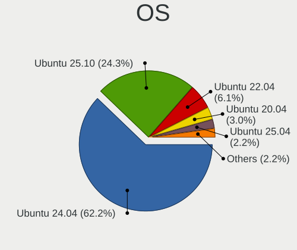

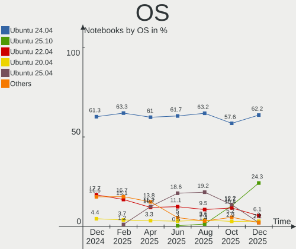

| Name         | Notebooks | Percent |
|--------------|-----------|---------|
| Ubuntu 24.04 | 225       | 62.15%  |
| Ubuntu 25.10 | 88        | 24.31%  |
| Ubuntu 22.04 | 22        | 6.08%   |
| Ubuntu 20.04 | 11        | 3.04%   |
| Ubuntu 25.04 | 8         | 2.21%   |
| Ubuntu 26.04 | 4         | 1.1%    |
| Ubuntu 24.10 | 1         | 0.28%   |
| Ubuntu 21.04 | 1         | 0.28%   |
| Ubuntu 18.04 | 1         | 0.28%   |
| Ubuntu 1.3.2 | 1         | 0.28%   |

OS Family
---------

OS without a version

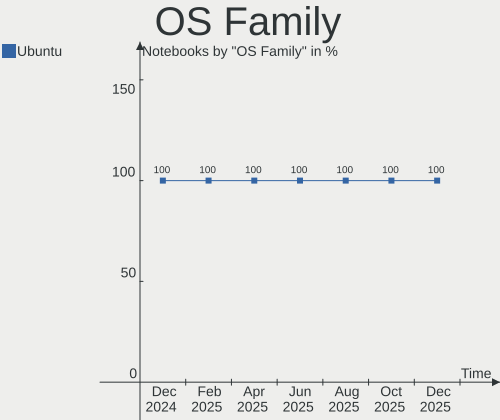

| Name   | Notebooks | Percent |
|--------|-----------|---------|
| Ubuntu | 362       | 100%    |

Kernel
------

Version of the Linux kernel

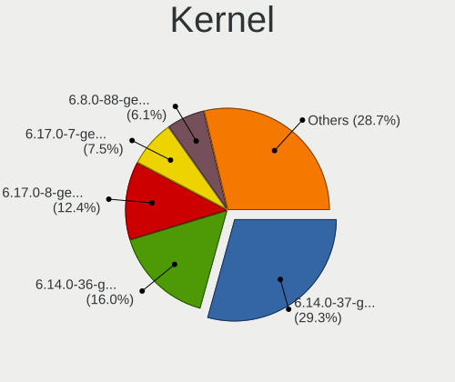

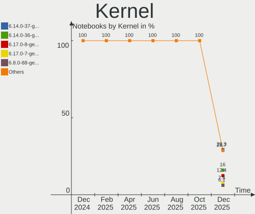

| Version               | Notebooks | Percent |
|-----------------------|-----------|---------|
| 6.14.0-37-generic     | 106       | 29.28%  |
| 6.14.0-36-generic     | 58        | 16.02%  |
| 6.17.0-8-generic      | 45        | 12.43%  |
| 6.17.0-7-generic      | 27        | 7.46%   |
| 6.8.0-88-generic      | 22        | 6.08%   |
| 6.8.0-90-generic      | 16        | 4.42%   |
| 6.8.0-87-generic      | 10        | 2.76%   |
| 6.17.0-5-generic      | 9         | 2.49%   |
| 6.14.0-27-generic     | 9         | 2.49%   |
| 6.17.0-6-generic      | 8         | 2.21%   |
| 5.15.0-139-generic    | 5         | 1.38%   |
| 6.14.0-35-generic     | 3         | 0.83%   |
| 6.14.0-1018-oem       | 3         | 0.83%   |
| 5.15.0-67-generic     | 3         | 0.83%   |
| 6.14.0-33-generic     | 2         | 0.55%   |
| 6.14.0-1016-oem       | 2         | 0.55%   |
| 6.11.0-26-generic     | 2         | 0.55%   |
| 5.15.0-164-generic    | 2         | 0.55%   |
| 6.8.4-060804-generic  | 1         | 0.28%   |
| 6.8.0-90-lowlatency   | 1         | 0.28%   |
| 6.8.0-85-generic      | 1         | 0.28%   |
| 6.8.0-79-generic      | 1         | 0.28%   |
| 6.8.0-78-generic      | 1         | 0.28%   |
| 6.8.0-57-generic      | 1         | 0.28%   |
| 6.8.0-52-generic      | 1         | 0.28%   |
| 6.8.0-48-generic      | 1         | 0.28%   |
| 6.8.0-41-generic      | 1         | 0.28%   |
| 6.8.0-40-generic      | 1         | 0.28%   |
| 6.5.0-18-generic      | 1         | 0.28%   |
| 6.5.0-15-generic      | 1         | 0.28%   |
| 6.5.0-14-generic      | 1         | 0.28%   |
| 6.18.1-061801-generic | 1         | 0.28%   |
| 6.18.0-1-t2-plucky    | 1         | 0.28%   |
| 6.17.9-061709-generic | 1         | 0.28%   |
| 6.17.8-061708-generic | 1         | 0.28%   |
| 6.17.10-x64v3-xanmod1 | 1         | 0.28%   |
| 6.17.0-1006-oem       | 1         | 0.28%   |
| 6.17.0-1004-realtime  | 1         | 0.28%   |
| 6.14.0-1017-oem       | 1         | 0.28%   |
| 6.12.3-061203-generic | 1         | 0.28%   |

Kernel Family
-------------

Linux kernel without a distro release

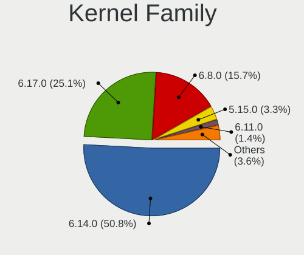

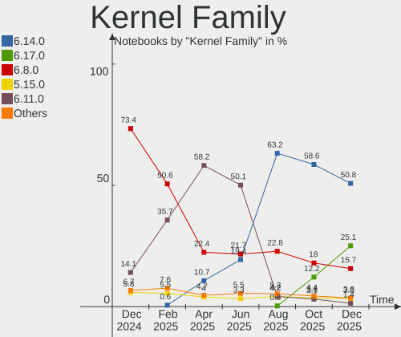

| Version | Notebooks | Percent |
|---------|-----------|---------|
| 6.14.0  | 184       | 50.83%  |
| 6.17.0  | 91        | 25.14%  |
| 6.8.0   | 57        | 15.75%  |
| 5.15.0  | 12        | 3.31%   |
| 6.11.0  | 5         | 1.38%   |
| 6.5.0   | 3         | 0.83%   |
| 6.8.4   | 1         | 0.28%   |
| 6.18.1  | 1         | 0.28%   |
| 6.18.0  | 1         | 0.28%   |
| 6.17.9  | 1         | 0.28%   |
| 6.17.8  | 1         | 0.28%   |
| 6.17.10 | 1         | 0.28%   |
| 6.12.3  | 1         | 0.28%   |
| 5.4.0   | 1         | 0.28%   |
| 5.11.0  | 1         | 0.28%   |
| 4.15.0  | 1         | 0.28%   |

Kernel Major Ver.
-----------------

Linux kernel major version

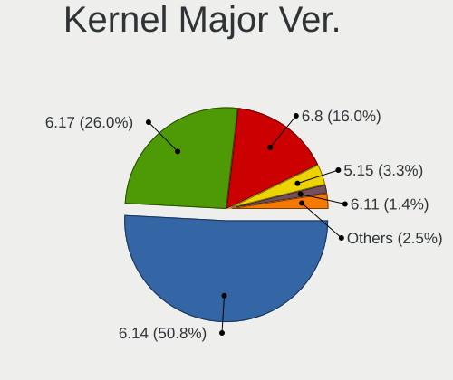

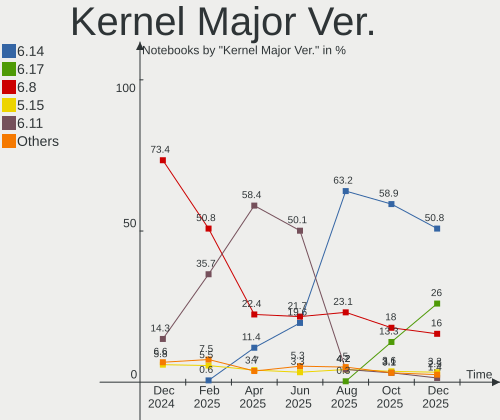

| Version | Notebooks | Percent |
|---------|-----------|---------|
| 6.14    | 184       | 50.83%  |
| 6.17    | 94        | 25.97%  |
| 6.8     | 58        | 16.02%  |
| 5.15    | 12        | 3.31%   |
| 6.11    | 5         | 1.38%   |
| 6.5     | 3         | 0.83%   |
| 6.18    | 2         | 0.55%   |
| 6.12    | 1         | 0.28%   |
| 5.4     | 1         | 0.28%   |
| 5.11    | 1         | 0.28%   |
| 4.15    | 1         | 0.28%   |

Arch
----

OS architecture (x86_64, i586, etc.)

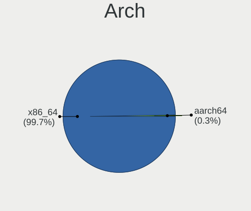

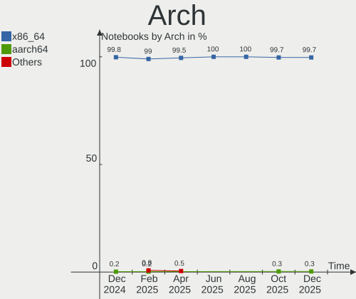

| Name    | Notebooks | Percent |
|---------|-----------|---------|
| x86_64  | 361       | 99.72%  |
| aarch64 | 1         | 0.28%   |

DE
--

Desktop Environment

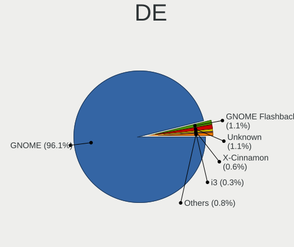

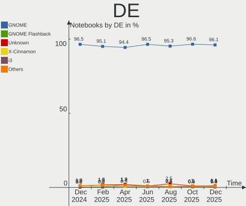

| Name                    | Notebooks | Percent |
|-------------------------|-----------|---------|
| GNOME                   | 348       | 96.13%  |
| GNOME Flashback         | 4         | 1.1%    |
| Unknown                 | 4         | 1.1%    |
| X-Cinnamon              | 2         | 0.55%   |
| i3                      | 1         | 0.28%   |
| Hyprland:start-hyprland | 1         | 0.28%   |
| GNOME Classic           | 1         | 0.28%   |
| Enlightenment           | 1         | 0.28%   |

Display Server
--------------

X11 or Wayland

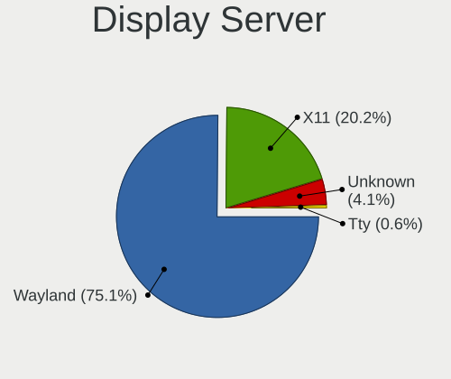

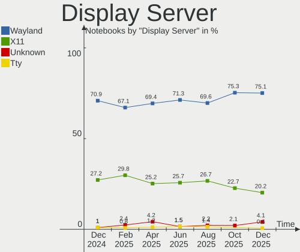

| Name    | Notebooks | Percent |
|---------|-----------|---------|
| Wayland | 272       | 75.14%  |
| X11     | 73        | 20.17%  |
| Unknown | 15        | 4.14%   |
| Tty     | 2         | 0.55%   |

Display Manager
---------------

SDDM, LightDM, etc.

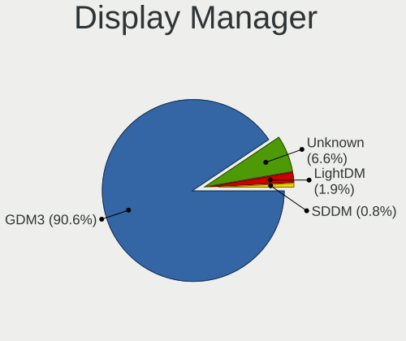

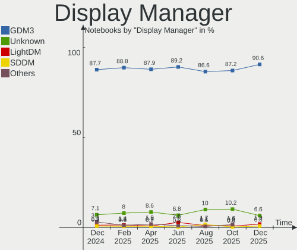

| Name    | Notebooks | Percent |
|---------|-----------|---------|
| GDM3    | 328       | 90.61%  |
| Unknown | 24        | 6.63%   |
| LightDM | 7         | 1.93%   |
| SDDM    | 3         | 0.83%   |

OS Lang
-------

Language

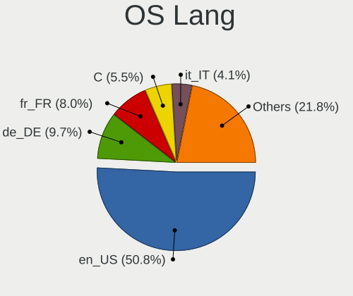

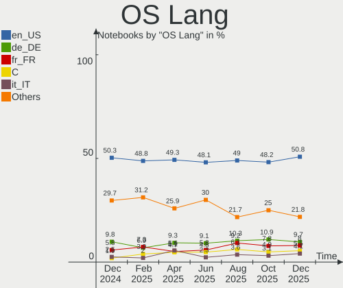

| Lang    | Notebooks | Percent |
|---------|-----------|---------|
| en_US   | 184       | 50.83%  |
| de_DE   | 35        | 9.67%   |
| fr_FR   | 29        | 8.01%   |
| C       | 20        | 5.52%   |
| it_IT   | 15        | 4.14%   |
| es_ES   | 11        | 3.04%   |
| pt_BR   | 10        | 2.76%   |
| en_GB   | 10        | 2.76%   |
| ru_RU   | 8         | 2.21%   |
| zh_CN   | 5         | 1.38%   |
| zh_TW   | 4         | 1.1%    |
| pl_PL   | 4         | 1.1%    |
| cs_CZ   | 4         | 1.1%    |
| tr_TR   | 3         | 0.83%   |
| hu_HU   | 3         | 0.83%   |
| en_IN   | 3         | 0.83%   |
| sv_SE   | 2         | 0.55%   |
| pt_PT   | 2         | 0.55%   |
| nl_NL   | 2         | 0.55%   |
| en_CA   | 2         | 0.55%   |
| en_AU   | 2         | 0.55%   |
| es_CO   | 1         | 0.28%   |
| de_CH   | 1         | 0.28%   |
| da_DK   | 1         | 0.28%   |
| Unknown | 1         | 0.28%   |

Boot Mode
---------

EFI or BIOS

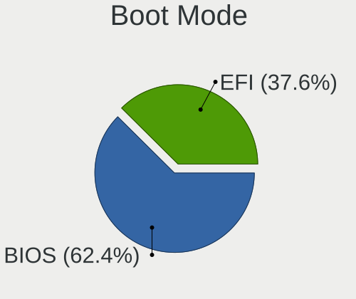

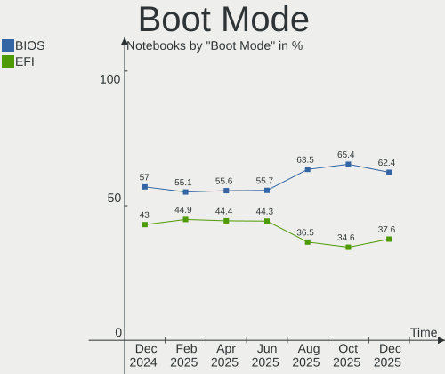

| Mode | Notebooks | Percent |
|------|-----------|---------|
| BIOS | 226       | 62.43%  |
| EFI  | 136       | 37.57%  |

Filesystem
----------

Type of filesystem

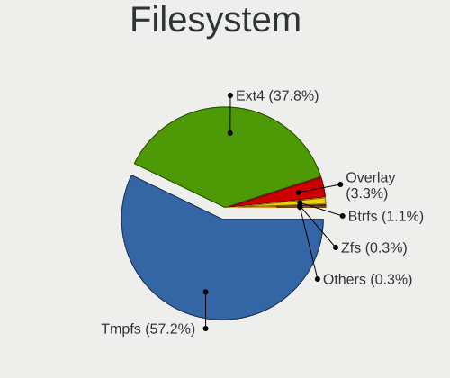

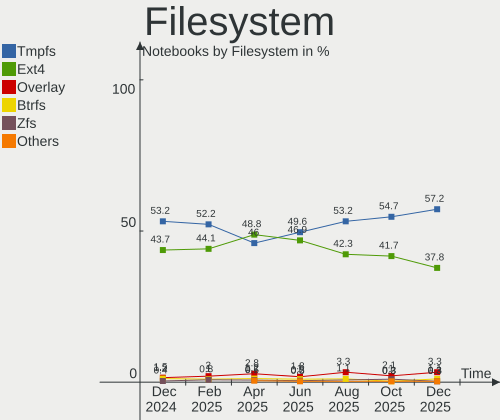

| Type    | Notebooks | Percent |
|---------|-----------|---------|
| Tmpfs   | 207       | 57.18%  |
| Ext4    | 137       | 37.85%  |
| Overlay | 12        | 3.31%   |
| Btrfs   | 4         | 1.1%    |
| Zfs     | 1         | 0.28%   |
| Xfs     | 1         | 0.28%   |

Part. scheme
------------

Scheme of partitioning

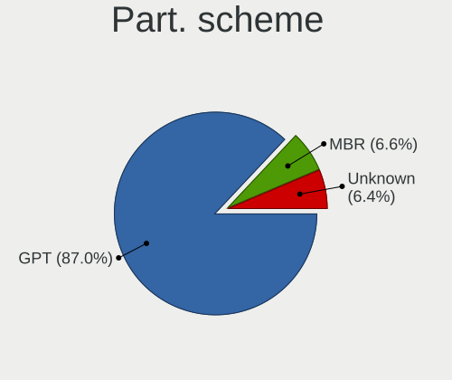

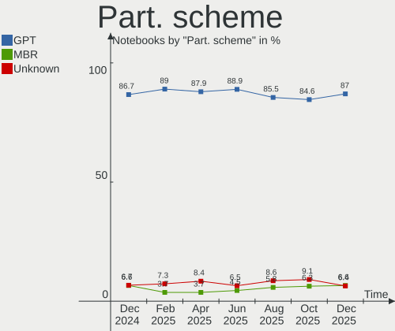

| Type    | Notebooks | Percent |
|---------|-----------|---------|
| GPT     | 315       | 87.02%  |
| MBR     | 24        | 6.63%   |
| Unknown | 23        | 6.35%   |

Dual Boot with Linux/BSD
------------------------

Hosting more than one Linux/BSD

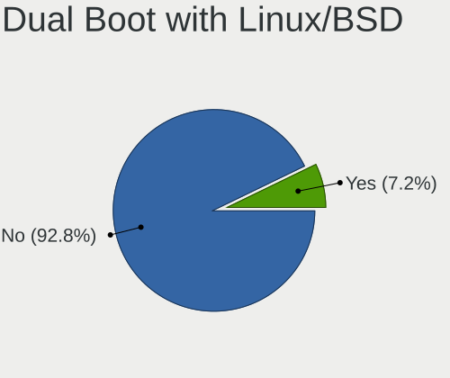

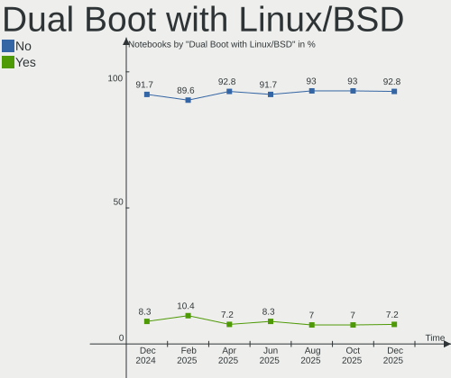

| Dual boot | Notebooks | Percent |
|-----------|-----------|---------|
| No        | 336       | 92.82%  |
| Yes       | 26        | 7.18%   |

Dual Boot (Win)
---------------

Hosting Linux and Windows

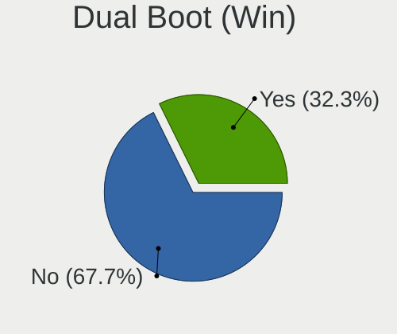

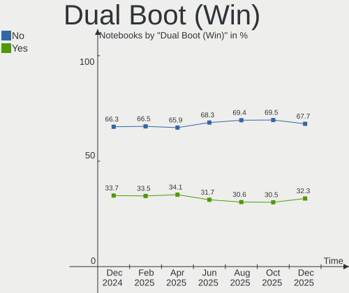

| Dual boot | Notebooks | Percent |
|-----------|-----------|---------|
| No        | 245       | 67.68%  |
| Yes       | 117       | 32.32%  |

Board
-----

Vendor
------

Motherboard manufacturer

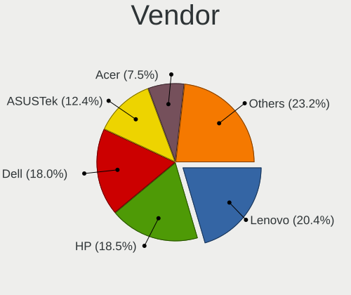

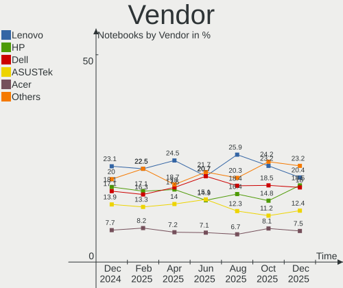

| Name                | Notebooks | Percent |
|---------------------|-----------|---------|
| Lenovo              | 74        | 20.44%  |
| Hewlett-Packard     | 67        | 18.51%  |
| Dell                | 65        | 17.96%  |
| ASUSTek Computer    | 45        | 12.43%  |
| Acer                | 27        | 7.46%   |
| Apple               | 23        | 6.35%   |
| Toshiba             | 7         | 1.93%   |
| MSI                 | 6         | 1.66%   |
| Medion              | 5         | 1.38%   |
| Samsung Electronics | 4         | 1.1%    |
| Sony                | 3         | 0.83%   |
| HUAWEI              | 3         | 0.83%   |
| Framework           | 3         | 0.83%   |
| Chuwi               | 3         | 0.83%   |
| MECHREVO            | 2         | 0.55%   |
| HONOR               | 2         | 0.55%   |
| Gigabyte Technology | 2         | 0.55%   |
| Fujitsu             | 2         | 0.55%   |
| Vizio               | 1         | 0.28%   |
| TongFang            | 1         | 0.28%   |
| SLIMBOOK            | 1         | 0.28%   |
| Schenker            | 1         | 0.28%   |
| Positivo            | 1         | 0.28%   |
| Packard Bell        | 1         | 0.28%   |
| NEC Computers       | 1         | 0.28%   |
| Maibenben           | 1         | 0.28%   |
| LZ                  | 1         | 0.28%   |
| LG Electronics      | 1         | 0.28%   |
| Infinix             | 1         | 0.28%   |
| IDN228              | 1         | 0.28%   |
| Hungaro Flotta Kft  | 1         | 0.28%   |
| Google              | 1         | 0.28%   |
| Fujitsu Siemens     | 1         | 0.28%   |
| Dream Machines      | 1         | 0.28%   |
| BOSGAME             | 1         | 0.28%   |
| Avell               | 1         | 0.28%   |
| Alienware           | 1         | 0.28%   |

Model
-----

Motherboard model

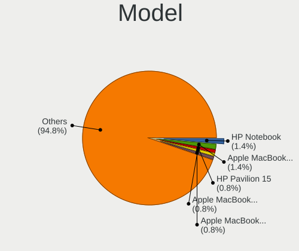

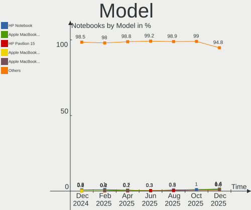

| Name                                        | Notebooks | Percent |
|---------------------------------------------|-----------|---------|
| HP Notebook                                 | 5         | 1.38%   |
| Apple MacBookAir7,2                         | 5         | 1.38%   |
| HP Pavilion 15                              | 3         | 0.83%   |
| Apple MacBookPro8,1                         | 3         | 0.83%   |
| Apple MacBookAir4,1                         | 3         | 0.83%   |
| Toshiba Satellite C55-C                     | 2         | 0.55%   |
| MECHREVO CODE Series                        | 2         | 0.55%   |
| Lenovo Legion Pro 5 16IRX9 83DF             | 2         | 0.55%   |
| Lenovo Legion 5 16IAX10 83NX                | 2         | 0.55%   |
| Lenovo IdeaPad 1 15ALC7 82R4                | 2         | 0.55%   |
| Lenovo G50-70 20351                         | 2         | 0.55%   |
| HP Pavilion g6                              | 2         | 0.55%   |
| HP EliteBook 840 G8 Notebook PC             | 2         | 0.55%   |
| HP EliteBook 820 G3                         | 2         | 0.55%   |
| Framework Laptop 16 (AMD Ryzen 7040 Series) | 2         | 0.55%   |
| Dell Latitude 7480                          | 2         | 0.55%   |
| Dell Latitude 5490                          | 2         | 0.55%   |
| Dell Latitude 5420                          | 2         | 0.55%   |
| Dell Latitude 5410                          | 2         | 0.55%   |
| ASUS Zenbook UX3402ZA_UX3402ZA              | 2         | 0.55%   |
| ASUS VivoBook_ASUSLaptop X1605VA_X1605VA    | 2         | 0.55%   |
| ASUS Vivobook Go E1504FA_E1504FA            | 2         | 0.55%   |
| ASUS Vivobook Go E1404GAB_E1404GA           | 2         | 0.55%   |
| Apple MacBookPro12,1                        | 2         | 0.55%   |
| Apple MacBookPro10,1                        | 2         | 0.55%   |
| Acer Aspire AG15-71P                        | 2         | 0.55%   |
| Unknown                                     | 2         | 0.55%   |
| Vizio CT15T-B1                              | 1         | 0.28%   |
| Toshiba Satellite Pro L500                  | 1         | 0.28%   |
| Toshiba Satellite L70-A                     | 1         | 0.28%   |
| Toshiba Satellite C45-A                     | 1         | 0.28%   |
| Toshiba dynabook R82/B                      | 1         | 0.28%   |
| Toshiba dynabook AB65/NW                    | 1         | 0.28%   |
| TongFang GX5HRXL                            | 1         | 0.28%   |
| Sony VPCEH3N6E                              | 1         | 0.28%   |
| Sony VPCEG10EL                              | 1         | 0.28%   |
| Sony SVF1521Q1EW                            | 1         | 0.28%   |
| SLIMBOOK EVO14-A8                           | 1         | 0.28%   |
| Schenker XMG EVO (E25)                      | 1         | 0.28%   |
| Samsung 950XCJ/951XCJ/950XCR                | 1         | 0.28%   |

Model Family
------------

Motherboard model prefix

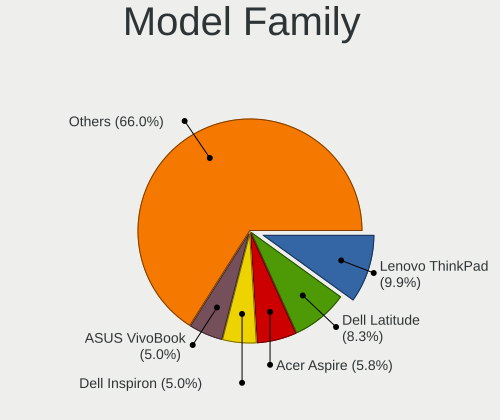

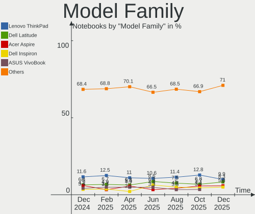

| Name               | Notebooks | Percent |
|--------------------|-----------|---------|
| Lenovo ThinkPad    | 36        | 9.94%   |
| Dell Latitude      | 30        | 8.29%   |
| Acer Aspire        | 21        | 5.8%    |
| Dell Inspiron      | 18        | 4.97%   |
| ASUS VivoBook      | 18        | 4.97%   |
| HP EliteBook       | 16        | 4.42%   |
| Lenovo IdeaPad     | 15        | 4.14%   |
| HP Pavilion        | 11        | 3.04%   |
| HP Laptop          | 9         | 2.49%   |
| HP ProBook         | 8         | 2.21%   |
| ASUS ASUS          | 8         | 2.21%   |
| Lenovo Legion      | 7         | 1.93%   |
| Dell Precision     | 6         | 1.66%   |
| ASUS ZenBook       | 6         | 1.66%   |
| Apple MacBookAir7  | 6         | 1.66%   |
| Toshiba Satellite  | 5         | 1.38%   |
| HP ZBook           | 5         | 1.38%   |
| HP Notebook        | 5         | 1.38%   |
| Dell XPS           | 4         | 1.1%    |
| Acer Nitro         | 4         | 1.1%    |
| HP OMEN            | 3         | 0.83%   |
| Framework Laptop   | 3         | 0.83%   |
| Dell 16            | 3         | 0.83%   |
| Apple MacBookPro8  | 3         | 0.83%   |
| Apple MacBookAir4  | 3         | 0.83%   |
| Toshiba dynabook   | 2         | 0.55%   |
| Medion Akoya       | 2         | 0.55%   |
| MECHREVO CODE      | 2         | 0.55%   |
| Lenovo Yoga        | 2         | 0.55%   |
| Lenovo V15         | 2         | 0.55%   |
| Lenovo LOQ         | 2         | 0.55%   |
| Lenovo G50-70      | 2         | 0.55%   |
| HP Victus          | 2         | 0.55%   |
| HP 255             | 2         | 0.55%   |
| HP 250             | 2         | 0.55%   |
| Fujitsu LIFEBOOK   | 2         | 0.55%   |
| Dell 14            | 2         | 0.55%   |
| Apple MacBookPro12 | 2         | 0.55%   |
| Apple MacBookPro10 | 2         | 0.55%   |
| Unknown            | 2         | 0.55%   |

MFG Year
--------

Motherboard manufacture year

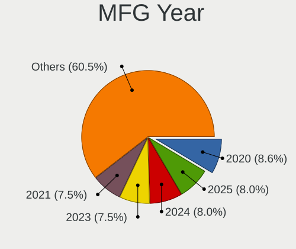

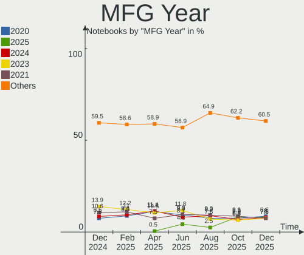

| Year | Notebooks | Percent |
|------|-----------|---------|
| 2020 | 31        | 8.56%   |
| 2025 | 29        | 8.01%   |
| 2024 | 29        | 8.01%   |
| 2023 | 27        | 7.46%   |
| 2021 | 27        | 7.46%   |
| 2018 | 27        | 7.46%   |
| 2012 | 26        | 7.18%   |
| 2017 | 25        | 6.91%   |
| 2022 | 23        | 6.35%   |
| 2013 | 19        | 5.25%   |
| 2011 | 19        | 5.25%   |
| 2015 | 18        | 4.97%   |
| 2019 | 16        | 4.42%   |
| 2014 | 16        | 4.42%   |
| 2016 | 10        | 2.76%   |
| 2010 | 7         | 1.93%   |
| 2006 | 5         | 1.38%   |
| 2008 | 4         | 1.1%    |
| 2009 | 3         | 0.83%   |
| 2007 | 1         | 0.28%   |

Form Factor
-----------

Physical design of the computer

| Name     | Notebooks | Percent |
|----------|-----------|---------|
| Notebook | 362       | 100%    |

Secure Boot
-----------

Enabled or disabled

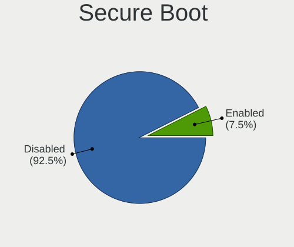

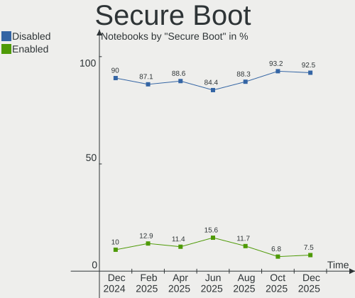

| State    | Notebooks | Percent |
|----------|-----------|---------|
| Disabled | 335       | 92.54%  |
| Enabled  | 27        | 7.46%   |

Coreboot
--------

Have coreboot on board

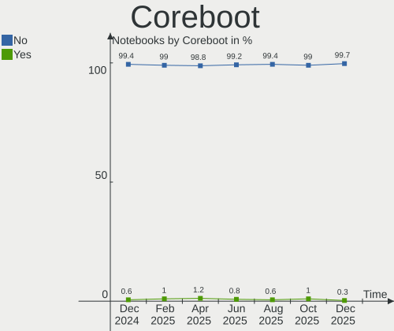

| Used | Notebooks | Percent |
|------|-----------|---------|
| No   | 361       | 99.72%  |
| Yes  | 1         | 0.28%   |

RAM Size
--------

Total RAM memory

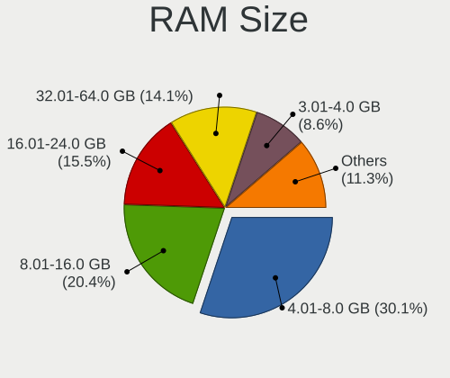

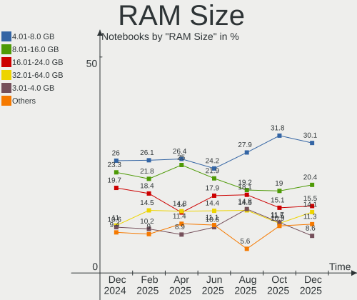

| Size in GB  | Notebooks | Percent |
|-------------|-----------|---------|
| 4.01-8.0    | 109       | 30.11%  |
| 8.01-16.0   | 74        | 20.44%  |
| 16.01-24.0  | 56        | 15.47%  |
| 32.01-64.0  | 51        | 14.09%  |
| 3.01-4.0    | 31        | 8.56%   |
| 24.01-32.0  | 17        | 4.7%    |
| 64.01-256.0 | 16        | 4.42%   |
| 1.01-2.0    | 5         | 1.38%   |
| 2.01-3.0    | 3         | 0.83%   |

RAM Used
--------

Used RAM memory

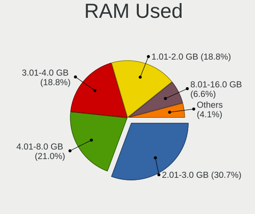

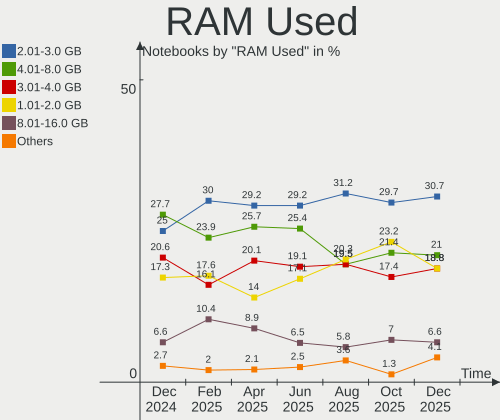

| Used GB    | Notebooks | Percent |
|------------|-----------|---------|
| 2.01-3.0   | 111       | 30.66%  |
| 4.01-8.0   | 76        | 20.99%  |
| 3.01-4.0   | 68        | 18.78%  |
| 1.01-2.0   | 68        | 18.78%  |
| 8.01-16.0  | 24        | 6.63%   |
| 16.01-24.0 | 7         | 1.93%   |
| 24.01-32.0 | 4         | 1.1%    |
| 0.51-1.0   | 4         | 1.1%    |

Total Drives
------------

Number of drives on board

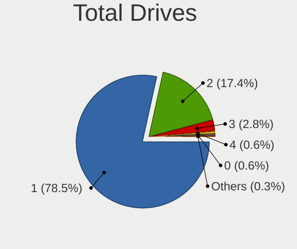

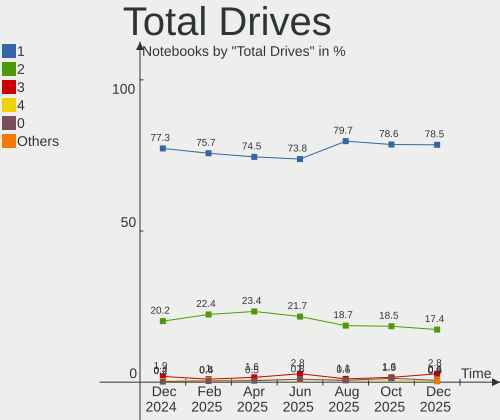

| Drives | Notebooks | Percent |
|--------|-----------|---------|
| 1      | 284       | 78.45%  |
| 2      | 63        | 17.4%   |
| 3      | 10        | 2.76%   |
| 4      | 2         | 0.55%   |
| 0      | 2         | 0.55%   |
| 6      | 1         | 0.28%   |

Has CD-ROM
----------

Has CD-ROM on board

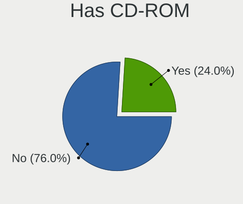

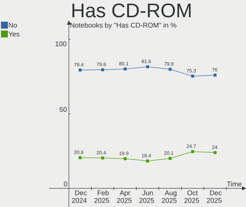

| Presented | Notebooks | Percent |
|-----------|-----------|---------|
| No        | 275       | 75.97%  |
| Yes       | 87        | 24.03%  |

Has Ethernet
------------

Has Ethernet on board

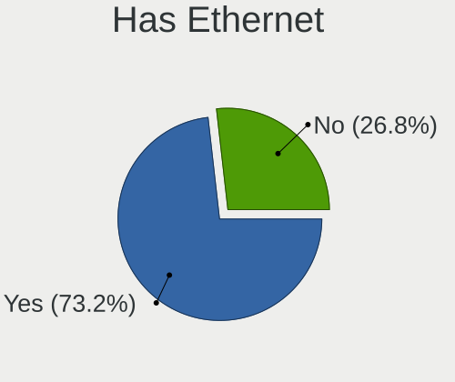

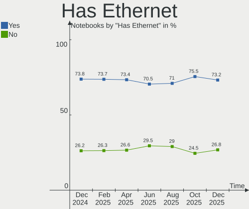

| Presented | Notebooks | Percent |
|-----------|-----------|---------|
| Yes       | 265       | 73.2%   |
| No        | 97        | 26.8%   |

Has WiFi
--------

Has WiFi module

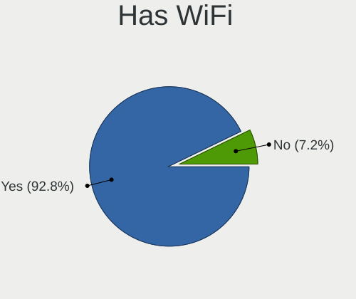

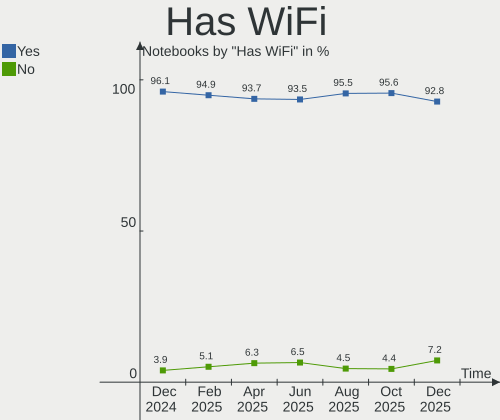

| Presented | Notebooks | Percent |
|-----------|-----------|---------|
| Yes       | 336       | 92.82%  |
| No        | 26        | 7.18%   |

Has Bluetooth
-------------

Has Bluetooth module

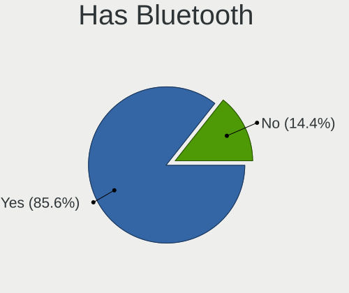

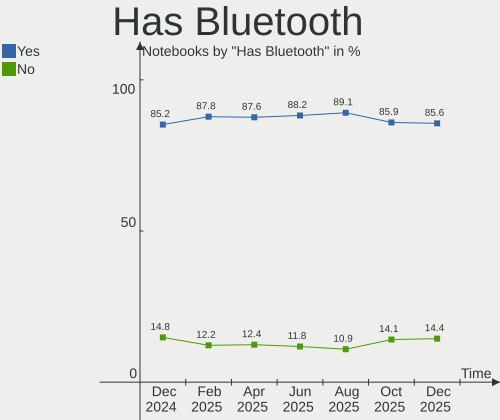

| Presented | Notebooks | Percent |
|-----------|-----------|---------|
| Yes       | 310       | 85.64%  |
| No        | 52        | 14.36%  |

Location
--------

Country
-------

Geographic location (country)

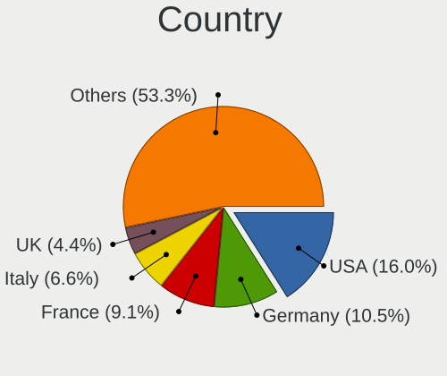

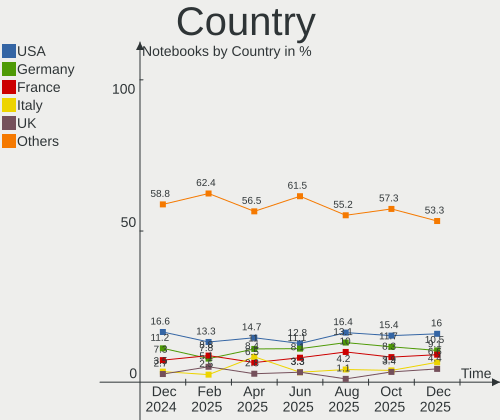

| Country         | Notebooks | Percent |
|-----------------|-----------|---------|
| USA             | 58        | 16.02%  |
| Germany         | 38        | 10.5%   |
| France          | 33        | 9.12%   |
| Italy           | 24        | 6.63%   |
| UK              | 16        | 4.42%   |
| Russia          | 15        | 4.14%   |
| India           | 15        | 4.14%   |
| Brazil          | 15        | 4.14%   |
| Poland          | 9         | 2.49%   |
| Canada          | 9         | 2.49%   |
| Netherlands     | 8         | 2.21%   |
| Indonesia       | 7         | 1.93%   |
| Australia       | 7         | 1.93%   |
| Turkey          | 6         | 1.66%   |
| Spain           | 6         | 1.66%   |
| Iran            | 6         | 1.66%   |
| China           | 6         | 1.66%   |
| Sweden          | 5         | 1.38%   |
| Hungary         | 5         | 1.38%   |
| Switzerland     | 4         | 1.1%    |
| Czechia         | 4         | 1.1%    |
| Austria         | 4         | 1.1%    |
| South Africa    | 3         | 0.83%   |
| Romania         | 3         | 0.83%   |
| Philippines     | 3         | 0.83%   |
| Norway          | 3         | 0.83%   |
| Japan           | 3         | 0.83%   |
| Denmark         | 3         | 0.83%   |
| Colombia        | 3         | 0.83%   |
| Belgium         | 3         | 0.83%   |
| Thailand        | 2         | 0.55%   |
| Taiwan          | 2         | 0.55%   |
| Portugal        | 2         | 0.55%   |
| Mexico          | 2         | 0.55%   |
| Israel          | 2         | 0.55%   |
| Zambia          | 1         | 0.28%   |
| The Netherlands | 1         | 0.28%   |
| Sri Lanka       | 1         | 0.28%   |
| Slovenia        | 1         | 0.28%   |
| Slovakia        | 1         | 0.28%   |

City
----

Geographic location (city)

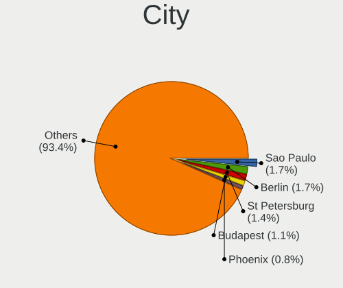

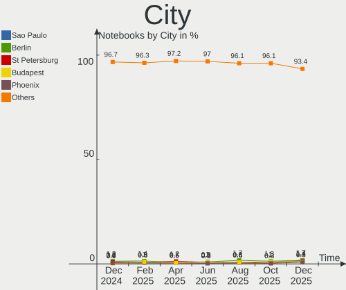

| City             | Notebooks | Percent |
|------------------|-----------|---------|
| Sao Paulo        | 6         | 1.66%   |
| Berlin           | 6         | 1.66%   |
| St Petersburg    | 5         | 1.38%   |
| Budapest         | 4         | 1.1%    |
| Phoenix          | 3         | 0.83%   |
| Paris            | 3         | 0.83%   |
| Moscow           | 3         | 0.83%   |
| Milan            | 3         | 0.83%   |
| Melbourne        | 3         | 0.83%   |
| Istanbul         | 3         | 0.83%   |
| Turin            | 2         | 0.55%   |
| Shenzhen         | 2         | 0.55%   |
| Seattle          | 2         | 0.55%   |
| Potsdam          | 2         | 0.55%   |
| Oslo             | 2         | 0.55%   |
| Munich           | 2         | 0.55%   |
| Monte Vista      | 2         | 0.55%   |
| Milano           | 2         | 0.55%   |
| Mashhad          | 2         | 0.55%   |
| Lille            | 2         | 0.55%   |
| Kochi            | 2         | 0.55%   |
| Isfahan          | 2         | 0.55%   |
| Genoa            | 2         | 0.55%   |
| Edgware          | 2         | 0.55%   |
| East Moline      | 2         | 0.55%   |
| Dordrecht        | 2         | 0.55%   |
| Corvallis        | 2         | 0.55%   |
| Copenhagen       | 2         | 0.55%   |
| Cologne          | 2         | 0.55%   |
| Bucharest        | 2         | 0.55%   |
| Bologna          | 2         | 0.55%   |
| Bengaluru        | 2         | 0.55%   |
| Zurich           | 1         | 0.28%   |
| Yunlin           | 1         | 0.28%   |
| Wuhan            | 1         | 0.28%   |
| Willemstad       | 1         | 0.28%   |
| Whyteleafe       | 1         | 0.28%   |
| Weymouth         | 1         | 0.28%   |
| West Valley City | 1         | 0.28%   |
| Warsaw           | 1         | 0.28%   |

Drives
------

Drive Vendor
------------

Hard drive vendors

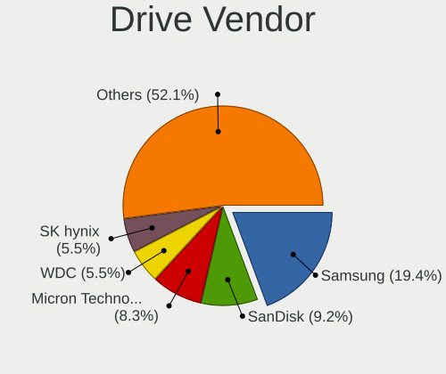

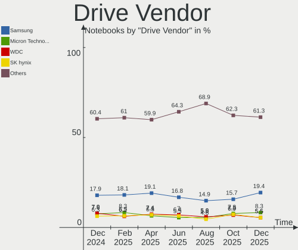

| Vendor                       | Notebooks | Drives | Percent |
|------------------------------|-----------|--------|---------|
| Samsung Electronics          | 84        | 93     | 19.35%  |
| SanDisk                      | 40        | 42     | 9.22%   |
| Micron Technology            | 36        | 36     | 8.29%   |
| WDC                          | 24        | 25     | 5.53%   |
| SK hynix                     | 24        | 24     | 5.53%   |
| Toshiba                      | 23        | 24     | 5.3%    |
| KIOXIA                       | 18        | 21     | 4.15%   |
| Seagate                      | 14        | 15     | 3.23%   |
| Crucial                      | 14        | 14     | 3.23%   |
| Unknown                      | 13        | 15     | 3%      |
| Kingston                     | 12        | 12     | 2.76%   |
| Intel                        | 12        | 13     | 2.76%   |
| HGST                         | 12        | 12     | 2.76%   |
| Apple                        | 12        | 13     | 2.76%   |
| Kingston Technology Company  | 8         | 9      | 1.84%   |
| A-DATA Technology            | 8         | 8      | 1.84%   |
| China                        | 6         | 6      | 1.38%   |
| SABRENT                      | 4         | 4      | 0.92%   |
| SPCC                         | 3         | 4      | 0.69%   |
| SOLIDIGM                     | 3         | 3      | 0.69%   |
| Silicon Motion               | 3         | 3      | 0.69%   |
| PNY                          | 3         | 3      | 0.69%   |
| JetFlash                     | 3         | 3      | 0.69%   |
| Intenso                      | 3         | 3      | 0.69%   |
| Hitachi                      | 3         | 3      | 0.69%   |
| Fujitsu                      | 3         | 3      | 0.69%   |
| Unknown                      | 3         | 3      | 0.69%   |
| Shenzhen Longsys Electronics | 2         | 2      | 0.46%   |
| Patriot                      | 2         | 2      | 0.46%   |
| ORICO                        | 2         | 2      | 0.46%   |
| Lexar                        | 2         | 2      | 0.46%   |
| HS-SSD-E100                  | 2         | 2      | 0.46%   |
| FORESEE                      | 2         | 2      | 0.46%   |
| YMTC                         | 1         | 1      | 0.23%   |
| Wibtek                       | 1         | 1      | 0.23%   |
| Verbatim                     | 1         | 1      | 0.23%   |
| USB                          | 1         | 1      | 0.23%   |
| Transcend                    | 1         | 1      | 0.23%   |
| SSK                          | 1         | 2      | 0.23%   |
| Shenzhen                     | 1         | 1      | 0.23%   |

Drive Model
-----------

Hard drive models

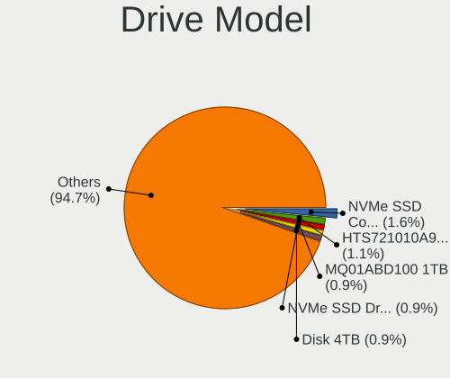

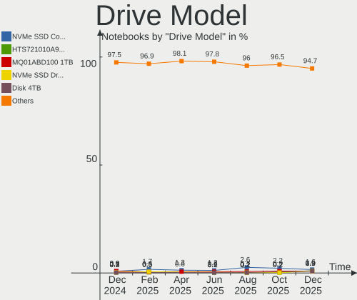

| Model                                                 | Notebooks | Percent |
|-------------------------------------------------------|-----------|---------|
| Samsung NVMe SSD Controller SM981/PM981/PM983 1TB     | 7         | 1.56%   |
| HGST HTS721010A9E630 1TB                              | 5         | 1.11%   |
| Toshiba MQ01ABD100 1TB                                | 4         | 0.89%   |
| SanDisk NVMe SSD Drive 2TB                            | 4         | 0.89%   |
| SABRENT Disk 4TB                                      | 4         | 0.89%   |
| Micron 2400_MTFDKBA512QFM 512GB                       | 4         | 0.89%   |
| Crucial CT240BX500SSD1 240GB                          | 4         | 0.89%   |
| Unknown MMC Card  32GB                                | 3         | 0.67%   |
| Seagate ST1000LM024 HN-M101MBB 1TB                    | 3         | 0.67%   |
| SanDisk SSD i100 24GB                                 | 3         | 0.67%   |
| SanDisk NVMe SSD Drive 512GB                          | 3         | 0.67%   |
| Samsung SSD 990 PRO 1TB                               | 3         | 0.67%   |
| Samsung SSD 850 EVO 250GB                             | 3         | 0.67%   |
| Samsung NVMe SSD Controller PM9A1/PM9A3/980PRO 1TB    | 3         | 0.67%   |
| Samsung MZVL4512HBLU-00BL7 512GB                      | 3         | 0.67%   |
| Micron 1100 SATA 256GB SSD                            | 3         | 0.67%   |
| JetFlash Transcend 128GB                              | 3         | 0.67%   |
| HGST HTS545050A7E680 500GB                            | 3         | 0.67%   |
| Apple SSD SM0128G 121GB                               | 3         | 0.67%   |
| Unknown                                               | 3         | 0.67%   |
| Unknown SD/MMC/MS PRO 2GB                             | 2         | 0.45%   |
| Unknown MMC Card  7GB                                 | 2         | 0.45%   |
| Unknown MMC Card  64GB                                | 2         | 0.45%   |
| Toshiba MQ04ABF100 1TB                                | 2         | 0.45%   |
| Toshiba MQ01ABD075 752GB                              | 2         | 0.45%   |
| Toshiba KXG50ZNV256G NVMe 256GB                       | 2         | 0.45%   |
| SK hynix SKHynix_HFS002TEJ9X162N 2TB                  | 2         | 0.45%   |
| SK hynix HFS512GEJ9X108N 512GB                        | 2         | 0.45%   |
| Silicon Motion SM2263EN/SM2263XT SSD Controller 512GB | 2         | 0.45%   |
| Sandisk WD PC SN7100S SDFPMSL-1T00-1101 1024GB        | 2         | 0.45%   |
| Samsung SSD 990 PRO 2TB                               | 2         | 0.45%   |
| Samsung SSD 980 1TB                                   | 2         | 0.45%   |
| Samsung SSD 870 EVO 4TB                               | 2         | 0.45%   |
| Samsung SSD 870 EVO 1TB                               | 2         | 0.45%   |
| Samsung SSD 860 EVO 500GB                             | 2         | 0.45%   |
| Samsung SSD 840 EVO 250GB                             | 2         | 0.45%   |
| Samsung NVMe SSD Controller SM961/PM961/SM963 1024GB  | 2         | 0.45%   |
| Samsung MZVLC1T0HFLU-00BLL 1TB                        | 2         | 0.45%   |
| Samsung MZVL21T0HCLR-00B00 1TB                        | 2         | 0.45%   |
| Micron MTFDKBA512QGN-1BN1AABGA 512GB                  | 2         | 0.45%   |

HDD Vendor
----------

Hard disk drive vendors

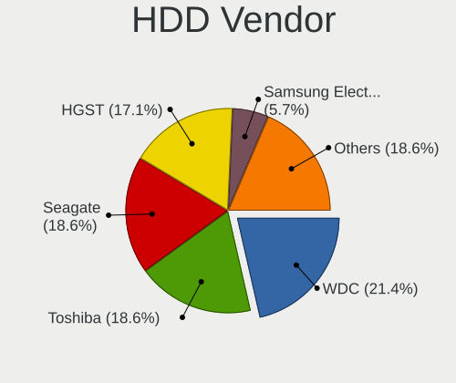

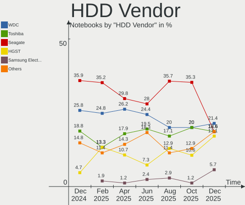

| Vendor              | Notebooks | Drives | Percent |
|---------------------|-----------|--------|---------|
| WDC                 | 15        | 15     | 21.43%  |
| Toshiba             | 13        | 13     | 18.57%  |
| Seagate             | 13        | 13     | 18.57%  |
| HGST                | 12        | 12     | 17.14%  |
| Samsung Electronics | 4         | 4      | 5.71%   |
| JetFlash            | 3         | 3      | 4.29%   |
| Hitachi             | 3         | 3      | 4.29%   |
| Fujitsu             | 3         | 3      | 4.29%   |
| Unknown             | 2         | 2      | 2.86%   |
| SSK                 | 1         | 1      | 1.43%   |
| Shenzhen            | 1         | 1      | 1.43%   |

SSD Vendor
----------

Solid state drive vendors

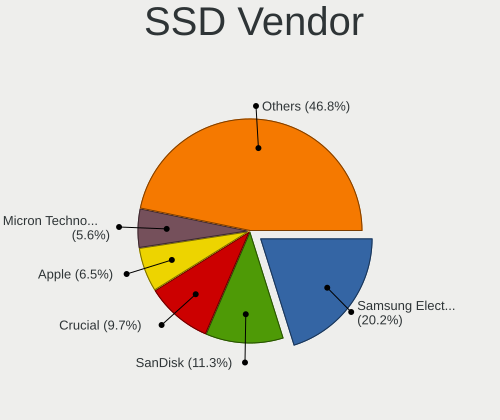

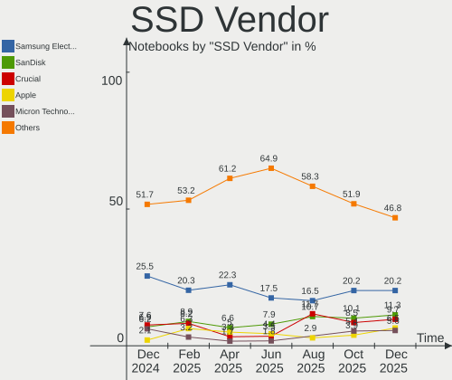

| Vendor              | Notebooks | Drives | Percent |
|---------------------|-----------|--------|---------|
| Samsung Electronics | 25        | 28     | 20.16%  |
| SanDisk             | 14        | 14     | 11.29%  |
| Crucial             | 12        | 12     | 9.68%   |
| Apple               | 8         | 8      | 6.45%   |
| Micron Technology   | 7         | 7      | 5.65%   |
| Kingston            | 7         | 7      | 5.65%   |
| China               | 6         | 6      | 4.84%   |
| WDC                 | 5         | 5      | 4.03%   |
| A-DATA Technology   | 5         | 5      | 4.03%   |
| Toshiba             | 4         | 4      | 3.23%   |
| SABRENT             | 4         | 4      | 3.23%   |
| SK hynix            | 3         | 3      | 2.42%   |
| PNY                 | 3         | 3      | 2.42%   |
| SPCC                | 2         | 2      | 1.61%   |
| Intenso             | 2         | 2      | 1.61%   |
| Intel               | 2         | 2      | 1.61%   |
| Wibtek              | 1         | 1      | 0.81%   |
| Verbatim            | 1         | 1      | 0.81%   |
| Transcend           | 1         | 1      | 0.81%   |
| Safety              | 1         | 1      | 0.81%   |
| PNY USB             | 1         | 1      | 0.81%   |
| ORICO               | 1         | 1      | 0.81%   |
| Netac               | 1         | 1      | 0.81%   |
| MSI                 | 1         | 1      | 0.81%   |
| LITEON              | 1         | 1      | 0.81%   |
| Lexar               | 1         | 1      | 0.81%   |
| HS-SSD-E100         | 1         | 1      | 0.81%   |
| Hanye               | 1         | 1      | 0.81%   |
| CONSISTENT          | 1         | 1      | 0.81%   |
| Aura                | 1         | 1      | 0.81%   |
| Apacer              | 1         | 1      | 0.81%   |

Drive Kind
----------

HDD or SSD

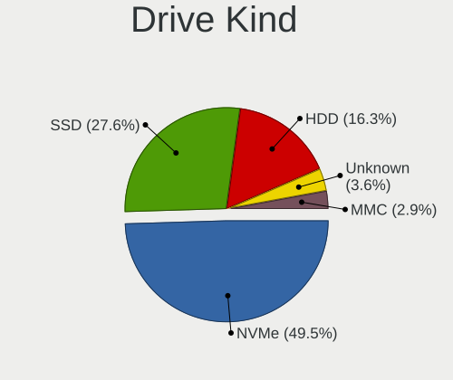

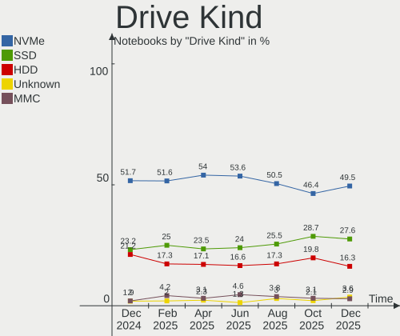

| Kind    | Notebooks | Drives | Percent |
|---------|-----------|--------|---------|
| NVMe    | 206       | 230    | 49.52%  |
| SSD     | 115       | 127    | 27.64%  |
| HDD     | 68        | 70     | 16.35%  |
| Unknown | 15        | 15     | 3.61%   |
| MMC     | 12        | 15     | 2.88%   |

Drive Connector
---------------

SATA, SAS, NVMe, etc.

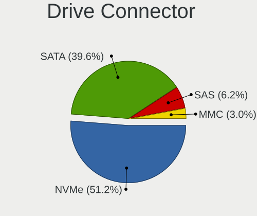

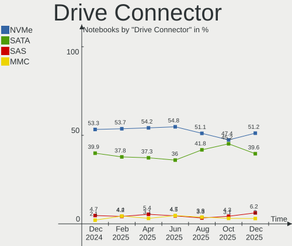

| Type | Notebooks | Drives | Percent |
|------|-----------|--------|---------|
| NVMe | 206       | 228    | 51.24%  |
| SATA | 159       | 183    | 39.55%  |
| SAS  | 25        | 31     | 6.22%   |
| MMC  | 12        | 15     | 2.99%   |

Drive Size
----------

Size of hard drive

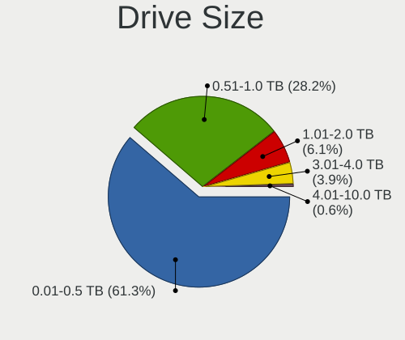

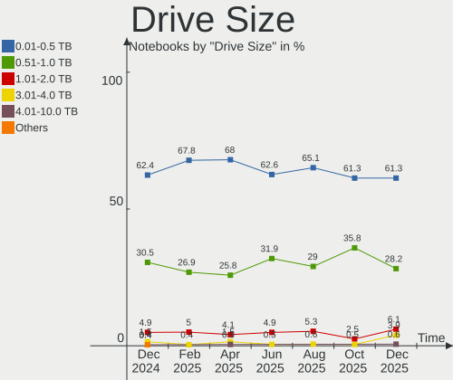

| Size in TB | Notebooks | Drives | Percent |
|------------|-----------|--------|---------|
| 0.01-0.5   | 111       | 122    | 61.33%  |
| 0.51-1.0   | 51        | 53     | 28.18%  |
| 1.01-2.0   | 11        | 14     | 6.08%   |
| 3.01-4.0   | 7         | 7      | 3.87%   |
| 4.01-10.0  | 1         | 1      | 0.55%   |

Space Total
-----------

Amount of disk space available on the file system

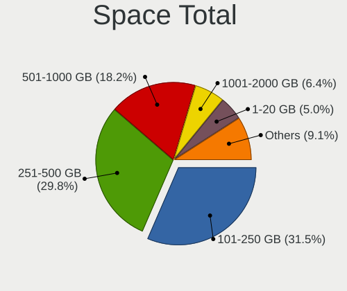

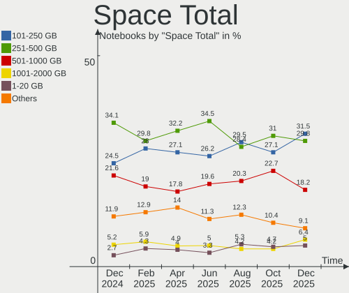

| Size in GB     | Notebooks | Percent |
|----------------|-----------|---------|
| 101-250        | 114       | 31.49%  |
| 251-500        | 108       | 29.83%  |
| 501-1000       | 66        | 18.23%  |
| 1001-2000      | 23        | 6.35%   |
| 1-20           | 18        | 4.97%   |
| More than 3000 | 10        | 2.76%   |
| 21-50          | 9         | 2.49%   |
| 51-100         | 9         | 2.49%   |
| 2001-3000      | 4         | 1.1%    |
| Unknown        | 1         | 0.28%   |

Space Used
----------

Amount of used disk space

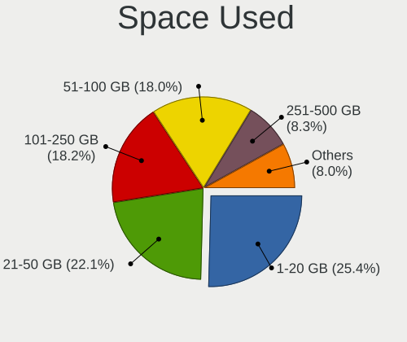

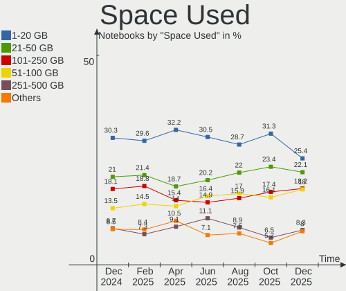

| Used GB        | Notebooks | Percent |
|----------------|-----------|---------|
| 1-20           | 92        | 25.41%  |
| 21-50          | 80        | 22.1%   |
| 101-250        | 66        | 18.23%  |
| 51-100         | 65        | 17.96%  |
| 251-500        | 30        | 8.29%   |
| 501-1000       | 14        | 3.87%   |
| 1001-2000      | 7         | 1.93%   |
| 2001-3000      | 4         | 1.1%    |
| More than 3000 | 3         | 0.83%   |
| Unknown        | 1         | 0.28%   |

Malfunc. Drives
---------------

Drive models with a malfunction

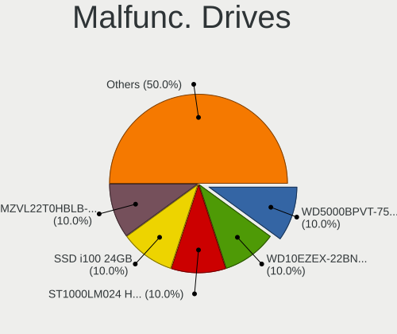

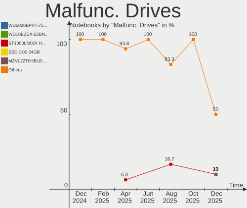

| Model                                               | Notebooks | Drives | Percent |
|-----------------------------------------------------|-----------|--------|---------|
| WDC WD5000BPVT-75HXZT3 500GB                        | 1         | 1      | 10%     |
| WDC WD10EZEX-22BN5A0 1TB                            | 1         | 1      | 10%     |
| Seagate ST1000LM024 HN-M101MBB 1TB                  | 1         | 1      | 10%     |
| SanDisk SSD i100 24GB                               | 1         | 1      | 10%     |
| Samsung Electronics MZVL22T0HBLB-00BH1 2TB          | 1         | 1      | 10%     |
| Micron Technology MTFDDAK512MAY-1AE1ZABHA 512GB SSD | 1         | 1      | 10%     |
| KIOXIA KBG6AZNT1T02 LA 1TB                          | 1         | 1      | 10%     |
| HGST HTS725050A7E630 500GB                          | 1         | 1      | 10%     |
| HGST HTS545050A7E380 500GB                          | 1         | 1      | 10%     |
| Crucial CT256M550SSD1 256GB                         | 1         | 1      | 10%     |

Malfunc. Drive Vendor
---------------------

Vendors of faulty drives

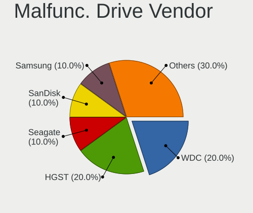

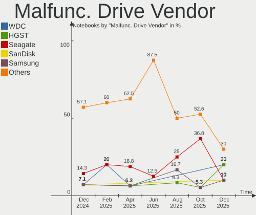

| Vendor              | Notebooks | Drives | Percent |
|---------------------|-----------|--------|---------|
| WDC                 | 2         | 2      | 20%     |
| HGST                | 2         | 2      | 20%     |
| Seagate             | 1         | 1      | 10%     |
| SanDisk             | 1         | 1      | 10%     |
| Samsung Electronics | 1         | 1      | 10%     |
| Micron Technology   | 1         | 1      | 10%     |
| KIOXIA              | 1         | 1      | 10%     |
| Crucial             | 1         | 1      | 10%     |

Malfunc. HDD Vendor
-------------------

Vendors of faulty HDD drives

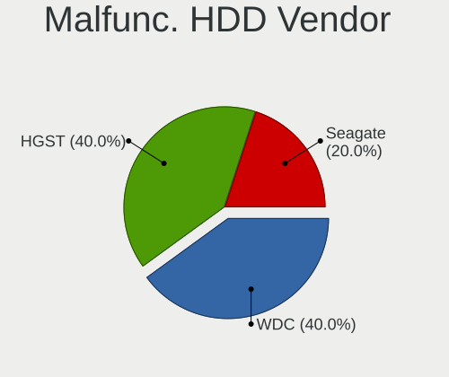

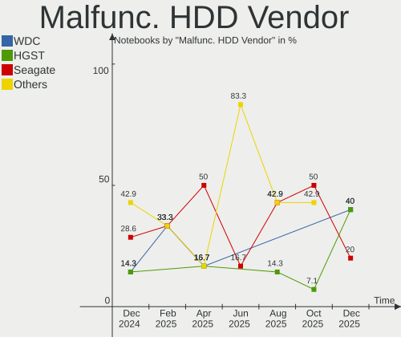

| Vendor  | Notebooks | Drives | Percent |
|---------|-----------|--------|---------|
| WDC     | 2         | 2      | 40%     |
| HGST    | 2         | 2      | 40%     |
| Seagate | 1         | 1      | 20%     |

Malfunc. Drive Kind
-------------------

Kinds of faulty drives

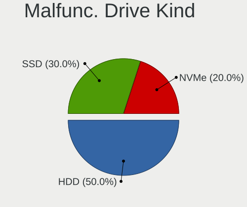

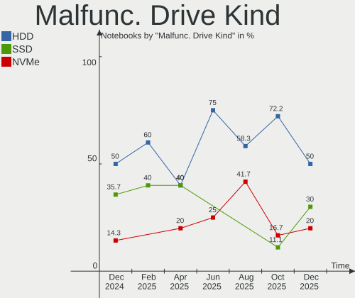

| Kind | Notebooks | Drives | Percent |
|------|-----------|--------|---------|
| HDD  | 5         | 5      | 50%     |
| SSD  | 3         | 3      | 30%     |
| NVMe | 2         | 2      | 20%     |

Failed Drives
-------------

Failed drive models

Zero info for selected period =(

Failed Drive Vendor
-------------------

Failed drive vendors

Zero info for selected period =(

Drive Status
------------

Number of failed and malfunc. drives

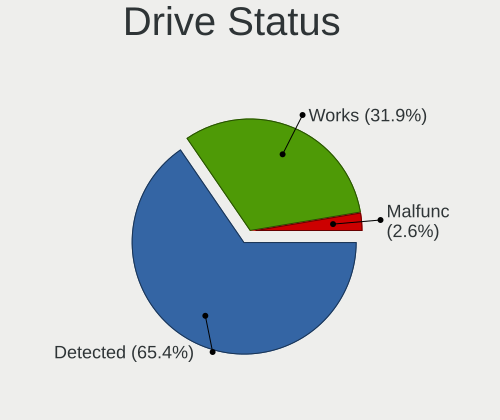

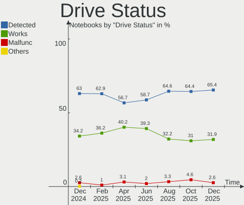

| Status   | Notebooks | Drives | Percent |
|----------|-----------|--------|---------|
| Detected | 248       | 303    | 65.44%  |
| Works    | 121       | 144    | 31.93%  |
| Malfunc  | 10        | 10     | 2.64%   |

Storage controller
------------------

Storage Vendor
--------------

Storage controller vendors

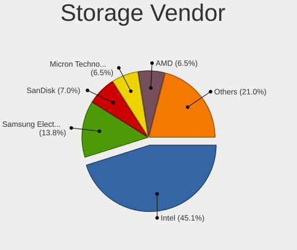

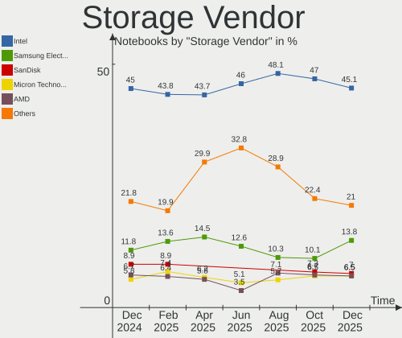

| Vendor                          | Notebooks | Percent |
|---------------------------------|-----------|---------|
| Intel                           | 200       | 45.15%  |
| Samsung Electronics             | 61        | 13.77%  |
| SanDisk                         | 31        | 7%      |
| Micron Technology               | 29        | 6.55%   |
| AMD                             | 29        | 6.55%   |
| SK hynix                        | 21        | 4.74%   |
| KIOXIA                          | 16        | 3.61%   |
| Kingston Technology Company     | 13        | 2.93%   |
| Toshiba America Info Systems    | 9         | 2.03%   |
| Shenzhen Longsys Electronics    | 5         | 1.13%   |
| Silicon Motion                  | 4         | 0.9%    |
| ADATA Technology                | 4         | 0.9%    |
| Solidigm                        | 3         | 0.68%   |
| Phison Electronics              | 3         | 0.68%   |
| Micron/Crucial Technology       | 3         | 0.68%   |
| Apple                           | 3         | 0.68%   |
| Nvidia                          | 2         | 0.45%   |
| MAXIO Technology (Hangzhou)     | 2         | 0.45%   |
| Yangtze Memory Technologies     | 1         | 0.23%   |
| Shenzhen Techwinsemi Technology | 1         | 0.23%   |
| Realtek Semiconductor           | 1         | 0.23%   |
| Marvell Technology Group        | 1         | 0.23%   |
| Hosin Global Electronics        | 1         | 0.23%   |

Storage Model
-------------

Storage controller models

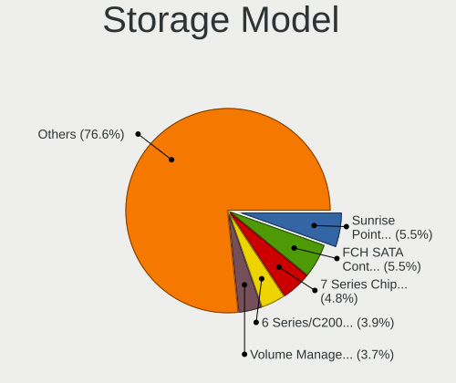

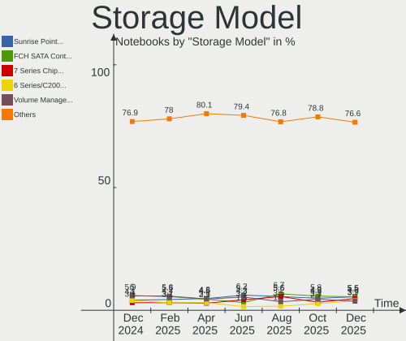

| Model                                                                          | Notebooks | Percent |
|--------------------------------------------------------------------------------|-----------|---------|
| Intel Sunrise Point-LP SATA Controller [AHCI mode]                             | 25        | 5.46%   |
| AMD FCH SATA Controller [AHCI mode]                                            | 25        | 5.46%   |
| Intel 7 Series Chipset Family 6-port SATA Controller [AHCI mode]               | 22        | 4.8%    |
| Intel 6 Series/C200 Series Chipset Family 6 port Mobile SATA AHCI Controller   | 18        | 3.93%   |
| Intel Volume Management Device NVMe RAID Controller                            | 17        | 3.71%   |
| Intel 8 Series SATA Controller 1 [AHCI mode]                                   | 14        | 3.06%   |
| Intel RST Volume Management Device Controller                                  | 12        | 2.62%   |
| Intel 82801 Mobile SATA Controller [RAID mode]                                 | 12        | 2.62%   |
| Samsung NVMe SSD Controller SM981/PM981/PM983                                  | 11        | 2.4%    |
| Samsung NVMe SSD Controller 980 (DRAM-less)                                    | 11        | 2.4%    |
| Samsung NVMe SSD Controller PM9C1a (DRAM-less)                                 | 10        | 2.18%   |
| Intel Wildcat Point-LP SATA Controller [AHCI Mode]                             | 9         | 1.97%   |
| Intel 8 Series/C220 Series Chipset Family 6-port SATA Controller 1 [AHCI mode] | 8         | 1.75%   |
| SanDisk WD SN560/SN740/SN770/SN5000 NVMe SSD                                   | 7         | 1.53%   |
| Samsung NVMe SSD Controller PM9B1 (DRAM-less)                                  | 7         | 1.53%   |
| Samsung NVMe SSD Controller PM9A1/PM9A3/980PRO                                 | 7         | 1.53%   |
| Micron 2400 NVMe SSD (DRAM-less)                                               | 7         | 1.53%   |
| Intel Cannon Lake Mobile PCH SATA AHCI Controller                              | 7         | 1.53%   |
| Intel Volume Management Device NVMe RAID Controller Intel Corporation          | 6         | 1.31%   |
| Intel Tiger Lake-LP SATA Controller                                            | 6         | 1.31%   |
| SK hynix BC901 NVMe Solid State Drive (DRAM-less)                              | 5         | 1.09%   |
| SanDisk Extreme Pro / WD Black SN750 / PC SN730 / Red SN700 NVMe SSD           | 5         | 1.09%   |
| Samsung S4LN058A01[SSUBX] AHCI SSD Controller (Apple slot)                     | 5         | 1.09%   |
| Samsung NVMe SSD Controller S4LV008[Pascal]                                    | 5         | 1.09%   |
| Kingston Company OM8PGP4 NVMe PCIe SSD (DRAM-less)                             | 5         | 1.09%   |
| Intel HM170/QM170 Chipset SATA Controller [AHCI Mode]                          | 5         | 1.09%   |
| Intel 5 Series/3400 Series Chipset 4 port SATA AHCI Controller                 | 5         | 1.09%   |
| Toshiba America Info Systems XG6 NVMe SSD Controller                           | 4         | 0.87%   |
| Toshiba America Info Systems XG5 NVMe SSD Controller                           | 4         | 0.87%   |
| SK hynix Platinum P41/PC801 NVMe Solid State Drive                             | 4         | 0.87%   |
| Sandisk WD Black SN850X NVMe SSD                                               | 4         | 0.87%   |
| Samsung NVMe SSD Controller SM961/PM961/SM963                                  | 4         | 0.87%   |
| Micron 2210 NVMe SSD [Cobain]                                                  | 4         | 0.87%   |
| Micron 2200S NVMe SSD [Cassandra]                                              | 4         | 0.87%   |
| KIOXIA NVMe SSD Controller BG4 (DRAM-less)                                     | 4         | 0.87%   |
| Intel SSD 670p Series [Keystone Harbor]                                        | 4         | 0.87%   |
| Intel SSD 660P Series                                                          | 4         | 0.87%   |
| Intel Comet Lake SATA AHCI Controller                                          | 4         | 0.87%   |
| Intel Alder Lake-P SATA AHCI Controller                                        | 4         | 0.87%   |
| Intel 82801IBM/IEM (ICH9M/ICH9M-E) 4 port SATA Controller [AHCI mode]          | 4         | 0.87%   |

Storage Kind
------------

Kind of storage controller (IDE, SATA, NVMe, SAS, ...)

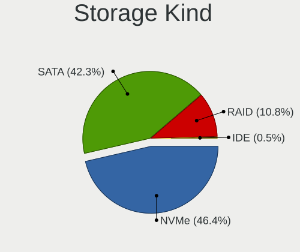

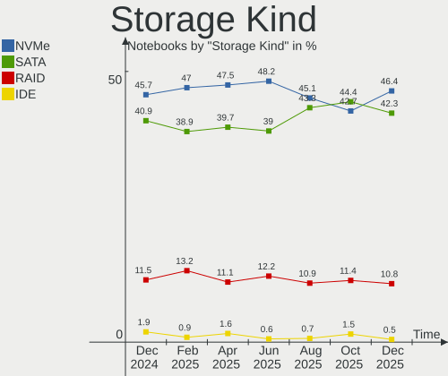

| Kind | Notebooks | Percent |
|------|-----------|---------|
| NVMe | 206       | 46.4%   |
| SATA | 188       | 42.34%  |
| RAID | 48        | 10.81%  |
| IDE  | 2         | 0.45%   |

Processor
---------

CPU Vendor
----------

Processor vendors

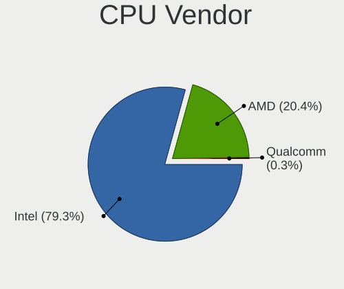

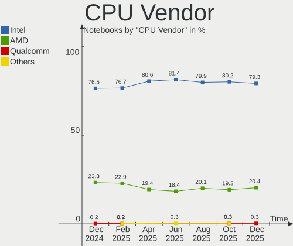

| Vendor   | Notebooks | Percent |
|----------|-----------|---------|
| Intel    | 287       | 79.28%  |
| AMD      | 74        | 20.44%  |
| Qualcomm | 1         | 0.28%   |

CPU Model
---------

Processor models

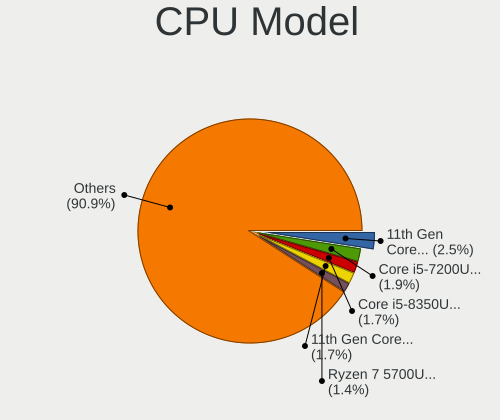

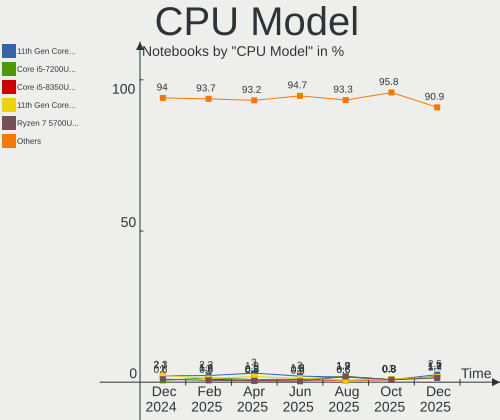

| Model                                         | Notebooks | Percent |
|-----------------------------------------------|-----------|---------|
| Intel 11th Gen Core i5-1135G7 @ 2.40GHz       | 9         | 2.49%   |
| Intel Core i5-7200U CPU @ 2.50GHz             | 7         | 1.93%   |
| Intel Core i5-8350U CPU @ 1.70GHz             | 6         | 1.66%   |
| Intel 11th Gen Core i7-1165G7 @ 2.80GHz       | 6         | 1.66%   |
| AMD Ryzen 7 5700U with Radeon Graphics        | 5         | 1.38%   |
| AMD Ryzen 5 7520U with Radeon Graphics        | 5         | 1.38%   |
| Intel Core i7-8650U CPU @ 1.90GHz             | 4         | 1.1%    |
| Intel Core i5-3337U CPU @ 1.80GHz             | 4         | 1.1%    |
| Intel Core i5-3320M CPU @ 2.60GHz             | 4         | 1.1%    |
| Intel Core i5-10310U CPU @ 1.70GHz            | 4         | 1.1%    |
| Intel Core i5-10210U CPU @ 1.60GHz            | 4         | 1.1%    |
| Intel 13th Gen Core i7-13620H                 | 4         | 1.1%    |
| AMD Ryzen 7 8845HS w/ Radeon 780M Graphics    | 4         | 1.1%    |
| AMD Ryzen 3 7320U with Radeon Graphics        | 4         | 1.1%    |
| Intel Core Ultra 9 275HX                      | 3         | 0.83%   |
| Intel Core Ultra 7 255H                       | 3         | 0.83%   |
| Intel Core Ultra 7 155H                       | 3         | 0.83%   |
| Intel Core i7-9750H CPU @ 2.60GHz             | 3         | 0.83%   |
| Intel Core i7-8550U CPU @ 1.80GHz             | 3         | 0.83%   |
| Intel Core i7-7600U CPU @ 2.80GHz             | 3         | 0.83%   |
| Intel Core i7-5600U CPU @ 2.60GHz             | 3         | 0.83%   |
| Intel Core i7-5500U CPU @ 2.40GHz             | 3         | 0.83%   |
| Intel Core i5-8365U CPU @ 1.60GHz             | 3         | 0.83%   |
| Intel Core i5-6300U CPU @ 2.40GHz             | 3         | 0.83%   |
| Intel Core i5-6200U CPU @ 2.30GHz             | 3         | 0.83%   |
| Intel Core i5-5350U CPU @ 1.80GHz             | 3         | 0.83%   |
| Intel Core i5-4200U CPU @ 1.60GHz             | 3         | 0.83%   |
| Intel Core i5-2520M CPU @ 2.50GHz             | 3         | 0.83%   |
| Intel Core i5-2467M CPU @ 1.60GHz             | 3         | 0.83%   |
| Intel Core i5-1035G1 CPU @ 1.00GHz            | 3         | 0.83%   |
| Intel Core i3-N305                            | 3         | 0.83%   |
| Intel Core i3-4030U CPU @ 1.90GHz             | 3         | 0.83%   |
| Intel 12th Gen Core i7-1260P                  | 3         | 0.83%   |
| Intel 12th Gen Core i3-1215U                  | 3         | 0.83%   |
| Intel 11th Gen Core i7-1185G7 @ 3.00GHz       | 3         | 0.83%   |
| AMD Ryzen 7 PRO 7840U w/ Radeon 780M Graphics | 3         | 0.83%   |
| AMD Ryzen 7 4700U with Radeon Graphics        | 3         | 0.83%   |
| AMD E-450 APU with Radeon HD Graphics         | 3         | 0.83%   |
| Intel N95                                     | 2         | 0.55%   |
| Intel Core Ultra 9 288V                       | 2         | 0.55%   |

CPU Model Family
----------------

Processor model prefix

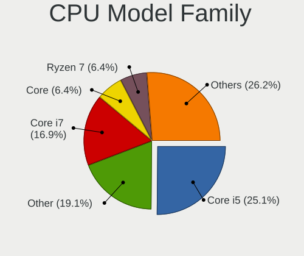

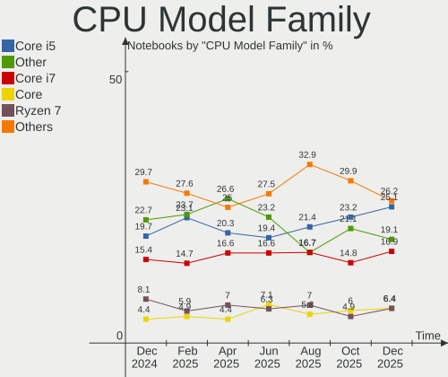

| Model                   | Notebooks | Percent |
|-------------------------|-----------|---------|
| Intel Core i5           | 91        | 25.14%  |
| Other                   | 69        | 19.06%  |
| Intel Core i7           | 61        | 16.85%  |
| Intel Core              | 23        | 6.35%   |
| AMD Ryzen 7             | 23        | 6.35%   |
| Intel Core i3           | 22        | 6.08%   |
| AMD Ryzen 5             | 14        | 3.87%   |
| Intel Celeron           | 7         | 1.93%   |
| AMD Ryzen 3             | 7         | 1.93%   |
| Intel Core 2 Duo        | 6         | 1.66%   |
| AMD A6                  | 6         | 1.66%   |
| Intel Core i9           | 5         | 1.38%   |
| AMD Ryzen 9             | 5         | 1.38%   |
| Intel Pentium           | 4         | 1.1%    |
| AMD Ryzen 7 PRO         | 4         | 1.1%    |
| AMD E                   | 3         | 0.83%   |
| Intel Atom              | 2         | 0.55%   |
| Intel Pentium Silver    | 1         | 0.28%   |
| Intel Core m7           | 1         | 0.28%   |
| Intel Core m3           | 1         | 0.28%   |
| Intel Core M            | 1         | 0.28%   |
| AMD Turion 64 X2 Mobile | 1         | 0.28%   |
| AMD Ryzen 3 PRO         | 1         | 0.28%   |
| AMD Phenom II           | 1         | 0.28%   |
| AMD Athlon              | 1         | 0.28%   |
| AMD A8                  | 1         | 0.28%   |
| AMD A4                  | 1         | 0.28%   |

CPU Cores
---------

Number of processor cores

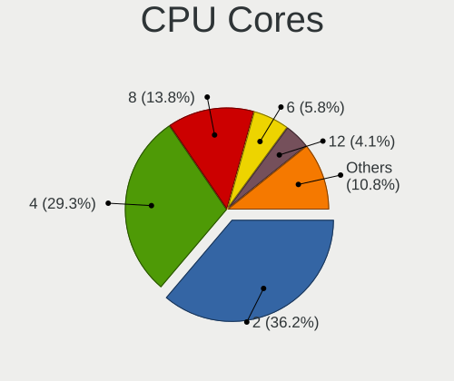

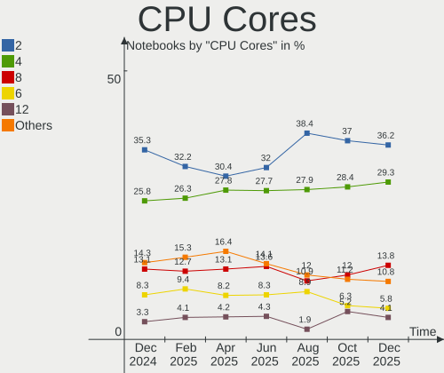

| Number | Notebooks | Percent |
|--------|-----------|---------|
| 2      | 131       | 36.19%  |
| 4      | 106       | 29.28%  |
| 8      | 50        | 13.81%  |
| 6      | 21        | 5.8%    |
| 12     | 15        | 4.14%   |
| 10     | 13        | 3.59%   |
| 16     | 12        | 3.31%   |
| 14     | 7         | 1.93%   |
| 24     | 5         | 1.38%   |
| 20     | 1         | 0.28%   |
| 1      | 1         | 0.28%   |

CPU Sockets
-----------

Number of sockets

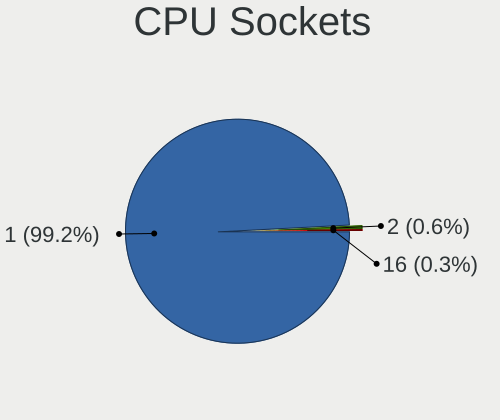

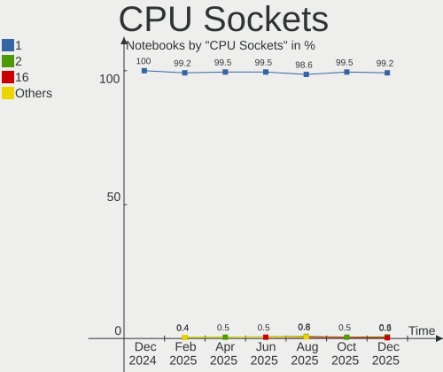

| Number | Notebooks | Percent |
|--------|-----------|---------|
| 1      | 359       | 99.17%  |
| 2      | 2         | 0.55%   |
| 16     | 1         | 0.28%   |

CPU Threads
-----------

Threads per core (Hyper-Threading)

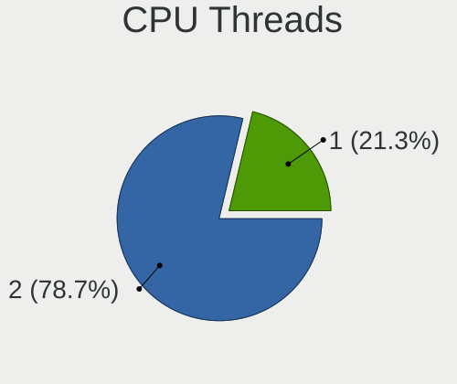

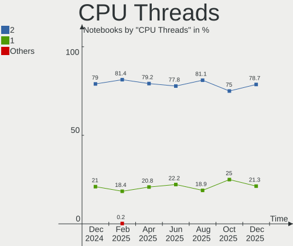

| Number | Notebooks | Percent |
|--------|-----------|---------|
| 2      | 285       | 78.73%  |
| 1      | 77        | 21.27%  |

CPU Op-Modes
------------

CPU Operation Modes (32-bit, 64-bit)

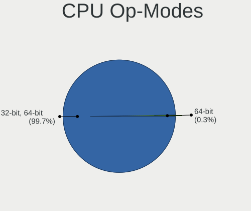

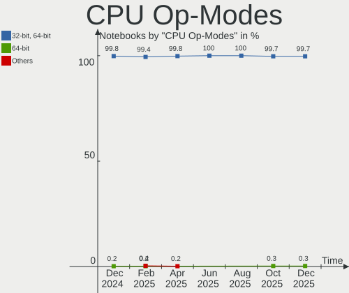

| Op mode        | Notebooks | Percent |
|----------------|-----------|---------|
| 32-bit, 64-bit | 361       | 99.72%  |
| 64-bit         | 1         | 0.28%   |

CPU Microcode
-------------

Microcode number

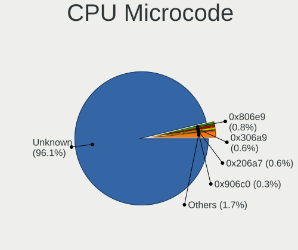

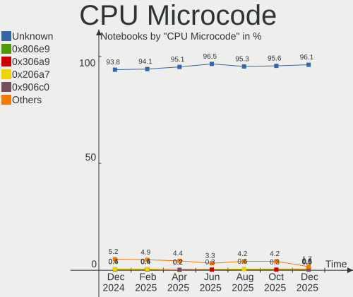

| Number     | Notebooks | Percent |
|------------|-----------|---------|
| Unknown    | 348       | 96.13%  |
| 0x806e9    | 3         | 0.83%   |
| 0x306a9    | 2         | 0.55%   |
| 0x206a7    | 2         | 0.55%   |
| 0x906c0    | 1         | 0.28%   |
| 0x806c1    | 1         | 0.28%   |
| 0x40651    | 1         | 0.28%   |
| 0x306d4    | 1         | 0.28%   |
| 0x30678    | 1         | 0.28%   |
| 0x08600109 | 1         | 0.28%   |
| 0x0810100b | 1         | 0.28%   |

CPU Microarch
-------------

Microarchitecture

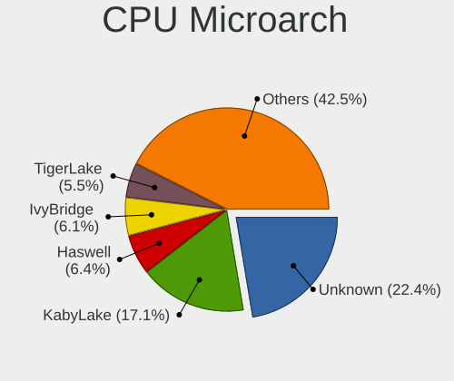

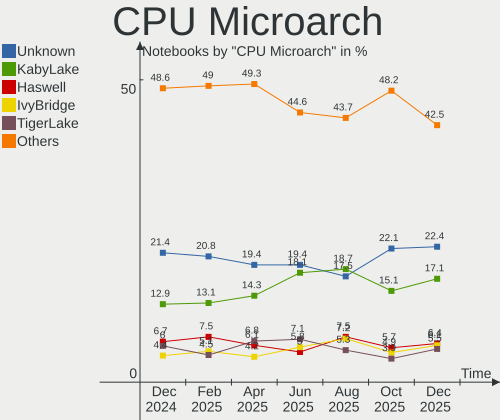

| Name               | Notebooks | Percent |
|--------------------|-----------|---------|
| Unknown            | 81        | 22.38%  |
| KabyLake           | 62        | 17.13%  |
| Haswell            | 23        | 6.35%   |
| IvyBridge          | 22        | 6.08%   |
| TigerLake          | 20        | 5.52%   |
| Alderlake Hybrid   | 20        | 5.52%   |
| SandyBridge        | 19        | 5.25%   |
| Broadwell          | 19        | 5.25%   |
| Skylake            | 18        | 4.97%   |
| Zen 2              | 9         | 2.49%   |
| Zen 3              | 6         | 1.66%   |
| Westmere           | 6         | 1.66%   |
| Silvermont         | 6         | 1.66%   |
| Meteorlake Hybrid  | 6         | 1.66%   |
| IceLake            | 5         | 1.38%   |
| CometLake          | 4         | 1.1%    |
| Zen+               | 3         | 0.83%   |
| Piledriver         | 3         | 0.83%   |
| Penryn             | 3         | 0.83%   |
| Lunarlake Hybrid   | 3         | 0.83%   |
| Goldmont plus      | 3         | 0.83%   |
| Core               | 3         | 0.83%   |
| Bobcat             | 3         | 0.83%   |
| Jaguar             | 2         | 0.55%   |
| Gracemont          | 2         | 0.55%   |
| Excavator          | 2         | 0.55%   |
| Zen                | 1         | 0.28%   |
| Tremont            | 1         | 0.28%   |
| Puma               | 1         | 0.28%   |
| Nehalem            | 1         | 0.28%   |
| K8 Hammer          | 1         | 0.28%   |
| K10 Llano          | 1         | 0.28%   |
| K10                | 1         | 0.28%   |
| Goldmont           | 1         | 0.28%   |
| ArrowLake-H Hybrid | 1         | 0.28%   |

Graphics
--------

GPU Vendor
----------

Vendors of graphics cards

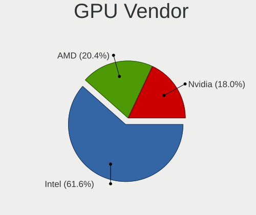

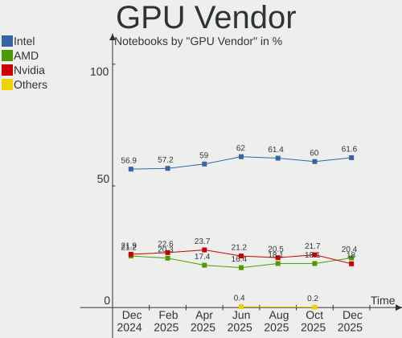

| Vendor | Notebooks | Percent |
|--------|-----------|---------|
| Intel  | 277       | 61.56%  |
| AMD    | 92        | 20.44%  |
| Nvidia | 81        | 18%     |

GPU Model
---------

Graphics card models

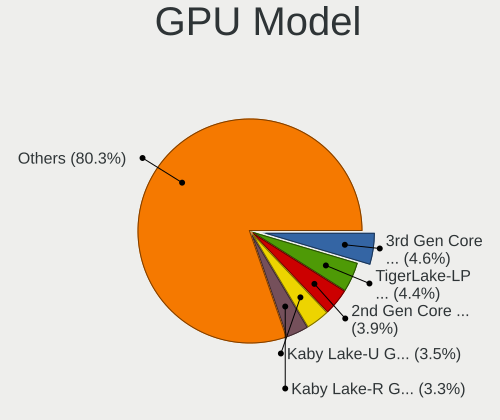

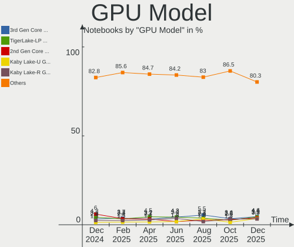

| Model                                                                                 | Notebooks | Percent |
|---------------------------------------------------------------------------------------|-----------|---------|
| Intel 3rd Gen Core processor Graphics Controller                                      | 21        | 4.6%    |
| Intel TigerLake-LP GT2 [Iris Xe Graphics]                                             | 20        | 4.38%   |
| Intel 2nd Generation Core Processor Family Integrated Graphics Controller             | 18        | 3.94%   |
| Intel Kaby Lake-U GT2 [HD Graphics 620]                                               | 16        | 3.5%    |
| Intel Kaby Lake-R GT2 [UHD Graphics 620]                                              | 15        | 3.28%   |
| Intel Haswell-ULT Integrated Graphics Controller                                      | 15        | 3.28%   |
| Intel CoffeeLake-H GT2 [UHD Graphics 630]                                             | 11        | 2.41%   |
| Intel Broadwell-U GT2 [HD Graphics 5500]                                              | 10        | 2.19%   |
| Intel Alder Lake-P GT2 [Iris Xe Graphics]                                             | 10        | 2.19%   |
| AMD Mendocino [Radeon 610M]                                                           | 10        | 2.19%   |
| Intel Skylake-U GT2 [HD Graphics 520]                                                 | 9         | 1.97%   |
| Intel Raptor Lake-P [Iris Xe Graphics]                                                | 9         | 1.97%   |
| Intel CometLake-U GT2 [UHD Graphics]                                                  | 8         | 1.75%   |
| AMD Renoir [Radeon Vega Series / Radeon Vega Mobile Series]                           | 8         | 1.75%   |
| Intel Raptor Lake-P [UHD Graphics]                                                    | 7         | 1.53%   |
| Intel 4th Gen Core Processor Integrated Graphics Controller                           | 7         | 1.53%   |
| AMD Lucienne                                                                          | 7         | 1.53%   |
| Nvidia AD107M [GeForce RTX 4060 Max-Q / Mobile]                                       | 6         | 1.31%   |
| Intel WhiskeyLake-U GT2 [UHD Graphics 620]                                            | 6         | 1.31%   |
| Intel Lunar Lake [Intel Arc Graphics 130V / 140V]                                     | 6         | 1.31%   |
| Intel Broadwell-U GT3 [HD Graphics 6000]                                              | 6         | 1.31%   |
| AMD Sun XT [Radeon HD 8670A/8670M/8690M / R5 M330 / M430 / Radeon 520 Mobile]         | 6         | 1.31%   |
| AMD Phoenix1                                                                          | 6         | 1.31%   |
| Intel TigerLake-H GT1 [UHD Graphics]                                                  | 5         | 1.09%   |
| Intel Skylake-H GT2 [HD Graphics 530]                                                 | 5         | 1.09%   |
| Intel Meteor Lake-P [Intel Arc Graphics]                                              | 5         | 1.09%   |
| Intel Alder Lake-N [UHD Graphics]                                                     | 5         | 1.09%   |
| AMD Topaz XT [Radeon R7 M260/M265 / M340/M360 / M440/M445 / 530/535 / 620/625 Mobile] | 5         | 1.09%   |
| AMD Rembrandt [Radeon 680M]                                                           | 5         | 1.09%   |
| Nvidia TU117M [GeForce GTX 1650 Mobile / Max-Q]                                       | 4         | 0.88%   |
| Nvidia GP108M [GeForce MX150]                                                         | 4         | 0.88%   |
| Nvidia GP107M [GeForce GTX 1050 Mobile]                                               | 4         | 0.88%   |
| Nvidia GA106M [GeForce RTX 3060 Mobile / Max-Q]                                       | 4         | 0.88%   |
| Intel Raptor Lake-S UHD Graphics                                                      | 4         | 0.88%   |
| Intel Kaby Lake-H GT2 [HD Graphics 630]                                               | 4         | 0.88%   |
| Intel Core Processor Integrated Graphics Controller                                   | 4         | 0.88%   |
| Intel Atom Processor Z36xxx/Z37xxx Series Graphics & Display                          | 4         | 0.88%   |
| Intel Arrow Lake-P [Arc Pro 130T/140T]                                                | 4         | 0.88%   |
| Intel Alder Lake-UP3 GT2 [Iris Xe Graphics]                                           | 4         | 0.88%   |
| AMD HawkPoint1                                                                        | 4         | 0.88%   |

GPU Combo
---------

Combinations of graphics cards

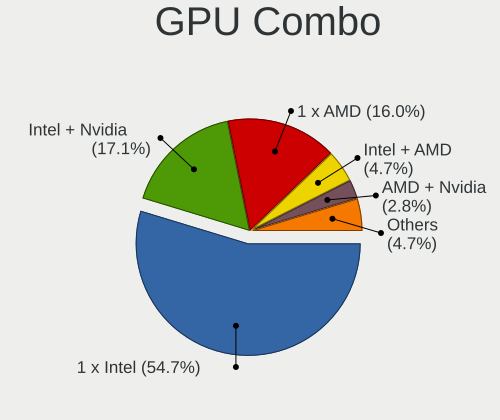

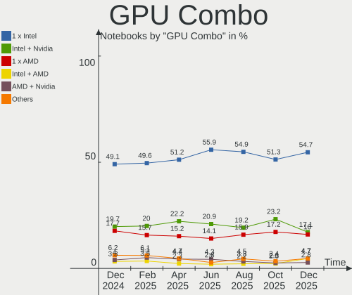

| Name           | Notebooks | Percent |
|----------------|-----------|---------|
| 1 x Intel      | 198       | 54.7%   |
| Intel + Nvidia | 62        | 17.13%  |
| 1 x AMD        | 58        | 16.02%  |
| Intel + AMD    | 17        | 4.7%    |
| AMD + Nvidia   | 10        | 2.76%   |
| 1 x Nvidia     | 9         | 2.49%   |
| 2 x AMD        | 7         | 1.93%   |
| Other          | 1         | 0.28%   |

GPU Driver
----------

Free vs proprietary

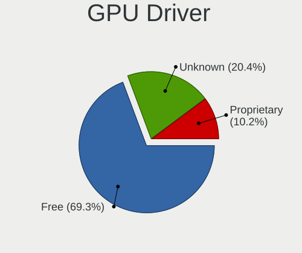

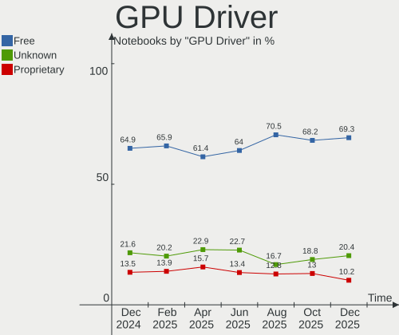

| Driver      | Notebooks | Percent |
|-------------|-----------|---------|
| Free        | 251       | 69.34%  |
| Unknown     | 74        | 20.44%  |
| Proprietary | 37        | 10.22%  |

GPU Memory
----------

Total video memory

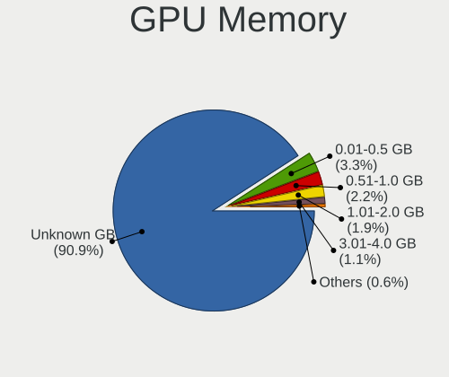

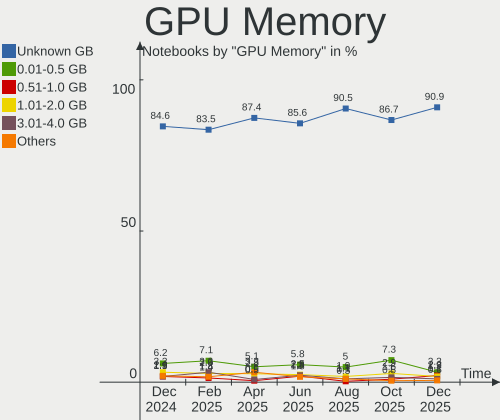

| Size in GB | Notebooks | Percent |
|------------|-----------|---------|
| Unknown    | 329       | 90.88%  |
| 0.01-0.5   | 12        | 3.31%   |
| 0.51-1.0   | 8         | 2.21%   |
| 1.01-2.0   | 7         | 1.93%   |
| 3.01-4.0   | 4         | 1.1%    |
| 7.01-8.0   | 1         | 0.28%   |
| 8.01-16.0  | 1         | 0.28%   |

Monitor
-------

Monitor Vendor
--------------

Monitor vendors

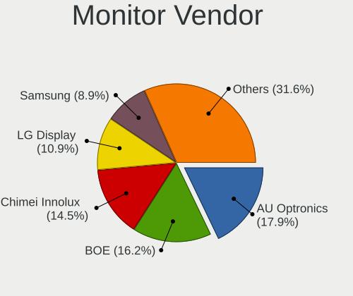

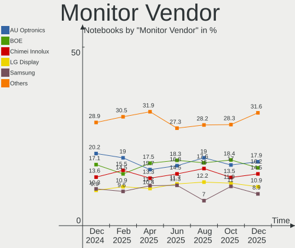

| Vendor                  | Notebooks | Percent |
|-------------------------|-----------|---------|
| AU Optronics            | 74        | 17.87%  |
| BOE                     | 67        | 16.18%  |
| Chimei Innolux          | 60        | 14.49%  |
| LG Display              | 45        | 10.87%  |
| Samsung Electronics     | 37        | 8.94%   |
| Apple                   | 23        | 5.56%   |
| Lenovo                  | 15        | 3.62%   |
| Dell                    | 14        | 3.38%   |
| Sharp                   | 10        | 2.42%   |
| Goldstar                | 8         | 1.93%   |
| CSW                     | 8         | 1.93%   |
| Hewlett-Packard         | 7         | 1.69%   |
| Chi Mei Optoelectronics | 5         | 1.21%   |
| AOC                     | 5         | 1.21%   |
| PANDA                   | 4         | 0.97%   |
| CSOT                    | 4         | 0.97%   |
| Philips                 | 3         | 0.72%   |
| BenQ                    | 3         | 0.72%   |
| Acer                    | 3         | 0.72%   |
| ViewSonic               | 2         | 0.48%   |
| Unknown                 | 2         | 0.48%   |
| LG Philips              | 2         | 0.48%   |
| InfoVision              | 2         | 0.48%   |
| HKC                     | 2         | 0.48%   |
| Vizio                   | 1         | 0.24%   |
| Vestel Elektronik       | 1         | 0.24%   |
| SGT                     | 1         | 0.24%   |
| MSI                     | 1         | 0.24%   |
| Mobile Pixels           | 1         | 0.24%   |
| Eizo                    | 1         | 0.24%   |
| CPT                     | 1         | 0.24%   |
| ASUSTek Computer        | 1         | 0.24%   |
| Ancor Communications    | 1         | 0.24%   |

Monitor Model
-------------

Monitor models

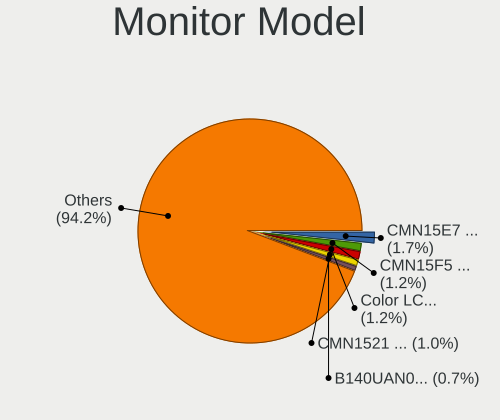

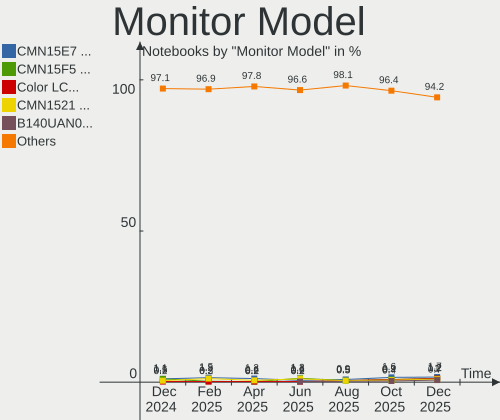

| Model                                                                 | Notebooks | Percent |
|-----------------------------------------------------------------------|-----------|---------|
| Chimei Innolux LCD Monitor CMN15E7 1920x1080 344x193mm 15.5-inch      | 7         | 1.69%   |
| Chimei Innolux LCD Monitor CMN15F5 1920x1080 344x193mm 15.5-inch      | 5         | 1.2%    |
| Apple Color LCD APPA01B 1440x900 286x179mm 13.3-inch                  | 5         | 1.2%    |
| Chimei Innolux LCD Monitor CMN1521 1920x1080 344x193mm 15.5-inch      | 4         | 0.96%   |
| Lenovo B140UAN02.7 LEN403A 1920x1200 302x188mm 14.0-inch              | 3         | 0.72%   |
| Goldstar FULL HD GSM5B55 1920x1080 480x270mm 21.7-inch                | 3         | 0.72%   |
| BOE LCD Monitor BOE097D 1920x1080 344x194mm 15.5-inch                 | 3         | 0.72%   |
| AU Optronics LCD Monitor AUO38ED 1920x1080 344x193mm 15.5-inch        | 3         | 0.72%   |
| AU Optronics LCD Monitor AUO21ED 1920x1080 344x193mm 15.5-inch        | 3         | 0.72%   |
| Apple Color LCD APP9CF3 1366x768 260x140mm 11.6-inch                  | 3         | 0.72%   |
| Unknown LCD Monitor FFFF 2288x1287 2550x2550mm 142.0-inch             | 2         | 0.48%   |
| Samsung Electronics LCD Monitor SDC4187 1920x1200 302x189mm 14.0-inch | 2         | 0.48%   |
| Samsung Electronics LCD Monitor SDC4171 2880x1800 302x189mm 14.0-inch | 2         | 0.48%   |
| LG Display LCD Monitor LGD0521 1920x1080 309x174mm 14.0-inch          | 2         | 0.48%   |
| LG Display LCD Monitor LGD02DC 1366x768 344x194mm 15.5-inch           | 2         | 0.48%   |
| Chimei Innolux LCD Monitor CMN1728 1600x900 382x215mm 17.3-inch       | 2         | 0.48%   |
| Chimei Innolux LCD Monitor CMN15D5 1920x1080 344x193mm 15.5-inch      | 2         | 0.48%   |
| Chimei Innolux LCD Monitor CMN15CB 1920x1080 344x193mm 15.5-inch      | 2         | 0.48%   |
| Chimei Innolux LCD Monitor CMN15B6 1366x768 340x190mm 15.3-inch       | 2         | 0.48%   |
| Chimei Innolux LCD Monitor CMN14D4 1920x1080 309x173mm 13.9-inch      | 2         | 0.48%   |
| Chimei Innolux LCD Monitor CMN14C3 1366x768 309x173mm 13.9-inch       | 2         | 0.48%   |
| BOE NE153QDM-NY1 BOE0D6C 2560x1600 329x206mm 15.3-inch                | 2         | 0.48%   |
| BOE LCD Monitor BOE0D39 1920x1080 344x194mm 15.5-inch                 | 2         | 0.48%   |
| BOE LCD Monitor BOE0BC9 2560x1600 345x215mm 16.0-inch                 | 2         | 0.48%   |
| BOE LCD Monitor BOE0B56 1920x1080 309x174mm 14.0-inch                 | 2         | 0.48%   |
| BOE LCD Monitor BOE091D 1920x1080 309x174mm 14.0-inch                 | 2         | 0.48%   |
| BOE LCD Monitor BOE08D5 1920x1080 344x194mm 15.5-inch                 | 2         | 0.48%   |
| BOE LCD Monitor BOE0791 1920x1080 309x173mm 13.9-inch                 | 2         | 0.48%   |
| AU Optronics LCD Monitor AUOD291 1920x1200 301x188mm 14.0-inch        | 2         | 0.48%   |
| AU Optronics LCD Monitor AUO9F91 3072x1920 344x215mm 16.0-inch        | 2         | 0.48%   |
| AU Optronics LCD Monitor AUO2B99 1920x1080 293x165mm 13.2-inch        | 2         | 0.48%   |
| AU Optronics LCD Monitor AUO22EC 1366x768 344x193mm 15.5-inch         | 2         | 0.48%   |
| AU Optronics LCD Monitor AUO149E 1600x900 382x214mm 17.2-inch         | 2         | 0.48%   |
| AU Optronics LCD Monitor AUO106C 1366x768 276x155mm 12.5-inch         | 2         | 0.48%   |
| Apple LCD Monitor APP9CCB 1280x800 286x179mm 13.3-inch                | 2         | 0.48%   |
| Apple Color LCD APP9CDF 1440x900 286x179mm 13.3-inch                  | 2         | 0.48%   |
| Vizio E601i-A3 VIZ0092 1920x1080 1329x748mm 60.0-inch                 | 1         | 0.24%   |
| ViewSonic VX2250 SERIES VSCCB25 1920x1080 477x268mm 21.5-inch         | 1         | 0.24%   |
| ViewSonic VP2785-2K VSCE438 2560x1440 597x336mm 27.0-inch             | 1         | 0.24%   |
| Vestel Elektronik 40UHD_LCD_TV VES3700 3840x2160 880x500mm 39.8-inch  | 1         | 0.24%   |

Monitor Resolution
------------------

Monitor screen resolution

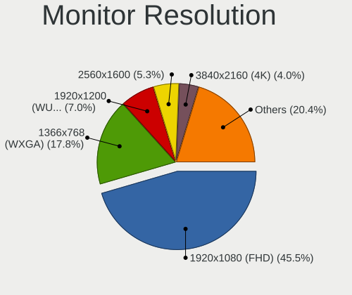

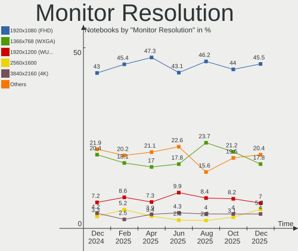

| Resolution         | Notebooks | Percent |
|--------------------|-----------|---------|
| 1920x1080 (FHD)    | 181       | 45.48%  |
| 1366x768 (WXGA)    | 71        | 17.84%  |
| 1920x1200 (WUXGA)  | 28        | 7.04%   |
| 2560x1600          | 21        | 5.28%   |
| 3840x2160 (4K)     | 16        | 4.02%   |
| 1600x900 (HD+)     | 16        | 4.02%   |
| 2880x1800          | 14        | 3.52%   |
| 2560x1440 (QHD)    | 11        | 2.76%   |
| 1440x900 (WXGA+)   | 10        | 2.51%   |
| 1280x800 (WXGA)    | 6         | 1.51%   |
| 3440x1440          | 3         | 0.75%   |
| 3200x1800 (QHD+)   | 3         | 0.75%   |
| 3072x1920          | 3         | 0.75%   |
| 1680x1050 (WSXGA+) | 3         | 0.75%   |
| Unknown            | 3         | 0.75%   |
| 2880x1920          | 2         | 0.5%    |
| 2288x1287          | 2         | 0.5%    |
| 3840x1100          | 1         | 0.25%   |
| 3840x1080          | 1         | 0.25%   |
| 2240x1400          | 1         | 0.25%   |
| 2160x1440          | 1         | 0.25%   |
| 2048x1280          | 1         | 0.25%   |

Monitor Diagonal
----------------

Diagonal size in inches

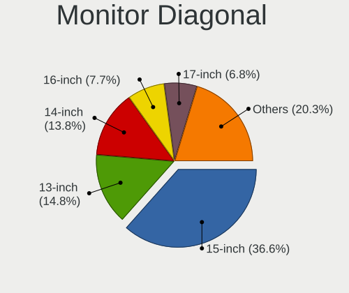

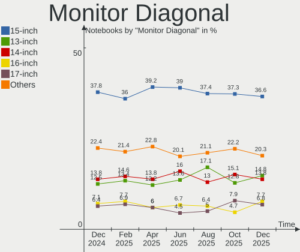

| Inches  | Notebooks | Percent |
|---------|-----------|---------|
| 15      | 151       | 36.56%  |
| 13      | 61        | 14.77%  |
| 14      | 57        | 13.8%   |
| 16      | 32        | 7.75%   |
| 17      | 28        | 6.78%   |
| 27      | 17        | 4.12%   |
| 12      | 11        | 2.66%   |
| 24      | 10        | 2.42%   |
| 23      | 7         | 1.69%   |
| 11      | 6         | 1.45%   |
| 31      | 5         | 1.21%   |
| 21      | 5         | 1.21%   |
| 22      | 3         | 0.73%   |
| Unknown | 3         | 0.73%   |
| 142     | 2         | 0.48%   |
| 34      | 2         | 0.48%   |
| 18      | 2         | 0.48%   |
| 84      | 1         | 0.24%   |
| 60      | 1         | 0.24%   |
| 54      | 1         | 0.24%   |
| 48      | 1         | 0.24%   |
| 41      | 1         | 0.24%   |
| 40      | 1         | 0.24%   |
| 39      | 1         | 0.24%   |
| 33      | 1         | 0.24%   |
| 32      | 1         | 0.24%   |
| 29      | 1         | 0.24%   |
| 19      | 1         | 0.24%   |

Monitor Width
-------------

Physical width

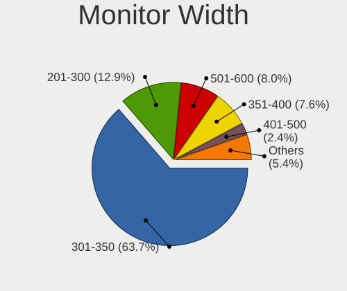

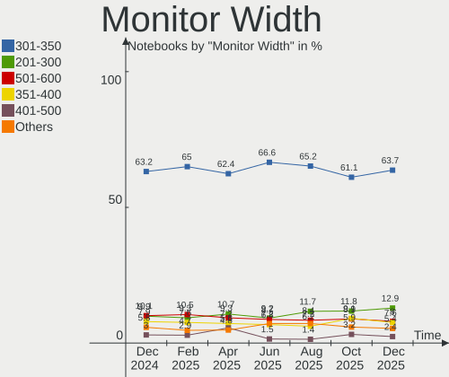

| Width in mm    | Notebooks | Percent |
|----------------|-----------|---------|
| 301-350        | 261       | 63.66%  |
| 201-300        | 53        | 12.93%  |
| 501-600        | 33        | 8.05%   |
| 351-400        | 31        | 7.56%   |
| 401-500        | 10        | 2.44%   |
| 601-700        | 6         | 1.46%   |
| 701-800        | 4         | 0.98%   |
| 1001-1500      | 3         | 0.73%   |
| Unknown        | 3         | 0.73%   |
| More than 2000 | 2         | 0.49%   |
| 901-1000       | 2         | 0.49%   |
| 801-900        | 1         | 0.24%   |
| 1501-2000      | 1         | 0.24%   |

Aspect Ratio
------------

Proportional relationship between the width and the height

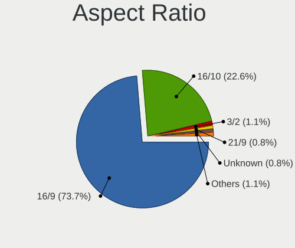

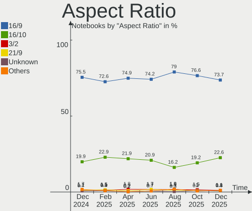

| Ratio   | Notebooks | Percent |
|---------|-----------|---------|
| 16/9    | 277       | 73.67%  |
| 16/10   | 85        | 22.61%  |
| 3/2     | 4         | 1.06%   |
| 21/9    | 3         | 0.8%    |
| Unknown | 3         | 0.8%    |
| 1.00    | 2         | 0.53%   |
| 32/9    | 1         | 0.27%   |
| 3.40    | 1         | 0.27%   |

Monitor Area
------------

Area in inch²

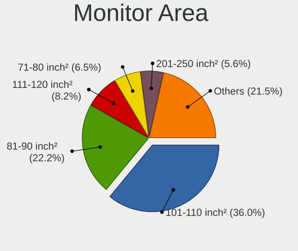

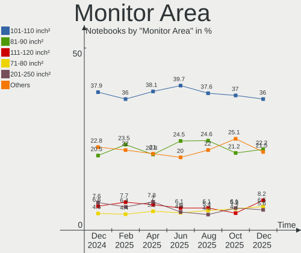

| Area in inch² | Notebooks | Percent |
|----------------|-----------|---------|
| 101-110        | 149       | 35.99%  |
| 81-90          | 92        | 22.22%  |
| 111-120        | 34        | 8.21%   |
| 71-80          | 27        | 6.52%   |
| 201-250        | 23        | 5.56%   |
| 121-130        | 23        | 5.56%   |
| 301-350        | 17        | 4.11%   |
| 351-500        | 10        | 2.42%   |
| 61-70          | 9         | 2.17%   |
| 51-60          | 7         | 1.69%   |
| More than 1000 | 5         | 1.21%   |
| 131-140        | 5         | 1.21%   |
| 501-1000       | 4         | 0.97%   |
| 251-300        | 3         | 0.72%   |
| Unknown        | 3         | 0.72%   |
| 141-150        | 2         | 0.48%   |
| 151-200        | 1         | 0.24%   |

Pixel Density
-------------

Pixels per inch

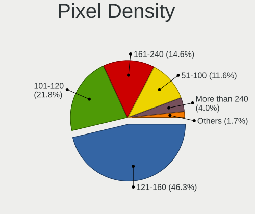

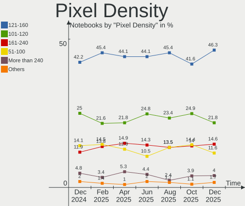

| Density       | Notebooks | Percent |
|---------------|-----------|---------|
| 121-160       | 187       | 46.29%  |
| 101-120       | 88        | 21.78%  |
| 161-240       | 59        | 14.6%   |
| 51-100        | 47        | 11.63%  |
| More than 240 | 16        | 3.96%   |
| 1-50          | 4         | 0.99%   |
| Unknown       | 3         | 0.74%   |

Multiple Monitors
-----------------

Total monitors connected

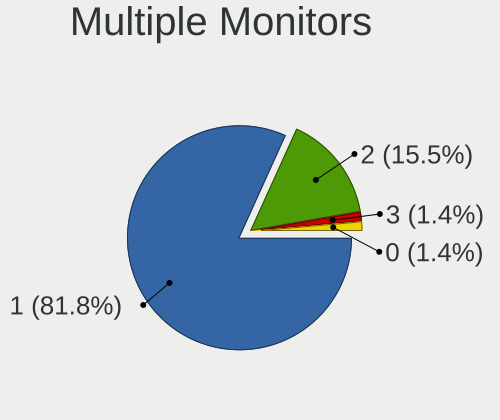

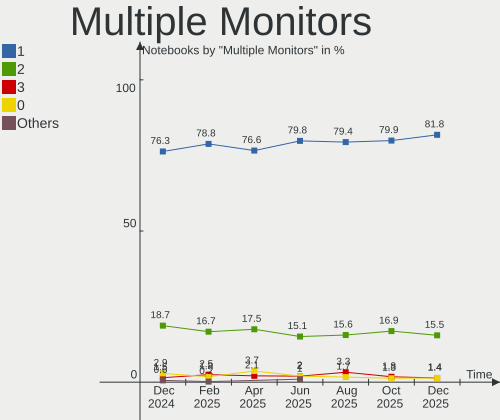

| Total | Notebooks | Percent |
|-------|-----------|---------|
| 1     | 296       | 81.77%  |
| 2     | 56        | 15.47%  |
| 3     | 5         | 1.38%   |
| 0     | 5         | 1.38%   |

Network
-------

Net Controller Vendor
---------------------

Controller vendors

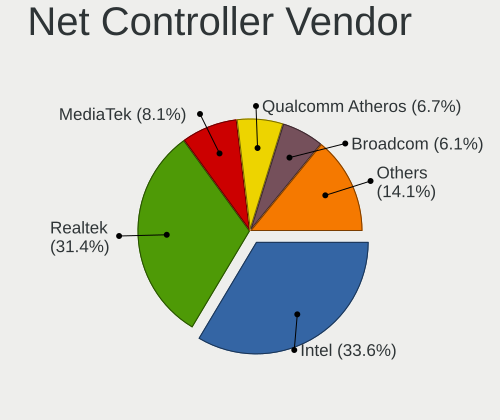

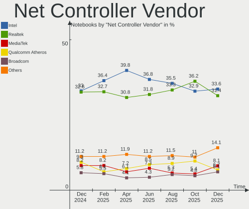

| Vendor                                 | Notebooks | Percent |
|----------------------------------------|-----------|---------|
| Intel                                  | 186       | 33.57%  |
| Realtek Semiconductor                  | 174       | 31.41%  |
| MediaTek                               | 45        | 8.12%   |
| Qualcomm Atheros                       | 37        | 6.68%   |
| Broadcom                               | 34        | 6.14%   |
| Broadcom Limited                       | 13        | 2.35%   |
| TP-Link                                | 8         | 1.44%   |
| Samsung Electronics                    | 6         | 1.08%   |
| Hewlett-Packard                        | 5         | 0.9%    |
| Ralink                                 | 4         | 0.72%   |
| Qualcomm                               | 4         | 0.72%   |
| Motorcomm Microelectronics.            | 4         | 0.72%   |
| Xiaomi                                 | 2         | 0.36%   |
| Suzhou Motorcomm Electronic Technology | 2         | 0.36%   |
| Sierra Wireless                        | 2         | 0.36%   |
| Quectel Wireless Solutions             | 2         | 0.36%   |
| Nvidia                                 | 2         | 0.36%   |
| Framework Computer                     | 2         | 0.36%   |
| DisplayLink                            | 2         | 0.36%   |
| Dell                                   | 2         | 0.36%   |
| ASUSTek Computer                       | 2         | 0.36%   |
| ASIX Electronics                       | 2         | 0.36%   |
| ZTE WCDMA Technologies MSM             | 1         | 0.18%   |
| vivo                                   | 1         | 0.18%   |
| Realtek                                | 1         | 0.18%   |
| Qualcomm Technologies                  | 1         | 0.18%   |
| Prusa                                  | 1         | 0.18%   |
| OPPO Electronics                       | 1         | 0.18%   |
| Motorola PCS                           | 1         | 0.18%   |
| JMicron Technology                     | 1         | 0.18%   |
| Huawei Technologies                    | 1         | 0.18%   |
| Ericsson Business Mobile Networks      | 1         | 0.18%   |
| Edimax Technology                      | 1         | 0.18%   |
| Arduino SA                             | 1         | 0.18%   |
| Aquantia                               | 1         | 0.18%   |
| Apple                                  | 1         | 0.18%   |

Net Controller Model
--------------------

Controller models

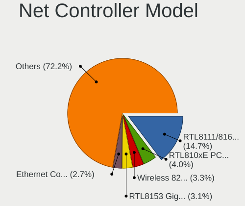

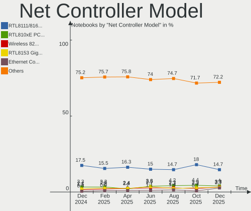

| Model                                                                           | Notebooks | Percent |
|---------------------------------------------------------------------------------|-----------|---------|
| Realtek RTL8111/8168/8211/8411 PCI Express Gigabit Ethernet Controller          | 98        | 14.67%  |
| Realtek RTL810xE PCI Express Fast Ethernet controller                           | 27        | 4.04%   |
| Intel Wireless 8265 / 8275                                                      | 22        | 3.29%   |
| Realtek RTL8153 Gigabit Ethernet Adapter                                        | 21        | 3.14%   |
| Intel Ethernet Connection (4) I219-LM                                           | 18        | 2.69%   |
| MediaTek MT7921 802.11ax PCIe Wireless Network Adapter [Filogic 330]            | 14        | 2.1%    |
| Intel Wi-Fi 6 AX201                                                             | 14        | 2.1%    |
| Intel Alder Lake-P PCH CNVi WiFi                                                | 13        | 1.95%   |
| MediaTek MT7902 802.11ax PCIe Wireless Network Adapter [Filogic 310]            | 12        | 1.8%    |
| Realtek RTL8822CE 802.11ac PCIe Wireless Network Adapter                        | 10        | 1.5%    |
| Intel Wi-Fi 6 AX200                                                             | 10        | 1.5%    |
| MediaTek MT7922 802.11ax PCI Express Wireless Network Adapter                   | 9         | 1.35%   |
| Intel Comet Lake PCH-LP CNVi WiFi                                               | 9         | 1.35%   |
| Realtek RTL8821CE 802.11ac PCIe Wireless Network Adapter                        | 8         | 1.2%    |
| Intel Wireless 8260                                                             | 8         | 1.2%    |
| Intel Wireless 7265                                                             | 8         | 1.2%    |
| Realtek RTL8852BE PCIe 802.11ax Wireless Network Controller                     | 7         | 1.05%   |
| Qualcomm Atheros QCA9565 / AR9565 Wireless Network Adapter                      | 7         | 1.05%   |
| Qualcomm Atheros AR9285 Wireless Network Adapter (PCI-Express)                  | 7         | 1.05%   |
| Intel Wi-Fi 7(802.11be) AX1775*/AX1790*/BE20*/BE401/BE1750* 2x2                 | 7         | 1.05%   |
| Intel 82579LM Gigabit Network Connection (Lewisville)                           | 7         | 1.05%   |
| Broadcom Limited BCM4360 802.11ac Dual Band Wireless Network Adapter            | 7         | 1.05%   |
| Qualcomm Atheros QCA9377 802.11ac Wireless Network Adapter                      | 6         | 0.9%    |
| Intel Wireless 7260                                                             | 6         | 0.9%    |
| Intel Wi-Fi 6E(802.11ax) AX210/AX1675* 2x2 [Typhoon Peak]                       | 6         | 0.9%    |
| Intel Centrino Advanced-N 6205 [Taylor Peak]                                    | 6         | 0.9%    |
| Intel Cannon Point-LP CNVi [Wireless-AC]                                        | 6         | 0.9%    |
| Intel BE201 320MHz                                                              | 6         | 0.9%    |
| Intel Arrow Lake CNVi WiFi                                                      | 6         | 0.9%    |
| Broadcom BCM43142 802.11b/g/n                                                   | 6         | 0.9%    |
| TP-Link UE300 10/100/1000 LAN (ethernet mode) [Realtek RTL8153]                 | 5         | 0.75%   |
| Realtek RTL8723BE PCIe Wireless Network Adapter                                 | 5         | 0.75%   |
| Realtek RTL8188EE Wireless Network Adapter                                      | 5         | 0.75%   |
| Qualcomm Atheros AR9485 Wireless Network Adapter                                | 5         | 0.75%   |
| MediaTek MT7925 802.11be 160MHz 2x2 PCIe Wireless Network Adapter [Filogic 360] | 5         | 0.75%   |
| Intel Raptor Lake PCH CNVi WiFi                                                 | 5         | 0.75%   |
| Samsung Galaxy series, misc. (tethering mode)                                   | 4         | 0.6%    |
| Realtek RTL8723DE Wireless Network Adapter                                      | 4         | 0.6%    |
| Qualcomm QCNFA765 Wireless Network Adapter                                      | 4         | 0.6%    |
| Qualcomm Atheros QCA6174 802.11ac Wireless Network Adapter                      | 4         | 0.6%    |

Wireless Vendor
---------------

Wireless vendors

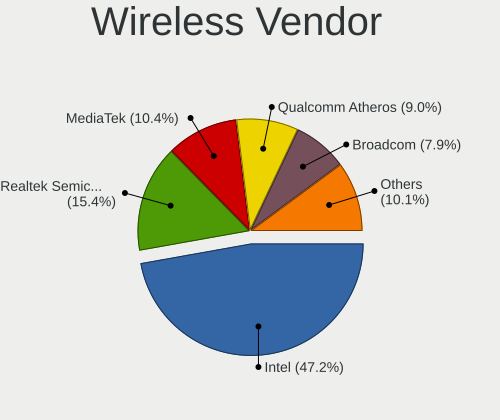

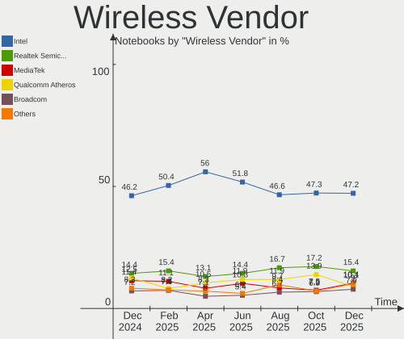

| Vendor                     | Notebooks | Percent |
|----------------------------|-----------|---------|
| Intel                      | 168       | 47.19%  |
| Realtek Semiconductor      | 55        | 15.45%  |
| MediaTek                   | 37        | 10.39%  |
| Qualcomm Atheros           | 32        | 8.99%   |
| Broadcom                   | 28        | 7.87%   |
| Broadcom Limited           | 12        | 3.37%   |
| Ralink                     | 4         | 1.12%   |
| Qualcomm                   | 4         | 1.12%   |
| TP-Link                    | 3         | 0.84%   |
| Sierra Wireless            | 2         | 0.56%   |
| Quectel Wireless Solutions | 2         | 0.56%   |
| Hewlett-Packard            | 2         | 0.56%   |
| Dell                       | 2         | 0.56%   |
| ASUSTek Computer           | 2         | 0.56%   |
| Realtek                    | 1         | 0.28%   |
| Qualcomm Technologies      | 1         | 0.28%   |
| Edimax Technology          | 1         | 0.28%   |

Wireless Model
--------------

Wireless models

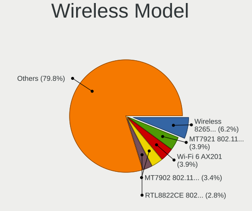

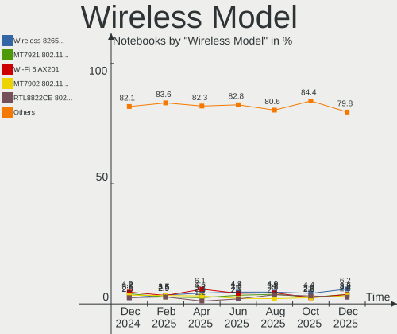

| Model                                                                | Notebooks | Percent |
|----------------------------------------------------------------------|-----------|---------|
| Intel Wireless 8265 / 8275                                           | 22        | 6.16%   |
| MediaTek MT7921 802.11ax PCIe Wireless Network Adapter [Filogic 330] | 14        | 3.92%   |
| Intel Wi-Fi 6 AX201                                                  | 14        | 3.92%   |
| MediaTek MT7902 802.11ax PCIe Wireless Network Adapter [Filogic 310] | 12        | 3.36%   |
| Realtek RTL8822CE 802.11ac PCIe Wireless Network Adapter             | 10        | 2.8%    |
| Intel Wi-Fi 6 AX200                                                  | 10        | 2.8%    |
| Intel Alder Lake-P PCH CNVi WiFi                                     | 10        | 2.8%    |
| Intel Comet Lake PCH-LP CNVi WiFi                                    | 9         | 2.52%   |
| Realtek RTL8821CE 802.11ac PCIe Wireless Network Adapter             | 8         | 2.24%   |
| Intel Wireless 8260                                                  | 8         | 2.24%   |
| Intel Wireless 7265                                                  | 8         | 2.24%   |
| Realtek RTL8852BE PCIe 802.11ax Wireless Network Controller          | 7         | 1.96%   |
| Qualcomm Atheros QCA9565 / AR9565 Wireless Network Adapter           | 7         | 1.96%   |
| Qualcomm Atheros AR9285 Wireless Network Adapter (PCI-Express)       | 7         | 1.96%   |
| Broadcom Limited BCM4360 802.11ac Dual Band Wireless Network Adapter | 7         | 1.96%   |
| Qualcomm Atheros QCA9377 802.11ac Wireless Network Adapter           | 6         | 1.68%   |
| Intel Wireless 7260                                                  | 6         | 1.68%   |
| Intel Wi-Fi 6E(802.11ax) AX210/AX1675* 2x2 [Typhoon Peak]            | 6         | 1.68%   |
| Intel Centrino Advanced-N 6205 [Taylor Peak]                         | 6         | 1.68%   |
| Intel Cannon Point-LP CNVi [Wireless-AC]                             | 6         | 1.68%   |
| Broadcom BCM43142 802.11b/g/n                                        | 6         | 1.68%   |
| Realtek RTL8723BE PCIe Wireless Network Adapter                      | 5         | 1.4%    |
| Realtek RTL8188EE Wireless Network Adapter                           | 5         | 1.4%    |
| Qualcomm Atheros AR9485 Wireless Network Adapter                     | 5         | 1.4%    |
| MediaTek MT7922 802.11ax PCI Express Wireless Network Adapter        | 5         | 1.4%    |
| Intel Wi-Fi 7(802.11be) AX1775*/AX1790*/BE20*/BE401/BE1750* 2x2      | 5         | 1.4%    |
| Intel Raptor Lake PCH CNVi WiFi                                      | 5         | 1.4%    |
| Intel BE201 320MHz                                                   | 5         | 1.4%    |
| Realtek RTL8723DE Wireless Network Adapter                           | 4         | 1.12%   |
| Qualcomm QCNFA765 Wireless Network Adapter                           | 4         | 1.12%   |
| Qualcomm Atheros QCA6174 802.11ac Wireless Network Adapter           | 4         | 1.12%   |
| Intel Wireless 3165                                                  | 4         | 1.12%   |
| Intel Wireless 3160                                                  | 4         | 1.12%   |
| Intel Tiger Lake PCH CNVi WiFi                                       | 4         | 1.12%   |
| Intel Meteor Lake PCH CNVi WiFi                                      | 4         | 1.12%   |
| Broadcom BCM4331 802.11a/b/g/n                                       | 4         | 1.12%   |
| Broadcom BCM43224 802.11a/b/g/n                                      | 4         | 1.12%   |
| Realtek 802.11ac NIC                                                 | 3         | 0.84%   |
| Ralink RT3290 Wireless 802.11n 1T/1R PCIe                            | 3         | 0.84%   |
| MediaTek Wi-Fi 6 MT7920 Wireless Network Adapter                     | 3         | 0.84%   |

Ethernet Vendor
---------------

Ethernet vendors

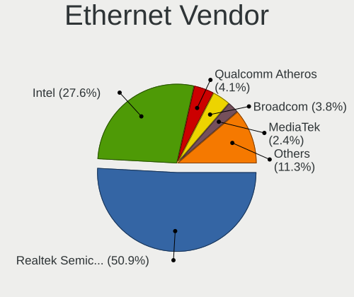

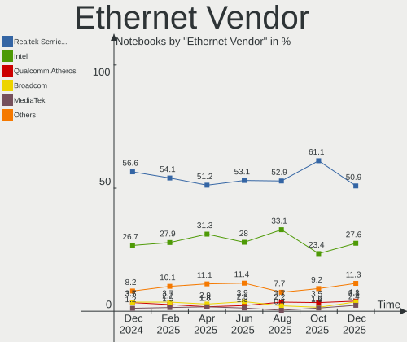

| Vendor                                 | Notebooks | Percent |
|----------------------------------------|-----------|---------|
| Realtek Semiconductor                  | 149       | 50.85%  |
| Intel                                  | 81        | 27.65%  |
| Qualcomm Atheros                       | 12        | 4.1%    |
| Broadcom                               | 11        | 3.75%   |
| MediaTek                               | 7         | 2.39%   |
| Samsung Electronics                    | 6         | 2.05%   |
| TP-Link                                | 5         | 1.71%   |
| Motorcomm Microelectronics.            | 4         | 1.37%   |
| Xiaomi                                 | 2         | 0.68%   |
| Suzhou Motorcomm Electronic Technology | 2         | 0.68%   |
| Nvidia                                 | 2         | 0.68%   |
| DisplayLink                            | 2         | 0.68%   |
| ASIX Electronics                       | 2         | 0.68%   |
| vivo                                   | 1         | 0.34%   |
| OPPO Electronics                       | 1         | 0.34%   |
| Motorola PCS                           | 1         | 0.34%   |
| JMicron Technology                     | 1         | 0.34%   |
| Hewlett-Packard                        | 1         | 0.34%   |
| Broadcom Limited                       | 1         | 0.34%   |
| Aquantia                               | 1         | 0.34%   |
| Apple                                  | 1         | 0.34%   |

Ethernet Model
--------------

Ethernet models

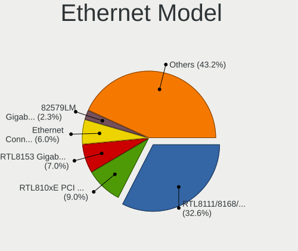

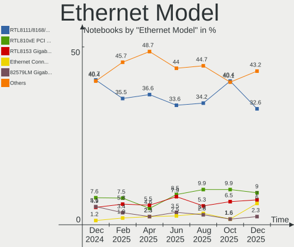

| Model                                                                           | Notebooks | Percent |
|---------------------------------------------------------------------------------|-----------|---------|
| Realtek RTL8111/8168/8211/8411 PCI Express Gigabit Ethernet Controller          | 98        | 32.56%  |
| Realtek RTL810xE PCI Express Fast Ethernet controller                           | 27        | 8.97%   |
| Realtek RTL8153 Gigabit Ethernet Adapter                                        | 21        | 6.98%   |
| Intel Ethernet Connection (4) I219-LM                                           | 18        | 5.98%   |
| Intel 82579LM Gigabit Network Connection (Lewisville)                           | 7         | 2.33%   |
| TP-Link UE300 10/100/1000 LAN (ethernet mode) [Realtek RTL8153]                 | 5         | 1.66%   |
| Samsung Galaxy series, misc. (tethering mode)                                   | 4         | 1.33%   |
| Qualcomm Atheros AR8151 v2.0 Gigabit Ethernet                                   | 4         | 1.33%   |
| Motorcomm Microelectronics. YT6801 Gigabit Ethernet Controller                  | 4         | 1.33%   |
| MediaTek MT7922 802.11ax PCI Express Wireless Network Adapter                   | 4         | 1.33%   |
| Intel Ethernet Connection I219-LM                                               | 4         | 1.33%   |
| Intel Ethernet Connection (7) I219-LM                                           | 4         | 1.33%   |
| Intel Ethernet Connection (3) I218-LM                                           | 4         | 1.33%   |
| Intel Arrow Lake CNVi WiFi                                                      | 4         | 1.33%   |
| Broadcom NetXtreme BCM57765 Gigabit Ethernet PCIe                               | 4         | 1.33%   |
| Realtek USB 10/100/1G/2.5 LAN                                                   | 3         | 1%      |
| Realtek RTL8125 2.5GbE Controller                                               | 3         | 1%      |
| MediaTek MT7925 802.11be 160MHz 2x2 PCIe Wireless Network Adapter [Filogic 360] | 3         | 1%      |
| Intel Ethernet Connection (6) I219-LM                                           | 3         | 1%      |
| Intel Ethernet Connection (4) I219-V                                            | 3         | 1%      |
| Intel Ethernet Connection (10) I219-LM                                          | 3         | 1%      |
| Intel Alder Lake-P PCH CNVi WiFi                                                | 3         | 1%      |
| Broadcom NetXtreme BCM57786 Gigabit Ethernet PCIe                               | 3         | 1%      |
| Broadcom NetLink BCM57780 Gigabit Ethernet PCIe                                 | 3         | 1%      |
| Suzhou Motorcomm Electronic YT6801 Gigabit Ethernet Controller                  | 2         | 0.66%   |
| Samsung GT-I9070 (network tethering, USB debugging enabled)                     | 2         | 0.66%   |
| Intel Wi-Fi 7(802.11be) AX1775*/AX1790*/BE20*/BE401/BE1750* 2x2                 | 2         | 0.66%   |
| Intel Ethernet Controller (2) I225-LMvP                                         | 2         | 0.66%   |
| Intel Ethernet Connection I219-V                                                | 2         | 0.66%   |
| Intel Ethernet Connection I217-LM                                               | 2         | 0.66%   |
| Intel Ethernet Connection (16) I219-LM                                          | 2         | 0.66%   |
| Intel Ethernet Connection (14) I219-V                                           | 2         | 0.66%   |
| Intel Ethernet Connection (13) I219-V                                           | 2         | 0.66%   |
| Intel Ethernet Connection (13) I219-LM                                          | 2         | 0.66%   |
| Intel Ethernet Connection (10) I219-V                                           | 2         | 0.66%   |
| DisplayLink USB-C Triple-4K Dock                                                | 2         | 0.66%   |
| ASIX AX88179 Gigabit Ethernet                                                   | 2         | 0.66%   |
| Xiaomi Mi/Redmi series (RNDIS)                                                  | 1         | 0.33%   |
| Xiaomi Mi/Redmi series (RNDIS + ADB)                                            | 1         | 0.33%   |
| vivo V2029                                                                      | 1         | 0.33%   |

Net Controller Kind
-------------------

Ethernet, WiFi or modem

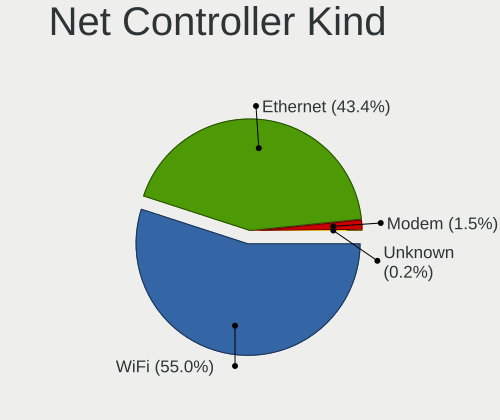

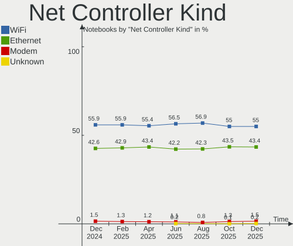

| Kind     | Notebooks | Percent |
|----------|-----------|---------|
| WiFi     | 336       | 54.99%  |
| Ethernet | 265       | 43.37%  |
| Modem    | 9         | 1.47%   |
| Unknown  | 1         | 0.16%   |

Used Controller
---------------

Currently used network controller

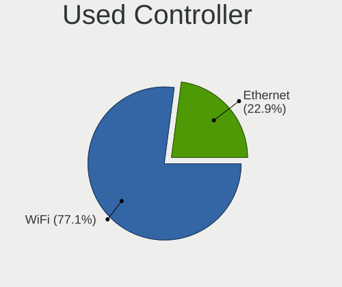

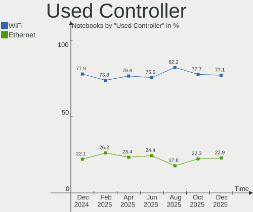

| Kind     | Notebooks | Percent |
|----------|-----------|---------|
| WiFi     | 286       | 77.09%  |
| Ethernet | 85        | 22.91%  |

NICs
----

Total network controllers on board

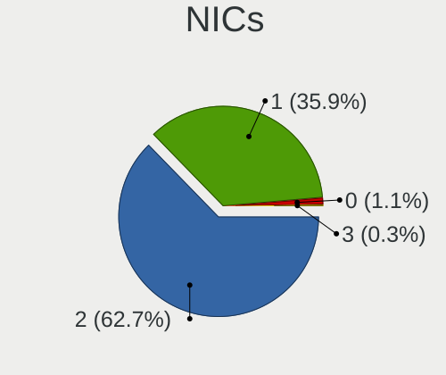

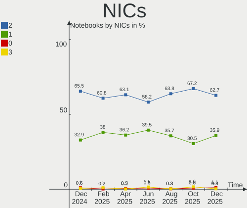

| Total | Notebooks | Percent |
|-------|-----------|---------|
| 2     | 227       | 62.71%  |
| 1     | 130       | 35.91%  |
| 0     | 4         | 1.1%    |
| 3     | 1         | 0.28%   |

IPv6
----

IPv6 vs IPv4

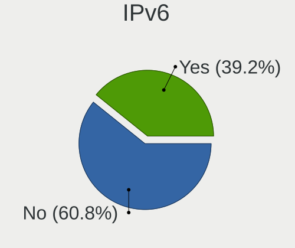

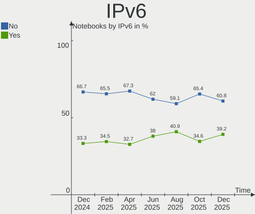

| Used | Notebooks | Percent |
|------|-----------|---------|
| No   | 220       | 60.77%  |
| Yes  | 142       | 39.23%  |

Bluetooth
---------

Bluetooth Vendor
----------------

Controller vendors

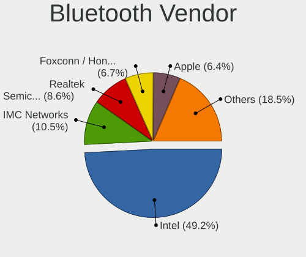

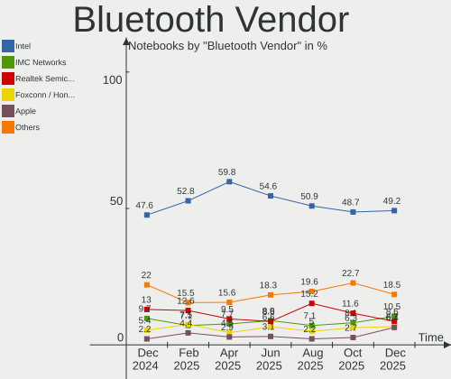

| Vendor                          | Notebooks | Percent |
|---------------------------------|-----------|---------|
| Intel                           | 154       | 49.2%   |
| IMC Networks                    | 33        | 10.54%  |
| Realtek Semiconductor           | 27        | 8.63%   |
| Foxconn / Hon Hai               | 21        | 6.71%   |
| Apple                           | 20        | 6.39%   |
| Lite-On Technology              | 12        | 3.83%   |
| Qualcomm Atheros Communications | 11        | 3.51%   |
| MediaTek                        | 8         | 2.56%   |
| Broadcom                        | 6         | 1.92%   |
| Cambridge Silicon Radio         | 4         | 1.28%   |
| Toshiba                         | 3         | 0.96%   |
| Ralink                          | 3         | 0.96%   |
| ASUSTek Computer                | 3         | 0.96%   |
| Hewlett-Packard                 | 2         | 0.64%   |
| Foxconn International           | 2         | 0.64%   |
| USI                             | 1         | 0.32%   |
| Smart Modular Technologies      | 1         | 0.32%   |
| Realtek                         | 1         | 0.32%   |
| Dell                            | 1         | 0.32%   |

Bluetooth Model
---------------

Controller models

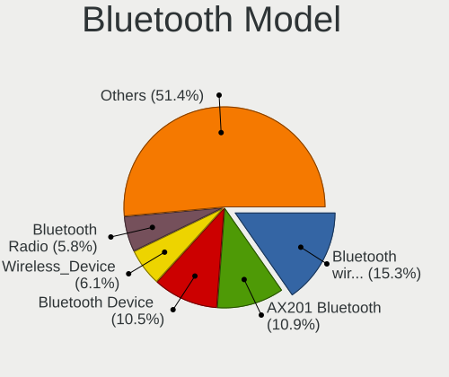

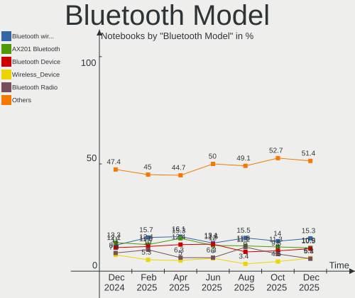

| Model                                               | Notebooks | Percent |
|-----------------------------------------------------|-----------|---------|
| Intel Bluetooth wireless interface                  | 48        | 15.34%  |
| Intel AX201 Bluetooth                               | 34        | 10.86%  |
| Intel Bluetooth Device                              | 33        | 10.54%  |
| IMC Networks Wireless_Device                        | 19        | 6.07%   |
| Realtek Bluetooth Radio                             | 18        | 5.75%   |
| Intel Bluetooth 9460/9560 Jefferson Peak (JfP)      | 15        | 4.79%   |
| Intel AX200 Bluetooth                               | 9         | 2.88%   |
| Foxconn / Hon Hai Wireless_Device                   | 9         | 2.88%   |
| MediaTek Wireless_Device                            | 8         | 2.56%   |
| IMC Networks Bluetooth Radio                        | 8         | 2.56%   |
| Apple Bluetooth USB Host Controller                 | 8         | 2.56%   |
| Apple Bluetooth Host Controller                     | 8         | 2.56%   |
| Foxconn / Hon Hai MediaTek Bluetooth Adapter        | 6         | 1.92%   |
| Realtek  Bluetooth 4.2 Adapter                      | 5         | 1.6%    |
| Qualcomm Atheros  Bluetooth Device                  | 5         | 1.6%    |
| Intel AX210 Bluetooth                               | 5         | 1.6%    |
| Lite-On Wireless_Device                             | 4         | 1.28%   |
| Intel Centrino Bluetooth Wireless Transceiver       | 4         | 1.28%   |
| Cambridge Silicon Radio Bluetooth Dongle (HCI mode) | 4         | 1.28%   |
| Apple Built-in Bluetooth 2.0+EDR HCI                | 4         | 1.28%   |
| Ralink RT3290 Bluetooth                             | 3         | 0.96%   |
| Lite-On Qualcomm Atheros QCA9377 Bluetooth          | 3         | 0.96%   |
| Lite-On Bluetooth Device                            | 3         | 0.96%   |
| Intel Bluetooth                                     | 3         | 0.96%   |
| Toshiba BCM43142A0                                  | 2         | 0.64%   |
| Realtek RTL8723B Bluetooth                          | 2         | 0.64%   |
| Realtek 802.11ac WLAN Adapter                       | 2         | 0.64%   |
| Qualcomm Atheros AR9462 Bluetooth                   | 2         | 0.64%   |
| Qualcomm Atheros AR3011 Bluetooth                   | 2         | 0.64%   |
| Lite-On Bluetooth Radio                             | 2         | 0.64%   |
| Intel Wireless-AC 3168 Bluetooth                    | 2         | 0.64%   |
| IMC Networks BCM20702A0                             | 2         | 0.64%   |
| IMC Networks Atheros AR3012 Bluetooth 4.0 Adapter   | 2         | 0.64%   |
| HP Broadcom 2070 Bluetooth Combo                    | 2         | 0.64%   |
| Foxconn International BCM43142A0 Bluetooth module   | 2         | 0.64%   |
| Foxconn / Hon Hai Bluetooth Device                  | 2         | 0.64%   |
| Foxconn / Hon Hai BCM43142A0                        | 2         | 0.64%   |
| Broadcom BCM20702 Bluetooth 4.0 [ThinkPad]          | 2         | 0.64%   |
| ASUS ASUS USB-BT500                                 | 2         | 0.64%   |
| USI Bluetooth Device                                | 1         | 0.32%   |

Sound
-----

Sound Vendor
------------

Sound card vendors

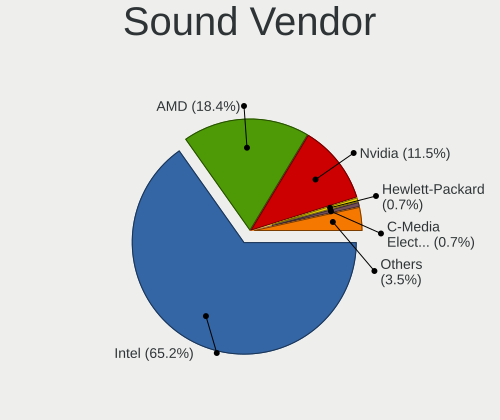

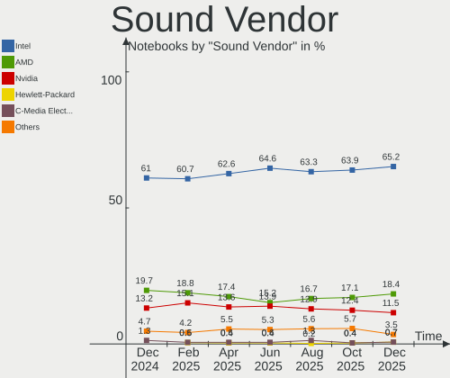

| Vendor              | Notebooks | Percent |
|---------------------|-----------|---------|
| Intel               | 283       | 65.21%  |
| AMD                 | 80        | 18.43%  |
| Nvidia              | 50        | 11.52%  |
| Hewlett-Packard     | 3         | 0.69%   |
| C-Media Electronics | 3         | 0.69%   |
| Sony                | 2         | 0.46%   |
| Logitech            | 2         | 0.46%   |
| Turtle Beach        | 1         | 0.23%   |
| Synaptics           | 1         | 0.23%   |
| Plantronics         | 1         | 0.23%   |
| Lenovo              | 1         | 0.23%   |
| Kingston Technology | 1         | 0.23%   |
| Jupiter             | 1         | 0.23%   |
| GN Netcom           | 1         | 0.23%   |
| Corsair             | 1         | 0.23%   |
| Cooler Master       | 1         | 0.23%   |
| Audient             | 1         | 0.23%   |
| Apple               | 1         | 0.23%   |

Sound Model
-----------

Sound card models

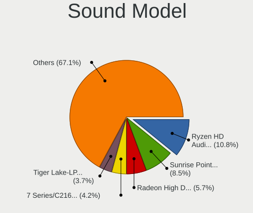

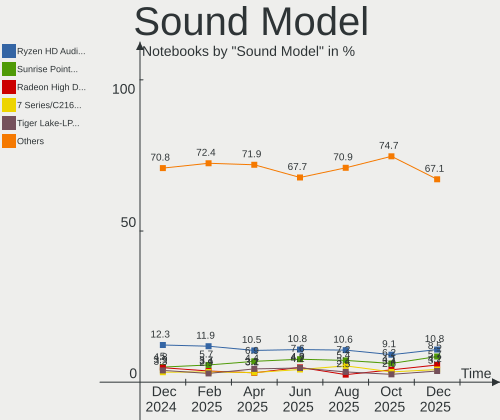

| Model                                                                      | Notebooks | Percent |
|----------------------------------------------------------------------------|-----------|---------|
| AMD Ryzen HD Audio Controller                                              | 59        | 10.85%  |
| Intel Sunrise Point-LP HD Audio                                            | 46        | 8.46%   |
| AMD Radeon High Definition Audio Controller                                | 31        | 5.7%    |
| Intel 7 Series/C216 Chipset Family High Definition Audio Controller        | 23        | 4.23%   |
| Intel Tiger Lake-LP Smart Sound Technology Audio Controller                | 20        | 3.68%   |
| AMD Renoir/Cezanne HDMI/DP Audio Controller                                | 20        | 3.68%   |
| Intel Wildcat Point-LP High Definition Audio Controller                    | 19        | 3.49%   |
| Intel Broadwell-U Audio Controller                                         | 19        | 3.49%   |
| Intel 6 Series/C200 Series Chipset Family High Definition Audio Controller | 18        | 3.31%   |
| Intel Alder Lake PCH-P High Definition Audio Controller                    | 17        | 3.13%   |
| Intel Raptor Lake-P/U/H cAVS                                               | 16        | 2.94%   |
| Intel Haswell-ULT HD Audio Controller                                      | 15        | 2.76%   |
| Intel 8 Series HD Audio Controller                                         | 15        | 2.76%   |
| Intel Cannon Lake PCH cAVS                                                 | 10        | 1.84%   |
| Intel Comet Lake PCH-LP cAVS                                               | 9         | 1.65%   |
| Intel Meteor Lake-P HD Audio Controller                                    | 8         | 1.47%   |
| Intel 8 Series/C220 Series Chipset High Definition Audio Controller        | 8         | 1.47%   |
| Nvidia AD107 High Definition Audio Controller                              | 7         | 1.29%   |
| Intel Xeon E3-1200 v3/4th Gen Core Processor HD Audio Controller           | 7         | 1.29%   |
| Intel 5 Series/3400 Series Chipset High Definition Audio                   | 7         | 1.29%   |
| AMD FCH Azalia Controller                                                  | 7         | 1.29%   |
| Intel Lunar Lake-M HD Audio Controller                                     | 6         | 1.1%    |
| Intel Cannon Point-LP High Definition Audio Controller                     | 6         | 1.1%    |
| Intel Arrow Lake cAVS                                                      | 6         | 1.1%    |
| Intel Alder Lake-N PCH High Definition Audio Controller                    | 6         | 1.1%    |
| Nvidia TU107 GeForce GTX 1650 High Definition Audio Controller             | 5         | 0.92%   |
| Nvidia GP107GL High Definition Audio Controller                            | 5         | 0.92%   |
| Intel Tiger Lake-H HD Audio Controller                                     | 5         | 0.92%   |
| Intel CM238 HD Audio Controller                                            | 5         | 0.92%   |
| Nvidia GA107 High Definition Audio Controller                              | 4         | 0.74%   |
| Nvidia GA106 High Definition Audio Controller                              | 4         | 0.74%   |
| Intel Raptor Lake High Definition Audio Controller                         | 4         | 0.74%   |
| Intel Ice Lake-LP Smart Sound Technology Audio Controller                  | 4         | 0.74%   |
| Intel 82801I (ICH9 Family) HD Audio Controller                             | 4         | 0.74%   |
| Intel 100 Series/C230 Series Chipset Family HD Audio Controller            | 4         | 0.74%   |
| AMD SBx00 Azalia (Intel HDA)                                               | 4         | 0.74%   |
| AMD Raven/Raven2/Fenghuang HDMI/DP Audio Controller                        | 4         | 0.74%   |
| Nvidia GK107 HDMI Audio Controller                                         | 3         | 0.55%   |
| Nvidia GF108 High Definition Audio Controller                              | 3         | 0.55%   |
| Nvidia GB206 High Definition Audio Controller                              | 3         | 0.55%   |

Memory
------

Memory Vendor
-------------

Memory module vendors

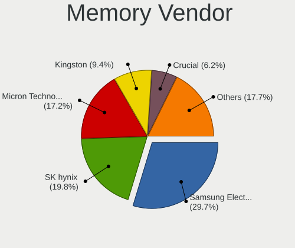

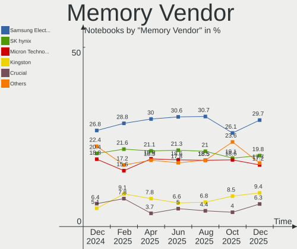

| Vendor              | Notebooks | Percent |
|---------------------|-----------|---------|
| Samsung Electronics | 57        | 29.69%  |
| SK hynix            | 38        | 19.79%  |
| Micron Technology   | 33        | 17.19%  |
| Kingston            | 18        | 9.38%   |
| Crucial             | 12        | 6.25%   |
| Unknown             | 10        | 5.21%   |
| A-DATA Technology   | 7         | 3.65%   |
| Ramaxel Technology  | 5         | 2.6%    |
| Unknown             | 2         | 1.04%   |
| Elpida              | 2         | 1.04%   |
| Corsair             | 2         | 1.04%   |
| Unknown (0x0B5E)    | 1         | 0.52%   |
| Transcend           | 1         | 0.52%   |
| Nanya Technology    | 1         | 0.52%   |
| G.Skill             | 1         | 0.52%   |
| ff                  | 1         | 0.52%   |
| 4ea5                | 1         | 0.52%   |

Memory Model
------------

Memory module models

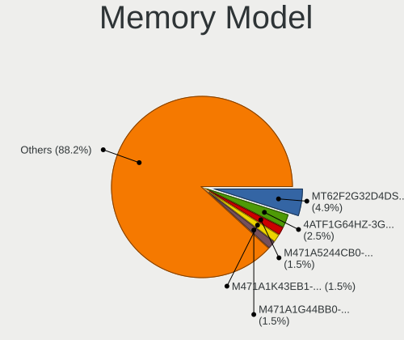

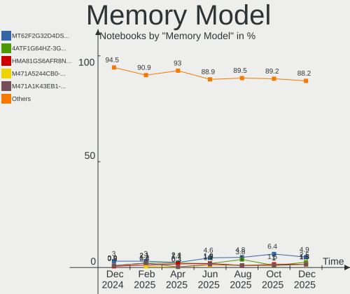

| Model                                                            | Notebooks | Percent |
|------------------------------------------------------------------|-----------|---------|
| Unknown                                                          | 10        | 4.9%    |
| Micron RAM 4ATF1G64HZ-3G2F1 8GB SODIMM DDR4 3200MT/s             | 5         | 2.45%   |
| SK hynix RAM HMA81GS6AFR8N-UH 8GB SODIMM DDR4 2667MT/s           | 3         | 1.47%   |
| Samsung RAM M471A5244CB0-CRC 4GB SODIMM DDR4 2667MT/s            | 3         | 1.47%   |
| Samsung RAM M471A1K43EB1-CWE 8GB SODIMM DDR4 3200MT/s            | 3         | 1.47%   |
| Samsung RAM M471A1G44BB0-CWE 8GB SODIMM DDR4 3200MT/s            | 3         | 1.47%   |
| Unknown RAM Module 2GB Row Of Chips LPDDR4 4267MT/s              | 2         | 0.98%   |
| SK hynix RAM HMT451S6AFR8A-PB 4GB SODIMM DDR3 1600MT/s           | 2         | 0.98%   |
| SK hynix RAM HMCG78AGBSA095N 16GB SODIMM DDR5 5600MT/s           | 2         | 0.98%   |
| SK hynix RAM H9JCNNNBK3MLYR-N6E 1GB Row Of Chips LPDDR5 6400MT/s | 2         | 0.98%   |
| Samsung RAM UBE3D4AA-MGCR 2GB Row Of Chips LPDDR4 4267MT/s       | 2         | 0.98%   |
| Samsung RAM Module 16GB SODIMM DDR4 2667MT/s                     | 2         | 0.98%   |
| Samsung RAM M471B1G73DB0-YK0 8GB SODIMM DDR3 1600MT/s            | 2         | 0.98%   |
| Samsung RAM M471A5244CB0-CWE 4GB SODIMM DDR4 3200MT/s            | 2         | 0.98%   |
| Samsung RAM M471A2K43CB1-CRC 16GB SODIMM DDR4 2667MT/s           | 2         | 0.98%   |
| Samsung RAM M471A1K43DB1-CWE 8GB SODIMM DDR4 3200MT/s            | 2         | 0.98%   |
| Samsung RAM M471A1K43BB1-CRC 8GB SODIMM DDR4 2667MT/s            | 2         | 0.98%   |
| Samsung RAM M471A1G44CB0-CWE 8GB SODIMM DDR4 3200MT/s            | 2         | 0.98%   |
| Samsung RAM M471A1G44AB0-CWE 8GiB SODIMM DDR4 3200MT/s           | 2         | 0.98%   |
| Samsung RAM M425R2GA3PB0-CWMOL 16GB SODIMM DDR5 5600MT/s         | 2         | 0.98%   |
| Ramaxel RAM RMSA3270ME86H9F-2666 4GB SODIMM DDR4 2667MT/s        | 2         | 0.98%   |
| Micron RAM 8ATF1G64HZ-3G2J1 8GB SODIMM DDR4 3200MT/s             | 2         | 0.98%   |
| Micron RAM 4ATF1G64HZ-3G2E1 8GB SODIMM DDR4 3200MT/s             | 2         | 0.98%   |
| Micron RAM 16ATF2G64HZ-2G6J1 16GB SODIMM DDR4 2667MT/s           | 2         | 0.98%   |
| Crucial RAM CT48G56C46S5.M16B1 48GB SODIMM DDR5 5600MT/s         | 2         | 0.98%   |
| Crucial RAM CT16G4SFRA32A.M16FR 16GB SODIMM DDR4 3200MT/s        | 2         | 0.98%   |
| A-DATA RAM AD73I1C1674EV 4GB SODIMM DDR3 1334MT/s                | 2         | 0.98%   |
| A-DATA RAM AD5S560032G-SFW 32GB SODIMM DDR5 5600MT/s             | 2         | 0.98%   |
| Unknown (0x0B5E) RAM HEHMCG78AGBSBA0BN 16GB SODIMM DDR5 5600MT/s | 1         | 0.49%   |
| Transcend RAM JM3200HSE-16G 16GB SODIMM DDR4 3200MT/s            | 1         | 0.49%   |
| SK hynix RAM Module 4GB SODIMM LPDDR3 2133MT/s                   | 1         | 0.49%   |
| SK hynix RAM Module 4GB SODIMM DDR3 1600MT/s                     | 1         | 0.49%   |
| SK hynix RAM Module 32GB SODIMM DDR5 5600MT/s                    | 1         | 0.49%   |
| SK hynix RAM Module 32GB SODIMM DDR4 3200MT/s                    | 1         | 0.49%   |
| SK hynix RAM Module 2GB SODIMM DDR3 1600MT/s                     | 1         | 0.49%   |
| SK hynix RAM Module 1GB SODIMM DDR3 1333MT/s                     | 1         | 0.49%   |
| SK hynix RAM HMT41GS6AFR8A-PB 8GiB SODIMM DDR3 2667MT/s          | 1         | 0.49%   |
| SK hynix RAM HMT351S6EFR8C-PB 4GB SODIMM DDR3 1600MT/s           | 1         | 0.49%   |
| SK hynix RAM HMT351S6EFR8A-PB 4GB DIMM DDR3 1333MT/s             | 1         | 0.49%   |
| SK hynix RAM HMT351S6CFR8C-PB 4GB SODIMM DDR3 1600MT/s           | 1         | 0.49%   |

Memory Kind
-----------

Memory module kinds

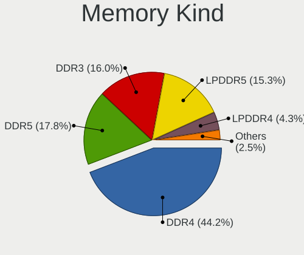

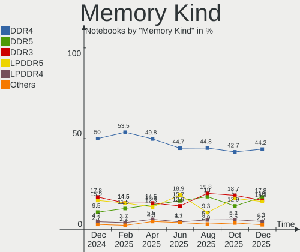

| Kind   | Notebooks | Percent |
|--------|-----------|---------|
| DDR4   | 72        | 44.17%  |
| DDR5   | 29        | 17.79%  |
| DDR3   | 26        | 15.95%  |
| LPDDR5 | 25        | 15.34%  |
| LPDDR4 | 7         | 4.29%   |
| LPDDR3 | 3         | 1.84%   |
| SDRAM  | 1         | 0.61%   |

Memory Form Factor
------------------

Physical design of the memory module

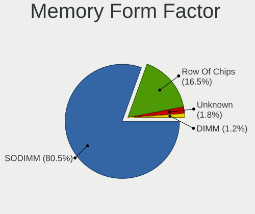

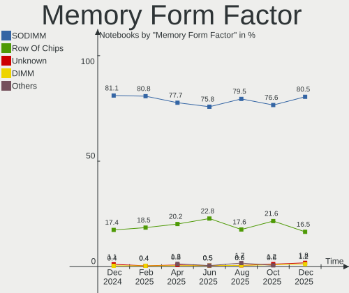

| Name         | Notebooks | Percent |
|--------------|-----------|---------|
| SODIMM       | 132       | 80.49%  |
| Row Of Chips | 27        | 16.46%  |
| Unknown      | 3         | 1.83%   |
| DIMM         | 2         | 1.22%   |

Memory Size
-----------

Memory module size

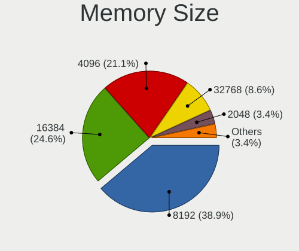

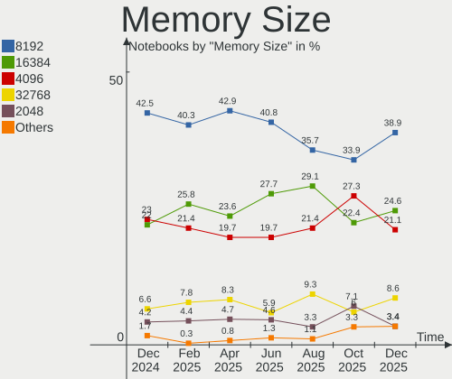

| Size  | Notebooks | Percent |
|-------|-----------|---------|
| 8192  | 68        | 38.86%  |
| 16384 | 43        | 24.57%  |
| 4096  | 37        | 21.14%  |
| 32768 | 15        | 8.57%   |
| 2048  | 6         | 3.43%   |
| 1024  | 3         | 1.71%   |
| 49152 | 2         | 1.14%   |
| 3072  | 1         | 0.57%   |

Memory Speed
------------

Memory module speed

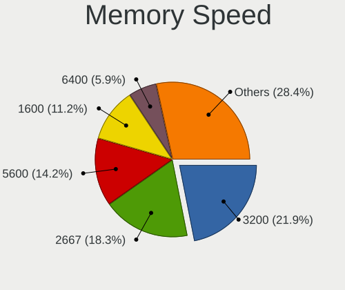

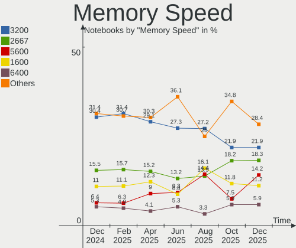

| Speed | Notebooks | Percent |
|-------|-----------|---------|
| 3200  | 37        | 21.89%  |
| 2667  | 31        | 18.34%  |
| 5600  | 24        | 14.2%   |
| 1600  | 19        | 11.24%  |
| 6400  | 10        | 5.92%   |
| 8533  | 7         | 4.14%   |
| 4267  | 6         | 3.55%   |
| 2400  | 6         | 3.55%   |
| 7500  | 4         | 2.37%   |
| 4800  | 4         | 2.37%   |
| 2133  | 4         | 2.37%   |
| 1334  | 4         | 2.37%   |
| 1333  | 3         | 1.78%   |
| 8400  | 2         | 1.18%   |
| 8448  | 1         | 0.59%   |
| 8000  | 1         | 0.59%   |
| 7467  | 1         | 0.59%   |
| 6000  | 1         | 0.59%   |
| 5500  | 1         | 0.59%   |
| 4199  | 1         | 0.59%   |
| 3266  | 1         | 0.59%   |
| 3000  | 1         | 0.59%   |

Printers & scanners
-------------------

Printer Vendor
--------------

Printer device vendors

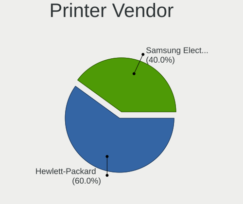

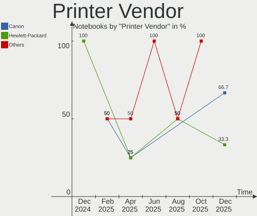

| Vendor          | Notebooks | Percent |
|-----------------|-----------|---------|
| Canon           | 2         | 66.67%  |
| Hewlett-Packard | 1         | 33.33%  |

Printer Model
-------------

Printer device models

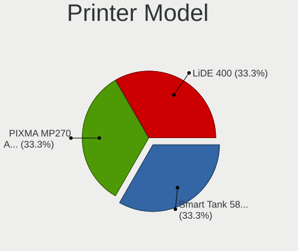

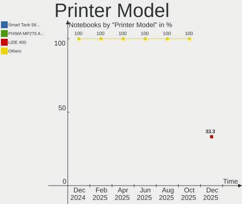

| Model                                | Notebooks | Percent |
|--------------------------------------|-----------|---------|
| HP Smart Tank 580-590 series         | 1         | 33.33%  |
| Canon PIXMA MP270 All-In-One Printer | 1         | 33.33%  |
| Canon LiDE 400                       | 1         | 33.33%  |

Scanner Vendor
--------------

Scanner device vendors

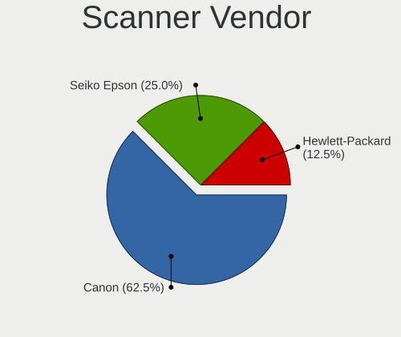

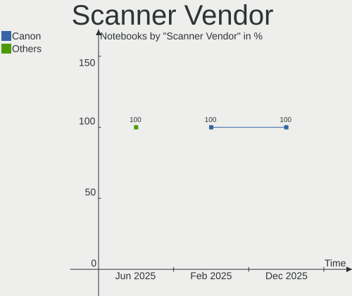

| Vendor | Notebooks | Percent |
|--------|-----------|---------|
| Canon  | 2         | 100%    |

Scanner Model
-------------

Scanner device models

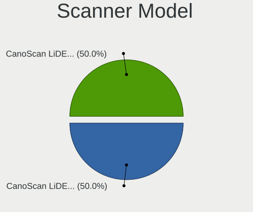

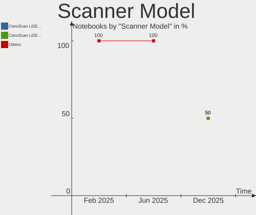

| Model                   | Notebooks | Percent |
|-------------------------|-----------|---------|
| Canon CanoScan LiDE 220 | 1         | 50%     |
| Canon CanoScan LiDE 110 | 1         | 50%     |

Camera
------

Camera Vendor
-------------

Camera device vendors

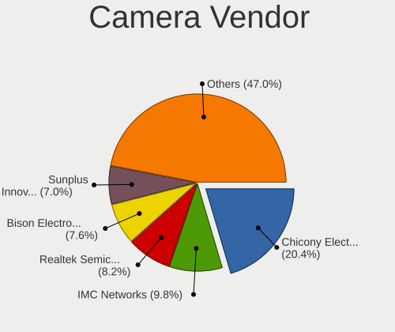

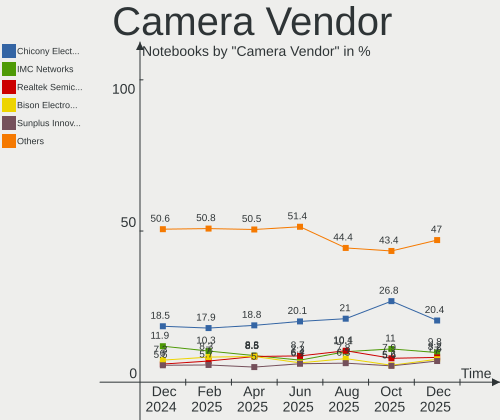

| Vendor                                 | Notebooks | Percent |
|----------------------------------------|-----------|---------|
| Chicony Electronics                    | 67        | 20.43%  |
| IMC Networks                           | 32        | 9.76%   |
| Realtek Semiconductor                  | 27        | 8.23%   |
| Bison Electronics                      | 25        | 7.62%   |
| Sunplus Innovation Technology          | 23        | 7.01%   |
| Microdia                               | 22        | 6.71%   |
| Quanta                                 | 21        | 6.4%    |
| Luxvisions Innotech Limited            | 15        | 4.57%   |
| Cheng Uei Precision Industry (Foxlink) | 15        | 4.57%   |
| Apple                                  | 14        | 4.27%   |
| Syntek                                 | 12        | 3.66%   |
| Sonix Technology                       | 8         | 2.44%   |
| Suyin                                  | 6         | 1.83%   |
| Lite-On Technology                     | 6         | 1.83%   |
| ShineTech                              | 4         | 1.22%   |
| Logitech                               | 4         | 1.22%   |
| Silicon Motion                         | 3         | 0.91%   |
| kingcome                               | 3         | 0.91%   |
| SunplusIT                              | 2         | 0.61%   |
| ShineOptics                            | 2         | 0.61%   |
| Samsung Electronics                    | 2         | 0.61%   |
| ALi                                    | 2         | 0.61%   |
| Sunwingroup                            | 1         | 0.3%    |
| Shine-optics                           | 1         | 0.3%    |
| Shenzhen Kingcome Optoelectronic       | 1         | 0.3%    |
| Pixart Imaging                         | 1         | 0.3%    |
| Microsoft                              | 1         | 0.3%    |
| Huawei Technologies                    | 1         | 0.3%    |
| Generalplus Technology                 | 1         | 0.3%    |
| GEMBIRD                                | 1         | 0.3%    |
| Geek szitman                           | 1         | 0.3%    |
| Framework                              | 1         | 0.3%    |
| BillionPixels                          | 1         | 0.3%    |
| Alcor Micro                            | 1         | 0.3%    |
| Unknown                                | 1         | 0.3%    |

Camera Model
------------

Camera device models

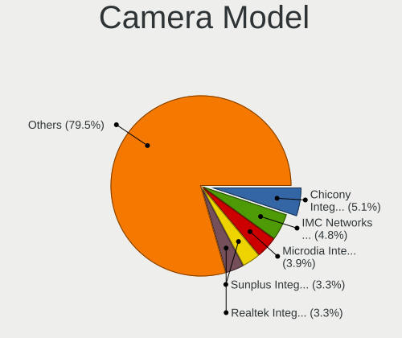

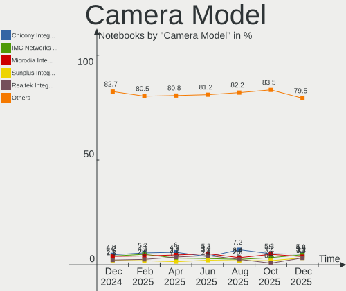

| Model                                         | Notebooks | Percent |
|-----------------------------------------------|-----------|---------|
| Chicony Integrated Camera                     | 17        | 5.14%   |
| IMC Networks USB2.0 HD UVC WebCam             | 16        | 4.83%   |
| Microdia Integrated_Webcam_HD                 | 13        | 3.93%   |
| Sunplus Integrated_Webcam_HD                  | 11        | 3.32%   |
| Realtek Integrated_Webcam_HD                  | 11        | 3.32%   |
| Syntek Integrated Camera                      | 10        | 3.02%   |
| Bison Integrated Camera                       | 9         | 2.72%   |
| Luxvisions Innotech Limited Integrated Camera | 5         | 1.51%   |
| IMC Networks Integrated Camera                | 5         | 1.51%   |
| Chicony USB2.0 HD UVC WebCam                  | 5         | 1.51%   |
| Chicony ACER HD User Facing                   | 5         | 1.51%   |
| Bison SunplusIT Integrated Camera             | 5         | 1.51%   |
| Sonix USB2.0 HD UVC WebCam                    | 4         | 1.21%   |
| ShineTech USB2.0 HD UVC WebCam                | 4         | 1.21%   |
| Realtek Integrated_Webcam_FHD                 | 4         | 1.21%   |
| Lite-On Integrated Camera                     | 4         | 1.21%   |
| Chicony HD Webcam                             | 4         | 1.21%   |
| Apple FaceTime HD Camera (Built-in)           | 4         | 1.21%   |
| Apple FaceTime HD Camera                      | 4         | 1.21%   |
| Realtek Integrated Webcam HD                  | 3         | 0.91%   |
| Quanta HP TrueVision HD Camera                | 3         | 0.91%   |
| Quanta HP HD Camera                           | 3         | 0.91%   |
| Luxvisions Innotech Limited HP HD Camera      | 3         | 0.91%   |
| kingcome FHD WebCam                           | 3         | 0.91%   |
| Chicony HP HD Camera                          | 3         | 0.91%   |
| Chicony HD User Facing                        | 3         | 0.91%   |
| Bison Lenovo EasyCamera                       | 3         | 0.91%   |
| Apple FaceTime Camera                         | 3         | 0.91%   |
| Syntek Lenovo EasyCamera                      | 2         | 0.6%    |
| Sunplus Laptop_Integrated_Webcam_FHD          | 2         | 0.6%    |
| Sunplus Integrated Camera                     | 2         | 0.6%    |
| Sunplus HP TrueVision HD Camera               | 2         | 0.6%    |
| Sonix ASUS HD webcam                          | 2         | 0.6%    |
| ShineOptics HD Camera                         | 2         | 0.6%    |
| Samsung Galaxy series, misc. (MTP mode)       | 2         | 0.6%    |
| Quanta ov9734_techfront_camera                | 2         | 0.6%    |
| Quanta HP Wide Vision HD Camera               | 2         | 0.6%    |
| Quanta HD Webcam                              | 2         | 0.6%    |
| Quanta ACER HD User Facing                    | 2         | 0.6%    |
| Microdia Integrated_Webcam_FHD                | 2         | 0.6%    |

Security
--------

Fingerprint Vendor
------------------

Fingerprint sensor vendors

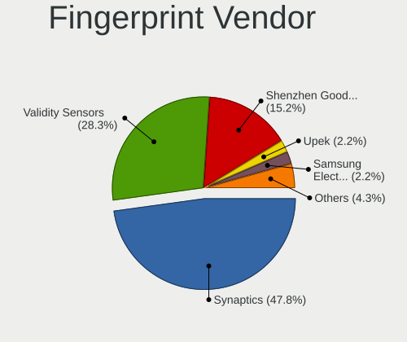

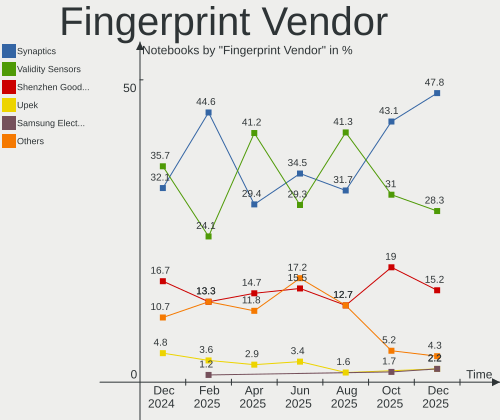

| Vendor                     | Notebooks | Percent |
|----------------------------|-----------|---------|
| Synaptics                  | 22        | 47.83%  |
| Validity Sensors           | 13        | 28.26%  |
| Shenzhen Goodix Technology | 7         | 15.22%  |
| Upek                       | 1         | 2.17%   |
| Samsung Electronics        | 1         | 2.17%   |
| LighTuning Technology      | 1         | 2.17%   |
| Elan Microelectronics      | 1         | 2.17%   |

Fingerprint Model
-----------------

Fingerprint sensor models

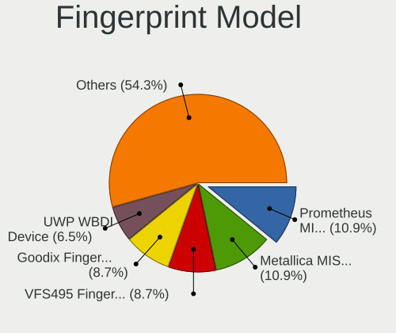

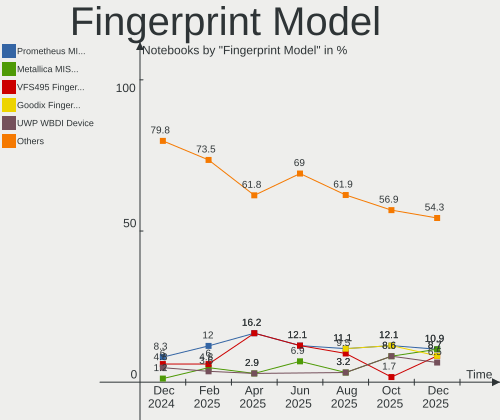

| Model                                                                      | Notebooks | Percent |
|----------------------------------------------------------------------------|-----------|---------|
| Synaptics Prometheus MIS Touch Fingerprint Reader                          | 5         | 10.87%  |
| Synaptics Metallica MIS Touch Fingerprint Reader                           | 5         | 10.87%  |
| Validity Sensors VFS495 Fingerprint Reader                                 | 4         | 8.7%    |
| Shenzhen Goodix  FingerPrint Device                                        | 4         | 8.7%    |
| Synaptics UWP WBDI Device                                                  | 3         | 6.52%   |
| Synaptics FS7604 Touch Fingerprint Sensor with PurePrint                   | 3         | 6.52%   |
| Synaptics Fingerprint reader [HP G6]                                       | 3         | 6.52%   |
| Validity Sensors Synaptics WBDI                                            | 2         | 4.35%   |
| Validity Sensors Swipe Fingerprint Sensor                                  | 2         | 4.35%   |
| Validity Sensors Fingerprint scanner                                       | 2         | 4.35%   |
| Synaptics Prometheus Fingerprint Reader                                    | 2         | 4.35%   |
| Shenzhen Goodix Fingerprint Reader                                         | 2         | 4.35%   |
| Validity Sensors VFS471 Fingerprint Reader                                 | 1         | 2.17%   |
| Validity Sensors VFS451 Fingerprint Reader                                 | 1         | 2.17%   |
| Validity Sensors Synaptics VFS7552 Touch Fingerprint Sensor with PurePrint | 1         | 2.17%   |
| Upek Biometric Touchchip/Touchstrip Fingerprint Sensor                     | 1         | 2.17%   |
| Synaptics  FS7604 Touch Fingerprint Sensor with PurePrint                  | 1         | 2.17%   |
| Shenzhen Goodix FingerPrint                                                | 1         | 2.17%   |
| Samsung Fingerprint Sensor Device - 730B                                   | 1         | 2.17%   |
| LighTuning Fingerprint Reader                                              | 1         | 2.17%   |
| Elan ELAN:ARM-M4                                                           | 1         | 2.17%   |

Chipcard Vendor
---------------

Chipcard module vendors

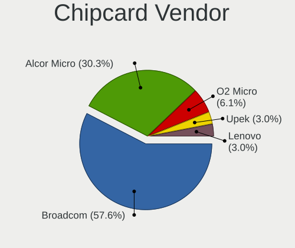

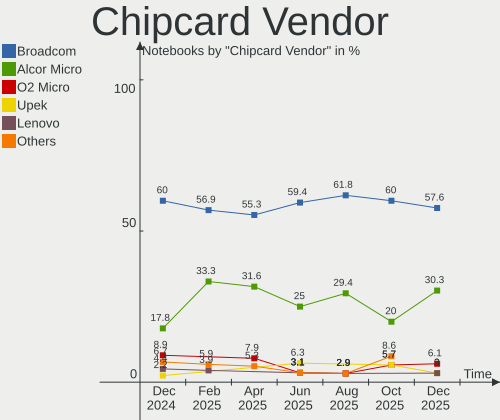

| Vendor      | Notebooks | Percent |
|-------------|-----------|---------|
| Broadcom    | 19        | 57.58%  |
| Alcor Micro | 10        | 30.3%   |
| O2 Micro    | 2         | 6.06%   |
| Upek        | 1         | 3.03%   |
| Lenovo      | 1         | 3.03%   |

Chipcard Model
--------------

Chipcard module models

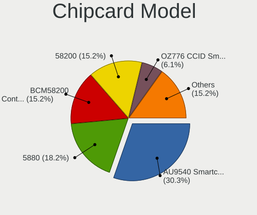

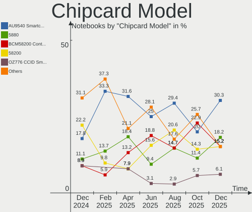

| Model                                                                        | Notebooks | Percent |
|------------------------------------------------------------------------------|-----------|---------|
| Alcor Micro AU9540 Smartcard Reader                                          | 10        | 30.3%   |
| Broadcom 5880                                                                | 6         | 18.18%  |
| Broadcom BCM58200 ControlVault 3 (FingerPrint sensor + Contacted SmartCard)  | 5         | 15.15%  |
| Broadcom 58200                                                               | 5         | 15.15%  |
| O2 Micro OZ776 CCID Smartcard Reader                                         | 2         | 6.06%   |
| Broadcom BCM5880 Secure Applications Processor                               | 2         | 6.06%   |
| Upek TouchChip Fingerprint Coprocessor (WBF advanced mode)                   | 1         | 3.03%   |
| Lenovo Integrated Smart Card Reader                                          | 1         | 3.03%   |
| Broadcom BCM5880 Secure Applications Processor with fingerprint swipe sensor | 1         | 3.03%   |

Unsupported
-----------

Unsupported Devices
-------------------

Total unsupported devices on board

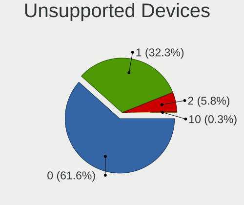

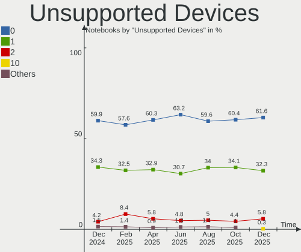

| Total | Notebooks | Percent |
|-------|-----------|---------|
| 0     | 223       | 61.6%   |
| 1     | 117       | 32.32%  |
| 2     | 21        | 5.8%    |
| 10    | 1         | 0.28%   |

Unsupported Device Types
------------------------

Types of unsupported devices

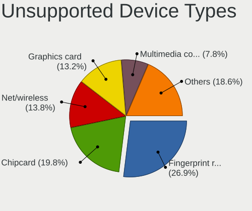

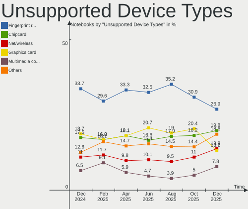

| Type                     | Notebooks | Percent |
|--------------------------|-----------|---------|
| Fingerprint reader       | 45        | 26.95%  |
| Chipcard                 | 33        | 19.76%  |
| Net/wireless             | 23        | 13.77%  |
| Graphics card            | 22        | 13.17%  |
| Multimedia controller    | 13        | 7.78%   |
| Net/ethernet             | 6         | 3.59%   |
| Camera                   | 6         | 3.59%   |
| Communication controller | 5         | 2.99%   |
| Bluetooth                | 5         | 2.99%   |
| Storage                  | 3         | 1.8%    |
| Card reader              | 2         | 1.2%    |
| Unassigned class         | 1         | 0.6%    |
| Sound                    | 1         | 0.6%    |
| Network                  | 1         | 0.6%    |
| Dvb card                 | 1         | 0.6%    |

