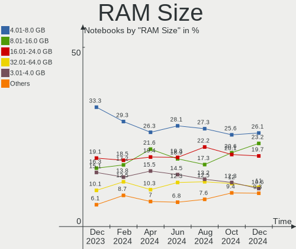
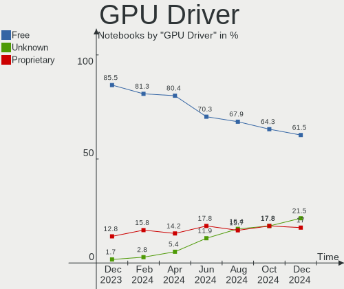
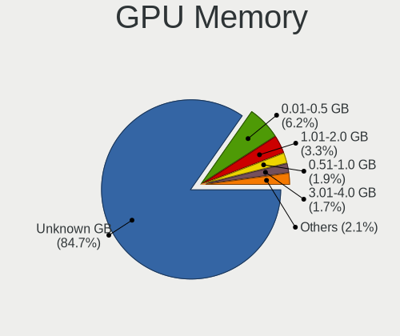

Ubuntu Hardware Trends (Notebook)
---------------------------------

A project to identify most popular hardware characteristics and track their change
over time based on data collected by Ubuntu users at https://Linux-Hardware.org.

Anyone can contribute to the study by uploading probes of their computers by
the [hw-probe](https://github.com/linuxhw/hw-probe) tool:

    sudo hw-probe -all -upload

Full-feature report is available here: https://linux-hardware.org/?view=trends&formfactor=notebook

Period: Feb, 2020.

Contents
--------

- [ OS                       ](#os)
- [ OS Family                ](#os-family)
- [ Kernel                   ](#kernel)
- [ Kernel Family            ](#kernel-family)
- [ Kernel Major Ver.        ](#kernel-major-ver)
- [ Arch                     ](#arch)
- [ DE                       ](#de)
- [ Display Server           ](#display-server)
- [ OS Lang                  ](#os-lang)
- [ Boot Mode                ](#boot-mode)
- [ Filesystem               ](#filesystem)
- [ Dual Boot with Linux     ](#dual-boot-with-linux)
- [ Dual Boot (Win)          ](#dual-boot-win)
- [ Country                  ](#country)
- [ City                     ](#city)
- [ Vendor                   ](#vendor)
- [ Model                    ](#model)
- [ Model Family             ](#model-family)
- [ MFG Year                 ](#mfg-year)
- [ Form Factor              ](#form-factor)
- [ Secure Boot              ](#secure-boot)
- [ Coreboot                 ](#coreboot)
- [ RAM Size                 ](#ram-size)
- [ RAM Used                 ](#ram-used)
- [ Drive Vendor             ](#drive-vendor)
- [ Drive Model              ](#drive-model)
- [ Drive Kind               ](#drive-kind)
- [ Drive Connector          ](#drive-connector)
- [ Drive Size               ](#drive-size)
- [ Space Total              ](#space-total)
- [ Space Used               ](#space-used)
- [ Malfunc. Drives          ](#malfunc-drives)
- [ Malfunc. Drive Vendor    ](#malfunc-drive-vendor)
- [ Malfunc. Drive Kind      ](#malfunc-drive-kind)
- [ Failed Drives            ](#failed-drives)
- [ Failed Drive Vendor      ](#failed-drive-vendor)
- [ Drive Status             ](#drive-status)
- [ Storage Vendor           ](#storage-vendor)
- [ Storage Model            ](#storage-model)
- [ Storage Kind             ](#storage-kind)
- [ CPU Vendor               ](#cpu-vendor)
- [ CPU Model                ](#cpu-model)
- [ CPU Model Family         ](#cpu-model-family)
- [ CPU Cores                ](#cpu-cores)
- [ CPU Sockets              ](#cpu-sockets)
- [ CPU Threads              ](#cpu-threads)
- [ CPU Op-Modes             ](#cpu-op-modes)
- [ CPU Microarch            ](#cpu-microarch)
- [ CPU Microcode            ](#cpu-microcode)
- [ GPU Vendor               ](#gpu-vendor)
- [ GPU Model                ](#gpu-model)
- [ GPU Combo                ](#gpu-combo)
- [ GPU Driver               ](#gpu-driver)
- [ GPU Memory               ](#gpu-memory)
- [ Monitor Vendor           ](#monitor-vendor)
- [ Monitor Model            ](#monitor-model)
- [ Monitor Resolution       ](#monitor-resolution)
- [ Monitor Diagonal         ](#monitor-diagonal)
- [ Monitor Width            ](#monitor-width)
- [ Aspect Ratio             ](#aspect-ratio)
- [ Monitor Area             ](#monitor-area)
- [ Pixel Density            ](#pixel-density)
- [ Multiple Monitors        ](#multiple-monitors)
- [ Net Controller Vendor    ](#net-controller-vendor)
- [ Net Controller Model     ](#net-controller-model)
- [ Net Controller Kind      ](#net-controller-kind)
- [ Used Controller          ](#used-controller)
- [ NICs                     ](#nics)
- [ Unsupported Devices      ](#unsupported-devices)
- [ Unsupported Device Types ](#unsupported-device-types)

OS
--

Installed operating systems

| Name         | Computers | Percent |
|--------------|-----------|---------|
| Ubuntu 18.04 | 373       | 56.43%  |
| Ubuntu 19.10 | 232       | 35.1%   |
| Ubuntu 16.04 | 18        | 2.72%   |
| Ubuntu 19.04 | 17        | 2.57%   |
| Ubuntu 20.04 | 15        | 2.27%   |
| Ubuntu       | 3         | 0.45%   |
| Ubuntu 18.10 | 2         | 0.3%    |
| Ubuntu 17.10 | 1         | 0.15%   |

OS Family
---------

OS without a version

| Name   | Computers | Percent |
|--------|-----------|---------|
| Ubuntu | 661       | 100%    |

Kernel
------

Version of the Linux kernel

| Version               | Computers | Percent |
|-----------------------|-----------|---------|
| 5.3.0-40-generic      | 164       | 24.81%  |
| 5.3.0-28-generic      | 137       | 20.73%  |
| 5.3.0-29-generic      | 99        | 14.98%  |
| 4.15.0-76-generic     | 49        | 7.41%   |
| 4.15.0-88-generic     | 25        | 3.78%   |
| 5.3.0-18-generic      | 24        | 3.63%   |
| 5.0.0-23-generic      | 22        | 3.33%   |
| 5.3.0-26-generic      | 12        | 1.82%   |
| 5.3.0-41-generic      | 10        | 1.51%   |
| 5.0.0-38-generic      | 10        | 1.51%   |
| 4.15.0-74-generic     | 9         | 1.36%   |
| 5.4.0-14-generic      | 6         | 0.91%   |
| 5.4.0-12-generic      | 5         | 0.76%   |
| 5.0.0-37-generic      | 5         | 0.76%   |
| 5.0.0-13-generic      | 5         | 0.76%   |
| 4.4.0-173-generic     | 5         | 0.76%   |
| 5.3.0-29-lowlatency   | 4         | 0.61%   |
| 5.0.0-31-generic      | 4         | 0.61%   |
| 5.5.2-050502-generic  | 3         | 0.45%   |
| 4.18.0-25-generic     | 3         | 0.45%   |
| 4.15.0-87-generic     | 3         | 0.45%   |
| 4.15.0-29-generic     | 3         | 0.45%   |
| 5.3.0-42-generic      | 2         | 0.3%    |
| 5.3.0-40-lowlatency   | 2         | 0.3%    |
| 5.3.0-24-generic      | 2         | 0.3%    |
| 5.3.0-18-lowlatency   | 2         | 0.3%    |
| 5.0.0-36-generic      | 2         | 0.3%    |
| 4.8.0-36-generic      | 2         | 0.3%    |
| 4.18.0-15-generic     | 2         | 0.3%    |
| 4.15.0-1067-oem       | 2         | 0.3%    |
| 5.5.6-050506-generic  | 1         | 0.15%   |
| 5.5.5-050505-generic  | 1         | 0.15%   |
| 5.5.1-050501-generic  | 1         | 0.15%   |
| 5.5.0-rc7             | 1         | 0.15%   |
| 5.4.16-xanmod9        | 1         | 0.15%   |
| 5.4.0-9-generic       | 1         | 0.15%   |
| 5.4.0-13-generic      | 1         | 0.15%   |
| 5.4.0-050400-generic  | 1         | 0.15%   |
| 5.3.8-050308-generic  | 1         | 0.15%   |
| 5.3.18-050318-generic | 1         | 0.15%   |
| 5.3.0-41-lowlatency   | 1         | 0.15%   |
| 5.2.2-050202-generic  | 1         | 0.15%   |
| 5.0.0-16-lowlatency   | 1         | 0.15%   |
| 5.0.0-1037-oem-osp1   | 1         | 0.15%   |
| 4.4.0-174-generic     | 1         | 0.15%   |
| 4.4.0-171-generic     | 1         | 0.15%   |
| 4.18.0-25-lowlatency  | 1         | 0.15%   |
| 4.18.0-17-generic     | 1         | 0.15%   |
| 4.18.0-10-generic     | 1         | 0.15%   |
| 4.16.18-pa2-2bp1      | 1         | 0.15%   |
| 4.16.18-galliumos     | 1         | 0.15%   |
| 4.15.0-90-generic     | 1         | 0.15%   |
| 4.15.0-89-generic     | 1         | 0.15%   |
| 4.15.0-88-lowlatency  | 1         | 0.15%   |
| 4.15.0-76-lowlatency  | 1         | 0.15%   |
| 4.15.0-72-generic     | 1         | 0.15%   |
| 4.15.0-66-generic     | 1         | 0.15%   |
| 4.15.0-64-generic     | 1         | 0.15%   |
| 4.15.0-51-generic     | 1         | 0.15%   |
| 4.15.0-45-generic     | 1         | 0.15%   |

Kernel Family
-------------

Linux kernel without a distro release

| Version | Computers | Percent |
|---------|-----------|---------|
| 5.3.0   | 459       | 69.44%  |
| 4.15.0  | 106       | 16.04%  |
| 5.0.0   | 50        | 7.56%   |
| 5.4.0   | 14        | 2.12%   |
| 4.18.0  | 8         | 1.21%   |
| 4.4.0   | 7         | 1.06%   |
| 5.5.2   | 3         | 0.45%   |
| 4.8.0   | 2         | 0.3%    |
| 4.16.18 | 2         | 0.3%    |
| 5.5.6   | 1         | 0.15%   |
| 5.5.5   | 1         | 0.15%   |
| 5.5.1   | 1         | 0.15%   |
| 5.5.0   | 1         | 0.15%   |
| 5.4.16  | 1         | 0.15%   |
| 5.3.8   | 1         | 0.15%   |
| 5.3.18  | 1         | 0.15%   |
| 5.2.2   | 1         | 0.15%   |
| 4.13.0  | 1         | 0.15%   |
| 4.10.0  | 1         | 0.15%   |

Kernel Major Ver.
-----------------

Linux kernel major version

| Version | Computers | Percent |
|---------|-----------|---------|
| 5.3     | 461       | 69.74%  |
| 4.15    | 106       | 16.04%  |
| 5.0     | 50        | 7.56%   |
| 5.4     | 15        | 2.27%   |
| 4.18    | 8         | 1.21%   |
| 5.5     | 7         | 1.06%   |
| 4.4     | 7         | 1.06%   |
| 4.8     | 2         | 0.3%    |
| 4.16    | 2         | 0.3%    |
| 5.2     | 1         | 0.15%   |
| 4.13    | 1         | 0.15%   |
| 4.10    | 1         | 0.15%   |

Arch
----

OS architecture (x86_64, i586, etc.)

| Name   | Computers | Percent |
|--------|-----------|---------|
| x86_64 | 629       | 95.16%  |
| i686   | 32        | 4.84%   |

DE
--

Desktop Environment

| Name            | Computers | Percent |
|-----------------|-----------|---------|
| GNOME           | 445       | 67.32%  |
| Unknown         | 77        | 11.65%  |
| XFCE            | 43        | 6.51%   |
| Unity           | 22        | 3.33%   |
| KDE             | 22        | 3.33%   |
| MATE            | 12        | 1.82%   |
| LXQt            | 9         | 1.36%   |
| GNOME Flashback | 8         | 1.21%   |
| LXDE            | 5         | 0.76%   |
| Budgie          | 5         | 0.76%   |
| Openbox         | 3         | 0.45%   |
| KDE5            | 3         | 0.45%   |
| i3              | 2         | 0.3%    |
| Cinnamon        | 2         | 0.3%    |
| xubuntu         | 1         | 0.15%   |
| X-Cinnamon      | 1         | 0.15%   |
| Lubuntu         | 1         | 0.15%   |

Display Server
--------------

X11 or Wayland

| Name    | Computers | Percent |
|---------|-----------|---------|
| X11     | 600       | 90.77%  |
| Unknown | 41        | 6.2%    |
| Wayland | 20        | 3.03%   |

OS Lang
-------

Language

| Lang    | Computers | Percent |
|---------|-----------|---------|
| en_US   | 249       | 37.67%  |
| de_DE   | 51        | 7.72%   |
| pt_BR   | 37        | 5.6%    |
| ru_RU   | 30        | 4.54%   |
| en_GB   | 30        | 4.54%   |
| fr_FR   | 23        | 3.48%   |
| en_IN   | 21        | 3.18%   |
| Unknown | 19        | 2.87%   |
| it_IT   | 18        | 2.72%   |
| es_ES   | 18        | 2.72%   |
| en_CA   | 18        | 2.72%   |
| C       | 16        | 2.42%   |
| en_AU   | 13        | 1.97%   |
| pl_PL   | 11        | 1.66%   |
| es_MX   | 11        | 1.66%   |
| en_ZA   | 6         | 0.91%   |
| tr_TR   | 5         | 0.76%   |
| ru_UA   | 5         | 0.76%   |
| es_AR   | 5         | 0.76%   |
| cs_CZ   | 5         | 0.76%   |
| sv_SE   | 4         | 0.61%   |
| pt_PT   | 4         | 0.61%   |
| es_CO   | 4         | 0.61%   |
| es_CL   | 4         | 0.61%   |
| sk_SK   | 3         | 0.45%   |
| nl_NL   | 3         | 0.45%   |
| ja_JP   | 3         | 0.45%   |
| hu_HU   | 3         | 0.45%   |
| da_DK   | 3         | 0.45%   |
| bg_BG   | 3         | 0.45%   |
| zh_TW   | 2         | 0.3%    |
| fi_FI   | 2         | 0.3%    |
| es_VE   | 2         | 0.3%    |
| es_SV   | 2         | 0.3%    |
| es_PE   | 2         | 0.3%    |
| en_IE   | 2         | 0.3%    |
| ca_ES   | 2         | 0.3%    |
| zh_CN   | 1         | 0.15%   |
| uk_UA   | 1         | 0.15%   |
| ro_RO   | 1         | 0.15%   |
| nn_NO   | 1         | 0.15%   |
| nl_BE   | 1         | 0.15%   |
| nb_NO   | 1         | 0.15%   |
| lv_LV   | 1         | 0.15%   |
| lt_LT   | 1         | 0.15%   |
| ko_KR   | 1         | 0.15%   |
| is_IS   | 1         | 0.15%   |
| he_IL   | 1         | 0.15%   |
| fr_CA   | 1         | 0.15%   |
| es_UY   | 1         | 0.15%   |
| es_EC   | 1         | 0.15%   |
| es_DO   | 1         | 0.15%   |
| es_CR   | 1         | 0.15%   |
| en_PH   | 1         | 0.15%   |
| en_NZ   | 1         | 0.15%   |
| en_IL   | 1         | 0.15%   |
| el_GR   | 1         | 0.15%   |
| de_CH   | 1         | 0.15%   |
| de_AT   | 1         | 0.15%   |

Boot Mode
---------

EFI or BIOS

| Mode | Computers | Percent |
|------|-----------|---------|
| BIOS | 339       | 51.29%  |
| EFI  | 322       | 48.71%  |

Filesystem
----------

Type of filesystem

| Type     | Computers | Percent |
|----------|-----------|---------|
| Ext4     | 623       | 94.25%  |
| Overlay  | 21        | 3.18%   |
| Zfs      | 8         | 1.21%   |
| Btrfs    | 5         | 0.76%   |
| Ext3     | 2         | 0.3%    |
| Reiserfs | 1         | 0.15%   |
| Aufs     | 1         | 0.15%   |

Dual Boot with Linux
--------------------

Hosting more than one Linux

| Dual boot | Computers | Percent |
|-----------|-----------|---------|
| No        | 611       | 92.44%  |
| Yes       | 50        | 7.56%   |

Dual Boot (Win)
---------------

Hosting Linux and Windows

| Dual boot | Computers | Percent |
|-----------|-----------|---------|
| No        | 423       | 63.99%  |
| Yes       | 238       | 36.01%  |

Country
-------

Geographic location (country)

| Country        | Computers | Percent |
|----------------|-----------|---------|
| USA            | 100       | 15.13%  |
| Germany        | 63        | 9.53%   |
| Brazil         | 46        | 6.96%   |
| Russia         | 32        | 4.84%   |
| France         | 26        | 3.93%   |
| Italy          | 25        | 3.78%   |
| UK             | 24        | 3.63%   |
| India          | 24        | 3.63%   |
| Canada         | 24        | 3.63%   |
| Spain          | 20        | 3.03%   |
| Ukraine        | 19        | 2.87%   |
| Mexico         | 15        | 2.27%   |
| Australia      | 14        | 2.12%   |
| Poland         | 13        | 1.97%   |
| Turkey         | 10        | 1.51%   |
| Sweden         | 9         | 1.36%   |
| China          | 8         | 1.21%   |
| South Africa   | 7         | 1.06%   |
| Netherlands    | 7         | 1.06%   |
| Bulgaria       | 7         | 1.06%   |
| Argentina      | 7         | 1.06%   |
| Norway         | 6         | 0.91%   |
| Denmark        | 6         | 0.91%   |
| Switzerland    | 5         | 0.76%   |
| Romania        | 5         | 0.76%   |
| Ireland        | 5         | 0.76%   |
| Indonesia      | 5         | 0.76%   |
| Greece         | 5         | 0.76%   |
| Finland        | 5         | 0.76%   |
| Czech Republic | 5         | 0.76%   |
| Colombia       | 5         | 0.76%   |
| Austria        | 5         | 0.76%   |
| Singapore      | 4         | 0.61%   |
| Portugal       | 4         | 0.61%   |
| Japan          | 4         | 0.61%   |
| Israel         | 4         | 0.61%   |
| Hungary        | 4         | 0.61%   |
| Chile          | 4         | 0.61%   |
| Belgium        | 4         | 0.61%   |
| Belarus        | 4         | 0.61%   |
| UAE            | 3         | 0.45%   |
| Slovakia       | 3         | 0.45%   |
| Serbia         | 3         | 0.45%   |
| Peru           | 3         | 0.45%   |
| Iran           | 3         | 0.45%   |
| Venezuela      | 2         | 0.3%    |
| Thailand       | 2         | 0.3%    |
| Taiwan         | 2         | 0.3%    |
| Sri Lanka      | 2         | 0.3%    |
| Philippines    | 2         | 0.3%    |
| New Zealand    | 2         | 0.3%    |
| Morocco        | 2         | 0.3%    |
| Lithuania      | 2         | 0.3%    |
| Latvia         | 2         | 0.3%    |
| Kazakhstan     | 2         | 0.3%    |
| Hong Kong      | 2         | 0.3%    |
| El Salvador    | 2         | 0.3%    |
| Egypt          | 2         | 0.3%    |
| Ecuador        | 2         | 0.3%    |
| Bangladesh     | 2         | 0.3%    |

City
----

Geographic location (city)

| City              | Computers | Percent |
|-------------------|-----------|---------|
| Moscow            | 9         | 1.36%   |
| Kyiv              | 8         | 1.21%   |
| Berlin            | 7         | 1.06%   |
| Rome              | 6         | 0.91%   |
| Warsaw            | 5         | 0.76%   |
| St Petersburg     | 5         | 0.76%   |
| Sofia             | 5         | 0.76%   |
| Istanbul          | 5         | 0.76%   |
| Bengaluru         | 5         | 0.76%   |
| São Paulo        | 4         | 0.61%   |
| Singapore         | 4         | 0.61%   |
| Mexico City       | 4         | 0.61%   |
| Johannesburg      | 4         | 0.61%   |
| Frankfurt am Main | 4         | 0.61%   |
| Dublin            | 4         | 0.61%   |
| Bogotá           | 4         | 0.61%   |
| Vienna            | 3         | 0.45%   |
| Toronto           | 3         | 0.45%   |
| Santiago          | 3         | 0.45%   |
| Paris             | 3         | 0.45%   |
| Minsk             | 3         | 0.45%   |
| Lima              | 3         | 0.45%   |
| Kolkata           | 3         | 0.45%   |
| Budapest          | 3         | 0.45%   |
| Belgrade          | 3         | 0.45%   |
| Barcelona         | 3         | 0.45%   |
| Athens            | 3         | 0.45%   |
| Yekaterinburg     | 2         | 0.3%    |
| Winnipeg          | 2         | 0.3%    |
| Vitória          | 2         | 0.3%    |
| Vilnius           | 2         | 0.3%    |
| Tehran            | 2         | 0.3%    |
| Taipei            | 2         | 0.3%    |
| Shepherds Bush    | 2         | 0.3%    |
| Shanghai          | 2         | 0.3%    |
| Seattle           | 2         | 0.3%    |
| San Francisco     | 2         | 0.3%    |
| Samara            | 2         | 0.3%    |
| Saitama           | 2         | 0.3%    |
| Roehampton        | 2         | 0.3%    |
| Rio de Janeiro    | 2         | 0.3%    |
| Riga              | 2         | 0.3%    |
| Quito             | 2         | 0.3%    |
| Ottawa            | 2         | 0.3%    |
| Oslo              | 2         | 0.3%    |
| Orlando           | 2         | 0.3%    |
| Orenburg          | 2         | 0.3%    |
| Nuremberg         | 2         | 0.3%    |
| New Delhi         | 2         | 0.3%    |
| Munich            | 2         | 0.3%    |
| Mumbai            | 2         | 0.3%    |
| Montreal          | 2         | 0.3%    |
| Monterrey         | 2         | 0.3%    |
| Minneapolis       | 2         | 0.3%    |
| Manaus            | 2         | 0.3%    |
| Malmo             | 2         | 0.3%    |
| Ludwigsburg       | 2         | 0.3%    |
| Krakow            | 2         | 0.3%    |
| Kingston          | 2         | 0.3%    |
| Kharkiv           | 2         | 0.3%    |

Vendor
------

Motherboard manufacturer

| Name                | Computers | Percent |
|---------------------|-----------|---------|
| Hewlett-Packard     | 151       | 22.84%  |
| Lenovo              | 129       | 19.52%  |
| Dell                | 123       | 18.61%  |
| ASUSTek Computer    | 67        | 10.14%  |
| Acer                | 66        | 9.98%   |
| Toshiba             | 25        | 3.78%   |
| Apple               | 14        | 2.12%   |
| MSI                 | 11        | 1.66%   |
| Samsung Electronics | 9         | 1.36%   |
| Sony                | 6         | 0.91%   |
| HUAWEI              | 6         | 0.91%   |
| Timi                | 4         | 0.61%   |
| LG Electronics      | 4         | 0.61%   |
| Fujitsu             | 3         | 0.45%   |
| Alienware           | 3         | 0.45%   |
| Unknown             | 3         | 0.45%   |
| Positivo            | 2         | 0.3%    |
| PC Specialist       | 2         | 0.3%    |
| Notebook            | 2         | 0.3%    |
| Medion              | 2         | 0.3%    |
| Google              | 2         | 0.3%    |
| Clevo               | 2         | 0.3%    |
| Wortmann AG         | 1         | 0.15%   |
| VULCAN              | 1         | 0.15%   |
| TUXEDO              | 1         | 0.15%   |
| TrekStor            | 1         | 0.15%   |
| Thomson             | 1         | 0.15%   |
| SLIMBOOK            | 1         | 0.15%   |
| SHARP               | 1         | 0.15%   |
| Schenker            | 1         | 0.15%   |
| Razer               | 1         | 0.15%   |
| Prestigio           | 1         | 0.15%   |
| Panasonic           | 1         | 0.15%   |
| Packard Bell        | 1         | 0.15%   |
| OriginPC            | 1         | 0.15%   |
| GIADA               | 1         | 0.15%   |
| Gateway             | 1         | 0.15%   |
| Fujitsu Siemens     | 1         | 0.15%   |
| Exo                 | 1         | 0.15%   |
| ECS                 | 1         | 0.15%   |
| Digma               | 1         | 0.15%   |
| CyberPowerPC        | 1         | 0.15%   |
| Complet             | 1         | 0.15%   |
| Compaq              | 1         | 0.15%   |
| Chuwi               | 1         | 0.15%   |
| Bangho              | 1         | 0.15%   |
| Alcor               | 1         | 0.15%   |

Model
-----

Motherboard model

| Name                                  | Computers | Percent |
|---------------------------------------|-----------|---------|
| HP Pavilion dv6                       | 7         | 1.06%   |
| Unknown                               | 7         | 1.06%   |
| Dell Latitude E6430                   | 6         | 0.91%   |
| HP Laptop 15-bs0xx                    | 5         | 0.76%   |
| HP Pavilion Gaming Laptop 15-cx0xxx   | 4         | 0.61%   |
| HP Notebook                           | 4         | 0.61%   |
| HP 15                                 | 4         | 0.61%   |
| Dell XPS 13 9360                      | 4         | 0.61%   |
| Dell Latitude E6440                   | 4         | 0.61%   |
| Dell Inspiron 15-3567                 | 4         | 0.61%   |
| Dell Inspiron 15 7000 Gaming          | 4         | 0.61%   |
| ASUS 1005HA                           | 4         | 0.61%   |
| Lenovo IdeaPad L340-15IRH Gaming 81LK | 3         | 0.45%   |
| Lenovo IdeaPad 330-15IKB 81DE         | 3         | 0.45%   |
| HP Pavilion g7                        | 3         | 0.45%   |
| HP Pavilion g6                        | 3         | 0.45%   |
| HP Pavilion dv7                       | 3         | 0.45%   |
| HP Laptop 15-db0xxx                   | 3         | 0.45%   |
| HP Laptop 15-bs1xx                    | 3         | 0.45%   |
| HP G62                                | 3         | 0.45%   |
| HP Compaq Presario CQ60               | 3         | 0.45%   |
| Dell Precision 5540                   | 3         | 0.45%   |
| Toshiba Satellite L305                | 2         | 0.3%    |
| Samsung Electronics 275E4E/275E5E     | 2         | 0.3%    |
| Positivo Mobile                       | 2         | 0.3%    |
| Lenovo Z50-75 80EC                    | 2         | 0.3%    |
| Lenovo Yoga 3 Pro-1370 80HE           | 2         | 0.3%    |
| Lenovo Y50-70 20378                   | 2         | 0.3%    |
| Lenovo ThinkBook 15-IML 20RW          | 2         | 0.3%    |
| Lenovo ThinkBook 13s-IML 20RR         | 2         | 0.3%    |
| Lenovo IdeaPad 520-15IKB 81BF         | 2         | 0.3%    |
| Lenovo IdeaPad 330-15IGM 81D1         | 2         | 0.3%    |
| HUAWEI MACH-WX9                       | 2         | 0.3%    |
| HUAWEI KPRC-WX0                       | 2         | 0.3%    |
| HP ProBook 450 G4                     | 2         | 0.3%    |
| HP Pavilion Laptop 15-cw0xxx          | 2         | 0.3%    |
| HP Pavilion g4                        | 2         | 0.3%    |
| HP Laptop 15-dw0xxx                   | 2         | 0.3%    |
| HP Laptop 15-da0xxx                   | 2         | 0.3%    |
| HP Laptop 15-bw0xx                    | 2         | 0.3%    |
| HP Laptop 14-dk0xxx                   | 2         | 0.3%    |
| HP EliteBook 8440p                    | 2         | 0.3%    |
| HP EliteBook 840 G2                   | 2         | 0.3%    |
| HP EliteBook 840 G1                   | 2         | 0.3%    |
| HP Compaq Presario CQ50               | 2         | 0.3%    |
| Dell XPS L702X                        | 2         | 0.3%    |
| Dell Studio 1747                      | 2         | 0.3%    |
| Dell Precision 7530                   | 2         | 0.3%    |
| Dell Latitude E7240                   | 2         | 0.3%    |
| Dell Latitude E6420                   | 2         | 0.3%    |
| Dell Latitude D630                    | 2         | 0.3%    |
| Dell Latitude 5500                    | 2         | 0.3%    |
| Dell Latitude 5400                    | 2         | 0.3%    |
| Dell Inspiron N4050                   | 2         | 0.3%    |
| Dell Inspiron 5748                    | 2         | 0.3%    |
| Dell Inspiron 5590                    | 2         | 0.3%    |
| Dell Inspiron 3593                    | 2         | 0.3%    |
| Dell Inspiron 1545                    | 2         | 0.3%    |
| Dell Inspiron 13-5378                 | 2         | 0.3%    |
| ASUS X541UAK                          | 2         | 0.3%    |

Model Family
------------

Motherboard model prefix

| Name                       | Computers | Percent |
|----------------------------|-----------|---------|
| Lenovo ThinkPad            | 63        | 9.53%   |
| Acer Aspire                | 52        | 7.87%   |
| Dell Inspiron              | 46        | 6.96%   |
| Dell Latitude              | 36        | 5.45%   |
| Lenovo IdeaPad             | 34        | 5.14%   |
| HP Pavilion                | 33        | 4.99%   |
| HP Laptop                  | 25        | 3.78%   |
| HP ProBook                 | 23        | 3.48%   |
| HP EliteBook               | 22        | 3.33%   |
| Toshiba Satellite          | 20        | 3.03%   |
| Dell Precision             | 15        | 2.27%   |
| Dell XPS                   | 12        | 1.82%   |
| HP Compaq                  | 8         | 1.21%   |
| Unknown                    | 7         | 1.06%   |
| Dell Vostro                | 6         | 0.91%   |
| Lenovo ThinkBook           | 5         | 0.76%   |
| HP 15                      | 5         | 0.76%   |
| HP ZBook                   | 4         | 0.61%   |
| HP Notebook                | 4         | 0.61%   |
| HP ENVY                    | 4         | 0.61%   |
| Dell Studio                | 4         | 0.61%   |
| ASUS 1005HA                | 4         | 0.61%   |
| Acer Nitro                 | 4         | 0.61%   |
| Lenovo Yoga                | 3         | 0.45%   |
| HP G62                     | 3         | 0.45%   |
| Fujitsu LIFEBOOK           | 3         | 0.45%   |
| ASUS ZenBook               | 3         | 0.45%   |
| ASUS VivoBook              | 3         | 0.45%   |
| ASUS TUF                   | 3         | 0.45%   |
| Apple MacBookPro14         | 3         | 0.45%   |
| Acer TravelMate            | 3         | 0.45%   |
| Samsung Electronics 275E4E | 2         | 0.3%    |
| Positivo Mobile            | 2         | 0.3%    |
| Lenovo Z50-75              | 2         | 0.3%    |
| Lenovo Y50-70              | 2         | 0.3%    |
| Lenovo Legion              | 2         | 0.3%    |
| HUAWEI MACH-WX9            | 2         | 0.3%    |
| HUAWEI KPRC-WX0            | 2         | 0.3%    |
| HP Stream                  | 2         | 0.3%    |
| HP Presario                | 2         | 0.3%    |
| HP Mini                    | 2         | 0.3%    |
| HP 240                     | 2         | 0.3%    |
| ASUS X541UAK               | 2         | 0.3%    |
| ASUS K53SV                 | 2         | 0.3%    |
| ASUS GL753VD               | 2         | 0.3%    |
| ASUS E200HA                | 2         | 0.3%    |
| ASUS 1015B                 | 2         | 0.3%    |
| Apple MacBookPro8          | 2         | 0.3%    |
| Apple MacBookPro7          | 2         | 0.3%    |
| Apple MacBookPro5          | 2         | 0.3%    |
| Acer ConceptD              | 2         | 0.3%    |
| Wortmann AG TERRA          | 1         | 0.15%   |
| VULCAN JinGang             | 1         | 0.15%   |
| TrekStor Surfbook          | 1         | 0.15%   |
| Toshiba TECRA              | 1         | 0.15%   |
| Toshiba Qosmio             | 1         | 0.15%   |
| Toshiba PORTEGE            | 1         | 0.15%   |
| Toshiba EQUIUM             | 1         | 0.15%   |
| Toshiba dynabook           | 1         | 0.15%   |
| Timi TM1709                | 1         | 0.15%   |

MFG Year
--------

Motherboard manufacture year

| Year | Computers | Percent |
|------|-----------|---------|
| 2019 | 201       | 30.41%  |
| 2018 | 71        | 10.74%  |
| 2011 | 60        | 9.08%   |
| 2012 | 54        | 8.17%   |
| 2017 | 43        | 6.51%   |
| 2013 | 41        | 6.2%    |
| 2015 | 38        | 5.75%   |
| 2014 | 33        | 4.99%   |
| 2009 | 32        | 4.84%   |
| 2010 | 31        | 4.69%   |
| 2008 | 21        | 3.18%   |
| 2016 | 19        | 2.87%   |
| 2007 | 8         | 1.21%   |
| 2006 | 4         | 0.61%   |
| 2005 | 3         | 0.45%   |
| 2020 | 2         | 0.3%    |

Form Factor
-----------

Physical design of the computer

| Name     | Computers | Percent |
|----------|-----------|---------|
| Notebook | 661       | 100%    |

Secure Boot
-----------

Enabled or disabled

| State    | Computers | Percent |
|----------|-----------|---------|
| Disabled | 566       | 85.63%  |
| Enabled  | 95        | 14.37%  |

Coreboot
--------

Have coreboot on board

| Used | Computers | Percent |
|------|-----------|---------|
| No   | 659       | 99.7%   |
| Yes  | 2         | 0.3%    |

RAM Size
--------

Total RAM memory

| Size in GB  | Computers | Percent |
|-------------|-----------|---------|
| 3.01-4.0    | 177       | 26.78%  |
| 4.01-8.0    | 171       | 25.87%  |
| 8.01-16.0   | 107       | 16.19%  |
| 16.01-24.0  | 99        | 14.98%  |
| 1.01-2.0    | 48        | 7.26%   |
| 32.01-64.0  | 26        | 3.93%   |
| 2.01-3.0    | 15        | 2.27%   |
| 0.01-1.0    | 11        | 1.66%   |
| 24.01-32.0  | 4         | 0.61%   |
| 64.01-256.0 | 3         | 0.45%   |

RAM Used
--------

Used RAM memory

| Used GB    | Computers | Percent |
|------------|-----------|---------|
| 1.01-2.0   | 281       | 42.51%  |
| 2.01-3.0   | 187       | 28.29%  |
| 4.01-8.0   | 63        | 9.53%   |
| 3.01-4.0   | 63        | 9.53%   |
| 0.01-1.0   | 54        | 8.17%   |
| 8.01-16.0  | 12        | 1.82%   |
| 16.01-24.0 | 1         | 0.15%   |

Drive Vendor
------------

Hard drive vendors

| Vendor              | Computers | Drives | Percent |
|---------------------|-----------|--------|---------|
| Seagate             | 135       | 135    | 19.82%  |
| WDC                 | 96        | 98     | 14.1%   |
| Toshiba             | 76        | 77     | 11.16%  |
| Samsung Electronics | 64        | 67     | 9.4%    |
| Hitachi             | 45        | 45     | 6.61%   |
| Kingston            | 41        | 42     | 6.02%   |
| HGST                | 36        | 37     | 5.29%   |
| Unknown             | 34        | 40     | 4.99%   |
| SanDisk             | 31        | 32     | 4.55%   |
| Crucial             | 23        | 23     | 3.38%   |
| Intel               | 14        | 14     | 2.06%   |
| A-DATA Technology   | 10        | 10     | 1.47%   |
| SK Hynix            | 8         | 8      | 1.17%   |
| LITEON              | 6         | 6      | 0.88%   |
| Micron Technology   | 5         | 5      | 0.73%   |
| China               | 5         | 5      | 0.73%   |
| PNY                 | 4         | 4      | 0.59%   |
| OCZ                 | 4         | 4      | 0.59%   |
| Fujitsu             | 4         | 4      | 0.59%   |
| Apple               | 4         | 4      | 0.59%   |
| Transcend           | 3         | 3      | 0.44%   |
| SPCC                | 3         | 3      | 0.44%   |
| Team                | 2         | 2      | 0.29%   |
| ShineDisk           | 2         | 3      | 0.29%   |
| Phison              | 2         | 2      | 0.29%   |
| Intenso             | 2         | 2      | 0.29%   |
| GOODRAM             | 2         | 2      | 0.29%   |
| Apacer              | 2         | 2      | 0.29%   |
| WDC WD20            | 1         | 1      | 0.15%   |
| USB                 | 1         | 1      | 0.15%   |
| Smartbuy            | 1         | 1      | 0.15%   |
| SMART               | 1         | 1      | 0.15%   |
| SABRENT             | 1         | 2      | 0.15%   |
| PLEXTOR             | 1         | 1      | 0.15%   |
| Patriot             | 1         | 1      | 0.15%   |
| LITEONIT            | 1         | 1      | 0.15%   |
| KESU                | 1         | 1      | 0.15%   |
| JMicron             | 1         | 1      | 0.15%   |
| INDMEM              | 1         | 1      | 0.15%   |
| IM2S3138            | 1         | 1      | 0.15%   |
| HL-DT-ST            | 1         | 1      | 0.15%   |
| Hewlett-Packard     | 1         | 1      | 0.15%   |
| GeIL                | 1         | 1      | 0.15%   |
| Corsair             | 1         | 1      | 0.15%   |
| ASMT                | 1         | 1      | 0.15%   |
| Acer                | 1         | 1      | 0.15%   |

Drive Model
-----------

Hard drive models

| Model                       | Computers | Percent |
|-----------------------------|-----------|---------|
| ST1000LM035-1RK172 1TB      | 20        | 2.89%   |
| ST1000LM024 HN-M101MBB 1TB  | 17        | 2.46%   |
| MQ01ABD100 1TB              | 17        | 2.46%   |
| MMC Card  32GB              | 15        | 2.17%   |
| SA400S37240G 240GB SSD      | 11        | 1.59%   |
| HTS721010A9E630 1TB         | 10        | 1.45%   |
| MMC Card  64GB              | 9         | 1.3%    |
| SV300S37A120G 120GB SSD     | 8         | 1.16%   |
| ST9500325AS 500GB           | 8         | 1.16%   |
| ST1000LM049-2GH172 1TB      | 8         | 1.16%   |
| HTS725050A7E630 500GB       | 8         | 1.16%   |
| CT500MX500SSD1 500GB        | 8         | 1.16%   |
| SSD 850 EVO 500GB           | 7         | 1.01%   |
| MQ04ABF100 1TB              | 7         | 1.01%   |
| WD10SPZX-21Z10T0 1TB        | 6         | 0.87%   |
| ST2000LM007-1R8174 2TB      | 6         | 0.87%   |
| HTS541010A9E680 1TB         | 6         | 0.87%   |
| WD5000LPCX-24VHAT0 500GB    | 5         | 0.72%   |
| ST500LT012-9WS142 500GB     | 5         | 0.72%   |
| SSD PLUS 240GB              | 5         | 0.72%   |
| SSD 860 EVO 250GB           | 5         | 0.72%   |
| HTS545050A7E680 500GB       | 5         | 0.72%   |
| WD10JPVX-60JC3T1 1TB        | 4         | 0.58%   |
| ST500LM021-1KJ152 500GB     | 4         | 0.58%   |
| ST500LM012 HN-M500MBB 500GB | 4         | 0.58%   |
| ST500LM000-1EJ162 500GB     | 4         | 0.58%   |
| SSD 850 EVO 250GB           | 4         | 0.58%   |
| SA400S37120G 120GB SSD      | 4         | 0.58%   |
| MQ01ABD075 752GB            | 4         | 0.58%   |
| HTS723232A7A364 320GB       | 4         | 0.58%   |
| HTS545050B9A300 500GB       | 4         | 0.58%   |
| HTS545050A7E380 500GB       | 4         | 0.58%   |
| HTS543232A7A384 320GB       | 4         | 0.58%   |
| CT480BX500SSD1 480GB        | 4         | 0.58%   |
| WD5000LPVX-22V0TT0 500GB    | 3         | 0.43%   |
| WD10SPZX-75Z10T2 1TB        | 3         | 0.43%   |
| WD10SPZX-24Z10T0 1TB        | 3         | 0.43%   |
| WD10JPVX-22JC3T0 1TB        | 3         | 0.43%   |
| SUV400S37240G 240GB SSD     | 3         | 0.43%   |
| ST500LT012-1DG142 500GB     | 3         | 0.43%   |
| ST320LT020-9YG142 320GB     | 3         | 0.43%   |
| SA400S37480G 480GB SSD      | 3         | 0.43%   |
| MQ02ABD100H 1TB             | 3         | 0.43%   |
| MQ01ABF050 500GB            | 3         | 0.43%   |
| MMC Card  16GB              | 3         | 0.43%   |
| HTS725050A9A364 500GB       | 3         | 0.43%   |
| HTS547575A9E384 752GB       | 3         | 0.43%   |
| HTS545032A7E380 320GB       | 3         | 0.43%   |
| HTS543216L9SA00 160GB       | 3         | 0.43%   |
| HDD HTS547550A9E384 500GB   | 3         | 0.43%   |
| Expansion 1TB               | 3         | 0.43%   |
| X400 2.5 7MM 256GB SSD      | 2         | 0.29%   |
| WD7500BPKT-75PK4T0 752GB    | 2         | 0.29%   |
| WD3200BEKT-60V5T1 320GB     | 2         | 0.29%   |
| WD3200BEKT-60PVMT0 320GB    | 2         | 0.29%   |
| WD2500BEKT-60V5T1 250GB     | 2         | 0.29%   |
| WD10SPZX-60Z10T0 1TB        | 2         | 0.29%   |
| WD10SPZX-24Z10 1TB          | 2         | 0.29%   |
| WD10JPCX-24UE4T0 1TB        | 2         | 0.29%   |
| WD10JFCX-68N6GN0 1TB        | 2         | 0.29%   |

Drive Kind
----------

HDD or SSD

| Kind    | Computers | Drives | Percent |
|---------|-----------|--------|---------|
| HDD     | 372       | 382    | 56.53%  |
| SSD     | 219       | 239    | 33.28%  |
| MMC     | 36        | 42     | 5.47%   |
| NVMe    | 21        | 23     | 3.19%   |
| Unknown | 10        | 12     | 1.52%   |

Drive Connector
---------------

SATA, SAS, NVMe, etc.

| Type | Computers | Drives | Percent |
|------|-----------|--------|---------|
| SATA | 540       | 613    | 87.66%  |
| MMC  | 36        | 42     | 5.84%   |
| NVMe | 21        | 23     | 3.41%   |
| SAS  | 19        | 20     | 3.08%   |

Drive Size
----------

Size of hard drive

| Size in TB | Computers | Drives | Percent |
|------------|-----------|--------|---------|
| 0.01-0.5   | 435       | 488    | 67.97%  |
| 0.51-1.0   | 183       | 186    | 28.59%  |
| 1.01-2.0   | 18        | 20     | 2.81%   |
| 3.01-4.0   | 3         | 3      | 0.47%   |
| 4.01-10.0  | 1         | 1      | 0.16%   |

Space Total
-----------

Amount of disk space available on the file system

| Size in GB     | Computers | Percent |
|----------------|-----------|---------|
| 101-250        | 233       | 35.25%  |
| 251-500        | 173       | 26.17%  |
| 501-1000       | 89        | 13.46%  |
| 51-100         | 55        | 8.32%   |
| 21-50          | 42        | 6.35%   |
| 1-20           | 29        | 4.39%   |
| 1001-2000      | 21        | 3.18%   |
| More than 3000 | 8         | 1.21%   |
| Unknown        | 6         | 0.91%   |
| 2001-3000      | 5         | 0.76%   |

Space Used
----------

Amount of used disk space

| Used GB        | Computers | Percent |
|----------------|-----------|---------|
| 1-20           | 347       | 52.5%   |
| 21-50          | 94        | 14.22%  |
| 101-250        | 76        | 11.5%   |
| 51-100         | 71        | 10.74%  |
| 251-500        | 36        | 5.45%   |
| 501-1000       | 22        | 3.33%   |
| Unknown        | 6         | 0.91%   |
| 2001-3000      | 4         | 0.61%   |
| 1001-2000      | 4         | 0.61%   |
| More than 3000 | 1         | 0.15%   |

Malfunc. Drives
---------------

Drive models with a malfunction

| Model                     | Computers | Drives | Percent |
|---------------------------|-----------|--------|---------|
| WD7500BPKT-75PK4T0 752GB  | 1         | 1      | 10%     |
| WD5000BEVT-60ZAT1 500GB   | 1         | 1      | 10%     |
| WD3200BEVT-75A23T0 320GB  | 1         | 1      | 10%     |
| WD3200BEKT-60PVMT0 320GB  | 1         | 1      | 10%     |
| ST2000LM007-1R8174 2TB    | 1         | 1      | 10%     |
| ST1000LM035-1RK172 1TB    | 1         | 1      | 10%     |
| HTS543225A7A384 250GB     | 1         | 1      | 10%     |
| HM160HI 160GB             | 1         | 1      | 10%     |
| HDD HTS547550A9E384 500GB | 1         | 1      | 10%     |
| CV8-8E128-HP 128GB SSD    | 1         | 1      | 10%     |

Malfunc. Drive Vendor
---------------------

Vendors of faulty drives

| Vendor              | Computers | Drives | Percent |
|---------------------|-----------|--------|---------|
| WDC                 | 4         | 4      | 40%     |
| Seagate             | 2         | 2      | 20%     |
| Samsung Electronics | 1         | 1      | 10%     |
| LITEON              | 1         | 1      | 10%     |
| Hitachi             | 1         | 1      | 10%     |
| Apple               | 1         | 1      | 10%     |

Malfunc. Drive Kind
-------------------

Kinds of faulty drives

| Kind | Computers | Drives | Percent |
|------|-----------|--------|---------|
| HDD  | 9         | 9      | 90%     |
| SSD  | 1         | 1      | 10%     |

Failed Drives
-------------

Failed drive models

| Model             | Computers | Drives | Percent |
|-------------------|-----------|--------|---------|
| ST9500420AS 500GB | 1         | 1      | 100%    |

Failed Drive Vendor
-------------------

Failed drive vendors

| Vendor  | Computers | Drives | Percent |
|---------|-----------|--------|---------|
| Seagate | 1         | 1      | 100%    |

Drive Status
------------

Number of failed and malfunc. drives

| Status   | Computers | Drives | Percent |
|----------|-----------|--------|---------|
| Detected | 531       | 630    | 90.31%  |
| Works    | 46        | 57     | 7.82%   |
| Malfunc  | 10        | 10     | 1.7%    |
| Failed   | 1         | 1      | 0.17%   |

Storage Vendor
--------------

Storage controller vendors

| Vendor                           | Computers | Percent |
|----------------------------------|-----------|---------|
| Intel                            | 508       | 71.15%  |
| AMD                              | 78        | 10.92%  |
| Samsung Electronics              | 40        | 5.6%    |
| Sandisk                          | 20        | 2.8%    |
| Toshiba America Info Systems     | 14        | 1.96%   |
| Nvidia                           | 12        | 1.68%   |
| SK Hynix                         | 10        | 1.4%    |
| Phison Electronics               | 5         | 0.7%    |
| Lite-On Technology               | 5         | 0.7%    |
| Kingston Technology Company      | 5         | 0.7%    |
| Silicon Integrated Systems [SiS] | 4         | 0.56%   |
| Union Memory (Shenzhen)          | 3         | 0.42%   |
| Unknown                          | 2         | 0.28%   |
| Lenovo                           | 2         | 0.28%   |
| Apple                            | 2         | 0.28%   |
| ADATA Technology                 | 2         | 0.28%   |
| Silicon Motion                   | 1         | 0.14%   |
| Micron Technology                | 1         | 0.14%   |

Storage Model
-------------

Storage controller models

| Model                                                                            | Computers | Percent |
|----------------------------------------------------------------------------------|-----------|---------|
| Sunrise Point-LP SATA Controller [AHCI mode]                                     | 76        | 9.91%   |
| 82801 Mobile SATA Controller [RAID mode]                                         | 55        | 7.17%   |
| 7 Series Chipset Family 6-port SATA Controller [AHCI mode]                       | 50        | 6.52%   |
| FCH SATA Controller [AHCI mode]                                                  | 49        | 6.39%   |
| 6 Series/C200 Series Chipset Family 6 port Mobile SATA AHCI Controller           | 44        | 5.74%   |
| Non-Volatile memory controller                                                   | 35        | 4.56%   |
| Wildcat Point-LP SATA Controller [AHCI Mode]                                     | 28        | 3.65%   |
| Cannon Lake Mobile PCH SATA AHCI Controller                                      | 28        | 3.65%   |
| 82801IBM/IEM (ICH9M/ICH9M-E) 4 port SATA Controller [AHCI mode]                  | 23        | 3%      |
| SB7x0/SB8x0/SB9x0 SATA Controller [AHCI mode]                                    | 22        | 2.87%   |
| NVMe SSD Controller SM981/PM981/PM983                                            | 20        | 2.61%   |
| 8 Series/C220 Series Chipset Family 6-port SATA Controller 1 [AHCI mode]         | 20        | 2.61%   |
| 5 Series/3400 Series Chipset 4 port SATA AHCI Controller                         | 19        | 2.48%   |
| 8 Series SATA Controller 1 [AHCI mode]                                           | 18        | 2.35%   |
| 5 Series/3400 Series Chipset 6 port SATA AHCI Controller                         | 16        | 2.09%   |
| NVMe SSD Controller SM961/PM961                                                  | 14        | 1.83%   |
| HM170/QM170 Chipset SATA Controller [AHCI Mode]                                  | 12        | 1.56%   |
| Cannon Point-LP SATA Controller [AHCI Mode]                                      | 11        | 1.43%   |
| 82801HM/HEM (ICH8M/ICH8M-E) IDE Controller                                       | 11        | 1.43%   |
| SSD 660P Series                                                                  | 9         | 1.17%   |
| Comet Lake SATA AHCI Controller                                                  | 9         | 1.17%   |
| 82801HM/HEM (ICH8M/ICH8M-E) SATA Controller [AHCI mode]                          | 9         | 1.17%   |
| NM10/ICH7 Family SATA Controller [AHCI mode]                                     | 8         | 1.04%   |
| Toshiba America Info Non-Volatile memory controller                              | 7         | 0.91%   |
| SSD Pro 7600p/760p/E 6100p Series                                                | 7         | 0.91%   |
| Atom Processor E3800 Series SATA AHCI Controller                                 | 7         | 0.91%   |
| WD Black 2018/PC SN720 NVMe SSD                                                  | 6         | 0.78%   |
| WD Black 2018/PC SN520 NVMe SSD                                                  | 6         | 0.78%   |
| SATA controller                                                                  | 6         | 0.78%   |
| 82801GBM/GHM (ICH7-M Family) SATA Controller [AHCI mode]                         | 6         | 0.78%   |
| 82801G (ICH7 Family) IDE Controller                                              | 6         | 0.78%   |
| Q170/Q150/B150/H170/H110/Z170/CM236 Chipset SATA Controller [AHCI Mode]          | 5         | 0.65%   |
| Celeron N3350/Pentium N4200/Atom E3900 Series SATA AHCI Controller               | 5         | 0.65%   |
| BG3 NVMe SSD Controller                                                          | 5         | 0.65%   |
| 82801HM/HEM (ICH8M/ICH8M-E) SATA Controller [IDE mode]                           | 5         | 0.65%   |
| 82801GBM/GHM (ICH7-M Family) SATA Controller [IDE mode]                          | 5         | 0.65%   |
| MCP79 AHCI Controller                                                            | 4         | 0.52%   |
| MCP78S [GeForce 8200] SATA Controller (non-AHCI mode)                            | 4         | 0.52%   |
| MCP78S [GeForce 8200] IDE                                                        | 4         | 0.52%   |
| Electronics Non-Volatile memory controller                                       | 4         | 0.52%   |
| 82801IBM/IEM (ICH9M/ICH9M-E) 2 port SATA Controller [IDE mode]                   | 4         | 0.52%   |
| 7 Series Chipset Family 4-port SATA Controller [IDE mode]                        | 4         | 0.52%   |
| 7 Series Chipset Family 2-port SATA Controller [IDE mode]                        | 4         | 0.52%   |
| 5513 IDE Controller                                                              | 4         | 0.52%   |
| 5 Series/3400 Series Chipset 4 port SATA IDE Controller                          | 4         | 0.52%   |
| 5 Series/3400 Series Chipset 2 port SATA IDE Controller                          | 4         | 0.52%   |
| SB7x0/SB8x0/SB9x0 IDE Controller                                                 | 3         | 0.39%   |
| SB600 Non-Raid-5 SATA                                                            | 3         | 0.39%   |
| SB600 IDE                                                                        | 3         | 0.39%   |
| NVMe Storage Controller                                                          | 3         | 0.39%   |
| IXP SB4x0 Serial ATA Controller                                                  | 3         | 0.39%   |
| IXP SB4x0 IDE Controller                                                         | 3         | 0.39%   |
| Ice Lake-LP SATA Controller [AHCI mode]                                          | 3         | 0.39%   |
| 82801FB/FBM/FR/FW/FRW (ICH6 Family) IDE Controller                               | 3         | 0.39%   |
| 6 Series/C200 Series Chipset Family Mobile SATA Controller (IDE mode, ports 4-5) | 3         | 0.39%   |
| 6 Series/C200 Series Chipset Family Mobile SATA Controller (IDE mode, ports 0-3) | 3         | 0.39%   |
| Technology Company Non-Volatile memory controller                                | 2         | 0.26%   |
| SATA Controller / IDE mode                                                       | 2         | 0.26%   |
| S3X NVMe Controller                                                              | 2         | 0.26%   |
| MCP89 SATA Controller (AHCI mode)                                                | 2         | 0.26%   |

Storage Kind
------------

Kind of storage controller (IDE, SATA, NVMe, SAS, ...)

| Kind | Computers | Percent |
|------|-----------|---------|
| SATA | 491       | 66.53%  |
| NVMe | 125       | 16.94%  |
| IDE  | 65        | 8.81%   |
| RAID | 57        | 7.72%   |

CPU Vendor
----------

Processor vendors

| Vendor | Computers | Percent |
|--------|-----------|---------|
| Intel  | 566       | 85.63%  |
| AMD    | 95        | 14.37%  |

CPU Model
---------

Processor models

| Model                                         | Computers | Percent |
|-----------------------------------------------|-----------|---------|
| Intel Core i5-8250U CPU @ 1.60GHz             | 18        | 2.72%   |
| Intel Core i7-8550U CPU @ 1.80GHz             | 15        | 2.27%   |
| Intel Core i7-9750H CPU @ 2.60GHz             | 14        | 2.12%   |
| Intel Core i7-7500U CPU @ 2.70GHz             | 14        | 2.12%   |
| Intel Core i5-8265U CPU @ 1.60GHz             | 13        | 1.97%   |
| Intel Core i5-7200U CPU @ 2.50GHz             | 13        | 1.97%   |
| Intel Core i5-6200U CPU @ 2.30GHz             | 12        | 1.82%   |
| Intel Core i7-7700HQ CPU @ 2.80GHz            | 11        | 1.66%   |
| Intel Core i5-5200U CPU @ 2.20GHz             | 10        | 1.51%   |
| Intel Core i5-3320M CPU @ 2.60GHz             | 10        | 1.51%   |
| Intel Core i7-8565U CPU @ 1.80GHz             | 9         | 1.36%   |
| Intel Core i7-8750H CPU @ 2.20GHz             | 8         | 1.21%   |
| Intel Core i5-2430M CPU @ 2.40GHz             | 8         | 1.21%   |
| Intel Core i5-10210U CPU @ 1.60GHz            | 8         | 1.21%   |
| Intel Core i5-8300H CPU @ 2.30GHz             | 7         | 1.06%   |
| Intel Core i5-3210M CPU @ 2.50GHz             | 7         | 1.06%   |
| Intel Core i7-4510U CPU @ 2.00GHz             | 6         | 0.91%   |
| Intel Core i7-10510U CPU @ 1.80GHz            | 6         | 0.91%   |
| Intel Atom x5-Z8350 CPU @ 1.44GHz             | 6         | 0.91%   |
| Intel Core i7-9850H CPU @ 2.60GHz             | 5         | 0.76%   |
| Intel Core i7-3632QM CPU @ 2.20GHz            | 5         | 0.76%   |
| Intel Core i7-2670QM CPU @ 2.20GHz            | 5         | 0.76%   |
| Intel Core i7 CPU Q 720 @ 1.60GHz             | 5         | 0.76%   |
| Intel Core i5-3337U CPU @ 1.80GHz             | 5         | 0.76%   |
| Intel Core i5-2520M CPU @ 2.50GHz             | 5         | 0.76%   |
| Intel Core i3 CPU M 370 @ 2.40GHz             | 5         | 0.76%   |
| Intel Celeron CPU N3350 @ 1.10GHz             | 5         | 0.76%   |
| AMD Ryzen 5 3500U with Radeon Vega Mobile Gfx | 5         | 0.76%   |
| Intel Core i7-5600U CPU @ 2.60GHz             | 4         | 0.61%   |
| Intel Core i7-2630QM CPU @ 2.00GHz            | 4         | 0.61%   |
| Intel Core i5-4300U CPU @ 1.90GHz             | 4         | 0.61%   |
| Intel Core i5-3230M CPU @ 2.60GHz             | 4         | 0.61%   |
| Intel Core i5-2410M CPU @ 2.30GHz             | 4         | 0.61%   |
| Intel Core i5 CPU M 520 @ 2.40GHz             | 4         | 0.61%   |
| Intel Core i3-8145U CPU @ 2.10GHz             | 4         | 0.61%   |
| Intel Core i3-7100U CPU @ 2.40GHz             | 4         | 0.61%   |
| Intel Core i3-7020U CPU @ 2.30GHz             | 4         | 0.61%   |
| Intel Core i3-6006U CPU @ 2.00GHz             | 4         | 0.61%   |
| Intel Core i3-5005U CPU @ 2.00GHz             | 4         | 0.61%   |
| Intel Core i3 CPU M 330 @ 2.13GHz             | 4         | 0.61%   |
| Intel Core 2 Duo CPU P8700 @ 2.53GHz          | 4         | 0.61%   |
| Intel Core 2 Duo CPU P8600 @ 2.40GHz          | 4         | 0.61%   |
| Intel Celeron N4000 CPU @ 1.10GHz             | 4         | 0.61%   |
| AMD Ryzen 5 2500U with Radeon Vega Mobile Gfx | 4         | 0.61%   |
| Intel Pentium Dual-Core CPU T4500 @ 2.30GHz   | 3         | 0.45%   |
| Intel Core i7-6700HQ CPU @ 2.60GHz            | 3         | 0.45%   |
| Intel Core i7-6500U CPU @ 2.50GHz             | 3         | 0.45%   |
| Intel Core i7-5500U CPU @ 2.40GHz             | 3         | 0.45%   |
| Intel Core i7-4800MQ CPU @ 2.70GHz            | 3         | 0.45%   |
| Intel Core i7-4700HQ CPU @ 2.40GHz            | 3         | 0.45%   |
| Intel Core i7-4600U CPU @ 2.10GHz             | 3         | 0.45%   |
| Intel Core i7-4600M CPU @ 2.90GHz             | 3         | 0.45%   |
| Intel Core i7-2640M CPU @ 2.80GHz             | 3         | 0.45%   |
| Intel Core i7 CPU M 620 @ 2.67GHz             | 3         | 0.45%   |
| Intel Core i5-9300H CPU @ 2.40GHz             | 3         | 0.45%   |
| Intel Core i5-5300U CPU @ 2.30GHz             | 3         | 0.45%   |
| Intel Core i5-4210U CPU @ 1.70GHz             | 3         | 0.45%   |
| Intel Core i5-4200M CPU @ 2.50GHz             | 3         | 0.45%   |
| Intel Core i5-3317U CPU @ 1.70GHz             | 3         | 0.45%   |
| Intel Core i5-2540M CPU @ 2.60GHz             | 3         | 0.45%   |

CPU Model Family
----------------

Processor model prefix

| Model                                | Computers | Percent |
|--------------------------------------|-----------|---------|
| Intel Core i7                        | 189       | 28.59%  |
| Intel Core i5                        | 187       | 28.29%  |
| Intel Core i3                        | 53        | 8.02%   |
| Intel Core 2 Duo                     | 34        | 5.14%   |
| Intel Celeron                        | 27        | 4.08%   |
| Intel Atom                           | 25        | 3.78%   |
| Intel Pentium                        | 15        | 2.27%   |
| AMD Ryzen 5                          | 11        | 1.66%   |
| Other                                | 8         | 1.21%   |
| AMD A10                              | 8         | 1.21%   |
| Intel Pentium Dual                   | 6         | 0.91%   |
| AMD E1                               | 6         | 0.91%   |
| AMD E                                | 6         | 0.91%   |
| Intel Pentium Dual-Core              | 5         | 0.76%   |
| Intel Core 2                         | 5         | 0.76%   |
| AMD E2                               | 5         | 0.76%   |
| AMD Athlon II                        | 5         | 0.76%   |
| AMD A6                               | 5         | 0.76%   |
| AMD A4                               | 5         | 0.76%   |
| AMD Ryzen 7                          | 4         | 0.61%   |
| AMD Athlon                           | 4         | 0.61%   |
| Intel Pentium M                      | 3         | 0.45%   |
| Intel Genuine                        | 3         | 0.45%   |
| AMD Ryzen 3                          | 3         | 0.45%   |
| AMD Phenom II                        | 3         | 0.45%   |
| AMD C-50                             | 3         | 0.45%   |
| AMD A8                               | 3         | 0.45%   |
| AMD A12                              | 3         | 0.45%   |
| Intel Xeon                           | 2         | 0.3%    |
| Intel Celeron M                      | 2         | 0.3%    |
| Intel Celeron Dual-Core              | 2         | 0.3%    |
| AMD Turion 64 X2 Mobile              | 2         | 0.3%    |
| AMD Turion 64 Mobile                 | 2         | 0.3%    |
| AMD Sempron                          | 2         | 0.3%    |
| AMD C-60                             | 2         | 0.3%    |
| AMD Athlon 64 X2                     | 2         | 0.3%    |
| Intel Pentium Silver                 | 1         | 0.15%   |
| Intel Pentium 4                      | 1         | 0.15%   |
| Intel Core M                         | 1         | 0.15%   |
| Intel Core i9                        | 1         | 0.15%   |
| Intel Core Duo                       | 1         | 0.15%   |
| Intel Core 2 Extreme                 | 1         | 0.15%   |
| AMD Turion II Ultra Dual-Core Mobile | 1         | 0.15%   |
| AMD Turion II Dual-Core              | 1         | 0.15%   |
| AMD Ryzen 5 PRO                      | 1         | 0.15%   |
| AMD Mobile Sempron                   | 1         | 0.15%   |
| AMD Athlon II Dual-Core              | 1         | 0.15%   |

CPU Cores
---------

Number of processor cores

| Number | Computers | Percent |
|--------|-----------|---------|
| 2      | 390       | 59%     |
| 4      | 210       | 31.77%  |
| 6      | 34        | 5.14%   |
| 1      | 27        | 4.08%   |

CPU Sockets
-----------

Number of sockets

| Number | Computers | Percent |
|--------|-----------|---------|
| 1      | 661       | 100%    |

CPU Threads
-----------

Threads per core (Hyper-Threading)

| Number | Computers | Percent |
|--------|-----------|---------|
| 2      | 475       | 71.86%  |
| 1      | 186       | 28.14%  |

CPU Op-Modes
------------

CPU Operation Modes (32-bit, 64-bit)

| Op mode        | Computers | Percent |
|----------------|-----------|---------|
| 32-bit, 64-bit | 648       | 98.03%  |
| 32-bit         | 13        | 1.97%   |

CPU Microarch
-------------

Microarchitecture

| Name            | Computers | Percent |
|-----------------|-----------|---------|
| Skylake         | 191       | 28.9%   |
| SandyBridge     | 60        | 9.08%   |
| IvyBridge       | 57        | 8.62%   |
| Core            | 56        | 8.47%   |
| Haswell         | 44        | 6.66%   |
| Westmere        | 34        | 5.14%   |
| Broadwell       | 29        | 4.39%   |
| Silvermont      | 25        | 3.78%   |
| KabyLake        | 24        | 3.63%   |
| Excavator       | 14        | 2.12%   |
| Bonnell         | 14        | 2.12%   |
| Bobcat          | 14        | 2.12%   |
| Zen+            | 13        | 1.97%   |
| K10             | 11        | 1.66%   |
| K8 Hammer       | 8         | 1.21%   |
| Piledriver      | 7         | 1.06%   |
| Zen             | 6         | 0.91%   |
| Puma            | 6         | 0.91%   |
| P6              | 6         | 0.91%   |
| Nehalem         | 6         | 0.91%   |
| Jaguar          | 6         | 0.91%   |
| Goldmont plus   | 6         | 0.91%   |
| K8 & K10 hybrid | 5         | 0.76%   |
| Icelake         | 5         | 0.76%   |
| Goldmont        | 5         | 0.76%   |
| K10 Llano       | 3         | 0.45%   |
| Steamroller     | 2         | 0.3%    |
| Penryn          | 2         | 0.3%    |
| NetBurst        | 1         | 0.15%   |
| Unknown         | 1         | 0.15%   |

CPU Microcode
-------------

Microcode number

| Number     | Computers | Percent |
|------------|-----------|---------|
| 0x206a7    | 59        | 8.93%   |
| 0x306a9    | 52        | 7.87%   |
| Unknown    | 50        | 7.56%   |
| 0x806e9    | 37        | 5.6%    |
| 0x806ea    | 35        | 5.3%    |
| 0x906ea    | 31        | 4.69%   |
| 0x806ec    | 30        | 4.54%   |
| 0x306d4    | 28        | 4.24%   |
| 0x1067a    | 25        | 3.78%   |
| 0x406e3    | 22        | 3.33%   |
| 0x306c3    | 22        | 3.33%   |
| 0x20655    | 20        | 3.03%   |
| 0x40651    | 18        | 2.72%   |
| 0x906e9    | 16        | 2.42%   |
| 0x20652    | 13        | 1.97%   |
| 0x6fd      | 12        | 1.82%   |
| 0x806eb    | 11        | 1.66%   |
| 0x08108102 | 11        | 1.66%   |
| 0x06006705 | 11        | 1.66%   |
| 0x406c4    | 9         | 1.36%   |
| 0x506e3    | 8         | 1.21%   |
| 0x05000119 | 8         | 1.21%   |
| 0x010000c8 | 8         | 1.21%   |
| 0x106ca    | 7         | 1.06%   |
| 0x06001119 | 7         | 1.06%   |
| 0x706e5    | 6         | 0.91%   |
| 0x706a1    | 6         | 0.91%   |
| 0x30678    | 6         | 0.91%   |
| 0x106e5    | 6         | 0.91%   |
| 0x10676    | 6         | 0.91%   |
| 0x05000029 | 6         | 0.91%   |
| 0x6fb      | 5         | 0.76%   |
| 0x6f6      | 5         | 0.76%   |
| 0x406c3    | 5         | 0.76%   |
| 0x106c2    | 5         | 0.76%   |
| 0x07030105 | 5         | 0.76%   |
| 0x0700010f | 5         | 0.76%   |
| 0x506c9    | 4         | 0.61%   |
| 0x0810100b | 4         | 0.61%   |
| 0x6d8      | 3         | 0.45%   |
| 0x03000027 | 3         | 0.45%   |
| 0x02000057 | 3         | 0.45%   |
| 0xa0660    | 2         | 0.3%    |
| 0x6ec      | 2         | 0.3%    |
| 0x30673    | 2         | 0.3%    |
| 0x30661    | 2         | 0.3%    |
| 0x10661    | 2         | 0.3%    |
| 0x08108109 | 2         | 0.3%    |
| 0x08101007 | 2         | 0.3%    |
| 0x06006118 | 2         | 0.3%    |
| 0x06003106 | 2         | 0.3%    |
| 0x02000032 | 2         | 0.3%    |
| 0xf43      | 1         | 0.15%   |
| 0x906ed    | 1         | 0.15%   |
| 0x6f2      | 1         | 0.15%   |
| 0x6e8      | 1         | 0.15%   |
| 0x40661    | 1         | 0.15%   |
| 0x07030104 | 1         | 0.15%   |
| 0x07000110 | 1         | 0.15%   |
| 0x0600611a | 1         | 0.15%   |

GPU Vendor
----------

Vendors of graphics cards

| Vendor                           | Computers | Percent |
|----------------------------------|-----------|---------|
| Intel                            | 498       | 57.91%  |
| Nvidia                           | 206       | 23.95%  |
| AMD                              | 153       | 17.79%  |
| Silicon Integrated Systems [SiS] | 3         | 0.35%   |

GPU Model
---------

Graphics card models

| Model                                                                              | Computers | Percent |
|------------------------------------------------------------------------------------|-----------|---------|
| 2nd Generation Core Processor Family Integrated Graphics Controller                | 54        | 6.03%   |
| 3rd Gen Core processor Graphics Controller                                         | 53        | 5.92%   |
| UHD Graphics 620                                                                   | 38        | 4.25%   |
| UHD Graphics 630 (Mobile)                                                          | 36        | 4.02%   |
| HD Graphics 620                                                                    | 33        | 3.69%   |
| UHD Graphics 620 (Whiskey Lake)                                                    | 30        | 3.35%   |
| HD Graphics 5500                                                                   | 25        | 2.79%   |
| Skylake GT2 [HD Graphics 520]                                                      | 24        | 2.68%   |
| Core Processor Integrated Graphics Controller                                      | 23        | 2.57%   |
| 4th Gen Core Processor Integrated Graphics Controller                              | 23        | 2.57%   |
| Mobile 4 Series Chipset Integrated Graphics Controller                             | 21        | 2.35%   |
| Haswell-ULT Integrated Graphics Controller                                         | 19        | 2.12%   |
| UHD Graphics                                                                       | 16        | 1.79%   |
| Atom/Celeron/Pentium Processor x5-E8000/J3xxx/N3xxx Integrated Graphics Controller | 16        | 1.79%   |
| Topaz XT [Radeon R7 M260/M265 / M340/M360 / M440/M445 / 530/535 / 620/625 Mobile]  | 14        | 1.56%   |
| Picasso                                                                            | 13        | 1.45%   |
| HD Graphics 630                                                                    | 12        | 1.34%   |
| Stoney [Radeon R2/R3/R4/R5 Graphics]                                               | 11        | 1.23%   |
| GP108M [GeForce MX150]                                                             | 11        | 1.23%   |
| GP107M [GeForce GTX 1050 Mobile]                                                   | 10        | 1.12%   |
| Sun XT [Radeon HD 8670A/8670M/8690M / R5 M330 / M430 / Radeon 520 Mobile]          | 9         | 1.01%   |
| Seymour [Radeon HD 6400M/7400M Series]                                             | 9         | 1.01%   |
| RS880M [Mobility Radeon HD 4225/4250]                                              | 9         | 1.01%   |
| Mobile GM965/GL960 Integrated Graphics Controller (secondary)                      | 9         | 1.01%   |
| Mobile GM965/GL960 Integrated Graphics Controller (primary)                        | 9         | 1.01%   |
| Atom Processor Z36xxx/Z37xxx Series Graphics & Display                             | 9         | 1.01%   |
| Mobile 945GM/GMS/GME, 943/940GML Express Integrated Graphics Controller            | 8         | 0.89%   |
| GP107M [GeForce GTX 1050 Ti Mobile]                                                | 8         | 0.89%   |
| GF117M [GeForce 610M/710M/810M/820M / GT 620M/625M/630M/720M]                      | 8         | 0.89%   |
| GM108M [GeForce MX130]                                                             | 7         | 0.78%   |
| Atom Processor D4xx/D5xx/N4xx/N5xx Integrated Graphics Controller                  | 7         | 0.78%   |
| UHD Graphics 605                                                                   | 6         | 0.67%   |
| TU117M [GeForce GTX 1650 Mobile / Max-Q]                                           | 6         | 0.67%   |
| RV730/M96 [Mobility Radeon HD 4650/5165]                                           | 6         | 0.67%   |
| Raven Ridge [Radeon Vega Series / Radeon Vega Mobile Series]                       | 6         | 0.67%   |
| HD Graphics 530                                                                    | 6         | 0.67%   |
| Park [Mobility Radeon HD 5430/5450/5470]                                           | 5         | 0.56%   |
| HD Graphics 500                                                                    | 5         | 0.56%   |
| GT218M [GeForce 310M]                                                              | 5         | 0.56%   |
| GP108M [GeForce MX250]                                                             | 5         | 0.56%   |
| GF108M [GeForce GT 540M]                                                           | 5         | 0.56%   |
| UHD Graphics 920                                                                   | 4         | 0.45%   |
| Mullins [Radeon R4/R5 Graphics]                                                    | 4         | 0.45%   |
| Mobile 945GSE Express Integrated Graphics Controller                               | 4         | 0.45%   |
| Mobile 945GM/GMS, 943/940GML Express Integrated Graphics Controller                | 4         | 0.45%   |
| GP106M [GeForce GTX 1060 Mobile]                                                   | 4         | 0.45%   |
| GM108M [GeForce MX110]                                                             | 4         | 0.45%   |
| GM108M [GeForce 840M]                                                              | 4         | 0.45%   |
| GM107M [GeForce GTX 960M]                                                          | 4         | 0.45%   |
| GF108GLM [NVS 5200M]                                                               | 4         | 0.45%   |
| C77 [GeForce 8200M G]                                                              | 4         | 0.45%   |
| Wrestler [Radeon HD 6250]                                                          | 3         | 0.34%   |
| Wani [Radeon R5/R6/R7 Graphics]                                                    | 3         | 0.34%   |
| TU117GLM [Quadro T1000 Mobile]                                                     | 3         | 0.34%   |
| TU116M [GeForce GTX 1660 Ti Mobile]                                                | 3         | 0.34%   |
| TU104M [GeForce RTX 2080 Mobile]                                                   | 3         | 0.34%   |
| Trinity [Radeon HD 7660G]                                                          | 3         | 0.34%   |
| Thames [Radeon HD 7550M/7570M/7650M]                                               | 3         | 0.34%   |
| RS482M [Mobility Radeon Xpress 200]                                                | 3         | 0.34%   |
| MCP89 [GeForce 320M]                                                               | 3         | 0.34%   |

GPU Combo
---------

Combinations of graphics cards

| Name           | Computers | Percent |
|----------------|-----------|---------|
| 1 x Intel      | 301       | 45.54%  |
| Intel + Nvidia | 156       | 23.6%   |
| 1 x AMD        | 93        | 14.07%  |
| 1 x Nvidia     | 47        | 7.11%   |
| Intel + AMD    | 41        | 6.2%    |
| 2 x AMD        | 17        | 2.57%   |
| 1 x SiS        | 3         | 0.45%   |
| AMD + Nvidia   | 2         | 0.3%    |
| 2 x Nvidia     | 1         | 0.15%   |

GPU Driver
----------

Free vs proprietary

| Driver      | Computers | Percent |
|-------------|-----------|---------|
| Free        | 549       | 83.06%  |
| Proprietary | 86        | 13.01%  |
| Unknown     | 26        | 3.93%   |

GPU Memory
----------

Total video memory

| Size in GB | Computers | Percent |
|------------|-----------|---------|
| Unknown    | 319       | 48.26%  |
| 0.01-0.5   | 109       | 16.49%  |
| 1.01-2.0   | 104       | 15.73%  |
| 3.01-4.0   | 60        | 9.08%   |
| 0.51-1.0   | 54        | 8.17%   |
| 7.01-8.0   | 7         | 1.06%   |
| 5.01-6.0   | 5         | 0.76%   |
| 2.01-3.0   | 3         | 0.45%   |

Monitor Vendor
--------------

Monitor vendors

| Vendor                  | Computers | Percent |
|-------------------------|-----------|---------|
| AU Optronics            | 157       | 21.99%  |
| LG Display              | 125       | 17.51%  |
| BOE                     | 92        | 12.89%  |
| Samsung Electronics     | 71        | 9.94%   |
| Chimei Innolux          | 68        | 9.52%   |
| Chi Mei Optoelectronics | 24        | 3.36%   |
| Dell                    | 20        | 2.8%    |
| Sharp                   | 17        | 2.38%   |
| Lenovo                  | 13        | 1.82%   |
| Apple                   | 13        | 1.82%   |
| Goldstar                | 12        | 1.68%   |
| HannStar                | 10        | 1.4%    |
| LG Philips              | 9         | 1.26%   |
| Hewlett-Packard         | 8         | 1.12%   |
| Acer                    | 8         | 1.12%   |
| Philips                 | 6         | 0.84%   |
| AOC                     | 6         | 0.84%   |
| Ancor Communications    | 6         | 0.84%   |
| PANDA                   | 5         | 0.7%    |
| InfoVision              | 5         | 0.7%    |
| BenQ                    | 4         | 0.56%   |
| Toshiba                 | 3         | 0.42%   |
| ITE                     | 3         | 0.42%   |
| CPT                     | 3         | 0.42%   |
| Unknown                 | 2         | 0.28%   |
| Sony                    | 2         | 0.28%   |
| LPL                     | 2         | 0.28%   |
| JDI                     | 2         | 0.28%   |
| Iiyama                  | 2         | 0.28%   |
| BOE Technology Group    | 2         | 0.28%   |
| ViewSonic               | 1         | 0.14%   |
| Vestel Elektronik       | 1         | 0.14%   |
| SMP                     | 1         | 0.14%   |
| Seiko/Epson             | 1         | 0.14%   |
| Quanta Display          | 1         | 0.14%   |
| Medion                  | 1         | 0.14%   |
| Lenovo Group Limited    | 1         | 0.14%   |
| InnoLux Display         | 1         | 0.14%   |
| IBM                     | 1         | 0.14%   |
| Eizo                    | 1         | 0.14%   |
| CVT                     | 1         | 0.14%   |
| CMN                     | 1         | 0.14%   |
| CHR                     | 1         | 0.14%   |
| AUS                     | 1         | 0.14%   |

Monitor Model
-------------

Monitor models

| Model                                              | Computers | Percent |
|----------------------------------------------------|-----------|---------|
| LCD Monitor AUO38ED 1920x1080 340x190mm 15.3-inch  | 14        | 1.94%   |
| LCD Monitor HSD03E9 1024x600 220x129mm 10.0-inch   | 8         | 1.11%   |
| LCD Monitor AUO22EC 1366x768 344x193mm 15.5-inch   | 8         | 1.11%   |
| LCD Monitor LGD02DC 1366x768 344x194mm 15.5-inch   | 6         | 0.83%   |
| LCD Monitor LGD02E3 1366x768 344x194mm 15.5-inch   | 5         | 0.69%   |
| LCD Monitor CMN15DB 1366x768 344x193mm 15.5-inch   | 5         | 0.69%   |
| LCD Monitor AUO26EC 1366x768 344x193mm 15.5-inch   | 5         | 0.69%   |
| LCD Monitor AUO21ED 1920x1080 344x194mm 15.5-inch  | 5         | 0.69%   |
| LCD Monitor SEC5441 1366x768 344x194mm 15.5-inch   | 4         | 0.55%   |
| LCD Monitor SEC3741 1280x800 331x207mm 15.4-inch   | 4         | 0.55%   |
| LCD Monitor BOE06A4 1366x768 344x194mm 15.5-inch   | 4         | 0.55%   |
| LCD Monitor BOE0687 1920x1080 344x193mm 15.5-inch  | 4         | 0.55%   |
| LCD Monitor AUO71EC 1366x768 340x190mm 15.3-inch   | 4         | 0.55%   |
| LCD Monitor AUO183C 1366x768 309x173mm 13.9-inch   | 4         | 0.55%   |
| LP156WH2-TLAA LGD0230 1366x768 344x194mm 15.5-inch | 3         | 0.41%   |
| LCD Monitor SHP144A 3200x1800 294x165mm 13.3-inch  | 3         | 0.41%   |
| LCD Monitor SEC324C 1366x768 353x198mm 15.9-inch   | 3         | 0.41%   |
| LCD Monitor SDC4951 1366x768 344x194mm 15.5-inch   | 3         | 0.41%   |
| LCD Monitor LGD04E8 1920x1080 382x215mm 17.3-inch  | 3         | 0.41%   |
| LCD Monitor LGD045E 1366x768 309x174mm 14.0-inch   | 3         | 0.41%   |
| LCD Monitor LGD033A 1366x768 340x190mm 15.3-inch   | 3         | 0.41%   |
| LCD Monitor LGD02E9 1366x768 309x174mm 14.0-inch   | 3         | 0.41%   |
| LCD Monitor CMO15A7 1366x768 350x190mm 15.7-inch   | 3         | 0.41%   |
| LCD Monitor CMN15F5 1920x1080 344x193mm 15.5-inch  | 3         | 0.41%   |
| LCD Monitor CMN15D5 1920x1080 340x190mm 15.3-inch  | 3         | 0.41%   |
| LCD Monitor CMN15CA 1366x768 340x190mm 15.3-inch   | 3         | 0.41%   |
| LCD Monitor BOE082E 1920x1080 309x174mm 14.0-inch  | 3         | 0.41%   |
| LCD Monitor BOE076F 1366x768 344x194mm 15.5-inch   | 3         | 0.41%   |
| LCD Monitor BOE06A5 1366x768 344x194mm 15.5-inch   | 3         | 0.41%   |
| LCD Monitor BOE0690 1920x1080 344x193mm 15.5-inch  | 3         | 0.41%   |
| LCD Monitor AUO70EC 1366x768 340x190mm 15.3-inch   | 3         | 0.41%   |
| LCD Monitor AUO61D2 1024x600 220x130mm 10.1-inch   | 3         | 0.41%   |
| LCD Monitor AUO48EC 1366x768 344x193mm 15.5-inch   | 3         | 0.41%   |
| LCD Monitor AUO313C 1366x768 310x170mm 13.9-inch   | 3         | 0.41%   |
| LCD Monitor AUO133D 1920x1080 309x173mm 13.9-inch  | 3         | 0.41%   |
| LCD Monitor 1920x1080                              | 3         | 0.41%   |
| LCD Monitor 1440x900                               | 3         | 0.41%   |
| P2314H DEL4099 1920x1080 510x290mm 23.1-inch       | 2         | 0.28%   |
| LP156WH1-TLA3 LGD01C2 1366x768 344x194mm 15.5-inch | 2         | 0.28%   |
| LCD Monitor SHP14BA 1920x1080 344x194mm 15.5-inch  | 2         | 0.28%   |
| LCD Monitor SHP1449 1920x1080 294x165mm 13.3-inch  | 2         | 0.28%   |
| LCD Monitor SEC544B 1600x900 382x214mm 17.2-inch   | 2         | 0.28%   |
| LCD Monitor SEC3642 1366x768 344x194mm 15.5-inch   | 2         | 0.28%   |
| LCD Monitor SEC3641 1366x768 353x198mm 15.9-inch   | 2         | 0.28%   |
| LCD Monitor SEC345A 1366x768 309x174mm 14.0-inch   | 2         | 0.28%   |
| LCD Monitor SEC304C 1920x1080 353x198mm 15.9-inch  | 2         | 0.28%   |
| LCD Monitor SDC4E51 1366x768 340x190mm 15.3-inch   | 2         | 0.28%   |
| LCD Monitor SDC4852 3840x2160 340x190mm 15.3-inch  | 2         | 0.28%   |
| LCD Monitor SDC434A 3200x1800 293x165mm 13.2-inch  | 2         | 0.28%   |
| LCD Monitor NCP0036 1920x1080 344x194mm 15.5-inch  | 2         | 0.28%   |
| LCD Monitor LPLA002 1440x900 367x230mm 17.1-inch   | 2         | 0.28%   |
| LCD Monitor LGD05E9 1920x1080 294x165mm 13.3-inch  | 2         | 0.28%   |
| LCD Monitor LGD05D0 1920x1080 344x194mm 15.5-inch  | 2         | 0.28%   |
| LCD Monitor LGD0590 1920x1080 344x194mm 15.5-inch  | 2         | 0.28%   |
| LCD Monitor LGD04D5 1920x1080 344x194mm 15.5-inch  | 2         | 0.28%   |
| LCD Monitor LGD04BD 1366x768 344x194mm 15.5-inch   | 2         | 0.28%   |
| LCD Monitor LGD039F 1366x768 345x194mm 15.6-inch   | 2         | 0.28%   |
| LCD Monitor LGD0395 1366x768 344x194mm 15.5-inch   | 2         | 0.28%   |
| LCD Monitor LGD038E 1366x768 340x190mm 15.3-inch   | 2         | 0.28%   |
| LCD Monitor LGD02EB 1366x768 309x174mm 14.0-inch   | 2         | 0.28%   |

Monitor Resolution
------------------

Monitor screen resolution

| Resolution         | Computers | Percent |
|--------------------|-----------|---------|
| 1366x768 (WXGA)    | 258       | 37.83%  |
| 1920x1080 (FHD)    | 239       | 35.04%  |
| 1600x900 (HD+)     | 55        | 8.06%   |
| 1280x800 (WXGA)    | 39        | 5.72%   |
| 3840x2160 (4K)     | 20        | 2.93%   |
| 1024x600           | 15        | 2.2%    |
| 1440x900 (WXGA+)   | 12        | 1.76%   |
| 2560x1440 (QHD)    | 11        | 1.61%   |
| 1680x1050 (WSXGA+) | 8         | 1.17%   |
| 3200x1800 (QHD+)   | 5         | 0.73%   |
| 1920x1200 (WUXGA)  | 4         | 0.59%   |
| 1280x1024 (SXGA)   | 4         | 0.59%   |
| 2880x1800          | 3         | 0.44%   |
| 3000x2000          | 2         | 0.29%   |
| 3840x1080          | 1         | 0.15%   |
| 3440x1440          | 1         | 0.15%   |
| 2560x1600          | 1         | 0.15%   |
| 2560x1080          | 1         | 0.15%   |
| 1360x768           | 1         | 0.15%   |
| 1024x768 (XGA)     | 1         | 0.15%   |
| Unknown            | 1         | 0.15%   |

Monitor Diagonal
----------------

Diagonal size in inches

| Inches  | Computers | Percent |
|---------|-----------|---------|
| 15      | 306       | 42.8%   |
| 13      | 109       | 15.24%  |
| 14      | 85        | 11.89%  |
| 17      | 57        | 7.97%   |
| 23      | 23        | 3.22%   |
| 27      | 21        | 2.94%   |
| 10      | 19        | 2.66%   |
| 24      | 17        | 2.38%   |
| 12      | 15        | 2.1%    |
| 11      | 13        | 1.82%   |
| Unknown | 11        | 1.54%   |
| 21      | 8         | 1.12%   |
| 22      | 5         | 0.7%    |
| 32      | 4         | 0.56%   |
| 19      | 4         | 0.56%   |
| 31      | 3         | 0.42%   |
| 18      | 3         | 0.42%   |
| 54      | 2         | 0.28%   |
| 25      | 2         | 0.28%   |
| 20      | 2         | 0.28%   |
| 72      | 1         | 0.14%   |
| 55      | 1         | 0.14%   |
| 40      | 1         | 0.14%   |
| 34      | 1         | 0.14%   |
| 29      | 1         | 0.14%   |
| 16      | 1         | 0.14%   |

Monitor Width
-------------

Physical width

| Width in mm | Computers | Percent |
|-------------|-----------|---------|
| 301-350     | 453       | 63.71%  |
| 201-300     | 89        | 12.52%  |
| 351-400     | 64        | 9%      |
| 501-600     | 58        | 8.16%   |
| 401-500     | 19        | 2.67%   |
| Unknown     | 11        | 1.55%   |
| 601-700     | 7         | 0.98%   |
| 701-800     | 5         | 0.7%    |
| 1001-1500   | 3         | 0.42%   |
| 801-900     | 1         | 0.14%   |
| 1501-2000   | 1         | 0.14%   |

Aspect Ratio
------------

Proportional relationship between the width and the height

| Ratio   | Computers | Percent |
|---------|-----------|---------|
| 16/9    | 559       | 86.53%  |
| 16/10   | 66        | 10.22%  |
| Unknown | 11        | 1.7%    |
| 5/4     | 4         | 0.62%   |
| 3/2     | 3         | 0.46%   |
| 21/9    | 2         | 0.31%   |
| 4/3     | 1         | 0.15%   |

Monitor Area
------------

Area in inch²

| Area in inch² | Computers | Percent |
|----------------|-----------|---------|
| 101-110        | 302       | 42.36%  |
| 81-90          | 154       | 21.6%   |
| 121-130        | 48        | 6.73%   |
| 71-80          | 40        | 5.61%   |
| 201-250        | 39        | 5.47%   |
| 301-350        | 22        | 3.09%   |
| 41-50          | 19        | 2.66%   |
| 61-70          | 15        | 2.1%    |
| 51-60          | 13        | 1.82%   |
| 151-200        | 11        | 1.54%   |
| Unknown        | 11        | 1.54%   |
| 251-300        | 9         | 1.26%   |
| 351-500        | 8         | 1.12%   |
| 131-140        | 7         | 0.98%   |
| 141-150        | 5         | 0.7%    |
| More than 1000 | 4         | 0.56%   |
| 91-100         | 4         | 0.56%   |
| 111-120        | 1         | 0.14%   |
| 501-1000       | 1         | 0.14%   |

Pixel Density
-------------

Pixels per inch

| Density       | Computers | Percent |
|---------------|-----------|---------|
| 101-120       | 301       | 42.57%  |
| 121-160       | 240       | 33.95%  |
| 51-100        | 102       | 14.43%  |
| 161-240       | 25        | 3.54%   |
| More than 240 | 23        | 3.25%   |
| Unknown       | 11        | 1.56%   |
| 1-50          | 5         | 0.71%   |

Multiple Monitors
-----------------

Total monitors connected

| Total | Computers | Percent |
|-------|-----------|---------|
| 1     | 545       | 82.45%  |
| 2     | 83        | 12.56%  |
| 0     | 24        | 3.63%   |
| 3     | 6         | 0.91%   |
| 4     | 3         | 0.45%   |

Net Controller Vendor
---------------------

Controller vendors

| Vendor                                            | Computers | Percent |
|---------------------------------------------------|-----------|---------|
| Intel                                             | 92        | 53.18%  |
| Realtek Semiconductor                             | 41        | 23.7%   |
| Samsung Electronics                               | 5         | 2.89%   |
| ZTE WCDMA Technologies MSM                        | 3         | 1.73%   |
| Huawei Technologies                               | 3         | 1.73%   |
| Hewlett-Packard                                   | 3         | 1.73%   |
| Dell                                              | 3         | 1.73%   |
| TP-Link                                           | 2         | 1.16%   |
| FIBOCOM                                           | 2         | 1.16%   |
| Ericsson Business Mobile Networks                 | 2         | 1.16%   |
| DisplayLink                                       | 2         | 1.16%   |
| Broadcom Limited                                  | 2         | 1.16%   |
| Broadcom Inc. and subsidiaries                    | 2         | 1.16%   |
| Arduino SA                                        | 2         | 1.16%   |
| U-Blox                                            | 1         | 0.58%   |
| Silicon Integrated Systems [SiS]                  | 1         | 0.58%   |
| Novatek Microelectronics                          | 1         | 0.58%   |
| Motorola PCS                                      | 1         | 0.58%   |
| MediaTek                                          | 1         | 0.58%   |
| Lenovo                                            | 1         | 0.58%   |
| Kontron (Industrial Computer Source / ICS Advent) | 1         | 0.58%   |
| Archos                                            | 1         | 0.58%   |
| Apple                                             | 1         | 0.58%   |

Net Controller Model
--------------------

Controller models

| Model                                                              | Computers | Percent |
|--------------------------------------------------------------------|-----------|---------|
| 82579LM Gigabit Network Connection (Lewisville)                    | 32        | 15.24%  |
| Centrino Advanced-N 6205 [Taylor Peak]                             | 24        | 11.43%  |
| RTL8723DE Wireless Network Adapter                                 | 19        | 9.05%   |
| RTL8153 Gigabit Ethernet Adapter                                   | 14        | 6.67%   |
| Wireless 8265 / 8275                                               | 9         | 4.29%   |
| Centrino Ultimate-N 6300                                           | 8         | 3.81%   |
| Centrino Advanced-N 6200                                           | 8         | 3.81%   |
| 82577LM Gigabit Network Connection                                 | 8         | 3.81%   |
| Wi-Fi 6 AX200                                                      | 7         | 3.33%   |
| Centrino Advanced-N 6235                                           | 7         | 3.33%   |
| Wireless-AC 9462                                                   | 6         | 2.86%   |
| 82579V Gigabit Network Connection                                  | 4         | 1.9%    |
| 82567LM Gigabit Network Connection                                 | 4         | 1.9%    |
| MT65xx Android Phone                                               | 3         | 1.43%   |
| GT-I9070 (network tethering, USB debugging enabled)                | 3         | 1.43%   |
| Centrino Advanced-N + WiMAX 6250 [Kilmer Peak]                     | 3         | 1.43%   |
| BCM4401-B0 100Base-TX                                              | 3         | 1.43%   |
| Uno R3 (CDC ACM)                                                   | 2         | 0.95%   |
| RTL8723BU 802.11n WLAN Adapter                                     | 2         | 0.95%   |
| RTL8153 TP-Link UE300 USB 10/100/1000 LAN                          | 2         | 0.95%   |
| RTL8152 Fast Ethernet Adapter                                      | 2         | 0.95%   |
| lt4120 Snapdragon X5 LTE                                           | 2         | 0.95%   |
| L830-EB-00                                                         | 2         | 0.95%   |
| GT-I9500 [Galaxy S4] / GT-I9250 [Galaxy Nexus] (network tethering) | 2         | 0.95%   |
| DW5550                                                             | 2         | 0.95%   |
| Centrino Advanced-N 6230 [Rainbow Peak]                            | 2         | 0.95%   |
| 82801FB/FBM/FR/FW/FRW (ICH6 Family) AC'97 Modem Controller         | 2         | 0.95%   |
| 82577LC Gigabit Network Connection                                 | 2         | 0.95%   |
| X5max_PRO                                                          | 1         | 0.48%   |
| u-blox 7 - GPS/GNSS Receiver                                       | 1         | 0.48%   |
| ThinkPad TBT3 LAN                                                  | 1         | 0.48%   |
| RTL8822CE 802.11ac PCIe Wireless Network Adapter                   | 1         | 0.48%   |
| RTL8723AU 802.11n WLAN Adapter                                     | 1         | 0.48%   |
| RTL8187 Wireless LAN Adapter                                       | 1         | 0.48%   |
| RTL8111/8168/8411 PCI Express Gigabit Ethernet Controller          | 1         | 0.48%   |
| NVT-FPR                                                            | 1         | 0.48%   |
| N5321 gw                                                           | 1         | 0.48%   |
| Moto G (4)                                                         | 1         | 0.48%   |
| Mobile Broadband Module                                            | 1         | 0.48%   |
| MOBILE                                                             | 1         | 0.48%   |
| lt4112 Gobi 4G Module Network Device                               | 1         | 0.48%   |
| H5321 gw Mobile Broadband Driver                                   | 1         | 0.48%   |
| Ethernet Adapter [A1277]                                           | 1         | 0.48%   |
| DW5810e LTE WWAN                                                   | 1         | 0.48%   |
| DM9601 Fast Ethernet Adapter                                       | 1         | 0.48%   |
| DLI-TL20                                                           | 1         | 0.48%   |
| Dell USB3.0 Dock                                                   | 1         | 0.48%   |
| Dell Universal Dock D6000                                          | 1         | 0.48%   |
| Dell 4-in-1 Adapter                                                | 1         | 0.48%   |
| BCM4331 802.11a/b/g/n                                              | 1         | 0.48%   |
| Android                                                            | 1         | 0.48%   |
| AC'97 Modem Controller                                             | 1         | 0.48%   |
| 82566MM Gigabit Network Connection                                 | 1         | 0.48%   |
| 82562GT 10/100 Network Connection                                  | 1         | 0.48%   |

Net Controller Kind
-------------------

Ethernet, WiFi or modem

| Kind     | Computers | Percent |
|----------|-----------|---------|
| WiFi     | 102       | 49.28%  |
| Ethernet | 93        | 44.93%  |
| Modem    | 11        | 5.31%   |
| Unknown  | 1         | 0.48%   |

Used Controller
---------------

Currently used network controller

| Kind     | Computers | Percent |
|----------|-----------|---------|
| WiFi     | 67        | 68.37%  |
| Ethernet | 31        | 31.63%  |

NICs
----

Total network controllers on board

| Total | Computers | Percent |
|-------|-----------|---------|
| 2     | 554       | 83.81%  |
| 1     | 95        | 14.37%  |
| 0     | 10        | 1.51%   |
| 3     | 2         | 0.3%    |

Unsupported Devices
-------------------

Total unsupported devices on board

| Total | Computers | Percent |
|-------|-----------|---------|
| 0     | 397       | 60.06%  |
| 1     | 218       | 32.98%  |
| 2     | 41        | 6.2%    |
| 3     | 5         | 0.76%   |

Unsupported Device Types
------------------------

Types of unsupported devices

| Type                     | Computers | Percent |
|--------------------------|-----------|---------|
| Fingerprint reader       | 109       | 35.39%  |
| Graphics card            | 69        | 22.4%   |
| Chipcard                 | 55        | 17.86%  |
| Net/wireless             | 22        | 7.14%   |
| Network                  | 18        | 5.84%   |
| Storage                  | 9         | 2.92%   |
| Bluetooth                | 7         | 2.27%   |
| Unassigned class         | 4         | 1.3%    |
| Modem                    | 3         | 0.97%   |
| Flash memory             | 3         | 0.97%   |
| Communication controller | 2         | 0.65%   |
| Card reader              | 2         | 0.65%   |
| Camera                   | 2         | 0.65%   |
| Sound                    | 1         | 0.32%   |
| Multimedia controller    | 1         | 0.32%   |
| Dvb card                 | 1         | 0.32%   |

