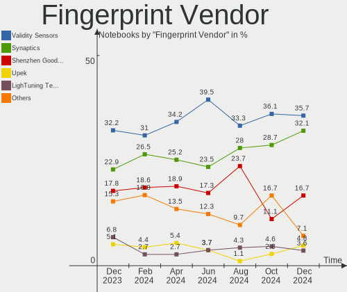

Ubuntu - Hardware Trends (Notebooks)
------------------------------------

A project to identify most popular hardware characteristics and track their change
over time based on data collected by Linux users at https://Linux-Hardware.org.

Anyone can contribute to this report by the [hw-probe](https://github.com/linuxhw/hw-probe) tool:

    sudo -E hw-probe -all -upload

This report is for one last month. Overall report since the beginning of time: [TestDays](https://github.com/linuxhw/TestDays)

Period: Nov, 2023.

Contents
--------

* [ System ](#system)
  - [ OS                       ](#os)
  - [ OS Family                ](#os-family)
  - [ Kernel                   ](#kernel)
  - [ Kernel Family            ](#kernel-family)
  - [ Kernel Major Ver.        ](#kernel-major-ver)
  - [ Arch                     ](#arch)
  - [ DE                       ](#de)
  - [ Display Server           ](#display-server)
  - [ Display Manager          ](#display-manager)
  - [ OS Lang                  ](#os-lang)
  - [ Boot Mode                ](#boot-mode)
  - [ Filesystem               ](#filesystem)
  - [ Part. scheme             ](#part-scheme)
  - [ Dual Boot with Linux/BSD ](#dual-boot-with-linuxbsd)
  - [ Dual Boot (Win)          ](#dual-boot-win)

* [ Board ](#board)
  - [ Vendor                   ](#vendor)
  - [ Model                    ](#model)
  - [ Model Family             ](#model-family)
  - [ MFG Year                 ](#mfg-year)
  - [ Form Factor              ](#form-factor)
  - [ Secure Boot              ](#secure-boot)
  - [ Coreboot                 ](#coreboot)
  - [ RAM Size                 ](#ram-size)
  - [ RAM Used                 ](#ram-used)
  - [ Total Drives             ](#total-drives)
  - [ Has CD-ROM               ](#has-cd-rom)
  - [ Has Ethernet             ](#has-ethernet)
  - [ Has WiFi                 ](#has-wifi)
  - [ Has Bluetooth            ](#has-bluetooth)

* [ Location ](#location)
  - [ Country                  ](#country)
  - [ City                     ](#city)

* [ Drives ](#drives)
  - [ Drive Vendor             ](#drive-vendor)
  - [ Drive Model              ](#drive-model)
  - [ HDD Vendor               ](#hdd-vendor)
  - [ SSD Vendor               ](#ssd-vendor)
  - [ Drive Kind               ](#drive-kind)
  - [ Drive Connector          ](#drive-connector)
  - [ Drive Size               ](#drive-size)
  - [ Space Total              ](#space-total)
  - [ Space Used               ](#space-used)
  - [ Malfunc. Drives          ](#malfunc-drives)
  - [ Malfunc. Drive Vendor    ](#malfunc-drive-vendor)
  - [ Malfunc. HDD Vendor      ](#malfunc-hdd-vendor)
  - [ Malfunc. Drive Kind      ](#malfunc-drive-kind)
  - [ Failed Drives            ](#failed-drives)
  - [ Failed Drive Vendor      ](#failed-drive-vendor)
  - [ Drive Status             ](#drive-status)

* [ Storage controller ](#storage-controller)
  - [ Storage Vendor           ](#storage-vendor)
  - [ Storage Model            ](#storage-model)
  - [ Storage Kind             ](#storage-kind)

* [ Processor ](#processor)
  - [ CPU Vendor               ](#cpu-vendor)
  - [ CPU Model                ](#cpu-model)
  - [ CPU Model Family         ](#cpu-model-family)
  - [ CPU Cores                ](#cpu-cores)
  - [ CPU Sockets              ](#cpu-sockets)
  - [ CPU Threads              ](#cpu-threads)
  - [ CPU Op-Modes             ](#cpu-op-modes)
  - [ CPU Microcode            ](#cpu-microcode)
  - [ CPU Microarch            ](#cpu-microarch)

* [ Graphics ](#graphics)
  - [ GPU Vendor               ](#gpu-vendor)
  - [ GPU Model                ](#gpu-model)
  - [ GPU Combo                ](#gpu-combo)
  - [ GPU Driver               ](#gpu-driver)
  - [ GPU Memory               ](#gpu-memory)

* [ Monitor ](#monitor)
  - [ Monitor Vendor           ](#monitor-vendor)
  - [ Monitor Model            ](#monitor-model)
  - [ Monitor Resolution       ](#monitor-resolution)
  - [ Monitor Diagonal         ](#monitor-diagonal)
  - [ Monitor Width            ](#monitor-width)
  - [ Aspect Ratio             ](#aspect-ratio)
  - [ Monitor Area             ](#monitor-area)
  - [ Pixel Density            ](#pixel-density)
  - [ Multiple Monitors        ](#multiple-monitors)

* [ Network ](#network)
  - [ Net Controller Vendor    ](#net-controller-vendor)
  - [ Net Controller Model     ](#net-controller-model)
  - [ Wireless Vendor          ](#wireless-vendor)
  - [ Wireless Model           ](#wireless-model)
  - [ Ethernet Vendor          ](#ethernet-vendor)
  - [ Ethernet Model           ](#ethernet-model)
  - [ Net Controller Kind      ](#net-controller-kind)
  - [ Used Controller          ](#used-controller)
  - [ NICs                     ](#nics)
  - [ IPv6                     ](#ipv6)

* [ Bluetooth ](#bluetooth)
  - [ Bluetooth Vendor         ](#bluetooth-vendor)
  - [ Bluetooth Model          ](#bluetooth-model)

* [ Sound ](#sound)
  - [ Sound Vendor             ](#sound-vendor)
  - [ Sound Model              ](#sound-model)

* [ Memory ](#memory)
  - [ Memory Vendor            ](#memory-vendor)
  - [ Memory Model             ](#memory-model)
  - [ Memory Kind              ](#memory-kind)
  - [ Memory Form Factor       ](#memory-form-factor)
  - [ Memory Size              ](#memory-size)
  - [ Memory Speed             ](#memory-speed)

* [ Printers & scanners ](#printers--scanners)
  - [ Printer Vendor           ](#printer-vendor)
  - [ Printer Model            ](#printer-model)
  - [ Scanner Vendor           ](#scanner-vendor)
  - [ Scanner Model            ](#scanner-model)

* [ Camera ](#camera)
  - [ Camera Vendor            ](#camera-vendor)
  - [ Camera Model             ](#camera-model)

* [ Security ](#security)
  - [ Fingerprint Vendor       ](#fingerprint-vendor)
  - [ Fingerprint Model        ](#fingerprint-model)
  - [ Chipcard Vendor          ](#chipcard-vendor)
  - [ Chipcard Model           ](#chipcard-model)

* [ Unsupported ](#unsupported)
  - [ Unsupported Devices      ](#unsupported-devices)
  - [ Unsupported Device Types ](#unsupported-device-types)

System
------

OS
--

Installed operating systems

| Name           | Notebooks | Percent |
|----------------|-----------|---------|
| Ubuntu 22.04   | 438       | 63.39%  |
| Ubuntu 23.10   | 146       | 21.13%  |
| Ubuntu 20.04   | 48        | 6.95%   |
| Ubuntu 23.04   | 39        | 5.64%   |
| Ubuntu 18.04   | 8         | 1.16%   |
| Ubuntu 22.10   | 6         | 0.87%   |
| Ubuntu 24.04   | 3         | 0.43%   |
| Ubuntu Core 22 | 1         | 0.14%   |
| Ubuntu 21.10   | 1         | 0.14%   |
| Ubuntu 16.04   | 1         | 0.14%   |

OS Family
---------

OS without a version

| Name   | Notebooks | Percent |
|--------|-----------|---------|
| Ubuntu | 691       | 100%    |

Kernel
------

Version of the Linux kernel

| Version                 | Notebooks | Percent |
|-------------------------|-----------|---------|
| 6.2.0-36-generic        | 231       | 33.43%  |
| 6.2.0-37-generic        | 105       | 15.2%   |
| 6.5.0-10-generic        | 94        | 13.6%   |
| 5.15.0-88-generic       | 44        | 6.37%   |
| 6.5.0-13-generic        | 33        | 4.78%   |
| 6.2.0-35-generic        | 27        | 3.91%   |
| 6.2.0-26-generic        | 27        | 3.91%   |
| 6.5.0-9-generic         | 11        | 1.59%   |
| 5.15.0-89-generic       | 11        | 1.59%   |
| 6.2.0-34-generic        | 6         | 0.87%   |
| 6.1.0-1025-oem          | 6         | 0.87%   |
| 5.19.0-46-generic       | 6         | 0.87%   |
| 5.19.0-32-generic       | 6         | 0.87%   |
| 5.4.0-167-generic       | 5         | 0.72%   |
| 5.4.0-150-generic       | 4         | 0.58%   |
| 5.15.0-87-generic       | 4         | 0.58%   |
| 6.5.0-1006-oem          | 3         | 0.43%   |
| 6.2.0-38-generic        | 3         | 0.43%   |
| 6.2.0-33-generic        | 3         | 0.43%   |
| 6.6.0-060600rc5-generic | 2         | 0.29%   |
| 6.5.7-060507-generic    | 2         | 0.29%   |
| 6.5.1-060501-generic    | 2         | 0.29%   |
| 6.2.0-060200-generic    | 2         | 0.29%   |
| 5.4.0-53-generic        | 2         | 0.29%   |
| 5.4.0-165-generic       | 2         | 0.29%   |
| 5.19.0-35-generic       | 2         | 0.29%   |
| 5.15.0-25-generic       | 2         | 0.29%   |
| 6.7.0-rc2-rt1-rt250hz   | 1         | 0.14%   |
| 6.6.1-060601-generic    | 1         | 0.14%   |
| 6.6.0-x64v4-xanmod1     | 1         | 0.14%   |
| 6.6.0-tkg-eevdf         | 1         | 0.14%   |
| 6.6.0-t2-mantic         | 1         | 0.14%   |
| 6.6.0-chrultrabook      | 1         | 0.14%   |
| 6.6.0-060600-generic    | 1         | 0.14%   |
| 6.5.9-2-liquorix-amd64  | 1         | 0.14%   |
| 6.5.5-060505-generic    | 1         | 0.14%   |
| 6.5.4-060504-generic    | 1         | 0.14%   |
| 6.5.0-1010-aws          | 1         | 0.14%   |
| 6.5.0-1008-oem          | 1         | 0.14%   |
| 6.5.0-10-lowlatency     | 1         | 0.14%   |

Kernel Family
-------------

Linux kernel without a distro release

| Version | Notebooks | Percent |
|---------|-----------|---------|
| 6.2.0   | 408       | 59.04%  |
| 6.5.0   | 144       | 20.84%  |
| 5.15.0  | 67        | 9.7%    |
| 5.4.0   | 18        | 2.6%    |
| 5.19.0  | 17        | 2.46%   |
| 6.1.0   | 8         | 1.16%   |
| 6.6.0   | 7         | 1.01%   |
| 5.14.0  | 3         | 0.43%   |
| 5.13.0  | 3         | 0.43%   |
| 6.5.7   | 2         | 0.29%   |
| 6.5.1   | 2         | 0.29%   |
| 4.15.0  | 2         | 0.29%   |
| 6.7.0   | 1         | 0.14%   |
| 6.6.1   | 1         | 0.14%   |
| 6.5.9   | 1         | 0.14%   |
| 6.5.5   | 1         | 0.14%   |
| 6.5.4   | 1         | 0.14%   |
| 6.4.3   | 1         | 0.14%   |
| 6.4.0   | 1         | 0.14%   |
| 5.19.17 | 1         | 0.14%   |
| 5.11.0  | 1         | 0.14%   |
| 5.10.0  | 1         | 0.14%   |

Kernel Major Ver.
-----------------

Linux kernel major version

| Version | Notebooks | Percent |
|---------|-----------|---------|
| 6.2     | 408       | 59.04%  |
| 6.5     | 151       | 21.85%  |
| 5.15    | 67        | 9.7%    |
| 5.4     | 18        | 2.6%    |
| 5.19    | 18        | 2.6%    |
| 6.6     | 8         | 1.16%   |
| 6.1     | 8         | 1.16%   |
| 5.14    | 3         | 0.43%   |
| 5.13    | 3         | 0.43%   |
| 6.4     | 2         | 0.29%   |
| 4.15    | 2         | 0.29%   |
| 6.7     | 1         | 0.14%   |
| 5.11    | 1         | 0.14%   |
| 5.10    | 1         | 0.14%   |

Arch
----

OS architecture (x86_64, i586, etc.)

| Name   | Notebooks | Percent |
|--------|-----------|---------|
| x86_64 | 691       | 100%    |

DE
--

Desktop Environment

| Name            | Notebooks | Percent |
|-----------------|-----------|---------|
| GNOME           | 661       | 95.66%  |
| Unknown         | 13        | 1.88%   |
| X-Cinnamon      | 9         | 1.3%    |
| GNOME Flashback | 3         | 0.43%   |
| ubuntu          | 1         | 0.14%   |
| openbox         | 1         | 0.14%   |
| i3              | 1         | 0.14%   |
| Enlightenment   | 1         | 0.14%   |
| DDE             | 1         | 0.14%   |

Display Server
--------------

X11 or Wayland

| Name    | Notebooks | Percent |
|---------|-----------|---------|
| Wayland | 431       | 62.37%  |
| X11     | 243       | 35.17%  |
| Unknown | 13        | 1.88%   |
| Tty     | 4         | 0.58%   |

Display Manager
---------------

SDDM, LightDM, etc.

| Name    | Notebooks | Percent |
|---------|-----------|---------|
| GDM3    | 609       | 88.13%  |
| Unknown | 51        | 7.38%   |
| GDM     | 19        | 2.75%   |
| LightDM | 8         | 1.16%   |
| SDDM    | 4         | 0.58%   |

OS Lang
-------

Language

| Lang    | Notebooks | Percent |
|---------|-----------|---------|
| en_US   | 309       | 44.72%  |
| fr_FR   | 52        | 7.53%   |
| de_DE   | 51        | 7.38%   |
| it_IT   | 37        | 5.35%   |
| en_GB   | 33        | 4.78%   |
| ru_RU   | 24        | 3.47%   |
| es_ES   | 24        | 3.47%   |
| pt_BR   | 19        | 2.75%   |
| en_IN   | 14        | 2.03%   |
| en_CA   | 12        | 1.74%   |
| C       | 11        | 1.59%   |
| pl_PL   | 10        | 1.45%   |
| Unknown | 9         | 1.3%    |
| cs_CZ   | 8         | 1.16%   |
| pt_PT   | 7         | 1.01%   |
| hu_HU   | 7         | 1.01%   |
| tr_TR   | 4         | 0.58%   |
| sv_SE   | 4         | 0.58%   |
| nl_NL   | 4         | 0.58%   |
| es_CO   | 4         | 0.58%   |
| en_AU   | 4         | 0.58%   |
| sk_SK   | 3         | 0.43%   |
| fr_CH   | 3         | 0.43%   |
| en_NG   | 3         | 0.43%   |
| da_DK   | 3         | 0.43%   |
| ca_ES   | 3         | 0.43%   |
| ro_RO   | 2         | 0.29%   |
| ja_JP   | 2         | 0.29%   |
| fi_FI   | 2         | 0.29%   |
| es_MX   | 2         | 0.29%   |
| en_ZA   | 2         | 0.29%   |
| en_IE   | 2         | 0.29%   |
| el_GR   | 2         | 0.29%   |
| de_AT   | 2         | 0.29%   |
| zh_TW   | 1         | 0.14%   |
| zh_CN   | 1         | 0.14%   |
| nb_NO   | 1         | 0.14%   |
| lv_LV   | 1         | 0.14%   |
| fr_BE   | 1         | 0.14%   |
| es_US   | 1         | 0.14%   |

Boot Mode
---------

EFI or BIOS

| Mode | Notebooks | Percent |
|------|-----------|---------|
| BIOS | 378       | 54.7%   |
| EFI  | 313       | 45.3%   |

Filesystem
----------

Type of filesystem

| Type    | Notebooks | Percent |
|---------|-----------|---------|
| Tmpfs   | 341       | 49.35%  |
| Ext4    | 322       | 46.6%   |
| Overlay | 16        | 2.32%   |
| Btrfs   | 7         | 1.01%   |
| Zfs     | 3         | 0.43%   |
| Ext2    | 1         | 0.14%   |
| Aufs    | 1         | 0.14%   |

Part. scheme
------------

Scheme of partitioning

| Type    | Notebooks | Percent |
|---------|-----------|---------|
| GPT     | 593       | 85.82%  |
| MBR     | 57        | 8.25%   |
| Unknown | 41        | 5.93%   |

Dual Boot with Linux/BSD
------------------------

Hosting more than one Linux/BSD

| Dual boot | Notebooks | Percent |
|-----------|-----------|---------|
| No        | 631       | 91.32%  |
| Yes       | 60        | 8.68%   |

Dual Boot (Win)
---------------

Hosting Linux and Windows

| Dual boot | Notebooks | Percent |
|-----------|-----------|---------|
| No        | 451       | 65.27%  |
| Yes       | 240       | 34.73%  |

Board
-----

Vendor
------

Motherboard manufacturer

| Name                           | Notebooks | Percent |
|--------------------------------|-----------|---------|
| Hewlett-Packard                | 141       | 20.41%  |
| Lenovo                         | 139       | 20.12%  |
| Dell                           | 101       | 14.62%  |
| ASUSTek Computer               | 78        | 11.29%  |
| Acer                           | 53        | 7.67%   |
| Toshiba                        | 21        | 3.04%   |
| Apple                          | 20        | 2.89%   |
| MSI                            | 17        | 2.46%   |
| Samsung Electronics            | 16        | 2.32%   |
| HUAWEI                         | 16        | 2.32%   |
| Sony                           | 10        | 1.45%   |
| Google                         | 7         | 1.01%   |
| Fujitsu                        | 6         | 0.87%   |
| Medion                         | 5         | 0.72%   |
| Timi                           | 4         | 0.58%   |
| Framework                      | 4         | 0.58%   |
| Unknown                        | 3         | 0.43%   |
| VALE                           | 2         | 0.29%   |
| Star Labs                      | 2         | 0.29%   |
| Packard Bell                   | 2         | 0.29%   |
| Notebook                       | 2         | 0.29%   |
| Infinix                        | 2         | 0.29%   |
| Clevo                          | 2         | 0.29%   |
| Allview                        | 2         | 0.29%   |
| UMAX                           | 1         | 0.14%   |
| TUXEDO                         | 1         | 0.14%   |
| TECNO                          | 1         | 0.14%   |
| Teclast                        | 1         | 0.14%   |
| SHENZHEN YOUDISI E-COMMERCE    | 1         | 0.14%   |
| Shanghai Zhaoxin Semiconductor | 1         | 0.14%   |
| Semp Toshiba                   | 1         | 0.14%   |
| Razer                          | 1         | 0.14%   |
| Pegatron                       | 1         | 0.14%   |
| PC Specialist                  | 1         | 0.14%   |
| Panasonic                      | 1         | 0.14%   |
| Olivetti                       | 1         | 0.14%   |
| Novatech                       | 1         | 0.14%   |
| mPTech                         | 1         | 0.14%   |
| Monster                        | 1         | 0.14%   |
| Microtech                      | 1         | 0.14%   |

Model
-----

Motherboard model

| Name                                             | Notebooks | Percent |
|--------------------------------------------------|-----------|---------|
| HP Notebook                                      | 7         | 1.01%   |
| HP Pavilion dv6                                  | 5         | 0.72%   |
| HP Pavilion Notebook                             | 4         | 0.58%   |
| Dell Latitude E5430 non-vPro                     | 4         | 0.58%   |
| Unknown                                          | 4         | 0.58%   |
| Lenovo IdeaPad 320-15ABR 80XS                    | 3         | 0.43%   |
| HUAWEI BOHB-WAX9                                 | 3         | 0.43%   |
| HP Pavilion 15                                   | 3         | 0.43%   |
| HP EliteBook 840 G6                              | 3         | 0.43%   |
| HP EliteBook 840 G5                              | 3         | 0.43%   |
| HP 15                                            | 3         | 0.43%   |
| Dell Latitude E6430                              | 3         | 0.43%   |
| Dell Latitude 5590                               | 3         | 0.43%   |
| Dell Latitude 5400                               | 3         | 0.43%   |
| VALE Notebook Classic C140                       | 2         | 0.29%   |
| Timi Redmi Book Pro 15 2022                      | 2         | 0.29%   |
| Samsung 960XFH                                   | 2         | 0.29%   |
| Lenovo ThinkBook 15 G3 ACL 21A4                  | 2         | 0.29%   |
| Lenovo ThinkBook 14-IIL 20SL                     | 2         | 0.29%   |
| Lenovo Legion 5 15IMH05H 81Y6                    | 2         | 0.29%   |
| Lenovo Legion 5 15ARH05H 82B1                    | 2         | 0.29%   |
| Lenovo IdeaPad S340-15API 81NC                   | 2         | 0.29%   |
| Lenovo IdeaPad S145-15API 81V7                   | 2         | 0.29%   |
| Lenovo IdeaPad Gaming 3 15IAH7 82S9              | 2         | 0.29%   |
| Lenovo IdeaPad 3 14ABA7 82RM                     | 2         | 0.29%   |
| HUAWEI HVY-WXX9                                  | 2         | 0.29%   |
| HP ZBook Studio G3                               | 2         | 0.29%   |
| HP ZBook Fury 15.6 inch G8 Mobile Workstation PC | 2         | 0.29%   |
| HP Pavilion Laptop 14-ec0xxx                     | 2         | 0.29%   |
| HP Pavilion Gaming Laptop 15-ec2xxx              | 2         | 0.29%   |
| HP Pavilion Gaming Laptop 15-ec1xxx              | 2         | 0.29%   |
| HP Pavilion Gaming Laptop 15-ec0xxx              | 2         | 0.29%   |
| HP Pavilion dm4                                  | 2         | 0.29%   |
| HP OMEN by Laptop 15-dc1xxx                      | 2         | 0.29%   |
| HP Laptop 15-dy2xxx                              | 2         | 0.29%   |
| HP Laptop 15-db0xxx                              | 2         | 0.29%   |
| HP Laptop 15-da0xxx                              | 2         | 0.29%   |
| HP Laptop 15-bw0xx                               | 2         | 0.29%   |
| HP ENVY 15                                       | 2         | 0.29%   |
| HP EliteBook 840 G8 Notebook PC                  | 2         | 0.29%   |

Model Family
------------

Motherboard model prefix

| Name               | Notebooks | Percent |
|--------------------|-----------|---------|
| Lenovo ThinkPad    | 74        | 10.71%  |
| Dell Latitude      | 50        | 7.24%   |
| HP Pavilion        | 34        | 4.92%   |
| Lenovo IdeaPad     | 33        | 4.78%   |
| Acer Aspire        | 29        | 4.2%    |
| ASUS VivoBook      | 28        | 4.05%   |
| Dell Inspiron      | 27        | 3.91%   |
| HP Laptop          | 23        | 3.33%   |
| HP ProBook         | 21        | 3.04%   |
| HP EliteBook       | 19        | 2.75%   |
| Toshiba Satellite  | 18        | 2.6%    |
| Dell XPS           | 13        | 1.88%   |
| Lenovo Legion      | 12        | 1.74%   |
| HP ZBook           | 10        | 1.45%   |
| HP Notebook        | 7         | 1.01%   |
| ASUS ASUS          | 7         | 1.01%   |
| Acer Nitro         | 7         | 1.01%   |
| Lenovo ThinkBook   | 6         | 0.87%   |
| Fujitsu LIFEBOOK   | 6         | 0.87%   |
| ASUS Zenbook       | 6         | 0.87%   |
| Dell Precision     | 5         | 0.72%   |
| ASUS ROG           | 5         | 0.72%   |
| Acer TravelMate    | 5         | 0.72%   |
| Lenovo Yoga        | 4         | 0.58%   |
| Framework Laptop   | 4         | 0.58%   |
| Dell Vostro        | 4         | 0.58%   |
| Apple MacBookPro11 | 4         | 0.58%   |
| Acer Swift         | 4         | 0.58%   |
| Unknown            | 4         | 0.58%   |
| Toshiba PORTEGE    | 3         | 0.43%   |
| MSI Prestige       | 3         | 0.43%   |
| MSI Modern         | 3         | 0.43%   |
| HUAWEI BOHB-WAX9   | 3         | 0.43%   |
| HP OMEN            | 3         | 0.43%   |
| HP ENVY            | 3         | 0.43%   |
| HP Compaq          | 3         | 0.43%   |
| HP 255             | 3         | 0.43%   |
| HP 15              | 3         | 0.43%   |
| Acer Predator      | 3         | 0.43%   |
| VALE Notebook      | 2         | 0.29%   |

MFG Year
--------

Motherboard manufacture year

| Year    | Notebooks | Percent |
|---------|-----------|---------|
| 2021    | 82        | 11.87%  |
| 2022    | 75        | 10.85%  |
| 2023    | 67        | 9.7%    |
| 2020    | 65        | 9.41%   |
| 2019    | 62        | 8.97%   |
| 2012    | 46        | 6.66%   |
| 2018    | 42        | 6.08%   |
| 2017    | 42        | 6.08%   |
| 2013    | 39        | 5.64%   |
| 2011    | 30        | 4.34%   |
| 2010    | 30        | 4.34%   |
| 2016    | 27        | 3.91%   |
| 2014    | 24        | 3.47%   |
| 2015    | 21        | 3.04%   |
| 2008    | 21        | 3.04%   |
| 2009    | 13        | 1.88%   |
| 2007    | 4         | 0.58%   |
| Unknown | 1         | 0.14%   |

Form Factor
-----------

Physical design of the computer

| Name     | Notebooks | Percent |
|----------|-----------|---------|
| Notebook | 691       | 100%    |

Secure Boot
-----------

Enabled or disabled

| State    | Notebooks | Percent |
|----------|-----------|---------|
| Disabled | 603       | 87.26%  |
| Enabled  | 88        | 12.74%  |

Coreboot
--------

Have coreboot on board

| Used | Notebooks | Percent |
|------|-----------|---------|
| No   | 682       | 98.7%   |
| Yes  | 9         | 1.3%    |

RAM Size
--------

Total RAM memory

| Size in GB  | Notebooks | Percent |
|-------------|-----------|---------|
| 4.01-8.0    | 189       | 27.35%  |
| 8.01-16.0   | 138       | 19.97%  |
| 3.01-4.0    | 131       | 18.96%  |
| 16.01-24.0  | 128       | 18.52%  |
| 32.01-64.0  | 65        | 9.41%   |
| 24.01-32.0  | 15        | 2.17%   |
| 64.01-256.0 | 13        | 1.88%   |
| 1.01-2.0    | 8         | 1.16%   |
| 2.01-3.0    | 4         | 0.58%   |

RAM Used
--------

Used RAM memory

| Used GB    | Notebooks | Percent |
|------------|-----------|---------|
| 2.01-3.0   | 195       | 28.22%  |
| 1.01-2.0   | 188       | 27.21%  |
| 4.01-8.0   | 133       | 19.25%  |
| 3.01-4.0   | 123       | 17.8%   |
| 8.01-16.0  | 41        | 5.93%   |
| 16.01-24.0 | 7         | 1.01%   |
| 24.01-32.0 | 2         | 0.29%   |
| 0.51-1.0   | 2         | 0.29%   |

Total Drives
------------

Number of drives on board

| Drives | Notebooks | Percent |
|--------|-----------|---------|
| 1      | 534       | 77.28%  |
| 2      | 134       | 19.39%  |
| 3      | 17        | 2.46%   |
| 0      | 4         | 0.58%   |
| 4      | 2         | 0.29%   |

Has CD-ROM
----------

Has CD-ROM on board

| Presented | Notebooks | Percent |
|-----------|-----------|---------|
| No        | 498       | 72.07%  |
| Yes       | 193       | 27.93%  |

Has Ethernet
------------

Has Ethernet on board

| Presented | Notebooks | Percent |
|-----------|-----------|---------|
| Yes       | 524       | 75.83%  |
| No        | 167       | 24.17%  |

Has WiFi
--------

Has WiFi module

| Presented | Notebooks | Percent |
|-----------|-----------|---------|
| Yes       | 682       | 98.7%   |
| No        | 9         | 1.3%    |

Has Bluetooth
-------------

Has Bluetooth module

| Presented | Notebooks | Percent |
|-----------|-----------|---------|
| Yes       | 579       | 83.79%  |
| No        | 112       | 16.21%  |

Location
--------

Country
-------

Geographic location (country)

| Country     | Notebooks | Percent |
|-------------|-----------|---------|
| USA         | 89        | 12.88%  |
| Germany     | 71        | 10.27%  |
| Italy       | 56        | 8.1%    |
| France      | 53        | 7.67%   |
| Russia      | 41        | 5.93%   |
| UK          | 32        | 4.63%   |
| Brazil      | 32        | 4.63%   |
| Spain       | 26        | 3.76%   |
| Netherlands | 21        | 3.04%   |
| India       | 21        | 3.04%   |
| Canada      | 16        | 2.32%   |
| Portugal    | 14        | 2.03%   |
| Poland      | 12        | 1.74%   |
| Czechia     | 12        | 1.74%   |
| Switzerland | 10        | 1.45%   |
| Mexico      | 10        | 1.45%   |
| Hungary     | 9         | 1.3%    |
| Colombia    | 9         | 1.3%    |
| Romania     | 8         | 1.16%   |
| Turkey      | 7         | 1.01%   |
| Sweden      | 6         | 0.87%   |
| Norway      | 6         | 0.87%   |
| Austria     | 6         | 0.87%   |
| Australia   | 6         | 0.87%   |
| Vietnam     | 5         | 0.72%   |
| Ireland     | 5         | 0.72%   |
| Greece      | 5         | 0.72%   |
| China       | 5         | 0.72%   |
| Belgium     | 5         | 0.72%   |
| Argentina   | 5         | 0.72%   |
| UAE         | 4         | 0.58%   |
| Indonesia   | 4         | 0.58%   |
| Egypt       | 4         | 0.58%   |
| Panama      | 3         | 0.43%   |
| Nigeria     | 3         | 0.43%   |
| Nepal       | 3         | 0.43%   |
| Israel      | 3         | 0.43%   |
| Finland     | 3         | 0.43%   |
| Denmark     | 3         | 0.43%   |
| Chile       | 3         | 0.43%   |

City
----

Geographic location (city)

| City              | Notebooks | Percent |
|-------------------|-----------|---------|
| Berlin            | 15        | 2.17%   |
| Paris             | 9         | 1.3%    |
| Moscow            | 9         | 1.3%    |
| Rome              | 8         | 1.16%   |
| St Petersburg     | 6         | 0.87%   |
| Milan             | 6         | 0.87%   |
| Sao Paulo         | 5         | 0.72%   |
| Prague            | 5         | 0.72%   |
| Madrid            | 5         | 0.72%   |
| Lisbon            | 5         | 0.72%   |
| Ho Chi Minh City  | 4         | 0.58%   |
| Chennai           | 4         | 0.58%   |
| Budapest          | 4         | 0.58%   |
| Bogotá           | 4         | 0.58%   |
| Stuttgart         | 3         | 0.43%   |
| San Antonio       | 3         | 0.43%   |
| Perth             | 3         | 0.43%   |
| Panama City       | 3         | 0.43%   |
| Nantes            | 3         | 0.43%   |
| Milano            | 3         | 0.43%   |
| Lucknow           | 3         | 0.43%   |
| Los Angeles       | 3         | 0.43%   |
| Leipzig           | 3         | 0.43%   |
| Krasnoyarsk       | 3         | 0.43%   |
| Kathmandu         | 3         | 0.43%   |
| Frankfurt am Main | 3         | 0.43%   |
| Dublin            | 3         | 0.43%   |
| Delhi             | 3         | 0.43%   |
| Dallas            | 3         | 0.43%   |
| Bengaluru         | 3         | 0.43%   |
| Amsterdam         | 3         | 0.43%   |
| Zurich            | 2         | 0.29%   |
| Zagreb            | 2         | 0.29%   |
| Yerevan           | 2         | 0.29%   |
| Warsaw            | 2         | 0.29%   |
| Voronezh          | 2         | 0.29%   |
| Vilnius           | 2         | 0.29%   |
| Villeurbanne      | 2         | 0.29%   |
| Vienna            | 2         | 0.29%   |
| Victoria          | 2         | 0.29%   |

Drives
------

Drive Vendor
------------

Hard drive vendors

| Vendor                      | Notebooks | Drives | Percent |
|-----------------------------|-----------|--------|---------|
| Samsung Electronics         | 142       | 154    | 17.3%   |
| WDC                         | 75        | 77     | 9.14%   |
| Sandisk                     | 59        | 61     | 7.19%   |
| Seagate                     | 53        | 53     | 6.46%   |
| Micron Technology           | 48        | 50     | 5.85%   |
| Kingston                    | 47        | 48     | 5.72%   |
| SK hynix                    | 44        | 45     | 5.36%   |
| Intel                       | 44        | 47     | 5.36%   |
| Toshiba                     | 42        | 43     | 5.12%   |
| Unknown                     | 33        | 35     | 4.02%   |
| Crucial                     | 23        | 23     | 2.8%    |
| HGST                        | 20        | 20     | 2.44%   |
| KIOXIA                      | 16        | 16     | 1.95%   |
| Apple                       | 15        | 18     | 1.83%   |
| A-DATA Technology           | 15        | 15     | 1.83%   |
| Hitachi                     | 13        | 13     | 1.58%   |
| Phison                      | 8         | 8      | 0.97%   |
| Phison Electronics          | 6         | 6      | 0.73%   |
| Silicon Motion              | 5         | 5      | 0.61%   |
| LITEON                      | 5         | 5      | 0.61%   |
| Kingston Technology Company | 5         | 5      | 0.61%   |
| China                       | 5         | 6      | 0.61%   |
| Unknown                     | 5         | 5      | 0.61%   |
| PNY                         | 4         | 4      | 0.49%   |
| Micron/Crucial Technology   | 4         | 4      | 0.49%   |
| Intenso                     | 4         | 4      | 0.49%   |
| USB3.0                      | 3         | 3      | 0.37%   |
| UMIS                        | 3         | 3      | 0.37%   |
| SABRENT                     | 3         | 3      | 0.37%   |
| JMicron Technology          | 3         | 3      | 0.37%   |
| ADATA Technology            | 3         | 3      | 0.37%   |
| USB                         | 2         | 2      | 0.24%   |
| Star                        | 2         | 2      | 0.24%   |
| SPCC                        | 2         | 2      | 0.24%   |
| Netac                       | 2         | 2      | 0.24%   |
| LITEONIT                    | 2         | 2      | 0.24%   |
| Kingchuxing                 | 2         | 2      | 0.24%   |
| HJDK                        | 2         | 2      | 0.24%   |
| GLOWAY                      | 2         | 2      | 0.24%   |
| Gigabyte Technology         | 2         | 2      | 0.24%   |

Drive Model
-----------

Hard drive models

| Model                                               | Notebooks | Percent |
|-----------------------------------------------------|-----------|---------|
| Seagate ST1000LM035-1RK172 1TB                      | 13        | 1.55%   |
| Kingston SA400S37240G 240GB SSD                     | 12        | 1.43%   |
| Samsung NVMe SSD Controller PM9A1/PM9A3/980PRO 2TB  | 10        | 1.19%   |
| Samsung NVMe SSD Controller SM981/PM981/PM983 250GB | 8         | 0.95%   |
| Samsung MZALQ512HALU-000L2 512GB                    | 8         | 0.95%   |
| HGST HTS541010A9E680 1TB                            | 8         | 0.95%   |
| Seagate ST1000LM024 HN-M101MBB 1TB                  | 7         | 0.84%   |
| Micron 3400_MTFDKBA1T0TFH 1TB                       | 7         | 0.84%   |
| Intel SSDPEKNU512GZ 512GB                           | 7         | 0.84%   |
| Unknown MMC Card  64GB                              | 6         | 0.72%   |
| Unknown MMC Card  32GB                              | 6         | 0.72%   |
| SanDisk NVMe SSD Drive 512GB                        | 6         | 0.72%   |
| Samsung SSD 870 EVO 500GB                           | 6         | 0.72%   |
| Micron 2400_MTFDKBA512QFM 512GB                     | 6         | 0.72%   |
| Kingston SA400S37480G 480GB SSD                     | 6         | 0.72%   |
| Toshiba MQ01ABD100 1TB                              | 5         | 0.6%    |
| Seagate ST2000LM007-1R8174 2TB                      | 5         | 0.6%    |
| Sandisk WD Black SN750 / PC SN730 NVMe SSD 500GB    | 5         | 0.6%    |
| SanDisk SSD PLUS 240GB                              | 5         | 0.6%    |
| Crucial CT240BX500SSD1 240GB                        | 5         | 0.6%    |
| Unknown                                             | 5         | 0.6%    |
| WDC WD10SPZX-24Z10 1TB                              | 4         | 0.48%   |
| Toshiba XG6 NVMe SSD Controller 512GB               | 4         | 0.48%   |
| Toshiba MQ01ABF050 500GB                            | 4         | 0.48%   |
| Seagate ST500LM012 HN-M500MBB 500GB                 | 4         | 0.48%   |
| SanDisk NVMe SSD Drive 1TB                          | 4         | 0.48%   |
| Samsung NVMe SSD Controller SM961/PM961/SM963 256GB | 4         | 0.48%   |
| Phison PS5013 E13 NVMe Controller 512GB             | 4         | 0.48%   |
| Intel SSDPEKNW512G8H 512GB                          | 4         | 0.48%   |
| Intel SSDPEKNU010TZ 1024GB                          | 4         | 0.48%   |
| Intel SSD Pro 7600p/760p/E 6100p Series 1TB         | 4         | 0.48%   |
| Crucial CT500MX500SSD1 500GB                        | 4         | 0.48%   |
| WDC WDS200T1X0E-00AFY0 2TB                          | 3         | 0.36%   |
| WDC WD10SPZX-21Z10T0 1TB                            | 3         | 0.36%   |
| Unknown MMC Card  16GB                              | 3         | 0.36%   |
| Unknown MMC Card  128GB                             | 3         | 0.36%   |
| Toshiba MQ04ABF100 1TB                              | 3         | 0.36%   |
| SK hynix SKHynix_HFS512GDE9X081N 512GB              | 3         | 0.36%   |
| SK hynix BC511 HFM512GDJTNI-82A0A 512GB             | 3         | 0.36%   |
| Silicon Motion PCIe-8 SSD 512GB                     | 3         | 0.36%   |

HDD Vendor
----------

Hard disk drive vendors

| Vendor              | Notebooks | Drives | Percent |
|---------------------|-----------|--------|---------|
| Seagate             | 51        | 51     | 29.14%  |
| WDC                 | 49        | 50     | 28%     |
| Toshiba             | 23        | 23     | 13.14%  |
| HGST                | 20        | 20     | 11.43%  |
| Hitachi             | 13        | 13     | 7.43%   |
| USB3.0              | 3         | 3      | 1.71%   |
| Unknown             | 3         | 3      | 1.71%   |
| Samsung Electronics | 3         | 3      | 1.71%   |
| USB                 | 2         | 2      | 1.14%   |
| Apple               | 2         | 2      | 1.14%   |
| TO Exter            | 1         | 1      | 0.57%   |
| SABRENT             | 1         | 1      | 0.57%   |
| Hewlett-Packard     | 1         | 1      | 0.57%   |
| Fujitsu             | 1         | 1      | 0.57%   |
| External            | 1         | 1      | 0.57%   |
| Unknown             | 1         | 1      | 0.57%   |

SSD Vendor
----------

Solid state drive vendors

| Vendor              | Notebooks | Drives | Percent |
|---------------------|-----------|--------|---------|
| Samsung Electronics | 55        | 57     | 22.63%  |
| Kingston            | 34        | 35     | 13.99%  |
| SanDisk             | 24        | 24     | 9.88%   |
| Crucial             | 21        | 21     | 8.64%   |
| A-DATA Technology   | 10        | 10     | 4.12%   |
| Intel               | 8         | 8      | 3.29%   |
| SK hynix            | 7         | 7      | 2.88%   |
| Apple               | 7         | 7      | 2.88%   |
| WDC                 | 6         | 6      | 2.47%   |
| Micron Technology   | 6         | 6      | 2.47%   |
| Toshiba             | 5         | 5      | 2.06%   |
| LITEON              | 5         | 5      | 2.06%   |
| China               | 5         | 6      | 2.06%   |
| PNY                 | 4         | 4      | 1.65%   |
| Intenso             | 4         | 4      | 1.65%   |
| JMicron Technology  | 3         | 3      | 1.23%   |
| Star                | 2         | 2      | 0.82%   |
| SPCC                | 2         | 2      | 0.82%   |
| Netac               | 2         | 2      | 0.82%   |
| LITEONIT            | 2         | 2      | 0.82%   |
| GLOWAY              | 2         | 2      | 0.82%   |
| Dogfish             | 2         | 2      | 0.82%   |
| Unknown             | 2         | 2      | 0.82%   |
| ZHITAI              | 1         | 1      | 0.41%   |
| Wodposit            | 1         | 1      | 0.41%   |
| Verbatim            | 1         | 1      | 0.41%   |
| TwinMOS             | 1         | 1      | 0.41%   |
| Transcend           | 1         | 1      | 0.41%   |
| Team                | 1         | 1      | 0.41%   |
| SCCTS-603-128G      | 1         | 1      | 0.41%   |
| SC550               | 1         | 1      | 0.41%   |
| PNY CS90            | 1         | 1      | 0.41%   |
| Plextor             | 1         | 1      | 0.41%   |
| Pioneer             | 1         | 1      | 0.41%   |
| Phison              | 1         | 1      | 0.41%   |
| Patriot             | 1         | 1      | 0.41%   |
| KUU                 | 1         | 1      | 0.41%   |
| Kingchuxing         | 1         | 1      | 0.41%   |
| Hypertec            | 1         | 1      | 0.41%   |
| HJDK                | 1         | 1      | 0.41%   |

Drive Kind
----------

HDD or SSD

| Kind    | Notebooks | Drives | Percent |
|---------|-----------|--------|---------|
| NVMe    | 345       | 386    | 44.01%  |
| SSD     | 231       | 247    | 29.46%  |
| HDD     | 168       | 176    | 21.43%  |
| MMC     | 28        | 31     | 3.57%   |
| Unknown | 12        | 12     | 1.53%   |

Drive Connector
---------------

SATA, SAS, NVMe, etc.

| Type | Notebooks | Drives | Percent |
|------|-----------|--------|---------|
| SATA | 354       | 395    | 46.27%  |
| NVMe | 343       | 382    | 44.84%  |
| SAS  | 40        | 44     | 5.23%   |
| MMC  | 28        | 31     | 3.66%   |

Drive Size
----------

Size of hard drive

| Size in TB | Notebooks | Drives | Percent |
|------------|-----------|--------|---------|
| 0.01-0.5   | 263       | 279    | 65.59%  |
| 0.51-1.0   | 120       | 126    | 29.93%  |
| 1.01-2.0   | 17        | 17     | 4.24%   |
| 4.01-10.0  | 1         | 1      | 0.25%   |

Space Total
-----------

Amount of disk space available on the file system

| Size in GB     | Notebooks | Percent |
|----------------|-----------|---------|
| 251-500        | 229       | 33.14%  |
| 101-250        | 198       | 28.65%  |
| 501-1000       | 125       | 18.09%  |
| 1001-2000      | 34        | 4.92%   |
| 51-100         | 32        | 4.63%   |
| 1-20           | 30        | 4.34%   |
| 21-50          | 19        | 2.75%   |
| Unknown        | 11        | 1.59%   |
| 2001-3000      | 9         | 1.3%    |
| More than 3000 | 4         | 0.58%   |

Space Used
----------

Amount of used disk space

| Used GB        | Notebooks | Percent |
|----------------|-----------|---------|
| 1-20           | 195       | 28.22%  |
| 21-50          | 181       | 26.19%  |
| 101-250        | 112       | 16.21%  |
| 51-100         | 93        | 13.46%  |
| 251-500        | 67        | 9.7%    |
| 501-1000       | 19        | 2.75%   |
| Unknown        | 11        | 1.59%   |
| 1001-2000      | 10        | 1.45%   |
| More than 3000 | 3         | 0.43%   |

Malfunc. Drives
---------------

Drive models with a malfunction

| Model                                 | Notebooks | Drives | Percent |
|---------------------------------------|-----------|--------|---------|
| Seagate ST1000LM035-1RK172 1TB        | 2         | 2      | 7.69%   |
| WDC WD7500BPVT-80HXZT1 752GB          | 1         | 1      | 3.85%   |
| WDC WD5000LPVX-55V0TT0 500GB          | 1         | 1      | 3.85%   |
| WDC WD5000BEVT-22A0RT0 500GB          | 1         | 1      | 3.85%   |
| WDC WD32 00BPVT-22ZEST0 320GB         | 1         | 1      | 3.85%   |
| WDC WD2500BEVT-75ZCT2 250GB           | 1         | 1      | 3.85%   |
| WDC WD Green 2.5 240GB SSD            | 1         | 1      | 3.85%   |
| Toshiba MQ01ABD100 1TB                | 1         | 1      | 3.85%   |
| Toshiba MK5056GSY 500GB               | 1         | 1      | 3.85%   |
| Toshiba MK1655GSX 160GB               | 1         | 1      | 3.85%   |
| SK hynix SC210 mSATA 128GB SSD        | 1         | 1      | 3.85%   |
| SK hynix PC711 HFS512GDE9X073N 512GB  | 1         | 1      | 3.85%   |
| SK hynix PC401 NVMe 512GB             | 1         | 1      | 3.85%   |
| Seagate ST2000LM007-1R8174 2TB        | 1         | 1      | 3.85%   |
| Seagate ST1000LM024 HN-M101MBB 1TB    | 1         | 1      | 3.85%   |
| SanDisk SSD PLUS 240GB                | 1         | 1      | 3.85%   |
| Samsung Electronics SSD 870 EVO 500GB | 1         | 1      | 3.85%   |
| Intel SSDPEKKF512G8L 512GB            | 1         | 1      | 3.85%   |
| Intel SSDMAEXC024G3H 24GB             | 1         | 1      | 3.85%   |
| Hypertec SSD 240GB                    | 1         | 1      | 3.85%   |
| HGST HTS545050A7E680 500GB            | 1         | 1      | 3.85%   |
| HGST HTS545050A7E380 500GB            | 1         | 1      | 3.85%   |
| HGST HTS541075A9E680 752GB            | 1         | 1      | 3.85%   |
| Crucial CT275MX300SSD1 275GB          | 1         | 1      | 3.85%   |
| A-DATA Technology XM11 128GB-V3 SSD   | 1         | 1      | 3.85%   |

Malfunc. Drive Vendor
---------------------

Vendors of faulty drives

| Vendor              | Notebooks | Drives | Percent |
|---------------------|-----------|--------|---------|
| WDC                 | 6         | 6      | 23.08%  |
| Seagate             | 4         | 4      | 15.38%  |
| Toshiba             | 3         | 3      | 11.54%  |
| SK hynix            | 3         | 3      | 11.54%  |
| HGST                | 3         | 3      | 11.54%  |
| Intel               | 2         | 2      | 7.69%   |
| SanDisk             | 1         | 1      | 3.85%   |
| Samsung Electronics | 1         | 1      | 3.85%   |
| Hypertec            | 1         | 1      | 3.85%   |
| Crucial             | 1         | 1      | 3.85%   |
| A-DATA Technology   | 1         | 1      | 3.85%   |

Malfunc. HDD Vendor
-------------------

Vendors of faulty HDD drives

| Vendor  | Notebooks | Drives | Percent |
|---------|-----------|--------|---------|
| WDC     | 5         | 5      | 33.33%  |
| Seagate | 4         | 4      | 26.67%  |
| Toshiba | 3         | 3      | 20%     |
| HGST    | 3         | 3      | 20%     |

Malfunc. Drive Kind
-------------------

Kinds of faulty drives

| Kind | Notebooks | Drives | Percent |
|------|-----------|--------|---------|
| HDD  | 15        | 15     | 60%     |
| SSD  | 7         | 8      | 28%     |
| NVMe | 3         | 3      | 12%     |

Failed Drives
-------------

Failed drive models

Zero info for selected period =(

Failed Drive Vendor
-------------------

Failed drive vendors

Zero info for selected period =(

Drive Status
------------

Number of failed and malfunc. drives

| Status   | Notebooks | Drives | Percent |
|----------|-----------|--------|---------|
| Detected | 418       | 501    | 57.89%  |
| Works    | 279       | 325    | 38.64%  |
| Malfunc  | 25        | 26     | 3.46%   |

Storage controller
------------------

Storage Vendor
--------------

Storage controller vendors

| Vendor                         | Notebooks | Percent |
|--------------------------------|-----------|---------|
| Intel                          | 430       | 50.95%  |
| Samsung Electronics            | 86        | 10.19%  |
| AMD                            | 80        | 9.48%   |
| Sandisk                        | 56        | 6.64%   |
| Micron Technology              | 42        | 4.98%   |
| SK hynix                       | 37        | 4.38%   |
| Toshiba America Info Systems   | 18        | 2.13%   |
| Kingston Technology Company    | 18        | 2.13%   |
| Phison Electronics             | 16        | 1.9%    |
| KIOXIA                         | 12        | 1.42%   |
| Silicon Motion                 | 7         | 0.83%   |
| ADATA Technology               | 7         | 0.83%   |
| Micron/Crucial Technology      | 6         | 0.71%   |
| Apple                          | 6         | 0.71%   |
| Union Memory (Shenzhen)        | 5         | 0.59%   |
| Nvidia                         | 5         | 0.59%   |
| Shenzhen Longsys Electronics   | 3         | 0.36%   |
| Solid State Storage Technology | 2         | 0.24%   |
| Realtek Semiconductor          | 2         | 0.24%   |
| Marvell Technology Group       | 2         | 0.24%   |
| Zhaoxin                        | 1         | 0.12%   |
| Solidigm                       | 1         | 0.12%   |
| MAXIO Technology (Hangzhou)    | 1         | 0.12%   |
| INNOGRIT                       | 1         | 0.12%   |

Storage Model
-------------

Storage controller models

| Model                                                                          | Notebooks | Percent |
|--------------------------------------------------------------------------------|-----------|---------|
| AMD FCH SATA Controller [AHCI mode]                                            | 69        | 7.81%   |
| Intel 7 Series Chipset Family 6-port SATA Controller [AHCI mode]               | 46        | 5.2%    |
| Intel Volume Management Device NVMe RAID Controller                            | 43        | 4.86%   |
| Intel Sunrise Point-LP SATA Controller [AHCI mode]                             | 43        | 4.86%   |
| Intel 82801 Mobile SATA Controller [RAID mode]                                 | 38        | 4.3%    |
| Samsung NVMe SSD Controller 980 (DRAM-less)                                    | 31        | 3.51%   |
| Intel 6 Series/C200 Series Chipset Family 6 port Mobile SATA AHCI Controller   | 27        | 3.05%   |
| Intel 8 Series SATA Controller 1 [AHCI mode]                                   | 21        | 2.38%   |
| Samsung NVMe SSD Controller SM981/PM981/PM983                                  | 19        | 2.15%   |
| Samsung NVMe SSD Controller PM9A1/PM9A3/980PRO                                 | 19        | 2.15%   |
| Intel SSD 670p Series [Keystone Harbor]                                        | 18        | 2.04%   |
| Intel Comet Lake SATA AHCI Controller                                          | 18        | 2.04%   |
| Intel 82801IBM/IEM (ICH9M/ICH9M-E) 4 port SATA Controller [AHCI mode]          | 18        | 2.04%   |
| SK hynix Gold P31/BC711/PC711 NVMe Solid State Drive                           | 16        | 1.81%   |
| Intel Celeron/Pentium Silver Processor SATA Controller                         | 16        | 1.81%   |
| Intel Tiger Lake-LP SATA Controller                                            | 15        | 1.7%    |
| Micron 3400 NVMe SSD [Hendrix]                                                 | 13        | 1.47%   |
| Intel Wildcat Point-LP SATA Controller [AHCI Mode]                             | 13        | 1.47%   |
| Intel Volume Management Device NVMe RAID Controller Intel Corporation          | 12        | 1.36%   |
| Intel 5 Series/3400 Series Chipset 4 port SATA AHCI Controller                 | 12        | 1.36%   |
| Toshiba America Info Systems XG6 NVMe SSD Controller                           | 11        | 1.24%   |
| Intel 8 Series/C220 Series Chipset Family 6-port SATA Controller 1 [AHCI mode] | 11        | 1.24%   |
| SanDisk WD Black SN770 / PC SN740 256GB / PC SN560 (DRAM-less) NVMe SSD        | 10        | 1.13%   |
| Micron 2450 NVMe SSD [HendrixV] (DRAM-less)                                    | 10        | 1.13%   |
| AMD SB7x0/SB8x0/SB9x0 SATA Controller [AHCI mode]                              | 10        | 1.13%   |
| SanDisk Extreme Pro / WD Black SN750 / PC SN730 / Red SN700 NVMe SSD           | 9         | 1.02%   |
| Samsung NVMe SSD Controller PM9B1 (DRAM-less)                                  | 9         | 1.02%   |
| Micron 2400 NVMe SSD (DRAM-less)                                               | 8         | 0.9%    |
| Intel Cannon Lake Mobile PCH SATA AHCI Controller                              | 8         | 0.9%    |
| Intel 5 Series/3400 Series Chipset 6 port SATA AHCI Controller                 | 8         | 0.9%    |
| Intel SSD 660P Series                                                          | 7         | 0.79%   |
| Intel Alder Lake-P SATA AHCI Controller                                        | 7         | 0.79%   |
| SK hynix BC511 NVMe SSD                                                        | 6         | 0.68%   |
| SanDisk Ultra 3D / WD Blue SN550 NVMe SSD                                      | 6         | 0.68%   |
| Samsung NVMe SSD Controller SM961/PM961/SM963                                  | 6         | 0.68%   |
| Phison PS5013-E13 PCIe3 NVMe Controller (DRAM-less)                            | 6         | 0.68%   |
| KIOXIA NVMe SSD Controller BG4 (DRAM-less)                                     | 6         | 0.68%   |
| Intel SSD DC P4101/Pro 7600p/760p/E 6100p Series                               | 6         | 0.68%   |
| Intel HM170/QM170 Chipset SATA Controller [AHCI Mode]                          | 6         | 0.68%   |
| Intel Cannon Point-LP SATA Controller [AHCI Mode]                              | 6         | 0.68%   |

Storage Kind
------------

Kind of storage controller (IDE, SATA, NVMe, SAS, ...)

| Kind | Notebooks | Percent |
|------|-----------|---------|
| SATA | 406       | 47.21%  |
| NVMe | 343       | 39.88%  |
| RAID | 96        | 11.16%  |
| IDE  | 15        | 1.74%   |

Processor
---------

CPU Vendor
----------

Processor vendors

| Vendor       | Notebooks | Percent |
|--------------|-----------|---------|
| Intel        | 538       | 77.86%  |
| AMD          | 151       | 21.85%  |
| CentaurHauls | 2         | 0.29%   |

CPU Model
---------

Processor models

| Model                                         | Notebooks | Percent |
|-----------------------------------------------|-----------|---------|
| Intel 11th Gen Core i7-1165G7 @ 2.80GHz       | 14        | 2.03%   |
| Intel Core i5-10210U CPU @ 1.60GHz            | 13        | 1.88%   |
| Intel 12th Gen Core i5-1235U                  | 10        | 1.45%   |
| Intel 11th Gen Core i5-1135G7 @ 2.40GHz       | 10        | 1.45%   |
| AMD Ryzen 5 5500U with Radeon Graphics        | 10        | 1.45%   |
| Intel Core i5-8250U CPU @ 1.60GHz             | 9         | 1.3%    |
| Intel Core i7-8650U CPU @ 1.90GHz             | 8         | 1.16%   |
| Intel Core i5-3210M CPU @ 2.50GHz             | 8         | 1.16%   |
| AMD Ryzen 5 5625U with Radeon Graphics        | 8         | 1.16%   |
| Intel Core i7-8550U CPU @ 1.80GHz             | 7         | 1.01%   |
| Intel Core i7-10510U CPU @ 1.80GHz            | 7         | 1.01%   |
| Intel Core i5-6200U CPU @ 2.30GHz             | 7         | 1.01%   |
| Intel Core i5-3230M CPU @ 2.60GHz             | 7         | 1.01%   |
| Intel Core i3-10110U CPU @ 2.10GHz            | 7         | 1.01%   |
| Intel Celeron N4020 CPU @ 1.10GHz             | 7         | 1.01%   |
| Intel 12th Gen Core i7-1260P                  | 7         | 1.01%   |
| Intel 11th Gen Core i3-1115G4 @ 3.00GHz       | 7         | 1.01%   |
| AMD Ryzen 7 4800H with Radeon Graphics        | 7         | 1.01%   |
| AMD Ryzen 5 3500U with Radeon Vega Mobile Gfx | 7         | 1.01%   |
| Intel Core i7-9750H CPU @ 2.60GHz             | 6         | 0.87%   |
| Intel Core i5-7200U CPU @ 2.50GHz             | 6         | 0.87%   |
| Intel 12th Gen Core i5-12500H                 | 6         | 0.87%   |
| Intel Core i7-7700HQ CPU @ 2.80GHz            | 5         | 0.72%   |
| Intel Core i7-6500U CPU @ 2.50GHz             | 5         | 0.72%   |
| Intel Core i7-10750H CPU @ 2.60GHz            | 5         | 0.72%   |
| Intel Core i5-8365U CPU @ 1.60GHz             | 5         | 0.72%   |
| Intel Core i5-8350U CPU @ 1.70GHz             | 5         | 0.72%   |
| Intel Core i5-8265U CPU @ 1.60GHz             | 5         | 0.72%   |
| Intel Core i5-4200U CPU @ 1.60GHz             | 5         | 0.72%   |
| Intel Core i5-3320M CPU @ 2.60GHz             | 5         | 0.72%   |
| Intel Core i3-2350M CPU @ 2.30GHz             | 5         | 0.72%   |
| Intel Core i3-2310M CPU @ 2.10GHz             | 5         | 0.72%   |
| Intel Core i3 CPU M 370 @ 2.40GHz             | 5         | 0.72%   |
| Intel 13th Gen Core i7-1360P                  | 5         | 0.72%   |
| Intel 13th Gen Core i7-1355U                  | 5         | 0.72%   |
| Intel 13th Gen Core i5-1335U                  | 5         | 0.72%   |
| Intel 11th Gen Core i7-1185G7 @ 3.00GHz       | 5         | 0.72%   |
| Intel 11th Gen Core i7-11800H @ 2.30GHz       | 5         | 0.72%   |
| AMD Ryzen 7 6800H with Radeon Graphics        | 5         | 0.72%   |
| AMD Ryzen 7 5800H with Radeon Graphics        | 5         | 0.72%   |

CPU Model Family
----------------

Processor model prefix

| Model                   | Notebooks | Percent |
|-------------------------|-----------|---------|
| Other                   | 139       | 20.12%  |
| Intel Core i5           | 139       | 20.12%  |
| Intel Core i7           | 115       | 16.64%  |
| Intel Core i3           | 58        | 8.39%   |
| AMD Ryzen 5             | 48        | 6.95%   |
| AMD Ryzen 7             | 41        | 5.93%   |
| Intel Celeron           | 32        | 4.63%   |
| Intel Core 2 Duo        | 23        | 3.33%   |
| Intel Pentium           | 11        | 1.59%   |
| AMD Ryzen 3             | 10        | 1.45%   |
| AMD Ryzen 9             | 7         | 1.01%   |
| AMD A6                  | 6         | 0.87%   |
| Intel Atom              | 5         | 0.72%   |
| Intel Pentium Silver    | 4         | 0.58%   |
| Intel Pentium Dual-Core | 4         | 0.58%   |
| AMD E1                  | 4         | 0.58%   |
| AMD E                   | 4         | 0.58%   |
| AMD A8                  | 4         | 0.58%   |
| AMD A10                 | 4         | 0.58%   |
| Intel Core i9           | 3         | 0.43%   |
| AMD Ryzen 7 PRO         | 3         | 0.43%   |
| AMD Ryzen 5 PRO         | 3         | 0.43%   |
| Intel Genuine           | 2         | 0.29%   |
| Intel Core m3           | 2         | 0.29%   |
| AMD E2                  | 2         | 0.29%   |
| AMD Athlon II           | 2         | 0.29%   |
| AMD A4                  | 2         | 0.29%   |
| AMD A12                 | 2         | 0.29%   |
| Intel Xeon              | 1         | 0.14%   |
| Intel Pentium Dual      | 1         | 0.14%   |
| Intel Core m7           | 1         | 0.14%   |
| Intel Core m5           | 1         | 0.14%   |
| Intel Celeron Dual-Core | 1         | 0.14%   |
| AMD V120                | 1         | 0.14%   |
| AMD Turion II           | 1         | 0.14%   |
| AMD Ryzen 3 PRO         | 1         | 0.14%   |
| AMD Quad-Core           | 1         | 0.14%   |
| AMD FX                  | 1         | 0.14%   |
| AMD Athlon X2           | 1         | 0.14%   |
| AMD Athlon II Dual-Core | 1         | 0.14%   |

CPU Cores
---------

Number of processor cores

| Number | Notebooks | Percent |
|--------|-----------|---------|
| 2      | 283       | 40.96%  |
| 4      | 200       | 28.94%  |
| 8      | 67        | 9.7%    |
| 6      | 53        | 7.67%   |
| 10     | 30        | 4.34%   |
| 12     | 25        | 3.62%   |
| 14     | 16        | 2.32%   |
| 1      | 8         | 1.16%   |
| 16     | 6         | 0.87%   |
| 24     | 3         | 0.43%   |

CPU Sockets
-----------

Number of sockets

| Number | Notebooks | Percent |
|--------|-----------|---------|
| 1      | 691       | 100%    |

CPU Threads
-----------

Threads per core (Hyper-Threading)

| Number | Notebooks | Percent |
|--------|-----------|---------|
| 2      | 539       | 78%     |
| 1      | 152       | 22%     |

CPU Op-Modes
------------

CPU Operation Modes (32-bit, 64-bit)

| Op mode        | Notebooks | Percent |
|----------------|-----------|---------|
| 32-bit, 64-bit | 691       | 100%    |

CPU Microcode
-------------

Microcode number

| Number     | Notebooks | Percent |
|------------|-----------|---------|
| Unknown    | 546       | 79.02%  |
| 0x306a9    | 11        | 1.59%   |
| 0x0a50000d | 11        | 1.59%   |
| 0x0a50000c | 9         | 1.3%    |
| 0x08608103 | 8         | 1.16%   |
| 0x806ec    | 6         | 0.87%   |
| 0x806c1    | 6         | 0.87%   |
| 0x08600106 | 6         | 0.87%   |
| 0x806ea    | 5         | 0.72%   |
| 0x20655    | 5         | 0.72%   |
| 0x08600104 | 4         | 0.58%   |
| 0x08108109 | 4         | 0.58%   |
| 0xb06a2    | 3         | 0.43%   |
| 0x806e9    | 3         | 0.43%   |
| 0x206a7    | 3         | 0.43%   |
| 0x1067a    | 3         | 0.43%   |
| 0x0a704101 | 3         | 0.43%   |
| 0x0a404101 | 3         | 0.43%   |
| 0x08608104 | 3         | 0.43%   |
| 0x08108102 | 3         | 0.43%   |
| 0x010000c8 | 3         | 0.43%   |
| 0xb06a3    | 2         | 0.29%   |
| 0xa0652    | 2         | 0.29%   |
| 0x906ed    | 2         | 0.29%   |
| 0x906a4    | 2         | 0.29%   |
| 0x806d1    | 2         | 0.29%   |
| 0x706a1    | 2         | 0.29%   |
| 0x0a50000b | 2         | 0.29%   |
| 0x0a404102 | 2         | 0.29%   |
| 0x08a00008 | 2         | 0.29%   |
| 0x0810100b | 2         | 0.29%   |
| 0x06006705 | 2         | 0.29%   |
| 0x06006118 | 2         | 0.29%   |
| 0x05000119 | 2         | 0.29%   |
| 0xa0660    | 1         | 0.14%   |
| 0x906ea    | 1         | 0.14%   |
| 0x906c0    | 1         | 0.14%   |
| 0x706e5    | 1         | 0.14%   |
| 0x506c9    | 1         | 0.14%   |
| 0x406e3    | 1         | 0.14%   |

CPU Microarch
-------------

Microarchitecture

| Name             | Notebooks | Percent |
|------------------|-----------|---------|
| KabyLake         | 112       | 16.21%  |
| Unknown          | 74        | 10.71%  |
| IvyBridge        | 52        | 7.53%   |
| Alderlake Hybrid | 47        | 6.8%    |
| TigerLake        | 41        | 5.93%   |
| Haswell          | 39        | 5.64%   |
| Zen 3            | 35        | 5.07%   |
| SandyBridge      | 34        | 4.92%   |
| Skylake          | 31        | 4.49%   |
| Penryn           | 26        | 3.76%   |
| Zen 2            | 21        | 3.04%   |
| Zen+             | 20        | 2.89%   |
| Westmere         | 19        | 2.75%   |
| IceLake          | 18        | 2.6%    |
| Goldmont plus    | 18        | 2.6%    |
| Broadwell        | 16        | 2.32%   |
| Silvermont       | 14        | 2.03%   |
| CometLake        | 12        | 1.74%   |
| Excavator        | 11        | 1.59%   |
| Core             | 7         | 1.01%   |
| Puma             | 6         | 0.87%   |
| Goldmont         | 6         | 0.87%   |
| Zen              | 5         | 0.72%   |
| K10              | 5         | 0.72%   |
| Bobcat           | 5         | 0.72%   |
| Jaguar           | 4         | 0.58%   |
| Piledriver       | 3         | 0.43%   |
| Nehalem          | 3         | 0.43%   |
| Tremont          | 2         | 0.29%   |
| Steamroller      | 1         | 0.14%   |
| K8 & K10 hybrid  | 1         | 0.14%   |
| K10 Llano        | 1         | 0.14%   |
| Gracemont        | 1         | 0.14%   |
| Bonnell          | 1         | 0.14%   |

Graphics
--------

GPU Vendor
----------

Vendors of graphics cards

| Vendor  | Notebooks | Percent |
|---------|-----------|---------|
| Intel   | 495       | 58.37%  |
| AMD     | 180       | 21.23%  |
| Nvidia  | 171       | 20.17%  |
| Zhaoxin | 2         | 0.24%   |

GPU Model
---------

Graphics card models

| Model                                                                                    | Notebooks | Percent |
|------------------------------------------------------------------------------------------|-----------|---------|
| Intel 3rd Gen Core processor Graphics Controller                                         | 49        | 5.68%   |
| Intel TigerLake-LP GT2 [Iris Xe Graphics]                                                | 34        | 3.94%   |
| Intel UHD Graphics 620                                                                   | 31        | 3.6%    |
| Intel 2nd Generation Core Processor Family Integrated Graphics Controller                | 30        | 3.48%   |
| Intel Raptor Lake-P [Iris Xe Graphics]                                                   | 28        | 3.25%   |
| Intel CometLake-U GT2 [UHD Graphics]                                                     | 27        | 3.13%   |
| Intel Haswell-ULT Integrated Graphics Controller                                         | 25        | 2.9%    |
| AMD Picasso/Raven 2 [Radeon Vega Series / Radeon Vega Mobile Series]                     | 21        | 2.44%   |
| Intel Skylake GT2 [HD Graphics 520]                                                      | 20        | 2.32%   |
| Intel Alder Lake-P GT2 [Iris Xe Graphics]                                                | 20        | 2.32%   |
| AMD Renoir [Radeon RX Vega 6 (Ryzen 4000/5000 Mobile Series)]                            | 19        | 2.2%    |
| AMD Cezanne [Radeon Vega Series / Radeon Vega Mobile Series]                             | 18        | 2.09%   |
| Intel WhiskeyLake-U GT2 [UHD Graphics 620]                                               | 16        | 1.86%   |
| Intel Mobile 4 Series Chipset Integrated Graphics Controller                             | 16        | 1.86%   |
| AMD Lucienne                                                                             | 16        | 1.86%   |
| AMD Barcelo                                                                              | 16        | 1.86%   |
| Nvidia TU117M [GeForce GTX 1650 Mobile / Max-Q]                                          | 14        | 1.62%   |
| Intel GeminiLake [UHD Graphics 600]                                                      | 14        | 1.62%   |
| Intel TigerLake-H GT1 [UHD Graphics]                                                     | 13        | 1.51%   |
| Intel HD Graphics 620                                                                    | 13        | 1.51%   |
| Intel Alder Lake-UP3 GT2 [Iris Xe Graphics]                                              | 12        | 1.39%   |
| Intel HD Graphics 5500                                                                   | 11        | 1.28%   |
| Intel 4th Gen Core Processor Integrated Graphics Controller                              | 11        | 1.28%   |
| Intel Core Processor Integrated Graphics Controller                                      | 9         | 1.04%   |
| Intel CoffeeLake-H GT2 [UHD Graphics 630]                                                | 9         | 1.04%   |
| Nvidia GA107M [GeForce RTX 3050 Mobile]                                                  | 8         | 0.93%   |
| Nvidia AD107M [GeForce RTX 4060 Max-Q / Mobile]                                          | 8         | 0.93%   |
| AMD Rembrandt [Radeon 680M]                                                              | 8         | 0.93%   |
| Nvidia TU116M [GeForce GTX 1660 Ti Mobile]                                               | 7         | 0.81%   |
| Intel Tiger Lake-LP GT2 [UHD Graphics G4]                                                | 7         | 0.81%   |
| Intel Iris Plus Graphics G1 (Ice Lake)                                                   | 7         | 0.81%   |
| Intel HD Graphics 630                                                                    | 7         | 0.81%   |
| Intel CometLake-H GT2 [UHD Graphics]                                                     | 7         | 0.81%   |
| Intel Atom/Celeron/Pentium Processor x5-E8000/J3xxx/N3xxx Integrated Graphics Controller | 7         | 0.81%   |
| Intel Atom Processor Z36xxx/Z37xxx Series Graphics & Display                             | 7         | 0.81%   |
| AMD Wani [Radeon R5/R6/R7 Graphics]                                                      | 7         | 0.81%   |
| Nvidia TU106M [GeForce RTX 2060 Mobile]                                                  | 6         | 0.7%    |
| Nvidia GA107M [GeForce RTX 3050 Ti Mobile]                                               | 6         | 0.7%    |
| AMD Topaz XT [Radeon R7 M260/M265 / M340/M360 / M440/M445 / 530/535 / 620/625 Mobile]    | 6         | 0.7%    |
| Nvidia GF117M [GeForce 610M/710M/810M/820M / GT 620M/625M/630M/720M]                     | 5         | 0.58%   |

GPU Combo
---------

Combinations of graphics cards

| Name           | Notebooks | Percent |
|----------------|-----------|---------|
| 1 x Intel      | 365       | 52.82%  |
| 1 x AMD        | 128       | 18.52%  |
| Intel + Nvidia | 113       | 16.35%  |
| 1 x Nvidia     | 29        | 4.2%    |
| AMD + Nvidia   | 28        | 4.05%   |
| Intel + AMD    | 15        | 2.17%   |
| 2 x AMD        | 9         | 1.3%    |
| 1 x Zhaoxin    | 2         | 0.29%   |
| Other          | 1         | 0.14%   |
| 2 x Nvidia     | 1         | 0.14%   |

GPU Driver
----------

Free vs proprietary

| Driver      | Notebooks | Percent |
|-------------|-----------|---------|
| Free        | 573       | 82.92%  |
| Proprietary | 99        | 14.33%  |
| Unknown     | 19        | 2.75%   |

GPU Memory
----------

Total video memory

| Size in GB | Notebooks | Percent |
|------------|-----------|---------|
| Unknown    | 581       | 84.08%  |
| 0.01-0.5   | 47        | 6.8%    |
| 1.01-2.0   | 29        | 4.2%    |
| 3.01-4.0   | 13        | 1.88%   |
| 0.51-1.0   | 12        | 1.74%   |
| 5.01-6.0   | 5         | 0.72%   |
| 7.01-8.0   | 3         | 0.43%   |
| 2.01-3.0   | 1         | 0.14%   |

Monitor
-------

Monitor Vendor
--------------

Monitor vendors

| Vendor                  | Notebooks | Percent |
|-------------------------|-----------|---------|
| AU Optronics            | 143       | 17.79%  |
| BOE                     | 137       | 17.04%  |
| Chimei Innolux          | 125       | 15.55%  |
| LG Display              | 84        | 10.45%  |
| Samsung Electronics     | 83        | 10.32%  |
| Dell                    | 30        | 3.73%   |
| Sharp                   | 21        | 2.61%   |
| Goldstar                | 21        | 2.61%   |
| Apple                   | 18        | 2.24%   |
| PANDA                   | 14        | 1.74%   |
| Chi Mei Optoelectronics | 13        | 1.62%   |
| InfoVision              | 11        | 1.37%   |
| Lenovo                  | 9         | 1.12%   |
| Philips                 | 8         | 1%      |
| Hewlett-Packard         | 8         | 1%      |
| AOC                     | 8         | 1%      |
| Acer                    | 8         | 1%      |
| Iiyama                  | 7         | 0.87%   |
| CSO                     | 7         | 0.87%   |
| BenQ                    | 5         | 0.62%   |
| LG Philips              | 3         | 0.37%   |
| ASUSTek Computer        | 3         | 0.37%   |
| Ancor Communications    | 3         | 0.37%   |
| ViewSonic               | 2         | 0.25%   |
| TMX                     | 2         | 0.25%   |
| Panasonic               | 2         | 0.25%   |
| InnoLux Display         | 2         | 0.25%   |
| HUAWEI                  | 2         | 0.25%   |
| HKC                     | 2         | 0.25%   |
| ___                     | 1         | 0.12%   |
| Unknown                 | 1         | 0.12%   |
| Toshiba                 | 1         | 0.12%   |
| Tianma XM               | 1         | 0.12%   |
| Sony                    | 1         | 0.12%   |
| SLD                     | 1         | 0.12%   |
| Skyworth                | 1         | 0.12%   |
| Seiki                   | 1         | 0.12%   |
| RTK                     | 1         | 0.12%   |
| Pixio                   | 1         | 0.12%   |
| NEC Computers           | 1         | 0.12%   |

Monitor Model
-------------

Monitor models

| Model                                                                 | Notebooks | Percent |
|-----------------------------------------------------------------------|-----------|---------|
| AU Optronics LCD Monitor AUO38ED 1920x1080 344x193mm 15.5-inch        | 10        | 1.22%   |
| Chimei Innolux LCD Monitor CMN14D4 1920x1080 309x173mm 13.9-inch      | 9         | 1.1%    |
| Chimei Innolux LCD Monitor CMN15F5 1920x1080 344x193mm 15.5-inch      | 7         | 0.86%   |
| Chimei Innolux LCD Monitor CMN15E7 1920x1080 344x193mm 15.5-inch      | 7         | 0.86%   |
| Chimei Innolux LCD Monitor CMN1521 1920x1080 344x193mm 15.5-inch      | 6         | 0.73%   |
| Samsung Electronics LCD Monitor SDC4161 1920x1080 344x194mm 15.5-inch | 5         | 0.61%   |
| Chimei Innolux LCD Monitor CMN15E6 1366x768 344x193mm 15.5-inch       | 5         | 0.61%   |
| BOE LCD Monitor BOE0872 1920x1080 344x194mm 15.5-inch                 | 5         | 0.61%   |
| AU Optronics LCD Monitor AUO45EC 1366x768 344x193mm 15.5-inch         | 5         | 0.61%   |
| AU Optronics LCD Monitor AUO22EC 1366x768 344x193mm 15.5-inch         | 5         | 0.61%   |
| Samsung Electronics LCD Monitor SEC5441 1366x768 309x174mm 14.0-inch  | 4         | 0.49%   |
| Samsung Electronics LCD Monitor SDC4171 2880x1800 302x189mm 14.0-inch | 4         | 0.49%   |
| LG Display LCD Monitor LGD02DC 1366x768 344x194mm 15.5-inch           | 4         | 0.49%   |
| Chimei Innolux LCD Monitor CMN15E8 1920x1080 344x193mm 15.5-inch      | 4         | 0.49%   |
| Chimei Innolux LCD Monitor CMN15DB 1366x768 344x193mm 15.5-inch       | 4         | 0.49%   |
| Chimei Innolux LCD Monitor CMN15C5 1366x768 344x193mm 15.5-inch       | 4         | 0.49%   |
| BOE LCD Monitor BOE09CC 1920x1080 344x194mm 15.5-inch                 | 4         | 0.49%   |
| AU Optronics LCD Monitor AUO403D 1920x1080 309x174mm 14.0-inch        | 4         | 0.49%   |
| AU Optronics LCD Monitor AUO159E 1600x900 382x214mm 17.2-inch         | 4         | 0.49%   |
| Samsung Electronics LU28R55 SAM1017 3840x2160 632x360mm 28.6-inch     | 3         | 0.37%   |
| Samsung Electronics LCD Monitor SEC504B 1600x900 382x215mm 17.3-inch  | 3         | 0.37%   |
| Samsung Electronics LCD Monitor SDC4347 1366x768 344x193mm 15.5-inch  | 3         | 0.37%   |
| Samsung Electronics C27F390 SAM0D32 1920x1080 598x336mm 27.0-inch     | 3         | 0.37%   |
| Lenovo LCD Monitor LEN40BA 1920x1080 344x194mm 15.5-inch              | 3         | 0.37%   |
| Goldstar ULTRAWIDE GSM59F1 2560x1080 798x334mm 34.1-inch              | 3         | 0.37%   |
| Goldstar HDR WFHD GSM7714 2560x1080 798x334mm 34.1-inch               | 3         | 0.37%   |
| Chimei Innolux LCD Monitor CMN15C4 1920x1080 344x193mm 15.5-inch      | 3         | 0.37%   |
| Chimei Innolux LCD Monitor CMN153B 1920x1080 344x193mm 15.5-inch      | 3         | 0.37%   |
| Chimei Innolux LCD Monitor CMN1538 1920x1080 344x193mm 15.5-inch      | 3         | 0.37%   |
| Chimei Innolux LCD Monitor CMN1132 1366x768 256x144mm 11.6-inch       | 3         | 0.37%   |
| BOE LCD Monitor BOE08E8 1920x1080 344x194mm 15.5-inch                 | 3         | 0.37%   |
| BOE LCD Monitor BOE0687 1920x1080 344x193mm 15.5-inch                 | 3         | 0.37%   |
| BOE LCD Monitor BOE0675 1366x768 344x194mm 15.5-inch                  | 3         | 0.37%   |
| AU Optronics LCD Monitor AUOE48D 1920x1080 344x194mm 15.5-inch        | 3         | 0.37%   |
| AU Optronics LCD Monitor AUOAF90 1920x1080 344x193mm 15.5-inch        | 3         | 0.37%   |
| AU Optronics LCD Monitor AUO229E 1600x900 382x214mm 17.2-inch         | 3         | 0.37%   |
| AU Optronics LCD Monitor AUO193C 1366x768 309x173mm 13.9-inch         | 3         | 0.37%   |
| TMX LCD Monitor TMX1560 1920x1080 344x194mm 15.5-inch                 | 2         | 0.24%   |
| Samsung Electronics S24D300 SAM0B43 1920x1080 531x299mm 24.0-inch     | 2         | 0.24%   |
| Samsung Electronics LCD Monitor SEC544B 1600x900 382x215mm 17.3-inch  | 2         | 0.24%   |

Monitor Resolution
------------------

Monitor screen resolution

| Resolution         | Notebooks | Percent |
|--------------------|-----------|---------|
| 1920x1080 (FHD)    | 336       | 44.56%  |
| 1366x768 (WXGA)    | 189       | 25.07%  |
| 3840x2160 (4K)     | 43        | 5.7%    |
| 1920x1200 (WUXGA)  | 38        | 5.04%   |
| 1600x900 (HD+)     | 30        | 3.98%   |
| 2560x1440 (QHD)    | 25        | 3.32%   |
| 2560x1600          | 15        | 1.99%   |
| 2880x1800          | 14        | 1.86%   |
| 1280x800 (WXGA)    | 14        | 1.86%   |
| 2560x1080          | 8         | 1.06%   |
| 1440x900 (WXGA+)   | 5         | 0.66%   |
| 3440x1440          | 4         | 0.53%   |
| 2256x1504          | 4         | 0.53%   |
| 3840x2400          | 3         | 0.4%    |
| 3000x2000          | 3         | 0.4%    |
| 1680x1050 (WSXGA+) | 3         | 0.4%    |
| 3200x2000          | 2         | 0.27%   |
| 3072x1920          | 2         | 0.27%   |
| 2160x1440          | 2         | 0.27%   |
| 1280x1024 (SXGA)   | 2         | 0.27%   |
| 3840x1100          | 1         | 0.13%   |
| 3200x1800 (QHD+)   | 1         | 0.13%   |
| 3120x2080          | 1         | 0.13%   |
| 2880x1620          | 1         | 0.13%   |
| 2560x1700          | 1         | 0.13%   |
| 2520x1680          | 1         | 0.13%   |
| 2304x1440          | 1         | 0.13%   |
| 1920x540           | 1         | 0.13%   |
| 1680x945           | 1         | 0.13%   |
| 1360x768           | 1         | 0.13%   |
| 1280x720 (HD)      | 1         | 0.13%   |
| 1024x600           | 1         | 0.13%   |

Monitor Diagonal
----------------

Diagonal size in inches

| Inches  | Notebooks | Percent |
|---------|-----------|---------|
| 15      | 335       | 41.56%  |
| 13      | 118       | 14.64%  |
| 14      | 101       | 12.53%  |
| 17      | 45        | 5.58%   |
| 27      | 32        | 3.97%   |
| 24      | 31        | 3.85%   |
| 16      | 30        | 3.72%   |
| 21      | 18        | 2.23%   |
| 23      | 15        | 1.86%   |
| 11      | 14        | 1.74%   |
| 34      | 12        | 1.49%   |
| 31      | 12        | 1.49%   |
| 12      | 11        | 1.36%   |
| 40      | 4         | 0.5%    |
| 18      | 4         | 0.5%    |
| Unknown | 4         | 0.5%    |
| 32      | 3         | 0.37%   |
| 28      | 3         | 0.37%   |
| 72      | 2         | 0.25%   |
| 22      | 2         | 0.25%   |
| 19      | 2         | 0.25%   |
| 86      | 1         | 0.12%   |
| 65      | 1         | 0.12%   |
| 54      | 1         | 0.12%   |
| 52      | 1         | 0.12%   |
| 43      | 1         | 0.12%   |
| 26      | 1         | 0.12%   |
| 20      | 1         | 0.12%   |
| 10      | 1         | 0.12%   |

Monitor Width
-------------

Physical width

| Width in mm | Notebooks | Percent |
|-------------|-----------|---------|
| 301-350     | 516       | 64.82%  |
| 201-300     | 83        | 10.43%  |
| 501-600     | 69        | 8.67%   |
| 351-400     | 58        | 7.29%   |
| 401-500     | 22        | 2.76%   |
| 601-700     | 18        | 2.26%   |
| 701-800     | 15        | 1.88%   |
| 801-900     | 4         | 0.5%    |
| 1001-1500   | 4         | 0.5%    |
| Unknown     | 4         | 0.5%    |
| 1501-2000   | 2         | 0.25%   |
| 901-1000    | 1         | 0.13%   |

Aspect Ratio
------------

Proportional relationship between the width and the height

| Ratio   | Notebooks | Percent |
|---------|-----------|---------|
| 16/9    | 581       | 82.29%  |
| 16/10   | 92        | 13.03%  |
| 3/2     | 13        | 1.84%   |
| 21/9    | 12        | 1.7%    |
| 5/4     | 3         | 0.42%   |
| Unknown | 3         | 0.42%   |
| 3.40    | 1         | 0.14%   |
| 0.56    | 1         | 0.14%   |

Monitor Area
------------

Area in inch²

| Area in inch² | Notebooks | Percent |
|----------------|-----------|---------|
| 101-110        | 335       | 41.72%  |
| 81-90          | 173       | 21.54%  |
| 201-250        | 55        | 6.85%   |
| 71-80          | 43        | 5.35%   |
| 121-130        | 43        | 5.35%   |
| 301-350        | 34        | 4.23%   |
| 351-500        | 29        | 3.61%   |
| 111-120        | 26        | 3.24%   |
| 51-60          | 15        | 1.87%   |
| 61-70          | 10        | 1.25%   |
| 151-200        | 9         | 1.12%   |
| More than 1000 | 6         | 0.75%   |
| 91-100         | 6         | 0.75%   |
| 141-150        | 5         | 0.62%   |
| 501-1000       | 5         | 0.62%   |
| Unknown        | 4         | 0.5%    |
| 251-300        | 3         | 0.37%   |
| 41-50          | 1         | 0.12%   |
| 131-140        | 1         | 0.12%   |

Pixel Density
-------------

Pixels per inch

| Density       | Notebooks | Percent |
|---------------|-----------|---------|
| 121-160       | 329       | 41.8%   |
| 101-120       | 215       | 27.32%  |
| 51-100        | 108       | 13.72%  |
| 161-240       | 86        | 10.93%  |
| More than 240 | 39        | 4.96%   |
| 1-50          | 6         | 0.76%   |
| Unknown       | 4         | 0.51%   |

Multiple Monitors
-----------------

Total monitors connected

| Total | Notebooks | Percent |
|-------|-----------|---------|
| 1     | 537       | 77.71%  |
| 2     | 114       | 16.5%   |
| 3     | 21        | 3.04%   |
| 0     | 18        | 2.6%    |
| 4     | 1         | 0.14%   |

Network
-------

Net Controller Vendor
---------------------

Controller vendors

| Vendor                            | Notebooks | Percent |
|-----------------------------------|-----------|---------|
| Intel                             | 372       | 35.26%  |
| Realtek Semiconductor             | 362       | 34.31%  |
| Qualcomm Atheros                  | 112       | 10.62%  |
| Broadcom                          | 55        | 5.21%   |
| MediaTek                          | 43        | 4.08%   |
| Broadcom Limited                  | 14        | 1.33%   |
| Marvell Technology Group          | 13        | 1.23%   |
| ASIX Electronics                  | 13        | 1.23%   |
| TP-Link                           | 9         | 0.85%   |
| Ralink                            | 7         | 0.66%   |
| Sierra Wireless                   | 6         | 0.57%   |
| Xiaomi                            | 5         | 0.47%   |
| DisplayLink                       | 5         | 0.47%   |
| Dell                              | 5         | 0.47%   |
| Ralink Technology                 | 4         | 0.38%   |
| Qualcomm                          | 3         | 0.28%   |
| Nvidia                            | 3         | 0.28%   |
| JMicron Technology                | 3         | 0.28%   |
| Ericsson Business Mobile Networks | 3         | 0.28%   |
| Samsung Electronics               | 2         | 0.19%   |
| QinHeng Electronics               | 2         | 0.19%   |
| Mercucys                          | 2         | 0.19%   |
| Google                            | 2         | 0.19%   |
| ASUSTek Computer                  | 2         | 0.19%   |
| STMicroelectronics                | 1         | 0.09%   |
| Seeed Technology                  | 1         | 0.09%   |
| Qualcomm Technologies             | 1         | 0.09%   |
| Lenovo                            | 1         | 0.09%   |
| Huawei Technologies               | 1         | 0.09%   |
| Hewlett-Packard                   | 1         | 0.09%   |
| Dresden Elektronik                | 1         | 0.09%   |
| Apple                             | 1         | 0.09%   |

Net Controller Model
--------------------

Controller models

| Model                                                             | Notebooks | Percent |
|-------------------------------------------------------------------|-----------|---------|
| Realtek RTL8111/8168/8411 PCI Express Gigabit Ethernet Controller | 212       | 16.46%  |
| Realtek RTL810xE PCI Express Fast Ethernet controller             | 52        | 4.04%   |
| Realtek RTL8153 Gigabit Ethernet Adapter                          | 42        | 3.26%   |
| Intel Alder Lake-P PCH CNVi WiFi                                  | 35        | 2.72%   |
| Intel Wi-Fi 6 AX201                                               | 29        | 2.25%   |
| Intel Wireless 8265 / 8275                                        | 28        | 2.17%   |
| Realtek RTL8821CE 802.11ac PCIe Wireless Network Adapter          | 27        | 2.1%    |
| Intel Wi-Fi 6 AX200                                               | 25        | 1.94%   |
| Intel Comet Lake PCH-LP CNVi WiFi                                 | 22        | 1.71%   |
| Realtek RTL8822CE 802.11ac PCIe Wireless Network Adapter          | 21        | 1.63%   |
| MediaTek MT7921 802.11ax PCI Express Wireless Network Adapter     | 21        | 1.63%   |
| Intel Raptor Lake PCH CNVi WiFi                                   | 21        | 1.63%   |
| Intel Wireless 7265                                               | 20        | 1.55%   |
| Intel 82579LM Gigabit Network Connection (Lewisville)             | 19        | 1.48%   |
| Qualcomm Atheros QCA9565 / AR9565 Wireless Network Adapter        | 18        | 1.4%    |
| Qualcomm Atheros QCA9377 802.11ac Wireless Network Adapter        | 18        | 1.4%    |
| Qualcomm Atheros AR9285 Wireless Network Adapter (PCI-Express)    | 18        | 1.4%    |
| Intel Centrino Advanced-N 6205 [Taylor Peak]                      | 17        | 1.32%   |
| Qualcomm Atheros QCA6174 802.11ac Wireless Network Adapter        | 15        | 1.16%   |
| Qualcomm Atheros AR9485 Wireless Network Adapter                  | 15        | 1.16%   |
| Intel Ethernet Connection (4) I219-LM                             | 15        | 1.16%   |
| Intel Wireless 7260                                               | 14        | 1.09%   |
| Intel Wireless 8260                                               | 12        | 0.93%   |
| Intel Tiger Lake PCH CNVi WiFi                                    | 12        | 0.93%   |
| Realtek RTL8852BE PCIe 802.11ax Wireless Network Controller       | 11        | 0.85%   |
| MediaTek Wi-Fi 6E MT7902 Wireless Network Adapter                 | 11        | 0.85%   |
| Broadcom BCM43142 802.11b/g/n                                     | 11        | 0.85%   |
| Broadcom BCM4313 802.11bgn Wireless Network Adapter               | 11        | 0.85%   |
| ASIX AX88179 Gigabit Ethernet                                     | 11        | 0.85%   |
| Realtek RTL8723BE PCIe Wireless Network Adapter                   | 10        | 0.78%   |
| Intel Comet Lake PCH CNVi WiFi                                    | 10        | 0.78%   |
| Intel Wireless 3165                                               | 9         | 0.7%    |
| Intel Ice Lake-LP PCH CNVi WiFi                                   | 9         | 0.7%    |
| Intel Cannon Point-LP CNVi [Wireless-AC]                          | 9         | 0.7%    |
| Intel Cannon Lake PCH CNVi WiFi                                   | 8         | 0.62%   |
| Realtek RTL8852AE 802.11ax PCIe Wireless Network Adapter          | 7         | 0.54%   |
| Realtek RTL8723DE Wireless Network Adapter                        | 7         | 0.54%   |
| Qualcomm Atheros AR9287 Wireless Network Adapter (PCI-Express)    | 7         | 0.54%   |
| MediaTek MT7922 802.11ax PCI Express Wireless Network Adapter     | 7         | 0.54%   |
| Intel Wi-Fi 6 AX210/AX211/AX411 160MHz                            | 7         | 0.54%   |

Wireless Vendor
---------------

Wireless vendors

| Vendor                            | Notebooks | Percent |
|-----------------------------------|-----------|---------|
| Intel                             | 359       | 50%     |
| Realtek Semiconductor             | 121       | 16.85%  |
| Qualcomm Atheros                  | 101       | 14.07%  |
| Broadcom                          | 44        | 6.13%   |
| MediaTek                          | 43        | 5.99%   |
| Broadcom Limited                  | 12        | 1.67%   |
| TP-Link                           | 7         | 0.97%   |
| Ralink                            | 7         | 0.97%   |
| Sierra Wireless                   | 6         | 0.84%   |
| Dell                              | 5         | 0.7%    |
| Ralink Technology                 | 4         | 0.56%   |
| Qualcomm                          | 2         | 0.28%   |
| Mercucys                          | 2         | 0.28%   |
| Ericsson Business Mobile Networks | 2         | 0.28%   |
| ASUSTek Computer                  | 2         | 0.28%   |
| Marvell Technology Group          | 1         | 0.14%   |

Wireless Model
--------------

Wireless models

| Model                                                          | Notebooks | Percent |
|----------------------------------------------------------------|-----------|---------|
| Intel Alder Lake-P PCH CNVi WiFi                               | 35        | 4.84%   |
| Intel Wi-Fi 6 AX201                                            | 29        | 4.01%   |
| Intel Wireless 8265 / 8275                                     | 28        | 3.87%   |
| Realtek RTL8821CE 802.11ac PCIe Wireless Network Adapter       | 27        | 3.73%   |
| Intel Wi-Fi 6 AX200                                            | 25        | 3.46%   |
| Intel Comet Lake PCH-LP CNVi WiFi                              | 22        | 3.04%   |
| Realtek RTL8822CE 802.11ac PCIe Wireless Network Adapter       | 21        | 2.9%    |
| MediaTek MT7921 802.11ax PCI Express Wireless Network Adapter  | 21        | 2.9%    |
| Intel Raptor Lake PCH CNVi WiFi                                | 21        | 2.9%    |
| Intel Wireless 7265                                            | 20        | 2.77%   |
| Qualcomm Atheros QCA9565 / AR9565 Wireless Network Adapter     | 18        | 2.49%   |
| Qualcomm Atheros QCA9377 802.11ac Wireless Network Adapter     | 18        | 2.49%   |
| Qualcomm Atheros AR9285 Wireless Network Adapter (PCI-Express) | 18        | 2.49%   |
| Intel Centrino Advanced-N 6205 [Taylor Peak]                   | 17        | 2.35%   |
| Qualcomm Atheros QCA6174 802.11ac Wireless Network Adapter     | 15        | 2.07%   |
| Qualcomm Atheros AR9485 Wireless Network Adapter               | 15        | 2.07%   |
| Intel Wireless 7260                                            | 14        | 1.94%   |
| Intel Wireless 8260                                            | 12        | 1.66%   |
| Intel Tiger Lake PCH CNVi WiFi                                 | 12        | 1.66%   |
| Realtek RTL8852BE PCIe 802.11ax Wireless Network Controller    | 11        | 1.52%   |
| MediaTek Wi-Fi 6E MT7902 Wireless Network Adapter              | 11        | 1.52%   |
| Broadcom BCM43142 802.11b/g/n                                  | 11        | 1.52%   |
| Broadcom BCM4313 802.11bgn Wireless Network Adapter            | 11        | 1.52%   |
| Realtek RTL8723BE PCIe Wireless Network Adapter                | 10        | 1.38%   |
| Intel Comet Lake PCH CNVi WiFi                                 | 10        | 1.38%   |
| Intel Wireless 3165                                            | 9         | 1.24%   |
| Intel Ice Lake-LP PCH CNVi WiFi                                | 9         | 1.24%   |
| Intel Cannon Point-LP CNVi [Wireless-AC]                       | 9         | 1.24%   |
| Intel Cannon Lake PCH CNVi WiFi                                | 8         | 1.11%   |
| Realtek RTL8852AE 802.11ax PCIe Wireless Network Adapter       | 7         | 0.97%   |
| Realtek RTL8723DE Wireless Network Adapter                     | 7         | 0.97%   |
| Qualcomm Atheros AR9287 Wireless Network Adapter (PCI-Express) | 7         | 0.97%   |
| MediaTek MT7922 802.11ax PCI Express Wireless Network Adapter  | 7         | 0.97%   |
| Intel Wi-Fi 6 AX210/AX211/AX411 160MHz                         | 7         | 0.97%   |
| Intel Dual Band Wireless-AC 3165 Plus Bluetooth                | 7         | 0.97%   |
| Intel 700 Series Chipset Family Wi-Fi                          | 7         | 0.97%   |
| Ralink RT3290 Wireless 802.11n 1T/1R PCIe                      | 6         | 0.83%   |
| Intel Centrino Advanced-N 6235                                 | 6         | 0.83%   |
| Realtek 802.11n WLAN Adapter                                   | 5         | 0.69%   |
| Intel Wireless 3160                                            | 5         | 0.69%   |

Ethernet Vendor
---------------

Ethernet vendors

| Vendor                   | Notebooks | Percent |
|--------------------------|-----------|---------|
| Realtek Semiconductor    | 313       | 57.64%  |
| Intel                    | 129       | 23.76%  |
| Qualcomm Atheros         | 27        | 4.97%   |
| Broadcom                 | 20        | 3.68%   |
| ASIX Electronics         | 13        | 2.39%   |
| Marvell Technology Group | 12        | 2.21%   |
| Xiaomi                   | 5         | 0.92%   |
| DisplayLink              | 5         | 0.92%   |
| Nvidia                   | 3         | 0.55%   |
| JMicron Technology       | 3         | 0.55%   |
| TP-Link                  | 2         | 0.37%   |
| Samsung Electronics      | 2         | 0.37%   |
| Google                   | 2         | 0.37%   |
| Broadcom Limited         | 2         | 0.37%   |
| Qualcomm                 | 1         | 0.18%   |
| MediaTek                 | 1         | 0.18%   |
| Lenovo                   | 1         | 0.18%   |
| Huawei Technologies      | 1         | 0.18%   |
| Apple                    | 1         | 0.18%   |

Ethernet Model
--------------

Ethernet models

| Model                                                             | Notebooks | Percent |
|-------------------------------------------------------------------|-----------|---------|
| Realtek RTL8111/8168/8411 PCI Express Gigabit Ethernet Controller | 212       | 38.06%  |
| Realtek RTL810xE PCI Express Fast Ethernet controller             | 52        | 9.34%   |
| Realtek RTL8153 Gigabit Ethernet Adapter                          | 42        | 7.54%   |
| Intel 82579LM Gigabit Network Connection (Lewisville)             | 19        | 3.41%   |
| Intel Ethernet Connection (4) I219-LM                             | 15        | 2.69%   |
| ASIX AX88179 Gigabit Ethernet                                     | 11        | 1.97%   |
| Intel Ethernet Connection (6) I219-LM                             | 7         | 1.26%   |
| Realtek Killer E2600 Gigabit Ethernet Controller                  | 6         | 1.08%   |
| Qualcomm Atheros AR8151 v2.0 Gigabit Ethernet                     | 6         | 1.08%   |
| Intel Ethernet Connection I218-LM                                 | 6         | 1.08%   |
| Intel Ethernet Connection (16) I219-V                             | 6         | 1.08%   |
| Intel Ethernet Connection (16) I219-LM                            | 6         | 1.08%   |
| Broadcom NetLink BCM57785 Gigabit Ethernet PCIe                   | 6         | 1.08%   |
| Qualcomm Atheros AR8161 Gigabit Ethernet                          | 5         | 0.9%    |
| Intel Ethernet Connection I219-LM                                 | 5         | 0.9%    |
| Intel Ethernet Connection (6) I219-V                              | 5         | 0.9%    |
| Realtek RTL8152 Fast Ethernet Adapter                             | 4         | 0.72%   |
| Realtek RTL8125 2.5GbE Controller                                 | 4         | 0.72%   |
| Qualcomm Atheros AR8131 Gigabit Ethernet                          | 4         | 0.72%   |
| Marvell Group 88E8040 PCI-E Fast Ethernet Controller              | 4         | 0.72%   |
| Intel Ethernet Connection I217-LM                                 | 4         | 0.72%   |
| Intel Ethernet Connection (3) I218-LM                             | 4         | 0.72%   |
| Intel Ethernet Connection (23) I219-V                             | 4         | 0.72%   |
| Intel Ethernet Connection (2) I219-LM                             | 4         | 0.72%   |
| Intel Ethernet Connection (13) I219-V                             | 4         | 0.72%   |
| Intel 82577LM Gigabit Network Connection                          | 4         | 0.72%   |
| Broadcom NetXtreme BCM5761 Gigabit Ethernet PCIe                  | 4         | 0.72%   |
| Xiaomi Mi/Redmi series (RNDIS)                                    | 3         | 0.54%   |
| Qualcomm Atheros AR8152 v1.1 Fast Ethernet                        | 3         | 0.54%   |
| Nvidia MCP79 Ethernet                                             | 3         | 0.54%   |
| Intel Ethernet Connection I219-V                                  | 3         | 0.54%   |
| Intel Ethernet Connection (14) I219-LM                            | 3         | 0.54%   |
| Intel Ethernet Connection (10) I219-V                             | 3         | 0.54%   |
| Broadcom NetLink BCM57780 Gigabit Ethernet PCIe                   | 3         | 0.54%   |
| Xiaomi Mi/Redmi series (RNDIS + ADB)                              | 2         | 0.36%   |
| TP-Link UE300 10/100/1000 LAN (ethernet mode) [Realtek RTL8153]   | 2         | 0.36%   |
| Realtek USB 10/100/1G/2.5G LAN                                    | 2         | 0.36%   |
| Realtek Killer E3000 2.5GbE Controller                            | 2         | 0.36%   |
| Qualcomm Atheros QCA8172 Fast Ethernet                            | 2         | 0.36%   |
| Qualcomm Atheros Killer E2500 Gigabit Ethernet Controller         | 2         | 0.36%   |

Net Controller Kind
-------------------

Ethernet, WiFi or modem

| Kind     | Notebooks | Percent |
|----------|-----------|---------|
| WiFi     | 682       | 56.27%  |
| Ethernet | 523       | 43.15%  |
| Modem    | 6         | 0.5%    |
| Unknown  | 1         | 0.08%   |

Used Controller
---------------

Currently used network controller

| Kind     | Notebooks | Percent |
|----------|-----------|---------|
| WiFi     | 566       | 78.83%  |
| Ethernet | 152       | 21.17%  |

NICs
----

Total network controllers on board

| Total | Notebooks | Percent |
|-------|-----------|---------|
| 2     | 459       | 66.43%  |
| 1     | 215       | 31.11%  |
| 0     | 10        | 1.45%   |
| 3     | 7         | 1.01%   |

IPv6
----

IPv6 vs IPv4

| Used | Notebooks | Percent |
|------|-----------|---------|
| No   | 477       | 69.03%  |
| Yes  | 214       | 30.97%  |

Bluetooth
---------

Bluetooth Vendor
----------------

Controller vendors

| Vendor                          | Notebooks | Percent |
|---------------------------------|-----------|---------|
| Intel                           | 297       | 51.21%  |
| Realtek Semiconductor           | 75        | 12.93%  |
| IMC Networks                    | 38        | 6.55%   |
| Qualcomm Atheros Communications | 31        | 5.34%   |
| Foxconn / Hon Hai               | 27        | 4.66%   |
| Lite-On Technology              | 23        | 3.97%   |
| Broadcom                        | 19        | 3.28%   |
| Apple                           | 15        | 2.59%   |
| Dell                            | 9         | 1.55%   |
| Ralink                          | 6         | 1.03%   |
| Hewlett-Packard                 | 6         | 1.03%   |
| Cambridge Silicon Radio         | 6         | 1.03%   |
| Toshiba                         | 5         | 0.86%   |
| Realtek                         | 5         | 0.86%   |
| ASUSTek Computer                | 5         | 0.86%   |
| MediaTek                        | 3         | 0.52%   |
| Opticis                         | 2         | 0.34%   |
| Chicony Electronics             | 2         | 0.34%   |
| Alps Electric                   | 2         | 0.34%   |
| TP-Link                         | 1         | 0.17%   |
| Smart Modular Technologies      | 1         | 0.17%   |
| Ralink Technology               | 1         | 0.17%   |
| Marvell Semiconductor           | 1         | 0.17%   |

Bluetooth Model
---------------

Controller models

| Model                                               | Notebooks | Percent |
|-----------------------------------------------------|-----------|---------|
| Intel Bluetooth wireless interface                  | 83        | 14.31%  |
| Intel AX201 Bluetooth                               | 81        | 13.97%  |
| Intel Bluetooth Device                              | 48        | 8.28%   |
| Realtek Bluetooth Radio                             | 45        | 7.76%   |
| Intel Bluetooth 9460/9560 Jefferson Peak (JfP)      | 37        | 6.38%   |
| Intel AX200 Bluetooth                               | 25        | 4.31%   |
| IMC Networks Wireless_Device                        | 23        | 3.97%   |
| Realtek  Bluetooth 4.2 Adapter                      | 13        | 2.24%   |
| Realtek 802.11ac WLAN Adapter                       | 10        | 1.72%   |
| Qualcomm Atheros  Bluetooth Device                  | 10        | 1.72%   |
| Qualcomm Atheros QCA61x4 Bluetooth 4.0              | 9         | 1.55%   |
| Intel Centrino Bluetooth Wireless Transceiver       | 8         | 1.38%   |
| Apple Bluetooth Host Controller                     | 8         | 1.38%   |
| Lite-On Qualcomm Atheros QCA9377 Bluetooth          | 7         | 1.21%   |
| IMC Networks Bluetooth Radio                        | 7         | 1.21%   |
| Foxconn / Hon Hai MediaTek Bluetooth Adapter        | 7         | 1.21%   |
| Ralink RT3290 Bluetooth                             | 6         | 1.03%   |
| Lite-On Bluetooth Device                            | 6         | 1.03%   |
| Cambridge Silicon Radio Bluetooth Dongle (HCI mode) | 6         | 1.03%   |
| Apple Bluetooth USB Host Controller                 | 6         | 1.03%   |
| Intel Wireless-AC 3168 Bluetooth                    | 5         | 0.86%   |
| Intel AX210 Bluetooth                               | 5         | 0.86%   |
| HP Broadcom 2070 Bluetooth Combo                    | 5         | 0.86%   |
| Foxconn / Hon Hai Bluetooth Device                  | 5         | 0.86%   |
| Realtek 802.11ac WLAN Adapter                       | 4         | 0.69%   |
| Qualcomm Atheros AR3012 Bluetooth 4.0               | 4         | 0.69%   |
| IMC Networks Bluetooth Device                       | 4         | 0.69%   |
| Dell BCM20702A0 Bluetooth Module                    | 4         | 0.69%   |
| Broadcom BCM43142A0 Bluetooth Device                | 4         | 0.69%   |
| Realtek RTL8822BE Bluetooth 4.2 Adapter             | 3         | 0.52%   |
| Realtek RTL8723B Bluetooth                          | 3         | 0.52%   |
| Qualcomm Atheros AR3011 Bluetooth                   | 3         | 0.52%   |
| Lite-On Broadcom BCM43142A0 Bluetooth Device        | 3         | 0.52%   |
| Intel Wireless-AC 9260 Bluetooth Adapter            | 3         | 0.52%   |
| Foxconn / Hon Hai Wireless_Device                   | 3         | 0.52%   |
| Broadcom BCM43142A0 Bluetooth 4.0                   | 3         | 0.52%   |
| Toshiba Bluetooth Device                            | 2         | 0.34%   |
| Qualcomm Atheros AR9462 Bluetooth                   | 2         | 0.34%   |
| Qualcomm Atheros AR3012 Bluetooth                   | 2         | 0.34%   |
| Opticis Bluetooth Radio                             | 2         | 0.34%   |

Sound
-----

Sound Vendor
------------

Sound card vendors

| Vendor                        | Notebooks | Percent |
|-------------------------------|-----------|---------|
| Intel                         | 528       | 62.34%  |
| AMD                           | 168       | 19.83%  |
| Nvidia                        | 102       | 12.04%  |
| Realtek Semiconductor         | 8         | 0.94%   |
| C-Media Electronics           | 5         | 0.59%   |
| Plantronics                   | 4         | 0.47%   |
| Logitech                      | 4         | 0.47%   |
| Apple                         | 3         | 0.35%   |
| Zhaoxin                       | 2         | 0.24%   |
| Texas Instruments             | 2         | 0.24%   |
| Razer USA                     | 2         | 0.24%   |
| OnePlus Technology (Shenzhen) | 2         | 0.24%   |
| Kingston Technology           | 2         | 0.24%   |
| Hewlett-Packard               | 2         | 0.24%   |
| GN Netcom                     | 2         | 0.24%   |
| VIA Technologies              | 1         | 0.12%   |
| Superlux digit                | 1         | 0.12%   |
| SteelSeries ApS               | 1         | 0.12%   |
| SoundPlus Technology          | 1         | 0.12%   |
| Sennheiser Communications     | 1         | 0.12%   |
| Lenovo                        | 1         | 0.12%   |
| JMTek                         | 1         | 0.12%   |
| Generalplus Technology        | 1         | 0.12%   |
| FIFINE Microphones            | 1         | 0.12%   |
| BR25                          | 1         | 0.12%   |
| ASUSTek Computer              | 1         | 0.12%   |

Sound Model
-----------

Sound card models

| Model                                                                                             | Notebooks | Percent |
|---------------------------------------------------------------------------------------------------|-----------|---------|
| AMD Family 17h/19h HD Audio Controller                                                            | 108       | 10.53%  |
| Intel Sunrise Point-LP HD Audio                                                                   | 72        | 7.02%   |
| AMD Renoir Radeon High Definition Audio Controller                                                | 59        | 5.75%   |
| Intel 7 Series/C216 Chipset Family High Definition Audio Controller                               | 58        | 5.65%   |
| Intel Alder Lake PCH-P High Definition Audio Controller                                           | 43        | 4.19%   |
| Intel Tiger Lake-LP Smart Sound Technology Audio Controller                                       | 41        | 4%      |
| Intel Raptor Lake-P/U/H cAVS                                                                      | 29        | 2.83%   |
| Intel Comet Lake PCH-LP cAVS                                                                      | 29        | 2.83%   |
| Intel 6 Series/C200 Series Chipset Family High Definition Audio Controller                        | 28        | 2.73%   |
| Nvidia Audio device                                                                               | 25        | 2.44%   |
| Intel Haswell-ULT HD Audio Controller                                                             | 25        | 2.44%   |
| Intel 8 Series HD Audio Controller                                                                | 25        | 2.44%   |
| Intel 5 Series/3400 Series Chipset High Definition Audio                                          | 22        | 2.14%   |
| Intel 82801I (ICH9 Family) HD Audio Controller                                                    | 21        | 2.05%   |
| AMD Raven/Raven2/Fenghuang HDMI/DP Audio Controller                                               | 21        | 2.05%   |
| Intel Celeron/Pentium Silver Processor High Definition Audio                                      | 18        | 1.75%   |
| AMD Kabini HDMI/DP Audio                                                                          | 17        | 1.66%   |
| Intel Cannon Point-LP High Definition Audio Controller                                            | 16        | 1.56%   |
| Intel Broadwell-U Audio Controller                                                                | 16        | 1.56%   |
| AMD FCH Azalia Controller                                                                         | 16        | 1.56%   |
| Intel Wildcat Point-LP High Definition Audio Controller                                           | 15        | 1.46%   |
| AMD Rembrandt Radeon High Definition Audio Controller                                             | 15        | 1.46%   |
| Intel 8 Series/C220 Series Chipset High Definition Audio Controller                               | 14        | 1.36%   |
| Nvidia TU107 GeForce GTX 1650 High Definition Audio Controller                                    | 13        | 1.27%   |
| Intel Tiger Lake-H HD Audio Controller                                                            | 12        | 1.17%   |
| Intel Xeon E3-1200 v3/4th Gen Core Processor HD Audio Controller                                  | 11        | 1.07%   |
| Intel Cannon Lake PCH cAVS                                                                        | 11        | 1.07%   |
| Intel Ice Lake-LP Smart Sound Technology Audio Controller                                         | 10        | 0.97%   |
| Intel Comet Lake PCH cAVS                                                                         | 10        | 0.97%   |
| Intel CM238 HD Audio Controller                                                                   | 10        | 0.97%   |
| AMD SBx00 Azalia (Intel HDA)                                                                      | 10        | 0.97%   |
| AMD Family 15h (Models 60h-6fh) Audio Controller                                                  | 10        | 0.97%   |
| Nvidia TU106 High Definition Audio Controller                                                     | 9         | 0.88%   |
| Nvidia GA104 High Definition Audio Controller                                                     | 9         | 0.88%   |
| Realtek Semiconductor USB Audio                                                                   | 8         | 0.78%   |
| Nvidia TU116 High Definition Audio Controller                                                     | 7         | 0.68%   |
| Intel 82801H (ICH8 Family) HD Audio Controller                                                    | 7         | 0.68%   |
| Intel 700 Series Chipset Family Precise Touch and Stylus Port #1                                  | 7         | 0.68%   |
| Intel Celeron N3350/Pentium N4200/Atom E3900 Series Audio Cluster                                 | 6         | 0.58%   |
| Intel Atom/Celeron/Pentium Processor x5-E8000/J3xxx/N3xxx Series High Definition Audio Controller | 6         | 0.58%   |

Memory
------

Memory Vendor
-------------

Memory module vendors

| Vendor                     | Notebooks | Percent |
|----------------------------|-----------|---------|
| Samsung Electronics        | 133       | 30.72%  |
| SK hynix                   | 97        | 22.4%   |
| Micron Technology          | 69        | 15.94%  |
| Crucial                    | 25        | 5.77%   |
| Kingston                   | 23        | 5.31%   |
| Unknown                    | 15        | 3.46%   |
| Elpida                     | 8         | 1.85%   |
| Unknown                    | 7         | 1.62%   |
| A-DATA Technology          | 6         | 1.39%   |
| Ramaxel Technology         | 5         | 1.15%   |
| G.Skill                    | 5         | 1.15%   |
| Unknown (ABCD)             | 4         | 0.92%   |
| Nanya Technology           | 4         | 0.92%   |
| Corsair                    | 4         | 0.92%   |
| Timetec                    | 3         | 0.69%   |
| Smart                      | 3         | 0.69%   |
| Teikon                     | 2         | 0.46%   |
| Team                       | 2         | 0.46%   |
| Xi'an UniIC Semiconductors | 1         | 0.23%   |
| V-GeN                      | 1         | 0.23%   |
| Unknown (0x0B45)           | 1         | 0.23%   |
| Unknown (053E)             | 1         | 0.23%   |
| TwinMOS                    | 1         | 0.23%   |
| Shenzhen WODPOSIT          | 1         | 0.23%   |
| Patriot                    | 1         | 0.23%   |
| Lexar                      | 1         | 0.23%   |
| Lenovo                     | 1         | 0.23%   |
| KLEVV                      | 1         | 0.23%   |
| KINGBANK                   | 1         | 0.23%   |
| Hoodisk                    | 1         | 0.23%   |
| Gold Key                   | 1         | 0.23%   |
| Daten Tecnologia           | 1         | 0.23%   |
| ChangXin Memory            | 1         | 0.23%   |
| A Force                    | 1         | 0.23%   |
| <Unknown>                  | 1         | 0.23%   |
| 130b                       | 1         | 0.23%   |

Memory Model
------------

Memory module models

| Model                                                            | Notebooks | Percent |
|------------------------------------------------------------------|-----------|---------|
| Samsung RAM M471A1G44BB0-CWE 8GB SODIMM DDR4 3200MT/s            | 16        | 3.57%   |
| Samsung RAM M471A1K43EB1-CWE 8GB SODIMM DDR4 3200MT/s            | 12        | 2.68%   |
| Micron RAM 4ATF1G64HZ-3G2F1 8GB SODIMM DDR4 3200MT/s             | 8         | 1.79%   |
| Samsung RAM M471A1G44AB0-CWE 8GB SODIMM DDR4 3200MT/s            | 7         | 1.56%   |
| Unknown                                                          | 7         | 1.56%   |
| Samsung RAM M471A5244CB0-CRC 4096MB SODIMM DDR4 2667MT/s         | 6         | 1.34%   |
| Unknown (ABCD) RAM 123456789012345678 2GB SODIMM LPDDR4 2400MT/s | 4         | 0.89%   |
| SK hynix RAM HMT451S6BFR8A-PB 4GB SODIMM DDR3 1600MT/s           | 4         | 0.89%   |
| SK hynix RAM HMAA1GS6CJR6N-XN 8GB SODIMM DDR4 3200MT/s           | 4         | 0.89%   |
| SK hynix RAM HMA81GS6DJR8N-XN 8GB SODIMM DDR4 3200MT/s           | 4         | 0.89%   |
| Samsung RAM M471B5273CH0-YK0 4GB SODIMM DDR3 1600MT/s            | 4         | 0.89%   |
| Samsung RAM M471B5173QH0-YK0 4GB SODIMM DDR3 1600MT/s            | 4         | 0.89%   |
| Samsung RAM M471A1K43DB1-CTD 8GB SODIMM DDR4 2667MT/s            | 4         | 0.89%   |
| Samsung RAM M471A1G44BB0-CWE 8GB Row Of Chips DDR4 3200MT/s      | 4         | 0.89%   |
| Samsung RAM M471A1G44AB0-CWE 8GB Row Of Chips DDR4 3200MT/s      | 4         | 0.89%   |
| Samsung RAM M425R1GB4BB0-CQKOL 8GB SODIMM 4800MT/s               | 4         | 0.89%   |
| Micron RAM MTC4C10163S1SC48BA1 8GB SODIMM DDR5 4800MT/s          | 4         | 0.89%   |
| Micron RAM 8ATF1G64HZ-3G2R1 8GB SODIMM DDR4 3200MT/s             | 4         | 0.89%   |
| Micron RAM 4ATF1G64HZ-3G2E1 8GB Row Of Chips DDR4 3200MT/s       | 4         | 0.89%   |
| SK hynix RAM HMA851S6DJR6N-XN 4GB SODIMM DDR4 3200MT/s           | 3         | 0.67%   |
| SK hynix RAM HMA851S6AFR6N-UH 4GB SODIMM DDR4 2667MT/s           | 3         | 0.67%   |
| SK hynix RAM HMA82GS6CJR8N-VK 16GB SODIMM DDR4 2667MT/s          | 3         | 0.67%   |
| SK hynix RAM HMA81GS6AFR8N-UH 8GB SODIMM DDR4 2667MT/s           | 3         | 0.67%   |
| SK hynix RAM H9JCNNNCP3MLYR-N6E 2GB Row Of Chips LPDDR5 6400MT/s | 3         | 0.67%   |
| Samsung RAM M471B5273DH0-CH9 4GB SODIMM DDR3 1334MT/s            | 3         | 0.67%   |
| Samsung RAM M471A5244CB0-CWE 4GB SODIMM DDR4 3200MT/s            | 3         | 0.67%   |
| Samsung RAM M471A5244CB0-CWE 4GB Row Of Chips DDR4 3200MT/s      | 3         | 0.67%   |
| Samsung RAM M471A2G44AM0-CWE 16GB SODIMM DDR4 3200MT/s           | 3         | 0.67%   |
| Samsung RAM M471A1K43CB1-CTD 8GB SODIMM DDR4 2667MT/s            | 3         | 0.67%   |
| Micron RAM 4ATF51264HZ-2G6E1 4GB SODIMM DDR4 2667MT/s            | 3         | 0.67%   |
| Micron RAM 4ATF51264HZ-2G3B1 4096MB SODIMM DDR4 3200MT/s         | 3         | 0.67%   |
| Micron RAM 4ATF1G64HZ-3G2E2 8GB SODIMM DDR4 3200MT/s             | 3         | 0.67%   |
| Micron RAM 4ATF1G64HZ-3G2E1 8GB SODIMM DDR4 3200MT/s             | 3         | 0.67%   |
| Crucial RAM CT16G4SFRA32A.M16FR 16GB SODIMM DDR4 3200MT/s        | 3         | 0.67%   |
| Crucial RAM CT102464BF160B.M16 8GB SODIMM DDR3 1600MT/s          | 3         | 0.67%   |
| Unknown RAM Module 4GB SODIMM DDR3                               | 2         | 0.45%   |
| Unknown RAM Module 2GB Row Of Chips LPDDR4 4267MT/s              | 2         | 0.45%   |
| Timetec RAM SD3-1600 8GB SODIMM DDR3 1600MT/s                    | 2         | 0.45%   |
| Team RAM TEAMGROUP-SD4-3200 32GB SODIMM DDR4 3200MT/s            | 2         | 0.45%   |
| SK hynix RAM Module 2GB SODIMM DDR3 1600MT/s                     | 2         | 0.45%   |

Memory Kind
-----------

Memory module kinds

| Kind    | Notebooks | Percent |
|---------|-----------|---------|
| DDR4    | 197       | 54.57%  |
| DDR3    | 70        | 19.39%  |
| LPDDR4  | 26        | 7.2%    |
| DDR5    | 22        | 6.09%   |
| LPDDR5  | 18        | 4.99%   |
| LPDDR3  | 16        | 4.43%   |
| DDR2    | 6         | 1.66%   |
| SDRAM   | 3         | 0.83%   |
| Unknown | 3         | 0.83%   |

Memory Form Factor
------------------

Physical design of the memory module

| Name         | Notebooks | Percent |
|--------------|-----------|---------|
| SODIMM       | 298       | 81.42%  |
| Row Of Chips | 61        | 16.67%  |
| Chip         | 4         | 1.09%   |
| Unknown      | 3         | 0.82%   |

Memory Size
-----------

Memory module size

| Size  | Notebooks | Percent |
|-------|-----------|---------|
| 8192  | 180       | 45.69%  |
| 4096  | 79        | 20.05%  |
| 16384 | 74        | 18.78%  |
| 2048  | 34        | 8.63%   |
| 32768 | 21        | 5.33%   |
| 1024  | 4         | 1.02%   |
| 12288 | 1         | 0.25%   |
| 6144  | 1         | 0.25%   |

Memory Speed
------------

Memory module speed

| Speed   | Notebooks | Percent |
|---------|-----------|---------|
| 3200    | 127       | 33.42%  |
| 2667    | 53        | 13.95%  |
| 1600    | 49        | 12.89%  |
| 2400    | 25        | 6.58%   |
| 2133    | 20        | 5.26%   |
| 6400    | 17        | 4.47%   |
| 4800    | 14        | 3.68%   |
| 4267    | 11        | 2.89%   |
| 1334    | 11        | 2.89%   |
| 5600    | 8         | 2.11%   |
| 1067    | 8         | 2.11%   |
| 4266    | 5         | 1.32%   |
| 1867    | 5         | 1.32%   |
| 800     | 5         | 1.32%   |
| Unknown | 5         | 1.32%   |
| 975     | 3         | 0.79%   |
| 3733    | 2         | 0.53%   |
| 3266    | 2         | 0.53%   |
| 2048    | 2         | 0.53%   |
| 1333    | 2         | 0.53%   |
| 8600    | 1         | 0.26%   |
| 7467    | 1         | 0.26%   |
| 4199    | 1         | 0.26%   |
| 2666    | 1         | 0.26%   |
| 667     | 1         | 0.26%   |
| 533     | 1         | 0.26%   |

Printers & scanners
-------------------

Printer Vendor
--------------

Printer device vendors

| Vendor              | Notebooks | Percent |
|---------------------|-----------|---------|
| Canon               | 2         | 50%     |
| Seiko Epson         | 1         | 25%     |
| Samsung Electronics | 1         | 25%     |

Printer Model
-------------

Printer device models

| Model                       | Notebooks | Percent |
|-----------------------------|-----------|---------|
| Seiko Epson L3110 Series    | 1         | 25%     |
| Samsung CLX-3180 Series     | 1         | 25%     |
| Canon TS3400 series         | 1         | 25%     |
| Canon MF230 Series UFRII LT | 1         | 25%     |

Scanner Vendor
--------------

Scanner device vendors

| Vendor          | Notebooks | Percent |
|-----------------|-----------|---------|
| Hewlett-Packard | 1         | 100%    |

Scanner Model
-------------

Scanner device models

| Model            | Notebooks | Percent |
|------------------|-----------|---------|
| HP ScanJet 7400c | 1         | 100%    |

Camera
------

Camera Vendor
-------------

Camera device vendors

| Vendor                                 | Notebooks | Percent |
|----------------------------------------|-----------|---------|
| Chicony Electronics                    | 134       | 20.46%  |
| IMC Networks                           | 74        | 11.3%   |
| Microdia                               | 60        | 9.16%   |
| Realtek Semiconductor                  | 48        | 7.33%   |
| Quanta                                 | 47        | 7.18%   |
| Bison Electronics                      | 44        | 6.72%   |
| Sunplus Innovation Technology          | 34        | 5.19%   |
| Cheng Uei Precision Industry (Foxlink) | 28        | 4.27%   |
| Syntek                                 | 20        | 3.05%   |
| Lite-On Technology                     | 20        | 3.05%   |
| Luxvisions Innotech Limited            | 18        | 2.75%   |
| Apple                                  | 14        | 2.14%   |
| Sonix Technology                       | 13        | 1.98%   |
| Suyin                                  | 11        | 1.68%   |
| Silicon Motion                         | 10        | 1.53%   |
| Importek                               | 8         | 1.22%   |
| Acer                                   | 8         | 1.22%   |
| Ricoh                                  | 7         | 1.07%   |
| Logitech                               | 7         | 1.07%   |
| Alcor Micro                            | 7         | 1.07%   |
| SunplusIT                              | 5         | 0.76%   |
| ALi                                    | 4         | 0.61%   |
| Z-Star Microelectronics                | 3         | 0.46%   |
| ShineTech                              | 3         | 0.46%   |
| Samsung Electronics                    | 3         | 0.46%   |
| icSpring                               | 3         | 0.46%   |
| Microsoft                              | 2         | 0.31%   |
| Genesys Logic                          | 2         | 0.31%   |
| BKX-210918                             | 2         | 0.31%   |
| WaveRider Communications               | 1         | 0.15%   |
| USB Camera CS                          | 1         | 0.15%   |
| Unknown (3730304233333731323245)       | 1         | 0.15%   |
| Sunplus Technology                     | 1         | 0.15%   |
| Shine-optics                           | 1         | 0.15%   |
| OmniVision Technologies                | 1         | 0.15%   |
| Novatek Microelectronics               | 1         | 0.15%   |
| MSD                                    | 1         | 0.15%   |
| Lenovo                                 | 1         | 0.15%   |
| kingcome                               | 1         | 0.15%   |
| Jieli Technology                       | 1         | 0.15%   |

Camera Model
------------

Camera device models

| Model                                                   | Notebooks | Percent |
|---------------------------------------------------------|-----------|---------|
| Chicony Integrated Camera                               | 38        | 5.78%   |
| IMC Networks USB2.0 HD UVC WebCam                       | 23        | 3.5%    |
| Microdia Integrated_Webcam_HD                           | 22        | 3.34%   |
| Bison Integrated Camera                                 | 21        | 3.19%   |
| IMC Networks Integrated Camera                          | 20        | 3.04%   |
| Realtek Integrated_Webcam_HD                            | 17        | 2.58%   |
| Syntek Integrated Camera                                | 15        | 2.28%   |
| Realtek USB Camera                                      | 11        | 1.67%   |
| Quanta HP HD Camera                                     | 10        | 1.52%   |
| IMC Networks HD Camera                                  | 9         | 1.37%   |
| Quanta HP TrueVision HD Camera                          | 8         | 1.22%   |
| Luxvisions Innotech Limited HP TrueVision HD Camera     | 8         | 1.22%   |
| Lite-On HP HD Camera                                    | 8         | 1.22%   |
| Bison HD Webcam                                         | 8         | 1.22%   |
| Sonix USB2.0 HD UVC WebCam                              | 7         | 1.06%   |
| Quanta ACER HD User Facing                              | 7         | 1.06%   |
| Chicony TOSHIBA Web Camera - HD                         | 7         | 1.06%   |
| Chicony HP Truevision HD camera                         | 7         | 1.06%   |
| Chicony HD WebCam                                       | 7         | 1.06%   |
| Sunplus Integrated_Webcam_HD                            | 6         | 0.91%   |
| Sonix USB2.0 FHD UVC WebCam                             | 6         | 0.91%   |
| Chicony HD User Facing                                  | 6         | 0.91%   |
| Cheng Uei Precision Industry (Foxlink) HP Truevision HD | 6         | 0.91%   |
| Sunplus HD WebCam                                       | 5         | 0.76%   |
| Quanta HD Webcam                                        | 5         | 0.76%   |
| Microdia Laptop_Integrated_Webcam_HD                    | 5         | 0.76%   |
| Microdia Integrated_Webcam_FHD                          | 5         | 0.76%   |
| Microdia Integrated Webcam                              | 5         | 0.76%   |
| Lite-On Integrated Camera                               | 5         | 0.76%   |
| Chicony HP TrueVision HD                                | 5         | 0.76%   |
| Chicony HP HD Camera                                    | 5         | 0.76%   |
| Cheng Uei Precision Industry (Foxlink) Webcam           | 5         | 0.76%   |
| Apple iPhone 5/5C/5S/6/SE/7/8/X/XR                      | 5         | 0.76%   |
| Suyin HP Truevision HD                                  | 4         | 0.61%   |
| Realtek USB2.0 VGA UVC WebCam                           | 4         | 0.61%   |
| Microdia Webcam Vitade AF                               | 4         | 0.61%   |
| Microdia USB 2.0 Camera                                 | 4         | 0.61%   |
| Importek TOSHIBA Web Camera - HD                        | 4         | 0.61%   |
| IMC Networks USB2.0 VGA UVC WebCam                      | 4         | 0.61%   |
| Chicony USB 2.0 Camera                                  | 4         | 0.61%   |

Security
--------

Fingerprint Vendor
------------------

Fingerprint sensor vendors

| Vendor                             | Notebooks | Percent |
|------------------------------------|-----------|---------|
| Validity Sensors                   | 34        | 28.1%   |
| Synaptics                          | 33        | 27.27%  |
| Shenzhen Goodix Technology         | 22        | 18.18%  |
| Elan Microelectronics              | 14        | 11.57%  |
| Realtek USB2.0 Finger Print Bridge | 6         | 4.96%   |
| LighTuning Technology              | 4         | 3.31%   |
| Upek                               | 3         | 2.48%   |
| AuthenTec                          | 2         | 1.65%   |
| STMicroelectronics                 | 1         | 0.83%   |
| HOLTEK                             | 1         | 0.83%   |
| Focal-systems.Corp                 | 1         | 0.83%   |

Fingerprint Model
-----------------

Fingerprint sensor models

| Model                                                                      | Notebooks | Percent |
|----------------------------------------------------------------------------|-----------|---------|
| Shenzhen Goodix  FingerPrint Device                                        | 17        | 14.05%  |
| Elan ELAN:ARM-M4                                                           | 12        | 9.92%   |
| Synaptics FS7604 Touch Fingerprint Sensor with PurePrint                   | 10        | 8.26%   |
| Validity Sensors VFS495 Fingerprint Reader                                 | 8         | 6.61%   |
| Synaptics Prometheus MIS Touch Fingerprint Reader                          | 6         | 4.96%   |
| Realtek USB2.0 Finger Print Bridge FocalTech Fingerprint Device            | 6         | 4.96%   |
| Validity Sensors Fingerprint scanner                                       | 5         | 4.13%   |
| Synaptics Metallica MIS Touch Fingerprint Reader                           | 5         | 4.13%   |
| Validity Sensors VFS 5011 fingerprint sensor                               | 4         | 3.31%   |
| Synaptics Fingerprint reader [HP G6]                                       | 4         | 3.31%   |
| Validity Sensors VFS7500 Touch Fingerprint Sensor                          | 3         | 2.48%   |
| Upek Biometric Touchchip/Touchstrip Fingerprint Sensor                     | 3         | 2.48%   |
| Shenzhen Goodix Fingerprint Reader                                         | 3         | 2.48%   |
| Validity Sensors VFS491                                                    | 2         | 1.65%   |
| Validity Sensors VFS471 Fingerprint Reader                                 | 2         | 1.65%   |
| Validity Sensors VFS301 Fingerprint Reader                                 | 2         | 1.65%   |
| Validity Sensors Synaptics WBDI                                            | 2         | 1.65%   |
| Validity Sensors Swipe Fingerprint Sensor                                  | 2         | 1.65%   |
| Synaptics WBDI Fingerprint Reader USB 086                                  | 2         | 1.65%   |
| Synaptics Metallica MOH Touch Fingerprint Reader                           | 2         | 1.65%   |
| Shenzhen Goodix FingerPrint                                                | 2         | 1.65%   |
| LighTuning EgisTec Touch Fingerprint Sensor                                | 2         | 1.65%   |
| Elan ELAN:Fingerprint                                                      | 2         | 1.65%   |
| Validity Sensors VFS5011 Fingerprint Reader                                | 1         | 0.83%   |
| Validity Sensors VFS451 Fingerprint Reader                                 | 1         | 0.83%   |
| Validity Sensors VFS Fingerprint sensor                                    | 1         | 0.83%   |
| Validity Sensors Synaptics VFS7552 Touch Fingerprint Sensor with PurePrint | 1         | 0.83%   |
| Synaptics WBDI                                                             | 1         | 0.83%   |
| Synaptics UWP WBDI Device                                                  | 1         | 0.83%   |
| Synaptics TouchPad                                                         | 1         | 0.83%   |
| Synaptics  FS7604 Touch Fingerprint Sensor with PurePrint                  | 1         | 0.83%   |
| STMicroelectronics Fingerprint Reader                                      | 1         | 0.83%   |
| LighTuning Fingerprint Reader                                              | 1         | 0.83%   |
| LighTuning ES603 Swipe Fingerprint Sensor                                  | 1         | 0.83%   |
| HOLTEK FocalTech Fingerprint Device                                        | 1         | 0.83%   |
| Focal-systems.Corp FT9201Fingerprint.                                      | 1         | 0.83%   |
| AuthenTec AES2550 Fingerprint Sensor                                       | 1         | 0.83%   |
| AuthenTec AES2501 Fingerprint Sensor                                       | 1         | 0.83%   |

Chipcard Vendor
---------------

Chipcard module vendors

| Vendor              | Notebooks | Percent |
|---------------------|-----------|---------|
| Broadcom            | 24        | 54.55%  |
| Alcor Micro         | 14        | 31.82%  |
| O2 Micro            | 3         | 6.82%   |
| Upek                | 1         | 2.27%   |
| Lenovo              | 1         | 2.27%   |
| Giesecke & Devrient | 1         | 2.27%   |

Chipcard Model
--------------

Chipcard module models

| Model                                                                        | Notebooks | Percent |
|------------------------------------------------------------------------------|-----------|---------|
| Alcor Micro AU9540 Smartcard Reader                                          | 14        | 31.82%  |
| Broadcom 58200                                                               | 10        | 22.73%  |
| Broadcom BCM5880 Secure Applications Processor                               | 6         | 13.64%  |
| Broadcom 5880                                                                | 6         | 13.64%  |
| O2 Micro OZ776 CCID Smartcard Reader                                         | 3         | 6.82%   |
| Broadcom BCM5880 Secure Applications Processor with fingerprint swipe sensor | 2         | 4.55%   |
| Upek TouchChip Fingerprint Coprocessor (WBF advanced mode)                   | 1         | 2.27%   |
| Lenovo Integrated Smart Card Reader                                          | 1         | 2.27%   |
| Giesecke & Devrient StarSign CUT S                                           | 1         | 2.27%   |

Unsupported
-----------

Unsupported Devices
-------------------

Total unsupported devices on board

| Total | Notebooks | Percent |
|-------|-----------|---------|
| 0     | 411       | 59.48%  |
| 1     | 226       | 32.71%  |
| 2     | 43        | 6.22%   |
| 3     | 6         | 0.87%   |
| 5     | 2         | 0.29%   |
| 9     | 1         | 0.14%   |
| 7     | 1         | 0.14%   |
| 4     | 1         | 0.14%   |

Unsupported Device Types
------------------------

Types of unsupported devices

| Type                     | Notebooks | Percent |
|--------------------------|-----------|---------|
| Fingerprint reader       | 118       | 34.1%   |
| Graphics card            | 72        | 20.81%  |
| Chipcard                 | 41        | 11.85%  |
| Net/wireless             | 34        | 9.83%   |
| Camera                   | 25        | 7.23%   |
| Multimedia controller    | 17        | 4.91%   |
| Sound                    | 11        | 3.18%   |
| Bluetooth                | 11        | 3.18%   |
| Storage                  | 7         | 2.02%   |
| Communication controller | 5         | 1.45%   |
| Card reader              | 4         | 1.16%   |
| Net/ethernet             | 1         | 0.29%   |

