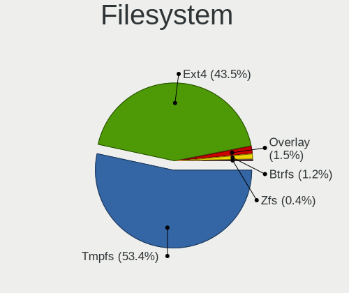
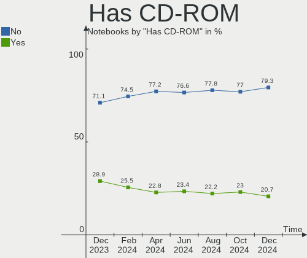
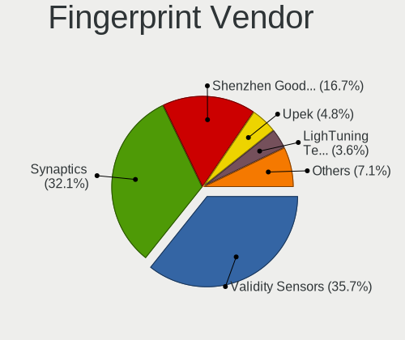
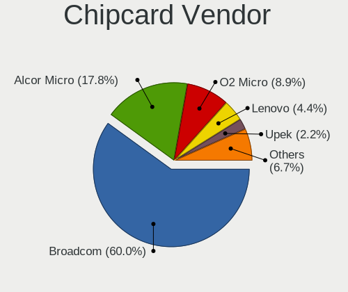

Ubuntu Hardware Trends (Notebook)
---------------------------------

A project to identify most popular hardware characteristics and track their change
over time based on data collected by Ubuntu users at https://Linux-Hardware.org.

Anyone can contribute to the study by uploading probes of their computers by
the [hw-probe](https://github.com/linuxhw/hw-probe) tool:

    sudo -E hw-probe -all -upload

Full-feature report is available here: https://linux-hardware.org/?view=trends&formfactor=notebook

Period: May, 2021.

Contents
--------

- [ OS                       ](#os)
- [ OS Family                ](#os-family)
- [ Kernel                   ](#kernel)
- [ Kernel Family            ](#kernel-family)
- [ Kernel Major Ver.        ](#kernel-major-ver)
- [ Arch                     ](#arch)
- [ DE                       ](#de)
- [ Display Server           ](#display-server)
- [ Display Manager          ](#display-manager)
- [ OS Lang                  ](#os-lang)
- [ Boot Mode                ](#boot-mode)
- [ Filesystem               ](#filesystem)
- [ Part. scheme             ](#part-scheme)
- [ Dual Boot with Linux/BSD ](#dual-boot-with-linux/bsd)
- [ Dual Boot (Win)          ](#dual-boot-win)
- [ Country                  ](#country)
- [ City                     ](#city)
- [ Vendor                   ](#vendor)
- [ Model                    ](#model)
- [ Model Family             ](#model-family)
- [ MFG Year                 ](#mfg-year)
- [ Form Factor              ](#form-factor)
- [ Secure Boot              ](#secure-boot)
- [ Coreboot                 ](#coreboot)
- [ RAM Size                 ](#ram-size)
- [ RAM Used                 ](#ram-used)
- [ Has CD-ROM               ](#has-cd-rom)
- [ Total Drives             ](#total-drives)
- [ Has Ethernet             ](#has-ethernet)
- [ Has WiFi                 ](#has-wifi)
- [ Has Bluetooth            ](#has-bluetooth)
- [ Drive Vendor             ](#drive-vendor)
- [ Drive Model              ](#drive-model)
- [ HDD Vendor               ](#hdd-vendor)
- [ SSD Vendor               ](#ssd-vendor)
- [ Drive Kind               ](#drive-kind)
- [ Drive Connector          ](#drive-connector)
- [ Drive Size               ](#drive-size)
- [ Space Total              ](#space-total)
- [ Space Used               ](#space-used)
- [ Malfunc. Drives          ](#malfunc-drives)
- [ Malfunc. Drive Vendor    ](#malfunc-drive-vendor)
- [ Malfunc. HDD Vendor      ](#malfunc-hdd-vendor)
- [ Malfunc. Drive Kind      ](#malfunc-drive-kind)
- [ Failed Drives            ](#failed-drives)
- [ Failed Drive Vendor      ](#failed-drive-vendor)
- [ Drive Status             ](#drive-status)
- [ Storage Vendor           ](#storage-vendor)
- [ Storage Model            ](#storage-model)
- [ Storage Kind             ](#storage-kind)
- [ CPU Vendor               ](#cpu-vendor)
- [ CPU Model                ](#cpu-model)
- [ CPU Model Family         ](#cpu-model-family)
- [ CPU Cores                ](#cpu-cores)
- [ CPU Sockets              ](#cpu-sockets)
- [ CPU Threads              ](#cpu-threads)
- [ CPU Op-Modes             ](#cpu-op-modes)
- [ CPU Microcode            ](#cpu-microcode)
- [ CPU Microarch            ](#cpu-microarch)
- [ GPU Vendor               ](#gpu-vendor)
- [ GPU Model                ](#gpu-model)
- [ GPU Combo                ](#gpu-combo)
- [ GPU Driver               ](#gpu-driver)
- [ GPU Memory               ](#gpu-memory)
- [ Monitor Vendor           ](#monitor-vendor)
- [ Monitor Model            ](#monitor-model)
- [ Monitor Resolution       ](#monitor-resolution)
- [ Monitor Diagonal         ](#monitor-diagonal)
- [ Monitor Width            ](#monitor-width)
- [ Aspect Ratio             ](#aspect-ratio)
- [ Monitor Area             ](#monitor-area)
- [ Pixel Density            ](#pixel-density)
- [ Multiple Monitors        ](#multiple-monitors)
- [ Net Controller Vendor    ](#net-controller-vendor)
- [ Net Controller Model     ](#net-controller-model)
- [ Wireless Vendor          ](#wireless-vendor)
- [ Wireless Model           ](#wireless-model)
- [ Ethernet Vendor          ](#ethernet-vendor)
- [ Ethernet Model           ](#ethernet-model)
- [ Net Controller Kind      ](#net-controller-kind)
- [ Used Controller          ](#used-controller)
- [ NICs                     ](#nics)
- [ IPv6                     ](#ipv6)
- [ Memory Vendor            ](#memory-vendor)
- [ Memory Model             ](#memory-model)
- [ Memory Kind              ](#memory-kind)
- [ Memory Form Factor       ](#memory-form-factor)
- [ Memory Size              ](#memory-size)
- [ Memory Speed             ](#memory-speed)
- [ Sound Vendor             ](#sound-vendor)
- [ Sound Model              ](#sound-model)
- [ Camera Vendor            ](#camera-vendor)
- [ Camera Model             ](#camera-model)
- [ Fingerprint Vendor       ](#fingerprint-vendor)
- [ Fingerprint Model        ](#fingerprint-model)
- [ Chipcard Vendor          ](#chipcard-vendor)
- [ Chipcard Model           ](#chipcard-model)
- [ Printer Vendor           ](#printer-vendor)
- [ Printer Model            ](#printer-model)
- [ Scanner Vendor           ](#scanner-vendor)
- [ Scanner Model            ](#scanner-model)
- [ Bluetooth Vendor         ](#bluetooth-vendor)
- [ Bluetooth Model          ](#bluetooth-model)
- [ Unsupported Devices      ](#unsupported-devices)
- [ Unsupported Device Types ](#unsupported-device-types)

OS
--

Installed operating systems

| Name         | Notebooks | Percent |
|--------------|-----------|---------|
| Ubuntu 20.04 | 455       | 61.9%   |
| Ubuntu 21.04 | 124       | 16.87%  |
| Ubuntu 20.10 | 84        | 11.43%  |
| Ubuntu 18.04 | 55        | 7.48%   |
| Ubuntu 16.04 | 11        | 1.5%    |
| Ubuntu 18.10 | 2         | 0.27%   |
| Ubuntu       | 2         | 0.27%   |
| Ubuntu 21.10 | 1         | 0.14%   |
| Ubuntu 10    | 1         | 0.14%   |

OS Family
---------

OS without a version

| Name   | Notebooks | Percent |
|--------|-----------|---------|
| Ubuntu | 735       | 100%    |

Kernel
------

Version of the Linux kernel

| Version                  | Notebooks | Percent |
|--------------------------|-----------|---------|
| 5.8.0-53-generic         | 191       | 25.99%  |
| 5.8.0-50-generic         | 162       | 22.04%  |
| 5.11.0-17-generic        | 69        | 9.39%   |
| 5.4.0-73-generic         | 52        | 7.07%   |
| 5.11.0-16-generic        | 47        | 6.39%   |
| 5.4.0-72-generic         | 41        | 5.58%   |
| 5.8.0-43-generic         | 25        | 3.4%    |
| 5.8.0-54-generic         | 16        | 2.18%   |
| 5.4.0-42-generic         | 14        | 1.9%    |
| 4.15.0-142-generic       | 11        | 1.5%    |
| 5.8.0-52-generic         | 9         | 1.22%   |
| 5.8.0-51-generic         | 8         | 1.09%   |
| 5.8.0-48-generic         | 7         | 0.95%   |
| 5.11.0-18-generic        | 5         | 0.68%   |
| 4.15.0-143-generic       | 5         | 0.68%   |
| 5.8.0-44-generic         | 3         | 0.41%   |
| 5.8.0-38-generic         | 3         | 0.41%   |
| 5.4.0-58-generic         | 3         | 0.41%   |
| 5.4.0-56-generic         | 3         | 0.41%   |
| 5.4.0-59-generic         | 2         | 0.27%   |
| 5.4.0-47-generic         | 2         | 0.27%   |
| 5.12.1-051201-generic    | 2         | 0.27%   |
| 5.11.0-051100-generic    | 2         | 0.27%   |
| 5.10.0-1026-oem          | 2         | 0.27%   |
| 4.16.18-pa2-2bp1         | 2         | 0.27%   |
| 5.9.6-050906-generic     | 1         | 0.14%   |
| 5.9.0-050900-generic     | 1         | 0.14%   |
| 5.8.0-54-lowlatency      | 1         | 0.14%   |
| 5.8.0-50-lowlatency      | 1         | 0.14%   |
| 5.8.0-49-generic         | 1         | 0.14%   |
| 5.8.0-45-generic         | 1         | 0.14%   |
| 5.8.0-42-generic         | 1         | 0.14%   |
| 5.8.0-41-generic         | 1         | 0.14%   |
| 5.8.0-25-generic         | 1         | 0.14%   |
| 5.8.0-14-generic         | 1         | 0.14%   |
| 5.7.1-050701-generic     | 1         | 0.14%   |
| 5.6.0-7-generic          | 1         | 0.14%   |
| 5.6.0-1055-oem           | 1         | 0.14%   |
| 5.4.0-70-lowlatency      | 1         | 0.14%   |
| 5.4.0-67-generic         | 1         | 0.14%   |
| 5.4.0-66-generic         | 1         | 0.14%   |
| 5.4.0-65-generic         | 1         | 0.14%   |
| 5.4.0-64-generic         | 1         | 0.14%   |
| 5.4.0-62-generic         | 1         | 0.14%   |
| 5.4.0-54-generic         | 1         | 0.14%   |
| 5.4.0-52-generic         | 1         | 0.14%   |
| 5.4.0-48-generic         | 1         | 0.14%   |
| 5.4.0-26-generic         | 1         | 0.14%   |
| 5.3.0-46-generic         | 1         | 0.14%   |
| 5.13.0-051300rc1-generic | 1         | 0.14%   |
| 5.12.4-051204-generic    | 1         | 0.14%   |
| 5.12.0-051200rc3-generic | 1         | 0.14%   |
| 5.12.0-051200-generic    | 1         | 0.14%   |
| 5.11.19-xanmod1          | 1         | 0.14%   |
| 5.11.16-051116-generic   | 1         | 0.14%   |
| 5.11.15-051115-generic   | 1         | 0.14%   |
| 5.11.11-051111-generic   | 1         | 0.14%   |
| 5.11.0-7614-generic      | 1         | 0.14%   |
| 5.11.0-17-lowlatency     | 1         | 0.14%   |
| 5.10.0-1028-oem          | 1         | 0.14%   |

Kernel Family
-------------

Linux kernel without a distro release

| Version  | Notebooks | Percent |
|----------|-----------|---------|
| 5.8.0    | 432       | 58.78%  |
| 5.4.0    | 127       | 17.28%  |
| 5.11.0   | 125       | 17.01%  |
| 4.15.0   | 21        | 2.86%   |
| 5.10.0   | 4         | 0.54%   |
| 4.4.0    | 3         | 0.41%   |
| 4.18.0   | 3         | 0.41%   |
| 5.6.0    | 2         | 0.27%   |
| 5.12.1   | 2         | 0.27%   |
| 5.12.0   | 2         | 0.27%   |
| 4.16.18  | 2         | 0.27%   |
| 5.9.6    | 1         | 0.14%   |
| 5.9.0    | 1         | 0.14%   |
| 5.7.1    | 1         | 0.14%   |
| 5.3.0    | 1         | 0.14%   |
| 5.13.0   | 1         | 0.14%   |
| 5.12.4   | 1         | 0.14%   |
| 5.11.19  | 1         | 0.14%   |
| 5.11.16  | 1         | 0.14%   |
| 5.11.15  | 1         | 0.14%   |
| 5.11.11  | 1         | 0.14%   |
| 5.0.0    | 1         | 0.14%   |
| 4.14.231 | 1         | 0.14%   |

Kernel Major Ver.
-----------------

Linux kernel major version

| Version | Notebooks | Percent |
|---------|-----------|---------|
| 5.8     | 432       | 58.78%  |
| 5.11    | 129       | 17.55%  |
| 5.4     | 127       | 17.28%  |
| 4.15    | 21        | 2.86%   |
| 5.12    | 5         | 0.68%   |
| 5.10    | 4         | 0.54%   |
| 4.4     | 3         | 0.41%   |
| 4.18    | 3         | 0.41%   |
| 5.9     | 2         | 0.27%   |
| 5.6     | 2         | 0.27%   |
| 4.16    | 2         | 0.27%   |
| 5.7     | 1         | 0.14%   |
| 5.3     | 1         | 0.14%   |
| 5.13    | 1         | 0.14%   |
| 5.0     | 1         | 0.14%   |
| 4.14    | 1         | 0.14%   |

Arch
----

OS architecture (x86_64, i586, etc.)

| Name   | Notebooks | Percent |
|--------|-----------|---------|
| x86_64 | 730       | 99.32%  |
| i686   | 5         | 0.68%   |

DE
--

Desktop Environment

| Name            | Notebooks | Percent |
|-----------------|-----------|---------|
| GNOME           | 625       | 85.03%  |
| Unknown         | 68        | 9.25%   |
| Unity           | 17        | 2.31%   |
| GNOME Flashback | 10        | 1.36%   |
| X-Cinnamon      | 5         | 0.68%   |
| Deepin          | 4         | 0.54%   |
| openbox         | 2         | 0.27%   |
| Cinnamon        | 2         | 0.27%   |
| Pantheon        | 1         | 0.14%   |
| Enlightenment   | 1         | 0.14%   |

Display Server
--------------

X11 or Wayland

| Name    | Notebooks | Percent |
|---------|-----------|---------|
| X11     | 603       | 82.04%  |
| Wayland | 90        | 12.24%  |
| Unknown | 38        | 5.17%   |
| Tty     | 4         | 0.54%   |

Display Manager
---------------

SDDM, LightDM, etc.

| Name    | Notebooks | Percent |
|---------|-----------|---------|
| Unknown | 544       | 74.01%  |
| GDM     | 181       | 24.63%  |
| TDM     | 8         | 1.09%   |
| XDM     | 1         | 0.14%   |
| SDDM    | 1         | 0.14%   |

OS Lang
-------

Language

| Lang    | Notebooks | Percent |
|---------|-----------|---------|
| en_US   | 296       | 40.27%  |
| de_DE   | 64        | 8.71%   |
| fr_FR   | 62        | 8.44%   |
| en_GB   | 36        | 4.9%    |
| en_IN   | 35        | 4.76%   |
| pt_BR   | 31        | 4.22%   |
| es_ES   | 21        | 2.86%   |
| it_IT   | 16        | 2.18%   |
| pl_PL   | 15        | 2.04%   |
| en_CA   | 15        | 2.04%   |
| nl_NL   | 11        | 1.5%    |
| en_AU   | 11        | 1.5%    |
| C       | 10        | 1.36%   |
| en_ZA   | 9         | 1.22%   |
| ru_RU   | 8         | 1.09%   |
| es_CL   | 7         | 0.95%   |
| es_MX   | 5         | 0.68%   |
| de_CH   | 5         | 0.68%   |
| cs_CZ   | 5         | 0.68%   |
| Unknown | 5         | 0.68%   |
| ja_JP   | 4         | 0.54%   |
| hu_HU   | 4         | 0.54%   |
| es_UY   | 4         | 0.54%   |
| es_AR   | 4         | 0.54%   |
| zh_CN   | 3         | 0.41%   |
| pt_PT   | 3         | 0.41%   |
| es_CO   | 3         | 0.41%   |
| en_IE   | 3         | 0.41%   |
| de_AT   | 3         | 0.41%   |
| uk_UA   | 2         | 0.27%   |
| sv_SE   | 2         | 0.27%   |
| ro_RO   | 2         | 0.27%   |
| nl_BE   | 2         | 0.27%   |
| ko_KR   | 2         | 0.27%   |
| fi_FI   | 2         | 0.27%   |
| es_EC   | 2         | 0.27%   |
| en_IL   | 2         | 0.27%   |
| da_DK   | 2         | 0.27%   |
| ca_ES   | 2         | 0.27%   |
| zh_TW   | 1         | 0.14%   |
| vi_VN   | 1         | 0.14%   |
| tr_TR   | 1         | 0.14%   |
| sr_RS   | 1         | 0.14%   |
| sk_SK   | 1         | 0.14%   |
| ru_UA   | 1         | 0.14%   |
| nb_NO   | 1         | 0.14%   |
| hr_HR   | 1         | 0.14%   |
| fr_CH   | 1         | 0.14%   |
| fr_CA   | 1         | 0.14%   |
| es_VE   | 1         | 0.14%   |
| es_CR   | 1         | 0.14%   |
| en_SG   | 1         | 0.14%   |
| en_NZ   | 1         | 0.14%   |
| en_NG   | 1         | 0.14%   |
| en_HK   | 1         | 0.14%   |
| de_IT   | 1         | 0.14%   |

Boot Mode
---------

EFI or BIOS

| Mode | Notebooks | Percent |
|------|-----------|---------|
| EFI  | 369       | 50.2%   |
| BIOS | 366       | 49.8%   |

Filesystem
----------

Type of filesystem

| Type    | Notebooks | Percent |
|---------|-----------|---------|
| Ext4    | 698       | 94.97%  |
| Overlay | 19        | 2.59%   |
| Zfs     | 9         | 1.22%   |
| Btrfs   | 7         | 0.95%   |
| Ext3    | 2         | 0.27%   |

Part. scheme
------------

Scheme of partitioning

| Type    | Notebooks | Percent |
|---------|-----------|---------|
| Unknown | 540       | 73.47%  |
| GPT     | 167       | 22.72%  |
| MBR     | 28        | 3.81%   |

Dual Boot with Linux/BSD
------------------------

Hosting more than one Linux/BSD

| Dual boot | Notebooks | Percent |
|-----------|-----------|---------|
| No        | 672       | 91.43%  |
| Yes       | 63        | 8.57%   |

Dual Boot (Win)
---------------

Hosting Linux and Windows

| Dual boot | Notebooks | Percent |
|-----------|-----------|---------|
| No        | 482       | 65.58%  |
| Yes       | 253       | 34.42%  |

Country
-------

Geographic location (country)

| Country      | Notebooks | Percent |
|--------------|-----------|---------|
| USA          | 102       | 13.88%  |
| Germany      | 80        | 10.88%  |
| France       | 61        | 8.3%    |
| Brazil       | 46        | 6.26%   |
| India        | 38        | 5.17%   |
| UK           | 26        | 3.54%   |
| Italy        | 26        | 3.54%   |
| Spain        | 21        | 2.86%   |
| Poland       | 21        | 2.86%   |
| Netherlands  | 20        | 2.72%   |
| Canada       | 18        | 2.45%   |
| Russia       | 17        | 2.31%   |
| Switzerland  | 14        | 1.9%    |
| Czechia      | 12        | 1.63%   |
| Australia    | 12        | 1.63%   |
| Ukraine      | 11        | 1.5%    |
| South Africa | 11        | 1.5%    |
| Mexico       | 10        | 1.36%   |
| Belgium      | 9         | 1.22%   |
| Chile        | 8         | 1.09%   |
| Romania      | 7         | 0.95%   |
| Greece       | 7         | 0.95%   |
| Austria      | 7         | 0.95%   |
| Argentina    | 7         | 0.95%   |
| Turkey       | 6         | 0.82%   |
| Sweden       | 6         | 0.82%   |
| Portugal     | 6         | 0.82%   |
| Denmark      | 6         | 0.82%   |
| China        | 6         | 0.82%   |
| Vietnam      | 5         | 0.68%   |
| Uruguay      | 5         | 0.68%   |
| Japan        | 5         | 0.68%   |
| Hungary      | 5         | 0.68%   |
| Colombia     | 5         | 0.68%   |
| Slovakia     | 4         | 0.54%   |
| Kenya        | 4         | 0.54%   |
| Israel       | 4         | 0.54%   |
| Ireland      | 4         | 0.54%   |
| South Korea  | 3         | 0.41%   |
| Singapore    | 3         | 0.41%   |
| Norway       | 3         | 0.41%   |
| Finland      | 3         | 0.41%   |
| Estonia      | 3         | 0.41%   |
| Costa Rica   | 3         | 0.41%   |
| Bangladesh   | 3         | 0.41%   |
| Venezuela    | 2         | 0.27%   |
| UAE          | 2         | 0.27%   |
| Thailand     | 2         | 0.27%   |
| Taiwan       | 2         | 0.27%   |
| Serbia       | 2         | 0.27%   |
| New Zealand  | 2         | 0.27%   |
| Latvia       | 2         | 0.27%   |
| Iran         | 2         | 0.27%   |
| Ecuador      | 2         | 0.27%   |
| Bulgaria     | 2         | 0.27%   |
| Belarus      | 2         | 0.27%   |
| Tunisia      | 1         | 0.14%   |
| Syria        | 1         | 0.14%   |
| Saudi Arabia | 1         | 0.14%   |
| Qatar        | 1         | 0.14%   |

City
----

Geographic location (city)

| City              | Notebooks | Percent |
|-------------------|-----------|---------|
| Berlin            | 9         | 1.22%   |
| Paris             | 8         | 1.09%   |
| Madrid            | 6         | 0.82%   |
| Kyiv              | 6         | 0.82%   |
| Rome              | 5         | 0.68%   |
| Pune              | 5         | 0.68%   |
| Hamburg           | 5         | 0.68%   |
| Vienna            | 4         | 0.54%   |
| São Paulo        | 4         | 0.54%   |
| St Petersburg     | 4         | 0.54%   |
| Santiago          | 4         | 0.54%   |
| Montevideo        | 4         | 0.54%   |
| Milan             | 4         | 0.54%   |
| Mexico City       | 4         | 0.54%   |
| Cologne           | 4         | 0.54%   |
| Bucharest         | 4         | 0.54%   |
| Athens            | 4         | 0.54%   |
| Tel Aviv          | 3         | 0.41%   |
| Tallinn           | 3         | 0.41%   |
| Pretoria          | 3         | 0.41%   |
| Prague            | 3         | 0.41%   |
| Nairobi           | 3         | 0.41%   |
| Mumbai            | 3         | 0.41%   |
| Moscow            | 3         | 0.41%   |
| Lucknow           | 3         | 0.41%   |
| London            | 3         | 0.41%   |
| Johannesburg      | 3         | 0.41%   |
| Frankfurt am Main | 3         | 0.41%   |
| Dublin            | 3         | 0.41%   |
| Budapest          | 3         | 0.41%   |
| Barcelona         | 3         | 0.41%   |
| West Bloomfield   | 2         | 0.27%   |
| Wellington        | 2         | 0.27%   |
| Warsaw            | 2         | 0.27%   |
| Vestal            | 2         | 0.27%   |
| Valladolid        | 2         | 0.27%   |
| Trivandrum        | 2         | 0.27%   |
| Thessaloniki      | 2         | 0.27%   |
| Srednyaya Akhtuba | 2         | 0.27%   |
| Singapore         | 2         | 0.27%   |
| Santa Fe          | 2         | 0.27%   |
| Saarbrücken      | 2         | 0.27%   |
| Rio de Janeiro    | 2         | 0.27%   |
| Riga              | 2         | 0.27%   |
| Port Elizabeth    | 2         | 0.27%   |
| Nuremberg         | 2         | 0.27%   |
| Niterói          | 2         | 0.27%   |
| New York          | 2         | 0.27%   |
| Munich            | 2         | 0.27%   |
| Montreal          | 2         | 0.27%   |
| Minsk             | 2         | 0.27%   |
| Leipzig           | 2         | 0.27%   |
| Lausanne          | 2         | 0.27%   |
| Hyderabad         | 2         | 0.27%   |
| Ho Chi Minh City  | 2         | 0.27%   |
| Helsinki          | 2         | 0.27%   |
| Göttingen        | 2         | 0.27%   |
| Groningen         | 2         | 0.27%   |
| Ernakulam         | 2         | 0.27%   |
| Dubendorf         | 2         | 0.27%   |

Vendor
------

Motherboard manufacturer

| Name                     | Notebooks | Percent |
|--------------------------|-----------|---------|
| Dell                     | 155       | 21.09%  |
| Hewlett-Packard          | 146       | 19.86%  |
| Lenovo                   | 143       | 19.46%  |
| ASUSTek Computer         | 63        | 8.57%   |
| Acer                     | 48        | 6.53%   |
| Toshiba                  | 23        | 3.13%   |
| Samsung Electronics      | 19        | 2.59%   |
| Apple                    | 17        | 2.31%   |
| Sony                     | 14        | 1.9%    |
| MSI                      | 14        | 1.9%    |
| HUAWEI                   | 8         | 1.09%   |
| Unknown                  | 6         | 0.82%   |
| TUXEDO                   | 5         | 0.68%   |
| Fujitsu                  | 5         | 0.68%   |
| Alienware                | 5         | 0.68%   |
| System76                 | 4         | 0.54%   |
| Positivo                 | 4         | 0.54%   |
| Notebook                 | 4         | 0.54%   |
| LG Electronics           | 4         | 0.54%   |
| Positivo Bahia - VAIO    | 3         | 0.41%   |
| Panasonic                | 3         | 0.41%   |
| Medion                   | 3         | 0.41%   |
| Standard                 | 2         | 0.27%   |
| PC Specialist            | 2         | 0.27%   |
| Packard Bell             | 2         | 0.27%   |
| Gigabyte Technology      | 2         | 0.27%   |
| Fujitsu Siemens          | 2         | 0.27%   |
| eMachines                | 2         | 0.27%   |
| ECS                      | 2         | 0.27%   |
| Dynabook                 | 2         | 0.27%   |
| whyopencomputing         | 1         | 0.14%   |
| VIT                      | 1         | 0.14%   |
| Teclast                  | 1         | 0.14%   |
| Shuttle                  | 1         | 0.14%   |
| Razer                    | 1         | 0.14%   |
| Purism                   | 1         | 0.14%   |
| Phoenix/SiS              | 1         | 0.14%   |
| Minix                    | 1         | 0.14%   |
| LAMINA                   | 1         | 0.14%   |
| Intel Client Systems     | 1         | 0.14%   |
| Insignia                 | 1         | 0.14%   |
| Hometech                 | 1         | 0.14%   |
| HCL Infosystems Limited  | 1         | 0.14%   |
| GEO                      | 1         | 0.14%   |
| essentielb               | 1         | 0.14%   |
| Entroware                | 1         | 0.14%   |
| Coradir                  | 1         | 0.14%   |
| Coconics Private Limited | 1         | 0.14%   |
| Clevo                    | 1         | 0.14%   |
| CCE                      | 1         | 0.14%   |
| Avell High Performance   | 1         | 0.14%   |
| ATARI                    | 1         | 0.14%   |
| AMI                      | 1         | 0.14%   |

Model
-----

Motherboard model

| Name                                | Notebooks | Percent |
|-------------------------------------|-----------|---------|
| Unknown                             | 12        | 1.63%   |
| HP Notebook                         | 6         | 0.82%   |
| Dell XPS 15 9500                    | 5         | 0.68%   |
| Dell XPS 15 7590                    | 5         | 0.68%   |
| Lenovo IdeaPad 320-15IKB 80XL       | 4         | 0.54%   |
| HP Pavilion dv6                     | 4         | 0.54%   |
| Dell XPS 13 9310                    | 4         | 0.54%   |
| Dell Latitude 5520                  | 4         | 0.54%   |
| Lenovo Y50-70 20378                 | 3         | 0.41%   |
| Lenovo Legion Y530-15ICH 81FV       | 3         | 0.41%   |
| Lenovo G50-45 80E3                  | 3         | 0.41%   |
| HP ProBook 450 G7                   | 3         | 0.41%   |
| HP Pavilion Notebook                | 3         | 0.41%   |
| HP Pavilion Gaming Laptop 15-cx0xxx | 3         | 0.41%   |
| HP Pavilion g7                      | 3         | 0.41%   |
| HP Pavilion dv7                     | 3         | 0.41%   |
| HP Pavilion dv6700                  | 3         | 0.41%   |
| HP EliteBook 840 G2                 | 3         | 0.41%   |
| HP 250 G7 Notebook PC               | 3         | 0.41%   |
| Dell XPS 13 9360                    | 3         | 0.41%   |
| Dell Precision 5530                 | 3         | 0.41%   |
| Dell Latitude E6440                 | 3         | 0.41%   |
| Dell Latitude E6430                 | 3         | 0.41%   |
| Dell Latitude E6420                 | 3         | 0.41%   |
| Dell Latitude E6400                 | 3         | 0.41%   |
| Dell Latitude 5511                  | 3         | 0.41%   |
| Apple MacBookPro8,1                 | 3         | 0.41%   |
| Acer Swift SF314-59                 | 3         | 0.41%   |
| Toshiba Satellite C55-A             | 2         | 0.27%   |
| System76 Galago Pro                 | 2         | 0.27%   |
| Samsung 340XAA/350XAA/550XAA        | 2         | 0.27%   |
| MSI GL73 8RD                        | 2         | 0.27%   |
| Lenovo V145-15AST 81MT              | 2         | 0.27%   |
| Lenovo IdeaPad 520-15IKB 81BF       | 2         | 0.27%   |
| Lenovo IdeaPad 320-15IKB 80YH       | 2         | 0.27%   |
| Lenovo IdeaPad 100-15IBY 80MJ       | 2         | 0.27%   |
| HUAWEI MACH-WX9                     | 2         | 0.27%   |
| HP ProBook 6560b                    | 2         | 0.27%   |
| HP ProBook 455 G7                   | 2         | 0.27%   |
| HP ProBook 450 G2                   | 2         | 0.27%   |
| HP ProBook 430 G1                   | 2         | 0.27%   |
| HP Pavilion 15                      | 2         | 0.27%   |
| HP Laptop 15s-eq2xxx                | 2         | 0.27%   |
| HP Laptop 15-dw0xxx                 | 2         | 0.27%   |
| HP Laptop 15-db0xxx                 | 2         | 0.27%   |
| HP Laptop 15-da0xxx                 | 2         | 0.27%   |
| HP G62                              | 2         | 0.27%   |
| HP G60                              | 2         | 0.27%   |
| HP EliteBook 845 G7 Notebook PC     | 2         | 0.27%   |
| HP EliteBook 8440p                  | 2         | 0.27%   |
| HP EliteBook 2540p                  | 2         | 0.27%   |
| HP Compaq Presario C700             | 2         | 0.27%   |
| HP 15                               | 2         | 0.27%   |
| HP 1000                             | 2         | 0.27%   |
| ECS SF20PA2                         | 2         | 0.27%   |
| Dell XPS M1530                      | 2         | 0.27%   |
| Dell XPS 15 9550                    | 2         | 0.27%   |
| Dell XPS 13 9350                    | 2         | 0.27%   |
| Dell XPS 13 7390                    | 2         | 0.27%   |
| Dell Vostro 5568                    | 2         | 0.27%   |

Model Family
------------

Motherboard model prefix

| Name              | Notebooks | Percent |
|-------------------|-----------|---------|
| Lenovo ThinkPad   | 64        | 8.71%   |
| Dell Latitude     | 56        | 7.62%   |
| Dell Inspiron     | 39        | 5.31%   |
| Lenovo IdeaPad    | 36        | 4.9%    |
| Dell XPS          | 31        | 4.22%   |
| HP Pavilion       | 30        | 4.08%   |
| Acer Aspire       | 29        | 3.95%   |
| HP ProBook        | 27        | 3.67%   |
| HP EliteBook      | 24        | 3.27%   |
| HP Laptop         | 21        | 2.86%   |
| Toshiba Satellite | 19        | 2.59%   |
| Dell Precision    | 16        | 2.18%   |
| ASUS VivoBook     | 12        | 1.63%   |
| Unknown           | 12        | 1.63%   |
| Acer Swift        | 8         | 1.09%   |
| Lenovo Legion     | 7         | 0.95%   |
| Dell Vostro       | 7         | 0.95%   |
| HP ZBook          | 6         | 0.82%   |
| HP Notebook       | 6         | 0.82%   |
| Apple MacBookPro8 | 5         | 0.68%   |
| Acer TravelMate   | 5         | 0.68%   |
| Lenovo ThinkBook  | 4         | 0.54%   |
| HP Compaq         | 4         | 0.54%   |
| Fujitsu LIFEBOOK  | 4         | 0.54%   |
| ASUS ROG          | 4         | 0.54%   |
| System76 Galago   | 3         | 0.41%   |
| MSI GL73          | 3         | 0.41%   |
| Lenovo Yoga       | 3         | 0.41%   |
| Lenovo Y50-70     | 3         | 0.41%   |
| Lenovo G50-45     | 3         | 0.41%   |
| HP ENVY           | 3         | 0.41%   |
| HP 250            | 3         | 0.41%   |
| Dell G5           | 3         | 0.41%   |
| ASUS ZenBook      | 3         | 0.41%   |
| Toshiba PORTEGE   | 2         | 0.27%   |
| Samsung 340XAA    | 2         | 0.27%   |
| MSI Prestige      | 2         | 0.27%   |
| MSI GF63          | 2         | 0.27%   |
| Lenovo V145-15AST | 2         | 0.27%   |
| HUAWEI MACH-WX9   | 2         | 0.27%   |
| HP OMEN           | 2         | 0.27%   |
| HP G62            | 2         | 0.27%   |
| HP G60            | 2         | 0.27%   |
| HP 255            | 2         | 0.27%   |
| HP 15             | 2         | 0.27%   |
| HP 1000           | 2         | 0.27%   |
| Gigabyte AERO     | 2         | 0.27%   |
| ECS SF20PA2       | 2         | 0.27%   |
| Dynabook dynabook | 2         | 0.27%   |
| Dell G3           | 2         | 0.27%   |
| ASUS X751SA       | 2         | 0.27%   |
| ASUS T100HAN      | 2         | 0.27%   |
| ASUS N550JV       | 2         | 0.27%   |
| ASUS K52F         | 2         | 0.27%   |
| Apple MacBook5    | 2         | 0.27%   |
| Acer Predator     | 2         | 0.27%   |
| VIT P2400         | 1         | 0.14%   |
| TUXEDO Polaris    | 1         | 0.14%   |
| TUXEDO Book       | 1         | 0.14%   |
| TUXEDO Aura       | 1         | 0.14%   |

MFG Year
--------

Motherboard manufacture year

| Year    | Notebooks | Percent |
|---------|-----------|---------|
| 2020    | 159       | 21.63%  |
| 2019    | 94        | 12.79%  |
| 2021    | 75        | 10.2%   |
| 2018    | 62        | 8.44%   |
| 2014    | 42        | 5.71%   |
| 2012    | 42        | 5.71%   |
| 2015    | 41        | 5.58%   |
| 2011    | 40        | 5.44%   |
| 2013    | 39        | 5.31%   |
| 2017    | 33        | 4.49%   |
| 2010    | 28        | 3.81%   |
| 2016    | 26        | 3.54%   |
| 2008    | 24        | 3.27%   |
| 2009    | 22        | 2.99%   |
| 2007    | 4         | 0.54%   |
| 2006    | 2         | 0.27%   |
| 2005    | 1         | 0.14%   |
| Unknown | 1         | 0.14%   |

Form Factor
-----------

Physical design of the computer

| Name     | Notebooks | Percent |
|----------|-----------|---------|
| Notebook | 735       | 100%    |

Secure Boot
-----------

Enabled or disabled

| State    | Notebooks | Percent |
|----------|-----------|---------|
| Disabled | 629       | 85.58%  |
| Enabled  | 106       | 14.42%  |

Coreboot
--------

Have coreboot on board

| Used | Notebooks | Percent |
|------|-----------|---------|
| No   | 734       | 99.86%  |
| Yes  | 1         | 0.14%   |

RAM Size
--------

Total RAM memory

| Size in GB  | Notebooks | Percent |
|-------------|-----------|---------|
| 4.01-8.0    | 209       | 28.44%  |
| 3.01-4.0    | 168       | 22.86%  |
| 16.01-24.0  | 127       | 17.28%  |
| 8.01-16.0   | 109       | 14.83%  |
| 32.01-64.0  | 58        | 7.89%   |
| 1.01-2.0    | 31        | 4.22%   |
| 64.01-256.0 | 13        | 1.77%   |
| 2.01-3.0    | 11        | 1.5%    |
| 24.01-32.0  | 6         | 0.82%   |
| 0.51-1.0    | 3         | 0.41%   |

RAM Used
--------

Used RAM memory

| Used GB    | Notebooks | Percent |
|------------|-----------|---------|
| 1.01-2.0   | 271       | 36.87%  |
| 2.01-3.0   | 213       | 28.98%  |
| 4.01-8.0   | 104       | 14.15%  |
| 3.01-4.0   | 84        | 11.43%  |
| 8.01-16.0  | 40        | 5.44%   |
| 0.51-1.0   | 19        | 2.59%   |
| 24.01-32.0 | 2         | 0.27%   |
| 16.01-24.0 | 1         | 0.14%   |
| 0.01-0.5   | 1         | 0.14%   |

Has CD-ROM
----------

Has CD-ROM on board

| Presented | Notebooks | Percent |
|-----------|-----------|---------|
| No        | 448       | 60.95%  |
| Yes       | 287       | 39.05%  |

Total Drives
------------

Number of drives on board

| Drives | Notebooks | Percent |
|--------|-----------|---------|
| 1      | 567       | 77.14%  |
| 2      | 137       | 18.64%  |
| 3      | 21        | 2.86%   |
| 0      | 5         | 0.68%   |
| 4      | 3         | 0.41%   |
| 8      | 1         | 0.14%   |
| 6      | 1         | 0.14%   |

Has Ethernet
------------

Has Ethernet on board

| Presented | Notebooks | Percent |
|-----------|-----------|---------|
| Yes       | 604       | 82.18%  |
| No        | 131       | 17.82%  |

Has WiFi
--------

Has WiFi module

| Presented | Notebooks | Percent |
|-----------|-----------|---------|
| Yes       | 722       | 98.23%  |
| No        | 13        | 1.77%   |

Has Bluetooth
-------------

Has Bluetooth module

| Presented | Notebooks | Percent |
|-----------|-----------|---------|
| Yes       | 557       | 75.78%  |
| No        | 178       | 24.22%  |

Drive Vendor
------------

Hard drive vendors

| Vendor                    | Notebooks | Drives | Percent |
|---------------------------|-----------|--------|---------|
| Samsung Electronics       | 131       | 135    | 14.94%  |
| WDC                       | 124       | 128    | 14.14%  |
| Seagate                   | 110       | 116    | 12.54%  |
| Toshiba                   | 88        | 89     | 10.03%  |
| SanDisk                   | 52        | 53     | 5.93%   |
| Unknown                   | 47        | 52     | 5.36%   |
| Kingston                  | 39        | 39     | 4.45%   |
| SK Hynix                  | 35        | 35     | 3.99%   |
| Intel                     | 30        | 31     | 3.42%   |
| HGST                      | 30        | 30     | 3.42%   |
| Hitachi                   | 25        | 27     | 2.85%   |
| Micron Technology         | 23        | 23     | 2.62%   |
| Crucial                   | 23        | 23     | 2.62%   |
| A-DATA Technology         | 11        | 11     | 1.25%   |
| Patriot                   | 7         | 7      | 0.8%    |
| LITEONIT                  | 7         | 7      | 0.8%    |
| KIOXIA                    | 7         | 7      | 0.8%    |
| Phison                    | 5         | 5      | 0.57%   |
| LITEON                    | 5         | 5      | 0.57%   |
| Intenso                   | 5         | 6      | 0.57%   |
| ASMT                      | 5         | 9      | 0.57%   |
| Apple                     | 5         | 5      | 0.57%   |
| Union Memory              | 3         | 3      | 0.34%   |
| Realtek Semiconductor     | 3         | 3      | 0.34%   |
| OCZ                       | 3         | 3      | 0.34%   |
| Micron/Crucial Technology | 3         | 3      | 0.34%   |
| KingSpec                  | 3         | 3      | 0.34%   |
| Fujitsu                   | 3         | 3      | 0.34%   |
| SPCC                      | 2         | 2      | 0.23%   |
| SABRENT                   | 2         | 2      | 0.23%   |
| PNY                       | 2         | 2      | 0.23%   |
| JMicron                   | 2         | 2      | 0.23%   |
| External                  | 2         | 2      | 0.23%   |
| China                     | 2         | 2      | 0.23%   |
| ADATA Technology          | 2         | 2      | 0.23%   |
| Vaseky                    | 1         | 1      | 0.11%   |
| VALK                      | 1         | 1      | 0.11%   |
| USB3.1                    | 1         | 1      | 0.11%   |
| USB                       | 1         | 1      | 0.11%   |
| Union Memory (Shenzhen)   | 1         | 1      | 0.11%   |
| Transcend                 | 1         | 1      | 0.11%   |
| Teclast                   | 1         | 1      | 0.11%   |
| Team                      | 1         | 1      | 0.11%   |
| SSSTC                     | 1         | 1      | 0.11%   |
| Silicon Motion            | 1         | 1      | 0.11%   |
| PNY USB                   | 1         | 1      | 0.11%   |
| Phison Electronics        | 1         | 2      | 0.11%   |
| PCIe SSD                  | 1         | 2      | 0.11%   |
| OWC                       | 1         | 1      | 0.11%   |
| NMICRO                    | 1         | 1      | 0.11%   |
| Mushkin                   | 1         | 2      | 0.11%   |
| Lite-On                   | 1         | 1      | 0.11%   |
| Lenovo                    | 1         | 1      | 0.11%   |
| LaCie                     | 1         | 1      | 0.11%   |
| KLLISRE                   | 1         | 1      | 0.11%   |
| KingDian                  | 1         | 1      | 0.11%   |
| INNOVATION IT             | 1         | 1      | 0.11%   |
| HS-SSD-C100               | 1         | 1      | 0.11%   |
| Hewlett-Packard           | 1         | 1      | 0.11%   |
| GOODRAM                   | 1         | 1      | 0.11%   |

Drive Model
-----------

Hard drive models

| Model                                | Notebooks | Percent |
|--------------------------------------|-----------|---------|
| Seagate ST1000LM035-1RK172 1TB       | 17        | 1.91%   |
| Seagate ST1000LM024 HN-M101MBB 1TB   | 17        | 1.91%   |
| Unknown MMC Card  32GB               | 13        | 1.46%   |
| Toshiba MQ01ABD100 1TB               | 13        | 1.46%   |
| Samsung NVMe SSD Drive 512GB         | 13        | 1.46%   |
| HGST HTS721010A9E630 1TB             | 11        | 1.23%   |
| Samsung NVMe SSD Drive 256GB         | 10        | 1.12%   |
| Toshiba MQ01ABF050 500GB             | 9         | 1.01%   |
| SK Hynix NVMe SSD Drive 512GB        | 9         | 1.01%   |
| Sandisk NVMe SSD Drive 512GB         | 9         | 1.01%   |
| Intel NVMe SSD Drive 512GB           | 9         | 1.01%   |
| Toshiba NVMe SSD Drive 512GB         | 8         | 0.9%    |
| Seagate ST9500325AS 500GB            | 7         | 0.78%   |
| Seagate ST500LT012-1DG142 500GB      | 7         | 0.78%   |
| Seagate ST500LM012 HN-M500MBB 500GB  | 7         | 0.78%   |
| Samsung NVMe SSD Drive 1024GB        | 7         | 0.78%   |
| Kingston SA400S37480G 480GB SSD      | 7         | 0.78%   |
| Samsung SSD 860 EVO 500GB            | 6         | 0.67%   |
| Kingston SA400S37240G 240GB SSD      | 6         | 0.67%   |
| WDC WD10JPVX-22JC3T0 1TB             | 5         | 0.56%   |
| Unknown MMC Card  16GB               | 5         | 0.56%   |
| Seagate ST2000LM007-1R8174 2TB       | 5         | 0.56%   |
| Seagate ST1000LM048-2E7172 1TB       | 5         | 0.56%   |
| Samsung NVMe SSD Drive 1TB           | 5         | 0.56%   |
| HGST HTS545050A7E680 500GB           | 5         | 0.56%   |
| WDC WDS500G2B0A-00SM50 500GB SSD     | 4         | 0.45%   |
| WDC WD10SPZX-24Z10 1TB               | 4         | 0.45%   |
| Unknown MMC Card  64GB               | 4         | 0.45%   |
| Toshiba MQ04ABF100 1TB               | 4         | 0.45%   |
| Seagate ST1000LX015-1U7172 1TB       | 4         | 0.45%   |
| Samsung SSD 850 EVO 250GB            | 4         | 0.45%   |
| Kingston SA400S37120G 120GB SSD      | 4         | 0.45%   |
| HGST HTS545050A7E380 500GB           | 4         | 0.45%   |
| Crucial CT500MX500SSD1 500GB         | 4         | 0.45%   |
| WDC WDS240G2G0A-00JH30 240GB SSD     | 3         | 0.34%   |
| WDC WD5000LPCX-24VHAT0 500GB         | 3         | 0.34%   |
| WDC WD10SPZX-60Z10T0 1TB             | 3         | 0.34%   |
| WDC WD10JPVX-75JC3T0 1TB             | 3         | 0.34%   |
| WDC WD10JPVX-60JC3T0 1TB             | 3         | 0.34%   |
| WDC WD10JPCX-24UE4T0 1TB             | 3         | 0.34%   |
| WDC PC SN530 SDBPNPZ-256G-1006 256GB | 3         | 0.34%   |
| Unknown SD/MMC/MS PRO 8GB            | 3         | 0.34%   |
| Unknown MMC Card  536GB              | 3         | 0.34%   |
| Toshiba MQ01ABD050V 500GB            | 3         | 0.34%   |
| Seagate ST750LM022 HN-M750MBB 752GB  | 3         | 0.34%   |
| Seagate ST500LT012-9WS142 500GB      | 3         | 0.34%   |
| Seagate ST1000LM049-2GH172 1TB       | 3         | 0.34%   |
| Seagate Expansion 2TB                | 3         | 0.34%   |
| SanDisk SD8SN8U-256G-1006 256GB SSD  | 3         | 0.34%   |
| Sandisk NVMe SSD Drive 256GB         | 3         | 0.34%   |
| Samsung SSD 970 EVO Plus 2TB         | 3         | 0.34%   |
| Samsung SSD 860 EVO 1TB              | 3         | 0.34%   |
| Samsung SSD 840 EVO 250GB            | 3         | 0.34%   |
| Samsung SSD 840 EVO 120GB            | 3         | 0.34%   |
| Samsung NVMe SSD Drive 500GB         | 3         | 0.34%   |
| Micron NVMe SSD Drive 512GB          | 3         | 0.34%   |
| Micron 2300 NVMe 512GB               | 3         | 0.34%   |
| KIOXIA NVMe SSD Drive 512GB          | 3         | 0.34%   |
| KIOXIA NVMe SSD Drive 256GB          | 3         | 0.34%   |
| Kingston SV300S37A120G 120GB SSD     | 3         | 0.34%   |

HDD Vendor
----------

Hard disk drive vendors

| Vendor              | Notebooks | Drives | Percent |
|---------------------|-----------|--------|---------|
| Seagate             | 107       | 110    | 33.23%  |
| WDC                 | 86        | 87     | 26.71%  |
| Toshiba             | 56        | 57     | 17.39%  |
| HGST                | 30        | 30     | 9.32%   |
| Hitachi             | 25        | 27     | 7.76%   |
| Samsung Electronics | 5         | 5      | 1.55%   |
| Intenso             | 3         | 4      | 0.93%   |
| Fujitsu             | 3         | 3      | 0.93%   |
| ASMT                | 3         | 7      | 0.93%   |
| USB                 | 1         | 1      | 0.31%   |
| Unknown             | 1         | 1      | 0.31%   |
| LaCie               | 1         | 1      | 0.31%   |
| Apple               | 1         | 1      | 0.31%   |

SSD Vendor
----------

Solid state drive vendors

| Vendor              | Notebooks | Drives | Percent |
|---------------------|-----------|--------|---------|
| Samsung Electronics | 57        | 57     | 22.01%  |
| SanDisk             | 35        | 35     | 13.51%  |
| Kingston            | 31        | 31     | 11.97%  |
| Crucial             | 23        | 23     | 8.88%   |
| WDC                 | 14        | 15     | 5.41%   |
| Intel               | 11        | 11     | 4.25%   |
| A-DATA Technology   | 8         | 8      | 3.09%   |
| Toshiba             | 7         | 7      | 2.7%    |
| Patriot             | 7         | 7      | 2.7%    |
| LITEONIT            | 7         | 7      | 2.7%    |
| SK Hynix            | 6         | 6      | 2.32%   |
| Micron Technology   | 6         | 6      | 2.32%   |
| LITEON              | 5         | 5      | 1.93%   |
| Apple               | 4         | 4      | 1.54%   |
| OCZ                 | 3         | 3      | 1.16%   |
| KingSpec            | 3         | 3      | 1.16%   |
| SPCC                | 2         | 2      | 0.77%   |
| SABRENT             | 2         | 2      | 0.77%   |
| PNY                 | 2         | 2      | 0.77%   |
| JMicron             | 2         | 2      | 0.77%   |
| Intenso             | 2         | 2      | 0.77%   |
| China               | 2         | 2      | 0.77%   |
| ASMT                | 2         | 2      | 0.77%   |
| Vaseky              | 1         | 1      | 0.39%   |
| VALK                | 1         | 1      | 0.39%   |
| Union Memory        | 1         | 1      | 0.39%   |
| Transcend           | 1         | 1      | 0.39%   |
| Teclast             | 1         | 1      | 0.39%   |
| Team                | 1         | 1      | 0.39%   |
| Seagate             | 1         | 1      | 0.39%   |
| PNY USB             | 1         | 1      | 0.39%   |
| OWC                 | 1         | 1      | 0.39%   |
| NMICRO              | 1         | 1      | 0.39%   |
| Lenovo              | 1         | 1      | 0.39%   |
| KingDian            | 1         | 1      | 0.39%   |
| INNOVATION IT       | 1         | 1      | 0.39%   |
| Hewlett-Packard     | 1         | 1      | 0.39%   |
| GOODRAM             | 1         | 1      | 0.39%   |
| EZCOOL              | 1         | 1      | 0.39%   |
| BHT                 | 1         | 1      | 0.39%   |
| Apacer              | 1         | 1      | 0.39%   |

Drive Kind
----------

HDD or SSD

| Kind    | Notebooks | Drives | Percent |
|---------|-----------|--------|---------|
| HDD     | 310       | 334    | 36.82%  |
| SSD     | 243       | 260    | 28.86%  |
| NVMe    | 234       | 251    | 27.79%  |
| MMC     | 43        | 49     | 5.11%   |
| Unknown | 12        | 15     | 1.43%   |

Drive Connector
---------------

SATA, SAS, NVMe, etc.

| Type | Notebooks | Drives | Percent |
|------|-----------|--------|---------|
| SATA | 503       | 571    | 62.33%  |
| NVMe | 233       | 249    | 28.87%  |
| MMC  | 43        | 49     | 5.33%   |
| SAS  | 28        | 40     | 3.47%   |

Drive Size
----------

Size of hard drive

| Size in TB | Notebooks | Drives | Percent |
|------------|-----------|--------|---------|
| 0.01-0.5   | 352       | 391    | 64.47%  |
| 0.51-1.0   | 169       | 177    | 30.95%  |
| 1.01-2.0   | 21        | 21     | 3.85%   |
| 4.01-10.0  | 3         | 4      | 0.55%   |
| 3.01-4.0   | 1         | 1      | 0.18%   |

Space Total
-----------

Amount of disk space available on the file system

| Size in GB     | Notebooks | Percent |
|----------------|-----------|---------|
| 251-500        | 229       | 31.16%  |
| 101-250        | 212       | 28.84%  |
| 501-1000       | 129       | 17.55%  |
| 51-100         | 57        | 7.76%   |
| 1001-2000      | 30        | 4.08%   |
| 1-20           | 30        | 4.08%   |
| 21-50          | 29        | 3.95%   |
| More than 3000 | 7         | 0.95%   |
| Unknown        | 7         | 0.95%   |
| 2001-3000      | 5         | 0.68%   |

Space Used
----------

Amount of used disk space

| Used GB        | Notebooks | Percent |
|----------------|-----------|---------|
| 1-20           | 301       | 40.95%  |
| 21-50          | 141       | 19.18%  |
| 101-250        | 105       | 14.29%  |
| 51-100         | 98        | 13.33%  |
| 251-500        | 54        | 7.35%   |
| 501-1000       | 18        | 2.45%   |
| 1001-2000      | 7         | 0.95%   |
| Unknown        | 7         | 0.95%   |
| More than 3000 | 3         | 0.41%   |
| 2001-3000      | 1         | 0.14%   |

Malfunc. Drives
---------------

Drive models with a malfunction

| Model                               | Notebooks | Drives | Percent |
|-------------------------------------|-----------|--------|---------|
| Seagate ST1000LM024 HN-M101MBB 1TB  | 2         | 2      | 7.14%   |
| HGST HTS721010A9E630 1TB            | 2         | 2      | 7.14%   |
| WDC WDS240G2G0A-00JH30 240GB SSD    | 1         | 1      | 3.57%   |
| WDC WD7500BPVT-08HXZT3 752GB        | 1         | 1      | 3.57%   |
| WDC WD5000LPLX-60ZNTT1 500GB        | 1         | 1      | 3.57%   |
| WDC WD3200BPVT-22JJ5T0 320GB        | 1         | 1      | 3.57%   |
| WDC WD10SPZX-75Z10T3 1TB            | 1         | 1      | 3.57%   |
| Toshiba MQ01ACF050 500GB            | 1         | 1      | 3.57%   |
| Toshiba MK6476GSX 640GB             | 1         | 1      | 3.57%   |
| Toshiba MK5076GSX 500GB             | 1         | 1      | 3.57%   |
| Toshiba MK5061GSYN 500GB            | 1         | 1      | 3.57%   |
| Toshiba MK3263GSXN 320GB            | 1         | 1      | 3.57%   |
| Toshiba MK1656GSYF 160GB            | 1         | 1      | 3.57%   |
| Seagate ST9500325AS 500GB           | 1         | 1      | 3.57%   |
| Seagate ST500LT012-9WS142 500GB     | 1         | 1      | 3.57%   |
| Seagate ST500LM012 HN-M500MBB 500GB | 1         | 1      | 3.57%   |
| Seagate ST320LT020-9YG142 320GB     | 1         | 1      | 3.57%   |
| Seagate ST1000LX015-1U7172 1TB      | 1         | 1      | 3.57%   |
| Seagate ST1000LM014-SSHD-8GB        | 1         | 1      | 3.57%   |
| Seagate ST1000LM014-1EJ164 1TB      | 1         | 1      | 3.57%   |
| SanDisk SSD PLUS 480GB              | 1         | 1      | 3.57%   |
| SanDisk SDSSDHII240G 240GB          | 1         | 1      | 3.57%   |
| Kingston SA400S37120G 120GB SSD     | 1         | 1      | 3.57%   |
| Hitachi HTS542525K9A300 250GB       | 1         | 1      | 3.57%   |
| HGST HTS541010A9E680 1TB            | 1         | 1      | 3.57%   |
| Crucial CT525MX300SSD1 528GB        | 1         | 1      | 3.57%   |

Malfunc. Drive Vendor
---------------------

Vendors of faulty drives

| Vendor   | Notebooks | Drives | Percent |
|----------|-----------|--------|---------|
| Seagate  | 9         | 9      | 33.33%  |
| WDC      | 5         | 5      | 18.52%  |
| Toshiba  | 5         | 6      | 18.52%  |
| HGST     | 3         | 3      | 11.11%  |
| SanDisk  | 2         | 2      | 7.41%   |
| Kingston | 1         | 1      | 3.7%    |
| Hitachi  | 1         | 1      | 3.7%    |
| Crucial  | 1         | 1      | 3.7%    |

Malfunc. HDD Vendor
-------------------

Vendors of faulty HDD drives

| Vendor  | Notebooks | Drives | Percent |
|---------|-----------|--------|---------|
| Seagate | 9         | 9      | 40.91%  |
| Toshiba | 5         | 6      | 22.73%  |
| WDC     | 4         | 4      | 18.18%  |
| HGST    | 3         | 3      | 13.64%  |
| Hitachi | 1         | 1      | 4.55%   |

Malfunc. Drive Kind
-------------------

Kinds of faulty drives

| Kind | Notebooks | Drives | Percent |
|------|-----------|--------|---------|
| HDD  | 21        | 23     | 80.77%  |
| SSD  | 5         | 5      | 19.23%  |

Failed Drives
-------------

Failed drive models

| Model                           | Notebooks | Drives | Percent |
|---------------------------------|-----------|--------|---------|
| WDC WD7500BPVT-22HXZT1 752GB    | 1         | 1      | 33.33%  |
| Toshiba MQ02ABF050H 500GB       | 1         | 1      | 33.33%  |
| Seagate ST500LT012-1DG142 500GB | 1         | 1      | 33.33%  |

Failed Drive Vendor
-------------------

Failed drive vendors

| Vendor  | Notebooks | Drives | Percent |
|---------|-----------|--------|---------|
| WDC     | 1         | 1      | 33.33%  |
| Toshiba | 1         | 1      | 33.33%  |
| Seagate | 1         | 1      | 33.33%  |

Drive Status
------------

Number of failed and malfunc. drives

| Status   | Notebooks | Drives | Percent |
|----------|-----------|--------|---------|
| Detected | 529       | 654    | 70.53%  |
| Works    | 192       | 224    | 25.6%   |
| Malfunc  | 26        | 28     | 3.47%   |
| Failed   | 3         | 3      | 0.4%    |

Storage Vendor
--------------

Storage controller vendors

| Vendor                           | Notebooks | Percent |
|----------------------------------|-----------|---------|
| Intel                            | 570       | 65.52%  |
| Samsung Electronics              | 73        | 8.39%   |
| AMD                              | 62        | 7.13%   |
| Sandisk                          | 42        | 4.83%   |
| SK Hynix                         | 28        | 3.22%   |
| Toshiba America Info Systems     | 23        | 2.64%   |
| Micron Technology                | 17        | 1.95%   |
| KIOXIA                           | 9         | 1.03%   |
| Kingston Technology Company      | 8         | 0.92%   |
| Phison Electronics               | 7         | 0.8%    |
| Nvidia                           | 6         | 0.69%   |
| ADATA Technology                 | 5         | 0.57%   |
| Union Memory (Shenzhen)          | 3         | 0.34%   |
| Silicon Motion                   | 3         | 0.34%   |
| Realtek Semiconductor            | 3         | 0.34%   |
| Micron/Crucial Technology        | 3         | 0.34%   |
| Silicon Integrated Systems [SiS] | 2         | 0.23%   |
| Solid State Storage Technology   | 1         | 0.11%   |
| Seagate Technology               | 1         | 0.11%   |
| Marvell Technology Group         | 1         | 0.11%   |
| Lite-On Technology               | 1         | 0.11%   |
| JMicron Technology               | 1         | 0.11%   |
| ASMedia Technology               | 1         | 0.11%   |

Storage Model
-------------

Storage controller models

| Model                                                                            | Notebooks | Percent |
|----------------------------------------------------------------------------------|-----------|---------|
| Intel 82801 Mobile SATA Controller [RAID mode]                                   | 61        | 6.59%   |
| Intel Sunrise Point-LP SATA Controller [AHCI mode]                               | 58        | 6.27%   |
| AMD FCH SATA Controller [AHCI mode]                                              | 56        | 6.05%   |
| Intel 7 Series Chipset Family 6-port SATA Controller [AHCI mode]                 | 55        | 5.95%   |
| Samsung NVMe SSD Controller SM981/PM981/PM983                                    | 41        | 4.43%   |
| Intel 6 Series/C200 Series Chipset Family 6 port Mobile SATA AHCI Controller     | 37        | 4%      |
| Intel Cannon Lake Mobile PCH SATA AHCI Controller                                | 35        | 3.78%   |
| Intel 8 Series SATA Controller 1 [AHCI mode]                                     | 34        | 3.68%   |
| Intel 8 Series/C220 Series Chipset Family 6-port SATA Controller 1 [AHCI mode]   | 30        | 3.24%   |
| Intel 82801IBM/IEM (ICH9M/ICH9M-E) 4 port SATA Controller [AHCI mode]            | 23        | 2.49%   |
| Intel 5 Series/3400 Series Chipset 4 port SATA AHCI Controller                   | 22        | 2.38%   |
| Sandisk WD Black SN750 / PC SN730 NVMe SSD                                       | 21        | 2.27%   |
| Intel Wildcat Point-LP SATA Controller [AHCI Mode]                               | 21        | 2.27%   |
| Intel Volume Management Device NVMe RAID Controller                              | 20        | 2.16%   |
| Intel 82801HM/HEM (ICH8M/ICH8M-E) IDE Controller                                 | 19        | 2.05%   |
| Intel 5 Series/3400 Series Chipset 6 port SATA AHCI Controller                   | 18        | 1.95%   |
| Micron Non-Volatile memory controller                                            | 17        | 1.84%   |
| Intel Comet Lake SATA AHCI Controller                                            | 17        | 1.84%   |
| Intel Cannon Point-LP SATA Controller [AHCI Mode]                                | 16        | 1.73%   |
| Samsung NVMe Controller                                                          | 15        | 1.62%   |
| Intel 82801HM/HEM (ICH8M/ICH8M-E) SATA Controller [AHCI mode]                    | 15        | 1.62%   |
| Intel Atom Processor E3800 Series SATA AHCI Controller                           | 13        | 1.41%   |
| Toshiba America Info Systems XG6 NVMe SSD Controller                             | 11        | 1.19%   |
| SK Hynix Non-Volatile memory controller                                          | 11        | 1.19%   |
| Intel 400 Series Chipset Family SATA AHCI Controller                             | 11        | 1.19%   |
| Sandisk WD Blue SN550 NVMe SSD                                                   | 10        | 1.08%   |
| Intel Atom/Celeron/Pentium Processor x5-E8000/J3xxx/N3xxx Series SATA Controller | 10        | 1.08%   |
| SK Hynix BC511                                                                   | 9         | 0.97%   |
| KIOXIA Non-Volatile memory controller                                            | 9         | 0.97%   |
| Intel SSD 660P Series                                                            | 9         | 0.97%   |
| Intel SSD Pro 7600p/760p/E 6100p Series                                          | 8         | 0.86%   |
| Intel HM170/QM170 Chipset SATA Controller [AHCI Mode]                            | 8         | 0.86%   |
| Samsung NVMe SSD Controller SM961/PM961/SM963                                    | 7         | 0.76%   |
| Intel Q170/Q150/B150/H170/H110/Z170/CM236 Chipset SATA Controller [AHCI Mode]    | 7         | 0.76%   |
| Intel Celeron N3350/Pentium N4200/Atom E3900 Series SATA AHCI Controller         | 7         | 0.76%   |
| Toshiba America Info Systems Toshiba America Info Non-Volatile memory controller | 6         | 0.65%   |
| Samsung NVMe SSD Controller PM9A1/PM9A3/980PRO                                   | 6         | 0.65%   |
| Intel Ice Lake-LP SATA Controller [AHCI mode]                                    | 6         | 0.65%   |
| Intel Celeron/Pentium Silver Processor SATA Controller                           | 6         | 0.65%   |
| AMD SB7x0/SB8x0/SB9x0 SATA Controller [AHCI mode]                                | 6         | 0.65%   |
| Kingston Company U-SNS8154P3 NVMe SSD                                            | 5         | 0.54%   |
| Intel Tiger Lake-LP SATA Controller [AHCI mode]                                  | 5         | 0.54%   |
| Intel Comet Lake PCH-LP SATA RAID Premium Controller                             | 5         | 0.54%   |
| ADATA Non-Volatile memory controller                                             | 5         | 0.54%   |
| Toshiba America Info Systems BG3 NVMe SSD Controller                             | 4         | 0.43%   |
| SK Hynix NVMe SSD Controller                                                     | 4         | 0.43%   |
| Sandisk WD Blue SN500 / PC SN520 NVMe SSD                                        | 4         | 0.43%   |
| Intel 82801GBM/GHM (ICH7-M Family) SATA Controller [IDE mode]                    | 4         | 0.43%   |
| Intel 5 Series/3400 Series Chipset 4 port SATA IDE Controller                    | 4         | 0.43%   |
| Intel 5 Series/3400 Series Chipset 2 port SATA IDE Controller                    | 4         | 0.43%   |
| Union Memory (Shenzhen) Non-Volatile memory controller                           | 3         | 0.32%   |
| SK Hynix BC501 NVMe Solid State Drive 512GB                                      | 3         | 0.32%   |
| Sandisk WD Black 2018/SN750 / PC SN720 NVMe SSD                                  | 3         | 0.32%   |
| Samsung NVMe SSD Controller SM951/PM951                                          | 3         | 0.32%   |
| Realtek Realtek Non-Volatile memory controller                                   | 3         | 0.32%   |
| Phison E12 NVMe Controller                                                       | 3         | 0.32%   |
| Nvidia MCP79 AHCI Controller                                                     | 3         | 0.32%   |
| Intel 82801IBM/IEM (ICH9M/ICH9M-E) 2 port SATA Controller [IDE mode]             | 3         | 0.32%   |
| Intel 82801HM/HEM (ICH8M/ICH8M-E) SATA Controller [IDE mode]                     | 3         | 0.32%   |
| Intel 82801G (ICH7 Family) IDE Controller                                        | 3         | 0.32%   |

Storage Kind
------------

Kind of storage controller (IDE, SATA, NVMe, SAS, ...)

| Kind | Notebooks | Percent |
|------|-----------|---------|
| SATA | 529       | 58.97%  |
| NVMe | 234       | 26.09%  |
| RAID | 85        | 9.48%   |
| IDE  | 49        | 5.46%   |

CPU Vendor
----------

Processor vendors

| Vendor | Notebooks | Percent |
|--------|-----------|---------|
| Intel  | 652       | 88.71%  |
| AMD    | 83        | 11.29%  |

CPU Model
---------

Processor models

| Model                                         | Notebooks | Percent |
|-----------------------------------------------|-----------|---------|
| Intel Core i5-7200U CPU @ 2.50GHz             | 17        | 2.31%   |
| Intel Core i7-8565U CPU @ 1.80GHz             | 15        | 2.04%   |
| Intel Core i7-10750H CPU @ 2.60GHz            | 15        | 2.04%   |
| Intel 11th Gen Core i7-1165G7 @ 2.80GHz       | 15        | 2.04%   |
| Intel Core i7-8550U CPU @ 1.80GHz             | 14        | 1.9%    |
| Intel Core i7-10510U CPU @ 1.80GHz            | 14        | 1.9%    |
| Intel Core i5-10210U CPU @ 1.60GHz            | 13        | 1.77%   |
| Intel Core i7-8750H CPU @ 2.20GHz             | 12        | 1.63%   |
| Intel Core i7-9750H CPU @ 2.60GHz             | 11        | 1.5%    |
| Intel Core i5-8250U CPU @ 1.60GHz             | 11        | 1.5%    |
| Intel Core i5-3230M CPU @ 2.60GHz             | 11        | 1.5%    |
| Intel Core i5-8265U CPU @ 1.60GHz             | 10        | 1.36%   |
| Intel Core i5-5200U CPU @ 2.20GHz             | 9         | 1.22%   |
| Intel Core i5-2520M CPU @ 2.50GHz             | 9         | 1.22%   |
| Intel Core i5-1035G1 CPU @ 1.00GHz            | 9         | 1.22%   |
| Intel 11th Gen Core i7-1185G7 @ 3.00GHz       | 9         | 1.22%   |
| Intel Core i5-3320M CPU @ 2.60GHz             | 8         | 1.09%   |
| Intel Core i7-7500U CPU @ 2.70GHz             | 7         | 0.95%   |
| Intel Core i7-6700HQ CPU @ 2.60GHz            | 7         | 0.95%   |
| Intel Core i5-6200U CPU @ 2.30GHz             | 7         | 0.95%   |
| Intel Core i5-4210U CPU @ 1.70GHz             | 7         | 0.95%   |
| Intel Core 2 Duo CPU P8600 @ 2.40GHz          | 7         | 0.95%   |
| Intel 11th Gen Core i5-1135G7 @ 2.40GHz       | 7         | 0.95%   |
| Intel Pentium CPU N3540 @ 2.16GHz             | 6         | 0.82%   |
| Intel Core i7-4500U CPU @ 1.80GHz             | 6         | 0.82%   |
| Intel Core i7-3630QM CPU @ 2.40GHz            | 6         | 0.82%   |
| Intel Core i5-2430M CPU @ 2.40GHz             | 6         | 0.82%   |
| Intel Core i5 CPU M 540 @ 2.53GHz             | 6         | 0.82%   |
| Intel Core i3 CPU M 370 @ 2.40GHz             | 6         | 0.82%   |
| Intel Core i3 CPU M 330 @ 2.13GHz             | 6         | 0.82%   |
| Intel Core i7-9850H CPU @ 2.60GHz             | 5         | 0.68%   |
| Intel Core i7-6500U CPU @ 2.50GHz             | 5         | 0.68%   |
| Intel Core i7-4720HQ CPU @ 2.60GHz            | 5         | 0.68%   |
| Intel Core i7-10850H CPU @ 2.70GHz            | 5         | 0.68%   |
| Intel Core i5-3210M CPU @ 2.50GHz             | 5         | 0.68%   |
| Intel Core i5 CPU M 520 @ 2.40GHz             | 5         | 0.68%   |
| Intel Core i3-4005U CPU @ 1.70GHz             | 5         | 0.68%   |
| Intel Celeron CPU N3350 @ 1.10GHz             | 5         | 0.68%   |
| AMD Ryzen 5 4500U with Radeon Graphics        | 5         | 0.68%   |
| AMD Ryzen 5 3500U with Radeon Vega Mobile Gfx | 5         | 0.68%   |
| AMD A6-9225 RADEON R4, 5 COMPUTE CORES 2C+3G  | 5         | 0.68%   |
| Intel Pentium Dual CPU T3400 @ 2.16GHz        | 4         | 0.54%   |
| Intel Core i9-8950HK CPU @ 2.90GHz            | 4         | 0.54%   |
| Intel Core i7-7700HQ CPU @ 2.80GHz            | 4         | 0.54%   |
| Intel Core i7-3610QM CPU @ 2.30GHz            | 4         | 0.54%   |
| Intel Core i7-2630QM CPU @ 2.00GHz            | 4         | 0.54%   |
| Intel Core i7-1065G7 CPU @ 1.30GHz            | 4         | 0.54%   |
| Intel Core i5-8300H CPU @ 2.30GHz             | 4         | 0.54%   |
| Intel Core i5-7300U CPU @ 2.60GHz             | 4         | 0.54%   |
| Intel Core i5-6300U CPU @ 2.40GHz             | 4         | 0.54%   |
| Intel Core i5-2410M CPU @ 2.30GHz             | 4         | 0.54%   |
| Intel Core i5-10310U CPU @ 1.70GHz            | 4         | 0.54%   |
| Intel Core i3-2310M CPU @ 2.10GHz             | 4         | 0.54%   |
| Intel Celeron CPU N3060 @ 1.60GHz             | 4         | 0.54%   |
| Intel Celeron CPU N3050 @ 1.60GHz             | 4         | 0.54%   |
| Intel Atom x5-Z8350 CPU @ 1.44GHz             | 4         | 0.54%   |
| AMD Ryzen 7 4800H with Radeon Graphics        | 4         | 0.54%   |
| AMD Ryzen 7 4700U with Radeon Graphics        | 4         | 0.54%   |
| Intel Pentium CPU P6200 @ 2.13GHz             | 3         | 0.41%   |
| Intel Core i9-9980HK CPU @ 2.40GHz            | 3         | 0.41%   |

CPU Model Family
----------------

Processor model prefix

| Model                          | Notebooks | Percent |
|--------------------------------|-----------|---------|
| Intel Core i5                  | 206       | 28.03%  |
| Intel Core i7                  | 200       | 27.21%  |
| Intel Core i3                  | 65        | 8.84%   |
| Intel Core 2 Duo               | 41        | 5.58%   |
| Intel Celeron                  | 37        | 5.03%   |
| Other                          | 34        | 4.63%   |
| Intel Pentium                  | 26        | 3.54%   |
| AMD Ryzen 5                    | 17        | 2.31%   |
| Intel Atom                     | 13        | 1.77%   |
| AMD Ryzen 7                    | 11        | 1.5%    |
| Intel Core i9                  | 10        | 1.36%   |
| AMD A6                         | 10        | 1.36%   |
| AMD A10                        | 8         | 1.09%   |
| Intel Pentium Dual             | 7         | 0.95%   |
| AMD A8                         | 5         | 0.68%   |
| Intel Pentium Dual-Core        | 4         | 0.54%   |
| Intel Core 2                   | 4         | 0.54%   |
| AMD E                          | 4         | 0.54%   |
| Intel Pentium Silver           | 3         | 0.41%   |
| AMD Ryzen 7 PRO                | 3         | 0.41%   |
| AMD Ryzen 3                    | 3         | 0.41%   |
| AMD E1                         | 3         | 0.41%   |
| AMD A4                         | 3         | 0.41%   |
| Intel Core M                   | 2         | 0.27%   |
| AMD Ryzen 9                    | 2         | 0.27%   |
| AMD Ryzen 5 PRO                | 2         | 0.27%   |
| AMD A12                        | 2         | 0.27%   |
| Intel Pentium M                | 1         | 0.14%   |
| Intel Genuine                  | 1         | 0.14%   |
| AMD V120                       | 1         | 0.14%   |
| AMD Turion X2 Dual-Core Mobile | 1         | 0.14%   |
| AMD Ryzen Embedded             | 1         | 0.14%   |
| AMD FX                         | 1         | 0.14%   |
| AMD C-70                       | 1         | 0.14%   |
| AMD Athlon X2                  | 1         | 0.14%   |
| AMD Athlon II Dual-Core        | 1         | 0.14%   |
| AMD Athlon                     | 1         | 0.14%   |

CPU Cores
---------

Number of processor cores

| Number | Notebooks | Percent |
|--------|-----------|---------|
| 2      | 384       | 52.24%  |
| 4      | 252       | 34.29%  |
| 6      | 67        | 9.12%   |
| 8      | 22        | 2.99%   |
| 1      | 10        | 1.36%   |

CPU Sockets
-----------

Number of sockets

| Number | Notebooks | Percent |
|--------|-----------|---------|
| 1      | 735       | 100%    |

CPU Threads
-----------

Threads per core (Hyper-Threading)

| Number | Notebooks | Percent |
|--------|-----------|---------|
| 2      | 560       | 76.19%  |
| 1      | 175       | 23.81%  |

CPU Op-Modes
------------

CPU Operation Modes (32-bit, 64-bit)

| Op mode        | Notebooks | Percent |
|----------------|-----------|---------|
| 32-bit, 64-bit | 732       | 99.59%  |
| 32-bit         | 3         | 0.41%   |

CPU Microcode
-------------

Microcode number

| Number     | Notebooks | Percent |
|------------|-----------|---------|
| Unknown    | 189       | 25.71%  |
| 0x306a9    | 45        | 6.12%   |
| 0x806ec    | 44        | 5.99%   |
| 0x206a7    | 38        | 5.17%   |
| 0x40651    | 28        | 3.81%   |
| 0x906ea    | 27        | 3.67%   |
| 0x806e9    | 26        | 3.54%   |
| 0x806c1    | 26        | 3.54%   |
| 0x306c3    | 26        | 3.54%   |
| 0x806ea    | 23        | 3.13%   |
| 0xa0652    | 20        | 2.72%   |
| 0x306d4    | 19        | 2.59%   |
| 0x1067a    | 18        | 2.45%   |
| 0x20655    | 17        | 2.31%   |
| 0x406e3    | 16        | 2.18%   |
| 0x6fd      | 12        | 1.63%   |
| 0x30678    | 12        | 1.63%   |
| 0x806eb    | 9         | 1.22%   |
| 0x706e5    | 9         | 1.22%   |
| 0x08600106 | 9         | 1.22%   |
| 0x906e9    | 8         | 1.09%   |
| 0x20652    | 8         | 1.09%   |
| 0x06006705 | 8         | 1.09%   |
| 0x10676    | 7         | 0.95%   |
| 0x08600104 | 6         | 0.82%   |
| 0x08108109 | 6         | 0.82%   |
| 0x906ed    | 5         | 0.68%   |
| 0x506e3    | 5         | 0.68%   |
| 0x506c9    | 5         | 0.68%   |
| 0x406c4    | 5         | 0.68%   |
| 0x05000119 | 5         | 0.68%   |
| 0x406c3    | 4         | 0.54%   |
| 0x07030105 | 4         | 0.54%   |
| 0x706a8    | 3         | 0.41%   |
| 0x6f6      | 3         | 0.41%   |
| 0x106e5    | 3         | 0.41%   |
| 0x08108102 | 3         | 0.41%   |
| 0x06006118 | 3         | 0.41%   |
| 0x706a1    | 2         | 0.27%   |
| 0x6fb      | 2         | 0.27%   |
| 0x40661    | 2         | 0.27%   |
| 0x30661    | 2         | 0.27%   |
| 0x10661    | 2         | 0.27%   |
| 0x08600103 | 2         | 0.27%   |
| 0x06001119 | 2         | 0.27%   |
| 0x02000032 | 2         | 0.27%   |
| 0x906c0    | 1         | 0.14%   |
| 0x6ec      | 1         | 0.14%   |
| 0x6d8      | 1         | 0.14%   |
| 0x30673    | 1         | 0.14%   |
| 0x106c2    | 1         | 0.14%   |
| 0x0a50000c | 1         | 0.14%   |
| 0x0a50000b | 1         | 0.14%   |
| 0x08608102 | 1         | 0.14%   |
| 0x08600102 | 1         | 0.14%   |
| 0x08101007 | 1         | 0.14%   |
| 0x07030104 | 1         | 0.14%   |
| 0x0700010f | 1         | 0.14%   |
| 0x06006115 | 1         | 0.14%   |
| 0x06003106 | 1         | 0.14%   |

CPU Microarch
-------------

Microarchitecture

| Name            | Notebooks | Percent |
|-----------------|-----------|---------|
| KabyLake        | 183       | 24.9%   |
| Haswell         | 68        | 9.25%   |
| IvyBridge       | 59        | 8.03%   |
| SandyBridge     | 52        | 7.07%   |
| Westmere        | 41        | 5.58%   |
| Silvermont      | 36        | 4.9%    |
| Penryn          | 33        | 4.49%   |
| TigerLake       | 32        | 4.35%   |
| Skylake         | 31        | 4.22%   |
| Core            | 27        | 3.67%   |
| CometLake       | 27        | 3.67%   |
| Broadwell       | 23        | 3.13%   |
| Zen 2           | 22        | 2.99%   |
| Excavator       | 17        | 2.31%   |
| IceLake         | 15        | 2.04%   |
| Zen+            | 12        | 1.63%   |
| Goldmont plus   | 7         | 0.95%   |
| Goldmont        | 7         | 0.95%   |
| Puma            | 6         | 0.82%   |
| Bobcat          | 6         | 0.82%   |
| Nehalem         | 5         | 0.68%   |
| Piledriver      | 4         | 0.54%   |
| Jaguar          | 3         | 0.41%   |
| Bonnell         | 3         | 0.41%   |
| Unknown         | 3         | 0.41%   |
| Zen 3           | 2         | 0.27%   |
| Zen             | 2         | 0.27%   |
| P6              | 2         | 0.27%   |
| K8 & K10 hybrid | 2         | 0.27%   |
| K10 Llano       | 2         | 0.27%   |
| K10             | 2         | 0.27%   |
| Steamroller     | 1         | 0.14%   |

GPU Vendor
----------

Vendors of graphics cards

| Vendor                           | Notebooks | Percent |
|----------------------------------|-----------|---------|
| Intel                            | 594       | 63.33%  |
| Nvidia                           | 214       | 22.81%  |
| AMD                              | 128       | 13.65%  |
| Silicon Integrated Systems [SiS] | 2         | 0.21%   |

GPU Model
---------

Graphics card models

| Model                                                                                    | Notebooks | Percent |
|------------------------------------------------------------------------------------------|-----------|---------|
| Intel 3rd Gen Core processor Graphics Controller                                         | 57        | 5.91%   |
| Intel 2nd Generation Core Processor Family Integrated Graphics Controller                | 47        | 4.88%   |
| Intel CoffeeLake-H GT2 [UHD Graphics 630]                                                | 41        | 4.25%   |
| Intel Haswell-ULT Integrated Graphics Controller                                         | 35        | 3.63%   |
| Intel CometLake-U GT2 [UHD Graphics]                                                     | 34        | 3.53%   |
| Intel HD Graphics 620                                                                    | 32        | 3.32%   |
| Intel WhiskeyLake-U GT2 [UHD Graphics 620]                                               | 31        | 3.22%   |
| Intel TigerLake-LP GT2 [Iris Xe Graphics]                                                | 31        | 3.22%   |
| Intel 4th Gen Core Processor Integrated Graphics Controller                              | 30        | 3.11%   |
| Intel UHD Graphics 620                                                                   | 29        | 3.01%   |
| Intel Core Processor Integrated Graphics Controller                                      | 29        | 3.01%   |
| Intel CometLake-H GT2 [UHD Graphics]                                                     | 23        | 2.39%   |
| Intel Skylake GT2 [HD Graphics 520]                                                      | 21        | 2.18%   |
| Intel Mobile 4 Series Chipset Integrated Graphics Controller                             | 21        | 2.18%   |
| Intel Atom/Celeron/Pentium Processor x5-E8000/J3xxx/N3xxx Integrated Graphics Controller | 21        | 2.18%   |
| AMD Renoir                                                                               | 21        | 2.18%   |
| Intel HD Graphics 5500                                                                   | 18        | 1.87%   |
| Intel Atom Processor Z36xxx/Z37xxx Series Graphics & Display                             | 15        | 1.56%   |
| Intel Mobile GM965/GL960 Integrated Graphics Controller (secondary)                      | 12        | 1.24%   |
| Intel Mobile GM965/GL960 Integrated Graphics Controller (primary)                        | 12        | 1.24%   |
| AMD Picasso                                                                              | 12        | 1.24%   |
| Nvidia TU117M [GeForce GTX 1650 Ti Mobile]                                               | 11        | 1.14%   |
| Intel Iris Plus Graphics G1 (Ice Lake)                                                   | 10        | 1.04%   |
| AMD Stoney [Radeon R2/R3/R4/R5 Graphics]                                                 | 10        | 1.04%   |
| Intel HD Graphics 530                                                                    | 9         | 0.93%   |
| Nvidia GP107M [GeForce GTX 1050 Ti Mobile]                                               | 8         | 0.83%   |
| Nvidia GM108M [GeForce 940MX]                                                            | 8         | 0.83%   |
| AMD Topaz XT [Radeon R7 M260/M265 / M340/M360 / M440/M445 / 530/535 / 620/625 Mobile]    | 8         | 0.83%   |
| Nvidia TU116M [GeForce GTX 1660 Ti Mobile]                                               | 7         | 0.73%   |
| Nvidia GP108M [GeForce MX150]                                                            | 7         | 0.73%   |
| AMD Wani [Radeon R5/R6/R7 Graphics]                                                      | 7         | 0.73%   |
| Nvidia GP108M [GeForce MX250]                                                            | 6         | 0.62%   |
| Nvidia GP107M [GeForce GTX 1050 Mobile]                                                  | 6         | 0.62%   |
| Nvidia GM107M [GeForce GTX 960M]                                                         | 6         | 0.62%   |
| Nvidia GF108M [GeForce GT 620M/630M/635M/640M LE]                                        | 6         | 0.62%   |
| Intel HD Graphics 500                                                                    | 6         | 0.62%   |
| Nvidia TU117M [GeForce GTX 1650 Mobile / Max-Q]                                          | 5         | 0.52%   |
| Nvidia GP108M [GeForce MX230]                                                            | 5         | 0.52%   |
| Nvidia GP106M [GeForce GTX 1060 Mobile]                                                  | 5         | 0.52%   |
| Nvidia GM108M [GeForce MX110]                                                            | 5         | 0.52%   |
| Nvidia GM108M [GeForce 840M]                                                             | 5         | 0.52%   |
| Nvidia GK208M [GeForce GT 740M]                                                          | 5         | 0.52%   |
| Nvidia GF117M [GeForce 610M/710M/810M/820M / GT 620M/625M/630M/720M]                     | 5         | 0.52%   |
| Intel Mobile 945GM/GMS/GME, 943/940GML Express Integrated Graphics Controller            | 5         | 0.52%   |
| Intel Iris Plus Graphics G7                                                              | 5         | 0.52%   |
| Intel HD Graphics 630                                                                    | 5         | 0.52%   |
| Intel GeminiLake [UHD Graphics 600]                                                      | 5         | 0.52%   |
| AMD Sun XT [Radeon HD 8670A/8670M/8690M / R5 M330 / M430 / Radeon 520 Mobile]            | 5         | 0.52%   |
| AMD Mullins [Radeon R4/R5 Graphics]                                                      | 5         | 0.52%   |
| Nvidia TU106M [GeForce RTX 2060 Mobile]                                                  | 4         | 0.41%   |
| Nvidia GP107GLM [Quadro P1000 Mobile]                                                    | 4         | 0.41%   |
| Nvidia GK107M [GeForce GT 750M]                                                          | 4         | 0.41%   |
| Nvidia G84M [GeForce 8600M GT]                                                           | 4         | 0.41%   |
| Intel Mobile 945GM/GMS, 943/940GML Express Integrated Graphics Controller                | 4         | 0.41%   |
| AMD Seymour [Radeon HD 6400M/7400M Series]                                               | 4         | 0.41%   |
| AMD RV710/M92 [Mobility Radeon HD 4530/4570/545v]                                        | 4         | 0.41%   |
| Nvidia TU117M                                                                            | 3         | 0.31%   |
| Nvidia TU117GLM [Quadro T2000 Mobile / Max-Q]                                            | 3         | 0.31%   |
| Nvidia TU117GLM [Quadro T1000 Mobile]                                                    | 3         | 0.31%   |
| Nvidia GP107GLM [Quadro P620]                                                            | 3         | 0.31%   |

GPU Combo
---------

Combinations of graphics cards

| Name           | Notebooks | Percent |
|----------------|-----------|---------|
| 1 x Intel      | 399       | 54.29%  |
| Intel + Nvidia | 164       | 22.31%  |
| 1 x AMD        | 82        | 11.16%  |
| 1 x Nvidia     | 41        | 5.58%   |
| Intel + AMD    | 31        | 4.22%   |
| 2 x AMD        | 8         | 1.09%   |
| AMD + Nvidia   | 7         | 0.95%   |
| 1 x SiS        | 2         | 0.27%   |
| 2 x Nvidia     | 1         | 0.14%   |

GPU Driver
----------

Free vs proprietary

| Driver      | Notebooks | Percent |
|-------------|-----------|---------|
| Free        | 617       | 83.95%  |
| Proprietary | 99        | 13.47%  |
| Unknown     | 19        | 2.59%   |

GPU Memory
----------

Total video memory

| Size in GB | Notebooks | Percent |
|------------|-----------|---------|
| Unknown    | 489       | 66.53%  |
| 1.01-2.0   | 76        | 10.34%  |
| 0.01-0.5   | 63        | 8.57%   |
| 3.01-4.0   | 50        | 6.8%    |
| 0.51-1.0   | 33        | 4.49%   |
| 5.01-6.0   | 13        | 1.77%   |
| 7.01-8.0   | 8         | 1.09%   |
| 2.01-3.0   | 2         | 0.27%   |
| 8.01-16.0  | 1         | 0.14%   |

Monitor Vendor
--------------

Monitor vendors

| Vendor                  | Notebooks | Percent |
|-------------------------|-----------|---------|
| AU Optronics            | 157       | 19.15%  |
| Chimei Innolux          | 116       | 14.15%  |
| LG Display              | 111       | 13.54%  |
| Samsung Electronics     | 99        | 12.07%  |
| BOE                     | 95        | 11.59%  |
| Sharp                   | 40        | 4.88%   |
| Dell                    | 32        | 3.9%    |
| Chi Mei Optoelectronics | 19        | 2.32%   |
| Lenovo                  | 17        | 2.07%   |
| Apple                   | 16        | 1.95%   |
| Acer                    | 15        | 1.83%   |
| Goldstar                | 13        | 1.59%   |
| PANDA                   | 9         | 1.1%    |
| Philips                 | 8         | 0.98%   |
| Sony                    | 6         | 0.73%   |
| InfoVision              | 6         | 0.73%   |
| Hewlett-Packard         | 6         | 0.73%   |
| Iiyama                  | 5         | 0.61%   |
| LG Philips              | 4         | 0.49%   |
| Ancor Communications    | 4         | 0.49%   |
| Seiko/Epson             | 3         | 0.37%   |
| CPT                     | 3         | 0.37%   |
| BenQ                    | 3         | 0.37%   |
| ViewSonic               | 2         | 0.24%   |
| Unknown                 | 2         | 0.24%   |
| Toshiba                 | 2         | 0.24%   |
| JDI                     | 2         | 0.24%   |
| InnoLux Display         | 2         | 0.24%   |
| ASUSTek Computer        | 2         | 0.24%   |
| AOC                     | 2         | 0.24%   |
| Unknown (XXX)           | 1         | 0.12%   |
| Sun                     | 1         | 0.12%   |
| STA                     | 1         | 0.12%   |
| Sceptre Tech            | 1         | 0.12%   |
| S2-Tek                  | 1         | 0.12%   |
| Panasonic               | 1         | 0.12%   |
| OEM                     | 1         | 0.12%   |
| Nvidia                  | 1         | 0.12%   |
| Lenovo Group Limited    | 1         | 0.12%   |
| KDC                     | 1         | 0.12%   |
| Insignia                | 1         | 0.12%   |
| IEX                     | 1         | 0.12%   |
| Hitachi                 | 1         | 0.12%   |
| HIC                     | 1         | 0.12%   |
| HannStar                | 1         | 0.12%   |
| Denver                  | 1         | 0.12%   |
| DENON                   | 1         | 0.12%   |
| CVT                     | 1         | 0.12%   |
| BOE Technology Group    | 1         | 0.12%   |

Monitor Model
-------------

Monitor models

| Model                                                                    | Notebooks | Percent |
|--------------------------------------------------------------------------|-----------|---------|
| Chimei Innolux LCD Monitor CMN15DB 1366x768 344x193mm 15.5-inch          | 9         | 1.08%   |
| Chimei Innolux LCD Monitor CMN14D4 1920x1080 309x173mm 13.9-inch         | 8         | 0.96%   |
| AU Optronics LCD Monitor AUO38ED 1920x1080 340x190mm 15.3-inch           | 8         | 0.96%   |
| AU Optronics LCD Monitor AUO71EC 1366x768 340x190mm 15.3-inch            | 6         | 0.72%   |
| LG Display LCD Monitor LGD05E5 1920x1080 344x194mm 15.5-inch             | 5         | 0.6%    |
| LG Display LCD Monitor LGD02DC 1366x768 344x194mm 15.5-inch              | 5         | 0.6%    |
| Chimei Innolux LCD Monitor CMN1735 1920x1080 382x215mm 17.3-inch         | 5         | 0.6%    |
| Chimei Innolux LCD Monitor CMN15E8 1920x1080 344x193mm 15.5-inch         | 5         | 0.6%    |
| Chi Mei Optoelectronics LCD Monitor CMO15A3 1366x768 344x193mm 15.5-inch | 5         | 0.6%    |
| BOE LCD Monitor BOE07F6 1920x1080 309x174mm 14.0-inch                    | 5         | 0.6%    |
| BOE LCD Monitor BOE06A4 1366x768 344x194mm 15.5-inch                     | 5         | 0.6%    |
| AU Optronics LCD Monitor AUO61ED 1920x1080 340x190mm 15.3-inch           | 5         | 0.6%    |
| AU Optronics LCD Monitor AUO403D 1920x1080 309x173mm 13.9-inch           | 5         | 0.6%    |
| AU Optronics LCD Monitor AUO26EC 1366x768 344x193mm 15.5-inch            | 5         | 0.6%    |
| AU Optronics LCD Monitor AUO21ED 1920x1080 344x194mm 15.5-inch           | 5         | 0.6%    |
| Sharp LCD Monitor SHP1449 1920x1080 294x165mm 13.3-inch                  | 4         | 0.48%   |
| Samsung Electronics LCD Monitor SEC5441 1366x768 344x194mm 15.5-inch     | 4         | 0.48%   |
| LG Display LCD Monitor LGD062E 1920x1080 344x194mm 15.5-inch             | 4         | 0.48%   |
| LG Display LCD Monitor LGD02DF 1600x900 310x174mm 14.0-inch              | 4         | 0.48%   |
| Chimei Innolux LCD Monitor CMN15F5 1920x1080 344x193mm 15.5-inch         | 4         | 0.48%   |
| Chimei Innolux LCD Monitor CMN15AB 1366x768 350x190mm 15.7-inch          | 4         | 0.48%   |
| Chimei Innolux LCD Monitor CMN14C9 1920x1080 309x173mm 13.9-inch         | 4         | 0.48%   |
| AU Optronics LCD Monitor AUO106C 1366x768 277x156mm 12.5-inch            | 4         | 0.48%   |
| Sony Nvidia Defaul SNY05FA 1366x768 290x170mm 13.2-inch                  | 3         | 0.36%   |
| Sharp LCD Monitor SHP14FA 3840x2400 288x180mm 13.4-inch                  | 3         | 0.36%   |
| Sharp LCD Monitor SHP14D1 1920x1200 336x210mm 15.6-inch                  | 3         | 0.36%   |
| Sharp LCD Monitor SHP14D0 3840x2400 336x210mm 15.6-inch                  | 3         | 0.36%   |
| Sharp LCD Monitor SHP14BA 1920x1080 344x194mm 15.5-inch                  | 3         | 0.36%   |
| Sharp LCD Monitor SHP149A 1920x1080 344x194mm 15.5-inch                  | 3         | 0.36%   |
| Samsung Electronics LCD Monitor SDC4C48 1920x1080 409x230mm 18.5-inch    | 3         | 0.36%   |
| Samsung Electronics Color LCD SDCA029 2160x1440 252x168mm 11.9-inch      | 3         | 0.36%   |
| PANDA LCD Monitor NCP0050 1920x1080 309x174mm 14.0-inch                  | 3         | 0.36%   |
| Dell U2312HM DEL4072 1920x1080 510x290mm 23.1-inch                       | 3         | 0.36%   |
| Chimei Innolux LCD Monitor CMN15BC 1366x768 350x190mm 15.7-inch          | 3         | 0.36%   |
| Chimei Innolux LCD Monitor CMN15B7 1366x768 340x190mm 15.3-inch          | 3         | 0.36%   |
| Chimei Innolux LCD Monitor CMN1490 1366x768 309x173mm 13.9-inch          | 3         | 0.36%   |
| BOE LCD Monitor BOE0869 1920x1080 344x194mm 15.5-inch                    | 3         | 0.36%   |
| BOE LCD Monitor BOE084D 1920x1080 344x193mm 15.5-inch                    | 3         | 0.36%   |
| BOE LCD Monitor BOE0696 1366x768 309x173mm 13.9-inch                     | 3         | 0.36%   |
| BOE LCD Monitor BOE0672 1366x768 344x194mm 15.5-inch                     | 3         | 0.36%   |
| AU Optronics LCD Monitor AUO48EC 1366x768 344x193mm 15.5-inch            | 3         | 0.36%   |
| AU Optronics LCD Monitor AUO45EC 1366x768 340x190mm 15.3-inch            | 3         | 0.36%   |
| AU Optronics LCD Monitor AUO43EC 1366x768 344x193mm 15.5-inch            | 3         | 0.36%   |
| AU Optronics LCD Monitor AUO303C 1366x768 309x173mm 13.9-inch            | 3         | 0.36%   |
| AU Optronics LCD Monitor AUO2E3C 1366x768 309x173mm 13.9-inch            | 3         | 0.36%   |
| AU Optronics LCD Monitor AUO235C 1366x768 260x140mm 11.6-inch            | 3         | 0.36%   |
| AU Optronics LCD Monitor AUO213E 1600x900 309x174mm 14.0-inch            | 3         | 0.36%   |
| AU Optronics LCD Monitor AUO11ED 1920x1080 344x193mm 15.5-inch           | 3         | 0.36%   |
| Apple LCD Monitor APP9CC5 1280x800 286x179mm 13.3-inch                   | 3         | 0.36%   |
| Sharp LCD Monitor SHP14B9 3840x2160 344x194mm 15.5-inch                  | 2         | 0.24%   |
| Sharp LCD Monitor SHP1479 1920x1280 259x173mm 12.3-inch                  | 2         | 0.24%   |
| Sharp LCD Monitor SHP1453 1920x1080 346x194mm 15.6-inch                  | 2         | 0.24%   |
| Sharp LCD Monitor SHP144A 3200x1800 294x165mm 13.3-inch                  | 2         | 0.24%   |
| Sharp LCD Monitor SHP141F 1920x1080 294x165mm 13.3-inch                  | 2         | 0.24%   |
| Samsung Electronics U32R59x SAM0F94 3840x2160 697x392mm 31.5-inch        | 2         | 0.24%   |
| Samsung Electronics S22D300 SAM0B3F 1920x1080 477x268mm 21.5-inch        | 2         | 0.24%   |
| Samsung Electronics LCD Monitor SEC544B 1600x900 382x214mm 17.2-inch     | 2         | 0.24%   |
| Samsung Electronics LCD Monitor SEC4542 1280x800 303x190mm 14.1-inch     | 2         | 0.24%   |
| Samsung Electronics LCD Monitor SEC384A 1366x768 344x194mm 15.5-inch     | 2         | 0.24%   |
| Samsung Electronics LCD Monitor SEC3642 1366x768 344x194mm 15.5-inch     | 2         | 0.24%   |

Monitor Resolution
------------------

Monitor screen resolution

| Resolution         | Notebooks | Percent |
|--------------------|-----------|---------|
| 1920x1080 (FHD)    | 314       | 41.1%   |
| 1366x768 (WXGA)    | 243       | 31.81%  |
| 1600x900 (HD+)     | 49        | 6.41%   |
| 1280x800 (WXGA)    | 33        | 4.32%   |
| 3840x2160 (4K)     | 31        | 4.06%   |
| 1920x1200 (WUXGA)  | 17        | 2.23%   |
| 2560x1440 (QHD)    | 11        | 1.44%   |
| 1440x900 (WXGA+)   | 11        | 1.44%   |
| 1680x1050 (WSXGA+) | 7         | 0.92%   |
| 3840x2400          | 6         | 0.79%   |
| 2560x1080          | 5         | 0.65%   |
| 1280x1024 (SXGA)   | 5         | 0.65%   |
| 3440x1440          | 4         | 0.52%   |
| 3200x1800 (QHD+)   | 4         | 0.52%   |
| 2160x1440          | 3         | 0.39%   |
| 1024x600           | 3         | 0.39%   |
| 3000x2000          | 2         | 0.26%   |
| 1920x540           | 2         | 0.26%   |
| 1920x1280          | 2         | 0.26%   |
| 1680x945           | 2         | 0.26%   |
| 1360x768           | 2         | 0.26%   |
| 7680x2160          | 1         | 0.13%   |
| 2880x1800          | 1         | 0.13%   |
| 2560x1600          | 1         | 0.13%   |
| 1600x1200          | 1         | 0.13%   |
| 1280x960           | 1         | 0.13%   |
| 1080x2160          | 1         | 0.13%   |
| 1024x768 (XGA)     | 1         | 0.13%   |
| Unknown            | 1         | 0.13%   |

Monitor Diagonal
----------------

Diagonal size in inches

| Inches  | Notebooks | Percent |
|---------|-----------|---------|
| 15      | 354       | 42.91%  |
| 13      | 123       | 14.91%  |
| 14      | 94        | 11.39%  |
| 17      | 58        | 7.03%   |
| 24      | 35        | 4.24%   |
| 23      | 27        | 3.27%   |
| 12      | 22        | 2.67%   |
| 27      | 20        | 2.42%   |
| 21      | 16        | 1.94%   |
| Unknown | 16        | 1.94%   |
| 11      | 9         | 1.09%   |
| 34      | 8         | 0.97%   |
| 18      | 8         | 0.97%   |
| 19      | 5         | 0.61%   |
| 31      | 4         | 0.48%   |
| 22      | 4         | 0.48%   |
| 84      | 2         | 0.24%   |
| 54      | 2         | 0.24%   |
| 48      | 2         | 0.24%   |
| 42      | 2         | 0.24%   |
| 25      | 2         | 0.24%   |
| 10      | 2         | 0.24%   |
| 72      | 1         | 0.12%   |
| 57      | 1         | 0.12%   |
| 46      | 1         | 0.12%   |
| 43      | 1         | 0.12%   |
| 28      | 1         | 0.12%   |
| 26      | 1         | 0.12%   |
| 20      | 1         | 0.12%   |
| 16      | 1         | 0.12%   |
| 8       | 1         | 0.12%   |
| 5       | 1         | 0.12%   |

Monitor Width
-------------

Physical width

| Width in mm | Notebooks | Percent |
|-------------|-----------|---------|
| 301-350     | 506       | 61.63%  |
| 201-300     | 93        | 11.33%  |
| 501-600     | 79        | 9.62%   |
| 351-400     | 64        | 7.8%    |
| 401-500     | 32        | 3.9%    |
| Unknown     | 16        | 1.95%   |
| 601-700     | 9         | 1.1%    |
| 701-800     | 8         | 0.97%   |
| 1001-1500   | 6         | 0.73%   |
| 1501-2000   | 3         | 0.37%   |
| 901-1000    | 3         | 0.37%   |
| 101-200     | 1         | 0.12%   |
| 1-100       | 1         | 0.12%   |

Aspect Ratio
------------

Proportional relationship between the width and the height

| Ratio   | Notebooks | Percent |
|---------|-----------|---------|
| 16/9    | 611       | 84.16%  |
| 16/10   | 74        | 10.19%  |
| Unknown | 12        | 1.65%   |
| 21/9    | 9         | 1.24%   |
| 3/2     | 8         | 1.1%    |
| 5/4     | 6         | 0.83%   |
| 4/3     | 3         | 0.41%   |
| 6/5     | 1         | 0.14%   |
| 32/9    | 1         | 0.14%   |
| 0.46    | 1         | 0.14%   |

Monitor Area
------------

Area in inch²

| Area in inch² | Notebooks | Percent |
|----------------|-----------|---------|
| 101-110        | 350       | 42.42%  |
| 81-90          | 171       | 20.73%  |
| 201-250        | 67        | 8.12%   |
| 121-130        | 50        | 6.06%   |
| 71-80          | 45        | 5.45%   |
| 61-70          | 21        | 2.55%   |
| 301-350        | 20        | 2.42%   |
| Unknown        | 16        | 1.94%   |
| 251-300        | 14        | 1.7%    |
| 351-500        | 12        | 1.45%   |
| 151-200        | 12        | 1.45%   |
| 141-150        | 10        | 1.21%   |
| 51-60          | 9         | 1.09%   |
| More than 1000 | 8         | 0.97%   |
| 131-140        | 6         | 0.73%   |
| 91-100         | 6         | 0.73%   |
| 501-1000       | 4         | 0.48%   |
| 41-50          | 2         | 0.24%   |
| 1-40           | 2         | 0.24%   |

Pixel Density
-------------

Pixels per inch

| Density       | Notebooks | Percent |
|---------------|-----------|---------|
| 121-160       | 297       | 36.49%  |
| 101-120       | 282       | 34.64%  |
| 51-100        | 140       | 17.2%   |
| 161-240       | 37        | 4.55%   |
| More than 240 | 35        | 4.3%    |
| Unknown       | 16        | 1.97%   |
| 1-50          | 7         | 0.86%   |

Multiple Monitors
-----------------

Total monitors connected

| Total | Notebooks | Percent |
|-------|-----------|---------|
| 1     | 564       | 76.73%  |
| 2     | 133       | 18.1%   |
| 0     | 26        | 3.54%   |
| 3     | 12        | 1.63%   |

Net Controller Vendor
---------------------

Controller vendors

| Vendor                            | Notebooks | Percent |
|-----------------------------------|-----------|---------|
| Intel                             | 404       | 34.35%  |
| Realtek Semiconductor             | 396       | 33.67%  |
| Qualcomm Atheros                  | 170       | 14.46%  |
| Broadcom                          | 74        | 6.29%   |
| Marvell Technology Group          | 22        | 1.87%   |
| Ralink                            | 16        | 1.36%   |
| Broadcom Limited                  | 11        | 0.94%   |
| TP-Link                           | 10        | 0.85%   |
| Ericsson Business Mobile Networks | 8         | 0.68%   |
| Dell                              | 8         | 0.68%   |
| Sierra Wireless                   | 4         | 0.34%   |
| Ralink Technology                 | 4         | 0.34%   |
| Nvidia                            | 4         | 0.34%   |
| Lenovo                            | 4         | 0.34%   |
| JMicron Technology                | 4         | 0.34%   |
| Hewlett-Packard                   | 4         | 0.34%   |
| DisplayLink                       | 4         | 0.34%   |
| Huawei Technologies               | 3         | 0.26%   |
| Edimax Technology                 | 3         | 0.26%   |
| Qualcomm                          | 2         | 0.17%   |
| Linksys                           | 2         | 0.17%   |
| Fibocom                           | 2         | 0.17%   |
| ASIX Electronics                  | 2         | 0.17%   |
| Xiaomi                            | 1         | 0.09%   |
| U-Blox                            | 1         | 0.09%   |
| Silicon Integrated Systems [SiS]  | 1         | 0.09%   |
| Samsung Electronics               | 1         | 0.09%   |
| Qualcomm Atheros Communications   | 1         | 0.09%   |
| OPPO Electronics                  | 1         | 0.09%   |
| NetGear                           | 1         | 0.09%   |
| Microsoft                         | 1         | 0.09%   |
| MEDIATEK                          | 1         | 0.09%   |
| Intersil                          | 1         | 0.09%   |
| ICS Advent                        | 1         | 0.09%   |
| D-Link System                     | 1         | 0.09%   |
| ASUSTek Computer                  | 1         | 0.09%   |
| Arduino SA                        | 1         | 0.09%   |
| Android                           | 1         | 0.09%   |

Net Controller Model
--------------------

Controller models

| Model                                                                   | Notebooks | Percent |
|-------------------------------------------------------------------------|-----------|---------|
| Realtek RTL8111/8168/8411 PCI Express Gigabit Ethernet Controller       | 237       | 16.81%  |
| Realtek RTL810xE PCI Express Fast Ethernet controller                   | 87        | 6.17%   |
| Intel Wi-Fi 6 AX200                                                     | 48        | 3.4%    |
| Intel 82579LM Gigabit Network Connection (Lewisville)                   | 30        | 2.13%   |
| Qualcomm Atheros QCA9377 802.11ac Wireless Network Adapter              | 29        | 2.06%   |
| Realtek RTL8153 Gigabit Ethernet Adapter                                | 27        | 1.91%   |
| Intel Wireless 7260                                                     | 27        | 1.91%   |
| Intel Wi-Fi 6 AX201                                                     | 27        | 1.91%   |
| Qualcomm Atheros AR9285 Wireless Network Adapter (PCI-Express)          | 25        | 1.77%   |
| Intel Comet Lake PCH CNVi WiFi                                          | 25        | 1.77%   |
| Realtek RTL8821CE 802.11ac PCIe Wireless Network Adapter                | 23        | 1.63%   |
| Qualcomm Atheros AR9485 Wireless Network Adapter                        | 23        | 1.63%   |
| Qualcomm Atheros QCA9565 / AR9565 Wireless Network Adapter              | 22        | 1.56%   |
| Qualcomm Atheros QCA6174 802.11ac Wireless Network Adapter              | 21        | 1.49%   |
| Intel Wireless 8265 / 8275                                              | 20        | 1.42%   |
| Intel Wireless 3160                                                     | 20        | 1.42%   |
| Intel Comet Lake PCH-LP CNVi WiFi                                       | 20        | 1.42%   |
| Intel Centrino Advanced-N 6205 [Taylor Peak]                            | 18        | 1.28%   |
| Broadcom BCM4313 802.11bgn Wireless Network Adapter                     | 18        | 1.28%   |
| Intel Cannon Lake PCH CNVi WiFi                                         | 17        | 1.21%   |
| Intel Wireless 8260                                                     | 16        | 1.13%   |
| Intel Wireless 7265                                                     | 16        | 1.13%   |
| Intel Wireless 3165                                                     | 15        | 1.06%   |
| Intel 82577LM Gigabit Network Connection                                | 14        | 0.99%   |
| Realtek RTL8723BE PCIe Wireless Network Adapter                         | 13        | 0.92%   |
| Intel Centrino Advanced-N 6200                                          | 13        | 0.92%   |
| Intel Cannon Point-LP CNVi [Wireless-AC]                                | 13        | 0.92%   |
| Realtek RTL8822CE 802.11ac PCIe Wireless Network Adapter                | 12        | 0.85%   |
| Realtek RTL8822BE 802.11a/b/g/n/ac WiFi adapter                         | 12        | 0.85%   |
| Intel Dual Band Wireless-AC 3165 Plus Bluetooth                         | 11        | 0.78%   |
| Broadcom BCM43142 802.11b/g/n                                           | 11        | 0.78%   |
| Ralink RT3290 Wireless 802.11n 1T/1R PCIe                               | 10        | 0.71%   |
| Intel Wireless-AC 9260                                                  | 10        | 0.71%   |
| Intel Ethernet Connection I217-LM                                       | 10        | 0.71%   |
| Realtek RTL8188EE Wireless Network Adapter                              | 9         | 0.64%   |
| Intel Centrino Ultimate-N 6300                                          | 9         | 0.64%   |
| Intel 82579V Gigabit Network Connection                                 | 9         | 0.64%   |
| Qualcomm Atheros AR8151 v2.0 Gigabit Ethernet                           | 8         | 0.57%   |
| Qualcomm Atheros AR242x / AR542x Wireless Network Adapter (PCI-Express) | 8         | 0.57%   |
| Intel PRO/Wireless 3945ABG [Golan] Network Connection                   | 8         | 0.57%   |
| Intel Ethernet Connection (6) I219-V                                    | 8         | 0.57%   |
| Realtek RTL8188CE 802.11b/g/n WiFi Adapter                              | 7         | 0.5%    |
| Intel WiFi Link 5100                                                    | 7         | 0.5%    |
| Intel Ice Lake-LP PCH CNVi WiFi                                         | 7         | 0.5%    |
| Intel Ethernet Connection I218-LM                                       | 7         | 0.5%    |
| Intel Ethernet Connection (7) I219-LM                                   | 7         | 0.5%    |
| Intel Ethernet Connection (10) I219-V                                   | 7         | 0.5%    |
| Intel Centrino Advanced-N 6235                                          | 7         | 0.5%    |
| Intel 82567LM Gigabit Network Connection                                | 7         | 0.5%    |
| Broadcom BCM4312 802.11b/g LP-PHY                                       | 7         | 0.5%    |
| Realtek RTL8821AE 802.11ac PCIe Wireless Network Adapter                | 6         | 0.43%   |
| Qualcomm Atheros AR9462 Wireless Network Adapter                        | 6         | 0.43%   |
| Marvell Group 88E8055 PCI-E Gigabit Ethernet Controller                 | 6         | 0.43%   |
| Marvell Group 88E8040 PCI-E Fast Ethernet Controller                    | 6         | 0.43%   |
| Intel Centrino Wireless-N 2230                                          | 6         | 0.43%   |
| Broadcom NetXtreme BCM57765 Gigabit Ethernet PCIe                       | 6         | 0.43%   |
| Broadcom BCM4331 802.11a/b/g/n                                          | 6         | 0.43%   |
| Realtek RTL8723DE Wireless Network Adapter                              | 5         | 0.35%   |
| Qualcomm Atheros Killer E2400 Gigabit Ethernet Controller               | 5         | 0.35%   |
| Qualcomm Atheros Killer E220x Gigabit Ethernet Controller               | 5         | 0.35%   |

Wireless Vendor
---------------

Wireless vendors

| Vendor                          | Notebooks | Percent |
|---------------------------------|-----------|---------|
| Intel                           | 388       | 50.85%  |
| Qualcomm Atheros                | 144       | 18.87%  |
| Realtek Semiconductor           | 108       | 14.15%  |
| Broadcom                        | 64        | 8.39%   |
| Ralink                          | 16        | 2.1%    |
| TP-Link                         | 8         | 1.05%   |
| Broadcom Limited                | 7         | 0.92%   |
| Dell                            | 6         | 0.79%   |
| Sierra Wireless                 | 4         | 0.52%   |
| Ralink Technology               | 4         | 0.52%   |
| Edimax Technology               | 3         | 0.39%   |
| Qualcomm                        | 2         | 0.26%   |
| Linksys                         | 2         | 0.26%   |
| Fibocom                         | 2         | 0.26%   |
| Qualcomm Atheros Communications | 1         | 0.13%   |
| Microsoft                       | 1         | 0.13%   |
| Hewlett-Packard                 | 1         | 0.13%   |
| D-Link System                   | 1         | 0.13%   |
| ASUSTek Computer                | 1         | 0.13%   |

Wireless Model
--------------

Wireless models

| Model                                                                   | Notebooks | Percent |
|-------------------------------------------------------------------------|-----------|---------|
| Intel Wi-Fi 6 AX200                                                     | 48        | 6.26%   |
| Qualcomm Atheros QCA9377 802.11ac Wireless Network Adapter              | 29        | 3.78%   |
| Intel Wireless 7260                                                     | 27        | 3.52%   |
| Intel Wi-Fi 6 AX201                                                     | 27        | 3.52%   |
| Qualcomm Atheros AR9285 Wireless Network Adapter (PCI-Express)          | 25        | 3.26%   |
| Intel Comet Lake PCH CNVi WiFi                                          | 25        | 3.26%   |
| Realtek RTL8821CE 802.11ac PCIe Wireless Network Adapter                | 23        | 3%      |
| Qualcomm Atheros AR9485 Wireless Network Adapter                        | 23        | 3%      |
| Qualcomm Atheros QCA9565 / AR9565 Wireless Network Adapter              | 22        | 2.87%   |
| Qualcomm Atheros QCA6174 802.11ac Wireless Network Adapter              | 21        | 2.74%   |
| Intel Wireless 8265 / 8275                                              | 20        | 2.61%   |
| Intel Wireless 3160                                                     | 20        | 2.61%   |
| Intel Comet Lake PCH-LP CNVi WiFi                                       | 20        | 2.61%   |
| Intel Centrino Advanced-N 6205 [Taylor Peak]                            | 18        | 2.35%   |
| Broadcom BCM4313 802.11bgn Wireless Network Adapter                     | 18        | 2.35%   |
| Intel Cannon Lake PCH CNVi WiFi                                         | 17        | 2.22%   |
| Intel Wireless 8260                                                     | 16        | 2.09%   |
| Intel Wireless 7265                                                     | 16        | 2.09%   |
| Intel Wireless 3165                                                     | 15        | 1.96%   |
| Realtek RTL8723BE PCIe Wireless Network Adapter                         | 13        | 1.69%   |
| Intel Centrino Advanced-N 6200                                          | 13        | 1.69%   |
| Intel Cannon Point-LP CNVi [Wireless-AC]                                | 13        | 1.69%   |
| Realtek RTL8822CE 802.11ac PCIe Wireless Network Adapter                | 12        | 1.56%   |
| Realtek RTL8822BE 802.11a/b/g/n/ac WiFi adapter                         | 12        | 1.56%   |
| Intel Dual Band Wireless-AC 3165 Plus Bluetooth                         | 11        | 1.43%   |
| Broadcom BCM43142 802.11b/g/n                                           | 11        | 1.43%   |
| Ralink RT3290 Wireless 802.11n 1T/1R PCIe                               | 10        | 1.3%    |
| Intel Wireless-AC 9260                                                  | 10        | 1.3%    |
| Realtek RTL8188EE Wireless Network Adapter                              | 9         | 1.17%   |
| Intel Centrino Ultimate-N 6300                                          | 9         | 1.17%   |
| Qualcomm Atheros AR242x / AR542x Wireless Network Adapter (PCI-Express) | 8         | 1.04%   |
| Intel PRO/Wireless 3945ABG [Golan] Network Connection                   | 8         | 1.04%   |
| Realtek RTL8188CE 802.11b/g/n WiFi Adapter                              | 7         | 0.91%   |
| Intel WiFi Link 5100                                                    | 7         | 0.91%   |
| Intel Ice Lake-LP PCH CNVi WiFi                                         | 7         | 0.91%   |
| Intel Centrino Advanced-N 6235                                          | 7         | 0.91%   |
| Broadcom BCM4312 802.11b/g LP-PHY                                       | 7         | 0.91%   |
| Realtek RTL8821AE 802.11ac PCIe Wireless Network Adapter                | 6         | 0.78%   |
| Qualcomm Atheros AR9462 Wireless Network Adapter                        | 6         | 0.78%   |
| Intel Centrino Wireless-N 2230                                          | 6         | 0.78%   |
| Broadcom BCM4331 802.11a/b/g/n                                          | 6         | 0.78%   |
| Realtek RTL8723DE Wireless Network Adapter                              | 5         | 0.65%   |
| Broadcom BCM4322 802.11a/b/g/n Wireless LAN Controller                  | 5         | 0.65%   |
| Realtek RTL88x2bu [AC1200 Techkey]                                      | 4         | 0.52%   |
| Realtek 802.11ac NIC                                                    | 4         | 0.52%   |
| Ralink RT3090 Wireless 802.11n 1T/1R PCIe                               | 4         | 0.52%   |
| Qualcomm Atheros AR9287 Wireless Network Adapter (PCI-Express)          | 4         | 0.52%   |
| Realtek RTL8191SEvB Wireless LAN Controller                             | 3         | 0.39%   |
| Realtek RTL8188EUS 802.11n Wireless Network Adapter                     | 3         | 0.39%   |
| Qualcomm Atheros AR928X Wireless Network Adapter (PCI-Express)          | 3         | 0.39%   |
| Intel Ultimate N WiFi Link 5300                                         | 3         | 0.39%   |
| Intel Dual Band Wireless-AC 3168NGW [Stone Peak]                        | 3         | 0.39%   |
| Intel Centrino Wireless-N 130                                           | 3         | 0.39%   |
| Intel Centrino Wireless-N 1000 [Condor Peak]                            | 3         | 0.39%   |
| Broadcom Limited BCM4312 802.11b/g LP-PHY                               | 3         | 0.39%   |
| Broadcom BCM43602 802.11ac Wireless LAN SoC                             | 3         | 0.39%   |
| Broadcom BCM43225 802.11b/g/n                                           | 3         | 0.39%   |
| Broadcom BCM4321 802.11a/b/g/n                                          | 3         | 0.39%   |
| TP-Link TL-WN823N v2/v3 [Realtek RTL8192EU]                             | 2         | 0.26%   |
| TP-Link TL-WN722N v2/v3 [Realtek RTL8188EUS]                            | 2         | 0.26%   |

Ethernet Vendor
---------------

Ethernet vendors

| Vendor                           | Notebooks | Percent |
|----------------------------------|-----------|---------|
| Realtek Semiconductor            | 356       | 57.33%  |
| Intel                            | 147       | 23.67%  |
| Qualcomm Atheros                 | 42        | 6.76%   |
| Marvell Technology Group         | 22        | 3.54%   |
| Broadcom                         | 21        | 3.38%   |
| Nvidia                           | 4         | 0.64%   |
| Lenovo                           | 4         | 0.64%   |
| JMicron Technology               | 4         | 0.64%   |
| DisplayLink                      | 4         | 0.64%   |
| Broadcom Limited                 | 4         | 0.64%   |
| Hewlett-Packard                  | 2         | 0.32%   |
| ASIX Electronics                 | 2         | 0.32%   |
| Xiaomi                           | 1         | 0.16%   |
| TP-Link                          | 1         | 0.16%   |
| Silicon Integrated Systems [SiS] | 1         | 0.16%   |
| Samsung Electronics              | 1         | 0.16%   |
| OPPO Electronics                 | 1         | 0.16%   |
| NetGear                          | 1         | 0.16%   |
| ICS Advent                       | 1         | 0.16%   |
| Huawei Technologies              | 1         | 0.16%   |
| Android                          | 1         | 0.16%   |

Ethernet Model
--------------

Ethernet models

| Model                                                                          | Notebooks | Percent |
|--------------------------------------------------------------------------------|-----------|---------|
| Realtek RTL8111/8168/8411 PCI Express Gigabit Ethernet Controller              | 237       | 37.92%  |
| Realtek RTL810xE PCI Express Fast Ethernet controller                          | 87        | 13.92%  |
| Intel 82579LM Gigabit Network Connection (Lewisville)                          | 30        | 4.8%    |
| Realtek RTL8153 Gigabit Ethernet Adapter                                       | 27        | 4.32%   |
| Intel 82577LM Gigabit Network Connection                                       | 14        | 2.24%   |
| Intel Ethernet Connection I217-LM                                              | 10        | 1.6%    |
| Intel 82579V Gigabit Network Connection                                        | 9         | 1.44%   |
| Qualcomm Atheros AR8151 v2.0 Gigabit Ethernet                                  | 8         | 1.28%   |
| Intel Ethernet Connection (6) I219-V                                           | 8         | 1.28%   |
| Intel Ethernet Connection I218-LM                                              | 7         | 1.12%   |
| Intel Ethernet Connection (7) I219-LM                                          | 7         | 1.12%   |
| Intel Ethernet Connection (10) I219-V                                          | 7         | 1.12%   |
| Intel 82567LM Gigabit Network Connection                                       | 7         | 1.12%   |
| Marvell Group 88E8055 PCI-E Gigabit Ethernet Controller                        | 6         | 0.96%   |
| Marvell Group 88E8040 PCI-E Fast Ethernet Controller                           | 6         | 0.96%   |
| Broadcom NetXtreme BCM57765 Gigabit Ethernet PCIe                              | 6         | 0.96%   |
| Qualcomm Atheros Killer E2400 Gigabit Ethernet Controller                      | 5         | 0.8%    |
| Qualcomm Atheros Killer E220x Gigabit Ethernet Controller                      | 5         | 0.8%    |
| Qualcomm Atheros AR8131 Gigabit Ethernet                                       | 5         | 0.8%    |
| Intel Ethernet Connection I219-LM                                              | 5         | 0.8%    |
| Intel Ethernet Connection (3) I218-LM                                          | 5         | 0.8%    |
| Qualcomm Atheros AR8162 Fast Ethernet                                          | 4         | 0.64%   |
| Qualcomm Atheros AR8161 Gigabit Ethernet                                       | 4         | 0.64%   |
| Nvidia MCP79 Ethernet                                                          | 4         | 0.64%   |
| JMicron JMC250 PCI Express Gigabit Ethernet Controller                         | 4         | 0.64%   |
| Intel Ethernet Connection (4) I219-LM                                          | 4         | 0.64%   |
| Intel Ethernet Connection (13) I219-LM                                         | 4         | 0.64%   |
| Intel Ethernet Connection (11) I219-LM                                         | 4         | 0.64%   |
| Broadcom NetLink BCM57785 Gigabit Ethernet PCIe                                | 4         | 0.64%   |
| Realtek RTL-8100/8101L/8139 PCI Fast Ethernet Adapter                          | 3         | 0.48%   |
| Qualcomm Atheros QCA8171 Gigabit Ethernet                                      | 3         | 0.48%   |
| Marvell Group Yukon Optima 88E8059 [PCIe Gigabit Ethernet Controller with AVB] | 3         | 0.48%   |
| Marvell Group 88E8057 PCI-E Gigabit Ethernet Controller                        | 3         | 0.48%   |
| Lenovo USB-C Dock Ethernet                                                     | 3         | 0.48%   |
| Intel Ethernet Connection (4) I219-V                                           | 3         | 0.48%   |
| Intel Ethernet Connection (11) I219-V                                          | 3         | 0.48%   |
| Intel Ethernet Connection (10) I219-LM                                         | 3         | 0.48%   |
| DisplayLink Dell Universal Dock D6000                                          | 3         | 0.48%   |
| Broadcom NetXtreme BCM5764M Gigabit Ethernet PCIe                              | 3         | 0.48%   |
| Realtek Killer E2500 Gigabit Ethernet Controller                               | 2         | 0.32%   |
| Qualcomm Atheros QCA8172 Fast Ethernet                                         | 2         | 0.32%   |
| Qualcomm Atheros Killer E2500 Gigabit Ethernet Controller                      | 2         | 0.32%   |
| Qualcomm Atheros AR8152 v2.0 Fast Ethernet                                     | 2         | 0.32%   |
| Intel Ethernet Connection (2) I219-V                                           | 2         | 0.32%   |
| Intel Ethernet Connection (2) I219-LM                                          | 2         | 0.32%   |
| Intel 82573L Gigabit Ethernet Controller                                       | 2         | 0.32%   |
| Broadcom NetXtreme BCM5755M Gigabit Ethernet PCI Express                       | 2         | 0.32%   |
| Broadcom NetLink BCM5784M Gigabit Ethernet PCIe                                | 2         | 0.32%   |
| Broadcom NetLink BCM57780 Gigabit Ethernet PCIe                                | 2         | 0.32%   |
| ASIX AX88179 Gigabit Ethernet                                                  | 2         | 0.32%   |
| Xiaomi Mi/Redmi series (RNDIS)                                                 | 1         | 0.16%   |
| TP-Link UE300 10/100/1000 LAN (ethernet mode) [Realtek RTL8153]                | 1         | 0.16%   |
| Silicon Integrated Systems [SiS] 191 Gigabit Ethernet Adapter                  | 1         | 0.16%   |
| Samsung Galaxy series, misc. (tethering mode)                                  | 1         | 0.16%   |
| Realtek RTL8152 Fast Ethernet Adapter                                          | 1         | 0.16%   |
| Realtek RTL8125 2.5GbE Controller                                              | 1         | 0.16%   |
| Realtek Killer E3000 2.5GbE Controller                                         | 1         | 0.16%   |
| Realtek Killer E2600 Gigabit Ethernet Controller                               | 1         | 0.16%   |
| Qualcomm Atheros AR8151 v1.0 Gigabit Ethernet                                  | 1         | 0.16%   |
| Qualcomm Atheros AR8121/AR8113/AR8114 Gigabit or Fast Ethernet                 | 1         | 0.16%   |

Net Controller Kind
-------------------

Ethernet, WiFi or modem

| Kind     | Notebooks | Percent |
|----------|-----------|---------|
| WiFi     | 723       | 53.75%  |
| Ethernet | 604       | 44.91%  |
| Modem    | 14        | 1.04%   |
| Unknown  | 4         | 0.3%    |

Used Controller
---------------

Currently used network controller

| Kind     | Notebooks | Percent |
|----------|-----------|---------|
| WiFi     | 628       | 71.94%  |
| Ethernet | 244       | 27.95%  |
| Modem    | 1         | 0.11%   |

NICs
----

Total network controllers on board

| Total | Notebooks | Percent |
|-------|-----------|---------|
| 2     | 559       | 76.05%  |
| 1     | 161       | 21.9%   |
| 0     | 9         | 1.22%   |
| 3     | 6         | 0.82%   |

IPv6
----

IPv6 vs IPv4

| Used | Notebooks | Percent |
|------|-----------|---------|
| No   | 520       | 70.75%  |
| Yes  | 215       | 29.25%  |

Memory Vendor
-------------

Memory module vendors

| Vendor              | Notebooks | Percent |
|---------------------|-----------|---------|
| Samsung Electronics | 112       | 30.52%  |
| SK Hynix            | 91        | 24.8%   |
| Kingston            | 36        | 9.81%   |
| Micron Technology   | 31        | 8.45%   |
| Unknown             | 24        | 6.54%   |
| A-DATA Technology   | 14        | 3.81%   |
| Crucial             | 12        | 3.27%   |
| Ramaxel Technology  | 11        | 3%      |
| Elpida              | 9         | 2.45%   |
| Corsair             | 5         | 1.36%   |
| Team                | 3         | 0.82%   |
| Smart               | 3         | 0.82%   |
| Unknown (ABCD)      | 2         | 0.54%   |
| Teikon              | 2         | 0.54%   |
| Nanya Technology    | 2         | 0.54%   |
| GOODRAM             | 2         | 0.54%   |
| Transcend           | 1         | 0.27%   |
| Toshiba             | 1         | 0.27%   |
| Smart Brazil        | 1         | 0.27%   |
| Patriot             | 1         | 0.27%   |
| Multilaser          | 1         | 0.27%   |
| Kingmax             | 1         | 0.27%   |
| High Bridge         | 1         | 0.27%   |
| G.Skill             | 1         | 0.27%   |

Memory Model
------------

Memory module models

| Model                                                             | Notebooks | Percent |
|-------------------------------------------------------------------|-----------|---------|
| Samsung RAM M471A2K43DB1-CWE 16384MB SODIMM DDR4 3200MT/s         | 8         | 2.02%   |
| SK Hynix RAM HMT351S6CFR8C-PB 4GB SODIMM DDR3 1600MT/s            | 7         | 1.76%   |
| SK Hynix RAM HMA81GS6AFR8N-UH 8GB SODIMM DDR4 2667MT/s            | 7         | 1.76%   |
| Samsung RAM M471B5173QH0-YK0 4GB SODIMM DDR3 1600MT/s             | 7         | 1.76%   |
| Samsung RAM M471B5273DH0-CH9 4GB SODIMM DDR3 1334MT/s             | 6         | 1.51%   |
| Samsung RAM M471A5244CB0-CRC 4GB SODIMM DDR4 2667MT/s             | 6         | 1.51%   |
| SK Hynix RAM HMA82GS6DJR8N-XN 16384MB SODIMM DDR4 3200MT/s        | 5         | 1.26%   |
| SK Hynix RAM HMA81GS6CJR8N-VK 8GB SODIMM DDR4 2667MT/s            | 5         | 1.26%   |
| SK Hynix RAM HMT351S6EFR8A-PB 4GB SODIMM DDR3 1600MT/s            | 4         | 1.01%   |
| SK Hynix RAM HMA851S6JJR6N-VK 4096MB SODIMM DDR4 2667MT/s         | 4         | 1.01%   |
| Samsung RAM M471A5244CB0-CTD 4GB SODIMM DDR4 2667MT/s             | 4         | 1.01%   |
| Samsung RAM M471A1K43DB1-CTD 8192MB SODIMM DDR4 2667MT/s          | 4         | 1.01%   |
| Samsung RAM M471A1K43CB1-CTD 8192MB SODIMM DDR4 2667MT/s          | 4         | 1.01%   |
| Samsung RAM M471A1K43BB1-CRC 8GB SODIMM DDR4 2667MT/s             | 4         | 1.01%   |
| Samsung RAM M471A1G44AB0-CWE 8192MB SODIMM DDR4 3200MT/s          | 4         | 1.01%   |
| SK Hynix RAM HMAA2GS6AJR8N-XN 16GB SODIMM DDR4 3200MT/s           | 3         | 0.76%   |
| SK Hynix RAM HMA82GS6JJR8N-VK 16GB SODIMM DDR4 2667MT/s           | 3         | 0.76%   |
| Samsung RAM M471B5773DH0-CK0 2GB SODIMM DDR3 1600MT/s             | 3         | 0.76%   |
| Samsung RAM M471B5173DB0-YK0 4096MB SODIMM DDR3 1600MT/s          | 3         | 0.76%   |
| Samsung RAM M471B1G73QH0-YK0 8GB SODIMM DDR3 1600MT/s             | 3         | 0.76%   |
| Samsung RAM M471B1G73DB0-YK0 8192MB SODIMM DDR3 1600MT/s          | 3         | 0.76%   |
| Samsung RAM M471A2K43DB1-CTD 16GB SODIMM DDR4 2667MT/s            | 3         | 0.76%   |
| Samsung RAM M471A2K43CB1-CTD 16GB SODIMM DDR4 2667MT/s            | 3         | 0.76%   |
| Samsung RAM M471A2G43AB2-CWE 16384MB SODIMM DDR4 3200MT/s         | 3         | 0.76%   |
| Samsung RAM M471A1K43CB1-CRC 8192MB SODIMM DDR4 2667MT/s          | 3         | 0.76%   |
| Ramaxel RAM RMSA3260ME78HAF-2666 8192MB SODIMM DDR4 2667MT/s      | 3         | 0.76%   |
| Ramaxel RAM RMSA3260MD78HAF-2666 8GB SODIMM DDR4 2667MT/s         | 3         | 0.76%   |
| Micron RAM 4ATF51264HZ-2G6E1 4096MB SODIMM DDR4 2667MT/s          | 3         | 0.76%   |
| A-DATA RAM AM1U16BC4P2-B19H 4GB SODIMM DDR3 1600MT/s              | 3         | 0.76%   |
| Unknown RAM Module 8GB SODIMM DDR3 1600MT/s                       | 2         | 0.5%    |
| Unknown RAM Module 2GB SODIMM DDR3 1600MT/s                       | 2         | 0.5%    |
| Unknown (ABCD) RAM 123456789012345678 4GB SODIMM LPDDR4 2400MT/s  | 2         | 0.5%    |
| SK Hynix RAM HYMP125S64CP8-S6 2GB SODIMM DDR2 975MT/s             | 2         | 0.5%    |
| SK Hynix RAM HMT451S6BFR8A-PB 4096MB SODIMM DDR3 1600MT/s         | 2         | 0.5%    |
| SK Hynix RAM HMT41GS6AFR8A-PB 8GB SODIMM DDR3 1600MT/s            | 2         | 0.5%    |
| SK Hynix RAM HMT351S6EFR8C-PB 4096MB SODIMM DDR3 1600MT/s         | 2         | 0.5%    |
| SK Hynix RAM HMAA4GS6AJR8N-XN 32GB SODIMM DDR4 3200MT/s           | 2         | 0.5%    |
| SK Hynix RAM HMAA2GS6CJR8N-XN 16GB SODIMM DDR4 3200MT/s           | 2         | 0.5%    |
| SK Hynix RAM HMA82GS6DJR8N-VK 16384MB SODIMM DDR4 2667MT/s        | 2         | 0.5%    |
| SK Hynix RAM HMA451S6AFR8N-TF 4GB SODIMM DDR4 2133MT/s            | 2         | 0.5%    |
| SK Hynix RAM HMA41GS6AFR8N-TF 8GB SODIMM DDR4 2133MT/s            | 2         | 0.5%    |
| SK Hynix RAM HCNNNFAMBLHR-NEE 4096MB Row Of Chips LPDDR4 4267MT/s | 2         | 0.5%    |
| Samsung RAM Module 4GB SODIMM DDR3 1600MT/s                       | 2         | 0.5%    |
| Samsung RAM M471B5273CH0-CH9 4GB SODIMM DDR3 1334MT/s             | 2         | 0.5%    |
| Samsung RAM M471B5173BH0-CK0 4096MB SODIMM DDR3 1600MT/s          | 2         | 0.5%    |
| Samsung RAM M471A4G43MB1-CTD 32GB SODIMM DDR4 2667MT/s            | 2         | 0.5%    |
| Samsung RAM M471A4G43AB1-CWE 32GB SODIMM DDR4 3200MT/s            | 2         | 0.5%    |
| Samsung RAM M471A1K43DB1-CWE 8192MB SODIMM DDR4 3200MT/s          | 2         | 0.5%    |
| Samsung RAM M471A1K43BB0-CPB 8GB SODIMM DDR4 2133MT/s             | 2         | 0.5%    |
| Micron RAM MT52L1G32D4PG-093 8GB Row Of Chips LPDDR3 2133MT/s     | 2         | 0.5%    |
| Micron RAM 8ATF1G64HZ-3G2J1 8192MB SODIMM DDR4 3200MT/s           | 2         | 0.5%    |
| Micron RAM 4ATF51264HZ-2G3E1 4096MB SODIMM DDR4 2667MT/s          | 2         | 0.5%    |
| Micron RAM 16ATF2G64HZ-3G2J1 16GB SODIMM DDR4 3200MT/s            | 2         | 0.5%    |
| Micron RAM 16ATF1G64HZ-2G1B1 8192MB SODIMM DDR4 2133MT/s          | 2         | 0.5%    |
| Kingston RAM KHX2666C15S4/16G 16384MB SODIMM DDR4 2667MT/s        | 2         | 0.5%    |
| Kingston RAM K1CXP8-MIE 16GB SODIMM DDR4 3200MT/s                 | 2         | 0.5%    |
| Kingston RAM ACR16D3LS1KFG/8G 8192MB SODIMM DDR3 1600MT/s         | 2         | 0.5%    |
| Elpida RAM EBJ41UF8BCS0-DJ-F 4096MB SODIMM DDR3 1334MT/s          | 2         | 0.5%    |
| Crucial RAM CT102464BF160B.M16 8192MB SODIMM DDR3 1600MT/s        | 2         | 0.5%    |
| A-DATA RAM AO1P24HC8T1-BPGS 8192MB SODIMM DDR4 2400MT/s           | 2         | 0.5%    |

Memory Kind
-----------

Memory module kinds

| Kind    | Notebooks | Percent |
|---------|-----------|---------|
| DDR4    | 168       | 52.17%  |
| DDR3    | 108       | 33.54%  |
| LPDDR4  | 17        | 5.28%   |
| LPDDR3  | 14        | 4.35%   |
| DDR2    | 8         | 2.48%   |
| SDRAM   | 5         | 1.55%   |
| Unknown | 2         | 0.62%   |

Memory Form Factor
------------------

Physical design of the memory module

| Name         | Notebooks | Percent |
|--------------|-----------|---------|
| SODIMM       | 286       | 89.1%   |
| Row Of Chips | 30        | 9.35%   |
| DIMM         | 2         | 0.62%   |
| Chip         | 2         | 0.62%   |
| Unknown      | 1         | 0.31%   |

Memory Size
-----------

Memory module size

| Size  | Notebooks | Percent |
|-------|-----------|---------|
| 4096  | 113       | 32.66%  |
| 8192  | 112       | 32.37%  |
| 16384 | 61        | 17.63%  |
| 2048  | 42        | 12.14%  |
| 32768 | 11        | 3.18%   |
| 1024  | 7         | 2.02%   |

Memory Speed
------------

Memory module speed

| Speed   | Notebooks | Percent |
|---------|-----------|---------|
| 2667    | 89        | 25.87%  |
| 1600    | 79        | 22.97%  |
| 3200    | 53        | 15.41%  |
| 2400    | 25        | 7.27%   |
| 2133    | 25        | 7.27%   |
| 1334    | 15        | 4.36%   |
| 1333    | 14        | 4.07%   |
| 4267    | 10        | 2.91%   |
| 1867    | 8         | 2.33%   |
| Unknown | 5         | 1.45%   |
| 1067    | 4         | 1.16%   |
| 2048    | 3         | 0.87%   |
| 1066    | 3         | 0.87%   |
| 533     | 3         | 0.87%   |
| 3733    | 2         | 0.58%   |
| 975     | 2         | 0.58%   |
| 667     | 2         | 0.58%   |
| 4199    | 1         | 0.29%   |
| 800     | 1         | 0.29%   |

Sound Vendor
------------

Sound card vendors

| Vendor                            | Notebooks | Percent |
|-----------------------------------|-----------|---------|
| Intel                             | 635       | 71.83%  |
| AMD                               | 101       | 11.43%  |
| Nvidia                            | 99        | 11.2%   |
| C-Media Electronics               | 7         | 0.79%   |
| Realtek Semiconductor             | 5         | 0.57%   |
| Lenovo                            | 4         | 0.45%   |
| Logitech                          | 3         | 0.34%   |
| GN Netcom                         | 3         | 0.34%   |
| Silicon Integrated Systems [SiS]  | 2         | 0.23%   |
| Sennheiser Communications         | 2         | 0.23%   |
| Razer USA                         | 2         | 0.23%   |
| JMTek                             | 2         | 0.23%   |
| Yealink Network Technology        | 1         | 0.11%   |
| Toshiba                           | 1         | 0.11%   |
| Texas Instruments                 | 1         | 0.11%   |
| SteelSeries ApS                   | 1         | 0.11%   |
| Samson Technologies               | 1         | 0.11%   |
| Roland                            | 1         | 0.11%   |
| RODE Microphones                  | 1         | 0.11%   |
| Plantronics                       | 1         | 0.11%   |
| Microsoft                         | 1         | 0.11%   |
| Kingston Technology               | 1         | 0.11%   |
| JBL                               | 1         | 0.11%   |
| Hewlett-Packard                   | 1         | 0.11%   |
| Focusrite-Novation                | 1         | 0.11%   |
| Elitegroup Computer Systems (ECS) | 1         | 0.11%   |
| Dell                              | 1         | 0.11%   |
| Creative Technology               | 1         | 0.11%   |
| BY EDIFIER                        | 1         | 0.11%   |
| Bose                              | 1         | 0.11%   |
| ASUSTek Computer                  | 1         | 0.11%   |

Sound Model
-----------

Sound card models

| Model                                                                                             | Notebooks | Percent |
|---------------------------------------------------------------------------------------------------|-----------|---------|
| Intel Sunrise Point-LP HD Audio                                                                   | 87        | 8.29%   |
| Intel 7 Series/C216 Chipset Family High Definition Audio Controller                               | 67        | 6.39%   |
| Intel 5 Series/3400 Series Chipset High Definition Audio                                          | 46        | 4.39%   |
| Intel Cannon Lake PCH cAVS                                                                        | 44        | 4.19%   |
| Intel 6 Series/C200 Series Chipset Family High Definition Audio Controller                        | 44        | 4.19%   |
| AMD Family 17h (Models 10h-1fh) HD Audio Controller                                               | 40        | 3.81%   |
| Intel Haswell-ULT HD Audio Controller                                                             | 36        | 3.43%   |
| Intel 8 Series HD Audio Controller                                                                | 36        | 3.43%   |
| Intel Comet Lake PCH-LP cAVS                                                                      | 34        | 3.24%   |
| Intel Tiger Lake-LP Smart Sound Technology Audio Controller                                       | 32        | 3.05%   |
| Intel 8 Series/C220 Series Chipset High Definition Audio Controller                               | 32        | 3.05%   |
| Intel Cannon Point-LP High Definition Audio Controller                                            | 31        | 2.96%   |
| Intel 82801I (ICH9 Family) HD Audio Controller                                                    | 29        | 2.76%   |
| Intel Xeon E3-1200 v3/4th Gen Core Processor HD Audio Controller                                  | 27        | 2.57%   |
| Intel Comet Lake PCH cAVS                                                                         | 27        | 2.57%   |
| Intel Broadwell-U Audio Controller                                                                | 23        | 2.19%   |
| AMD Renoir Radeon High Definition Audio Controller                                                | 23        | 2.19%   |
| Intel Wildcat Point-LP High Definition Audio Controller                                           | 21        | 2%      |
| Intel 82801H (ICH8 Family) HD Audio Controller                                                    | 20        | 1.91%   |
| AMD FCH Azalia Controller                                                                         | 19        | 1.81%   |
| AMD Family 15h (Models 60h-6fh) Audio Controller                                                  | 17        | 1.62%   |
| AMD Kabini HDMI/DP Audio                                                                          | 16        | 1.53%   |
| Intel Ice Lake-LP Smart Sound Technology Audio Controller                                         | 15        | 1.43%   |
| Nvidia GF108 High Definition Audio Controller                                                     | 14        | 1.33%   |
| Intel Atom/Celeron/Pentium Processor x5-E8000/J3xxx/N3xxx Series High Definition Audio Controller | 13        | 1.24%   |
| Intel Atom Processor Z36xxx/Z37xxx Series High Definition Audio Controller                        | 13        | 1.24%   |
| AMD Raven/Raven2/Fenghuang HDMI/DP Audio Controller                                               | 13        | 1.24%   |
| Nvidia TU106 High Definition Audio Controller                                                     | 10        | 0.95%   |
| Nvidia GP107GL High Definition Audio Controller                                                   | 10        | 0.95%   |
| Intel 100 Series/C230 Series Chipset Family HD Audio Controller                                   | 10        | 0.95%   |
| AMD High Definition Audio Controller                                                              | 10        | 0.95%   |
| Nvidia TU116 High Definition Audio Controller                                                     | 8         | 0.76%   |
| Intel NM10/ICH7 Family High Definition Audio Controller                                           | 8         | 0.76%   |
| Nvidia TU107 GeForce GTX 1650 High Definition Audio Controller                                    | 7         | 0.67%   |
| Nvidia GT216 HDMI Audio Controller                                                                | 7         | 0.67%   |
| Intel CM238 HD Audio Controller                                                                   | 7         | 0.67%   |
| Intel Celeron/Pentium Silver Processor High Definition Audio                                      | 7         | 0.67%   |
| Intel Celeron N3350/Pentium N4200/Atom E3900 Series Audio Cluster                                 | 7         | 0.67%   |
| AMD Wrestler HDMI Audio                                                                           | 6         | 0.57%   |
| AMD SBx00 Azalia (Intel HDA)                                                                      | 6         | 0.57%   |
| Realtek Semiconductor USB Audio                                                                   | 5         | 0.48%   |
| Nvidia High Definition Audio Controller                                                           | 5         | 0.48%   |
| Nvidia GP106 High Definition Audio Controller                                                     | 5         | 0.48%   |
| Nvidia GM107 High Definition Audio Controller [GeForce 940MX]                                     | 5         | 0.48%   |
| AMD Turks HDMI Audio [Radeon HD 6500/6600 / 6700M Series]                                         | 5         | 0.48%   |
| AMD RV710/730 HDMI Audio [Radeon HD 4000 series]                                                  | 5         | 0.48%   |
| Nvidia MCP79 High Definition Audio                                                                | 4         | 0.38%   |
| Nvidia GP104 High Definition Audio Controller                                                     | 4         | 0.38%   |
| Nvidia GF119 HDMI Audio Controller                                                                | 4         | 0.38%   |
| AMD Trinity HDMI Audio Controller                                                                 | 4         | 0.38%   |
| Nvidia TU104 HD Audio Controller                                                                  | 3         | 0.29%   |
| Nvidia GK208 HDMI/DP Audio Controller                                                             | 3         | 0.29%   |
| Nvidia GK107 HDMI Audio Controller                                                                | 3         | 0.29%   |
| Nvidia GK106 HDMI Audio Controller                                                                | 3         | 0.29%   |
| Lenovo ThinkPad USB-C Dock Gen2 USB Audio                                                         | 3         | 0.29%   |
| C-Media Electronics Audio Adapter (Unitek Y-247A)                                                 | 3         | 0.29%   |
| AMD RV620 HDMI Audio [Radeon HD 3450/3470/3550/3570]                                              | 3         | 0.29%   |
| AMD Cedar HDMI Audio [Radeon HD 5400/6300/7300 Series]                                            | 3         | 0.29%   |
| Silicon Integrated Systems [SiS] Azalia Audio Controller                                          | 2         | 0.19%   |
| Razer USA Kraken 7.1 V2                                                                           | 2         | 0.19%   |

Camera Vendor
-------------

Camera device vendors

| Vendor                                 | Notebooks | Percent |
|----------------------------------------|-----------|---------|
| Chicony Electronics                    | 164       | 25.08%  |
| Microdia                               | 74        | 11.31%  |
| Realtek Semiconductor                  | 72        | 11.01%  |
| IMC Networks                           | 54        | 8.26%   |
| Acer                                   | 46        | 7.03%   |
| Sunplus Innovation Technology          | 31        | 4.74%   |
| Cheng Uei Precision Industry (Foxlink) | 28        | 4.28%   |
| Syntek                                 | 23        | 3.52%   |
| Quanta                                 | 22        | 3.36%   |
| Lite-On Technology                     | 21        | 3.21%   |
| Suyin                                  | 20        | 3.06%   |
| Apple                                  | 16        | 2.45%   |
| Silicon Motion                         | 13        | 1.99%   |
| Luxvisions Innotech Limited            | 11        | 1.68%   |
| Ricoh                                  | 10        | 1.53%   |
| Logitech                               | 6         | 0.92%   |
| Alcor Micro                            | 6         | 0.92%   |
| Unknown                                | 3         | 0.46%   |
| Samsung Electronics                    | 3         | 0.46%   |
| OmniVision Technologies                | 3         | 0.46%   |
| Lenovo                                 | 3         | 0.46%   |
| ALi                                    | 3         | 0.46%   |
| Z-Star Microelectronics                | 2         | 0.31%   |
| Importek                               | 2         | 0.31%   |
| Generalplus Technology                 | 2         | 0.31%   |
| Alpha Imaging Technology               | 2         | 0.31%   |
| Trust                                  | 1         | 0.15%   |
| Sunplus Technology                     | 1         | 0.15%   |
| Primax Electronics                     | 1         | 0.15%   |
| LG Electronics                         | 1         | 0.15%   |
| Jieli Technology                       | 1         | 0.15%   |
| Huawei Technologies                    | 1         | 0.15%   |
| Genesys Logic                          | 1         | 0.15%   |
| eMPIA Technology                       | 1         | 0.15%   |
| DigiTech                               | 1         | 0.15%   |
| Cubeternet                             | 1         | 0.15%   |
| Creative Technology                    | 1         | 0.15%   |
| Blackmagic design                      | 1         | 0.15%   |
| ARC International                      | 1         | 0.15%   |
| 8SSC20F27114V1SR0AM1M3P                | 1         | 0.15%   |

Camera Model
------------

Camera device models

| Model                                               | Notebooks | Percent |
|-----------------------------------------------------|-----------|---------|
| Microdia Integrated_Webcam_HD                       | 40        | 6.11%   |
| Realtek Integrated_Webcam_HD                        | 39        | 5.95%   |
| Chicony HD WebCam                                   | 22        | 3.36%   |
| Chicony integrated camera                           | 16        | 2.44%   |
| IMC Networks Integrated Camera                      | 14        | 2.14%   |
| Acer Integrated Camera                              | 13        | 1.98%   |
| IMC Networks USB2.0 HD UVC WebCam                   | 12        | 1.83%   |
| Chicony HP TrueVision HD                            | 12        | 1.83%   |
| Sunplus Integrated_Webcam_HD                        | 11        | 1.68%   |
| Syntek Integrated Camera                            | 10        | 1.53%   |
| IMC Networks USB2.0 VGA UVC WebCam                  | 9         | 1.37%   |
| Chicony USB2.0 Camera                               | 9         | 1.37%   |
| Quanta HD User Facing                               | 8         | 1.22%   |
| Lite-On HP HD Camera                                | 8         | 1.22%   |
| Chicony TOSHIBA Web Camera - HD                     | 8         | 1.22%   |
| Syntek Lenovo EasyCamera                            | 7         | 1.07%   |
| Realtek USB Camera                                  | 7         | 1.07%   |
| Chicony EasyCamera                                  | 7         | 1.07%   |
| Chicony HP HD Webcam                                | 6         | 0.92%   |
| Cheng Uei Precision Industry (Foxlink) Webcam       | 6         | 0.92%   |
| Apple FaceTime HD Camera                            | 6         | 0.92%   |
| Acer SunplusIT Integrated Camera                    | 6         | 0.92%   |
| Syntek EasyCamera                                   | 5         | 0.76%   |
| Ricoh Sony Vaio Integrated Webcam                   | 5         | 0.76%   |
| Realtek Integrated Webcam                           | 5         | 0.76%   |
| Microdia Integrated Webcam                          | 5         | 0.76%   |
| Luxvisions Innotech Limited HP TrueVision HD Camera | 5         | 0.76%   |
| Chicony USB2.0 HD UVC WebCam                        | 5         | 0.76%   |
| Chicony Integrated Camera [ThinkPad]                | 5         | 0.76%   |
| Chicony HP Webcam [2 MP Macro]                      | 5         | 0.76%   |
| Acer EasyCamera                                     | 5         | 0.76%   |
| Realtek Lenovo EasyCamera                           | 4         | 0.61%   |
| Microdia Integrated Webcam HD                       | 4         | 0.61%   |
| Luxvisions Innotech Limited HP HD Camera            | 4         | 0.61%   |
| IMC Networks EasyCamera                             | 4         | 0.61%   |
| Chicony USB 2.0 Camera                              | 4         | 0.61%   |
| Chicony Lenovo EasyCamera                           | 4         | 0.61%   |
| Chicony Integrated Camera (1280x720@30)             | 4         | 0.61%   |
| Chicony HP Wide Vision HD Camera                    | 4         | 0.61%   |
| Chicony HP Webcam                                   | 4         | 0.61%   |
| Chicony HP HD Camera                                | 4         | 0.61%   |
| Chicony FJ Camera                                   | 4         | 0.61%   |
| Apple Built-in iSight                               | 4         | 0.61%   |
| Acer Lenovo EasyCamera                              | 4         | 0.61%   |
| Acer HD Webcam                                      | 4         | 0.61%   |
| Unknown USB Camera                                  | 3         | 0.46%   |
| Suyin Integrated_Webcam_HD                          | 3         | 0.46%   |
| Suyin HP Truevision HD                              | 3         | 0.46%   |
| Suyin Acer/HP Integrated Webcam [CN0314]            | 3         | 0.46%   |
| Sunplus HP TrueVision HD Camera                     | 3         | 0.46%   |
| Silicon Motion WebCam SCB-1100N                     | 3         | 0.46%   |
| Silicon Motion WebCam SC-0311139N                   | 3         | 0.46%   |
| Silicon Motion Web Camera                           | 3         | 0.46%   |
| Samsung Galaxy A5 (MTP)                             | 3         | 0.46%   |
| Realtek USB2.0 VGA UVC WebCam                       | 3         | 0.46%   |
| Realtek USB2.0 HD UVC WebCam                        | 3         | 0.46%   |
| Quanta VGA WebCam                                   | 3         | 0.46%   |
| Quanta HP TrueVision HD Camera                      | 3         | 0.46%   |
| Quanta HD Webcam                                    | 3         | 0.46%   |
| OmniVision OV2640 Webcam                            | 3         | 0.46%   |

Fingerprint Vendor
------------------

Fingerprint sensor vendors

| Vendor                     | Notebooks | Percent |
|----------------------------|-----------|---------|
| Validity Sensors           | 52        | 34.67%  |
| Synaptics                  | 43        | 28.67%  |
| Shenzhen Goodix Technology | 23        | 15.33%  |
| Upek                       | 15        | 10%     |
| AuthenTec                  | 7         | 4.67%   |
| LighTuning Technology      | 4         | 2.67%   |
| STMicroelectronics         | 3         | 2%      |
| Elan Microelectronics      | 3         | 2%      |

Fingerprint Model
-----------------

Fingerprint sensor models

| Model                                                                      | Notebooks | Percent |
|----------------------------------------------------------------------------|-----------|---------|
| Validity Sensors VFS495 Fingerprint Reader                                 | 18        | 12%     |
| Upek Biometric Touchchip/Touchstrip Fingerprint Sensor                     | 13        | 8.67%   |
| Synaptics Prometheus MIS Touch Fingerprint Reader                          | 13        | 8.67%   |
| Unknown                                                                    | 11        | 7.33%   |
| Shenzhen Goodix FingerPrint                                                | 10        | 6.67%   |
| Shenzhen Goodix  Fingerprint Device                                        | 8         | 5.33%   |
| Synaptics  FS7604 Touch Fingerprint Sensor with PurePrint                  | 6         | 4%      |
| Validity Sensors VFS5011 Fingerprint Reader                                | 5         | 3.33%   |
| Validity Sensors VFS451 Fingerprint Reader                                 | 5         | 3.33%   |
| Shenzhen Goodix Fingerprint Reader                                         | 5         | 3.33%   |
| Validity Sensors VFS471 Fingerprint Reader                                 | 4         | 2.67%   |
| Validity Sensors Fingerprint scanner                                       | 4         | 2.67%   |
| Synaptics  WBDI                                                            | 4         | 2.67%   |
| Validity Sensors VFS7500 Touch Fingerprint Sensor                          | 3         | 2%      |
| Validity Sensors Synaptics WBDI                                            | 3         | 2%      |
| Synaptics  VFS7552 Touch Fingerprint Sensor with PurePrint                 | 3         | 2%      |
| Synaptics Metallica MIS Touch Fingerprint Reader                           | 3         | 2%      |
| STMicroelectronics Fingerprint Reader                                      | 3         | 2%      |
| Elan ELAN:Fingerprint                                                      | 3         | 2%      |
| Validity Sensors VFS491                                                    | 2         | 1.33%   |
| Validity Sensors VFS 5011 fingerprint sensor                               | 2         | 1.33%   |
| Validity Sensors Synaptics VFS7552 Touch Fingerprint Sensor with PurePrint | 2         | 1.33%   |
| Upek TCS5B Fingerprint sensor                                              | 2         | 1.33%   |
| Synaptics WBDI Device                                                      | 2         | 1.33%   |
| LighTuning Fingerprint Reader                                              | 2         | 1.33%   |
| LighTuning EgisTec Touch Fingerprint Sensor                                | 2         | 1.33%   |
| AuthenTec Fingerprint Sensor                                               | 2         | 1.33%   |
| AuthenTec AES2810                                                          | 2         | 1.33%   |
| Validity Sensors VFS7552 Touch Fingerprint Sensor                          | 1         | 0.67%   |
| Validity Sensors VFS300 Fingerprint Reader                                 | 1         | 0.67%   |
| Validity Sensors VFS101 Fingerprint Reader                                 | 1         | 0.67%   |
| Validity Sensors Swipe Fingerprint Sensor                                  | 1         | 0.67%   |
| Synaptics Metallica MOH Touch Fingerprint Reader                           | 1         | 0.67%   |
| AuthenTec AES2550 Fingerprint Sensor                                       | 1         | 0.67%   |
| AuthenTec AES2501 Fingerprint Sensor                                       | 1         | 0.67%   |
| AuthenTec AES1660 Fingerprint Sensor                                       | 1         | 0.67%   |

Chipcard Vendor
---------------

Chipcard module vendors

| Vendor              | Notebooks | Percent |
|---------------------|-----------|---------|
| Broadcom            | 43        | 58.9%   |
| Alcor Micro         | 15        | 20.55%  |
| O2 Micro            | 5         | 6.85%   |
| Upek                | 4         | 5.48%   |
| Lenovo              | 3         | 4.11%   |
| Watchdata           | 1         | 1.37%   |
| NXP Semiconductors  | 1         | 1.37%   |
| Giesecke & Devrient | 1         | 1.37%   |

Chipcard Model
--------------

Chipcard module models

| Model                                                                        | Notebooks | Percent |
|------------------------------------------------------------------------------|-----------|---------|
| Broadcom 58200                                                               | 18        | 24.66%  |
| Alcor Micro AU9540 Smartcard Reader                                          | 15        | 20.55%  |
| Broadcom BCM5880 Secure Applications Processor                               | 10        | 13.7%   |
| Broadcom 5880                                                                | 8         | 10.96%  |
| Broadcom BCM5880 Secure Applications Processor with fingerprint swipe sensor | 7         | 9.59%   |
| O2 Micro OZ776 CCID Smartcard Reader                                         | 5         | 6.85%   |
| Upek TouchChip Fingerprint Coprocessor (WBF advanced mode)                   | 4         | 5.48%   |
| Lenovo Integrated Smart Card Reader                                          | 3         | 4.11%   |
| Watchdata USB Key                                                            | 1         | 1.37%   |
| NXP Semiconductors PR533                                                     | 1         | 1.37%   |
| Giesecke & Devrient StarSign CUT                                             | 1         | 1.37%   |

Printer Vendor
--------------

Printer device vendors

| Vendor              | Notebooks | Percent |
|---------------------|-----------|---------|
| Samsung Electronics | 5         | 50%     |
| Hewlett-Packard     | 2         | 20%     |
| Canon               | 2         | 20%     |
| Brother Industries  | 1         | 10%     |

Printer Model
-------------

Printer device models

| Model                                                 | Notebooks | Percent |
|-------------------------------------------------------|-----------|---------|
| Samsung SCX-472x Series                               | 1         | 10%     |
| Samsung ML-216x Series Laser Printer                  | 1         | 10%     |
| Samsung M2070 Series                                  | 1         | 10%     |
| Samsung CLP-310 Color Laser Printer                   | 1         | 10%     |
| Samsung C48x Series Color Laser Multifunction Printer | 1         | 10%     |
| HP LaserJet 1010                                      | 1         | 10%     |
| HP ENVY 4520 series                                   | 1         | 10%     |
| Canon MF210 Series                                    | 1         | 10%     |
| Canon iP1700                                          | 1         | 10%     |
| Brother HL-3180CDW                                    | 1         | 10%     |

Scanner Vendor
--------------

Scanner device vendors

| Vendor      | Notebooks | Percent |
|-------------|-----------|---------|
| Seiko Epson | 1         | 100%    |

Scanner Model
-------------

Scanner device models

| Model                                                       | Notebooks | Percent |
|-------------------------------------------------------------|-----------|---------|
| Seiko Epson GT-8200U/GT-8200UF [Perfection 1650/1650 PHOTO] | 1         | 100%    |

Bluetooth Vendor
----------------

Controller vendors

| Vendor                          | Notebooks | Percent |
|---------------------------------|-----------|---------|
| Intel                           | 298       | 53.31%  |
| Realtek Semiconductor           | 57        | 10.2%   |
| Qualcomm Atheros Communications | 57        | 10.2%   |
| Broadcom                        | 27        | 4.83%   |
| IMC Networks                    | 16        | 2.86%   |
| Dell                            | 16        | 2.86%   |
| Lite-On Technology              | 15        | 2.68%   |
| Apple                           | 15        | 2.68%   |
| Foxconn / Hon Hai               | 14        | 2.5%    |
| Ralink                          | 10        | 1.79%   |
| Cambridge Silicon Radio         | 8         | 1.43%   |
| Hewlett-Packard                 | 6         | 1.07%   |
| Realtek                         | 4         | 0.72%   |
| Foxconn International           | 4         | 0.72%   |
| Alps Electric                   | 4         | 0.72%   |
| Toshiba                         | 3         | 0.54%   |
| Ralink Technology               | 3         | 0.54%   |
| Unknown                         | 1         | 0.18%   |
| Chicony Electronics             | 1         | 0.18%   |

Bluetooth Model
---------------

Controller models

| Model                                                                               | Notebooks | Percent |
|-------------------------------------------------------------------------------------|-----------|---------|
| Intel Bluetooth Device                                                              | 114       | 20.39%  |
| Intel Bluetooth wireless interface                                                  | 73        | 13.06%  |
| Intel AX200 Bluetooth                                                               | 47        | 8.41%   |
| Intel Bluetooth 9460/9560 Jefferson Peak (JfP)                                      | 40        | 7.16%   |
| Realtek Bluetooth Radio                                                             | 37        | 6.62%   |
| Qualcomm Atheros  Bluetooth Device                                                  | 34        | 6.08%   |
| Qualcomm Atheros AR3012 Bluetooth 4.0                                               | 14        | 2.5%    |
| Intel Centrino Bluetooth Wireless Transceiver                                       | 12        | 2.15%   |
| Ralink RT3290 Bluetooth                                                             | 10        | 1.79%   |
| Intel Wireless-AC 9260 Bluetooth Adapter                                            | 9         | 1.61%   |
| Broadcom BCM2045B (BDC-2.1)                                                         | 9         | 1.61%   |
| Apple Bluetooth Host Controller                                                     | 9         | 1.61%   |
| Foxconn / Hon Hai Bluetooth Device                                                  | 8         | 1.43%   |
| Cambridge Silicon Radio Bluetooth Dongle (HCI mode)                                 | 8         | 1.43%   |
| Realtek RTL8821A Bluetooth                                                          | 6         | 1.07%   |
| Lite-On Qualcomm Atheros QCA9377 Bluetooth                                          | 6         | 1.07%   |
| Dell BCM20702A0                                                                     | 6         | 1.07%   |
| Realtek RTL8822BE Bluetooth 4.2 Adapter                                             | 5         | 0.89%   |
| Realtek  Bluetooth 4.2 Adapter                                                      | 5         | 0.89%   |
| Qualcomm Atheros AR3011 Bluetooth                                                   | 5         | 0.89%   |
| IMC Networks Bluetooth Radio                                                        | 5         | 0.89%   |
| IMC Networks Bluetooth Device                                                       | 5         | 0.89%   |
| Realtek Bluetooth Radio                                                             | 4         | 0.72%   |
| Lite-On Bluetooth Device                                                            | 4         | 0.72%   |
| HP Broadcom 2070 Bluetooth Combo                                                    | 4         | 0.72%   |
| Foxconn International BCM43142A0 Bluetooth module                                   | 4         | 0.72%   |
| Dell DW375 Bluetooth Module                                                         | 4         | 0.72%   |
| Broadcom BCM20702 Bluetooth 4.0 [ThinkPad]                                          | 4         | 0.72%   |
| Realtek RTL8723B Bluetooth                                                          | 3         | 0.54%   |
| Ralink Motorola BC4 Bluetooth 3.0+HS Adapter                                        | 3         | 0.54%   |
| Qualcomm Atheros AR9462 Bluetooth                                                   | 3         | 0.54%   |
| Lite-On Atheros AR3012 Bluetooth                                                    | 3         | 0.54%   |
| Intel Wireless-AC 3168 Bluetooth                                                    | 3         | 0.54%   |
| Foxconn / Hon Hai BCM20702A0                                                        | 3         | 0.54%   |
| Dell Wireless 365 Bluetooth                                                         | 3         | 0.54%   |
| Broadcom BCM43142A0 Bluetooth 4.0                                                   | 3         | 0.54%   |
| Apple Bluetooth USB Host Controller                                                 | 3         | 0.54%   |
| Lite-On Atheros Bluetooth                                                           | 2         | 0.36%   |
| IMC Networks Bluetooth USB Host Controller                                          | 2         | 0.36%   |
| HP Bluetooth 2.0 Interface [Broadcom BCM2045]                                       | 2         | 0.36%   |
| Foxconn / Hon Hai Foxconn T77H114 BCM2070 [Single-Chip Bluetooth 2.1 + EDR Adapter] | 2         | 0.36%   |
| Dell Wireless 370 Bluetooth Mini-card                                               | 2         | 0.36%   |
| Broadcom BCM2045B (BDC-2) [Bluetooth Controller]                                    | 2         | 0.36%   |
| Apple Bluetooth HCI                                                                 | 2         | 0.36%   |
| Unknown Bluetooth Device                                                            | 1         | 0.18%   |
| Toshiba RT Bluetooth Radio                                                          | 1         | 0.18%   |
| Toshiba Integrated Bluetooth HCI                                                    | 1         | 0.18%   |
| Toshiba Bluetooth Device                                                            | 1         | 0.18%   |
| Realtek RTL8723A Bluetooth                                                          | 1         | 0.18%   |
| Qualcomm Atheros AR3012 Bluetooth                                                   | 1         | 0.18%   |
| IMC Networks Wireless_Device                                                        | 1         | 0.18%   |
| IMC Networks Bluetooth module                                                       | 1         | 0.18%   |
| IMC Networks BCM20702A0                                                             | 1         | 0.18%   |
| IMC Networks Atheros AR3012 Bluetooth 4.0 Adapter                                   | 1         | 0.18%   |
| Foxconn / Hon Hai Bluetooth USB Host Controller                                     | 1         | 0.18%   |
| Dell Wireless 355 Bluetooth                                                         | 1         | 0.18%   |
| Chicony Bluetooth (RTL8723BE)                                                       | 1         | 0.18%   |
| Broadcom HP Portable SoftSailing                                                    | 1         | 0.18%   |
| Broadcom Bluetooth 2.1 Device                                                       | 1         | 0.18%   |
| Broadcom BCM43142A0 Bluetooth Device                                                | 1         | 0.18%   |

Unsupported Devices
-------------------

Total unsupported devices on board

| Total | Notebooks | Percent |
|-------|-----------|---------|
| 0     | 446       | 60.68%  |
| 1     | 237       | 32.24%  |
| 2     | 44        | 5.99%   |
| 3     | 8         | 1.09%   |

Unsupported Device Types
------------------------

Types of unsupported devices

| Type                     | Notebooks | Percent |
|--------------------------|-----------|---------|
| Fingerprint reader       | 148       | 43.66%  |
| Chipcard                 | 70        | 20.65%  |
| Graphics card            | 53        | 15.63%  |
| Net/wireless             | 34        | 10.03%  |
| Bluetooth                | 10        | 2.95%   |
| Storage                  | 6         | 1.77%   |
| Multimedia controller    | 6         | 1.77%   |
| Communication controller | 4         | 1.18%   |
| Card reader              | 3         | 0.88%   |
| Net/ethernet             | 2         | 0.59%   |
| Network                  | 1         | 0.29%   |
| Flash memory             | 1         | 0.29%   |
| Camera                   | 1         | 0.29%   |

